

By the end of this section, you will be able to:
* Find factors, prime factorizations, and least common multiples
* Use variables and algebraic symbols
* Simplify expressions using the order of operations
* Evaluate an expression
* Identify and combine like terms
* Translate an English phrase to an algebraic expression

This chapter is intended to be a brief review of concepts that will be needed in an Intermediate Algebra course. A more thorough introduction to the topics covered in this chapter can be found in the *Elementary Algebra* chapter, Foundations.

# Find Factors, Prime Factorizations, and Least Common Multiples

The numbers 2, 4, 6, 8, 10, 12 are called multiples of 2. A **multiple**{: data-type="term"} of 2 can be written as the product of a counting number and 2.

  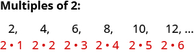  Similarly, a multiple of 3 would be the product of a counting number and 3.

  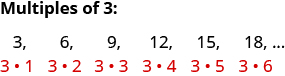  We could find the multiples of any number by continuing this process.

| Counting Number | 1 | 2 | 3 | 4 | 5 | 6 | 7 | 8 | 9 | 10 | 11 | 12 |
{: valign="top"}|----------
| **Multiples of 2** | 2 | 4 | 6 | 8 | 10 | 12 | 14 | 16 | 18 | 20 | 22 | 24 |
{: valign="top"}| **Multiples of 3** | 3 | 6 | 9 | 12 | 15 | 18 | 21 | 24 | 27 | 30 | 33 | 36 |
{: valign="top"}| **Multiples of 4** | 4 | 8 | 12 | 16 | 20 | 24 | 28 | 32 | 36 | 40 | 44 | 48 |
{: valign="top"}| **Multiples of 5** | 5 | 10 | 15 | 20 | 25 | 30 | 35 | 40 | 45 | 50 | 55 | 60 |
{: valign="top"}| **Multiples of 6** | 6 | 12 | 18 | 24 | 30 | 36 | 42 | 48 | 54 | 60 | 66 | 72 |
{: valign="top"}| **Multiples of 7** | 7 | 14 | 21 | 28 | 35 | 42 | 49 | 56 | 63 | 70 | 77 | 84 |
{: valign="top"}| **Multiples of 8** | 8 | 16 | 24 | 32 | 40 | 48 | 56 | 64 | 72 | 80 | 88 | 96 |
{: valign="top"}| **Multiples of 9** | 9 | 18 | 27 | 36 | 45 | 54 | 63 | 72 | 81 | 90 | 99 | 108 |
{: valign="top"}{: .unnumbered summary="This table has 13 columns, 8 rows and a header row. The header row labels each column: counting number, 1, 2, 3, 4, 5, 6, 7, 8, 9. The first column labels each row: multiples of 2, multiples of 3, multiples of 4, multiples of 5, multiples of 6, multiples of 7, multiples of 8, multiples of 9. The column labeled 1 has the following values: 2, 3, 4, 5, 6, 7, 8, 9. The column labeled 2 has the following values: 4, 6, 8, 10, 12, 14, 16, 18. The column labeled 3 has the following values: 6, 9, 12, 15, 18, 21, 24, 27. The column labeled 4 has the following values: 8, 12, 16, 20, 24, 28, 32, 36. The column labeled 5 has the following values: 10, 15, 20, 25, 30, 35, 40, 45. The column labeled 6 has the following values: 12, 18, 24, 30, 36, 42, 48, 54. The column labeled 7 has the following values: 14, 21, 28, 35, 42, 49, 56, 63. The column labeled 8 has the following values: 16, 24, 32, 40, 48, 56, 64, 72. The column labeled 9 has the following values: 18, 27, 36, 45, 54, 63, 72, 81. The column labeled 10 has the following values: 20, 30, 40, 50, 60, 70, 80, 90. The column labeled 11 has the following values: 22, 33, 44, 55, 66, 77, 88, 99. The column labeled 12 has the following values: 24, 36, 48, 60, 72, 84, 96, 108."}

Multiple of a Number

A number is a **multiple** of <math xmlns="http://www.w3.org/1998/Math/MathML"><mi>n</mi></math>

 if it is the product of a counting number and <math xmlns="http://www.w3.org/1998/Math/MathML"><mrow><mi>n</mi><mo>.</mo></mrow></math>

Another way to say that 15 is a multiple of 3 is to say that 15 is **divisible**{: data-type="term"} by 3. That means that when we divide 3 into 15, we get a counting number. In fact, <math xmlns="http://www.w3.org/1998/Math/MathML"><mrow><mn>15</mn><mo>÷</mo><mn>3</mn></mrow></math>

 is 5, so 15 is <math xmlns="http://www.w3.org/1998/Math/MathML"><mrow><mn>5</mn><mo>·</mo><mn>3</mn><mo>.</mo></mrow></math>

Divisible by a Number

If a number <math xmlns="http://www.w3.org/1998/Math/MathML"><mi>m</mi></math>

 is a multiple of *n*, then *m* is **divisible** by *n*.

If we were to look for patterns in the multiples of the numbers 2 through 9, we would discover the following divisibility tests:

Divisibility Tests

A number is divisible by:

   2 if the last digit is 0, 2, 4, 6, or 8.

   3 if the sum of the digits is divisible by <math xmlns="http://www.w3.org/1998/Math/MathML"><mrow><mn>3</mn><mo>.</mo></mrow></math>

   5 if the last digit is 5 or <math xmlns="http://www.w3.org/1998/Math/MathML"><mrow><mn>0</mn><mo>.</mo></mrow></math>

   6 if it is divisible by both 2 and <math xmlns="http://www.w3.org/1998/Math/MathML"><mrow><mn>3</mn><mo>.</mo></mrow></math>

   10 if it ends with <math xmlns="http://www.w3.org/1998/Math/MathML"><mrow><mn>0</mn><mo>.</mo></mrow></math>

Is 5,625 divisible by ⓐ 2? ⓑ 3? ⓒ 5 or 10? ⓓ 6?

1.  ⓐ
    * * *
    {: data-type="newline"}
    
    <math xmlns="http://www.w3.org/1998/Math/MathML"><mtable><mtr><mtd columnalign="left"><mtext>Is 5,625 divisible by 2?</mtext></mtd><mtd /><mtd /><mtd /></mtr><mtr /><mtr /><mtr><mtd columnalign="left"><mtext>Does it end in 0, 2, 4, 6 or 8?</mtext></mtd><mtd /><mtd /><mtd columnalign="left"><mspace width="4em" /><mtext>No.</mtext></mtd></mtr><mtr><mtd /><mtd /><mtd /><mtd columnalign="left"><mspace width="4em" /><mtext>5,625 is not divisible by 2.</mtext></mtd></mtr></mtable></math>
    
    * * *
    {: data-type="newline"}
    
    * * *
    {: data-type="newline"}

2.  ⓑ
    * * *
    {: data-type="newline"}
    
    <math xmlns="http://www.w3.org/1998/Math/MathML"><mtable><mtr><mtd columnalign="left"><mtext>Is 5,625 divisible by 3?</mtext></mtd><mtd /><mtd /><mtd /></mtr><mtr /><mtr /><mtr><mtd columnalign="left"><mtext>What is the sum of the digits?</mtext></mtd><mtd /><mtd /><mtd columnalign="left"><mspace width="4em" /><mn>5</mn><mo>+</mo><mn>6</mn><mo>+</mo><mn>2</mn><mo>+</mo><mn>5</mn><mo>=</mo><mn>18</mn></mtd></mtr><mtr><mtd columnalign="left"><mtext>Is the sum divisible by 3?</mtext></mtd><mtd /><mtd /><mtd columnalign="left"><mspace width="4em" /><mtext>Yes.</mtext></mtd></mtr><mtr><mtd /><mtd /><mtd /><mtd columnalign="left"><mspace width="4em" /><mtext>5,625 is divisible by 3.</mtext></mtd></mtr></mtable></math>
    
    * * *
    {: data-type="newline"}
    
    * * *
    {: data-type="newline"}

3.  ⓒ
    * * *
    {: data-type="newline"}
    
    <math xmlns="http://www.w3.org/1998/Math/MathML"><mtable><mtr><mtd columnalign="left"><mtext>Is 5,625 divisible by 5 or 10?</mtext></mtd><mtd /><mtd /><mtd /></mtr><mtr /><mtr /><mtr><mtd columnalign="left"><mtext>What is the last digit? It is 5.</mtext></mtd><mtd /><mtd /><mtd columnalign="left"><mspace width="4em" /><mtext>5,625 is divisible by 5 but not by 10.</mtext></mtd></mtr></mtable></math>
    
    * * *
    {: data-type="newline"}
    
    * * *
    {: data-type="newline"}

4.  ⓓ
    * * *
    {: data-type="newline"}
    
    <math xmlns="http://www.w3.org/1998/Math/MathML"><mtable><mtr><mtd columnalign="left"><mtext>Is 5,625 divisible by 6?</mtext></mtd><mtd /><mtd /><mtd /></mtr><mtr /><mtr /><mtr><mtd columnalign="left"><mtext>Is it divisible by both 2 and 3?</mtext></mtd><mtd /><mtd /><mtd columnalign="left"><mspace width="4em" /><mtext>No, 5,625 is not divisible by 2, so 5,625 is</mtext></mtd></mtr><mtr><mtd /><mtd /><mtd /><mtd columnalign="left"><mspace width="4em" /><mtext>not divisible by 6.</mtext></mtd></mtr></mtable></math>
{: data-number-style="arabic" .circled}

Is 4,962 divisible by ⓐ 2? ⓑ 3? ⓒ 5? ⓓ 6? ⓔ 10?

ⓐ yes ⓑ yes ⓒ no ⓓ yes* * *
{: data-type="newline"}

ⓔ no

Is 3,765 divisible by ⓐ 2? ⓑ 3? ⓒ 5? ⓓ 6? ⓔ 10?

ⓐ no ⓑ yes ⓒ yes ⓓ no* * *
{: data-type="newline"}

ⓔ no

In mathematics, there are often several ways to talk about the same ideas. So far, we’ve seen that if *m* is a multiple of *n*, we can say that *m* is divisible by *n*. For example, since 72 is a multiple of 8, we say 72 is divisible by 8. Since 72 is a multiple of 9, we say 72 is divisible by 9. We can express this still another way.

Since <math xmlns="http://www.w3.org/1998/Math/MathML"><mrow><mn>8</mn><mo>·</mo><mn>9</mn><mo>=</mo><mn>72</mn><mo>,</mo></mrow></math>

 we say that 8 and 9 are **factors**{: data-type="term"} of 72. When we write <math xmlns="http://www.w3.org/1998/Math/MathML"><mrow><mn>72</mn><mo>=</mo><mn>8</mn><mo>·</mo><mn>9</mn><mo>,</mo></mrow></math>

 we say we have factored 72.

  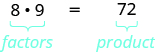  Other ways to factor 72 are <math xmlns="http://www.w3.org/1998/Math/MathML"><mrow><mn>1</mn><mo>·</mo><mn>72</mn><mo>,</mo><mspace width="0.8em" /><mn>2</mn><mo>·</mo><mn>36</mn><mo>,</mo><mspace width="0.8em" /><mn>3</mn><mo>·</mo><mn>24</mn><mo>,</mo><mspace width="0.8em" /><mn>4</mn><mo>·</mo><mn>18</mn><mo>,</mo></mrow></math>

 and <math xmlns="http://www.w3.org/1998/Math/MathML"><mrow><mn>6</mn><mo>·</mo><mn>12</mn><mo>.</mo></mrow></math>

 The number 72 has many factors: <math xmlns="http://www.w3.org/1998/Math/MathML"><mrow><mn>1</mn><mo>,</mo><mn>2</mn><mo>,</mo><mn>3</mn><mo>,</mo><mn>4</mn><mo>,</mo><mn>6</mn><mo>,</mo><mn>8</mn><mo>,</mo><mn>9</mn><mo>,</mo><mn>12</mn><mo>,</mo><mn>18</mn><mo>,</mo><mn>24</mn><mo>,</mo><mn>36</mn><mo>,</mo></mrow></math>

 and <math xmlns="http://www.w3.org/1998/Math/MathML"><mrow><mn>72</mn><mo>.</mo></mrow></math>

Factors

If <math xmlns="http://www.w3.org/1998/Math/MathML"><mrow><mi>a</mi><mo>·</mo><mi>b</mi><mo>=</mo><mi>m</mi><mo>,</mo></mrow></math>

 then *a* and *b* are **factors** of *m*.

Some numbers, such as 72, have many factors. Other numbers have only two factors. A **prime number**{: data-type="term"} is a counting number greater than 1 whose only factors are 1 and itself.

Prime number and Composite number

A **prime number** is a counting number greater than 1 whose only factors are 1 and the number itself.

A **composite number** is a counting number that is not prime. A composite number has factors other than 1 and the number itself.

The counting numbers from 2 to 20 are listed in the table with their factors. Make sure to agree with the “prime” or “composite” label for each!

  ![This table has three columns, 19 rows and a header row. The header row labels each column: number, factors and prime or composite. The values in each row are as follows: number 2, factors 1, 2, prime; number 3, factors 1, 3, prime; number 4, factors 1, 2, 4, composite; number 5, factors, 1, 5, prime; number 6, factors 1, 2, 3, 6, composite; number 7, factors 1, 7, prime; number 8, factors 1, 2, 4, 8, composite; number 9, factors 1, 3, 9, composite; number 10, factors 1, 2, 5, 10, composite; number 11, factors 1, 11, prime; number 12, factors 1, 2, 3, 4, 6, 12, composite; number 13, factors 1, 13, prime; number 14, factors 1, 2, 7, 14, composite; number 15, factors 1, 3, 5, 15, composite; number 16, factors 1, 2, 4, 8, 16, composite; number 17, factors 1, 17, prime; number 18, factors 1, 2, 3, 6, 9, 18, composite; number 19, factors 1, 19, prime; number 20, factors 1, 2, 4, 5, 10, 20, composite.](../resources/CNX_IntAlg_Figure_01_01_004_img.jpg)  The prime numbers less than 20 are 2, 3, 5, 7, 11, 13, 17, and 19. Notice that the only even prime number is 2.

A composite number can be written as a unique product of primes. This is called the **prime factorization**{: data-type="term"} of the number. Finding the prime factorization of a composite number will be useful in many topics in this course.

Prime Factorization

The **prime factorization** of a number is the product of prime numbers that equals the number.

To find the prime factorization of a composite number, find any two factors of the number and use them to create two branches. If a factor is prime, that branch is complete. Circle that prime. Otherwise it is easy to lose track of the prime numbers.

If the factor is not prime, find two factors of the number and continue the process. Once all the branches have circled primes at the end, the factorization is complete. The composite number can now be written as a product of prime numbers.

How to Find the Prime Factorization of a Composite Number

Factor 48.

 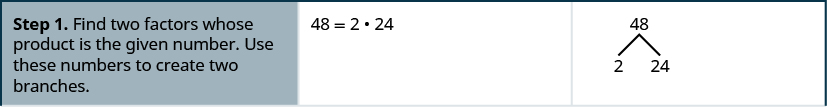         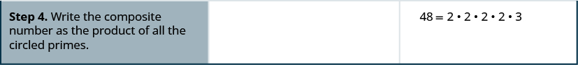 
* * *
{: data-type="newline"}

We say <math xmlns="http://www.w3.org/1998/Math/MathML"><mrow><mn>2</mn><mo>·</mo><mn>2</mn><mo>·</mo><mn>2</mn><mo>·</mo><mn>2</mn><mo>·</mo><mn>3</mn></mrow></math>

 is the prime factorization of 48. We generally write the primes in ascending order. Be sure to multiply the factors to verify your answer.

If we first factored 48 in a different way, for example as <math xmlns="http://www.w3.org/1998/Math/MathML"><mrow><mn>6</mn><mo>·</mo><mn>8</mn><mo>,</mo></mrow></math>

 the result would still be the same. Finish the prime factorization and verify this for yourself.

Find the prime factorization of <math xmlns="http://www.w3.org/1998/Math/MathML"><mrow><mn>80</mn><mo>.</mo></mrow></math>

<math xmlns="http://www.w3.org/1998/Math/MathML"><mrow><mn>2</mn><mo>·</mo><mn>2</mn><mo>·</mo><mn>2</mn><mo>·</mo><mn>2</mn><mo>·</mo><mn>5</mn></mrow></math>

Find the prime factorization of <math xmlns="http://www.w3.org/1998/Math/MathML"><mrow><mn>60</mn><mo>.</mo></mrow></math>

<math xmlns="http://www.w3.org/1998/Math/MathML"><mrow><mn>2</mn><mo>·</mo><mn>2</mn><mo>·</mo><mn>3</mn><mo>·</mo><mn>5</mn></mrow></math>

Find the prime factorization of a composite number.

1.  Find two factors whose product is the given number, and use these numbers to create two branches.
2.  If a factor is prime, that branch is complete. Circle the prime, like a leaf on the tree.
3.  If a factor is not prime, write it as the product of two factors and continue the process.
4.  Write the composite number as the product of all the circled primes.
{: data-number-style="arabic" .stepwise}

One of the reasons we look at primes is to use these techniques to find the **least common multiple**{: data-type="term"} of two numbers. This will be useful when we add and subtract fractions with different denominators.

Least Common Multiple

The **least common multiple (LCM)** of two numbers is the smallest number that is a multiple of both numbers.

To find the least common multiple of two numbers we will use the Prime Factors Method. Let’s find the LCM of 12 and 18 using their prime factors.

How to Find the Least Common Multiple Using the Prime Factors Method

Find the least common multiple (LCM) of 12 and 18 using the prime factors method.

 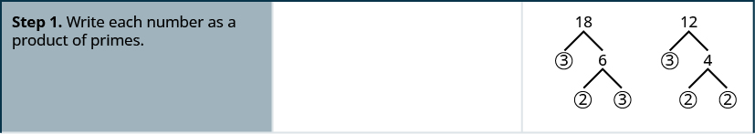      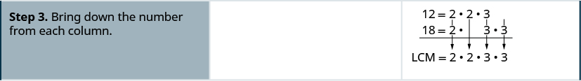    

Notice that the prime factors of 12 <math xmlns="http://www.w3.org/1998/Math/MathML"><mrow><mo>(</mo><mn>2</mn><mo>·</mo><mn>2</mn><mo>·</mo><mn>3</mn><mo>)</mo></mrow></math>

 and the prime factors of 18 <math xmlns="http://www.w3.org/1998/Math/MathML"><mrow><mo>(</mo><mn>2</mn><mo>·</mo><mn>3</mn><mo>·</mo><mn>3</mn><mo>)</mo></mrow></math>

 are included in the LCM <math xmlns="http://www.w3.org/1998/Math/MathML"><mrow><mo stretchy="false">(</mo><mn>2</mn><mo>·</mo><mn>2</mn><mo>·</mo><mn>3</mn><mo>·</mo><mn>3</mn><mo stretchy="false">)</mo><mo>.</mo></mrow></math>

 So 36 is the least common multiple of 12 and 18.

By matching up the common primes, each common prime factor is used only once. This way you are sure that 36 is the *least* common multiple.

Find the LCM of 9 and 12 using the Prime Factors Method.

<math xmlns="http://www.w3.org/1998/Math/MathML"><mrow><mn>36</mn></mrow></math>

Find the LCM of 18 and 24 using the Prime Factors Method.

<math xmlns="http://www.w3.org/1998/Math/MathML"><mrow><mn>72</mn></mrow></math>

Find the least common multiple using the Prime Factors Method.

1.  Write each number as a product of primes.
2.  List the primes of each number. Match primes vertically when possible.
3.  Bring down the columns.
4.  Multiply the factors.
{: data-number-style="arabic" .stepwise}

# Use Variables and Algebraic Symbols

In algebra, we use a letter of the alphabet to represent a number whose value may change. We call this a **variable**{: data-type="term"} and letters commonly used for variables are <math xmlns="http://www.w3.org/1998/Math/MathML"><mrow><mi>x</mi><mo>,</mo><mi>y</mi><mo>,</mo><mi>a</mi><mo>,</mo><mi>b</mi><mo>,</mo><mi>c</mi><mo>.</mo></mrow></math>

Variable

A **variable** is a letter that represents a number whose value may change.

A number whose value always remains the same is called a **constant**{: data-type="term"}.

Constant

A **constant** is a number whose value always stays the same.

To write algebraically, we need some operation symbols as well as numbers and variables. There are several types of symbols we will be using. There are four basic arithmetic operations: addition, subtraction, multiplication, and division. We’ll list the symbols used to indicate these operations below.

Operation Symbols

<table class="unnumbered" summary="This table has 4 columns, 4 rows and a header row. The header row labels each column: operation, notation, say and the result is. Row 1 has the following entries: addition, a plus b, a plus b and the sum of a and b. Row 2 has the following entries: subtraction, a minus b, a minus b and the difference of a and b. Row 3 has the following entries: multiplication, notations a dot b, ab, open parentheses a close parentheses open parentheses b close parentheses, open parentheses a close parentheses b, a open parentheses b close parentheses. say a times b, the product of a and b. Row 4 has the following entries: division, a divided by b, a slash b, a upon b and b right parentheses a overbar, say a divided by b, the quotient of a and b; a is called the dividend, and b is called the divisor."><thead>
<tr valign="top">
<th data-valign="top" data-align="left">Operation</th>
<th data-valign="top" data-align="left">Notation</th>
<th data-valign="top" data-align="left">Say:</th>
<th data-valign="top" data-align="left">The result is…</th>
</tr>
</thead><tbody>
<tr valign="top">
<td data-valign="top" data-align="left">Addition</td>
<td data-valign="top" data-align="left"><math xmlns="http://www.w3.org/1998/Math/MathML"><mrow><mi>a</mi><mo>+</mo><mi>b</mi></mrow></math></td>
<td data-valign="top" data-align="left"><math xmlns="http://www.w3.org/1998/Math/MathML"><mi>a</mi></math> plus <math xmlns="http://www.w3.org/1998/Math/MathML"><mi>b</mi></math></td>
<td data-valign="top" data-align="left">the sum of <math xmlns="http://www.w3.org/1998/Math/MathML"><mi>a</mi></math> and <math xmlns="http://www.w3.org/1998/Math/MathML"><mi>b</mi></math></td>
</tr>
<tr valign="top">
<td data-valign="top" data-align="left">Subtraction</td>
<td data-valign="top" data-align="left"><math xmlns="http://www.w3.org/1998/Math/MathML"><mrow><mi>a</mi><mo>−</mo><mi>b</mi></mrow></math></td>
<td data-valign="top" data-align="left"><math xmlns="http://www.w3.org/1998/Math/MathML"><mi>a</mi></math> minus <math xmlns="http://www.w3.org/1998/Math/MathML"><mi>b</mi></math></td>
<td data-valign="top" data-align="left">the difference of <math xmlns="http://www.w3.org/1998/Math/MathML"><mi>a</mi></math> and <math xmlns="http://www.w3.org/1998/Math/MathML"><mi>b</mi></math></td>
</tr>
<tr valign="top">
<td data-valign="top" data-align="left">Multiplication</td>
<td data-valign="top" data-align="left"><math xmlns="http://www.w3.org/1998/Math/MathML"><mrow><mi>a</mi><mo>·</mo><mi>b</mi><mo>,</mo><mi>a</mi><mi>b</mi><mo>,</mo><mrow><mo>(</mo><mi>a</mi><mo>)</mo></mrow><mrow><mo>(</mo><mi>b</mi><mo>)</mo></mrow><mo>,</mo></mrow></math> <math xmlns="http://www.w3.org/1998/Math/MathML"><mrow><mrow><mo>(</mo><mi>a</mi><mo>)</mo></mrow><mi>b</mi><mo>,</mo><mi>a</mi><mrow><mo>(</mo><mi>b</mi><mo>)</mo></mrow></mrow></math></td>
<td data-valign="top" data-align="left"><math xmlns="http://www.w3.org/1998/Math/MathML"><mi>a</mi></math> times <math xmlns="http://www.w3.org/1998/Math/MathML"><mi>b</mi></math></td>
<td data-valign="top" data-align="left">the product of <math xmlns="http://www.w3.org/1998/Math/MathML"><mi>a</mi></math> and <math xmlns="http://www.w3.org/1998/Math/MathML"><mi>b</mi></math></td>
</tr>
<tr valign="top">
<td data-valign="top" data-align="left">Division</td>
<td data-valign="top" data-align="left"><math xmlns="http://www.w3.org/1998/Math/MathML"><mrow><mi>a</mi><mo>÷</mo><mi>b</mi><mo>,</mo><mi>a</mi><mtext>/</mtext><mi>b</mi><mo>,</mo><mfrac><mi>a</mi><mi>b</mi></mfrac><mo>,</mo><mspace width="0.2em" /><mi>b</mi><menclose notation="longdiv"><mi>a</mi></menclose></mrow></math></td>
<td data-valign="top" data-align="left"><math xmlns="http://www.w3.org/1998/Math/MathML"><mi>a</mi></math> divided by <math xmlns="http://www.w3.org/1998/Math/MathML"><mi>b</mi></math></td>
<td data-valign="top" data-align="left">the quotient of <math xmlns="http://www.w3.org/1998/Math/MathML"><mi>a</mi></math> and <math xmlns="http://www.w3.org/1998/Math/MathML"><mrow><mi>b</mi><mo>;</mo></mrow></math>
<math xmlns="http://www.w3.org/1998/Math/MathML"><mi>a</mi></math> is called the dividend, and <math xmlns="http://www.w3.org/1998/Math/MathML"><mi>b</mi></math> is called the divisor</td>
</tr>
</tbody></table>

When two quantities have the same value, we say they are equal and connect them with an **equal**{: data-type="term" .no-emphasis} sign.

Equality Symbol

<math xmlns="http://www.w3.org/1998/Math/MathML"><mrow><mi>a</mi><mo>=</mo><mi>b</mi></mrow></math>

 is read “*a* is equal to *b*.”

The symbol “=” is called the equal sign.

On the **number line**{: data-type="term" .no-emphasis}, the numbers get larger as they go from left to right. The number line can be used to explain the symbols “&lt;” and “&gt;”.

Inequality

 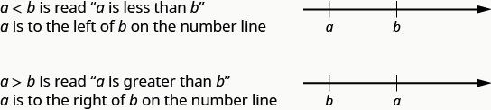 

The expressions <math xmlns="http://www.w3.org/1998/Math/MathML"><mrow><mi>a</mi><mo>&lt;</mo><mi>b</mi></mrow></math>

 or <math xmlns="http://www.w3.org/1998/Math/MathML"><mrow><mi>a</mi><mo>&gt;</mo><mi>b</mi></mrow></math>

 can be read from left to right or right to left, though in English we usually read from left to right. In general,

<math xmlns="http://www.w3.org/1998/Math/MathML"><mrow><mtable><mtr><mtd columnalign="left"><mi>a</mi><mo>&lt;</mo><mi>b</mi><mspace width="1em" /><mtext>is equivalent to</mtext><mspace width="0.2em" /><mi>b</mi><mo>&gt;</mo><mi>a</mi><mo>.</mo><mspace width="0.2em" /><mtext>For example,</mtext><mspace width="0.2em" /><mn>7</mn><mo>&lt;</mo><mn>11</mn><mspace width="0.2em" /><mtext>is equivalent to</mtext><mspace width="0.2em" /><mn>11</mn><mo>&gt;</mo><mn>7</mn><mo>.</mo></mtd></mtr><mtr><mtd columnalign="left"><mi>a</mi><mo>&gt;</mo><mi>b</mi><mspace width="1em" /><mtext>is equivalent to</mtext><mspace width="0.2em" /><mi>b</mi><mo>&lt;</mo><mi>a</mi><mo>.</mo><mspace width="0.2em" /><mtext>For example,</mtext><mspace width="0.2em" /><mn>17</mn><mo>&gt;</mo><mn>4</mn><mspace width="0.2em" /><mtext>is equivalent to</mtext><mspace width="0.2em" /><mn>4</mn><mo>&lt;</mo><mn>17</mn><mo>.</mo></mtd></mtr></mtable></mrow></math>

Inequality Symbols

| Inequality Symbols | Words |
{: valign="top"}|----------
| <math xmlns="http://www.w3.org/1998/Math/MathML"><mrow><mi>a</mi><mo>≠</mo><mi>b</mi></mrow></math>

 | *a* is *not equal to b.* |
{: valign="top"}| <math xmlns="http://www.w3.org/1998/Math/MathML"><mrow><mi>a</mi><mo>&lt;</mo><mi>b</mi></mrow></math>

 | *a* is *less than b.* |
{: valign="top"}| <math xmlns="http://www.w3.org/1998/Math/MathML"><mrow><mi>a</mi><mo>≤</mo><mi>b</mi></mrow></math>

 | *a* is *less than or equal to b.* |
{: valign="top"}| <math xmlns="http://www.w3.org/1998/Math/MathML"><mrow><mi>a</mi><mo>&gt;</mo><mi>b</mi></mrow></math>

 | *a* is *greater than b.* |
{: valign="top"}| <math xmlns="http://www.w3.org/1998/Math/MathML"><mrow><mi>a</mi><mo>≥</mo><mi>b</mi></mrow></math>

 | *a* is *greater than or equal to b.* |
{: valign="top"}{: .unnumbered summary="The table describes inequality symbols in words. The symbols described are a is not equal to b, a is less than b, a is less than or equal to b, a is greater then b, a is greater than or equal to b."}

Grouping symbols in algebra are much like the commas, colons, and other punctuation marks in English. They help identify an **expression**{: data-type="term"}, which can be made up of number, a variable, or a combination of numbers and variables using operation symbols. We will introduce three types of grouping symbols now.

Grouping Symbols

<math xmlns="http://www.w3.org/1998/Math/MathML"><mrow><mtable><mtr><mtd columnalign="left"><mtext>Parentheses</mtext></mtd><mtd /><mtd /><mtd /><mtd /><mtd columnalign="left"><mrow><mo>(</mo><mspace width="0.2em" /><mo>)</mo></mrow></mtd></mtr><mtr><mtd columnalign="left"><mtext>Brackets</mtext></mtd><mtd /><mtd /><mtd /><mtd /><mtd columnalign="left"><mrow><mo>[</mo><mspace width="0.2em" /><mo>]</mo></mrow></mtd></mtr><mtr><mtd columnalign="left"><mtext>Braces</mtext></mtd><mtd /><mtd /><mtd /><mtd /><mtd columnalign="left"><mrow><mo>{</mo><mspace width="0.2em" /><mo>}</mo></mrow></mtd></mtr></mtable></mrow></math>

Here are some examples of expressions that include grouping symbols. We will simplify expressions like these later in this section.

<math xmlns="http://www.w3.org/1998/Math/MathML"><mrow><mn>8</mn><mo stretchy="false">(</mo><mn>14</mn><mo>−</mo><mn>8</mn><mo stretchy="false">)</mo><mspace width="5em" /><mn>21</mn><mo>−</mo><mn>3</mn><mo stretchy="false">[</mo><mn>2</mn><mo>+</mo><mn>4</mn><mo stretchy="false">(</mo><mn>9</mn><mo>−</mo><mn>8</mn><mo stretchy="false">)</mo><mo stretchy="false">]</mo><mspace width="5em" /><mn>24</mn><mo>÷</mo><mo>{</mo><mn>13</mn><mo>−</mo><mn>2</mn><mo stretchy="false">[</mo><mn>1</mn><mo stretchy="false">(</mo><mn>6</mn><mo>−</mo><mn>5</mn><mo stretchy="false">)</mo><mo>+</mo><mn>4</mn><mo stretchy="false">]</mo><mo>}</mo></mrow></math>

What is the difference in English between a phrase and a sentence? A phrase expresses a single thought that is incomplete by itself, but a sentence makes a complete statement. A sentence has a subject and a verb. In algebra, we have *expressions* and *equations*.

Expression

An **expression** is a number, a variable, or a combination of numbers and variables using operation symbols.

<math xmlns="http://www.w3.org/1998/Math/MathML"><mrow><mtable><mtr><mtd columnalign="left"><mtext mathvariant="bold">Expression</mtext></mtd><mtd /><mtd /><mtd /><mtd /><mtd columnalign="left"><mtext mathvariant="bold">Words</mtext></mtd><mtd /><mtd /><mtd /><mtd /><mtd columnalign="left"><mtext mathvariant="bold">English Phrase</mtext></mtd></mtr><mtr><mtd columnalign="left"><mn>3</mn><mo>+</mo><mn>5</mn></mtd><mtd /><mtd /><mtd /><mtd /><mtd columnalign="left"><mtext>3 plus 5</mtext></mtd><mtd /><mtd /><mtd /><mtd /><mtd columnalign="left"><mtext>the sum of three and five</mtext></mtd></mtr><mtr><mtd columnalign="left"><mi>n</mi><mo>−</mo><mn>1</mn></mtd><mtd /><mtd /><mtd /><mtd /><mtd columnalign="left"><mi>n</mi><mspace width="0.2em" /><mtext>minus one</mtext></mtd><mtd /><mtd /><mtd /><mtd /><mtd columnalign="left"><mtext>the difference of</mtext><mspace width="0.2em" /><mi>n</mi><mspace width="0.2em" /><mtext>and one</mtext></mtd></mtr><mtr><mtd columnalign="left"><mn>6</mn><mo>·</mo><mn>7</mn></mtd><mtd /><mtd /><mtd /><mtd /><mtd columnalign="left"><mtext>6 times 7</mtext></mtd><mtd /><mtd /><mtd /><mtd /><mtd columnalign="left"><mtext>the product of six and seven</mtext></mtd></mtr><mtr><mtd columnalign="left"><mfrac><mi>x</mi><mi>y</mi></mfrac></mtd><mtd /><mtd /><mtd /><mtd /><mtd columnalign="left"><mi>x</mi><mspace width="0.2em" /><mtext>divided by</mtext><mspace width="0.2em" /><mi>y</mi></mtd><mtd /><mtd /><mtd /><mtd /><mtd columnalign="left"><mtext>the quotient of</mtext><mspace width="0.2em" /><mi>x</mi><mspace width="0.2em" /><mtext>and</mtext><mspace width="0.2em" /><mi>y</mi></mtd></mtr></mtable></mrow></math>

Notice that the English phrases do not form a complete sentence because the phrase does not have a verb.

An **equation**{: data-type="term"} is two expressions linked by an equal sign. When you read the words the symbols represent in an equation, you have a complete sentence in English. The equal sign gives the verb.

Equation

An **equation** is two expressions connected by an equal sign.

<math xmlns="http://www.w3.org/1998/Math/MathML"><mrow><mtable><mtr><mtd columnalign="left"><mtext mathvariant="bold">Equation</mtext></mtd><mtd /><mtd /><mtd /><mtd /><mtd columnalign="left"><mtext mathvariant="bold">English Sentence</mtext></mtd></mtr><mtr><mtd columnalign="left"><mn>3</mn><mo>+</mo><mn>5</mn><mo>=</mo><mn>8</mn></mtd><mtd /><mtd /><mtd /><mtd /><mtd columnalign="left"><mtext>The sum of three and five is equal to eight.</mtext></mtd></mtr><mtr><mtd columnalign="left"><mi>n</mi><mo>−</mo><mn>1</mn><mo>=</mo><mn>14</mn></mtd><mtd /><mtd /><mtd /><mtd /><mtd columnalign="left"><mi>n</mi><mspace width="0.2em" /><mtext>minus one equals fourteen.</mtext></mtd></mtr><mtr><mtd columnalign="left"><mn>6</mn><mo>·</mo><mn>7</mn><mo>=</mo><mn>42</mn></mtd><mtd /><mtd /><mtd /><mtd /><mtd columnalign="left"><mtext>The product of six and seven is equal to forty-two.</mtext></mtd></mtr><mtr><mtd columnalign="left"><mi>x</mi><mo>=</mo><mn>53</mn></mtd><mtd /><mtd /><mtd /><mtd /><mtd columnalign="left"><mi>x</mi><mspace width="0.2em" /><mtext>is equal to fifty-three.</mtext></mtd></mtr><mtr><mtd columnalign="left"><mi>y</mi><mo>+</mo><mn>9</mn><mo>=</mo><mn>2</mn><mi>y</mi><mo>−</mo><mn>3</mn></mtd><mtd /><mtd /><mtd /><mtd /><mtd columnalign="left"><mi>y</mi><mspace width="0.2em" /><mtext>plus nine is equal to two</mtext><mspace width="0.2em" /><mi>y</mi><mspace width="0.2em" /><mtext>minus three.</mtext></mtd></mtr></mtable></mrow></math>

Suppose we need to multiply 2 nine times. We could write this as <math xmlns="http://www.w3.org/1998/Math/MathML"><mrow><mn>2</mn><mo>·</mo><mn>2</mn><mo>·</mo><mn>2</mn><mo>·</mo><mn>2</mn><mo>·</mo><mn>2</mn><mo>·</mo><mn>2</mn><mo>·</mo><mn>2</mn><mo>·</mo><mn>2</mn><mo>·</mo><mn>2</mn><mo>.</mo></mrow></math>

 This is tedious and it can be hard to keep track of all those 2s, so we use exponents. We write <math xmlns="http://www.w3.org/1998/Math/MathML"><mrow><mn>2</mn><mo>·</mo><mn>2</mn><mo>·</mo><mn>2</mn></mrow></math>

 as <math xmlns="http://www.w3.org/1998/Math/MathML"><mrow><msup><mn>2</mn><mn>3</mn></msup></mrow></math>

 and <math xmlns="http://www.w3.org/1998/Math/MathML"><mrow><mn>2</mn><mo>·</mo><mn>2</mn><mo>·</mo><mn>2</mn><mo>·</mo><mn>2</mn><mo>·</mo><mn>2</mn><mo>·</mo><mn>2</mn><mo>·</mo><mn>2</mn><mo>·</mo><mn>2</mn><mo>·</mo><mn>2</mn></mrow></math>

 as <math xmlns="http://www.w3.org/1998/Math/MathML"><mrow><msup><mn>2</mn><mn>9</mn></msup><mo>.</mo></mrow></math>

 In expressions such as <math xmlns="http://www.w3.org/1998/Math/MathML"><mrow><msup><mn>2</mn><mn>3</mn></msup><mo>,</mo></mrow></math>

 the 2 is called the *base* and the 3 is called the *exponent*. The **exponent**{: data-type="term" .no-emphasis} tells us how many times we need to multiply the **base**{: data-type="term" .no-emphasis}.

  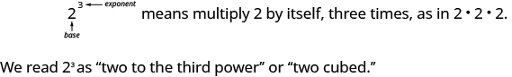  

Exponential Notation

We say <math xmlns="http://www.w3.org/1998/Math/MathML"><mrow><msup><mn>2</mn><mn>3</mn></msup></mrow></math>

 is in *exponential notation* and <math xmlns="http://www.w3.org/1998/Math/MathML"><mrow><mn>2</mn><mo>·</mo><mn>2</mn><mo>·</mo><mn>2</mn></mrow></math>

 is in *expanded notation*.

<math xmlns="http://www.w3.org/1998/Math/MathML"><mrow><msup><mi>a</mi><mi>n</mi></msup></mrow></math>

 means multiply *a* by itself, *n* times.

 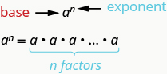 
The expression <math xmlns="http://www.w3.org/1998/Math/MathML"><mrow><msup><mi>a</mi><mi>n</mi></msup></mrow></math>

 is read *a* to the <math xmlns="http://www.w3.org/1998/Math/MathML"><mrow><msup><mi>n</mi><mrow><mi>t</mi><mi>h</mi></mrow></msup></mrow></math>

 power.

While we read <math xmlns="http://www.w3.org/1998/Math/MathML"><mrow><msup><mi>a</mi><mi>n</mi></msup></mrow></math>

 as <math xmlns="http://www.w3.org/1998/Math/MathML"><mrow><mo>“</mo><mi>a</mi></mrow></math>

 to the <math xmlns="http://www.w3.org/1998/Math/MathML"><mrow><msup><mi>n</mi><mrow><mi>t</mi><mi>h</mi></mrow></msup></mrow></math>

 power”, we usually read:

<math xmlns="http://www.w3.org/1998/Math/MathML"><mrow><mtable><mtr><mtd columnalign="left"><msup><mi>a</mi><mn>2</mn></msup></mtd><mtd /><mtd /><mtd /><mtd /><mtd columnalign="left"><mtext>“</mtext><mi>a</mi><mspace width="0.2em" /><mtext>squared”</mtext></mtd></mtr><mtr><mtd columnalign="left"><msup><mi>a</mi><mn>3</mn></msup></mtd><mtd /><mtd /><mtd /><mtd /><mtd columnalign="left"><mtext>“</mtext><mi>a</mi><mspace width="0.2em" /><mtext>cubed”</mtext></mtd></mtr></mtable></mrow></math>

We’ll see later why <math xmlns="http://www.w3.org/1998/Math/MathML"><mrow><msup><mi>a</mi><mn>2</mn></msup></mrow></math>

 and <math xmlns="http://www.w3.org/1998/Math/MathML"><mrow><msup><mi>a</mi><mn>3</mn></msup></mrow></math>

 have special names.

[\[link\]](#fs-id1167833021966) shows how we read some expressions with exponents.

| Expression | In Words |  |
{: valign="top"}|----------
| 72 | 7 to the second power or | 7 squared |
{: valign="top"}| 53 | 5 to the third power or | 5 cubed |
{: valign="top"}| 94 | 9 to the fourth power |  |
{: valign="top"}| 125 | 12 to the fifth power |  |
{: valign="top"}{: summary="This table shows four expressions and words to describe these. The expressions described are 7 to the second power or 7 squared, 5 to the third power or 5 cubed, 9 to the fourth power and 12 to the fifth."}

# Simplify Expressions Using the Order of Operations

To **simplify an expression**{: data-type="term"} means to do all the math possible. For example, to simplify <math xmlns="http://www.w3.org/1998/Math/MathML"><mrow><mn>4</mn><mo>·</mo><mn>2</mn><mo>+</mo><mn>1</mn></mrow></math>

 we would first multiply <math xmlns="http://www.w3.org/1998/Math/MathML"><mrow><mn>4</mn><mo>·</mo><mn>2</mn></mrow></math>

 to get 8 and then add the 1 to get 9. A good habit to develop is to work down the page, writing each step of the process below the previous step. The example just described would look like this:

<math xmlns="http://www.w3.org/1998/Math/MathML"><mtable><mtr><mtd columnalign="center"><mn>4</mn><mo>·</mo><mn>2</mn><mo>+</mo><mn>1</mn></mtd></mtr><mtr><mtd columnalign="center"><mn>8</mn><mo>+</mo><mn>1</mn></mtd></mtr><mtr><mtd columnalign="center"><mn>9</mn></mtd></mtr></mtable></math>

By not using an equal sign when you simplify an expression, you may avoid confusing expressions with equations.

Simplify an Expression

To **simplify an expression**, do all operations in the expression.

We’ve introduced most of the symbols and notation used in algebra, but now we need to clarify the **order of operations**{: data-type="term"}. Otherwise, expressions may have different meanings, and they may result in different values.

For example, consider the expression <math xmlns="http://www.w3.org/1998/Math/MathML"><mrow><mn>4</mn><mo>+</mo><mn>3</mn><mo>·</mo><mn>7</mn><mo>.</mo></mrow></math>

 Some students simplify this getting 49, by adding <math xmlns="http://www.w3.org/1998/Math/MathML"><mrow><mn>4</mn><mo>+</mo><mn>3</mn></mrow></math>

 and then multiplying that result by 7. Others get 25, by multiplying <math xmlns="http://www.w3.org/1998/Math/MathML"><mrow><mn>3</mn><mo>·</mo><mn>7</mn></mrow></math>

 first and then adding 4.

The same expression should give the same result. So mathematicians established some guidelines that are called the order of operations.

Use the order of operations.

1.  Parentheses and Other Grouping Symbols
    * Simplify all expressions inside the parentheses or other grouping symbols, working on the innermost parentheses first.
    {: data-bullet-style="bullet"}

2.  Exponents
    * Simplify all expressions with exponents.
    {: data-bullet-style="bullet"}

3.  Multiplication and Division
    * Perform all multiplication and division in order from left to right. These operations have equal priority.
    {: data-bullet-style="bullet"}

4.  Addition and Subtraction
    * Perform all addition and subtraction in order from left to right. These operations have equal priority.
    {: data-bullet-style="bullet"}
{: data-number-style="arabic" .stepwise}

Students often ask, “How will I remember the order?” Here is a way to help you remember: Take the first letter of each key word and substitute the silly phrase “Please Excuse My Dear Aunt Sally”.

<math xmlns="http://www.w3.org/1998/Math/MathML"><mrow><mtable><mtr><mtd columnalign="left"><mtext mathvariant="bold">P</mtext><mtext>arentheses</mtext></mtd><mtd /><mtd /><mtd columnalign="left"><mspace width="5em" /><mtext mathvariant="bold">P</mtext><mtext>lease</mtext></mtd></mtr><mtr><mtd columnalign="left"><mtext mathvariant="bold">E</mtext><mtext>xponents</mtext></mtd><mtd /><mtd /><mtd columnalign="left"><mspace width="5em" /><mtext mathvariant="bold">E</mtext><mtext>xcuse</mtext></mtd></mtr><mtr><mtd columnalign="left"><mtext mathvariant="bold">M</mtext><mtext>ultiplication</mtext><mspace width="0.2em" /><mtext mathvariant="bold">D</mtext><mtext>ivision</mtext></mtd><mtd /><mtd /><mtd columnalign="left"><mspace width="5em" /><mtext mathvariant="bold">M</mtext><mtext>y</mtext><mspace width="0.2em" /><mtext mathvariant="bold">D</mtext><mtext>ear</mtext></mtd></mtr><mtr><mtd columnalign="left"><mtext mathvariant="bold">A</mtext><mtext>ddition</mtext><mspace width="0.2em" /><mtext mathvariant="bold">S</mtext><mtext>ubtraction</mtext></mtd><mtd /><mtd /><mtd columnalign="left"><mspace width="5em" /><mtext mathvariant="bold">A</mtext><mtext>unt</mtext><mspace width="0.2em" /><mtext mathvariant="bold">S</mtext><mtext>ally</mtext></mtd></mtr></mtable></mrow></math>

It’s good that “**M**y **D**ear” goes together, as this reminds us that **m**ultiplication and **d**ivision have equal priority. We do not always do multiplication before division or always do division before multiplication. We do them in order from left to right.

Similarly, “**A**unt **S**ally” goes together and so reminds us that **a**ddition and **s**ubtraction also have equal priority and we do them in order from left to right.

Simplify: <math xmlns="http://www.w3.org/1998/Math/MathML"><mrow><mn>18</mn><mo>÷</mo><mn>6</mn><mo>+</mo><mn>4</mn><mrow><mo>(</mo><mrow><mn>5</mn><mo>−</mo><mn>2</mn></mrow><mo>)</mo></mrow><mo>.</mo></mrow></math>

|  | 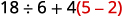 |
{: valign="top"}| Parentheses? Yes, subtract first. |  |
{: valign="top"}| Exponents? No. |  |
{: valign="top"}| Multiplication or division? Yes. |  |
{: valign="top"}| Divide first because we multiply and divide left to right. |  |
{: valign="top"}| Any other multiplication or division? Yes. |  |
{: valign="top"}| Multiply. |  |
{: valign="top"}| Any other multiplication of division? No. |  |
{: valign="top"}| Any addition or subtraction? Yes. |  |
{: valign="top"}| Add. |  |
{: valign="top"}{: .unnumbered .unstyled .can-break summary="The expression is 18 divided by 6 plus 4 open parentheses 5 minus 2 close parentheses. Since there are parentheses, we first open them by performing the subtraction 5 minus 2. The expression now is 18 divided by 6 plus 4 times 3. There are no exponents. Next we check for multiplication and division. Divide first because we multiply and divide left to right. We now have 3 plus 4 times 3. Next we multiply. We now have 3 plus 12. There is no other multiplication or division. Finally, we check for addition or subtraction. We add to get the number 15." data-label=""}

Simplify: <math xmlns="http://www.w3.org/1998/Math/MathML"><mrow><mn>30</mn><mo>÷</mo><mn>5</mn><mo>+</mo><mn>10</mn><mrow><mo>(</mo><mrow><mn>3</mn><mo>−</mo><mn>2</mn></mrow><mo>)</mo></mrow><mo>.</mo></mrow></math>

16

Simplify: <math xmlns="http://www.w3.org/1998/Math/MathML"><mrow><mn>70</mn><mo>÷</mo><mn>10</mn><mo>+</mo><mn>4</mn><mrow><mo>(</mo><mrow><mn>6</mn><mo>−</mo><mn>2</mn></mrow><mo>)</mo></mrow><mo>.</mo></mrow></math>

23

When there are multiple grouping symbols, we simplify the innermost parentheses first and work outward.

Simplify: <math xmlns="http://www.w3.org/1998/Math/MathML"><mrow><mn>5</mn><mo>+</mo><msup><mn>2</mn><mn>3</mn></msup><mo>+</mo><mn>3</mn><mrow><mo>[</mo><mrow><mn>6</mn><mo>−</mo><mn>3</mn><mrow><mo>(</mo><mrow><mn>4</mn><mo>−</mo><mn>2</mn></mrow><mo>)</mo></mrow></mrow><mo>]</mo></mrow><mo>.</mo></mrow></math>

<table class="unnumbered unstyled can-break" summary="The expression is 5 plus 2 to the power 3 plus 3 open bracket 6 minus 3 open parentheses 4 minus 2 close parentheses close bracket. Focus on the parentheses that are inside the brackets. Subtract to get 5 plus 2 to the power 3 plus 3 open bracket 6 minus 3 open parentheses 2 close parentheses close bracket. Continue inside the brackets and multiply to get 5 plus 2 to the power 3 plus 3 open bracket 6 minus 6 close bracket. Continue inside the brackets and subtract to get 5 plus 2 to the power 3 plus 3 open bracket 0 close bracket. The expression inside the brackets requires no further simplification. Now simplify exponents to get 5 plus 8 plus 3 open bracket 0 close bracket. Check for multiplication or division. Multiply to get 5 plus 8 plus 0. Check for addition or subtraction. Finally add to get 13." data-label=""><tbody>
<tr valign="top">
<td data-valign="top" data-align="left" />
<td data-valign="top" data-align="center">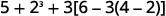</td>
</tr>
<tr valign="top">
<td data-valign="top" data-align="left">Are there any parentheses (or other
grouping symbols)? Yes.</td>
<td data-valign="top" data-align="center">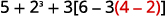</td>
</tr>
<tr valign="top">
<td data-valign="top" data-align="left">Focus on the parentheses that are inside the
brackets. Subtract.</td>
<td data-valign="top" data-align="center">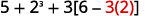</td>
</tr>
<tr valign="top">
<td data-valign="top" data-align="left">Continue inside the brackets and multiply.</td>
<td data-valign="top" data-align="center">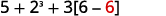</td>
</tr>
<tr valign="top">
<td data-valign="top" data-align="left">Continue inside the brackets and subtract.</td>
<td data-valign="top" data-align="center">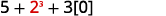</td>
</tr>
<tr valign="top">
<td data-valign="top" data-align="left">The expression inside the brackets requires
no further simplification.</td>
<td />
</tr>
<tr valign="top">
<td data-valign="top" data-align="left">Are there any exponents? Yes. Simplify exponents.</td>
<td data-valign="top" data-align="center"></td>
</tr>
<tr valign="top">
<td data-valign="top" data-align="left">Is there any multiplication or division? Yes.</td>
<td />
</tr>
<tr valign="top">
<td data-valign="top" data-align="left">Multiply.</td>
<td data-valign="top" data-align="center"></td>
</tr>
<tr valign="top">
<td data-valign="top" data-align="left">Is there any addition of subtraction? Yes.</td>
<td />
</tr>
<tr valign="top">
<td data-valign="top" data-align="left">Add.</td>
<td data-valign="top" data-align="center"></td>
</tr>
<tr valign="top">
<td data-valign="top" data-align="left">Add.</td>
<td data-valign="top" data-align="center"></td>
</tr>
</tbody></table>

Simplify: <math xmlns="http://www.w3.org/1998/Math/MathML"><mrow><mn>9</mn><mo>+</mo><msup><mn>5</mn><mn>3</mn></msup><mo>−</mo><mrow><mo>[</mo><mrow><mn>4</mn><mrow><mo>(</mo><mrow><mn>9</mn><mo>+</mo><mn>3</mn></mrow><mo>)</mo></mrow></mrow><mo>]</mo></mrow><mo>.</mo></mrow></math>

86

Simplify: <math xmlns="http://www.w3.org/1998/Math/MathML"><mrow><msup><mn>7</mn><mn>2</mn></msup><mo>−</mo><mn>2</mn><mrow><mo>[</mo><mrow><mn>4</mn><mrow><mo>(</mo><mrow><mn>5</mn><mo>+</mo><mn>1</mn></mrow><mo>)</mo></mrow></mrow><mo>]</mo></mrow><mo>.</mo></mrow></math>

1

# Evaluate an Expression

In the last few examples, we simplified expressions using the order of operations. Now we’ll evaluate some expressions—again following the order of operations. To **evaluate an expression**{: data-type="term"} means to find the value of the expression when the variable is replaced by a given number.

Evaluate an Expression

To **evaluate an expression** means to find the value of the expression when the variable is replaced by a given number.

To evaluate an expression, substitute that number for the variable in the expression and then simplify the expression.

Evaluate when <math xmlns="http://www.w3.org/1998/Math/MathML"><mrow><mi>x</mi><mo>=</mo><mn>4</mn><mo>:</mo></mrow></math>

 ⓐ <math xmlns="http://www.w3.org/1998/Math/MathML"><mrow><msup><mi>x</mi><mn>2</mn></msup></mrow></math>

 ⓑ <math xmlns="http://www.w3.org/1998/Math/MathML"><mrow><msup><mn>3</mn><mi>x</mi></msup></mrow></math>

 ⓒ <math xmlns="http://www.w3.org/1998/Math/MathML"><mrow><mn>2</mn><msup><mi>x</mi><mn>2</mn></msup><mo>+</mo><mn>3</mn><mi>x</mi><mo>+</mo><mn>8</mn><mo>.</mo></mrow></math>

ⓐ* * *
{: data-type="newline"}

 |  |  |  |  |
{: valign="top"}| 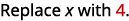 |  |  | 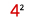 |
{: valign="top"}| Use definition of exponent. |  |  | 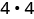 |
{: valign="top"}| Simplify. |  |  | 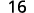 |
{: valign="top"}{: .unnumbered .unstyled summary="The expression is x squared. Replace x with 4 to get 4 squared. Use definition of exponent to get 4 times 4. Simplify to get 16." data-label=""}

* * *
{: data-type="newline"}

 ⓑ* * *
{: data-type="newline"}

 |  |  |  |
{: valign="top"}|  |  |  |
{: valign="top"}| Use definition of exponent. |  | 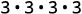 |
{: valign="top"}| Simplify. |  |  |
{: valign="top"}{: .unnumbered .unstyled summary="The expression is 3 raised to the power x. Replace x with 4 to get 3 to the power 4. Use definition of exponent to get 3 times 3 times 3 times 3. Simplify to get 81." data-label=""}

* * *
{: data-type="newline"}

 ⓒ* * *
{: data-type="newline"}

 |  |  |
{: valign="top"}|  | 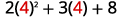 |
{: valign="top"}| Follow the order of operations. | 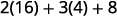 |
{: valign="top"}|  |  |
{: valign="top"}|  |  |
{: valign="top"}{: .unnumbered .unstyled summary="The expression is 2 x squared plus 3 x plus 8. Substitute x with 4 to get 2 open parentheses 4 close parentheses squared plus 3 open parentheses 4 close parentheses plus 8. Follow order of operations to first get 2 open parentheses 16 close parentheses plus 3 open parentheses 4 close parentheses plus 8. Then, 32 plus 12 plus 8. Then, 52." data-label=""}

Evaluate when <math xmlns="http://www.w3.org/1998/Math/MathML"><mrow><mi>x</mi><mo>=</mo><mn>3</mn><mo>,</mo></mrow></math>

 ⓐ <math xmlns="http://www.w3.org/1998/Math/MathML"><mrow><msup><mi>x</mi><mn>2</mn></msup></mrow></math>

 ⓑ <math xmlns="http://www.w3.org/1998/Math/MathML"><mrow><msup><mn>4</mn><mi>x</mi></msup></mrow></math>

 ⓒ <math xmlns="http://www.w3.org/1998/Math/MathML"><mrow><mn>3</mn><msup><mi>x</mi><mn>2</mn></msup><mo>+</mo><mn>4</mn><mi>x</mi><mo>+</mo><mn>1</mn><mo>.</mo></mrow></math>

ⓐ 9 ⓑ 64 ⓒ40

Evaluate when <math xmlns="http://www.w3.org/1998/Math/MathML"><mrow><mi>x</mi><mo>=</mo><mn>6</mn><mo>,</mo></mrow></math>

 ⓐ <math xmlns="http://www.w3.org/1998/Math/MathML"><mrow><msup><mi>x</mi><mn>3</mn></msup></mrow></math>

 ⓑ <math xmlns="http://www.w3.org/1998/Math/MathML"><mrow><msup><mn>2</mn><mi>x</mi></msup></mrow></math>

 ⓒ <math xmlns="http://www.w3.org/1998/Math/MathML"><mrow><mn>6</mn><msup><mi>x</mi><mn>2</mn></msup><mo>−</mo><mn>4</mn><mi>x</mi><mo>−</mo><mn>7</mn><mo>.</mo></mrow></math>

ⓐ 216 ⓑ 64 ⓒ 185

# Identify and Combine Like Terms

Algebraic expressions are made up of terms. A **term**{: data-type="term"} is a constant, or the product of a constant and one or more variables.

Term

A **term** is a constant or the product of a constant and one or more variables.

Examples of terms are <math xmlns="http://www.w3.org/1998/Math/MathML"><mrow><mn>7</mn><mo>,</mo><mi>y</mi><mo>,</mo><mn>5</mn><msup><mi>x</mi><mn>2</mn></msup><mo>,</mo><mn>9</mn><mi>a</mi><mo>,</mo></mrow></math>

 and <math xmlns="http://www.w3.org/1998/Math/MathML"><mrow><msup><mi>b</mi><mn>5</mn></msup><mo>.</mo></mrow></math>

The constant that multiplies the variable is called the **coefficient**{: data-type="term"}.

Coefficient

The **coefficient** of a term is the constant that multiplies the variable in a term.

Think of the coefficient as the number in front of the variable. The coefficient of the term <math xmlns="http://www.w3.org/1998/Math/MathML"><mrow><mn>3</mn><mi>x</mi></mrow></math>

 is 3. When we write <math xmlns="http://www.w3.org/1998/Math/MathML"><mrow><mi>x</mi><mo>,</mo></mrow></math>

 the coefficient is 1, since <math xmlns="http://www.w3.org/1998/Math/MathML"><mrow><mi>x</mi><mo>=</mo><mn>1</mn><mo>·</mo><mi>x</mi><mo>.</mo></mrow></math>

Some terms share common traits. When two terms are constants or have the same variable and exponent, we say they are **like terms**{: data-type="term"}.

Look at the following 6 terms. Which ones seem to have traits in common?

<math xmlns="http://www.w3.org/1998/Math/MathML"><mrow><mn>5</mn><mi>x</mi><mspace width="1em" /><mn>7</mn><mspace width="1em" /><msup><mi>n</mi><mn>2</mn></msup><mspace width="1em" /><mn>4</mn><mspace width="1em" /><mn>3</mn><mi>x</mi><mspace width="1em" /><mn>9</mn><msup><mi>n</mi><mn>2</mn></msup></mrow></math>

We say,

<math xmlns="http://www.w3.org/1998/Math/MathML"><mspace width="1em" /><mn>7</mn></math>

 and <math xmlns="http://www.w3.org/1998/Math/MathML"><mn>4</mn></math>

 are like terms.

<math xmlns="http://www.w3.org/1998/Math/MathML"><mrow><mspace width="1em" /><mn>5</mn><mi>x</mi></mrow></math>

 and <math xmlns="http://www.w3.org/1998/Math/MathML"><mrow><mn>3</mn><mi>x</mi></mrow></math>

 are like terms.

<math xmlns="http://www.w3.org/1998/Math/MathML"><mrow><mspace width="1em" /><msup><mi>n</mi><mn>2</mn></msup></mrow></math>

 and <math xmlns="http://www.w3.org/1998/Math/MathML"><mrow><mn>9</mn><msup><mi>n</mi><mn>2</mn></msup></mrow></math>

 are like terms.

Like Terms

Terms that are either constants or have the same variables raised to the same powers are called **like terms.**

If there are like terms in an expression, you can simplify the expression by combining the like terms. We add the coefficients and keep the same variable.

<math xmlns="http://www.w3.org/1998/Math/MathML"><mrow><mtable><mtr><mtd columnalign="left"><mtext>Simplify.</mtext></mtd><mtd /><mtd /><mtd columnalign="center"><mspace width="4em" /><mn>4</mn><mi>x</mi><mo>+</mo><mn>7</mn><mi>x</mi><mo>+</mo><mi>x</mi></mtd></mtr><mtr><mtd columnalign="left"><mtext>Add the coefficients.</mtext></mtd><mtd /><mtd /><mtd columnalign="center"><mspace width="4em" /><mn>12</mn><mi>x</mi></mtd></mtr></mtable></mrow></math>

How To Combine Like Terms

Simplify: <math xmlns="http://www.w3.org/1998/Math/MathML"><mrow><mn>2</mn><msup><mi>x</mi><mn>2</mn></msup><mo>+</mo><mn>3</mn><mi>x</mi><mo>+</mo><mn>7</mn><mo>+</mo><msup><mi>x</mi><mn>2</mn></msup><mo>+</mo><mn>4</mn><mi>x</mi><mo>+</mo><mn>5</mn><mo>.</mo></mrow></math>

 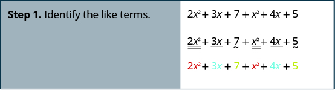   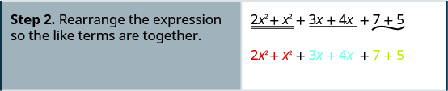    

Simplify: <math xmlns="http://www.w3.org/1998/Math/MathML"><mrow><mn>3</mn><msup><mi>x</mi><mn>2</mn></msup><mo>+</mo><mn>7</mn><mi>x</mi><mo>+</mo><mn>9</mn><mo>+</mo><mn>7</mn><msup><mi>x</mi><mn>2</mn></msup><mo>+</mo><mn>9</mn><mi>x</mi><mo>+</mo><mn>8</mn><mo>.</mo></mrow></math>

<math xmlns="http://www.w3.org/1998/Math/MathML"><mrow><mn>10</mn><msup><mi>x</mi><mn>2</mn></msup><mo>+</mo><mn>16</mn><mi>x</mi><mo>+</mo><mn>17</mn></mrow></math>

Simplify: <math xmlns="http://www.w3.org/1998/Math/MathML"><mrow><mn>4</mn><msup><mi>y</mi><mn>2</mn></msup><mo>+</mo><mn>5</mn><mi>y</mi><mo>+</mo><mn>2</mn><mo>+</mo><mn>8</mn><msup><mi>y</mi><mn>2</mn></msup><mo>+</mo><mn>4</mn><mi>y</mi><mo>+</mo><mn>5</mn><mo>.</mo></mrow></math>

<math xmlns="http://www.w3.org/1998/Math/MathML"><mrow><mn>12</mn><msup><mi>y</mi><mn>2</mn></msup><mo>+</mo><mn>9</mn><mi>y</mi><mo>+</mo><mn>7</mn></mrow></math>

Combine like terms.

1.  Identify like terms.
2.  Rearrange the expression so like terms are together.
3.  Add or subtract the coefficients and keep the same variable for each group of like terms.
{: data-number-style="arabic" .stepwise}

# Translate an English Phrase to an Algebraic Expression

We listed many operation symbols that are used in algebra. Now, we will use them to translate English phrases into algebraic expressions. The symbols and variables we’ve talked about will help us do that. [\[link\]](#fs-id1167836792941) summarizes them.

<table summary="This table has three columns labeled operation, phrase and expression. There are four rows. The phrases for addition are a plus b, the sum of a and b, a increased by b, the total of a and b, b added to a. The expression is a plus b. The phrases for subtraction are a minus b, the difference of a and b, a decreased by b, b less than a, b subtracted from a. The expression is a minus b. The phrases for multiplication are a times b, the product of a and b, 2a. The expressions are a dot b, ab, a open parentheses b close parentheses, open parentheses a parentheses open parentheses b close parentheses and 2a. The phrases for division are a divided by b, the quotient of a and b, the ratio of a and b, b divided into a. The expressions are a divided by b, a slash b, a upon b, b parentheses a overbar."><thead>
<tr valign="top">
<th data-valign="middle" data-align="left">Operation</th>
<th data-valign="middle" data-align="left">Phrase</th>
<th data-valign="middle" data-align="left">Expression</th>
</tr>
</thead><tbody>
<tr valign="top">
<td data-valign="top" data-align="left"><strong>Addition</strong></td>
<td data-valign="top" data-align="left"><em>a</em> plus <em>b</em>
the sum of <math xmlns="http://www.w3.org/1998/Math/MathML"><mrow><mi>a</mi></mrow></math> and <em>b</em>
<em>a</em> increased by <em>b</em>
<em>b</em> more than <em>a</em>
the total of <em>a</em> and <em>b</em>
<em>b</em> added to <em>a</em></td>
<td data-valign="top" data-align="left"><math xmlns="http://www.w3.org/1998/Math/MathML"><mrow><mi>a</mi><mo>+</mo><mi>b</mi></mrow></math></td>
</tr>
<tr valign="top">
<td data-valign="top" data-align="left"><strong>Subtraction</strong></td>
<td data-valign="top" data-align="left"><em>a</em> minus <math xmlns="http://www.w3.org/1998/Math/MathML"><mi>b</mi></math>
the difference of <em>a</em> and <em>b</em>
<em>a</em> decreased by <em>b</em>
<em>b</em> less than <em>a</em>
<em>b</em> subtracted from <em>a</em></td>
<td data-valign="top" data-align="left"><math xmlns="http://www.w3.org/1998/Math/MathML"><mrow><mi>a</mi><mo>−</mo><mi>b</mi></mrow></math></td>
</tr>
<tr valign="top">
<td data-valign="top" data-align="left"><strong>Multiplication</strong></td>
<td data-valign="top" data-align="left"><em>a</em> times <em>b</em>
the product of <math xmlns="http://www.w3.org/1998/Math/MathML"><mi>a</mi></math> and <math xmlns="http://www.w3.org/1998/Math/MathML"><mi>b</mi></math>
twice <em>a</em></td>
<td data-valign="top" data-align="left"><math xmlns="http://www.w3.org/1998/Math/MathML"><mrow><mi>a</mi><mo>·</mo><mi>b</mi><mo>,</mo><mi>a</mi><mi>b</mi><mo>,</mo><mi>a</mi><mo stretchy="false">(</mo><mi>b</mi><mo stretchy="false">)</mo><mo>,</mo><mo stretchy="false">(</mo><mi>a</mi><mo stretchy="false">)</mo><mo stretchy="false">(</mo><mi>b</mi><mo stretchy="false">)</mo></mrow></math>

<math xmlns="http://www.w3.org/1998/Math/MathML"><mrow><mn>2</mn><mi>a</mi></mrow></math></td>
</tr>
<tr valign="top">
<td data-valign="top" data-align="left"><strong>Division</strong></td>
<td data-valign="top" data-align="left"><em>a</em> divided by <em>b</em>
the quotient of <em>a</em> and <em>b</em>
the ratio of <em>a</em> and <em>b</em>
<em>b</em> divided into <em>a</em></td>
<td data-valign="top" data-align="left"><math xmlns="http://www.w3.org/1998/Math/MathML"><mrow><mi>a</mi><mo>÷</mo><mi>b</mi><mo>,</mo><mi>a</mi><mtext>/</mtext><mi>b</mi><mo>,</mo><mfrac><mi>a</mi><mi>b</mi></mfrac><mo>,</mo><mi>b</mi><menclose notation="longdiv"><mi>a</mi></menclose></mrow></math></td>
</tr>
</tbody></table>

Look closely at these phrases using the four operations:

  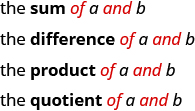  Each phrase tells us to operate on two numbers. Look for the words *of* and *and* to find the numbers.

Translate each English phrase into an algebraic expression:

ⓐ the difference of <math xmlns="http://www.w3.org/1998/Math/MathML"><mrow><mn>14</mn><mi>x</mi></mrow></math>

 and 9* * *
{: data-type="newline"}

ⓑ the quotient of <math xmlns="http://www.w3.org/1998/Math/MathML"><mrow><mn>8</mn><msup><mi>y</mi><mn>2</mn></msup></mrow></math>

 and 3* * *
{: data-type="newline"}

ⓒ twelve more than <math xmlns="http://www.w3.org/1998/Math/MathML"><mi>y</mi></math>

* * *
{: data-type="newline"}

ⓓ seven less than <math xmlns="http://www.w3.org/1998/Math/MathML"><mrow><mn>49</mn><msup><mi>x</mi><mn>2</mn></msup></mrow></math>

ⓐ The key word is *difference*, which tells us the operation is subtraction. Look for the words *of* and *and t*o find the numbers to subtract.

 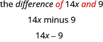 
ⓑ The key word is *quotient*, which tells us the operation is division.

 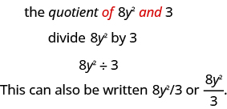 
ⓒ The key words are *more than.* They tell us the operation is addition. *More than* means “added to.”

<math xmlns="http://www.w3.org/1998/Math/MathML"><mrow><mtable><mtr><mtd columnalign="center"><mtext>twelve more than</mtext><mspace width="0.2em" /><mi>y</mi></mtd></mtr><mtr><mtd columnalign="center"><mtext>twelve added to</mtext><mspace width="0.2em" /><mi>y</mi></mtd></mtr><mtr><mtd columnalign="center"><mi>y</mi><mo>+</mo><mn>12</mn></mtd></mtr></mtable></mrow></math>

ⓓ The key words are *less than*. They tell us to subtract. *Less than* means “subtracted from.”

<math xmlns="http://www.w3.org/1998/Math/MathML"><mrow><mtable><mtr><mtd columnalign="center"><mtext>seven less than</mtext><mspace width="0.2em" /><mn>49</mn><msup><mi>x</mi><mn>2</mn></msup></mtd></mtr><mtr><mtd columnalign="center"><mtext>seven subtracted from</mtext><mspace width="0.2em" /><mn>49</mn><msup><mi>x</mi><mn>2</mn></msup></mtd></mtr><mtr><mtd columnalign="center"><mn>49</mn><msup><mi>x</mi><mn>2</mn></msup><mo>−</mo><mn>7</mn></mtd></mtr></mtable></mrow></math>

Translate the English phrase into an algebraic expression:

ⓐ the difference of <math xmlns="http://www.w3.org/1998/Math/MathML"><mrow><mn>14</mn><msup><mi>x</mi><mn>2</mn></msup></mrow></math>

 and 13* * *
{: data-type="newline"}

ⓑ the quotient of <math xmlns="http://www.w3.org/1998/Math/MathML"><mrow><mn>12</mn><mi>x</mi></mrow></math>

 and 2* * *
{: data-type="newline"}

ⓒ 13 more than <math xmlns="http://www.w3.org/1998/Math/MathML"><mi>z</mi></math>

* * *
{: data-type="newline"}

ⓓ 18 less than <math xmlns="http://www.w3.org/1998/Math/MathML"><mrow><mn>8</mn><mi>x</mi></mrow></math>

ⓐ <math xmlns="http://www.w3.org/1998/Math/MathML"><mrow><mn>14</mn><msup><mi>x</mi><mn>2</mn></msup><mo>−</mo><mn>13</mn></mrow></math>

 ⓑ <math xmlns="http://www.w3.org/1998/Math/MathML"><mrow><mn>12</mn><mi>x</mi><mo>÷</mo><mn>2</mn></mrow></math>

* * *
{: data-type="newline"}

ⓒ <math xmlns="http://www.w3.org/1998/Math/MathML"><mrow><mi>z</mi><mo>+</mo><mn>13</mn></mrow></math>

 ⓓ <math xmlns="http://www.w3.org/1998/Math/MathML"><mrow><mn>8</mn><mi>x</mi><mo>−</mo><mn>18</mn></mrow></math>

Translate the English phrase into an algebraic expression:

ⓐ the sum of <math xmlns="http://www.w3.org/1998/Math/MathML"><mrow><mn>17</mn><msup><mi>y</mi><mn>2</mn></msup></mrow></math>

 and 19* * *
{: data-type="newline"}

ⓑ the product of <math xmlns="http://www.w3.org/1998/Math/MathML"><mn>7</mn></math>

 and *y** * *
{: data-type="newline"}

ⓒ Eleven more than *x** * *
{: data-type="newline"}

ⓓ Fourteen less than 11*a*

ⓐ <math xmlns="http://www.w3.org/1998/Math/MathML"><mrow><mn>17</mn><msup><mi>y</mi><mn>2</mn></msup><mo>+</mo><mn>19</mn></mrow></math>

 ⓑ <math xmlns="http://www.w3.org/1998/Math/MathML"><mrow><mn>7</mn><mi>y</mi></mrow></math>

* * *
{: data-type="newline"}

ⓒ <math xmlns="http://www.w3.org/1998/Math/MathML"><mrow><mi>x</mi><mo>+</mo><mn>11</mn></mrow></math>

 ⓓ <math xmlns="http://www.w3.org/1998/Math/MathML"><mrow><mn>11</mn><mi>a</mi><mo>−</mo><mn>14</mn></mrow></math>

We look carefully at the words to help us distinguish between multiplying a sum and adding a product.

Translate the English phrase into an algebraic expression:

ⓐ eight times the sum of *x* and *y** * *
{: data-type="newline"}

ⓑ the sum of eight times *x* and *y*

There are two operation words—*times* tells us to multiply and *sum* tells us to add.

ⓐ Because we are multiplying 8 times the sum, we need parentheses around the sum of *x* and *y*, <math xmlns="http://www.w3.org/1998/Math/MathML"><mrow><mrow><mo>(</mo><mrow><mi>x</mi><mo>+</mo><mi>y</mi></mrow><mo>)</mo></mrow><mo>.</mo></mrow></math>

 This forces us to determine the sum first. (Remember the order of operations.)

<math xmlns="http://www.w3.org/1998/Math/MathML"><mrow><mtable><mtr><mtd columnalign="center"><mtext>eight times the sum of</mtext><mspace width="0.2em" /><mi>x</mi><mspace width="0.2em" /><mtext>and</mtext><mspace width="0.2em" /><mi>y</mi></mtd></mtr><mtr><mtd columnalign="center"><mn>8</mn><mo stretchy="false">(</mo><mi>x</mi><mo>+</mo><mi>y</mi><mo stretchy="false">)</mo></mtd></mtr></mtable></mrow></math>

ⓑ To take a sum, we look for the words *of* and *and* to see what is being added. Here we are taking the sum *of* eight times *x* and *y*.

 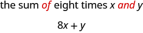 

Translate the English phrase into an algebraic expression:

ⓐ four times the sum of *p* and *q** * *
{: data-type="newline"}

ⓑ the sum of four times *p* and *q*

ⓐ <math xmlns="http://www.w3.org/1998/Math/MathML"><mrow><mn>4</mn><mrow><mo>(</mo><mrow><mi>p</mi><mo>+</mo><mi>q</mi></mrow><mo>)</mo></mrow></mrow></math>

 ⓑ <math xmlns="http://www.w3.org/1998/Math/MathML"><mrow><mn>4</mn><mi>p</mi><mo>+</mo><mi>q</mi></mrow></math>

Translate the English phrase into an algebraic expression:

ⓐ the difference of two times *x* and 8* * *
{: data-type="newline"}

ⓑ two times the difference of *x* and 8

ⓐ <math xmlns="http://www.w3.org/1998/Math/MathML"><mrow><mn>2</mn><mi>x</mi><mo>−</mo><mn>8</mn></mrow></math>

 ⓑ<math xmlns="http://www.w3.org/1998/Math/MathML"><mrow><mn>2</mn><mrow><mo>(</mo><mrow><mi>x</mi><mo>−</mo><mn>8</mn></mrow><mo>)</mo></mrow></mrow></math>

Later in this course, we’ll apply our skills in algebra to solving applications. The first step will be to translate an English phrase to an algebraic expression. We’ll see how to do this in the next two examples.

The length of a rectangle is 14 less than the width. Let *w* represent the width of the rectangle. Write an expression for the length of the rectangle.

<math xmlns="http://www.w3.org/1998/Math/MathML"><mrow><mtable><mtr><mtd columnalign="left"><mtext>Write a phrase about the length of the rectangle.</mtext><mspace width="5em" /></mtd><mtd /><mtd /><mtd columnalign="center"><mtext>14 less than the width</mtext></mtd></mtr><mtr><mtd columnalign="left"><mtext>Substitute</mtext><mspace width="0.2em" /><mi>w</mi><mspace width="0.2em" /><mtext>for “the width.”</mtext></mtd><mtd /><mtd /><mtd columnalign="center"><mi>w</mi></mtd></mtr><mtr><mtd columnalign="left"><mtext>Rewrite</mtext><mspace width="0.2em" /><mtext mathvariant="italics">less than</mtext><mspace width="0.2em" /><mtext>as</mtext><mspace width="0.2em" /><mtext mathvariant="italics">subtracted from</mtext><mo>.</mo></mtd><mtd /><mtd /><mtd columnalign="center"><mtext>14 subtracted from</mtext><mspace width="0.2em" /><mi>w</mi></mtd></mtr><mtr><mtd columnalign="left"><mtext>Translate the phrase into algebra.</mtext></mtd><mtd /><mtd /><mtd columnalign="center"><mi>w</mi><mo>−</mo><mn>14</mn></mtd></mtr></mtable></mrow></math>

The length of a rectangle is 7 less than the width. Let *w* represent the width of the rectangle. Write an expression for the length of the rectangle.

<math xmlns="http://www.w3.org/1998/Math/MathML"><mrow><mi>w</mi><mo>−</mo><mn>7</mn></mrow></math>

The width of a rectangle is 6 less than the length. Let *l* represent the length of the rectangle. Write an expression for the width of the rectangle.

<math xmlns="http://www.w3.org/1998/Math/MathML"><mrow><mi>l</mi><mo>−</mo><mn>6</mn></mrow></math>

The expressions in the next example will be used in the typical coin mixture problems we will see soon.

June has dimes and quarters in her purse. The number of dimes is seven less than four times the number of quarters. Let *q* represent the number of quarters. Write an expression for the number of dimes.

<math xmlns="http://www.w3.org/1998/Math/MathML"><mrow><mtable><mtr><mtd columnalign="left"><mtext>Write a phrase about the number of dimes.</mtext></mtd><mtd /><mtd /><mtd columnalign="center"><mtext>seven less than four times the number of quarters</mtext></mtd></mtr><mtr /><mtr /><mtr><mtd columnalign="left"><mtext>Substitute</mtext><mspace width="0.2em" /><mi>q</mi><mspace width="0.2em" /><mtext>for the number of quarters.</mtext></mtd><mtd /><mtd /><mtd columnalign="center"><mtext>7 less than 4 times</mtext><mspace width="0.2em" /><mi>q</mi></mtd></mtr><mtr><mtd columnalign="left"><mtext>Translate 4 times</mtext><mspace width="0.2em" /><mi>q</mi><mo>.</mo></mtd><mtd /><mtd /><mtd columnalign="center"><mtext>7 less than 4</mtext><mi>q</mi></mtd></mtr><mtr><mtd columnalign="left"><mtext>Translate the phrase into algebra.</mtext></mtd><mtd /><mtd /><mtd columnalign="center"><mn>4</mn><mi>q</mi><mo>−</mo><mn>7</mn></mtd></mtr></mtable></mrow></math>

Geoffrey has dimes and quarters in his pocket. The number of dimes is eight less than four times the number of quarters. Let *q* represent the number of quarters. Write an expression for the number of dimes.

<math xmlns="http://www.w3.org/1998/Math/MathML"><mrow><mn>4</mn><mi>q</mi><mo>−</mo><mn>8</mn></mrow></math>

Lauren has dimes and nickels in her purse. The number of dimes is three more than seven times the number of nickels. Let *n* represent the number of nickels. Write an expression for the number of dimes.

<math xmlns="http://www.w3.org/1998/Math/MathML"><mrow><mn>7</mn><mi>n</mi><mo>+</mo><mn>3</mn></mrow></math>

# Key Concepts

* **Divisibility Tests**
  * * *
  {: data-type="newline"}
  
  A number is divisible by:
  * * *
  {: data-type="newline"}
  
    2 if the last digit is 0, 2, 4, 6, or 8.
  * * *
  {: data-type="newline"}
  
    3 if the sum of the digits is divisible by 3.
  * * *
  {: data-type="newline"}
  
    5 if the last digit is 5 or 0.
  * * *
  {: data-type="newline"}
  
    6 if it is divisible by both 2 and 3.
  * * *
  {: data-type="newline"}
  
    10 if it ends with 0.
* **How to find the prime factorization of a composite number.**
  * * *
  {: data-type="newline"}
  
  1.  Find two factors whose product is the given number, and use these numbers to create two branches.
  2.  If a factor is prime, that branch is complete. Circle the prime, like a bud on the tree.
  3.  If a factor is not prime, write it as the product of two factors and continue the process.
  4.  Write the composite number as the product of all the circled primes.
  {: data-number-style="arabic" .stepwise}

* **How To Find the least common multiple using the prime factors method.**
  * * *
  {: data-type="newline"}
  
  1.  Write each number as a product of primes.
  2.  List the primes of each number. Match primes vertically when possible.
  3.  Bring down the columns.
  4.  Multiply the factors.
  {: data-number-style="arabic" .stepwise}

* **Equality Symbol**
  * * *
  {: data-type="newline"}
  
  <math xmlns="http://www.w3.org/1998/Math/MathML"><mrow><mi>a</mi><mo>=</mo><mi>b</mi></mrow></math>
  
  is read “*a* is equal to *b*.”
  * * *
  {: data-type="newline"}
  
  The symbol “=” is called the equal sign.
* **Inequality**
  * * *
  {: data-type="newline"}
  
   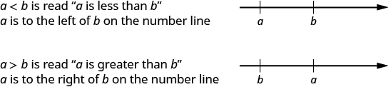 
* **Inequality Symbols**
  * * *
  {: data-type="newline"}
  
  | Inequality Symbols | Words |
  {: valign="top"}|----------
  | <math xmlns="http://www.w3.org/1998/Math/MathML"><mrow><mi>a</mi><mo>≠</mo><mi>b</mi></mrow></math>
  
   | *a* is *not equal to b.* |
  {: valign="top"}| <math xmlns="http://www.w3.org/1998/Math/MathML"><mrow><mi>a</mi><mo>&lt;</mo><mi>b</mi></mrow></math>
  
   | *a* is *less than b.* |
  {: valign="top"}| <math xmlns="http://www.w3.org/1998/Math/MathML"><mrow><mi>a</mi><mo>≤</mo><mi>b</mi></mrow></math>
  
   | *a* is *less than or equal to b.* |
  {: valign="top"}| <math xmlns="http://www.w3.org/1998/Math/MathML"><mrow><mi>a</mi><mo>&gt;</mo><mi>b</mi></mrow></math>
  
   | *a* is *greater than b.* |
  {: valign="top"}| <math xmlns="http://www.w3.org/1998/Math/MathML"><mrow><mi>a</mi><mo>≥</mo><mi>b</mi></mrow></math>
  
   | *a* is *greater than or equal to b.* |
  {: valign="top"}{: summary="The table describes inequality symbols in words. The symbols described are a is not equal to b, a is less than b, a is less than or equal to b, a is greater then b, a is greater than or equal to b."}

* **Grouping Symbols**
  * * *
  {: data-type="newline"}
  
  <math xmlns="http://www.w3.org/1998/Math/MathML"><mtable><mtr><mtd columnalign="left"><mtext>Parentheses</mtext></mtd><mtd /><mtd /><mtd /><mtd /><mtd columnalign="left"><mrow><mo>(</mo><mspace width="0.2em" /><mo>)</mo></mrow></mtd></mtr><mtr><mtd columnalign="left"><mtext>Brackets</mtext></mtd><mtd /><mtd /><mtd /><mtd /><mtd columnalign="left"><mrow><mo>[</mo><mspace width="0.2em" /><mo>]</mo></mrow></mtd></mtr><mtr><mtd columnalign="left"><mtext>Braces</mtext></mtd><mtd /><mtd /><mtd /><mtd /><mtd columnalign="left"><mrow><mo>{</mo><mspace width="0.2em" /><mo>}</mo></mrow></mtd></mtr></mtable></math>

* **Exponential Notation**
  * * *
  {: data-type="newline"}
  
  <math xmlns="http://www.w3.org/1998/Math/MathML"><mrow><msup><mi>a</mi><mi>n</mi></msup></mrow></math>
  
  means multiply *a* by itself, *n* times.
  * * *
  {: data-type="newline"}
  
  The expression
  <math xmlns="http://www.w3.org/1998/Math/MathML"><mrow><msup><mi>a</mi><mi>n</mi></msup></mrow></math>
  
  is read *a* to the
  <math xmlns="http://www.w3.org/1998/Math/MathML"><mrow><msup><mi>n</mi><mrow><mi>t</mi><mi>h</mi></mrow></msup></mrow></math>
  
  power.
* **Simplify an Expression**
  * * *
  {: data-type="newline"}
  
  To simplify an expression, do all operations in the expression.
* **How to use the order of operations.**
  * * *
  {: data-type="newline"}
  
  1.  Parentheses and Other Grouping Symbols
      * Simplify all expressions inside the parentheses or other grouping symbols, working on the innermost parentheses first.
      {: data-bullet-style="bullet"}
  
  2.  Exponents
      * Simplify all expressions with exponents.
      {: data-bullet-style="bullet"}
  
  3.  Multiplication and Division
      * Perform all multiplication and division in order from left to right. These operations have equal priority.
      {: data-bullet-style="bullet"}
  
  4.  Addition and Subtraction
      * Perform all addition and subtraction in order from left to right. These operations have equal priority.
      {: data-bullet-style="bullet"}
  {: data-number-style="arabic" .stepwise}

* **How to combine like terms.**
  * * *
  {: data-type="newline"}
  
  1.  Identify like terms.
  2.  Rearrange the expression so like terms are together.
  3.  Add or subtract the coefficients and keep the same variable for each group of like terms.
  {: data-number-style="arabic" .stepwise}
  
  <table summary="This table has three columns labeled operation, phrase and expression. There are four rows. The phrases for addition are a plus b, the sum of a and b, a increased by b, the total of a and b, b added to a. The expression is a plus b. The phrases for subtraction are a minus b, the difference of a and b, a decreased by b, b less than a, b subtracted from a. The expression is a minus b. The phrases for multiplication are a times b, the product of a and b, 2a. The expressions are a dot b, ab, a open parentheses b close parentheses, open parentheses a parentheses open parentheses b close parentheses and 2a. The phrases for division are a divided by b, the quotient of a and b, the ratio of a and b, b divided into a. The expressions are a divided by b, a slash b, a upon b, b parentheses a overbar."><thead>
  <tr valign="top">
  <th data-valign="middle" data-align="left">Operation</th>
  <th data-valign="middle" data-align="left">Phrase</th>
  <th data-valign="middle" data-align="left">Expression</th>
  </tr>
  </thead><tbody>
  <tr valign="top">
  <td data-valign="top" data-align="left"><strong>Addition</strong></td>
  <td data-valign="top" data-align="left"><em>a</em> plus <em>b</em>
the sum of <math xmlns="http://www.w3.org/1998/Math/MathML"><mrow><mi>a</mi></mrow></math> and <em>b</em>
<em>a</em> increased by <em>b</em>
<em>b</em> more than <em>a</em>
the total of <em>a</em> and <em>b</em>
<em>b</em> added to <em>a</em></td>
  <td data-valign="top" data-align="left"><math xmlns="http://www.w3.org/1998/Math/MathML"><mrow><mi>a</mi><mo>+</mo><mi>b</mi></mrow></math></td>
  </tr>
  <tr valign="top">
  <td data-valign="top" data-align="left"><strong>Subtraction</strong></td>
  <td data-valign="top" data-align="left"><em>a</em> minus <math xmlns="http://www.w3.org/1998/Math/MathML"><mi>b</mi></math>
the difference of <em>a</em> and <em>b</em>
<em>a</em> decreased by <em>b</em>
<em>b</em> less than <em>a</em>
<em>b</em> subtracted from <em>a</em></td>
  <td data-valign="top" data-align="left"><math xmlns="http://www.w3.org/1998/Math/MathML"><mrow><mi>a</mi><mo>−</mo><mi>b</mi></mrow></math></td>
  </tr>
  <tr valign="top">
  <td data-valign="top" data-align="left"><strong>Multiplication</strong></td>
  <td data-valign="top" data-align="left"><em>a</em> times <em>b</em>
the product of <math xmlns="http://www.w3.org/1998/Math/MathML"><mi>a</mi></math> and <math xmlns="http://www.w3.org/1998/Math/MathML"><mi>b</mi></math>
twice <em>a</em></td>
  <td data-valign="top" data-align="left"><math xmlns="http://www.w3.org/1998/Math/MathML"><mrow><mi>a</mi><mo>·</mo><mi>b</mi><mo>,</mo><mi>a</mi><mi>b</mi><mo>,</mo><mi>a</mi><mo stretchy="false">(</mo><mi>b</mi><mo stretchy="false">)</mo><mo>,</mo><mo stretchy="false">(</mo><mi>a</mi><mo stretchy="false">)</mo><mo stretchy="false">(</mo><mi>b</mi><mo stretchy="false">)</mo></mrow></math>

<math xmlns="http://www.w3.org/1998/Math/MathML"><mrow><mn>2</mn><mi>a</mi></mrow></math></td>
  </tr>
  <tr valign="top">
  <td data-valign="top" data-align="left"><strong>Division</strong></td>
  <td data-valign="top" data-align="left"><em>a</em> divided by <em>b</em>

the quotient of <em>a</em> and <em>b</em>
the ratio of <em>a</em> and <em>b</em>
<em>b</em> divided into <em>a</em></td>
  <td data-valign="top" data-align="left"><math xmlns="http://www.w3.org/1998/Math/MathML"><mrow><mi>a</mi><mo>÷</mo><mi>b</mi><mo>,</mo><mi>a</mi><mtext>/</mtext><mi>b</mi><mo>,</mo><mfrac><mi>a</mi><mi>b</mi></mfrac><mo>,</mo><mi>b</mi><menclose notation="longdiv"><mi>a</mi></menclose></mrow></math></td>
  </tr>
  </tbody></table>
{: data-bullet-style="bullet"}

<section data-depth="1" class="section-exercises" markdown="1">
## Practice Makes Perfect

**Identify Multiples and Factors**

In the following exercises, use the divisibility tests to determine whether each number is divisible by 2, by 3, by 5, by 6, and by 10.

84

Divisible by 2, 3, 6

96

896

Divisible by 2

942

22,335

Divisible by 3, 5

39,075

**Find Prime Factorizations and Least Common Multiples**

In the following exercises, find the prime factorization.

86

<math xmlns="http://www.w3.org/1998/Math/MathML"><mrow><mn>2</mn><mo>·</mo><mn>43</mn></mrow></math>

78

455

<math xmlns="http://www.w3.org/1998/Math/MathML"><mrow><mn>5</mn><mo>·</mo><mn>7</mn><mo>·</mo><mn>13</mn></mrow></math>

400

432

<math xmlns="http://www.w3.org/1998/Math/MathML"><mrow><mn>2</mn><mo>·</mo><mn>2</mn><mo>·</mo><mn>2</mn><mo>·</mo><mn>2</mn><mo>·</mo><mn>3</mn><mo>·</mo><mn>3</mn><mo>·</mo><mn>3</mn></mrow></math>

627

In the following exercises, find the least common multiple of each pair of numbers using the prime factors method.

8, 12

24

12, 16

28, 40

420

84, 90

55, 88

440

60, 72

**Simplify Expressions Using the Order of Operations**

In the following exercises, simplify each expression.

<math xmlns="http://www.w3.org/1998/Math/MathML"><mrow><msup><mn>2</mn><mn>3</mn></msup><mo>−</mo><mn>12</mn><mo>÷</mo><mo stretchy="false">(</mo><mn>9</mn><mo>−</mo><mn>5</mn><mo stretchy="false">)</mo></mrow></math>

5

<math xmlns="http://www.w3.org/1998/Math/MathML"><mrow><msup><mn>3</mn><mn>2</mn></msup><mo>−</mo><mn>18</mn><mo>÷</mo><mo stretchy="false">(</mo><mn>11</mn><mo>−</mo><mn>5</mn><mo stretchy="false">)</mo></mrow></math>

<math xmlns="http://www.w3.org/1998/Math/MathML"><mrow><mn>2</mn><mo>+</mo><mn>8</mn><mo stretchy="false">(</mo><mn>6</mn><mo>+</mo><mn>1</mn><mo stretchy="false">)</mo></mrow></math>

58

<math xmlns="http://www.w3.org/1998/Math/MathML"><mrow><mn>4</mn><mo>+</mo><mn>6</mn><mo stretchy="false">(</mo><mn>3</mn><mo>+</mo><mn>6</mn><mo stretchy="false">)</mo></mrow></math>

<math xmlns="http://www.w3.org/1998/Math/MathML"><mrow><mn>20</mn><mo>÷</mo><mn>4</mn><mo>+</mo><mn>6</mn><mrow><mo>(</mo><mrow><mn>5</mn><mo>−</mo><mn>1</mn></mrow><mo>)</mo></mrow></mrow></math>

29

<math xmlns="http://www.w3.org/1998/Math/MathML"><mrow><mn>33</mn><mo>÷</mo><mn>3</mn><mo>+</mo><mn>4</mn><mrow><mo>(</mo><mrow><mn>7</mn><mo>−</mo><mn>2</mn></mrow><mo>)</mo></mrow></mrow></math>

<math xmlns="http://www.w3.org/1998/Math/MathML"><mrow><mn>3</mn><mo stretchy="false">(</mo><mn>1</mn><mo>+</mo><mn>9</mn><mo>·</mo><mn>6</mn><mo stretchy="false">)</mo><mo>−</mo><msup><mn>4</mn><mn>2</mn></msup></mrow></math>

149

<math xmlns="http://www.w3.org/1998/Math/MathML"><mrow><mn>5</mn><mo stretchy="false">(</mo><mn>2</mn><mo>+</mo><mn>8</mn><mo>·</mo><mn>4</mn><mo stretchy="false">)</mo><mo>−</mo><msup><mn>7</mn><mn>2</mn></msup></mrow></math>

<math xmlns="http://www.w3.org/1998/Math/MathML"><mrow><mn>2</mn><mrow><mo>[</mo><mrow><mn>1</mn><mo>+</mo><mn>3</mn><mrow><mo>(</mo><mrow><mn>10</mn><mo>−</mo><mn>2</mn></mrow><mo>)</mo></mrow></mrow><mo>]</mo></mrow></mrow></math>

50

<math xmlns="http://www.w3.org/1998/Math/MathML"><mrow><mn>5</mn><mrow><mo>[</mo><mrow><mn>2</mn><mo>+</mo><mn>4</mn><mrow><mo>(</mo><mrow><mn>3</mn><mo>−</mo><mn>2</mn></mrow><mo>)</mo></mrow></mrow><mo>]</mo></mrow></mrow></math>

<math xmlns="http://www.w3.org/1998/Math/MathML"><mrow><mn>8</mn><mo>+</mo><mn>2</mn><mrow><mo>[</mo><mrow><mn>7</mn><mo>−</mo><mn>2</mn><mrow><mo>(</mo><mrow><mn>5</mn><mo>−</mo><mn>3</mn></mrow><mo>)</mo></mrow></mrow><mo>]</mo></mrow><mo>−</mo><msup><mn>3</mn><mn>2</mn></msup></mrow></math>

5

<math xmlns="http://www.w3.org/1998/Math/MathML"><mrow><mn>10</mn><mo>+</mo><mn>3</mn><mrow><mo>[</mo><mrow><mn>6</mn><mo>−</mo><mn>2</mn><mrow><mo>(</mo><mrow><mn>4</mn><mo>−</mo><mn>2</mn></mrow><mo>)</mo></mrow></mrow><mo>]</mo></mrow><mo>−</mo><msup><mn>2</mn><mn>4</mn></msup></mrow></math>

**Evaluate an Expression**

In the following exercises, evaluate the following expressions.

When <math xmlns="http://www.w3.org/1998/Math/MathML"><mrow><mi>x</mi><mo>=</mo><mn>2</mn><mo>,</mo></mrow></math>

* * *
{: data-type="newline"}

ⓐ <math xmlns="http://www.w3.org/1998/Math/MathML"><mrow><msup><mi>x</mi><mn>6</mn></msup></mrow></math>

* * *
{: data-type="newline"}

ⓑ <math xmlns="http://www.w3.org/1998/Math/MathML"><mrow><msup><mn>4</mn><mi>x</mi></msup></mrow></math>

* * *
{: data-type="newline"}

ⓒ <math xmlns="http://www.w3.org/1998/Math/MathML"><mrow><mn>2</mn><msup><mi>x</mi><mn>2</mn></msup><mo>+</mo><mn>3</mn><mi>x</mi><mo>−</mo><mn>7</mn></mrow></math>

ⓐ 64 ⓑ 16 ⓒ 7

When <math xmlns="http://www.w3.org/1998/Math/MathML"><mrow><mi>x</mi><mo>=</mo><mn>3</mn><mo>,</mo></mrow></math>

* * *
{: data-type="newline"}

ⓐ <math xmlns="http://www.w3.org/1998/Math/MathML"><mrow><msup><mi>x</mi><mn>5</mn></msup></mrow></math>

* * *
{: data-type="newline"}

ⓑ <math xmlns="http://www.w3.org/1998/Math/MathML"><mrow><msup><mn>5</mn><mi>x</mi></msup></mrow></math>

* * *
{: data-type="newline"}

ⓒ <math xmlns="http://www.w3.org/1998/Math/MathML"><mrow><mn>3</mn><msup><mi>x</mi><mn>2</mn></msup><mo>−</mo><mn>4</mn><mi>x</mi><mo>−</mo><mn>8</mn></mrow></math>

When <math xmlns="http://www.w3.org/1998/Math/MathML"><mrow><mi>x</mi><mo>=</mo><mn>4</mn><mo>,</mo><mi>y</mi><mo>=</mo><mn>1</mn></mrow></math>

* * *
{: data-type="newline"}

<math xmlns="http://www.w3.org/1998/Math/MathML"><mrow><msup><mi>x</mi><mn>2</mn></msup><mo>+</mo><mn>3</mn><mi>x</mi><mi>y</mi><mo>−</mo><mn>7</mn><msup><mi>y</mi><mn>2</mn></msup></mrow></math>

21

When <math xmlns="http://www.w3.org/1998/Math/MathML"><mrow><mi>x</mi><mo>=</mo><mn>3</mn><mo>,</mo><mi>y</mi><mo>=</mo><mn>2</mn></mrow></math>

* * *
{: data-type="newline"}

<math xmlns="http://www.w3.org/1998/Math/MathML"><mrow><mn>6</mn><msup><mi>x</mi><mn>2</mn></msup><mo>+</mo><mn>3</mn><mi>x</mi><mi>y</mi><mo>−</mo><mn>9</mn><msup><mi>y</mi><mn>2</mn></msup></mrow></math>

When <math xmlns="http://www.w3.org/1998/Math/MathML"><mrow><mi>x</mi><mo>=</mo><mn>10</mn><mo>,</mo><mi>y</mi><mo>=</mo><mn>7</mn></mrow></math>

* * *
{: data-type="newline"}

<math xmlns="http://www.w3.org/1998/Math/MathML"><mrow><msup><mrow><mo stretchy="false">(</mo><mi>x</mi><mo>−</mo><mi>y</mi><mo stretchy="false">)</mo></mrow><mn>2</mn></msup></mrow></math>

9

When <math xmlns="http://www.w3.org/1998/Math/MathML"><mrow><mi>a</mi><mo>=</mo><mn>3</mn><mo>,</mo><mi>b</mi><mo>=</mo><mn>8</mn></mrow></math>

* * *
{: data-type="newline"}

<math xmlns="http://www.w3.org/1998/Math/MathML"><mrow><msup><mi>a</mi><mn>2</mn></msup><mo>+</mo><msup><mi>b</mi><mn>2</mn></msup></mrow></math>

**Simplify Expressions by Combining Like Terms**

In the following exercises, simplify the following expressions by combining like terms.

<math xmlns="http://www.w3.org/1998/Math/MathML"><mrow><mn>7</mn><mi>x</mi><mo>+</mo><mn>2</mn><mo>+</mo><mn>3</mn><mi>x</mi><mo>+</mo><mn>4</mn></mrow></math>

<math xmlns="http://www.w3.org/1998/Math/MathML"><mrow><mn>10</mn><mi>x</mi><mo>+</mo><mn>6</mn></mrow></math>

<math xmlns="http://www.w3.org/1998/Math/MathML"><mrow><mn>8</mn><mi>y</mi><mo>+</mo><mn>5</mn><mo>+</mo><mn>2</mn><mi>y</mi><mo>−</mo><mn>4</mn></mrow></math>

<math xmlns="http://www.w3.org/1998/Math/MathML"><mrow><mn>10</mn><mi>a</mi><mo>+</mo><mn>7</mn><mo>+</mo><mn>5</mn><mi>a</mi><mo>−</mo><mn>2</mn><mo>+</mo><mn>7</mn><mi>a</mi><mo>−</mo><mn>4</mn></mrow></math>

<math xmlns="http://www.w3.org/1998/Math/MathML"><mrow><mn>22</mn><mi>a</mi><mo>+</mo><mn>1</mn></mrow></math>

<math xmlns="http://www.w3.org/1998/Math/MathML"><mrow><mn>7</mn><mi>c</mi><mo>+</mo><mn>4</mn><mo>+</mo><mn>6</mn><mi>c</mi><mo>−</mo><mn>3</mn><mo>+</mo><mn>9</mn><mi>c</mi><mo>−</mo><mn>1</mn></mrow></math>

<math xmlns="http://www.w3.org/1998/Math/MathML"><mrow><mn>3</mn><msup><mi>x</mi><mn>2</mn></msup><mo>+</mo><mn>12</mn><mi>x</mi><mo>+</mo><mn>11</mn><mo>+</mo><mn>14</mn><msup><mi>x</mi><mn>2</mn></msup><mo>+</mo><mn>8</mn><mi>x</mi><mo>+</mo><mn>5</mn></mrow></math>

<math xmlns="http://www.w3.org/1998/Math/MathML"><mrow><mn>17</mn><msup><mi>x</mi><mn>2</mn></msup><mo>+</mo><mn>20</mn><mi>x</mi><mo>+</mo><mn>16</mn></mrow></math>

<math xmlns="http://www.w3.org/1998/Math/MathML"><mrow><mn>5</mn><msup><mi>b</mi><mn>2</mn></msup><mo>+</mo><mn>9</mn><mi>b</mi><mo>+</mo><mn>10</mn><mo>+</mo><mn>2</mn><msup><mi>b</mi><mn>2</mn></msup><mo>+</mo><mn>3</mn><mi>b</mi><mo>−</mo><mn>4</mn></mrow></math>

**Translate an English Phrase to an Algebraic Expression**

In the following exercises, translate the phrases into algebraic expressions.

* * *
{: data-type="newline"}

ⓐ the difference of <math xmlns="http://www.w3.org/1998/Math/MathML"><mrow><mn>5</mn><msup><mi>x</mi><mn>2</mn></msup></mrow></math>

 and <math xmlns="http://www.w3.org/1998/Math/MathML"><mrow><mn>6</mn><mi>x</mi><mi>y</mi></mrow></math>

* * *
{: data-type="newline"}

ⓑ the quotient of <math xmlns="http://www.w3.org/1998/Math/MathML"><mrow><mn>6</mn><msup><mi>y</mi><mn>2</mn></msup></mrow></math>

 and <math xmlns="http://www.w3.org/1998/Math/MathML"><mrow><mn>5</mn><mi>x</mi></mrow></math>

* * *
{: data-type="newline"}

ⓒ Twenty-one more than <math xmlns="http://www.w3.org/1998/Math/MathML"><mrow><msup><mi>y</mi><mn>2</mn></msup></mrow></math>

* * *
{: data-type="newline"}

ⓓ <math xmlns="http://www.w3.org/1998/Math/MathML"><mrow><mn>6</mn><mi>x</mi></mrow></math>

 less than <math xmlns="http://www.w3.org/1998/Math/MathML"><mrow><mn>81</mn><msup><mi>x</mi><mn>2</mn></msup></mrow></math>

ⓐ <math xmlns="http://www.w3.org/1998/Math/MathML"><mrow><mn>5</mn><msup><mi>x</mi><mn>2</mn></msup><mo>−</mo><mn>6</mn><mi>x</mi><mi>y</mi></mrow></math>

 ⓑ <math xmlns="http://www.w3.org/1998/Math/MathML"><mrow><mfrac><mrow><mn>6</mn><msup><mi>y</mi><mn>2</mn></msup></mrow><mrow><mn>5</mn><mi>x</mi></mrow></mfrac></mrow></math>

* * *
{: data-type="newline"}

ⓒ <math xmlns="http://www.w3.org/1998/Math/MathML"><mrow><msup><mi>y</mi><mn>2</mn></msup><mo>+</mo><mn>21</mn></mrow></math>

 ⓓ <math xmlns="http://www.w3.org/1998/Math/MathML"><mrow><mn>81</mn><msup><mi>x</mi><mn>2</mn></msup><mo>−</mo><mn>6</mn><mi>x</mi></mrow></math>

* * *
{: data-type="newline"}

ⓐ the difference of <math xmlns="http://www.w3.org/1998/Math/MathML"><mrow><mn>17</mn><msup><mi>x</mi><mn>2</mn></msup></mrow></math>

 and <math xmlns="http://www.w3.org/1998/Math/MathML"><mrow><mn>5</mn><mi>x</mi><mi>y</mi></mrow></math>

* * *
{: data-type="newline"}

ⓑ the quotient of <math xmlns="http://www.w3.org/1998/Math/MathML"><mrow><mn>8</mn><msup><mi>y</mi><mn>3</mn></msup></mrow></math>

 and <math xmlns="http://www.w3.org/1998/Math/MathML"><mrow><mn>3</mn><mi>x</mi></mrow></math>

* * *
{: data-type="newline"}

ⓒ Eighteen more than <math xmlns="http://www.w3.org/1998/Math/MathML"><mrow><msup><mi>a</mi><mn>2</mn></msup></mrow></math>

;* * *
{: data-type="newline"}

ⓓ <math xmlns="http://www.w3.org/1998/Math/MathML"><mrow><mn>11</mn><mi>b</mi></mrow></math>

 less than <math xmlns="http://www.w3.org/1998/Math/MathML"><mrow><mn>100</mn><msup><mi>b</mi><mn>2</mn></msup></mrow></math>

* * *
{: data-type="newline"}

ⓐ the sum of <math xmlns="http://www.w3.org/1998/Math/MathML"><mrow><mn>4</mn><mi>a</mi><msup><mi>b</mi><mn>2</mn></msup></mrow></math>

 and <math xmlns="http://www.w3.org/1998/Math/MathML"><mrow><mn>3</mn><msup><mi>a</mi><mn>2</mn></msup><mi>b</mi></mrow></math>

* * *
{: data-type="newline"}

ⓑ the product of <math xmlns="http://www.w3.org/1998/Math/MathML"><mrow><mn>4</mn><msup><mi>y</mi><mn>2</mn></msup></mrow></math>

 and <math xmlns="http://www.w3.org/1998/Math/MathML"><mrow><mn>5</mn><mi>x</mi></mrow></math>

* * *
{: data-type="newline"}

ⓒ Fifteen more than <math xmlns="http://www.w3.org/1998/Math/MathML"><mi>m</mi></math>

* * *
{: data-type="newline"}

ⓓ <math xmlns="http://www.w3.org/1998/Math/MathML"><mrow><mn>9</mn><mi>x</mi></mrow></math>

 less than <math xmlns="http://www.w3.org/1998/Math/MathML"><mrow><mn>121</mn><msup><mi>x</mi><mn>2</mn></msup></mrow></math>

ⓐ <math xmlns="http://www.w3.org/1998/Math/MathML"><mrow><mn>4</mn><mi>a</mi><msup><mi>b</mi><mn>2</mn></msup><mo>+</mo><mn>3</mn><msup><mi>a</mi><mn>2</mn></msup><mi>b</mi></mrow></math>

 ⓑ <math xmlns="http://www.w3.org/1998/Math/MathML"><mrow><mn>20</mn><mi>x</mi><msup><mi>y</mi><mn>2</mn></msup></mrow></math>

* * *
{: data-type="newline"}

ⓒ <math xmlns="http://www.w3.org/1998/Math/MathML"><mrow><mi>m</mi><mo>+</mo><mn>15</mn></mrow></math>

 ⓓ <math xmlns="http://www.w3.org/1998/Math/MathML"><mrow><mn>121</mn><msup><mi>x</mi><mn>2</mn></msup><mo>−</mo><mn>9</mn><mi>x</mi></mrow></math>

 <math xmlns="http://www.w3.org/1998/Math/MathML"><mrow><mn>9</mn><mi>x</mi><mo>&lt;</mo><mn>121</mn><msup><mi>x</mi><mn>2</mn></msup></mrow></math>

* * *
{: data-type="newline"}

ⓐ the sum of <math xmlns="http://www.w3.org/1998/Math/MathML"><mrow><mn>3</mn><msup><mi>x</mi><mn>2</mn></msup><mi>y</mi></mrow></math>

 and <math xmlns="http://www.w3.org/1998/Math/MathML"><mrow><mn>7</mn><mi>x</mi><msup><mi>y</mi><mn>2</mn></msup></mrow></math>

* * *
{: data-type="newline"}

ⓑ the product of <math xmlns="http://www.w3.org/1998/Math/MathML"><mrow><mn>6</mn><mi>x</mi><msup><mi>y</mi><mn>2</mn></msup></mrow></math>

 and <math xmlns="http://www.w3.org/1998/Math/MathML"><mrow><mn>4</mn><mi>z</mi></mrow></math>

* * *
{: data-type="newline"}

ⓒ Twelve more than <math xmlns="http://www.w3.org/1998/Math/MathML"><mrow><mn>3</mn><msup><mi>x</mi><mn>2</mn></msup></mrow></math>

* * *
{: data-type="newline"}

ⓓ <math xmlns="http://www.w3.org/1998/Math/MathML"><mrow><mn>7</mn><msup><mi>x</mi><mn>2</mn></msup></mrow></math>

 less than <math xmlns="http://www.w3.org/1998/Math/MathML"><mrow><mn>63</mn><msup><mi>x</mi><mn>3</mn></msup></mrow></math>

* * *
{: data-type="newline"}

ⓐ eight times the difference of <math xmlns="http://www.w3.org/1998/Math/MathML"><mi>y</mi></math>

 and nine* * *
{: data-type="newline"}

ⓑ the difference of eight times <math xmlns="http://www.w3.org/1998/Math/MathML"><mi>y</mi></math>

 and 9

ⓐ <math xmlns="http://www.w3.org/1998/Math/MathML"><mrow><mn>8</mn><mrow><mo>(</mo><mrow><mi>y</mi><mo>−</mo><mn>9</mn></mrow><mo>)</mo></mrow></mrow></math>

 ⓑ <math xmlns="http://www.w3.org/1998/Math/MathML"><mrow><mn>8</mn><mi>y</mi><mo>−</mo><mn>9</mn></mrow></math>

* * *
{: data-type="newline"}

ⓐ seven times the difference of <math xmlns="http://www.w3.org/1998/Math/MathML"><mi>y</mi></math>

 and one* * *
{: data-type="newline"}

ⓑ the difference of seven times <math xmlns="http://www.w3.org/1998/Math/MathML"><mi>y</mi></math>

 and 1

* * *
{: data-type="newline"}

ⓐ five times the sum of <math xmlns="http://www.w3.org/1998/Math/MathML"><mrow><mn>3</mn><mi>x</mi></mrow></math>

 and <math xmlns="http://www.w3.org/1998/Math/MathML"><mi>y</mi></math>

* * *
{: data-type="newline"}

ⓑ the sum of five times <math xmlns="http://www.w3.org/1998/Math/MathML"><mrow><mn>3</mn><mi>x</mi></mrow></math>

 and <math xmlns="http://www.w3.org/1998/Math/MathML"><mi>y</mi></math>

ⓐ <math xmlns="http://www.w3.org/1998/Math/MathML"><mrow><mn>5</mn><mrow><mo>(</mo><mrow><mn>3</mn><mi>x</mi><mo>+</mo><mi>y</mi></mrow><mo>)</mo></mrow></mrow></math>

 ⓑ <math xmlns="http://www.w3.org/1998/Math/MathML"><mrow><mn>15</mn><mi>x</mi><mo>+</mo><mi>y</mi></mrow></math>

* * *
{: data-type="newline"}

ⓐ eleven times the sum of <math xmlns="http://www.w3.org/1998/Math/MathML"><mrow><mn>4</mn><msup><mi>x</mi><mn>2</mn></msup></mrow></math>

 and <math xmlns="http://www.w3.org/1998/Math/MathML"><mrow><mn>5</mn><mi>x</mi></mrow></math>

* * *
{: data-type="newline"}

ⓑ the sum of eleven times <math xmlns="http://www.w3.org/1998/Math/MathML"><mrow><mn>4</mn><msup><mi>x</mi><mn>2</mn></msup></mrow></math>

 and <math xmlns="http://www.w3.org/1998/Math/MathML"><mrow><mn>5</mn><mi>x</mi></mrow></math>

Eric has rock and country songs on his playlist. The number of rock songs is 14 more than twice the number of country songs. Let *c* represent the number of country songs. Write an expression for the number of rock songs.

<math xmlns="http://www.w3.org/1998/Math/MathML"><mrow><mn>14</mn><mo>&gt;</mo><mn>2</mn><mi>c</mi></mrow></math>

The number of women in a Statistics class is 8 more than twice the number of men. Let <math xmlns="http://www.w3.org/1998/Math/MathML"><mi>m</mi></math>

 represent the number of men. Write an expression for the number of women.

Greg has nickels and pennies in his pocket. The number of pennies is seven less than three the number of nickels. Let *n* represent the number of nickels. Write an expression for the number of pennies.

<math xmlns="http://www.w3.org/1998/Math/MathML"><mrow><mn>3</mn><mi>n</mi><mo>−</mo><mn>7</mn></mrow></math>

Jeannette has <math xmlns="http://www.w3.org/1998/Math/MathML"><mrow><mtext>$</mtext><mn>5</mn></mrow></math>

 and <math xmlns="http://www.w3.org/1998/Math/MathML"><mrow><mtext>$</mtext><mn>10</mn></mrow></math>

 bills in her wallet. The number of fives is three more than six times the number of tens. Let <math xmlns="http://www.w3.org/1998/Math/MathML"><mi>t</mi></math>

 represent the number of tens. Write an expression for the number of fives.

## Writing Exercises

Explain in your own words how to find the prime factorization of a composite number.

Answers will vary.

Why is it important to use the order of operations to simplify an expression?

Explain how you identify the like terms in the expression <math xmlns="http://www.w3.org/1998/Math/MathML"><mrow><mn>8</mn><msup><mi>a</mi><mn>2</mn></msup><mo>+</mo><mn>4</mn><mi>a</mi><mo>+</mo><mn>9</mn><mo>−</mo><msup><mi>a</mi><mn>2</mn></msup><mo>−</mo><mn>1</mn><mo>.</mo></mrow></math>

Answers will vary.

Explain the difference between the phrases “4 times the sum of *x* and *y*” and “the sum of 4 times *x* and *y*”.

## Self Check

ⓐ Use this checklist to evaluate your mastery of the objectives of this section.

 ![This table has 4 columns, 7 rows and a header row. The header row labels each column I can, confidently, with some help and no, I don&#x2019;t get it. The first column has the following statements: identify multiples and apply divisibility tests, find prime factorizations and least common multiples, use variables and algebraic symbols, simplify expressions using the order of operations, evaluate an expression, identify and combine like terms, translate English phrases to algebraic expressions. The remaining columns are blank.](../resources/CNX_IntAlg_Figure_01_01_201_img.jpg) 
ⓑ If most of your checks were:

**…confidently.** Congratulations! You have achieved the objectives in this section. Reflect on the study skills you used so that you can continue to use them. What did you do to become confident of your ability to do these things? Be specific.

**…with some help.** This must be addressed quickly because topics you do not master become potholes in your road to success. In math every topic builds upon previous work. It is important to make sure you have a strong foundation before you move on. Who can you ask for help? Your fellow classmates and instructor are good resources. Is there a place on campus where math tutors are available? Can your study skills be improved?

**…no - I don’t get it!** This is a warning sign and you must not ignore it. You should get help right away or you will quickly be overwhelmed. See your instructor as soon as you can to discuss your situation. Together you can come up with a plan to get you the help you need.

</section>

## Glossary
{: data-type="glossary-title"}

coefficient
: The coefficient of a term is the constant that multiplies the variable in a term.
{: .definition}

composite number
: A composite number is a counting number that is not prime. It has factors other than 1 and the number itself.
{: .definition}

constant
: A constant is a number whose value always stays the same.
{: .definition}

divisible by a number
: If a number *m* is a multiple of *n*, then *m* is divisible by *n*.
{: .definition}

equation
: An equation is two expressions connected by an equal sign.
{: .definition}

evaluate an expression
: To evaluate an expression means to find the value of the expression when the variables are replaced by a given number.
{: .definition}

expression
: An expression is a number, a variable, or a combination of numbers and variables using operation symbols.
{: .definition}

factors
: If
  <math xmlns="http://www.w3.org/1998/Math/MathML"><mrow><mi>a</mi><mo>·</mo><mi>b</mi><mo>=</mo><mi>m</mi><mo>,</mo></mrow></math>
  
  then *a* and *b* are factors of *m*.
{: .definition}

least common multiple
: The least common multiple (LCM) of two numbers is the smallest number that is a multiple of both numbers.
{: .definition}

like terms
: Terms that are either constants or have the same variables raised to the same powers are called like terms.
{: .definition}

multiple of a number
: A number is a multiple of *n* if it is the product of a counting number and *n.*
{: .definition}

order of operations
: The order of operations are established guidelines for simplifying an expression.
{: .definition}

prime factorization
: The prime factorization of a number is the product of prime numbers that equals the number.
{: .definition}

prime number
: A prime number is a counting number greater than 1 whose only factors are 1 and the number itself.
{: .definition}

simplify an expression
: To simplify an expression means to do all the math possible.
{: .definition}

term
: A term is a constant, or the product of a constant and one or more variables.
{: .definition}

variable
: A variable is a letter that represents a number whose value may change.
{: .definition}

