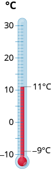

By the end of this section, you will be able to:
* Simplify expressions with absolute value
* Add and subtract integers
* Multiply and divide integers
* Simplify expressions with integers
* Evaluate variable expressions with integers
* Translate phrases to expressions with integers
* Use integers in applications

A more thorough introduction to the topics covered in this section can be found in the *Elementary Algebra* chapter, Foundations.

### Simplify Expressions with Absolute Value

A **negative numbers**{: data-type="term"} is a number less than 0. The negative numbers are to the left of zero on the number line. See [\[link\]](#CNX_IntAlg_Figure_01_02_001).

 {: #CNX_IntAlg_Figure_01_02_001}

You may have noticed that, on the number line, the negative numbers are a mirror image of the positive numbers, with zero in the middle. Because the numbers <math xmlns="http://www.w3.org/1998/Math/MathML"><mn>2</mn></math>

 and <math xmlns="http://www.w3.org/1998/Math/MathML"><mrow><mn>−2</mn></mrow></math>

 are the same distance from zero, each one is called the **opposite**{: data-type="term"} of the other. The opposite of <math xmlns="http://www.w3.org/1998/Math/MathML"><mn>2</mn></math>

 is <math xmlns="http://www.w3.org/1998/Math/MathML"><mrow><mn>−2</mn><mo>,</mo></mrow></math>

 and the opposite of <math xmlns="http://www.w3.org/1998/Math/MathML"><mrow><mn>−2</mn></mrow></math>

 is <math xmlns="http://www.w3.org/1998/Math/MathML"><mrow><mn>2</mn><mo>.</mo></mrow></math>

Opposite

The **opposite** of a number is the number that is the same distance from zero on the number line but on the opposite side of zero.

[\[link\]](#CNX_IntAlg_Figure_01_02_002) illustrates the definition.

 {: #CNX_IntAlg_Figure_01_02_002}

Opposite Notation

<math xmlns="http://www.w3.org/1998/Math/MathML"><mrow><mtable><mtr /><mtr /><mtr><mtd columnalign="left"><mtext>−</mtext><mi>a</mi><mspace width="0.2em" /><mtext>means the opposite of the number</mtext><mspace width="0.2em" /><mi>a</mi></mtd></mtr> <mtr><mtd columnalign="left"><mtext>The notation</mtext><mspace width="0.2em" /><mtext>−</mtext><mi>a</mi><mspace width="0.2em" /><mtext>is read as “the opposite of</mtext><mspace width="0.2em" /><mi>a</mi><mtext>.”</mtext></mtd></mtr></mtable></mrow></math>

We saw that numbers such as 3 and <math xmlns="http://www.w3.org/1998/Math/MathML"><mrow><mn>−3</mn></mrow></math>

 are opposites because they are the same distance from 0 on the number line. They are both three units from 0. The distance between 0 and any number on the number line is called the **absolute value**{: data-type="term"} of that number.

Absolute Value

The **absolute value** of a number is its distance from 0 on the number line.

The absolute value of a number <math xmlns="http://www.w3.org/1998/Math/MathML"><mi>n</mi></math>

 is written as <math xmlns="http://www.w3.org/1998/Math/MathML"><mrow><mrow><mo>\|</mo><mi>n</mi><mo>\|</mo></mrow></mrow></math>

 and <math xmlns="http://www.w3.org/1998/Math/MathML"><mrow><mrow><mo>\|</mo><mi>n</mi><mo>\|</mo></mrow><mo>≥</mo><mn>0</mn></mrow></math>

 for all numbers.

Absolute values are always greater than or equal to zero.

For example,

<math xmlns="http://www.w3.org/1998/Math/MathML"><mrow><mtable><mtr><mtd columnalign="left"><mn>−5</mn><mspace width="0.2em" /><mtext>is 5 units away from 0, so</mtext><mspace width="0.2em" /><mrow><mo>\|</mo><mrow><mn>−5</mn></mrow><mo>\|</mo></mrow><mo>=</mo><mn>5</mn><mo>.</mo></mtd></mtr> <mtr><mtd columnalign="left"><mtext>5 is 5 units away from 0, so</mtext><mspace width="0.2em" /><mrow><mo>\|</mo><mn>5</mn><mo>\|</mo></mrow><mo>=</mo><mn>5</mn><mo>.</mo></mtd></mtr></mtable></mrow></math>

[\[link\]](#CNX_IntAlg_Figure_01_02_003) illustrates this idea.

 {: #CNX_IntAlg_Figure_01_02_003}

The absolute value of a number is never negative because distance cannot be negative. The only number with absolute value equal to zero is the number zero itself because the distance from 0 to 0 on the number line is zero units.

In the next example, we’ll order expressions with absolute values.

Fill in <math xmlns="http://www.w3.org/1998/Math/MathML"><mrow><mo>&lt;</mo><mo>,</mo><mo>&gt;</mo><mo>,</mo></mrow></math>

 or <math xmlns="http://www.w3.org/1998/Math/MathML"><mo>=</mo></math>

 for each of the following pairs of numbers:

ⓐ <math xmlns="http://www.w3.org/1998/Math/MathML"><mrow><mrow><mo>\|</mo><mrow><mn>−5</mn></mrow><mo>\|</mo></mrow><mo>\_\_</mo><mo>−</mo><mrow><mo>\|</mo><mrow><mn>−5</mn></mrow><mo>\|</mo></mrow></mrow></math>

 ⓑ <math xmlns="http://www.w3.org/1998/Math/MathML"><mrow><mn>8</mn><mo>\_\_</mo><mo>−</mo><mrow><mo>\|</mo><mrow><mn>−8</mn></mrow><mo>\|</mo></mrow></mrow></math>

 ⓒ <math xmlns="http://www.w3.org/1998/Math/MathML"><mrow><mn>−9</mn><mo>\_\_</mo><mo>−</mo><mrow><mo>\|</mo><mrow><mn>−9</mn></mrow><mo>\|</mo></mrow></mrow></math>

 ⓓ <math xmlns="http://www.w3.org/1998/Math/MathML"><mrow><mtext>−</mtext><mrow><mo>(</mo><mrow><mn>−16</mn></mrow><mo>)</mo></mrow><mo>\_\_</mo><mrow><mo>\|</mo><mrow><mn>−16</mn></mrow><mo>\|</mo></mrow><mo>.</mo></mrow></math>

ⓐ* * *
{: data-type="newline"}

 <math xmlns="http://www.w3.org/1998/Math/MathML"><mrow><mtable><mtr /><mtr /><mtr><mtd /><mtd /><mtd /><mtd /><mtd /><mtd columnalign="right"><mspace width="2.5em" /><mrow><mo>\|</mo><mrow><mn>−5</mn></mrow><mo>\|</mo></mrow></mtd><mtd columnalign="center"><mo>\_\_</mo></mtd><mtd columnalign="left"><mo>−</mo><mrow><mo>\|</mo><mrow><mn>−5</mn></mrow><mo>\|</mo></mrow></mtd></mtr> <mtr><mtd columnalign="left"><mtext>Simplify.</mtext></mtd><mtd /><mtd /><mtd /><mtd /><mtd columnalign="right"><mspace width="2.5em" /><mn>5</mn></mtd><mtd columnalign="center"><mo>\_\_</mo></mtd><mtd columnalign="left"><mo>−</mo><mn>5</mn></mtd></mtr> <mtr><mtd columnalign="left"><mtext>Order.</mtext></mtd><mtd /><mtd /><mtd /><mtd /><mtd columnalign="right"><mspace width="2.5em" /><mn>5</mn></mtd><mtd columnalign="center"><mo>&gt;</mo></mtd><mtd columnalign="left"><mo>−</mo><mn>5</mn></mtd></mtr> <mtr><mtd /><mtd /><mtd /><mtd /><mtd /><mtd columnalign="right"><mspace width="2.5em" /><mrow><mo>\|</mo><mrow><mn>−5</mn></mrow><mo>\|</mo></mrow></mtd><mtd columnalign="center"><mo>&gt;</mo></mtd><mtd columnalign="left"><mo>−</mo><mrow><mo>\|</mo><mrow><mn>−5</mn></mrow><mo>\|</mo></mrow></mtd></mtr></mtable></mrow></math>

ⓑ* * *
{: data-type="newline"}

 <math xmlns="http://www.w3.org/1998/Math/MathML"><mtable><mtr><mtd /><mtd /><mtd /><mtd /><mtd /><mtd columnalign="right"><mspace width="3.4em" /><mn>8</mn></mtd><mtd columnalign="center"><mo>\_\_</mo></mtd><mtd columnalign="left"><mo>−</mo><mrow><mo>\|</mo><mrow><mn>−8</mn></mrow><mo>\|</mo></mrow></mtd></mtr> <mtr><mtd columnalign="left"><mtext>Simplify.</mtext></mtd><mtd /><mtd /><mtd /><mtd /><mtd columnalign="right"><mspace width="3.4em" /><mn>8</mn></mtd><mtd columnalign="center"><mo>\_\_</mo></mtd><mtd columnalign="left"><mo>−</mo><mn>8</mn></mtd></mtr> <mtr><mtd columnalign="left"><mtext>Order.</mtext></mtd><mtd /><mtd /><mtd /><mtd /><mtd columnalign="right"><mspace width="3.4em" /><mn>8</mn></mtd><mtd columnalign="center"><mo>&gt;</mo></mtd><mtd columnalign="left"><mo>−</mo><mn>8</mn></mtd></mtr> <mtr><mtd /><mtd /><mtd /><mtd /><mtd /><mtd columnalign="right"><mspace width="3.4em" /><mn>8</mn></mtd><mtd columnalign="center"><mo>&gt;</mo></mtd><mtd columnalign="left"><mo>−</mo><mrow><mo>\|</mo><mrow><mn>−8</mn></mrow><mo>\|</mo></mrow></mtd></mtr></mtable></math>

ⓒ* * *
{: data-type="newline"}

 <math xmlns="http://www.w3.org/1998/Math/MathML"><mrow><mtable><mtr><mtd /><mtd /><mtd /><mtd /><mtd /><mtd columnalign="right"><mspace width="2.8em" /><mn>−9</mn></mtd><mtd columnalign="center"><mo>\_\_</mo></mtd><mtd columnalign="left"><mo>−</mo><mrow><mo>\|</mo><mrow><mn>−9</mn></mrow><mo>\|</mo></mrow></mtd></mtr> <mtr><mtd columnalign="left"><mtext>Simplify.</mtext></mtd><mtd /><mtd /><mtd /><mtd /><mtd columnalign="right"><mspace width="2.8em" /><mn>−9</mn></mtd><mtd columnalign="center"><mo>\_\_</mo></mtd><mtd columnalign="left"><mn>−9</mn></mtd></mtr> <mtr><mtd columnalign="left"><mtext>Order.</mtext></mtd><mtd /><mtd /><mtd /><mtd /><mtd columnalign="right"><mspace width="2.8em" /><mn>−9</mn></mtd><mtd columnalign="center"><mo>=</mo></mtd><mtd columnalign="left"><mn>−9</mn></mtd></mtr> <mtr><mtd /><mtd /><mtd /><mtd /><mtd /><mtd columnalign="right"><mspace width="2.8em" /><mn>−9</mn></mtd><mtd columnalign="center"><mo>=</mo></mtd><mtd columnalign="left"><mrow><mtext>−</mtext><mo>\|</mo><mrow><mn>−9</mn></mrow><mo>\|</mo></mrow></mtd></mtr></mtable></mrow></math>

ⓓ* * *
{: data-type="newline"}

 <math xmlns="http://www.w3.org/1998/Math/MathML"><mrow><mtable><mtr><mtd /><mtd /><mtd /><mtd /><mtd /><mtd columnalign="right"><mspace width="1em" /><mtext>−</mtext><mrow><mo>(</mo><mrow><mn>−16</mn></mrow><mo>)</mo></mrow></mtd><mtd columnalign="center"><mo>\_\_</mo></mtd><mtd columnalign="left"><mrow><mo>\|</mo><mrow><mn>−16</mn></mrow><mo>\|</mo></mrow></mtd></mtr> <mtr><mtd columnalign="left"><mtext>Simplify.</mtext></mtd><mtd /><mtd /><mtd /><mtd /><mtd columnalign="right"><mspace width="1em" /><mn>16</mn></mtd><mtd columnalign="center"><mo>\_\_</mo></mtd><mtd columnalign="left"><mn>16</mn></mtd></mtr> <mtr><mtd columnalign="left"><mtext>Order.</mtext></mtd><mtd /><mtd /><mtd /><mtd /><mtd columnalign="right"><mspace width="1em" /><mn>16</mn></mtd><mtd columnalign="center"><mo>=</mo></mtd><mtd columnalign="left"><mn>16</mn></mtd></mtr> <mtr><mtd /><mtd /><mtd /><mtd /><mtd /><mtd columnalign="right"><mspace width="1em" /><mtext>−</mtext><mrow><mo>(</mo><mrow><mn>−16</mn></mrow><mo>)</mo></mrow></mtd><mtd columnalign="center"><mo>=</mo></mtd><mtd columnalign="left"><mrow><mo>\|</mo><mrow><mn>−16</mn></mrow><mo>\|</mo></mrow></mtd></mtr></mtable></mrow></math>

Fill in <math xmlns="http://www.w3.org/1998/Math/MathML"><mrow><mo>&lt;</mo><mo>,</mo><mo>&gt;</mo><mo>,</mo></mrow></math>

 or <math xmlns="http://www.w3.org/1998/Math/MathML"><mo>=</mo></math>

 for each of the following pairs of numbers:

ⓐ <math xmlns="http://www.w3.org/1998/Math/MathML"><mrow><mn>−9</mn><mo>\_\_</mo><mo>−</mo><mrow><mo>\|</mo><mrow><mn>−9</mn></mrow><mo>\|</mo></mrow></mrow></math>

 ⓑ <math xmlns="http://www.w3.org/1998/Math/MathML"><mrow><mn>2</mn><mo>\_\_</mo><mo>−</mo><mrow><mo>\|</mo><mrow><mn>−2</mn></mrow><mo>\|</mo></mrow></mrow></math>

 ⓒ <math xmlns="http://www.w3.org/1998/Math/MathML"><mrow><mn>−8</mn><mo>\_\_</mo><mrow><mo>\|</mo><mrow><mn>−8</mn></mrow><mo>\|</mo></mrow></mrow></math>

 ⓓ <math xmlns="http://www.w3.org/1998/Math/MathML"><mrow><mtext>−</mtext><mrow><mo>(</mo><mrow><mn>−9</mn></mrow><mo>)</mo></mrow><mo>\_\_</mo><mrow><mo>\|</mo><mrow><mn>−9</mn></mrow><mo>\|</mo></mrow><mo>.</mo></mrow></math>

ⓐ <math xmlns="http://www.w3.org/1998/Math/MathML"><mo>&gt;</mo></math>

 ⓑ <math xmlns="http://www.w3.org/1998/Math/MathML"><mo>&gt;</mo></math>

 ⓒ <math xmlns="http://www.w3.org/1998/Math/MathML"><mo>&lt;</mo></math>

* * *
{: data-type="newline"}

ⓓ <math xmlns="http://www.w3.org/1998/Math/MathML"><mo>=</mo></math>

Fill in <math xmlns="http://www.w3.org/1998/Math/MathML"><mrow><mo>&lt;</mo><mo>,</mo><mo>&gt;</mo><mo>,</mo></mrow></math>

 or <math xmlns="http://www.w3.org/1998/Math/MathML"><mo>=</mo></math>

 for each of the following pairs of numbers:

ⓐ <math xmlns="http://www.w3.org/1998/Math/MathML"><mrow><mn>7</mn><mo>\_\_</mo><mo>−</mo><mrow><mo>\|</mo><mrow><mn>−7</mn></mrow><mo>\|</mo></mrow></mrow></math>

 ⓑ <math xmlns="http://www.w3.org/1998/Math/MathML"><mrow><mtext>−</mtext><mrow><mo>(</mo><mrow><mn>−10</mn></mrow><mo>)</mo></mrow><mo>\_\_</mo><mrow><mo>\|</mo><mrow><mn>−10</mn></mrow><mo>\|</mo></mrow></mrow></math>

 ⓒ <math xmlns="http://www.w3.org/1998/Math/MathML"><mrow><mrow><mo>\|</mo><mrow><mn>−4</mn></mrow><mo>\|</mo></mrow><mo>\_\_</mo><mo>−</mo><mrow><mo>\|</mo><mrow><mn>−4</mn></mrow><mo>\|</mo></mrow></mrow></math>

 ⓓ <math xmlns="http://www.w3.org/1998/Math/MathML"><mrow><mn>−1</mn><mo>\_\_</mo><mrow><mo>\|</mo><mrow><mn>−1</mn></mrow><mo>\|</mo></mrow><mo>.</mo></mrow></math>

ⓐ <math xmlns="http://www.w3.org/1998/Math/MathML"><mo>&gt;</mo></math>

 ⓑ <math xmlns="http://www.w3.org/1998/Math/MathML"><mo>=</mo></math>

 ⓒ <math xmlns="http://www.w3.org/1998/Math/MathML"><mo>&gt;</mo></math>

* * *
{: data-type="newline"}

ⓓ <math xmlns="http://www.w3.org/1998/Math/MathML"><mo>&lt;</mo></math>

We now add absolute value bars to our list of grouping symbols. When we use the order of operations, first we simplify inside the absolute value bars as much as possible, then we take the absolute value of the resulting number.

Grouping Symbols

<math xmlns="http://www.w3.org/1998/Math/MathML"><mrow><mtable><mtr><mtd columnalign="left"><mtext>Parentheses</mtext></mtd><mtd /><mtd columnalign="left"><mrow><mo>(</mo><mspace width="0.2em" /><mo>)</mo></mrow></mtd><mtd /><mtd columnalign="left"><mtext>Braces</mtext></mtd><mtd /><mtd columnalign="left"><mrow><mo>{</mo><mspace width="0.2em" /><mo>}</mo></mrow></mtd></mtr> <mtr><mtd columnalign="left"><mtext>Brackets</mtext></mtd><mtd /><mtd columnalign="left"><mrow><mo>[</mo><mspace width="0.2em" /><mo>]</mo></mrow></mtd><mtd /><mtd columnalign="left"><mtext>Absolute value</mtext></mtd><mtd /><mtd columnalign="left"><mrow><mo>\|</mo><mspace width="0.2em" /><mo>\|</mo></mrow></mtd></mtr></mtable></mrow></math>

In the next example, we simplify the expressions inside absolute value bars first just like we do with parentheses.

Simplify: <math xmlns="http://www.w3.org/1998/Math/MathML"><mrow><mn>24</mn><mo>−</mo><mrow><mo>\|</mo><mrow><mn>19</mn><mo>−</mo><mn>3</mn><mrow><mo>(</mo><mrow><mn>6</mn><mo>−</mo><mn>2</mn></mrow><mo>)</mo></mrow></mrow><mo>\|</mo></mrow><mo>.</mo></mrow></math>

<math xmlns="http://www.w3.org/1998/Math/MathML"><mrow><mtable><mtr><mtd /><mtd /><mtd /><mtd columnalign="center"><mspace width="4em" /><mn>24</mn><mo>−</mo><mrow><mo>\|</mo><mrow><mn>19</mn><mo>−</mo><mn>3</mn><mrow><mo>(</mo><mrow><mn>6</mn><mo>−</mo><mn>2</mn></mrow><mo>)</mo></mrow></mrow><mo>\|</mo></mrow></mtd></mtr> <mtr><mtd columnalign="left"><mtext>Work inside parentheses first:</mtext></mtd><mtd /><mtd /><mtd /></mtr> <mtr><mtd columnalign="left"><mtext>subtract 2 from 6.</mtext></mtd><mtd /><mtd /><mtd columnalign="center"><mspace width="4em" /><mn>24</mn><mo>−</mo><mrow><mo>\|</mo><mrow><mn>19</mn><mo>−</mo><mn>3</mn><mrow><mo>(</mo><mn>4</mn><mo>)</mo></mrow></mrow><mo>\|</mo></mrow></mtd></mtr> <mtr><mtd columnalign="left"><mtext>Multiply 3(4).</mtext></mtd><mtd /><mtd /><mtd columnalign="center"><mspace width="4em" /><mn>24</mn><mo>−</mo><mrow><mo>\|</mo><mrow><mn>19</mn><mo>−</mo><mn>12</mn></mrow><mo>\|</mo></mrow></mtd></mtr> <mtr><mtd columnalign="left"><mtext>Subtract inside the absolute value bars.</mtext></mtd><mtd /><mtd /><mtd columnalign="center"><mspace width="4em" /><mn>24</mn><mo>−</mo><mrow><mo>\|</mo><mn>7</mn><mo>\|</mo></mrow></mtd></mtr> <mtr><mtd columnalign="left"><mtext>Take the absolute value.</mtext></mtd><mtd /><mtd /><mtd columnalign="center"><mspace width="4em" /><mn>24</mn><mo>−</mo><mn>7</mn></mtd></mtr> <mtr><mtd columnalign="left"><mtext>Subtract.</mtext></mtd><mtd /><mtd /><mtd columnalign="center"><mspace width="4em" /><mn>17</mn></mtd></mtr></mtable></mrow></math>

Simplify:<math xmlns="http://www.w3.org/1998/Math/MathML"><mrow><mn>19</mn><mo>−</mo><mrow><mo>\|</mo><mrow><mn>11</mn><mo>−</mo><mn>4</mn><mrow><mo>(</mo><mrow><mn>3</mn><mo>−</mo><mn>1</mn></mrow><mo>)</mo></mrow></mrow><mo>\|</mo></mrow><mo>.</mo></mrow></math>

16

Simplify: <math xmlns="http://www.w3.org/1998/Math/MathML"><mrow><mn>9</mn><mo>−</mo><mrow><mo>\|</mo><mrow><mn>8</mn><mo>−</mo><mn>4</mn><mrow><mo>(</mo><mrow><mn>7</mn><mo>−</mo><mn>5</mn></mrow><mo>)</mo></mrow></mrow><mo>\|</mo></mrow><mo>.</mo></mrow></math>

9

### Add and Subtract Integers

So far, we have only used the counting numbers and the whole numbers.

<math xmlns="http://www.w3.org/1998/Math/MathML"><mrow><mtable><mtr><mtd columnalign="left"><mtext>Counting numbers</mtext></mtd><mtd /><mtd /><mtd columnalign="left"><mn>1</mn><mo>,</mo><mn>2</mn><mo>,</mo><mn>3</mn><mo>…</mo></mtd></mtr> <mtr><mtd columnalign="left"><mtext>Whole numbers</mtext></mtd><mtd /><mtd /><mtd columnalign="left"><mn>0</mn><mo>,</mo><mn>1</mn><mo>,</mo><mn>2</mn><mo>,</mo><mn>3</mn><mo>….</mo></mtd></mtr></mtable></mrow></math>

Our work with opposites gives us a way to define the **integers**{: data-type="term"}. The whole numbers and their opposites are called the integers. The integers are the numbers <math xmlns="http://www.w3.org/1998/Math/MathML"><mrow><mo>…</mo><mn>−3</mn><mo>,</mo><mn>−2</mn><mo>,</mo><mn>−1</mn><mo>,</mo><mn>0</mn><mo>,</mo><mn>1</mn><mo>,</mo><mn>2</mn><mo>,</mo><mn>3</mn><mtext>…</mtext></mrow></math>

Integers

The whole numbers and their opposites are called the **integers**.

The integers are the numbers

<math xmlns="http://www.w3.org/1998/Math/MathML"><mrow><mo>…</mo><mn>−3</mn><mo>,</mo><mn>−2</mn><mo>,</mo><mn>−1</mn><mo>,</mo><mn>0</mn><mo>,</mo><mn>1</mn><mo>,</mo><mn>2</mn><mo>,</mo><mn>3</mn><mtext>…,</mtext></mrow></math>

Most students are comfortable with the addition and subtraction facts for positive numbers. But doing addition or subtraction with both positive and negative numbers may be more challenging.

We will use two color counters to model addition and subtraction of negatives so that you can visualize the procedures instead of memorizing the rules.

We let one color (blue) represent positive. The other color (red) will represent the negatives.

If we have one positive counter and one negative counter, the value of the pair is zero. They form a neutral pair. The value of this neutral pair is zero.

We will use the counters to show how to add:

<math xmlns="http://www.w3.org/1998/Math/MathML"><mrow><mn>5</mn><mo>+</mo><mn>3</mn><mspace width="3em" /><mn>−5</mn><mo>+</mo><mo stretchy="false">(</mo><mn>−3</mn><mo stretchy="false">)</mo><mspace width="3em" /><mn>−5</mn><mo>+</mo><mn>3</mn><mspace width="3em" /><mn>5</mn><mo>+</mo><mo stretchy="false">(</mo><mn>−3</mn><mo stretchy="false">)</mo></mrow></math>

The first example, <math xmlns="http://www.w3.org/1998/Math/MathML"> <mrow> <mn>5</mn><mo>+</mo><mn>3</mn><mo>,</mo></mrow> </math>

 adds 5 positives and 3 positives—both positives.

The second example, <math xmlns="http://www.w3.org/1998/Math/MathML"><mrow><mn>−5</mn><mo>+</mo><mrow><mo>(</mo><mrow><mn>−3</mn></mrow><mo>)</mo></mrow><mo>,</mo></mrow></math>

 adds 5 negatives and 3 negatives—both negatives.

When the signs are the same, the counters are all the same color, and so we add them. In each case we get 8—either 8 positives or 8 negatives.

So what happens when the signs are different? Let’s add <math xmlns="http://www.w3.org/1998/Math/MathML"><mrow><mn>−5</mn><mo>+</mo><mn>3</mn></mrow></math>

 and <math xmlns="http://www.w3.org/1998/Math/MathML"><mrow><mn>5</mn><mo>+</mo><mrow><mo>(</mo><mrow><mn>−3</mn></mrow><mo>)</mo></mrow><mo>.</mo></mrow></math>

When we use counters to model addition of positive and negative integers, it is easy to see whether there are more positive or more negative counters. So we know whether the sum will be positive or negative.

Add: ⓐ <math xmlns="http://www.w3.org/1998/Math/MathML"><mrow><mn>−1</mn><mo>+</mo><mrow><mo>(</mo><mrow><mn>−4</mn></mrow><mo>)</mo></mrow></mrow></math>

 ⓑ <math xmlns="http://www.w3.org/1998/Math/MathML"><mrow><mn>−1</mn><mo>+</mo><mn>5</mn></mrow></math>

 ⓒ <math xmlns="http://www.w3.org/1998/Math/MathML"><mrow><mn>1</mn><mo>+</mo><mrow><mo>(</mo><mrow><mn>−5</mn></mrow><mo>)</mo></mrow><mo>.</mo></mrow></math>

ⓐ* * *
{: data-type="newline"}

|  |  |    |
|  |  |    |
| 1 negative plus 4 negatives is 5 negatives |  |    |
{: summary="Figure shows five red circles. It is labeled minus 1 minus 4. 1 negative plus 4 negatives is 5 negatives. The answer is minus 5." .unnumbered .unstyled data-label=""}

ⓑ* * *
{: data-type="newline"}

|  |    |
|  |    |
| There are more positives, so the sum is positive. |    |
{: summary="Figure is labeled minus 1 plus 5. It has 5 blue circles and 1 red circle. 1 pair of red and blue circles is formed. There are more positives, so the sum is positive. The answer is 4." .unnumbered .unstyled data-label=""}

ⓒ* * *
{: data-type="newline"}

|  |    |
|  |    |
| There are more negatives, so the sum is negative. |    |
{: summary="The figure is labeled 1 plus minus 5. There is 1 blue circle and 5 red circles. 1 pair of blue and red circles is formed. There are more negatives, so the sum is negative. The answer is minus 4." .unnumbered .unstyled data-label=""}

Add: ⓐ <math xmlns="http://www.w3.org/1998/Math/MathML"><mrow><mn>−2</mn><mo>+</mo><mrow><mo>(</mo><mrow><mn>−4</mn></mrow><mo>)</mo></mrow></mrow></math>

 ⓑ <math xmlns="http://www.w3.org/1998/Math/MathML"><mrow><mn>−2</mn><mo>+</mo><mn>4</mn></mrow></math>

 ⓒ <math xmlns="http://www.w3.org/1998/Math/MathML"><mrow><mn>2</mn><mo>+</mo><mrow><mo>(</mo><mrow><mn>−4</mn></mrow><mo>)</mo></mrow><mo>.</mo></mrow></math>

ⓐ <math xmlns="http://www.w3.org/1998/Math/MathML"><mrow><mn>−6</mn></mrow></math>

 ⓑ 2 ⓒ <math xmlns="http://www.w3.org/1998/Math/MathML"><mrow><mn>−2</mn></mrow></math>

Add: ⓐ <math xmlns="http://www.w3.org/1998/Math/MathML"><mrow><mn>−2</mn><mo>+</mo><mrow><mo>(</mo><mrow><mn>−5</mn></mrow><mo>)</mo></mrow></mrow></math>

 ⓑ <math xmlns="http://www.w3.org/1998/Math/MathML"><mrow><mn>−2</mn><mo>+</mo><mn>5</mn></mrow></math>

 ⓒ <math xmlns="http://www.w3.org/1998/Math/MathML"><mrow><mn>2</mn><mo>+</mo><mrow><mo>(</mo><mrow><mn>−5</mn></mrow><mo>)</mo></mrow><mo>.</mo></mrow></math>

ⓐ <math xmlns="http://www.w3.org/1998/Math/MathML"><mrow><mn>−7</mn></mrow></math>

 ⓑ 3 ⓒ <math xmlns="http://www.w3.org/1998/Math/MathML"><mrow><mn>−3</mn></mrow></math>

We will continue to use counters to model the subtraction. Perhaps when you were younger, you read <math xmlns="http://www.w3.org/1998/Math/MathML"><mrow><mo>“</mo><mn>5</mn><mo>−</mo><mn>3</mn><mo>”</mo></mrow></math>

 as “5 take away 3.” When you use counters, you can think of subtraction the same way!

We will use the counters to show to subtract:

<math xmlns="http://www.w3.org/1998/Math/MathML"> <mrow> <mn>5</mn><mo>−</mo><mn>3</mn><mspace width="3em" /> <mn>−5</mn><mo>−</mo><mo stretchy="false">(</mo><mn>−3</mn><mo stretchy="false">)</mo><mspace width="3em" /> <mn>−5</mn><mo>−</mo><mn>3</mn><mspace width="3em" /> <mn>5</mn><mo>−</mo><mo stretchy="false">(</mo><mn>−3</mn><mo stretchy="false">)</mo></mrow></math>

The first example, <math xmlns="http://www.w3.org/1998/Math/MathML"><mrow><mn>5</mn><mo>−</mo><mn>3</mn><mo>,</mo></mrow></math>

 we subtract 3 positives from 5 positives and end up with 2 positives.

In the second example, <math xmlns="http://www.w3.org/1998/Math/MathML"><mrow><mn>−5</mn><mo>−</mo><mrow><mo>(</mo><mrow><mn>−3</mn></mrow><mo>)</mo></mrow><mo>,</mo></mrow></math>

 we subtract 3 negatives from 5 negatives and end up with 2 negatives.

Each example used counters of only one color, and the “take away” model of subtraction was easy to apply.

What happens when we have to subtract one positive and one negative number? We’ll need to use both blue and red counters as well as some neutral pairs. If we don’t have the number of counters needed to take away, we add neutral pairs. Adding a neutral pair does not change the value. It is like changing quarters to nickels—the value is the same, but it looks different.

Let’s look at <math xmlns="http://www.w3.org/1998/Math/MathML"><mrow><mn>−5</mn><mo>−</mo><mn>3</mn></mrow></math>

 and <math xmlns="http://www.w3.org/1998/Math/MathML"><mrow><mn>5</mn><mo>−</mo><mrow><mo>(</mo><mrow><mn>−3</mn></mrow><mo>)</mo></mrow><mo>.</mo></mrow></math>

|  |    |    |
| Model the first number. |    |    |
{: valign="top"}| We now add the needed neutral pairs. |    |    |
{: valign="top"}| We remove the number of counters modeled by the second number. |    |    |
{: valign="top"}| Count what is left. |    |    |
{: valign="top"}|  |    |    |
{: valign="top"}|  |    |    |
{: valign="top"}{: summary="Calculations of two expressions are shown. The expression on the left is minus 5 minus 3. The expression on the right is 5 minus open parentheses minus 3 close parentheses. We first model the first number. So, we have 5 red counters on the left and 5 white counters on the right. We now add three neutral pairs for both expressions. So we have 8 red and 3 white counters on the left and 8 white and 3 red counters on the right. We now remove the number of counters modeled by the second number. Three white counters are removed from the left and three red counters are removed from the right. We now have eight red counters on the left and 8 white counters on the right. Hence, minus 5 minus 3, on the left, is minus 8, whereas 5 minus minus 3, on the right, is 8." .unnumbered .unstyled .can-break data-label=""}

Subtract: ⓐ <math xmlns="http://www.w3.org/1998/Math/MathML"><mrow><mn>3</mn><mo>−</mo><mn>1</mn></mrow></math>

 ⓑ <math xmlns="http://www.w3.org/1998/Math/MathML"><mrow><mn>−3</mn><mo>−</mo><mrow><mo>(</mo><mrow><mn>−1</mn></mrow><mo>)</mo></mrow></mrow></math>

 ⓒ <math xmlns="http://www.w3.org/1998/Math/MathML"><mrow><mn>−3</mn><mo>−</mo><mn>1</mn></mrow></math>

 ⓓ <math xmlns="http://www.w3.org/1998/Math/MathML"><mrow><mn>3</mn><mo>−</mo><mrow><mo>(</mo><mrow><mn>−1</mn></mrow><mo>)</mo></mrow><mo>.</mo></mrow></math>

ⓐ* * *
{: data-type="newline"}

|  | <math xmlns="http://www.w3.org/1998/Math/MathML"><mrow><mspace width="0.3em" /></mrow></math>

    |    |
| Take 1 positive from 3 positives and get 2 positives. |  |    |
{: summary="The expression is 3 minus 1. Three white counters are shown. An arrow indicates that 1 is taken away from these, and 2 remain. The answer is 2." .unnumbered .unstyled data-label=""}

ⓑ* * *
{: data-type="newline"}

|  |    |    |
| Take 1 positive from 3 negatives and get 2 negatives. |  |    |
{: summary="The expression is minus 3 minus minus 1. Three red counters are shown. An arrow indicates that 1 is taken away from these, and 2 remain. The answer is minus 2." .unnumbered .unstyled data-label=""}

ⓒ* * *
{: data-type="newline"}

|  | <math xmlns="http://www.w3.org/1998/Math/MathML"><mrow><mspace width="1.8em" /></mrow></math>

   |    |
{: valign="top"}| Take 1 positive from the one added neutral pair. |    |    |
{: valign="top"}{: summary="The expression is minus 3 minus 1. 4 red and 1 blue counters are shown. An arrow indicates that 1 blue counter is taken away from these. 4 red counters remain. The answer is minus 4." .unnumbered .unstyled data-label=""}

ⓓ* * *
{: data-type="newline"}

|  | <math xmlns="http://www.w3.org/1998/Math/MathML"><mrow><mspace width="1.5em" /></mrow></math>

   |    |
{: valign="top"}| Take 1 negative from the one added neutral pair. |    |    |
{: valign="top"}{: summary="The expression is 3 minus minus 1. 4 blue and 1 red counters are shown. An arrow indicates that 1 red counter is taken away from these. 4 blue counters remain. The answer is 4." .unnumbered .unstyled data-label=""}

Subtract: ⓐ <math xmlns="http://www.w3.org/1998/Math/MathML"><mrow><mn>6</mn><mo>−</mo><mn>4</mn></mrow></math>

 ⓑ <math xmlns="http://www.w3.org/1998/Math/MathML"><mrow><mn>−6</mn><mo>−</mo><mo stretchy="false">(</mo><mn>−4</mn><mo stretchy="false">)</mo></mrow></math>

 ⓒ <math xmlns="http://www.w3.org/1998/Math/MathML"><mrow><mn>−6</mn><mo>−</mo><mn>4</mn></mrow></math>

 ⓓ <math xmlns="http://www.w3.org/1998/Math/MathML"><mrow><mn>6</mn><mo>−</mo><mrow><mo>(</mo><mrow><mn>−4</mn></mrow><mo>)</mo></mrow><mo>.</mo></mrow></math>

ⓐ 2 ⓑ <math xmlns="http://www.w3.org/1998/Math/MathML"><mrow><mn>−2</mn></mrow></math>

 ⓒ <math xmlns="http://www.w3.org/1998/Math/MathML"><mrow><mn>−10</mn></mrow></math>

 ⓓ 10

Subtract: ⓐ <math xmlns="http://www.w3.org/1998/Math/MathML"><mrow><mn>7</mn><mo>−</mo><mn>4</mn></mrow></math>

 ⓑ <math xmlns="http://www.w3.org/1998/Math/MathML"><mrow><mn>−7</mn><mo>−</mo><mo stretchy="false">(</mo><mn>−4</mn><mo stretchy="false">)</mo></mrow></math>

 ⓒ <math xmlns="http://www.w3.org/1998/Math/MathML"><mrow><mn>−7</mn><mo>−</mo><mn>4</mn></mrow></math>

 ⓓ <math xmlns="http://www.w3.org/1998/Math/MathML"><mrow><mn>7</mn><mo>−</mo><mrow><mo>(</mo><mrow><mn>−4</mn></mrow><mo>)</mo></mrow><mo>.</mo></mrow></math>

ⓐ 3 ⓑ <math xmlns="http://www.w3.org/1998/Math/MathML"><mrow><mn>−3</mn></mrow></math>

 ⓒ <math xmlns="http://www.w3.org/1998/Math/MathML"><mrow><mn>−11</mn></mrow></math>

 ⓓ 11

Have you noticed that *subtraction of signed numbers can be done by adding the opposite*? In the last example, <math xmlns="http://www.w3.org/1998/Math/MathML"><mrow><mn>−3</mn><mo>−</mo><mn>1</mn></mrow></math>

 is the same as <math xmlns="http://www.w3.org/1998/Math/MathML"><mrow><mn>−3</mn><mo>+</mo><mrow><mo>(</mo><mrow><mn>−1</mn></mrow><mo>)</mo></mrow></mrow></math>

 and <math xmlns="http://www.w3.org/1998/Math/MathML"><mrow><mn>3</mn><mo>−</mo><mrow><mo>(</mo><mrow><mn>−1</mn></mrow><mo>)</mo></mrow></mrow></math>

 is the same as <math xmlns="http://www.w3.org/1998/Math/MathML"><mrow><mn>3</mn><mo>+</mo><mn>1</mn><mo>.</mo></mrow></math>

 You will often see this idea, the Subtraction Property, written as follows:

Subtraction Property

<math xmlns="http://www.w3.org/1998/Math/MathML"><mrow><mi>a</mi><mo>−</mo><mi>b</mi><mo>=</mo><mi>a</mi><mo>+</mo><mrow><mo>(</mo><mrow><mtext>−</mtext><mi>b</mi></mrow><mo>)</mo></mrow></mrow></math>

Subtracting a number is the same as adding its opposite.

Simplify: ⓐ <math xmlns="http://www.w3.org/1998/Math/MathML"><mrow><mn>13</mn><mo>−</mo><mn>8</mn></mrow></math>

 and <math xmlns="http://www.w3.org/1998/Math/MathML"><mrow><mn>13</mn><mo>+</mo><mo stretchy="false">(</mo><mn>−8</mn><mo stretchy="false">)</mo></mrow></math>

 ⓑ <math xmlns="http://www.w3.org/1998/Math/MathML"><mrow><mn>−17</mn><mo>−</mo><mn>9</mn></mrow></math>

 and <math xmlns="http://www.w3.org/1998/Math/MathML"><mrow><mn>−17</mn><mo>+</mo><mo stretchy="false">(</mo><mn>−9</mn><mo stretchy="false">)</mo></mrow></math>

 ⓒ <math xmlns="http://www.w3.org/1998/Math/MathML"><mrow><mn>9</mn><mo>−</mo><mo stretchy="false">(</mo><mn>−15</mn><mo stretchy="false">)</mo></mrow></math>

 and <math xmlns="http://www.w3.org/1998/Math/MathML"><mrow><mn>9</mn><mo>+</mo><mn>15</mn></mrow></math>

 ⓓ <math xmlns="http://www.w3.org/1998/Math/MathML"><mrow><mn>−7</mn><mo>−</mo><mo stretchy="false">(</mo><mn>−4</mn><mo stretchy="false">)</mo></mrow></math>

 and <math xmlns="http://www.w3.org/1998/Math/MathML"><mrow><mn>−7</mn><mo>+</mo><mn>4</mn><mo>.</mo></mrow></math>

ⓐ* * *
{: data-type="newline"}

 <math xmlns="http://www.w3.org/1998/Math/MathML"><mrow><mtable><mtr><mtd /><mtd /><mtd /><mtd columnalign="center"><mspace width="4.2em" /><mn>13</mn><mo>−</mo><mn>8</mn></mtd><mtd columnalign="center"><mspace width="1em" /><mtext>and</mtext><mspace width="1em" /></mtd><mtd columnalign="center"><mn>13</mn><mo>+</mo><mrow><mo>(</mo><mrow><mn>−8</mn></mrow><mo>)</mo></mrow></mtd></mtr> <mtr><mtd columnalign="left"><mtext>Subtract.</mtext></mtd><mtd /><mtd /><mtd columnalign="center"><mspace width="4.2em" /><mn>5</mn></mtd><mtd /><mtd columnalign="center"><mn>5</mn></mtd></mtr></mtable></mrow></math>

ⓑ* * *
{: data-type="newline"}

 <math xmlns="http://www.w3.org/1998/Math/MathML"><mrow><mtable><mtr><mtd /><mtd /><mtd /><mtd columnalign="center"><mspace width="3.5em" /><mn>−17</mn><mo>−</mo><mn>9</mn></mtd><mtd columnalign="center"><mspace width="1em" /><mtext>and</mtext><mspace width="1em" /></mtd><mtd columnalign="center"><mn>−17</mn><mo>+</mo><mo stretchy="false">(</mo><mn>−9</mn><mo stretchy="false">)</mo></mtd></mtr> <mtr><mtd columnalign="left"><mtext>Subtract.</mtext></mtd><mtd /><mtd /><mtd columnalign="center"><mspace width="3.5em" /><mn>−26</mn></mtd><mtd /><mtd columnalign="center"><mn>−26</mn></mtd></mtr></mtable></mrow></math>

ⓒ* * *
{: data-type="newline"}

 <math xmlns="http://www.w3.org/1998/Math/MathML"><mrow><mtable><mtr><mtd /><mtd /><mtd /><mtd columnalign="center"><mspace width="2.8em" /><mn>9</mn><mo>−</mo><mrow><mo>(</mo><mrow><mn>−15</mn></mrow><mo>)</mo></mrow></mtd><mtd columnalign="center"><mspace width="1em" /><mtext>and</mtext><mspace width="1em" /></mtd><mtd columnalign="center"><mn>9</mn><mo>+</mo><mn>15</mn></mtd></mtr> <mtr><mtd columnalign="left"><mtext>Subtract.</mtext></mtd><mtd /><mtd /><mtd columnalign="center"><mspace width="2.8em" /><mn>24</mn></mtd><mtd /><mtd columnalign="center"><mn>24</mn></mtd></mtr></mtable></mrow></math>

ⓓ* * *
{: data-type="newline"}

 <math xmlns="http://www.w3.org/1998/Math/MathML"><mrow><mtable><mtr><mtd /><mtd /><mtd /><mtd columnalign="center"><mspace width="2.7em" /><mn>−7</mn><mo>−</mo><mrow><mo>(</mo><mrow><mn>−4</mn></mrow><mo>)</mo></mrow></mtd><mtd columnalign="center"><mspace width="1em" /><mtext>and</mtext><mspace width="1em" /></mtd><mtd columnalign="center"><mn>−7</mn><mo>+</mo><mn>4</mn></mtd></mtr> <mtr><mtd columnalign="left"><mtext>Subtract.</mtext></mtd><mtd /><mtd /><mtd columnalign="center"><mspace width="2.7em" /><mn>−3</mn></mtd><mtd /><mtd columnalign="center"><mn>−3</mn></mtd></mtr></mtable></mrow></math>

Simplify: ⓐ <math xmlns="http://www.w3.org/1998/Math/MathML"><mrow><mn>21</mn><mo>−</mo><mn>13</mn></mrow></math>

 and <math xmlns="http://www.w3.org/1998/Math/MathML"><mrow><mn>21</mn><mo>+</mo><mrow><mo>(</mo><mrow><mn>−13</mn></mrow><mo>)</mo></mrow></mrow></math>

 ⓑ <math xmlns="http://www.w3.org/1998/Math/MathML"><mrow><mn>−11</mn><mo>−</mo><mn>7</mn></mrow></math>

 and <math xmlns="http://www.w3.org/1998/Math/MathML"><mrow><mn>−11</mn><mo>+</mo><mo stretchy="false">(</mo><mn>−7</mn><mo stretchy="false">)</mo></mrow></math>

 ⓒ <math xmlns="http://www.w3.org/1998/Math/MathML"><mrow><mn>6</mn><mo>−</mo><mrow><mo>(</mo><mrow><mn>−13</mn></mrow><mo>)</mo></mrow></mrow></math>

 and <math xmlns="http://www.w3.org/1998/Math/MathML"><mrow><mn>6</mn><mo>+</mo><mn>13</mn></mrow></math>

 ⓓ <math xmlns="http://www.w3.org/1998/Math/MathML"><mrow><mn>−5</mn><mo>−</mo><mrow><mo>(</mo><mrow><mn>−1</mn></mrow><mo>)</mo></mrow></mrow></math>

 and <math xmlns="http://www.w3.org/1998/Math/MathML"><mrow><mn>−5</mn><mo>+</mo><mn>1</mn><mo>.</mo></mrow></math>

ⓐ <math xmlns="http://www.w3.org/1998/Math/MathML"><mrow><mn>8</mn><mo>,</mo><mn>8</mn></mrow></math>

 ⓑ <math xmlns="http://www.w3.org/1998/Math/MathML"><mrow><mn>−18</mn><mo>,</mo></mrow></math>

 <math xmlns="http://www.w3.org/1998/Math/MathML"><mrow><mn>−18</mn></mrow></math>

* * *
{: data-type="newline"}

ⓒ <math xmlns="http://www.w3.org/1998/Math/MathML"><mrow><mn>19</mn><mo>,</mo><mn>19</mn></mrow></math>

 ⓓ <math xmlns="http://www.w3.org/1998/Math/MathML"><mrow><mn>−4</mn><mo>,</mo></mrow></math>

 <math xmlns="http://www.w3.org/1998/Math/MathML"><mrow><mn>−4</mn></mrow></math>

Simplify: ⓐ <math xmlns="http://www.w3.org/1998/Math/MathML"><mrow><mn>15</mn><mo>−</mo><mn>7</mn></mrow></math>

 and <math xmlns="http://www.w3.org/1998/Math/MathML"><mrow><mn>15</mn><mo>+</mo><mrow><mo>(</mo><mrow><mn>−7</mn></mrow><mo>)</mo></mrow></mrow></math>

 ⓑ <math xmlns="http://www.w3.org/1998/Math/MathML"><mrow><mn>−14</mn><mo>−</mo><mn>8</mn></mrow></math>

 and <math xmlns="http://www.w3.org/1998/Math/MathML"><mrow><mn>−14</mn><mo>+</mo><mo stretchy="false">(</mo><mn>−8</mn><mo stretchy="false">)</mo></mrow></math>

 ⓒ <math xmlns="http://www.w3.org/1998/Math/MathML"><mrow><mn>4</mn><mo>−</mo><mrow><mo>(</mo><mrow><mn>−19</mn></mrow><mo>)</mo></mrow></mrow></math>

 and <math xmlns="http://www.w3.org/1998/Math/MathML"><mrow><mn>4</mn><mo>+</mo><mn>19</mn></mrow></math>

 ⓓ <math xmlns="http://www.w3.org/1998/Math/MathML"><mrow><mn>−4</mn><mo>−</mo><mrow><mo>(</mo><mrow><mn>−7</mn></mrow><mo>)</mo></mrow></mrow></math>

 and <math xmlns="http://www.w3.org/1998/Math/MathML"><mrow><mn>−4</mn><mo>+</mo><mn>7</mn><mo>.</mo></mrow></math>

ⓐ <math xmlns="http://www.w3.org/1998/Math/MathML"><mrow><mn>8</mn><mo>,</mo><mn>8</mn></mrow></math>

 ⓑ <math xmlns="http://www.w3.org/1998/Math/MathML"><mrow><mn>−22</mn><mo>,</mo></mrow></math>

 <math xmlns="http://www.w3.org/1998/Math/MathML"><mrow><mn>−22</mn></mrow></math>

* * *
{: data-type="newline"}

ⓒ <math xmlns="http://www.w3.org/1998/Math/MathML"><mrow><mn>23</mn><mo>,</mo><mn>23</mn></mrow></math>

 ⓓ <math xmlns="http://www.w3.org/1998/Math/MathML"><mrow><mn>3</mn><mo>,</mo><mn>3</mn></mrow></math>

What happens when there are more than three integers? We just use the order of operations as usual.

Simplify: <math xmlns="http://www.w3.org/1998/Math/MathML"><mrow><mn>7</mn><mo>−</mo><mrow><mo>(</mo><mrow><mn>−4</mn><mo>−</mo><mn>3</mn></mrow><mo>)</mo></mrow><mo>−</mo><mn>9</mn><mo>.</mo></mrow></math>

<math xmlns="http://www.w3.org/1998/Math/MathML"><mrow><mtable><mtr><mtd /><mtd /><mtd /><mtd columnalign="center"><mspace width="4em" /><mn>7</mn><mo>−</mo><mrow><mo>(</mo><mrow><mn>−4</mn><mo>−</mo><mn>3</mn></mrow><mo>)</mo></mrow><mo>−</mo><mn>9</mn></mtd></mtr> <mtr><mtd columnalign="left"><mtext>Simplify inside the parentheses first.</mtext></mtd><mtd /><mtd /><mtd columnalign="center"><mspace width="4em" /><mn>7</mn><mo>−</mo><mrow><mo>(</mo><mrow><mn>−7</mn></mrow><mo>)</mo></mrow><mo>−</mo><mn>9</mn></mtd></mtr> <mtr><mtd columnalign="left"><mtext>Subtract left to right.</mtext></mtd><mtd /><mtd /><mtd columnalign="center"><mspace width="4em" /><mn>14</mn><mo>−</mo><mn>9</mn></mtd></mtr> <mtr><mtd columnalign="left"><mtext>Subtract.</mtext></mtd><mtd /><mtd /><mtd columnalign="center"><mspace width="4em" /><mn>5</mn></mtd></mtr></mtable></mrow></math>

Simplify: <math xmlns="http://www.w3.org/1998/Math/MathML"><mrow><mn>8</mn><mo>−</mo><mrow><mo>(</mo><mrow><mn>−3</mn><mo>−</mo><mn>1</mn></mrow><mo>)</mo></mrow><mo>−</mo><mn>9</mn><mo>.</mo></mrow></math>

3

Simplify: <math xmlns="http://www.w3.org/1998/Math/MathML"><mrow><mn>12</mn><mo>−</mo><mrow><mo>(</mo><mrow><mn>−9</mn><mo>−</mo><mn>6</mn></mrow><mo>)</mo></mrow><mo>−</mo><mn>14</mn><mo>.</mo></mrow></math>

13

### Multiply and Divide Integers

Since multiplication is mathematical shorthand for repeated addition, our model can easily be applied to show multiplication of integers. Let’s look at this concrete model to see what patterns we notice. We will use the same examples that we used for addition and subtraction. Here, we are using the model just to help us discover the pattern.

We remember that <math xmlns="http://www.w3.org/1998/Math/MathML"><mrow><mi>a</mi><mo>·</mo><mi>b</mi></mrow></math>

 means **add** *a*, *b* **times**.

The next two examples are more interesting. What does it mean to multiply 5 by <math xmlns="http://www.w3.org/1998/Math/MathML"><mrow><mn>−3</mn><mo>?</mo></mrow></math>

 It means subtract <math xmlns="http://www.w3.org/1998/Math/MathML"><mrow><mn>5</mn><mo>,</mo><mn>3</mn></mrow></math>

 times. Looking at subtraction as “taking away”, it means to take away 5, 3 times. But there is nothing to take away, so we start by adding neutral pairs on the workspace.

![The figure on the left is labeled 5 open parentheses minus 3 close parentheses. We need to take away 5, three times. Three rows of five positive counters each and three rows of five negative counters each are shown. What is left is 15 negatives. Hence, 5 times minus 3 is minus 15. The figure on the right is labeled open parentheses minus 5 close parentheses open parentheses minus 3 close parentheses. We need to take away minus 5, three times. Three rows of five positive counters each and three rows of five negative counters each are shown. What is left is 15 positives. Hence, minus 5 times minus 3 is 15.](../resources/CNX_IntAlg_Figure_01_02_021_img.jpg)

In summary:

<math xmlns="http://www.w3.org/1998/Math/MathML"><mrow><mtable><mtr><mtd columnalign="left"><mn>5</mn><mo>·</mo><mn>3</mn><mo>=</mo><mn>15</mn></mtd><mtd /><mtd /><mtd columnalign="left"><mn>−5</mn><mrow><mo>(</mo><mn>3</mn><mo>)</mo></mrow><mo>=</mo><mn>−15</mn></mtd></mtr> <mtr><mtd columnalign="left"><mn>5</mn><mrow><mo>(</mo><mrow><mn>−3</mn></mrow><mo>)</mo></mrow><mo>=</mo><mn>−15</mn></mtd><mtd /><mtd /><mtd columnalign="left"><mrow><mo>(</mo><mrow><mn>−5</mn></mrow><mo>)</mo></mrow><mrow><mo>(</mo><mrow><mn>−3</mn></mrow><mo>)</mo></mrow><mo>=</mo><mn>15</mn></mtd></mtr></mtable></mrow></math>

Notice that for multiplication of two signed numbers, when the

<math xmlns="http://www.w3.org/1998/Math/MathML"><mrow><mtable><mtr><mtd columnalign="left"><mtext>signs are the</mtext><mspace width="0.2em" /><mtext mathvariant="bold">same</mtext><mtext>, the product is</mtext><mspace width="0.2em" /><mtext mathvariant="bold">positive</mtext><mtext>.</mtext></mtd></mtr> <mtr><mtd columnalign="left"><mtext>signs are</mtext><mspace width="0.2em" /><mtext mathvariant="bold">different</mtext><mtext>, the product is</mtext><mspace width="0.2em" /><mtext mathvariant="bold">negative</mtext><mtext>.</mtext></mtd></mtr></mtable></mrow></math>

What about division? Division is the inverse operation of multiplication. So, <math xmlns="http://www.w3.org/1998/Math/MathML"><mrow><mn>15</mn><mo>÷</mo><mn>3</mn><mo>=</mo><mn>5</mn></mrow></math>

 because <math xmlns="http://www.w3.org/1998/Math/MathML"><mrow><mn>15</mn><mo>·</mo><mn>3</mn><mo>=</mo><mn>15</mn><mo>.</mo></mrow></math>

 In words, this expression says that 15 can be divided into 3 groups of 5 each because adding five three times gives 15. If you look at some examples of multiplying integers, you might figure out the rules for dividing integers.

<math xmlns="http://www.w3.org/1998/Math/MathML"><mrow><mtable><mtr><mtd columnalign="left"><mn>5</mn><mo>·</mo><mn>3</mn><mo>=</mo><mn>15</mn></mtd><mtd columnalign="left"><mtext>so</mtext></mtd><mtd columnalign="left"><mn>15</mn><mo>÷</mo><mn>3</mn><mo>=</mo><mn>5</mn></mtd><mtd /><mtd /><mtd columnalign="left"><mn>−5</mn><mrow><mo>(</mo><mn>3</mn><mo>)</mo></mrow><mo>=</mo><mn>−15</mn></mtd><mtd columnalign="left"><mtext>so</mtext></mtd><mtd columnalign="left"><mspace width="0.2em" /><mn>−15</mn><mo>÷</mo><mn>3</mn><mo>=</mo><mn>−5</mn></mtd></mtr> <mtr><mtd columnalign="left"><mrow><mo>(</mo><mrow><mn>−5</mn></mrow><mo>)</mo></mrow><mrow><mo>(</mo><mrow><mn>−3</mn></mrow><mo>)</mo></mrow><mo>=</mo><mn>15</mn></mtd><mtd columnalign="left"><mtext>so</mtext></mtd><mtd columnalign="left"><mn>15</mn><mo>÷</mo><mrow><mo>(</mo><mrow><mn>−3</mn></mrow><mo>)</mo></mrow><mo>=</mo><mn>−5</mn></mtd><mtd /><mtd /> <mtd columnalign="left"><mn>5</mn><mrow><mo>(</mo><mrow><mn>−3</mn></mrow><mo>)</mo></mrow><mo>=</mo><mn>−15</mn></mtd><mtd columnalign="left"><mtext>so</mtext></mtd><mtd columnalign="left"><mn>−15</mn><mo>÷</mo><mrow><mo>(</mo><mrow><mn>−3</mn></mrow><mo>)</mo></mrow><mo>=</mo><mn>5</mn></mtd></mtr></mtable></mrow></math>

Division follows the same rules as multiplication with regard to signs.

Multiplication and Division of Signed Numbers

For multiplication and division of two signed numbers:

| Same signs | Result |
{: valign="top"}|----------
| •  Two positives | Positive |
{: valign="top"}| •  Two negatives | Positive |
{: valign="top"}{: summary="." .unnumbered data-label=""}

If the signs are the same, the result is positive.

| Different signs | Result |
{: valign="top"}|----------
| •  Positive and negative | Negative |
{: valign="top"}| •  Negative and positive | Negative |
{: valign="top"}{: summary="." .unnumbered data-label=""}

If the signs are different, the result is negative.

Multiply or divide: ⓐ <math xmlns="http://www.w3.org/1998/Math/MathML"><mrow><mn>−100</mn><mo>÷</mo><mrow><mo>(</mo><mrow><mn>−4</mn></mrow><mo>)</mo></mrow></mrow></math>

 ⓑ <math xmlns="http://www.w3.org/1998/Math/MathML"><mrow><mn>7</mn><mo>·</mo><mn>6</mn></mrow></math>

 ⓒ <math xmlns="http://www.w3.org/1998/Math/MathML"><mrow><mn>4</mn><mrow><mo>(</mo><mrow><mn>−8</mn></mrow><mo>)</mo></mrow></mrow></math>

 ⓓ <math xmlns="http://www.w3.org/1998/Math/MathML"><mrow><mn>−27</mn><mo>÷</mo><mn>3</mn><mo>.</mo></mrow></math>

ⓐ* * *
{: data-type="newline"}

 <math xmlns="http://www.w3.org/1998/Math/MathML"><mrow><mtable><mtr><mtd /><mtd /><mtd /><mtd columnalign="center"><mspace width="2em" /><mn>−100</mn><mo>÷</mo><mrow><mo>(</mo><mrow><mn>−4</mn></mrow><mo>)</mo></mrow></mtd></mtr> <mtr><mtd columnalign="left"><mtext>Divide, with signs that are</mtext></mtd><mtd /><mtd /><mtd /></mtr><mtr><mtd columnalign="left"><mtext>the same the quotient is positive.</mtext></mtd><mtd /><mtd /><mtd columnalign="center"><mspace width="2em" /><mn>25</mn></mtd></mtr></mtable></mrow></math>

ⓑ* * *
{: data-type="newline"}

 <math xmlns="http://www.w3.org/1998/Math/MathML"><mrow><mtable><mtr><mtd /><mtd /><mtd /><mtd columnalign="center"><mspace width="6.5em" /><mn>7</mn><mo>·</mo><mn>6</mn></mtd></mtr> <mtr><mtd columnalign="left"><mtext>Multiply, with same signs.</mtext></mtd><mtd /><mtd /><mtd columnalign="center"><mspace width="6.5em" /><mn>42</mn></mtd></mtr></mtable></mrow></math>

ⓒ* * *
{: data-type="newline"}

 <math xmlns="http://www.w3.org/1998/Math/MathML"><mrow><mtable><mtr><mtd /><mtd /><mtd /><mtd columnalign="center"><mspace width="4.5em" /><mn>4</mn><mrow><mo>(</mo><mrow><mn>−8</mn></mrow><mo>)</mo></mrow></mtd></mtr> <mtr><mtd columnalign="left"><mtext>Multiply, with different signs.</mtext></mtd><mtd /><mtd /><mtd columnalign="left"><mspace width="4.5em" /><mn>−32</mn></mtd></mtr></mtable></mrow></math>

ⓓ* * *
{: data-type="newline"}

 <math xmlns="http://www.w3.org/1998/Math/MathML"><mrow><mtable><mtr><mtd /><mtd /><mtd /><mtd columnalign="center"><mspace width="4.5em" /><mn>−27</mn><mo>÷</mo><mn>3</mn></mtd></mtr> <mtr><mtd columnalign="left"><mtext>Divide, with different signs,</mtext></mtd><mtd /><mtd /><mtd /></mtr><mtr><mtd columnalign="left"><mtext>the quotient is negative.</mtext></mtd><mtd /><mtd /><mtd columnalign="center"><mspace width="4.5em" /><mn>−9</mn></mtd></mtr></mtable></mrow></math>

Multiply or divide: ⓐ <math xmlns="http://www.w3.org/1998/Math/MathML"><mrow><mn>−115</mn><mo>÷</mo><mrow><mo>(</mo><mrow><mn>−5</mn></mrow><mo>)</mo></mrow></mrow></math>

 ⓑ <math xmlns="http://www.w3.org/1998/Math/MathML"><mrow><mn>5</mn><mo>·</mo><mn>12</mn></mrow></math>

 ⓒ <math xmlns="http://www.w3.org/1998/Math/MathML"><mrow><mn>9</mn><mrow><mo>(</mo><mrow><mn>−7</mn></mrow><mo>)</mo></mrow></mrow></math>

 ⓓ<math xmlns="http://www.w3.org/1998/Math/MathML"><mrow><mn>−63</mn><mo>÷</mo><mn>7</mn><mo>.</mo></mrow></math>

ⓐ 23 ⓑ 60 ⓒ <math xmlns="http://www.w3.org/1998/Math/MathML"><mrow><mn>−63</mn></mrow></math>

 ⓓ <math xmlns="http://www.w3.org/1998/Math/MathML"><mrow><mn>−9</mn></mrow></math>

Multiply or divide: ⓐ <math xmlns="http://www.w3.org/1998/Math/MathML"><mrow><mn>−117</mn><mo>÷</mo><mrow><mo>(</mo><mrow><mn>−3</mn></mrow><mo>)</mo></mrow></mrow></math>

 ⓑ <math xmlns="http://www.w3.org/1998/Math/MathML"><mrow><mn>3</mn><mo>·</mo><mn>13</mn></mrow></math>

 ⓒ <math xmlns="http://www.w3.org/1998/Math/MathML"><mrow><mn>7</mn><mrow><mo>(</mo><mrow><mn>−4</mn></mrow><mo>)</mo></mrow></mrow></math>

 ⓓ<math xmlns="http://www.w3.org/1998/Math/MathML"><mrow><mn>−42</mn><mo>÷</mo><mn>6</mn><mo>.</mo></mrow></math>

ⓐ 39 ⓑ 39 ⓒ −28 ⓓ −7

When we multiply a number by 1, the result is the same number. Each time we multiply a number by <math xmlns="http://www.w3.org/1998/Math/MathML"><mrow><mn>−1</mn><mo>,</mo></mrow></math>

 we get its opposite!

Multiplication by
<math xmlns="http://www.w3.org/1998/Math/MathML"><mrow><mn>−1</mn></mrow></math>

<math xmlns="http://www.w3.org/1998/Math/MathML"><mrow><mn>−1</mn><mi>a</mi><mo>=</mo><mtext>−</mtext><mi>a</mi></mrow></math>

Multiplying a number by <math xmlns="http://www.w3.org/1998/Math/MathML"><mrow><mn>−1</mn></mrow></math>

 gives its opposite.

### Simplify Expressions with Integers

What happens when there are more than two numbers in an expression? The order of operations still applies when negatives are included. Remember Please Excuse My Dear Aunt Sally?

Let’s try some examples. We’ll simplify expressions that use all four operations with integers—addition, subtraction, multiplication, and division. Remember to follow the order of operations.

Simplify: ⓐ <math xmlns="http://www.w3.org/1998/Math/MathML"><mrow><msup><mrow><mrow><mo>(</mo><mrow><mn>−2</mn></mrow><mo>)</mo></mrow></mrow><mn>4</mn></msup></mrow></math>

 ⓑ <math xmlns="http://www.w3.org/1998/Math/MathML"><mrow><mtext>−</mtext><msup><mn>2</mn><mn>4</mn></msup><mo>.</mo></mrow></math>

Notice the difference in parts (a) and (b). In part (a), the exponent means to raise what is in the parentheses, the <math xmlns="http://www.w3.org/1998/Math/MathML"><mrow><mn>−2</mn></mrow></math>

 to the 4th power. In part (b), the exponent means to raise just the 2 to the 4th power and then take the opposite.

ⓐ* * *
{: data-type="newline"}

 <math xmlns="http://www.w3.org/1998/Math/MathML"><mrow><mtable><mtr><mtd /><mtd /><mtd /><mtd columnalign="center"><mspace width="4em" /><msup><mrow><mrow><mo>(</mo><mrow><mn>−2</mn></mrow><mo>)</mo></mrow></mrow><mn>4</mn></msup></mtd></mtr> <mtr><mtd columnalign="left"><mtext>Write in expanded form.</mtext></mtd><mtd /><mtd /><mtd columnalign="center"><mspace width="4em" /><mrow><mo>(</mo><mrow><mn>−2</mn></mrow><mo>)</mo></mrow><mrow><mo>(</mo><mrow><mn>−2</mn></mrow><mo>)</mo></mrow><mrow><mo>(</mo><mrow><mn>−2</mn></mrow><mo>)</mo></mrow><mrow><mo>(</mo><mrow><mn>−2</mn></mrow><mo>)</mo></mrow></mtd></mtr> <mtr><mtd columnalign="left"><mtext>Multiply.</mtext></mtd><mtd /><mtd /><mtd columnalign="center"><mspace width="4em" /><mn>4</mn><mrow><mo>(</mo><mrow><mn>−2</mn></mrow><mo>)</mo></mrow><mrow><mo>(</mo><mrow><mn>−2</mn></mrow><mo>)</mo></mrow></mtd></mtr> <mtr><mtd columnalign="left"><mtext>Multiply.</mtext></mtd><mtd /><mtd /><mtd columnalign="center"><mspace width="4em" /><mn>−8</mn><mrow><mo>(</mo><mrow><mn>−2</mn></mrow><mo>)</mo></mrow></mtd></mtr> <mtr><mtd columnalign="left"><mtext>Multiply.</mtext></mtd><mtd /><mtd /><mtd columnalign="center"><mspace width="4em" /><mn>16</mn></mtd></mtr></mtable></mrow></math>

ⓑ* * *
{: data-type="newline"}

 <math xmlns="http://www.w3.org/1998/Math/MathML"><mrow><mtable><mtr><mtd /><mtd /><mtd /><mtd columnalign="center"><mspace width="4.6em" /><mtext>−</mtext><msup><mn>2</mn><mn>4</mn></msup></mtd></mtr> <mtr><mtd columnalign="left"><mtext>Write in expanded form.</mtext></mtd><mtd /><mtd /><mtd columnalign="center"><mspace width="4.6em" /><mtext>−</mtext><mrow><mo>(</mo><mrow><mn>2</mn><mo>·</mo><mn>2</mn><mo>·</mo><mn>2</mn><mo>·</mo><mn>2</mn></mrow><mo>)</mo></mrow></mtd></mtr> <mtr><mtd columnalign="left"><mtext>We are asked to find</mtext></mtd><mtd /><mtd /><mtd /></mtr> <mtr><mtd columnalign="left"><mtext>the opposite of</mtext><mspace width="0.2em" /><msup><mn>2</mn><mn>4</mn></msup><mtext>.</mtext></mtd><mtd /><mtd /><mtd /></mtr> <mtr><mtd columnalign="left"><mtext>Multiply.</mtext></mtd><mtd /><mtd /><mtd columnalign="center"><mspace width="4.6em" /><mtext>−</mtext><mrow><mo>(</mo><mrow><mn>4</mn><mo>·</mo><mn>2</mn><mo>·</mo><mn>2</mn></mrow><mo>)</mo></mrow></mtd></mtr> <mtr><mtd columnalign="left"><mtext>Multiply.</mtext></mtd><mtd /><mtd /><mtd columnalign="center"><mspace width="4.6em" /><mtext>−</mtext><mrow><mo>(</mo><mrow><mn>8</mn><mo>·</mo><mn>2</mn></mrow><mo>)</mo></mrow></mtd></mtr> <mtr><mtd columnalign="left"><mtext>Multiply.</mtext></mtd><mtd /><mtd /><mtd columnalign="center"><mspace width="4.6em" /><mn>−16</mn></mtd></mtr></mtable></mrow></math>

Simplify: ⓐ <math xmlns="http://www.w3.org/1998/Math/MathML"><mrow><msup><mrow><mrow><mo>(</mo><mrow><mn>−3</mn></mrow><mo>)</mo></mrow></mrow><mn>4</mn></msup></mrow></math>

 ⓑ <math xmlns="http://www.w3.org/1998/Math/MathML"><mrow><mtext>−</mtext><msup><mn>3</mn><mn>4</mn></msup><mo>.</mo></mrow></math>

ⓐ 81 ⓑ <math xmlns="http://www.w3.org/1998/Math/MathML"><mrow><mn>−81</mn></mrow></math>

Simplify: ⓐ <math xmlns="http://www.w3.org/1998/Math/MathML"><mrow><msup><mrow><mrow><mo>(</mo><mrow><mn>−7</mn></mrow><mo>)</mo></mrow></mrow><mn>2</mn></msup></mrow></math>

 ⓑ <math xmlns="http://www.w3.org/1998/Math/MathML"><mrow><mtext>−</mtext><msup><mn>7</mn><mn>2</mn></msup><mo>.</mo></mrow></math>

ⓐ 49 ⓑ <math xmlns="http://www.w3.org/1998/Math/MathML"><mrow><mn>−49</mn></mrow></math>

The last example showed us the difference between <math xmlns="http://www.w3.org/1998/Math/MathML"><mrow><msup><mrow><mrow><mo>(</mo><mrow><mn>−2</mn></mrow><mo>)</mo></mrow></mrow><mn>4</mn></msup></mrow></math>

 and <math xmlns="http://www.w3.org/1998/Math/MathML"><mrow><mtext>−</mtext><msup><mn>2</mn><mn>4</mn></msup><mo>.</mo></mrow></math>

 This distinction is important to prevent future errors. The next example reminds us to multiply and divide in order left to right.

Simplify: ⓐ <math xmlns="http://www.w3.org/1998/Math/MathML"><mrow><mn>8</mn><mrow><mo>(</mo><mrow><mn>−9</mn></mrow><mo>)</mo></mrow><mo>÷</mo><msup><mrow><mrow><mo>(</mo><mrow><mn>−2</mn></mrow><mo>)</mo></mrow></mrow><mn>3</mn></msup></mrow></math>

 ⓑ <math xmlns="http://www.w3.org/1998/Math/MathML"><mrow><mn>−30</mn><mo>÷</mo><mn>2</mn><mo>+</mo><mrow><mo>(</mo><mrow><mn>−3</mn></mrow><mo>)</mo></mrow><mrow><mo>(</mo><mrow><mn>−7</mn></mrow><mo>)</mo></mrow><mo>.</mo></mrow></math>

ⓐ* * *
{: data-type="newline"}

 <math xmlns="http://www.w3.org/1998/Math/MathML"><mrow><mtable><mtr><mtd /><mtd /><mtd /><mtd columnalign="center"><mspace width="8em" /><mn>8</mn><mrow><mo>(</mo><mrow><mn>−9</mn></mrow><mo>)</mo></mrow><mo>÷</mo><msup><mrow><mrow><mo>(</mo><mrow><mn>−2</mn></mrow><mo>)</mo></mrow></mrow><mn>3</mn></msup></mtd></mtr> <mtr><mtd columnalign="left"><mtext>Exponents first.</mtext></mtd><mtd /><mtd /><mtd columnalign="center"><mspace width="8em" /><mn>8</mn><mrow><mo>(</mo><mrow><mn>−9</mn></mrow><mo>)</mo></mrow><mo>÷</mo><mrow><mo>(</mo><mrow><mn>−8</mn></mrow><mo>)</mo></mrow></mtd></mtr> <mtr><mtd columnalign="left"><mtext>Multiply.</mtext></mtd><mtd /><mtd /><mtd columnalign="center"><mspace width="8em" /><mn>−72</mn><mo>÷</mo><mrow><mo>(</mo><mrow><mn>−8</mn></mrow><mo>)</mo></mrow></mtd></mtr> <mtr><mtd columnalign="left"><mtext>Divide.</mtext></mtd><mtd /><mtd /><mtd columnalign="center"><mspace width="8em" /><mn>9</mn></mtd></mtr></mtable></mrow></math>

ⓑ* * *
{: data-type="newline"}

 <math xmlns="http://www.w3.org/1998/Math/MathML"><mrow><mtable><mtr><mtd /><mtd /><mtd /><mtd columnalign="center"><mspace width="2em" /><mn>−30</mn><mo>÷</mo><mn>2</mn><mo>+</mo><mrow><mo>(</mo><mrow><mn>−3</mn></mrow><mo>)</mo></mrow><mrow><mo>(</mo><mrow><mn>−7</mn></mrow><mo>)</mo></mrow></mtd></mtr> <mtr><mtd columnalign="left"><mtext>Multiply and divide</mtext></mtd><mtd /><mtd /><mtd /></mtr> <mtr><mtd columnalign="left"><mtext>left to right, so divide first.</mtext></mtd><mtd /><mtd /><mtd columnalign="center"><mspace width="2em" /><mn>−15</mn><mo>+</mo><mrow><mo>(</mo><mrow><mn>−3</mn></mrow><mo>)</mo></mrow><mrow><mo>(</mo><mrow><mn>−7</mn></mrow><mo>)</mo></mrow></mtd></mtr> <mtr><mtd columnalign="left"><mtext>Multiply.</mtext></mtd><mtd /><mtd /><mtd columnalign="center"><mspace width="2em" /><mn>−15</mn><mo>+</mo><mn>21</mn></mtd></mtr> <mtr><mtd columnalign="left"><mtext>Add.</mtext></mtd><mtd /><mtd /><mtd columnalign="center"><mspace width="2em" /><mn>6</mn></mtd></mtr></mtable></mrow></math>

Simplify: ⓐ <math xmlns="http://www.w3.org/1998/Math/MathML"><mrow><mn>12</mn><mrow><mo>(</mo><mrow><mn>−9</mn></mrow><mo>)</mo></mrow><mo>÷</mo><msup><mrow><mrow><mo>(</mo><mrow><mn>−3</mn></mrow><mo>)</mo></mrow></mrow><mn>3</mn></msup></mrow></math>

 ⓑ <math xmlns="http://www.w3.org/1998/Math/MathML"><mrow><mn>−27</mn><mo>÷</mo><mn>3</mn><mo>+</mo><mrow><mo>(</mo><mrow><mn>−5</mn></mrow><mo>)</mo></mrow><mrow><mo>(</mo><mrow><mn>−6</mn></mrow><mo>)</mo></mrow><mo>.</mo></mrow></math>

ⓐ 4 ⓑ 21

Simplify: ⓐ <math xmlns="http://www.w3.org/1998/Math/MathML"><mrow><mn>18</mn><mrow><mo>(</mo><mrow><mn>−4</mn></mrow><mo>)</mo></mrow><mo>÷</mo><msup><mrow><mrow><mo>(</mo><mrow><mn>−2</mn></mrow><mo>)</mo></mrow></mrow><mn>3</mn></msup></mrow></math>

 ⓑ <math xmlns="http://www.w3.org/1998/Math/MathML"><mrow><mn>−32</mn><mo>÷</mo><mn>4</mn><mo>+</mo><mrow><mo>(</mo><mrow><mn>−2</mn></mrow><mo>)</mo></mrow><mrow><mo>(</mo><mrow><mn>−7</mn></mrow><mo>)</mo></mrow><mo>.</mo></mrow></math>

ⓐ 9 ⓑ 6

### Evaluate Variable Expressions with Integers

Remember that to evaluate an expression means to substitute a number for the variable in the expression. Now we can use negative numbers as well as positive numbers.

Evaluate <math xmlns="http://www.w3.org/1998/Math/MathML"><mrow><mn>4</mn><msup><mi>x</mi><mn>2</mn></msup><mo>−</mo><mn>2</mn><mi>x</mi><mi>y</mi><mo>+</mo><mn>3</mn><msup><mi>y</mi><mn>2</mn></msup></mrow></math>

 when <math xmlns="http://www.w3.org/1998/Math/MathML"><mrow><mi>x</mi><mo>=</mo><mn>2</mn><mo>,</mo><mi>y</mi><mo>=</mo><mn>−1</mn><mo>.</mo></mrow></math>

|  |  |    |
{: valign="top"}|    | <math xmlns="http://www.w3.org/1998/Math/MathML"><mspace width="4em" /></math>

 |    |
{: valign="top"}| Simplify exponents. |  |    |
{: valign="top"}| Multiply. |  |    |
{: valign="top"}| Subtract. |  |    |
{: valign="top"}| Add. |  |    |
{: valign="top"}{: summary="The expression is 4 x squared minus 2 x y plus 3 y squared. Substitute x with 2 and y with minus 1. Using parentheses to show multiplication, we get 4 open parentheses 2 close parentheses squared minus 2 open parentheses 2 close parentheses open parentheses minus 1 close parentheses plus 3 open parentheses minus 1 close parentheses squared. Simplifying exponents, we get 4 times 4 minus open parentheses minus 4 close parentheses plus 3 times 1. We multiply to get 16 minus open parentheses minus 4 close parentheses plus 3. We subtract to get 20 plus 3. We add to get 23." .unnumbered .unstyled data-label=""}

Evaluate: <math xmlns="http://www.w3.org/1998/Math/MathML"><mrow><mn>3</mn><msup><mi>x</mi><mn>2</mn></msup><mo>−</mo><mn>2</mn><mi>x</mi><mi>y</mi><mo>+</mo><mn>6</mn><msup><mi>y</mi><mn>2</mn></msup></mrow></math>

 when <math xmlns="http://www.w3.org/1998/Math/MathML"><mrow><mi>x</mi><mo>=</mo><mn>1</mn><mo>,</mo><mi>y</mi><mo>=</mo><mn>−2</mn><mo>.</mo></mrow></math>

31

Evaluate: <math xmlns="http://www.w3.org/1998/Math/MathML"><mrow><mn>4</mn><msup><mi>x</mi><mn>2</mn></msup><mo>−</mo><mi>x</mi><mi>y</mi><mo>+</mo><mn>5</mn><msup><mi>y</mi><mn>2</mn></msup></mrow></math>

 when <math xmlns="http://www.w3.org/1998/Math/MathML"><mrow><mi>x</mi><mo>=</mo><mn>−2</mn><mo>,</mo><mi>y</mi><mo>=</mo><mn>3</mn><mo>.</mo></mrow></math>

67

### Translate Phrases to Expressions with Integers

Our earlier work translating English to algebra also applies to phrases that include both positive and negative numbers.

Translate and simplify: the sum of 8 and <math xmlns="http://www.w3.org/1998/Math/MathML"><mrow><mn>−12</mn><mo>,</mo></mrow></math>

 increased by <math xmlns="http://www.w3.org/1998/Math/MathML"><mrow><mn>3</mn><mo>.</mo></mrow></math>

<math xmlns="http://www.w3.org/1998/Math/MathML"><mrow><mtable><mtr><mtd /><mtd /><mtd /><mtd columnalign="center"><mspace width="3em" /><mtext>the</mtext><mspace width="0.2em" /><mtext mathvariant="bold">sum</mtext><mspace width="0.2em" /><munder accentunder="true"><mrow><mtext>of</mtext></mrow><mtext>–</mtext></munder><mspace width="0.2em" /><mn>8</mn><mspace width="0.2em" /><munder accentunder="true"><mrow><mtext>and</mtext></mrow><mtext>–––</mtext></munder><mspace width="0.2em" /><mn>−12</mn><mspace width="0.2em" /><mtext>increased by 3</mtext></mtd></mtr> <mtr><mtd columnalign="left"><mtext>Translate.</mtext></mtd><mtd /><mtd /><mtd columnalign="center"><mspace width="3em" /><mrow><mo>[</mo><mrow><mn>8</mn><mo>+</mo><mrow><mo>(</mo><mrow><mn>−12</mn></mrow><mo>)</mo></mrow></mrow><mo>]</mo></mrow><mo>+</mo><mn>3</mn></mtd></mtr> <mtr><mtd columnalign="left"><mtext>Simplify. Be careful not to confuse the</mtext></mtd><mtd /><mtd /><mtd columnalign="center"><mspace width="3em" /><mrow><mo>(</mo><mrow><mn>−4</mn></mrow><mo>)</mo></mrow><mo>+</mo><mn>3</mn></mtd></mtr> <mtr><mtd columnalign="left"><mtext>brackets with an absolute value sign.</mtext></mtd><mtd /><mtd /><mtd /></mtr> <mtr><mtd columnalign="left"><mtext>Add.</mtext></mtd><mtd /><mtd /><mtd columnalign="center"><mspace width="3em" /><mn>−1</mn></mtd></mtr></mtable></mrow></math>

Translate and simplify the sum of 9 and <math xmlns="http://www.w3.org/1998/Math/MathML"><mrow><mn>−16</mn><mo>,</mo></mrow></math>

 increased by 4.

<math xmlns="http://www.w3.org/1998/Math/MathML"><mrow><mrow><mo>(</mo><mrow><mn>9</mn><mo>+</mo><mrow><mo>(</mo><mrow><mn>−16</mn></mrow><mo>)</mo></mrow></mrow><mo>)</mo></mrow><mo>+</mo><mn>4</mn><mo>;</mo><mo>−</mo><mn>3</mn></mrow></math>

Translate and simplify the sum of <math xmlns="http://www.w3.org/1998/Math/MathML"><mrow><mn>−8</mn></mrow></math>

 and <math xmlns="http://www.w3.org/1998/Math/MathML"><mrow><mn>−12</mn><mo>,</mo></mrow></math>

 increased by 7.

<math xmlns="http://www.w3.org/1998/Math/MathML"><mrow><mrow><mo>(</mo><mrow><mn>−8</mn><mo>+</mo><mrow><mo>(</mo><mrow><mn>−12</mn></mrow><mo>)</mo></mrow></mrow><mo>)</mo></mrow><mo>+</mo><mn>7</mn><mo>;</mo><mo>−</mo><mn>13</mn></mrow></math>

### Use Integers in Applications

We’ll outline a plan to solve applications. It’s hard to find something if we don’t know what we’re looking for or what to call it! So when we solve an application, we first need to determine what the problem is asking us to find. Then we’ll write a phrase that gives the information to find it. We’ll translate the phrase into an expression and then simplify the expression to get the answer. Finally, we summarize the answer in a sentence to make sure it makes sense.

How to Solve Application Problems Using Integers

The temperature in Kendallville, Indiana one morning was 11 degrees. By mid-afternoon, the temperature had dropped to <math xmlns="http://www.w3.org/1998/Math/MathML"><mrow><mn>−9</mn></mrow></math>

 degrees. What was the difference in the morning and afternoon temperatures?

The temperature in Anchorage, Alaska one morning was <math xmlns="http://www.w3.org/1998/Math/MathML"><mrow><mn>15</mn></mrow></math>

 degrees. By mid-afternoon the temperature had dropped to 30 degrees below zero. What was the difference in the morning and afternoon temperatures?

The difference in temperatures was 45 degrees Fahrenheit.

The temperature in Denver was <math xmlns="http://www.w3.org/1998/Math/MathML"><mrow><mn>−6</mn></mrow></math>

 degrees at lunchtime. By sunset the temperature had dropped to <math xmlns="http://www.w3.org/1998/Math/MathML"><mrow><mn>−15</mn></mrow></math>

 degrees. What was the difference in the lunchtime and sunset temperatures?

The difference in temperatures was 9 degrees.

Use Integers in Applications.

1.  **Read** the problem. Make sure all the words and ideas are understood.
2.  **Identify** what we are asked to find.
3.  **Write a phrase** that gives the information to find it.
4.  **Translate** the phrase to an expression.
5.  **Simplify** the expression.
6.  **Answer** the question with a complete sentence.
{: data-number-style="arabic" .stepwise}

Access this online resource for additional instruction and practice with integers.

* [Subtracting Integers with Counters][1]

### Key Concepts

* **Opposite Notation**
  * * *
  {: data-type="newline"}
  
  

  <math xmlns="http://www.w3.org/1998/Math/MathML"><mrow><mtable><mtr><mtd columnalign="left"><mtext>−</mtext><mi>a</mi><mspace width="0.2em" /><mtext>means the opposite of the number</mtext><mspace width="0.2em" /><mi>a</mi></mtd></mtr> <mtr><mtd columnalign="left"><mtext>The notation</mtext><mspace width="0.2em" /><mtext>−</mtext><mi>a</mi><mspace width="0.2em" /><mtext>is read as “the opposite of</mtext><mspace width="0.2em" /><mi>a</mi><mtext>.”</mtext></mtd></mtr></mtable></mrow></math>
  

* **Absolute Value**
  * * *
  {: data-type="newline"}
  
  The absolute value of a number is its distance from 0 on the number line.
  * * *
  {: data-type="newline"}
  
  The absolute value of a number *n* is written as
  <math xmlns="http://www.w3.org/1998/Math/MathML"><mrow><mrow><mo>\|</mo><mi>n</mi><mo>\|</mo></mrow></mrow></math>
  
  and
  <math xmlns="http://www.w3.org/1998/Math/MathML"><mrow><mrow><mo>\|</mo><mi>n</mi><mo>\|</mo></mrow><mo>≥</mo><mn>0</mn></mrow></math>
  
  for all numbers.
  * * *
  {: data-type="newline"}
  
  Absolute values are always greater than or equal to zero.
* **Grouping Symbols**
  * * *
  {: data-type="newline"}
  
  

  <math xmlns="http://www.w3.org/1998/Math/MathML"><mrow><mtable><mtr><mtd columnalign="left"><mtext>Parentheses</mtext></mtd><mtd /><mtd /><mtd columnalign="left"><mrow><mo>(</mo><mspace width="0.2em" /><mo>)</mo></mrow></mtd><mtd /><mtd /><mtd columnalign="left"><mtext>Braces</mtext></mtd><mtd /><mtd /><mtd columnalign="left"><mrow><mo>{</mo><mspace width="0.2em" /><mo>}</mo></mrow></mtd></mtr> <mtr><mtd columnalign="left"><mtext>Brackets</mtext></mtd><mtd /><mtd /><mtd columnalign="left"><mrow><mo>[</mo><mspace width="0.2em" /><mo>]</mo></mrow></mtd><mtd /><mtd /><mtd columnalign="left"><mtext>Absolute value</mtext></mtd><mtd /><mtd /><mtd columnalign="left"><mspace width="0.2em" /><mrow><mo>\|</mo><mspace width="0.2em" /><mo>\|</mo></mrow></mtd></mtr></mtable></mrow></math>
  

* **Subtraction Property**
  * * *
  {: data-type="newline"}
  
  <math xmlns="http://www.w3.org/1998/Math/MathML"><mrow><mspace width="2em" /><mi>a</mi><mo>−</mo><mi>b</mi><mo>=</mo><mi>a</mi><mo>+</mo><mrow><mo>(</mo><mrow><mtext>−</mtext><mi>b</mi></mrow><mo>)</mo></mrow></mrow></math>
  
  * * *
  {: data-type="newline"}
  
  Subtracting a number is the same as adding its opposite.
* **Multiplication and Division of Signed Numbers**
  * * *
  {: data-type="newline"}
  
  For multiplication and division of two signed numbers:
  * * *
  {: data-type="newline"}
  
  | **<u>Same signs</u>** | **<u>Result</u>** |
  {: valign="top"}|----------
  | •  Two positives | Positive |
  {: valign="top"}| •  Two negatives | Positive |
  {: valign="top"}{: summary="." .unnumbered data-label=""}
  
  * * *
  {: data-type="newline"}
  
  <math xmlns="http://www.w3.org/1998/Math/MathML"><mrow><mspace width="12.5em" /></mrow></math>
  
  If the signs are the same, the result is positive.
  * * *
  {: data-type="newline"}
  
  | **<u>Different signs</u>** | **<u>Result</u>** |
  {: valign="top"}|----------
  | •  Positive and negative | Negative |
  {: valign="top"}| •  Negative and positive | Negative |
  {: valign="top"}{: summary="." .unnumbered data-label=""}
  
  * * *
  {: data-type="newline"}
  
  <math xmlns="http://www.w3.org/1998/Math/MathML"><mrow><mspace width="12.2em" /></mrow></math>
  
  If the signs are different, the result is negative.
* **Multiplication by**
  <math xmlns="http://www.w3.org/1998/Math/MathML"><mrow><mn>−1</mn></mrow></math>
  
  * * *
  {: data-type="newline"}
  
  <math xmlns="http://www.w3.org/1998/Math/MathML"><mrow><mspace width="2em" /><mn>−1</mn><mi>a</mi><mo>=</mo><mtext>−</mtext><mi>a</mi></mrow></math>
  
  * * *
  {: data-type="newline"}
  
  Multiplying a number by
  <math xmlns="http://www.w3.org/1998/Math/MathML"><mrow><mn>−1</mn></mrow></math>
  
  gives its opposite.
* **How to Use Integers in Applications.**
  * * *
  {: data-type="newline"}
  
  1.  **Read** the problem. Make sure all the words and ideas are understood
  2.  **Identify** what we are asked to find.
  3.  **Write a phrase** that gives the information to find it.
  4.  **Translate** the phrase to an expression.
  5.  **Simplify** the expression.
  6.  **Answer** the question with a complete sentence.
  {: data-number-style="arabic" .stepwise}
{: data-bullet-style="bullet"}

<section data-depth="1" class="section-exercises" markdown="1">
#### Practice Makes Perfect

**Simplify Expressions with Absolute Value**

In the following exercises, fill in <math xmlns="http://www.w3.org/1998/Math/MathML"><mrow><mo>&lt;</mo><mo>,</mo><mo>&gt;</mo><mo>,</mo></mrow></math>

 or <math xmlns="http://www.w3.org/1998/Math/MathML"><mo>=</mo></math>

 for each of the following pairs of numbers.

* * *
{: data-type="newline"}

ⓐ <math xmlns="http://www.w3.org/1998/Math/MathML"><mrow><mrow><mo>\|</mo><mrow><mn>−7</mn></mrow><mo>\|</mo></mrow><mo>\_\_\_</mo><mo>−</mo><mrow><mo>\|</mo><mrow><mn>−7</mn></mrow><mo>\|</mo></mrow></mrow></math>

* * *
{: data-type="newline"}

ⓑ <math xmlns="http://www.w3.org/1998/Math/MathML"><mrow><mn>6</mn><mo>\_\_\_</mo><mo>−</mo><mrow><mo>\|</mo><mrow><mn>−6</mn></mrow><mo>\|</mo></mrow></mrow></math>

* * *
{: data-type="newline"}

ⓒ <math xmlns="http://www.w3.org/1998/Math/MathML"><mrow><mrow><mo>\|</mo><mrow><mn>−11</mn></mrow><mo>\|</mo></mrow><mo>\_\_\_</mo><mo>−</mo><mn>11</mn></mrow></math>

* * *
{: data-type="newline"}

ⓓ <math xmlns="http://www.w3.org/1998/Math/MathML"><mrow><mtext>−</mtext><mrow><mo>(</mo><mrow><mn>−13</mn></mrow><mo>)</mo></mrow><mo>\_\_\_</mo><mo>−</mo><mrow><mo>\|</mo><mrow><mn>−13</mn></mrow><mo>\|</mo></mrow></mrow></math>

ⓐ <math xmlns="http://www.w3.org/1998/Math/MathML"><mo>&gt;</mo></math>

 ⓑ <math xmlns="http://www.w3.org/1998/Math/MathML"><mo>&gt;</mo></math>

 ⓒ <math xmlns="http://www.w3.org/1998/Math/MathML"><mo>&gt;</mo></math>

 ⓓ <math xmlns="http://www.w3.org/1998/Math/MathML"><mo>&gt;</mo></math>

* * *
{: data-type="newline"}

ⓐ <math xmlns="http://www.w3.org/1998/Math/MathML"><mrow><mtext>−</mtext><mrow><mo>\|</mo><mrow><mn>−9</mn></mrow><mo>\|</mo></mrow><mo>\_\_\_</mo><mrow><mo>\|</mo><mrow><mn>−9</mn></mrow><mo>\|</mo></mrow></mrow></math>

* * *
{: data-type="newline"}

ⓑ <math xmlns="http://www.w3.org/1998/Math/MathML"><mrow><mn>−8</mn><mo>\_\_\_</mo><mrow><mo>\|</mo><mrow><mn>−8</mn></mrow><mo>\|</mo></mrow></mrow></math>

* * *
{: data-type="newline"}

ⓒ <math xmlns="http://www.w3.org/1998/Math/MathML"><mrow><mrow><mo>\|</mo><mrow><mn>−1</mn></mrow><mo>\|</mo></mrow><mo>\_\_\_</mo><mo>−</mo><mn>1</mn></mrow></math>

* * *
{: data-type="newline"}

ⓓ <math xmlns="http://www.w3.org/1998/Math/MathML"><mrow><mtext>−</mtext><mrow><mo>(</mo><mrow><mn>−14</mn></mrow><mo>)</mo></mrow><mo>\_\_\_</mo><mo>−</mo><mrow><mo>\|</mo><mrow><mn>−14</mn></mrow><mo>\|</mo></mrow></mrow></math>

* * *
{: data-type="newline"}

ⓐ <math xmlns="http://www.w3.org/1998/Math/MathML"><mrow><mtext>−</mtext><mrow><mo>\|</mo><mn>2</mn><mo>\|</mo></mrow><mo>\_\_\_</mo><mo>−</mo><mrow><mo>\|</mo><mrow><mn>−2</mn></mrow><mo>\|</mo></mrow></mrow></math>

* * *
{: data-type="newline"}

ⓑ <math xmlns="http://www.w3.org/1998/Math/MathML"><mrow><mn>−12</mn><mo>\_\_\_</mo><mo>−</mo><mrow><mo>\|</mo><mrow><mn>−12</mn></mrow><mo>\|</mo></mrow></mrow></math>

* * *
{: data-type="newline"}

ⓒ <math xmlns="http://www.w3.org/1998/Math/MathML"><mrow><mrow><mo>\|</mo><mrow><mn>−3</mn></mrow><mo>\|</mo></mrow><mo>\_\_\_</mo><mo>−</mo><mn>3</mn></mrow></math>

* * *
{: data-type="newline"}

ⓓ <math xmlns="http://www.w3.org/1998/Math/MathML"><mrow><mrow><mo>\|</mo><mrow><mn>−19</mn></mrow><mo>\|</mo></mrow><mo>\_\_\_</mo><mo>−</mo><mrow><mo>(</mo><mrow><mn>−19</mn></mrow><mo>)</mo></mrow></mrow></math>

ⓐ <math xmlns="http://www.w3.org/1998/Math/MathML"><mo>=</mo></math>

 ⓑ <math xmlns="http://www.w3.org/1998/Math/MathML"><mo>=</mo></math>

 ⓒ <math xmlns="http://www.w3.org/1998/Math/MathML"><mo>&gt;</mo></math>

 ⓓ <math xmlns="http://www.w3.org/1998/Math/MathML"><mo>=</mo></math>

* * *
{: data-type="newline"}

ⓐ <math xmlns="http://www.w3.org/1998/Math/MathML"><mrow><mtext>−</mtext><mrow><mo>\|</mo><mrow><mn>−4</mn></mrow><mo>\|</mo></mrow><mo>\_\_\_</mo><mo>−</mo><mrow><mo>\|</mo><mn>4</mn><mo>\|</mo></mrow></mrow></math>

* * *
{: data-type="newline"}

ⓑ <math xmlns="http://www.w3.org/1998/Math/MathML"><mrow><mn>5</mn><mo>\_\_\_</mo><mo>−</mo><mrow><mo>\|</mo><mrow><mn>−5</mn></mrow><mo>\|</mo></mrow></mrow></math>

* * *
{: data-type="newline"}

ⓒ <math xmlns="http://www.w3.org/1998/Math/MathML"><mrow><mtext>−</mtext><mrow><mo>\|</mo><mrow><mn>−10</mn></mrow><mo>\|</mo></mrow><mo>\_\_\_</mo><mo>−</mo><mn>10</mn></mrow></math>

* * *
{: data-type="newline"}

ⓓ <math xmlns="http://www.w3.org/1998/Math/MathML"><mrow><mtext>−</mtext><mrow><mo>\|</mo><mrow><mn>−0</mn></mrow><mo>\|</mo></mrow><mo>\_\_\_</mo><mo>−</mo><mrow><mo>(</mo><mrow><mn>−0</mn></mrow><mo>)</mo></mrow></mrow></math>

In the following exercises, simplify.

<math xmlns="http://www.w3.org/1998/Math/MathML"><mrow><mrow><mo>\|</mo><mrow><mn>15</mn><mo>−</mo><mn>7</mn></mrow><mo>\|</mo></mrow><mo>−</mo><mrow><mo>\|</mo><mrow><mn>14</mn><mo>−</mo><mn>6</mn></mrow><mo>\|</mo></mrow></mrow></math>

0

<math xmlns="http://www.w3.org/1998/Math/MathML"><mrow><mrow><mo>\|</mo><mrow><mn>17</mn><mo>−</mo><mn>8</mn></mrow><mo>\|</mo></mrow><mo>−</mo><mrow><mo>\|</mo><mrow><mn>13</mn><mo>−</mo><mn>4</mn></mrow><mo>\|</mo></mrow></mrow></math>

<math xmlns="http://www.w3.org/1998/Math/MathML"><mrow><mn>18</mn><mo>−</mo><mrow><mo>\|</mo><mrow><mn>2</mn><mrow><mo>(</mo><mrow><mn>8</mn><mo>−</mo><mn>3</mn></mrow><mo>)</mo></mrow></mrow><mo>\|</mo></mrow></mrow></math>

8

<math xmlns="http://www.w3.org/1998/Math/MathML"><mrow><mn>15</mn><mo>−</mo><mrow><mo>\|</mo><mrow><mn>3</mn><mrow><mo>(</mo><mrow><mn>8</mn><mo>−</mo><mn>5</mn></mrow><mo>)</mo></mrow></mrow><mo>\|</mo></mrow></mrow></math>

<math xmlns="http://www.w3.org/1998/Math/MathML"><mrow><mn>18</mn><mo>−</mo><mrow><mo>\|</mo><mrow><mn>12</mn><mo>−</mo><mn>4</mn><mrow><mo>(</mo><mrow><mn>4</mn><mo>−</mo><mn>1</mn></mrow><mo>)</mo></mrow><mo>+</mo><mn>3</mn></mrow><mo>\|</mo></mrow></mrow></math>

15

<math xmlns="http://www.w3.org/1998/Math/MathML"><mrow><mn>27</mn><mo>−</mo><mrow><mo>\|</mo><mrow><mn>19</mn><mo>+</mo><mn>4</mn><mrow><mo>(</mo><mrow><mn>3</mn><mo>−</mo><mn>1</mn></mrow><mo>)</mo></mrow><mo>−</mo><mn>7</mn></mrow><mo>\|</mo></mrow></mrow></math>

<math xmlns="http://www.w3.org/1998/Math/MathML"><mrow><mn>10</mn><mo>−</mo><mn>3</mn><mrow><mo>\|</mo><mrow><mn>9</mn><mo>−</mo><mn>3</mn><mrow><mo>(</mo><mrow><mn>3</mn><mo>−</mo><mn>1</mn></mrow><mo>)</mo></mrow></mrow><mo>\|</mo></mrow></mrow></math>

1

<math xmlns="http://www.w3.org/1998/Math/MathML"><mrow><mn>13</mn><mo>−</mo><mn>2</mn><mrow><mo>\|</mo><mrow><mn>11</mn><mo>−</mo><mn>2</mn><mrow><mo>(</mo><mrow><mn>5</mn><mo>−</mo><mn>2</mn></mrow><mo>)</mo></mrow></mrow><mo>\|</mo></mrow></mrow></math>

**Add and Subtract Integers**

In the following exercises, simplify each expression.

* * *
{: data-type="newline"}

ⓐ <math xmlns="http://www.w3.org/1998/Math/MathML"><mrow><mn>−7</mn><mo>+</mo><mrow><mo>(</mo><mrow><mn>−4</mn></mrow><mo>)</mo></mrow></mrow></math>

* * *
{: data-type="newline"}

ⓑ <math xmlns="http://www.w3.org/1998/Math/MathML"><mrow><mn>−7</mn><mo>+</mo><mn>4</mn></mrow></math>

* * *
{: data-type="newline"}

ⓒ <math xmlns="http://www.w3.org/1998/Math/MathML"><mrow><mn>7</mn><mo>+</mo><mrow><mo>(</mo><mrow><mn>−4</mn></mrow><mo>)</mo></mrow><mo>.</mo></mrow></math>

ⓐ <math xmlns="http://www.w3.org/1998/Math/MathML"><mrow><mn>−11</mn></mrow></math>

 ⓑ <math xmlns="http://www.w3.org/1998/Math/MathML"><mrow><mn>−3</mn></mrow></math>

 ⓒ <math xmlns="http://www.w3.org/1998/Math/MathML"><mn>3</mn></math>

* * *
{: data-type="newline"}

ⓐ <math xmlns="http://www.w3.org/1998/Math/MathML"><mrow><mn>−5</mn><mo>+</mo><mrow><mo>(</mo><mrow><mn>−9</mn></mrow><mo>)</mo></mrow></mrow></math>

* * *
{: data-type="newline"}

ⓑ <math xmlns="http://www.w3.org/1998/Math/MathML"><mrow><mn>−5</mn><mo>+</mo><mn>9</mn></mrow></math>

* * *
{: data-type="newline"}

ⓒ <math xmlns="http://www.w3.org/1998/Math/MathML"><mrow><mn>5</mn><mo>+</mo><mrow><mo>(</mo><mrow><mn>−9</mn></mrow><mo>)</mo></mrow></mrow></math>

<math xmlns="http://www.w3.org/1998/Math/MathML"><mrow><mn>48</mn><mo>+</mo><mrow><mo>(</mo><mrow><mn>−16</mn></mrow><mo>)</mo></mrow></mrow></math>

32

<math xmlns="http://www.w3.org/1998/Math/MathML"><mrow><mn>34</mn><mo>+</mo><mrow><mo>(</mo><mrow><mn>−19</mn></mrow><mo>)</mo></mrow></mrow></math>

<math xmlns="http://www.w3.org/1998/Math/MathML"><mrow><mn>−14</mn><mo>+</mo><mrow><mo>(</mo><mrow><mn>−12</mn></mrow><mo>)</mo></mrow><mo>+</mo><mn>4</mn></mrow></math>

<math xmlns="http://www.w3.org/1998/Math/MathML"><mrow><mn>−22</mn></mrow></math>

<math xmlns="http://www.w3.org/1998/Math/MathML"><mrow><mn>−17</mn><mo>+</mo><mrow><mo>(</mo><mrow><mn>−18</mn></mrow><mo>)</mo></mrow><mo>+</mo><mn>6</mn></mrow></math>

<math xmlns="http://www.w3.org/1998/Math/MathML"><mrow><mn>19</mn><mo>+</mo><mn>2</mn><mrow><mo>(</mo><mrow><mn>−3</mn><mo>+</mo><mn>8</mn></mrow><mo>)</mo></mrow></mrow></math>

<math xmlns="http://www.w3.org/1998/Math/MathML"><mrow><mn>29</mn></mrow></math>

<math xmlns="http://www.w3.org/1998/Math/MathML"><mrow><mn>24</mn><mo>+</mo><mn>3</mn><mrow><mo>(</mo><mrow><mn>−5</mn><mo>+</mo><mn>9</mn></mrow><mo>)</mo></mrow></mrow></math>

* * *
{: data-type="newline"}

ⓐ <math xmlns="http://www.w3.org/1998/Math/MathML"><mrow><mn>13</mn><mo>−</mo><mn>7</mn></mrow></math>

* * *
{: data-type="newline"}

ⓑ <math xmlns="http://www.w3.org/1998/Math/MathML"><mrow><mn>−13</mn><mo>−</mo><mo stretchy="false">(</mo><mn>−7</mn><mo stretchy="false">)</mo></mrow></math>

* * *
{: data-type="newline"}

ⓒ <math xmlns="http://www.w3.org/1998/Math/MathML"><mrow><mn>−13</mn><mo>−</mo><mn>7</mn></mrow></math>

* * *
{: data-type="newline"}

ⓓ <math xmlns="http://www.w3.org/1998/Math/MathML"><mrow><mn>13</mn><mo>−</mo><mrow><mo>(</mo><mrow><mn>−7</mn></mrow><mo>)</mo></mrow></mrow></math>

ⓐ 6 ⓑ <math xmlns="http://www.w3.org/1998/Math/MathML"><mrow><mn>−6</mn></mrow></math>

 ⓒ <math xmlns="http://www.w3.org/1998/Math/MathML"><mrow><mn>−20</mn></mrow></math>

 ⓓ <math xmlns="http://www.w3.org/1998/Math/MathML"><mrow><mn>20</mn></mrow></math>

* * *
{: data-type="newline"}

ⓐ <math xmlns="http://www.w3.org/1998/Math/MathML"><mrow><mn>15</mn><mo>−</mo><mn>8</mn></mrow></math>

* * *
{: data-type="newline"}

ⓑ <math xmlns="http://www.w3.org/1998/Math/MathML"><mrow><mn>−15</mn><mo>−</mo><mo stretchy="false">(</mo><mn>−8</mn><mo stretchy="false">)</mo></mrow></math>

* * *
{: data-type="newline"}

ⓒ <math xmlns="http://www.w3.org/1998/Math/MathML"><mrow><mn>−15</mn><mo>−</mo><mn>8</mn></mrow></math>

* * *
{: data-type="newline"}

ⓓ <math xmlns="http://www.w3.org/1998/Math/MathML"><mrow><mn>15</mn><mo>−</mo><mrow><mo>(</mo><mrow><mn>−8</mn></mrow><mo>)</mo></mrow></mrow></math>

<math xmlns="http://www.w3.org/1998/Math/MathML"><mrow><mn>−17</mn><mo>−</mo><mn>42</mn></mrow></math>

<math xmlns="http://www.w3.org/1998/Math/MathML"><mrow><mn>−59</mn></mrow></math>

<math xmlns="http://www.w3.org/1998/Math/MathML"><mrow><mn>−58</mn><mo>−</mo><mrow><mo>(</mo><mrow><mn>−67</mn></mrow><mo>)</mo></mrow></mrow></math>

<math xmlns="http://www.w3.org/1998/Math/MathML"><mrow><mn>−14</mn><mo>−</mo><mrow><mo>(</mo><mrow><mn>−27</mn></mrow><mo>)</mo></mrow><mo>+</mo><mn>9</mn></mrow></math>

22

<math xmlns="http://www.w3.org/1998/Math/MathML"><mrow><mn>64</mn><mo>+</mo><mrow><mo>(</mo><mrow><mn>−17</mn></mrow><mo>)</mo></mrow><mo>−</mo><mn>9</mn></mrow></math>

ⓐ <math xmlns="http://www.w3.org/1998/Math/MathML"><mrow><mn>44</mn><mo>−</mo><mn>28</mn></mrow></math>

 ⓑ <math xmlns="http://www.w3.org/1998/Math/MathML"><mrow><mn>44</mn><mo>+</mo><mrow><mo>(</mo><mrow><mn>−28</mn></mrow><mo>)</mo></mrow></mrow></math>

ⓐ 16 ⓑ16

ⓐ <math xmlns="http://www.w3.org/1998/Math/MathML"><mrow><mn>35</mn><mo>−</mo><mn>16</mn></mrow></math>

 ⓑ <math xmlns="http://www.w3.org/1998/Math/MathML"><mrow><mn>35</mn><mo>+</mo><mrow><mo>(</mo><mrow><mn>−16</mn></mrow><mo>)</mo></mrow></mrow></math>

ⓐ <math xmlns="http://www.w3.org/1998/Math/MathML"><mrow><mn>27</mn><mo>−</mo><mrow><mo>(</mo><mrow><mn>−18</mn></mrow><mo>)</mo></mrow></mrow></math>

 ⓑ <math xmlns="http://www.w3.org/1998/Math/MathML"><mrow><mn>27</mn><mo>+</mo><mn>18</mn></mrow></math>

ⓐ 45 ⓑ45

ⓐ <math xmlns="http://www.w3.org/1998/Math/MathML"><mrow><mn>46</mn><mo>−</mo><mrow><mo>(</mo><mrow><mn>−37</mn></mrow><mo>)</mo></mrow></mrow></math>

 ⓑ <math xmlns="http://www.w3.org/1998/Math/MathML"><mrow><mn>46</mn><mo>+</mo><mn>37</mn></mrow></math>

<math xmlns="http://www.w3.org/1998/Math/MathML"><mrow><mrow><mo>(</mo><mrow><mn>2</mn><mo>−</mo><mn>7</mn></mrow><mo>)</mo></mrow><mo>−</mo><mrow><mo>(</mo><mrow><mn>3</mn><mo>−</mo><mn>8</mn></mrow><mo>)</mo></mrow></mrow></math>

0

<math xmlns="http://www.w3.org/1998/Math/MathML"><mrow><mrow><mo>(</mo><mrow><mn>1</mn><mo>−</mo><mn>8</mn></mrow><mo>)</mo></mrow><mo>−</mo><mrow><mo>(</mo><mrow><mn>2</mn><mo>−</mo><mn>9</mn></mrow><mo>)</mo></mrow></mrow></math>

<math xmlns="http://www.w3.org/1998/Math/MathML"><mrow><mtext>−</mtext><mrow><mo>(</mo><mrow><mn>6</mn><mo>−</mo><mn>8</mn></mrow><mo>)</mo></mrow><mo>−</mo><mrow><mo>(</mo><mrow><mn>2</mn><mo>−</mo><mn>4</mn></mrow><mo>)</mo></mrow></mrow></math>

4

<math xmlns="http://www.w3.org/1998/Math/MathML"><mrow><mtext>−</mtext><mrow><mo>(</mo><mrow><mn>4</mn><mo>−</mo><mn>5</mn></mrow><mo>)</mo></mrow><mo>−</mo><mrow><mo>(</mo><mrow><mn>7</mn><mo>−</mo><mn>8</mn></mrow><mo>)</mo></mrow></mrow></math>

<math xmlns="http://www.w3.org/1998/Math/MathML"><mrow><mn>25</mn><mo>−</mo><mrow><mo>[</mo><mrow><mn>10</mn><mo>−</mo><mrow><mo>(</mo><mrow><mn>3</mn><mo>−</mo><mn>12</mn></mrow><mo>)</mo></mrow></mrow><mo>]</mo></mrow></mrow></math>

6

<math xmlns="http://www.w3.org/1998/Math/MathML"><mrow><mn>32</mn><mo>−</mo><mrow><mo>[</mo><mrow><mn>5</mn><mo>−</mo><mrow><mo>(</mo><mrow><mn>15</mn><mo>−</mo><mn>20</mn></mrow><mo>)</mo></mrow></mrow><mo>]</mo></mrow></mrow></math>

**Multiply and Divide Integers**

In the following exercises, multiply or divide.

* * *
{: data-type="newline"}

ⓐ <math xmlns="http://www.w3.org/1998/Math/MathML"><mrow><mn>−4</mn><mo>·</mo><mn>8</mn></mrow></math>

* * *
{: data-type="newline"}

ⓑ <math xmlns="http://www.w3.org/1998/Math/MathML"><mrow><mn>13</mn><mrow><mo>(</mo><mrow><mn>−5</mn></mrow><mo>)</mo></mrow></mrow></math>

* * *
{: data-type="newline"}

ⓒ <math xmlns="http://www.w3.org/1998/Math/MathML"><mrow><mn>−24</mn><mo>÷</mo><mn>6</mn></mrow></math>

* * *
{: data-type="newline"}

ⓓ <math xmlns="http://www.w3.org/1998/Math/MathML"><mrow><mn>−52</mn><mo>÷</mo><mrow><mo>(</mo><mrow><mn>−4</mn></mrow><mo>)</mo></mrow></mrow></math>

ⓐ <math xmlns="http://www.w3.org/1998/Math/MathML"><mrow><mn>−32</mn></mrow></math>

 ⓑ <math xmlns="http://www.w3.org/1998/Math/MathML"><mrow><mn>−65</mn></mrow></math>

 ⓒ <math xmlns="http://www.w3.org/1998/Math/MathML"><mrow><mn>−4</mn></mrow></math>

* * *
{: data-type="newline"}

ⓓ <math xmlns="http://www.w3.org/1998/Math/MathML"><mrow><mn>13</mn></mrow></math>

* * *
{: data-type="newline"}

ⓐ <math xmlns="http://www.w3.org/1998/Math/MathML"><mrow><mn>−3</mn><mo>·</mo><mn>9</mn></mrow></math>

* * *
{: data-type="newline"}

ⓑ <math xmlns="http://www.w3.org/1998/Math/MathML"><mrow><mn>9</mn><mrow><mo>(</mo><mrow><mn>−7</mn></mrow><mo>)</mo></mrow></mrow></math>

* * *
{: data-type="newline"}

ⓒ <math xmlns="http://www.w3.org/1998/Math/MathML"><mrow><mn>35</mn><mo>÷</mo><mrow><mo>(</mo><mrow><mn>−7</mn></mrow><mo>)</mo></mrow></mrow></math>

* * *
{: data-type="newline"}

ⓓ <math xmlns="http://www.w3.org/1998/Math/MathML"><mrow><mn>−84</mn><mo>÷</mo><mrow><mo>(</mo><mrow><mn>−6</mn></mrow><mo>)</mo></mrow></mrow></math>

* * *
{: data-type="newline"}

ⓐ<math xmlns="http://www.w3.org/1998/Math/MathML"><mrow><mn>−28</mn><mo>÷</mo><mn>7</mn></mrow></math>

* * *
{: data-type="newline"}

ⓑ<math xmlns="http://www.w3.org/1998/Math/MathML"><mrow><mn>−180</mn><mo>÷</mo><mn>15</mn></mrow></math>

* * *
{: data-type="newline"}

ⓒ <math xmlns="http://www.w3.org/1998/Math/MathML"><mrow><mn>3</mn><mrow><mo>(</mo><mrow><mn>−13</mn></mrow><mo>)</mo></mrow></mrow></math>

* * *
{: data-type="newline"}

ⓓ <math xmlns="http://www.w3.org/1998/Math/MathML"><mrow><mn>−1</mn><mrow><mo>(</mo><mrow><mn>−14</mn></mrow><mo>)</mo></mrow></mrow></math>

ⓐ <math xmlns="http://www.w3.org/1998/Math/MathML"><mrow><mn>−4</mn></mrow></math>

 ⓑ <math xmlns="http://www.w3.org/1998/Math/MathML"><mrow><mn>−12</mn></mrow></math>

 ⓒ <math xmlns="http://www.w3.org/1998/Math/MathML"><mrow><mn>−39</mn></mrow></math>

* * *
{: data-type="newline"}

ⓓ <math xmlns="http://www.w3.org/1998/Math/MathML"><mrow><mn>14</mn></mrow></math>

* * *
{: data-type="newline"}

ⓐ <math xmlns="http://www.w3.org/1998/Math/MathML"><mrow><mn>−36</mn><mo>÷</mo><mn>4</mn></mrow></math>

* * *
{: data-type="newline"}

ⓑ <math xmlns="http://www.w3.org/1998/Math/MathML"><mrow><mn>−192</mn><mo>÷</mo><mn>12</mn></mrow></math>

* * *
{: data-type="newline"}

ⓒ <math xmlns="http://www.w3.org/1998/Math/MathML"><mrow><mn>9</mn><mrow><mo>(</mo><mrow><mn>−7</mn></mrow><mo>)</mo></mrow></mrow></math>

* * *
{: data-type="newline"}

ⓓ <math xmlns="http://www.w3.org/1998/Math/MathML"><mrow><mn>−1</mn><mrow><mo>(</mo><mrow><mn>−19</mn></mrow><mo>)</mo></mrow></mrow></math>

**Simplify and Evaluate Expressions with Integers**

In the following exercises, simplify each expression.

ⓐ <math xmlns="http://www.w3.org/1998/Math/MathML"><mrow><msup><mrow><mrow><mo>(</mo><mrow><mn>−2</mn></mrow><mo>)</mo></mrow></mrow><mn>6</mn></msup></mrow></math>

 ⓑ <math xmlns="http://www.w3.org/1998/Math/MathML"><mrow><mtext>−</mtext><msup><mn>2</mn><mn>6</mn></msup></mrow></math>

ⓐ <math xmlns="http://www.w3.org/1998/Math/MathML"><mrow><mn>64</mn></mrow></math>

 ⓑ <math xmlns="http://www.w3.org/1998/Math/MathML"><mrow><mn>−64</mn></mrow></math>

ⓐ <math xmlns="http://www.w3.org/1998/Math/MathML"><mrow><msup><mrow><mrow><mo>(</mo><mrow><mn>−3</mn></mrow><mo>)</mo></mrow></mrow><mn>5</mn></msup></mrow></math>

 ⓑ <math xmlns="http://www.w3.org/1998/Math/MathML"><mrow><mtext>−</mtext><msup><mn>3</mn><mn>5</mn></msup></mrow></math>

<math xmlns="http://www.w3.org/1998/Math/MathML"><mrow><mn>5</mn><mrow><mo>(</mo><mrow><mn>−6</mn></mrow><mo>)</mo></mrow><mo>+</mo><mn>7</mn><mrow><mo>(</mo><mrow><mn>−2</mn></mrow><mo>)</mo></mrow><mo>−</mo><mn>3</mn></mrow></math>

<math xmlns="http://www.w3.org/1998/Math/MathML"><mrow><mn>−47</mn></mrow></math>

<math xmlns="http://www.w3.org/1998/Math/MathML"><mrow><mn>8</mn><mrow><mo>(</mo><mrow><mn>−4</mn></mrow><mo>)</mo></mrow><mo>+</mo><mn>5</mn><mrow><mo>(</mo><mrow><mn>−4</mn></mrow><mo>)</mo></mrow><mo>−</mo><mn>6</mn></mrow></math>

<math xmlns="http://www.w3.org/1998/Math/MathML"><mrow><mn>−3</mn><mrow><mo>(</mo><mrow><mn>−5</mn></mrow><mo>)</mo></mrow><mrow><mo>(</mo><mn>6</mn><mo>)</mo></mrow></mrow></math>

<math xmlns="http://www.w3.org/1998/Math/MathML"><mrow><mn>90</mn></mrow></math>

<math xmlns="http://www.w3.org/1998/Math/MathML"><mrow><mn>−4</mn><mrow><mo>(</mo><mrow><mn>−6</mn></mrow><mo>)</mo></mrow><mrow><mo>(</mo><mn>3</mn><mo>)</mo></mrow></mrow></math>

<math xmlns="http://www.w3.org/1998/Math/MathML"><mrow><mrow><mo>(</mo><mrow><mn>8</mn><mo>−</mo><mn>11</mn></mrow><mo>)</mo></mrow><mrow><mo>(</mo><mrow><mn>9</mn><mo>−</mo><mn>12</mn></mrow><mo>)</mo></mrow></mrow></math>

<math xmlns="http://www.w3.org/1998/Math/MathML"><mn>9</mn></math>

<math xmlns="http://www.w3.org/1998/Math/MathML"><mrow><mrow><mo>(</mo><mrow><mn>6</mn><mo>−</mo><mn>11</mn></mrow><mo>)</mo></mrow><mrow><mo>(</mo><mrow><mn>8</mn><mo>−</mo><mn>13</mn></mrow><mo>)</mo></mrow></mrow></math>

<math xmlns="http://www.w3.org/1998/Math/MathML"><mrow><mn>26</mn><mo>−</mo><mn>3</mn><mrow><mo>(</mo><mrow><mn>2</mn><mo>−</mo><mn>7</mn></mrow><mo>)</mo></mrow></mrow></math>

<math xmlns="http://www.w3.org/1998/Math/MathML"><mrow><mn>41</mn></mrow></math>

<math xmlns="http://www.w3.org/1998/Math/MathML"><mrow><mn>23</mn><mo>−</mo><mn>2</mn><mrow><mo>(</mo><mrow><mn>4</mn><mo>−</mo><mn>6</mn></mrow><mo>)</mo></mrow></mrow></math>

<math xmlns="http://www.w3.org/1998/Math/MathML"><mrow><mn>65</mn><mo>÷</mo><mrow><mo>(</mo><mrow><mn>−5</mn></mrow><mo>)</mo></mrow><mo>+</mo><mrow><mo>(</mo><mrow><mn>−28</mn></mrow><mo>)</mo></mrow><mo>÷</mo><mrow><mo>(</mo><mrow><mn>−7</mn></mrow><mo>)</mo></mrow></mrow></math>

<math xmlns="http://www.w3.org/1998/Math/MathML"><mrow><mn>−9</mn></mrow></math>

<math xmlns="http://www.w3.org/1998/Math/MathML"><mrow><mn>52</mn><mo>÷</mo><mrow><mo>(</mo><mrow><mn>−4</mn></mrow><mo>)</mo></mrow><mo>+</mo><mrow><mo>(</mo><mrow><mn>−32</mn></mrow><mo>)</mo></mrow><mo>÷</mo><mrow><mo>(</mo><mrow><mn>−8</mn></mrow><mo>)</mo></mrow></mrow></math>

<math xmlns="http://www.w3.org/1998/Math/MathML"><mrow><mn>9</mn><mo>−</mo><mn>2</mn><mrow><mo>[</mo><mrow><mn>3</mn><mo>−</mo><mn>8</mn><mrow><mo>(</mo><mrow><mn>−2</mn></mrow><mo>)</mo></mrow></mrow><mo>]</mo></mrow></mrow></math>

<math xmlns="http://www.w3.org/1998/Math/MathML"><mrow><mn>−29</mn></mrow></math>

<math xmlns="http://www.w3.org/1998/Math/MathML"><mrow><mn>11</mn><mo>−</mo><mn>3</mn><mrow><mo>[</mo><mrow><mn>7</mn><mo>−</mo><mn>4</mn><mrow><mo>(</mo><mrow><mn>−2</mn></mrow><mo>)</mo></mrow></mrow><mo>]</mo></mrow></mrow></math>

<math xmlns="http://www.w3.org/1998/Math/MathML"><mrow><mn>8</mn><mo>−</mo><mrow><mo>\|</mo><mrow><mn>2</mn><mo>−</mo><mn>4</mn><mrow><mo>(</mo><mrow><mn>4</mn><mo>−</mo><mn>1</mn></mrow><mo>)</mo></mrow><mo>+</mo><mn>3</mn></mrow><mo>\|</mo></mrow></mrow></math>

<math xmlns="http://www.w3.org/1998/Math/MathML"><mn>1</mn></math>

<math xmlns="http://www.w3.org/1998/Math/MathML"><mrow><mn>7</mn><mo>−</mo><mrow><mo>\|</mo><mrow><mn>5</mn><mo>−</mo><mn>3</mn><mrow><mo>(</mo><mrow><mn>4</mn><mo>−</mo><mn>1</mn></mrow><mo>)</mo></mrow><mo>−</mo><mn>6</mn></mrow><mo>\|</mo></mrow></mrow></math>

<math xmlns="http://www.w3.org/1998/Math/MathML"><mrow><mn>9</mn><mo>−</mo><mn>3</mn><mrow><mo>\|</mo><mrow><mn>2</mn><mrow><mo>(</mo><mrow><mn>2</mn><mo>−</mo><mn>6</mn></mrow><mo>)</mo></mrow><mo>−</mo><mrow><mo>(</mo><mrow><mn>3</mn><mo>−</mo><mn>7</mn></mrow><mo>)</mo></mrow></mrow><mo>\|</mo></mrow></mrow></math>

<math xmlns="http://www.w3.org/1998/Math/MathML"><mrow><mn>−3</mn></mrow></math>

<math xmlns="http://www.w3.org/1998/Math/MathML"><mrow><mn>5</mn><mo>−</mo><mn>2</mn><mrow><mo>\|</mo><mrow><mn>2</mn><mrow><mo>(</mo><mrow><mn>1</mn><mo>−</mo><mn>4</mn></mrow><mo>)</mo></mrow><mo>−</mo><mrow><mo>(</mo><mrow><mn>2</mn><mo>−</mo><mn>5</mn></mrow><mo>)</mo></mrow></mrow><mo>\|</mo></mrow></mrow></math>

<math xmlns="http://www.w3.org/1998/Math/MathML"><mrow><msup><mrow><mrow><mo>(</mo><mrow><mn>−3</mn></mrow><mo>)</mo></mrow></mrow><mn>2</mn></msup><mo>−</mo><mn>24</mn><mo>÷</mo><mrow><mo>(</mo><mrow><mn>8</mn><mo>−</mo><mn>2</mn></mrow><mo>)</mo></mrow></mrow></math>

<math xmlns="http://www.w3.org/1998/Math/MathML"><mn>5</mn></math>

<math xmlns="http://www.w3.org/1998/Math/MathML"><mrow><msup><mrow><mrow><mo>(</mo><mrow><mn>−4</mn></mrow><mo>)</mo></mrow></mrow><mn>2</mn></msup><mo>−</mo><mn>32</mn><mo>÷</mo><mrow><mo>(</mo><mrow><mn>12</mn><mo>−</mo><mn>4</mn></mrow><mo>)</mo></mrow></mrow></math>

In the following exercises, evaluate each expression.

<math xmlns="http://www.w3.org/1998/Math/MathML"><mrow><mi>y</mi><mo>+</mo><mrow><mo>(</mo><mrow><mn>−14</mn></mrow><mo>)</mo></mrow></mrow></math>

 when* * *
{: data-type="newline"}

ⓐ <math xmlns="http://www.w3.org/1998/Math/MathML"><mrow><mi>y</mi><mo>=</mo><mn>−33</mn></mrow></math>

 ⓑ <math xmlns="http://www.w3.org/1998/Math/MathML"><mrow><mi>y</mi><mo>=</mo><mn>30</mn></mrow></math>

ⓐ <math xmlns="http://www.w3.org/1998/Math/MathML"><mrow><mn>−47</mn></mrow></math>

 ⓑ <math xmlns="http://www.w3.org/1998/Math/MathML"><mrow><mn>16</mn></mrow></math>

<math xmlns="http://www.w3.org/1998/Math/MathML"><mrow><mi>x</mi><mo>+</mo><mrow><mo>(</mo><mrow><mn>−21</mn></mrow><mo>)</mo></mrow></mrow></math>

 when* * *
{: data-type="newline"}

ⓐ <math xmlns="http://www.w3.org/1998/Math/MathML"><mrow><mi>x</mi><mo>=</mo><mn>−27</mn></mrow></math>

 ⓑ <math xmlns="http://www.w3.org/1998/Math/MathML"><mrow><mi>x</mi><mo>=</mo><mn>44</mn></mrow></math>

<math xmlns="http://www.w3.org/1998/Math/MathML"><mrow><msup><mrow><mrow><mo>(</mo><mrow><mi>x</mi><mo>+</mo><mi>y</mi></mrow><mo>)</mo></mrow></mrow><mn>2</mn></msup></mrow></math>

 when* * *
{: data-type="newline"}

<math xmlns="http://www.w3.org/1998/Math/MathML"><mrow><mi>x</mi><mo>=</mo><mn>−3</mn><mo>,</mo><mi>y</mi><mo>=</mo><mn>14</mn></mrow></math>

<math xmlns="http://www.w3.org/1998/Math/MathML"><mrow><mn>121</mn></mrow></math>

<math xmlns="http://www.w3.org/1998/Math/MathML"><mrow><msup><mrow><mrow><mo>(</mo><mrow><mi>y</mi><mo>+</mo><mi>z</mi></mrow><mo>)</mo></mrow></mrow><mn>2</mn></msup></mrow></math>

 when* * *
{: data-type="newline"}

<math xmlns="http://www.w3.org/1998/Math/MathML"><mrow><mi>y</mi><mo>=</mo><mn>−3</mn><mo>,</mo><mi>z</mi><mo>=</mo><mn>15</mn></mrow></math>

<math xmlns="http://www.w3.org/1998/Math/MathML"><mrow><mn>9</mn><mi>a</mi><mo>−</mo><mn>2</mn><mi>b</mi><mo>−</mo><mn>8</mn></mrow></math>

 when* * *
{: data-type="newline"}

<math xmlns="http://www.w3.org/1998/Math/MathML"><mrow><mi>a</mi><mo>=</mo><mn>−6</mn></mrow></math>

 and <math xmlns="http://www.w3.org/1998/Math/MathML"><mrow><mi>b</mi><mo>=</mo><mn>−3</mn></mrow></math>

<math xmlns="http://www.w3.org/1998/Math/MathML"><mrow><mn>−56</mn></mrow></math>

<math xmlns="http://www.w3.org/1998/Math/MathML"><mrow><mn>7</mn><mi>m</mi><mo>−</mo><mn>4</mn><mi>n</mi><mo>−</mo><mn>2</mn></mrow></math>

 when* * *
{: data-type="newline"}

<math xmlns="http://www.w3.org/1998/Math/MathML"><mrow><mi>m</mi><mo>=</mo><mn>−4</mn></mrow></math>

 and <math xmlns="http://www.w3.org/1998/Math/MathML"><mrow><mi>n</mi><mo>=</mo><mn>−9</mn></mrow></math>

<math xmlns="http://www.w3.org/1998/Math/MathML"><mrow><mn>3</mn><msup><mi>x</mi><mn>2</mn></msup><mo>−</mo><mn>4</mn><mi>x</mi><mi>y</mi><mo>+</mo><mn>2</mn><msup><mi>y</mi><mn>2</mn></msup></mrow></math>

 when* * *
{: data-type="newline"}

<math xmlns="http://www.w3.org/1998/Math/MathML"><mrow><mi>x</mi><mo>=</mo><mn>−2</mn><mo>,</mo><mi>y</mi><mo>=</mo><mn>−3</mn></mrow></math>

<math xmlns="http://www.w3.org/1998/Math/MathML"><mn>6</mn></math>

<math xmlns="http://www.w3.org/1998/Math/MathML"><mrow><mn>4</mn><msup><mi>x</mi><mn>2</mn></msup><mo>−</mo><mi>x</mi><mi>y</mi><mo>+</mo><mn>3</mn><msup><mi>y</mi><mn>2</mn></msup></mrow></math>

 when* * *
{: data-type="newline"}

<math xmlns="http://www.w3.org/1998/Math/MathML"><mrow><mi>x</mi><mo>=</mo><mn>−3</mn><mo>,</mo><mi>y</mi><mo>=</mo><mn>−2</mn></mrow></math>

**Translate English Phrases to Algebraic Expressions**

In the following exercises, translate to an algebraic expression and simplify if possible.

the sum of 3 and <math xmlns="http://www.w3.org/1998/Math/MathML"><mrow><mn>−15</mn><mo>,</mo></mrow></math>

 increased by 7

<math xmlns="http://www.w3.org/1998/Math/MathML"><mrow><mrow><mo>(</mo><mrow><mn>3</mn><mo>+</mo><mrow><mo>(</mo><mrow><mn>−15</mn></mrow><mo>)</mo></mrow></mrow><mo>)</mo></mrow><mo>+</mo><mn>7</mn><mo>;</mo><mo>−</mo><mn>5</mn></mrow></math>

the sum of <math xmlns="http://www.w3.org/1998/Math/MathML"><mrow><mn>−8</mn></mrow></math>

 and <math xmlns="http://www.w3.org/1998/Math/MathML"><mrow><mn>−9</mn><mo>,</mo></mrow></math>

 increased by <math xmlns="http://www.w3.org/1998/Math/MathML"><mrow><mn>23</mn></mrow></math>

* * *
{: data-type="newline"}

ⓐ the difference of <math xmlns="http://www.w3.org/1998/Math/MathML"><mrow><mn>10</mn></mrow></math>

 and <math xmlns="http://www.w3.org/1998/Math/MathML"><mrow><mn>−18</mn></mrow></math>

* * *
{: data-type="newline"}

ⓑ subtract <math xmlns="http://www.w3.org/1998/Math/MathML"><mrow><mn>11</mn></mrow></math>

 from <math xmlns="http://www.w3.org/1998/Math/MathML"><mrow><mn>−25</mn></mrow></math>

ⓐ <math xmlns="http://www.w3.org/1998/Math/MathML"><mrow><mn>10</mn><mo>−</mo><mrow><mo>(</mo><mrow><mn>−18</mn></mrow><mo>)</mo></mrow><mo>;</mo><mn>28</mn></mrow></math>

* * *
{: data-type="newline"}

ⓑ<math xmlns="http://www.w3.org/1998/Math/MathML"><mrow><mn>−25</mn><mo>−</mo><mn>11</mn><mo>;</mo><mo>−</mo><mn>36</mn></mrow></math>

* * *
{: data-type="newline"}

ⓐ the difference of <math xmlns="http://www.w3.org/1998/Math/MathML"><mrow><mn>−5</mn></mrow></math>

 and <math xmlns="http://www.w3.org/1998/Math/MathML"><mrow><mn>−30</mn></mrow></math>

* * *
{: data-type="newline"}

ⓑ subtract <math xmlns="http://www.w3.org/1998/Math/MathML"><mrow><mn>−6</mn></mrow></math>

 from <math xmlns="http://www.w3.org/1998/Math/MathML"><mrow><mn>−13</mn></mrow></math>

the quotient of <math xmlns="http://www.w3.org/1998/Math/MathML"><mrow><mn>−6</mn></mrow></math>

 and the sum of <math xmlns="http://www.w3.org/1998/Math/MathML"><mi>a</mi></math>

 and <math xmlns="http://www.w3.org/1998/Math/MathML"><mi>b</mi></math>

<math xmlns="http://www.w3.org/1998/Math/MathML"><mrow><mfrac><mrow><mn>−6</mn></mrow><mrow><mi>a</mi><mo>+</mo><mi>b</mi></mrow></mfrac></mrow></math>

the product of <math xmlns="http://www.w3.org/1998/Math/MathML"><mrow><mn>−13</mn></mrow></math>

 and the difference of <math xmlns="http://www.w3.org/1998/Math/MathML"><mi>c</mi></math>

 and <math xmlns="http://www.w3.org/1998/Math/MathML"><mi>d</mi></math>

**Use Integers in Applications**

In the following exercises, solve.

**Temperature** On January 15, the high temperature in Anaheim, California, was 84°. That same day, the high temperature in Embarrass, Minnesota, was <math xmlns="http://www.w3.org/1998/Math/MathML"><mrow><mtext>−</mtext><mn>12</mn><mtext>°</mtext><mo>.</mo></mrow></math>

 What was the difference between the temperature in Anaheim and the temperature in Embarrass?

<math xmlns="http://www.w3.org/1998/Math/MathML"><mrow><mn>96</mn><mtext>°</mtext></mrow></math>

**Temperature** On January 21, the high temperature in Palm Springs, California, was <math xmlns="http://www.w3.org/1998/Math/MathML"><mrow><mn>89</mn><mtext>°</mtext><mo>,</mo></mrow></math>

 and the high temperature in Whitefield, New Hampshire, was <math xmlns="http://www.w3.org/1998/Math/MathML"><mrow><mtext>−</mtext><mn>31</mn><mtext>°</mtext><mo>.</mo></mrow></math>

 What was the difference between the temperature in Palm Springs and the temperature in Whitefield?

**Football** On the first down, the Chargers had the ball on their 25-yard line. On the next three downs, they lost 6 yards, gained 10 yards, and lost 8 yards. What was the yard line at the end of the fourth down?

21

**Football** On the first down, the Steelers had the ball on their 30-yard line. On the next three downs, they gained 9 yards, lost 14 yards, and lost 2 yards. What was the yard line at the end of the fourth down?

**Checking Account** Mayra has $124 in her checking account. She writes a check for $152. What is the new balance in her checking account?

<math xmlns="http://www.w3.org/1998/Math/MathML"><mrow><mtext>−</mtext><mtext>$</mtext><mn>28</mn></mrow></math>

**Checking Account** Reymonte has a balance of <math xmlns="http://www.w3.org/1998/Math/MathML"><mrow><mtext>−</mtext><mtext>$</mtext><mn>49</mn></mrow></math>

 in his checking account. He deposits $281 to the account. What is the new balance?

#### Writing Exercises

Explain why the sum of <math xmlns="http://www.w3.org/1998/Math/MathML"><mrow><mn>−8</mn></mrow></math>

 and 2 is negative, but the sum of 8 and <math xmlns="http://www.w3.org/1998/Math/MathML"><mrow><mn>−2</mn></mrow></math>

 is positive.

Answers will vary.

Give an example from your life experience of adding two negative numbers.

In your own words, state the rules for multiplying and dividing integers.

Answers will vary.

Why is <math xmlns="http://www.w3.org/1998/Math/MathML"><mrow><mtext>−</mtext><msup><mn>4</mn><mn>3</mn></msup><mo>=</mo><msup><mrow><mrow><mo>(</mo><mrow><mn>−4</mn></mrow><mo>)</mo></mrow></mrow><mn>3</mn></msup><mo>?</mo></mrow></math>

#### Self Check

ⓐ After completing the exercises, use this checklist to evaluate your mastery of the objectives of this section.

ⓑ After reviewing this checklist, what will you do to become confident for all objectives?

</section>

### Glossary
{: data-type="glossary-title"}

absolute value
: The absolute value of a number is its distance from
  <math xmlns="http://www.w3.org/1998/Math/MathML"><mn>0</mn></math>
  
  on the number line.
^

integers
: The whole numbers and their opposites are called the integers.
^

negative numbers
: Numbers less than
  <math xmlns="http://www.w3.org/1998/Math/MathML"><mn>0</mn></math>
  
  are negative numbers.
^

opposite
: The opposite of a number is the number that is the same distance from zero on the number line but on the opposite side of zero.

[1]: https://openstax.org/l/25subintegers
