

By the end of this section, you will be able to:
* Simplify fractions
* Multiply and divide fractions
* Add and subtract fractions
* Use the order of operations to simplify fractions
* Evaluate variable expressions with fractions

A more thorough introduction to the topics covered in this section can be found in the *Elementary Algebra* chapter, Foundations.

### Simplify Fractions

A **fraction**{: data-type="term"} is a way to represent parts of a whole. The fraction <math xmlns="http://www.w3.org/1998/Math/MathML"><mrow><mfrac><mn>2</mn><mn>3</mn></mfrac></mrow></math>

 represents two of three equal parts. See [\[link\]](#CNX_IntAlg_Figure_01_03_001). In the fraction <math xmlns="http://www.w3.org/1998/Math/MathML"><mrow><mfrac><mn>2</mn><mn>3</mn></mfrac><mo>,</mo></mrow></math>

 the 2 is called the **numerator**{: data-type="term"} and the 3 is called the **denominator**{: data-type="term"}. The line is called the fraction bar.

 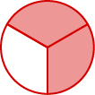{: #CNX_IntAlg_Figure_01_03_001}

Fraction

A **fraction** is written <math xmlns="http://www.w3.org/1998/Math/MathML"><mrow><mfrac><mi>a</mi><mi>b</mi></mfrac><mo>,</mo></mrow></math>

 where <math xmlns="http://www.w3.org/1998/Math/MathML"><mrow><mi>b</mi><mo>≠</mo><mn>0</mn></mrow></math>

 and

*a* is the **numerator** and *b* is the **denominator**.

A fraction represents parts of a whole. The denominator <math xmlns="http://www.w3.org/1998/Math/MathML"><mi>b</mi></math>

 is the number of equal parts the whole has been divided into, and the numerator <math xmlns="http://www.w3.org/1998/Math/MathML"><mi>a</mi></math>

 indicates how many parts are included.

Fractions that have the same value are **equivalent fractions**{: data-type="term"}. The Equivalent Fractions

Property allows us to find equivalent fractions and also simplify fractions.

Equivalent Fractions Property

If *a*, *b*, and *c* are numbers where <math xmlns="http://www.w3.org/1998/Math/MathML"><mrow><mi>b</mi><mo>≠</mo><mn>0</mn><mo>,</mo><mi>c</mi><mo>≠</mo><mn>0</mn><mo>,</mo></mrow></math>

then <math xmlns="http://www.w3.org/1998/Math/MathML"><mrow><mfrac><mi>a</mi><mi>b</mi></mfrac><mo>=</mo><mfrac><mrow><mi>a</mi><mo>·</mo><mi>c</mi></mrow><mrow><mi>b</mi><mo>·</mo><mi>c</mi></mrow></mfrac></mrow></math>

 and <math xmlns="http://www.w3.org/1998/Math/MathML"><mrow><mfrac><mrow><mi>a</mi><mo>·</mo><mi>c</mi></mrow><mrow><mi>b</mi><mo>·</mo><mi>c</mi></mrow></mfrac><mo>=</mo><mfrac><mi>a</mi><mi>b</mi></mfrac><mo>.</mo></mrow></math>

A fraction is considered simplified if there are no common factors, other than 1, in its numerator and denominator.

For example,

  <math xmlns="http://www.w3.org/1998/Math/MathML"><mrow><mfrac><mn>2</mn><mn>3</mn></mfrac></mrow></math>

 is simplified because there are no common factors of 2 and <math xmlns="http://www.w3.org/1998/Math/MathML"><mrow><mn>3</mn><mo>.</mo></mrow></math>

  <math xmlns="http://www.w3.org/1998/Math/MathML"><mrow><mfrac><mrow><mn>10</mn></mrow><mrow><mn>15</mn></mrow></mfrac></mrow></math>

 is not simplified because 5 is a common factor of 10 and <math xmlns="http://www.w3.org/1998/Math/MathML"><mrow><mn>15</mn><mo>.</mo></mrow></math>

We simplify, or reduce, a fraction by removing the common factors of the numerator and denominator. A fraction is not simplified until all common factors have been removed. If an expression has fractions, it is not completely simplified until the fractions are simplified.

Sometimes it may not be easy to find common factors of the numerator and denominator. When this happens, a good idea is to factor the numerator and the denominator into prime numbers. Then divide out the common factors using the Equivalent Fractions Property.

How To Simplify a Fraction

Simplify: <math xmlns="http://www.w3.org/1998/Math/MathML"><mrow><mo>−</mo><mfrac><mrow><mn>315</mn></mrow><mrow><mn>770</mn></mrow></mfrac><mo>.</mo></mrow></math>

    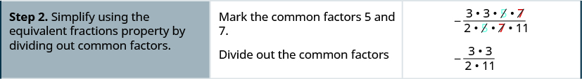    

Simplify: <math xmlns="http://www.w3.org/1998/Math/MathML"><mrow><mo>−</mo><mfrac><mrow><mn>69</mn></mrow><mrow><mn>120</mn></mrow></mfrac><mo>.</mo></mrow></math>

<math xmlns="http://www.w3.org/1998/Math/MathML"><mrow><mo>−</mo><mfrac><mrow><mn>23</mn></mrow><mrow><mn>40</mn></mrow></mfrac></mrow></math>

Simplify: <math xmlns="http://www.w3.org/1998/Math/MathML"><mrow><mo>−</mo><mfrac><mrow><mn>120</mn></mrow><mrow><mn>192</mn></mrow></mfrac><mo>.</mo></mrow></math>

<math xmlns="http://www.w3.org/1998/Math/MathML"><mrow><mo>−</mo><mfrac><mn>5</mn><mn>8</mn></mfrac></mrow></math>

We now summarize the steps you should follow to simplify fractions.

Simplify a fraction.

1.  Rewrite the numerator and denominator to show the common factors.
    * * *
    {: data-type="newline"}
    
    If needed, factor the numerator and denominator into prime numbers first.
2.  Simplify using the Equivalent Fractions Property by dividing out common factors.
3.  Multiply any remaining factors.
{: type="1" .stepwise}

### Multiply and Divide Fractions

Many people find multiplying and dividing fractions easier than adding and subtracting fractions.

To multiply fractions, we multiply the numerators and multiply the denominators.

Fraction Multiplication

If *a*, *b*, *c*, and *d* are numbers where <math xmlns="http://www.w3.org/1998/Math/MathML"><mrow><mi>b</mi><mo>≠</mo><mn>0</mn><mo>,</mo></mrow></math>

 and <math xmlns="http://www.w3.org/1998/Math/MathML"><mrow><mi>d</mi><mo>≠</mo><mn>0</mn><mo>,</mo></mrow></math>

 then

<math xmlns="http://www.w3.org/1998/Math/MathML"><mrow><mfrac><mi>a</mi><mi>b</mi></mfrac><mo>·</mo><mfrac><mi>c</mi><mi>d</mi></mfrac><mo>=</mo><mfrac><mrow><mi>a</mi><mi>c</mi></mrow><mrow><mi>b</mi><mi>d</mi></mrow></mfrac></mrow></math>

To multiply fractions, multiply the numerators and multiply the denominators.

When multiplying fractions, the properties of positive and negative numbers still apply, of course. It is a good idea to determine the sign of the product as the first step. In [\[link\]](#fs-id1167836390100), we will multiply negative and a positive, so the product will be negative.

When multiplying a fraction by an integer, it may be helpful to write the integer as a fraction. Any integer, *a*, can be written as <math xmlns="http://www.w3.org/1998/Math/MathML"><mrow><mfrac><mi>a</mi><mn>1</mn></mfrac><mo>.</mo></mrow></math>

 So, for example, <math xmlns="http://www.w3.org/1998/Math/MathML"><mrow><mn>3</mn><mo>=</mo><mfrac><mn>3</mn><mn>1</mn></mfrac><mo>.</mo></mrow></math>

Multiply: <math xmlns="http://www.w3.org/1998/Math/MathML"><mrow><mo>−</mo><mfrac><mrow><mn>12</mn></mrow><mn>5</mn></mfrac><mrow><mo>(</mo><mrow><mn>−20</mn><mi>x</mi></mrow><mo>)</mo></mrow><mo>.</mo></mrow></math>

The first step is to find the sign of the product. Since the signs are the same, the product is positive.

<table class="unnumbered unstyled" summary="The expression is minus 12 divided by 5 into minus 20 x. We first determine the sign of the product. The signs are the same, so the product is positive. Now we have 12 by 5 into 20 x. Now we write 20 x as a fraction. Hence, we get 12 by 5 open parentheses 20 x by 1 close parentheses. We multiply 12 times 20 x in the numerator and 5 times 1 in the denominator. We then rewrite 20 to show the common factor 5 and divide it out. We simplify to get 48 x." data-label=""><tbody>
<tr valign="top">
<td data-valign="top" data-align="left" />
<td data-valign="top" data-align="left">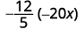</td>
</tr>
<tr valign="top">
<td data-valign="top" data-align="left">Determine the sign of the product. The signs      

are the same, so the product is positive.</td>
<td data-valign="top" data-align="left">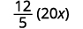</td>
</tr>
<tr valign="top">
<td data-valign="top" data-align="left">Write 20<em>x</em> as a fraction.</td>
<td data-valign="top" data-align="left">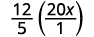</td>
</tr>
<tr valign="top">
<td data-valign="top" data-align="left">Multiply.</td>
<td data-valign="top" data-align="left">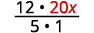</td>
</tr>
<tr valign="top">
<td data-valign="top" data-align="left">Rewrite 20 to show the common factor 5

and divide it out.</td>
<td data-valign="top" data-align="left">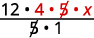</td>
</tr>
<tr valign="top">
<td data-valign="top" data-align="left">Simplify.</td>
<td data-valign="top" data-align="left"></td>
</tr>
</tbody></table>

Multiply: <math xmlns="http://www.w3.org/1998/Math/MathML"><mrow><mfrac><mrow><mn>11</mn></mrow><mn>3</mn></mfrac><mrow><mo>(</mo><mrow><mn>−9</mn><mi>a</mi></mrow><mo>)</mo></mrow><mo>.</mo></mrow></math>

<math xmlns="http://www.w3.org/1998/Math/MathML"><mrow><mn>−33</mn><mi>a</mi></mrow></math>

Multiply: <math xmlns="http://www.w3.org/1998/Math/MathML"><mrow><mfrac><mrow><mn>13</mn></mrow><mn>7</mn></mfrac><mrow><mo>(</mo><mrow><mn>−14</mn><mi>b</mi></mrow><mo>)</mo></mrow><mo>.</mo></mrow></math>

<math xmlns="http://www.w3.org/1998/Math/MathML"><mrow><mn>−26</mn><mi>b</mi></mrow></math>

Now that we know how to multiply fractions, we are almost ready to divide. Before we can do that, we need some vocabulary. The **reciprocal**{: data-type="term"} of a fraction is found by inverting the fraction, placing the numerator in the denominator and the denominator in the numerator. The reciprocal of <math xmlns="http://www.w3.org/1998/Math/MathML"><mrow><mfrac><mn>2</mn><mn>3</mn></mfrac></mrow></math>

 is <math xmlns="http://www.w3.org/1998/Math/MathML"><mrow><mfrac><mn>3</mn><mn>2</mn></mfrac><mo>.</mo></mrow></math>

 Since 4 is written in fraction form as <math xmlns="http://www.w3.org/1998/Math/MathML"><mrow><mfrac><mn>4</mn><mn>1</mn></mfrac><mo>,</mo></mrow></math>

 the reciprocal of 4 is <math xmlns="http://www.w3.org/1998/Math/MathML"><mrow><mfrac><mn>1</mn><mn>4</mn></mfrac><mo>.</mo></mrow></math>

To divide fractions, we multiply the first fraction by the reciprocal of the second.

Fraction Division

If *a*, *b*, *c*, and *d* are numbers where <math xmlns="http://www.w3.org/1998/Math/MathML"><mrow><mi>b</mi><mo>≠</mo><mn>0</mn><mo>,</mo><mi>c</mi><mo>≠</mo><mn>0</mn><mo>,</mo></mrow></math>

 and <math xmlns="http://www.w3.org/1998/Math/MathML"><mrow><mi>d</mi><mo>≠</mo><mn>0</mn><mo>,</mo></mrow></math>

 then

<math xmlns="http://www.w3.org/1998/Math/MathML"><mrow><mfrac><mi>a</mi><mi>b</mi></mfrac><mo>÷</mo><mfrac><mi>c</mi><mi>d</mi></mfrac><mo>=</mo><mfrac><mi>a</mi><mi>b</mi></mfrac><mo>·</mo><mfrac><mi>d</mi><mi>c</mi></mfrac></mrow></math>

To divide fractions, we multiply the first fraction by the **reciprocal** of the second.

We need to say <math xmlns="http://www.w3.org/1998/Math/MathML"><mrow><mi>b</mi><mo>≠</mo><mn>0</mn><mo>,</mo></mrow></math>

 <math xmlns="http://www.w3.org/1998/Math/MathML"><mrow><mi>c</mi><mo>≠</mo><mn>0</mn><mo>,</mo></mrow></math>

 and <math xmlns="http://www.w3.org/1998/Math/MathML"><mrow><mi>d</mi><mo>≠</mo><mn>0</mn><mo>,</mo></mrow></math>

 to be sure we don’t divide by zero!

Find the quotient: <math xmlns="http://www.w3.org/1998/Math/MathML"><mrow><mo>−</mo><mfrac><mn>7</mn><mn>18</mn></mfrac><mo>÷</mo><mrow><mo>(</mo><mrow><mo>−</mo><mfrac><mrow><mn>14</mn></mrow><mrow><mn>27</mn></mrow></mfrac></mrow><mo>)</mo></mrow><mo>.</mo></mrow></math>

<table class="unnumbered unstyled" summary="The expression is minus 7 by 8 divided by minus 14 by 27. To divide, multiply the first fraction by the reciprocal of the second. We get minus 7 by 8 multiplied by minus 27 by 14. Determine the sign of the product, and then multiply. We get 7 times 27 divided by 18 times 14. We rewrite showing common factors to get 7 times 9 times 3 divided by 9 times 2 times 7 times 2. We remove the common factors between numerator and denominator. We get 3 in the numerator and 2 times 2 in the denominator. We simplify to get 3 by 4." data-label=""><tbody>
<tr valign="top">
<td data-valign="top" data-align="left" />
<td data-valign="top" data-align="left"></td>
</tr>
<tr valign="top">
<td data-valign="top" data-align="left">To divide, multiply the first fraction by the      
reciprocal of the second.</td>
<td data-valign="top" data-align="left">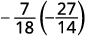</td>
</tr>
<tr valign="top">
<td data-valign="top" data-align="left">Determine the sign of the product, and
then multiply.</td>
<td data-valign="top" data-align="left">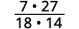</td>
</tr>
<tr valign="top">
<td data-valign="top" data-align="left">Rewrite showing common factors.</td>
<td data-valign="top" data-align="left">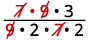</td>
</tr>
<tr valign="top">
<td data-valign="top" data-align="left">Remove common factors.</td>
<td data-valign="top" data-align="left">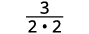</td>
</tr>
<tr valign="top">
<td data-valign="top" data-align="left">Simplify.</td>
<td data-valign="top" data-align="left"></td>
</tr>
</tbody></table>

Divide: <math xmlns="http://www.w3.org/1998/Math/MathML"><mrow><mo>−</mo><mfrac><mn>7</mn><mrow><mn>27</mn></mrow></mfrac><mo>÷</mo><mrow><mo>(</mo><mrow><mo>−</mo><mfrac><mrow><mn>35</mn></mrow><mrow><mn>36</mn></mrow></mfrac></mrow><mo>)</mo></mrow><mo>.</mo></mrow></math>

<math xmlns="http://www.w3.org/1998/Math/MathML"><mrow><mfrac><mn>4</mn><mrow><mn>15</mn></mrow></mfrac></mrow></math>

Divide: <math xmlns="http://www.w3.org/1998/Math/MathML"><mrow><mo>−</mo><mfrac><mn>5</mn><mrow><mn>14</mn></mrow></mfrac><mo>÷</mo><mrow><mo>(</mo><mrow><mo>−</mo><mfrac><mrow><mn>15</mn></mrow><mrow><mn>28</mn></mrow></mfrac></mrow><mo>)</mo></mrow><mo>.</mo></mrow></math>

<math xmlns="http://www.w3.org/1998/Math/MathML"><mrow><mfrac><mn>2</mn><mn>3</mn></mfrac></mrow></math>

The numerators or denominators of some fractions contain fractions themselves. A fraction in which the numerator or the denominator is a fraction is called a **complex fraction**{: data-type="term"}.

Complex Fraction

A **complex fraction** is a fraction in which the numerator or the denominator contains a fraction.

Some examples of complex fractions are:

<math xmlns="http://www.w3.org/1998/Math/MathML"><mrow><mfrac><mrow><mfrac><mn>6</mn><mn>7</mn></mfrac></mrow><mn>3</mn></mfrac><mspace width="5em" /><mfrac><mrow><mfrac><mn>3</mn><mn>4</mn></mfrac></mrow><mrow><mfrac><mn>5</mn><mn>8</mn></mfrac></mrow></mfrac><mspace width="5em" /><mfrac><mrow><mfrac><mi>x</mi><mn>2</mn></mfrac></mrow><mrow><mfrac><mn>5</mn><mn>6</mn></mfrac></mrow></mfrac></mrow></math>

To simplify a complex fraction, remember that the fraction bar means division. For example, the complex fraction <math xmlns="http://www.w3.org/1998/Math/MathML"><mrow><mfrac><mrow><mfrac><mn>3</mn><mn>4</mn></mfrac></mrow><mrow><mfrac><mn>5</mn><mn>8</mn></mfrac></mrow></mfrac></mrow></math>

 means <math xmlns="http://www.w3.org/1998/Math/MathML"><mrow><mfrac><mn>3</mn><mn>4</mn></mfrac><mo>÷</mo><mfrac><mn>5</mn><mn>8</mn></mfrac><mo>.</mo></mrow></math>

Simplify: <math xmlns="http://www.w3.org/1998/Math/MathML"><mrow><mfrac><mrow><mfrac><mi>x</mi><mn>2</mn></mfrac></mrow><mrow><mfrac><mrow><mi>x</mi><mi>y</mi></mrow><mn>6</mn></mfrac></mrow></mfrac><mo>.</mo></mrow></math>

<math xmlns="http://www.w3.org/1998/Math/MathML"><mrow> <mtable> <mtr><mtd /><mtd /><mtd /><mtd columnalign="center"><mspace width="4em" /><mrow><mfrac><mrow><mfrac><mi>x</mi><mn>2</mn></mfrac></mrow><mrow><mfrac><mrow><mi>x</mi><mi>y</mi></mrow><mn>6</mn></mfrac></mrow></mfrac></mrow></mtd></mtr> <mtr><mtd columnalign="left"><mtext>Rewrite as division</mtext><mo>.</mo></mtd><mtd /><mtd /><mtd columnalign="center"><mspace width="4em" /><mrow><mfrac><mi>x</mi><mn>2</mn></mfrac><mo>÷</mo><mfrac><mrow><mi>x</mi><mi>y</mi></mrow><mn>6</mn></mfrac></mrow></mtd></mtr> <mtr><mtd columnalign="left"><mtext>Multiply the first fraction by the reciprocal of the second</mtext><mo>.</mo></mtd><mtd /><mtd /><mtd columnalign="center"><mspace width="4em" /><mrow><mfrac><mi>x</mi><mn>2</mn></mfrac><mo>·</mo><mfrac><mn>6</mn><mrow><mi>x</mi><mi>y</mi></mrow></mfrac></mrow></mtd></mtr> <mtr><mtd columnalign="left"><mtext>Multiply</mtext><mo>.</mo></mtd><mtd /><mtd /><mtd columnalign="center"><mspace width="4em" /><mrow><mfrac><mrow><mi>x</mi><mo>·</mo><mn>6</mn></mrow><mrow><mn>2</mn><mo>·</mo><mi>x</mi><mi>y</mi></mrow></mfrac></mrow></mtd></mtr> <mtr><mtd columnalign="left"><mtext>Look for common factors</mtext><mo>.</mo></mtd><mtd /><mtd /><mtd columnalign="center"><mspace width="4em" /><mrow><mfrac><mrow><menclose notation="updiagonalstrike"><mi>x</mi></menclose><mo>·</mo><mn>3</mn><mo>·</mo><menclose notation="updiagonalstrike"><mn>2</mn></menclose></mrow><mrow><menclose notation="updiagonalstrike"><mn>2</mn></menclose><mo>·</mo><menclose notation="updiagonalstrike"><mi>x</mi></menclose><mo>·</mo><mi>y</mi></mrow></mfrac></mrow></mtd></mtr> <mtr><mtd columnalign="left"><mtext>Divide common factors and simplify</mtext><mo>.</mo></mtd><mtd /><mtd /><mtd columnalign="center"><mspace width="4em" /><mrow><mfrac><mn>3</mn><mi>y</mi></mfrac></mrow></mtd></mtr></mtable></mrow></math>

Simplify: <math xmlns="http://www.w3.org/1998/Math/MathML"><mrow><mfrac><mrow><mfrac><mi>a</mi><mn>8</mn></mfrac></mrow><mrow><mfrac><mrow><mi>a</mi><mi>b</mi></mrow><mn>6</mn></mfrac></mrow></mfrac><mo>.</mo></mrow></math>

<math xmlns="http://www.w3.org/1998/Math/MathML"><mrow><mfrac><mn>3</mn><mrow><mn>4</mn><mi>b</mi></mrow></mfrac></mrow></math>

Simplify: <math xmlns="http://www.w3.org/1998/Math/MathML"><mrow><mfrac><mrow><mfrac><mi>p</mi><mn>2</mn></mfrac></mrow><mrow><mfrac><mrow><mi>p</mi><mi>q</mi></mrow><mn>8</mn></mfrac></mrow></mfrac><mo>.</mo></mrow></math>

<math xmlns="http://www.w3.org/1998/Math/MathML"><mrow><mfrac><mn>4</mn><mi>q</mi></mfrac></mrow></math>

### Add and Subtract Fractions

When we multiplied fractions, we just multiplied the numerators and multiplied the denominators right straight across. To add or subtract fractions, they must have a common denominator.

Fraction Addition and Subtraction

If *a*, *b*, and *c* are numbers where <math xmlns="http://www.w3.org/1998/Math/MathML"><mrow><mi>c</mi><mo>≠</mo><mn>0</mn><mo>,</mo></mrow></math>

 then

<math xmlns="http://www.w3.org/1998/Math/MathML"><mrow><mfrac><mi>a</mi><mi>c</mi></mfrac><mo>+</mo><mfrac><mi>b</mi><mi>c</mi></mfrac><mo>=</mo><mfrac><mrow><mi>a</mi><mo>+</mo><mi>b</mi></mrow><mi>c</mi></mfrac><mspace width="0.5em" /><mtext>and</mtext><mspace width="0.5em" /><mfrac><mi>a</mi><mi>c</mi></mfrac><mo>−</mo><mfrac><mi>b</mi><mi>c</mi></mfrac><mo>=</mo><mfrac><mrow><mi>a</mi><mo>−</mo><mi>b</mi></mrow><mi>c</mi></mfrac></mrow></math>

To add or subtract fractions, add or subtract the numerators and place the result over the common denominator.

The **least common denominator**{: data-type="term"} (LCD) of two fractions is the smallest number that can be used as a common denominator of the fractions. The LCD of the two fractions is the least common multiple (LCM) of their denominators.

Least Common Denominator

The **least common denominator** (LCD) of two fractions is the least common multiple (LCM) of their denominators.

After we find the least common denominator of two fractions, we convert the fractions to equivalent fractions with the LCD. Putting these steps together allows us to add and subtract fractions because their denominators will be the same!

How to Add or Subtract Fractions

Add: <math xmlns="http://www.w3.org/1998/Math/MathML"><mrow><mfrac><mn>7</mn><mrow><mn>12</mn></mrow></mfrac><mo>+</mo><mfrac><mn>5</mn><mrow><mn>18</mn></mrow></mfrac><mo>.</mo></mrow></math>

        

Add: <math xmlns="http://www.w3.org/1998/Math/MathML"><mrow><mfrac><mn>7</mn><mrow><mn>12</mn></mrow></mfrac><mo>+</mo><mfrac><mrow><mn>11</mn></mrow><mrow><mn>15</mn></mrow></mfrac><mo>.</mo></mrow></math>

<math xmlns="http://www.w3.org/1998/Math/MathML"><mrow><mfrac><mrow><mn>79</mn></mrow><mrow><mn>60</mn></mrow></mfrac></mrow></math>

Add: <math xmlns="http://www.w3.org/1998/Math/MathML"><mrow><mfrac><mrow><mn>13</mn></mrow><mrow><mn>15</mn></mrow></mfrac><mo>+</mo><mfrac><mrow><mn>17</mn></mrow><mrow><mn>20</mn></mrow></mfrac><mo>.</mo></mrow></math>

<math xmlns="http://www.w3.org/1998/Math/MathML"><mrow><mfrac><mrow><mn>103</mn></mrow><mrow><mn>60</mn></mrow></mfrac></mrow></math>

Add or subtract fractions.

1.  Do they have a common denominator?
    * Yes—go to step 2.
    * No—rewrite each fraction with the LCD (least common denominator).
      * Find the LCD.
      * Change each fraction into an equivalent fraction with the LCD as its denominator.
      {: data-bullet-style="bullet"}
    {: data-bullet-style="bullet"}

2.  Add or subtract the fractions.
3.  Simplify, if possible.
{: type="1" .stepwise}

We now have all four operations for fractions. [\[link\]](#fs-id1167829751987) summarizes fraction operations.

<table summary="This table gives notes on fraction multiplication, division, addition and subtraction. For fraction multiplication, multiply the numerators and multiply the denominators. Hence, a by b times c by d is ac by bd. For fraction division, multiply the first fraction by the reciprocal of the second. Hence, a by b divided by c by d is ad by bc. For fraction addition, add the numerators and place the sum over the common denominator. Hence, a by c plus b by c is open parentheses a plus b close parentheses by c. For fraction subtraction, subtract the numerators and place the difference over the common denominator. Hence, a by c minus b by c is open parentheses a minus b close parentheses by c. To multiply or divide fractions, an LCD is NOT needed. To add or subtract fractions, an LCD is needed."><tbody>
<tr valign="top">
<td data-valign="top" data-align="left"><strong>Fraction Multiplication</strong></td>
<td data-valign="top" data-align="left"><strong>Fraction Division</strong></td>
</tr>
<tr valign="top">
<td data-valign="top" data-align="left"><math xmlns="http://www.w3.org/1998/Math/MathML"><mrow><mfrac><mi>a</mi><mi>b</mi></mfrac><mo>·</mo><mfrac><mi>c</mi><mi>d</mi></mfrac><mo>=</mo><mfrac><mrow><mi>a</mi><mi>c</mi></mrow><mrow><mi>b</mi><mi>d</mi></mrow></mfrac></mrow></math></td>
<td data-valign="top" data-align="left"><math xmlns="http://www.w3.org/1998/Math/MathML"><mrow><mfrac><mi>a</mi><mi>b</mi></mfrac><mo>÷</mo><mfrac><mi>c</mi><mi>d</mi></mfrac><mo>=</mo><mfrac><mi>a</mi><mi>b</mi></mfrac><mo>·</mo><mfrac><mi>d</mi><mi>c</mi></mfrac></mrow></math></td>
</tr>
<tr valign="top">
<td data-valign="top" data-align="left">Multiply the numerators and multiply the denominators</td>
<td data-valign="top" data-align="left">Multiply the first fraction by the reciprocal of the second.</td>
</tr>
<tr valign="top">
<td data-valign="top" data-align="left"><strong>Fraction Addition</strong></td>
<td data-valign="top" data-align="left"><strong>Fraction Subtraction</strong></td>
</tr>
<tr valign="top">
<td data-valign="top" data-align="left"><math xmlns="http://www.w3.org/1998/Math/MathML"><mrow><mfrac><mi>a</mi><mi>c</mi></mfrac><mo>+</mo><mfrac><mi>b</mi><mi>c</mi></mfrac><mo>=</mo><mfrac><mrow><mi>a</mi><mo>+</mo><mi>b</mi></mrow><mi>c</mi></mfrac></mrow></math></td>
<td data-valign="top" data-align="left"><math xmlns="http://www.w3.org/1998/Math/MathML"><mrow><mfrac><mi>a</mi><mi>c</mi></mfrac><mo>−</mo><mfrac><mi>b</mi><mi>c</mi></mfrac><mo>=</mo><mfrac><mrow><mi>a</mi><mo>−</mo><mi>b</mi></mrow><mi>c</mi></mfrac></mrow></math></td>
</tr>
<tr valign="top">
<td data-valign="top" data-align="left">Add the numerators and place the sum over the common denominator.</td>
<td data-valign="top" data-align="left">Subtract the numerators and place the difference over the common denominator.</td>
</tr>
<tr valign="top">
<td colspan="2" data-valign="top" data-align="center">To multiply or divide fractions, an LCD is NOT needed.
To add or subtract fractions, an LCD is needed.</td>
</tr>
</tbody></table>

When starting an exercise, always identify the operation and then recall the methods needed for that operation.

Simplify: ⓐ <math xmlns="http://www.w3.org/1998/Math/MathML"><mrow><mfrac><mrow><mn>5</mn><mi>x</mi></mrow><mn>6</mn></mfrac><mo>−</mo><mfrac><mn>3</mn><mrow><mn>10</mn></mrow></mfrac></mrow></math>

 ⓑ <math xmlns="http://www.w3.org/1998/Math/MathML"><mrow><mfrac><mrow><mn>5</mn><mi>x</mi></mrow><mn>6</mn></mfrac><mo>·</mo><mfrac><mn>3</mn><mrow><mn>10</mn></mrow></mfrac><mo>.</mo></mrow></math>

First ask, “What is the operation?” Identifying the operation will determine whether or not we need a common denominator. Remember, we need a common denominator to add or subtract, but not to multiply or divide.

ⓐ* * *
{: data-type="newline"}

 <math xmlns="http://www.w3.org/1998/Math/MathML"><mrow><mtable> <mtr><mtd columnalign="left"><mtext>What is the operation? The operation is subtraction</mtext><mo>.</mo></mtd><mtd /><mtd /></mtr> <mtr><mtd columnalign="left"><mtext>Do the fractions have a common denominator? No</mtext><mo>.</mo></mtd><mtd /><mtd /><mtd columnalign="center"><mspace width="3em" /><mrow><mfrac><mrow><mn>5</mn><mi>x</mi></mrow><mn>6</mn></mfrac><mo>−</mo><mfrac><mn>3</mn><mrow><mn>10</mn></mrow></mfrac></mrow></mtd></mtr> <mtr><mtd columnalign="left"><mtext>Find the LCD of</mtext><mspace width="0.2em" /><mn>6</mn><mspace width="0.2em" /><mtext>and</mtext><mspace width="0.2em" /><mn>10</mn></mtd><mtd /><mtd /><mtd columnalign="center"><mspace width="3em" /><mtext>The LCD is 30.</mtext></mtd></mtr> <mtr><mtd columnalign="left"><mtable><mtr><mtd /><mtd /><mtd /><mtd /><mtd /><mtd /><mtd columnalign="left"><mspace width="1.5em" /><mn>6</mn><mo>=</mo><mn>2</mn><mo>·</mo><mn>3</mn></mtd></mtr><mtr><mtd /><mtd /><mtd /><mtd /><mtd /><mtd /><mtd columnalign="left"><munder accentunder="true"><mrow><mspace width="0.4em" /><mn>10</mn><mo>=</mo><mn>2</mn><mo>·</mo><mn>5</mn></mrow><mo stretchy="true">\_\_\_\_\_\_\_\_\_\_\_</mo></munder></mtd></mtr><mtr><mtd /><mtd /><mtd /><mtd /><mtd /><mtd /><mtd columnalign="left"><mtext>LCD</mtext><mo>=</mo><mn>2</mn><mo>·</mo><mn>3</mn><mo>·</mo><mn>5</mn></mtd></mtr><mtr><mtd /><mtd /><mtd /><mtd /><mtd /><mtd /><mtd columnalign="left"><mtext>LCD</mtext><mo>=</mo><mn>30</mn></mtd></mtr></mtable></mtd><mtd /><mtd /><mtd /></mtr><mtr /><mtr /> <mtr><mtd columnalign="left"><mtext>Rewrite each fraction as an equivalent fraction with the LCD</mtext><mo>.</mo></mtd><mtd /><mtd /><mtd columnalign="center"><mspace width="3em" /> <mfrac><mrow><mn>5</mn><mi>x</mi><mo>·</mo><mn>5</mn></mrow><mrow><mn>6</mn><mo>·</mo><mn>5</mn></mrow></mfrac><mo>−</mo><mfrac><mrow><mn>3</mn><mo>·</mo><mn>3</mn></mrow><mrow><mn>10</mn><mo>·</mo><mn>3</mn></mrow></mfrac></mtd></mtr> <mtr><mtd /><mtd /><mtd /><mtd columnalign="center"><mspace width="3em" /><mfrac><mrow><mn>25</mn><mi>x</mi></mrow><mrow><mn>30</mn></mrow></mfrac><mo>−</mo><mfrac><mn>9</mn><mrow><mn>30</mn></mrow></mfrac></mtd></mtr> <mtr><mtd columnalign="left"><mtable><mtr><mtd columnalign="left"><mtext>Subtract the numerators and place the</mtext></mtd></mtr><mtr><mtd columnalign="left"><mtext>difference over the common denominators</mtext><mo>.</mo></mtd></mtr></mtable></mtd><mtd /><mtd /><mtd columnalign="center"><mspace width="3em" /><mrow><mfrac><mrow><mn>25</mn><mi>x</mi><mo>−</mo><mn>9</mn></mrow><mrow><mn>30</mn></mrow></mfrac></mrow></mtd></mtr><mtr /><mtr /> <mtr><mtd columnalign="left"><mtable><mtr><mtd columnalign="left"><mtext>Simplify</mtext><mo>,</mo><mtext>if possible</mtext><mo>.</mo><mspace width="0.2em" /><mtext>There are no common factors</mtext><mo>.</mo></mtd></mtr><mtr><mtd columnalign="left"><mtext>The fraction is simplified</mtext><mo>.</mo></mtd></mtr></mtable></mtd><mtd /><mtd /><mtd /></mtr> </mtable></mrow></math>

ⓑ* * *
{: data-type="newline"}

 <math xmlns="http://www.w3.org/1998/Math/MathML"><mrow><mtable> <mtr><mtd columnalign="left"><mtext>What is the operation? Multiplication</mtext><mo>.</mo></mtd><mtd /><mtd /><mtd columnalign="center"><mspace width="7em" /><mrow><mfrac><mrow><mn>25</mn><mi>x</mi></mrow><mn>6</mn></mfrac><mo>·</mo><mfrac><mn>3</mn><mrow><mn>10</mn></mrow></mfrac></mrow></mtd></mtr> <mtr><mtd columnalign="left"><mtable><mtr><mtd columnalign="left"><mtext>To multiply fractions</mtext><mo>,</mo><mtext>multiply the numerators</mtext></mtd></mtr><mtr><mtd columnalign="left"><mtext>and multiply the denominators</mtext><mo>.</mo></mtd></mtr></mtable></mtd><mtd /><mtd /><mtd columnalign="center"><mspace width="7em" /><mrow><mfrac><mrow><mn>25</mn><mi>x</mi><mo>·</mo><mn>3</mn></mrow><mrow><mn>6</mn><mo>·</mo><mn>10</mn></mrow></mfrac></mrow></mtd></mtr> <mtr><mtd columnalign="left"><mtable><mtr><mtd columnalign="left"><mtext>Rewrite, showing common factors.</mtext></mtd></mtr><mtr><mtd columnalign="left"><mtext>Remove common factors.</mtext></mtd></mtr></mtable></mtd><mtd /><mtd /><mtd columnalign="center"><mspace width="7em" /><mrow><mfrac><mrow><menclose notation="updiagonalstrike"><mn>5</mn></menclose><mi>x</mi><mo>·</mo><menclose notation="updiagonalstrike"><mn>3</mn></menclose></mrow><mrow><mn>2</mn><mo>·</mo><menclose notation="updiagonalstrike"><mn>3</mn></menclose><mo>·</mo><mn>2</mn><mo>·</mo><menclose notation="updiagonalstrike"><mn>5</mn></menclose></mrow></mfrac></mrow></mtd></mtr> <mtr><mtd columnalign="left"><mtext>Simplify.</mtext></mtd><mtd /><mtd /><mtd columnalign="center"><mspace width="7em" /><mrow><mfrac><mi>x</mi><mn>4</mn></mfrac></mrow></mtd></mtr></mtable></mrow></math>

Notice, we needed an LCD to add <math xmlns="http://www.w3.org/1998/Math/MathML"><mrow><mfrac><mrow><mn>25</mn><mi>x</mi></mrow><mn>6</mn></mfrac><mo>−</mo><mfrac><mn>3</mn><mrow><mn>10</mn></mrow></mfrac><mo>,</mo></mrow></math>

 but not to multiply <math xmlns="http://www.w3.org/1998/Math/MathML"><mrow><mfrac><mrow><mn>25</mn><mi>x</mi></mrow><mn>6</mn></mfrac><mo>·</mo><mfrac><mn>3</mn><mrow><mn>10</mn></mrow></mfrac><mo>.</mo></mrow></math>

Simplify: ⓐ <math xmlns="http://www.w3.org/1998/Math/MathML"><mrow><mfrac><mrow><mn>3</mn><mi>a</mi></mrow><mn>4</mn></mfrac><mo>−</mo><mfrac><mn>8</mn><mn>9</mn></mfrac></mrow></math>

 ⓑ <math xmlns="http://www.w3.org/1998/Math/MathML"><mrow><mfrac><mrow><mn>3</mn><mi>a</mi></mrow><mn>4</mn></mfrac><mo>·</mo><mfrac><mn>8</mn><mn>9</mn></mfrac><mo>.</mo></mrow></math>

ⓐ <math xmlns="http://www.w3.org/1998/Math/MathML"><mrow><mfrac><mrow><mn>27</mn><mi>a</mi><mo>−</mo><mn>32</mn></mrow><mrow><mn>36</mn></mrow></mfrac></mrow></math>

 ⓑ <math xmlns="http://www.w3.org/1998/Math/MathML"><mrow><mfrac><mrow><mn>2</mn><mi>a</mi></mrow><mn>3</mn></mfrac></mrow></math>

Simplify: ⓐ<math xmlns="http://www.w3.org/1998/Math/MathML"><mrow><mfrac><mrow><mn>4</mn><mi>k</mi></mrow><mn>5</mn></mfrac><mo>−</mo><mfrac><mn>1</mn><mn>6</mn></mfrac></mrow></math>

 ⓑ <math xmlns="http://www.w3.org/1998/Math/MathML"><mrow><mfrac><mrow><mn>4</mn><mi>k</mi></mrow><mn>5</mn></mfrac><mo>·</mo><mfrac><mn>1</mn><mn>6</mn></mfrac><mo>.</mo></mrow></math>

ⓐ <math xmlns="http://www.w3.org/1998/Math/MathML"><mrow><mfrac><mrow><mn>24</mn><mi>k</mi><mo>−</mo><mn>5</mn></mrow><mrow><mn>30</mn></mrow></mfrac></mrow></math>

 ⓑ <math xmlns="http://www.w3.org/1998/Math/MathML"><mrow><mfrac><mrow><mn>2</mn><mi>k</mi></mrow><mrow><mn>15</mn></mrow></mfrac></mrow></math>

### Use the Order of Operations to Simplify Fractions

The fraction bar in a fraction acts as grouping symbol. The order of operations then tells us to simplify the numerator and then the denominator. Then we divide.

Simplify an expression with a fraction bar.

1.  Simplify the expression in the numerator. Simplify the expression in the denominator.
2.  Simplify the fraction.
{: type="1" .stepwise}

Where does the negative sign go in a fraction? Usually the negative sign is in front of the fraction, but you will sometimes see a fraction with a negative numerator, or sometimes with a negative denominator. Remember that fractions represent division. When the numerator and denominator have different signs, the quotient is negative.

<math xmlns="http://www.w3.org/1998/Math/MathML"><mrow><mfrac><mrow><mn>−1</mn></mrow><mn>3</mn></mfrac><mo>=</mo><mo>−</mo><mfrac><mn>1</mn><mn>3</mn></mfrac><mspace width="3em" /><mfrac><mrow><mtext>negative</mtext></mrow><mrow><mtext>positive</mtext></mrow></mfrac><mo>=</mo><mtext>negative</mtext></mrow></math>

<math xmlns="http://www.w3.org/1998/Math/MathML"><mrow><mfrac><mn>1</mn><mrow><mn>−3</mn></mrow></mfrac><mo>=</mo><mo>−</mo><mfrac><mn>1</mn><mn>3</mn></mfrac><mspace width="3em" /><mfrac><mrow><mtext>positive</mtext></mrow><mrow><mtext>negative</mtext></mrow></mfrac><mo>=</mo><mtext>negative</mtext></mrow></math>

Placement of Negative Sign in a Fraction

For any positive numbers *a* and *b*,

<math xmlns="http://www.w3.org/1998/Math/MathML"><mrow><mfrac><mrow><mtext>−</mtext><mi>a</mi></mrow><mi>b</mi></mfrac><mo>=</mo><mfrac><mi>a</mi><mrow><mtext>−</mtext><mi>b</mi></mrow></mfrac><mo>=</mo><mo>−</mo><mfrac><mi>a</mi><mi>b</mi></mfrac></mrow></math>

Simplify: <math xmlns="http://www.w3.org/1998/Math/MathML"><mrow><mfrac><mrow><mn>4</mn><mrow><mo>(</mo><mrow><mo>−</mo><mn>3</mn></mrow><mo>)</mo></mrow><mo>+</mo><mn>6</mn><mrow><mo>(</mo><mrow><mo>−</mo><mn>2</mn></mrow><mo>)</mo></mrow></mrow><mrow><mo>−</mo><mn>3</mn><mrow><mo>(</mo><mn>2</mn><mo>)</mo></mrow><mo>−</mo><mn>2</mn></mrow></mfrac><mo>.</mo></mrow></math>

The fraction bar acts like a grouping symbol. So completely simplify the numerator and the denominator separately.

<math xmlns="http://www.w3.org/1998/Math/MathML"><mrow> <mtable><mtr><mtd /><mtd /><mtd /><mtd columnalign="center"><mspace width="4em" /><mrow><mfrac><mrow><mn>4</mn><mrow><mo>(</mo><mrow><mo>−</mo><mn>3</mn></mrow><mo>)</mo></mrow><mo>+</mo><mn>6</mn><mrow><mo>(</mo><mrow><mo>−</mo><mn>2</mn></mrow><mo>)</mo></mrow></mrow><mrow><mo>−</mo><mn>3</mn><mrow><mo>(</mo><mn>2</mn><mo>)</mo></mrow><mo>−</mo><mn>2</mn></mrow></mfrac></mrow></mtd></mtr> <mtr><mtd columnalign="left"><mtext>Multiply.</mtext></mtd><mtd /><mtd /><mtd columnalign="center"><mspace width="4em" /><mrow><mfrac><mrow><mo>−</mo><mn>12</mn><mo>+</mo><mrow><mo>(</mo><mrow><mo>−</mo><mn>12</mn></mrow><mo>)</mo></mrow></mrow><mrow><mo>−</mo><mn>6</mn><mo>−</mo><mn>2</mn></mrow></mfrac></mrow></mtd></mtr> <mtr><mtd columnalign="left"><mtext>Simplify.</mtext></mtd><mtd /><mtd /><mtd columnalign="center"><mspace width="4em" /><mrow><mfrac><mrow><mo>−</mo><mn>24</mn></mrow><mrow><mo>−</mo><mn>8</mn></mrow></mfrac></mrow></mtd></mtr> <mtr><mtd columnalign="left"><mtext>Divide.</mtext></mtd><mtd /><mtd /><mtd columnalign="center"><mspace width="4em" /><mn>3</mn></mtd></mtr></mtable></mrow></math>

Simplify: <math xmlns="http://www.w3.org/1998/Math/MathML"><mrow><mfrac><mrow><mn>8</mn><mrow><mo>(</mo><mrow><mo>−</mo><mn>2</mn></mrow><mo>)</mo></mrow><mo>+</mo><mn>4</mn><mrow><mo>(</mo><mrow><mo>−</mo><mn>3</mn></mrow><mo>)</mo></mrow></mrow><mrow><mo>−</mo><mn>5</mn><mrow><mo>(</mo><mn>2</mn><mo>)</mo></mrow><mo>+</mo><mn>3</mn></mrow></mfrac><mo>.</mo></mrow></math>

4

Simplify: <math xmlns="http://www.w3.org/1998/Math/MathML"><mrow><mfrac><mrow><mn>7</mn><mrow><mo>(</mo><mrow><mo>−</mo><mn>1</mn></mrow><mo>)</mo></mrow><mo>+</mo><mn>9</mn><mrow><mo>(</mo><mrow><mo>−</mo><mn>3</mn></mrow><mo>)</mo></mrow></mrow><mrow><mo>−</mo><mn>5</mn><mrow><mo>(</mo><mn>3</mn><mo>)</mo></mrow><mo>−</mo><mn>2</mn></mrow></mfrac><mo>.</mo></mrow></math>

2

Now we’ll look at complex fractions where the numerator or denominator contains an expression that can be simplified. So we first must completely simplify the numerator and denominator separately using the order of operations. Then we divide the numerator by the denominator as the fraction bar means division.

How to Simplify Complex Fractions

Simplify: <math xmlns="http://www.w3.org/1998/Math/MathML"><mrow><mfrac><mrow><msup><mrow><mrow><mo>(</mo><mrow><mfrac><mn>1</mn><mn>2</mn></mfrac></mrow><mo>)</mo></mrow></mrow><mn>2</mn></msup></mrow><mrow><mn>4</mn><mo>+</mo><msup><mn>3</mn><mn>2</mn></msup></mrow></mfrac><mo>.</mo></mrow></math>

 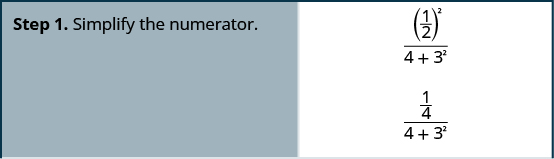   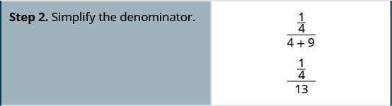   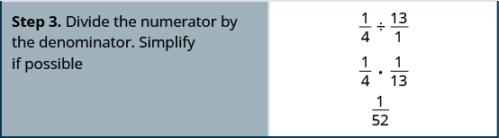 

Simplify: <math xmlns="http://www.w3.org/1998/Math/MathML"><mrow><mfrac><mrow><msup><mrow><mrow><mo>(</mo><mrow><mfrac> <mn>1</mn> <mn>3</mn></mfrac></mrow><mo>)</mo></mrow></mrow><mn>2</mn></msup></mrow><mrow><msup><mn>2</mn><mn>3</mn></msup><mo>+</mo><mn>2</mn></mrow></mfrac><mo>.</mo></mrow></math>

<math xmlns="http://www.w3.org/1998/Math/MathML"><mrow><mfrac><mn>1</mn><mrow><mn>90</mn></mrow></mfrac></mrow></math>

Simplify: <math xmlns="http://www.w3.org/1998/Math/MathML"><mrow><mfrac><mrow><mn>1</mn><mo>+</mo><msup><mn>4</mn><mn>2</mn></msup></mrow><mrow><msup><mrow><mrow><mo>(</mo><mrow><mfrac><mn>1</mn><mn>4</mn></mfrac></mrow><mo>)</mo></mrow></mrow><mn>2</mn></msup></mrow></mfrac><mo>.</mo></mrow></math>

272

Simplify complex fractions.

1.  Simplify the numerator.
2.  Simplify the denominator.
3.  Divide the numerator by the denominator. Simplify if possible.
{: type="1" .stepwise}

Simplify: <math xmlns="http://www.w3.org/1998/Math/MathML"><mrow><mfrac><mrow><mfrac><mn>1</mn><mn>2</mn></mfrac><mo>+</mo><mfrac><mn>2</mn><mn>3</mn></mfrac></mrow><mrow><mfrac><mn>3</mn><mn>4</mn></mfrac><mo>−</mo><mfrac><mn>1</mn><mn>6</mn></mfrac></mrow></mfrac><mo>.</mo></mrow></math>

It may help to put parentheses around the numerator and the denominator.

<math xmlns="http://www.w3.org/1998/Math/MathML"><mrow> <mtable><mtr><mtd /><mtd /><mtd /><mtd columnalign="center"><mspace width="4em" /><mrow><mfrac><mrow><mrow><mo>(</mo><mrow><mfrac><mn>1</mn><mn>2</mn></mfrac><mo>+</mo><mfrac><mn>2</mn><mn>3</mn></mfrac></mrow><mo>)</mo></mrow></mrow><mrow><mrow><mo>(</mo><mrow><mfrac><mn>3</mn><mn>4</mn></mfrac><mo>−</mo><mfrac><mn>1</mn><mn>6</mn></mfrac></mrow><mo>)</mo></mrow></mrow></mfrac></mrow></mtd></mtr> <mtr><mtd columnalign="left"><mtable><mtr><mtd columnalign="left"><mtext>Simplify the numerator</mtext><mspace width="0.2em" /><mrow><mo>(</mo><mrow><mtext>LCD</mtext><mo>=</mo><mn>6</mn></mrow><mo>)</mo></mrow><mspace width="0.2em" /><mtext>and</mtext></mtd></mtr><mtr><mtd columnalign="left"><mtext>simplify the denominator</mtext><mspace width="0.2em" /><mrow><mo>(</mo><mrow><mtext>LCD</mtext><mo>=</mo><mn>12</mn></mrow><mo>)</mo><mo>.</mo></mrow></mtd></mtr></mtable></mtd><mtd /><mtd /><mtd columnalign="center"><mspace width="4em" /><mrow><mfrac><mrow><mrow><mo>(</mo><mrow><mfrac><mn>3</mn><mn>6</mn></mfrac><mo>+</mo><mfrac><mn>4</mn><mn>6</mn></mfrac></mrow><mo>)</mo></mrow></mrow><mrow><mrow><mo>(</mo><mrow><mfrac><mn>9</mn><mrow><mn>12</mn></mrow></mfrac><mo>−</mo><mfrac><mn>2</mn><mrow><mn>12</mn></mrow></mfrac></mrow><mo>)</mo></mrow></mrow></mfrac></mrow></mtd></mtr> <mtr><mtd columnalign="left"><mtext>Simplify.</mtext></mtd><mtd /><mtd /><mtd columnalign="center"><mspace width="4em" /><mrow><mfrac><mrow><mrow><mo>(</mo><mrow><mfrac><mn>7</mn><mn>6</mn></mfrac></mrow><mo>)</mo></mrow></mrow><mrow><mrow><mo>(</mo><mrow><mfrac><mn>7</mn><mrow><mn>12</mn></mrow></mfrac></mrow><mo>)</mo></mrow></mrow></mfrac></mrow></mtd></mtr> <mtr><mtd columnalign="left"><mtext>Divide the numerator by the denominator.</mtext></mtd><mtd /><mtd /><mtd columnalign="center"><mspace width="4em" /><mrow><mfrac><mn>7</mn><mn>6</mn></mfrac><mo>÷</mo><mfrac><mn>7</mn><mrow><mn>12</mn></mrow></mfrac></mrow></mtd></mtr> <mtr><mtd columnalign="left"><mtext>Simplify.</mtext></mtd><mtd /><mtd /><mtd columnalign="center"><mspace width="4em" /><mrow><mfrac><mn>7</mn><mn>6</mn></mfrac><mo>⋅</mo><mfrac><mrow><mn>12</mn></mrow><mn>7</mn></mfrac></mrow></mtd></mtr> <mtr><mtd columnalign="left"><mtext>Divide out common factors.</mtext></mtd><mtd /><mtd /><mtd columnalign="center"><mspace width="4em" /><mrow><mfrac><mrow><menclose notation="updiagonalstrike"><mn>7</mn></menclose><mo>⋅</mo><menclose notation="updiagonalstrike"><mn>6</mn></menclose><mo>⋅</mo><mn>2</mn></mrow><mrow><menclose notation="updiagonalstrike"><mn>6</mn></menclose><mo>⋅</mo><menclose notation="updiagonalstrike"><mn>7</mn></menclose><mo>⋅</mo><mn>1</mn></mrow></mfrac></mrow></mtd></mtr> <mtr><mtd columnalign="left"><mtext>Simplify.</mtext></mtd><mtd /><mtd /><mtd columnalign="center"><mspace width="4em" /><mn>2</mn></mtd></mtr></mtable></mrow></math>

Simplify: <math xmlns="http://www.w3.org/1998/Math/MathML"><mrow><mfrac><mrow><mfrac><mn>1</mn><mn>3</mn></mfrac><mo>+</mo><mfrac><mn>1</mn><mn>2</mn></mfrac></mrow><mrow><mfrac><mn>3</mn><mn>4</mn></mfrac><mo>−</mo><mfrac><mn>1</mn><mn>3</mn></mfrac></mrow></mfrac><mo>.</mo></mrow></math>

2

Simplify: <math xmlns="http://www.w3.org/1998/Math/MathML"><mrow><mfrac><mrow><mfrac><mn>2</mn><mn>3</mn></mfrac><mo>−</mo><mfrac><mn>1</mn><mn>2</mn></mfrac></mrow><mrow><mfrac><mn>1</mn><mn>4</mn></mfrac><mo>+</mo><mfrac><mn>1</mn><mn>3</mn></mfrac></mrow></mfrac><mo>.</mo></mrow></math>

<math xmlns="http://www.w3.org/1998/Math/MathML"><mrow><mfrac><mn>2</mn><mn>7</mn></mfrac></mrow></math>

### Evaluate Variable Expressions with Fractions

We have evaluated expressions before, but now we can evaluate expressions with fractions. Remember, to evaluate an expression, we substitute the value of the variable into the expression and then simplify.

Evaluate <math xmlns="http://www.w3.org/1998/Math/MathML"><mrow><mn>2</mn><msup><mi>x</mi><mn>2</mn></msup><mi>y</mi></mrow></math>

 when <math xmlns="http://www.w3.org/1998/Math/MathML"><mrow><mi>x</mi><mo>=</mo><mfrac><mn>1</mn><mn>4</mn></mfrac></mrow></math>

 and <math xmlns="http://www.w3.org/1998/Math/MathML"><mrow><mi>y</mi><mo>=</mo><mo>−</mo><mfrac><mn>2</mn><mn>3</mn></mfrac><mo>.</mo></mrow></math>

Substitute the values into the expression.

<table class="unnumbered unstyled" summary="The expression is 2 x squared y. Substitute 1 by 4 for x and minus 2 by 3 for y. We now have 2 into open parentheses 1 by 4 close parentheses squared open parentheses minus 2 by 3 close parentheses. Simplifying the exponents first, we get, 2 into open parentheses 1 by 16 close parentheses open parentheses minus 2 by 3 close parentheses. We multiply to get minus 2 times 1 times 2 divided by 2 times 2 times 4 times 3. We write 16 as 2 times 2 times 4 to make it easy to remove common factors. Now divide out the common factors. We are left with minus 1 in the numerator and 4 times 3 in the denominator. We simplify to get minus 1 by 12." data-label=""><tbody>
<tr valign="top">
<td data-valign="top" data-align="left" />
<td data-valign="top" data-align="left"></td>
</tr>
<tr valign="top">
<td data-valign="top" data-align="left"></td>
<td data-valign="top" data-align="left">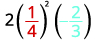</td>
</tr>
<tr valign="top">
<td data-valign="top" data-align="left">Simplify exponents first.</td>
<td data-valign="top" data-align="left">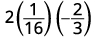</td>
</tr>
<tr valign="top">
<td data-valign="top" data-align="left">Multiply; divide out the common factors.
Notice we write 16 as <math xmlns="http://www.w3.org/1998/Math/MathML"><mrow><mn>2</mn><mo>·</mo><mn>2</mn><mo>·</mo><mn>4</mn></mrow></math> to make it easy to
remove common factors.</td>
<td data-valign="top" data-align="left">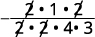</td>
</tr>
<tr valign="top">
<td data-valign="top" data-align="left">Simplify.</td>
<td data-valign="top" data-align="left">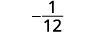</td>
</tr>
</tbody></table>

Evaluate <math xmlns="http://www.w3.org/1998/Math/MathML"><mrow><mn>3</mn><mi>a</mi><msup><mi>b</mi><mn>2</mn></msup></mrow></math>

 when <math xmlns="http://www.w3.org/1998/Math/MathML"><mrow><mi>a</mi><mo>=</mo><mo>−</mo><mfrac><mn>2</mn><mn>3</mn></mfrac></mrow></math>

 and <math xmlns="http://www.w3.org/1998/Math/MathML"><mrow><mi>b</mi><mo>=</mo><mo>−</mo><mfrac><mn>1</mn><mn>2</mn></mfrac><mo>.</mo></mrow></math>

<math xmlns="http://www.w3.org/1998/Math/MathML"><mrow><mo>−</mo><mfrac><mn>1</mn><mn>2</mn></mfrac></mrow></math>

Evaluate <math xmlns="http://www.w3.org/1998/Math/MathML"><mrow><mn>4</mn><msup><mi>c</mi><mn>3</mn></msup><mi>d</mi></mrow></math>

 when <math xmlns="http://www.w3.org/1998/Math/MathML"><mrow><mi>c</mi><mo>=</mo><mo>−</mo><mfrac><mn>1</mn><mn>2</mn></mfrac></mrow></math>

 and <math xmlns="http://www.w3.org/1998/Math/MathML"><mrow><mi>d</mi><mo>=</mo><mo>−</mo><mfrac><mn>4</mn><mn>3</mn></mfrac><mo>.</mo></mrow></math>

<math xmlns="http://www.w3.org/1998/Math/MathML"><mrow><mfrac><mn>2</mn><mn>3</mn></mfrac></mrow></math>

Access this online resource for additional instruction and practice with fractions.

* [Adding Fractions with Unlike Denominators][1]
{: data-bullet-style="bullet"}

### Key Concepts

* **Equivalent Fractions Property**
  * * *
  {: data-type="newline"}
  
  If *a*, *b*, and *c* are numbers where
  <math xmlns="http://www.w3.org/1998/Math/MathML"><mrow><mi>b</mi><mo>≠</mo><mn>0</mn><mo>,</mo><mi>c</mi><mo>≠</mo><mn>0</mn><mo>,</mo></mrow></math>
  
  then
  * * *
  {: data-type="newline"}
  
  <math xmlns="http://www.w3.org/1998/Math/MathML"><mrow><mspace width="2em" /><mfrac><mi>a</mi><mi>b</mi></mfrac><mo>=</mo><mfrac><mrow><mi>a</mi><mo>·</mo><mi>c</mi></mrow><mrow><mi>b</mi><mo>·</mo><mi>c</mi></mrow></mfrac><mspace width="0.5em" /><mtext>and</mtext><mspace width="0.5em" /><mfrac><mrow><mi>a</mi><mo>·</mo><mi>c</mi></mrow><mrow><mi>b</mi><mo>·</mo><mi>c</mi></mrow></mfrac><mo>=</mo><mfrac><mi>a</mi><mi>b</mi></mfrac><mo>.</mo></mrow></math>

* **How to simplify a fraction.**
  1.  Rewrite the numerator and denominator to show the common factors.
      * * *
      {: data-type="newline"}
      
      If needed, factor the numerator and denominator into prime numbers first.
  2.  Simplify using the Equivalent Fractions Property by dividing out common factors.
  3.  Multiply any remaining factors.
  {: type="1" .stepwise}

* **Fraction Multiplication**
  * * *
  {: data-type="newline"}
  
  If *a*, *b*, *c*, and *d* are numbers where
  <math xmlns="http://www.w3.org/1998/Math/MathML"><mrow><mi>b</mi><mo>≠</mo><mn>0</mn><mo>,</mo></mrow></math>
  
  and
  <math xmlns="http://www.w3.org/1998/Math/MathML"><mrow><mi>d</mi><mo>≠</mo><mn>0</mn><mo>,</mo></mrow></math>
  
  then
  * * *
  {: data-type="newline"}
  
  <math xmlns="http://www.w3.org/1998/Math/MathML"><mrow><mspace width="2em" /><mfrac><mi>a</mi><mi>b</mi></mfrac><mo>·</mo><mfrac><mi>c</mi><mi>d</mi></mfrac><mo>=</mo><mfrac><mrow><mi>a</mi><mi>c</mi></mrow><mrow><mi>b</mi><mi>d</mi></mrow></mfrac><mo>.</mo></mrow></math>
  
  * * *
  {: data-type="newline"}
  
  To multiply fractions, multiply the numerators and multiply the denominators.
* **Fraction Division**
  * * *
  {: data-type="newline"}
  
  If *a*, *b*, *c*, and *d* are numbers where
  <math xmlns="http://www.w3.org/1998/Math/MathML"><mrow><mi>b</mi><mo>≠</mo><mn>0</mn><mo>,</mo><mi>c</mi><mo>≠</mo><mn>0</mn><mo>,</mo></mrow></math>
  
  and
  <math xmlns="http://www.w3.org/1998/Math/MathML"><mrow><mi>d</mi><mo>≠</mo><mn>0</mn><mo>,</mo></mrow></math>
  
  then
  * * *
  {: data-type="newline"}
  
  <math xmlns="http://www.w3.org/1998/Math/MathML"><mrow><mspace width="2em" /><mfrac><mi>a</mi><mi>b</mi></mfrac><mo>÷</mo><mfrac><mi>c</mi><mi>d</mi></mfrac><mo>=</mo><mfrac><mi>a</mi><mi>b</mi></mfrac><mo>·</mo><mfrac><mi>d</mi><mi>c</mi></mfrac><mo>.</mo></mrow></math>
  
  * * *
  {: data-type="newline"}
  
  To divide fractions, we multiply the first fraction by the reciprocal of the second.
* **Fraction Addition and Subtraction**
  * * *
  {: data-type="newline"}
  
  If *a*, *b*, and *c* are numbers where
  <math xmlns="http://www.w3.org/1998/Math/MathML"><mrow><mi>c</mi><mo>≠</mo><mn>0</mn><mo>,</mo></mrow></math>
  
  then
  * * *
  {: data-type="newline"}
  
  <math xmlns="http://www.w3.org/1998/Math/MathML"><mrow><mspace width="2em" /><mfrac><mi>a</mi><mi>c</mi></mfrac><mo>+</mo><mfrac><mi>b</mi><mi>c</mi></mfrac><mo>=</mo><mfrac><mrow><mi>a</mi><mo>+</mo><mi>b</mi></mrow><mi>c</mi></mfrac><mspace width="0.5em" /><mtext>and</mtext><mspace width="0.5em" /><mfrac><mi>a</mi><mi>c</mi></mfrac><mo>−</mo><mfrac><mi>b</mi><mi>c</mi></mfrac><mo>=</mo><mfrac><mrow><mi>a</mi><mo>−</mo><mi>b</mi></mrow><mi>c</mi></mfrac><mo>.</mo></mrow></math>
  
  * * *
  {: data-type="newline"}
  
  To add or subtract fractions, add or subtract the numerators and place the result over the common denominator.
* **How to add or subtract fractions.**
  * * *
  {: data-type="newline"}
  
  1.  Do they have a common denominator?
      * Yes—go to step 2.
      * No—rewrite each fraction with the LCD (least common denominator).
        * Find the LCD.
        * Change each fraction into an equivalent fraction with the LCD as its denominator.
        {: data-bullet-style="bullet"}
      {: data-bullet-style="open-circle"}
  
  2.  Add or subtract the fractions.
  3.  Simplify, if possible.
  {: type="1" .stepwise}

* **How to simplify an expression with a fraction bar.**
  1.  Simplify the expression in the numerator. Simplify the expression in the denominator.
  2.  Simplify the fraction.
  {: type="1" .stepwise}

* **Placement of Negative Sign in a Fraction**
  * * *
  {: data-type="newline"}
  
  For any positive numbers *a* and *b*,
  * * *
  {: data-type="newline"}
  
  <math xmlns="http://www.w3.org/1998/Math/MathML"><mrow><mspace width="2em" /><mfrac><mrow><mtext>−</mtext><mi>a</mi></mrow><mi>b</mi></mfrac><mo>=</mo><mfrac><mi>a</mi><mrow><mtext>−</mtext><mi>b</mi></mrow></mfrac><mo>=</mo><mo>−</mo><mfrac><mi>a</mi><mi>b</mi></mfrac><mo>.</mo></mrow></math>

* **How to simplify complex fractions.**
  * * *
  {: data-type="newline"}
  
  1.  Simplify the numerator.
  2.  Simplify the denominator.
  3.  Divide the numerator by the denominator. Simplify if possible.
  {: type="1" .stepwise}
{: data-bullet-style="bullet"}

<section data-depth="1" class="section-exercises" markdown="1">
#### Practice Makes Perfect

**Simplify Fractions**

In the following exercises, simplify.

<math xmlns="http://www.w3.org/1998/Math/MathML"><mrow><mo>−</mo><mfrac><mrow><mn>108</mn></mrow><mrow><mn>63</mn></mrow></mfrac></mrow></math>

<math xmlns="http://www.w3.org/1998/Math/MathML"><mrow><mo>−</mo><mfrac><mrow><mn>12</mn></mrow><mn>7</mn></mfrac></mrow></math>

<math xmlns="http://www.w3.org/1998/Math/MathML"><mrow><mo>−</mo><mfrac><mrow><mn>104</mn></mrow><mrow><mn>48</mn></mrow></mfrac></mrow></math>

<math xmlns="http://www.w3.org/1998/Math/MathML"><mrow><mfrac><mrow><mn>120</mn></mrow><mrow><mn>252</mn></mrow></mfrac></mrow></math>

<math xmlns="http://www.w3.org/1998/Math/MathML"><mrow><mfrac><mrow><mn>10</mn></mrow><mrow><mn>21</mn></mrow></mfrac></mrow></math>

<math xmlns="http://www.w3.org/1998/Math/MathML"><mrow><mfrac><mrow><mn>182</mn></mrow><mrow><mn>294</mn></mrow></mfrac></mrow></math>

<math xmlns="http://www.w3.org/1998/Math/MathML"><mrow><mfrac><mrow><mn>14</mn><msup><mi>x</mi><mn>2</mn></msup></mrow><mrow><mn>21</mn><mi>y</mi></mrow></mfrac></mrow></math>

<math xmlns="http://www.w3.org/1998/Math/MathML"><mrow><mfrac><mrow><mn>2</mn><msup><mi>x</mi><mn>2</mn></msup></mrow><mrow><mn>3</mn><mi>y</mi></mrow></mfrac></mrow></math>

<math xmlns="http://www.w3.org/1998/Math/MathML"><mrow><mfrac><mrow><mn>24</mn><mi>a</mi></mrow><mrow><mn>32</mn><msup><mi>b</mi><mn>2</mn></msup></mrow></mfrac></mrow></math>

<math xmlns="http://www.w3.org/1998/Math/MathML"><mrow><mo>−</mo><mfrac><mrow><mn>210</mn><msup><mi>a</mi><mn>2</mn></msup></mrow><mrow><mn>110</mn><msup><mi>b</mi><mn>2</mn></msup></mrow></mfrac></mrow></math>

<math xmlns="http://www.w3.org/1998/Math/MathML"><mrow><mo>−</mo><mfrac><mrow><mn>21</mn><msup><mi>a</mi><mn>2</mn></msup></mrow><mrow><mn>11</mn><msup><mi>b</mi><mn>2</mn></msup></mrow></mfrac></mrow></math>

<math xmlns="http://www.w3.org/1998/Math/MathML"><mrow><mo>−</mo><mfrac><mrow><mn>30</mn><msup><mi>x</mi><mn>2</mn></msup></mrow><mrow><mn>105</mn><msup><mi>y</mi><mn>2</mn></msup></mrow></mfrac></mrow></math>

**Multiply and Divide Fractions**

In the following exercises, perform the indicated operation.

<math xmlns="http://www.w3.org/1998/Math/MathML"><mrow><mo>−</mo><mfrac><mn>3</mn><mn>4</mn></mfrac><mrow><mo>(</mo><mrow><mo>−</mo><mfrac><mn>4</mn><mn>9</mn></mfrac></mrow><mo>)</mo></mrow></mrow></math>

<math xmlns="http://www.w3.org/1998/Math/MathML"><mrow><mfrac><mn>1</mn><mn>3</mn></mfrac></mrow></math>

<math xmlns="http://www.w3.org/1998/Math/MathML"><mrow><mo>−</mo><mfrac><mn>3</mn><mn>8</mn></mfrac><mo>·</mo><mfrac><mn>4</mn><mrow><mn>15</mn></mrow></mfrac></mrow></math>

<math xmlns="http://www.w3.org/1998/Math/MathML"><mrow><mrow><mo>(</mo><mrow><mo>−</mo><mfrac><mrow><mn>14</mn></mrow><mrow><mn>15</mn></mrow></mfrac></mrow><mo>)</mo></mrow><mrow><mo>(</mo><mrow><mfrac><mn>9</mn><mrow><mn>20</mn></mrow></mfrac></mrow><mo>)</mo></mrow></mrow></math>

<math xmlns="http://www.w3.org/1998/Math/MathML"><mrow><mo>−</mo><mfrac><mrow><mn>21</mn></mrow><mrow><mn>50</mn></mrow></mfrac></mrow></math>

<math xmlns="http://www.w3.org/1998/Math/MathML"><mrow><mrow><mo>(</mo><mrow><mo>−</mo><mfrac><mn>9</mn><mrow><mn>10</mn></mrow></mfrac></mrow><mo>)</mo></mrow><mrow><mo>(</mo><mrow><mfrac><mrow><mn>25</mn></mrow><mrow><mn>33</mn></mrow></mfrac></mrow><mo>)</mo></mrow></mrow></math>

<math xmlns="http://www.w3.org/1998/Math/MathML"><mrow><mrow><mo>(</mo><mrow><mo>−</mo><mfrac><mrow><mn>63</mn></mrow><mrow><mn>84</mn></mrow></mfrac></mrow><mo>)</mo></mrow><mrow><mo>(</mo><mrow><mo>−</mo><mfrac><mrow><mn>44</mn></mrow><mrow><mn>90</mn></mrow></mfrac></mrow><mo>)</mo></mrow></mrow></math>

<math xmlns="http://www.w3.org/1998/Math/MathML"><mrow><mfrac><mrow><mn>11</mn></mrow><mrow><mn>30</mn></mrow></mfrac></mrow></math>

<math xmlns="http://www.w3.org/1998/Math/MathML"><mrow><mrow><mo>(</mo><mrow><mo>−</mo><mfrac><mrow><mn>33</mn></mrow><mrow><mn>60</mn></mrow></mfrac></mrow><mo>)</mo></mrow><mrow><mo>(</mo><mrow><mo>−</mo><mfrac><mrow><mn>40</mn></mrow><mrow><mn>88</mn></mrow></mfrac></mrow><mo>)</mo></mrow></mrow></math>

<math xmlns="http://www.w3.org/1998/Math/MathML"><mrow><mfrac><mn>3</mn><mn>7</mn></mfrac><mo>·</mo><mn>21</mn><mi>n</mi></mrow></math>

<math xmlns="http://www.w3.org/1998/Math/MathML"><mrow><mn>9</mn><mi>n</mi></mrow></math>

<math xmlns="http://www.w3.org/1998/Math/MathML"><mrow><mfrac><mn>5</mn><mn>6</mn></mfrac><mo>·</mo><mn>30</mn><mi>m</mi></mrow></math>

<math xmlns="http://www.w3.org/1998/Math/MathML"><mrow><mfrac><mn>3</mn><mn>4</mn></mfrac><mo>÷</mo><mfrac><mi>x</mi><mrow><mn>11</mn></mrow></mfrac></mrow></math>

<math xmlns="http://www.w3.org/1998/Math/MathML"><mrow><mfrac><mrow><mn>33</mn></mrow><mrow><mn>4</mn><mi>x</mi></mrow></mfrac></mrow></math>

<math xmlns="http://www.w3.org/1998/Math/MathML"><mrow><mfrac><mn>2</mn><mn>5</mn></mfrac><mo>÷</mo><mfrac><mi>y</mi><mn>9</mn></mfrac></mrow></math>

<math xmlns="http://www.w3.org/1998/Math/MathML"><mrow><mfrac><mn>5</mn><mrow><mn>18</mn></mrow></mfrac><mo>÷</mo><mrow><mo>(</mo><mrow><mo>−</mo><mfrac><mrow><mn>15</mn></mrow><mrow><mn>24</mn></mrow></mfrac></mrow><mo>)</mo></mrow></mrow></math>

<math xmlns="http://www.w3.org/1998/Math/MathML"><mrow><mo>−</mo><mfrac><mn>4</mn><mn>9</mn></mfrac></mrow></math>

<math xmlns="http://www.w3.org/1998/Math/MathML"><mrow><mfrac><mn>7</mn><mrow><mn>18</mn></mrow></mfrac><mo>÷</mo><mrow><mo>(</mo><mrow><mo>−</mo><mfrac><mrow><mn>14</mn></mrow><mrow><mn>27</mn></mrow></mfrac></mrow><mo>)</mo></mrow></mrow></math>

<math xmlns="http://www.w3.org/1998/Math/MathML"><mrow><mfrac><mrow><mn>8</mn><mi>u</mi></mrow><mrow><mn>15</mn></mrow></mfrac><mo>÷</mo><mfrac><mrow><mn>12</mn><mi>v</mi></mrow><mrow><mn>25</mn></mrow></mfrac></mrow></math>

<math xmlns="http://www.w3.org/1998/Math/MathML"><mrow><mfrac><mrow><mn>10</mn><mi>u</mi></mrow><mrow><mn>9</mn><mi>v</mi></mrow></mfrac></mrow></math>

<math xmlns="http://www.w3.org/1998/Math/MathML"><mrow><mfrac><mrow><mn>12</mn><mi>r</mi></mrow><mrow><mn>25</mn></mrow></mfrac><mo>÷</mo><mfrac><mrow><mn>18</mn><mi>s</mi></mrow><mrow><mn>35</mn></mrow></mfrac></mrow></math>

<math xmlns="http://www.w3.org/1998/Math/MathML"><mrow><mfrac><mn>3</mn><mn>4</mn></mfrac><mo>÷</mo><mrow><mo>(</mo><mrow><mn>−12</mn></mrow><mo>)</mo></mrow></mrow></math>

<math xmlns="http://www.w3.org/1998/Math/MathML"><mrow><mo>−</mo><mfrac><mn>1</mn><mrow><mn>16</mn></mrow></mfrac></mrow></math>

<math xmlns="http://www.w3.org/1998/Math/MathML"><mrow><mn>−15</mn><mo>÷</mo><mrow><mo>(</mo><mrow><mo>−</mo><mfrac><mn>5</mn><mn>3</mn></mfrac></mrow><mo>)</mo></mrow></mrow></math>

In the following exercises, simplify.

<math xmlns="http://www.w3.org/1998/Math/MathML"><mrow><mfrac><mrow><mo>−</mo><mfrac><mn>8</mn><mrow><mn>21</mn></mrow></mfrac></mrow><mrow><mspace width="0.2em" /><mtext /><mspace width="0.2em" /><mfrac><mrow><mn>12</mn></mrow><mrow><mn>35</mn></mrow></mfrac></mrow></mfrac></mrow></math>

<math xmlns="http://www.w3.org/1998/Math/MathML"><mrow><mo>−</mo><mfrac><mrow><mn>10</mn></mrow><mn>9</mn></mfrac></mrow></math>

<math xmlns="http://www.w3.org/1998/Math/MathML"><mrow><mfrac><mrow><mo>−</mo><mfrac><mn>9</mn><mrow><mn>16</mn></mrow></mfrac></mrow><mrow><mspace width="0.2em" /><mtext /><mspace width="0.2em" /><mfrac><mrow><mn>33</mn></mrow><mrow><mn>40</mn></mrow></mfrac></mrow></mfrac></mrow></math>

<math xmlns="http://www.w3.org/1998/Math/MathML"><mrow><mfrac><mrow><mo>−</mo><mfrac><mn>4</mn><mn>5</mn></mfrac></mrow><mrow><mspace width="0.2em" /><mtext /><mspace width="0.2em" /><mn>2</mn></mrow></mfrac></mrow></math>

<math xmlns="http://www.w3.org/1998/Math/MathML"><mrow><mo>−</mo><mfrac><mn>2</mn><mn>5</mn></mfrac></mrow></math>

<math xmlns="http://www.w3.org/1998/Math/MathML"><mrow><mfrac><mrow><mfrac><mn>5</mn><mn>3</mn></mfrac></mrow><mrow><mspace width="0.2em" /><mtext>10</mtext></mrow></mfrac></mrow></math>

<math xmlns="http://www.w3.org/1998/Math/MathML"><mrow><mfrac><mrow><mfrac><mi>m</mi><mn>3</mn></mfrac></mrow><mrow><mfrac><mi>n</mi><mn>2</mn></mfrac></mrow></mfrac></mrow></math>

<math xmlns="http://www.w3.org/1998/Math/MathML"><mrow><mfrac><mrow><mn>2</mn><mi>m</mi></mrow><mrow><mn>3</mn><mi>n</mi></mrow></mfrac></mrow></math>

<math xmlns="http://www.w3.org/1998/Math/MathML"><mrow><mfrac><mrow><mo>−</mo><mfrac><mn>3</mn><mn>8</mn></mfrac></mrow><mrow><mo>−</mo><mfrac><mi>y</mi><mrow><mn>12</mn></mrow></mfrac></mrow></mfrac></mrow></math>

**Add and Subtract Fractions**

In the following exercises, add or subtract.

<math xmlns="http://www.w3.org/1998/Math/MathML"><mrow><mfrac><mn>7</mn><mrow><mn>12</mn></mrow></mfrac><mo>+</mo><mfrac><mn>5</mn><mn>8</mn></mfrac></mrow></math>

<math xmlns="http://www.w3.org/1998/Math/MathML"><mrow><mfrac><mrow><mn>29</mn></mrow><mrow><mn>24</mn></mrow></mfrac></mrow></math>

<math xmlns="http://www.w3.org/1998/Math/MathML"><mrow><mfrac><mn>5</mn><mrow><mn>12</mn></mrow></mfrac><mo>+</mo><mfrac><mn>3</mn><mn>8</mn></mfrac></mrow></math>

<math xmlns="http://www.w3.org/1998/Math/MathML"><mrow><mfrac><mn>7</mn><mrow><mn>12</mn></mrow></mfrac><mo>−</mo><mfrac><mn>9</mn><mrow><mn>16</mn></mrow></mfrac></mrow></math>

<math xmlns="http://www.w3.org/1998/Math/MathML"><mrow><mfrac><mn>1</mn><mrow><mn>48</mn></mrow></mfrac></mrow></math>

<math xmlns="http://www.w3.org/1998/Math/MathML"><mrow><mfrac><mn>7</mn><mrow><mn>16</mn></mrow></mfrac><mo>−</mo><mfrac><mn>5</mn><mrow><mn>12</mn></mrow></mfrac></mrow></math>

<math xmlns="http://www.w3.org/1998/Math/MathML"><mrow><mo>−</mo><mfrac><mrow><mn>13</mn></mrow><mrow><mn>30</mn></mrow></mfrac><mo>+</mo><mfrac><mrow><mn>25</mn></mrow><mrow><mn>42</mn></mrow></mfrac></mrow></math>

<math xmlns="http://www.w3.org/1998/Math/MathML"><mrow><mfrac><mrow><mn>17</mn></mrow><mrow><mn>105</mn></mrow></mfrac></mrow></math>

<math xmlns="http://www.w3.org/1998/Math/MathML"><mrow><mo>−</mo><mfrac><mrow><mn>23</mn></mrow><mrow><mn>30</mn></mrow></mfrac><mo>+</mo><mfrac><mn>5</mn><mrow><mn>48</mn></mrow></mfrac></mrow></math>

<math xmlns="http://www.w3.org/1998/Math/MathML"><mrow><mo>−</mo><mfrac><mrow><mn>39</mn></mrow><mrow><mn>56</mn></mrow></mfrac><mo>−</mo><mfrac><mrow><mn>22</mn></mrow><mrow><mn>35</mn></mrow></mfrac></mrow></math>

<math xmlns="http://www.w3.org/1998/Math/MathML"><mrow><mo>−</mo><mfrac><mrow><mn>53</mn></mrow><mrow><mn>40</mn></mrow></mfrac></mrow></math>

<math xmlns="http://www.w3.org/1998/Math/MathML"><mrow><mo>−</mo><mfrac><mrow><mn>33</mn></mrow><mrow><mn>49</mn></mrow></mfrac><mo>−</mo><mfrac><mrow><mn>18</mn></mrow><mrow><mn>35</mn></mrow></mfrac></mrow></math>

<math xmlns="http://www.w3.org/1998/Math/MathML"><mrow><mo>−</mo><mfrac><mn>2</mn><mn>3</mn></mfrac><mo>−</mo><mrow><mo>(</mo><mrow><mo>−</mo><mfrac><mn>3</mn><mn>4</mn></mfrac></mrow><mo>)</mo></mrow></mrow></math>

<math xmlns="http://www.w3.org/1998/Math/MathML"><mrow><mfrac><mn>1</mn><mrow><mn>12</mn></mrow></mfrac></mrow></math>

<math xmlns="http://www.w3.org/1998/Math/MathML"><mrow><mo>−</mo><mfrac><mn>3</mn><mn>4</mn></mfrac><mo>−</mo><mrow><mo>(</mo><mrow><mo>−</mo><mfrac><mn>4</mn><mn>5</mn></mfrac></mrow><mo>)</mo></mrow></mrow></math>

<math xmlns="http://www.w3.org/1998/Math/MathML"><mrow><mfrac><mi>x</mi><mn>3</mn></mfrac><mo>+</mo><mfrac><mn>1</mn><mn>4</mn></mfrac></mrow></math>

<math xmlns="http://www.w3.org/1998/Math/MathML"><mrow><mfrac><mrow><mn>4</mn><mi>x</mi><mo>+</mo><mn>3</mn></mrow><mrow><mn>12</mn></mrow></mfrac></mrow></math>

<math xmlns="http://www.w3.org/1998/Math/MathML"><mrow><mfrac><mi>x</mi><mn>5</mn></mfrac><mo>−</mo><mfrac><mn>1</mn><mn>4</mn></mfrac></mrow></math>

* * *
{: data-type="newline"}

ⓐ <math xmlns="http://www.w3.org/1998/Math/MathML"><mrow><mfrac><mn>2</mn><mn>3</mn></mfrac><mo>+</mo><mfrac><mn>1</mn><mn>6</mn></mfrac></mrow></math>

* * *
{: data-type="newline"}

ⓑ <math xmlns="http://www.w3.org/1998/Math/MathML"><mrow><mfrac><mn>2</mn><mn>3</mn></mfrac><mo>÷</mo><mfrac><mn>1</mn><mn>6</mn></mfrac></mrow></math>

ⓐ <math xmlns="http://www.w3.org/1998/Math/MathML"><mrow><mfrac><mn>5</mn><mn>6</mn></mfrac></mrow></math>

ⓑ <math xmlns="http://www.w3.org/1998/Math/MathML"><mn>4</mn></math>

* * *
{: data-type="newline"}

ⓐ <math xmlns="http://www.w3.org/1998/Math/MathML"><mrow><mo>−</mo><mfrac><mn>2</mn><mn>5</mn></mfrac><mo>−</mo><mfrac><mn>1</mn><mn>8</mn></mfrac></mrow></math>

 * * *
{: data-type="newline"}

ⓑ <math xmlns="http://www.w3.org/1998/Math/MathML"><mrow><mo>−</mo><mfrac><mn>2</mn><mn>5</mn></mfrac><mo>·</mo><mfrac><mn>1</mn><mn>8</mn></mfrac></mrow></math>

* * *
{: data-type="newline"}

ⓐ <math xmlns="http://www.w3.org/1998/Math/MathML"><mrow><mfrac><mrow><mn>5</mn><mi>n</mi></mrow><mn>6</mn></mfrac><mo>÷</mo><mfrac><mn>8</mn><mrow><mn>15</mn></mrow></mfrac></mrow></math>

* * *
{: data-type="newline"}

ⓑ <math xmlns="http://www.w3.org/1998/Math/MathML"><mrow><mfrac><mrow><mn>5</mn><mi>n</mi></mrow><mn>6</mn></mfrac><mo>−</mo><mfrac><mn>8</mn><mrow><mn>15</mn></mrow></mfrac></mrow></math>

ⓐ <math xmlns="http://www.w3.org/1998/Math/MathML"><mrow><mfrac><mrow><mn>25</mn><mi>n</mi></mrow><mrow><mn>16</mn></mrow></mfrac></mrow></math>

 ⓑ <math xmlns="http://www.w3.org/1998/Math/MathML"><mrow><mfrac><mrow><mn>25</mn><mi>n</mi><mo>−</mo><mn>16</mn></mrow><mrow><mn>30</mn></mrow></mfrac></mrow></math>

* * *
{: data-type="newline"}

ⓐ <math xmlns="http://www.w3.org/1998/Math/MathML"><mrow><mfrac><mrow><mn>3</mn><mi>a</mi></mrow><mn>8</mn></mfrac><mo>÷</mo><mfrac><mn>7</mn><mrow><mn>12</mn></mrow></mfrac></mrow></math>

* * *
{: data-type="newline"}

ⓑ <math xmlns="http://www.w3.org/1998/Math/MathML"><mrow><mfrac><mrow><mn>3</mn><mi>a</mi></mrow><mn>8</mn></mfrac><mo>−</mo><mfrac><mn>7</mn><mrow><mn>12</mn></mrow></mfrac></mrow></math>

* * *
{: data-type="newline"}

ⓐ <math xmlns="http://www.w3.org/1998/Math/MathML"><mrow><mo>−</mo><mfrac><mrow><mn>4</mn><mi>x</mi></mrow><mn>9</mn></mfrac><mo>−</mo><mfrac><mn>5</mn><mn>6</mn></mfrac></mrow></math>

* * *
{: data-type="newline"}

ⓑ <math xmlns="http://www.w3.org/1998/Math/MathML"><mrow><mo>−</mo><mfrac><mrow><mn>4</mn><mi>k</mi></mrow><mn>9</mn></mfrac><mo>·</mo><mfrac><mn>5</mn><mn>6</mn></mfrac></mrow></math>

ⓐ <math xmlns="http://www.w3.org/1998/Math/MathML"><mrow><mfrac><mrow><mn>−8</mn><mi>x</mi><mo>−</mo><mn>15</mn></mrow><mrow><mn>18</mn></mrow></mfrac></mrow></math>

 ⓑ <math xmlns="http://www.w3.org/1998/Math/MathML"><mrow><mo>−</mo><mfrac><mrow><mn>10</mn><mi>k</mi></mrow><mrow><mn>27</mn></mrow></mfrac></mrow></math>

* * *
{: data-type="newline"}

ⓐ <math xmlns="http://www.w3.org/1998/Math/MathML"><mrow><mo>−</mo><mfrac><mrow><mn>3</mn><mi>y</mi></mrow><mn>8</mn></mfrac><mo>−</mo><mfrac><mn>4</mn><mn>3</mn></mfrac></mrow></math>

* * *
{: data-type="newline"}

ⓑ <math xmlns="http://www.w3.org/1998/Math/MathML"><mrow><mo>−</mo><mfrac><mrow><mn>3</mn><mi>y</mi></mrow><mn>8</mn></mfrac><mo>·</mo><mfrac><mn>4</mn><mn>3</mn></mfrac></mrow></math>

* * *
{: data-type="newline"}

ⓐ <math xmlns="http://www.w3.org/1998/Math/MathML"><mrow><mo>−</mo><mfrac><mrow><mn>5</mn><mi>a</mi></mrow><mn>3</mn></mfrac><mo>+</mo><mrow><mo>(</mo><mrow><mo>−</mo><mfrac><mrow><mn>10</mn></mrow><mn>6</mn></mfrac></mrow><mo>)</mo></mrow></mrow></math>

* * *
{: data-type="newline"}

ⓑ <math xmlns="http://www.w3.org/1998/Math/MathML"><mrow><mo>−</mo><mfrac><mrow><mn>5</mn><mi>a</mi></mrow><mn>3</mn></mfrac><mo>÷</mo><mrow><mo>(</mo><mrow><mo>−</mo><mfrac><mrow><mn>10</mn></mrow><mn>6</mn></mfrac></mrow><mo>)</mo></mrow></mrow></math>

ⓐ <math xmlns="http://www.w3.org/1998/Math/MathML"><mrow><mfrac><mrow><mn>−5</mn><mrow><mo>(</mo><mrow><mi>a</mi><mo>+</mo><mn>1</mn></mrow><mo>)</mo></mrow></mrow><mn>3</mn></mfrac></mrow></math>

 ⓑ <math xmlns="http://www.w3.org/1998/Math/MathML"><mrow><mi>a</mi></mrow></math>

* * *
{: data-type="newline"}

ⓐ <math xmlns="http://www.w3.org/1998/Math/MathML"><mrow><mfrac><mrow><mn>2</mn><mi>b</mi></mrow><mn>5</mn></mfrac><mo>+</mo><mfrac><mn>8</mn><mrow><mn>15</mn></mrow></mfrac></mrow></math>

* * *
{: data-type="newline"}

ⓑ <math xmlns="http://www.w3.org/1998/Math/MathML"><mrow><mfrac><mrow><mn>2</mn><mi>b</mi></mrow><mn>5</mn></mfrac><mo>÷</mo><mfrac><mn>8</mn><mrow><mn>15</mn></mrow></mfrac></mrow></math>

**Use the Order of Operations to Simplify Fractions**

In the following exercises, simplify.

<math xmlns="http://www.w3.org/1998/Math/MathML"><mrow><mfrac><mrow><mn>5</mn><mo>·</mo><mn>6</mn><mo>−</mo><mn>3</mn><mo>·</mo><mn>4</mn></mrow><mrow><mn>4</mn><mo>·</mo><mn>5</mn><mo>−</mo><mn>2</mn><mo>·</mo><mn>3</mn></mrow></mfrac></mrow></math>

<math xmlns="http://www.w3.org/1998/Math/MathML"><mrow><mfrac><mn>9</mn><mn>7</mn></mfrac></mrow></math>

<math xmlns="http://www.w3.org/1998/Math/MathML"><mrow><mfrac><mrow><mn>8</mn><mo>·</mo><mn>9</mn><mo>−</mo><mn>7</mn><mo>·</mo><mn>6</mn></mrow><mrow><mn>5</mn><mo>·</mo><mn>6</mn><mo>−</mo><mn>9</mn><mo>·</mo><mn>2</mn></mrow></mfrac></mrow></math>

<math xmlns="http://www.w3.org/1998/Math/MathML"><mrow><mfrac><mrow><msup><mn>5</mn><mn>2</mn></msup><mo>−</mo><msup><mn>3</mn><mn>2</mn></msup></mrow><mrow><mn>3</mn><mo>−</mo><mn>5</mn></mrow></mfrac></mrow></math>

<math xmlns="http://www.w3.org/1998/Math/MathML"><mrow><mn>−8</mn></mrow></math>

<math xmlns="http://www.w3.org/1998/Math/MathML"><mrow><mfrac><mrow><msup><mn>6</mn><mn>2</mn></msup><mo>−</mo><msup><mn>4</mn><mn>2</mn></msup></mrow><mrow><mn>4</mn><mo>−</mo><mn>6</mn></mrow></mfrac></mrow></math>

<math xmlns="http://www.w3.org/1998/Math/MathML"><mrow><mfrac><mrow><mn>7</mn><mo>·</mo><mn>4</mn><mo>−</mo><mn>2</mn><mrow><mo>(</mo><mrow><mn>8</mn><mo>−</mo><mn>5</mn></mrow><mo>)</mo></mrow></mrow><mrow><mn>9</mn><mo>·</mo><mn>3</mn><mo>−</mo><mn>3</mn><mo>·</mo><mn>5</mn></mrow></mfrac></mrow></math>

<math xmlns="http://www.w3.org/1998/Math/MathML"><mrow><mfrac><mrow><mn>11</mn></mrow><mn>6</mn></mfrac></mrow></math>

<math xmlns="http://www.w3.org/1998/Math/MathML"><mrow><mfrac><mrow><mn>9</mn><mo>·</mo><mn>7</mn><mo>−</mo><mn>3</mn><mrow><mo>(</mo><mrow><mn>12</mn><mo>−</mo><mn>8</mn></mrow><mo>)</mo></mrow></mrow><mrow><mn>8</mn><mo>·</mo><mn>7</mn><mo>−</mo><mn>6</mn><mo>·</mo><mn>6</mn></mrow></mfrac></mrow></math>

<math xmlns="http://www.w3.org/1998/Math/MathML"><mrow><mfrac><mrow><mn>9</mn><mrow><mo>(</mo><mrow><mn>8</mn><mo>−</mo><mn>2</mn></mrow><mo>)</mo></mrow><mo>−</mo><mn>3</mn><mrow><mo>(</mo><mrow><mn>15</mn><mo>−</mo><mn>7</mn></mrow><mo>)</mo></mrow></mrow><mrow><mn>6</mn><mrow><mo>(</mo><mrow><mn>7</mn><mo>−</mo><mn>1</mn></mrow><mo>)</mo></mrow><mo>−</mo><mn>3</mn><mrow><mo>(</mo><mrow><mn>17</mn><mo>−</mo><mn>9</mn></mrow><mo>)</mo></mrow></mrow></mfrac></mrow></math>

<math xmlns="http://www.w3.org/1998/Math/MathML"><mrow><mfrac><mn>5</mn><mn>2</mn></mfrac></mrow></math>

<math xmlns="http://www.w3.org/1998/Math/MathML"><mrow><mfrac><mrow><mn>8</mn><mrow><mo>(</mo><mrow><mn>9</mn><mo>−</mo><mn>2</mn></mrow><mo>)</mo></mrow><mo>−</mo><mn>4</mn><mrow><mo>(</mo><mrow><mn>14</mn><mo>−</mo><mn>9</mn></mrow><mo>)</mo></mrow></mrow><mrow><mn>7</mn><mrow><mo>(</mo><mrow><mn>8</mn><mo>−</mo><mn>3</mn></mrow><mo>)</mo></mrow><mo>−</mo><mn>3</mn><mrow><mo>(</mo><mrow><mn>16</mn><mo>−</mo><mn>9</mn></mrow><mo>)</mo></mrow></mrow></mfrac></mrow></math>

<math xmlns="http://www.w3.org/1998/Math/MathML"><mrow><mfrac><mrow><msup><mn>2</mn><mn>3</mn></msup><mo>+</mo><msup><mn>4</mn><mn>2</mn></msup></mrow><mrow><msup><mrow><mrow><mo>(</mo><mrow><mfrac><mn>2</mn><mn>3</mn></mfrac></mrow><mo>)</mo></mrow></mrow><mn>2</mn></msup></mrow></mfrac></mrow></math>

<math xmlns="http://www.w3.org/1998/Math/MathML"><mrow><mn>54</mn></mrow></math>

<math xmlns="http://www.w3.org/1998/Math/MathML"><mrow><mfrac><mrow><msup><mn>3</mn><mn>3</mn></msup><mo>−</mo><msup><mn>3</mn><mn>2</mn></msup></mrow><mrow><msup><mrow><mrow><mo>(</mo><mrow><mfrac><mn>3</mn><mn>4</mn></mfrac></mrow><mo>)</mo></mrow></mrow><mn>2</mn></msup></mrow></mfrac></mrow></math>

<math xmlns="http://www.w3.org/1998/Math/MathML"><mrow><mfrac><mrow><msup><mrow><mrow><mo>(</mo><mrow><mfrac><mn>3</mn><mn>5</mn></mfrac></mrow><mo>)</mo></mrow></mrow><mn>2</mn></msup></mrow><mrow><msup><mrow><mrow><mo>(</mo><mrow><mfrac><mn>3</mn><mn>7</mn></mfrac></mrow><mo>)</mo></mrow></mrow><mn>2</mn></msup></mrow></mfrac></mrow></math>

<math xmlns="http://www.w3.org/1998/Math/MathML"><mrow><mfrac><mrow><mn>49</mn></mrow><mrow><mn>25</mn></mrow></mfrac></mrow></math>

<math xmlns="http://www.w3.org/1998/Math/MathML"><mrow><mfrac><mrow><msup><mrow><mrow><mo>(</mo><mrow><mfrac><mn>3</mn><mn>4</mn></mfrac></mrow><mo>)</mo></mrow></mrow><mn>2</mn></msup></mrow><mrow><msup><mrow><mrow><mo>(</mo><mrow><mfrac><mn>5</mn><mn>8</mn></mfrac></mrow><mo>)</mo></mrow></mrow><mn>2</mn></msup></mrow></mfrac></mrow></math>

<math xmlns="http://www.w3.org/1998/Math/MathML"><mrow><mfrac><mn>2</mn><mrow><mfrac><mn>1</mn><mn>3</mn></mfrac><mo>+</mo><mfrac><mn>1</mn><mn>5</mn></mfrac></mrow></mfrac></mrow></math>

<math xmlns="http://www.w3.org/1998/Math/MathML"><mrow><mfrac><mrow><mn>15</mn></mrow><mn>4</mn></mfrac></mrow></math>

<math xmlns="http://www.w3.org/1998/Math/MathML"><mrow><mfrac><mn>5</mn><mrow><mfrac><mn>1</mn><mn>4</mn></mfrac><mo>+</mo><mfrac><mn>1</mn><mn>3</mn></mfrac></mrow></mfrac></mrow></math>

<math xmlns="http://www.w3.org/1998/Math/MathML"><mrow><mfrac><mrow><mfrac><mn>7</mn><mn>8</mn></mfrac><mo>−</mo><mfrac><mn>2</mn><mn>3</mn></mfrac></mrow><mrow><mfrac><mn>1</mn><mn>2</mn></mfrac><mo>+</mo><mfrac><mn>3</mn><mn>8</mn></mfrac></mrow></mfrac></mrow></math>

<math xmlns="http://www.w3.org/1998/Math/MathML"><mrow><mfrac><mn>5</mn><mrow><mn>21</mn></mrow></mfrac></mrow></math>

<math xmlns="http://www.w3.org/1998/Math/MathML"><mrow><mfrac><mrow><mfrac><mn>3</mn><mn>4</mn></mfrac><mo>−</mo><mfrac><mn>3</mn><mn>5</mn></mfrac></mrow><mrow><mfrac><mn>1</mn><mn>4</mn></mfrac><mo>+</mo><mfrac><mn>2</mn><mn>5</mn></mfrac></mrow></mfrac></mrow></math>

**Mixed Practice**

In the following exercises, simplify.

<math xmlns="http://www.w3.org/1998/Math/MathML"><mrow><mo>−</mo><mfrac><mn>3</mn><mn>8</mn></mfrac><mo>÷</mo><mrow><mo>(</mo><mrow><mo>−</mo><mfrac><mn>3</mn><mrow><mn>10</mn></mrow></mfrac></mrow><mo>)</mo></mrow></mrow></math>

<math xmlns="http://www.w3.org/1998/Math/MathML"><mrow><mfrac><mn>5</mn><mn>4</mn></mfrac></mrow></math>

<math xmlns="http://www.w3.org/1998/Math/MathML"><mrow><mo>−</mo><mfrac><mn>3</mn><mrow><mn>12</mn></mrow></mfrac><mo>÷</mo><mrow><mo>(</mo><mrow><mo>−</mo><mfrac><mn>5</mn><mn>9</mn></mfrac></mrow><mo>)</mo></mrow></mrow></math>

<math xmlns="http://www.w3.org/1998/Math/MathML"><mrow><mo>−</mo><mfrac><mn>3</mn><mn>8</mn></mfrac><mo>+</mo><mfrac><mn>5</mn><mrow><mn>12</mn></mrow></mfrac></mrow></math>

<math xmlns="http://www.w3.org/1998/Math/MathML"><mrow><mfrac><mn>1</mn><mrow><mn>24</mn></mrow></mfrac></mrow></math>

<math xmlns="http://www.w3.org/1998/Math/MathML"><mrow><mo>−</mo><mfrac><mn>1</mn><mn>8</mn></mfrac><mo>+</mo><mfrac><mn>7</mn><mrow><mn>12</mn></mrow></mfrac></mrow></math>

<math xmlns="http://www.w3.org/1998/Math/MathML"><mrow><mo>−</mo><mfrac><mn>7</mn><mrow><mn>15</mn></mrow></mfrac><mo>−</mo><mfrac><mi>y</mi><mn>4</mn></mfrac></mrow></math>

<math xmlns="http://www.w3.org/1998/Math/MathML"><mrow><mfrac><mrow><mn>−28</mn><mo>−</mo><mn>15</mn><mi>y</mi></mrow><mrow><mn>60</mn></mrow></mfrac></mrow></math>

<math xmlns="http://www.w3.org/1998/Math/MathML"><mrow><mo>−</mo><mfrac><mn>3</mn><mn>8</mn></mfrac><mo>−</mo><mfrac><mi>x</mi><mrow><mn>11</mn></mrow></mfrac></mrow></math>

<math xmlns="http://www.w3.org/1998/Math/MathML"><mrow><mfrac><mrow><mn>11</mn></mrow><mrow><mn>12</mn><mi>a</mi></mrow></mfrac><mo>·</mo><mfrac><mrow><mn>9</mn><mi>a</mi></mrow><mrow><mn>16</mn></mrow></mfrac></mrow></math>

<math xmlns="http://www.w3.org/1998/Math/MathML"><mrow><mfrac><mrow><mn>33</mn></mrow><mrow><mn>64</mn></mrow></mfrac></mrow></math>

<math xmlns="http://www.w3.org/1998/Math/MathML"><mrow><mfrac><mrow><mn>10</mn><mi>y</mi></mrow><mrow><mn>13</mn></mrow></mfrac><mo>·</mo><mfrac><mn>8</mn><mrow><mn>15</mn><mi>y</mi></mrow></mfrac></mrow></math>

<math xmlns="http://www.w3.org/1998/Math/MathML"><mrow><mfrac><mn>1</mn><mn>2</mn></mfrac><mo>+</mo><mfrac><mn>2</mn><mn>3</mn></mfrac><mo>·</mo><mfrac><mn>5</mn><mrow><mn>12</mn></mrow></mfrac></mrow></math>

<math xmlns="http://www.w3.org/1998/Math/MathML"><mrow><mfrac><mn>7</mn><mn>9</mn></mfrac></mrow></math>

<math xmlns="http://www.w3.org/1998/Math/MathML"><mrow><mfrac><mn>1</mn><mn>3</mn></mfrac><mo>+</mo><mfrac><mn>2</mn><mn>5</mn></mfrac><mo>·</mo><mfrac><mn>3</mn><mn>4</mn></mfrac></mrow></math>

<math xmlns="http://www.w3.org/1998/Math/MathML"><mrow><mn>1</mn><mo>−</mo><mfrac><mn>3</mn><mn>5</mn></mfrac><mo>÷</mo><mfrac><mn>1</mn><mrow><mn>10</mn></mrow></mfrac></mrow></math>

<math xmlns="http://www.w3.org/1998/Math/MathML"><mrow><mn>−5</mn></mrow></math>

<math xmlns="http://www.w3.org/1998/Math/MathML"><mrow><mn>1</mn><mo>−</mo><mfrac><mn>5</mn><mn>6</mn></mfrac><mo>÷</mo><mfrac><mn>1</mn><mrow><mn>12</mn></mrow></mfrac></mrow></math>

<math xmlns="http://www.w3.org/1998/Math/MathML"><mrow><mfrac><mn>3</mn><mn>8</mn></mfrac><mo>−</mo><mfrac><mn>1</mn><mn>6</mn></mfrac><mo>+</mo><mfrac><mn>3</mn><mn>4</mn></mfrac></mrow></math>

<math xmlns="http://www.w3.org/1998/Math/MathML"><mrow><mfrac><mrow><mn>23</mn></mrow><mrow><mn>24</mn></mrow></mfrac></mrow></math>

<math xmlns="http://www.w3.org/1998/Math/MathML"><mrow><mfrac><mn>2</mn><mn>5</mn></mfrac><mo>+</mo><mfrac><mn>5</mn><mn>8</mn></mfrac><mo>−</mo><mfrac><mn>3</mn><mn>4</mn></mfrac></mrow></math>

<math xmlns="http://www.w3.org/1998/Math/MathML"><mrow><mn>12</mn><mrow><mo>(</mo><mrow><mfrac><mn>9</mn><mrow><mn>20</mn></mrow></mfrac><mo>−</mo><mfrac><mn>4</mn><mrow><mn>15</mn></mrow></mfrac></mrow><mo>)</mo></mrow></mrow></math>

<math xmlns="http://www.w3.org/1998/Math/MathML"><mrow><mfrac><mrow><mn>11</mn></mrow><mn>5</mn></mfrac></mrow></math>

<math xmlns="http://www.w3.org/1998/Math/MathML"><mrow><mn>8</mn><mrow><mo>(</mo><mrow><mfrac><mrow><mn>15</mn></mrow><mrow><mn>16</mn></mrow></mfrac><mo>−</mo><mfrac><mn>5</mn><mn>6</mn></mfrac></mrow><mo>)</mo></mrow></mrow></math>

<math xmlns="http://www.w3.org/1998/Math/MathML"><mrow><mfrac><mrow><mfrac><mn>5</mn><mn>8</mn></mfrac><mo>+</mo><mfrac><mn>1</mn><mn>6</mn></mfrac></mrow><mrow><mfrac><mrow><mn>19</mn></mrow><mrow><mn>24</mn></mrow></mfrac></mrow></mfrac></mrow></math>

<math xmlns="http://www.w3.org/1998/Math/MathML"><mn>1</mn></math>

<math xmlns="http://www.w3.org/1998/Math/MathML"><mrow><mfrac><mrow><mfrac><mn>1</mn><mn>6</mn></mfrac><mo>+</mo><mfrac><mn>3</mn><mrow><mn>10</mn></mrow></mfrac></mrow><mrow><mfrac><mrow><mn>14</mn></mrow><mrow><mn>30</mn></mrow></mfrac></mrow></mfrac></mrow></math>

<math xmlns="http://www.w3.org/1998/Math/MathML"><mrow><mrow><mo>(</mo><mrow><mfrac><mn>5</mn><mn>9</mn></mfrac><mo>+</mo><mfrac><mn>1</mn><mn>6</mn></mfrac></mrow><mo>)</mo></mrow><mo>÷</mo><mrow><mo>(</mo><mrow><mfrac><mn>2</mn><mn>3</mn></mfrac><mo>−</mo><mfrac><mn>1</mn><mn>2</mn></mfrac></mrow><mo>)</mo></mrow></mrow></math>

<math xmlns="http://www.w3.org/1998/Math/MathML"><mrow><mfrac><mrow><mn>13</mn></mrow><mn>3</mn></mfrac></mrow></math>

<math xmlns="http://www.w3.org/1998/Math/MathML"><mrow><mrow><mo>(</mo><mrow><mfrac><mn>3</mn><mn>4</mn></mfrac><mo>+</mo><mfrac><mn>1</mn><mn>6</mn></mfrac></mrow><mo>)</mo></mrow><mo>÷</mo><mrow><mo>(</mo><mrow><mfrac><mn>5</mn><mn>8</mn></mfrac><mo>−</mo><mfrac><mn>1</mn><mn>3</mn></mfrac></mrow><mo>)</mo></mrow></mrow></math>

**Evaluate Variable Expressions with Fractions**

In the following exercises, evaluate.

<math xmlns="http://www.w3.org/1998/Math/MathML"><mrow><mfrac><mn>7</mn><mrow><mn>10</mn></mrow></mfrac><mo>−</mo><mi>w</mi></mrow></math>

 when* * *
{: data-type="newline"}

ⓐ <math xmlns="http://www.w3.org/1998/Math/MathML"><mrow><mi>w</mi><mo>=</mo><mfrac><mn>1</mn><mn>2</mn></mfrac></mrow></math>

 ⓑ <math xmlns="http://www.w3.org/1998/Math/MathML"><mrow><mi>w</mi><mo>=</mo><mo>−</mo><mfrac><mn>1</mn><mn>2</mn></mfrac></mrow></math>

ⓐ <math xmlns="http://www.w3.org/1998/Math/MathML"><mrow><mfrac><mn>1</mn><mn>5</mn></mfrac></mrow></math>

 ⓑ <math xmlns="http://www.w3.org/1998/Math/MathML"><mrow><mfrac><mn>6</mn><mn>5</mn></mfrac></mrow></math>

<math xmlns="http://www.w3.org/1998/Math/MathML"><mrow><mfrac><mn>5</mn><mrow><mn>12</mn></mrow></mfrac><mo>−</mo><mi>w</mi></mrow></math>

 when* * *
{: data-type="newline"}

ⓐ <math xmlns="http://www.w3.org/1998/Math/MathML"><mrow><mi>w</mi><mo>=</mo><mfrac><mn>1</mn><mn>4</mn></mfrac></mrow></math>

 ⓑ <math xmlns="http://www.w3.org/1998/Math/MathML"><mrow><mi>w</mi><mo>=</mo><mo>−</mo><mfrac><mn>1</mn><mn>4</mn></mfrac></mrow></math>

<math xmlns="http://www.w3.org/1998/Math/MathML"><mrow><mn>2</mn><msup><mi>x</mi><mn>2</mn></msup><msup><mi>y</mi><mn>3</mn></msup></mrow></math>

 when* * *
{: data-type="newline"}

<math xmlns="http://www.w3.org/1998/Math/MathML"><mrow><mi>x</mi><mo>=</mo><mo>−</mo><mfrac><mn>2</mn><mn>3</mn></mfrac></mrow></math>

 and <math xmlns="http://www.w3.org/1998/Math/MathML"><mrow><mi>y</mi><mo>=</mo><mo>−</mo><mfrac><mn>1</mn><mn>2</mn></mfrac></mrow></math>

<math xmlns="http://www.w3.org/1998/Math/MathML"><mrow><mo>−</mo><mfrac><mn>1</mn><mn>9</mn></mfrac></mrow></math>

<math xmlns="http://www.w3.org/1998/Math/MathML"><mrow><mn>8</mn><msup><mi>u</mi><mn>2</mn></msup><msup><mi>v</mi><mn>3</mn></msup></mrow></math>

 when* * *
{: data-type="newline"}

<math xmlns="http://www.w3.org/1998/Math/MathML"><mrow><mi>u</mi><mo>=</mo><mo>−</mo><mfrac><mn>3</mn><mn>4</mn></mfrac></mrow></math>

 and <math xmlns="http://www.w3.org/1998/Math/MathML"><mrow><mi>v</mi><mo>=</mo><mo>−</mo><mfrac><mn>1</mn><mn>2</mn></mfrac></mrow></math>

<math xmlns="http://www.w3.org/1998/Math/MathML"><mrow><mfrac><mrow><mi>a</mi><mo>+</mo><mi>b</mi></mrow><mrow><mi>a</mi><mo>−</mo><mi>b</mi></mrow></mfrac></mrow></math>

 when* * *
{: data-type="newline"}

<math xmlns="http://www.w3.org/1998/Math/MathML"><mrow><mi>a</mi><mo>=</mo><mn>−3</mn><mo>,</mo><mi>b</mi><mo>=</mo><mn>8</mn></mrow></math>

<math xmlns="http://www.w3.org/1998/Math/MathML"><mrow><mo>−</mo><mfrac><mn>5</mn><mrow><mn>11</mn></mrow></mfrac></mrow></math>

<math xmlns="http://www.w3.org/1998/Math/MathML"><mrow><mfrac><mrow><mi>r</mi><mo>−</mo><mi>s</mi></mrow><mrow><mi>r</mi><mo>+</mo><mi>s</mi></mrow></mfrac></mrow></math>

 when* * *
{: data-type="newline"}

<math xmlns="http://www.w3.org/1998/Math/MathML"><mrow><mi>r</mi><mo>=</mo><mn>10</mn><mo>,</mo><mi>s</mi><mo>=</mo><mn>−5</mn></mrow></math>

#### Writing Exercises

Why do you need a common denominator to add or subtract fractions? Explain.

Answers will vary.

How do you find the LCD of 2 fractions?

Explain how you find the reciprocal of a fraction.

Answers will vary.

Explain how you find the reciprocal of a negative number.

#### Self Check

ⓐ After completing the exercises, use this checklist to evaluate your mastery of the objectives of this section.

  
ⓑ What does this checklist tell you about your mastery of this section? What steps will you take to improve?

</section>

### Glossary
{: data-type="glossary-title"}

complex fraction
: A fraction in which the numerator or the denominator is a fraction is called a complex fraction.
^

denominator
: In a fraction, written
  <math xmlns="http://www.w3.org/1998/Math/MathML"><mrow><mfrac><mi>a</mi><mi>b</mi></mfrac><mo>,</mo></mrow></math>
  
  where
  <math xmlns="http://www.w3.org/1998/Math/MathML"><mrow><mi>b</mi><mo>≠</mo><mn>0</mn><mo>,</mo></mrow></math>
  
  the denominator *b* is the number of equal parts the whole has been divided into.
^

equivalent fractions
: Equivalent fractions are fractions that have the same value.
^

fraction
: A fraction is written
  <math xmlns="http://www.w3.org/1998/Math/MathML"><mrow><mfrac><mi>a</mi><mi>b</mi></mfrac><mo>,</mo></mrow></math>
  
  where
  <math xmlns="http://www.w3.org/1998/Math/MathML"><mrow><mi>b</mi><mo>≠</mo><mn>0</mn><mo>,</mo></mrow></math>
  
  and *a* is the numerator and *b* is the denominator. A fraction represents parts of a whole.
^

least common denominator
: The least common denominator (LCD) of two fractions is the least common multiple (LCM) of their denominators.
^

numerator
: In a fraction, written
  <math xmlns="http://www.w3.org/1998/Math/MathML"><mrow><mfrac><mi>a</mi><mi>b</mi></mfrac><mo>,</mo></mrow></math>
  
  where
  <math xmlns="http://www.w3.org/1998/Math/MathML"><mrow><mi>b</mi><mo>≠</mo><mn>0</mn><mo>,</mo></mrow></math>
  
  the numerator *a* indicates how many parts are included.
^

reciprocal
: The reciprocal of a fraction is found by inverting the fraction, placing the numerator in the denominator and the denominator in the numerator.

[1]: https://openstax.org/l/25addfractions
