

By the end of this section, you will be able to:
* Round decimals
* Add and subtract decimals
* Multiply and divide decimals
* Convert decimals, fractions, and percents
* Simplify expressions with square roots
* Identify integers, rational numbers, irrational numbers, and real numbers
* Locate fractions and decimals on the number line

A more thorough introduction to the topics covered in this section can be found in the *Elementary Algebra* chapter, Foundations.

### Round Decimals

Decimals are another way of writing fractions whose denominators are powers of ten.

<math xmlns="http://www.w3.org/1998/Math/MathML"><mrow><mtable><mtr><mtd columnalign="right"><mn>0.1</mn></mtd><mtd columnalign="left"><mo>=</mo></mtd><mtd columnalign="left"><mfrac><mn>1</mn><mrow><mn>10</mn></mrow></mfrac></mtd><mtd /><mtd /><mtd columnalign="left"><mtext>is “one tenth”</mtext></mtd></mtr> <mtr><mtd columnalign="right"><mn>0.01</mn></mtd><mtd columnalign="left"><mo>=</mo></mtd><mtd columnalign="left"><mfrac><mn>1</mn><mrow><mn>100</mn></mrow></mfrac></mtd><mtd /><mtd /><mtd columnalign="left"><mtext>is “one hundredth”</mtext></mtd></mtr> <mtr><mtd columnalign="right"><mn>0.001</mn></mtd><mtd columnalign="left"><mo>=</mo></mtd><mtd columnalign="left"><mfrac><mn>1</mn><mrow><mn>1000</mn></mrow></mfrac></mtd><mtd /><mtd /><mtd columnalign="left"><mtext>is “one thousandth”</mtext></mtd></mtr> <mtr><mtd columnalign="right"><mn>0.0001</mn></mtd><mtd columnalign="left"><mo>=</mo></mtd><mtd columnalign="left"><mfrac><mn>1</mn><mrow><mn>10,000</mn></mrow></mfrac></mtd><mtd /><mtd /><mtd columnalign="left"><mtext>is “one ten-thousandth”</mtext></mtd></mtr></mtable></mrow></math>

Just as in whole numbers, each digit of a decimal corresponds to the place value based on the powers of ten. [\[link\]](#CNX_IntAlg_Figure_01_04_023) shows the names of the place values to the left and right of the decimal point.

 {: #CNX_IntAlg_Figure_01_04_023}

When we work with decimals, it is often necessary to round the number to the nearest required place value. We summarize the steps for rounding a decimal here.

Round decimals.

1.  Locate the given place value and mark it with an arrow.
2.  Underline the digit to the right of the place value.
3.  Is the underlined digit greater than or equal to 5?
    * Yes: add 1 to the digit in the given place value.
    * No: do <u data-effect="underline">not</u> change the digit in the given place value
    {: data-bullet-style="bullet"}

4.  Rewrite the number, deleting all digits to the right of the rounding digit.
{: type="1" .stepwise}

Round 18.379 to the nearest ⓐ hundredth ⓑ tenth ⓒ whole number.

Round <math xmlns="http://www.w3.org/1998/Math/MathML"><mrow><mn>18.379</mn><mo>.</mo></mrow></math>

ⓐ to the nearest hundredth

<table class="unnumbered unstyled" summary="Locate the hundredths place with an arrow. In the number 18.379, the arrow points to 7. Underline the digit to the right of the given place value. Underline 9. Because 9 is greater than or equal to 5, add 1 to the 7. Rewrite the number, deleting all digits to the right of the rounding digit. Now we have 18.38. Notice that the deleted digits were NOT replaced with zeros. So, 18.379 rounded to the nearest hundredth is 18.38." data-label=""><tbody>
<tr valign="top">
<td data-valign="top" data-align="left">Locate the hundredths place with an arrow.</td>
<td data-valign="top" data-align="left">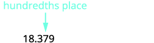</td>
</tr>
<tr valign="top">
<td data-valign="top" data-align="left">Underline the digit to the right of the given
place value.</td>
<td data-valign="top" data-align="left">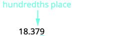</td>
</tr>
<tr valign="top">
<td data-valign="top" data-align="left">Because 9 is greater than or equal to 5, add 1 to
the 7.</td>
<td data-valign="top" data-align="left">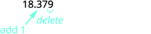</td>
</tr>
<tr valign="top">
<td data-valign="top" data-align="left">Rewrite the number, deleting all digits to the
right of the rounding digit.</td>
<td data-valign="top" data-align="left"></td>
</tr>
<tr valign="top">
<td data-valign="top" data-align="left">Notice that the deleted digits were NOT
replaced with zeros.</td>
<td data-valign="top" data-align="left"></td>
</tr>
</tbody></table>
ⓑ to the nearest tenth

<table class="unnumbered unstyled can-break" summary="Locate the tenths place with an arrow. In the number 18.379, the arrow points to 3. Underline the digit to the right of the given place value. Underline 7. Because 7 is greater than or equal to 5, add 1 to the 3. Rewrite the number, deleting all digits to the right of the rounding digit. Now we have 18.4. Notice that the deleted digits were NOT replaced with zeros. So, 18.379 rounded to the nearest tenth is 18.4." data-label=""><tbody>
<tr valign="top">
<td data-valign="top" data-align="left">Locate the tenths place with an arrow.     </td>
<td data-valign="top" data-align="left">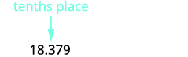</td>
</tr>
<tr valign="top">
<td data-valign="top" data-align="left">Underline the digit to the right of the
given place value.</td>
<td data-valign="top" data-align="left">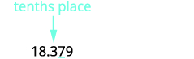</td>
</tr>
<tr valign="top">
<td data-valign="top" data-align="left">Because 7 is greater than or equal to 5,
add 1 to the 3.</td>
<td data-valign="top" data-align="left"></td>
</tr>
<tr valign="top">
<td data-valign="top" data-align="left">Rewrite the number, deleting all digits to
the right of the rounding digit.</td>
<td data-valign="top" data-align="left"></td>
</tr>
<tr valign="top">
<td data-valign="top" data-align="left">Notice that the deleted digits were NOT
replaced with zeros.</td>
<td data-valign="top" data-align="left"></td>
</tr>
</tbody></table>
ⓒ to the nearest whole number

<table class="unnumbered unstyled" summary="Locate the ones place with an arrow. In the number 18.379, the arrow points to 8. Underline the digit to the right of the given place value. Underline 3. Since 3 is not greater than or equal to 5, do not add 1 to 8. Rewrite the number, deleting all digits to the right of the rounding digit. So, 18.379 rounded to the nearest whole number is 18." data-label=""><tbody>
<tr valign="top">
<td data-valign="top" data-align="left">Locate the ones place with an arrow.    </td>
<td data-valign="top" data-align="left"></td>
</tr>
<tr valign="top">
<td data-valign="top" data-align="left">Underline the digit to the right of the
given place value.</td>
<td data-valign="top" data-align="left"></td>
</tr>
<tr valign="top">
<td data-valign="top" data-align="left">Since 3 is not greater than or equal to 5,
do not add 1 to the 8.</td>
<td data-valign="top" data-align="left"></td>
</tr>
<tr valign="top">
<td data-valign="top" data-align="left">Rewrite the number, deleting all digits to
the right of the rounding digit.</td>
<td data-valign="top" data-align="left"></td>
</tr>
<tr valign="top">
<td data-valign="top" data-align="left" />
<td data-valign="top" data-align="left"></td>
</tr>
</tbody></table>

Round <math xmlns="http://www.w3.org/1998/Math/MathML"><mrow><mn>6.582</mn></mrow></math>

 to the nearest ⓐ hundredth ⓑ tenth ⓒ whole number.

ⓐ <math xmlns="http://www.w3.org/1998/Math/MathML"><mrow><mn>6.58</mn></mrow></math>

 ⓑ <math xmlns="http://www.w3.org/1998/Math/MathML"><mrow><mn>6.6</mn></mrow></math>

 ⓒ 7

Round <math xmlns="http://www.w3.org/1998/Math/MathML"><mrow><mn>15.2175</mn></mrow></math>

 to the nearest ⓐ thousandth ⓑ hundredth ⓒ tenth.

ⓐ <math xmlns="http://www.w3.org/1998/Math/MathML"><mrow><mn>15.218</mn></mrow></math>

 ⓑ <math xmlns="http://www.w3.org/1998/Math/MathML"><mrow><mn>15.22</mn></mrow></math>

* * *
{: data-type="newline"}

ⓒ <math xmlns="http://www.w3.org/1998/Math/MathML"><mrow><mn>15.2</mn></mrow></math>

### Add and Subtract Decimals

To add or subtract decimals, we line up the decimal points. By lining up the decimal points this way, we can add or subtract the corresponding place values. We then add or subtract the numbers as if they were whole numbers and then place the decimal point in the sum.

Add or subtract decimals.

1.  Determine the sign of the sum or difference.
2.  Write the numbers so the decimal points line up vertically.
3.  Use zeros as placeholders, as needed.
4.  Add or subtract the numbers as if they were whole numbers. Then place the
    * * *
    {: data-type="newline"}
    
    decimal point in the answer under the decimal points in the given numbers.
5.  Write the sum or difference with the appropriate sign.
{: type="1" .stepwise}

Add or subtract: ⓐ <math xmlns="http://www.w3.org/1998/Math/MathML"><mrow><mn>−23.5</mn><mo>−</mo><mn>41.38</mn></mrow></math>

 ⓑ <math xmlns="http://www.w3.org/1998/Math/MathML"><mrow><mn>14.65</mn><mo>−</mo><mn>20</mn><mo>.</mo></mrow></math>

ⓐ* * *
{: data-type="newline"}

 <math xmlns="http://www.w3.org/1998/Math/MathML"><mrow><mtable> <mtr><mtd /><mtd /><mtd /><mtd columnalign="left"><mrow><mn>−23.5</mn><mo>−</mo><mn>41.38</mn></mrow></mtd></mtr><mtr /><mtr /> <mtr><mtd columnalign="left"><mtable><mtr><mtd columnalign="left"><mtext>The difference will be negative. To subtract, we add the</mtext></mtd></mtr><mtr><mtd columnalign="left"><mtext>numerals. Write the numbers so the decimal points line</mtext></mtd></mtr><mtr><mtd columnalign="left"><mtext>up vertically.</mtext></mtd></mtr></mtable></mtd><mtd /><mtd /><mtd columnalign="left"><mtable><mtr><mtd><mspace width="0.2em" /><mtext /><mspace width="0.2em" /><mn>23.5</mn></mtd></mtr><mtr><mtd><munder accentunder="true"><mrow><mo>+</mo><mn>41.38</mn></mrow><mo stretchy="true">\_\_\_\_\_\_</mo></munder></mtd></mtr></mtable></mtd></mtr><mtr /><mtr /> <mtr><mtd columnalign="left"><mtable><mtr><mtd columnalign="left"><mtext>Put 0 as a placeholder after the 5 in</mtext><mspace width="0.2em" /><mn>23.5</mn><mo>.</mo></mtd></mtr><mtr><mtd columnalign="left"><mtext>Remember</mtext><mo>,</mo><mfrac><mn>5</mn><mrow><mn>10</mn></mrow></mfrac><mo>=</mo><mfrac><mrow><mn>50</mn></mrow><mrow><mn>100</mn></mrow></mfrac><mspace width="0.2em" /><mtext>so</mtext><mspace width="0.2em" /><mn>0.5</mn><mo>=</mo><mn>0.50</mn><mo>.</mo></mtd></mtr></mtable></mtd><mtd /><mtd /><mtd columnalign="left"><mtable><mtr><mtd><mspace width="0.2em" /><mtext /><mspace width="0.2em" /><mn>23.50</mn></mtd></mtr><mtr><mtd><munder accentunder="true"><mrow><mo>+</mo><mn>41.38</mn></mrow><mo stretchy="true">\_\_\_\_\_\_</mo></munder></mtd></mtr></mtable></mtd></mtr><mtr /><mtr /> <mtr><mtd columnalign="left"><mtable><mtr><mtd columnalign="left"><mtext>Add the numbers as if they were whole numbers.</mtext></mtd></mtr><mtr><mtd columnalign="left"><mtext>Then place the decimal point in the sum.</mtext></mtd></mtr></mtable></mtd><mtd /><mtd /><mtd columnalign="left"><mtable><mtr><mtd><mspace width="0.2em" /><mtext /><mspace width="0.2em" /><mn>23.50</mn></mtd></mtr><mtr><mtd><munder accentunder="true"><mrow><mo>+</mo><mn>41.38</mn></mrow><mo stretchy="true">\_\_\_\_\_\_</mo></munder></mtd></mtr><mtr><mtd><mn>64.88</mn></mtd></mtr></mtable></mtd></mtr><mtr /><mtr /> <mtr><mtd columnalign="left"><mtext>Write the result with the correct sign.</mtext></mtd><mtd /><mtd /><mtd columnalign="left"><mrow><mn>−23.5</mn><mo>−</mo><mn>41.38</mn><mo>=</mo><mn>−64.88</mn></mrow></mtd></mtr></mtable></mrow></math>

ⓑ* * *
{: data-type="newline"}

 <math xmlns="http://www.w3.org/1998/Math/MathML"><mrow><mtable> <mtr><mtd /><mtd /><mtd /><mtd /><mtd /><mtd /><mtd /><mtd columnalign="left"><mrow><mn>14.65</mn><mo>−</mo><mn>20</mn></mrow></mtd></mtr><mtr /><mtr /> <mtr><mtd columnalign="left"><mtable><mtr><mtd columnalign="left"><mtext>The difference will be negative. To subtract, we</mtext></mtd></mtr><mtr><mtd columnalign="left"><mtext>subtract 14.65 from 20.</mtext></mtd></mtr></mtable></mtd><mtd /><mtd /><mtd /><mtd /><mtd /><mtd /><mtd /></mtr><mtr /><mtr /><mtr /> <mtr><mtd columnalign="left"><mtable><mtr><mtd columnalign="left"><mtext>Write the numbers so the decimal points line up</mtext></mtd></mtr><mtr><mtd columnalign="left"><mtext>vertically.</mtext></mtd></mtr></mtable></mtd><mtd /><mtd /><mtd /><mtd /><mtd /><mtd /><mtd columnalign="left"><mtable><mtr><mtd columnalign="left"><mspace width="0.7em" /><mn>20</mn></mtd></mtr><mtr><mtd><munder accentunder="true"><mrow><mn>−14.65</mn></mrow><mo stretchy="true">\_\_\_\_\_\_</mo></munder></mtd></mtr></mtable></mtd></mtr><mtr /><mtr /> <mtr><mtd columnalign="left"><mtable><mtr><mtd columnalign="left"><mtext>Remember, 20 is a whole number, so place the</mtext></mtd></mtr><mtr><mtd columnalign="left"><mtext>decimal point after the 0.</mtext></mtd></mtr></mtable></mtd><mtd /><mtd /><mtd /><mtd /><mtd /><mtd /><mtd /></mtr><mtr /><mtr /> <mtr><mtd columnalign="left"><mtext>Put in zeros to the right as placeholders.</mtext></mtd><mtd /><mtd /><mtd /><mtd /><mtd /><mtd /><mtd columnalign="left"><mtable><mtr><mtd><mspace width="0.5em" /><mn>20.00</mn></mtd></mtr><mtr><mtd><munder accentunder="true"><mrow><mn>−14.65</mn></mrow><mo stretchy="true">\_\_\_\_\_\_</mo></munder></mtd></mtr></mtable></mtd></mtr><mtr /><mtr /><mtr /> <mtr><mtd columnalign="left"><mtext>Subtract and place the decimal point in the answer.</mtext></mtd><mtd /><mtd /><mtd /><mtd /><mtd /><mtd /> <mtd columnalign="left"><mtable><mtr><mtd columnalign="left"><munder accentunder="true"><mrow><mtable><mtr><mtd /><mtd columnalign="right"><mn>9</mn></mtd><mtd /><mtd columnalign="right"><mn>9</mn></mtd><mtd /></mtr><mtr><mtd columnalign="right"><mn>1</mn></mtd><mtd columnalign="right"><menclose notation="updiagonalstrike"><mn>10</mn></menclose></mtd><mtd /><mtd columnalign="right"><menclose notation="updiagonalstrike"><mn>10</mn></menclose></mtd><mtd columnalign="right"><mn>10</mn></mtd></mtr><mtr><mtd columnalign="right"><mn>2</mn></mtd><mtd columnalign="right"><mn>0</mn></mtd><mtd columnalign="left"><mo>.</mo></mtd><mtd columnalign="right"><mn>0</mn></mtd><mtd columnalign="right"><mn>0</mn></mtd></mtr><mtr><mtd columnalign="right"><mn>−1</mn></mtd><mtd columnalign="right"><mn>4</mn></mtd><mtd columnalign="left"><mo>.</mo></mtd><mtd columnalign="right"><mn>6</mn></mtd><mtd columnalign="right"><mn>5</mn></mtd></mtr></mtable></mrow><mo stretchy="true">\_\_\_\_\_\_\_\_\_\_\_\_\_\_</mo></munder></mtd></mtr> <mtr><mtd columnalign="left"><mspace width="2em" /><mtable><mtr><mtd /><mtd columnalign="right"><mn>5</mn></mtd><mtd columnalign="left"><mo>.</mo></mtd><mtd columnalign="right"><mspace width="0.7em" /><mn>3</mn></mtd><mtd columnalign="right"><mspace width="0.5em" /><mn>5</mn></mtd></mtr></mtable></mtd></mtr></mtable></mtd></mtr><mtr /><mtr /><mtr /> <mtr><mtd columnalign="left"><mtext>Write the result with the correct sign.</mtext></mtd><mtd /><mtd /><mtd /><mtd /><mtd /><mtd /><mtd columnalign="left"><mrow><mn>14.65</mn><mo>−</mo><mn>20</mn><mo>=</mo><mn>−5.35</mn></mrow></mtd></mtr></mtable></mrow></math>

Add or subtract: ⓐ <math xmlns="http://www.w3.org/1998/Math/MathML"><mrow><mn>−4.8</mn><mo>−</mo><mn>11.69</mn></mrow></math>

 ⓑ<math xmlns="http://www.w3.org/1998/Math/MathML"><mrow><mn>9.58</mn><mo>−</mo><mn>10</mn><mo>.</mo></mrow></math>

ⓐ <math xmlns="http://www.w3.org/1998/Math/MathML"><mrow><mn>−16.49</mn></mrow></math>

 ⓑ <math xmlns="http://www.w3.org/1998/Math/MathML"><mrow><mn>−0.42</mn></mrow></math>

Add or subtract: ⓐ <math xmlns="http://www.w3.org/1998/Math/MathML"><mrow><mn>−5.123</mn><mo>−</mo><mn>18.47</mn></mrow></math>

 ⓑ<math xmlns="http://www.w3.org/1998/Math/MathML"><mrow><mn>37.42</mn><mo>−</mo><mn>50</mn><mo>.</mo></mrow></math>

ⓐ <math xmlns="http://www.w3.org/1998/Math/MathML"><mrow><mn>−23.593</mn></mrow></math>

 ⓑ<math xmlns="http://www.w3.org/1998/Math/MathML"><mrow><mn>−12.58</mn></mrow></math>

### Multiply and Divide Decimals

When we multiply signed decimals, first we determine the sign of the product and then multiply as if the numbers were both positive. We multiply the numbers temporarily ignoring the decimal point and then count the number of decimal points in the factors and that sum tells us the number of decimal places in the product. Finally, we write the product with the appropriate sign.

Multiply decimals.

1.  Determine the sign of the product.
2.  Write in vertical format, lining up the numbers on the right. Multiply the numbers as if they were whole numbers, temporarily ignoring the decimal points.
3.  Place the decimal point. The number of decimal places in the product is the sum of
    * * *
    {: data-type="newline"}
    
    the number of decimal places in the factors.
4.  Write the product with the appropriate sign.
{: type="1" .stepwise}

Multiply: <math xmlns="http://www.w3.org/1998/Math/MathML"><mrow><mrow><mo>(</mo><mrow><mn>−3.9</mn></mrow><mo>)</mo></mrow><mrow><mo>(</mo><mrow><mn>4.075</mn></mrow><mo>)</mo></mrow><mo>.</mo></mrow></math>

<table class="unnumbered unstyled" summary="Multiply minus 3.9 with 4.075. The signs are different. The product will be negative. Write in vertical format, lining up the numbers on the right. Multiply to get 158925. Add the number of decimal places in the factors, 1 plus 3 equals 4. Place the decimal point 4 places from the right. The number becomes 15.8925. The signs of the factors are different, so the product is negative. The answer is minus 15.8925." data-label=""><tbody>
<tr valign="top">
<td data-valign="top" data-align="left" />
<td data-valign="top" data-align="left"><math xmlns="http://www.w3.org/1998/Math/MathML"><mrow><mo stretchy="false">(</mo><mn>−3.9</mn><mo stretchy="false">)</mo><mo stretchy="false">(</mo><mn>4.075</mn><mo stretchy="false">)</mo></mrow></math>

</td>
</tr>
<tr valign="top">
<td data-valign="top" data-align="left">The signs are different. The product
will be negative.

</td>
<td data-valign="top" data-align="left">The product will be negative.</td>
</tr>
<tr valign="top">
<td data-valign="top" data-align="left">Write in vertical format, lining up the
numbers on the right.

</td>
<td data-valign="top" data-align="left">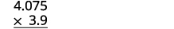</td>
</tr>
<tr valign="top">
<td data-valign="top" data-align="left">Multiply.</td>
<td data-valign="top" data-align="left">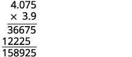

</td>
</tr>
<tr valign="top">
<td data-valign="top" data-align="left">Add the number of decimal places in
the factors (1 + 3).
Place the decimal point 4 places from the right.</td>
<td rowspan="2" data-valign="top" data-align="left">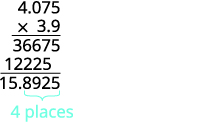</td>
</tr>
<tr valign="top">
<td data-valign="top" data-align="left">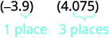</td>
</tr>
<tr valign="top">
<td data-valign="top" data-align="left">The signs are the different, so the product is negative.</td>
<td data-valign="top" data-align="left"><math xmlns="http://www.w3.org/1998/Math/MathML"><mrow><mo stretchy="false">(</mo><mn>−3.9</mn><mo stretchy="false">)</mo><mo stretchy="false">(</mo><mn>4.075</mn><mo stretchy="false">)</mo><mo>=</mo><mn>−15.8925</mn></mrow></math></td>
</tr>
</tbody></table>

Multiply: <math xmlns="http://www.w3.org/1998/Math/MathML"><mrow><mn>−4.5</mn><mrow><mo>(</mo><mrow><mn>6.107</mn></mrow><mo>)</mo></mrow><mo>.</mo></mrow></math>

<math xmlns="http://www.w3.org/1998/Math/MathML"><mrow><mn>−27.4815</mn></mrow></math>

Multiply: <math xmlns="http://www.w3.org/1998/Math/MathML"><mrow><mn>−10.79</mn><mrow><mo>(</mo><mrow><mn>8.12</mn></mrow><mo>)</mo></mrow><mo>.</mo></mrow></math>

<math xmlns="http://www.w3.org/1998/Math/MathML"><mrow><mn>−87.6148</mn></mrow></math>

Often, especially in the sciences, you will multiply decimals by powers of 10 (10, 100, 1000, etc). If you multiply a few products on paper, you may notice a pattern relating the number of zeros in the power of 10 to number of decimal places we move the decimal point to the right to get the product.

Multiply a decimal by a power of ten.

1.  Move the decimal point to the right the same number of places as the
    * * *
    {: data-type="newline"}
    
    number of zeros in the power of 10.
2.  Add zeros at the end of the number as needed.
{: type="1" .stepwise}

Multiply: 5.63 by ⓐ 10 ⓑ 100 ⓒ 1000.

By looking at the number of zeros in the multiple of ten, we see the number of places we need to move the decimal to the right.

ⓐ

|  |  | 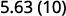 |
{: valign="top"}| There is 1 zero in 10, so move the decimal point 1 place to the right.  |  | 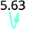 |
{: valign="top"}|  |  |  |
{: valign="top"}{: .unnumbered .unstyled summary="Multiply 5.63 by 10. There is 1 zero in 10. So move the decimal point 1 place to the right, to get 56.3." data-label=""}

ⓑ

|  | 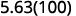 |
{: valign="top"}| There are 2 zeroes in 100, so move the decimal point 2 places to the right. |  |
{: valign="top"}|  |  |
{: valign="top"}{: .unnumbered .unstyled summary="Multiply 5.63 by 100. There are 2 zeroes in 100. So move the decimal point 2 places to the right, to get 563." data-label=""}

ⓒ

|  | 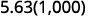 |
{: valign="top"}| There are 3 zeroes in 1,000, so move the decimal point 3 place to the right. |  |
{: valign="top"}| A zero must be added to the end. |  |
{: valign="top"}{: .unnumbered .unstyled summary="Multiply 5.63 by 1000. There are 3 zeroes in 100. So move the decimal point 2 places to the right. A zero must be added to the end to get 5630." data-label=""}

Multiply 2.58 by ⓐ 10 ⓑ 100 ⓒ 1000.

ⓐ 25.8 ⓑ 258 ⓒ 2,580

Multiply 14.2 by ⓐ 10 ⓑ 100 ⓒ 1000.

ⓐ 142 ⓑ 1,420 ⓒ 14,200

Just as with multiplication, division of signed decimals is very much like dividing whole numbers. We just have to figure out where the decimal point must be placed and the sign of the quotient. When dividing signed decimals, first determine the sign of the quotient and then divide as if the numbers were both positive. Finally, write the quotient with the appropriate sign.

We review the notation and vocabulary for division:

    We’ll write the steps to take when dividing decimals for easy reference.

Divide decimals.

1.  Determine the sign of the quotient.
2.  Make the divisor a whole number by “moving” the decimal point all the way to the right. “Move” the decimal point in the dividend the same number of places—adding zeros as needed.
3.  Divide. Place the decimal point in the quotient above the decimal point in the dividend.
4.  Write the quotient with the appropriate sign.
{: type="1" .stepwise}

Divide: <math xmlns="http://www.w3.org/1998/Math/MathML"><mrow><mn>−25.65</mn><mo>÷</mo><mrow><mo>(</mo><mrow><mn>−0.06</mn></mrow><mo>)</mo></mrow><mo>.</mo></mrow></math>

Remember, you can “move” the decimals in the divisor and dividend because of the Equivalent Fractions Property.

<table class="unnumbered unstyled" summary="Minus 25.65 divided by minus 0.06. The signs are the same, so the quotient is positive. Make the divisor a whole number by moving the decimal all the way to the right. Move the decimal point in the dividend the same number of places. Hence the divisor is 6 and the dividend is 2565. Divide, placing the decimal point in the quotient above the decimal point in the dividend. Write the quotient with the appropriate sign. The quotient is 427.5." data-label=""><tbody>
<tr valign="top">
<td data-valign="top" data-align="left" />
<td data-valign="top" data-align="left">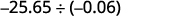</td>
</tr>
<tr valign="top">
<td data-valign="top" data-align="left">The signs are the same.</td>
<td data-valign="top" data-align="left">The quotient is positive.</td>
</tr>
<tr valign="top">
<td data-valign="top" data-align="left">Make the divisor a whole number by “moving” the
decimal point all the way to the right.</td>
<td />
</tr>
<tr valign="top">
<td data-valign="top" data-align="left">“Move” the decimal point in the dividend the same
number of places.</td>
<td data-valign="top" data-align="left">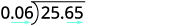</td>
</tr>
<tr valign="top">
<td data-valign="top" data-align="left">Divide.
Place the decimal point in the quotient above the
decimal point in the dividend.</td>
<td data-valign="top" data-align="left">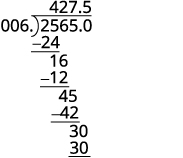</td>
</tr>
<tr valign="top">
<td data-valign="top" data-align="left">Write the quotient with the appropriate sign.</td>
<td data-valign="top" data-align="left">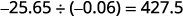</td>
</tr>
</tbody></table>

Divide: <math xmlns="http://www.w3.org/1998/Math/MathML"><mrow><mn>−23.492</mn><mo>÷</mo><mrow><mo>(</mo><mrow><mn>−0.04</mn></mrow><mo>)</mo></mrow><mo>.</mo></mrow></math>

<math xmlns="http://www.w3.org/1998/Math/MathML"><mrow><mn>587.3</mn></mrow></math>

Divide: <math xmlns="http://www.w3.org/1998/Math/MathML"><mrow><mn>−4.11</mn><mo>÷</mo><mrow><mo>(</mo><mrow><mn>−0.12</mn></mrow><mo>)</mo></mrow><mo>.</mo></mrow></math>

<math xmlns="http://www.w3.org/1998/Math/MathML"><mrow><mn>34.25</mn></mrow></math>

### Convert Decimals, Fractions, and Percents

In our work, it is often necessary to change the form of a number. We may have to change fractions to decimals or decimals to percent.

We convert decimals into fractions by identifying the place value of the last (farthest right) digit. In the decimal <math xmlns="http://www.w3.org/1998/Math/MathML"><mrow><mn>0.03</mn><mo>.</mo></mrow></math>

 the 3 is in the hundredths place, so 100 is the denominator of the fraction equivalent to 0.03.

<math xmlns="http://www.w3.org/1998/Math/MathML"><mrow><mn>0.03</mn><mo>=</mo><mfrac><mn>3</mn><mrow><mn>100</mn></mrow></mfrac></mrow></math>

The steps to take to convert a decimal to a fraction are summarized in the procedure box.

Convert a decimal to a proper fraction and a fraction to a decimal.

1.  To convert a decimal to a proper fraction, determine the place value of the final digit.
2.  Write the fraction.
    * numerator—the “numbers” to the right of the decimal point
    * denominator—the place value corresponding to the final digit
    {: data-bullet-style="bullet"}

3.  To convert a fraction to a decimal, divide the numerator of the fraction by the denominator of the fraction.
{: type="1" .stepwise}

Write: ⓐ <math xmlns="http://www.w3.org/1998/Math/MathML"><mrow><mn>0.374</mn></mrow></math>

 as a fraction ⓑ <math xmlns="http://www.w3.org/1998/Math/MathML"><mrow><mo>−</mo><mfrac><mn>5</mn><mn>8</mn></mfrac></mrow></math>

 as a decimal.

ⓐ

<table class="unnumbered unstyled" summary="In the number 0.374, determine the place value of the final digit. The place value of 3 is tenths, that of 7 is hundredths and that of 4 is thousandths. Write the fraction for 0.374. The numerator is 374. The denominator is 1000. Simplify the fraction. 374 is twice 187 and 1000 is twice 500. Dividing out the common factors, we get 187 by 500. So, 0.374 is 187 by 500." data-label=""><tbody>
<tr valign="top">
<td data-valign="top" data-align="left" />
<td data-valign="top" data-align="left"></td>
</tr>
<tr valign="top">
<td data-valign="top" data-align="left">Determine the place value of the final digit.</td>
<td data-valign="top" data-align="left"></td>
</tr>
<tr valign="top">
<td data-valign="top" data-align="left">Write the fraction for 0.374:
The numerator is 374.
The denominator is 1,000.</td>
<td data-valign="top" data-align="left"></td>
</tr>
<tr valign="top">
<td data-valign="top" data-align="left">Simplify the fraction.</td>
<td data-valign="top" data-align="left"></td>
</tr>
<tr valign="top">
<td data-valign="top" data-align="left">Divide out the common factors.</td>
<td data-valign="top" data-align="left"></td>
</tr>
<tr valign="top">
<td data-valign="top" data-align="left" />
<td data-valign="top" data-align="left"></td>
</tr>
</tbody></table>
ⓑ Since a fraction bar means division, we begin by writing the fraction <math xmlns="http://www.w3.org/1998/Math/MathML"><mrow><mfrac><mn>5</mn><mn>8</mn></mfrac></mrow></math>

 as <math xmlns="http://www.w3.org/1998/Math/MathML"><mrow><mn>8</mn><menclose notation="longdiv"><mrow><mn>5.</mn></mrow></menclose></mrow></math>

 Now divide.

 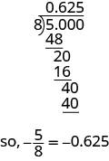 

Write: ⓐ <math xmlns="http://www.w3.org/1998/Math/MathML"><mrow><mn>0.234</mn></mrow></math>

 as a fraction ⓑ <math xmlns="http://www.w3.org/1998/Math/MathML"><mrow><mo>−</mo><mfrac><mn>7</mn><mn>8</mn></mfrac></mrow></math>

 as a decimal.

ⓐ<math xmlns="http://www.w3.org/1998/Math/MathML"><mrow><mfrac><mrow><mn>117</mn></mrow><mrow><mn>500</mn></mrow></mfrac></mrow></math>

 ⓑ <math xmlns="http://www.w3.org/1998/Math/MathML"><mrow><mn>−0.875</mn></mrow></math>

Write: ⓐ <math xmlns="http://www.w3.org/1998/Math/MathML"><mrow><mn>0.024</mn></mrow></math>

 as a fraction ⓑ <math xmlns="http://www.w3.org/1998/Math/MathML"><mrow><mo>−</mo><mfrac><mn>3</mn><mn>8</mn></mfrac></mrow></math>

 as a decimal.

ⓐ<math xmlns="http://www.w3.org/1998/Math/MathML"><mrow><mfrac><mn>3</mn><mrow><mn>125</mn></mrow></mfrac></mrow></math>

 ⓑ <math xmlns="http://www.w3.org/1998/Math/MathML"><mrow><mn>−0.375</mn></mrow></math>

A **percent**{: data-type="term"} is a ratio whose denominator is 100. Percent means per hundred. We use the percent symbol, %, to show percent. Since a percent is a ratio, it can easily be expressed as a fraction. Percent means per 100, so the denominator of the fraction is 100. We then change the fraction to a decimal by dividing the numerator by the denominator. After doing this many times, you may see the pattern.

*To convert a percent number to a decimal number, we move the decimal point two places to the left.*

  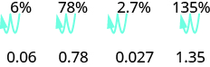  To convert a decimal to a percent, remember that percent means per hundred. If we change the decimal to a fraction whose denominator is 100, it is easy to change that fraction to a percent. After many conversions, you may recognize the pattern.

*To convert a decimal to a percent, we move the decimal point two places to the right and then add the percent sign.*

  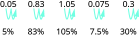  

Convert a percent to a decimal and a decimal to a percent.

1.  To convert a percent to a decimal, move the decimal point two places to the left after removing the percent sign.
2.  To convert a decimal to a percent, move the decimal point two places to the right and then add the percent sign.
{: type="1" .stepwise}

Convert each:

ⓐ percent to a decimal: 62%, 135%, and 13.7%.

ⓑ decimal to a percent: 0.51, 1.25, and 0.093.

ⓐ

|  | 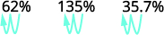 |
{: valign="top"}| Move the decimal point two places to the left. | 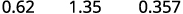 |
{: valign="top"}{: .unnumbered .unstyled summary="The given values are 62 percent, 135 percent and 35.7 percent. Moving the decimal point two places to the left in each case, we get 0.62, 1.35 and 0.357." data-label=""}

ⓑ

|  | 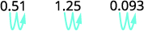 |
{: valign="top"}| Move the decimal point two places to the right. |  |
{: valign="top"}{: .unnumbered .unstyled summary="The given values are 0.51, 1.25 and 0.093. Moving the decimal point two places to the right in each case, we get 51 percent, 125 percent and 9.3 percent." data-label=""}

Convert each:

ⓐ percent to a decimal: 9%, 87%, and 3.9%.

ⓑ decimal to a percent: 0.17, 1.75, and 0.0825.

ⓐ 0.09, 0.87, 0.039 ⓑ 17%, 175%, 8.25%

Convert each:

ⓐ percent to a decimal: 3%, 91%, and 8.3%.

ⓑ decimal to a percent: 0.41, 2.25, and 0.0925.

ⓐ 0.03, 0.91, 0.083 ⓑ 41%, 225%, 9.25%

### Simplify Expressions with Square Roots

Remember that when a number <math xmlns="http://www.w3.org/1998/Math/MathML"><mi>n</mi></math>

 is multiplied by itself, we write <math xmlns="http://www.w3.org/1998/Math/MathML"><mrow><msup><mi>n</mi><mn>2</mn></msup></mrow></math>

 and read it “<math xmlns="http://www.w3.org/1998/Math/MathML"><mi>n</mi></math>

 squared.” The result is called the **square of a number**{: data-type="term"} *n*. For example, <math xmlns="http://www.w3.org/1998/Math/MathML"><mrow><msup><mn>8</mn><mn>2</mn></msup></mrow></math>

 is read “8 squared” and 64 is called the *square* of 8. Similarly, 121 is the square of 11 because <math xmlns="http://www.w3.org/1998/Math/MathML"><mrow><msup><mrow><mn>11</mn></mrow><mrow><mn>2</mn></mrow></msup></mrow></math>

 is 121. It will be helpful to learn to recognize the perfect square numbers.

Square of a number

If <math xmlns="http://www.w3.org/1998/Math/MathML"><mrow><msup><mi>n</mi><mn>2</mn></msup><mo>=</mo><mi>m</mi><mo>,</mo></mrow></math>

 then *m* is the **square** of *n*.

What about the squares of negative numbers? We know that when the signs of two numbers are the same, their product is positive. So the square of any negative number is also positive.

<math xmlns="http://www.w3.org/1998/Math/MathML"><mrow><msup><mrow><mrow><mo>(</mo><mrow><mn>−3</mn></mrow><mo>)</mo></mrow></mrow><mn>2</mn></msup><mo>=</mo><mn>9</mn><mspace width="2.5em" /><msup><mrow><mrow><mo>(</mo><mrow><mn>−8</mn></mrow><mo>)</mo></mrow></mrow><mn>2</mn></msup><mo>=</mo><mn>64</mn><mspace width="2.5em" /><msup><mrow><mrow><mo>(</mo><mrow><mn>−11</mn></mrow><mo>)</mo></mrow></mrow><mn>2</mn></msup><mo>=</mo><mn>121</mn><mspace width="2.5em" /><msup><mrow><mrow><mo>(</mo><mrow><mn>−15</mn></mrow><mo>)</mo></mrow></mrow><mn>2</mn></msup><mo>=</mo><mn>225</mn></mrow></math>

Because <math xmlns="http://www.w3.org/1998/Math/MathML"><mrow><msup><mrow><mn>10</mn></mrow><mn>2</mn></msup><mo>=</mo><mn>100</mn><mo>,</mo></mrow></math>

 we say 100 is the square of 10. We also say that 10 is a *square root* of 100. A number whose square is *m* is called a **square root of a number**{: data-type="term"} *m*.

Square Root of a Number

If <math xmlns="http://www.w3.org/1998/Math/MathML"><mrow><msup><mi>n</mi><mn>2</mn></msup><mo>=</mo><mi>m</mi><mo>,</mo></mrow></math>

 then *n* is a **square root** of *m*.

Notice <math xmlns="http://www.w3.org/1998/Math/MathML"><mrow><msup><mrow><mrow><mo>(</mo><mrow><mn>−10</mn></mrow><mo>)</mo></mrow></mrow><mn>2</mn></msup><mo>=</mo><mn>100</mn></mrow></math>

 also, so <math xmlns="http://www.w3.org/1998/Math/MathML"><mrow><mn>−10</mn></mrow></math>

 is also a square root of 100. Therefore, both 10 and <math xmlns="http://www.w3.org/1998/Math/MathML"><mrow><mn>−10</mn></mrow></math>

 are square roots of 100. So, every positive number has two square roots—one positive and one negative. The radical sign, <math xmlns="http://www.w3.org/1998/Math/MathML"><mrow><msqrt><mrow><mi>m</mi></mrow></msqrt></mrow></math>

, denotes the positive square root. The positive square root is called the **principal square root**{: data-type="term"}. When we use the radical sign that always means we want the principal square root.

Square Root Notation

<math xmlns="http://www.w3.org/1998/Math/MathML"><mrow><msqrt><mi>m</mi></msqrt></mrow></math>

 is read “the square root of <math xmlns="http://www.w3.org/1998/Math/MathML"><mi>m</mi></math>

.”

  
If <math xmlns="http://www.w3.org/1998/Math/MathML"><mrow><mi>m</mi><mo>=</mo><msup><mi>n</mi><mn>2</mn></msup><mo>,</mo></mrow></math>

 then <math xmlns="http://www.w3.org/1998/Math/MathML"><mrow><msqrt><mi>m</mi></msqrt><mo>=</mo><mi>n</mi><mo>,</mo></mrow></math>

 for <math xmlns="http://www.w3.org/1998/Math/MathML"><mrow><mi>n</mi><mo>≥</mo><mn>0</mn><mo>.</mo></mrow></math>

The square root of *m*, <math xmlns="http://www.w3.org/1998/Math/MathML"><mrow><msqrt><mi>m</mi></msqrt><mo>,</mo></mrow></math>

 is the positive number whose square is *m*.

We know that every positive number has two square roots and the radical sign indicates the positive one. We write <math xmlns="http://www.w3.org/1998/Math/MathML"><mrow><msqrt><mrow><mn>100</mn></mrow></msqrt><mo>=</mo><mn>10</mn><mo>.</mo></mrow></math>

 If we want to find the negative square root of a number, we place a negative in front of the radical sign. For example, <math xmlns="http://www.w3.org/1998/Math/MathML"><mrow><mtext>−</mtext><msqrt><mrow><mn>100</mn></mrow></msqrt><mo>=</mo><mn>−10</mn><mo>.</mo></mrow></math>

 We read <math xmlns="http://www.w3.org/1998/Math/MathML"><mrow><mtext>−</mtext><msqrt><mrow><mn>100</mn></mrow></msqrt></mrow></math>

 as “the opposite of the principal square root of 10.”

Simplify: ⓐ <math xmlns="http://www.w3.org/1998/Math/MathML"><mrow><msqrt><mrow><mn>25</mn></mrow></msqrt></mrow></math>

 ⓑ <math xmlns="http://www.w3.org/1998/Math/MathML"><mrow><msqrt><mrow><mn>121</mn></mrow></msqrt></mrow></math>

 ⓒ <math xmlns="http://www.w3.org/1998/Math/MathML"><mrow><mtext>−</mtext><msqrt><mrow><mn>144</mn></mrow></msqrt><mo>.</mo></mrow></math>

ⓐ* * *
{: data-type="newline"}

 <math xmlns="http://www.w3.org/1998/Math/MathML"><mrow><mtable> <mtr><mtd /><mtd /><mtd /><mtd columnalign="left"><mspace width="5em" /><mrow><msqrt><mrow><mn>25</mn></mrow></msqrt></mrow></mtd></mtr> <mtr><mtd columnalign="left"><mtext>Since</mtext><mspace width="0.2em" /><msup><mn>5</mn><mn>2</mn></msup><mo>=</mo><mn>25</mn></mtd><mtd /><mtd /><mtd columnalign="left"><mspace width="5em" /><mn>5</mn></mtd></mtr></mtable></mrow></math>

ⓑ* * *
{: data-type="newline"}

 <math xmlns="http://www.w3.org/1998/Math/MathML"><mrow><mtable> <mtr><mtd /><mtd /><mtd /><mtd columnalign="left"><mspace width="4em" /><mrow><msqrt><mrow><mn>121</mn></mrow></msqrt></mrow></mtd></mtr> <mtr><mtd columnalign="left"><mtext>Since</mtext><mspace width="0.2em" /><msup><mrow><mn>11</mn></mrow><mn>2</mn></msup><mo>=</mo><mn>121</mn></mtd><mtd /><mtd /><mtd columnalign="left"><mspace width="4em" /><mn>11</mn></mtd></mtr></mtable></mrow></math>

ⓒ* * *
{: data-type="newline"}

 <math xmlns="http://www.w3.org/1998/Math/MathML"><mrow><mtable> <mtr><mtd /><mtd /><mtd /><mtd columnalign="left"><mrow><mtext>−</mtext><msqrt><mrow><mn>144</mn></mrow></msqrt></mrow></mtd></mtr> <mtr><mtd columnalign="left"><mtext>The negative is in front of</mtext></mtd><mtd /><mtd /><mtd columnalign="left"><mrow><mn>−12</mn></mrow></mtd></mtr><mtr><mtd columnalign="left"><mtext>the radical sign.</mtext></mtd><mtd /><mtd /><mtd /></mtr></mtable></mrow></math>

Simplify: ⓐ <math xmlns="http://www.w3.org/1998/Math/MathML"><mrow><msqrt><mrow><mn>36</mn></mrow></msqrt></mrow></math>

 ⓑ <math xmlns="http://www.w3.org/1998/Math/MathML"><mrow><msqrt><mrow><mn>169</mn></mrow></msqrt></mrow></math>

 ⓒ <math xmlns="http://www.w3.org/1998/Math/MathML"><mrow><mtext>−</mtext><msqrt><mrow><mn>225</mn></mrow></msqrt><mo>.</mo></mrow></math>

ⓐ 6 ⓑ 13 ⓒ <math xmlns="http://www.w3.org/1998/Math/MathML"><mrow><mn>−15</mn></mrow></math>

Simplify: ⓐ <math xmlns="http://www.w3.org/1998/Math/MathML"><mrow><msqrt><mrow><mn>16</mn></mrow></msqrt></mrow></math>

 ⓑ <math xmlns="http://www.w3.org/1998/Math/MathML"><mrow><msqrt><mrow><mn>196</mn></mrow></msqrt></mrow></math>

 ⓒ <math xmlns="http://www.w3.org/1998/Math/MathML"><mrow><mtext>−</mtext><msqrt><mrow><mn>100</mn></mrow></msqrt><mo>.</mo></mrow></math>

ⓐ 4 ⓑ 14 ⓒ <math xmlns="http://www.w3.org/1998/Math/MathML"><mrow><mn>−10</mn></mrow></math>

### Identify Integers, Rational Numbers, Irrational Numbers, and Real Numbers

We have already described numbers as *counting number*{::}*s*, *whole number*{::}*s*, and *integers*. What is the difference between these types of numbers? Difference could be confused with subtraction. How about asking how we distinguish between these types of numbers?

<math xmlns="http://www.w3.org/1998/Math/MathML"><mrow> <mtable><mtr><mtd columnalign="left"><mtext>Counting numbers</mtext></mtd><mtd /><mtd /><mtd columnalign="left"><mspace width="1em" /><mrow><mn>1</mn><mo>,</mo><mn>2</mn><mo>,</mo><mn>3</mn><mo>,</mo><mn>4</mn><mo>,</mo><mtext>…</mtext><mn>.</mn><mo>.</mo></mrow></mtd></mtr> <mtr><mtd columnalign="left"><mtext>Whole numbers</mtext></mtd><mtd /><mtd /><mtd columnalign="left"><mspace width="1em" /><mrow><mn>0</mn><mo>,</mo><mn>1</mn><mo>,</mo><mn>2</mn><mo>,</mo><mn>3</mn><mo>,</mo><mn>4</mn><mo>,</mo><mtext>…</mtext><mo>.</mo></mrow></mtd></mtr> <mtr><mtd columnalign="left"><mtext>Integers</mtext></mtd><mtd /><mtd /><mtd columnalign="left"><mrow><mtext>…</mtext><mo>.</mo><mo>−</mo><mn>3</mn><mo>,</mo><mn>−2</mn><mo>,</mo><mn>−1</mn><mo>,</mo><mn>0</mn><mo>,</mo><mn>1</mn><mo>,</mo><mn>2</mn><mo>,</mo><mn>3</mn><mo>,</mo><mtext>…</mtext><mo>.</mo></mrow></mtd></mtr></mtable></mrow></math>

What type of numbers would we get if we started with all the integers and then included all the fractions? The numbers we would have form the set of rational numbers. A **rational number**{: data-type="term"} is a number that can be written as a ratio of two integers.

In general, any decimal that ends after a number of digits (such as 7.3 or <math xmlns="http://www.w3.org/1998/Math/MathML"><mrow><mn>−1.2684</mn></mrow></math>

) is a rational number. We can use the place value of the last digit as the denominator when writing the decimal as a fraction. The decimal for <math xmlns="http://www.w3.org/1998/Math/MathML"><mrow><mfrac><mn>1</mn><mn>3</mn></mfrac></mrow></math>

 is the number <math xmlns="http://www.w3.org/1998/Math/MathML"><mrow><mn>0.</mn><mover><mn>3</mn><mo>–</mo></mover><mo>.</mo></mrow></math>

 The bar over the 3 indicates that the number 3 repeats infinitely. Continuously has an important meaning in calculus. The number(s) under the bar is called the repeating block and it repeats continuously.

Since all integers can be written as a fraction whose denominator is 1, the integers (and so also the counting and whole numbers. are rational numbers.

*Every rational number can be written both as a ratio of integers* <math xmlns="http://www.w3.org/1998/Math/MathML"><mrow><mfrac><mi>p</mi><mi>q</mi></mfrac><mo>,</mo></mrow></math>

 *where p and q are integers and* <math xmlns="http://www.w3.org/1998/Math/MathML"><mrow><mi>q</mi><mo>≠</mo><mn>0</mn><mo>,</mo></mrow></math>

 *and as a decimal that stops or repeats.*

Rational Number

A **rational number** is a number of the form <math xmlns="http://www.w3.org/1998/Math/MathML"><mrow><mfrac><mi>p</mi><mi>q</mi></mfrac><mo>,</mo></mrow></math>

 where *p* and *q* are integers and <math xmlns="http://www.w3.org/1998/Math/MathML"><mrow><mi>q</mi><mo>≠</mo><mn>0</mn><mo>.</mo></mrow></math>

Its decimal form stops or repeats.

Are there any decimals that do not stop or repeat? Yes! The number <math xmlns="http://www.w3.org/1998/Math/MathML"><mi>π</mi></math>

 (the Greek letter *pi*, pronounced “pie”), which is very important in describing circles, has a decimal form that does not stop or repeat. We use three dots (…) to indicate the decimal does not stop or repeat.

<math xmlns="http://www.w3.org/1998/Math/MathML"><mrow><mi>π</mi><mo>=</mo><mn>3.141592654</mn><mo>.</mo><mo>.</mo><mo>.</mo></mrow></math>

The square root of a number that is not a perfect square is a decimal that does not stop or repeat.

A numbers whose decimal form does not stop or repeat cannot be written as a fraction of integers. We call this an **irrational number**{: data-type="term"}.

Irrational Number

An **irrational number** is a number that cannot be written as the ratio of two integers.

Its decimal form does not stop and does not repeat.

Let’s summarize a method we can use to determine whether a number is rational or irrational.

Rational or Irrational

If the decimal form of a number

* *repeats or stops*, the number is a **rational number**.
* *does not repeat and does not stop*, the number is an **irrational number.**
{: data-bullet-style="bullet"}

We have seen that all counting numbers are whole numbers, all whole numbers are integers, and all integers are rational numbers. The irrational numbers are numbers whose decimal form does not stop and does not repeat. When we put together the rational numbers and the irrational numbers, we get the set of **real number**{: data-type="term"}**s**.

Real Number

A **real number** is a number that is either rational or irrational.

Later in this course we will introduce numbers beyond the real numbers. [\[link\]](#CNX_IntAlg_Figure_01_04_016) illustrates how the number sets we’ve used so far fit together.

 {: #CNX_IntAlg_Figure_01_04_016}

Does the term “real numbers” seem strange to you? Are there any numbers that are not “real,” and, if so, what could they be? Can we simplify <math xmlns="http://www.w3.org/1998/Math/MathML"><mrow><msqrt><mrow><mn>−25</mn></mrow></msqrt><mo>?</mo></mrow></math>

 Is there a number whose square is <math xmlns="http://www.w3.org/1998/Math/MathML"><mrow><mn>−25</mn><mo>?</mo></mrow></math>

<math xmlns="http://www.w3.org/1998/Math/MathML"><mrow><msup><mrow><mo>(</mo><mspace width="0.2em" /><mo>)</mo></mrow><mrow><mn>2</mn></mrow></msup><mo>=</mo><mn>−25</mn><mo>?</mo></mrow></math>

None of the numbers that we have dealt with so far has a square that is <math xmlns="http://www.w3.org/1998/Math/MathML"><mrow><mn>−25</mn><mo>.</mo></mrow></math>

 Why? Any positive number squared is positive. Any negative number squared is positive. So we say there is no real number equal to <math xmlns="http://www.w3.org/1998/Math/MathML"><mrow><msqrt><mrow><mn>−25</mn></mrow></msqrt><mo>.</mo></mrow></math>

 The square root of a negative number is not a real number.

Given the numbers <math xmlns="http://www.w3.org/1998/Math/MathML"><mrow><mn>−7</mn><mo>,</mo><mfrac><mrow><mn>14</mn></mrow><mn>5</mn></mfrac><mo>,</mo><mn>8</mn><mo>,</mo><msqrt><mn>5</mn></msqrt><mo>,</mo><mn>5.9</mn><mo>,</mo><mtext>−</mtext><msqrt><mrow><mn>64</mn></mrow></msqrt><mo>,</mo></mrow></math>

 list the ⓐ whole numbers ⓑ integers ⓒ rational numbers ⓓ irrational numbers ⓔ real numbers.

ⓐ Remember, the whole numbers are <math xmlns="http://www.w3.org/1998/Math/MathML"><mrow><mn>0</mn><mo>,</mo><mn>1</mn><mo>,</mo><mn>2</mn><mo>,</mo><mn>3</mn><mo>,</mo><mtext>…</mtext><mo>,</mo></mrow></math>

 so 8 is the only whole number given.

ⓑ The integers are the whole numbers and their opposites (which includes 0). So the whole number 8 is an integer, and <math xmlns="http://www.w3.org/1998/Math/MathML"><mrow><mn>−7</mn></mrow></math>

 is the opposite of a whole number so it is an integer, too. Also, notice that 64 is the square of 8 so <math xmlns="http://www.w3.org/1998/Math/MathML"><mrow><mtext>−</mtext><msqrt><mrow><mn>64</mn></mrow></msqrt><mo>=</mo><mn>−8</mn><mo>.</mo></mrow></math>

 So the integers are <math xmlns="http://www.w3.org/1998/Math/MathML"><mrow><mn>−7</mn><mo>,</mo><mn>8</mn><mo>,</mo></mrow></math>

 and <math xmlns="http://www.w3.org/1998/Math/MathML"><mrow><mtext>−</mtext><msqrt><mrow><mn>64</mn></mrow></msqrt><mo>.</mo></mrow></math>

ⓒ Since all integers are rational, then <math xmlns="http://www.w3.org/1998/Math/MathML"><mrow><mn>−7</mn><mo>,</mo><mn>8</mn><mo>,</mo></mrow></math>

 and <math xmlns="http://www.w3.org/1998/Math/MathML"><mrow><mtext>−</mtext><msqrt><mrow><mn>64</mn></mrow></msqrt></mrow></math>

 are rational. Rational numbers also include fractions and decimals that repeat or stop, so <math xmlns="http://www.w3.org/1998/Math/MathML"><mrow><mfrac><mrow><mn>14</mn></mrow><mn>5</mn></mfrac></mrow></math>

 and <math xmlns="http://www.w3.org/1998/Math/MathML"><mrow><mn>5.9</mn></mrow></math>

 are rational. So the list of rational numbers is <math xmlns="http://www.w3.org/1998/Math/MathML"><mrow><mn>−7</mn><mo>,</mo><mfrac><mrow><mn>14</mn></mrow><mn>5</mn></mfrac><mo>,</mo><mn>8</mn><mo>,</mo><mn>5.9</mn><mo>,</mo><mtext>​</mtext><mtext>​</mtext></mrow></math>

 and <math xmlns="http://www.w3.org/1998/Math/MathML"><mrow><mtext>−</mtext><msqrt><mrow><mn>64</mn></mrow></msqrt><mo>.</mo></mrow></math>

ⓓ Remember that 5 is not a perfect square, so <math xmlns="http://www.w3.org/1998/Math/MathML"><mrow><msqrt><mn>5</mn></msqrt></mrow></math>

 is irrational.

ⓔ All the numbers listed are real numbers.

Given the numbers <math xmlns="http://www.w3.org/1998/Math/MathML"><mrow><mn>−3</mn><mo>,</mo><mtext>−</mtext><msqrt><mn>2</mn></msqrt><mo>,</mo><mn>0.</mn><mover accent="true"><mn>3</mn><mo>–</mo></mover><mo>,</mo><mfrac><mn>9</mn><mn>5</mn></mfrac><mo>,</mo><mn>4</mn><mo>,</mo><msqrt><mrow><mn>49</mn></mrow></msqrt><mo>,</mo></mrow></math>

 list the ⓐ whole numbers ⓑ integers ⓒ rational numbers* * *
{: data-type="newline"}

ⓓ irrational numbers ⓔ real numbers.

ⓐ <math xmlns="http://www.w3.org/1998/Math/MathML"><mrow><mn>4</mn><mo>,</mo><msqrt><mrow><mn>49</mn></mrow></msqrt></mrow></math>

 ⓑ <math xmlns="http://www.w3.org/1998/Math/MathML"><mrow><mn>−3</mn><mo>,</mo><mn>4</mn><mo>,</mo><msqrt><mrow><mn>49</mn></mrow></msqrt></mrow></math>

* * *
{: data-type="newline"}

ⓒ <math xmlns="http://www.w3.org/1998/Math/MathML"><mrow><mn>−3</mn><mo>,</mo><mn>0.</mn><mover accent="true"><mn>3</mn><mo>–</mo></mover><mo>,</mo><mfrac><mn>9</mn><mn>5</mn></mfrac><mo>,</mo><mn>4</mn><mo>,</mo><msqrt><mrow><mn>49</mn></mrow></msqrt></mrow></math>

 ⓓ <math xmlns="http://www.w3.org/1998/Math/MathML"><mrow><mtext>−</mtext><msqrt><mn>2</mn></msqrt></mrow></math>

* * *
{: data-type="newline"}

ⓔ <math xmlns="http://www.w3.org/1998/Math/MathML"><mrow><mn>−3</mn><mo>,</mo><mtext>−</mtext><msqrt><mn>2</mn></msqrt><mo>,</mo><mn>0.</mn><mover accent="true"><mn>3</mn><mo>–</mo></mover><mo>,</mo><mfrac><mn>9</mn><mn>5</mn></mfrac><mo>,</mo><mn>4</mn><mo>,</mo><msqrt><mrow><mn>49</mn></mrow></msqrt></mrow></math>

Given numbers <math xmlns="http://www.w3.org/1998/Math/MathML"><mrow><mtext>−</mtext><msqrt><mrow><mn>25</mn></mrow></msqrt><mo>,</mo><mo>−</mo><mfrac><mn>3</mn><mn>8</mn></mfrac><mo>,</mo><mn>−1</mn><mo>,</mo><mn>6</mn><mo>,</mo><msqrt><mrow><mn>121</mn></mrow></msqrt><mo>,</mo><mn>2.041975...</mn><mo>,</mo></mrow></math>

 list the ⓐ whole numbers ⓑ integers ⓒ rational numbers ⓓ irrational numbers ⓔ real numbers.

ⓐ <math xmlns="http://www.w3.org/1998/Math/MathML"><mrow><mn>6</mn><mo>,</mo><msqrt><mrow><mn>121</mn></mrow></msqrt></mrow></math>

* * *
{: data-type="newline"}

ⓑ <math xmlns="http://www.w3.org/1998/Math/MathML"><mrow><mtext>−</mtext><msqrt><mrow><mn>25</mn></mrow></msqrt><mo>,</mo><mn>−1</mn><mo>,</mo><mn>6</mn><mo>,</mo><msqrt><mrow><mn>121</mn></mrow></msqrt></mrow></math>

* * *
{: data-type="newline"}

ⓒ <math xmlns="http://www.w3.org/1998/Math/MathML"><mrow><mtext>−</mtext><msqrt><mrow><mn>25</mn></mrow></msqrt><mo>,</mo><mo>−</mo><mfrac><mn>3</mn><mn>8</mn></mfrac><mo>,</mo><mn>−1</mn><mo>,</mo><mn>6</mn><mo>,</mo><msqrt><mrow><mn>121</mn></mrow></msqrt></mrow></math>

* * *
{: data-type="newline"}

ⓓ <math xmlns="http://www.w3.org/1998/Math/MathML"><mrow><mn>2.041975..</mn><mo>.</mo></mrow></math>

* * *
{: data-type="newline"}

ⓔ <math xmlns="http://www.w3.org/1998/Math/MathML"><mrow><mtext>−</mtext><msqrt><mrow><mn>25</mn></mrow></msqrt><mo>,</mo><mo>−</mo><mfrac><mn>3</mn><mn>8</mn></mfrac><mo>,</mo><mn>−1</mn><mo>,</mo><mn>6</mn><mo>,</mo><msqrt><mrow><mn>121</mn></mrow></msqrt><mo>,</mo><mn>2.041975..</mn><mo>.</mo></mrow></math>

### Locate Fractions and Decimals on the Number Line

We now want to include fractions and decimals on the number line. Let’s start with fractions and locate <math xmlns="http://www.w3.org/1998/Math/MathML"><mrow><mfrac><mn>1</mn><mn>5</mn></mfrac><mo>,</mo><mo>−</mo><mfrac><mn>4</mn><mn>5</mn></mfrac><mo>,</mo><mn>3</mn><mo>,</mo><mfrac><mn>7</mn><mn>4</mn></mfrac><mo>,</mo><mo>−</mo><mfrac><mn>9</mn><mn>2</mn></mfrac><mo>,</mo><mn>−5</mn></mrow></math>

 and <math xmlns="http://www.w3.org/1998/Math/MathML"><mrow><mfrac><mn>8</mn><mn>3</mn></mfrac></mrow></math>

 on the number line.

We’ll start with the whole numbers 3 and <math xmlns="http://www.w3.org/1998/Math/MathML"><mrow><mn>−5</mn></mrow></math>

 because they are the easiest to plot. See [\[link\]](#CNX_IntAlg_Figure_01_04_017).

The proper fractions listed are <math xmlns="http://www.w3.org/1998/Math/MathML"><mrow><mfrac><mn>1</mn><mn>5</mn></mfrac></mrow></math>

 and <math xmlns="http://www.w3.org/1998/Math/MathML"><mrow><mo>−</mo><mfrac><mn>4</mn><mn>5</mn></mfrac><mo>.</mo></mrow></math>

 We know the proper fraction <math xmlns="http://www.w3.org/1998/Math/MathML"><mrow><mfrac><mn>1</mn><mn>5</mn></mfrac></mrow></math>

 has value less than one and so would be located between 0 and 1. The denominator is 5, so we divide the unit from 0 to 1 into 5 equal parts <math xmlns="http://www.w3.org/1998/Math/MathML"><mrow><mfrac><mn>1</mn><mn>5</mn></mfrac><mo>,</mo><mfrac><mn>2</mn><mn>5</mn></mfrac><mo>,</mo><mfrac><mn>3</mn><mn>5</mn></mfrac><mo>,</mo><mfrac><mn>4</mn><mn>5</mn></mfrac><mo>.</mo></mrow></math>

 We plot <math xmlns="http://www.w3.org/1998/Math/MathML"><mrow><mfrac><mn>1</mn><mn>5</mn></mfrac><mo>.</mo></mrow></math>

Similarly, <math xmlns="http://www.w3.org/1998/Math/MathML"><mrow><mo>−</mo><mfrac><mn>4</mn><mn>5</mn></mfrac></mrow></math>

 is between 0 and <math xmlns="http://www.w3.org/1998/Math/MathML"><mrow><mn>−1</mn><mo>.</mo></mrow></math>

 After dividing the unit into 5 equal parts we plot <math xmlns="http://www.w3.org/1998/Math/MathML"><mrow><mo>−</mo><mfrac><mn>4</mn><mn>5</mn></mfrac><mo>.</mo></mrow></math>

Finally, look at the improper fractions <math xmlns="http://www.w3.org/1998/Math/MathML"><mrow><mfrac><mn>7</mn><mn>4</mn></mfrac><mo>,</mo><mfrac><mn>9</mn><mn>2</mn></mfrac><mo>,</mo><mfrac><mn>8</mn><mn>3</mn></mfrac><mo>.</mo></mrow></math>

 Locating these points may be easier if you change each of them to a mixed number.

<math xmlns="http://www.w3.org/1998/Math/MathML"><mrow><mfrac><mn>7</mn><mn>4</mn></mfrac><mo>=</mo><mn>1</mn><mfrac><mn>3</mn><mn>4</mn></mfrac><mspace width="2.5em" /><mo>−</mo><mfrac><mn>9</mn><mn>2</mn></mfrac><mo>=</mo><mn>−4</mn><mfrac><mn>1</mn><mn>2</mn></mfrac><mspace width="2.5em" /><mfrac><mn>8</mn><mn>3</mn></mfrac><mo>=</mo><mn>2</mn><mfrac><mn>2</mn><mn>3</mn></mfrac></mrow></math>

[\[link\]](#CNX_IntAlg_Figure_01_04_017) shows the number line with all the points plotted.

 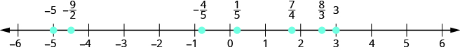{: #CNX_IntAlg_Figure_01_04_017}

Locate and label the following on a number line: <math xmlns="http://www.w3.org/1998/Math/MathML"><mrow><mn>4</mn><mo>,</mo><mfrac><mn>3</mn><mn>4</mn></mfrac><mo>,</mo><mo>−</mo><mfrac><mn>1</mn><mn>4</mn></mfrac><mo>,</mo><mn>−3</mn><mo>,</mo><mfrac><mn>6</mn><mn>5</mn></mfrac><mo>,</mo><mo>−</mo><mfrac><mn>5</mn><mn>2</mn></mfrac><mo>,</mo></mrow></math>

 and <math xmlns="http://www.w3.org/1998/Math/MathML"><mrow><mfrac><mn>7</mn><mn>3</mn></mfrac><mo>.</mo></mrow></math>

Locate and plot the integers, <math xmlns="http://www.w3.org/1998/Math/MathML"><mrow><mn>4</mn><mo>,</mo><mn>−3</mn><mo>.</mo></mrow></math>

Locate the proper fraction <math xmlns="http://www.w3.org/1998/Math/MathML"><mrow><mfrac><mn>3</mn><mn>4</mn></mfrac></mrow></math>

 first. The fraction <math xmlns="http://www.w3.org/1998/Math/MathML"><mrow><mfrac><mn>3</mn><mn>4</mn></mfrac></mrow></math>

 is between 0 and 1. Divide the distance between 0 and 1 into four equal parts, then we plot <math xmlns="http://www.w3.org/1998/Math/MathML"><mrow><mfrac><mn>3</mn><mn>4</mn></mfrac><mo>.</mo></mrow></math>

 Similarly plot <math xmlns="http://www.w3.org/1998/Math/MathML"><mrow><mo>−</mo><mfrac><mn>1</mn><mn>4</mn></mfrac><mo>.</mo></mrow></math>

Now locate the improper fractions <math xmlns="http://www.w3.org/1998/Math/MathML"><mrow><mfrac><mn>6</mn><mn>5</mn></mfrac><mo>,</mo><mo>−</mo><mfrac><mn>5</mn><mn>2</mn></mfrac><mo>,</mo></mrow></math>

 and <math xmlns="http://www.w3.org/1998/Math/MathML"><mrow><mfrac><mn>7</mn><mn>3</mn></mfrac><mo>.</mo></mrow></math>

 It is easier to plot them if we convert them to mixed numbers and then plot them as described above: <math xmlns="http://www.w3.org/1998/Math/MathML"><mrow><mfrac><mn>6</mn><mn>5</mn></mfrac><mo>=</mo><mn>1</mn><mfrac><mn>1</mn><mn>5</mn></mfrac><mo>,</mo><mo>−</mo><mfrac><mn>5</mn><mn>2</mn></mfrac><mo>=</mo><mn>−2</mn><mfrac><mn>1</mn><mn>2</mn></mfrac><mo>,</mo><mfrac><mn>7</mn><mn>3</mn></mfrac><mo>=</mo><mn>2</mn><mfrac><mn>1</mn><mn>3</mn></mfrac><mo>.</mo></mrow></math>

 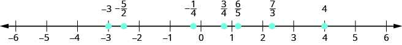 

Locate and label the following on a number line: <math xmlns="http://www.w3.org/1998/Math/MathML"><mrow><mn>−1</mn><mo>,</mo><mfrac><mn>1</mn><mn>3</mn></mfrac><mo>,</mo><mfrac><mn>6</mn><mn>5</mn></mfrac><mo>,</mo><mo>−</mo><mfrac><mn>7</mn><mn>4</mn></mfrac><mo>,</mo><mfrac><mn>9</mn><mn>2</mn></mfrac><mo>,</mo><mn>5</mn><mo>,</mo><mo>−</mo><mfrac><mn>8</mn><mn>3</mn></mfrac><mo>.</mo></mrow></math>

 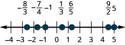 

Locate and label the following on a number line: <math xmlns="http://www.w3.org/1998/Math/MathML"><mrow><mn>−2</mn><mo>,</mo><mfrac><mn>2</mn><mn>3</mn></mfrac><mo>,</mo><mfrac><mn>7</mn><mn>5</mn></mfrac><mo>,</mo><mo>−</mo><mfrac><mn>7</mn><mn>4</mn></mfrac><mo>,</mo><mfrac><mn>7</mn><mn>2</mn></mfrac><mo>,</mo><mn>3</mn><mo>,</mo><mo>−</mo><mfrac><mn>7</mn><mn>3</mn></mfrac><mo>.</mo></mrow></math>

  

Since decimals are forms of fractions, locating decimals on the number line is similar to locating fractions on the number line.

Locate on the number line: ⓐ 0.4 ⓑ <math xmlns="http://www.w3.org/1998/Math/MathML"><mrow><mn>−0.74</mn><mo>.</mo></mrow></math>

ⓐ The decimal number 0.4 is equivalent to <math xmlns="http://www.w3.org/1998/Math/MathML"><mrow><mfrac><mn>4</mn><mrow><mn>10</mn></mrow></mfrac><mo>,</mo></mrow></math>

 a proper fraction, so 0.4 is located between 0 and 1. On a number line, divide the interval between 0 and 1 into 10 equal parts. Now label the parts 0.1, 0.2, 0.3, 0.4, 0.5, 0.6, 0.7, 0.8, 0.9, 1.0. We write 0 as 0.0 and 1 as 1.0, so that the numbers are consistently in tenths. Finally, mark 0.4 on the number line.* * *
{: data-type="newline"}

* * *
{: data-type="newline"}

 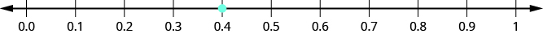 
* * *
{: data-type="newline"}

* * *
{: data-type="newline"}

ⓑ The decimal <math xmlns="http://www.w3.org/1998/Math/MathML"><mrow><mn>−0.74</mn></mrow></math>

 is equivalent to <math xmlns="http://www.w3.org/1998/Math/MathML"><mrow><mo>−</mo><mfrac><mrow><mn>74</mn></mrow><mrow><mn>100</mn></mrow></mfrac><mo>,</mo></mrow></math>

 so it is located between 0 and <math xmlns="http://www.w3.org/1998/Math/MathML"><mrow><mn>−1</mn><mo>.</mo></mrow></math>

 On a number line, mark off and label the hundredths in the interval between 0 and <math xmlns="http://www.w3.org/1998/Math/MathML"><mrow><mn>−1</mn><mo>.</mo></mrow></math>

* * *
{: data-type="newline"}

* * *
{: data-type="newline"}

 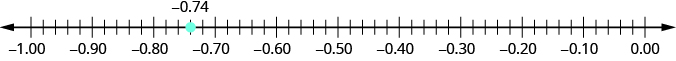 

Locate on the number line: ⓐ <math xmlns="http://www.w3.org/1998/Math/MathML"><mrow><mn>0.6</mn></mrow></math>

 ⓑ <math xmlns="http://www.w3.org/1998/Math/MathML"><mrow><mn>−0.25</mn><mo>.</mo></mrow></math>

ⓐ

 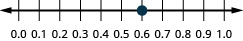 
ⓑ

 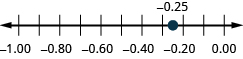 

Locate on the number line: ⓐ <math xmlns="http://www.w3.org/1998/Math/MathML"><mrow><mn>0.9</mn></mrow></math>

 ⓑ <math xmlns="http://www.w3.org/1998/Math/MathML"><mrow><mn>−0.75</mn><mo>.</mo></mrow></math>

ⓐ

 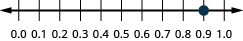 
ⓑ

 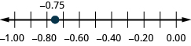 

Access this online resource for additional instruction and practice with decimals.

* [Arithmetic Basics: Dividing Decimals][1]
{: data-bullet-style="bullet"}

### Key Concepts

* **How to round decimals.**
  1.  Locate the given place value and mark it with an arrow.
  2.  Underline the digit to the right of the place value.
  3.  Is the underlined digit greater than or equal to
      <math xmlns="http://www.w3.org/1998/Math/MathML"><mrow><mn>5</mn><mo>?</mo></mrow></math>
      
      * Yes: add 1 to the digit in the given place value.
      * No: do <u data-effect="underline">not</u> change the digit in the given place value
      {: data-bullet-style="bullet"}
  
  4.  Rewrite the number, deleting all digits to the right of the rounding digit.
  {: type="1" .stepwise}

* **How to add or subtract decimals.**
  1.  Determine the sign of the sum or difference.
  2.  Write the numbers so the decimal points line up vertically.
  3.  Use zeros as placeholders, as needed.
  4.  Add or subtract the numbers as if they were whole numbers. Then place the decimal point in the answer under the decimal points in the given numbers.
  5.  Write the sum or difference with the appropriate sign
  {: type="1" .stepwise}

* **How to multiply decimals.**
  1.  Determine the sign of the product.
  2.  Write in vertical format, lining up the numbers on the right. Multiply the numbers as if they were whole numbers, temporarily ignoring the decimal points.
  3.  Place the decimal point. The number of decimal places in the product is the sum of the number of decimal places in the factors.
  4.  Write the product with the appropriate sign.
  {: type="1" .stepwise}

* **How to multiply a decimal by a power of ten.**
  1.  Move the decimal point to the right the same number of places as the number of zeros in the power of 10.
  2.  Add zeros at the end of the number as needed.
  {: type="1" .stepwise}

* **How to divide decimals.**
  1.  Determine the sign of the quotient.
  2.  Make the divisor a whole number by “moving” the decimal point all the way to the right. “Move” the decimal point in the dividend the same number of places—adding zeros as needed.
  3.  Divide. Place the decimal point in the quotient above the decimal point in the dividend.
  4.  Write the quotient with the appropriate sign.
  {: type="1" .stepwise}

* **How to convert a decimal to a proper fraction and a fraction to a decimal.**
  * * *
  {: data-type="newline"}
  
  1.  To convert a decimal to a proper fraction, determine the place value of the final digit.
  2.  Write the fraction.
      * numerator—the “numbers” to the right of the decimal point
      * denominator—the place value corresponding to the final digit
      {: data-bullet-style="bullet"}
  
  3.  To convert a fraction to a decimal, divide the numerator of the fraction by the denominator of the fraction.
  {: type="1" .stepwise}

* **How to convert a percent to a decimal and a decimal to a percent.**
  1.  To convert a percent to a decimal, move the decimal point two places to the left after removing the percent sign.
  2.  To convert a decimal to a percent, move the decimal point two places to the right and then add the percent sign.
  {: type="1" .stepwise}

* **Square Root Notation**
  * * *
  {: data-type="newline"}
  
  <math xmlns="http://www.w3.org/1998/Math/MathML"><mrow><msqrt><mi>m</mi></msqrt></mrow></math>
  
  is read “the square root of *m*.”
  * * *
  {: data-type="newline"}
  
  If
  <math xmlns="http://www.w3.org/1998/Math/MathML"><mrow><mi>m</mi><mo>=</mo><msup><mi>n</mi><mn>2</mn></msup><mo>,</mo></mrow></math>
  
  then
  <math xmlns="http://www.w3.org/1998/Math/MathML"><mrow><msqrt><mi>m</mi></msqrt><mo>=</mo><mi>n</mi><mo>,</mo></mrow></math>
  
  for
  <math xmlns="http://www.w3.org/1998/Math/MathML"><mrow><mi>n</mi><mo>≥</mo><mn>0</mn><mo>.</mo></mrow></math>
  
  * * *
  {: data-type="newline"}
  
  The square root of *m*,
  <math xmlns="http://www.w3.org/1998/Math/MathML"><mrow><msqrt><mi>m</mi></msqrt><mo>,</mo></mrow></math>
  
  is the positive number whose square is *m*.
* **Rational or Irrational**
  * * *
  {: data-type="newline"}
  
  If the decimal form of a number
  * * *
  {: data-type="newline"}
  
  * *repeats or stops*, the number is a rational number.
  * *does not repeat and does not stop*, the number is an irrational number.
  {: data-bullet-style="bullet"}

* **Real Numbers** {: #CNX_IntAlg_Figure_01_04_016a}

{: data-bullet-style="bullet"}

<section data-depth="1" class="section-exercises" markdown="1">
#### Practice Makes Perfect

**Round Decimals**

In the following exercises, round each number to the nearest ⓐ hundredth ⓑ tenth ⓒ whole number.

5\.781

ⓐ 5.78 ⓑ 5.8 ⓒ 6

1\.638

0\.299

ⓐ 0.30 ⓑ 0.3 ⓒ 0

0\.697

63\.479

ⓐ 63.48 ⓑ 63.5 ⓒ 63

84\.281

**Add and Subtract Decimals**

In the following exercises, add or subtract.

<math xmlns="http://www.w3.org/1998/Math/MathML"><mrow><mn>−16.53</mn><mo>−</mo><mn>24.38</mn></mrow></math>

<math xmlns="http://www.w3.org/1998/Math/MathML"><mrow><mn>−40.91</mn></mrow></math>

<math xmlns="http://www.w3.org/1998/Math/MathML"><mrow><mn>−19.47</mn><mo>−</mo><mn>32.58</mn></mrow></math>

<math xmlns="http://www.w3.org/1998/Math/MathML"><mrow><mn>−38.69</mn><mo>+</mo><mn>31.47</mn></mrow></math>

<math xmlns="http://www.w3.org/1998/Math/MathML"><mrow><mn>−7.22</mn></mrow></math>

<math xmlns="http://www.w3.org/1998/Math/MathML"><mrow><mn>−29.83</mn><mo>+</mo><mn>19.76</mn></mrow></math>

<math xmlns="http://www.w3.org/1998/Math/MathML"><mrow><mn>72.5</mn><mo>−</mo><mn>100</mn></mrow></math>

<math xmlns="http://www.w3.org/1998/Math/MathML"><mrow><mn>−27.5</mn></mrow></math>

<math xmlns="http://www.w3.org/1998/Math/MathML"><mrow><mn>86.2</mn><mo>−</mo><mn>100</mn></mrow></math>

<math xmlns="http://www.w3.org/1998/Math/MathML"><mrow><mn>91.75</mn><mo>−</mo><mrow><mo>(</mo><mrow><mn>−10.462</mn></mrow><mo>)</mo></mrow></mrow></math>

<math xmlns="http://www.w3.org/1998/Math/MathML"><mrow><mn>02.212</mn></mrow></math>

<math xmlns="http://www.w3.org/1998/Math/MathML"><mrow><mn>94.69</mn><mo>−</mo><mrow><mo>(</mo><mrow><mn>−12.678</mn></mrow><mo>)</mo></mrow></mrow></math>

<math xmlns="http://www.w3.org/1998/Math/MathML"><mrow><mn>55.01</mn><mo>−</mo><mn>3.7</mn></mrow></math>

<math xmlns="http://www.w3.org/1998/Math/MathML"><mrow><mn>51.31</mn></mrow></math>

<math xmlns="http://www.w3.org/1998/Math/MathML"><mrow><mn>59.08</mn><mo>−</mo><mn>4.6</mn></mrow></math>

<math xmlns="http://www.w3.org/1998/Math/MathML"><mrow><mn>2.51</mn><mo>−</mo><mn>7.4</mn></mrow></math>

<math xmlns="http://www.w3.org/1998/Math/MathML"><mrow><mn>−4.89</mn></mrow></math>

<math xmlns="http://www.w3.org/1998/Math/MathML"><mrow><mn>3.84</mn><mo>−</mo><mn>6.1</mn></mrow></math>

**Multiply and Divide Decimals**

In the following exercises, multiply.

<math xmlns="http://www.w3.org/1998/Math/MathML"><mrow><mn>94.69</mn><mo>−</mo><mrow><mo>(</mo><mrow><mn>−12.678</mn></mrow><mo>)</mo></mrow></mrow></math>

<math xmlns="http://www.w3.org/1998/Math/MathML"><mrow><mn>−11.653</mn></mrow></math>

<math xmlns="http://www.w3.org/1998/Math/MathML"><mrow><mrow><mo>(</mo><mrow><mn>−8.5</mn></mrow><mo>)</mo></mrow><mrow><mo>(</mo><mrow><mn>1.69</mn></mrow><mo>)</mo></mrow></mrow></math>

<math xmlns="http://www.w3.org/1998/Math/MathML"><mrow><mrow><mo>(</mo><mrow><mn>−5.18</mn></mrow><mo>)</mo></mrow><mrow><mo>(</mo><mrow><mn>−65.23</mn></mrow><mo>)</mo></mrow></mrow></math>

<math xmlns="http://www.w3.org/1998/Math/MathML"><mrow><mn>337.8914</mn></mrow></math>

<math xmlns="http://www.w3.org/1998/Math/MathML"><mrow><mrow><mo>(</mo><mrow><mn>−9.16</mn></mrow><mo>)</mo></mrow><mrow><mo>(</mo><mrow><mn>−68.34</mn></mrow><mo>)</mo></mrow></mrow></math>

<math xmlns="http://www.w3.org/1998/Math/MathML"><mrow><mrow><mo>(</mo><mrow><mn>0.06</mn></mrow><mo>)</mo></mrow><mrow><mo>(</mo><mrow><mn>21.75</mn></mrow><mo>)</mo></mrow></mrow></math>

<math xmlns="http://www.w3.org/1998/Math/MathML"><mrow><mn>1.305</mn></mrow></math>

<math xmlns="http://www.w3.org/1998/Math/MathML"><mrow><mrow><mo>(</mo><mrow><mn>0.08</mn></mrow><mo>)</mo></mrow><mrow><mo>(</mo><mrow><mn>52.45</mn></mrow><mo>)</mo></mrow></mrow></math>

<math xmlns="http://www.w3.org/1998/Math/MathML"><mrow><mrow><mo>(</mo><mrow><mn>9.24</mn></mrow><mo>)</mo></mrow><mrow><mo>(</mo><mrow><mn>10</mn></mrow><mo>)</mo></mrow></mrow></math>

<math xmlns="http://www.w3.org/1998/Math/MathML"><mrow><mn>92.4</mn></mrow></math>

<math xmlns="http://www.w3.org/1998/Math/MathML"><mrow><mrow><mo>(</mo><mrow><mn>6.531</mn></mrow><mo>)</mo></mrow><mrow><mo>(</mo><mrow><mn>10</mn></mrow><mo>)</mo></mrow></mrow></math>

<math xmlns="http://www.w3.org/1998/Math/MathML"><mrow><mrow><mo>(</mo><mrow><mn>0.025</mn></mrow><mo>)</mo></mrow><mrow><mo>(</mo><mrow><mn>100</mn></mrow><mo>)</mo></mrow></mrow></math>

2\.5

<math xmlns="http://www.w3.org/1998/Math/MathML"><mrow><mrow><mo>(</mo><mrow><mn>0.037</mn></mrow><mo>)</mo></mrow><mrow><mo>(</mo><mrow><mn>100</mn></mrow><mo>)</mo></mrow></mrow></math>

<math xmlns="http://www.w3.org/1998/Math/MathML"><mrow><mrow><mo>(</mo><mrow><mn>55.2</mn></mrow><mo>)</mo></mrow><mrow><mo>(</mo><mrow><mn>1000</mn></mrow><mo>)</mo></mrow></mrow></math>

55200

<math xmlns="http://www.w3.org/1998/Math/MathML"><mrow><mrow><mo>(</mo><mrow><mn>99.4</mn></mrow><mo>)</mo></mrow><mrow><mo>(</mo><mrow><mn>1000</mn></mrow><mo>)</mo></mrow></mrow></math>

In the following exercises, divide. Round money monetary answers to the nearest cent.

<math xmlns="http://www.w3.org/1998/Math/MathML"><mrow><mtext>$</mtext><mn>117.25</mn><mo>÷</mo><mn>48</mn></mrow></math>

<math xmlns="http://www.w3.org/1998/Math/MathML"><mrow><mtext>$</mtext><mn>2.44</mn></mrow></math>

<math xmlns="http://www.w3.org/1998/Math/MathML"><mrow><mtext>$</mtext><mn>109.24</mn><mo>÷</mo><mn>36</mn></mrow></math>

<math xmlns="http://www.w3.org/1998/Math/MathML"><mrow><mn>1.44</mn><mo>÷</mo><mrow><mo>(</mo><mrow><mn>−0.3</mn></mrow><mo>)</mo></mrow></mrow></math>

<math xmlns="http://www.w3.org/1998/Math/MathML"><mrow><mn>−4.8</mn></mrow></math>

<math xmlns="http://www.w3.org/1998/Math/MathML"><mrow><mn>−1.15</mn><mo>÷</mo><mrow><mo>(</mo><mrow><mn>−0.05</mn></mrow><mo>)</mo></mrow></mrow></math>

<math xmlns="http://www.w3.org/1998/Math/MathML"><mrow><mn>5.2</mn><mo>÷</mo><mn>2.5</mn></mrow></math>

<math xmlns="http://www.w3.org/1998/Math/MathML"><mrow><mn>2.08</mn></mrow></math>

<math xmlns="http://www.w3.org/1998/Math/MathML"><mrow><mn>14</mn><mo>÷</mo><mn>0.35</mn></mrow></math>

**Convert Decimals, Fractions and Percents**

In the following exercises, write each decimal as a fraction.

<math xmlns="http://www.w3.org/1998/Math/MathML"><mrow><mn>0.04</mn></mrow></math>

<math xmlns="http://www.w3.org/1998/Math/MathML"><mrow><mfrac><mn>1</mn><mrow><mn>25</mn></mrow></mfrac></mrow></math>

1\.464

<math xmlns="http://www.w3.org/1998/Math/MathML"><mrow><mn>0.095</mn></mrow></math>

<math xmlns="http://www.w3.org/1998/Math/MathML"><mrow><mfrac><mrow><mn>19</mn></mrow><mrow><mn>200</mn></mrow></mfrac></mrow></math>

<math xmlns="http://www.w3.org/1998/Math/MathML"><mrow><mn>−0.375</mn></mrow></math>

In the following exercises, convert each fraction to a decimal.

<math xmlns="http://www.w3.org/1998/Math/MathML"><mrow><mfrac><mrow><mn>17</mn></mrow><mrow><mn>20</mn></mrow></mfrac></mrow></math>

<math xmlns="http://www.w3.org/1998/Math/MathML"><mrow><mn>0.85</mn></mrow></math>

<math xmlns="http://www.w3.org/1998/Math/MathML"><mrow><mfrac><mrow><mn>17</mn></mrow><mn>4</mn></mfrac></mrow></math>

<math xmlns="http://www.w3.org/1998/Math/MathML"><mrow><mo>−</mo><mfrac><mrow><mn>310</mn></mrow><mrow><mn>25</mn></mrow></mfrac></mrow></math>

<math xmlns="http://www.w3.org/1998/Math/MathML"><mrow><mn>−12.4</mn></mrow></math>

<math xmlns="http://www.w3.org/1998/Math/MathML"><mrow><mo>−</mo><mfrac><mrow><mn>18</mn></mrow><mrow><mn>11</mn></mrow></mfrac></mrow></math>

In the following exercises, convert each percent to a decimal.

<math xmlns="http://www.w3.org/1998/Math/MathML"><mrow><mn>71</mn><mi>%</mi></mrow></math>

<math xmlns="http://www.w3.org/1998/Math/MathML"><mrow><mn>0.71</mn></mrow></math>

<math xmlns="http://www.w3.org/1998/Math/MathML"><mrow><mn>150</mn><mi>%</mi></mrow></math>

<math xmlns="http://www.w3.org/1998/Math/MathML"><mrow><mn>39.3</mn><mi>%</mi></mrow></math>

<math xmlns="http://www.w3.org/1998/Math/MathML"><mrow><mn>0.393</mn></mrow></math>

<math xmlns="http://www.w3.org/1998/Math/MathML"><mrow><mn>7.8</mn><mi>%</mi></mrow></math>

In the following exercises, convert each decimal to a percent.

<math xmlns="http://www.w3.org/1998/Math/MathML"><mrow><mn>1.56</mn></mrow></math>

<math xmlns="http://www.w3.org/1998/Math/MathML"><mrow><mn>156</mn><mi>%</mi></mrow></math>

3

<math xmlns="http://www.w3.org/1998/Math/MathML"><mrow><mn>0.0625</mn></mrow></math>

<math xmlns="http://www.w3.org/1998/Math/MathML"><mrow><mn>6.25</mn><mi>%</mi></mrow></math>

<math xmlns="http://www.w3.org/1998/Math/MathML"><mrow><mn>2.254</mn></mrow></math>

**Simplify Expressions with Square Roots**

In the following exercises, simplify.

<math xmlns="http://www.w3.org/1998/Math/MathML"><mrow><msqrt><mrow><mn>64</mn></mrow></msqrt></mrow></math>

8

<math xmlns="http://www.w3.org/1998/Math/MathML"><mrow><msqrt><mrow><mn>169</mn></mrow></msqrt></mrow></math>

<math xmlns="http://www.w3.org/1998/Math/MathML"><mrow><msqrt><mrow><mn>144</mn></mrow></msqrt></mrow></math>

12

<math xmlns="http://www.w3.org/1998/Math/MathML"><mrow><mtext>−</mtext><msqrt><mn>4</mn></msqrt></mrow></math>

<math xmlns="http://www.w3.org/1998/Math/MathML"><mrow><mtext>−</mtext><msqrt><mrow><mn>100</mn></mrow></msqrt></mrow></math>

<math xmlns="http://www.w3.org/1998/Math/MathML"><mrow><mn>−10</mn></mrow></math>

<math xmlns="http://www.w3.org/1998/Math/MathML"><mrow><mtext>−</mtext><msqrt><mrow><mn>121</mn></mrow></msqrt></mrow></math>

**Identify Integers, Rational Numbers, Irrational Numbers, and Real Numbers**

In the following exercises, list the ⓐ whole numbers, ⓑ integers, ⓒ rational numbers, ⓓ irrational numbers, ⓔ real numbers for each set of numbers.

<math xmlns="http://www.w3.org/1998/Math/MathML"><mrow><mn>−8</mn><mo>,</mo><mn>0</mn><mo>,</mo><mn>1.95286...</mn><mo>,</mo><mfrac><mrow><mn>12</mn></mrow><mn>5</mn></mfrac><mo>,</mo><msqrt><mrow><mn>36</mn></mrow></msqrt><mo>,</mo><mn>9</mn></mrow></math>

ⓐ <math xmlns="http://www.w3.org/1998/Math/MathML"><mrow><mn>0</mn><mo>,</mo><msqrt><mrow><mn>36</mn></mrow></msqrt><mo>,</mo><mn>9</mn></mrow></math>

 ⓑ <math xmlns="http://www.w3.org/1998/Math/MathML"><mrow><mn>−8</mn><mo>,</mo><mn>0</mn><mo>,</mo><msqrt><mrow><mn>36</mn></mrow></msqrt><mo>,</mo><mn>9</mn></mrow></math>

 ⓒ <math xmlns="http://www.w3.org/1998/Math/MathML"><mrow><mn>−8</mn><mo>,</mo><mn>0</mn><mo>,</mo><msqrt><mrow><mn>36</mn></mrow></msqrt><mo>,</mo><mn>9</mn></mrow></math>

 ⓓ <math xmlns="http://www.w3.org/1998/Math/MathML"><mrow><mn>1.95286...</mn><mo>,</mo></mrow></math>

 ⓔ <math xmlns="http://www.w3.org/1998/Math/MathML"><mrow><mn>−8</mn><mo>,</mo><mn>0</mn><mo>,</mo><mn>1.95286...</mn><mo>,</mo><mfrac><mrow><mn>12</mn></mrow><mn>5</mn></mfrac><mo>,</mo><msqrt><mrow><mn>36</mn></mrow></msqrt><mo>,</mo><mn>9</mn></mrow></math>

<math xmlns="http://www.w3.org/1998/Math/MathML"><mrow><mn>−9</mn><mo>,</mo><mn>−3</mn><mfrac><mn>4</mn><mn>9</mn></mfrac><mo>,</mo><mtext>−</mtext><msqrt><mn>9</mn></msqrt><mo>,</mo><mn>0.4</mn><mover accent="true"><mrow><mn>09</mn></mrow><mo>—</mo></mover><mo>,</mo><mfrac><mrow><mn>11</mn></mrow><mn>6</mn></mfrac><mo>,</mo><mn>7</mn></mrow></math>

<math xmlns="http://www.w3.org/1998/Math/MathML"><mrow><mtext>−</mtext><msqrt><mrow><mn>100</mn></mrow></msqrt><mo>,</mo><mn>−7</mn><mo>,</mo><mo>−</mo><mfrac><mn>8</mn><mn>3</mn></mfrac><mo>,</mo><mn>−1</mn><mo>,</mo><mn>0.77</mn><mo>,</mo><mn>3</mn><mfrac><mn>1</mn><mn>4</mn></mfrac></mrow></math>

ⓐ none ⓑ <math xmlns="http://www.w3.org/1998/Math/MathML"><mrow><mtext>−</mtext><msqrt><mrow><mn>100</mn></mrow></msqrt><mo>,</mo><mn>−7</mn><mo>,</mo><mn>−1</mn></mrow></math>

* * *
{: data-type="newline"}

ⓒ <math xmlns="http://www.w3.org/1998/Math/MathML"><mrow><mtext>−</mtext><msqrt><mrow><mn>100</mn></mrow></msqrt><mo>,</mo><mn>−7</mn><mo>,</mo><mo>−</mo><mfrac><mn>8</mn><mn>3</mn></mfrac><mo>,</mo><mn>−1</mn><mo>,</mo><mn>0.77</mn><mo>,</mo><mn>3</mn><mfrac><mn>1</mn><mn>4</mn></mfrac></mrow></math>

* * *
{: data-type="newline"}

ⓓ none* * *
{: data-type="newline"}

ⓔ <math xmlns="http://www.w3.org/1998/Math/MathML"><mrow><mtext>−</mtext><msqrt><mrow><mn>100</mn></mrow></msqrt><mo>,</mo><mn>−7</mn><mo>,</mo><mo>−</mo><mfrac><mn>8</mn><mn>3</mn></mfrac><mo>,</mo><mn>−1</mn><mo>,</mo><mn>0.77</mn><mo>,</mo><mn>3</mn><mfrac><mn>1</mn><mn>4</mn></mfrac></mrow></math>

<math xmlns="http://www.w3.org/1998/Math/MathML"><mrow><mn>−6</mn><mo>,</mo><mo>−</mo><mfrac><mn>5</mn><mn>2</mn></mfrac><mo>,</mo><mn>0</mn><mo>,</mo><mn>0.</mn><mover accent="true"><mrow><mn>714285</mn></mrow><mo stretchy="true">———</mo></mover><mo>,</mo><mn>2</mn><mfrac><mn>1</mn><mn>5</mn></mfrac><mo>,</mo><msqrt><mrow><mn>14</mn></mrow></msqrt></mrow></math>

**Locate Fractions and Decimals on the Number Line**

In the following exercises, locate the numbers on a number line.

<math xmlns="http://www.w3.org/1998/Math/MathML"><mrow><mfrac><mn>3</mn><mrow><mn>10</mn></mrow></mfrac><mo>,</mo><mfrac><mn>7</mn><mn>2</mn></mfrac><mo>,</mo><mfrac><mrow><mn>11</mn></mrow><mn>6</mn></mfrac><mo>,</mo><mn>4</mn></mrow></math>

 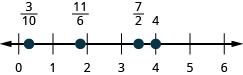 

<math xmlns="http://www.w3.org/1998/Math/MathML"><mrow><mfrac><mn>7</mn><mrow><mn>10</mn></mrow></mfrac><mo>,</mo><mfrac><mn>5</mn><mn>2</mn></mfrac><mo>,</mo><mfrac><mrow><mn>13</mn></mrow><mn>8</mn></mfrac><mo>,</mo><mn>3</mn></mrow></math>

<math xmlns="http://www.w3.org/1998/Math/MathML"><mrow><mfrac><mn>3</mn><mn>4</mn></mfrac><mo>,</mo><mo>−</mo><mfrac><mn>3</mn><mn>4</mn></mfrac><mo>,</mo><mn>1</mn><mfrac><mn>2</mn><mn>3</mn></mfrac><mo>,</mo><mn>−1</mn><mfrac><mn>2</mn><mn>3</mn></mfrac><mo>,</mo><mfrac><mn>5</mn><mn>2</mn></mfrac><mo>,</mo><mo>−</mo><mfrac><mn>5</mn><mn>2</mn></mfrac></mrow></math>

 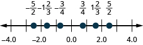 

<math xmlns="http://www.w3.org/1998/Math/MathML"><mrow><mfrac><mn>2</mn><mn>5</mn></mfrac><mo>,</mo><mo>−</mo><mfrac><mn>2</mn><mn>5</mn></mfrac><mo>,</mo><mn>1</mn><mfrac><mn>3</mn><mn>4</mn></mfrac><mo>,</mo><mn>−1</mn><mfrac><mn>3</mn><mn>4</mn></mfrac><mo>,</mo><mfrac><mn>8</mn><mn>3</mn></mfrac><mo>,</mo><mo>−</mo><mfrac><mn>8</mn><mn>3</mn></mfrac></mrow></math>

ⓐ <math xmlns="http://www.w3.org/1998/Math/MathML"><mrow><mn>0.8</mn></mrow></math>

 ⓑ <math xmlns="http://www.w3.org/1998/Math/MathML"><mrow><mn>−1.25</mn></mrow></math>

 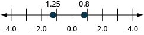 

ⓐ <math xmlns="http://www.w3.org/1998/Math/MathML"><mrow><mn>−0.9</mn></mrow></math>

 ⓑ <math xmlns="http://www.w3.org/1998/Math/MathML"><mrow><mn>−2.75</mn></mrow></math>

ⓐ <math xmlns="http://www.w3.org/1998/Math/MathML"><mrow><mn>−1.6</mn></mrow></math>

 ⓑ <math xmlns="http://www.w3.org/1998/Math/MathML"><mrow><mn>3.25</mn></mrow></math>

 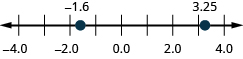 

ⓐ <math xmlns="http://www.w3.org/1998/Math/MathML"><mrow><mn>3.1</mn></mrow></math>

 ⓑ <math xmlns="http://www.w3.org/1998/Math/MathML"><mrow><mn>−3.65</mn></mrow></math>

#### Writing Exercises

How does knowing about U.S. money help you learn about decimals?

Answers will vary.

When the Szetos sold their home, the selling price was 500% of what they had paid for the house 30 years ago. Explain what 500% means in this context.

In your own words, explain the difference between a rational number and an irrational number.

Answers will vary.

Explain how the sets of numbers (counting, whole, integer, rational, irrationals, reals) are related to each other.

#### Self Check

ⓐ Use this checklist to evaluate your mastery of the objectives of this section.

 ![This table has 4 columns, 6 rows and a header row. The header row labels each column: I can, confidently, with some help and no, I don&#x2019;t get it. The statements in the first column are: round decimals, add and subtract decimals, multiply and divide decimals, convert decimals, fractions and percents, simplify expressions with square roots, identify integers, rational numbers, irrational numbers and real numbers, locate fractions and decimals on the number line. The remaining columns are blank.](../resources/CNX_IntAlg_Figure_01_04_215_img.jpg) 
ⓑ On a scale of 1-10, how would you rate your mastery of this section in light of your responses on the checklist? How can you improve this?

</section>

### Glossary
{: data-type="glossary-title"}

irrational number
: An irrational number is a number that cannot be written as the ratio of two integers. Its decimal form does not stop and does not repeat.
^

percent
: A percent is a ratio whose denominator is 100.
^

principal square root
: The positive square root is called the principal square root.
^

rational number
: A rational number is a number of the form
  <math xmlns="http://www.w3.org/1998/Math/MathML"><mrow><mfrac><mi>p</mi><mi>q</mi></mfrac><mo>,</mo></mrow></math>
  
  where *p* and *q* are integers and
  <math xmlns="http://www.w3.org/1998/Math/MathML"><mrow><mi>q</mi><mo>≠</mo><mn>0</mn><mo>.</mo></mrow></math>
  
  Its decimal form stops or repeats.
^

real number
: A real number is a number that is either rational or irrational.
^

square of a number
: If
  <math xmlns="http://www.w3.org/1998/Math/MathML"><mrow><msup><mi>n</mi><mn>2</mn></msup><mo>=</mo><mi>m</mi><mo>,</mo></mrow></math>
  
  then *m* is the square of *n*.
^

square root of a number
: If
  <math xmlns="http://www.w3.org/1998/Math/MathML"><mrow><msup><mi>n</mi><mn>2</mn></msup><mo>=</mo><mi>m</mi><mo>,</mo></mrow></math>
  
  then *n* is a square root of *m*.

[1]: https://openstax.org/l/25dividedecim
