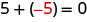
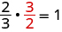
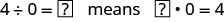
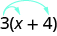
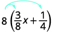
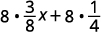
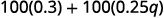
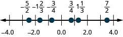
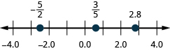

By the end of this section, you will be able to:
* Use the commutative and associative properties
* Use the properties of identity, inverse, and zero
* Simplify expressions using the Distributive Property

A more thorough introduction to the topics covered in this section can be found in the *Elementary Algebra* chapter, Foundations.

### Use the Commutative and Associative Properties

The order we add two numbers doesn’t affect the result. If we add <math xmlns="http://www.w3.org/1998/Math/MathML"><mrow><mn>8</mn><mo>+</mo><mn>9</mn></mrow></math>

 or <math xmlns="http://www.w3.org/1998/Math/MathML"><mrow><mn>9</mn><mo>+</mo><mn>8</mn><mo>,</mo></mrow></math>

 the results are the same—they both equal 17. So, <math xmlns="http://www.w3.org/1998/Math/MathML"><mrow><mn>8</mn><mo>+</mo><mn>9</mn><mo>=</mo><mn>9</mn><mo>+</mo><mn>8</mn><mo>.</mo></mrow></math>

 The order in which we add does not matter!

Similarly, when multiplying two numbers, the order does not affect the result. If we multiply <math xmlns="http://www.w3.org/1998/Math/MathML"><mrow><mn>9</mn><mo>·</mo><mn>8</mn></mrow></math>

 or <math xmlns="http://www.w3.org/1998/Math/MathML"><mrow><mn>8</mn><mo>·</mo><mn>9</mn></mrow></math>

 the results are the same—they both equal 72. So, <math xmlns="http://www.w3.org/1998/Math/MathML"><mrow><mn>9</mn><mo>·</mo><mn>8</mn><mo>=</mo><mn>8</mn><mo>·</mo><mn>9</mn><mo>.</mo></mrow></math>

 The order in which we multiply does not matter!

These examples illustrate the **Commutative Property**{: data-type="term" .no-emphasis}.

Commutative Property

<math xmlns="http://www.w3.org/1998/Math/MathML"><mrow><mtable> <mtr><mtd columnalign="left"><mstyle mathvariant="bold"><mtext>of Addition</mtext></mstyle></mtd><mtd /><mtd /><mtd columnalign="left"><mtext>If</mtext><mspace width="0.2em" /><mi>a</mi><mspace width="0.2em" /><mtext>and</mtext><mspace width="0.2em" /><mi>b</mi><mspace width="0.2em" /><mtext>are real numbers, then</mtext></mtd><mtd /><mtd /><mtd columnalign="left"><mrow><mi>a</mi><mo>+</mo><mi>b</mi><mo>=</mo><mi>b</mi><mo>+</mo><mi>a</mi><mo>.</mo></mrow></mtd></mtr> <mtr><mtd columnalign="left"><mstyle mathvariant="bold"><mtext>of Multiplication</mtext></mstyle></mtd><mtd /><mtd /><mtd columnalign="left"><mtext>If</mtext><mspace width="0.2em" /><mi>a</mi><mspace width="0.2em" /><mtext>and</mtext><mspace width="0.2em" /><mi>b</mi><mspace width="0.2em" /><mtext>are real numbers, then</mtext></mtd><mtd /><mtd /><mtd columnalign="left"><mrow><mi>a</mi><mo>·</mo><mi>b</mi><mo>=</mo><mi>b</mi><mo>·</mo><mi>a</mi><mo>.</mo></mrow></mtd></mtr></mtable></mrow></math>

When adding or multiplying, changing the *order* gives the same result.

The Commutative Property has to do with order. We subtract <math xmlns="http://www.w3.org/1998/Math/MathML"><mrow><mn>9</mn><mo>−</mo><mn>8</mn></mrow></math>

 and <math xmlns="http://www.w3.org/1998/Math/MathML"><mrow><mn>8</mn><mo>−</mo><mn>9</mn></mrow></math>

, and see that <math xmlns="http://www.w3.org/1998/Math/MathML"><mrow><mn>9</mn><mo>−</mo><mn>8</mn><mo>≠</mo><mn>8</mn><mo>−</mo><mn>9</mn><mo>.</mo></mrow></math>

 Since changing the order of the subtraction does not give the same result, we know that *subtraction is not commutative*.

*Division is not commutative either*. Since <math xmlns="http://www.w3.org/1998/Math/MathML"><mrow><mn>12</mn><mo>÷</mo><mn>3</mn><mo>≠</mo><mn>3</mn><mo>÷</mo><mn>12</mn><mo>,</mo></mrow></math>

 changing the order of the division did not give the same result. The commutative properties apply only to addition and multiplication!

  Addition and multiplication *are* commutative.

  Subtraction and division are *not* commutative.

* * *
{: data-type="newline"}

When adding three numbers, changing the grouping of the numbers gives the same result. For example, <math xmlns="http://www.w3.org/1998/Math/MathML"><mrow><mrow><mo>(</mo><mrow><mn>7</mn><mo>+</mo><mn>8</mn></mrow><mo>)</mo></mrow><mo>+</mo><mn>2</mn><mo>=</mo><mn>7</mn><mo>+</mo><mrow><mo>(</mo><mrow><mn>8</mn><mo>+</mo><mn>2</mn></mrow><mo>)</mo></mrow><mo>,</mo></mrow></math>

 since each side of the equation equals 17.

This is true for multiplication, too. For example, <math xmlns="http://www.w3.org/1998/Math/MathML"><mrow><mrow><mo>(</mo><mrow><mn>5</mn><mo>·</mo><mfrac><mn>1</mn><mn>3</mn></mfrac></mrow><mo>)</mo></mrow><mo>·</mo><mn>3</mn><mo>=</mo><mn>5</mn><mo>·</mo><mrow><mo>(</mo><mrow><mfrac><mn>1</mn><mn>3</mn></mfrac><mo>·</mo><mn>3</mn></mrow><mo>)</mo></mrow><mo>,</mo></mrow></math>

 since each side of the equation equals 5.

These examples illustrate the **Associative Property**{: data-type="term" .no-emphasis}.

Associative Property

<math xmlns="http://www.w3.org/1998/Math/MathML"><mrow><mtable> <mtr><mtd columnalign="left"><mstyle mathvariant="bold"><mtext>of Addition</mtext></mstyle></mtd><mtd /><mtd /><mtd columnalign="left"><mtext>If</mtext><mspace width="0.2em" /><mi>a</mi><mo>,</mo><mi>b</mi><mo>,</mo><mtext>and</mtext><mspace width="0.2em" /><mi>c</mi><mspace width="0.2em" /><mtext>are real numbers, then</mtext></mtd><mtd /><mtd /><mtd columnalign="left"><mrow><mrow><mo>(</mo><mrow><mi>a</mi><mo>+</mo><mi>b</mi></mrow><mo>)</mo></mrow><mo>+</mo><mi>c</mi><mo>=</mo><mi>a</mi><mo>+</mo><mrow><mo>(</mo><mrow><mi>b</mi><mo>+</mo><mi>c</mi></mrow><mo>)</mo></mrow><mo>.</mo></mrow></mtd></mtr> <mtr><mtd columnalign="left"><mstyle mathvariant="bold"><mtext>of Multiplication</mtext></mstyle></mtd><mtd /><mtd /><mtd columnalign="left"><mtext>If</mtext><mspace width="0.2em" /><mtext>a</mtext><mo>,</mo><mi>b</mi><mo>,</mo><mtext>and</mtext><mspace width="0.2em" /><mi>c</mi><mspace width="0.2em" /><mtext>are real numbers, then</mtext></mtd><mtd /><mtd /><mtd columnalign="left"><mrow><mrow><mo>(</mo><mrow><mi>a</mi><mo>·</mo><mi>b</mi></mrow><mo>)</mo></mrow><mo>·</mo><mi>c</mi><mo>=</mo><mi>a</mi><mo>·</mo><mrow><mo>(</mo><mrow><mi>b</mi><mo>·</mo><mi>c</mi></mrow><mo>)</mo></mrow><mo>.</mo></mrow></mtd></mtr></mtable></mrow></math>

When adding or multiplying, changing the *grouping* gives the same result.

The Associative Property has to do with grouping. If we change how the numbers are grouped, the result will be the same. Notice it is the same three numbers in the same order—the only difference is the grouping.

We saw that subtraction and division were not commutative. They are not associative either.

<math xmlns="http://www.w3.org/1998/Math/MathML"><mrow><mtable> <mtr><mtd columnalign="center"><mrow><mrow><mo>(</mo><mrow><mn>10</mn><mo>−</mo><mn>3</mn></mrow><mo>)</mo></mrow><mo>−</mo><mn>2</mn><mo>≠</mo><mn>10</mn><mo>−</mo><mrow><mo>(</mo><mrow><mn>3</mn><mo>−</mo><mn>2</mn></mrow><mo>)</mo></mrow></mrow></mtd><mtd /><mtd /><mtd columnalign="center"><mrow><mrow><mo>(</mo><mrow><mn>24</mn><mo>÷</mo><mn>4</mn></mrow><mo>)</mo></mrow><mo>÷</mo><mn>2</mn><mo>≠</mo><mn>24</mn><mo>÷</mo><mrow><mo>(</mo><mrow><mn>4</mn><mo>÷</mo><mn>2</mn></mrow><mo>)</mo></mrow></mrow></mtd></mtr> <mtr><mtd columnalign="center"><mspace width="0.5em" /><mrow><mn>7</mn><mo>−</mo><mn>2</mn><mo>≠</mo><mn>10</mn><mo>−</mo><mn>1</mn></mrow></mtd><mtd /><mtd /><mtd columnalign="center"><mspace width="0.5em" /><mrow><mn>6</mn><mo>÷</mo><mn>2</mn><mo>≠</mo><mn>24</mn><mo>÷</mo><mn>2</mn></mrow></mtd></mtr> <mtr><mtd columnalign="center"><mspace width="0.1em" /><mrow><mn>5</mn><mo>≠</mo><mn>9</mn></mrow></mtd><mtd /><mtd /><mtd columnalign="center"><mspace width="0.6em" /><mrow><mn>3</mn><mo>≠</mo><mn>12</mn></mrow></mtd></mtr></mtable></mrow></math>

When simplifying an expression, it is always a good idea to plan what the steps will be. In order to combine like terms in the next example, we will use the Commutative Property of addition to write the like terms together.

Simplify: <math xmlns="http://www.w3.org/1998/Math/MathML"><mrow><mn>18</mn><mi>p</mi><mo>+</mo><mn>6</mn><mi>q</mi><mo>+</mo><mn>15</mn><mi>p</mi><mo>+</mo><mn>5</mn><mi>q</mi><mo>.</mo></mrow></math>

<math xmlns="http://www.w3.org/1998/Math/MathML"><mrow><mtable> <mtr><mtd /><mtd /><mtd /><mtd columnalign="center"><mspace width="4em" /><mrow><mn>18</mn><mi>p</mi><mo>+</mo><mn>6</mn><mi>q</mi><mo>+</mo><mn>15</mn><mi>p</mi><mo>+</mo><mn>5</mn><mi>q</mi></mrow></mtd></mtr> <mtr><mtd columnalign="left"><mtext>Use the Commutative Property of addition to</mtext></mtd><mtd /><mtd /><mtd columnalign="center"><mspace width="4em" /><mrow><mn>18</mn><mi>p</mi><mo>+</mo><mn>15</mn><mi>p</mi><mo>+</mo><mn>6</mn><mi>q</mi><mo>+</mo><mn>5</mn><mi>q</mi></mrow></mtd></mtr> <mtr><mtd columnalign="left"><mtext>reorder so that like terms are together.</mtext></mtd><mtd /><mtd /><mtd /></mtr> <mtr><mtd columnalign="left"><mtext>Add like terms.</mtext></mtd><mtd /><mtd /><mtd columnalign="center"><mspace width="4em" /><mrow><mn>33</mn><mi>p</mi><mo>+</mo><mn>11</mn><mi>q</mi></mrow></mtd></mtr></mtable></mrow></math>

Simplify: <math xmlns="http://www.w3.org/1998/Math/MathML"><mrow><mn>23</mn><mi>r</mi><mo>+</mo><mn>14</mn><mi>s</mi><mo>+</mo><mn>9</mn><mi>r</mi><mo>+</mo><mn>15</mn><mi>s</mi><mo>.</mo></mrow></math>

<math xmlns="http://www.w3.org/1998/Math/MathML"><mrow><mn>32</mn><mi>r</mi><mo>+</mo><mn>29</mn><mi>s</mi></mrow></math>

Simplify:<math xmlns="http://www.w3.org/1998/Math/MathML"><mrow><mn>37</mn><mi>m</mi><mo>+</mo><mn>21</mn><mi>n</mi><mo>+</mo><mn>4</mn><mi>m</mi><mo>−</mo><mn>15</mn><mi>n</mi><mo>.</mo></mrow></math>

<math xmlns="http://www.w3.org/1998/Math/MathML"><mrow><mn>41</mn><mi>m</mi><mo>+</mo><mn>6</mn><mi>n</mi></mrow></math>

When we have to simplify algebraic expressions, we can often make the work easier by applying the Commutative Property or Associative Property first.

Simplify: <math xmlns="http://www.w3.org/1998/Math/MathML"><mrow><mrow><mo>(</mo><mrow><mfrac><mn>5</mn><mrow><mn>13</mn></mrow></mfrac><mo>+</mo><mfrac><mn>3</mn><mn>4</mn></mfrac></mrow><mo>)</mo></mrow><mo>+</mo><mfrac><mn>1</mn><mn>4</mn></mfrac><mo>.</mo></mrow></math>

<math xmlns="http://www.w3.org/1998/Math/MathML"><mrow><mtable> <mtr><mtd /><mtd /><mtd /><mtd columnalign="center"><mspace width="4em" /><mrow><mrow><mo>(</mo><mrow><mfrac><mn>5</mn><mrow><mn>13</mn></mrow></mfrac><mo>+</mo><mfrac><mn>3</mn><mn>4</mn></mfrac></mrow><mo>)</mo></mrow><mo>+</mo><mfrac><mn>1</mn><mn>4</mn></mfrac></mrow></mtd></mtr> <mtr><mtd columnalign="left"><mtable><mtr><mtd columnalign="left"><mtext>Notice that the last 2 terms have a common</mtext></mtd></mtr><mtr><mtd columnalign="left"><mtext>denominator, so change the grouping.</mtext></mtd></mtr></mtable></mtd><mtd /><mtd /><mtd columnalign="center"><mspace width="4em" /><mrow><mfrac><mn>5</mn><mrow><mn>13</mn></mrow></mfrac><mo>+</mo><mrow><mo>(</mo><mrow><mfrac><mn>3</mn><mn>4</mn></mfrac><mo>+</mo><mfrac><mn>1</mn><mn>4</mn></mfrac></mrow><mo>)</mo></mrow></mrow></mtd></mtr> <mtr><mtd columnalign="left"><mtext>Add in parentheses first.</mtext></mtd><mtd /><mtd /><mtd columnalign="center"><mspace width="4em" /><mrow><mfrac><mn>5</mn><mrow><mn>13</mn></mrow></mfrac><mo>+</mo><mrow><mo>(</mo><mrow><mfrac><mn>4</mn><mn>4</mn></mfrac></mrow><mo>)</mo></mrow></mrow></mtd></mtr> <mtr><mtd columnalign="left"><mtext>Simplify the fraction.</mtext></mtd><mtd /><mtd /><mtd columnalign="center"><mspace width="4em" /><mrow><mfrac><mn>5</mn><mrow><mn>13</mn></mrow></mfrac><mo>+</mo><mn>1</mn></mrow></mtd></mtr> <mtr><mtd columnalign="left"><mtext>Add.</mtext></mtd><mtd /><mtd /><mtd columnalign="center"><mspace width="4em" /><mrow><mn>1</mn><mfrac><mn>5</mn><mrow><mn>13</mn></mrow></mfrac></mrow></mtd></mtr> <mtr><mtd columnalign="left"><mtext>Convert to an improper fraction.</mtext></mtd><mtd /><mtd /><mtd columnalign="center"><mspace width="4em" /><mrow><mfrac><mrow><mn>18</mn></mrow><mrow><mn>13</mn></mrow></mfrac></mrow></mtd></mtr></mtable></mrow></math>

Simplify: <math xmlns="http://www.w3.org/1998/Math/MathML"><mrow><mrow><mo>(</mo><mrow><mfrac><mn>7</mn><mrow><mn>15</mn></mrow></mfrac><mo>+</mo><mfrac><mn>5</mn><mn>8</mn></mfrac></mrow><mo>)</mo></mrow><mo>+</mo><mfrac><mn>3</mn><mn>8</mn></mfrac><mo>.</mo></mrow></math>

<math xmlns="http://www.w3.org/1998/Math/MathML"><mrow><mn>1</mn><mfrac><mn>7</mn><mrow><mn>15</mn></mrow></mfrac></mrow></math>

Simplify: <math xmlns="http://www.w3.org/1998/Math/MathML"><mrow><mrow><mo>(</mo><mrow><mfrac><mn>2</mn><mn>9</mn></mfrac><mo>+</mo><mfrac><mn>7</mn><mrow><mn>12</mn></mrow></mfrac></mrow><mo>)</mo></mrow><mo>+</mo><mfrac><mn>5</mn><mrow><mn>12</mn></mrow></mfrac><mo>.</mo></mrow></math>

<math xmlns="http://www.w3.org/1998/Math/MathML"><mrow><mn>1</mn><mfrac><mn>2</mn><mn>9</mn></mfrac></mrow></math>

### Use the Properties of Identity, Inverse, and Zero

What happens when we add 0 to any number? Adding 0 doesn’t change the value. For this reason, we call 0 the **additive identity**{: data-type="term"}. The **Identity Property of Addition**{: data-type="term"} that states that for any real number <math xmlns="http://www.w3.org/1998/Math/MathML"><mrow><mi>a</mi><mo>,</mo><mi>a</mi><mo>+</mo><mn>0</mn><mo>=</mo><mi>a</mi></mrow></math>

 and <math xmlns="http://www.w3.org/1998/Math/MathML"><mrow><mn>0</mn><mo>+</mo><mi>a</mi><mo>=</mo><mi>a</mi><mo>.</mo></mrow></math>

What happens when we multiply any number by one? Multiplying by 1 doesn’t change the value. So we call 1 the **multiplicative identity**{: data-type="term"}. The **Identity Property of Multiplication**{: data-type="term"} that states that for any real number <math xmlns="http://www.w3.org/1998/Math/MathML"><mrow><mi>a</mi><mo>,</mo><mi>a</mi><mo>·</mo><mn>1</mn><mo>=</mo><mi>a</mi></mrow></math>

 and <math xmlns="http://www.w3.org/1998/Math/MathML"><mrow><mn>1</mn><mo>·</mo><mi>a</mi><mo>=</mo><mi>a</mi><mo>.</mo></mrow></math>

We summarize the Identity Properties here.

Identity Property

<math xmlns="http://www.w3.org/1998/Math/MathML"><mrow><mtable> <mtr><mtd columnalign="left"><mstyle mathvariant="bold"><mtext>of Addition</mtext></mstyle><mspace width="1em" /><mtext>For any real number</mtext><mspace width="0.2em" /><mi>a</mi><mo>:</mo><mspace width="0.2em" /><mi>a</mi><mo>+</mo><mn>0</mn><mo>=</mo><mi>a</mi></mtd><mtd /><mtd /><mtd columnalign="left"><mn>0</mn><mo>+</mo><mi>a</mi><mo>=</mo><mi>a</mi></mtd></mtr> <mtr /><mtr /><mtr><mtd columnalign="left"><mspace width="1.5em" /><mstyle mathvariant="bold"><mn>0</mn></mstyle><mspace width="0.2em" /><mtext>is the</mtext><mspace width="0.2em" /><mstyle mathvariant="bold"><mtext>additive identity</mtext></mstyle></mtd><mtd /><mtd /><mtd /></mtr> <mtr><mtd columnalign="left"><mstyle mathvariant="bold"><mtext>of Multiplication</mtext></mstyle><mspace width="1em" /><mtext>For any real number</mtext><mspace width="0.2em" /><mi>a</mi><mo>:</mo><mspace width="0.2em" /><mi>a</mi><mo>·</mo><mn>1</mn><mo>=</mo><mi>a</mi></mtd><mtd /><mtd /><mtd columnalign="left"><mn>1</mn><mo>·</mo><mi>a</mi><mo>=</mo><mi>a</mi></mtd></mtr> <mtr /><mtr /><mtr><mtd columnalign="left"><mspace width="1.5em" /><mstyle mathvariant="bold"><mn>1</mn></mstyle><mspace width="0.2em" /><mtext>is the</mtext><mspace width="0.2em" /><mstyle mathvariant="bold"><mtext>multiplicative identity</mtext></mstyle></mtd></mtr></mtable></mrow></math>

What number added to 5 gives the additive identity, 0? We know

    The missing number was the opposite of the number!

We call <math xmlns="http://www.w3.org/1998/Math/MathML"><mrow><mtext>−</mtext><mi>a</mi></mrow></math>

 the **additive inverse**{: data-type="term"} of <math xmlns="http://www.w3.org/1998/Math/MathML"><mrow><mi>a</mi><mo>.</mo></mrow></math>

 *The opposite of a number is its additive inverse.* A number and its opposite add to zero, which is the additive identity. This leads to the **Inverse Property of Addition**{: data-type="term"} that states for any real number <math xmlns="http://www.w3.org/1998/Math/MathML"><mrow><mi>a</mi><mo>,</mo><mi>a</mi><mo>+</mo><mrow><mo>(</mo><mrow><mtext>−</mtext><mi>a</mi></mrow><mo>)</mo></mrow><mo>=</mo><mn>0</mn><mo>.</mo></mrow></math>

What number multiplied by <math xmlns="http://www.w3.org/1998/Math/MathML"><mrow><mfrac><mn>2</mn><mn>3</mn></mfrac></mrow></math>

 gives the multiplicative identity, 1? In other words, <math xmlns="http://www.w3.org/1998/Math/MathML"><mrow><mfrac><mn>2</mn><mn>3</mn></mfrac></mrow></math>

 times what results in 1? We know

    The missing number was the reciprocal of the number!

We call <math xmlns="http://www.w3.org/1998/Math/MathML"><mrow><mfrac><mn>1</mn><mi>a</mi></mfrac></mrow></math>

 the <strong data-type="term">multiplicative inverse </strong>of *a*. *The reciprocal of a number is its multiplicative inverse.* This leads to the **Inverse Property of Multiplication**{: data-type="term"} that states that for any real number <math xmlns="http://www.w3.org/1998/Math/MathML"><mrow><mi>a</mi><mo>,</mo><mi>a</mi><mo>≠</mo><mn>0</mn><mo>,</mo><mi>a</mi><mo>·</mo><mfrac><mn>1</mn><mi>a</mi></mfrac><mo>=</mo><mn>1</mn><mo>.</mo></mrow></math>

We’ll formally state the inverse properties here.

Inverse Property

<math xmlns="http://www.w3.org/1998/Math/MathML"><mrow><mtable> <mtr><mtd columnalign="left"><mstyle mathvariant="bold"><mtext>of Addition</mtext></mstyle></mtd><mtd /><mtd /><mtd columnalign="left"><mtext>For any real number</mtext><mspace width="0.2em" /><mi>a</mi><mo>,</mo><mspace width="2em" /><mi>a</mi><mo>+</mo><mrow><mo>(</mo><mrow><mtext>−</mtext><mi>a</mi></mrow><mo>)</mo></mrow><mo>=</mo><mn>0</mn></mtd></mtr> <mtr><mtd /><mtd /><mtd /><mtd columnalign="left"><mtext>−</mtext><mi>a</mi><mspace width="0.2em" /><mtext>is the</mtext><mspace width="0.2em" /><mstyle mathvariant="bold"><mtext>additive inverse</mtext></mstyle><mspace width="0.2em" /><mtext>of</mtext><mspace width="0.2em" /><mi>a</mi></mtd></mtr> <mtr><mtd /><mtd /><mtd /><mtd columnalign="left"><mtext>A number and its</mtext><mspace width="0.2em" /><mi>o</mi><mi>p</mi><mi>p</mi><mi>o</mi><mi>s</mi><mi>i</mi><mi>t</mi><mi>e</mi><mspace width="0.2em" /><mtext>add to zero.</mtext></mtd></mtr><mtr /><mtr /><mtr /><mtr /> <mtr><mtd columnalign="left"><mstyle mathvariant="bold"><mtext>of Multiplication</mtext></mstyle></mtd><mtd /><mtd /><mtd columnalign="left"><mtext>For any real number</mtext><mspace width="0.2em" /><mi>a</mi><mo>,</mo><mspace width="2em" /><mi>a</mi><mo>≠</mo><mn>0</mn><mo>,</mo><mspace width="0.5em" /><mi>a</mi><mo>·</mo><mfrac><mn>1</mn><mi>a</mi></mfrac><mo>=</mo><mn>1</mn><mo>.</mo></mtd></mtr> <mtr><mtd /><mtd /><mtd /><mtd columnalign="left"><mfrac><mn>1</mn><mi>a</mi></mfrac><mspace width="0.2em" /><mtext>is the</mtext><mspace width="0.2em" /><mstyle mathvariant="bold"><mtext>multiplicative inverse</mtext></mstyle><mspace width="0.2em" /><mtext>of</mtext><mspace width="0.2em" /><mi>a</mi><mo>.</mo></mtd></mtr> <mtr><mtd /><mtd /><mtd /><mtd columnalign="left"><mtext>A number and its</mtext><mspace width="0.2em" /><mi>r</mi><mi>e</mi><mi>c</mi><mi>i</mi><mi>p</mi><mi>r</mi><mi>o</mi><mi>c</mi><mi>a</mi><mi>l</mi><mspace width="0.2em" /><mtext>multiply to one.</mtext></mtd></mtr></mtable></mrow></math>

The Identity Property of addition says that when we add 0 to any number, the result is that same number. What happens when we multiply a number by 0? Multiplying by 0 makes the product equal zero.

What about division involving zero? What is <math xmlns="http://www.w3.org/1998/Math/MathML"><mrow><mn>0</mn><mo>÷</mo><mn>3</mn><mo>?</mo></mrow></math>

 Think about a real example: If there are no cookies in the cookie jar and 3 people are to share them, how many cookies does each person get? There are no cookies to share, so each person gets 0 cookies. So, <math xmlns="http://www.w3.org/1998/Math/MathML"><mrow><mn>0</mn><mo>÷</mo><mn>3</mn><mo>=</mo><mn>0</mn><mo>.</mo></mrow></math>

We can check division with the related multiplication fact. So we know <math xmlns="http://www.w3.org/1998/Math/MathML"><mrow><mn>0</mn><mo>÷</mo><mn>3</mn><mo>=</mo><mn>0</mn></mrow></math>

 because <math xmlns="http://www.w3.org/1998/Math/MathML"><mrow><mn>0</mn><mo>·</mo><mn>3</mn><mo>=</mo><mn>0</mn><mo>.</mo></mrow></math>

Now think about dividing *by* zero. What is the result of dividing 4 by <math xmlns="http://www.w3.org/1998/Math/MathML"><mrow><mn>0</mn><mo>?</mo></mrow></math>

 Think about the related multiplication fact:

    Is there a number that multiplied by 0 gives <math xmlns="http://www.w3.org/1998/Math/MathML"><mrow><mn>4</mn><mo>?</mo></mrow></math>

 Since any real number multiplied by 0 gives 0, there is no real number that can be multiplied by 0 to obtain 4. We conclude that there is no answer to <math xmlns="http://www.w3.org/1998/Math/MathML"><mrow><mn>4</mn><mo>÷</mo><mn>0</mn></mrow></math>

 and so we say that division by 0 is **undefined**.

We summarize the properties of zero here.

Properties of Zero

Multiplication by Zero: For any real number *a*,

<math xmlns="http://www.w3.org/1998/Math/MathML"><mrow><mspace width="6.5em" /><mi>a</mi><mo>·</mo><mn>0</mn><mo>=</mo><mn>0</mn><mspace width="1em" /><mn>0</mn><mo>·</mo><mi>a</mi><mo>=</mo><mn>0</mn><mspace width="2em" /><mtext>The product of any number and 0 is 0.</mtext></mrow></math>

Division by Zero: For any real number *a*, <math xmlns="http://www.w3.org/1998/Math/MathML"><mrow><mi>a</mi><mo>≠</mo><mn>0</mn></mrow></math>

<math xmlns="http://www.w3.org/1998/Math/MathML"><mrow><mtable> <mtr><mtd columnalign="center"><mfrac><mn>0</mn><mi>a</mi></mfrac><mo>=</mo><mn>0</mn></mtd><mtd /><mtd /><mtd columnalign="left"><mspace width="0.5em" /><mtext>Zero divided by any real number, except itself, is zero.</mtext></mtd></mtr> <mtr><mtd columnalign="center"><mfrac><mi>a</mi><mn>0</mn></mfrac><mspace width="0.2em" /><mtext>is undefined</mtext></mtd><mtd /><mtd /><mtd columnalign="left"><mspace width="0.5em" /><mtext>Division by zero is undefined.</mtext></mtd></mtr></mtable></mrow></math>

We will now practice using the properties of identities, inverses, and zero to simplify expressions.

Simplify: <math xmlns="http://www.w3.org/1998/Math/MathML"><mrow><mn>−84</mn><mi>n</mi><mo>+</mo><mrow><mo>(</mo><mrow><mn>−73</mn><mi>n</mi></mrow><mo>)</mo></mrow><mo>+</mo><mn>84</mn><mi>n</mi><mo>.</mo></mrow></math>

<math xmlns="http://www.w3.org/1998/Math/MathML"><mrow><mtable> <mtr><mtd /><mtd /><mtd /><mtd columnalign="center"><mspace width="4em" /><mrow><mn>−84</mn><mi>n</mi><mo>+</mo><mrow><mo>(</mo><mrow><mn>−73</mn><mi>n</mi></mrow><mo>)</mo></mrow><mo>+</mo><mn>84</mn><mi>n</mi></mrow></mtd></mtr> <mtr><mtd columnalign="left"><mtable><mtr><mtd columnalign="left"><mtext>Notice that the first and third terms are</mtext></mtd></mtr><mtr><mtd columnalign="left"><mtext>opposites; use the Commutative Property of</mtext></mtd></mtr><mtr><mtd columnalign="left"><mtext>addition to re-order the terms.</mtext></mtd></mtr></mtable></mtd><mtd /><mtd /><mtd columnalign="center"><mspace width="4em" /><mrow><mn>−84</mn><mi>n</mi><mo>+</mo><mn>84</mn><mi>n</mi><mo>+</mo><mrow><mo>(</mo><mrow><mn>−73</mn><mi>n</mi></mrow><mo>)</mo></mrow></mrow></mtd></mtr> <mtr><mtd columnalign="left"><mtext>Add left to right.</mtext></mtd><mtd /><mtd /><mtd columnalign="center"><mspace width="4em" /><mrow><mn>0</mn><mo>+</mo><mrow><mo>(</mo><mrow><mn>−73</mn><mi>n</mi></mrow><mo>)</mo></mrow></mrow></mtd></mtr> <mtr><mtd columnalign="left"><mtext>Add.</mtext></mtd><mtd /><mtd /><mtd columnalign="center"><mspace width="4em" /><mrow><mn>−73</mn><mi>n</mi></mrow></mtd></mtr></mtable></mrow></math>

Simplify: <math xmlns="http://www.w3.org/1998/Math/MathML"><mrow><mn>−27</mn><mi>a</mi><mo>+</mo><mrow><mo>(</mo><mrow><mn>−48</mn><mi>a</mi></mrow><mo>)</mo></mrow><mo>+</mo><mn>27</mn><mi>a</mi><mo>.</mo></mrow></math>

<math xmlns="http://www.w3.org/1998/Math/MathML"><mrow><mn>−48</mn><mi>a</mi></mrow></math>

Simplify: <math xmlns="http://www.w3.org/1998/Math/MathML"><mrow><mn>39</mn><mi>x</mi><mo>+</mo><mrow><mo>(</mo><mrow><mn>−92</mn><mi>x</mi></mrow><mo>)</mo></mrow><mo>+</mo><mrow><mo>(</mo><mrow><mn>−39</mn><mi>x</mi></mrow><mo>)</mo></mrow><mo>.</mo></mrow></math>

<math xmlns="http://www.w3.org/1998/Math/MathML"><mrow><mn>−92</mn><mi>x</mi></mrow></math>

Now we will see how recognizing reciprocals is helpful. Before multiplying left to right, look for reciprocals—their product is 1.

Simplify: <math xmlns="http://www.w3.org/1998/Math/MathML"><mrow><mfrac><mn>7</mn><mrow><mn>15</mn></mrow></mfrac><mo>·</mo><mfrac><mn>8</mn><mrow><mn>23</mn></mrow></mfrac><mo>·</mo><mfrac><mrow><mn>15</mn></mrow><mn>7</mn></mfrac><mo>.</mo></mrow></math>

<math xmlns="http://www.w3.org/1998/Math/MathML"><mrow><mtable> <mtr><mtd /><mtd /><mtd /><mtd columnalign="center"><mspace width="4em" /><mrow><mfrac><mn>7</mn><mrow><mn>15</mn></mrow></mfrac><mo>·</mo><mfrac><mn>8</mn><mrow><mn>23</mn></mrow></mfrac><mo>·</mo><mfrac><mrow><mn>15</mn></mrow><mn>7</mn></mfrac></mrow></mtd></mtr> <mtr><mtd columnalign="left"><mtable><mtr><mtd columnalign="left"><mtext>Notice the first and third terms</mtext></mtd></mtr><mtr><mtd columnalign="left"><mtext>are reciprocals, so use the Commutative</mtext></mtd></mtr><mtr><mtd columnalign="left"><mtext>Property of multiplication to re-order the</mtext></mtd></mtr><mtr><mtd columnalign="left"><mtext>factors.</mtext></mtd></mtr></mtable></mtd><mtd /><mtd /><mtd columnalign="center"><mspace width="4em" /><mrow><mfrac><mn>7</mn><mrow><mn>15</mn></mrow></mfrac><mo>·</mo><mfrac><mrow><mn>15</mn></mrow><mn>7</mn></mfrac><mo>·</mo><mfrac><mn>8</mn><mrow><mn>23</mn></mrow></mfrac></mrow></mtd></mtr> <mtr><mtd columnalign="left"><mtext>Multiply left to right.</mtext></mtd><mtd /><mtd /><mtd columnalign="center"><mspace width="4em" /><mrow><mn>1</mn><mo>·</mo><mfrac><mn>8</mn><mrow><mn>23</mn></mrow></mfrac></mrow></mtd></mtr> <mtr><mtd columnalign="left"><mtext>Multiply.</mtext></mtd><mtd /><mtd /><mtd columnalign="center"><mspace width="4em" /><mrow><mfrac><mn>8</mn><mrow><mn>23</mn></mrow></mfrac></mrow></mtd></mtr></mtable></mrow></math>

Simplify: <math xmlns="http://www.w3.org/1998/Math/MathML"><mrow><mfrac><mn>9</mn><mrow><mn>16</mn></mrow></mfrac><mo>·</mo><mfrac><mn>5</mn><mrow><mn>49</mn></mrow></mfrac><mo>·</mo><mfrac><mrow><mn>16</mn></mrow><mn>9</mn></mfrac><mo>.</mo></mrow></math>

<math xmlns="http://www.w3.org/1998/Math/MathML"><mrow><mfrac><mn>5</mn><mrow><mn>49</mn></mrow></mfrac></mrow></math>

Simplify: <math xmlns="http://www.w3.org/1998/Math/MathML"><mrow><mfrac><mn>6</mn><mrow><mn>17</mn></mrow></mfrac><mo>·</mo><mfrac><mrow><mn>11</mn></mrow><mrow><mn>25</mn></mrow></mfrac><mo>·</mo><mfrac><mrow><mn>17</mn></mrow><mn>6</mn></mfrac><mo>.</mo></mrow></math>

<math xmlns="http://www.w3.org/1998/Math/MathML"><mrow><mfrac><mrow><mn>11</mn></mrow><mrow><mn>25</mn></mrow></mfrac></mrow></math>

The next example makes us aware of the distinction between dividing 0 by some number or some number being divided by 0.

Simplify: ⓐ <math xmlns="http://www.w3.org/1998/Math/MathML"><mrow><mfrac><mn>0</mn><mrow><mi>n</mi><mo>+</mo><mn>5</mn></mrow></mfrac><mo>,</mo></mrow></math>

 where <math xmlns="http://www.w3.org/1998/Math/MathML"><mrow><mi>n</mi><mo>≠</mo><mtext>−</mtext><mn>5</mn></mrow></math>

 ⓑ <math xmlns="http://www.w3.org/1998/Math/MathML"><mrow><mfrac><mrow><mn>10</mn><mo>−</mo><mn>3</mn><mi>p</mi></mrow><mn>0</mn></mfrac><mo>,</mo></mrow></math>

 where <math xmlns="http://www.w3.org/1998/Math/MathML"><mrow><mn>10</mn><mo>−</mo><mn>3</mn><mi>p</mi><mo>≠</mo><mn>0</mn><mo>.</mo></mrow></math>

ⓐ* * *
{: data-type="newline"}

 <math xmlns="http://www.w3.org/1998/Math/MathML"><mrow><mtable> <mtr><mtd /><mtd /><mtd /><mtd columnalign="center"><mspace width="4em" /><mrow><mfrac><mn>0</mn><mrow><mi>n</mi><mo>+</mo><mn>5</mn></mrow></mfrac></mrow></mtd></mtr> <mtr><mtd columnalign="left"><mtext>Zero divided by any real number except itself is 0.</mtext></mtd><mtd /><mtd /><mtd columnalign="center"><mspace width="4em" /><mn>0</mn></mtd></mtr></mtable></mrow></math>

ⓑ* * *
{: data-type="newline"}

 <math xmlns="http://www.w3.org/1998/Math/MathML"><mrow><mtable> <mtr><mtd /><mtd /><mtd /><mtd columnalign="center"><mspace width="12em" /><mrow><mfrac><mrow><mn>10</mn><mo>−</mo><mn>3</mn><mi>p</mi></mrow><mn>0</mn></mfrac></mrow></mtd></mtr> <mtr><mtd columnalign="left"><mtext>Division by 0 is undefined.</mtext></mtd><mtd /><mtd /><mtd columnalign="center"><mspace width="12em" /><mtext>undefined</mtext></mtd></mtr></mtable></mrow></math>

Simplify: ⓐ <math xmlns="http://www.w3.org/1998/Math/MathML"><mrow><mfrac><mn>0</mn><mrow><mi>m</mi><mo>+</mo><mn>7</mn></mrow></mfrac><mo>,</mo></mrow></math>

 where <math xmlns="http://www.w3.org/1998/Math/MathML"><mrow><mi>m</mi><mo>≠</mo><mtext>−</mtext><mn>7</mn></mrow></math>

 ⓑ <math xmlns="http://www.w3.org/1998/Math/MathML"><mrow><mfrac><mrow><mn>18</mn><mo>−</mo><mn>6</mn><mi>c</mi></mrow><mn>0</mn></mfrac><mo>,</mo></mrow></math>

 where <math xmlns="http://www.w3.org/1998/Math/MathML"><mrow><mn>18</mn><mo>−</mo><mn>6</mn><mi>c</mi><mo>≠</mo><mn>0</mn><mo>.</mo></mrow></math>

ⓐ 0 ⓑ undefined

Simplify: ⓐ<math xmlns="http://www.w3.org/1998/Math/MathML"><mrow><mfrac><mn>0</mn><mrow><mi>d</mi><mo>−</mo><mn>4</mn></mrow></mfrac><mo>,</mo></mrow></math>

 where <math xmlns="http://www.w3.org/1998/Math/MathML"><mrow><mi>d</mi><mo>≠</mo><mn>4</mn></mrow></math>

 ⓑ <math xmlns="http://www.w3.org/1998/Math/MathML"><mrow><mfrac><mrow><mn>15</mn><mo>−</mo><mn>4</mn><mi>q</mi></mrow><mn>0</mn></mfrac><mo>,</mo></mrow></math>

 where <math xmlns="http://www.w3.org/1998/Math/MathML"><mrow><mn>15</mn><mo>−</mo><mn>4</mn><mi>q</mi><mo>≠</mo><mn>0</mn><mo>.</mo></mrow></math>

ⓐ 0 ⓑ undefined

### Simplify Expressions Using the Distributive Property

Suppose that three friends are going to the movies. They each need $9.25—that’s 9 dollars and 1 quarter—to pay for their tickets. How much money do they need all together?

You can think about the dollars separately from the quarters. They need 3 times $9 so $27 and 3 times 1 quarter, so 75 cents. In total, they need $27.75. If you think about doing the math in this way, you are using the Distributive Property.

Distributive Property

<math xmlns="http://www.w3.org/1998/Math/MathML"><mrow><mtable> <mtr><mtd columnalign="left"><mtext>If</mtext><mspace width="0.2em" /><mi>a</mi><mo>,</mo><mi>b</mi><mo>,</mo><mtext>and</mtext><mspace width="0.2em" /><mi>c</mi><mspace width="0.2em" /><mtext>are real numbers, then</mtext></mtd><mtd /><mtd /><mtd columnalign="left"><mrow><mi>a</mi><mrow><mo>(</mo><mrow><mi>b</mi><mo>+</mo><mi>c</mi></mrow><mo>)</mo></mrow><mo>=</mo><mi>a</mi><mi>b</mi><mo>+</mo><mi>a</mi><mi>c</mi></mrow></mtd></mtr> <mtr><mtd /><mtd /><mtd /><mtd columnalign="left"><mrow><mrow><mo>(</mo><mrow><mi>b</mi><mo>+</mo><mi>c</mi></mrow><mo>)</mo></mrow><mi>a</mi><mo>=</mo><mi>b</mi><mi>a</mi><mo>+</mo><mi>c</mi><mi>a</mi></mrow></mtd></mtr> <mtr><mtd /><mtd /><mtd /><mtd columnalign="left"><mrow><mi>a</mi><mrow><mo>(</mo><mrow><mi>b</mi><mo>−</mo><mi>c</mi></mrow><mo>)</mo></mrow><mo>=</mo><mi>a</mi><mi>b</mi><mo>−</mo><mi>a</mi><mi>c</mi></mrow></mtd></mtr> <mtr><mtd /><mtd /><mtd /><mtd columnalign="left"><mrow><mrow><mo>(</mo><mrow><mi>b</mi><mo>−</mo><mi>c</mi></mrow><mo>)</mo></mrow><mi>a</mi><mo>=</mo><mi>b</mi><mi>a</mi><mo>−</mo><mi>c</mi><mi>a</mi></mrow></mtd></mtr></mtable></mrow></math>

In algebra, we use the Distributive Property to remove parentheses as we simplify expressions.

Simplify: <math xmlns="http://www.w3.org/1998/Math/MathML"><mrow><mn>3</mn><mrow><mo>(</mo><mrow><mi>x</mi><mo>+</mo><mn>4</mn></mrow><mo>)</mo></mrow><mo>.</mo></mrow></math>

<math xmlns="http://www.w3.org/1998/Math/MathML"><mrow><mtable> <mtr><mtd /><mtd /><mtd /><mtd columnalign="left"><mspace width="4em" /><mrow><mn>3</mn><mrow><mo>(</mo><mrow><mi>x</mi><mo>+</mo><mn>4</mn></mrow><mo>)</mo></mrow></mrow></mtd></mtr> <mtr><mtd columnalign="left"><mtext>Distribute.</mtext></mtd><mtd /><mtd /><mtd columnalign="left"><mspace width="4em" /><mrow><mn>3</mn><mo>·</mo><mi>x</mi><mo>+</mo><mn>3</mn><mo>·</mo><mn>4</mn></mrow></mtd></mtr> <mtr><mtd columnalign="left"><mtext>Multiply.</mtext></mtd><mtd /><mtd /><mtd columnalign="left"><mspace width="4em" /><mrow><mn>3</mn><mi>x</mi><mo>+</mo><mn>12</mn></mrow></mtd></mtr></mtable></mrow></math>

Simplify: <math xmlns="http://www.w3.org/1998/Math/MathML"><mrow><mn>4</mn><mrow><mo>(</mo><mrow><mi>x</mi><mo>+</mo><mn>2</mn></mrow><mo>)</mo></mrow><mo>.</mo></mrow></math>

<math xmlns="http://www.w3.org/1998/Math/MathML"><mrow><mn>4</mn><mi>x</mi><mo>+</mo><mn>8</mn></mrow></math>

Simplify: <math xmlns="http://www.w3.org/1998/Math/MathML"><mrow><mn>6</mn><mrow><mo>(</mo><mrow><mi>x</mi><mo>+</mo><mn>7</mn></mrow><mo>)</mo></mrow><mo>.</mo></mrow></math>

<math xmlns="http://www.w3.org/1998/Math/MathML"><mrow><mn>6</mn><mi>x</mi><mo>+</mo><mn>42</mn></mrow></math>

Some students find it helpful to draw in arrows to remind them how to use the Distributive Property. Then the first step in [\[link\]](#fs-id1167829789060) would look like this:

    

Simplify: <math xmlns="http://www.w3.org/1998/Math/MathML"><mrow><mn>8</mn><mrow><mo>(</mo><mrow><mfrac><mn>3</mn><mn>8</mn></mfrac><mi>x</mi><mo>+</mo><mfrac><mn>1</mn><mn>4</mn></mfrac></mrow><mo>)</mo></mrow><mo>.</mo></mrow></math>

|  |  |
{: valign="top"}| Distribute.     |  |
{: valign="top"}| Multiply. |  |
{: valign="top"}{: .unnumbered .unstyled summary="The expression is 8 open parentheses 3 by 8 x plus 1 by 4 close parentheses. There are arrows from 8 to 3 by 8 and 1 by 4. Distribute to get 8 into 3 by 8 x plus 8 into 1 by 4. Multiply to get 3x plus 2." data-label=""}

Simplify: <math xmlns="http://www.w3.org/1998/Math/MathML"><mrow><mn>6</mn><mrow><mo>(</mo><mrow><mfrac><mn>5</mn><mn>6</mn></mfrac><mi>y</mi><mo>+</mo><mfrac><mn>1</mn><mn>2</mn></mfrac></mrow><mo>)</mo></mrow><mo>.</mo></mrow></math>

<math xmlns="http://www.w3.org/1998/Math/MathML"><mrow><mn>5</mn><mi>y</mi><mo>+</mo><mn>3</mn></mrow></math>

Simplify: <math xmlns="http://www.w3.org/1998/Math/MathML"><mrow><mn>12</mn><mrow><mo>(</mo><mrow><mfrac><mn>1</mn><mn>3</mn></mfrac><mi>n</mi><mo>+</mo><mfrac><mn>3</mn><mn>4</mn></mfrac></mrow><mo>)</mo></mrow><mo>.</mo></mrow></math>

<math xmlns="http://www.w3.org/1998/Math/MathML"><mrow><mn>4</mn><mi>n</mi><mo>+</mo><mn>9</mn></mrow></math>

Using the Distributive Property as shown in the next example will be very useful when we solve money applications in later chapters.

Simplify: <math xmlns="http://www.w3.org/1998/Math/MathML"><mrow><mn>100</mn><mrow><mo>(</mo><mrow><mn>0.3</mn><mo>+</mo><mn>0.25</mn><mi>q</mi></mrow><mo>)</mo></mrow><mo>.</mo></mrow></math>

|  |  |
{: valign="top"}| Distribute.     |  |
{: valign="top"}| Multiply. |  |
{: valign="top"}{: .unnumbered .unstyled summary="The expression is 100 open parentheses 0.3 plus 0.25q close parentheses. There are arrows from 100 to 0.3 and 0.25 q. Distribute to get 100 times 0.3 plus 100 times 0.25 q. Multiply to get 30 plus 25 q." data-label=""}

Simplify: <math xmlns="http://www.w3.org/1998/Math/MathML"><mrow><mn>100</mn><mrow><mo>(</mo><mrow><mn>0.7</mn><mo>+</mo><mn>0.15</mn><mi>p</mi></mrow><mo>)</mo></mrow><mo>.</mo></mrow></math>

<math xmlns="http://www.w3.org/1998/Math/MathML"><mrow><mn>70</mn><mo>+</mo><mn>15</mn><mi>p</mi></mrow></math>

Simplify: <math xmlns="http://www.w3.org/1998/Math/MathML"><mrow><mn>100</mn><mrow><mo>(</mo><mrow><mn>0.04</mn><mo>+</mo><mn>0.35</mn><mi>d</mi></mrow><mo>)</mo></mrow><mo>.</mo></mrow></math>

<math xmlns="http://www.w3.org/1998/Math/MathML"><mrow><mn>4</mn><mo>+</mo><mn>35</mn><mi>d</mi></mrow></math>

When we distribute a negative number, we need to be extra careful to get the signs correct!

Simplify: <math xmlns="http://www.w3.org/1998/Math/MathML"><mrow><mn>−11</mn><mrow><mo>(</mo><mrow><mn>4</mn><mo>−</mo><mn>3</mn><mi>a</mi></mrow><mo>)</mo></mrow><mo>.</mo></mrow></math>

<math xmlns="http://www.w3.org/1998/Math/MathML"><mrow><mtable> <mtr><mtd /><mtd /><mtd /><mtd columnalign="center"><mspace width="4em" /><mrow><mn>−11</mn><mrow><mo>(</mo><mrow><mn>4</mn><mo>−</mo><mn>3</mn><mi>a</mi></mrow><mo>)</mo></mrow></mrow></mtd></mtr> <mtr><mtd columnalign="left"><mtext>Distribute.</mtext></mtd><mtd /><mtd /><mtd columnalign="center"><mspace width="4em" /><mrow><mn>−11</mn><mo>·</mo><mn>4</mn><mo>−</mo><mrow><mo>(</mo><mrow><mn>−11</mn></mrow><mo>)</mo></mrow><mo>·</mo><mn>3</mn><mi>a</mi></mrow></mtd></mtr> <mtr><mtd columnalign="left"><mtext>Multiply.</mtext></mtd><mtd /><mtd /><mtd columnalign="center"><mspace width="4em" /><mrow><mn>−44</mn><mo>−</mo><mrow><mo>(</mo><mrow><mn>−33</mn><mi>a</mi></mrow><mo>)</mo></mrow></mrow></mtd></mtr> <mtr><mtd columnalign="left"><mtext>Simplify.</mtext></mtd><mtd /><mtd /><mtd columnalign="center"><mspace width="4em" /><mrow><mn>−44</mn><mo>+</mo><mn>33</mn><mi>a</mi></mrow></mtd></mtr></mtable></mrow></math>

Notice that you could also write the result as <math xmlns="http://www.w3.org/1998/Math/MathML"><mrow><mn>33</mn><mi>a</mi><mo>−</mo><mn>44</mn><mo>.</mo></mrow></math>

 Do you know why?

Simplify: <math xmlns="http://www.w3.org/1998/Math/MathML"><mrow><mn>−5</mn><mrow><mo>(</mo><mrow><mn>2</mn><mo>−</mo><mn>3</mn><mi>a</mi></mrow><mo>)</mo></mrow><mo>.</mo></mrow></math>

<math xmlns="http://www.w3.org/1998/Math/MathML"><mrow><mn>−10</mn><mo>+</mo><mn>15</mn><mi>a</mi></mrow></math>

Simplify: <math xmlns="http://www.w3.org/1998/Math/MathML"><mrow><mn>−7</mn><mrow><mo>(</mo><mrow><mn>8</mn><mo>−</mo><mn>15</mn><mi>y</mi></mrow><mo>)</mo></mrow><mo>.</mo></mrow></math>

<math xmlns="http://www.w3.org/1998/Math/MathML"><mrow><mn>−56</mn><mo>+</mo><mn>105</mn><mi>y</mi></mrow></math>

In the next example, we will show how to use the **Distributive Property**{: data-type="term" .no-emphasis} to find the opposite of an expression.

Simplify: <math xmlns="http://www.w3.org/1998/Math/MathML"><mrow><mtext>−</mtext><mrow><mo>(</mo><mrow><mi>y</mi><mo>+</mo><mn>5</mn></mrow><mo>)</mo></mrow><mo>.</mo></mrow></math>

<math xmlns="http://www.w3.org/1998/Math/MathML"><mrow><mtable> <mtr><mtd /><mtd /><mtd /><mtd columnalign="center"><mrow><mtext>−</mtext><mrow><mo>(</mo><mrow><mi>y</mi><mo>+</mo><mn>5</mn></mrow><mo>)</mo></mrow></mrow></mtd></mtr> <mtr><mtd columnalign="left"><mtext>Multiplying by</mtext><mspace width="0.2em" /><mn>−1</mn><mspace width="0.2em" /><mtext>results in the opposite.</mtext></mtd><mtd /><mtd /><mtd columnalign="center"><mrow><mn>−1</mn><mrow><mo>(</mo><mrow><mi>y</mi><mo>+</mo><mn>5</mn></mrow><mo>)</mo></mrow></mrow></mtd></mtr> <mtr><mtd columnalign="left"><mtext>Distribute.</mtext></mtd><mtd /><mtd /><mtd columnalign="center"><mrow><mn>−1</mn><mo>·</mo><mi>y</mi><mo>+</mo><mrow><mo>(</mo><mrow><mn>−1</mn></mrow><mo>)</mo></mrow><mo>·</mo><mn>5</mn></mrow></mtd></mtr> <mtr><mtd columnalign="left"><mtext>Simplify.</mtext></mtd><mtd /><mtd /><mtd columnalign="center"><mrow><mtext>−</mtext><mi>y</mi><mo>+</mo><mrow><mo>(</mo><mrow><mn>−5</mn></mrow><mo>)</mo></mrow></mrow></mtd></mtr> <mtr><mtd columnalign="left"><mtext>Simplify.</mtext></mtd><mtd /><mtd /><mtd columnalign="center"><mrow><mtext>−</mtext><mi>y</mi><mo>−</mo><mn>5</mn></mrow></mtd></mtr> </mtable></mrow></math>

Simplify: <math xmlns="http://www.w3.org/1998/Math/MathML"><mrow><mtext>−</mtext><mrow><mo>(</mo><mrow><mi>z</mi><mo>−</mo><mn>11</mn></mrow><mo>)</mo></mrow><mo>.</mo></mrow></math>

<math xmlns="http://www.w3.org/1998/Math/MathML"><mrow><mtext>−</mtext><mi>z</mi><mo>+</mo><mn>11</mn></mrow></math>

Simplify: <math xmlns="http://www.w3.org/1998/Math/MathML"><mrow><mtext>−</mtext><mrow><mo>(</mo><mrow><mi>x</mi><mo>−</mo><mn>4</mn></mrow><mo>)</mo></mrow><mo>.</mo></mrow></math>

<math xmlns="http://www.w3.org/1998/Math/MathML"><mrow><mtext>−</mtext><mi>x</mi><mo>+</mo><mn>4</mn></mrow></math>

There will be times when we’ll need to use the Distributive Property as part of the order of operations. Start by looking at the parentheses. If the expression inside the parentheses cannot be simplified, the next step would be multiply using the Distributive Property, which removes the parentheses. The next two examples will illustrate this.

Simplify: <math xmlns="http://www.w3.org/1998/Math/MathML"><mrow><mn>8</mn><mo>−</mo><mn>2</mn><mrow><mo>(</mo><mrow><mi>x</mi><mo>+</mo><mn>3</mn></mrow><mo>)</mo></mrow></mrow></math>

We follow the order of operations. Multiplication comes before subtraction, so we will distribute the 2 first and then subtract.

<math xmlns="http://www.w3.org/1998/Math/MathML"><mrow><mtable> <mtr><mtd /><mtd /><mtd /><mtd columnalign="center"><mspace width="4em" /><mrow><mn>8</mn><mo>−</mo><mn>2</mn><mrow><mo>(</mo><mrow><mi>x</mi><mo>+</mo><mn>3</mn></mrow><mo>)</mo></mrow></mrow></mtd></mtr> <mtr><mtd columnalign="left"><mtext>Distribute.</mtext></mtd><mtd /><mtd /><mtd columnalign="center"><mspace width="4em" /><mrow><mn>8</mn><mo>−</mo><mn>2</mn><mo>·</mo><mi>x</mi><mo>−</mo><mn>2</mn><mo>·</mo><mn>3</mn></mrow></mtd></mtr> <mtr><mtd columnalign="left"><mtext>Multiply.</mtext></mtd><mtd /><mtd /><mtd columnalign="center"><mspace width="4em" /><mrow><mn>8</mn><mo>−</mo><mn>2</mn><mi>x</mi><mo>−</mo><mn>6</mn></mrow></mtd></mtr> <mtr><mtd columnalign="left"><mtext>Combine like terms.</mtext></mtd><mtd /><mtd /><mtd columnalign="center"><mspace width="4em" /><mrow><mn>−2</mn><mi>x</mi><mo>+</mo><mn>2</mn></mrow></mtd></mtr></mtable></mrow></math>

Simplify: <math xmlns="http://www.w3.org/1998/Math/MathML"><mrow><mn>9</mn><mo>−</mo><mn>3</mn><mrow><mo>(</mo><mrow><mi>x</mi><mo>+</mo><mn>2</mn></mrow><mo>)</mo></mrow><mo>.</mo></mrow></math>

<math xmlns="http://www.w3.org/1998/Math/MathML"><mrow><mn>3</mn><mo>−</mo><mn>3</mn><mi>x</mi></mrow></math>

Simplify: <math xmlns="http://www.w3.org/1998/Math/MathML"><mrow><mn>7</mn><mi>x</mi><mo>−</mo><mn>5</mn><mrow><mo>(</mo><mrow><mi>x</mi><mo>+</mo><mn>4</mn></mrow><mo>)</mo></mrow><mo>.</mo></mrow></math>

<math xmlns="http://www.w3.org/1998/Math/MathML"><mrow><mn>2</mn><mi>x</mi><mo>−</mo><mn>20</mn></mrow></math>

Simplify: <math xmlns="http://www.w3.org/1998/Math/MathML"><mrow><mn>4</mn><mrow><mo>(</mo><mrow><mi>x</mi><mo>−</mo><mn>8</mn></mrow><mo>)</mo></mrow><mo>−</mo><mrow><mo>(</mo><mrow><mi>x</mi><mo>+</mo><mn>3</mn></mrow><mo>)</mo></mrow><mo>.</mo></mrow></math>

<math xmlns="http://www.w3.org/1998/Math/MathML"><mrow><mtable> <mtr><mtd /><mtd /><mtd /><mtd columnalign="center"><mspace width="4em" /><mrow><mn>4</mn><mrow><mo>(</mo><mrow><mi>x</mi><mo>−</mo><mn>8</mn></mrow><mo>)</mo></mrow><mo>−</mo><mrow><mo>(</mo><mrow><mi>x</mi><mo>+</mo><mn>3</mn></mrow><mo>)</mo></mrow></mrow></mtd></mtr> <mtr><mtd columnalign="left"><mtext>Distribute.</mtext></mtd><mtd /><mtd /><mtd columnalign="center"><mspace width="4em" /><mrow><mn>4</mn><mi>x</mi><mo>−</mo><mn>32</mn><mo>−</mo><mi>x</mi><mo>−</mo><mn>3</mn></mrow></mtd></mtr> <mtr><mtd columnalign="left"><mtext>Combine like terms.</mtext></mtd><mtd /><mtd /><mtd columnalign="center"><mspace width="4em" /><mrow><mn>3</mn><mi>x</mi><mo>−</mo><mn>35</mn></mrow></mtd></mtr></mtable></mrow></math>

Simplify: <math xmlns="http://www.w3.org/1998/Math/MathML"><mrow><mn>6</mn><mrow><mo>(</mo><mrow><mi>x</mi><mo>−</mo><mn>9</mn></mrow><mo>)</mo></mrow><mo>−</mo><mrow><mo>(</mo><mrow><mi>x</mi><mo>+</mo><mn>12</mn></mrow><mo>)</mo></mrow><mo>.</mo></mrow></math>

<math xmlns="http://www.w3.org/1998/Math/MathML"><mrow><mn>5</mn><mi>x</mi><mo>−</mo><mn>66</mn></mrow></math>

Simplify: <math xmlns="http://www.w3.org/1998/Math/MathML"><mrow><mn>8</mn><mrow><mo>(</mo><mrow><mi>x</mi><mo>−</mo><mn>1</mn></mrow><mo>)</mo></mrow><mo>−</mo><mrow><mo>(</mo><mrow><mi>x</mi><mo>+</mo><mn>5</mn></mrow><mo>)</mo></mrow><mo>.</mo></mrow></math>

<math xmlns="http://www.w3.org/1998/Math/MathML"><mrow><mn>7</mn><mi>x</mi><mo>−</mo><mn>13</mn></mrow></math>

All the properties of real numbers we have used in this chapter are summarized here.

<table class="unnumbered" summary="This table has six rows, each describing different properties. The first is Commutative Property. When adding or multiplying, changing the order gives the same result. While performing addition, if a and b are real numbers, then a plus b is equal to b plus a. While multiplying, if a and b are real numbers, then a times b is b times a. The second is Associative Property. When adding or multiplying, changing the grouping gives the same result. For addition, if a, b, c are real numbers, then open parentheses a plus b close parentheses plus c equals a plus open parentheses b plus c close parentheses. For multiplication, if a, b, c are real numbers, then open parentheses a times b close parentheses times c equals a times open parentheses b times c close parentheses. The third is Distributive Property. If a, b, c are real numbers, then a open parentheses b plus c close parentheses equals ab plus ac. Also, open parentheses b plus c close parentheses a equals ba plus ca. Also, a open parentheses b minus c close parentheses equals ab minus ac. Also open parentheses b minus c close parentheses a equals ba minus ca. The fourth is Identity Property. For addition of any real number a, a plus 0 is a and 0 plus a is a. 0 is the additive identity. For multiplication of any real number a, a times 1 is a and 1 times a is a. 1 is the multiplicative identity. The fifth is Inverse Property. For addition of any real number a, a plus minus a is 0. Minus a is the additive inverse of a. A number and its opposite add to zero. For multiplication, of any real number a, where a is not equal to 0, a times 1 by a is 1. 1 by a is the multiplicative inverse of a. A number and its reciprocal multiply to one. The last is Properties of Zero. For any real number a, a times 0 is 0 and 0 times a is a. For any real number a where a is not equal to 0, 0 by a is 0. For any real number a, a by 0 is undefined."><tbody>
<tr valign="top">
<td data-valign="top" data-align="left"><strong>Commutative Property</strong>
When adding or multiplying, changing the <em>order</em> gives the same result

<math xmlns="http://www.w3.org/1998/Math/MathML"><mrow><mtable><mtr><mtd columnalign="left"><mspace width="2em" /><mstyle mathvariant="bold"><mtext>of addition</mtext></mstyle><mspace width="0.2em" /><mtext>If</mtext><mspace width="0.2em" /><mi>a</mi><mo>,</mo><mi>b</mi><mspace width="0.2em" /><mtext>are real numbers, then</mtext></mtd><mtd /><mtd /><mtd columnalign="right"><mspace width="9.1em" /><mi>a</mi><mo>+</mo><mi>b</mi></mtd><mtd columnalign="left"><mo>=</mo></mtd><mtd columnalign="left"><mi>b</mi><mo>+</mo><mi>a</mi></mtd></mtr>
<mtr><mtd columnalign="left"><mspace width="2em" /><mstyle mathvariant="bold"><mtext>of multiplication</mtext></mstyle><mspace width="0.2em" /><mtext>If</mtext><mspace width="0.2em" /><mi>a</mi><mo>,</mo><mi>b</mi><mspace width="0.2em" /><mtext>are real numbers, then</mtext></mtd><mtd /><mtd /><mtd columnalign="right"><mspace width="9.1em" /><mi>a</mi><mo>·</mo><mi>b</mi></mtd><mtd columnalign="left"><mo>=</mo></mtd><mtd columnalign="left"><mi>b</mi><mo>·</mo><mi>a</mi></mtd></mtr></mtable></mrow></math>
</td>
</tr>
<tr valign="top">
<td data-valign="top" data-align="left"><strong>Associative Property</strong>
When adding or multiplying, changing the <em>grouping</em> gives the same result.

<math xmlns="http://www.w3.org/1998/Math/MathML"><mrow><mtable>
<mtr><mtd columnalign="left"><mspace width="2em" /><mstyle mathvariant="bold"><mtext>of addition</mtext></mstyle><mspace width="0.2em" /><mtext>If</mtext><mspace width="0.2em" /><mi>a</mi><mo>,</mo><mi>b</mi><mo>,</mo><mspace width="0.2em" /><mtext>and</mtext><mspace width="0.2em" /><mi>c</mi><mspace width="0.2em" /><mtext>are real numbers, then</mtext></mtd><mtd /><mtd /><mtd columnalign="right"><mspace width="4em" /><mrow><mo>(</mo><mrow><mi>a</mi><mo>+</mo><mi>b</mi></mrow><mo>)</mo></mrow><mo>+</mo><mi>c</mi></mtd><mtd columnalign="left"><mo>=</mo></mtd><mtd columnalign="left"><mi>a</mi><mo>+</mo><mrow><mo>(</mo><mrow><mi>b</mi><mo>+</mo><mi>c</mi></mrow><mo>)</mo></mrow></mtd></mtr>
<mtr><mtd columnalign="left"><mspace width="2em" /><mstyle mathvariant="bold"><mtext>of multiplication</mtext></mstyle><mspace width="0.2em" /><mtext>If</mtext><mspace width="0.2em" /><mi>a</mi><mo>,</mo><mi>b</mi><mo>,</mo><mspace width="0.2em" /><mtext>and</mtext><mspace width="0.2em" /><mi>c</mi><mspace width="0.2em" /><mtext>are real numbers, then</mtext></mtd><mtd /><mtd /><mtd columnalign="right"><mspace width="4em" /><mrow><mo>(</mo><mrow><mi>a</mi><mo>·</mo><mi>b</mi></mrow><mo>)</mo></mrow><mo>·</mo><mi>c</mi></mtd><mtd columnalign="left"><mo>=</mo></mtd><mtd columnalign="left"><mi>a</mi><mo>·</mo><mrow><mo>(</mo><mrow><mi>b</mi><mo>·</mo><mi>c</mi></mrow><mo>)</mo></mrow></mtd></mtr></mtable></mrow></math></td>
</tr>
<tr valign="top">
<td data-valign="top" data-align="left"><strong>Distributive Property</strong>

<math xmlns="http://www.w3.org/1998/Math/MathML"><mrow><mtable>
<mtr><mtd columnalign="left"><mspace width="2em" /><mtext>If</mtext><mspace width="0.2em" /><mi>a</mi><mo>,</mo><mi>b</mi><mo>,</mo><mspace width="0.2em" /><mtext>and</mtext><mspace width="0.2em" /><mi>c</mi><mspace width="0.2em" /><mtext>are real numbers, then</mtext></mtd><mtd /><mtd /><mtd columnalign="right"><mspace width="12.4em" /><mi>a</mi><mrow><mo>(</mo><mrow><mi>b</mi><mo>+</mo><mi>c</mi></mrow><mo>)</mo></mrow></mtd><mtd columnalign="left"><mo>=</mo></mtd><mtd columnalign="left"><mi>a</mi><mi>b</mi><mo>+</mo><mi>a</mi><mi>c</mi></mtd></mtr><mtr />
<mtr><mtd /><mtd /><mtd /><mtd columnalign="right"><mspace width="12.4em" /><mrow><mo>(</mo><mrow><mi>b</mi><mo>+</mo><mi>c</mi></mrow><mo>)</mo></mrow><mi>a</mi></mtd><mtd columnalign="left"><mo>=</mo></mtd><mtd columnalign="left"><mi>b</mi><mi>a</mi><mo>+</mo><mi>c</mi><mi>a</mi></mtd></mtr><mtr />
<mtr><mtd /><mtd /><mtd /><mtd columnalign="right"><mspace width="12.4em" /><mi>a</mi><mrow><mo>(</mo><mrow><mi>b</mi><mo>−</mo><mi>c</mi></mrow><mo>)</mo></mrow></mtd><mtd columnalign="left"><mo>=</mo></mtd><mtd columnalign="left"><mi>a</mi><mi>b</mi><mo>−</mo><mi>a</mi><mi>c</mi></mtd></mtr><mtr />
<mtr><mtd /><mtd /><mtd /><mtd columnalign="right"><mspace width="12.4em" /><mrow><mo>(</mo><mrow><mi>b</mi><mo>−</mo><mi>c</mi></mrow><mo>)</mo></mrow><mi>a</mi></mtd><mtd columnalign="left"><mo>=</mo></mtd><mtd columnalign="left"><mi>b</mi><mi>a</mi><mo>−</mo><mi>c</mi><mi>a</mi></mtd></mtr></mtable></mrow></math></td>
</tr>
<tr valign="top">
<td data-valign="top" data-align="left"><strong>Identity Property</strong>

<math xmlns="http://www.w3.org/1998/Math/MathML"><mrow><mtable>
<mtr><mtd columnalign="left"><mspace width="2em" /><mstyle mathvariant="bold"><mtext>of addition</mtext></mstyle><mspace width="0.2em" /><mtext>For any real number</mtext><mspace width="0.2em" /><mi>a</mi><mtext>:</mtext></mtd><mtd /><mtd /><mtd columnalign="left"><mspace width="12.1em" /><mi>a</mi><mo>+</mo><mn>0</mn><mo>=</mo><mi>a</mi></mtd></mtr>
<mtr><mtd columnalign="left"><mspace width="4em" /><mstyle mathvariant="bold"><mn>0</mn></mstyle><mspace width="0.2em" /><mtext>is the</mtext><mspace width="0.2em" /><mstyle mathvariant="bold"><mtext>additive identity</mtext></mstyle></mtd><mtd /><mtd /><mtd columnalign="left"><mspace width="12.1em" /><mn>0</mn><mo>+</mo><mi>a</mi><mo>=</mo><mi>a</mi></mtd></mtr>
<mtr><mtd columnalign="left"><mspace width="2em" /><mstyle mathvariant="bold"><mtext>of multiplication</mtext></mstyle><mspace width="0.2em" /><mtext>For any real number</mtext><mspace width="0.2em" /><mi>a</mi><mtext>:</mtext></mtd><mtd /><mtd /><mtd columnalign="left"><mspace width="12.65em" /><mi>a</mi><mo>·</mo><mn>1</mn><mo>=</mo><mi>a</mi></mtd></mtr>
<mtr><mtd columnalign="left"><mspace width="4em" /><mstyle mathvariant="bold"><mn>1</mn></mstyle><mspace width="0.2em" /><mtext>is the</mtext><mspace width="0.2em" /><mstyle mathvariant="bold"><mtext>multiplicative identity</mtext></mstyle></mtd><mtd /><mtd /><mtd columnalign="left"><mspace width="12.65em" /><mn>1</mn><mo>·</mo><mi>a</mi><mo>=</mo><mi>a</mi></mtd></mtr></mtable></mrow></math></td>
</tr>
</tbody></table>

<table class="unnumbered" summary="This table has six rows, each describing different properties. The first is Commutative Property. When adding or multiplying, changing the order gives the same result. While performing addition, if a and b are real numbers, then a plus b is equal to b plus a. While multiplying, if a and b are real numbers, then a times b is b times a. The second is Associative Property. When adding or multiplying, changing the grouping gives the same result. For addition, if a, b, c are real numbers, then open parentheses a plus b close parentheses plus c equals a plus open parentheses b plus c close parentheses. For multiplication, if a, b, c are real numbers, then open parentheses a times b close parentheses times c equals a times open parentheses b times c close parentheses. The third is Distributive Property. If a, b, c are real numbers, then a open parentheses b plus c close parentheses equals ab plus ac. Also, open parentheses b plus c close parentheses a equals ba plus ca. Also, a open parentheses b minus c close parentheses equals ab minus ac. Also open parentheses b minus c close parentheses a equals ba minus ca. The fourth is Identity Property. For addition of any real number a, a plus 0 is a and 0 plus a is a. 0 is the additive identity. For multiplication of any real number a, a times 1 is a and 1 times a is a. 1 is the multiplicative identity. The fifth is Inverse Property. For addition of any real number a, a plus minus a is 0. Minus a is the additive inverse of a. A number and its opposite add to zero. For multiplication, of any real number a, where a is not equal to 0, a times 1 by a is 1. 1 by a is the multiplicative inverse of a. A number and its reciprocal multiply to one. The last is Properties of Zero. For any real number a, a times 0 is 0 and 0 times a is a. For any real number a where a is not equal to 0, 0 by a is 0. For any real number a, a by 0 is undefined."><tbody>
<tr valign="top">
<td data-valign="top" data-align="left"><strong>Inverse Property</strong>

<math xmlns="http://www.w3.org/1998/Math/MathML"><mrow><mtable>
<mtr><mtd columnalign="left"><mspace width="2em" /><mstyle mathvariant="bold"><mtext>of addition</mtext></mstyle><mspace width="0.2em" /><mtext>For any real number</mtext><mspace width="0.2em" /><mi>a</mi><mo>,</mo></mtd><mtd /><mtd /><mtd columnalign="right"><mspace width="4.4em" /><mi>a</mi><mo>+</mo><mrow><mo>(</mo><mrow><mtext>−</mtext><mi>a</mi></mrow><mo>)</mo></mrow><mo>=</mo><mn>0</mn></mtd></mtr>
<mtr><mtd columnalign="left"><mspace width="4em" /><mtext>−</mtext><mi>a</mi><mspace width="0.2em" /><mtext>is the</mtext><mspace width="0.2em" /><mstyle mathvariant="bold"><mtext>additive inverse</mtext></mstyle><mspace width="0.2em" /><mtext>of</mtext><mspace width="0.2em" /><mi>a</mi></mtd><mtd /><mtd /><mtd /></mtr>
<mtr><mtd columnalign="left"><mspace width="4em" /><mtext>A number and its</mtext><mspace width="0.2em" /><mi>o</mi><mi>p</mi><mi>p</mi><mi>o</mi><mi>s</mi><mi>i</mi><mi>t</mi><mi>e</mi><mspace width="0.2em" /><mtext>add to zero.</mtext></mtd><mtd /><mtd /><mtd /></mtr>
<mtr><mtd columnalign="left"><mspace width="2em" /><mstyle mathvariant="bold"><mtext>of multiplication</mtext></mstyle><mspace width="0.2em" /><mtext>For any real number</mtext><mspace width="0.2em" /><mi>a</mi><mo>,</mo><mi>a</mi><mo>≠</mo><mn>0</mn></mtd><mtd /><mtd /><mtd columnalign="right"><mspace width="4.7em" /><mi>a</mi><mo>·</mo><mfrac><mn>1</mn><mi>a</mi></mfrac><mo>=</mo><mn>1</mn></mtd></mtr><mtr />
<mtr><mtd columnalign="left"><mspace width="4em" /><mfrac><mn>1</mn><mi>a</mi></mfrac><mspace width="0.2em" /><mtext>is the</mtext><mspace width="0.2em" /><mstyle mathvariant="bold"><mtext>multiplicative inverse</mtext></mstyle><mspace width="0.2em" /><mtext>of</mtext><mspace width="0.2em" /><mi>a</mi></mtd><mtd /><mtd /><mtd /></mtr>
<mtr><mtd columnalign="left"><mspace width="4em" /><mtext>A number and its</mtext><mspace width="0.2em" /><mi>r</mi><mi>e</mi><mi>c</mi><mi>i</mi><mi>p</mi><mi>r</mi><mi>o</mi><mi>c</mi><mi>a</mi><mi>l</mi><mspace width="0.2em" /><mtext>multiply to one.</mtext></mtd><mtd /><mtd /><mtd /></mtr></mtable></mrow></math></td>
</tr>
<tr valign="top">
<td data-valign="top" data-align="left"><strong>Properties of Zero</strong>

<math xmlns="http://www.w3.org/1998/Math/MathML"><mrow><mtable>
<mtr><mtd columnalign="left"><mspace width="2em" /><mtext>For any real number</mtext><mspace width="0.2em" /><mi>a</mi><mo>,</mo></mtd><mtd /><mtd /><mtd columnalign="left"><mspace width="14em" /><mi>a</mi><mo>·</mo><mn>0</mn><mo>=</mo><mn>0</mn></mtd></mtr>
<mtr><mtd /><mtd /><mtd /><mtd columnalign="left"><mspace width="14em" /><mn>0</mn><mo>·</mo><mi>a</mi><mo>=</mo><mn>0</mn></mtd></mtr>
<mtr><mtd columnalign="left"><mspace width="2em" /><mtext>For any real number</mtext><mspace width="0.2em" /><mi>a</mi><mo>,</mo><mi>a</mi><mo>≠</mo><mn>0</mn><mo>,</mo></mtd><mtd /><mtd /><mtd columnalign="left"><mspace width="15em" /><mfrac><mn>0</mn><mi>a</mi></mfrac><mo>=</mo><mn>0</mn></mtd></mtr>
<mtr><mtd columnalign="left"><mspace width="2em" /><mtext>For any real number</mtext><mspace width="0.2em" /><mi>a</mi><mo>,</mo></mtd><mtd /><mtd /><mtd columnalign="left"><mspace width="13em" /><mfrac><mi>a</mi><mn>0</mn></mfrac><mspace width="0.2em" /><mtext>is undefined</mtext></mtd></mtr></mtable></mrow></math></td>
</tr>
</tbody></table>

### Key Concepts

<table class="unnumbered unstyled can-break" summary="This table has six rows, each describing different properties. The first is Commutative Property. When adding or multiplying, changing the order gives the same result. While performing addition, if a and b are real numbers, then a plus b is equal to b plus a. While multiplying, if a and b are real numbers, then a times b is b times a. The second is Associative Property. When adding or multiplying, changing the grouping gives the same result. For addition, if a, b, c are real numbers, then open parentheses a plus b close parentheses plus c equals a plus open parentheses b plus c close parentheses. For multiplication, if a, b, c are real numbers, then open parentheses a times b close parentheses times c equals a times open parentheses b times c close parentheses. The third is Distributive Property. If a, b, c are real numbers, then a open parentheses b plus c close parentheses equals ab plus ac. Also, open parentheses b plus c close parentheses a equals ba plus ca. Also, a open parentheses b minus c close parentheses equals ab minus ac. Also open parentheses b minus c close parentheses a equals ba minus ca. The fourth is Identity Property. For addition of any real number a, a plus 0 is a and 0 plus a is a. 0 is the additive identity. For multiplication of any real number a, a times 1 is a and 1 times a is a. 1 is the multiplicative identity. The fifth is Inverse Property. For addition of any real number a, a plus minus a is 0. Minus a is the additive inverse of a. A number and its opposite add to zero. For multiplication, of any real number a, where a is not equal to 0, a times 1 by a is 1. 1 by a is the multiplicative inverse of a. A number and its reciprocal multiply to one. The last is Properties of Zero. For any real number a, a times 0 is 0 and 0 times a is a. For any real number a where a is not equal to 0, 0 by a is 0. For any real number a, a by 0 is undefined."><tbody>
<tr valign="top">
<td data-valign="top" data-align="left"><strong>Commutative Property</strong>
When adding or multiplying, changing the <em>order</em> gives the same result

<math xmlns="http://www.w3.org/1998/Math/MathML"><mrow><mtable><mtr><mtd columnalign="left"><mspace width="2em" /><mstyle mathvariant="bold"><mtext>of addition</mtext></mstyle><mspace width="0.2em" /><mtext>If</mtext><mspace width="0.2em" /><mi>a</mi><mo>,</mo><mi>b</mi><mspace width="0.2em" /><mtext>are real numbers, then</mtext></mtd><mtd /><mtd /><mtd columnalign="right"><mspace width="9.1em" /><mi>a</mi><mo>+</mo><mi>b</mi></mtd><mtd columnalign="left"><mo>=</mo></mtd><mtd columnalign="left"><mi>b</mi><mo>+</mo><mi>a</mi></mtd></mtr>
<mtr><mtd columnalign="left"><mspace width="2em" /><mstyle mathvariant="bold"><mtext>of multiplication</mtext></mstyle><mspace width="0.2em" /><mtext>If</mtext><mspace width="0.2em" /><mi>a</mi><mo>,</mo><mi>b</mi><mspace width="0.2em" /><mtext>are real numbers, then</mtext></mtd><mtd /><mtd /><mtd columnalign="right"><mspace width="9.1em" /><mi>a</mi><mo>·</mo><mi>b</mi></mtd><mtd columnalign="left"><mo>=</mo></mtd><mtd columnalign="left"><mi>b</mi><mo>·</mo><mi>a</mi></mtd></mtr></mtable></mrow></math>
</td>
</tr>
<tr valign="top">
<td data-valign="top" data-align="left"><strong>Associative Property</strong>
When adding or multiplying, changing the <em>grouping</em> gives the same result.

<math xmlns="http://www.w3.org/1998/Math/MathML"><mrow><mtable>
<mtr><mtd columnalign="left"><mspace width="2em" /><mstyle mathvariant="bold"><mtext>of addition</mtext></mstyle><mspace width="0.2em" /><mtext>If</mtext><mspace width="0.2em" /><mi>a</mi><mo>,</mo><mi>b</mi><mo>,</mo><mspace width="0.2em" /><mtext>and</mtext><mspace width="0.2em" /><mi>c</mi><mspace width="0.2em" /><mtext>are real numbers, then</mtext></mtd><mtd /><mtd /><mtd columnalign="right"><mspace width="4em" /><mrow><mo>(</mo><mrow><mi>a</mi><mo>+</mo><mi>b</mi></mrow><mo>)</mo></mrow><mo>+</mo><mi>c</mi></mtd><mtd columnalign="left"><mo>=</mo></mtd><mtd columnalign="left"><mi>a</mi><mo>+</mo><mrow><mo>(</mo><mrow><mi>b</mi><mo>+</mo><mi>c</mi></mrow><mo>)</mo></mrow></mtd></mtr>
<mtr><mtd columnalign="left"><mspace width="2em" /><mstyle mathvariant="bold"><mtext>of multiplication</mtext></mstyle><mspace width="0.2em" /><mtext>If</mtext><mspace width="0.2em" /><mi>a</mi><mo>,</mo><mi>b</mi><mo>,</mo><mspace width="0.2em" /><mtext>and</mtext><mspace width="0.2em" /><mi>c</mi><mspace width="0.2em" /><mtext>are real numbers, then</mtext></mtd><mtd /><mtd /><mtd columnalign="right"><mspace width="4em" /><mrow><mo>(</mo><mrow><mi>a</mi><mo>·</mo><mi>b</mi></mrow><mo>)</mo></mrow><mo>·</mo><mi>c</mi></mtd><mtd columnalign="left"><mo>=</mo></mtd><mtd columnalign="left"><mi>a</mi><mo>·</mo><mrow><mo>(</mo><mrow><mi>b</mi><mo>·</mo><mi>c</mi></mrow><mo>)</mo></mrow></mtd></mtr></mtable></mrow></math></td>
</tr>
<tr valign="top">
<td data-valign="top" data-align="left"><strong>Distributive Property</strong>

<math xmlns="http://www.w3.org/1998/Math/MathML"><mrow><mtable>
<mtr><mtd columnalign="left"><mspace width="2em" /><mtext>If</mtext><mspace width="0.2em" /><mi>a</mi><mo>,</mo><mi>b</mi><mo>,</mo><mspace width="0.2em" /><mtext>and</mtext><mspace width="0.2em" /><mi>c</mi><mspace width="0.2em" /><mtext>are real numbers, then</mtext></mtd><mtd /><mtd /><mtd columnalign="right"><mspace width="12.4em" /><mi>a</mi><mrow><mo>(</mo><mrow><mi>b</mi><mo>+</mo><mi>c</mi></mrow><mo>)</mo></mrow></mtd><mtd columnalign="left"><mo>=</mo></mtd><mtd columnalign="left"><mi>a</mi><mi>b</mi><mo>+</mo><mi>a</mi><mi>c</mi></mtd></mtr><mtr />
<mtr><mtd /><mtd /><mtd /><mtd columnalign="right"><mspace width="12.4em" /><mrow><mo>(</mo><mrow><mi>b</mi><mo>+</mo><mi>c</mi></mrow><mo>)</mo></mrow><mi>a</mi></mtd><mtd columnalign="left"><mo>=</mo></mtd><mtd columnalign="left"><mi>b</mi><mi>a</mi><mo>+</mo><mi>c</mi><mi>a</mi></mtd></mtr><mtr />
<mtr><mtd /><mtd /><mtd /><mtd columnalign="right"><mspace width="12.4em" /><mi>a</mi><mrow><mo>(</mo><mrow><mi>b</mi><mo>−</mo><mi>c</mi></mrow><mo>)</mo></mrow></mtd><mtd columnalign="left"><mo>=</mo></mtd><mtd columnalign="left"><mi>a</mi><mi>b</mi><mo>−</mo><mi>a</mi><mi>c</mi></mtd></mtr><mtr />
<mtr><mtd /><mtd /><mtd /><mtd columnalign="right"><mspace width="12.4em" /><mrow><mo>(</mo><mrow><mi>b</mi><mo>−</mo><mi>c</mi></mrow><mo>)</mo></mrow><mi>a</mi></mtd><mtd columnalign="left"><mo>=</mo></mtd><mtd columnalign="left"><mi>b</mi><mi>a</mi><mo>−</mo><mi>c</mi><mi>a</mi></mtd></mtr></mtable></mrow></math></td>
</tr>
<tr valign="top">
<td data-valign="top" data-align="left"><strong>Identity Property</strong>

<math xmlns="http://www.w3.org/1998/Math/MathML"><mrow><mtable>
<mtr><mtd columnalign="left"><mspace width="2em" /><mstyle mathvariant="bold"><mtext>of addition</mtext></mstyle><mspace width="0.2em" /><mtext>For any real number</mtext><mspace width="0.2em" /><mi>a</mi><mtext>:</mtext></mtd><mtd /><mtd /><mtd columnalign="left"><mspace width="12.1em" /><mi>a</mi><mo>+</mo><mn>0</mn><mo>=</mo><mi>a</mi></mtd></mtr>
<mtr><mtd columnalign="left"><mspace width="4em" /><mstyle mathvariant="bold"><mn>0</mn></mstyle><mspace width="0.2em" /><mtext>is the</mtext><mspace width="0.2em" /><mstyle mathvariant="bold"><mtext>additive identity</mtext></mstyle></mtd><mtd /><mtd /><mtd columnalign="left"><mspace width="12.1em" /><mn>0</mn><mo>+</mo><mi>a</mi><mo>=</mo><mi>a</mi></mtd></mtr>
<mtr><mtd columnalign="left"><mspace width="2em" /><mstyle mathvariant="bold"><mtext>of multiplication</mtext></mstyle><mspace width="0.2em" /><mtext>For any real number</mtext><mspace width="0.2em" /><mi>a</mi><mtext>:</mtext></mtd><mtd /><mtd /><mtd columnalign="left"><mspace width="12.65em" /><mi>a</mi><mo>·</mo><mn>1</mn><mo>=</mo><mi>a</mi></mtd></mtr>
<mtr><mtd columnalign="left"><mspace width="4em" /><mstyle mathvariant="bold"><mn>1</mn></mstyle><mspace width="0.2em" /><mtext>is the</mtext><mspace width="0.2em" /><mstyle mathvariant="bold"><mtext>multiplicative identity</mtext></mstyle></mtd><mtd /><mtd /><mtd columnalign="left"><mspace width="12.65em" /><mn>1</mn><mo>·</mo><mi>a</mi><mo>=</mo><mi>a</mi></mtd></mtr></mtable></mrow></math></td>
</tr>
<tr valign="top">
<td data-valign="top" data-align="left"><strong>Inverse Property</strong>

<math xmlns="http://www.w3.org/1998/Math/MathML"><mrow><mtable>
<mtr><mtd columnalign="left"><mspace width="2em" /><mstyle mathvariant="bold"><mtext>of addition</mtext></mstyle><mspace width="0.2em" /><mtext>For any real number</mtext><mspace width="0.2em" /><mi>a</mi><mo>,</mo></mtd><mtd /><mtd /><mtd columnalign="right"><mspace width="7.1em" /><mi>a</mi><mo>+</mo><mrow><mo>(</mo><mrow><mtext>−</mtext><mi>a</mi></mrow><mo>)</mo></mrow><mo>=</mo><mn>0</mn></mtd></mtr>
<mtr><mtd columnalign="left"><mspace width="4em" /><mtext>−</mtext><mi>a</mi><mspace width="0.2em" /><mtext>is the</mtext><mspace width="0.2em" /><mstyle mathvariant="bold"><mtext>additive inverse</mtext></mstyle><mspace width="0.2em" /><mtext>of</mtext><mspace width="0.2em" /><mi>a</mi></mtd><mtd /><mtd /><mtd /></mtr>
<mtr><mtd columnalign="left"><mspace width="4em" /><mtext>A number and its</mtext><mspace width="0.2em" /><mi>o</mi><mi>p</mi><mi>p</mi><mi>o</mi><mi>s</mi><mi>i</mi><mi>t</mi><mi>e</mi><mspace width="0.2em" /><mtext>add to zero.</mtext></mtd><mtd /><mtd /><mtd /></mtr>
<mtr><mtd columnalign="left"><mspace width="2em" /><mstyle mathvariant="bold"><mtext>of multiplication</mtext></mstyle><mspace width="0.2em" /><mtext>For any real number</mtext><mspace width="0.2em" /><mi>a</mi><mo>,</mo><mi>a</mi><mo>≠</mo><mn>0</mn></mtd><mtd /><mtd /><mtd columnalign="right"><mspace width="7.4em" /><mi>a</mi><mo>·</mo><mfrac><mn>1</mn><mi>a</mi></mfrac><mo>=</mo><mn>1</mn></mtd></mtr><mtr />
<mtr><mtd columnalign="left"><mspace width="4em" /><mfrac><mn>1</mn><mi>a</mi></mfrac><mspace width="0.2em" /><mtext>is the</mtext><mspace width="0.2em" /><mstyle mathvariant="bold"><mtext>multiplicative inverse</mtext></mstyle><mspace width="0.2em" /><mtext>of</mtext><mspace width="0.2em" /><mi>a</mi></mtd><mtd /><mtd /><mtd /></mtr>
<mtr><mtd columnalign="left"><mspace width="4em" /><mtext>A number and its</mtext><mspace width="0.2em" /><mi>r</mi><mi>e</mi><mi>c</mi><mi>i</mi><mi>p</mi><mi>r</mi><mi>o</mi><mi>c</mi><mi>a</mi><mi>l</mi><mspace width="0.2em" /><mtext>multiply to one.</mtext></mtd><mtd /><mtd /><mtd /></mtr></mtable></mrow></math></td>
</tr>
<tr valign="top">
<td data-valign="top" data-align="left"><strong>Properties of Zero</strong>

<math xmlns="http://www.w3.org/1998/Math/MathML"><mrow><mtable>
<mtr><mtd columnalign="left"><mspace width="2em" /><mtext>For any real number</mtext><mspace width="0.2em" /><mi>a</mi><mo>,</mo></mtd><mtd /><mtd /><mtd columnalign="left"><mspace width="16.7em" /><mi>a</mi><mo>·</mo><mn>0</mn><mo>=</mo><mn>0</mn></mtd></mtr>
<mtr><mtd /><mtd /><mtd /><mtd columnalign="left"><mspace width="16.7em" /><mn>0</mn><mo>·</mo><mi>a</mi><mo>=</mo><mn>0</mn></mtd></mtr>
<mtr><mtd columnalign="left"><mspace width="2em" /><mtext>For any real number</mtext><mspace width="0.2em" /><mi>a</mi><mo>,</mo><mi>a</mi><mo>≠</mo><mn>0</mn><mo>,</mo></mtd><mtd /><mtd /><mtd columnalign="left"><mspace width="17.7em" /><mfrac><mn>0</mn><mi>a</mi></mfrac><mo>=</mo><mn>0</mn></mtd></mtr>
<mtr><mtd columnalign="left"><mspace width="2em" /><mtext>For any real number</mtext><mspace width="0.2em" /><mi>a</mi><mo>,</mo></mtd><mtd /><mtd /><mtd columnalign="left"><mspace width="15.7em" /><mfrac><mi>a</mi><mn>0</mn></mfrac><mspace width="0.2em" /><mtext>is undefined</mtext></mtd></mtr></mtable></mrow></math></td>
</tr>
</tbody></table>

<section data-depth="1" class="section-exercises" markdown="1">
#### Practice Makes Perfect

**Use the Commutative and Associative Properties**

In the following exercises, simplify.

<math xmlns="http://www.w3.org/1998/Math/MathML"><mrow><mn>43</mn><mi>m</mi><mo>+</mo><mrow><mo>(</mo><mrow><mn>−12</mn><mi>n</mi></mrow><mo>)</mo></mrow><mo>+</mo><mrow><mo>(</mo><mrow><mn>−16</mn><mi>m</mi></mrow><mo>)</mo></mrow><mo>+</mo><mrow><mo>(</mo><mrow><mn>−9</mn><mi>n</mi></mrow><mo>)</mo></mrow></mrow></math>

<math xmlns="http://www.w3.org/1998/Math/MathML"><mrow><mn>27</mn><mi>m</mi><mo>+</mo><mrow><mo>(</mo><mrow><mn>−21</mn><mi>n</mi></mrow><mo>)</mo></mrow></mrow></math>

<math xmlns="http://www.w3.org/1998/Math/MathML"><mrow><mn>−22</mn><mi>p</mi><mo>+</mo><mn>17</mn><mi>q</mi><mo>+</mo><mrow><mo>(</mo><mrow><mn>−35</mn><mi>p</mi></mrow><mo>)</mo></mrow><mo>+</mo><mrow><mo>(</mo><mrow><mn>−27</mn><mi>q</mi></mrow><mo>)</mo></mrow></mrow></math>

<math xmlns="http://www.w3.org/1998/Math/MathML"><mrow><mfrac><mn>3</mn><mn>8</mn></mfrac><mi>g</mi><mo>+</mo><mfrac><mn>1</mn><mrow><mn>12</mn></mrow></mfrac><mi>h</mi><mo>+</mo><mfrac><mn>7</mn><mn>8</mn></mfrac><mi>g</mi><mo>+</mo><mfrac><mn>5</mn><mrow><mn>12</mn></mrow></mfrac><mi>h</mi></mrow></math>

<math xmlns="http://www.w3.org/1998/Math/MathML"><mrow><mfrac><mn>5</mn><mn>4</mn></mfrac><mi>g</mi><mo>+</mo><mfrac><mn>1</mn><mn>2</mn></mfrac><mi>h</mi></mrow></math>

<math xmlns="http://www.w3.org/1998/Math/MathML"><mrow><mfrac><mn>5</mn><mn>6</mn></mfrac><mi>a</mi><mo>+</mo><mfrac><mn>3</mn><mrow><mn>10</mn></mrow></mfrac><mi>b</mi><mo>+</mo><mfrac><mn>1</mn><mn>6</mn></mfrac><mi>a</mi><mo>+</mo><mfrac><mn>9</mn><mrow><mn>10</mn></mrow></mfrac><mi>b</mi></mrow></math>

<math xmlns="http://www.w3.org/1998/Math/MathML"><mrow><mn>6.8</mn><mi>p</mi><mo>+</mo><mn>9.14</mn><mi>q</mi><mo>+</mo><mrow><mo>(</mo><mrow><mn>−4.37</mn><mi>p</mi></mrow><mo>)</mo></mrow><mo>+</mo><mrow><mo>(</mo><mrow><mn>−0.88</mn><mi>q</mi></mrow><mo>)</mo></mrow></mrow></math>

<math xmlns="http://www.w3.org/1998/Math/MathML"><mrow><mn>2.43</mn><mi>p</mi><mo>+</mo><mn>8.26</mn><mi>q</mi></mrow></math>

<math xmlns="http://www.w3.org/1998/Math/MathML"><mrow><mn>9.6</mn><mi>m</mi><mo>+</mo><mn>7.22</mn><mi>n</mi><mo>+</mo><mrow><mo>(</mo><mrow><mn>−2.19</mn><mi>m</mi></mrow><mo>)</mo></mrow><mo>+</mo><mrow><mo>(</mo><mrow><mn>−0.65</mn><mi>n</mi></mrow><mo>)</mo></mrow></mrow></math>

<math xmlns="http://www.w3.org/1998/Math/MathML"><mrow><mn>−24</mn><mo>·</mo><mn>7</mn><mo>·</mo><mfrac><mn>3</mn><mn>8</mn></mfrac></mrow></math>

<math xmlns="http://www.w3.org/1998/Math/MathML"><mrow><mn>−63</mn></mrow></math>

<math xmlns="http://www.w3.org/1998/Math/MathML"><mrow><mn>−36</mn><mo>·</mo><mn>11</mn><mo>·</mo><mfrac><mn>4</mn><mn>9</mn></mfrac></mrow></math>

<math xmlns="http://www.w3.org/1998/Math/MathML"><mrow><mrow><mo>(</mo><mrow><mfrac><mn>5</mn><mn>6</mn></mfrac><mo>+</mo><mfrac><mn>8</mn><mrow><mn>15</mn></mrow></mfrac></mrow><mo>)</mo></mrow><mo>+</mo><mfrac><mn>7</mn><mrow><mn>15</mn></mrow></mfrac></mrow></math>

<math xmlns="http://www.w3.org/1998/Math/MathML"><mrow><mn>1</mn><mfrac><mn>5</mn><mn>6</mn></mfrac></mrow></math>

<math xmlns="http://www.w3.org/1998/Math/MathML"><mrow><mrow><mo>(</mo><mrow><mfrac><mrow><mn>11</mn></mrow><mrow><mn>12</mn></mrow></mfrac><mo>+</mo><mfrac><mn>4</mn><mn>9</mn></mfrac></mrow><mo>)</mo></mrow><mo>+</mo><mfrac><mn>5</mn><mn>9</mn></mfrac></mrow></math>

<math xmlns="http://www.w3.org/1998/Math/MathML"><mrow><mn>17</mn><mrow><mo>(</mo><mrow><mn>0.25</mn></mrow><mo>)</mo></mrow><mrow><mo>(</mo><mn>4</mn><mo>)</mo></mrow></mrow></math>

<math xmlns="http://www.w3.org/1998/Math/MathML"><mrow><mn>17</mn></mrow></math>

<math xmlns="http://www.w3.org/1998/Math/MathML"><mrow><mn>36</mn><mrow><mo>(</mo><mrow><mn>0.2</mn></mrow><mo>)</mo></mrow><mrow><mo>(</mo><mn>5</mn><mo>)</mo></mrow></mrow></math>

<math xmlns="http://www.w3.org/1998/Math/MathML"><mrow><mrow><mo>[</mo><mrow><mn>2.48</mn><mrow><mo>(</mo><mrow><mn>12</mn></mrow><mo>)</mo></mrow></mrow><mo>]</mo></mrow><mrow><mo>(</mo><mrow><mn>0.5</mn></mrow><mo>)</mo></mrow></mrow></math>

<math xmlns="http://www.w3.org/1998/Math/MathML"><mrow><mn>14.88</mn></mrow></math>

<math xmlns="http://www.w3.org/1998/Math/MathML"><mrow><mrow><mo>[</mo><mrow><mn>9.731</mn><mrow><mo>(</mo><mn>4</mn><mo>)</mo></mrow></mrow><mo>]</mo></mrow><mrow><mo>(</mo><mrow><mn>0.75</mn></mrow><mo>)</mo></mrow></mrow></math>

<math xmlns="http://www.w3.org/1998/Math/MathML"><mrow><mn>12</mn><mrow><mo>(</mo><mrow><mfrac><mn>5</mn><mn>6</mn></mfrac><mi>p</mi></mrow><mo>)</mo></mrow></mrow></math>

<math xmlns="http://www.w3.org/1998/Math/MathML"><mrow><mn>10</mn><mi>p</mi></mrow></math>

<math xmlns="http://www.w3.org/1998/Math/MathML"><mrow><mn>20</mn><mrow><mo>(</mo><mrow><mfrac><mn>3</mn><mn>5</mn></mfrac><mi>q</mi></mrow><mo>)</mo></mrow></mrow></math>

**Use the Properties of Identity, Inverse and Zero**

In the following exercises, simplify.

<math xmlns="http://www.w3.org/1998/Math/MathML"><mrow><mn>19</mn><mi>a</mi><mo>+</mo><mn>44</mn><mo>−</mo><mn>19</mn><mi>a</mi></mrow></math>

<math xmlns="http://www.w3.org/1998/Math/MathML"><mrow><mn>44</mn></mrow></math>

<math xmlns="http://www.w3.org/1998/Math/MathML"><mrow><mn>27</mn><mi>c</mi><mo>+</mo><mn>16</mn><mo>−</mo><mn>27</mn><mi>c</mi></mrow></math>

<math xmlns="http://www.w3.org/1998/Math/MathML"><mrow><mfrac><mn>1</mn><mn>2</mn></mfrac><mo>+</mo><mfrac><mn>7</mn><mn>8</mn></mfrac><mo>+</mo><mrow><mo>(</mo><mrow><mo>−</mo><mfrac><mn>1</mn><mn>2</mn></mfrac></mrow><mo>)</mo></mrow></mrow></math>

<math xmlns="http://www.w3.org/1998/Math/MathML"><mrow><mfrac><mn>7</mn><mn>8</mn></mfrac></mrow></math>

<math xmlns="http://www.w3.org/1998/Math/MathML"><mrow><mfrac><mn>2</mn><mn>5</mn></mfrac><mo>+</mo><mfrac><mn>5</mn><mrow><mn>12</mn></mrow></mfrac><mo>+</mo><mrow><mo>(</mo><mrow><mo>−</mo><mfrac><mn>2</mn><mn>5</mn></mfrac></mrow><mo>)</mo></mrow></mrow></math>

<math xmlns="http://www.w3.org/1998/Math/MathML"><mrow><mn>10</mn><mrow><mo>(</mo><mrow><mn>0.1</mn><mi>d</mi></mrow><mo>)</mo></mrow></mrow></math>

<math xmlns="http://www.w3.org/1998/Math/MathML"><mi>d</mi></math>

<math xmlns="http://www.w3.org/1998/Math/MathML"><mrow><mn>100</mn><mrow><mo>(</mo><mrow><mn>0.01</mn><mi>p</mi></mrow><mo>)</mo></mrow></mrow></math>

<math xmlns="http://www.w3.org/1998/Math/MathML"><mrow><mfrac><mn>3</mn><mrow><mn>20</mn></mrow></mfrac><mo>·</mo><mfrac><mrow><mn>49</mn></mrow><mrow><mn>11</mn></mrow></mfrac><mo>·</mo><mfrac><mrow><mn>20</mn></mrow><mn>3</mn></mfrac></mrow></math>

<math xmlns="http://www.w3.org/1998/Math/MathML"><mrow><mfrac><mrow><mn>49</mn></mrow><mrow><mn>11</mn></mrow></mfrac></mrow></math>

<math xmlns="http://www.w3.org/1998/Math/MathML"><mrow><mfrac><mrow><mn>13</mn></mrow><mrow><mn>18</mn></mrow></mfrac><mo>·</mo><mfrac><mrow><mn>25</mn></mrow><mn>7</mn></mfrac><mo>·</mo><mfrac><mrow><mn>18</mn></mrow><mrow><mn>13</mn></mrow></mfrac></mrow></math>

<math xmlns="http://www.w3.org/1998/Math/MathML"><mrow><mfrac><mn>0</mn><mrow><mi>u</mi><mo>−</mo><mn>4.99</mn></mrow></mfrac><mo>,</mo></mrow></math>

 where <math xmlns="http://www.w3.org/1998/Math/MathML"><mrow><mi>u</mi><mo>≠</mo><mn>4.99</mn></mrow></math>

0

<math xmlns="http://www.w3.org/1998/Math/MathML"><mrow><mn>0</mn><mo>÷</mo><mrow><mo>(</mo><mrow><mi>y</mi><mo>−</mo><mfrac><mn>1</mn><mn>6</mn></mfrac></mrow><mo>)</mo></mrow><mo>,</mo></mrow></math>

 where <math xmlns="http://www.w3.org/1998/Math/MathML"><mrow><mi>x</mi><mo>≠</mo><mfrac><mn>1</mn><mn>6</mn></mfrac></mrow></math>

<math xmlns="http://www.w3.org/1998/Math/MathML"><mrow><mfrac><mrow><mn>32</mn><mo>−</mo><mn>5</mn><mi>a</mi></mrow><mn>0</mn></mfrac><mo>,</mo></mrow></math>

 where <math xmlns="http://www.w3.org/1998/Math/MathML"><mrow><mn>32</mn><mo>−</mo><mn>5</mn><mi>a</mi><mo>≠</mo><mn>0</mn></mrow></math>

undefined

<math xmlns="http://www.w3.org/1998/Math/MathML"><mrow><mfrac><mrow><mn>28</mn><mo>−</mo><mn>9</mn><mi>b</mi></mrow><mn>0</mn></mfrac><mo>,</mo></mrow></math>

 where <math xmlns="http://www.w3.org/1998/Math/MathML"><mrow><mn>28</mn><mo>−</mo><mn>9</mn><mi>b</mi><mo>≠</mo><mn>0</mn></mrow></math>

<math xmlns="http://www.w3.org/1998/Math/MathML"><mrow><mrow><mo>(</mo><mrow><mfrac><mn>3</mn><mn>4</mn></mfrac><mo>+</mo><mfrac><mn>9</mn><mrow><mn>10</mn></mrow></mfrac><mi>m</mi></mrow><mo>)</mo></mrow><mo>÷</mo><mn>0</mn><mo>,</mo></mrow></math>

 where <math xmlns="http://www.w3.org/1998/Math/MathML"><mrow><mfrac><mn>3</mn><mn>4</mn></mfrac><mo>+</mo><mfrac><mn>9</mn><mrow><mn>10</mn></mrow></mfrac><mi>m</mi><mo>≠</mo><mn>0</mn></mrow></math>

undefined

<math xmlns="http://www.w3.org/1998/Math/MathML"><mrow><mrow><mo>(</mo><mrow><mfrac><mn>5</mn><mrow><mn>16</mn></mrow></mfrac><mi>n</mi><mo>−</mo><mfrac><mn>3</mn><mn>7</mn></mfrac></mrow><mo>)</mo></mrow><mo>÷</mo><mn>0</mn><mo>,</mo></mrow></math>

 where <math xmlns="http://www.w3.org/1998/Math/MathML"><mrow><mfrac><mn>5</mn><mrow><mn>16</mn></mrow></mfrac><mi>n</mi><mo>−</mo><mfrac><mn>3</mn><mn>7</mn></mfrac><mo>≠</mo><mn>0</mn></mrow></math>

**Simplify Expressions Using the Distributive Property**

In the following exercises, simplify using the Distributive Property.

<math xmlns="http://www.w3.org/1998/Math/MathML"><mrow><mn>8</mn><mrow><mo>(</mo><mrow><mn>4</mn><mi>y</mi><mo>+</mo><mn>9</mn></mrow><mo>)</mo></mrow></mrow></math>

<math xmlns="http://www.w3.org/1998/Math/MathML"><mrow><mn>32</mn><mi>y</mi><mo>+</mo><mn>72</mn></mrow></math>

<math xmlns="http://www.w3.org/1998/Math/MathML"><mrow><mn>9</mn><mrow><mo>(</mo><mrow><mn>3</mn><mi>w</mi><mo>+</mo><mn>7</mn></mrow><mo>)</mo></mrow></mrow></math>

<math xmlns="http://www.w3.org/1998/Math/MathML"><mrow><mn>6</mn><mrow><mo>(</mo><mrow><mi>c</mi><mo>−</mo><mn>13</mn></mrow><mo>)</mo></mrow></mrow></math>

<math xmlns="http://www.w3.org/1998/Math/MathML"><mrow><mn>6</mn><mi>c</mi><mo>−</mo><mn>78</mn></mrow></math>

<math xmlns="http://www.w3.org/1998/Math/MathML"><mrow><mn>7</mn><mrow><mo>(</mo><mrow><mi>y</mi><mo>−</mo><mn>13</mn></mrow><mo>)</mo></mrow></mrow></math>

<math xmlns="http://www.w3.org/1998/Math/MathML"><mrow><mfrac><mn>1</mn><mn>4</mn></mfrac><mrow><mo>(</mo><mrow><mn>3</mn><mi>q</mi><mo>+</mo><mn>12</mn></mrow><mo>)</mo></mrow></mrow></math>

<math xmlns="http://www.w3.org/1998/Math/MathML"><mrow><mfrac><mn>3</mn><mn>4</mn></mfrac><mi>q</mi><mo>+</mo><mn>3</mn></mrow></math>

<math xmlns="http://www.w3.org/1998/Math/MathML"><mrow><mfrac><mn>1</mn><mn>5</mn></mfrac><mrow><mo>(</mo><mrow><mn>4</mn><mi>m</mi><mo>+</mo><mn>20</mn></mrow><mo>)</mo></mrow></mrow></math>

<math xmlns="http://www.w3.org/1998/Math/MathML"><mrow><mn>9</mn><mrow><mo>(</mo><mrow><mfrac><mn>5</mn><mn>9</mn></mfrac><mi>y</mi><mo>−</mo><mfrac><mn>1</mn><mn>3</mn></mfrac></mrow><mo>)</mo></mrow></mrow></math>

<math xmlns="http://www.w3.org/1998/Math/MathML"><mrow><mn>5</mn><mi>y</mi><mo>−</mo><mn>3</mn></mrow></math>

<math xmlns="http://www.w3.org/1998/Math/MathML"><mrow><mn>10</mn><mrow><mo>(</mo><mrow><mfrac><mn>3</mn><mrow><mn>10</mn></mrow></mfrac><mi>x</mi><mo>−</mo><mfrac><mn>2</mn><mn>5</mn></mfrac></mrow><mo>)</mo></mrow></mrow></math>

<math xmlns="http://www.w3.org/1998/Math/MathML"><mrow><mn>12</mn><mrow><mo>(</mo><mrow><mfrac><mn>1</mn><mn>4</mn></mfrac><mo>+</mo><mfrac><mn>2</mn><mn>3</mn></mfrac><mi>r</mi></mrow><mo>)</mo></mrow></mrow></math>

<math xmlns="http://www.w3.org/1998/Math/MathML"><mrow><mn>3</mn><mo>+</mo><mn>8</mn><mi>r</mi></mrow></math>

<math xmlns="http://www.w3.org/1998/Math/MathML"><mrow><mn>12</mn><mrow><mo>(</mo><mrow><mfrac><mn>1</mn><mn>6</mn></mfrac><mo>+</mo><mfrac><mn>3</mn><mn>4</mn></mfrac><mi>s</mi></mrow><mo>)</mo></mrow></mrow></math>

<math xmlns="http://www.w3.org/1998/Math/MathML"><mrow><mn>15</mn><mo>·</mo><mfrac><mn>3</mn><mn>5</mn></mfrac><mrow><mo>(</mo><mrow><mn>4</mn><mi>d</mi><mo>+</mo><mn>10</mn></mrow><mo>)</mo></mrow></mrow></math>

<math xmlns="http://www.w3.org/1998/Math/MathML"><mrow><mn>36</mn><mi>d</mi><mo>+</mo><mn>90</mn></mrow></math>

<math xmlns="http://www.w3.org/1998/Math/MathML"><mrow><mn>18</mn><mo>·</mo><mfrac><mn>5</mn><mn>6</mn></mfrac><mrow><mo>(</mo><mrow><mn>15</mn><mi>h</mi><mo>+</mo><mn>24</mn></mrow><mo>)</mo></mrow></mrow></math>

<math xmlns="http://www.w3.org/1998/Math/MathML"><mrow><mi>r</mi><mrow><mo>(</mo><mrow><mi>s</mi><mo>−</mo><mn>18</mn></mrow><mo>)</mo></mrow></mrow></math>

<math xmlns="http://www.w3.org/1998/Math/MathML"><mrow><mi>r</mi><mi>s</mi><mo>−</mo><mn>18</mn><mi>r</mi></mrow></math>

<math xmlns="http://www.w3.org/1998/Math/MathML"><mrow><mi>u</mi><mrow><mo>(</mo><mrow><mi>v</mi><mo>−</mo><mn>10</mn></mrow><mo>)</mo></mrow></mrow></math>

<math xmlns="http://www.w3.org/1998/Math/MathML"><mrow><mrow><mo>(</mo><mrow><mi>y</mi><mo>+</mo><mn>4</mn></mrow><mo>)</mo></mrow><mi>p</mi></mrow></math>

<math xmlns="http://www.w3.org/1998/Math/MathML"><mrow><mi>y</mi><mi>p</mi><mo>+</mo><mn>4</mn><mi>p</mi></mrow></math>

<math xmlns="http://www.w3.org/1998/Math/MathML"><mrow><mrow><mo>(</mo><mrow><mi>a</mi><mo>+</mo><mn>7</mn></mrow><mo>)</mo></mrow><mi>x</mi></mrow></math>

<math xmlns="http://www.w3.org/1998/Math/MathML"><mrow><mn>−7</mn><mrow><mo>(</mo><mrow><mn>4</mn><mi>p</mi><mo>+</mo><mn>1</mn></mrow><mo>)</mo></mrow></mrow></math>

<math xmlns="http://www.w3.org/1998/Math/MathML"><mrow><mn>−28</mn><mi>p</mi><mo>−</mo><mn>7</mn></mrow></math>

<math xmlns="http://www.w3.org/1998/Math/MathML"><mrow><mn>−9</mn><mrow><mo>(</mo><mrow><mn>9</mn><mi>a</mi><mo>+</mo><mn>4</mn></mrow><mo>)</mo></mrow></mrow></math>

<math xmlns="http://www.w3.org/1998/Math/MathML"><mrow><mn>−3</mn><mrow><mo>(</mo><mrow><mi>x</mi><mo>−</mo><mn>6</mn></mrow><mo>)</mo></mrow></mrow></math>

<math xmlns="http://www.w3.org/1998/Math/MathML"><mrow><mn>−3</mn><mi>x</mi><mo>+</mo><mn>18</mn></mrow></math>

<math xmlns="http://www.w3.org/1998/Math/MathML"><mrow><mn>−4</mn><mrow><mo>(</mo><mrow><mi>q</mi><mo>−</mo><mn>7</mn></mrow><mo>)</mo></mrow></mrow></math>

<math xmlns="http://www.w3.org/1998/Math/MathML"><mrow><mtext>−</mtext><mrow><mo>(</mo><mrow><mn>3</mn><mi>x</mi><mo>−</mo><mn>7</mn></mrow><mo>)</mo></mrow></mrow></math>

<math xmlns="http://www.w3.org/1998/Math/MathML"><mrow><mn>−3</mn><mi>x</mi><mo>+</mo><mn>7</mn></mrow></math>

<math xmlns="http://www.w3.org/1998/Math/MathML"><mrow><mtext>−</mtext><mrow><mo>(</mo><mrow><mn>5</mn><mi>p</mi><mo>−</mo><mn>4</mn></mrow><mo>)</mo></mrow></mrow></math>

<math xmlns="http://www.w3.org/1998/Math/MathML"><mrow><mn>16</mn><mo>−</mo><mn>3</mn><mrow><mo>(</mo><mrow><mi>y</mi><mo>+</mo><mn>8</mn></mrow><mo>)</mo></mrow></mrow></math>

<math xmlns="http://www.w3.org/1998/Math/MathML"><mrow><mn>−3</mn><mi>y</mi><mo>−</mo><mn>8</mn></mrow></math>

<math xmlns="http://www.w3.org/1998/Math/MathML"><mrow><mn>18</mn><mo>−</mo><mn>4</mn><mrow><mo>(</mo><mrow><mi>x</mi><mo>+</mo><mn>2</mn></mrow><mo>)</mo></mrow></mrow></math>

<math xmlns="http://www.w3.org/1998/Math/MathML"><mrow><mn>4</mn><mo>−</mo><mn>11</mn><mrow><mo>(</mo><mrow><mn>3</mn><mi>c</mi><mo>−</mo><mn>2</mn></mrow><mo>)</mo></mrow></mrow></math>

<math xmlns="http://www.w3.org/1998/Math/MathML"><mrow><mn>−33</mn><mi>c</mi><mo>+</mo><mn>26</mn></mrow></math>

<math xmlns="http://www.w3.org/1998/Math/MathML"><mrow><mn>9</mn><mo>−</mo><mn>6</mn><mrow><mo>(</mo><mrow><mn>7</mn><mi>n</mi><mo>−</mo><mn>5</mn></mrow><mo>)</mo></mrow></mrow></math>

<math xmlns="http://www.w3.org/1998/Math/MathML"><mrow><mn>22</mn><mo>−</mo><mrow><mo>(</mo><mrow><mi>a</mi><mo>+</mo><mn>3</mn></mrow><mo>)</mo></mrow></mrow></math>

<math xmlns="http://www.w3.org/1998/Math/MathML"><mrow><mtext>−</mtext><mi>a</mi><mo>+</mo><mn>19</mn></mrow></math>

<math xmlns="http://www.w3.org/1998/Math/MathML"><mrow><mn>8</mn><mo>−</mo><mrow><mo>(</mo><mrow><mi>r</mi><mo>−</mo><mn>7</mn></mrow><mo>)</mo></mrow></mrow></math>

<math xmlns="http://www.w3.org/1998/Math/MathML"><mrow><mrow><mo>(</mo><mrow><mn>5</mn><mi>m</mi><mo>−</mo><mn>3</mn></mrow><mo>)</mo></mrow><mo>−</mo><mrow><mo>(</mo><mrow><mi>m</mi><mo>+</mo><mn>7</mn></mrow><mo>)</mo></mrow></mrow></math>

<math xmlns="http://www.w3.org/1998/Math/MathML"><mrow><mn>4</mn><mi>m</mi><mo>−</mo><mn>10</mn></mrow></math>

<math xmlns="http://www.w3.org/1998/Math/MathML"><mrow><mrow><mo>(</mo><mrow><mn>4</mn><mi>y</mi><mo>−</mo><mn>1</mn></mrow><mo>)</mo></mrow><mo>−</mo><mrow><mo>(</mo><mrow><mi>y</mi><mo>−</mo><mn>2</mn></mrow><mo>)</mo></mrow></mrow></math>

<math xmlns="http://www.w3.org/1998/Math/MathML"><mrow><mn>9</mn><mrow><mo>(</mo><mrow><mn>8</mn><mi>x</mi><mo>−</mo><mn>3</mn></mrow><mo>)</mo></mrow><mo>−</mo><mrow><mo>(</mo><mrow><mn>−2</mn></mrow><mo>)</mo></mrow></mrow></math>

<math xmlns="http://www.w3.org/1998/Math/MathML"><mrow><mn>72</mn><mi>x</mi><mo>−</mo><mn>25</mn></mrow></math>

<math xmlns="http://www.w3.org/1998/Math/MathML"><mrow><mn>4</mn><mrow><mo>(</mo><mrow><mn>6</mn><mi>x</mi><mo>−</mo><mn>1</mn></mrow><mo>)</mo></mrow><mo>−</mo><mrow><mo>(</mo><mrow><mn>−8</mn></mrow><mo>)</mo></mrow></mrow></math>

<math xmlns="http://www.w3.org/1998/Math/MathML"><mrow><mn>5</mn><mrow><mo>(</mo><mrow><mn>2</mn><mi>n</mi><mo>+</mo><mn>9</mn></mrow><mo>)</mo></mrow><mo>+</mo><mn>12</mn><mrow><mo>(</mo><mrow><mi>n</mi><mo>−</mo><mn>3</mn></mrow><mo>)</mo></mrow></mrow></math>

<math xmlns="http://www.w3.org/1998/Math/MathML"><mrow><mn>22</mn><mi>n</mi><mo>+</mo><mn>9</mn></mrow></math>

<math xmlns="http://www.w3.org/1998/Math/MathML"><mrow><mn>9</mn><mrow><mo>(</mo><mrow><mn>5</mn><mi>u</mi><mo>+</mo><mn>8</mn></mrow><mo>)</mo></mrow><mo>+</mo><mn>2</mn><mrow><mo>(</mo><mrow><mi>u</mi><mo>−</mo><mn>6</mn></mrow><mo>)</mo></mrow></mrow></math>

<math xmlns="http://www.w3.org/1998/Math/MathML"><mrow><mn>14</mn><mrow><mo>(</mo><mrow><mi>c</mi><mo>−</mo><mn>1</mn></mrow><mo>)</mo></mrow><mo>−</mo><mn>8</mn><mrow><mo>(</mo><mrow><mi>c</mi><mo>−</mo><mn>6</mn></mrow><mo>)</mo></mrow></mrow></math>

<math xmlns="http://www.w3.org/1998/Math/MathML"><mrow><mn>6</mn><mi>c</mi><mo>+</mo><mn>34</mn></mrow></math>

<math xmlns="http://www.w3.org/1998/Math/MathML"><mrow><mn>11</mn><mrow><mo>(</mo><mrow><mi>n</mi><mo>−</mo><mn>7</mn></mrow><mo>)</mo></mrow><mo>−</mo><mn>5</mn><mrow><mo>(</mo><mrow><mi>n</mi><mo>−</mo><mn>1</mn></mrow><mo>)</mo></mrow></mrow></math>

<math xmlns="http://www.w3.org/1998/Math/MathML"><mrow><mn>6</mn><mrow><mo>(</mo><mrow><mn>7</mn><mi>y</mi><mo>+</mo><mn>8</mn></mrow><mo>)</mo></mrow><mo>−</mo><mrow><mo>(</mo><mrow><mn>30</mn><mi>y</mi><mo>−</mo><mn>15</mn></mrow><mo>)</mo></mrow></mrow></math>

<math xmlns="http://www.w3.org/1998/Math/MathML"><mrow><mn>12</mn><mi>y</mi><mo>+</mo><mn>63</mn></mrow></math>

<math xmlns="http://www.w3.org/1998/Math/MathML"><mrow><mn>7</mn><mrow><mo>(</mo><mrow><mn>3</mn><mi>n</mi><mo>+</mo><mn>9</mn></mrow><mo>)</mo></mrow><mo>−</mo><mrow><mo>(</mo><mrow><mn>4</mn><mi>n</mi><mo>−</mo><mn>13</mn></mrow><mo>)</mo></mrow></mrow></math>

#### Writing Exercises

In your own words, state the Associative Property of addition.

Answers will vary.

What is the difference between the additive inverse and the multiplicative inverse of a number?

Simplify <math xmlns="http://www.w3.org/1998/Math/MathML"><mrow><mn>8</mn><mrow><mo>(</mo><mrow><mi>x</mi><mo>−</mo><mfrac><mn>1</mn><mn>4</mn></mfrac></mrow><mo>)</mo></mrow></mrow></math>

 using the Distributive Property and explain each step.

Answers will vary.

Explain how you can multiply <math xmlns="http://www.w3.org/1998/Math/MathML"><mrow><mn>4</mn><mrow><mo>(</mo><mrow><mtext>$</mtext><mn>5.97</mn></mrow><mo>)</mo></mrow></mrow></math>

 without paper or calculator by thinking of <math xmlns="http://www.w3.org/1998/Math/MathML"><mrow><mtext>$</mtext><mn>5.97</mn></mrow></math>

 as <math xmlns="http://www.w3.org/1998/Math/MathML"><mrow><mn>6</mn><mo>−</mo><mn>0.03</mn></mrow></math>

 and then using the Distributive Property.

#### Self Check

ⓐ After completing the exercises, use this checklist to evaluate your mastery of the objectives of this section.

  
ⓑ After reviewing this checklist, what will you do to become confident for all objectives?

</section>

<section data-depth="1" class="review-exercises" markdown="1">
#### [Use the Language of Algebra](/m63302)

**Identify Multiples and Factors**

Use the divisibility tests to determine whether 180 is divisible by 2, by 3, by 5, by 6, and by 10.

Divisible by <math xmlns="http://www.w3.org/1998/Math/MathML"><mrow><mn>2</mn><mo>,</mo><mn>3</mn><mo>,</mo><mn>5</mn><mo>,</mo><mn>6</mn></mrow></math>

Find the prime factorization of 252.

Find the least common multiple of 24 and 40.

120

In the following exercises, simplify each expression.

<math xmlns="http://www.w3.org/1998/Math/MathML"><mrow><mn>24</mn><mo>÷</mo><mn>3</mn><mo>+</mo><mn>4</mn><mrow><mo>(</mo><mrow><mn>5</mn><mo>−</mo><mn>2</mn></mrow><mo>)</mo></mrow></mrow></math>

<math xmlns="http://www.w3.org/1998/Math/MathML"><mrow><mn>7</mn><mo>+</mo><mn>3</mn><mrow><mo>[</mo><mrow><mn>6</mn><mo>−</mo><mn>4</mn><mrow><mo>(</mo><mrow><mn>5</mn><mo>−</mo><mn>4</mn></mrow><mo>)</mo></mrow></mrow><mo>]</mo></mrow><mo>−</mo><msup><mn>3</mn><mn>2</mn></msup></mrow></math>

4

**Evaluate an Expression**

In the following exercises, evaluate the following expressions.

When <math xmlns="http://www.w3.org/1998/Math/MathML"><mrow><mi>x</mi><mo>=</mo><mn>4</mn><mo>,</mo></mrow></math>

 ⓐ <math xmlns="http://www.w3.org/1998/Math/MathML"><mrow><msup><mi>x</mi><mn>3</mn></msup></mrow></math>

 ⓑ <math xmlns="http://www.w3.org/1998/Math/MathML"><mrow><msup><mn>5</mn><mi>x</mi></msup></mrow></math>

 ⓒ <math xmlns="http://www.w3.org/1998/Math/MathML"><mrow><mn>2</mn><msup><mi>x</mi><mn>2</mn></msup><mo>−</mo><mn>5</mn><mi>x</mi><mo>+</mo><mn>3</mn></mrow></math>

<math xmlns="http://www.w3.org/1998/Math/MathML"><mrow><mn>2</mn><msup><mi>x</mi><mn>2</mn></msup><mo>−</mo><mn>4</mn><mi>x</mi><mi>y</mi><mo>−</mo><mn>3</mn><msup><mi>y</mi><mn>2</mn></msup></mrow></math>

 when <math xmlns="http://www.w3.org/1998/Math/MathML"><mrow><mi>x</mi><mo>=</mo><mn>3</mn><mo>,</mo></mrow></math>

 <math xmlns="http://www.w3.org/1998/Math/MathML"><mrow><mi>y</mi><mo>=</mo><mn>1</mn></mrow></math>

3

**Simplify Expressions by Combining Like Terms**

In the following exercises, simplify the following expressions by combining like terms.

<math xmlns="http://www.w3.org/1998/Math/MathML"><mrow><mn>12</mn><mi>y</mi><mo>+</mo><mn>7</mn><mo>+</mo><mn>2</mn><mi>y</mi><mo>−</mo><mn>5</mn></mrow></math>

<math xmlns="http://www.w3.org/1998/Math/MathML"><mrow><mn>14</mn><msup><mi>x</mi><mn>2</mn></msup><mo>−</mo><mn>9</mn><mi>x</mi><mo>+</mo><mn>11</mn><mo>−</mo><mn>8</mn><msup><mi>x</mi><mn>2</mn></msup><mo>+</mo><mn>8</mn><mi>x</mi><mo>−</mo><mn>6</mn></mrow></math>

<math xmlns="http://www.w3.org/1998/Math/MathML"><mrow><mn>6</mn><msup><mi>x</mi><mn>2</mn></msup><mo>−</mo><mi>x</mi><mo>+</mo><mn>5</mn></mrow></math>

**Translate an English Phrase to an Algebraic Expression**

In the following exercises, translate the phrases into algebraic expressions.

* * *
{: data-type="newline"}

ⓐ the sum of <math xmlns="http://www.w3.org/1998/Math/MathML"><mrow><mn>4</mn><mi>a</mi><msup><mi>b</mi><mn>2</mn></msup></mrow></math>

 and <math xmlns="http://www.w3.org/1998/Math/MathML"><mrow><mn>7</mn><msup><mi>a</mi><mn>3</mn></msup><msup><mi>b</mi><mn>2</mn></msup></mrow></math>

* * *
{: data-type="newline"}

ⓑ the product of <math xmlns="http://www.w3.org/1998/Math/MathML"><mrow><mn>6</mn><msup><mi>y</mi><mn>2</mn></msup></mrow></math>

 and <math xmlns="http://www.w3.org/1998/Math/MathML"><mrow><mn>3</mn><mi>y</mi></mrow></math>

* * *
{: data-type="newline"}

ⓒ twelve more than <math xmlns="http://www.w3.org/1998/Math/MathML"><mrow><mn>5</mn><mi>x</mi></mrow></math>

* * *
{: data-type="newline"}

ⓓ <math xmlns="http://www.w3.org/1998/Math/MathML"><mrow><mn>5</mn><mi>y</mi></mrow></math>

 less than <math xmlns="http://www.w3.org/1998/Math/MathML"><mrow><mn>8</mn><msup><mi>y</mi><mn>2</mn></msup></mrow></math>

* * *
{: data-type="newline"}

ⓐ eleven times the difference of <math xmlns="http://www.w3.org/1998/Math/MathML"><mi>y</mi></math>

 and two* * *
{: data-type="newline"}

ⓑ the difference of eleven times <math xmlns="http://www.w3.org/1998/Math/MathML"><mi>y</mi></math>

 and two

ⓐ <math xmlns="http://www.w3.org/1998/Math/MathML"><mrow><mn>11</mn><mrow><mo>(</mo><mrow><mi>y</mi><mo>−</mo><mn>2</mn></mrow><mo>)</mo></mrow></mrow></math>

 ⓑ <math xmlns="http://www.w3.org/1998/Math/MathML"><mrow><mn>11</mn><mi>y</mi><mo>−</mo><mn>2</mn></mrow></math>

Dushko has nickels and pennies in his pocket. The number of pennies is four less than five the number of nickels. Let <math xmlns="http://www.w3.org/1998/Math/MathML"><mi>n</mi></math>

 represent the number of nickels. Write an expression for the number of pennies.

#### [Integers](/m63303)

**Simplify Expressions with Absolute Value**

In the following exercise, fill in <math xmlns="http://www.w3.org/1998/Math/MathML"><mrow><mo>&lt;</mo><mo>,</mo><mo>&gt;</mo><mo>,</mo></mrow></math>

 or <math xmlns="http://www.w3.org/1998/Math/MathML"><mo>=</mo></math>

 for each of the following pairs of numbers.

* * *
{: data-type="newline"}

ⓐ <math xmlns="http://www.w3.org/1998/Math/MathML"><mrow><mtext>−</mtext><mrow><mo>\|</mo><mn>7</mn><mo>\|</mo></mrow><mo>\_\_\_</mo><mo>−</mo><mrow><mo>\|</mo><mrow><mn>−7</mn></mrow><mo>\|</mo></mrow></mrow></math>

* * *
{: data-type="newline"}

ⓑ <math xmlns="http://www.w3.org/1998/Math/MathML"><mrow><mn>−8</mn><mo>\_\_\_</mo><mo>−</mo><mrow><mo>\|</mo><mrow><mn>−8</mn></mrow><mo>\|</mo></mrow></mrow></math>

* * *
{: data-type="newline"}

ⓒ <math xmlns="http://www.w3.org/1998/Math/MathML"><mrow><mrow><mo>\|</mo><mrow><mn>−13</mn></mrow><mo>\|</mo></mrow><mo>\_\_\_</mo><mo>−</mo><mn>13</mn></mrow></math>

* * *
{: data-type="newline"}

ⓓ <math xmlns="http://www.w3.org/1998/Math/MathML"><mrow><mrow><mo>\|</mo><mrow><mn>−12</mn></mrow><mo>\|</mo></mrow><mo>\_\_\_</mo><mo>−</mo><mrow><mo>(</mo><mrow><mn>−12</mn></mrow><mo>)</mo></mrow></mrow></math>

ⓐ <math xmlns="http://www.w3.org/1998/Math/MathML"><mo>=</mo></math>

 ⓑ <math xmlns="http://www.w3.org/1998/Math/MathML"><mo>=</mo></math>

 ⓒ <math xmlns="http://www.w3.org/1998/Math/MathML"><mo>&gt;</mo></math>

 ⓓ <math xmlns="http://www.w3.org/1998/Math/MathML"><mo>=</mo></math>

In the following exercises, simplify.

<math xmlns="http://www.w3.org/1998/Math/MathML"><mrow><mn>9</mn><mo>−</mo><mrow><mo>\|</mo><mrow><mn>3</mn><mrow><mo>(</mo><mrow><mn>4</mn><mo>−</mo><mn>8</mn></mrow><mo>)</mo></mrow></mrow><mo>\|</mo></mrow></mrow></math>

<math xmlns="http://www.w3.org/1998/Math/MathML"><mrow><mn>12</mn><mo>−</mo><mn>3</mn><mrow><mo>\|</mo><mrow><mn>1</mn><mo>−</mo><mn>4</mn><mrow><mo>(</mo><mrow><mn>4</mn><mo>−</mo><mn>2</mn></mrow><mo>)</mo></mrow></mrow><mo>\|</mo></mrow></mrow></math>

<math xmlns="http://www.w3.org/1998/Math/MathML"><mrow><mn>−9</mn></mrow></math>

**Add and Subtract Integers**

In the following exercises, simplify each expression.

<math xmlns="http://www.w3.org/1998/Math/MathML"><mrow><mn>−12</mn><mo>+</mo><mrow><mo>(</mo><mrow><mn>−8</mn></mrow><mo>)</mo></mrow><mo>+</mo><mn>7</mn></mrow></math>

* * *
{: data-type="newline"}

ⓐ <math xmlns="http://www.w3.org/1998/Math/MathML"><mrow><mn>15</mn><mo>−</mo><mn>7</mn></mrow></math>

* * *
{: data-type="newline"}

ⓑ <math xmlns="http://www.w3.org/1998/Math/MathML"><mrow><mn>−15</mn><mo>−</mo><mo stretchy="false">(</mo><mn>−7</mn><mo stretchy="false">)</mo></mrow></math>

* * *
{: data-type="newline"}

ⓒ <math xmlns="http://www.w3.org/1998/Math/MathML"><mrow><mn>−15</mn><mo>−</mo><mn>7</mn></mrow></math>

* * *
{: data-type="newline"}

ⓓ <math xmlns="http://www.w3.org/1998/Math/MathML"><mrow><mn>15</mn><mo>−</mo><mrow><mo>(</mo><mrow><mn>−7</mn></mrow><mo>)</mo></mrow></mrow></math>

ⓐ 8 ⓑ <math xmlns="http://www.w3.org/1998/Math/MathML"><mrow><mn>−8</mn></mrow></math>

 ⓒ <math xmlns="http://www.w3.org/1998/Math/MathML"><mrow><mn>−22</mn></mrow></math>

 ⓓ 22

<math xmlns="http://www.w3.org/1998/Math/MathML"><mrow><mn>−11</mn><mo>−</mo><mrow><mo>(</mo><mrow><mn>−12</mn></mrow><mo>)</mo></mrow><mo>+</mo><mn>5</mn></mrow></math>

ⓐ <math xmlns="http://www.w3.org/1998/Math/MathML"><mrow><mn>23</mn><mo>−</mo><mrow><mo>(</mo><mrow><mn>−17</mn></mrow><mo>)</mo></mrow></mrow></math>

 ⓑ <math xmlns="http://www.w3.org/1998/Math/MathML"><mrow><mn>23</mn><mo>+</mo><mn>17</mn></mrow></math>

ⓐ 40 ⓑ 40

<math xmlns="http://www.w3.org/1998/Math/MathML"><mrow><mtext>−</mtext><mrow><mo>(</mo><mrow><mn>7</mn><mo>−</mo><mn>11</mn></mrow><mo>)</mo></mrow><mo>−</mo><mrow><mo>(</mo><mrow><mn>3</mn><mo>−</mo><mn>5</mn></mrow><mo>)</mo></mrow></mrow></math>

**Multiply and Divide Integers**

In the following exercise, multiply or divide.

ⓐ <math xmlns="http://www.w3.org/1998/Math/MathML"><mrow><mn>−27</mn><mo>÷</mo><mn>9</mn></mrow></math>

 ⓑ<math xmlns="http://www.w3.org/1998/Math/MathML"><mrow><mn>120</mn><mo>÷</mo><mrow><mo>(</mo><mrow><mn>−8</mn></mrow><mo>)</mo></mrow></mrow></math>

 ⓒ <math xmlns="http://www.w3.org/1998/Math/MathML"><mrow><mn>4</mn><mrow><mo>(</mo><mrow><mn>−14</mn></mrow><mo>)</mo></mrow></mrow></math>

 ⓓ <math xmlns="http://www.w3.org/1998/Math/MathML"><mrow><mn>−1</mn><mrow><mo>(</mo><mrow><mn>−17</mn></mrow><mo>)</mo></mrow></mrow></math>

ⓐ<math xmlns="http://www.w3.org/1998/Math/MathML"><mrow><mn>−3</mn></mrow></math>

 ⓑ<math xmlns="http://www.w3.org/1998/Math/MathML"><mrow><mn>−15</mn></mrow></math>

 ⓒ<math xmlns="http://www.w3.org/1998/Math/MathML"><mrow><mn>−56</mn></mrow></math>

 ⓓ 17

**Simplify and Evaluate Expressions with Integers**

In the following exercises, simplify each expression.

ⓐ <math xmlns="http://www.w3.org/1998/Math/MathML"><mrow><msup><mrow><mrow><mo>(</mo><mrow><mn>−7</mn></mrow><mo>)</mo></mrow></mrow><mn>3</mn></msup></mrow></math>

 ⓑ <math xmlns="http://www.w3.org/1998/Math/MathML"><mrow><mtext>−</mtext><msup><mn>7</mn><mn>3</mn></msup></mrow></math>

<math xmlns="http://www.w3.org/1998/Math/MathML"><mrow><mrow><mo>(</mo><mrow><mn>7</mn><mo>−</mo><mn>11</mn></mrow><mo>)</mo></mrow><mrow><mo>(</mo><mrow><mn>6</mn><mo>−</mo><mn>13</mn></mrow><mo>)</mo></mrow></mrow></math>

16

<math xmlns="http://www.w3.org/1998/Math/MathML"><mrow><mn>63</mn><mo>÷</mo><mrow><mo>(</mo><mrow><mn>−9</mn></mrow><mo>)</mo></mrow><mo>+</mo><mrow><mo>(</mo><mrow><mn>−36</mn></mrow><mo>)</mo></mrow><mo>÷</mo><mrow><mo>(</mo><mrow><mn>−4</mn></mrow><mo>)</mo></mrow></mrow></math>

<math xmlns="http://www.w3.org/1998/Math/MathML"><mrow><mn>6</mn><mo>−</mo><mn>3</mn><mrow><mo>\|</mo><mrow><mn>4</mn><mrow><mo>(</mo><mrow><mn>1</mn><mo>−</mo><mn>2</mn></mrow><mo>)</mo></mrow><mo>−</mo><mrow><mo>(</mo><mrow><mn>7</mn><mo>−</mo><mn>5</mn></mrow><mo>)</mo></mrow></mrow><mo>\|</mo></mrow></mrow></math>

<math xmlns="http://www.w3.org/1998/Math/MathML"><mrow><mn>−12</mn></mrow></math>

<math xmlns="http://www.w3.org/1998/Math/MathML"><mrow><msup><mrow><mrow><mo>(</mo><mrow><mn>−2</mn></mrow><mo>)</mo></mrow></mrow><mn>4</mn></msup><mo>−</mo><mn>24</mn><mo>÷</mo><mrow><mo>(</mo><mrow><mn>13</mn><mo>−</mo><mn>5</mn></mrow><mo>)</mo></mrow></mrow></math>

For the following exercises, evaluate each expression.

<math xmlns="http://www.w3.org/1998/Math/MathML"><mrow><msup><mrow><mrow><mo>(</mo><mrow><mi>y</mi><mo>+</mo><mi>z</mi></mrow><mo>)</mo></mrow></mrow><mn>2</mn></msup></mrow></math>

 when* * *
{: data-type="newline"}

<math xmlns="http://www.w3.org/1998/Math/MathML"><mrow><mi>y</mi><mo>=</mo><mn>−4</mn><mo>,</mo><mi>z</mi><mo>=</mo><mn>7</mn></mrow></math>

9

<math xmlns="http://www.w3.org/1998/Math/MathML"><mrow><mn>3</mn><msup><mi>x</mi><mn>2</mn></msup><mo>−</mo><mn>2</mn><mi>x</mi><mi>y</mi><mo>+</mo><mn>4</mn><msup><mi>y</mi><mn>2</mn></msup></mrow></math>

 when* * *
{: data-type="newline"}

<math xmlns="http://www.w3.org/1998/Math/MathML"><mrow><mi>x</mi><mo>=</mo><mn>−2</mn><mo>,</mo><mi>y</mi><mo>=</mo><mn>−3</mn></mrow></math>

**Translate English Phrases to Algebraic Expressions**

In the following exercises, translate to an algebraic expression and simplify if possible.

the sum of <math xmlns="http://www.w3.org/1998/Math/MathML"><mrow><mn>−4</mn></mrow></math>

 and <math xmlns="http://www.w3.org/1998/Math/MathML"><mrow><mn>−9</mn><mo>,</mo></mrow></math>

 increased by 23

<math xmlns="http://www.w3.org/1998/Math/MathML"><mrow><mrow><mo>(</mo><mrow><mn>−4</mn><mo>+</mo><mrow><mo>(</mo><mrow><mn>−9</mn></mrow><mo>)</mo></mrow></mrow><mo>)</mo></mrow><mo>+</mo><mn>23</mn><mo>;</mo><mn>10</mn></mrow></math>

ⓐ the difference of 17 and <math xmlns="http://www.w3.org/1998/Math/MathML"><mrow><mn>−8</mn></mrow></math>

 ⓑ subtract 17 from <math xmlns="http://www.w3.org/1998/Math/MathML"><mrow><mn>−25</mn></mrow></math>

**Use Integers in Applications**

In the following exercise, solve.

**Temperature** On July 10, the high temperature in Phoenix, Arizona, was 109°, and the high temperature in Juneau, Alaska, was 63°. What was the difference between the temperature in Phoenix and the temperature in Juneau?

<math xmlns="http://www.w3.org/1998/Math/MathML"><mrow><msup><mrow><mn>46</mn></mrow><mtext>°</mtext></msup></mrow></math>

#### [Fractions](/m63304)

**Simplify Fractions**

In the following exercises, simplify.

<math xmlns="http://www.w3.org/1998/Math/MathML"><mrow><mfrac><mrow><mn>204</mn></mrow><mrow><mn>228</mn></mrow></mfrac></mrow></math>

<math xmlns="http://www.w3.org/1998/Math/MathML"><mrow><mo>−</mo><mfrac><mrow><mn>270</mn><msup><mi>x</mi><mn>3</mn></msup></mrow><mrow><mn>198</mn><msup><mi>y</mi><mn>2</mn></msup></mrow></mfrac></mrow></math>

<math xmlns="http://www.w3.org/1998/Math/MathML"><mrow><mo>−</mo><mfrac><mrow><mn>15</mn><msup><mi>x</mi><mn>3</mn></msup></mrow><mrow><mn>11</mn><msup><mi>y</mi><mn>2</mn></msup></mrow></mfrac></mrow></math>

**Multiply and Divide Fractions**

In the following exercises, perform the indicated operation.

<math xmlns="http://www.w3.org/1998/Math/MathML"><mrow><mrow><mo>(</mo><mrow><mo>−</mo><mfrac><mrow><mn>14</mn></mrow><mrow><mn>15</mn></mrow></mfrac></mrow><mo>)</mo></mrow><mrow><mo>(</mo><mrow><mfrac><mrow><mn>10</mn></mrow><mrow><mn>21</mn></mrow></mfrac></mrow><mo>)</mo></mrow></mrow></math>

<math xmlns="http://www.w3.org/1998/Math/MathML"><mrow><mfrac><mrow><mn>6</mn><mi>x</mi></mrow><mrow><mn>25</mn></mrow></mfrac><mo>÷</mo><mfrac><mrow><mn>9</mn><mi>y</mi></mrow><mrow><mn>20</mn></mrow></mfrac></mrow></math>

<math xmlns="http://www.w3.org/1998/Math/MathML"><mrow><mfrac><mrow><mn>8</mn><mi>x</mi></mrow><mrow><mn>15</mn><mi>y</mi></mrow></mfrac></mrow></math>

<math xmlns="http://www.w3.org/1998/Math/MathML"><mrow><mfrac><mrow><mo>−</mo><mfrac><mn>4</mn><mn>9</mn></mfrac></mrow><mrow><mfrac><mn>8</mn><mrow><mn>21</mn></mrow></mfrac></mrow></mfrac></mrow></math>

**Add and Subtract Fractions**

In the following exercises, perform the indicated operation.

<math xmlns="http://www.w3.org/1998/Math/MathML"><mrow><mfrac><mn>5</mn><mrow><mn>18</mn></mrow></mfrac><mo>+</mo><mfrac><mn>7</mn><mrow><mn>12</mn></mrow></mfrac></mrow></math>

<math xmlns="http://www.w3.org/1998/Math/MathML"><mrow><mfrac><mrow><mn>31</mn></mrow><mrow><mn>36</mn></mrow></mfrac></mrow></math>

<math xmlns="http://www.w3.org/1998/Math/MathML"><mrow><mfrac><mrow><mn>11</mn></mrow><mrow><mn>36</mn></mrow></mfrac><mo>−</mo><mfrac><mrow><mn>15</mn></mrow><mrow><mn>48</mn></mrow></mfrac></mrow></math>

ⓐ <math xmlns="http://www.w3.org/1998/Math/MathML"><mrow><mfrac><mn>5</mn><mn>8</mn></mfrac><mo>+</mo><mfrac><mn>3</mn><mn>4</mn></mfrac></mrow></math>

 ⓑ <math xmlns="http://www.w3.org/1998/Math/MathML"><mrow><mfrac><mn>5</mn><mn>8</mn></mfrac><mo>÷</mo><mfrac><mn>3</mn><mn>4</mn></mfrac></mrow></math>

ⓐ <math xmlns="http://www.w3.org/1998/Math/MathML"><mrow><mfrac><mrow><mn>11</mn></mrow><mn>8</mn></mfrac></mrow></math>

 ⓑ <math xmlns="http://www.w3.org/1998/Math/MathML"><mrow><mfrac><mn>5</mn><mn>6</mn></mfrac></mrow></math>

ⓐ <math xmlns="http://www.w3.org/1998/Math/MathML"><mrow><mo>−</mo><mfrac><mrow><mn>3</mn><mi>y</mi></mrow><mrow><mn>10</mn></mrow></mfrac><mo>−</mo><mfrac><mn>5</mn><mn>6</mn></mfrac></mrow></math>

 ⓑ <math xmlns="http://www.w3.org/1998/Math/MathML"><mrow><mo>−</mo><mfrac><mrow><mn>3</mn><mi>y</mi></mrow><mrow><mn>10</mn></mrow></mfrac><mo>·</mo><mfrac><mn>5</mn><mn>6</mn></mfrac></mrow></math>

**Use the Order of Operations to Simplify Fractions**

In the following exercises, simplify.

<math xmlns="http://www.w3.org/1998/Math/MathML"><mrow><mfrac><mrow><mn>4</mn><mo>·</mo><mn>3</mn><mo>−</mo><mn>2</mn><mo>·</mo><mn>5</mn></mrow><mrow><mn>−6</mn><mo>·</mo><mn>3</mn><mo>+</mo><mn>2</mn><mo>·</mo><mn>3</mn></mrow></mfrac></mrow></math>

<math xmlns="http://www.w3.org/1998/Math/MathML"><mrow><mo>−</mo><mfrac><mn>1</mn><mn>6</mn></mfrac></mrow></math>

<math xmlns="http://www.w3.org/1998/Math/MathML"><mrow><mfrac><mrow><mn>4</mn><mrow><mo>(</mo><mrow><mn>7</mn><mo>−</mo><mn>3</mn></mrow><mo>)</mo></mrow><mo>−</mo><mn>2</mn><mrow><mo>(</mo><mrow><mn>4</mn><mo>−</mo><mn>9</mn></mrow><mo>)</mo></mrow></mrow><mrow><mn>−3</mn><mrow><mo>(</mo><mrow><mn>4</mn><mo>+</mo><mn>2</mn></mrow><mo>)</mo></mrow><mo>+</mo><mn>7</mn><mrow><mo>(</mo><mrow><mn>3</mn><mo>−</mo><mn>6</mn></mrow><mo>)</mo></mrow></mrow></mfrac></mrow></math>

<math xmlns="http://www.w3.org/1998/Math/MathML"><mrow><mfrac><mrow><msup><mn>4</mn><mn>3</mn></msup><mo>−</mo><msup><mn>4</mn><mn>2</mn></msup></mrow><mrow><msup><mrow><mrow><mo>(</mo><mrow><mfrac><mn>4</mn><mn>5</mn></mfrac></mrow><mo>)</mo></mrow></mrow><mn>2</mn></msup></mrow></mfrac></mrow></math>

75

**Evaluate Variable Expressions with Fractions**

In the following exercises, evaluate.

<math xmlns="http://www.w3.org/1998/Math/MathML"><mrow><mn>4</mn><msup><mi>x</mi><mn>2</mn></msup><msup><mi>y</mi><mn>2</mn></msup></mrow></math>

 when* * *
{: data-type="newline"}

<math xmlns="http://www.w3.org/1998/Math/MathML"><mrow><mi>x</mi><mo>=</mo><mfrac><mn>2</mn><mn>3</mn></mfrac></mrow></math>

 and <math xmlns="http://www.w3.org/1998/Math/MathML"><mrow><mi>y</mi><mo>=</mo><mo>−</mo><mfrac><mn>3</mn><mn>4</mn></mfrac></mrow></math>

<math xmlns="http://www.w3.org/1998/Math/MathML"><mrow><mfrac><mrow><mi>a</mi><mo>+</mo><mi>b</mi></mrow><mrow><mi>a</mi><mo>−</mo><mi>b</mi></mrow></mfrac></mrow></math>

 when* * *
{: data-type="newline"}

<math xmlns="http://www.w3.org/1998/Math/MathML"><mrow><mi>a</mi><mo>=</mo><mn>−4</mn><mo>,</mo></mrow></math>

 <math xmlns="http://www.w3.org/1998/Math/MathML"><mrow><mi>b</mi><mo>=</mo><mn>6</mn></mrow></math>

<math xmlns="http://www.w3.org/1998/Math/MathML"><mrow><mo>−</mo><mfrac><mn>1</mn><mn>5</mn></mfrac></mrow></math>

#### [Decimals](/m63305)

**Round Decimals**

Round <math xmlns="http://www.w3.org/1998/Math/MathML"><mrow><mn>6.738</mn></mrow></math>

 to the nearest ⓐ hundredth ⓑ tenth ⓒ whole number.

**Add and Subtract Decimals**

In the following exercises, perform the indicated operation.

<math xmlns="http://www.w3.org/1998/Math/MathML"><mrow><mn>−23.67</mn><mo>+</mo><mn>29.84</mn></mrow></math>

<math xmlns="http://www.w3.org/1998/Math/MathML"><mrow><mn>6.17</mn></mrow></math>

<math xmlns="http://www.w3.org/1998/Math/MathML"><mrow><mn>54.3</mn><mo>−</mo><mn>100</mn></mrow></math>

<math xmlns="http://www.w3.org/1998/Math/MathML"><mrow><mn>79.38</mn><mo>−</mo><mrow><mo>(</mo><mrow><mn>−17.598</mn></mrow><mo>)</mo></mrow></mrow></math>

<math xmlns="http://www.w3.org/1998/Math/MathML"><mrow><mn>96.978</mn></mrow></math>

**Multiply and Divide Decimals**

In the following exercises, perform the indicated operation.

<math xmlns="http://www.w3.org/1998/Math/MathML"><mrow><mrow><mo>(</mo><mrow><mn>−2.8</mn></mrow><mo>)</mo></mrow><mrow><mo>(</mo><mrow><mn>3.97</mn></mrow><mo>)</mo></mrow></mrow></math>

<math xmlns="http://www.w3.org/1998/Math/MathML"><mrow><mrow><mo>(</mo><mrow><mn>−8.43</mn></mrow><mo>)</mo></mrow><mrow><mo>(</mo><mrow><mn>−57.91</mn></mrow><mo>)</mo></mrow></mrow></math>

488\.1813

<math xmlns="http://www.w3.org/1998/Math/MathML"><mrow><mrow><mo>(</mo><mrow><mn>53.48</mn></mrow><mo>)</mo></mrow><mrow><mo>(</mo><mrow><mn>10</mn></mrow><mo>)</mo></mrow></mrow></math>

<math xmlns="http://www.w3.org/1998/Math/MathML"><mrow><mrow><mo>(</mo><mrow><mn>0.563</mn></mrow><mo>)</mo></mrow><mrow><mo>(</mo><mrow><mn>100</mn></mrow><mo>)</mo></mrow></mrow></math>

<math xmlns="http://www.w3.org/1998/Math/MathML"><mrow><mn>56.3</mn></mrow></math>

<math xmlns="http://www.w3.org/1998/Math/MathML"><mrow><mtext>$</mtext><mn>118.35</mn><mo>÷</mo><mn>2.6</mn></mrow></math>

<math xmlns="http://www.w3.org/1998/Math/MathML"><mrow><mn>1.84</mn><mo>÷</mo><mrow><mo>(</mo><mrow><mn>−0.8</mn></mrow><mo>)</mo></mrow></mrow></math>

<math xmlns="http://www.w3.org/1998/Math/MathML"><mrow><mn>−23</mn></mrow></math>

**Convert Decimals, Fractions and Percents**

In the following exercises, write each decimal as a fraction.

<math xmlns="http://www.w3.org/1998/Math/MathML"><mrow><mfrac><mrow><mn>13</mn></mrow><mrow><mn>20</mn></mrow></mfrac></mrow></math>

<math xmlns="http://www.w3.org/1998/Math/MathML"><mrow><mo>−</mo><mfrac><mrow><mn>240</mn></mrow><mrow><mn>25</mn></mrow></mfrac></mrow></math>

<math xmlns="http://www.w3.org/1998/Math/MathML"><mrow><mn>−9.6</mn></mrow></math>

In the following exercises, convert each fraction to a decimal.

<math xmlns="http://www.w3.org/1998/Math/MathML"><mrow><mo>−</mo><mfrac><mn>5</mn><mn>8</mn></mfrac></mrow></math>

<math xmlns="http://www.w3.org/1998/Math/MathML"><mrow><mfrac><mrow><mn>14</mn></mrow><mrow><mn>11</mn></mrow></mfrac></mrow></math>

<math xmlns="http://www.w3.org/1998/Math/MathML"><mrow><mn>1.</mn><mover accent="true"><mrow><mn>27</mn></mrow><mo stretchy="true">¯</mo></mover></mrow></math>

In the following exercises, convert each decimal to a percent.

<math xmlns="http://www.w3.org/1998/Math/MathML"><mrow><mn>2.43</mn></mrow></math>

<math xmlns="http://www.w3.org/1998/Math/MathML"><mrow><mn>0.0475</mn></mrow></math>

<math xmlns="http://www.w3.org/1998/Math/MathML"><mrow><mn>4.75</mn><mi>%</mi></mrow></math>

**Simplify Expressions with Square Roots**

In the following exercises, simplify.

<math xmlns="http://www.w3.org/1998/Math/MathML"><mrow><msqrt><mrow><mn>289</mn></mrow></msqrt></mrow></math>

<math xmlns="http://www.w3.org/1998/Math/MathML"><mrow><msqrt><mrow><mn>−121</mn></mrow></msqrt></mrow></math>

no real number

**Identify Integers, Rational Numbers, Irrational Numbers, and Real Numbers**

In the following exercise, list the ⓐ whole numbers ⓑ integers ⓒ rational numbers ⓓ irrational numbers ⓔ real numbers for each set of numbers

<math xmlns="http://www.w3.org/1998/Math/MathML"><mrow><mn>−8</mn><mo>,</mo><mn>0</mn><mo>,</mo><mn>1.95286...</mn><mo>,</mo><mfrac><mrow><mn>12</mn></mrow><mn>5</mn></mfrac><mo>,</mo><msqrt><mrow><mn>36</mn></mrow></msqrt><mo>,</mo><mn>9</mn></mrow></math>

**Locate Fractions and Decimals on the Number Line**

In the following exercises, locate the numbers on a number line.

<math xmlns="http://www.w3.org/1998/Math/MathML"><mrow><mfrac><mn>3</mn><mn>4</mn></mfrac><mo>,</mo><mo>−</mo><mfrac><mn>3</mn><mn>4</mn></mfrac><mo>,</mo><mn>1</mn><mfrac><mn>1</mn><mn>3</mn></mfrac><mo>,</mo><mn>−1</mn><mfrac><mn>2</mn><mn>3</mn></mfrac><mo>,</mo><mfrac><mn>7</mn><mn>2</mn></mfrac><mo>,</mo><mo>−</mo><mfrac><mn>5</mn><mn>2</mn></mfrac></mrow></math>

  

ⓐ <math xmlns="http://www.w3.org/1998/Math/MathML"><mrow><mn>3.2</mn></mrow></math>

 ⓑ <math xmlns="http://www.w3.org/1998/Math/MathML"><mrow><mn>−1.35</mn></mrow></math>

#### [Properties of Real Numbers](/m63306)

**Use the Commutative and Associative Properties**

In the following exercises, simplify.

<math xmlns="http://www.w3.org/1998/Math/MathML"><mrow><mfrac><mn>5</mn><mn>8</mn></mfrac><mi>x</mi><mo>+</mo><mfrac><mn>5</mn><mrow><mn>12</mn></mrow></mfrac><mi>y</mi><mo>+</mo><mfrac><mn>1</mn><mn>8</mn></mfrac><mi>x</mi><mo>+</mo><mfrac><mn>7</mn><mrow><mn>12</mn></mrow></mfrac><mi>y</mi></mrow></math>

<math xmlns="http://www.w3.org/1998/Math/MathML"><mrow><mfrac><mn>3</mn><mn>4</mn></mfrac><mi>x</mi><mo>+</mo><mi>y</mi></mrow></math>

<math xmlns="http://www.w3.org/1998/Math/MathML"><mrow><mn>−32</mn><mo>·</mo><mn>9</mn><mo>·</mo><mfrac><mn>5</mn><mn>8</mn></mfrac></mrow></math>

<math xmlns="http://www.w3.org/1998/Math/MathML"><mrow><mrow><mo>(</mo><mrow><mfrac><mrow><mn>11</mn></mrow><mrow><mn>15</mn></mrow></mfrac><mo>+</mo><mfrac><mn>3</mn><mn>8</mn></mfrac></mrow><mo>)</mo></mrow><mo>+</mo><mfrac><mn>5</mn><mn>8</mn></mfrac></mrow></math>

<math xmlns="http://www.w3.org/1998/Math/MathML"><mrow><mn>1</mn><mfrac><mrow><mn>11</mn></mrow><mrow><mn>15</mn></mrow></mfrac></mrow></math>

**Use the Properties of Identity, Inverse and Zero**

In the following exercises, simplify.

<math xmlns="http://www.w3.org/1998/Math/MathML"><mrow><mfrac><mn>4</mn><mn>7</mn></mfrac><mo>+</mo><mfrac><mn>8</mn><mrow><mn>15</mn></mrow></mfrac><mo>+</mo><mrow><mo>(</mo><mrow><mo>−</mo><mfrac><mn>4</mn><mn>7</mn></mfrac></mrow><mo>)</mo></mrow></mrow></math>

<math xmlns="http://www.w3.org/1998/Math/MathML"><mrow><mfrac><mrow><mn>13</mn></mrow><mrow><mn>15</mn></mrow></mfrac><mo>·</mo><mfrac><mn>9</mn><mrow><mn>17</mn></mrow></mfrac><mo>·</mo><mfrac><mrow><mn>15</mn></mrow><mrow><mn>13</mn></mrow></mfrac></mrow></math>

<math xmlns="http://www.w3.org/1998/Math/MathML"><mrow><mfrac><mn>9</mn><mrow><mn>17</mn></mrow></mfrac></mrow></math>

<math xmlns="http://www.w3.org/1998/Math/MathML"><mrow><mfrac><mn>0</mn><mrow><mi>x</mi><mo>−</mo><mn>3</mn></mrow></mfrac><mo>,</mo><mi>x</mi><mo>≠</mo><mn>3</mn></mrow></math>

<math xmlns="http://www.w3.org/1998/Math/MathML"><mrow><mfrac><mrow><mn>5</mn><mi>x</mi><mo>−</mo><mn>7</mn></mrow><mn>0</mn></mfrac><mo>,</mo><mn>5</mn><mi>x</mi><mo>−</mo><mn>7</mn><mo>≠</mo><mn>0</mn></mrow></math>

undefined

**Simplify Expressions Using the Distributive Property**

In the following exercises, simplify using the Distributive Property.

<math xmlns="http://www.w3.org/1998/Math/MathML"><mrow><mn>8</mn><mrow><mo>(</mo><mrow><mi>a</mi><mo>−</mo><mn>4</mn></mrow><mo>)</mo></mrow></mrow></math>

<math xmlns="http://www.w3.org/1998/Math/MathML"><mrow><mn>12</mn><mrow><mo>(</mo><mrow><mfrac><mn>2</mn><mn>3</mn></mfrac><mi>b</mi><mo>+</mo><mfrac><mn>5</mn><mn>6</mn></mfrac></mrow><mo>)</mo></mrow></mrow></math>

<math xmlns="http://www.w3.org/1998/Math/MathML"><mrow><mn>8</mn><mi>b</mi><mo>+</mo><mn>10</mn></mrow></math>

<math xmlns="http://www.w3.org/1998/Math/MathML"><mrow><mn>18</mn><mo>·</mo><mfrac><mrow><mn>5</mn></mrow><mn>6</mn></mfrac><mrow><mo>(</mo><mrow><mn>2</mn><mi>x</mi><mo>−</mo><mn>5</mn></mrow><mo>)</mo></mrow></mrow></math>

<math xmlns="http://www.w3.org/1998/Math/MathML"><mrow><mrow><mo>(</mo><mrow><mi>x</mi><mo>−</mo><mn>5</mn></mrow><mo>)</mo></mrow><mi>p</mi></mrow></math>

<math xmlns="http://www.w3.org/1998/Math/MathML"><mrow><mi>x</mi><mi>p</mi><mo>−</mo><mn>5</mn><mi>p</mi></mrow></math>

<math xmlns="http://www.w3.org/1998/Math/MathML"><mrow><mn>−4</mn><mrow><mo>(</mo><mrow><mi>y</mi><mo>−</mo><mn>3</mn></mrow><mo>)</mo></mrow></mrow></math>

<math xmlns="http://www.w3.org/1998/Math/MathML"><mrow><mn>12</mn><mo>−</mo><mn>6</mn><mrow><mo>(</mo><mrow><mi>x</mi><mo>+</mo><mn>3</mn></mrow><mo>)</mo></mrow></mrow></math>

<math xmlns="http://www.w3.org/1998/Math/MathML"><mrow><mn>−6</mn><mi>x</mi><mo>−</mo><mn>6</mn></mrow></math>

<math xmlns="http://www.w3.org/1998/Math/MathML"><mrow><mn>6</mn><mrow><mo>(</mo><mrow><mn>3</mn><mi>x</mi><mo>−</mo><mn>4</mn></mrow><mo>)</mo></mrow><mo>−</mo><mrow><mo>(</mo><mrow><mn>−5</mn></mrow><mo>)</mo></mrow></mrow></math>

<math xmlns="http://www.w3.org/1998/Math/MathML"><mrow><mn>5</mn><mrow><mo>(</mo><mrow><mn>2</mn><mi>y</mi><mo>+</mo><mn>3</mn></mrow><mo>)</mo></mrow><mo>−</mo><mrow><mo>(</mo><mrow><mn>4</mn><mi>y</mi><mo>−</mo><mn>1</mn></mrow><mo>)</mo></mrow></mrow></math>

<math xmlns="http://www.w3.org/1998/Math/MathML"><mrow><mi>y</mi><mo>+</mo><mn>16</mn></mrow></math>

</section>

### Practice Test

Find the prime factorization of <math xmlns="http://www.w3.org/1998/Math/MathML"><mrow><mn>756</mn><mo>.</mo></mrow></math>

Combine like terms: <math xmlns="http://www.w3.org/1998/Math/MathML"><mrow><mn>5</mn><mi>n</mi><mo>+</mo><mn>8</mn><mo>+</mo><mn>2</mn><mi>n</mi><mo>−</mo><mn>1</mn></mrow></math>

<math xmlns="http://www.w3.org/1998/Math/MathML"><mrow><mn>7</mn><mi>n</mi><mo>+</mo><mn>7</mn></mrow></math>

Evaluate when <math xmlns="http://www.w3.org/1998/Math/MathML"><mrow><mi>x</mi><mo>=</mo><mn>−2</mn></mrow></math>

 and <math xmlns="http://www.w3.org/1998/Math/MathML"><mrow><mi>y</mi><mo>=</mo><mn>3</mn><mo>:</mo></mrow></math>

 <math xmlns="http://www.w3.org/1998/Math/MathML"><mrow><mfrac><mrow><mrow><mo>\|</mo><mrow><mn>3</mn><mi>x</mi><mo>−</mo><mn>4</mn><mi>y</mi></mrow><mo>\|</mo></mrow></mrow><mn>6</mn></mfrac></mrow></math>

Translate to an algebraic expression and simplify:

ⓐ eleven less than negative eight

ⓑ the difference of <math xmlns="http://www.w3.org/1998/Math/MathML"><mrow><mn>−8</mn></mrow></math>

 and <math xmlns="http://www.w3.org/1998/Math/MathML"><mrow><mn>−3</mn></mrow></math>

, increased by 5

<math xmlns="http://www.w3.org/1998/Math/MathML"><mrow><mn>−8</mn><mo>−</mo><mn>11</mn><mo>;</mo><mo>−</mo><mn>19</mn></mrow></math>

<math xmlns="http://www.w3.org/1998/Math/MathML"><mrow><mrow><mo>(</mo><mrow><mn>−8</mn><mo>−</mo><mrow><mo>(</mo><mrow><mn>−3</mn></mrow><mo>)</mo></mrow></mrow><mo>)</mo></mrow><mo>+</mo><mn>5</mn><mo>;</mo><mn>0</mn></mrow></math>

Dushko has nickels and pennies in his pocket. The number of pennies is seven less than four times the number of nickels. Let <math xmlns="http://www.w3.org/1998/Math/MathML"><mi>n</mi></math>

 represent the number of nickels. Write an expression for the number of pennies.

Round <math xmlns="http://www.w3.org/1998/Math/MathML"><mrow><mn>28.1458</mn></mrow></math>

 to the nearest

ⓐ hundredth ⓑ thousandth

ⓐ <math xmlns="http://www.w3.org/1998/Math/MathML"><mrow><mn>28.15</mn></mrow></math>

 ⓑ <math xmlns="http://www.w3.org/1998/Math/MathML"><mrow><mn>28.146</mn></mrow></math>

Convert

ⓐ <math xmlns="http://www.w3.org/1998/Math/MathML"><mrow><mfrac><mn>5</mn><mrow><mn>11</mn></mrow></mfrac></mrow></math>

 to a decimal ⓑ <math xmlns="http://www.w3.org/1998/Math/MathML"><mrow><mn>1.15</mn></mrow></math>

 to a percent

Locate <math xmlns="http://www.w3.org/1998/Math/MathML"><mrow><mfrac><mn>3</mn><mn>5</mn></mfrac><mo>,</mo><mn>2.8</mn><mo>,</mo><mtext>and</mtext><mo>−</mo><mfrac><mn>5</mn><mn>2</mn></mfrac></mrow></math>

 on a number line.

  

In the following exercises, simplify each expression.

<math xmlns="http://www.w3.org/1998/Math/MathML"><mrow><mn>8</mn><mo>+</mo><mn>3</mn><mrow><mo>[</mo><mrow><mn>6</mn><mo>−</mo><mn>3</mn><mrow><mo>(</mo><mrow><mn>5</mn><mo>−</mo><mn>2</mn></mrow><mo>)</mo></mrow></mrow><mo>]</mo></mrow><mo>−</mo><msup><mn>4</mn><mn>2</mn></msup></mrow></math>

<math xmlns="http://www.w3.org/1998/Math/MathML"><mrow><mtext>−</mtext><mrow><mo>(</mo><mrow><mn>4</mn><mo>−</mo><mn>9</mn></mrow><mo>)</mo></mrow><mo>−</mo><mrow><mo>(</mo><mrow><mn>9</mn><mo>−</mo><mn>5</mn></mrow><mo>)</mo></mrow></mrow></math>

1

<math xmlns="http://www.w3.org/1998/Math/MathML"><mrow><mn>56</mn><mo>÷</mo><mrow><mo>(</mo><mrow><mn>−8</mn></mrow><mo>)</mo></mrow><mo>+</mo><mrow><mo>(</mo><mrow><mn>−27</mn></mrow><mo>)</mo></mrow><mo>÷</mo><mrow><mo>(</mo><mrow><mn>−3</mn></mrow><mo>)</mo></mrow></mrow></math>

<math xmlns="http://www.w3.org/1998/Math/MathML"><mrow><mn>16</mn><mo>−</mo><mn>2</mn><mrow><mo>\|</mo><mrow><mn>3</mn><mrow><mo>(</mo><mrow><mn>1</mn><mo>−</mo><mn>4</mn></mrow><mo>)</mo></mrow><mo>−</mo><mrow><mo>(</mo><mrow><mn>8</mn><mo>−</mo><mn>5</mn></mrow><mo>)</mo></mrow></mrow><mo>\|</mo></mrow></mrow></math>

<math xmlns="http://www.w3.org/1998/Math/MathML"><mrow><mn>−8</mn></mrow></math>

<math xmlns="http://www.w3.org/1998/Math/MathML"><mrow><mn>−5</mn><mo>+</mo><mn>2</mn><msup><mrow><mo stretchy="false">(</mo><mn>−3</mn><mo stretchy="false">)</mo></mrow><mn>2</mn></msup><mo>−</mo><mn>9</mn></mrow></math>

<math xmlns="http://www.w3.org/1998/Math/MathML"><mrow><mfrac><mrow><mn>180</mn></mrow><mrow><mn>204</mn></mrow></mfrac></mrow></math>

<math xmlns="http://www.w3.org/1998/Math/MathML"><mrow><mfrac><mrow><mn>15</mn></mrow><mrow><mn>17</mn></mrow></mfrac></mrow></math>

<math xmlns="http://www.w3.org/1998/Math/MathML"><mrow><mo>−</mo><mfrac><mn>7</mn><mrow><mn>18</mn></mrow></mfrac><mo>+</mo><mfrac><mn>5</mn><mrow><mn>12</mn></mrow></mfrac></mrow></math>

<math xmlns="http://www.w3.org/1998/Math/MathML"><mrow><mfrac><mn>4</mn><mn>5</mn></mfrac><mo>÷</mo><mrow><mo>(</mo><mrow><mo>−</mo><mfrac><mrow><mn>12</mn></mrow><mrow><mn>25</mn></mrow></mfrac></mrow><mo>)</mo></mrow></mrow></math>

<math xmlns="http://www.w3.org/1998/Math/MathML"><mrow><mo>−</mo><mfrac><mn>5</mn><mn>3</mn></mfrac></mrow></math>

<math xmlns="http://www.w3.org/1998/Math/MathML"><mrow><mfrac><mrow><mn>9</mn><mo>−</mo><mn>3</mn><mo>·</mo><mn>9</mn></mrow><mrow><mn>15</mn><mo>−</mo><mn>9</mn></mrow></mfrac></mrow></math>

<math xmlns="http://www.w3.org/1998/Math/MathML"><mrow><mfrac><mrow><mn>4</mn><mrow><mo>(</mo><mrow><mn>−3</mn><mo>+</mo><mn>2</mn><mrow><mo>(</mo><mrow><mn>3</mn><mo>−</mo><mn>6</mn></mrow><mo>)</mo></mrow></mrow><mo>)</mo></mrow></mrow><mrow><mn>3</mn><mrow><mo>(</mo><mrow><mn>11</mn><mo>−</mo><mn>3</mn><mrow><mo>(</mo><mrow><mn>2</mn><mo>+</mo><mn>3</mn></mrow><mo>)</mo></mrow></mrow><mo>)</mo></mrow></mrow></mfrac></mrow></math>

<math xmlns="http://www.w3.org/1998/Math/MathML"><mn>3</mn></math>

<math xmlns="http://www.w3.org/1998/Math/MathML"><mrow><mfrac><mn>5</mn><mrow><mn>13</mn></mrow></mfrac><mo>·</mo><mn>47</mn><mo>·</mo><mfrac><mrow><mn>13</mn></mrow><mn>5</mn></mfrac></mrow></math>

<math xmlns="http://www.w3.org/1998/Math/MathML"><mrow><mfrac><mrow><mo>−</mo><mfrac><mn>5</mn><mn>9</mn></mfrac></mrow><mrow><mfrac><mrow><mn>10</mn></mrow><mrow><mn>21</mn></mrow></mfrac></mrow></mfrac></mrow></math>

<math xmlns="http://www.w3.org/1998/Math/MathML"><mrow><mo>−</mo><mfrac><mn>7</mn><mn>6</mn></mfrac></mrow></math>

<math xmlns="http://www.w3.org/1998/Math/MathML"><mrow><mn>−4.8</mn><mo>+</mo><mrow><mo>(</mo><mrow><mn>−6.7</mn></mrow><mo>)</mo></mrow></mrow></math>

<math xmlns="http://www.w3.org/1998/Math/MathML"><mrow><mn>34.6</mn><mo>−</mo><mn>100</mn></mrow></math>

<math xmlns="http://www.w3.org/1998/Math/MathML"><mrow><mn>−65.4</mn></mrow></math>

<math xmlns="http://www.w3.org/1998/Math/MathML"><mrow><mn>−12.04</mn><mo>·</mo><mrow><mo>(</mo><mrow><mn>4.2</mn></mrow><mo>)</mo></mrow></mrow></math>

<math xmlns="http://www.w3.org/1998/Math/MathML"><mrow><mn>−8</mn><mo>÷</mo><mn>0.05</mn></mrow></math>

160

<math xmlns="http://www.w3.org/1998/Math/MathML"><mrow><msqrt><mrow><mn>−121</mn></mrow></msqrt></mrow></math>

<math xmlns="http://www.w3.org/1998/Math/MathML"><mrow><mrow><mo>(</mo><mrow><mfrac><mn>8</mn><mrow><mn>13</mn></mrow></mfrac><mo>+</mo><mfrac><mn>5</mn><mn>7</mn></mfrac></mrow><mo>)</mo></mrow><mo>+</mo><mfrac><mn>2</mn><mn>7</mn></mfrac></mrow></math>

<math xmlns="http://www.w3.org/1998/Math/MathML"><mrow><mn>1</mn><mfrac><mn>8</mn><mrow><mn>13</mn></mrow></mfrac></mrow></math>

<math xmlns="http://www.w3.org/1998/Math/MathML"><mrow><mn>5</mn><mi>x</mi><mo>+</mo><mrow><mo>(</mo><mrow><mn>−8</mn><mi>y</mi></mrow><mo>)</mo></mrow><mo>−</mo><mn>6</mn><mi>x</mi><mo>+</mo><mn>3</mn><mi>y</mi></mrow></math>

ⓐ <math xmlns="http://www.w3.org/1998/Math/MathML"><mrow><mfrac><mn>0</mn><mn>9</mn></mfrac></mrow></math>

 ⓑ <math xmlns="http://www.w3.org/1998/Math/MathML"><mrow><mfrac><mrow><mn>11</mn></mrow><mn>0</mn></mfrac></mrow></math>

ⓐ 0 ⓑ undefined

<math xmlns="http://www.w3.org/1998/Math/MathML"><mrow><mn>−3</mn><mrow><mo>(</mo><mrow><mn>8</mn><mi>x</mi><mo>−</mo><mn>5</mn></mrow><mo>)</mo></mrow></mrow></math>

<math xmlns="http://www.w3.org/1998/Math/MathML"><mrow><mn>6</mn><mrow><mo>(</mo><mrow><mn>3</mn><mi>y</mi><mo>−</mo><mn>1</mn></mrow><mo>)</mo></mrow><mo>−</mo><mrow><mo>(</mo><mrow><mn>5</mn><mi>y</mi><mo>−</mo><mn>3</mn></mrow><mo>)</mo></mrow></mrow></math>

<math xmlns="http://www.w3.org/1998/Math/MathML"><mrow><mn>13</mn><mi>y</mi><mo>−</mo><mn>3</mn></mrow></math>

### Glossary
{: data-type="glossary-title"}

additive identity
: The number 0 is the additive identity because adding 0 to any number does not change its value.
^

additive inverse
: The opposite of a number is its additive inverse.
^

multiplicative identity
: The number 1 is the multiplicative identity because multiplying 1 by any number does not change its value.
^

multiplicative inverse
: The reciprocal of a number is its multiplicative inverse.

