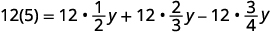

By the end of this section, you will be able to:
* Solve linear equations using a general strategy
* Classify equations
* Solve equations with fraction or decimal coefficients

Before you get started, take this readiness quiz.

1.  Simplify:
    <math xmlns="http://www.w3.org/1998/Math/MathML"><mrow><mfrac><mn>3</mn><mn>2</mn></mfrac><mrow><mo>(</mo><mrow><mn>12</mn><mi>x</mi><mo>+</mo><mn>20</mn></mrow><mo>)</mo></mrow><mo>.</mo></mrow></math>
    
    * * *
    {: data-type="newline"}
    
    If you missed this problem, review [\[link\]](/m63306#fs-id1167829788421).
2.  Simplify:
    <math xmlns="http://www.w3.org/1998/Math/MathML"><mrow><mn>5</mn><mo>−</mo><mn>2</mn><mrow><mo>(</mo><mrow><mi>n</mi><mo>+</mo><mn>1</mn></mrow><mo>)</mo></mrow><mo>.</mo></mrow></math>
    
    * * *
    {: data-type="newline"}
    
    If you missed this problem, review [\[link\]](/m63306#fs-id1167836503089).
3.  Find the LCD of
    <math xmlns="http://www.w3.org/1998/Math/MathML"><mrow><mfrac><mn>5</mn><mn>6</mn></mfrac></mrow></math>
    
    and
    <math xmlns="http://www.w3.org/1998/Math/MathML"><mrow><mfrac><mn>1</mn><mn>4</mn></mfrac><mo>.</mo></mrow></math>
    
    * * *
    {: data-type="newline"}
    
    If you missed this problem, review [\[link\]](/m63304#fs-id1167836518722).
{: data-number-style="arabic"}

### Solve Linear Equations Using a General Strategy

Solving an equation is like discovering the answer to a puzzle. The purpose in solving an equation is to find the value or values of the variable that makes it a true statement. Any value of the variable that makes the equation true is called a **solution**{: data-type="term"} to the equation. It is the answer to the puzzle!

Solution of an Equation

A **solution** of an equation is a value of a variable that makes a true statement when substituted into the equation.

To determine whether a number is a solution to an equation, we substitute the value for the variable in the equation. If the resulting equation is a true statement, then the number is a solution of the equation.

Determine Whether a Number is a Solution to an Equation.

1.  Substitute the number for the variable in the equation.
2.  Simplify the expressions on both sides of the equation.
3.  Determine whether the resulting equation is true.
    * If it is true, the number is a solution.
    * If it is not true, the number is not a solution.
    {: data-bullet-style="bullet"}
{: data-number-style="arabic" .stepwise}

Determine whether the values are solutions to the equation: <math xmlns="http://www.w3.org/1998/Math/MathML"><mrow><mn>5</mn><mi>y</mi><mo>+</mo><mn>3</mn><mo>=</mo><mn>10</mn><mi>y</mi><mo>−</mo><mn>4</mn><mo>.</mo></mrow></math>

ⓐ <math xmlns="http://www.w3.org/1998/Math/MathML"><mrow><mi>y</mi><mo>=</mo><mfrac><mn>3</mn><mn>5</mn></mfrac></mrow></math>

 ⓑ <math xmlns="http://www.w3.org/1998/Math/MathML"><mrow><mi>y</mi><mo>=</mo><mfrac><mn>7</mn><mn>5</mn></mfrac></mrow></math>

Since a solution to an equation is a value of the variable that makes the equation true, begin by substituting the value of the solution for the variable.

ⓐ* * *
{: data-type="newline"}

|  |  |
{: valign="top"}|  |  |
{: valign="top"}| Multiply. |  |
{: valign="top"}| Simplify. |  |
{: valign="top"}{: .unnumbered .unstyled summary="5 y plus 3 is equal to 10 y minus 4. Substitute three-fifths for y. Is the product of 5 and three-fifths plus 3 equal to the product of 10 and three-fifths minus 4. Multiply on each side of the equation. Is 3 plus 3 equal to 6 minus 4? Simplify on each side. 6 is not equal to 2. Since y is equal to three-fifths does not result in a true equation, y is equal to three-fifths is not a solution to the equation 5 y plus 3 is equal to 10 y minus 4."}

Since <math xmlns="http://www.w3.org/1998/Math/MathML"><mrow><mi>y</mi><mo>=</mo><mfrac><mn>3</mn><mn>5</mn></mfrac></mrow></math>

 does not result in a true equation, <math xmlns="http://www.w3.org/1998/Math/MathML"><mrow><mi>y</mi><mo>=</mo><mfrac><mn>3</mn><mn>5</mn></mfrac></mrow></math>

 is not a solution to the equation <math xmlns="http://www.w3.org/1998/Math/MathML"><mrow><mn>5</mn><mi>y</mi><mo>+</mo><mn>3</mn><mo>=</mo><mn>10</mn><mi>y</mi><mo>−</mo><mn>4</mn><mo>.</mo></mrow></math>

ⓑ* * *
{: data-type="newline"}

|  |  |
{: valign="top"}|  |  |
{: valign="top"}| Multiply. |  |
{: valign="top"}| Simplify. |  |
{: valign="top"}{: .unnumbered .unstyled summary="Substitute seven-fifths for y. Is the product of 5 and seven-fifths plus 3 equal to the product of 10 and seven-fifths minus 4. Multiply on each side of the equation. Is 7 plus 3 equal to 14 minus 4? Simplify on each side. 10 is equal to 10. Since y is equal to seven-fifths results in a true equation, y is equal to seven-fifths is a solution to the equation 5 y plus 3 is equal to 10 y minus 4."}

Since <math xmlns="http://www.w3.org/1998/Math/MathML"><mrow><mi>y</mi><mo>=</mo><mfrac><mn>7</mn><mn>5</mn></mfrac></mrow></math>

 results in a true equation, <math xmlns="http://www.w3.org/1998/Math/MathML"><mrow><mi>y</mi><mo>=</mo><mfrac><mn>7</mn><mn>5</mn></mfrac></mrow></math>

 is a solution to the equation <math xmlns="http://www.w3.org/1998/Math/MathML"><mrow><mn>5</mn><mi>y</mi><mo>+</mo><mn>3</mn><mo>=</mo><mn>10</mn><mi>y</mi><mo>−</mo><mn>4</mn><mo>.</mo></mrow></math>

Determine whether the values are solutions to the equation: <math xmlns="http://www.w3.org/1998/Math/MathML"><mrow><mn>9</mn><mi>y</mi><mo>+</mo><mn>2</mn><mo>=</mo><mn>6</mn><mi>y</mi><mo>+</mo><mn>3</mn><mo>.</mo></mrow></math>

ⓐ <math xmlns="http://www.w3.org/1998/Math/MathML"><mrow><mi>y</mi><mo>=</mo><mfrac><mn>4</mn><mn>3</mn></mfrac></mrow></math>

 ⓑ <math xmlns="http://www.w3.org/1998/Math/MathML"><mrow><mi>y</mi><mo>=</mo><mfrac><mn>1</mn><mn>3</mn></mfrac></mrow></math>

ⓐ no ⓑ yes

Determine whether the values are solutions to the equation: <math xmlns="http://www.w3.org/1998/Math/MathML"><mrow><mn>4</mn><mi>x</mi><mo>−</mo><mn>2</mn><mo>=</mo><mn>2</mn><mi>x</mi><mo>+</mo><mn>1</mn><mo>.</mo></mrow></math>

ⓐ <math xmlns="http://www.w3.org/1998/Math/MathML"><mrow><mi>x</mi><mo>=</mo><mfrac><mn>3</mn><mn>2</mn></mfrac></mrow></math>

 ⓑ <math xmlns="http://www.w3.org/1998/Math/MathML"><mrow><mi>x</mi><mo>=</mo><mo>−</mo><mfrac><mn>1</mn><mn>2</mn></mfrac></mrow></math>

ⓐ yes ⓑ no

There are many types of equations that we will learn to solve. In this section we will focus on a **linear equation**{: data-type="term"}.

Linear Equation

A **linear equation** is an equation in one variable that can be written, where *a* and *b* are real numbers and <math xmlns="http://www.w3.org/1998/Math/MathML"><mrow><mi>a</mi><mo>≠</mo><mn>0</mn><mo>,</mo></mrow></math>

 as:

<math xmlns="http://www.w3.org/1998/Math/MathML"><mrow><mi>a</mi><mi>x</mi><mo>+</mo><mi>b</mi><mo>=</mo><mn>0</mn></mrow></math>

To solve a linear equation it is a good idea to have an overall strategy that can be used to solve any linear equation. In the next example, we will give the steps of a general strategy for solving any linear equation. Simplifying each side of the equation as much as possible first makes the rest of the steps easier.

How to Solve a Linear Equation Using a General Strategy

Solve: <math xmlns="http://www.w3.org/1998/Math/MathML"><mrow><mn>7</mn><mrow><mo>(</mo><mrow><mi>n</mi><mo>−</mo><mn>3</mn></mrow><mo>)</mo></mrow><mo>−</mo><mn>8</mn><mo>=</mo><mn>−15</mn></mrow></math>

.

Solve: <math xmlns="http://www.w3.org/1998/Math/MathML"><mrow><mn>2</mn><mrow><mo>(</mo><mrow><mi>m</mi><mo>−</mo><mn>4</mn></mrow><mo>)</mo></mrow><mo>+</mo><mn>3</mn><mo>=</mo><mn>−1</mn><mo>.</mo></mrow></math>

<math xmlns="http://www.w3.org/1998/Math/MathML"><mrow><mi>m</mi><mo>=</mo><mn>2</mn></mrow></math>

Solve: <math xmlns="http://www.w3.org/1998/Math/MathML"><mrow><mn>5</mn><mrow><mo>(</mo><mrow><mi>a</mi><mo>−</mo><mn>3</mn></mrow><mo>)</mo></mrow><mo>+</mo><mn>5</mn><mo>=</mo><mn>−10</mn><mo>.</mo></mrow></math>

<math xmlns="http://www.w3.org/1998/Math/MathML"><mrow><mi>a</mi><mo>=</mo><mn>0</mn></mrow></math>

These steps are summarized in the **General Strategy for Solving Linear Equations**{: data-type="term" .no-emphasis} below.

Solve linear equations using a general strategy.

1.  Simplify each side of the equation as much as possible.
    * * *
    {: data-type="newline"}
    
    Use the Distributive Property to remove any parentheses.
    * * *
    {: data-type="newline"}
    
    Combine like terms.
2.  Collect all the variable terms on one side of the equation.
    * * *
    {: data-type="newline"}
    
    Use the Addition or Subtraction Property of Equality.
3.  Collect all the constant terms on the other side of the equation.
    * * *
    {: data-type="newline"}
    
    Use the Addition or Subtraction Property of Equality.
4.  Make the coefficient of the variable term equal to 1.
    * * *
    {: data-type="newline"}
    
    Use the Multiplication or Division Property of Equality.
    * * *
    {: data-type="newline"}
    
    State the solution to the equation.
5.  Check the solution.
    * * *
    {: data-type="newline"}
    
    Substitute the solution into the original equation to make sure the result is a true statement.
{: data-number-style="arabic" .stepwise}

Solve: <math xmlns="http://www.w3.org/1998/Math/MathML"><mrow><mfrac><mn>2</mn><mn>3</mn></mfrac><mo stretchy="false">(</mo><mn>3</mn><mi>m</mi><mo>−</mo><mn>6</mn><mo stretchy="false">)</mo><mo>=</mo><mn>5</mn><mo>−</mo><mi>m</mi><mo>.</mo></mrow></math>

<table class="unnumbered unstyled can-break" summary="The product of two-thirds and the quantity 3 m minus 6 is equal to 5 minus m. Distribute. The result is 2 m minus 4 is equal to 5 minus m. Add m to both sides to get the variables only on the left. The result 2 m plus m minus 4 is equal to 5 minus m plus m. Simplify. The result is 3 m minus 4 is equal to 5. Add 4 to both sides to get constants only on the right. The result is 3 m minus 4 plus 4 is equal to 5 plus 4. Simplify. The result is 3 m is equal to 9. Divide both sides by 3. The result is 3 m divided by m is equal to 9 divided by 3. Simplify. The result is m is equal to 3. Check the solution in the original equation, the product of two-thirds and the quantity 3 m minus 6 is equal to 5 minus m. Let m be equal to 3. Is the product of two-thirds and the quantity 3 times 3 minus 6 equal to 5 minus 3? Is the product of two-thirds and the quantity 9 minus 6 equal to 2? Is the product of two-thirds and 3 equal to 2? 2 is equal 2. So, the solution checks."><tbody>
<tr valign="top">
<td colspan="2" data-valign="top" data-align="left" />
<td data-valign="top" data-align="left"></td>
</tr>
<tr valign="top">
<td colspan="2" data-valign="top" data-align="left">Distribute.</td>
<td data-valign="top" data-align="left"></td>
</tr>
<tr valign="top">
<td colspan="2" data-valign="top" data-align="left">Add <em>m</em> to both sides to get the variables only on the left.</td>
<td data-valign="top" data-align="left"></td>
</tr>
<tr valign="top">
<td colspan="2" data-valign="top" data-align="left">Simplify.</td>
<td data-valign="top" data-align="left"></td>
</tr>
<tr valign="top">
<td colspan="2" data-valign="top" data-align="left">Add 4 to both sides to get constants only on the right.</td>
<td data-valign="top" data-align="left"></td>
</tr>
<tr valign="top">
<td colspan="2" data-valign="top" data-align="left">Simplify.</td>
<td data-valign="top" data-align="left"></td>
</tr>
<tr valign="top">
<td colspan="2" data-valign="top" data-align="left">Divide both sides by three.</td>
<td data-valign="top" data-align="left"></td>
</tr>
<tr valign="top">
<td colspan="2" data-valign="top" data-align="left">Simplify.</td>
<td data-valign="top" data-align="left"></td>
</tr>
<tr valign="top">
<td data-valign="top" data-align="left">Check:</td>
<td data-valign="top" data-align="left"></td>
<td />
</tr>
<tr valign="top">
<td data-valign="top" data-align="left">Let <math xmlns="http://www.w3.org/1998/Math/MathML"><mrow><mi>m</mi><mo>=</mo><mn>3.</mn></mrow></math></td>
<td data-valign="top" data-align="left"></td>
<td />
</tr>
<tr valign="top">
<td data-valign="top" data-align="left" />
<td data-valign="top" data-align="left"></td>
<td />
</tr>
<tr valign="top">
<td data-valign="top" data-align="left" />
<td data-valign="top" data-align="left"></td>
<td />
</tr>
<tr valign="top">
<td data-valign="top" data-align="left" />
<td data-valign="top" data-align="left"></td>
<td />
</tr>
</tbody></table>

Solve: <math xmlns="http://www.w3.org/1998/Math/MathML"><mrow><mfrac><mn>1</mn><mn>3</mn></mfrac><mo stretchy="false">(</mo><mn>6</mn><mi>u</mi><mo>+</mo><mn>3</mn><mo stretchy="false">)</mo><mo>=</mo><mn>7</mn><mo>−</mo><mi>u</mi><mo>.</mo></mrow></math>

<math xmlns="http://www.w3.org/1998/Math/MathML"><mrow><mi>u</mi><mo>=</mo><mn>2</mn></mrow></math>

Solve: <math xmlns="http://www.w3.org/1998/Math/MathML"><mrow><mfrac><mn>2</mn><mn>3</mn></mfrac><mo stretchy="false">(</mo><mn>9</mn><mi>x</mi><mo>−</mo><mn>12</mn><mo stretchy="false">)</mo><mo>=</mo><mn>8</mn><mo>+</mo><mn>2</mn><mi>x</mi><mo>.</mo></mrow></math>

<math xmlns="http://www.w3.org/1998/Math/MathML"><mrow><mi>x</mi><mo>=</mo><mn>4</mn></mrow></math>

We can solve equations by getting all the **variable**{: data-type="term" .no-emphasis} terms to either side of the **equal sign**{: data-type="term" .no-emphasis}. By collecting the variable terms on the side where the **coefficient**{: data-type="term" .no-emphasis} of the variable is larger, we avoid working with some negatives. This will be a good strategy when we solve inequalities later in this chapter. It also helps us prevent errors with negatives.

Solve: <math xmlns="http://www.w3.org/1998/Math/MathML"><mrow><mn>4</mn><mrow><mo>(</mo><mrow><mi>x</mi><mo>−</mo><mn>1</mn></mrow><mo>)</mo></mrow><mo>−</mo><mn>2</mn><mo>=</mo><mn>5</mn><mrow><mo>(</mo><mrow><mn>2</mn><mi>x</mi><mo>+</mo><mn>3</mn></mrow><mo>)</mo></mrow><mo>+</mo><mn>6</mn><mo>.</mo></mrow></math>

<table class="unnumbered unstyled can-break" summary="The difference between 4 times the quantity x minus 1 and 2 is equal to the sum of 5 times the quantity 2 x plus 3 and 6. Distribute. The result is 4 x minus 4 minus 2 is equal to 19 x plus 15 plus 6. Combine like terms. The result is 4 x minus 6 is equal to 10 x plus 21. Subtract 4 x from each side to get the variables on the right side since 10 is less than 4. The result is 4 x minus 4 x minus 6 is equal to 10 x minus 4 x plus 21. Simplify. The result is negative 6 is equal to 6 x plus 21. Subtract 21 from each side to get the constants on the left. The result is negative 6 minus 21 is equal to 6 x plus 21 minus 21. Simplify. The result is negative 27 is equal to 6 x. Divide both sides by 6. Negative 27 divided by 6 is equal to 6 x divided by 6. Simplify. Negative nine-halves is equal to x. Check the solution in the original equation, the difference between 4 times the quantity x minus 1 and 2 is equal to the sum of 5 times the quantity 2 x plus 3 and 6 Let x be equal to negative nine-halves. Is the difference between 4 times the quantity negative nine-halves minus 1 and 2 equal to the sum of 5 times the quantity 2 times negative nine-halves plus 3 and 6? Is 4 times negative eleven-halves minus 2 equal to the sum of 5 times the quantity negative 9 plus 3 and 6? Is negative 22 minus 2 equal to 5 times negative 6 plus 6. Is negative 24 equal to negative 39 plus 6. Negative 24 is equal to negative 24. The solution checks."><tbody>
<tr valign="top">
<td colspan="2" data-valign="top" data-align="left" />
<td />
<td />
<td data-valign="top" data-align="left"></td>
</tr>
<tr valign="top">
<td colspan="2" data-valign="top" data-align="left">Distribute.</td>
<td />
<td />
<td data-valign="top" data-align="left"></td>
</tr>
<tr valign="top">
<td colspan="2" data-valign="top" data-align="left">Combine like terms.</td>
<td />
<td />
<td data-valign="top" data-align="left"></td>
</tr>
<tr valign="top">
<td colspan="2" data-valign="top" data-align="left">Subtract <math xmlns="http://www.w3.org/1998/Math/MathML"><mrow><mn>4</mn><mi>x</mi></mrow></math> from each side to get the variables only on
the right since <math xmlns="http://www.w3.org/1998/Math/MathML"><mrow><mn>10</mn><mo>&gt;</mo><mn>4</mn><mo>.</mo></mrow></math></td>
<td />
<td />
<td data-valign="top" data-align="left"></td>
</tr>
<tr valign="top">
<td colspan="2" data-valign="top" data-align="left">Simplify.</td>
<td />
<td />
<td data-valign="top" data-align="left"></td>
</tr>
<tr valign="top">
<td colspan="2" data-valign="top" data-align="left">Subtract 21 from each side to get the constants on left.</td>
<td />
<td />
<td data-valign="top" data-align="left"></td>
</tr>
<tr valign="top">
<td colspan="2" data-valign="top" data-align="left">Simplify.</td>
<td />
<td />
<td data-valign="top" data-align="left"></td>
</tr>
<tr valign="top">
<td colspan="2" data-valign="top" data-align="left">Divide both sides by 6.</td>
<td />
<td />
<td data-valign="top" data-align="left"></td>
</tr>
<tr valign="top">
<td colspan="2" data-valign="top" data-align="left">Simplify.</td>
<td />
<td />
<td data-valign="top" data-align="left"></td>
</tr>
<tr valign="top">
<td data-valign="top" data-align="left">Check:</td>
<td data-valign="top" data-align="left"></td>
<td />
<td />
<td />
</tr>
<tr valign="top">
<td data-valign="top" data-align="left">Let <math xmlns="http://www.w3.org/1998/Math/MathML"><mrow><mi>x</mi><mo>=</mo><mo>−</mo><mfrac><mn>9</mn><mn>2</mn></mfrac><mo>.</mo></mrow></math></td>
<td data-valign="top" data-align="left"></td>
<td />
<td />
<td />
</tr>
<tr valign="top">
<td data-valign="top" data-align="left" />
<td data-valign="top" data-align="left"></td>
<td />
<td />
</tr>
<tr valign="top">
<td data-valign="top" data-align="left" />
<td data-valign="top" data-align="left"></td>
<td />
<td />
<td />
</tr>
<tr valign="top">
<td data-valign="top" data-align="left" />
<td data-valign="top" data-align="left"></td>
<td />
<td />
<td />
</tr>
<tr valign="top">
<td data-valign="top" data-align="left" />
<td data-valign="top" data-align="left"></td>
<td />
<td />
<td />
</tr>
</tbody></table>

Solve: <math xmlns="http://www.w3.org/1998/Math/MathML"><mrow><mn>6</mn><mrow><mo>(</mo><mrow><mi>p</mi><mo>−</mo><mn>3</mn></mrow><mo>)</mo></mrow><mo>−</mo><mn>7</mn><mo>=</mo><mn>5</mn><mrow><mo>(</mo><mrow><mn>4</mn><mi>p</mi><mo>+</mo><mn>3</mn></mrow><mo>)</mo></mrow><mo>−</mo><mn>12</mn><mo>.</mo></mrow></math>

<math xmlns="http://www.w3.org/1998/Math/MathML"><mrow><mi>p</mi><mo>=</mo><mn>−2</mn></mrow></math>

Solve: <math xmlns="http://www.w3.org/1998/Math/MathML"><mrow><mn>8</mn><mrow><mo>(</mo><mrow><mi>q</mi><mo>+</mo><mn>1</mn></mrow><mo>)</mo></mrow><mo>−</mo><mn>5</mn><mo>=</mo><mn>3</mn><mrow><mo>(</mo><mrow><mn>2</mn><mi>q</mi><mo>−</mo><mn>4</mn></mrow><mo>)</mo></mrow><mo>−</mo><mn>1</mn><mo>.</mo></mrow></math>

<math xmlns="http://www.w3.org/1998/Math/MathML"><mrow><mi>q</mi><mo>=</mo><mn>−8</mn></mrow></math>

Solve: <math xmlns="http://www.w3.org/1998/Math/MathML"><mrow><mn>10</mn><mrow><mo>[</mo><mrow><mn>3</mn><mo>−</mo><mn>8</mn><mrow><mo>(</mo><mrow><mn>2</mn><mi>s</mi><mo>−</mo><mn>5</mn></mrow><mo>)</mo></mrow></mrow><mo>]</mo></mrow><mo>=</mo><mn>15</mn><mrow><mo>(</mo><mrow><mn>40</mn><mo>−</mo><mn>5</mn><mi>s</mi></mrow><mo>)</mo></mrow><mo>.</mo></mrow></math>

<table class="unnumbered unstyled can-break" summary="10 times the difference of 3 and 8 times the quantity 2 s minus 5 is equal to 15 times the quantity 40 minus 5 s. Simplify from the innermost parentheses, 2 s minus 5, first. The result is 10 times the quantity 3 minus 16 s plus 40 is equal to 15 times the quantity 40 minus 5 s. Combine like terms in the brackets. The result is 10 times the quantity 43 minus 16 s is equal to 15 times the quantity 40 minus 5 s. Distribute. The result is 430 minus 160 s is equal to 600 minus 75 s. Add 160 to both sides to get the variables to the right. The result is 430 minus 160 s plus 160 s is equal to 600 minus 75 s plus 160 s. Simplify. The result is 430 is equal to 600 minus 85 s. Subtract 600 from both sides to get the constants to the left. The result is 430 minus 600 is equal to 600 plus 85 s minus 600. Simplify. The result is negative 170 is equal to 85 s. Divide. The result is negative 170 divided by 85 is equal to 85 s divided by 85. Simplify. The result is negative 2 is equal to s. Check the solution in the original equation, 10 times the difference of 3 and 8 times the quantity 2 s minus 5 is equal to 15 times the quantity 40 minus 5 s. Let s be equal to negative 2. Is 10 times the difference of 3 and 8 times the quantity 2 times negative 2 minus 5 equal to 15 times the quantity 40 minus 5 times negative 2? Is 10 times the difference of 3 and 8 times the quantity negative 4 minus 5 equal to 15 times the quantity 40 plus 10? Is 10 times the difference of 3 and 8 times negative 9 equal to 15 times 50? Is 10 times the quantity 3 plus 72 equal to 750? Is 10 times 75 equal to 750? 750 is equal to 750. The solution checks."><tbody>
<tr valign="top">
<td colspan="2" data-valign="top" data-align="left" />
<td data-valign="top" data-align="left"></td>
</tr>
<tr valign="top">
<td colspan="2" data-valign="top" data-align="left">Simplify from the innermost parentheses first.</td>
<td data-valign="top" data-align="left"></td>
</tr>
<tr valign="top">
<td colspan="2" data-valign="top" data-align="left">Combine like terms in the brackets.</td>
<td data-valign="top" data-align="left"></td>
</tr>
<tr valign="top">
<td colspan="2" data-valign="top" data-align="left">Distribute.</td>
<td data-valign="top" data-align="left"></td>
</tr>
<tr valign="top">
<td colspan="2" data-valign="top" data-align="left">Add <math xmlns="http://www.w3.org/1998/Math/MathML"><mrow><mn>160</mn><mi>s</mi></mrow></math> to both sides to get the
variables to the right.</td>
<td data-valign="top" data-align="left"></td>
</tr>
<tr valign="top">
<td colspan="2" data-valign="top" data-align="left">Simplify.</td>
<td data-valign="top" data-align="left"></td>
</tr>
<tr valign="top">
<td colspan="2" data-valign="top" data-align="left">Subtract 600 from both sides to get the
constants to the left.</td>
<td data-valign="top" data-align="left"></td>
</tr>
<tr valign="top">
<td colspan="2" data-valign="top" data-align="left">Simplify.</td>
<td data-valign="top" data-align="left"></td>
</tr>
<tr valign="top">
<td colspan="2" data-valign="top" data-align="left">Divide both sides by 85.</td>
<td data-valign="top" data-align="left"></td>
</tr>
<tr valign="top">
<td colspan="2" data-valign="top" data-align="left">Simplify.</td>
<td data-valign="top" data-align="left"></td>
</tr>
<tr valign="top">
<td data-valign="top" data-align="left">Check:</td>
<td data-valign="top" data-align="left"></td>
<td />
</tr>
<tr valign="top">
<td data-valign="top" data-align="left">Let <math xmlns="http://www.w3.org/1998/Math/MathML"><mrow><mi>s</mi><mo>=</mo><mo>−</mo><mn>2.</mn></mrow></math></td>
<td data-valign="top" data-align="left"></td>
<td />
</tr>
<tr valign="top">
<td data-valign="top" data-align="left" />
<td data-valign="top" data-align="left"></td>
<td />
</tr>
<tr valign="top">
<td data-valign="top" data-align="left" />
<td data-valign="top" data-align="left"></td>
<td />
</tr>
<tr valign="top">
<td data-valign="top" data-align="left" />
<td data-valign="top" data-align="left"></td>
<td />
</tr>
<tr valign="top">
<td data-valign="top" data-align="left" />
<td data-valign="top" data-align="left"></td>
<td />
</tr>
<tr valign="top">
<td data-valign="top" data-align="left" />
<td data-valign="top" data-align="left"></td>
<td />
</tr>
</tbody></table>

Solve: <math xmlns="http://www.w3.org/1998/Math/MathML"><mrow><mn>6</mn><mrow><mo>[</mo><mrow><mn>4</mn><mo>−</mo><mn>2</mn><mrow><mo>(</mo><mrow><mn>7</mn><mi>y</mi><mo>−</mo><mn>1</mn></mrow><mo>)</mo></mrow></mrow><mo>]</mo></mrow><mo>=</mo><mn>8</mn><mrow><mo>(</mo><mrow><mn>13</mn><mo>−</mo><mn>8</mn><mi>y</mi></mrow><mo>)</mo></mrow><mo>.</mo></mrow></math>

<math xmlns="http://www.w3.org/1998/Math/MathML"><mrow><mi>y</mi><mo>=</mo><mo>−</mo><mfrac><mrow><mn>17</mn></mrow><mn>5</mn></mfrac></mrow></math>

Solve: <math xmlns="http://www.w3.org/1998/Math/MathML"><mrow><mn>12</mn><mrow><mo>[</mo><mrow><mn>1</mn><mo>−</mo><mn>5</mn><mrow><mo>(</mo><mrow><mn>4</mn><mi>z</mi><mo>−</mo><mn>1</mn></mrow><mo>)</mo></mrow></mrow><mo>]</mo></mrow><mo>=</mo><mn>3</mn><mrow><mo>(</mo><mrow><mn>24</mn><mo>+</mo><mn>11</mn><mi>z</mi></mrow><mo>)</mo></mrow><mo>.</mo></mrow></math>

<math xmlns="http://www.w3.org/1998/Math/MathML"><mrow><mi>z</mi><mo>=</mo><mn>0</mn></mrow></math>

### Classify Equations

Whether or not an equation is true depends on the value of the variable. The equation <math xmlns="http://www.w3.org/1998/Math/MathML"><mrow><mn>7</mn><mi>x</mi><mo>+</mo><mn>8</mn><mo>=</mo><mn>−13</mn></mrow></math>

 is true when we replace the variable, *x*, with the value <math xmlns="http://www.w3.org/1998/Math/MathML"><mrow><mn>−3</mn><mo>,</mo></mrow></math>

 but not true when we replace *x* with any other value. An equation like this is called a **conditional equation**{: data-type="term"}. All the equations we have solved so far are conditional equations.

Conditional Equation

An equation that is true for one or more values of the variable and false for all other values of the variable is a **conditional equation**.

Now let’s consider the equation <math xmlns="http://www.w3.org/1998/Math/MathML"><mrow><mn>7</mn><mi>y</mi><mo>+</mo><mn>14</mn><mo>=</mo><mn>7</mn><mrow><mo>(</mo><mrow><mi>y</mi><mo>+</mo><mn>2</mn></mrow><mo>)</mo></mrow><mo>.</mo></mrow></math>

 Do you recognize that the left side and the right side are equivalent? Let’s see what happens when we solve for *y*.

Solve:

|  |  |
{: valign="top"}| Distribute. |  |
{: valign="top"}| Subtract <math xmlns="http://www.w3.org/1998/Math/MathML"><mrow><mn>7</mn><mi>y</mi></mrow></math>

 to each side to get the <math xmlns="http://www.w3.org/1998/Math/MathML"><mrow><mi>y</mi><mo>’</mo><mtext>s</mtext></mrow></math>

 to one side. |  |
{: valign="top"}| Simplify—the *y*’s are eliminated. |  |
{: valign="top"}|  | But <math xmlns="http://www.w3.org/1998/Math/MathML"><mrow><mn>14</mn><mo>=</mo><mn>14</mn></mrow></math>

 is true. |
{: valign="top"}{: .unnumbered .unstyled summary="7 y plus 14 is equal to 7 times the quantity y plus 2. Distribute. The result is 7 y plus 14 is equal to 7 y plus 14. Subtract 7 y from each side to get the y&#x2019;s on one side. The result is 7 y minus 7 y plus 14 is equal to 7 y minus 7 y plus 14. When simplified, 14 is equal to 14. The y&#x2019;s are eliminated. But 14 is equal to 14 is true."}

This means that the equation <math xmlns="http://www.w3.org/1998/Math/MathML"><mrow><mn>7</mn><mi>y</mi><mo>+</mo><mn>14</mn><mo>=</mo><mn>7</mn><mrow><mo>(</mo><mrow><mi>y</mi><mo>+</mo><mn>2</mn></mrow><mo>)</mo></mrow></mrow></math>

 is true for any value of *y*. We say the solution to the equation is all of the real numbers. An equation that is true for any value of the variable is called an **identity**{: data-type="term"}.

Identity

An equation that is true for any value of the variable is called an **identity**.

The solution of an identity is all real numbers.

What happens when we solve the equation <math xmlns="http://www.w3.org/1998/Math/MathML"><mrow><mn>−8</mn><mi>z</mi><mo>=</mo><mn>−8</mn><mi>z</mi><mo>+</mo><mn>9</mn><mo>?</mo></mrow></math>

Solve:

|  |  |
{: valign="top"}| Add <math xmlns="http://www.w3.org/1998/Math/MathML"><mrow><mn>8</mn><mi>z</mi></mrow></math>

 to both sides to leave the constant alone on the right. |  |
{: valign="top"}| Simplify—the <math xmlns="http://www.w3.org/1998/Math/MathML"><mrow><mi>z</mi><mo>’</mo><mtext>s</mtext></mrow></math>

 are eliminated. |  |
{: valign="top"}|  | But <math xmlns="http://www.w3.org/1998/Math/MathML"><mrow><mn>0</mn><mo>≠</mo><mn>9</mn><mo>.</mo></mrow></math>

 |
{: valign="top"}{: .unnumbered .unstyled summary="Negative 8 z is equal to negative 8 z plus 9. Add 8 z to both sides to leave the constant alone on the right. The result is negative 8 z plus 8 z is equal to negative 8 z plus 8 z plus 9. When you simplify, the z&#x2019;s are eliminated. The result is 0 is equal to 9. But 0 is not equal to 9."}

Solving the equation <math xmlns="http://www.w3.org/1998/Math/MathML"><mrow><mn>−8</mn><mi>z</mi><mo>=</mo><mn>−8</mn><mi>z</mi><mo>+</mo><mn>9</mn></mrow></math>

 led to the false statement <math xmlns="http://www.w3.org/1998/Math/MathML"><mrow><mn>0</mn><mo>=</mo><mn>9</mn><mo>.</mo></mrow></math>

 The equation <math xmlns="http://www.w3.org/1998/Math/MathML"><mrow><mn>−8</mn><mi>z</mi><mo>=</mo><mn>−8</mn><mi>z</mi><mo>+</mo><mn>9</mn></mrow></math>

 will not be true for any value of *z*. It has no solution. An equation that has no solution, or that is false for all values of the variable, is called a **contradiction**{: data-type="term"}.

Contradiction

An equation that is false for all values of the variable is called a **contradiction**.

A contradiction has no solution.

The next few examples will ask us to classify an equation as conditional, an identity, or as a contradiction.

Classify the equation as a conditional equation, an identity, or a contradiction and then state the solution: <math xmlns="http://www.w3.org/1998/Math/MathML"><mrow><mn>6</mn><mrow><mo>(</mo><mrow><mn>2</mn><mi>n</mi><mo>−</mo><mn>1</mn></mrow><mo>)</mo></mrow><mo>+</mo><mn>3</mn><mo>=</mo><mn>2</mn><mi>n</mi><mo>−</mo><mn>8</mn><mo>+</mo><mn>5</mn><mrow><mo>(</mo><mrow><mn>2</mn><mi>n</mi><mo>+</mo><mn>1</mn></mrow><mo>)</mo></mrow><mo>.</mo></mrow></math>

|  |  |
{: valign="top"}| Distribute. |  |
{: valign="top"}| Combine like terms. |  |
{: valign="top"}| Subtract <math xmlns="http://www.w3.org/1998/Math/MathML"><mrow><mn>12</mn><mi>n</mi></mrow></math>

 from each side to get the *n*’s to one side. |  |
{: valign="top"}| Simplify. |  |
{: valign="top"}| This is a true statement. | The equation is an identity. |
{: valign="top"}|  | The solution is all real numbers. |
{: valign="top"}{: .unnumbered .unstyled summary="Solve the equation, the product of 6 and the quantity 2 n minus 1 plus 3 is equal to 2 n minus 8 plus the product of 5 and the quantity 2 n plus 1. Distribute. The result is 12 n minus 6 plus 3 is equal to 2 n minus 8 plus 10 n plus 5. Combine like terms. The result is 12 n minus 3 is equal to 12 n minus 3. Subtract 12 n from each side to get the n&#x2019;s to one side. 12 n minus 12 n minus 3 is equal to 12 n minus 12 n minus 3. Simplify. Negative 3 is equal to negative 3. This is a true statement. The solution is an identity. The solution is all real numbers."}

Classify the equation as a conditional equation, an identity, or a contradiction and then state the solution: <math xmlns="http://www.w3.org/1998/Math/MathML"><mrow><mn>4</mn><mo>+</mo><mn>9</mn><mrow><mo>(</mo><mrow><mn>3</mn><mi>x</mi><mo>−</mo><mn>7</mn></mrow><mo>)</mo></mrow><mo>=</mo><mn>−42</mn><mi>x</mi><mo>−</mo><mn>13</mn><mo>+</mo><mn>23</mn><mrow><mo>(</mo><mrow><mn>3</mn><mi>x</mi><mo>−</mo><mn>2</mn></mrow><mo>)</mo></mrow><mo>.</mo></mrow></math>

identity; all real numbers

Classify the equation as a conditional equation, an identity, or a contradiction and then state the solution: <math xmlns="http://www.w3.org/1998/Math/MathML"><mrow><mn>8</mn><mrow><mo>(</mo><mrow><mn>1</mn><mo>−</mo><mn>3</mn><mi>x</mi></mrow><mo>)</mo></mrow><mo>+</mo><mn>15</mn><mrow><mo>(</mo><mrow><mn>2</mn><mi>x</mi><mo>+</mo><mn>7</mn></mrow><mo>)</mo></mrow><mo>=</mo><mn>2</mn><mrow><mo>(</mo><mrow><mi>x</mi><mo>+</mo><mn>50</mn></mrow><mo>)</mo></mrow><mo>+</mo><mn>4</mn><mrow><mo>(</mo><mrow><mi>x</mi><mo>+</mo><mn>3</mn></mrow><mo>)</mo></mrow><mo>+</mo><mn>1</mn><mo>.</mo></mrow></math>

identity; all real numbers

Classify the equation as a conditional equation, an identity, or a contradiction and then state the solution: <math xmlns="http://www.w3.org/1998/Math/MathML"><mrow><mn>8</mn><mo>+</mo><mn>3</mn><mo stretchy="false">(</mo><mi>a</mi><mo>−</mo><mn>4</mn><mo stretchy="false">)</mo><mo>=</mo><mn>0</mn><mo>.</mo></mrow></math>

<table class="unnumbered unstyled" summary="Solve the equation, 8 plus 3 times the quantity a minus 4 is equal to 0. Distribute. The result is 3 a minus 12 is equal to 0. Combine like terms. The result is 3 a minus 4 is equal to 0. Add 4 to both sides. The result is 3 a minus 4 plus 4 is equal to 0 plus 4. Simplify. The result is 3 a is equal to 4. Divide. The result is 3 a divided by 3 is equal to 4 divided by 3."><tbody>
<tr valign="top">
<td data-valign="top" data-align="left" />
<td data-valign="top" data-align="left" />
<td data-valign="top" data-align="left"></td>
</tr>
<tr valign="top">
<td data-valign="top" data-align="left">Distribute.</td>
<td data-valign="top" data-align="left" />
<td data-valign="top" data-align="left"></td>
</tr>
<tr valign="top">
<td data-valign="top" data-align="left">Combine like terms.</td>
<td data-valign="top" data-align="left" />
<td data-valign="top" data-align="left"></td>
</tr>
<tr valign="top">
<td data-valign="top" data-align="left">Add 4 to both sides.</td>
<td data-valign="top" data-align="left" />
<td data-valign="top" data-align="left"></td>
</tr>
<tr valign="top">
<td data-valign="top" data-align="left">Simplify.</td>
<td data-valign="top" data-align="left" />
<td data-valign="top" data-align="left"></td>
</tr>
<tr valign="top">
<td data-valign="top" data-align="left">Divide.</td>
<td data-valign="top" data-align="left" />
<td data-valign="top" data-align="left"></td>
</tr>
<tr valign="top">
<td data-valign="top" data-align="left">Simplify.</td>
<td data-valign="top" data-align="left" />
<td data-valign="top" data-align="left"></td>
</tr>
<tr valign="top">
<td data-valign="top" data-align="left">The equation is true when <math xmlns="http://www.w3.org/1998/Math/MathML"><mrow><mi>a</mi><mo>=</mo><mfrac><mn>4</mn><mn>3</mn></mfrac><mo>.</mo><mspace width="2em" /></mrow></math></td>
<td colspan="2" data-valign="top" data-align="left">This is a conditional equation.</td>
</tr>
<tr valign="top">
<td data-valign="top" data-align="left" />
<td colspan="2" data-valign="top" data-align="left">The solution is <math xmlns="http://www.w3.org/1998/Math/MathML"><mrow><mi>a</mi><mo>=</mo><mfrac><mn>4</mn><mn>3</mn></mfrac><mo>.</mo></mrow></math></td>
</tr>
</tbody></table>

Classify the equation as a conditional equation, an identity, or a contradiction and then state the solution: <math xmlns="http://www.w3.org/1998/Math/MathML"><mrow><mn>11</mn><mrow><mo>(</mo><mrow><mi>q</mi><mo>+</mo><mn>3</mn></mrow><mo>)</mo></mrow><mo>−</mo><mn>5</mn><mo>=</mo><mn>19</mn><mo>.</mo></mrow></math>

conditional equation; <math xmlns="http://www.w3.org/1998/Math/MathML"><mrow><mi>q</mi><mo>=</mo><mo>−</mo><mfrac><mn>9</mn><mrow><mn>11</mn></mrow></mfrac></mrow></math>

Classify the equation as a conditional equation, an identity, or a contradiction and then state the solution: <math xmlns="http://www.w3.org/1998/Math/MathML"><mrow><mn>6+14</mn><mrow><mo>(</mo><mrow><mi>k</mi><mo>−</mo><mn>8</mn></mrow><mo>)</mo></mrow><mo>=</mo><mn>95</mn><mo>.</mo></mrow></math>

conditional equation; <math xmlns="http://www.w3.org/1998/Math/MathML"><mrow><mi>k</mi><mo>=</mo><mfrac><mrow><mn>201</mn></mrow><mrow><mn>14</mn></mrow></mfrac></mrow></math>

Classify the equation as a conditional equation, an identity, or a contradiction and then state the solution: <math xmlns="http://www.w3.org/1998/Math/MathML"><mrow><mn>5</mn><mi>m</mi><mo>+</mo><mn>3</mn><mrow><mo>(</mo><mrow><mn>9</mn><mo>+</mo><mn>3</mn><mi>m</mi></mrow><mo>)</mo></mrow><mo>=</mo><mn>2</mn><mrow><mo>(</mo><mrow><mn>7</mn><mi>m</mi><mo>−</mo><mn>11</mn></mrow><mo>)</mo></mrow><mo>.</mo></mrow></math>

|  |  |
{: valign="top"}| Distribute. |  |
{: valign="top"}| Combine like terms. |  |
{: valign="top"}| Subtract <math xmlns="http://www.w3.org/1998/Math/MathML"><mrow><mn>14</mn><mi>m</mi></mrow></math>

 from both sides. |  |
{: valign="top"}| Simplify. |  |
{: valign="top"}| But <math xmlns="http://www.w3.org/1998/Math/MathML"><mrow><mn>27</mn><mo>≠</mo><mtext>−</mtext><mn>22</mn><mo>.</mo></mrow></math>

 | The equation is a contradiction. |
{: valign="top"}|  | It has no solution. |
{: valign="top"}{: .unnumbered .unstyled summary="Solve the equation, 5 m plus 3 times the quantity 9 plus 3 m is equal to 2 times the quantity 7 m minus 11. Distribute. The result is 5 m plus 27 plus 9 m is equal to 14 m minus 22. Combine like terms. The result is 14 m plus 27 is equal to 14 m minus 22. Subtract 14 m from both sides. The result is 14 m plus 27 minus 14 m is equal to 14 m minus 22 minus 14 m. Simplify. The result is 27 is equal to negative 22. But 27 is not equal to negative 22. The equation is a contradiction. It has no solution."}

Classify the equation as a conditional equation, an identity, or a contradiction and then state the solution: <math xmlns="http://www.w3.org/1998/Math/MathML"><mrow><mn>12</mn><mi>c</mi><mo>+</mo><mn>5</mn><mrow><mo>(</mo><mrow><mn>5</mn><mo>+</mo><mn>3</mn><mi>c</mi></mrow><mo>)</mo></mrow><mo>=</mo><mn>3</mn><mrow><mo>(</mo><mrow><mn>9</mn><mi>c</mi><mo>−</mo><mn>4</mn></mrow><mo>)</mo></mrow><mo>.</mo></mrow></math>

contradiction; no solution

Classify the equation as a conditional equation, an identity, or a contradiction and then state the solution: <math xmlns="http://www.w3.org/1998/Math/MathML"><mrow><mn>4</mn><mrow><mo>(</mo><mrow><mn>7</mn><mi>d</mi><mo>+</mo><mn>18</mn></mrow><mo>)</mo></mrow><mo>=</mo><mn>13</mn><mrow><mo>(</mo><mrow><mn>3</mn><mi>d</mi><mo>−</mo><mn>2</mn></mrow><mo>)</mo></mrow><mo>−</mo><mn>11</mn><mi>d</mi><mo>.</mo></mrow></math>

contradiction; no solution

We summarize the methods for classifying equations in the table.

| Type of equation | What happens when you solve it? | Solution |
{: valign="top"}|----------
| **Conditional Equation** | True for one or more values of the variables and false for all other values | One or more values |
{: valign="top"}| **Identity** | True for any value of the variable | All real numbers |
{: valign="top"}| **Contradiction** | False for all values of the variable | No solution |
{: valign="top"}{: summary="This table has three columns and four rows. The first row is a header row and it labels each column, &#x201C;Type of equation,&#x201D; &#x201C;What happens when you solve it?&#x201D; and &#x201C;Solution.&#x201D; The second column is a header column and it labels each row &#x201C;Conditional Equations,&#x201D; Identity,&#x201D; &#x201C;Contradiction&#x201D;. In row two, the Conditional Equation is True for one or more values of the variables and false for all other values, and the Solution is One or more values. In row three, the Identity is True for any value of the variable, and the Solution is All real numbers. In row four, the Contradiction is False for all values of the variable, and the Solution is No Solution."}

### Solve Equations with Fraction or Decimal Coefficients

We could use the General Strategy to solve the next example. This method would work fine, but many students do not feel very confident when they see all those fractions. So, we are going to show an alternate method to solve equations with fractions. This alternate method eliminates the fractions.

We will apply the Multiplication Property of Equality and multiply both sides of an equation by the **least common denominator**{: data-type="term" .no-emphasis} (LCD) of all the fractions in the equation. The result of this operation will be a new equation, equivalent to the first, but without fractions. This process is called *clearing* the equation of fractions.

To clear an equation of decimals, we think of all the decimals in their fraction form and then find the LCD of those denominators.

How to Solve Equations with Fraction or Decimal Coefficients

Solve: <math xmlns="http://www.w3.org/1998/Math/MathML"><mrow><mfrac><mn>1</mn><mrow><mn>12</mn></mrow></mfrac><mi>x</mi><mo>+</mo><mfrac><mn>5</mn><mn>6</mn></mfrac><mo>=</mo><mfrac><mn>3</mn><mn>4</mn></mfrac><mo>.</mo></mrow></math>

![Step 3 is to solve using the General Strategy for Solving Linear Equations. To isolate the variable term, subtract 10. The result is x plus 10 minus 10 is equal to 9 minus 10. Simplify. The result is x is equal to negative 1. Check the solution. Substitute negative into the original equation one-twelfth x plus five-sixths is equal to three-fourth. Is one-twelfth times negative 1 plus five-sixths equal to three-fourths? Is negative one-twelfth plus five-sixths equal to three-fourths? Is negative one-twelfth plus ten-twelfths equal to nine-twelfths? Is nine-twelfths equal to nine-twelfths? Yes. The solution checks.](../resources/CNX_IntAlg_Figure_02_01_012c_img.jpg)

Solve: <math xmlns="http://www.w3.org/1998/Math/MathML"><mrow><mfrac><mn>1</mn><mn>4</mn></mfrac><mi>x</mi><mo>+</mo><mfrac><mn>1</mn><mn>2</mn></mfrac><mo>=</mo><mfrac><mn>5</mn><mn>8</mn></mfrac><mo>.</mo></mrow></math>

<math xmlns="http://www.w3.org/1998/Math/MathML"><mrow><mi>x</mi><mo>=</mo><mfrac><mn>1</mn><mn>2</mn></mfrac></mrow></math>

Solve: <math xmlns="http://www.w3.org/1998/Math/MathML"><mrow><mfrac><mn>1</mn><mn>8</mn></mfrac><mi>x</mi><mo>+</mo><mfrac><mn>1</mn><mn>2</mn></mfrac><mo>=</mo><mfrac><mn>1</mn><mn>4</mn></mfrac><mo>.</mo></mrow></math>

<math xmlns="http://www.w3.org/1998/Math/MathML"><mrow><mi>x</mi><mo>=</mo><mn>−2</mn></mrow></math>

Notice in the previous example, once we cleared the equation of fractions, the equation was like those we solved earlier in this chapter. We changed the problem to one we already knew how to solve. We then used the **General Strategy for Solving Linear Equations**{: data-type="term" .no-emphasis}.

Solve Equations with Fraction or Decimal Coefficients.

1.  Find the least common denominator (LCD) of *all* the fractions and decimals (in fraction form) in the equation.
2.  Multiply both sides of the equation by that LCD. This clears the fractions and decimals.
3.  Solve using the General Strategy for Solving Linear Equations.
{: data-number-style="arabic" .stepwise}

Solve: <math xmlns="http://www.w3.org/1998/Math/MathML"><mrow><mn>5</mn><mo>=</mo><mfrac><mn>1</mn><mn>2</mn></mfrac><mi>y</mi><mo>+</mo><mfrac><mn>2</mn><mn>3</mn></mfrac><mi>y</mi><mo>−</mo><mfrac><mn>3</mn><mn>4</mn></mfrac><mi>y</mi><mo>.</mo></mrow></math>

We want to clear the fractions by multiplying both sides of the equation by the LCD of all the fractions in the equation.

<table class="unnumbered unstyled" summary="Find the L C D of all fractions in the equation, 5 is equal to one-half y plus two-thirds y minus three-fourths y. The L C D is 12. Multiply both sides of the equation by 12. The result is 12 times 5 is equal to 12 times the quantity (one-half y plus two-thirds y minus three-fourths y. Distribute. The result is 12 times 5 is equal to 12 times one-half y plus 12 times two-thirds y minus 12 times three-fourths y. Simplify and you&#x2019;ll notice there are no more fractions. The result is 60 is equal to 6 y plus 8 y minus 9 y. Combine like terms. The result is 60 is equal to 5 y. Divide by 5. The result is 60 divided by 5 is equal to 5 y divided by 5. Simplify. The result is 12 is equal to y. Check in the equation 5 is equal to one-half y plus two-thirds y minus three-fourths y. Let y be equal to 12. Is 5 equal to one-twelfth times 12 plus two-thirds times 12 minus three-fourths times 12? Is 5 equal to 6 plus 8 minus 9? 5 is equal to 5. The solution checks."><tbody>
<tr valign="top">
<td colspan="2" data-valign="top" data-align="left">Find the LCD of all fractions in the equation.</td>
<td data-valign="top" data-align="left"></td>
</tr>
<tr valign="top">
<td colspan="2" data-valign="top" data-align="left">The LCD is 12.</td>
<td data-valign="top" data-align="left" />
</tr>
<tr valign="top">
<td colspan="2" data-valign="top" data-align="left">Multiply both sides of the equation by 12.</td>
<td data-valign="top" data-align="left"></td>
</tr>
<tr valign="top">
<td colspan="2" data-valign="top" data-align="left">Distribute.</td>
<td data-valign="top" data-align="left"></td>
</tr>
<tr valign="top">
<td colspan="2" data-valign="top" data-align="left">Simplify—notice, no more fractions.</td>
<td data-valign="top" data-align="left"></td>
</tr>
<tr valign="top">
<td colspan="2" data-valign="top" data-align="left">Combine like terms.</td>
<td data-valign="top" data-align="left"></td>
</tr>
<tr valign="top">
<td colspan="2" data-valign="top" data-align="left">Divide by five.</td>
<td data-valign="top" data-align="left"></td>
</tr>
<tr valign="top">
<td colspan="2" data-valign="top" data-align="left">Simplify.</td>
<td data-valign="top" data-align="left"></td>
</tr>
<tr valign="top">
<td data-valign="top" data-align="left">Check:</td>
<td data-valign="top" data-align="left"></td>
<td />
</tr>
<tr valign="top">
<td data-valign="top" data-align="left">Let <math xmlns="http://www.w3.org/1998/Math/MathML"><mrow><mi>y</mi><mo>=</mo><mn>12.</mn></mrow></math></td>
<td data-valign="top" data-align="left"></td>
<td />
</tr>
<tr valign="top">
<td data-valign="top" data-align="left" />
<td data-valign="top" data-align="left"></td>
<td />
</tr>
<tr valign="top">
<td data-valign="top" data-align="left" />
<td data-valign="top" data-align="left"></td>
<td />
</tr>
</tbody></table>

Solve: <math xmlns="http://www.w3.org/1998/Math/MathML"><mrow><mn>7</mn><mo>=</mo><mfrac><mn>1</mn><mn>2</mn></mfrac><mi>x</mi><mo>+</mo><mfrac><mn>3</mn><mn>4</mn></mfrac><mi>x</mi><mo>−</mo><mfrac><mn>2</mn><mn>3</mn></mfrac><mi>x</mi><mo>.</mo></mrow></math>

<math xmlns="http://www.w3.org/1998/Math/MathML"><mrow><mi>x</mi><mo>=</mo><mn>12</mn></mrow></math>

Solve: <math xmlns="http://www.w3.org/1998/Math/MathML"><mrow><mn>−1</mn><mo>=</mo><mfrac><mn>1</mn><mn>2</mn></mfrac><mi>u</mi><mo>+</mo><mfrac><mn>1</mn><mn>4</mn></mfrac><mi>u</mi><mo>−</mo><mfrac><mn>2</mn><mn>3</mn></mfrac><mi>u</mi><mo>.</mo></mrow></math>

<math xmlns="http://www.w3.org/1998/Math/MathML"><mrow><mi>u</mi><mo>=</mo><mn>−12</mn></mrow></math>

In the next example, we’ll distribute before we clear the fractions.

Solve: <math xmlns="http://www.w3.org/1998/Math/MathML"><mrow><mfrac><mn>1</mn><mn>2</mn></mfrac><mrow><mo>(</mo><mrow><mi>y</mi><mo>−</mo><mn>5</mn></mrow><mo>)</mo></mrow><mo>=</mo><mfrac><mn>1</mn><mn>4</mn></mfrac><mrow><mo>(</mo><mrow><mi>y</mi><mo>−</mo><mn>1</mn></mrow><mo>)</mo></mrow><mo>.</mo></mrow></math>

<table class="unnumbered unstyled can-break" summary="One-half times the quantity y minus 5 is equal to one-fourth times the quantity y minus 1. Distribute. The result is one-half times y minus one-half times 5 is equal to one-fourth times y minus one-fourth times 1. Simplify. The result is one-half times y minus five-halves is equal to one-fourth y minus one-fourth. Multiply by the L C D, 4. The result is 4 times the quantity one-half y minus five-halves is equal to 4 times the quantity one-fourth y minus one-fourth. Distribute. The result is 4 times one-half y minus 4 times five-halves is equal to 4 times one-fourth y minus 4 times one-fourth. Simplify. The result is 2 y minus 10 is equal to y minus 1. Collect the variables on the left by subtracting y from each side. The result is 2 y minus y minus 10 is equal to y minus y minus 1. Simplify. The result is y minus 10 is equal to negative 1. Collect the constants to the right by adding 10 to each side. The result is y minus 10 plus 10 is equal to negative 1 plus 10. Simplify. The result is y is equal 9. Multiply the L C D, 4, by each side of the equation one-half times the quantity y minus 5 is equal to one-fourth times the quantity y minus 1. The result is 4 times one-half times the quantity y minus 5 is equal to 4 times the one-fourth times the quantity y minus 1. Multiply 4 times the fractions. The result is 2 times the quantity y minus 5 is equal to 1 times the quantity y minus 1. Distribute. The result is 2 y minus 10 is equal to y minus 1. Collect the variables on the left by subtracting y from each side. The result is 2 y minus y minus 10 is equal to y minus y minus 1. Simplify. The result is y minus 10 is equal to negative 1. Collect the constants to the right by adding 10 to each side. The result is y minus 10 plus 10 is equal to negative 1 plus 10. Simplify. The result is y is equal to 9. Check the solution in the equation one-half times the quantity y minus 5 is equal to one-fourth times the quantity y minus 1. Let be equal to 9. Is one-half times the quantity 9 minus 5 equal to one-fourth times the quantity 9 minus 1. Finish the check on your own."><tbody>
<tr valign="top">
<td colspan="2" data-valign="top" data-align="left" />
<td data-valign="top" data-align="left"></td>
</tr>
<tr valign="top">
<td colspan="2" data-valign="top" data-align="left">Distribute.</td>
<td data-valign="top" data-align="left"></td>
</tr>
<tr valign="top">
<td colspan="2" data-valign="top" data-align="left">Simplify.</td>
<td data-valign="top" data-align="left"></td>
</tr>
<tr valign="top">
<td colspan="2" data-valign="top" data-align="left">Multiply by the LCD, four.</td>
<td data-valign="top" data-align="left"></td>
</tr>
<tr valign="top">
<td colspan="2" data-valign="top" data-align="left">Distribute.</td>
<td data-valign="top" data-align="left"></td>
</tr>
<tr valign="top">
<td colspan="2" data-valign="top" data-align="left">Simplify.</td>
<td data-valign="top" data-align="left"></td>
</tr>
<tr valign="top">
<td colspan="2" data-valign="top" data-align="left">Collect the variables to the left.</td>
<td data-valign="top" data-align="left"></td>
</tr>
<tr valign="top">
<td colspan="2" data-valign="top" data-align="left">Simplify.</td>
<td data-valign="top" data-align="left"></td>
</tr>
<tr valign="top">
<td colspan="2" data-valign="top" data-align="left">Collect the constants to the right.</td>
<td data-valign="top" data-align="left"></td>
</tr>
<tr valign="top">
<td colspan="2" data-valign="top" data-align="left">Simplify.</td>
<td data-valign="top" data-align="left"></td>
</tr>
<tr valign="top">
<td colspan="3" data-valign="top" data-align="left">An alternate way to solve this equation is to clear the fractions without distributing first. If you multiply the factors correctly, this method will be easier.</td>
</tr>
<tr valign="top">
<td colspan="2" data-valign="top" data-align="left" />
<td data-valign="top" data-align="left"></td>
</tr>
<tr valign="top">
<td colspan="2" data-valign="top" data-align="left">Multiply by the LCD, 4.</td>
<td data-valign="top" data-align="left"></td>
</tr>
<tr valign="top">
<td colspan="2" data-valign="top" data-align="left">Multiply four times the fractions.</td>
<td data-valign="top" data-align="left"></td>
</tr>
<tr valign="top">
<td colspan="2" data-valign="top" data-align="left">Distribute.</td>
<td data-valign="top" data-align="left"></td>
</tr>
<tr valign="top">
<td colspan="2" data-valign="top" data-align="left">Collect the variables to the left.</td>
<td data-valign="top" data-align="left"></td>
</tr>
<tr valign="top">
<td colspan="2" data-valign="top" data-align="left">Simplify.</td>
<td data-valign="top" data-align="left"></td>
</tr>
<tr valign="top">
<td colspan="2" data-valign="top" data-align="left">Collect the constants to the right.</td>
<td data-valign="top" data-align="left"></td>
</tr>
<tr valign="top">
<td colspan="2" data-valign="top" data-align="left">Simplify.</td>
<td data-valign="top" data-align="left"></td>
</tr>
<tr valign="top">
<td data-valign="top" data-align="left">Check:</td>
<td data-valign="top" data-align="center"></td>
<td />
</tr>
<tr valign="top">
<td data-valign="top" data-align="left">Let <math xmlns="http://www.w3.org/1998/Math/MathML"><mrow><mi>y</mi><mo>=</mo><mn>9.</mn></mrow></math></td>
<td data-valign="top" data-align="center"></td>
<td />
</tr>
<tr valign="top">
<td colspan="3" data-valign="top" data-align="left">Finish the check on your own.</td>
</tr>
</tbody></table>

Solve: <math xmlns="http://www.w3.org/1998/Math/MathML"><mrow><mfrac><mn>1</mn><mn>5</mn></mfrac><mrow><mo>(</mo><mrow><mi>n</mi><mo>+</mo><mn>3</mn></mrow><mo>)</mo></mrow><mo>=</mo><mfrac><mn>1</mn><mn>4</mn></mfrac><mrow><mo>(</mo><mrow><mi>n</mi><mo>+</mo><mn>2</mn></mrow><mo>)</mo></mrow><mo>.</mo></mrow></math>

<math xmlns="http://www.w3.org/1998/Math/MathML"><mrow><mi>n</mi><mo>=</mo><mn>2</mn></mrow></math>

Solve: <math xmlns="http://www.w3.org/1998/Math/MathML"><mrow><mfrac><mn>1</mn><mn>2</mn></mfrac><mrow><mo>(</mo><mrow><mi>m</mi><mo>−</mo><mn>3</mn></mrow><mo>)</mo></mrow><mo>=</mo><mfrac><mn>1</mn><mn>4</mn></mfrac><mrow><mo>(</mo><mrow><mi>m</mi><mo>−</mo><mn>7</mn></mrow><mo>)</mo></mrow><mo>.</mo></mrow></math>

<math xmlns="http://www.w3.org/1998/Math/MathML"><mrow><mi>m</mi><mo>=</mo><mn>−1</mn></mrow></math>

When you multiply both sides of an equation by the LCD of the fractions, make sure you multiply each term by the LCD—even if it does not contain a fraction.

Solve: <math xmlns="http://www.w3.org/1998/Math/MathML"><mrow><mfrac><mrow><mn>4</mn><mi>q</mi><mo>+</mo><mn>3</mn></mrow><mn>2</mn></mfrac><mo>+</mo><mn>6</mn><mo>=</mo><mfrac><mrow><mn>3</mn><mi>q</mi><mo>+</mo><mn>5</mn></mrow><mn>4</mn></mfrac></mrow></math>

<table class="unnumbered unstyled can-break" summary="The quotient of the quantity 4 q plus 3 and 2 plus 6 is equal to the quotient of the quantity 3 q plus 5 and 4. Multiply both sides by the L C D, 4. The result is 4 times the quotient of the quantity 4 q plus 3 and 2 plus 6 is equal to 4 times the quotient of the quantity 3 q plus 5 and 4. Distribute. The result is 4 times the quotient of the quantity 4 q plus 3 and 2 plus 4 times 6 is equal to 4 times the quotient of the quantity 3 q plus 5 and 4. Simplify. The result is 2 times the quantity 4 q plus 3 plus 24 is equal to 3 q plus 5, which equals 8 q plus 6 plus 24 is equal to 3 q plus 5, which equals 8 q plus 30 is equal to 3 q plus 5. Collect the variables to the left by subtracting negative 3 q from each side. The result is 8 q minus 3 q plus 30 is equal to 3 q minus 3 q plus 5. Simplify. The result is 5 q plus 30 is equal to 5. Collect the constants to the right by subtracting 30 from each side. The result is 5 q plus 30 minus 30 is equal to 5 minus 30. Simplify. The result is 5 q is equal to negative 25. Divided both sides by 5. The result is 5 q divided by 5 is equal to negative 25 divided by 5. Simplify. The result is q is equal to negative 5. Check in the original equation, the quotient of the quantity 4 q plus 3 and 2 plus 6 is equal to the quotient of the quantity 3 q plus 5 and 4. Let q be equal to negative 5. Is the quotient of the quantity 4 times negative 5 plus 3 and 2 plus 6 is equal to the quotient of the quantity 3 times negative 5 plus 5 and 4? Finish the check on your own."><tbody>
<tr valign="top">
<td colspan="2" data-valign="top" data-align="left" />
<td data-valign="top" data-align="left"></td>
</tr>
<tr valign="top">
<td colspan="2" data-valign="top" data-align="left">Multiply both sides by the LCD, 4.</td>
<td data-valign="top" data-align="left"></td>
</tr>
<tr valign="top">
<td colspan="2" data-valign="top" data-align="left">Distribute.</td>
<td data-valign="top" data-align="left"></td>
</tr>
<tr valign="top">
<td colspan="2" data-valign="top" data-align="left">Simplify.</td>
<td data-valign="top" data-align="left"></td>
</tr>
<tr valign="top">
<td colspan="2" data-valign="top" data-align="left" />
<td data-valign="top" data-align="left"></td>
</tr>
<tr valign="top">
<td colspan="2" data-valign="top" data-align="left" />
<td data-valign="top" data-align="left"></td>
</tr>
<tr valign="top">
<td colspan="2" data-valign="top" data-align="left">Collect the variables to the left.</td>
<td data-valign="top" data-align="left"></td>
</tr>
<tr valign="top">
<td colspan="2" data-valign="top" data-align="left">Simplify.</td>
<td data-valign="top" data-align="left"></td>
</tr>
<tr valign="top">
<td colspan="2" data-valign="top" data-align="left">Collect the constants to the right.</td>
<td data-valign="top" data-align="left"></td>
</tr>
<tr valign="top">
<td colspan="2" data-valign="top" data-align="left">Simplify.</td>
<td data-valign="top" data-align="left"></td>
</tr>
<tr valign="top">
<td colspan="2" data-valign="top" data-align="left">Divide both sides by five.</td>
<td data-valign="top" data-align="left"></td>
</tr>
<tr valign="top">
<td colspan="2" data-valign="top" data-align="left">Simplify.</td>
<td data-valign="top" data-align="left"></td>
</tr>
<tr valign="top">
<td data-valign="top" data-align="left">Check:</td>
<td data-valign="top" data-align="center"></td>
<td />
</tr>
<tr valign="top">
<td data-valign="top" data-align="left">Let <math xmlns="http://www.w3.org/1998/Math/MathML"><mrow><mi>q</mi><mo>=</mo><mo>−</mo><mn>5.</mn></mrow></math></td>
<td data-valign="top" data-align="center"></td>
<td />
</tr>
<tr valign="top">
<td colspan="2" data-valign="top" data-align="left">Finish the check on your own.</td>
<td />
</tr>
</tbody></table>

Solve: <math xmlns="http://www.w3.org/1998/Math/MathML"><mrow><mfrac><mrow><mn>3</mn><mi>r</mi><mo>+</mo><mn>5</mn></mrow><mn>6</mn></mfrac><mo>+</mo><mn>1</mn><mo>=</mo><mfrac><mrow><mn>4</mn><mi>r</mi><mo>+</mo><mn>3</mn></mrow><mn>3</mn></mfrac><mo>.</mo></mrow></math>

<math xmlns="http://www.w3.org/1998/Math/MathML"><mrow><mi>r</mi><mo>=</mo><mn>1</mn></mrow></math>

Solve: <math xmlns="http://www.w3.org/1998/Math/MathML"><mrow><mfrac><mrow><mn>2</mn><mi>s</mi><mo>+</mo><mn>3</mn></mrow><mn>2</mn></mfrac><mo>+</mo><mn>1</mn><mo>=</mo><mfrac><mrow><mn>3</mn><mi>s</mi><mo>+</mo><mn>2</mn></mrow><mn>4</mn></mfrac><mo>.</mo></mrow></math>

<math xmlns="http://www.w3.org/1998/Math/MathML"><mrow><mi>s</mi><mo>=</mo><mn>−8</mn></mrow></math>

Some equations have decimals in them. This kind of equation may occur when we solve problems dealing with money or percentages. But decimals can also be expressed as fractions. For example, <math xmlns="http://www.w3.org/1998/Math/MathML"><mrow><mn>0.7</mn><mo>=</mo><mfrac><mn>7</mn><mrow><mn>10</mn></mrow></mfrac></mrow></math>

 and <math xmlns="http://www.w3.org/1998/Math/MathML"><mrow><mn>0.29</mn><mo>=</mo><mfrac><mrow><mn>29</mn></mrow><mrow><mn>100</mn></mrow></mfrac><mo>.</mo></mrow></math>

 So, with an equation with decimals, we can use the same method we used to clear fractions—multiply both sides of the equation by the **least common denominator**{: data-type="term" .no-emphasis}.

The next example uses an equation that is typical of the ones we will see in the money applications in a later section. Notice that we will clear all decimals by multiplying by the LCD of their fraction form.

Solve: <math xmlns="http://www.w3.org/1998/Math/MathML"><mrow><mn>0.25</mn><mi>x</mi><mo>+</mo><mn>0.05</mn><mo stretchy="false">(</mo><mi>x</mi><mo>+</mo><mn>3</mn><mo stretchy="false">)</mo><mo>=</mo><mn>2.85</mn><mo>.</mo></mrow></math>

Look at the decimals and think of the equivalent fractions:

<math xmlns="http://www.w3.org/1998/Math/MathML"><mrow><mn>0.25</mn><mo>=</mo><mfrac><mrow><mn>25</mn></mrow><mrow><mn>100</mn></mrow></mfrac><mo>,</mo><mspace width="3em" /><mn>0.05</mn><mo>=</mo><mfrac><mn>5</mn><mrow><mn>100</mn></mrow></mfrac><mo>,</mo><mspace width="3em" /><mn>2.85</mn><mo>=</mo><mn>2</mn><mfrac><mrow><mn>85</mn></mrow><mrow><mn>100</mn></mrow></mfrac><mo>.</mo></mrow></math>

Notice, the LCD is 100. By multiplying by the LCD we will clear the decimals from the equation.

<table class="unnumbered unstyled" summary="0.25 x plus 0.05 times the quantity x plus 3 is equal to 2.85. Distribute. The result is 0.25 x plus 0.05 x plus 0.15 is equal to 2.85. Combine like terms. The result is 0.30 x plus 0.15 is equal to 2.85. To clear decimals, multiply by 100. The result is 100 times the quantity 0.30 x plus 0.15 is equal to 100 times 2.85. Distribute. The result is 30 x plus 15 is equal to 285. Subtract 15 from both sides. The result is 30 x plus 15 minus 15 is equal to 285 minus 15. Simplify. The result is 30 x is equal to 270. Divide each side by 30. The result is 30 x divided by 30 is equal to 270 is divided by 30. Simplify. The result is x is equal to 9."><tbody>
<tr valign="top">
<td data-valign="top" data-align="left" />
<td data-valign="top" data-align="left"></td>
</tr>
<tr valign="top">
<td data-valign="top" data-align="left">Distribute first.</td>
<td data-valign="top" data-align="left"></td>
</tr>
<tr valign="top">
<td data-valign="top" data-align="left">Combine like terms.</td>
<td data-valign="top" data-align="left"></td>
</tr>
<tr valign="top">
<td data-valign="top" data-align="left">To clear decimals, multiply by 100.</td>
<td data-valign="top" data-align="left"></td>
</tr>
<tr valign="top">
<td data-valign="top" data-align="left">Distribute.</td>
<td data-valign="top" data-align="left"></td>
</tr>
<tr valign="top">
<td data-valign="top" data-align="left">Subtract 15 from both sides.</td>
<td data-valign="top" data-align="left"></td>
</tr>
<tr valign="top">
<td data-valign="top" data-align="left">Simplify.</td>
<td data-valign="top" data-align="left"></td>
</tr>
<tr valign="top">
<td data-valign="top" data-align="left">Divide by 30.</td>
<td data-valign="top" data-align="left"></td>
</tr>
<tr valign="top">
<td data-valign="top" data-align="left">Simplify.</td>
<td data-valign="top" data-align="left"></td>
</tr>
<tr valign="top">
<td colspan="2" data-valign="top" data-align="left">Check it yourself by substituting <math xmlns="http://www.w3.org/1998/Math/MathML"><mrow><mi>x</mi><mo>=</mo><mn>9</mn></mrow></math> into the original equation.</td>
</tr>
</tbody></table>

Solve: <math xmlns="http://www.w3.org/1998/Math/MathML"><mrow><mn>0.25</mn><mi>n</mi><mo>+</mo><mn>0.05</mn><mo stretchy="false">(</mo><mi>n</mi><mo>+</mo><mn>5</mn><mo stretchy="false">)</mo><mo>=</mo><mn>2.95</mn><mo>.</mo></mrow></math>

<math xmlns="http://www.w3.org/1998/Math/MathML"><mrow><mi>n</mi><mo>=</mo><mn>9</mn></mrow></math>

Solve: <math xmlns="http://www.w3.org/1998/Math/MathML"><mrow><mn>0.10</mn><mi>d</mi><mo>+</mo><mn>0.05</mn><mo stretchy="false">(</mo><mi>d</mi><mo>−</mo><mn>5</mn><mo stretchy="false">)</mo><mo>=</mo><mn>2.15</mn><mo>.</mo></mrow></math>

<math xmlns="http://www.w3.org/1998/Math/MathML"><mrow><mi>d</mi><mo>=</mo><mn>16</mn></mrow></math>

### Key Concepts

* **How to determine whether a number is a solution to an equation**
  1.  Substitute the number in for the variable in the equation.
  2.  Simplify the expressions on both sides of the equation.
  3.  Determine whether the resulting equation is true.
      * * *
      {: data-type="newline"}
      
      If it is true, the number is a solution.
      * * *
      {: data-type="newline"}
      
      If it is not true, the number is not a solution.
  {: data-number-style="arabic" .stepwise}

* **How to Solve Linear Equations Using a General Strategy**
  1.  Simplify each side of the equation as much as possible.
      * * *
      {: data-type="newline"}
      
      Use the Distributive Property to remove any parentheses.
      * * *
      {: data-type="newline"}
      
      Combine like terms.
  2.  Collect all the variable terms on one side of the equation.
      * * *
      {: data-type="newline"}
      
      Use the Addition or Subtraction Property of Equality.
  3.  Collect all the constant terms on the other side of the equation.
      * * *
      {: data-type="newline"}
      
      Use the Addition or Subtraction Property of Equality.
  4.  Make the coefficient of the variable term equal to 1.
      * * *
      {: data-type="newline"}
      
      Use the Multiplication or Division Property of Equality.
      * * *
      {: data-type="newline"}
      
      State the solution to the equation.
  5.  Check the solution.
      * * *
      {: data-type="newline"}
      
      Substitute the solution into the original equation to make sure the result is a true statement.
  {: data-number-style="arabic" .stepwise}

* **How to Solve Equations with Fraction or Decimal Coefficients**
  1.  Find the least common denominator (LCD) of *all* the fractions and decimals (in fraction form) in the equation.
  2.  Multiply both sides of the equation by that LCD. This clears the fractions and decimals.
  3.  Solve using the General Strategy for Solving Linear Equations.
  {: data-number-style="arabic" .stepwise}
{: data-bullet-style="bullet"}

<section data-depth="1" class="section-exercises" markdown="1">
#### Practice Makes Perfect

**Solve Equations Using the General Strategy**

In the following exercises, determine whether the given values are solutions to the equation.

<math xmlns="http://www.w3.org/1998/Math/MathML"><mrow><mn>6</mn><mi>y</mi><mo>+</mo><mn>10</mn><mo>=</mo><mn>12</mn><mi>y</mi></mrow></math>

ⓐ <math xmlns="http://www.w3.org/1998/Math/MathML"><mrow><mi>y</mi><mo>=</mo><mfrac><mn>5</mn><mn>3</mn></mfrac></mrow></math>

* * *
{: data-type="newline"}

ⓑ <math xmlns="http://www.w3.org/1998/Math/MathML"><mrow><mi>y</mi><mo>=</mo><mo>−</mo><mfrac><mn>1</mn><mn>2</mn></mfrac></mrow></math>

ⓐ yes ⓑ no

<math xmlns="http://www.w3.org/1998/Math/MathML"><mrow><mn>4</mn><mi>x</mi><mo>+</mo><mn>9</mn><mo>=</mo><mn>8</mn><mi>x</mi></mrow></math>

ⓐ <math xmlns="http://www.w3.org/1998/Math/MathML"><mrow><mi>x</mi><mo>=</mo><mo>−</mo><mfrac><mn>7</mn><mn>8</mn></mfrac></mrow></math>

* * *
{: data-type="newline"}

ⓑ <math xmlns="http://www.w3.org/1998/Math/MathML"><mrow><mi>x</mi><mo>=</mo><mfrac><mn>9</mn><mn>4</mn></mfrac></mrow></math>

<math xmlns="http://www.w3.org/1998/Math/MathML"><mrow><mn>8</mn><mi>u</mi><mo>−</mo><mn>1</mn><mo>=</mo><mn>6</mn><mi>u</mi></mrow></math>

ⓐ <math xmlns="http://www.w3.org/1998/Math/MathML"><mrow><mi>u</mi><mo>=</mo><mo>−</mo><mfrac><mn>1</mn><mn>2</mn></mfrac></mrow></math>

* * *
{: data-type="newline"}

ⓑ <math xmlns="http://www.w3.org/1998/Math/MathML"><mrow><mi>u</mi><mo>=</mo><mfrac><mn>1</mn><mn>2</mn></mfrac></mrow></math>

ⓐ no ⓑ yes

<math xmlns="http://www.w3.org/1998/Math/MathML"><mrow><mn>9</mn><mi>v</mi><mo>−</mo><mn>2</mn><mo>=</mo><mn>3</mn><mi>v</mi></mrow></math>

ⓐ <math xmlns="http://www.w3.org/1998/Math/MathML"><mrow><mi>v</mi><mo>=</mo><mo>−</mo><mfrac><mn>1</mn><mn>3</mn></mfrac></mrow></math>

* * *
{: data-type="newline"}

ⓑ <math xmlns="http://www.w3.org/1998/Math/MathML"><mrow><mi>v</mi><mo>=</mo><mfrac><mn>1</mn><mn>3</mn></mfrac></mrow></math>

In the following exercises, solve each linear equation.

<math xmlns="http://www.w3.org/1998/Math/MathML"><mrow><mn>15</mn><mrow><mo>(</mo><mrow><mi>y</mi><mo>−</mo><mn>9</mn></mrow><mo>)</mo></mrow><mo>=</mo><mn>−60</mn></mrow></math>

<math xmlns="http://www.w3.org/1998/Math/MathML"><mrow><mi>y</mi><mo>=</mo><mn>5</mn></mrow></math>

<math xmlns="http://www.w3.org/1998/Math/MathML"><mrow><mn>−16</mn><mrow><mo>(</mo><mrow><mn>3</mn><mi>n</mi><mo>+</mo><mn>4</mn></mrow><mo>)</mo></mrow><mo>=</mo><mn>32</mn></mrow></math>

<math xmlns="http://www.w3.org/1998/Math/MathML"><mrow><mtext>−</mtext><mrow><mo>(</mo><mrow><mi>w</mi><mo>−</mo><mn>12</mn></mrow><mo>)</mo></mrow><mo>=</mo><mn>30</mn></mrow></math>

<math xmlns="http://www.w3.org/1998/Math/MathML"><mrow><mi>w</mi><mo>=</mo><mn>−18</mn></mrow></math>

<math xmlns="http://www.w3.org/1998/Math/MathML"><mrow><mtext>−</mtext><mrow><mo>(</mo><mrow><mi>t</mi><mo>−</mo><mn>19</mn></mrow><mo>)</mo></mrow><mo>=</mo><mn>28</mn></mrow></math>

<math xmlns="http://www.w3.org/1998/Math/MathML"><mrow><mn>51</mn><mo>+</mo><mn>5</mn><mo stretchy="false">(</mo><mn>4</mn><mo>−</mo><mi>q</mi><mo stretchy="false">)</mo><mo>=</mo><mn>56</mn></mrow></math>

<math xmlns="http://www.w3.org/1998/Math/MathML"><mrow><mi>q</mi><mo>=</mo><mn>3</mn></mrow></math>

<math xmlns="http://www.w3.org/1998/Math/MathML"><mrow><mn>−6</mn><mo>+</mo><mn>6</mn><mo stretchy="false">(</mo><mn>5</mn><mo>−</mo><mi>k</mi><mo stretchy="false">)</mo><mo>=</mo><mn>15</mn></mrow></math>

<math xmlns="http://www.w3.org/1998/Math/MathML"><mrow><mn>3</mn><mo stretchy="false">(</mo><mn>10</mn><mo>−</mo><mn>2</mn><mi>x</mi><mo stretchy="false">)</mo><mo>+</mo><mn>54</mn><mo>=</mo><mn>0</mn></mrow></math>

<math xmlns="http://www.w3.org/1998/Math/MathML"><mrow><mi>x</mi><mo>=</mo><mn>14</mn></mrow></math>

<math xmlns="http://www.w3.org/1998/Math/MathML"><mrow><mn>−2</mn><mo stretchy="false">(</mo><mn>11</mn><mo>−</mo><mn>7</mn><mi>x</mi><mo stretchy="false">)</mo><mo>+</mo><mn>54</mn><mo>=</mo><mn>4</mn></mrow></math>

<math xmlns="http://www.w3.org/1998/Math/MathML"><mrow><mfrac><mn>2</mn><mn>3</mn></mfrac><mrow><mo>(</mo><mrow><mn>9</mn><mi>c</mi><mo>−</mo><mn>3</mn></mrow><mo>)</mo></mrow><mo>=</mo><mn>22</mn></mrow></math>

<math xmlns="http://www.w3.org/1998/Math/MathML"><mrow><mi>c</mi><mo>=</mo><mn>4</mn></mrow></math>

<math xmlns="http://www.w3.org/1998/Math/MathML"><mrow><mfrac><mn>3</mn><mn>5</mn></mfrac><mrow><mo>(</mo><mrow><mn>10</mn><mi>x</mi><mo>−</mo><mn>5</mn></mrow><mo>)</mo></mrow><mo>=</mo><mn>27</mn></mrow></math>

<math xmlns="http://www.w3.org/1998/Math/MathML"><mrow><mfrac><mn>1</mn><mn>5</mn></mfrac><mo stretchy="false">(</mo><mn>15</mn><mi>c</mi><mo>+</mo><mn>10</mn><mo stretchy="false">)</mo><mo>=</mo><mi>c</mi><mo>+</mo><mn>7</mn></mrow></math>

<math xmlns="http://www.w3.org/1998/Math/MathML"><mrow><mi>c</mi><mo>=</mo><mfrac><mn>5</mn><mn>2</mn></mfrac></mrow></math>

<math xmlns="http://www.w3.org/1998/Math/MathML"><mrow><mfrac><mn>1</mn><mn>4</mn></mfrac><mo stretchy="false">(</mo><mn>20</mn><mi>d</mi><mo>+</mo><mn>12</mn><mo stretchy="false">)</mo><mo>=</mo><mi>d</mi><mo>+</mo><mn>7</mn></mrow></math>

<math xmlns="http://www.w3.org/1998/Math/MathML"><mrow><mn>3</mn><mo stretchy="false">(</mo><mn>4</mn><mi>n</mi><mo>−</mo><mn>1</mn><mo stretchy="false">)</mo><mo>−</mo><mn>2</mn><mo>=</mo><mn>8</mn><mi>n</mi><mo>+</mo><mn>3</mn></mrow></math>

<math xmlns="http://www.w3.org/1998/Math/MathML"><mrow><mi>n</mi><mo>=</mo><mn>2</mn></mrow></math>

<math xmlns="http://www.w3.org/1998/Math/MathML"><mrow><mn>9</mn><mo stretchy="false">(</mo><mn>2</mn><mi>m</mi><mo>−</mo><mn>3</mn><mo stretchy="false">)</mo><mo>−</mo><mn>8</mn><mo>=</mo><mn>4</mn><mi>m</mi><mo>+</mo><mn>7</mn></mrow></math>

<math xmlns="http://www.w3.org/1998/Math/MathML"><mrow><mn>12</mn><mo>+</mo><mn>2</mn><mo stretchy="false">(</mo><mn>5</mn><mo>−</mo><mn>3</mn><mi>y</mi><mo stretchy="false">)</mo><mo>=</mo><mn>−9</mn><mrow><mo>(</mo><mrow><mi>y</mi><mo>−</mo><mn>1</mn></mrow><mo>)</mo></mrow><mo>−</mo><mn>2</mn></mrow></math>

<math xmlns="http://www.w3.org/1998/Math/MathML"><mrow><mi>y</mi><mo>=</mo><mn>−5</mn></mrow></math>

<math xmlns="http://www.w3.org/1998/Math/MathML"><mrow><mn>−15</mn><mo>+</mo><mn>4</mn><mo stretchy="false">(</mo><mn>2</mn><mo>−</mo><mn>5</mn><mi>y</mi><mo stretchy="false">)</mo><mo>=</mo><mn>−7</mn><mrow><mo>(</mo><mrow><mi>y</mi><mo>−</mo><mn>4</mn></mrow><mo>)</mo></mrow><mo>+</mo><mn>4</mn></mrow></math>

<math xmlns="http://www.w3.org/1998/Math/MathML"><mrow><mn>5</mn><mo>+</mo><mn>6</mn><mo stretchy="false">(</mo><mn>3</mn><mi>s</mi><mo>−</mo><mn>5</mn><mo stretchy="false">)</mo><mo>=</mo><mn>−3</mn><mo>+</mo><mn>2</mn><mrow><mo>(</mo><mrow><mn>8</mn><mi>s</mi><mo>−</mo><mn>1</mn></mrow><mo>)</mo></mrow></mrow></math>

<math xmlns="http://www.w3.org/1998/Math/MathML"><mrow><mi>s</mi><mo>=</mo><mn>10</mn></mrow></math>

<math xmlns="http://www.w3.org/1998/Math/MathML"><mrow><mn>−12</mn><mo>+</mo><mn>8</mn><mo stretchy="false">(</mo><mi>x</mi><mo>−</mo><mn>5</mn><mo stretchy="false">)</mo><mo>=</mo><mn>−4</mn><mo>+</mo><mn>3</mn><mrow><mo>(</mo><mrow><mn>5</mn><mi>x</mi><mo>−</mo><mn>2</mn></mrow><mo>)</mo></mrow></mrow></math>

<math xmlns="http://www.w3.org/1998/Math/MathML"><mrow><mn>4</mn><mrow><mo>(</mo><mrow><mi>p</mi><mo>−</mo><mn>4</mn></mrow><mo>)</mo></mrow><mo>−</mo><mrow><mo>(</mo><mrow><mi>p</mi><mo>+</mo><mn>7</mn></mrow><mo>)</mo></mrow><mo>=</mo><mn>5</mn><mrow><mo>(</mo><mrow><mi>p</mi><mo>−</mo><mn>3</mn></mrow><mo>)</mo></mrow></mrow></math>

<math xmlns="http://www.w3.org/1998/Math/MathML"><mrow><mi>p</mi><mo>=</mo><mn>−4</mn></mrow></math>

<math xmlns="http://www.w3.org/1998/Math/MathML"><mrow><mn>3</mn><mrow><mo>(</mo><mrow><mi>a</mi><mo>−</mo><mn>2</mn></mrow><mo>)</mo></mrow><mo>−</mo><mrow><mo>(</mo><mrow><mi>a</mi><mo>+</mo><mn>6</mn></mrow><mo>)</mo></mrow><mo>=</mo><mn>4</mn><mrow><mo>(</mo><mrow><mi>a</mi><mo>−</mo><mn>1</mn></mrow><mo>)</mo></mrow></mrow></math>

<math xmlns="http://www.w3.org/1998/Math/MathML"><mrow><mn>4</mn><mrow><mo>[</mo><mrow><mn>5</mn><mo>−</mo><mn>8</mn><mrow><mo>(</mo><mrow><mn>4</mn><mi>c</mi><mo>−</mo><mn>3</mn></mrow><mo>)</mo></mrow></mrow><mo>]</mo></mrow><mo>=</mo><mn>12</mn><mrow><mo>(</mo><mrow><mn>1</mn><mo>−</mo><mn>13</mn><mi>c</mi></mrow><mo>)</mo></mrow><mo>−</mo><mn>8</mn></mrow></math>

<math xmlns="http://www.w3.org/1998/Math/MathML"><mrow><mi>c</mi><mo>=</mo><mn>−4</mn></mrow></math>

<math xmlns="http://www.w3.org/1998/Math/MathML"><mrow><mn>5</mn><mrow><mo>[</mo><mrow><mn>9</mn><mo>−</mo><mn>2</mn><mrow><mo>(</mo><mrow><mn>6</mn><mi>d</mi><mo>−</mo><mn>1</mn></mrow><mo>)</mo></mrow></mrow><mo>]</mo></mrow><mo>=</mo><mn>11</mn><mrow><mo>(</mo><mrow><mn>4</mn><mo>−</mo><mn>10</mn><mi>d</mi></mrow><mo>)</mo></mrow><mo>−</mo><mn>139</mn></mrow></math>

<math xmlns="http://www.w3.org/1998/Math/MathML"><mrow><mn>3</mn><mrow><mo>[</mo><mrow><mn>−9</mn><mo>+</mo><mn>8</mn><mrow><mo>(</mo><mrow><mn>4</mn><mi>h</mi><mo>−</mo><mn>3</mn></mrow><mo>)</mo></mrow></mrow><mo>]</mo></mrow><mo>=</mo><mn>2</mn><mrow><mo>(</mo><mrow><mn>5</mn><mo>−</mo><mn>12</mn><mi>h</mi></mrow><mo>)</mo></mrow><mo>−</mo><mn>19</mn></mrow></math>

<math xmlns="http://www.w3.org/1998/Math/MathML"><mrow><mi>h</mi><mo>=</mo><mfrac><mn>3</mn><mn>4</mn></mfrac></mrow></math>

<math xmlns="http://www.w3.org/1998/Math/MathML"><mrow><mn>3</mn><mrow><mo>[</mo><mrow><mn>−14</mn><mo>+</mo><mn>2</mn><mrow><mo>(</mo><mrow><mn>15</mn><mi>k</mi><mo>−</mo><mn>6</mn></mrow><mo>)</mo></mrow></mrow><mo>]</mo></mrow><mo>=</mo><mn>8</mn><mrow><mo>(</mo><mrow><mn>3</mn><mo>−</mo><mn>5</mn><mi>k</mi></mrow><mo>)</mo></mrow><mo>−</mo><mn>24</mn></mrow></math>

<math xmlns="http://www.w3.org/1998/Math/MathML"><mrow><mn>5</mn><mrow><mo>[</mo><mrow><mn>2</mn><mrow><mo>(</mo><mrow><mi>m</mi><mo>+</mo><mn>4</mn></mrow><mo>)</mo></mrow><mo>+</mo><mn>8</mn><mrow><mo>(</mo><mrow><mi>m</mi><mo>−</mo><mn>7</mn></mrow><mo>)</mo></mrow></mrow><mo>]</mo></mrow><mo>=</mo><mn>2</mn><mrow><mo>[</mo><mrow><mn>3</mn><mrow><mo>(</mo><mrow><mn>5</mn><mo>+</mo><mi>m</mi></mrow><mo>)</mo></mrow><mo>−</mo><mrow><mo>(</mo><mrow><mn>21</mn><mo>−</mo><mn>3</mn><mi>m</mi></mrow><mo>)</mo></mrow></mrow><mo>]</mo></mrow></mrow></math>

<math xmlns="http://www.w3.org/1998/Math/MathML"><mrow><mi>m</mi><mo>=</mo><mn>6</mn></mrow></math>

<math xmlns="http://www.w3.org/1998/Math/MathML"><mrow><mn>10</mn><mrow><mo>[</mo><mrow><mn>5</mn><mrow><mo>(</mo><mrow><mi>n</mi><mo>+</mo><mn>1</mn></mrow><mo>)</mo></mrow><mo>+</mo><mn>4</mn><mrow><mo>(</mo><mrow><mi>n</mi><mo>−</mo><mn>1</mn></mrow><mo>)</mo></mrow></mrow><mo>]</mo></mrow><mo>=</mo><mn>11</mn><mrow><mo>[</mo><mrow><mn>7</mn><mrow><mo>(</mo><mrow><mn>5</mn><mo>+</mo><mi>n</mi></mrow><mo>)</mo></mrow><mo>−</mo><mrow><mo>(</mo><mrow><mn>25</mn><mo>−</mo><mn>3</mn><mi>n</mi></mrow><mo>)</mo></mrow></mrow><mo>]</mo></mrow></mrow></math>

**Classify Equations**

In the following exercises, classify each equation as a conditional equation, an identity, or a contradiction and then state the solution.

<math xmlns="http://www.w3.org/1998/Math/MathML"><mrow><mn>23</mn><mi>z</mi><mo>+</mo><mn>19</mn><mo>=</mo><mn>3</mn><mrow><mo>(</mo><mrow><mn>5</mn><mi>z</mi><mo>−</mo><mn>9</mn></mrow><mo>)</mo></mrow><mo>+</mo><mn>8</mn><mi>z</mi><mo>+</mo><mn>46</mn></mrow></math>

identity; all real numbers

<math xmlns="http://www.w3.org/1998/Math/MathML"><mrow><mn>15</mn><mi>y</mi><mo>+</mo><mn>32</mn><mo>=</mo><mn>2</mn><mrow><mo>(</mo><mrow><mn>10</mn><mi>y</mi><mo>−</mo><mn>7</mn></mrow><mo>)</mo></mrow><mo>−</mo><mn>5</mn><mi>y</mi><mo>+</mo><mn>46</mn></mrow></math>

<math xmlns="http://www.w3.org/1998/Math/MathML"><mrow><mn>18</mn><mo stretchy="false">(</mo><mn>5</mn><mi>j</mi><mo>−</mo><mn>1</mn><mo stretchy="false">)</mo><mo>+</mo><mn>29</mn><mo>=</mo><mn>47</mn></mrow></math>

conditional equation;<math xmlns="http://www.w3.org/1998/Math/MathML"><mrow><mi>j</mi><mo>=</mo><mfrac><mn>2</mn><mn>5</mn></mfrac></mrow></math>

<math xmlns="http://www.w3.org/1998/Math/MathML"><mrow><mn>24</mn><mo stretchy="false">(</mo><mn>3</mn><mi>d</mi><mo>−</mo><mn>4</mn><mo stretchy="false">)</mo><mo>+</mo><mn>100</mn><mo>=</mo><mn>52</mn></mrow></math>

<math xmlns="http://www.w3.org/1998/Math/MathML"><mrow><mn>22</mn><mo stretchy="false">(</mo><mn>3</mn><mi>m</mi><mo>−</mo><mn>4</mn><mo stretchy="false">)</mo><mo>=</mo><mn>8</mn><mrow><mo>(</mo><mrow><mn>2</mn><mi>m</mi><mo>+</mo><mn>9</mn></mrow><mo>)</mo></mrow></mrow></math>

conditional equation; <math xmlns="http://www.w3.org/1998/Math/MathML"><mrow><mi>m</mi><mo>=</mo><mfrac><mrow><mn>16</mn></mrow><mn>5</mn></mfrac></mrow></math>

<math xmlns="http://www.w3.org/1998/Math/MathML"><mrow><mn>30</mn><mo stretchy="false">(</mo><mn>2</mn><mi>n</mi><mo>−</mo><mn>1</mn><mo stretchy="false">)</mo><mo>=</mo><mn>5</mn><mrow><mo>(</mo><mrow><mn>10</mn><mi>n</mi><mo>+</mo><mn>8</mn></mrow><mo>)</mo></mrow></mrow></math>

<math xmlns="http://www.w3.org/1998/Math/MathML"><mrow><mn>7</mn><mi>v</mi><mo>+</mo><mn>42</mn><mo>=</mo><mn>11</mn><mrow><mo>(</mo><mrow><mn>3</mn><mi>v</mi><mo>+</mo><mn>8</mn></mrow><mo>)</mo></mrow><mo>−</mo><mn>2</mn><mrow><mo>(</mo><mrow><mn>13</mn><mi>v</mi><mo>−</mo><mn>1</mn></mrow><mo>)</mo></mrow></mrow></math>

contradiction; no solution

<math xmlns="http://www.w3.org/1998/Math/MathML"><mrow><mn>18</mn><mi>u</mi><mo>−</mo><mn>51</mn><mo>=</mo><mn>9</mn><mrow><mo>(</mo><mrow><mn>4</mn><mi>u</mi><mo>+</mo><mn>5</mn></mrow><mo>)</mo></mrow><mo>−</mo><mn>6</mn><mrow><mo>(</mo><mrow><mn>3</mn><mi>u</mi><mo>−</mo><mn>10</mn></mrow><mo>)</mo></mrow></mrow></math>

<math xmlns="http://www.w3.org/1998/Math/MathML"><mrow><mn>45</mn><mo stretchy="false">(</mo><mn>3</mn><mi>y</mi><mo>−</mo><mn>2</mn><mo stretchy="false">)</mo><mo>=</mo><mn>9</mn><mrow><mo>(</mo><mrow><mn>15</mn><mi>y</mi><mo>−</mo><mn>6</mn></mrow><mo>)</mo></mrow></mrow></math>

contradiction; no solution

<math xmlns="http://www.w3.org/1998/Math/MathML"><mrow><mn>60</mn><mo stretchy="false">(</mo><mn>2</mn><mi>x</mi><mo>−</mo><mn>1</mn><mo stretchy="false">)</mo><mo>=</mo><mn>15</mn><mrow><mo>(</mo><mrow><mn>8</mn><mi>x</mi><mo>+</mo><mn>5</mn></mrow><mo>)</mo></mrow></mrow></math>

<math xmlns="http://www.w3.org/1998/Math/MathML"><mrow><mn>9</mn><mo stretchy="false">(</mo><mn>14</mn><mi>d</mi><mo>+</mo><mn>9</mn><mo stretchy="false">)</mo><mo>+</mo><mn>4</mn><mi>d</mi><mo>=</mo><mn>13</mn><mrow><mo>(</mo><mrow><mn>10</mn><mi>d</mi><mo>+</mo><mn>6</mn></mrow><mo>)</mo></mrow><mo>+</mo><mn>3</mn></mrow></math>

identity; all real numbers

<math xmlns="http://www.w3.org/1998/Math/MathML"><mrow><mn>11</mn><mo stretchy="false">(</mo><mn>8</mn><mi>c</mi><mo>+</mo><mn>5</mn><mo stretchy="false">)</mo><mo>−</mo><mn>8</mn><mi>c</mi><mo>=</mo><mn>2</mn><mrow><mo>(</mo><mrow><mn>40</mn><mi>c</mi><mo>+</mo><mn>25</mn></mrow><mo>)</mo></mrow><mo>+</mo><mn>5</mn></mrow></math>

**Solve Equations with Fraction or Decimal Coefficients**

In the following exercises, solve each equation with fraction coefficients.

<math xmlns="http://www.w3.org/1998/Math/MathML"><mrow><mfrac><mn>1</mn><mn>4</mn></mfrac><mi>x</mi><mo>−</mo><mfrac><mn>1</mn><mn>2</mn></mfrac><mo>=</mo><mo>−</mo><mfrac><mn>3</mn><mn>4</mn></mfrac></mrow></math>

<math xmlns="http://www.w3.org/1998/Math/MathML"><mrow><mi>x</mi><mo>=</mo><mn>−1</mn></mrow></math>

<math xmlns="http://www.w3.org/1998/Math/MathML"><mrow><mfrac><mn>3</mn><mn>4</mn></mfrac><mi>x</mi><mo>−</mo><mfrac><mn>1</mn><mn>2</mn></mfrac><mo>=</mo><mfrac><mn>1</mn><mn>4</mn></mfrac></mrow></math>

<math xmlns="http://www.w3.org/1998/Math/MathML"><mrow><mfrac><mn>5</mn><mn>6</mn></mfrac><mi>y</mi><mo>−</mo><mfrac><mn>2</mn><mn>3</mn></mfrac><mo>=</mo><mo>−</mo><mfrac><mn>3</mn><mn>2</mn></mfrac></mrow></math>

<math xmlns="http://www.w3.org/1998/Math/MathML"><mrow><mi>y</mi><mo>=</mo><mn>−1</mn></mrow></math>

<math xmlns="http://www.w3.org/1998/Math/MathML"><mrow><mfrac><mn>5</mn><mn>6</mn></mfrac><mi>y</mi><mo>−</mo><mfrac><mn>1</mn><mn>3</mn></mfrac><mo>=</mo><mo>−</mo><mfrac><mn>7</mn><mn>6</mn></mfrac></mrow></math>

<math xmlns="http://www.w3.org/1998/Math/MathML"><mrow><mfrac><mn>1</mn><mn>2</mn></mfrac><mi>a</mi><mo>+</mo><mfrac><mn>3</mn><mn>8</mn></mfrac><mo>=</mo><mfrac><mn>3</mn><mn>4</mn></mfrac></mrow></math>

<math xmlns="http://www.w3.org/1998/Math/MathML"><mrow><mi>a</mi><mo>=</mo><mfrac><mn>3</mn><mn>4</mn></mfrac></mrow></math>

<math xmlns="http://www.w3.org/1998/Math/MathML"><mrow><mfrac><mn>5</mn><mn>8</mn></mfrac><mi>b</mi><mo>+</mo><mfrac><mn>1</mn><mn>2</mn></mfrac><mo>=</mo><mo>−</mo><mfrac><mn>3</mn><mn>4</mn></mfrac></mrow></math>

<math xmlns="http://www.w3.org/1998/Math/MathML"><mrow><mn>2</mn><mo>=</mo><mfrac><mn>1</mn><mn>3</mn></mfrac><mi>x</mi><mo>−</mo><mfrac><mn>1</mn><mn>2</mn></mfrac><mi>x</mi><mo>+</mo><mfrac><mn>2</mn><mn>3</mn></mfrac><mi>x</mi></mrow></math>

<math xmlns="http://www.w3.org/1998/Math/MathML"><mrow><mi>x</mi><mo>=</mo><mn>4</mn></mrow></math>

<math xmlns="http://www.w3.org/1998/Math/MathML"><mrow><mn>2</mn><mo>=</mo><mfrac><mn>3</mn><mn>5</mn></mfrac><mi>x</mi><mo>−</mo><mfrac><mn>1</mn><mn>3</mn></mfrac><mi>x</mi><mo>+</mo><mfrac><mn>2</mn><mn>5</mn></mfrac><mi>x</mi></mrow></math>

<math xmlns="http://www.w3.org/1998/Math/MathML"><mrow><mfrac><mn>1</mn><mn>3</mn></mfrac><mi>w</mi><mo>+</mo><mfrac><mn>5</mn><mn>4</mn></mfrac><mo>=</mo><mi>w</mi><mo>−</mo><mfrac><mn>1</mn><mn>4</mn></mfrac></mrow></math>

<math xmlns="http://www.w3.org/1998/Math/MathML"><mrow><mi>w</mi><mo>=</mo><mfrac><mn>9</mn><mn>4</mn></mfrac></mrow></math>

<math xmlns="http://www.w3.org/1998/Math/MathML"><mrow><mfrac><mn>1</mn><mn>2</mn></mfrac><mi>a</mi><mo>−</mo><mfrac><mn>1</mn><mn>4</mn></mfrac><mo>=</mo><mfrac><mn>1</mn><mn>6</mn></mfrac><mi>a</mi><mo>+</mo><mfrac><mn>1</mn><mrow><mn>12</mn></mrow></mfrac></mrow></math>

<math xmlns="http://www.w3.org/1998/Math/MathML"><mrow><mfrac><mn>1</mn><mn>3</mn></mfrac><mi>b</mi><mo>+</mo><mfrac><mn>1</mn><mn>5</mn></mfrac><mo>=</mo><mfrac><mn>2</mn><mn>5</mn></mfrac><mi>b</mi><mo>−</mo><mfrac><mn>3</mn><mn>5</mn></mfrac></mrow></math>

<math xmlns="http://www.w3.org/1998/Math/MathML"><mrow><mi>b</mi><mo>=</mo><mn>12</mn></mrow></math>

<math xmlns="http://www.w3.org/1998/Math/MathML"><mrow><mfrac><mn>1</mn><mn>3</mn></mfrac><mi>x</mi><mo>+</mo><mfrac><mn>2</mn><mn>5</mn></mfrac><mo>=</mo><mfrac><mn>1</mn><mn>5</mn></mfrac><mi>x</mi><mo>−</mo><mfrac><mn>2</mn><mn>5</mn></mfrac></mrow></math>

<math xmlns="http://www.w3.org/1998/Math/MathML"><mrow><mfrac><mn>1</mn><mn>4</mn></mfrac><mrow><mo>(</mo><mrow><mi>p</mi><mo>−</mo><mn>7</mn></mrow><mo>)</mo></mrow><mo>=</mo><mfrac><mn>1</mn><mn>3</mn></mfrac><mrow><mo>(</mo><mrow><mi>p</mi><mo>+</mo><mn>5</mn></mrow><mo>)</mo></mrow></mrow></math>

<math xmlns="http://www.w3.org/1998/Math/MathML"><mrow><mi>p</mi><mo>=</mo><mn>−41</mn></mrow></math>

<math xmlns="http://www.w3.org/1998/Math/MathML"><mrow><mfrac><mn>1</mn><mn>5</mn></mfrac><mrow><mo>(</mo><mrow><mi>q</mi><mo>+</mo><mn>3</mn></mrow><mo>)</mo></mrow><mo>=</mo><mfrac><mn>1</mn><mn>2</mn></mfrac><mrow><mo>(</mo><mrow><mi>q</mi><mo>−</mo><mn>3</mn></mrow><mo>)</mo></mrow></mrow></math>

<math xmlns="http://www.w3.org/1998/Math/MathML"><mrow><mfrac><mn>1</mn><mn>2</mn></mfrac><mrow><mo>(</mo><mrow><mi>x</mi><mo>+</mo><mn>4</mn></mrow><mo>)</mo></mrow><mo>=</mo><mfrac><mn>3</mn><mn>4</mn></mfrac></mrow></math>

<math xmlns="http://www.w3.org/1998/Math/MathML"><mrow><mi>x</mi><mo>=</mo><mo>−</mo><mfrac><mn>5</mn><mn>2</mn></mfrac></mrow></math>

<math xmlns="http://www.w3.org/1998/Math/MathML"><mrow><mfrac><mn>1</mn><mn>3</mn></mfrac><mrow><mo>(</mo><mrow><mi>x</mi><mo>+</mo><mn>5</mn></mrow><mo>)</mo></mrow><mo>=</mo><mfrac><mn>5</mn><mn>6</mn></mfrac></mrow></math>

<math xmlns="http://www.w3.org/1998/Math/MathML"><mrow><mfrac><mrow><mn>4</mn><mi>n</mi><mo>+</mo><mn>8</mn></mrow><mn>4</mn></mfrac><mo>=</mo><mfrac><mi>n</mi><mn>3</mn></mfrac></mrow></math>

<math xmlns="http://www.w3.org/1998/Math/MathML"><mrow><mi>n</mi><mo>=</mo><mn>−3</mn></mrow></math>

<math xmlns="http://www.w3.org/1998/Math/MathML"><mrow><mfrac><mrow><mn>3</mn><mi>p</mi><mo>+</mo><mn>6</mn></mrow><mn>3</mn></mfrac><mo>=</mo><mfrac><mi>p</mi><mn>2</mn></mfrac></mrow></math>

<math xmlns="http://www.w3.org/1998/Math/MathML"><mrow><mfrac><mrow><mn>3</mn><mi>x</mi><mo>+</mo><mn>4</mn></mrow><mn>2</mn></mfrac><mo>+</mo><mn>1</mn><mo>=</mo><mfrac><mrow><mn>5</mn><mi>x</mi><mo>+</mo><mn>10</mn></mrow><mn>8</mn></mfrac></mrow></math>

<math xmlns="http://www.w3.org/1998/Math/MathML"><mrow><mi>x</mi><mo>=</mo><mn>−2</mn></mrow></math>

<math xmlns="http://www.w3.org/1998/Math/MathML"><mrow><mfrac><mrow><mn>10</mn><mi>y</mi><mo>−</mo><mn>2</mn></mrow><mn>3</mn></mfrac><mo>+</mo><mn>3</mn><mo>=</mo><mfrac><mrow><mn>10</mn><mi>y</mi><mo>+</mo><mn>1</mn></mrow><mn>9</mn></mfrac></mrow></math>

<math xmlns="http://www.w3.org/1998/Math/MathML"><mrow><mfrac><mrow><mn>7</mn><mi>u</mi><mo>−</mo><mn>1</mn></mrow><mn>4</mn></mfrac><mo>−</mo><mn>1</mn><mo>=</mo><mfrac><mrow><mn>4</mn><mi>u</mi><mo>+</mo><mn>8</mn></mrow><mn>5</mn></mfrac></mrow></math>

<math xmlns="http://www.w3.org/1998/Math/MathML"><mrow><mi>u</mi><mo>=</mo><mn>3</mn></mrow></math>

<math xmlns="http://www.w3.org/1998/Math/MathML"><mrow><mfrac><mrow><mn>3</mn><mi>v</mi><mo>−</mo><mn>6</mn></mrow><mn>2</mn></mfrac><mo>+</mo><mn>5</mn><mo>=</mo><mfrac><mrow><mn>11</mn><mi>v</mi><mo>−</mo><mn>4</mn></mrow><mn>5</mn></mfrac></mrow></math>

In the following exercises, solve each equation with decimal coefficients.

<math xmlns="http://www.w3.org/1998/Math/MathML"><mrow><mn>0.4</mn><mi>x</mi><mo>+</mo><mn>0.6</mn><mo>=</mo><mn>0.5</mn><mi>x</mi><mo>−</mo><mn>1.2</mn></mrow></math>

<math xmlns="http://www.w3.org/1998/Math/MathML"><mrow><mi>x</mi><mo>=</mo><mn>18</mn></mrow></math>

<math xmlns="http://www.w3.org/1998/Math/MathML"><mrow><mn>0.7</mn><mi>x</mi><mo>+</mo><mn>0.4</mn><mo>=</mo><mn>0.6</mn><mi>x</mi><mo>+</mo><mn>2.4</mn></mrow></math>

<math xmlns="http://www.w3.org/1998/Math/MathML"><mrow><mn>0.9</mn><mi>x</mi><mo>−</mo><mn>1.25</mn><mo>=</mo><mn>0.75</mn><mi>x</mi><mo>+</mo><mn>1.75</mn></mrow></math>

<math xmlns="http://www.w3.org/1998/Math/MathML"><mrow><mi>x</mi><mo>=</mo><mn>20</mn></mrow></math>

<math xmlns="http://www.w3.org/1998/Math/MathML"><mrow><mn>1.2</mn><mi>x</mi><mo>−</mo><mn>0.91</mn><mo>=</mo><mn>0.8</mn><mi>x</mi><mo>+</mo><mn>2.29</mn></mrow></math>

<math xmlns="http://www.w3.org/1998/Math/MathML"><mrow><mn>0.05</mn><mi>n</mi><mo>+</mo><mn>0.10</mn><mrow><mo>(</mo><mrow><mi>n</mi><mo>+</mo><mn>8</mn></mrow><mo>)</mo></mrow><mo>=</mo><mn>2.15</mn></mrow></math>

<math xmlns="http://www.w3.org/1998/Math/MathML"><mrow><mi>n</mi><mo>=</mo><mn>9</mn></mrow></math>

<math xmlns="http://www.w3.org/1998/Math/MathML"><mrow><mn>0.05</mn><mi>n</mi><mo>+</mo><mn>0.10</mn><mrow><mo>(</mo><mrow><mi>n</mi><mo>+</mo><mn>7</mn></mrow><mo>)</mo></mrow><mo>=</mo><mn>3.55</mn></mrow></math>

<math xmlns="http://www.w3.org/1998/Math/MathML"><mrow><mn>0.10</mn><mi>d</mi><mo>+</mo><mn>0.25</mn><mrow><mo>(</mo><mrow><mi>d</mi><mo>+</mo><mn>5</mn></mrow><mo>)</mo></mrow><mo>=</mo><mn>4.05</mn></mrow></math>

<math xmlns="http://www.w3.org/1998/Math/MathML"><mrow><mi>d</mi><mo>=</mo><mn>8</mn></mrow></math>

<math xmlns="http://www.w3.org/1998/Math/MathML"><mrow><mn>0.10</mn><mi>d</mi><mo>+</mo><mn>0.25</mn><mrow><mo>(</mo><mrow><mi>d</mi><mo>+</mo><mn>7</mn></mrow><mo>)</mo></mrow><mo>=</mo><mn>5.25</mn></mrow></math>

#### Everyday Math

**Fencing** Micah has 74 feet of fencing to make a dog run in his yard. He wants the length to be 2.5 feet more than the width. Find the length, *L*, by solving the equation <math xmlns="http://www.w3.org/1998/Math/MathML"><mrow><mn>2</mn><mi>L</mi><mo>+</mo><mn>2</mn><mo stretchy="false">(</mo><mi>L</mi><mo>−</mo><mn>2.5</mn><mo stretchy="false">)</mo><mo>=</mo><mn>74</mn><mo>.</mo></mrow></math>

<math xmlns="http://www.w3.org/1998/Math/MathML"><mrow><mi>L</mi><mo>=</mo><mn>19.75</mn></mrow></math>

 feet

**Stamps** Paula bought $22.82 worth of 49-cent stamps and 21-cent stamps. The number of 21-cent stamps was eight less than the number of* * *
{: data-type="newline"}

49-cent stamps. Solve the equation* * *
{: data-type="newline"}

<math xmlns="http://www.w3.org/1998/Math/MathML"><mrow><mn>0.49</mn><mi>s</mi><mo>+</mo><mn>0.21</mn><mtext>​</mtext><mo stretchy="false">(</mo><mi>s</mi><mo>−</mo><mn>8</mn><mo stretchy="false">)</mo><mtext>​</mtext><mtext>​</mtext><mo>=</mo><mn>22.82</mn></mrow></math>

 for *s*, to find the number of 49-cent stamps Paula bought.

#### Writing Exercises

Using your own words, list the steps in the general strategy for solving linear equations.

Answers will vary.

Explain why you should simplify both sides of an equation as much as possible before collecting the variable terms to one side and the constant terms to the other side.

What is the first step you take when solving the equation <math xmlns="http://www.w3.org/1998/Math/MathML"><mrow><mn>3</mn><mo>−</mo><mn>7</mn><mo stretchy="false">(</mo><mi>y</mi><mo>−</mo><mn>4</mn><mo stretchy="false">)</mo><mo>=</mo><mn>38</mn><mo>?</mo></mrow></math>

 Why is this your first step?

Answers will vary.

If an equation has several fractions, how does multiplying both sides by the LCD make it easier to solve?

If an equation has fractions only on one side, why do you have to multiply both sides of the equation by the LCD?

Answers will vary.

For the equation <math xmlns="http://www.w3.org/1998/Math/MathML"><mrow><mn>0.35</mn><mi>x</mi><mo>+</mo><mn>2.1</mn><mo>=</mo><mn>3.85</mn><mo>,</mo></mrow></math>

 how do you clear the decimal?

#### Self Check

ⓐ After completing the exercises, use this checklist to evaluate your mastery of the objectives of this section.

ⓑ If most of your checks were:

…confidently. Congratulations! You have achieved the objectives in this section. Reflect on the study skills you used so that you can continue to use them. What did you do to become confident of your ability to do these things? Be specific.

…with some help. This must be addressed quickly because topics you do not master become potholes in your road to success. In math every topic builds upon previous work. It is important to make sure you have a strong foundation before you move on. Who can you ask for help? Your fellow classmates and instructor are good resources. Is there a place on campus where math tutors are available? Can your study skills be improved?

…no - I don’t get it! This is a warning sign and you must not ignore it. You should get help right away or you will quickly be overwhelmed. See your instructor as soon as you can to discuss your situation. Together you can come up with a plan to get you the help you need.

</section>

### Glossary
{: data-type="glossary-title"}

conditional equation
: An equation that is true for one or more values of the variable and false for all other values of the variable is a conditional equation.
^

contradiction
: An equation that is false for all values of the variable is called a contradiction. A contradiction has no solution.
^

identity
: An equation that is true for any value of the variable is called an Identity. The solution of an identity is all real numbers.
^

linear equation
: A linear equation is an equation in one variable that can be written, where *a* and *b* are real numbers and
  <math xmlns="http://www.w3.org/1998/Math/MathML"><mrow><mi>a</mi><mo>≠</mo><mn>0</mn><mo>,</mo></mrow></math>
  
  as
  <math xmlns="http://www.w3.org/1998/Math/MathML"><mrow><mi>a</mi><mi>x</mi><mo>+</mo><mi>b</mi><mo>=</mo><mn>0</mn><mo>.</mo></mrow></math>
^

solution of an equation
: A solution of an equation is a value of a variable that makes a true statement when substituted into the equation.

