

By the end of this section, you will be able to:
* Use a problem solving strategy for word problems
* Solve number word problems
* Solve percent applications
* Solve simple interest applications

Before you get started, take this readiness quiz.

1.  Translate “six less than twice *x*” into an algebraic expression.
    * * *
    {: data-type="newline"}
    
    If you missed this problem, review [\[link\]](/m63302#fs-id1167836513192).
2.  Convert 4.5% to a decimal.
    * * *
    {: data-type="newline"}
    
    If you missed this problem, review [\[link\]](/m63305#fs-id1167829721053).
3.  Convert 0.6 to a percent.
    * * *
    {: data-type="newline"}
    
    If you missed this problem, review [\[link\]](/m63305#fs-id1167829721053).
{: data-number-style="arabic"}

Have you ever had any negative experiences in the past with word problems? When we feel we have no control, and continue repeating negative thoughts, we set up barriers to success. Realize that your negative experiences with word problems are in your past. To move forward you need to calm your fears and change your negative feelings.

Start with a fresh slate and begin to think positive thoughts. Repeating some of the following statements may be helpful to turn your thoughts positive. Thinking positive thoughts is a first step towards success.

  I think I can! I think I can!

  While word problems were hard in the past, I think I can try them now.

  I am better prepared now—I think I will begin to understand word problems.

  I am able to solve equations because I practiced many problems and I got help when I needed it—I can try that* * *
{: data-type="newline"}

  with word problems.

  It may take time, but I can begin to solve word problems.

You are now well prepared and you are ready to succeed. If you take control and believe you can be successful, you will be able to master word problems.

### Use a Problem Solving Strategy for Word Problems

Now that we can solve equations, we are ready to apply our new skills to word problems. We will develop a strategy we can use to solve any word problem successfully.

Normal yearly snowfall at the local ski resort is 12 inches more than twice the amount it received last season. The normal yearly snowfall is 62 inches. What was the snowfall last season at the ski resort?

<table class="unnumbered unstyled can-break" summary="Step 1 is to read the problem. Step 2 is to identify what you are looking for. What was the snowfall last season? Step 3 is to name what we are looking for and choose a variable to represent it. Let s be equal to the snowfall last season. Step 4 is to translate. Restate the problem in one sentence with all the important information. The normal snowfall is 62, was is the equals sign, and twelve more than twice the amount last year is 2 s plus 12. The equation is 62 is equal to 2 s plus 12. Step 5 is to solve the equation. Subtract 12 from each side. The result is 62 minus 12 is equal to 2 s plus 12 minus 12. Simplify. The result is 50 is equal to 2 s. Divide each side by 2. The result is 50 divided by 2 is equal to 2 s divided by 2. Simplify. The result is 25 is equal to s. Step 6 is to check the solution. First is our answer reasonable? Yes, having 25 inches of snow seems OK. The problem says the normal snowfall is twelve inches more than twice the number of last season. Twice 25 is 50 and 12 more than that is 62. Step 7 is to answer the question. The snowfall last season was 25 inches." data-label=""><tbody>
<tr valign="top">
<td data-valign="top" data-align="left"><strong>Step 1. Read</strong> the problem.</td>
<td />
</tr>
<tr valign="top">
<td data-valign="top" data-align="left"><strong>Step 2. Identify</strong> what you are looking for.</td>
<td data-valign="top" data-align="left">What was the snowfall last season?</td>
</tr>
<tr valign="top">
<td data-valign="top" data-align="left"><strong>Step 3. Name</strong> what we are looking for and
choose a variable to represent it.</td>
<td data-valign="top" data-align="left">Let <math xmlns="http://www.w3.org/1998/Math/MathML"><mrow><mi>s</mi><mo>=</mo></mrow></math> the snowfall last season.</td>
</tr>
<tr valign="top">
<td data-valign="top" data-align="left"><strong>Step 4. Translate.</strong>
Restate the problem in one sentence with all the important information.</td>
<td data-valign="top" data-align="left">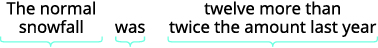</td>
</tr>
<tr valign="top">
<td data-valign="top" data-align="left">Translate into an equation.</td>
<td data-valign="top" data-align="left"></td>
</tr>
<tr valign="top">
<td data-valign="top" data-align="left"><strong>Step 5. Solve</strong> the equation.</td>
<td data-valign="top" data-align="left"></td>
</tr>
<tr valign="top">
<td data-valign="top" data-align="left">Subtract 12 from each side.</td>
<td data-valign="top" data-align="left"></td>
</tr>
<tr valign="top">
<td data-valign="top" data-align="left">Simplify.</td>
<td data-valign="top" data-align="left"></td>
</tr>
<tr valign="top">
<td data-valign="top" data-align="left">Divide each side by two.</td>
<td data-valign="top" data-align="left"></td>
</tr>
<tr valign="top">
<td data-valign="top" data-align="left">Simplify.</td>
<td data-valign="top" data-align="left"></td>
</tr>
<tr valign="top">
<td colspan="2" data-valign="top" data-align="left"><strong>Step 6. Check:</strong> First, is our answer reasonable?
Yes, having 25 inches of snow seems OK.
The problem says the normal snowfall is twelve
inches more than twice the number of last season.
Twice 25 is 50 and 12 more than that is 62.</td>
</tr>
<tr valign="top">
<td data-valign="top" data-align="left"><strong>Step 7. Answer</strong> the question.</td>
<td data-valign="top" data-align="left">The snowfall last season was 25 inches.</td>
</tr>
</tbody></table>

Guillermo bought textbooks and notebooks at the bookstore. The number of textbooks was three more than twice the number of notebooks. He bought seven textbooks. How many notebooks did he buy?

He bought two notebooks.

Gerry worked Sudoku puzzles and crossword puzzles this week. The number of Sudoku puzzles he completed is eight more than twice the number of crossword puzzles. He completed 22 Sudoku puzzles. How many crossword puzzles did he do?

He did seven crosswords puzzles.

We summarize an effective strategy for problem solving.

Use a Problem Solving Strategy for word problems.

1.  **Read** the problem. Make sure all the words and ideas are understood.
2.  **Identify** what you are looking for.
3.  **Name** what you are looking for. Choose a variable to represent that quantity.
4.  **Translate** into an equation. It may be helpful to restate the problem in one sentence with all the important information. Then, translate the English sentence into an algebra equation.
5.  **Solve** the equation using proper algebra techniques.
6.  **Check** the answer in the problem to make sure it makes sense.
7.  **Answer** the question with a complete sentence.
{: data-number-style="arabic" .stepwise}

### Solve Number Word Problems

We will now apply the problem solving strategy to “number word problems.” Number word problems give some clues about one or more numbers and we use these clues to write an equation. Number word problems provide good practice for using the Problem Solving Strategy.

The sum of seven times a number and eight is thirty-six. Find the number.

<table class="unnumbered unstyled can-break" summary="Did you notice that we left out some of the steps as we solved this equation? If you&#x2019;re not yet ready to leave out these steps, write down as many as you need. Step 1 is to read the problem. Step 2 is to identify what you are looking for. It is the number. Step 3 is name what you are look for and choose a variable to represent it. Let be equal to the number. Step 4 is to translate. Restate the problem as one sentence. The sum of seven times a number and 8 is 7 n plus 8, is the equals sign, and 36 is 36. Translate into an equation. The equation is 7 n plus 8 is equal to 36. Step 5 is to solve the equation. Subtract 7 from each side and simplify. The result is 7 n is equal to 28. Divide each side by 2 and simplify. The result is n is equal to 4. Step 6 is to check the solution. Is the sum of 7 times 4 plus 8 equal to 36? Is 28 plus 8 equal to 36? 36 is equal to 36. The solution checks. Step 7 is to answer the question. The number is 4." data-label=""><tbody>
<tr valign="top">
<td data-valign="top" data-align="left"><strong>Step 1. Read</strong> the problem.</td>
<td />
</tr>
<tr valign="top">
<td data-valign="top" data-align="left"><strong>Step 2. Identify</strong> what you are looking for.</td>
<td data-valign="top" data-align="left">the number</td>
</tr>
<tr valign="top">
<td data-valign="top" data-align="left"><strong>Step 3. Name</strong> what you are looking for and
choose a variable to represent it.</td>
<td data-valign="top" data-align="left">Let <em>n</em> = the number.</td>
</tr>
<tr valign="top">
<td data-valign="top" data-align="left"><strong>Step 4. Translate:</strong>
Restate the problem as one sentence.
Translate into an equation.</td>
<td data-valign="top" data-align="left">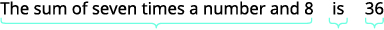
</td>
</tr>
<tr valign="top">
<td data-valign="top" data-align="left"><strong>Step 5. Solve</strong> the equation.
Subtract eight from each side and simplify.
Divide each side by seven and simplify.</td>
<td data-valign="top" data-align="left">

</td>
</tr>
<tr valign="top">
<td data-valign="top" data-align="left"><strong>Step 6. Check.</strong>
Is the sum of seven times four plus eight equal to 36?
<math xmlns="http://www.w3.org/1998/Math/MathML"><mrow><mspace width="2em" /><mtable><mtr><mtd columnalign="right"><mn>7</mn><mo>·</mo><mn>4</mn><mo>+</mo><mn>8</mn></mtd><mtd columnalign="left"><mover><mo>=</mo><mo>?</mo></mover></mtd><mtd columnalign="left"><mn>36</mn></mtd></mtr><mtr><mtd columnalign="right"><mn>28</mn><mo>+</mo><mn>8</mn></mtd><mtd columnalign="left"><mover><mo>=</mo><mo>?</mo></mover></mtd><mtd columnalign="left"><mn>36</mn></mtd></mtr><mtr><mtd columnalign="right"><mn>36</mn></mtd><mtd columnalign="left"><mo>=</mo></mtd><mtd columnalign="left"><mn>36</mn><mo>✓</mo></mtd></mtr></mtable></mrow></math></td>
<td />
</tr>
<tr valign="top">
<td data-valign="top" data-align="left"><strong>Step 7. Answer</strong> the question.</td>
<td data-valign="top" data-align="left">The number is 4.</td>
</tr>
</tbody></table>
Did you notice that we left out some of the steps as we solved this equation? If you’re not yet ready to leave out these steps, write down as many as you need.

The sum of four times a number and two is fourteen. Find the number.

<math xmlns="http://www.w3.org/1998/Math/MathML"><mn>3</mn></math>

The sum of three times a number and seven is twenty-five. Find the number.

<math xmlns="http://www.w3.org/1998/Math/MathML"><mn>6</mn></math>

Some number word problems ask us to find two or more numbers. It may be tempting to name them all with different variables, but so far, we have only solved equations with one variable. In order to avoid using more than one variable, we will define the numbers in terms of the same variable. Be sure to read the problem carefully to discover how all the numbers relate to each other.

The sum of two numbers is negative fifteen. One number is nine less than the other. Find the numbers.

<table class="unnumbered unstyled can-break" summary="Step 1 is to read the problem. Step 2 is identify what you are looking for. It is two numbers. Step 3 is to name what you are looking for by choosing a variable to represent the first number. Let n be equal to the first number. One number is 9 less than the other. Let n minus 9 be equal to the second number. Step 4 is to translate. Write the sum of two numbers is negative 15. That is the first number plus the second number is negative 15. Translate it into an equation. The equation is n plus the quantity n minus 9 is equal to negative 15. Step 5 is to solve the equation. Combine like terms. The result is 2 n minus 9 is equal to negative 15. Add 9 to each side and simplify. The result is 2 n is equal to negative 6. Simplify. The result is n is equal negative 3, which is the first number. The expression, n minus 9, is the second number. Negative 3 minus 9 is negative 12. Step 6 is to check the solutions. Is negative 12 nine less than negative 3? Is negative 3 minus 9 equal to negative 12? Is negative 12 equal to negative 12? Is their sum negative 15? Is negative 3 plus negative 12 equal to negative 15? Negative 15 is equal to negative 15. The solutions check. Step 7 is to answer the question. The numbers are negative 3 and negative 12." data-label=""><tbody>
<tr valign="top">
<td data-valign="top" data-align="left"><strong>Step 1. Read</strong> the problem.</td>
<td />
</tr>
<tr valign="top">
<td data-valign="top" data-align="left"><strong>Step 2. Identify</strong> what you are looking for.</td>
<td data-valign="top" data-align="left">two numbers</td>
</tr>
<tr valign="top">
<td data-valign="top" data-align="left"><strong>Step 3. Name</strong> what you are looking for by
choosing a variable to represent the first
number.
“One number is nine less than the other.”</td>
<td data-valign="top" data-align="left">
Let <math xmlns="http://www.w3.org/1998/Math/MathML"><mrow><mi>n</mi><mo>=</mo><msup><mn>1</mn><mrow><mtext>st</mtext></mrow></msup></mrow></math> number.

<math xmlns="http://www.w3.org/1998/Math/MathML"><mrow><mi>n</mi><mo>−</mo><mn>9</mn><mo>=</mo><msup><mn>2</mn><mtext>nd</mtext></msup></mrow></math> number</td>
</tr>
<tr valign="top">
<td data-valign="top" data-align="left"><strong>Step 4. Translate.</strong>
Write as one sentence.
Translate into an equation.</td>
<td data-valign="top" data-align="left">
The sum of two numbers is negative fifteen.
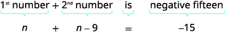</td>
</tr>
<tr valign="top">
<td data-valign="top" data-align="left"><strong>Step 5. Solve</strong> the equation.
Combine like terms.
Add nine to each side and simplify.
Simplify.</td>
<td data-valign="top" data-align="left">

</td>
</tr>
<tr valign="top">
<td data-valign="top" data-align="left"><strong>Step 6. Check.</strong>
Is <math xmlns="http://www.w3.org/1998/Math/MathML"><mrow><mn>−12</mn></mrow></math> nine less than <math xmlns="http://www.w3.org/1998/Math/MathML"><mrow><mn>−3</mn><mo>?</mo></mrow></math>
<math xmlns="http://www.w3.org/1998/Math/MathML"><mrow><mspace width="2em" /><mtable><mtr><mtd columnalign="right"><mn>−3</mn><mo>−</mo><mn>9</mn></mtd><mtd columnalign="left"><mover><mo>=</mo><mo>?</mo></mover></mtd><mtd columnalign="left"><mo>−</mo><mn>12</mn></mtd></mtr><mtr><mtd columnalign="right"><mrow><mn>−12</mn></mrow></mtd><mtd columnalign="left"><mo>=</mo></mtd><mtd columnalign="left"><mn>−12</mn><mo>✓</mo></mtd></mtr></mtable></mrow></math>
Is their sum <math xmlns="http://www.w3.org/1998/Math/MathML"><mrow><mn>−15</mn><mo>?</mo></mrow></math>
<math xmlns="http://www.w3.org/1998/Math/MathML"><mrow><mspace width="2em" />	<mtable><mtr><mtd columnalign="right"><mn>−3</mn><mo>+</mo><mo stretchy="false">(</mo><mn>−12</mn><mo stretchy="false">)</mo></mtd><mtd columnalign="left"><mover><mo>=</mo><mo>?</mo></mover></mtd><mtd columnalign="left"><mo>−</mo><mn>15</mn></mtd></mtr><mtr><mtd columnalign="right"><mn>−15</mn></mtd><mtd columnalign="left"><mo>=</mo></mtd><mtd columnalign="left"><mn>−15</mn><mo>✓</mo></mtd></mtr></mtable></mrow></math></td>
<td />
</tr>
<tr valign="top">
<td data-valign="top" data-align="left"><strong>Step 7. Answer</strong> the question.</td>
<td data-valign="top" data-align="left">The numbers are <math xmlns="http://www.w3.org/1998/Math/MathML"><mrow><mn>−3</mn></mrow></math> and <math xmlns="http://www.w3.org/1998/Math/MathML"><mrow><mn>−12</mn><mo>.</mo></mrow></math></td>
</tr>
</tbody></table>

The sum of two numbers is negative twenty-three. One number is seven less than the other. Find the numbers.

<math xmlns="http://www.w3.org/1998/Math/MathML"><mrow><mn>−15</mn><mo>,</mo><mn>−8</mn></mrow></math>

The sum of two numbers is negative eighteen. One number is forty more than the other. Find the numbers.

<math xmlns="http://www.w3.org/1998/Math/MathML"><mrow><mn>−29</mn><mo>,</mo><mn>11</mn></mrow></math>

Some number problems involve **consecutive integers**. Consecutive integers are integers that immediately follow each other. Examples of **consecutive integers**{: data-type="term"} are:

<math xmlns="http://www.w3.org/1998/Math/MathML"><mtable><mtr><mtd columnalign="right"><mn>1</mn><mo>,</mo></mtd><mtd /><mtd columnalign="right"><mn>2</mn><mo>,</mo></mtd><mtd /><mtd columnalign="right"><mn>3</mn><mo>,</mo></mtd><mtd /><mtd columnalign="right"><mn>4</mn></mtd></mtr><mtr><mtd columnalign="right"><mn>−10</mn><mo>,</mo></mtd><mtd /><mtd columnalign="right"><mn>−9</mn><mo>,</mo></mtd><mtd /><mtd columnalign="right"><mn>−8</mn><mo>,</mo></mtd><mtd /><mtd columnalign="right"><mn>−7</mn></mtd></mtr><mtr><mtd columnalign="right"><mn>150</mn><mo>,</mo></mtd><mtd /><mtd columnalign="right"><mn>151</mn><mo>,</mo></mtd><mtd /><mtd columnalign="right"><mn>152</mn><mo>,</mo></mtd><mtd /><mtd columnalign="right"><mn>153</mn></mtd></mtr></mtable></math>

Notice that each number is one more than the number preceding it. Therefore, if we define the first integer as *n*, the next consecutive integer is <math xmlns="http://www.w3.org/1998/Math/MathML"><mrow><mi>n</mi><mo>+</mo><mn>1</mn><mo>.</mo></mrow></math>

 The one after that is one more than <math xmlns="http://www.w3.org/1998/Math/MathML"><mrow><mi>n</mi><mo>+</mo><mn>1</mn><mo>,</mo></mrow></math>

 so it is <math xmlns="http://www.w3.org/1998/Math/MathML"><mrow><mi>n</mi><mo>+</mo><mn>1</mn><mo>+</mo><mn>1</mn><mo>,</mo></mrow></math>

 which is <math xmlns="http://www.w3.org/1998/Math/MathML"><mrow><mi>n</mi><mo>+</mo><mn>2</mn><mo>.</mo></mrow></math>

<math xmlns="http://www.w3.org/1998/Math/MathML"><mrow><mtable> <mtr><mtd columnalign="left"><mi>n</mi></mtd><mtd /><mtd /><mtd columnalign="left"><mspace width="4em" /><mrow><msup><mn>1</mn><mtext>st</mtext></msup><mtext>integer</mtext></mrow></mtd></mtr> <mtr><mtd columnalign="left"><mi>n</mi><mo>+</mo><mn>1</mn></mtd><mtd /><mtd /><mtd columnalign="left"><mspace width="4em" /><mrow><msup><mn>2</mn><mtext>nd</mtext></msup><mtext>consecutive integer</mtext></mrow></mtd></mtr> <mtr><mtd columnalign="left"><mi>n</mi><mo>+</mo><mn>2</mn></mtd><mtd /><mtd /><mtd columnalign="left"><mspace width="4em" /><mrow><msup><mn>3</mn><mtext>rd</mtext></msup><mtext>consecutive integer</mtext><mspace width="1.5em" /><mtext>etc.</mtext></mrow></mtd></mtr></mtable></mrow></math>

We will use this notation to represent consecutive integers in the next example.

Find three consecutive integers whose sum is <math xmlns="http://www.w3.org/1998/Math/MathML"><mrow><mn>−54</mn><mo>.</mo></mrow></math>

<table class="unnumbered unstyled" summary="Step 1 is to read the problem. Step 2 is to identify what we are looking for. They are three consecutive numbers. Step 3 is to name each of the three numbers. Let n be the first integer, n plus 1 the second consecutive integer, and n plus 2 the third consecutive integer. Step 4 is to translate. Restate as one sentence. The sum of the three integers is negative 54. Translate into an equation. The equation is n plus the quantity n plus 1 plus the quantity n plus 2 is equal to negative 54. Step 5 is to solve the equation. Combine like terms. The result is 3 n plus 3 is equal to negative 54. Subtract 3 from each side. The result is 3 n is equal to negative 57. Divide each side by 3. The result is n is equal to negative 19, which is the first integer. The expression n plus 1 is the second integer. Negative 19 plus 1 is negative 18. The expression n plus 2 is the third integer. Negative 19 plus 2 is negative 17. Step 6 is to check. Is negative 19 plus negative 18 plus negative 17 equal to 54? Negative 54 is equal to negative 54. The solutions check. Step 7 is to answer the question. The three consecutive integers are negative 17, negative 18, and negative 19." data-label=""><tbody>
<tr valign="top">
<td data-valign="top" data-align="left"><strong>Step 1. Read</strong> the problem.</td>
<td />
</tr>
<tr valign="top">
<td data-valign="top" data-align="left"><strong>Step 2. Identify</strong> what you are looking for.</td>
<td data-valign="top" data-align="left">three consecutive integers</td>
</tr>
<tr valign="top">
<td data-valign="top" data-align="left"><strong>Step 3. Name</strong> each of the three numbers</td>
<td data-valign="top" data-align="left">Let <math xmlns="http://www.w3.org/1998/Math/MathML"><mrow><mi>n</mi><mo>=</mo><msup><mn>1</mn><mtext>st</mtext></msup></mrow></math> integer.
<math xmlns="http://www.w3.org/1998/Math/MathML"><mrow><mi>n</mi><mo>+</mo><mn>1</mn><mo>=</mo><msup><mn>2</mn><mtext>nd</mtext></msup></mrow></math> consecutive integer
<math xmlns="http://www.w3.org/1998/Math/MathML"><mrow><mi>n</mi><mo>+</mo><mn>2</mn><mo>=</mo><msup><mn>3</mn><mtext>rd</mtext></msup></mrow></math> consecutive integer</td>
</tr>
<tr valign="top">
<td data-valign="top" data-align="left"><strong>Step 4. Translate.</strong>
Restate as one sentence.
Translate into an equation.</td>
<td data-valign="top" data-align="left">
The sum of the three integers is <math xmlns="http://www.w3.org/1998/Math/MathML"><mrow><mn>−54</mn><mo>.</mo></mrow></math>
</td>
</tr>
<tr valign="top">
<td data-valign="top" data-align="left"><strong>Step 5. Solve</strong> the equation.
Combine like terms.
Subtract three from each side.
Divide each side by three.</td>
<td data-valign="top" data-align="left">

</td>
</tr>
<tr valign="top">
<td data-valign="top" data-align="left"><strong>Step 6. Check.</strong>
<math xmlns="http://www.w3.org/1998/Math/MathML"><mrow><mtable><mtr /><mtr><mtd columnalign="right"><mn>−19</mn><mo>+</mo><mo>(</mo><mn>−18</mn><mo>)</mo><mo>+</mo><mo>(</mo><mn>−17</mn><mo>)</mo></mtd><mtd columnalign="left"><mo>=</mo></mtd><mtd columnalign="left"><mn>−54</mn></mtd></mtr><mtr><mtd columnalign="right"><mn>−54</mn></mtd><mtd columnalign="left"><mo>=</mo></mtd><mtd columnalign="left"><mn>−54</mn><mo>✓</mo></mtd></mtr></mtable></mrow></math></td>
<td />
</tr>
<tr valign="top">
<td data-valign="top" data-align="left"><strong>Step 7. Answer</strong> the question.</td>
<td data-valign="top" data-align="left">The three consecutive integers are
<math xmlns="http://www.w3.org/1998/Math/MathML"><mrow><mn>−17</mn><mo>,</mo><mtext>−</mtext><mtext>18,</mtext></mrow></math> and <math xmlns="http://www.w3.org/1998/Math/MathML"><mrow><mn>−19</mn><mo>.</mo></mrow></math></td>
</tr>
</tbody></table>

Find three consecutive integers whose sum is <math xmlns="http://www.w3.org/1998/Math/MathML"><mrow><mn>−96</mn><mo>.</mo></mrow></math>

<math xmlns="http://www.w3.org/1998/Math/MathML"><mrow><mn>−33</mn><mo>,</mo><mn>−32</mn><mo>,</mo><mn>−31</mn></mrow></math>

Find three consecutive integers whose sum is <math xmlns="http://www.w3.org/1998/Math/MathML"><mrow><mn>−36</mn><mo>.</mo></mrow></math>

<math xmlns="http://www.w3.org/1998/Math/MathML"><mrow><mn>−13</mn><mo>,</mo><mn>−12</mn><mo>,</mo><mn>−11</mn></mrow></math>

Now that we have worked with consecutive integers, we will expand our work to include **consecutive even integers**{: data-type="term"} and **consecutive odd integers**{: data-type="term"}. Consecutive even integers are even integers that immediately follow one another. Examples of consecutive even integers are:

<math xmlns="http://www.w3.org/1998/Math/MathML"><mrow><mtext>24, 26, 28</mtext></mrow></math>

<math xmlns="http://www.w3.org/1998/Math/MathML"><mrow><mn>−12</mn><mo>,</mo><mn>−10</mn><mo>,</mo><mn>−8</mn></mrow></math>

Notice each integer is two more than the number preceding it. If we call the first one *n*, then the next one is <math xmlns="http://www.w3.org/1998/Math/MathML"><mrow><mi>n</mi><mo>+</mo><mn>2</mn><mo>.</mo></mrow></math>

 The one after that would be <math xmlns="http://www.w3.org/1998/Math/MathML"><mrow><mi>n</mi><mo>+</mo><mn>2</mn><mo>+</mo><mn>2</mn></mrow></math>

 or <math xmlns="http://www.w3.org/1998/Math/MathML"><mrow><mi>n</mi><mo>+</mo><mn>4</mn><mo>.</mo></mrow></math>

<math xmlns="http://www.w3.org/1998/Math/MathML"><mtable> <mtr><mtd columnalign="left"><mi>n</mi></mtd><mtd /><mtd /><mtd columnalign="left"><mspace width="4em" /><mrow><msup><mn>1</mn><mtext>st</mtext></msup><mtext>even integer</mtext></mrow></mtd></mtr> <mtr><mtd columnalign="left"><mi>n</mi><mo>+</mo><mn>2</mn></mtd><mtd /><mtd /><mtd columnalign="left"><mspace width="4em" /><mrow><msup><mn>2</mn><mtext>nd</mtext></msup><mtext>consecutive even integer</mtext></mrow></mtd></mtr> <mtr><mtd columnalign="left"><mi>n</mi><mo>+</mo><mn>4</mn></mtd><mtd /><mtd /><mtd columnalign="left"><mspace width="4em" /><mrow><msup><mn>3</mn><mtext>rd</mtext></msup><mtext>consecutive even integer</mtext><mspace width="1.5em" /><mtext>etc.</mtext></mrow></mtd></mtr></mtable></math>

Consecutive odd integers are odd integers that immediately follow one another. Consider the consecutive odd integers 63, 65, and 67.

<math xmlns="http://www.w3.org/1998/Math/MathML"><mtext>63, 65, 67</mtext></math>

<math xmlns="http://www.w3.org/1998/Math/MathML"><mi>n</mi><mo>,</mo><mi>n</mi><mo>+</mo><mn>2</mn><mo>,</mo><mi>n</mi><mo>+</mo><mn>4</mn></math>

<math xmlns="http://www.w3.org/1998/Math/MathML"><mtable> <mtr><mtd columnalign="left"><mi>n</mi></mtd><mtd /><mtd /><mtd columnalign="left"><mspace width="4em" /><mrow><msup><mn>1</mn><mtext>st</mtext></msup><mtext>odd integer</mtext></mrow></mtd></mtr> <mtr><mtd columnalign="left"><mi>n</mi><mo>+</mo><mn>2</mn></mtd><mtd /><mtd /><mtd columnalign="left"><mspace width="4em" /><mrow><msup><mn>2</mn><mtext>nd</mtext></msup><mtext>consecutive odd integer</mtext></mrow></mtd></mtr> <mtr><mtd columnalign="left"><mi>n</mi><mo>+</mo><mn>4</mn></mtd><mtd /><mtd /><mtd columnalign="left"><mspace width="4em" /><mrow><msup><mn>3</mn><mtext>rd</mtext></msup><mtext>consecutive odd integer</mtext><mspace width="1.5em" /><mtext>etc.</mtext></mrow></mtd></mtr></mtable></math>

Does it seem strange to have to add two (an even number) to get the next odd number? Do we get an odd number or an even number when we add 2 to 3? to 11? to 47?

Whether the problem asks for consecutive even numbers or odd numbers, you do not have to do anything different. The pattern is still the same—to get to the next odd or the next even integer, add two.

Find three consecutive even integers whose sum is <math xmlns="http://www.w3.org/1998/Math/MathML"><mrow><mn>120</mn></mrow></math>

.

<math xmlns="http://www.w3.org/1998/Math/MathML"><mspace width="4em" /><mtable><mtr><mtd columnalign="left"><mtext mathvariant="bold">Step 1. Read</mtext><mspace width="0.2em" /><mtext>the problem.</mtext></mtd><mtd /></mtr><mtr><mtd columnalign="left"><mtext mathvariant="bold">Step 2. Identify</mtext><mspace width="0.2em" /><mtext>what you are looking for.</mtext></mtd><mtd columnalign="left"><mspace width="2em" /><mtext>three consecutive even integers</mtext></mtd></mtr><mtr><mtd columnalign="left"><mtext mathvariant="bold">Step 3. Name.</mtext></mtd><mtd columnalign="left"><mspace width="2em" /><mtext>Let</mtext><mspace width="0.2em" /><mrow><mi>n</mi><mo>=</mo></mrow><mspace width="0.2em" /><msup><mn>1</mn><mtext>st</mtext></msup><mspace width="0.2em" /><mtext>even integer.</mtext></mtd></mtr><mtr><mtd /><mtd columnalign="left"><mspace width="2em" /><mrow><mi>n</mi><mo>+</mo><mn>2</mn><mo>=</mo></mrow><mspace width="0.2em" /><msup><mn>2</mn><mtext>nd</mtext></msup><mspace width="0.2em" /><mtext>consecutive even integer</mtext></mtd></mtr><mtr><mtd /><mtd columnalign="left"><mspace width="2em" /><mrow><mi>n</mi><mo>+</mo><mn>4</mn><mo>=</mo></mrow><mspace width="0.2em" /><msup><mn>3</mn><mtext>rd</mtext></msup><mspace width="0.2em" /><mtext>consecutive even integer</mtext></mtd></mtr><mtr><mtd columnalign="left"><mtext mathvariant="bold">Step 4. Translate.</mtext></mtd><mtd /></mtr><mtr><mtd columnalign="left"><mtext>Restate as one sentence.</mtext></mtd><mtd columnalign="left"><mspace width="2em" /><mtext>The sum of the three even integers is</mtext><mspace width="0.2em" /><mrow><mn>120</mn></mrow><mo>.</mo></mtd></mtr><mtr><mtd columnalign="left"><mtext>Translate into an equation.</mtext></mtd><mtd columnalign="left"><mspace width="2em" /><mrow><mi>n</mi><mspace width="0.2em" /><mo>+</mo><mspace width="0.2em" /><mi>n</mi><mspace width="0.2em" /><mo>+</mo><mspace width="0.2em" /><mn>2</mn><mspace width="0.2em" /><mo>+</mo><mspace width="0.2em" /><mi>n</mi><mo>+</mo><mn>4</mn><mspace width="0.2em" /><mo>=</mo><mn>120</mn></mrow></mtd></mtr><mtr><mtd columnalign="left"><mtext mathvariant="bold">Step 5. Solve</mtext><mspace width="0.2em" /><mtext>the equation.</mtext></mtd><mtd columnalign="left"><mspace width="3.3em" /><mrow><mi>n</mi><mo>+</mo><mi>n</mi><mo>+</mo><mn>2</mn><mo>+</mo><mi>n</mi><mo>+</mo><mn>4</mn><mo>=</mo><mn>120</mn></mrow></mtd></mtr><mtr><mtd columnalign="left"><mtext>Combine like terms.</mtext></mtd><mtd columnalign="left"><mrow><mspace width="7.7em" /><mn>3</mn><mi>n</mi><mo>+</mo><mn>6</mn><mo>=</mo><mn>120</mn></mrow></mtd></mtr><mtr><mtd columnalign="left"><mtext>Subtract 6 from each side.</mtext></mtd><mtd columnalign="left"><mspace width="9.5em" /><mrow><mn>3</mn><mi>n</mi><mo>=</mo><mn>114</mn></mrow></mtd></mtr><mtr><mtd columnalign="left"><mtext>Divide each side by 3.</mtext></mtd><mtd columnalign="left"><mspace width="10em" /><mrow><mi>n</mi><mo>=</mo><mn>38</mn></mrow><mspace width="1em" /><msup><mn>1</mn><mtext>st</mtext></msup><mspace width="0.2em" /><mtext>integer</mtext></mtd></mtr><mtr /><mtr><mtd /><mtd columnalign="left"><mspace width="11em" /><mrow><mi>n</mi><mo>+</mo><mn>2</mn></mrow><mspace width="1em" /><msup><mn>2</mn><mtext>nd</mtext></msup><mspace width="0.2em" /><mtext>integer</mtext></mtd></mtr><mtr><mtd /><mtd columnalign="left"><mspace width="10.7em" /><mrow><mn>38</mn><mo>+</mo><mn>2</mn></mrow></mtd></mtr><mtr><mtd /><mtd columnalign="left"><mspace width="11.5em" /><mn>40</mn></mtd></mtr><mtr /><mtr><mtd /><mtd columnalign="left"><mspace width="11em" /><mrow><mi>n</mi><mo>+</mo><mn>4</mn></mrow><mspace width="1em" /><msup><mn>3</mn><mtext>rd</mtext></msup><mspace width="0.2em" /><mtext>integer</mtext></mtd></mtr><mtr><mtd /><mtd columnalign="left"><mspace width="10.5em" /><mrow><mn>38</mn><mo>+</mo><mn>4</mn></mrow></mtd></mtr><mtr><mtd /><mtd columnalign="left"><mspace width="12em" /><mn>42</mn></mtd></mtr><mtr><mtd columnalign="left"><mtext mathvariant="bold">Step 6. Check.</mtext></mtd><mtd /></mtr><mtr><mtd columnalign="left"><mtable><mtr><mtd columnalign="right"><mn>38</mn><mo>+</mo><mn>40</mn><mo>+</mo><mn>42</mn></mtd><mtd columnalign="left"><mover><mo>=</mo><mo>?</mo></mover><mn>120</mn></mtd></mtr><mtr><mtd columnalign="right"><mn>120</mn></mtd><mtd columnalign="left"><mo>=</mo><mn>120</mn><mspace width="0.2em" /><mo>✓</mo></mtd></mtr></mtable></mtd></mtr><mtr><mtd columnalign="left"><mtext mathvariant="bold">Step 7. Answer</mtext><mspace width="0.2em" /><mtext>the question.</mtext></mtd><mtd columnalign="left"><mspace width="2em" /><mtext>The three consecutive integers are 38, 40, and 42.</mtext></mtd></mtr></mtable></math>

Find three consecutive even integers whose sum is 102.

32, 34, 36

Find three consecutive even integers whose sum is <math xmlns="http://www.w3.org/1998/Math/MathML"><mrow><mn>−24</mn><mo>.</mo></mrow></math>

<math xmlns="http://www.w3.org/1998/Math/MathML"><mrow><mn>−10</mn><mo>,</mo><mn>−8</mn><mo>,</mo><mn>−6</mn></mrow></math>

When a number problem is in a real life context, we still use the same strategies that we used for the previous examples.

A married couple together earns $110,000 a year. The wife earns $16,000 less than twice what her husband earns. What does the husband earn?

<math xmlns="http://www.w3.org/1998/Math/MathML"> <mrow> <mtable> <mtr> <mtd columnalign="left"><mtext mathvariant="bold">Step 1. Read</mtext><mspace width="0.2em" /><mtext>the problem.</mtext></mtd> <mtd /> <mtd /> <mtd /> <mtd /> <mtd /> </mtr> <mtr> <mtd columnalign="left"><mtext mathvariant="bold">Step 2. Identify</mtext><mspace width="0.2em" /><mtext>what you are looking for.</mtext></mtd> <mtd /> <mtd /> <mtd /> <mtd /> <mtd columnalign="left"><mtext>How much does the husband earn?</mtext></mtd> </mtr> <mtr> <mtd columnalign="left"><mtext mathvariant="bold">Step 3. Name.</mtext></mtd> <mtd /> <mtd /> <mtd /> <mtd /> <mtd /> </mtr> <mtr> <mtd columnalign="left"><mtext>Choose a variable to represent</mtext></mtd><mtd /><mtd /><mtd /><mtd /><mtd columnalign="left"><mtext>Let</mtext><mspace width="0.2em" /><mi>h</mi><mo>=</mo><mtext>the amount the husband earns.</mtext></mtd></mtr><mtr><mtd columnalign="left"><mtext>the amount the husband earns.</mtext></mtd><mtd /><mtd /><mtd /><mtd /><mtd /></mtr><mtr><mtd columnalign="left"><mtext>The wife earns $16,000 less than twice that.</mtext></mtd><mtd /><mtd /><mtd /><mtd /><mtd /></mtr><mtr><mtd columnalign="left"><mtext mathvariant="bold">Step 4. Translate.</mtext></mtd><mtd /><mtd /><mtd /><mtd /><mtd /></mtr><mtr><mtd columnalign="left"><mtable><mtr><mtd columnalign="left"><mtext>Restate the problem in one sentence</mtext></mtd></mtr><mtr><mtd columnalign="left"><mtext>with all the important information.</mtext></mtd></mtr><mtr><mtd columnalign="left"><mtext>Translate into an equation.</mtext></mtd></mtr></mtable></mtd><mtd /><mtd /><mtd /><mtd /><mtd columnalign="left"><mtable><mtr><mtd columnalign="left"><mn>2</mn><mi>h</mi><mo>−</mo><mn>16,000</mn><mo>=</mo><mtext>the amount the wife earns</mtext></mtd></mtr><mtr><mtd columnalign="left"><mtext>Together the husband and wife earn $110,000.</mtext></mtd></mtr></mtable></mtd></mtr> <mtr><mtd /><mtd /><mtd /><mtd /><mtd /> <mtd columnalign="left"> <mtable> <mtr> <mtd columnalign="right"><mi>h</mi><mo>+</mo><mn>2</mn><mi>h</mi><mo>−</mo><mn>16,000</mn></mtd> <mtd columnalign="left"><mo>=</mo></mtd> <mtd columnalign="left"><mn>110,000</mn></mtd> </mtr></mtable></mtd></mtr> <mtr><mtd columnalign="left"><mtable> <mtr> <mtd columnalign="left"><mtext mathvariant="bold">Step 5. Solve</mtext><mspace width="0.2em" /><mtext>the equation.</mtext></mtd> </mtr> <mtr> <mtd columnalign="left"><mtext>Combine like terms.</mtext></mtd> </mtr> <mtr> <mtd columnalign="left"><mtext>Add 16,000 to both sides and simplify.</mtext></mtd> </mtr> <mtr> <mtd columnalign="left"><mtext>Divide each side by three.</mtext></mtd> </mtr></mtable> </mtd> <mtd /> <mtd /> <mtd /> <mtd /> <mtd columnalign="left"> <mtable> <mtr> <mtd columnalign="right"><mi>h</mi><mo>+</mo><mn>2</mn><mi>h</mi><mo>−</mo><mn>16,000</mn></mtd> <mtd columnalign="left"><mo>=</mo></mtd> <mtd columnalign="left"><mn>110,000</mn></mtd> </mtr> <mtr> <mtd columnalign="right"><mn>3</mn><mi>h</mi><mo>−</mo><mn>16,000</mn></mtd><mtd columnalign="left"><mo>=</mo></mtd><mtd columnalign="left"><mn>110,000</mn></mtd></mtr><mtr><mtd columnalign="right"><mn>3</mn><mi>h</mi></mtd><mtd columnalign="left"><mo>=</mo></mtd><mtd columnalign="left"><mn>126,000</mn></mtd></mtr><mtr><mtd columnalign="right"><mi>h</mi></mtd><mtd columnalign="left"><mo>=</mo></mtd><mtd columnalign="left"><mn>42,000</mn></mtd></mtr></mtable></mtd></mtr><mtr><mtd /><mtd /><mtd /><mtd /><mtd /><mtd columnalign="center"><mtable><mtr><mtd columnalign="center"><mtext>$42,000 amount husband earns</mtext></mtd></mtr><mtr /><mtr /><mtr><mtd columnalign="center"><mn>2</mn><mi>h</mi><mo>−</mo><mn>16,000</mn><mspace width="0.2em" /><mtext>amount wife earns</mtext></mtd></mtr><mtr><mtd columnalign="center"><mn>2</mn><mo stretchy="false">(</mo><mn>42,000</mn><mo stretchy="false">)</mo><mo>−</mo><mn>16,000</mn></mtd></mtr><mtr><mtd columnalign="center"><mn>84,000</mn><mo>−</mo><mn>16,000</mn></mtd></mtr><mtr><mtd columnalign="center"><mn>68,000</mn></mtd></mtr></mtable></mtd></mtr><mtr><mtd columnalign="left"><mtext mathvariant="bold">Step 6. Check:</mtext></mtd><mtd /><mtd /><mtd /><mtd /><mtd /></mtr><mtr><mtd columnalign="left"><mtext>If the wife earns $68,000 and the husband</mtext></mtd><mtd /><mtd /><mtd /><mtd /><mtd /></mtr><mtr><mtd columnalign="left"><mtext>earns $42,000, is that $110,000? Yes!</mtext></mtd><mtd /><mtd /><mtd /><mtd /><mtd /></mtr><mtr><mtd columnalign="left"><mtext mathvariant="bold">Step 7. Answer</mtext><mspace width="0.2em" /><mtext>the question.</mtext></mtd><mtd /><mtd /><mtd /><mtd /><mtd columnalign="left"><mtext>The husband earns $42,000 a year.</mtext></mtd></mtr></mtable></mrow></math>

According to the National Automobile Dealers Association, the average cost of a car in 2014 was $28,400. This was $1,600 less than six times the cost in 1975. What was the average cost of a car in 1975?

The average cost was $5,000.

US Census data shows that the median price of new home in the U.S. in November 2014 was $280,900. This was $10,700 more than 14 times the price in November 1964. What was the median price of a new home in November 1964?

The median price was $19,300.

### Solve Percent Applications

There are several methods to solve percent equations. In algebra, it is easiest if we just translate English sentences into algebraic equations and then solve the equations. Be sure to change the given percent to a decimal before you use it in the equation.

Translate and solve:

ⓐ What number is 45% of 84?* * *
{: data-type="newline"}

ⓑ 8.5% of what amount is $4.76?* * *
{: data-type="newline"}

ⓒ 168 is what percent of 112?

ⓐ* * *
{: data-type="newline"}

|  |  |  | 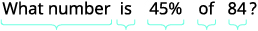 |
{: valign="top"}| Translate into algebra. Let *n* **=** the number. |  |  |  |
{: valign="top"}| Multiply. |  |  |  |
{: valign="top"}|  |  |  | 37.8 is 45% of 84. |
{: valign="top"}{: .unnumbered .unstyled summary="What number is 45% of 84? Translate into algebra. Let n be the number. Write is 45 percent of 84 as is equal to 0.45 times 84. Multiply. The result is n is equal 37.8. 37.8 is 45 percent of 84." data-label=""}

* * *
{: data-type="newline"}

* * *
{: data-type="newline"}

 ⓑ* * *
{: data-type="newline"}

|  |  |  | 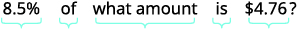 |
{: valign="top"}| Translate. Let *n* **=** the amount. |  |  |  |
{: valign="top"}| Multiply. |  |  |  |
{: valign="top"}| Divide both sides by 0.085 and simplify. |  |  |  |
{: valign="top"}|  |  |  | 8.5% of $56 is $4.76 |
{: valign="top"}{: .unnumbered .unstyled summary="What number is 45% of 84? Translate into algebra. Let n be the number. Write is 45 percent of 84 as is equal to 0.45 times 84. Multiply. The result is n is equal 37.8. 37.8 is 45 percent of 84." data-label=""}

* * *
{: data-type="newline"}

* * *
{: data-type="newline"}

 ⓒ* * *
{: data-type="newline"}

<table class="unnumbered unstyled" summary="168 is what percent of 112? We are asked to find the percent, so we must have our final result in percent form. Translate into algebra. Let p be equal to the percent. Write 168 is what percent of 112 as 168 is equal to p times 112. Multiply. The result is 168 is equal to 112 p. Divide both sides by 112 and simplify. The result is 1.5 is equal to p. Convert to a percent. The result is 150 percent is equal to p. 168 is 150 percent of 112." data-label=""><tbody>
<tr valign="top">
<td data-valign="top" data-align="left">We are asked to find percent, so we must
have our result in percent form.</td>
<td />
<td />
<td data-valign="top" data-align="left">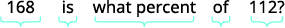</td>
</tr>
<tr valign="top">
<td data-valign="top" data-align="left">Translate into algebra. Let <em>p</em> = the percent.</td>
<td />
<td />
<td data-valign="top" data-align="left">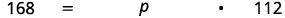</td>
</tr>
<tr valign="top">
<td data-valign="top" data-align="left">Multiply.</td>
<td />
<td />
<td data-valign="top" data-align="left"></td>
</tr>
<tr valign="top">
<td data-valign="top" data-align="left">Divide both sides by 112 and simplify.</td>
<td />
<td />
<td data-valign="top" data-align="left"></td>
</tr>
<tr valign="top">
<td data-valign="top" data-align="left">Convert to percent.</td>
<td />
<td />
<td data-valign="top" data-align="left"></td>
</tr>
<tr valign="top">
<td />
<td />
<td />
<td data-valign="top" data-align="left">168 is 150% of 112.</td>
</tr>
</tbody></table>

Translate and solve: ⓐ What number is 45% of 80? ⓑ 7.5% of what amount is $1.95? ⓒ 110 is what percent of 88?

ⓐ 36 ⓑ $26 ⓒ <math xmlns="http://www.w3.org/1998/Math/MathML"><mrow><mn>125</mn><mi>%</mi></mrow></math>

Translate and solve: ⓐ What number is 55% of 60? ⓑ 8.5% of what amount is $3.06? ⓐ 126 is what percent of 72?

ⓐ 33 ⓑ $36 ⓐ <math xmlns="http://www.w3.org/1998/Math/MathML"><mrow><mn>175</mn><mi>%</mi></mrow></math>

Now that we have a problem solving strategy to refer to, and have practiced solving basic percent equations, we are ready to solve percent applications. Be sure to ask yourself if your final answer makes sense—since many of the applications we will solve involve everyday situations, you can rely on your own experience.

The label on Audrey’s yogurt said that one serving provided 12 grams of protein, which is 24% of the recommended daily amount. What is the total recommended daily amount of protein?

<table class="unnumbered unstyled" summary="What are you asked to find? What total amount of protein is recommended? Choose a variable to represent it. Let a be equal to the total amount of protein. Write a sentence that gives the information to find it. 12 grams is 24 percent of the total amount. So, 12 grams is 24 percent of a. Translate into an equation. 12 is equal to 0.24 times a. Solve. The result is 50 is equal to a. Check. Does this make sense? Yes, 24 percent is about one-fourth if the total and 12 is about one-fourth of 50. Write a complete sentence to answer the question. The amount of protein that is recommended is 50 grams." data-label=""><tbody>
<tr valign="top">
<td data-valign="top" data-align="left">What are you asked to find?</td>
<td data-valign="top" data-align="left">What total amount of protein is recommended?</td>
</tr>
<tr valign="top">
<td data-valign="top" data-align="left">Choose a variable to represent it.</td>
<td data-valign="top" data-align="left">Let <math xmlns="http://www.w3.org/1998/Math/MathML"><mrow><mi>a</mi><mo>=</mo></mrow></math> total amount of protein.</td>
</tr>
<tr valign="top">
<td data-valign="top" data-align="left">Write a sentence that gives the
information to find it.</td>
<td data-valign="top" data-align="left">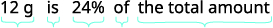</td>
</tr>
<tr valign="top">
<td data-valign="top" data-align="left">Translate into an equation.</td>
<td data-valign="top" data-align="left"></td>
</tr>
<tr valign="top">
<td data-valign="top" data-align="left">Solve.</td>
<td data-valign="top" data-align="left"></td>
</tr>
<tr valign="top">
<td data-valign="top" data-align="left">Check: Does this make sense?
Yes, 24% is about <math xmlns="http://www.w3.org/1998/Math/MathML"><mrow><mfrac><mn>1</mn><mn>4</mn></mfrac></mrow></math> of the total and
12 is about <math xmlns="http://www.w3.org/1998/Math/MathML"><mrow><mfrac><mn>1</mn><mn>4</mn></mfrac></mrow></math> of 50.</td>
<td />
</tr>
<tr valign="top">
<td data-valign="top" data-align="left">Write a complete sentence to answer the question.</td>
<td data-valign="top" data-align="left">The amount of protein that is recommended is 50 g.</td>
</tr>
</tbody></table>

One serving of wheat square cereal has 7 grams of fiber, which is 28% of the recommended daily amount. What is the total recommended daily amount of fiber?

25 grams

One serving of rice cereal has 190 mg of sodium, which is 8% of the recommended daily amount. What is the total recommended daily amount of sodium?

2,375 mg

Remember to put the answer in the form requested. In the next example we are looking for the percent.

Veronica is planning to make muffins from a mix. The package says each muffin will be 240 calories and 60 calories will be from fat. What percent of the total calories is from fat?

<table class="unnumbered unstyled" summary="What are you asked to find? What percent of the total calories is fat? Choose a variable to represent it. Let p be equal to the percent of fat. Write a sentence that gives the information to find it. What percent of 240 is 60? The percent is p, of 240 is times 240, and is 60 is equal to 60. Translate the sentence into an equation. The equation is p times 240 is equal to 60. Multiply. The result is 240 p is equal to 60. Divided both sides by 240. The result is p is equal to 0.25. Put it in percent form. The result is p is equal to 25 percent. Check. Does this make sense? Yes, 25 percent is one-fourth. 60 is one-fourth of 240. So 25 percent makes sense. Write a complete sentence to answer the question. Of the total calories in each muffin, 25 percent is fat." data-label=""><tbody>
<tr valign="top">
<td data-valign="top" data-align="left">What are you asked to find?</td>
<td data-valign="top" data-align="left">What percent of the total calories is fat?</td>
</tr>
<tr valign="top">
<td data-valign="top" data-align="left">Choose a variable to represent it.</td>
<td data-valign="top" data-align="left">Let <math xmlns="http://www.w3.org/1998/Math/MathML"><mrow><mi>p</mi><mo>=</mo></mrow></math> percent of fat.</td>
</tr>
<tr valign="top">
<td data-valign="top" data-align="left">Write a sentence that gives the
information to find it.</td>
<td data-valign="top" data-align="left">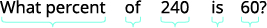</td>
</tr>
<tr valign="top">
<td data-valign="top" data-align="left">Translate the sentence into an equation.</td>
<td data-valign="top" data-align="left"></td>
</tr>
<tr valign="top">
<td data-valign="top" data-align="left">Multiply.</td>
<td data-valign="top" data-align="left"></td>
</tr>
<tr valign="top">
<td data-valign="top" data-align="left">Divide both sides by 240.</td>
<td data-valign="top" data-align="left"></td>
</tr>
<tr valign="top">
<td data-valign="top" data-align="left">Put in percent form.</td>
<td data-valign="top" data-align="left"></td>
</tr>
<tr valign="top">
<td data-valign="top" data-align="left">Check: does this make sense?
Yes, <math xmlns="http://www.w3.org/1998/Math/MathML"><mrow><mn>25</mn><mi>%</mi></mrow></math> is one-fourth; 60 is one-fourth
of 240. So, <math xmlns="http://www.w3.org/1998/Math/MathML"><mrow><mn>25</mn><mi>%</mi></mrow></math> makes sense.</td>
<td />
</tr>
<tr valign="top">
<td data-valign="top" data-align="left">Write a complete sentence to answer the question.</td>
<td data-valign="top" data-align="left">Of the total calories in each muffin, <math xmlns="http://www.w3.org/1998/Math/MathML"><mrow><mn>25</mn><mi>%</mi></mrow></math> is fat.</td>
</tr>
</tbody></table>

Mitzi received some gourmet brownies as a gift. The wrapper said each 28% brownie was 480 calories, and had 240 calories of fat. What percent of the total calories in each brownie comes from fat? Round the answer to the nearest whole percent.

50%

The mix Ricardo plans to use to make brownies says that each brownie will be 190 calories, and 76 calories are from fat. What percent of the total calories are from fat? Round the answer to the nearest whole percent.

40%

It is often important in many fields—business, sciences, pop culture—to talk about how much an amount has increased or decreased over a certain period of time. This increase or decrease is generally expressed as a percent and called the **percent change**{: data-type="term"}.

To find the percent change, first we find the amount of change, by finding the difference of the new amount and the original amount. Then we find what percent the amount of change is of the original amount.

Find percent change.

1.  Find the amount of change.
    * * *
    {: data-type="newline"}
    
    <math xmlns="http://www.w3.org/1998/Math/MathML"><mrow><mtext>change</mtext><mo>=</mo><mtext>new amount</mtext><mo>−</mo><mtext>original amount</mtext></mrow></math>

2.  Find what percent the amount of change is of the original amount.
    * * *
    {: data-type="newline"}
    
    <math xmlns="http://www.w3.org/1998/Math/MathML"><mrow><mtext>change is what percent of the original amount?</mtext></mrow></math>
{: data-number-style="arabic" .stepwise}

Recently, the California governor proposed raising community college fees from $36 a unit to $46 a unit. Find the percent change. (Round to the nearest tenth of a percent.)

<table class="unnumbered unstyled" summary="Find the amount of change. 46 minus 36 is equal to 10. Find the percent. Change is what percent of the original amount? Let p be equal to the percent. 10 is what percent of 36? Translate into an equation. 10 is equal to p times 36. Simplify. The result is 10 is equal to 36 p. Divide both sides 36. The result is 0.278 is approximately equal to p. Change to percent form. Round to the nearest tenth. 27.8 percent is approximately equal to p. Write a complete sentence to answer the question. The new fees are approximately a 27.8 percent increase over the old fees. Remember to round the division to the nearest thousandth in order to round the percent to the nearest tenth." data-label=""><tbody>
<tr>
<td data-valign="top" data-align="left">Find the amount of change.</td>
<td data-valign="top" data-align="left"><math xmlns="http://www.w3.org/1998/Math/MathML"><mrow><mn>46</mn><mo>−</mo><mn>36</mn><mo>=</mo><mn>10</mn></mrow></math></td>
</tr>
<tr valign="top">
<td data-valign="top" data-align="left">Find the percent.</td>
<td data-valign="top" data-align="left">Change is what percent of the original amount?</td>
</tr>
<tr valign="top">
<td data-valign="top" data-align="left">Let <math xmlns="http://www.w3.org/1998/Math/MathML"><mrow><mi>p</mi><mo>=</mo></mrow></math> the percent.</td>
<td data-valign="top" data-align="left">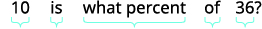</td>
</tr>
<tr valign="top">
<td data-valign="top" data-align="left">Translate to an equation.</td>
<td data-valign="top" data-align="left">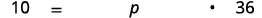</td>
</tr>
<tr valign="top">
<td data-valign="top" data-align="left">Simplify.</td>
<td data-valign="top" data-align="left"></td>
</tr>
<tr valign="top">
<td data-valign="top" data-align="left">Divide both sides by 36.</td>
<td data-valign="top" data-align="left">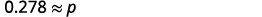</td>
</tr>
<tr valign="top">
<td data-valign="top" data-align="left">Change to percent form; round to the
nearest tenth</td>
<td data-valign="top" data-align="left">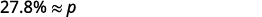</td>
</tr>
<tr valign="top">
<td data-valign="top" data-align="left">Write a complete sentence to answer
the question.</td>
<td data-valign="top" data-align="left">The new fees are approximately a <math xmlns="http://www.w3.org/1998/Math/MathML"><mrow><mn>27.8</mn><mi>%</mi></mrow></math> increase
over the old fees.</td>
</tr>
<tr valign="top">
<td colspan="2" data-valign="top" data-align="left">Remember to round the division to the nearest thousandth in order to round the percent to the nearest tenth.</td>
</tr>
</tbody></table>

Find the percent change. (Round to the nearest tenth of a percent.) In 2011, the IRS increased the deductible mileage cost to 55.5 cents from 51 cents.

<math xmlns="http://www.w3.org/1998/Math/MathML"><mrow><mn>8.8</mn><mi>%</mi></mrow></math>

Find the percent change. (Round to the nearest tenth of a percent.) In 1995, the standard bus fare in Chicago was $1.50. In 2008, the standard bus fare was 2.25.

50%

Applications of discount and mark-up are very common in retail settings.

When you buy an item on sale, the original price has been discounted by some dollar amount. The **discount rate**{: data-type="term"}, usually given as a percent, is used to determine the amount of the discount. To determine the **amount of discount**{: data-type="term"}, we multiply the discount rate by the original price.

The price a retailer pays for an item is called the **original cost**{: data-type="term"}. The retailer then adds a **mark-up**{: data-type="term"} to the original cost to get the **list price**{: data-type="term"}, the price he sells the item for. The mark-up is usually calculated as a percent of the original cost. To determine the amount of mark-up, multiply the mark-up rate by the original cost.

Discount

<math xmlns="http://www.w3.org/1998/Math/MathML"><mrow><mtable><mtr><mtd columnalign="center"><mtext>amount of discount</mtext><mo>=</mo><mtext>discount rate</mtext><mo>·</mo><mtext>original price</mtext></mtd></mtr><mtr><mtd columnalign="center"><mtext>sale price</mtext><mo>=</mo><mtext>original amount</mtext><mo>–</mo><mtext>discount price</mtext></mtd></mtr></mtable></mrow></math>

The sale price should always be less than the original price.

Mark-up

<math xmlns="http://www.w3.org/1998/Math/MathML"><mrow><mtable><mtr><mtd columnalign="center"><mtext>amount of mark-up</mtext><mo>=</mo><mtext>mark-up rate</mtext><mo>·</mo><mtext>original price</mtext></mtd></mtr><mtr><mtd columnalign="center"><mtext>list price</mtext><mo>=</mo><mtext>original cost</mtext><mo>–</mo><mtext>mark-up</mtext></mtd></mtr></mtable></mrow></math>

The list price should always be more than the original cost.

Liam’s art gallery bought a painting at an original cost of $750. Liam marked the price up 40%. Find ⓐ the amount of mark-up and ⓑ the list price of the painting.

ⓐ* * *
{: data-type="newline"}

* * *
{: data-type="newline"}

<table class="unnumbered unstyled" summary="Identify what you are asked to find, and choose a variable to represent it. What is the amount of mark-up? Let m be equal to the amount of mark up. Write a sentence that gives the information to find it. The mark-up is 40 percent of the 750 dollar original cost. Translate into an equation. The mark-up is m, is 40 percent is 0.40, of is multiplication, and the $750 original cost is 750. The equation is m is equal to 0.40 times 750. Solve the equation. The result is m is equal to 300. Write a complete sentence. The mark-up on the painting was 300 dollars." data-label=""><tbody>
<tr valign="top">
<td data-valign="top" data-align="left">Identify what you are asked to find, and
choose a variable to represent it.</td>
<td data-valign="top" data-align="left">What is the amount of mark-up?
Let <math xmlns="http://www.w3.org/1998/Math/MathML"><mrow><mi>m</mi><mo>=</mo></mrow></math> the amount of mark-up.</td>
</tr>
<tr valign="top">
<td data-valign="top" data-align="left">Write a sentence that gives the
information to find it.</td>
<td data-valign="top" data-align="left">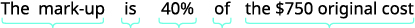</td>
</tr>
<tr valign="top">
<td data-valign="top" data-align="left">Translate into an equation.</td>
<td data-valign="top" data-align="left"></td>
</tr>
<tr valign="top">
<td data-valign="top" data-align="left">Solve the equation.</td>
<td data-valign="top" data-align="left"></td>
</tr>
<tr valign="top">
<td data-valign="top" data-align="left">Write a complete sentence.</td>
<td data-valign="top" data-align="left">The mark-up on the painting was $300.</td>
</tr>
</tbody></table>
* * *
{: data-type="newline"}

* * *
{: data-type="newline"}

 ⓑ* * *
{: data-type="newline"}

<table class="unnumbered unstyled can-break" summary="Identify what you are asked to find, and choose a variable to represent it. What is the list price? Let p be equal to the list price. Write a sentence that gives the information to find it. The list price is original cost plus the mark-up. The list price is p, is original cost is equal to 750, plus is the addition sign, the mark-up is 300. Translate into an equation. The result is p is equal to 750 plus 300. Solve the equation. The result is p is equal to 1050. Check. Is this list price more than the original cost? Is 1050 dollars more than 750 dollars? Yes. Write a complete sentence. The list price of the painting was 1050 dollars." data-label=""><tbody>
<tr valign="top">
<td data-valign="top" data-align="left">Identify what you are asked to find, and
choose a variable to represent it.</td>
<td data-valign="top" data-align="left">What is the list price?
Let <math xmlns="http://www.w3.org/1998/Math/MathML"><mrow><mi>p</mi><mo>=</mo></mrow></math> the list price.</td>
</tr>
<tr valign="top">
<td data-valign="top" data-align="left">Write a sentence that gives the
information to find it.</td>
<td data-valign="top" data-align="left">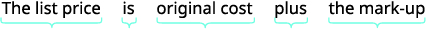</td>
</tr>
<tr valign="top">
<td data-valign="top" data-align="left">Translate into an equation.</td>
<td data-valign="top" data-align="left"></td>
</tr>
<tr valign="top">
<td data-valign="top" data-align="left">Solve the equation.</td>
<td data-valign="top" data-align="left"></td>
</tr>
<tr valign="top">
<td data-valign="top" data-align="left">Check.</td>
<td data-valign="top" data-align="left">Is the list price more than the original cost?
Is $1,050 more than $750? Yes.</td>
</tr>
<tr valign="top">
<td data-valign="top" data-align="left">Write a complete sentence.</td>
<td data-valign="top" data-align="left">The list price of the painting was $1,050.</td>
</tr>
</tbody></table>

Find ⓐ the amount of mark-up and ⓑ the list price: Jim’s music store bought a guitar at original cost $1,200. Jim marked the price up 50%.

ⓐ $600 ⓑ $1,800

Find ⓐ the amount of mark-up and ⓑ the list price: The Auto Resale Store bought Pablo’s Toyota for $8,500. They marked the price up 35%.

ⓐ $2,975 ⓑ $11,475

### Solve Simple Interest Applications

Interest is a part of our daily lives. From the interest earned on our savings to the interest we pay on a car loan or credit card debt, we all have some experience with interest in our lives.

The amount of money you initially deposit into a bank is called the **principal**{: data-type="term"}, *P*, and the bank pays you **interest**{: data-type="term"}, *I.* When you take out a loan, you pay interest on the amount you borrow, also called the principal.

In either case, the interest is computed as a certain percent of the principal, called the **rate of interest**{: data-type="term"}, *r*. The rate of interest is usually expressed as a percent per year, and is calculated by using the decimal equivalent of the percent. The variable *t*, (for time) represents the number of years the money is saved or borrowed.

Interest is calculated as simple interest or compound interest. Here we will use simple interest.

Simple Interest

If an amount of money, *P*, called the principal, is invested or borrowed for a period of *t* years at an annual interest rate *r*, the amount of interest, *I*, earned or paid is

<math xmlns="http://www.w3.org/1998/Math/MathML"><mrow><mtable><mtr><mtd /><mtd /><mtd /><mtd /><mtd /><mtd /><mtd /><mtd /><mtd /><mtd /><mtd columnalign="right"><mi>I</mi></mtd><mtd columnalign="left"><mo>=</mo></mtd><mtd columnalign="left"><mtext>interest</mtext></mtd></mtr><mtr><mtd columnalign="left"><mi>I</mi><mo>=</mo><mi>P</mi><mi>r</mi><mi>t</mi></mtd><mtd /><mtd /><mtd /><mtd /><mtd columnalign="left"><mtext>where</mtext></mtd><mtd /><mtd /><mtd /><mtd /><mtd columnalign="right"><mi>P</mi></mtd><mtd columnalign="left"><mo>=</mo></mtd><mtd columnalign="left"><mtext>principal</mtext></mtd></mtr><mtr><mtd /><mtd /><mtd /><mtd /><mtd /><mtd /><mtd /><mtd /><mtd /><mtd /><mtd columnalign="right"><mi>r</mi></mtd><mtd columnalign="left"><mo>=</mo></mtd><mtd columnalign="left"><mtext>rate</mtext></mtd></mtr><mtr><mtd /><mtd /><mtd /><mtd /><mtd /><mtd /><mtd /><mtd /><mtd /><mtd /><mtd columnalign="right"><mi>t</mi></mtd><mtd columnalign="left"><mo>=</mo></mtd><mtd columnalign="left"><mtext>time</mtext></mtd></mtr></mtable></mrow></math>

Interest earned or paid according to this formula is called **simple interest**{: data-type="term"}.

The formula we use to calculate interest is <math xmlns="http://www.w3.org/1998/Math/MathML"><mrow><mi>I</mi><mo>=</mo><mi>P</mi><mi>r</mi><mi>t</mi><mo>.</mo></mrow></math>

 To use the formula we substitute in the values for variables that are given, and then solve for the unknown variable. It may be helpful to organize the information in a chart.

Areli invested a principal of $950 in her bank account that earned simple interest at an interest rate of 3%. How much interest did she earn in five years?

<math xmlns="http://www.w3.org/1998/Math/MathML"><mtable><mtr><mtd columnalign="right"><mi>I</mi></mtd><mtd columnalign="left"><mo>=</mo></mtd><mtd columnalign="left"><mo>?</mo></mtd></mtr><mtr><mtd columnalign="right"><mi>P</mi></mtd><mtd columnalign="left"><mo>=</mo></mtd><mtd columnalign="left"><mtext>$</mtext><mn>950</mn></mtd></mtr><mtr><mtd columnalign="right"><mi>r</mi></mtd><mtd columnalign="left"><mo>=</mo></mtd><mtd columnalign="left"><mn>3</mn><mi>%</mi></mtd></mtr><mtr><mtd columnalign="right"><mi>t</mi></mtd><mtd columnalign="left"><mo>=</mo></mtd><mtd columnalign="left"><mn>5</mn><mspace width="0.2em" /><mtext>years</mtext></mtd></mtr></mtable></math>

<math xmlns="http://www.w3.org/1998/Math/MathML"><mtable><mtr><mtd columnalign="left"><mtext>Identify what you are asked to find, and choose a</mtext></mtd><mtd /><mtd /><mtd columnalign="left"><mspace width="2em" /><mtext>What is the simple interest?</mtext></mtd></mtr><mtr><mtd columnalign="left"><mtext>variable to represent it.</mtext></mtd><mtd /><mtd /><mtd columnalign="left"><mspace width="2em" /><mtext>Let</mtext><mspace width="0.2em" /><mi>I</mi><mo>=</mo><mtext>interest.</mtext></mtd></mtr><mtr><mtd columnalign="left"><mtext>Write the formula.</mtext></mtd><mtd /><mtd /><mtd columnalign="left"><mspace width="3.5em" /><mrow><mi>I</mi><mo>=</mo><mi>P</mi><mi>r</mi><mi>t</mi></mrow></mtd></mtr><mtr><mtd columnalign="left"><mtext>Substitute in the given information.</mtext></mtd><mtd /><mtd /><mtd columnalign="left"><mspace width="3.5em" /><mrow><mi>I</mi><mo>=</mo><mo stretchy="false">(</mo><mn>950</mn><mo stretchy="false">)</mo><mo stretchy="false">(</mo><mn>0.03</mn><mo stretchy="false">)</mo><mo stretchy="false">(</mo><mn>5</mn><mo stretchy="false">)</mo></mrow></mtd></mtr><mtr><mtd columnalign="left"><mtext>Simplify.</mtext></mtd><mtd /><mtd /><mtd columnalign="left"><mrow><mspace width="3.5em" /><mi>I</mi><mo>=</mo><mn>142.5</mn></mrow></mtd></mtr><mtr><mtd columnalign="left"><mtext>Check.</mtext></mtd><mtd /><mtd /><mtd /></mtr><mtr><mtd columnalign="left"><mtext>Is $142.50 a reasonable amount of interest on $950?</mtext></mtd><mtd /><mtd /><mtd /></mtr><mtr><mtd columnalign="left"><mtext>Yes.</mtext></mtd><mtd /></mtr><mtr><mtd columnalign="left"><mtext>Write a complete sentence.</mtext></mtd><mtd /><mtd /><mtd columnalign="left"><mspace width="2em" /><mtext>The interest is $142.50.</mtext></mtd></mtr></mtable></math>

Nathaly deposited $12,500 in her bank account where it will earn 4% simple interest. How much interest will Nathaly earn in five years?

He will earn $2,500.

Susana invested a principal of $36,000 in her bank account that earned simple interest at an interest rate of <math xmlns="http://www.w3.org/1998/Math/MathML"><mrow><mn>6.5</mn><mi>%</mi><mo>.</mo></mrow></math>

 How much interest did she earn in three years?

She earned $7,020.

There may be times when we know the amount of interest earned on a given principal over a certain length of time, but we do not know the rate.

Hang borrowed $7,500 from her parents to pay her tuition. In five years, she paid them $1,500 interest in addition to the $7,500 she borrowed. What was the rate of simple interest?

<math xmlns="http://www.w3.org/1998/Math/MathML"><mtable><mtr><mtd columnalign="right"><mi>I</mi></mtd><mtd columnalign="left"><mo>=</mo></mtd><mtd columnalign="left"><mtext>$</mtext><mn>1500</mn></mtd></mtr><mtr><mtd columnalign="right"><mi>P</mi></mtd><mtd columnalign="left"><mo>=</mo></mtd><mtd columnalign="left"><mtext>$</mtext><mn>7500</mn></mtd></mtr><mtr><mtd columnalign="right"><mi>r</mi></mtd><mtd columnalign="left"><mo>=</mo></mtd><mtd columnalign="left"><mo>?</mo></mtd></mtr><mtr><mtd columnalign="right"><mi>t</mi></mtd><mtd columnalign="left"><mo>=</mo></mtd><mtd columnalign="left"><mn>5</mn><mspace width="0.2em" /><mtext>years</mtext></mtd></mtr></mtable></math>

<math xmlns="http://www.w3.org/1998/Math/MathML"><mtable><mtr><mtd columnalign="left"><mtext>Identify what you are asked to find, and choose</mtext><mspace width="2em" /></mtd><mtd /><mtd /><mtd columnalign="left"><mtext>What is the rate of simple interest?</mtext></mtd></mtr><mtr><mtd columnalign="left"><mtable><mtr><mtd columnalign="left"><mtext>a variable to represent it.</mtext></mtd></mtr><mtr><mtd columnalign="left"><mtext>Write the formula.</mtext></mtd></mtr><mtr><mtd columnalign="left"><mtext>Substitute in the given information.</mtext></mtd></mtr><mtr><mtd columnalign="left"><mtext>Multiply.</mtext></mtd></mtr><mtr><mtd columnalign="left"><mtext>Divide.</mtext></mtd></mtr><mtr><mtd columnalign="left"><mtext>Change to percent form.</mtext></mtd></mtr></mtable></mtd><mtd /><mtd /><mtd columnalign="left"><mtable><mtr><mtd columnalign="right"><mtext>Let</mtext><mspace width="0.2em" /><mi>r</mi></mtd><mtd columnalign="left"><mo>=</mo></mtd><mtd columnalign="left"><mtext>rate of interest.</mtext></mtd></mtr><mtr><mtd columnalign="right"><mi>I</mi></mtd><mtd columnalign="left"><mo>=</mo></mtd><mtd columnalign="left"><mi>P</mi><mi>r</mi><mi>t</mi></mtd></mtr><mtr><mtd columnalign="right"><mn>1,500</mn></mtd><mtd columnalign="left"><mo>=</mo></mtd><mtd columnalign="left"><mo stretchy="false">(</mo><mn>7,500</mn><mo stretchy="false">)</mo><mi>r</mi><mo stretchy="false">(</mo><mn>5</mn><mo stretchy="false">)</mo></mtd></mtr><mtr><mtd columnalign="right"><mn>1,500</mn></mtd><mtd columnalign="left"><mo>=</mo></mtd><mtd columnalign="left"><mn>37,500</mn><mi>r</mi></mtd></mtr><mtr><mtd columnalign="right"><mn>0.04</mn></mtd><mtd columnalign="left"><mo>=</mo></mtd><mtd columnalign="left"><mi>r</mi></mtd></mtr><mtr><mtd columnalign="right"><mn>4</mn><mi>%</mi></mtd><mtd columnalign="left"><mo>=</mo></mtd><mtd columnalign="left"><mi>r</mi></mtd></mtr></mtable></mtd></mtr><mtr><mtd columnalign="left"><mtext>Check.</mtext></mtd><mtd /><mtd /><mtd /></mtr><mtr><mtd columnalign="left"><mtable><mtr><mtd columnalign="right"><mi>I</mi></mtd><mtd columnalign="left"><mo>=</mo></mtd><mtd columnalign="left"><mi>P</mi><mi>r</mi><mi>t</mi></mtd></mtr><mtr><mtd columnalign="right"><mn>1,500</mn></mtd><mtd columnalign="left"><mover><mo>=</mo><mo>?</mo></mover></mtd><mtd columnalign="left"><mo stretchy="false">(</mo><mn>7,500</mn><mo stretchy="false">)</mo><mo stretchy="false">(</mo><mn>0.04</mn><mo stretchy="false">)</mo><mo stretchy="false">(</mo><mn>5</mn><mo stretchy="false">)</mo></mtd></mtr><mtr><mtd columnalign="right"><mn>1,500</mn></mtd><mtd columnalign="left"><mo>=</mo></mtd><mtd columnalign="left"><mn>1,500</mn><mo>✓</mo></mtd></mtr></mtable></mtd><mtd /><mtd /><mtd /></mtr><mtr><mtd columnalign="left"><mtext>Write a complete sentence.</mtext></mtd><mtd /><mtd /><mtd columnalign="left"><mtext>The rate of interest was 4%.</mtext></mtd><mtd /><mtd /><mtd /></mtr></mtable></math>

Jim lent his sister $5,000 to help her buy a house. In three years, she paid him the $5,000, plus $900 interest. What was the rate of simple interest?

The rate of simple interest was 6%.

Loren lent his brother $3,000 to help him buy a car. In four years, his brother paid him back the $3,000 plus $660 in interest. What was the rate of simple interest?

The rate of simple interest was 5.5%.

In the next example, we are asked to find the principal—the amount borrowed.

Sean’s new car loan statement said he would pay $4,866,25 in interest from a simple interest rate of 8.5% over five years. How much did he borrow to buy his new car?

<math xmlns="http://www.w3.org/1998/Math/MathML"><mtable><mtr><mtd columnalign="right"><mi>I</mi></mtd><mtd columnalign="left"><mo>=</mo></mtd><mtd columnalign="left"><mn>4,866.25</mn></mtd></mtr><mtr><mtd columnalign="right"><mi>P</mi></mtd><mtd columnalign="left"><mo>=</mo></mtd><mtd columnalign="left"><mo>?</mo></mtd></mtr><mtr><mtd columnalign="right"><mi>r</mi></mtd><mtd columnalign="left"><mo>=</mo></mtd><mtd columnalign="left"><mn>8.5</mn><mi>%</mi></mtd></mtr><mtr><mtd columnalign="right"><mi>t</mi></mtd><mtd columnalign="left"><mo>=</mo></mtd><mtd columnalign="left"><mn>5</mn><mspace width="0.2em" /><mtext>years</mtext></mtd></mtr></mtable></math>

<math xmlns="http://www.w3.org/1998/Math/MathML"><mtable><mtr><mtd columnalign="left"><mtext>Identify what you are asked to find,</mtext><mspace width="2em" /></mtd><mtd /><mtd /><mtd columnalign="left"><mtext>What is the amount borrowed (the principal)?</mtext></mtd></mtr><mtr><mtd columnalign="left"><mtable><mtr><mtd columnalign="left"><mtext>and choose a variable to represent it.</mtext></mtd></mtr><mtr><mtd columnalign="left"><mtext>Write the formula.</mtext></mtd></mtr><mtr><mtd columnalign="left"><mtext>Substitute in the given information.</mtext></mtd></mtr><mtr><mtd columnalign="left"><mtext>Multiply.</mtext></mtd></mtr><mtr><mtd columnalign="left"><mtext>Divide.</mtext></mtd></mtr></mtable></mtd><mtd /><mtd /><mtd columnalign="left"><mtable><mtr><mtd columnalign="right"><mtext>Let</mtext><mspace width="0.2em" /><mi>P</mi></mtd><mtd columnalign="left"><mo>=</mo></mtd><mtd columnalign="left"><mtext>principal borrowed.</mtext></mtd></mtr><mtr><mtd columnalign="right"><mi>I</mi></mtd><mtd columnalign="left"><mo>=</mo></mtd><mtd columnalign="left"><mi>P</mi><mi>r</mi><mi>t</mi></mtd></mtr><mtr><mtd columnalign="right"><mn>4,866.25</mn></mtd><mtd columnalign="left"><mo>=</mo></mtd><mtd columnalign="left"><mi>P</mi><mo stretchy="false">(</mo><mn>0.085</mn><mo stretchy="false">)</mo><mo stretchy="false">(</mo><mn>5</mn><mo stretchy="false">)</mo></mtd></mtr><mtr><mtd columnalign="right"><mn>4,866.25</mn></mtd><mtd columnalign="left"><mo>=</mo></mtd><mtd columnalign="left"><mn>0.425</mn><mi>P</mi></mtd></mtr><mtr><mtd columnalign="right"><mn>11,450</mn></mtd><mtd columnalign="left"><mo>=</mo></mtd><mtd columnalign="left"><mi>P</mi></mtd></mtr></mtable></mtd></mtr><mtr><mtd columnalign="left"><mtext>Check.</mtext></mtd><mtd /><mtd /><mtd /></mtr><mtr><mtd columnalign="left"><mtable><mtr><mtd columnalign="right"><mi>I</mi></mtd><mtd columnalign="left"><mo>=</mo></mtd><mtd columnalign="left"><mi>P</mi><mi>r</mi><mi>t</mi></mtd></mtr><mtr><mtd columnalign="right"><mn>4,866.25</mn></mtd><mtd columnalign="left"><mover><mo>=</mo><mo>?</mo></mover></mtd><mtd columnalign="left"><mo stretchy="false">(</mo><mn>11,450</mn><mo stretchy="false">)</mo><mo stretchy="false">(</mo><mn>0.085</mn><mo stretchy="false">)</mo><mo stretchy="false">(</mo><mn>5</mn><mo stretchy="false">)</mo></mtd></mtr><mtr><mtd columnalign="right"><mn>4,866.25</mn></mtd><mtd columnalign="left"><mo>=</mo></mtd><mtd columnalign="left"><mn>4,866.25</mn><mo>✓</mo></mtd></mtr></mtable></mtd><mtd /><mtd /><mtd /></mtr><mtr /><mtr /><mtr><mtd columnalign="left"><mtext>Write a complete sentence.</mtext></mtd><mtd /><mtd /><mtd columnalign="left"><mtext>The principal was $11,450.</mtext></mtd></mtr></mtable></math>

Eduardo noticed that his new car loan papers stated that with a 7.5% simple interest rate, he would pay $6,596.25 in interest over five years. How much did he borrow to pay for his car?

He paid $17,590.

In five years, Gloria’s bank account earned $2,400 interest at 5% simple interest. How much had she deposited in the account?

She deposited $9,600.

Access this online resource for additional instruction and practice with using a problem solving strategy.

* [Begining Arithmetic Problems][1]

### Key Concepts

* **How To Use a Problem Solving Strategy for Word Problems**
  1.  **Read** the problem. Make sure all the words and ideas are understood.
  2.  **Identify** what you are looking for.
  3.  **Name** what you are looking for. Choose a variable to represent that quantity.
  4.  **Translate** into an equation. It may be helpful to restate the problem in one sentence with all the important information. Then, translate the English sentence into an algebra equation.
  5.  **Solve** the equation using proper algebra techniques.
      * * *
      {: data-type="newline"}
      
      * * *
      {: data-type="newline"}
      
      * * *
      {: data-type="newline"}
  
  6.  **Check** the answer in the problem to make sure it makes sense.
  7.  **Answer** the question with a complete sentence.
  {: data-number-style="arabic" .stepwise}

* **How To Find Percent Change**
  1.  Find the amount of change
      * * *
      {: data-type="newline"}
      
      <math xmlns="http://www.w3.org/1998/Math/MathML"><mrow><mtext>change</mtext><mo>=</mo><mtext>new amount</mtext><mo>−</mo><mtext>original amount</mtext></mrow></math>
  
  2.  Find what percent the amount of change is of the original amount.
      * * *
      {: data-type="newline"}
      
      <math xmlns="http://www.w3.org/1998/Math/MathML"><mrow><mtext>change is what percent of the original amount?</mtext></mrow></math>
  {: data-number-style="arabic" .stepwise}

* **Discount**
  * * *
  {: data-type="newline"}
  
  <math xmlns="http://www.w3.org/1998/Math/MathML"><mtable><mtr><mtd columnalign="right"><mtext>amount of discount</mtext></mtd><mtd columnalign="left"><mo>=</mo></mtd><mtd columnalign="left"><mtext>discount rate</mtext><mo>·</mo><mtext>original price</mtext></mtd></mtr><mtr /><mtr><mtd columnalign="right"><mtext>sale price</mtext></mtd><mtd columnalign="left"><mo>=</mo></mtd><mtd columnalign="left"><mtext>original amount</mtext><mo>−</mo><mtext>discount</mtext></mtd></mtr></mtable></math>

* **Mark-up**
  * * *
  {: data-type="newline"}
  
  <math xmlns="http://www.w3.org/1998/Math/MathML"><mtable><mtr><mtd columnalign="right"><mtext>amount of mark-up</mtext></mtd><mtd columnalign="left"><mo>=</mo></mtd><mtd columnalign="left"><mtext>mark-up rate</mtext><mo>·</mo><mtext>original cost</mtext></mtd></mtr><mtr /><mtr><mtd columnalign="right"><mtext>list price</mtext></mtd><mtd columnalign="left"><mo>=</mo></mtd><mtd columnalign="left"><mtext>original cost</mtext><mspace width="0.2em" /><mo>+</mo><mspace width="0.2em" /><mtext>mark up</mtext></mtd></mtr></mtable></math>

* **Simple Interest**
  * * *
  {: data-type="newline"}
  
  If an amount of money, *P*, called the principal, is invested or borrowed for a period of *t* years at an annual interest rate *r*, the amount of interest, *I*, earned or paid is:
  * * *
  {: data-type="newline"}
  
  

  <math xmlns="http://www.w3.org/1998/Math/MathML"><mtable><mtr><mtd /><mtd /><mtd columnalign="left"><mrow><mi>I</mi></mrow></mtd><mtd columnalign="left"><mo>=</mo></mtd><mtd columnalign="left"><mtext>interest</mtext></mtd></mtr><mtr><mtd columnalign="left"><mrow><mi>I</mi><mo>=</mo><mi>P</mi><mi>r</mi><mi>t</mi></mrow></mtd><mtd columnalign="left"><mspace width="1em" /><mtext>where</mtext><mspace width="1em" /></mtd><mtd columnalign="left"><mrow><mi>P</mi></mrow></mtd><mtd columnalign="left"><mo>=</mo></mtd><mtd columnalign="left"><mtext>principal</mtext></mtd></mtr><mtr><mtd /><mtd /><mtd columnalign="left"><mrow><mi>r</mi></mrow></mtd><mtd columnalign="left"><mo>=</mo></mtd><mtd columnalign="left"><mtext>rate</mtext></mtd></mtr><mtr><mtd /><mtd /><mtd columnalign="left"><mrow><mi>t</mi></mrow></mtd><mtd columnalign="left"><mo>=</mo></mtd><mtd columnalign="left"><mtext>time</mtext></mtd></mtr></mtable></math>
  

{: data-bullet-style="bullet"}

<section data-depth="1" class="section-exercises" markdown="1">
#### Practice Makes Perfect

**Use a Problem Solving Strategy for Word Problems**

List five positive thoughts you can say to yourself that will help you approach word problems with a positive attitude. You may want to copy them on a sheet of paper and put it in the front of your notebook, where you can read them often.

Answers will vary.

List five negative thoughts that you have said to yourself in the past that will hinder your progress on word problems. You may want to write each one on a small piece of paper and rip it up to symbolically destroy the negative thoughts.

In the following exercises, solve using the problem solving strategy for word problems. Remember to write a complete sentence to answer each question.

There are 16 girls in a school club. The number of girls is four more than twice the number of boys. Find the number of boys.

six boys

There are 18 Cub Scouts in Troop 645. The number of scouts is three more than five times the number of adult leaders. Find the number of adult leaders.

Huong is organizing paperback and hardback books for her club’s used book sale. The number of paperbacks is 12 less than three times the number of hardbacks. Huong had 162 paperbacks. How many hardback books were there?

58 hardback books

Jeff is lining up children’s and adult bicycles at the bike shop where he works. The number of children’s bicycles is nine less than three times the number of adult bicycles. There are 42 adult bicycles. How many children’s bicycles are there?

**Solve Number Word Problems**

In the following exercises, solve each number word problem.

The difference of a number and 12 is three. Find the number.

15

The difference of a number and eight is four. Find the number.

The sum of three times a number and eight is 23. Find the number.

5

The sum of twice a number and six is 14. Find the number.

The difference of twice a number and seven is 17. Find the number.

12

The difference of four times a number and seven is 21. Find the number.

Three times the sum of a number and nine is 12. Find the number.

<math xmlns="http://www.w3.org/1998/Math/MathML"><mrow><mn>−5</mn></mrow></math>

Six times the sum of a number and eight is 30. Find the number.

One number is six more than the other. Their sum is 42. Find the numbers.

18, 24

One number is five more than the other. Their sum is 33. Find the numbers.

The sum of two numbers is 20. One number is four less than the other. Find the numbers.

8, 12

The sum of two numbers is 27. One number is seven less than the other. Find the numbers.

One number is 14 less than another. If their sum is increased by seven, the result is 85. Find the numbers.

32, 46

One number is 11 less than another. If their sum is increased by eight, the result is 71. Find the numbers.

The sum of two numbers is 14. One number is two less than three times the other. Find the numbers.

4, 10

The sum of two numbers is zero. One number is nine less than twice the other. Find the numbers.

The sum of two consecutive integers is 77. Find the integers.

38, 39

The sum of two consecutive integers is 89. Find the integers.

The sum of three consecutive integers is 78. Find the integers.

25, 26, 27

The sum of three consecutive integers is 60. Find the integers.

Find three consecutive integers whose sum is <math xmlns="http://www.w3.org/1998/Math/MathML"><mrow><mn>−36</mn><mo>.</mo></mrow></math>

<math xmlns="http://www.w3.org/1998/Math/MathML"><mrow><mn>−11</mn><mo>,</mo><mn>−12</mn><mo>,</mo><mn>−13</mn></mrow></math>

Find three consecutive integers whose sum is <math xmlns="http://www.w3.org/1998/Math/MathML"><mrow><mn>−3</mn><mo>.</mo></mrow></math>

Find three consecutive even integers whose sum is 258.

84, 86, 88

Find three consecutive even integers whose sum is 222.

Find three consecutive odd integers whose sum is <math xmlns="http://www.w3.org/1998/Math/MathML"><mrow><mn>−213</mn><mo>.</mo></mrow></math>

<math xmlns="http://www.w3.org/1998/Math/MathML"><mrow><mn>−69</mn><mo>,</mo><mn>−71</mn><mo>,</mo><mn>−73</mn></mrow></math>

Find three consecutive odd integers whose sum is <math xmlns="http://www.w3.org/1998/Math/MathML"><mrow><mn>−267</mn><mo>.</mo></mrow></math>

Philip pays $1,620 in rent every month. This amount is $120 more than twice what his brother Paul pays for rent. How much does Paul pay for rent?

$750

Marc just bought an SUV for $54,000. This is $7,400 less than twice what his wife paid for her car last year. How much did his wife pay for her car?

Laurie has $46,000 invested in stocks and bonds. The amount invested in stocks is $8,000 less than three times the amount invested in bonds. How much does Laurie have invested in bonds?

$13,500

Erica earned a total of $50,450 last year from her two jobs. The amount she earned from her job at the store was $1,250 more than three times the amount she earned from her job at the college. How much did she earn from her job at the college?

**Solve Percent Applications**

In the following exercises, translate and solve.**

ⓐ What number is 45% of 120? ⓑ 81 is 75% of what number? ⓐ What percent of 260 is 78?

ⓐ 54 ⓑ 108 ⓐ 30%

ⓐ What number is 65% of 100? ⓑ 93 is 75% of what number? ⓐ What percent of 215 is 86?

ⓐ 250% of 65 is what number? ⓑ 8.2% of what amount is $2.87? ⓐ 30 is what percent of 20?

ⓐ <math xmlns="http://www.w3.org/1998/Math/MathML"><mrow><mn>162.5</mn></mrow></math>

 ⓑ $35 ⓐ 150%

ⓐ 150% of 90 is what number? ⓑ 6.4% of what amount is $2.88? ⓐ 50 is what percent of 40?

In the following exercises, solve.

Geneva treated her parents to dinner at their favorite restaurant. The bill was $74.25. Geneva wants to leave 16% of the total bill as a tip. How much should the tip be?

<math xmlns="http://www.w3.org/1998/Math/MathML"><mrow><mtext>$</mtext><mn>11.88</mn></mrow></math>

When Hiro and his co-workers had lunch at a restaurant near their work, the bill was $90.50. They want to leave 18% of the total bill as a tip. How much should the tip be?

One serving of oatmeal has 8 grams of fiber, which is 33% of the recommended daily amount. What is the total recommended daily amount of fiber?

24\.2 g

One serving of trail mix has 67 grams of carbohydrates, which is 22% of the recommended daily amount. What is the total recommended daily amount of carbohydrates?

A bacon cheeseburger at a popular fast food restaurant contains 2070 milligrams (mg) of sodium, which is 86% of the recommended daily amount. What is the total recommended daily amount of sodium?

2407 mg

A grilled chicken salad at a popular fast food restaurant contains 650 milligrams (mg) of sodium, which is 27% of the recommended daily amount. What is the total recommended daily amount of sodium?

The nutrition fact sheet at a fast food restaurant says the fish sandwich has 380 calories, and 171 calories are from fat. What percent of the total calories is from fat?

45%

The nutrition fact sheet at a fast food restaurant says a small portion of chicken nuggets has 190 calories, and 114 calories are from fat. What percent of the total calories is from fat?

Emma gets paid $3,000 per month. She pays $750 a month for rent. What percent of her monthly pay goes to rent?

25%

Dimple gets paid $3,200 per month. She pays $960 a month for rent. What percent of her monthly pay goes to rent?

In the following exercises, solve.

Tamanika received a raise in her hourly pay, from $15.50 to $17.36. Find the percent change.

12%

Ayodele received a raise in her hourly pay, from $24.50 to $25.48. Find the percent change.

Annual student fees at the University of California rose from about $4,000 in 2000 to about $12,000 in 2010. Find the percent change.

200%

The price of a share of one stock rose from $12.50 to $50. Find the percent change.

A grocery store reduced the price of a loaf of bread from $2.80 to $2.73. Find the percent change.

<math xmlns="http://www.w3.org/1998/Math/MathML"><mrow><mn>−2.5</mn><mi>%</mi></mrow></math>

The price of a share of one stock fell from $8.75 to $8.54. Find the percent change.

Hernando’s salary was $49,500 last year. This year his salary was cut to $44,055. Find the percent change.

<math xmlns="http://www.w3.org/1998/Math/MathML"><mrow><mn>−11</mn><mi>%</mi></mrow></math>

In ten years, the population of Detroit fell from 950,000 to about 712,500. Find the percent change.

In the following exercises, find ⓐ the amount of discount and ⓑ the sale price.

Janelle bought a beach chair on sale at 60% off. The original price was $44.95.

ⓐ <math xmlns="http://www.w3.org/1998/Math/MathML"><mrow><mtext>$</mtext><mn>26.97</mn></mrow></math>

 ⓑ <math xmlns="http://www.w3.org/1998/Math/MathML"><mrow><mtext>$</mtext><mn>17.98</mn></mrow></math>

Errol bought a skateboard helmet on sale at 40% off. The original price was $49.95.

In the following exercises, find ⓐ the amount of discount and ⓑ the discount rate (Round to the nearest tenth of a percent if needed.)

Larry and Donna bought a sofa at the sale price of $1,344. The original price of the sofa was $1,920.

ⓐ $576 ⓑ 30%

Hiroshi bought a lawnmower at the sale price of $240. The original price of the lawnmower is $300.

In the following exercises, find ⓐ the amount of the mark-up and ⓑ the list price.

Daria bought a bracelet at original cost $16 to sell in her handicraft store. She marked the price up 45%. What was the list price of the bracelet?

ⓐ <math xmlns="http://www.w3.org/1998/Math/MathML"><mrow><mtext>$</mtext><mn>7.20</mn></mrow></math>

 ⓑ <math xmlns="http://www.w3.org/1998/Math/MathML"><mrow><mtext>$</mtext><mn>23.20</mn></mrow></math>

Regina bought a handmade quilt at original cost $120 to sell in her quilt store. She marked the price up 55%. What was the list price of the quilt?

Tom paid $0.60 a pound for tomatoes to sell at his produce store. He added a 33% mark-up. What price did he charge his customers for the tomatoes?

ⓐ <math xmlns="http://www.w3.org/1998/Math/MathML"><mrow><mtext>$</mtext><mn>0.20</mn></mrow></math>

 ⓑ <math xmlns="http://www.w3.org/1998/Math/MathML"><mrow><mtext>$</mtext><mn>0.80</mn></mrow></math>

Flora paid her supplier $0.74 a stem for roses to sell at her flower shop. She added an 85% mark-up. What price did she charge her customers for the roses?

**Solve Simple Interest Applications**{::}**

In the following exercises, solve.

Casey deposited $1,450 in a bank account that earned simple interest at an interest rate of 4%. How much interest was earned in two years?

$116

Terrence deposited $5,720 in a bank account that earned simple interest at an interest rate of 6%. How much interest was earned in four years?

Robin deposited $31,000 in a bank account that earned simple interest at an interest rate of 5.2%. How much interest was earned in three years?

$4836

Carleen deposited $16,400 in a bank account that earned simple interest at an interest rate of 3.9% How much interest was earned in eight years?

Hilaria borrowed $8,000 from her grandfather to pay for college. Five years later, she paid him back the $8,000, plus $1,200 interest. What was the rate of simple interest?

3%

Kenneth lent his niece $1,200 to buy a computer. Two years later, she paid him back the $1,200, plus $96 interest. What was the rate of simple interest?

Lebron lent his daughter $20,000 to help her buy a condominium. When she sold the condominium four years later, she paid him the $20,000, plus $3,000 interest. What was the rate of simple interest?

<math xmlns="http://www.w3.org/1998/Math/MathML"><mrow><mn>3.75</mn><mi>%</mi></mrow></math>

Pablo borrowed $50,000 to start a business. Three years later, he repaid the $50,000, plus $9,375 interest. What was the rate of simple interest?

In 10 years, a bank account that paid 5.25% simple interest earned $18,375 interest. What was the principal of the account?

$35,000

In 25 years, a bond that paid 4.75% simple interest earned $2,375 interest. What was the principal of the bond?

Joshua’s computer loan statement said he would pay $1,244.34 in simple interest for a three-year loan at 12.4%. How much did Joshua borrow to buy the computer?

$3345

Margaret’s car loan statement said she would pay $7,683.20 in simple interest for a five-year loan at 9.8%. How much did Margaret borrow to buy the car?

#### Everyday Math

**Tipping** At the campus coffee cart, a medium coffee costs $1.65. MaryAnne brings $2.00 with her when she buys a cup of coffee and leaves the change as a tip. What percent tip does she leave?

<math xmlns="http://www.w3.org/1998/Math/MathML"><mrow><mn>17.5</mn><mi>%</mi></mrow></math>

**Tipping** Four friends went out to lunch and the bill came to $53.75 They decided to add enough tip to make a total of $64, so that they could easily split the bill evenly among themselves. What percent tip did they leave?

#### Writing Exercises

What has been your past experience solving word problems? Where do you see yourself moving forward?

Answers will vary.

Without solving the problem “44 is 80% of what number” think about what the solution might be. Should it be a number that is greater than 44 or less than 44? Explain your reasoning.

After returning from vacation, Alex said he should have packed 50% fewer shorts and 200% more shirts. Explain what Alex meant.

Answers will vary.

Because of road construction in one city, commuters were advised to plan that their Monday morning commute would take 150% of their usual commuting time. Explain what this means.

#### Self Check

ⓐ After completing the exercises, use this checklist to evaluate your mastery of the objective of this section.

ⓑ After reviewing this checklist, what will you do to become confident for all objectives?

</section>

[1]: https://openstax.org/l/37begalgwordpro
