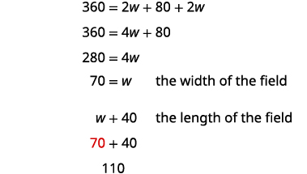

By the end of this section, you will be able to:
* Solve a formula for a specific variable
* Use formulas to solve geometry applications

Before you get started, take this readiness quiz.

1.  Evaluate
    <math xmlns="http://www.w3.org/1998/Math/MathML"><mrow><mn>2</mn><mo stretchy="false">(</mo><mi>x</mi><mo>+</mo><mn>3</mn><mo stretchy="false">)</mo></mrow></math>
    
    when
    <math xmlns="http://www.w3.org/1998/Math/MathML"><mrow><mi>x</mi><mo>=</mo><mn>5</mn><mo>.</mo></mrow></math>
    
    * * *
    {: data-type="newline"}
    
    If you missed this problem, review [\[link\]](/m63302#fs-id1167836530265).
2.  The length of a rectangle is three less than the width. Let *w* represent the width. Write an expression for the length of the rectangle.
    * * *
    {: data-type="newline"}
    
    If you missed this problem, review [\[link\]](/m63302#fs-id1167836606933).
3.  Evaluate
    <math xmlns="http://www.w3.org/1998/Math/MathML"><mrow><mfrac><mn>1</mn><mn>2</mn></mfrac><mi>b</mi><mi>h</mi></mrow></math>
    
    when
    <math xmlns="http://www.w3.org/1998/Math/MathML"><mrow><mi>b</mi><mo>=</mo><mn>14</mn></mrow></math>
    
    and
    <math xmlns="http://www.w3.org/1998/Math/MathML"><mrow><mi>h</mi><mo>=</mo><mn>9</mn><mo>.</mo></mrow></math>
    
    * * *
    {: data-type="newline"}
    
    If you missed this problem, review [\[link\]](/m63304#fs-id1167829754333).
{: type="1"}

### Solve a Formula for a Specific Variable

We have all probably worked with some geometric formulas in our study of mathematics. Formulas are used in so many fields, it is important to recognize formulas and be able to manipulate them easily.

It is often helpful to solve a formula for a specific variable. If you need to put a formula in a spreadsheet, it is not unusual to have to solve it for a specific variable first. We isolate that variable on one side of the equals sign with a coefficient of one and all other variables and constants are on the other side of the equal sign.

Geometric formulas often need to be solved for another variable, too. The formula <math xmlns="http://www.w3.org/1998/Math/MathML"><mrow><mi>V</mi><mo>=</mo><mfrac><mn>1</mn><mn>3</mn></mfrac><mi>π</mi><msup><mi>r</mi><mn>2</mn></msup><mi>h</mi></mrow></math>

 is used to find the **volume**{: data-type="term" .no-emphasis} of a right circular cone when given the radius of the base and height. In the next example, we will solve this formula for the height.

Solve the formula <math xmlns="http://www.w3.org/1998/Math/MathML"><mrow><mi>V</mi><mo>=</mo><mfrac><mn>1</mn><mn>3</mn></mfrac><mi>π</mi><msup><mi>r</mi><mn>2</mn></msup><mi>h</mi></mrow></math>

 for *h*.

| Write the formula. |  |  |  |
{: valign="top"}| Remove the fraction on the right. |  |  |  |
{: valign="top"}| Simplify. |  |  |  |
{: valign="top"}| Divide both sides by <math xmlns="http://www.w3.org/1998/Math/MathML"><mrow><mi>π</mi><msup><mi>r</mi><mn>2</mn></msup><mo>.</mo></mrow></math>

 |  |  |  |
{: valign="top"}{: .unnumbered .unstyled summary="Write the formula. It is V is equal to one-third times pi times r squared times h. Clear the fractions by multiplying each side by 3. The result is 3 times V is equal to 3 times third times pi times r squared times h. Simplify. The result is 3 V is equal to pi times r squared times h. Divide both sides by pi times r squared. The result is 3 V divided by pi times r squared is equal to h." data-label=""}

We could now use this formula to find the height of a right circular cone when we know the volume and the radius of the base, by using the formula <math xmlns="http://www.w3.org/1998/Math/MathML"><mrow><mi>h</mi><mo>=</mo><mfrac><mrow><mn>3</mn><mi>V</mi></mrow><mrow><mi>π</mi><msup><mi>r</mi><mn>2</mn></msup></mrow></mfrac><mo>.</mo></mrow></math>

Use the formula <math xmlns="http://www.w3.org/1998/Math/MathML"><mrow><mi>A</mi><mo>=</mo><mfrac><mn>1</mn><mn>2</mn></mfrac><mi>b</mi><mi>h</mi></mrow></math>

 to solve for *b*.

<math xmlns="http://www.w3.org/1998/Math/MathML"><mrow><mi>b</mi><mo>=</mo><mfrac><mrow><mn>2</mn><mi>A</mi></mrow><mi>h</mi></mfrac></mrow></math>

Use the formula <math xmlns="http://www.w3.org/1998/Math/MathML"><mrow><mi>A</mi><mo>=</mo><mfrac><mn>1</mn><mn>2</mn></mfrac><mi>b</mi><mi>h</mi></mrow></math>

 to solve for *h*.

<math xmlns="http://www.w3.org/1998/Math/MathML"><mrow><mi>h</mi><mo>=</mo><mfrac><mrow><mn>2</mn><mi>A</mi></mrow><mi>b</mi></mfrac></mrow></math>

In the sciences, we often need to change **temperature**{: data-type="term" .no-emphasis} from Fahrenheit to Celsius or vice versa. If you travel in a foreign country, you may want to change the Celsius temperature to the more familiar Fahrenheit temperature.

Solve the formula <math xmlns="http://www.w3.org/1998/Math/MathML"><mrow><mi>C</mi><mo>=</mo><mfrac><mn>5</mn><mn>9</mn></mfrac><mo stretchy="false">(</mo><mi>F</mi><mo>−</mo><mn>32</mn><mo stretchy="false">)</mo></mrow></math>

 for *F*.

| Write the formula. |  |  |  |
{: valign="top"}| Remove the fraction on the right. |  |  |  |
{: valign="top"}| Simplify. |  |  |  |
{: valign="top"}| Add 32 to both sides. |  |  |  |
{: valign="top"}{: .unnumbered .unstyled summary="Write the formula. It is C is equal to five-ninths times the quantity F minus 32. Clear the fractions by multiplying each side by nine-fifths C is equal to nine-fifths time s five-ninths times the quantity F minus 32. Simplify. The result is nine-fifths C is equal to F minus 32. Add 32 to both sides. The result is nine-fifths C plus 32 is equal to F. We can now use the formula F is equal to nine-fifths C plus 32 to find the Fahrenheit temperature when we know the Celsius." data-label=""}

We can now use the formula <math xmlns="http://www.w3.org/1998/Math/MathML"><mrow><mi>F</mi><mo>=</mo><mfrac><mn>9</mn><mn>5</mn></mfrac><mi>C</mi><mo>+</mo><mn>32</mn></mrow></math>

 to find the Fahrenheit temperature when we know the Celsius temperature.

Solve the formula <math xmlns="http://www.w3.org/1998/Math/MathML"><mrow><mi>F</mi><mo>=</mo><mfrac><mn>9</mn><mn>5</mn></mfrac><mi>C</mi><mo>+</mo><mn>32</mn></mrow></math>

 for *C*.

<math xmlns="http://www.w3.org/1998/Math/MathML"><mrow><mi>C</mi><mo>=</mo><mfrac><mn>5</mn><mn>9</mn></mfrac><mo stretchy="false">(</mo><mi>F</mi><mo>−</mo><mn>32</mn><mo stretchy="false">)</mo></mrow></math>

Solve the formula <math xmlns="http://www.w3.org/1998/Math/MathML"><mrow><mi>A</mi><mo>=</mo><mfrac><mn>1</mn><mn>2</mn></mfrac><mi>h</mi><mrow><mo>(</mo><mrow><mi>b</mi><mo>+</mo><mi>B</mi></mrow><mo>)</mo></mrow></mrow></math>

 for *b*.

<math xmlns="http://www.w3.org/1998/Math/MathML"><mrow><mi>b</mi><mo>=</mo><mfrac><mrow><mn>2</mn><mi>A</mi><mo>−</mo><mi>B</mi><mi>h</mi></mrow><mi>h</mi></mfrac></mrow></math>

The next example uses the formula for the **surface area**{: data-type="term" .no-emphasis} of a right cylinder.

Solve the formula <math xmlns="http://www.w3.org/1998/Math/MathML"><mrow><mi>S</mi><mo>=</mo><mn>2</mn><mi>π</mi><msup><mi>r</mi><mn>2</mn></msup><mo>+</mo><mn>2</mn><mi>π</mi><mi>r</mi><mi>h</mi></mrow></math>

 for *h*.

| Write the formula. |  |
{: valign="top"}| Isolate the *h* term by subtracting <math xmlns="http://www.w3.org/1998/Math/MathML"><mrow><mn>2</mn><mi>π</mi><msup><mi>r</mi><mn>2</mn></msup></mrow></math>

 from each side. |  |
{: valign="top"}| Simplify. |  |
{: valign="top"}| Solve for *h* by dividing both sides by <math xmlns="http://www.w3.org/1998/Math/MathML"><mrow><mn>2</mn><mi>π</mi><mi>r</mi><mo>.</mo></mrow></math>

 |  |
{: valign="top"}| Simplify. |  |
{: valign="top"}{: .unnumbered .unstyled summary="Write the formula. It is S is equal to 2 times pi times r squared plus 2 times pi times r times h. Isolate the h term by subtracting 2 times pi times r squared from each side. Simplify. The result is S minus 2 times pi times r squared is equal to 2 times pi times r times h. Solve for h by dividing both sides by 2 times pi times r. The quotient of the quantity S minus 2 times pi times r squared and 2 times pi times r is equal to the quotient of 2 times pi times r times h and 2 times pi times r. Simplify. The result is the quotient of the quantity S minus 2 times pi times r squared and 2 times pi times r is equal to h." data-label=""}

Solve the formula <math xmlns="http://www.w3.org/1998/Math/MathML"><mrow><mi>A</mi><mo>=</mo><mi>P</mi><mo>+</mo><mi>P</mi><mi>r</mi><mi>t</mi></mrow></math>

 for *t*.

<math xmlns="http://www.w3.org/1998/Math/MathML"><mrow><mi>t</mi><mo>=</mo><mfrac><mrow><mi>A</mi><mo>−</mo><mi>P</mi></mrow><mrow><mtext>P</mtext><mi>r</mi></mrow></mfrac></mrow></math>

Solve the formula <math xmlns="http://www.w3.org/1998/Math/MathML"><mrow><mi>A</mi><mo>=</mo><mi>P</mi><mo>+</mo><mi>P</mi><mi>r</mi><mi>t</mi></mrow></math>

 for *r*.

<math xmlns="http://www.w3.org/1998/Math/MathML"><mrow><mi>r</mi><mo>=</mo><mfrac><mrow><mi>A</mi><mo>−</mo><mi>P</mi></mrow><mrow><mtext>P</mtext><mi>t</mi></mrow></mfrac></mrow></math>

Sometimes we might be given an equation that is solved for *y* and need to solve it for *x*, or vice versa. In the following example, we’re given an equation with both *x* and *y* on the same side and we’ll solve it for *y*.

Solve the formula <math xmlns="http://www.w3.org/1998/Math/MathML"><mrow><mn>8</mn><mi>x</mi><mo>+</mo><mn>7</mn><mi>y</mi><mo>=</mo><mn>15</mn></mrow></math>

 for *y*.

| We will isolate *y* on one side of the equation. |  |
{: valign="top"}| Subtract <math xmlns="http://www.w3.org/1998/Math/MathML"><mrow><mn>6</mn><mi>x</mi></mrow></math>

 from both sides to isolate the term with *y*. |  |
{: valign="top"}| Simplify. |  |
{: valign="top"}| Divide both sides by 7 to make the coefficient of *y* one. |  |
{: valign="top"}| Simplify. |  |
{: valign="top"}{: .unnumbered .unstyled summary="We will isolate y on one side of the equation, 8 x plus 7 y is equal to 15. Subtract 6 x from both sides to isolate the term with y. 8 x minus 8 x plus 7 y is equal to 15 minus 8 x. Simplify. The result is 7 y is equal to 15 minus 8 x. Divided both sides y 7 to make the coefficient of y 1. 7 y divided by 7 is equal to the quantity 15 minus 8 x divided y 7. Simplify. The result is y is equal to the quantity 15 minus 8 x all divided by 7." data-label=""}

Solve the formula <math xmlns="http://www.w3.org/1998/Math/MathML"><mrow><mn>4</mn><mi>x</mi><mo>+</mo><mn>7</mn><mi>y</mi><mo>=</mo><mn>9</mn></mrow></math>

 for *y*.

<math xmlns="http://www.w3.org/1998/Math/MathML"><mrow><mi>y</mi><mo>=</mo><mfrac><mrow><mn>9</mn><mo>−</mo><mn>4</mn><mi>x</mi></mrow><mn>7</mn></mfrac></mrow></math>

Solve the formula <math xmlns="http://www.w3.org/1998/Math/MathML"><mrow><mn>5</mn><mi>x</mi><mo>+</mo><mn>8</mn><mi>y</mi><mo>=</mo><mn>1</mn></mrow></math>

 for *y*.

<math xmlns="http://www.w3.org/1998/Math/MathML"><mrow><mi>y</mi><mo>=</mo><mfrac><mrow><mn>1</mn><mo>−</mo><mn>5</mn><mi>x</mi></mrow><mn>8</mn></mfrac></mrow></math>

### Use Formulas to Solve Geometry Applications

In this objective we will use some common geometry formulas. We will adapt our problem solving strategy so that we can solve geometry applications. The geometry formula will name the variables and give us the equation to solve.

In addition, since these applications will all involve shapes of some sort, most people find it helpful to draw a figure and label it with the given information. We will include this in the first step of the problem solving strategy for geometry applications.

Solve geometry applications.

1.  **Read** the problem and make sure all the words and ideas are understood.
2.  **Identify** what you are looking for.
3.  **Name** what we are looking for by choosing a variable to represent it. Draw the figure and label it with the given information.
4.  **Translate** into an equation by writing the appropriate formula or model for the situation. Substitute in the given information.
5.  **Solve** the equation using good algebra techniques.
6.  **Check** the answer in the problem and make sure it makes sense.
7.  **Answer** the question with a complete sentence.
{: type="1" .stepwise}

When we solve geometry applications, we often have to use some of the properties of the figures. We will review those properties as needed.

The next example involves the **area**{: data-type="term" .no-emphasis} of a triangle. The area of a triangle is one-half the base times the height. We can write this as <math xmlns="http://www.w3.org/1998/Math/MathML"><mrow><mi>A</mi><mo>=</mo><mfrac><mn>1</mn><mn>2</mn></mfrac><mi>b</mi><mi>h</mi><mo>,</mo></mrow></math>

 where *b* = length of the base and *h* = height.

    

The area of a triangular painting is 126 square inches. The base is 18 inches. What is the height?

<table class="unnumbered unstyled" summary="Step 1 is to read the problem. Step 2 is to identify what you are looking for. It is the height of a triangle. Step 3 is to name the height. Choose a variable to represent it. Let h be the height. Draw the figure and label it with the given information. The area is 126 square inches. The height is h and the base is 18 inches. Step 4 is to translate. Write the appropriate formula. It is A is equal to one-half times b times h. Substitute in the given information. 126 is equal to one-half times 18 times h. Step 5 is to solve the equation. 126 is equal to 9 h. Divide both sides by 9. 14 is equal h. Step 6 is to check using A is equal to one-half b times h. Is 126 equal to one-half times 18 times 14? 126 is equal to 126. The solution checks. Step 7 is to answer the question. The height of the triangle is 14 inches." data-label=""><tbody>
<tr valign="top">
<td data-valign="top" data-align="left"><strong>Step 1. Read</strong> the problem.</td>
<td data-valign="top" data-align="left" />
</tr>
<tr valign="top">
<td data-valign="top" data-align="left"><strong>Step 2. Identify</strong> what you are looking for.</td>
<td data-valign="top" data-align="left">height of a triangle</td>
</tr>
<tr valign="top">
<td data-valign="top" data-align="left"><strong>Step 3. Name.</strong></td>
<td data-valign="top" data-align="left" />
</tr>
<tr valign="top">
<td data-valign="top" data-align="left">Choose a variable to represent it.</td>
<td data-valign="top" data-align="left">Let <math xmlns="http://www.w3.org/1998/Math/MathML"><mrow><mi>h</mi><mo>=</mo></mrow></math> the height.</td>
</tr>
<tr valign="top">
<td data-valign="top" data-align="left">Draw the figure and label it with the given information.</td>
<td data-valign="top" data-align="left">Area = 126 sq. in.</td>
</tr>
<tr valign="top">
<td data-valign="top" data-align="left" />
<td data-valign="top" data-align="left"></td>
</tr>
<tr valign="top">
<td data-valign="top" data-align="left"><strong>Step 4. Translate.</strong></td>
<td data-valign="top" data-align="left" />
</tr>
<tr valign="top">
<td data-valign="top" data-align="left">Write the appropriate formula.</td>
<td data-valign="top" data-align="left"><math xmlns="http://www.w3.org/1998/Math/MathML"><mrow><mspace width="1.8em" /><mi>A</mi><mo>=</mo><mfrac><mn>1</mn><mn>2</mn></mfrac><mi>b</mi><mi>h</mi></mrow></math></td>
</tr>
<tr valign="top">
<td data-valign="top" data-align="left">Substitute in the given information.</td>
<td data-valign="top" data-align="left"><math xmlns="http://www.w3.org/1998/Math/MathML"><mrow><mspace width="1em" /><mn>126</mn><mo>=</mo><mfrac><mn>1</mn><mn>2</mn></mfrac><mo>·</mo><mn>18</mn><mo>·</mo><mi>h</mi></mrow></math></td>
</tr>
<tr valign="top">
<td data-valign="top" data-align="left"><strong>Step 5. Solve</strong> the equation.</td>
<td data-valign="top" data-align="left"><math xmlns="http://www.w3.org/1998/Math/MathML"><mrow><mspace width="1em" /><mn>126</mn><mo>=</mo><mn>9</mn><mi>h</mi></mrow></math></td>
</tr>
<tr valign="top">
<td data-valign="top" data-align="left">Divide both sides by 9.</td>
<td data-valign="top" data-align="left"><math xmlns="http://www.w3.org/1998/Math/MathML"><mrow><mspace width="1.5em" /><mn>14</mn><mo>=</mo><mi>h</mi></mrow></math></td>
</tr>
<tr valign="top">
<td data-valign="top" data-align="left"><strong>Step 6. Check</strong>.

<math xmlns="http://www.w3.org/1998/Math/MathML"><mrow><mtable><mtr><mtd columnalign="right"><mi>A</mi></mtd><mtd columnalign="left"><mo>=</mo></mtd><mtd columnalign="left"><mfrac><mn>1</mn><mn>2</mn></mfrac><mi>b</mi><mi>h</mi></mtd></mtr><mtr><mtd columnalign="right"><mn>126</mn></mtd><mtd columnalign="left"><mover><mo>=</mo><mo>?</mo></mover></mtd><mtd columnalign="left"><mfrac><mn>1</mn><mn>2</mn></mfrac><mo>·</mo><mn>18</mn><mo>·</mo><mn>14</mn></mtd></mtr><mtr><mtd columnalign="right"><mn>126</mn></mtd><mtd columnalign="left"><mo>=</mo></mtd><mtd columnalign="left"><mn>126</mn><mo>✓</mo></mtd></mtr></mtable></mrow></math></td>
<td data-valign="top" data-align="left" />
</tr>
<tr valign="top">
<td data-valign="top" data-align="left"><strong>Step 7. Answer</strong> the question.</td>
<td data-valign="top" data-align="left">The height of the triangle is 14 inches.</td>
</tr>
</tbody></table>

The area of a triangular church window is 90 square meters. The base of the window is 15 meters. What is the window’s height?

The window’s height is 12 meters.

A triangular tent door has area 15 square feet. The height is five feet. What is the length of the base?

The length of the base is 6 feet.

In the next example, we will work with a **right triangle**{: data-type="term" .no-emphasis}. To solve for the measure of each angle, we need to use two triangle properties. In any triangle, the sum of the measures of the angles is <math xmlns="http://www.w3.org/1998/Math/MathML"><mrow><mn>180</mn><mtext>°</mtext><mo>.</mo></mrow></math>

 We can write this as a formula: <math xmlns="http://www.w3.org/1998/Math/MathML"><mrow><mi>m</mi><mo>∠</mo><mi>A</mi><mo>+</mo><mi>m</mi><mo>∠</mo><mi>B</mi><mo>+</mo><mi>m</mi><mo>∠</mo><mi>C</mi><mo>=</mo><mn>180</mn><mo>.</mo></mrow></math>

 Also, since the triangle is a right triangle, we remember that a right triangle has one <math xmlns="http://www.w3.org/1998/Math/MathML"><mrow><mn>90</mn><mtext>°</mtext></mrow></math>

 angle.

Here, we will have to define one angle in terms of another. We will wait to draw the figure until we write expressions for all the angles we are looking for.

The measure of one angle of a right triangle is 40 degrees more than the measure of the smallest angle. Find the measures of all three angles.

<table class="unnumbered unstyled" summary="Step 1 is to read the problem. Step 2 is to identify what you are looking for. It is the measures of all three angles. Step 3 is to name the variable to represent it. Let a be equal to the first angle, a plus 40 be equal to the second angle, and 90 be equal to the third angle, or the right angle. Draw the figure and label it with the given information. The figure is the triangle A B C, with A measuring a plus 40, B measuring a, and C measuring 90. Step 4 is to translate. Write the appropriate formula. The measure of A plus the measure of B plus the measure of C is equal to 180. Substitute into the formula. The result is a plus the quantity a plus 40 plus 90 is equal to 180. Step 5 is to solve the equation. 2 a plus 130 is equal to 180. 2 a is equal to 50, which is the first angle. a plus 20 is the second angle. 25 plus 20 is 45. 90 is the third angle. Step 6 is to check the solutions. Is 25 plus 45 plus 90 is equal to 180? 180 is equal to 180. The solutions check. Step 7 is to answer the question. The three angles measure 25 degrees, 45 degrees, and 90 degrees." data-label=""><tbody>
<tr valign="top">
<td data-valign="top" data-align="left"><strong>Step 1. Read</strong> the problem.</td>
<td data-valign="top" data-align="left" />
</tr>
<tr valign="top">
<td data-valign="top" data-align="left"><strong>Step 2. Identify</strong> what you are looking for.</td>
<td data-valign="top" data-align="left">the measures of all three angles</td>
</tr>
<tr valign="top">
<td data-valign="top" data-align="left"><strong>Step 3. Name.</strong> Choose a variable to represent it.</td>
<td data-valign="top" data-align="left"><math xmlns="http://www.w3.org/1998/Math/MathML"><mrow><mtable><mtr><mtd columnalign="right"><mtext>Let</mtext><mspace width="0.2em" /><mi>a</mi></mtd><mtd columnalign="left"><mo>=</mo></mtd><mtd columnalign="left"><msup><mrow><mn>1</mn></mrow><mrow><mtext>st</mtext></mrow></msup><mspace width="0.2em" /><mtext>angle.</mtext></mtd></mtr><mtr><mtd columnalign="right"><mi>a</mi><mo>+</mo><mn>40</mn></mtd><mtd columnalign="left"><mo>=</mo></mtd><mtd columnalign="left"><mrow><msup><mrow><mn>2</mn></mrow><mrow><mtext>nd</mtext></mrow></msup><mspace width="0.2em" /><mtext>angle</mtext></mrow></mtd></mtr><mtr><mtd columnalign="right"><mn>90</mn></mtd><mtd columnalign="left"><mo>=</mo></mtd><mtd columnalign="left"><msup><mrow><mn>3</mn></mrow><mrow><mtext>rd</mtext></mrow></msup><mspace width="0.2em" /><mtext>angle (the right angle)</mtext></mtd></mtr></mtable></mrow></math></td>
</tr>
<tr valign="top">
<td data-valign="top" data-align="left">Draw the figure and label it with the given information.</td>
<td data-valign="top" data-align="left"></td>
</tr>
<tr valign="top">
<td data-valign="top" data-align="left"><strong>Step 4. Translate.</strong></td>
<td data-valign="top" data-align="left" />
</tr>
<tr valign="top">
<td data-valign="top" data-align="left">Write the appropriate formula.</td>
<td data-valign="top" data-align="left"></td>
</tr>
<tr valign="top">
<td data-valign="top" data-align="left">Substitute into the formula.</td>
<td data-valign="top" data-align="left"></td>
</tr>
<tr valign="top">
<td data-valign="top" data-align="left"><strong>Step 5. Solve</strong> the equation.</td>
<td data-valign="top" data-align="left"></td>
</tr>
<tr valign="top">
<td data-valign="top" data-align="left"><strong>Step 6. Check</strong>.

<math xmlns="http://www.w3.org/1998/Math/MathML"><mrow><mtable><mtr><mtd columnalign="right"><mn>25</mn><mo>+</mo><mn>65</mn><mo>+</mo><mn>90</mn></mtd><mtd columnalign="left"><mover><mo>=</mo><mo>?</mo></mover></mtd><mtd columnalign="left"><mn>180</mn></mtd></mtr><mtr><mtd columnalign="right"><mn>180</mn></mtd><mtd columnalign="left"><mo>=</mo></mtd><mtd columnalign="left"><mn>180</mn><mo>✓</mo></mtd></mtr></mtable></mrow></math></td>
<td data-valign="top" data-align="left" />
</tr>
<tr valign="top">
<td data-valign="top" data-align="left"><strong>Step 7. Answer</strong> the question.</td>
<td data-valign="top" data-align="left">The three angles measure <math xmlns="http://www.w3.org/1998/Math/MathML"><mrow><mn>25</mn><mtext>°</mtext><mo>,</mo><mn>65</mn><mtext>°</mtext><mo>,</mo></mrow></math> and <math xmlns="http://www.w3.org/1998/Math/MathML"><mrow><mn>90</mn><mtext>°</mtext><mo>.</mo></mrow></math></td>
</tr>
</tbody></table>

The measure of one angle of a right triangle is 50 more than the measure of the smallest angle. Find the measures of all three angles.

The measures of the angles are 20°, 70°, and 90°.

The measure of one angle of a right triangle is 30 more than the measure of the smallest angle. Find the measures of all three angles.

The measures of the angles are 30°, 60°, and 90°.

The next example uses another important geometry formula. The **Pythagorean Theorem**{: data-type="term"} tells how the lengths of the three sides of a right triangle relate to each other. Writing the formula in every exercise and saying it aloud as you write it may help you memorize the Pythagorean Theorem.

The Pythagorean Theorem

In any right triangle, where *a* and *b* are the lengths of the legs, and *c* is the length of the hypotenuse, the sum of the squares of the lengths of the two legs equals the square of the length of the hypotenuse.

  

We will use the Pythagorean Theorem in the next example.

Use the Pythagorean Theorem to find the length of the other leg in

  

<table class="unnumbered unstyled can-break" summary="Step 1 is to read the problem. Step 2 is to identify what you are looking for. We are looking for the leg of the triangle. Step is to name a variable to represent it. Let a be equal to the leg of the triangle. Label side a. Now the figure is a right triangle with one leg that is 12 units, one leg that is a, and a hypotenuse that is 13 units. Step 4 is to translate. Write the appropriate formula, a squared plus b squared is equal to c squared. Substitute, so a squared plus 12 squared is equal to 13 squared. Step 5 is to solve the equation, a squared plus 144 is equal to 169. Isolate the variable term. The result is a squared is equal to 25. Use the definition of the square root. The result is a is equal to the square root of 25. Simplify. The result is a is equal to 25. Step 6 is to check the answer. Is 5 squared plus 12 squared is equal to 13 squared? Is 25 plus 144 equal to 169? 169 is equal to 169. The solution checks. Step 7 is to answer the question. The length of the leg is 5 units." data-label=""><tbody>
<tr valign="top">
<td data-valign="top" data-align="left"><strong>Step 1. Read</strong> the problem.</td>
<td data-valign="top" data-align="left" />
</tr>
<tr valign="top">
<td data-valign="top" data-align="left"><strong>Step 2. Identify</strong> what you are looking for.</td>
<td data-valign="top" data-align="left">the length of the leg of the triangle</td>
</tr>
<tr valign="top">
<td data-valign="top" data-align="left"><strong>Step 3. Name.</strong></td>
<td data-valign="top" data-align="left" />
</tr>
<tr valign="top">
<td data-valign="top" data-align="left">Choose a variable to represent it.</td>
<td data-valign="top" data-align="left">Let <em>a</em> = the leg of the triangle.</td>
</tr>
<tr valign="top">
<td data-valign="top" data-align="left">Label side <em>a</em>.</td>
<td data-valign="top" data-align="left"></td>
</tr>
<tr valign="top">
<td data-valign="top" data-align="left"><strong>Step 4. Translate.</strong></td>
<td data-valign="top" data-align="left" />
</tr>
<tr valign="top">
<td data-valign="top" data-align="left">Write the appropriate formula.
Substitute.</td>
<td data-valign="top" data-align="left"><math xmlns="http://www.w3.org/1998/Math/MathML"><mrow><mtable><mtr><mtd columnalign="right"><msup><mi>a</mi><mn>2</mn></msup><mo>+</mo><msup><mi>b</mi><mn>2</mn></msup></mtd><mtd columnalign="left"><mo>=</mo></mtd><mtd columnalign="left"><msup><mi>c</mi><mn>2</mn></msup></mtd></mtr><mtr><mtd columnalign="right"><msup><mi>a</mi><mn>2</mn></msup><mo>+</mo><msup><mrow><mn>12</mn></mrow><mn>2</mn></msup></mtd><mtd columnalign="left"><mo>=</mo></mtd><mtd columnalign="left"><msup><mrow><mn>13</mn></mrow><mn>2</mn></msup></mtd></mtr></mtable></mrow></math></td>
</tr>
<tr valign="top">
<td data-valign="top" data-align="left"><strong>Step 5. Solve</strong> the equation.
Isolate the variable term.
Use the definition of square root.
Simplify.</td>
<td data-valign="top" data-align="left"><math xmlns="http://www.w3.org/1998/Math/MathML"><mrow><mtable><mtr><mtd columnalign="right"><msup><mi>a</mi><mn>2</mn></msup><mo>+</mo><msup><mrow><mn>144</mn></mrow><mrow /></msup></mtd><mtd columnalign="left"><mo>=</mo></mtd><mtd columnalign="left"><mn>169</mn></mtd></mtr>
<mtr><mtd columnalign="right"><msup><mi>a</mi><mn>2</mn></msup></mtd><mtd columnalign="left"><mo>=</mo></mtd><mtd columnalign="left"><mn>25</mn></mtd></mtr><mtr><mtd columnalign="right"><mi>a</mi></mtd><mtd columnalign="left"><mo>=</mo></mtd><mtd columnalign="left"><msqrt><mrow><mn>25</mn></mrow></msqrt></mtd></mtr>
<mtr><mtd columnalign="right"><mi>a</mi></mtd><mtd columnalign="left"><mo>=</mo></mtd><mtd columnalign="left"><mn>5</mn></mtd></mtr></mtable></mrow></math></td>
</tr>
<tr valign="top">
<td data-valign="top" data-align="left"><strong>Step 6. Check.</strong>
</td>
<td data-valign="top" data-align="left" />
</tr>
<tr valign="top">
<td data-valign="top" data-align="left"><strong>Step 7. Answer</strong> the question.</td>
<td data-valign="top" data-align="left">The length of the leg is 5.</td>
</tr>
</tbody></table>

Use the Pythagorean Theorem to find the length of the leg in the figure.

  

The length of the leg is 8.

Use the Pythagorean Theorem to find the length of the leg in the figure.

  

The length of the leg is 12.

The next example is about the **perimeter**{: data-type="term" .no-emphasis} of a rectangle. Since the perimeter is just the distance around the rectangle, we find the sum of the lengths of its four sides—the sum of two lengths and two widths. We can write is as <math xmlns="http://www.w3.org/1998/Math/MathML"><mrow><mi>P</mi><mo>=</mo><mn>2</mn><mi>L</mi><mo>+</mo><mn>2</mn><mi>W</mi></mrow></math>

 where *L* is the length and <math xmlns="http://www.w3.org/1998/Math/MathML"><mi>W</mi></math>

 is the width. To solve the example, we will need to define the length in terms of the width.

The length of a rectangle is six centimeters more than twice the width. The perimeter is 96 centimeters. Find the length and width.

<table class="unnumbered unstyled can-break" summary="Step 1 is to read the problem. Step is to identify what we are looking for. We are looking for the length and width. Step 3 is to name the variable to represent the width, Let w be equal to the width. The length is six more than twice the width. So the expression 2 w plus 6 is equal to length. The figure is a rectangle with the width labeled w, a length labeled 2 w plus 6, and the perimeter labeled P is equal to 96 centimeters. Step 4 is to translate. Write the appropriate formula, P is equal to 2 L plus 2 W. Substitute in the given information. 96 is equal to the sum of 2 times the quantity 2 w plus 6 and 2 w. Step 5 is to solve the equation, 96 is equal to 4 w plus 12 plus 2 w. 96 is equal to 6 w plus 12. 84 is equal to 6 w. 14 is equal w, which is the width. 2 w plus 6 represents the length, so 2 times 14 plus 6 is 34. The length is 34 centimeters. Step 6 is to check the answers. The figure is a rectangle with its width labeled 14 centimeters and its length labeled 34 centimeters. The perimeter is given by P is equal to 2 L plus 2 W. Is 96 equal to 2 times 34 plus 2 times 14. 96 is equal to 96, so the answers check. Step 7 is to answer the question. The length is 34 centimeters and the width is 14 centimeters." data-label=""><tbody>
<tr valign="top">
<td data-valign="top" data-align="left"><strong>Step 1. Read</strong> the problem.</td>
<td data-valign="top" data-align="left" />
</tr>
<tr valign="top">
<td data-valign="top" data-align="left"><strong>Step 2. Identify</strong> what we are looking for.</td>
<td data-valign="top" data-align="left">the length and the width</td>
</tr>
<tr valign="top">
<td data-valign="top" data-align="left"><strong>Step 3. Name</strong>. Choose a variable to represent the width.

The length is six more than twice the width.</td>
<td data-valign="top" data-align="left">Let <math xmlns="http://www.w3.org/1998/Math/MathML"><mrow><mspace width="0.5em" /><mi>w</mi><mo>=</mo></mrow></math> width.
<math xmlns="http://www.w3.org/1998/Math/MathML"><mrow><mn>2</mn><mi>w</mi><mo>+</mo><mn>6</mn><mo>=</mo></mrow></math> length

<math xmlns="http://www.w3.org/1998/Math/MathML"><mrow><mi>P</mi><mo>=</mo><mn>96</mn></mrow></math> cm</td>
</tr>
<tr valign="top">
<td data-valign="top" data-align="left"><strong>Step 4. Translate.</strong></td>
<td data-valign="top" data-align="left" />
</tr>
<tr valign="top">
<td data-valign="top" data-align="left">Write the appropriate formula.</td>
<td data-valign="top" data-align="left"></td>
</tr>
<tr valign="top">
<td data-valign="top" data-align="left">Substitute in the given information.</td>
<td data-valign="top" data-align="left"></td>
</tr>
<tr valign="top">
<td data-valign="top" data-align="left"><strong>Step 5. Solve the equation.</strong></td>
<td data-valign="top" data-align="left"></td>
</tr>
<tr valign="top">
<td data-valign="top" data-align="left"><strong>Step 6.</strong> Check.

<math xmlns="http://www.w3.org/1998/Math/MathML"><mrow><mtable><mtr><mtd columnalign="right"><mi>P</mi></mtd><mtd columnalign="left"><mo>=</mo></mtd><mtd columnalign="left"><mn>2</mn><mi>L</mi><mo>+</mo><mn>2</mn><mi>W</mi></mtd></mtr><mtr><mtd columnalign="right"><mn>96</mn></mtd><mtd columnalign="left"><mover><mo>=</mo><mo>?</mo></mover></mtd><mtd columnalign="left"><mn>2</mn><mo>·</mo><mn>34</mn><mo>+</mo><mn>2</mn><mo>·</mo><mn>14</mn></mtd></mtr><mtr><mtd columnalign="right"><mn>96</mn></mtd><mtd columnalign="left"><mo>=</mo></mtd><mtd columnalign="left"><mn>96</mn><mo>✓</mo></mtd></mtr></mtable></mrow></math></td>
<td data-valign="top" data-align="left" />
</tr>
<tr valign="top">
<td data-valign="top" data-align="left"><strong>Step 7. Answer the question.</strong></td>
<td data-valign="top" data-align="left">The length is 34 cm and the width is 14 cm.</td>
</tr>
</tbody></table>

The length of a rectangle is seven more than twice the width. The perimeter is 110 inches. Find the length and width.

The length is 16 inches and the width is 39 inches.

The width of a rectangle is eight yards less than twice the length. The perimeter is 86 yards. Find the length and width.

The length is 17 yards and the width is 26 yards.

The next example is about the **perimeter**{: data-type="term" .no-emphasis} of a triangle. Since the perimeter is just the distance around the triangle, we find the sum of the lengths of its three sides. We can write this as <math xmlns="http://www.w3.org/1998/Math/MathML"><mrow><mi>P</mi><mo>=</mo><mi>a</mi><mo>+</mo><mi>b</mi><mo>+</mo><mi>c</mi><mo>,</mo></mrow></math>

 where *a*, *b*, and *c* are the lengths of the sides.

One side of a triangle is three inches more than the first side. The third side is two inches more than twice the first. The perimeter is 29 inches. Find the length of the three sides of the triangle.

<table class="unnumbered unstyled can-break" summary="Step 1 is to read the problem. Step 2 is to identify what we are looking for. We are looking for the lengths of three sides of a triangle. Step is to name a variable to represent the length of the first side. Let x be equal to the length of the first side, x plus 3 be equal to the length of the second side, and 2 x plus 2 be equal to the length of the third side. The figure is a triangle with sides labeled x, x plus 3, and 2 x plus 2, and a perimeter shown to be 29 inches. Step 4 is to translate. Write the appropriate formula, which is P is equal to a plus b plus c. Substitute in the given information. The result is 29 is equal to x plus the quantity x plus 3 plus the quantity 2 x plus 2. Step 5 is to solve the equation, 29 is equal to 4 x plus 5. 24 is equal to 4 x. 6 is equal to x, which is the length of the first side. The expression, x plus 3, is the length of the second side. The second side is 6 plus 3, which is equal to 9. The expression, 2 x plus 2, is the length of the second side. The second side is 2 times 6 plus 2, which is equal to 14. Step 6 is to check the answers. The figure is a triangle with sides labeled, 6, 9, and 14. Is 29 equal to 6 plus 9 plus 14? 29 is equal to 29, so the answers check. Step 7 is to answer the question. The lengths of the sides of the triangle are 6 inches, 9 inches, and 14 inches." data-label=""><tbody>
<tr valign="top">
<td data-valign="top" data-align="left"><strong>Step 1. Read</strong> the problem.</td>
<td data-valign="top" data-align="left" />
</tr>
<tr valign="top">
<td data-valign="top" data-align="left"><strong>Step 2. Identify</strong> what we are looking for.</td>
<td data-valign="top" data-align="left">the lengths of the three sides of a triangle</td>
</tr>
<tr valign="top">
<td data-valign="top" data-align="left"><strong>Step 3. Name</strong>. Choose a variable to
represent the length of the first side.</td>
<td data-valign="top" data-align="left"><math xmlns="http://www.w3.org/1998/Math/MathML"><mrow><mtable><mtr><mtd columnalign="right"><mtext>Let</mtext><mspace width="0.2em" /><mi>x</mi></mtd><mtd columnalign="left"><mo>=</mo></mtd><mtd columnalign="left"><mtext>length of</mtext><mspace width="0.2em" /><msup><mrow><mn>1</mn></mrow><mrow><mtext>st</mtext></mrow></msup><mspace width="0.2em" /><mtext>side.</mtext></mtd></mtr><mtr><mtd columnalign="right"><mi>x</mi><mo>+</mo><mn>3</mn></mtd><mtd columnalign="left"><mo>=</mo></mtd><mtd columnalign="left"><mtext>length of</mtext><mspace width="0.2em" /><msup><mrow><mn>2</mn></mrow><mrow><mtext>nd</mtext></mrow></msup><mspace width="0.2em" /><mtext>side</mtext></mtd></mtr><mtr><mtd columnalign="right"><mn>2</mn><mi>x</mi><mo>+</mo><mn>2</mn></mtd><mtd columnalign="left"><mo>=</mo></mtd><mtd columnalign="left"><mtext>length of</mtext><mspace width="0.2em" /><msup><mrow><mn>3</mn></mrow><mrow><mtext>rd</mtext></mrow></msup><mspace width="0.2em" /><mtext>side</mtext></mtd></mtr></mtable></mrow></math>
</td>
</tr>
<tr valign="top">
<td data-valign="top" data-align="left"><strong>Step 4. Translate.</strong>
Write the appropriate formula.
Substitute in the given information.</td>
<td data-valign="top" data-align="left">
</td>
</tr>
<tr valign="top">
<td data-valign="top" data-align="left"><strong>Step 5. Solve</strong> the equation.</td>
<td data-valign="top" data-align="left"></td>
</tr>
<tr valign="top">
<td data-valign="top" data-align="left"><strong>Step 6. Check.</strong>

<math xmlns="http://www.w3.org/1998/Math/MathML"><mrow><mspace width="2em" /><mn>29</mn><mover><mo>=</mo><mo>?</mo></mover><mn>6</mn><mo>+</mo><mn>9</mn><mo>+</mo><mn>14</mn></mrow></math>
<math xmlns="http://www.w3.org/1998/Math/MathML"><mrow><mspace width="2em" /><mn>29</mn><mo>=</mo><mn>29</mn><mo>✓</mo></mrow></math></td>
<td data-valign="top" data-align="left" />
</tr>
<tr valign="top">
<td data-valign="top" data-align="left"><strong>Step 7. Answer</strong> the question.</td>
<td data-valign="top" data-align="left">The lengths of the sides of the triangle
are 6, 9, and 14 inches.</td>
</tr>
</tbody></table>

One side of a triangle is seven inches more than the first side. The third side is four inches less than three times the first. The perimeter is 28 inches. Find the length of the three sides of the triangle.

The lengths of the sides of the triangle are 5, 11 and 12 inches.

One side of a triangle is three feet less than the first side. The third side is five feet less than twice the first. The perimeter is 20 feet. Find the length of the three sides of the triangle.

The lengths of the sides of the triangle are 4, 7 and 9 feet.

The perimeter of a rectangular soccer field is 360 feet. The length is 40 feet more than the width. Find the length and width.

  

<table class="unnumbered unstyled can-break" summary="Step 1 is to read the problem. Step 2 is to identify what we are looking for. We are looking for the length and width of the soccer field. Step 3 is to name a variable to represent it. Let w be equal to the width. The length is 40 feet more than the width, so let w plus 40 be equal to the length. Draw the figure and label it with the given information. The figure is an illustration of a rectangular soccer field, its length labeled w and its width labeled w plus 40, and its perimeter given as 360 feet. Step 4 is to translate. Write the appropriate formula and substitute. The formula is P is equal to 2 L plus 2 W. 360 is equal to the sum of 2 times the quantity w plus 40 and 2 w. Step 5 is to solve the equation. 360 is equal to 2 w plus 80 plus 2 w. 360 is equal to 4 w plus 80. 280 is equal to 4 w. 70 is equal to w, which is the width of the field. The expression, w plus 40, is the length of the field. It is 70 plus 40, which is equal to 110. Step 6 is to check the answers. The perimeter is given by the formula, P is equal to 2 L plus 2 W. Is 360 equal to 2 times 110 plus 2 times 70? 360 is equal to 360, so the answers check. Step 7 is to answer the question. The length of the soccer field is 110 feet and the width is 70 feet." data-label=""><tbody>
<tr valign="top">
<td data-valign="top" data-align="left"><strong>Step 1. Read</strong> the problem.</td>
<td data-valign="top" data-align="left" />
</tr>
<tr valign="top">
<td data-valign="top" data-align="left"><strong>Step 2. Identify</strong> what we are looking for.</td>
<td data-valign="top" data-align="left">the length and width of the soccer field</td>
</tr>
<tr valign="top">
<td data-valign="top" data-align="left"><strong>Step 3. Name.</strong> Choose a variable to represent it.
The length is 40 feet more than the width.
Draw the figure and label it with the
given information.</td>
<td data-valign="top" data-align="left">Let <em>w</em> = width.
<math xmlns="http://www.w3.org/1998/Math/MathML"><mrow><mi>w</mi><mo>+</mo><mn>40</mn><mo>=</mo></mrow></math> length
</td>
</tr>
<tr valign="top">
<td data-valign="top" data-align="left"><strong>Step 4. Translate</strong>.
Write the appropriate formula and
substitute.</td>
<td data-valign="top" data-align="left">
</td>
</tr>
<tr valign="top">
<td data-valign="top" data-align="left"><strong>Step 5. Solve</strong> the equation.</td>
<td data-valign="top" data-align="left"></td>
</tr>
<tr valign="top">
<td data-valign="top" data-align="left"><strong>Step 6. Check.</strong>

<math xmlns="http://www.w3.org/1998/Math/MathML"><mrow><mtable><mtr><mtd columnalign="right"><mi>P</mi></mtd><mtd columnalign="left"><mo>=</mo></mtd><mtd columnalign="left"><mn>2</mn><mi>L</mi><mo>+</mo><mn>2</mn><mi>W</mi></mtd></mtr><mtr><mtd columnalign="right"><mn>360</mn></mtd><mtd columnalign="left"><mover><mo>=</mo><mo>?</mo></mover></mtd><mtd columnalign="left"><mn>2</mn><mo stretchy="false">(</mo><mn>110</mn><mo stretchy="false">)</mo><mo>+</mo><mn>2</mn><mo stretchy="false">(</mo><mn>70</mn><mo stretchy="false">)</mo></mtd></mtr><mtr><mtd columnalign="right"><mn>360</mn></mtd><mtd columnalign="left"><mo>=</mo></mtd><mtd columnalign="left"><mn>360</mn><mo>✓</mo></mtd></mtr></mtable></mrow></math></td>
<td data-valign="top" data-align="left" />
</tr>
<tr valign="top">
<td data-valign="top" data-align="left"><strong>Step 7. Answer</strong> the question.</td>
<td data-valign="top" data-align="left">The length of the soccer field is 110 feet
and the width is 70 feet.</td>
</tr>
</tbody></table>

The perimeter of a rectangular swimming pool is 200 feet. The length is 40 feet more than the width. Find the length and width.

The length of the swimming pool is 70 feet and the width is 30 feet.

The length of a rectangular garden is 30 yards more than the width. The perimeter is 300 yards. Find the length and width.

The length of the garden is 90 yards and the width is 60 yards.

Applications of these geometric properties can be found in many everyday situations as shown in the next example.

Kelvin is building a gazebo and wants to brace each corner by placing a 10” piece of wood diagonally as shown.

  
How far from the corner should he fasten the wood if wants the distances from the corner to be equal? Approximate to the nearest tenth of an inch.

<table class="unnumbered unstyled can-break" summary="Step 1 is to read the problem. Step 2 is to identify what we are looking for. We are looking for the distance from the corner that the bracket should be attached. Step 3 is to name a variable to represent it. Let x be equal to the distance from the corner. Draw the figure and label it with the given information. The figure is right triangle with both sides labeled x and a hypotenuse labeled 10. Step 4 is to translate. Write the appropriate formula and substitute. The formula is a squared plus b squared is equal to c squared. By substituting, the result is x squared plus x squared is equal to 10 squared. Step 5 is to solve the equation, 2 x squared is equal to 100. Isolate the variable. The result is x squared is equal to 50. Use the definition of square root. x is equal to the square root of 50. Simplify. Approximate to the nearest tenth. The side, x, is approximately equal to 7.1. Step 6 is to check using the formula a squared plus b squared is equal to c squared. Is 7.1 squared plus 7.1 squared approximately equal to 10 squared. Yes. Step 7 is to answer the question. Kelvin should fasten each piece of wood approximately 7.1 inches from the corner." data-label=""><tbody>
<tr valign="top">
<td data-valign="top" data-align="left"><strong>Step 1. Read</strong> the problem.</td>
<td data-valign="top" data-align="left" />
</tr>
<tr valign="top">
<td data-valign="top" data-align="left"><strong>Step 2. Identify</strong> what we are looking for.</td>
<td data-valign="top" data-align="left">the distance from the corner that the
bracket should be attached</td>
</tr>
<tr valign="top">
<td data-valign="top" data-align="left"><strong>Step 3. Name.</strong> Choose a variable to represent it.
Draw the figure and label it with the given
information.</td>
<td data-valign="top" data-align="left">Let <math xmlns="http://www.w3.org/1998/Math/MathML"><mrow><mi>x</mi><mo>=</mo></mrow></math> the distance from the corner.
</td>
</tr>
<tr valign="top">
<td data-valign="top" data-align="left"><strong>Step 4. Translate.</strong>
Write the appropriate formula and substitute.</td>
<td data-valign="top" data-align="left">
<math xmlns="http://www.w3.org/1998/Math/MathML"><mrow><msup><mi>a</mi><mn>2</mn></msup><mo>+</mo><msup><mi>b</mi><mn>2</mn></msup><mo>=</mo><msup><mi>c</mi><mn>2</mn></msup></mrow></math>
<math xmlns="http://www.w3.org/1998/Math/MathML"><mrow><msup><mi>x</mi><mn>2</mn></msup><mo>+</mo><msup><mi>x</mi><mn>2</mn></msup><mo>=</mo><msup><mrow><mn>10</mn></mrow><mn>2</mn></msup></mrow></math></td>
</tr>
<tr valign="top">
<td data-valign="top" data-align="left"><strong>Step 5. Solve</strong> the equation.
Isolate the variable.
Use the definition of square root.
Simplify. Approximate to the nearest tenth.</td>
<td data-valign="top" data-align="left"><math xmlns="http://www.w3.org/1998/Math/MathML"><mrow><mtable><mtr /><mtr /><mtr><mtd columnalign="right"><mn>2</mn><msup><mi>x</mi><mn>2</mn></msup></mtd><mtd columnalign="left"><mo>=</mo></mtd><mtd columnalign="left"><mn>100</mn></mtd></mtr><mtr><mtd columnalign="right"><msup><mi>x</mi><mn>2</mn></msup></mtd><mtd columnalign="left"><mo>=</mo></mtd><mtd columnalign="left"><mn>50</mn></mtd></mtr><mtr><mtd columnalign="right"><mi>x</mi></mtd><mtd columnalign="left"><mo>=</mo></mtd><mtd columnalign="left"><msqrt><mrow><mn>50</mn></mrow></msqrt></mtd></mtr><mtr><mtd columnalign="right"><mi>x</mi></mtd><mtd columnalign="left"><mo>≈</mo></mtd><mtd columnalign="left"><mn>7.1</mn></mtd></mtr></mtable></mrow></math></td>
</tr>
<tr valign="top">
<td data-valign="top" data-align="left"><strong>Step 6. Check.</strong>
<math xmlns="http://www.w3.org/1998/Math/MathML"><mrow><mtable><mtr><mtd columnalign="right"><msup><mi>a</mi><mn>2</mn></msup><mo>+</mo><msup><mi>b</mi><mn>2</mn></msup></mtd><mtd columnalign="left"><mo>=</mo></mtd><mtd columnalign="left"><msup><mi>c</mi><mn>2</mn></msup></mtd></mtr><mtr><mtd columnalign="right"><msup><mrow><mo stretchy="false">(</mo><mn>7.1</mn><mo stretchy="false">)</mo></mrow><mn>2</mn></msup><mo>+</mo><msup><mrow><mo stretchy="false">(</mo><mn>7.1</mn><mo stretchy="false">)</mo></mrow><mn>2</mn></msup></mtd><mtd columnalign="left"><mo>≈</mo></mtd><mtd columnalign="left"><msup><mrow><mn>10</mn></mrow><mn>2</mn></msup><mspace width="1em" /><mtext>Yes.</mtext></mtd></mtr></mtable></mrow></math></td>
<td data-valign="top" data-align="left" />
</tr>
<tr valign="top">
<td data-valign="top" data-align="left"><strong>Step 7. Answer</strong> the question.</td>
<td data-valign="top" data-align="left">Kelvin should fasten each piece of wood
approximately 7.1” from the corner.</td>
</tr>
</tbody></table>

John puts the base of a 13-foot ladder five feet from the wall of his house as shown in the figure. How far up the wall does the ladder reach?

  

The ladder reaches 12 feet.

Randy wants to attach a 17-foot string of lights to the top of the 15 foot mast of his sailboat, as shown in the figure. How far from the base of the mast should he attach the end of the light string?

  

He should attach the lights 8 feet from the base of the mast.

Access this online resource for additional instruction and practice with solving for a variable in literal equations.

* [Solving Literal Equations][1]
{: data-display="block"}

### Key Concepts

* **How To Solve Geometry Applications**
  1.  **Read** the problem and make sure all the words and ideas are understood.
  2.  **Identify** what you are looking for.
  3.  **Name** what you are looking for by choosing a variable to represent it. Draw the figure and label it with the given information.
  4.  **Translate** into an equation by writing the appropriate formula or model for the situation. Substitute in the given information.
  5.  **Solve** the equation using good algebra techniques.
  6.  **Check** the answer in the problem and make sure it makes sense.
  7.  **Answer** the question with a complete sentence.
  {: type="1" .stepwise}

* **The Pythagorean Theorem**
  * In any right triangle, where *a* and *b* are the lengths of the legs, and *c* is the length of the hypotenuse, the sum of the squares of the lengths of the two legs equals the square of the length of the hypotenuse.
    * * *
    {: data-type="newline"}
    
      
  {: data-bullet-style="open-circle"}
{: data-bullet-style="bullet"}

<section data-depth="1" class="section-exercises" markdown="1">
#### Practice Makes Perfect

**Solve a Formula for a Specific Variable**

In the following exercises, solve the given formula for the specified variable.

Solve the formula <math xmlns="http://www.w3.org/1998/Math/MathML"><mrow><mi>C</mi><mo>=</mo><mi>π</mi><mi>d</mi></mrow></math>

 for *d*.

<math xmlns="http://www.w3.org/1998/Math/MathML"><mrow><mi>d</mi><mo>=</mo><mfrac><mi>C</mi><mi>π</mi></mfrac></mrow></math>

Solve the formula <math xmlns="http://www.w3.org/1998/Math/MathML"><mrow><mi>C</mi><mo>=</mo><mi>π</mi><mi>d</mi></mrow></math>

 for <math xmlns="http://www.w3.org/1998/Math/MathML"><mrow><mi>π</mi><mo>.</mo></mrow></math>

Solve the formula <math xmlns="http://www.w3.org/1998/Math/MathML"><mrow><mi>V</mi><mo>=</mo><mi>L</mi><mi>W</mi><mi>H</mi></mrow></math>

 for *L*.

<math xmlns="http://www.w3.org/1998/Math/MathML"><mrow><mi>L</mi><mo>=</mo><mfrac><mi>V</mi><mrow><mi>W</mi><mi>H</mi></mrow></mfrac></mrow></math>

Solve the formula <math xmlns="http://www.w3.org/1998/Math/MathML"><mrow><mi>V</mi><mo>=</mo><mi>L</mi><mi>W</mi><mi>H</mi></mrow></math>

 for *H*.

Solve the formula <math xmlns="http://www.w3.org/1998/Math/MathML"><mrow><mi>A</mi><mo>=</mo><mfrac><mn>1</mn><mn>2</mn></mfrac><mi>b</mi><mi>h</mi></mrow></math>

 for *b*.

<math xmlns="http://www.w3.org/1998/Math/MathML"><mrow><mi>b</mi><mo>=</mo><mfrac><mrow><mn>2</mn><mi>A</mi></mrow><mi>h</mi></mfrac></mrow></math>

Solve the formula <math xmlns="http://www.w3.org/1998/Math/MathML"><mrow><mi>A</mi><mo>=</mo><mfrac><mn>1</mn><mn>2</mn></mfrac><mi>b</mi><mi>h</mi></mrow></math>

 for *h*.

Solve the formula* * *
{: data-type="newline"}

<math xmlns="http://www.w3.org/1998/Math/MathML"><mrow><mi>A</mi><mo>=</mo><mfrac><mn>1</mn><mn>2</mn></mfrac><msub><mi>d</mi><mn>1</mn></msub><msub><mi>d</mi><mn>2</mn></msub></mrow></math>

 for <math xmlns="http://www.w3.org/1998/Math/MathML"><mrow><msub><mi>d</mi><mn>1</mn></msub><mo>.</mo></mrow></math>

<math xmlns="http://www.w3.org/1998/Math/MathML"><mrow><msub><mi>d</mi><mn>1</mn></msub><mo>=</mo><mfrac><mrow><mn>2</mn><mi>A</mi></mrow><mrow><msub><mi>d</mi><mn>2</mn></msub></mrow></mfrac></mrow></math>

Solve the formula* * *
{: data-type="newline"}

<math xmlns="http://www.w3.org/1998/Math/MathML"><mrow><mi>A</mi><mo>=</mo><mfrac><mn>1</mn><mn>2</mn></mfrac><msub><mi>d</mi><mn>1</mn></msub><msub><mi>d</mi><mn>2</mn></msub></mrow></math>

 for <math xmlns="http://www.w3.org/1998/Math/MathML"><mrow><msub><mi>d</mi><mn>2</mn></msub><mo>.</mo></mrow></math>

Solve the formula* * *
{: data-type="newline"}

<math xmlns="http://www.w3.org/1998/Math/MathML"><mrow><mi>A</mi><mo>=</mo><mfrac><mn>1</mn><mn>2</mn></mfrac><mi>h</mi><mrow><mo>(</mo><mrow><msub><mi>b</mi><mn>1</mn></msub><mo>+</mo><msub><mi>b</mi><mn>2</mn></msub></mrow><mo>)</mo></mrow></mrow></math>

 for <math xmlns="http://www.w3.org/1998/Math/MathML"><mrow><msub><mi>b</mi><mn>1</mn></msub><mo>.</mo></mrow></math>

<math xmlns="http://www.w3.org/1998/Math/MathML"><mrow><msub><mi>b</mi><mn>1</mn></msub><mo>=</mo><mfrac><mrow><mn>2</mn><mi>A</mi></mrow><mi>h</mi></mfrac><mo>−</mo><msub><mi>b</mi><mn>2</mn></msub></mrow></math>

Solve the formula* * *
{: data-type="newline"}

<math xmlns="http://www.w3.org/1998/Math/MathML"><mrow><mi>A</mi><mo>=</mo><mfrac><mn>1</mn><mn>2</mn></mfrac><mi>h</mi><mrow><mo>(</mo><mrow><msub><mi>b</mi><mn>1</mn></msub><mo>+</mo><msub><mi>b</mi><mn>2</mn></msub></mrow><mo>)</mo></mrow></mrow></math>

 for <math xmlns="http://www.w3.org/1998/Math/MathML"><mrow><msub><mi>b</mi><mn>2</mn></msub><mo>.</mo></mrow></math>

Solve the formula* * *
{: data-type="newline"}

<math xmlns="http://www.w3.org/1998/Math/MathML"><mrow><mi>h</mi><mo>=</mo><mn>54</mn><mi>t</mi><mo>+</mo><mfrac><mn>1</mn><mn>2</mn></mfrac><mi>a</mi><msup><mi>t</mi><mn>2</mn></msup></mrow></math>

 for *a*.

<math xmlns="http://www.w3.org/1998/Math/MathML"><mrow><mi>a</mi><mo>=</mo><mfrac><mrow><mn>2</mn><mi>h</mi><mo>−</mo><mn>108</mn><mi>t</mi></mrow><mrow><msup><mi>t</mi><mn>2</mn></msup></mrow></mfrac></mrow></math>

Solve the formula* * *
{: data-type="newline"}

<math xmlns="http://www.w3.org/1998/Math/MathML"><mrow><mi>h</mi><mo>=</mo><mn>48</mn><mi>t</mi><mo>+</mo><mfrac><mn>1</mn><mn>2</mn></mfrac><mi>a</mi><msup><mi>t</mi><mn>2</mn></msup></mrow></math>

 for *a*.

Solve <math xmlns="http://www.w3.org/1998/Math/MathML"><mrow><mn>180</mn><mo>=</mo><mi>a</mi><mo>+</mo><mi>b</mi><mo>+</mo><mi>c</mi></mrow></math>

 for *a*.

<math xmlns="http://www.w3.org/1998/Math/MathML"><mrow><mi>a</mi><mo>=</mo><mn>180</mn><mo>−</mo><mi>b</mi><mo>−</mo><mi>c</mi></mrow></math>

Solve <math xmlns="http://www.w3.org/1998/Math/MathML"><mrow><mn>180</mn><mo>=</mo><mi>a</mi><mo>+</mo><mi>b</mi><mo>+</mo><mi>c</mi></mrow></math>

 for *c*.

Solve the formula* * *
{: data-type="newline"}

<math xmlns="http://www.w3.org/1998/Math/MathML"><mrow><mi>A</mi><mo>=</mo><mfrac><mn>1</mn><mn>2</mn></mfrac><mi>p</mi><mi>l</mi><mo>+</mo><mi>B</mi></mrow></math>

 for *p*.

<math xmlns="http://www.w3.org/1998/Math/MathML"><mrow><mi>p</mi><mo>=</mo><mfrac><mrow><mn>2</mn><mi>A</mi><mo>−</mo><mn>2</mn><mi>B</mi></mrow><mi>l</mi></mfrac></mrow></math>

Solve the formula* * *
{: data-type="newline"}

<math xmlns="http://www.w3.org/1998/Math/MathML"><mrow><mi>A</mi><mo>=</mo><mfrac><mn>1</mn><mn>2</mn></mfrac><mi>p</mi><mi>l</mi><mo>+</mo><mi>B</mi></mrow></math>

 for *l*.

Solve the formula* * *
{: data-type="newline"}

<math xmlns="http://www.w3.org/1998/Math/MathML"><mrow><mi>P</mi><mo>=</mo><mn>2</mn><mi>L</mi><mo>+</mo><mn>2</mn><mi>W</mi></mrow></math>

 for *L*.

<math xmlns="http://www.w3.org/1998/Math/MathML"><mrow><mi>L</mi><mo>=</mo><mfrac><mrow><mi>P</mi><mo>−</mo><mn>2</mn><mi>W</mi></mrow><mn>2</mn></mfrac></mrow></math>

Solve the formula* * *
{: data-type="newline"}

<math xmlns="http://www.w3.org/1998/Math/MathML"><mrow><mi>P</mi><mo>=</mo><mn>2</mn><mi>L</mi><mo>+</mo><mn>2</mn><mi>W</mi></mrow></math>

 for *W*.

In the following exercises, solve for the formula for *y*.

Solve the formula* * *
{: data-type="newline"}

<math xmlns="http://www.w3.org/1998/Math/MathML"><mrow><mn>8</mn><mi>x</mi><mo>+</mo><mi>y</mi><mo>=</mo><mn>15</mn></mrow></math>

 for *y*.

<math xmlns="http://www.w3.org/1998/Math/MathML"><mrow><mi>y</mi><mo>=</mo><mn>15</mn><mo>−</mo><mn>8</mn><mi>x</mi></mrow></math>

Solve the formula* * *
{: data-type="newline"}

<math xmlns="http://www.w3.org/1998/Math/MathML"><mrow><mn>9</mn><mi>x</mi><mo>+</mo><mi>y</mi><mo>=</mo><mn>13</mn></mrow></math>

 for *y*.

Solve the formula* * *
{: data-type="newline"}

<math xmlns="http://www.w3.org/1998/Math/MathML"><mrow><mn>−4</mn><mi>x</mi><mo>+</mo><mi>y</mi><mo>=</mo><mn>−6</mn></mrow></math>

 for *y*.

<math xmlns="http://www.w3.org/1998/Math/MathML"><mrow><mi>y</mi><mo>=</mo><mn>−6</mn><mo>+</mo><mn>4</mn><mi>x</mi></mrow></math>

Solve the formula* * *
{: data-type="newline"}

<math xmlns="http://www.w3.org/1998/Math/MathML"><mrow><mn>−5</mn><mi>x</mi><mo>+</mo><mi>y</mi><mo>=</mo><mn>−1</mn></mrow></math>

 for *y*.

Solve the formula* * *
{: data-type="newline"}

<math xmlns="http://www.w3.org/1998/Math/MathML"><mrow><mi>x</mi><mo>−</mo><mi>y</mi><mo>=</mo><mn>−4</mn></mrow></math>

 for *y*.

<math xmlns="http://www.w3.org/1998/Math/MathML"><mrow><mi>y</mi><mo>=</mo><mn>4</mn><mo>+</mo><mi>x</mi></mrow></math>

Solve the formula* * *
{: data-type="newline"}

<math xmlns="http://www.w3.org/1998/Math/MathML"><mrow><mi>x</mi><mo>−</mo><mi>y</mi><mo>=</mo><mn>−3</mn></mrow></math>

 for *y*.

Solve the formula* * *
{: data-type="newline"}

<math xmlns="http://www.w3.org/1998/Math/MathML"><mrow><mn>4</mn><mi>x</mi><mo>+</mo><mn>3</mn><mi>y</mi><mo>=</mo><mn>7</mn></mrow></math>

 for *y*.

<math xmlns="http://www.w3.org/1998/Math/MathML"><mrow><mi>y</mi><mo>=</mo><mfrac><mrow><mn>7</mn><mo>−</mo><mn>4</mn><mi>x</mi></mrow><mn>3</mn></mfrac></mrow></math>

Solve the formula* * *
{: data-type="newline"}

<math xmlns="http://www.w3.org/1998/Math/MathML"><mrow><mn>3</mn><mi>x</mi><mo>+</mo><mn>2</mn><mi>y</mi><mo>=</mo><mn>11</mn></mrow></math>

 for *y*.

Solve the formula* * *
{: data-type="newline"}

<math xmlns="http://www.w3.org/1998/Math/MathML"><mrow><mn>2</mn><mi>x</mi><mo>+</mo><mn>3</mn><mi>y</mi><mo>=</mo><mn>12</mn></mrow></math>

 for *y*.

<math xmlns="http://www.w3.org/1998/Math/MathML"><mrow><mi>y</mi><mo>=</mo><mfrac><mrow><mn>12</mn><mo>−</mo><mn>2</mn><mi>x</mi></mrow><mn>3</mn></mfrac></mrow></math>

Solve the formula* * *
{: data-type="newline"}

<math xmlns="http://www.w3.org/1998/Math/MathML"><mrow><mn>5</mn><mi>x</mi><mo>+</mo><mn>2</mn><mi>y</mi><mo>=</mo><mn>10</mn></mrow></math>

 for *y*.

Solve the formula* * *
{: data-type="newline"}

<math xmlns="http://www.w3.org/1998/Math/MathML"><mrow><mn>3</mn><mi>x</mi><mo>−</mo><mn>2</mn><mi>y</mi><mo>=</mo><mn>18</mn></mrow></math>

 for *y*.

<math xmlns="http://www.w3.org/1998/Math/MathML"><mrow><mi>y</mi><mo>=</mo><mfrac><mrow><mn>18</mn><mo>−</mo><mn>3</mn><mi>x</mi></mrow><mrow><mn>−2</mn></mrow></mfrac></mrow></math>

Solve the formula* * *
{: data-type="newline"}

<math xmlns="http://www.w3.org/1998/Math/MathML"><mrow><mn>4</mn><mi>x</mi><mo>−</mo><mn>3</mn><mi>y</mi><mo>=</mo><mn>12</mn></mrow></math>

 for *y*.

**Use Formulas to Solve Geometry Applications**

In the following exercises, solve using a geometry formula.

A triangular flag has area 0.75 square feet and height 1.5 foot. What is its base?

1 foot

A triangular window has area 24 square feet and height six feet. What is its base?

What is the base of a triangle with area 207 square inches and height 18 inches?

23 inches

What is the height of a triangle with area 893 square inches and base 38 inches?

The two smaller angles of a right triangle have equal measures. Find the measures of all three angles.

<math xmlns="http://www.w3.org/1998/Math/MathML"><mrow><mn>45</mn><mtext>°</mtext><mo>,</mo><mn>45</mn><mtext>°</mtext><mo>,</mo><mn>90</mn><mtext>°</mtext></mrow></math>

The measure of the smallest angle of a right triangle is <math xmlns="http://www.w3.org/1998/Math/MathML"><mrow><mn>20</mn><mtext>°</mtext></mrow></math>

 less than the measure of the next larger angle. Find the measures of all three angles.

The angles in a triangle are such that one angle is twice the smallest angle, while the third angle is three times as large as the smallest angle. Find the measures of all three angles.

<math xmlns="http://www.w3.org/1998/Math/MathML"><mrow><mn>30</mn><mtext>°</mtext><mo>,</mo><mn>60</mn><mtext>°</mtext><mo>,</mo><mn>90</mn><mtext>°</mtext></mrow></math>

The angles in a triangle are such that one angle is 20 more than the smallest angle, while the third angle is three times as large as the smallest angle. Find the measures of all three angles.

In the following exercises, use the Pythagorean Theorem to find the length of the hypotenuse.

  

15

  

  

25

  

In the following exercises, use the Pythagorean Theorem to find the length of the leg. Round to the nearest tenth if necessary.

  

8

  

  

12

  

  

<math xmlns="http://www.w3.org/1998/Math/MathML"><mrow><mn>10.2</mn></mrow></math>

  

  

<math xmlns="http://www.w3.org/1998/Math/MathML"><mrow><mn>9.8</mn></mrow></math>

  

In the following exercises, solve using a geometry formula.

The width of a rectangle is seven meters less than the length. The perimeter is 58 meters. Find the length and width.

18 meters, 11 meters

The length of a rectangle is eight feet more than the width. The perimeter is 60 feet. Find the length and width.

The width of the rectangle is 0.7 meters less than the length. The perimeter of a rectangle is 52.6 meters. Find the dimensions of the rectangle.

<math xmlns="http://www.w3.org/1998/Math/MathML"><mrow><mn>13.5</mn></mrow></math>

 m, <math xmlns="http://www.w3.org/1998/Math/MathML"><mrow><mn>12.8</mn></mrow></math>

 m

The length of the rectangle is 1.1 meters less than the width. The perimeter of a rectangle is 49.4 meters. Find the dimensions of the rectangle.

The perimeter of a rectangle of 150 feet. The length of the rectangle is twice the width. Find the length and width of the rectangle.

25 ft, 50 ft

The length of the rectangle is three times the width. The perimeter of a rectangle is 72 feet. Find the length and width of the rectangle.

The length of the rectangle is three meters less than twice the width. The perimeter of a rectangle is 36 meters. Find the dimensions of the rectangle.

7 m, 11 m

The length of a rectangle is five inches more than twice the width. The perimeter is 34 inches. Find the length and width.

The perimeter of a triangle is 39 feet. One side of the triangle is one foot longer than the second side. The third side is two feet longer than the second side. Find the length of each side.

12 ft, 13 ft, 14 ft

The perimeter of a triangle is 35 feet. One side of the triangle is five feet longer than the second side. The third side is three feet longer than the second side. Find the length of each side.

One side of a triangle is twice the smallest side. The third side is five feet more than the shortest side. The perimeter is 17 feet. Find the lengths of all three sides.

3 ft, 6 ft, 8 ft

One side of a triangle is three times the smallest side. The third side is three feet more than the shortest side. The perimeter is 13 feet. Find the lengths of all three sides.

The perimeter of a rectangular field is 560 yards. The length is 40 yards more than the width. Find the length and width of the field.

120 yd, 160 yd

The perimeter of a rectangular atrium is 160 feet. The length is 16 feet more than the width. Find the length and width of the atrium.

A rectangular parking lot has perimeter 250 feet. The length is five feet more than twice the width. Find the length and width of the parking lot.

40 ft, 85 ft

A rectangular rug has perimeter 240 inches. The length is 12 inches more than twice the width. Find the length and width of the rug.

In the following exercises, solve. Approximate answers to the nearest tenth, if necessary.

A 13-foot string of lights will be attached to the top of a 12-foot pole for a holiday display as shown. How far from the base of the pole should the end of the string of lights be anchored?

  

5 feet

am wants to put a banner across her garage door diagonally, as shown, to congratulate her son for his college graduation. The garage door is 12 feet high and 16 feet wide. Approximately how long should the banner be to fit the garage door?

  

Chi is planning to put a diagonal path of paving stones through her flower garden as shown. The flower garden is a square with side 10 feet. What will the length of the path be?

  

14\.1 feet

Brian borrowed a 20-foot extension ladder to use when he paints his house. If he sets the base of the ladder six feet from the house as shown, how far up will the top of the ladder reach?

  

#### Everyday Math

**Converting temperature** While on a tour in Greece, Tatyana saw that the temperature was 40° Celsius. Solve for *F* in the formula <math xmlns="http://www.w3.org/1998/Math/MathML"><mrow><mi>C</mi><mo>=</mo><mfrac><mn>5</mn><mn>9</mn></mfrac><mrow><mo>(</mo><mrow><mi>F</mi><mo>−</mo><mn>32</mn></mrow><mo>)</mo></mrow></mrow></math>

 to find the Fahrenheit temperature.

<math xmlns="http://www.w3.org/1998/Math/MathML"><mrow><mn>104</mn><mtext>°</mtext><mspace width="0.2em" /><mtext>F</mtext></mrow></math>

**Converting temperature** Yon was visiting the United States and he saw that the temperature in Seattle one day was 50° Fahrenheit. Solve for *C* in the formula <math xmlns="http://www.w3.org/1998/Math/MathML"><mrow><mi>F</mi><mo>=</mo><mfrac><mn>9</mn><mn>5</mn></mfrac><mi>C</mi><mo>+</mo><mn>32</mn></mrow></math>

 to find the Celsius temperature.

Christa wants to put a fence around her triangular flowerbed. The sides of the flowerbed are six feet, eight feet and 10 feet. How many feet of fencing will she need to enclose her flowerbed?

24 ft

Jose just removed the children’s play set from his back yard to make room for a rectangular garden. He wants to put a fence around the garden to keep the dog out. He has a 50-foot roll of fence in his garage that he plans to use. To fit in the backyard, the width of the garden must be 10 feet. How long can he make the other side?

#### Writing Exercises

If you need to put tile on your kitchen floor, do you need to know the perimeter or the area of the kitchen? Explain your reasoning.

Answers will vary.

If you need to put a fence around your backyard, do you need to know the perimeter or the area of the backyard? Explain your reasoning.

Look at the two figures below.

  
ⓐ Which figure looks like it has the larger area? Which looks like it has the larger perimeter?* * *
{: data-type="newline"}

ⓑ Now calculate the area and perimeter of each figure. Which has the larger area? Which has the larger perimeter?* * *
{: data-type="newline"}

ⓒ Were the results of part (b) the same as your answers in part (a)? Is that surprising to you?

ⓐ Answers will vary. ⓑ The areas are the same. The <math xmlns="http://www.w3.org/1998/Math/MathML"><mrow><mn>2</mn><mspace width="0.2em" /><mo>×</mo><mspace width="0.2em" /><mn>8</mn></mrow></math>

 rectangle has a larger perimeter than the <math xmlns="http://www.w3.org/1998/Math/MathML"><mrow><mn>4</mn><mspace width="0.2em" /><mo>×</mo><mspace width="0.2em" /><mn>4</mn></mrow></math>

 square.* * *
{: data-type="newline"}

ⓒ Answers will vary.

Write a geometry word problem that relates to your life experience, then solve it and explain all your steps.

#### Self Check

ⓐ After completing the exercises, use this checklist to evaluate your mastery of the objectives of this section.

  
ⓑ What does this checklist tell you about your mastery of this section? What steps will you take to improve?

</section>

[1]: https://openstax.org/l/37literalequat
