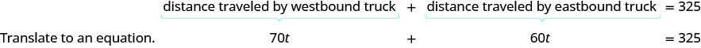

By the end of this section, you will be able to:
* Solve coin word problems
* Solve ticket and stamp word problems
* Solve mixture word problems
* Solve uniform motion applications

Before you get started, take this readiness quiz.

1.  Simplify:
    <math xmlns="http://www.w3.org/1998/Math/MathML"><mrow><mn>0.25</mn><mi>x</mi><mo>+</mo><mn>0.10</mn><mo stretchy="false">(</mo><mi>x</mi><mo>+</mo><mn>4</mn><mo stretchy="false">)</mo><mn>.</mn></mrow></math>
    
    * * *
    {: data-type="newline"}
    
    If you missed this problem, review [\[link\]](/m63306#fs-id1167829787357).
2.  The number of adult tickets is three more than twice the number of children tickets. Let *c* represent the number of children tickets. Write an expression for the number of adult tickets.
    * * *
    {: data-type="newline"}
    
    If you missed this problem, review [\[link\]](/m63302#fs-id1167829696814).
3.  Convert 4.2% to a decimal.
    * * *
    {: data-type="newline"}
    
    If you missed this problem, review [\[link\]](/m63305#fs-id1167829721053).
{: type="1"}

### Solve Coin Word Problems

Using algebra to find the number of nickels and pennies in a piggy bank may seem silly. You may wonder why we just don’t open the bank and count them. But this type of problem introduces us to some techniques that will be useful as we move forward in our study of mathematics.

    If we have a pile of dimes, how would we determine its value? If we count the number of dimes, we’ll know how many we have—the *number* of dimes. But this does not tell us the *value* of all the dimes. Say we counted 23 dimes, how much are they worth? Each dime is worth $0.10—that is the *value* of one dime. To find the total value of the pile of 23 dimes, multiply 23 by $0.10 to get $2.30.

The number of dimes times the value of each dime equals the total value of the dimes.

<math xmlns="http://www.w3.org/1998/Math/MathML"><mtable><mtr><mtd columnalign="right"><mi>n</mi><mi>u</mi><mi>m</mi><mi>b</mi><mi>e</mi><mi>r</mi><mo>·</mo><mi>v</mi><mi>a</mi><mi>l</mi><mi>u</mi><mi>e</mi></mtd><mtd columnalign="left"><mo>=</mo></mtd><mtd columnalign="left"><mi>t</mi><mi>o</mi><mi>t</mi><mi>a</mi><mi>l</mi><mspace width="0.2em" /><mi>v</mi><mi>a</mi><mi>l</mi><mi>u</mi><mi>e</mi></mtd></mtr><mtr><mtd columnalign="right"><mn>23</mn><mo>·</mo><mtext>$0.10</mtext></mtd><mtd columnalign="left"><mo>=</mo></mtd><mtd columnalign="left"><mtext>$</mtext><mn>2.30</mn></mtd></mtr></mtable></math>

This method leads to the following model.

Total Value of Coins

For the same type of coin, the total value of a number of coins is found by using the model

<math xmlns="http://www.w3.org/1998/Math/MathML"><mrow><mi>n</mi><mi>u</mi><mi>m</mi><mi>b</mi><mi>e</mi><mi>r</mi><mo>·</mo><mi>v</mi><mi>a</mi><mi>l</mi><mi>u</mi><mi>e</mi><mo>=</mo><mi>t</mi><mi>o</mi><mi>t</mi><mi>a</mi><mi>l</mi><mspace width="0.2em" /><mi>v</mi><mi>a</mi><mi>l</mi><mi>u</mi><mi>e</mi></mrow></math>

* *number* is the number of coins
* *value* is the value of each coin
* *total value* is the total value of all the coins
{: data-bullet-style="bullet"}

If we had several types of coins, we could continue this process for each type of coin, and then we would know the total value of each type of coin. To get the total value of *all* the coins, add the total value of each type of coin.

Jesse has $3.02 worth of pennies and nickels in his piggy bank. The number of nickels is three more than eight times the number of pennies. How many nickels and how many pennies does Jesse have?

<table class="unnumbered unstyled" summary="Step 1 is to read the problem. Determine the types of coins involved. They are pennies and nickels. Create a table. Write in the value of each type of coin. Pennies are worth 1 cent. Nickels are work 5 cents. Step 2 is to identify what we are looking for. We are looking for the number of pennies and nickels. Step 3 is to name or represent the number of each type of coin using variables. The number of nickels is defined in terms of the number of pennies, so start with pennies. Let p be equal to the number of pennies. The number of nickels is three more than eight times the number of pennies. Let the expression 8 p plus 3 be equal to the number of pennies. In the chart, multiply the number and the value to get the total of each type of coin. This chart has two columns and four rows. The first row is a header and it labels the first column &#x201C;Type&#x201D; and the second row &#x201C;Number times Value in dollars is equal to Total Value in dollars.&#x201D; The first column is a header column and it labels the second row &#x201C;pennies&#x201D; and the third row &#x201C;8 p plus 3.&#x201D; The second header column is subdivided into three columns for the &#x201C;number,&#x201D; &#x201C;value,&#x201D; and &#x201C;total value.&#x201D; The fourth row only gives the total value of the pennies and nickels. In row 2, the number of pennies p have a value of 0.01 for a total value of 0.01 p. In row 3, the number of nickels 8 p plus 3 have a value of 0.05 for a total value of 0.05 times the quantity 8 p plus 3. In row 4, the total value for the pennies and nickels is 3 dollars and 2 cents. Step 4 is to translate. Write the equation by adding the total value of all the types of coins. The equation is 0.01 p plus 0.05 times the quantity 8 p plus 3 is equal to 2.14. Step 5 is to solve the equation. 0.01 p plus 0.40 p plus 0.15 is equal to 3.02. 0.41 p plus 0.15 is equal to 3.02. 0.41 p is equal to 2.87. p is equal to 7 pennies. How many nickels are there? The expression 8 p plus 3 gives the number of nickels. 8 times 7 plus 3 is equal to 59. There are 59 nickels. Step 6 is to check the answer in the problem and make sure it makes sense. Jesse has 7 pennies and 59 pennies. Is the total value 3 dollars and 2 cents? Is 7 times 0.01 plus 59 times 0.05 equal to 3.02? 3.02 is equal to 3.02. So, the answers check." data-label=""><tbody>
<tr valign="top">
<td data-valign="top" data-align="left"><strong>Step 1. Read</strong> the problem.
Determine the types of coins involved.
Create a table.
Write in the value of each type of coin.</td>
<td data-valign="top" data-align="left">
pennies and nickels

Pennies are worth $0.10.
Nickels are worth $0.05.
</td>
</tr>
<tr valign="top">
<td data-valign="top" data-align="left"><strong>Step 2. Identify</strong> what we are looking for.</td>
<td data-valign="top" data-align="left">the number of pennies and nickels</td>
</tr>
<tr valign="top">
<td data-valign="top" data-align="left"><strong>Step 3. Name</strong>. Represent the number of each type of coin using variables.
The number of nickels is defined in terms of the
number of pennies, so start with pennies.
The number of nickels is three more than eight times
the number of pennies.</td>
<td data-valign="top" data-align="left">

Let <math xmlns="http://www.w3.org/1998/Math/MathML"><mrow><mspace width="0.5em" /><mi>p</mi><mo>=</mo></mrow></math> number of pennies.

<math xmlns="http://www.w3.org/1998/Math/MathML"><mrow><mn>8</mn><mi>p</mi><mo>+</mo><mn>3</mn><mo>=</mo></mrow></math> number of nickels</td>
</tr>
<tr valign="top">
<td colspan="2" data-valign="top" data-align="left">In the chart, multiply the number and the value to
get the total value of each type of coin.</td>
</tr>
<tr valign="top">
<td colspan="2" data-valign="top" data-align="right"></td>
</tr>
<tr valign="top">
<td data-valign="top" data-align="left"><strong>Step 4. Translate.</strong> Write the equation by adding the total value of all the types of coins.</td>
<td data-valign="top" data-align="left">
</td>
</tr>
<tr valign="top">
<td data-valign="top" data-align="left"><strong>Step 5. Solve</strong> the equation.</td>
<td data-valign="top" data-align="left"></td>
</tr>
<tr valign="top">
<td data-valign="top" data-align="left">How many nickels?</td>
<td data-valign="top" data-align="left"></td>
</tr>
<tr valign="top">
<td data-valign="top" data-align="left"><strong>Step 6. Check</strong> the answer in the problem and make sure it makes sense.
Jesse has 7 pennies and 59 nickels.
Is the total value <math xmlns="http://www.w3.org/1998/Math/MathML"><mrow><mtext>$</mtext><mn>3.02</mn><mo>?</mo></mrow></math>
<math xmlns="http://www.w3.org/1998/Math/MathML"><mtable><mtr><mtd columnalign="right"><mrow><mn>7</mn><mo stretchy="false">(</mo><mn>0.01</mn><mo stretchy="false">)</mo><mo>+</mo><mn>59</mn><mo stretchy="false">(</mo><mn>0.05</mn><mo stretchy="false">)</mo></mrow></mtd><mtd columnalign="left"><mrow><mover><mo>=</mo><mo>?</mo></mover></mrow></mtd><mtd columnalign="left"><mrow><mn>3.02</mn></mrow></mtd></mtr><mtr><mtd columnalign="right"><mrow><mn>3.02</mn></mrow></mtd><mtd columnalign="left"><mo>=</mo></mtd><mtd columnalign="left"><mrow><mn>3.02</mn><mo>✓</mo></mrow></mtd></mtr></mtable></math></td>
</tr>
</tbody></table>

Jesse has $6.55 worth of quarters and nickels in his pocket. The number of nickels is five more than two times the number of quarters. How many nickels and how many quarters does Jesse have?

Jess has 41 nickels and 18 quarters.

Elane has $7.00 total in dimes and nickels in her coin jar. The number of dimes that Elane has is seven less than three times the number of nickels. How many of each coin does Elane have?

Elane has 22 nickels and 59 dimes.

The steps for solving a coin word problem are summarized below.

Solve coin word problems.

1.  **Read** the problem. Make sure all the words and ideas are understood.
    * Determine the types of coins involved.
    * Create a table to organize the information.
      * Label the columns “type,” “number,” “value,” and “total value.”
      * List the types of coins.
      * Write in the value of each type of coin.
      * Write in the total value of all the coins.   
      {: data-bullet-style="open-circle"}
    {: data-bullet-style="bullet"}

2.  **Identify** what you are looking for.
3.  **Name** what you are looking for. Choose a variable to represent that quantity.
    * Use variable expressions to represent the number of each type of coin and write them in the table.
    * Multiply the number times the value to get the total value of each type of coin.
    {: data-bullet-style="bullet"}

4.  **Translate** into an equation.
    * It may be helpful to restate the problem in one sentence with all the important information. Then, translate the sentence into an equation.
    * Write the equation by adding the total values of all the types of coins.
    {: data-bullet-style="bullet"}

5.  **Solve** the equation using good algebra techniques.
6.  **Check** the answer in the problem and make sure it makes sense.
7.  **Answer** the question with a complete sentence.
{: type="1" .stepwise}

### Solve Ticket and Stamp Word Problems

Problems involving tickets or stamps are very much like coin problems. Each type of ticket and stamp has a value, just like each type of coin does. So to solve these problems, we will follow the same steps we used to solve coin problems.

Danny paid $15.75 for stamps. The number of 49-cent stamps was five less than three times the number of 35-cent stamps. How many 49-cent stamps and how many 35-cent stamps did Danny buy?

<table summary="Step 1 is to determine the types of stamps involved. They are 49 cent stamps and 35 cent stamps. Step is to identify what we are looking for. We are looking for the number of 49 cent stamps and the number of 35 cent stamps. Step 3 is to write variable expressions to represent the number of each type of stamp. Let x be equal to the number of 35 cent stamps. The number of 49 cent stamps was five less than three times the number of 35 cent stamps. Let 3 x minus 5 be equal to the number of 49 cent stamps. This chart has two columns and four rows. The first row is a header and it labels the first column &#x201C;Type&#x201D; and the second row &#x201C;Number times Value in dollars is equal to Total Value in dollars.&#x201D; The first column is a header column and it labels the second row &#x201C;49 cent stamps&#x201D; and the third row &#x201C;35 cent stamps.&#x201D; The second header column is subdivided into three columns for the &#x201C;number,&#x201D; &#x201C;value,&#x201D; and &#x201C;total value.&#x201D;  The fourth row only gives the total value of the 49 cent stamps and the 35 cent stamps. In row 2, the number of 49 cent stamps, 3 x minus 5, have a value of 0.49 for a total value of 0.49 times the quantity 3 x minus 5. In row 3, the number of 35 cent stamps, x, have a value of 0.35 for a total value of 0.35 x. In row 4, the total value for the 49 cent stamps and the 35 cent stamps is 15 dollars and 75 cents.  Step 4 is to write the equation from the total values. The equation is the sum of 0.49 times the quantity 3 x minus 5 and 0.35 x is equal to 15.75. Step 5 is to solve the equation. 1.47 x minus 2.45 plus 0.35 x is equal to 15.75. 1.82 x minus 2.45 is equal to 15.75. 1.82 x is equal to 18.2. x is equal to 10. There are ten 35 cent stamps. How many 49 cent stamps are there? It is given by the expression, 3 x minus 5. 3 times 10 minus 5 is equal to 25. There are twenty-five 49 cent stamps. Step 6 is to check. Is 10 times 0.35 plus 25 times 0.49 equal to 15.75? Is 3.50 plus 12.25 equal to 15.75? 15.75 is equal to 15.75. Step 7 is to answer the question with a complete sentence. Danny bought ten 35 cent stamps and twenty-five 49 cent stamps." class="unnumbered unstyled can-break" data-label=""><tbody>
<tr valign="top">
<td data-valign="top" data-align="left"><strong>Step 1.</strong> Determine the types of stamps involved.</td>
<td data-valign="top" data-align="left">49-cent stamps and 35-cent stamps</td>
</tr>
<tr valign="top">
<td data-valign="top" data-align="left"><strong>Step 2. Identify</strong> we are looking for.</td>
<td data-valign="top" data-align="left">the number of 49-cent stamps and the number of 35-cent stamps</td>
</tr>
<tr valign="top">
<td data-valign="top" data-align="left"><strong>Step 3.</strong> Write variable expressions to represent the number of each type of stamp.</td>
<td data-valign="top" data-align="left">Let <em>x</em> = number of 35-cent stamps.</td>
</tr>
<tr valign="top">
<td data-valign="top" data-align="left">“The number of 49-cent stamps was five less
than three times the number of 35-cent
stamps.”</td>
<td data-valign="top" data-align="left">
<math xmlns="http://www.w3.org/1998/Math/MathML"><mrow><mn>3</mn><mi>x</mi><mo>−</mo><mn>5</mn><mo>=</mo></mrow></math> number of 49-cent stamps</td>
</tr>
<tr valign="top">
<td colspan="2" data-valign="top" data-align="right"></td>
</tr>
<tr valign="top">
<td data-valign="top" data-align="left"><strong>Step 4.</strong> Write the equation from the total values.</td>
<td data-valign="top" data-align="left"></td>
</tr>
<tr valign="top">
<td data-valign="top" data-align="left"><strong>Step 5. Solve</strong> the equation.</td>
<td data-valign="top" data-align="left"></td>
</tr>
<tr valign="top">
<td data-valign="top" data-align="left">How many 49-cent stamps?</td>
<td data-valign="top" data-align="left"></td>
</tr>
<tr valign="top">
<td data-valign="top" data-align="left"><strong>Step 6. Check.</strong>
<math xmlns="http://www.w3.org/1998/Math/MathML"><mtable><mtr><mtd columnalign="right"><mn>10</mn><mo stretchy="false">(</mo><mn>0.35</mn><mo stretchy="false">)</mo><mo>+</mo><mn>25</mn><mo stretchy="false">(</mo><mn>0.49</mn><mo stretchy="false">)</mo></mtd><mtd columnalign="left"><mover><mo>=</mo><mo>?</mo></mover></mtd><mtd columnalign="left"><mn>15.75</mn></mtd></mtr><mtr><mtd columnalign="right"><mn>3.50</mn><mo>+</mo><mn>12.25</mn></mtd><mtd columnalign="left"><mover><mo>=</mo><mo>?</mo></mover></mtd><mtd columnalign="left"><mn>15.75</mn></mtd></mtr><mtr><mtd columnalign="right"><mn>15.75</mn></mtd><mtd columnalign="left"><mo>=</mo></mtd><mtd columnalign="left"><mn>15.75</mn><mtext>✓</mtext></mtd></mtr></mtable></math></td>
<td data-valign="top" data-align="left"> </td>
</tr>
<tr valign="top">
<td data-valign="top" data-align="left"><strong>Step 7. Answer</strong> the question with a complete sentence.</td>
<td data-valign="top" data-align="left">Danny bought ten 35-cent stamps and twenty-five 49-cent stamps.</td>
</tr>
</tbody></table>

Eric paid $19.88 for stamps. The number of 49-cent stamps was eight more than twice the number of 35-cent stamps. How many 49-cent stamps and how many 35-cent stamps did Eric buy?

Eric bought thirty-two 49-cent stamps and twelve 35-cent stamps.

Kailee paid $14.74 for stamps. The number of 49-cent stamps was four less than three times the number of 20-cent stamps. How many 49-cent stamps and how many 20-cent stamps did Kailee buy?

Kailee bought twenty-six 49-cent stamps and ten 20-cent stamps.

In most of our examples so far, we have been told that one quantity is four more than twice the other, or something similar. In our next example, we have to relate the quantities in a different way.

Suppose Aniket sold a total of 100 tickets. Each ticket was either an adult ticket or a child ticket. If he sold 20 child tickets, how many adult tickets did he sell?

  *Did you say “80”? How did you figure that out? Did you subtract 20 from 100?*

If he sold 45 child tickets, how many adult tickets did he sell?

  *Did you say “55”? How did you find it? By subtracting 45 from 100?*

Now, suppose Aniket sold *x* child tickets. Then how many adult tickets did he sell? To find out, we would follow the same logic we used above. In each case, we subtracted the number of child tickets from 100 to get the number of adult tickets. We now do the same with *x*.

We have summarized this in the table.

    We will apply this technique in the next example.

A whale-watching ship had 40 paying passengers on board. The total revenue collected from tickets was $1,196. Full-fare passengers paid $32 each and reduced-fare passengers paid $26 each. How many full-fare passengers and how many reduced-fare passengers were on the ship?

<table summary="Step 1 is to determine the types of tickets involved. They are full-fare tickets and reduced fare tickets. Step 2 is to identify what we are looking for. We are looking for the number of full-fare passengers and reduced-fare passengers. Step 3 is to name or represent the number of each type of passengers using variables. Let f be equal to the number of full-fare passengers. Then the expression 40 minus f is the number of reduced-fare passengers. We know the total number of passengers was 40. This means the number of full-fare passengers plus the number of reduced-fare passengers must add up to 40. Multiply the number times the value to get the total number of passengers. The chart has two columns and four rows. The first row is a header and it labels the first column &#x201C;Type&#x201D; and the second row &#x201C;Number times Value in dollars is equal to Total Value in dollars.&#x201D; The first column is a header column and it labels the second row &#x201C;full-fare passengers&#x201D; and the third row &#x201C;reduced-fare passengers.&#x201D; The second header column is subdivided into three columns for the &#x201C;number,&#x201D; &#x201C;value,&#x201D; and &#x201C;total value.&#x201D; The fourth row only gives the total value of the full-fare passengers and the number of reduced-fare passengers. In row 2, the number of full-fare passengers, f, paid 32 dollars for a total value of 32 f. In row 3, the number of reduced-fare passengers, 40 minus f, paid 26 dollars for a total value of 26 times the quantity 40 minus f. In row 4, the total value for the number of full-fare passengers and the number of reduced-fare passengers. Step 4 is to translate. Write the equation by adding the total values of each type of fare. The equation is 32 f plus 26 times the quantity 40 minus f is equal to 1,196. Step 5 is to solve the equation. 32 f plus 1,040 minus 26 f is equal to 1,196. 6 f is equal to 156. f is equal to 26, which is the number of full-fare passengers. How many reduced-fare passengers are there? It is given by the expression 40 minus f. That is 40 minus 26, which is 14 reduced-fare passengers. Step 6 is to check the answer. There were 26 full-fare passengers who paid 32 dollars each and 14 reduced-fare passengers who paid 26 dollars each. Is the total value 116 dollars? 26 times 32 is equal to 832. 14 times 26 is equal to 364. The total is 1,196, which checks. Step 7 is to answer the question. There were 26 full-fare passengers and 14 reduced-fare passengers." class="unnumbered unstyled can-break" data-label=""><tbody>
<tr valign="top">
<td data-valign="top" data-align="left"><strong>Step 1.</strong> Determine the types of tickets involved.</td>
<td data-valign="top" data-align="left">full-fare tickets and reduced-fare tickets</td>
</tr>
<tr valign="top">
<td data-valign="top" data-align="left"><strong>Step 2. Identify</strong> what we are looking for.</td>
<td data-valign="top" data-align="left">the number of full-fare tickets and reduced-fare tickets</td>
</tr>
<tr valign="top">
<td data-valign="top" data-align="left"><strong>Step 3. Name.</strong> Represent the number of each type of ticket using variables.</td>
<td data-valign="top" data-align="left">Let <em>f</em> = the number of full-fare tickets.
<math xmlns="http://www.w3.org/1998/Math/MathML"><mrow><mn>40</mn><mo>−</mo><mi>f</mi><mo>=</mo></mrow></math> the number of reduced-fare tickets</td>
</tr>
<tr valign="top">
<td data-valign="top" data-align="left">We know the total number of tickets sold was 40. This means the number of reduced-fare tickets is 40 less the number of full-fare tickets.
Multiply the number times the value to get the total value of each type of ticket.</td>
<td data-valign="top" data-align="left" />
</tr>
<tr valign="top">
<td data-valign="top" data-align="left" />
<td data-valign="top" data-align="left"></td>
</tr>
<tr valign="top">
<td data-valign="top" data-align="left"><strong>Step 4. Translate.</strong> Write the equation by adding the total values of each type of ticket.</td>
<td data-valign="top" data-align="left"></td>
</tr>
<tr valign="top">
<td data-valign="top" data-align="left"><strong>Step 5. Solve</strong> the equation.</td>
<td data-valign="top" data-align="left"></td>
</tr>
<tr valign="top">
<td data-valign="top" data-align="left">How many reduced-fare?</td>
<td data-valign="top" data-align="left"></td>
</tr>
<tr valign="top">
<td data-valign="top" data-align="left"><strong>Step 6. Check</strong> the answer.
There were 26 full-fare tickets at $32 each and 14 reduced-fare tickets at $26 each. Is the total value $116?
<math xmlns="http://www.w3.org/1998/Math/MathML"><mrow><mtable><mtr><mtd columnalign="right"><mrow><mn>26</mn><mo>·</mo><mn>32</mn></mrow></mtd><mtd columnalign="left"><mo>=</mo></mtd><mtd columnalign="left"><mspace width="0.1em" /><mrow><mn>832</mn></mrow></mtd></mtr><mtr><mtd columnalign="right"><mrow><mn>14</mn><mo>·</mo><mn>26</mn></mrow></mtd><mtd columnalign="left"><mo>=</mo></mtd><mtd columnalign="left"><mrow><munder accentunder="true"><mrow><mn>364</mn></mrow><mtext>——</mtext></munder></mrow></mtd></mtr><mtr><mtd columnalign="left"><mrow /></mtd><mtd columnalign="left"><mrow /></mtd><mtd columnalign="left"><mrow><mn>1,196</mn><mo>✓</mo></mrow></mtd></mtr></mtable></mrow></math></td>
<td data-valign="top" data-align="left"> </td>
</tr>
<tr valign="top">
<td data-valign="top" data-align="left"><strong>Step 7. Answer</strong> the question.</td>
<td data-valign="top" data-align="left">They sold 26 full-fare and 14 reduced-fare tickets.</td>
</tr>
</tbody></table>

During her shift at the museum ticket booth, Leah sold 115 tickets for a total of $1,163. Adult tickets cost $12 and student tickets cost $5. How many adult tickets and how many student tickets did Leah sell?

84 adult tickets, 31 student tickets

Galen sold 810 tickets for his church’s carnival for a total revenue of $2,820. Children’s tickets cost $3 each and adult tickets cost $5 each. How many children’s tickets and how many adult tickets did he sell?

615 children’s tickets and 195 adult tickets

### Solve Mixture Word Problems

Now we’ll solve some more general applications of the mixture model. In mixture problems, we are often mixing two quantities, such as raisins and nuts, to create a mixture, such as trail mix. In our tables we will have a row for each item to be mixed as well as one for the final mixture.

Henning is mixing raisins and nuts to make 25 pounds of trail mix. Raisins cost $4.50 a pound and nuts cost $8 a pound. If Henning wants his cost for the trail mix to be $6.60 a pound, how many pounds of raisins and how many pounds of nuts should he use?

<table summary="Step 1 is to determine what is being mixed. The 25 pounds of trail mix will come from mixing raisins and nuts. Step 2 is to identify what we are looking for. We are looking for the number of pounds of raisins and nuts. Step 3 is to represent the number of each type of ticket using variables. Let x be equal to the number of pounds of raisins and 23 minus x be equal to the number of pounds of nuts. As before, we fill in a chart to organize our information. We enter the price per pound for each item. We multiply the number times the value to get the total value. The chart has two columns and four rows. The first row is a header and it labels the first column &#x201C;Type&#x201D; and the second row &#x201C;Number of pounds times Price per pound in dollars is equal to Total Value in dollars.&#x201D; The first column is a header column and it labels the second row &#x201C;Raisins,&#x201D; the third row &#x201C;Nuts,&#x201D; and the fourth row &#x201C;trail mix.&#x201D; The second header column is subdivided into three columns for the &#x201C;Number of Pounds,&#x201D; &#x201C;Price per pound in dollars,&#x201D; and &#x201C;Total value in dollars.&#x201D; In row 2, the number of pounds of raisins, x, cost 4 dollars and 50 cents per pound for a total value of 4.5 x. In row 3, the number of pounds of nuts, 25 minus x, cost 8 dollars per pound for a total value of 8 times the quantity 25 minus x. There is nothing in row 4 of the chart. Notice that the last column in the table gives the information for the total amount of the mixture. We know the value of the raisins plus the value of the nuts will be the value of the trail mix. Step 4 is to translate into an equation. The equation is 4.5 x plus 8 times the quantity 25 minus x is equal to 25 times 6.6. Step 5 is to solve the equation. 4.5 x plus 200 minus 8 x is equal to 165. Negative 3.5 is equal to negative 35. The result is x is equal 10. There 10 pounds of raisins. Find the number of pounds of nuts which is given 25 minus x. 25 minus 10 is equal to 15. There are 15 pounds of nuts. Step 6 is to check. Is 4.5 times 10 plus 8 times 15 equal to 25 times 6.6. Is 45 plus 120 equal to 165. 165 is equal to 165. Step 7 is to answer the question. Henning mixed 10 pounds of raisins with 15 pounds of nuts." class="unnumbered unstyled can-break" data-label=""><tbody>
<tr valign="top">
<td data-valign="top" data-align="left"><strong>Step 1.</strong> Determine what is being mixed.</td>
<td data-valign="top" data-align="left">The 25 pounds of trail mix will come from mixing raisins and nuts.</td>
</tr>
<tr valign="top">
<td data-valign="top" data-align="left"><strong>Step 2.</strong> Identify what we are looking for.</td>
<td data-valign="top" data-align="left">the number of pounds of raisins and nuts</td>
</tr>
<tr valign="top">
<td data-valign="top" data-align="left"><strong>Step 3.</strong> Represent the number of each type of ticket using variables.

As before, we fill in a chart to organize our information.
We enter the price per pound for each item.
We multiply the number times the value to get the total value.</td>
<td data-valign="top" data-align="left">Let <math xmlns="http://www.w3.org/1998/Math/MathML"><mrow><mspace width="0.5em" /><mi>x</mi><mo>=</mo></mrow></math> number of pounds of raisins.
<math xmlns="http://www.w3.org/1998/Math/MathML"><mrow><mn>25</mn><mo>−</mo><mi>x</mi><mo>=</mo></mrow></math> number of pounds of nuts
</td>
</tr>
<tr valign="top">
<td colspan="2" data-valign="top" data-align="left">Notice that the last column in the table gives
the information for the total amount of the
mixture.</td>
</tr>
<tr valign="top">
<td data-valign="top" data-align="left"><strong>Step 4. Translate</strong> into an equation.</td>
<td data-valign="top" data-align="left">The value of the raisins plus the value of the nuts will be
the value of the trail mix.</td>
</tr>
<tr valign="top">
<td data-valign="top" data-align="left"><strong>Step 5. Solve</strong> the equation.</td>
<td data-valign="top" data-align="left"></td>
</tr>
<tr valign="top">
<td data-valign="top" data-align="left"> </td>
<td data-valign="top" data-align="left"></td>
</tr>
<tr valign="top">
<td data-valign="top" data-align="left">Find the number of pounds of nuts.</td>
<td data-valign="top" data-align="left"></td>
</tr>
<tr valign="top">
<td data-valign="top" data-align="left"><strong>Step 6. Check.</strong>
<math xmlns="http://www.w3.org/1998/Math/MathML"><mtable><mtr /><mtr /><mtr><mtd columnalign="right"><mn>4.5</mn><mo stretchy="false">(</mo><mn>10</mn><mo stretchy="false">)</mo><mo>+</mo><mn>8</mn><mo stretchy="false">(</mo><mn>15</mn><mo stretchy="false">)</mo></mtd><mtd columnalign="left"><mover><mo>=</mo><mo>?</mo></mover></mtd><mtd columnalign="left"><mn>25</mn><mo stretchy="false">(</mo><mn>6.60</mn><mo stretchy="false">)</mo></mtd></mtr><mtr><mtd columnalign="right"><mn>45</mn><mo>+</mo><mn>120</mn></mtd><mtd columnalign="left"><mover><mo>=</mo><mo>?</mo></mover></mtd><mtd columnalign="left"><mn>165</mn></mtd></mtr><mtr><mtd columnalign="right"><mn>165</mn></mtd><mtd columnalign="left"><mo>=</mo></mtd><mtd columnalign="left"><mn>165</mn><mo>✓</mo></mtd></mtr></mtable></math></td>
<td data-valign="top" data-align="left"> </td>
</tr>
<tr valign="top">
<td data-valign="top" data-align="left"><strong>Step 7. Answer</strong> the question.</td>
<td data-valign="top" data-align="left">Henning mixed ten pounds of raisins with 15 pounds of nuts.</td>
</tr>
</tbody></table>

Orlando is mixing nuts and cereal squares to make a party mix. Nuts sell for $7 a pound and cereal squares sell for $4 a pound. Orlando wants to make 30 pounds of party mix at a cost of $6.50 a pound, how many pounds of nuts and how many pounds of cereal squares should he use?

Orlando mixed five pounds of cereal squares and 25 pounds of nuts.

Becca wants to mix fruit juice and soda to make a punch. She can buy fruit juice for $3 a gallon and soda for $4 a gallon. If she wants to make 28 gallons of punch at a cost of $3.25 a gallon, how many gallons of fruit juice and how many gallons of soda should she buy?

Becca mixed 21 gallons of fruit punch and seven gallons of soda.

### Solve Uniform Motion Applications

When you are driving down the interstate using your cruise control, the speed of your car stays the same—it is uniform. We call a problem in which the speed of an object is constant a **uniform motion**{: data-type="term" .no-emphasis} application. We will use the distance, rate, and time formula, <math xmlns="http://www.w3.org/1998/Math/MathML"><mrow><mi>D</mi><mo>=</mo><mi>r</mi><mi>t</mi><mo>,</mo></mrow></math>

 to compare two scenarios, such as two vehicles travelling at different rates or in opposite directions.

Our problem solving strategies will still apply here, but we will add to the first step. The first step will include drawing a diagram that shows what is happening in the example. Drawing the diagram helps us understand what is happening so that we will write an appropriate equation. Then we will make a table to organize the information, like we did for the coin, ticket, and stamp applications.

The steps are listed here for easy reference:

Solve a uniform motion application.

1.  **Read** the problem. Make sure all the words and ideas are understood.
    * Draw a diagram to illustrate what is happening.
    * Create a table to organize the information.
      * Label the columns rate, time, distance.
      * List the two scenarios.
      * Write in the information you know.
      {: data-bullet-style="open-circle"}
    {: data-bullet-style="bullet"}
    
      
2.  **Identify** what you are looking for.
3.  **Name** what you are looking for. Choose a variable to represent that quantity.
    * Complete the chart.
    * Use variable expressions to represent that quantity in each row.
    * Multiply the rate times the time to get the distance.
    {: data-bullet-style="bullet"}

4.  **Translate** into an equation.
    * Restate the problem in one sentence with all the important information.
    * Then, translate the sentence into an equation.
    {: data-bullet-style="bullet"}

5.  **Solve** the equation using good algebra techniques.
6.  **Check** the answer in the problem and make sure it makes sense.
7.  **Answer** the question with a complete sentence.
{: type="1" .stepwise}

Wayne and Dennis like to ride the bike path from Riverside Park to the beach. Dennis’s speed is seven miles per hour faster than Wayne’s speed, so it takes Wayne two hours to ride to the beach while it takes Dennis 1.5 hours for the ride. Find the speed of both bikers.

**Step 1. Read** the problem. Make sure all the words and ideas are understood.

* Draw a diagram to illustrate what it happening. Shown below is a sketch of what is happening in the example.
  * * *
  {: data-type="newline"}
  
  * * *
  {: data-type="newline"}
  
    
* Create a table to organize the information.
  * Label the columns “Rate,” “Time,” and “Distance.”
  * List the two scenarios.
  * Write in the information you know.
    * * *
    {: data-type="newline"}
    
     ![This chart has two columns and three rows. The first row is a header and it labels the second column &#x201C;Rate in miles per hours times Time in hours is equal to Distance in miles.&#x201D; The second header column is subdivided into three columns for &#x201C;Rate,&#x201D; &#x201C;Time,&#x201D; and &#x201C;Distance.&#x201D; The first column is a header and labels the second row &#x201C;Dennis&#x201D; and the third row &#x201C;Wayne.&#x201D; In row 2, the time is 1.5 hours. In row 3, the time is 2 hours.](../resources/CNX_IntAlg_Figure_02_04_010_img.jpg) 
  {: data-bullet-style="open-circle"}
{: data-bullet-style="bullet"}

**Step 2. Identify** what you are looking for.

  You are asked to find the speed of both bikers.

  Notice that the distance formula uses the word “rate,” but it is more common to use “speed”

  when we talk about vehicles in everyday English.

**Step 3. Name** what we are looking for. Choose a variable to represent that quantity.

* Complete the chart
* Use variable expressions to represent that quantity in each row.
  * * *
  {: data-type="newline"}
  
  We are looking for the speed of the bikers. Let’s let *r* represent Wayne’s speed. Since Dennis’ speed is 7 mph faster, we represent that as
  <math xmlns="http://www.w3.org/1998/Math/MathML"><mrow><mi>r</mi><mo>+</mo><mn>7</mn></mrow></math>
  
  * * *
  {: data-type="newline"}
  
  <math xmlns="http://www.w3.org/1998/Math/MathML"><mtable><mtr><mtd columnalign="right"><mi>r</mi><mo>+</mo><mn>7</mn></mtd><mtd columnalign="left"><mo>=</mo></mtd><mtd columnalign="left"><mtext>Dennis’ speed</mtext></mtd></mtr><mtr><mtd columnalign="right"><mi>r</mi></mtd><mtd columnalign="left"><mo>=</mo></mtd><mtd columnalign="left"><mtext>Wayne’s speed</mtext></mtd></mtr></mtable></math>
  
  * * *
  {: data-type="newline"}
  
  Fill in the speeds into the chart.
  * * *
  {: data-type="newline"}
  
   ![This chart has two columns and three rows. The first row is a header and it labels the second column &#x201C;Rate in miles per hours times Time in hours is equal to Distance in miles.&#x201D; The second header column is subdivided into three columns for &#x201C;Rate,&#x201D; &#x201C;Time,&#x201D; and &#x201C;Distance.&#x201D; The first column is a header and labels the second row &#x201C;Dennis&#x201D; and the third row &#x201C;Wayne.&#x201D; In row 2, the rate is the expression r plus 7 and the time is 1.5 hours. In row 3, the rate is r and the time is 2 hours.](../resources/CNX_IntAlg_Figure_02_04_011_img.jpg) 
* Multiply the rate times the time to get the distance.
  * * *
  {: data-type="newline"}
  
   ![This chart has two columns and three rows. The first row is a header and it labels the second column &#x201C;Rate in miles per hours times Time in hours is equal to Distance in miles.&#x201D; The second header column is subdivided into three columns for &#x201C;Rate,&#x201D; &#x201C;Time,&#x201D; and &#x201C;Distance.&#x201D; The first column is a header and labels the second row &#x201C;Dennis&#x201D; and the third row &#x201C;Wayne.&#x201D; In row 2, the rate is the expression r plus 7, the time is 1.5 hours, and the distance is 1.5 times the quantity r plus 7. In row 3, the rate is r, the time is 2 hours, and the distance is 2 r.](../resources/CNX_IntAlg_Figure_02_04_012_img.jpg) 
{: data-bullet-style="bullet"}

**Step 4. Translate** into an equation.

* Restate the problem in one sentence with all the important information.
* Then, translate the sentence into an equation.
  * * *
  {: data-type="newline"}
  
  The equation to model this situation will come from the relation between the distances. Look at the diagram we drew above. How is the distance travelled by Dennis related to the distance travelled by Wayne?
  * * *
  {: data-type="newline"}
  
  Since both bikers leave from Riverside and travel to the beach, they travel the same distance. So we write:
  * * *
  {: data-type="newline"}
  
  * * *
  {: data-type="newline"}
  
    
{: data-bullet-style="bullet"}

**Step 5. Solve** the equation using algebra techniques.

<table summary="Now solve this equation, 1.5 times the quantity r plus 7 is equal to 2 r. 1.5 r plus 10.5 is equal to 2 r. 10.5 is equal to 0.5 r. The result is 21 is equal to r. So, Wayne&#x2019;s speed is 21 miles per hour. Find Dennis&#x2019; speed using the expression r plus 7. 21 plus 7 is equal to 28. Dennis&#x2019; speed is 28 miles per hour. Step is to check the answer in the problem and make sure it makes sense. For Dennis, 28 miles per hour times 1.5 hours is equal to 42 miles. For Wayne, 21 miles per hour times 2 hours is equal to 42 miles. The answers check. Step 7 is to answer the question with a complete sentence. Wayne rode at 21 miles per hour and Dennis rode at 28 miles per hour." class="unnumbered unstyled" data-label=""><tbody>
<tr valign="top">
<td data-valign="top" data-align="left">Now solve this equation.</td>
<td data-valign="top" data-align="left">
So Wayne’s speed is 21 mph.</td>
</tr>
<tr valign="top">
<td data-valign="top" data-align="left">Find Dennis’ speed.</td>
<td data-valign="top" data-align="left">
Dennis’ speed 28 mph.</td>
</tr>
</tbody></table>
**Step 6. Check** the answer in the problem and make sure it makes sense.

<math xmlns="http://www.w3.org/1998/Math/MathML"><mrow><mtable><mtr><mtd columnalign="left"><mtext>Dennis</mtext></mtd><mtd columnalign="left"><mn>28</mn><mspace width="0.2em" /><mtext>mph</mtext><mo stretchy="false">(</mo><mn>1.5</mn><mspace width="0.2em" /><mtext>hours</mtext><mo stretchy="false">)</mo><mo>=</mo><mn>42</mn><mspace width="0.2em" /><mtext>miles</mtext></mtd></mtr> <mtr><mtd columnalign="left"><mtext>Wayne</mtext></mtd><mtd columnalign="left"><mn>21</mn><mspace width="0.2em" /><mtext>mph</mtext><mo stretchy="false">(</mo><mn>2</mn><mspace width="0.2em" /><mtext>hours</mtext><mo stretchy="false">)</mo><mo>=</mo><mn>42</mn><mspace width="0.2em" /><mtext>miles</mtext><mo>✓</mo></mtd></mtr></mtable></mrow></math>

**Step 7. Answer** the question with a complete sentence.

Wayne rode at 21 mph and Dennis rode at 28 mph.

An express train and a local train leave Pittsburgh to travel to Washington, D.C. The express train can make the trip in four hours and the local train takes five hours for the trip. The speed of the express train is 12 miles per hour faster than the speed of the local train. Find the speed of both trains.

The speed of the local train is 48 mph and the speed of the express train is 60 mph.

Jeromy can drive from his house in Cleveland to his college in Chicago in 4.5 hours. It takes his mother six hours to make the same drive. Jeromy drives 20 miles per hour faster than his mother. Find Jeromy’s speed and his mother’s speed.

Jeromy drove at a speed of 80 mph and his mother drove 60 mph.

In [\[link\]](#fs-id1167836309166), we had two bikers traveling the same distance. In the next example, two people drive toward each other until they meet.

Carina is driving from her home in Anaheim to Berkeley on the same day her brother is driving from Berkeley to Anaheim, so they decide to meet for lunch along the way in Buttonwillow. The distance from Anaheim to Berkeley is 395 miles. It takes Carina three hours to get to Buttonwillow, while her brother drives four hours to get there. Carina’s average speed is 15 miles per hour faster than her brother’s average speed. Find Carina’s and her brother’s average speeds.

**Step 1. Read** the problem. Make sure all the words and ideas are understood.

* Draw a diagram to illustrate what it happening. Below shows a sketch of what is happening in the example.
  * * *
  {: data-type="newline"}
  
    
* Create a table to organize the information.
  * Label the columns rate, time, distance.
  * List the two scenarios.
  * Write in the information you know.
    * * *
    {: data-type="newline"}
    
     ![This chart has two columns and four rows. The first row is a header and it labels the second column &#x201C;Rate in miles per hours times Time in hours is equal to Distance in miles.&#x201D; The second header column is subdivided into three columns for &#x201C;Rate,&#x201D; &#x201C;Time,&#x201D; and &#x201C;Distance.&#x201D; The first column is a header and labels the second row &#x201C;Carina&#x201D; and the third row &#x201C;Brother.&#x201D; In row 2, the the time is 3 hours. In row 3, the time is 4 hours. In row 4, the distance is 410 miles.](../resources/CNX_IntAlg_Figure_02_04_016_img_Errata.jpg) 
  {: data-bullet-style="open-circle"}
{: data-bullet-style="bullet"}

**Step 2. Identify** what we are looking for.

  We are asked to find the average speeds of Carina and her brother.

**Step 3. Name** what we are looking for. Choose a variable to represent that quantity.

* Complete the chart.
* Use variable expressions to represent that quantity in each row.
  * * *
  {: data-type="newline"}
  
  We are looking for their average speeds. Let’s let *r* represent the average speed of Carina. Since the brother’s speed is 15 mph faster, we represent that as
  <math xmlns="http://www.w3.org/1998/Math/MathML"><mrow><mi>r</mi><mo>+</mo><mn>15</mn><mo>.</mo></mrow></math>
  
  * * *
  {: data-type="newline"}
  
  Fill in the speeds into the chart.
  * * *
  {: data-type="newline"}

* Multiply the rate times the time to get the distance. ![This chart has two columns and four rows. The first row is a header and it labels the second column &#x201C;Rate in miles per hours times Time in hours is equal to Distance in miles.&#x201D; The second header column is subdivided into three columns for &#x201C;Rate,&#x201D; &#x201C;Time,&#x201D; and &#x201C;Distance.&#x201D; The first column is a header and labels the second row &#x201C;Carina&#x201D; and the third row &#x201C;Brother.&#x201D; In row 2, the rate is r, the time is 3 hours, and the distance is 3 r. In row 3, the rate is the expression r plus 15, the time is 4 hours, and the distance is 4 times the quantity r plus 15. In row 4, the distance is 410 miles.](../resources/CNX_IntAlg_Figure_02_04_017_img_Errata.jpg) 
{: data-bullet-style="bullet"}

**Step 4. Translate** into an equation.

* Restate the problem in one sentence with all the important information.
* Then, translate the sentence into an equation.
  * * *
  {: data-type="newline"}
  
  Again, we need to identify a relationship between the distances in order to write an equation. Look at the diagram we created above and notice the relationship between the distance Carina traveled and the distance her brother traveled.
  * * *
  {: data-type="newline"}
  
  The distance Carina traveled plus the distance her brother travel must add up to 410 miles. So we write:
  * * *
  {: data-type="newline"}
  
  * * *
  {: data-type="newline"}
  
    
{: data-bullet-style="bullet"}

**Step 5. Solve** the equation using algebra techniques.

<table summary="Now solve this equation, 3 r plus 4 times the quantity r plus 15 is equal to 410. 3 r plus 4 r plus 60 is equal to 410. 7 r plus 60 is equal to 410. 7 r is equal to 350. r is equal to 50. So, Carina&#x2019;s speed was 50 miles per hour. Her brother&#x2019;s speed is given by r plus 15. 50 plus 16 is equal to 65. Her brother&#x2019;s speed was 65 miles per hour. Step 6 is to check the answer in the problem and make sure it makes sense. Carina drove 50 miles per hour for 3 hours. That is 150 miles. Her brother drove 65 miles per hour for 4 hours. That is 260 miles. 150 miles plus 260 miles is equal to 410 miles. The answer checks. Step 7 is to answer the question with a complete sentence. Carina drove 50 miles per hour and her brother drove 65 miles per hour." class="unnumbered unstyled" data-label=""><tbody>
<tr valign="top">
<td data-valign="top" data-align="left">Now solve this equation.</td>
<td data-valign="top" data-align="left">
So Carina’s brother's speed was 50 mph.</td>
</tr>
<tr valign="top">
<td data-valign="top" data-align="left">Carina’s speed is <math xmlns="http://www.w3.org/1998/Math/MathML"><mrow><mi>r</mi><mo>+</mo><mn>15</mn><mo>.</mo></mrow></math></td>
<td data-valign="top" data-align="left">
Her brother’s speed was 65 mph.</td>
</tr>
</tbody></table>
**Step 6. Check** the answer in the problem and make sure it makes sense.* * *
{: data-type="newline"}

<math xmlns="http://www.w3.org/1998/Math/MathML"><mrow><mtable><mtr><mtd columnalign="right"><mrow><mtext>Carina drove</mtext></mrow></mtd><mtd columnalign="left"><mrow><mn>65</mn><mspace width="0.2em" /><mtext>mph</mtext><mo stretchy="false">(</mo><mn>3</mn><mspace width="0.2em" /><mtext>hours</mtext><mo stretchy="false">)</mo></mrow></mtd><mtd columnalign="left"><mo>=</mo></mtd><mtd columnalign="left"><mspace width="0.6em" /><mrow><mn>195</mn><mspace width="0.2em" /><mtext>miles</mtext></mrow></mtd></mtr><mtr><mtd columnalign="right"><mrow><mtext>Her brother drove</mtext></mrow></mtd><mtd columnalign="left"><mrow><mn>50</mn><mspace width="0.2em" /><mtext>mph</mtext><mo stretchy="false">(</mo><mn>4</mn><mspace width="0.2em" /><mtext>hours</mtext><mo stretchy="false">)</mo></mrow></mtd><mtd columnalign="left"><mo>=</mo></mtd><mtd columnalign="left"><mrow><munder accentunder="true"><mrow><mn>200</mn><mspace width="0.2em" /><mtext>miles</mtext></mrow><mtext>—————</mtext></munder></mrow></mtd></mtr><mtr><mtd /><mtd /><mtd /><mtd columnalign="left"><mspace width="0.6em" /><mrow><mn>395</mn><mspace width="0.2em" /><mtext>miles</mtext><mo>✓</mo></mrow></mtd></mtr></mtable></mrow></math>

**Step 7. Answer** the question with a complete sentence.

Carina drove 65 mph and her brother 50 mph.

Christopher and his parents live 115 miles apart. They met at a restaurant between their homes to celebrate his mother’s birthday. Christopher drove one and a half hours while his parents drove one hour to get to the restaurant. Christopher’s average speed was ten miles per hour faster than his parents’ average speed. What were the average speeds of Christopher and of his parents as they drove to the restaurant?

Christopher’s speed was 50 mph and his parents’ speed was 40 mph.

Ashley goes to college in Minneapolis, 234 miles from her home in Sioux Falls. She wants her parents to bring her more winter clothes, so they decide to meet at a restaurant on the road between Minneapolis and Sioux Falls. Ashley and her parents both drove two hours to the restaurant. Ashley’s average speed was seven miles per hour faster than her parents’ average speed. Find Ashley’s and her parents’ average speed.

Ashley’s parents drove 55 mph and Ashley drove 62 mph.

As you read the next example, think about the relationship of the distances traveled. Which of the previous two examples is more similar to this situation?

Two truck drivers leave a rest area on the interstate at the same time. One truck travels east and the other one travels west. The truck traveling west travels at 70 mph and the truck traveling east has an average speed of 60 mph. How long will they travel before they are 325 miles apart?

**Step 1. Read** the problem. Make all the words and ideas are understood.

* Draw a diagram to illustrate what it happening.
  * * *
  {: data-type="newline"}
  
    
* Create a table to organize the information.
  * Label the columns rate, time, distance.
  * List the two scenarios.
  * Write in the information you know.
    * * *
    {: data-type="newline"}
    
    * * *
    {: data-type="newline"}
    
     ![The chart has two columns and four rows. The first row is a header and it labels the second column &#x201C;Rate in miles per hour times Time in hours is equal to Distance in miles.&#x201D; The first column is a header column and it labels the second row &#x201C;West&#x201D; and the third row &#x201C;East&#x201D; The second header column is subdivided into three columns for the &#x201C;Rate,&#x201D; &#x201C;Time,&#x201D; and &#x201C;Distance.&#x201D; The fourth row only gives the total distance the truck drivers travelled. In row 2, the truck driver travelling west has a rate 70 miles per hour. In row 3, truck driver travelling east has a rate 60 miles per hour. In row 4, the total distance travelled by the truck drivers is 325.](../resources/CNX_IntAlg_Figure_02_04_031_img.jpg) 
  {: data-bullet-style="open-circle"}
{: data-bullet-style="bullet"}

**Step 2. Identify** what we are looking for.

We are asked to find the amount of time the trucks will travel until they are 325 miles apart.

**Step 3. Name** what we are looking for. Choose a variable to represent that quantity.

* Complete the chart.
* Use variable expressions to represent that quantity in each row.
  * * *
  {: data-type="newline"}
  
  We are looking for the time travelled. Both trucks will travel the same amount of time.
  * * *
  {: data-type="newline"}
  
  Let’s call the time *t*. Since their speeds are different, they will travel different distances.
  * * *
  {: data-type="newline"}
  
  * * *
  {: data-type="newline"}

* Multiply the rate times the time to get the distance. ![The chart has two columns and four rows. The first row is a header and it labels the second column &#x201C;Rate in miles per hour times Time in hours is equal to Distance in miles.&#x201D; The first column is a header column and it labels the second row &#x201C;West&#x201D; and the third row &#x201C;East&#x201D; The second header column is subdivided into three columns for the &#x201C;Rate,&#x201D; &#x201C;Time,&#x201D; and &#x201C;Distance.&#x201D; The fourth row only gives the total distance the truck drivers travelled. In row 2, the truck driver travelling west has a rate 70 miles per hour, a time t hours, and a distance of 70 t. In row 3, truck driver travelling east has a rate 60 miles per hour, a time t, and a distance of 60 t. In row 4, the total distance travelled by the truck drivers is 325.](../resources/CNX_IntAlg_Figure_02_04_021_img.jpg) 
{: data-bullet-style="bullet"}

**Step 4. Translate** into an equation.

* Restate the problem in one sentence with all the important information.
* Then, translate the sentence into an equation.
  * * *
  {: data-type="newline"}
  
  We need to find a relation between the distances in order to write an equation. Looking at the diagram, what is the relationship between the distances each of the trucks will travel?
  * * *
  {: data-type="newline"}
  
  The distance travelled by the truck going west plus the distance travelled by the truck going east must add up to 325 miles. So we write:
  * * *
  {: data-type="newline"}
  
  * * *
  {: data-type="newline"}
  
    
{: data-bullet-style="bullet"}

**Step 5. Solve** the equation using algebra techniques.

<math xmlns="http://www.w3.org/1998/Math/MathML"><mrow><mspace width="4em" /><mtable><mtr><mtd columnalign="left"><mrow><mtext>Now solve this equation</mtext></mrow></mtd><mtd /><mtd /><mtd columnalign="right"><mrow><mn>70</mn><mi>t</mi><mo>+</mo><mn>60</mn><mi>t</mi></mrow></mtd><mtd columnalign="left"><mo>=</mo></mtd><mtd columnalign="left"><mrow><mn>325</mn></mrow></mtd></mtr><mtr><mtd /><mtd /><mtd /><mtd columnalign="right"><mrow><mn>130</mn><mi>t</mi></mrow></mtd><mtd columnalign="left"><mo>=</mo></mtd><mtd columnalign="left"><mrow><mn>325</mn></mrow></mtd></mtr><mtr><mtd /><mtd /><mtd /><mtd columnalign="right"><mi>t</mi></mtd><mtd columnalign="left"><mo>=</mo></mtd><mtd columnalign="left"><mrow><mn>2.5</mn></mrow></mtd></mtr></mtable></mrow></math>

So it will take the trucks <math xmlns="http://www.w3.org/1998/Math/MathML"><mrow><mn>2.5</mn></mrow></math>

 hours to be 325 miles apart.

**Step 6. Check** the answer in the problem and make sure it makes sense.

<math xmlns="http://www.w3.org/1998/Math/MathML"><mrow><mspace width="4em" /><mtable><mtr><mtd columnalign="right"><mrow><mtext>Truck going West</mtext></mrow></mtd><mtd columnalign="left"><mrow><mn>70</mn><mspace width="0.2em" /><mtext>mph</mtext><mo stretchy="false">(</mo><mn>2.5</mn><mspace width="0.2em" /><mtext>hours</mtext><mo stretchy="false">)</mo></mrow></mtd><mtd columnalign="left"><mo>=</mo></mtd><mtd columnalign="left"><mspace width="0.5em" /><mrow><mn>175</mn><mspace width="0.2em" /><mtext>miles</mtext></mrow></mtd></mtr><mtr><mtd columnalign="right"><mrow><mtext>Truck going East</mtext></mrow></mtd><mtd columnalign="left"><mrow><mn>60</mn><mspace width="0.2em" /><mtext>mph</mtext><mo stretchy="false">(</mo><mn>2.5</mn><mtext>hours</mtext><mo stretchy="false">)</mo></mrow></mtd><mtd columnalign="left"><mo>=</mo></mtd><mtd columnalign="left"><mrow><munder accentunder="true"><mrow><mn>150</mn><mspace width="0.2em" /><mtext>miles</mtext></mrow><mtext>—————</mtext></munder></mrow></mtd></mtr><mtr><mtd /><mtd /><mtd /><mtd columnalign="left"><mspace width="0.5em" /><mrow><mn>325</mn><mspace width="0.2em" /><mtext>miles</mtext><mo>✓</mo></mrow></mtd></mtr></mtable></mrow></math>

**Step 7. Answer** the question with a complete sentence.* * *
{: data-type="newline"}

It will take the trucks 2.5 hours to be 325 miles apart.

Pierre and Monique leave their home in Portland at the same time. Pierre drives north on the turnpike at a speed of 75 miles per hour while Monique drives south at a speed of 68 miles per hour. How long will it take them to be 429 miles apart?

Pierre and Monique will be 429 miles apart in 3 hours.

Thanh and Nhat leave their office in Sacramento at the same time. Thanh drives north on I-5 at a speed of 72 miles per hour. Nhat drives south on I-5 at a speed of 76 miles per hour. How long will it take them to be 330 miles apart?

Thanh and Nhat will be 330 miles apart in 2.2 hours.

It is important to make sure that the units match when we use the distance rate and time formula. For instance, if the rate is in miles per hour, then the time must be in hours.

When Naoko walks to school, it takes her 30 minutes. If she rides her bike, it takes her 15 minutes. Her speed is three miles per hour faster when she rides her bike than when she walks. What is her speed walking and her speed riding her bike?

First, we draw a diagram that represents the situation to help us see what is happening.

  
We are asked to find her speed walking and riding her bike. Let’s call her walking speed *r*. Since her biking speed is three miles per hour faster, we will call that speed <math xmlns="http://www.w3.org/1998/Math/MathML"><mrow><mi>r</mi><mo>+</mo><mn>3</mn><mo>.</mo></mrow></math>

 We write the speeds in the chart.

The speed is in miles per hour, so we need to express the times in hours, too, in order for the units to be the same. Remember, 1 hour is 60 minutes. So:

<math xmlns="http://www.w3.org/1998/Math/MathML"><mrow><mtable><mtr /><mtr /><mtr><mtd columnalign="left"><mtext>30 minutes is</mtext><mspace width="0.2em" /><mfrac><mrow><mn>30</mn></mrow><mrow><mn>60</mn></mrow></mfrac><mspace width="0.2em" /><mtext>or</mtext><mspace width="0.2em" /><mfrac><mn>1</mn><mn>2</mn></mfrac><mspace width="0.2em" /><mtext>hour</mtext></mtd></mtr> <mtr><mtd columnalign="left"><mtext>15 minutes is</mtext><mspace width="0.2em" /><mfrac><mrow><mn>15</mn></mrow><mrow><mn>60</mn></mrow></mfrac><mspace width="0.2em" /><mtext>or</mtext><mspace width="0.2em" /><mfrac><mn>1</mn><mn>4</mn></mfrac><mspace width="0.2em" /><mtext>hour</mtext></mtd></mtr></mtable></mrow></math>

We write the times in the chart.

Next, we multiply rate times time to fill in the distance column.

 ![This chart has two columns and three rows. The first row is a header and it labels the second column &#x201C;Rate in miles per hours times Time in hours is equal to Distance in miles.&#x201D; The second header column is subdivided into three columns for &#x201C;Rate,&#x201D; &#x201C;Time,&#x201D; and &#x201C;Distance.&#x201D; The first column is a header and labels the second row &#x201C;Walk&#x201D; and the third row &#x201C;Bike.&#x201D; In row 2, the rate is r, the time is one-half hour, and the distance is one-half r. In row 3, the rate is the expression r plus 3, the time is one-fourth hour, and the distance is one-fourth times the quantity r plus 3.](../resources/CNX_IntAlg_Figure_02_04_024_img.jpg) 
The equation will come from the fact that the distance from Naoko’s home to her school is the same whether she is walking or riding her bike.* * *
{: data-type="newline"}

So we say:

<table summary="Translate into an equation. The distance walked equals the distance covered by bike. That is one-half r is equal to one-fourth times the quantity r plus 3. Solve this equation. Clear the fractions by multiplying by the L C D of all the fractions in the equation. The L C D is 8. 8 times one-half r is equal to 8 times one-fourth times the quantity r plus 3. Simplify. 4 r is equal to 2 times the quantity r plus 3. 4 r is equal to 2 r plus 6. 2 r is equal to 6. r is equal to 3 miles per hour, which is Naoko&#x2019;s walking speed. Her biking speed is represented by the expression r plus 3. 3 plus 3 is equal to 6, so Naoko&#x2019;s biking speed is 6 miles per hour. Let&#x2019;s check if this works. Naoko&#x2019;s walking speed is 3miles per hour and her biking speed is 6 miles per hour. The walking distance is 3 miles per hour times 0.5 hour, which is equal to 1.5 miles. The biking distance is 6 miles per hour times 0.25 hour, which equals 1.5 miles. Yes either way Naoko travels 1.5 miles to school." class="unnumbered unstyled can-break" data-label=""><tbody>
<tr valign="top">
<td data-valign="top" data-align="left" />
<td data-valign="top" data-align="left"></td>
</tr>
<tr valign="top">
<td data-valign="top" data-align="left">Translate to an equation.</td>
<td data-valign="top" data-align="left"></td>
</tr>
<tr valign="top">
<td data-valign="top" data-align="left">Solve this equation.</td>
<td data-valign="top" data-align="left"></td>
</tr>
<tr valign="top">
<td data-valign="top" data-align="left">Clear the fractions by multiplying by the LCD of all the fractions in the equation.</td>
<td data-valign="top" data-align="left"></td>
</tr>
<tr valign="top">
<td data-valign="top" data-align="left">Simplify.</td>
<td data-valign="top" data-align="left"></td>
</tr>
<tr valign="top">
<td data-valign="top" data-align="left" />
<td data-valign="top" data-align="left"><math xmlns="http://www.w3.org/1998/Math/MathML"><mrow><mspace width="6.4em" /></mrow></math>6</td>
</tr>
<tr valign="top">
<td colspan="2" data-valign="top" data-align="left">Let’s check if this works.
<math xmlns="http://www.w3.org/1998/Math/MathML"><mrow><mtable><mtr><mtd columnalign="left"><mrow><mtext>Walk 3 mph (0.5 hour)</mtext></mrow></mtd><mtd columnalign="right"><mo>=</mo></mtd><mtd columnalign="right"><mrow><mn>1.5</mn><mspace width="0.2em" /><mtext>miles</mtext></mrow></mtd></mtr><mtr><mtd columnalign="left"><mrow><mtext>Bike 6 mph (0.25 hour)</mtext></mrow></mtd><mtd columnalign="right"><mo>=</mo></mtd><mtd columnalign="right"><mrow><mn>1.5</mn><mspace width="0.2em" /><mtext>miles</mtext></mrow></mtd></mtr></mtable></mrow></math></td>
</tr>
</tbody></table>
Yes, either way Naoko travels 1.5 miles to school.

Naoko’s walking speed is 3 mph and her speed riding her bike is 6 mph.

Suzy takes 50 minutes to hike uphill from the parking lot to the lookout tower. It takes her 30 minutes to hike back down to the parking lot. Her speed going downhill is 1.2 miles per hour faster than her speed going uphill. Find Suzy’s uphill and downhill speeds.

Suzy’s speed uphill is <math xmlns="http://www.w3.org/1998/Math/MathML"><mrow><mn>1.8</mn></mrow></math>

 mph and downhill is three mph.

Llewyn takes 45 minutes to drive his boat upstream from the dock to his favorite fishing spot. It takes him 30 minutes to drive the boat back downstream to the dock. The boat’s speed going downstream is four miles per hour faster than its speed going upstream. Find the boat’s upstream and downstream speeds.

The boat’s speed upstream is eight mph and downstream is12 mph.

In the distance, rate and time formula, time represents the actual amount of elapsed time (in hours, minutes, etc.). If a problem gives us starting and ending times as clock times, we must find the elapsed time in order to use the formula.

Cruz is training to compete in a triathlon. He left his house at 6:00 and ran until 7:30. Then he rode his bike until 9:45. He covered a total distance of 51 miles. His speed when biking was 1.6 times his speed when running. Find Cruz’s biking and running speeds.

A diagram will help us model this trip.* * *
{: data-type="newline"}

* * *
{: data-type="newline"}

  
Next, we create a table to organize the information. We know the total distance is 51 miles. We are looking for the rate of speed for each part of the trip. The rate while biking is 1.6 times the rate of running. If we let *r* = the rate running, then the rate biking is 1.6*r*.

The times here are given as clock times. Cruz started from home at 6:00 a.m. and started biking at 7:30 a.m. So he spent 1.5 hours running. Then he biked from 7:30 a.m until 9:45 a.m. So he spent 2.25 hours biking.

Now, we multiply the rates by the times.

 ![The chart has two columns and four rows. The first row is a header and it labels the second column &#x201C;Rate in miles per hour times Time in hours is equal to Distance in miles.&#x201D; The first column is a header column and it labels the second row &#x201C;run&#x201D; and the third row &#x201C;bike&#x201D; The second header column is subdivided into three columns for the &#x201C;Rate,&#x201D; &#x201C;Time,&#x201D; and &#x201C;Distance.&#x201D; The fourth row only gives the total distance covered. In row 2, the rate is r, the time is 1.5 hours, and the distance is 1.5 r. In row 3, the rate is 1.6, the time is 2.25 hours, and the distance is 2.25 times 1.6 r. In row 4, the total distance covered is 51 miles.](../resources/CNX_IntAlg_Figure_02_04_027_img.jpg) 
By looking at the diagram, we can see that the sum of the distance running and the distance biking is 255 miles.

<table summary="Translate into an equation. The distance ran plus the distance biked is equal to 51. That is 1.5 r is plus 2.25 times 1.6 r is equal to 51. Solve this equation. 1.5 r plus 3.6 is equal to 51. 5.1 r is equal to 51. r is equal to 10, so the running speed is 10 miles per hour. The expression 1.6 r represents the running speed. 1.6 times 10 is equal to 16, so the running speed is 16 miles per hour. Check. The running distance is 10 miles per hour times 1.5 hours, which equals 15 miles. The biking distance is 16 miles per hour times 2.25 hours, which equals 36 miles. The total distance is 51 miles. The answer checks." class="unnunbered unstyled" data-label=""><tbody>
<tr valign="top">
<td data-valign="top" data-align="left" />
<td data-valign="top" data-align="left"></td>
</tr>
<tr valign="top">
<td data-valign="top" data-align="left">Translate to an equation.</td>
<td data-valign="top" data-align="left"></td>
</tr>
<tr valign="top">
<td data-valign="top" data-align="left">Solve this equation.</td>
<td data-valign="top" data-align="left"></td>
</tr>
<tr valign="top">
<td data-valign="top" data-align="left">Check.
<math xmlns="http://www.w3.org/1998/Math/MathML"><mrow><mtable><mtr><mtd columnalign="left"><mrow><mtext>Run</mtext></mrow></mtd><mtd columnalign="right"><mrow><mn>10</mn><mspace width="0.2em" /><mtext>mph</mtext><mspace width="0.2em" /><mo stretchy="false">(</mo><mn>1.5</mn><mspace width="0.2em" /><mtext>hours</mtext><mo stretchy="false">)</mo></mrow></mtd><mtd columnalign="right"><mo>=</mo></mtd><mtd columnalign="right"><mrow><mn>15</mn><mspace width="0.2em" /><mtext>mi</mtext></mrow></mtd></mtr><mtr><mtd columnalign="left"><mrow><mtext>Bike</mtext></mrow></mtd><mtd columnalign="right"><mrow><mn>16</mn><mspace width="0.2em" /><mtext>mph</mtext><mspace width="0.2em" /><mo stretchy="false">(</mo><mn>2.25</mn><mspace width="0.2em" /><mtext>hours</mtext><mo stretchy="false">)</mo></mrow></mtd><mtd columnalign="right"><mo>=</mo></mtd><mtd columnalign="right"><mrow><munder accentunder="true"><mrow><mn>36</mn><mspace width="0.2em" /><mtext>mi</mtext></mrow><mtext>——</mtext></munder></mrow></mtd></mtr><mtr><mtd /><mtd /><mtd /><mtd columnalign="right"><mrow><mn>51</mn><mspace width="0.2em" /><mtext>mi</mtext></mrow></mtd></mtr></mtable></mrow></math></td>
<td />
</tr>
</tbody></table>

Hamilton loves to travel to Las Vegas, 255 miles from his home in Orange County. On his last trip, he left his house at 2:00 p.m. The first part of his trip was on congested city freeways. At 4:00 pm, the traffic cleared and he was able to drive through the desert at a speed 1.75 times faster than when he drove in the congested area. He arrived in Las Vegas at 6:30 p.m. How fast was he driving during each part of his trip?

Hamilton drove 40 mph in the city and 70 mph in the desert.

Phuong left home on his bicycle at 10:00. He rode on the flat street until 11:15, then rode uphill until 11:45. He rode a total of 31 miles. His speed riding uphill was 0.6 times his speed on the flat street. Find his speed biking uphill and on the flat street.

Phuong rode uphill at a speed of 12 mph and on the flat street at 20 mph.

### Key Concepts

* **Total Value of Coins**
  * * *
  {: data-type="newline"}
  
  For the same type of coin, the total value of a number of coins is found by using the model
  * * *
  {: data-type="newline"}
  
  <math xmlns="http://www.w3.org/1998/Math/MathML"><mrow><mi>n</mi><mi>u</mi><mi>m</mi><mi>b</mi><mi>e</mi><mi>r</mi><mo>·</mo><mi>v</mi><mi>a</mi><mi>l</mi><mi>u</mi><mi>e</mi><mo>=</mo><mi>t</mi><mi>o</mi><mi>t</mi><mi>a</mi><mi>l</mi><mspace width="0.2em" /><mi>v</mi><mi>a</mi><mi>l</mi><mi>u</mi><mi>e</mi></mrow></math>
  
  * *number* is the number of coins
  * *value* is the value of each coin
  * *total value* is the total value of all the coins
  {: data-bullet-style="open-circle"}
  
  * * *
  {: data-type="newline"}
  
  * * *
  {: data-type="newline"}
  
  * * *
  {: data-type="newline"}

* **How to solve coin word problems.**
  1.  **Read** the problem. Make sure all the words and ideas are understood.
      * * *
      {: data-type="newline"}
      
      Determine the types of coins involved.
      * * *
      {: data-type="newline"}
      
      Create a table to organize the information.
      * * *
      {: data-type="newline"}
      
        Label the columns “type,” “number,” “value,” “total value.”
      * * *
      {: data-type="newline"}
      
        List the types of coins.
      * * *
      {: data-type="newline"}
      
        Write in the value of each type of coin.
      * * *
      {: data-type="newline"}
      
        Write in the total value of all the coins.
      * * *
      {: data-type="newline"}
      
        
  2.  **Identify** what you are looking for.
  3.  **Name** what you are looking for. Choose a variable to represent that quantity.
      * * *
      {: data-type="newline"}
      
      Use variable expressions to represent the number of each type of coin and write them in the table.
      * * *
      {: data-type="newline"}
      
      Multiply the number times the value to get the total value of each type of coin.
  4.  **Translate** into an equation.
      * * *
      {: data-type="newline"}
      
      It may be helpful to restate the problem in one sentence with all the important information. Then, translate the sentence into an equation.
      * * *
      {: data-type="newline"}
      
      Write the equation by adding the total values of all the types of coins.
  5.  **Solve** the equation using good algebra techniques.
  6.  **Check** the answer in the problem and make sure it makes sense.
      * * *
      {: data-type="newline"}
      
      * * *
      {: data-type="newline"}
  
  7.  **Answer** the question with a complete sentence.
  {: type="1" .stepwise}

* **How To Solve a Uniform Motion Application**
  1.  **Read** the problem. Make sure all the words and ideas are understood.
      * * *
      {: data-type="newline"}
      
      Draw a diagram to illustrate what it happening.
      * * *
      {: data-type="newline"}
      
      Create a table to organize the information.
      * * *
      {: data-type="newline"}
      
        Label the columns rate, time, distance.
      * * *
      {: data-type="newline"}
      
        List the two scenarios.
      * * *
      {: data-type="newline"}
      
        Write in the information you know.
      * * *
      {: data-type="newline"}
      
        
  2.  **Identify** what you are looking for.
  3.  **Name** what you are looking for. Choose a variable to represent that quantity.
      * * *
      {: data-type="newline"}
      
      Complete the chart.
      * * *
      {: data-type="newline"}
      
      Use variable expressions to represent that quantity in each row.
      * * *
      {: data-type="newline"}
      
      Multiply the rate times the time to get the distance.
  4.  **Translate** into an equation.
      * * *
      {: data-type="newline"}
      
      Restate the problem in one sentence with all the important information.
      * * *
      {: data-type="newline"}
      
      Then, translate the sentence into an equation.
  5.  **Solve** the equation using good algebra techniques.
  6.  **Check** the answer in the problem and make sure it makes sense.
  7.  **Answer** the question with a complete sentence.
  {: type="1" .stepwise}
{: data-bullet-style="bullet"}

<section data-depth="1" class="section-exercises" markdown="1">
#### Practice Makes Perfect

**Solve Coin Word Problems**

In the following exercises, solve each coin word problem.

Michaela has $2.05 in dimes and nickels in her change purse. She has seven more dimes than nickels. How many coins of each type does she have?

nine nickels, 16 dimes

Liliana has $2.10 in nickels and quarters in her backpack. She has 12 more nickels than quarters. How many coins of each type does she have?

In a cash drawer there is $125 in $5 and $10 bills. The number of $10 bills is twice the number of $5 bills. How many of each type of bill is in the drawer?

ten $10 bills, five $5 bills

Sumanta has $175 in $5 and $10 bills in his drawer. The number of $5 bills is three times the number of $10 bills. How many of each are in the drawer?

Chi has $11.30 in dimes and quarters. The number of dimes is three more than three times the number of quarters. How many of each are there?

63 dimes, 20 quarters

Alison has $9.70 in dimes and quarters. The number of quarters is eight more than four times the number of dimes. How many of each coin does she have?

Mukul has $3.75 in quarters, dimes and nickels in his pocket. He has five more dimes than quarters and nine more nickels than quarters. How many of each coin are in his pocket?

16 nickels, 12 dimes, seven quarters

Vina has $4.70 in quarters, dimes and nickels in her purse. She has eight more dimes than quarters and six more nickels than quarters. How many of each coin are in her purse?

**Solve Ticket and Stamp Word Problems**

In the following exercises, solve each ticket or stamp word problem.

The first day of a water polo tournament the total value of tickets sold was $17,610. One-day passes sold for $20 and tournament passes sold for $30. The number of tournament passes sold was 37 more than the number of day passes sold. How many day passes and how many tournament passes were sold?

330 day passes, 367 tournament passes

At the movie theater, the total value of tickets sold was $2,612.50. Adult tickets sold for $10 each and senior/child tickets sold for $7.50 each. The number of senior/child tickets sold was 25 less than twice the number of adult tickets sold. How many senior/child tickets and how many adult tickets were sold?

Julie went to the post office and bought both $0.41 stamps and $0.26 postcards. She spent $51.40. The number of stamps was 20 more than twice the number of postcards. How many of each did she buy?

40 postcards, 100 stamps

Jason went to the post office and bought both $0.41 stamps and $0.26 postcards and spent $10.28 The number of stamps was four more than twice the number of postcards. How many of each did he buy?

Hilda has $210 worth of $10 and $12 stock shares. The number of $10 shares is five more than twice the number of $12 shares. How many of each type of share does she have?

15 $10 shares, five $12 shares

Mario invested $475 in $45 and $25 stock shares. The number of $25 shares was five less than three times the number of $45 shares. How many of each type of share did he buy?

The ice rink sold 95 tickets for the afternoon skating session, for a total of $828. General admission tickets cost $10 each and youth tickets cost $8 each. How many general admission tickets and how many youth tickets were sold?

34 general, 61 youth

For the 7:30 show time, 140 movie tickets were sold. Receipts from the $13 adult tickets and the $10 senior tickets totaled $1,664. How many adult tickets and how many senior tickets were sold?

The box office sold 360 tickets to a concert at the college. The total receipts were $4,170. General admission tickets cost $15 and student tickets cost $10. How many of each kind of ticket was sold?

114 general, 246 student

Last Saturday, the museum box office sold 281 tickets for a total of $3,954. Adult tickets cost $15 and student tickets cost $12. How many of each kind of ticket was sold?

**Solve Mixture Word Problems**

In the following exercises, solve each mixture word problem.

Macario is making 12 pounds of nut mixture with macadamia nuts and almonds. Macadamia nuts cost $9 per pound and almonds cost $5.25 per pound. How many pounds of macadamia nuts and how many pounds of almonds should Macario use for the mixture to cost $6.50 per pound to make?

Four pounds of macadamia nuts, eight pounds almonds

Carmen wants to tile the floor of his house. He will need 1,000 square feet of tile. He will do most of the floor with a tile that costs $1.50 per square foot, but also wants to use an accent tile that costs $9.00 per square foot. How many square feet of each tile should he plan to use if he wants the overall cost to be $3 per square foot?

Riley is planning to plant a lawn in his yard. He will need nine pounds of grass seed. He wants to mix Bermuda seed that costs $4.80 per pound with Fescue seed that costs $3.50 per pound. How much of each seed should he buy so that the overall cost will be $4.02 per pound?

<math xmlns="http://www.w3.org/1998/Math/MathML"><mrow><mn>3.6</mn></mrow></math>

 lbs Bermuda seed, <math xmlns="http://www.w3.org/1998/Math/MathML"><mrow><mn>5.4</mn></mrow></math>

 lbs Fescue seed

Vartan was paid $25,000 for a cell phone app that he wrote and wants to invest it to save for his son’s education. He wants to put some of the money into a bond that pays 4% annual interest and the rest into stocks that pay 9% annual interest. If he wants to earn 7.4% annual interest on the total amount, how much money should he invest in each account?

Vern sold his 1964 Ford Mustang for $55,000 and wants to invest the money to earn him 5.8% interest per year. He will put some of the money into Fund A that earns 3% per year and the rest in Fund B that earns 10% per year. How much should he invest into each fund if he wants to earn 5.8% interest per year on the total amount?

$33,000 in Fund A, $22,000 in Fund B

Dominic pays 7% interest on his $15,000 college loan and 12% interest on his $11,000 car loan. What average interest rate does he pay on the total $26,000 he owes? (Round your answer to the nearest tenth of a percent.)

Liam borrowed a total of $35,000 to pay for college. He pays his parents 3% interest on the $8,000 he borrowed from them and pays the bank 6.8% on the rest. What average interest rate does he pay on the total $35,000? (Round your answer to the nearest tenth of a percent.)

<math xmlns="http://www.w3.org/1998/Math/MathML"><mrow><mn>5.9</mn><mi>%</mi></mrow></math>

**Solve Uniform Motion Applications**

In the following exercises, solve.

Lilah is moving from Portland to Seattle. It takes her three hours to go by train. Mason leaves the train station in Portland and drives to the train station in Seattle with all Lilah’s boxes in his car. It takes him 2.4 hours to get to Seattle, driving at 15 miles per hour faster than the speed of the train. Find Mason’s speed and the speed of the train.

Kathy and Cheryl are walking in a fundraiser. Kathy completes the course in 4.8 hours and Cheryl completes the course in eight hours. Kathy walks two miles per hour faster than Cheryl. Find Kathy’s speed and Cheryl’s speed.

Kathy 5 mph, Cheryl 3 mph

Two busses go from Sacramento to San Diego. The express bus makes the trip in 6.8 hours and the local bus takes 10.2 hours for the trip. The speed of the express bus is 25 mph faster than the speed of the local bus. Find the speed of both busses.

A commercial jet and a private airplane fly from Denver to Phoenix. It takes the commercial jet 1.6 hours for the flight, and it takes the private airplane 2.6 hours. The speed of the commercial jet is 210 miles per hour faster than the speed of the private airplane. Find the speed of both airplanes to the nearest 10 mph.

commercial 540 mph, private plane 330 mph

Saul drove his truck three hours from Dallas towards Kansas City and stopped at a truck stop to get dinner. At the truck stop he met Erwin, who had driven four hours from Kansas City towards Dallas. The distance between Dallas and Kansas City is 542 miles, and Erwin’s speed was eight miles per hour slower than Saul’s speed. Find the speed of the two truckers.

Charlie and Violet met for lunch at a restaurant between Memphis and New Orleans. Charlie had left Memphis and drove 4.8 hours towards New Orleans. Violet had left New Orleans and drove two hours towards Memphis, at a speed 10 miles per hour faster than Charlie’s speed. The distance between Memphis and New Orleans is 394 miles. Find the speed of the two drivers.

Violet 65 mph, Charlie 55 mph

Sisters Helen and Anne live 332 miles apart. For Thanksgiving, they met at their other sister’s house partway between their homes. Helen drove 3.2 hours and Anne drove 2.8 hours. Helen’s average speed was four miles per hour faster than Anne’s. Find Helen’s average speed and Anne’s average speed.

Ethan and Leo start riding their bikes at the opposite ends of a 65-mile bike path. After Ethan has ridden 1.5 hours and Leo has ridden two hours, they meet on the path. Ethan’s speed is six miles per hour faster than Leo’s speed. Find the speed of the two bikers.

Ethan 22 mph, Leo 16 mph

Elvira and Aletheia live 3.1 miles apart on the same street. They are in a study group that meets at a coffee shop between their houses. It took Elvira half an hour and Aletheia two-thirds of an hour to walk to the coffee shop. Aletheia’s speed is 0.6 miles per hour slower than Elvira’s speed. Find both women’s walking speeds.

DaMarcus and Fabian live 23 miles apart and play soccer at a park between their homes. DaMarcus rode his bike for three-quarters of an hour and Fabian rode his bike for half an hour to get to the park. Fabian’s speed was six miles per hour faster than DaMarcus’ speed. Find the speed of both soccer players.

DaMarcus 16 mph, Fabian 22 mph

Cindy and Richard leave their dorm in Charleston at the same time. Cindy rides her bicycle north at a speed of 18 miles per hour. Richard rides his bicycle south at a speed of 14 miles per hour. How long will it take them to be 96 miles apart?

Matt and Chris leave their uncle’s house in Phoenix at the same time. Matt drives west on I-60 at a speed of 76 miles per hour. Chris drives east on I-60 at a speed of 82 miles per hour. How many hours will it take them to be 632 miles apart?

four hours

Two busses leave Billings at the same time. The Seattle bus heads west on I-90 at a speed of 73 miles per hour while the Chicago bus heads east at a speed of 79 miles an hour. How many hours will it take them to be 532 miles apart?

Two boats leave the same dock in Cairo at the same time. One heads north on the Mississippi River while the other heads south. The northbound boat travels four miles per hour. The southbound boat goes eight miles per hour. How long will it take them to be 54 miles apart?

4\.5 hours

Lorena walks the path around the park in 30 minutes. If she jogs, it takes her 20 minutes. Her jogging speed is 1.5 miles per hour faster than her walking speed. Find Lorena’s walking speed and jogging speed.

Julian rides his bike uphill for 45 minutes, then turns around and rides back downhill. It takes him 15 minutes to get back to where he started. His uphill speed is 3.2 miles per hour slower than his downhill speed. Find Julian’s uphill and downhill speed.

uphill <math xmlns="http://www.w3.org/1998/Math/MathML"><mrow><mn>1.6</mn></mrow></math>

 mph, downhill <math xmlns="http://www.w3.org/1998/Math/MathML"><mrow><mn>4.8</mn></mrow></math>

 mph

Cassius drives his boat upstream for 45 minutes. It takes him 30 minutes to return downstream. His speed going upstream is three miles per hour slower than his speed going downstream. Find his upstream and downstream speeds.

It takes Darline 20 minutes to drive to work in light traffic. To come home, when there is heavy traffic, it takes her 36 minutes. Her speed in light traffic is 24 miles per hour faster than her speed in heavy traffic. Find her speed in light traffic and in heavy traffic.

light traffic 54 mph, heavy traffic 30 mph

At 1:30, Marlon left his house to go to the beach, a distance of 7.6 miles. He rode his skateboard until 2:15, and then walked the rest of the way. He arrived at the beach at 3:00. Marlon’s speed on his skateboard is 2.5 times his walking speed. Find his speed when skateboarding and when walking.

Aaron left at 9:15 to drive to his mountain cabin 108 miles away. He drove on the freeway until 10:45 and then drove on a mountain road. He arrived at 11:05. His speed on the freeway was three times his speed on the mountain road. Find Aaron’s speed on the freeway and on the mountain road.

freeway 72 mph, mountain road 24 mph

Marisol left Los Angeles at 2:30 to drive to Santa Barbara, a distance of 95 miles. The traffic was heavy until 3:20. She drove the rest of the way in very light traffic and arrived at 4:20. Her speed in heavy traffic was 40 miles per hour slower than her speed in light traffic. Find her speed in heavy traffic and in light traffic.

Lizette is training for a marathon. At 7:00 she left her house and ran until 8:15 then she walked until 11:15. She covered a total distance of 19 miles. Her running speed was five miles per hour faster than her walking speed. Find her running and walking speeds.

running eight mph, walking three mph

#### Everyday Math

John left his house in Irvine at 8:35 a.m. to drive to a meeting in Los Angeles, 45 miles away. He arrived at the meeting at 9:50 a.m.. At 6:30 p.m. he left the meeting and drove home. He arrived home at 7:18 p.m.

ⓐ What was his average speed on the drive from Irvine to Los Angeles?

ⓑ What was his average speed on the drive from Los Angeles to Irvine?

ⓒ What was the total time he spent driving to and from this meeting?

Sarah wants to arrive at her friend’s wedding at 3:00. The distance from Sarah’s house to the wedding is 95 miles. Based on usual traffic patterns, Sarah predicts she can drive the first 15 miles at 60 miles per hour, the next 10 miles at 30 miles per hour, and the remainder of the drive at 70 miles per hour.

ⓐ How long will it take Sarah to drive the first 15 miles?

ⓑ How long will it take Sarah to drive the next 10 miles?

ⓒ How long will it take Sarah to drive the rest of the trip?

ⓓ What time should Sarah leave her house?

ⓐ 15 minutes ⓑ 20 minutes ⓒ one hour (d) 1:25

#### Writing Exercises

Suppose you have six quarters, nine dimes, and four pennies. Explain how you find the total value of all the coins.

Do you find it helpful to use a table when solving coin problems? Why or why not?

Answers will vary.

In the table used to solve coin problems, one column is labeled “number” and another column is labeled “value.” What is the difference between the “number” and the “value”?

When solving a uniform motion problem, how does drawing a diagram of the situation help you?

Answers will vary.

#### Self Check

ⓐ After completing the exercises, use this checklist to evaluate your mastery of the objectives of this section.

  
ⓑ On a scale of 1-10, how would you rate your mastery of this section in light of your responses on the checklist? How can you improve this?

</section>

