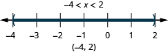

By the end of this section, you will be able to:
* Graph inequalities on the number line
* Solve linear inequalities
* Translate words to an inequality and solve
* Solve applications with linear inequalities

Before you get started, take this readiness quiz.

1.  Translate from algebra to English:
    <math xmlns="http://www.w3.org/1998/Math/MathML"><mrow><mn>15</mn><mo>&gt;</mo><mi>x</mi><mo>.</mo></mrow></math>
    
    * * *
    {: data-type="newline"}
    
    If you missed this problem, review [\[link\]](/m63302#fs-id1167829937221).
2.  Translate to an algebraic expression: 15 is less than *x*.
    * * *
    {: data-type="newline"}
    
    If you missed this problem, review [\[link\]](/m63302#fs-id1167836513192).
{: data-number-style="arabic"}

### Graph Inequalities on the Number Line

What number would make the inequality <math xmlns="http://www.w3.org/1998/Math/MathML"><mrow><mi>x</mi><mo>&gt;</mo><mn>3</mn></mrow></math>

 true? Are you thinking, “*x* could be four”? That’s correct, but *x* could be 6, too, or 37, or even 3.001. Any number greater than three is a solution to the inequality <math xmlns="http://www.w3.org/1998/Math/MathML"><mrow><mi>x</mi><mo>&gt;</mo><mn>3</mn><mo>.</mo></mrow></math>

We show all the solutions to the inequality <math xmlns="http://www.w3.org/1998/Math/MathML"><mrow><mi>x</mi><mo>&gt;</mo><mn>3</mn></mrow></math>

 on the number line by shading in all the numbers to the right of three, to show that all numbers greater than three are solutions. Because the number three itself is not a solution, we put an open parenthesis at three.

We can also represent inequalities using **interval notation**. There is no upper end to the solution to this inequality. In interval notation, we express <math xmlns="http://www.w3.org/1998/Math/MathML"><mrow><mi>x</mi><mo>&gt;</mo><mn>3</mn></mrow></math>

 as <math xmlns="http://www.w3.org/1998/Math/MathML"><mrow><mrow><mo>(</mo><mrow><mn>3</mn><mo>,</mo><mi>∞</mi></mrow><mo>)</mo></mrow><mo>.</mo></mrow></math>

 The symbol <math xmlns="http://www.w3.org/1998/Math/MathML"><mi>∞</mi></math>

 is read as “**infinity**.” It is not an actual number.

[\[link\]](#CNX_IntAlg_Figure_02_05_001) shows both the number line and the interval notation.

 {: #CNX_IntAlg_Figure_02_05_001}

We use the left parenthesis symbol, (, to show that the endpoint of the inequality is not included. The left bracket symbol, \[, shows that the endpoint is included.

The inequality <math xmlns="http://www.w3.org/1998/Math/MathML"><mrow><mi>x</mi><mo>≤</mo><mn>1</mn></mrow></math>

 means all numbers less than or equal to one. Here we need to show that one is a solution, too. We do that by putting a bracket at <math xmlns="http://www.w3.org/1998/Math/MathML"><mrow><mi>x</mi><mo>=</mo><mn>1</mn><mo>.</mo></mrow></math>

 We then shade in all the numbers to the left of one, to show that all numbers less than one are solutions. See [\[link\]](#CNX_IntAlg_Figure_02_05_002).

There is no lower end to those numbers. We write <math xmlns="http://www.w3.org/1998/Math/MathML"><mrow><mi>x</mi><mo>≤</mo><mn>1</mn></mrow></math>

 in interval notation as <math xmlns="http://www.w3.org/1998/Math/MathML"><mrow><mrow><mo>(</mo><mrow><mtext>−</mtext><mi>∞</mi><mo>,</mo><mrow><mn>1</mn><mo>]</mo></mrow></mrow></mrow><mo>.</mo></mrow></math>

 The symbol <math xmlns="http://www.w3.org/1998/Math/MathML"><mrow><mtext>−</mtext><mi>∞</mi></mrow></math>

 is read as “negative infinity.” [\[link\]](#CNX_IntAlg_Figure_02_05_002) shows both the number line and interval notation.

 {: #CNX_IntAlg_Figure_02_05_002}

Inequalities, Number Lines, and Interval Notation

![The figure shows that the solution of the inequality x is greater than a is indicated on a number line with a left parenthesis at a and shading to the right, and that the solution in interval notation is the interval from a to infinity enclosed in parentheses. It shows the solution of the inequality x is greater than or equal to a is indicated on a number line with an left bracket at a and shading to the right, and that the solution in interval notation is the interval a to infinity within a left bracket and right parenthesis. It shows that the solution of the inequality x is less than a is indicated on a number line with a right parenthesis at a and shading to the left, and that the solution in interval notation is the the interval negative infinity to a within parentheses. It shows that the solution of the inequality x is less than or equal to a is indicated on anumber line with a right bracket at a and shading to the left, and that the solution in interval notation is negative infinity to a within a left parenthesis and right bracket.](../resources/CNX_IntAlg_Figure_02_05_003.jpg)

The notation for inequalities on a number line and in interval notation use the same symbols to express the endpoints of intervals.

Graph each inequality on the number line and write in interval notation.

ⓐ <math xmlns="http://www.w3.org/1998/Math/MathML"><mrow><mi>x</mi><mo>≥</mo><mn>−3</mn></mrow></math>

 ⓑ <math xmlns="http://www.w3.org/1998/Math/MathML"><mrow><mi>x</mi><mo>&lt;</mo><mn>2.5</mn></mrow></math>

 ⓒ <math xmlns="http://www.w3.org/1998/Math/MathML"><mrow><mi>x</mi><mo>≤</mo><mo>−</mo><mfrac><mn>3</mn><mn>5</mn></mfrac></mrow></math>

ⓐ* * *
{: data-type="newline"}

|  |    |
| Shade to the right of <math xmlns="http://www.w3.org/1998/Math/MathML"><mrow><mn>−3</mn><mo>,</mo></mrow></math>

 and put a bracket at <math xmlns="http://www.w3.org/1998/Math/MathML"><mrow><mn>−3</mn><mo>.</mo></mrow></math>

   |    |
| Write in interval notation. |    |
{: .unnumbered .unstyled summary="Shade to the right of negative 3 and put a left bracket at negative 3. The solution of the inequality x is greater than negative 3 is indicated on a number line with a left bracket at a and shading to the right. Write in intervak notation. The solution in interval notation is the interval from negative 3 to infinity enclosed within a left bracket and right parenthesis." data-label=""}

ⓑ* * *
{: data-type="newline"}

|  |    |
| Shade to the left of 2.5 and put a parenthesis at 2.5. |    |
| Write in interval notation. |    |
{: .unnumbered .unstyled summary="Shade to the left of negative 2.5 and put a parenthesis at negative 2.5. The solution of the inequality x is less than 2.5 is indicated on a number line with a right bracket at 2.5 and shading to the left. Write in interval notation. The solution in interval notation is the interval from negative infinity to 2.5 enclosed within parentheses." data-label=""}

ⓒ* * *
{: data-type="newline"}

|  |    |
| Shade to the left of <math xmlns="http://www.w3.org/1998/Math/MathML"><mrow><mo>−</mo><mfrac><mn>3</mn><mn>5</mn></mfrac><mo>,</mo></mrow></math>

 and put a bracket at <math xmlns="http://www.w3.org/1998/Math/MathML"><mrow><mo>−</mo><mfrac><mn>3</mn><mn>5</mn></mfrac><mo>.</mo></mrow></math>

 |    |
| Write in interval notation. |    |
{: .unnumbered .unstyled summary="Shade to the left of negative three-fifths and put a right bracket at negative three-fifths. The solution of the inequality x is less than or equal to negative three-fifths is indicated on a number line with a right bracket at negative three-fifths and shading to the left. Write in interval notation. The solution in interval notation is the interval from negative infinity to negative three-fifths enclosed within a left parentheses and right bracket." data-label=""}

Graph each inequality on the number line and write in interval notation: ⓐ <math xmlns="http://www.w3.org/1998/Math/MathML"><mrow><mi>x</mi><mo>&gt;</mo><mn>2</mn></mrow></math>

 ⓑ <math xmlns="http://www.w3.org/1998/Math/MathML"><mrow><mi>x</mi><mo>≤</mo><mn>−1.5</mn></mrow></math>

 ⓒ <math xmlns="http://www.w3.org/1998/Math/MathML"><mrow><mi>x</mi><mo>≥</mo><mfrac><mn>3</mn><mn>4</mn></mfrac><mo>.</mo></mrow></math>

ⓐ* * *
{: data-type="newline"}

  
ⓑ* * *
{: data-type="newline"}

  
ⓒ* * *
{: data-type="newline"}

  

Graph each inequality on the number line and write in interval notation: ⓐ <math xmlns="http://www.w3.org/1998/Math/MathML"><mrow><mi>x</mi><mo>≤</mo><mn>−4</mn></mrow></math>

 ⓑ<math xmlns="http://www.w3.org/1998/Math/MathML"><mrow><mi>x</mi><mo>≥</mo><mn>0.5</mn></mrow></math>

 ⓒ <math xmlns="http://www.w3.org/1998/Math/MathML"><mrow><mi>x</mi><mo>&lt;</mo><mo>−</mo><mfrac><mn>2</mn><mn>3</mn></mfrac><mo>.</mo></mrow></math>

ⓐ* * *
{: data-type="newline"}

  
ⓑ* * *
{: data-type="newline"}

  
ⓒ* * *
{: data-type="newline"}

  

What numbers are greater than two but less than five? Are you thinking say, <math xmlns="http://www.w3.org/1998/Math/MathML"><mrow><mn>2.5</mn><mo>,</mo><mn>3</mn><mo>,</mo><mn>3</mn><mfrac><mn>2</mn><mn>3</mn></mfrac><mo>,</mo><mn>4</mn><mo>,</mo><mn>4</mn><mo>,</mo><mn>99</mn><mo>?</mo></mrow></math>

 We can represent all the numbers between two and five with the inequality <math xmlns="http://www.w3.org/1998/Math/MathML"><mrow><mn>2</mn><mo>&lt;</mo><mi>x</mi><mo>&lt;</mo><mn>5</mn><mo>.</mo></mrow></math>

 We can show <math xmlns="http://www.w3.org/1998/Math/MathML"><mrow><mn>2</mn><mo>&lt;</mo><mi>x</mi><mo>&lt;</mo><mn>5</mn></mrow></math>

 on the number line by shading all the numbers between two and five. Again, we use the parentheses to show the numbers two and five are not included. See [\[link\]](#CNX_IntAlg_Figure_02_05_007).

 {: #CNX_IntAlg_Figure_02_05_007}

Graph each inequality on the number line and write in interval notation.

ⓐ <math xmlns="http://www.w3.org/1998/Math/MathML"><mrow><mn>−3</mn><mo>&lt;</mo><mi>x</mi><mo>&lt;</mo><mn>4</mn></mrow></math>

 ⓑ <math xmlns="http://www.w3.org/1998/Math/MathML"><mrow><mn>−6</mn><mo>≤</mo><mi>x</mi><mo>&lt;</mo><mn>−1</mn></mrow></math>

 ⓒ <math xmlns="http://www.w3.org/1998/Math/MathML"><mrow><mn>0</mn><mo>≤</mo><mi>x</mi><mo>≤</mo><mn>2.5</mn></mrow></math>

ⓐ* * *
{: data-type="newline"}

<table class="unnumbered unstyled" summary="Negative 3 is less than x which is less than 4. There open circles at negative 3 and 4 and shading between negative 3 and 4 on the number line. Put parenthese at negative 3 and 4. Write in interval notation." data-label=""><tbody>
<tr>
<td />
<td />
<td data-align="left">

</td>
</tr>
<tr>
<td data-align="left">Shade between <math xmlns="http://www.w3.org/1998/Math/MathML"><mrow><mn>−3</mn></mrow></math> and 4.

Put a parentheses at <math xmlns="http://www.w3.org/1998/Math/MathML"><mrow><mn>−3</mn></mrow></math> and 4.</td>
<td />
<td data-align="left">

</td>
</tr>
<tr>
<td data-align="left">Write in interval notation.</td>
<td />
<td data-align="left">

</td>
</tr>
</tbody></table>
ⓑ* * *
{: data-type="newline"}

<table class="unnumbered unstyled" summary="Negative 6 is less than or equal to x which is less than negative 1. There is closed circle at negative 6 and an open circle at negative 1 and shading between negative 6 and negative 1 on the number line. Put a bracket at negative 6 and a parenthesis at 1. Write in interval notation." data-label=""><tbody>
<tr>
<td />
<td />
<td />
<td data-align="left">

</td>
</tr>
<tr>
<td data-align="left">Shade between <math xmlns="http://www.w3.org/1998/Math/MathML"><mrow><mn>−6</mn></mrow></math> and −1.

Put a bracket at <math xmlns="http://www.w3.org/1998/Math/MathML"><mrow><mn>−6</mn><mo>,</mo></mrow></math> and
a parenthesis at −1.</td>
<td />
<td />
<td data-align="left">

</td>
</tr>
<tr>
<td data-align="left">Write in interval notation.</td>
<td />
<td />
<td data-align="left">

</td>
</tr>
</tbody></table>
ⓒ* * *
{: data-type="newline"}

<table class="unnumbered unstyled" summary="0 is less than or equal to x which is less than or equal to 2.5. There are closed circles at 0 and 2.5 and shading between negative 0 and 2.5 on the number line. Put brackets at 0 and 2.5. Write in interval notation." data-label=""><tbody>
<tr>
<td />
<td />
<td />
<td data-align="left">

</td>
</tr>
<tr>
<td data-align="left">Shade between 0 and 2.5.
Put a bracket at 0 and at 2.5.</td>
<td />
<td />
<td data-align="left">

</td>
</tr>
<tr>
<td data-align="left">Write in interval notation.</td>
<td />
<td />
<td data-align="left">

</td>
</tr>
</tbody></table>

Graph each inequality on the number line and write in interval notation:

ⓐ <math xmlns="http://www.w3.org/1998/Math/MathML"><mrow><mn>−2</mn><mo>&lt;</mo><mi>x</mi><mo>&lt;</mo><mn>1</mn></mrow></math>

 ⓑ <math xmlns="http://www.w3.org/1998/Math/MathML"><mrow><mn>−5</mn><mo>≤</mo><mi>x</mi><mo>&lt;</mo><mn>−4</mn></mrow></math>

 ⓒ <math xmlns="http://www.w3.org/1998/Math/MathML"><mrow><mn>1</mn><mo>≤</mo><mi>x</mi><mo>≤</mo><mn>4.25</mn></mrow></math>

ⓐ* * *
{: data-type="newline"}

  
ⓑ* * *
{: data-type="newline"}

  
ⓒ* * *
{: data-type="newline"}

  

Graph each inequality on the number line and write in interval notation:

ⓐ <math xmlns="http://www.w3.org/1998/Math/MathML"><mrow><mn>−6</mn><mo>&lt;</mo><mi>x</mi><mo>&lt;</mo><mn>2</mn></mrow></math>

 ⓑ <math xmlns="http://www.w3.org/1998/Math/MathML"><mrow><mn>−3</mn><mo>≤</mo><mi>x</mi><mo>&lt;</mo><mn>−1</mn></mrow></math>

 ⓒ <math xmlns="http://www.w3.org/1998/Math/MathML"><mrow><mn>2.5</mn><mo>≤</mo><mi>x</mi><mo>≤</mo><mn>6</mn></mrow></math>

ⓐ* * *
{: data-type="newline"}

  
ⓑ* * *
{: data-type="newline"}

  
ⓒ* * *
{: data-type="newline"}

  

### Solve Linear Inequalities

A linear inequality is much like a linear equation—but the equal sign is replaced with an inequality sign. A **linear inequality** is an inequality in one variable that can be written in one of the forms, <math xmlns="http://www.w3.org/1998/Math/MathML"><mrow><mi>a</mi><mi>x</mi><mo>+</mo><mi>b</mi><mo>&lt;</mo><mi>c</mi><mo>,</mo></mrow></math>

<math xmlns="http://www.w3.org/1998/Math/MathML"><mrow><mi>a</mi><mi>x</mi><mo>+</mo><mi>b</mi><mo>≤</mo><mi>c</mi><mo>,</mo></mrow></math>

<math xmlns="http://www.w3.org/1998/Math/MathML"><mrow><mi>a</mi><mi>x</mi><mo>+</mo><mi>b</mi><mo>&gt;</mo><mi>c</mi><mo>,</mo></mrow></math>

 or <math xmlns="http://www.w3.org/1998/Math/MathML"><mrow><mi>a</mi><mi>x</mi><mo>+</mo><mi>b</mi><mo>≥</mo><mi>c</mi><mo>.</mo></mrow></math>

Linear Inequality

A linear inequality is an inequality in one variable that can be written in one of the following forms where *a*, *b*, and *c* are real numbers and <math xmlns="http://www.w3.org/1998/Math/MathML"><mrow><mi>a</mi><mo>≠</mo><mn>0</mn></mrow></math>

\:

<math xmlns="http://www.w3.org/1998/Math/MathML"><mrow><mi>a</mi><mi>x</mi><mo>+</mo><mi>b</mi><mo>&lt;</mo><mi>c</mi><mo>,</mo><mspace width="2em" /><mi>a</mi><mi>x</mi><mo>+</mo><mi>b</mi><mo>≤</mo><mi>c</mi><mo>,</mo><mspace width="2em" /><mi>a</mi><mi>x</mi><mo>+</mo><mi>b</mi><mo>&gt;</mo><mi>c</mi><mo>,</mo><mspace width="2em" /><mi>a</mi><mi>x</mi><mo>+</mo><mi>b</mi><mo>≥</mo><mi>c</mi><mo>.</mo></mrow></math>

When we solved linear equations, we were able to use the properties of equality to add, subtract, multiply, or divide both sides and still keep the equality. Similar properties hold true for inequalities.

We can add or subtract the same quantity from both sides of an inequality and still keep the inequality. For example:

Notice that the inequality sign stayed the same.

This leads us to the Addition and Subtraction Properties of Inequality.

Addition and Subtraction Property of Inequality

For any numbers *a*, *b*, and *c,* if <math xmlns="http://www.w3.org/1998/Math/MathML"><mrow><mi>a</mi><mo>&lt;</mo><mi>b</mi><mo>,</mo><mspace width="0.2em" /><mtext>then</mtext></mrow></math>

<math xmlns="http://www.w3.org/1998/Math/MathML"><mrow><mtable><mtr><mtd columnalign="left"><mi>a</mi><mo>+</mo><mi>c</mi><mo>&lt;</mo><mi>b</mi><mo>+</mo><mi>c</mi></mtd><mtd /><mtd /><mtd columnalign="left"><mi>a</mi><mo>−</mo><mi>c</mi><mo>&lt;</mo><mi>b</mi><mo>−</mo><mi>c</mi></mtd></mtr> <mtr><mtd columnalign="left"><mi>a</mi><mo>+</mo><mi>c</mi><mo>&gt;</mo><mi>b</mi><mo>+</mo><mi>c</mi></mtd><mtd /><mtd /><mtd columnalign="left"><mi>a</mi><mo>−</mo><mi>c</mi><mo>&gt;</mo><mi>b</mi><mo>−</mo><mi>c</mi></mtd></mtr></mtable></mrow></math>

We can add or subtract the same quantity from both sides of an inequality and still keep the inequality.

What happens to an inequality when we divide or multiply both sides by a constant?

Let’s first multiply and divide both sides by a positive number.

The inequality signs stayed the same.

Does the inequality stay the same when we divide or multiply by a negative number?

Notice that when we filled in the inequality signs, the inequality signs reversed their direction.

When we divide or multiply an inequality by a positive number, the inequality sign stays the same. When we divide or multiply an inequality by a negative number, the inequality sign reverses.

This gives us the Multiplication and Division Property of Inequality.

Multiplication and Division Property of Inequality

For any numbers *a*, *b*, and *c*,

<math xmlns="http://www.w3.org/1998/Math/MathML"><mrow><mtable><mtr><mtd columnalign="left"><mtext>multiply or divide by a positive</mtext></mtd></mtr> <mtr /><mtr /><mtr><mtd columnalign="left"><mspace width="2em" /><mtext>if</mtext><mspace width="0.2em" /><mi>a</mi><mo>&lt;</mo><mi>b</mi><mspace width="0.2em" /><mtext>and</mtext><mspace width="0.2em" /><mi>c</mi><mo>&gt;</mo><mn>0</mn><mo>,</mo><mtext>then</mtext><mspace width="0.2em" /><mi>a</mi><mi>c</mi><mo>&lt;</mo><mi>b</mi><mi>c</mi><mspace width="0.2em" /><mtext>and</mtext><mspace width="0.2em" /><mfrac><mi>a</mi><mi>c</mi></mfrac><mo>&lt;</mo><mfrac><mi>b</mi><mi>c</mi></mfrac><mo>.</mo></mtd></mtr> <mtr><mtd columnalign="left"><mspace width="2em" /><mtext>if</mtext><mspace width="0.2em" /><mi>a</mi><mo>&gt;</mo><mi>b</mi><mspace width="0.2em" /><mtext>and</mtext><mspace width="0.2em" /><mi>c</mi><mo>&gt;</mo><mn>0</mn><mo>,</mo><mtext>then</mtext><mspace width="0.2em" /><mi>a</mi><mi>c</mi><mo>&gt;</mo><mi>b</mi><mi>c</mi><mspace width="0.2em" /><mtext>and</mtext><mspace width="0.2em" /><mfrac><mi>a</mi><mi>c</mi></mfrac><mo>&gt;</mo><mfrac><mi>b</mi><mi>c</mi></mfrac><mo>.</mo></mtd></mtr> <mtr /><mtr><mtd columnalign="left"><mtext>multiply or divide by a negative</mtext></mtd></mtr><mtr /><mtr /><mtr><mtd columnalign="left"><mspace width="2em" /><mtext>if</mtext><mspace width="0.2em" /><mi>a</mi><mo>&lt;</mo><mi>b</mi><mspace width="0.2em" /><mtext>and</mtext><mspace width="0.2em" /><mi>c</mi><mo>&lt;</mo><mn>0</mn><mo>,</mo><mtext>then</mtext><mspace width="0.2em" /><mi>a</mi><mi>c</mi><mo>&gt;</mo><mi>b</mi><mi>c</mi><mspace width="0.2em" /><mtext>and</mtext><mspace width="0.2em" /><mfrac><mi>a</mi><mi>c</mi></mfrac><mo>&gt;</mo><mfrac><mi>b</mi><mi>c</mi></mfrac><mo>.</mo></mtd></mtr> <mtr /><mtr /><mtr><mtd columnalign="left"><mspace width="2em" /><mtext>if</mtext><mspace width="0.2em" /><mi>a</mi><mo>&gt;</mo><mi>b</mi><mspace width="0.2em" /><mtext>and</mtext><mspace width="0.2em" /><mi>c</mi><mo>&lt;</mo><mn>0</mn><mo>,</mo><mtext>then</mtext><mspace width="0.2em" /><mi>a</mi><mi>c</mi><mo>&lt;</mo><mi>b</mi><mi>c</mi><mspace width="0.2em" /><mtext>and</mtext><mspace width="0.2em" /><mfrac><mi>a</mi><mi>c</mi></mfrac><mo>&lt;</mo><mfrac><mi>b</mi><mi>c</mi></mfrac><mo>.</mo></mtd></mtr></mtable></mrow></math>

When we divide or multiply an inequality by *a*\:

* positive number, the inequality stays the same.
* negative number, the inequality reverses.
{: data-bullet-style="bullet"}

Sometimes when solving an inequality, as in the next example, the variable ends upon the right. We can rewrite the inequality in reverse to get the variable to the left.

<math xmlns="http://www.w3.org/1998/Math/MathML"><mrow><mi>x</mi><mo>&gt;</mo><mi>a</mi><mspace width="0.2em" /><mtext>has the same meaning as</mtext><mspace width="0.2em" /><mi>a</mi><mo>&lt;</mo><mi>x</mi></mrow></math>

Think about it as “If Xander is taller than Andy, then Andy is shorter than Xander.”

Solve each inequality. Graph the solution on the number line, and write the solution in interval notation.

ⓐ <math xmlns="http://www.w3.org/1998/Math/MathML"><mrow><mi>x</mi><mo>−</mo><mfrac><mn>3</mn><mn>8</mn></mfrac><mo>≤</mo><mfrac><mn>3</mn><mn>4</mn></mfrac></mrow></math>

 ⓑ <math xmlns="http://www.w3.org/1998/Math/MathML"><mrow><mn>9</mn><mi>y</mi><mo>&lt;</mo><mtext>​</mtext><mtext>​</mtext><mn>54</mn></mrow></math>

 ⓒ <math xmlns="http://www.w3.org/1998/Math/MathML"><mrow><mn>−15</mn><mo>&lt;</mo><mfrac><mn>3</mn><mn>5</mn></mfrac><mi>z</mi></mrow></math>

ⓐ* * *
{: data-type="newline"}

|  |    |
| Add <math xmlns="http://www.w3.org/1998/Math/MathML"><mrow><mfrac><mn>3</mn><mn>8</mn></mfrac></mrow></math>

 to both sides of the inequality. |    |
| Simplify. |    |
| Graph the solution on the number line.       |    |
| Write the solution in interval notation. |    |
{: .unnumbered .unstyled summary="sides of the inequality. x minus three-eighths plus three-eighths is less than or equal to three-fourths plus three-eighths. Simplify. x is less than nine-eighths. Graph the solution on a number line with a right bracket at nine-eighths with shading to the left. Write the solution, negative infinity to nine-eighths, within a parenthesis and bracket." data-label=""}

ⓑ* * *
{: data-type="newline"}

<table class="unnumbered unstyled" summary="9 y is less than 54. Divide both sides of the inequality by 9. Because 9 is less than 0, the inequality stays the same. 9 y divided by 9 is less than 54 divided by 9. Simplify. y is less than 6. Graph the solution on the number line with a right parenthesis at 6 with shading to the left. Write the solution, negative infinity to 6, within parentheses." data-label=""><tbody>
<tr>
<td />
<td data-valign="top" data-align="center">

</td>
</tr>
<tr>
<td data-align="left">Divide both sides of the inequality by 9; since  
9 is positive, the inequality stays the same.</td>
<td data-valign="top" data-align="center">

</td>
</tr>
<tr>
<td data-align="left">Simplify.</td>
<td data-valign="top" data-align="center">

</td>
</tr>
<tr>
<td data-align="left">Graph the solution on the number line.</td>
<td data-align="left">

</td>
</tr>
<tr>
<td data-align="left">Write the solution in interval notation.</td>
<td data-valign="top" data-align="center">

</td>
</tr>
</tbody></table>
ⓒ* * *
{: data-type="newline"}

<table class="unnumbered unstyled" summary="Negative 15 is less than three-fifths z . Multiply both sides of the inequality by five-thirds. Five-thirds times negative 15 is less than five-thirds times three-fifths z. Since five-thirds is greater than 0, the inequality stays the same. Simplify. Negative 25 is less than z. Rewrite with the variable on the left. Z is greater than negative 25. Graph the solution on the number line with a left parenthesis at negative 25 with shading to the right. Write the solution in interval notation. It is negative 25 to infinity within parentheses." data-label=""><tbody>
<tr>
<td />
<td data-valign="top" data-align="center">

</td>
</tr>
<tr>
<td data-align="left">Multiply both sides of the inequality by <math xmlns="http://www.w3.org/1998/Math/MathML"><mrow><mfrac><mn>5</mn><mn>3</mn></mfrac><mo>.</mo></mrow></math>

Since <math xmlns="http://www.w3.org/1998/Math/MathML"><mrow><mfrac><mn>5</mn><mn>3</mn></mfrac></mrow></math> is positive, the inequality stays the same.</td>
<td data-valign="top" data-align="center">

</td>
</tr>
<tr>
<td data-align="left">Simplify.</td>
<td data-valign="top" data-align="center">

</td>
</tr>
<tr>
<td data-align="left">Rewrite with the variable on the left.</td>
<td data-valign="top" data-align="center">

</td>
</tr>
<tr>
<td data-align="left">Graph the solution on the number line.</td>
<td data-align="left">

</td>
</tr>
<tr>
<td data-align="left">Write the solution in interval notation.</td>
<td data-valign="top" data-align="center">

</td></tr>
</tbody></table>

Solve each inequality, graph the solution on the number line, and write the solution in interval notation:

ⓐ<math xmlns="http://www.w3.org/1998/Math/MathML"><mrow><mi>p</mi><mo>−</mo><mfrac><mn>3</mn><mn>4</mn></mfrac><mo>≥</mo><mfrac><mn>1</mn><mn>6</mn></mfrac></mrow></math>

 ⓑ <math xmlns="http://www.w3.org/1998/Math/MathML"><mrow><mn>9</mn><mi>c</mi><mo>&gt;</mo><mn>72</mn></mrow></math>

 ⓒ <math xmlns="http://www.w3.org/1998/Math/MathML"><mrow><mn>24</mn><mo>≤</mo><mfrac><mn>3</mn><mn>8</mn></mfrac><mi>m</mi></mrow></math>

ⓐ* * *
{: data-type="newline"}

  
ⓑ* * *
{: data-type="newline"}

  
ⓒ* * *
{: data-type="newline"}

  

Solve each inequality, graph the solution on the number line, and write the solution in interval notation:

ⓐ<math xmlns="http://www.w3.org/1998/Math/MathML"><mrow><mi>r</mi><mo>−</mo><mfrac><mn>1</mn><mn>3</mn></mfrac><mo>≤</mo><mfrac><mn>7</mn><mrow><mn>12</mn></mrow></mfrac></mrow></math>

 ⓑ <math xmlns="http://www.w3.org/1998/Math/MathML"><mrow><mn>12</mn><mi>d</mi><mo>≤</mo><mtext>​</mtext><mn>60</mn></mrow></math>

 ⓒ <math xmlns="http://www.w3.org/1998/Math/MathML"><mrow><mn>−24</mn><mo>&lt;</mo><mfrac><mn>4</mn><mn>3</mn></mfrac><mi>n</mi></mrow></math>

ⓐ* * *
{: data-type="newline"}

  
ⓑ* * *
{: data-type="newline"}

  
ⓒ* * *
{: data-type="newline"}

  

Be careful when you multiply or divide by a negative number—remember to reverse the inequality sign.

Solve each inequality, graph the solution on the number line, and write the solution in interval notation.

ⓐ <math xmlns="http://www.w3.org/1998/Math/MathML"><mrow><mn>−13</mn><mi>m</mi><mo>≥</mo><mn>65</mn></mrow></math>

 ⓑ <math xmlns="http://www.w3.org/1998/Math/MathML"><mrow><mfrac><mrow><mi>n</mi></mrow><mrow><mn>−2</mn></mrow></mfrac><mo>≥</mo><mn>8</mn></mrow></math>

ⓐ* * *
{: data-type="newline"}

<table summary="Negative 13 m is greater than or equal to 65. Divided both sides of the inequality by negative 13. Negative 13 m divided y negative 13 is less than or equal to 65 divided by negative 13. Since negative 13 is less than 0, the inequality reverses. Simplify. m is less than or equal to negative 5. Graph the solution on the number line with a right bracket at negative 5 with shading to the left. Write the solution in interval notation. It is negative infinity to negative 5 within a parenthesis and bracket." class="unnumbered unstyled" data-label=""><tbody>
<tr>
<td />
<td data-valign="top" data-align="center">

</td>
</tr>
<tr>
<td data-align="left">Divide both sides of the inequality by <math xmlns="http://www.w3.org/1998/Math/MathML"><mrow><mn>−13</mn><mo>.</mo></mrow></math>

Since <math xmlns="http://www.w3.org/1998/Math/MathML"><mrow><mn>−13</mn></mrow></math> is a negative, the inequality reverses.</td>
<td data-valign="top" data-align="center">

</td>
</tr>
<tr>
<td data-align="left">Simplify.</td>
<td data-valign="top" data-align="center">

</td>
</tr>
<tr>
<td data-align="left">Graph the solution on the number line.</td>
<td data-align="left">

</td>
</tr>
<tr>
<td data-align="left">Write the solution in interval notation.</td>
<td data-valign="top" data-align="center">

</td>
</tr>
</tbody></table>
ⓑ* * *
{: data-type="newline"}

<table class="unnumbered unstyled" summary="n divided  by negative 2 is greater than or equal to 8. Multiply both sides of the inequality by negative 2. Negative times the quantity n divided by negative 2 is less thann or equal to negative 2 times 8 Since negative 2 is less than 0, the inequality reverses. Simplify. n is less than or equal to negative 16. Graph the solution on the number line with a right bracket at negative 16 with shading to the left. Write the solution in interval notation. It is negative infinity to negative 16 within a parenthesis and bracket." data-label=""><tbody>
<tr>
<td />
<td data-valign="top" data-align="center">

</td>
</tr>
<tr>
<td data-align="left">Multiply both sides of the inequality by <math xmlns="http://www.w3.org/1998/Math/MathML"><mrow><mn>−2</mn><mo>.</mo></mrow></math>

Since <math xmlns="http://www.w3.org/1998/Math/MathML"><mrow><mn>−2</mn></mrow></math> is a negative, the inequality reverses.</td>
<td data-valign="top" data-align="center">

</td>
</tr>
<tr>
<td data-align="left">Simplify.</td>
<td data-valign="top" data-align="center">

</td>
</tr>
<tr>
<td data-align="left">Graph the solution on the number line.</td>
<td data-align="left">

</td>
</tr>
<tr>
<td data-align="left">Write the solution in interval notation.</td>
<td data-valign="top" data-align="center">

</td>
</tr>
</tbody></table>

Solve each inequality, graph the solution on the number line, and write the solution in interval notation:

ⓐ <math xmlns="http://www.w3.org/1998/Math/MathML"><mrow><mn>−8</mn><mi>q</mi><mo>&lt;</mo><mn>32</mn></mrow></math>

 ⓑ <math xmlns="http://www.w3.org/1998/Math/MathML"><mrow><mfrac><mi>k</mi><mrow><mn>−12</mn></mrow></mfrac><mo>≤</mo><mn>15</mn><mo>.</mo></mrow></math>

ⓐ* * *
{: data-type="newline"}

  
ⓑ* * *
{: data-type="newline"}

  

Solve each inequality, graph the solution on the number line, and write the solution in interval notation:

ⓐ <math xmlns="http://www.w3.org/1998/Math/MathML"><mrow><mn>−7</mn><mi>r</mi><mo>≤</mo><mtext>​</mtext><mo>−</mo><mn>70</mn></mrow></math>

 ⓑ <math xmlns="http://www.w3.org/1998/Math/MathML"><mrow><mfrac><mrow><mi>u</mi></mrow><mrow><mn>−4</mn></mrow></mfrac><mo>≥</mo><mn>−16</mn><mo>.</mo></mrow></math>

ⓐ* * *
{: data-type="newline"}

  
ⓑ* * *
{: data-type="newline"}

  

Most inequalities will take more than one step to solve. We follow the same steps we used in the general strategy for solving linear equations, but make sure to pay close attention when we multiply or divide to isolate the variable.

Solve the inequality <math xmlns="http://www.w3.org/1998/Math/MathML"><mrow><mn>6</mn><mi>y</mi><mo>≤</mo><mn>11</mn><mi>y</mi><mo>+</mo><mn>17</mn><mo>,</mo></mrow></math>

 graph the solution on the number line, and write the solution in interval notation.

<table class="unnumbered unstyled" summary="6 y is less than or equal to 11 y plus 17. Subtract 11 y from both sides to collect the variables on the left. 6 y minus 11 y is less than or equal to 11 y minus 11 y plus 17. Simplify. Negative 5 y is less than or equal to 17. Divided both sides of the inequality by negative 5 and reverse the inequality. Negative 5 y is less than negative 5 is greater than or equal to 17 divided by negative 5. Simplify. y is greater than or equal to 17 divided by negative 5. Graph the solution on the number line with a left bracket at negative 17 divided by 5 with shading to the right. Write the solution in interval notation. It is negative 17 divided by 5 to infinity within brackets." data-label=""><tbody>
<tr>
<td />
<td data-valign="top" data-align="center">

</td>
</tr>
<tr>
<td data-align="left">Subtract <math xmlns="http://www.w3.org/1998/Math/MathML"><mrow><mn>11</mn><mi>y</mi></mrow></math> from both sides to collect
the variables on the left.</td>
<td data-valign="top" data-align="center">

</td>
</tr>
<tr>
<td data-align="left">Simplify.</td>
<td data-valign="top" data-align="center">

</td>
</tr>
<tr>
<td data-align="left">Divide both sides of the inequality by <math xmlns="http://www.w3.org/1998/Math/MathML"><mrow><mn>−5</mn><mo>,</mo></mrow></math>
and reverse the inequality.</td>
<td data-valign="top" data-align="center">

</td>
</tr>
<tr>
<td data-align="left">Simplify.</td>
<td data-valign="top" data-align="center">

</td>
</tr>
<tr>
<td data-align="left">Graph the solution on the number line.</td>
<td data-align="left">

</td>
</tr>
<tr>
<td data-align="left">Write the solution in interval notation.</td>
<td data-valign="top" data-align="center">

</td>
</tr>
</tbody></table>

Solve the inequality, graph the solution on the number line, and write the solution in interval notation: <math xmlns="http://www.w3.org/1998/Math/MathML"><mrow><mn>3</mn><mi>q</mi><mo>≥</mo><mn>7</mn><mi>q</mi><mo>−</mo><mn>23</mn><mo>.</mo></mrow></math>

Solve the inequality, graph the solution on the number line, and write the solution in interval notation: <math xmlns="http://www.w3.org/1998/Math/MathML"><mrow><mn>6</mn><mi>x</mi><mo>&lt;</mo><mn>10</mn><mi>x</mi><mo>+</mo><mn>19</mn><mo>.</mo></mrow></math>

When solving inequalities, it is usually easiest to collect the variables on the side where the coefficient of the variable is largest. This eliminates negative coefficients and so we don’t have to multiply or divide by a negative—which means we don’t have to remember to reverse the inequality sign.

Solve the inequality <math xmlns="http://www.w3.org/1998/Math/MathML"><mrow><mn>8</mn><mi>p</mi><mo>+</mo><mn>3</mn><mrow><mo>(</mo><mrow><mi>p</mi><mo>−</mo><mn>12</mn></mrow><mo>)</mo></mrow><mo>&gt;</mo><mn>7</mn><mi>p</mi><mo>−</mo><mn>28</mn><mo>,</mo></mrow></math>

 graph the solution on the number line, and write the solution in interval notation.

<table summary="8 p plus 3 times the quantity p minus 12 is greater tgab 7 p minus 28. Simplify each side as much as possible. Distribute. The result is 8 p plus 3 p minus 36 is greater than 7 p minus 28. Combine like terms. The result is 11 p minus 36 is greater than 7 p minus 28. Subtract 7 p from both sides to collect the variables on the left, since 11 is greater than 7. Simplify. 4 p minus 36 is greater than negative 28. Add 36 to both sides to collect the constants on the right. 4 p minus 36 plus 36 is greater than negative 28 plus 36. Simplify. 4 p is greater than 8. Divided both sides of the inequality by 4. The inequality stays the same. 4 p divided by 4 is greater than 8 divided by 4. Simplify. p is greater than 2. Graph the solution on the number line with a left paarenthesis at 2 with shading to the right. Write the solution in interval notation. It 2 to infinity within parentheses." class="unnumbered unstyled can-break" data-label=""><tbody>
<tr>
<td />
<td data-valign="top" data-align="left"><math xmlns="http://www.w3.org/1998/Math/MathML"><mrow><mn>8</mn><mi>p</mi><mo>+</mo><mn>3</mn><mo stretchy="false">(</mo><mi>p</mi><mo>−</mo><mn>12</mn><mo stretchy="false">)</mo><mo>&gt;</mo><mn>7</mn><mi>p</mi><mo>−</mo><mn>28</mn></mrow></math></td>
</tr>
<tr>
<td data-align="left">Simplify each side as much as possible.</td>
<td />
</tr>
<tr>
<td data-align="left">Distribute.</td>
<td data-valign="top" data-align="left"><math xmlns="http://www.w3.org/1998/Math/MathML"><mrow><mspace width="0.7em" /><mn>8</mn><mi>p</mi><mo>+</mo><mn>3</mn><mi>p</mi><mo>−</mo><mn>36</mn><mo>&gt;</mo><mn>7</mn><mi>p</mi><mo>−</mo><mn>28</mn></mrow></math></td>
</tr>
<tr>
<td data-align="left">Combine like terms.</td>
<td data-valign="top" data-align="left"><math xmlns="http://www.w3.org/1998/Math/MathML"><mrow><mspace width="2.4em" /><mn>11</mn><mi>p</mi><mo>−</mo><mn>36</mn><mo>&gt;</mo><mn>7</mn><mi>p</mi><mo>−</mo><mn>28</mn></mrow></math></td>
</tr>
<tr>
<td data-align="left">Subtract <math xmlns="http://www.w3.org/1998/Math/MathML"><mrow><mn>7</mn><mi>p</mi></mrow></math> from both sides to collect the
variables on the left, since <math xmlns="http://www.w3.org/1998/Math/MathML"><mrow><mn>11</mn><mo>&gt;</mo><mn>7</mn><mo>.</mo></mrow></math></td>
<td data-valign="top" data-align="left"><math xmlns="http://www.w3.org/1998/Math/MathML"><mrow><mspace width="0.16em" /><mn>11</mn><mi>p</mi><mo>−</mo><mn>36</mn><mo>−</mo><mn>7</mn><mi>p</mi><mo>&gt;</mo><mn>7</mn><mi>p</mi><mo>−</mo><mn>28</mn><mo>−</mo><mn>7</mn><mi>p</mi></mrow></math></td>
</tr>
<tr>
<td data-align="left">Simplify.</td>
<td data-valign="top" data-align="left"><math xmlns="http://www.w3.org/1998/Math/MathML"><mrow><mspace width="2.93em" /><mn>4</mn><mi>p</mi><mo>−</mo><mn>36</mn><mo>&gt;</mo><mn>−28</mn></mrow></math></td>
</tr>
<tr>
<td data-align="left">Add 36 to both sides to collect the
constants on the right.</td>
<td data-valign="top" data-align="left"><math xmlns="http://www.w3.org/1998/Math/MathML"><mrow><mspace width="0.7em" /><mn>4</mn><mi>p</mi><mo>−</mo><mn>36</mn><mo>+</mo><mn>36</mn><mo>&gt;</mo><mn>−28</mn><mo>+</mo><mn>36</mn></mrow></math></td>
</tr>
<tr>
<td data-align="left">Simplify.</td>
<td data-valign="top" data-align="left"><math xmlns="http://www.w3.org/1998/Math/MathML"><mrow><mspace width="5em" /><mn>4</mn><mi>p</mi><mo>&gt;</mo><mn>8</mn></mrow></math></td>
</tr>
<tr>
<td data-align="left">Divide both sides of the inequality by
4; the inequality stays the same.</td>
<td data-valign="top" data-align="left"><math xmlns="http://www.w3.org/1998/Math/MathML"><mrow><mspace width="4.9em" /><mfrac><mrow><mn>4</mn><mi>p</mi></mrow><mn>4</mn></mfrac><mo>&gt;</mo><mtext>​</mtext><mfrac><mn>8</mn><mn>4</mn></mfrac></mrow></math></td>
</tr>
<tr>
<td data-align="left">Simplify.</td>
<td data-valign="top" data-align="left"><math xmlns="http://www.w3.org/1998/Math/MathML"><mrow><mspace width="5.55em" /><mi>p</mi><mo>&gt;</mo><mn>2</mn></mrow></math></td>
</tr>
<tr>
<td data-align="left">Graph the solution on the number line.</td>
<td data-align="left">

</td>
</tr>
<tr>
<td data-align="left">Write the solution in interval notation.</td>
<td data-valign="top" data-align="center"><math xmlns="http://www.w3.org/1998/Math/MathML"><mrow><mrow><mo>(</mo><mrow><mn>2</mn><mo>,</mo><mi>∞</mi></mrow><mo>)</mo><mspace width="0.5em" /></mrow></mrow></math></td>
</tr>
</tbody></table>

Solve the inequality <math xmlns="http://www.w3.org/1998/Math/MathML"><mrow><mn>9</mn><mi>y</mi><mo>+</mo><mn>2</mn><mrow><mo>(</mo><mrow><mi>y</mi><mo>+</mo><mn>6</mn></mrow><mo>)</mo></mrow><mo>&gt;</mo><mn>5</mn><mi>y</mi><mo>−</mo><mn>24</mn></mrow></math>

, graph the solution on the number line, and write the solution in interval notation.

  

Solve the inequality <math xmlns="http://www.w3.org/1998/Math/MathML"><mrow><mn>6</mn><mi>u</mi><mo>+</mo><mn>8</mn><mo stretchy="false">(</mo><mi>u</mi><mo>−</mo><mn>1</mn><mo stretchy="false">)</mo><mo>&gt;</mo><mn>10</mn><mi>u</mi><mo>+</mo><mn>32</mn></mrow></math>

, graph the solution on the number line, and write the solution in interval notation.

  

Just like some equations are identities and some are contradictions, inequalities may be identities or contradictions, too. We recognize these forms when we are left with only constants as we solve the inequality. If the result is a true statement, we have an identity. If the result is a false statement, we have a contradiction.

Solve the inequality <math xmlns="http://www.w3.org/1998/Math/MathML"><mrow><mn>8</mn><mi>x</mi><mo>−</mo><mn>2</mn><mrow><mo>(</mo><mrow><mn>5</mn><mo>−</mo><mi>x</mi></mrow><mo>)</mo></mrow><mo>&lt;</mo><mn>4</mn><mrow><mo>(</mo><mrow><mi>x</mi><mo>+</mo><mn>9</mn></mrow><mo>)</mo></mrow><mo>+</mo><mn>6</mn><mi>x</mi><mo>,</mo></mrow></math>

 graph the solution on the number line, and write the solution in interval notation.

<table summary="Simplify each side of 8 x minus 2 times the quantity 5 minus x is less than the product of 4 and the quantity x plus 9 plus 6 x. Distribute. 8 x minus 10 plus 2 x is less than 4 x plus 36 plus 6 x. Combine like terms. 10 x minus 10 is less than 10 x plus 36. Subtract 10 x from both sides to collect the variables on the left. 10 x minus 10 minus 10 x is less than 10 x plus 36 minus 10 x. Simplify. The result is negative 10 is less than 36. The x&#x2019;s are gone, and we havea true inequality. The inequality is an identity. Graph the solution all real numbers on the number line. The number line is shaded for all values. Write the solution in interval notation. It is negative infinity to infinity within parentheses." class="unnumbered unstyled can-break" data-label=""><tbody>
<tr>
<td data-align="left">Simplify each side as much as possible.</td>
<td><math xmlns="http://www.w3.org/1998/Math/MathML"><mspace width="4em" /></math></td>
<td data-valign="top" data-align="center"><math xmlns="http://www.w3.org/1998/Math/MathML"><mrow><mn>8</mn><mi>x</mi><mo>−</mo><mn>2</mn><mrow><mo>(</mo><mrow><mn>5</mn><mo>−</mo><mi>x</mi></mrow><mo>)</mo></mrow><mo>&lt;</mo><mn>4</mn><mrow><mo>(</mo><mrow><mi>x</mi><mo>+</mo><mn>9</mn></mrow><mo>)</mo></mrow><mo>+</mo><mn>6</mn><mi>x</mi></mrow></math></td>
</tr>
<tr>
<td data-align="left">Distribute.</td>
<td />
<td data-valign="top" data-align="center"><math xmlns="http://www.w3.org/1998/Math/MathML"><mrow><mn>8</mn><mi>x</mi><mo>−</mo><mn>10</mn><mo>+</mo><mn>2</mn><mi>x</mi><mo>&lt;</mo><mn>4</mn><mi>x</mi><mo>+</mo><mn>36</mn><mo>+</mo><mn>6</mn><mi>x</mi></mrow></math></td>
</tr>
<tr>
<td data-align="left">Combine like terms.</td>
<td />
<td data-valign="top" data-align="center"><math xmlns="http://www.w3.org/1998/Math/MathML"><mrow><mn>10</mn><mi>x</mi><mo>−</mo><mn>10</mn><mo>&lt;</mo><mn>10</mn><mi>x</mi><mo>+</mo><mn>36</mn></mrow></math></td>
</tr>
<tr>
<td data-align="left">Subtract 10<em>x</em> from both sides to collect
the variables on the left.</td>
<td />
<td data-valign="top" data-align="center"><math xmlns="http://www.w3.org/1998/Math/MathML"><mrow><mn>10</mn><mi>x</mi><mo>−</mo><mn>10</mn><mo>−</mo><mn>10</mn><mi>x</mi><mo>&lt;</mo><mn>10</mn><mi>x</mi><mo>+</mo><mn>36</mn><mo>−</mo><mn>10</mn><mi>x</mi></mrow></math></td>
</tr>
<tr>
<td data-align="left">Simplify.</td>
<td />
<td data-valign="top" data-align="center"><math xmlns="http://www.w3.org/1998/Math/MathML"><mrow><mn>−10</mn><mo>&lt;</mo><mn>36</mn></mrow><mspace width=".5em" /></math></td>
</tr>
<tr>
<td data-align="left">The <em>x</em>’s are gone, and we have a true
statement.</td>
<td />
<td data-valign="top" data-align="center">The inequality is an identity.
The solution is all real numbers.</td>
</tr>
<tr>
<td data-align="left">Graph the solution on the number line.</td>
<td />
<td data-valign="top" data-align="center">

</td>
</tr>
<tr>
<td data-align="left">Write the solution in interval notation.</td>
<td />
<td data-valign="top" data-align="center"><math xmlns="http://www.w3.org/1998/Math/MathML"><mrow><mrow><mo>(</mo><mrow><mtext>−</mtext><mi>∞</mi><mo>,</mo><mi>∞</mi></mrow><mo>)</mo></mrow></mrow></math></td>
</tr>
</tbody></table>

Solve the inequality <math xmlns="http://www.w3.org/1998/Math/MathML"><mrow><mn>4</mn><mi>b</mi><mo>−</mo><mn>3</mn><mrow><mo>(</mo><mrow><mn>3</mn><mo>−</mo><mi>b</mi></mrow><mo>)</mo></mrow><mo>&gt;</mo><mn>5</mn><mrow><mo>(</mo><mrow><mi>b</mi><mo>−</mo><mn>6</mn></mrow><mo>)</mo></mrow><mo>+</mo><mn>2</mn><mi>b</mi></mrow></math>

, graph the solution on the number line, and write the solution in interval notation.

  

Solve the inequality <math xmlns="http://www.w3.org/1998/Math/MathML"><mrow><mn>9</mn><mi>h</mi><mo>−</mo><mn>7</mn><mrow><mo>(</mo><mrow><mn>2</mn><mo>−</mo><mi>h</mi></mrow><mo>)</mo></mrow><mo>&lt;</mo><mn>8</mn><mrow><mo>(</mo><mrow><mi>h</mi><mo>+</mo><mn>11</mn></mrow><mo>)</mo></mrow><mo>+</mo><mn>8</mn><mi>h</mi></mrow></math>

, graph the solution on the number line, and write the solution in interval notation.

  

We can clear fractions in inequalities much as we did in equations. Again, be careful with the signs when multiplying or dividing by a negative.

Solve the inequality <math xmlns="http://www.w3.org/1998/Math/MathML"><mrow><mfrac><mn>1</mn><mn>3</mn></mfrac><mi>a</mi><mo>−</mo><mfrac><mn>1</mn><mn>8</mn></mfrac><mi>a</mi><mo>&gt;</mo><mfrac><mn>5</mn><mrow><mn>24</mn></mrow></mfrac><mi>a</mi><mtext>​</mtext><mo>+</mo><mfrac><mn>3</mn><mn>4</mn></mfrac><mo>,</mo></mrow></math>

 graph the solution on the number line, and write the solution in interval notation.

<table class="unnumbered unstyled can-break" summary="One-third a minus one-eighth a is greater than five twenty-fourths a plus three-fourths. Multiply both sides by the L C D, 24, to clear the fractions. 24 times the quantity One-third a minus one-eighth a is greater than 24 times the quantity five twenty-fourths a plus three-fourth. Simplify. 8 a minus 3 a is greater than 5 a plus 18. Combine like terms. Subtract 5 a from both sides to collect the variables on the left. 5 a minus 5 a is greater than 5 a minus 5 a plus 18. Simplify. 0 is less than 18. The statement is false. The inequality is a contradiction. There is no solution. As a result, there is no graph on the number line or interval notation." data-label=""><tbody>
<tr>
<td />
<td data-valign="top" data-align="center">

</td>
</tr>
<tr>
<td data-align="left">Multiply both sides by the LCD, 24,
to clear the fractions.</td>
<td data-valign="top" data-align="center">

</td>
</tr>
<tr>
<td data-align="left">Simplify.</td>
<td data-valign="top" data-align="center">

</td>
</tr>
<tr>
<td data-align="left">Combine like terms.</td>
<td data-valign="top" data-align="center">

</td>
</tr>
<tr>
<td data-align="left">Subtract <math xmlns="http://www.w3.org/1998/Math/MathML"><mrow><mn>5</mn><mi>a</mi></mrow></math> from both sides to collect the
variables on the left.</td>
<td data-valign="top" data-align="center">

</td>
</tr>
<tr>
<td data-align="left">Simplify.</td>
<td data-valign="top" data-align="center">

</td>
</tr>
<tr>
<td data-align="left">The statement is false.</td>
<td data-align="left">The inequality is a contradiction.
There is no solution.</td>
</tr>
<tr>
<td data-align="left">Graph the solution on the number line.</td>
<td data-align="left">

</td>
</tr>
<tr>
<td data-align="left">Write the solution in interval notation.</td>
<td data-align="left">There is no solution.</td>
</tr>
</tbody></table>

Solve the inequality <math xmlns="http://www.w3.org/1998/Math/MathML"><mrow><mfrac><mn>1</mn><mn>4</mn></mfrac><mi>x</mi><mo>−</mo><mfrac><mn>1</mn><mrow><mn>12</mn></mrow></mfrac><mi>x</mi><mo>&gt;</mo><mfrac><mn>1</mn><mn>6</mn></mfrac><mi>x</mi><mo>+</mo><mfrac><mn>7</mn><mn>8</mn></mfrac></mrow></math>

, graph the solution on the number line, and write the solution in interval notation.

  

Solve the inequality <math xmlns="http://www.w3.org/1998/Math/MathML"><mrow><mfrac><mn>2</mn><mn>5</mn></mfrac><mi>z</mi><mo>−</mo><mfrac><mn>1</mn><mn>3</mn></mfrac><mi>z</mi><mo>&lt;</mo><mfrac><mn>1</mn><mrow><mn>15</mn></mrow></mfrac><mi>z</mi><mtext>​</mtext><mo>−</mo><mfrac><mn>3</mn><mn>5</mn></mfrac></mrow></math>

, graph the solution on the number line, and write the solution in interval notation.

  

### Translate to an Inequality and Solve

To translate English sentences into inequalities, we need to recognize the phrases that indicate the inequality. Some words are easy, like “more than” and “less than.” But others are not as obvious. [\[link\]](#fs-id1167826983841) shows some common phrases that indicate inequalities.

<table summary="This table has four columns and two rows. The first row is a header row and it labels each column, &#x201C;greater than,&#x201D; &#x201C;greater than or equal to,&#x201D; and &#x201C;less than,&#x201D; and &#x201C;less than or equal to.&#x201D; In column 1, the phrases are &#x201C;is greater than,&#x201D; &#x201C;is more than,&#x201D; &#x201C;is larget than,&#x201D; and &#x201C;exceeds.&#x201D;. In column two, the phrases are &#x201C;is greater than or equal to,&#x201D; &#x201C;is at least,&#x201D; &#x201C;is no less than,&#x201D; and &#x201C;is the minimum.&#x201D; In column 3, the phrases are &#x201C;is less than,&#x201D; &#x201C;is smaller than,&#x201D; &#x201C;has fewer than,&#x201D; and &#x201C;is lower than.&#x201D; In column 4 the phrases are &#x201C;is less than or equal to,&#x201D; &#x201C;is at most,&#x201D; &#x201C;is no more than,&#x201D; and &#x201C;is the maximum.&#x201D;" data-label=""><thead>
<tr>
<th data-valign="middle" data-align="center"><math xmlns="http://www.w3.org/1998/Math/MathML"><mo>&gt;</mo></math></th>
<th data-valign="middle" data-align="center"><math xmlns="http://www.w3.org/1998/Math/MathML"><mo>≥</mo></math></th>
<th data-valign="middle" data-align="center"><math xmlns="http://www.w3.org/1998/Math/MathML"><mo>&lt;</mo></math></th>
<th data-valign="middle" data-align="center"><math xmlns="http://www.w3.org/1998/Math/MathML"><mo>≤</mo></math></th>
</tr>
</thead><tbody>
<tr>
<td data-valign="middle" data-align="left">is greater than

is more than

is larger than

exceeds</td>
<td data-valign="middle" data-align="left">is greater than or equal to

is at least

is no less than

is the minimum</td>
<td data-valign="middle" data-align="left">is less than

is smaller than

has fewer than

is lower than</td>
<td data-valign="middle" data-align="left">is less than or equal to

is at most

is no more than

is the maximum</td>
</tr>
</tbody></table>

Translate and solve. Then graph the solution on the number line, and write the solution in interval notation.

<math xmlns="http://www.w3.org/1998/Math/MathML"><mrow><mtext>Twenty-seven less than</mtext><mspace width="0.2em" /><mi>x</mi><mspace width="0.2em" /><mtext>is at least 48.</mtext></mrow></math>

|  |    |
| Translate. |    |
| Solve—add 27 to both sides. |    |
| Simplify. |    |
| Graph on the number line. |    |
| Write in interval notation. |    |
{: .unnumbered .unstyled summary="or equal to 48. Solve by adding 27 to both sides. x minus 27 plus 27 is greater than or equal to 48 plus 27. Simplify. The result is x is greater than or equal to 75. Graph the solution on the number line with a left bracket at 75 with shading to the right. Write the solution in interval notation. It  is 75 to infinity within a bracket and parenthesis." data-label=""}

Translate and solve. Then graph the solution on the number line, and write the solution in interval notation.

Nineteen less than *p* is no less than 47.

  

Translate and solve. Then graph the solution on the number line, and write the solution in interval notation.

Four more than *a* is at most 15.

  

### Solve Applications with Linear Inequalities

Many real-life situations require us to solve inequalities. The method we will use to solve applications with linear inequalities is very much like the one we used when we solved applications with equations.

We will read the problem and make sure all the words are understood. Next, we will identify what we are looking for and assign a variable to represent it. We will restate the problem in one sentence to make it easy to translate into an inequality. Then, we will solve the inequality.

Sometimes an application requires the solution to be a whole number, but the algebraic solution to the inequality is not a whole number. In that case, we must round the algebraic solution to a whole number. The context of the application will determine whether we round up or down.

Dawn won a mini-grant of $4,000 to buy tablet computers for her classroom. The tablets she would like to buy cost $254.12 each, including tax and delivery. What is the maximum number of tablets Dawn can buy?

<math xmlns="http://www.w3.org/1998/Math/MathML"><mrow><mtable><mtr><mtd columnalign="left"><mtext mathvariant="bold">Step 1. Read</mtext><mspace width="0.2em" /><mtext>the problem.</mtext></mtd><mtd /><mtd /><mtd /></mtr> <mtr><mtd columnalign="left"><mtext mathvariant="bold">Step 2. Identify</mtext><mspace width="0.2em" /><mtext>what you are looking for.</mtext></mtd><mtd /><mtd /><mtd columnalign="left"><mtext>the maximum number of tablets Dawn can buy</mtext></mtd></mtr> <mtr><mtd columnalign="left"><mtable><mtr><mtd columnalign="left"><mtext mathvariant="bold">Step 3. Name</mtext><mspace width="0.2em" /><mtext>what you are looking for.</mtext></mtd></mtr> <mtr /><mtr /><mtr><mtd columnalign="left"><mspace width="1em" /><mtext>Choose a variable to represent that</mtext></mtd></mtr><mtr><mtd columnalign="left"><mspace width="1em" /><mtext>quantity.</mtext></mtd></mtr></mtable></mtd><mtd /><mtd /><mtd columnalign="left"><mtext>Let</mtext><mspace width="0.2em" /><mi>n</mi><mo>=</mo><mtext>the number of tablets.</mtext></mtd></mtr> <mtr><mtd columnalign="left"><mtable><mtr><mtd columnalign="left"><mtext mathvariant="bold">Step 4. Translate</mtext><mtext>. Write a sentence that gives the</mtext></mtd></mtr><mtr><mtd columnalign="left"><mtext>information to find it.</mtext></mtd></mtr> <mtr /><mtr /><mtr><mtd columnalign="left"><mspace width="1em" /><mtext>Translate into an inequality.</mtext></mtd></mtr></mtable></mtd><mtd /><mtd /><mtd columnalign="left"><mtable><mtr><mtd columnalign="left"><mtext>$254.12 times the number of tablets is</mtext></mtd></mtr><mtr><mtd columnalign="left"><mtext>no more than $4,000.</mtext></mtd></mtr><mtr><mtd columnalign="center"><mspace width="0.3em" /><mn>254.12</mn><mi>n</mi><mo>≤</mo><mn>4000</mn></mtd></mtr></mtable></mtd></mtr> <mtr><mtd columnalign="left"><mtable><mtr><mtd columnalign="left"><mtext mathvariant="bold">Step 5. Solve</mtext><mspace width="0.2em" /><mtext>the inequality.</mtext></mtd></mtr><mtr /><mtr /><mtr><mtd columnalign="left"><mspace width="1em" /><mtext>But</mtext><mspace width="0.2em" /><mi>n</mi><mspace width="0.2em" /><mtext>must be a whole number of</mtext></mtd></mtr><mtr><mtd columnalign="left"><mspace width="1em" /><mtext>tablets, so round to 15.</mtext></mtd></mtr></mtable></mtd><mtd /><mtd /><mtd columnalign="center"><mtable><mtr><mtd columnalign="left"><mi>n</mi><mo>≤</mo><mn>15.74</mn></mtd></mtr><mtr><mtd columnalign="left"><mi>n</mi><mo>≤</mo><mn>15</mn></mtd></mtr></mtable></mtd></mtr> <mtr><mtd columnalign="left"><mtable><mtr><mtd columnalign="left"><mtext mathvariant="bold">Step 6. Check</mtext><mspace width="0.2em" /><mtext>the answer in the problem</mtext></mtd></mtr><mtr><mtd columnalign="left"><mtext>and make sure it makes sense.</mtext></mtd></mtr><mtr /><mtr /><mtr><mtd columnalign="left"><mspace width="1em" /><mtext>Rounding down the price to $250, 15</mtext></mtd></mtr><mtr><mtd columnalign="left"><mspace width="1em" /><mtext>tablets would cost $3,750, while 16</mtext></mtd></mtr><mtr><mtd columnalign="left"><mspace width="1em" /><mtext>tablets would be $4,000. So a</mtext></mtd></mtr><mtr><mtd columnalign="left"><mspace width="1em" /><mtext>maximum of 15 tablets at $254.12</mtext></mtd></mtr><mtr><mtd columnalign="left"><mspace width="1em" /><mtext>seems reasonable.</mtext></mtd></mtr></mtable></mtd><mtd /><mtd /><mtd /></mtr> <mtr><mtd columnalign="left"><mtext mathvariant="bold">Step 7. Answer</mtext><mspace width="0.2em" /><mtext>the question with a complete sentence.</mtext></mtd><mtd /><mtd /><mtd columnalign="left"><mtext>Dawn can buy a maximum of 15 tablets.</mtext></mtd></mtr> </mtable></mrow></math>

Angie has $20 to spend on juice boxes for her son’s preschool picnic. Each pack of juice boxes costs $2.63. What is the maximum number of packs she can buy?

Angie can buy 7 packs of juice.

Daniel wants to surprise his girlfriend with a birthday party at her favorite restaurant. It will cost $42.75 per person for dinner, including tip and tax. His budget for the party is $500. What is the maximum number of people Daniel can have at the party?

Daniel can have 11 people at the party.

Taleisha’s phone plan costs her $28.80 a month plus $0.20 per text message. How many text messages can she send/receive and keep her monthly phone bill no more than $50?

<math xmlns="http://www.w3.org/1998/Math/MathML"><mrow><mtable><mtr><mtd columnalign="left"><mtext mathvariant="bold">Step 1. Read</mtext><mspace width="0.2em" /><mtext>the problem.</mtext></mtd><mtd /><mtd /><mtd /></mtr> <mtr><mtd columnalign="left"><mtext mathvariant="bold">Step 2. Identify</mtext><mspace width="0.2em" /><mtext>what you are looking for.</mtext></mtd><mtd /><mtd /><mtd columnalign="left"><mtext>the number of text messages Taleisha can make</mtext></mtd></mtr> <mtr><mtd columnalign="left"><mtable><mtr><mtd columnalign="left"><mtext mathvariant="bold">Step 3. Name</mtext><mspace width="0.2em" /><mtext>what you are looking for.</mtext></mtd></mtr> <mtr /><mtr /><mtr><mtd columnalign="left"><mspace width="1em" /><mtext>Choose a variable to represent that</mtext></mtd></mtr><mtr><mtd columnalign="left"><mspace width="1em" /><mtext>quantity.</mtext></mtd></mtr></mtable></mtd><mtd /><mtd /><mtd columnalign="left"><mtext>Let</mtext><mspace width="0.2em" /><mi>t</mi><mo>=</mo><mtext>the number of text messages.</mtext></mtd></mtr> <mtr><mtd columnalign="left"><mtable><mtr><mtd columnalign="left"><mtext mathvariant="bold">Step 4. Translate</mtext><mspace width="0.2em" /><mtext>Write a sentence that</mtext></mtd></mtr><mtr><mtd columnalign="left"><mtext>gives the information to find it.</mtext></mtd></mtr><mtr /><mtr /><mtr><mtd columnalign="left"><mspace width="1em" /><mtext>Translate into an inequality.</mtext></mtd></mtr></mtable></mtd><mtd /><mtd /><mtd columnalign="left"><mtable><mtr><mtd columnalign="left"><mtext>$28.80 plus $0.20 times the number of</mtext></mtd></mtr><mtr><mtd columnalign="left"><mtext>text messages is less than or equal to $50.</mtext></mtd></mtr><mtr><mtd columnalign="left"><mn>28.80</mn><mo>+</mo><mn>0.20</mn><mi>t</mi><mo>≤</mo><mn>50</mn></mtd></mtr></mtable></mtd></mtr> <mtr><mtd columnalign="left"><mtable><mtr><mtd columnalign="left"><mtext mathvariant="bold">Step 5. Solve</mtext><mspace width="0.2em" /><mtext>the inequality.</mtext></mtd></mtr><mtr /><mtr /><mtr /></mtable></mtd><mtd /><mtd /><mtd columnalign="left"><mtable><mtr><mtd columnalign="left"><mspace width="4em" /><mn>0.2</mn><mi>t</mi><mo>≤</mo><mn>21.2</mn></mtd></mtr><mtr><mtd columnalign="left"><mspace width="5.3em" /><mi>t</mi><mo>≤</mo><mn>106</mn><mspace width="0.2em" /><mtext>text messages</mtext></mtd></mtr></mtable></mtd></mtr> <mtr><mtd columnalign="left"><mtable><mtr><mtd columnalign="left"><mtext mathvariant="bold">Step 6. Check</mtext><mspace width="0.2em" /><mtext>the answer in the problem</mtext></mtd></mtr><mtr><mtd columnalign="left"><mtext>and make sure it makes sense.</mtext></mtd></mtr><mtr /><mtr /><mtr><mtd columnalign="left"><mspace width="1em" /><mtext>Yes,</mtext><mspace width="0.2em" /><mn>28.80</mn><mo>+</mo><mn>0.20</mn><mrow><mo>(</mo><mrow><mn>106</mn></mrow><mo>)</mo></mrow><mo>=</mo><mn>50</mn><mo>.</mo></mtd></mtr></mtable></mtd><mtd /><mtd /><mtd /></mtr> <mtr><mtd columnalign="left"><mtable><mtr><mtd columnalign="left"><mtext mathvariant="bold">Step 7. Write</mtext><mspace width="0.2em" /><mtext>a sentence that answers the question.</mtext></mtd></mtr><mtr /><mtr /><mtr /></mtable></mtd><mtd /><mtd /><mtd columnalign="left"><mtable><mtr><mtd columnalign="left"><mtext>Taleisha can send/receive no more than</mtext></mtd></mtr><mtr><mtd columnalign="left"><mtext>106 text messages to keep her bill no</mtext></mtd></mtr><mtr><mtd columnalign="left"><mtext>more than $50.</mtext></mtd></mtr></mtable></mtd></mtr></mtable></mrow></math>

Sergio and Lizeth have a very tight vacation budget. They plan to rent a car from a company that charges $75 a week plus $0.25 a mile. How many miles can they travel during the week and still keep within their $200 budget?

Sergio and Lizeth can travel no more than 500 miles.

Rameen’s heating bill is $5.42 per month plus $1.08 per therm. How many therms can Rameen use if he wants his heating bill to be a maximum of $87.50.

Rameen can use no more than 76 therms.

Profit is the money that remains when the costs have been subtracted from the revenue. In the next example, we will find the number of jobs a small businesswoman needs to do every month in order to make a certain amount of profit.

Felicity has a calligraphy business. She charges $2.50 per wedding invitation. Her monthly expenses are $650. How many invitations must she write to earn a profit of at least $2,800 per month?

<math xmlns="http://www.w3.org/1998/Math/MathML"><mrow><mtable><mtr><mtd columnalign="left"><mtext mathvariant="bold">Step 1. Read</mtext><mspace width="0.2em" /><mtext>the problem.</mtext></mtd><mtd /><mtd /><mtd /></mtr> <mtr><mtd columnalign="left"><mtext mathvariant="bold">Step 2. Identify</mtext><mspace width="0.2em" /><mtext>what you are looking for.</mtext></mtd><mtd /><mtd /><mtd columnalign="left"><mtext>the number of invitations Felicity needs to write</mtext></mtd></mtr> <mtr> <mtd columnalign="left"><mtext mathvariant="bold">Step 3. Name</mtext><mspace width="0.2em" /><mtext>what you are looking for.</mtext></mtd><mtd /><mtd /><mtd columnalign="left"><mtext>Let</mtext><mspace width="0.2em" /><mi>j</mi><mo>=</mo><mtext>the number of invitations.</mtext></mtd></mtr> <mtr /><mtr><mtd columnalign="left"><mspace width="1em" /><mtext>Choose a variable to represent it.</mtext></mtd><mtd /><mtd /><mtd /></mtr> <mtr><mtd columnalign="left"><mtable><mtr><mtd columnalign="left"><mtext mathvariant="bold">Step 4. Translate.</mtext><mspace width="0.2em" /><mtext>Write a sentence that</mtext></mtd></mtr><mtr><mtd columnalign="left"><mtext>gives the information to find it.</mtext></mtd></mtr> <mtr /><mtr /><mtr><mtd columnalign="left"><mspace width="1em" /><mtext>Translate into an inequality.</mtext></mtd></mtr></mtable></mtd><mtd /><mtd /><mtd columnalign="left"><mtable><mtr><mtd columnalign="left"><mtext>$2.50 times the number of invitations</mtext></mtd></mtr><mtr><mtd columnalign="left"><mtext>minus $650 is at least $2,800.</mtext></mtd></mtr><mtr><mtd columnalign="left"><mspace width="1em" /><mn>2.50</mn><mi>j</mi><mo>−</mo><mn>650</mn><mo>≥</mo><mn>2,800</mn></mtd></mtr></mtable></mtd></mtr> <mtr><mtd columnalign="left"><mtable><mtr><mtd columnalign="left"><mtext mathvariant="bold">Step 5. Solve</mtext><mspace width="0.2em" /><mtext>the inequality.</mtext></mtd></mtr><mtr /><mtr /></mtable></mtd><mtd /><mtd /> <mtd columnalign="left"><mtable><mtr><mtd columnalign="left"><mspace width="4.2em" /><mn>2.5</mn><mi>j</mi><mo>≥</mo><mn>3,450</mn></mtd></mtr><mtr><mtd columnalign="left"><mspace width="5.4em" /><mi>j</mi><mo>≥</mo><mn>1,380</mn><mspace width="0.2em" /><mtext>invitations</mtext></mtd></mtr></mtable></mtd></mtr> <mtr><mtd columnalign="left"><mtable><mtr><mtd columnalign="left"><mtext mathvariant="bold">Step 6. Check</mtext><mspace width="0.2em" /><mtext>the answer in the problem</mtext></mtd></mtr><mtr><mtd columnalign="left"><mtext>and make sure it makes sense.</mtext></mtd></mtr> <mtr /><mtr /><mtr><mtd columnalign="left"><mspace width="1em" /><mtext>If Felicity wrote 1400 invitations, her</mtext></mtd></mtr><mtr><mtd columnalign="left"><mspace width="1em" /><mtext>profit would be</mtext><mspace width="0.2em" /><mn>2.50</mn><mrow><mo>(</mo><mrow><mn>1400</mn></mrow><mo>)</mo></mrow><mo>−</mo><mn>650</mn><mo>,</mo><mspace width="0.2em" /><mtext>or</mtext></mtd></mtr><mtr><mtd columnalign="left"><mspace width="1em" /><mtext>$2,850. This is more than $2800.</mtext></mtd></mtr></mtable></mtd><mtd /><mtd /><mtd /></mtr> <mtr><mtd columnalign="left"><mtext mathvariant="bold">Step 7. Write</mtext><mspace width="0.2em" /><mtext>a sentence that answers the question.</mtext></mtd><mtd /><mtd /><mtd columnalign="left"><mtext>Felicity must write at least 1,380 invitations.</mtext></mtd></mtr></mtable></mrow></math>

Caleb has a pet sitting business. He charges $32 per hour. His monthly expenses are $2,272. How many hours must he work in order to earn a profit of at least $800 per month?

Caleb must work at least 96 hours.

Elliot has a landscape maintenance business. His monthly expenses are $1,100. If he charges $60 per job, how many jobs must he do to earn a profit of at least $4,000 a month?

Elliot must work at least 85 jobs.

There are many situations in which several quantities contribute to the total expense. We must make sure to account for all the individual expenses when we solve problems like this.

Malik is planning a six-day summer vacation trip. He has $840 in savings, and he earns $45 per hour for tutoring. The trip will cost him $525 for airfare, $780 for food and sightseeing, and $95 per night for the hotel. How many hours must he tutor to have enough money to pay for the trip?

<math xmlns="http://www.w3.org/1998/Math/MathML"><mrow><mtable><mtr><mtd columnalign="left"><mtext mathvariant="bold">Step 1. Read</mtext><mspace width="0.2em" /><mtext>the problem.</mtext></mtd><mtd /><mtd /><mtd /></mtr> <mtr> <mtd columnalign="left"><mtext mathvariant="bold">Step 2. Identify</mtext><mspace width="0.2em" /><mtext>what you are looking for.</mtext></mtd><mtd /><mtd /><mtd columnalign="left"><mtext>the number of hours Malik must tutor</mtext></mtd></mtr> <mtr><mtd columnalign="left"><mtable><mtr><mtd columnalign="left"><mtext mathvariant="bold">Step 3. Name</mtext><mspace width="0.2em" /><mtext>what you are looking for.</mtext></mtd></mtr><mtr /><mtr /><mtr><mtd columnalign="left"><mspace width="2em" /><mtext>Choose a variable to represent that</mtext></mtd></mtr><mtr><mtd columnalign="left"><mspace width="2em" /><mtext>quantity.</mtext></mtd></mtr></mtable></mtd><mtd /><mtd /> <mtd columnalign="left"><mtext>Let</mtext><mspace width="0.2em" /><mi>h</mi><mo>=</mo><mtext>the number of hours.</mtext></mtd></mtr> <mtr><mtd columnalign="left"><mtable><mtr><mtd columnalign="left"><mtable><mtr><mtd columnalign="left"><mtext mathvariant="bold">Step 4. Translate.</mtext><mspace width="0.2em" /><mtext>Write a sentence that</mtext></mtd></mtr><mtr><mtd columnalign="left"><mtext>gives the information to find it.</mtext></mtd></mtr></mtable></mtd></mtr><mtr /><mtr /><mtr /><mtr /><mtr /><mtr /><mtr /></mtable></mtd><mtd /><mtd /> <mtd columnalign="left"><mtable><mtr><mtd columnalign="left"><mtext>The expenses must be less than or equal to</mtext></mtd></mtr><mtr><mtd columnalign="left"><mtext>the income. The cost of airfare plus the</mtext></mtd></mtr><mtr><mtd columnalign="left"><mtext>cost of food and sightseeing and the hotel</mtext></mtd></mtr><mtr><mtd columnalign="left"><mtext>bill must be less than the savings plus the</mtext></mtd></mtr><mtr><mtd columnalign="left"><mtext>amount earned tutoring.</mtext></mtd></mtr></mtable></mtd></mtr> <mtr /><mtr /><mtr><mtd columnalign="left"><mspace width="2em" /><mtext>Translate into an inequality.</mtext></mtd><mtd /><mtd /> <mtd columnalign="left"><mn>525</mn><mo>+</mo><mn>780</mn><mo>+</mo><mn>95</mn><mrow><mo>(</mo><mn>6</mn><mo>)</mo></mrow><mo>≤</mo><mn>840</mn><mo>+</mo><mn>45</mn><mi>h</mi></mtd></mtr> <mtr><mtd columnalign="left"><mtable><mtr><mtd columnalign="left"><mtext mathvariant="bold">Step 5. Solve</mtext><mspace width="0.2em" /><mtext>the inequality.</mtext></mtd></mtr><mtr /><mtr /><mtr /><mtr /><mtr /><mtr /><mtr /></mtable></mtd><mtd /><mtd /> <mtd columnalign="center"><mspace width="1em" /><mtable><mtr><mtd columnalign="left"><mn>1,875</mn><mo>≤</mo><mn>840</mn><mo>+</mo><mn>45</mn><mi>h</mi></mtd></mtr> <mtr><mtd columnalign="left"><mn>1,035</mn><mo>≤</mo><mn>45</mn><mi>h</mi></mtd></mtr> <mtr><mtd columnalign="left"><mspace width="1.3em" /><mn>23</mn><mo>≤</mo><mi>h</mi></mtd></mtr> <mtr><mtd columnalign="left"><mspace width="1.8em" /><mi>h</mi><mo>≥</mo><mn>23</mn></mtd></mtr></mtable></mtd></mtr> <mtr><mtd columnalign="left"><mtable><mtr><mtd columnalign="left"><mtext mathvariant="bold">Step 6. Check</mtext><mspace width="0.2em" /><mtext>the answer in the problem</mtext></mtd></mtr><mtr><mtd columnalign="left"><mtext>and make sure it makes sense.</mtext></mtd></mtr><mtr><mtd columnalign="left"><mtext>We substitute 23 into the inequality.</mtext></mtd></mtr> <mtr /><mtr /><mtr><mtd columnalign="left"><mspace width="2em" /><mn>1,875</mn><mo>≤</mo><mn>840</mn><mo>+</mo><mn>45</mn><mi>h</mi></mtd></mtr><mtr><mtd columnalign="left"><mspace width="2em" /><mn>1,875</mn><mo>≤</mo><mn>840</mn><mo>+</mo><mn>45</mn><mrow><mo>(</mo><mrow><mn>23</mn></mrow><mo>)</mo></mrow></mtd></mtr><mtr><mtd columnalign="left"><mspace width="2em" /><mn>1,875</mn><mo>≤</mo><mn>1875</mn></mtd></mtr></mtable></mtd><mtd /><mtd /><mtd /></mtr> <mtr><mtd columnalign="left"><mtext mathvariant="bold">Step 7. Write</mtext><mspace width="0.2em" /><mtext>a sentence that answers the question.</mtext></mtd><mtd /><mtd /><mtd columnalign="left"><mtext>Malik must tutor at least 23 hours.</mtext></mtd></mtr></mtable></mrow></math>

Brenda’s best friend is having a destination wedding and the event will last three days. Brenda has $500 in savings and can earn $15 an hour babysitting. She expects to pay $350 airfare, $375 for food and entertainment and $60 a night for her share of a hotel room. How many hours must she babysit to have enough money to pay for the trip?

Brenda must babysit at least 27 hours.

Josue wants to go on a 10-night road trip with friends next spring. It will cost him $180 for gas, $450 for food, and $49 per night to share a motel room. He has $520 in savings and can earn $30 per driveway shoveling snow. How many driveways must he shovel to have enough money to pay for the trip?

Josue must shovel at least 20 driveways.

### Key Concepts

* **Inequalities, Number Lines, and Interval Notation**
  * * *
  {: data-type="newline"}
  
  <math xmlns="http://www.w3.org/1998/Math/MathML"><mrow><mi>x</mi><mo>&gt;</mo><mi>a</mi><mspace width="3em" /><mi>x</mi><mo>≥</mo><mi>a</mi><mspace width="3em" /><mi>x</mi><mo>&lt;</mo><mi>a</mi><mspace width="3em" /><mi>x</mi><mo>≤</mo><mi>a</mi></mrow></math>
  
  * * *
  {: data-type="newline"}
  
  

  ![The figure shows that the solution of the inequality x is greater than a is indicated on a number line with a left parenthesis at a and shading to the right, and that the solution in interval notation is the interval from a to infinity enclosed in parentheses. It shows the solution of the inequality x is greater than or equal to a is indicated on a number line with an left bracket at a and shading to the right, and that the solution in interval notation is the interval a to infinity within a left bracket and right parenthesis. It shows that the solution of the inequality x is less than a is indicated on a number line with a right parenthesis at a and shading to the left, and that the solution in interval notation is the the interval negative infinity to a within parentheses. It shows that the solution of the inequality x is less than or equal to a is indicated on anumber line with a right bracket at a and shading to the left, and that the solution in interval notation is negative infinity to a within a left parenthesis and right bracket.](../resources/CNX_IntAlg_Figure_02_05_024_img.jpg)
  

* **Linear Inequality**
  * A **linear inequality** is an inequality in one variable that can be written in one of the following forms where *a*, *b*, and *c* are real numbers and
    <math xmlns="http://www.w3.org/1998/Math/MathML"><mrow><mi>a</mi><mo>≠</mo><mn>0</mn><mo>:</mo></mrow></math>
    
    * * *
    {: data-type="newline"}
    
    

    <math xmlns="http://www.w3.org/1998/Math/MathML"><mrow><mi>a</mi><mi>x</mi><mo>+</mo><mi>b</mi><mo>&lt;</mo><mi>c</mi><mo>,</mo><mspace width="3em" /><mi>a</mi><mi>x</mi><mo>+</mo><mi>b</mi><mo>≤</mo><mi>c</mi><mo>,</mo><mspace width="3em" /><mi>a</mi><mi>x</mi><mo>+</mo><mi>b</mi><mo>&gt;</mo><mi>c</mi><mo>,</mo><mspace width="3em" /><mi>a</mi><mi>x</mi><mo>+</mo><mi>b</mi><mo>≥</mo><mi>c</mi><mo>.</mo></mrow></math>
    

  {: data-bullet-style="open-circle"}

* **Addition and Subtraction Property of Inequality**
  * For any numbers *a*, *b*, and *c*, if
    <math xmlns="http://www.w3.org/1998/Math/MathML"><mrow><mi>a</mi><mo>&lt;</mo><mi>b</mi><mo>,</mo><mspace width="0.2em" /><mtext>then</mtext></mrow></math>
    
    * * *
    {: data-type="newline"}
    
    

    <math xmlns="http://www.w3.org/1998/Math/MathML"><mrow><mtable><mtr><mtd columnalign="left"><mi>a</mi><mo>+</mo><mi>c</mi><mo>&lt;</mo><mi>b</mi><mo>+</mo><mi>c</mi></mtd><mtd /><mtd /><mtd columnalign="left"><mi>a</mi><mo>−</mo><mi>c</mi><mo>&lt;</mo><mi>b</mi><mo>−</mo><mi>c</mi></mtd></mtr> <mtr><mtd columnalign="left"><mi>a</mi><mo>+</mo><mi>c</mi><mo>&gt;</mo><mi>b</mi><mo>+</mo><mi>c</mi></mtd><mtd /><mtd /><mtd columnalign="left"><mi>a</mi><mo>−</mo><mi>c</mi><mo>&gt;</mo><mi>b</mi><mo>−</mo><mi>c</mi></mtd></mtr></mtable></mrow></math>
    

  
  * We can add or subtract the same quantity from both sides of an inequality and still keep the inequality.
  {: data-bullet-style="open-circle"}

* **Multiplication and Division Property of Inequality**
  * For any numbers *a*, *b*, and *c*,
    * * *
    {: data-type="newline"}
    
    <math xmlns="http://www.w3.org/1998/Math/MathML"><mrow><mtable><mtr><mtd columnalign="left"><mtext>multiply or divide by a</mtext><mspace width="0.2em" /><mtext mathvariant="bold">positive</mtext></mtd></mtr> <mtr /><mtr /><mtr><mtd columnalign="left"><mspace width="2em" /><mtext>if</mtext><mspace width="0.2em" /><mi>a</mi><mo>&lt;</mo><mi>b</mi><mspace width="0.2em" /><mtext>and</mtext><mspace width="0.2em" /><mi>c</mi><mo>&gt;</mo><mn>0</mn><mo>,</mo><mspace width="0.2em" /><mtext>then</mtext><mspace width="0.2em" /><mi>a</mi><mi>c</mi><mo>&lt;</mo><mi>b</mi><mi>c</mi><mspace width="0.2em" /><mtext>and</mtext><mspace width="0.2em" /><mfrac><mi>a</mi><mi>c</mi></mfrac><mo>&lt;</mo><mfrac><mi>b</mi><mi>c</mi></mfrac><mo>.</mo></mtd></mtr> <mtr><mtd columnalign="left"><mspace width="2em" /><mtext>if</mtext><mspace width="0.2em" /><mi>a</mi><mo>&gt;</mo><mi>b</mi><mspace width="0.2em" /><mtext>and</mtext><mspace width="0.2em" /><mi>c</mi><mo>&gt;</mo><mn>0</mn><mo>,</mo><mspace width="0.2em" /><mtext>then</mtext><mspace width="0.2em" /><mi>a</mi><mi>c</mi><mo>&gt;</mo><mi>b</mi><mi>c</mi><mspace width="0.2em" /><mtext>and</mtext><mspace width="0.2em" /><mfrac><mi>a</mi><mi>c</mi></mfrac><mo>&gt;</mo><mfrac><mi>b</mi><mi>c</mi></mfrac><mo>.</mo></mtd></mtr> <mtr><mtd columnalign="left"><mtext>multiply or divide by a</mtext><mspace width="0.2em" /><mtext mathvariant="bold">negative</mtext></mtd></mtr> <mtr /><mtr /><mtr><mtd columnalign="left"><mspace width="2em" /><mtext>if</mtext><mspace width="0.2em" /><mi>a</mi><mo>&lt;</mo><mi>b</mi><mspace width="0.2em" /><mtext>and</mtext><mspace width="0.2em" /><mi>c</mi><mo>&lt;</mo><mn>0</mn><mo>,</mo><mspace width="0.2em" /><mtext>then</mtext><mspace width="0.2em" /><mi>a</mi><mi>c</mi><mo>&gt;</mo><mi>b</mi><mi>c</mi><mspace width="0.2em" /><mtext>and</mtext><mspace width="0.2em" /><mfrac><mi>a</mi><mi>c</mi></mfrac><mo>&gt;</mo><mfrac><mi>b</mi><mi>c</mi></mfrac><mo>.</mo></mtd></mtr> <mtr><mtd columnalign="left"><mspace width="2em" /><mtext>if</mtext><mspace width="0.2em" /><mi>a</mi><mo>&gt;</mo><mi>b</mi><mspace width="0.2em" /><mtext>and</mtext><mspace width="0.2em" /><mi>c</mi><mo>&lt;</mo><mn>0</mn><mo>,</mo><mspace width="0.2em" /><mtext>then</mtext><mspace width="0.2em" /><mi>a</mi><mi>c</mi><mo>&lt;</mo><mi>b</mi><mi>c</mi><mspace width="0.2em" /><mtext>and</mtext><mspace width="0.2em" /><mfrac><mi>a</mi><mi>c</mi></mfrac><mo>&lt;</mo><mfrac><mi>b</mi><mi>c</mi></mfrac><mo>.</mo></mtd></mtr></mtable></mrow></math>
  {: data-bullet-style="open-circle"}

* **Phrases that indicate inequalities**
  * * *
  {: data-type="newline"}
  
  <table summary="This table has four columns and two rows. The first row is a header row and it labels each column, &#x201C;greater than,&#x201D; &#x201C;greater than or equal to,&#x201D; and &#x201C;less than,&#x201D; and &#x201C;less than or equal to.&#x201D; In column 1, the phrases are &#x201C;is greater than,&#x201D; &#x201C;is more than,&#x201D; &#x201C;is larget than,&#x201D; and &#x201C;exceeds.&#x201D;. In column two, the phrases are &#x201C;is greater than or equal to,&#x201D; &#x201C;is at least,&#x201D; &#x201C;is no less than,&#x201D; and &#x201C;is the minimum.&#x201D; In column 3, the phrases are &#x201C;is less than,&#x201D; &#x201C;is smaller than,&#x201D; &#x201C;has fewer than,&#x201D; and &#x201C;is lower than.&#x201D; In column 4 the phrases are &#x201C;is less than or equal to,&#x201D; &#x201C;is at most,&#x201D; &#x201C;is no more than,&#x201D; and &#x201C;is the maximum.&#x201D;" class="unnumbered" data-label=""><thead>
  <tr>
  <th data-valign="middle" data-align="center"><math xmlns="http://www.w3.org/1998/Math/MathML"><mo>&gt;</mo></math></th>
  <th data-valign="middle" data-align="center"><math xmlns="http://www.w3.org/1998/Math/MathML"><mo>≥</mo></math></th>
  <th data-valign="middle" data-align="center"><math xmlns="http://www.w3.org/1998/Math/MathML"><mo>&lt;</mo></math></th>
  <th data-valign="middle" data-align="center"><math xmlns="http://www.w3.org/1998/Math/MathML"><mo>≤</mo></math></th>
  </tr>
  </thead><tbody>
  <tr>
  <td data-valign="middle" data-align="left">is greater than

is more than

is larger than

exceeds</td>
  <td data-valign="middle" data-align="left">is greater than or equal to

is at least

is no less than

is the minimum</td>
  <td data-valign="middle" data-align="left">is less than

is smaller than

has fewer than

is lower than</td>
  <td data-valign="middle" data-align="left">is less than or equal to

is at most

is no more than

is the maximum</td>
  </tr>
  </tbody></table>
{: data-bullet-style="bullet"}

<section data-depth="1" class="section-exercises" markdown="1">
#### Practice Makes Perfect

**Graph Inequalities on the Number Line**

In the following exercises, graph each inequality on the number line and write in interval notation.

* * *
{: data-type="newline"}

ⓐ <math xmlns="http://www.w3.org/1998/Math/MathML"><mrow><mi>x</mi><mo>&lt;</mo><mn>−2</mn></mrow></math>

* * *
{: data-type="newline"}

ⓑ <math xmlns="http://www.w3.org/1998/Math/MathML"><mrow><mi>x</mi><mo>≥</mo><mn>−3.5</mn></mrow></math>

* * *
{: data-type="newline"}

ⓒ <math xmlns="http://www.w3.org/1998/Math/MathML"><mrow><mi>x</mi><mo>≤</mo><mfrac><mn>2</mn><mn>3</mn></mfrac></mrow></math>

* * *
{: data-type="newline"}

ⓐ <math xmlns="http://www.w3.org/1998/Math/MathML"><mrow><mi>x</mi><mo>&gt;</mo><mn>3</mn></mrow></math>

* * *
{: data-type="newline"}

ⓑ <math xmlns="http://www.w3.org/1998/Math/MathML"><mrow><mi>x</mi><mo>≤</mo><mn>−0.5</mn></mrow></math>

* * *
{: data-type="newline"}

ⓒ <math xmlns="http://www.w3.org/1998/Math/MathML"><mrow><mi>x</mi><mo>≥</mo><mfrac><mn>1</mn><mn>3</mn></mfrac></mrow></math>

* * *
{: data-type="newline"}

ⓐ* * *
{: data-type="newline"}

  
* * *
{: data-type="newline"}

 ⓑ* * *
{: data-type="newline"}

  
ⓒ* * *
{: data-type="newline"}

  

* * *
{: data-type="newline"}

ⓐ <math xmlns="http://www.w3.org/1998/Math/MathML"><mrow><mi>x</mi><mo>≥</mo><mn>−4</mn></mrow></math>

* * *
{: data-type="newline"}

ⓑ <math xmlns="http://www.w3.org/1998/Math/MathML"><mrow><mi>x</mi><mo>&lt;</mo><mn>2.5</mn></mrow></math>

* * *
{: data-type="newline"}

ⓒ <math xmlns="http://www.w3.org/1998/Math/MathML"><mrow><mi>x</mi><mo>&gt;</mo><mo>−</mo><mfrac><mn>3</mn><mn>2</mn></mfrac></mrow></math>

* * *
{: data-type="newline"}

ⓐ <math xmlns="http://www.w3.org/1998/Math/MathML"><mrow><mi>x</mi><mo>≤</mo><mn>5</mn></mrow></math>

* * *
{: data-type="newline"}

ⓑ <math xmlns="http://www.w3.org/1998/Math/MathML"><mrow><mi>x</mi><mo>≥</mo><mn>−1.5</mn></mrow></math>

* * *
{: data-type="newline"}

ⓒ <math xmlns="http://www.w3.org/1998/Math/MathML"><mrow><mi>x</mi><mo>&lt;</mo><mo>−</mo><mfrac><mn>7</mn><mn>3</mn></mfrac></mrow></math>

* * *
{: data-type="newline"}

ⓐ* * *
{: data-type="newline"}

  
* * *
{: data-type="newline"}

 ⓑ* * *
{: data-type="newline"}

  
* * *
{: data-type="newline"}

 ⓒ* * *
{: data-type="newline"}

  

* * *
{: data-type="newline"}

ⓐ <math xmlns="http://www.w3.org/1998/Math/MathML"><mrow><mn>−5</mn><mo>&lt;</mo><mi>x</mi><mo>&lt;</mo><mn>2</mn></mrow></math>

* * *
{: data-type="newline"}

ⓑ <math xmlns="http://www.w3.org/1998/Math/MathML"><mrow><mn>−3</mn><mo>≤</mo><mi>x</mi><mo>&lt;</mo><mn>−1</mn></mrow></math>

* * *
{: data-type="newline"}

ⓒ <math xmlns="http://www.w3.org/1998/Math/MathML"><mrow><mn>0</mn><mo>≤</mo><mi>x</mi><mo>≤</mo><mn>1.5</mn></mrow></math>

* * *
{: data-type="newline"}

ⓐ <math xmlns="http://www.w3.org/1998/Math/MathML"><mrow><mn>−2</mn><mo>&lt;</mo><mi>x</mi><mo>&lt;</mo><mn>0</mn></mrow></math>

* * *
{: data-type="newline"}

ⓑ <math xmlns="http://www.w3.org/1998/Math/MathML"><mrow><mn>−5</mn><mo>≤</mo><mi>x</mi><mo>&lt;</mo><mn>−3</mn></mrow></math>

* * *
{: data-type="newline"}

ⓒ <math xmlns="http://www.w3.org/1998/Math/MathML"><mrow><mn>0</mn><mo>≤</mo><mi>x</mi><mo>≤</mo><mn>3.5</mn></mrow></math>

* * *
{: data-type="newline"}

ⓐ* * *
{: data-type="newline"}

  
* * *
{: data-type="newline"}

 ⓑ * * *
{: data-type="newline"}

  
* * *
{: data-type="newline"}

 ⓒ * * *
{: data-type="newline"}

  

* * *
{: data-type="newline"}

ⓐ <math xmlns="http://www.w3.org/1998/Math/MathML"><mrow><mn>−1</mn><mo>&lt;</mo><mi>x</mi><mo>&lt;</mo><mn>3</mn></mrow></math>

* * *
{: data-type="newline"}

ⓑ <math xmlns="http://www.w3.org/1998/Math/MathML"><mrow><mn>−3</mn><mo>&lt;</mo><mi>x</mi><mo>≤</mo><mn>−2</mn></mrow></math>

* * *
{: data-type="newline"}

ⓒ <math xmlns="http://www.w3.org/1998/Math/MathML"><mrow><mn>−1.25</mn><mo>≤</mo><mi>x</mi><mo>≤</mo><mn>0</mn></mrow></math>

* * *
{: data-type="newline"}

ⓐ <math xmlns="http://www.w3.org/1998/Math/MathML"><mrow><mn>−4</mn><mo>&lt;</mo><mi>x</mi><mo>&lt;</mo><mn>2</mn></mrow></math>

* * *
{: data-type="newline"}

ⓑ <math xmlns="http://www.w3.org/1998/Math/MathML"><mrow><mn>−5</mn><mo>&lt;</mo><mi>x</mi><mo>≤</mo><mn>−2</mn></mrow></math>

* * *
{: data-type="newline"}

ⓒ <math xmlns="http://www.w3.org/1998/Math/MathML"><mrow><mn>−3.75</mn><mo>≤</mo><mi>x</mi><mo>≤</mo><mn>0</mn></mrow></math>

* * *
{: data-type="newline"}

ⓐ* * *
{: data-type="newline"}

  
* * *
{: data-type="newline"}

 ⓑ * * *
{: data-type="newline"}

  
* * *
{: data-type="newline"}

 ⓒ * * *
{: data-type="newline"}

  

**Solve Linear Inequalities**

In the following exercises, solve each inequality, graph the solution on the number line, and write the solution in interval notation.

* * *
{: data-type="newline"}

ⓐ <math xmlns="http://www.w3.org/1998/Math/MathML"><mrow><mi>a</mi><mo>+</mo><mfrac><mn>3</mn><mn>4</mn></mfrac><mo>≥</mo><mfrac><mn>7</mn><mrow><mn>10</mn></mrow></mfrac></mrow></math>

* * *
{: data-type="newline"}

ⓑ <math xmlns="http://www.w3.org/1998/Math/MathML"><mrow><mn>8</mn><mi>x</mi><mo>&gt;</mo><mn>72</mn></mrow></math>

* * *
{: data-type="newline"}

ⓒ <math xmlns="http://www.w3.org/1998/Math/MathML"><mrow><mn>20</mn><mo>&gt;</mo><mfrac><mn>2</mn><mn>5</mn></mfrac><mi>h</mi></mrow></math>

* * *
{: data-type="newline"}

ⓐ <math xmlns="http://www.w3.org/1998/Math/MathML"><mrow><mi>b</mi><mo>+</mo><mfrac><mn>7</mn><mn>8</mn></mfrac><mo>≥</mo><mfrac><mn>1</mn><mn>6</mn></mfrac></mrow></math>

* * *
{: data-type="newline"}

ⓑ <math xmlns="http://www.w3.org/1998/Math/MathML"><mrow><mn>6</mn><mi>y</mi><mo>&lt;</mo><mn>48</mn></mrow></math>

* * *
{: data-type="newline"}

ⓒ <math xmlns="http://www.w3.org/1998/Math/MathML"><mrow><mn>40</mn><mo>&lt;</mo><mfrac><mn>5</mn><mn>8</mn></mfrac><mi>k</mi></mrow></math>

* * *
{: data-type="newline"}

ⓐ* * *
{: data-type="newline"}

  
* * *
{: data-type="newline"}

 ⓑ * * *
{: data-type="newline"}

  
* * *
{: data-type="newline"}

 ⓒ * * *
{: data-type="newline"}

  

* * *
{: data-type="newline"}

ⓐ <math xmlns="http://www.w3.org/1998/Math/MathML"><mrow><mi>f</mi><mo>−</mo><mfrac><mrow><mn>13</mn></mrow><mrow><mn>20</mn></mrow></mfrac><mo>&lt;</mo><mo>−</mo><mfrac><mn>5</mn><mrow><mn>12</mn></mrow></mfrac></mrow></math>

* * *
{: data-type="newline"}

ⓑ <math xmlns="http://www.w3.org/1998/Math/MathML"><mrow><mn>9</mn><mi>t</mi><mo>≥</mo><mn>−27</mn></mrow></math>

* * *
{: data-type="newline"}

ⓒ <math xmlns="http://www.w3.org/1998/Math/MathML"><mrow><mfrac><mn>7</mn><mn>6</mn></mfrac><mi>j</mi><mo>≥</mo><mn>42</mn></mrow></math>

* * *
{: data-type="newline"}

ⓐ <math xmlns="http://www.w3.org/1998/Math/MathML"><mrow><mi>g</mi><mo>−</mo><mfrac><mrow><mn>11</mn></mrow><mrow><mn>12</mn></mrow></mfrac><mo>&lt;</mo><mo>−</mo><mfrac><mn>5</mn><mrow><mn>18</mn></mrow></mfrac></mrow></math>

* * *
{: data-type="newline"}

ⓑ <math xmlns="http://www.w3.org/1998/Math/MathML"><mrow><mn>7</mn><mi>s</mi><mo>&lt;</mo><mn>−28</mn></mrow></math>

* * *
{: data-type="newline"}

ⓒ <math xmlns="http://www.w3.org/1998/Math/MathML"><mrow><mfrac><mn>9</mn><mn>4</mn></mfrac><mi>g</mi><mo>≤</mo><mn>36</mn></mrow></math>

* * *
{: data-type="newline"}

ⓐ* * *
{: data-type="newline"}

  
* * *
{: data-type="newline"}

 ⓑ * * *
{: data-type="newline"}

  
* * *
{: data-type="newline"}

 ⓒ * * *
{: data-type="newline"}

  

* * *
{: data-type="newline"}

ⓐ <math xmlns="http://www.w3.org/1998/Math/MathML"><mrow><mn>−5</mn><mi>u</mi><mo>≥</mo><mn>65</mn></mrow></math>

* * *
{: data-type="newline"}

ⓑ <math xmlns="http://www.w3.org/1998/Math/MathML"><mrow><mfrac><mi>a</mi><mrow><mn>−3</mn></mrow></mfrac><mo>≤</mo><mn>9</mn></mrow></math>

* * *
{: data-type="newline"}

ⓐ <math xmlns="http://www.w3.org/1998/Math/MathML"><mrow><mn>−8</mn><mi>v</mi><mo>≤</mo><mn>96</mn></mrow></math>

* * *
{: data-type="newline"}

ⓑ <math xmlns="http://www.w3.org/1998/Math/MathML"><mrow><mfrac><mi>b</mi><mrow><mn>−10</mn></mrow></mfrac><mo>≥</mo><mn>30</mn></mrow></math>

* * *
{: data-type="newline"}

ⓐ* * *
{: data-type="newline"}

  
* * *
{: data-type="newline"}

 ⓑ * * *
{: data-type="newline"}

  

* * *
{: data-type="newline"}

ⓐ <math xmlns="http://www.w3.org/1998/Math/MathML"><mrow><mn>−9</mn><mi>c</mi><mo>&lt;</mo><mn>126</mn></mrow></math>

* * *
{: data-type="newline"}

ⓑ <math xmlns="http://www.w3.org/1998/Math/MathML"><mrow><mn>−25</mn><mo>&lt;</mo><mfrac><mrow><mi>p</mi></mrow><mrow><mn>−5</mn></mrow></mfrac></mrow></math>

* * *
{: data-type="newline"}

ⓐ <math xmlns="http://www.w3.org/1998/Math/MathML"><mrow><mn>−7</mn><mi>d</mi><mo>&gt;</mo><mn>105</mn></mrow></math>

* * *
{: data-type="newline"}

ⓑ <math xmlns="http://www.w3.org/1998/Math/MathML"><mrow><mn>−18</mn><mo>&gt;</mo><mfrac><mrow><mi>q</mi></mrow><mrow><mn>−6</mn></mrow></mfrac></mrow></math>

* * *
{: data-type="newline"}

ⓐ* * *
{: data-type="newline"}

  
* * *
{: data-type="newline"}

 ⓑ * * *
{: data-type="newline"}

  

In the following exercises, solve each inequality, graph the solution on the number line, and write the solution in interval notation.

<math xmlns="http://www.w3.org/1998/Math/MathML"><mrow><mn>4</mn><mi>v</mi><mo>≥</mo><mn>9</mn><mi>v</mi><mo>−</mo><mn>40</mn></mrow></math>

<math xmlns="http://www.w3.org/1998/Math/MathML"><mrow><mn>5</mn><mi>u</mi><mo>≤</mo><mn>8</mn><mi>u</mi><mo>−</mo><mn>21</mn></mrow></math>

* * *
{: data-type="newline"}

  

<math xmlns="http://www.w3.org/1998/Math/MathML"><mrow><mn>13</mn><mi>q</mi><mo>&lt;</mo><mn>7</mn><mi>q</mi><mo>−</mo><mn>29</mn></mrow></math>

<math xmlns="http://www.w3.org/1998/Math/MathML"><mrow><mn>9</mn><mi>p</mi><mo>&gt;</mo><mn>14</mn><mi>p</mi><mo>−</mo><mn>18</mn></mrow></math>

* * *
{: data-type="newline"}

  

<math xmlns="http://www.w3.org/1998/Math/MathML"><mrow><mn>12</mn><mi>x</mi><mo>+</mo><mn>3</mn><mrow><mo>(</mo><mrow><mi>x</mi><mo>+</mo><mn>7</mn></mrow><mo>)</mo></mrow><mo>&gt;</mo><mn>10</mn><mi>x</mi><mo>−</mo><mn>24</mn></mrow></math>

<math xmlns="http://www.w3.org/1998/Math/MathML"><mrow><mn>9</mn><mi>y</mi><mo>+</mo><mn>5</mn><mrow><mo>(</mo><mrow><mi>y</mi><mo>+</mo><mn>3</mn></mrow><mo>)</mo></mrow><mo>&lt;</mo><mn>4</mn><mi>y</mi><mo>−</mo><mn>35</mn></mrow></math>

* * *
{: data-type="newline"}

  

<math xmlns="http://www.w3.org/1998/Math/MathML"><mrow><mn>6</mn><mi>h</mi><mo>−</mo><mn>4</mn><mrow><mo>(</mo><mrow><mi>h</mi><mo>−</mo><mn>1</mn></mrow><mo>)</mo></mrow><mo>≤</mo><mn>7</mn><mi>h</mi><mo>−</mo><mn>11</mn></mrow></math>

<math xmlns="http://www.w3.org/1998/Math/MathML"><mrow><mn>4</mn><mi>k</mi><mo>−</mo><mrow><mo>(</mo><mrow><mi>k</mi><mo>−</mo><mn>2</mn></mrow><mo>)</mo></mrow><mo>≥</mo><mn>7</mn><mi>k</mi><mo>−</mo><mn>26</mn></mrow></math>

* * *
{: data-type="newline"}

  

<math xmlns="http://www.w3.org/1998/Math/MathML"><mrow><mn>8</mn><mi>m</mi><mo>−</mo><mn>2</mn><mrow><mo>(</mo><mrow><mn>14</mn><mo>−</mo><mi>m</mi></mrow><mo>)</mo></mrow><mo>≥</mo><mtext>​</mtext><mn>7</mn><mrow><mo>(</mo><mrow><mi>m</mi><mo>−</mo><mn>4</mn></mrow><mo>)</mo></mrow><mo>+</mo><mn>3</mn><mi>m</mi></mrow></math>

<math xmlns="http://www.w3.org/1998/Math/MathML"><mrow><mn>6</mn><mi>n</mi><mo>−</mo><mn>12</mn><mrow><mo>(</mo><mrow><mn>3</mn><mo>−</mo><mi>n</mi></mrow><mo>)</mo></mrow><mo>≤</mo><mn>9</mn><mrow><mo>(</mo><mrow><mi>n</mi><mo>−</mo><mn>4</mn></mrow><mo>)</mo></mrow><mo>+</mo><mn>9</mn><mi>n</mi></mrow></math>

* * *
{: data-type="newline"}

  

<math xmlns="http://www.w3.org/1998/Math/MathML"><mrow><mfrac><mn>3</mn><mn>4</mn></mfrac><mi>b</mi><mo>−</mo><mfrac><mn>1</mn><mn>3</mn></mfrac><mi>b</mi><mo>&lt;</mo><mfrac><mn>5</mn><mrow><mn>12</mn></mrow></mfrac><mi>b</mi><mo>−</mo><mfrac><mn>1</mn><mn>2</mn></mfrac></mrow></math>

<math xmlns="http://www.w3.org/1998/Math/MathML"><mrow><mn>9</mn><mi>u</mi><mo>+</mo><mn>5</mn><mrow><mo>(</mo><mrow><mn>2</mn><mi>u</mi><mo>−</mo><mn>5</mn></mrow><mo>)</mo></mrow><mo>≥</mo><mn>12</mn><mrow><mo>(</mo><mrow><mi>u</mi><mo>−</mo><mn>1</mn></mrow><mo>)</mo></mrow><mo>+</mo><mn>7</mn><mi>u</mi></mrow></math>

* * *
{: data-type="newline"}

  

<math xmlns="http://www.w3.org/1998/Math/MathML"><mrow><mfrac><mn>2</mn><mn>3</mn></mfrac><mi>g</mi><mo>−</mo><mfrac><mn>1</mn><mn>2</mn></mfrac><mrow><mo>(</mo><mrow><mi>g</mi><mo>−</mo><mn>14</mn></mrow><mo>)</mo></mrow><mo>≤</mo><mfrac><mn>1</mn><mn>6</mn></mfrac><mrow><mo>(</mo><mrow><mi>g</mi><mo>+</mo><mn>42</mn></mrow><mo>)</mo></mrow></mrow></math>

<math xmlns="http://www.w3.org/1998/Math/MathML"><mrow><mfrac><mn>4</mn><mn>5</mn></mfrac><mi>h</mi><mo>−</mo><mfrac><mn>2</mn><mn>3</mn></mfrac><mrow><mo>(</mo><mrow><mi>h</mi><mo>−</mo><mn>9</mn></mrow><mo>)</mo></mrow><mo>≥</mo><mfrac><mn>1</mn><mrow><mn>15</mn></mrow></mfrac><mrow><mo>(</mo><mrow><mn>2</mn><mi>h</mi><mo>+</mo><mn>90</mn></mrow><mo>)</mo></mrow></mrow></math>

* * *
{: data-type="newline"}

  

<math xmlns="http://www.w3.org/1998/Math/MathML"><mrow><mfrac><mn>5</mn><mn>6</mn></mfrac><mi>a</mi><mo>−</mo><mfrac><mn>1</mn><mn>4</mn></mfrac><mi>a</mi><mo>&gt;</mo><mfrac><mn>7</mn><mrow><mn>12</mn></mrow></mfrac><mi>a</mi><mo>+</mo><mfrac><mn>2</mn><mn>3</mn></mfrac></mrow></math>

<math xmlns="http://www.w3.org/1998/Math/MathML"><mrow><mn>12</mn><mi>v</mi><mo>+</mo><mn>3</mn><mrow><mo>(</mo><mrow><mn>4</mn><mi>v</mi><mo>−</mo><mn>1</mn></mrow><mo>)</mo></mrow><mo>≤</mo><mn>19</mn><mrow><mo>(</mo><mrow><mi>v</mi><mo>−</mo><mn>2</mn></mrow><mo>)</mo></mrow><mo>+</mo><mn>5</mn><mi>v</mi></mrow></math>

* * *
{: data-type="newline"}

  

In the following exercises, solve each inequality, graph the solution on the number line, and write the solution in interval notation.

<math xmlns="http://www.w3.org/1998/Math/MathML"><mrow><mn>15</mn><mi>k</mi><mo>≤</mo><mn>−40</mn></mrow></math>

<math xmlns="http://www.w3.org/1998/Math/MathML"><mrow><mn>35</mn><mi>k</mi><mo>≥</mo><mn>−77</mn></mrow></math>

* * *
{: data-type="newline"}

  

<math xmlns="http://www.w3.org/1998/Math/MathML"><mrow><mn>23</mn><mi>p</mi><mo>−</mo><mn>2</mn><mrow><mo>(</mo><mrow><mn>6</mn><mo>−</mo><mn>5</mn><mi>p</mi></mrow><mo>)</mo></mrow><mo>&gt;</mo><mn>3</mn><mrow><mo>(</mo><mrow><mn>11</mn><mi>p</mi><mo>−</mo><mn>4</mn></mrow><mo>)</mo></mrow></mrow></math>

<math xmlns="http://www.w3.org/1998/Math/MathML"><mrow><mn>18</mn><mi>q</mi><mo>−</mo><mn>4</mn><mrow><mo>(</mo><mrow><mn>10</mn><mo>−</mo><mn>3</mn><mi>q</mi></mrow><mo>)</mo></mrow><mo>&lt;</mo><mn>5</mn><mrow><mo>(</mo><mrow><mn>6</mn><mi>q</mi><mo>−</mo><mn>8</mn></mrow><mo>)</mo></mrow></mrow></math>

* * *
{: data-type="newline"}

  

<math xmlns="http://www.w3.org/1998/Math/MathML"><mrow><mo>−</mo><mfrac><mn>9</mn><mn>4</mn></mfrac><mi>x</mi><mo>≥</mo><mo>−</mo><mfrac><mn>5</mn><mrow><mn>12</mn></mrow></mfrac></mrow></math>

<math xmlns="http://www.w3.org/1998/Math/MathML"><mrow><mo>−</mo><mfrac><mrow><mn>21</mn></mrow><mn>8</mn></mfrac><mi>y</mi><mo>≤</mo><mo>−</mo><mfrac><mrow><mn>15</mn></mrow><mrow><mn>28</mn></mrow></mfrac></mrow></math>

* * *
{: data-type="newline"}

  

<math xmlns="http://www.w3.org/1998/Math/MathML"><mrow><mi>c</mi><mo>+</mo><mn>34</mn><mo>&lt;</mo><mn>−99</mn></mrow></math>

<math xmlns="http://www.w3.org/1998/Math/MathML"><mrow><mi>d</mi><mo>+</mo><mn>29</mn><mo>&gt;</mo><mn>−61</mn></mrow></math>

* * *
{: data-type="newline"}

  

<math xmlns="http://www.w3.org/1998/Math/MathML"><mrow><mfrac><mi>m</mi><mrow><mn>18</mn></mrow></mfrac><mo>≥</mo><mn>−4</mn></mrow></math>

<math xmlns="http://www.w3.org/1998/Math/MathML"><mrow><mfrac><mi>n</mi><mrow><mn>13</mn></mrow></mfrac><mo>≤</mo><mn>−6</mn></mrow></math>

* * *
{: data-type="newline"}

  

**Translate to an Inequality and Solve**

In the following exercises, translate and solve. Then graph the solution on the number line and write the solution in interval notation.

Three more than *h* is no less than 25.

Six more than *k* exceeds 25.

* * *
{: data-type="newline"}

  

Ten less than *w* is at least 39.

Twelve less than *x* is no less than 21.

* * *
{: data-type="newline"}

  

Negative five times *r* is no more than 95.

Negative two times *s* is lower than 56.

* * *
{: data-type="newline"}

  

Nineteen less than *b* is at most <math xmlns="http://www.w3.org/1998/Math/MathML"><mrow><mn>−22</mn><mo>.</mo></mrow></math>

Fifteen less than *a* is at least <math xmlns="http://www.w3.org/1998/Math/MathML"><mrow><mn>−7</mn><mo>.</mo></mrow></math>

* * *
{: data-type="newline"}

  

**Solve Applications with Linear Inequalities**

In the following exercises, solve.

Alan is loading a pallet with boxes that each weighs 45 pounds. The pallet can safely support no more than 900 pounds. How many boxes can he safely load onto the pallet?

The elevator in Yehire’s apartment building has a sign that says the maximum weight is 2100 pounds. If the average weight of one person is 150 pounds, how many people can safely ride the elevator?

A maximum of 14 people can safely ride in the elevator.

Andre is looking at apartments with three of his friends. They want the monthly rent to be no more than $2,360. If the roommates split the rent evenly among the four of them, what is the maximum rent each will pay?

Arleen got a $20 gift card for the coffee shop. Her favorite iced drink costs $3.79. What is the maximum number of drinks she can buy with the gift card?

five drinks

Teegan likes to play golf. He has budgeted $60 next month for the driving range. It costs him $10.55 for a bucket of balls each time he goes. What is the maximum number of times he can go to the driving range next month?

Ryan charges his neighbors $17.50 to wash their car. How many cars must he wash next summer if his goal is to earn at least $1,500?

86 cars

Keshad gets paid $2,400 per month plus 6% of his sales. His brother earns $3,300 per month. For what amount of total sales will Keshad’s monthly pay be higher than his brother’s monthly pay?

Kimuyen needs to earn $4,150 per month in order to pay all her expenses. Her job pays her $3,475 per month plus 4% of her total sales. What is the minimum Kimuyen’s total sales must be in order for her to pay all her expenses?

$16,875

Andre has been offered an entry-level job. The company offered him $48,000 per year plus 3.5% of his total sales. Andre knows that the average pay for this job is $62,000. What would Andre’s total sales need to be for his pay to be at least as high as the average pay for this job?

Nataly is considering two job offers. The first job would pay her $83,000 per year. The second would pay her $66,500 plus 15% of her total sales. What would her total sales need to be for her salary on the second offer be higher than the first?

$110,000

Jake’s water bill is $24.80 per month plus $2.20 per ccf (hundred cubic feet) of water. What is the maximum number of ccf Jake can use if he wants his bill to be no more than $60?

Kiyoshi’s phone plan costs $17.50 per month plus $0.15 per text message. What is the maximum number of text messages Kiyoshi can use so the phone bill is no more than $56.60?

260 messages

Marlon’s TV plan costs $49.99 per month plus $5.49 per first-run movie. How many first-run movies can he watch if he wants to keep his monthly bill to be a maximum of $100?

Kellen wants to rent a banquet room in a restaurant for her cousin’s baby shower. The restaurant charges $350 for the banquet room plus $32.50 per person for lunch. How many people can Kellen have at the shower if she wants the maximum cost to be $1,500?

35 people

Moshde runs a hairstyling business from her house. She charges $45 for a haircut and style. Her monthly expenses are $960. She wants to be able to put at least $1,200 per month into her savings account order to open her own salon. How many “cut &amp; styles” must she do to save at least $1,200 per month?

Noe installs and configures software on home computers. He charges $125 per job. His monthly expenses are $1,600. How many jobs must he work in order to make a profit of at least $2,400?

32 jobs

Katherine is a personal chef. She charges $115 per four-person meal. Her monthly expenses are $3,150. How many four-person meals must she sell in order to make a profit of at least $1,900?

Melissa makes necklaces and sells them online. She charges $88 per necklace. Her monthly expenses are $3,745. How many necklaces must she sell if she wants to make a profit of at least $1,650?

62 necklaces

Five student government officers want to go to the state convention. It will cost them $110 for registration, $375 for transportation and food, and $42 per person for the hotel. There is $450 budgeted for the convention in the student government savings account. They can earn the rest of the money they need by having a car wash. If they charge $5 per car, how many cars must they wash in order to have enough money to pay for the trip?

Cesar is planning a four-day trip to visit his friend at a college in another state. It will cost him $198 for airfare, $56 for local transportation, and $45 per day for food. He has $189 in savings and can earn $35 for each lawn he mows. How many lawns must he mow to have enough money to pay for the trip?

seven lawns

Alonzo works as a car detailer. He charges $175 per car. He is planning to move out of his parents’ house and rent his first apartment. He will need to pay $120 for application fees, $950 for security deposit, and first and last months’ rent at $1,140 per month. He has $1,810 in savings. How many cars must he detail to have enough money to rent the apartment?

Eun-Kyung works as a tutor and earns $60 per hour. She has $792 in savings. She is planning an anniversary party for her parents. She would like to invite 40 guests. The party will cost her $1,520 for food and drinks and $150 for the photographer. She will also have a favor for each of the guests, and each favor will cost $7.50. How many hours must she tutor to have enough money for the party?

20 hours

#### Everyday Math

**Maximum load on a stage** In 2014, a high school stage collapsed in Fullerton, California, when 250 students got on stage for the finale of a musical production. Two dozen students were injured. The stage could support a maximum of 12,750 pounds. If the average weight of a student is assumed to be 140 pounds, what is the maximum number of students who could safely be on the stage?

**Maximum weight on a boat** In 2004, a water taxi sank in Baltimore harbor and five people drowned. The water taxi had a maximum capacity of 3,500 pounds (25 people with average weight 140 pounds). The average weight of the 25 people on the water taxi when it sank was 168 pounds per person. What should the maximum number of people of this weight have been?

20 people

**Wedding budget** Adele and Walter found the perfect venue for their wedding reception. The cost is $9850 for up to 100 guests, plus $38 for each additional guest. How many guests can attend if Adele and Walter want the total cost to be no more than $12,500?

**Shower budget** Penny is planning a baby shower for her daughter-in-law. The restaurant charges $950 for up to 25 guests, plus $31.95 for each additional guest. How many guests can attend if Penny wants the total cost to be no more than $1,500?

42 guests

#### Writing Exercises

Explain why it is necessary to reverse the inequality when solving <math xmlns="http://www.w3.org/1998/Math/MathML"><mrow><mn>−5</mn><mi>x</mi><mo>&gt;</mo><mn>10</mn><mo>.</mo></mrow></math>

Explain why it is necessary to reverse the inequality when solving <math xmlns="http://www.w3.org/1998/Math/MathML"><mrow><mfrac><mi>n</mi><mrow><mn>−3</mn></mrow></mfrac><mo>&lt;</mo><mn>12</mn><mo>.</mo></mrow></math>

Answers will vary.

Find your last month’s phone bill and the hourly salary you are paid at your job. Calculate the number of hours of work it would take you to earn at least enough money to pay your phone bill by writing an appropriate inequality and then solving it. Do you feel this is an appropriate number of hours? Is this the appropriate phone plan for you?

Find out how many units you have left, after this term, to achieve your college goal and estimate the number of units you can take each term in college. Calculate the number of terms it will take you to achieve your college goal by writing an appropriate inequality and then solving it. Is this an acceptable number of terms until you meet your goal? What are some ways you could accelerate this process?

Answers will vary.

#### Self Check

ⓐ After completing the exercises, use this checklist to evaluate your mastery of the objectives of this section.

ⓑ After looking at the checklist, do you think you are well-prepared for the next section? Why or why not?

</section>

