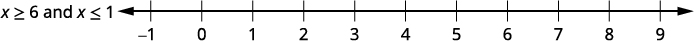

By the end of this section, you will be able to:
* Solve compound inequalities with “and”
* Solve compound inequalities with “or”
* Solve applications with compound inequalities

Before you get started, take this readiness quiz.

1.  Simplify:
    <math xmlns="http://www.w3.org/1998/Math/MathML"><mrow><mfrac><mn>2</mn><mn>5</mn></mfrac><mspace width="0.2em" /><mo stretchy="false">(</mo><mi>x</mi><mo>+</mo><mn>10</mn><mo stretchy="false">)</mo><mo>.</mo></mrow></math>
    
    * * *
    {: data-type="newline"}
    
    If you missed this problem, review [\[link\]](/m63306#fs-id1167829788421).
2.  Simplify:
    <math xmlns="http://www.w3.org/1998/Math/MathML"><mrow><mtext>−</mtext><mo stretchy="false">(</mo><mi>x</mi><mo>−</mo><mn>4</mn><mo stretchy="false">)</mo><mo>.</mo></mrow></math>
    
    * * *
    {: data-type="newline"}
    
    If you missed this problem, review [\[link\]](/m63306#fs-id1167829752757).
{: type="1"}

### Solve Compound Inequalities with “and”

Now that we know how to solve linear inequalities, the next step is to look at compound inequalities. A **compound inequality**{: data-type="term"} is made up of two inequalities connected by the word “and” or the word “or.” For example, the following are compound inequalities.

<math xmlns="http://www.w3.org/1998/Math/MathML"><mrow><mi>x</mi><mo>+</mo><mn>3</mn><mo>&gt;</mo><mn>−4</mn><mspace width="1em" /><mtext>and</mtext><mspace width="1em" /><mn>4</mn><mi>x</mi><mo>−</mo><mn>5</mn><mo>≤</mo><mn>3</mn></mrow></math>

<math xmlns="http://www.w3.org/1998/Math/MathML"><mrow><mn>2</mn><mo stretchy="false">(</mo><mi>y</mi><mo>+</mo><mn>1</mn><mo stretchy="false">)</mo><mo>&lt;</mo><mn>0</mn><mspace width="1em" /><mtext>or</mtext><mspace width="1em" /><mi>y</mi><mo>−</mo><mn>5</mn><mo>≥</mo><mn>−2</mn></mrow></math>

Compound Inequality

A **compound inequality** is made up of two inequalities connected by the word “and” or the word “or.”

To solve a compound inequality means to find all values of the variable that make the compound inequality a true statement. We solve compound inequalities using the same techniques we used to solve linear inequalities. We solve each inequality separately and then consider the two solutions.

To solve a compound inequality with the word “and,” we look for all numbers that make *both* inequalities true. To solve a compound inequality with the word “or,” we look for all numbers that make *either* inequality true.

Let’s start with the compound inequalities with “and.” Our solution will be the numbers that are solutions to *both* inequalities known as the intersection of the two inequalities. Consider the intersection of two streets—the part where the streets overlap—belongs to both streets.

    To find the solution of the compound inequality, we look at the graphs of each inequality and then find the numbers that belong to both graphs—where the graphs overlap.

For the compound inequality <math xmlns="http://www.w3.org/1998/Math/MathML"><mrow><mi>x</mi><mo>&gt;</mo><mn>−3</mn></mrow></math>

 and <math xmlns="http://www.w3.org/1998/Math/MathML"><mrow><mi>x</mi><mo>≤</mo><mn>2</mn><mo>,</mo></mrow></math>

 we graph each inequality. We then look for where the graphs “overlap”. The numbers that are shaded on both graphs, will be shaded on the graph of the solution of the compound inequality. See [\[link\]](#CNX_IntAlg_Figure_02_06_002).

 {: #CNX_IntAlg_Figure_02_06_002}

We can see that the numbers between <math xmlns="http://www.w3.org/1998/Math/MathML"><mrow><mn>−3</mn></mrow></math>

 and <math xmlns="http://www.w3.org/1998/Math/MathML"><mrow><mn>2</mn></mrow></math>

 are shaded on both of the first two graphs. They will then be shaded on the solution graph.

The number <math xmlns="http://www.w3.org/1998/Math/MathML"><mrow><mn>−3</mn></mrow></math>

 is not shaded on the first graph and so since it is not shaded on both graphs, it is not included on the solution graph.

The number two is shaded on both the first and second graphs. Therefore, it is be shaded on the solution graph.

This is how we will show our solution in the next examples.

Solve <math xmlns="http://www.w3.org/1998/Math/MathML"><mrow><mn>6</mn><mi>x</mi><mo>−</mo><mn>3</mn><mo>&lt;</mo><mn>9</mn></mrow></math>

 and <math xmlns="http://www.w3.org/1998/Math/MathML"><mrow><mn>2</mn><mi>x</mi><mo>+</mo><mn>7</mn><mo>≥</mo><mn>3</mn><mo>.</mo></mrow></math>

 Graph the solution and write the solution in interval notation.

<table class="unnumbered unstyled" summary="6 x minus 3 is less than 9 and 2 x plus 9 is greater than or equal to 3. Step 1 is to solve each inequality. 6 x is less than 12, which simplifies to x is less than 2. 2 x is greater than or equal to negative 6, which simplifies to x is greater than or equal to negative 3. Step 2 is to graph each solution. The graph of x is less than 2 has a right parenthesis at 2 and is shaded to its left. The graph of x is greater than or equal to negative 3 has a left bracket at negative 3 and is shaded to its right. Then graph the numbers that make both inequalities true. The final graph will show all the numbers that make both inequalities true&#x2014;the numbers shaded on both of the first two graphs. The graph of x is less than 2 and x is greater than or equal to negative 3 has a left bracket at negative 3 and a right parenthesis at 2 and is shaded between the bracket and parenthesis. Each graph is marked at negative 3 and 2. Step 3 is to write the solution in interval notation. It is negative 3 to 2 within a bracket and a parenthesis. All the numbers that make both inequalities true are the solution to the compound inequality." data-label=""><tbody>
<tr valign="top">
<td data-valign="top" data-align="left" />
<td data-valign="top" data-align="right"><math xmlns="http://www.w3.org/1998/Math/MathML"><mrow><mn>6</mn><mi>x</mi><mo>−</mo><mn>3</mn><mo>&lt;</mo><mn>9</mn><mspace width="0.55em" /></mrow></math></td>
<td data-valign="top" data-align="right">and</td>
<td data-valign="top" data-align="right"><math xmlns="http://www.w3.org/1998/Math/MathML"><mrow><mn>2</mn><mi>x</mi><mo>+</mo><mn>9</mn><mo>≥</mo><mn>3</mn><mspace width="0.65em" /></mrow></math></td>
</tr>
<tr valign="top">
<td data-valign="top" data-align="left"><strong>Step 1.</strong> Solve each
inequality.</td>
<td data-valign="top" data-align="right"><math xmlns="http://www.w3.org/1998/Math/MathML"><mrow><mn>6</mn><mi>x</mi><mo>−</mo><mn>3</mn><mo>&lt;</mo><mn>9</mn><mspace width="0.55em" /></mrow></math></td>
<td data-valign="top" data-align="left" />
<td data-valign="top" data-align="right"><math xmlns="http://www.w3.org/1998/Math/MathML"><mrow><mn>2</mn><mi>x</mi><mo>+</mo><mn>9</mn><mo>≥</mo><mn>3</mn><mspace width="0.65em" /></mrow></math></td>
</tr>
<tr valign="top">
<td data-valign="top" data-align="left" />
<td data-valign="top" data-align="right"><math xmlns="http://www.w3.org/1998/Math/MathML"><mrow><mn>6</mn><mi>x</mi><mo>&lt;</mo><mn>12</mn></mrow></math></td>
<td data-valign="top" data-align="left" />
<td data-valign="top" data-align="right"><math xmlns="http://www.w3.org/1998/Math/MathML"><mrow><mn>2</mn><mi>x</mi><mo>≥</mo><mn>−6</mn></mrow></math></td>
</tr>
<tr valign="top">
<td data-valign="top" data-align="left" />
<td data-valign="top" data-align="right"><math xmlns="http://www.w3.org/1998/Math/MathML"><mrow><mi>x</mi><mo>&lt;</mo><mn>2</mn><mspace width="0.55em" /></mrow></math></td>
<td data-valign="top" data-align="right">and</td>
<td data-valign="top" data-align="right"><math xmlns="http://www.w3.org/1998/Math/MathML"><mrow><mi>x</mi><mo>≥</mo><mn>−3</mn></mrow></math></td>
</tr>
<tr valign="top">
<td data-valign="top" data-align="left"><strong>Step 2.</strong> Graph each solution. Then graph the numbers that make both inequalities true. The final graph will show all the numbers that make both inequalities true—the numbers shaded on <em>both</em> of the first two graphs.</td>
<td colspan="3" data-valign="top" data-align="left"></td>
</tr>
<tr valign="top">
<td data-valign="top" data-align="left"><strong>Step 3.</strong> Write the solution in interval notation.</td>
<td colspan="3" data-valign="top" data-align="center"><math xmlns="http://www.w3.org/1998/Math/MathML"><mrow><mrow> <mo>[</mo><mrow><mn>−3</mn><mo>,</mo><mn>2</mn><mo stretchy="false">)</mo></mrow></mrow></mrow></math></td>
</tr>
<tr valign="top">
<td colspan="4" data-valign="top" data-align="left">All the numbers that make both inequalities true are the solution to the compound inequality.</td>
</tr>
</tbody></table>

Solve the compound inequality. Graph the solution and write the solution in interval notation: <math xmlns="http://www.w3.org/1998/Math/MathML"><mrow><mn>4</mn><mi>x</mi><mo>−</mo><mn>7</mn><mo>&lt;</mo><mn>9</mn></mrow></math>

 and <math xmlns="http://www.w3.org/1998/Math/MathML"><mrow><mn>5</mn><mi>x</mi><mo>+</mo><mn>8</mn><mo>≥</mo><mn>3</mn><mo>.</mo></mrow></math>

  

Solve the compound inequality. Graph the solution and write the solution in interval notation: <math xmlns="http://www.w3.org/1998/Math/MathML"><mrow><mn>3</mn><mi>x</mi><mo>−</mo><mn>4</mn><mo>&lt;</mo><mn>5</mn></mrow></math>

 and <math xmlns="http://www.w3.org/1998/Math/MathML"><mrow><mn>4</mn><mi>x</mi><mo>+</mo><mn>9</mn><mo>≥</mo><mn>1</mn><mo>.</mo></mrow></math>

  

Solve a compound inequality with “and.”

1.  Solve each inequality.
2.  Graph each solution. Then graph the numbers that make *both* inequalities true.
    * * *
    {: data-type="newline"}
    
    This graph shows the solution to the compound inequality.
3.  Write the solution in interval notation.
{: type="1" .stepwise}

Solve <math xmlns="http://www.w3.org/1998/Math/MathML"><mrow><mn>3</mn><mrow><mo>(</mo><mrow><mn>2</mn><mi>x</mi><mo>+</mo><mn>5</mn></mrow><mo>)</mo></mrow><mo>≤</mo><mn>18</mn></mrow></math>

 and <math xmlns="http://www.w3.org/1998/Math/MathML"><mrow><mn>2</mn><mrow><mo>(</mo><mrow><mi>x</mi><mo>−</mo><mn>7</mn></mrow><mo>)</mo></mrow><mo>&lt;</mo><mn>−6</mn><mo>.</mo></mrow></math>

 Graph the solution and write the solution in interval notation.

<table class="unnumbered unstyled" summary="3 times the quantity 2 x plus 5 is less than or equal to 18 and 2 times the quantity x minus 7 is less than negative 6. Solve each inequality. 3 times the quantity 2 x plus 5 is less than or equal to 18 simplifies to 6 x plus 15 is less than or equal to 18 which simplifies to 6 x is less than or equal to 3, which simplifies to x is less than or equal to one-half. 2 times the quantity x minus 7 is less than negative 6 simplifies to 2 x minus 14 is less than negative 6, which simplifies to 2 x is less than 8, which simplifies to x is less than 4. Graph each solution. The graph of x is less than or equal to one-half has a right bracket at one-half and is shaded to the left. The graph of x is less than 4 has a right parenthesis and is shaded to the left. Both graphs are marked at one-half. Graph the numbers that make both inequalities true. Graph the numbers that make both inequalities true. The graph has a right bracket at one-half and is shaded to the left. It is marked at one-half. Write the solution in interval notation. It is negative infinity and one-half within a parenthesis and a bracket." data-label=""><tbody>
<tr valign="top">
<td data-valign="top" data-align="left" />
<td data-valign="top" data-align="right"><math xmlns="http://www.w3.org/1998/Math/MathML"><mrow><mn>3</mn><mrow><mo>(</mo><mrow><mn>2</mn><mi>x</mi><mo>+</mo><mn>5</mn></mrow><mo>)</mo></mrow><mo>≤</mo><mn>18</mn></mrow></math></td>
<td data-valign="top" data-align="right">and</td>
<td data-valign="top" data-align="right"><math xmlns="http://www.w3.org/1998/Math/MathML"><mrow><mn>2</mn><mrow><mo>(</mo><mrow><mi>x</mi><mo>−</mo><mn>7</mn></mrow><mo>)</mo></mrow><mo>&lt;</mo><mn>−6</mn></mrow></math></td>
</tr>
<tr valign="top">
<td data-valign="top" data-align="left">Solve each
inequality.</td>
<td data-valign="top" data-align="right"><math xmlns="http://www.w3.org/1998/Math/MathML"><mrow><mn>6</mn><mi>x</mi><mo>+</mo><mn>15</mn><mo>≤</mo><mn>18</mn></mrow></math></td>
<td data-valign="top" data-align="left" />
<td data-valign="top" data-align="right"><math xmlns="http://www.w3.org/1998/Math/MathML"><mrow><mn>2</mn><mi>x</mi><mo>−</mo><mn>14</mn><mo>&lt;</mo><mn>−6</mn></mrow></math></td>
</tr>
<tr valign="top">
<td data-valign="top" data-align="left" />
<td data-valign="top" data-align="right"><math xmlns="http://www.w3.org/1998/Math/MathML"><mrow><mn>6</mn><mi>x</mi><mo>≤</mo><mn>3</mn><mspace width="0.5em" /></mrow></math></td>
<td data-valign="top" data-align="left" />
<td data-valign="top" data-align="right"><math xmlns="http://www.w3.org/1998/Math/MathML"><mrow><mn>2</mn><mi>x</mi><mo>&lt;</mo><mn>8</mn><mspace width="0.65em" /></mrow></math></td>
</tr>
<tr valign="top">
<td data-valign="top" data-align="left" />
<td data-valign="top" data-align="right"><math xmlns="http://www.w3.org/1998/Math/MathML"><mrow><mi>x</mi><mo>≤</mo><mfrac><mn>1</mn><mn>2</mn></mfrac><mspace width="0.4em" /></mrow></math></td>
<td data-valign="top" data-align="right">and</td>
<td data-valign="top" data-align="right"><math xmlns="http://www.w3.org/1998/Math/MathML"><mrow><mi>x</mi><mo>&lt;</mo><mn>4</mn><mspace width="0.65em" /></mrow></math></td>
</tr>
<tr valign="top">
<td data-valign="top" data-align="left">Graph each
solution.</td>
<td colspan="3" data-valign="top" data-align="left"></td>
</tr>
<tr valign="top">
<td data-valign="top" data-align="left">Graph the numbers
that make both
inequalities true.</td>
<td colspan="3" data-valign="top" data-align="left"></td>
</tr>
<tr valign="top">
<td data-valign="top" data-align="left">Write the solution
in interval notation.</td>
<td colspan="3" data-valign="top" data-align="center"><math xmlns="http://www.w3.org/1998/Math/MathML"><mrow><mo stretchy="false">(</mo><mtext>−</mtext><mi>∞</mi><mo>,</mo><mrow><mrow><mfrac><mn>1</mn><mn>2</mn></mfrac></mrow><mo>]</mo></mrow></mrow></math></td>
</tr>
</tbody></table>

Solve the compound inequality. Graph the solution and write the solution in interval notation: <math xmlns="http://www.w3.org/1998/Math/MathML"><mrow><mn>2</mn><mrow><mo>(</mo><mrow><mn>3</mn><mi>x</mi><mo>+</mo><mn>1</mn></mrow><mo>)</mo></mrow><mo>≤</mo><mn>20</mn></mrow></math>

 and <math xmlns="http://www.w3.org/1998/Math/MathML"><mrow><mn>4</mn><mrow><mo>(</mo><mrow><mi>x</mi><mo>−</mo><mn>1</mn></mrow><mo>)</mo></mrow><mo>&lt;</mo><mn>2</mn><mo>.</mo></mrow></math>

  

Solve the compound inequality. Graph the solution and write the solution in interval notation: <math xmlns="http://www.w3.org/1998/Math/MathML"><mrow><mn>5</mn><mrow><mo>(</mo><mrow><mn>3</mn><mi>x</mi><mo>−</mo><mn>1</mn></mrow><mo>)</mo></mrow><mo>≤</mo><mn>10</mn></mrow></math>

 and <math xmlns="http://www.w3.org/1998/Math/MathML"><mrow><mn>4</mn><mrow><mo>(</mo><mrow><mi>x</mi><mo>+</mo><mn>3</mn></mrow><mo>)</mo></mrow><mo>&lt;</mo><mn>8</mn><mo>.</mo></mrow></math>

  

Solve <math xmlns="http://www.w3.org/1998/Math/MathML"><mrow><mfrac><mn>1</mn><mn>3</mn></mfrac><mi>x</mi><mo>−</mo><mn>4</mn><mo>≥</mo><mn>−2</mn></mrow></math>

 and <math xmlns="http://www.w3.org/1998/Math/MathML"><mrow><mn>−2</mn><mrow><mo>(</mo><mrow><mi>x</mi><mo>−</mo><mn>3</mn></mrow><mo>)</mo></mrow><mo>≥</mo><mn>4</mn><mo>.</mo></mrow></math>

 Graph the solution and write the solution in interval notation.

<table class="unnumbered unstyled" summary="One-third x minus 4 is greater than or equal to negative 2 and negative 2 times the quantity x minus 3 is greater than or equal to 4. Solve each inequality. One-third x minus 4 is greater than or equal to negative 2 simplifies to x is greater than or equal to 6. Negative 2 times the quantity x minus 3 is greater than or equal to 4 simplifies to negative 2 x is greater than negative 2, which simplifies to x is less than or equal to 1. Graph each solution. The graph of x is greater than or equal to 6 has a left bracket at 6 and is shaded to its right. The graph of x is less than or equal to 1 has a right bracket at 1 and is shaded to its left. Graph the numbers that make both inequalities true. Notice that there are no numbers that make the inequalities true." data-label=""><tbody>
<tr valign="top">
<td data-valign="top" data-align="left" />
<td data-valign="top" data-align="right"><math xmlns="http://www.w3.org/1998/Math/MathML"><mrow><mfrac><mn>1</mn><mn>3</mn></mfrac><mi>x</mi><mo>−</mo><mn>4</mn><mo>≥</mo><mn>−2</mn></mrow></math></td>
<td data-valign="top" data-align="right">and</td>
<td data-valign="top" data-align="right"><math xmlns="http://www.w3.org/1998/Math/MathML"><mrow><mo>−</mo><mn>2</mn><mrow><mo>(</mo><mrow><mi>x</mi><mo>−</mo><mn>3</mn></mrow><mo>)</mo></mrow><mo>≥</mo><mn>4</mn><mspace width="0.75em" /></mrow></math></td>
</tr>
<tr valign="top">
<td data-valign="top" data-align="left">Solve each inequality.</td>
<td data-valign="top" data-align="right"><math xmlns="http://www.w3.org/1998/Math/MathML"><mrow><mfrac><mn>1</mn><mn>3</mn></mfrac><mi>x</mi><mo>−</mo><mn>4</mn><mo>≥</mo><mn>−2</mn></mrow></math></td>
<td data-valign="top" data-align="left" />
<td data-valign="top" data-align="right"><math xmlns="http://www.w3.org/1998/Math/MathML"><mrow><mn>−2</mn><mi>x</mi><mo>+</mo><mn>6</mn><mo>≥</mo><mn>4</mn><mspace width="0.75em" /></mrow></math></td>
</tr>
<tr valign="top">
<td data-valign="top" data-align="left" />
<td data-valign="top" data-align="right"><math xmlns="http://www.w3.org/1998/Math/MathML"><mrow><mfrac><mn>1</mn><mn>3</mn></mfrac><mi>x</mi><mo>≥</mo><mn>2</mn><mspace width="0.65em" /></mrow></math></td>
<td data-valign="top" data-align="left" />
<td data-valign="top" data-align="right"><math xmlns="http://www.w3.org/1998/Math/MathML"><mrow><mn>−2</mn><mi>x</mi><mo>≥</mo><mn>−2</mn></mrow></math></td>
</tr>
<tr valign="top">
<td data-valign="top" data-align="left" />
<td data-valign="top" data-align="right"><math xmlns="http://www.w3.org/1998/Math/MathML"><mrow><mi>x</mi><mo>≥</mo><mn>6</mn><mspace width="0.65em" /></mrow></math></td>
<td data-valign="top" data-align="right">and</td>
<td data-valign="top" data-align="right"><math xmlns="http://www.w3.org/1998/Math/MathML"><mrow><mi>x</mi><mo>≤</mo><mn>1</mn><mspace width="0.75em" /></mrow></math></td>
</tr>
<tr valign="top">
<td data-valign="top" data-align="left">Graph each solution.</td>
<td colspan="3" data-valign="top" data-align="left"></td>
</tr>
<tr valign="top">
<td data-valign="top" data-align="left">Graph the numbers that
make both inequalities
true.</td>
<td colspan="3" data-valign="top" data-align="left"></td>
</tr>
<tr valign="top">
<td data-valign="top" data-align="left" />
<td colspan="3" data-valign="top" data-align="left"><math xmlns="http://www.w3.org/1998/Math/MathML"><mrow><mspace width="8em" /></mrow></math>There are no numbers that make both inequalities true.

<math xmlns="http://www.w3.org/1998/Math/MathML"><mrow><mspace width="8em" /></mrow></math>This is a contradiction so there is no solution.</td>
</tr>
</tbody></table>

Solve the compound inequality. Graph the solution and write the solution in interval notation: <math xmlns="http://www.w3.org/1998/Math/MathML"><mrow><mfrac><mn>1</mn><mn>4</mn></mfrac><mi>x</mi><mo>−</mo><mn>3</mn><mo>≥</mo><mn>−1</mn></mrow></math>

 and <math xmlns="http://www.w3.org/1998/Math/MathML"><mrow><mn>−3</mn><mrow><mo>(</mo><mrow><mi>x</mi><mo>−</mo><mn>2</mn></mrow><mo>)</mo></mrow><mo>≥</mo><mn>2</mn><mo>.</mo></mrow></math>

  

Solve the compound inequality. Graph the solution and write the solution in interval notation: <math xmlns="http://www.w3.org/1998/Math/MathML"><mrow><mfrac><mn>1</mn><mn>5</mn></mfrac><mi>x</mi><mo>−</mo><mn>5</mn><mo>≥</mo><mn>−3</mn></mrow></math>

 and <math xmlns="http://www.w3.org/1998/Math/MathML"><mrow><mn>−4</mn><mrow><mo>(</mo><mrow><mi>x</mi><mo>−</mo><mn>1</mn></mrow><mo>)</mo></mrow><mo>≥</mo><mn>−2</mn><mo>.</mo></mrow></math>

  

Sometimes we have a compound inequality that can be written more concisely. For example, <math xmlns="http://www.w3.org/1998/Math/MathML"><mrow><mi>a</mi><mo>&lt;</mo><mi>x</mi></mrow></math>

 and <math xmlns="http://www.w3.org/1998/Math/MathML"><mrow><mi>x</mi><mo>&lt;</mo><mi>b</mi></mrow></math>

 can be written simply as <math xmlns="http://www.w3.org/1998/Math/MathML"><mrow><mi>a</mi><mo>&lt;</mo><mi>x</mi><mo>&lt;</mo><mi>b</mi></mrow></math>

 and then we call it a **double inequality**{: data-type="term" .no-emphasis}. The two forms are equivalent.

Double Inequality

A double inequality is a compound inequality such as <math xmlns="http://www.w3.org/1998/Math/MathML"><mrow><mi>a</mi><mo>&lt;</mo><mi>x</mi><mo>&lt;</mo><mi>b</mi><mo>.</mo></mrow></math>

 It is equivalent to <math xmlns="http://www.w3.org/1998/Math/MathML"><mrow><mi>a</mi><mo>&lt;</mo><mi>x</mi></mrow></math>

 and <math xmlns="http://www.w3.org/1998/Math/MathML"><mrow><mi>x</mi><mo>&lt;</mo><mi>b</mi><mo>.</mo></mrow></math>

<math xmlns="http://www.w3.org/1998/Math/MathML"><mrow><mtable> <mtr><mtd columnalign="left"><mtext>Other forms:</mtext></mtd><mtd /><mtd /><mtd columnalign="left"><mtable><mtr><mtd columnalign="left"><mi>a</mi><mo>&lt;</mo><mi>x</mi><mo>&lt;</mo><mi>b</mi></mtd><mtd /><mtd /><mtd columnalign="left"><mtext>is equivalent to</mtext></mtd><mtd /><mtd /><mtd columnalign="left"><mi>a</mi><mo>&lt;</mo><mi>x</mi></mtd><mtd /><mtd /><mtd columnalign="left"><mtext>and</mtext></mtd><mtd /><mtd /><mtd columnalign="left"><mi>x</mi><mo>&lt;</mo><mi>b</mi></mtd></mtr> <mtr><mtd columnalign="left"><mi>a</mi><mo>≤</mo><mi>x</mi><mo>≤</mo><mi>b</mi></mtd><mtd /><mtd /><mtd columnalign="left"><mtext>is equivalent to</mtext></mtd><mtd /><mtd /><mtd columnalign="left"><mi>a</mi><mo>≤</mo><mi>x</mi></mtd><mtd /><mtd /><mtd columnalign="left"><mtext>and</mtext></mtd><mtd /><mtd /><mtd columnalign="left"><mi>x</mi><mo>≤</mo><mi>b</mi></mtd></mtr> <mtr><mtd columnalign="left"><mi>a</mi><mo>&gt;</mo><mi>x</mi><mo>&gt;</mo><mi>b</mi></mtd><mtd /><mtd /><mtd columnalign="left"><mtext>is equivalent to</mtext></mtd><mtd /><mtd /><mtd columnalign="left"><mi>a</mi><mo>&gt;</mo><mi>x</mi></mtd><mtd /><mtd /><mtd columnalign="left"><mtext>and</mtext></mtd><mtd /><mtd /><mtd columnalign="left"><mi>x</mi><mo>&gt;</mo><mi>b</mi></mtd></mtr> <mtr><mtd columnalign="left"><mi>a</mi><mo>≥</mo><mi>x</mi><mo>≥</mo><mi>b</mi></mtd><mtd /><mtd /><mtd columnalign="left"><mtext>is equivalent to</mtext></mtd><mtd /><mtd /><mtd columnalign="left"><mi>a</mi><mo>≥</mo><mi>x</mi></mtd><mtd /><mtd /><mtd columnalign="left"><mtext>and</mtext></mtd><mtd /><mtd /><mtd columnalign="left"><mi>x</mi><mo>≥</mo><mi>b</mi></mtd></mtr></mtable></mtd></mtr></mtable></mrow></math>

To solve a double inequality we perform the same operation on all three “parts” of the double inequality with the goal of isolating the variable in the center.

Solve <math xmlns="http://www.w3.org/1998/Math/MathML"><mrow><mn>−4</mn><mo>≤</mo><mn>3</mn><mi>x</mi><mo>−</mo><mn>7</mn><mo>&lt;</mo><mn>8</mn><mo>.</mo></mrow></math>

 Graph the solution and write the solution in interval notation.

|  |  |
{: valign="top"}| Add 7 to all three parts. |  |
{: valign="top"}| Simplify. |  |
{: valign="top"}| Divide each part by three. |  |
{: valign="top"}| Simplify. |  |
{: valign="top"}| Graph the solution. |  |
{: valign="top"}| Write the solution in interval notation. |  |
{: valign="top"}{: .unnumbered .unstyled summary="Negative 4 is less than or equal to 3 x minus 7 which is less than 8. Add 7 to all three parts. Negative 4 plus 7 is less than or equal to 3 x minus 7 plus 7 which is less than 8 plus 7. Simplify. 3 is less than or equal to 3 x which is less than 15. Divided each part by 3. 3 divided by 3 is less than or equal to 3 x divided by 3 which is less than 15 divided by 3. Simplify. The result is 1 is less than or equal to x which is less than 5. Graph the solution. The solution on a number line is a left bracket at 1, a right parenthesis at 5, and shading between the bracket and parenthesis. Write the solution in interval notation. It is 1 to 5 within a bracket and a parenthesis." data-label=""}

When written as a double inequality, <math xmlns="http://www.w3.org/1998/Math/MathML"><mrow><mn>1</mn><mo>≤</mo><mi>x</mi><mo>&lt;</mo><mn>5</mn><mo>,</mo></mrow></math>

 it is easy to see that the solutions are the numbers caught between one and five, including one, but not five. We can then graph the solution immediately as we did above.

Another way to graph the solution of <math xmlns="http://www.w3.org/1998/Math/MathML"><mrow><mn>1</mn><mo>≤</mo><mi>x</mi><mo>&lt;</mo><mn>5</mn></mrow></math>

 is to graph both the solution of <math xmlns="http://www.w3.org/1998/Math/MathML"><mrow><mi>x</mi><mo>≥</mo><mn>1</mn></mrow></math>

 and the solution of <math xmlns="http://www.w3.org/1998/Math/MathML"><mrow><mi>x</mi><mo>&lt;</mo><mn>5</mn><mo>.</mo></mrow></math>

 We would then find the numbers that make both inequalities true as we did in previous examples.

Solve the compound inequality. Graph the solution and write the solution in interval notation: <math xmlns="http://www.w3.org/1998/Math/MathML"><mrow><mn>−5</mn><mo>≤</mo><mn>4</mn><mi>x</mi><mo>−</mo><mn>1</mn><mo>&lt;</mo><mn>7</mn><mo>.</mo></mrow></math>

  

Solve the compound inequality. Graph the solution and write the solution in interval notation: <math xmlns="http://www.w3.org/1998/Math/MathML"><mrow><mn>−3</mn><mo>&lt;</mo><mn>2</mn><mi>x</mi><mo>−</mo><mn>5</mn><mo>≤</mo><mn>1</mn><mo>.</mo></mrow></math>

  

### Solve Compound Inequalities with “or”

To solve a **compound inequality**{: data-type="term" .no-emphasis} with “or”, we start out just as we did with the compound inequalities with “and”—we solve the two inequalities. Then we find all the numbers that make *either* inequality true.

Just as the United States is the union of all of the 50 states, the solution will be the union of all the numbers that make either inequality true. To find the solution of the compound inequality, we look at the graphs of each inequality, find the numbers that belong to either graph and put all those numbers together.

To write the solution in **interval notation**{: data-type="term" .no-emphasis}, we will often use the **union symbol**{: data-type="term" .no-emphasis}, <math xmlns="http://www.w3.org/1998/Math/MathML"><mo>∪</mo></math>

 to show the union of the solutions shown in the graphs.

Solve a compound inequality with “or.”

1.  Solve each inequality.
2.  Graph each solution. Then graph the numbers that make either inequality true.
3.  Write the solution in interval notation.
{: type="1" .stepwise}

Solve <math xmlns="http://www.w3.org/1998/Math/MathML"><mrow><mn>5</mn><mo>−</mo><mn>3</mn><mi>x</mi><mo>≤</mo><mn>−1</mn></mrow></math>

 or <math xmlns="http://www.w3.org/1998/Math/MathML"><mrow><mn>8</mn><mo>+</mo><mn>2</mn><mi>x</mi><mo>≤</mo><mn>5</mn><mo>.</mo></mrow></math>

 Graph the solution and write the solution in interval notation.

<table class="unnumbered unstyled" summary="5 minus 3 x is less than or equal to negative 1 or 8 plus 2 x is less than or equal to 5. Solve each inequality. 5 minus 3 x is less than or equal to negative 1 simplifies to negative 3 x is less than or equal to negative 6, which simplifies to x is greater than or equal to 2. 8 plus 2 x is less than or equal to 5 simplifies to 2 x is less than or equal to negative 3, which simplifies to x is less than or equal to negative three halves. Graph each solution. The graph of x is greater than or equal to 2 has a left bracket at 2 and is shaded to its right. The graph of x is less than or equal to negative three halves has a right bracket at negative three halves and is shaded to its left. Graph numbers that make either inequality true. The graph shows a right bracket at negative three-halves with shading to the left and a left bracket at 2 with shading to the right. So, the interval notation of the solution is the union of negative infinity to negative three-halves within a parenthesis and a bracket and 2 to infinity within a bracket and a parenthesis." data-label=""><tbody>
<tr valign="top">
<td data-valign="top" data-align="left" />
<td data-valign="top" data-align="right"><math xmlns="http://www.w3.org/1998/Math/MathML"><mrow><mn>5</mn><mo>−</mo><mn>3</mn><mi>x</mi><mo>≤</mo><mn>−1</mn></mrow></math></td>
<td data-valign="top" data-align="right">or</td>
<td data-valign="top" data-align="right"><math xmlns="http://www.w3.org/1998/Math/MathML"><mrow><mn>8</mn><mo>+</mo><mn>2</mn><mi>x</mi><mo>≤</mo><mn>5</mn><mspace width="1.25em" /></mrow></math></td>
</tr>
<tr valign="top">
<td data-valign="top" data-align="left">Solve each inequality.</td>
<td data-valign="top" data-align="right"><math xmlns="http://www.w3.org/1998/Math/MathML"><mrow><mn>5</mn><mo>−</mo><mn>3</mn><mi>x</mi><mo>≤</mo><mn>−1</mn></mrow></math></td>
<td data-valign="top" data-align="left" />
<td data-valign="top" data-align="right"><math xmlns="http://www.w3.org/1998/Math/MathML"><mrow><mn>8</mn><mo>+</mo><mn>2</mn><mi>x</mi><mo>≤</mo><mn>5</mn><mspace width="1.25em" /></mrow></math></td>
</tr>
<tr valign="top">
<td data-valign="top" data-align="left" />
<td data-valign="top" data-align="right"><math xmlns="http://www.w3.org/1998/Math/MathML"><mrow><mn>−3</mn><mi>x</mi><mo>≤</mo><mn>−6</mn></mrow></math></td>
<td data-valign="top" data-align="left" />
<td data-valign="top" data-align="right"><math xmlns="http://www.w3.org/1998/Math/MathML"><mrow><mspace width="3em" /><mn>2</mn><mi>x</mi><mo>≤</mo><mo>−</mo><mn>3</mn><mspace width="0.1em" /></mrow></math></td>
</tr>
<tr valign="top">
<td data-valign="top" data-align="left" />
<td data-valign="top" data-align="right"><math xmlns="http://www.w3.org/1998/Math/MathML"><mrow><mi>x</mi><mo>≥</mo><mn>2</mn><mspace width="0.65em" /></mrow></math></td>
<td data-valign="top" data-align="right">or</td>
<td data-valign="top" data-align="right"><math xmlns="http://www.w3.org/1998/Math/MathML"><mrow><mspace width="3.2em" /><mi>x</mi><mo>≤</mo><mo>−</mo><mfrac><mn>3</mn><mn>2</mn></mfrac></mrow></math></td>
</tr>
<tr valign="top">
<td data-valign="top" data-align="left">Graph each solution.</td>
<td colspan="3" data-valign="top" data-align="left"></td>
</tr>
<tr valign="top">
<td data-valign="top" data-align="left">Graph numbers that
make either inequality
true.</td>
<td colspan="3" data-valign="top" data-align="left"></td>
</tr>
<tr valign="top">
<td data-valign="top" data-align="left" />
<td colspan="3" data-valign="top" data-align="center"><math xmlns="http://www.w3.org/1998/Math/MathML"><mrow><mrow><mo>(</mo><mrow><mtext>−</mtext><mi>∞</mi><mo>,</mo><mo>−</mo><mfrac><mn>3</mn><mn>2</mn></mfrac></mrow><mo>]</mo></mrow><mo>∪</mo><mrow><mo>[</mo><mrow><mn>2</mn><mo>,</mo><mi>∞</mi></mrow><mo>)</mo></mrow></mrow></math></td>
</tr>
</tbody></table>

Solve the compound inequality. Graph the solution and write the solution in interval notation: <math xmlns="http://www.w3.org/1998/Math/MathML"><mrow><mn>1</mn><mo>−</mo><mn>2</mn><mi>x</mi><mo>≤</mo><mn>−3</mn></mrow></math>

 or <math xmlns="http://www.w3.org/1998/Math/MathML"><mrow><mn>7</mn><mo>+</mo><mn>3</mn><mi>x</mi><mo>≤</mo><mn>4</mn><mo>.</mo></mrow></math>

  

Solve the compound inequality. Graph the solution and write the solution in interval notation: <math xmlns="http://www.w3.org/1998/Math/MathML"><mrow><mn>2</mn><mo>−</mo><mn>5</mn><mi>x</mi><mo>≤</mo><mn>−3</mn></mrow></math>

 or <math xmlns="http://www.w3.org/1998/Math/MathML"><mrow><mn>5</mn><mo>+</mo><mn>2</mn><mi>x</mi><mo>≤</mo><mn>3</mn><mo>.</mo></mrow></math>

  

Solve <math xmlns="http://www.w3.org/1998/Math/MathML"><mrow><mfrac><mn>2</mn><mn>3</mn></mfrac><mi>x</mi><mo>−</mo><mn>4</mn><mo>≤</mo><mn>3</mn></mrow></math>

 or <math xmlns="http://www.w3.org/1998/Math/MathML"><mrow><mfrac><mn>1</mn><mn>4</mn></mfrac><mrow><mo>(</mo><mrow><mi>x</mi><mo>+</mo><mn>8</mn></mrow><mo>)</mo></mrow><mo>≥</mo><mn>−1</mn><mo>.</mo></mrow></math>

 Graph the solution and write the solution in interval notation.

<table class="unnumbered unstyled can-break" summary="Two-third x minus 4 is less than or equal to 3 or one-fourth times the quantity x plus 8 is greater than or equal to negative 1. Solve each inequality. Two-third x minus 4 is less than or equal to 3 simplifies to two-thirds x is less than or equal to 7 which simplifies to three-halves times two-thirds x is less than or equal to three-halves times 7 ones, which simplifies to x is less than or equal to twenty-one halves. One-fourth times the quantity x plus 8 simplifies to one-fourth x plus 2 is greater than negative 1 which simplifies to one-fourth x is greater than negative 3 which simplifies to x is greater than or equal to negative 12. Graph each solution. The graph of x is less than twenty-one halves has a right bracket at twenty-one halves and is shaded to the left. The graph of x is greater than or equal to negative 12 has a left bracket at negative 12 and is shaded to the right. Graph numbers that make either inequality true. All values are shaded on the number line. The solution is all real numbers. The interval notation is negative infinity to infinity within parentheses." data-label=""><tbody>
<tr valign="top">
<td data-valign="top" data-align="left" />
<td data-valign="top" data-align="right"><math xmlns="http://www.w3.org/1998/Math/MathML"><mrow><mfrac><mn>2</mn><mn>3</mn></mfrac><mi>x</mi><mo>−</mo><mn>4</mn><mo>≤</mo><mn>3</mn><mspace width="1.2em" /></mrow></math></td>
<td data-valign="top" data-align="right">or</td>
<td data-valign="top" data-align="right"><math xmlns="http://www.w3.org/1998/Math/MathML"><mrow><mfrac><mn>1</mn><mn>4</mn></mfrac><mrow><mo>(</mo><mrow><mi>x</mi><mo>+</mo><mn>8</mn></mrow><mo>)</mo></mrow><mo>≥</mo><mn>−1</mn><mspace width="1.8em" /></mrow></math></td>
</tr>
<tr valign="top">
<td data-valign="top" data-align="left">Solve each
inequality.</td>
<td data-valign="top" data-align="right"><math xmlns="http://www.w3.org/1998/Math/MathML"><mrow><mspace width="0.4em" /><mn>3</mn><mrow><mo>(</mo><mrow><mfrac><mn>2</mn><mn>3</mn></mfrac><mi>x</mi><mo>−</mo><mn>4</mn></mrow><mo>)</mo></mrow><mo>≤</mo><mn>3</mn><mrow><mo>(</mo><mn>3</mn><mo>)</mo></mrow></mrow></math></td>
<td data-valign="top" data-align="left" />
<td data-valign="top" data-align="right"><math xmlns="http://www.w3.org/1998/Math/MathML"><mrow><mn>4</mn><mo>·</mo><mfrac><mn>1</mn><mn>4</mn></mfrac><mrow><mo>(</mo><mrow><mi>x</mi><mo>+</mo><mn>8</mn></mrow><mo>)</mo></mrow><mo>≥</mo><mn>4</mn><mo>·</mo><mrow><mo>(</mo><mrow><mn>−1</mn></mrow><mo>)</mo></mrow></mrow></math></td>
</tr>
<tr valign="top">
<td data-valign="top" data-align="left" />
<td data-valign="top" data-align="right"><math xmlns="http://www.w3.org/1998/Math/MathML"><mrow><mn>2</mn><mi>x</mi><mo>−</mo><mn>12</mn><mo>≤</mo><mn>9</mn><mspace width="1.2em" /></mrow></math></td>
<td data-valign="top" data-align="left" />
<td data-valign="top" data-align="right"><math xmlns="http://www.w3.org/1998/Math/MathML"><mrow><mi>x</mi><mo>+</mo><mn>8</mn><mo>≥</mo><mn>−4</mn><mspace width="1.75em" /></mrow></math></td>
</tr>
<tr valign="top">
<td data-valign="top" data-align="left" />
<td data-valign="top" data-align="right"><math xmlns="http://www.w3.org/1998/Math/MathML"><mrow><mn>2</mn><mi>x</mi><mo>≤</mo><mn>21</mn><mspace width="0.7em" /></mrow></math></td>
<td data-valign="top" data-align="left" />
<td data-valign="top" data-align="right"><math xmlns="http://www.w3.org/1998/Math/MathML"><mrow><mi>x</mi><mo>≥</mo><mn>−12</mn><mspace width="1.25em" /></mrow></math></td>
</tr>
<tr valign="top">
<td data-valign="top" data-align="left" />
<td data-valign="top" data-align="right"><math xmlns="http://www.w3.org/1998/Math/MathML"><mrow><mi>x</mi><mo>≤</mo><mfrac><mrow><mn>21</mn></mrow><mn>2</mn></mfrac><mspace width="0.55em" /></mrow></math></td>
<td data-valign="top" data-align="left" />
<td data-valign="top" data-align="left" />
</tr>
<tr valign="top">
<td data-valign="top" data-align="left" />
<td data-valign="top" data-align="right"><math xmlns="http://www.w3.org/1998/Math/MathML"><mrow><mi>x</mi><mo>≤</mo><mfrac><mrow><mn>21</mn></mrow><mn>2</mn></mfrac><mspace width="0.55em" /></mrow></math></td>
<td data-valign="top" data-align="right">or</td>
<td data-valign="top" data-align="right"><math xmlns="http://www.w3.org/1998/Math/MathML"><mrow><mi>x</mi><mo>≥</mo><mn>−12</mn><mspace width="1.25em" /></mrow></math></td>
</tr>
<tr valign="top">
<td data-valign="top" data-align="left">Graph each
solution.</td>
<td colspan="3" data-valign="top" data-align="left"></td>
</tr>
<tr valign="top">
<td data-valign="top" data-align="left">Graph numbers
that make either
inequality true.</td>
<td colspan="3" data-valign="top" data-align="left"></td>
</tr>
<tr valign="top">
<td data-valign="top" data-align="left" />
<td colspan="3" data-valign="top" data-align="center">The solution covers all real numbers.</td>
</tr>
<tr valign="top">
<td data-valign="top" data-align="left" />
<td colspan="3" data-valign="top" data-align="center"><math xmlns="http://www.w3.org/1998/Math/MathML"><mrow><mrow><mo>(</mo><mrow><mtext>−</mtext><mi>∞</mi><mo>,</mo><mi>∞</mi></mrow><mo>)</mo></mrow></mrow></math></td>
</tr>
</tbody></table>

Solve the compound inequality. Graph the solution and write the solution in interval notation: <math xmlns="http://www.w3.org/1998/Math/MathML"><mrow><mfrac><mn>3</mn><mn>5</mn></mfrac><mi>x</mi><mo>−</mo><mn>7</mn><mo>≤</mo><mn>−1</mn></mrow></math>

 or <math xmlns="http://www.w3.org/1998/Math/MathML"><mrow><mfrac><mn>1</mn><mn>3</mn></mfrac><mrow><mo>(</mo><mrow><mi>x</mi><mo>+</mo><mn>6</mn></mrow><mo>)</mo></mrow><mo>≥</mo><mn>−2</mn><mo>.</mo></mrow></math>

  

Solve the compound inequality. Graph the solution and write the solution in interval notation: <math xmlns="http://www.w3.org/1998/Math/MathML"><mrow><mfrac><mn>3</mn><mn>4</mn></mfrac><mi>x</mi><mo>−</mo><mn>3</mn><mo>≤</mo><mn>3</mn></mrow></math>

 or <math xmlns="http://www.w3.org/1998/Math/MathML"><mrow><mfrac><mn>2</mn><mn>5</mn></mfrac><mrow><mo>(</mo><mrow><mi>x</mi><mo>+</mo><mn>10</mn></mrow><mo>)</mo></mrow><mo>≥</mo><mn>0</mn><mo>.</mo></mrow></math>

  

### Solve Applications with Compound Inequalities

Situations in the real world also involve compound inequalities. We will use the same problem solving strategy that we used to solve linear equation and inequality applications.

Recall the problem solving strategies are to first read the problem and make sure all the words are understood. Then, identify what we are looking for and assign a variable to represent it. Next, restate the problem in one sentence to make it easy to translate into a **compound inequality**{: data-type="term" .no-emphasis}. Last, we will solve the compound inequality.

Due to the drought in California, many communities have tiered water rates. There are different rates for Conservation Usage, Normal Usage and Excessive Usage. The usage is measured in the number of hundred cubic feet (hcf) the property owner uses.

During the summer, a property owner will pay $24.72 plus $1.54 per hcf for Normal Usage. The bill for Normal Usage would be between or equal to $57.06 and $171.02. How many hcf can the owner use if he wants his usage to stay in the normal range?

| Identify what we are looking for. | The number of hcf he can use and stay in the “normal usage” billing range. |
{: valign="top"}| Name what we are looking for. | Let <math xmlns="http://www.w3.org/1998/Math/MathML"><mrow><mi>x</mi><mo>=</mo></mrow></math>

 the number of hcf he can use. |
{: valign="top"}| Translate to an inequality. | Bill is $24.72 plus $1.54 times the number of hcf he uses or <math xmlns="http://www.w3.org/1998/Math/MathML"><mrow><mn>24.72</mn><mo>+</mo><mn>1.54</mn><mi>x</mi><mo>.</mo></mrow></math>

 |
{: valign="top"}|  |  |
{: valign="top"}| Solve the inequality. |  |
{: valign="top"}| Answer the question. | The property owner can use 21–95 hcf and still fall within the “normal usage” billing range. |
{: valign="top"}{: .unnumbered .unstyled summary="Identify what we are looking for. We are looking for the number of h c f he can use and stay in the normal usage billing range. Name what we are looking for. Let x e equal to the number of h c f he can use. Translate to an inequality. The bill is 24 dollars and 72 cents plus 1 dollar and 54 cents times the number of h c f he uses. That is 24.72 plus 1.54 x. His bill will be between or equal to 57 dollars and 6 cents and 171 dollars and 2 cents. That is 57.06 is less than or equal to 24.72 plus 1.54 x which is less than 171.02. Solve the inequality. 57.06 minus 24.72 is less than or equal to 24.72 minus 24.72 plus 1.54 x which is less than 171.02 minus 24.72. 32.34 is less than or equal to 1.54 x which is less than or equal to 146.3. 32.34 divided by 1.54 is less than or equal to 1.54 x divided by 1.54 which is less than or equal to 146.3 divided by 1.54. The result is 21 is less than or equal to x which is less than or equal to 95. Answer the question. The property owner can use 21 to 95 h c f and still fall within the normal usage billing range." data-label=""}

Due to the drought in California, many communities now have tiered water rates. There are different rates for Conservation Usage, Normal Usage and Excessive Usage. The usage is measured in the number of hundred cubic feet (hcf) the property owner uses.

During the summer, a property owner will pay $24.72 plus $1.32 per hcf for Conservation Usage. The bill for Conservation Usage would be between or equal to $31.32 and $52.12. How many hcf can the owner use if she wants her usage to stay in the conservation range?

The homeowner can use 5–20 hcf and still fall within the “conservation usage” billing range.

Due to the drought in California, many communities have tiered water rates. There are different rates for Conservation Usage, Normal Usage and Excessive Usage. The usage is measured in the number of hundred cubic feet (hcf) the property owner uses.

During the winter, a property owner will pay $24.72 plus $1.54 per hcf for Normal Usage. The bill for Normal Usage would be between or equal to $49.36 and $86.32. How many hcf will he be allowed to use if he wants his usage to stay in the normal range?

The homeowner can use 16–40 hcf and still fall within the “normal usage” billing range.

Access this online resource for additional instruction and practice with solving compound inequalities.

* [Compound inequalities][1]
{: data-bullet-style="bullet"}

### Key Concepts

* **How to solve a compound inequality with “and”**
  1.  Solve each inequality.
  2.  Graph each solution. Then graph the numbers that make *both* inequalities true. This graph shows the solution to the compound inequality.
  3.  Write the solution in interval notation.
  {: type="1" .stepwise}

* **Double Inequality**
  * A **double inequality** is a compound inequality such as
    <math xmlns="http://www.w3.org/1998/Math/MathML"><mrow><mi>a</mi><mo>&lt;</mo><mi>x</mi><mo>&lt;</mo><mi>b</mi></mrow></math>
    
    . It is equivalent to
    <math xmlns="http://www.w3.org/1998/Math/MathML"><mrow><mi>a</mi><mo>&lt;</mo><mi>x</mi></mrow></math>
    
    and
    <math xmlns="http://www.w3.org/1998/Math/MathML"><mrow><mi>x</mi><mo>&lt;</mo><mi>b</mi><mo>.</mo></mrow></math>
    
    * * *
    {: data-type="newline"}
    
    <math xmlns="http://www.w3.org/1998/Math/MathML"><mrow><mtable> <mtr><mtd columnalign="left"><mtext>Other forms:</mtext></mtd><mtd /><mtd /><mtd columnalign="left"><mtable><mtr><mtd columnalign="left"><mi>a</mi><mo>&lt;</mo><mi>x</mi><mo>&lt;</mo><mi>b</mi></mtd><mtd /><mtd /><mtd columnalign="left"><mtext>is equivalent to</mtext></mtd><mtd /><mtd /><mtd columnalign="left"><mi>a</mi><mo>&lt;</mo><mi>x</mi></mtd><mtd /><mtd /><mtd columnalign="left"><mtext>and</mtext></mtd><mtd /><mtd /><mtd columnalign="left"><mi>x</mi><mo>&lt;</mo><mi>b</mi></mtd></mtr> <mtr><mtd columnalign="left"><mi>a</mi><mo>≤</mo><mi>x</mi><mo>≤</mo><mi>b</mi></mtd><mtd /><mtd /><mtd columnalign="left"><mtext>is equivalent to</mtext></mtd><mtd /><mtd /><mtd columnalign="left"><mi>a</mi><mo>≤</mo><mi>x</mi></mtd><mtd /><mtd /><mtd columnalign="left"><mtext>and</mtext></mtd><mtd /><mtd /><mtd columnalign="left"><mi>x</mi><mo>≤</mo><mi>b</mi></mtd></mtr> <mtr><mtd columnalign="left"><mi>a</mi><mo>&gt;</mo><mi>x</mi><mo>&gt;</mo><mi>b</mi></mtd><mtd /><mtd /><mtd columnalign="left"><mtext>is equivalent to</mtext></mtd><mtd /><mtd /><mtd columnalign="left"><mi>a</mi><mo>&gt;</mo><mi>x</mi></mtd><mtd /><mtd /><mtd columnalign="left"><mtext>and</mtext></mtd><mtd /><mtd /><mtd columnalign="left"><mi>x</mi><mo>&gt;</mo><mi>b</mi></mtd></mtr> <mtr><mtd columnalign="left"><mi>a</mi><mo>≥</mo><mi>x</mi><mo>≥</mo><mi>b</mi></mtd><mtd /><mtd /><mtd columnalign="left"><mtext>is equivalent to</mtext></mtd><mtd /><mtd /><mtd columnalign="left"><mi>a</mi><mo>≥</mo><mi>x</mi></mtd><mtd /><mtd /><mtd columnalign="left"><mtext>and</mtext></mtd><mtd /><mtd /><mtd columnalign="left"><mi>x</mi><mo>≥</mo><mi>b</mi></mtd></mtr></mtable></mtd></mtr></mtable></mrow></math>
  {: data-bullet-style="bullet"}

* **How to solve a compound inequality with “or”**
  1.  Solve each inequality.
  2.  Graph each solution. Then graph the numbers that make either inequality true.
  3.  Write the solution in interval notation.
  {: type="1" .stepwise}
{: data-bullet-style="bullet"}

<section data-depth="1" class="section-exercises" markdown="1">
#### Practice Makes Perfect

**Solve Compound Inequalities with “and”**

In the following exercises, solve each inequality, graph the solution, and write the solution in interval notation.

<math xmlns="http://www.w3.org/1998/Math/MathML"><mrow><mi>x</mi><mo>&lt;</mo><mn>3</mn></mrow></math>

 and <math xmlns="http://www.w3.org/1998/Math/MathML"><mrow><mi>x</mi><mo>≥</mo><mn>1</mn></mrow></math>

<math xmlns="http://www.w3.org/1998/Math/MathML"><mrow><mi>x</mi><mo>≤</mo><mn>4</mn></mrow></math>

 and <math xmlns="http://www.w3.org/1998/Math/MathML"><mrow><mi>x</mi><mo>&gt;</mo><mn>−2</mn></mrow></math>

  

<math xmlns="http://www.w3.org/1998/Math/MathML"><mrow><mi>x</mi><mo>≥</mo><mn>−4</mn></mrow></math>

 and <math xmlns="http://www.w3.org/1998/Math/MathML"><mrow><mi>x</mi><mo>≤</mo><mn>−1</mn></mrow></math>

<math xmlns="http://www.w3.org/1998/Math/MathML"><mrow><mi>x</mi><mo>&gt;</mo><mn>−6</mn></mrow></math>

 and <math xmlns="http://www.w3.org/1998/Math/MathML"><mrow><mi>x</mi><mo>&lt;</mo><mn>−3</mn></mrow></math>

  

<math xmlns="http://www.w3.org/1998/Math/MathML"><mrow><mn>5</mn><mi>x</mi><mo>−</mo><mn>2</mn><mo>&lt;</mo><mn>8</mn></mrow></math>

 and <math xmlns="http://www.w3.org/1998/Math/MathML"><mrow><mn>6</mn><mi>x</mi><mo>+</mo><mn>9</mn><mo>≥</mo><mn>3</mn></mrow></math>

<math xmlns="http://www.w3.org/1998/Math/MathML"><mrow><mn>4</mn><mi>x</mi><mo>−</mo><mn>1</mn><mo>&lt;</mo><mn>7</mn></mrow></math>

 and <math xmlns="http://www.w3.org/1998/Math/MathML"><mrow><mn>2</mn><mi>x</mi><mo>+</mo><mn>8</mn><mo>≥</mo><mn>4</mn></mrow></math>

  

<math xmlns="http://www.w3.org/1998/Math/MathML"><mrow><mn>4</mn><mi>x</mi><mo>+</mo><mn>6</mn><mo>≤</mo><mn>2</mn></mrow></math>

 and* * *
{: data-type="newline"}

<math xmlns="http://www.w3.org/1998/Math/MathML"><mrow><mn>2</mn><mi>x</mi><mo>+</mo><mn>1</mn><mo>≥</mo><mn>−5</mn></mrow></math>

<math xmlns="http://www.w3.org/1998/Math/MathML"><mrow><mn>4</mn><mi>x</mi><mo>−</mo><mn>2</mn><mo>≤</mo><mn>4</mn></mrow></math>

 and* * *
{: data-type="newline"}

<math xmlns="http://www.w3.org/1998/Math/MathML"><mrow><mn>7</mn><mi>x</mi><mo>−</mo><mn>1</mn><mo>&gt;</mo><mn>−8</mn></mrow></math>

  

<math xmlns="http://www.w3.org/1998/Math/MathML"><mrow><mn>2</mn><mi>x</mi><mo>−</mo><mn>11</mn><mo>&lt;</mo><mn>5</mn></mrow></math>

 and* * *
{: data-type="newline"}

<math xmlns="http://www.w3.org/1998/Math/MathML"><mrow><mn>3</mn><mi>x</mi><mo>−</mo><mn>8</mn><mo>&gt;</mo><mn>−5</mn></mrow></math>

<math xmlns="http://www.w3.org/1998/Math/MathML"><mrow><mn>7</mn><mi>x</mi><mo>−</mo><mn>8</mn><mo>&lt;</mo><mn>6</mn></mrow></math>

 and* * *
{: data-type="newline"}

<math xmlns="http://www.w3.org/1998/Math/MathML"><mrow><mn>5</mn><mi>x</mi><mo>+</mo><mn>7</mn><mo>&gt;</mo><mn>−3</mn></mrow></math>

  

<math xmlns="http://www.w3.org/1998/Math/MathML"><mrow><mn>4</mn><mrow><mo>(</mo><mrow><mn>2</mn><mi>x</mi><mo>−</mo><mn>1</mn></mrow><mo>)</mo></mrow><mo>≤</mo><mn>12</mn></mrow></math>

 and* * *
{: data-type="newline"}

<math xmlns="http://www.w3.org/1998/Math/MathML"><mrow><mn>2</mn><mrow><mo>(</mo><mrow><mi>x</mi><mo>+</mo><mn>1</mn></mrow><mo>)</mo></mrow><mo>&lt;</mo><mn>4</mn></mrow></math>

<math xmlns="http://www.w3.org/1998/Math/MathML"><mrow><mn>5</mn><mrow><mo>(</mo><mrow><mn>3</mn><mi>x</mi><mo>−</mo><mn>2</mn></mrow><mo>)</mo></mrow><mo>≤</mo><mn>5</mn></mrow></math>

 and* * *
{: data-type="newline"}

<math xmlns="http://www.w3.org/1998/Math/MathML"><mrow><mn>3</mn><mrow><mo>(</mo><mrow><mi>x</mi><mo>+</mo><mn>3</mn></mrow><mo>)</mo></mrow><mo>&lt;</mo><mn>3</mn></mrow></math>

  

<math xmlns="http://www.w3.org/1998/Math/MathML"><mrow><mn>3</mn><mrow><mo>(</mo><mrow><mn>2</mn><mi>x</mi><mo>−</mo><mn>3</mn></mrow><mo>)</mo></mrow><mo>&gt;</mo><mn>3</mn></mrow></math>

 and* * *
{: data-type="newline"}

<math xmlns="http://www.w3.org/1998/Math/MathML"><mrow><mn>4</mn><mrow><mo>(</mo><mrow><mi>x</mi><mo>+</mo><mn>5</mn></mrow><mo>)</mo></mrow><mo>≥</mo><mn>4</mn></mrow></math>

<math xmlns="http://www.w3.org/1998/Math/MathML"><mrow><mn>−3</mn><mrow><mo>(</mo><mrow><mi>x</mi><mo>+</mo><mn>4</mn></mrow><mo>)</mo></mrow><mo>&lt;</mo><mn>0</mn></mrow></math>

 and* * *
{: data-type="newline"}

<math xmlns="http://www.w3.org/1998/Math/MathML"><mrow><mn>−1</mn><mrow><mo>(</mo><mrow><mn>3</mn><mi>x</mi><mo>−</mo><mn>1</mn></mrow><mo>)</mo></mrow><mo>≤</mo><mn>7</mn></mrow></math>

  

<math xmlns="http://www.w3.org/1998/Math/MathML"><mrow><mfrac><mn>1</mn><mn>2</mn></mfrac><mrow><mo>(</mo><mrow><mn>3</mn><mi>x</mi><mo>−</mo><mn>4</mn></mrow><mo>)</mo></mrow><mo>≤</mo><mn>1</mn></mrow></math>

 and* * *
{: data-type="newline"}

<math xmlns="http://www.w3.org/1998/Math/MathML"><mrow><mfrac><mn>1</mn><mn>3</mn></mfrac><mrow><mo>(</mo><mrow><mi>x</mi><mo>+</mo><mn>6</mn></mrow><mo>)</mo></mrow><mo>≤</mo><mn>4</mn></mrow></math>

<math xmlns="http://www.w3.org/1998/Math/MathML"><mrow><mfrac><mn>3</mn><mn>4</mn></mfrac><mrow><mo>(</mo><mrow><mi>x</mi><mo>−</mo><mn>8</mn></mrow><mo>)</mo></mrow><mo>≤</mo><mn>3</mn></mrow></math>

 and* * *
{: data-type="newline"}

<math xmlns="http://www.w3.org/1998/Math/MathML"><mrow><mfrac><mn>1</mn><mn>5</mn></mfrac><mrow><mo>(</mo><mrow><mi>x</mi><mo>−</mo><mn>5</mn></mrow><mo>)</mo></mrow><mo>≤</mo><mn>3</mn></mrow></math>

  

<math xmlns="http://www.w3.org/1998/Math/MathML"><mrow><mn>5</mn><mi>x</mi><mo>−</mo><mn>2</mn><mo>≤</mo><mn>3</mn><mi>x</mi><mo>+</mo><mn>4</mn></mrow></math>

 and* * *
{: data-type="newline"}

<math xmlns="http://www.w3.org/1998/Math/MathML"><mrow><mn>3</mn><mi>x</mi><mo>−</mo><mn>4</mn><mo>≥</mo><mn>2</mn><mi>x</mi><mo>+</mo><mn>1</mn></mrow></math>

<math xmlns="http://www.w3.org/1998/Math/MathML"><mrow><mfrac><mn>3</mn><mn>4</mn></mfrac><mi>x</mi><mo>−</mo><mn>5</mn><mo>≥</mo><mn>−2</mn></mrow></math>

 and* * *
{: data-type="newline"}

<math xmlns="http://www.w3.org/1998/Math/MathML"><mrow><mn>−3</mn><mrow><mo>(</mo><mrow><mi>x</mi><mo>+</mo><mn>1</mn></mrow><mo>)</mo></mrow><mo>≥</mo><mn>6</mn></mrow></math>

  

<math xmlns="http://www.w3.org/1998/Math/MathML"><mrow><mfrac><mn>2</mn><mn>3</mn></mfrac><mi>x</mi><mo>−</mo><mn>6</mn><mo>≥</mo><mn>−4</mn></mrow></math>

 and* * *
{: data-type="newline"}

<math xmlns="http://www.w3.org/1998/Math/MathML"><mrow><mn>−4</mn><mrow><mo>(</mo><mrow><mi>x</mi><mo>+</mo><mn>2</mn></mrow><mo>)</mo></mrow><mo>≥</mo><mn>0</mn></mrow></math>

<math xmlns="http://www.w3.org/1998/Math/MathML"><mrow><mfrac><mn>1</mn><mn>2</mn></mfrac><mrow><mo>(</mo><mrow><mi>x</mi><mo>−</mo><mn>6</mn></mrow><mo>)</mo></mrow><mo>+</mo><mn>2</mn><mo>&lt;</mo><mn>−5</mn></mrow></math>

 and* * *
{: data-type="newline"}

<math xmlns="http://www.w3.org/1998/Math/MathML"><mrow><mn>4</mn><mo>−</mo><mfrac><mn>2</mn><mn>3</mn></mfrac><mi>x</mi><mo>&lt;</mo><mn>6</mn></mrow></math>

  

<math xmlns="http://www.w3.org/1998/Math/MathML"><mrow><mn>−5</mn><mo>≤</mo><mn>4</mn><mi>x</mi><mo>−</mo><mn>1</mn><mo>&lt;</mo><mn>7</mn></mrow></math>

<math xmlns="http://www.w3.org/1998/Math/MathML"><mrow><mn>−3</mn><mo>&lt;</mo><mn>2</mn><mi>x</mi><mo>−</mo><mn>5</mn><mo>≤</mo><mn>1</mn></mrow></math>

  

<math xmlns="http://www.w3.org/1998/Math/MathML"><mrow><mn>5</mn><mo>&lt;</mo><mn>4</mn><mi>x</mi><mo>+</mo><mn>1</mn><mo>&lt;</mo><mn>9</mn></mrow></math>

<math xmlns="http://www.w3.org/1998/Math/MathML"><mrow><mn>−1</mn><mo>&lt;</mo><mn>3</mn><mi>x</mi><mo>+</mo><mn>2</mn><mo>&lt;</mo><mn>8</mn></mrow></math>

  

<math xmlns="http://www.w3.org/1998/Math/MathML"><mrow><mn>−8</mn><mo>&lt;</mo><mn>5</mn><mi>x</mi><mo>+</mo><mn>2</mn><mo>≤</mo><mn>−3</mn></mrow></math>

<math xmlns="http://www.w3.org/1998/Math/MathML"><mrow><mn>−6</mn><mo>≤</mo><mn>4</mn><mi>x</mi><mo>−</mo><mn>2</mn><mo>&lt;</mo><mn>−2</mn></mrow></math>

  

**Solve Compound Inequalities with “or”**

In the following exercises, solve each inequality, graph the solution on the number line, and write the solution in interval notation.

<math xmlns="http://www.w3.org/1998/Math/MathML"><mrow><mi>x</mi><mo>≤</mo><mn>−2</mn></mrow></math>

 or <math xmlns="http://www.w3.org/1998/Math/MathML"><mrow><mi>x</mi><mo>&gt;</mo><mn>3</mn></mrow></math>

<math xmlns="http://www.w3.org/1998/Math/MathML"><mrow><mi>x</mi><mo>≤</mo><mn>−4</mn></mrow></math>

 or <math xmlns="http://www.w3.org/1998/Math/MathML"><mrow><mi>x</mi><mo>&gt;</mo><mn>−3</mn></mrow></math>

  

<math xmlns="http://www.w3.org/1998/Math/MathML"><mrow><mi>x</mi><mo>&lt;</mo><mn>2</mn></mrow></math>

 or <math xmlns="http://www.w3.org/1998/Math/MathML"><mrow><mi>x</mi><mo>≥</mo><mn>5</mn></mrow></math>

<math xmlns="http://www.w3.org/1998/Math/MathML"><mrow><mi>x</mi><mo>&lt;</mo><mn>0</mn></mrow></math>

 or <math xmlns="http://www.w3.org/1998/Math/MathML"><mrow><mi>x</mi><mo>≥</mo><mn>4</mn></mrow></math>

  

<math xmlns="http://www.w3.org/1998/Math/MathML"><mrow><mn>2</mn><mo>+</mo><mn>3</mn><mi>x</mi><mo>≤</mo><mn>4</mn></mrow></math>

 or* * *
{: data-type="newline"}

<math xmlns="http://www.w3.org/1998/Math/MathML"><mrow><mn>5</mn><mo>−</mo><mn>2</mn><mi>x</mi><mo>≤</mo><mn>−1</mn></mrow></math>

<math xmlns="http://www.w3.org/1998/Math/MathML"><mrow><mn>4</mn><mo>−</mo><mn>3</mn><mi>x</mi><mo>≤</mo><mn>−2</mn></mrow></math>

 or* * *
{: data-type="newline"}

<math xmlns="http://www.w3.org/1998/Math/MathML"><mrow><mn>2</mn><mi>x</mi><mo>−</mo><mn>1</mn><mo>≤</mo><mn>−5</mn></mrow></math>

  

<math xmlns="http://www.w3.org/1998/Math/MathML"><mrow><mn>2</mn><mrow><mo>(</mo><mrow><mn>3</mn><mi>x</mi><mo>−</mo><mn>1</mn></mrow><mo>)</mo></mrow><mo>&lt;</mo><mn>4</mn></mrow></math>

 or* * *
{: data-type="newline"}

<math xmlns="http://www.w3.org/1998/Math/MathML"><mrow><mn>3</mn><mi>x</mi><mo>−</mo><mn>5</mn><mo>&gt;</mo><mn>1</mn></mrow></math>

<math xmlns="http://www.w3.org/1998/Math/MathML"><mrow><mn>3</mn><mrow><mo>(</mo><mrow><mn>2</mn><mi>x</mi><mo>−</mo><mn>3</mn></mrow><mo>)</mo></mrow><mo>&lt;</mo><mn>−5</mn></mrow></math>

 or* * *
{: data-type="newline"}

<math xmlns="http://www.w3.org/1998/Math/MathML"><mrow><mn>4</mn><mi>x</mi><mo>−</mo><mn>1</mn><mo>&gt;</mo><mn>3</mn></mrow></math>

  

<math xmlns="http://www.w3.org/1998/Math/MathML"><mrow><mfrac><mn>3</mn><mn>4</mn></mfrac><mi>x</mi><mo>−</mo><mn>2</mn><mo>&gt;</mo><mn>4</mn></mrow></math>

 or <math xmlns="http://www.w3.org/1998/Math/MathML"><mrow><mn>4</mn><mrow><mo>(</mo><mrow><mn>2</mn><mo>−</mo><mi>x</mi></mrow><mo>)</mo></mrow><mo>&gt;</mo><mn>0</mn></mrow></math>

<math xmlns="http://www.w3.org/1998/Math/MathML"><mrow><mfrac><mn>2</mn><mn>3</mn></mfrac><mi>x</mi><mo>−</mo><mn>3</mn><mo>&gt;</mo><mn>5</mn></mrow></math>

 or <math xmlns="http://www.w3.org/1998/Math/MathML"><mrow><mn>3</mn><mrow><mo>(</mo><mrow><mn>5</mn><mo>−</mo><mi>x</mi></mrow><mo>)</mo></mrow><mo>&gt;</mo><mn>6</mn></mrow></math>

  

<math xmlns="http://www.w3.org/1998/Math/MathML"><mrow><mn>3</mn><mi>x</mi><mo>−</mo><mn>2</mn><mo>&gt;</mo><mn>4</mn></mrow></math>

 or <math xmlns="http://www.w3.org/1998/Math/MathML"><mrow><mn>5</mn><mi>x</mi><mo>−</mo><mn>3</mn><mo>≤</mo><mn>7</mn></mrow></math>

<math xmlns="http://www.w3.org/1998/Math/MathML"><mrow><mn>2</mn><mrow><mo>(</mo><mrow><mi>x</mi><mo>+</mo><mn>3</mn></mrow><mo>)</mo></mrow><mo>≥</mo><mn>0</mn></mrow></math>

 or* * *
{: data-type="newline"}

<math xmlns="http://www.w3.org/1998/Math/MathML"><mrow><mn>3</mn><mrow><mo>(</mo><mrow><mi>x</mi><mo>+</mo><mn>4</mn></mrow><mo>)</mo></mrow><mo>≤</mo><mn>6</mn></mrow></math>

  

<math xmlns="http://www.w3.org/1998/Math/MathML"><mrow><mfrac><mn>1</mn><mn>2</mn></mfrac><mi>x</mi><mo>−</mo><mn>3</mn><mo>≤</mo><mn>4</mn></mrow></math>

 or* * *
{: data-type="newline"}

<math xmlns="http://www.w3.org/1998/Math/MathML"><mrow><mfrac><mn>1</mn><mn>3</mn></mfrac><mrow><mo>(</mo><mrow><mi>x</mi><mo>−</mo><mn>6</mn></mrow><mo>)</mo></mrow><mo>≥</mo><mn>−2</mn></mrow></math>

<math xmlns="http://www.w3.org/1998/Math/MathML"><mrow><mfrac><mn>3</mn><mn>4</mn></mfrac><mi>x</mi><mo>+</mo><mn>2</mn><mo>≤</mo><mn>−1</mn></mrow></math>

 or* * *
{: data-type="newline"}

<math xmlns="http://www.w3.org/1998/Math/MathML"><mrow><mfrac><mn>1</mn><mn>2</mn></mfrac><mrow><mo>(</mo><mrow><mi>x</mi><mo>+</mo><mn>8</mn></mrow><mo>)</mo></mrow><mo>≥</mo><mn>−3</mn></mrow></math>

  

**Mixed practice**

In the following exercises, solve each inequality, graph the solution on the number line, and write the solution in interval notation.

<math xmlns="http://www.w3.org/1998/Math/MathML"><mrow><mn>3</mn><mi>x</mi><mo>+</mo><mn>7</mn><mo>≤</mo><mn>1</mn></mrow></math>

 and* * *
{: data-type="newline"}

<math xmlns="http://www.w3.org/1998/Math/MathML"><mrow><mn>2</mn><mi>x</mi><mo>+</mo><mn>3</mn><mo>≥</mo><mn>−5</mn></mrow></math>

<math xmlns="http://www.w3.org/1998/Math/MathML"><mrow><mn>6</mn><mrow><mo>(</mo><mrow><mn>2</mn><mi>x</mi><mo>−</mo><mn>1</mn></mrow><mo>)</mo></mrow><mo>&gt;</mo><mn>6</mn></mrow></math>

 and* * *
{: data-type="newline"}

<math xmlns="http://www.w3.org/1998/Math/MathML"><mrow><mn>5</mn><mrow><mo>(</mo><mrow><mi>x</mi><mo>+</mo><mn>2</mn></mrow><mo>)</mo></mrow><mo>≥</mo><mn>0</mn></mrow></math>

  

<math xmlns="http://www.w3.org/1998/Math/MathML"><mrow><mn>4</mn><mo>−</mo><mn>7</mn><mi>x</mi><mo>≥</mo><mn>−3</mn></mrow></math>

 or* * *
{: data-type="newline"}

<math xmlns="http://www.w3.org/1998/Math/MathML"><mrow><mn>5</mn><mrow><mo>(</mo><mrow><mi>x</mi><mo>−</mo><mn>3</mn></mrow><mo>)</mo></mrow><mo>+</mo><mn>8</mn><mo>&gt;</mo><mn>3</mn></mrow></math>

<math xmlns="http://www.w3.org/1998/Math/MathML"><mrow><mfrac><mn>1</mn><mn>2</mn></mfrac><mi>x</mi><mo>−</mo><mn>5</mn><mo>≤</mo><mn>3</mn></mrow></math>

 or* * *
{: data-type="newline"}

<math xmlns="http://www.w3.org/1998/Math/MathML"><mrow><mfrac><mn>1</mn><mn>4</mn></mfrac><mrow><mo>(</mo><mrow><mi>x</mi><mo>−</mo><mn>8</mn></mrow><mo>)</mo></mrow><mo>≥</mo><mn>−3</mn></mrow></math>

  

<math xmlns="http://www.w3.org/1998/Math/MathML"><mrow><mn>−5</mn><mo>≤</mo><mn>2</mn><mi>x</mi><mo>−</mo><mn>1</mn><mo>&lt;</mo><mn>7</mn></mrow></math>

<math xmlns="http://www.w3.org/1998/Math/MathML"><mrow><mfrac><mn>1</mn><mn>5</mn></mfrac><mrow><mo>(</mo><mrow><mi>x</mi><mo>−</mo><mn>5</mn></mrow><mo>)</mo></mrow><mo>+</mo><mn>6</mn><mo>&lt;</mo><mn>4</mn></mrow></math>

 and* * *
{: data-type="newline"}

<math xmlns="http://www.w3.org/1998/Math/MathML"><mrow><mn>3</mn><mo>−</mo><mfrac><mn>2</mn><mn>3</mn></mfrac><mi>x</mi><mo>&lt;</mo><mn>5</mn></mrow></math>

  

<math xmlns="http://www.w3.org/1998/Math/MathML"><mrow><mn>4</mn><mi>x</mi><mo>−</mo><mn>2</mn><mo>&gt;</mo><mn>6</mn></mrow></math>

 or* * *
{: data-type="newline"}

<math xmlns="http://www.w3.org/1998/Math/MathML"><mrow><mn>3</mn><mi>x</mi><mo>−</mo><mn>1</mn><mo>≤</mo><mn>−2</mn></mrow></math>

<math xmlns="http://www.w3.org/1998/Math/MathML"><mrow><mn>6</mn><mi>x</mi><mo>−</mo><mn>3</mn><mo>≤</mo><mn>1</mn></mrow></math>

 and* * *
{: data-type="newline"}

<math xmlns="http://www.w3.org/1998/Math/MathML"><mrow><mn>5</mn><mi>x</mi><mo>−</mo><mn>1</mn><mo>&gt;</mo><mn>−6</mn></mrow></math>

  

<math xmlns="http://www.w3.org/1998/Math/MathML"><mrow><mn>−2</mn><mrow><mo>(</mo><mrow><mn>3</mn><mi>x</mi><mo>−</mo><mn>4</mn></mrow><mo>)</mo></mrow><mo>≤</mo><mn>2</mn></mrow></math>

 and* * *
{: data-type="newline"}

<math xmlns="http://www.w3.org/1998/Math/MathML"><mrow><mn>−4</mn><mrow><mo>(</mo><mrow><mi>x</mi><mo>−</mo><mn>1</mn></mrow><mo>)</mo></mrow><mo>&lt;</mo><mn>2</mn></mrow></math>

<math xmlns="http://www.w3.org/1998/Math/MathML"><mrow><mn>−5</mn><mo>≤</mo><mn>3</mn><mi>x</mi><mo>−</mo><mn>2</mn><mo>≤</mo><mn>4</mn></mrow></math>

  

**Solve Applications with Compound Inequalities**

In the following exercises, solve.

Penelope is playing a number game with her sister June. Penelope is thinking of a number and wants June to guess it. Five more than three times her number is between 2 and 32. Write a compound inequality that shows the range of numbers that Penelope might be thinking of.

Gregory is thinking of a number and he wants his sister Lauren to guess the number. His first clue is that six less than twice his number is between four and forty-two. Write a compound inequality that shows the range of numbers that Gregory might be thinking of.

<math xmlns="http://www.w3.org/1998/Math/MathML"><mrow><mn>5</mn><mo>≤</mo><mi>n</mi><mo>≤</mo><mn>24</mn></mrow></math>

Andrew is creating a rectangular dog run in his back yard. The length of the dog run is 18 feet. The perimeter of the dog run must be at least 42 feet and no more than 72 feet. Use a compound inequality to find the range of values for the width of the dog run.

Elouise is creating a rectangular garden in her back yard. The length of the garden is 12 feet. The perimeter of the garden must be at least 36 feet and no more than 48 feet. Use a compound inequality to find the range of values for the width of the garden.

<math xmlns="http://www.w3.org/1998/Math/MathML"><mrow><mn>6</mn><mo>≤</mo><mi>w</mi><mo>≤</mo><mn>12</mn></mrow></math>

#### Everyday Math

**Blood Pressure** A person’s blood pressure is measured with two numbers. The systolic blood pressure measures the pressure of the blood on the arteries as the heart beats. The diastolic blood pressure measures the pressure while the heart is resting.

ⓐ Let *x* be your systolic blood pressure. Research and then write the compound inequality that shows you what a normal systolic blood pressure should be for someone your age.

ⓑ Let *y* be your diastolic blood pressure. Research and then write the compound inequality that shows you what a normal diastolic blood pressure should be for someone your age.

**Body Mass Index** (BMI) is a measure of body fat is determined using your height and weight.

ⓐ Let *x* be your BMI. Research and then write the compound inequality to show the BMI range for you to be considered normal weight.

ⓑ Research a BMI calculator and determine your BMI. Is it a solution to the inequality in part (a)?

ⓐ answers vary ⓑ answers vary

#### Writing Exercises

In your own words, explain the difference between the properties of equality and the properties of inequality.

Explain the steps for solving the compound inequality <math xmlns="http://www.w3.org/1998/Math/MathML"><mrow><mn>2</mn><mo>−</mo><mn>7</mn><mi>x</mi><mo>≥</mo><mn>−5</mn></mrow></math>

 or <math xmlns="http://www.w3.org/1998/Math/MathML"><mrow><mn>4</mn><mrow><mo>(</mo><mrow><mi>x</mi><mo>−</mo><mn>3</mn></mrow><mo>)</mo></mrow><mo>+</mo><mn>7</mn><mo>&gt;</mo><mn>3</mn><mo>.</mo></mrow></math>

Answers will vary.

#### Self Check

ⓐ After completing the exercises, use this checklist to evaluate your mastery of the objectives of this section.

  
ⓑ What does this checklist tell you about your mastery of this section? What steps will you take to improve?

</section>

### Glossary
{: data-type="glossary-title"}

compound inequality
: A compound inequality is made up of two inequalities connected by the word “and” or the word “or.”

[1]: https://openstax.org/l/37compinequalit
