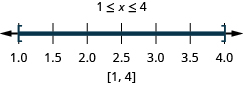
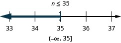

By the end of this section, you will be able to:
* Solve absolute value equations
* Solve absolute value inequalities with “less than”
* Solve absolute value inequalities with “greater than”
* Solve applications with absolute value

Before you get started, take this readiness quiz.

1.  Evaluate:
    <math xmlns="http://www.w3.org/1998/Math/MathML"><mrow><mtext>−</mtext><mrow><mo>\|</mo><mn>7</mn><mo>\|</mo></mrow><mo>.</mo></mrow></math>
    
    * * *
    {: data-type="newline"}
    
    If you missed this problem, review [\[link\]](/m63303#fs-id1167835595046).
2.  Fill in
    <math xmlns="http://www.w3.org/1998/Math/MathML"><mrow><mtext>&lt;</mtext><mo>,</mo><mtext>&gt;</mtext><mo>,</mo></mrow></math>
    
    or
    <math xmlns="http://www.w3.org/1998/Math/MathML"><mo>=</mo></math>
    
    for each of the following pairs of numbers.
    * * *
    {: data-type="newline"}
    
    ⓐ
    <math xmlns="http://www.w3.org/1998/Math/MathML"><mrow><mrow><mo>\|</mo><mrow><mn>−8</mn></mrow><mo>\|</mo></mrow><mtext>\_\_\_</mtext><mo>−</mo><mrow><mo>\|</mo><mrow><mn>−8</mn></mrow><mo>\|</mo></mrow></mrow></math>
    
    ⓑ
    <math xmlns="http://www.w3.org/1998/Math/MathML"><mrow><mn>12</mn><mtext>\_\_\_</mtext><mo>−</mo><mrow><mo>\|</mo><mrow><mn>−12</mn></mrow><mo>\|</mo></mrow></mrow></math>
    
    ⓒ
    <math xmlns="http://www.w3.org/1998/Math/MathML"><mrow><mrow><mo>\|</mo><mrow><mn>−6</mn></mrow><mo>\|</mo></mrow><mtext>\_\_\_</mtext><mo>−</mo><mn>6</mn></mrow></math>
    
    ⓓ
    <math xmlns="http://www.w3.org/1998/Math/MathML"><mrow><mtext>−</mtext><mrow><mo>(</mo><mrow><mn>−15</mn></mrow><mo>)</mo></mrow><mtext>\_\_\_</mtext><mo>−</mo><mrow><mo>\|</mo><mrow><mn>−15</mn></mrow><mo>\|</mo></mrow></mrow></math>
    
    * * *
    {: data-type="newline"}
    
    If you missed this problem, review [\[link\]](/m63303#fs-id1167835595046).
3.  Simplify:
    <math xmlns="http://www.w3.org/1998/Math/MathML"><mrow><mn>14</mn><mo>−</mo><mn>2</mn><mrow><mo>\|</mo><mrow><mn>8</mn><mo>−</mo><mn>3</mn><mrow><mo>(</mo><mrow><mn>4</mn><mo>−</mo><mn>1</mn></mrow><mo>)</mo></mrow></mrow><mo>\|</mo></mrow><mo>.</mo></mrow></math>
    
    * * *
    {: data-type="newline"}
    
    If you missed this problem, review [\[link\]](/m63303#fs-id1167835319324).
{: type="1"}

### Solve Absolute Value Equations

As we prepare to solve absolute value equations, we review our definition of **absolute value**{: data-type="term"}.

Absolute Value

The absolute value of a number is its distance from zero on the number line.

The absolute value of a number *n* is written as <math xmlns="http://www.w3.org/1998/Math/MathML"><mrow><mrow><mo>\|</mo><mi>n</mi><mo>\|</mo></mrow></mrow></math>

 and <math xmlns="http://www.w3.org/1998/Math/MathML"><mrow><mrow><mo>\|</mo><mi>n</mi><mo>\|</mo></mrow><mo>≥</mo><mn>0</mn></mrow></math>

 for all numbers.

Absolute values are always greater than or equal to zero.

We learned that both a number and its opposite are the same distance from zero on the number line. Since they have the same distance from zero, they have the same absolute value. For example:

<math xmlns="http://www.w3.org/1998/Math/MathML"><mrow><mspace width="3em" /><mn>−5</mn></mrow></math>

 is 5 units away from 0, so <math xmlns="http://www.w3.org/1998/Math/MathML"><mrow><mrow><mo>\|</mo><mrow><mn>−5</mn></mrow><mo>\|</mo></mrow><mo>=</mo><mn>5</mn><mo>.</mo></mrow></math>

<math xmlns="http://www.w3.org/1998/Math/MathML"><mrow><mspace width="3.65em" /><mn>5</mn></mrow></math>

 is 5 units away from 0, so <math xmlns="http://www.w3.org/1998/Math/MathML"><mrow><mrow><mo>\|</mo><mn>5</mn><mo>\|</mo></mrow><mo>=</mo><mn>5</mn><mo>.</mo></mrow></math>

[\[link\]](#CNX_IntAlg_Figure_02_07_001) illustrates this idea.

 {: #CNX_IntAlg_Figure_02_07_001}

For the equation <math xmlns="http://www.w3.org/1998/Math/MathML"><mrow><mrow><mo>\|</mo><mi>x</mi><mo>\|</mo></mrow><mo>=</mo><mn>5</mn><mo>,</mo></mrow></math>

 we are looking for all numbers that make this a true statement. We are looking for the numbers whose distance from zero is 5. We just saw that both 5 and <math xmlns="http://www.w3.org/1998/Math/MathML"><mrow><mn>−5</mn></mrow></math>

 are five units from zero on the number line. They are the solutions to the equation.

<math xmlns="http://www.w3.org/1998/Math/MathML"><mrow><mtable><mtr><mtd columnalign="left"><mtext>If</mtext></mtd><mtd /><mtd /><mtd /><mtd /><mtd columnalign="left"><mrow><mo>\|</mo><mi>x</mi><mo>\|</mo></mrow><mo>=</mo><mn>5</mn></mtd></mtr><mtr><mtd columnalign="left"><mtext>then</mtext></mtd><mtd /><mtd /><mtd /><mtd /><mtd columnalign="left"><mspace width="0.3em" /><mi>x</mi><mo>=</mo><mn>−5</mn><mspace width="0.5em" /><mtext>or</mtext><mspace width="0.5em" /><mi>x</mi><mo>=</mo><mn>5</mn></mtd></mtr></mtable></mrow></math>

The solution can be simplified to a single statement by writing <math xmlns="http://www.w3.org/1998/Math/MathML"><mrow><mi>x</mi><mo>=</mo><mtext>±</mtext><mn>5</mn><mo>.</mo></mrow></math>

 This is read, “*x* is equal to positive or negative 5”.

We can generalize this to the following property for absolute value equations.

Absolute Value Equations

For any algebraic expression, *u*, and any positive real number, *a*,

<math xmlns="http://www.w3.org/1998/Math/MathML"><mtable><mtr><mtd columnalign="left"><mtext>if</mtext></mtd><mtd /><mtd /><mtd /><mtd /><mtd columnalign="left"><mrow><mo>\|</mo><mi>u</mi><mo>\|</mo></mrow><mo>=</mo><mi>a</mi></mtd></mtr><mtr><mtd columnalign="left"><mtext>then</mtext></mtd><mtd /><mtd /><mtd /><mtd /><mtd columnalign="left"><mspace width="0.3em" /><mi>u</mi><mo>=</mo><mtext>−</mtext><mi>a</mi><mspace width="0.5em" /><mtext>or</mtext><mspace width="0.5em" /><mi>u</mi><mo>=</mo><mi>a</mi></mtd></mtr></mtable></math>

Remember that an absolute value cannot be a negative number.

Solve: ⓐ <math xmlns="http://www.w3.org/1998/Math/MathML"><mrow><mrow><mo>\|</mo><mi>x</mi><mo>\|</mo></mrow><mo>=</mo><mn>8</mn></mrow></math>

 ⓑ <math xmlns="http://www.w3.org/1998/Math/MathML"><mrow><mrow><mo>\|</mo><mi>y</mi><mo>\|</mo></mrow><mo>=</mo><mn>−6</mn></mrow></math>

 ⓒ <math xmlns="http://www.w3.org/1998/Math/MathML"><mrow><mrow><mo>\|</mo><mi>z</mi><mo>\|</mo></mrow><mo>=</mo><mn>0</mn></mrow></math>

ⓐ* * *
{: data-type="newline"}

 <math xmlns="http://www.w3.org/1998/Math/MathML"><mrow><mtable><mtr><mtd /><mtd /><mtd /><mtd /><mtd /><mtd columnalign="left"><mrow><mo>\|</mo><mi>x</mi><mo>\|</mo></mrow><mo>=</mo><mn>8</mn></mtd></mtr><mtr><mtd columnalign="left"><mtext>Write the equivalent equations.</mtext></mtd><mtd /><mtd /><mtd /><mtd /><mtd columnalign="left"><mspace width="0.45em" /><mi>x</mi><mo>=</mo><mn>−8</mn><mspace width="0.2em" /><mtext>or</mtext><mspace width="0.4em" /><mi>x</mi><mo>=</mo><mn>8</mn></mtd></mtr><mtr><mtd /><mtd /><mtd /><mtd /><mtd /><mtd columnalign="left"><mspace width="0.45em" /><mi>x</mi><mo>=</mo><mtext>±</mtext><mn>8</mn></mtd></mtr></mtable></mrow></math>

* * *
{: data-type="newline"}

* * *
{: data-type="newline"}

 ⓑ* * *
{: data-type="newline"}

 <math xmlns="http://www.w3.org/1998/Math/MathML"><mrow><mtable><mtr><mtd /><mtd /><mtd /><mtd /><mtd /><mtd columnalign="left"><mspace width="12.6em" /><mrow><mo>\|</mo><mi>y</mi><mo>\|</mo></mrow><mo>=</mo><mn>−6</mn></mtd></mtr><mtr><mtd /><mtd /><mtd /><mtd /><mtd /><mtd columnalign="left"><mspace width="12.6em" /><mtext>No solution</mtext></mtd></mtr></mtable></mrow></math>

* * *
{: data-type="newline"}

 Since an absolute value is always positive, there are no solutions to this equation.* * *
{: data-type="newline"}

* * *
{: data-type="newline"}

 ⓒ* * *
{: data-type="newline"}

 <math xmlns="http://www.w3.org/1998/Math/MathML"><mrow><mtable><mtr><mtd /><mtd /><mtd /><mtd /><mtd /><mtd columnalign="left"><mo>\|</mo><mi>z</mi><mo>\|</mo><mo>=</mo><mn>0</mn></mtd></mtr><mtr><mtd columnalign="left"><mtext>Write the equivalent equations.</mtext></mtd><mtd /><mtd /><mtd /><mtd /><mtd columnalign="left"><mspace width="0.45em" /><mi>z</mi><mo>=</mo><mn>−0</mn><mspace width="0.2em" /><mtext>or</mtext><mspace width="0.2em" /><mi>z</mi><mo>=</mo><mn>0</mn></mtd></mtr><mtr><mtd columnalign="left"><mtext>Since</mtext><mspace width="0.2em" /><mn>−0</mn><mo>=</mo><mn>0</mn><mo>,</mo></mtd><mtd /><mtd /><mtd /><mtd /><mtd columnalign="left"><mspace width="0.45em" /><mi>z</mi><mo>=</mo><mn>0</mn></mtd></mtr></mtable></mrow></math>

* * *
{: data-type="newline"}

 Both equations tell us that <math xmlns="http://www.w3.org/1998/Math/MathML"><mrow><mi>z</mi><mo>=</mo><mn>0</mn></mrow></math>

 and so there is only one solution.

Solve: ⓐ <math xmlns="http://www.w3.org/1998/Math/MathML"><mrow><mrow><mo>\|</mo><mi>x</mi><mo>\|</mo></mrow><mo>=</mo><mn>2</mn></mrow></math>

 ⓑ <math xmlns="http://www.w3.org/1998/Math/MathML"><mrow><mrow><mo>\|</mo><mi>y</mi><mo>\|</mo></mrow><mo>=</mo><mn>−4</mn></mrow></math>

 ⓒ <math xmlns="http://www.w3.org/1998/Math/MathML"><mrow><mrow><mo>\|</mo><mi>z</mi><mo>\|</mo></mrow><mo>=</mo><mn>0</mn></mrow></math>

ⓐ <math xmlns="http://www.w3.org/1998/Math/MathML"><mrow><mtext>±</mtext><mn>2</mn></mrow></math>

 ⓑ no solution ⓒ 0

Solve: ⓐ <math xmlns="http://www.w3.org/1998/Math/MathML"><mrow><mrow><mo>\|</mo><mi>x</mi><mo>\|</mo></mrow><mo>=</mo><mn>11</mn></mrow></math>

 ⓑ <math xmlns="http://www.w3.org/1998/Math/MathML"><mrow><mrow><mo>\|</mo><mi>y</mi><mo>\|</mo></mrow><mo>=</mo><mn>−5</mn></mrow></math>

 ⓒ <math xmlns="http://www.w3.org/1998/Math/MathML"><mrow><mrow><mo>\|</mo><mi>z</mi><mo>\|</mo></mrow><mo>=</mo><mn>0</mn></mrow></math>

ⓐ <math xmlns="http://www.w3.org/1998/Math/MathML"><mrow><mtext>±</mtext><mn>11</mn></mrow></math>

 ⓑ no solution ⓒ 0

To solve an **absolute value equation**{: data-type="term" .no-emphasis}, we first isolate the absolute value expression using the same procedures we used to solve linear equations. Once we isolate the absolute value expression we rewrite it as the two equivalent equations.

How to Solve Absolute Value Equations

Solve <math xmlns="http://www.w3.org/1998/Math/MathML"><mrow><mrow><mo>\|</mo><mrow><mn>5</mn><mi>x</mi><mo>−</mo><mn>4</mn></mrow><mo>\|</mo></mrow><mo>−</mo><mn>3</mn><mo>=</mo><mn>8</mn><mo>.</mo></mrow></math>

          ![Step 4 is to check each solution. Substitute 3 and negative seven-fifths into the original equation, the difference between the absolute value of the quantity 5 x minus 4 and 3 is equal to 8. Substitute 3 for x. Is the difference between the absolute value of the quantity 5 times 3 minus 4 and 3 equal to 8? Is the difference between the absolute value of the quantity 15 minus 4 and 3 equal to 8? Is the difference between the absolute value of the 11 and 3 equal to 8? Is 11 minus 3 equal to 8? 8 is equal to 8, so the solution x is equal to 3 checks. Substitute negative seven-fifths for x. Is the difference between the absolute value of the quantity 5 times negative seven-fifths minus 4 and 3 equal to 8? Is the difference between the absolute value of the quantity negative 7 minus 4 and 3 equal to 8? Is the difference between the absolute value of the negative 11 and 3 equal to 8? Is 11 minus 3 equal to 8? 8 is equal to 8, so the solution x is equal to negative seven-fifths checks.](../resources/CNX_IntAlg_Figure_02_07_002d_img.jpg) 

Solve: <math xmlns="http://www.w3.org/1998/Math/MathML"><mrow><mrow><mo>\|</mo><mrow><mn>3</mn><mi>x</mi><mo>−</mo><mn>5</mn></mrow><mo>\|</mo></mrow><mo>−</mo><mn>1</mn><mo>=</mo><mn>6</mn><mo>.</mo></mrow></math>

<math xmlns="http://www.w3.org/1998/Math/MathML"><mrow><mi>x</mi><mo>=</mo><mn>4</mn><mo>,</mo><mi>x</mi><mo>=</mo><mo>−</mo><mfrac><mn>2</mn><mn>3</mn></mfrac></mrow></math>

Solve: <math xmlns="http://www.w3.org/1998/Math/MathML"><mrow><mrow><mo>\|</mo><mrow><mn>4</mn><mi>x</mi><mo>−</mo><mn>3</mn></mrow><mo>\|</mo></mrow><mo>−</mo><mn>5</mn><mo>=</mo><mn>2</mn><mo>.</mo></mrow></math>

<math xmlns="http://www.w3.org/1998/Math/MathML"><mrow><mi>x</mi><mo>=</mo><mn>−1</mn><mo>,</mo><mi>x</mi><mo>=</mo><mfrac><mn>5</mn><mn>2</mn></mfrac></mrow></math>

The steps for solving an absolute value equation are summarized here.

Solve absolute value equations.

1.  Isolate the absolute value expression.
2.  Write the equivalent equations.
3.  Solve each equation.
4.  Check each solution.
{: type="1" .stepwise}

Solve <math xmlns="http://www.w3.org/1998/Math/MathML"><mrow><mn>2</mn><mrow><mo>\|</mo><mrow><mi>x</mi><mo>−</mo><mn>7</mn></mrow><mo>\|</mo></mrow><mo>+</mo><mn>5</mn><mo>=</mo><mn>9</mn><mo>.</mo></mrow></math>

<table class="unnumbered unstyled can-break" summary="The sum of 2 times the absolute value of the quantity x minus 7 and 5 is equal to 9. Isolate the absolute value expression. 2 times the absolute value of the quantity x minus 7 is equal to 4 simplifies to the absolute value of the quantity x minus 7 is equal to 2. Write the equivalent equations. They are x minus 7 is equal to negative 2 or x minus 7 is equal to 2. Solve each equation. The solutions x is equal to 5 or x is equal to 9. Check using the original equation, the sum of 2 times the absolute value of the quantity x minus 7 and 5 is equal to 9. Is the sum of 2 times the absolute value of the quantity 5 minus 7 and 5 equal to 9? Is the sum of 2 times the absolute value of negative 2 and 5 equal to 9? Is 2 times 2 plus 5 equal to 9? Is 4 plus 5 equal to 9? 9 is equal to 9, so the solution x is equal to 5 checks. Is the sum of 2 times the absolute value of the quantity 9 minus 7 and 5 equal to 9? Is the sum of 2 times the absolute value of 2 and 5 equal to 9? Is 2 times 2 plus 5 equal to 9? Is 4 plus 5 equal to 9? 9 is equal to 9, so the solution x is equal to 9 checks." data-label=""><tbody>
<tr valign="top">
<td data-valign="top" data-align="left" />
<td data-valign="top" data-align="right"><math xmlns="http://www.w3.org/1998/Math/MathML"><mrow><mn>2</mn><mrow><mo>\|</mo><mrow><mi>x</mi><mo>−</mo><mn>7</mn></mrow> <mo>\|</mo></mrow><mo>+</mo><mn>5</mn><mo>=</mo><mn>9</mn></mrow></math></td>
<td data-valign="top" data-align="left" />
</tr>
<tr valign="top">
<td data-valign="top" data-align="left">Isolate the absolute value expression.      </td>
<td data-valign="top" data-align="right"><math xmlns="http://www.w3.org/1998/Math/MathML"><mrow><mn>2</mn><mrow><mo>\|</mo><mrow><mi>x</mi><mo>−</mo><mn>7</mn></mrow> <mo>\|</mo></mrow><mo>=</mo><mn>4</mn></mrow></math></td>
<td data-valign="top" data-align="left" />
</tr>
<tr valign="top">
<td data-valign="top" data-align="left" />
<td data-valign="top" data-align="right"><math xmlns="http://www.w3.org/1998/Math/MathML"><mrow><mrow><mo>\|</mo><mrow><mi>x</mi><mo>−</mo><mn>7</mn></mrow> <mo>\|</mo></mrow><mo>=</mo><mn>2</mn></mrow></math></td>
<td data-valign="top" data-align="left" />
</tr>
<tr valign="top">
<td data-valign="top" data-align="left">Write the equivalent equations.</td>
<td colspan="2" data-valign="top" data-align="center"><math xmlns="http://www.w3.org/1998/Math/MathML"><mrow><mspace width="0.6em" /><mi>x</mi><mo>−</mo><mn>7</mn><mo>=</mo><mtext>−</mtext><mn>2</mn></mrow></math> or <math xmlns="http://www.w3.org/1998/Math/MathML"><mrow><mi>x</mi><mo>−</mo><mn>7</mn><mo>=</mo><mn>2</mn></mrow></math></td>
</tr>
<tr valign="top">
<td data-valign="top" data-align="left">Solve each equation.</td>
<td colspan="2" data-valign="top" data-align="center"><math xmlns="http://www.w3.org/1998/Math/MathML"><mrow><mspace width="2.25em" /><mi>x</mi><mo>=</mo><mn>5</mn><mspace width="0.7em" /></mrow></math> or <math xmlns="http://www.w3.org/1998/Math/MathML"><mrow><mspace width="1.6em" /><mi>x</mi><mo>=</mo><mn>9</mn></mrow></math></td>
</tr>
<tr valign="top">
<td data-valign="top" data-align="left">Check:
</td>
<td data-valign="top" data-align="left" />
</tr>
</tbody></table>

Solve: <math xmlns="http://www.w3.org/1998/Math/MathML"><mrow><mn>3</mn><mrow><mo>\|</mo><mrow><mi>x</mi><mo>−</mo><mn>4</mn></mrow><mo>\|</mo></mrow><mo>−</mo><mn>4</mn><mo>=</mo><mn>8</mn><mo>.</mo></mrow></math>

<math xmlns="http://www.w3.org/1998/Math/MathML"><mrow><mi>x</mi><mo>=</mo><mn>8</mn><mo>,</mo><mi>x</mi><mo>=</mo><mn>0</mn></mrow></math>

Solve: <math xmlns="http://www.w3.org/1998/Math/MathML"><mrow><mn>2</mn><mrow><mo>\|</mo><mrow><mi>x</mi><mo>−</mo><mn>5</mn></mrow><mo>\|</mo></mrow><mo>+</mo><mn>3</mn><mo>=</mo><mn>9</mn><mo>.</mo></mrow></math>

<math xmlns="http://www.w3.org/1998/Math/MathML"><mrow><mi>x</mi><mo>=</mo><mn>8</mn><mo>,</mo><mi>x</mi><mo>=</mo><mn>2</mn></mrow></math>

Remember, an absolute value is always positive!

Solve: <math xmlns="http://www.w3.org/1998/Math/MathML"><mrow><mrow><mo>\|</mo><mrow><mfrac><mn>2</mn><mn>3</mn></mfrac><mi>x</mi><mo>−</mo><mn>4</mn></mrow><mo>\|</mo></mrow><mo>+</mo><mn>11</mn><mo>=</mo><mn>3</mn><mo>.</mo></mrow></math>

<math xmlns="http://www.w3.org/1998/Math/MathML"><mrow><mtable><mtr><mtd /><mtd /><mtd /><mtd /><mtd /><mtd columnalign="left"><mrow><mo>\|</mo><mrow><mfrac><mn>2</mn><mn>3</mn></mfrac><mi>x</mi><mo>−</mo><mn>4</mn></mrow><mo>\|</mo></mrow><mo>+</mo><mn>11</mn><mo>=</mo><mn>3</mn></mtd></mtr><mtr><mtd columnalign="left"><mtext>Isolate the absolute value term.</mtext></mtd><mtd /><mtd /><mtd /><mtd /><mtd columnalign="left"><mspace width="2.2em" /><mrow><mo>\|</mo><mrow><mfrac><mn>2</mn><mn>3</mn></mfrac><mi>x</mi><mo>−</mo><mn>4</mn></mrow><mo>\|</mo></mrow><mo>=</mo><mn>−8</mn></mtd></mtr><mtr><mtd columnalign="left"><mtext>An absolute value cannot be negative.</mtext></mtd><mtd /><mtd /><mtd /><mtd /><mtd columnalign="left"><mspace width="1.2em" /><mtext>No solution</mtext></mtd></mtr></mtable></mrow></math>

Solve: <math xmlns="http://www.w3.org/1998/Math/MathML"><mrow><mrow><mo>\|</mo><mrow><mfrac><mn>3</mn><mn>4</mn></mfrac><mi>x</mi><mo>−</mo><mn>5</mn></mrow><mo>\|</mo></mrow><mo>+</mo><mn>9</mn><mo>=</mo><mn>4</mn><mo>.</mo></mrow></math>

No solution

Solve: <math xmlns="http://www.w3.org/1998/Math/MathML"><mrow><mrow><mo>\|</mo><mrow><mfrac><mn>5</mn><mn>6</mn></mfrac><mi>x</mi><mo>+</mo><mn>3</mn></mrow><mo>\|</mo></mrow><mo>+</mo><mn>8</mn><mo>=</mo><mn>6</mn><mo>.</mo></mrow></math>

No solution

Some of our absolute value equations could be of the form <math xmlns="http://www.w3.org/1998/Math/MathML"><mrow><mrow><mo>\|</mo><mrow><mi>u</mi></mrow><mo>\|</mo></mrow><mo>=</mo><mrow><mo>\|</mo><mrow><mi>v</mi></mrow><mo>\|</mo></mrow></mrow></math>

 where *u* and *v* are algebraic expressions. For example, <math xmlns="http://www.w3.org/1998/Math/MathML"><mrow><mrow><mo>\|</mo><mrow><mi>x</mi><mo>−</mo><mn>3</mn></mrow><mo>\|</mo></mrow><mo>=</mo><mrow><mo>\|</mo><mrow><mn>2</mn><mi>x</mi><mo>+</mo><mn>1</mn></mrow><mo>\|</mo></mrow><mo>.</mo></mrow></math>

How would we solve them? If two algebraic expressions are equal in absolute value, then they are either equal to each other or negatives of each other. The property for absolute value equations says that for any algebraic expression, *u*, and a positive real number, *a*, if <math xmlns="http://www.w3.org/1998/Math/MathML"><mrow><mrow><mo>\|</mo><mi>u</mi><mo>\|</mo></mrow><mo>=</mo><mi>a</mi><mo>,</mo></mrow></math>

 then <math xmlns="http://www.w3.org/1998/Math/MathML"><mrow><mi>u</mi><mo>=</mo><mtext>−</mtext><mi>a</mi></mrow></math>

 or <math xmlns="http://www.w3.org/1998/Math/MathML"><mrow><mi>u</mi><mo>=</mo><mi>a</mi><mo>.</mo></mrow></math>

This tell us that

<math xmlns="http://www.w3.org/1998/Math/MathML"><mrow><mtable><mtr><mtd columnalign="left"><mtext>if</mtext></mtd><mtd /><mtd /><mtd /><mtd /><mtd columnalign="left"><mspace width="0.3em" /><mrow><mo>\|</mo><mi>u</mi><mo>\|</mo></mrow><mo>=</mo><mrow><mo>\|</mo><mi>v</mi><mo>\|</mo></mrow></mtd><mtd /><mtd /><mtd /><mtd /><mtd /><mtd /></mtr><mtr><mtd columnalign="left"><mtext>then</mtext></mtd><mtd /><mtd /><mtd /><mtd /><mtd columnalign="left"><mspace width="0.3em" /><mi>u</mi><mo>=</mo><mtext>−</mtext><mi>v</mi></mtd><mspace width="0.5em" /><mtext>or</mtext><mspace width="0.5em" /><mi>u</mi><mo>=</mo><mi>v</mi><mtd /><mtd /><mtd columnalign="left"><mtext>or</mtext></mtd><mtd /><mtd /><mtd columnalign="left"><mi>u</mi><mo>=</mo><mi>v</mi></mtd></mtr></mtable></mrow></math>

This leads us to the following property for equations with two absolute values.

Equations with Two Absolute Values

For any algebraic expressions, *u* and *v*,

<math xmlns="http://www.w3.org/1998/Math/MathML"><mtable><mtr><mtd columnalign="left"><mtext>if</mtext></mtd><mtd /><mtd /><mtd /><mtd /><mtd columnalign="left"><mrow><mo>\|</mo><mi>u</mi><mo>\|</mo></mrow><mo>=</mo><mrow><mo>\|</mo><mi>v</mi><mo>\|</mo></mrow></mtd></mtr><mtr><mtd columnalign="left"><mtext>then</mtext></mtd><mtd /><mtd /><mtd /><mtd /><mtd columnalign="left"><mspace width="0.3em" /><mi>u</mi><mo>=</mo><mtext>−</mtext><mi>v</mi><mspace width="0.5em" /><mtext>or</mtext><mspace width="0.5em" /><mi>u</mi><mo>=</mo><mi>v</mi></mtd></mtr></mtable></math>

When we take the opposite of a quantity, we must be careful with the signs and to add parentheses where needed.

Solve: <math xmlns="http://www.w3.org/1998/Math/MathML"><mrow><mrow><mo>\|</mo><mrow><mn>5</mn><mi>x</mi><mo>−</mo><mn>1</mn></mrow><mo>\|</mo></mrow><mo>=</mo><mrow><mo>\|</mo><mrow><mn>2</mn><mi>x</mi><mo>+</mo><mn>3</mn></mrow><mo>\|</mo></mrow><mo>.</mo></mrow></math>

<math xmlns="http://www.w3.org/1998/Math/MathML"><mrow><mrow><mspace width="3em" /><mo>\|</mo><mrow><mn>5</mn><mi>x</mi><mo>−</mo><mn>1</mn></mrow><mo>\|</mo></mrow><mo>=</mo><mrow><mo>\|</mo><mrow><mn>2</mn><mi>x</mi><mo>+</mo><mn>3</mn></mrow><mo>\|</mo></mrow></mrow></math>

<math xmlns="http://www.w3.org/1998/Math/MathML"><mrow><mtable><mtr><mtd columnalign="left"><mtext>Write the equivalent equations.</mtext></mtd><mtd /><mtd /><mtd columnalign="right"><mspace width="3em" /><mn>5</mn><mi>x</mi><mo>−</mo><mn>1</mn></mtd><mtd columnalign="left"><mo>=</mo></mtd><mtd columnalign="left"><mtext>−</mtext><mrow><mo>(</mo><mrow><mn>2</mn><mi>x</mi><mo>+</mo><mn>3</mn></mrow><mo>)</mo></mrow></mtd><mtd columnalign="left"><mspace width="1em" /><mtext>or</mtext><mspace width="1em" /></mtd><mtd columnalign="right"><mn>5</mn><mi>x</mi><mo>−</mo><mn>1</mn></mtd><mtd columnalign="left"><mo>=</mo></mtd><mtd columnalign="left"><mn>2</mn><mi>x</mi><mo>+</mo><mn>3</mn></mtd></mtr><mtr><mtd columnalign="left"><mtext>Solve each equation.</mtext></mtd><mtd /><mtd /><mtd columnalign="right"><mspace width="3em" /><mn>5</mn><mi>x</mi><mo>−</mo><mn>1</mn></mtd><mtd columnalign="left"><mo>=</mo></mtd><mtd columnalign="left"><mn>−2</mn><mi>x</mi><mo>−</mo><mn>3</mn></mtd><mtd columnalign="left"><mspace width="1em" /><mtext>or</mtext><mspace width="1em" /></mtd><mtd columnalign="left"><mn>3</mn><mi>x</mi><mo>−</mo><mn>1</mn></mtd><mtd columnalign="left"><mo>=</mo></mtd><mtd columnalign="left"><mn>3</mn></mtd></mtr><mtr><mtd /><mtd /><mtd /><mtd columnalign="right"><mspace width="3em" /><mn>7</mn><mi>x</mi><mo>−</mo><mn>1</mn></mtd><mtd columnalign="left"><mo>=</mo></mtd><mtd columnalign="left"><mn>−3</mn></mtd><mtd /><mtd columnalign="right"><mn>3</mn><mi>x</mi></mtd><mtd columnalign="left"><mo>=</mo></mtd><mtd columnalign="left"><mn>4</mn></mtd></mtr><mtr><mtd /><mtd /><mtd /><mtd columnalign="right"><mspace width="3em" /><mn>7</mn><mi>x</mi></mtd><mtd columnalign="left"><mo>=</mo></mtd><mtd columnalign="left"><mn>−2</mn></mtd><mtd /><mtd columnalign="right"><mi>x</mi></mtd><mtd columnalign="left"><mo>=</mo></mtd><mtd columnalign="left"><mfrac><mn>4</mn><mn>3</mn></mfrac></mtd></mtr><mtr><mtd /><mtd /><mtd /><mtd columnalign="right"><mspace width="3em" /><mi>x</mi></mtd><mtd columnalign="left"><mo>=</mo></mtd><mtd columnalign="left"><mo>−</mo><mfrac><mn>2</mn><mn>7</mn></mfrac></mtd><mtd columnalign="left"><mspace width="1em" /><mtext>or</mtext><mspace width="1em" /></mtd><mtd columnalign="right"><mi>x</mi></mtd><mtd columnalign="left"><mo>=</mo></mtd><mtd columnalign="left"><mfrac><mn>4</mn><mn>3</mn></mfrac></mtd></mtr><mtr><mtd columnalign="left"><mtext>Check.</mtext></mtd><mtd /><mtd /><mtd /><mtd /><mtd /><mtd /><mtd /><mtd /><mtd /><mtd /></mtr><mtr><mtd columnalign="left"><mtext>We leave the check to you.</mtext></mtd><mtd /><mtd /><mtd /><mtd /><mtd /><mtd /><mtd /><mtd /><mtd /><mtd /></mtr></mtable></mrow></math>

Solve: <math xmlns="http://www.w3.org/1998/Math/MathML"><mrow><mrow><mo>\|</mo><mrow><mn>7</mn><mi>x</mi><mo>−</mo><mn>3</mn></mrow><mo>\|</mo></mrow><mo>=</mo><mrow><mo>\|</mo><mrow><mn>3</mn><mi>x</mi><mo>+</mo><mn>7</mn></mrow><mo>\|</mo></mrow><mo>.</mo></mrow></math>

<math xmlns="http://www.w3.org/1998/Math/MathML"><mrow><mi>x</mi><mo>=</mo><mo>−</mo><mfrac><mn>2</mn><mn>5</mn></mfrac><mo>,</mo></mrow></math>

 <math xmlns="http://www.w3.org/1998/Math/MathML"><mrow><mi>x</mi><mo>=</mo><mfrac><mn>5</mn><mn>2</mn></mfrac></mrow></math>

Solve: <math xmlns="http://www.w3.org/1998/Math/MathML"><mrow><mrow><mo>\|</mo><mrow><mn>6</mn><mi>x</mi><mo>−</mo><mn>5</mn></mrow><mo>\|</mo></mrow><mo>=</mo><mrow><mo>\|</mo><mrow><mn>3</mn><mi>x</mi><mo>+</mo><mn>4</mn></mrow><mo>\|</mo></mrow><mo>.</mo></mrow></math>

<math xmlns="http://www.w3.org/1998/Math/MathML"><mrow><mi>x</mi><mo>=</mo><mn>3</mn><mo>,</mo></mrow></math>

 <math xmlns="http://www.w3.org/1998/Math/MathML"><mrow><mi>x</mi><mo>=</mo><mfrac><mn>1</mn><mn>9</mn></mfrac></mrow></math>

### Solve Absolute Value Inequalities with “Less Than”

Let’s look now at what happens when we have an **absolute value inequality**{: data-type="term" .no-emphasis}. Everything we’ve learned about solving inequalities still holds, but we must consider how the absolute value impacts our work.

Again we will look at our definition of absolute value. The absolute value of a number is its distance from zero on the number line. For the equation <math xmlns="http://www.w3.org/1998/Math/MathML"><mrow><mrow><mo>\|</mo><mi>x</mi><mo>\|</mo></mrow><mo>=</mo><mn>5</mn><mo>,</mo></mrow></math>

 we saw that both 5 and <math xmlns="http://www.w3.org/1998/Math/MathML"><mrow><mn>−5</mn></mrow></math>

 are five units from zero on the number line. They are the solutions to the equation.

<math xmlns="http://www.w3.org/1998/Math/MathML"><mrow><mtable><mtr><mtd columnalign="center"><mrow><mo>\|</mo><mi>x</mi><mo>\|</mo></mrow><mo>=</mo><mn>5</mn></mtd></mtr><mtr><mtd columnalign="center"><mi>x</mi><mo>=</mo><mn>−5</mn><mspace width="4em" /><mtext>or</mtext><mspace width="4em" /><mi>x</mi><mo>=</mo><mn>5</mn></mtd></mtr></mtable></mrow></math>

What about the inequality <math xmlns="http://www.w3.org/1998/Math/MathML"><mrow><mrow><mo>\|</mo><mi>x</mi><mo>\|</mo></mrow><mo>≤</mo><mn>5</mn><mo>?</mo></mrow></math>

 Where are the numbers whose distance is less than or equal to 5? We know <math xmlns="http://www.w3.org/1998/Math/MathML"><mrow><mn>−5</mn></mrow></math>

 and 5 are both five units from zero. All the numbers between <math xmlns="http://www.w3.org/1998/Math/MathML"><mrow><mn>−5</mn></mrow></math>

 and 5 are less than five units from zero. See [\[link\]](#CNX_IntAlg_Figure_02_07_004).

 {: #CNX_IntAlg_Figure_02_07_004}

In a more general way, we can see that if <math xmlns="http://www.w3.org/1998/Math/MathML"><mrow><mrow><mo>\|</mo><mi>u</mi><mo>\|</mo></mrow><mo>≤</mo><mi>a</mi><mo>,</mo></mrow></math>

 then <math xmlns="http://www.w3.org/1998/Math/MathML"><mrow><mtext>−</mtext><mi>a</mi><mo>≤</mo><mi>u</mi><mo>≤</mo><mi>a</mi><mo>.</mo></mrow></math>

 See [\[link\]](#CNX_IntAlg_Figure_02_07_005).

 {: #CNX_IntAlg_Figure_02_07_005}

This result is summarized here.

Absolute Value Inequalities with
<math xmlns="http://www.w3.org/1998/Math/MathML"><mrow><mo>&lt;</mo></mrow></math>
or
<math xmlns="http://www.w3.org/1998/Math/MathML"><mrow><mo>≤</mo></mrow></math>

For any algebraic expression, *u*, and any positive real number, *a*,

<math xmlns="http://www.w3.org/1998/Math/MathML"><mrow><mtable><mtr><mtd columnalign="left"><mtext>if</mtext></mtd><mtd /><mtd /><mtd /><mtd columnalign="left"><mrow><mo>\|</mo><mi>u</mi><mo>\|</mo></mrow><mo>&lt;</mo><mi>a</mi><mo>,</mo></mtd><mtd /><mtd /><mtd /><mtd /><mtd columnalign="left"><mtext>then</mtext><mspace width="0.5em" /><mtext>−</mtext><mi>a</mi><mo>&lt;</mo><mi>u</mi><mo>&lt;</mo><mi>a</mi></mtd></mtr><mtr><mtd columnalign="left"><mtext>if</mtext></mtd><mtd /><mtd /><mtd /><mtd columnalign="left"><mrow><mo>\|</mo><mi>u</mi><mo>\|</mo></mrow><mo>≤</mo><mi>a</mi><mo>,</mo></mtd><mtd /><mtd /><mtd /><mtd /><mtd columnalign="left"><mtext>then</mtext><mspace width="0.5em" /><mtext>−</mtext><mi>a</mi><mo>≤</mo><mi>u</mi><mo>≤</mo><mi>a</mi></mtd></mtr></mtable></mrow></math>

After solving an inequality, it is often helpful to check some points to see if the solution makes sense. The graph of the solution divides the number line into three sections. Choose a value in each section and substitute it in the original inequality to see if it makes the inequality true or not. While this is not a complete check, it often helps verify the solution.

Solve <math xmlns="http://www.w3.org/1998/Math/MathML"><mrow><mrow><mo>\|</mo><mi>x</mi><mo>\|</mo></mrow><mo>&lt;</mo><mn>7</mn><mo>.</mo></mrow></math>

 Graph the solution and write the solution in interval notation.

|  |  |
{: valign="top"}| Write the equivalent inequality. |  |
{: valign="top"}| Graph the solution. |  |
{: valign="top"}| Write the solution using interval notation. |  |
{: valign="top"}{: .unnumbered .unstyled summary="The absolute value of x is less than 7. Write the equivalent inequality. It is negative 7 is less than x which is less than 7. Graph the solution. It is a number line with a left parenthesis at negative 7, a right parenthesis at 7 and shading between the parentheses. Write the solution using interval notation. It is negative 7 to 7 within parentheses." data-label=""}

Check:

To verify, check a value in each section of the number line showing the solution. Choose numbers such as <math xmlns="http://www.w3.org/1998/Math/MathML"><mrow><mn>−8</mn><mo>,</mo></mrow></math>

 1, and 9.

 ![The figure is a number line with a left parenthesis at negative 7, a right parenthesis at 7 and shading between the parentheses. The values negative 8, 1, and 9 are marked with points. The absolute value of negative 8 is less than 7 is false. It does not satisfy the absolute value of x is less than 7. The absolute value of 1 is less than 7 is true. It does satisfy the absolute value of x is less than 7. The absolute value of 9 is less than 7 is false. It does not satisfy the absolute value of x is less than 7.](../resources/CNX_IntAlg_Figure_02_07_007_img.jpg) 

Graph the solution and write the solution in interval notation: <math xmlns="http://www.w3.org/1998/Math/MathML"><mrow><mrow><mo>\|</mo><mi>x</mi><mo>\|</mo></mrow><mo>&lt;</mo><mn>9</mn><mo>.</mo></mrow></math>

  

Graph the solution and write the solution in interval notation: <math xmlns="http://www.w3.org/1998/Math/MathML"><mrow><mrow><mo>\|</mo><mi>x</mi><mo>\|</mo></mrow><mo>&lt;</mo><mn>1</mn><mo>.</mo></mrow></math>

  

Solve <math xmlns="http://www.w3.org/1998/Math/MathML"><mrow><mrow><mo>\|</mo><mrow><mn>5</mn><mi>x</mi><mo>−</mo><mn>6</mn></mrow><mo>\|</mo></mrow><mo>≤</mo><mn>4</mn><mo>.</mo></mrow></math>

 Graph the solution and write the solution in interval notation.

<table class="unnumbered unstyled can-break" summary="Step 1 is to isolate the absolute value expression, the absolute value of the quantity 5 x minus 6 is less than or equal to 4. It is isolated. Step 2 is to write the equivalent compound inequality. Negative 4 is less than or equal to 5 x minus 6 which is less than 4. Step 3 is to solve the compound inequality. 2 is less than or equal to 5 x which is less than or equal to 10. Step 4 is to graph the solution. The graph showed closed points at two-fifths and 2 with shading between the circles. Step 5 is to write the solution using interval notation. It is two-fifths to 2 within brackets. The check is left to you." data-label=""><tbody>
<tr valign="top">
<td data-valign="top" data-align="left"><strong>Step 1.</strong> Isolate the absolute value expression.
It is isolated.</td>
<td data-valign="top" data-align="center"><math xmlns="http://www.w3.org/1998/Math/MathML"><mrow><mrow><mo>\|</mo><mrow><mn>5</mn><mi>x</mi><mo>−</mo><mn>6</mn></mrow><mo>\|</mo></mrow><mo>≤</mo><mn>4</mn></mrow></math></td>
</tr>
<tr valign="top">
<td data-valign="top" data-align="left"><strong>Step 2.</strong> Write the equivalent compound inequality.</td>
<td data-valign="top" data-align="center"><math xmlns="http://www.w3.org/1998/Math/MathML"><mrow><mn>−4</mn><mo>≤</mo><mn>5</mn><mi>x</mi><mo>−</mo><mn>6</mn><mo>≤</mo><mn>4</mn></mrow></math></td>
</tr>
<tr valign="top">
<td data-valign="top" data-align="left"><strong>Step 3.</strong> Solve the compound inequality.</td>
<td data-valign="top" data-align="center"><math xmlns="http://www.w3.org/1998/Math/MathML"><mrow><mn>2</mn><mo>≤</mo><mn>5</mn><mi>x</mi><mo>≤</mo><mn>10</mn></mrow></math>
<math xmlns="http://www.w3.org/1998/Math/MathML"><mrow><mfrac><mn>2</mn><mn>5</mn></mfrac><mo>≤</mo><mi>x</mi><mo>≤</mo><mn>2</mn></mrow></math></td>
</tr>
<tr valign="top">
<td data-valign="top" data-align="left"><strong>Step 4.</strong> Graph the solution.</td>
<td data-valign="top" data-align="left"></td>
</tr>
<tr valign="top">
<td data-valign="top" data-align="left"><strong>Step 5.</strong> Write the solution using interval notation.</td>
<td data-valign="top" data-align="center"><math xmlns="http://www.w3.org/1998/Math/MathML"><mrow><mrow><mo>[</mo><mrow><mfrac><mn>2</mn><mn>5</mn></mfrac><mo>,</mo><mn>2</mn></mrow><mo>]</mo></mrow></mrow></math></td>
</tr>
<tr valign="top">
<td data-valign="top" data-align="left">Check:
The check is left to you.</td>
<td data-valign="top" data-align="left" />
</tr>
</tbody></table>

Solve <math xmlns="http://www.w3.org/1998/Math/MathML"><mrow><mrow><mo>\|</mo><mrow><mn>2</mn><mi>x</mi><mo>−</mo><mn>1</mn></mrow><mo>\|</mo></mrow><mo>≤</mo><mn>5</mn><mo>.</mo></mrow></math>

 Graph the solution and write the solution in interval notation:

  

Solve <math xmlns="http://www.w3.org/1998/Math/MathML"><mrow><mrow><mo>\|</mo><mrow><mn>4</mn><mi>x</mi><mo>−</mo><mn>5</mn></mrow><mo>\|</mo></mrow><mo>≤</mo><mn>3</mn><mo>.</mo></mrow></math>

 Graph the solution and write the solution in interval notation:

  

Solve absolute value inequalities with &lt; or ≤.

1.  Isolate the absolute value expression.
2.  Write the equivalent compound inequality.
    * * *
    {: data-type="newline"}
    
    

    <math xmlns="http://www.w3.org/1998/Math/MathML"><mrow><mtable><mtr><mtd columnalign="left"><mrow><mo>\|</mo><mi>u</mi><mo>\|</mo></mrow><mo>&lt;</mo><mi>a</mi></mtd><mtd /><mtd /><mtd /><mtd /><mtd columnalign="left"><mtext>is equivalent to</mtext></mtd><mtd /><mtd /><mtd /><mtd /><mtd columnalign="left"><mtext>−</mtext><mi>a</mi><mo>&lt;</mo><mi>u</mi><mo>&lt;</mo><mi>a</mi></mtd></mtr><mtr><mtd columnalign="left"><mrow><mo>\|</mo><mi>u</mi><mo>\|</mo></mrow><mo>≤</mo><mi>a</mi></mtd><mtd /><mtd /><mtd /><mtd /><mtd columnalign="left"><mtext>is equivalent to</mtext></mtd><mtd /><mtd /><mtd /><mtd /><mtd columnalign="left"><mtext>−</mtext><mi>a</mi><mo>≤</mo><mi>u</mi><mo>≤</mo><mi>a</mi></mtd></mtr></mtable></mrow></math>
    

3.  Solve the compound inequality.
4.  Graph the solution
5.  Write the solution using interval notation.
{: type="1" .stepwise}

### Solve Absolute Value Inequalities with “Greater Than”

What happens for absolute value inequalities that have “greater than”? Again we will look at our definition of absolute value. The absolute value of a number is its distance from zero on the number line.

We started with the inequality <math xmlns="http://www.w3.org/1998/Math/MathML"><mrow><mrow><mo>\|</mo><mrow><mi>x</mi></mrow><mo>\|</mo></mrow><mo>≤</mo><mn>5</mn><mo>.</mo></mrow></math>

 We saw that the numbers whose distance is less than or equal to five from zero on the number line were <math xmlns="http://www.w3.org/1998/Math/MathML"><mrow><mn>−5</mn></mrow></math>

 and 5 and all the numbers between <math xmlns="http://www.w3.org/1998/Math/MathML"><mrow><mn>−5</mn></mrow></math>

 and 5. See [\[link\]](#CNX_IntAlg_Figure_02_07_009).

 {: #CNX_IntAlg_Figure_02_07_009}

Now we want to look at the inequality <math xmlns="http://www.w3.org/1998/Math/MathML"><mrow><mrow><mo>\|</mo><mi>x</mi><mo>\|</mo></mrow><mo>≥</mo><mn>5</mn><mo>.</mo></mrow></math>

 Where are the numbers whose distance from zero is greater than or equal to five?

Again both <math xmlns="http://www.w3.org/1998/Math/MathML"><mrow><mn>−5</mn></mrow></math>

 and 5 are five units from zero and so are included in the solution. Numbers whose distance from zero is greater than five units would be less than <math xmlns="http://www.w3.org/1998/Math/MathML"><mrow><mn>−5</mn></mrow></math>

 and greater than 5 on the number line. See [\[link\]](#CNX_IntAlg_Figure_02_07_010).

 {: #CNX_IntAlg_Figure_02_07_010}

In a more general way, we can see that if <math xmlns="http://www.w3.org/1998/Math/MathML"><mrow><mrow><mo>\|</mo><mi>u</mi><mo>\|</mo></mrow><mo>≥</mo><mi>a</mi><mo>,</mo></mrow></math>

 then <math xmlns="http://www.w3.org/1998/Math/MathML"><mrow><mi>u</mi><mo>≤</mo><mtext>−</mtext><mi>a</mi></mrow></math>

 or <math xmlns="http://www.w3.org/1998/Math/MathML"><mrow><mi>u</mi><mo>≤</mo><mi>a</mi><mo>.</mo></mrow></math>

 See [\[link\]](#CNX_IntAlg_Figure_02_07_011).

 {: #CNX_IntAlg_Figure_02_07_011}

This result is summarized here.

Absolute Value Inequalities with &gt; or ≥

For any algebraic expression, *u*, and any positive real number, *a*,

<math xmlns="http://www.w3.org/1998/Math/MathML"><mrow><mtable><mtr><mtd columnalign="left"><mtext>if</mtext></mtd><mtd /><mtd /><mtd /><mtd /><mtd columnalign="left"><mrow><mo>\|</mo><mi>u</mi><mo>\|</mo></mrow><mo>&gt;</mo><mi>a</mi><mo>,</mo></mtd><mtd /><mtd /><mtd /><mtd /><mtd columnalign="left"><mtext>then</mtext><mspace width="0.2em" /><mi>u</mi><mo>&lt;</mo><mo>−</mo><mi>a</mi><mspace width="0.5em" /><mtext>or</mtext><mspace width="0.5em" /><mi>u</mi><mo>&gt;</mo><mi>a</mi></mtd></mtr><mtr><mtd columnalign="left"><mtext>if</mtext></mtd><mtd /><mtd /><mtd /><mtd /><mtd columnalign="left"><mrow><mo>\|</mo><mi>u</mi><mo>\|</mo></mrow><mo>≥</mo><mi>a</mi><mo>,</mo></mtd><mtd /><mtd /><mtd /><mtd /><mtd columnalign="left"><mtext>then</mtext><mspace width="0.2em" /><mi>u</mi><mo>≤</mo><mtext>−</mtext><mi>a</mi><mspace width="0.5em" /><mtext>or</mtext><mspace width="0.5em" /><mi>u</mi><mo>≥</mo><mi>a</mi></mtd></mtr></mtable></mrow></math>

Solve <math xmlns="http://www.w3.org/1998/Math/MathML"><mrow><mrow><mo>\|</mo><mi>x</mi><mo>\|</mo></mrow><mo>&gt;</mo><mn>4</mn><mo>.</mo></mrow></math>

 Graph the solution and write the solution in interval notation.

|  | <math xmlns="http://www.w3.org/1998/Math/MathML"><mrow><mrow><mo>\|</mo><mi>x</mi><mo>\|</mo></mrow><mo>&gt;</mo><mn>4</mn></mrow></math>

 |
{: valign="top"}| Write the equivalent inequality. | <math xmlns="http://www.w3.org/1998/Math/MathML"><mrow><mi>x</mi><mo>&lt;</mo><mn>−4</mn><mspace width="0.5em" /><mtext>or</mtext><mspace width="0.5em" /><mi>x</mi><mo>&gt;</mo><mn>4</mn></mrow></math>

 |
{: valign="top"}| Graph the solution. |  |
{: valign="top"}| Write the solution using interval notation. | <math xmlns="http://www.w3.org/1998/Math/MathML"><mrow><mrow><mo>(</mo><mrow><mtext>−</mtext><mi>∞</mi><mo>,</mo><mn>−4</mn></mrow><mo>)</mo></mrow><mo>∪</mo><mrow><mo>(</mo><mrow><mn>4</mn><mo>,</mo><mi>∞</mi></mrow><mo>)</mo></mrow></mrow></math>

 |
{: valign="top"}| Check: |  |
{: valign="top"}{: .unnumbered .unstyled summary="The absolute value of x is greater than 4. Write the equivalent inequality. They are x is less than negative 4 or x is greater than 4. Graph the solution. It is a right parenthesis at negative 4 with shading to its left and a parenthesis at 4 with shading to its right. Write the solution using interval notation. It is the union of negative infinity to negative 4 within parentheses and 4 to infinity with parentheses. Check. To verify, check a value in each section of the number line showing the solution. Choose numbers such as negative 6, 0, and 7." data-label=""}

To verify, check a value in each section of the number line showing the solution. Choose numbers such as <math xmlns="http://www.w3.org/1998/Math/MathML"><mrow><mn>−6</mn><mo>,</mo></mrow></math>

 0, and 7.

 ![The figure is a number line with a right parenthesis at negative 4 with shading to its left and a left parenthesis at 4 shading to its right. The values negative 6, 0, and 7 are marked with points. The absolute value of negative 6 is greater than negative 4 is true. It does not satisfy the absolute value of x is greater than 4. The absolute value of 0 is greater than 4 is false. It does not satisfy the absolute value of x is greater than 4. The absolute value of 7 is less than 4 is true. It does satisfy the absolute value of x is greater than 4.](../resources/CNX_IntAlg_Figure_02_07_013_img.jpg) 

Solve <math xmlns="http://www.w3.org/1998/Math/MathML"><mrow><mrow><mo>\|</mo><mi>x</mi><mo>\|</mo></mrow><mo>&gt;</mo><mn>2</mn><mo>.</mo></mrow></math>

 Graph the solution and write the solution in interval notation.

  

Solve <math xmlns="http://www.w3.org/1998/Math/MathML"><mrow><mrow><mo>\|</mo><mi>x</mi><mo>\|</mo></mrow><mo>&gt;</mo><mn>1</mn><mo>.</mo></mrow></math>

 Graph the solution and write the solution in interval notation.

  

Solve <math xmlns="http://www.w3.org/1998/Math/MathML"><mrow><mrow><mo>\|</mo><mrow><mn>2</mn><mi>x</mi><mo>−</mo><mn>3</mn></mrow><mo>\|</mo></mrow><mo>≥</mo><mn>5</mn><mo>.</mo></mrow></math>

 Graph the solution and write the solution in interval notation.

<table class="unnumbered unstyled" summary="The absolute value of the quantity 2 x minus 3 is greater than or equal to 5. Step 1 is to isolate the absolute value expression. It is isolated. Step 2 is to write the equivalent compound inequality. It is 2 x minus 3 is less than or equal to negative 5 or 2 x minus 3 is greater than or equal to 5. Step 3 is to solve the compound inequality. 2 x is less than or equal to negative 2 or 2 x is greater than or equal to 8. x is less than or equal to negative 1 or x is greater than or equal to 4. Step 4 is to graph the solution. On the number line, there is a closed circle at negative 1 with shading to its left and a closed circle at 4 with shading to its right. Step 5 is to write the solution using interval notation. It is the union of negative infinity to negative 1 with a parenthesis and a bracket and 4 to infinity within a bracket and a parenthesis." data-label=""><tbody>
<tr valign="top">
<td data-valign="top" data-align="left" />
<td data-valign="top" data-align="center"><math xmlns="http://www.w3.org/1998/Math/MathML"><mrow><mrow><mo>\|</mo><mrow><mn>2</mn><mi>x</mi><mo>−</mo><mn>3</mn></mrow><mo>\|</mo></mrow><mo>≥</mo><mn>5</mn></mrow></math></td>
</tr>
<tr valign="top">
<td data-valign="top" data-align="left"><strong>Step 1.</strong> Isolate the absolute value expression. It is isolated.</td>
<td data-valign="top" data-align="left" />
</tr>
<tr valign="top">
<td data-valign="top" data-align="left"><strong>Step 2.</strong> Write the equivalent compound inequality.</td>
<td data-valign="top" data-align="center"><math xmlns="http://www.w3.org/1998/Math/MathML"><mrow><mn>2</mn><mi>x</mi><mo>−</mo><mn>3</mn><mo>≤</mo><mn>−5</mn><mspace width="0.5em" /><mtext>or</mtext><mspace width="0.5em" /><mn>2</mn><mi>x</mi><mo>−</mo><mn>3</mn><mo>≥</mo><mn>5</mn></mrow></math></td>
</tr>
<tr valign="top">
<td data-valign="top" data-align="left"><strong>Step 3.</strong> Solve the compound inequality.</td>
<td data-valign="top" data-align="center"><math xmlns="http://www.w3.org/1998/Math/MathML"><mrow><mn>2</mn><mi>x</mi><mo>≤</mo><mtext>−</mtext><mn>2</mn><mspace width="0.5em" /><mtext>or</mtext><mspace width="0.5em" /><mn>2</mn><mi>x</mi><mo>≥</mo><mn>8</mn></mrow></math>
<math xmlns="http://www.w3.org/1998/Math/MathML"><mrow><mi>x</mi><mo>≤</mo><mtext>−</mtext><mn>1</mn><mspace width="0.5em" /><mtext>or</mtext><mspace width="0.5em" /><mi>x</mi><mo>≥</mo><mn>4</mn></mrow></math></td>
</tr>
<tr valign="top">
<td data-valign="top" data-align="left"><strong>Step 4.</strong> Graph the solution.</td>
<td data-valign="top" data-align="left"></td>
</tr>
<tr valign="top">
<td data-valign="top" data-align="left"><strong>Step 5.</strong> Write the solution using interval notation.</td>
<td data-valign="top" data-align="center"><math xmlns="http://www.w3.org/1998/Math/MathML"><mrow><mrow><mo>(</mo><mrow><mtext>−</mtext><mi>∞</mi><mo>,</mo><mn>−1</mn></mrow><mo>]</mo></mrow><mo>∪</mo><mrow><mo>[</mo><mrow><mn>4</mn><mo>,</mo><mi>∞</mi></mrow><mo>)</mo></mrow></mrow></math></td>
</tr>
<tr valign="top">
<td data-valign="top" data-align="left">Check:
The check is left to you.</td>
<td data-valign="top" data-align="left" />
</tr>
</tbody></table>

Solve <math xmlns="http://www.w3.org/1998/Math/MathML"><mrow><mrow><mo>\|</mo><mrow><mn>4</mn><mi>x</mi><mo>−</mo><mn>3</mn></mrow><mo>\|</mo></mrow><mo>≥</mo><mn>5</mn><mo>.</mo></mrow></math>

 Graph the solution and write the solution in interval notation.

  

Solve <math xmlns="http://www.w3.org/1998/Math/MathML"><mrow><mrow><mo>\|</mo><mrow><mn>3</mn><mi>x</mi><mo>−</mo><mn>4</mn></mrow><mo>\|</mo></mrow><mo>≥</mo><mn>2</mn><mo>.</mo></mrow></math>

 Graph the solution and write the solution in interval notation.

  

Solve absolute value inequalities with &gt; or ≥.

1.  Isolate the absolute value expression.
2.  Write the equivalent compound inequality.
    * * *
    {: data-type="newline"}
    
    

    <math xmlns="http://www.w3.org/1998/Math/MathML"><mrow><mtable><mtr><mtd columnalign="left"><mrow><mo>\|</mo><mi>u</mi><mo>\|</mo></mrow><mo>&gt;</mo><mi>a</mi><mspace width="2em" /><mtext>is equivalent to</mtext><mspace width="2em" /><mi>u</mi><mo>&lt;</mo><mo>−</mo><mi>a</mi><mspace width="0.5em" /><mtext>or</mtext><mspace width="0.5em" /><mi>u</mi><mo>&gt;</mo><mi>a</mi></mtd></mtr><mtr><mtd columnalign="left"><mrow><mo>\|</mo><mi>u</mi><mo>\|</mo></mrow><mo>≥</mo><mi>a</mi><mspace width="2em" /><mtext>is equivalent to</mtext><mspace width="2em" /><mi>u</mi><mo>≤</mo><mtext>−</mtext><mi>a</mi><mspace width="0.5em" /><mtext>or</mtext><mspace width="0.5em" /><mi>u</mi><mo>≥</mo><mi>a</mi></mtd></mtr></mtable></mrow></math>
    

3.  Solve the compound inequality.
4.  Graph the solution
5.  Write the solution using interval notation.
{: type="1" .stepwise}

### Solve Applications with Absolute Value

Absolute value inequalities are often used in the manufacturing process. An item must be made with near perfect specifications. Usually there is a certain *tolerance* of the difference from the specifications that is allowed. If the difference from the specifications exceeds the tolerance, the item is rejected.

<math xmlns="http://www.w3.org/1998/Math/MathML"><mrow><mrow><mo>\|</mo><mrow><mtext>actual-ideal</mtext></mrow><mo>\|</mo></mrow><mo>≤</mo><mtext>tolerance</mtext></mrow></math>

The ideal diameter of a rod needed for a machine is 60 mm. The actual diameter can vary from the ideal diameter by <math xmlns="http://www.w3.org/1998/Math/MathML"><mrow><mn>0.075</mn></mrow></math>

 mm. What range of diameters will be acceptable to the customer without causing the rod to be rejected?

<math xmlns="http://www.w3.org/1998/Math/MathML"><mrow><mtable><mtr><mtd /><mtd /><mtd /><mtd /><mtd /><mtd columnalign="left"><mtext>Let</mtext><mspace width="0.2em" /><mi>x</mi><mo>=</mo><mtext>the actual measurement.</mtext></mtd></mtr><mtr><mtd columnalign="left"><mtext>Use an absolute value inequality to express this situation.</mtext></mtd><mtd /><mtd /><mtd /><mtd /><mtd columnalign="left"><mrow><mo>\|</mo><mrow><mtext>actual-ideal</mtext></mrow><mo>\|</mo></mrow><mo>≤</mo><mtext>tolerance</mtext></mtd></mtr><mtr><mtd /><mtd /><mtd /><mtd /><mtd /><mtd columnalign="center"><mrow><mo>\|</mo><mrow><mi>x</mi><mo>−</mo><mn>60</mn></mrow><mo>\|</mo></mrow><mo>≤</mo><mn>0.075</mn></mtd></mtr><mtr><mtd columnalign="left"><mtext>Rewrite as a compound inequality.</mtext></mtd><mtd /><mtd /><mtd /><mtd /><mtd columnalign="center"><mtext>−</mtext><mn>0.075</mn><mo>≤</mo><mi>x</mi><mo>−</mo><mn>60</mn><mo>≤</mo><mn>0.075</mn></mtd></mtr><mtr><mtd columnalign="left"><mtext>Solve the inequality.</mtext></mtd><mtd /><mtd /><mtd /><mtd /><mtd columnalign="center"><mn>59.925</mn><mo>≤</mo><mi>x</mi><mo>≤</mo><mn>60.075</mn></mtd></mtr><mtr><mtd columnalign="left"><mtext>Answer the question.</mtext></mtd><mtd /><mtd /><mtd /><mtd /><mtd columnalign="left"><mtext>The diameter of the rod can be between</mtext></mtd></mtr><mtr><mtd /><mtd /><mtd /><mtd /><mtd /><mtd columnalign="left"><mtext>59.925 mm and 60.075 mm.</mtext></mtd></mtr></mtable></mrow></math>

The ideal diameter of a rod needed for a machine is 80 mm. The actual diameter can vary from the ideal diameter by 0.009 mm. What range of diameters will be acceptable to the customer without causing the rod to be rejected?

The diameter of the rod can be between 79.991 and 80.009 mm.

The ideal diameter of a rod needed for a machine is 75 mm. The actual diameter can vary from the ideal diameter by 0.05 mm. What range of diameters will be acceptable to the customer without causing the rod to be rejected?

The diameter of the rod can be between 74.95 and 75.05 mm.

Access this online resource for additional instruction and practice with solving linear absolute value equations and inequalities.

* [Solving Linear Absolute Value Equations and Inequalities][1]
{: data-display="block"}

### Key Concepts

* **Absolute Value**
  * * *
  {: data-type="newline"}
  
  The absolute value of a number is its distance from 0 on the number line.
  * * *
  {: data-type="newline"}
  
  The absolute value of a number *n* is written as
  <math xmlns="http://www.w3.org/1998/Math/MathML"><mrow><mrow><mo>\|</mo><mi>n</mi><mo>\|</mo></mrow></mrow></math>
  
  and
  <math xmlns="http://www.w3.org/1998/Math/MathML"><mrow><mrow><mo>\|</mo><mi>n</mi><mo>\|</mo></mrow><mo>≥</mo><mn>0</mn></mrow></math>
  
  for all numbers.
  * * *
  {: data-type="newline"}
  
  Absolute values are always greater than or equal to zero.
* **Absolute Value Equations**
  * * *
  {: data-type="newline"}
  
  For any algebraic expression, *u*, and any positive real number, *a*,
  * * *
  {: data-type="newline"}
  
  <math xmlns="http://www.w3.org/1998/Math/MathML"><mtable><mtr><mtd columnalign="left"><mtext>if</mtext></mtd><mtd /><mtd /><mtd /><mtd columnalign="left"><mrow><mo>\|</mo><mi>u</mi><mo>\|</mo></mrow><mo>=</mo><mi>a</mi></mtd></mtr><mtr><mtd columnalign="left"><mtext>then</mtext></mtd><mtd /><mtd /><mtd /><mtd columnalign="left"><mspace width="0.3em" /><mi>u</mi><mo>=</mo><mtext>−</mtext><mi>a</mi><mspace width="0.5em" /><mtext>or</mtext><mspace width="0.5em" /><mi>u</mi><mo>=</mo><mi>a</mi></mtd></mtr></mtable></math>
  
  * * *
  {: data-type="newline"}
  
  Remember that an absolute value cannot be a negative number.
* **How to Solve Absolute Value Equations**
  1.  Isolate the absolute value expression.
  2.  Write the equivalent equations.
  3.  Solve each equation.
  4.  Check each solution.
  {: type="1" .stepwise}

* **Equations with Two Absolute Values**
  * * *
  {: data-type="newline"}
  
  For any algebraic expressions, *u* and *v*,
  * * *
  {: data-type="newline"}
  
  <math xmlns="http://www.w3.org/1998/Math/MathML"><mtable><mtr><mtd columnalign="left"><mtext>if</mtext></mtd><mtd /><mtd /><mtd /><mtd columnalign="left"><mrow><mo>\|</mo><mi>u</mi><mo>\|</mo></mrow><mo>=</mo><mrow><mo>\|</mo><mi>v</mi><mo>\|</mo></mrow></mtd></mtr><mtr><mtd columnalign="left"><mtext>then</mtext></mtd><mtd /><mtd /><mtd /><mtd columnalign="left"><mspace width="0.3em" /><mi>u</mi><mo>=</mo><mtext>−</mtext><mi>v</mi><mspace width="0.5em" /><mtext>or</mtext><mspace width="0.5em" /><mi>u</mi><mo>=</mo><mi>v</mi></mtd></mtr></mtable></math>

* **Absolute Value Inequalities with**
  <math xmlns="http://www.w3.org/1998/Math/MathML"><mrow><mo>&lt;</mo></mrow></math>
  
  or
  <math xmlns="http://www.w3.org/1998/Math/MathML"><mrow><mo>≤</mo></mrow></math>
  
  * * *
  {: data-type="newline"}
  
  For any algebraic expression, *u*, and any positive real number, *a*,
  * * *
  {: data-type="newline"}
  
  <math xmlns="http://www.w3.org/1998/Math/MathML"><mrow><mtable><mtr><mtd columnalign="left"><mtext>if</mtext></mtd><mtd /><mtd /><mtd /><mtd /><mtd columnalign="left"><mrow><mo>\|</mo><mi>u</mi><mo>\|</mo></mrow><mo>&lt;</mo><mi>a</mi><mo>,</mo></mtd><mtd /><mtd /><mtd /><mtd /><mtd columnalign="left"><mtext>then</mtext><mspace width="0.5em" /><mtext>−</mtext><mi>a</mi><mo>&lt;</mo><mi>u</mi><mo>&lt;</mo><mi>a</mi></mtd></mtr><mtr><mtd columnalign="left"><mtext>if</mtext></mtd><mtd /><mtd /><mtd /><mtd /><mtd columnalign="left"><mrow><mo>\|</mo><mi>u</mi><mo>\|</mo></mrow><mo>≤</mo><mi>a</mi><mo>,</mo></mtd><mtd /><mtd /><mtd /><mtd /><mtd columnalign="left"><mtext>then</mtext><mspace width="0.5em" /><mtext>−</mtext><mi>a</mi><mo>≤</mo><mi>u</mi><mo>≤</mo><mi>a</mi></mtd></mtr></mtable></mrow></math>

* **How To Solve Absolute Value Inequalities with**
  <math xmlns="http://www.w3.org/1998/Math/MathML"><mrow><mo>&lt;</mo></mrow></math>
  
  or
  <math xmlns="http://www.w3.org/1998/Math/MathML"><mrow><mo>≤</mo></mrow></math>
  
  1.  Isolate the absolute value expression.
  2.  Write the equivalent compound inequality.
      * * *
      {: data-type="newline"}
      
      <math xmlns="http://www.w3.org/1998/Math/MathML"><mrow><mtable><mtr><mtd columnalign="center"><mrow><mo>\|</mo><mi>u</mi><mo>\|</mo></mrow><mo>&lt;</mo><mi>a</mi></mtd><mtd /><mtd /><mtd /><mtd /><mtd columnalign="center"><mtext>is equivalent to</mtext></mtd><mtd /><mtd /><mtd /><mtd /><mtd columnalign="center"><mtext>−</mtext><mi>a</mi><mo>&lt;</mo><mi>u</mi><mo>&lt;</mo><mi>a</mi></mtd></mtr><mtr><mtd columnalign="center"><mrow><mo>\|</mo><mi>u</mi><mo>\|</mo></mrow><mo>≤</mo><mi>a</mi></mtd><mtd /><mtd /><mtd /><mtd /><mtd columnalign="center"><mtext>is equivalent to</mtext></mtd><mtd /><mtd /><mtd /><mtd /><mtd columnalign="center"><mtext>−</mtext><mi>a</mi><mo>≤</mo><mi>u</mi><mo>≤</mo><mi>a</mi></mtd></mtr></mtable></mrow></math>
  
  3.  Solve the compound inequality.
  4.  Graph the solution
  5.  Write the solution using interval notation
  {: type="1" .stepwise}

* **Absolute Value Inequalities with**
  <math xmlns="http://www.w3.org/1998/Math/MathML"><mrow><mo>&gt;</mo></mrow></math>
  
  or
  <math xmlns="http://www.w3.org/1998/Math/MathML"><mrow><mo>≥</mo></mrow></math>
  
  * * *
  {: data-type="newline"}
  
  For any algebraic expression, *u*, and any positive real number, *a*,
  * * *
  {: data-type="newline"}
  
  <math xmlns="http://www.w3.org/1998/Math/MathML"><mrow><mtable><mtr><mtd columnalign="left"><mtext>if</mtext></mtd><mtd /><mtd /><mtd /><mtd /><mtd columnalign="left"><mrow><mo>\|</mo><mi>u</mi><mo>\|</mo></mrow><mo>&gt;</mo><mi>a</mi><mo>,</mo></mtd><mtd /><mtd /><mtd /><mtd /><mtd columnalign="left"><mtext>then</mtext><mspace width="0.2em" /><mi>u</mi><mo>&lt;</mo><mtext>−</mtext><mi>a</mi><mspace width="0.5em" /><mtext>or</mtext><mspace width="0.5em" /><mi>u</mi><mo>&gt;</mo><mi>a</mi></mtd></mtr><mtr><mtd columnalign="left"><mtext>if</mtext></mtd><mtd /><mtd /><mtd /><mtd /><mtd columnalign="left"><mrow><mo>\|</mo><mi>u</mi><mo>\|</mo></mrow><mo>≥</mo><mi>a</mi><mo>,</mo></mtd><mtd /><mtd /><mtd /><mtd /><mtd columnalign="left"><mtext>then</mtext><mspace width="0.2em" /><mi>u</mi><mo>≤</mo><mtext>−</mtext><mi>a</mi><mspace width="0.5em" /><mtext>or</mtext><mspace width="0.5em" /><mi>u</mi><mo>≥</mo><mi>a</mi></mtd></mtr></mtable></mrow></math>

* **How To Solve Absolute Value Inequalities with**
  <math xmlns="http://www.w3.org/1998/Math/MathML"><mrow><mo>&gt;</mo></mrow></math>
  
  or
  <math xmlns="http://www.w3.org/1998/Math/MathML"><mrow><mo>≥</mo></mrow></math>
  
  1.  Isolate the absolute value expression.
  2.  Write the equivalent compound inequality.
      * * *
      {: data-type="newline"}
      
      <math xmlns="http://www.w3.org/1998/Math/MathML"><mrow><mtable><mtr><mtd columnalign="center"><mrow><mo>\|</mo><mi>u</mi><mo>\|</mo></mrow><mo>&gt;</mo><mi>a</mi></mtd><mtd /><mtd /><mtd /><mtd columnalign="center"><mtext>is equivalent to</mtext></mtd><mtd /><mtd /><mtd /><mtd columnalign="center"><mi>u</mi><mo>&lt;</mo><mtext>−</mtext><mi>a</mi><mspace width="0.5em" /><mtext>or</mtext><mspace width="0.5em" /><mi>u</mi><mo>&gt;</mo><mi>a</mi></mtd></mtr> <mtr><mtd columnalign="center"><mrow><mo>\|</mo><mi>u</mi><mo>\|</mo></mrow><mo>≥</mo><mi>a</mi></mtd><mtd /><mtd /><mtd /><mtd columnalign="center"><mtext>is equivalent to</mtext></mtd><mtd /><mtd /><mtd /><mtd columnalign="center"><mi>u</mi><mo>≤</mo><mtext>−</mtext><mi>a</mi><mspace width="0.5em" /><mtext>or</mtext><mspace width="0.5em" /><mi>u</mi><mo>≥</mo><mi>a</mi></mtd></mtr></mtable></mrow></math>
  
  3.  Solve the compound inequality.
  4.  Graph the solution
  5.  Write the solution using interval notation
  {: type="1" .stepwise}
{: data-bullet-style="bullet"}

<section data-depth="1" class="section-exercises" markdown="1">
#### Practice Makes Perfect

**Solve Absolute Value Equations**

In the following exercises, solve.

ⓐ <math xmlns="http://www.w3.org/1998/Math/MathML"><mrow><mrow><mo>\|</mo><mi>x</mi><mo>\|</mo></mrow><mo>=</mo><mn>6</mn></mrow></math>

 ⓑ <math xmlns="http://www.w3.org/1998/Math/MathML"><mrow><mrow><mo>\|</mo><mi>y</mi><mo>\|</mo></mrow><mo>=</mo><mn>−3</mn></mrow></math>

* * *
{: data-type="newline"}

ⓒ <math xmlns="http://www.w3.org/1998/Math/MathML"><mrow><mrow><mo>\|</mo><mi>z</mi><mo>\|</mo></mrow><mo>=</mo><mn>0</mn></mrow></math>

ⓐ <math xmlns="http://www.w3.org/1998/Math/MathML"><mrow><mrow><mo>\|</mo><mi>x</mi><mo>\|</mo></mrow><mo>=</mo><mn>4</mn></mrow></math>

 ⓑ <math xmlns="http://www.w3.org/1998/Math/MathML"><mrow><mrow><mo>\|</mo><mi>y</mi><mo>\|</mo></mrow><mo>=</mo><mn>−5</mn></mrow></math>

* * *
{: data-type="newline"}

ⓒ <math xmlns="http://www.w3.org/1998/Math/MathML"><mrow><mrow><mo>\|</mo><mi>z</mi><mo>\|</mo></mrow><mo>=</mo><mn>0</mn></mrow></math>

ⓐ <math xmlns="http://www.w3.org/1998/Math/MathML"><mrow><mi>x</mi><mo>=</mo><mn>4</mn><mo>,</mo><mi>x</mi><mo>=</mo><mn>−4</mn></mrow></math>

 ⓑ no solution ⓒ <math xmlns="http://www.w3.org/1998/Math/MathML"><mrow><mi>z</mi><mo>=</mo><mn>0</mn></mrow></math>

ⓐ <math xmlns="http://www.w3.org/1998/Math/MathML"><mrow><mrow><mo>\|</mo><mi>x</mi><mo>\|</mo></mrow><mo>=</mo><mn>7</mn></mrow></math>

 ⓑ <math xmlns="http://www.w3.org/1998/Math/MathML"><mrow><mrow><mo>\|</mo><mi>y</mi><mo>\|</mo></mrow><mo>=</mo><mn>−11</mn></mrow></math>

* * *
{: data-type="newline"}

ⓒ <math xmlns="http://www.w3.org/1998/Math/MathML"><mrow><mrow><mo>\|</mo><mi>z</mi><mo>\|</mo></mrow><mo>=</mo><mn>0</mn></mrow></math>

ⓐ <math xmlns="http://www.w3.org/1998/Math/MathML"><mrow><mrow><mo>\|</mo><mi>x</mi><mo>\|</mo></mrow><mo>=</mo><mn>3</mn></mrow></math>

 ⓑ <math xmlns="http://www.w3.org/1998/Math/MathML"><mrow><mrow><mo>\|</mo><mi>y</mi><mo>\|</mo></mrow><mo>=</mo><mn>−1</mn></mrow></math>

* * *
{: data-type="newline"}

ⓒ <math xmlns="http://www.w3.org/1998/Math/MathML"><mrow><mrow><mo>\|</mo><mi>z</mi><mo>\|</mo></mrow><mo>=</mo><mn>0</mn></mrow></math>

ⓐ <math xmlns="http://www.w3.org/1998/Math/MathML"><mrow><mi>x</mi><mo>=</mo><mn>3</mn><mo>,</mo><mi>x</mi><mo>=</mo><mn>−3</mn></mrow></math>

 ⓑ no solution ⓒ <math xmlns="http://www.w3.org/1998/Math/MathML"><mrow><mi>z</mi><mo>=</mo><mn>0</mn></mrow></math>

<math xmlns="http://www.w3.org/1998/Math/MathML"><mrow><mrow><mo>\|</mo><mrow><mn>2</mn><mi>x</mi><mo>−</mo><mn>3</mn></mrow><mo>\|</mo></mrow><mo>−</mo><mn>4</mn><mo>=</mo><mn>1</mn></mrow></math>

<math xmlns="http://www.w3.org/1998/Math/MathML"><mrow><mrow><mo>\|</mo><mrow><mn>4</mn><mi>x</mi><mo>−</mo><mn>1</mn></mrow><mo>\|</mo></mrow><mo>−</mo><mn>3</mn><mo>=</mo><mn>0</mn></mrow></math>

<math xmlns="http://www.w3.org/1998/Math/MathML"><mrow><mi>x</mi><mo>=</mo><mn>1</mn><mo>,</mo><mi>x</mi><mo>=</mo><mo>−</mo><mfrac><mn>1</mn><mn>2</mn></mfrac></mrow></math>

<math xmlns="http://www.w3.org/1998/Math/MathML"><mrow><mrow><mo>\|</mo><mrow><mn>3</mn><mi>x</mi><mo>−</mo><mn>4</mn></mrow><mo>\|</mo></mrow><mo>+</mo><mn>5</mn><mo>=</mo><mn>7</mn></mrow></math>

<math xmlns="http://www.w3.org/1998/Math/MathML"><mrow><mrow><mo>\|</mo><mrow><mn>4</mn><mi>x</mi><mo>+</mo><mn>7</mn></mrow><mo>\|</mo></mrow><mo>+</mo><mn>2</mn><mo>=</mo><mn>5</mn></mrow></math>

<math xmlns="http://www.w3.org/1998/Math/MathML"><mrow><mi>x</mi><mo>=</mo><mn>−1</mn><mo>,</mo><mi>x</mi><mo>=</mo><mo>−</mo><mfrac><mn>5</mn><mn>2</mn></mfrac></mrow></math>

<math xmlns="http://www.w3.org/1998/Math/MathML"><mrow><mn>4</mn><mrow><mo>\|</mo><mrow><mi>x</mi><mo>−</mo><mn>1</mn></mrow><mo>\|</mo></mrow><mo>+</mo><mn>2</mn><mo>=</mo><mn>10</mn></mrow></math>

<math xmlns="http://www.w3.org/1998/Math/MathML"><mrow><mn>3</mn><mrow><mo>\|</mo><mrow><mi>x</mi><mo>−</mo><mn>4</mn></mrow><mo>\|</mo></mrow><mo>+</mo><mn>2</mn><mo>=</mo><mn>11</mn></mrow></math>

<math xmlns="http://www.w3.org/1998/Math/MathML"><mrow><mi>x</mi><mo>=</mo><mn>7</mn><mo>,</mo><mi>x</mi><mo>=</mo><mn>1</mn></mrow></math>

<math xmlns="http://www.w3.org/1998/Math/MathML"><mrow><mn>3</mn><mrow><mo>\|</mo><mrow><mn>4</mn><mi>x</mi><mo>−</mo><mn>5</mn></mrow><mo>\|</mo></mrow><mo>−</mo><mn>4</mn><mo>=</mo><mn>11</mn></mrow></math>

<math xmlns="http://www.w3.org/1998/Math/MathML"><mrow><mn>3</mn><mrow><mo>\|</mo><mrow><mi>x</mi><mo>+</mo><mn>2</mn></mrow><mo>\|</mo></mrow><mo>−</mo><mn>5</mn><mo>=</mo><mn>4</mn></mrow></math>

<math xmlns="http://www.w3.org/1998/Math/MathML"><mrow><mi>x</mi><mo>=</mo><mn>4</mn><mo>,</mo><mi>x</mi><mo>=</mo><mn>−1</mn></mrow></math>

<math xmlns="http://www.w3.org/1998/Math/MathML"><mrow><mn>−2</mn><mrow><mo>\|</mo><mrow><mi>x</mi><mo>−</mo><mn>3</mn></mrow><mo>\|</mo></mrow><mo>+</mo><mn>8</mn><mo>=</mo><mn>−4</mn></mrow></math>

<math xmlns="http://www.w3.org/1998/Math/MathML"><mrow><mn>−3</mn><mrow><mo>\|</mo><mrow><mi>x</mi><mo>−</mo><mn>4</mn></mrow><mo>\|</mo></mrow><mo>+</mo><mn>4</mn><mo>=</mo><mn>−5</mn></mrow></math>

<math xmlns="http://www.w3.org/1998/Math/MathML"><mrow><mi>x</mi><mo>=</mo><mn>7</mn><mo>,</mo><mi>x</mi><mo>=</mo><mn>1</mn></mrow></math>

<math xmlns="http://www.w3.org/1998/Math/MathML"><mrow><mrow><mo>\|</mo><mrow><mfrac><mn>3</mn><mn>4</mn></mfrac><mi>x</mi><mo>−</mo><mn>3</mn></mrow><mo>\|</mo></mrow><mo>+</mo><mn>7</mn><mo>=</mo><mn>2</mn></mrow></math>

<math xmlns="http://www.w3.org/1998/Math/MathML"><mrow><mrow><mo>\|</mo><mrow><mfrac><mn>3</mn><mn>5</mn></mfrac><mi>x</mi><mo>−</mo><mn>2</mn></mrow><mo>\|</mo></mrow><mo>+</mo><mn>5</mn><mo>=</mo><mn>2</mn></mrow></math>

no solution

<math xmlns="http://www.w3.org/1998/Math/MathML"><mrow><mrow><mo>\|</mo><mrow><mfrac><mn>1</mn><mn>2</mn></mfrac><mi>x</mi><mo>+</mo><mn>5</mn></mrow><mo>\|</mo></mrow><mo>+</mo><mn>4</mn><mo>=</mo><mn>1</mn></mrow></math>

<math xmlns="http://www.w3.org/1998/Math/MathML"><mrow><mrow><mo>\|</mo><mrow><mfrac><mn>1</mn><mn>4</mn></mfrac><mi>x</mi><mo>+</mo><mn>3</mn></mrow><mo>\|</mo></mrow><mo>+</mo><mn>3</mn><mo>=</mo><mn>1</mn></mrow></math>

no solution

<math xmlns="http://www.w3.org/1998/Math/MathML"><mrow><mrow><mo>\|</mo><mrow><mn>3</mn><mi>x</mi><mo>−</mo><mn>2</mn></mrow><mo>\|</mo></mrow><mo>=</mo><mrow><mo>\|</mo><mrow><mn>2</mn><mi>x</mi><mo>−</mo><mn>3</mn></mrow><mo>\|</mo></mrow></mrow></math>

<math xmlns="http://www.w3.org/1998/Math/MathML"><mrow><mrow><mo>\|</mo><mrow><mn>4</mn><mi>x</mi><mo>+</mo><mn>3</mn></mrow><mo>\|</mo></mrow><mo>=</mo><mrow><mo>\|</mo><mrow><mn>2</mn><mi>x</mi><mo>+</mo><mn>1</mn></mrow><mo>\|</mo></mrow></mrow></math>

<math xmlns="http://www.w3.org/1998/Math/MathML"><mrow><mi>x</mi><mo>=</mo><mn>−1</mn><mo>,</mo><mi>x</mi><mo>=</mo><mfrac><mn>2</mn><mn>3</mn></mfrac></mrow></math>

<math xmlns="http://www.w3.org/1998/Math/MathML"><mrow><mrow><mo>\|</mo><mrow><mn>6</mn><mi>x</mi><mo>−</mo><mn>5</mn></mrow><mo>\|</mo></mrow><mo>=</mo><mrow><mo>\|</mo><mrow><mn>2</mn><mi>x</mi><mo>+</mo><mn>3</mn></mrow><mo>\|</mo></mrow></mrow></math>

<math xmlns="http://www.w3.org/1998/Math/MathML"><mrow><mrow><mo>\|</mo><mrow><mn>6</mn><mo>−</mo><mi>x</mi></mrow><mo>\|</mo></mrow><mo>=</mo><mrow><mo>\|</mo><mrow><mn>3</mn><mo>−</mo><mn>2</mn><mi>x</mi></mrow><mo>\|</mo></mrow></mrow></math>

<math xmlns="http://www.w3.org/1998/Math/MathML"><mrow><mi>x</mi><mo>=</mo><mn>−3</mn><mo>,</mo><mi>x</mi><mo>=</mo><mn>3</mn></mrow></math>

**Solve Absolute Value Inequalities with “less than”**

In the following exercises, solve each inequality. Graph the solution and write the solution in interval notation.

<math xmlns="http://www.w3.org/1998/Math/MathML"><mrow><mrow><mo>\|</mo><mi>x</mi><mo>\|</mo></mrow><mo>&lt;</mo><mn>5</mn></mrow></math>

<math xmlns="http://www.w3.org/1998/Math/MathML"><mrow><mrow><mo>\|</mo><mi>x</mi><mo>\|</mo></mrow><mo>&lt;</mo><mn>1</mn></mrow></math>

  

<math xmlns="http://www.w3.org/1998/Math/MathML"><mrow><mrow><mo>\|</mo><mi>x</mi><mo>\|</mo></mrow><mo>≤</mo><mn>8</mn></mrow></math>

<math xmlns="http://www.w3.org/1998/Math/MathML"><mrow><mrow><mo>\|</mo><mi>x</mi><mo>\|</mo></mrow><mo>≤</mo><mn>3</mn></mrow></math>

  

<math xmlns="http://www.w3.org/1998/Math/MathML"><mrow><mrow><mo>\|</mo><mrow><mn>3</mn><mi>x</mi><mo>−</mo><mn>3</mn></mrow><mo>\|</mo></mrow><mo>≤</mo><mn>6</mn></mrow></math>

<math xmlns="http://www.w3.org/1998/Math/MathML"><mrow><mrow><mo>\|</mo><mrow><mn>2</mn><mi>x</mi><mo>−</mo><mn>5</mn></mrow><mo>\|</mo></mrow><mo>≤</mo><mn>3</mn></mrow></math>

  

<math xmlns="http://www.w3.org/1998/Math/MathML"><mrow><mrow><mo>\|</mo><mrow><mn>2</mn><mi>x</mi><mo>+</mo><mn>3</mn></mrow><mo>\|</mo></mrow><mo>+</mo><mn>5</mn><mo>&lt;</mo><mn>4</mn></mrow></math>

<math xmlns="http://www.w3.org/1998/Math/MathML"><mrow><mrow><mo>\|</mo><mrow><mn>3</mn><mi>x</mi><mo>−</mo><mn>7</mn></mrow><mo>\|</mo></mrow><mo>+</mo><mn>3</mn><mo>&lt;</mo><mn>1</mn></mrow></math>

  

<math xmlns="http://www.w3.org/1998/Math/MathML"><mrow><mrow><mo>\|</mo><mrow><mn>4</mn><mi>x</mi><mo>−</mo><mn>3</mn></mrow><mo>\|</mo></mrow><mo>&lt;</mo><mn>1</mn></mrow></math>

<math xmlns="http://www.w3.org/1998/Math/MathML"><mrow><mrow><mo>\|</mo><mrow><mn>6</mn><mi>x</mi><mo>−</mo><mn>5</mn></mrow><mo>\|</mo></mrow><mo>&lt;</mo><mn>7</mn></mrow></math>

  

<math xmlns="http://www.w3.org/1998/Math/MathML"><mrow><mrow><mo>\|</mo><mrow><mi>x</mi><mo>−</mo><mn>4</mn></mrow><mo>\|</mo></mrow><mo>≤</mo><mn>−1</mn></mrow></math>

<math xmlns="http://www.w3.org/1998/Math/MathML"><mrow><mrow><mo>\|</mo><mrow><mn>5</mn><mi>x</mi><mo>+</mo><mn>1</mn></mrow><mo>\|</mo></mrow><mo>≤</mo><mn>−2</mn></mrow></math>

  

**Solve Absolute Value Inequalities with “greater than”**

In the following exercises, solve each inequality. Graph the solution and write the solution in interval notation.

<math xmlns="http://www.w3.org/1998/Math/MathML"><mrow><mrow><mo>\|</mo><mi>x</mi><mo>\|</mo></mrow><mo>&gt;</mo><mn>3</mn></mrow></math>

<math xmlns="http://www.w3.org/1998/Math/MathML"><mrow><mrow><mo>\|</mo><mi>x</mi><mo>\|</mo></mrow><mo>&gt;</mo><mn>6</mn></mrow></math>

  

<math xmlns="http://www.w3.org/1998/Math/MathML"><mrow><mrow><mo>\|</mo><mi>x</mi><mo>\|</mo></mrow><mo>≥</mo><mn>2</mn></mrow></math>

<math xmlns="http://www.w3.org/1998/Math/MathML"><mrow><mrow><mo>\|</mo><mi>x</mi><mo>\|</mo></mrow><mo>≥</mo><mn>5</mn></mrow></math>

  

<math xmlns="http://www.w3.org/1998/Math/MathML"><mrow><mrow><mo>\|</mo><mrow><mn>3</mn><mi>x</mi><mo>−</mo><mn>8</mn></mrow><mo>\|</mo></mrow><mo>&gt;</mo><mtext>−</mtext><mn>1</mn></mrow></math>

<math xmlns="http://www.w3.org/1998/Math/MathML"><mrow><mrow><mo>\|</mo><mrow><mi>x</mi><mo>−</mo><mn>5</mn></mrow><mo>\|</mo></mrow><mo>&gt;</mo><mtext>−</mtext><mn>2</mn></mrow></math>

  

<math xmlns="http://www.w3.org/1998/Math/MathML"><mrow><mrow><mo>\|</mo><mrow><mn>3</mn><mi>x</mi><mo>−</mo><mn>2</mn></mrow><mo>\|</mo></mrow><mo>&gt;</mo><mn>4</mn></mrow></math>

<math xmlns="http://www.w3.org/1998/Math/MathML"><mrow><mrow><mo>\|</mo><mrow><mn>2</mn><mi>x</mi><mo>−</mo><mn>1</mn></mrow><mo>\|</mo></mrow><mo>&gt;</mo><mn>5</mn></mrow></math>

  

<math xmlns="http://www.w3.org/1998/Math/MathML"><mrow><mrow><mo>\|</mo><mrow><mi>x</mi><mo>+</mo><mn>3</mn></mrow><mo>\|</mo></mrow><mo>≥</mo><mn>5</mn></mrow></math>

<math xmlns="http://www.w3.org/1998/Math/MathML"><mrow><mrow><mo>\|</mo><mrow><mi>x</mi><mo>−</mo><mn>7</mn></mrow><mo>\|</mo></mrow><mo>≥</mo><mn>1</mn></mrow></math>

  

<math xmlns="http://www.w3.org/1998/Math/MathML"><mrow><mn>3</mn><mrow><mo>\|</mo><mi>x</mi><mo>\|</mo></mrow><mo>+</mo><mn>4</mn><mo>≥</mo><mn>1</mn></mrow></math>

<math xmlns="http://www.w3.org/1998/Math/MathML"><mrow><mn>5</mn><mrow><mo>\|</mo><mi>x</mi><mo>\|</mo></mrow><mo>+</mo><mn>6</mn><mo>≥</mo><mn>1</mn></mrow></math>

  

In the following exercises, solve. For each inequality, also graph the solution and write the solution in interval notation.

<math xmlns="http://www.w3.org/1998/Math/MathML"><mrow><mn>2</mn><mrow><mo>\|</mo><mrow><mi>x</mi><mo>+</mo><mn>6</mn></mrow><mo>\|</mo></mrow><mo>+</mo><mn>4</mn><mo>=</mo><mn>8</mn></mrow></math>

<math xmlns="http://www.w3.org/1998/Math/MathML"><mrow><mrow><mo>\|</mo><mrow><mn>6</mn><mi>x</mi><mo>−</mo><mn>5</mn></mrow><mo>\|</mo></mrow><mo>=</mo><mrow><mo>\|</mo><mrow><mn>2</mn><mi>x</mi><mo>+</mo><mn>3</mn></mrow><mo>\|</mo></mrow></mrow></math>

<math xmlns="http://www.w3.org/1998/Math/MathML"><mrow><mi>x</mi><mo>=</mo><mn>4</mn><mo>,</mo><mi>x</mi><mo>=</mo><mfrac><mn>2</mn><mn>7</mn></mfrac></mrow></math>

<math xmlns="http://www.w3.org/1998/Math/MathML"><mrow><mrow><mo>\|</mo><mrow><mn>3</mn><mi>x</mi><mo>−</mo><mn>4</mn></mrow><mo>\|</mo></mrow><mo>≥</mo><mn>2</mn></mrow></math>

<math xmlns="http://www.w3.org/1998/Math/MathML"><mrow><mrow><mo>\|</mo><mrow><mn>2</mn><mi>x</mi><mo>−</mo><mn>5</mn></mrow><mo>\|</mo></mrow><mo>+</mo><mn>2</mn><mo>=</mo><mn>3</mn></mrow></math>

<math xmlns="http://www.w3.org/1998/Math/MathML"><mrow><mi>x</mi><mo>=</mo><mn>3</mn><mo>,</mo><mi>x</mi><mo>=</mo><mn>2</mn></mrow></math>

<math xmlns="http://www.w3.org/1998/Math/MathML"><mrow><mrow><mo>\|</mo><mrow><mn>4</mn><mi>x</mi><mo>−</mo><mn>3</mn></mrow><mo>\|</mo></mrow><mo>&lt;</mo><mn>5</mn></mrow></math>

<math xmlns="http://www.w3.org/1998/Math/MathML"><mrow><mrow><mo>\|</mo><mrow><mn>3</mn><mi>x</mi><mo>+</mo><mn>1</mn></mrow><mo>\|</mo></mrow><mo>−</mo><mn>3</mn><mo>=</mo><mn>7</mn></mrow></math>

<math xmlns="http://www.w3.org/1998/Math/MathML"><mrow><mi>x</mi><mo>=</mo><mn>3</mn><mo>,</mo><mi>x</mi><mo>=</mo><mo>−</mo><mfrac><mrow><mn>11</mn></mrow><mn>3</mn></mfrac></mrow></math>

<math xmlns="http://www.w3.org/1998/Math/MathML"><mrow><mrow><mo>\|</mo><mrow><mn>7</mn><mi>x</mi><mo>+</mo><mn>2</mn></mrow><mo>\|</mo></mrow><mo>+</mo><mn>8</mn><mo>&lt;</mo><mn>4</mn></mrow></math>

<math xmlns="http://www.w3.org/1998/Math/MathML"><mrow><mn>5</mn><mrow><mo>\|</mo><mrow><mn>2</mn><mi>x</mi><mo>−</mo><mn>1</mn></mrow><mo>\|</mo></mrow><mo>−</mo><mn>3</mn><mo>=</mo><mn>7</mn></mrow></math>

<math xmlns="http://www.w3.org/1998/Math/MathML"><mrow><mi>x</mi><mo>=</mo><mfrac><mn>3</mn><mn>2</mn></mfrac><mo>,</mo><mi>x</mi><mo>=</mo><mo>−</mo><mfrac><mn>1</mn><mn>2</mn></mfrac></mrow></math>

<math xmlns="http://www.w3.org/1998/Math/MathML"><mrow><mrow><mo>\|</mo><mrow><mn>8</mn><mo>−</mo><mi>x</mi></mrow><mo>\|</mo></mrow><mo>=</mo><mrow><mo>\|</mo><mrow><mn>4</mn><mo>−</mo><mn>3</mn><mi>x</mi></mrow><mo>\|</mo></mrow></mrow></math>

<math xmlns="http://www.w3.org/1998/Math/MathML"><mrow><mrow><mo>\|</mo><mrow><mi>x</mi><mo>−</mo><mn>7</mn></mrow><mo>\|</mo></mrow><mo>&gt;</mo><mtext>−</mtext><mn>3</mn></mrow></math>

  

**Solve Applications with Absolute Value**

In the following exercises, solve.

A chicken farm ideally produces 200,000 eggs per day. But this total can vary by as much as 25,000 eggs. What is the maximum and minimum expected production at the farm?

An organic juice bottler ideally produces 215,000 bottle per day. But this total can vary by as much as 7,500 bottles. What is the maximum and minimum expected production at the bottling company?

The minimum to maximum expected production is 207,500 to 2,225,000 bottles

In order to insure compliance with the law, Miguel routinely overshoots the weight of his tortillas by 0.5 gram. He just received a report that told him that he could be losing as much as $100,000 per year using this practice. He now plans to buy new equipment that guarantees the thickness of the tortilla within 0.005 inches. If the ideal thickness of the tortilla is 0.04 inches, what thickness of tortillas will be guaranteed?

At Lilly’s Bakery, the ideal weight of a loaf of bread is 24 ounces. By law, the actual weight can vary from the ideal by 1.5 ounces. What range of weight will be acceptable to the inspector without causing the bakery being fined?

The acceptable weight is 22.5 to 25.5 ounces.

#### Writing Exercises

Write a graphical description of the absolute value of a number.

In your own words, explain how to solve the absolute value inequality, <math xmlns="http://www.w3.org/1998/Math/MathML"><mrow><mrow><mo>\|</mo><mrow><mn>3</mn><mi>x</mi><mo>−</mo><mn>2</mn></mrow><mo>\|</mo></mrow><mo>≥</mo><mn>4</mn><mo>.</mo></mrow></math>

Answers will vary.

#### Self Check

ⓐ After completing the exercises, use this checklist to evaluate your mastery of the objectives of this section.

 ![This table has four columns and five rows. The first row is a header and it labels each column, &#x201C;I can&#x2026;&#x201D;, &#x201C;Confidently,&#x201D; &#x201C;With some help,&#x201D; and &#x201C;No-I don&#x2019;t get it!&#x201D; In row 2, the I can was solve absolute value equations. In row 3, the I can was solve absolute value inequalities with &#x201C;less than.&#x201D; In row 4, the I can was solve absolute value inequalities with &#x201C;greater than.&#x201D; In row 5, the I can was solve applications with absolute value.](../resources/CNX_IntAlg_Figure_02_07_201_img.jpg) 
ⓑ What does this checklist tell you about your mastery of this section? What steps will you take to improve?

</section>

### Chapter Review Exercises

#### [Use a General Strategy to Solve Linear Equations](/m63308){: .target-chapter}

**Solve Equations Using the General Strategy for Solving Linear Equations**

In the following exercises, determine whether each number is a solution to the equation.

<math xmlns="http://www.w3.org/1998/Math/MathML"><mrow><mn>10</mn><mi>x</mi><mo>−</mo><mn>1</mn><mo>=</mo><mn>5</mn><mi>x</mi><mo>,</mo><mi>x</mi><mo>=</mo><mfrac><mn>1</mn><mn>5</mn></mfrac></mrow></math>

<math xmlns="http://www.w3.org/1998/Math/MathML"><mrow><mn>−12</mn><mi>n</mi><mo>+</mo><mn>5</mn><mo>=</mo><mn>8</mn><mi>n</mi><mo>,</mo><mi>n</mi><mo>=</mo><mo>−</mo><mfrac><mn>5</mn><mn>4</mn></mfrac></mrow></math>

no

In the following exercises, solve each linear equation.

<math xmlns="http://www.w3.org/1998/Math/MathML"><mrow><mn>6</mn><mrow><mo>(</mo><mrow><mi>x</mi><mo>+</mo><mn>6</mn></mrow><mo>)</mo></mrow><mo>=</mo><mn>24</mn></mrow></math>

<math xmlns="http://www.w3.org/1998/Math/MathML"><mrow><mtext>−</mtext><mrow><mo>(</mo><mrow><mi>s</mi><mo>+</mo><mn>4</mn></mrow><mo>)</mo></mrow><mo>=</mo><mn>18</mn></mrow></math>

<math xmlns="http://www.w3.org/1998/Math/MathML"><mrow><mi>s</mi><mo>=</mo><mn>−22</mn></mrow></math>

<math xmlns="http://www.w3.org/1998/Math/MathML"><mrow><mn>23</mn><mo>−</mo><mn>3</mn><mrow><mo>(</mo><mrow><mi>y</mi><mo>−</mo><mn>7</mn></mrow><mo>)</mo></mrow><mo>=</mo><mn>8</mn></mrow></math>

<math xmlns="http://www.w3.org/1998/Math/MathML"><mrow><mfrac><mn>1</mn><mn>3</mn></mfrac><mrow><mo>(</mo><mrow><mn>6</mn><mi>m</mi><mo>+</mo><mn>21</mn></mrow><mo>)</mo></mrow><mo>=</mo><mi>m</mi><mo>−</mo><mn>7</mn></mrow></math>

<math xmlns="http://www.w3.org/1998/Math/MathML"><mrow><mi>m</mi><mo>=</mo><mn>−14</mn></mrow></math>

<math xmlns="http://www.w3.org/1998/Math/MathML"><mrow><mn>4</mn><mrow><mo>(</mo><mrow><mn>3.5</mn><mi>y</mi><mo>+</mo><mn>0.25</mn></mrow><mo>)</mo></mrow><mo>=</mo><mn>365</mn></mrow></math>

<math xmlns="http://www.w3.org/1998/Math/MathML"><mrow><mn>0.25</mn><mrow><mo>(</mo><mrow><mi>q</mi><mo>−</mo><mn>8</mn></mrow><mo>)</mo></mrow><mo>=</mo><mn>0.1</mn><mrow><mo>(</mo><mrow><mi>q</mi><mo>+</mo><mn>7</mn></mrow><mo>)</mo></mrow></mrow></math>

<math xmlns="http://www.w3.org/1998/Math/MathML"><mrow><mi>q</mi><mo>=</mo><mn>18</mn></mrow></math>

<math xmlns="http://www.w3.org/1998/Math/MathML"><mrow><mn>8</mn><mrow><mo>(</mo><mrow><mi>r</mi><mo>−</mo><mn>2</mn></mrow><mo>)</mo></mrow><mo>=</mo><mn>6</mn><mrow><mo>(</mo><mrow><mi>r</mi><mo>+</mo><mn>10</mn></mrow><mo>)</mo></mrow></mrow></math>

<math xmlns="http://www.w3.org/1998/Math/MathML"><mrow><mn>5</mn><mo>+</mo><mn>7</mn><mrow><mo>(</mo><mrow><mn>2</mn><mo>−</mo><mn>5</mn><mi>x</mi></mrow><mo>)</mo></mrow><mo>=</mo><mn>2</mn><mrow><mo>(</mo><mrow><mn>9</mn><mi>x</mi><mo>+</mo><mn>1</mn></mrow><mo>)</mo></mrow><mo>−</mo><mrow><mo>(</mo><mrow><mn>13</mn><mi>x</mi><mo>−</mo><mn>57</mn></mrow><mo>)</mo></mrow></mrow></math>

<math xmlns="http://www.w3.org/1998/Math/MathML"><mrow><mi>x</mi><mo>=</mo><mn>−1</mn></mrow></math>

<math xmlns="http://www.w3.org/1998/Math/MathML"><mrow><mrow><mo>(</mo><mrow><mn>9</mn><mi>n</mi><mo>+</mo><mn>5</mn></mrow><mo>)</mo></mrow><mo>−</mo><mrow><mo>(</mo><mrow><mn>3</mn><mi>n</mi><mo>−</mo><mn>7</mn></mrow><mo>)</mo></mrow><mo>=</mo><mn>20</mn><mo>−</mo><mrow><mo>(</mo><mrow><mn>4</mn><mi>n</mi><mo>−</mo><mn>2</mn></mrow><mo>)</mo></mrow></mrow></math>

<math xmlns="http://www.w3.org/1998/Math/MathML"><mrow><mn>2</mn><mrow><mo>[</mo><mrow><mn>−16</mn><mo>+</mo><mn>5</mn><mrow><mo>(</mo><mrow><mn>8</mn><mi>k</mi><mo>−</mo><mn>6</mn></mrow><mo>)</mo></mrow></mrow><mo>]</mo></mrow><mo>=</mo><mn>8</mn><mrow><mo>(</mo><mrow><mn>3</mn><mo>−</mo><mn>4</mn><mi>k</mi></mrow><mo>)</mo></mrow><mo>−</mo><mn>32</mn></mrow></math>

<math xmlns="http://www.w3.org/1998/Math/MathML"><mrow><mi>k</mi><mo>=</mo><mfrac><mn>3</mn><mn>4</mn></mfrac></mrow></math>

**Classify Equations**

In the following exercises, classify each equation as a conditional equation, an identity, or a contradiction and then state the solution.

<math xmlns="http://www.w3.org/1998/Math/MathML"><mrow><mn>17</mn><mi>y</mi><mo>−</mo><mn>3</mn><mrow><mo>(</mo><mrow><mn>4</mn><mo>−</mo><mn>2</mn><mi>y</mi></mrow><mo>)</mo></mrow><mo>=</mo><mn>11</mn><mrow><mo>(</mo><mrow><mi>y</mi><mo>−</mo><mn>1</mn></mrow><mo>)</mo></mrow><mo>+</mo><mn>12</mn><mi>y</mi><mo>−</mo><mn>1</mn></mrow></math>

<math xmlns="http://www.w3.org/1998/Math/MathML"><mrow><mn>9</mn><mi>u</mi><mo>+</mo><mn>32</mn><mo>=</mo><mn>15</mn><mrow><mo>(</mo><mrow><mi>u</mi><mo>−</mo><mn>4</mn></mrow><mo>)</mo></mrow><mo>−</mo><mn>3</mn><mrow><mo>(</mo><mrow><mn>2</mn><mi>u</mi><mo>+</mo><mn>21</mn></mrow><mo>)</mo></mrow></mrow></math>

contradiction; no solution

<math xmlns="http://www.w3.org/1998/Math/MathML"><mrow><mn>−8</mn><mrow><mo>(</mo><mrow><mn>7</mn><mi>m</mi><mo>+</mo><mn>4</mn></mrow><mo>)</mo></mrow><mo>=</mo><mn>−6</mn><mrow><mo>(</mo><mrow><mn>8</mn><mi>m</mi><mo>+</mo><mn>9</mn></mrow><mo>)</mo></mrow></mrow></math>

**Solve Equations with Fraction or Decimal Coefficients**

In the following exercises, solve each equation.

<math xmlns="http://www.w3.org/1998/Math/MathML"><mrow><mfrac><mn>2</mn><mn>5</mn></mfrac><mi>n</mi><mo>−</mo><mfrac><mn>1</mn><mrow><mn>10</mn></mrow></mfrac><mo>=</mo><mfrac><mn>7</mn><mrow><mn>10</mn></mrow></mfrac></mrow></math>

<math xmlns="http://www.w3.org/1998/Math/MathML"><mrow><mi>n</mi><mo>=</mo><mn>2</mn></mrow></math>

<math xmlns="http://www.w3.org/1998/Math/MathML"><mrow><mfrac><mn>3</mn><mn>4</mn></mfrac><mi>a</mi><mo>−</mo><mfrac><mn>1</mn><mn>3</mn></mfrac><mo>=</mo><mfrac><mn>1</mn><mn>2</mn></mfrac><mi>a</mi><mo>+</mo><mfrac><mn>5</mn><mn>6</mn></mfrac></mrow></math>

<math xmlns="http://www.w3.org/1998/Math/MathML"><mrow><mfrac><mn>1</mn><mn>2</mn></mfrac><mrow><mo>(</mo><mrow><mi>k</mi><mo>+</mo><mn>3</mn></mrow><mo>)</mo></mrow><mo>=</mo><mfrac><mn>1</mn><mn>3</mn></mfrac><mrow><mo>(</mo><mrow><mi>k</mi><mo>+</mo><mn>16</mn></mrow><mo>)</mo></mrow></mrow></math>

<math xmlns="http://www.w3.org/1998/Math/MathML"><mrow><mi>k</mi><mo>=</mo><mn>23</mn></mrow></math>

<math xmlns="http://www.w3.org/1998/Math/MathML"><mrow><mfrac><mrow><mn>5</mn><mi>y</mi><mo>−</mo><mn>1</mn></mrow><mn>3</mn></mfrac><mo>+</mo><mn>4</mn><mo>=</mo><mfrac><mrow><mn>−8</mn><mi>y</mi><mo>+</mo><mn>4</mn></mrow><mn>6</mn></mfrac></mrow></math>

<math xmlns="http://www.w3.org/1998/Math/MathML"><mrow><mn>0.8</mn><mi>x</mi><mo>−</mo><mn>0.3</mn><mo>=</mo><mn>0.7</mn><mi>x</mi><mo>+</mo><mn>0.2</mn></mrow></math>

<math xmlns="http://www.w3.org/1998/Math/MathML"><mrow><mi>x</mi><mo>=</mo><mn>5</mn></mrow></math>

<math xmlns="http://www.w3.org/1998/Math/MathML"><mrow><mn>0.10</mn><mi>d</mi><mo>+</mo><mn>0.05</mn><mrow><mo>(</mo><mrow><mi>d</mi><mo>−</mo><mn>4</mn></mrow><mo>)</mo></mrow><mo>=</mo><mn>2.05</mn></mrow></math>

#### [Use a Problem-Solving Strategy](/m63309){: .target-chapter}

**Use a Problem Solving Strategy for Word Problems**

In the following exercises, solve using the problem solving strategy for word problems.

Three-fourths of the people at a concert are children. If there are 87 children, what is the total number of people at the concert?

There are 116 people.

There are nine saxophone players in the band. The number of saxophone players is one less than twice the number of tuba players. Find the number of tuba players.

**Solve Number Word Problems**

In the following exercises, solve each number word problem.

The sum of a number and three is forty-one. Find the number.

38

One number is nine less than another. Their sum is negative twenty-seven. Find the numbers.

One number is two more than four times another. Their sum is negative thirteen. Find the numbers.

<math xmlns="http://www.w3.org/1998/Math/MathML"><mrow><mn>−3</mn><mo>,</mo><mn>−10</mn></mrow></math>

The sum of two consecutive integers is <math xmlns="http://www.w3.org/1998/Math/MathML"><mrow><mn>−135</mn><mo>.</mo></mrow></math>

 Find the numbers.

Find three consecutive even integers whose sum is 234.

76, 78, 80

Find three consecutive odd integers whose sum is 51.

Koji has $5,502 in his savings account. This is $30 less than six times the amount in his checking account. How much money does Koji have in his checking account?

$922

**Solve Percent Applications**

In the following exercises, translate and solve.

What number is 67% of 250?

12\.5% of what number is 20?

160

What percent of 125 is 150?

In the following exercises, solve.

The bill for Dino’s lunch was $19.45. He wanted to leave 20% of the total bill as a tip. How much should the tip be?

<math xmlns="http://www.w3.org/1998/Math/MathML"><mrow><mtext>$</mtext><mn>3.89</mn></mrow></math>

Dolores bought a crib on sale for $350. The sale price was 40% of the original price. What was the original price of the crib?

Jaden earns $2,680 per month. He pays $938 a month for rent. What percent of his monthly pay goes to rent?

35%

Angel received a raise in his annual salary from $55,400 to $56,785. Find the percent change.

Rowena’s monthly gasoline bill dropped from $83.75 last month to $56.95 this month. Find the percent change.

32%

Emmett bought a pair of shoes on sale at 40% off from an original price of $138. Find ⓐ the amount of discount and ⓑ the sale price.

Lacey bought a pair of boots on sale for $95. The original price of the boots was $200. Find ⓐ the amount of discount and ⓑ the discount rate. (Round to the nearest tenth of a percent, if needed.)

ⓐ $105 ⓑ <math xmlns="http://www.w3.org/1998/Math/MathML"><mrow><mn>52.5</mn><mtext>%</mtext></mrow></math>

Nga and Lauren bought a chest at a flea market for $50. They re-finished it and then added a 350% mark-up. Find ⓐ the amount of the mark-up and ⓑ the list price.

**Solve Simple Interest Applications**{::}**

In the following exercises, solve.

Winston deposited $3,294 in a bank account with interest rate 2.6% How much interest was earned in five years?

$428.22

Moira borrowed $4,500 from her grandfather to pay for her first year of college. Three years later, she repaid the $4,500 plus $243 interest. What was the rate of interest?

Jaime’s refrigerator loan statement said he would pay $1,026 in interest for a four-year loan at 13.5%. How much did Jaime borrow to buy the refrigerator?

$1,900

#### [Solve a formula for a Specific Variable](/m63310){: .target-chapter}

**Solve a Formula for a Specific Variable**

In the following exercises, solve the formula for the specified variable.

Solve the formula* * *
{: data-type="newline"}

<math xmlns="http://www.w3.org/1998/Math/MathML"><mrow><mi>V</mi><mo>=</mo><mi>L</mi><mi>W</mi><mi>H</mi></mrow></math>

 for *L*.

Solve the formula* * *
{: data-type="newline"}

<math xmlns="http://www.w3.org/1998/Math/MathML"><mrow><mi>A</mi><mo>=</mo><mfrac><mn>1</mn><mn>2</mn></mfrac><msub><mi>d</mi><mn>1</mn></msub><msub><mi>d</mi><mn>2</mn></msub></mrow></math>

 for <math xmlns="http://www.w3.org/1998/Math/MathML"><mrow><msub><mi>d</mi><mn>2</mn></msub><mo>.</mo></mrow></math>

<math xmlns="http://www.w3.org/1998/Math/MathML"><mrow><msub><mi>d</mi><mn>2</mn></msub><mo>=</mo><mfrac><mrow><mn>2</mn><mi>A</mi></mrow><mrow><msub><mi>d</mi><mn>1</mn></msub></mrow></mfrac></mrow></math>

Solve the formula* * *
{: data-type="newline"}

<math xmlns="http://www.w3.org/1998/Math/MathML"><mrow><mi>h</mi><mo>=</mo><mn>48</mn><mi>t</mi><mo>+</mo><mfrac><mn>1</mn><mn>2</mn></mfrac><mi>a</mi><msup><mi>t</mi><mn>2</mn></msup></mrow></math>

 for *t*.

Solve the formula* * *
{: data-type="newline"}

<math xmlns="http://www.w3.org/1998/Math/MathML"><mrow><mn>4</mn><mi>x</mi><mo>−</mo><mn>3</mn><mi>y</mi><mo>=</mo><mn>12</mn></mrow></math>

 for *y*.

<math xmlns="http://www.w3.org/1998/Math/MathML"><mrow><mi>y</mi><mo>=</mo><mfrac><mrow><mn>4</mn><mi>x</mi></mrow><mn>3</mn></mfrac><mo>−</mo><mn>4</mn></mrow></math>

**Use Formulas to Solve Geometry Applications**

In the following exercises, solve using a geometry formula.

What is the height of a triangle with area <math xmlns="http://www.w3.org/1998/Math/MathML"><mrow><mn>67.5</mn></mrow></math>

 square meters and base 9 meters?

The measure of the smallest angle in a right triangle is <math xmlns="http://www.w3.org/1998/Math/MathML"><mrow><mn>45</mn><mtext>°</mtext></mrow></math>

 less than the measure of the next larger angle. Find the measures of all three angles.

<math xmlns="http://www.w3.org/1998/Math/MathML"><mrow><mn>22.5</mn><mtext>°</mtext><mo>,</mo><mspace width="0.2em" /><mn>67.5</mn><mtext>°</mtext><mo>,</mo><mn>90</mn><mtext>°</mtext></mrow></math>

The perimeter of a triangle is 97 feet. One side of the triangle is eleven feet more than the smallest side. The third side is six feet more than twice the smallest side. Find the lengths of all sides.

Find the length of the hypotenuse.

  

26

Find the length of the missing side. Round to the nearest tenth, if necessary.

  

Sergio needs to attach a wire to hold the antenna to the roof of his house, as shown in the figure. The antenna is eight feet tall and Sergio has 10 feet of wire. How far from the base of the antenna can he attach the wire? Approximate to the nearest tenth, if necessary.

  

6 feet

Seong is building shelving in his garage. The shelves are 36 inches wide and 15 inches tall. He wants to put a diagonal brace across the back to stabilize the shelves, as shown. How long should the brace be?

  

The length of a rectangle is 12 cm more than the width. The perimeter is 74 cm. Find the length and the width.

<math xmlns="http://www.w3.org/1998/Math/MathML"><mrow><mn>24.5</mn></mrow></math>

 cm, <math xmlns="http://www.w3.org/1998/Math/MathML"><mrow><mn>12.5</mn></mrow></math>

 cm

The width of a rectangle is three more than twice the length. The perimeter is 96 inches. Find the length and the width.

The perimeter of a triangle is 35 feet. One side of the triangle is five feet longer than the second side. The third side is three feet longer than the second side. Find the length of each side.

9 ft, 14 ft, 12 ft

#### [Solve Mixture and Uniform Motion Applications](/m63311){: .target-chapter}

**Solve Coin Word Problems**

In the following exercises, solve.

Paulette has $140 in $5 and $10 bills. The number of $10 bills is one less than twice the number of $5 bills. How many of each does she have?

Lenny has $3.69 in pennies, dimes, and quarters. The number of pennies is three more than the number of dimes. The number of quarters is twice the number of dimes. How many of each coin does he have?

nine pennies, six dimes, 12 quarters

**Solve Ticket and Stamp Word Problems**

In the following exercises, solve each ticket or stamp word problem.

Tickets for a basketball game cost $2 for students and $5 for adults. The number of students was three less than 10 times the number of adults. The total amount of money from ticket sales was $619. How many of each ticket were sold?

125 tickets were sold for the jazz band concert for a total of $1,022. Student tickets cost $6 each and general admission tickets cost $10 each. How many of each kind of ticket were sold?

57 students, 68 adults

Yumi spent $34.15 buying stamps. The number of $0.56 stamps she bought was 10 less than four times the number of $0.41 stamps. How many of each did she buy?

**Solve Mixture Word Problems**

In the following exercises, solve.

Marquese is making 10 pounds of trail mix from raisins and nuts. Raisins cost $3.45 per pound and nuts cost $7.95 per pound. How many pounds of raisins and how many pounds of nuts should Marquese use for the trail mix to cost him $6.96 per pound?

<math xmlns="http://www.w3.org/1998/Math/MathML"><mrow><mn>2.2</mn></mrow></math>

 lbs of raisins, <math xmlns="http://www.w3.org/1998/Math/MathML"><mrow><mn>7.8</mn></mrow></math>

 lbs of nuts

Amber wants to put tiles on the backsplash of her kitchen counters. She will need 36 square feet of tile. She will use basic tiles that cost $8 per square foot and decorator tiles that cost $20 per square foot. How many square feet of each tile should she use so that the overall cost of the backsplash will be $10 per square foot?

Enrique borrowed $23,500 to buy a car. He pays his uncle 2% interest on the $4,500 he borrowed from him, and he pays the bank 11.5% interest on the rest. What average interest rate does he pay on the total $23,500? (Round your answer to the nearest tenth of a percent.)

<math xmlns="http://www.w3.org/1998/Math/MathML"><mrow><mn>9.7</mn><mtext>%</mtext></mrow></math>

**Solve Uniform Motion Applications**

In the following exercises, solve.

When Gabe drives from Sacramento to Redding it takes him 2.2 hours. It takes Elsa two hours to drive the same distance. Elsa’s speed is seven miles per hour faster than Gabe’s speed. Find Gabe’s speed and Elsa’s speed.

Louellen and Tracy met at a restaurant on the road between Chicago and Nashville. Louellen had left Chicago and drove 3.2 hours towards Nashville. Tracy had left Nashville and drove 4 hours towards Chicago, at a speed one mile per hour faster than Louellen’s speed. The distance between Chicago and Nashville is 472 miles. Find Louellen’s speed and Tracy’s speed.

Louellen 65 mph, Tracy 66 mph

Two busses leave Amarillo at the same time. The Albuquerque bus heads west on the I-40 at a speed of 72 miles per hour, and the Oklahoma City bus heads east on the I-40 at a speed of 78 miles per hour. How many hours will it take them to be 375 miles apart?

Kyle rowed his boat upstream for 50 minutes. It took him 30 minutes to row back downstream. His speed going upstream is two miles per hour slower than his speed going downstream. Find Kyle’s upstream and downstream speeds.

upstream 3 mph, downstream 5 mph

At 6:30, Devon left her house and rode her bike on the flat road until 7:30. Then she started riding uphill and rode until 8:00. She rode a total of 15 miles. Her speed on the flat road was three miles per hour faster than her speed going uphill. Find Devon’s speed on the flat road and riding uphill.

Anthony drove from New York City to Baltimore, which is a distance of 192 miles. He left at 3:45 and had heavy traffic until 5:30. Traffic was light for the rest of the drive, and he arrived at 7:30. His speed in light traffic was four miles per hour more than twice his speed in heavy traffic. Find Anthony’s driving speed in heavy traffic and light traffic.

heavy traffic 32 mph, light traffic 66 mph

#### [Solve Linear Inequalities](/m63312){: .target-chapter}

**Graph Inequalities on the Number Line**

In the following exercises, graph the inequality on the number line and write in interval notation.

<math xmlns="http://www.w3.org/1998/Math/MathML"><mrow><mi>x</mi><mo>&lt;</mo><mtext>−</mtext><mn>1</mn></mrow></math>

<math xmlns="http://www.w3.org/1998/Math/MathML"><mrow><mi>x</mi><mo>≥</mo><mn>−2.5</mn></mrow></math>

  

<math xmlns="http://www.w3.org/1998/Math/MathML"><mrow><mi>x</mi><mo>≤</mo><mfrac><mn>5</mn><mn>4</mn></mfrac></mrow></math>

<math xmlns="http://www.w3.org/1998/Math/MathML"><mrow><mi>x</mi><mo>&gt;</mo><mn>2</mn></mrow></math>

  

<math xmlns="http://www.w3.org/1998/Math/MathML"><mrow><mn>−2</mn><mo>&lt;</mo><mi>x</mi><mo>&lt;</mo><mn>0</mn></mrow></math>

<math xmlns="http://www.w3.org/1998/Math/MathML"><mrow><mn>−5</mn><mo>≤</mo><mi>x</mi><mo>&lt;</mo><mtext>−</mtext><mn>3</mn></mrow></math>

  

<math xmlns="http://www.w3.org/1998/Math/MathML"><mrow><mn>0</mn><mo>≤</mo><mi>x</mi><mo>≤</mo><mn>3.5</mn></mrow></math>

**Solve Linear Inequalities**

In the following exercises, solve each inequality, graph the solution on the number line, and write the solution in interval notation.

<math xmlns="http://www.w3.org/1998/Math/MathML"><mrow><mi>n</mi><mo>−</mo><mn>12</mn><mo>≤</mo><mn>23</mn></mrow></math>

  

<math xmlns="http://www.w3.org/1998/Math/MathML"><mrow><mi>a</mi><mo>+</mo><mfrac><mn>2</mn><mn>3</mn></mfrac><mo>≥</mo><mfrac><mn>7</mn><mrow><mn>12</mn></mrow></mfrac></mrow></math>

<math xmlns="http://www.w3.org/1998/Math/MathML"><mrow><mn>9</mn><mi>x</mi><mo>&gt;</mo><mn>54</mn></mrow></math>

  

<math xmlns="http://www.w3.org/1998/Math/MathML"><mrow><mfrac><mi>q</mi><mrow><mn>−2</mn></mrow></mfrac><mo>≥</mo><mn>−24</mn></mrow></math>

<math xmlns="http://www.w3.org/1998/Math/MathML"><mrow><mn>6</mn><mi>p</mi><mo>&gt;</mo><mn>15</mn><mi>p</mi><mo>−</mo><mn>30</mn></mrow></math>

  

<math xmlns="http://www.w3.org/1998/Math/MathML"><mrow><mn>9</mn><mi>h</mi><mo>−</mo><mn>7</mn><mo stretchy="false">(</mo><mi>h</mi><mo>−</mo><mn>1</mn><mo stretchy="false">)</mo><mo>≤</mo><mn>4</mn><mi>h</mi><mo>−</mo><mn>23</mn></mrow></math>

<math xmlns="http://www.w3.org/1998/Math/MathML"><mrow><mn>5</mn><mi>n</mi><mo>−</mo><mn>15</mn><mo stretchy="false">(</mo><mn>4</mn><mo>−</mo><mi>n</mi><mo stretchy="false">)</mo><mo>&lt;</mo><mn>10</mn><mo stretchy="false">(</mo><mi>n</mi><mo>−</mo><mn>6</mn><mo stretchy="false">)</mo><mo>+</mo><mn>10</mn><mi>n</mi></mrow></math>

  

<math xmlns="http://www.w3.org/1998/Math/MathML"><mrow><mfrac><mn>3</mn><mn>8</mn></mfrac><mi>a</mi><mo>−</mo><mfrac><mn>1</mn><mrow><mn>12</mn></mrow></mfrac><mi>a</mi><mo>&gt;</mo><mfrac><mn>5</mn><mrow><mn>12</mn></mrow></mfrac><mi>a</mi><mo>+</mo><mfrac><mn>3</mn><mn>4</mn></mfrac></mrow></math>

**Translate Words to an Inequality and Solve**

In the following exercises, translate and solve. Then write the solution in interval notation and graph on the number line.

Five more than *z* is at most 19.

  

Three less than *c* is at least 360.

Nine times *n* exceeds 42.

  

Negative two times *a* is no more than eight.

**Solve Applications with Linear Inequalities**

In the following exercises, solve.

Julianne has a weekly food budget of $231 for her family. If she plans to budget the same amount for each of the seven days of the week, what is the maximum amount she can spend on food each day?

$33 per day

Rogelio paints watercolors. He got a $100 gift card to the art supply store and wants to use it to buy 12″ × 16″ canvases. Each canvas costs $10.99. What is the maximum number of canvases he can buy with his gift card?

Briana has been offered a sales job in another city. The offer was for $42,500 plus 8% of her total sales. In order to make it worth the move, Briana needs to have an annual salary of at least $66,500. What would her total sales need to be for her to move?

at least $300,000

Renee’s car costs her $195 per month plus $0.09 per mile. How many miles can Renee drive so that her monthly car expenses are no more than $250?

Costa is an accountant. During tax season, he charges $125 to do a simple tax return. His expenses for buying software, renting an office, and advertising are $6,000. How many tax returns must he do if he wants to make a profit of at least $8,000?

at least 112 jobs

Jenna is planning a five-day resort vacation with three of her friends. It will cost her $279 for airfare, $300 for food and entertainment, and $65 per day for her share of the hotel. She has $550 saved towards her vacation and can earn $25 per hour as an assistant in her uncle’s photography studio. How many hours must she work in order to have enough money for her vacation?

#### [Solve Compound Inequalities](/m63313){: .target-chapter}

**Solve Compound Inequalities with “and”**

In each of the following exercises, solve each inequality, graph the solution, and write the solution in interval notation.

<math xmlns="http://www.w3.org/1998/Math/MathML"><mrow><mi>x</mi><mo>≤</mo><mn>5</mn></mrow></math>

 and <math xmlns="http://www.w3.org/1998/Math/MathML"><mrow><mi>x</mi><mo>&gt;</mo><mtext>−</mtext><mn>3</mn></mrow></math>

  

<math xmlns="http://www.w3.org/1998/Math/MathML"><mrow><mn>4</mn><mi>x</mi><mo>−</mo><mn>2</mn><mo>≤</mo><mn>4</mn></mrow></math>

 and* * *
{: data-type="newline"}

<math xmlns="http://www.w3.org/1998/Math/MathML"><mrow><mn>7</mn><mi>x</mi><mo>−</mo><mn>1</mn><mo>&gt;</mo><mtext>−</mtext><mn>8</mn></mrow></math>

<math xmlns="http://www.w3.org/1998/Math/MathML"><mrow><mn>5</mn><mrow><mo>(</mo><mrow><mn>3</mn><mi>x</mi><mo>−</mo><mn>2</mn></mrow><mo>)</mo></mrow><mo>≤</mo><mn>5</mn></mrow></math>

 and* * *
{: data-type="newline"}

<math xmlns="http://www.w3.org/1998/Math/MathML"><mrow><mn>4</mn><mrow><mo>(</mo><mrow><mi>x</mi><mo>+</mo><mn>2</mn></mrow><mo>)</mo></mrow><mo>&lt;</mo><mn>3</mn></mrow></math>

  

<math xmlns="http://www.w3.org/1998/Math/MathML"><mrow><mfrac><mn>3</mn><mn>4</mn></mfrac><mrow><mo>(</mo><mrow><mi>x</mi><mo>−</mo><mn>8</mn></mrow><mo>)</mo></mrow><mo>≤</mo><mn>3</mn></mrow></math>

 and* * *
{: data-type="newline"}

<math xmlns="http://www.w3.org/1998/Math/MathML"><mrow><mfrac><mn>1</mn><mn>5</mn></mfrac><mrow><mo>(</mo><mrow><mi>x</mi><mo>−</mo><mn>5</mn></mrow><mo>)</mo></mrow><mo>≤</mo><mn>3</mn></mrow></math>

<math xmlns="http://www.w3.org/1998/Math/MathML"><mrow><mfrac><mn>3</mn><mn>4</mn></mfrac><mi>x</mi><mo>−</mo><mn>5</mn><mo>≥</mo><mn>−2</mn></mrow></math>

 and* * *
{: data-type="newline"}

<math xmlns="http://www.w3.org/1998/Math/MathML"><mrow><mn>−3</mn><mrow><mo>(</mo><mrow><mi>x</mi><mo>+</mo><mn>1</mn></mrow><mo>)</mo></mrow><mo>≥</mo><mn>6</mn></mrow></math>

  

<math xmlns="http://www.w3.org/1998/Math/MathML"><mrow><mn>−5</mn><mo>≤</mo><mn>4</mn><mi>x</mi><mo>−</mo><mn>1</mn><mo>&lt;</mo><mn>7</mn></mrow></math>

**Solve Compound Inequalities with “or”**

In the following exercises, solve each inequality, graph the solution on the number line, and write the solution in interval notation.

<math xmlns="http://www.w3.org/1998/Math/MathML"><mrow><mn>5</mn><mo>−</mo><mn>2</mn><mi>x</mi><mo>≤</mo><mn>−1</mn></mrow></math>

 or* * *
{: data-type="newline"}

<math xmlns="http://www.w3.org/1998/Math/MathML"><mrow><mn>6</mn><mo>+</mo><mn>3</mn><mi>x</mi><mo>≤</mo><mn>4</mn></mrow></math>

  

<math xmlns="http://www.w3.org/1998/Math/MathML"><mrow><mn>3</mn><mrow><mo>(</mo><mrow><mn>2</mn><mi>x</mi><mo>−</mo><mn>3</mn></mrow><mo>)</mo></mrow><mo>&lt;</mo><mtext>−</mtext><mn>5</mn></mrow></math>

 or* * *
{: data-type="newline"}

<math xmlns="http://www.w3.org/1998/Math/MathML"><mrow><mn>4</mn><mi>x</mi><mo>−</mo><mn>1</mn><mo>&gt;</mo><mn>3</mn></mrow></math>

<math xmlns="http://www.w3.org/1998/Math/MathML"><mrow><mfrac><mn>3</mn><mn>4</mn></mfrac><mi>x</mi><mo>−</mo><mn>2</mn><mo>&gt;</mo><mn>4</mn></mrow></math>

 or <math xmlns="http://www.w3.org/1998/Math/MathML"><mrow><mn>4</mn><mrow><mo>(</mo><mrow><mn>2</mn><mo>−</mo><mi>x</mi></mrow><mo>)</mo></mrow><mo>&gt;</mo><mn>0</mn></mrow></math>

  

<math xmlns="http://www.w3.org/1998/Math/MathML"><mrow><mn>2</mn><mrow><mo>(</mo><mrow><mi>x</mi><mo>+</mo><mn>3</mn></mrow><mo>)</mo></mrow><mo>≥</mo><mn>0</mn></mrow></math>

 or* * *
{: data-type="newline"}

<math xmlns="http://www.w3.org/1998/Math/MathML"><mrow><mn>3</mn><mrow><mo>(</mo><mrow><mi>x</mi><mo>+</mo><mn>4</mn></mrow><mo>)</mo></mrow><mo>≤</mo><mn>6</mn></mrow></math>

<math xmlns="http://www.w3.org/1998/Math/MathML"><mrow><mfrac><mn>1</mn><mn>2</mn></mfrac><mi>x</mi><mo>−</mo><mn>3</mn><mo>≤</mo><mn>4</mn></mrow></math>

 or* * *
{: data-type="newline"}

<math xmlns="http://www.w3.org/1998/Math/MathML"><mrow><mfrac><mn>1</mn><mn>3</mn></mfrac><mrow><mo>(</mo><mrow><mi>x</mi><mo>−</mo><mn>6</mn></mrow><mo>)</mo></mrow><mo>≥</mo><mn>−2</mn></mrow></math>

  

**Solve Applications with Compound Inequalities**

In the following exercises, solve.

Liam is playing a number game with his sister Audry. Liam is thinking of a number and wants Audry to guess it. Five more than three times her number is between 2 and 32. Write a compound inequality that shows the range of numbers that Liam might be thinking of.

Elouise is creating a rectangular garden in her back yard. The length of the garden is 12 feet. The perimeter of the garden must be at least 36 feet and no more than 48 feet. Use a compound inequality to find the range of values for the width of the garden.

<math xmlns="http://www.w3.org/1998/Math/MathML"><mrow><mn>6</mn><mo>≤</mo><mi>w</mi><mo>≤</mo><mn>12</mn></mrow></math>

#### [Solve Absolute Value Inequalities](/m63314){: .target-chapter}

**Solve Absolute Value Equations**

In the following exercises, solve.

<math xmlns="http://www.w3.org/1998/Math/MathML"><mrow><mrow><mo>\|</mo><mi>x</mi><mo>\|</mo></mrow><mo>=</mo><mn>8</mn></mrow></math>

<math xmlns="http://www.w3.org/1998/Math/MathML"><mrow><mrow><mo>\|</mo><mi>y</mi><mo>\|</mo></mrow><mo>=</mo><mn>−14</mn></mrow></math>

no solution

<math xmlns="http://www.w3.org/1998/Math/MathML"><mrow><mrow><mo>\|</mo><mi>z</mi><mo>\|</mo></mrow><mo>=</mo><mn>0</mn></mrow></math>

<math xmlns="http://www.w3.org/1998/Math/MathML"><mrow><mrow><mo>\|</mo><mrow><mn>3</mn><mi>x</mi><mo>−</mo><mn>4</mn></mrow><mo>\|</mo></mrow><mo>+</mo><mn>5</mn><mo>=</mo><mn>7</mn></mrow></math>

<math xmlns="http://www.w3.org/1998/Math/MathML"><mrow><mi>x</mi><mo>=</mo><mn>2</mn><mo>,</mo><mi>x</mi><mo>=</mo><mfrac><mn>2</mn><mn>3</mn></mfrac></mrow></math>

<math xmlns="http://www.w3.org/1998/Math/MathML"><mrow><mn>4</mn><mrow><mo>\|</mo><mrow><mi>x</mi><mo>−</mo><mn>1</mn></mrow><mo>\|</mo></mrow><mo>+</mo><mn>2</mn><mo>=</mo><mn>10</mn></mrow></math>

<math xmlns="http://www.w3.org/1998/Math/MathML"><mrow><mn>−2</mn><mrow><mo>\|</mo><mrow><mi>x</mi><mo>−</mo><mn>3</mn></mrow><mo>\|</mo></mrow><mo>+</mo><mn>8</mn><mo>=</mo><mn>−4</mn></mrow></math>

<math xmlns="http://www.w3.org/1998/Math/MathML"><mrow><mi>x</mi><mo>=</mo><mn>9</mn><mo>,</mo><mi>x</mi><mo>=</mo><mn>−3</mn></mrow></math>

<math xmlns="http://www.w3.org/1998/Math/MathML"><mrow><mrow><mo>\|</mo><mrow><mfrac><mn>1</mn><mn>2</mn></mfrac><mi>x</mi><mo>+</mo><mn>5</mn></mrow><mo>\|</mo></mrow><mo>+</mo><mn>4</mn><mo>=</mo><mn>1</mn></mrow></math>

<math xmlns="http://www.w3.org/1998/Math/MathML"><mrow><mrow><mo>\|</mo><mrow><mn>6</mn><mi>x</mi><mo>−</mo><mn>5</mn></mrow><mo>\|</mo></mrow><mo>=</mo><mrow><mo>\|</mo><mrow><mn>2</mn><mi>x</mi><mo>+</mo><mn>3</mn></mrow><mo>\|</mo></mrow></mrow></math>

<math xmlns="http://www.w3.org/1998/Math/MathML"><mrow><mi>x</mi><mo>=</mo><mn>2</mn><mo>,</mo><mi>x</mi><mo>=</mo><mfrac><mn>1</mn><mn>4</mn></mfrac></mrow></math>

**Solve Absolute Value Inequalities with “less than”**

In the following exercises, solve each inequality. Graph the solution and write the solution in interval notation.

<math xmlns="http://www.w3.org/1998/Math/MathML"><mrow><mrow><mo>\|</mo><mi>x</mi><mo>\|</mo></mrow><mo>≤</mo><mn>8</mn></mrow></math>

<math xmlns="http://www.w3.org/1998/Math/MathML"><mrow><mrow><mo>\|</mo><mrow><mn>2</mn><mi>x</mi><mo>−</mo><mn>5</mn></mrow><mo>\|</mo></mrow><mo>≤</mo><mn>3</mn></mrow></math>

  

<math xmlns="http://www.w3.org/1998/Math/MathML"><mrow><mrow><mo>\|</mo><mrow><mn>6</mn><mi>x</mi><mo>−</mo><mn>5</mn></mrow><mo>\|</mo></mrow><mo>&lt;</mo><mn>7</mn></mrow></math>

<math xmlns="http://www.w3.org/1998/Math/MathML"><mrow><mrow><mo>\|</mo><mrow><mn>5</mn><mi>x</mi><mo>+</mo><mn>1</mn></mrow><mo>\|</mo></mrow><mo>≤</mo><mn>−2</mn></mrow></math>

  

**Solve Absolute Value Inequalities with “greater than”**

In the following exercises, solve. Graph the solution and write the solution in interval notation.

<math xmlns="http://www.w3.org/1998/Math/MathML"><mrow><mrow><mo>\|</mo><mi>x</mi><mo>\|</mo></mrow><mo>&gt;</mo><mn>6</mn></mrow></math>

<math xmlns="http://www.w3.org/1998/Math/MathML"><mrow><mrow><mo>\|</mo><mi>x</mi><mo>\|</mo></mrow><mo>≥</mo><mn>2</mn></mrow></math>

  

<math xmlns="http://www.w3.org/1998/Math/MathML"><mrow><mrow><mo>\|</mo><mrow><mi>x</mi><mo>−</mo><mn>5</mn></mrow><mo>\|</mo></mrow><mo>&gt;</mo><mtext>−</mtext><mn>2</mn></mrow></math>

<math xmlns="http://www.w3.org/1998/Math/MathML"><mrow><mrow><mo>\|</mo><mrow><mi>x</mi><mo>−</mo><mn>7</mn></mrow><mo>\|</mo></mrow><mo>≥</mo><mn>1</mn></mrow></math>

  

<math xmlns="http://www.w3.org/1998/Math/MathML"><mrow><mn>3</mn><mrow><mo>\|</mo><mi>x</mi><mo>\|</mo></mrow><mo>+</mo><mn>4</mn><mo>≥</mo><mn>1</mn></mrow></math>

**Solve Applications with Absolute Value**

In the following exercises, solve.

A craft beer brewer needs 215,000 bottle per day. But this total can vary by as much as 5,000 bottles. What is the maximum and minimum expected usage at the bottling company?

The minimum to maximum expected usage is 210,000 to 220,000 bottles

At Fancy Grocery, the ideal weight of a loaf of bread is 16 ounces. By law, the actual weight can vary from the ideal by 1.5 ounces. What range of weight will be acceptable to the inspector without causing the bakery being fined?

### Practice Test

In the following exercises, solve each equation.

<math xmlns="http://www.w3.org/1998/Math/MathML"><mrow><mn>−5</mn><mrow><mo>(</mo><mrow><mn>2</mn><mi>x</mi><mo>+</mo><mn>1</mn></mrow><mo>)</mo></mrow><mo>=</mo><mn>45</mn></mrow></math>

<math xmlns="http://www.w3.org/1998/Math/MathML"><mrow><mi>x</mi><mo>=</mo><mn>−5</mn></mrow></math>

<math xmlns="http://www.w3.org/1998/Math/MathML"><mrow><mfrac><mn>1</mn><mn>4</mn></mfrac><mrow><mo>(</mo><mrow><mn>12</mn><mi>m</mi><mo>+</mo><mn>28</mn></mrow><mo>)</mo></mrow><mo>=</mo><mn>6</mn><mo>+</mo><mn>2</mn><mrow><mo>(</mo><mrow><mn>3</mn><mi>m</mi><mo>+</mo><mn>1</mn></mrow><mo>)</mo></mrow></mrow></math>

<math xmlns="http://www.w3.org/1998/Math/MathML"><mrow><mn>8</mn><mrow><mo>(</mo><mrow><mn>3</mn><mi>a</mi><mo>+</mo><mn>5</mn></mrow><mo>)</mo></mrow><mo>−</mo><mn>7</mn><mrow><mo>(</mo><mrow><mn>4</mn><mi>a</mi><mo>−</mo><mn>3</mn></mrow><mo>)</mo></mrow><mo>=</mo><mn>20</mn><mo>−</mo><mn>3</mn><mi>a</mi></mrow></math>

<math xmlns="http://www.w3.org/1998/Math/MathML"><mrow><mi>a</mi><mo>=</mo><mn>41</mn></mrow></math>

<math xmlns="http://www.w3.org/1998/Math/MathML"><mrow><mn>0.1</mn><mi>d</mi><mo>+</mo><mn>0.25</mn><mrow><mo>(</mo><mrow><mi>d</mi><mo>+</mo><mn>8</mn></mrow><mo>)</mo></mrow><mo>=</mo><mn>4.1</mn></mrow></math>

<math xmlns="http://www.w3.org/1998/Math/MathML"><mrow><mn>14</mn><mi>n</mi><mo>−</mo><mn>3</mn><mrow><mo>(</mo><mrow><mn>4</mn><mi>n</mi><mo>+</mo><mn>5</mn></mrow><mo>)</mo></mrow><mo>=</mo><mn>−9</mn><mo>+</mo><mn>2</mn><mrow><mo>(</mo><mrow><mi>n</mi><mo>−</mo><mn>8</mn></mrow><mo>)</mo></mrow></mrow></math>

contradiction; no solution

<math xmlns="http://www.w3.org/1998/Math/MathML"><mrow><mn>3</mn><mrow><mo>(</mo><mrow><mn>3</mn><mi>u</mi><mo>+</mo><mn>2</mn></mrow><mo>)</mo></mrow><mo>+</mo><mn>4</mn><mrow><mo>[</mo><mrow><mn>6</mn><mo>−</mo><mn>8</mn><mrow><mo>(</mo><mrow><mi>u</mi><mo>−</mo><mn>1</mn></mrow><mo>)</mo></mrow></mrow><mo>]</mo></mrow><mo>=</mo><mn>3</mn><mrow><mo>(</mo><mrow><mi>u</mi><mo>−</mo><mn>2</mn></mrow><mo>)</mo></mrow></mrow></math>

<math xmlns="http://www.w3.org/1998/Math/MathML"><mrow><mfrac><mn>3</mn><mn>4</mn></mfrac><mi>x</mi><mo>−</mo><mfrac><mn>2</mn><mn>3</mn></mfrac><mo>=</mo><mfrac><mn>1</mn><mn>2</mn></mfrac><mi>x</mi><mo>+</mo><mfrac><mn>5</mn><mn>6</mn></mfrac></mrow></math>

<math xmlns="http://www.w3.org/1998/Math/MathML"><mrow><mi>x</mi><mo>=</mo><mn>6</mn></mrow></math>

<math xmlns="http://www.w3.org/1998/Math/MathML"><mrow><mrow><mo>\|</mo><mrow><mn>3</mn><mi>x</mi><mo>−</mo><mn>4</mn></mrow><mo>\|</mo></mrow><mo>=</mo><mn>8</mn></mrow></math>

<math xmlns="http://www.w3.org/1998/Math/MathML"><mrow><mrow><mo>\|</mo><mrow><mn>2</mn><mi>x</mi><mo>−</mo><mn>1</mn></mrow><mo>\|</mo></mrow><mo>=</mo><mrow><mo>\|</mo><mrow><mn>4</mn><mi>x</mi><mo>+</mo><mn>3</mn></mrow><mo>\|</mo></mrow></mrow></math>

<math xmlns="http://www.w3.org/1998/Math/MathML"><mrow><mi>x</mi><mo>=</mo><mn>−2</mn><mo>,</mo><mi>x</mi><mo>=</mo><mo>−</mo><mfrac><mn>1</mn><mn>3</mn></mfrac></mrow></math>

Solve the formula* * *
{: data-type="newline"}

<math xmlns="http://www.w3.org/1998/Math/MathML"><mrow><mi>x</mi><mo>+</mo><mn>2</mn><mi>y</mi><mo>=</mo><mn>5</mn></mrow></math>

 for *y*.

In the following exercises, graph the inequality on the number line and write in interval notation.

<math xmlns="http://www.w3.org/1998/Math/MathML"><mrow><mi>x</mi><mo>≥</mo><mn>−3.5</mn></mrow></math>

  

<math xmlns="http://www.w3.org/1998/Math/MathML"><mrow><mi>x</mi><mo>&lt;</mo><mfrac><mrow><mn>11</mn></mrow><mn>4</mn></mfrac></mrow></math>

<math xmlns="http://www.w3.org/1998/Math/MathML"><mrow><mn>−2</mn><mo>≤</mo><mi>x</mi><mo>&lt;</mo><mn>5</mn></mrow></math>

  

In the following exercises, solve each inequality, graph the solution on the number line, and write the solution in interval notation.

<math xmlns="http://www.w3.org/1998/Math/MathML"><mrow><mn>8</mn><mi>k</mi><mo>≥</mo><mn>5</mn><mi>k</mi><mo>−</mo><mn>120</mn></mrow></math>

<math xmlns="http://www.w3.org/1998/Math/MathML"><mrow><mn>3</mn><mi>c</mi><mo>−</mo><mn>10</mn><mrow><mo>(</mo><mrow><mi>c</mi><mo>−</mo><mn>2</mn></mrow><mo>)</mo></mrow><mo>&lt;</mo><mn>5</mn><mi>c</mi><mo>+</mo><mn>16</mn></mrow></math>

  

<math xmlns="http://www.w3.org/1998/Math/MathML"><mrow><mfrac><mn>3</mn><mn>4</mn></mfrac><mi>x</mi><mo>−</mo><mn>5</mn><mo>≥</mo><mn>−2</mn></mrow></math>

 and* * *
{: data-type="newline"}

<math xmlns="http://www.w3.org/1998/Math/MathML"><mrow><mn>−3</mn><mrow><mo>(</mo><mrow><mi>x</mi><mo>+</mo><mn>1</mn></mrow><mo>)</mo></mrow><mo>≥</mo><mn>6</mn></mrow></math>

<math xmlns="http://www.w3.org/1998/Math/MathML"><mrow><mn>3</mn><mrow><mo>(</mo><mrow><mn>2</mn><mi>x</mi><mo>−</mo><mn>3</mn></mrow><mo>)</mo></mrow><mo>&lt;</mo><mtext>−</mtext><mn>5</mn></mrow></math>

 or* * *
{: data-type="newline"}

<math xmlns="http://www.w3.org/1998/Math/MathML"><mrow><mn>4</mn><mi>x</mi><mo>−</mo><mn>1</mn><mo>&gt;</mo><mn>3</mn></mrow></math>

  

<math xmlns="http://www.w3.org/1998/Math/MathML"><mrow><mfrac><mn>1</mn><mn>2</mn></mfrac><mi>x</mi><mo>−</mo><mn>3</mn><mo>≤</mo><mn>4</mn></mrow></math>

 or* * *
{: data-type="newline"}

<math xmlns="http://www.w3.org/1998/Math/MathML"><mrow><mfrac><mn>1</mn><mn>3</mn></mfrac><mrow><mo>(</mo><mrow><mi>x</mi><mo>−</mo><mn>6</mn></mrow><mo>)</mo></mrow><mo>≥</mo><mn>−2</mn></mrow></math>

<math xmlns="http://www.w3.org/1998/Math/MathML"><mrow><mrow><mo>\|</mo><mrow><mn>4</mn><mi>x</mi><mo>−</mo><mn>3</mn></mrow><mo>\|</mo></mrow><mo>≥</mo><mn>5</mn></mrow></math>

  

In the following exercises, translate to an equation or inequality and solve.

Four less than twice *x* is 16.

Find the length of the missing side.

  

<math xmlns="http://www.w3.org/1998/Math/MathML"><mrow><mn>10.8</mn></mrow></math>

One number is four more than twice another. Their sum is <math xmlns="http://www.w3.org/1998/Math/MathML"><mrow><mn>−47</mn><mo>.</mo></mrow></math>

 Find the numbers.

The sum of two consecutive odd integers is <math xmlns="http://www.w3.org/1998/Math/MathML"><mrow><mn>−112</mn><mo>.</mo></mrow></math>

 Find the numbers.

<math xmlns="http://www.w3.org/1998/Math/MathML"><mrow><mn>−57</mn><mo>,</mo><mn>−55</mn></mrow></math>

Marcus bought a television on sale for $626.50 The original price of the television was $895. Find ⓐ the amount of discount and ⓑ the discount rate.

Bonita has $2.95 in dimes and quarters in her pocket. If she has five more dimes than quarters, how many of each coin does she have?

12 dimes, seven quarters

Kim is making eight gallons of punch from fruit juice and soda. The fruit juice costs $6.04 per gallon and the soda costs $4.28 per gallon. How much fruit juice and how much soda should she use so that the punch costs $5.71 per gallon?

The measure of one angle of a triangle is twice the measure of the smallest angle. The measure of the third angle is three times the measure of the smallest angle. Find the measures of all three angles.

<math xmlns="http://www.w3.org/1998/Math/MathML"><mrow><mn>30</mn><mtext>°</mtext><mo>,</mo><mn>60</mn><mtext>°</mtext><mo>,</mo><mn>90</mn><mtext>°</mtext></mrow></math>

The length of a rectangle is five feet more than four times the width. The perimeter is 60 feet. Find the dimensions of the rectangle.

Two planes leave Dallas at the same time. One heads east at a speed of 428 miles per hour. The other plane heads west at a speed of 382 miles per hour. How many hours will it take them to be 2,025 miles apart?

<math xmlns="http://www.w3.org/1998/Math/MathML"><mrow><mn>2.5</mn></mrow></math>

 hours

Leon drove from his house in Cincinnati to his sister’s house in Cleveland, a distance of 252 miles. It took him <math xmlns="http://www.w3.org/1998/Math/MathML"><mrow><mn>4</mn><mfrac><mn>1</mn><mn>2</mn></mfrac></mrow></math>

 hours. For the first half hour, he had heavy traffic, and the rest of the time his speed was five miles per hour less than twice his speed in heavy traffic. What was his speed in heavy traffic?

Sara has a budget of $1,000 for costumes for the 18 members of her musical theater group. What is the maximum she can spend for each costume?

At most $55.56 per costume.

[1]: https://openstax.org/l/37solvlinabsol
