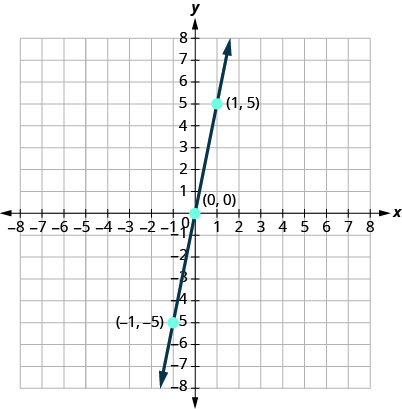

By the end of this section, you will be able to:
* Plot points in a rectangular coordinate system
* Graph a linear equation by plotting points
* Graph vertical and horizontal lines
* Find the x- and y-intercepts
* Graph a line using the intercepts

Before you get started, take this readiness quiz.

1.  Evaluate
    <math xmlns="http://www.w3.org/1998/Math/MathML"><mrow><mn>5</mn><mi>x</mi><mo>−</mo><mn>4</mn></mrow></math>
    
    when
    <math xmlns="http://www.w3.org/1998/Math/MathML"><mrow><mi>x</mi><mo>=</mo><mn>−1</mn><mo>.</mo></mrow></math>
    
    * * *
    {: data-type="newline"}
    
    If you missed this problem, review [\[link\]](/m63302#fs-id1167836530265).
2.  Evaluate
    <math xmlns="http://www.w3.org/1998/Math/MathML"><mrow><mn>3</mn><mi>x</mi><mo>−</mo><mn>2</mn><mi>y</mi></mrow></math>
    
    when
    <math xmlns="http://www.w3.org/1998/Math/MathML"><mrow><mi>x</mi><mo>=</mo><mn>4</mn><mo>,</mo><mi>y</mi><mo>=</mo><mn>−3</mn><mo>.</mo></mrow></math>
    
    * * *
    {: data-type="newline"}
    
    If you missed this problem, review [\[link\]](/m63303#fs-id1167832053133).
3.  Solve for *y*\:
    <math xmlns="http://www.w3.org/1998/Math/MathML"><mrow><mn>8</mn><mo>−</mo><mn>3</mn><mi>y</mi><mo>=</mo><mn>20</mn><mo>.</mo></mrow></math>
    
    * * *
    {: data-type="newline"}
    
    If you missed this problem, review [\[link\]](/m63308#fs-id1167836432956).
{: type="1"}

### Plot Points on a Rectangular Coordinate System

Just like maps use a grid system to identify locations, a grid system is used in algebra to show a relationship between two variables in a rectangular coordinate system. The rectangular coordinate system is also called the *xy*-plane or the “coordinate plane.”

The rectangular coordinate system is formed by two intersecting number lines, one horizontal and one vertical. The horizontal number line is called the *x*-axis. The vertical number line is called the *y*-axis. These axes divide a plane into four regions, called quadrants. The quadrants are identified by Roman numerals, beginning on the upper right and proceeding counterclockwise. See [\[link\]](#CNX_IntAlg_Figure_03_01_001).

 {: #CNX_IntAlg_Figure_03_01_001}

In the rectangular coordinate system, every point is represented by an **ordered pair**{: data-type="term"}. The first number in the ordered pair is the *x*-coordinate of the point, and the second number is the *y*-coordinate of the point. The phrase “ordered pair” means that the order is important.

Ordered Pair

An **ordered pair**, <math xmlns="http://www.w3.org/1998/Math/MathML"><mrow><mrow><mo>(</mo><mrow><mi>x</mi><mo>,</mo><mi>y</mi></mrow><mo>)</mo></mrow></mrow></math>

 gives the coordinates of a point in a rectangular coordinate system. The first number is the *x*-coordinate. The second number is the *y*-coordinate.

  

What is the ordered pair of the point where the axes cross? At that point both coordinates are zero, so its ordered pair is <math xmlns="http://www.w3.org/1998/Math/MathML"><mrow><mrow><mo>(</mo><mrow><mn>0</mn><mo>,</mo><mn>0</mn></mrow><mo>)</mo></mrow><mo>.</mo></mrow></math>

 The point <math xmlns="http://www.w3.org/1998/Math/MathML"><mrow><mrow><mo>(</mo><mrow><mn>0</mn><mo>,</mo><mn>0</mn></mrow><mo>)</mo></mrow></mrow></math>

 has a special name. It is called the **origin**{: data-type="term"}.

The Origin

The point <math xmlns="http://www.w3.org/1998/Math/MathML"><mrow><mrow><mo>(</mo><mrow><mn>0</mn><mo>,</mo><mn>0</mn></mrow><mo>)</mo></mrow></mrow></math>

 is called the **origin**. It is the point where the *x*-axis and *y*-axis intersect.

We use the coordinates to locate a point on the *xy*-plane. Let’s plot the point <math xmlns="http://www.w3.org/1998/Math/MathML"><mrow><mrow><mo>(</mo><mrow><mn>1</mn><mo>,</mo><mn>3</mn></mrow><mo>)</mo></mrow></mrow></math>

 as an example. First, locate 1 on the *x*-axis and lightly sketch a vertical line through <math xmlns="http://www.w3.org/1998/Math/MathML"><mrow><mi>x</mi><mo>=</mo><mn>1</mn><mo>.</mo></mrow></math>

 Then, locate 3 on the *y*-axis and sketch a horizontal line through <math xmlns="http://www.w3.org/1998/Math/MathML"><mrow><mi>y</mi><mo>=</mo><mn>3</mn><mo>.</mo></mrow></math>

 Now, find the point where these two lines meet—that is the point with coordinates <math xmlns="http://www.w3.org/1998/Math/MathML"><mrow><mrow><mo>(</mo><mrow><mn>1</mn><mo>,</mo><mn>3</mn></mrow><mo>)</mo></mrow><mo>.</mo></mrow></math>

 See [\[link\]](#CNX_IntAlg_Figure_03_01_003).

 {: #CNX_IntAlg_Figure_03_01_003}

Notice that the vertical line through <math xmlns="http://www.w3.org/1998/Math/MathML"><mrow><mi>x</mi><mo>=</mo><mn>1</mn></mrow></math>

 and the horizontal line through <math xmlns="http://www.w3.org/1998/Math/MathML"><mrow><mi>y</mi><mo>=</mo><mn>3</mn></mrow></math>

 are not part of the graph. We just used them to help us locate the point <math xmlns="http://www.w3.org/1998/Math/MathML"><mrow><mrow><mo>(</mo><mrow><mn>1</mn><mo>,</mo><mn>3</mn></mrow><mo>)</mo></mrow><mo>.</mo></mrow></math>

When one of the coordinate is zero, the point lies on one of the axes. In [\[link\]](#CNX_IntAlg_Figure_03_01_004) the point <math xmlns="http://www.w3.org/1998/Math/MathML"><mrow><mrow><mo>(</mo><mrow><mn>0</mn><mo>,</mo><mn>4</mn></mrow><mo>)</mo></mrow></mrow></math>

 is on the *y*-axis and the point <math xmlns="http://www.w3.org/1998/Math/MathML"><mrow><mrow><mo>(</mo><mrow><mn>−2</mn><mo>,</mo><mn>0</mn></mrow><mo>)</mo></mrow></mrow></math>

 is on the *x*-axis.

 {: #CNX_IntAlg_Figure_03_01_004}

Points on the Axes

Points with a *y*-coordinate equal to 0 are on the *x*-axis, and have coordinates <math xmlns="http://www.w3.org/1998/Math/MathML"><mrow><mrow><mo>(</mo><mrow><mi>a</mi><mo>,</mo><mn>0</mn></mrow><mo>)</mo></mrow><mo>.</mo></mrow></math>

Points with an *x*-coordinate equal to 0 are on the *y*-axis, and have coordinates <math xmlns="http://www.w3.org/1998/Math/MathML"><mrow><mrow><mo>(</mo><mrow><mn>0</mn><mo>,</mo><mi>b</mi></mrow><mo>)</mo></mrow><mo>.</mo></mrow></math>

Plot each point in the rectangular coordinate system and identify the quadrant in which the point is located:

ⓐ <math xmlns="http://www.w3.org/1998/Math/MathML"><mrow><mrow><mo>(</mo><mrow><mn>−5</mn><mo>,</mo><mn>4</mn></mrow><mo>)</mo></mrow></mrow></math>

 ⓑ <math xmlns="http://www.w3.org/1998/Math/MathML"><mrow><mrow><mo>(</mo><mrow><mn>−3</mn><mo>,</mo><mn>−4</mn></mrow><mo>)</mo></mrow></mrow></math>

 ⓒ <math xmlns="http://www.w3.org/1998/Math/MathML"><mrow><mrow><mo>(</mo><mrow><mn>2</mn><mo>,</mo><mn>−3</mn></mrow><mo>)</mo></mrow></mrow></math>

 ⓓ <math xmlns="http://www.w3.org/1998/Math/MathML"><mrow><mrow><mo>(</mo><mrow><mn>0</mn><mo>,</mo><mn>−1</mn></mrow><mo>)</mo></mrow></mrow></math>

 ⓔ <math xmlns="http://www.w3.org/1998/Math/MathML"><mrow><mrow><mo>(</mo><mrow><mn>3</mn><mo>,</mo><mfrac><mn>5</mn><mn>2</mn></mfrac></mrow><mo>)</mo></mrow><mo>.</mo></mrow></math>

The first number of the coordinate pair is the *x*-coordinate, and the second number is the *y*-coordinate. To plot each point, sketch a vertical line through the *x*-coordinate and a horizontal line through the *y*-coordinate. Their intersection is the point.* * *
{: data-type="newline"}

 ⓐ Since <math xmlns="http://www.w3.org/1998/Math/MathML"><mrow><mi>x</mi><mo>=</mo><mn>−5</mn><mo>,</mo></mrow></math>

 the point is to the left of the *y*-axis. Also, since <math xmlns="http://www.w3.org/1998/Math/MathML"><mrow><mi>y</mi><mo>=</mo><mn>4</mn><mo>,</mo></mrow></math>

 the point is above the *x*-axis. The point <math xmlns="http://www.w3.org/1998/Math/MathML"><mrow><mrow><mo>(</mo><mrow><mn>−5</mn><mo>,</mo><mn>4</mn></mrow><mo>)</mo></mrow></mrow></math>

 is in Quadrant II.* * *
{: data-type="newline"}

 ⓑ Since <math xmlns="http://www.w3.org/1998/Math/MathML"><mrow><mi>x</mi><mo>=</mo><mn>−3</mn><mo>,</mo></mrow></math>

 the point is to the left of the *y*-axis. Also, since <math xmlns="http://www.w3.org/1998/Math/MathML"><mrow><mi>y</mi><mo>=</mo><mn>−4</mn><mo>,</mo></mrow></math>

 the point is below the *x*-axis. The point <math xmlns="http://www.w3.org/1998/Math/MathML"><mrow><mrow><mo>(</mo><mrow><mn>−3</mn><mo>,</mo><mn>−4</mn></mrow><mo>)</mo></mrow></mrow></math>

 is in Quadrant III.* * *
{: data-type="newline"}

 ⓒ Since <math xmlns="http://www.w3.org/1998/Math/MathML"><mrow><mi>x</mi><mo>=</mo><mn>2</mn><mo>,</mo></mrow></math>

 the point is to the right of the *y*-axis. Since <math xmlns="http://www.w3.org/1998/Math/MathML"><mrow><mi>y</mi><mo>=</mo><mn>−3</mn><mo>,</mo></mrow></math>

 the point is below the *x*-axis. The point <math xmlns="http://www.w3.org/1998/Math/MathML"><mrow><mrow><mo>(</mo><mrow><mn>2</mn><mo>,</mo><mn>−3</mn></mrow><mo>)</mo></mrow></mrow></math>

 is in Quadrant IV.* * *
{: data-type="newline"}

 ⓓ Since <math xmlns="http://www.w3.org/1998/Math/MathML"><mrow><mi>x</mi><mo>=</mo><mn>0</mn><mo>,</mo></mrow></math>

 the point whose coordinates are <math xmlns="http://www.w3.org/1998/Math/MathML"><mrow><mrow><mo>(</mo><mrow><mn>0</mn><mo>,</mo><mn>−1</mn></mrow><mo>)</mo></mrow></mrow></math>

 is on the *y*-axis.* * *
{: data-type="newline"}

 ⓔ Since <math xmlns="http://www.w3.org/1998/Math/MathML"><mrow><mi>x</mi><mo>=</mo><mn>3</mn><mo>,</mo></mrow></math>

 the point is to the right of the *y*-axis. Since <math xmlns="http://www.w3.org/1998/Math/MathML"><mrow><mi>y</mi><mo>=</mo><mfrac><mn>5</mn><mn>2</mn></mfrac><mo>,</mo></mrow></math>

 the point is above the *x*-axis. (It may be helpful to write <math xmlns="http://www.w3.org/1998/Math/MathML"><mrow><mfrac><mn>5</mn><mn>2</mn></mfrac></mrow></math>

 as a mixed number or decimal.) The point <math xmlns="http://www.w3.org/1998/Math/MathML"><mrow><mrow><mo>(</mo><mrow><mn>3</mn><mo>,</mo><mfrac><mn>5</mn><mn>2</mn></mfrac></mrow><mo>)</mo></mrow></mrow></math>

 is in Quadrant I.* * *
{: data-type="newline"}

  

Plot each point in a rectangular coordinate system and identify the quadrant in which the point is located:* * *
{: data-type="newline"}

ⓐ <math xmlns="http://www.w3.org/1998/Math/MathML"><mrow><mrow><mo>(</mo><mrow><mn>−2</mn><mo>,</mo><mn>1</mn></mrow><mo>)</mo></mrow></mrow></math>

 ⓑ <math xmlns="http://www.w3.org/1998/Math/MathML"><mrow><mrow><mo>(</mo><mrow><mn>−3</mn><mo>,</mo><mn>−1</mn></mrow><mo>)</mo></mrow></mrow></math>

 ⓒ <math xmlns="http://www.w3.org/1998/Math/MathML"><mrow><mrow><mo>(</mo><mrow><mn>4</mn><mo>,</mo><mn>−4</mn></mrow><mo>)</mo></mrow></mrow></math>

 ⓓ <math xmlns="http://www.w3.org/1998/Math/MathML"><mrow><mrow><mo>(</mo><mrow><mn>−4</mn><mo>,</mo><mn>4</mn></mrow><mo>)</mo></mrow></mrow></math>

 ⓔ <math xmlns="http://www.w3.org/1998/Math/MathML"><mrow><mrow><mo>(</mo><mrow><mn>−4</mn><mo>,</mo><mfrac><mn>3</mn><mn>2</mn></mfrac></mrow><mo>)</mo></mrow></mrow></math>

 ![This figure shows points plotted on the x y-coordinate plane. The x and y axes run from negative 6 to 6. The point labeled a is 2 units to the left of the origin and 1 unit above the origin and is located in quadrant II. The point labeled b is 3 units to the left of the origin and 1 unit below the origin and is located in quadrant III. The point labeled c is 4 units to the right of the origin and 4 units below the origin and is located in quadrant IV. The point labeled d is 4 units to the left of the origin and 4 units above the origin and is located in quadrant II. The point labeled e is 4 units to the left of the origin and 1 and a half units above the origin and is located in quadrant II.](../resources/CNX_IntAlg_Figure_03_01_301_img.jpg) 

Plot each point in a rectangular coordinate system and identify the quadrant in which the point is located:* * *
{: data-type="newline"}

ⓐ <math xmlns="http://www.w3.org/1998/Math/MathML"><mrow><mrow><mo>(</mo><mrow><mn>−4</mn><mo>,</mo><mn>1</mn></mrow><mo>)</mo></mrow></mrow></math>

 ⓑ <math xmlns="http://www.w3.org/1998/Math/MathML"><mrow><mrow><mo>(</mo><mrow><mn>−2</mn><mo>,</mo><mn>3</mn></mrow><mo>)</mo></mrow></mrow></math>

 ⓒ <math xmlns="http://www.w3.org/1998/Math/MathML"><mrow><mrow><mo>(</mo><mrow><mn>2</mn><mo>,</mo><mn>−5</mn></mrow><mo>)</mo></mrow></mrow></math>

 ⓓ <math xmlns="http://www.w3.org/1998/Math/MathML"><mrow><mrow><mo>(</mo><mrow><mn>−2</mn><mo>,</mo><mn>5</mn></mrow><mo>)</mo></mrow></mrow></math>

 ⓔ <math xmlns="http://www.w3.org/1998/Math/MathML"><mrow><mrow><mo>(</mo><mrow><mn>−3</mn><mo>,</mo><mfrac><mn>5</mn><mn>2</mn></mfrac></mrow><mo>)</mo></mrow></mrow></math>

 ![This figure shows points plotted on the x y-coordinate plane. The x and y axes run from negative 6 to 6. The point labeled a is 4 units to the left of the origin and 1 unit above the origin and is located in quadrant II. The point labeled b is 2 units to the left of the origin and 3 units above the origin and is located in quadrant II. The point labeled c is 2 units to the right of the origin and 5 units below the origin and is located in quadrant IV. The point labeled d is 2 units to the left of the origin and 5 units above the origin and is located in quadrant II. The point labeled e is 3 units to the left of the origin and 2 and a half units above the origin and is located in quadrant II.](../resources/CNX_IntAlg_Figure_03_01_302_img.jpg) 

The signs of the *x*-coordinate and *y*-coordinate affect the location of the points. You may have noticed some patterns as you graphed the points in the previous example. We can summarize sign patterns of the quadrants in this way:

Quadrants

<math xmlns="http://www.w3.org/1998/Math/MathML"><mrow><mtable> <mtr><mtd columnalign="center"><mtext mathvariant="bold">Quadrant I</mtext></mtd><mtd columnalign="center"><mspace width="2em" /><mtext mathvariant="bold">Quadrant II</mtext></mtd><mtd columnalign="center"><mspace width="2em" /><mtext mathvariant="bold">Quadrant III</mtext></mtd><mtd columnalign="center"><mspace width="2em" /><mtext mathvariant="bold">Quadrant IV</mtext></mtd></mtr> <mtr><mtd columnalign="center"><mo>(</mo><mi>x</mi><mo>,</mo><mi>y</mi><mo>)</mo></mtd><mtd columnalign="center"><mspace width="2em" /><mo>(</mo><mi>x</mi><mo>,</mo><mi>y</mi><mo>)</mo></mtd><mtd columnalign="center"><mspace width="2em" /><mo>(</mo><mi>x</mi><mo>,</mo><mi>y</mi><mo>)</mo></mtd><mtd columnalign="center"><mspace width="2em" /><mo>(</mo><mi>x</mi><mo>,</mo><mi>y</mi><mo>)</mo></mtd></mtr> <mtr><mtd columnalign="center"><mo>(</mo><mo>+</mo><mo>,</mo><mo>+</mo><mo>)</mo></mtd><mtd columnalign="center"><mspace width="2em" /><mo>(</mo><mo>−</mo><mo>,</mo><mo>+</mo><mo>)</mo></mtd><mtd columnalign="center"><mspace width="2em" /><mo>(</mo><mo>−</mo><mo>,</mo><mo>−</mo><mo>)</mo></mtd><mtd columnalign="center"><mspace width="2em" /><mo>(</mo><mo>+</mo><mo>,</mo><mo>−</mo><mo>)</mo></mtd></mtr> </mtable></mrow></math>

  

Up to now, all the equations you have solved were equations with just one variable. In almost every case, when you solved the equation you got exactly one solution. But equations can have more than one variable. Equations with two variables may be of the form <math xmlns="http://www.w3.org/1998/Math/MathML"><mrow><mi>A</mi><mi>x</mi><mo>+</mo><mi>B</mi><mi>y</mi><mo>=</mo><mi>C</mi><mo>.</mo></mrow></math>

 An equation of this form is called a **linear equation**{: data-type="term"} in two variables.

Linear Equation

An equation of the form <math xmlns="http://www.w3.org/1998/Math/MathML"><mrow><mi>A</mi><mi>x</mi><mo>+</mo><mi>B</mi><mi>y</mi><mo>=</mo><mi>C</mi><mo>,</mo></mrow></math>

 where *A* and *B* are not both zero, is called a **linear equation** in two variables.

Here is an example of a linear equation in two variables, *x* and *y*.

    The equation <math xmlns="http://www.w3.org/1998/Math/MathML"><mrow><mi>y</mi><mo>=</mo><mn>−3</mn><mi>x</mi><mo>+</mo><mn>5</mn></mrow></math>

 is also a linear equation. But it does not appear to be in the form <math xmlns="http://www.w3.org/1998/Math/MathML"><mrow><mi>A</mi><mi>x</mi><mo>+</mo><mi>B</mi><mi>y</mi><mo>=</mo><mi>C</mi><mo>.</mo></mrow></math>

 We can use the Addition Property of Equality and rewrite it in <math xmlns="http://www.w3.org/1998/Math/MathML"><mrow><mi>A</mi><mi>x</mi><mo>+</mo><mi>B</mi><mi>y</mi><mo>=</mo><mi>C</mi></mrow></math>

 form.

<math xmlns="http://www.w3.org/1998/Math/MathML"><mrow><mtable> <mtr><mtd /><mtd /><mtd /><mtd columnalign="right"><mrow><mi>y</mi></mrow></mtd><mtd columnalign="left"><mo>=</mo></mtd><mtd columnalign="left"><mn>−3</mn><mi>x</mi><mo>+</mo><mn>5</mn></mtd></mtr> <mtr><mtd columnalign="left"><mtext>Add to both sides.</mtext></mtd><mtd /><mtd /><mtd columnalign="right"><mrow><mi>y</mi><mo>+</mo><mn>3</mn><mi>x</mi></mrow></mtd><mtd columnalign="left"><mo>=</mo></mtd><mtd columnalign="left"><mn>3</mn><mi>x</mi><mo>+</mo><mn>5</mn><mo>+</mo><mn>3</mn><mi>x</mi></mtd></mtr> <mtr><mtd columnalign="left"><mtext>Simplify.</mtext></mtd><mtd /><mtd /><mtd columnalign="right"><mrow><mi>y</mi><mo>+</mo><mn>3</mn><mi>x</mi></mrow></mtd><mtd columnalign="left"><mo>=</mo></mtd><mtd columnalign="left"><mn>5</mn></mtd></mtr> <mtr><mtd columnalign="left"><mtext>Use the Commutative Property to put it in</mtext></mtd><mtd /><mtd /><mtd /></mtr> <mtr><mtd columnalign="left"><mrow><mi>A</mi><mi>x</mi><mo>+</mo><mi>B</mi><mi>y</mi><mo>=</mo><mi>C</mi></mrow><mspace width="0.2em" /><mtext>form.</mtext></mtd><mtd /><mtd /><mtd columnalign="left"><mrow><mn>3</mn><mi>x</mi><mo>+</mo><mi>y</mi></mrow></mtd><mtd columnalign="left"><mo>=</mo></mtd><mtd columnalign="left"><mn>5</mn></mtd></mtr></mtable></mrow></math>

By rewriting <math xmlns="http://www.w3.org/1998/Math/MathML"><mrow><mi>y</mi><mo>=</mo><mn>−3</mn><mi>x</mi><mo>+</mo><mn>5</mn></mrow></math>

 as <math xmlns="http://www.w3.org/1998/Math/MathML"><mrow><mn>3</mn><mi>x</mi><mo>+</mo><mi>y</mi><mo>=</mo><mn>5</mn><mo>,</mo></mrow></math>

 we can easily see that it is a linear equation in two variables because it is of the form <math xmlns="http://www.w3.org/1998/Math/MathML"><mrow><mi>A</mi><mi>x</mi><mo>+</mo><mi>B</mi><mi>y</mi><mo>=</mo><mi>C</mi><mo>.</mo></mrow></math>

 When an equation is in the form <math xmlns="http://www.w3.org/1998/Math/MathML"><mrow><mi>A</mi><mi>x</mi><mo>+</mo><mi>B</mi><mi>y</mi><mo>=</mo><mi>C</mi><mo>,</mo></mrow></math>

 we say it is in **standard form of a linear equation**{: data-type="term"}.

Standard Form of Linear Equation

A linear equation is in **standard form** when it is written <math xmlns="http://www.w3.org/1998/Math/MathML"><mrow><mi>A</mi><mi>x</mi><mo>+</mo><mi>B</mi><mi>y</mi><mo>=</mo><mi>C</mi><mo>.</mo></mrow></math>

Most people prefer to have *A*, *B*, and *C* be integers and <math xmlns="http://www.w3.org/1998/Math/MathML"><mrow><mi>A</mi><mo>≥</mo><mn>0</mn></mrow></math>

 when writing a linear equation in standard form, although it is not strictly necessary.

Linear equations have infinitely many solutions. For every number that is substituted for *x* there is a corresponding *y* value. This pair of values is a **solution**{: data-type="term"} to the linear equation and is represented by the ordered pair <math xmlns="http://www.w3.org/1998/Math/MathML"><mrow><mrow><mo>(</mo><mrow><mi>x</mi><mo>,</mo><mi>y</mi></mrow><mo>)</mo></mrow><mo>.</mo></mrow></math>

 When we substitute these values of *x* and *y* into the equation, the result is a true statement, because the value on the left side is equal to the value on the right side.

Solution of a Linear Equation in Two Variables

An ordered pair <math xmlns="http://www.w3.org/1998/Math/MathML"><mrow><mrow><mo>(</mo><mrow><mi>x</mi><mo>,</mo><mi>y</mi></mrow><mo>)</mo></mrow></mrow></math>

 is a **solution** of the linear equation<math xmlns="http://www.w3.org/1998/Math/MathML"><mrow><mi>A</mi><mi>x</mi><mo>+</mo><mi>B</mi><mi>y</mi><mo>=</mo><mi>C</mi><mo>,</mo></mrow></math>

 if the equation is a true statement when the *x*- and *y*-values of the ordered pair are substituted into the equation.

Linear equations have infinitely many solutions. We can plot these solutions in the rectangular coordinate system. The points will line up perfectly in a straight line. We connect the points with a straight line to get the graph of the equation. We put arrows on the ends of each side of the line to indicate that the line continues in both directions.

A graph is a visual representation of all the solutions of the equation. It is an example of the saying, “A picture is worth a thousand words.” The line shows you *all* the solutions to that equation. Every point on the line is a solution of the equation. And, every solution of this equation is on this line. This line is called the graph of the equation. Points *not* on the line are not solutions!

Graph of a Linear Equation

The graph of a linear equation <math xmlns="http://www.w3.org/1998/Math/MathML"><mrow><mi>A</mi><mi>x</mi><mo>+</mo><mi>B</mi><mi>y</mi><mo>=</mo><mi>C</mi></mrow></math>

 is a straight line.

* Every point on the line is a solution of the equation.
* Every solution of this equation is a point on this line.
{: data-bullet-style="bullet"}

The graph of <math xmlns="http://www.w3.org/1998/Math/MathML"><mrow><mi>y</mi><mo>=</mo><mn>2</mn><mi>x</mi><mo>−</mo><mn>3</mn></mrow></math>

 is shown.

  
For each ordered pair, decide:

ⓐ Is the ordered pair a solution to the equation?

ⓑ Is the point on the line?

A: <math xmlns="http://www.w3.org/1998/Math/MathML"><mrow><mrow><mo>(</mo><mrow><mn>0</mn><mo>,</mo><mn>−3</mn></mrow><mo>)</mo></mrow></mrow></math>

 B: <math xmlns="http://www.w3.org/1998/Math/MathML"><mrow><mrow><mo>(</mo><mrow><mn>3</mn><mo>,</mo><mn>3</mn></mrow><mo>)</mo></mrow></mrow></math>

 C: <math xmlns="http://www.w3.org/1998/Math/MathML"><mrow><mrow><mo>(</mo><mrow><mn>2</mn><mo>,</mo><mn>−3</mn></mrow><mo>)</mo></mrow></mrow></math>

 D: <math xmlns="http://www.w3.org/1998/Math/MathML"><mrow><mrow><mo>(</mo><mrow><mn>−1</mn><mo>,</mo><mn>−5</mn></mrow><mo>)</mo></mrow></mrow></math>

Substitute the *x*- and *y*-values into the equation to check if the ordered pair is a solution to the equation.* * *
{: data-type="newline"}

* * *
{: data-type="newline"}

 ⓐ* * *
{: data-type="newline"}

 ![Example A shows the ordered pair (0, negative 3). Under this is the equation y plus 2 x minus 3. Under this is the equation negative 3 equals 2 times 0 minus 3. The negative 3 and 0 are colored the same as the negative 3 and 0 in the ordered pair at the top. There is a question mark above the plus sign. Below this is the equation negative 3 plus negative 3. Below this is the statement (0, negative 3) is a solution. Example B shows the ordered pair (3, 3). Under this is the equation y plus 2 x minus 3. Under this is the equation 3 equals 2 times 3 minus 3. The 3 and 3 are colored the same as the 3 and 3 in the ordered pair at the top. There is a question mark above the plus sign. Below this is the equation 3 plus 3. Below this is the statement (3, 3) is a solution. Example C shows the ordered pair (2, negative 3). Under this is the equation y plus 2 x minus 3. Under this is the equation negative 3 equals 2 times 2 minus 3. The negative 3 and 2 are colored the same as the negative 3 and 2 in the ordered pair at the top. There is a question mark above the plus sign. Below this is the inequality negative 3 is not equal to 1. Below this is the statement (2, negative 3) is not a solution. Example D shows the ordered pair (negative 1, negative 5). Under this is the equation y plus 2 x minus 3. Under this is the equation negative 5 equals 2 times negative 1 minus 3. The negative 1 and negative 5 are colored the same as the negative 1 and negative 5 in the ordered pair at the top. There is a question mark above the plus sign. Below this is the equation negative 5 plus negative 5. Below this is the statement (negative 1, negative 5) is a solution.](../resources/CNX_IntAlg_Figure_03_01_009_img.jpg) 
* * *
{: data-type="newline"}

* * *
{: data-type="newline"}

 ⓑ Plot the points <math xmlns="http://www.w3.org/1998/Math/MathML"><mrow><mrow><mo>(</mo><mrow><mn>0</mn><mo>,</mo><mn>−3</mn></mrow><mo>)</mo></mrow><mo>,</mo></mrow></math>

<math xmlns="http://www.w3.org/1998/Math/MathML"><mrow><mrow><mo>(</mo><mrow><mn>3</mn><mo>,</mo><mn>3</mn></mrow><mo>)</mo></mrow><mo>,</mo></mrow></math>

<math xmlns="http://www.w3.org/1998/Math/MathML"><mrow><mrow><mo>(</mo><mrow><mn>2</mn><mo>,</mo><mn>−3</mn></mrow><mo>)</mo></mrow><mo>,</mo></mrow></math>

 and <math xmlns="http://www.w3.org/1998/Math/MathML"><mrow><mrow><mo>(</mo><mrow><mn>−1</mn><mo>,</mo><mn>−5</mn></mrow><mo>)</mo></mrow><mo>.</mo></mrow></math>

* * *
{: data-type="newline"}

  
* * *
{: data-type="newline"}

 The points <math xmlns="http://www.w3.org/1998/Math/MathML"><mrow><mrow><mo>(</mo><mrow><mn>0</mn><mo>,</mo><mn>3</mn></mrow><mo>)</mo></mrow><mo>,</mo></mrow></math>

<math xmlns="http://www.w3.org/1998/Math/MathML"><mrow><mrow><mo>(</mo><mrow><mn>3</mn><mo>,</mo><mn>−3</mn></mrow><mo>)</mo></mrow><mo>,</mo></mrow></math>

 and <math xmlns="http://www.w3.org/1998/Math/MathML"><mrow><mrow><mo>(</mo><mrow><mn>−1</mn><mo>,</mo><mn>−5</mn></mrow><mo>)</mo></mrow></mrow></math>

 are on the line <math xmlns="http://www.w3.org/1998/Math/MathML"><mrow><mi>y</mi><mo>=</mo><mn>2</mn><mi>x</mi><mo>−</mo><mn>3</mn><mo>,</mo></mrow></math>

 and the point <math xmlns="http://www.w3.org/1998/Math/MathML"><mrow><mrow><mo>(</mo><mrow><mn>2</mn><mo>,</mo><mn>−3</mn></mrow><mo>)</mo></mrow></mrow></math>

 is not on the line.* * *
{: data-type="newline"}

 The points that are solutions to <math xmlns="http://www.w3.org/1998/Math/MathML"><mrow><mi>y</mi><mo>=</mo><mn>2</mn><mi>x</mi><mo>−</mo><mn>3</mn></mrow></math>

 are on the line, but the point that is not a solution is not on the line.

Use graph of <math xmlns="http://www.w3.org/1998/Math/MathML"><mrow><mi>y</mi><mo>=</mo><mn>3</mn><mi>x</mi><mo>−</mo><mn>1</mn><mo>.</mo></mrow></math>

 For each ordered pair, decide:

ⓐ Is the ordered pair a solution to the equation?* * *
{: data-type="newline"}

ⓑ Is the point on the line?

A <math xmlns="http://www.w3.org/1998/Math/MathML"><mrow><mrow><mo>(</mo><mrow><mn>0</mn><mo>,</mo><mn>−1</mn></mrow><mo>)</mo></mrow></mrow></math>

 B <math xmlns="http://www.w3.org/1998/Math/MathML"><mrow><mrow><mo>(</mo><mrow><mn>2</mn><mo>,</mo><mn>5</mn></mrow><mo>)</mo></mrow></mrow></math>

  

ⓐ yes, yes ⓑ yes, yes

Use graph of <math xmlns="http://www.w3.org/1998/Math/MathML"><mrow><mi>y</mi><mo>=</mo><mn>3</mn><mi>x</mi><mo>−</mo><mn>1</mn><mo>.</mo></mrow></math>

 For each ordered pair, decide:

ⓐ Is the ordered pair a solution to the equation?* * *
{: data-type="newline"}

ⓑ Is the point on the line?

A<math xmlns="http://www.w3.org/1998/Math/MathML"><mrow><mrow><mo>(</mo><mrow><mn>3</mn><mo>,</mo><mn>−1</mn></mrow><mo>)</mo></mrow></mrow></math>

 B<math xmlns="http://www.w3.org/1998/Math/MathML"><mrow><mrow><mo>(</mo><mrow><mn>−1</mn><mo>,</mo><mn>−4</mn></mrow><mo>)</mo></mrow></mrow></math>

  

ⓐ no, no ⓑ yes, yes

### Graph a Linear Equation by Plotting Points

There are several methods that can be used to graph a linear equation. The first method we will use is called plotting points, or the Point-Plotting Method. We find three points whose coordinates are solutions to the equation and then plot them in a rectangular coordinate system. By connecting these points in a line, we have the graph of the linear equation.

How to Graph a Linear Equation by Plotting Points

Graph the equation <math xmlns="http://www.w3.org/1998/Math/MathML"><mrow><mi>y</mi><mo>=</mo><mn>2</mn><mi>x</mi><mo>+</mo><mn>1</mn></mrow></math>

 by plotting points.

 ![Step 1 is to Find three points whose coordinates are solutions to the equation. You can choose any values for x or y. In this case since y is isolated on the left side of the equations, it is easier to choose values for x. Choosing x plus 0. We substitute this into the equation y plus 2 x plus 1 to get y plus 2 times 0 plus 1. This simplifies to y plus 0 plus 1. So y plus 1. Choosing x plus 1. We substitute this into the equation y plus 2 x plus 1 to get y plus 2 times 1 plus 1. This simplifies to y plus 2 plus 1. So y plus 3. Choosing x plus negative 2. We substitute this into the equation y plus 2 x plus 1 to get y plus 2 times negative 2 plus 1. This simplifies to y plus negative 4 plus 1. The y plus negative 3. Next we want to organize the solutions in a table. For this problem we will put the three solutions we just found in a table. The table has 5 rows and 3 columns. The first row is a title row with the equation y plus 2 x plus 1. The second row is a header row with the headers x, y, and (x, y). The third row has the numbers 0, 1, and (0, 1). The fourth row has the numbers 1, 3, and (1, 3). The fifth row has the numbers negative 2, negative 3, and (negative 2, negative 3).](../resources/CNX_IntAlg_Figure_03_01_013a_img.jpg)       

Graph the equation by plotting points: <math xmlns="http://www.w3.org/1998/Math/MathML"><mrow><mi>y</mi><mo>=</mo><mn>2</mn><mi>x</mi><mo>−</mo><mn>3</mn><mo>.</mo></mrow></math>

* * *
{: data-type="newline"}

  

Graph the equation by plotting points: <math xmlns="http://www.w3.org/1998/Math/MathML"><mrow><mi>y</mi><mo>=</mo><mn>−2</mn><mi>x</mi><mo>+</mo><mn>4</mn><mo>.</mo></mrow></math>

* * *
{: data-type="newline"}

  

The steps to take when graphing a linear equation by plotting points are summarized here.

Graph a linear equation by plotting points.

1.  Find three points whose coordinates are solutions to the equation. Organize them in a table.
2.  Plot the points in a rectangular coordinate system. Check that the points line up. If they do not, carefully check your work.
3.  Draw the line through the three points. Extend the line to fill the grid and put arrows on both ends of the line.
{: type="1" .stepwise}

It is true that it only takes two points to determine a line, but it is a good habit to use three points. If you only plot two points and one of them is incorrect, you can still draw a line but it will not represent the solutions to the equation. It will be the wrong line.

If you use three points, and one is incorrect, the points will not line up. This tells you something is wrong and you need to check your work. Look at the difference between these illustrations.

    When an equation includes a fraction as the coefficient of <math xmlns="http://www.w3.org/1998/Math/MathML"><mi>x</mi></math>

, we can still substitute any numbers for *x*. But the arithmetic is easier if we make “good” choices for the values of *x*. This way we will avoid fractional answers, which are hard to graph precisely.

Graph the equation: <math xmlns="http://www.w3.org/1998/Math/MathML"><mrow><mi>y</mi><mo>=</mo><mfrac><mn>1</mn><mn>2</mn></mfrac><mi>x</mi><mo>+</mo><mn>3</mn><mo>.</mo></mrow></math>

Find three points that are solutions to the equation. Since this equation has the fraction <math xmlns="http://www.w3.org/1998/Math/MathML"><mrow><mfrac><mn>1</mn><mn>2</mn></mfrac></mrow></math>

 as a coefficient of *x*, we will choose values of *x* carefully. We will use zero as one choice and multiples of 2 for the other choices. Why are multiples of two a good choice for values of *x*? By choosing multiples of 2 the multiplication by <math xmlns="http://www.w3.org/1998/Math/MathML"><mrow><mfrac><mn>1</mn><mn>2</mn></mfrac></mrow></math>

 simplifies to a whole number* * *
{: data-type="newline"}

 ![The first set of equations starts with x plus 0. Under this is the equation y plus 1 half x plus 3. Under this is the equation y plus 1 half times 0 plus 3. Below this is the equation y plus 0 plus 3. Below this is the equation y plus 3. The second set of equations starts with x plus 2. Under this is the equation y plus 1 half x plus 3. Under this is the equation y plus 1 half times 2 plus 3. Below this is the equation y plus 1 plus 3. Below this is the equation y plus 4. The third set of equations starts with x plus 4. Under this is the equation y plus 1 half x plus 3. Under this is the equation y plus 1 half times 4 plus 3. Below this is the equation y plus 2 plus 3. Below this is the equation y plus 5.](../resources/CNX_IntAlg_Figure_03_01_015_img.jpg) 
* * *
{: data-type="newline"}

 The points are shown in [[link]](#fs-id1167835202852).* * *
{: data-type="newline"}

<table summary="The table has 5 rows and 3 columns. The first row is a title row with the equation y plus 1 half x plus 3. The second row is a header row with the headers x, y, and (x, y). The third row has the numbers 0, 3, and (0, 3). The fourth row has the numbers 2, 4, and (2, 4). The fifth row has the numbers 4, 5, and (4, 5)."><tbody>
<tr valign="top">
<td colspan="3" data-valign="middle" data-align="center"><strong><math xmlns="http://www.w3.org/1998/Math/MathML"><mrow><mi>y</mi><mo>=</mo><mfrac><mn>1</mn><mn>2</mn></mfrac><mi>x</mi><mo>+</mo><mn>3</mn></mrow></math></strong></td>
</tr>
<tr valign="top">
<td data-valign="middle" data-align="center"><strong><em>x</em></strong></td>
<td data-valign="middle" data-align="center"><strong><em>y</em></strong></td>
<td data-valign="middle" data-align="center"><strong><math xmlns="http://www.w3.org/1998/Math/MathML"><mrow><mo stretchy="false">(</mo><mi>x</mi><mo>,</mo><mi>y</mi><mo stretchy="false">)</mo></mrow></math></strong></td>
</tr>
<tr valign="top">
<td data-valign="middle" data-align="center">0</td>
<td data-valign="middle" data-align="center">3</td>
<td data-valign="middle" data-align="center"><math xmlns="http://www.w3.org/1998/Math/MathML"><mrow><mrow><mo>(</mo><mrow><mn>0</mn><mo>,</mo><mn>3</mn></mrow><mo>)</mo></mrow></mrow></math></td>
</tr>
<tr valign="top">
<td data-valign="middle" data-align="center">2</td>
<td data-valign="middle" data-align="center">4</td>
<td data-valign="middle" data-align="center"><math xmlns="http://www.w3.org/1998/Math/MathML"><mrow><mrow><mo>(</mo><mrow><mn>2</mn><mo>,</mo><mn>4</mn></mrow><mo>)</mo></mrow></mrow></math></td>
</tr>
<tr valign="top">
<td data-valign="middle" data-align="center">4</td>
<td data-valign="middle" data-align="center">5</td>
<td data-valign="middle" data-align="center"><math xmlns="http://www.w3.org/1998/Math/MathML"><mrow><mrow><mo>(</mo><mrow><mn>4</mn><mo>,</mo><mn>5</mn></mrow><mo>)</mo></mrow></mrow></math></td>
</tr>
</tbody></table>
* * *
{: data-type="newline"}

 Plot the points, check that they line up, and draw the line.* * *
{: data-type="newline"}

  

Graph the equation: <math xmlns="http://www.w3.org/1998/Math/MathML"><mrow><mi>y</mi><mo>=</mo><mfrac><mn>1</mn><mn>3</mn></mfrac><mi>x</mi><mo>−</mo><mn>1</mn><mo>.</mo></mrow></math>

* * *
{: data-type="newline"}

  

Graph the equation: <math xmlns="http://www.w3.org/1998/Math/MathML"><mrow><mi>y</mi><mo>=</mo><mfrac><mn>1</mn><mn>4</mn></mfrac><mi>x</mi><mo>+</mo><mn>2</mn><mo>.</mo></mrow></math>

* * *
{: data-type="newline"}

  

### Graph Vertical and Horizontal Lines

Some linear equations have only one variable. They may have just *x* and no *y*, or just *y* without an *x*. This changes how we make a table of values to get the points to plot.

Let’s consider the equation <math xmlns="http://www.w3.org/1998/Math/MathML"><mrow><mi>x</mi><mo>=</mo><mn>−3</mn><mo>.</mo></mrow></math>

 This equation has only one variable, *x*. The equation says that *x* is *always* equal to<math xmlns="http://www.w3.org/1998/Math/MathML"><mrow><mn>−3</mn><mo>,</mo></mrow></math>

 so its value does not depend on *y*. No matter what is the value of *y*, the value of *x* is always <math xmlns="http://www.w3.org/1998/Math/MathML"><mrow><mn>−3</mn><mo>.</mo></mrow></math>

So to make a table of values, write <math xmlns="http://www.w3.org/1998/Math/MathML"><mrow><mn>−3</mn></mrow></math>

 in for all the *x*-values. Then choose any values for *y*. Since *x* does not depend on *y*, you can choose any numbers you like. But to fit the points on our coordinate graph, we’ll use 1, 2, and 3 for the *y*-coordinates. See [\[link\]](#fs-id1167831922183).

<table summary="The table has 5 rows and 3 columns. The first row is a title row with the equation x plus negative 3. The second row is a header row with the headers x, y, and (x, y). The third row has the numbers negative 3, 1, and (negative 3, 1). The fourth row has the numbers negative 3, 2, and (negative 3, 2). The fifth row has the numbers negative 3, 3, and (negative 3, 3)."><tbody>
<tr valign="top">
<td colspan="3" data-valign="middle" data-align="center"><strong><math xmlns="http://www.w3.org/1998/Math/MathML"><mrow><mi>x</mi><mo>=</mo><mn>−3</mn></mrow></math></strong></td>
</tr>
<tr valign="top">
<td data-valign="middle" data-align="center"><strong><em>x</em></strong></td>
<td data-valign="middle" data-align="center"><strong><em>y</em></strong></td>
<td data-valign="middle" data-align="center"><strong><math xmlns="http://www.w3.org/1998/Math/MathML"><mrow><mrow><mo>(</mo><mrow><mi>x</mi><mo>,</mo><mi>y</mi></mrow><mo>)</mo></mrow></mrow></math></strong></td>
</tr>
<tr valign="top">
<td data-valign="middle" data-align="center"><math xmlns="http://www.w3.org/1998/Math/MathML"><mrow><mn>−3</mn></mrow></math></td>
<td data-valign="middle" data-align="center">1</td>
<td data-valign="middle" data-align="center"><math xmlns="http://www.w3.org/1998/Math/MathML"><mrow><mrow><mo>(</mo><mrow><mn>−3</mn><mo>,</mo><mn>1</mn></mrow><mo>)</mo></mrow></mrow></math></td>
</tr>
<tr valign="top">
<td data-valign="middle" data-align="center"><math xmlns="http://www.w3.org/1998/Math/MathML"><mrow><mn>−3</mn></mrow></math></td>
<td data-valign="middle" data-align="center">2</td>
<td data-valign="middle" data-align="center"><math xmlns="http://www.w3.org/1998/Math/MathML"><mrow><mrow><mo>(</mo><mrow><mn>−3</mn><mo>,</mo><mn>2</mn></mrow><mo>)</mo></mrow></mrow></math></td>
</tr>
<tr valign="top">
<td data-valign="middle" data-align="center"><math xmlns="http://www.w3.org/1998/Math/MathML"><mrow><mn>−3</mn></mrow></math></td>
<td data-valign="middle" data-align="center">3</td>
<td data-valign="middle" data-align="center"><math xmlns="http://www.w3.org/1998/Math/MathML"><mrow><mrow><mo>(</mo><mrow><mn>−3</mn><mo>,</mo><mn>3</mn></mrow><mo>)</mo></mrow></mrow></math></td>
</tr>
</tbody></table>

Plot the points from the table and connect them with a straight line. Notice that we have graphed a **vertical line**{: data-type="term"}.

    What if the equation has *y* but no *x*? Let’s graph the equation <math xmlns="http://www.w3.org/1998/Math/MathML"><mrow><mi>y</mi><mo>=</mo><mn>4</mn><mo>.</mo></mrow></math>

 This time the *y-*value is a constant, so in this equation, *y* does not depend on *x*. Fill in 4 for all the *y*’s in [\[link\]](#fs-id1167835382105) and then choose any values for *x*. We’ll use 0, 2, and 4 for the *x*-coordinates.

<table summary="The table has 5 rows and 3 columns. The first row is a title row with the equation y plus 4. The second row is a header row with the headers x, y, and (x, y). The third row has the numbers 0, 4, and (0, 4). The fourth row has the numbers 2, 4, and (2, 4). The fifth row has the numbers 4, 4, and (4, 4)."><tbody>
<tr valign="top">
<td colspan="3" data-valign="middle" data-align="center"><strong><math xmlns="http://www.w3.org/1998/Math/MathML"><mrow><mi>y</mi><mo>=</mo><mn>4</mn></mrow></math></strong></td>
</tr>
<tr valign="top">
<td data-valign="middle" data-align="center"><strong><em>x</em></strong></td>
<td data-valign="middle" data-align="center"><strong><em>y</em></strong></td>
<td data-valign="middle" data-align="center"><strong><math xmlns="http://www.w3.org/1998/Math/MathML"><mrow><mo stretchy="false">(</mo><mi>x</mi><mo>,</mo><mi>y</mi><mo stretchy="false">)</mo></mrow></math></strong></td>
</tr>
<tr valign="top">
<td data-valign="middle" data-align="center">0</td>
<td data-valign="middle" data-align="center">4</td>
<td data-valign="middle" data-align="center"><math xmlns="http://www.w3.org/1998/Math/MathML"><mrow><mrow><mo>(</mo><mrow><mn>0</mn><mo>,</mo><mn>4</mn></mrow><mo>)</mo></mrow></mrow></math></td>
</tr>
<tr valign="top">
<td data-valign="middle" data-align="center">2</td>
<td data-valign="middle" data-align="center">4</td>
<td data-valign="middle" data-align="center"><math xmlns="http://www.w3.org/1998/Math/MathML"><mrow><mrow><mo>(</mo><mrow><mn>2</mn><mo>,</mo><mn>4</mn></mrow><mo>)</mo></mrow></mrow></math></td>
</tr>
<tr valign="top">
<td data-valign="middle" data-align="center">4</td>
<td data-valign="middle" data-align="center">4</td>
<td data-valign="middle" data-align="center"><math xmlns="http://www.w3.org/1998/Math/MathML"><mrow><mrow><mo>(</mo><mrow><mn>4</mn><mo>,</mo><mn>4</mn></mrow><mo>)</mo></mrow></mrow></math></td>
</tr>
</tbody></table>

In this figure, we have graphed a **horizontal line**{: data-type="term"} passing through the *y*-axis at 4.

    

Vertical and Horizontal Lines

A **vertical line** is the graph of an equation of the form <math xmlns="http://www.w3.org/1998/Math/MathML"><mrow><mi>x</mi><mo>=</mo><mi>a</mi><mo>.</mo></mrow></math>

<math xmlns="http://www.w3.org/1998/Math/MathML"><mrow><mspace width="12em" /></mrow></math>

The line passes through the *x*-axis at <math xmlns="http://www.w3.org/1998/Math/MathML"><mrow><mrow><mo>(</mo><mrow><mi>a</mi><mo>,</mo><mn>0</mn></mrow><mo>)</mo></mrow><mo>.</mo></mrow></math>

A **horizontal line** is the graph of an equation of the form <math xmlns="http://www.w3.org/1998/Math/MathML"><mrow><mi>y</mi><mo>=</mo><mi>b</mi><mo>.</mo></mrow></math>

<math xmlns="http://www.w3.org/1998/Math/MathML"><mrow><mspace width="12em" /></mrow></math>

The line passes through the *y*-axis at <math xmlns="http://www.w3.org/1998/Math/MathML"><mrow><mrow><mo>(</mo><mrow><mn>0</mn><mo>,</mo><mi>b</mi></mrow><mo>)</mo></mrow><mo>.</mo></mrow></math>

Graph: ⓐ <math xmlns="http://www.w3.org/1998/Math/MathML"><mrow><mi>x</mi><mo>=</mo><mn>2</mn></mrow></math>

 ⓑ <math xmlns="http://www.w3.org/1998/Math/MathML"><mrow><mi>y</mi><mo>=</mo><mn>−1</mn><mo>.</mo></mrow></math>

ⓐ The equation has only one variable, *x*, and *x* is always equal to 2. We create a table where *x* is always 2 and then put in any values for *y*. The graph is a vertical line passing through the *x*-axis at 2.* * *
{: data-type="newline"}

<table class="unnumbered" summary="The table has 5 rows and 3 columns. The first row is a title row with the equation x plus 2. The second row is a header row with the headers x, y, and (x, y). The third row has the numbers 2, 1, and (2, 1). The fourth row has the numbers 2, 2, and (2, 2). The fifth row has the numbers 2, 3, and (2, 3)." data-label=""><tbody>
<tr valign="top">
<td colspan="3" data-valign="middle" data-align="center"><strong><math xmlns="http://www.w3.org/1998/Math/MathML"><mrow><mi>x</mi><mo>=</mo><mn>2</mn></mrow></math></strong></td>
</tr>
<tr valign="top">
<td data-valign="middle" data-align="center"><strong><em>x</em></strong></td>
<td data-valign="middle" data-align="center"><strong><em>y</em></strong></td>
<td data-valign="middle" data-align="center"><strong><math xmlns="http://www.w3.org/1998/Math/MathML"><mrow><mo stretchy="false">(</mo><mi>x</mi><mo>,</mo><mi>y</mi><mo stretchy="false">)</mo></mrow></math></strong></td>
</tr>
<tr valign="top">
<td data-valign="middle" data-align="center">2</td>
<td data-valign="middle" data-align="center">1</td>
<td data-valign="middle" data-align="center"><math xmlns="http://www.w3.org/1998/Math/MathML"><mrow><mrow><mo>(</mo><mrow><mn>2</mn><mo>,</mo><mn>1</mn></mrow><mo>)</mo></mrow></mrow></math></td>
</tr>
<tr valign="top">
<td data-valign="middle" data-align="center">2</td>
<td data-valign="middle" data-align="center">2</td>
<td data-valign="middle" data-align="center"><math xmlns="http://www.w3.org/1998/Math/MathML"><mrow><mrow><mo>(</mo><mrow><mn>2</mn><mo>,</mo><mn>2</mn></mrow><mo>)</mo></mrow></mrow></math></td>
</tr>
<tr valign="top">
<td data-valign="middle" data-align="center">2</td>
<td data-valign="middle" data-align="center">3</td>
<td data-valign="middle" data-align="center"><math xmlns="http://www.w3.org/1998/Math/MathML"><mrow><mrow><mo>(</mo><mrow><mn>2</mn><mo>,</mo><mn>3</mn></mrow><mo>)</mo></mrow></mrow></math></td>
</tr>
</tbody></table>
* * *
{: data-type="newline"}

  
* * *
{: data-type="newline"}

 ⓑ Similarly, the equation <math xmlns="http://www.w3.org/1998/Math/MathML"><mrow><mi>y</mi><mo>=</mo><mn>−1</mn></mrow></math>

 has only one variable, *y*. The value of *y* is constant. All the ordered pairs in the next table have the same *y*-coordinate. The graph is a horizontal line passing through the *y*-axis at <math xmlns="http://www.w3.org/1998/Math/MathML"><mrow><mn>−1</mn><mo>.</mo></mrow></math>

* * *
{: data-type="newline"}

<table class="unnumbered" summary="The table has 5 rows and 3 columns. The first row is a title row with the equation y plus negative 1. The second row is a header row with the headers x, y, and (x, y). The third row has the numbers 0, negative 1, and (0, negative 1). The fourth row has the numbers 3, negative 1, and (3, negative 1). The fifth row has the numbers negative 3, negative 1, and (negative 3, negative 1)." data-label=""><tbody>
<tr valign="top">
<td colspan="3" data-valign="middle" data-align="center"><strong><math xmlns="http://www.w3.org/1998/Math/MathML"><mrow><mi>y</mi><mo>=</mo><mn>−1</mn></mrow></math></strong></td>
</tr>
<tr valign="top">
<td data-valign="middle" data-align="center"><strong><em>x</em></strong></td>
<td data-valign="middle" data-align="center"><strong><em>y</em></strong></td>
<td data-valign="middle" data-align="center"><strong><math xmlns="http://www.w3.org/1998/Math/MathML"><mrow><mo stretchy="false">(</mo><mi>x</mi><mo>,</mo><mi>y</mi><mo stretchy="false">)</mo></mrow></math></strong></td>
</tr>
<tr valign="top">
<td data-valign="middle" data-align="center">0</td>
<td data-valign="middle" data-align="center"><math xmlns="http://www.w3.org/1998/Math/MathML"><mrow><mn>−1</mn></mrow></math></td>
<td data-valign="middle" data-align="center"><math xmlns="http://www.w3.org/1998/Math/MathML"><mrow><mrow><mo>(</mo><mrow><mn>0</mn><mo>,</mo><mn>−1</mn></mrow><mo>)</mo></mrow></mrow></math></td>
</tr>
<tr valign="top">
<td data-valign="middle" data-align="center">3</td>
<td data-valign="middle" data-align="center"><math xmlns="http://www.w3.org/1998/Math/MathML"><mrow><mn>−1</mn></mrow></math></td>
<td data-valign="middle" data-align="center"><math xmlns="http://www.w3.org/1998/Math/MathML"><mrow><mrow><mo>(</mo><mrow><mn>3</mn><mo>,</mo><mn>−1</mn></mrow><mo>)</mo></mrow></mrow></math></td>
</tr>
<tr valign="top">
<td data-valign="middle" data-align="center"><math xmlns="http://www.w3.org/1998/Math/MathML"><mrow><mn>−3</mn></mrow></math></td>
<td data-valign="middle" data-align="center"><math xmlns="http://www.w3.org/1998/Math/MathML"><mrow><mn>−1</mn></mrow></math></td>
<td data-valign="middle" data-align="center"><math xmlns="http://www.w3.org/1998/Math/MathML"><mrow><mrow><mo>(</mo><mrow><mn>−3</mn><mo>,</mo><mn>−1</mn></mrow><mo>)</mo></mrow></mrow></math></td>
</tr>
</tbody></table>
* * *
{: data-type="newline"}

  

Graph the equations: ⓐ <math xmlns="http://www.w3.org/1998/Math/MathML"><mrow><mi>x</mi><mo>=</mo><mn>5</mn></mrow></math>

 ⓑ <math xmlns="http://www.w3.org/1998/Math/MathML"><mrow><mi>y</mi><mo>=</mo><mn>−4</mn><mo>.</mo></mrow></math>

ⓐ* * *
{: data-type="newline"}

  
* * *
{: data-type="newline"}

* * *
{: data-type="newline"}

 ⓑ* * *
{: data-type="newline"}

  

Graph the equations: ⓐ <math xmlns="http://www.w3.org/1998/Math/MathML"><mrow><mi>x</mi><mo>=</mo><mn>−2</mn></mrow></math>

 ⓑ <math xmlns="http://www.w3.org/1998/Math/MathML"><mrow><mi>y</mi><mo>=</mo><mn>3</mn><mo>.</mo></mrow></math>

ⓐ* * *
{: data-type="newline"}

  
* * *
{: data-type="newline"}

* * *
{: data-type="newline"}

 ⓑ* * *
{: data-type="newline"}

  

What is the difference between the equations <math xmlns="http://www.w3.org/1998/Math/MathML"><mrow><mi>y</mi><mo>=</mo><mn>4</mn><mi>x</mi></mrow></math>

 and <math xmlns="http://www.w3.org/1998/Math/MathML"><mrow><mi>y</mi><mo>=</mo><mn>4</mn><mo>?</mo></mrow></math>

The equation <math xmlns="http://www.w3.org/1998/Math/MathML"><mrow><mi>y</mi><mo>=</mo><mn>4</mn><mi>x</mi></mrow></math>

 has both *x* and *y*. The value of *y* depends on the value of *x*, so the *y* -coordinate changes according to the value of *x*. The equation <math xmlns="http://www.w3.org/1998/Math/MathML"><mrow><mi>y</mi><mo>=</mo><mn>4</mn></mrow></math>

 has only one variable. The value of *y* is constant, it does not depend on the value of *x*, so the *y*-coordinate is always 4.

  ![This figure has two tables. The first table has 5 rows and 3 columns. The first row is a title row with the equation y plus 4 x. The second row is a header row with the headers x, y, and (x, y). The third row has the numbers 0, 0, and (0, 0). The fourth row has the numbers 1, 4, and (1, 4). The fifth row has the numbers 2, 8, and (2, 8). The second table has 5 rows and 3 columns. The first row is a title row with the equation y plus 4. The second row is a header row with the headers x, y, and (x, y). The third row has the numbers 0, 4, and (0, 4). The fourth row has the numbers 1, 4, and (1, 4). The fifth row has the numbers 2, 4, and (2, 4).](../resources/CNX_IntAlg_Figure_03_01_039_img.jpg)     Notice, in the graph, the equation <math xmlns="http://www.w3.org/1998/Math/MathML"><mrow><mi>y</mi><mo>=</mo><mn>4</mn><mi>x</mi></mrow></math>

 gives a slanted line, while <math xmlns="http://www.w3.org/1998/Math/MathML"><mrow><mi>y</mi><mo>=</mo><mn>4</mn></mrow></math>

 gives a horizontal line.

Graph <math xmlns="http://www.w3.org/1998/Math/MathML"><mrow><mi>y</mi><mo>=</mo><mn>−3</mn><mi>x</mi></mrow></math>

 and <math xmlns="http://www.w3.org/1998/Math/MathML"><mrow><mi>y</mi><mo>=</mo><mn>−3</mn></mrow></math>

 in the same rectangular coordinate system.

We notice that the first equation has the variable *x*, while the second does not. We make a table of points for each equation and then graph the lines. The two graphs are shown.

 ![This figure has two tables. The first table has 5 rows and 3 columns. The first row is a title row with the equation y plus negative 3 x. The second row is a header row with the headers x, y, and (x, y). The third row has the numbers 0, 0, and (0, 0). The fourth row has the numbers 1, negative 3, and (1, negative 3). The fifth row has the numbers 2, negative 6, and (2, neg ative 6). The second table has 5 rows and 3 columns. The first row is a title row with the equation y plus negative 3. The second row is a header row with the headers x, y, and (x, y). The third row has the numbers 0, negative 3, and (0, negative 3). The fourth row has the numbers 1, negative 3, and (1, negative 3). The fifth row has the numbers 2, negative 3, and (2, negative 3).](../resources/CNX_IntAlg_Figure_03_01_040_img.jpg) 
* * *
{: data-type="newline"}

  

Graph the equations in the same rectangular coordinate system: <math xmlns="http://www.w3.org/1998/Math/MathML"><mrow><mi>y</mi><mo>=</mo><mn>−4</mn><mi>x</mi></mrow></math>

 and <math xmlns="http://www.w3.org/1998/Math/MathML"><mrow><mi>y</mi><mo>=</mo><mn>−4</mn><mo>.</mo></mrow></math>

* * *
{: data-type="newline"}

  

Graph the equations in the same rectangular coordinate system: <math xmlns="http://www.w3.org/1998/Math/MathML"><mrow><mi>y</mi><mo>=</mo><mn>3</mn></mrow></math>

 and <math xmlns="http://www.w3.org/1998/Math/MathML"><mrow><mi>y</mi><mo>=</mo><mn>3</mn><mi>x</mi><mo>.</mo></mrow></math>

* * *
{: data-type="newline"}

  

### Find *x*- and *y*-intercepts

Every linear equation can be represented by a unique line that shows all the solutions of the equation. We have seen that when graphing a line by plotting points, you can use any three solutions to graph. This means that two people graphing the line might use different sets of three points.

At first glance, their two lines might not appear to be the same, since they would have different points labeled. But if all the work was done correctly, the lines should be exactly the same. One way to recognize that they are indeed the same line is to look at where the line crosses the *x*-axis and the *y*-axis. These points are called the **intercepts of a line**{: data-type="term"}.

Intercepts of a Line

The points where a line crosses the *x*-axis and the *y*-axis are called the **intercepts of the line**.

Let’s look at the graphs of the lines.

  ![The figure shows four graphs of different equations. In example a the graph of 2 x plus y plus 6 is graphed on the x y-coordinate plane. The x and y axes run from negative 8 to 8. The points (0, 6) and (3, 0) are plotted and labeled. A straight line goes through both points and has arrows on both ends. In example b the graph of 3 x minus 4 y plus 12 is graphed on the x y-coordinate plane. The x and y axes run from negative 8 to 8. The points (0, negative 3) and (4, 0) are plotted and labeled. A straight line goes through both points and has arrows on both ends. In example c the graph of x minus y plus 5 is graphed on the x y-coordinate plane. The x and y axes run from negative 8 to 8. The points (0, negative 5) and (5, 0) are plotted and labeled. A straight line goes through both points and has arrows on both ends. In example d the graph of y plus negative 2 x is graphed on the x y-coordinate plane. The x and y axes run from negative 8 to 8. The point (0, 0) is plotted and labeled. A straight line goes through this point and the points (negative 1, 2) and (1, negative 2) and has arrows on both ends.](../resources/CNX_IntAlg_Figure_03_01_023_img.jpg)  First, notice where each of these lines crosses the *x*-axis. See [\[link\]](#fs-id1167835367746).

Now, let’s look at the points where these lines cross the *y*-axis.

<table summary="The table has 6 rows and 5 columns. The first row is a header row with the headers &#x201C;Figure&#x201D;, &#x201C;The line crosses the x-axis at:&#x201D;, &#x201C;Ordered pair for this point&#x201D;, &#x201C;The line crosses the y-axis at:&#x201D;, and &#x201C;Ordered pair for this point&#x201D;. The second row contains &#x201C;Figure a&#x201D;, 3, (3, 0), 6, (0, 6). The third row contains &#x201C;Figure b&#x201D;, 4, (4, 0), negative 3, (0, negative 3). The fourth row contains &#x201C;Figure c&#x201D;, 5, (5, 0), negative 5, (0, negative 5). The fifth row contains &#x201C;Figure d&#x201D;, 0, (0, 0), 0, (0, 0). The sixth row contains &#x201C;General Figure&#x201D;, a, (a, 0), b, (0, b)."><thead>
<tr valign="top">
<th data-valign="middle" data-align="left"><strong>Figure</strong></th>
<th data-valign="top" data-align="center"><strong>The line crosses
the <em>x</em>-axis at:</strong></th>
<th data-valign="top" data-align="center"><strong>Ordered pair
for this point</strong></th>
<th data-valign="middle" data-align="center"><strong>The line crosses
the <em>y-</em>axis at:</strong></th>
<th data-valign="middle" data-align="center"><strong>Ordered pair
for this point</strong></th>
</tr>
</thead><tbody>
<tr valign="top">
<td data-valign="middle" data-align="center">Figure (a)</td>
<td data-valign="middle" data-align="center">3</td>
<td data-valign="middle" data-align="center"><math xmlns="http://www.w3.org/1998/Math/MathML"><mrow><mrow><mo>(</mo><mrow><mn>3</mn><mo>,</mo><mn>0</mn></mrow><mo>)</mo></mrow></mrow></math></td>
<td data-valign="middle" data-align="center">6</td>
<td data-valign="middle" data-align="center"><math xmlns="http://www.w3.org/1998/Math/MathML"><mrow><mrow><mo>(</mo><mrow><mn>0</mn><mo>,</mo><mn>6</mn></mrow><mo>)</mo></mrow></mrow></math></td>
</tr>
<tr valign="top">
<td data-valign="middle" data-align="center">Figure (b)</td>
<td data-valign="middle" data-align="center">4</td>
<td data-valign="middle" data-align="center"><math xmlns="http://www.w3.org/1998/Math/MathML"><mrow><mrow><mo>(</mo><mrow><mn>4</mn><mo>,</mo><mn>0</mn></mrow><mo>)</mo></mrow></mrow></math></td>
<td data-valign="middle" data-align="center"><math xmlns="http://www.w3.org/1998/Math/MathML"><mrow><mn>−3</mn></mrow></math></td>
<td data-valign="middle" data-align="center"><math xmlns="http://www.w3.org/1998/Math/MathML"><mrow><mrow><mo>(</mo><mrow><mn>0</mn><mo>,</mo><mn>−3</mn></mrow><mo>)</mo></mrow></mrow></math></td>
</tr>
<tr valign="top">
<td data-valign="middle" data-align="center">Figure (c)</td>
<td data-valign="middle" data-align="center">5</td>
<td data-valign="middle" data-align="center"><math xmlns="http://www.w3.org/1998/Math/MathML"><mrow><mrow><mo>(</mo><mrow><mn>5</mn><mo>,</mo><mn>0</mn></mrow><mo>)</mo></mrow></mrow></math></td>
<td data-valign="middle" data-align="center"><math xmlns="http://www.w3.org/1998/Math/MathML"><mrow><mn>−5</mn></mrow></math></td>
<td data-valign="middle" data-align="center"><math xmlns="http://www.w3.org/1998/Math/MathML"><mrow><mrow><mo>(</mo><mrow><mn>0</mn><mo>,</mo><mn>5</mn></mrow><mo>)</mo></mrow></mrow></math></td>
</tr>
<tr valign="top">
<td data-valign="middle" data-align="center">Figure (d)</td>
<td data-valign="middle" data-align="center">0</td>
<td data-valign="middle" data-align="center"><math xmlns="http://www.w3.org/1998/Math/MathML"><mrow><mrow><mo>(</mo><mrow><mn>0</mn><mo>,</mo><mn>0</mn></mrow><mo>)</mo></mrow></mrow></math></td>
<td data-valign="middle" data-align="center">0</td>
<td data-valign="middle" data-align="center"><math xmlns="http://www.w3.org/1998/Math/MathML"><mrow><mrow><mo>(</mo><mrow><mn>0</mn><mo>,</mo><mn>0</mn></mrow><mo>)</mo></mrow></mrow></math></td>
</tr>
<tr valign="top">
<td data-valign="middle" data-align="center">General Figure</td>
<td data-valign="middle" data-align="center"><em>a</em></td>
<td data-valign="middle" data-align="center"><math xmlns="http://www.w3.org/1998/Math/MathML"><mrow><mrow><mo>(</mo><mrow><mi>a</mi><mo>,</mo><mn>0</mn></mrow><mo>)</mo></mrow></mrow></math></td>
<td data-valign="middle" data-align="center"><em>b</em></td>
<td data-valign="middle" data-align="center"><math xmlns="http://www.w3.org/1998/Math/MathML"><mrow><mrow><mo>(</mo><mrow><mn>0</mn><mo>,</mo><mi>b</mi></mrow><mo>)</mo></mrow></mrow></math></td>
</tr>
</tbody></table>

Do you see a pattern?

For each line, the *y*-coordinate of the point where the line crosses the *x*-axis is zero. The point where the line crosses the *x*-axis has the form <math xmlns="http://www.w3.org/1998/Math/MathML"><mrow><mrow><mo>(</mo><mrow><mi>a</mi><mo>,</mo><mn>0</mn></mrow><mo>)</mo></mrow></mrow></math>

 and is called the *x-intercept* of the line. The *x*-intercept occurs when *y* is zero.

In each line, the *x*{::}**-**coordinate of the point where the line crosses the *y*-axis is zero. The point where the line crosses the *y*-axis has the form <math xmlns="http://www.w3.org/1998/Math/MathML"><mrow><mrow><mo>(</mo><mrow><mn>0</mn><mo>,</mo><mi>b</mi></mrow><mo>)</mo></mrow></mrow></math>

 and is called the *y-intercept* of the line. The *y*-intercept occurs when *x* is zero.

*x*-intercept and *y*-intercept of a Line

The *x*-intercept is the point <math xmlns="http://www.w3.org/1998/Math/MathML"><mrow><mrow><mo>(</mo><mrow><mi>a</mi><mo>,</mo><mn>0</mn></mrow><mo>)</mo></mrow></mrow></math>

 where the line crosses the *x*-axis.

The *y*-intercept is the point <math xmlns="http://www.w3.org/1998/Math/MathML"><mrow><mrow><mo>(</mo><mrow><mn>0</mn><mo>,</mo><mi>b</mi></mrow><mo>)</mo></mrow></mrow></math>

 where the line crosses the *y*-axis.

  

Find the *x*- and *y*-intercepts on each graph shown.

 ![The figure has three graphs. Figure a shows a straight line graphed on the x y-coordinate plane. The x and y axes run from negative 8 to 8. The line goes through the points (negative 8, 6), (negative 4, 4), (0, 2), (4, 0), (8, negative 2). Figure b shows a straight line graphed on the x y-coordinate plane. The x and y axes run from negative 8 to 8. The line goes through the points (0, negative 6), (2, 0), and (4, 6). Figure c shows a straight line graphed on the x y-coordinate plane. The x and y axes run from negative 8 to 8. The line goes through the points (negative 5, 0), (negative 3, negative 3), (0, negative 5), (1, negative 6), and (2, negative 7).](../resources/CNX_IntAlg_Figure_03_01_024_img.jpg) 

ⓐ The graph crosses the *x*-axis at the point <math xmlns="http://www.w3.org/1998/Math/MathML"><mrow><mrow><mo>(</mo><mrow><mn>4</mn><mo>,</mo><mn>0</mn></mrow><mo>)</mo></mrow><mo>.</mo></mrow></math>

 The *x-*intercept is <math xmlns="http://www.w3.org/1998/Math/MathML"><mrow><mrow><mo>(</mo><mrow><mn>4</mn><mo>,</mo><mn>0</mn></mrow><mo>)</mo></mrow><mo>.</mo></mrow></math>

* * *
{: data-type="newline"}

 The graph crosses the *y*-axis at the point <math xmlns="http://www.w3.org/1998/Math/MathML"><mrow><mrow><mo>(</mo><mrow><mn>0</mn><mo>,</mo><mn>2</mn></mrow><mo>)</mo></mrow><mo>.</mo></mrow></math>

 The *y*-intercept is <math xmlns="http://www.w3.org/1998/Math/MathML"><mrow><mrow><mo>(</mo><mrow><mn>0</mn><mo>,</mo><mn>2</mn></mrow><mo>)</mo></mrow><mo>.</mo></mrow></math>

* * *
{: data-type="newline"}

* * *
{: data-type="newline"}

 ⓑ The graph crosses the *x*-axis at the point <math xmlns="http://www.w3.org/1998/Math/MathML"><mrow><mrow><mo>(</mo><mrow><mn>2</mn><mo>,</mo><mn>0</mn></mrow><mo>)</mo></mrow><mo>.</mo></mrow></math>

 The *x*-intercept is <math xmlns="http://www.w3.org/1998/Math/MathML"><mrow><mrow><mo>(</mo><mrow><mn>2</mn><mo>,</mo><mn>0</mn></mrow><mo>)</mo></mrow><mo>.</mo></mrow></math>

* * *
{: data-type="newline"}

 The graph crosses the *y*-axis at the point <math xmlns="http://www.w3.org/1998/Math/MathML"><mrow><mrow><mo>(</mo><mrow><mn>0</mn><mo>,</mo><mn>−6</mn></mrow><mo>)</mo></mrow><mo>.</mo></mrow></math>

 The *y*-intercept is <math xmlns="http://www.w3.org/1998/Math/MathML"><mrow><mrow><mo>(</mo><mrow><mn>0</mn><mo>,</mo><mn>−6</mn></mrow><mo>)</mo></mrow><mo>.</mo></mrow></math>

* * *
{: data-type="newline"}

* * *
{: data-type="newline"}

 ⓒ The graph crosses the *x*-axis at the point <math xmlns="http://www.w3.org/1998/Math/MathML"><mrow><mrow><mo>(</mo><mrow><mn>−5</mn><mo>,</mo><mn>0</mn></mrow><mo>)</mo></mrow><mo>.</mo></mrow></math>

 The *x*-intercept is <math xmlns="http://www.w3.org/1998/Math/MathML"><mrow><mrow><mo>(</mo><mrow><mn>−5</mn><mo>,</mo><mn>0</mn></mrow><mo>)</mo></mrow><mo>.</mo></mrow></math>

* * *
{: data-type="newline"}

 The graph crosses the *y*-axis at the point <math xmlns="http://www.w3.org/1998/Math/MathML"><mrow><mrow><mo>(</mo><mrow><mn>0</mn><mo>,</mo><mn>−5</mn></mrow><mo>)</mo></mrow><mo>.</mo></mrow></math>

 The *y*-intercept is <math xmlns="http://www.w3.org/1998/Math/MathML"><mrow><mrow><mo>(</mo><mrow><mn>0</mn><mo>,</mo><mn>−5</mn></mrow><mo>)</mo></mrow><mo>.</mo></mrow></math>

Find the *x*- and *y*-intercepts on the graph.

  

*x*-intercept: <math xmlns="http://www.w3.org/1998/Math/MathML"><mrow><mrow><mo>(</mo><mrow><mn>2</mn><mo>,</mo><mn>0</mn></mrow><mo>)</mo></mrow><mo>,</mo></mrow></math>

* * *
{: data-type="newline"}

*y*-intercept: <math xmlns="http://www.w3.org/1998/Math/MathML"><mrow><mrow><mo>(</mo><mrow><mn>0</mn><mo>,</mo><mn>−2</mn></mrow><mo>)</mo></mrow></mrow></math>

Find the *x*- and *y*-intercepts on the graph.

  

*x*-intercept: <math xmlns="http://www.w3.org/1998/Math/MathML"><mrow><mrow><mo>(</mo><mrow><mn>3</mn><mo>,</mo><mn>0</mn></mrow><mo>)</mo></mrow><mo>,</mo></mrow></math>

* * *
{: data-type="newline"}

*y*-intercept: <math xmlns="http://www.w3.org/1998/Math/MathML"><mrow><mrow><mo>(</mo><mrow><mn>0</mn><mo>,</mo><mn>2</mn></mrow><mo>)</mo></mrow></mrow></math>

Recognizing that the *x*-intercept occurs when *y* is zero and that the *y*-intercept occurs when *x* is zero, gives us a method to find the intercepts of a line from its equation. To find the *x*-intercept, let <math xmlns="http://www.w3.org/1998/Math/MathML"><mrow><mi>y</mi><mo>=</mo><mn>0</mn></mrow></math>

 and solve for *x*. To find the *y*-intercept, let <math xmlns="http://www.w3.org/1998/Math/MathML"><mrow><mi>x</mi><mo>=</mo><mn>0</mn></mrow></math>

 and solve for *y*.

Find the *x*- and *y*-intercepts from the Equation of a Line

Use the equation of the line. To find:

* the *x*-intercept of the line, let
  <math xmlns="http://www.w3.org/1998/Math/MathML"><mrow><mi>y</mi><mo>=</mo><mn>0</mn></mrow></math>
  
  and solve for *x*.
* the *y*-intercept of the line, let
  <math xmlns="http://www.w3.org/1998/Math/MathML"><mrow><mi>x</mi><mo>=</mo><mn>0</mn></mrow></math>
  
  and solve for *y*.
{: data-bullet-style="bullet"}

Find the intercepts of <math xmlns="http://www.w3.org/1998/Math/MathML"><mrow><mn>2</mn><mi>x</mi><mo>+</mo><mi>y</mi><mo>=</mo><mn>8</mn><mo>.</mo></mrow></math>

We will let <math xmlns="http://www.w3.org/1998/Math/MathML"><mrow><mi>y</mi><mo>=</mo><mn>0</mn></mrow></math>

 to find the *x*-intercept, and let <math xmlns="http://www.w3.org/1998/Math/MathML"><mrow><mi>x</mi><mo>=</mo><mn>0</mn></mrow></math>

 to find the *y*-intercept. We will fill in a table, which reminds us of what we need to find.* * *
{: data-type="newline"}

  
* * *
{: data-type="newline"}

| To find the *x*-intercept, let <math xmlns="http://www.w3.org/1998/Math/MathML"><mrow><mi>y</mi><mo>=</mo><mn>0</mn><mo>.</mo></mrow></math>

 |  |
{: valign="top"}|  |  |
{: valign="top"}| Let <math xmlns="http://www.w3.org/1998/Math/MathML"><mrow><mi>y</mi><mo>=</mo><mn>0</mn><mo>.</mo></mrow></math>

 |  |
{: valign="top"}| Simplify. |  |
{: valign="top"}|  |  |
{: valign="top"}| The *x*-intercept is: | <math xmlns="http://www.w3.org/1998/Math/MathML"><mrow><mspace width="2em" /><mrow><mo>(</mo><mrow><mn>4</mn><mo>,</mo><mn>0</mn></mrow><mo>)</mo></mrow></mrow></math>

 |
{: valign="top"}| To find the *y*-intercept, let <math xmlns="http://www.w3.org/1998/Math/MathML"><mrow><mi>x</mi><mo>=</mo><mn>0</mn><mo>.</mo></mrow></math>

 |  |
{: valign="top"}|  |  |
{: valign="top"}| Let <math xmlns="http://www.w3.org/1998/Math/MathML"><mrow><mi>x</mi><mo>=</mo><mn>0</mn><mo>.</mo></mrow></math>

 |  |
{: valign="top"}| Simplify. |  |
{: valign="top"}|  |  |
{: valign="top"}| The *y*-intercept is: | <math xmlns="http://www.w3.org/1998/Math/MathML"><mrow><mspace width="2em" /><mrow><mo>(</mo><mrow><mn>0</mn><mo>,</mo><mn>8</mn></mrow><mo>)</mo></mrow></mrow></math>

 |
{: valign="top"}{: .unnumbered .unstyled summary="The figure has the equation 2 x plus y plus 8. Let y plus 0. The next equation is 2 x plus 0 plus 8, where the 0 is emphasized. Simplifying we get 2 x plus 8. Then y plus 4. The x-intercept is (4, 0). To find the y-intercept, let x plus 0. Again we start with the equation 2 x plus y plus 8. Let x plus 0. The next equation is 2 times 0 plus y plus 8, where the 0 is emphasized. Simplifying we get 0 plus y plus 8. Then y plus 8. The y-intercept is (0, 8)." data-label=""}

* * *
{: data-type="newline"}

 The intercepts are the points <math xmlns="http://www.w3.org/1998/Math/MathML"><mrow><mrow><mo>(</mo><mrow><mn>4</mn><mo>,</mo><mn>0</mn></mrow><mo>)</mo></mrow></mrow></math>

 and <math xmlns="http://www.w3.org/1998/Math/MathML"><mrow><mrow><mo>(</mo><mrow><mn>0</mn><mo>,</mo><mn>8</mn></mrow><mo>)</mo></mrow></mrow></math>

 as shown in the table.* * *
{: data-type="newline"}

<table class="unnumbered" summary="The table shows the equation 2x plus y equals 8. Below that are two columns. The left column is x and the right column is y. The first row shows that x is 4 and y is 0. The second column shows that the x is 0 and the y is 8." data-label=""><tbody>
<tr valign="top">
<td colspan="2" data-valign="middle" data-align="center"><strong><math xmlns="http://www.w3.org/1998/Math/MathML"><mrow><mn>2</mn><mi>x</mi><mo>+</mo><mi>y</mi><mo>=</mo><mn>8</mn></mrow></math></strong></td>
</tr>
<tr valign="top">
<td data-valign="middle" data-align="center"><strong><em>x</em></strong></td>
<td data-valign="middle" data-align="center"><strong><em>y</em></strong></td>
</tr>
<tr valign="top">
<td data-valign="middle" data-align="center">4</td>
<td data-valign="middle" data-align="center">0</td>
</tr>
<tr valign="top">
<td data-valign="middle" data-align="center">0</td>
<td data-valign="middle" data-align="center">8</td>
</tr>
</tbody></table>

Find the intercepts: <math xmlns="http://www.w3.org/1998/Math/MathML"><mrow><mn>3</mn><mi>x</mi><mo>+</mo><mi>y</mi><mo>=</mo><mn>12</mn><mo>.</mo></mrow></math>

*x*-intercept: <math xmlns="http://www.w3.org/1998/Math/MathML"><mrow><mrow><mo>(</mo><mrow><mn>4</mn><mo>,</mo><mn>0</mn></mrow><mo>)</mo></mrow><mo>,</mo></mrow></math>

* * *
{: data-type="newline"}

*y*-intercept: <math xmlns="http://www.w3.org/1998/Math/MathML"><mrow><mrow><mo>(</mo><mrow><mn>0</mn><mo>,</mo><mn>12</mn></mrow><mo>)</mo></mrow></mrow></math>

Find the intercepts: <math xmlns="http://www.w3.org/1998/Math/MathML"><mrow><mi>x</mi><mo>+</mo><mn>4</mn><mi>y</mi><mo>=</mo><mn>8</mn><mo>.</mo></mrow></math>

*x*-intercept: <math xmlns="http://www.w3.org/1998/Math/MathML"><mrow><mrow><mo>(</mo><mrow><mn>8</mn><mo>,</mo><mn>0</mn></mrow><mo>)</mo></mrow><mo>,</mo></mrow></math>

* * *
{: data-type="newline"}

*y*-intercept: <math xmlns="http://www.w3.org/1998/Math/MathML"><mrow><mrow><mo>(</mo><mrow><mn>0</mn><mo>,</mo><mn>2</mn></mrow><mo>)</mo></mrow></mrow></math>

### Graph a Line Using the Intercepts

To graph a linear equation by plotting points, you need to find three points whose coordinates are solutions to the equation. You can use the *x-* and *y-* intercepts as two of your three points. Find the intercepts, and then find a third point to ensure accuracy. Make sure the points line up—then draw the line. This method is often the quickest way to graph a line.

How to Graph a Line Using the Intercepts

Graph <math xmlns="http://www.w3.org/1998/Math/MathML"><mrow><mo>–</mo><mi>x</mi><mo>+</mo><mn>2</mn><mi>y</mi><mo>=</mo><mn>6</mn></mrow></math>

 using the intercepts.

 ![Step 1 is to find the x and y-intercepts of the line. To find the x-intercept let y plus 0 and solve for x. The equation negative x plus 2 y plus 6 becomes negative x plus 2 times 0 plus 6. This simplifies to negative x plus 6. This is equivalent to x plus negative 6. The x-intercept is (negative 6, 0). To find the y-intercept let x plus 0 and solve for y. The equation negative x plus 2 y plus 6 becomes negative 0 plus 2 y plus 6. This simplifies to negative 2 y plus 6. This is equivalent to y plus 3. The y-intercept is (0, 3).](../resources/CNX_IntAlg_Figure_03_01_029a_img.jpg)          

Graph using the intercepts: <math xmlns="http://www.w3.org/1998/Math/MathML"><mrow><mi>x</mi><mo>–</mo><mn>2</mn><mi>y</mi><mo>=</mo><mn>4</mn><mo>.</mo></mrow></math>

  

Graph using the intercepts: <math xmlns="http://www.w3.org/1998/Math/MathML"><mrow><mo>–</mo><mi>x</mi><mo>+</mo><mn>3</mn><mi>y</mi><mo>=</mo><mn>6</mn><mo>.</mo></mrow></math>

* * *
{: data-type="newline"}

  

The steps to graph a linear equation using the intercepts are summarized here.

Graph a linear equation using the intercepts.

1.  Find the *x*- and *y*-intercepts of the line.
    * Let
      <math xmlns="http://www.w3.org/1998/Math/MathML"><mrow><mi>y</mi><mo>=</mo><mn>0</mn></mrow></math>
      
      and solve for *x*.
    * Let
      <math xmlns="http://www.w3.org/1998/Math/MathML"><mrow><mi>x</mi><mo>=</mo><mn>0</mn></mrow></math>
      
      and solve for *y*.
    {: data-bullet-style="bullet"}

2.  Find a third solution to the equation.
3.  Plot the three points and check that they line up.
4.  Draw the line.
{: type="1" .stepwise}

Graph <math xmlns="http://www.w3.org/1998/Math/MathML"><mrow><mn>4</mn><mi>x</mi><mo>−</mo><mn>3</mn><mi>y</mi><mo>=</mo><mn>12</mn></mrow></math>

 using the intercepts.

Find the intercepts and a third point.* * *
{: data-type="newline"}

 ![To find the x-intercept let y plus 0 and solve for x. The equation 4 x minus 3 y plus 12 becomes 4 x minus 3 times 0 plus 12. This simplifies to negative 4 x plus 12. This is equivalent to x plus 3. To find the y-intercept let x plus 0 and solve for y. The equation 4 x minus 3 y plus 12 becomes 4 times 0 minus 3 y plus 12. This simplifies to negative 3 y plus 12. This is equivalent to y plus negative 4. To find the third point let y plus 4 and solve for x. The equation 4 x minus 3 y plus 12 becomes 4 x minus 3 times 4 plus 12. This simplifies to negative 4 x plus 24. This is equivalent to x plus 6.](../resources/CNX_IntAlg_Figure_03_01_030_img.jpg) 
* * *
{: data-type="newline"}

* * *
{: data-type="newline"}

 We list the points in the table and show the graph.* * *
{: data-type="newline"}

<table class="unnumbered" summary="The table shows the equation 4 x minus 3 y plus 12. There are three columns below: x, y, and x y. The first row shows that x is 3, y is 0, and x y is 3, 0. The second row shows that x is 0, y is negative 4, and x y is 0, negative 4. The third column shows that x is 6, y is 4, and x y is 6, 4."><tbody>
<tr valign="top">
<td colspan="3" data-valign="middle" data-align="center"><strong><math xmlns="http://www.w3.org/1998/Math/MathML"><mrow><mn>4</mn><mi>x</mi><mo>−</mo><mn>3</mn><mi>y</mi><mo>=</mo><mn>12</mn></mrow></math></strong></td>
</tr>
<tr valign="top">
<td data-valign="middle" data-align="center"><strong><em>x</em></strong></td>
<td data-valign="middle" data-align="center"><strong><em>y</em></strong></td>
<td data-valign="middle" data-align="center"><strong><math xmlns="http://www.w3.org/1998/Math/MathML"><mrow><mo stretchy="false">(</mo><mi>x</mi><mo>,</mo><mi>y</mi><mo stretchy="false">)</mo></mrow></math></strong></td>
</tr>
<tr valign="top">
<td data-valign="middle" data-align="center">3</td>
<td data-valign="middle" data-align="center">0</td>
<td data-valign="middle" data-align="center"><math xmlns="http://www.w3.org/1998/Math/MathML"><mrow><mo stretchy="false">(</mo><mn>3</mn><mo>,</mo><mn>0</mn><mo stretchy="false">)</mo></mrow></math></td>
</tr>
<tr valign="top">
<td data-valign="middle" data-align="center">0</td>
<td data-valign="middle" data-align="center"><math xmlns="http://www.w3.org/1998/Math/MathML"><mrow><mn>−4</mn></mrow></math></td>
<td data-valign="middle" data-align="center"><math xmlns="http://www.w3.org/1998/Math/MathML"><mrow><mo stretchy="false">(</mo><mn>0</mn><mo>,</mo><mn>−4</mn><mo stretchy="false">)</mo></mrow></math></td>
</tr>
<tr valign="top">
<td data-valign="middle" data-align="center">6</td>
<td data-valign="middle" data-align="center">4</td>
<td data-valign="middle" data-align="center"><math xmlns="http://www.w3.org/1998/Math/MathML"><mrow><mo stretchy="false">(</mo><mn>6</mn><mo>,</mo><mn>4</mn><mo stretchy="false">)</mo></mrow></math></td>
</tr>
</tbody></table>
* * *
{: data-type="newline"}

  

Graph using the intercepts: <math xmlns="http://www.w3.org/1998/Math/MathML"><mrow><mn>5</mn><mi>x</mi><mo>−</mo><mn>2</mn><mi>y</mi><mo>=</mo><mn>10</mn><mo>.</mo></mrow></math>

* * *
{: data-type="newline"}

  

Graph using the intercepts: <math xmlns="http://www.w3.org/1998/Math/MathML"><mrow><mn>3</mn><mi>x</mi><mo>−</mo><mn>4</mn><mi>y</mi><mo>=</mo><mn>12</mn><mo>.</mo></mrow></math>

* * *
{: data-type="newline"}

  

When the line passes through the origin, the *x*-intercept and the *y*-intercept are the same point.

Graph <math xmlns="http://www.w3.org/1998/Math/MathML"><mrow><mi>y</mi><mo>=</mo><mn>5</mn><mi>x</mi></mrow></math>

 using the intercepts.

  
* * *
{: data-type="newline"}

This line has only one intercept. It is the point <math xmlns="http://www.w3.org/1998/Math/MathML"><mrow><mrow><mo>(</mo><mrow><mn>0</mn><mo>,</mo><mn>0</mn></mrow><mo>)</mo></mrow><mo>.</mo></mrow></math>

* * *
{: data-type="newline"}

 To ensure accuracy, we need to plot three points. Since the *x*- and *y*-intercepts are the same point, we need *two* more points to graph the line.

  
The resulting three points are summarized in the table.

<table class="unnumbered" summary="The table has 5 rows and 3 columns. The first row is a title row with the equation y plus 5 x. The second row is a header row with the headers x, y, and (x, y). The third row contains negative 0, 0, and (0, 0). The fourth row contains 1, 5, and (1, 5). The fifth row contains negative 1, negative 5, and (negative 1, negative 5)."><tbody>
<tr valign="top">
<td colspan="3" data-valign="middle" data-align="center"><strong><math xmlns="http://www.w3.org/1998/Math/MathML"><mrow><mi>y</mi><mo>=</mo><mn>5</mn><mi>x</mi></mrow></math></strong></td>
</tr>
<tr valign="top">
<td data-valign="middle" data-align="center"><strong><em>x</em></strong></td>
<td data-valign="middle" data-align="center"><strong><em>y</em></strong></td>
<td data-valign="middle" data-align="center"><strong><math xmlns="http://www.w3.org/1998/Math/MathML"><mrow><mo stretchy="false">(</mo><mi>x</mi><mo>,</mo><mi>y</mi><mo stretchy="false">)</mo></mrow></math></strong></td>
</tr>
<tr valign="top">
<td data-valign="middle" data-align="center">0</td>
<td data-valign="middle" data-align="center">0</td>
<td data-valign="middle" data-align="center"><math xmlns="http://www.w3.org/1998/Math/MathML"><mrow><mo stretchy="false">(</mo><mn>0</mn><mo>,</mo><mn>0</mn><mo stretchy="false">)</mo></mrow></math></td>
</tr>
<tr valign="top">
<td data-valign="middle" data-align="center">1</td>
<td data-valign="middle" data-align="center">5</td>
<td data-valign="middle" data-align="center"><math xmlns="http://www.w3.org/1998/Math/MathML"><mrow><mo stretchy="false">(</mo><mn>1</mn><mo>,</mo><mn>5</mn><mo stretchy="false">)</mo></mrow></math></td>
</tr>
<tr valign="top">
<td data-valign="middle" data-align="center"><math xmlns="http://www.w3.org/1998/Math/MathML"><mrow><mn>−1</mn></mrow></math></td>
<td data-valign="middle" data-align="center"><math xmlns="http://www.w3.org/1998/Math/MathML"><mrow><mn>−5</mn></mrow></math></td>
<td data-valign="middle" data-align="center"><math xmlns="http://www.w3.org/1998/Math/MathML"><mrow><mo stretchy="false">(</mo><mn>−1</mn><mo>,</mo><mn>−5</mn><mo stretchy="false">)</mo></mrow></math></td>
</tr>
</tbody></table>
Plot the three points, check that they line up, and draw the line.

  

Graph using the intercepts: <math xmlns="http://www.w3.org/1998/Math/MathML"><mrow><mi>y</mi><mo>=</mo><mn>4</mn><mi>x</mi><mo>.</mo></mrow></math>

* * *
{: data-type="newline"}

  

Graph the intercepts: <math xmlns="http://www.w3.org/1998/Math/MathML"><mrow><mi>y</mi><mo>=</mo><mtext>−</mtext><mi>x</mi><mo>.</mo></mrow></math>

* * *
{: data-type="newline"}

  

### Key Concepts

* **Points on the Axes**
  * Points with a *y*-coordinate equal to 0 are on the *x*-axis, and have coordinates
    <math xmlns="http://www.w3.org/1998/Math/MathML"><mrow><mrow><mo>(</mo><mrow><mi>a</mi><mo>,</mo><mn>0</mn></mrow><mo>)</mo></mrow><mo>.</mo></mrow></math>
  
  * Points with an *x*-coordinate equal to
    <math xmlns="http://www.w3.org/1998/Math/MathML"><mn>0</mn></math>
    
    are on the *y*-axis, and have coordinates
    <math xmlns="http://www.w3.org/1998/Math/MathML"><mrow><mrow><mo>(</mo><mrow><mn>0</mn><mo>,</mo><mi>b</mi></mrow><mo>)</mo></mrow><mo>.</mo></mrow></math>
  {: data-bullet-style="bullet"}

* **Quadrant**
  

  <math xmlns="http://www.w3.org/1998/Math/MathML"><mrow><mtable> <mtr><mtd columnalign="center"><mtext mathvariant="bold">Quadrant I</mtext></mtd><mtd columnalign="center"><mspace width="2em" /><mtext mathvariant="bold">Quadrant II</mtext></mtd><mtd columnalign="center"><mspace width="2em" /><mtext mathvariant="bold">Quadrant III</mtext></mtd><mtd columnalign="center"><mspace width="2em" /><mtext mathvariant="bold">Quadrant IV</mtext></mtd></mtr> <mtr><mtd columnalign="center"><mo>(</mo><mi>x</mi><mo>,</mo><mi>y</mi><mo>)</mo></mtd><mtd columnalign="center"><mspace width="2em" /><mo>(</mo><mi>x</mi><mo>,</mo><mi>y</mi><mo>)</mo></mtd><mtd columnalign="center"><mspace width="2em" /><mo>(</mo><mi>x</mi><mo>,</mo><mi>y</mi><mo>)</mo></mtd><mtd columnalign="center"><mspace width="2em" /><mo>(</mo><mi>x</mi><mo>,</mo><mi>y</mi><mo>)</mo></mtd></mtr> <mtr><mtd columnalign="center"><mo>(</mo><mo>+</mo><mo>,</mo><mo>+</mo><mo>)</mo></mtd><mtd columnalign="center"><mspace width="2em" /><mo>(</mo><mo>−</mo><mo>,</mo><mo>+</mo><mo>)</mo></mtd><mtd columnalign="center"><mspace width="2em" /><mo>(</mo><mo>−</mo><mo>,</mo><mo>−</mo><mo>)</mo></mtd><mtd columnalign="center"><mspace width="2em" /><mo>(</mo><mo>+</mo><mo>,</mo><mo>−</mo><mo>)</mo></mtd></mtr> </mtable></mrow></math>
  

  
    
* **Graph of a Linear Equation:** The graph of a linear equation
  <math xmlns="http://www.w3.org/1998/Math/MathML"><mrow><mi>A</mi><mi>x</mi><mo>+</mo><mi>B</mi><mi>y</mi><mo>=</mo><mi>C</mi></mrow></math>
  
  is a straight line.
  * * *
  {: data-type="newline"}
  
  Every point on the line is a solution of the equation.
  * * *
  {: data-type="newline"}
  
  Every solution of this equation is a point on this line.
* **How to graph a linear equation by plotting points.**
  1.  Find three points whose coordinates are solutions to the equation. Organize them in a table.
  2.  Plot the points in a rectangular coordinate system. Check that the points line up. If they do not, carefully check your work.
  3.  Draw the line through the three points. Extend the line to fill the grid and put arrows on both ends of the line.
  {: type="1" .stepwise}

* ***x*-intercept and *y*-intercept of a Line**
  * The *x*-intercept is the point
    <math xmlns="http://www.w3.org/1998/Math/MathML"><mrow><mrow><mo>(</mo><mrow><mi>a</mi><mo>,</mo><mn>0</mn></mrow><mo>)</mo></mrow></mrow></math>
    
    where the line crosses the *x*-axis.
  * The *y*-intercept is the point
    <math xmlns="http://www.w3.org/1998/Math/MathML"><mrow><mrow><mo>(</mo><mrow><mn>0</mn><mo>,</mo><mi>b</mi></mrow><mo>)</mo></mrow></mrow></math>
    
    where the line crosses the *y*-axis.   
  {: data-bullet-style="bullet"}

* **Find the *x*- and *y*-intercepts from the Equation of a Line**
  * Use the equation of the line. To find:
    * * *
    {: data-type="newline"}
    
    the *x*-intercept of the line, let
    <math xmlns="http://www.w3.org/1998/Math/MathML"><mrow><mi>y</mi><mo>=</mo><mn>0</mn></mrow></math>
    
    and solve for *x*.
    * * *
    {: data-type="newline"}
    
    the *y*-intercept of the line, let
    <math xmlns="http://www.w3.org/1998/Math/MathML"><mrow><mi>x</mi><mo>=</mo><mn>0</mn></mrow></math>
    
    and solve for *y*.
  {: data-bullet-style="bullet"}

* **How to graph a linear equation using the intercepts.**
  1.  Find the *x*- and *y*-intercepts of the line.
      * * *
      {: data-type="newline"}
      
      Let
      <math xmlns="http://www.w3.org/1998/Math/MathML"><mrow><mi>y</mi><mo>=</mo><mn>0</mn></mrow></math>
      
      and solve for *x.*
      * * *
      {: data-type="newline"}
      
      Let
      <math xmlns="http://www.w3.org/1998/Math/MathML"><mrow><mi>x</mi><mo>=</mo><mn>0</mn></mrow></math>
      
      and solve for *y*.
  2.  Find a third solution to the equation.
  3.  Plot the three points and check that they line up.
  4.  Draw the line
  {: type="1" .stepwise}
{: data-bullet-style="bullet"}

<section data-depth="1" class="section-exercises" markdown="1">
#### Practice Makes Perfect

**Plot Points in a Rectangular Coordinate System**

In the following exercises, plot each point in a rectangular coordinate system and identify the quadrant in which the point is located.

ⓐ <math xmlns="http://www.w3.org/1998/Math/MathML"><mrow><mrow><mo>(</mo><mrow><mn>−4</mn><mo>,</mo><mn>2</mn></mrow><mo>)</mo></mrow></mrow></math>

 ⓑ <math xmlns="http://www.w3.org/1998/Math/MathML"><mrow><mrow><mo>(</mo><mrow><mn>−1</mn><mo>,</mo><mn>−2</mn></mrow><mo>)</mo></mrow></mrow></math>

 ⓒ <math xmlns="http://www.w3.org/1998/Math/MathML"><mrow><mrow><mo>(</mo><mrow><mn>3</mn><mo>,</mo><mn>−5</mn></mrow><mo>)</mo></mrow></mrow></math>

 ⓓ <math xmlns="http://www.w3.org/1998/Math/MathML"><mrow><mrow><mo>(</mo><mrow><mn>−3</mn><mo>,</mo><mn>0</mn></mrow><mo>)</mo></mrow></mrow></math>

* * *
{: data-type="newline"}

ⓔ <math xmlns="http://www.w3.org/1998/Math/MathML"><mrow><mrow><mo>(</mo><mrow><mfrac><mn>5</mn><mn>3</mn></mfrac><mo>,</mo><mn>2</mn></mrow><mo>)</mo></mrow></mrow></math>

 ![This figure shows points plotted on the x y-coordinate plane. The x and y axes run from negative 6 to 6. The point labeled a is 4 units to the left of the origin and 2 units above the origin and is located in quadrant II. The point labeled b is 1 unit to the left of the origin and 2 units below the origin and is located in quadrant III. The point labeled c is 3 units to the right of the origin and 5 units below the origin and is located in quadrant IV. The point labeled d is 3 units to the left of the origin and 5 units above the origin and is located in quadrant II. The point labeled e is 1 and a half units to the right of the origin and 2 units above the origin and is located in quadrant I.](../resources/CNX_IntAlg_Figure_03_01_319_img.jpg) 

ⓐ <math xmlns="http://www.w3.org/1998/Math/MathML"><mrow><mrow><mo>(</mo><mrow><mn>−2</mn><mo>,</mo><mn>−3</mn></mrow><mo>)</mo></mrow></mrow></math>

 ⓑ <math xmlns="http://www.w3.org/1998/Math/MathML"><mrow><mrow><mo>(</mo><mrow><mn>3</mn><mo>,</mo><mn>−3</mn></mrow><mo>)</mo></mrow></mrow></math>

 ⓒ <math xmlns="http://www.w3.org/1998/Math/MathML"><mrow><mrow><mo>(</mo><mrow><mn>−4</mn><mo>,</mo><mn>1</mn></mrow><mo>)</mo></mrow></mrow></math>

 ⓓ <math xmlns="http://www.w3.org/1998/Math/MathML"><mrow><mrow><mo>(</mo><mrow><mn>4</mn><mo>,</mo><mn>−1</mn></mrow><mo>)</mo></mrow></mrow></math>

* * *
{: data-type="newline"}

ⓔ <math xmlns="http://www.w3.org/1998/Math/MathML"><mrow><mrow><mo>(</mo><mrow><mfrac><mn>3</mn><mn>2</mn></mfrac><mo>,</mo><mn>1</mn></mrow><mo>)</mo></mrow></mrow></math>

ⓐ <math xmlns="http://www.w3.org/1998/Math/MathML"><mrow><mrow><mo>(</mo><mrow><mn>3</mn><mo>,</mo><mn>−1</mn></mrow><mo>)</mo></mrow></mrow></math>

 ⓑ <math xmlns="http://www.w3.org/1998/Math/MathML"><mrow><mrow><mo>(</mo><mrow><mn>−3</mn><mo>,</mo><mn>1</mn></mrow><mo>)</mo></mrow></mrow></math>

 ⓒ <math xmlns="http://www.w3.org/1998/Math/MathML"><mrow><mrow><mo>(</mo><mrow><mn>−2</mn><mo>,</mo><mspace width="0.2em" /><mtext>0</mtext></mrow><mo>)</mo></mrow></mrow></math>

 ⓓ <math xmlns="http://www.w3.org/1998/Math/MathML"><mrow><mrow><mo>(</mo><mrow><mn>−4</mn><mo>,</mo><mn>−3</mn></mrow><mo>)</mo></mrow></mrow></math>

* * *
{: data-type="newline"}

ⓔ <math xmlns="http://www.w3.org/1998/Math/MathML"><mrow><mrow><mo>(</mo><mrow><mn>1</mn><mo>,</mo><mfrac><mrow><mn>14</mn></mrow><mn>5</mn></mfrac></mrow><mo>)</mo></mrow></mrow></math>

 ![This figure shows points plotted on the x y-coordinate plane. The x and y axes run from negative 6 to 6. The point labeled a is 3 units to the right of the origin and 1 unit below the origin and is located in quadrant IV. The point labeled b is 3 units to the left of the origin and 1 unit above the origin and is located in quadrant II. The point labeled c is 2 units to the left of the origin and 2 units above the origin and is located in quadrant II. The point labeled d is 4 units to the left of the origin and 3 units below the origin and is located in quadrant III. The point labeled e is 1 unit to the right of the origin and 3 and 4 fifths units above the origin and is located in quadrant I.](../resources/CNX_IntAlg_Figure_03_01_321_img.jpg) 

ⓐ <math xmlns="http://www.w3.org/1998/Math/MathML"><mrow><mrow><mo>(</mo><mrow><mn>−1</mn><mo>,</mo><mn>1</mn></mrow><mo>)</mo></mrow></mrow></math>

 ⓑ <math xmlns="http://www.w3.org/1998/Math/MathML"><mrow><mrow><mo>(</mo><mrow><mn>−2</mn><mo>,</mo><mn>−1</mn></mrow><mo>)</mo></mrow></mrow></math>

 ⓒ <math xmlns="http://www.w3.org/1998/Math/MathML"><mrow><mrow><mo>(</mo><mrow><mn>2</mn><mo>,</mo><mn>0</mn></mrow><mo>)</mo></mrow></mrow></math>

 ⓓ <math xmlns="http://www.w3.org/1998/Math/MathML"><mrow><mrow><mo>(</mo><mrow><mn>1</mn><mo>,</mo><mn>−4</mn></mrow><mo>)</mo></mrow></mrow></math>

* * *
{: data-type="newline"}

ⓔ <math xmlns="http://www.w3.org/1998/Math/MathML"><mrow><mrow><mo>(</mo><mrow><mn>3</mn><mo>,</mo><mfrac><mn>7</mn><mn>2</mn></mfrac></mrow><mo>)</mo></mrow></mrow></math>

In the following exercises, for each ordered pair, decide

ⓐ is the ordered pair a solution to the equation? ⓑ is the point on the line?

<math xmlns="http://www.w3.org/1998/Math/MathML"><mrow><mi>y</mi><mo>=</mo><mi>x</mi><mo>+</mo><mn>2</mn><mo>;</mo></mrow></math>

* * *
{: data-type="newline"}

A: <math xmlns="http://www.w3.org/1998/Math/MathML"><mrow><mrow><mo>(</mo><mrow><mn>0</mn><mo>,</mo><mn>2</mn></mrow><mo>)</mo></mrow><mo>;</mo></mrow></math>

 B: <math xmlns="http://www.w3.org/1998/Math/MathML"><mrow><mrow><mo>(</mo><mrow><mn>1</mn><mo>,</mo><mn>2</mn></mrow><mo>)</mo></mrow><mo>;</mo></mrow></math>

 C: <math xmlns="http://www.w3.org/1998/Math/MathML"><mrow><mrow><mo>(</mo><mrow><mn>−1</mn><mo>,</mo><mn>1</mn></mrow><mo>)</mo></mrow><mo>;</mo></mrow></math>

 D: <math xmlns="http://www.w3.org/1998/Math/MathML"><mrow><mrow><mo>(</mo><mrow><mn>−3</mn><mo>,</mo><mn>−1</mn></mrow><mo>)</mo></mrow><mo>.</mo></mrow></math>

  

ⓐ A: yes, B: no, C: yes, D: yes ⓑ A: yes, B: no, C: yes, D: yes

<math xmlns="http://www.w3.org/1998/Math/MathML"><mrow><mi>y</mi><mo>=</mo><mi>x</mi><mo>−</mo><mn>4</mn><mo>;</mo></mrow></math>

* * *
{: data-type="newline"}

A: <math xmlns="http://www.w3.org/1998/Math/MathML"><mrow><mrow><mo>(</mo><mrow><mn>0</mn><mo>,</mo><mn>−4</mn></mrow><mo>)</mo></mrow><mo>;</mo></mrow></math>

 B: <math xmlns="http://www.w3.org/1998/Math/MathML"><mrow><mrow><mo>(</mo><mrow><mn>3</mn><mo>,</mo><mn>−1</mn></mrow><mo>)</mo></mrow><mo>;</mo></mrow></math>

 C: <math xmlns="http://www.w3.org/1998/Math/MathML"><mrow><mrow><mo>(</mo><mrow><mn>2</mn><mo>,</mo><mn>2</mn></mrow><mo>)</mo></mrow><mo>;</mo></mrow></math>

 D: <math xmlns="http://www.w3.org/1998/Math/MathML"><mrow><mrow><mo>(</mo><mrow><mn>1</mn><mo>,</mo><mn>−5</mn></mrow><mo>)</mo></mrow><mo>.</mo></mrow></math>

  

<math xmlns="http://www.w3.org/1998/Math/MathML"><mrow><mi>y</mi><mo>=</mo><mfrac><mn>1</mn><mn>2</mn></mfrac><mi>x</mi><mo>−</mo><mn>3</mn><mo>;</mo></mrow></math>

* * *
{: data-type="newline"}

A: <math xmlns="http://www.w3.org/1998/Math/MathML"><mrow><mrow><mo>(</mo><mrow><mn>0</mn><mo>,</mo><mn>−3</mn></mrow><mo>)</mo></mrow><mo>;</mo></mrow></math>

 B: <math xmlns="http://www.w3.org/1998/Math/MathML"><mrow><mrow><mo>(</mo><mrow><mn>2</mn><mo>,</mo><mn>−2</mn></mrow><mo>)</mo></mrow><mo>;</mo></mrow></math>

 C: <math xmlns="http://www.w3.org/1998/Math/MathML"><mrow><mrow><mo>(</mo><mrow><mn>−2</mn><mo>,</mo><mn>−4</mn></mrow><mo>)</mo></mrow><mo>;</mo></mrow></math>

 D: <math xmlns="http://www.w3.org/1998/Math/MathML"><mrow><mrow><mo>(</mo><mrow><mn>4</mn><mo>,</mo><mn>1</mn></mrow><mo>)</mo></mrow></mrow></math>

  

ⓐ A: yes, B: yes, C: yes, D: no ⓑ A: yes, B: yes, C: yes, D: no

<math xmlns="http://www.w3.org/1998/Math/MathML"><mrow><mi>y</mi><mo>=</mo><mfrac><mn>1</mn><mn>3</mn></mfrac><mi>x</mi><mo>+</mo><mn>2</mn><mo>;</mo></mrow></math>

* * *
{: data-type="newline"}

A: <math xmlns="http://www.w3.org/1998/Math/MathML"><mrow><mrow><mo>(</mo><mrow><mn>0</mn><mo>,</mo><mn>2</mn></mrow><mo>)</mo></mrow><mo>;</mo></mrow></math>

 B: <math xmlns="http://www.w3.org/1998/Math/MathML"><mrow><mrow><mo>(</mo><mrow><mn>3</mn><mo>,</mo><mn>3</mn></mrow><mo>)</mo></mrow><mo>;</mo></mrow></math>

 C: <math xmlns="http://www.w3.org/1998/Math/MathML"><mrow><mrow><mo>(</mo><mrow><mn>−3</mn><mo>,</mo><mn>2</mn></mrow><mo>)</mo></mrow><mo>;</mo></mrow></math>

 D: <math xmlns="http://www.w3.org/1998/Math/MathML"><mrow><mrow><mo>(</mo><mrow><mn>−6</mn><mo>,</mo><mn>0</mn></mrow><mo>)</mo></mrow><mo>.</mo></mrow></math>

  

**Graph a Linear Equation by Plotting Points**

In the following exercises, graph by plotting points.

<math xmlns="http://www.w3.org/1998/Math/MathML"><mrow><mi>y</mi><mo>=</mo><mi>x</mi><mo>+</mo><mn>2</mn></mrow></math>

  

<math xmlns="http://www.w3.org/1998/Math/MathML"><mrow><mi>y</mi><mo>=</mo><mi>x</mi><mo>−</mo><mn>3</mn></mrow></math>

<math xmlns="http://www.w3.org/1998/Math/MathML"><mrow><mi>y</mi><mo>=</mo><mn>3</mn><mi>x</mi><mo>−</mo><mn>1</mn></mrow></math>

  

<math xmlns="http://www.w3.org/1998/Math/MathML"><mrow><mi>y</mi><mo>=</mo><mn>−2</mn><mi>x</mi><mo>+</mo><mn>2</mn></mrow></math>

<math xmlns="http://www.w3.org/1998/Math/MathML"><mrow><mi>y</mi><mo>=</mo><mtext>−</mtext><mi>x</mi><mo>−</mo><mn>3</mn></mrow></math>

  

<math xmlns="http://www.w3.org/1998/Math/MathML"><mrow><mi>y</mi><mo>=</mo><mtext>−</mtext><mi>x</mi><mo>−</mo><mn>2</mn></mrow></math>

<math xmlns="http://www.w3.org/1998/Math/MathML"><mrow><mi>y</mi><mo>=</mo><mn>2</mn><mi>x</mi></mrow></math>

  

<math xmlns="http://www.w3.org/1998/Math/MathML"><mrow><mi>y</mi><mo>=</mo><mn>−2</mn><mi>x</mi></mrow></math>

<math xmlns="http://www.w3.org/1998/Math/MathML"><mrow><mi>y</mi><mo>=</mo><mfrac><mn>1</mn><mn>2</mn></mfrac><mi>x</mi><mo>+</mo><mn>2</mn></mrow></math>

  

<math xmlns="http://www.w3.org/1998/Math/MathML"><mrow><mi>y</mi><mo>=</mo><mfrac><mn>1</mn><mn>3</mn></mfrac><mi>x</mi><mo>−</mo><mn>1</mn></mrow></math>

<math xmlns="http://www.w3.org/1998/Math/MathML"><mrow><mi>y</mi><mo>=</mo><mfrac><mn>4</mn><mn>3</mn></mfrac><mi>x</mi><mo>−</mo><mn>5</mn></mrow></math>

  

<math xmlns="http://www.w3.org/1998/Math/MathML"><mrow><mi>y</mi><mo>=</mo><mfrac><mn>3</mn><mn>2</mn></mfrac><mi>x</mi><mo>−</mo><mn>3</mn></mrow></math>

<math xmlns="http://www.w3.org/1998/Math/MathML"><mrow><mi>y</mi><mo>=</mo><mo>−</mo><mfrac><mn>2</mn><mn>5</mn></mfrac><mi>x</mi><mo>+</mo><mn>1</mn></mrow></math>

  

<math xmlns="http://www.w3.org/1998/Math/MathML"><mrow><mi>y</mi><mo>=</mo><mo>−</mo><mfrac><mn>4</mn><mn>5</mn></mfrac><mi>x</mi><mo>−</mo><mn>1</mn></mrow></math>

<math xmlns="http://www.w3.org/1998/Math/MathML"><mrow><mi>y</mi><mo>=</mo><mo>−</mo><mfrac><mn>3</mn><mn>2</mn></mfrac><mi>x</mi><mo>+</mo><mn>2</mn></mrow></math>

  

<math xmlns="http://www.w3.org/1998/Math/MathML"><mrow><mi>y</mi><mo>=</mo><mo>−</mo><mfrac><mn>5</mn><mn>3</mn></mfrac><mi>x</mi><mo>+</mo><mn>4</mn></mrow></math>

**Graph Vertical and Horizontal lines**

In the following exercises, graph each equation.

ⓐ <math xmlns="http://www.w3.org/1998/Math/MathML"><mrow><mi>x</mi><mo>=</mo><mn>4</mn></mrow></math>

 ⓑ <math xmlns="http://www.w3.org/1998/Math/MathML"><mrow><mi>y</mi><mo>=</mo><mn>3</mn></mrow></math>

ⓐ* * *
{: data-type="newline"}

  
* * *
{: data-type="newline"}

* * *
{: data-type="newline"}

 ⓑ* * *
{: data-type="newline"}

  

ⓐ <math xmlns="http://www.w3.org/1998/Math/MathML"><mrow><mi>x</mi><mo>=</mo><mn>3</mn></mrow></math>

 ⓑ <math xmlns="http://www.w3.org/1998/Math/MathML"><mrow><mi>y</mi><mo>=</mo><mn>1</mn></mrow></math>

ⓐ <math xmlns="http://www.w3.org/1998/Math/MathML"><mrow><mi>x</mi><mo>=</mo><mn>−2</mn></mrow></math>

 ⓑ <math xmlns="http://www.w3.org/1998/Math/MathML"><mrow><mi>y</mi><mo>=</mo><mn>−5</mn></mrow></math>

ⓐ* * *
{: data-type="newline"}

  
* * *
{: data-type="newline"}

* * *
{: data-type="newline"}

 ⓑ* * *
{: data-type="newline"}

  

ⓐ <math xmlns="http://www.w3.org/1998/Math/MathML"><mrow><mi>x</mi><mo>=</mo><mn>−5</mn></mrow></math>

 ⓑ <math xmlns="http://www.w3.org/1998/Math/MathML"><mrow><mi>y</mi><mo>=</mo><mn>−2</mn></mrow></math>

In the following exercises, graph each pair of equations in the same rectangular coordinate system.

<math xmlns="http://www.w3.org/1998/Math/MathML"><mrow><mi>y</mi><mo>=</mo><mn>2</mn><mi>x</mi></mrow></math>

 and <math xmlns="http://www.w3.org/1998/Math/MathML"><mrow><mi>y</mi><mo>=</mo><mn>2</mn></mrow></math>

  

<math xmlns="http://www.w3.org/1998/Math/MathML"><mrow><mi>y</mi><mo>=</mo><mn>5</mn><mi>x</mi></mrow></math>

 and <math xmlns="http://www.w3.org/1998/Math/MathML"><mrow><mi>y</mi><mo>=</mo><mn>5</mn></mrow></math>

<math xmlns="http://www.w3.org/1998/Math/MathML"><mrow><mi>y</mi><mo>=</mo><mo>−</mo><mfrac><mn>1</mn><mn>2</mn></mfrac><mi>x</mi></mrow></math>

 and <math xmlns="http://www.w3.org/1998/Math/MathML"><mrow><mi>y</mi><mo>=</mo><mo>−</mo><mfrac><mn>1</mn><mn>2</mn></mfrac></mrow></math>

  

<math xmlns="http://www.w3.org/1998/Math/MathML"><mrow><mi>y</mi><mo>=</mo><mo>−</mo><mfrac><mn>1</mn><mn>3</mn></mfrac><mi>x</mi></mrow></math>

 and <math xmlns="http://www.w3.org/1998/Math/MathML"><mrow><mi>y</mi><mo>=</mo><mo>−</mo><mfrac><mn>1</mn><mn>3</mn></mfrac></mrow></math>

**Find *x-* and *y-*Intercepts**

In the following exercises, find the *x*- and *y*-intercepts on each graph.

* * *
{: data-type="newline"}

  

<math xmlns="http://www.w3.org/1998/Math/MathML"><mrow><mrow><mo>(</mo><mrow><mn>3</mn><mo>,</mo><mn>0</mn></mrow><mo>)</mo></mrow><mo>,</mo><mrow><mo>(</mo><mrow><mn>0</mn><mo>,</mo><mn>3</mn></mrow><mo>)</mo></mrow></mrow></math>

* * *
{: data-type="newline"}

  

* * *
{: data-type="newline"}

  

<math xmlns="http://www.w3.org/1998/Math/MathML"><mrow><mrow><mo>(</mo><mrow><mn>5</mn><mo>,</mo><mn>0</mn></mrow><mo>)</mo></mrow><mo>,</mo><mrow><mo>(</mo><mrow><mn>0</mn><mo>,</mo><mn>−5</mn></mrow><mo>)</mo></mrow></mrow></math>

* * *
{: data-type="newline"}

  

In the following exercises, find the intercepts for each equation.

<math xmlns="http://www.w3.org/1998/Math/MathML"><mrow><mi>x</mi><mo>−</mo><mi>y</mi><mo>=</mo><mn>5</mn></mrow></math>

<math xmlns="http://www.w3.org/1998/Math/MathML"><mrow><mrow><mo>(</mo><mrow><mn>5</mn><mo>,</mo><mn>0</mn></mrow><mo>)</mo></mrow><mo>,</mo><mrow><mo>(</mo><mrow><mn>0</mn><mo>,</mo><mn>−5</mn></mrow><mo>)</mo></mrow></mrow></math>

<math xmlns="http://www.w3.org/1998/Math/MathML"><mrow><mi>x</mi><mo>−</mo><mi>y</mi><mo>=</mo><mn>−4</mn></mrow></math>

<math xmlns="http://www.w3.org/1998/Math/MathML"><mrow><mn>3</mn><mi>x</mi><mo>+</mo><mi>y</mi><mo>=</mo><mn>6</mn></mrow></math>

<math xmlns="http://www.w3.org/1998/Math/MathML"><mrow><mrow><mo>(</mo><mrow><mn>2</mn><mo>,</mo><mn>0</mn></mrow><mo>)</mo></mrow><mo>,</mo><mrow><mo>(</mo><mrow><mn>0</mn><mo>,</mo><mn>6</mn></mrow><mo>)</mo></mrow></mrow></math>

<math xmlns="http://www.w3.org/1998/Math/MathML"><mrow><mi>x</mi><mo>−</mo><mn>2</mn><mi>y</mi><mo>=</mo><mn>8</mn></mrow></math>

<math xmlns="http://www.w3.org/1998/Math/MathML"><mrow><mn>4</mn><mi>x</mi><mo>−</mo><mi>y</mi><mo>=</mo><mn>8</mn></mrow></math>

<math xmlns="http://www.w3.org/1998/Math/MathML"><mrow><mrow><mo>(</mo><mrow><mn>2</mn><mo>,</mo><mn>0</mn></mrow><mo>)</mo></mrow><mo>,</mo><mrow><mo>(</mo><mrow><mn>0</mn><mo>,</mo><mn>−8</mn></mrow><mo>)</mo></mrow></mrow></math>

<math xmlns="http://www.w3.org/1998/Math/MathML"><mrow><mn>5</mn><mi>x</mi><mo>−</mo><mi>y</mi><mo>=</mo><mn>5</mn></mrow></math>

<math xmlns="http://www.w3.org/1998/Math/MathML"><mrow><mn>2</mn><mi>x</mi><mo>+</mo><mn>5</mn><mi>y</mi><mo>=</mo><mn>10</mn></mrow></math>

<math xmlns="http://www.w3.org/1998/Math/MathML"><mrow><mrow><mo>(</mo><mrow><mn>5</mn><mo>,</mo><mn>0</mn></mrow><mo>)</mo></mrow><mo>,</mo><mrow><mo>(</mo><mrow><mn>0</mn><mo>,</mo><mn>2</mn></mrow><mo>)</mo></mrow></mrow></math>

<math xmlns="http://www.w3.org/1998/Math/MathML"><mrow><mn>3</mn><mi>x</mi><mo>−</mo><mn>2</mn><mi>y</mi><mo>=</mo><mn>12</mn></mrow></math>

**Graph a Line Using the Intercepts**

In the following exercises, graph using the intercepts.

<math xmlns="http://www.w3.org/1998/Math/MathML"><mrow><mo>−</mo><mi>x</mi><mo>+</mo><mn>4</mn><mi>y</mi><mo>=</mo><mn>8</mn></mrow></math>

  

<math xmlns="http://www.w3.org/1998/Math/MathML"><mrow><mi>x</mi><mo>+</mo><mn>2</mn><mi>y</mi><mo>=</mo><mn>4</mn></mrow></math>

<math xmlns="http://www.w3.org/1998/Math/MathML"><mrow><mi>x</mi><mo>+</mo><mi>y</mi><mo>=</mo><mn>−3</mn></mrow></math>

  

<math xmlns="http://www.w3.org/1998/Math/MathML"><mrow><mi>x</mi><mo>−</mo><mi>y</mi><mo>=</mo><mn>−4</mn></mrow></math>

<math xmlns="http://www.w3.org/1998/Math/MathML"><mrow><mn>4</mn><mi>x</mi><mo>+</mo><mi>y</mi><mo>=</mo><mn>4</mn></mrow></math>

  

<math xmlns="http://www.w3.org/1998/Math/MathML"><mrow><mn>3</mn><mi>x</mi><mo>+</mo><mi>y</mi><mo>=</mo><mn>3</mn></mrow></math>

<math xmlns="http://www.w3.org/1998/Math/MathML"><mrow><mn>3</mn><mi>x</mi><mo>−</mo><mi>y</mi><mo>=</mo><mn>−6</mn></mrow></math>

  

<math xmlns="http://www.w3.org/1998/Math/MathML"><mrow><mn>2</mn><mi>x</mi><mo>−</mo><mi>y</mi><mo>=</mo><mn>−8</mn></mrow></math>

<math xmlns="http://www.w3.org/1998/Math/MathML"><mrow><mn>2</mn><mi>x</mi><mo>+</mo><mn>4</mn><mi>y</mi><mo>=</mo><mn>12</mn></mrow></math>

  

<math xmlns="http://www.w3.org/1998/Math/MathML"><mrow><mn>3</mn><mi>x</mi><mo>−</mo><mn>2</mn><mi>y</mi><mo>=</mo><mn>6</mn></mrow></math>

<math xmlns="http://www.w3.org/1998/Math/MathML"><mrow><mn>2</mn><mi>x</mi><mo>−</mo><mn>5</mn><mi>y</mi><mo>=</mo><mn>−20</mn></mrow></math>

  

<math xmlns="http://www.w3.org/1998/Math/MathML"><mrow><mn>3</mn><mi>x</mi><mo>−</mo><mn>4</mn><mi>y</mi><mo>=</mo><mn>−12</mn></mrow></math>

<math xmlns="http://www.w3.org/1998/Math/MathML"><mrow><mi>y</mi><mo>=</mo><mn>−2</mn><mi>x</mi></mrow></math>

  

<math xmlns="http://www.w3.org/1998/Math/MathML"><mrow><mi>y</mi><mo>=</mo><mn>5</mn><mi>x</mi></mrow></math>

<math xmlns="http://www.w3.org/1998/Math/MathML"><mrow><mi>y</mi><mo>=</mo><mi>x</mi></mrow></math>

  

<math xmlns="http://www.w3.org/1998/Math/MathML"><mrow><mi>y</mi><mo>=</mo><mtext>−</mtext><mi>x</mi></mrow></math>

**Mixed Practice**

In the following exercises, graph each equation.

<math xmlns="http://www.w3.org/1998/Math/MathML"><mrow><mi>y</mi><mo>=</mo><mfrac><mn>3</mn><mn>2</mn></mfrac><mi>x</mi></mrow></math>

  

<math xmlns="http://www.w3.org/1998/Math/MathML"><mrow><mi>y</mi><mo>=</mo><mo>−</mo><mfrac><mn>2</mn><mn>3</mn></mfrac><mi>x</mi></mrow></math>

<math xmlns="http://www.w3.org/1998/Math/MathML"><mrow><mi>y</mi><mo>=</mo><mo>−</mo><mfrac><mn>1</mn><mn>2</mn></mfrac><mi>x</mi><mo>+</mo><mn>3</mn></mrow></math>

  

<math xmlns="http://www.w3.org/1998/Math/MathML"><mrow><mi>y</mi><mo>=</mo><mfrac><mn>1</mn><mn>4</mn></mfrac><mi>x</mi><mo>−</mo><mn>2</mn></mrow></math>

<math xmlns="http://www.w3.org/1998/Math/MathML"><mrow><mn>4</mn><mi>x</mi><mo>+</mo><mi>y</mi><mo>=</mo><mn>2</mn></mrow></math>

  

<math xmlns="http://www.w3.org/1998/Math/MathML"><mrow><mn>5</mn><mi>x</mi><mo>+</mo><mn>2</mn><mi>y</mi><mo>=</mo><mn>10</mn></mrow></math>

<math xmlns="http://www.w3.org/1998/Math/MathML"><mrow><mi>y</mi><mo>=</mo><mn>−1</mn></mrow></math>

  

<math xmlns="http://www.w3.org/1998/Math/MathML"><mrow><mi>x</mi><mo>=</mo><mn>3</mn></mrow></math>

#### Writing Exercises

Explain how you would choose three *x*-values to make a table to graph the line <math xmlns="http://www.w3.org/1998/Math/MathML"><mrow><mi>y</mi><mo>=</mo><mfrac><mn>1</mn><mn>5</mn></mfrac><mi>x</mi><mo>−</mo><mn>2</mn><mo>.</mo></mrow></math>

Answers will vary.

What is the difference between the equations of a vertical and a horizontal line?

Do you prefer to use the method of plotting points or the method using the intercepts to graph the equation <math xmlns="http://www.w3.org/1998/Math/MathML"><mrow><mn>4</mn><mi>x</mi><mo>+</mo><mi>y</mi><mo>=</mo><mn>−4</mn><mo>?</mo></mrow></math>

 Why?

Answers will vary.

Do you prefer to use the method of plotting points or the method using the intercepts to graph the equation <math xmlns="http://www.w3.org/1998/Math/MathML"><mrow><mi>y</mi><mo>=</mo><mfrac><mn>2</mn><mn>3</mn></mfrac><mi>x</mi><mo>−</mo><mn>2</mn><mo>?</mo></mrow></math>

 Why?

#### Self Check

ⓐ After completing the exercises, use this checklist to evaluate your mastery of the objectives of this section.

 ![This table has 6 rows and 4 columns. The first row is a header row and it labels each column. The first column header is &#x201C;I can&#x2026;&#x201D;, the second is &#x201C;Confidently&#x201D;, the third is &#x201C;With some help&#x201D;, and the fourth is &#x201C;No, I don&#x2019;t get it&#x201D;. Under the first column are the phrases &#x201C;plot points on a rectangular coordinate system&#x201D;, &#x201C;graph a linear equation by plotting points&#x201D;, &#x201C;graph vertical and horizontal lines&#x201D;, &#x201C;find x and y intercepts&#x201D;, and &#x201C;graph a line using intercepts&#x201D;. The other columns are left blank so that the learner may indicate their mastery level for each topic.](../resources/CNX_IntAlg_Figure_03_01_211_img.jpg) 
ⓑ If most of your checks were:

Confidently. Congratulations! You have achieved the objectives in this section. Reflect on the study skills you used so that you can continue to use them. What did you do to become confident of your ability to do these things? Be specific.

With some help. This must be addressed quickly because topics you do not master become potholes in your road to success. In math every topic builds upon previous work. It is important to make sure you have a strong foundation before you move on. Who can you ask for help? Your fellow classmates and instructor are good resources. Is there a place on campus where math tutors are available? Can your study skills be improved?

No, I don’t get it. This is a warning sign and you must address it. You should get help right away or you will quickly be overwhelmed. See your instructor as soon as you can to discuss your situation. Together you can come up with a plan to get you the help you need.

</section>

### Glossary
{: data-type="glossary-title"}

horizontal line
: A horizontal line is the graph of an equation of the form
  <math xmlns="http://www.w3.org/1998/Math/MathML"><mrow><mi>y</mi><mo>=</mo><mi>b</mi><mo>.</mo></mrow></math>
  
  The line passes through the *y*-axis at
  <math xmlns="http://www.w3.org/1998/Math/MathML"><mrow><mrow><mo>(</mo><mrow><mn>0</mn><mo>,</mo><mi>b</mi></mrow><mo>)</mo></mrow><mo>.</mo></mrow></math>
^

intercepts of a line
: The points where a line crosses the *x*-axis and the *y*-axis are called the intercepts of the line.
^

linear equation
: An equation of the form
  <math xmlns="http://www.w3.org/1998/Math/MathML"><mrow><mi>A</mi><mi>x</mi><mo>+</mo><mi>B</mi><mi>y</mi><mo>=</mo><mi>C</mi><mo>,</mo></mrow></math>
  
  where *A* and *B* are not both zero, is called a linear equation in two variables.
^

ordered pair
: An ordered pair,
  <math xmlns="http://www.w3.org/1998/Math/MathML"><mrow><mrow><mo>(</mo><mrow><mi>x</mi><mo>,</mo><mi>y</mi></mrow><mo>)</mo></mrow></mrow></math>
  
  gives the coordinates of a point in a rectangular coordinate system. The first number is the *x*-coordinate. The second number is the *y*-coordinate.
^

origin
: The point
  <math xmlns="http://www.w3.org/1998/Math/MathML"><mrow><mrow><mo>(</mo><mrow><mn>0</mn><mo>,</mo><mn>0</mn></mrow><mo>)</mo></mrow></mrow></math>
  
  is called the origin. It is the point where the *x*-axis and *y*-axis intersect.
^

solution of a linear equation in two variables
: An ordered pair
  <math xmlns="http://www.w3.org/1998/Math/MathML"><mrow><mrow><mo>(</mo><mrow><mi>x</mi><mo>,</mo><mi>y</mi></mrow><mo>)</mo></mrow></mrow></math>
  
  is a solution of the linear equation
  <math xmlns="http://www.w3.org/1998/Math/MathML"><mrow><mi>A</mi><mi>x</mi><mo>+</mo><mi>B</mi><mi>y</mi><mo>=</mo><mi>C</mi><mo>,</mo></mrow></math>
  
  if the equation is a true statement when the *x*- and *y*-values of the ordered pair are substituted into the equation.
^

standard form of a linear equation
: A linear equation is in standard form when it is written
  <math xmlns="http://www.w3.org/1998/Math/MathML"><mrow><mi>A</mi><mi>x</mi><mo>+</mo><mi>B</mi><mi>y</mi><mo>=</mo><mi>C</mi><mo>.</mo></mrow></math>
^

vertical line
: A vertical line is the graph of an equation of the form
  <math xmlns="http://www.w3.org/1998/Math/MathML"><mrow><mi>x</mi><mo>=</mo><mi>a</mi><mo>.</mo></mrow></math>
  
  The line passes through the *x*-axis at
  <math xmlns="http://www.w3.org/1998/Math/MathML"><mrow><mrow><mo>(</mo><mrow><mi>a</mi><mo>,</mo><mn>0</mn></mrow><mo>)</mo></mrow><mo>.</mo></mrow></math>

