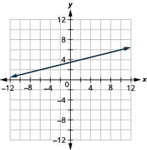
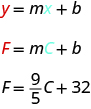
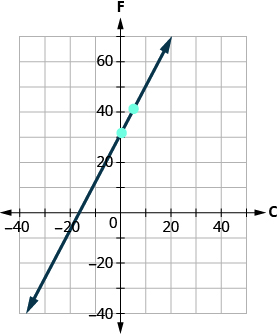
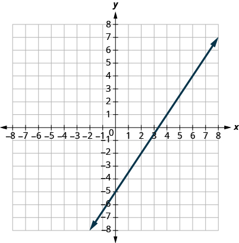

By the end of this section, you will be able to:
* Find the slope of a line
* Graph a line given a point and the slope
* Graph a line using its slope and intercept
* Choose the most convenient method to graph a line
* Graph and interpret applications of slope–intercept
* Use slopes to identify parallel and perpendicular lines

Before you get started, take this readiness quiz.

1.  Simplify:
    <math xmlns="http://www.w3.org/1998/Math/MathML"><mrow><mfrac><mrow><mrow><mo>(</mo><mrow><mn>1</mn><mo>–</mo><mn>4</mn></mrow><mo>)</mo></mrow></mrow><mrow><mrow><mo>(</mo><mrow><mn>8</mn><mo>−</mo><mn>2</mn></mrow><mo>)</mo></mrow></mrow></mfrac><mo>.</mo></mrow></math>
    
    * * *
    {: data-type="newline"}
    
    If you missed this problem, review [\[link\]](/m63304#fs-id1167829755877).
2.  Divide:
    <math xmlns="http://www.w3.org/1998/Math/MathML"><mrow><mfrac><mn>0</mn><mn>4</mn></mfrac><mo>,</mo><mfrac><mn>4</mn><mn>0</mn></mfrac><mo>.</mo></mrow></math>
    
    * * *
    {: data-type="newline"}
    
    If you missed this problem, review [\[link\]](/m63306#fs-id1167829790821).
3.  Simplify:
    <math xmlns="http://www.w3.org/1998/Math/MathML"><mrow><mfrac><mrow><mn>15</mn></mrow><mrow><mn>−3</mn></mrow></mfrac><mo>,</mo><mfrac><mrow><mn>−15</mn></mrow><mn>3</mn></mfrac><mo>,</mo><mfrac><mrow><mn>−15</mn></mrow><mrow><mn>−3</mn></mrow></mfrac><mo>.</mo></mrow></math>
    
    * * *
    {: data-type="newline"}
    
    If you missed this problem, review [\[link\]](/m63304#fs-id1167829755877).
{: data-number-style="arabic"}

# Find the Slope of a Line

When you graph linear equations, you may notice that some lines tilt up as they go from left to right and some lines tilt down. Some lines are very steep and some lines are flatter.

In mathematics, the measure of the steepness of a line is called the *slope* of the line.

The concept of slope has many applications in the real world. In construction the pitch of a roof, the slant of the plumbing pipes, and the steepness of the stairs are all applications of slope. and as you ski or jog down a hill, you definitely experience slope.

We can assign a numerical value to the slope of a line by finding the ratio of the rise and run. The *rise* is the amount the vertical distance changes while the *run* measures the horizontal change, as shown in this illustration. Slope is a rate of change. See [\[link\]](#CNX_IntAlg_Figure_03_02_001).

 {: #CNX_IntAlg_Figure_03_02_001}

Slope of a Line

The slope of a line is <math xmlns="http://www.w3.org/1998/Math/MathML"><mrow><mi>m</mi><mo>=</mo><mfrac><mrow><mtext>rise</mtext></mrow><mrow><mtext>run</mtext></mrow></mfrac><mo>.</mo></mrow></math>

The rise measures the vertical change and the run measures the horizontal change.

To find the slope of a line, we locate two points on the line whose coordinates are integers. Then we sketch a right triangle where the two points are vertices and one side is horizontal and one side is vertical.

To find the slope of the line, we measure the distance along the vertical and horizontal sides of the triangle. The vertical distance is called the *rise* and the horizontal distance is called the *run*,

Find the slope of a line from its graph using
<math xmlns="http://www.w3.org/1998/Math/MathML"><mrow><mi>m</mi><mo>=</mo><mfrac><mrow><mtext>rise</mtext></mrow><mrow><mtext>run</mtext></mrow></mfrac><mo>.</mo></mrow></math>

1.  Locate two points on the line whose coordinates are integers.
2.  Starting with one point, sketch a right triangle, going from the first point to the second point.
3.  Count the rise and the run on the legs of the triangle.
4.  Take the ratio of rise to run to find the slope:
    <math xmlns="http://www.w3.org/1998/Math/MathML"><mrow><mi>m</mi><mo>=</mo><mfrac><mrow><mtext>rise</mtext></mrow><mrow><mtext>run</mtext></mrow></mfrac><mo>.</mo></mrow></math>
{: data-number-style="arabic" .stepwise}

Find the slope of the line shown.

  

<table class="unnumbered unstyled can-break" summary="Locate two points on the graph whose coordinates are integers. (0,5) and (3,3). Starting at (0, 5) sketch a right triangle to (3,3) on the graph. The figure then shows the graph of a straight line on the x y-coordinate plane. The x-axis runs from negative 1 to 10. The y-axis runs from negative 1 to 8. The line goes through the points (0, 5) and (3, 3). A right triangle is drawn by connecting the three points (0, 3), (0, 5), and (3, 3). The vertical side of the triangle is labeled &#x201C;rise&#x201D; and the horizontal side of the triangle is labeled &#x201C;run&#x201D;. Count the rise. Since it goes down, it is negative. The rise is negative 2. Count the run. The run is 3. Use the slope formula. m equals rise divided by run. Substitute the values of the rise and run. m equals negative 2 divided by 3. The slope of the line is negative 2 divided by 3." data-label=""><tbody>
<tr valign="top">
<td data-valign="top" data-align="left">Locate two points on the graph whose
coordinates are integers.</td>
<td data-valign="top" data-align="left"><math xmlns="http://www.w3.org/1998/Math/MathML"><mrow><mrow><mo>(</mo><mrow><mn>0</mn><mo>,</mo><mn>5</mn></mrow><mo>)</mo></mrow></mrow></math> and <math xmlns="http://www.w3.org/1998/Math/MathML"><mrow><mrow><mo>(</mo><mrow><mn>3</mn><mo>,</mo><mn>3</mn></mrow><mo>)</mo></mrow></mrow></math></td>
</tr>
<tr valign="top">
<td data-valign="top" data-align="left">Starting at <math xmlns="http://www.w3.org/1998/Math/MathML"><mrow><mrow><mo>(</mo><mrow><mn>0</mn><mo>,</mo><mn>5</mn></mrow><mo>)</mo></mrow><mo>,</mo></mrow></math> sketch a right triangle to
<math xmlns="http://www.w3.org/1998/Math/MathML"><mrow><mrow><mo>(</mo><mrow><mn>3</mn><mo>,</mo><mn>3</mn></mrow><mo>)</mo></mrow></mrow></math> as shown in this graph.</td>
<td data-valign="top" data-align="left"></td>
</tr>
<tr>
<td data-valign="top" data-align="left">Count the rise— since it goes down, it is negative.</td>
<td data-valign="bottom" data-align="left">The rise is <math xmlns="http://www.w3.org/1998/Math/MathML"><mrow><mn>−2</mn><mo>.</mo></mrow></math></td>
</tr>
<tr valign="top">
<td data-valign="top" data-align="left">Count the run.</td>
<td data-valign="top" data-align="left">The run is 3.</td>
</tr>
<tr valign="top">
<td data-valign="top" data-align="left">Use the slope formula.</td>
<td data-valign="top" data-align="left"><math xmlns="http://www.w3.org/1998/Math/MathML"><mrow><mi>m</mi><mo>=</mo><mfrac><mrow><mtext>rise</mtext></mrow><mrow><mtext>run</mtext></mrow></mfrac></mrow></math></td>
</tr>
<tr valign="top">
<td data-valign="top" data-align="left">Substitute the values of the rise and run.</td>
<td data-valign="top" data-align="left"><math xmlns="http://www.w3.org/1998/Math/MathML"><mrow><mi>m</mi><mo>=</mo><mfrac><mrow><mn>−2</mn></mrow><mn>3</mn></mfrac></mrow></math></td>
</tr>
<tr valign="top">
<td data-valign="top" data-align="left">Simplify.</td>
<td data-valign="top" data-align="left"><math xmlns="http://www.w3.org/1998/Math/MathML"><mrow><mi>m</mi><mo>=</mo><mo>−</mo><mfrac><mn>2</mn><mn>3</mn></mfrac></mrow></math></td>
</tr>
<tr valign="top">
<td />
<td data-valign="top" data-align="left">The slope of the line is <math xmlns="http://www.w3.org/1998/Math/MathML"><mrow><mo>−</mo><mfrac><mn>2</mn><mn>3</mn></mfrac><mo>.</mo></mrow></math></td>
</tr>
<tr valign="top">
<td />
<td data-valign="top" data-align="left">So <em>y</em> decreases by 2 units as <em>x</em> increases by 3 units.</td>
</tr>
</tbody></table>

Find the slope of the line shown.

  

<math xmlns="http://www.w3.org/1998/Math/MathML"><mrow><mo>−</mo><mfrac><mn>4</mn><mn>3</mn></mfrac></mrow></math>

Find the slope of the line shown.

  

<math xmlns="http://www.w3.org/1998/Math/MathML"><mrow><mo>−</mo><mfrac><mn>3</mn><mn>5</mn></mfrac></mrow></math>

How do we find the slope of horizontal and vertical lines? To find the slope of the horizontal line, <math xmlns="http://www.w3.org/1998/Math/MathML"><mrow><mi>y</mi><mo>=</mo><mn>4</mn><mo>,</mo></mrow></math>

 we could graph the line, find two points on it, and count the rise and the run. Let’s see what happens when we do this, as shown in the graph below.

    <math xmlns="http://www.w3.org/1998/Math/MathML"><mrow> <mtable> <mtr><mtd columnalign="left"><mtext>What is the rise?</mtext></mtd><mtd columnalign="left"><mtext>The rise is 0.</mtext></mtd></mtr> <mtr><mtd columnalign="left"><mtext>What is the run?</mtext></mtd><mtd columnalign="left"><mtext>The run is 3.</mtext></mtd></mtr> <mtr><mtd columnalign="left"><mtext>What is the slope?</mtext></mtd><mtd columnalign="left"><mi>m</mi><mo>=</mo><mfrac><mrow><mtext>rise</mtext></mrow><mrow><mtext>run</mtext></mrow></mfrac></mtd></mtr> <mtr><mtd /><mtd columnalign="left"><mi>m</mi><mo>=</mo><mfrac><mn>0</mn><mn>3</mn></mfrac></mtd></mtr> <mtr><mtd /><mtd columnalign="left"><mi>m</mi><mo>=</mo><mn>0</mn></mtd></mtr> <mtr><mtd /><mtd columnalign="left"><mtext>The slope of the horizontal line</mtext><mspace width="0.2em" /><mrow><mi>y</mi><mo>=</mo><mn>4</mn></mrow><mspace width="0.2em" /><mtext>is 0.</mtext></mtd></mtr> </mtable></mrow></math>

Let’s also consider a vertical line, the line <math xmlns="http://www.w3.org/1998/Math/MathML"><mrow><mi>x</mi><mo>=</mo><mn>3</mn><mo>,</mo></mrow></math>

 as shown in the graph.

    <math xmlns="http://www.w3.org/1998/Math/MathML"><mrow> <mtable> <mtr><mtd columnalign="left"><mtext>What is the rise?</mtext></mtd><mtd columnalign="left"><mtext>The rise is 2.</mtext></mtd></mtr> <mtr /> <mtr><mtd columnalign="left"><mtext>What is the run?</mtext></mtd><mtd columnalign="left"><mtext>The run is 0.</mtext></mtd></mtr> <mtr /> <mtr><mtd columnalign="left"><mtext>What is the slope?</mtext></mtd><mtd columnalign="left"><mi>m</mi><mo>=</mo><mfrac><mrow><mtext>rise</mtext></mrow><mrow><mtext>run</mtext></mrow></mfrac></mtd></mtr> <mtr><mtd /><mtd columnalign="left"><mi>m</mi><mo>=</mo><mfrac><mn>2</mn><mn>0</mn></mfrac></mtd></mtr> </mtable></mrow></math>

The slope is undefined since division by zero is undefined. So we say that the slope of the vertical line <math xmlns="http://www.w3.org/1998/Math/MathML"><mrow><mi>x</mi><mo>=</mo><mn>3</mn></mrow></math>

 is undefined.

All horizontal lines have slope 0. When the *y*-coordinates are the same, the rise is 0.

The slope of any vertical line is undefined. When the *x*-coordinates of a line are all the same, the run is 0.

Slope of a Horizontal and Vertical Line

The slope of a horizontal line, <math xmlns="http://www.w3.org/1998/Math/MathML"><mrow><mi>y</mi><mo>=</mo><mi>b</mi><mo>,</mo></mrow></math>

 is 0.

The slope of a vertical line, <math xmlns="http://www.w3.org/1998/Math/MathML"><mrow><mi>x</mi><mo>=</mo><mi>a</mi><mo>,</mo></mrow></math>

 is undefined.

Find the slope of each line: ⓐ <math xmlns="http://www.w3.org/1998/Math/MathML"><mrow><mi>x</mi><mo>=</mo><mn>8</mn></mrow></math>

 ⓑ <math xmlns="http://www.w3.org/1998/Math/MathML"><mrow><mi>y</mi><mo>=</mo><mn>−5</mn><mo>.</mo></mrow></math>

ⓐ <math xmlns="http://www.w3.org/1998/Math/MathML"><mrow><mi>x</mi><mo>=</mo><mn>8</mn></mrow></math>

* * *
{: data-type="newline"}

 This is a vertical line. Its slope is undefined.* * *
{: data-type="newline"}

 ⓑ <math xmlns="http://www.w3.org/1998/Math/MathML"><mrow><mi>y</mi><mo>=</mo><mn>−5</mn></mrow></math>

* * *
{: data-type="newline"}

 This is a horizontal line. It has slope 0.

Find the slope of the line: <math xmlns="http://www.w3.org/1998/Math/MathML"><mrow><mi>x</mi><mo>=</mo><mn>−4</mn><mo>.</mo></mrow></math>

undefined

Find the slope of the line: <math xmlns="http://www.w3.org/1998/Math/MathML"><mrow><mi>y</mi><mo>=</mo><mn>7</mn><mo>.</mo></mrow></math>

0

Quick Guide to the Slopes of Lines

  

Sometimes we’ll need to find the slope of a line between two points when we don’t have a graph to count out the rise and the run. We could plot the points on grid paper, then count out the rise and the run, but as we’ll see, there is a way to find the slope without graphing. Before we get to it, we need to introduce some algebraic notation.

We have seen that an ordered pair <math xmlns="http://www.w3.org/1998/Math/MathML"><mrow><mrow><mo>(</mo><mrow><mi>x</mi><mo>,</mo><mi>y</mi></mrow><mo>)</mo></mrow></mrow></math>

 gives the coordinates of a point. But when we work with slopes, we use two points. How can the same symbol <math xmlns="http://www.w3.org/1998/Math/MathML"><mrow><mrow><mo>(</mo><mrow><mi>x</mi><mo>,</mo><mi>y</mi></mrow><mo>)</mo></mrow></mrow></math>

 be used to represent two different points? Mathematicians use subscripts to distinguish the points.

<math xmlns="http://www.w3.org/1998/Math/MathML"><mrow> <mtable> <mtr><mtd columnalign="left"><mrow><mo>(</mo><mrow><msub><mi>x</mi><mn>1</mn></msub><mo>,</mo><msub><mi>y</mi><mn>1</mn></msub></mrow><mo>)</mo></mrow></mtd><mtd columnalign="left"><mtext>read “</mtext><mi>x</mi><mspace width="0.2em" /><mtext>sub 1,</mtext><mspace width="0.2em" /><mi>y</mi><mspace width="0.2em" /><mtext>sub 1”</mtext></mtd></mtr> <mtr><mtd columnalign="left"><mrow><mrow><mo>(</mo><mrow><msub><mi>x</mi><mn>2</mn></msub><mo>,</mo><msub><mi>y</mi><mn>2</mn></msub></mrow><mo>)</mo></mrow></mrow></mtd><mtd columnalign="left"><mtext>read “</mtext><mi>x</mi><mspace width="0.2em" /><mtext>sub 2,</mtext><mspace width="0.2em" /><mi>y</mi><mspace width="0.2em" /><mtext>sub 2”</mtext></mtd></mtr> </mtable></mrow></math>

We will use <math xmlns="http://www.w3.org/1998/Math/MathML"><mrow><mrow><mo>(</mo><mrow><msub><mi>x</mi><mn>1</mn></msub><mo>,</mo><msub><mi>y</mi><mn>1</mn></msub></mrow><mo>)</mo></mrow></mrow></math>

 to identify the first point and <math xmlns="http://www.w3.org/1998/Math/MathML"><mrow><mrow><mo>(</mo><mrow><msub><mi>x</mi><mn>2</mn></msub><mo>,</mo><msub><mi>y</mi><mn>2</mn></msub></mrow><mo>)</mo></mrow></mrow></math>

 to identify the second point.

If we had more than two points, we could use <math xmlns="http://www.w3.org/1998/Math/MathML"><mrow><mrow><mo>(</mo><mrow><msub><mi>x</mi><mn>3</mn></msub><mo>,</mo><msub><mi>y</mi><mn>3</mn></msub></mrow><mo>)</mo></mrow><mo>,</mo></mrow></math>

<math xmlns="http://www.w3.org/1998/Math/MathML"><mrow><mrow><mo>(</mo><mrow><msub><mi>x</mi><mn>4</mn></msub><mo>,</mo><msub><mi>y</mi><mn>4</mn></msub></mrow><mo>)</mo></mrow><mo>,</mo></mrow></math>

 and so on.

Let’s see how the rise and run relate to the coordinates of the two points by taking another look at the slope of the line between the points <math xmlns="http://www.w3.org/1998/Math/MathML"><mrow><mrow><mo>(</mo><mrow><mn>2</mn><mo>,</mo><mn>3</mn></mrow><mo>)</mo></mrow></mrow></math>

 and <math xmlns="http://www.w3.org/1998/Math/MathML"><mrow><mrow><mo>(</mo><mrow><mn>7</mn><mo>,</mo><mn>6</mn></mrow><mo>)</mo></mrow><mo>,</mo></mrow></math>

 as shown in this graph.

  ![The figure shows the graph of a straight line on the x y-coordinate plane. The x-axis runs from negative 1 to 7. The y-axis runs from negative 1 to 7. The line goes through the points (2, 3) and (7, 6). A right triangle is drawn by connecting the three points (2, 3), (2, 6), and (7, 6). The point (2, 3) is labeled (x 1, y 1). The point (7, 6) is labeled (x 2, y 2). The vertical side of the triangle has labels y 2 minus y 1, 6 minus 3, and 3. The horizontal side of the triangle has labels x 2 minus x 1, 7 minus 2, and 5.](../resources/CNX_IntAlg_Figure_03_02_007_img.jpg)  <math xmlns="http://www.w3.org/1998/Math/MathML"><mrow><mtable> <mtr><mtd columnalign="left"><mtext>Since we have two points, we will use subscript notation.</mtext></mtd><mtd /><mtd /><mtd columnalign="left"><mrow><mrow><mo>(</mo><mrow><mover><mrow><mn>2</mn><mo>,</mo></mrow><mrow><msub><mi>x</mi><mn>1</mn></msub><mo>,</mo></mrow></mover><mover><mn>3</mn><mrow><msub><mi>y</mi><mn>1</mn></msub></mrow></mover></mrow><mo>)</mo></mrow></mrow><mspace width="0.2em" /><mrow><mrow><mo>(</mo><mrow><mover><mrow><mn>7</mn><mo>,</mo><mn>6</mn></mrow><mrow><msub><mi>x</mi><mn>2</mn></msub><mo>,</mo><msub><mi>y</mi><mn>2</mn></msub></mrow></mover></mrow><mo>)</mo></mrow></mrow></mtd></mtr> <mtr><mtd /><mtd /><mtd /><mtd columnalign="left"><mrow><mi>m</mi><mo>=</mo><mfrac><mrow><mtext>rise</mtext></mrow><mrow><mtext>run</mtext></mrow></mfrac></mrow></mtd></mtr> <mtr><mtd columnalign="left"><mtext>On the graph, we counted the rise of 3 and the run of 5.</mtext></mtd><mtd /><mtd /><mtd columnalign="left"><mrow><mi>m</mi><mo>=</mo><mfrac><mn>3</mn><mn>5</mn></mfrac></mrow></mtd></mtr> <mtr><mtd columnalign="left"><mtext>Notice that the rise of 3 can be found by subtracting the</mtext></mtd><mtd /><mtd /><mtd /></mtr> <mtr><mtd columnalign="left"><mi>y</mi><mtext>-coordinates, 6 and 3, and the run of 5 can be found by</mtext></mtd><mtd /><mtd /><mtd /></mtr> <mtr><mtd columnalign="left"><mtext>subtracting the</mtext><mspace width="0.2em" /><mi>x</mi><mtext>-coordinates 7 and 2.</mtext></mtd><mtd /><mtd /><mtd /></mtr> <mtr><mtd columnalign="left"><mtext>We rewrite the rise and run by putting in the coordinates.</mtext></mtd><mtd /><mtd /><mtd columnalign="left"><mrow><mi>m</mi><mo>=</mo><mfrac><mrow><mn>6</mn><mo>−</mo><mn>3</mn></mrow><mrow><mn>7</mn><mo>−</mo><mn>2</mn></mrow></mfrac></mrow></mtd></mtr><mtr /><mtr /> <mtr><mtd columnalign="left"><mtext>But 6 is</mtext><mspace width="0.2em" /><mrow><msub><mi>y</mi><mn>2</mn></msub><mo>,</mo></mrow><mspace width="0.2em" /><mtext>the</mtext><mspace width="0.2em" /><mi>y</mi><mtext>-coordinate of the second point and 3 is</mtext><mspace width="0.2em" /><mrow><msub><mi>y</mi><mn>1</mn></msub><mo>,</mo></mrow><mspace width="0.2em" /><mtext>the</mtext><mspace width="0.2em" /><mi>y</mi><mtext>-coordinate</mtext></mtd><mtd /><mtd /><mtd /></mtr> <mtr><mtd columnalign="left"><mtext>of the first point. So we can rewrite the slope using subscript notation.</mtext></mtd><mtd /><mtd /><mtd columnalign="left"><mrow><mi>m</mi><mo>=</mo><mfrac><mrow><msub><mi>y</mi><mn>2</mn></msub><mo>−</mo><msub><mi>y</mi><mn>1</mn></msub></mrow><mrow><mn>7</mn><mo>−</mo><mn>2</mn></mrow></mfrac></mrow></mtd></mtr><mtr /><mtr /> <mtr><mtd columnalign="left"><mtext>Also 7 is the</mtext><mspace width="0.2em" /><mi>x</mi><mtext>-coordinate of the second point and 2 is the</mtext><mspace width="0.2em" /><mi>x</mi><mtext>-coordinate</mtext></mtd><mtd /><mtd /><mtd /></mtr> <mtr><mtd columnalign="left"><mtext>of the first point. So again we rewrite the slope using subscript notation.</mtext></mtd><mtd /><mtd /><mtd columnalign="left"><mrow><mi>m</mi><mo>=</mo><mfrac><mrow><msub><mi>y</mi><mn>2</mn></msub><mo>−</mo><msub><mi>y</mi><mn>1</mn></msub></mrow><mrow><msub><mi>x</mi><mn>2</mn></msub><mo>−</mo><msub><mi>x</mi><mn>1</mn></msub></mrow></mfrac></mrow></mtd></mtr><mtr /><mtr /> </mtable></mrow></math>

We’ve shown that <math xmlns="http://www.w3.org/1998/Math/MathML"><mrow><mi>m</mi><mo>=</mo><mfrac><mrow><msub><mi>y</mi><mn>2</mn></msub><mo>−</mo><msub><mi>y</mi><mn>1</mn></msub></mrow><mrow><msub><mi>x</mi><mn>2</mn></msub><mo>−</mo><msub><mi>x</mi><mn>1</mn></msub></mrow></mfrac></mrow></math>

 is really another version of <math xmlns="http://www.w3.org/1998/Math/MathML"><mrow><mi>m</mi><mo>=</mo><mfrac><mrow><mtext>rise</mtext></mrow><mrow><mtext>run</mtext></mrow></mfrac><mo>.</mo></mrow></math>

 We can use this formula to find the slope of a line when we have two points on the line.

Slope of a line between two points

The slope of the line between two points <math xmlns="http://www.w3.org/1998/Math/MathML"><mrow><mo stretchy="false">(</mo><msub><mi>x</mi><mn>1</mn></msub><mo>,</mo><msub><mi>y</mi><mn>1</mn></msub><mo stretchy="false">)</mo></mrow></math>

 and <math xmlns="http://www.w3.org/1998/Math/MathML"><mrow><mo stretchy="false">(</mo><msub><mi>x</mi><mn>2</mn></msub><mo>,</mo><msub><mi>y</mi><mn>2</mn></msub><mo stretchy="false">)</mo></mrow></math>

 is:

<math xmlns="http://www.w3.org/1998/Math/MathML"><mrow><mi>m</mi><mo>=</mo><mfrac><mrow><msub><mi>y</mi><mn>2</mn></msub><mo>−</mo><msub><mi>y</mi><mn>1</mn></msub></mrow><mrow><msub><mi>x</mi><mn>2</mn></msub><mo>−</mo><msub><mi>x</mi><mn>1</mn></msub></mrow></mfrac><mo>.</mo></mrow></math>

The slope is:

<math xmlns="http://www.w3.org/1998/Math/MathML"> <mtable> <mtr><mtd columnalign="left"><mrow><mi>y</mi><mspace width="0.2em" /><mtext>of the second point minus</mtext><mspace width="0.2em" /><mi>y</mi><mspace width="0.2em" /><mtext>of the first point</mtext></mrow></mtd></mtr> <mtr><mtd columnalign="center"><mrow><mtext>over</mtext></mrow></mtd></mtr> <mtr><mtd columnalign="left"><mrow><mi>x</mi><mspace width="0.2em" /><mtext>of the second point minus</mtext><mspace width="0.2em" /><mi>x</mi><mspace width="0.2em" /><mtext>of the first point.</mtext></mrow></mtd></mtr> </mtable></math>

Use the slope formula to find the slope of the line through the points <math xmlns="http://www.w3.org/1998/Math/MathML"><mrow><mrow><mo>(</mo><mrow><mn>−2</mn><mo>,</mo><mn>−3</mn></mrow><mo>)</mo></mrow></mrow></math>

 and <math xmlns="http://www.w3.org/1998/Math/MathML"><mrow><mrow><mo>(</mo><mrow><mn>−7</mn><mo>,</mo><mn>4</mn></mrow><mo>)</mo></mrow><mo>.</mo></mrow></math>

<math xmlns="http://www.w3.org/1998/Math/MathML"><mrow><mtable> <mtr><mtd columnalign="left"><mtext>We’ll call</mtext><mspace width="0.2em" /><mrow><mrow><mo>(</mo><mrow><mn>−2</mn><mo>,</mo><mn>−3</mn></mrow><mo>)</mo></mrow></mrow><mspace width="0.2em" /><mtext>point</mtext><mspace width="0.2em" /><mrow><mtext>#</mtext><mn>1</mn></mrow><mspace width="0.2em" /><mtext>and</mtext><mspace width="0.2em" /><mrow><mrow><mo>(</mo><mrow><mn>−7</mn><mo>,</mo><mn>4</mn></mrow><mo>)</mo></mrow></mrow><mspace width="0.2em" /><mtext>point</mtext><mspace width="0.2em" /><mrow><mtext>#</mtext><mn>2</mn><mo>.</mo></mrow></mtd> <mtd columnalign="left"><mspace width="4em" /> <mrow><mrow><mo>(</mo><mrow><mtable><mtr><mtd columnalign="left"><mrow><msub><mi>x</mi><mn>1</mn></msub><mo>,</mo></mrow></mtd><mtd columnalign="left"><mrow><msub><mi>y</mi><mn>1</mn></msub></mrow></mtd></mtr><mtr><mtd columnalign="left"><mrow><mo>−</mo><mn>2</mn><mo>,</mo></mrow></mtd><mtd columnalign="left"><mrow><mo>−</mo><mn>3</mn></mrow></mtd></mtr></mtable></mrow><mo>)</mo></mrow></mrow><mspace width="0.2em" /><mrow><mrow><mo>(</mo><mrow><mtable><mtr><mtd columnalign="left"><mrow><msub><mi>x</mi><mn>2</mn></msub><mo>,</mo></mrow></mtd><mtd columnalign="left"><mrow><msub><mi>y</mi><mn>2</mn></msub></mrow></mtd></mtr><mtr><mtd columnalign="left"><mrow><mo>−</mo><mn>7</mn><mo>,</mo></mrow></mtd><mtd columnalign="left"><mn>4</mn></mtd></mtr></mtable></mrow><mo>)</mo></mrow></mrow></mtd></mtr> <mtr><mtd columnalign="left"><mtext>Use the slope formula.</mtext></mtd><mtd columnalign="left"><mspace width="4em" /><mrow><mi>m</mi><mo>=</mo><mfrac><mrow><msub><mi>y</mi><mn>2</mn></msub><mo>−</mo><msub><mi>y</mi><mn>1</mn></msub></mrow><mrow><msub><mi>x</mi><mn>2</mn></msub><mo>−</mo><msub><mi>x</mi><mn>1</mn></msub></mrow></mfrac></mrow></mtd></mtr> <mtr><mtd columnalign="left"><mtext>Substitute the values.</mtext></mtd><mtd /></mtr> <mtr><mtd columnalign="left"><mi>y</mi><mspace width="0.2em" /><mtext>of the second point minus</mtext><mspace width="0.2em" /><mi>y</mi><mspace width="0.2em" /><mtext>of the first point</mtext></mtd></mtr> <mtr><mtd columnalign="left"><mi>x</mi><mspace width="0.2em" /><mtext>of the second point minus</mtext><mspace width="0.2em" /><mi>x</mi><mspace width="0.2em" /><mtext>of the first point</mtext></mtd><mtd columnalign="left"><mspace width="4em" /><mrow><mi>m</mi><mo>=</mo><mfrac><mrow><mn>4</mn><mo>−</mo><mo stretchy="false">(</mo><mn>−3</mn><mo stretchy="false">)</mo></mrow><mrow><mn>−7</mn><mo>−</mo><mo stretchy="false">(</mo><mn>−2</mn><mo stretchy="false">)</mo></mrow></mfrac></mrow></mtd></mtr> <mtr><mtd columnalign="left"><mtext>Simplify.</mtext></mtd><mtd columnalign="left"><mspace width="4em" /> <mtable> <mtr><mtd columnalign="left"><mi>m</mi><mo>=</mo><mfrac><mn>7</mn><mrow><mn>−5</mn></mrow></mfrac></mtd></mtr> <mtr><mtd columnalign="left"><mi>m</mi><mo>=</mo><mo>−</mo><mfrac><mn>7</mn><mn>5</mn></mfrac></mtd></mtr></mtable></mtd></mtr> </mtable></mrow></math>

* * *
{: data-type="newline"}

 Let’s verify this slope on the graph shown.

  

<math xmlns="http://www.w3.org/1998/Math/MathML"> <mtable> <mtr /><mtr /><mtr><mtd columnalign="left"><mi>m</mi><mo>=</mo><mfrac><mrow><mtext>rise</mtext></mrow><mrow><mtext>run</mtext></mrow></mfrac></mtd></mtr> <mtr><mtd columnalign="left"><mi>m</mi><mo>=</mo><mfrac><mn>7</mn><mrow><mn>−5</mn></mrow></mfrac></mtd></mtr> <mtr><mtd columnalign="left"><mi>m</mi><mo>=</mo><mo>−</mo><mfrac><mn>7</mn><mn>5</mn></mfrac></mtd></mtr></mtable></math>

Use the slope formula to find the slope of the line through the pair of points: <math xmlns="http://www.w3.org/1998/Math/MathML"><mrow><mrow><mo>(</mo><mrow><mn>−3</mn><mo>,</mo><mn>4</mn></mrow><mo>)</mo></mrow></mrow></math>

 and <math xmlns="http://www.w3.org/1998/Math/MathML"><mrow><mrow><mo>(</mo><mrow><mn>2</mn><mo>,</mo><mn>−1</mn></mrow><mo>)</mo></mrow><mo>.</mo></mrow></math>

<math xmlns="http://www.w3.org/1998/Math/MathML"><mrow><mn>−1</mn></mrow></math>

Use the slope formula to find the slope of the line through the pair of points: <math xmlns="http://www.w3.org/1998/Math/MathML"><mrow><mrow><mo>(</mo><mrow><mn>−2</mn><mo>,</mo><mn>6</mn></mrow><mo>)</mo></mrow></mrow></math>

 and <math xmlns="http://www.w3.org/1998/Math/MathML"><mrow><mrow><mo>(</mo><mrow><mn>−3</mn><mo>,</mo><mn>−4</mn></mrow><mo>)</mo></mrow><mo>.</mo></mrow></math>

10

# Graph a Line Given a Point and the Slope

Up to now, in this chapter, we have graphed lines by plotting points, by using intercepts, and by recognizing horizontal and vertical lines.

We can also graph a line when we know one point and the slope of the line. We will start by plotting the point and then use the definition of slope to draw the graph of the line.

How to graph a Line Given a Point and the Slope

Graph the line passing through the point <math xmlns="http://www.w3.org/1998/Math/MathML"><mrow><mrow><mo>(</mo><mrow><mn>1</mn><mo>,</mo><mn>−1</mn></mrow><mo>)</mo></mrow></mrow></math>

 whose slope is <math xmlns="http://www.w3.org/1998/Math/MathML"><mrow><mi>m</mi><mo>=</mo><mfrac><mn>3</mn><mn>4</mn></mfrac><mo>.</mo></mrow></math>

       ![Step 3 is to start at the given point and count out the rise and run to mark the second point. Start at (1, negative 1) and count the rise and the run. Up 3 units, right 4 units. The figure then shows the graph of three points connected by two straight line segments on the x y-coordinate plane. The x-axis runs from negative 2 to 6. The y-axis runs from negative 2 to 4. The points (1, negative 1), (1, 2), and (5, 2) are plotted. A vertical line segment connects (1, negative 1) to (1, 2) and is labeled 3. A horizontal line segment connects (1, 2) to (5, 2) and is labeled 4.](../resources/CNX_IntAlg_Figure_03_02_009c_img.jpg)   ![Step 4 is to connect the points with a line. Connect the two points with a line. . The figure then shows the graph of a straight line, three points, and two line segments on the x y-coordinate plane. The x-axis runs from negative 2 to 6. The y-axis runs from negative 2 to 4. The points (1, negative 1), (1, 2), and (5, 2) are plotted. A vertical line segment connects (1, negative 1) to (1, 2). A horizontal line segment connects (1, 2) to (5, 2) and is labeled 4. A straight line is drawn through the points (1, negative 1) and (5, 2) with arrows on both ends.](../resources/CNX_IntAlg_Figure_03_02_009d_img.jpg) 
You can check your work by finding a third point. Since the slope is <math xmlns="http://www.w3.org/1998/Math/MathML"><mrow><mi>m</mi><mo>=</mo><mfrac><mn>3</mn><mn>4</mn></mfrac><mo>,</mo></mrow></math>

 it can also be written as <math xmlns="http://www.w3.org/1998/Math/MathML"><mrow><mi>m</mi><mo>=</mo><mfrac><mrow><mn>−3</mn></mrow><mrow><mn>−4</mn></mrow></mfrac></mrow></math>

 (negative divided by negative is positive!). Go back to <math xmlns="http://www.w3.org/1998/Math/MathML"><mrow><mrow><mo>(</mo><mrow><mn>1</mn><mo>,</mo><mn>−1</mn></mrow><mo>)</mo></mrow></mrow></math>

 and count out the rise, <math xmlns="http://www.w3.org/1998/Math/MathML"><mrow><mn>−3</mn><mo>,</mo></mrow></math>

 and the run, <math xmlns="http://www.w3.org/1998/Math/MathML"><mrow><mn>−4</mn><mo>.</mo></mrow></math>

Graph the line passing through the point <math xmlns="http://www.w3.org/1998/Math/MathML"><mrow><mrow><mo>(</mo><mrow><mn>2</mn><mo>,</mo><mn>−2</mn></mrow><mo>)</mo></mrow></mrow></math>

 with the slope<math xmlns="http://www.w3.org/1998/Math/MathML"><mrow><mi>m</mi><mo>=</mo><mfrac><mn>4</mn><mn>3</mn></mfrac><mo>.</mo></mrow></math>

* * *
{: data-type="newline"}

  

Graph the line passing through the point <math xmlns="http://www.w3.org/1998/Math/MathML"><mrow><mrow><mo>(</mo><mrow><mn>−2</mn><mo>,</mo><mn>3</mn></mrow><mo>)</mo></mrow></mrow></math>

 with the slope <math xmlns="http://www.w3.org/1998/Math/MathML"><mrow><mi>m</mi><mo>=</mo><mfrac><mn>1</mn><mn>4</mn></mfrac><mo>.</mo></mrow></math>

* * *
{: data-type="newline"}

  

Graph a line given a point and the slope.

1.  Plot the given point.
2.  Use the slope formula
    <math xmlns="http://www.w3.org/1998/Math/MathML"><mrow><mi>m</mi><mo>=</mo><mfrac><mrow><mtext>rise</mtext></mrow><mrow><mtext>run</mtext></mrow></mfrac></mrow></math>
    
    to identify the rise and the run.
3.  Starting at the given point, count out the rise and run to mark the second point.
4.  Connect the points with a line.
{: data-number-style="arabic" .stepwise}

# Graph a Line Using its Slope and Intercept

We have graphed linear equations by plotting points, using intercepts, recognizing horizontal and vertical lines, and using one point and the slope of the line. Once we see how an equation in slope–intercept form and its graph are related, we’ll have one more method we can use to graph lines.

See [\[link\]](#CNX_IntAlg_Figure_03_02_010). Let’s look at the graph of the equation <math xmlns="http://www.w3.org/1998/Math/MathML"><mrow><mi>y</mi><mo>=</mo><mfrac><mn>1</mn><mn>2</mn></mfrac><mi>x</mi><mo>+</mo><mn>3</mn></mrow></math>

 and find its slope and *y*-intercept.

 ![The figure shows the graph of a straight line on the x y-coordinate plane. The x-axis runs from negative 10 to 10. The y-axis runs from negative 10 to 10. The line goes through the points (0, 3), (2, 4), and (4, 5). A right triangle is drawn by connecting the three points (2, 4), (2, 5), and (4, 5). The vertical side of the triangle is labeled &#x201C;Rise equals 1&#x201D;. The horizontal side of the triangle is labeled &#x201C;Run equals 2&#x201D;. The line is labeled y equals 1 divided by 2 x plus 3.](../resources/CNX_IntAlg_Figure_03_02_010.jpg){: #CNX_IntAlg_Figure_03_02_010}

The red lines in the graph show us the rise is 1 and the run is 2. Substituting into the slope formula:

<math xmlns="http://www.w3.org/1998/Math/MathML"> <mtable> <mtr /><mtr /><mtr><mtd columnalign="left"><mi>m</mi><mo>=</mo><mfrac><mrow><mtext>rise</mtext></mrow><mrow><mtext>run</mtext></mrow></mfrac></mtd></mtr> <mtr><mtd columnalign="left"><mi>m</mi><mo>=</mo><mfrac><mtext>1</mtext><mtext>2</mtext></mfrac></mtd></mtr></mtable></math>

The *y*-intercept is <math xmlns="http://www.w3.org/1998/Math/MathML"><mrow><mrow><mo>(</mo><mrow><mn>0</mn><mo>,</mo><mn>3</mn></mrow><mo>)</mo></mrow><mo>.</mo></mrow></math>

Look at the equation of this line.

    Look at the slope and *y*-intercept.

    When a linear equation is solved for *y*, the coefficient of the *x* term is the slope and the constant term is the *y*-coordinate of the *y*-intercept. We say that the equation <math xmlns="http://www.w3.org/1998/Math/MathML"><mrow><mi>y</mi><mo>=</mo><mfrac><mn>1</mn><mn>2</mn></mfrac><mi>x</mi><mo>+</mo><mn>3</mn></mrow></math>

 is in slope–intercept form. Sometimes the slope–intercept form is called the “*y*-form.”

    

Slope Intercept Form of an Equation of a Line

The slope–intercept form of an equation of a line with slope *m* and *y*-intercept, <math xmlns="http://www.w3.org/1998/Math/MathML"><mrow><mrow><mo>(</mo><mrow><mn>0</mn><mo>,</mo><mi>b</mi></mrow><mo>)</mo></mrow></mrow></math>

 is <math xmlns="http://www.w3.org/1998/Math/MathML"><mrow><mi>y</mi><mo>=</mo><mi>m</mi><mi>x</mi><mo>+</mo><mi>b</mi><mo>.</mo></mrow></math>

Let’s practice finding the values of the slope and *y*-intercept from the equation of a line.

Identify the slope and *y*-intercept of the line from the equation:

ⓐ <math xmlns="http://www.w3.org/1998/Math/MathML"><mrow><mi>y</mi><mo>=</mo><mo>−</mo><mfrac><mn>4</mn><mn>7</mn></mfrac><mi>x</mi><mo>−</mo><mn>2</mn></mrow></math>

 ⓑ <math xmlns="http://www.w3.org/1998/Math/MathML"><mrow><mi>x</mi><mo>+</mo><mn>3</mn><mi>y</mi><mo>=</mo><mn>9</mn></mrow></math>

ⓐ We compare our equation to the slope–intercept form of the equation.* * *
{: data-type="newline"}

 | Write the slope–intercept form of the equation of the line. |  |
{: valign="top"}| Write the equation of the line. |  |
{: valign="top"}| Identify the slope. |  |
{: valign="top"}| Identify the *y*-intercept. |  |
{: valign="top"}{: .unnumbered .unstyled summary="Write the slope&#x2013;intercept form of the equation of the line. y equals m x plus b. Write the equation of the line. y equals negative 4 divided by 7 x minus 2. Identify the slope. m equals negative 4 divided by 7. Identify the y-intercept. Y -intercept is (0, -2). The m and negative 4 divided by 7 are emphasized in red. The b and negative 2 are emphasized in blue." data-label=""}

* * *
{: data-type="newline"}

* * *
{: data-type="newline"}

 ⓑ When an equation of a line is not given in slope–intercept form, our first step will be to solve the equation for *y*.* * *
{: data-type="newline"}

 | Solve for *y*. | <math xmlns="http://www.w3.org/1998/Math/MathML"><mrow><mi>x</mi><mo>+</mo><mn>3</mn><mi>y</mi><mo>=</mo><mn>9</mn></mrow></math>

 |
{: valign="top"}| Subtract *x* from each side. |  |
{: valign="top"}| Divide both sides by 3. |  |
{: valign="top"}| Simplify. |  |
{: valign="top"}| Write the slope–intercept form of the equation of the line. |  |
{: valign="top"}| Write the equation of the line. |  |
{: valign="top"}| Identify the slope. |  |
{: valign="top"}| Identify the *y*-intercept. |  |
{: valign="top"}{: .unnumbered .unstyled summary="Solve for y. x plus 3 y equals 9. Subtract x from each side. 3 y equals negative x plus 9. Divided both sides by 3. 3 y divided by 3 equals the quantity negative x plus 9 in parentheses divided by 3. Simplify. Y equals negative 1 divided by 3 x plus 3. Write the slope-intercept form of the equation of the line. y equals m x plus b. Write the equation of the line. y equals negative 1 divided by 3 x plus 3. Identify the slope. M equals negative 1/3. Identify the y-intercept. The y-intercept is (0, 3). The b and 3 are emphasized in blue. The m and negative 1 divided by 3 are emphasized in red." data-label=""}

Identify the slope and *y*-intercept from the equation of the line.

ⓐ <math xmlns="http://www.w3.org/1998/Math/MathML"><mrow><mi>y</mi><mo>=</mo><mfrac><mn>2</mn><mn>5</mn></mfrac><mi>x</mi><mo>−</mo><mn>1</mn></mrow></math>

 ⓑ <math xmlns="http://www.w3.org/1998/Math/MathML"><mrow><mi>x</mi><mo>+</mo><mn>4</mn><mi>y</mi><mo>=</mo><mn>8</mn></mrow></math>

ⓐ <math xmlns="http://www.w3.org/1998/Math/MathML"><mrow><mi>m</mi><mo>=</mo><mfrac><mn>2</mn><mn>5</mn></mfrac><mo>;</mo><mrow><mo>(</mo><mrow><mn>0</mn><mo>,</mo><mn>−1</mn></mrow><mo>)</mo></mrow></mrow></math>

* * *
{: data-type="newline"}

ⓑ <math xmlns="http://www.w3.org/1998/Math/MathML"><mrow><mi>m</mi><mo>=</mo><mo>−</mo><mfrac><mn>1</mn><mn>4</mn></mfrac><mo>;</mo><mrow><mo>(</mo><mrow><mn>0</mn><mo>,</mo><mn>2</mn></mrow><mo>)</mo></mrow></mrow></math>

Identify the slope and *y*-intercept from the equation of the line.

ⓐ <math xmlns="http://www.w3.org/1998/Math/MathML"><mrow><mi>y</mi><mo>=</mo><mo>−</mo><mfrac><mn>4</mn><mn>3</mn></mfrac><mi>x</mi><mo>+</mo><mn>1</mn></mrow></math>

 ⓑ <math xmlns="http://www.w3.org/1998/Math/MathML"><mrow><mn>3</mn><mi>x</mi><mo>+</mo><mn>2</mn><mi>y</mi><mo>=</mo><mn>12</mn></mrow></math>

ⓐ <math xmlns="http://www.w3.org/1998/Math/MathML"><mrow><mi>m</mi><mo>=</mo><mo>−</mo><mfrac><mn>4</mn><mn>3</mn></mfrac><mo>;</mo><mrow><mo>(</mo><mrow><mn>0</mn><mo>,</mo><mn>1</mn></mrow><mo>)</mo></mrow></mrow></math>

* * *
{: data-type="newline"}

ⓑ <math xmlns="http://www.w3.org/1998/Math/MathML"><mrow><mi>m</mi><mo>=</mo><mo>−</mo><mfrac><mn>3</mn><mn>2</mn></mfrac><mo>;</mo><mrow><mo>(</mo><mrow><mn>0</mn><mo>,</mo><mn>6</mn></mrow><mo>)</mo></mrow></mrow></math>

We have graphed a line using the slope and a point. Now that we know how to find the slope and *y*-intercept of a line from its equation, we can use the *y*-intercept as the point, and then count out the slope from there.

Graph the line of the equation <math xmlns="http://www.w3.org/1998/Math/MathML"><mrow><mi>y</mi><mo>=</mo><mtext>−</mtext><mi>x</mi><mo>+</mo><mn>4</mn></mrow></math>

 using its slope and *y*-intercept.

<table class="unnumbered unstyled" summary="Y equals m x plus b. The equation is in slope intercept form. Y equals negative x plus 4. Identify the slope and y-intercept. M equals negative 1. Y-intercept is (0, 4). Plot the y-intercept. The point (0, 4) is plotted on the x y-coordinate plane. The x and y-axes run from negative 8 to 8. Identify the rise and the run. m equals negative 1. Rewrite as a fraction. M equals negative 1 divided by 1. The rise is negative 1 and the run is 1. Count out the rise and the run to mark the second point. The point (1, 3) is plotted on the same x y-coordinate plane. A straight line is drawn through the points (0, 4) and (1, 3)." data-label=""><tbody>
<tr valign="top">
<td />
<td data-valign="top" data-align="left"><math xmlns="http://www.w3.org/1998/Math/MathML"><mrow><mi>y</mi><mo>=</mo><mi>m</mi><mi>x</mi><mo>+</mo><mi>b</mi></mrow></math></td>
</tr>
<tr valign="top">
<td data-valign="top" data-align="left">The equation is in slope–intercept form.</td>
<td data-valign="top" data-align="left"><math xmlns="http://www.w3.org/1998/Math/MathML"><mrow><mi>y</mi><mo>=</mo><mtext>−</mtext><mi>x</mi><mo>+</mo><mn>4</mn></mrow></math></td>
</tr>
<tr valign="top">
<td data-valign="top" data-align="left">Identify the slope and <em>y</em>-intercept.</td>
<td data-valign="top" data-align="left"><math xmlns="http://www.w3.org/1998/Math/MathML"><mrow><mi>m</mi><mo>=</mo><mn>−1</mn></mrow></math>

<em>y</em>-intercept is <math xmlns="http://www.w3.org/1998/Math/MathML"><mrow><mrow><mo>(</mo><mrow><mn>0</mn><mo>,</mo><mn>4</mn></mrow><mo>)</mo></mrow></mrow></math></td>
</tr>
<tr valign="top">
<td data-valign="top" data-align="left">Plot the <em>y</em>-intercept.</td>
<td data-valign="top" data-align="left">See the graph.</td>
</tr>
<tr valign="top">
<td data-valign="top" data-align="left">Identify the rise over the run.</td>
<td data-valign="top" data-align="left"><math xmlns="http://www.w3.org/1998/Math/MathML"><mrow><mi>m</mi><mo>=</mo><mfrac><mrow><mn>−1</mn></mrow><mn>1</mn></mfrac></mrow></math></td>
</tr>
<tr valign="top">
<td data-valign="top" data-align="left">Count out the rise and run to mark the second point.</td>
<td data-valign="top" data-align="left">rise <math xmlns="http://www.w3.org/1998/Math/MathML"><mrow><mn>−1</mn></mrow></math>, run 1
</td>
</tr>
</tbody></table>
Draw the line as shown in the graph.

Graph the line of the equation <math xmlns="http://www.w3.org/1998/Math/MathML"><mrow><mi>y</mi><mo>=</mo><mtext>−</mtext><mi>x</mi><mo>−</mo><mn>3</mn></mrow></math>

 using its slope and *y*-intercept.

* * *
{: data-type="newline"}

  

Graph the line of the equation<math xmlns="http://www.w3.org/1998/Math/MathML"><mrow><mi>y</mi><mo>=</mo><mtext>−</mtext><mi>x</mi><mo>−</mo><mn>1</mn></mrow></math>

 using its slope and *y*-intercept.

* * *
{: data-type="newline"}

  

Now that we have graphed lines by using the slope and *y*-intercept, let’s summarize all the methods we have used to graph lines.

  ![The table has a title row that reads &#x201C;Methods to Graph Lines&#x201D;. Below this are four columns. The first column contains the following: Point Plotting. A blank table with two columns and four rows. The first row is a header row with the headers &#x201C;x&#x201D; and &#x201C;y&#x201D;. Find three points. Plot the points, make sure they line up, them draw the line. The second column contains: Slope-Intercept. Y equals m x plus b. Find the slope and y-intercept, then count the slope to get a second point. The third column: Intercepts. A table with two columns and four rows. The first row is a header row with the headers &#x201C;x&#x201D; and &#x201C;y&#x201D;. In the first row there is a 0 in the x column. In the second row there is a 0 in the y column. The remaining spaces are blank. Fourth column. Recognize vertical and horizontal lines. The equation has only one variable. X equals a vertical. Y equals b horizontal.](../resources/CNX_IntAlg_Figure_03_02_017_img.jpg)  # Choose the Most Convenient Method to Graph a Line

Now that we have seen several methods we can use to graph lines, how do we know which method to use for a given equation?

While we could plot points, use the slope–intercept form, or find the intercepts for *any* equation, if we recognize the most convenient way to graph a certain type of equation, our work will be easier.

Generally, plotting points is not the most efficient way to graph a line. Let’s look for some patterns to help determine the most convenient method to graph a line.

Here are five equations we graphed in this chapter, and the method we used to graph each of them.

<math xmlns="http://www.w3.org/1998/Math/MathML"><mrow><mtable><mtr><mtd /><mtd columnalign="left"><mtext mathvariant="bold">Equation</mtext></mtd><mtd /><mtd /><mtd columnalign="left"><mspace width="4em" /><mtext mathvariant="bold">Method</mtext></mtd></mtr><mtr><mtd columnalign="left"><mtext>#1</mtext></mtd><mtd columnalign="left"><mrow><mi>x</mi><mo>=</mo><mn>2</mn></mrow></mtd><mtd /><mtd /><mtd columnalign="left"><mspace width="4em" /><mtext>Vertical line</mtext></mtd></mtr><mtr><mtd columnalign="left"><mtext>#2</mtext></mtd><mtd columnalign="left"><mrow><mi>y</mi><mo>=</mo><mn>−1</mn></mrow></mtd><mtd /><mtd /><mtd columnalign="left"><mspace width="4em" /><mtext>Horizontal line</mtext></mtd></mtr><mtr><mtd columnalign="left"><mtext>#3</mtext></mtd><mtd columnalign="left"><mrow><mtext>−</mtext><mi>x</mi><mo>+</mo><mn>2</mn><mi>y</mi><mo>=</mo><mn>6</mn></mrow></mtd><mtd /><mtd /><mtd columnalign="left"><mspace width="4em" /><mtext>Intercepts</mtext></mtd></mtr><mtr><mtd columnalign="left"><mtext>#4</mtext></mtd><mtd columnalign="left"><mrow><mn>4</mn><mi>x</mi><mo>−</mo><mn>3</mn><mi>y</mi><mo>=</mo><mn>12</mn></mrow></mtd><mtd /><mtd /><mtd columnalign="left"><mspace width="4em" /><mtext>Intercepts</mtext></mtd></mtr><mtr><mtd columnalign="left"><mtext>#5</mtext></mtd><mtd columnalign="left"><mrow><mi>y</mi><mo>=</mo><mtext>−</mtext><mi>x</mi><mo>+</mo><mn>4</mn></mrow></mtd><mtd /><mtd /><mtd columnalign="left"><mspace width="4em" /><mtext>Slope–intercept</mtext></mtd></mtr></mtable></mrow></math>

Equations #1 and #2 each have just one variable. Remember, in equations of this form the value of that one variable is constant; it does not depend on the value of the other variable. Equations of this form have graphs that are vertical or horizontal lines.

In equations #3 and #4, both *x* and *y* are on the same side of the equation. These two equations are of the form <math xmlns="http://www.w3.org/1998/Math/MathML"><mrow><mi>A</mi><mi>x</mi><mo>+</mo><mi>B</mi><mi>y</mi><mo>=</mo><mi>C</mi><mo>.</mo></mrow></math>

 We substituted <math xmlns="http://www.w3.org/1998/Math/MathML"><mrow><mi>y</mi><mo>=</mo><mn>0</mn></mrow></math>

 to find the *x*- intercept and <math xmlns="http://www.w3.org/1998/Math/MathML"><mrow><mi>x</mi><mo>=</mo><mn>0</mn></mrow></math>

 to find the *y*-intercept, and then found a third point by choosing another value for *x* or *y*.

Equation #5 is written in slope–intercept form. After identifying the slope and *y-*intercept from the equation we used them to graph the line.

This leads to the following strategy.

Strategy for Choosing the Most Convenient Method to Graph a Line

Consider the form of the equation.

* If it only has one variable, it is a vertical or horizontal line.
  * <math xmlns="http://www.w3.org/1998/Math/MathML"><mrow><mi>x</mi><mo>=</mo><mi>a</mi></mrow></math>
    
    is a vertical line passing through the *x*-axis at *a*.
  * <math xmlns="http://www.w3.org/1998/Math/MathML"><mrow><mi>y</mi><mo>=</mo><mi>b</mi></mrow></math>
    
    is a horizontal line passing through the *y*-axis at *b*.
  {: data-bullet-style="bullet"}

* If *y* is isolated on one side of the equation, in the form
  <math xmlns="http://www.w3.org/1998/Math/MathML"><mrow><mi>y</mi><mo>=</mo><mi>m</mi><mi>x</mi><mo>+</mo><mi>b</mi><mo>,</mo></mrow></math>
  
  graph by using the slope and *y*-intercept.
  * Identify the slope and *y*-intercept and then graph.
  {: data-bullet-style="bullet"}

* If the equation is of the form
  <math xmlns="http://www.w3.org/1998/Math/MathML"><mrow><mi>A</mi><mi>x</mi><mo>+</mo><mi>B</mi><mi>y</mi><mo>=</mo><mi>C</mi><mo>,</mo></mrow></math>
  
  find the intercepts.
  * Find the *x*- and *y*-intercepts, a third point, and then graph.
  {: data-bullet-style="bullet"}
{: data-bullet-style="bullet"}

Determine the most convenient method to graph each line:

ⓐ <math xmlns="http://www.w3.org/1998/Math/MathML"><mrow><mi>y</mi><mo>=</mo><mn>5</mn></mrow></math>

 ⓑ <math xmlns="http://www.w3.org/1998/Math/MathML"><mrow><mn>4</mn><mi>x</mi><mo>−</mo><mn>5</mn><mi>y</mi><mo>=</mo><mn>20</mn></mrow></math>

 ⓒ <math xmlns="http://www.w3.org/1998/Math/MathML"><mrow><mi>x</mi><mo>=</mo><mn>−3</mn></mrow></math>

 ⓓ <math xmlns="http://www.w3.org/1998/Math/MathML"><mrow><mi>y</mi><mo>=</mo><mo>−</mo><mfrac><mn>5</mn><mn>9</mn></mfrac><mi>x</mi><mo>+</mo><mn>8</mn></mrow></math>

ⓐ <math xmlns="http://www.w3.org/1998/Math/MathML"><mrow><mi>y</mi><mo>=</mo><mn>5</mn></mrow></math>

* * *
{: data-type="newline"}

 This equation has only one variable, *y*. Its graph is a horizontal line crossing the *y*-axis at <math xmlns="http://www.w3.org/1998/Math/MathML"><mn>5</mn></math>

.* * *
{: data-type="newline"}

 ⓑ <math xmlns="http://www.w3.org/1998/Math/MathML"><mrow><mn>4</mn><mi>x</mi><mo>−</mo><mn>5</mn><mi>y</mi><mo>=</mo><mn>20</mn></mrow></math>

* * *
{: data-type="newline"}

 This equation is of the form <math xmlns="http://www.w3.org/1998/Math/MathML"><mrow><mi>A</mi><mi>x</mi><mo>+</mo><mi>B</mi><mi>y</mi><mo>=</mo><mi>C</mi><mo>.</mo></mrow></math>

 The easiest way to graph it will be to find the intercepts and one more point.* * *
{: data-type="newline"}

 ⓒ <math xmlns="http://www.w3.org/1998/Math/MathML"><mrow><mi>x</mi><mo>=</mo><mn>−3</mn></mrow></math>

* * *
{: data-type="newline"}

 There is only one variable, *x*. The graph is a vertical line crossing the *x*-axis at<math xmlns="http://www.w3.org/1998/Math/MathML"><mrow><mn>−3</mn><mo>.</mo></mrow></math>

* * *
{: data-type="newline"}

 ⓓ <math xmlns="http://www.w3.org/1998/Math/MathML"><mrow><mi>y</mi><mo>=</mo><mo>−</mo><mfrac><mn>5</mn><mn>9</mn></mfrac><mi>x</mi><mo>+</mo><mn>8</mn></mrow></math>

* * *
{: data-type="newline"}

 Since this equation is in <math xmlns="http://www.w3.org/1998/Math/MathML"><mrow><mi>y</mi><mo>=</mo><mi>m</mi><mi>x</mi><mo>+</mo><mi>b</mi></mrow></math>

 form, it will be easiest to graph this line by using the slope and *y*-intercepts.

Determine the most convenient method to graph each line:

ⓐ <math xmlns="http://www.w3.org/1998/Math/MathML"><mrow><mn>3</mn><mi>x</mi><mo>+</mo><mn>2</mn><mi>y</mi><mo>=</mo><mn>12</mn></mrow></math>

 ⓑ <math xmlns="http://www.w3.org/1998/Math/MathML"><mrow><mi>y</mi><mo>=</mo><mn>4</mn></mrow></math>

 ⓒ <math xmlns="http://www.w3.org/1998/Math/MathML"><mrow><mi>y</mi><mo>=</mo><mfrac><mn>1</mn><mn>5</mn></mfrac><mi>x</mi><mo>−</mo><mn>4</mn></mrow></math>

 ⓓ <math xmlns="http://www.w3.org/1998/Math/MathML"><mrow><mi>x</mi><mo>=</mo><mn>−7</mn><mo>.</mo></mrow></math>

ⓐ intercepts ⓑ horizontal line ⓒ slope-intercept ⓓ vertical line

Determine the most convenient method to graph each line:

ⓐ <math xmlns="http://www.w3.org/1998/Math/MathML"><mrow><mi>x</mi><mo>=</mo><mn>6</mn></mrow></math>

 ⓑ <math xmlns="http://www.w3.org/1998/Math/MathML"><mrow><mi>y</mi><mo>=</mo><mo>−</mo><mfrac><mn>3</mn><mn>4</mn></mfrac><mi>x</mi><mo>+</mo><mn>1</mn></mrow></math>

 ⓒ <math xmlns="http://www.w3.org/1998/Math/MathML"><mrow><mi>y</mi><mo>=</mo><mn>−8</mn></mrow></math>

 ⓓ <math xmlns="http://www.w3.org/1998/Math/MathML"><mrow><mn>4</mn><mi>x</mi><mo>−</mo><mn>3</mn><mi>y</mi><mo>=</mo><mn>−1</mn><mo>.</mo></mrow></math>

ⓐ vertical line ⓑ slope-intercept ⓒ horizontal line* * *
{: data-type="newline"}

ⓓ intercepts

# Graph and Interpret Applications of Slope–Intercept

Many real-world applications are modeled by linear equations. We will take a look at a few applications here so you can see how equations written in slope–intercept form relate to real world situations.

Usually, when a linear equation models uses real-world data, different letters are used for the variables, instead of using only *x* and *y*. The variable names remind us of what quantities are being measured.

Also, we often will need to extend the axes in our rectangular coordinate system to bigger positive and negative numbers to accommodate the data in the application.

The equation <math xmlns="http://www.w3.org/1998/Math/MathML"><mrow><mi>F</mi><mo>=</mo><mfrac><mn>9</mn><mn>5</mn></mfrac><mi>C</mi><mo>+</mo><mn>32</mn></mrow></math>

 is used to convert temperatures, *C,* on the Celsius scale to temperatures, *F*, on the Fahrenheit scale.

ⓐ Find the Fahrenheit temperature for a Celsius temperature of 0.

ⓑ Find the Fahrenheit temperature for a Celsius temperature of 20.

ⓒ Interpret the slope and *F*-intercept of the equation.

ⓓ Graph the equation.

ⓐ* * *
{: data-type="newline"}

<math xmlns="http://www.w3.org/1998/Math/MathML"><mrow><mtable><mtr><mtd columnalign="left"><mtext>Find the Fahrenheit temperature for a Celsius temperature of 0.</mtext></mtd><mtd columnalign="left"><mspace width="4.6em" /><mrow><mi>F</mi><mo>=</mo><mfrac><mn>9</mn><mn>5</mn></mfrac><mi>C</mi><mo>+</mo><mn>32</mn></mrow></mtd></mtr><mtr><mtd columnalign="left"><mtext>Find</mtext><mspace width="0.2em" /><mi>F</mi><mspace width="0.2em" /><mtext>when</mtext><mspace width="0.2em" /><mrow><mi>C</mi><mo>=</mo><mn>0</mn><mo>.</mo></mrow></mtd><mtd columnalign="left"><mspace width="4.6em" /><mrow><mi>F</mi><mo>=</mo><mfrac><mn>9</mn><mn>5</mn></mfrac><mrow><mo>(</mo><mn>0</mn><mo>)</mo></mrow><mo>+</mo><mn>32</mn></mrow></mtd></mtr><mtr><mtd columnalign="left"><mtext>Simplify.</mtext></mtd><mtd columnalign="left"><mspace width="4.6em" /><mrow><mi>F</mi><mo>=</mo><mn>32</mn></mrow></mtd></mtr></mtable></mrow></math>

* * *
{: data-type="newline"}

 ⓑ* * *
{: data-type="newline"}

<math xmlns="http://www.w3.org/1998/Math/MathML"><mrow><mtable><mtr><mtd columnalign="left"><mtext>Find the Fahrenheit temperature for a Celsius temperature of 20.</mtext></mtd><mtd columnalign="left"><mspace width="4em" /><mrow><mi>F</mi><mo>=</mo><mfrac><mn>9</mn><mn>5</mn></mfrac><mi>C</mi><mo>+</mo><mn>32</mn></mrow></mtd></mtr><mtr><mtd columnalign="left"><mtext>Find</mtext><mspace width="0.2em" /><mi>F</mi><mspace width="0.2em" /><mtext>when</mtext><mspace width="0.2em" /><mrow><mi>C</mi><mo>=</mo><mn>20</mn><mo>.</mo></mrow></mtd><mtd columnalign="left"><mspace width="4em" /><mrow><mi>F</mi><mo>=</mo><mfrac><mn>9</mn><mn>5</mn></mfrac><mrow><mo>(</mo><mrow><mn>20</mn></mrow><mo>)</mo></mrow><mo>+</mo><mn>32</mn></mrow></mtd></mtr><mtr><mtd columnalign="left"><mtext>Simplify.</mtext></mtd><mtd columnalign="left"><mspace width="4em" /><mrow><mi>F</mi><mo>=</mo><mn>36</mn><mo>+</mo><mn>32</mn></mrow></mtd></mtr><mtr><mtd columnalign="left"><mtext>Simplify.</mtext></mtd><mtd columnalign="left"><mspace width="4em" /><mrow><mi>F</mi><mo>=</mo><mn>68</mn></mrow></mtd></mtr></mtable></mrow></math>

* * *
{: data-type="newline"}

 ⓒ* * *
{: data-type="newline"}

 Interpret the slope and *F*-intercept of the equation.* * *
{: data-type="newline"}

 Even though this equation uses *F* and *C*, it is still in slope–intercept form.* * *
{: data-type="newline"}

  The slope, <math xmlns="http://www.w3.org/1998/Math/MathML"><mrow><mfrac><mn>9</mn><mn>5</mn></mfrac><mo>,</mo></mrow></math>

 means that the temperature Fahrenheit (*F*) increases 9 degrees when the temperature Celsius (*C*) increases 5 degrees.* * *
{: data-type="newline"}

 The *F*-intercept means that when the temperature is <math xmlns="http://www.w3.org/1998/Math/MathML"><mrow><mn>0</mn><mtext>°</mtext></mrow></math>

 on the Celsius scale, it is <math xmlns="http://www.w3.org/1998/Math/MathML"><mrow><mn>32</mn><mtext>°</mtext></mrow></math>

 on the Fahrenheit scale.* * *
{: data-type="newline"}

 ⓓ Graph the equation.* * *
{: data-type="newline"}

 We’ll need to use a larger scale than our usual. Start at the *F*-intercept <math xmlns="http://www.w3.org/1998/Math/MathML"><mrow><mrow><mo>(</mo><mrow><mn>0</mn><mo>,</mo><mn>32</mn></mrow><mo>)</mo></mrow></mrow></math>

, and then count out the rise of 9 and the run of 5 to get a second point as shown in the graph.

 

The equation <math xmlns="http://www.w3.org/1998/Math/MathML"><mrow><mi>h</mi><mo>=</mo><mn>2</mn><mi>s</mi><mo>+</mo><mn>50</mn></mrow></math>

 is used to estimate a woman’s height in inches, *h*, based on her shoe size, *s*.

ⓐ Estimate the height of a child who wears women’s shoe size 0.

ⓑ Estimate the height of a woman with shoe size 8.

ⓒ Interpret the slope and *h*-intercept of the equation.

ⓓ Graph the equation.

ⓐ 50 inches* * *
{: data-type="newline"}

 ⓑ 66 inches* * *
{: data-type="newline"}

 ⓒ The slope, 2, means that the height, *h*, increases by 2 inches when the shoe size, *s*, increases by 1. The *h*-intercept means that when the shoe size is 0, the height is 50 inches.* * *
{: data-type="newline"}

 ⓓ* * *
{: data-type="newline"}

 

The equation <math xmlns="http://www.w3.org/1998/Math/MathML"><mrow><mi>T</mi><mo>=</mo><mfrac><mn>1</mn><mn>4</mn></mfrac><mi>n</mi><mo>+</mo><mn>40</mn></mrow></math>

 is used to estimate the temperature in degrees Fahrenheit, *T*, based on the number of cricket chirps, *n*, in one minute.

ⓐ Estimate the temperature when there are no chirps.

ⓑ Estimate the temperature when the number of chirps in one minute is 100.

ⓒ Interpret the slope and *T*-intercept of the equation.

ⓓ Graph the equation.

ⓐ 40 degrees* * *
{: data-type="newline"}

 ⓑ 65 degrees* * *
{: data-type="newline"}

 ⓒ The slope, <math xmlns="http://www.w3.org/1998/Math/MathML"><mrow><mfrac><mn>1</mn><mn>4</mn></mfrac><mo>,</mo></mrow></math>

 means that the temperature Fahrenheit (*F*) increases 1 degree when the number of chirps, *n*, increases by 4. The *T*-intercept means that when the number of chirps is 0, the temperature is 40°.* * *
{: data-type="newline"}

 ⓓ* * *
{: data-type="newline"}

 

The cost of running some types business have two components—a *fixed cost* and a *variable cost*. The fixed cost is always the same regardless of how many units are produced. This is the cost of rent, insurance, equipment, advertising, and other items that must be paid regularly. The variable cost depends on the number of units produced. It is for the material and labor needed to produce each item.

Sam drives a delivery van. The equation <math xmlns="http://www.w3.org/1998/Math/MathML"><mrow><mi>C</mi><mo>=</mo><mn>0.5</mn><mi>m</mi><mo>+</mo><mn>60</mn></mrow></math>

 models the relation between his weekly cost, *C*, in dollars and the number of miles, *m*, that he drives.

ⓐ Find Sam’s cost for a week when he drives 0 miles.

ⓑ Find the cost for a week when he drives 250 miles.

ⓒ Interpret the slope and *C*-intercept of the equation.

ⓓ Graph the equation.

ⓐ* * *
{: data-type="newline"}

<math xmlns="http://www.w3.org/1998/Math/MathML"><mrow><mtable><mtr><mtd columnalign="left"><mtext>Find Sam’s cost for a week when he drives 0 miles.</mtext></mtd><mtd /><mtd /><mtd columnalign="left"><mrow><mi>C</mi><mo>=</mo><mn>0.5</mn><mi>m</mi><mo>+</mo><mn>60</mn></mrow></mtd></mtr><mtr><mtd columnalign="left"><mtext>Find</mtext><mspace width="0.2em" /><mi>C</mi><mspace width="0.2em" /><mtext>when</mtext><mspace width="0.2em" /><mrow><mi>m</mi><mo>=</mo><mn>0</mn><mo>.</mo></mrow></mtd><mtd /><mtd /><mtd columnalign="left"><mrow><mi>C</mi><mo>=</mo><mn>0.5</mn><mrow><mo>(</mo><mn>0</mn><mo>)</mo></mrow><mo>+</mo><mn>60</mn></mrow></mtd></mtr><mtr><mtd columnalign="left"><mtext>Simplify.</mtext></mtd><mtd /><mtd /><mtd columnalign="left"><mrow><mi>C</mi><mo>=</mo><mn>60</mn></mrow></mtd></mtr> <mtr><mtd /><mtd /><mtd /><mtd columnalign="left"><mtext>Sam’s costs are $60 when he drives 0 miles.</mtext></mtd></mtr></mtable></mrow></math>

* * *
{: data-type="newline"}

 ⓑ* * *
{: data-type="newline"}

<math xmlns="http://www.w3.org/1998/Math/MathML"><mrow><mtable><mtr><mtd columnalign="left"><mtext>Find the cost for a week when he drives 250 miles.</mtext></mtd><mtd /><mtd /><mtd columnalign="left"><mrow><mi>C</mi><mo>=</mo><mn>0.5</mn><mi>m</mi><mo>+</mo><mn>60</mn></mrow></mtd></mtr><mtr><mtd columnalign="left"><mtext>Find</mtext><mspace width="0.2em" /><mi>C</mi><mspace width="0.2em" /><mtext>when</mtext><mspace width="0.2em" /><mrow><mi>m</mi><mo>=</mo><mn>250</mn><mo>.</mo></mrow></mtd><mtd /><mtd /><mtd columnalign="left"><mrow><mi>C</mi><mo>=</mo><mn>0.5</mn><mrow><mo>(</mo><mrow><mn>250</mn></mrow><mo>)</mo></mrow><mo>+</mo><mn>60</mn></mrow></mtd></mtr><mtr><mtd columnalign="left"><mtext>Simplify.</mtext></mtd><mtd /><mtd /><mtd columnalign="left"><mrow><mi>C</mi><mo>=</mo><mn>185</mn></mrow></mtd></mtr> <mtr><mtd /><mtd /><mtd /><mtd columnalign="left"><mtext>Sam’s costs are $185 when he drives 250 miles.</mtext></mtd></mtr></mtable></mrow></math>

* * *
{: data-type="newline"}

 ⓒ Interpret the slope and *C*-intercept of the equation.* * *
{: data-type="newline"}

 * * *
{: data-type="newline"}

 The slope, 0.5, means that the weekly cost, *C*, increases by $0.50 when the number of miles driven, *n,* increases by 1.* * *
{: data-type="newline"}

 The *C*-intercept means that when the number of miles driven is 0, the weekly cost is $60.* * *
{: data-type="newline"}

 ⓓ Graph the equation.* * *
{: data-type="newline"}

 We’ll need to use a larger scale than our usual. Start at the *C*-intercept <math xmlns="http://www.w3.org/1998/Math/MathML"><mrow><mrow><mo>(</mo><mrow><mn>0</mn><mo>,</mo><mn>60</mn></mrow><mo>)</mo></mrow></mrow></math>

.

To count out the slope *m* = 0.5, we rewrite it as an equivalent fraction that will make our graphing easier.

<math xmlns="http://www.w3.org/1998/Math/MathML"><mrow><mtable><mtr><mtd /><mtd /><mtd /><mtd columnalign="left"><mspace width="2em" /><mi>m</mi><mo>=</mo><mn>0.5</mn></mtd></mtr> <mtr><mtd columnalign="left"><mtext>Rewrite as a fraction.</mtext></mtd><mtd /><mtd /><mtd columnalign="left"><mspace width="2em" /><mi>m</mi><mo>=</mo><mfrac><mrow><mn>0.5</mn></mrow><mn>1</mn></mfrac></mtd></mtr> <mtr><mtd columnalign="left"><mtext>Multiply numerator and</mtext></mtd><mtd /><mtd /><mtd /></mtr> <mtr><mtd columnalign="left"><mtext>denominator by</mtext><mspace width="0.2em" /><mn>100.</mn></mtd><mtd /><mtd /><mtd columnalign="left"><mspace width="2em" /><mi>m</mi><mo>=</mo><mfrac><mrow><mn>0.5</mn><mrow><mo>(</mo><mrow><mn>100</mn></mrow><mo>)</mo></mrow></mrow><mrow><mn>1</mn><mrow><mo>(</mo><mrow><mn>100</mn></mrow><mo>)</mo></mrow></mrow></mfrac></mtd></mtr> <mtr><mtd columnalign="left"><mtext>Simplify.</mtext></mtd><mtd /><mtd /><mtd columnalign="left"><mspace width="2em" /><mi>m</mi><mo>=</mo><mfrac><mrow><mn>50</mn></mrow><mn>100</mn></mfrac></mtd></mtr></mtable></mrow></math>

So to graph the next point go up 50 from the intercept of 60 and then to the right 100. The second point will be (100, 110).

 

Stella has a home business selling gourmet pizzas. The equation <math xmlns="http://www.w3.org/1998/Math/MathML"><mrow><mi>C</mi><mo>=</mo><mn>4</mn><mi>p</mi><mo>+</mo><mn>25</mn></mrow></math>

 models the relation between her weekly cost, *C*, in dollars and the number of pizzas, *p*, that she sells.

ⓐ Find Stella’s cost for a week when she sells no pizzas.

ⓑ Find the cost for a week when she sells 15 pizzas.

ⓒ Interpret the slope and *C*-intercept of the equation.

ⓓ Graph the equation.

ⓐ $25* * *
{: data-type="newline"}

 ⓑ $85* * *
{: data-type="newline"}

 ⓒ The slope, 4, means that the weekly cost, *C*, increases by $4 when the number of pizzas sold, *p,* increases by 1. The *C*-intercept means that when the number of pizzas sold is 0, the weekly cost is $25.* * *
{: data-type="newline"}

 ⓓ* * *
{: data-type="newline"}

 

Loreen has a calligraphy business. The equation <math xmlns="http://www.w3.org/1998/Math/MathML"><mrow><mi>C</mi><mo>=</mo><mn>1.8</mn><mi>n</mi><mo>+</mo><mn>35</mn></mrow></math>

 models the relation between her weekly cost, *C*, in dollars and the number of wedding invitations, *n*, that she writes.

ⓐ Find Loreen’s cost for a week when she writes no invitations.

ⓑ Find the cost for a week when she writes 75 invitations.

ⓒ Interpret the slope and *C*-intercept of the equation.

ⓓ Graph the equation.

ⓐ $35* * *
{: data-type="newline"}

 ⓑ $170* * *
{: data-type="newline"}

 ⓒ The slope, <math xmlns="http://www.w3.org/1998/Math/MathML"><mrow><mn>1.8</mn><mo>,</mo></mrow></math>

 means that the weekly cost, *C*, increases by <math xmlns="http://www.w3.org/1998/Math/MathML"><mrow><mtext>$</mtext><mn>1.80</mn></mrow></math>

 when the number of invitations, *n*, increases by 1.* * *
{: data-type="newline"}

 The *C*-intercept means that when the number of invitations is 0, the weekly cost is $35.* * *
{: data-type="newline"}

 ⓓ* * *
{: data-type="newline"}

 

# Use Slopes to Identify Parallel and Perpendicular Lines

Two lines that have the same slope are called **parallel lines**{: data-type="term"}. Parallel lines have the same steepness and never intersect.

We say this more formally in terms of the rectangular coordinate system. Two lines that have the same slope and different *y*-intercepts are called parallel lines. See [\[link\]](#CNX_IntAlg_Figure_03_02_022).

 {: #CNX_IntAlg_Figure_03_02_022}

Verify that both lines have the same slope, <math xmlns="http://www.w3.org/1998/Math/MathML"><mrow><mi>m</mi><mo>=</mo><mfrac><mn>2</mn><mn>5</mn></mfrac><mo>,</mo></mrow></math>

 and different *y*-intercepts.

What about vertical lines? The slope of a vertical line is undefined, so vertical lines don’t fit in the definition above. We say that vertical lines that have different *x*-intercepts are parallel, like the lines shown in this graph.

 {: #CNX_IntAlg_Figure_03_02_023}

Parallel Lines

**Parallel lines** are lines in the same plane that do not intersect.

* Parallel lines have the same slope and different *y*-intercepts.
* If
  <math xmlns="http://www.w3.org/1998/Math/MathML"><mrow><msub><mi>m</mi><mn>1</mn></msub></mrow></math>
  
  and
  <math xmlns="http://www.w3.org/1998/Math/MathML"><mrow><msub><mi>m</mi><mn>2</mn></msub></mrow></math>
  
  are the slopes of two parallel lines then
  <math xmlns="http://www.w3.org/1998/Math/MathML"><mrow><msub><mi>m</mi><mn>1</mn></msub><mo>=</mo><msub><mi>m</mi><mn>2</mn></msub><mo>.</mo></mrow></math>

* Parallel vertical lines have different *x*-intercepts.
{: data-bullet-style="bullet"}

Since parallel lines have the same slope and different *y*-intercepts, we can now just look at the slope–intercept form of the equations of lines and decide if the lines are parallel.

Use slopes and *y*-intercepts to determine if the lines are parallel:

ⓐ <math xmlns="http://www.w3.org/1998/Math/MathML"><mrow><mn>3</mn><mi>x</mi><mo>−</mo><mn>2</mn><mi>y</mi><mo>=</mo><mn>6</mn></mrow></math>

 and <math xmlns="http://www.w3.org/1998/Math/MathML"><mrow><mi>y</mi><mo>=</mo><mfrac><mn>3</mn><mn>2</mn></mfrac><mi>x</mi><mo>+</mo><mn>1</mn></mrow></math>

 ⓑ <math xmlns="http://www.w3.org/1998/Math/MathML"><mrow><mi>y</mi><mo>=</mo><mn>2</mn><mi>x</mi><mo>-</mo><mn>3</mn></mrow></math>

 and <math xmlns="http://www.w3.org/1998/Math/MathML"><mrow><mn>−6</mn><mi>x</mi><mo>+</mo><mn>3</mn><mi>y</mi><mo>=</mo><mn>−9</mn><mo>.</mo></mrow></math>

ⓐ* * *
{: data-type="newline"}

<math xmlns="http://www.w3.org/1998/Math/MathML"><mrow><mtable><mtr><mtd /><mtd columnalign="left"><mrow><mtable><mtr><mtd columnalign="right"><mspace width="0.7em" /><mrow><mn>3</mn><mi>x</mi><mo>−</mo><mn>2</mn><mi>y</mi></mrow></mtd><mtd columnalign="left"><mrow><mo>=</mo><mn>6</mn></mrow></mtd></mtr></mtable></mrow></mtd><mtd columnalign="left"><mspace width="3em" /><mrow><mtext>and</mtext></mrow></mtd><mtd columnalign="left"><mspace width="3em" /><mrow><mtable><mtr><mtd columnalign="right"><mi>y</mi></mtd><mtd columnalign="left"><mrow><mo>=</mo><mfrac><mn>3</mn><mn>2</mn></mfrac><mi>x</mi><mo>+</mo><mn>1</mn></mrow></mtd></mtr></mtable></mrow></mtd></mtr><mtr><mtd columnalign="left"><mrow><mtext>Solve the first equation for</mtext><mspace width="0.2em" /><mi>y</mi><mo>.</mo></mrow></mtd><mtd columnalign="left"><mrow><mspace width="1.85em" /><mtable><mtr><mtd columnalign="right"><mrow><mo>−</mo><mn>2</mn><mi>y</mi></mrow></mtd><mtd columnalign="left"><mrow><mo>=</mo><mo>−</mo><mn>3</mn><mi>x</mi><mo>+</mo><mn>6</mn></mrow></mtd></mtr><mtr><mtd columnalign="right"><mrow><mfrac><mrow><mo>−</mo><mn>2</mn><mi>y</mi></mrow><mrow><mo>−</mo><mn>2</mn></mrow></mfrac></mrow></mtd><mtd columnalign="left"><mrow><mo>=</mo><mfrac><mrow><mo>−</mo><mn>3</mn><mi>x</mi><mo>+</mo><mn>6</mn></mrow><mrow><mo>−</mo><mn>2</mn></mrow></mfrac></mrow></mtd></mtr></mtable></mrow></mtd><mtd /><mtd /></mtr><mtr><mtd columnalign="left"><mrow><mtext>The equation is now in slope–intercept form</mtext><mo>.</mo></mrow></mtd><mtd columnalign="left"><mrow><mspace width="3.3em" /><mtable><mtr><mtd columnalign="right"><mi>y</mi></mtd><mtd columnalign="left"><mrow><mo>=</mo><mfrac><mn>3</mn><mn>2</mn></mfrac><mi>x</mi><mo>−</mo><mn>3</mn></mrow></mtd></mtr></mtable></mrow></mtd><mtd /><mtd /></mtr><mtr><mtd columnalign="left"><mrow><mtable><mtr><mtd columnalign="left"><mrow><mtext>The equation of the second line is already</mtext></mrow></mtd></mtr><mtr><mtd columnalign="left"><mrow><mtext>in slope–intercept form</mtext><mo>.</mo></mrow></mtd></mtr></mtable></mrow></mtd><mtd /><mtd /><mtd columnalign="left"><mspace width="3em" /><mrow><mtable><mtr><mtd columnalign="right"><mi>y</mi></mtd><mtd columnalign="left"><mrow><mo>=</mo><mfrac><mn>3</mn><mn>2</mn></mfrac><mi>x</mi><mo>+</mo><mn>1</mn></mrow></mtd></mtr></mtable></mrow></mtd></mtr><mtr /><mtr /><mtr><mtd columnalign="left"><mrow><mtext>Identify the slope and</mtext><mi>y</mi><mtext>-intercept of both lines</mtext><mo>.</mo></mrow></mtd><mtd columnalign="left"><mrow><mspace width="3em" /><mtable><mtr><mtd columnalign="right"><mi>y</mi></mtd><mtd columnalign="left"><mrow><mo>=</mo><mfrac><mn>3</mn><mn>2</mn></mfrac><mi>x</mi><mo>−</mo><mn>3</mn></mrow></mtd></mtr><mtr><mtd columnalign="right"><mi>y</mi></mtd><mtd columnalign="left"><mrow><mo>=</mo><mi>m</mi><mi>x</mi><mo>+</mo><mi>b</mi></mrow></mtd></mtr><mtr><mtd columnalign="right"><mi>m</mi></mtd><mtd columnalign="left"><mrow><mo>=</mo><mfrac><mn>3</mn><mn>2</mn></mfrac></mrow></mtd></mtr></mtable></mrow></mtd><mtd /><mtd columnalign="left"><mspace width="3em" /><mrow><mtable><mtr><mtd columnalign="right"><mi>y</mi></mtd><mtd columnalign="left"><mrow><mo>=</mo><mfrac><mn>3</mn><mn>2</mn></mfrac><mi>x</mi><mo>+</mo><mn>1</mn></mrow></mtd></mtr><mtr><mtd columnalign="right"><mi>y</mi></mtd><mtd columnalign="left"><mrow><mo>=</mo><mi>m</mi><mi>x</mi><mo>+</mo><mi>b</mi></mrow></mtd></mtr><mtr><mtd columnalign="right"><mi>y</mi></mtd><mtd columnalign="left"><mrow><mo>=</mo><mfrac><mn>3</mn><mn>2</mn></mfrac></mrow></mtd></mtr></mtable></mrow></mtd></mtr><mtr><mtd /><mtd columnalign="left"><mrow><mi>y</mi><mtext>-intercept is</mtext><mspace width="0.2em" /><mrow><mo>(</mo><mrow><mn>0</mn><mo>,</mo><mn>−3</mn></mrow><mo>)</mo></mrow></mrow></mtd><mtd /><mtd columnalign="left"><mspace width="2em" /><mrow><mi>y</mi><mtext>-intercept is</mtext><mspace width="0.2em" /><mrow><mo>(</mo><mrow><mn>0</mn><mo>,</mo><mn>1</mn></mrow><mo>)</mo></mrow></mrow></mtd></mtr></mtable></mrow></math>

* * *
{: data-type="newline"}

 The lines have the same slope and different *y*-intercepts and so they are parallel.* * *
{: data-type="newline"}

 You may want to graph the lines to confirm whether they are parallel.* * *
{: data-type="newline"}

* * *
{: data-type="newline"}

 ⓑ* * *
{: data-type="newline"}

<math xmlns="http://www.w3.org/1998/Math/MathML"><mrow><mtable><mtr><mtd /><mtd columnalign="left"><mspace width="2em" /><mrow><mtable><mtr><mtd columnalign="right"><mi>y</mi></mtd><mtd columnalign="left"><mrow><mo>=</mo><mn>2</mn><mi>x</mi><mo>−</mo><mn>3</mn></mrow></mtd></mtr></mtable></mrow></mtd><mtd columnalign="left"><mrow><mtext>and</mtext></mrow></mtd><mtd columnalign="left"><mspace width="1.5em" /><mrow><mtable><mtr><mtd columnalign="right"><mrow><mo>−</mo><mn>6</mn><mi>x</mi><mo>+</mo><mn>3</mn><mi>y</mi></mrow></mtd><mtd columnalign="left"><mrow><mo>=</mo><mo>−</mo><mn>9</mn></mrow></mtd></mtr></mtable></mrow></mtd></mtr><mtr><mtd columnalign="left"><mrow><mtext>The first equation is already in slope–intercept form</mtext><mo>.</mo></mrow></mtd><mtd columnalign="left"><mspace width="2em" /><mrow><mtable><mtr><mtd columnalign="right"><mi>y</mi></mtd><mtd columnalign="left"><mrow><mo>=</mo><mn>2</mn><mi>x</mi><mo>−</mo><mn>3</mn></mrow></mtd></mtr></mtable></mrow></mtd><mtd /><mtd /></mtr><mtr><mtd columnalign="left"><mrow><mtext>Solve the second equation for</mtext><mspace width="0.2em" /><mi>y</mi><mo>.</mo></mrow></mtd><mtd /><mtd /><mtd columnalign="left"><mspace width="1.5em" /><mrow><mtable><mtr><mtd columnalign="right"><mrow><mo>−</mo><mn>6</mn><mi>x</mi><mo>+</mo><mn>3</mn><mi>y</mi></mrow></mtd><mtd columnalign="left"><mrow><mo>=</mo><mo>−</mo><mn>9</mn></mrow></mtd></mtr><mtr><mtd columnalign="right"><mrow><mn>3</mn><mi>y</mi></mrow></mtd><mtd columnalign="left"><mrow><mo>=</mo><mn>6</mn><mi>x</mi><mo>−</mo><mn>9</mn></mrow></mtd></mtr><mtr><mtd columnalign="right"><mrow><mfrac><mrow><mn>3</mn><mi>y</mi></mrow><mn>3</mn></mfrac></mrow></mtd><mtd columnalign="left"><mrow><mo>=</mo><mfrac><mrow><mn>6</mn><mi>x</mi><mo>−</mo><mn>9</mn></mrow><mn>3</mn></mfrac></mrow></mtd></mtr><mtr><mtd columnalign="right"><mi>y</mi></mtd><mtd columnalign="left"><mrow><mo>=</mo><mn>2</mn><mi>x</mi><mo>−</mo><mn>3</mn></mrow></mtd></mtr></mtable></mrow></mtd></mtr><mtr><mtd columnalign="left"><mrow><mtext>The second equation is now in slope–intercept form</mtext><mo>.</mo></mrow></mtd><mtd /><mtd /><mtd columnalign="left"><mrow><mspace width="4.85em" /><mtable><mtr><mtd columnalign="right"><mi>y</mi></mtd><mtd columnalign="left"><mrow><mo>=</mo><mn>2</mn><mi>x</mi><mo>−</mo><mn>3</mn></mrow></mtd></mtr></mtable></mrow></mtd></mtr><mtr /><mtr /><mtr><mtd columnalign="left"><mrow><mtext>Identify the slope and</mtext><mi>y</mi><mtext>-intercept of both lines</mtext><mo>.</mo></mrow></mtd><mtd columnalign="left"><mspace width="2em" /><mrow><mtable><mtr><mtd columnalign="right"><mi>y</mi></mtd><mtd columnalign="left"><mrow><mo>=</mo><mn>2</mn><mi>x</mi><mo>−</mo><mn>3</mn></mrow></mtd></mtr><mtr><mtd columnalign="right"><mi>y</mi></mtd><mtd columnalign="left"><mrow><mo>=</mo><mi>m</mi><mi>x</mi><mo>+</mo><mi>b</mi></mrow></mtd></mtr><mtr><mtd columnalign="right"><mi>m</mi></mtd><mtd columnalign="left"><mrow><mo>=</mo><mn>2</mn></mrow></mtd></mtr></mtable></mrow></mtd><mtd /><mtd columnalign="left"><mspace width="4.5em" /><mrow><mtable><mtr><mtd columnalign="right"><mi>y</mi></mtd><mtd columnalign="left"><mrow><mo>=</mo><mn>2</mn><mi>x</mi><mo>−</mo><mn>3</mn></mrow></mtd></mtr><mtr><mtd columnalign="right"><mi>y</mi></mtd><mtd columnalign="left"><mrow><mo>=</mo><mi>m</mi><mi>x</mi><mo>+</mo><mi>b</mi></mrow></mtd></mtr><mtr><mtd columnalign="right"><mi>m</mi></mtd><mtd columnalign="left"><mrow><mo>=</mo><mn>2</mn></mrow></mtd></mtr></mtable></mrow></mtd></mtr><mtr><mtd /><mtd columnalign="left"><mrow><mi>y</mi><mtext>-intercept is</mtext><mspace width="0.2em" /><mrow><mo>(</mo><mrow><mn>0</mn><mo>,</mo><mn>−3</mn></mrow><mo>)</mo></mrow></mrow></mtd><mtd /><mtd columnalign="left"><mspace width="3em" /><mrow><mi>y</mi><mtext>-intercept is</mtext><mspace width="0.2em" /><mrow><mo>(</mo><mrow><mn>0</mn><mo>,</mo><mn>−3</mn></mrow><mo>)</mo></mrow></mrow></mtd></mtr></mtable></mrow></math>

* * *
{: data-type="newline"}

 The lines have the same slope, but they also have the same *y*-intercepts. Their equations represent the same line and we say the lines are coincident. They are not parallel; they are the same line.

Use slopes and *y-*intercepts to determine if the lines are parallel:

ⓐ <math xmlns="http://www.w3.org/1998/Math/MathML"><mrow><mn>2</mn><mi>x</mi><mo>+</mo><mn>5</mn><mi>y</mi><mo>=</mo><mn>5</mn></mrow></math>

 and <math xmlns="http://www.w3.org/1998/Math/MathML"><mrow><mi>y</mi><mo>=</mo><mo>−</mo><mfrac><mn>2</mn><mn>5</mn></mfrac><mi>x</mi><mo>−</mo><mn>4</mn></mrow></math>

 ⓑ <math xmlns="http://www.w3.org/1998/Math/MathML"><mrow><mi>y</mi><mo>=</mo><mo>−</mo><mfrac><mn>1</mn><mn>2</mn></mfrac><mi>x</mi><mo>−</mo><mn>1</mn></mrow></math>

 and <math xmlns="http://www.w3.org/1998/Math/MathML"><mrow><mi>x</mi><mo>+</mo><mn>2</mn><mi>y</mi><mo>=</mo><mn>−2</mn><mo>.</mo></mrow></math>

ⓐ parallel ⓑ not parallel; same line

Use slopes and *y-*intercepts to determine if the lines are parallel:

ⓐ <math xmlns="http://www.w3.org/1998/Math/MathML"><mrow><mn>4</mn><mi>x</mi><mo>−</mo><mn>3</mn><mi>y</mi><mo>=</mo><mn>6</mn></mrow></math>

 and <math xmlns="http://www.w3.org/1998/Math/MathML"><mrow><mi>y</mi><mo>=</mo><mfrac><mn>4</mn><mn>3</mn></mfrac><mi>x</mi><mo>−</mo><mn>1</mn></mrow></math>

 ⓑ <math xmlns="http://www.w3.org/1998/Math/MathML"><mrow><mi>y</mi><mo>=</mo><mfrac><mn>3</mn><mn>4</mn></mfrac><mi>x</mi><mo>−</mo><mn>3</mn></mrow></math>

 and <math xmlns="http://www.w3.org/1998/Math/MathML"><mrow><mn>3</mn><mi>x</mi><mo>−</mo><mn>4</mn><mi>y</mi><mo>=</mo><mn>12</mn><mo>.</mo></mrow></math>

ⓐ parallel ⓑ not parallel; same line

Use slopes and *y-*intercepts to determine if the lines are parallel:

ⓐ <math xmlns="http://www.w3.org/1998/Math/MathML"><mrow><mi>y</mi><mo>=</mo><mn>−4</mn></mrow></math>

 and <math xmlns="http://www.w3.org/1998/Math/MathML"><mrow><mi>y</mi><mo>=</mo><mn>3</mn></mrow></math>

 ⓑ <math xmlns="http://www.w3.org/1998/Math/MathML"><mrow><mi>x</mi><mo>=</mo><mn>−2</mn></mrow></math>

 and <math xmlns="http://www.w3.org/1998/Math/MathML"><mrow><mi>x</mi><mo>=</mo><mn>−5</mn><mo>.</mo></mrow></math>

ⓐ <math xmlns="http://www.w3.org/1998/Math/MathML"><mrow><mi>y</mi><mo>=</mo><mn>−4</mn></mrow></math>

 and <math xmlns="http://www.w3.org/1998/Math/MathML"><mrow><mi>y</mi><mo>=</mo><mn>3</mn></mrow></math>

* * *
{: data-type="newline"}

 We recognize right away from the equations that these are horizontal lines, and so we know their slopes are both 0.* * *
{: data-type="newline"}

 Since the horizontal lines cross the *y*-axis at <math xmlns="http://www.w3.org/1998/Math/MathML"><mrow><mi>y</mi><mo>=</mo><mn>−4</mn></mrow></math>

 and at <math xmlns="http://www.w3.org/1998/Math/MathML"><mrow><mi>y</mi><mo>=</mo><mn>3</mn><mo>,</mo></mrow></math>

 we know the *y*-intercepts are <math xmlns="http://www.w3.org/1998/Math/MathML"><mrow><mo stretchy="false">(</mo><mn>0</mn><mo>,</mo><mn>−4</mn><mo stretchy="false">)</mo></mrow></math>

 and <math xmlns="http://www.w3.org/1998/Math/MathML"><mrow><mrow><mo>(</mo><mrow><mn>0</mn><mo>,</mo><mn>3</mn></mrow><mo>)</mo></mrow><mo>.</mo></mrow></math>

* * *
{: data-type="newline"}

 The lines have the same slope and different *y*-intercepts and so they are parallel.* * *
{: data-type="newline"}

 ⓑ <math xmlns="http://www.w3.org/1998/Math/MathML"><mrow><mi>x</mi><mo>=</mo><mn>−2</mn></mrow></math>

 and <math xmlns="http://www.w3.org/1998/Math/MathML"><mrow><mi>x</mi><mo>=</mo><mn>−5</mn></mrow></math>

* * *
{: data-type="newline"}

 We recognize right away from the equations that these are vertical lines, and so we know their slopes are undefined.* * *
{: data-type="newline"}

 Since the vertical lines cross the *x*-axis at <math xmlns="http://www.w3.org/1998/Math/MathML"><mrow><mi>x</mi><mo>=</mo><mn>−2</mn></mrow></math>

 and <math xmlns="http://www.w3.org/1998/Math/MathML"><mrow><mi>x</mi><mo>=</mo><mn>−5</mn><mo>,</mo></mrow></math>

 we know the *y*-intercepts are <math xmlns="http://www.w3.org/1998/Math/MathML"><mrow><mo stretchy="false">(</mo><mn>−2</mn><mo>,</mo><mn>0</mn><mo stretchy="false">)</mo></mrow></math>

 and <math xmlns="http://www.w3.org/1998/Math/MathML"><mrow><mrow><mo>(</mo><mrow><mn>−5</mn><mo>,</mo><mn>0</mn></mrow><mo>)</mo></mrow><mo>.</mo></mrow></math>

* * *
{: data-type="newline"}

 The lines are vertical and have different *x*-intercepts and so they are parallel.

Use slopes and *y-*intercepts to determine if the lines are parallel:

ⓐ <math xmlns="http://www.w3.org/1998/Math/MathML"><mrow><mi>y</mi><mo>=</mo><mn>8</mn></mrow></math>

 and <math xmlns="http://www.w3.org/1998/Math/MathML"><mrow><mi>y</mi><mo>=</mo><mn>−6</mn></mrow></math>

 ⓑ <math xmlns="http://www.w3.org/1998/Math/MathML"><mrow><mi>x</mi><mo>=</mo><mn>1</mn></mrow></math>

 and <math xmlns="http://www.w3.org/1998/Math/MathML"><mrow><mi>x</mi><mo>=</mo><mn>−5</mn><mo>.</mo></mrow></math>

ⓐ parallel ⓑ parallel

Use slopes and *y-*intercepts to determine if the lines are parallel:

ⓐ <math xmlns="http://www.w3.org/1998/Math/MathML"><mrow><mi>y</mi><mo>=</mo><mn>1</mn></mrow></math>

 and <math xmlns="http://www.w3.org/1998/Math/MathML"><mrow><mi>y</mi><mo>=</mo><mn>−5</mn></mrow></math>

 ⓑ <math xmlns="http://www.w3.org/1998/Math/MathML"><mrow><mi>x</mi><mo>=</mo><mn>8</mn></mrow></math>

 and <math xmlns="http://www.w3.org/1998/Math/MathML"><mrow><mi>x</mi><mo>=</mo><mn>−6</mn><mo>.</mo></mrow></math>

ⓐ parallel ⓑ parallel

Let’s look at the lines whose equations are <math xmlns="http://www.w3.org/1998/Math/MathML"><mrow><mi>y</mi><mo>=</mo><mfrac><mn>1</mn><mn>4</mn></mfrac><mi>x</mi><mo>−</mo><mn>1</mn></mrow></math>

 and <math xmlns="http://www.w3.org/1998/Math/MathML"><mrow><mi>y</mi><mo>=</mo><mn>−4</mn><mi>x</mi><mo>+</mo><mn>2</mn><mo>,</mo></mrow></math>

 shown in [\[link\]](#CNX_IntAlg_Figure_03_02_024).

![This figure shows the graph of a two perpendicular straight lines on the x y-coordinate plane. The x-axis runs from negative 8 to 8. The y-axis runs from negative 8 to 8. The first line goes through the points (0, negative 1) and (4, 0). The first line is labeled y equals 1 divided by 4 x minus 1. The second line goes through the points (0, 2) and (1, negative 2). The second line is labeled y equals negative 4 x plus 2. The lines are perpendicular meaning they form a right angle where they intersect.](../resources/CNX_IntAlg_Figure_03_02_024.jpg){: #CNX_IntAlg_Figure_03_02_024}

These lines lie in the same plane and intersect in right angles. We call these lines perpendicular.

If we look at the slope of the first line, <math xmlns="http://www.w3.org/1998/Math/MathML"><mrow><msub><mi>m</mi><mn>1</mn></msub><mo>=</mo><mfrac><mn>1</mn><mn>4</mn></mfrac><mo>,</mo></mrow></math>

 and the slope of the second line, <math xmlns="http://www.w3.org/1998/Math/MathML"><mrow><msub><mi>m</mi><mn>2</mn></msub><mo>=</mo><mn>−4</mn><mo>,</mo></mrow></math>

 we can see that they are *negative reciprocals* of each other. If we multiply them, their product is <math xmlns="http://www.w3.org/1998/Math/MathML"><mrow><mn>−1</mn><mo>.</mo></mrow></math>

<math xmlns="http://www.w3.org/1998/Math/MathML"><mtable><mtr><mtd columnalign="left"><mrow><msub><mi>m</mi><mn>1</mn></msub><mo>·</mo><msub><mi>m</mi><mn>2</mn></msub></mrow></mtd></mtr><mtr><mtd columnalign="left"><mrow><mfrac><mn>1</mn><mn>4</mn></mfrac><mrow><mo>(</mo><mrow><mn>−4</mn></mrow><mo>)</mo></mrow></mrow></mtd></mtr><mtr><mtd columnalign="left"><mrow><mn>−1</mn></mrow></mtd></mtr></mtable></math>

This is always true for **perpendicular lines**{: data-type="term"} and leads us to this definition.

Perpendicular Lines

**Perpendicular lines** are lines in the same plane that form a right angle.

* If
  <math xmlns="http://www.w3.org/1998/Math/MathML"><mrow><msub><mi>m</mi><mn>1</mn></msub></mrow></math>
  
  and
  <math xmlns="http://www.w3.org/1998/Math/MathML"><mrow><msub><mi>m</mi><mn>2</mn></msub></mrow></math>
  
  are the slopes of two perpendicular lines, then:
  * their slopes are negative reciprocals of each other,
    <math xmlns="http://www.w3.org/1998/Math/MathML"><mrow><msub><mi>m</mi><mn>1</mn></msub><mo>=</mo><mo>−</mo><mfrac><mrow><mn>1</mn></mrow><mrow><msub><mi>m</mi><mn>2</mn></msub></mrow></mfrac><mo>.</mo></mrow></math>
  
  * the product of their slopes is
    <math xmlns="http://www.w3.org/1998/Math/MathML"><mrow><mn>−1</mn></mrow></math>
    
    ,
    <math xmlns="http://www.w3.org/1998/Math/MathML"><mrow><msub><mi>m</mi><mn>1</mn></msub><mo>·</mo><msub><mi>m</mi><mn>2</mn></msub><mo>=</mo><mn>−1</mn><mo>.</mo></mrow></math>
  {: data-bullet-style="bullet"}

* A vertical line and a horizontal line are always perpendicular to each other.
{: data-bullet-style="bullet"}

We were able to look at the slope–intercept form of linear equations and determine whether or not the lines were parallel. We can do the same thing for perpendicular lines.

We find the slope–intercept form of the equation, and then see if the slopes are opposite reciprocals. If the product of the slopes is <math xmlns="http://www.w3.org/1998/Math/MathML"><mrow><mn>−1</mn><mo>,</mo></mrow></math>

 the lines are perpendicular.

Use slopes to determine if the lines are perpendicular:

ⓐ <math xmlns="http://www.w3.org/1998/Math/MathML"><mrow><mi>y</mi><mo>=</mo><mn>−5</mn><mi>x</mi><mo>−</mo><mn>4</mn></mrow></math>

 and <math xmlns="http://www.w3.org/1998/Math/MathML"><mrow><mi>x</mi><mo>−</mo><mn>5</mn><mi>y</mi><mo>=</mo><mn>5</mn></mrow></math>

 ⓑ <math xmlns="http://www.w3.org/1998/Math/MathML"><mrow><mn>7</mn><mi>x</mi><mo>+</mo><mn>2</mn><mi>y</mi><mo>=</mo><mn>3</mn></mrow></math>

 and <math xmlns="http://www.w3.org/1998/Math/MathML"><mrow><mn>2</mn><mi>x</mi><mo>+</mo><mn>7</mn><mi>y</mi><mo>=</mo><mn>5</mn></mrow></math>

ⓐ* * *
{: data-type="newline"}

<math xmlns="http://www.w3.org/1998/Math/MathML"><mrow><mtable><mtr><mtd columnalign="left"><mrow><mtext>The first equation is in slope–intercept form</mtext><mo>.</mo></mrow></mtd><mtd columnalign="left"><mspace width="1.2em" /><mrow><mi>y</mi><mo>=</mo><mo>−</mo><mn>5</mn><mi>x</mi><mo>−</mo><mn>4</mn></mrow></mtd><mtd /></mtr><mtr><mtd columnalign="left"><mrow><mtext>Solve the second equation for</mtext><mspace width="0.2em" /><mi>y</mi><mo>.</mo></mrow></mtd><mtd /><mtd columnalign="left"><mspace width="4em" /><mrow><mtable><mtr><mtd columnalign="right"><mrow><mi>x</mi><mo>−</mo><mn>5</mn><mi>y</mi></mrow></mtd><mtd columnalign="left"><mrow><mo>=</mo><mn>5</mn></mrow></mtd></mtr><mtr><mtd columnalign="right"><mrow><mo>−</mo><mn>5</mn><mi>y</mi></mrow></mtd><mtd columnalign="left"><mrow><mo>=</mo><mo>−</mo><mi>x</mi><mo>+</mo><mn>5</mn></mrow></mtd></mtr><mtr><mtd columnalign="right"><mrow><mfrac><mrow><mo>−</mo><mn>5</mn><mi>y</mi></mrow><mrow><mo>−</mo><mn>5</mn></mrow></mfrac></mrow></mtd><mtd columnalign="left"><mrow><mo>=</mo><mfrac><mrow><mo>−</mo><mi>x</mi><mo>+</mo><mn>5</mn></mrow><mrow><mo>−</mo><mn>5</mn></mrow></mfrac></mrow></mtd></mtr><mtr><mtd columnalign="right"><mi>y</mi></mtd><mtd columnalign="left"><mrow><mo>=</mo><mfrac><mn>1</mn><mn>5</mn></mfrac><mi>x</mi><mo>−</mo><mn>1</mn></mrow></mtd></mtr></mtable></mrow></mtd></mtr><mtr /><mtr /><mtr><mtd columnalign="left"><mrow><mtext>Identify the slope of each line</mtext><mo>.</mo></mrow></mtd><mtd columnalign="left"><mtable><mtr><mtd columnalign="right"><mi>y</mi></mtd><mtd columnalign="left"><mrow><mo>=</mo><mo>−</mo><mn>5</mn><mi>x</mi><mo>−</mo><mn>4</mn></mrow></mtd></mtr><mtr><mtd columnalign="right"><mi>y</mi></mtd><mtd columnalign="left"><mo>=</mo><mi>m</mi><mi>x</mi><mo>+</mo><mi>b</mi></mtd></mtr><mtr><mtd columnalign="right"><msub><mi>m</mi><mn>1</mn></msub></mtd><mtd columnalign="left"><mo>=</mo><mo>−</mo><mn>5</mn></mtd></mtr></mtable></mtd><mtd columnalign="left"><mrow><mspace width="5.3em" /><mtable><mtr><mtd columnalign="right"><mi>y</mi></mtd><mtd columnalign="left"><mrow><mo>=</mo><mfrac><mn>1</mn><mn>5</mn></mfrac><mi>x</mi><mo>−</mo><mn>1</mn></mrow></mtd></mtr><mtr><mtd columnalign="right"><mi>y</mi></mtd><mtd columnalign="left"><mrow><mo>=</mo><mi>m</mi><mi>x</mi><mo>+</mo><mi>b</mi></mrow></mtd></mtr><mtr><mtd columnalign="right"><mrow><msub><mi>m</mi><mn>2</mn></msub></mrow></mtd><mtd columnalign="left"><mrow><mo>=</mo><mfrac><mn>1</mn><mn>5</mn></mfrac></mrow></mtd></mtr></mtable></mrow></mtd></mtr></mtable></mrow></math>

* * *
{: data-type="newline"}

 The slopes are negative reciprocals of each other, so the lines are perpendicular. We check by multiplying the slopes, Since <math xmlns="http://www.w3.org/1998/Math/MathML"><mrow><mn>−5</mn><mrow><mo>(</mo><mrow><mfrac><mn>1</mn><mn>5</mn></mfrac></mrow><mo>)</mo></mrow><mo>=</mo><mn>−1</mn><mo>,</mo></mrow></math>

 it checks.* * *
{: data-type="newline"}

* * *
{: data-type="newline"}

 ⓑ* * *
{: data-type="newline"}

<math xmlns="http://www.w3.org/1998/Math/MathML"><mtable><mtr><mtd columnalign="left"><mrow><mtext>Solve the equations for</mtext><mspace width="0.2em" /><mi>y</mi><mtext>.</mtext></mrow></mtd><mtd columnalign="left"><mrow><mtable><mtr><mtd columnalign="right"><mrow><mn>7</mn><mi>x</mi><mo>+</mo><mn>2</mn><mi>y</mi></mrow></mtd><mtd columnalign="left"><mrow><mo>=</mo><mn>3</mn></mrow></mtd></mtr><mtr><mtd columnalign="right"><mrow><mn>2</mn><mi>y</mi></mrow></mtd><mtd columnalign="left"><mrow><mo>=</mo><mo>−</mo><mn>7</mn><mi>x</mi><mo>+</mo><mn>3</mn></mrow></mtd></mtr><mtr><mtd columnalign="right"><mrow><mfrac><mrow><mn>2</mn><mi>y</mi></mrow><mn>2</mn></mfrac></mrow></mtd><mtd columnalign="left"><mrow><mo>=</mo><mfrac><mrow><mo>−</mo><mn>7</mn><mi>x</mi><mo>+</mo><mn>3</mn></mrow><mn>2</mn></mfrac></mrow></mtd></mtr><mtr><mtd columnalign="right"><mi>y</mi></mtd><mtd columnalign="left"><mrow><mo>=</mo><mo>−</mo><mfrac><mn>7</mn><mn>2</mn></mfrac><mi>x</mi><mo>+</mo><mfrac><mn>3</mn><mn>2</mn></mfrac></mrow></mtd></mtr></mtable></mrow></mtd><mtd columnalign="left"><mspace width="4em" /><mrow><mtable><mtr><mtd columnalign="right"><mrow><mn>2</mn><mi>x</mi><mo>+</mo><mn>7</mn><mi>y</mi></mrow></mtd><mtd columnalign="left"><mrow><mo>=</mo><mn>5</mn></mrow></mtd></mtr><mtr><mtd columnalign="right"><mrow><mn>7</mn><mi>y</mi></mrow></mtd><mtd columnalign="left"><mrow><mo>=</mo><mo>−</mo><mn>2</mn><mi>x</mi><mo>+</mo><mn>5</mn></mrow></mtd></mtr><mtr><mtd columnalign="right"><mrow><mfrac><mrow><mn>7</mn><mi>y</mi></mrow><mn>7</mn></mfrac></mrow></mtd><mtd columnalign="left"><mrow><mo>=</mo><mfrac><mrow><mo>−</mo><mn>2</mn><mi>x</mi><mo>+</mo><mn>5</mn></mrow><mn>7</mn></mfrac></mrow></mtd></mtr><mtr><mtd columnalign="right"><mi>y</mi></mtd><mtd columnalign="left"><mrow><mo>=</mo><mo>−</mo><mfrac><mn>2</mn><mn>7</mn></mfrac><mi>x</mi><mo>+</mo><mfrac><mn>5</mn><mn>7</mn></mfrac></mrow></mtd></mtr></mtable></mrow></mtd></mtr><mtr><mtd columnalign="right"><mrow><mtext>Identify the slope of each line</mtext><mo>.</mo></mrow></mtd><mtd columnalign="left"><mrow><mspace width="1.9em" /><mtable><mtr><mtd columnalign="right"><mi>y</mi></mtd><mtd columnalign="left"><mrow><mo>=</mo><mi>m</mi><mi>x</mi><mo>+</mo><mi>b</mi></mrow></mtd></mtr><mtr><mtd columnalign="right"><mrow><msub><mi>m</mi><mn>1</mn></msub></mrow></mtd><mtd columnalign="left"><mrow><mo>=</mo><mo>−</mo><mfrac><mn>7</mn><mn>2</mn></mfrac></mrow></mtd></mtr></mtable></mrow></mtd><mtd columnalign="left"><mrow><mspace width="5.9em" /><mtable><mtr><mtd columnalign="right"><mi>y</mi></mtd><mtd columnalign="left"><mrow><mo>=</mo><mi>m</mi><mi>x</mi><mo>+</mo><mi>b</mi></mrow></mtd></mtr><mtr><mtd columnalign="right"><mrow><msub><mi>m</mi><mn>1</mn></msub></mrow></mtd><mtd columnalign="left"><mrow><mo>=</mo><mo>−</mo><mfrac><mn>2</mn><mn>7</mn></mfrac></mrow></mtd></mtr></mtable></mrow></mtd></mtr></mtable></math>

 * * *
{: data-type="newline"}

 The slopes are reciprocals of each other, but they have the same sign. Since they are not negative reciprocals, the lines are not perpendicular.

Use slopes to determine if the lines are perpendicular:

ⓐ <math xmlns="http://www.w3.org/1998/Math/MathML"><mrow><mi>y</mi><mo>=</mo><mn>−3</mn><mi>x</mi><mo>+</mo><mn>2</mn></mrow></math>

 and <math xmlns="http://www.w3.org/1998/Math/MathML"><mrow><mi>x</mi><mo>−</mo><mn>3</mn><mi>y</mi><mo>=</mo><mn>4</mn></mrow></math>

 ⓑ <math xmlns="http://www.w3.org/1998/Math/MathML"><mrow><mn>5</mn><mi>x</mi><mo>+</mo><mn>4</mn><mi>y</mi><mo>=</mo><mn>1</mn></mrow></math>

 and <math xmlns="http://www.w3.org/1998/Math/MathML"><mrow><mn>4</mn><mi>x</mi><mo>+</mo><mn>5</mn><mi>y</mi><mo>=</mo><mn>3</mn><mo>.</mo></mrow></math>

ⓐ perpendicular ⓑ not perpendicular

Use slopes to determine if the lines are perpendicular:

ⓐ <math xmlns="http://www.w3.org/1998/Math/MathML"><mrow><mi>y</mi><mo>=</mo><mn>2</mn><mi>x</mi><mo>−</mo><mn>5</mn></mrow></math>

 and <math xmlns="http://www.w3.org/1998/Math/MathML"><mrow><mi>x</mi><mo>+</mo><mn>2</mn><mi>y</mi><mo>=</mo><mn>−6</mn></mrow></math>

 ⓑ <math xmlns="http://www.w3.org/1998/Math/MathML"><mrow><mn>2</mn><mi>x</mi><mo>−</mo><mn>9</mn><mi>y</mi><mo>=</mo><mn>3</mn></mrow></math>

 and <math xmlns="http://www.w3.org/1998/Math/MathML"><mrow><mn>9</mn><mi>x</mi><mo>−</mo><mn>2</mn><mi>y</mi><mo>=</mo><mn>1</mn><mo>.</mo></mrow></math>

ⓐ perpendicular ⓑ not perpendicular

# Key Concepts

* **Slope of a Line**
  * The slope of a line is
    <math xmlns="http://www.w3.org/1998/Math/MathML"><mrow><mi>m</mi><mo>=</mo><mfrac><mrow><mtext>rise</mtext></mrow><mrow><mtext>run</mtext></mrow></mfrac><mo>.</mo></mrow></math>
  
  * The rise measures the vertical change and the run measures the horizontal change.
    * * *
    {: data-type="newline"}
    
    * * *
    {: data-type="newline"}
    
    * * *
    {: data-type="newline"}
    
    * * *
    {: data-type="newline"}
    
    * * *
    {: data-type="newline"}
  {: data-bullet-style="bullet"}

* **How to find the slope of a line from its graph using**
  <math xmlns="http://www.w3.org/1998/Math/MathML"><mrow><mi>m</mi><mo>=</mo><mfrac><mrow><mtext>rise</mtext></mrow><mrow><mtext>run</mtext></mrow></mfrac><mo>.</mo></mrow></math>
  
  1.  Locate two points on the line whose coordinates are integers.
  2.  Starting with one point, sketch a right triangle, going from the first point to the second point.
  3.  Count the rise and the run on the legs of the triangle.
  4.  Take the ratio of rise to run to find the slope:
      <math xmlns="http://www.w3.org/1998/Math/MathML"><mrow><mi>m</mi><mo>=</mo><mfrac><mrow><mtext>rise</mtext></mrow><mrow><mtext>run</mtext></mrow></mfrac><mo>.</mo></mrow></math>
  {: data-number-style="arabic" .stepwise}

* **Slope of a line between two points.**
  * The slope of the line between two points
    <math xmlns="http://www.w3.org/1998/Math/MathML"><mrow><mo stretchy="false">(</mo><msub><mi>x</mi><mn>1</mn></msub><mo>,</mo><msub><mi>y</mi><mn>1</mn></msub><mo stretchy="false">)</mo></mrow></math>
    
    and
    <math xmlns="http://www.w3.org/1998/Math/MathML"><mrow><mo stretchy="false">(</mo><msub><mi>x</mi><mn>2</mn></msub><mo>,</mo><msub><mi>y</mi><mn>2</mn></msub><mo stretchy="false">)</mo></mrow></math>
    
    is:
    * * *
    {: data-type="newline"}
    
    

    <math xmlns="http://www.w3.org/1998/Math/MathML"><mrow><mi>m</mi><mo>=</mo><mfrac><mrow><msub><mi>y</mi><mn>2</mn></msub><mo>−</mo><msub><mi>y</mi><mn>1</mn></msub></mrow><mrow><msub><mi>x</mi><mn>2</mn></msub><mo>−</mo><msub><mi>x</mi><mn>1</mn></msub></mrow></mfrac><mo>.</mo></mrow></math>
    

  {: data-bullet-style="bullet"}

* **How to graph a line given a point and the slope.**
  1.  Plot the given point.
  2.  Use the slope formula
      <math xmlns="http://www.w3.org/1998/Math/MathML"><mrow><mi>m</mi><mo>=</mo><mfrac><mrow><mtext>rise</mtext></mrow><mrow><mtext>run</mtext></mrow></mfrac></mrow></math>
      
      to identify the rise and the run.
  3.  Starting at the given point, count out the rise and run to mark the second point.
  4.  Connect the points with a line.
  {: data-number-style="arabic" .stepwise}

* **Slope Intercept Form of an Equation of a Line**
  * The slope–intercept form of an equation of a line with slope *m* and *y*-intercept,
    <math xmlns="http://www.w3.org/1998/Math/MathML"><mrow><mrow><mo>(</mo><mrow><mn>0</mn><mo>,</mo><mi>b</mi></mrow><mo>)</mo></mrow></mrow></math>
    
    is
    <math xmlns="http://www.w3.org/1998/Math/MathML"><mrow><mi>y</mi><mo>=</mo><mi>m</mi><mi>x</mi><mo>+</mo><mi>b</mi></mrow></math>
    
     ![The table has a title row that reads &#x201C;Methods to Graph Lines&#x201D;. Below this are four columns. The first column contains the following: Point Plotting. A blank table with two columns and four rows. The first row is a header row with the headers &#x201C;x&#x201D; and &#x201C;y&#x201D;. Find three points. Plot the points, make sure they line up, them draw the line. The second column contains: Slope-Intercept. Y equals m x plus b. Find the slope and y-intercept, then count the slope to get a second point. The third column: Intercepts. A table with two columns and four rows. The first row is a header row with the headers &#x201C;x&#x201D; and &#x201C;y&#x201D;. In the first row there is a 0 in the x column. In the second row there is a 0 in the y column. The remaining spaces are blank. Fourth column. Recognize vertical and horizontal lines. The equation has only one variable. X equals a vertical. Y equals b horizontal.](../resources/CNX_IntAlg_Figure_03_02_025_img.jpg)
  {: data-bullet-style="bullet"}

* **Parallel Lines**
  * Parallel lines are lines in the same plane that do not intersect.
    * * *
    {: data-type="newline"}
    
    Parallel lines have the same slope and different *y*-intercepts.
    * * *
    {: data-type="newline"}
    
    If
    <math xmlns="http://www.w3.org/1998/Math/MathML"><mrow><msub><mi>m</mi><mn>1</mn></msub></mrow></math>
    
    and
    <math xmlns="http://www.w3.org/1998/Math/MathML"><mrow><msub><mi>m</mi><mn>2</mn></msub></mrow></math>
    
    are the slopes of two parallel lines then
    <math xmlns="http://www.w3.org/1998/Math/MathML"><mrow><msub><mi>m</mi><mn>1</mn></msub><mo>=</mo><msub><mi>m</mi><mn>2</mn></msub><mo>.</mo></mrow></math>
    
    * * *
    {: data-type="newline"}
    
    Parallel vertical lines have different *x*-intercepts.
  {: data-bullet-style="bullet"}

* **Perpendicular Lines**
  * Perpendicular lines are lines in the same plane that form a right angle.
  * If
    <math xmlns="http://www.w3.org/1998/Math/MathML"><mrow><msub><mi>m</mi><mn>1</mn></msub></mrow></math>
    
    and
    <math xmlns="http://www.w3.org/1998/Math/MathML"><mrow><msub><mi>m</mi><mn>2</mn></msub></mrow></math>
    
    are the slopes of two perpendicular lines, then:
    * * *
    {: data-type="newline"}
    
    their slopes are negative reciprocals of each other,
    <math xmlns="http://www.w3.org/1998/Math/MathML"><mrow><msub><mi>m</mi><mn>1</mn></msub><mo>=</mo><mo>−</mo><mfrac><mrow><mn>1</mn></mrow><mrow><msub><mi>m</mi><mn>2</mn></msub></mrow></mfrac><mo>.</mo></mrow></math>
    
    * * *
    {: data-type="newline"}
    
    the product of their slopes is
    <math xmlns="http://www.w3.org/1998/Math/MathML"><mrow><mn>−1</mn><mo>,</mo></mrow></math>
    
    <math xmlns="http://www.w3.org/1998/Math/MathML"><mrow><msub><mi>m</mi><mn>1</mn></msub><mo>·</mo><msub><mi>m</mi><mn>2</mn></msub><mo>=</mo><mn>−1</mn><mo>.</mo></mrow></math>
  
  * A vertical line and a horizontal line are always perpendicular to each other.
  {: data-bullet-style="bullet"}
{: data-bullet-style="bullet"}

<section data-depth="1" class="section-exercises" markdown="1">
## Practice Makes Perfect

**Find the Slope of a Line**

In the following exercises, find the slope of each line shown.

 

<math xmlns="http://www.w3.org/1998/Math/MathML"><mrow><mfrac><mn>2</mn><mn>5</mn></mfrac></mrow></math>

 

 

<math xmlns="http://www.w3.org/1998/Math/MathML"><mrow><mfrac><mn>5</mn><mn>4</mn></mfrac></mrow></math>

 

 

<math xmlns="http://www.w3.org/1998/Math/MathML"><mrow><mo>−</mo><mfrac><mn>1</mn><mn>3</mn></mfrac></mrow></math>

 

 

<math xmlns="http://www.w3.org/1998/Math/MathML"><mrow><mo>−</mo><mfrac><mn>5</mn><mn>2</mn></mfrac></mrow></math>

 

In the following exercises, find the slope of each line.

<math xmlns="http://www.w3.org/1998/Math/MathML"><mrow><mi>y</mi><mo>=</mo><mn>3</mn></mrow></math>

0

<math xmlns="http://www.w3.org/1998/Math/MathML"><mrow><mi>y</mi><mo>=</mo><mn>−2</mn></mrow></math>

<math xmlns="http://www.w3.org/1998/Math/MathML"><mrow><mi>x</mi><mo>=</mo><mn>−5</mn></mrow></math>

undefined

<math xmlns="http://www.w3.org/1998/Math/MathML"><mrow><mi>x</mi><mo>=</mo><mn>4</mn></mrow></math>

In the following exercises, use the slope formula to find the slope of the line between each pair of points.

<math xmlns="http://www.w3.org/1998/Math/MathML"><mrow><mrow><mo>(</mo><mrow><mn>2</mn><mo>,</mo><mn>5</mn></mrow><mo>)</mo></mrow><mo>,</mo><mrow><mo>(</mo><mrow><mn>4</mn><mo>,</mo><mn>0</mn></mrow><mo>)</mo></mrow></mrow></math>

<math xmlns="http://www.w3.org/1998/Math/MathML"><mrow><mo>−</mo><mfrac><mn>5</mn><mn>2</mn></mfrac></mrow></math>

<math xmlns="http://www.w3.org/1998/Math/MathML"><mrow><mrow><mo>(</mo><mrow><mn>3</mn><mo>,</mo><mn>6</mn></mrow><mo>)</mo></mrow><mo>,</mo><mrow><mo>(</mo><mrow><mn>8</mn><mo>,</mo><mn>0</mn></mrow><mo>)</mo></mrow></mrow></math>

<math xmlns="http://www.w3.org/1998/Math/MathML"><mrow><mrow><mo>(</mo><mrow><mn>−3</mn><mo>,</mo><mn>3</mn></mrow><mo>)</mo></mrow><mo>,</mo><mrow><mo>(</mo><mrow><mn>4</mn><mo>,</mo><mn>−5</mn></mrow><mo>)</mo></mrow></mrow></math>

<math xmlns="http://www.w3.org/1998/Math/MathML"><mrow><mo>−</mo><mfrac><mn>8</mn><mn>5</mn></mfrac></mrow></math>

<math xmlns="http://www.w3.org/1998/Math/MathML"><mrow><mrow><mo>(</mo><mrow><mn>−2</mn><mo>,</mo><mn>4</mn></mrow><mo>)</mo></mrow><mo>,</mo><mrow><mo>(</mo><mrow><mn>3</mn><mo>,</mo><mn>−1</mn></mrow><mo>)</mo></mrow></mrow></math>

<math xmlns="http://www.w3.org/1998/Math/MathML"><mrow><mrow><mo>(</mo><mrow><mn>−1</mn><mo>,</mo><mn>−2</mn></mrow><mo>)</mo></mrow><mo>,</mo><mrow><mo>(</mo><mrow><mn>2</mn><mo>,</mo><mn>5</mn></mrow><mo>)</mo></mrow></mrow></math>

<math xmlns="http://www.w3.org/1998/Math/MathML"><mrow><mfrac><mn>7</mn><mn>3</mn></mfrac></mrow></math>

<math xmlns="http://www.w3.org/1998/Math/MathML"><mrow><mrow><mo>(</mo><mrow><mn>−2</mn><mo>,</mo><mn>−1</mn></mrow><mo>)</mo></mrow><mo>,</mo><mrow><mo>(</mo><mrow><mn>6</mn><mo>,</mo><mn>5</mn></mrow><mo>)</mo></mrow></mrow></math>

<math xmlns="http://www.w3.org/1998/Math/MathML"><mrow><mrow><mo>(</mo><mrow><mn>4</mn><mo>,</mo><mn>−5</mn></mrow><mo>)</mo></mrow><mo>,</mo><mrow><mo>(</mo><mrow><mn>1</mn><mo>,</mo><mn>−2</mn></mrow><mo>)</mo></mrow></mrow></math>

<math xmlns="http://www.w3.org/1998/Math/MathML"><mrow><mn>−1</mn></mrow></math>

<math xmlns="http://www.w3.org/1998/Math/MathML"><mrow><mrow><mo>(</mo><mrow><mn>3</mn><mo>,</mo><mn>−6</mn></mrow><mo>)</mo></mrow><mo>,</mo><mrow><mo>(</mo><mrow><mn>2</mn><mo>,</mo><mn>−2</mn></mrow><mo>)</mo></mrow></mrow></math>

**Graph a Line Given a Point and the Slope**

In the following exercises, graph each line with the given point and slope.

<math xmlns="http://www.w3.org/1998/Math/MathML"><mrow><mrow><mo>(</mo><mrow><mn>2</mn><mo>,</mo><mn>5</mn></mrow><mo>)</mo></mrow><mo>;</mo></mrow></math>

<math xmlns="http://www.w3.org/1998/Math/MathML"><mrow><mi>m</mi><mo>=</mo><mo>−</mo><mfrac><mn>1</mn><mn>3</mn></mfrac></mrow></math>

 

<math xmlns="http://www.w3.org/1998/Math/MathML"><mrow><mrow><mo>(</mo><mrow><mn>1</mn><mo>,</mo><mn>4</mn></mrow><mo>)</mo></mrow></mrow></math>

; <math xmlns="http://www.w3.org/1998/Math/MathML"><mrow><mi>m</mi><mo>=</mo><mo>−</mo><mfrac><mn>1</mn><mn>2</mn></mfrac></mrow></math>

<math xmlns="http://www.w3.org/1998/Math/MathML"><mrow><mrow><mo>(</mo><mrow><mn>−1</mn><mo>,</mo><mn>−4</mn></mrow><mo>)</mo></mrow></mrow></math>

; <math xmlns="http://www.w3.org/1998/Math/MathML"><mrow><mi>m</mi><mo>=</mo><mfrac><mn>4</mn><mn>3</mn></mfrac></mrow></math>

 

<math xmlns="http://www.w3.org/1998/Math/MathML"><mrow><mrow><mo>(</mo><mrow><mn>−3</mn><mo>,</mo><mn>−5</mn></mrow><mo>)</mo></mrow></mrow></math>

; <math xmlns="http://www.w3.org/1998/Math/MathML"><mrow><mi>m</mi><mo>=</mo><mfrac><mn>3</mn><mn>2</mn></mfrac></mrow></math>

*y*-intercept 3; <math xmlns="http://www.w3.org/1998/Math/MathML"><mrow><mi>m</mi><mo>=</mo><mo>−</mo><mfrac><mn>2</mn><mn>5</mn></mfrac></mrow></math>

 

*x*-intercept <math xmlns="http://www.w3.org/1998/Math/MathML"><mrow><mn>−2</mn></mrow></math>

; <math xmlns="http://www.w3.org/1998/Math/MathML"><mrow><mi>m</mi><mo>=</mo><mfrac><mn>3</mn><mn>4</mn></mfrac></mrow></math>

<math xmlns="http://www.w3.org/1998/Math/MathML"><mrow><mrow><mo>(</mo><mrow><mn>−4</mn><mo>,</mo><mn>2</mn></mrow><mo>)</mo></mrow></mrow></math>

; <math xmlns="http://www.w3.org/1998/Math/MathML"><mrow><mi>m</mi><mo>=</mo><mn>4</mn></mrow></math>

 

<math xmlns="http://www.w3.org/1998/Math/MathML"><mrow><mrow><mo>(</mo><mrow><mn>1</mn><mo>,</mo><mn>5</mn></mrow><mo>)</mo></mrow></mrow></math>

; <math xmlns="http://www.w3.org/1998/Math/MathML"><mrow><mi>m</mi><mo>=</mo><mn>−3</mn></mrow></math>

**Graph a Line Using Its Slope and Intercept**

In the following exercises, identify the slope and *y*-intercept of each line.

<math xmlns="http://www.w3.org/1998/Math/MathML"><mrow><mi>y</mi><mo>=</mo><mn>−7</mn><mi>x</mi><mo>+</mo><mn>3</mn></mrow></math>

<math xmlns="http://www.w3.org/1998/Math/MathML"><mrow><mi>m</mi><mo>=</mo><mn>−7</mn><mo>;</mo><mrow><mo>(</mo><mrow><mn>0</mn><mo>,</mo><mn>3</mn></mrow><mo>)</mo></mrow></mrow></math>

<math xmlns="http://www.w3.org/1998/Math/MathML"><mrow><mi>y</mi><mo>=</mo><mn>4</mn><mi>x</mi><mo>−</mo><mn>10</mn></mrow></math>

<math xmlns="http://www.w3.org/1998/Math/MathML"><mrow><mn>3</mn><mi>x</mi><mo>+</mo><mi>y</mi><mo>=</mo><mn>5</mn></mrow></math>

<math xmlns="http://www.w3.org/1998/Math/MathML"><mrow><mi>m</mi><mo>=</mo><mn>−3</mn><mo>;</mo><mrow><mo>(</mo><mrow><mn>0</mn><mo>,</mo><mn>5</mn></mrow><mo>)</mo></mrow></mrow></math>

<math xmlns="http://www.w3.org/1998/Math/MathML"><mrow><mn>4</mn><mi>x</mi><mo>+</mo><mi>y</mi><mo>=</mo><mn>8</mn></mrow></math>

<math xmlns="http://www.w3.org/1998/Math/MathML"><mrow><mn>6</mn><mi>x</mi><mo>+</mo><mn>4</mn><mi>y</mi><mo>=</mo><mn>12</mn></mrow></math>

<math xmlns="http://www.w3.org/1998/Math/MathML"><mrow><mi>m</mi><mo>=</mo><mo>−</mo><mfrac><mn>3</mn><mn>2</mn></mfrac><mo>;</mo><mrow><mo>(</mo><mrow><mn>0</mn><mo>,</mo><mn>3</mn></mrow><mo>)</mo></mrow></mrow></math>

<math xmlns="http://www.w3.org/1998/Math/MathML"><mrow><mn>8</mn><mi>x</mi><mo>+</mo><mn>3</mn><mi>y</mi><mo>=</mo><mn>12</mn></mrow></math>

<math xmlns="http://www.w3.org/1998/Math/MathML"><mrow><mn>5</mn><mi>x</mi><mo>−</mo><mn>2</mn><mi>y</mi><mo>=</mo><mn>6</mn></mrow></math>

<math xmlns="http://www.w3.org/1998/Math/MathML"><mrow><mi>m</mi><mo>=</mo><mfrac><mn>5</mn><mn>2</mn></mfrac><mo>;</mo><mrow><mo>(</mo><mrow><mn>0</mn><mo>,</mo><mn>−3</mn></mrow><mo>)</mo></mrow></mrow></math>

<math xmlns="http://www.w3.org/1998/Math/MathML"><mrow><mn>7</mn><mi>x</mi><mo>−</mo><mn>3</mn><mi>y</mi><mo>=</mo><mn>9</mn></mrow></math>

In the following exercises, graph the line of each equation using its slope and *y*-intercept.

<math xmlns="http://www.w3.org/1998/Math/MathML"><mrow><mi>y</mi><mo>=</mo><mn>3</mn><mi>x</mi><mo>−</mo><mn>1</mn></mrow></math>

 

<math xmlns="http://www.w3.org/1998/Math/MathML"><mrow><mi>y</mi><mo>=</mo><mn>2</mn><mi>x</mi><mo>−</mo><mn>3</mn></mrow></math>

<math xmlns="http://www.w3.org/1998/Math/MathML"><mrow><mi>y</mi><mo>=</mo><mtext>−</mtext><mi>x</mi><mo>+</mo><mn>3</mn></mrow></math>

 

<math xmlns="http://www.w3.org/1998/Math/MathML"><mrow><mi>y</mi><mo>=</mo><mtext>−</mtext><mi>x</mi><mo>−</mo><mn>4</mn></mrow></math>

<math xmlns="http://www.w3.org/1998/Math/MathML"><mrow><mi>y</mi><mo>=</mo><mo>−</mo><mfrac><mn>2</mn><mn>5</mn></mfrac><mi>x</mi><mo>−</mo><mn>3</mn></mrow></math>

 

<math xmlns="http://www.w3.org/1998/Math/MathML"><mrow><mi>y</mi><mo>=</mo><mo>−</mo><mfrac><mn>3</mn><mn>5</mn></mfrac><mi>x</mi><mo>+</mo><mn>2</mn></mrow></math>

<math xmlns="http://www.w3.org/1998/Math/MathML"><mrow><mn>3</mn><mi>x</mi><mo>−</mo><mn>2</mn><mi>y</mi><mo>=</mo><mn>4</mn></mrow></math>

 

<math xmlns="http://www.w3.org/1998/Math/MathML"><mrow><mn>3</mn><mi>x</mi><mo>−</mo><mn>4</mn><mi>y</mi><mo>=</mo><mn>8</mn></mrow></math>

**Choose the Most Convenient Method to Graph a Line**

In the following exercises, determine the most convenient method to graph each line.

<math xmlns="http://www.w3.org/1998/Math/MathML"><mrow><mi>x</mi><mo>=</mo><mn>2</mn></mrow></math>

vertical line

<math xmlns="http://www.w3.org/1998/Math/MathML"><mrow><mi>y</mi><mo>=</mo><mn>5</mn></mrow></math>

<math xmlns="http://www.w3.org/1998/Math/MathML"><mrow><mi>y</mi><mo>=</mo><mn>−3</mn><mi>x</mi><mo>+</mo><mn>4</mn></mrow></math>

slope-intercept

<math xmlns="http://www.w3.org/1998/Math/MathML"><mrow><mi>x</mi><mo>−</mo><mi>y</mi><mo>=</mo><mn>5</mn></mrow></math>

<math xmlns="http://www.w3.org/1998/Math/MathML"><mrow><mi>x</mi><mo>−</mo><mi>y</mi><mo>=</mo><mn>1</mn></mrow></math>

intercepts

<math xmlns="http://www.w3.org/1998/Math/MathML"><mrow><mi>y</mi><mo>=</mo><mfrac><mn>2</mn><mn>3</mn></mfrac><mi>x</mi><mo>−</mo><mn>1</mn></mrow></math>

<math xmlns="http://www.w3.org/1998/Math/MathML"><mrow><mn>3</mn><mi>x</mi><mo>−</mo><mn>2</mn><mi>y</mi><mo>=</mo><mn>−12</mn></mrow></math>

intercepts

<math xmlns="http://www.w3.org/1998/Math/MathML"><mrow><mn>2</mn><mi>x</mi><mo>−</mo><mn>5</mn><mi>y</mi><mo>=</mo><mn>−10</mn></mrow></math>

**Graph and Interpret Applications of Slope–Intercept**

The equation <math xmlns="http://www.w3.org/1998/Math/MathML"><mrow><mi>P</mi><mo>=</mo><mn>31</mn><mo>+</mo><mn>1.75</mn><mi>w</mi></mrow></math>

 models the relation between the amount of Tuyet’s monthly water bill payment, *P*, in dollars, and the number of units of water, *w*, used.

ⓐ Find Tuyet’s payment for a month when 0 units of water are used.

ⓑ Find Tuyet’s payment for a month when 12 units of water are used.

ⓒ Interpret the slope and *P*-intercept of the equation.

ⓓ Graph the equation.

ⓐ $31* * *
{: data-type="newline"}

 ⓑ $52* * *
{: data-type="newline"}

 ⓒ The slope, <math xmlns="http://www.w3.org/1998/Math/MathML"><mrow><mn>1.75</mn><mo>,</mo></mrow></math>

 means that the payment, *P*, increases by <math xmlns="http://www.w3.org/1998/Math/MathML"><mrow><mtext>$</mtext><mn>1.75</mn></mrow></math>

 when the number of units of water used, *w,* increases by 1. The *P*-intercept means that when the number units of water Tuyet used is 0, the payment is $31.* * *
{: data-type="newline"}

 ⓓ* * *
{: data-type="newline"}

 

The equation <math xmlns="http://www.w3.org/1998/Math/MathML"><mrow><mi>P</mi><mo>=</mo><mn>28</mn><mo>+</mo><mn>2.54</mn><mi>w</mi></mrow></math>

 models the relation between the amount of R and y’s monthly water bill payment, *P*, in dollars, and the number of units of water, *w*, used.

ⓐ Find the payment for a month when R and y used 0 units of water.

ⓑ Find the payment for a month when R and y used 15 units of water.

ⓒ Interpret the slope and *P*-intercept of the equation.

ⓓ Graph the equation.

Bruce drives his car for his job. The equation <math xmlns="http://www.w3.org/1998/Math/MathML"><mrow><mi>R</mi><mo>=</mo><mn>0.575</mn><mi>m</mi><mo>+</mo><mn>42</mn></mrow></math>

 models the relation between the amount in dollars, *R*, that he is reimbursed and the number of miles, *m*, he drives in one day.

ⓐ Find the amount Bruce is reimbursed on a day when he drives 0 miles.

ⓑ Find the amount Bruce is reimbursed on a day when he drives 220 miles.

ⓒ Interpret the slope and *R*-intercept of the equation.

ⓓ Graph the equation.

ⓐ $42* * *
{: data-type="newline"}

 ⓑ $168.50* * *
{: data-type="newline"}

 ⓒ The slope, 0.575 means that the amount he is reimbursed, *R*, increases by $0.575 when the number of miles driven, *m,* increases by 1. The *R*-intercept means that when the number miles driven is 0, the amount reimbursed is $42.* * *
{: data-type="newline"}

 ⓓ* * *
{: data-type="newline"}

 

Janelle is planning to rent a car while on vacation. The equation <math xmlns="http://www.w3.org/1998/Math/MathML"><mrow><mi>C</mi><mo>=</mo><mn>0.32</mn><mi>m</mi><mo>+</mo><mn>15</mn></mrow></math>

 models the relation between the cost in dollars, *C*, per day and the number of miles, *m*, she drives in one day.

ⓐ Find the cost if Janelle drives the car 0 miles one day.

ⓑ Find the cost on a day when Janelle drives the car 400 miles.

ⓒ Interpret the slope and *C*-intercept of the equation.

ⓓ Graph the equation.

Cherie works in retail and her weekly salary includes commission for the amount she sells. The equation <math xmlns="http://www.w3.org/1998/Math/MathML"><mrow><mi>S</mi><mo>=</mo><mn>400</mn><mo>+</mo><mn>0.15</mn><mi>c</mi></mrow></math>

 models the relation between her weekly salary, *S*, in dollars and the amount of her sales, *c*, in dollars.

ⓐ Find Cherie’s salary for a week when her sales were $0.

ⓑ Find Cherie’s salary for a week when her sales were $3,600.

ⓒ Interpret the slope and *S*-intercept of the equation.

ⓓ Graph the equation.

ⓐ $400* * *
{: data-type="newline"}

 ⓑ $940* * *
{: data-type="newline"}

 ⓒ The slope, <math xmlns="http://www.w3.org/1998/Math/MathML"><mrow><mn>0.15</mn><mo>,</mo></mrow></math>

 means that Cherie’s salary, *S*, increases by $0.15 for every $1 increase in her sales. The *S*-intercept means that when her sales are $0, her salary is $400.* * *
{: data-type="newline"}

 ⓓ* * *
{: data-type="newline"}

 

Patel’s weekly salary includes a base pay plus commission on his sales. The equation <math xmlns="http://www.w3.org/1998/Math/MathML"><mrow><mi>S</mi><mo>=</mo><mn>750</mn><mo>+</mo><mn>0.09</mn><mi>c</mi></mrow></math>

 models the relation between his weekly salary, *S*, in dollars and the amount of his sales, *c*, in dollars.

ⓐ Find Patel’s salary for a week when his sales were 0.

ⓑ Find Patel’s salary for a week when his sales were 18,540.

ⓒ Interpret the slope and *S*-intercept of the equation.

ⓓ Graph the equation.

Costa is planning a lunch banquet. The equation <math xmlns="http://www.w3.org/1998/Math/MathML"><mrow><mi>C</mi><mo>=</mo><mn>450</mn><mo>+</mo><mn>28</mn><mi>g</mi></mrow></math>

 models the relation between the cost in dollars, *C*, of the banquet and the number of guests, *g*.

ⓐ Find the cost if the number of guests is 40.

ⓑ Find the cost if the number of guests is 80.

ⓒ Interpret the slope and *C*-intercept of the equation.

ⓓ Graph the equation.

ⓐ $1570* * *
{: data-type="newline"}

 ⓑ $5690* * *
{: data-type="newline"}

 ⓒ The slope gives the cost per guest. The slope, 28, means that the cost, *C*, increases by $28 when the number of guests increases by 1. The *C*-intercept means that if the number of guests was 0, the cost would be $450.* * *
{: data-type="newline"}

 ⓓ* * *
{: data-type="newline"}

 

Margie is planning a dinner banquet. The equation <math xmlns="http://www.w3.org/1998/Math/MathML"><mrow><mi>C</mi><mo>=</mo><mn>750</mn><mo>+</mo><mn>42</mn><mi>g</mi></mrow></math>

 models the relation between the cost in dollars, *C* of the banquet and the number of guests, *g*.

ⓐ Find the cost if the number of guests is 50.

ⓑ Find the cost if the number of guests is 100.

ⓒ Interpret the slope and *C*-intercept of the equation.

ⓓ Graph the equation.

**Use Slopes to Identify Parallel and Perpendicular Lines**

In the following exercises, use slopes and *y*-intercepts to determine if the lines are parallel, perpendicular, or neither.

<math xmlns="http://www.w3.org/1998/Math/MathML"><mrow><mi>y</mi><mo>=</mo><mfrac><mn>3</mn><mn>4</mn></mfrac><mi>x</mi><mo>−</mo><mn>3</mn><mo>;</mo><mspace width="1em" /><mn>3</mn><mi>x</mi><mo>−</mo><mn>4</mn><mi>y</mi><mo>=</mo><mn>−2</mn></mrow></math>

parallel

<math xmlns="http://www.w3.org/1998/Math/MathML"><mrow><mn>3</mn><mi>x</mi><mo>−</mo><mn>4</mn><mi>y</mi><mo>=</mo><mo>−</mo><mn>2</mn><mo>;</mo><mspace width="1em" /><mi>y</mi><mo>=</mo><mfrac><mn>3</mn><mn>4</mn></mfrac><mi>x</mi><mo>−</mo><mn>3</mn></mrow></math>

<math xmlns="http://www.w3.org/1998/Math/MathML"><mrow><mn>2</mn><mi>x</mi><mo>−</mo><mn>4</mn><mi>y</mi><mo>=</mo><mn>6</mn><mo>;</mo><mspace width="1em" /><mi>x</mi><mo>−</mo><mn>2</mn><mi>y</mi><mo>=</mo><mn>3</mn></mrow></math>

neither

<math xmlns="http://www.w3.org/1998/Math/MathML"><mrow><mn>8</mn><mi>x</mi><mo>+</mo><mn>6</mn><mi>y</mi><mo>=</mo><mn>6</mn><mo>;</mo><mspace width="1em" /><mn>12</mn><mi>x</mi><mo>+</mo><mn>9</mn><mi>y</mi><mo>=</mo><mn>12</mn></mrow></math>

<math xmlns="http://www.w3.org/1998/Math/MathML"><mrow><mi>x</mi><mo>=</mo><mn>5</mn><mo>;</mo><mspace width="1em" /><mi>x</mi><mo>=</mo><mn>−6</mn></mrow></math>

parallel

<math xmlns="http://www.w3.org/1998/Math/MathML"><mrow><mi>x</mi><mo>=</mo><mo>−</mo><mn>3</mn><mo>;</mo><mspace width="1em" /><mi>x</mi><mo>=</mo><mo>−</mo><mn>2</mn></mrow></math>

<math xmlns="http://www.w3.org/1998/Math/MathML"><mrow><mn>4</mn><mi>x</mi><mo>−</mo><mn>2</mn><mi>y</mi><mo>=</mo><mn>5</mn><mo>;</mo><mspace width="1em" /><mn>3</mn><mi>x</mi><mo>+</mo><mn>6</mn><mi>y</mi><mo>=</mo><mn>8</mn></mrow></math>

perpendicular

<math xmlns="http://www.w3.org/1998/Math/MathML"><mrow><mn>8</mn><mi>x</mi><mo>−</mo><mn>2</mn><mi>y</mi><mo>=</mo><mn>7</mn><mo>;</mo><mspace width="1em" /><mn>3</mn><mi>x</mi><mo>+</mo><mn>12</mn><mi>y</mi><mo>=</mo><mn>9</mn></mrow></math>

<math xmlns="http://www.w3.org/1998/Math/MathML"><mrow><mn>3</mn><mi>x</mi><mo>−</mo><mn>6</mn><mi>y</mi><mo>=</mo><mn>12</mn><mo>;</mo><mspace width="1em" /><mn>6</mn><mi>x</mi><mo>−</mo><mn>3</mn><mi>y</mi><mo>=</mo><mn>3</mn></mrow></math>

neither

<math xmlns="http://www.w3.org/1998/Math/MathML"><mrow><mn>9</mn><mi>x</mi><mo>−</mo><mn>5</mn><mi>y</mi><mo>=</mo><mn>4</mn><mo>;</mo><mspace width="1em" /><mn>5</mn><mi>x</mi><mo>+</mo><mn>9</mn><mi>y</mi><mo>=</mo><mo>−</mo><mn>1</mn></mrow></math>

<math xmlns="http://www.w3.org/1998/Math/MathML"><mrow><mn>7</mn><mi>x</mi><mo>−</mo><mn>4</mn><mi>y</mi><mo>=</mo><mn>8</mn><mo>;</mo><mspace width="1em" /><mn>4</mn><mi>x</mi><mo>+</mo><mn>7</mn><mi>y</mi><mo>=</mo><mn>14</mn></mrow></math>

perpendicular

<math xmlns="http://www.w3.org/1998/Math/MathML"><mrow><mn>5</mn><mi>x</mi><mo>−</mo><mn>2</mn><mi>y</mi><mo>=</mo><mn>11</mn><mo>;</mo><mspace width="1em" /><mn>5</mn><mi>x</mi><mo>−</mo><mi>y</mi><mo>=</mo><mn>7</mn></mrow></math>

<math xmlns="http://www.w3.org/1998/Math/MathML"><mrow><mn>3</mn><mi>x</mi><mo>−</mo><mn>2</mn><mi>y</mi><mo>=</mo><mn>8</mn><mo>;</mo><mspace width="1em" /><mn>2</mn><mi>x</mi><mo>+</mo><mn>3</mn><mi>y</mi><mo>=</mo><mn>6</mn></mrow></math>

perpendicular

<math xmlns="http://www.w3.org/1998/Math/MathML"><mrow><mn>2</mn><mi>x</mi><mo>+</mo><mn>3</mn><mi>y</mi><mo>=</mo><mn>5</mn><mo>;</mo><mspace width="1em" /><mn>3</mn><mi>x</mi><mo>−</mo><mn>2</mn><mi>y</mi><mo>=</mo><mn>7</mn></mrow></math>

<math xmlns="http://www.w3.org/1998/Math/MathML"><mrow><mn>3</mn><mi>x</mi><mo>−</mo><mn>2</mn><mi>y</mi><mo>=</mo><mn>1</mn><mo>;</mo><mspace width="1em" /><mn>2</mn><mi>x</mi><mo>−</mo><mn>3</mn><mi>y</mi><mo>=</mo><mn>2</mn></mrow></math>

neither

<math xmlns="http://www.w3.org/1998/Math/MathML"><mrow><mn>2</mn><mi>x</mi><mo>+</mo><mn>4</mn><mi>y</mi><mo>=</mo><mn>3</mn><mo>;</mo><mspace width="1em" /><mn>6</mn><mi>x</mi><mo>+</mo><mn>3</mn><mi>y</mi><mo>=</mo><mn>2</mn></mrow></math>

<math xmlns="http://www.w3.org/1998/Math/MathML"><mrow><mi>y</mi><mo>=</mo><mn>2</mn><mo>;</mo><mspace width="1em" /><mi>y</mi><mo>=</mo><mn>6</mn></mrow></math>

parallel

<math xmlns="http://www.w3.org/1998/Math/MathML"><mrow><mi>y</mi><mo>=</mo><mo>−</mo><mn>1</mn><mo>;</mo><mspace width="1em" /><mi>y</mi><mo>=</mo><mn>2</mn></mrow></math>

## Writing Exercises

How does the graph of a line with slope <math xmlns="http://www.w3.org/1998/Math/MathML"><mrow><mi>m</mi><mo>=</mo><mfrac><mn>1</mn><mn>2</mn></mfrac></mrow></math>

 differ from the graph of a line with slope <math xmlns="http://www.w3.org/1998/Math/MathML"><mrow><mi>m</mi><mo>=</mo><mn>2</mn><mo>?</mo></mrow></math>

Answers will vary.

Why is the slope of a vertical line “undefined”?

Explain how you can graph a line given a point and its slope.

Answers will vary.

Explain in your own words how to decide which method to use to graph a line.

## Self Check

ⓐ After completing the exercises, use this checklist to evaluate your mastery of the objectives of this section.

 ![This table has 7 rows and 4 columns. The first row is a header row and it labels each column. The first column header is &#x201C;I can&#x2026;&#x201D;, the second is &#x201C;Confidently&#x201D;, the third is &#x201C;With some help&#x201D;, and the fourth is &#x201C;No, I don&#x2019;t get it&#x201D;. Under the first column are the phrases &#x201C;find the slope of a line&#x201D;, &#x201C;graph a line given a point and the slope&#x201D;, &#x201C;graph a line using its slope and intercept&#x201D;, &#x201C;choose the most convenient method to graph a line&#x201D;, &#x201C;graph and interpret applications of slope-intercept&#x201D;, and &#x201C;use slopes to identify parallel and perpendicular lines&#x201D;. The other columns are left blank so that the learner may indicate their mastery level for each topic.](../resources/CNX_IntAlg_Figure_03_02_209_img.jpg)
ⓑ After reviewing this checklist, what will you do to become confident for all objectives?

</section>

## Glossary
{: data-type="glossary-title"}

parallel lines
: Parallel lines are lines in the same plane that do not intersect.
{: .definition}

perpendicular lines
: Perpendicular lines are lines in the same plane that form a right angle.
{: .definition}

