

By the end of this section, you will be able to:
* Find an equation of the line given the slope and
  <math xmlns="http://www.w3.org/1998/Math/MathML"><mrow><mi>y</mi><mtext>-intercept</mtext></mrow></math>

* Find an equation of the line given the slope and a point
* Find an equation of the line given two points
* Find an equation of a line parallel to a given line
* Find an equation of a line perpendicular to a given line

Before you get started, take this readiness quiz.

1.  Solve:
    <math xmlns="http://www.w3.org/1998/Math/MathML"><mrow><mfrac><mn>2</mn><mn>5</mn></mfrac><mo stretchy="false">(</mo><mi>x</mi><mo>+</mo><mn>15</mn><mo stretchy="false">)</mo><mo>.</mo></mrow></math>
    
    * * *
    {: data-type="newline"}
    
    If you missed this problem, review [\[link\]](/m63306#fs-id1167829789060).
2.  Simplify:
    <math xmlns="http://www.w3.org/1998/Math/MathML"><mrow><mn>−3</mn><mrow><mo>(</mo><mrow><mi>x</mi><mo>−</mo><mrow><mo>(</mo><mn>−2</mn><mo>)</mo></mrow></mrow><mo>)</mo><mo>.</mo></mrow></mrow></math>
    
    * * *
    {: data-type="newline"}
    
    If you missed this problem, review [\[link\]](/m63306#fs-id1167829741770).
3.  Solve for *y*\:
    <math xmlns="http://www.w3.org/1998/Math/MathML"><mrow><mi>y</mi><mo>−</mo><mn>3</mn><mo>=</mo><mn>−2</mn><mrow><mo>(</mo><mrow><mi>x</mi><mo>+</mo><mn>1</mn></mrow><mo>)</mo></mrow><mo>.</mo></mrow></math>
    
    * * *
    {: data-type="newline"}
    
    If you missed this problem, review [\[link\]](/m63310#fs-id1167835229496).
{: type="1"}

How do online companies know that “you may also like” a particular item based on something you just ordered? How can economists know how a rise in the minimum wage will affect the unemployment rate? How do medical researchers create drugs to target cancer cells? How can traffic engineers predict the effect on your commuting time of an increase or decrease in gas prices? It’s all mathematics.

The physical sciences, social sciences, and the business world are full of situations that can be modeled with linear equations relating two variables. To create a mathematical model of a linear relation between two variables, we must be able to find the equation of the line. In this section, we will look at several ways to write the equation of a line. The specific method we use will be determined by what information we are given.

### Find an Equation of the Line Given the Slope and *y*-Intercept

We can easily determine the slope and intercept of a line if the equation is written in slope-intercept form, <math xmlns="http://www.w3.org/1998/Math/MathML"><mrow><mi>y</mi><mo>=</mo><mi>m</mi><mi>x</mi><mo>+</mo><mi>b</mi><mo>.</mo></mrow></math>

 Now we will do the reverse—we will start with the slope and *y*-intercept and use them to find the equation of the line.

Find the equation of a line with slope <math xmlns="http://www.w3.org/1998/Math/MathML"><mrow><mn>−9</mn></mrow></math>

 and *y*-intercept <math xmlns="http://www.w3.org/1998/Math/MathML"><mrow><mrow><mo>(</mo><mrow><mn>0</mn><mo>,</mo><mn>−4</mn></mrow><mo>)</mo></mrow><mo>.</mo></mrow></math>

Since we are given the slope and *y*-intercept of the line, we can substitute the needed values into the slope-intercept form, <math xmlns="http://www.w3.org/1998/Math/MathML"><mrow><mi>y</mi><mo>=</mo><mi>m</mi><mi>x</mi><mo>+</mo><mi>b</mi><mo>.</mo></mrow></math>

| Name the slope. |    |
| Name the *y*-intercept. |    |
| Substitute the values into <math xmlns="http://www.w3.org/1998/Math/MathML"><mrow><mi>y</mi><mo>=</mo><mi>m</mi><mi>x</mi><mo>+</mo><mi>b</mi><mo>.</mo></mrow></math>

 |    |
|  |  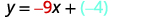  |
|  |  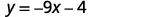  |
{: .unnumbered .unstyled summary="Name the slope. m equals negative 9. Name the y-intercept. The y-intercept is (0, negative 4). Substitute the values into y equals m x plus b. y equals negative 9 x plus negative 4. The m and negative 4 are both emphasized in red. The b and negative 4 are both emphasized in blue. This simplifies to y equals negative 9 x minus 4." data-label=""}

Find the equation of a line with slope <math xmlns="http://www.w3.org/1998/Math/MathML"><mrow><mfrac><mn>2</mn><mn>5</mn></mfrac></mrow></math>

 and *y*-intercept <math xmlns="http://www.w3.org/1998/Math/MathML"><mrow><mrow><mo>(</mo><mrow><mn>0</mn><mo>,</mo><mn>4</mn></mrow><mo>)</mo></mrow><mo>.</mo></mrow></math>

<math xmlns="http://www.w3.org/1998/Math/MathML"><mrow><mi>y</mi><mo>=</mo><mfrac><mn>2</mn><mn>5</mn></mfrac><mi>x</mi><mo>+</mo><mn>4</mn></mrow></math>

Find the equation of a line with slope <math xmlns="http://www.w3.org/1998/Math/MathML"><mrow><mn>−1</mn></mrow></math>

 and *y*-intercept <math xmlns="http://www.w3.org/1998/Math/MathML"><mrow><mrow><mo>(</mo><mrow><mn>0</mn><mo>,</mo><mn>−3</mn></mrow><mo>)</mo></mrow><mo>.</mo></mrow></math>

<math xmlns="http://www.w3.org/1998/Math/MathML"><mrow><mi>y</mi><mo>=</mo><mtext>−</mtext><mi>x</mi><mo>−</mo><mn>3</mn></mrow></math>

Sometimes, the slope and intercept need to be determined from the graph.

Find the equation of the line shown in the graph.

 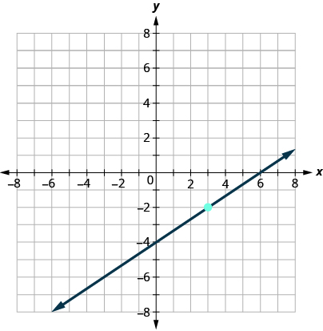 

We need to find the slope and *y*-intercept of the line from the graph so we can substitute the needed values into the slope-intercept form, <math xmlns="http://www.w3.org/1998/Math/MathML"><mrow><mi>y</mi><mo>=</mo><mi>m</mi><mi>x</mi><mo>+</mo><mi>b</mi><mo>.</mo></mrow></math>

To find the slope, we choose two points on the graph.

The *y*-intercept is <math xmlns="http://www.w3.org/1998/Math/MathML"><mrow><mrow><mo>(</mo><mrow><mn>0</mn><mo>,</mo><mn>−4</mn></mrow><mo>)</mo></mrow></mrow></math>

 and the graph passes through <math xmlns="http://www.w3.org/1998/Math/MathML"><mrow><mrow><mo>(</mo><mrow><mn>3</mn><mo>,</mo><mn>−2</mn></mrow><mo>)</mo></mrow><mo>.</mo></mrow></math>

| Find the slope, by counting the rise and run. |  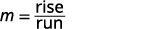  |
|  |  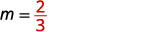  |
| Find the *y*-intercept. |  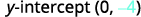  |
| Substitute the values into <math xmlns="http://www.w3.org/1998/Math/MathML"><mrow><mi>y</mi><mo>=</mo><mi>m</mi><mi>x</mi><mo>+</mo><mi>b</mi><mo>.</mo></mrow></math>

 |    |
|  |  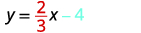  |
{: .unnumbered .unstyled summary="Find the slope, by counting the rise and run. m equals rise divided by run. m equals 2 divided by 3. Find the y-intercept. y-intercept is (0, negative 4). Substitute the values into y equals m x plus b. y equals 2 divided by 3 x minus 4. The m and 2 divided by 3 are both emphasized in red. The b and negative 4 are emphasized in blue." data-label=""}

Find the equation of the line shown in the graph.

 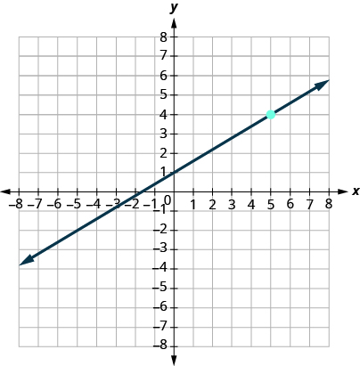 

<math xmlns="http://www.w3.org/1998/Math/MathML"><mrow><mi>y</mi><mo>=</mo><mfrac><mn>3</mn><mn>5</mn></mfrac><mi>x</mi><mo>+</mo><mn>1</mn></mrow></math>

Find the equation of the line shown in the graph.

 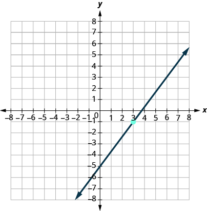 

<math xmlns="http://www.w3.org/1998/Math/MathML"><mrow><mi>y</mi><mo>=</mo><mfrac><mn>4</mn><mn>3</mn></mfrac><mi>x</mi><mo>−</mo><mn>5</mn></mrow></math>

### Find an Equation of the Line Given the Slope and a Point

Finding an equation of a line using the slope-intercept form of the equation works well when you are given the slope and *y*-intercept or when you read them off a graph. But what happens when you have another point instead of the *y*-intercept?

We are going to use the slope formula to derive another form of an equation of the line.

Suppose we have a line that has slope *m* and that contains some specific point <math xmlns="http://www.w3.org/1998/Math/MathML"><mrow><mrow><mo>(</mo><mrow><msub><mi>x</mi><mn>1</mn></msub><mo>,</mo><msub><mi>y</mi><mn>1</mn></msub></mrow><mo>)</mo></mrow></mrow></math>

 and some other point, which we will just call <math xmlns="http://www.w3.org/1998/Math/MathML"><mrow><mrow><mo>(</mo><mrow><mi>x</mi><mo>,</mo><mi>y</mi></mrow><mo>)</mo></mrow><mo>.</mo></mrow></math>

 We can write the slope of this line and then change it to a different form.

<math xmlns="http://www.w3.org/1998/Math/MathML"><mrow><mtable><mtr><mtd /><mtd /><mtd /><mtd columnalign="right"><mi>m</mi></mtd><mtd columnalign="left"><mo>=</mo></mtd><mtd columnalign="left"><mfrac><mrow><mi>y</mi><mo>−</mo><msub><mi>y</mi><mn>1</mn></msub></mrow><mrow><mi>x</mi><mo>−</mo><msub><mi>x</mi><mn>1</mn></msub></mrow></mfrac></mtd></mtr> <mtr><mtd columnalign="left"><mtext>Multiply both sides of the equation by</mtext><mspace width="0.2em" /><mi>x</mi><mo>−</mo><msub><mi>x</mi><mn>1</mn></msub><mo>.</mo></mtd><mtd /><mtd /><mtd columnalign="right"><mi>m</mi><mrow><mo>(</mo><mrow><mi>x</mi><mo>−</mo><msub><mi>x</mi><mn>1</mn></msub></mrow><mo>)</mo></mrow></mtd><mtd columnalign="left"><mo>=</mo></mtd><mtd columnalign="left"><mrow><mo>(</mo><mrow><mfrac><mrow><mi>y</mi><mo>−</mo><msub><mi>y</mi><mn>1</mn></msub></mrow><mrow><mi>x</mi><mo>−</mo><msub><mi>x</mi><mn>1</mn></msub></mrow></mfrac></mrow><mo>)</mo></mrow><mrow><mo>(</mo><mrow><mi>x</mi><mo>−</mo><msub><mi>x</mi><mn>1</mn></msub></mrow><mo>)</mo></mrow></mtd></mtr> <mtr><mtd columnalign="left"><mtext>Simplify.</mtext></mtd><mtd /><mtd /><mtd columnalign="right"><mi>m</mi><mrow><mo>(</mo><mrow><mi>x</mi><mo>−</mo><msub><mi>x</mi><mn>1</mn></msub></mrow><mo>)</mo></mrow></mtd><mtd columnalign="left"><mo>=</mo></mtd><mtd columnalign="left"><mi>y</mi><mo>−</mo><msub><mi>y</mi><mn>1</mn></msub></mtd></mtr> <mtr><mtd columnalign="left"><mtext>Rewrite the equation with the</mtext><mspace width="0.2em" /><mi>y</mi><mspace width="0.2em" /><mtext>terms on the left.</mtext></mtd><mtd /><mtd /><mtd columnalign="right"><mi>y</mi><mo>−</mo><msub><mi>y</mi><mn>1</mn></msub></mtd><mtd columnalign="left"><mo>=</mo></mtd><mtd columnalign="left"><mi>m</mi><mrow><mo>(</mo><mrow><mi>x</mi><mo>−</mo><msub><mi>x</mi><mn>1</mn></msub></mrow><mo>)</mo></mrow></mtd></mtr></mtable></mrow></math>

This format is called the **point-slope form**{: data-type="term"} of an equation of a line.

Point-slope Form of an Equation of a Line

The **point-slope form** of an equation of a line with slope *m* and containing the point <math xmlns="http://www.w3.org/1998/Math/MathML"><mrow><mrow><mo>(</mo><mrow><msub><mi>x</mi><mn>1</mn></msub><mo>,</mo><msub><mi>y</mi><mn>1</mn></msub></mrow><mo>)</mo></mrow></mrow></math>

 is:

<math xmlns="http://www.w3.org/1998/Math/MathML"><mrow><mi>y</mi><mo>−</mo><msub><mi>y</mi><mn>1</mn></msub><mo>=</mo><mi>m</mi><mo stretchy="false">(</mo><mi>x</mi><mo>−</mo><msub><mi>x</mi><mn>1</mn></msub><mo stretchy="false">)</mo></mrow></math>

We can use the point-slope form of an equation to find an equation of a line when we know the slope and at least one point. Then, we will rewrite the equation in slope-intercept form. Most applications of linear equations use the the slope-intercept form.

How to Find an Equation of a Line Given a Point and the Slope

Find an equation of a line with slope <math xmlns="http://www.w3.org/1998/Math/MathML"><mrow><mi>m</mi><mo>=</mo><mo>−</mo><mfrac><mn>1</mn><mn>3</mn></mfrac></mrow></math>

 that contains the point <math xmlns="http://www.w3.org/1998/Math/MathML"><mrow><mrow><mo>(</mo><mrow><mn>6</mn><mo>,</mo><mn>−4</mn></mrow><mo>)</mo></mrow><mo>.</mo></mrow></math>

 Write the equation in slope-intercept form.

          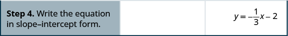 

Find the equation of a line with slope <math xmlns="http://www.w3.org/1998/Math/MathML"><mrow><mi>m</mi><mo>=</mo><mo>−</mo><mfrac><mn>2</mn><mn>5</mn></mfrac></mrow></math>

 and containing the point <math xmlns="http://www.w3.org/1998/Math/MathML"><mrow><mrow><mo>(</mo><mrow><mn>10</mn><mo>,</mo><mn>−5</mn></mrow><mo>)</mo></mrow><mo>.</mo></mrow></math>

<math xmlns="http://www.w3.org/1998/Math/MathML"><mrow><mi>y</mi><mo>=</mo><mo>−</mo><mfrac><mn>2</mn><mn>5</mn></mfrac><mi>x</mi><mo>−</mo><mn>1</mn></mrow></math>

Find the equation of a line with slope <math xmlns="http://www.w3.org/1998/Math/MathML"><mrow><mi>m</mi><mo>=</mo><mo>−</mo><mfrac><mn>3</mn><mn>4</mn></mfrac><mo>,</mo></mrow></math>

 and containing the point <math xmlns="http://www.w3.org/1998/Math/MathML"><mrow><mrow><mo>(</mo><mrow><mn>4</mn><mo>,</mo><mn>−7</mn></mrow><mo>)</mo></mrow><mo>.</mo></mrow></math>

<math xmlns="http://www.w3.org/1998/Math/MathML"><mrow><mi>y</mi><mo>=</mo><mo>−</mo><mfrac><mn>3</mn><mn>4</mn></mfrac><mi>x</mi><mo>−</mo><mn>4</mn></mrow></math>

We list the steps for easy reference.

To find an equation of a line given the slope and a point.

1.  Identify the slope.
2.  Identify the point.
3.  Substitute the values into the point-slope form,
    <math xmlns="http://www.w3.org/1998/Math/MathML"><mrow><mi>y</mi><mo>−</mo><msub><mi>y</mi><mn>1</mn></msub><mo>=</mo><mi>m</mi><mrow><mo>(</mo><mrow><mi>x</mi><mo>−</mo><msub><mi>x</mi><mn>1</mn></msub></mrow><mo>)</mo></mrow><mo>.</mo></mrow></math>

4.  Write the equation in slope-intercept form.
{: type="1" .stepwise}

Find an equation of a horizontal line that contains the point <math xmlns="http://www.w3.org/1998/Math/MathML"><mrow><mrow><mo>(</mo><mrow><mn>−2</mn><mo>,</mo><mn>−6</mn></mrow><mo>)</mo></mrow><mo>.</mo></mrow></math>

 Write the equation in slope-intercept form.

Every horizontal line has slope 0. We can substitute the slope and points into the point-slope form, <math xmlns="http://www.w3.org/1998/Math/MathML"><mrow><mi>y</mi><mo>−</mo><msub><mi>y</mi><mn>1</mn></msub><mo>=</mo><mi>m</mi><mrow><mo>(</mo><mrow><mi>x</mi><mo>−</mo><msub><mi>x</mi><mn>1</mn></msub></mrow><mo>)</mo></mrow><mo>.</mo></mrow></math>

| Identify the slope. |    |
| Identify the point. |    |
| Substitute the values into <math xmlns="http://www.w3.org/1998/Math/MathML"><mrow><mi>y</mi><mo>−</mo><msub><mi>y</mi><mn>1</mn></msub><mo>=</mo><mi>m</mi><mrow><mo>(</mo><mrow><mi>x</mi><mo>−</mo><msub><mi>x</mi><mn>1</mn></msub></mrow><mo>)</mo></mrow><mo>.</mo></mrow></math>

 |    |
|  |    |
| Simplify. |    |
|  |    |
| Write in slope-intercept form. | It is in *y*-form, but could be written <math xmlns="http://www.w3.org/1998/Math/MathML"><mrow><mi>y</mi><mo>=</mo><mn>0</mn><mi>x</mi><mo>−</mo><mn>6</mn><mo>.</mo></mrow></math>

 |
{: .unnumbered .unstyled summary="Identify the slope. m equals 0. Identify the point. x 1 is negative 2 and y 1 is negative 6. Substitute the values into y minus y 1 equals m times the quantity x minus x 1 in parentheses. y minus negative 6 equals 0 times the quantity x minus negative 2 in parentheses. This simplifies to y plus 6 equals 0 or y equals negative 6. Write in slope-intercept form. It is in y-form, but could be written y equals 0 x minus 6. Did we end up with the form of a horizontal line y equals a?" data-label=""}

Did we end up with the form of a horizontal line, <math xmlns="http://www.w3.org/1998/Math/MathML"><mrow><mi>y</mi><mo>=</mo><mi>a</mi><mo>?</mo></mrow></math>

Find the equation of a horizontal line containing the point <math xmlns="http://www.w3.org/1998/Math/MathML"><mrow><mrow><mo>(</mo><mrow><mn>−3</mn><mo>,</mo><mn>8</mn></mrow><mo>)</mo></mrow><mo>.</mo></mrow></math>

<math xmlns="http://www.w3.org/1998/Math/MathML"><mrow><mi>y</mi><mo>=</mo><mn>8</mn></mrow></math>

Find the equation of a horizontal line containing the point <math xmlns="http://www.w3.org/1998/Math/MathML"><mrow><mrow><mo>(</mo><mrow><mn>−1</mn><mo>,</mo><mn>4</mn></mrow><mo>)</mo></mrow><mo>.</mo></mrow></math>

<math xmlns="http://www.w3.org/1998/Math/MathML"><mrow><mi>y</mi><mo>=</mo><mn>4</mn></mrow></math>

### Find an Equation of the Line Given Two Points

When real-world data is collected, a linear model can be created from two data points. In the next example we’ll see how to find an equation of a line when just two points are given.

So far, we have two options for finding an equation of a line: slope-intercept or point-slope. When we start with two points, it makes more sense to use the point-slope form.

But then we need the slope. Can we find the slope with just two points? Yes. Then, once we have the slope, we can use it and one of the given points to find the equation.

How to Find the Equation of a Line Given Two Points

Find an equation of a line that contains the points <math xmlns="http://www.w3.org/1998/Math/MathML"><mrow><mrow><mo>(</mo><mrow><mn>−3</mn><mo>,</mo><mn>−1</mn></mrow><mo>)</mo></mrow></mrow></math>

 and <math xmlns="http://www.w3.org/1998/Math/MathML"><mrow><mrow><mo>(</mo><mrow><mn>2</mn><mo>,</mo><mn>−2</mn></mrow><mo>)</mo></mrow></mrow></math>

 Write the equation in slope-intercept form.

          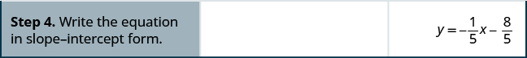 

Find the equation of a line containing the points <math xmlns="http://www.w3.org/1998/Math/MathML"><mrow><mrow><mo>(</mo><mrow><mn>−2</mn><mo>,</mo><mn>−4</mn></mrow><mo>)</mo></mrow></mrow></math>

 and <math xmlns="http://www.w3.org/1998/Math/MathML"><mrow><mrow><mo>(</mo><mrow><mn>1</mn><mo>,</mo><mn>−3</mn></mrow><mo>)</mo></mrow><mo>.</mo></mrow></math>

<math xmlns="http://www.w3.org/1998/Math/MathML"><mrow><mi>y</mi><mo>=</mo><mfrac><mn>1</mn><mn>3</mn></mfrac><mi>x</mi><mo>−</mo><mfrac><mrow><mn>10</mn></mrow><mn>3</mn></mfrac></mrow></math>

Find the equation of a line containing the points <math xmlns="http://www.w3.org/1998/Math/MathML"><mrow><mrow><mo>(</mo><mrow><mn>−4</mn><mo>,</mo><mn>−3</mn></mrow><mo>)</mo></mrow></mrow></math>

 and <math xmlns="http://www.w3.org/1998/Math/MathML"><mrow><mrow><mo>(</mo><mrow><mn>1</mn><mo>,</mo><mn>−5</mn></mrow><mo>)</mo></mrow><mo>.</mo></mrow></math>

<math xmlns="http://www.w3.org/1998/Math/MathML"><mrow><mi>y</mi><mo>=</mo><mo>−</mo><mfrac><mn>2</mn><mn>5</mn></mfrac><mi>x</mi><mo>−</mo><mfrac><mrow><mn>23</mn></mrow><mn>5</mn></mfrac></mrow></math>

The steps are summarized here.

To find an equation of a line given two points.

1.  Find the slope using the given points.
    <math xmlns="http://www.w3.org/1998/Math/MathML"><mrow><mi>m</mi><mo>=</mo><mfrac><mrow><msub><mi>y</mi><mn>2</mn></msub><mo>−</mo><msub><mi>y</mi><mn>1</mn></msub></mrow><mrow><msub><mi>x</mi><mn>2</mn></msub><mo>−</mo><msub><mi>x</mi><mn>1</mn></msub></mrow></mfrac></mrow></math>

2.  Choose one point.
3.  Substitute the values into the point-slope form:
    <math xmlns="http://www.w3.org/1998/Math/MathML"><mrow><mi>y</mi><mo>−</mo><msub><mi>y</mi><mn>1</mn></msub><mo>=</mo><mi>m</mi><mrow><mo>(</mo><mrow><mi>x</mi><mo>−</mo><msub><mi>x</mi><mn>1</mn></msub></mrow><mo>)</mo></mrow><mo>.</mo></mrow></math>

4.  Write the equation in slope-intercept form.
{: type="1" .stepwise}

Find an equation of a line that contains the points <math xmlns="http://www.w3.org/1998/Math/MathML"><mrow><mrow><mo>(</mo><mrow><mn>−3</mn><mo>,</mo><mn>5</mn></mrow><mo>)</mo></mrow></mrow></math>

 and <math xmlns="http://www.w3.org/1998/Math/MathML"><mrow><mrow><mo>(</mo><mrow><mn>−3</mn><mo>,</mo><mn>4</mn></mrow><mo>)</mo></mrow><mo>.</mo></mrow></math>

 Write the equation in slope-intercept form.

Again, the first step will be to find the slope.

<math xmlns="http://www.w3.org/1998/Math/MathML"><mrow><mtable><mtr><mtd columnalign="left"><mtable><mtr><mtd columnalign="left"><mtext>Find the slope of the line through</mtext><mspace width="0.2em" /><mrow><mo>(</mo><mrow><mn>−3</mn><mo>,</mo><mn>5</mn></mrow><mo>)</mo></mrow><mspace width="0.2em" /><mtext>and</mtext><mspace width="0.2em" /><mrow><mo>(</mo><mrow><mn>−3</mn><mo>,</mo><mn>4</mn></mrow><mo>)</mo></mrow><mo>.</mo></mtd></mtr><mtr /><mtr /><mtr /><mtr /><mtr /><mtr /><mtr /><mtr /><mtr /></mtable></mtd><mtd /><mtd /><mtd columnalign="left"><mspace width="1em" /><mtable><mtr><mtd columnalign="right"><mi>m</mi></mtd><mtd columnalign="left"><mo>=</mo></mtd><mtd columnalign="left"><mfrac><mrow><msub><mi>y</mi><mn>2</mn></msub><mo>−</mo><msub><mi>y</mi><mn>1</mn></msub></mrow><mrow><msub><mi>x</mi><mn>2</mn></msub><mo>−</mo><msub><mi>x</mi><mn>1</mn></msub></mrow></mfrac></mtd></mtr> <mtr><mtd columnalign="right"><mi>m</mi></mtd><mtd columnalign="left"><mo>=</mo></mtd><mtd columnalign="left"><mfrac><mrow><mn>4</mn><mo>−</mo><mn>5</mn></mrow><mrow><mn>−3</mn><mo>−</mo><mrow><mo>(</mo><mrow><mn>−3</mn></mrow><mo>)</mo></mrow></mrow></mfrac></mtd></mtr> <mtr><mtd columnalign="right"><mi>m</mi></mtd><mtd columnalign="left"><mo>=</mo></mtd><mtd columnalign="left"><mfrac><mrow><mn>−1</mn></mrow><mrow><mn>0</mn></mrow></mfrac></mtd></mtr></mtable></mtd></mtr> <mtr><mtd /><mtd /><mtd /><mtd columnalign="left"><mtext>The slope is undefined.</mtext></mtd></mtr></mtable></mrow></math>

This tells us it is a vertical line. Both of our points have an *x*-coordinate of <math xmlns="http://www.w3.org/1998/Math/MathML"><mrow><mn>−2</mn><mo>.</mo></mrow></math>

 So our equation of the line is <math xmlns="http://www.w3.org/1998/Math/MathML"><mrow><mi>x</mi><mo>=</mo><mn>−2</mn><mo>.</mo></mrow></math>

 Since there is no *y*, we cannot write it in slope-intercept form.

You may want to sketch a graph using the two given points. Does your graph agree with our conclusion that this is a vertical line?

Find the equation of a line containing the points <math xmlns="http://www.w3.org/1998/Math/MathML"><mrow><mrow><mo>(</mo><mrow><mn>5</mn><mo>,</mo><mn>1</mn></mrow><mo>)</mo></mrow></mrow></math>

 and <math xmlns="http://www.w3.org/1998/Math/MathML"><mrow><mrow><mo>(</mo><mrow><mn>5</mn><mo>,</mo><mn>−4</mn></mrow><mo>)</mo></mrow><mo>.</mo></mrow></math>

<math xmlns="http://www.w3.org/1998/Math/MathML"><mrow><mi>x</mi><mo>=</mo><mn>5</mn></mrow></math>

Find the equaion of a line containing the points <math xmlns="http://www.w3.org/1998/Math/MathML"><mrow><mrow><mo>(</mo><mrow><mn>−4</mn><mo>,</mo><mn>4</mn></mrow><mo>)</mo></mrow></mrow></math>

 and <math xmlns="http://www.w3.org/1998/Math/MathML"><mrow><mrow><mo>(</mo><mrow><mn>−4</mn><mo>,</mo><mn>3</mn></mrow><mo>)</mo></mrow><mo>.</mo></mrow></math>

<math xmlns="http://www.w3.org/1998/Math/MathML"><mrow><mi>x</mi><mo>=</mo><mn>−4</mn></mrow></math>

We have seen that we can use either the slope-intercept form or the point-slope form to find an equation of a line. Which form we use will depend on the information we are given.

<table class="unnumbered" summary="The table is titled To Write and Equation of a Line. It has three columns labeled &#x201C;If given,&#x201D; &#x201C;Use,&#x201D;, and &#x201C;Form.&#x201D; The first row shows that if the slope and y intercept are given, use the slope-intercept form, which is y equals mx plus b. The second row shows that if the slope and a point are given, use the point-slope form, which is y minus y sub 1 equals m times the quantity x minus x sub 1."><thead>
<tr>
<th colspan="3" data-valign="middle" data-align="center">To Write an Equation of a Line</th>
</tr>
</thead><tbody><tr>
<td data-valign="middle" data-align="left"><strong>If given:</strong></td>
<td data-valign="middle" data-align="left"><strong>Use:</strong></td>
<td data-valign="middle" data-align="left"><strong>Form:</strong></td>
</tr>
<tr>
<td data-valign="middle" data-align="left">Slope and <em>y</em>-intercept</td>
<td data-valign="middle" data-align="left">slope-intercept</td>
<td data-valign="middle" data-align="left"><math xmlns="http://www.w3.org/1998/Math/MathML"><mrow><mi>y</mi><mo>=</mo><mi>m</mi><mi>x</mi><mo>+</mo><mi>b</mi></mrow></math></td>
</tr>
<tr>
<td data-valign="middle" data-align="left">Slope and a point</td>
<td data-valign="middle" data-align="left">point-slope</td>
<td data-valign="middle" data-align="left"><math xmlns="http://www.w3.org/1998/Math/MathML"><mrow><mi>y</mi><mo>−</mo><msub><mi>y</mi><mn>1</mn></msub><mo>=</mo><mi>m</mi><mrow><mo>(</mo><mrow><mi>x</mi><mo>−</mo><msub><mi>x</mi><mn>1</mn></msub></mrow><mo>)</mo></mrow></mrow></math></td>
</tr>
<tr>
<td data-valign="middle" data-align="left">Two points</td>
<td data-valign="middle" data-align="left">point-slope</td>
<td data-valign="middle" data-align="left"><math xmlns="http://www.w3.org/1998/Math/MathML"><mrow><mi>y</mi><mo>−</mo><msub><mi>y</mi><mn>1</mn></msub><mo>=</mo><mi>m</mi><mrow><mo>(</mo><mrow><mi>x</mi><mo>−</mo><msub><mi>x</mi><mn>1</mn></msub></mrow><mo>)</mo></mrow></mrow></math></td>
</tr>
</tbody></table>

### Find an Equation of a Line Parallel to a Given Line

Suppose we need to find an equation of a line that passes through a specific point and is parallel to a given line. We can use the fact that parallel lines have the same slope. So we will have a point and the slope—just what we need to use the point-slope equation.

First, let’s look at this graphically.

This graph shows <math xmlns="http://www.w3.org/1998/Math/MathML"><mrow><mi>y</mi><mo>=</mo><mn>2</mn><mi>x</mi><mo>−</mo><mn>3</mn><mo>.</mo></mrow></math>

 We want to graph a line parallel to this line and passing through the point <math xmlns="http://www.w3.org/1998/Math/MathML"><mrow><mrow><mo>(</mo><mrow><mn>−2</mn><mo>,</mo><mn>1</mn></mrow><mo>)</mo></mrow><mo>.</mo></mrow></math>

    We know that parallel lines have the same slope. So the second line will have the same slope as <math xmlns="http://www.w3.org/1998/Math/MathML"><mrow><mi>y</mi><mo>=</mo><mn>2</mn><mi>x</mi><mo>−</mo><mn>3</mn><mo>.</mo></mrow></math>

 That slope is <math xmlns="http://www.w3.org/1998/Math/MathML"><mrow><msub><mi>m</mi><mo>∥</mo></msub><mo>=</mo><mn>2</mn><mo>.</mo></mrow></math>

 We’ll use the notation <math xmlns="http://www.w3.org/1998/Math/MathML"><mrow><msub><mi>m</mi><mo>∥</mo></msub></mrow></math>

 to represent the slope of a line parallel to a line with slope *m*. (Notice that the subscript \\\|\\\| looks like two parallel lines.)

The second line will pass through <math xmlns="http://www.w3.org/1998/Math/MathML"><mrow><mrow><mo>(</mo><mrow><mn>−2</mn><mo>,</mo><mn>1</mn></mrow><mo>)</mo></mrow></mrow></math>

 and have <math xmlns="http://www.w3.org/1998/Math/MathML"><mrow><mi>m</mi><mo>=</mo><mn>2</mn><mo>.</mo></mrow></math>

To graph the line, we start at<math xmlns="http://www.w3.org/1998/Math/MathML"><mrow><mrow><mo>(</mo><mrow><mn>−2</mn><mo>,</mo><mn>1</mn></mrow><mo>)</mo></mrow></mrow></math>

 and count out the rise and run.

With <math xmlns="http://www.w3.org/1998/Math/MathML"><mrow><mi>m</mi><mo>=</mo><mn>2</mn></mrow></math>

 (or <math xmlns="http://www.w3.org/1998/Math/MathML"><mrow><mi>m</mi><mo>=</mo><mfrac><mn>2</mn><mn>1</mn></mfrac></mrow></math>

), we count out the rise 2 and the run 1. We draw the line, as shown in the graph.

    Do the lines appear parallel? Does the second line pass through<math xmlns="http://www.w3.org/1998/Math/MathML"><mrow><mrow><mo>(</mo><mrow><mn>−2</mn><mo>,</mo><mn>1</mn></mrow><mo>)</mo></mrow><mo>?</mo></mrow></math>

We were asked to graph the line, now let’s see how to do this algebraically.

We can use either the slope-intercept form or the point-slope form to find an equation of a line. Here we know one point and can find the slope. So we will use the point-slope form.

How to Find the Equation of a Line Parallel to a Given Line and a Point

Find an equation of a line parallel to <math xmlns="http://www.w3.org/1998/Math/MathML"><mrow><mi>y</mi><mo>=</mo><mn>2</mn><mi>x</mi><mo>−</mo><mn>3</mn></mrow></math>

 that contains the point <math xmlns="http://www.w3.org/1998/Math/MathML"><mrow><mrow><mo>(</mo><mrow><mn>−2</mn><mo>,</mo><mn>1</mn></mrow><mo>)</mo></mrow><mo>.</mo></mrow></math>

 Write the equation in slope-intercept form.

          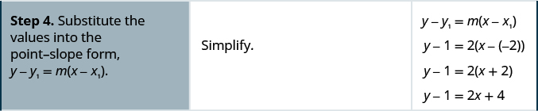    
Look at graph with the parallel lines shown previously. Does this equation make sense? What is the *y*-intercept of the line? What is the slope?

Find an equation of a line parallel to the line <math xmlns="http://www.w3.org/1998/Math/MathML"><mrow><mi>y</mi><mo>=</mo><mn>3</mn><mi>x</mi><mo>+</mo><mn>1</mn></mrow></math>

 that contains the point <math xmlns="http://www.w3.org/1998/Math/MathML"><mrow><mrow><mo>(</mo><mrow><mn>4</mn><mo>,</mo><mn>2</mn></mrow><mo>)</mo></mrow><mo>.</mo></mrow></math>

 Write the equation in slope-intercept form.

<math xmlns="http://www.w3.org/1998/Math/MathML"><mrow><mi>y</mi><mo>=</mo><mn>3</mn><mi>x</mi><mo>−</mo><mn>10</mn></mrow></math>

Find an equation of a line parallel to the line <math xmlns="http://www.w3.org/1998/Math/MathML"><mrow><mi>y</mi><mo>=</mo><mfrac><mn>1</mn><mn>2</mn></mfrac><mi>x</mi><mo>−</mo><mn>3</mn></mrow></math>

 that contains the point <math xmlns="http://www.w3.org/1998/Math/MathML"><mrow><mrow><mo>(</mo><mrow><mn>6</mn><mo>,</mo><mn>4</mn></mrow><mo>)</mo></mrow><mo>.</mo></mrow></math>

Write the equation in slope-intercept form.

<math xmlns="http://www.w3.org/1998/Math/MathML"><mrow><mi>y</mi><mo>=</mo><mfrac><mn>1</mn><mn>2</mn></mfrac><mi>x</mi><mo>+</mo><mn>1</mn></mrow></math>

Find an equation of a line parallel to a given line.

1.  Find the slope of the given line.
2.  Find the slope of the parallel line.
3.  Identify the point.
4.  Substitute the values into the point-slope form:
    <math xmlns="http://www.w3.org/1998/Math/MathML"><mrow><mi>y</mi><mo>−</mo><msub><mi>y</mi><mn>1</mn></msub><mo>=</mo><mi>m</mi><mrow><mo>(</mo><mrow><mi>x</mi><mo>−</mo><msub><mi>x</mi><mn>1</mn></msub></mrow><mo>)</mo></mrow><mo>.</mo></mrow></math>

5.  Write the equation in slope-intercept form.
{: type="1" .stepwise}

### Find an Equation of a Line Perpendicular to a Given Line

Now, let’s consider perpendicular lines. Suppose we need to find a line passing through a specific point and which is perpendicular to a given line. We can use the fact that perpendicular lines have slopes that are negative reciprocals. We will again use the point-slope equation, like we did with parallel lines.

This graph shows <math xmlns="http://www.w3.org/1998/Math/MathML"><mrow><mi>y</mi><mo>=</mo><mn>2</mn><mi>x</mi><mo>−</mo><mn>3</mn><mo>.</mo></mrow></math>

 Now, we want to graph a line perpendicular to this line and passing through <math xmlns="http://www.w3.org/1998/Math/MathML"><mrow><mrow><mo>(</mo><mrow><mn>−2</mn><mo>,</mo><mn>1</mn></mrow><mo>)</mo></mrow><mo>.</mo></mrow></math>

    We know that perpendicular lines have slopes that are negative reciprocals.

We’ll use the notation <math xmlns="http://www.w3.org/1998/Math/MathML"><mrow><msub><mi>m</mi><mo>⊥</mo></msub></mrow></math>

 to represent the slope of a line perpendicular to a line with slope *m*. (Notice that the subscript <math xmlns="http://www.w3.org/1998/Math/MathML"><mo>⊥</mo></math>

 looks like the right angles made by two perpendicular lines.)

<math xmlns="http://www.w3.org/1998/Math/MathML"><mrow><mtable><mtr><mtd columnalign="left"><mi>y</mi><mo>=</mo><mn>2</mn><mi>x</mi><mo>−</mo><mn>3</mn></mtd><mtd /><mtd /><mtd columnalign="left"><mtext>perpendicular line</mtext></mtd></mtr> <mtr><mtd columnalign="left"><mi>m</mi><mo>=</mo><mn>2</mn></mtd><mtd /><mtd /><mtd columnalign="left"><msub><mi>m</mi><mo>⊥</mo></msub><mo>=</mo><mo>−</mo><mfrac><mn>1</mn><mn>2</mn></mfrac></mtd></mtr></mtable></mrow></math>

We now know the perpendicular line will pass through <math xmlns="http://www.w3.org/1998/Math/MathML"><mrow><mrow><mo>(</mo><mrow><mn>−2</mn><mo>,</mo><mn>1</mn></mrow><mo>)</mo></mrow></mrow></math>

 with <math xmlns="http://www.w3.org/1998/Math/MathML"><mrow><msub><mi>m</mi><mo>⊥</mo></msub><mo>=</mo><mo>−</mo><mfrac><mn>1</mn><mn>2</mn></mfrac><mo>.</mo></mrow></math>

To graph the line, we will start at <math xmlns="http://www.w3.org/1998/Math/MathML"><mrow><mrow><mo>(</mo><mrow><mn>−2</mn><mo>,</mo><mn>1</mn></mrow><mo>)</mo></mrow></mrow></math>

 and count out the rise <math xmlns="http://www.w3.org/1998/Math/MathML"><mrow><mn>−1</mn></mrow></math>

 and the run 2. Then we draw the line.

    Do the lines appear perpendicular? Does the second line pass through<math xmlns="http://www.w3.org/1998/Math/MathML"><mrow><mrow><mo>(</mo><mrow><mn>−2</mn><mo>,</mo><mn>1</mn></mrow><mo>)</mo></mrow><mo>?</mo></mrow></math>

We were asked to graph the line, now, let’s see how to do this algebraically.

We can use either the slope-intercept form or the point-slope form to find an equation of a line. In this example we know one point, and can find the slope, so we will use the point-slope form.

How to Find the Equation of a Line Perpendicular to a Given Line and a Point

Find an equation of a line perpendicular to <math xmlns="http://www.w3.org/1998/Math/MathML"><mrow><mi>y</mi><mo>=</mo><mn>2</mn><mi>x</mi><mo>−</mo><mn>3</mn></mrow></math>

 that contains the point <math xmlns="http://www.w3.org/1998/Math/MathML"><mrow><mrow><mo>(</mo><mrow><mn>−2</mn><mo>,</mo><mn>1</mn></mrow><mo>)</mo></mrow><mo>.</mo></mrow></math>

 Write the equation in slope-intercept form.

    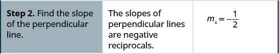         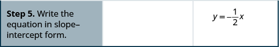 

Find an equation of a line perpendicular to the line <math xmlns="http://www.w3.org/1998/Math/MathML"><mrow><mi>y</mi><mo>=</mo><mn>3</mn><mi>x</mi><mo>+</mo><mn>1</mn></mrow></math>

 that contains the point <math xmlns="http://www.w3.org/1998/Math/MathML"><mrow><mrow><mo>(</mo><mrow><mn>4</mn><mo>,</mo><mn>2</mn></mrow><mo>)</mo></mrow><mo>.</mo></mrow></math>

 Write the equation in slope-intercept form.

<math xmlns="http://www.w3.org/1998/Math/MathML"><mrow><mi>y</mi><mo>=</mo><mo>−</mo><mfrac><mn>1</mn><mn>3</mn></mfrac><mi>x</mi><mo>+</mo><mfrac><mrow><mn>10</mn></mrow><mn>3</mn></mfrac></mrow></math>

Find an equation of a line perpendicular to the line <math xmlns="http://www.w3.org/1998/Math/MathML"><mrow><mi>y</mi><mo>=</mo><mfrac><mn>1</mn><mn>2</mn></mfrac><mi>x</mi><mo>−</mo><mn>3</mn></mrow></math>

 that contains the point <math xmlns="http://www.w3.org/1998/Math/MathML"><mrow><mrow><mo>(</mo><mrow><mn>6</mn><mo>,</mo><mn>4</mn></mrow><mo>)</mo></mrow><mo>.</mo></mrow></math>

 Write the equation in slope-intercept form.

<math xmlns="http://www.w3.org/1998/Math/MathML"><mrow><mi>y</mi><mo>=</mo><mn>−2</mn><mi>x</mi><mo>+</mo><mn>16</mn></mrow></math>

Find an equation of a line perpendicular to a given line.

1.  Find the slope of the given line.
2.  Find the slope of the perpendicular line.
3.  Identify the point.
4.  Substitute the values into the point-slope form,
    <math xmlns="http://www.w3.org/1998/Math/MathML"><mrow><mi>y</mi><mo>−</mo><msub><mi>y</mi><mn>1</mn></msub><mo>=</mo><mi>m</mi><mrow><mo>(</mo><mrow><mi>x</mi><mo>−</mo><msub><mi>x</mi><mn>1</mn></msub></mrow><mo>)</mo></mrow><mo>.</mo></mrow></math>

5.  Write the equation in slope-intercept form.
{: type="1" .stepwise}

Find an equation of a line perpendicular to <math xmlns="http://www.w3.org/1998/Math/MathML"><mrow><mi>x</mi><mo>=</mo><mn>5</mn></mrow></math>

 that contains the point <math xmlns="http://www.w3.org/1998/Math/MathML"><mrow><mrow><mo>(</mo><mrow><mn>3</mn><mo>,</mo><mn>−2</mn></mrow><mo>)</mo></mrow><mo>.</mo></mrow></math>

 Write the equation in slope-intercept form.

Again, since we know one point, the point-slope option seems more promising than the slope-intercept option. We need the slope to use this form, and we know the new line will be perpendicular to <math xmlns="http://www.w3.org/1998/Math/MathML"><mrow><mi>x</mi><mo>=</mo><mn>5</mn><mo>.</mo></mrow></math>

 This line is vertical, so its perpendicular will be horizontal. This tells us the <math xmlns="http://www.w3.org/1998/Math/MathML"><mrow><msub><mi>m</mi><mo>⊥</mo></msub><mo>=</mo><mn>0</mn><mo>.</mo></mrow></math>

<math xmlns="http://www.w3.org/1998/Math/MathML"><mrow><mtable><mtr><mtd columnalign="left"><mtext>Identify the point.</mtext></mtd><mtd /><mtd /><mtd columnalign="center"><mrow><mo>(</mo><mrow><mn>3</mn><mo>,</mo><mn>−2</mn></mrow><mo>)</mo></mrow></mtd></mtr> <mtr><mtd columnalign="left"><mtable><mtr><mtd columnalign="left"><mtext>Identify the slope of the perpendicular line.</mtext></mtd></mtr> <mtr><mtd columnalign="left"><mtext>Substitute the values into</mtext><mspace width="0.2em" /><mi>y</mi><mo>−</mo><msub><mi>y</mi><mn>1</mn></msub><mo>=</mo><mi>m</mi><mrow><mo>(</mo><mrow><mi>x</mi><mo>−</mo><msub><mi>x</mi><mn>1</mn></msub></mrow><mo>)</mo><mo>.</mo></mrow></mtd></mtr><mtr /><mtr /><mtr /><mtr><mtd columnalign="left"><mtext>Simplify.</mtext></mtd></mtr><mtr /><mtr /><mtr /></mtable></mtd><mtd /><mtd /><mtd columnalign="center"><mtable><mtr><mtd columnalign="right"><msub><mi>m</mi><mo>⊥</mo></msub></mtd><mtd columnalign="left"><mo>=</mo></mtd><mtd columnalign="left"><mn>0</mn></mtd></mtr><mtr><mtd columnalign="right"><mi>y</mi><mo>−</mo><msub><mi>y</mi><mn>1</mn></msub></mtd><mtd columnalign="left"><mo>=</mo></mtd><mtd columnalign="left"><mi>m</mi><mrow><mo>(</mo><mrow><mi>x</mi><mo>−</mo><msub><mi>x</mi><mn>1</mn></msub></mrow><mo>)</mo></mrow></mtd></mtr><mtr><mtd columnalign="right"><mi>y</mi><mo>−</mo><mrow><mo>(</mo><mrow><mn>−2</mn></mrow><mo>)</mo></mrow></mtd><mtd columnalign="left"><mo>=</mo></mtd><mtd columnalign="left"><mn>0</mn><mrow><mo>(</mo><mrow><mi>x</mi><mo>−</mo><mn>3</mn></mrow><mo>)</mo></mrow></mtd></mtr><mtr><mtd columnalign="right"><mi>y</mi><mo>+</mo><mn>2</mn></mtd><mtd columnalign="left"><mo>=</mo></mtd><mtd columnalign="left"><mn>0</mn></mtd></mtr><mtr><mtd columnalign="right"><mi>y</mi></mtd><mtd columnalign="left"><mo>=</mo></mtd><mtd columnalign="left"><mn>−2</mn></mtd></mtr></mtable></mtd></mtr></mtable></mrow></math>

Sketch the graph of both lines. On your graph, do the lines appear to be perpendicular?

Find an equation of a line that is perpendicular to the line <math xmlns="http://www.w3.org/1998/Math/MathML"><mrow><mi>x</mi><mo>=</mo><mn>4</mn></mrow></math>

 that contains the point <math xmlns="http://www.w3.org/1998/Math/MathML"><mrow><mrow><mo>(</mo><mrow><mn>4</mn><mo>,</mo><mn>−5</mn></mrow><mo>)</mo></mrow><mo>.</mo></mrow></math>

. Write the equation in slope-intercept form.

<math xmlns="http://www.w3.org/1998/Math/MathML"><mrow><mi>y</mi><mo>=</mo><mn>−5</mn></mrow></math>

Find an equation of a line that is perpendicular to the line <math xmlns="http://www.w3.org/1998/Math/MathML"><mrow><mi>x</mi><mo>=</mo><mn>2</mn></mrow></math>

 that contains the point <math xmlns="http://www.w3.org/1998/Math/MathML"><mrow><mrow><mo>(</mo><mrow><mn>2</mn><mo>,</mo><mn>−1</mn></mrow><mo>)</mo></mrow><mo>.</mo></mrow></math>

 Write the equation in slope-intercept form.

<math xmlns="http://www.w3.org/1998/Math/MathML"><mrow><mi>y</mi><mo>=</mo><mn>−1</mn></mrow></math>

In [\[link\]](#fs-id1167833061157), we used the point-slope form to find the equation. We could have looked at this in a different way.

We want to find a line that is perpendicular to <math xmlns="http://www.w3.org/1998/Math/MathML"><mrow><mi>x</mi><mo>=</mo><mn>5</mn></mrow></math>

 that contains the point <math xmlns="http://www.w3.org/1998/Math/MathML"><mrow><mrow><mo>(</mo><mrow><mn>3</mn><mo>,</mo><mn>−2</mn></mrow><mo>)</mo></mrow><mo>.</mo></mrow></math>

 This graph shows us the line<math xmlns="http://www.w3.org/1998/Math/MathML"><mrow><mi>x</mi><mo>=</mo><mn>5</mn></mrow></math>

 and the point <math xmlns="http://www.w3.org/1998/Math/MathML"><mrow><mrow><mo>(</mo><mrow><mn>3</mn><mo>,</mo><mn>−2</mn></mrow><mo>)</mo></mrow><mo>.</mo></mrow></math>

    We know every line perpendicular to a vertical line is horizontal, so we will sketch the horizontal line through <math xmlns="http://www.w3.org/1998/Math/MathML"><mrow><mrow><mo>(</mo><mrow><mn>3</mn><mo>,</mo><mn>−2</mn></mrow><mo>)</mo></mrow><mo>.</mo></mrow></math>

    Do the lines appear perpendicular?

If we look at a few points on this horizontal line, we notice they all have *y*-coordinates of <math xmlns="http://www.w3.org/1998/Math/MathML"><mrow><mn>−2</mn><mo>.</mo></mrow></math>

 So, the equation of the line perpendicular to the vertical line <math xmlns="http://www.w3.org/1998/Math/MathML"><mrow><mi>x</mi><mo>=</mo><mn>5</mn></mrow></math>

 is <math xmlns="http://www.w3.org/1998/Math/MathML"><mrow><mi>y</mi><mo>=</mo><mn>−2</mn><mo>.</mo></mrow></math>

Find an equation of a line that is perpendicular to <math xmlns="http://www.w3.org/1998/Math/MathML"><mrow><mi>y</mi><mo>=</mo><mn>−3</mn></mrow></math>

 that contains the point <math xmlns="http://www.w3.org/1998/Math/MathML"><mrow><mrow><mo>(</mo><mrow><mn>−3</mn><mo>,</mo><mn>5</mn></mrow><mo>)</mo></mrow><mo>.</mo></mrow></math>

 Write the equation in slope-intercept form.

The line <math xmlns="http://www.w3.org/1998/Math/MathML"><mrow><mi>y</mi><mo>=</mo><mn>−3</mn></mrow></math>

 is a horizontal line. Any line perpendicular to it must be vertical, in the form <math xmlns="http://www.w3.org/1998/Math/MathML"><mrow><mi>x</mi><mo>=</mo><mi>a</mi><mo>.</mo></mrow></math>

 Since the perpendicular line is vertical and passes through <math xmlns="http://www.w3.org/1998/Math/MathML"><mrow><mrow><mo>(</mo><mrow><mn>−3</mn><mo>,</mo><mn>5</mn></mrow><mo>)</mo></mrow><mo>,</mo></mrow></math>

 every point on it has an *x*-coordinate of <math xmlns="http://www.w3.org/1998/Math/MathML"><mrow><mn>−3</mn><mo>.</mo></mrow></math>

 The equation of the perpendicular line is <math xmlns="http://www.w3.org/1998/Math/MathML"><mrow><mi>x</mi><mo>=</mo><mn>−3</mn></mrow></math>

You may want to sketch the lines. Do they appear perpendicular?

Find an equation of a line that is perpendicular to the line <math xmlns="http://www.w3.org/1998/Math/MathML"><mrow><mi>y</mi><mo>=</mo><mn>1</mn></mrow></math>

 that contains the point <math xmlns="http://www.w3.org/1998/Math/MathML"><mrow><mrow><mo>(</mo><mrow><mn>−5</mn><mo>,</mo><mn>1</mn></mrow><mo>)</mo></mrow><mo>.</mo></mrow></math>

 Write the equation in slope-intercept form.

<math xmlns="http://www.w3.org/1998/Math/MathML"><mrow><mi>x</mi><mo>=</mo><mn>−5</mn></mrow></math>

Find an equation of a line that is perpendicular to the line <math xmlns="http://www.w3.org/1998/Math/MathML"><mrow><mi>y</mi><mo>=</mo><mn>−5</mn></mrow></math>

 that contains the point <math xmlns="http://www.w3.org/1998/Math/MathML"><mrow><mrow><mo>(</mo><mrow><mn>−4</mn><mo>,</mo><mn>−5</mn></mrow><mo>)</mo></mrow><mo>.</mo></mrow></math>

 Write the equation in slope-intercept form.

<math xmlns="http://www.w3.org/1998/Math/MathML"><mrow><mi>x</mi><mo>=</mo><mn>−4</mn></mrow></math>

Access these online resources for additional instruction and practice with finding the equation of a line.

* [Write an Equation of Line Given its slope and Y-Intercept][1]
* [Using Point Slope Form to Write the Equation of a Line, Find the equation given slope and point][2]
* [Find the equation given two points][3]
* [Find the equation of perpendicular and parallel lines][4]
{: data-display="block"}

### Key Concepts

* **How to find an equation of a line given the slope and a point.**
  1.  Identify the slope.
  2.  Identify the point.
  3.  Substitute the values into the point-slope form,
      <math xmlns="http://www.w3.org/1998/Math/MathML"><mrow><mi>y</mi><mo>−</mo><msub><mi>y</mi><mn>1</mn></msub><mo>=</mo><mi>m</mi><mrow><mo>(</mo><mrow><mi>x</mi><mo>−</mo><msub><mi>x</mi><mn>1</mn></msub></mrow><mo>)</mo></mrow><mo>.</mo></mrow></math>
  
  4.  Write the equation in slope-intercept form.
      * * *
      {: data-type="newline"}
      
      * * *
      {: data-type="newline"}
      
      * * *
      {: data-type="newline"}
      
      * * *
      {: data-type="newline"}
  {: type="1" .stepwise}

* **How to find an equation of a line given two points.**
  1.  Find the slope using the given points.
      <math xmlns="http://www.w3.org/1998/Math/MathML"><mrow><mi>m</mi><mo>=</mo><mfrac><mrow><msub><mi>y</mi><mn>2</mn></msub><mo>−</mo><msub><mi>y</mi><mn>1</mn></msub></mrow><mrow><msub><mi>x</mi><mn>2</mn></msub><mo>−</mo><msub><mi>x</mi><mn>1</mn></msub></mrow></mfrac></mrow></math>
  
  2.  Choose one point.
  3.  Substitute the values into the point-slope form:
      <math xmlns="http://www.w3.org/1998/Math/MathML"><mrow><mi>y</mi><mo>−</mo><msub><mi>y</mi><mn>1</mn></msub><mo>=</mo><mi>m</mi><mrow><mo>(</mo><mrow><mi>x</mi><mo>−</mo><msub><mi>x</mi><mn>1</mn></msub></mrow><mo>)</mo></mrow><mo>.</mo></mrow></math>
  
  4.  Write the equation in slope-intercept form.
      * * *
      {: data-type="newline"}
      
      <table class="unnumbered" summary="The table is titled To Write and Equation of a Line. It has three columns labeled &#x201C;If given,&#x201D; &#x201C;Use,&#x201D;, and &#x201C;Form.&#x201D; The first row shows that if the slope and y intercept are given, use the slope-intercept form, which is y equals mx plus b. The second row shows that if the slope and a point are given, use the point-slope form, which is y minus y sub 1 equals m times the quantity x minus x sub 1."><thead>
      <tr>
      <th colspan="3" data-valign="middle" data-align="center">To Write an Equation of a Line</th>
      </tr>
      </thead><tbody>
      <tr>
      <td data-valign="middle" data-align="left"><strong>If given:</strong></td>
      <td data-valign="middle" data-align="left"><strong>Use:</strong></td>
      <td data-valign="middle" data-align="left"><strong>Form:</strong></td>
      </tr>
      <tr>
      <td data-valign="middle" data-align="left">Slope and <em>y</em>-intercept</td>
      <td data-valign="middle" data-align="left"><strong>slope-intercept</strong></td>
      <td data-valign="middle" data-align="left"><math xmlns="http://www.w3.org/1998/Math/MathML"><mrow><mi>y</mi><mo>=</mo><mi>m</mi><mi>x</mi><mo>+</mo><mi>b</mi></mrow></math></td>
      </tr>
      <tr>
      <td data-valign="middle" data-align="left">Slope and a point</td>
      <td data-valign="middle" data-align="left"><strong>point-slope</strong></td>
      <td data-valign="middle" data-align="left"><math xmlns="http://www.w3.org/1998/Math/MathML"><mrow><mi>y</mi><mo>−</mo><msub><mi>y</mi><mn>1</mn></msub><mo>=</mo><mi>m</mi><mrow><mo>(</mo><mrow><mi>x</mi><mo>−</mo><msub><mi>x</mi><mn>1</mn></msub></mrow><mo>)</mo></mrow></mrow></math></td>
      </tr>
      <tr>
      <td data-valign="middle" data-align="left">Two points</td>
      <td data-valign="middle" data-align="left"><strong>point-slope</strong></td>
      <td data-valign="middle" data-align="left"><math xmlns="http://www.w3.org/1998/Math/MathML"><mrow><mi>y</mi><mo>−</mo><msub><mi>y</mi><mn>1</mn></msub><mo>=</mo><mi>m</mi><mrow><mo>(</mo><mrow><mi>x</mi><mo>−</mo><msub><mi>x</mi><mn>1</mn></msub></mrow><mo>)</mo></mrow></mrow></math></td>
      </tr>
      </tbody></table>
  {: type="1" .stepwise}

* **How to find an equation of a line parallel to a given line.**
  1.  Find the slope of the given line.
  2.  Find the slope of the parallel line.
  3.  Identify the point.
  4.  Substitute the values into the point-slope form:
      <math xmlns="http://www.w3.org/1998/Math/MathML"><mrow><mi>y</mi><mo>−</mo><msub><mi>y</mi><mn>1</mn></msub><mo>=</mo><mi>m</mi><mrow><mo>(</mo><mrow><mi>x</mi><mo>−</mo><msub><mi>x</mi><mn>1</mn></msub></mrow><mo>)</mo></mrow><mo>.</mo></mrow></math>
  
  5.  Write the equation in slope-intercept form
  {: type="1" .stepwise}

* **How to find an equation of a line perpendicular to a given line.**
  1.  Find the slope of the given line.
  2.  Find the slope of the perpendicular line.
  3.  Identify the point.
  4.  Substitute the values into the point-slope form,
      <math xmlns="http://www.w3.org/1998/Math/MathML"><mrow><mi>y</mi><mo>−</mo><msub><mi>y</mi><mn>1</mn></msub><mo>=</mo><mi>m</mi><mrow><mo>(</mo><mrow><mi>x</mi><mo>−</mo><msub><mi>x</mi><mn>1</mn></msub></mrow><mo>)</mo></mrow></mrow></math>
  
  5.  Write the equation in slope-intercept form.
  {: type="1" .stepwise}
{: data-bullet-style="bullet"}

<section data-depth="1" class="section-exercises" markdown="1">
#### Practice Makes Perfect

**Find an Equation of the Line Given the Slope and *y*-Intercept**

In the following exercises, find the equation of a line with given slope and *y*-intercept. Write the equation in slope-intercept form.

slope 3 and* * *
{: data-type="newline"}

<math xmlns="http://www.w3.org/1998/Math/MathML"><mrow><mi>y</mi></mrow></math>

-intercept <math xmlns="http://www.w3.org/1998/Math/MathML"><mrow><mrow><mo>(</mo><mrow><mn>0</mn><mo>,</mo><mn>5</mn></mrow><mo>)</mo></mrow></mrow></math>

<math xmlns="http://www.w3.org/1998/Math/MathML"><mrow><mi>y</mi><mo>=</mo><mn>3</mn><mi>x</mi><mo>+</mo><mn>5</mn></mrow></math>

slope 8 and* * *
{: data-type="newline"}

*y*-intercept <math xmlns="http://www.w3.org/1998/Math/MathML"><mrow><mrow><mo>(</mo><mrow><mn>0</mn><mo>,</mo><mn>−6</mn></mrow><mo>)</mo></mrow></mrow></math>

slope <math xmlns="http://www.w3.org/1998/Math/MathML"><mrow><mn>−3</mn></mrow></math>

 and* * *
{: data-type="newline"}

<math xmlns="http://www.w3.org/1998/Math/MathML"><mrow><mi>y</mi></mrow></math>

-intercept <math xmlns="http://www.w3.org/1998/Math/MathML"><mrow><mrow><mo>(</mo><mrow><mn>0</mn><mo>,</mo><mn>−1</mn></mrow><mo>)</mo></mrow></mrow></math>

<math xmlns="http://www.w3.org/1998/Math/MathML"><mrow><mi>y</mi><mo>=</mo><mn>−3</mn><mi>x</mi><mo>−</mo><mn>1</mn></mrow></math>

slope <math xmlns="http://www.w3.org/1998/Math/MathML"><mrow><mn>−1</mn></mrow></math>

 and* * *
{: data-type="newline"}

<math xmlns="http://www.w3.org/1998/Math/MathML"><mrow><mi>y</mi></mrow></math>

-intercept <math xmlns="http://www.w3.org/1998/Math/MathML"><mrow><mrow><mo>(</mo><mrow><mn>0</mn><mo>,</mo><mn>3</mn></mrow><mo>)</mo></mrow></mrow></math>

slope <math xmlns="http://www.w3.org/1998/Math/MathML"><mrow><mfrac><mn>1</mn><mn>5</mn></mfrac></mrow></math>

 and* * *
{: data-type="newline"}

<math xmlns="http://www.w3.org/1998/Math/MathML"><mrow><mi>y</mi></mrow></math>

-intercept <math xmlns="http://www.w3.org/1998/Math/MathML"><mrow><mrow><mo>(</mo><mrow><mn>0</mn><mo>,</mo><mn>−5</mn></mrow><mo>)</mo></mrow></mrow></math>

<math xmlns="http://www.w3.org/1998/Math/MathML"><mrow><mi>y</mi><mo>=</mo><mfrac><mn>1</mn><mn>5</mn></mfrac><mi>x</mi><mo>−</mo><mn>5</mn></mrow></math>

slope <math xmlns="http://www.w3.org/1998/Math/MathML"><mrow><mo>−</mo><mfrac><mn>3</mn><mn>4</mn></mfrac></mrow></math>

 and* * *
{: data-type="newline"}

<math xmlns="http://www.w3.org/1998/Math/MathML"><mrow><mi>y</mi></mrow></math>

-intercept <math xmlns="http://www.w3.org/1998/Math/MathML"><mrow><mrow><mo>(</mo><mrow><mn>0</mn><mo>,</mo><mn>−2</mn></mrow><mo>)</mo></mrow></mrow></math>

slope 0 and* * *
{: data-type="newline"}

<math xmlns="http://www.w3.org/1998/Math/MathML"><mrow><mi>y</mi></mrow></math>

-intercept <math xmlns="http://www.w3.org/1998/Math/MathML"><mrow><mrow><mo>(</mo><mrow><mn>0</mn><mo>,</mo><mn>−1</mn></mrow><mo>)</mo></mrow></mrow></math>

<math xmlns="http://www.w3.org/1998/Math/MathML"><mrow><mi>y</mi><mo>=</mo><mn>−1</mn></mrow></math>

slope <math xmlns="http://www.w3.org/1998/Math/MathML"><mrow><mn>−4</mn></mrow></math>

 and* * *
{: data-type="newline"}

<math xmlns="http://www.w3.org/1998/Math/MathML"><mrow><mi>y</mi></mrow></math>

-intercept <math xmlns="http://www.w3.org/1998/Math/MathML"><mrow><mrow><mo>(</mo><mrow><mn>0</mn><mo>,</mo><mn>0</mn></mrow><mo>)</mo></mrow></mrow></math>

In the following exercises, find the equation of the line shown in each graph. Write the equation in slope-intercept form.

* * *
{: data-type="newline"}

 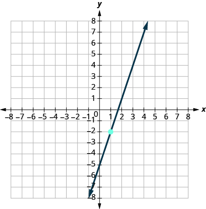 

<math xmlns="http://www.w3.org/1998/Math/MathML"><mrow><mi>y</mi><mo>=</mo><mn>3</mn><mi>x</mi><mo>−</mo><mn>5</mn></mrow></math>

* * *
{: data-type="newline"}

 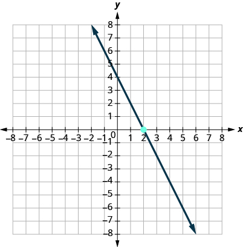 

* * *
{: data-type="newline"}

 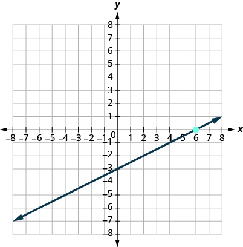 

<math xmlns="http://www.w3.org/1998/Math/MathML"><mrow><mi>y</mi><mo>=</mo><mfrac><mn>1</mn><mn>2</mn></mfrac><mi>x</mi><mo>−</mo><mn>3</mn></mrow></math>

* * *
{: data-type="newline"}

 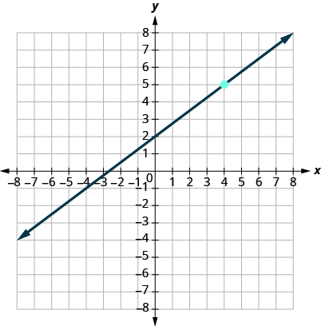 

* * *
{: data-type="newline"}

 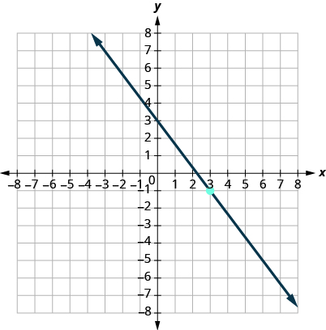 

<math xmlns="http://www.w3.org/1998/Math/MathML"><mrow><mi>y</mi><mo>=</mo><mo>−</mo><mfrac><mn>4</mn><mn>3</mn></mfrac><mi>x</mi><mo>+</mo><mn>3</mn></mrow></math>

* * *
{: data-type="newline"}

 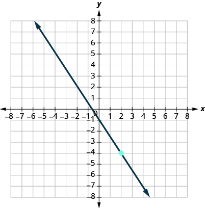 

* * *
{: data-type="newline"}

 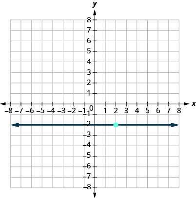 

<math xmlns="http://www.w3.org/1998/Math/MathML"><mrow><mi>y</mi><mo>=</mo><mn>−2</mn></mrow></math>

* * *
{: data-type="newline"}

 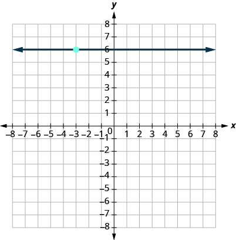 

**Find an Equation of the Line Given the Slope and a Point**

In the following exercises, find the equation of a line with given slope and containing the given point. Write the equation in slope-intercept form.

<math xmlns="http://www.w3.org/1998/Math/MathML"><mrow><mi>m</mi><mo>=</mo><mfrac><mn>5</mn><mn>8</mn></mfrac><mo>,</mo></mrow></math>

 point <math xmlns="http://www.w3.org/1998/Math/MathML"><mrow><mrow><mo>(</mo><mrow><mn>8</mn><mo>,</mo><mn>3</mn></mrow><mo>)</mo></mrow></mrow></math>

<math xmlns="http://www.w3.org/1998/Math/MathML"><mrow><mi>y</mi><mo>=</mo><mfrac><mn>5</mn><mn>8</mn></mfrac><mi>x</mi><mo>−</mo><mn>2</mn></mrow></math>

<math xmlns="http://www.w3.org/1998/Math/MathML"><mrow><mi>m</mi><mo>=</mo><mfrac><mn>5</mn><mn>6</mn></mfrac><mo>,</mo></mrow></math>

 point <math xmlns="http://www.w3.org/1998/Math/MathML"><mrow><mrow><mo>(</mo><mrow><mn>6</mn><mo>,</mo><mn>7</mn></mrow><mo>)</mo></mrow></mrow></math>

<math xmlns="http://www.w3.org/1998/Math/MathML"><mrow><mi>m</mi><mo>=</mo><mo>−</mo><mfrac><mn>3</mn><mn>5</mn></mfrac><mo>,</mo></mrow></math>

 point <math xmlns="http://www.w3.org/1998/Math/MathML"><mrow><mrow><mo>(</mo><mrow><mn>10</mn><mo>,</mo><mn>−5</mn></mrow><mo>)</mo></mrow></mrow></math>

<math xmlns="http://www.w3.org/1998/Math/MathML"><mrow><mi>y</mi><mo>=</mo><mo>−</mo><mfrac><mn>3</mn><mn>5</mn></mfrac><mi>x</mi><mo>+</mo><mn>1</mn></mrow></math>

<math xmlns="http://www.w3.org/1998/Math/MathML"><mrow><mi>m</mi><mo>=</mo><mo>−</mo><mfrac><mn>3</mn><mn>4</mn></mfrac><mo>,</mo></mrow></math>

 point <math xmlns="http://www.w3.org/1998/Math/MathML"><mrow><mrow><mo>(</mo><mrow><mn>8</mn><mo>,</mo><mn>−5</mn></mrow><mo>)</mo></mrow></mrow></math>

<math xmlns="http://www.w3.org/1998/Math/MathML"><mrow><mi>m</mi><mo>=</mo><mo>−</mo><mfrac><mn>3</mn><mn>2</mn></mfrac><mo>,</mo></mrow></math>

 point <math xmlns="http://www.w3.org/1998/Math/MathML"><mrow><mrow><mo>(</mo><mrow><mn>−4</mn><mo>,</mo><mn>−3</mn></mrow><mo>)</mo></mrow></mrow></math>

<math xmlns="http://www.w3.org/1998/Math/MathML"><mrow><mi>y</mi><mo>=</mo><mo>−</mo><mfrac><mn>3</mn><mn>2</mn></mfrac><mi>x</mi><mo>+</mo><mn>9</mn></mrow></math>

<math xmlns="http://www.w3.org/1998/Math/MathML"><mrow><mi>m</mi><mo>=</mo><mo>−</mo><mfrac><mn>5</mn><mn>2</mn></mfrac><mo>,</mo></mrow></math>

 point <math xmlns="http://www.w3.org/1998/Math/MathML"><mrow><mrow><mo>(</mo><mrow><mn>−8</mn><mo>,</mo><mn>−2</mn></mrow><mo>)</mo></mrow></mrow></math>

<math xmlns="http://www.w3.org/1998/Math/MathML"><mrow><mi>m</mi><mo>=</mo><mn>−7</mn><mo>,</mo></mrow></math>

 point <math xmlns="http://www.w3.org/1998/Math/MathML"><mrow><mrow><mo>(</mo><mrow><mn>−1</mn><mo>,</mo><mn>−3</mn></mrow><mo>)</mo></mrow></mrow></math>

<math xmlns="http://www.w3.org/1998/Math/MathML"><mrow><mi>y</mi><mo>=</mo><mn>−7</mn><mi>x</mi><mo>−</mo><mn>10</mn></mrow></math>

<math xmlns="http://www.w3.org/1998/Math/MathML"><mrow><mi>m</mi><mo>=</mo><mn>−4</mn><mo>,</mo></mrow></math>

 point <math xmlns="http://www.w3.org/1998/Math/MathML"><mrow><mrow><mo>(</mo><mrow><mn>−2</mn><mo>,</mo><mn>−3</mn></mrow><mo>)</mo></mrow></mrow></math>

Horizontal line containing <math xmlns="http://www.w3.org/1998/Math/MathML"><mrow><mrow><mo>(</mo><mrow><mn>−2</mn><mo>,</mo><mn>5</mn></mrow><mo>)</mo></mrow></mrow></math>

<math xmlns="http://www.w3.org/1998/Math/MathML"><mrow><mi>y</mi><mo>=</mo><mn>5</mn></mrow></math>

Horizontal line containing <math xmlns="http://www.w3.org/1998/Math/MathML"><mrow><mrow><mo>(</mo><mrow><mn>−2</mn><mo>,</mo><mn>−3</mn></mrow><mo>)</mo></mrow></mrow></math>

Horizontal line containing <math xmlns="http://www.w3.org/1998/Math/MathML"><mrow><mrow><mo>(</mo><mrow><mn>−1</mn><mo>,</mo><mn>−7</mn></mrow><mo>)</mo></mrow></mrow></math>

<math xmlns="http://www.w3.org/1998/Math/MathML"><mrow><mi>y</mi><mo>=</mo><mn>−7</mn></mrow></math>

Horizontal line containing <math xmlns="http://www.w3.org/1998/Math/MathML"><mrow><mrow><mo>(</mo><mrow><mn>4</mn><mo>,</mo><mn>−8</mn></mrow><mo>)</mo></mrow></mrow></math>

**Find an Equation of the Line Given Two Points**

In the following exercises, find the equation of a line containing the given points. Write the equation in slope-intercept form.

<math xmlns="http://www.w3.org/1998/Math/MathML"><mrow><mrow><mo>(</mo><mrow><mn>2</mn><mo>,</mo><mn>6</mn></mrow><mo>)</mo></mrow></mrow></math>

 and <math xmlns="http://www.w3.org/1998/Math/MathML"><mrow><mrow><mo>(</mo><mrow><mn>5</mn><mo>,</mo><mn>3</mn></mrow><mo>)</mo></mrow></mrow></math>

<math xmlns="http://www.w3.org/1998/Math/MathML"><mrow><mi>y</mi><mo>=</mo><mtext>−</mtext><mi>x</mi><mo>+</mo><mn>8</mn></mrow></math>

<math xmlns="http://www.w3.org/1998/Math/MathML"><mrow><mrow><mo>(</mo><mrow><mn>4</mn><mo>,</mo><mn>3</mn></mrow><mo>)</mo></mrow></mrow></math>

 and <math xmlns="http://www.w3.org/1998/Math/MathML"><mrow><mrow><mo>(</mo><mrow><mn>8</mn><mo>,</mo><mn>1</mn></mrow><mo>)</mo></mrow></mrow></math>

<math xmlns="http://www.w3.org/1998/Math/MathML"><mrow><mrow><mo>(</mo><mrow><mn>−3</mn><mo>,</mo><mn>−4</mn></mrow><mo>)</mo></mrow></mrow></math>

 and <math xmlns="http://www.w3.org/1998/Math/MathML"><mrow><mrow><mo>(</mo><mrow><mn>5</mn><mo>−</mo><mn>2</mn></mrow><mo>)</mo></mrow><mo>.</mo></mrow></math>

<math xmlns="http://www.w3.org/1998/Math/MathML"><mrow><mi>y</mi><mo>=</mo><mfrac><mn>1</mn><mn>4</mn></mfrac><mi>x</mi><mo>−</mo><mfrac><mrow><mn>13</mn></mrow><mn>4</mn></mfrac></mrow></math>

<math xmlns="http://www.w3.org/1998/Math/MathML"><mrow><mrow><mo>(</mo><mrow><mn>−5</mn><mo>,</mo><mn>−3</mn></mrow><mo>)</mo></mrow></mrow></math>

 and <math xmlns="http://www.w3.org/1998/Math/MathML"><mrow><mrow><mo>(</mo><mrow><mn>4</mn><mo>,</mo><mn>−6</mn></mrow><mo>)</mo></mrow><mo>.</mo></mrow></math>

<math xmlns="http://www.w3.org/1998/Math/MathML"><mrow><mrow><mo>(</mo><mrow><mn>−1</mn><mo>,</mo><mn>3</mn></mrow><mo>)</mo></mrow></mrow></math>

 and <math xmlns="http://www.w3.org/1998/Math/MathML"><mrow><mrow><mo>(</mo><mrow><mn>−6</mn><mo>,</mo><mn>−7</mn></mrow><mo>)</mo></mrow><mo>.</mo></mrow></math>

<math xmlns="http://www.w3.org/1998/Math/MathML"><mrow><mi>y</mi><mo>=</mo><mn>2</mn><mi>x</mi><mo>+</mo><mn>5</mn></mrow></math>

<math xmlns="http://www.w3.org/1998/Math/MathML"><mrow><mrow><mo>(</mo><mrow><mn>−2</mn><mo>,</mo><mn>8</mn></mrow><mo>)</mo></mrow></mrow></math>

 and <math xmlns="http://www.w3.org/1998/Math/MathML"><mrow><mrow><mo>(</mo><mrow><mn>−4</mn><mo>,</mo><mn>−6</mn></mrow><mo>)</mo></mrow><mo>.</mo></mrow></math>

<math xmlns="http://www.w3.org/1998/Math/MathML"><mrow><mrow><mo>(</mo><mrow><mn>0</mn><mo>,</mo><mn>4</mn></mrow><mo>)</mo></mrow></mrow></math>

 and <math xmlns="http://www.w3.org/1998/Math/MathML"><mrow><mrow><mo>(</mo><mrow><mn>2</mn><mo>,</mo><mn>−3</mn></mrow><mo>)</mo></mrow><mo>.</mo></mrow></math>

<math xmlns="http://www.w3.org/1998/Math/MathML"><mrow><mi>y</mi><mo>=</mo><mo>−</mo><mfrac><mn>7</mn><mn>2</mn></mfrac><mi>x</mi><mo>+</mo><mn>4</mn></mrow></math>

<math xmlns="http://www.w3.org/1998/Math/MathML"><mrow><mrow><mo>(</mo><mrow><mn>0</mn><mo>,</mo><mn>−2</mn></mrow><mo>)</mo></mrow></mrow></math>

 and <math xmlns="http://www.w3.org/1998/Math/MathML"><mrow><mrow><mo>(</mo><mrow><mn>−5</mn><mo>,</mo><mn>−3</mn></mrow><mo>)</mo></mrow><mo>.</mo></mrow></math>

<math xmlns="http://www.w3.org/1998/Math/MathML"><mrow><mrow><mo>(</mo><mrow><mn>7</mn><mo>,</mo><mn>2</mn></mrow><mo>)</mo></mrow></mrow></math>

 and <math xmlns="http://www.w3.org/1998/Math/MathML"><mrow><mrow><mo>(</mo><mrow><mn>7</mn><mo>,</mo><mn>−2</mn></mrow><mo>)</mo></mrow><mo>.</mo></mrow></math>

<math xmlns="http://www.w3.org/1998/Math/MathML"><mrow><mi>x</mi><mo>=</mo><mn>7</mn></mrow></math>

<math xmlns="http://www.w3.org/1998/Math/MathML"><mrow><mrow><mo>(</mo><mrow><mn>−2</mn><mo>,</mo><mn>1</mn></mrow><mo>)</mo></mrow></mrow></math>

 and <math xmlns="http://www.w3.org/1998/Math/MathML"><mrow><mrow><mo>(</mo><mrow><mn>−2</mn><mo>,</mo><mn>−4</mn></mrow><mo>)</mo></mrow><mo>.</mo></mrow></math>

<math xmlns="http://www.w3.org/1998/Math/MathML"><mrow><mrow><mo>(</mo><mrow><mn>3</mn><mo>,</mo><mn>−4</mn></mrow><mo>)</mo></mrow></mrow></math>

 and <math xmlns="http://www.w3.org/1998/Math/MathML"><mrow><mrow><mo>(</mo><mrow><mn>5</mn><mo>,</mo><mn>−4</mn></mrow><mo>)</mo></mrow><mo>.</mo></mrow></math>

<math xmlns="http://www.w3.org/1998/Math/MathML"><mrow><mi>y</mi><mo>=</mo><mn>−4</mn></mrow></math>

<math xmlns="http://www.w3.org/1998/Math/MathML"><mrow><mrow><mo>(</mo><mrow><mn>−6</mn><mo>,</mo><mn>−3</mn></mrow><mo>)</mo></mrow></mrow></math>

 and <math xmlns="http://www.w3.org/1998/Math/MathML"><mrow><mrow><mo>(</mo><mrow><mn>−1</mn><mo>,</mo><mn>−3</mn></mrow><mo>)</mo></mrow></mrow></math>

**Find an Equation of a Line Parallel to a Given Line**

In the following exercises, find an equation of a line parallel to the given line and contains the given point. Write the equation in slope-intercept form.

line <math xmlns="http://www.w3.org/1998/Math/MathML"><mrow><mi>y</mi><mo>=</mo><mn>4</mn><mi>x</mi><mo>+</mo><mn>2</mn><mo>,</mo></mrow></math>

* * *
{: data-type="newline"}

point <math xmlns="http://www.w3.org/1998/Math/MathML"><mrow><mrow><mo>(</mo><mrow><mn>1</mn><mo>,</mo><mn>2</mn></mrow><mo>)</mo></mrow></mrow></math>

<math xmlns="http://www.w3.org/1998/Math/MathML"><mrow><mi>y</mi><mo>=</mo><mn>4</mn><mi>x</mi><mo>−</mo><mn>2</mn></mrow></math>

line <math xmlns="http://www.w3.org/1998/Math/MathML"><mrow><mi>y</mi><mo>=</mo><mn>−3</mn><mi>x</mi><mo>−</mo><mn>1</mn><mo>,</mo></mrow></math>

* * *
{: data-type="newline"}

point <math xmlns="http://www.w3.org/1998/Math/MathML"><mrow><mrow><mo>(</mo><mrow><mn>2</mn><mo>,</mo><mn>−3</mn></mrow><mo>)</mo></mrow><mo>.</mo></mrow></math>

line <math xmlns="http://www.w3.org/1998/Math/MathML"><mrow><mn>2</mn><mi>x</mi><mo>−</mo><mi>y</mi><mo>=</mo><mn>6</mn><mo>,</mo></mrow></math>

* * *
{: data-type="newline"}

point <math xmlns="http://www.w3.org/1998/Math/MathML"><mrow><mrow><mo>(</mo><mrow><mn>3</mn><mo>,</mo><mn>0</mn></mrow><mo>)</mo></mrow><mo>.</mo></mrow></math>

<math xmlns="http://www.w3.org/1998/Math/MathML"><mrow><mi>y</mi><mo>=</mo><mn>2</mn><mi>x</mi><mo>−</mo><mn>6</mn></mrow></math>

line <math xmlns="http://www.w3.org/1998/Math/MathML"><mrow><mn>2</mn><mi>x</mi><mo>+</mo><mn>3</mn><mi>y</mi><mo>=</mo><mn>6</mn><mo>,</mo></mrow></math>

* * *
{: data-type="newline"}

point <math xmlns="http://www.w3.org/1998/Math/MathML"><mrow><mrow><mo>(</mo><mrow><mn>0</mn><mo>,</mo><mn>5</mn></mrow><mo>)</mo></mrow><mo>.</mo></mrow></math>

line <math xmlns="http://www.w3.org/1998/Math/MathML"><mrow><mi>x</mi><mo>=</mo><mn>−4</mn><mo>,</mo></mrow></math>

* * *
{: data-type="newline"}

point <math xmlns="http://www.w3.org/1998/Math/MathML"><mrow><mrow><mo>(</mo><mrow><mn>−3</mn><mo>,</mo><mn>−5</mn></mrow><mo>)</mo></mrow><mo>.</mo></mrow></math>

<math xmlns="http://www.w3.org/1998/Math/MathML"><mrow><mi>x</mi><mo>=</mo><mn>−3</mn></mrow></math>

line <math xmlns="http://www.w3.org/1998/Math/MathML"><mrow><mi>x</mi><mo>−</mo><mn>2</mn><mo>=</mo><mn>0</mn><mo>,</mo></mrow></math>

* * *
{: data-type="newline"}

point <math xmlns="http://www.w3.org/1998/Math/MathML"><mrow><mrow><mo>(</mo><mrow><mn>1</mn><mo>,</mo><mn>−2</mn></mrow><mo>)</mo></mrow></mrow></math>

line <math xmlns="http://www.w3.org/1998/Math/MathML"><mrow><mi>y</mi><mo>=</mo><mn>5</mn><mo>,</mo></mrow></math>

* * *
{: data-type="newline"}

point <math xmlns="http://www.w3.org/1998/Math/MathML"><mrow><mrow><mo>(</mo><mrow><mn>2</mn><mo>,</mo><mn>−2</mn></mrow><mo>)</mo></mrow></mrow></math>

<math xmlns="http://www.w3.org/1998/Math/MathML"><mrow><mi>y</mi><mo>=</mo><mn>−2</mn></mrow></math>

line <math xmlns="http://www.w3.org/1998/Math/MathML"><mrow><mi>y</mi><mo>+</mo><mn>2</mn><mo>=</mo><mn>0</mn><mo>,</mo></mrow></math>

* * *
{: data-type="newline"}

point <math xmlns="http://www.w3.org/1998/Math/MathML"><mrow><mrow><mo>(</mo><mrow><mn>3</mn><mo>,</mo><mn>−3</mn></mrow><mo>)</mo></mrow></mrow></math>

**Find an Equation of a Line Perpendicular to a Given Line**

In the following exercises, find an equation of a line perpendicular to the given line and contains the given point. Write the equation in slope-intercept form.

line <math xmlns="http://www.w3.org/1998/Math/MathML"><mrow><mi>y</mi><mo>=</mo><mn>−2</mn><mi>x</mi><mo>+</mo><mn>3</mn><mo>,</mo></mrow></math>

* * *
{: data-type="newline"}

point <math xmlns="http://www.w3.org/1998/Math/MathML"><mrow><mrow><mo>(</mo><mrow><mn>2</mn><mo>,</mo><mn>2</mn></mrow><mo>)</mo></mrow></mrow></math>

<math xmlns="http://www.w3.org/1998/Math/MathML"><mrow><mi>y</mi><mo>=</mo><mfrac><mn>1</mn><mn>2</mn></mfrac><mi>x</mi><mo>+</mo><mn>1</mn></mrow></math>

line <math xmlns="http://www.w3.org/1998/Math/MathML"><mrow><mi>y</mi><mo>=</mo><mtext>−</mtext><mi>x</mi><mo>+</mo><mn>5</mn><mo>,</mo></mrow></math>

* * *
{: data-type="newline"}

point <math xmlns="http://www.w3.org/1998/Math/MathML"><mrow><mrow><mo>(</mo><mrow><mn>3</mn><mo>,</mo><mn>3</mn></mrow><mo>)</mo></mrow></mrow></math>

line <math xmlns="http://www.w3.org/1998/Math/MathML"><mrow><mi>y</mi><mo>=</mo><mfrac><mn>3</mn><mn>4</mn></mfrac><mi>x</mi><mo>−</mo><mn>2</mn><mo>,</mo></mrow></math>

* * *
{: data-type="newline"}

point <math xmlns="http://www.w3.org/1998/Math/MathML"><mrow><mrow><mo>(</mo><mrow><mn>−3</mn><mo>,</mo><mn>4</mn></mrow><mo>)</mo></mrow></mrow></math>

<math xmlns="http://www.w3.org/1998/Math/MathML"><mrow><mi>y</mi><mo>=</mo><mo>−</mo><mfrac><mn>4</mn><mn>3</mn></mfrac><mi>x</mi></mrow></math>

line <math xmlns="http://www.w3.org/1998/Math/MathML"><mrow><mi>y</mi><mo>=</mo><mfrac><mn>2</mn><mn>3</mn></mfrac><mi>x</mi><mo>−</mo><mn>4</mn><mo>,</mo></mrow></math>

* * *
{: data-type="newline"}

point <math xmlns="http://www.w3.org/1998/Math/MathML"><mrow><mrow><mo>(</mo><mrow><mn>2</mn><mo>,</mo><mn>−4</mn></mrow><mo>)</mo></mrow></mrow></math>

line <math xmlns="http://www.w3.org/1998/Math/MathML"><mrow><mn>2</mn><mi>x</mi><mo>−</mo><mn>3</mn><mi>y</mi><mo>=</mo><mn>8</mn><mo>,</mo></mrow></math>

* * *
{: data-type="newline"}

point <math xmlns="http://www.w3.org/1998/Math/MathML"><mrow><mrow><mo>(</mo><mrow><mn>4</mn><mo>,</mo><mn>−1</mn></mrow><mo>)</mo></mrow></mrow></math>

<math xmlns="http://www.w3.org/1998/Math/MathML"><mrow><mi>y</mi><mo>=</mo><mo>−</mo><mfrac><mn>3</mn><mn>2</mn></mfrac><mi>x</mi><mo>+</mo><mn>5</mn></mrow></math>

line <math xmlns="http://www.w3.org/1998/Math/MathML"><mrow><mn>4</mn><mi>x</mi><mo>−</mo><mn>3</mn><mi>y</mi><mo>=</mo><mn>5</mn><mo>,</mo></mrow></math>

* * *
{: data-type="newline"}

point <math xmlns="http://www.w3.org/1998/Math/MathML"><mrow><mrow><mo>(</mo><mrow><mn>−3</mn><mo>,</mo><mn>2</mn></mrow><mo>)</mo></mrow></mrow></math>

line <math xmlns="http://www.w3.org/1998/Math/MathML"><mrow><mn>2</mn><mi>x</mi><mo>+</mo><mn>5</mn><mi>y</mi><mo>=</mo><mn>6</mn><mo>,</mo></mrow></math>

* * *
{: data-type="newline"}

point <math xmlns="http://www.w3.org/1998/Math/MathML"><mrow><mrow><mo>(</mo><mrow><mn>0</mn><mo>,</mo><mn>0</mn></mrow><mo>)</mo></mrow></mrow></math>

<math xmlns="http://www.w3.org/1998/Math/MathML"><mrow><mi>y</mi><mo>=</mo><mfrac><mn>5</mn><mn>2</mn></mfrac><mi>x</mi></mrow></math>

line <math xmlns="http://www.w3.org/1998/Math/MathML"><mrow><mn>4</mn><mi>x</mi><mo>+</mo><mn>5</mn><mi>y</mi><mo>=</mo><mn>−3</mn><mo>,</mo></mrow></math>

* * *
{: data-type="newline"}

point <math xmlns="http://www.w3.org/1998/Math/MathML"><mrow><mrow><mo>(</mo><mrow><mn>0</mn><mo>,</mo><mn>0</mn></mrow><mo>)</mo></mrow></mrow></math>

line <math xmlns="http://www.w3.org/1998/Math/MathML"><mrow><mi>x</mi><mo>=</mo><mn>3</mn><mo>,</mo></mrow></math>

* * *
{: data-type="newline"}

point <math xmlns="http://www.w3.org/1998/Math/MathML"><mrow><mrow><mo>(</mo><mrow><mn>3</mn><mo>,</mo><mn>4</mn></mrow><mo>)</mo></mrow></mrow></math>

<math xmlns="http://www.w3.org/1998/Math/MathML"><mrow><mi>y</mi><mo>=</mo><mn>4</mn></mrow></math>

line <math xmlns="http://www.w3.org/1998/Math/MathML"><mrow><mi>x</mi><mo>=</mo><mn>−5</mn><mo>,</mo></mrow></math>

* * *
{: data-type="newline"}

point <math xmlns="http://www.w3.org/1998/Math/MathML"><mrow><mrow><mo>(</mo><mrow><mn>1</mn><mo>,</mo><mn>−2</mn></mrow><mo>)</mo></mrow></mrow></math>

line <math xmlns="http://www.w3.org/1998/Math/MathML"><mrow><mi>x</mi><mo>=</mo><mn>7</mn><mo>,</mo></mrow></math>

* * *
{: data-type="newline"}

point <math xmlns="http://www.w3.org/1998/Math/MathML"><mrow><mrow><mo>(</mo><mrow><mn>−3</mn><mo>,</mo><mn>−4</mn></mrow><mo>)</mo></mrow></mrow></math>

<math xmlns="http://www.w3.org/1998/Math/MathML"><mrow><mi>y</mi><mo>=</mo><mn>−4</mn></mrow></math>

line <math xmlns="http://www.w3.org/1998/Math/MathML"><mrow><mi>x</mi><mo>=</mo><mn>−1</mn><mo>,</mo></mrow></math>

* * *
{: data-type="newline"}

point <math xmlns="http://www.w3.org/1998/Math/MathML"><mrow><mrow><mo>(</mo><mrow><mn>−4</mn><mo>,</mo><mn>0</mn></mrow><mo>)</mo></mrow></mrow></math>

line <math xmlns="http://www.w3.org/1998/Math/MathML"><mrow><mi>y</mi><mo>−</mo><mn>3</mn><mo>=</mo><mn>0</mn><mo>,</mo></mrow></math>

* * *
{: data-type="newline"}

point <math xmlns="http://www.w3.org/1998/Math/MathML"><mrow><mrow><mo>(</mo><mrow><mn>−2</mn><mo>,</mo><mn>−4</mn></mrow><mo>)</mo></mrow></mrow></math>

<math xmlns="http://www.w3.org/1998/Math/MathML"><mrow><mi>x</mi><mo>=</mo><mn>−2</mn></mrow></math>

line <math xmlns="http://www.w3.org/1998/Math/MathML"><mrow><mi>y</mi><mo>−</mo><mn>6</mn><mo>=</mo><mn>0</mn><mo>,</mo></mrow></math>

* * *
{: data-type="newline"}

point <math xmlns="http://www.w3.org/1998/Math/MathML"><mrow><mrow><mo>(</mo><mrow><mn>−5</mn><mo>,</mo><mn>−3</mn></mrow><mo>)</mo></mrow></mrow></math>

line *y*-axis,* * *
{: data-type="newline"}

point <math xmlns="http://www.w3.org/1998/Math/MathML"><mrow><mrow><mo>(</mo><mrow><mn>3</mn><mo>,</mo><mn>4</mn></mrow><mo>)</mo></mrow></mrow></math>

<math xmlns="http://www.w3.org/1998/Math/MathML"><mrow><mi>y</mi><mo>=</mo><mn>4</mn></mrow></math>

line *y*-axis,* * *
{: data-type="newline"}

point <math xmlns="http://www.w3.org/1998/Math/MathML"><mrow><mrow><mo>(</mo><mrow><mn>2</mn><mo>,</mo><mn>1</mn></mrow><mo>)</mo></mrow></mrow></math>

**Mixed Practice**

In the following exercises, find the equation of each line. Write the equation in slope-intercept form.

Containing the points <math xmlns="http://www.w3.org/1998/Math/MathML"><mrow><mrow><mo>(</mo><mrow><mn>4</mn><mo>,</mo><mn>3</mn></mrow><mo>)</mo></mrow></mrow></math>

 and <math xmlns="http://www.w3.org/1998/Math/MathML"><mrow><mrow><mo>(</mo><mrow><mn>8</mn><mo>,</mo><mn>1</mn></mrow><mo>)</mo></mrow></mrow></math>

<math xmlns="http://www.w3.org/1998/Math/MathML"><mrow><mi>y</mi><mo>=</mo><mo>−</mo><mfrac><mn>1</mn><mn>2</mn></mfrac><mi>x</mi><mo>+</mo><mn>5</mn></mrow></math>

Containing the points <math xmlns="http://www.w3.org/1998/Math/MathML"><mrow><mrow><mo>(</mo><mrow><mn>−2</mn><mo>,</mo><mn>0</mn></mrow><mo>)</mo></mrow></mrow></math>

 and <math xmlns="http://www.w3.org/1998/Math/MathML"><mrow><mrow><mo>(</mo><mrow><mn>−3</mn><mo>,</mo><mn>−2</mn></mrow><mo>)</mo></mrow></mrow></math>

<math xmlns="http://www.w3.org/1998/Math/MathML"><mrow><mi>m</mi><mo>=</mo><mfrac><mn>1</mn><mn>6</mn></mfrac><mo>,</mo></mrow></math>

 containing point <math xmlns="http://www.w3.org/1998/Math/MathML"><mrow><mrow><mo>(</mo><mrow><mn>6</mn><mo>,</mo><mn>1</mn></mrow><mo>)</mo></mrow></mrow></math>

<math xmlns="http://www.w3.org/1998/Math/MathML"><mrow><mi>y</mi><mo>=</mo><mfrac><mn>1</mn><mn>6</mn></mfrac><mi>x</mi></mrow></math>

<math xmlns="http://www.w3.org/1998/Math/MathML"><mrow><mi>m</mi><mo>=</mo><mfrac><mn>5</mn><mn>6</mn></mfrac><mo>,</mo></mrow></math>

 containing point <math xmlns="http://www.w3.org/1998/Math/MathML"><mrow><mrow><mo>(</mo><mrow><mn>6</mn><mo>,</mo><mn>7</mn></mrow><mo>)</mo></mrow></mrow></math>

Parallel to the line <math xmlns="http://www.w3.org/1998/Math/MathML"><mrow><mn>4</mn><mi>x</mi><mo>+</mo><mn>3</mn><mi>y</mi><mo>=</mo><mn>6</mn><mo>,</mo></mrow></math>

 containing point <math xmlns="http://www.w3.org/1998/Math/MathML"><mrow><mrow><mo>(</mo><mrow><mn>0</mn><mo>,</mo><mn>−3</mn></mrow><mo>)</mo></mrow></mrow></math>

<math xmlns="http://www.w3.org/1998/Math/MathML"><mrow><mi>y</mi><mo>=</mo><mo>−</mo><mfrac><mn>4</mn><mn>3</mn></mfrac><mi>x</mi><mo>−</mo><mn>3</mn></mrow></math>

Parallel to the line <math xmlns="http://www.w3.org/1998/Math/MathML"><mrow><mn>2</mn><mi>x</mi><mo>+</mo><mn>3</mn><mi>y</mi><mo>=</mo><mn>6</mn><mo>,</mo></mrow></math>

 containing point <math xmlns="http://www.w3.org/1998/Math/MathML"><mrow><mrow><mo>(</mo><mrow><mn>0</mn><mo>,</mo><mn>5</mn></mrow><mo>)</mo></mrow></mrow></math>

<math xmlns="http://www.w3.org/1998/Math/MathML"><mrow><mi>m</mi><mo>=</mo><mo>−</mo><mfrac><mn>3</mn><mn>4</mn></mfrac><mo>,</mo></mrow></math>

 containing point <math xmlns="http://www.w3.org/1998/Math/MathML"><mrow><mrow><mo>(</mo><mrow><mn>8</mn><mo>,</mo><mn>−5</mn></mrow><mo>)</mo></mrow></mrow></math>

<math xmlns="http://www.w3.org/1998/Math/MathML"><mrow><mi>y</mi><mo>=</mo><mo>−</mo><mfrac><mn>3</mn><mn>4</mn></mfrac><mi>x</mi><mo>+</mo><mn>1</mn></mrow></math>

<math xmlns="http://www.w3.org/1998/Math/MathML"><mrow><mi>m</mi><mo>=</mo><mo>−</mo><mfrac><mn>3</mn><mn>5</mn></mfrac><mo>,</mo></mrow></math>

 containing point <math xmlns="http://www.w3.org/1998/Math/MathML"><mrow><mrow><mo>(</mo><mrow><mn>10</mn><mo>,</mo><mn>−5</mn></mrow><mo>)</mo></mrow></mrow></math>

Perpendicular to the line <math xmlns="http://www.w3.org/1998/Math/MathML"><mrow><mi>y</mi><mo>−</mo><mn>1</mn><mo>=</mo><mn>0</mn><mo>,</mo></mrow></math>

 point <math xmlns="http://www.w3.org/1998/Math/MathML"><mrow><mrow><mo>(</mo><mrow><mn>−2</mn><mo>,</mo><mn>6</mn></mrow><mo>)</mo></mrow></mrow></math>

<math xmlns="http://www.w3.org/1998/Math/MathML"><mrow><mi>x</mi><mo>=</mo><mn>−2</mn></mrow></math>

Perpendicular to the line *y*-axis, point <math xmlns="http://www.w3.org/1998/Math/MathML"><mrow><mrow><mo>(</mo><mrow><mn>−6</mn><mo>,</mo><mn>2</mn></mrow><mo>)</mo></mrow></mrow></math>

Parallel to the line <math xmlns="http://www.w3.org/1998/Math/MathML"><mrow><mi>x</mi><mo>=</mo><mn>−3</mn><mo>,</mo></mrow></math>

 containing point <math xmlns="http://www.w3.org/1998/Math/MathML"><mrow><mrow><mo>(</mo><mrow><mn>−2</mn><mo>,</mo><mn>−1</mn></mrow><mo>)</mo></mrow></mrow></math>

<math xmlns="http://www.w3.org/1998/Math/MathML"><mrow><mi>x</mi><mo>=</mo><mn>−2</mn></mrow></math>

Parallel to the line <math xmlns="http://www.w3.org/1998/Math/MathML"><mrow><mi>x</mi><mo>=</mo><mn>−4</mn><mo>,</mo></mrow></math>

 containing point <math xmlns="http://www.w3.org/1998/Math/MathML"><mrow><mrow><mo>(</mo><mrow><mn>−3</mn><mo>,</mo><mn>−5</mn></mrow><mo>)</mo></mrow></mrow></math>

Containing the points <math xmlns="http://www.w3.org/1998/Math/MathML"><mrow><mrow><mo>(</mo><mrow><mn>−3</mn><mo>,</mo><mn>−4</mn></mrow><mo>)</mo></mrow></mrow></math>

 and <math xmlns="http://www.w3.org/1998/Math/MathML"><mrow><mrow><mo>(</mo><mrow><mn>2</mn><mo>,</mo><mn>−5</mn></mrow><mo>)</mo></mrow></mrow></math>

<math xmlns="http://www.w3.org/1998/Math/MathML"><mrow><mi>y</mi><mo>=</mo><mo>−</mo><mfrac><mn>1</mn><mn>5</mn></mfrac><mi>x</mi><mo>−</mo><mfrac><mrow><mn>23</mn></mrow><mn>5</mn></mfrac></mrow></math>

Containing the points <math xmlns="http://www.w3.org/1998/Math/MathML"><mrow><mrow><mo>(</mo><mrow><mn>−5</mn><mo>,</mo><mn>−3</mn></mrow><mo>)</mo></mrow></mrow></math>

 and <math xmlns="http://www.w3.org/1998/Math/MathML"><mrow><mrow><mo>(</mo><mrow><mn>4</mn><mo>,</mo><mn>−6</mn></mrow><mo>)</mo></mrow></mrow></math>

Perpendicular to the line <math xmlns="http://www.w3.org/1998/Math/MathML"><mrow><mi>x</mi><mo>−</mo><mn>2</mn><mi>y</mi><mo>=</mo><mn>5</mn><mo>,</mo></mrow></math>

 point <math xmlns="http://www.w3.org/1998/Math/MathML"><mrow><mrow><mo>(</mo><mrow><mn>−2</mn><mo>,</mo><mn>2</mn></mrow><mo>)</mo></mrow></mrow></math>

<math xmlns="http://www.w3.org/1998/Math/MathML"><mrow><mi>y</mi><mo>=</mo><mn>−2</mn><mi>x</mi><mo>−</mo><mn>2</mn></mrow></math>

Perpendicular to the line <math xmlns="http://www.w3.org/1998/Math/MathML"><mrow><mn>4</mn><mi>x</mi><mo>+</mo><mn>3</mn><mi>y</mi><mo>=</mo><mn>1</mn><mo>,</mo></mrow></math>

 point <math xmlns="http://www.w3.org/1998/Math/MathML"><mrow><mrow><mo>(</mo><mrow><mn>0</mn><mo>,</mo><mn>0</mn></mrow><mo>)</mo></mrow></mrow></math>

#### Writing Exercises

Why are all horizontal lines parallel?

Answers will vary.

Explain in your own words why the slopes of two perpendicular lines must have opposite signs.

#### Self Check

ⓐ After completing the exercises, use this checklist to evaluate your mastery of the objectives of this section.

 ![The figure shows a table with six rows and four columns. The first row is a header row and it labels each column. The first column header is &#x201C;I can&#x2026;&#x201D;, the second is &#x201C;confidently&#x201D;, the third is &#x201C;with some help&#x201D;, &#x201C;no minus I don&#x2019;t get it!&#x201D;. Under the first column are the phrases &#x201C;find the equation of the line given the slope and y-intercept&#x201D;, &#x201C;find an equation of the line given the slope and a point&#x201D;, &#x201C;find an equation of the line given two points&#x201D;, &#x201C;find an equation of a line parallel to a given line&#x201D;, and &#x201C;find an equation of a line perpendicular to a given line&#x201D;. Under the second, third, fourth columns are blank spaces where the learner can check what level of mastery they have achieved.](../resources/CNX_IntAlg_Figure_03_03_209_img.jpg) 
ⓑ What does this checklist tell you about your mastery of this section? What steps will you take to improve?

</section>

### Glossary
{: data-type="glossary-title"}

point-slope form
: The point-slope form of an equation of a line with slope *m* and containing the point
  <math xmlns="http://www.w3.org/1998/Math/MathML"><mrow><mrow><mo>(</mo><mrow><msub><mi>x</mi><mn>1</mn></msub><mo>,</mo><msub><mi>y</mi><mn>1</mn></msub></mrow><mo>)</mo></mrow></mrow></math>
  
  is
  <math xmlns="http://www.w3.org/1998/Math/MathML"><mrow><mi>y</mi><mo>−</mo><msub><mi>y</mi><mn>1</mn></msub><mo>=</mo><mi>m</mi><mrow><mo>(</mo><mrow><mi>x</mi><mo>−</mo><msub><mi>x</mi><mn>1</mn></msub></mrow><mo>)</mo></mrow><mo>.</mo></mrow></math>

[1]: https://openstax.org/l/37slopeycept
[2]: https://openstax.org/l/37slopepoint
[3]: https://openstax.org/l/37twoptspline
[4]: https://openstax.org/l/37perpenpara
