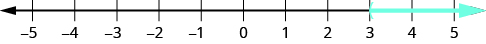

By the end of this section, you will be able to:
* Verify solutions to an inequality in two variables.
* Recognize the relation between the solutions of an inequality and its graph.
* Graph linear inequalities in two variables
* Solve applications using linear inequalities in two variables

Before you get started, take this readiness quiz.

1.  Graph
    <math xmlns="http://www.w3.org/1998/Math/MathML"><mrow><mi>x</mi><mo>&gt;</mo><mn>2</mn></mrow></math>
    
    on a number line.
    * * *
    {: data-type="newline"}
    
    If you missed this problem, review [\[link\]](/m63312#fs-id1167835334972).
2.  Solve:
    <math xmlns="http://www.w3.org/1998/Math/MathML"><mrow><mn>4</mn><mi>x</mi><mo>+</mo><mn>3</mn><mo>&gt;</mo><mn>23</mn></mrow></math>
    
    .
    * * *
    {: data-type="newline"}
    
    If you missed this problem, review [\[link\]](/m63312#fs-id1167835324646).
3.  Translate:
    <math xmlns="http://www.w3.org/1998/Math/MathML"><mrow><mn>8</mn><mo>&lt;</mo><mi>x</mi><mo>&gt;</mo><mn>3</mn></mrow></math>
    
    .
    * * *
    {: data-type="newline"}
    
    If you missed this problem, review [\[link\]](/m63312#fs-id1167835330450).
{: data-number-style="arabic"}

# Verify Solutions to an Inequality in Two Variables

Previously we learned to solve inequalities with only one variable. We will now learn about inequalities containing two variables. In particular we will look at **linear inequalities** in two variables which are very similar to linear equations in two variables.

Linear inequalities in two variables have many applications. If you ran a business, for example, you would want your revenue to be greater than your costs—so that your business made a profit.

Linear Inequality

A **linear inequality**{: data-type="term"} is an inequality that can be written in one of the following forms:

<math xmlns="http://www.w3.org/1998/Math/MathML"><mrow><mtable><mtr><mtd columnalign="left"><mi>A</mi><mi>x</mi><mo>+</mo><mi>B</mi><mi>y</mi><mo>&gt;</mo><mi>C</mi></mtd><mtd /><mtd /><mtd columnalign="left"><mi>A</mi><mi>x</mi><mo>+</mo><mi>B</mi><mi>y</mi><mo>≥</mo><mi>C</mi></mtd><mtd /><mtd /><mtd columnalign="left"><mi>A</mi><mi>x</mi><mo>+</mo><mi>B</mi><mi>y</mi><mo>&lt;</mo><mi>C</mi></mtd><mtd /><mtd /><mtd columnalign="left"><mi>A</mi><mi>x</mi><mo>+</mo><mi>B</mi><mi>y</mi><mo>≤</mo><mi>C</mi></mtd></mtr></mtable></mrow></math>

Where *A* and *B* are not both zero.

Recall that an inequality with one variable had many solutions. For example, the solution to the inequality <math xmlns="http://www.w3.org/1998/Math/MathML"><mrow><mi>x</mi><mo>&gt;</mo><mn>3</mn></mrow></math>

 is any number greater than 3. We showed this on the number line by shading in the number line to the right of 3, and putting an open parenthesis at 3. See [\[link\]](#CNX_IntAlg_Figure_03_04_001).

* * *
{: data-type="newline"}

 {: #CNX_IntAlg_Figure_03_04_001}

Similarly, linear inequalities in two variables have many solutions. Any ordered pair <math xmlns="http://www.w3.org/1998/Math/MathML"><mrow><mrow><mo>(</mo><mrow><mi>x</mi><mo>,</mo><mi>y</mi></mrow><mo>)</mo></mrow></mrow></math>

 that makes an inequality true when we substitute in the values is a **solution to a linear inequality**{: data-type="term"}.

Solution to a Linear Inequality

An ordered pair <math xmlns="http://www.w3.org/1998/Math/MathML"><mrow><mrow><mo>(</mo><mrow><mi>x</mi><mo>,</mo><mi>y</mi></mrow><mo>)</mo></mrow></mrow></math>

 is a **solution to a linear inequality** if the inequality is true when we substitute the values of *x* and *y*.

Determine whether each ordered pair is a solution to the inequality <math xmlns="http://www.w3.org/1998/Math/MathML"><mrow><mi>y</mi><mo>&gt;</mo><mi>x</mi><mo>+</mo><mn>4</mn><mo>:</mo></mrow></math>

ⓐ <math xmlns="http://www.w3.org/1998/Math/MathML"><mrow><mrow><mo>(</mo><mrow><mn>0</mn><mo>,</mo><mn>0</mn></mrow><mo>)</mo></mrow></mrow></math>

 ⓑ <math xmlns="http://www.w3.org/1998/Math/MathML"><mrow><mrow><mo>(</mo><mrow><mn>1</mn><mo>,</mo><mn>6</mn></mrow><mo>)</mo></mrow></mrow></math>

 ⓒ <math xmlns="http://www.w3.org/1998/Math/MathML"><mrow><mrow><mo>(</mo><mrow><mn>2</mn><mo>,</mo><mn>6</mn></mrow><mo>)</mo></mrow></mrow></math>

 ⓓ <math xmlns="http://www.w3.org/1998/Math/MathML"><mrow><mrow><mo>(</mo><mrow><mn>−5</mn><mo>,</mo><mn>−15</mn></mrow><mo>)</mo></mrow></mrow></math>

 ⓔ <math xmlns="http://www.w3.org/1998/Math/MathML"><mrow><mrow><mo>(</mo><mrow><mn>−8</mn><mo>,</mo><mn>12</mn></mrow><mo>)</mo></mrow></mrow></math>

ⓐ* * *
{: data-type="newline"}

 | <math xmlns="http://www.w3.org/1998/Math/MathML"><mrow><mrow><mo>(</mo><mrow><mn>0</mn><mo>,</mo><mn>0</mn></mrow><mo>)</mo></mrow></mrow></math>

 |  |
{: valign="top"}| <math xmlns="http://www.w3.org/1998/Math/MathML"><mrow><mspace width="1em" /></mrow></math>

 |  |
{: valign="top"}| Simplify. |  |
{: valign="top"}|  | So, <math xmlns="http://www.w3.org/1998/Math/MathML"><mrow><mrow><mo>(</mo><mrow><mn>0</mn><mo>,</mo><mn>0</mn></mrow><mo>)</mo></mrow></mrow></math>

 is not a solution to <math xmlns="http://www.w3.org/1998/Math/MathML"><mrow><mi>y</mi><mo>&gt;</mo><mi>x</mi><mo>+</mo><mn>4</mn><mo>.</mo></mrow></math>

 |
{: valign="top"}{: .unnumbered .unstyled summary="Substitute 0 for x and 0 for y. Is 0 greater than 0 plus 4? Simplify. 0 is not greater than 4 so (0, 0) is not a solution to y is greater than x plus 4." data-label=""}

ⓑ* * *
{: data-type="newline"}

 | <math xmlns="http://www.w3.org/1998/Math/MathML"><mrow><mrow><mo>(</mo><mrow><mn>1</mn><mo>,</mo><mn>6</mn></mrow><mo>)</mo></mrow></mrow></math>

 |  |
{: valign="top"}| <math xmlns="http://www.w3.org/1998/Math/MathML"><mrow><mspace width="1em" /></mrow></math>

 |  |
{: valign="top"}| Simplify. |  |
{: valign="top"}|  | So, <math xmlns="http://www.w3.org/1998/Math/MathML"><mrow><mrow><mo>(</mo><mrow><mn>1</mn><mo>,</mo><mn>6</mn></mrow><mo>)</mo></mrow></mrow></math>

 is a solution to <math xmlns="http://www.w3.org/1998/Math/MathML"><mrow><mi>y</mi><mo>&gt;</mo><mi>x</mi><mo>+</mo><mn>4</mn><mo>.</mo></mrow></math>

 |
{: valign="top"}{: .unnumbered .unstyled summary="Substitute 1 for x and 6 for y. Is 6 greater than 1 plus 4? Simplify. 6 is greater than 5 so (1, 6) is a solution to y is greater than x plus 4." data-label=""}

ⓒ* * *
{: data-type="newline"}

 | <math xmlns="http://www.w3.org/1998/Math/MathML"><mrow><mrow><mo>(</mo><mrow><mn>2</mn><mo>,</mo><mn>6</mn></mrow><mo>)</mo></mrow></mrow></math>

 |  |
{: valign="top"}| <math xmlns="http://www.w3.org/1998/Math/MathML"><mrow><mspace width="1em" /></mrow></math>

 |  |
{: valign="top"}| Simplify. |  |
{: valign="top"}|  | So, <math xmlns="http://www.w3.org/1998/Math/MathML"><mrow><mrow><mo>(</mo><mrow><mn>2</mn><mo>,</mo><mn>6</mn></mrow><mo>)</mo></mrow></mrow></math>

 is not a solution to <math xmlns="http://www.w3.org/1998/Math/MathML"><mrow><mi>y</mi><mo>&gt;</mo><mi>x</mi><mo>+</mo><mn>4</mn><mo>.</mo></mrow></math>

 |
{: valign="top"}{: .unnumbered .unstyled summary="Substitute 2 for x and 6 for y. Is 6 greater than 2 plus 4? Simplify. 6 is not greater than 6 so (2, 6) is not a solution to y is greater than x plus 4." data-label=""}

ⓓ* * *
{: data-type="newline"}

 | <math xmlns="http://www.w3.org/1998/Math/MathML"><mrow><mrow><mo>(</mo><mrow><mn>−5</mn><mo>,</mo><mn>−15</mn></mrow><mo>)</mo></mrow></mrow></math>

 |  |
{: valign="top"}|  |  |
{: valign="top"}| Simplify. |  |
{: valign="top"}|  | So, <math xmlns="http://www.w3.org/1998/Math/MathML"><mrow><mrow><mo>(</mo><mrow><mn>−5</mn><mo>,</mo><mn>−15</mn></mrow><mo>)</mo></mrow></mrow></math>

 is not a solution to <math xmlns="http://www.w3.org/1998/Math/MathML"><mrow><mi>y</mi><mo>&gt;</mo><mi>x</mi><mo>+</mo><mn>4</mn><mo>.</mo></mrow></math>

 |
{: valign="top"}{: .unnumbered .unstyled summary="Substitute negative 5 for x and negative 15 for y. Is negative 15 greater than negative 5 plus 4? Simplify. Negative 15 is not greater than negative 1 so (negative 5, negative 15) is not a solution to y is greater than x plus 4." data-label=""}

ⓔ* * *
{: data-type="newline"}

 | <math xmlns="http://www.w3.org/1998/Math/MathML"><mrow><mrow><mo>(</mo><mrow><mn>−8</mn><mo>,</mo><mn>12</mn></mrow><mo>)</mo></mrow></mrow></math>

 |  |
{: valign="top"}| <math xmlns="http://www.w3.org/1998/Math/MathML"><mrow><mspace width="0.3em" /></mrow></math>

 |  |
{: valign="top"}| Simplify. |  |
{: valign="top"}|  | So, <math xmlns="http://www.w3.org/1998/Math/MathML"><mrow><mrow><mo>(</mo><mrow><mn>−8</mn><mo>,</mo><mn>12</mn></mrow><mo>)</mo></mrow></mrow></math>

 is a solution to <math xmlns="http://www.w3.org/1998/Math/MathML"><mrow><mi>y</mi><mo>&gt;</mo><mi>x</mi><mo>+</mo><mn>4</mn><mo>.</mo></mrow></math>

 |
{: valign="top"}{: .unnumbered .unstyled summary="Substitute negative 8 for x and 12 for y. Is 12 greater than negative 8 plus 4? Simplify. 12 is greater than negative 4 so (negative 8, 12) is a solution to y is greater than x plus 4." data-label=""}

Determine whether each ordered pair is a solution to the inequality <math xmlns="http://www.w3.org/1998/Math/MathML"><mrow><mi>y</mi><mo>&gt;</mo><mi>x</mi><mo>−</mo><mn>3</mn><mo>:</mo></mrow></math>

ⓐ <math xmlns="http://www.w3.org/1998/Math/MathML"><mrow><mrow><mo>(</mo><mrow><mn>0</mn><mo>,</mo><mn>0</mn></mrow><mo>)</mo></mrow></mrow></math>

 ⓑ <math xmlns="http://www.w3.org/1998/Math/MathML"><mrow><mrow><mo>(</mo><mrow><mn>4</mn><mo>,</mo><mn>9</mn></mrow><mo>)</mo></mrow></mrow></math>

 ⓒ <math xmlns="http://www.w3.org/1998/Math/MathML"><mrow><mrow><mo>(</mo><mrow><mn>−2</mn><mo>,</mo><mn>1</mn></mrow><mo>)</mo></mrow></mrow></math>

 ⓓ <math xmlns="http://www.w3.org/1998/Math/MathML"><mrow><mrow><mo>(</mo><mrow><mn>−5</mn><mo>,</mo><mn>−3</mn></mrow><mo>)</mo></mrow></mrow></math>

 ⓔ <math xmlns="http://www.w3.org/1998/Math/MathML"><mrow><mrow><mo>(</mo><mrow><mn>5</mn><mo>,</mo><mn>1</mn></mrow><mo>)</mo></mrow></mrow></math>

ⓐ yes ⓑ yes ⓒ yes ⓓ yes ⓔ no

Determine whether each ordered pair is a solution to the inequality <math xmlns="http://www.w3.org/1998/Math/MathML"><mrow><mi>y</mi><mo>&lt;</mo><mi>x</mi><mo>+</mo><mn>1</mn><mo>:</mo></mrow></math>

ⓐ <math xmlns="http://www.w3.org/1998/Math/MathML"><mrow><mrow><mo>(</mo><mrow><mn>0</mn><mo>,</mo><mn>0</mn></mrow><mo>)</mo></mrow></mrow></math>

 ⓑ <math xmlns="http://www.w3.org/1998/Math/MathML"><mrow><mrow><mo>(</mo><mrow><mn>8</mn><mo>,</mo><mn>6</mn></mrow><mo>)</mo></mrow></mrow></math>

 ⓒ <math xmlns="http://www.w3.org/1998/Math/MathML"><mrow><mrow><mo>(</mo><mrow><mn>−2</mn><mo>,</mo><mn>−1</mn></mrow><mo>)</mo></mrow></mrow></math>

 ⓓ <math xmlns="http://www.w3.org/1998/Math/MathML"><mrow><mrow><mo>(</mo><mrow><mn>3</mn><mo>,</mo><mn>4</mn></mrow><mo>)</mo></mrow></mrow></math>

 ⓔ <math xmlns="http://www.w3.org/1998/Math/MathML"><mrow><mrow><mo>(</mo><mrow><mn>−1</mn><mo>,</mo><mn>−4</mn></mrow><mo>)</mo></mrow></mrow></math>

ⓐ yes ⓑ yes ⓒ no ⓓ no* * *
{: data-type="newline"}

ⓔ yes

# Recognize the Relation Between the Solutions of an Inequality and its Graph

Now, we will look at how the solutions of an inequality relate to its graph.

Let’s think about the number line in shown previously again. The point <math xmlns="http://www.w3.org/1998/Math/MathML"><mrow><mi>x</mi><mo>=</mo><mn>3</mn></mrow></math>

 separated that number line into two parts. On one side of 3 are all the numbers less than 3. On the other side of 3 all the numbers are greater than 3. See [\[link\]](#CNX_IntAlg_Figure_03_04_007).

 {: #CNX_IntAlg_Figure_03_04_007}

Similarly, the line <math xmlns="http://www.w3.org/1998/Math/MathML"><mrow><mi>y</mi><mo>=</mo><mi>x</mi><mo>+</mo><mn>4</mn></mrow></math>

 separates the plane into two regions. On one side of the line are points with <math xmlns="http://www.w3.org/1998/Math/MathML"><mrow><mi>y</mi><mo>&lt;</mo><mi>x</mi><mo>+</mo><mn>4</mn><mo>.</mo></mrow></math>

 On the other side of the line are the points with <math xmlns="http://www.w3.org/1998/Math/MathML"><mrow><mi>y</mi><mo>&gt;</mo><mi>x</mi><mo>+</mo><mn>4</mn><mo>.</mo></mrow></math>

 We call the line <math xmlns="http://www.w3.org/1998/Math/MathML"><mrow><mi>y</mi><mo>=</mo><mi>x</mi><mo>+</mo><mn>4</mn></mrow></math>

 a **boundary line**{: data-type="term"}.

Boundary Line

The line with equation <math xmlns="http://www.w3.org/1998/Math/MathML"><mrow><mi>A</mi><mi>x</mi><mo>+</mo><mi>B</mi><mi>y</mi><mo>=</mo><mi>C</mi></mrow></math>

 is the **boundary line** that separates the region where <math xmlns="http://www.w3.org/1998/Math/MathML"><mrow><mi>A</mi><mi>x</mi><mo>+</mo><mi>B</mi><mi>y</mi><mo>&gt;</mo><mi>C</mi></mrow></math>

 from the region where <math xmlns="http://www.w3.org/1998/Math/MathML"><mrow><mi>A</mi><mi>x</mi><mo>+</mo><mi>B</mi><mi>y</mi><mo>&lt;</mo><mi>C</mi><mo>.</mo></mrow></math>

For an inequality in one variable, the endpoint is shown with a parenthesis or a bracket depending on whether or not *a* is included in the solution:

    Similarly, for an inequality in two variables, the boundary line is shown with a solid or dashed line to show whether or not it the line is included in the solution.

<math xmlns="http://www.w3.org/1998/Math/MathML"><mrow><mtable><mtr><mtd columnalign="left"><mi>A</mi><mi>x</mi><mo>+</mo><mi>B</mi><mi>y</mi><mo>&lt;</mo><mi>C</mi></mtd><mtd /><mtd /><mtd /><mtd /><mtd columnalign="left"><mi>A</mi><mi>x</mi><mo>+</mo><mi>B</mi><mi>y</mi><mo>≤</mo><mi>C</mi></mtd></mtr> <mtr><mtd columnalign="left"><mi>A</mi><mi>x</mi><mo>+</mo><mi>B</mi><mi>y</mi><mo>&gt;</mo><mi>C</mi></mtd><mtd /><mtd /><mtd /><mtd /><mtd columnalign="left"><mi>A</mi><mi>x</mi><mo>+</mo><mi>B</mi><mi>y</mi><mo>≥</mo><mi>C</mi></mtd></mtr> <mtr><mtd columnalign="left"><mtext>Boundary line is</mtext><mspace width="0.2em" /><mi>A</mi><mi>x</mi><mo>+</mo><mi>B</mi><mi>y</mi><mo>=</mo><mi>C</mi></mtd><mtd /><mtd /><mtd /><mtd /><mtd columnalign="left"><mtext>Boundary line is</mtext><mspace width="0.2em" /><mi>A</mi><mi>x</mi><mo>+</mo><mi>B</mi><mi>y</mi><mo>=</mo><mi>C</mi></mtd></mtr> <mtr><mtd columnalign="left"><mtext>Boundary line is not included in solution.</mtext></mtd><mtd /><mtd /><mtd /><mtd /><mtd columnalign="left"><mtext>Boundary line is included in solution.</mtext></mtd></mtr> <mtr><mtd columnalign="left"><mtext mathvariant="bold">Boundary line is dashed.</mtext></mtd><mtd /><mtd /><mtd /><mtd /><mtd columnalign="left"><mtext mathvariant="bold">Boundary line is solid.</mtext></mtd></mtr></mtable></mrow></math>

Now, let’s take a look at what we found in [\[link\]](#fs-id1167835253977). We’ll start by graphing the line <math xmlns="http://www.w3.org/1998/Math/MathML"><mrow><mi>y</mi><mo>=</mo><mi>x</mi><mo>+</mo><mn>4</mn><mo>,</mo></mrow></math>

 and then we’ll plot the five points we tested, as shown in the graph. See [\[link\]](#CNX_IntAlg_Figure_03_04_009).

 {: #CNX_IntAlg_Figure_03_04_009}

In [\[link\]](#fs-id1167835253977) we found that some of the points were solutions to the inequality <math xmlns="http://www.w3.org/1998/Math/MathML"><mrow><mi>y</mi><mo>&gt;</mo><mi>x</mi><mo>+</mo><mn>4</mn></mrow></math>

 and some were not.

Which of the points we plotted are solutions to the inequality <math xmlns="http://www.w3.org/1998/Math/MathML"><mrow><mi>y</mi><mo>&gt;</mo><mi>x</mi><mo>+</mo><mn>4</mn><mo>?</mo></mrow></math>

The points <math xmlns="http://www.w3.org/1998/Math/MathML"><mrow><mrow><mo>(</mo><mrow><mn>1</mn><mo>,</mo><mn>6</mn></mrow><mo>)</mo></mrow></mrow></math>

 and <math xmlns="http://www.w3.org/1998/Math/MathML"><mrow><mrow><mo>(</mo><mrow><mn>−8</mn><mo>,</mo><mn>12</mn></mrow><mo>)</mo></mrow></mrow></math>

 are solutions to the inequality <math xmlns="http://www.w3.org/1998/Math/MathML"><mrow><mi>y</mi><mo>&gt;</mo><mi>x</mi><mo>+</mo><mn>4</mn><mo>.</mo></mrow></math>

 Notice that they are both on the same side of the boundary line <math xmlns="http://www.w3.org/1998/Math/MathML"><mrow><mi>y</mi><mo>=</mo><mi>x</mi><mo>+</mo><mn>4</mn><mo>.</mo></mrow></math>

The two points <math xmlns="http://www.w3.org/1998/Math/MathML"><mrow><mrow><mo>(</mo><mrow><mn>0</mn><mo>,</mo><mn>0</mn></mrow><mo>)</mo></mrow></mrow></math>

 and <math xmlns="http://www.w3.org/1998/Math/MathML"><mrow><mrow><mo>(</mo><mrow><mn>−5</mn><mo>,</mo><mn>−15</mn></mrow><mo>)</mo></mrow></mrow></math>

 are on the other side of the boundary line <math xmlns="http://www.w3.org/1998/Math/MathML"><mrow><mi>y</mi><mo>=</mo><mi>x</mi><mo>+</mo><mn>4</mn><mo>,</mo></mrow></math>

 and they are not solutions to the inequality <math xmlns="http://www.w3.org/1998/Math/MathML"><mrow><mi>y</mi><mo>&gt;</mo><mi>x</mi><mo>+</mo><mn>4</mn><mo>.</mo></mrow></math>

 For those two points, <math xmlns="http://www.w3.org/1998/Math/MathML"><mrow><mi>y</mi><mo>&lt;</mo><mi>x</mi><mo>+</mo><mn>4</mn><mo>.</mo></mrow></math>

What about the point <math xmlns="http://www.w3.org/1998/Math/MathML"><mrow><mrow><mo>(</mo><mrow><mn>2</mn><mo>,</mo><mn>6</mn></mrow><mo>)</mo></mrow><mo>?</mo></mrow></math>

 Because <math xmlns="http://www.w3.org/1998/Math/MathML"><mrow><mn>6</mn><mo>=</mo><mn>2</mn><mo>+</mo><mn>4</mn><mo>,</mo></mrow></math>

 the point is a solution to the equation <math xmlns="http://www.w3.org/1998/Math/MathML"><mrow><mi>y</mi><mo>=</mo><mi>x</mi><mo>+</mo><mn>4</mn><mo>,</mo></mrow></math>

 but not a solution to the inequality <math xmlns="http://www.w3.org/1998/Math/MathML"><mrow><mi>y</mi><mo>&gt;</mo><mi>x</mi><mo>+</mo><mn>4</mn><mo>.</mo></mrow></math>

 So the point <math xmlns="http://www.w3.org/1998/Math/MathML"><mrow><mrow><mo>(</mo><mrow><mn>2</mn><mo>,</mo><mn>6</mn></mrow><mo>)</mo></mrow></mrow></math>

 is on the boundary line.

Let’s take another point above the boundary line and test whether or not it is a solution to the inequality <math xmlns="http://www.w3.org/1998/Math/MathML"><mrow><mi>y</mi><mo>&gt;</mo><mi>x</mi><mo>+</mo><mn>4</mn><mo>.</mo></mrow></math>

 The point <math xmlns="http://www.w3.org/1998/Math/MathML"><mrow><mrow><mo>(</mo><mrow><mn>0</mn><mo>,</mo><mn>10</mn></mrow><mo>)</mo></mrow></mrow></math>

 clearly looks to above the boundary line, doesn’t it? Is it a solution to the inequality?

<math xmlns="http://www.w3.org/1998/Math/MathML"><mrow><mtable><mtr><mtd columnalign="right"><mi>y</mi></mtd><mtd columnalign="left"><mo>&gt;</mo></mtd><mtd columnalign="left"><mi>x</mi><mo>+</mo><mn>4</mn></mtd></mtr><mtr><mtd columnalign="right"><mn>10</mn></mtd><mtd columnalign="left"><mover><mo>&gt;</mo><mo>?</mo></mover></mtd><mtd columnalign="left"><mn>0</mn><mo>+</mo><mn>4</mn></mtd></mtr><mtr><mtd columnalign="right"><mn>10</mn></mtd><mtd columnalign="left"><mo>&gt;</mo></mtd><mtd columnalign="left"><mn>4</mn></mtd></mtr></mtable></mrow></math>

So, <math xmlns="http://www.w3.org/1998/Math/MathML"><mrow><mrow><mo>(</mo><mrow><mn>0</mn><mo>,</mo><mn>10</mn></mrow><mo>)</mo></mrow></mrow></math>

 is a solution to <math xmlns="http://www.w3.org/1998/Math/MathML"><mrow><mi>y</mi><mo>&gt;</mo><mi>x</mi><mo>+</mo><mn>4</mn><mo>.</mo></mrow></math>

Any point you choose above the boundary line is a solution to the inequality <math xmlns="http://www.w3.org/1998/Math/MathML"><mrow><mi>y</mi><mo>&gt;</mo><mi>x</mi><mo>+</mo><mn>4</mn><mo>.</mo></mrow></math>

 All points above the boundary line are solutions.

Similarly, all points below the boundary line, the side with <math xmlns="http://www.w3.org/1998/Math/MathML"><mrow><mrow><mo>(</mo><mrow><mn>0</mn><mo>,</mo><mn>0</mn></mrow><mo>)</mo></mrow></mrow></math>

 and <math xmlns="http://www.w3.org/1998/Math/MathML"><mrow><mrow><mo>(</mo><mrow><mn>−5</mn><mo>,</mo><mn>−15</mn></mrow><mo>)</mo></mrow><mo>,</mo></mrow></math>

 are not solutions to <math xmlns="http://www.w3.org/1998/Math/MathML"><mrow><mi>y</mi><mo>&gt;</mo><mi>x</mi><mo>+</mo><mn>4</mn><mo>,</mo></mrow></math>

 as shown in [\[link\]](#CNX_IntAlg_Figure_03_04_010).

 ![This figure has the graph of some points and a straight line on the x y-coordinate plane. The x and y axes run from negative 16 to 16. The points (negative 8, 12), (negative 5, negative 15), (0, 0), (1, 6), and (2, 6) are plotted and labeled with their coordinates. A straight line is drawn through the points (negative 4, 0), (0, 4), and (2, 6). The line divides the x y-coordinate plane into two halves. The top left half is labeled y is greater than x plus 4. The bottom right half is labeled y is less than x plus 4.](../resources/CNX_IntAlg_Figure_03_04_010.jpg){: #CNX_IntAlg_Figure_03_04_010}

The graph of the inequality <math xmlns="http://www.w3.org/1998/Math/MathML"><mrow><mi>y</mi><mo>&gt;</mo><mi>x</mi><mo>+</mo><mn>4</mn></mrow></math>

 is shown in below.

The line <math xmlns="http://www.w3.org/1998/Math/MathML"><mrow><mi>y</mi><mo>=</mo><mi>x</mi><mo>+</mo><mn>4</mn></mrow></math>

 divides the plane into two regions. The shaded side shows the solutions to the inequality <math xmlns="http://www.w3.org/1998/Math/MathML"><mrow><mi>y</mi><mo>&gt;</mo><mi>x</mi><mo>+</mo><mn>4</mn><mo>.</mo></mrow></math>

The points on the boundary line, those where <math xmlns="http://www.w3.org/1998/Math/MathML"><mrow><mi>y</mi><mo>=</mo><mi>x</mi><mo>+</mo><mn>4</mn><mo>,</mo></mrow></math>

 are not solutions to the inequality <math xmlns="http://www.w3.org/1998/Math/MathML"><mrow><mi>y</mi><mo>&gt;</mo><mi>x</mi><mo>+</mo><mn>4</mn><mo>,</mo></mrow></math>

 so the line itself is not part of the solution. We show that by making the line dashed, not solid.

    

The boundary line shown in this graph is <math xmlns="http://www.w3.org/1998/Math/MathML"><mrow><mi>y</mi><mo>=</mo><mn>2</mn><mi>x</mi><mo>−</mo><mn>1</mn><mo>.</mo></mrow></math>

 Write the inequality shown by the graph.

  

The line <math xmlns="http://www.w3.org/1998/Math/MathML"><mrow><mi>y</mi><mo>=</mo><mn>2</mn><mi>x</mi><mo>−</mo><mn>1</mn></mrow></math>

 is the boundary line. On one side of the line are the points with <math xmlns="http://www.w3.org/1998/Math/MathML"><mrow><mi>y</mi><mo>&gt;</mo><mn>2</mn><mi>x</mi><mo>−</mo><mn>1</mn></mrow></math>

 and on the other side of the line are the points with <math xmlns="http://www.w3.org/1998/Math/MathML"><mrow><mi>y</mi><mo>&lt;</mo><mn>2</mn><mi>x</mi><mo>−</mo><mn>1</mn><mo>.</mo></mrow></math>

Let’s test the point <math xmlns="http://www.w3.org/1998/Math/MathML"><mrow><mrow><mo>(</mo><mrow><mn>0</mn><mo>,</mo><mn>0</mn></mrow><mo>)</mo></mrow></mrow></math>

 and see which inequality describes its position relative to the boundary line.

At <math xmlns="http://www.w3.org/1998/Math/MathML"><mrow><mrow><mo>(</mo><mrow><mn>0</mn><mo>,</mo><mn>0</mn></mrow><mo>)</mo></mrow><mo>,</mo></mrow></math>

 which inequality is true: <math xmlns="http://www.w3.org/1998/Math/MathML"><mrow><mi>y</mi><mo>&gt;</mo><mn>2</mn><mi>x</mi><mo>−</mo><mn>1</mn></mrow></math>

 or <math xmlns="http://www.w3.org/1998/Math/MathML"><mrow><mi>y</mi><mo>&lt;</mo><mn>2</mn><mi>x</mi><mo>−</mo><mn>1</mn><mo>?</mo></mrow></math>

<math xmlns="http://www.w3.org/1998/Math/MathML"><mrow><mtable> <mtr><mtd columnalign="left"><mi>y</mi><mo>&gt;</mo><mn>2</mn><mi>x</mi><mo>−</mo><mn>1</mn></mtd><mtd /><mtd /><mtd /><mtd /><mtd columnalign="left"><mi>y</mi><mo>&lt;</mo><mn>2</mn><mi>x</mi><mo>−</mo><mn>1</mn></mtd></mtr> <mtr><mtd columnalign="left"><mn>0</mn><mover><mo>&gt;</mo><mo>?</mo></mover><mn>2</mn><mo>·</mo><mn>0</mn><mo>−</mo><mn>1</mn></mtd><mtd /><mtd /><mtd /><mtd /><mtd columnalign="left"><mn>0</mn><mover><mo>&lt;</mo><mo>?</mo></mover><mn>2</mn><mo>·</mo><mn>0</mn><mo>−</mo><mn>1</mn></mtd></mtr> <mtr><mtd columnalign="left"><mn>0</mn><mo>&gt;</mo><mn>−1</mn><mspace width="0.2em" /><mtext>True</mtext></mtd><mtd /><mtd /><mtd /><mtd /><mtd columnalign="left"><mn>0</mn><mo>&lt;</mo><mn>−1</mn><mspace width="0.2em" /><mtext>False</mtext></mtd></mtr></mtable></mrow></math>

Since, <math xmlns="http://www.w3.org/1998/Math/MathML"><mrow><mi>y</mi><mo>&gt;</mo><mn>2</mn><mi>x</mi><mo>−</mo><mn>1</mn></mrow></math>

 is true, the side of the line with <math xmlns="http://www.w3.org/1998/Math/MathML"><mrow><mrow><mo>(</mo><mrow><mn>0</mn><mo>,</mo><mn>0</mn></mrow><mo>)</mo></mrow><mo>,</mo></mrow></math>

 is the solution. The shaded region shows the solution of the inequality <math xmlns="http://www.w3.org/1998/Math/MathML"><mrow><mi>y</mi><mo>&gt;</mo><mn>2</mn><mi>x</mi><mo>−</mo><mn>1</mn><mo>.</mo></mrow></math>

Since the boundary line is graphed with a solid line, the inequality includes the equal sign.

The graph shows the inequality <math xmlns="http://www.w3.org/1998/Math/MathML"><mrow><mi>y</mi><mo>≥</mo><mn>2</mn><mi>x</mi><mo>−</mo><mn>1</mn><mo>.</mo></mrow></math>

We could use any point as a test point, provided it is not on the line. Why did we choose <math xmlns="http://www.w3.org/1998/Math/MathML"><mrow><mrow><mo>(</mo><mrow><mn>0</mn><mo>,</mo><mn>0</mn></mrow><mo>)</mo></mrow><mo>?</mo></mrow></math>

 Because it’s the easiest to evaluate. You may want to pick a point on the other side of the boundary line and check that <math xmlns="http://www.w3.org/1998/Math/MathML"><mrow><mi>y</mi><mo>&lt;</mo><mn>2</mn><mi>x</mi><mo>−</mo><mn>1</mn><mo>.</mo></mrow></math>

Write the inequality shown by the graph with the boundary line <math xmlns="http://www.w3.org/1998/Math/MathML"><mrow><mi>y</mi><mo>=</mo><mn>−2</mn><mi>x</mi><mo>+</mo><mn>3</mn><mo>.</mo></mrow></math>

  

<math xmlns="http://www.w3.org/1998/Math/MathML"><mrow><mi>y</mi><mo>≥</mo><mn>−2</mn><mi>x</mi><mo>+</mo><mn>3</mn></mrow></math>

Write the inequality shown by the graph with the boundary line <math xmlns="http://www.w3.org/1998/Math/MathML"><mrow><mi>y</mi><mo>=</mo><mfrac><mn>1</mn><mn>2</mn></mfrac><mi>x</mi><mo>−</mo><mn>4</mn><mo>.</mo></mrow></math>

  

<math xmlns="http://www.w3.org/1998/Math/MathML"><mrow><mi>y</mi><mo>≤</mo><mfrac><mn>1</mn><mn>2</mn></mfrac><mi>x</mi><mo>−</mo><mn>4</mn></mrow></math>

The boundary line shown in this graph is <math xmlns="http://www.w3.org/1998/Math/MathML"><mrow><mn>2</mn><mi>x</mi><mo>+</mo><mn>3</mn><mi>y</mi><mo>=</mo><mn>6</mn><mo>.</mo></mrow></math>

 Write the inequality shown by the graph.

  

The line <math xmlns="http://www.w3.org/1998/Math/MathML"><mrow><mn>2</mn><mi>x</mi><mo>+</mo><mn>3</mn><mi>y</mi><mo>=</mo><mn>6</mn></mrow></math>

 is the boundary line. On one side of the line are the points with <math xmlns="http://www.w3.org/1998/Math/MathML"><mrow><mn>2</mn><mi>x</mi><mo>+</mo><mn>3</mn><mi>y</mi><mo>&gt;</mo><mn>6</mn></mrow></math>

 and on the other side of the line are the points with <math xmlns="http://www.w3.org/1998/Math/MathML"><mrow><mn>2</mn><mi>x</mi><mo>+</mo><mn>3</mn><mi>y</mi><mo>&lt;</mo><mn>6</mn><mo>.</mo></mrow></math>

Let’s test the point <math xmlns="http://www.w3.org/1998/Math/MathML"><mrow><mrow><mo>(</mo><mrow><mn>0</mn><mo>,</mo><mn>0</mn></mrow><mo>)</mo></mrow></mrow></math>

 and see which inequality describes its side of the boundary line.

At <math xmlns="http://www.w3.org/1998/Math/MathML"><mrow><mrow><mo>(</mo><mrow><mn>0</mn><mo>,</mo><mn>0</mn></mrow><mo>)</mo></mrow><mo>,</mo></mrow></math>

 which inequality is true: <math xmlns="http://www.w3.org/1998/Math/MathML"><mrow><mn>2</mn><mi>x</mi><mo>+</mo><mn>3</mn><mi>y</mi><mo>&gt;</mo><mn>6</mn></mrow></math>

 or <math xmlns="http://www.w3.org/1998/Math/MathML"><mrow><mn>2</mn><mi>x</mi><mo>+</mo><mn>3</mn><mi>y</mi><mo>&lt;</mo><mn>6</mn><mo>?</mo></mrow></math>

<math xmlns="http://www.w3.org/1998/Math/MathML"><mrow><mtable> <mtr><mtd columnalign="left"><mtable><mtr><mtd columnalign="right"><mn>2</mn><mi>x</mi><mo>+</mo><mn>3</mn><mi>y</mi></mtd><mtd columnalign="left"><mo>&gt;</mo></mtd><mtd columnalign="left"><mn>6</mn></mtd></mtr><mtr><mtd columnalign="right"><mn>2</mn><mrow><mo>(</mo><mn>0</mn><mo>)</mo></mrow><mo>+</mo><mn>3</mn><mrow><mo>(</mo><mn>0</mn><mo>)</mo></mrow></mtd><mtd columnalign="left"><mover><mo>&gt;</mo><mo>?</mo></mover></mtd><mtd columnalign="left"><mn>6</mn></mtd></mtr><mtr><mtd columnalign="right"><mn>0</mn></mtd><mtd columnalign="left"><mo>&gt;</mo></mtd><mtd columnalign="left"><mn>6</mn><mspace width="0.2em" /><mtext>False</mtext></mtd></mtr></mtable></mtd><mtd /><mtd /><mtd /><mtd /><mtd columnalign="left"><mtable><mtr><mtd columnalign="right"><mn>2</mn><mi>x</mi><mo>+</mo><mn>3</mn><mi>y</mi></mtd><mtd columnalign="left"><mo>&lt;</mo></mtd><mtd columnalign="left"><mn>6</mn></mtd></mtr><mtr><mtd columnalign="right"><mn>2</mn><mrow><mo>(</mo><mn>0</mn><mo>)</mo></mrow><mo>+</mo><mn>3</mn><mrow><mo>(</mo><mn>0</mn><mo>)</mo></mrow></mtd><mtd columnalign="left"><mover><mo>&lt;</mo><mo>?</mo></mover></mtd><mtd columnalign="left"><mn>6</mn></mtd></mtr><mtr><mtd columnalign="right"><mn>0</mn></mtd><mtd columnalign="left"><mo>&lt;</mo></mtd><mtd columnalign="left"><mn>6</mn><mspace width="0.2em" /><mtext>True</mtext></mtd></mtr></mtable></mtd></mtr></mtable></mrow></math>

So the side with <math xmlns="http://www.w3.org/1998/Math/MathML"><mrow><mrow><mo>(</mo><mrow><mn>0</mn><mo>,</mo><mn>0</mn></mrow><mo>)</mo></mrow></mrow></math>

 is the side where <math xmlns="http://www.w3.org/1998/Math/MathML"><mrow><mn>2</mn><mi>x</mi><mo>+</mo><mn>3</mn><mi>y</mi><mo>&lt;</mo><mn>6</mn><mo>.</mo></mrow></math>

(You may want to pick a point on the other side of the boundary line and check that <math xmlns="http://www.w3.org/1998/Math/MathML"><mrow><mn>2</mn><mi>x</mi><mo>+</mo><mn>3</mn><mi>y</mi><mo>&gt;</mo><mn>6</mn><mo>.</mo></mrow></math>

)

Since the boundary line is graphed as a dashed line, the inequality does not include an equal sign.

The shaded region shows the solution to the inequality <math xmlns="http://www.w3.org/1998/Math/MathML"><mrow><mn>2</mn><mi>x</mi><mo>+</mo><mn>3</mn><mi>y</mi><mo>&lt;</mo><mn>6</mn><mo>.</mo></mrow></math>

Write the inequality shown by the shaded region in the graph with the boundary line <math xmlns="http://www.w3.org/1998/Math/MathML"><mrow><mi>x</mi><mo>−</mo><mn>4</mn><mi>y</mi><mo>=</mo><mn>8</mn><mo>.</mo></mrow></math>

  

<math xmlns="http://www.w3.org/1998/Math/MathML"><mrow><mi>x</mi><mo>−</mo><mn>4</mn><mi>y</mi><mo>≤</mo><mn>8</mn></mrow></math>

Write the inequality shown by the shaded region in the graph with the boundary line <math xmlns="http://www.w3.org/1998/Math/MathML"><mrow><mn>3</mn><mi>x</mi><mo>−</mo><mi>y</mi><mo>=</mo><mn>6</mn><mo>.</mo></mrow></math>

  

<math xmlns="http://www.w3.org/1998/Math/MathML"><mrow><mn>3</mn><mi>x</mi><mo>−</mo><mi>y</mi><mo>≥</mo><mn>6</mn></mrow></math>

# Graph Linear Inequalities in Two Variables

Now that we know what the graph of a linear inequality looks like and how it relates to a boundary equation we can use this knowledge to graph a given linear inequality.

How to Graph a Linear Equation in Two Variables

Graph the linear inequality <math xmlns="http://www.w3.org/1998/Math/MathML"><mrow><mi>y</mi><mo>≥</mo><mfrac><mn>3</mn><mn>4</mn></mfrac><mi>x</mi><mo>−</mo><mn>2</mn><mo>.</mo></mrow></math>

 ![Step 1 is to Identify and graph the boundary line. If the inequality is less than or equal or greater than or equal, the boundary line is solid. If the inequality is less than or greater than, the boundary line is dashed. In this example the inequality sign is greater than or equal, so we draw a solid line. Replace the inequality sign with an equal sign to find the boundary line. Graph the boundary line y = 3 divided by 4 times x minus 2. The figure then shows the graph of a straight line on the x y-coordinate plane. The x and y-axes run from negative 12 to 12. The line goes through the points (0, negative 2), (4, 1), and (8, 4).](../resources/CNX_IntAlg_Figure_03_04_018a_img.jpg)      ![Step 3 is to shade in one side of the boundary line. If the test point is a solution, shade in the side that includes the point. If the test point is not a solution, shade in the opposite side. The test point (0, 0), is a solution to y greater than or equal to 3 divided by 4 times x minus 2. So we shade in the side that contains (0, 0). The figure then shows the graph of a straight line on the x y-coordinate plane. The x and y-axes run from negative 12 to 12. The line goes through the points (0, negative 2), (4, 1), and (8, 4). The top left half of the coordinate plane is shaded to indicate that this is where the solution set is located.](../resources/CNX_IntAlg_Figure_03_04_018c_img.jpg) 

Graph the linear inequality <math xmlns="http://www.w3.org/1998/Math/MathML"><mrow><mi>y</mi><mo>&gt;</mo><mfrac><mn>5</mn><mn>2</mn></mfrac><mi>x</mi><mo>−</mo><mn>4</mn><mo>.</mo></mrow></math>

* * *
{: data-type="newline"}

   * * *
{: data-type="newline"}

 All points in the shaded region and on the boundary line, represent the solutions to <math xmlns="http://www.w3.org/1998/Math/MathML"><mrow><mi>y</mi><mo>&gt;</mo><mfrac><mn>5</mn><mn>2</mn></mfrac><mi>x</mi><mo>−</mo><mn>4</mn><mo>.</mo></mrow></math>

Graph the linear inequality <math xmlns="http://www.w3.org/1998/Math/MathML"><mrow><mi>y</mi><mo>&lt;</mo><mfrac><mn>2</mn><mn>3</mn></mfrac><mi>x</mi><mo>−</mo><mn>5</mn><mo>.</mo></mrow></math>

* * *
{: data-type="newline"}

   * * *
{: data-type="newline"}

 All points in the shaded region, but not those on the boundary line, represent the solutions to <math xmlns="http://www.w3.org/1998/Math/MathML"><mrow><mi>y</mi><mo>&lt;</mo><mfrac><mn>2</mn><mn>3</mn></mfrac><mi>x</mi><mo>−</mo><mn>5</mn><mo>.</mo></mrow></math>

The steps we take to graph a linear inequality are summarized here.

Graph a linear inequality in two variables.

1.  Identify and graph the boundary line.
    * If the inequality is
      <math xmlns="http://www.w3.org/1998/Math/MathML"><mrow><mo>≤</mo><mtext>or</mtext><mo>≥</mo><mo>,</mo></mrow></math>
      
      the boundary line is solid.
    * If the inequality is
      <math xmlns="http://www.w3.org/1998/Math/MathML"><mrow><mo>&lt;</mo><mtext>or</mtext><mo>&gt;</mo><mo>,</mo></mrow></math>
      
      the boundary line is dashed.
    {: data-bullet-style="bullet"}

2.  Test a point that is not on the boundary line. Is it a solution of the inequality?
3.  Shade in one side of the boundary line.
    * If the test point is a solution, shade in the side that includes the point.
    * If the test point is not a solution, shade in the opposite side.
    {: data-bullet-style="bullet"}
{: data-number-style="arabic" .stepwise}

Graph the linear inequality <math xmlns="http://www.w3.org/1998/Math/MathML"><mrow><mi>x</mi><mo>−</mo><mn>2</mn><mi>y</mi><mo>&lt;</mo><mn>5</mn><mo>.</mo></mrow></math>

First, we graph the boundary line <math xmlns="http://www.w3.org/1998/Math/MathML"><mrow><mi>x</mi><mo>−</mo><mn>2</mn><mi>y</mi><mo>=</mo><mn>5</mn><mo>.</mo></mrow></math>

 The inequality is <math xmlns="http://www.w3.org/1998/Math/MathML"><mo>&lt;</mo></math>

 so we draw a dashed line.

  

Then, we test a point. We’ll use <math xmlns="http://www.w3.org/1998/Math/MathML"><mrow><mrow><mo>(</mo><mrow><mn>0</mn><mo>,</mo><mn>0</mn></mrow><mo>)</mo></mrow></mrow></math>

 again because it is easy to evaluate and it is not on the boundary line.

Is <math xmlns="http://www.w3.org/1998/Math/MathML"><mrow><mrow><mo>(</mo><mrow><mn>0</mn><mo>,</mo><mn>0</mn></mrow><mo>)</mo></mrow></mrow></math>

 a solution of <math xmlns="http://www.w3.org/1998/Math/MathML"><mrow><mi>x</mi><mo>−</mo><mn>2</mn><mi>y</mi><mo>&lt;</mo><mn>5</mn><mo>?</mo></mrow></math>

  

The point <math xmlns="http://www.w3.org/1998/Math/MathML"><mrow><mrow><mo>(</mo><mrow><mn>0</mn><mo>,</mo><mn>0</mn></mrow><mo>)</mo></mrow></mrow></math>

 is a solution of <math xmlns="http://www.w3.org/1998/Math/MathML"><mrow><mi>x</mi><mo>−</mo><mn>2</mn><mi>y</mi><mo>&lt;</mo><mn>5</mn><mo>,</mo></mrow></math>

 so we shade in that side of the boundary line.

  

All points in the shaded region, but not those on the boundary line, represent the solutions to <math xmlns="http://www.w3.org/1998/Math/MathML"><mrow><mi>x</mi><mo>−</mo><mn>2</mn><mi>y</mi><mo>&lt;</mo><mn>5</mn><mo>.</mo></mrow></math>

Graph the linear inequality: <math xmlns="http://www.w3.org/1998/Math/MathML"><mrow><mn>2</mn><mi>x</mi><mo>−</mo><mn>3</mn><mi>y</mi><mo>&lt;</mo><mn>6</mn><mo>.</mo></mrow></math>

* * *
{: data-type="newline"}

   * * *
{: data-type="newline"}

 All points in the shaded region, but not those on the boundary line, represent the solutions to <math xmlns="http://www.w3.org/1998/Math/MathML"><mrow><mn>2</mn><mi>x</mi><mo>−</mo><mn>3</mn><mi>y</mi><mo>&lt;</mo><mn>6</mn><mo>.</mo></mrow></math>

Graph the linear inequality: <math xmlns="http://www.w3.org/1998/Math/MathML"><mrow><mn>2</mn><mi>x</mi><mo>−</mo><mi>y</mi><mo>&gt;</mo><mn>3</mn><mo>.</mo></mrow></math>

* * *
{: data-type="newline"}

   * * *
{: data-type="newline"}

 All points in the shaded region, but not those on the boundary line, represent the solutions to <math xmlns="http://www.w3.org/1998/Math/MathML"><mrow><mn>2</mn><mi>x</mi><mo>−</mo><mi>y</mi><mo>&gt;</mo><mn>3</mn><mo>.</mo></mrow></math>

What if the boundary line goes through the origin? Then, we won’t be able to use <math xmlns="http://www.w3.org/1998/Math/MathML"><mrow><mrow><mo>(</mo><mrow><mn>0</mn><mo>,</mo><mn>0</mn></mrow><mo>)</mo></mrow></mrow></math>

 as a test point. No problem—we’ll just choose some other point that is not on the boundary line.

Graph the linear inequality: <math xmlns="http://www.w3.org/1998/Math/MathML"><mrow><mi>y</mi><mo>≤</mo><mtext>​</mtext><mo>−</mo><mn>4</mn><mi>x</mi><mo>.</mo></mrow></math>

First, we graph the boundary line <math xmlns="http://www.w3.org/1998/Math/MathML"><mrow><mi>y</mi><mo>=</mo><mn>−4</mn><mi>x</mi><mo>.</mo></mrow></math>

 It is in slope–intercept form, with <math xmlns="http://www.w3.org/1998/Math/MathML"><mrow><mi>m</mi><mo>=</mo><mn>−4</mn></mrow></math>

 and <math xmlns="http://www.w3.org/1998/Math/MathML"><mrow><mi>b</mi><mo>=</mo><mn>0</mn><mo>.</mo></mrow></math>

 The inequality is <math xmlns="http://www.w3.org/1998/Math/MathML"><mo>≤</mo></math>

 so we draw a solid line.

  

Now we need a test point. We can see that the point <math xmlns="http://www.w3.org/1998/Math/MathML"><mrow><mrow><mo>(</mo><mrow><mn>1</mn><mo>,</mo><mn>0</mn></mrow><mo>)</mo></mrow></mrow></math>

 is not on the boundary line.

Is <math xmlns="http://www.w3.org/1998/Math/MathML"><mrow><mrow><mo>(</mo><mrow><mn>1</mn><mo>,</mo><mn>0</mn></mrow><mo>)</mo></mrow></mrow></math>

 a solution of <math xmlns="http://www.w3.org/1998/Math/MathML"><mrow><mi>y</mi><mo>≤</mo><mn>−4</mn><mi>x</mi><mo>?</mo></mrow></math>

  

The point <math xmlns="http://www.w3.org/1998/Math/MathML"><mrow><mrow><mo>(</mo><mrow><mn>1</mn><mo>,</mo><mn>0</mn></mrow><mo>)</mo></mrow></mrow></math>

 is not a solution to <math xmlns="http://www.w3.org/1998/Math/MathML"><mrow><mi>y</mi><mo>≤</mo><mtext>​</mtext><mo>−</mo><mn>4</mn><mi>x</mi><mo>,</mo></mrow></math>

 so we shade in the opposite side of the boundary line.

  

All points in the shaded region and on the boundary line represent the solutions to <math xmlns="http://www.w3.org/1998/Math/MathML"><mrow><mi>y</mi><mo>≤</mo><mtext>​</mtext><mo>−</mo><mn>4</mn><mi>x</mi><mo>.</mo></mrow></math>

Graph the linear inequality: <math xmlns="http://www.w3.org/1998/Math/MathML"><mrow><mi>y</mi><mo>&gt;</mo><mo>−</mo><mn>3</mn><mi>x</mi><mo>.</mo></mrow></math>

* * *
{: data-type="newline"}

   * * *
{: data-type="newline"}

 All points in the shaded region, but not those on the boundary line, represent the solutions to <math xmlns="http://www.w3.org/1998/Math/MathML"><mrow><mi>y</mi><mo>&gt;</mo><mo>−</mo><mn>3</mn><mi>x</mi><mo>.</mo></mrow></math>

Graph the linear inequality: <math xmlns="http://www.w3.org/1998/Math/MathML"><mrow><mi>y</mi><mo>≥</mo><mn>−2</mn><mi>x</mi><mo>.</mo></mrow></math>

* * *
{: data-type="newline"}

   * * *
{: data-type="newline"}

 All points in the shaded region and on the boundary line, represent the solutions to <math xmlns="http://www.w3.org/1998/Math/MathML"><mrow><mi>y</mi><mo>≥</mo><mn>−2</mn><mi>x</mi><mo>.</mo></mrow></math>

Some linear inequalities have only one variable. They may have an *x* but no *y*, or a *y* but no *x*. In these cases, the boundary line will be either a vertical or a horizontal line.

Recall that:

<math xmlns="http://www.w3.org/1998/Math/MathML"><mrow><mtable> <mtr><mtd columnalign="left"><mi>x</mi><mo>=</mo><mi>a</mi></mtd><mtd /><mtd /><mtd /><mtd /><mtd columnalign="left"><mtext>vertical line</mtext></mtd></mtr> <mtr><mtd columnalign="left"><mi>y</mi><mo>=</mo><mi>b</mi></mtd><mtd /><mtd /><mtd /><mtd /><mtd columnalign="left"><mtext>horizontal line</mtext></mtd></mtr></mtable></mrow></math>

Graph the linear inequality: <math xmlns="http://www.w3.org/1998/Math/MathML"><mrow><mi>y</mi><mo>&gt;</mo><mn>3</mn><mo>.</mo></mrow></math>

First, we graph the boundary line <math xmlns="http://www.w3.org/1998/Math/MathML"><mrow><mi>y</mi><mo>=</mo><mn>3</mn><mo>.</mo></mrow></math>

 It is a horizontal line. The inequality is <math xmlns="http://www.w3.org/1998/Math/MathML"><mo>&gt;</mo></math>

 so we draw a dashed line.

We test the point <math xmlns="http://www.w3.org/1998/Math/MathML"><mrow><mrow><mo>(</mo><mrow><mn>0</mn><mo>,</mo><mn>0</mn></mrow><mo>)</mo></mrow><mo>.</mo></mrow></math>

<math xmlns="http://www.w3.org/1998/Math/MathML"><mtable><mtr /><mtr><mtd columnalign="left"><mi>y</mi><mo>&gt;</mo><mn>3</mn></mtd></mtr><mtr><mtd columnalign="left"><mn>0</mn><menclose notation="updiagonalstrike"><mo>&gt;</mo></menclose><mn>3</mn></mtd></mtr></mtable></math>

So, <math xmlns="http://www.w3.org/1998/Math/MathML"><mrow><mrow><mo>(</mo><mrow><mn>0</mn><mo>,</mo><mn>0</mn></mrow><mo>)</mo></mrow></mrow></math>

 is not a solution to <math xmlns="http://www.w3.org/1998/Math/MathML"><mrow><mi>y</mi><mo>&gt;</mo><mn>3</mn><mo>.</mo></mrow></math>

So we shade the side that does not include <math xmlns="http://www.w3.org/1998/Math/MathML"><mrow><mrow><mo>(</mo><mrow><mn>0</mn><mo>,</mo><mn>0</mn></mrow><mo>)</mo></mrow></mrow></math>

 as shown in this graph.

  

All points in the shaded region, but not those on the boundary line, represent the solutions to <math xmlns="http://www.w3.org/1998/Math/MathML"><mrow><mi>y</mi><mo>&gt;</mo><mn>3</mn><mo>.</mo></mrow></math>

Graph the linear inequality: <math xmlns="http://www.w3.org/1998/Math/MathML"><mrow><mi>y</mi><mo>&lt;</mo><mn>5</mn><mo>.</mo></mrow></math>

* * *
{: data-type="newline"}

   * * *
{: data-type="newline"}

 All points in the shaded region, but not those on the boundary line, represent the solutions to <math xmlns="http://www.w3.org/1998/Math/MathML"><mrow><mi>y</mi><mo>&lt;</mo><mn>5</mn><mo>.</mo></mrow></math>

Graph the linear inequality: <math xmlns="http://www.w3.org/1998/Math/MathML"><mrow><mi>y</mi><mo>≤</mo><mn>−1</mn><mo>.</mo></mrow></math>

* * *
{: data-type="newline"}

    * * *
{: data-type="newline"}

 All points in the shaded region and on the boundary line represent the solutions to <math xmlns="http://www.w3.org/1998/Math/MathML"><mrow><mi>y</mi><mo>≤</mo><mn>−1</mn><mo>.</mo></mrow></math>

# Solve Applications using Linear Inequalities in Two Variables

Many fields use linear inequalities to model a problem. While our examples may be about simple situations, they give us an opportunity to build our skills and to get a feel for how thay might be used.

Hilaria works two part time jobs in order to earn enough money to meet her obligations of at least $240 a week. Her job in food service pays $10 an hour and her tutoring job on campus pays $15 an hour. How many hours does Hilaria need to work at each job to earn at least $240?

ⓐ Let <math xmlns="http://www.w3.org/1998/Math/MathML"><mi>x</mi></math>

 be the number of hours she works at the job in food service and let *y* be the number of hours she works tutoring. Write an inequality that would model this situation.

ⓑ Graph the inequality.

ⓒ Find three ordered pairs <math xmlns="http://www.w3.org/1998/Math/MathML"><mrow><mo stretchy="false">(</mo><mi>x</mi><mo>,</mo><mi>y</mi><mo stretchy="false">)</mo></mrow></math>

 that would be solutions to the inequality. Then, explain what that means for Hilaria.

ⓐ We let *x* be the number of hours she works at the job in food service and let *y* be the number of hours she works tutoring.

She earns $10 per hour at the job in food service and $15 an hour tutoring. At each job, the number of hours multiplied by the hourly wage will gives the amount earned at that job.

  

ⓑ To graph the inequality, we put it in slope–intercept form.

<math xmlns="http://www.w3.org/1998/Math/MathML"><mtable><mtr><mtd columnalign="right"><mn>10</mn><mi>x</mi><mo>+</mo><mn>15</mn><mi>y</mi></mtd><mtd columnalign="left"><mo>≥</mo></mtd><mtd columnalign="left"><mn>240</mn></mtd></mtr><mtr><mtd columnalign="right"><mn>15</mn><mi>y</mi></mtd><mtd columnalign="left"><mo>≥</mo></mtd><mtd columnalign="left"><mn>−10</mn><mi>x</mi><mo>+</mo><mn>240</mn></mtd></mtr><mtr><mtd columnalign="right"><mi>y</mi></mtd><mtd columnalign="left"><mo>≥</mo></mtd><mtd columnalign="left"><mo>−</mo><mfrac><mn>2</mn><mn>3</mn></mfrac><mi>x</mi><mo>+</mo><mn>16</mn></mtd></mtr></mtable></math>

  

ⓒ From the graph, we see that the ordered pairs <math xmlns="http://www.w3.org/1998/Math/MathML"><mrow><mrow><mo>(</mo><mrow><mn>15</mn><mo>,</mo><mn>10</mn></mrow><mo>)</mo></mrow><mo>,</mo><mrow><mo>(</mo><mrow><mn>0</mn><mo>,</mo><mn>16</mn></mrow><mo>)</mo></mrow><mo>,</mo><mrow><mo>(</mo><mrow><mn>24</mn><mo>,</mo><mn>0</mn></mrow><mo>)</mo></mrow></mrow></math>

 represent three of infinitely many solutions. Check the values in the inequality.

 ![First we test the point (15, 10) in the inequality 10 x plus 15 y greater than or equal to 240. Is 10 times 15 plus 15 times 10 greater than or equal to 240? Since 300 is greater than or equal to 240 (15, 10) is a solution. Next we test the point (0, 16) in the inequality 10 x plus 15 y greater than or equal to 240. Is 10 times 0 plus 15 times 16 greater than or equal to 240? Since 240 is greater than or equal to 240 (0, 16) is a solution. Then we test the point (24, 0) in the inequality 10 x plus 15 y greater than or equal to 240. Is 10 times 24 plus 15 times 0 greater than or equal to 240? Since 240 is greater than or equal to 240 (24, 0) is a solution.](../resources/CNX_IntAlg_Figure_03_04_028_img.jpg) 

For Hilaria, it means that to earn at least $240, she can work 15 hours tutoring and 10 hours at her fast-food job, earn all her money tutoring for 16 hours, or earn all her money while working 24 hours at the job in food service.

Hugh works two part time jobs. One at a grocery store that pays $10 an hour and the other is babysitting for $13 hour. Between the two jobs, Hugh wants to earn at least $260 a week. How many hours does Hugh need to work at each job to earn at least $260?

ⓐ Let *x* be the number of hours he works at the grocery store and let *y* be the number of hours he works babysitting. Write an inequality that would model this situation.

ⓑ Graph the inequality.

ⓒ Find three ordered pairs (*x*, *y*) that would be solutions to the inequality. Then, explain what that means for Hugh.

ⓐ <math xmlns="http://www.w3.org/1998/Math/MathML"><mrow><mn>10</mn><mi>x</mi><mo>+</mo><mn>13</mn><mi>y</mi><mo>≥</mo><mn>260</mn></mrow></math>

* * *
{: data-type="newline"}

ⓑ* * *
{: data-type="newline"}

   * * *
{: data-type="newline"}

 ⓒ Answers will vary.

Veronica works two part time jobs in order to earn enough money to meet her obligations of at least $280 a week. Her job at the day spa pays $10 an hour and her administrative assistant job on campus pays $17.50 an hour. How many hours does Veronica need to work at each job to earn at least $280?

ⓐ Let *x* be the number of hours she works at the day spa and let *y* be the number of hours she works as administrative assistant. Write an inequality that would model this situation.

ⓑ Graph the inequality.

ⓒ Find three ordered pairs (*x*, *y*) that would be solutions to the inequality. Then, explain what that means for Veronica

ⓐ <math xmlns="http://www.w3.org/1998/Math/MathML"><mrow><mn>10</mn><mi>x</mi><mo>+</mo><mn>17.5</mn><mi>y</mi><mo>≥</mo><mn>280</mn></mrow></math>

* * *
{: data-type="newline"}

 ⓑ* * *
{: data-type="newline"}

   * * *
{: data-type="newline"}

 ⓒ Answers will vary.

Access this online resource for additional instruction and practice with graphing linear inequalities in two variables.

* [Graphing Linear Inequalities in Two Variables][1]
{: data-display="block"}

# Key Concepts

* **How to graph a linear inequality in two variables.**
  1.  Identify and graph the boundary line.
      * * *
      {: data-type="newline"}
      
      If the inequality is
      <math xmlns="http://www.w3.org/1998/Math/MathML"><mrow><mo>≤</mo><mtext>or</mtext><mo>≥</mo><mo>,</mo></mrow></math>
      
      the boundary line is solid.
      * * *
      {: data-type="newline"}
      
      If the inequality is
      <math xmlns="http://www.w3.org/1998/Math/MathML"><mrow><mo>&lt;</mo><mspace width="0.2em" /><mtext>or</mtext><mo>&gt;</mo><mo>,</mo></mrow></math>
      
      the boundary line is dashed.
  2.  Test a point that is not on the boundary line. Is it a solution of the inequality?
  3.  Shade in one side of the boundary line.
      * * *
      {: data-type="newline"}
      
      If the test point is a solution, shade in the side that includes the point.
      * * *
      {: data-type="newline"}
      
      If the test point is not a solution, shade in the opposite side.
  {: data-number-style="arabic" .stepwise}
{: data-bullet-style="bullet"}

<section data-depth="1" class="section-exercises" markdown="1">
## Practice Makes Perfect

**Verify Solutions to an Inequality in Two Variables**

In the following exercises, determine whether each ordered pair is a solution to the given inequality.

Determine whether each ordered pair is a solution to the inequality <math xmlns="http://www.w3.org/1998/Math/MathML"><mrow><mi>y</mi><mo>&gt;</mo><mi>x</mi><mo>−</mo><mn>1</mn><mo>:</mo></mrow></math>

* * *
{: data-type="newline"}

ⓐ <math xmlns="http://www.w3.org/1998/Math/MathML"><mrow><mrow><mo>(</mo><mrow><mn>0</mn><mo>,</mo><mn>1</mn></mrow><mo>)</mo></mrow></mrow></math>

* * *
{: data-type="newline"}

ⓑ <math xmlns="http://www.w3.org/1998/Math/MathML"><mrow><mrow><mo>(</mo><mrow><mn>−4</mn><mo>,</mo><mn>−1</mn></mrow><mo>)</mo></mrow></mrow></math>

* * *
{: data-type="newline"}

ⓒ <math xmlns="http://www.w3.org/1998/Math/MathML"><mrow><mrow><mo>(</mo><mrow><mn>4</mn><mo>,</mo><mn>2</mn></mrow><mo>)</mo></mrow></mrow></math>

* * *
{: data-type="newline"}

ⓓ <math xmlns="http://www.w3.org/1998/Math/MathML"><mrow><mrow><mo>(</mo><mrow><mn>3</mn><mo>,</mo><mn>0</mn></mrow><mo>)</mo></mrow></mrow></math>

* * *
{: data-type="newline"}

ⓔ <math xmlns="http://www.w3.org/1998/Math/MathML"><mrow><mrow><mo>(</mo><mrow><mn>−2</mn><mo>,</mo><mn>−3</mn></mrow><mo>)</mo></mrow></mrow></math>

ⓐ yes ⓑ yes ⓒ no ⓓ no ⓔ no

Determine whether each ordered pair is a solution to the inequality <math xmlns="http://www.w3.org/1998/Math/MathML"><mrow><mi>y</mi><mo>&gt;</mo><mi>x</mi><mo>−</mo><mn>3</mn><mo>:</mo></mrow></math>

* * *
{: data-type="newline"}

ⓐ <math xmlns="http://www.w3.org/1998/Math/MathML"><mrow><mrow><mo>(</mo><mrow><mn>0</mn><mo>,</mo><mn>0</mn></mrow><mo>)</mo></mrow></mrow></math>

* * *
{: data-type="newline"}

ⓑ <math xmlns="http://www.w3.org/1998/Math/MathML"><mrow><mrow><mo>(</mo><mrow><mn>2</mn><mo>,</mo><mn>1</mn></mrow><mo>)</mo></mrow></mrow></math>

* * *
{: data-type="newline"}

ⓒ <math xmlns="http://www.w3.org/1998/Math/MathML"><mrow><mrow><mo>(</mo><mrow><mn>−1</mn><mo>,</mo><mn>−5</mn></mrow><mo>)</mo></mrow></mrow></math>

* * *
{: data-type="newline"}

ⓓ <math xmlns="http://www.w3.org/1998/Math/MathML"><mrow><mrow><mo>(</mo><mrow><mn>−6</mn><mo>,</mo><mn>−3</mn></mrow><mo>)</mo></mrow></mrow></math>

* * *
{: data-type="newline"}

ⓔ <math xmlns="http://www.w3.org/1998/Math/MathML"><mrow><mrow><mo>(</mo><mrow><mn>1</mn><mo>,</mo><mn>0</mn></mrow><mo>)</mo></mrow></mrow></math>

Determine whether each ordered pair is a solution to the inequality <math xmlns="http://www.w3.org/1998/Math/MathML"><mrow><mi>y</mi><mo>&lt;</mo><mn>3</mn><mi>x</mi><mo>+</mo><mn>2</mn><mo>:</mo></mrow></math>

* * *
{: data-type="newline"}

ⓐ <math xmlns="http://www.w3.org/1998/Math/MathML"><mrow><mrow><mo>(</mo><mrow><mn>0</mn><mo>,</mo><mn>3</mn></mrow><mo>)</mo></mrow></mrow></math>

* * *
{: data-type="newline"}

ⓑ <math xmlns="http://www.w3.org/1998/Math/MathML"><mrow><mrow><mo>(</mo><mrow><mn>−3</mn><mo>,</mo><mn>−2</mn></mrow><mo>)</mo></mrow></mrow></math>

* * *
{: data-type="newline"}

ⓒ <math xmlns="http://www.w3.org/1998/Math/MathML"><mrow><mrow><mo>(</mo><mrow><mn>−2</mn><mo>,</mo><mn>0</mn></mrow><mo>)</mo></mrow></mrow></math>

* * *
{: data-type="newline"}

ⓓ <math xmlns="http://www.w3.org/1998/Math/MathML"><mrow><mrow><mo>(</mo><mrow><mn>0</mn><mo>,</mo><mn>0</mn></mrow><mo>)</mo></mrow></mrow></math>

* * *
{: data-type="newline"}

ⓔ <math xmlns="http://www.w3.org/1998/Math/MathML"><mrow><mrow><mo>(</mo><mrow><mn>−1</mn><mo>,</mo><mn>4</mn></mrow><mo>)</mo></mrow></mrow></math>

ⓐ no ⓑ no ⓒ yes ⓓ yes ⓔ no

Determine whether each ordered pair is a solution to the inequality <math xmlns="http://www.w3.org/1998/Math/MathML"><mrow><mi>y</mi><mo>&lt;</mo><mo>−</mo><mn>2</mn><mi>x</mi><mo>+</mo><mn>5</mn><mo>:</mo></mrow></math>

* * *
{: data-type="newline"}

ⓐ <math xmlns="http://www.w3.org/1998/Math/MathML"><mrow><mrow><mo>(</mo><mrow><mn>−3</mn><mo>,</mo><mn>0</mn></mrow><mo>)</mo></mrow></mrow></math>

* * *
{: data-type="newline"}

ⓑ <math xmlns="http://www.w3.org/1998/Math/MathML"><mrow><mrow><mo>(</mo><mrow><mn>1</mn><mo>,</mo><mn>6</mn></mrow><mo>)</mo></mrow></mrow></math>

* * *
{: data-type="newline"}

ⓒ <math xmlns="http://www.w3.org/1998/Math/MathML"><mrow><mrow><mo>(</mo><mrow><mn>−6</mn><mo>,</mo><mn>−2</mn></mrow><mo>)</mo></mrow></mrow></math>

* * *
{: data-type="newline"}

ⓓ <math xmlns="http://www.w3.org/1998/Math/MathML"><mrow><mrow><mo>(</mo><mrow><mn>0</mn><mo>,</mo><mn>1</mn></mrow><mo>)</mo></mrow></mrow></math>

* * *
{: data-type="newline"}

ⓔ <math xmlns="http://www.w3.org/1998/Math/MathML"><mrow><mrow><mo>(</mo><mrow><mn>5</mn><mo>,</mo><mn>−4</mn></mrow><mo>)</mo></mrow></mrow></math>

Determine whether each ordered pair is a solution to the inequality <math xmlns="http://www.w3.org/1998/Math/MathML"><mrow><mn>3</mn><mi>x</mi><mo>−</mo><mn>4</mn><mi>y</mi><mo>&gt;</mo><mn>4</mn><mo>:</mo></mrow></math>

* * *
{: data-type="newline"}

ⓐ <math xmlns="http://www.w3.org/1998/Math/MathML"><mrow><mrow><mo>(</mo><mrow><mn>5</mn><mo>,</mo><mn>1</mn></mrow><mo>)</mo></mrow></mrow></math>

* * *
{: data-type="newline"}

ⓑ <math xmlns="http://www.w3.org/1998/Math/MathML"><mrow><mrow><mo>(</mo><mrow><mn>−2</mn><mo>,</mo><mn>6</mn></mrow><mo>)</mo></mrow></mrow></math>

* * *
{: data-type="newline"}

ⓒ <math xmlns="http://www.w3.org/1998/Math/MathML"><mrow><mrow><mo>(</mo><mrow><mn>3</mn><mo>,</mo><mn>2</mn></mrow><mo>)</mo></mrow></mrow></math>

* * *
{: data-type="newline"}

ⓓ <math xmlns="http://www.w3.org/1998/Math/MathML"><mrow><mrow><mo>(</mo><mrow><mn>10</mn><mo>,</mo><mn>−5</mn></mrow><mo>)</mo></mrow></mrow></math>

* * *
{: data-type="newline"}

ⓔ <math xmlns="http://www.w3.org/1998/Math/MathML"><mrow><mrow><mo>(</mo><mrow><mn>0</mn><mo>,</mo><mn>0</mn></mrow><mo>)</mo></mrow></mrow></math>

ⓐ yes ⓑ no ⓒ no ⓓ no ⓔ no

Determine whether each ordered pair is a solution to the inequality <math xmlns="http://www.w3.org/1998/Math/MathML"><mrow><mn>2</mn><mi>x</mi><mo>+</mo><mn>3</mn><mi>y</mi><mo>&gt;</mo><mn>2</mn><mo>:</mo></mrow></math>

* * *
{: data-type="newline"}

ⓐ <math xmlns="http://www.w3.org/1998/Math/MathML"><mrow><mrow><mo>(</mo><mrow><mn>1</mn><mo>,</mo><mn>1</mn></mrow><mo>)</mo></mrow></mrow></math>

* * *
{: data-type="newline"}

ⓑ <math xmlns="http://www.w3.org/1998/Math/MathML"><mrow><mrow><mo>(</mo><mrow><mn>4</mn><mo>,</mo><mn>−3</mn></mrow><mo>)</mo></mrow></mrow></math>

* * *
{: data-type="newline"}

ⓒ <math xmlns="http://www.w3.org/1998/Math/MathML"><mrow><mrow><mo>(</mo><mrow><mn>0</mn><mo>,</mo><mn>0</mn></mrow><mo>)</mo></mrow></mrow></math>

* * *
{: data-type="newline"}

ⓓ <math xmlns="http://www.w3.org/1998/Math/MathML"><mrow><mrow><mo>(</mo><mrow><mn>−8</mn><mo>,</mo><mn>12</mn></mrow><mo>)</mo></mrow></mrow></math>

* * *
{: data-type="newline"}

ⓔ <math xmlns="http://www.w3.org/1998/Math/MathML"><mrow><mrow><mo>(</mo><mrow><mn>3</mn><mo>,</mo><mn>0</mn></mrow><mo>)</mo></mrow></mrow></math>

**Recognize the Relation Between the Solutions of an Inequality and its Graph**

In the following exercises, write the inequality shown by the shaded region.

Write the inequality shown by the graph with the boundary line <math xmlns="http://www.w3.org/1998/Math/MathML"><mrow><mi>y</mi><mo>=</mo><mn>3</mn><mi>x</mi><mo>−</mo><mn>4</mn><mo>.</mo></mrow></math>

  

<math xmlns="http://www.w3.org/1998/Math/MathML"><mrow><mi>y</mi><mo>&lt;</mo><mn>3</mn><mi>x</mi><mo>−</mo><mn>4</mn></mrow></math>

Write the inequality shown by the graph with the boundary line <math xmlns="http://www.w3.org/1998/Math/MathML"><mrow><mi>y</mi><mo>=</mo><mn>2</mn><mi>x</mi><mo>−</mo><mn>4</mn><mo>.</mo></mrow></math>

  

Write the inequality shown by the graph with the boundary line <math xmlns="http://www.w3.org/1998/Math/MathML"><mrow><mi>y</mi><mo>=</mo><mo>−</mo><mfrac><mn>1</mn><mn>2</mn></mfrac><mi>x</mi><mo>+</mo><mn>1</mn><mo>.</mo></mrow></math>

  

<math xmlns="http://www.w3.org/1998/Math/MathML"><mrow><mi>y</mi><mo>≤</mo><mo>−</mo><mfrac><mn>1</mn><mn>2</mn></mfrac><mi>x</mi><mo>+</mo><mn>1</mn></mrow></math>

Write the inequality shown by the graph with the boundary line <math xmlns="http://www.w3.org/1998/Math/MathML"><mrow><mi>y</mi><mo>=</mo><mo>−</mo><mfrac><mn>1</mn><mn>3</mn></mfrac><mi>x</mi><mo>−</mo><mn>2</mn><mo>.</mo></mrow></math>

  

Write the inequality shown by the shaded region in the graph with the boundary line <math xmlns="http://www.w3.org/1998/Math/MathML"><mrow><mi>x</mi><mo>+</mo><mi>y</mi><mo>=</mo><mn>5</mn><mo>.</mo></mrow></math>

  

<math xmlns="http://www.w3.org/1998/Math/MathML"><mrow><mi>x</mi><mo>+</mo><mi>y</mi><mo>≥</mo><mn>5</mn></mrow></math>

Write the inequality shown by the shaded region in the graph with the boundary line <math xmlns="http://www.w3.org/1998/Math/MathML"><mrow><mi>x</mi><mo>+</mo><mi>y</mi><mo>=</mo><mn>3</mn><mo>.</mo></mrow></math>

  

Write the inequality shown by the shaded region in the graph with the boundary line <math xmlns="http://www.w3.org/1998/Math/MathML"><mrow><mn>3</mn><mi>x</mi><mo>−</mo><mi>y</mi><mo>=</mo><mn>6</mn><mo>.</mo></mrow></math>

  

<math xmlns="http://www.w3.org/1998/Math/MathML"><mrow><mn>3</mn><mi>x</mi><mo>−</mo><mi>y</mi><mo>&lt;</mo><mn>6</mn></mrow></math>

Write the inequality shown by the shaded region in the graph with the boundary line <math xmlns="http://www.w3.org/1998/Math/MathML"><mrow><mn>2</mn><mi>x</mi><mo>−</mo><mi>y</mi><mo>=</mo><mn>4</mn><mo>.</mo></mrow></math>

  

**Graph Linear Inequalities in Two Variables**

In the following exercises, graph each linear inequality.

Graph the linear inequality: <math xmlns="http://www.w3.org/1998/Math/MathML"><mrow><mi>y</mi><mo>&gt;</mo><mfrac><mn>2</mn><mn>3</mn></mfrac><mi>x</mi><mo>−</mo><mn>1</mn><mo>.</mo></mrow></math>

  

Graph the linear inequality: <math xmlns="http://www.w3.org/1998/Math/MathML"><mrow><mi>y</mi><mo>&lt;</mo><mfrac><mn>3</mn><mn>5</mn></mfrac><mi>x</mi><mo>+</mo><mn>2</mn><mo>.</mo></mrow></math>

Graph the linear inequality: <math xmlns="http://www.w3.org/1998/Math/MathML"><mrow><mi>y</mi><mo>≤</mo><mo>−</mo><mfrac><mn>1</mn><mn>2</mn></mfrac><mi>x</mi><mo>+</mo><mn>4</mn><mo>.</mo></mrow></math>

  

Graph the linear inequality: <math xmlns="http://www.w3.org/1998/Math/MathML"><mrow><mi>y</mi><mo>≥</mo><mo>−</mo><mfrac><mn>1</mn><mn>3</mn></mfrac><mi>x</mi><mo>−</mo><mn>2</mn><mo>.</mo></mrow></math>

Graph the linear inequality: <math xmlns="http://www.w3.org/1998/Math/MathML"><mrow><mi>x</mi><mo>−</mo><mi>y</mi><mo>≤</mo><mn>3</mn><mo>.</mo></mrow></math>

  

Graph the linear inequality: <math xmlns="http://www.w3.org/1998/Math/MathML"><mrow><mi>x</mi><mo>−</mo><mi>y</mi><mo>≥</mo><mn>−2</mn><mo>.</mo></mrow></math>

Graph the linear inequality: <math xmlns="http://www.w3.org/1998/Math/MathML"><mrow><mn>4</mn><mi>x</mi><mo>+</mo><mi>y</mi><mo>&gt;</mo><mo>−</mo><mn>4</mn><mo>.</mo></mrow></math>

  

Graph the linear inequality: <math xmlns="http://www.w3.org/1998/Math/MathML"><mrow><mi>x</mi><mo>+</mo><mn>5</mn><mi>y</mi><mo>&lt;</mo><mo>−</mo><mn>5</mn><mo>.</mo></mrow></math>

Graph the linear inequality: <math xmlns="http://www.w3.org/1998/Math/MathML"><mrow><mn>3</mn><mi>x</mi><mo>+</mo><mn>2</mn><mi>y</mi><mo>≥</mo><mn>−6</mn><mo>.</mo></mrow></math>

  

Graph the linear inequality: <math xmlns="http://www.w3.org/1998/Math/MathML"><mrow><mn>4</mn><mi>x</mi><mo>+</mo><mn>2</mn><mi>y</mi><mo>≥</mo><mn>−8</mn><mo>.</mo></mrow></math>

Graph the linear inequality: <math xmlns="http://www.w3.org/1998/Math/MathML"><mrow><mi>y</mi><mo>&gt;</mo><mn>4</mn><mi>x</mi><mo>.</mo></mrow></math>

  

Graph the linear inequality: <math xmlns="http://www.w3.org/1998/Math/MathML"><mrow><mi>y</mi><mo>≤</mo><mn>−3</mn><mi>x</mi><mo>.</mo></mrow></math>

Graph the linear inequality: <math xmlns="http://www.w3.org/1998/Math/MathML"><mrow><mi>y</mi><mo>&lt;</mo><mo>−</mo><mn>10</mn><mo>.</mo></mrow></math>

  

Graph the linear inequality: <math xmlns="http://www.w3.org/1998/Math/MathML"><mrow><mi>y</mi><mo>≥</mo><mn>2</mn><mo>.</mo></mrow></math>

Graph the linear inequality: <math xmlns="http://www.w3.org/1998/Math/MathML"><mrow><mi>x</mi><mo>≤</mo><mn>5</mn><mo>.</mo></mrow></math>

  

Graph the linear inequality: <math xmlns="http://www.w3.org/1998/Math/MathML"><mrow><mi>x</mi><mo>≥</mo><mn>0</mn><mo>.</mo></mrow></math>

Graph the linear inequality: <math xmlns="http://www.w3.org/1998/Math/MathML"><mrow><mi>x</mi><mo>−</mo><mi>y</mi><mo>&lt;</mo><mn>4</mn><mo>.</mo></mrow></math>

  

Graph the linear inequality: <math xmlns="http://www.w3.org/1998/Math/MathML"><mrow><mi>x</mi><mo>−</mo><mi>y</mi><mo>&lt;</mo><mo>−</mo><mn>3</mn><mo>.</mo></mrow></math>

Graph the linear inequality: <math xmlns="http://www.w3.org/1998/Math/MathML"><mrow><mi>y</mi><mo>≥</mo><mfrac><mn>3</mn><mn>2</mn></mfrac><mi>x</mi><mo>.</mo></mrow></math>

  

Graph the linear inequality: <math xmlns="http://www.w3.org/1998/Math/MathML"><mrow><mi>y</mi><mo>≤</mo><mfrac><mn>5</mn><mn>4</mn></mfrac><mi>x</mi><mo>.</mo></mrow></math>

Graph the linear inequality: <math xmlns="http://www.w3.org/1998/Math/MathML"><mrow><mi>y</mi><mo>&gt;</mo><mo>−</mo><mn>2</mn><mi>x</mi><mo>+</mo><mn>1</mn><mo>.</mo></mrow></math>

  

Graph the linear inequality: <math xmlns="http://www.w3.org/1998/Math/MathML"><mrow><mi>y</mi><mo>&lt;</mo><mo>−</mo><mn>3</mn><mi>x</mi><mo>−</mo><mn>4</mn><mo>.</mo></mrow></math>

Graph the linear inequality: <math xmlns="http://www.w3.org/1998/Math/MathML"><mrow><mn>2</mn><mi>x</mi><mo>+</mo><mi>y</mi><mo>≥</mo><mn>−4</mn><mo>.</mo></mrow></math>

  

Graph the linear inequality: <math xmlns="http://www.w3.org/1998/Math/MathML"><mrow><mi>x</mi><mo>+</mo><mn>2</mn><mi>y</mi><mo>≤</mo><mn>−2</mn><mo>.</mo></mrow></math>

Graph the linear inequality: <math xmlns="http://www.w3.org/1998/Math/MathML"><mrow><mn>2</mn><mi>x</mi><mo>−</mo><mn>5</mn><mi>y</mi><mo>&gt;</mo><mn>10</mn><mo>.</mo></mrow></math>

  

Graph the linear inequality: <math xmlns="http://www.w3.org/1998/Math/MathML"><mrow><mn>4</mn><mi>x</mi><mo>−</mo><mn>3</mn><mi>y</mi><mo>&gt;</mo><mn>12</mn><mo>.</mo></mrow></math>

**Solve Applications using Linear Inequalities in Two Variables**

Harrison works two part time jobs. One at a gas station that pays $11 an hour and the other is IT troubleshooting for <math xmlns="http://www.w3.org/1998/Math/MathML"><mrow><mtext>$</mtext><mn>16.50</mn></mrow></math>

 an hour. Between the two jobs, Harrison wants to earn at least $330 a week. How many hours does Harrison need to work at each job to earn at least $330?

ⓐ Let *x* be the number of hours he works at the gas station and let *y* be the number of (hours he works troubleshooting. Write an inequality that would model this situation.

ⓑ Graph the inequality.

ⓒ Find three ordered pairs <math xmlns="http://www.w3.org/1998/Math/MathML"><mrow><mo stretchy="false">(</mo><mi>x</mi><mo>,</mo><mi>y</mi><mo stretchy="false">)</mo></mrow></math>

 that would be solutions to the inequality. Then, explain what that means for Harrison.

ⓐ <math xmlns="http://www.w3.org/1998/Math/MathML"><mrow><mn>11</mn><mi>x</mi><mo>+</mo><mn>16.5</mn><mi>y</mi><mo>≥</mo><mn>330</mn></mrow></math>

* * *
{: data-type="newline"}

 ⓑ* * *
{: data-type="newline"}

   * * *
{: data-type="newline"}

 ⓒ Answers will vary.

Elena needs to earn at least $450 a week during her summer break to pay for college. She works two jobs. One as a swimming instructor that pays $9 an hour and the other as an intern in a genetics lab for $22.50 per hour. How many hours does Elena need to work at each job to earn at least $450 per week?

ⓐ Let *x* be the number of hours she works teaching swimming and let *y* be the number of hours she works as an intern. Write an inequality that would model this situation.

ⓑ Graph the inequality.

ⓒ Find three ordered pairs <math xmlns="http://www.w3.org/1998/Math/MathML"><mrow><mo stretchy="false">(</mo><mi>x</mi><mo>,</mo><mi>y</mi><mo stretchy="false">)</mo></mrow></math>

 that would be solutions to the inequality. Then, explain what that means for Elena.

The doctor tells Laura she needs to exercise enough to burn 500 calories each day. She prefers to either run or bike and burns 15 calories per minute while running and 10 calories a minute while biking.

ⓐ If *x* is the number of minutes that Laura runs and *y* is the number minutes she bikes, find the inequality that models the situation.

ⓑ Graph the inequality.

ⓒ List three solutions to the inequality. What options do the solutions provide Laura?

ⓐ <math xmlns="http://www.w3.org/1998/Math/MathML"><mrow><mn>15</mn><mi>x</mi><mo>+</mo><mn>10</mn><mi>y</mi><mo>≥</mo><mn>500</mn></mrow></math>

* * *
{: data-type="newline"}

 ⓑ* * *
{: data-type="newline"}

   * * *
{: data-type="newline"}

ⓒ Answers will vary.

Armando’s workouts consist of kickboxing and swimming. While kickboxing, he burns 10 calories per minute and he burns 7 calories a minute while swimming. He wants to burn 600 calories each day.

ⓐ If *x* is the number of minutes that Armando will kickbox and *y* is the number minutes he will swim, find the inequality that will help Armando create a workout for today.

ⓑ Graph the inequality.

ⓒ List three solutions to the inequality. What options do the solutions provide Armando?

## Writing Exercises

Lester thinks that the solution of any inequality with a <math xmlns="http://www.w3.org/1998/Math/MathML"><mo>&gt;</mo></math>

 sign is the region above the line and the solution of any inequality with a <math xmlns="http://www.w3.org/1998/Math/MathML"><mo>&lt;</mo></math>

 sign is the region below the line. Is Lester correct? Explain why or why not.

Answers will vary.

Explain why, in some graphs of linear inequalities, the boundary line is solid but in other graphs it is dashed.

## Self Check

ⓐ After completing the exercises, use this checklist to evaluate your mastery of the objectives of this section.

 ![This table has 4 rows and 4 columns. The first row is a header row and it labels each column. The first column header is &#x201C;I can&#x2026;&#x201D;, the second is &#x201C;Confidently&#x201D;, the third is &#x201C;With some help&#x201D;, and the fourth is &#x201C;No, I don&#x2019;t get it&#x201D;. Under the first column are the phrases &#x201C;verify solutions to an inequality in two variables.&#x201D;, &#x201C;recognize the relation between the solutions of an inequality and its graph&#x201D;, and &#x201C;graph linear inequalities&#x201D;. The other columns are left blank so that the learner may indicate their mastery level for each topic.](../resources/CNX_IntAlg_Figure_03_04_209_img.jpg) 
ⓑ On a scale of 1–10, how would you rate your mastery of this section in light of your responses on the checklist? How can you improve this?

</section>

## Glossary
{: data-type="glossary-title"}

boundary line
: The line with equation
  <math xmlns="http://www.w3.org/1998/Math/MathML"><mrow><mi>A</mi><mi>x</mi><mo>+</mo><mi>B</mi><mi>y</mi><mo>=</mo><mi>C</mi></mrow></math>
  
  is the boundary line that separates the region where
  <math xmlns="http://www.w3.org/1998/Math/MathML"><mrow><mi>A</mi><mi>x</mi><mo>+</mo><mi>B</mi><mi>y</mi><mo>&gt;</mo><mi>C</mi></mrow></math>
  
  from the region where
  <math xmlns="http://www.w3.org/1998/Math/MathML"><mrow><mi>A</mi><mi>x</mi><mo>+</mo><mi>B</mi><mi>y</mi><mo>&lt;</mo><mi>C</mi><mo>.</mo></mrow></math>
{: .definition}

linear inequality
: A linear inequality is an inequality that can be written in one of the following forms:
  <math xmlns="http://www.w3.org/1998/Math/MathML"><mrow><mi>A</mi><mi>x</mi><mo>+</mo><mi>B</mi><mi>y</mi><mo>&gt;</mo><mi>C</mi><mo>,</mo><mspace width="0.4em" /><mi>A</mi><mi>x</mi><mo>+</mo><mi>B</mi><mi>y</mi><mo>≥</mo><mi>C</mi><mo>,</mo><mspace width="0.4em" /><mi>A</mi><mi>x</mi><mo>+</mo><mi>B</mi><mi>y</mi><mo>&lt;</mo><mi>C</mi><mo>,</mo></mrow></math>
  
  or
  <math xmlns="http://www.w3.org/1998/Math/MathML"><mrow><mi>A</mi><mi>x</mi><mo>+</mo><mi>B</mi><mi>y</mi><mo>≤</mo><mi>C</mi><mo>,</mo></mrow></math>
  
  where *A* and *B* are not both zero.
{: .definition}

solution to a linear inequality
: An ordered pair
  <math xmlns="http://www.w3.org/1998/Math/MathML"><mrow><mrow><mo>(</mo><mrow><mi>x</mi><mo>,</mo><mi>y</mi></mrow><mo>)</mo></mrow></mrow></math>
  
  is a solution to a linear inequality if the inequality is true when we substitute the values of *x* and *y*.
{: .definition}

[1]: https://openstax.org/l/37linineqgraphs
