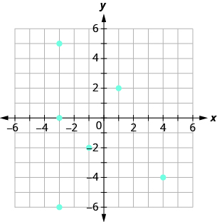
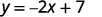
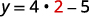

By the end of this section, you will be able to:
* Find the domain and range of a relation
* Determine if a relation is a function
* Find the value of a function

Before you get started, take this readiness quiz.

1.  Evaluate
    <math xmlns="http://www.w3.org/1998/Math/MathML"><mrow><mn>3</mn><mi>x</mi><mo>−</mo><mn>5</mn></mrow></math>
    
    when
    <math xmlns="http://www.w3.org/1998/Math/MathML"><mrow><mi>x</mi><mo>=</mo><mn>−2</mn></mrow></math>
    
    .
    * * *
    {: data-type="newline"}
    
    If you missed this problem, review [\[link\]](/m63302#fs-id1167836530265).
2.  Evaluate
    <math xmlns="http://www.w3.org/1998/Math/MathML"><mrow><mn>2</mn><msup><mi>x</mi><mn>2</mn></msup><mo>−</mo><mi>x</mi><mo>−</mo><mn>3</mn></mrow></math>
    
    when
    <math xmlns="http://www.w3.org/1998/Math/MathML"><mrow><mi>x</mi><mo>=</mo><mi>a</mi><mo>.</mo></mrow></math>
    
    * * *
    {: data-type="newline"}
    
    If you missed this problem, review [\[link\]](/m63302#fs-id1167836530265).
3.  Simplify:
    <math xmlns="http://www.w3.org/1998/Math/MathML"><mrow><mn>7</mn><mi>x</mi><mo>−</mo><mn>1</mn><mo>−</mo><mn>4</mn><mi>x</mi><mo>+</mo><mn>5.</mn></mrow></math>
    
    * * *
    {: data-type="newline"}
    
    If you missed this problem, review [\[link\]](/m63302#fs-id1167836652573).
{: type="1"}

### Find the Domain and Range of a Relation

As we go about our daily lives, we have many data items or quantities that are paired to our names. Our social security number, student ID number, email address, phone number and our birthday are matched to our name. There is a relationship between our name and each of those items.

When your professor gets her class roster, the names of all the students in the class are listed in one column and then the student ID number is likely to be in the next column. If we think of the correspondence as a set of ordered pairs, where the first element is a student name and the second element is that student’s ID number, we call this a **relation**{: data-type="term"}.

<math xmlns="http://www.w3.org/1998/Math/MathML"><mrow><mtext>(Student name, Student ID #)</mtext></mrow></math>

The set of all the names of the students in the class is called the **domain**{: data-type="term"} of the relation and the set of all student ID numbers paired with these students is the range of the relation.

There are many similar situations where one variable is paired or matched with another. The set of ordered pairs that records this matching is a relation.

Relation

A **relation** is any set of ordered pairs,<math xmlns="http://www.w3.org/1998/Math/MathML"><mrow><mrow><mo>(</mo><mrow><mi>x</mi><mo>,</mo><mi>y</mi></mrow><mo>)</mo></mrow><mo>.</mo></mrow></math>

 All the *x*-values in the ordered pairs together make up the **domain**. All the *y*-values in the ordered pairs together make up the **range**.

For the relation <math xmlns="http://www.w3.org/1998/Math/MathML"><mrow><mrow><mo>{</mo><mrow><mrow><mo>(</mo><mrow><mn>1</mn><mo>,</mo><mn>1</mn></mrow><mo>)</mo></mrow><mo>,</mo><mrow><mo>(</mo><mrow><mn>2</mn><mo>,</mo><mn>4</mn></mrow><mo>)</mo></mrow><mo>,</mo><mrow><mo>(</mo><mrow><mn>3</mn><mo>,</mo><mn>9</mn></mrow><mo>)</mo></mrow><mo>,</mo><mrow><mo>(</mo><mrow><mn>4</mn><mo>,</mo><mn>16</mn></mrow><mo>)</mo></mrow><mo>,</mo><mrow><mo>(</mo><mrow><mn>5</mn><mo>,</mo><mn>25</mn></mrow><mo>)</mo></mrow></mrow><mo>}</mo></mrow><mo>:</mo></mrow></math>

ⓐ Find the domain of the relation.

ⓑ Find the range of the relation.

<math xmlns="http://www.w3.org/1998/Math/MathML"><mrow><mspace width="21em" /><mrow><mo>{</mo><mrow><mrow><mo>(</mo><mrow><mn>1</mn><mo>,</mo><mn>1</mn></mrow><mo>)</mo></mrow><mo>,</mo><mrow><mo>(</mo><mrow><mn>2</mn><mo>,</mo><mn>4</mn></mrow><mo>)</mo></mrow><mo>,</mo><mrow><mo>(</mo><mrow><mn>3</mn><mo>,</mo><mn>9</mn></mrow><mo>)</mo></mrow><mo>,</mo><mrow><mo>(</mo><mrow><mn>4</mn><mo>,</mo><mn>16</mn></mrow><mo>)</mo></mrow><mo>,</mo><mrow><mo>(</mo><mrow><mn>5</mn><mo>,</mo><mn>25</mn></mrow><mo>)</mo></mrow></mrow><mo>}</mo></mrow></mrow></math>

ⓐ The domain is the set of all *x*-values of the relation. <math xmlns="http://www.w3.org/1998/Math/MathML"><mrow><mspace width="3.3em" /><mrow><mo>{</mo><mrow><mn>1</mn><mo>,</mo><mn>2</mn><mo>,</mo><mn>3</mn><mo>,</mo><mn>4</mn><mo>,</mo><mn>5</mn></mrow><mo>}</mo></mrow></mrow></math>

ⓑ The range is the set of all *y*-values of the relation. <math xmlns="http://www.w3.org/1998/Math/MathML"><mrow><mspace width="4em" /><mrow><mo>{</mo><mrow><mn>1</mn><mo>,</mo><mn>4</mn><mo>,</mo><mn>9</mn><mo>,</mo><mn>16</mn><mo>,</mo><mn>25</mn></mrow><mo>}</mo></mrow></mrow></math>

For the relation <math xmlns="http://www.w3.org/1998/Math/MathML"><mrow><mrow><mo>{</mo><mrow><mrow><mo>(</mo><mrow><mn>1</mn><mo>,</mo><mn>1</mn></mrow><mo>)</mo></mrow><mo>,</mo><mrow><mo>(</mo><mrow><mn>2</mn><mo>,</mo><mn>8</mn></mrow><mo>)</mo></mrow><mo>,</mo><mrow><mo>(</mo><mrow><mn>3</mn><mo>,</mo><mn>27</mn></mrow><mo>)</mo></mrow><mo>,</mo><mrow><mo>(</mo><mrow><mn>4</mn><mo>,</mo><mn>64</mn></mrow><mo>)</mo></mrow><mo>,</mo><mrow><mo>(</mo><mrow><mn>5</mn><mo>,</mo><mn>125</mn></mrow><mo>)</mo></mrow></mrow><mo>}</mo></mrow><mo>:</mo></mrow></math>

ⓐ Find the domain of the relation.

ⓑ Find the range of the relation.

ⓐ <math xmlns="http://www.w3.org/1998/Math/MathML"><mrow><mrow><mo>{</mo><mrow><mn>1</mn><mo>,</mo><mn>2</mn><mo>,</mo><mn>3</mn><mo>,</mo><mn>4</mn><mo>,</mo><mn>5</mn></mrow><mo>}</mo></mrow></mrow></math>

* * *
{: data-type="newline"}

ⓑ <math xmlns="http://www.w3.org/1998/Math/MathML"><mrow><mrow><mo>{</mo><mrow><mn>1</mn><mo>,</mo><mn>8</mn><mo>,</mo><mn>27</mn><mo>,</mo><mn>64</mn><mo>,</mo><mn>125</mn></mrow><mo>}</mo></mrow></mrow></math>

For the relation <math xmlns="http://www.w3.org/1998/Math/MathML"><mrow><mrow><mo>{</mo><mrow><mrow><mo>(</mo><mrow><mn>1</mn><mo>,</mo><mn>3</mn></mrow><mo>)</mo></mrow><mo>,</mo><mrow><mo>(</mo><mrow><mn>2</mn><mo>,</mo><mn>6</mn></mrow><mo>)</mo></mrow><mo>,</mo><mrow><mo>(</mo><mrow><mn>3</mn><mo>,</mo><mn>9</mn></mrow><mo>)</mo></mrow><mo>,</mo><mrow><mo>(</mo><mrow><mn>4</mn><mo>,</mo><mn>12</mn></mrow><mo>)</mo></mrow><mo>,</mo><mrow><mo>(</mo><mrow><mn>5</mn><mo>,</mo><mn>15</mn></mrow><mo>)</mo></mrow></mrow><mo>}</mo></mrow><mo>:</mo></mrow></math>

ⓐ Find the domain of the relation.

ⓑ Find the range of the relation.

ⓐ <math xmlns="http://www.w3.org/1998/Math/MathML"><mrow><mrow><mo>{</mo><mrow><mn>1</mn><mo>,</mo><mn>2</mn><mo>,</mo><mn>3</mn><mo>,</mo><mn>4</mn><mo>,</mo><mn>5</mn></mrow><mo>}</mo></mrow></mrow></math>

* * *
{: data-type="newline"}

ⓑ <math xmlns="http://www.w3.org/1998/Math/MathML"><mrow><mrow><mo>{</mo><mrow><mn>3</mn><mo>,</mo><mn>6</mn><mo>,</mo><mn>9</mn><mo>,</mo><mn>12</mn><mo>,</mo><mn>15</mn></mrow><mo>}</mo></mrow></mrow></math>

Mapping

A **mapping**{: data-type="term"} is sometimes used to show a relation. The arrows show the pairing of the elements of the domain with the elements of the range.

Use the **mapping** of the relation shown to ⓐ list the ordered pairs of the relation, ⓑ find the domain of the relation, and ⓒ find the range of the relation.

 ![This figure shows two table that each have one column. The table on the left has the header &#x201C;Name&#x201D; and lists the names &#x201C;Alison&#x201D;, &#x201C;Penelope&#x201D;, &#x201C;June&#x201D;, &#x201C;Gregory&#x201D;, &#x201C;Geoffrey&#x201D;, &#x201C;Lauren&#x201D;, &#x201C;Stephen&#x201D;, &#x201C;Alice&#x201D;, &#x201C;Liz&#x201D;, &#x201C;Danny&#x201D;. The table on the right has the header &#x201C;Birthday&#x201D; and lists the dates &#x201C;January 12&#x201D;, &#x201C;February 3&#x201D;, &#x201C;April 25&#x201D;, &#x201C;May 10&#x201D;, &#x201C;May 23&#x201D;, &#x201C;July 24&#x201D;, &#x201C;August 2&#x201D;, and &#x201C;September 15&#x201D;. There is one arrow for each name in the Name table that starts at the name and points toward a date in the Birthday table. While most dates have only one arrow pointing to them, there are two arrows pointing to July 24: one from Stephen and one from Liz.](../resources/CNX_IntAlg_Figure_03_05_001_img.jpg) 

ⓐ The arrow shows the matching of the person to their birthday. We create ordered pairs with the person’s name as the *x*-value and their birthday as the *y*-value.

{(Alison, April 25), (Penelope, May 23), (June, August 2), (Gregory, September 15), (Geoffrey, January 12), (Lauren, May 10), (Stephen, July 24), (Alice, February 3), (Liz, August 2), (Danny, July 24)}

ⓑ The domain is the set of all *x*-values of the relation.

{Alison, Penelope, June, Gregory, Geoffrey, Lauren, Stephen, Alice, Liz, Danny}

ⓒ The range is the set of all *y*-values of the relation.

{January 12, February 3, April 25, May 10, May 23, July 24, August 2, September 15}

Use the mapping of the relation shown to ⓐ list the ordered pairs of the relation ⓑ find the domain of the relation ⓒ find the range of the relation.

 ![This figure shows two table that each have one column. The table on the left has the header &#x201C;Name&#x201D; and lists the names &#x201C;Khanh Nguyen&#x201D;, &#x201C;Abigail Brown&#x201D;, &#x201C;Sumantha Mishal&#x201D;, and &#x201C;Jose Hern and ez&#x201D;. The table on the right has the header &#x201C;Student ID #&#x201D; and lists the codes &#x201C;a b 56781&#x201D;, &#x201C;j h 47983&#x201D;, &#x201C;k n 68413&#x201D;, and &#x201C;s m 32479&#x201D;. There is one arrow for each name in the Name table that starts at the name and points toward a code in the student ID table. The first arrow goes from Khanh Nguyen to k n 68413. The second arrow goes from Abigail Brown to a b 56781. The third arrow goes from Sumantha Mishal to s m 32479. The fourth arrow goes from Jose Hern and ez to j h 47983.](../resources/CNX_IntAlg_Figure_03_05_002_img.jpg) 

ⓐ (Khanh Nguyen, kn68413), (Abigail Brown, ab56781), (Sumantha Mishal, sm32479), (Jose Hern and ez, jh47983) ⓑ {Khanh Nguyen, Abigail Brown, Sumantha Mishal, Jose Hern and ez} ⓒ {kn68413, ab56781, sm32479, jh47983}

Use the mapping of the relation shown to ⓐ list the ordered pairs of the relation ⓑ find the domain of the relation ⓒ find the range of the relation.

 ![This figure shows two table that each have one column. The table on the left has the header &#x201C;Name&#x201D; and lists the names &#x201C;Maria&#x201D;, &#x201C;Arm and o&#x201D;, &#x201C;Cynthia&#x201D;, &#x201C;Kelly&#x201D;, and &#x201C;Rachel&#x201D;. The table on the right has the header &#x201C;Birthday&#x201D; and lists the dates &#x201C;January 18&#x201D;, &#x201C;March 15&#x201D;, &#x201C;November 6&#x201D;, and &#x201C;December 8&#x201D;. There is one arrow for each name in the Name table that starts at the name and points toward a date in the Birthday table. The first arrow goes from Maria to November 6. The second arrow goes from Arm and o to a January 18. The third arrow goes from Cynthia to December 8. The fourth arrow goes from Kelly to March 15. The fifth arrow goes from Rachel to November 6.](../resources/CNX_IntAlg_Figure_03_05_003_img.jpg) 

ⓐ (Maria, November 6), (Arm and o, January 18), (Cynthia, December 8), (Kelly, March 15), (Rachel, November 6) ⓑ {Maria, Arm and o, Cynthia, Kelly, Rachel} ⓒ {November 6, January 18, December 8, March 15}

A graph is yet another way that a relation can be represented. The set of ordered pairs of all the points plotted is the relation. The set of all *x*-coordinates is the domain of the relation and the set of all *y*-coordinates is the range. Generally we write the numbers in ascending order for both the domain and range.

Use the graph of the relation to ⓐ list the ordered pairs of the relation ⓑ find the domain of the relation ⓒ find the range of the relation.

  

ⓐ The ordered pairs of the relation are: <math xmlns="http://www.w3.org/1998/Math/MathML"><mrow><mspace width="7.6em" /><mrow><mo>{</mo><mrow><mrow><mo>(</mo><mrow><mn>1</mn><mo>,</mo><mn>5</mn></mrow><mo>)</mo></mrow><mo>,</mo><mrow><mo>(</mo><mrow><mn>−3</mn><mo>,</mo><mn>−1</mn></mrow><mo>)</mo></mrow><mo>,</mo><mrow><mo>(</mo><mrow><mn>4</mn><mo>,</mo><mn>−2</mn></mrow><mo>)</mo></mrow><mo>,</mo><mrow><mo>(</mo><mrow><mn>0</mn><mo>,</mo><mn>3</mn></mrow><mo>)</mo></mrow><mo>,</mo><mrow><mo>(</mo><mrow><mn>2</mn><mo>,</mo><mn>−2</mn></mrow><mo>)</mo></mrow><mo>,</mo><mrow><mo>(</mo><mrow><mn>−3</mn><mo>,</mo><mn>4</mn></mrow><mo>)</mo></mrow></mrow><mo>}</mo></mrow><mo>.</mo></mrow></math>

ⓑ The domain is the set of all *x*-values of the relation: <math xmlns="http://www.w3.org/1998/Math/MathML"><mrow><mspace width="2.2em" /><mrow><mo>{</mo><mrow><mn>−3</mn><mo>,</mo><mn>0</mn><mo>,</mo><mn>1</mn><mo>,</mo><mn>2</mn><mo>,</mo><mn>4</mn></mrow><mo>}</mo></mrow><mo>.</mo></mrow></math>

Notice that while <math xmlns="http://www.w3.org/1998/Math/MathML"><mrow><mn>−3</mn></mrow></math>

 repeats, it is only listed once.

ⓒ The range is the set of all *y*-values of the relation: <math xmlns="http://www.w3.org/1998/Math/MathML"><mrow><mspace width="2.9em" /><mrow><mo>{</mo><mrow><mn>−2</mn><mo>,</mo><mn>−1</mn><mo>,</mo><mn>3</mn><mo>,</mo><mn>4</mn><mo>,</mo><mn>5</mn></mrow><mo>}</mo></mrow><mo>.</mo></mrow></math>

Notice that while <math xmlns="http://www.w3.org/1998/Math/MathML"><mrow><mn>−2</mn></mrow></math>

 repeats, it is only listed once.

Use the graph of the relation to ⓐ list the ordered pairs of the relation ⓑ find the domain of the relation ⓒ find the range of the relation.

  

ⓐ <math xmlns="http://www.w3.org/1998/Math/MathML"><mrow><mrow><mo>(</mo><mrow><mn>−3</mn><mo>,</mo><mn>3</mn></mrow><mo>)</mo></mrow><mo>,</mo><mrow><mo>(</mo><mrow><mn>−2</mn><mo>,</mo><mn>2</mn></mrow><mo>)</mo></mrow><mo>,</mo><mrow><mo>(</mo><mrow><mn>−1</mn><mo>,</mo><mn>0</mn></mrow><mo>)</mo></mrow><mo>,</mo></mrow></math>

* * *
{: data-type="newline"}

<math xmlns="http://www.w3.org/1998/Math/MathML"><mrow><mo>(</mo><mrow><mn>0</mn><mo>,</mo><mn>−1</mn></mrow><mo>)</mo></mrow><mo>,</mo><mrow><mo>(</mo><mrow><mn>2</mn><mo>,</mo><mn>−2</mn></mrow><mo>)</mo></mrow><mo>,</mo><mrow><mo>(</mo><mrow><mn>4</mn><mo>,</mo><mn>−4</mn></mrow><mo>)</mo></mrow></math>

* * *
{: data-type="newline"}

ⓑ <math xmlns="http://www.w3.org/1998/Math/MathML"><mrow><mrow><mo>{</mo><mrow><mn>−3</mn><mo>,</mo><mn>−2</mn><mo>,</mo><mn>−1</mn><mo>,</mo><mn>0</mn><mo>,</mo><mn>2</mn><mo>,</mo><mn>4</mn></mrow><mo>}</mo></mrow></mrow></math>

* * *
{: data-type="newline"}

ⓒ<math xmlns="http://www.w3.org/1998/Math/MathML"><mrow><mrow><mo>{</mo><mrow><mn>3</mn><mo>,</mo><mn>2</mn><mo>,</mo><mn>0</mn><mo>,</mo><mn>−1</mn><mo>,</mo><mn>−2</mn><mo>,</mo><mn>−4</mn></mrow><mo>}</mo></mrow></mrow></math>

Use the graph of the relation to ⓐ list the ordered pairs of the relation ⓑ find the domain of the relation ⓒ find the range of the relation.

  

ⓐ <math xmlns="http://www.w3.org/1998/Math/MathML"><mrow><mrow><mo>(</mo><mrow><mn>−3</mn><mo>,</mo><mn>0</mn></mrow><mo>)</mo></mrow><mo>,</mo><mrow><mo>(</mo><mrow><mn>−3</mn><mo>,</mo><mn>5</mn></mrow><mo>)</mo></mrow><mo>,</mo><mrow><mo>(</mo><mrow><mn>−3</mn><mo>,</mo><mn>−6</mn></mrow><mo>)</mo></mrow><mo>,</mo></mrow></math>

* * *
{: data-type="newline"}

<math xmlns="http://www.w3.org/1998/Math/MathML"><mrow><mrow><mo>(</mo><mrow><mn>−1</mn><mo>,</mo><mn>−2</mn></mrow><mo>)</mo></mrow><mo>,</mo><mrow><mo>(</mo><mrow><mn>1</mn><mo>,</mo><mn>2</mn></mrow><mo>)</mo></mrow><mo>,</mo><mrow><mo>(</mo><mrow><mn>4</mn><mo>,</mo><mn>−4</mn></mrow><mo>)</mo></mrow></mrow></math>

* * *
{: data-type="newline"}

ⓑ <math xmlns="http://www.w3.org/1998/Math/MathML"><mrow><mrow><mo>{</mo><mrow><mn>−3</mn><mo>,</mo><mn>−1</mn><mo>,</mo><mn>1</mn><mo>,</mo><mn>4</mn></mrow><mo>}</mo></mrow></mrow></math>

* * *
{: data-type="newline"}

ⓒ <math xmlns="http://www.w3.org/1998/Math/MathML"><mrow><mrow><mo>{</mo><mrow><mn>−6</mn><mo>,</mo><mn>0</mn><mo>,</mo><mn>5</mn><mo>,</mo><mn>−2</mn><mo>,</mo><mn>2</mn><mo>,</mo><mn>−4</mn></mrow><mo>}</mo></mrow></mrow></math>

### Determine if a Relation is a Function

A special type of relation, called a **function**{: data-type="term"}, occurs extensively in mathematics. A function is a relation that assigns to each element in its domain exactly one element in the range. For each ordered pair in the relation, each *x*-value is matched with only one *y*-value.

Function

A **function** is a relation that assigns to each element in its domain exactly one element in the range.

The birthday example from [\[link\]](#fs-id1167829683746) helps us understand this definition. Every person has a birthday but no one has two birthdays. It is okay for two people to share a birthday. It is okay that Danny and Stephen share July 24th as their birthday and that June and Liz share August 2nd. Since each person has exactly one birthday, the relation in [\[link\]](#fs-id1167829683746) is a function.

The relation shown by the graph in [\[link\]](#fs-id1167833057329) includes the ordered pairs <math xmlns="http://www.w3.org/1998/Math/MathML"><mrow><mrow><mo>(</mo><mrow><mn>−3</mn><mo>,</mo><mn>−1</mn></mrow><mo>)</mo></mrow></mrow></math>

 and <math xmlns="http://www.w3.org/1998/Math/MathML"><mrow><mrow><mo>(</mo><mrow><mn>−3</mn><mo>,</mo><mn>4</mn></mrow><mo>)</mo></mrow><mo>.</mo></mrow></math>

 Is that okay in a function? No, as this is like one person having two different birthdays.

Use the set of ordered pairs to (i) determine whether the relation is a function (ii) find the domain of the relation (iii) find the range of the relation.

ⓐ <math xmlns="http://www.w3.org/1998/Math/MathML"><mrow><mrow><mo>{</mo><mrow><mrow><mo>(</mo><mrow><mn>−3</mn><mo>,</mo><mn>27</mn></mrow><mo>)</mo></mrow><mo>,</mo><mrow><mo>(</mo><mrow><mn>−2</mn><mo>,</mo><mn>8</mn></mrow><mo>)</mo></mrow><mo>,</mo><mrow><mo>(</mo><mrow><mn>−1</mn><mo>,</mo><mn>1</mn></mrow><mo>)</mo></mrow><mo>,</mo><mrow><mo>(</mo><mrow><mn>0</mn><mo>,</mo><mn>0</mn></mrow><mo>)</mo></mrow><mo>,</mo><mrow><mo>(</mo><mrow><mn>1</mn><mo>,</mo><mn>1</mn></mrow><mo>)</mo></mrow><mo>,</mo><mrow><mo>(</mo><mrow><mn>2</mn><mo>,</mo><mn>8</mn></mrow><mo>)</mo></mrow><mo>,</mo><mrow><mo>(</mo><mrow><mn>3</mn><mo>,</mo><mn>27</mn></mrow><mo>)</mo></mrow></mrow><mo>}</mo></mrow></mrow></math>

ⓑ <math xmlns="http://www.w3.org/1998/Math/MathML"><mrow><mrow><mo>{</mo><mrow><mrow><mo>(</mo><mrow><mn>9</mn><mo>,</mo><mn>−3</mn></mrow><mo>)</mo></mrow><mo>,</mo><mrow><mo>(</mo><mrow><mn>4</mn><mo>,</mo><mn>−2</mn></mrow><mo>)</mo></mrow><mo>,</mo><mrow><mo>(</mo><mrow><mn>1</mn><mo>,</mo><mn>−1</mn></mrow><mo>)</mo></mrow><mo>,</mo><mrow><mo>(</mo><mrow><mn>0</mn><mo>,</mo><mn>0</mn></mrow><mo>)</mo></mrow><mo>,</mo><mrow><mo>(</mo><mrow><mn>1</mn><mo>,</mo><mn>1</mn></mrow><mo>)</mo></mrow><mo>,</mo><mrow><mo>(</mo><mrow><mn>4</mn><mo>,</mo><mn>2</mn></mrow><mo>)</mo></mrow><mo>,</mo><mrow><mo>(</mo><mrow><mn>9</mn><mo>,</mo><mn>3</mn></mrow><mo>)</mo></mrow></mrow><mo>}</mo></mrow></mrow></math>

ⓐ <math xmlns="http://www.w3.org/1998/Math/MathML"><mrow><mrow><mo>{</mo><mrow><mrow><mo>(</mo><mrow><mn>−3</mn><mo>,</mo><mn>27</mn></mrow><mo>)</mo></mrow><mo>,</mo><mrow><mo>(</mo><mrow><mn>−2</mn><mo>,</mo><mn>8</mn></mrow><mo>)</mo></mrow><mo>,</mo><mrow><mo>(</mo><mrow><mn>−1</mn><mo>,</mo><mn>1</mn></mrow><mo>)</mo></mrow><mo>,</mo><mrow><mo>(</mo><mrow><mn>0</mn><mo>,</mo><mn>0</mn></mrow><mo>)</mo></mrow><mo>,</mo><mrow><mo>(</mo><mrow><mn>1</mn><mo>,</mo><mn>1</mn></mrow><mo>)</mo></mrow><mo>,</mo><mrow><mo>(</mo><mrow><mn>2</mn><mo>,</mo><mn>8</mn></mrow><mo>)</mo></mrow><mo>,</mo><mrow><mo>(</mo><mrow><mn>3</mn><mo>,</mo><mn>27</mn></mrow><mo>)</mo></mrow></mrow><mo>}</mo></mrow></mrow></math>

(i) Each *x*-value is matched with only one *y*-value. So this relation is a function.

(ii) The domain is the set of all *x*-values in the relation.* * *
{: data-type="newline"}

The domain is: <math xmlns="http://www.w3.org/1998/Math/MathML"><mrow><mrow><mo>{</mo><mrow><mn>−3</mn><mo>,</mo><mn>−2</mn><mo>,</mo><mn>−1</mn><mo>,</mo><mn>0</mn><mo>,</mo><mn>1</mn><mo>,</mo><mn>2</mn><mo>,</mo><mn>3</mn></mrow><mo>}</mo></mrow><mo>.</mo></mrow></math>

(iii) The range is the set of all *y*-values in the relation. Notice we do not list range values twice.* * *
{: data-type="newline"}

The range is: <math xmlns="http://www.w3.org/1998/Math/MathML"><mrow><mrow><mo>{</mo><mrow><mn>27</mn><mo>,</mo><mn>8</mn><mo>,</mo><mn>1</mn><mo>,</mo><mn>0</mn></mrow><mo>}</mo></mrow><mo>.</mo></mrow></math>

ⓑ <math xmlns="http://www.w3.org/1998/Math/MathML"><mrow><mrow><mo>{</mo><mrow><mrow><mo>(</mo><mrow><mn>9</mn><mo>,</mo><mn>−3</mn></mrow><mo>)</mo></mrow><mo>,</mo><mrow><mo>(</mo><mrow><mn>4</mn><mo>,</mo><mn>−2</mn></mrow><mo>)</mo></mrow><mo>,</mo><mrow><mo>(</mo><mrow><mn>1</mn><mo>,</mo><mn>−1</mn></mrow><mo>)</mo></mrow><mo>,</mo><mrow><mo>(</mo><mrow><mn>0</mn><mo>,</mo><mn>0</mn></mrow><mo>)</mo></mrow><mo>,</mo><mrow><mo>(</mo><mrow><mn>1</mn><mo>,</mo><mn>1</mn></mrow><mo>)</mo></mrow><mo>,</mo><mrow><mo>(</mo><mrow><mn>4</mn><mo>,</mo><mn>2</mn></mrow><mo>)</mo></mrow><mo>,</mo><mrow><mo>(</mo><mrow><mn>9</mn><mo>,</mo><mn>3</mn></mrow><mo>)</mo></mrow></mrow><mo>}</mo></mrow></mrow></math>

(i) The *x*-value 9 is matched with two *y*-values, both 3 and <math xmlns="http://www.w3.org/1998/Math/MathML"><mrow><mn>−3</mn><mo>.</mo></mrow></math>

 So this relation is not a function.

(ii) The domain is the set of all *x*-values in the relation. Notice we do not list domain values twice.* * *
{: data-type="newline"}

The domain is: <math xmlns="http://www.w3.org/1998/Math/MathML"><mrow><mrow><mo>{</mo><mrow><mn>0</mn><mo>,</mo><mn>1</mn><mo>,</mo><mn>2</mn><mo>,</mo><mn>4</mn><mo>,</mo><mn>9</mn></mrow><mo>}</mo></mrow><mo>.</mo></mrow></math>

(iii) The range is the set of all *y*-values in the relation.* * *
{: data-type="newline"}

The range is: <math xmlns="http://www.w3.org/1998/Math/MathML"><mrow><mrow><mo>{</mo><mrow><mn>−3</mn><mo>,</mo><mn>−2</mn><mo>,</mo><mn>−1</mn><mo>,</mo><mn>0</mn><mo>,</mo><mn>1</mn><mo>,</mo><mn>2</mn><mo>,</mo><mn>3</mn></mrow><mo>}</mo></mrow><mo>.</mo></mrow></math>

Use the set of ordered pairs to (i) determine whether the relation is a function (ii) find the domain of the relation (iii) find the range of the function.

ⓐ <math xmlns="http://www.w3.org/1998/Math/MathML"><mrow><mrow><mo>{</mo><mrow><mrow><mo>(</mo><mrow><mn>−3</mn><mo>,</mo><mn>−6</mn></mrow><mo>)</mo></mrow><mo>,</mo><mrow><mo>(</mo><mrow><mn>−2</mn><mo>,</mo><mn>−4</mn></mrow><mo>)</mo></mrow><mo>,</mo><mrow><mo>(</mo><mrow><mn>−1</mn><mo>,</mo><mn>−2</mn></mrow><mo>)</mo></mrow><mo>,</mo><mrow><mo>(</mo><mrow><mn>0</mn><mo>,</mo><mn>0</mn></mrow><mo>)</mo></mrow><mo>,</mo><mrow><mo>(</mo><mrow><mn>1</mn><mo>,</mo><mn>2</mn></mrow><mo>)</mo></mrow><mo>,</mo><mrow><mo>(</mo><mrow><mn>2</mn><mo>,</mo><mn>4</mn></mrow><mo>)</mo></mrow><mo>,</mo><mrow><mo>(</mo><mrow><mn>3</mn><mo>,</mo><mn>6</mn></mrow><mo>)</mo></mrow></mrow><mo>}</mo></mrow></mrow></math>

ⓑ <math xmlns="http://www.w3.org/1998/Math/MathML"><mrow><mrow><mo>{</mo><mrow><mrow><mo>(</mo><mrow><mn>8</mn><mo>,</mo><mn>−4</mn></mrow><mo>)</mo></mrow><mo>,</mo><mrow><mo>(</mo><mrow><mn>4</mn><mo>,</mo><mn>−2</mn></mrow><mo>)</mo></mrow><mo>,</mo><mrow><mo>(</mo><mrow><mn>2</mn><mo>,</mo><mn>−1</mn></mrow><mo>)</mo></mrow><mo>,</mo><mrow><mo>(</mo><mrow><mn>0</mn><mo>,</mo><mn>0</mn></mrow><mo>)</mo></mrow><mo>,</mo><mrow><mo>(</mo><mrow><mn>2</mn><mo>,</mo><mn>1</mn></mrow><mo>)</mo></mrow><mo>,</mo><mrow><mo>(</mo><mrow><mn>4</mn><mo>,</mo><mn>2</mn></mrow><mo>)</mo></mrow><mo>,</mo><mrow><mo>(</mo><mrow><mn>8</mn><mo>,</mo><mn>4</mn></mrow><mo>)</mo></mrow></mrow><mo>}</mo></mrow></mrow></math>

ⓐ Yes; <math xmlns="http://www.w3.org/1998/Math/MathML"><mrow><mrow><mo>{</mo><mrow><mn>−3</mn><mo>,</mo><mn>−2</mn><mo>,</mo><mn>−1</mn><mo>,</mo><mn>0</mn><mo>,</mo><mn>1</mn><mo>,</mo><mn>2</mn><mo>,</mo><mn>3</mn></mrow><mo>}</mo></mrow><mo>;</mo></mrow></math>

* * *
{: data-type="newline"}

<math xmlns="http://www.w3.org/1998/Math/MathML"><mrow><mrow><mo>{</mo><mrow><mn>−6</mn><mo>,</mo><mn>−4</mn><mo>,</mo></mrow></mrow><mn>−2</mn><mo>,</mo><mn>0</mn><mo>,</mo><mn>2</mn><mo>,</mo><mn>4</mn><mo>,</mo><mn>6</mn></mrow><mo>}</mo></math>

* * *
{: data-type="newline"}

ⓑ No; <math xmlns="http://www.w3.org/1998/Math/MathML"><mrow><mrow><mo>{</mo><mrow><mn>0</mn><mo>,</mo><mn>2</mn><mo>,</mo><mn>4</mn><mo>,</mo><mn>8</mn></mrow><mo>}</mo></mrow><mo>;</mo></mrow></math>

* * *
{: data-type="newline"}

<math xmlns="http://www.w3.org/1998/Math/MathML"><mrow><mrow><mo>{</mo><mrow><mn>−4</mn><mo>,</mo><mn>−2</mn><mo>,</mo><mn>−1</mn><mo>,</mo><mn>0</mn><mo>,</mo><mn>1</mn><mo>,</mo><mn>2</mn><mo>,</mo><mn>4</mn></mrow><mo>}</mo></mrow></mrow></math>

Use the set of ordered pairs to (i) determine whether the relation is a function (ii) find the domain of the relation (iii) find the range of the relation.

ⓐ <math xmlns="http://www.w3.org/1998/Math/MathML"><mrow><mrow><mo>{</mo><mrow><mrow><mo>(</mo><mrow><mn>27</mn><mo>,</mo><mn>−3</mn></mrow><mo>)</mo></mrow><mo>,</mo><mrow><mo>(</mo><mrow><mn>8</mn><mo>,</mo><mn>−2</mn></mrow><mo>)</mo></mrow><mo>,</mo><mrow><mo>(</mo><mrow><mn>1</mn><mo>,</mo><mn>−1</mn></mrow><mo>)</mo></mrow><mo>,</mo><mrow><mo>(</mo><mrow><mn>0</mn><mo>,</mo><mn>0</mn></mrow><mo>)</mo></mrow><mo>,</mo><mrow><mo>(</mo><mrow><mn>1</mn><mo>,</mo><mn>1</mn></mrow><mo>)</mo></mrow><mo>,</mo><mrow><mo>(</mo><mrow><mn>8</mn><mo>,</mo><mn>2</mn></mrow><mo>)</mo></mrow><mo>,</mo><mrow><mo>(</mo><mrow><mn>27</mn><mo>,</mo><mn>3</mn></mrow><mo>)</mo></mrow></mrow><mo>}</mo></mrow></mrow></math>

ⓑ <math xmlns="http://www.w3.org/1998/Math/MathML"><mrow><mrow><mo>{</mo><mrow><mrow><mo>(</mo><mrow><mn>7</mn><mo>,</mo><mn>−3</mn></mrow><mo>)</mo></mrow><mo>,</mo><mrow><mo>(</mo><mrow><mn>−5</mn><mo>,</mo><mn>−4</mn></mrow><mo>)</mo></mrow><mo>,</mo><mrow><mo>(</mo><mrow><mn>8</mn><mo>,</mo><mn>−0</mn></mrow><mo>)</mo></mrow><mo>,</mo><mrow><mo>(</mo><mrow><mn>0</mn><mo>,</mo><mn>0</mn></mrow><mo>)</mo></mrow><mo>,</mo><mrow><mo>(</mo><mrow><mn>−6</mn><mo>,</mo><mn>4</mn></mrow><mo>)</mo></mrow><mo>,</mo><mrow><mo>(</mo><mrow><mn>−2</mn><mo>,</mo><mn>2</mn></mrow><mo>)</mo></mrow><mo>,</mo><mrow><mo>(</mo><mrow><mn>−1</mn><mo>,</mo><mn>3</mn></mrow><mo>)</mo></mrow></mrow><mo>}</mo></mrow></mrow></math>

ⓐ No; <math xmlns="http://www.w3.org/1998/Math/MathML"><mrow><mrow><mo>{</mo><mrow><mn>0</mn><mo>,</mo><mn>1</mn><mo>,</mo><mn>8</mn><mo>,</mo><mn>27</mn></mrow><mo>}</mo></mrow><mo>;</mo></mrow></math>

* * *
{: data-type="newline"}

<math xmlns="http://www.w3.org/1998/Math/MathML"><mrow><mrow><mo>{</mo><mrow><mn>−3</mn><mo>,</mo><mn>−2</mn><mo>,</mo><mn>−1</mn><mo>,</mo><mn>0</mn><mo>,</mo><mn>2</mn><mo>,</mo><mn>2</mn><mo>,</mo><mn>3</mn></mrow><mo>}</mo></mrow></mrow></math>

* * *
{: data-type="newline"}

ⓑ Yes; <math xmlns="http://www.w3.org/1998/Math/MathML"><mrow><mrow><mo>{</mo><mrow><mn>7</mn><mo>,</mo><mn>−5</mn><mo>,</mo><mn>8</mn><mo>,</mo><mn>0</mn><mo>,</mo><mn>−6</mn><mo>,</mo><mn>−2</mn><mo>,</mo><mn>−1</mn></mrow><mo>}</mo></mrow><mo>;</mo></mrow></math>

* * *
{: data-type="newline"}

<math xmlns="http://www.w3.org/1998/Math/MathML"><mrow><mrow><mo>{</mo><mrow><mn>−3</mn><mo>,</mo><mn>−4</mn><mo>,</mo><mn>0</mn><mo>,</mo><mn>4</mn><mo>,</mo><mn>2</mn><mo>,</mo><mn>3</mn></mrow><mo>}</mo></mrow></mrow></math>

Use the mapping to ⓐ determine whether the relation is a function ⓑ find the domain of the relation ⓒ find the range of the relation.

 ![This figure shows two table that each have one column. The table on the left has the header &#x201C;Name&#x201D; and lists the names &#x201C;Lydia&#x201D;, &#x201C;Eugene&#x201D;, &#x201C;Janet&#x201D;, &#x201C;Rick&#x201D;, and &#x201C;Marty&#x201D;. The table on the right has the header &#x201C;Phone number&#x201D; and lists the numbers &#x201C;321-549-3327 home&#x201D;, &#x201C;427-658-2314 cell&#x201D;, &#x201C;321-964-7324 cell&#x201D;, &#x201C;684-358-7961 home&#x201D;, &#x201C;684-369-7231 cell&#x201D;, and &#x201C;798-367-8541 cell&#x201D;. There are arrows that start at a name and points toward a number in the phone number table. The first arrow goes from Lydia to 321-549-3327 home. The second arrow goes from Lydia to a 321-964-7324 cell. The third arrow goes from Eugene to 427-658-2314 cell. The fourth arrow goes from Janet to 427-658-2314 cell. The fifth arrow goes from Rick to 798-367-8541 cell. The sixth arrow goes from Marty to 684-358-7961 home. The seventh arrow goes from Marty to 684-369-7231 cell.](../resources/CNX_IntAlg_Figure_03_05_007_img.jpg) 

ⓐ Both Lydia and Marty have two phone numbers. So each *x*-value is not matched with only one *y*-value. So this relation is not a function.

ⓑ The domain is the set of all *x*-values in the relation. The domain is: {Lydia, Eugene, Janet, Rick, Marty}

ⓒ The range is the set of all *y*-values in the relation. The range is:

<math xmlns="http://www.w3.org/1998/Math/MathML"><mrow><mo>{</mo><mn>321-549-3327</mn><mo>,</mo></mrow></math>

 <math xmlns="http://www.w3.org/1998/Math/MathML"><mrow><mn>427-658-2314</mn><mo>,</mo></mrow></math>

 <math xmlns="http://www.w3.org/1998/Math/MathML"><mrow><mn>321-964-7324</mn><mo>,</mo></mrow></math>

 <math xmlns="http://www.w3.org/1998/Math/MathML"><mrow><mn>684-358-7961</mn><mo>,</mo></mrow></math>

 <math xmlns="http://www.w3.org/1998/Math/MathML"><mrow><mn>684-369-7231</mn><mo>,</mo></mrow></math>

 <math xmlns="http://www.w3.org/1998/Math/MathML"><mrow><mn>798-367-8541</mn><mo>}</mo></mrow></math>

Use the mapping to ⓐ determine whether the relation is a function ⓑ find the domain of the relation ⓒ find the range of the relation.

 ![This figure shows two table that each have one column. The table on the left has the header &#x201C;Network&#x201D; and lists the television stations &#x201C;NBC&#x201D;, &#x201C;HGTV&#x201D;, and &#x201C;HBO&#x201D;. The table on the right has the header &#x201C;Program&#x201D; and lists the television shows &#x201C;Ellen Degeneres Show&#x201D;, &#x201C;Law and Order&#x201D;, &#x201C;Tonight Show&#x201D;, &#x201C;Property Brothers&#x201D;, &#x201C;House Hunters&#x201D;, &#x201C;Love it or List it&#x201D;, &#x201C;Game of Thrones&#x201D;, &#x201C;True Detective&#x201D;, and &#x201C;Sesame Street&#x201D;. There are arrows that start at a network in the first table and point toward a program in the second table. The first arrow goes from NBC to Ellen Degeneres Show. The second arrow goes from NBC to Law and Order. The third arrow goes from NBC to Tonight Show. The fourth arrow goes from HGTV to Property Brothers. The fifth arrow goes from HGTV to House Hunters. The sixth arrow goes from HGTV to Love it or List it. The seventh arrow goes from HBO to Game of Thrones. The eighth arrow goes from HBO to True Detective. The ninth arrow goes from HBO to Sesame Street.](../resources/CNX_IntAlg_Figure_03_05_008_img.jpg) 

ⓐ no ⓑ {NBC, HGTV, HBO} ⓒ {Ellen Degeneres Show, Law and Order, Tonight Show, Property Brothers, House Hunters, Love it or List it, Game of Thrones, True Detective, Sesame Street}

Use the mapping to ⓐ determine whether the relation is a function ⓑ find the domain of the relation ⓒ find the range of the relation.

 ![This figure shows two table that each have one column. The table on the left has the header &#x201C;Name&#x201D; and lists the names &#x201C;Neal&#x201D;, &#x201C;Krystal&#x201D;, &#x201C;Kelvin&#x201D;, &#x201C;George&#x201D;, &#x201C;Christa&#x201D;, and &#x201C;Mike&#x201D;. The table on the right has the header &#x201C;Phone number&#x201D; and lists the numbers &#x201C;123-567-4389 work&#x201D;, &#x201C;231-378-5941 cell&#x201D;, &#x201C;753-469-9731 cell&#x201D;, &#x201C;567-534-2970 work&#x201D;, &#x201C;684-369-7231 cell&#x201D;, &#x201C;798-367-8541 cell&#x201D;, and &#x201C;639-847-6971 cell&#x201D;. There are arrows that start at a name and points toward a number in the phone number table. The first arrow goes from Neal to 753-469-9731 cell. The second arrow goes from Krystal to a 684-369-7231 cell. The third arrow goes from Kelvin to 231-378-5941 cell. The fourth arrow goes from George to 123-567-4389 work. The fifth arrow goes from George to 639-847-6971 cell. The sixth arrow goes from Christa to 567-534-2970 work. The seventh arrow goes from Mike to 567-534-2970 work. The eighth arrow goes from Mike to 798-367-8541 cell.](../resources/CNX_IntAlg_Figure_03_05_009_img.jpg) 

ⓐ No ⓑ {Neal, Krystal, Kelvin, George, Christa, Mike} ⓒ {123-567-4839 work, 231-378-5941 cell, 743-469-9731 cell, 567-534-2970 work, 684-369-7231 cell, 798-367-8541 cell, 639-847-6971 cell}

In algebra, more often than not, functions will be represented by an equation. It is easiest to see if the equation is a function when it is solved for *y*. If each value of *x* results in only one value of *y*, then the equation defines a function.

Determine whether each equation is a function.

ⓐ <math xmlns="http://www.w3.org/1998/Math/MathML"><mrow><mn>2</mn><mi>x</mi><mo>+</mo><mi>y</mi><mo>=</mo><mn>7</mn></mrow></math>

 ⓑ <math xmlns="http://www.w3.org/1998/Math/MathML"><mrow><mi>y</mi><mo>=</mo><msup><mi>x</mi><mn>2</mn></msup><mo>+</mo><mn>1</mn></mrow></math>

 ⓒ<math xmlns="http://www.w3.org/1998/Math/MathML"><mrow><mi>x</mi><mo>+</mo><msup><mi>y</mi><mn>2</mn></msup><mo>=</mo><mn>3</mn></mrow></math>

ⓐ <math xmlns="http://www.w3.org/1998/Math/MathML"><mrow><mn>2</mn><mi>x</mi><mo>+</mo><mi>y</mi><mo>=</mo><mn>7</mn></mrow></math>

For each value of *x*, we multiply it by <math xmlns="http://www.w3.org/1998/Math/MathML"><mrow><mn>−2</mn></mrow></math>

 and then add 7 to get the *y*-value

|  |    |
| For example, if <math xmlns="http://www.w3.org/1998/Math/MathML"><mrow><mi>x</mi><mo>=</mo><mn>3</mn><mo>:</mo><mspace width="2em" /></mrow></math>

 |    |
{: valign="top"}|  |    |
{: valign="top"}{: .unnumbered .unstyled summary="y = negative 2 x plus 7. For example, if x = 3. y = negative 2 times 3 plus 7. y = 1." data-label=""}

We have that when <math xmlns="http://www.w3.org/1998/Math/MathML"><mrow><mi>x</mi><mo>=</mo><mn>3</mn><mo>,</mo></mrow></math>

 then <math xmlns="http://www.w3.org/1998/Math/MathML"><mrow><mi>y</mi><mo>=</mo><mn>1</mn><mo>.</mo></mrow></math>

 It would work similarly for any value of *x*. Since each value of *x*, corresponds to only one value of *y* the equation defines a function.

ⓑ <math xmlns="http://www.w3.org/1998/Math/MathML"><mrow><mi>y</mi><mo>=</mo><msup><mi>x</mi><mn>2</mn></msup><mo>+</mo><mn>1</mn></mrow></math>

For each value of *x*, we square it and then add 1 to get the *y*-value.

|  |    |
| For example, if <math xmlns="http://www.w3.org/1998/Math/MathML"><mrow><mi>x</mi><mo>=</mo><mn>2</mn><mo>:</mo><mspace width="2em" /></mrow></math>

 |    |
|  |    |
{: .unnumbered .unstyled summary="y = x squared plus 1. For example, if x = 2. y = 2 squared plus 1. y = 5." data-label=""}

We have that when <math xmlns="http://www.w3.org/1998/Math/MathML"><mrow><mi>x</mi><mo>=</mo><mn>2</mn><mo>,</mo></mrow></math>

 then <math xmlns="http://www.w3.org/1998/Math/MathML"><mrow><mi>y</mi><mo>=</mo><mn>5</mn><mo>.</mo></mrow></math>

 It would work similarly for any value of *x*. Since each value of *x*, corresponds to only one value of *y* the equation defines a function.

ⓒ* * *
{: data-type="newline"}

|  |    |
| Isolate the *y* term. |    |
| Let’s substitute <math xmlns="http://www.w3.org/1998/Math/MathML"><mrow><mi>x</mi><mo>=</mo><mn>2</mn><mo>.</mo></mrow></math>

 |    |
|  |    |
| This give us two values for *y*. | <math xmlns="http://www.w3.org/1998/Math/MathML"><mrow><mi>y</mi><mo>=</mo><mn>1</mn><mspace width="0.2em" /><mi>y</mi><mo>=</mo><mn>−1</mn></mrow></math>

 |
{: .unnumbered .unstyled summary="x plus y squared = 3. Isolate the y term. y squared = negative x plus 3. Let&#x2019;s substitute x = 2. y squared = negative 2 plus 3. y squared = 1." data-label=""}

We have shown that when <math xmlns="http://www.w3.org/1998/Math/MathML"><mrow><mi>x</mi><mo>=</mo><mn>2</mn><mo>,</mo></mrow></math>

 then <math xmlns="http://www.w3.org/1998/Math/MathML"><mrow><mi>y</mi><mo>=</mo><mn>1</mn></mrow></math>

 and <math xmlns="http://www.w3.org/1998/Math/MathML"><mrow><mi>y</mi><mo>=</mo><mn>−1</mn><mo>.</mo></mrow></math>

 It would work similarly for any value of *x*. Since each value of *x* does not corresponds to only one value of *y* the equation does not define a function.

Determine whether each equation is a function.

ⓐ <math xmlns="http://www.w3.org/1998/Math/MathML"><mrow><mn>4</mn><mi>x</mi><mo>+</mo><mi>y</mi><mo>=</mo><mn>−3</mn></mrow></math>

 ⓑ <math xmlns="http://www.w3.org/1998/Math/MathML"><mrow><mi>x</mi><mo>+</mo><msup><mi>y</mi><mn>2</mn></msup><mo>=</mo><mn>1</mn></mrow></math>

 ⓒ <math xmlns="http://www.w3.org/1998/Math/MathML"><mrow><mi>y</mi><mo>−</mo><msup><mi>x</mi><mn>2</mn></msup><mo>=</mo><mn>2</mn></mrow></math>

ⓐ yes ⓑ no ⓒ yes

Determine whether each equation is a function.

ⓐ <math xmlns="http://www.w3.org/1998/Math/MathML"><mrow><mi>x</mi><mo>+</mo><msup><mi>y</mi><mn>2</mn></msup><mo>=</mo><mn>4</mn></mrow></math>

 ⓑ <math xmlns="http://www.w3.org/1998/Math/MathML"><mrow><mi>y</mi><mo>=</mo><msup><mi>x</mi><mn>2</mn></msup><mo>−</mo><mn>7</mn></mrow></math>

 ⓒ <math xmlns="http://www.w3.org/1998/Math/MathML"><mrow><mi>y</mi><mo>=</mo><mn>5</mn><mi>x</mi><mo>−</mo><mn>4</mn></mrow></math>

ⓐ no ⓑ yes ⓒ yes

### Find the Value of a Function

It is very convenient to name a function and most often we name it *f*, *g*, *h*, *F*, *G*, or *H*. In any function, for each *x*-value from the domain we get a corresponding *y*-value in the range. For the function *f*, we write this range value *y* as <math xmlns="http://www.w3.org/1998/Math/MathML"><mrow><mi>f</mi><mrow><mo>(</mo><mi>x</mi><mo>)</mo></mrow><mo>.</mo></mrow></math>

 This is called function notation and is read *f* of *x* or the value of *f* at *x*. In this case the parentheses does not indicate multiplication.

Function Notation

For the function <math xmlns="http://www.w3.org/1998/Math/MathML"><mrow><mi>y</mi><mo>=</mo><mi>f</mi><mo stretchy="false">(</mo><mi>x</mi><mo stretchy="false">)</mo></mrow></math>

<math xmlns="http://www.w3.org/1998/Math/MathML"><mrow><mtable><mtr><mtd columnalign="left"><mi>f</mi><mspace width="0.2em" /><mtext>is the name of the function</mtext></mtd></mtr> <mtr><mtd columnalign="left"><mi>x</mi><mspace width="0.2em" /><mtext>is the domain value</mtext></mtd></mtr> <mtr><mtd columnalign="left"><mi>f</mi><mo stretchy="false">(</mo><mi>x</mi><mo stretchy="false">)</mo><mspace width="0.2em" /><mtext>is the range value</mtext><mspace width="0.2em" /><mi>y</mi><mspace width="0.2em" /><mtext>corresponding to the value</mtext><mspace width="0.2em" /><mi>x</mi></mtd></mtr></mtable></mrow></math>

We read <math xmlns="http://www.w3.org/1998/Math/MathML"><mrow><mi>f</mi><mo stretchy="false">(</mo><mi>x</mi><mo stretchy="false">)</mo></mrow></math>

 as *f* of *x* or the value of *f* at *x*.

We call *x* the independent variable as it can be any value in the domain. We call *y* the dependent variable as its value depends on *x*.

Independent and Dependent Variables

For the function <math xmlns="http://www.w3.org/1998/Math/MathML"><mrow><mi>y</mi><mo>=</mo><mi>f</mi><mo stretchy="false">(</mo><mi>x</mi><mo stretchy="false">)</mo><mo>,</mo></mrow></math>

<math xmlns="http://www.w3.org/1998/Math/MathML"><mrow><mtable><mtr><mtd columnalign="left"><mi>x</mi><mspace width="0.2em" /><mtext>is the independent variable as it can be any value in the domain</mtext></mtd></mtr> <mtr><mtd columnalign="left"><mi>y</mi><mspace width="0.2em" /><mtext>the dependent variable as its value depends on</mtext><mspace width="0.2em" /><mi>x</mi></mtd></mtr></mtable></mrow></math>

Much as when you first encountered the variable *x*, function notation may be rather unsettling. It seems strange because it is new. You will feel more comfortable with the notation as you use it.

Let’s look at the equation <math xmlns="http://www.w3.org/1998/Math/MathML"><mrow><mi>y</mi><mo>=</mo><mn>4</mn><mi>x</mi><mo>−</mo><mn>5</mn><mo>.</mo></mrow></math>

 To find the value of *y* when <math xmlns="http://www.w3.org/1998/Math/MathML"><mrow><mi>x</mi><mo>=</mo><mn>2</mn><mo>,</mo></mrow></math>

 we know to substitute <math xmlns="http://www.w3.org/1998/Math/MathML"><mrow><mi>x</mi><mo>=</mo><mn>2</mn></mrow></math>

 into the equation and then simplify.

|  |    |
| Let <math xmlns="http://www.w3.org/1998/Math/MathML"><mrow><mi>x</mi><mo>=</mo><mn>2</mn><mo>.</mo></mrow></math>

 |    |
|  |    |
{: .unnumbered .unstyled summary="y = 4 x minus 5. Let x = 2. y = 4 times 2 minus 5. y = 3." data-label=""}

The value of the function at <math xmlns="http://www.w3.org/1998/Math/MathML"><mrow><mi>x</mi><mo>=</mo><mn>2</mn></mrow></math>

 is 3.

We do the same thing using function notation, the equation <math xmlns="http://www.w3.org/1998/Math/MathML"><mrow><mi>y</mi><mo>=</mo><mn>4</mn><mi>x</mi><mo>−</mo><mn>5</mn></mrow></math>

 can be written as <math xmlns="http://www.w3.org/1998/Math/MathML"><mrow><mi>f</mi><mrow><mo>(</mo><mi>x</mi><mo>)</mo></mrow><mo>=</mo><mn>4</mn><mi>x</mi><mo>−</mo><mn>5</mn><mo>.</mo></mrow></math>

 To find the value when <math xmlns="http://www.w3.org/1998/Math/MathML"><mrow><mi>x</mi><mo>=</mo><mn>2</mn><mo>,</mo></mrow></math>

 we write:

|  |    |
| Let <math xmlns="http://www.w3.org/1998/Math/MathML"><mrow><mi>x</mi><mo>=</mo><mn>2</mn><mo>.</mo></mrow></math>

 |    |
|  |    |
{: .unnumbered .unstyled summary="f of x = 4 x minus 5. Let x = 2. f of 2 = 4 times 2 minus 5. f of 2 = 3." data-label=""}

The value of the function at <math xmlns="http://www.w3.org/1998/Math/MathML"><mrow><mi>x</mi><mo>=</mo><mn>2</mn></mrow></math>

 is 3.

This process of finding the value of <math xmlns="http://www.w3.org/1998/Math/MathML"><mrow><mi>f</mi><mo stretchy="false">(</mo><mi>x</mi><mo stretchy="false">)</mo></mrow></math>

 for a given value of *x* is called *evaluating the function.*

For the function <math xmlns="http://www.w3.org/1998/Math/MathML"><mrow><mi>f</mi><mo stretchy="false">(</mo><mi>x</mi><mo stretchy="false">)</mo><mo>=</mo><mn>2</mn><msup><mi>x</mi><mn>2</mn></msup><mo>+</mo><mn>3</mn><mi>x</mi><mo>−</mo><mn>1</mn><mo>,</mo></mrow></math>

 evaluate the function.

ⓐ <math xmlns="http://www.w3.org/1998/Math/MathML"><mrow><mi>f</mi><mo stretchy="false">(</mo><mn>3</mn><mo stretchy="false">)</mo></mrow></math>

 ⓑ <math xmlns="http://www.w3.org/1998/Math/MathML"><mrow><mi>f</mi><mo stretchy="false">(</mo><mn>−2</mn><mo stretchy="false">)</mo></mrow></math>

 ⓒ <math xmlns="http://www.w3.org/1998/Math/MathML"><mrow><mi>f</mi><mo stretchy="false">(</mo><mi>a</mi><mo stretchy="false">)</mo></mrow></math>

ⓐ* * *
{: data-type="newline"}

|  |    |
| To evaluate <math xmlns="http://www.w3.org/1998/Math/MathML"><mrow><mi>f</mi><mo stretchy="false">(</mo><mn>3</mn><mo stretchy="false">)</mo><mo>,</mo></mrow></math>

 substitute 3 for *x*. |    |
| Simplify. |    |
|  |    |
|  |    |
{: .unnumbered .unstyled summary="f of x = 2 x squared plus 3 x minus 1. To evaluate f of 3, substitute 3 for x. f of 3 = 2 times 3 squared plus 3 times 3 minus 1. Simplify. f of 3 = 2 times 9 plus 3 times 3 minus 1. f of 3 = 18 plus 9 minus 1. f of 3 = 26." data-label=""}

ⓑ* * *
{: data-type="newline"}

|  |  |    |
|    |  |    |
| Simplify. |  |    |
|  |  |    |
|  |  |    |
{: .unnumbered .unstyled summary="f of x = 2 x squared plus 3 x minus 1. To evaluate f of negative 2, substitute negative 2 for x. f of negative 2 = 2 times the quantity negative 2 in parentheses squared plus 3 times negative 2 minus 1. Simplify. f of negative 2 = 2 times 4 plus negative 6 minus 1. f of negative 2 = 1." data-label=""}

ⓒ* * *
{: data-type="newline"}

|  |    |
| To evaluate <math xmlns="http://www.w3.org/1998/Math/MathML"><mrow><mi>f</mi><mo stretchy="false">(</mo><mi>a</mi><mo stretchy="false">)</mo><mo>,</mo></mrow></math>

 substitute *a* for *x*. |    |
| Simplify. |    |
{: .unnumbered .unstyled summary="f of x = 2 x squared plus 3 x minus 1. To evaluate f of a, substitute a for x. f of a = 2 times a squared plus 3 times a minus 1. Simplify. f of a = 2 a squared plus 3 a minus 1." data-label=""}

For the function <math xmlns="http://www.w3.org/1998/Math/MathML"><mrow><mi>f</mi><mo stretchy="false">(</mo><mi>x</mi><mo stretchy="false">)</mo><mo>=</mo><mn>3</mn><msup><mi>x</mi><mn>2</mn></msup><mo>−</mo><mn>2</mn><mi>x</mi><mo>+</mo><mn>1</mn><mo>,</mo></mrow></math>

 evaluate the function.

ⓐ <math xmlns="http://www.w3.org/1998/Math/MathML"><mrow><mi>f</mi><mo stretchy="false">(</mo><mn>3</mn><mo stretchy="false">)</mo></mrow></math>

 ⓑ <math xmlns="http://www.w3.org/1998/Math/MathML"><mrow><mi>f</mi><mo stretchy="false">(</mo><mn>−1</mn><mo stretchy="false">)</mo></mrow></math>

 ⓒ <math xmlns="http://www.w3.org/1998/Math/MathML"><mrow><mi>f</mi><mo stretchy="false">(</mo><mi>t</mi><mo stretchy="false">)</mo></mrow></math>

ⓐ <math xmlns="http://www.w3.org/1998/Math/MathML"><mrow><mi>f</mi><mrow><mo>(</mo><mn>3</mn><mo>)</mo></mrow><mo>=</mo><mn>22</mn></mrow></math>

 ⓑ <math xmlns="http://www.w3.org/1998/Math/MathML"><mrow><mi>f</mi><mrow><mo>(</mo><mrow><mn>−1</mn></mrow><mo>)</mo></mrow><mo>=</mo><mn>6</mn></mrow></math>

 ⓒ <math xmlns="http://www.w3.org/1998/Math/MathML"><mrow><mi>f</mi><mo stretchy="false">(</mo><mi>t</mi><mo stretchy="false">)</mo><mo>=</mo><mn>3</mn><msup><mi>t</mi><mn>2</mn></msup><mo>−</mo><mn>2</mn><mi>t</mi><mo>−</mo><mn>1</mn></mrow></math>

For the function <math xmlns="http://www.w3.org/1998/Math/MathML"><mrow><mi>f</mi><mo stretchy="false">(</mo><mi>x</mi><mo stretchy="false">)</mo><mo>=</mo><mn>2</mn><msup><mi>x</mi><mn>2</mn></msup><mo>+</mo><mn>4</mn><mi>x</mi><mo>−</mo><mn>3</mn><mo>,</mo></mrow></math>

 evaluate the function.

ⓐ <math xmlns="http://www.w3.org/1998/Math/MathML"><mrow><mi>f</mi><mo stretchy="false">(</mo><mn>2</mn><mo stretchy="false">)</mo></mrow></math>

 ⓑ <math xmlns="http://www.w3.org/1998/Math/MathML"><mrow><mi>f</mi><mo stretchy="false">(</mo><mn>−3</mn><mo stretchy="false">)</mo></mrow></math>

 ⓒ <math xmlns="http://www.w3.org/1998/Math/MathML"><mrow><mi>f</mi><mo stretchy="false">(</mo><mi>h</mi><mo stretchy="false">)</mo></mrow></math>

ⓐ <math xmlns="http://www.w3.org/1998/Math/MathML"><mrow><mrow><mo>(</mo><mn>2</mn><mo>)</mo></mrow><mo>=</mo><mn>13</mn></mrow></math>

 ⓑ <math xmlns="http://www.w3.org/1998/Math/MathML"><mrow><mi>f</mi><mrow><mo>(</mo><mrow><mn>−3</mn></mrow><mo>)</mo></mrow><mo>=</mo><mn>3</mn></mrow></math>

* * *
{: data-type="newline"}

ⓒ <math xmlns="http://www.w3.org/1998/Math/MathML"><mrow><mi>f</mi><mo stretchy="false">(</mo><mi>h</mi><mo stretchy="false">)</mo><mo>=</mo><mn>2</mn><msup><mi>h</mi><mn>2</mn></msup><mo>+</mo><mn>4</mn><mi>h</mi><mo>−</mo><mn>3</mn></mrow></math>

In the last example, we found <math xmlns="http://www.w3.org/1998/Math/MathML"><mrow><mi>f</mi><mrow><mo>(</mo><mi>x</mi><mo>)</mo></mrow></mrow></math>

 for a constant value of *x*. In the next example, we are asked to find <math xmlns="http://www.w3.org/1998/Math/MathML"><mrow><mi>g</mi><mrow><mo>(</mo><mi>x</mi><mo>)</mo></mrow></mrow></math>

 with values of *x* that are variables. We still follow the same procedure and substitute the variables in for the *x*.

For the function <math xmlns="http://www.w3.org/1998/Math/MathML"><mrow><mi>g</mi><mo stretchy="false">(</mo><mi>x</mi><mo stretchy="false">)</mo><mo>=</mo><mn>3</mn><mi>x</mi><mo>−</mo><mn>5</mn><mo>,</mo></mrow></math>

 evaluate the function.

ⓐ <math xmlns="http://www.w3.org/1998/Math/MathML"><mrow><mi>g</mi><mo stretchy="false">(</mo><msup><mi>h</mi><mn>2</mn></msup><mo stretchy="false">)</mo></mrow></math>

 ⓑ <math xmlns="http://www.w3.org/1998/Math/MathML"><mrow><mi>g</mi><mo stretchy="false">(</mo><mi>x</mi><mo>+</mo><mn>2</mn><mo stretchy="false">)</mo></mrow></math>

 ⓒ <math xmlns="http://www.w3.org/1998/Math/MathML"><mrow><mi>g</mi><mrow><mo>(</mo><mi>x</mi><mo>)</mo></mrow><mo>+</mo><mi>g</mi><mrow><mo>(</mo><mn>2</mn><mo>)</mo></mrow></mrow></math>

ⓐ* * *
{: data-type="newline"}

|  |  |  |  |
| To evaluate <math xmlns="http://www.w3.org/1998/Math/MathML"><mrow><mi>g</mi><mrow><mo>(</mo><msup><mi>h</mi><mn>2</mn></msup><mo>)</mo></mrow><mo>,</mo></mrow></math>

 substitute <math xmlns="http://www.w3.org/1998/Math/MathML"><mrow><msup><mi>h</mi><mn>2</mn></msup></mrow></math>

 for *x*. |  |  |  |
|  |  |  |  |
{: .unnumbered .unstyled summary="g of x = 3 x minus 5. To evaluate g of h squared, substitute h squared for x. g of h squared = 3 times h squared minus 5. Simplify. g of h squared = 3 h squared minus 5." data-label=""}

ⓑ* * *
{: data-type="newline"}

|  |  |
| To evaluate <math xmlns="http://www.w3.org/1998/Math/MathML"><mrow><mi>g</mi><mrow><mo>(</mo><mi>x</mi><mo>+</mo><mn>2</mn><mo>)</mo></mrow><mo>,</mo></mrow></math>

 substitute <math xmlns="http://www.w3.org/1998/Math/MathML"><mrow><mi>x</mi><mo>+</mo><mn>2</mn></mrow></math>

 for *x*. |  |
| Simplify. |  |
|  |  |
{: .unnumbered .unstyled summary="g of x = 3 x minus 5. To evaluate g of the quantity x plus 2, substitute x plus 2 for x. g of x plus 2 = 3 times the quantity x plus 2 in parentheses minus 5. Simplify. g of x plus 2 = 3 x plus 6 minus 5. g of x plus 2 = 3 x plus 1." data-label=""}

ⓒ* * *
{: data-type="newline"}

|  |  |    |
| To evaluate <math xmlns="http://www.w3.org/1998/Math/MathML"><mrow><mi>g</mi><mrow><mo>(</mo><mi>x</mi><mo>)</mo></mrow><mo>+</mo><mi>g</mi><mrow><mo>(</mo><mn>2</mn><mo>)</mo></mrow><mo>,</mo></mrow></math>

 first find <math xmlns="http://www.w3.org/1998/Math/MathML"><mrow><mi>g</mi><mrow><mo>(</mo><mn>2</mn><mo>)</mo></mrow><mo>.</mo></mrow></math>

 |  |    |
|  |  |    |
|    |  |    |
| Simplify. |  |    |
|  |  |    |
{: .unnumbered .unstyled summary="g of x = 3 x minus 5. To evaluate g of x plus g of 2, first find g of 2. g of 2 = 3 times 2 minus 5. g of 2 = 1. Now find g of x plus g of 2. g of x plus g of 2 = 3 x minus 5 plus 1. The 3 x minus 5 is from g of x and the 1 is from the g of 2. Simplify. g of x plus g of 2 = 3 x minus 4." data-label=""}

Notice the difference between part ⓑ and ⓒ. We get <math xmlns="http://www.w3.org/1998/Math/MathML"><mrow><mi>g</mi><mo stretchy="false">(</mo><mi>x</mi><mo>+</mo><mn>2</mn><mo stretchy="false">)</mo><mo>=</mo><mn>3</mn><mi>x</mi><mo>+</mo><mn>1</mn></mrow></math>

 and <math xmlns="http://www.w3.org/1998/Math/MathML"><mrow><mi>g</mi><mrow><mo>(</mo><mi>x</mi><mo>)</mo></mrow><mo>+</mo><mi>g</mi><mrow><mo>(</mo><mn>2</mn><mo>)</mo></mrow><mo>=</mo><mn>3</mn><mi>x</mi><mo>−</mo><mn>4</mn><mo>.</mo></mrow></math>

 So we see that <math xmlns="http://www.w3.org/1998/Math/MathML"><mrow><mi>g</mi><mo stretchy="false">(</mo><mi>x</mi><mo>+</mo><mn>2</mn><mo stretchy="false">)</mo><mo>≠</mo><mi>g</mi><mrow><mo>(</mo><mi>x</mi><mo>)</mo></mrow><mo>+</mo><mi>g</mi><mrow><mo>(</mo><mn>2</mn><mo>)</mo></mrow><mo>.</mo></mrow></math>

For the function <math xmlns="http://www.w3.org/1998/Math/MathML"><mrow><mi>g</mi><mo stretchy="false">(</mo><mi>x</mi><mo stretchy="false">)</mo><mo>=</mo><mn>4</mn><mi>x</mi><mo>−</mo><mn>7</mn><mo>,</mo></mrow></math>

 evaluate the function.

ⓐ <math xmlns="http://www.w3.org/1998/Math/MathML"><mrow><mi>g</mi><mo stretchy="false">(</mo><msup><mi>m</mi><mn>2</mn></msup><mo stretchy="false">)</mo></mrow></math>

 ⓑ <math xmlns="http://www.w3.org/1998/Math/MathML"><mrow><mi>g</mi><mo stretchy="false">(</mo><mi>x</mi><mo>−</mo><mn>3</mn><mo stretchy="false">)</mo></mrow></math>

 ⓒ <math xmlns="http://www.w3.org/1998/Math/MathML"><mrow><mi>g</mi><mrow><mo>(</mo><mi>x</mi><mo>)</mo></mrow><mo>−</mo><mi>g</mi><mrow><mo>(</mo><mn>3</mn><mo>)</mo></mrow></mrow></math>

ⓐ <math xmlns="http://www.w3.org/1998/Math/MathML"><mrow><mn>4</mn><msup><mi>m</mi><mn>2</mn></msup><mo>−</mo><mn>7</mn></mrow></math>

 ⓑ <math xmlns="http://www.w3.org/1998/Math/MathML"><mrow><mn>4</mn><mi>x</mi><mo>−</mo><mn>19</mn></mrow></math>

* * *
{: data-type="newline"}

ⓒ <math xmlns="http://www.w3.org/1998/Math/MathML"><mrow><mi>x</mi><mo>−</mo><mn>12</mn></mrow></math>

For the function <math xmlns="http://www.w3.org/1998/Math/MathML"><mrow><mi>h</mi><mo stretchy="false">(</mo><mi>x</mi><mo stretchy="false">)</mo><mo>=</mo><mn>2</mn><mi>x</mi><mo>+</mo><mn>1</mn><mo>,</mo></mrow></math>

 evaluate the function.

ⓐ <math xmlns="http://www.w3.org/1998/Math/MathML"><mrow><mi>h</mi><mo stretchy="false">(</mo><msup><mi>k</mi><mn>2</mn></msup><mo stretchy="false">)</mo></mrow></math>

 ⓑ <math xmlns="http://www.w3.org/1998/Math/MathML"><mrow><mi>h</mi><mo stretchy="false">(</mo><mi>x</mi><mo>+</mo><mn>1</mn><mo stretchy="false">)</mo></mrow></math>

 ⓒ <math xmlns="http://www.w3.org/1998/Math/MathML"><mrow><mi>h</mi><mrow><mo>(</mo><mi>x</mi><mo>)</mo></mrow><mo>+</mo><mi>h</mi><mrow><mo>(</mo><mn>1</mn><mo>)</mo></mrow></mrow></math>

ⓐ <math xmlns="http://www.w3.org/1998/Math/MathML"><mrow><mn>2</mn><msup><mi>k</mi><mn>2</mn></msup><mo>+</mo><mn>1</mn></mrow></math>

 ⓑ <math xmlns="http://www.w3.org/1998/Math/MathML"><mrow><mn>2</mn><mi>x</mi><mo>+</mo><mn>3</mn></mrow></math>

* * *
{: data-type="newline"}

ⓒ <math xmlns="http://www.w3.org/1998/Math/MathML"><mrow><mn>2</mn><mi>x</mi><mo>+</mo><mn>4</mn></mrow></math>

Many everyday situations can be modeled using functions.

The number of unread emails in Sylvia’s account is 75. This number grows by 10 unread emails a day. The function <math xmlns="http://www.w3.org/1998/Math/MathML"><mrow><mi>N</mi><mrow><mo>(</mo><mi>t</mi><mo>)</mo></mrow><mo>=</mo><mn>75</mn><mo>+</mo><mn>10</mn><mi>t</mi></mrow></math>

 represents the relation between the number of emails, *N*, and the time, *t*, measured in days.

ⓐ Determine the independent and dependent variable.

ⓑ Find <math xmlns="http://www.w3.org/1998/Math/MathML"><mrow><mi>N</mi><mrow><mo>(</mo><mn>5</mn><mo>)</mo></mrow><mo>.</mo></mrow></math>

 Explain what this result means.

ⓐ The number of unread emails is a function of the number of days. The number of unread emails, *N*, depends on the number of days, *t*. Therefore, the variable *N*, is the dependent variable and the variable <math xmlns="http://www.w3.org/1998/Math/MathML"><mi>t</mi></math>

 is the independent variable.

ⓑ Find <math xmlns="http://www.w3.org/1998/Math/MathML"><mrow><mi>N</mi><mrow><mo>(</mo><mn>5</mn><mo>)</mo></mrow><mo>.</mo></mrow></math>

 Explain what this result means.

|  |    |
| Substitute in <math xmlns="http://www.w3.org/1998/Math/MathML"><mrow><mi>t</mi><mo>=</mo><mn>5</mn><mo>.</mo></mrow></math>

 |    |
| Simplify. |    |
|  |    |
{: .unnumbered .unstyled summary="N of t = 75 plus 10 t. Substitute in t = 5. N of 5 = 75 plus 10 times 5. Simplify. N of 5 = 75 plus 50. N of 5 = 125." data-label=""}

Since 5 is the number of days, <math xmlns="http://www.w3.org/1998/Math/MathML"><mrow><mi>N</mi><mrow><mo>(</mo><mn>5</mn><mo>)</mo></mrow><mo>,</mo></mrow></math>

 is the number of unread emails after 5 days. After 5 days, there are 125 unread emails in the account.

The number of unread emails in Bryan’s account is 100. This number grows by 15 unread emails a day. The function <math xmlns="http://www.w3.org/1998/Math/MathML"><mrow><mi>N</mi><mrow><mo>(</mo><mi>t</mi><mo>)</mo></mrow><mo>=</mo><mn>100</mn><mo>+</mo><mn>15</mn><mi>t</mi></mrow></math>

 represents the relation between the number of emails, *N*, and the time, *t*, measured in days.

ⓐ Determine the independent and dependent variable.

ⓑ Find <math xmlns="http://www.w3.org/1998/Math/MathML"><mrow><mi>N</mi><mrow><mo>(</mo><mn>7</mn><mo>)</mo></mrow><mo>.</mo></mrow></math>

 Explain what this result means.

ⓐ *t* IND; *N* DEP ⓑ 205; the number of unread emails in Bryan’s account on the seventh day.

The number of unread emails in Anthony’s account is 110. This number grows by 25 unread emails a day. The function <math xmlns="http://www.w3.org/1998/Math/MathML"><mrow><mi>N</mi><mrow><mo>(</mo><mi>t</mi><mo>)</mo></mrow><mo>=</mo><mn>110</mn><mo>+</mo><mn>25</mn><mi>t</mi></mrow></math>

 represents the relation between the number of emails, *N*, and the time, *t*, measured in days.

ⓐ Determine the independent and dependent variable.

ⓑ Find <math xmlns="http://www.w3.org/1998/Math/MathML"><mrow><mi>N</mi><mrow><mo>(</mo><mrow><mn>14</mn></mrow><mo>)</mo></mrow><mo>.</mo></mrow></math>

 Explain what this result means.

ⓐ *t* IND; *N* DEP ⓑ 460; the number of unread emails in Anthony’s account on the fourteenth day

Access this online resource for additional instruction and practice with relations and functions.

* [Introduction to Functions][1]
{: data-display="block"}

### Key Concepts

* **Function Notation:** For the function
  <math xmlns="http://www.w3.org/1998/Math/MathML"><mrow><mi>y</mi><mo>=</mo><mi>f</mi><mo stretchy="false">(</mo><mi>x</mi><mo stretchy="false">)</mo></mrow></math>
  
  * *f* is the name of the function
  * *x* is the domain value
  * <math xmlns="http://www.w3.org/1998/Math/MathML"><mrow><mi>f</mi><mo stretchy="false">(</mo><mi>x</mi><mo stretchy="false">)</mo></mrow></math>
    
    is the range value *y* corresponding to the value *x*
    * * *
    {: data-type="newline"}
    
    We read
    <math xmlns="http://www.w3.org/1998/Math/MathML"><mrow><mi>f</mi><mo stretchy="false">(</mo><mi>x</mi><mo stretchy="false">)</mo></mrow></math>
    
    as *f* of *x* or the value of *f* at *x*.
  {: data-bullet-style="open-circle"}

* **Independent and Dependent Variables:** For the function
  <math xmlns="http://www.w3.org/1998/Math/MathML"><mrow><mi>y</mi><mo>=</mo><mi>f</mi><mo stretchy="false">(</mo><mi>x</mi><mo stretchy="false">)</mo><mo>,</mo></mrow></math>
  
  * *x* is the independent variable as it can be any value in the domain
  * *y* is the dependent variable as its value depends on *x*
  {: data-bullet-style="open-circle"}
{: data-bullet-style="bullet"}

<section data-depth="1" class="section-exercises" markdown="1">
#### Practice Makes Perfect

**Find the Domain and Range of a Relation**

In the following exercises, for each relation ⓐ find the domain of the relation ⓑ find the range of the relation.

<math xmlns="http://www.w3.org/1998/Math/MathML"><mrow><mrow><mo>{</mo><mrow><mrow><mo>(</mo><mrow><mn>1</mn><mo>,</mo><mn>4</mn></mrow><mo>)</mo></mrow><mo>,</mo><mrow><mo>(</mo><mrow><mn>2</mn><mo>,</mo><mn>8</mn></mrow><mo>)</mo></mrow><mo>,</mo><mrow><mo>(</mo><mrow><mn>3</mn><mo>,</mo><mn>12</mn></mrow><mo>)</mo></mrow><mo>,</mo><mrow><mo>(</mo><mrow><mn>4</mn><mo>,</mo><mn>16</mn></mrow><mo>)</mo></mrow><mo>,</mo></mrow></mrow><mrow><mo>(</mo><mrow><mn>5</mn><mo>,</mo><mn>20</mn></mrow><mo>)</mo></mrow><mo>}</mo></mrow></math>

ⓐ {1, 2, 3, 4, 5} ⓑ {4, 8, 12, 16, 20}

<math xmlns="http://www.w3.org/1998/Math/MathML"><mrow><mrow><mo>{</mo><mrow><mrow><mo>(</mo><mrow><mn>1</mn><mo>,</mo><mn>−2</mn></mrow><mo>)</mo></mrow><mo>,</mo><mrow><mo>(</mo><mrow><mn>2</mn><mo>,</mo><mn>−4</mn></mrow><mo>)</mo></mrow><mo>,</mo><mrow><mo>(</mo><mrow><mn>3</mn><mo>,</mo><mn>−6</mn></mrow><mo>)</mo></mrow><mo>,</mo><mrow><mo>(</mo><mrow><mn>4</mn><mo>,</mo><mn>−8</mn></mrow><mo>)</mo></mrow><mo>,</mo></mrow></mrow></mrow><mrow><mo>(</mo><mrow><mn>5</mn><mo>,</mo><mn>−10</mn><mo>)</mo><mo>}</mo></mrow></mrow></math>

<math xmlns="http://www.w3.org/1998/Math/MathML"><mrow><mrow><mo>{</mo><mrow><mrow><mo>(</mo><mrow><mn>1</mn><mo>,</mo><mn>7</mn></mrow><mo>)</mo></mrow><mo>,</mo><mrow><mo>(</mo><mrow><mn>5</mn><mo>,</mo><mn>3</mn></mrow><mo>)</mo></mrow><mo>,</mo><mrow><mo>(</mo><mrow><mn>7</mn><mo>,</mo><mn>9</mn></mrow><mo>)</mo></mrow><mo>,</mo><mrow><mo>(</mo><mrow><mn>−2</mn><mo>,</mo><mn>−3</mn></mrow><mo>)</mo></mrow><mo>,</mo><mrow><mo>(</mo><mrow><mn>−2</mn><mo>,</mo><mn>8</mn></mrow><mo>)</mo></mrow></mrow><mo>}</mo></mrow></mrow></math>

ⓐ {1, 5, 7, −2} ⓑ {7, 3, 9, −3, 8}

<math xmlns="http://www.w3.org/1998/Math/MathML"><mrow><mrow><mo>{</mo><mrow><mrow><mo>(</mo><mrow><mn>11</mn><mo>,</mo><mn>3</mn></mrow><mo>)</mo></mrow><mo>,</mo><mrow><mo>(</mo><mrow><mn>−2</mn><mo>,</mo><mn>−7</mn></mrow><mo>)</mo></mrow><mo>,</mo><mrow><mo>(</mo><mrow><mn>4</mn><mo>,</mo><mn>−8</mn></mrow><mo>)</mo></mrow><mo>,</mo><mrow><mo>(</mo><mrow><mn>4</mn><mo>,</mo><mn>17</mn></mrow><mo>)</mo></mrow><mo>,</mo><mrow><mo>(</mo><mrow><mn>−6</mn><mo>,</mo><mn>9</mn></mrow><mo>)</mo></mrow></mrow><mo>}</mo></mrow></mrow></math>

In the following exercises, use the mapping of the relation to ⓐ list the ordered pairs of the relation, ⓑ find the domain of the relation, and ⓒ find the range of the relation.

* * *
{: data-type="newline"}

 ![This figure shows two table that each have one column. The table on the left has the header &#x201C;Name&#x201D; and lists the names &#x201C;Rebecca&#x201D;, &#x201C;Jennifer&#x201D;, &#x201C;John&#x201D;, &#x201C;Hector&#x201D;, &#x201C;Luis&#x201D;, &#x201C;Ebony&#x201D;, &#x201C;Raphael&#x201D;, &#x201C;Meredith&#x201D;, &#x201C;Karen&#x201D;, and &#x201C;Joseph&#x201D;. The table on the right has the header &#x201C;Birthday&#x201D; and lists the dates &#x201C;January 18&#x201D;, &#x201C;February 15&#x201D;, &#x201C;April 1&#x201D;, &#x201C;April 7&#x201D;, &#x201C;June 23&#x201D;, &#x201C;July 30&#x201D;, &#x201C;August 19&#x201D;, and &#x201C;November 6&#x201D;. There are arrows starting at names in the Name table and pointing towards dates in the Birthday table. The first arrow goes from Rebecca to January 18. The second arrow goes from Jennifer to April 1. The third arrow goes from John to January 18. The fourth arrow goes from Hector to June 23. The fifth arrow goes from Luis to February 15. The sixth arrow goes from Ebony to April 7. The seventh arrow goes from Raphael to November 6. The eighth arrow goes from Meredith to August 19. The ninth arrow goes from Karen to August 19. The tenth arrow goes from Joseph to July 30.](../resources/CNX_IntAlg_Figure_03_05_201_img.jpg) 

ⓐ (Rebecca, January 18), (Jennifer, April 1), (John, January 18), (Hector, June 23), (Luis, February 15), (Ebony, April 7), (Raphael, November 6), (Meredith, August 19), (Karen, August 19), (Joseph, July 30)* * *
{: data-type="newline"}

ⓑ {Rebecca, Jennifer, John, Hector, Luis, Ebony, Raphael, Meredith, Karen, Joseph}* * *
{: data-type="newline"}

ⓒ {January 18, April 1, June 23, February 15, April 7, November 6, August 19, July 30}

* * *
{: data-type="newline"}

 ![This figure shows two table that each have one column. The table on the left has the header &#x201C;Name&#x201D; and lists the names &#x201C;Amy&#x201D;, &#x201C;Carol&#x201D;, &#x201C;Devon&#x201D;, &#x201C;Harrison&#x201D;, &#x201C;Jackson&#x201D;, &#x201C;Labron&#x201D;, &#x201C;Mason&#x201D;, &#x201C;Natalie&#x201D;, &#x201C;Paul&#x201D;, and &#x201C;Sylvester&#x201D;. The table on the right has the header &#x201C;Birthday&#x201D; and lists the dates &#x201C;January 5&#x201D;, &#x201C;January 7&#x201D;, &#x201C;February 14&#x201D;, &#x201C;March 1&#x201D;, &#x201C;April 7&#x201D;, &#x201C;May 30&#x201D;, &#x201C;July 20&#x201D;, &#x201C;August 1&#x201D;, &#x201C;November 13&#x201D;, and &#x201C;November 26&#x201D;. There are arrows starting at names in the Name table and pointing towards dates in the Birthday table. The first arrow goes from Amy to February 14. The second arrow goes from Carol to May 30. The third arrow goes from Devon to January 5. The fourth arrow goes from Harrison to January 7. The fifth arrow goes from Jackson to November 26. The sixth arrow goes from Labron to April 7. The seventh arrow goes from Mason to July 20. The eighth arrow goes from Natalie to March 1. The ninth arrow goes from Paul to August 1. The tenth arrow goes from Sylvester to November 13.](../resources/CNX_IntAlg_Figure_03_05_202_img.jpg) 

For a woman of height <math xmlns="http://www.w3.org/1998/Math/MathML"><mrow><mn>5</mn><mo>′</mo><mn>4</mn><mo>″</mo></mrow></math>

 the mapping below shows the corresponding Body Mass Index (BMI). The body mass index is a measurement of body fat based on height and weight. A BMI of <math xmlns="http://www.w3.org/1998/Math/MathML"><mrow><mn>18.5</mn><mo>–</mo><mn>24.9</mn></mrow></math>

 is considered healthy.

 ![This figure shows two table that each have one column. The table on the left has the header &#x201C;Weight (lbs)&#x201D; and lists the numbers plus 100, 110, 120, 130, 140, 150, and 160. The table on the right has the header &#x201C;BMI&#x201D; and lists the numbers 18. 9, 22. 3, 17. 2, 24. 0, 25. 7, 20. 6, and 27. 5. There are arrows starting at numbers in the weight table and pointing towards numbers in the BMI table. The first arrow goes from plus 100 to 17. 2. The second arrow goes from 110 to 18. 9. The third arrow goes from 120 to 20. 6. The fourth arrow goes from 130 to 22. 3. The fifth arrow goes from 140 to 24. 0. The sixth arrow goes from 150 to 25. 7. The seventh arrow goes from 160 to 27. 5.](../resources/CNX_IntAlg_Figure_03_05_203_img.jpg) 

ⓐ (+100, 17. 2), (110, 18.9), (120, 20.6), (130, 22.3), (140, 24.0), (150, 25.7), (160, 27.5) ⓑ {+100, 110, 120, 130, 140, 150, 160,} ⓒ {17.2, 18.9, 20.6, 22.3, 24.0, 25.7, 27.5}

For a man of height <math xmlns="http://www.w3.org/1998/Math/MathML"><mrow><mn>5</mn><mo>′</mo><mn>11</mn><mo>′</mo><mo>′</mo></mrow></math>

 the mapping below shows the corresponding Body Mass Index (BMI). The body mass index is a measurement of body fat based on height and weight. A BMI of <math xmlns="http://www.w3.org/1998/Math/MathML"><mrow><mn>18.5</mn><mo>–</mo><mn>24.9</mn></mrow></math>

 is considered healthy.* * *
{: data-type="newline"}

 ![This figure shows two table that each have one column. The table on the left has the header &#x201C;Weight (lbs)&#x201D; and lists the numbers 130, 140, 150, 160, 170, 180, 190, and 200. The table on the right has the header &#x201C;BMI&#x201D; and lists the numbers 22. 3, 19. 5, 20. 9, 27. 9, 25. 1, 26. 5, 23. 7, and 18. 1. There are arrows starting at numbers in the weight table and pointing towards numbers in the BMI table. The first arrow goes from 130 to 18. 1. The second arrow goes from 140 to 19. 5. The third arrow goes from 150 to 20. 9. The fourth arrow goes from 160 to 22. 3. The fifth arrow goes from 170 to 23. 7. The sixth arrow goes from 180 to 25. 1. The seventh arrow goes from 190 to 26. 5. The eighth arrow goes from 200 to 27. 9.](../resources/CNX_IntAlg_Figure_03_05_204_img.jpg) 

In the following exercises, use the graph of the relation to ⓐ list the ordered pairs of the relation ⓑ find the domain of the relation ⓒ find the range of the relation.

* * *
{: data-type="newline"}

  

ⓐ (2, 3), (4, −3), (−2, −1), (−3, 4), (4, −1), (0, −3) ⓑ {−3, −2, 0, 2, 4}* * *
{: data-type="newline"}

ⓒ {−3, −1, 3, 4}

* * *
{: data-type="newline"}

  

* * *
{: data-type="newline"}

  

ⓐ (1, 4), (1, −4), (−1, 4), (−1, −4), (0, 3), (0, −3) ⓑ {−1, 0, 1} ⓒ {−4, −3, 3,4}

* * *
{: data-type="newline"}

  

**Determine if a Relation is a Function**

In the following exercises, use the set of ordered pairs to ⓐ determine whether the relation is a function, ⓑ find the domain of the relation, and ⓒ find the range of the relation.

<math xmlns="http://www.w3.org/1998/Math/MathML"><mrow><mrow><mo>{</mo><mrow><mrow><mo>(</mo><mrow><mn>−3</mn><mo>,</mo><mn>9</mn></mrow><mo>)</mo></mrow><mo>,</mo><mrow><mo>(</mo><mrow><mn>−2</mn><mo>,</mo><mn>4</mn></mrow><mo>)</mo></mrow><mo>,</mo><mrow><mo>(</mo><mrow><mn>−1</mn><mo>,</mo><mn>1</mn></mrow><mo>)</mo></mrow><mo>,</mo></mrow></mrow></mrow></math>

* * *
{: data-type="newline"}

<math xmlns="http://www.w3.org/1998/Math/MathML"><mrow><mrow><mo>(</mo><mrow><mn>0</mn><mo>,</mo><mn>0</mn></mrow><mo>)</mo></mrow><mo>,</mo></mrow><mrow><mrow><mo>(</mo><mrow><mn>1</mn><mo>,</mo><mn>1</mn></mrow><mo>)</mo></mrow></mrow><mo>,</mo><mrow><mo>(</mo><mrow><mn>2</mn><mo>,</mo><mn>4</mn></mrow><mo>)</mo></mrow><mo>,</mo><mrow><mo>(</mo><mrow><mn>3</mn><mo>,</mo><mn>9</mn></mrow><mo>)</mo></mrow><mo>}</mo></math>

ⓐ yes ⓑ {−3, −2, −1, 0, 1, 2, 3} ⓒ {9, 4, 1, 0}

<math xmlns="http://www.w3.org/1998/Math/MathML"><mrow><mrow><mo>{</mo><mrow><mrow><mo>(</mo><mrow><mn>9</mn><mo>,</mo><mn>−3</mn></mrow><mo>)</mo></mrow><mo>,</mo><mrow><mo>(</mo><mrow><mn>4</mn><mo>,</mo><mn>−2</mn></mrow><mo>)</mo></mrow><mo>,</mo><mrow><mo>(</mo><mrow><mn>1</mn><mo>,</mo><mn>−1</mn></mrow><mo>)</mo></mrow><mo>,</mo></mrow></mrow></mrow></math>

* * *
{: data-type="newline"}

<math xmlns="http://www.w3.org/1998/Math/MathML"><mrow><mrow><mo>(</mo><mrow><mn>0</mn><mo>,</mo><mn>0</mn></mrow><mo>)</mo></mrow><mo>,</mo></mrow><mrow><mrow><mo>(</mo><mrow><mn>1</mn><mo>,</mo><mn>1</mn></mrow><mo>)</mo></mrow><mo>,</mo></mrow><mrow><mo>(</mo><mrow><mn>4</mn><mo>,</mo><mn>2</mn></mrow><mo>)</mo></mrow><mo>,</mo><mrow><mo>(</mo><mrow><mn>9</mn><mo>,</mo><mn>3</mn></mrow><mo>)</mo></mrow><mo>}</mo></math>

<math xmlns="http://www.w3.org/1998/Math/MathML"><mrow><mrow><mo>{</mo><mrow><mrow><mo>(</mo><mrow><mn>−3</mn><mo>,</mo><mn>27</mn></mrow><mo>)</mo></mrow><mo>,</mo><mrow><mo>(</mo><mrow><mn>−2</mn><mo>,</mo><mn>8</mn></mrow><mo>)</mo></mrow><mo>,</mo><mrow><mo>(</mo><mrow><mn>−1</mn><mo>,</mo><mn>1</mn></mrow><mo>)</mo></mrow><mo>,</mo></mrow></mrow></mrow></math>

* * *
{: data-type="newline"}

<math xmlns="http://www.w3.org/1998/Math/MathML"><mrow><mrow><mo>(</mo><mrow><mn>0</mn><mo>,</mo><mn>0</mn></mrow><mo>)</mo></mrow><mo>,</mo><mrow><mo>(</mo><mrow><mn>1</mn><mo>,</mo><mn>1</mn></mrow><mo>)</mo></mrow><mo>,</mo></mrow><mrow><mrow><mo>(</mo><mrow><mn>2</mn><mo>,</mo><mn>8</mn></mrow><mo>)</mo></mrow><mo>,</mo><mrow><mo>(</mo><mrow><mn>3</mn><mo>,</mo><mn>27</mn></mrow><mo>)</mo></mrow></mrow><mo>}</mo></math>

ⓐ yes ⓑ {−3, −2, −1, 0, 1, 2, 3} ⓒ 0, 1, 8, 27}

<math xmlns="http://www.w3.org/1998/Math/MathML"><mrow><mrow><mo>{</mo><mrow><mrow><mo>(</mo><mrow><mn>9</mn><mo>,</mo><mn>−3</mn></mrow><mo>)</mo></mrow><mo>,</mo><mrow><mo>(</mo><mrow><mn>4</mn><mo>,</mo><mn>−2</mn></mrow><mo>)</mo></mrow><mo>,</mo><mrow><mo>(</mo><mrow><mn>1</mn><mo>,</mo><mn>−1</mn></mrow><mo>)</mo></mrow><mo>,</mo></mrow></mrow></mrow></math>

* * *
{: data-type="newline"}

<math xmlns="http://www.w3.org/1998/Math/MathML"><mrow><mrow><mo>(</mo><mrow><mn>0</mn><mo>,</mo><mn>0</mn></mrow><mo>)</mo></mrow><mo>,</mo><mrow><mo>(</mo><mrow><mn>1</mn><mo>,</mo><mn>1</mn></mrow><mo>)</mo></mrow><mo>,</mo></mrow><mrow><mo>(</mo><mrow><mn>4</mn><mo>,</mo><mn>2</mn></mrow><mo>)</mo></mrow><mo>,</mo><mrow><mo>(</mo><mrow><mn>9</mn><mo>,</mo><mn>3</mn></mrow><mo>)</mo></mrow><mo>}</mo></math>

In the following exercises, use the mapping to ⓐ determine whether the relation is a function, ⓑ find the domain of the function, and ⓒ find the range of the function.

* * *
{: data-type="newline"}

 ![This figure shows two table that each have one column. The table on the left has the header &#x201C;Number&#x201D; and lists the numbers negative 3, negative 2, negative 1, 0, 1, 2, and 3. The table on the right has the header &#x201C;Absolute Value&#x201D; and lists the numbers 0, 1, 2, and 3. There are arrows starting at numbers in the number table and pointing towards numbers in the absolute value table. The first arrow goes from negative 3 to 3. The second arrow goes from negative 2 to 2. The third arrow goes from negative 1 to 1. The fourth arrow goes from 0 to 0. The fifth arrow goes from 1 to 1. The sixth arrow goes from 2 to 2. The seventh arrow goes from 3 to 3.](../resources/CNX_IntAlg_Figure_03_05_209_img.jpg) 

ⓐ yes ⓑ {−3, −2, −1, 0, 1, 2, 3} ⓒ {0, 1, 2, 3}

* * *
{: data-type="newline"}

 ![This figure shows two table that each have one column. The table on the left has the header &#x201C;Number&#x201D; and lists the numbers negative 3, negative 2, negative 1, 0, 1, 2, and 3. The table on the right has the header &#x201C;Square&#x201D; and lists the numbers 0, 1, 4, and 9. There are arrows starting at numbers in the number table and pointing towards numbers in the square table. The first arrow goes from negative 3 to 9. The second arrow goes from negative 2 to 4. The third arrow goes from negative 1 to 1. The fourth arrow goes from 0 to 0. The fifth arrow goes from 1 to 1. The sixth arrow goes from 2 to 4. The seventh arrow goes from 3 to 9.](../resources/CNX_IntAlg_Figure_03_05_210_img.jpg) 

* * *
{: data-type="newline"}

 ![This figure shows two table that each have one column. The table on the left has the header &#x201C;Name&#x201D; and lists the names &#x201C;Jenny&#x201D;, &#x201C;R and y&#x201D;, &#x201C;Dennis&#x201D;, &#x201C;Emily&#x201D;, and &#x201C;Raul&#x201D;. The table on the right has the header &#x201C;Email&#x201D; and lists the email addresses RHern and ez@state. edu, JKim@gmail.com, Raul@gmail.com, ESmith@state. edu, DBrown@aol.com, jenny@aol.com, and R and y@gmail.com. There are arrows starting at names in the name table and pointing towards addresses in the email table. The first arrow goes from Jenny to JKim@gmail.com. The second arrow goes from Jenny to jenny@aol.com. The third arrow goes from R and y to R and y@gmail.com. The fourth arrow goes from Dennis to DBrown@aol.com. The fifth arrow goes from Emily to ESmith@state. edu. The sixth arrow goes from Raul to RHern and ez@state. edu. The seventh arrow goes from Raul to Raul@gmail.com.](../resources/CNX_IntAlg_Figure_03_05_211_img.jpg) 

ⓐ no ⓑ {Jenny, R and y, Dennis, Emily, Raul} ⓒ {RHern and ez@state.edu, JKim@gmail.com, Raul@gmail.com, ESmith@state.edu, DBroen@aol.com, jenny@aol.cvom, R and y@gmail.com}

* * *
{: data-type="newline"}

 ![This figure shows two table that each have one column. The table on the left has the header &#x201C;Name&#x201D; and lists the names &#x201C;Jon&#x201D;, &#x201C;Rachel&#x201D;, &#x201C;Matt&#x201D;, &#x201C;Leslie&#x201D;, &#x201C;Chris&#x201D;, &#x201C;Beth&#x201D;, and &#x201C;Liz&#x201D;. The table on the right has the header &#x201C;Email&#x201D; and lists the email addresses chrisg@gmail.com, lizzie@aol.com, jong@gmail.com, mattg@gmail.com, Rachel@state. edu, leslie@aol.com, and bethc@gmail.com. There are arrows starting at names in the name table and pointing towards addresses in the email table. The first arrow goes from Jon to jong@gmail.com. The second arrow goes from Rachel to Rachel@state. edu. The third arrow goes from Matt to mattg@gmail.com. The fourth arrow goes from Leslie to leslie@aol.com. The fifth arrow goes from Chris to chrisg@gmail.com. The sixth arrow goes from Beth to bethc@gmail.com. The seventh arrow goes from Liz to lizzie@aol.com.](../resources/CNX_IntAlg_Figure_03_05_212_img.jpg) 

In the following exercises, determine whether each equation is a function.

* * *
{: data-type="newline"}

ⓐ <math xmlns="http://www.w3.org/1998/Math/MathML"><mrow><mn>2</mn><mi>x</mi><mo>+</mo><mi>y</mi><mo>=</mo><mn>−3</mn></mrow></math>

* * *
{: data-type="newline"}

ⓑ <math xmlns="http://www.w3.org/1998/Math/MathML"><mrow><mi>y</mi><mo>=</mo><msup><mi>x</mi><mn>2</mn></msup></mrow></math>

* * *
{: data-type="newline"}

ⓒ<math xmlns="http://www.w3.org/1998/Math/MathML"><mrow><mi>x</mi><mo>+</mo><msup><mi>y</mi><mn>2</mn></msup><mo>=</mo><mn>−5</mn></mrow></math>

ⓐ yes ⓑ yes ⓒ no

* * *
{: data-type="newline"}

ⓐ <math xmlns="http://www.w3.org/1998/Math/MathML"><mrow><mi>y</mi><mo>=</mo><mn>3</mn><mi>x</mi><mo>−</mo><mn>5</mn></mrow></math>

* * *
{: data-type="newline"}

ⓑ <math xmlns="http://www.w3.org/1998/Math/MathML"><mrow><mi>y</mi><mo>=</mo><msup><mi>x</mi><mn>3</mn></msup></mrow></math>

* * *
{: data-type="newline"}

ⓒ<math xmlns="http://www.w3.org/1998/Math/MathML"><mrow><mn>2</mn><mi>x</mi><mo>+</mo><msup><mi>y</mi><mn>2</mn></msup><mo>=</mo><mn>4</mn></mrow></math>

* * *
{: data-type="newline"}

ⓐ <math xmlns="http://www.w3.org/1998/Math/MathML"><mrow><mi>y</mi><mo>−</mo><mn>3</mn><msup><mi>x</mi><mn>3</mn></msup><mo>=</mo><mn>2</mn></mrow></math>

* * *
{: data-type="newline"}

ⓑ <math xmlns="http://www.w3.org/1998/Math/MathML"><mrow><mi>x</mi><mo>+</mo><msup><mi>y</mi><mn>2</mn></msup><mo>=</mo><mn>3</mn></mrow></math>

* * *
{: data-type="newline"}

ⓒ<math xmlns="http://www.w3.org/1998/Math/MathML"><mrow><mn>3</mn><mi>x</mi><mo>−</mo><mn>2</mn><mi>y</mi><mo>=</mo><mn>6</mn></mrow></math>

ⓐ yes ⓑ no ⓒ yes

* * *
{: data-type="newline"}

ⓐ <math xmlns="http://www.w3.org/1998/Math/MathML"><mrow><mn>2</mn><mi>x</mi><mo>−</mo><mn>4</mn><mi>y</mi><mo>=</mo><mn>8</mn></mrow></math>

* * *
{: data-type="newline"}

ⓑ <math xmlns="http://www.w3.org/1998/Math/MathML"><mrow><mn>−4</mn><mo>=</mo><msup><mi>x</mi><mn>2</mn></msup><mo>−</mo><mi>y</mi></mrow></math>

* * *
{: data-type="newline"}

ⓒ<math xmlns="http://www.w3.org/1998/Math/MathML"><mrow><msup><mi>y</mi><mn>2</mn></msup><mo>=</mo><mtext>−</mtext><mi>x</mi><mo>+</mo><mn>5</mn></mrow></math>

**Find the Value of a Function**

In the following exercises, evaluate the function: ⓐ <math xmlns="http://www.w3.org/1998/Math/MathML"><mrow><mi>f</mi><mo stretchy="false">(</mo><mn>2</mn><mo stretchy="false">)</mo></mrow></math>

 ⓑ <math xmlns="http://www.w3.org/1998/Math/MathML"><mrow><mi>f</mi><mo stretchy="false">(</mo><mn>−1</mn><mo stretchy="false">)</mo></mrow></math>

 ⓒ <math xmlns="http://www.w3.org/1998/Math/MathML"><mrow><mi>f</mi><mo stretchy="false">(</mo><mi>a</mi><mo stretchy="false">)</mo><mo>.</mo></mrow></math>

<math xmlns="http://www.w3.org/1998/Math/MathML"><mrow><mi>f</mi><mo stretchy="false">(</mo><mi>x</mi><mo stretchy="false">)</mo><mo>=</mo><mn>5</mn><mi>x</mi><mo>−</mo><mn>3</mn></mrow></math>

ⓐ <math xmlns="http://www.w3.org/1998/Math/MathML"><mrow><mi>f</mi><mrow><mo>(</mo><mn>2</mn><mo>)</mo></mrow><mo>=</mo><mn>7</mn></mrow></math>

 ⓑ <math xmlns="http://www.w3.org/1998/Math/MathML"><mrow><mi>f</mi><mrow><mo>(</mo><mrow><mn>−1</mn></mrow><mo>)</mo></mrow><mo>=</mo><mn>−8</mn></mrow></math>

 ⓒ <math xmlns="http://www.w3.org/1998/Math/MathML"><mrow><mi>f</mi><mrow><mo>(</mo><mi>a</mi><mo>)</mo></mrow><mo>=</mo><mn>5</mn><mi>a</mi><mo>−</mo><mn>3</mn></mrow></math>

<math xmlns="http://www.w3.org/1998/Math/MathML"><mrow><mi>f</mi><mo stretchy="false">(</mo><mi>x</mi><mo stretchy="false">)</mo><mo>=</mo><mn>3</mn><mi>x</mi><mo>+</mo><mn>4</mn></mrow></math>

<math xmlns="http://www.w3.org/1998/Math/MathML"><mrow><mi>f</mi><mo stretchy="false">(</mo><mi>x</mi><mo stretchy="false">)</mo><mo>=</mo><mn>−4</mn><mi>x</mi><mo>+</mo><mn>2</mn></mrow></math>

ⓐ <math xmlns="http://www.w3.org/1998/Math/MathML"><mrow><mi>f</mi><mrow><mo>(</mo><mn>2</mn><mo>)</mo></mrow><mo>=</mo><mn>−6</mn></mrow></math>

 ⓑ <math xmlns="http://www.w3.org/1998/Math/MathML"><mrow><mi>f</mi><mrow><mo>(</mo><mrow><mn>−1</mn></mrow><mo>)</mo></mrow><mo>=</mo><mn>6</mn></mrow></math>

 ⓒ <math xmlns="http://www.w3.org/1998/Math/MathML"><mrow><mi>f</mi><mrow><mo>(</mo><mi>a</mi><mo>)</mo></mrow><mo>=</mo><mn>−4</mn><mi>a</mi><mo>+</mo><mn>2</mn></mrow></math>

<math xmlns="http://www.w3.org/1998/Math/MathML"><mrow><mi>f</mi><mo stretchy="false">(</mo><mi>x</mi><mo stretchy="false">)</mo><mo>=</mo><mn>−6</mn><mi>x</mi><mo>−</mo><mn>3</mn></mrow></math>

<math xmlns="http://www.w3.org/1998/Math/MathML"><mrow><mi>f</mi><mo stretchy="false">(</mo><mi>x</mi><mo stretchy="false">)</mo><mo>=</mo><msup><mi>x</mi><mn>2</mn></msup><mo>−</mo><mi>x</mi><mo>+</mo><mn>3</mn></mrow></math>

ⓐ <math xmlns="http://www.w3.org/1998/Math/MathML"><mrow><mi>f</mi><mrow><mo>(</mo><mn>2</mn><mo>)</mo></mrow><mo>=</mo><mn>5</mn></mrow></math>

 ⓑ <math xmlns="http://www.w3.org/1998/Math/MathML"><mrow><mi>f</mi><mrow><mo>(</mo><mrow><mn>−1</mn></mrow><mo>)</mo></mrow><mo>=</mo><mn>5</mn></mrow></math>

* * *
{: data-type="newline"}

ⓒ <math xmlns="http://www.w3.org/1998/Math/MathML"><mrow><mi>f</mi><mo stretchy="false">(</mo><mi>a</mi><mo stretchy="false">)</mo><mo>=</mo><msup><mi>a</mi><mn>2</mn></msup><mo>−</mo><mi>a</mi><mo>+</mo><mn>3</mn></mrow></math>

<math xmlns="http://www.w3.org/1998/Math/MathML"><mrow><mi>f</mi><mo stretchy="false">(</mo><mi>x</mi><mo stretchy="false">)</mo><mo>=</mo><msup><mi>x</mi><mn>2</mn></msup><mo>+</mo><mi>x</mi><mo>−</mo><mn>2</mn></mrow></math>

<math xmlns="http://www.w3.org/1998/Math/MathML"><mrow><mi>f</mi><mo stretchy="false">(</mo><mi>x</mi><mo stretchy="false">)</mo><mo>=</mo><mn>2</mn><msup><mi>x</mi><mn>2</mn></msup><mo>−</mo><mi>x</mi><mo>+</mo><mn>3</mn></mrow></math>

ⓐ <math xmlns="http://www.w3.org/1998/Math/MathML"><mrow><mi>f</mi><mrow><mo>(</mo><mn>2</mn><mo>)</mo></mrow><mo>=</mo><mn>9</mn></mrow></math>

 ⓑ <math xmlns="http://www.w3.org/1998/Math/MathML"><mrow><mi>f</mi><mrow><mo>(</mo><mrow><mn>−1</mn></mrow><mo>)</mo></mrow><mo>=</mo><mn>6</mn></mrow></math>

* * *
{: data-type="newline"}

ⓒ <math xmlns="http://www.w3.org/1998/Math/MathML"><mrow><mi>f</mi><mo stretchy="false">(</mo><mi>a</mi><mo stretchy="false">)</mo><mo>=</mo><mn>2</mn><msup><mi>a</mi><mn>2</mn></msup><mo>−</mo><mi>a</mi><mo>+</mo><mn>3</mn></mrow></math>

<math xmlns="http://www.w3.org/1998/Math/MathML"><mrow><mi>f</mi><mo stretchy="false">(</mo><mi>x</mi><mo stretchy="false">)</mo><mo>=</mo><mn>3</mn><msup><mi>x</mi><mn>2</mn></msup><mo>+</mo><mi>x</mi><mo>−</mo><mn>2</mn></mrow></math>

In the following exercises, evaluate the function: ⓐ <math xmlns="http://www.w3.org/1998/Math/MathML"><mrow><mi>g</mi><mo stretchy="false">(</mo><msup><mi>h</mi><mn>2</mn></msup><mo stretchy="false">)</mo></mrow></math>

 ⓑ <math xmlns="http://www.w3.org/1998/Math/MathML"><mrow><mi>g</mi><mo stretchy="false">(</mo><mi>x</mi><mo>+</mo><mn>2</mn><mo stretchy="false">)</mo></mrow></math>

 ⓒ <math xmlns="http://www.w3.org/1998/Math/MathML"><mrow><mi>g</mi><mrow><mo>(</mo><mi>x</mi><mo>)</mo></mrow><mo>+</mo><mi>g</mi><mrow><mo>(</mo><mn>2</mn><mo>)</mo></mrow><mo>.</mo></mrow></math>

<math xmlns="http://www.w3.org/1998/Math/MathML"><mrow><mi>g</mi><mo stretchy="false">(</mo><mi>x</mi><mo stretchy="false">)</mo><mo>=</mo><mn>2</mn><mi>x</mi><mo>+</mo><mn>1</mn></mrow></math>

ⓐ <math xmlns="http://www.w3.org/1998/Math/MathML"><mrow><mi>g</mi><mo stretchy="false">(</mo><msup><mi>h</mi><mn>2</mn></msup><mo stretchy="false">)</mo><mo>=</mo><mn>2</mn><msup><mi>h</mi><mn>2</mn></msup><mo>+</mo><mn>1</mn></mrow></math>

* * *
{: data-type="newline"}

ⓑ <math xmlns="http://www.w3.org/1998/Math/MathML"><mrow><mi>g</mi><mrow><mo>(</mo><mrow><mi>x</mi><mo>+</mo><mn>2</mn></mrow><mo>)</mo></mrow><mo>=</mo><mn>4</mn><mi>x</mi><mo>+</mo><mn>5</mn></mrow></math>

* * *
{: data-type="newline"}

ⓒ <math xmlns="http://www.w3.org/1998/Math/MathML"><mrow><mi>g</mi><mrow><mo>(</mo><mi>x</mi><mo>)</mo></mrow><mo>+</mo><mi>g</mi><mrow><mo>(</mo><mn>2</mn><mo>)</mo></mrow><mo>=</mo><mn>2</mn><mi>x</mi><mo>+</mo><mn>6</mn></mrow></math>

<math xmlns="http://www.w3.org/1998/Math/MathML"><mrow><mi>g</mi><mo stretchy="false">(</mo><mi>x</mi><mo stretchy="false">)</mo><mo>=</mo><mn>5</mn><mi>x</mi><mo>−</mo><mn>8</mn></mrow></math>

<math xmlns="http://www.w3.org/1998/Math/MathML"><mrow><mi>g</mi><mo stretchy="false">(</mo><mi>x</mi><mo stretchy="false">)</mo><mo>=</mo><mn>−3</mn><mi>x</mi><mo>−</mo><mn>2</mn></mrow></math>

ⓐ <math xmlns="http://www.w3.org/1998/Math/MathML"><mrow><mi>g</mi><mo stretchy="false">(</mo><msup><mi>h</mi><mn>2</mn></msup><mo stretchy="false">)</mo><mo>=</mo><mn>−3</mn><msup><mi>h</mi><mn>2</mn></msup><mo>−</mo><mn>2</mn></mrow></math>

* * *
{: data-type="newline"}

ⓑ <math xmlns="http://www.w3.org/1998/Math/MathML"><mrow><mi>g</mi><mrow><mo>(</mo><mrow><mi>x</mi><mo>+</mo><mn>2</mn></mrow><mo>)</mo></mrow><mo>=</mo><mn>−3</mn><mi>x</mi><mo>−</mo><mn>8</mn></mrow></math>

* * *
{: data-type="newline"}

ⓒ <math xmlns="http://www.w3.org/1998/Math/MathML"><mrow><mi>g</mi><mrow><mo>(</mo><mi>x</mi><mo>)</mo></mrow><mo>+</mo><mi>g</mi><mrow><mo>(</mo><mn>2</mn><mo>)</mo></mrow><mo>=</mo><mn>−3</mn><mi>x</mi><mo>−</mo><mn>10</mn></mrow></math>

<math xmlns="http://www.w3.org/1998/Math/MathML"><mrow><mi>g</mi><mo stretchy="false">(</mo><mi>x</mi><mo stretchy="false">)</mo><mo>=</mo><mn>−8</mn><mi>x</mi><mo>+</mo><mn>2</mn></mrow></math>

<math xmlns="http://www.w3.org/1998/Math/MathML"><mrow><mi>g</mi><mo stretchy="false">(</mo><mi>x</mi><mo stretchy="false">)</mo><mo>=</mo><mn>3</mn><mo>−</mo><mi>x</mi></mrow></math>

ⓐ <math xmlns="http://www.w3.org/1998/Math/MathML"><mrow><mi>g</mi><mo stretchy="false">(</mo><msup><mi>h</mi><mn>2</mn></msup><mo stretchy="false">)</mo><mo>=</mo><mn>3</mn><mo>−</mo><msup><mi>h</mi><mn>2</mn></msup></mrow></math>

* * *
{: data-type="newline"}

ⓑ <math xmlns="http://www.w3.org/1998/Math/MathML"><mrow><mi>g</mi><mrow><mo>(</mo><mrow><mi>x</mi><mo>+</mo><mn>2</mn></mrow><mo>)</mo></mrow><mo>=</mo><mn>1</mn><mo>−</mo><mi>x</mi></mrow></math>

* * *
{: data-type="newline"}

ⓒ <math xmlns="http://www.w3.org/1998/Math/MathML"><mrow><mi>g</mi><mrow><mo>(</mo><mi>x</mi><mo>)</mo></mrow><mo>+</mo><mi>g</mi><mrow><mo>(</mo><mn>2</mn><mo>)</mo></mrow><mo>=</mo><mn>4</mn><mo>−</mo><mi>x</mi></mrow></math>

<math xmlns="http://www.w3.org/1998/Math/MathML"><mrow><mi>g</mi><mo stretchy="false">(</mo><mi>x</mi><mo stretchy="false">)</mo><mo>=</mo><mn>7</mn><mo>−</mo><mn>5</mn><mi>x</mi></mrow></math>

In the following exercises, evaluate the function.

<math xmlns="http://www.w3.org/1998/Math/MathML"><mrow><mi>f</mi><mo stretchy="false">(</mo><mi>x</mi><mo stretchy="false">)</mo><mo>=</mo><mn>3</mn><msup><mi>x</mi><mn>2</mn></msup><mo>−</mo><mn>5</mn><mi>x</mi><mo>;</mo></mrow></math>

 <math xmlns="http://www.w3.org/1998/Math/MathML"><mrow><mi>f</mi><mo stretchy="false">(</mo><mn>2</mn><mo stretchy="false">)</mo></mrow></math>

2

<math xmlns="http://www.w3.org/1998/Math/MathML"><mrow><mi>g</mi><mo stretchy="false">(</mo><mi>x</mi><mo stretchy="false">)</mo><mo>=</mo><mn>4</mn><msup><mi>x</mi><mn>2</mn></msup><mo>−</mo><mn>3</mn><mi>x</mi><mo>;</mo></mrow></math>

 <math xmlns="http://www.w3.org/1998/Math/MathML"><mrow><mi>g</mi><mo stretchy="false">(</mo><mn>3</mn><mo stretchy="false">)</mo></mrow></math>

<math xmlns="http://www.w3.org/1998/Math/MathML"><mrow><mi>F</mi><mo stretchy="false">(</mo><mi>x</mi><mo stretchy="false">)</mo><mo>=</mo><mn>2</mn><msup><mi>x</mi><mn>2</mn></msup><mo>−</mo><mn>3</mn><mi>x</mi><mo>+</mo><mn>1</mn><mo>;</mo></mrow></math>

* * *
{: data-type="newline"}

<math xmlns="http://www.w3.org/1998/Math/MathML"><mrow><mi>F</mi><mo stretchy="false">(</mo><mn>−1</mn><mo stretchy="false">)</mo></mrow></math>

6

<math xmlns="http://www.w3.org/1998/Math/MathML"><mrow><mi>G</mi><mo stretchy="false">(</mo><mi>x</mi><mo stretchy="false">)</mo><mo>=</mo><mn>3</mn><msup><mi>x</mi><mn>2</mn></msup><mo>−</mo><mn>5</mn><mi>x</mi><mo>+</mo><mn>2</mn><mo>;</mo></mrow></math>

* * *
{: data-type="newline"}

<math xmlns="http://www.w3.org/1998/Math/MathML"><mrow><mi>G</mi><mo stretchy="false">(</mo><mn>−2</mn><mo stretchy="false">)</mo></mrow></math>

<math xmlns="http://www.w3.org/1998/Math/MathML"><mrow><mi>h</mi><mo stretchy="false">(</mo><mi>t</mi><mo stretchy="false">)</mo><mo>=</mo><mn>2</mn><mrow><mo>\|</mo><mrow><mi>t</mi><mo>−</mo><mn>5</mn></mrow><mo>\|</mo></mrow><mo>+</mo><mn>4</mn><mo>;</mo></mrow></math>

 <math xmlns="http://www.w3.org/1998/Math/MathML"><mrow><mi>f</mi><mo stretchy="false">(</mo><mn>−4</mn><mo stretchy="false">)</mo></mrow></math>

22

<math xmlns="http://www.w3.org/1998/Math/MathML"><mrow><mi>h</mi><mo stretchy="false">(</mo><mi>y</mi><mo stretchy="false">)</mo><mo>=</mo><mn>3</mn><mrow><mo>\|</mo><mrow><mi>y</mi><mo>−</mo><mn>1</mn></mrow><mo>\|</mo></mrow><mo>−</mo><mn>3</mn><mo>;</mo></mrow></math>

 <math xmlns="http://www.w3.org/1998/Math/MathML"><mrow><mi>h</mi><mo stretchy="false">(</mo><mn>−4</mn><mo stretchy="false">)</mo></mrow></math>

<math xmlns="http://www.w3.org/1998/Math/MathML"><mrow><mi>f</mi><mo stretchy="false">(</mo><mi>x</mi><mo stretchy="false">)</mo><mo>=</mo><mfrac><mrow><mi>x</mi><mo>+</mo><mn>2</mn></mrow><mrow><mi>x</mi><mo>−</mo><mn>1</mn></mrow></mfrac><mo>;</mo></mrow></math>

 <math xmlns="http://www.w3.org/1998/Math/MathML"><mrow><mi>f</mi><mo stretchy="false">(</mo><mn>2</mn><mo stretchy="false">)</mo></mrow></math>

4

<math xmlns="http://www.w3.org/1998/Math/MathML"><mrow><mi>g</mi><mo stretchy="false">(</mo><mi>x</mi><mo stretchy="false">)</mo><mo>=</mo><mfrac><mrow><mi>x</mi><mo>−</mo><mn>2</mn></mrow><mrow><mi>x</mi><mo>+</mo><mn>2</mn></mrow></mfrac><mo>;</mo></mrow></math>

 <math xmlns="http://www.w3.org/1998/Math/MathML"><mrow><mi>g</mi><mo stretchy="false">(</mo><mn>4</mn><mo stretchy="false">)</mo></mrow></math>

In the following exercises, solve.

The number of unwatched shows in Sylvia’s DVR is 85. This number grows by 20 unwatched shows per week. The function <math xmlns="http://www.w3.org/1998/Math/MathML"><mrow><mi>N</mi><mrow><mo>(</mo><mi>t</mi><mo>)</mo></mrow><mo>=</mo><mn>85</mn><mo>+</mo><mn>20</mn><mi>t</mi></mrow></math>

 represents the relation between the number of unwatched shows, *N*, and the time, *t*, measured in weeks.

ⓐ Determine the independent and dependent variable.

ⓑ Find <math xmlns="http://www.w3.org/1998/Math/MathML"><mrow><mi>N</mi><mrow><mo>(</mo><mn>4</mn><mo>)</mo></mrow><mo>.</mo></mrow></math>

 Explain what this result means

ⓐ *t* IND; *N* DEP* * *
{: data-type="newline"}

ⓑ <math xmlns="http://www.w3.org/1998/Math/MathML"><mrow><mi>N</mi><mrow><mo>(</mo><mn>4</mn><mo>)</mo></mrow><mo>=</mo><mn>165</mn></mrow></math>

 the number of unwatched shows in Sylvia’s DVR at the fourth week.

Every day a new puzzle is downloaded into Ken’s account. Right now he has 43 puzzles in his account. The function <math xmlns="http://www.w3.org/1998/Math/MathML"><mrow><mi>N</mi><mrow><mo>(</mo><mi>t</mi><mo>)</mo></mrow><mo>=</mo><mn>43</mn><mo>+</mo><mi>t</mi></mrow></math>

 represents the relation between the number of puzzles, *N*, and the time, *t*, measured in days.

ⓐ Determine the independent and dependent variable.

ⓑ Find <math xmlns="http://www.w3.org/1998/Math/MathML"><mrow><mi>N</mi><mrow><mo>(</mo><mrow><mn>30</mn></mrow><mo>)</mo></mrow><mo>.</mo></mrow></math>

 Explain what this result means.

The daily cost to the printing company to print a book is modeled by the function <math xmlns="http://www.w3.org/1998/Math/MathML"><mrow><mi>C</mi><mrow><mo>(</mo><mi>x</mi><mo>)</mo></mrow><mo>=</mo><mn>3.25</mn><mi>x</mi><mo>+</mo><mn>1500</mn></mrow></math>

 where *C* is the total daily cost and *x* is the number of books printed.

ⓐ Determine the independent and dependent variable.

ⓑ Find <math xmlns="http://www.w3.org/1998/Math/MathML"><mrow><mi>N</mi><mrow><mo>(</mo><mn>0</mn><mo>)</mo></mrow><mo>.</mo></mrow></math>

 Explain what this result means.

ⓒ Find <math xmlns="http://www.w3.org/1998/Math/MathML"><mrow><mi>N</mi><mrow><mo>(</mo><mrow><mn>1000</mn></mrow><mo>)</mo></mrow><mo>.</mo></mrow></math>

 Explain what this result means.

ⓐ *x* IND; *C* DEP* * *
{: data-type="newline"}

ⓑ <math xmlns="http://www.w3.org/1998/Math/MathML"><mrow><mi>N</mi><mrow><mo>(</mo><mn>0</mn><mo>)</mo></mrow><mo>=</mo><mn>1500</mn></mrow></math>

 the daily cost if no books are printed* * *
{: data-type="newline"}

ⓒ <math xmlns="http://www.w3.org/1998/Math/MathML"><mrow><mi>N</mi><mrow><mo>(</mo><mrow><mn>1000</mn></mrow><mo>)</mo></mrow><mo>=</mo><mn>4750</mn></mrow></math>

 the daily cost of printing 1000 books

The daily cost to the manufacturing company is modeled by the function <math xmlns="http://www.w3.org/1998/Math/MathML"><mrow><mi>C</mi><mrow><mo>(</mo><mi>x</mi><mo>)</mo></mrow><mo>=</mo><mn>7.25</mn><mi>x</mi><mo>+</mo><mn>2500</mn></mrow></math>

 where <math xmlns="http://www.w3.org/1998/Math/MathML"><mrow><mi>C</mi><mrow><mo>(</mo><mi>x</mi><mo>)</mo></mrow></mrow></math>

 is the total daily cost and *x* is the number of items manufactured.

ⓐ Determine the independent and dependent variable.

ⓑ Find <math xmlns="http://www.w3.org/1998/Math/MathML"><mrow><mi>C</mi><mrow><mo>(</mo><mn>0</mn><mo>)</mo></mrow><mo>.</mo></mrow></math>

 Explain what this result means.

ⓒ Find <math xmlns="http://www.w3.org/1998/Math/MathML"><mrow><mi>C</mi><mrow><mo>(</mo><mrow><mn>1000</mn></mrow><mo>)</mo></mrow><mo>.</mo></mrow></math>

 Explain what this result means.

#### Writing Exercises

In your own words, explain the difference between a relation and a function.

In your own words, explain what is meant by domain and range.

Is every relation a function? Is every function a relation?

How do you find the value of a function?

#### Self Check

ⓐ After completing the exercises, use this checklist to evaluate your mastery of the objectives of this section.

 ![The figure shows a table with four rows and four columns. The first row is a header row and it labels each column. The first column header is &#x201C;I can&#x2026;&#x201D;, the second is &#x201C;confidently&#x201D;, the third is &#x201C;with some help&#x201D;, &#x201C;no minus I don&#x2019;t get it!&#x201D;. Under the first column are the phrases &#x201C;find the domain and range of a relation&#x201D;, &#x201C;determine if a relation is a function&#x201D;, and &#x201C;find the value of a function&#x201D;. Under the second, third, fourth columns are blank spaces where the learner can check what level of mastery they have achieved.](../resources/CNX_IntAlg_Figure_03_05_213_img.jpg) 
ⓑ After looking at the checklist, do you think you are well-prepared for the next section? Why or why not?

</section>

### Glossary
{: data-type="glossary-title"}

domain of a relation
: The domain of a relation is all the *x*-values in the ordered pairs of the relation.
^

function
: A function is a relation that assigns to each element in its domain exactly one element in the range.
^

mapping
: A mapping is sometimes used to show a relation. The arrows show the pairing of the elements of the domain with the elements of the range.
^

range of a relation
: The range of a relation is all the *y-*values in the ordered pairs of the relation.
^

relation
: A relation is any set of ordered pairs,
  <math xmlns="http://www.w3.org/1998/Math/MathML"><mrow><mrow><mo>(</mo><mrow><mi>x</mi><mo>,</mo><mi>y</mi></mrow><mo>)</mo></mrow><mo>.</mo></mrow></math>
  
  All the *x*-values in the ordered pairs together make up the domain. All the *y*-values in the ordered pairs together make up the range.

[1]: https://openstax.org/l/37introfunction
