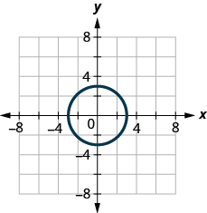
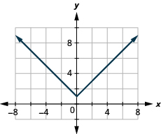
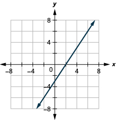
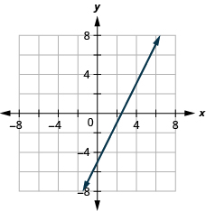
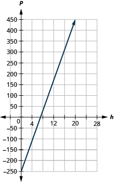

By the end of this section, you will be able to:
* Use the vertical line test
* Identify graphs of basic functions
* Read information from a graph of a function

Before you get started, take this readiness quiz.

1.  Evaluate: ⓐ
    <math xmlns="http://www.w3.org/1998/Math/MathML"><mrow><msup><mn>2</mn><mn>3</mn></msup></mrow></math>
    
    ⓑ
    <math xmlns="http://www.w3.org/1998/Math/MathML"><mrow><msup><mn>3</mn><mn>2</mn></msup><mo>.</mo></mrow></math>
    
    * * *
    {: data-type="newline"}
    
    If you missed this problem, review [\[link\]](/m63302#fs-id1167829586631).
2.  Evaluate: ⓐ
    <math xmlns="http://www.w3.org/1998/Math/MathML"><mrow><mrow><mo>\|</mo><mn>7</mn><mo>\|</mo></mrow></mrow></math>
    
    ⓑ
    <math xmlns="http://www.w3.org/1998/Math/MathML"><mrow><mrow><mo>\|</mo><mrow><mn>−3</mn></mrow><mo>\|</mo></mrow><mo>.</mo></mrow></math>
    
    * * *
    {: data-type="newline"}
    
    If you missed this problem, review [\[link\]](/m63303#fs-id1167835365552).
3.  Evaluate: ⓐ
    <math xmlns="http://www.w3.org/1998/Math/MathML"><mrow><msqrt><mn>4</mn></msqrt></mrow></math>
    
    ⓑ
    <math xmlns="http://www.w3.org/1998/Math/MathML"><mrow><msqrt><mrow><mn>16</mn></mrow></msqrt><mo>.</mo></mrow></math>
    
    * * *
    {: data-type="newline"}
    
    If you missed this problem, review [\[link\]](/m63305#fs-id1167833056590).
{: type="1"}

### Use the Vertical Line Test

In the last section we learned how to determine if a relation is a function. The relations we looked at were expressed as a set of ordered pairs, a mapping or an equation. We will now look at how to tell if a graph is that of a function.

An ordered pair <math xmlns="http://www.w3.org/1998/Math/MathML"><mrow><mrow><mo>(</mo><mrow><mi>x</mi><mo>,</mo><mi>y</mi></mrow><mo>)</mo></mrow></mrow></math>

 is a solution of a linear equation, if the equation is a true statement when the *x*- and *y*-values of the ordered pair are substituted into the equation.

The graph of a linear equation is a straight line where every point on the line is a solution of the equation and every solution of this equation is a point on this line.

In [\[link\]](#CNX_IntAlg_Figure_03_06_001), we can see that, in graph of the equation <math xmlns="http://www.w3.org/1998/Math/MathML"><mrow><mi>y</mi><mo>=</mo><mn>2</mn><mi>x</mi><mo>−</mo><mn>3</mn><mo>,</mo></mrow></math>

 for every *x*-value there is only one *y*-value, as shown in the accompanying table.

 ![plane. The x and y-axes run from negative 10 to 10. The line goes through the points (0, negative 3), (1, negative 1), and (2, 1). The line is labeled y equals2 x minus 3. There are several vertical arrows that relate values on the x-axis to points on the line. The first arrow relates x equalsnegative 2 on the x-axis to the point (negative 2, negative 7) on the line. The second arrow relates x equalsnegative 1 on the x-axis to the point (negative 1, negative 5) on the line. The next arrow relates x equals0 on the x-axis to the point (0, negative 3) on the line. The next arrow relates x equals3 on the x-axis to the point (3, 3) on the line. The last arrow relates x equals4 on the x-axis to the point (4, 5) on the line. The table has 7 rows and 3 columns. The first row is a title row with the label y equals2 x minus 3. The second row is a header row with the headers x, y, and (x, y). The third row has the coordinates negative 2, negative 7, and (negative 2, negative 7). The fourth row has the coordinates negative 1, negative 5, and (negative 1, negative 5). The fifth row has the coordinates 0, negative 3, and (0, negative 3). The sixth row has the coordinates 3, 3, and (3, 3). The seventh row has the coordinates 4, 5, and (4, 5).](../resources/CNX_IntAlg_Figure_03_06_001.jpg){: #CNX_IntAlg_Figure_03_06_001}

A relation is a function if every element of the domain has exactly one value in the range. So the relation defined by the equation <math xmlns="http://www.w3.org/1998/Math/MathML"><mrow><mi>y</mi><mo>=</mo><mn>2</mn><mi>x</mi><mo>−</mo><mn>3</mn></mrow></math>

 is a function.

If we look at the graph, each vertical dashed line only intersects the line at one point. This makes sense as in a function, for every *x*-value there is only one *y*-value.

If the vertical line hit the graph twice, the *x*-value would be mapped to two *y*-values, and so the graph would not represent a function.

This leads us to the vertical line test. A set of points in a rectangular coordinate system is the graph of a function if every vertical line intersects the graph in at most one point. If any vertical line intersects the graph in more than one point, the graph does not represent a function.

Vertical Line Test

A set of points in a rectangular coordinate system is the graph of a function if every vertical line intersects the graph in at most one point.

If any vertical line intersects the graph in more than one point, the graph does not represent a function.

Determine whether each graph is the graph of a function.

  

ⓐ Since any vertical line intersects the graph in at most one point, the graph is the graph of a function.* * *
{: data-type="newline"}

  
* * *
{: data-type="newline"}

* * *
{: data-type="newline"}

 ⓑ One of the vertical lines shown on the graph, intersects it in two points. This graph does not represent a function.* * *
{: data-type="newline"}

 ![The figure has a parabola opening to the right graphed on the x y-coordinate plane. The x and y-axes run from negative 6 to 6. The parabola goes through the points (negative 1, 0), (0, 1), (0, negative 1), (3, 2), and (3, negative 2). Three dashed vertical straight lines are drawn at x equalsnegative 2, x equalsnegative 1, and x equals2. The vertical line x &#x2013; negative 2 does not intersect the parabola. The vertical line x equalsnegative 1 intersects the parabola at exactly one point. The vertical line x equals3 intersects the parabola at two separate points.](../resources/CNX_IntAlg_Figure_03_06_004_img.jpg) 

Determine whether each graph is the graph of a function.

 ![The figure has two graphs. In graph a there is a parabola opening up graphed on the x y-coordinate plane. The x-axis runs from negative 6 to 6. The y-axis runs from negative 2 to 10. The parabola goes through the points (0, negative 1), (negative 1, 0), (1, 0), (negative 2, 3), and (2, 3). In graph b there is a circle graphed on the x y-coordinate plane. The x-axis runs from negative 6 to 6. The y-axis runs from negative 6 to 6. The circle goes through the points (negative 2, 0), (2, 0), (0, negative 2), and (0, 2).](../resources/CNX_IntAlg_Figure_03_06_005_img.jpg) 

ⓐ yes ⓑ no

Determine whether each graph is the graph of a function.

  

ⓐ no ⓑ yes

### Identify Graphs of Basic Functions

We used the equation <math xmlns="http://www.w3.org/1998/Math/MathML"><mrow><mi>y</mi><mo>=</mo><mn>2</mn><mi>x</mi><mo>−</mo><mn>3</mn></mrow></math>

 and its graph as we developed the vertical line test. We said that the relation defined by the equation <math xmlns="http://www.w3.org/1998/Math/MathML"><mrow><mi>y</mi><mo>=</mo><mn>2</mn><mi>x</mi><mo>−</mo><mn>3</mn></mrow></math>

 is a function.

We can write this as in function notation as <math xmlns="http://www.w3.org/1998/Math/MathML"><mrow><mi>f</mi><mrow><mo>(</mo><mi>x</mi><mo>)</mo></mrow><mo>=</mo><mn>2</mn><mi>x</mi><mo>−</mo><mn>3</mn><mo>.</mo></mrow></math>

 It still means the same thing. The graph of the function is the graph of all ordered pairs <math xmlns="http://www.w3.org/1998/Math/MathML"><mrow><mrow><mo>(</mo><mrow><mi>x</mi><mo>,</mo><mi>y</mi></mrow><mo>)</mo></mrow></mrow></math>

 where <math xmlns="http://www.w3.org/1998/Math/MathML"><mrow><mi>y</mi><mo>=</mo><mi>f</mi><mrow><mo>(</mo><mi>x</mi><mo>)</mo></mrow><mo>.</mo></mrow></math>

 So we can write the ordered pairs as <math xmlns="http://www.w3.org/1998/Math/MathML"><mrow><mrow><mo>(</mo><mrow><mi>x</mi><mo>,</mo><mi>f</mi><mrow><mo>(</mo><mi>x</mi><mo>)</mo></mrow></mrow><mo>)</mo></mrow><mo>.</mo></mrow></math>

 It looks different but the graph will be the same.

Compare the graph of <math xmlns="http://www.w3.org/1998/Math/MathML"><mrow><mi>y</mi><mo>=</mo><mn>2</mn><mi>x</mi><mo>−</mo><mn>3</mn></mrow></math>

 previously shown in [\[link\]](#CNX_IntAlg_Figure_03_06_001) with the graph of <math xmlns="http://www.w3.org/1998/Math/MathML"><mrow><mi>f</mi><mrow><mo>(</mo><mi>x</mi><mo>)</mo></mrow><mo>=</mo><mn>2</mn><mi>x</mi><mo>−</mo><mn>3</mn></mrow></math>

 shown in [\[link\]](#CNX_IntAlg_Figure_03_06_007). Nothing has changed but the notation.

 ![This figure has a graph next to a table. The graph has a straight line on the x y-coordinate plane. The x and y-axes run from negative 10 to 10. The line goes through the points (0, negative 3), (1, negative 1), and (2, 1). The line is labeled f of x equals2 x minus 3. There are several vertical arrows that relate values on the x-axis to points on the line. The first arrow relates x equalsnegative 2 on the x-axis to the point (negative 2, negative 7) on the line. The second arrow relates x equalsnegative 1 on the x-axis to the point (negative 1, negative 5) on the line. The next arrow relates x equals0 on the x-axis to the point (0, negative 3) on the line. The next arrow relates x equals3 on the x-axis to the point (3, 3) on the line. The last arrow relates x equals4 on the x-axis to the point (4, 5) on the line. The table has 7 rows and 3 columns. The first row is a title row with the label f of x equals2 x minus 3. The second row is a header row with the headers x, f of x, and (x, f of x). The third row has the coordinates negative 2, negative 7, and (negative 2, negative 7). The fourth row has the coordinates negative 1, negative 5, and (negative 1, negative 5). The fifth row has the coordinates 0, negative 3, and (0, negative 3). The sixth row has the coordinates 3, 3, and (3, 3). The seventh row has the coordinates 4, 5, and (4, 5).](../resources/CNX_IntAlg_Figure_03_06_007.jpg){: #CNX_IntAlg_Figure_03_06_007}

Graph of a Function

The graph of a function is the graph of all its ordered pairs, <math xmlns="http://www.w3.org/1998/Math/MathML"><mrow><mrow><mo>(</mo><mrow><mi>x</mi><mo>,</mo><mi>y</mi></mrow><mo>)</mo></mrow></mrow></math>

 or using function notation, <math xmlns="http://www.w3.org/1998/Math/MathML"><mrow><mrow><mo>(</mo><mrow><mi>x</mi><mo>,</mo><mi>f</mi><mrow><mo>(</mo><mi>x</mi><mo>)</mo></mrow></mrow><mo>)</mo></mrow></mrow></math>

 where <math xmlns="http://www.w3.org/1998/Math/MathML"><mrow><mi>y</mi><mo>=</mo><mi>f</mi><mrow><mo>(</mo><mi>x</mi><mo>)</mo></mrow><mo>.</mo></mrow></math>

<math xmlns="http://www.w3.org/1998/Math/MathML"><mrow><mtable><mtr><mtd columnalign="right"><mi>f</mi></mtd><mtd /><mtd /><mtd columnalign="left"><mtext>name of function</mtext></mtd></mtr><mtr><mtd columnalign="right"><mi>x</mi></mtd><mtd /><mtd /><mtd columnalign="left"><mi>x</mi><mtext>-coordinate of the ordered pair</mtext></mtd></mtr><mtr><mtd columnalign="right"><mi>f</mi><mrow><mo>(</mo><mi>x</mi><mo>)</mo></mrow></mtd><mtd /><mtd /><mtd columnalign="left"><mi>y</mi><mtext>-coordinate of the ordered pair</mtext></mtd></mtr></mtable></mrow></math>

As we move forward in our study, it is helpful to be familiar with the graphs of several basic functions and be able to identify them.

Through our earlier work, we are familiar with the graphs of linear equations. The process we used to decide if <math xmlns="http://www.w3.org/1998/Math/MathML"><mrow><mi>y</mi><mo>=</mo><mn>2</mn><mi>x</mi><mo>−</mo><mn>3</mn></mrow></math>

 is a function would apply to all linear equations. All non-vertical linear equations are functions. Vertical lines are not functions as the *x*-value has infinitely many *y*-values.

We wrote linear equations in several forms, but it will be most helpful for us here to use the slope-intercept form of the linear equation. The slope-intercept form of a linear equation is <math xmlns="http://www.w3.org/1998/Math/MathML"><mrow><mi>y</mi><mo>=</mo><mi>m</mi><mi>x</mi><mo>+</mo><mi>b</mi><mo>.</mo></mrow></math>

 In function notation, this linear function becomes <math xmlns="http://www.w3.org/1998/Math/MathML"><mrow><mi>f</mi><mrow><mo>(</mo><mi>x</mi><mo>)</mo></mrow><mo>=</mo><mi>m</mi><mi>x</mi><mo>+</mo><mi>b</mi></mrow></math>

 where *m* is the slope of the line and *b* is the *y*-intercept.

The domain is the set of all real numbers, and the range is also the set of all real numbers.

Linear Function

  

We will use the graphing techniques we used earlier, to graph the basic functions.

Graph: <math xmlns="http://www.w3.org/1998/Math/MathML"><mrow><mi>f</mi><mrow><mo>(</mo><mi>x</mi><mo>)</mo></mrow><mo>=</mo><mn>−2</mn><mi>x</mi><mo>−</mo><mn>4</mn><mo>.</mo></mrow></math>

<table class="unnumbered unstyled" summary="We recognize f of x equalsnegative 2 x minus 4 as a linear function. Find the slope and y-intercept. m equalsnegative 2. b equalsnegative 4. Graph using the slope intercept. The figure has the graph of a linear function on the x y-coordinate plane. The x and y-axes run from negative 6 to 6. The line goes through the points (negative 2, 0), (0, negative 4), and (negative 1, negative 2)." data-label=""><tbody>
<tr valign="top">
<td data-valign="top" data-align="left" />
<td data-valign="top" data-align="left"><math xmlns="http://www.w3.org/1998/Math/MathML"><mrow><mspace width="4.5em" /><mi>f</mi><mrow><mo>(</mo><mi>x</mi><mo>)</mo></mrow><mo>=</mo><mn>−2</mn><mi>x</mi><mo>−</mo><mn>4</mn></mrow></math></td>
</tr>
<tr valign="top">
<td data-valign="top" data-align="left">We recognize this as a linear function.</td>
<td data-valign="top" data-align="left" />
</tr>
<tr valign="top">
<td data-valign="top" data-align="left">Find the slope and <em>y</em>-intercept.</td>
<td data-valign="top" data-align="left"><math xmlns="http://www.w3.org/1998/Math/MathML"><mrow><mspace width="5.5em" /><mi>m</mi><mo>=</mo><mn>−2</mn></mrow></math>
<math xmlns="http://www.w3.org/1998/Math/MathML"><mrow><mspace width="5.65em" /><mi>b</mi><mo>=</mo><mn>−4</mn></mrow></math></td>
</tr>
<tr valign="top">
<td data-valign="top" data-align="left">Graph using the slope intercept.</td>
<td data-valign="top" data-align="left"></td>
</tr>
</tbody></table>

Graph: <math xmlns="http://www.w3.org/1998/Math/MathML"><mrow><mi>f</mi><mrow><mo>(</mo><mi>x</mi><mo>)</mo></mrow><mo>=</mo><mn>−3</mn><mi>x</mi><mo>−</mo><mn>1</mn></mrow></math>

* * *
{: data-type="newline"}

  

Graph: <math xmlns="http://www.w3.org/1998/Math/MathML"><mrow><mi>f</mi><mrow><mo>(</mo><mi>x</mi><mo>)</mo></mrow><mo>=</mo><mn>−4</mn><mi>x</mi><mo>−</mo><mn>5</mn></mrow></math>

* * *
{: data-type="newline"}

  

The next function whose graph we will look at is called the constant function and its equation is of the form <math xmlns="http://www.w3.org/1998/Math/MathML"><mrow><mi>f</mi><mrow><mo>(</mo><mi>x</mi><mo>)</mo></mrow><mo>=</mo><mi>b</mi><mo>,</mo></mrow></math>

 where *b* is any real number. If we replace the <math xmlns="http://www.w3.org/1998/Math/MathML"><mrow><mi>f</mi><mrow><mo>(</mo><mi>x</mi><mo>)</mo></mrow></mrow></math>

 with y, we get <math xmlns="http://www.w3.org/1998/Math/MathML"><mrow><mi>y</mi><mo>=</mo><mi>b</mi><mo>.</mo></mrow></math>

 We recognize this as the horizontal line whose *y*-intercept is *b*. The graph of the function <math xmlns="http://www.w3.org/1998/Math/MathML"><mrow><mi>f</mi><mrow><mo>(</mo><mi>x</mi><mo>)</mo></mrow><mo>=</mo><mi>b</mi><mo>,</mo></mrow></math>

 is also the horizontal line whose *y*-intercept is *b*.

Notice that for any real number we put in the function, the function value will be *b*. This tells us the range has only one value, *b*.

Constant Function

  

Graph: <math xmlns="http://www.w3.org/1998/Math/MathML"><mrow><mi>f</mi><mrow><mo>(</mo><mi>x</mi><mo>)</mo></mrow><mo>=</mo><mn>4</mn><mo>.</mo></mrow></math>

|  | <math xmlns="http://www.w3.org/1998/Math/MathML"><mrow><mi>f</mi><mrow><mo>(</mo><mi>x</mi><mo>)</mo></mrow><mo>=</mo><mn>4</mn></mrow></math>

 |
{: valign="top"}| We recognize this as a constant function. |  |
{: valign="top"}| The graph will be a horizontal line through <math xmlns="http://www.w3.org/1998/Math/MathML"><mrow><mrow><mo>(</mo><mrow><mn>0</mn><mo>,</mo><mn>4</mn></mrow><mo>)</mo></mrow><mo>.</mo></mrow></math>

 |  |
{: valign="top"}{: .unnumbered .unstyled summary="We recognize f of x equals4 as a constant function. The graph will be a horizontal line through (0, 4). The figure has the graph of a constant function on the x y-coordinate plane. The x-axis runs from negative 6 to 6. The y-axis runs from negative 2 to 10. The line goes through the points (negative 2, 4), (0, 4), and (1, 4)." data-label=""}

Graph: <math xmlns="http://www.w3.org/1998/Math/MathML"><mrow><mi>f</mi><mrow><mo>(</mo><mi>x</mi><mo>)</mo></mrow><mo>=</mo><mn>−2</mn><mo>.</mo></mrow></math>

* * *
{: data-type="newline"}

  

Graph: <math xmlns="http://www.w3.org/1998/Math/MathML"><mrow><mi>f</mi><mrow><mo>(</mo><mi>x</mi><mo>)</mo></mrow><mo>=</mo><mn>3</mn><mo>.</mo></mrow></math>

* * *
{: data-type="newline"}

  

The identity function, <math xmlns="http://www.w3.org/1998/Math/MathML"><mrow><mi>f</mi><mrow><mo>(</mo><mi>x</mi><mo>)</mo></mrow><mo>=</mo><mi>x</mi></mrow></math>

 is a special case of the linear function. If we write it in linear function form, <math xmlns="http://www.w3.org/1998/Math/MathML"><mrow><mi>f</mi><mrow><mo>(</mo><mi>x</mi><mo>)</mo></mrow><mo>=</mo><mn>1</mn><mi>x</mi><mo>+</mo><mn>0</mn><mo>,</mo></mrow></math>

 we see the slope is 1 and the *y*-intercept is 0.

Identity Function

  

The next function we will look at is not a linear function. So the graph will not be a line. The only method we have to graph this function is point plotting. Because this is an unfamiliar function, we make sure to choose several positive and negative values as well as 0 for our x-values.

Graph: <math xmlns="http://www.w3.org/1998/Math/MathML"><mrow><mi>f</mi><mrow><mo>(</mo><mi>x</mi><mo>)</mo></mrow><mo>=</mo><msup><mi>x</mi><mn>2</mn></msup><mo>.</mo></mrow></math>

We choose *x*-values. We substitute them in and then create a chart as shown.* * *
{: data-type="newline"}

 ![This figure has a graph next to a table. In the graph there is a parabola opening up graphed on the x y-coordinate plane. The x-axis runs from negative 4 to 4. The y-axis runs from negative 2 to 6. The parabola goes through the points (negative 3, 9), (negative 2, 4), (negative 1, 1), (0, 0), (1, 1), (2, 4), and (3, 9). The table has 8 rows and 3 columns. The first row is a header row with the headers x, f of x equalsx squared, and (x, f of x). The second row has the coordinates negative 3, 9, and (negative 3, 9). The third row has the coordinates negative 2, 4, and (negative 2, 4). The fourth row has the coordinates negative 1, 1, and (negative 1, 1). The fifth row has the coordinates 0, 0, and (0, 0). The sixth row has the coordinates 1, 1, and (1, 1). The seventh row has the coordinates 2, 4, and (2, 4). The seventh row has the coordinates 3, 9, and (3, 9).](../resources/CNX_IntAlg_Figure_03_06_013.jpg) 

Graph: <math xmlns="http://www.w3.org/1998/Math/MathML"><mrow><mi>f</mi><mrow><mo>(</mo><mi>x</mi><mo>)</mo></mrow><mo>=</mo><msup><mi>x</mi><mn>2</mn></msup><mo>.</mo></mrow></math>

* * *
{: data-type="newline"}

  

<math xmlns="http://www.w3.org/1998/Math/MathML"><mrow><mi>f</mi><mrow><mo>(</mo><mi>x</mi><mo>)</mo></mrow><mo>=</mo><mtext>−</mtext><msup><mi>x</mi><mn>2</mn></msup></mrow></math>

* * *
{: data-type="newline"}

  

Looking at the result in [\[link\]](#fs-id1167836683384), we can summarize the features of the square function. We call this graph a parabola. As we consider the domain, notice any real number can be used as an *x*-value. The domain is all real numbers.

The range is not all real numbers. Notice the graph consists of values of *y* never go below zero. This makes sense as the square of any number cannot be negative. So, the range of the square function is all non-negative real numbers.

Square Function

  

The next function we will look at is also not a linear function so the graph will not be a line. Again we will use point plotting, and make sure to choose several positive and negative values as well as 0 for our *x*-values.

Graph: <math xmlns="http://www.w3.org/1998/Math/MathML"><mrow><mi>f</mi><mrow><mo>(</mo><mi>x</mi><mo>)</mo></mrow><mo>=</mo><msup><mi>x</mi><mn>3</mn></msup><mo>.</mo></mrow></math>

We choose *x*-values. We substitute them in and then create a chart.* * *
{: data-type="newline"}

 ![This figure has a curved line graphed on the x y-coordinate plane. The x-axis runs from negative 4 to 4. The y-axis runs from negative 4 to 4. The curved line goes through the points (negative 2, negative 8), (negative 1, negative 1), (0, 0), (1, 1), and (2, 8). Next to the graph is a table. The table has 6 rows and 3 columns. The first row is a header row with the headers x, f of x equalsx cubed, and (x, f of x). The second row has the coordinates negative 2, negative 8, and (negative 2, negative 8). The third row has the coordinates negative 1, negative 1, and (negative 1, negative 1). The fourth row has the coordinates 0, 0, and (0, 0). The fifth row has the coordinates 1, 1, and (1, 1). The sixth row has the coordinates 2, 8, and (2, 8).](../resources/CNX_IntAlg_Figure_03_06_015.jpg) 

Graph: <math xmlns="http://www.w3.org/1998/Math/MathML"><mrow><mi>f</mi><mrow><mo>(</mo><mi>x</mi><mo>)</mo></mrow><mo>=</mo><msup><mi>x</mi><mn>3</mn></msup><mo>.</mo></mrow></math>

* * *
{: data-type="newline"}

  

Graph: <math xmlns="http://www.w3.org/1998/Math/MathML"><mrow><mi>f</mi><mrow><mo>(</mo><mi>x</mi><mo>)</mo></mrow><mo>=</mo><mtext>−</mtext><msup><mi>x</mi><mn>3</mn></msup><mo>.</mo></mrow></math>

* * *
{: data-type="newline"}

  

Looking at the result in [\[link\]](#fs-id1167832966170), we can summarize the features of the cube function. As we consider the domain, notice any real number can be used as an *x*-value. The domain is all real numbers.

The range is all real numbers. This makes sense as the cube of any non-zero number can be positive or negative. So, the range of the cube function is all real numbers.

Cube Function

  

The next function we will look at does not square or cube the input values, but rather takes the square root of those values.

Let’s graph the function <math xmlns="http://www.w3.org/1998/Math/MathML"><mrow><mi>f</mi><mrow><mo>(</mo><mi>x</mi><mo>)</mo></mrow><mo>=</mo><msqrt><mrow><mi>x</mi></mrow></msqrt></mrow></math>

 and then summarize the features of the function. Remember, we can only take the square root of non-negative real numbers, so our domain will be the non-negative real numbers.

<math xmlns="http://www.w3.org/1998/Math/MathML"><mrow><mi>f</mi><mrow><mo>(</mo><mi>x</mi><mo>)</mo></mrow><mo>=</mo><msqrt><mrow><mi>x</mi></mrow></msqrt></mrow></math>

We choose *x*-values. Since we will be taking the square root, we choose numbers that are perfect squares, to make our work easier. We substitute them in and then create a chart.* * *
{: data-type="newline"}

 ![This figure has a curved half-line graphed on the x y-coordinate plane. The x-axis runs from 0 to 8. The y-axis runs from 0 to 8. The curved half-line starts at the point (0, 0) and then goes up and to the right. The curved half line goes through the points (1, 1) and (4, 2). Next to the graph is a table. The table has 5 rows and 3 columns. The first row is a header row with the headers x, f of x equalssquare root of x, and (x, f of x). The second row has the coordinates 0, 0, and (0, 0). The third row has the coordinates 1, 1, and (1, 1). The fourth row has the coordinates 4, 2, and (4, 2). The fifth row has the coordinates 9, 3, and (9, 3).](../resources/CNX_IntAlg_Figure_03_06_017.jpg) 

Graph: <math xmlns="http://www.w3.org/1998/Math/MathML"><mrow><mi>f</mi><mrow><mo>(</mo><mi>x</mi><mo>)</mo></mrow><mo>=</mo><msqrt><mrow><mi>x</mi></mrow></msqrt><mo>.</mo></mrow></math>

* * *
{: data-type="newline"}

  

Graph: <math xmlns="http://www.w3.org/1998/Math/MathML"><mrow><mi>f</mi><mrow><mo>(</mo><mi>x</mi><mo>)</mo></mrow><mo>=</mo><mtext>−</mtext><msqrt><mrow><mi>x</mi></mrow></msqrt><mo>.</mo></mrow></math>

* * *
{: data-type="newline"}

  

Square Root Function

  

Our last basic function is the absolute value function, <math xmlns="http://www.w3.org/1998/Math/MathML"><mrow><mi>f</mi><mrow><mo>(</mo><mi>x</mi><mo>)</mo></mrow><mo>=</mo><mrow><mo>\|</mo><mrow><mi>x</mi></mrow><mo>\|</mo></mrow><mo>.</mo></mrow></math>

 Keep in mind that the absolute value of a number is its distance from zero. Since we never measure distance as a negative number, we will never get a negative number in the range.

Graph: <math xmlns="http://www.w3.org/1998/Math/MathML"><mrow><mi>f</mi><mrow><mo>(</mo><mi>x</mi><mo>)</mo></mrow><mo>=</mo><mrow><mo>\|</mo><mrow><mi>x</mi></mrow><mo>\|</mo></mrow><mo>.</mo></mrow></math>

We choose *x*-values. We substitute them in and then create a chart.* * *
{: data-type="newline"}

 ![This figure has a v-shaped line graphed on the x y-coordinate plane. The x-axis runs from negative 4 to 4. The y-axis runs from negative 1 to 6. The v-shaped line goes through the points (negative 3, 3), (negative 2, 2), (negative 1, 1), (0, 0), (1, 1), (2, 2), and (3, 3). Next to the graph is a table. The table has 8 rows and 3 columns. The first row is a header row with the headers x, f of x equalsabsolute value of x, and (x, f of x). The second row has the coordinates negative 3, 3, and (negative 3, 3). The third row has the coordinates negative 2, 2, and (negative 2, 2). The fourth row has the coordinates negative 1, 1, and (negative 1, 1). The fifth row has the coordinates 0, 0, and (0, 0). The sixth row has the coordinates 1, 1, and (1, 1). The seventh row has the coordinates 2, 2, and (2, 2). The eighth row has the coordinates 3, 3, and (3, 3).](../resources/CNX_IntAlg_Figure_03_06_019.jpg) 

Graph: <math xmlns="http://www.w3.org/1998/Math/MathML"><mrow><mi>f</mi><mrow><mo>(</mo><mi>x</mi><mo>)</mo></mrow><mo>=</mo><mrow><mo>\|</mo><mrow><mi>x</mi></mrow><mo>\|</mo></mrow><mo>.</mo></mrow></math>

* * *
{: data-type="newline"}

  

Graph: <math xmlns="http://www.w3.org/1998/Math/MathML"><mrow><mi>f</mi><mrow><mo>(</mo><mi>x</mi><mo>)</mo></mrow><mo>=</mo><mtext>−</mtext><mrow><mo>\|</mo><mrow><mi>x</mi></mrow><mo>\|</mo></mrow><mo>.</mo></mrow></math>

* * *
{: data-type="newline"}

  

Absolute Value Function

 ![This figure has a v-shaped line graphed on the x y-coordinate plane. The x-axis runs from negative 4 to 4. The y-axis runs from negative 1 to 6. The v-shaped line goes through the points (negative 3, 3), (negative 2, 2), (negative 1, 1), (0, 0), (1, 1), (2, 2), and (3, 3). The point (0, 0) where the line changes slope is called the vertex. Next to the graph are the following: &#x201C;f of x equalsabsolute value of x&#x201D;, &#x201C;Domain: (negative infinity, infinity)&#x201D;, and &#x201C;Range: \[0, infinity)&#x201D;.](../resources/CNX_IntAlg_Figure_03_06_020_img.jpg) 

### Read Information from a Graph of a Function

In the sciences and business, data is often collected and then graphed. The graph is analyzed, information is obtained from the graph and then often predictions are made from the data.

We will start by reading the domain and range of a function from its graph.

Remember the domain is the set of all the *x*-values in the ordered pairs in the function. To find the domain we look at the graph and find all the values of *x* that have a corresponding value on the graph. Follow the value *x* up or down vertically. If you hit the graph of the function then *x* is in the domain.

Remember the range is the set of all the *y*-values in the ordered pairs in the function. To find the range we look at the graph and find all the values of *y* that have a corresponding value on the graph. Follow the value *y* left or right horizontally. If you hit the graph of the function then *y* is in the range.

Use the graph of the function to find its domain and range. Write the domain and range in interval notation.

 ![This figure has a curved line segment graphed on the x y-coordinate plane. The x-axis runs from negative 4 to 4. The y-axis runs from negative 4 to 4. The curved line segment goes through the points (negative 3, negative 1), (1.5, 3), and (3, 1). The interval \[negative 3, 3\] is marked on the horizontal axis. The interval \[negative 1, 3\] is marked on the vertical axis.](../resources/CNX_IntAlg_Figure_03_06_021_img.jpg) 

To find the domain we look at the graph and find all the values of *x* that correspond to a point on the graph. The domain is highlighted in red on the graph. The domain is <math xmlns="http://www.w3.org/1998/Math/MathML"><mrow><mrow><mo>[</mo><mrow><mn>−3</mn><mo>,</mo><mn>3</mn></mrow><mo>]</mo></mrow><mo>.</mo></mrow></math>

To find the range we look at the graph and find all the values of *y* that correspond to a point on the graph. The range is highlighted in blue on the graph. The range is <math xmlns="http://www.w3.org/1998/Math/MathML"><mrow><mrow><mo>[</mo><mrow><mn>−1</mn><mo>,</mo><mn>3</mn></mrow><mo>]</mo></mrow><mo>.</mo></mrow></math>

Use the graph of the function to find its domain and range. Write the domain and range in interval notation.

 ![This figure has a curved line segment graphed on the x y-coordinate plane. The x-axis runs from negative 6 to 6. The y-axis runs from negative 6 to 6. The curved line segment goes through the points (negative 5, negative 4), (0, negative 3), and (1, 2). The interval \[negative 5, 1\] is marked on the horizontal axis. The interval \[negative 4, 2\] is marked on the vertical axis.](../resources/CNX_IntAlg_Figure_03_06_022_img.jpg) 

The domain is <math xmlns="http://www.w3.org/1998/Math/MathML"><mrow><mrow><mo>[</mo><mrow><mn>−5</mn><mo>,</mo><mn>1</mn></mrow><mo>]</mo></mrow><mo>.</mo></mrow></math>

 The range is <math xmlns="http://www.w3.org/1998/Math/MathML"><mrow><mrow><mo>[</mo><mrow><mn>−4</mn><mo>,</mo><mn>2</mn></mrow><mo>]</mo></mrow><mo>.</mo></mrow></math>

Use the graph of the function to find its domain and range. Write the domain and range in interval notation.

 ![This figure has a curved line segment graphed on the x y-coordinate plane. The x-axis runs from negative 4 to 5. The y-axis runs from negative 6 to 4. The curved line segment goes through the points (negative 2, 1), (0, 3), and (4, negative 5). The interval \[negative 2, 4\] is marked on the horizontal axis. The interval \[negative 5, 3\] is marked on the vertical axis.](../resources/CNX_IntAlg_Figure_03_06_023_img.jpg) 

The domain is <math xmlns="http://www.w3.org/1998/Math/MathML"><mrow><mrow><mo>[</mo><mrow><mn>−2</mn><mo>,</mo><mn>4</mn></mrow><mo>]</mo></mrow><mo>.</mo></mrow></math>

 The range is <math xmlns="http://www.w3.org/1998/Math/MathML"><mrow><mrow><mo>[</mo><mrow><mn>−5</mn><mo>,</mo><mn>3</mn></mrow><mo>]</mo></mrow><mo>.</mo></mrow></math>

We are now going to read information from the graph that you may see in future math classes.

Use the graph of the function to find the indicated values.

 ![This figure has a wavy curved line graphed on the x y-coordinate plane. The x-axis runs from negative 2 times pi to 2 times pi. The y-axis runs from negative 4 to 4. The curved line segment goes through the points (negative 2 times pi, 0), (negative 3 divided by 2 times pi, 1), (negative pi, 0), (negative 1 divided by 2 times pi, negative 1), (0, 0), (1 divided by 2 times pi, 1), (pi, 0), (3 divided by 2 times pi, negative 1), and (2 times pi, 0). The points (negative 3 divided by 2 times pi, 1) and (1 divided by 2 times pi, 1) are the highest points on the graph. The points (negative 1 divided by 2 times pi, negative 1) and (3 divided by 2 times pi, negative 1) are the lowest points on the graph. The pattern extends infinitely to the left and right.](../resources/CNX_IntAlg_Figure_03_06_024_img.jpg) 
ⓐ Find: <math xmlns="http://www.w3.org/1998/Math/MathML"><mrow><mi>f</mi><mrow><mo>(</mo><mn>0</mn><mo>)</mo></mrow><mo>.</mo></mrow></math>

* * *
{: data-type="newline"}

 ⓑ Find: <math xmlns="http://www.w3.org/1998/Math/MathML"><mrow><mi>f</mi><mrow><mo>(</mo><mrow><mfrac><mn>3</mn><mn>2</mn></mfrac><mi>π</mi></mrow><mo>)</mo></mrow><mo>.</mo></mrow></math>

* * *
{: data-type="newline"}

 ⓒ Find: <math xmlns="http://www.w3.org/1998/Math/MathML"><mrow><mi>f</mi><mrow><mo>(</mo><mrow><mo>−</mo><mfrac><mn>1</mn><mn>2</mn></mfrac><mi>π</mi></mrow><mo>)</mo></mrow><mo>.</mo></mrow></math>

* * *
{: data-type="newline"}

 ⓓ Find the values for *x* when <math xmlns="http://www.w3.org/1998/Math/MathML"><mrow><mi>f</mi><mrow><mo>(</mo><mi>x</mi><mo>)</mo></mrow><mo>=</mo><mn>0</mn><mo>.</mo></mrow></math>

* * *
{: data-type="newline"}

 ⓔ Find the *x*-intercepts.* * *
{: data-type="newline"}

 ⓕ Find the *y*-intercepts.* * *
{: data-type="newline"}

 ⓖ Find the domain. Write it in interval notation.* * *
{: data-type="newline"}

 ⓗ Find the range. Write it in interval notation.

ⓐ When <math xmlns="http://www.w3.org/1998/Math/MathML"><mrow><mi>x</mi><mo>=</mo><mn>0</mn><mo>,</mo></mrow></math>

 the function crosses the *y*-axis at 0. So, <math xmlns="http://www.w3.org/1998/Math/MathML"><mrow><mi>f</mi><mrow><mo>(</mo><mn>0</mn><mo>)</mo></mrow><mo>=</mo><mn>0</mn><mo>.</mo></mrow></math>

* * *
{: data-type="newline"}

 ⓑ When <math xmlns="http://www.w3.org/1998/Math/MathML"><mrow><mi>x</mi><mo>=</mo><mfrac><mn>3</mn><mn>2</mn></mfrac><mi>π</mi><mo>,</mo></mrow></math>

 the *y*-value of the function is <math xmlns="http://www.w3.org/1998/Math/MathML"><mrow><mn>−1</mn><mo>.</mo></mrow></math>

 So, <math xmlns="http://www.w3.org/1998/Math/MathML"><mrow><mi>f</mi><mrow><mo>(</mo><mrow><mfrac><mn>3</mn><mn>2</mn></mfrac><mi>π</mi></mrow><mo>)</mo></mrow><mo>=</mo><mn>−1</mn><mo>.</mo></mrow></math>

* * *
{: data-type="newline"}

 ⓒ When <math xmlns="http://www.w3.org/1998/Math/MathML"><mrow><mi>x</mi><mo>=</mo><mo>−</mo><mfrac><mn>1</mn><mn>2</mn></mfrac><mi>π</mi><mo>,</mo></mrow></math>

 the *y*-value of the function is <math xmlns="http://www.w3.org/1998/Math/MathML"><mrow><mn>−1</mn><mo>.</mo></mrow></math>

 So, <math xmlns="http://www.w3.org/1998/Math/MathML"><mrow><mi>f</mi><mrow><mo>(</mo><mrow><mo>−</mo><mfrac><mn>1</mn><mn>2</mn></mfrac><mi>π</mi></mrow><mo>)</mo></mrow><mo>=</mo><mn>−1</mn><mo>.</mo></mrow></math>

* * *
{: data-type="newline"}

 ⓓ The function is 0 at the points, <math xmlns="http://www.w3.org/1998/Math/MathML"><mrow><mrow><mo>(</mo><mrow><mn>−2</mn><mi>π</mi><mo>,</mo><mn>0</mn></mrow><mo>)</mo></mrow><mo>,</mo><mrow><mo>(</mo><mrow><mtext>−</mtext><mi>π</mi><mo>,</mo><mn>0</mn></mrow><mo>)</mo></mrow><mo>,</mo><mrow><mo>(</mo><mrow><mn>0</mn><mo>,</mo><mn>0</mn></mrow><mo>)</mo></mrow><mo>,</mo><mrow><mo>(</mo><mrow><mi>π</mi><mo>,</mo><mn>0</mn></mrow><mo>)</mo></mrow><mo>,</mo><mrow><mo>(</mo><mrow><mn>2</mn><mi>π</mi><mo>,</mo><mn>0</mn></mrow><mo>)</mo></mrow><mo>.</mo></mrow></math>

 The *x*-values when <math xmlns="http://www.w3.org/1998/Math/MathML"><mrow><mi>f</mi><mrow><mo>(</mo><mi>x</mi><mo>)</mo></mrow><mo>=</mo><mn>0</mn></mrow></math>

 are <math xmlns="http://www.w3.org/1998/Math/MathML"><mrow><mn>−2</mn><mi>π</mi><mo>,</mo><mtext>−</mtext><mi>π</mi><mo>,</mo><mn>0</mn><mo>,</mo><mi>π</mi><mo>,</mo><mn>2</mn><mi>π</mi><mo>.</mo></mrow></math>

* * *
{: data-type="newline"}

 ⓔ The *x*-intercepts occur when <math xmlns="http://www.w3.org/1998/Math/MathML"><mrow><mi>y</mi><mo>=</mo><mn>0</mn><mo>.</mo></mrow></math>

 So the *x*-intercepts occur when <math xmlns="http://www.w3.org/1998/Math/MathML"><mrow><mi>f</mi><mrow><mo>(</mo><mi>x</mi><mo>)</mo></mrow><mo>=</mo><mn>0</mn><mo>.</mo></mrow></math>

 The *x*-intercepts are <math xmlns="http://www.w3.org/1998/Math/MathML"><mrow><mrow><mo>(</mo><mrow><mn>−2</mn><mi>π</mi><mo>,</mo><mn>0</mn></mrow><mo>)</mo></mrow><mo>,</mo><mrow><mo>(</mo><mrow><mtext>−</mtext><mi>π</mi><mo>,</mo><mn>0</mn></mrow><mo>)</mo></mrow><mo>,</mo><mrow><mo>(</mo><mrow><mn>0</mn><mo>,</mo><mn>0</mn></mrow><mo>)</mo></mrow><mo>,</mo><mrow><mo>(</mo><mrow><mi>π</mi><mo>,</mo><mn>0</mn></mrow><mo>)</mo></mrow><mo>,</mo><mrow><mo>(</mo><mrow><mn>2</mn><mi>π</mi><mo>,</mo><mn>0</mn></mrow><mo>)</mo></mrow><mo>.</mo></mrow></math>

* * *
{: data-type="newline"}

 ⓕ The *y*-intercepts occur when <math xmlns="http://www.w3.org/1998/Math/MathML"><mrow><mi>x</mi><mo>=</mo><mn>0</mn><mo>.</mo></mrow></math>

 So the *y*-intercepts occur at <math xmlns="http://www.w3.org/1998/Math/MathML"><mrow><mi>f</mi><mrow><mo>(</mo><mn>0</mn><mo>)</mo></mrow><mo>.</mo></mrow></math>

 The *y*-intercept is <math xmlns="http://www.w3.org/1998/Math/MathML"><mrow><mrow><mo>(</mo><mrow><mn>0</mn><mo>,</mo><mn>0</mn></mrow><mo>)</mo></mrow><mo>.</mo></mrow></math>

* * *
{: data-type="newline"}

 ⓖ This function has a value when *x* is from <math xmlns="http://www.w3.org/1998/Math/MathML"><mrow><mn>−2</mn><mi>π</mi></mrow></math>

 to <math xmlns="http://www.w3.org/1998/Math/MathML"><mrow><mn>2</mn><mi>π</mi><mo>.</mo></mrow></math>

 Therefore, the domain in interval notation is <math xmlns="http://www.w3.org/1998/Math/MathML"><mrow><mrow><mo>[</mo><mrow><mn>−2</mn><mi>π</mi><mo>,</mo><mn>2</mn><mi>π</mi></mrow><mo>]</mo></mrow><mo>.</mo></mrow></math>

* * *
{: data-type="newline"}

 ⓗ This function values, or *y*-values go from <math xmlns="http://www.w3.org/1998/Math/MathML"><mrow><mn>−1</mn></mrow></math>

 to 1. Therefore, the range, in interval notation, is <math xmlns="http://www.w3.org/1998/Math/MathML"><mrow><mrow><mo>[</mo><mrow><mn>−1</mn><mo>,</mo><mn>1</mn></mrow><mo>]</mo></mrow><mo>.</mo></mrow></math>

Use the graph of the function to find the indicated values.

 ![This figure has a wavy curved line graphed on the x y-coordinate plane. The x-axis runs from negative 2 times pi to 2 times pi. The y-axis runs from negative 6 to 6. The curved line segment goes through the points (negative 2 times pi, 0), (negative 3 divided by 2 times pi, 2), (negative pi, 0), (negative 1 divided by 2 times pi, negative 2), (0, 0), (1 divided by 2 times pi, 2), (pi, 0), (3 divided by 2 times pi, negative 2), and (2 times pi, 0). The points (negative 3 divided by 2 times pi, 2) and (1 divided by 2 times pi, 2) are the highest points on the graph. The points (negative 1 divided by 2 times pi, negative 2) and (3 divided by 2 times pi, negative 2) are the lowest points on the graph. The line extends infinitely to the left and right.](../resources/CNX_IntAlg_Figure_03_06_025_img.jpg) 
ⓐ Find: <math xmlns="http://www.w3.org/1998/Math/MathML"><mrow><mi>f</mi><mrow><mo>(</mo><mn>0</mn><mo>)</mo></mrow><mo>.</mo></mrow></math>

* * *
{: data-type="newline"}

 ⓑ Find: <math xmlns="http://www.w3.org/1998/Math/MathML"><mrow><mi>f</mi><mrow><mo>(</mo><mrow><mfrac><mn>1</mn><mn>2</mn></mfrac><mi>π</mi></mrow><mo>)</mo></mrow><mo>.</mo></mrow></math>

* * *
{: data-type="newline"}

 ⓒ Find: <math xmlns="http://www.w3.org/1998/Math/MathML"><mrow><mi>f</mi><mrow><mo>(</mo><mrow><mo>−</mo><mfrac><mn>3</mn><mn>2</mn></mfrac><mi>π</mi></mrow><mo>)</mo></mrow><mo>.</mo></mrow></math>

* * *
{: data-type="newline"}

 ⓓ Find the values for *x* when <math xmlns="http://www.w3.org/1998/Math/MathML"><mrow><mi>f</mi><mrow><mo>(</mo><mi>x</mi><mo>)</mo></mrow><mo>=</mo><mn>0</mn><mo>.</mo></mrow></math>

* * *
{: data-type="newline"}

 ⓔ Find the *x*-intercepts.* * *
{: data-type="newline"}

 ⓕ Find the *y*-intercepts.* * *
{: data-type="newline"}

 ⓖ Find the domain. Write it in interval notation.* * *
{: data-type="newline"}

 ⓗ Find the range. Write it in interval notation.

ⓐ <math xmlns="http://www.w3.org/1998/Math/MathML"><mrow><mi>f</mi><mo stretchy="false">(</mo><mn>0</mn><mo stretchy="false">)</mo><mo>=</mo><mn>0</mn></mrow></math>

 ⓑ <math xmlns="http://www.w3.org/1998/Math/MathML"><mrow><mi>f</mi><mo>=</mo><mrow><mo>(</mo><mrow><mfrac><mi>π</mi><mn>2</mn></mfrac></mrow><mo>)</mo></mrow><mo>=</mo><mn>2</mn></mrow></math>

 ⓒ <math xmlns="http://www.w3.org/1998/Math/MathML"><mrow><mi>f</mi><mo>=</mo><mrow><mo>(</mo><mrow><mfrac><mrow><mn>−3</mn><mi>π</mi></mrow><mn>2</mn></mfrac></mrow><mo>)</mo></mrow><mo>=</mo><mn>2</mn></mrow></math>

 ⓓ <math xmlns="http://www.w3.org/1998/Math/MathML"><mrow><mi>f</mi><mo stretchy="false">(</mo><mi>x</mi><mo stretchy="false">)</mo><mo>=</mo><mn>0</mn></mrow></math>

 for <math xmlns="http://www.w3.org/1998/Math/MathML"><mrow><mi>x</mi><mo>=</mo><mn>−2</mn><mi>π</mi><mo>,</mo><mtext>−</mtext><mi>π</mi><mo>,</mo><mn>0</mn><mo>,</mo><mi>π</mi><mo>,</mo><mn>2</mn><mi>π</mi></mrow></math>

 ⓔ <math xmlns="http://www.w3.org/1998/Math/MathML"><mrow><mo stretchy="false">(</mo><mn>−2</mn><mi>π</mi><mo>,</mo><mn>0</mn><mo stretchy="false">)</mo><mo>,</mo><mo stretchy="false">(</mo><mtext>−</mtext><mi>π</mi><mo>,</mo><mn>0</mn><mo stretchy="false">)</mo><mo>,</mo><mo stretchy="false">(</mo><mn>0</mn><mo>,</mo><mn>0</mn><mo stretchy="false">)</mo><mo>,</mo><mo stretchy="false">(</mo><mi>π</mi><mo>,</mo><mn>0</mn><mo stretchy="false">)</mo><mo>,</mo><mo stretchy="false">(</mo><mn>2</mn><mi>π</mi><mo>,</mo><mn>0</mn><mo stretchy="false">)</mo></mrow></math>

 ⓕ <math xmlns="http://www.w3.org/1998/Math/MathML"><mrow><mo stretchy="false">(</mo><mn>0</mn><mo>,</mo><mn>0</mn><mo stretchy="false">)</mo></mrow></math>

 ⓖ <math xmlns="http://www.w3.org/1998/Math/MathML"><mrow><mo stretchy="false">[</mo><mn>−2</mn><mi>π</mi><mo>,</mo><mn>2</mn><mi>π</mi><mo stretchy="false">]</mo></mrow></math>

 ⓗ <math xmlns="http://www.w3.org/1998/Math/MathML"><mrow><mo stretchy="false">[</mo><mn>−2</mn><mo>,</mo><mn>2</mn><mo stretchy="false">]</mo></mrow></math>

Use the graph of the function to find the indicated values.

 ![This figure has a wavy curved line graphed on the x y-coordinate plane. The x-axis runs from negative 2 times pi to 2 times pi. The y-axis runs from negative 6 to 6. The curved line segment goes through the points (negative 2 times pi, 1), (negative 3 divided by 2 times pi, 0), (negative pi, negative 1), (negative 1 divided by 2 times pi, 0), (0, 1), (1 divided by 2 times pi, 0), (pi, negative 1), (3 divided by 2 times pi, 0), and (2 times pi, 1). The points (negative 2 times pi, 1), (0, 1), and (2 times pi, 1) are the highest points on the graph. The points (negative pi, negative 1) and (pi, negative 1) are the lowest points on the graph. The pattern extends infinitely to the left and right.](../resources/CNX_IntAlg_Figure_03_06_026_img.jpg) 
ⓐ Find: <math xmlns="http://www.w3.org/1998/Math/MathML"><mrow><mi>f</mi><mrow><mo>(</mo><mn>0</mn><mo>)</mo></mrow><mo>.</mo></mrow></math>

* * *
{: data-type="newline"}

 ⓑ Find: <math xmlns="http://www.w3.org/1998/Math/MathML"><mrow><mi>f</mi><mrow><mo>(</mo><mi>π</mi><mo>)</mo></mrow><mo>.</mo></mrow></math>

* * *
{: data-type="newline"}

 ⓒ Find: <math xmlns="http://www.w3.org/1998/Math/MathML"><mrow><mi>f</mi><mrow><mo>(</mo><mrow><mtext>−</mtext><mi>π</mi></mrow><mo>)</mo></mrow><mo>.</mo></mrow></math>

* * *
{: data-type="newline"}

 ⓓ Find the values for *x* when <math xmlns="http://www.w3.org/1998/Math/MathML"><mrow><mi>f</mi><mrow><mo>(</mo><mi>x</mi><mo>)</mo></mrow><mo>=</mo><mn>0</mn><mo>.</mo></mrow></math>

* * *
{: data-type="newline"}

 ⓔ Find the *x*-intercepts.* * *
{: data-type="newline"}

 ⓕ Find the *y*-intercepts.* * *
{: data-type="newline"}

 ⓖ Find the domain. Write it in interval notation.* * *
{: data-type="newline"}

 ⓗ Find the range. Write it in interval notation.

ⓐ <math xmlns="http://www.w3.org/1998/Math/MathML"><mrow><mi>f</mi><mo stretchy="false">(</mo><mn>0</mn><mo stretchy="false">)</mo><mo>=</mo><mn>1</mn></mrow></math>

 ⓑ <math xmlns="http://www.w3.org/1998/Math/MathML"><mrow><mi>f</mi><mo stretchy="false">(</mo><mi>π</mi><mo stretchy="false">)</mo><mo>=</mo><mn>−1</mn></mrow></math>

 ⓒ <math xmlns="http://www.w3.org/1998/Math/MathML"><mrow><mi>f</mi><mo stretchy="false">(</mo><mtext>−</mtext><mi>π</mi><mo stretchy="false">)</mo><mo>=</mo><mn>−1</mn></mrow></math>

 ⓓ <math xmlns="http://www.w3.org/1998/Math/MathML"><mrow><mi>f</mi><mo stretchy="false">(</mo><mi>x</mi><mo stretchy="false">)</mo><mo>=</mo><mn>0</mn></mrow></math>

 for <math xmlns="http://www.w3.org/1998/Math/MathML"><mrow><mi>x</mi><mo>=</mo><mo>−</mo><mfrac><mrow><mn>3</mn><mi>π</mi></mrow><mn>2</mn></mfrac><mo>,</mo><mo>−</mo><mfrac><mi>π</mi><mn>2</mn></mfrac><mo>,</mo><mfrac><mi>π</mi><mn>2</mn></mfrac><mo>,</mo><mfrac><mrow><mn>3</mn><mi>π</mi></mrow><mn>2</mn></mfrac></mrow></math>

 ⓔ <math xmlns="http://www.w3.org/1998/Math/MathML"><mrow><mrow><mo>(</mo><mrow><mn>−2</mn><mtext>pi</mtext><mo>,</mo><mn>0</mn></mrow><mo>)</mo></mrow><mo>,</mo><mrow><mo>(</mo><mrow><mtext>−pi</mtext><mo>,</mo><mn>0</mn></mrow><mo>)</mo></mrow><mo>,</mo><mrow><mo>(</mo><mrow><mn>0</mn><mo>,</mo><mn>0</mn></mrow><mo>)</mo></mrow><mo>,</mo><mrow><mo>(</mo><mrow><mtext>pi</mtext><mo>,</mo><mn>0</mn></mrow><mo>)</mo></mrow><mo>,</mo><mrow><mo>(</mo><mrow><mn>2</mn><mtext>pi</mtext><mo>,</mo><mn>0</mn></mrow><mo>)</mo></mrow></mrow></math>

 ⓕ <math xmlns="http://www.w3.org/1998/Math/MathML"><mrow><mrow><mo>(</mo><mrow><mn>0</mn><mo>,</mo><mn>1</mn></mrow><mo>)</mo></mrow></mrow></math>

 ⓖ <math xmlns="http://www.w3.org/1998/Math/MathML"><mrow><mrow><mo>[</mo><mrow><mn>−2</mn><mtext>pi</mtext><mo>,</mo><mn>2</mn><mtext>pi</mtext></mrow><mo>]</mo></mrow></mrow></math>

 ⓗ <math xmlns="http://www.w3.org/1998/Math/MathML"><mrow><mrow><mo>[</mo><mrow><mn>−1</mn><mo>,</mo><mn>1</mn></mrow><mo>]</mo></mrow></mrow></math>

Access this online resource for additional instruction and practice with graphs of functions.

* [Find Domain and Range][1]
{: data-display="block"}

### Key Concepts

* **Vertical Line Test**
  * A set of points in a rectangular coordinate system is the graph of a function if every vertical line intersects the graph in at most one point.
  * If any vertical line intersects the graph in more than one point, the graph does not represent a function.
  {: data-bullet-style="bullet"}

* **Graph of a Function**
  * The graph of a function is the graph of all its ordered pairs,
    <math xmlns="http://www.w3.org/1998/Math/MathML"><mrow><mrow><mo>(</mo><mrow><mi>x</mi><mo>,</mo><mi>y</mi></mrow><mo>)</mo></mrow></mrow></math>
    
    or using function notation,
    <math xmlns="http://www.w3.org/1998/Math/MathML"><mrow><mrow><mo>(</mo><mrow><mi>x</mi><mo>,</mo><mi>f</mi><mrow><mo>(</mo><mi>x</mi><mo>)</mo></mrow></mrow><mo>)</mo></mrow></mrow></math>
    
    where
    <math xmlns="http://www.w3.org/1998/Math/MathML"><mrow><mi>y</mi><mo>=</mo><mi>f</mi><mrow><mo>(</mo><mi>x</mi><mo>)</mo></mrow><mo>.</mo></mrow></math>
    
    * * *
    {: data-type="newline"}
    
    

    <math xmlns="http://www.w3.org/1998/Math/MathML"><mrow><mtable><mtr><mtd columnalign="right"><mi>f</mi></mtd><mtd /><mtd /><mtd columnalign="left"><mtext>name of function</mtext></mtd></mtr><mtr><mtd columnalign="right"><mi>x</mi></mtd><mtd /><mtd /><mtd columnalign="left"><mi>x</mi><mtext>-coordinate of the ordered pair</mtext></mtd></mtr><mtr><mtd columnalign="right"><mi>f</mi><mrow><mo>(</mo><mi>x</mi><mo>)</mo></mrow></mtd><mtd /><mtd /><mtd columnalign="left"><mi>y</mi><mtext>-coordinate of the ordered pair</mtext></mtd></mtr></mtable></mrow></math>
    

  {: data-bullet-style="bullet"}

* **Linear Function**
  * * *
  {: data-type="newline"}
  
    
* **Constant Function**
  * * *
  {: data-type="newline"}
  
    
* **Identity Function**
  * * *
  {: data-type="newline"}
  
    
* **Square Function**
  * * *
  {: data-type="newline"}
  
    
* **Cube Function**
  * * *
  {: data-type="newline"}
  
    
* **Square Root Function**
  * * *
  {: data-type="newline"}
  
    
* **Absolute Value Function**
  * * *
  {: data-type="newline"}
  
   ![This figure has a v-shaped line graphed on the x y-coordinate plane. The x-axis runs from negative 4 to 4. The y-axis runs from negative 1 to 6. The v-shaped line goes through the points (negative 3, 3), (negative 2, 2), (negative 1, 1), (0, 0), (1, 1), (2, 2), and (3, 3). The point (0, 0) where the line changes slope is called the vertex. Next to the graph are the following: &#x201C;f of x equalsabsolute value of x&#x201D;, &#x201C;Domain: (negative infinity, infinity)&#x201D;, and &#x201C;Range: \[0, infinity)&#x201D;.](../resources/CNX_IntAlg_Figure_03_06_033_img.jpg) 
{: data-bullet-style="bullet"}

<section data-depth="1" class="section-exercises" markdown="1">
#### Practice Makes Perfect

**Use the Vertical Line Test**

In the following exercises, determine whether each graph is the graph of a function.

ⓐ* * *
{: data-type="newline"}

  
* * *
{: data-type="newline"}

ⓑ* * *
{: data-type="newline"}

  

ⓐ no ⓑ yes

ⓐ* * *
{: data-type="newline"}

  
* * *
{: data-type="newline"}

ⓑ* * *
{: data-type="newline"}

  

ⓐ* * *
{: data-type="newline"}

  
* * *
{: data-type="newline"}

ⓑ* * *
{: data-type="newline"}

  

ⓐ no ⓑ yes

ⓐ* * *
{: data-type="newline"}

  
* * *
{: data-type="newline"}

ⓑ* * *
{: data-type="newline"}

  

**Identify Graphs of Basic Functions**

In the following exercises, ⓐ graph each function ⓑ state its domain and range. Write the domain and range in interval notation.

<math xmlns="http://www.w3.org/1998/Math/MathML"><mrow><mi>f</mi><mrow><mo>(</mo><mi>x</mi><mo>)</mo></mrow><mo>=</mo><mn>3</mn><mi>x</mi><mo>+</mo><mn>4</mn></mrow></math>

ⓐ* * *
{: data-type="newline"}

  
* * *
{: data-type="newline"}

* * *
{: data-type="newline"}

ⓑ D:(-∞,∞), R:(-∞,∞)

<math xmlns="http://www.w3.org/1998/Math/MathML"><mrow><mi>f</mi><mrow><mo>(</mo><mi>x</mi><mo>)</mo></mrow><mo>=</mo><mn>2</mn><mi>x</mi><mo>+</mo><mn>5</mn></mrow></math>

<math xmlns="http://www.w3.org/1998/Math/MathML"><mrow><mi>f</mi><mrow><mo>(</mo><mi>x</mi><mo>)</mo></mrow><mo>=</mo><mtext>−</mtext><mi>x</mi><mo>−</mo><mn>2</mn></mrow></math>

ⓐ* * *
{: data-type="newline"}

  
* * *
{: data-type="newline"}

* * *
{: data-type="newline"}

ⓑ D:(-∞,∞), R:(-∞,∞)

<math xmlns="http://www.w3.org/1998/Math/MathML"><mrow><mi>f</mi><mrow><mo>(</mo><mi>x</mi><mo>)</mo></mrow><mo>=</mo><mn>−4</mn><mi>x</mi><mo>−</mo><mn>3</mn></mrow></math>

<math xmlns="http://www.w3.org/1998/Math/MathML"><mrow><mi>f</mi><mrow><mo>(</mo><mi>x</mi><mo>)</mo></mrow><mo>=</mo><mn>−2</mn><mi>x</mi><mo>+</mo><mn>2</mn></mrow></math>

ⓐ* * *
{: data-type="newline"}

  
* * *
{: data-type="newline"}

* * *
{: data-type="newline"}

ⓑ D:(-∞,∞), R:(-∞,∞)

<math xmlns="http://www.w3.org/1998/Math/MathML"><mrow><mi>f</mi><mrow><mo>(</mo><mi>x</mi><mo>)</mo></mrow><mo>=</mo><mn>−3</mn><mi>x</mi><mo>+</mo><mn>3</mn></mrow></math>

<math xmlns="http://www.w3.org/1998/Math/MathML"><mrow><mi>f</mi><mrow><mo>(</mo><mi>x</mi><mo>)</mo></mrow><mo>=</mo><mfrac><mn>1</mn><mn>2</mn></mfrac><mi>x</mi><mo>+</mo><mn>1</mn></mrow></math>

ⓐ* * *
{: data-type="newline"}

  
* * *
{: data-type="newline"}

* * *
{: data-type="newline"}

ⓑ D:(-∞,∞), R:(-∞,∞)

<math xmlns="http://www.w3.org/1998/Math/MathML"><mrow><mi>f</mi><mrow><mo>(</mo><mi>x</mi><mo>)</mo></mrow><mo>=</mo><mfrac><mn>2</mn><mn>3</mn></mfrac><mi>x</mi><mo>−</mo><mn>2</mn></mrow></math>

<math xmlns="http://www.w3.org/1998/Math/MathML"><mrow><mi>f</mi><mrow><mo>(</mo><mi>x</mi><mo>)</mo></mrow><mo>=</mo><mn>5</mn></mrow></math>

ⓐ* * *
{: data-type="newline"}

  
* * *
{: data-type="newline"}

* * *
{: data-type="newline"}

ⓑ D:(-∞,∞), R:{5}

<math xmlns="http://www.w3.org/1998/Math/MathML"><mrow><mi>f</mi><mrow><mo>(</mo><mi>x</mi><mo>)</mo></mrow><mo>=</mo><mn>2</mn></mrow></math>

<math xmlns="http://www.w3.org/1998/Math/MathML"><mrow><mi>f</mi><mrow><mo>(</mo><mi>x</mi><mo>)</mo></mrow><mo>=</mo><mn>−3</mn></mrow></math>

ⓐ* * *
{: data-type="newline"}

  
* * *
{: data-type="newline"}

* * *
{: data-type="newline"}

ⓑ D:(-∞,∞), R: <math xmlns="http://www.w3.org/1998/Math/MathML"><mrow><mrow><mo>{</mo><mrow><mn>−3</mn></mrow><mo>}</mo></mrow></mrow></math>

<math xmlns="http://www.w3.org/1998/Math/MathML"><mrow><mi>f</mi><mrow><mo>(</mo><mi>x</mi><mo>)</mo></mrow><mo>=</mo><mn>−1</mn></mrow></math>

<math xmlns="http://www.w3.org/1998/Math/MathML"><mrow><mi>f</mi><mrow><mo>(</mo><mi>x</mi><mo>)</mo></mrow><mo>=</mo><mn>2</mn><mi>x</mi></mrow></math>

ⓐ* * *
{: data-type="newline"}

  
* * *
{: data-type="newline"}

* * *
{: data-type="newline"}

ⓑ D:(-∞,∞), R:(-∞,∞)

<math xmlns="http://www.w3.org/1998/Math/MathML"><mrow><mi>f</mi><mrow><mo>(</mo><mi>x</mi><mo>)</mo></mrow><mo>=</mo><mn>3</mn><mi>x</mi></mrow></math>

<math xmlns="http://www.w3.org/1998/Math/MathML"><mrow><mi>f</mi><mrow><mo>(</mo><mi>x</mi><mo>)</mo></mrow><mo>=</mo><mn>−2</mn><mi>x</mi></mrow></math>

ⓐ* * *
{: data-type="newline"}

  
* * *
{: data-type="newline"}

* * *
{: data-type="newline"}

ⓑ D:(-∞,∞), R:(-∞,∞)

<math xmlns="http://www.w3.org/1998/Math/MathML"><mrow><mi>f</mi><mrow><mo>(</mo><mi>x</mi><mo>)</mo></mrow><mo>=</mo><mn>−3</mn><mi>x</mi></mrow></math>

<math xmlns="http://www.w3.org/1998/Math/MathML"><mrow><mi>f</mi><mrow><mo>(</mo><mi>x</mi><mo>)</mo></mrow><mo>=</mo><mn>3</mn><msup><mi>x</mi><mn>2</mn></msup></mrow></math>

ⓐ* * *
{: data-type="newline"}

  
* * *
{: data-type="newline"}

* * *
{: data-type="newline"}

ⓑ D:(-∞,∞), R:(0,∞)

<math xmlns="http://www.w3.org/1998/Math/MathML"><mrow><mi>f</mi><mrow><mo>(</mo><mi>x</mi><mo>)</mo></mrow><mo>=</mo><mn>2</mn><msup><mi>x</mi><mn>2</mn></msup></mrow></math>

<math xmlns="http://www.w3.org/1998/Math/MathML"><mrow><mi>f</mi><mrow><mo>(</mo><mi>x</mi><mo>)</mo></mrow><mo>=</mo><mn>−3</mn><msup><mi>x</mi><mn>2</mn></msup></mrow></math>

ⓐ* * *
{: data-type="newline"}

  
* * *
{: data-type="newline"}

* * *
{: data-type="newline"}

ⓑ (-∞,∞), R:(-∞,0)

<math xmlns="http://www.w3.org/1998/Math/MathML"><mrow><mi>f</mi><mrow><mo>(</mo><mi>x</mi><mo>)</mo></mrow><mo>=</mo><mn>−2</mn><msup><mi>x</mi><mn>2</mn></msup></mrow></math>

<math xmlns="http://www.w3.org/1998/Math/MathML"><mrow><mi>f</mi><mrow><mo>(</mo><mi>x</mi><mo>)</mo></mrow><mo>=</mo><mfrac><mn>1</mn><mn>2</mn></mfrac><msup><mi>x</mi><mn>2</mn></msup></mrow></math>

ⓐ* * *
{: data-type="newline"}

  
* * *
{: data-type="newline"}

* * *
{: data-type="newline"}

ⓑ (-∞,∞), R:(-∞,0)

<math xmlns="http://www.w3.org/1998/Math/MathML"><mrow><mi>f</mi><mrow><mo>(</mo><mi>x</mi><mo>)</mo></mrow><mo>=</mo><mfrac><mn>1</mn><mn>3</mn></mfrac><msup><mi>x</mi><mn>2</mn></msup></mrow></math>

<math xmlns="http://www.w3.org/1998/Math/MathML"><mrow><mi>f</mi><mrow><mo>(</mo><mi>x</mi><mo>)</mo></mrow><mo>=</mo><msup><mi>x</mi><mn>2</mn></msup><mo>−</mo><mn>1</mn></mrow></math>

ⓐ* * *
{: data-type="newline"}

  
* * *
{: data-type="newline"}

* * *
{: data-type="newline"}

ⓑ (-∞,∞), R:(<math xmlns="http://www.w3.org/1998/Math/MathML"><mrow><mn>−1</mn><mo>,</mo></mrow></math>

 ∞)

<math xmlns="http://www.w3.org/1998/Math/MathML"><mrow><mi>f</mi><mrow><mo>(</mo><mi>x</mi><mo>)</mo></mrow><mo>=</mo><msup><mi>x</mi><mn>2</mn></msup><mo>+</mo><mn>1</mn></mrow></math>

<math xmlns="http://www.w3.org/1998/Math/MathML"><mrow><mi>f</mi><mrow><mo>(</mo><mi>x</mi><mo>)</mo></mrow><mo>=</mo><mn>−2</mn><msup><mi>x</mi><mn>3</mn></msup></mrow></math>

ⓐ* * *
{: data-type="newline"}

  
* * *
{: data-type="newline"}

* * *
{: data-type="newline"}

ⓑ D:(-∞,∞), R:(-∞,∞)

<math xmlns="http://www.w3.org/1998/Math/MathML"><mrow><mi>f</mi><mrow><mo>(</mo><mi>x</mi><mo>)</mo></mrow><mo>=</mo><mn>2</mn><msup><mi>x</mi><mn>3</mn></msup></mrow></math>

<math xmlns="http://www.w3.org/1998/Math/MathML"><mrow><mi>f</mi><mrow><mo>(</mo><mi>x</mi><mo>)</mo></mrow><mo>=</mo><msup><mi>x</mi><mn>3</mn></msup><mo>+</mo><mn>2</mn></mrow></math>

ⓐ* * *
{: data-type="newline"}

  
* * *
{: data-type="newline"}

* * *
{: data-type="newline"}

ⓑ D:(-∞,∞), R:(-∞,∞)

<math xmlns="http://www.w3.org/1998/Math/MathML"><mrow><mi>f</mi><mrow><mo>(</mo><mi>x</mi><mo>)</mo></mrow><mo>=</mo><msup><mi>x</mi><mn>3</mn></msup><mo>−</mo><mn>2</mn></mrow></math>

<math xmlns="http://www.w3.org/1998/Math/MathML"><mrow><mi>f</mi><mrow><mo>(</mo><mi>x</mi><mo>)</mo></mrow><mo>=</mo><mn>2</mn><msqrt><mrow><mi>x</mi></mrow></msqrt></mrow></math>

ⓐ* * *
{: data-type="newline"}

  
* * *
{: data-type="newline"}

* * *
{: data-type="newline"}

ⓑ D:[0,∞), R:[0,∞)

<math xmlns="http://www.w3.org/1998/Math/MathML"><mrow><mi>f</mi><mrow><mo>(</mo><mi>x</mi><mo>)</mo></mrow><mo>=</mo><mn>−2</mn><msqrt><mrow><mi>x</mi></mrow></msqrt></mrow></math>

<math xmlns="http://www.w3.org/1998/Math/MathML"><mrow><mi>f</mi><mrow><mo>(</mo><mi>x</mi><mo>)</mo></mrow><mo>=</mo><msqrt><mrow><mi>x</mi><mo>−</mo><mn>1</mn></mrow></msqrt></mrow></math>

ⓐ* * *
{: data-type="newline"}

  
* * *
{: data-type="newline"}

* * *
{: data-type="newline"}

ⓑ D:[1,∞), R:[0,∞)

<math xmlns="http://www.w3.org/1998/Math/MathML"><mrow><mi>f</mi><mrow><mo>(</mo><mi>x</mi><mo>)</mo></mrow><mo>=</mo><msqrt><mrow><mi>x</mi><mo>+</mo><mn>1</mn></mrow></msqrt></mrow></math>

<math xmlns="http://www.w3.org/1998/Math/MathML"><mrow><mi>f</mi><mrow><mo>(</mo><mi>x</mi><mo>)</mo></mrow><mo>=</mo><mn>3</mn><mrow><mo>\|</mo><mrow><mi>x</mi></mrow><mo>\|</mo></mrow></mrow></math>

ⓐ* * *
{: data-type="newline"}

  
* * *
{: data-type="newline"}

* * *
{: data-type="newline"}

ⓑ D:[ <math xmlns="http://www.w3.org/1998/Math/MathML"><mrow><mn>−1</mn><mo>,</mo></mrow></math>

 ∞), R:[0,∞)

<math xmlns="http://www.w3.org/1998/Math/MathML"><mrow><mi>f</mi><mrow><mo>(</mo><mi>x</mi><mo>)</mo></mrow><mo>=</mo><mn>−2</mn><mrow><mo>\|</mo><mrow><mi>x</mi></mrow><mo>\|</mo></mrow></mrow></math>

<math xmlns="http://www.w3.org/1998/Math/MathML"><mrow><mi>f</mi><mrow><mo>(</mo><mi>x</mi><mo>)</mo></mrow><mo>=</mo><mrow><mo>\|</mo><mrow><mi>x</mi></mrow><mo>\|</mo></mrow><mo>+</mo><mn>1</mn></mrow></math>

ⓐ* * *
{: data-type="newline"}

  
* * *
{: data-type="newline"}

* * *
{: data-type="newline"}

ⓑ D:(-∞,∞), R:[1,∞)

<math xmlns="http://www.w3.org/1998/Math/MathML"><mrow><mi>f</mi><mrow><mo>(</mo><mi>x</mi><mo>)</mo></mrow><mo>=</mo><mrow><mo>\|</mo><mrow><mi>x</mi></mrow><mo>\|</mo></mrow><mo>−</mo><mn>1</mn></mrow></math>

**Read Information from a Graph of a Function**

In the following exercises, use the graph of the function to find its domain and range. Write the domain and range in interval notation.

  

D: [2,∞), R: [0,∞)

  

  

D: (-∞,∞), R: [4,∞)

  

  

D: <math xmlns="http://www.w3.org/1998/Math/MathML"><mrow><mrow><mo>[</mo><mrow><mn>−2</mn><mo>,</mo><mn>2</mn></mrow><mo>]</mo></mrow><mo>,</mo></mrow></math>

 R: [0, 2]

  

In the following exercises, use the graph of the function to find the indicated values.

 ![This figure has a wavy curved line graphed on the x y-coordinate plane. The x-axis runs from negative 2 times pi to 2 times pi. The y-axis runs from negative 6 to 6. The curved line segment goes through the points (negative 2 times pi, 0), (negative 3 divided by 2 times pi, negative 1), (negative pi, 0), (negative 1 divided by 2 times pi, 1), (0, 0), (1 divided by 2 times pi, negative 1), (pi, 0), (3 divided by 2 times pi, 1), and (2 times pi, 0). The points (negative 3 divided by 2 times pi, negative 1) and (1 divided by 2 times pi, negative 1) are the lowest points on the graph. The points (negative 1 divided by 2 times pi, 1) and (3 divided by 2 times pi, 1) are the highest points on the graph. The pattern extends infinitely to the left and right.](../resources/CNX_IntAlg_Figure_03_06_215_img.jpg) 
ⓐ Find: <math xmlns="http://www.w3.org/1998/Math/MathML"><mrow><mi>f</mi><mrow><mo>(</mo><mn>0</mn><mo>)</mo></mrow><mo>.</mo></mrow></math>

* * *
{: data-type="newline"}

 ⓑ Find: <math xmlns="http://www.w3.org/1998/Math/MathML"><mrow><mi>f</mi><mrow><mo>(</mo><mrow><mfrac><mn>1</mn><mn>2</mn></mfrac><mi>π</mi></mrow><mo>)</mo></mrow><mo>.</mo></mrow></math>

* * *
{: data-type="newline"}

 ⓒ Find: <math xmlns="http://www.w3.org/1998/Math/MathML"><mrow><mi>f</mi><mrow><mo>(</mo><mrow><mo>−</mo><mfrac><mn>3</mn><mn>2</mn></mfrac><mi>π</mi></mrow><mo>)</mo></mrow><mo>.</mo></mrow></math>

* * *
{: data-type="newline"}

 ⓓ Find the values for *x* when <math xmlns="http://www.w3.org/1998/Math/MathML"><mrow><mi>f</mi><mrow><mo>(</mo><mi>x</mi><mo>)</mo></mrow><mo>=</mo><mn>0</mn><mo>.</mo></mrow></math>

* * *
{: data-type="newline"}

 ⓔ Find the *x*-intercepts.* * *
{: data-type="newline"}

 ⓕ Find the *y*-intercepts.* * *
{: data-type="newline"}

 ⓖ Find the domain. Write it in interval notation.* * *
{: data-type="newline"}

 ⓗ Find the range. Write it in interval notation.

ⓐ <math xmlns="http://www.w3.org/1998/Math/MathML"><mrow><mi>f</mi><mrow><mo>(</mo><mn>0</mn><mo>)</mo></mrow><mo>=</mo><mn>0</mn></mrow></math>

 ⓑ <math xmlns="http://www.w3.org/1998/Math/MathML"><mrow><mrow><mo>(</mo><mrow><mtext>pi</mtext><mtext>/</mtext><mn>2</mn></mrow><mo>)</mo></mrow><mo>=</mo><mn>−1</mn></mrow></math>

* * *
{: data-type="newline"}

ⓒ <math xmlns="http://www.w3.org/1998/Math/MathML"><mrow><mi>f</mi><mrow><mo>(</mo><mrow><mn>−3</mn><mtext>pi</mtext><mtext>/</mtext><mn>2</mn></mrow><mo>)</mo></mrow><mo>=</mo><mn>−1</mn></mrow></math>

 ⓓ <math xmlns="http://www.w3.org/1998/Math/MathML"><mrow><mi>f</mi><mrow><mo>(</mo><mi>x</mi><mo>)</mo></mrow><mo>=</mo><mn>0</mn></mrow></math>

 for <math xmlns="http://www.w3.org/1998/Math/MathML"><mrow><mi>x</mi><mo>=</mo><mn>−2</mn><mtext>pi</mtext><mo>,</mo><mtext>−</mtext><mtext>pi</mtext><mo>,</mo><mn>0</mn><mo>,</mo><mtext>pi</mtext><mo>,</mo><mn>2</mn><mtext>pi</mtext></mrow></math>

* * *
{: data-type="newline"}

ⓔ <math xmlns="http://www.w3.org/1998/Math/MathML"><mrow><mrow><mo>(</mo><mrow><mn>−2</mn><mtext>pi</mtext><mo>,</mo><mn>0</mn></mrow><mo>)</mo></mrow><mo>,</mo><mrow><mo>(</mo><mrow><mtext>−</mtext><mtext>pi</mtext><mo>,</mo><mn>0</mn></mrow><mo>)</mo></mrow><mo>,</mo></mrow></math>

 <math xmlns="http://www.w3.org/1998/Math/MathML"><mrow><mrow><mo>(</mo><mrow><mn>0</mn><mo>,</mo><mn>0</mn></mrow><mo>)</mo></mrow><mo>,</mo><mrow><mo>(</mo><mrow><mtext>pi</mtext><mo>,</mo><mn>0</mn></mrow><mo>)</mo></mrow><mo>,</mo><mrow><mo>(</mo><mrow><mn>2</mn><mtext>pi</mtext><mo>,</mo><mn>0</mn></mrow><mo>)</mo></mrow></mrow></math>

 <math xmlns="http://www.w3.org/1998/Math/MathML"><mrow><mrow><mo>(</mo><mi>f</mi><mo>)</mo></mrow><mrow><mo>(</mo><mrow><mn>0</mn><mo>,</mo><mn>0</mn></mrow><mo>)</mo></mrow></mrow></math>

* * *
{: data-type="newline"}

ⓖ <math xmlns="http://www.w3.org/1998/Math/MathML"><mrow><mrow><mo>[</mo><mrow><mn>−2</mn><mtext>pi</mtext><mo>,</mo><mn>2</mn><mtext>pi</mtext></mrow><mo>]</mo></mrow></mrow></math>

 ⓗ <math xmlns="http://www.w3.org/1998/Math/MathML"><mrow><mrow><mo>[</mo><mrow><mn>−1</mn><mo>,</mo><mn>1</mn></mrow><mo>]</mo></mrow></mrow></math>

 ![This figure has a wavy curved line graphed on the x y-coordinate plane. The x-axis runs from negative 2 times pi to 2 times pi. The y-axis runs from negative 6 to 6. The curved line segment goes through the points (negative 2 times pi, negative 1), (negative 3 divided by 2 times pi, 0), (negative pi, 1), (negative 1 divided by 2 times pi, 0), (0, negative 1), (1 divided by 2 times pi, 0), (pi, 1), (3 divided by 2 times pi, 0), and (2 times pi, negative 1). The points (negative 2 times pi, negative 1) and (2 times pi, negative 1) are the lowest points on the graph. The points (negative pi, 1) and (pi, 1) are the highest points on the graph. The pattern extends infinitely to the left and right.](../resources/CNX_IntAlg_Figure_03_06_216_img.jpg) 
ⓐ Find: <math xmlns="http://www.w3.org/1998/Math/MathML"><mrow><mi>f</mi><mrow><mo>(</mo><mn>0</mn><mo>)</mo></mrow><mo>.</mo></mrow></math>

* * *
{: data-type="newline"}

 ⓑ Find: <math xmlns="http://www.w3.org/1998/Math/MathML"><mrow><mi>f</mi><mrow><mo>(</mo><mi>π</mi><mo>)</mo></mrow><mo>.</mo></mrow></math>

* * *
{: data-type="newline"}

 ⓒ Find: <math xmlns="http://www.w3.org/1998/Math/MathML"><mrow><mi>f</mi><mrow><mo>(</mo><mrow><mtext>−</mtext><mi>π</mi></mrow><mo>)</mo></mrow><mo>.</mo></mrow></math>

* * *
{: data-type="newline"}

 ⓓ Find the values for *x* when <math xmlns="http://www.w3.org/1998/Math/MathML"><mrow><mi>f</mi><mrow><mo>(</mo><mi>x</mi><mo>)</mo></mrow><mo>=</mo><mn>0</mn><mo>.</mo></mrow></math>

* * *
{: data-type="newline"}

 ⓔ Find the *x*-intercepts.* * *
{: data-type="newline"}

 ⓕ Find the *y*-intercepts.* * *
{: data-type="newline"}

 ⓖ Find the domain. Write it in interval notation.* * *
{: data-type="newline"}

 ⓗ Find the range. Write it in interval notation

  
ⓐ Find: <math xmlns="http://www.w3.org/1998/Math/MathML"><mrow><mi>f</mi><mrow><mo>(</mo><mn>0</mn><mo>)</mo></mrow><mo>.</mo></mrow></math>

* * *
{: data-type="newline"}

 ⓑ Find: <math xmlns="http://www.w3.org/1998/Math/MathML"><mrow><mi>f</mi><mrow><mo>(</mo><mrow><mn>−3</mn></mrow><mo>)</mo></mrow><mo>.</mo></mrow></math>

* * *
{: data-type="newline"}

 ⓒ Find: <math xmlns="http://www.w3.org/1998/Math/MathML"><mrow><mi>f</mi><mrow><mo>(</mo><mn>3</mn><mo>)</mo></mrow><mo>.</mo></mrow></math>

* * *
{: data-type="newline"}

 ⓓ Find the values for *x* when <math xmlns="http://www.w3.org/1998/Math/MathML"><mrow><mi>f</mi><mrow><mo>(</mo><mi>x</mi><mo>)</mo></mrow><mo>=</mo><mn>0</mn><mo>.</mo></mrow></math>

* * *
{: data-type="newline"}

 ⓔ Find the *x*-intercepts.* * *
{: data-type="newline"}

 ⓕ Find the *y*-intercepts.* * *
{: data-type="newline"}

 ⓖ Find the domain. Write it in interval notation.* * *
{: data-type="newline"}

 ⓗ Find the range. Write it in interval notation.

ⓐ <math xmlns="http://www.w3.org/1998/Math/MathML"><mrow><mi>f</mi><mrow><mo>(</mo><mn>0</mn><mo>)</mo></mrow><mo>=</mo><mn>−6</mn></mrow></math>

 ⓑ <math xmlns="http://www.w3.org/1998/Math/MathML"><mrow><mi>f</mi><mrow><mo>(</mo><mrow><mn>−3</mn></mrow><mo>)</mo></mrow><mo>=</mo><mn>3</mn></mrow></math>

 ⓒ <math xmlns="http://www.w3.org/1998/Math/MathML"><mrow><mi>f</mi><mrow><mo>(</mo><mn>3</mn><mo>)</mo></mrow><mo>=</mo><mn>3</mn></mrow></math>

 ⓓ <math xmlns="http://www.w3.org/1998/Math/MathML"><mrow><mi>f</mi><mrow><mo>(</mo><mi>x</mi><mo>)</mo></mrow><mo>=</mo><mn>0</mn></mrow></math>

 for no *x* ⓔ none ⓕ <math xmlns="http://www.w3.org/1998/Math/MathML"><mrow><mi>y</mi><mo>=</mo><mn>6</mn></mrow></math>

 ⓖ <math xmlns="http://www.w3.org/1998/Math/MathML"><mrow><mrow><mo>[</mo><mrow><mn>−3</mn><mo>,</mo><mn>3</mn></mrow><mo>]</mo></mrow></mrow></math>

* * *
{: data-type="newline"}

ⓗ <math xmlns="http://www.w3.org/1998/Math/MathML"><mrow><mrow><mo>[</mo><mrow><mn>−3</mn><mo>,</mo><mn>6</mn></mrow><mo>]</mo></mrow></mrow></math>

  
ⓐ Find: <math xmlns="http://www.w3.org/1998/Math/MathML"><mrow><mi>f</mi><mrow><mo>(</mo><mn>0</mn><mo>)</mo></mrow><mo>.</mo></mrow></math>

* * *
{: data-type="newline"}

 ⓑ Find the values for *x* when <math xmlns="http://www.w3.org/1998/Math/MathML"><mrow><mi>f</mi><mrow><mo>(</mo><mi>x</mi><mo>)</mo></mrow><mo>=</mo><mn>0</mn><mo>.</mo></mrow></math>

* * *
{: data-type="newline"}

 ⓒ Find the *x*-intercepts.* * *
{: data-type="newline"}

 ⓓ Find the *y*-intercepts.* * *
{: data-type="newline"}

 ⓔ Find the domain. Write it in interval notation.* * *
{: data-type="newline"}

 ⓕ Find the range. Write it in interval notation

#### Writing Exercises

Explain in your own words how to find the domain from a graph.

Explain in your own words how to find the range from a graph.

Explain in your own words how to use the vertical line test.

Draw a sketch of the square and cube functions. What are the similarities and differences in the graphs?

#### Self Check

ⓐ After completing the exercises, use this checklist to evaluate your mastery of the objectives of this section.

 ![The figure shows a table with four rows and four columns. The first row is a header row and it labels each column. The first column header is &#x201C;I can&#x2026;&#x201D;, the second is &quot;confidently&quot;, the third is &#x201C;with some help&#x201D;, &#x201C;no minus I don&#x2019;t get it!&#x201D;. Under the first column are the phrases &#x201C;use the vertical line test&#x201D;, &#x201C;identify graphs of basic functions&#x201D;, and &#x201C;read information from a graph&#x201D;. Under the second, third, fourth columns are blank spaces where the learner can check what level of mastery they have achieved](../resources/CNX_IntAlg_Figure_03_06_219_img.jpg) 
ⓑ After reviewing this checklist, what will you do to become confident for all objectives?

</section>

### Chapter Review Exercises

#### [Graph Linear Equations in Two Variables](/m63318){: .target-chapter}

**Plot Points in a Rectangular Coordinate System**

In the following exercises, plot each point in a rectangular coordinate system.

* * *
{: data-type="newline"}

ⓐ <math xmlns="http://www.w3.org/1998/Math/MathML"><mrow><mrow><mo>(</mo><mrow><mn>−1</mn><mo>,</mo><mn>−5</mn></mrow><mo>)</mo></mrow></mrow></math>

* * *
{: data-type="newline"}

ⓑ <math xmlns="http://www.w3.org/1998/Math/MathML"><mrow><mrow><mo>(</mo><mrow><mn>−3</mn><mo>,</mo><mn>4</mn></mrow><mo>)</mo></mrow></mrow></math>

* * *
{: data-type="newline"}

ⓒ <math xmlns="http://www.w3.org/1998/Math/MathML"><mrow><mrow><mo>(</mo><mrow><mn>2</mn><mo>,</mo><mn>−3</mn></mrow><mo>)</mo></mrow></mrow></math>

* * *
{: data-type="newline"}

ⓓ <math xmlns="http://www.w3.org/1998/Math/MathML"><mrow><mrow><mo>(</mo><mrow><mn>1</mn><mo>,</mo><mfrac><mn>5</mn><mn>2</mn></mfrac></mrow><mo>)</mo></mrow></mrow></math>

 ![This figure shows points plotted on the x y-coordinate plane. The x and y axes run from negative 5 to 5. The point labeled a is 1 units to the left of the origin and 5 units below the origin and is located in quadrant III. The point labeled b is 3 units to the left of the origin and 4 units above the origin and is located in quadrant II. The point labeled c is 2 units to the right of the origin and 3 units below the origin and is located in quadrant IV. The point labeled d is 1 unit to the right of the origin and 2.5 units above the origin and is located in quadrant I.](../resources/CNX_IntAlg_Figure_03_06_349_img.jpg) 

* * *
{: data-type="newline"}

ⓐ <math xmlns="http://www.w3.org/1998/Math/MathML"><mrow><mrow><mo>(</mo><mrow><mn>−2</mn><mo>,</mo><mn>0</mn></mrow><mo>)</mo></mrow></mrow></math>

* * *
{: data-type="newline"}

ⓑ <math xmlns="http://www.w3.org/1998/Math/MathML"><mrow><mrow><mo>(</mo><mrow><mn>0</mn><mo>,</mo><mn>−4</mn></mrow><mo>)</mo></mrow></mrow></math>

* * *
{: data-type="newline"}

ⓒ <math xmlns="http://www.w3.org/1998/Math/MathML"><mrow><mrow><mo>(</mo><mrow><mn>0</mn><mo>,</mo><mn>5</mn></mrow><mo>)</mo></mrow></mrow></math>

* * *
{: data-type="newline"}

ⓓ <math xmlns="http://www.w3.org/1998/Math/MathML"><mrow><mrow><mo>(</mo><mrow><mn>3</mn><mo>,</mo><mn>0</mn></mrow><mo>)</mo></mrow></mrow></math>

In the following exercises, determine which ordered pairs are solutions to the given equations.

<math xmlns="http://www.w3.org/1998/Math/MathML"><mrow><mn>5</mn><mi>x</mi><mo>+</mo><mi>y</mi><mo>=</mo><mn>10</mn><mo>;</mo></mrow></math>

* * *
{: data-type="newline"}

ⓐ <math xmlns="http://www.w3.org/1998/Math/MathML"><mrow><mrow><mo>(</mo><mrow><mn>5</mn><mo>,</mo><mn>1</mn></mrow><mo>)</mo></mrow></mrow></math>

* * *
{: data-type="newline"}

ⓑ <math xmlns="http://www.w3.org/1998/Math/MathML"><mrow><mrow><mo>(</mo><mrow><mn>2</mn><mo>,</mo><mn>0</mn></mrow><mo>)</mo></mrow></mrow></math>

* * *
{: data-type="newline"}

ⓒ <math xmlns="http://www.w3.org/1998/Math/MathML"><mrow><mrow><mo>(</mo><mrow><mn>4</mn><mo>,</mo><mn>−10</mn></mrow><mo>)</mo></mrow></mrow></math>

ⓑ, ⓒ

<math xmlns="http://www.w3.org/1998/Math/MathML"><mrow><mi>y</mi><mo>=</mo><mn>6</mn><mi>x</mi><mo>−</mo><mn>2</mn><mo>;</mo></mrow></math>

* * *
{: data-type="newline"}

ⓐ <math xmlns="http://www.w3.org/1998/Math/MathML"><mrow><mrow><mo>(</mo><mrow><mn>1</mn><mo>,</mo><mn>4</mn></mrow><mo>)</mo></mrow></mrow></math>

* * *
{: data-type="newline"}

ⓑ <math xmlns="http://www.w3.org/1998/Math/MathML"><mrow><mrow><mo>(</mo><mrow><mfrac><mn>1</mn><mn>3</mn></mfrac><mo>,</mo><mn>0</mn></mrow><mo>)</mo></mrow></mrow></math>

* * *
{: data-type="newline"}

ⓒ <math xmlns="http://www.w3.org/1998/Math/MathML"><mrow><mrow><mo>(</mo><mrow><mn>6</mn><mo>,</mo><mn>−2</mn></mrow><mo>)</mo></mrow></mrow></math>

**Graph a Linear Equation by Plotting Points**

In the following exercises, graph by plotting points.

<math xmlns="http://www.w3.org/1998/Math/MathML"><mrow><mi>y</mi><mo>=</mo><mn>4</mn><mi>x</mi><mo>−</mo><mn>3</mn></mrow></math>

  

<math xmlns="http://www.w3.org/1998/Math/MathML"><mrow><mi>y</mi><mo>=</mo><mn>−3</mn><mi>x</mi></mrow></math>

<math xmlns="http://www.w3.org/1998/Math/MathML"><mrow><mi>y</mi><mo>=</mo><mfrac><mn>1</mn><mn>2</mn></mfrac><mi>x</mi><mo>+</mo><mn>3</mn></mrow></math>

  

<math xmlns="http://www.w3.org/1998/Math/MathML"><mrow><mi>y</mi><mo>=</mo><mo>−</mo><mfrac><mn>4</mn><mn>5</mn></mfrac><mi>x</mi><mo>−</mo><mn>1</mn></mrow></math>

<math xmlns="http://www.w3.org/1998/Math/MathML"><mrow><mi>x</mi><mo>−</mo><mi>y</mi><mo>=</mo><mn>6</mn></mrow></math>

  

<math xmlns="http://www.w3.org/1998/Math/MathML"><mrow><mn>2</mn><mi>x</mi><mo>+</mo><mi>y</mi><mo>=</mo><mn>7</mn></mrow></math>

<math xmlns="http://www.w3.org/1998/Math/MathML"><mrow><mn>3</mn><mi>x</mi><mo>−</mo><mn>2</mn><mi>y</mi><mo>=</mo><mn>6</mn></mrow></math>

  

**Graph Vertical and Horizontal lines**

In the following exercises, graph each equation.

<math xmlns="http://www.w3.org/1998/Math/MathML"><mrow><mi>y</mi><mo>=</mo><mn>−2</mn></mrow></math>

<math xmlns="http://www.w3.org/1998/Math/MathML"><mrow><mi>x</mi><mo>=</mo><mn>3</mn></mrow></math>

  

In the following exercises, graph each pair of equations in the same rectangular coordinate system.

<math xmlns="http://www.w3.org/1998/Math/MathML"><mrow><mi>y</mi><mo>=</mo><mn>−2</mn><mi>x</mi></mrow></math>

 and <math xmlns="http://www.w3.org/1998/Math/MathML"><mrow><mi>y</mi><mo>=</mo><mn>−2</mn></mrow></math>

<math xmlns="http://www.w3.org/1998/Math/MathML"><mrow><mi>y</mi><mo>=</mo><mfrac><mn>4</mn><mn>3</mn></mfrac><mi>x</mi></mrow></math>

 and <math xmlns="http://www.w3.org/1998/Math/MathML"><mrow><mi>y</mi><mo>=</mo><mfrac><mn>4</mn><mn>3</mn></mfrac></mrow></math>

  

**Find *x-* and *y-*Intercepts**

In the following exercises, find the *x*- and *y*-intercepts.

  

  

<math xmlns="http://www.w3.org/1998/Math/MathML"><mrow><mo stretchy="false">(</mo><mn>0</mn><mo>,</mo><mn>3</mn><mo stretchy="false">)</mo><mo stretchy="false">(</mo><mn>3</mn><mo>,</mo><mn>0</mn><mo stretchy="false">)</mo></mrow></math>

In the following exercises, find the intercepts of each equation.

<math xmlns="http://www.w3.org/1998/Math/MathML"><mrow><mi>x</mi><mo>−</mo><mi>y</mi><mo>=</mo><mn>−1</mn></mrow></math>

<math xmlns="http://www.w3.org/1998/Math/MathML"><mrow><mi>x</mi><mo>+</mo><mn>2</mn><mi>y</mi><mo>=</mo><mn>6</mn></mrow></math>

<math xmlns="http://www.w3.org/1998/Math/MathML"><mrow><mo stretchy="false">(</mo><mn>6</mn><mo>,</mo><mn>0</mn><mo stretchy="false">)</mo><mo>,</mo><mo stretchy="false">(</mo><mn>0</mn><mo>,</mo><mn>3</mn><mo stretchy="false">)</mo></mrow></math>

<math xmlns="http://www.w3.org/1998/Math/MathML"><mrow><mn>2</mn><mi>x</mi><mo>+</mo><mn>3</mn><mi>y</mi><mo>=</mo><mn>12</mn></mrow></math>

<math xmlns="http://www.w3.org/1998/Math/MathML"><mrow><mi>y</mi><mo>=</mo><mfrac><mn>3</mn><mn>4</mn></mfrac><mi>x</mi><mo>−</mo><mn>12</mn></mrow></math>

<math xmlns="http://www.w3.org/1998/Math/MathML"><mrow><mo stretchy="false">(</mo><mn>16</mn><mo>,</mo><mn>0</mn><mo stretchy="false">)</mo><mo>,</mo><mo stretchy="false">(</mo><mn>0</mn><mo>,</mo><mn>−12</mn><mo stretchy="false">)</mo></mrow></math>

<math xmlns="http://www.w3.org/1998/Math/MathML"><mrow><mi>y</mi><mo>=</mo><mn>3</mn><mi>x</mi></mrow></math>

**Graph a Line Using the Intercepts**

In the following exercises, graph using the intercepts.

<math xmlns="http://www.w3.org/1998/Math/MathML"><mrow><mo>−</mo><mi>x</mi><mo>+</mo><mn>3</mn><mi>y</mi><mo>=</mo><mn>3</mn></mrow></math>

  

<math xmlns="http://www.w3.org/1998/Math/MathML"><mrow><mi>x</mi><mo>−</mo><mi>y</mi><mo>=</mo><mn>4</mn></mrow></math>

<math xmlns="http://www.w3.org/1998/Math/MathML"><mrow><mn>2</mn><mi>x</mi><mo>−</mo><mi>y</mi><mo>=</mo><mn>5</mn></mrow></math>

  

<math xmlns="http://www.w3.org/1998/Math/MathML"><mrow><mn>2</mn><mi>x</mi><mo>−</mo><mn>4</mn><mi>y</mi><mo>=</mo><mn>8</mn></mrow></math>

<math xmlns="http://www.w3.org/1998/Math/MathML"><mrow><mi>y</mi><mo>=</mo><mn>4</mn><mi>x</mi></mrow></math>

  

#### [Slope of a Line](/m63319){: .target-chapter}

**Find the Slope of a Line**

In the following exercises, find the slope of each line shown.

  

  

1

  

  

<math xmlns="http://www.w3.org/1998/Math/MathML"><mrow><mo>−</mo><mfrac><mn>1</mn><mn>2</mn></mfrac></mrow></math>

In the following exercises, find the slope of each line.

<math xmlns="http://www.w3.org/1998/Math/MathML"><mrow><mi>y</mi><mo>=</mo><mn>2</mn></mrow></math>

<math xmlns="http://www.w3.org/1998/Math/MathML"><mrow><mi>x</mi><mo>=</mo><mn>5</mn></mrow></math>

undefined

<math xmlns="http://www.w3.org/1998/Math/MathML"><mrow><mi>x</mi><mo>=</mo><mn>−3</mn></mrow></math>

<math xmlns="http://www.w3.org/1998/Math/MathML"><mrow><mi>y</mi><mo>=</mo><mn>−1</mn></mrow></math>

0

**Use the Slope Formula to find the Slope of a Line between Two Points**

In the following exercises, use the slope formula to find the slope of the line between each pair of points.

<math xmlns="http://www.w3.org/1998/Math/MathML"><mrow><mrow><mo>(</mo><mrow><mn>−1</mn><mo>,</mo><mn>−1</mn></mrow><mo>)</mo></mrow><mo>,</mo><mrow><mo>(</mo><mrow><mn>0</mn><mo>,</mo><mn>5</mn></mrow><mo>)</mo></mrow></mrow></math>

<math xmlns="http://www.w3.org/1998/Math/MathML"><mrow><mrow><mo>(</mo><mrow><mn>3.5</mn></mrow><mo>)</mo></mrow><mo>,</mo><mrow><mo>(</mo><mrow><mn>4</mn><mo>,</mo><mn>−1</mn></mrow><mo>)</mo></mrow></mrow></math>

<math xmlns="http://www.w3.org/1998/Math/MathML"><mrow><mn>−6</mn></mrow></math>

<math xmlns="http://www.w3.org/1998/Math/MathML"><mrow><mrow><mo>(</mo><mrow><mn>−5</mn><mo>,</mo><mn>−2</mn></mrow><mo>)</mo></mrow><mo>,</mo><mrow><mo>(</mo><mrow><mn>3</mn><mo>,</mo><mn>2</mn></mrow><mo>)</mo></mrow></mrow></math>

<math xmlns="http://www.w3.org/1998/Math/MathML"><mrow><mrow><mo>(</mo><mrow><mn>2</mn><mo>,</mo><mn>1</mn></mrow><mo>)</mo></mrow><mo>,</mo><mrow><mo>(</mo><mrow><mn>4</mn><mo>,</mo><mn>6</mn></mrow><mo>)</mo></mrow></mrow></math>

<math xmlns="http://www.w3.org/1998/Math/MathML"><mrow><mfrac><mn>5</mn><mn>2</mn></mfrac></mrow></math>

**Graph a Line Given a Point and the Slope**

In the following exercises, graph each line with the given point and slope.

<math xmlns="http://www.w3.org/1998/Math/MathML"><mrow><mrow><mo>(</mo><mrow><mn>2</mn><mo>,</mo><mn>−2</mn></mrow><mo>)</mo></mrow><mo>;</mo></mrow></math>

 <math xmlns="http://www.w3.org/1998/Math/MathML"><mrow><mi>m</mi><mo>=</mo><mfrac><mn>5</mn><mn>2</mn></mfrac></mrow></math>

<math xmlns="http://www.w3.org/1998/Math/MathML"><mrow><mrow><mo>(</mo><mrow><mn>−3</mn><mo>,</mo><mn>4</mn></mrow><mo>)</mo></mrow><mo>;</mo></mrow></math>

 <math xmlns="http://www.w3.org/1998/Math/MathML"><mrow><mi>m</mi><mo>=</mo><mo>−</mo><mfrac><mn>1</mn><mn>3</mn></mfrac></mrow></math>

  

*x*-intercept <math xmlns="http://www.w3.org/1998/Math/MathML"><mrow><mn>−4</mn><mo>;</mo></mrow></math>

 <math xmlns="http://www.w3.org/1998/Math/MathML"><mrow><mi>m</mi><mo>=</mo><mn>3</mn></mrow></math>

*y*-intercept 1; <math xmlns="http://www.w3.org/1998/Math/MathML"><mrow><mi>m</mi><mo>=</mo><mo>−</mo><mfrac><mn>3</mn><mn>4</mn></mfrac></mrow></math>

  

**Graph a Line Using Its Slope and Intercept**

In the following exercises, identify the slope and *y*-intercept of each line.

<math xmlns="http://www.w3.org/1998/Math/MathML"><mrow><mi>y</mi><mo>=</mo><mn>−4</mn><mi>x</mi><mo>+</mo><mn>9</mn></mrow></math>

<math xmlns="http://www.w3.org/1998/Math/MathML"><mrow><mi>y</mi><mo>=</mo><mfrac><mn>5</mn><mn>3</mn></mfrac><mi>x</mi><mo>−</mo><mn>6</mn></mrow></math>

<math xmlns="http://www.w3.org/1998/Math/MathML"><mrow><mi>m</mi><mo>=</mo><mfrac><mn>5</mn><mn>3</mn></mfrac><mo>;</mo><mrow><mo>(</mo><mrow><mn>0</mn><mo>,</mo><mn>−6</mn></mrow><mo>)</mo></mrow></mrow></math>

<math xmlns="http://www.w3.org/1998/Math/MathML"><mrow><mn>5</mn><mi>x</mi><mo>+</mo><mi>y</mi><mo>=</mo><mn>10</mn></mrow></math>

<math xmlns="http://www.w3.org/1998/Math/MathML"><mrow><mn>4</mn><mi>x</mi><mo>−</mo><mn>5</mn><mi>y</mi><mo>=</mo><mn>8</mn></mrow></math>

<math xmlns="http://www.w3.org/1998/Math/MathML"><mrow><mi>m</mi><mo>=</mo><mfrac><mn>4</mn><mn>5</mn></mfrac><mo>;</mo><mrow><mo>(</mo><mrow><mn>0</mn><mo>,</mo><mo>−</mo><mfrac><mn>8</mn><mn>5</mn></mfrac></mrow><mo>)</mo></mrow></mrow></math>

In the following exercises, graph the line of each equation using its slope and *y*-intercept.

<math xmlns="http://www.w3.org/1998/Math/MathML"><mrow><mi>y</mi><mo>=</mo><mn>2</mn><mi>x</mi><mo>+</mo><mn>3</mn></mrow></math>

<math xmlns="http://www.w3.org/1998/Math/MathML"><mrow><mi>y</mi><mo>=</mo><mtext>−</mtext><mi>x</mi><mo>−</mo><mn>1</mn></mrow></math>

  

<math xmlns="http://www.w3.org/1998/Math/MathML"><mrow><mi>y</mi><mo>=</mo><mo>−</mo><mfrac><mn>2</mn><mn>5</mn></mfrac><mi>x</mi><mo>+</mo><mn>3</mn></mrow></math>

<math xmlns="http://www.w3.org/1998/Math/MathML"><mrow><mn>4</mn><mi>x</mi><mo>−</mo><mn>3</mn><mi>y</mi><mo>=</mo><mn>12</mn></mrow></math>

  

In the following exercises, determine the most convenient method to graph each line.

<math xmlns="http://www.w3.org/1998/Math/MathML"><mrow><mi>x</mi><mo>=</mo><mn>5</mn></mrow></math>

<math xmlns="http://www.w3.org/1998/Math/MathML"><mrow><mi>y</mi><mo>=</mo><mn>−3</mn></mrow></math>

horizontal line

<math xmlns="http://www.w3.org/1998/Math/MathML"><mrow><mn>2</mn><mi>x</mi><mo>+</mo><mi>y</mi><mo>=</mo><mn>5</mn></mrow></math>

<math xmlns="http://www.w3.org/1998/Math/MathML"><mrow><mi>x</mi><mo>−</mo><mi>y</mi><mo>=</mo><mn>2</mn></mrow></math>

intercepts

<math xmlns="http://www.w3.org/1998/Math/MathML"><mrow><mi>y</mi><mo>=</mo><mfrac><mn>2</mn><mn>2</mn></mfrac><mi>x</mi><mo>+</mo><mn>2</mn></mrow></math>

<math xmlns="http://www.w3.org/1998/Math/MathML"><mrow><mi>y</mi><mo>=</mo><mfrac><mn>3</mn><mn>4</mn></mfrac><mi>x</mi><mo>−</mo><mn>1</mn></mrow></math>

plotting points

**Graph and Interpret Applications of Slope-Intercept**

Katherine is a private chef. The equation <math xmlns="http://www.w3.org/1998/Math/MathML"><mrow><mi>C</mi><mo>=</mo><mn>6.5</mn><mi>m</mi><mo>+</mo><mn>42</mn></mrow></math>

 models the relation between her weekly cost, *C*, in dollars and the number of meals, *m*, that she serves.

ⓐ Find Katherine’s cost for a week when she serves no meals.* * *
{: data-type="newline"}

 ⓑ Find the cost for a week when she serves 14 meals.* * *
{: data-type="newline"}

 ⓒ Interpret the slope and *C*-intercept of the equation.* * *
{: data-type="newline"}

 ⓓ Graph the equation.

Marjorie teaches piano. The equation <math xmlns="http://www.w3.org/1998/Math/MathML"><mrow><mi>P</mi><mo>=</mo><mn>35</mn><mi>h</mi><mo>−</mo><mn>250</mn></mrow></math>

 models the relation between her weekly profit, *P*, in dollars and the number of student lessons, *s*, that she teaches.

ⓐ Find Marjorie’s profit for a week when she teaches no student lessons.* * *
{: data-type="newline"}

 ⓑ Find the profit for a week when she teaches 20 student lessons.* * *
{: data-type="newline"}

 ⓒ Interpret the slope and *P*-intercept of the equation.* * *
{: data-type="newline"}

 ⓓ Graph the equation.

ⓐ <math xmlns="http://www.w3.org/1998/Math/MathML"><mrow><mtext>−</mtext><mtext>$</mtext><mn>250</mn></mrow></math>

* * *
{: data-type="newline"}

 ⓑ $450* * *
{: data-type="newline"}

 ⓒ The slope, 35, means that Marjorie’s weekly profit, *P*, increases by $35 for each additional student lesson she teaches.* * *
{: data-type="newline"}

 The *P*-intercept means that when the number of lessons is 0, Marjorie loses $250.* * *
{: data-type="newline"}

 ⓓ* * *
{: data-type="newline"}

  

**Use Slopes to Identify Parallel and Perpendicular Lines**

In the following exercises, use slopes and y-intercepts to determine if the lines are parallel, perpendicular, or neither.

<math xmlns="http://www.w3.org/1998/Math/MathML"><mrow><mn>4</mn><mi>x</mi><mo>−</mo><mn>3</mn><mi>y</mi><mo>=</mo><mn>−1</mn><mo>;</mo><mi>y</mi><mo>=</mo><mfrac><mn>4</mn><mn>3</mn></mfrac><mi>x</mi><mo>−</mo><mn>3</mn></mrow></math>

<math xmlns="http://www.w3.org/1998/Math/MathML"><mrow><mi>y</mi><mo>=</mo><mn>5</mn><mi>x</mi><mo>−</mo><mn>1</mn><mo>;</mo><mn>10</mn><mi>x</mi><mo>+</mo><mn>2</mn><mi>y</mi><mo>=</mo><mn>0</mn></mrow></math>

neither

<math xmlns="http://www.w3.org/1998/Math/MathML"><mrow><mn>3</mn><mi>x</mi><mo>−</mo><mn>2</mn><mi>y</mi><mo>=</mo><mn>5</mn><mo>;</mo><mn>2</mn><mi>x</mi><mo>+</mo><mn>3</mn><mi>y</mi><mo>=</mo><mn>6</mn></mrow></math>

<math xmlns="http://www.w3.org/1998/Math/MathML"><mrow><mn>2</mn><mi>x</mi><mo>−</mo><mi>y</mi><mo>=</mo><mn>8</mn><mo>;</mo><mi>x</mi><mo>−</mo><mn>2</mn><mi>y</mi><mo>=</mo><mn>4</mn></mrow></math>

not parallel

#### [Find the Equation of a Line](/m63320){: .target-chapter}

**Find an Equation of the Line Given the Slope and *y*-Intercept**

In the following exercises, find the equation of a line with given slope and y-intercept. Write the equation in slope–intercept form.

slope <math xmlns="http://www.w3.org/1998/Math/MathML"><mrow><mfrac><mn>1</mn><mn>3</mn></mfrac></mrow></math>

 and <math xmlns="http://www.w3.org/1998/Math/MathML"><mrow><mi>y</mi></mrow></math>

-intercept <math xmlns="http://www.w3.org/1998/Math/MathML"><mrow><mrow><mo>(</mo><mrow><mn>0</mn><mo>,</mo><mn>−6</mn></mrow><mo>)</mo></mrow></mrow></math>

slope <math xmlns="http://www.w3.org/1998/Math/MathML"><mrow><mn>−5</mn></mrow></math>

 and <math xmlns="http://www.w3.org/1998/Math/MathML"><mrow><mi>y</mi></mrow></math>

-intercept <math xmlns="http://www.w3.org/1998/Math/MathML"><mrow><mrow><mo>(</mo><mrow><mn>0</mn><mo>,</mo><mn>−3</mn></mrow><mo>)</mo></mrow></mrow></math>

<math xmlns="http://www.w3.org/1998/Math/MathML"><mrow><mi>y</mi><mo>=</mo><mn>−5</mn><mi>x</mi><mo>−</mo><mn>3</mn></mrow></math>

slope 0 and <math xmlns="http://www.w3.org/1998/Math/MathML"><mrow><mi>y</mi></mrow></math>

-intercept <math xmlns="http://www.w3.org/1998/Math/MathML"><mrow><mrow><mo>(</mo><mrow><mn>0</mn><mo>,</mo><mn>4</mn></mrow><mo>)</mo></mrow></mrow></math>

slope <math xmlns="http://www.w3.org/1998/Math/MathML"><mrow><mn>−2</mn></mrow></math>

 and <math xmlns="http://www.w3.org/1998/Math/MathML"><mrow><mi>y</mi></mrow></math>

-intercept <math xmlns="http://www.w3.org/1998/Math/MathML"><mrow><mrow><mo>(</mo><mrow><mn>0</mn><mo>,</mo><mn>0</mn></mrow><mo>)</mo></mrow></mrow></math>

<math xmlns="http://www.w3.org/1998/Math/MathML"><mrow><mi>y</mi><mo>=</mo><mn>−2</mn><mi>x</mi></mrow></math>

In the following exercises, find the equation of the line shown in each graph. Write the equation in slope–intercept form.

  

  

<math xmlns="http://www.w3.org/1998/Math/MathML"><mrow><mi>y</mi><mo>=</mo><mn>−3</mn><mi>x</mi><mo>+</mo><mn>5</mn></mrow></math>

  

  

<math xmlns="http://www.w3.org/1998/Math/MathML"><mrow><mi>y</mi><mo>=</mo><mn>−4</mn></mrow></math>

**Find an Equation of the Line Given the Slope and a Point**

In the following exercises, find the equation of a line with given slope and containing the given point. Write the equation in slope–intercept form.

<math xmlns="http://www.w3.org/1998/Math/MathML"><mrow><mi>m</mi><mo>=</mo><mo>−</mo><mfrac><mn>1</mn><mn>4</mn></mfrac><mo>,</mo></mrow></math>

 point <math xmlns="http://www.w3.org/1998/Math/MathML"><mrow><mrow><mo>(</mo><mrow><mn>−8</mn><mo>,</mo><mn>3</mn></mrow><mo>)</mo></mrow></mrow></math>

<math xmlns="http://www.w3.org/1998/Math/MathML"><mrow><mi>m</mi><mo>=</mo><mfrac><mn>3</mn><mn>5</mn></mfrac><mo>,</mo></mrow></math>

 point <math xmlns="http://www.w3.org/1998/Math/MathML"><mrow><mrow><mo>(</mo><mrow><mn>10</mn><mo>,</mo><mn>6</mn></mrow><mo>)</mo></mrow></mrow></math>

<math xmlns="http://www.w3.org/1998/Math/MathML"><mrow><mi>y</mi><mo>=</mo><mfrac><mn>3</mn><mn>5</mn></mfrac><mi>x</mi></mrow></math>

Horizontal line containing <math xmlns="http://www.w3.org/1998/Math/MathML"><mrow><mrow><mo>(</mo><mrow><mn>−2</mn><mo>,</mo><mn>7</mn></mrow><mo>)</mo></mrow></mrow></math>

<math xmlns="http://www.w3.org/1998/Math/MathML"><mrow><mi>m</mi><mo>=</mo><mn>−2</mn><mo>,</mo></mrow></math>

 point <math xmlns="http://www.w3.org/1998/Math/MathML"><mrow><mrow><mo>(</mo><mrow><mn>−1</mn><mo>,</mo><mn>−3</mn></mrow><mo>)</mo></mrow></mrow></math>

<math xmlns="http://www.w3.org/1998/Math/MathML"><mrow><mi>y</mi><mo>=</mo><mn>−2</mn><mi>x</mi><mo>−</mo><mn>5</mn></mrow></math>

**Find an Equation of the Line Given Two Points**

In the following exercises, find the equation of a line containing the given points. Write the equation in slope–intercept form.

<math xmlns="http://www.w3.org/1998/Math/MathML"><mrow><mrow><mo>(</mo><mrow><mn>2</mn><mo>,</mo><mn>10</mn></mrow><mo>)</mo></mrow></mrow></math>

 and <math xmlns="http://www.w3.org/1998/Math/MathML"><mrow><mrow><mo>(</mo><mrow><mn>−2</mn><mo>,</mo><mn>−2</mn></mrow><mo>)</mo></mrow></mrow></math>

<math xmlns="http://www.w3.org/1998/Math/MathML"><mrow><mrow><mo>(</mo><mrow><mn>7</mn><mo>,</mo><mn>1</mn></mrow><mo>)</mo></mrow></mrow></math>

 and <math xmlns="http://www.w3.org/1998/Math/MathML"><mrow><mrow><mo>(</mo><mrow><mn>5</mn><mo>,</mo><mn>0</mn></mrow><mo>)</mo></mrow></mrow></math>

<math xmlns="http://www.w3.org/1998/Math/MathML"><mrow><mi>y</mi><mo>=</mo><mfrac><mn>1</mn><mn>2</mn></mfrac><mi>x</mi><mo>−</mo><mfrac><mn>5</mn><mn>2</mn></mfrac></mrow></math>

<math xmlns="http://www.w3.org/1998/Math/MathML"><mrow><mrow><mo>(</mo><mrow><mn>3</mn><mo>,</mo><mn>8</mn></mrow><mo>)</mo></mrow></mrow></math>

 and <math xmlns="http://www.w3.org/1998/Math/MathML"><mrow><mrow><mo>(</mo><mrow><mn>3</mn><mo>,</mo><mn>−4</mn></mrow><mo>)</mo></mrow></mrow></math>

<math xmlns="http://www.w3.org/1998/Math/MathML"><mrow><mrow><mo>(</mo><mrow><mn>5</mn><mo>,</mo><mn>2</mn></mrow><mo>)</mo></mrow></mrow></math>

 and <math xmlns="http://www.w3.org/1998/Math/MathML"><mrow><mrow><mo>(</mo><mrow><mn>−1</mn><mo>,</mo><mn>2</mn></mrow><mo>)</mo></mrow></mrow></math>

<math xmlns="http://www.w3.org/1998/Math/MathML"><mrow><mi>y</mi><mo>=</mo><mn>2</mn></mrow></math>

**Find an Equation of a Line Parallel to a Given Line**

In the following exercises, find an equation of a line parallel to the given line and contains the given point. Write the equation in slope–intercept form.

line <math xmlns="http://www.w3.org/1998/Math/MathML"><mrow><mi>y</mi><mo>=</mo><mn>−3</mn><mi>x</mi><mo>+</mo><mn>6</mn><mo>,</mo></mrow></math>

 point <math xmlns="http://www.w3.org/1998/Math/MathML"><mrow><mrow><mo>(</mo><mrow><mn>1</mn><mo>,</mo><mn>−5</mn></mrow><mo>)</mo></mrow></mrow></math>

line <math xmlns="http://www.w3.org/1998/Math/MathML"><mrow><mn>2</mn><mi>x</mi><mo>+</mo><mn>5</mn><mi>y</mi><mo>=</mo><mn>−10</mn><mo>,</mo></mrow></math>

 point <math xmlns="http://www.w3.org/1998/Math/MathML"><mrow><mrow><mo>(</mo><mrow><mn>10</mn><mo>,</mo><mn>4</mn></mrow><mo>)</mo></mrow></mrow></math>

<math xmlns="http://www.w3.org/1998/Math/MathML"><mrow><mi>y</mi><mo>=</mo><mo>−</mo><mfrac><mn>2</mn><mn>5</mn></mfrac><mi>x</mi><mo>+</mo><mn>8</mn></mrow></math>

line <math xmlns="http://www.w3.org/1998/Math/MathML"><mrow><mi>x</mi><mo>=</mo><mn>4</mn><mo>,</mo></mrow></math>

 point <math xmlns="http://www.w3.org/1998/Math/MathML"><mrow><mrow><mo>(</mo><mrow><mn>−2</mn><mo>,</mo><mn>−1</mn></mrow><mo>)</mo></mrow></mrow></math>

line <math xmlns="http://www.w3.org/1998/Math/MathML"><mrow><mi>y</mi><mo>=</mo><mn>−5</mn><mo>,</mo></mrow></math>

 point <math xmlns="http://www.w3.org/1998/Math/MathML"><mrow><mrow><mo>(</mo><mrow><mn>−4</mn><mo>,</mo><mn>3</mn></mrow><mo>)</mo></mrow></mrow></math>

<math xmlns="http://www.w3.org/1998/Math/MathML"><mrow><mi>y</mi><mo>=</mo><mn>3</mn></mrow></math>

**Find an Equation of a Line Perpendicular to a Given Line**

In the following exercises, find an equation of a line perpendicular to the given line and contains the given point. Write the equation in slope–intercept form.

line <math xmlns="http://www.w3.org/1998/Math/MathML"><mrow><mi>y</mi><mo>=</mo><mo>−</mo><mfrac><mn>4</mn><mn>5</mn></mfrac><mi>x</mi><mo>+</mo><mn>2</mn><mo>,</mo></mrow></math>

 point <math xmlns="http://www.w3.org/1998/Math/MathML"><mrow><mrow><mo>(</mo><mrow><mn>8</mn><mo>,</mo><mn>9</mn></mrow><mo>)</mo></mrow></mrow></math>

line <math xmlns="http://www.w3.org/1998/Math/MathML"><mrow><mn>2</mn><mi>x</mi><mo>−</mo><mn>3</mn><mi>y</mi><mo>=</mo><mn>9</mn><mo>,</mo></mrow></math>

 point <math xmlns="http://www.w3.org/1998/Math/MathML"><mrow><mrow><mo>(</mo><mrow><mn>−4</mn><mo>,</mo><mn>0</mn></mrow><mo>)</mo></mrow></mrow></math>

<math xmlns="http://www.w3.org/1998/Math/MathML"><mrow><mi>y</mi><mo>=</mo><mo>−</mo><mfrac><mn>3</mn><mn>2</mn></mfrac><mi>x</mi><mo>−</mo><mn>6</mn></mrow></math>

line <math xmlns="http://www.w3.org/1998/Math/MathML"><mrow><mi>y</mi><mo>=</mo><mn>3</mn><mo>,</mo></mrow></math>

 point <math xmlns="http://www.w3.org/1998/Math/MathML"><mrow><mrow><mo>(</mo><mrow><mn>−1</mn><mo>,</mo><mn>−3</mn></mrow><mo>)</mo></mrow></mrow></math>

line <math xmlns="http://www.w3.org/1998/Math/MathML"><mrow><mi>x</mi><mo>=</mo><mn>−5</mn></mrow></math>

 point <math xmlns="http://www.w3.org/1998/Math/MathML"><mrow><mrow><mo>(</mo><mrow><mn>2</mn><mo>,</mo><mn>1</mn></mrow><mo>)</mo></mrow></mrow></math>

<math xmlns="http://www.w3.org/1998/Math/MathML"><mrow><mi>y</mi><mo>=</mo><mn>1</mn></mrow></math>

#### [Graph Linear Inequalities in Two Variables](/m63321){: .target-chapter}

**Verify Solutions to an Inequality in Two Variables**

In the following exercises, determine whether each ordered pair is a solution to the given inequality.

Determine whether each ordered pair is a solution to the inequality <math xmlns="http://www.w3.org/1998/Math/MathML"><mrow><mi>y</mi><mo>&lt;</mo><mi>x</mi><mo>−</mo><mn>3</mn><mtext>:</mtext></mrow></math>

ⓐ <math xmlns="http://www.w3.org/1998/Math/MathML"><mrow><mrow><mo>(</mo><mrow><mn>0</mn><mo>,</mo><mn>1</mn></mrow><mo>)</mo></mrow></mrow></math>

 ⓑ <math xmlns="http://www.w3.org/1998/Math/MathML"><mrow><mrow><mo>(</mo><mrow><mn>−2</mn><mo>,</mo><mn>−4</mn></mrow><mo>)</mo></mrow></mrow></math>

 ⓒ <math xmlns="http://www.w3.org/1998/Math/MathML"><mrow><mrow><mo>(</mo><mrow><mn>5</mn><mo>,</mo><mn>2</mn></mrow><mo>)</mo></mrow></mrow></math>

 ⓓ <math xmlns="http://www.w3.org/1998/Math/MathML"><mrow><mrow><mo>(</mo><mrow><mn>3</mn><mo>,</mo><mn>−1</mn></mrow><mo>)</mo></mrow></mrow></math>

* * *
{: data-type="newline"}

ⓔ <math xmlns="http://www.w3.org/1998/Math/MathML"><mrow><mrow><mo>(</mo><mrow><mn>−1</mn><mo>,</mo><mn>−5</mn></mrow><mo>)</mo></mrow></mrow></math>

Determine whether each ordered pair is a solution to the inequality <math xmlns="http://www.w3.org/1998/Math/MathML"><mrow><mi>x</mi><mo>+</mo><mi>y</mi><mo>&gt;</mo><mn>4</mn><mtext>:</mtext></mrow></math>

ⓐ <math xmlns="http://www.w3.org/1998/Math/MathML"><mrow><mrow><mo>(</mo><mrow><mn>6</mn><mo>,</mo><mn>1</mn></mrow><mo>)</mo></mrow></mrow></math>

 ⓑ <math xmlns="http://www.w3.org/1998/Math/MathML"><mrow><mrow><mo>(</mo><mrow><mn>−3</mn><mo>,</mo><mn>6</mn></mrow><mo>)</mo></mrow></mrow></math>

 ⓒ <math xmlns="http://www.w3.org/1998/Math/MathML"><mrow><mrow><mo>(</mo><mrow><mn>3</mn><mo>,</mo><mn>2</mn></mrow><mo>)</mo></mrow></mrow></math>

 ⓓ <math xmlns="http://www.w3.org/1998/Math/MathML"><mrow><mrow><mo>(</mo><mrow><mn>−5</mn><mo>,</mo><mn>10</mn></mrow><mo>)</mo></mrow></mrow></math>

 ⓔ <math xmlns="http://www.w3.org/1998/Math/MathML"><mrow><mrow><mo>(</mo><mrow><mn>0</mn><mo>,</mo><mn>0</mn></mrow><mo>)</mo></mrow></mrow></math>

ⓐ yes ⓑ no ⓒ yes ⓓ yes; ⓔ no

**Recognize the Relation Between the Solutions of an Inequality and its Graph**

In the following exercises, write the inequality shown by the shaded region.

Write the inequality shown by the graph with the boundary line <math xmlns="http://www.w3.org/1998/Math/MathML"><mrow><mi>y</mi><mo>=</mo><mtext>−</mtext><mi>x</mi><mo>+</mo><mn>2</mn><mo>.</mo></mrow></math>

  

Write the inequality shown by the graph with the boundary line <math xmlns="http://www.w3.org/1998/Math/MathML"><mrow><mi>y</mi><mo>=</mo><mfrac><mn>2</mn><mn>3</mn></mfrac><mi>x</mi><mo>−</mo><mn>3</mn><mo>.</mo></mrow></math>

  

<math xmlns="http://www.w3.org/1998/Math/MathML"><mrow><mi>y</mi><mo>&gt;</mo><mfrac><mn>2</mn><mn>3</mn></mfrac><mi>x</mi><mo>−</mo><mn>3</mn></mrow></math>

Write the inequality shown by the shaded region in the graph with the boundary line <math xmlns="http://www.w3.org/1998/Math/MathML"><mrow><mi>x</mi><mo>+</mo><mi>y</mi><mo>=</mo><mn>−4</mn><mo>.</mo></mrow></math>

  

Write the inequality shown by the shaded region in the graph with the boundary line <math xmlns="http://www.w3.org/1998/Math/MathML"><mrow><mi>x</mi><mo>−</mo><mn>2</mn><mi>y</mi><mo>=</mo><mn>6</mn><mo>.</mo></mrow></math>

  

<math xmlns="http://www.w3.org/1998/Math/MathML"><mrow><mi>x</mi><mo>−</mo><mn>2</mn><mi>y</mi><mo>≥</mo><mn>6</mn></mrow></math>

**Graph Linear Inequalities in Two Variables**

In the following exercises, graph each linear inequality.

Graph the linear inequality <math xmlns="http://www.w3.org/1998/Math/MathML"><mrow><mi>y</mi><mo>&gt;</mo><mfrac><mn>2</mn><mn>5</mn></mfrac><mi>x</mi><mo>−</mo><mn>4</mn><mo>.</mo></mrow></math>

Graph the linear inequality <math xmlns="http://www.w3.org/1998/Math/MathML"><mrow><mi>y</mi><mo>≤</mo><mo>−</mo><mfrac><mn>1</mn><mn>4</mn></mfrac><mi>x</mi><mo>+</mo><mn>3</mn><mo>.</mo></mrow></math>

  

Graph the linear inequality <math xmlns="http://www.w3.org/1998/Math/MathML"><mrow><mi>x</mi><mo>−</mo><mi>y</mi><mo>≤</mo><mn>5</mn><mo>.</mo></mrow></math>

Graph the linear inequality <math xmlns="http://www.w3.org/1998/Math/MathML"><mrow><mn>3</mn><mi>x</mi><mo>+</mo><mn>2</mn><mi>y</mi><mo>&gt;</mo><mn>10</mn><mo>.</mo></mrow></math>

  

Graph the linear inequality <math xmlns="http://www.w3.org/1998/Math/MathML"><mrow><mi>y</mi><mo>≤</mo><mn>−3</mn><mi>x</mi><mo>.</mo></mrow></math>

Graph the linear inequality <math xmlns="http://www.w3.org/1998/Math/MathML"><mrow><mi>y</mi><mo>&lt;</mo><mn>6</mn><mo>.</mo></mrow></math>

  

**Solve Applications using Linear Inequalities in Two Variables**

Shanthie needs to earn at least $500 a week during her summer break to pay for college. She works two jobs. One as a swimming instructor that pays $10 an hour and the other as an intern in a law office for $25 hour. How many hours does Shanthie need to work at each job to earn at least $500 per week?

ⓐ Let *x* be the number of hours she works teaching swimming and let *y* be the number of hours she works as an intern. Write an inequality that would model this situation.* * *
{: data-type="newline"}

 ⓑ Graph the inequality.* * *
{: data-type="newline"}

 ⓒ Find three ordered pairs <math xmlns="http://www.w3.org/1998/Math/MathML"><mrow><mo stretchy="false">(</mo><mi>x</mi><mo>,</mo><mi>y</mi><mo stretchy="false">)</mo></mrow></math>

 that would be solutions to the inequality. Then, explain what that means for Shanthie.

Atsushi he needs to exercise enough to burn 600 calories each day. He prefers to either run or bike and burns 20 calories per minute while running and 15 calories a minute while biking.

ⓐ If *x* is the number of minutes that Atsushi runs and *y* is the number minutes he bikes, find the inequality that models the situation.* * *
{: data-type="newline"}

 ⓑ Graph the inequality.* * *
{: data-type="newline"}

 ⓒ List three solutions to the inequality. What options do the solutions provide Atsushi?

ⓐ <math xmlns="http://www.w3.org/1998/Math/MathML"><mrow><mn>20</mn><mi>x</mi><mo>+</mo><mn>15</mn><mi>y</mi><mo>≥</mo><mn>600</mn></mrow></math>

* * *
{: data-type="newline"}

 ⓑ* * *
{: data-type="newline"}

  
* * *
{: data-type="newline"}

* * *
{: data-type="newline"}

ⓒ Answers will vary.

#### [Relations and Functions](/m63324){: .target-chapter}

**Find the Domain and Range of a Relation**

In the following exercises, for each relation, ⓐ find the domain of the relation ⓑ find the range of the relation.

<math xmlns="http://www.w3.org/1998/Math/MathML"><mrow><mrow><mo>{</mo><mrow><mrow><mo>(</mo><mrow><mn>5</mn><mo>,</mo><mn>−2</mn></mrow><mo>)</mo></mrow><mo>,</mo><mrow><mo>(</mo><mrow><mn>5</mn><mo>,</mo><mn>−4</mn></mrow><mo>)</mo></mrow><mo>,</mo><mrow><mo>(</mo><mrow><mn>7</mn><mo>,</mo><mn>−6</mn></mrow><mo>)</mo></mrow><mo>,</mo></mrow></mrow></mrow></math>

* * *
{: data-type="newline"}

<math xmlns="http://www.w3.org/1998/Math/MathML"><mrow><mrow><mo>(</mo><mrow><mn>8</mn><mo>,</mo><mn>−8</mn></mrow><mo>)</mo></mrow><mo>,</mo></mrow><mrow><mrow><mo>(</mo><mrow><mn>9</mn><mo>,</mo><mn>−10</mn></mrow><mo>)</mo></mrow></mrow><mo>}</mo></math>

<math xmlns="http://www.w3.org/1998/Math/MathML"><mrow><mrow><mo>{</mo><mrow><mrow><mo>(</mo><mrow><mn>−3</mn><mo>,</mo><mn>7</mn></mrow><mo>)</mo></mrow><mo>,</mo><mrow><mo>(</mo><mrow><mn>−2</mn><mo>,</mo><mn>3</mn></mrow><mo>)</mo></mrow><mo>,</mo><mrow><mo>(</mo><mrow><mn>−1</mn><mo>,</mo><mn>9</mn></mrow><mo>)</mo></mrow><mo>,</mo></mrow></mrow></mrow></math>

* * *
{: data-type="newline"}

<math xmlns="http://www.w3.org/1998/Math/MathML"><mrow><mrow><mo>(</mo><mrow><mn>0</mn><mo>,</mo><mn>−3</mn></mrow><mo>)</mo></mrow><mo>,</mo><mrow><mo>(</mo><mrow><mn>−1</mn><mo>,</mo><mn>8</mn></mrow><mo>)</mo></mrow></mrow><mo>}</mo></math>

ⓐ D: {−3, −2, −1, 0}* * *
{: data-type="newline"}

ⓑ R: {7, 3, 9, −3, 8}

In the following exercise, use the mapping of the relation to ⓐ list the ordered pairs of the relation ⓑ find the domain of the relation ⓒ find the range of the relation.

The mapping below shows the average weight of a child according to age.

 ![This figure shows two table that each have one column. The table on the left has the header &#x201C;Age (yrs)&#x201D; and lists the numbers 1, 2, 3, 4, 5, 6, and 7. The table on the right has the header &#x201C;Weight (pounds)&#x201D; and lists the numbers 20, 35, 30, 45, 40, 25, and 50. There are arrows starting at numbers in the age table and pointing towards numbers in the weight table. The first arrow goes from 1 to 20. The second arrow goes from 2 to 25. The third arrow goes from 3 to 30. The fourth arrow goes from 4 to 35. The fifth arrow goes from 5 to 40. The sixth arrow goes from 6 to 45. The seventh arrow goes from 7 to 50.](../resources/CNX_IntAlg_Figure_03_06_234_img.jpg) 

In the following exercise, use the graph of the relation to ⓐ list the ordered pairs of the relation ⓑ find the domain of the relation ⓒ find the range of the relation.

  

ⓐ (4, 3), (−2, −3), (−2, −1), (−3, 1), (0, −1), (0, 4),* * *
{: data-type="newline"}

ⓑ D: {−3, −2, 0, 4}* * *
{: data-type="newline"}

ⓒ R: {−3, −1, 1, 3, 4}

**Determine if a Relation is a Function**

In the following exercises, use the set of ordered pairs to ⓐ determine whether the relation is a function ⓑ find the domain of the relation ⓒ find the range of the relation.

<math xmlns="http://www.w3.org/1998/Math/MathML"><mrow><mrow><mo>{</mo><mrow><mrow><mo>(</mo><mrow><mn>9</mn><mo>,</mo><mn>−5</mn></mrow><mo>)</mo></mrow><mo>,</mo><mrow><mo>(</mo><mrow><mn>4</mn><mo>,</mo><mn>−3</mn></mrow><mo>)</mo></mrow><mo>,</mo><mrow><mo>(</mo><mrow><mn>1</mn><mo>,</mo><mn>−1</mn></mrow><mo>)</mo></mrow><mo>,</mo></mrow></mrow></mrow></math>

* * *
{: data-type="newline"}

<math xmlns="http://www.w3.org/1998/Math/MathML"><mrow><mrow><mo>(</mo><mrow><mn>0</mn><mo>,</mo><mn>0</mn></mrow><mo>)</mo></mrow><mo>,</mo></mrow><mrow><mrow><mo>(</mo><mrow><mn>1</mn><mo>,</mo><mn>1</mn></mrow><mo>)</mo></mrow><mo>,</mo><mrow><mo>(</mo><mrow><mn>4</mn><mo>,</mo><mn>3</mn></mrow><mo>)</mo></mrow><mo>,</mo><mrow><mo>(</mo><mrow><mn>9</mn><mo>,</mo><mn>5</mn></mrow><mo>)</mo></mrow></mrow><mo>}</mo></math>

<math xmlns="http://www.w3.org/1998/Math/MathML"><mrow><mrow><mo>{</mo><mrow><mrow><mo>(</mo><mrow><mn>−3</mn><mo>,</mo><mn>27</mn></mrow><mo>)</mo></mrow><mo>,</mo><mrow><mo>(</mo><mrow><mn>−2</mn><mo>,</mo><mn>8</mn></mrow><mo>)</mo></mrow><mo>,</mo><mrow><mo>(</mo><mrow><mn>−1</mn><mo>,</mo><mn>1</mn></mrow><mo>)</mo></mrow><mo>,</mo></mrow></mrow></mrow></math>

* * *
{: data-type="newline"}

<math xmlns="http://www.w3.org/1998/Math/MathML"><mrow><mrow><mo>(</mo><mrow><mn>0</mn><mo>,</mo><mn>0</mn></mrow><mo>)</mo></mrow><mo>,</mo><mrow><mo>(</mo><mrow><mn>1</mn><mo>,</mo><mn>1</mn></mrow><mo>)</mo></mrow><mo>,</mo><mrow><mo>(</mo><mrow><mn>2</mn><mo>,</mo><mn>8</mn></mrow><mo>)</mo></mrow><mo>,</mo><mrow><mo>(</mo><mrow><mn>3</mn><mo>,</mo><mn>27</mn></mrow><mo>)</mo></mrow></mrow><mo>}</mo></math>

ⓐ yes ⓑ {−3, −2, −1, 0, 1, 2, 3}* * *
{: data-type="newline"}

ⓒ {0, 1, 8, 27}

In the following exercises, use the mapping to ⓐ determine whether the relation is a function ⓑ find the domain of the function ⓒ find the range of the function.

 ![This figure shows two table that each have one column. The table on the left has the header &#x201C;x&#x201D; and lists the numbers negative 3, negative 2, negative 1, 0, 1, 2, and 3. The table on the right has the header &#x201C;x to the fourth power&#x201D; and lists the numbers 0, 1, 16, and 81. There are arrows starting at numbers in the x table and pointing towards numbers in the x to the fourth power table. The first arrow goes from negative 3 to 81. The second arrow goes from negative 2 to 16. The third arrow goes from negative 1 to 1. The fourth arrow goes from 0 to 0. The fifth arrow goes from 1 to 1. The sixth arrow goes from 2 to 16. The seventh arrow goes from 3 to 81.](../resources/CNX_IntAlg_Figure_03_06_236_img.jpg) 

 ![This figure shows two table that each have one column. The table on the left has the header &#x201C;x&#x201D; and lists the numbers negative 3, negative 2, negative 1, 0, 1, 2, and 3. The table on the right has the header &#x201C;x to the fifth power&#x201D; and lists the numbers 0, 1, 32, 243, negative 1, negative 32, and negative 243. There are arrows starting at numbers in the x table and pointing towards numbers in the x to the fifth power table. The first arrow goes from negative 3 to negative 243. The second arrow goes from negative 2 to negative 32. The third arrow goes from negative 1 to 1. The fourth arrow goes from 0 to 0. The fifth arrow goes from 1 to 1. The sixth arrow goes from 2 to 32. The seventh arrow goes from 3 to 243.](../resources/CNX_IntAlg_Figure_03_06_237_img.jpg) 

ⓐ {−3, −2, −1, 0, 1, 2, 3}* * *
{: data-type="newline"}

ⓑ {−3, −2, −1, 0, 1, 2, 3}* * *
{: data-type="newline"}

ⓒ {−243, −32, −1, 0, 1, 32, 243}

In the following exercises, determine whether each equation is a function.

<math xmlns="http://www.w3.org/1998/Math/MathML"><mrow><mn>2</mn><mi>x</mi><mo>+</mo><mi>y</mi><mo>=</mo><mn>−3</mn></mrow></math>

<math xmlns="http://www.w3.org/1998/Math/MathML"><mrow><mi>y</mi><mo>=</mo><msup><mi>x</mi><mn>2</mn></msup></mrow></math>

yes

<math xmlns="http://www.w3.org/1998/Math/MathML"><mrow><mi>y</mi><mo>=</mo><mn>3</mn><mi>x</mi><mo>−</mo><mn>5</mn></mrow></math>

<math xmlns="http://www.w3.org/1998/Math/MathML"><mrow><mi>y</mi><mo>=</mo><msup><mi>x</mi><mn>3</mn></msup></mrow></math>

yes

<math xmlns="http://www.w3.org/1998/Math/MathML"><mrow><mn>2</mn><mi>x</mi><mo>+</mo><msup><mi>y</mi><mn>2</mn></msup><mo>=</mo><mn>4</mn></mrow></math>

**Find the Value of a Function**

In the following exercises, evaluate the function:

ⓐ <math xmlns="http://www.w3.org/1998/Math/MathML"><mrow><mi>f</mi><mo stretchy="false">(</mo><mn>−2</mn><mo stretchy="false">)</mo></mrow></math>

 ⓑ <math xmlns="http://www.w3.org/1998/Math/MathML"><mrow><mi>f</mi><mo stretchy="false">(</mo><mn>3</mn><mo stretchy="false">)</mo></mrow></math>

 ⓒ <math xmlns="http://www.w3.org/1998/Math/MathML"><mrow><mi>f</mi><mo stretchy="false">(</mo><mi>a</mi><mo stretchy="false">)</mo><mo>.</mo></mrow></math>

<math xmlns="http://www.w3.org/1998/Math/MathML"><mrow><mi>f</mi><mo stretchy="false">(</mo><mi>x</mi><mo stretchy="false">)</mo><mo>=</mo><mn>3</mn><mi>x</mi><mo>−</mo><mn>4</mn></mrow></math>

ⓐ <math xmlns="http://www.w3.org/1998/Math/MathML"><mrow><mi>f</mi><mrow><mo>(</mo><mrow><mn>−2</mn></mrow><mo>)</mo></mrow><mo>=</mo><mn>−10</mn></mrow></math>

 ⓑ <math xmlns="http://www.w3.org/1998/Math/MathML"><mrow><mi>f</mi><mrow><mo>(</mo><mn>3</mn><mo>)</mo></mrow><mo>=</mo><mn>5</mn></mrow></math>

 ⓒ <math xmlns="http://www.w3.org/1998/Math/MathML"><mrow><mi>f</mi><mrow><mo>(</mo><mi>a</mi><mo>)</mo></mrow><mo>=</mo><mn>3</mn><mi>a</mi><mo>−</mo><mn>4</mn></mrow></math>

<math xmlns="http://www.w3.org/1998/Math/MathML"><mrow><mi>f</mi><mo stretchy="false">(</mo><mi>x</mi><mo stretchy="false">)</mo><mo>=</mo><mn>−2</mn><mi>x</mi><mo>+</mo><mn>5</mn></mrow></math>

<math xmlns="http://www.w3.org/1998/Math/MathML"><mrow><mi>f</mi><mo stretchy="false">(</mo><mi>x</mi><mo stretchy="false">)</mo><mo>=</mo><msup><mi>x</mi><mn>2</mn></msup><mo>−</mo><mn>5</mn><mi>x</mi><mo>+</mo><mn>6</mn></mrow></math>

ⓐ <math xmlns="http://www.w3.org/1998/Math/MathML"><mrow><mi>f</mi><mrow><mo>(</mo><mrow><mn>−2</mn></mrow><mo>)</mo></mrow><mo>=</mo><mn>20</mn></mrow></math>

 ⓑ <math xmlns="http://www.w3.org/1998/Math/MathML"><mrow><mi>f</mi><mrow><mo>(</mo><mn>3</mn><mo>)</mo></mrow><mo>=</mo><mn>0</mn></mrow></math>

 ⓒ <math xmlns="http://www.w3.org/1998/Math/MathML"><mrow><mi>f</mi><mo stretchy="false">(</mo><mi>a</mi><mo stretchy="false">)</mo><mo>=</mo><msup><mi>a</mi><mn>2</mn></msup><mo>−</mo><mn>5</mn><mi>a</mi><mo>+</mo><mn>6</mn></mrow></math>

<math xmlns="http://www.w3.org/1998/Math/MathML"><mrow><mi>f</mi><mo stretchy="false">(</mo><mi>x</mi><mo stretchy="false">)</mo><mo>=</mo><mn>3</mn><msup><mi>x</mi><mn>2</mn></msup><mo>−</mo><mn>2</mn><mi>x</mi><mo>+</mo><mn>1</mn></mrow></math>

In the following exercises, evaluate the function.

<math xmlns="http://www.w3.org/1998/Math/MathML"><mrow><mi>g</mi><mo stretchy="false">(</mo><mi>x</mi><mo stretchy="false">)</mo><mo>=</mo><mn>3</mn><msup><mi>x</mi><mn>2</mn></msup><mo>−</mo><mn>5</mn><mi>x</mi><mo>;</mo></mrow></math>

 <math xmlns="http://www.w3.org/1998/Math/MathML"><mrow><mi>g</mi><mo stretchy="false">(</mo><mn>2</mn><mo stretchy="false">)</mo></mrow></math>

2

<math xmlns="http://www.w3.org/1998/Math/MathML"><mrow><mi>F</mi><mo stretchy="false">(</mo><mi>x</mi><mo stretchy="false">)</mo><mo>=</mo><mn>2</mn><msup><mi>x</mi><mn>2</mn></msup><mo>−</mo><mn>3</mn><mi>x</mi><mo>+</mo><mn>1</mn><mo>;</mo></mrow></math>

* * *
{: data-type="newline"}

<math xmlns="http://www.w3.org/1998/Math/MathML"><mrow><mi>F</mi><mo stretchy="false">(</mo><mn>−1</mn><mo stretchy="false">)</mo></mrow></math>

<math xmlns="http://www.w3.org/1998/Math/MathML"><mrow><mi>h</mi><mo stretchy="false">(</mo><mi>t</mi><mo stretchy="false">)</mo><mo>=</mo><mn>4</mn><mrow><mo>\|</mo><mrow><mi>t</mi><mo>−</mo><mn>1</mn></mrow><mo>\|</mo></mrow><mo>+</mo><mn>2</mn><mo>;</mo></mrow></math>

 <math xmlns="http://www.w3.org/1998/Math/MathML"><mrow><mi>h</mi><mo stretchy="false">(</mo><mn>−3</mn><mo stretchy="false">)</mo></mrow></math>

18

<math xmlns="http://www.w3.org/1998/Math/MathML"><mrow><mi>f</mi><mo stretchy="false">(</mo><mi>x</mi><mo stretchy="false">)</mo><mo>=</mo><mfrac><mrow><mi>x</mi><mo>+</mo><mn>2</mn></mrow><mrow><mi>x</mi><mo>−</mo><mn>1</mn></mrow></mfrac><mo>;</mo></mrow></math>

 <math xmlns="http://www.w3.org/1998/Math/MathML"><mrow><mi>f</mi><mo stretchy="false">(</mo><mn>3</mn><mo stretchy="false">)</mo></mrow></math>

#### [Graphs of Functions](/m63325){: .target-chapter}

**Use the Vertical line Test**

In the following exercises, determine whether each graph is the graph of a function.

  

yes

  

  

no

  

  

yes

  

  

no

**Identify Graphs of Basic Functions**

In the following exercises, ⓐ graph each function ⓑ state its domain and range. Write the domain and range in interval notation.

<math xmlns="http://www.w3.org/1998/Math/MathML"><mrow><mi>f</mi><mrow><mo>(</mo><mi>x</mi><mo>)</mo></mrow><mo>=</mo><mn>5</mn><mi>x</mi><mo>+</mo><mn>1</mn></mrow></math>

<math xmlns="http://www.w3.org/1998/Math/MathML"><mrow><mi>f</mi><mrow><mo>(</mo><mi>x</mi><mo>)</mo></mrow><mo>=</mo><mn>−4</mn><mi>x</mi><mo>−</mo><mn>2</mn></mrow></math>

ⓐ* * *
{: data-type="newline"}

  
* * *
{: data-type="newline"}

* * *
{: data-type="newline"}

ⓑ D: (-∞,∞), R: (-∞,∞)

<math xmlns="http://www.w3.org/1998/Math/MathML"><mrow><mi>f</mi><mrow><mo>(</mo><mi>x</mi><mo>)</mo></mrow><mo>=</mo><mfrac><mn>2</mn><mn>3</mn></mfrac><mi>x</mi><mo>−</mo><mn>1</mn></mrow></math>

<math xmlns="http://www.w3.org/1998/Math/MathML"><mrow><mi>f</mi><mrow><mo>(</mo><mi>x</mi><mo>)</mo></mrow><mo>=</mo><mn>−6</mn></mrow></math>

ⓐ* * *
{: data-type="newline"}

  
* * *
{: data-type="newline"}

* * *
{: data-type="newline"}

ⓑ D: (-∞,∞), R: (-∞,∞)

<math xmlns="http://www.w3.org/1998/Math/MathML"><mrow><mi>f</mi><mrow><mo>(</mo><mi>x</mi><mo>)</mo></mrow><mo>=</mo><mn>2</mn><mi>x</mi></mrow></math>

<math xmlns="http://www.w3.org/1998/Math/MathML"><mrow><mi>f</mi><mrow><mo>(</mo><mi>x</mi><mo>)</mo></mrow><mo>=</mo><mn>3</mn><msup><mi>x</mi><mn>2</mn></msup></mrow></math>

ⓐ* * *
{: data-type="newline"}

  
* * *
{: data-type="newline"}

* * *
{: data-type="newline"}

ⓑ D: (-∞,∞), R: (-∞,0]

<math xmlns="http://www.w3.org/1998/Math/MathML"><mrow><mi>f</mi><mrow><mo>(</mo><mi>x</mi><mo>)</mo></mrow><mo>=</mo><mo>−</mo><mfrac><mn>1</mn><mn>2</mn></mfrac><msup><mi>x</mi><mn>2</mn></msup></mrow></math>

<math xmlns="http://www.w3.org/1998/Math/MathML"><mrow><mi>f</mi><mrow><mo>(</mo><mi>x</mi><mo>)</mo></mrow><mo>=</mo><msup><mi>x</mi><mn>2</mn></msup><mo>+</mo><mn>2</mn></mrow></math>

ⓐ* * *
{: data-type="newline"}

  
* * *
{: data-type="newline"}

* * *
{: data-type="newline"}

ⓑ D: (-∞,∞), R: (-∞,∞)

<math xmlns="http://www.w3.org/1998/Math/MathML"><mrow><mi>f</mi><mrow><mo>(</mo><mi>x</mi><mo>)</mo></mrow><mo>=</mo><msup><mi>x</mi><mn>3</mn></msup><mo>−</mo><mn>2</mn></mrow></math>

<math xmlns="http://www.w3.org/1998/Math/MathML"><mrow><mi>f</mi><mrow><mo>(</mo><mi>x</mi><mo>)</mo></mrow><mo>=</mo><msqrt><mrow><mi>x</mi><mo>+</mo><mn>2</mn></mrow></msqrt></mrow></math>

ⓐ* * *
{: data-type="newline"}

  
* * *
{: data-type="newline"}

* * *
{: data-type="newline"}

ⓑ D: [<math xmlns="http://www.w3.org/1998/Math/MathML"><mrow><mn>−2</mn><mo>,</mo></mrow></math>

 ∞), R: [0,∞)

<math xmlns="http://www.w3.org/1998/Math/MathML"><mrow><mi>f</mi><mrow><mo>(</mo><mi>x</mi><mo>)</mo></mrow><mo>=</mo><mtext>−</mtext><mrow><mo>\|</mo><mrow><mi>x</mi></mrow><mo>\|</mo></mrow></mrow></math>

<math xmlns="http://www.w3.org/1998/Math/MathML"><mrow><mi>f</mi><mrow><mo>(</mo><mi>x</mi><mo>)</mo></mrow><mo>=</mo><mrow><mo>\|</mo><mrow><mi>x</mi></mrow><mo>\|</mo></mrow><mo>+</mo><mn>1</mn></mrow></math>

ⓐ* * *
{: data-type="newline"}

  
* * *
{: data-type="newline"}

* * *
{: data-type="newline"}

ⓑ D: (-∞,∞), R: [1,∞)

**Read Information from a Graph of a Function**

In the following exercises, use the graph of the function to find its domain and range. Write the domain and range in interval notation

  

  

D: (-∞,∞), R: [2,∞)

  

In the following exercises, use the graph of the function to find the indicated values.

 ![This figure has a wavy curved line graphed on the x y-coordinate plane. The x-axis runs from negative 2 times pi to 2 times pi. The y-axis runs from negative 6 to 6. The curved line segment goes through the points (negative 2 times pi, 0), (negative 3 divided by 2 times pi, 1), (negative pi, 0), (negative 1 divided by 2 times pi, negative 1), (0, 0), (1 divided by 2 times pi, 1), (pi, 0), (3 divided by 2 times pi, negative 1), and (2 times pi, 0). The points (negative 3 divided by 2 times pi, 1) and (1 divided by 2 times pi, 1) are the highest points on the graph. The points (negative 1 divided by 2 times pi, negative 1) and (3 divided by 2 times pi, negative 1) are the lowest points on the graph. The pattern extends infinitely to the left and right.](../resources/CNX_IntAlg_Figure_03_06_248_img.jpg) 
ⓐ Find <math xmlns="http://www.w3.org/1998/Math/MathML"><mrow><mi>f</mi><mrow><mo>(</mo><mn>0</mn><mo>)</mo></mrow><mo>.</mo></mrow></math>

* * *
{: data-type="newline"}

 ⓑ Find <math xmlns="http://www.w3.org/1998/Math/MathML"><mrow><mi>f</mi><mrow><mo>(</mo><mrow><mfrac><mn>1</mn><mn>2</mn></mfrac><mi>π</mi></mrow><mo>)</mo></mrow><mo>.</mo></mrow></math>

* * *
{: data-type="newline"}

 ⓒ Find <math xmlns="http://www.w3.org/1998/Math/MathML"><mrow><mi>f</mi><mrow><mo>(</mo><mrow><mo>−</mo><mfrac><mn>3</mn><mn>2</mn></mfrac><mi>π</mi></mrow><mo>)</mo></mrow><mo>.</mo></mrow></math>

* * *
{: data-type="newline"}

 ⓓ Find the values for *x* when <math xmlns="http://www.w3.org/1998/Math/MathML"><mrow><mi>f</mi><mrow><mo>(</mo><mi>x</mi><mo>)</mo></mrow><mo>=</mo><mn>0</mn><mo>.</mo></mrow></math>

* * *
{: data-type="newline"}

 ⓔ Find the <math xmlns="http://www.w3.org/1998/Math/MathML"><mrow><mi>x</mi></mrow></math>

-intercepts.* * *
{: data-type="newline"}

 ⓕ Find the <math xmlns="http://www.w3.org/1998/Math/MathML"><mrow><mi>y</mi></mrow></math>

-intercepts.* * *
{: data-type="newline"}

 ⓖ Find the domain. Write it in interval notation.* * *
{: data-type="newline"}

 ⓗ Find the range. Write it in interval notation.

ⓐ <math xmlns="http://www.w3.org/1998/Math/MathML"><mrow><mi>f</mi><mrow><mo>(</mo><mi>x</mi><mo>)</mo></mrow><mo>=</mo><mn>0</mn></mrow></math>

 ⓑ <math xmlns="http://www.w3.org/1998/Math/MathML"><mrow><mi>f</mi><mrow><mo>(</mo><mrow><mi>π</mi><mtext>/</mtext><mn>2</mn></mrow><mo>)</mo></mrow><mo>=</mo><mn>1</mn></mrow></math>

* * *
{: data-type="newline"}

ⓒ <math xmlns="http://www.w3.org/1998/Math/MathML"><mrow><mi>f</mi><mrow><mo>(</mo><mrow><mn>−3</mn><mi>π</mi><mtext>/</mtext><mn>2</mn></mrow><mo>)</mo></mrow><mo>=</mo><mn>1</mn></mrow></math>

 ⓓ <math xmlns="http://www.w3.org/1998/Math/MathML"><mrow><mi>f</mi><mrow><mo>(</mo><mi>x</mi><mo>)</mo></mrow><mo>=</mo><mn>0</mn></mrow></math>

 for <math xmlns="http://www.w3.org/1998/Math/MathML"><mrow><mi>x</mi><mo>=</mo><mn>−2</mn><mi>π</mi><mo>,</mo><mtext>−</mtext><mi>π</mi><mo>,</mo><mn>0</mn><mo>,</mo><mi>π</mi><mo>,</mo><mn>2</mn><mi>π</mi></mrow></math>

* * *
{: data-type="newline"}

ⓔ <math xmlns="http://www.w3.org/1998/Math/MathML"><mrow><mrow><mo>(</mo><mrow><mn>−2</mn><mi>π</mi><mo>,</mo><mn>0</mn></mrow><mo>)</mo></mrow><mo>,</mo></mrow></math>

 <math xmlns="http://www.w3.org/1998/Math/MathML"><mrow><mrow><mo>(</mo><mrow><mtext>−</mtext><mi>π</mi><mo>,</mo><mn>0</mn></mrow><mo>)</mo></mrow><mo>,</mo></mrow></math>

 <math xmlns="http://www.w3.org/1998/Math/MathML"><mrow><mrow><mo>(</mo><mrow><mn>0</mn><mo>,</mo><mn>0</mn></mrow><mo>)</mo></mrow><mo>,</mo></mrow></math>

 <math xmlns="http://www.w3.org/1998/Math/MathML"><mrow><mrow><mo>(</mo><mrow><mi>π</mi><mo>,</mo><mn>0</mn></mrow><mo>)</mo></mrow><mo>,</mo></mrow></math>

 <math xmlns="http://www.w3.org/1998/Math/MathML"><mrow><mrow><mo>(</mo><mrow><mn>2</mn><mi>π</mi><mo>,</mo><mn>0</mn></mrow><mo>)</mo></mrow></mrow></math>

 <math xmlns="http://www.w3.org/1998/Math/MathML"><mrow><mrow><mo>(</mo><mi>f</mi><mo>)</mo></mrow><mrow><mo>(</mo><mrow><mn>0</mn><mo>,</mo><mn>0</mn></mrow><mo>)</mo></mrow></mrow></math>

* * *
{: data-type="newline"}

ⓖ <math xmlns="http://www.w3.org/1998/Math/MathML"><mrow><mrow><mo>[</mo><mrow><mn>−2</mn><mi>π</mi><mo>,</mo><mn>2</mn><mi>π</mi></mrow><mo>]</mo></mrow></mrow></math>

 ⓗ <math xmlns="http://www.w3.org/1998/Math/MathML"><mrow><mrow><mo>[</mo><mrow><mn>−1</mn><mo>,</mo><mn>1</mn></mrow><mo>]</mo></mrow></mrow></math>

  
ⓐ Find <math xmlns="http://www.w3.org/1998/Math/MathML"><mrow><mi>f</mi><mrow><mo>(</mo><mn>0</mn><mo>)</mo></mrow><mo>.</mo></mrow></math>

* * *
{: data-type="newline"}

 ⓑ Find the values for *x* when <math xmlns="http://www.w3.org/1998/Math/MathML"><mrow><mi>f</mi><mrow><mo>(</mo><mi>x</mi><mo>)</mo></mrow><mo>=</mo><mn>0</mn><mo>.</mo></mrow></math>

* * *
{: data-type="newline"}

 ⓒ Find the <math xmlns="http://www.w3.org/1998/Math/MathML"><mrow><mi>x</mi></mrow></math>

-intercepts.* * *
{: data-type="newline"}

 ⓓ Find the <math xmlns="http://www.w3.org/1998/Math/MathML"><mrow><mi>y</mi></mrow></math>

-intercepts.* * *
{: data-type="newline"}

 ⓔ Find the domain. Write it in interval notation.* * *
{: data-type="newline"}

 ⓕ Find the range. Write it in interval notation.

### Practice Test

Plot each point in a rectangular coordinate system.

ⓐ <math xmlns="http://www.w3.org/1998/Math/MathML"><mrow><mrow><mo>(</mo><mrow><mn>2</mn><mo>,</mo><mn>5</mn></mrow><mo>)</mo></mrow></mrow></math>

* * *
{: data-type="newline"}

 ⓑ <math xmlns="http://www.w3.org/1998/Math/MathML"><mrow><mrow><mo>(</mo><mrow><mn>−1</mn><mo>,</mo><mn>−3</mn></mrow><mo>)</mo></mrow></mrow></math>

* * *
{: data-type="newline"}

 ⓒ <math xmlns="http://www.w3.org/1998/Math/MathML"><mrow><mrow><mo>(</mo><mrow><mn>0</mn><mo>,</mo><mn>2</mn></mrow><mo>)</mo></mrow></mrow></math>

* * *
{: data-type="newline"}

 ⓓ <math xmlns="http://www.w3.org/1998/Math/MathML"><mrow><mrow><mo>(</mo><mrow><mn>−4</mn><mo>,</mo><mfrac><mn>3</mn><mn>2</mn></mfrac></mrow><mo>)</mo></mrow></mrow></math>

* * *
{: data-type="newline"}

 ⓔ <math xmlns="http://www.w3.org/1998/Math/MathML"><mrow><mrow><mo>(</mo><mrow><mn>5</mn><mo>,</mo><mn>0</mn></mrow><mo>)</mo></mrow></mrow></math>

 ![This figure shows points plotted on the x y-coordinate plane. The x and y axes run from negative 10 to 10. The point labeled a is 2 units to the right of the origin and 5 units above the origin and is located in quadrant I. The point labeled b is 1 unit to the left of the origin and 3 units below the origin and is located in quadrant III. The point labeled c is 2 units above the origin and is located on the y-axis. The point labeled d is 4 units to the left of the origin and 1.5 units above the origin and is located in quadrant II. The point labeled e is 5 units to the right of the origin and is located on the x-axis.](../resources/CNX_IntAlg_Figure_03_06_397_img.jpg) 

Which of the given ordered pairs are solutions to the equation <math xmlns="http://www.w3.org/1998/Math/MathML"><mrow><mn>3</mn><mi>x</mi><mo>−</mo><mi>y</mi><mo>=</mo><mn>6</mn><mo>?</mo></mrow></math>

ⓐ <math xmlns="http://www.w3.org/1998/Math/MathML"><mrow><mrow><mo>(</mo><mrow><mn>3</mn><mo>,</mo><mn>3</mn></mrow><mo>)</mo></mrow></mrow></math>

 ⓑ <math xmlns="http://www.w3.org/1998/Math/MathML"><mrow><mrow><mo>(</mo><mrow><mn>2</mn><mo>,</mo><mn>0</mn></mrow><mo>)</mo></mrow></mrow></math>

 ⓒ <math xmlns="http://www.w3.org/1998/Math/MathML"><mrow><mrow><mo>(</mo><mrow><mn>4</mn><mo>,</mo><mn>−6</mn></mrow><mo>)</mo></mrow></mrow></math>

Find the slope of each line shown.

ⓐ* * *
{: data-type="newline"}

  
* * *
{: data-type="newline"}

* * *
{: data-type="newline"}

ⓑ* * *
{: data-type="newline"}

  

ⓐ <math xmlns="http://www.w3.org/1998/Math/MathML"><mrow><mo>−</mo><mfrac><mn>3</mn><mn>5</mn></mfrac></mrow></math>

 ⓑ undefined

Find the slope of the line between the points <math xmlns="http://www.w3.org/1998/Math/MathML"><mrow><mrow><mo>(</mo><mrow><mn>5</mn><mo>,</mo><mn>2</mn></mrow><mo>)</mo></mrow></mrow></math>

 and <math xmlns="http://www.w3.org/1998/Math/MathML"><mrow><mrow><mo>(</mo><mrow><mn>−1</mn><mo>,</mo><mn>−4</mn></mrow><mo>)</mo></mrow><mo>.</mo></mrow></math>

Graph the line with slope <math xmlns="http://www.w3.org/1998/Math/MathML"><mrow><mfrac><mn>1</mn><mn>2</mn></mfrac></mrow></math>

 containing the point <math xmlns="http://www.w3.org/1998/Math/MathML"><mrow><mrow><mo>(</mo><mrow><mn>−3</mn><mo>,</mo><mn>−4</mn></mrow><mo>)</mo></mrow><mo>.</mo></mrow></math>

  

Find the intercepts of <math xmlns="http://www.w3.org/1998/Math/MathML"><mrow><mn>4</mn><mi>x</mi><mo>+</mo><mn>2</mn><mi>y</mi><mo>=</mo><mn>−8</mn></mrow></math>

 and graph.

**Graph the line for each of the following equations.**

<math xmlns="http://www.w3.org/1998/Math/MathML"><mrow><mi>y</mi><mo>=</mo><mfrac><mn>5</mn><mn>3</mn></mfrac><mi>x</mi><mo>−</mo><mn>1</mn></mrow></math>

  

<math xmlns="http://www.w3.org/1998/Math/MathML"><mrow><mi>y</mi><mo>=</mo><mtext>−</mtext><mi>x</mi></mrow></math>

<math xmlns="http://www.w3.org/1998/Math/MathML"><mrow><mi>y</mi><mo>=</mo><mn>2</mn></mrow></math>

  

Find the equation of each line. Write the equation in slope-intercept form.

slope <math xmlns="http://www.w3.org/1998/Math/MathML"><mrow><mo>−</mo><mfrac><mn>3</mn><mn>4</mn></mfrac></mrow></math>

 and <math xmlns="http://www.w3.org/1998/Math/MathML"><mrow><mi>y</mi></mrow></math>

-intercept <math xmlns="http://www.w3.org/1998/Math/MathML"><mrow><mrow><mo>(</mo><mrow><mn>0</mn><mo>,</mo><mn>−2</mn></mrow><mo>)</mo></mrow></mrow></math>

<math xmlns="http://www.w3.org/1998/Math/MathML"><mrow><mi>m</mi><mo>=</mo><mn>2</mn><mo>,</mo></mrow></math>

 point <math xmlns="http://www.w3.org/1998/Math/MathML"><mrow><mrow><mo>(</mo><mrow><mn>−3</mn><mo>,</mo><mn>−1</mn></mrow><mo>)</mo></mrow></mrow></math>

<math xmlns="http://www.w3.org/1998/Math/MathML"><mrow><mi>y</mi><mo>=</mo><mn>2</mn><mi>x</mi><mo>+</mo><mn>5</mn></mrow></math>

containing <math xmlns="http://www.w3.org/1998/Math/MathML"><mrow><mrow><mo>(</mo><mrow><mn>10</mn><mo>,</mo><mn>1</mn></mrow><mo>)</mo></mrow></mrow></math>

 and <math xmlns="http://www.w3.org/1998/Math/MathML"><mrow><mrow><mo>(</mo><mrow><mn>6</mn><mo>,</mo><mn>−1</mn></mrow><mo>)</mo></mrow></mrow></math>

perpendicular to the line <math xmlns="http://www.w3.org/1998/Math/MathML"><mrow><mi>y</mi><mo>=</mo><mfrac><mn>5</mn><mn>4</mn></mfrac><mi>x</mi><mo>+</mo><mn>2</mn><mo>,</mo></mrow></math>

 containing the point <math xmlns="http://www.w3.org/1998/Math/MathML"><mrow><mrow><mo>(</mo><mrow><mn>−10</mn><mo>,</mo><mn>3</mn></mrow><mo>)</mo></mrow></mrow></math>

<math xmlns="http://www.w3.org/1998/Math/MathML"><mrow><mi>y</mi><mo>=</mo><mo>−</mo><mfrac><mn>4</mn><mn>5</mn></mfrac><mi>x</mi><mo>−</mo><mn>5</mn></mrow></math>

Write the inequality shown by the graph with the boundary line <math xmlns="http://www.w3.org/1998/Math/MathML"><mrow><mi>y</mi><mo>=</mo><mtext>−</mtext><mi>x</mi><mo>−</mo><mn>3</mn><mo>.</mo></mrow></math>

  

Graph each linear inequality.

<math xmlns="http://www.w3.org/1998/Math/MathML"><mrow><mi>y</mi><mo>&gt;</mo><mfrac><mn>3</mn><mn>2</mn></mfrac><mi>x</mi><mo>+</mo><mn>5</mn></mrow></math>

  

<math xmlns="http://www.w3.org/1998/Math/MathML"><mrow><mi>x</mi><mo>−</mo><mi>y</mi><mo>≥</mo><mn>−4</mn></mrow></math>

<math xmlns="http://www.w3.org/1998/Math/MathML"><mrow><mi>y</mi><mo>≤</mo><mn>−5</mn><mi>x</mi></mrow></math>

  

Hiro works two part time jobs in order to earn enough money to meet her obligations of at least $450 a week. Her job at the mall pays $10 an hour and her administrative assistant job on campus pays $15 an hour. How many hours does Hiro need to work at each job to earn at least $450?

ⓐ Let *x* be the number of hours she works at the mall and let *y* be the number of hours she works as administrative assistant. Write an inequality that would model this situation.* * *
{: data-type="newline"}

 ⓑ Graph the inequality .* * *
{: data-type="newline"}

 ⓒ Find three ordered pairs<math xmlns="http://www.w3.org/1998/Math/MathML"><mrow><mo stretchy="false">(</mo><mi>x</mi><mo>,</mo><mi>y</mi><mo stretchy="false">)</mo></mrow></math>

 that would be solutions to the inequality. Then explain what that means for Hiro.

Use the set of ordered pairs to ⓐ determine whether the relation is a function, ⓑ find the domain of the relation, and ⓒ find the range of the relation.

<math xmlns="http://www.w3.org/1998/Math/MathML"><mrow><mrow><mo>{</mo><mrow><mrow><mo>(</mo><mrow><mn>−3</mn><mo>,</mo><mn>27</mn></mrow><mo>)</mo></mrow><mo>,</mo><mrow><mo>(</mo><mrow><mn>−2</mn><mo>,</mo><mn>8</mn></mrow><mo>)</mo></mrow><mo>,</mo><mrow><mo>(</mo><mrow><mn>−1</mn><mo>,</mo><mn>1</mn></mrow><mo>)</mo></mrow><mo>,</mo><mrow><mo>(</mo><mrow><mn>0</mn><mo>,</mo><mn>0</mn></mrow><mo>)</mo></mrow><mo>,</mo></mrow></mrow></mrow></math>

* * *
{: data-type="newline"}

<math xmlns="http://www.w3.org/1998/Math/MathML"><mrow><mrow><mrow><mrow><mo>(</mo><mrow><mn>1</mn><mo>,</mo><mn>1</mn></mrow><mo>)</mo></mrow><mo>,</mo><mrow><mo>(</mo><mrow><mn>2</mn><mo>,</mo><mn>8</mn></mrow><mo>)</mo></mrow><mo>,</mo><mrow><mo>(</mo><mrow><mn>3</mn><mo>,</mo><mn>27</mn></mrow><mo>)</mo></mrow></mrow><mo>}</mo></mrow></mrow></math>

ⓐ yes ⓑ <math xmlns="http://www.w3.org/1998/Math/MathML"><mrow><mrow><mo>{</mo><mrow><mn>−3</mn><mo>,</mo><mn>−2</mn><mo>,</mo><mn>−1</mn><mo>,</mo><mn>0</mn><mo>,</mo><mn>1</mn><mo>,</mo><mn>2</mn><mo>,</mo><mn>3</mn></mrow><mo>}</mo></mrow></mrow></math>

 ⓒ {0, 1, 8, 27}

Evaluate the function: ⓐ <math xmlns="http://www.w3.org/1998/Math/MathML"><mrow><mi>f</mi><mo stretchy="false">(</mo><mn>−1</mn><mo stretchy="false">)</mo></mrow></math>

 ⓑ <math xmlns="http://www.w3.org/1998/Math/MathML"><mrow><mi>f</mi><mo stretchy="false">(</mo><mn>2</mn><mo stretchy="false">)</mo></mrow></math>

 ⓒ <math xmlns="http://www.w3.org/1998/Math/MathML"><mrow><mi>f</mi><mo stretchy="false">(</mo><mi>c</mi><mo stretchy="false">)</mo><mo>.</mo></mrow></math>

<math xmlns="http://www.w3.org/1998/Math/MathML"><mrow><mi>f</mi><mo stretchy="false">(</mo><mi>x</mi><mo stretchy="false">)</mo><mo>=</mo><mn>4</mn><msup><mi>x</mi><mn>2</mn></msup><mo>−</mo><mn>2</mn><mi>x</mi><mo>−</mo><mn>3</mn></mrow></math>

For <math xmlns="http://www.w3.org/1998/Math/MathML"><mrow><mi>h</mi><mo stretchy="false">(</mo><mi>y</mi><mo stretchy="false">)</mo><mo>=</mo><mn>3</mn><mrow><mo>\|</mo><mrow><mi>y</mi><mo>−</mo><mn>1</mn></mrow><mo>\|</mo></mrow><mo>−</mo><mn>3</mn><mo>,</mo></mrow></math>

 evaluate <math xmlns="http://www.w3.org/1998/Math/MathML"><mrow><mi>h</mi><mo stretchy="false">(</mo><mn>−4</mn><mo stretchy="false">)</mo><mo>.</mo></mrow></math>

12

Determine whether the graph is the graph of a function. Explain your answer.

  

In the following exercises, ⓐ graph each function ⓑ state its domain and range.* * *
{: data-type="newline"}

Write the domain and range in interval notation.

<math xmlns="http://www.w3.org/1998/Math/MathML"><mrow><mi>f</mi><mrow><mo>(</mo><mi>x</mi><mo>)</mo></mrow><mo>=</mo><msup><mi>x</mi><mn>2</mn></msup><mo>+</mo><mn>1</mn></mrow></math>

ⓐ* * *
{: data-type="newline"}

  
* * *
{: data-type="newline"}

* * *
{: data-type="newline"}

ⓑ D: (-∞,∞), R: [1,∞)

<math xmlns="http://www.w3.org/1998/Math/MathML"><mrow><mi>f</mi><mrow><mo>(</mo><mi>x</mi><mo>)</mo></mrow><mo>=</mo><msqrt><mrow><mi>x</mi><mo>+</mo><mn>1</mn></mrow></msqrt></mrow></math>

  
ⓑ Find the <math xmlns="http://www.w3.org/1998/Math/MathML"><mrow><mi>y</mi></mrow></math>

-intercepts.* * *
{: data-type="newline"}

 ⓒ Find <math xmlns="http://www.w3.org/1998/Math/MathML"><mrow><mi>f</mi><mrow><mo>(</mo><mrow><mn>−1</mn></mrow><mo>)</mo></mrow><mo>.</mo></mrow></math>

* * *
{: data-type="newline"}

 ⓓ Find <math xmlns="http://www.w3.org/1998/Math/MathML"><mrow><mi>f</mi><mrow><mo>(</mo><mn>1</mn><mo>)</mo></mrow><mo>.</mo></mrow></math>

* * *
{: data-type="newline"}

 ⓔ Find the domain. Write it in interval notation.* * *
{: data-type="newline"}

 ⓕ Find the range. Write it in interval notation.

ⓐ <math xmlns="http://www.w3.org/1998/Math/MathML"><mrow><mi>x</mi><mo>=</mo><mn>−2</mn><mo>,</mo><mn>2</mn></mrow></math>

 ⓑ <math xmlns="http://www.w3.org/1998/Math/MathML"><mrow><mi>y</mi><mo>=</mo><mn>−4</mn></mrow></math>

* * *
{: data-type="newline"}

ⓒ <math xmlns="http://www.w3.org/1998/Math/MathML"><mrow><mi>f</mi><mrow><mo>(</mo><mrow><mn>−1</mn></mrow><mo>)</mo></mrow><mo>=</mo><mn>−3</mn></mrow></math>

 ⓓ <math xmlns="http://www.w3.org/1998/Math/MathML"><mrow><mi>f</mi><mrow><mo>(</mo><mn>1</mn><mo>)</mo></mrow><mo>=</mo><mn>−3</mn></mrow></math>

* * *
{: data-type="newline"}

ⓔ D: (-∞,∞) ⓕ R: [<math xmlns="http://www.w3.org/1998/Math/MathML"><mrow><mn>−4</mn><mo>,</mo></mrow></math>

 ∞)

[1]: https://openstax.org/l/37domainrange
