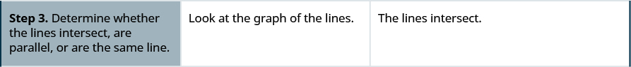
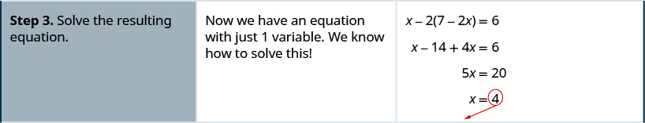
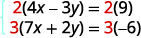

By the end of this section, you will be able to:
* Determine whether an ordered pair is a solution of a system of equations
* Solve a system of linear equations by graphing
* Solve a system of equations by substitution
* Solve a system of equations by elimination
* Choose the most convenient method to solve a system of linear equations

Before you get started, take this readiness quiz.

1.  For the equation
    <math xmlns="http://www.w3.org/1998/Math/MathML"><mrow><mi>y</mi><mo>=</mo><mfrac><mn>2</mn><mn>3</mn></mfrac><mi>x</mi><mo>−</mo><mn>4</mn><mo>,</mo></mrow></math>
    
    * * *
    {: data-type="newline"}
    
    ⓐ Is
    <math xmlns="http://www.w3.org/1998/Math/MathML"><mrow><mrow><mo>(</mo><mrow><mn>6</mn><mo>,</mo><mn>0</mn></mrow><mo>)</mo></mrow></mrow></math>
    
    a solution? ⓑ Is
    <math xmlns="http://www.w3.org/1998/Math/MathML"><mrow><mrow><mo>(</mo><mrow><mn>−3</mn><mo>,</mo><mn>−2</mn></mrow><mo>)</mo></mrow></mrow></math>
    
    a solution?
    * * *
    {: data-type="newline"}
    
    If you missed this problem, review [\[link\]](/m63318#fs-id1167835400321).
2.  Find the slope and *y*-intercept of the line
    <math xmlns="http://www.w3.org/1998/Math/MathML"><mrow><mn>3</mn><mi>x</mi><mo>−</mo><mi>y</mi><mo>=</mo><mn>12</mn><mo>.</mo></mrow></math>
    
    * * *
    {: data-type="newline"}
    
    If you missed this problem, review [\[link\]](/m63319#fs-id1167835342973).
3.  Find the *x-* and *y*-intercepts of the line
    <math xmlns="http://www.w3.org/1998/Math/MathML"><mrow><mn>2</mn><mi>x</mi><mo>−</mo><mn>3</mn><mi>y</mi><mo>=</mo><mn>12</mn><mo>.</mo></mrow></math>
    
    * * *
    {: data-type="newline"}
    
    If you missed this problem, review [\[link\]](/m63318#fs-id1167827987818).
{: data-number-style="arabic"}

# Determine Whether an Ordered Pair is a Solution of a System of Equations

In [Solving Linear Equations](/m63307){: .target-chapter}, we learned how to solve linear equations with one variable. Now we will work with two or more linear equations grouped together, which is known as a **system of linear equations**{: data-type="term"}.

System of Linear Equations

When two or more linear equations are grouped together, they form a **system of linear equations**.

In this section, we will focus our work on systems of two linear equations in two unknowns. We will solve larger systems of equations later in this chapter.

An example of a system of two linear equations is shown below. We use a brace to show the two equations are grouped together to form a system of equations.

<math xmlns="http://www.w3.org/1998/Math/MathML"><mrow><mrow><mo>{</mo><mtable><mtr><mtd columnalign="left"><mn>2</mn><mi>x</mi><mo>+</mo><mi>y</mi><mo>=</mo><mn>7</mn></mtd></mtr><mtr><mtd columnalign="left"><mi>x</mi><mo>−</mo><mn>2</mn><mi>y</mi><mo>=</mo><mn>6</mn></mtd></mtr></mtable></mrow></mrow></math>

A linear equation in two variables, such as <math xmlns="http://www.w3.org/1998/Math/MathML"><mrow><mn>2</mn><mi>x</mi><mo>+</mo><mi>y</mi><mo>=</mo><mn>7</mn><mo>,</mo></mrow></math>

 has an infinite number of solutions. Its graph is a line. Remember, every point on the line is a solution to the equation and every solution to the equation is a point on the line.

To solve a system of two linear equations, we want to find the values of the variables that are solutions to *both* equations. In other words, we are looking for the ordered pairs <math xmlns="http://www.w3.org/1998/Math/MathML"><mrow><mrow><mo>(</mo><mrow><mi>x</mi><mo>,</mo><mi>y</mi></mrow><mo>)</mo></mrow></mrow></math>

 that make both equations true. These are called the **solutions of a system of equations**{: data-type="term"}.

Solutions of a System of Equations

The **solutions of a system of equations** are the values of the variables that make *all* the equations true. A solution of a system of two linear equations is represented by an ordered pair <math xmlns="http://www.w3.org/1998/Math/MathML"><mrow><mrow><mo>(</mo><mrow><mi>x</mi><mo>,</mo><mi>y</mi></mrow><mo>)</mo></mrow><mo>.</mo></mrow></math>

To determine if an ordered pair is a solution to a system of two equations, we substitute the values of the variables into each equation. If the ordered pair makes both equations true, it is a solution to the system.

Determine whether the ordered pair is a solution to the system <math xmlns="http://www.w3.org/1998/Math/MathML"><mrow><mrow><mo>{</mo><mtable><mtr><mtd columnalign="left"><mi>x</mi><mo>−</mo><mi>y</mi><mo>=</mo><mn>−1</mn></mtd></mtr><mtr><mtd columnalign="left"><mn>2</mn><mi>x</mi><mo>−</mo><mi>y</mi><mo>=</mo><mn>−5</mn></mtd></mtr></mtable></mrow><mo>.</mo></mrow></math>

ⓐ <math xmlns="http://www.w3.org/1998/Math/MathML"><mrow><mo stretchy="false">(</mo><mn>−2</mn><mo>,</mo><mn>−1</mn><mo stretchy="false">)</mo></mrow></math>

 ⓑ <math xmlns="http://www.w3.org/1998/Math/MathML"><mrow><mo stretchy="false">(</mo><mn>−4</mn><mo>,</mo><mn>−3</mn><mo stretchy="false">)</mo></mrow></math>

ⓐ* * *
{: data-type="newline"}

 ![The equations are x minus y equals minus 1 and 2 x minus y equals minus 5. We substitute x equal to minus 2 and y equal to minus 1 into both equations. So, x minus y equals minus 1 becomes minus 2 minus open parentheses minus 1 close parentheses equal to or not equal to minus 1. Simplifying, we get minus 1 equals minus 1 which is correct. The equation 2 x minus y equals minus 5 becomes 2 times minus 2 minus open parentheses minus 1 close parentheses equal to or not equal to minus 5. Simplifying, we get 5 not equal to minus 5. Hence, the ordered pair minus 2, minus 1 does not make both equations true. So, it is not a solution.](../resources/CNX_IntAlg_Figure_04_01_001_img.jpg)

ⓑ* * *
{: data-type="newline"}

 ![We substitute x equal to minus 4 and y equal to minus 3 into both equations. So, x minus y equals minus 1 becomes minus 4 minus open parentheses minus 3 close parentheses equal to or not equal to minus 1. Simplifying, we get minus 1 equals minus 1, which is correct. The equation 2 x minus y equals minus 5 becomes 2 times minus 4 minus open parentheses minus 3 close parentheses equal to or not equal to minus 5. Simplifying, we get minus 5 equals minus 5, which is correct. The ordered pair minus 4, minus 3 does make both equations true. Hence, it is a solution.](../resources/CNX_IntAlg_Figure_04_01_002_img.jpg)

Determine whether the ordered pair is a solution to the system <math xmlns="http://www.w3.org/1998/Math/MathML"><mtable><mtr><mtd columnalign="left"><mrow><mo>{</mo><mtable><mtr><mtd columnalign="left"><mn>3</mn><mi>x</mi><mo>+</mo><mi>y</mi><mo>=</mo><mn>0</mn></mtd></mtr><mtr><mtd columnalign="left"><mi>x</mi><mo>+</mo><mn>2</mn><mi>y</mi><mo>=</mo><mn>−5</mn></mtd></mtr></mtable></mrow><mo>.</mo></mtd></mtr><mtr><mtd columnalign="left"><mrow /></mtd></mtr></mtable></math>

ⓐ<math xmlns="http://www.w3.org/1998/Math/MathML"><mrow><mo stretchy="false">(</mo><mn>1</mn><mo>,</mo><mn>−3</mn><mo stretchy="false">)</mo></mrow></math>

 ⓑ <math xmlns="http://www.w3.org/1998/Math/MathML"><mrow><mo stretchy="false">(</mo><mn>0</mn><mo>,</mo><mn>0</mn><mo stretchy="false">)</mo></mrow></math>

ⓐ yes ⓑ no

Determine whether the ordered pair is a solution to the system <math xmlns="http://www.w3.org/1998/Math/MathML"><mtable><mtr><mtd columnalign="left"><mrow><mo>{</mo><mtable><mtr><mtd columnalign="left"><mi>x</mi><mo>−</mo><mn>3</mn><mi>y</mi><mo>=</mo><mn>−8</mn></mtd></mtr><mtr><mtd columnalign="left"><mo>−</mo><mn>3</mn><mi>x</mi><mo>−</mo><mi>y</mi><mo>=</mo><mn>4</mn></mtd></mtr></mtable></mrow><mo>.</mo></mtd></mtr><mtr><mtd columnalign="left"><mrow /></mtd></mtr></mtable></math>

ⓐ<math xmlns="http://www.w3.org/1998/Math/MathML"><mrow><mo stretchy="false">(</mo><mn>2</mn><mo>,</mo><mn>−2</mn><mo stretchy="false">)</mo></mrow></math>

 ⓑ <math xmlns="http://www.w3.org/1998/Math/MathML"><mrow><mo stretchy="false">(</mo><mn>−2</mn><mo>,</mo><mn>2</mn><mo stretchy="false">)</mo></mrow></math>

ⓐ no ⓑ yes

# Solve a System of Linear Equations by Graphing

In this section, we will use three methods to solve a system of linear equations. The first method we’ll use is graphing.

The graph of a linear equation is a line. Each point on the line is a solution to the equation. For a system of two equations, we will graph two lines. Then we can see all the points that are solutions to each equation. And, by finding what the lines have in common, we’ll find the solution to the system.

Most linear equations in one variable have one solution, but we saw that some equations, called contradictions, have no solutions and for other equations, called identities, all numbers are solutions.

Similarly, when we solve a system of two linear equations represented by a graph of two lines in the same plane, there are three possible cases, as shown.

 {: #CNX_IntAlg_Figure_04_01_003}

Each time we demonstrate a new method, we will use it on the same system of linear equations. At the end of the section you’ll decide which method was the most convenient way to solve this system.

How to Solve a System of Equations by Graphing

Solve the system by graphing <math xmlns="http://www.w3.org/1998/Math/MathML"><mrow><mrow><mo>{</mo><mtable><mtr><mtd columnalign="left"><mn>2</mn><mi>x</mi><mo>+</mo><mi>y</mi><mo>=</mo><mn>7</mn></mtd></mtr><mtr><mtd columnalign="left"><mi>x</mi><mo>−</mo><mn>2</mn><mi>y</mi><mo>=</mo><mn>6</mn></mtd></mtr></mtable></mrow><mo>.</mo></mrow></math>

    

Solve the system by graphing: <math xmlns="http://www.w3.org/1998/Math/MathML"><mrow><mrow><mo>{</mo><mtable><mtr><mtd columnalign="left"><mi>x</mi><mo>−</mo><mn>3</mn><mi>y</mi><mo>=</mo><mn>−3</mn></mtd></mtr><mtr><mtd columnalign="left"><mi>x</mi><mo>+</mo><mi>y</mi><mo>=</mo><mn>5</mn></mtd></mtr></mtable></mrow><mo>.</mo></mrow></math>

<math xmlns="http://www.w3.org/1998/Math/MathML"><mrow><mrow><mo>(</mo><mrow><mn>3</mn><mo>,</mo><mn>2</mn></mrow><mo>)</mo></mrow></mrow></math>

Solve the system by graphing: <math xmlns="http://www.w3.org/1998/Math/MathML"><mrow><mrow><mo>{</mo><mtable><mtr><mtd columnalign="left"><mo>−</mo><mi>x</mi><mo>+</mo><mi>y</mi><mo>=</mo><mn>1</mn></mtd></mtr><mtr><mtd columnalign="left"><mn>3</mn><mi>x</mi><mo>+</mo><mn>2</mn><mi>y</mi><mo>=</mo><mn>12</mn></mtd></mtr></mtable></mrow><mo>.</mo></mrow></math>

<math xmlns="http://www.w3.org/1998/Math/MathML"><mrow><mrow><mo>(</mo><mrow><mn>2</mn><mo>,</mo><mn>3</mn></mrow><mo>)</mo></mrow></mrow></math>

The steps to use to solve a system of linear equations by graphing are shown here.

Solve a system of linear equations by graphing.

1.  Graph the first equation.
2.  Graph the second equation on the same rectangular coordinate system.
3.  Determine whether the lines intersect, are parallel, or are the same line.
4.  Identify the solution to the system.
    * If the lines intersect, identify the point of intersection. This is the solution to the system.
    * If the lines are parallel, the system has no solution.
    * If the lines are the same, the system has an infinite number of solutions.
    {: .open-circle}

5.  Check the solution in both equations.
{: data-number-style="arabic" .stepwise}

In the next example, we’ll first re-write the equations into slope–intercept form as this will make it easy for us to quickly graph the lines.

Solve the system by graphing: <math xmlns="http://www.w3.org/1998/Math/MathML"><mrow><mrow><mo>{</mo><mtable><mtr><mtd columnalign="left"><mn>3</mn><mi>x</mi><mo>+</mo><mi>y</mi><mo>=</mo><mo>−</mo><mn>1</mn></mtd></mtr><mtr><mtd columnalign="left"><mn>2</mn><mi>x</mi><mo>+</mo><mi>y</mi><mo>=</mo><mn>0</mn></mtd></mtr></mtable></mrow><mo>.</mo></mrow></math>

We’ll solve both of these equations for <math xmlns="http://www.w3.org/1998/Math/MathML"><mi>y</mi></math>

 so that we can easily graph them using their slopes and *y*-intercepts.

<table class="unnumbered unstyled can-break" summary="The equations are 3 x plus y equals minus 1 and 2 x plus y equals 0. Solving the first equation for y, we get y equal to minus 3 x minus 1. So, slope is minus 3 and y intercept is minus 1. Similarly, for the second equation, we get y equal to minus 2 x. So, slope is minus 2 and y intercept is 0. Graphing the lines, we get the point of intersection minus 1, 2. To check the solution in both equations, we substitute minus 1 and 2 for x and y respectively. Both equations hold true. The solution is minus 1, 2." data-label=""><tbody>
<tr>
<td />
<td data-valign="top" data-align="left">

</td>
</tr>
<tr>
<td data-valign="top" data-align="left">Solve the first equation for <em>y</em>.</td>
<td data-valign="top" data-align="left">

</td>
</tr>
<tr>
<td data-valign="top" data-align="left">Find the slope and <em>y</em>-intercept.</td>
<td data-valign="top" data-align="left">

</td>
</tr>
<tr>
<td data-valign="top" data-align="left">Solve the second equation for <em>y</em>.</td>
<td data-valign="top" data-align="left">

</td>
</tr>
<tr>
<td data-valign="top" data-align="left">Find the slope and <em>y</em>-intercept.</td>
<td data-valign="top" data-align="left">

</td>
</tr>
<tr>
<td data-valign="top" data-align="left">Graph the lines.</td>
<td data-valign="top" data-align="left">

</td>
</tr>
<tr>
<td data-valign="top" data-align="left">Determine the point of intersection.</td>
<td data-valign="top" data-align="left">The lines intersect at <math xmlns="http://www.w3.org/1998/Math/MathML"><mrow><mo>(</mo><mn>−1</mn><mo>,</mo><mn>2</mn><mo>)</mo><mo>.</mo></mrow></math></td>
</tr>
<tr>
<td data-valign="top" data-align="left">Check the solution in both equations.

</td>
<td />
</tr>
<tr>
<td />
<td data-valign="top" data-align="left">The solution is <math xmlns="http://www.w3.org/1998/Math/MathML"><mrow><mo>(</mo><mn>−1</mn><mo>,</mo><mn>2</mn><mo>)</mo><mo>.</mo></mrow></math></td>
</tr>
</tbody></table>

Solve the system by graphing: <math xmlns="http://www.w3.org/1998/Math/MathML"><mrow><mrow><mo>{</mo><mtable><mtr><mtd columnalign="left"><mo>−</mo><mi>x</mi><mo>+</mo><mi>y</mi><mo>=</mo><mn>1</mn></mtd></mtr><mtr><mtd columnalign="left"><mn>2</mn><mi>x</mi><mo>+</mo><mi>y</mi><mo>=</mo><mn>10</mn></mtd></mtr></mtable></mrow><mo>.</mo></mrow></math>

<math xmlns="http://www.w3.org/1998/Math/MathML"><mrow><mrow><mo>(</mo><mrow><mn>3</mn><mo>,</mo><mn>4</mn></mrow><mo>)</mo></mrow></mrow></math>

Solve the system by graphing: <math xmlns="http://www.w3.org/1998/Math/MathML"><mrow><mrow><mo>{</mo><mtable><mtr><mtd columnalign="left"><mn>2</mn><mi>x</mi><mo>+</mo><mi>y</mi><mo>=</mo><mn>6</mn></mtd></mtr><mtr><mtd columnalign="left"><mi>x</mi><mo>+</mo><mi>y</mi><mo>=</mo><mn>1</mn></mtd></mtr></mtable></mrow><mo>.</mo></mrow></math>

<math xmlns="http://www.w3.org/1998/Math/MathML"><mrow><mrow><mo>(</mo><mrow><mn>5</mn><mo>,</mo><mn>−4</mn></mrow><mo>)</mo></mrow></mrow></math>

In all the systems of linear equations so far, the lines intersected and the solution was one point. In the next two examples, we’ll look at a system of equations that has no solution and at a system of equations that has an infinite number of solutions.

Solve the system by graphing: <math xmlns="http://www.w3.org/1998/Math/MathML"><mrow><mrow><mo>{</mo><mtable><mtr><mtd columnalign="left"><mi>y</mi><mo>=</mo><mfrac><mn>1</mn><mn>2</mn></mfrac><mi>x</mi><mo>−</mo><mn>3</mn></mtd></mtr><mtr><mtd columnalign="left"><mi>x</mi><mo>−</mo><mn>2</mn><mi>y</mi><mo>=</mo><mn>4</mn></mtd></mtr></mtable></mrow><mo>.</mo></mrow></math>

<table class="unnumbered unstyled can-break" summary="The equations are y equal to half x minus 3 and x minus 2y equal to 4. The slope and y intercept of the first equation are half and minus 3 respectively. To graph the second equation, we will use the intercepts x equal to 0 when y equal to minus 2 and x equal to 4 when y equal to 0. We graph the lines to determine the point of intersection. The lines are parallel. Since no point is on both lines, there is no ordered pair that makes both equations true. There is no solution to this system." data-label=""><tbody>
<tr>
<td />
<td data-valign="top" data-align="left">

</td>
</tr>
<tr>
<td data-valign="top" data-align="left">To graph the first equation, we will use its
slope and <em>y</em>-intercept.</td>
<td data-valign="top" data-align="left">

</td>
</tr>
<tr>
<td>To graph the second equation, we will use
the intercepts.</td>
<td data-valign="top" data-align="left">

</td>
</tr>
<tr>
<td />
<td data-valign="top" data-align="left">

</td>
</tr>
<tr>
<td data-valign="top" data-align="left">Graph the lines.</td>
<td data-valign="top" data-align="left">

</td>
</tr>
<tr>
<td data-valign="top" data-align="left">Determine the points of intersection.</td>
<td data-valign="top" data-align="left">The lines are parallel.

Since no point is on both lines, there is no
ordered pair that makes both equations
true. There is no solution to this system.</td>
</tr>
</tbody></table>

Solve the system by graphing: <math xmlns="http://www.w3.org/1998/Math/MathML"><mrow><mrow><mo>{</mo><mtable><mtr><mtd columnalign="left"><mi>y</mi><mo>=</mo><mo>−</mo><mfrac><mn>1</mn><mn>4</mn></mfrac><mi>x</mi><mo>+</mo><mn>2</mn></mtd></mtr><mtr><mtd columnalign="left"><mi>x</mi><mo>+</mo><mn>4</mn><mi>y</mi><mo>=</mo><mo>−</mo><mn>8</mn></mtd></mtr></mtable></mrow><mo>.</mo></mrow></math>

no solution

Solve the system by graphing: <math xmlns="http://www.w3.org/1998/Math/MathML"><mrow><mrow><mo>{</mo><mtable><mtr><mtd columnalign="left"><mi>y</mi><mo>=</mo><mn>3</mn><mi>x</mi><mo>−</mo><mn>1</mn></mtd></mtr><mtr><mtd columnalign="left"><mn>6</mn><mi>x</mi><mo>−</mo><mn>2</mn><mi>y</mi><mo>=</mo><mn>6</mn></mtd></mtr></mtable></mrow><mo>.</mo></mrow></math>

no solution

Sometimes the equations in a system represent the same line. Since every point on the line makes both equations true, there are infinitely many ordered pairs that make both equations true. There are infinitely many solutions to the system.

Solve the system by graphing: <math xmlns="http://www.w3.org/1998/Math/MathML"><mrow><mrow><mo>{</mo><mtable><mtr><mtd columnalign="left"><mi>y</mi><mo>=</mo><mn>2</mn><mi>x</mi><mo>−</mo><mn>3</mn></mtd></mtr><mtr><mtd columnalign="left"><mo>−</mo><mn>6</mn><mi>x</mi><mo>+</mo><mn>3</mn><mi>y</mi><mo>=</mo><mo>−</mo><mn>9</mn></mtd></mtr></mtable></mrow><mo>.</mo></mrow></math>

<table class="unnumbered unstyled can-break" summary="The equations are y equal to 2 x minus 3 and minus 6x plus 3y equal to minus 9. The slope and y intercept of the first equation are 2 and minus 3 respectively. In the second equation, when x is 0, y is minus 3 and when y is 0, x is 3 by 2. We use these points for graphing the lines to determine the point of intersection. The lines are the same. Since every point on the line makes both equations true, there are infinite many ordered pairs that make both equations true. There are infinite many solutions to this system." data-label=""><tbody>
<tr>
<td />
<td data-valign="top" data-align="left">

</td>
</tr>
<tr>
<td data-valign="top" data-align="left">Find the slope and <em>y</em>-intercept of the first equation.</td>
<td data-valign="top" data-align="left">

</td>
</tr>
<tr>
<td data-valign="top" data-align="left">Find the intercepts of the second equation.</td>
<td data-valign="top" data-align="left">

</td>
</tr>
<tr>
<td />
<td data-valign="top" data-align="left">

</td>
</tr>
<tr>
<td data-valign="top" data-align="left">Graph the lines.</td>
<td data-valign="top" data-align="left">

</td>
</tr>
<tr>
<td />
<td data-valign="top" data-align="left">The lines are the same!
Since every point on the line makes both
equations true, there are infinitely many
ordered pairs that make both equations true.
There are infinitely many solutions to this system.</td>
</tr>
</tbody></table>
If you write the second equation in slope-intercept form, you may recognize that the equations have the same slope and same *y*-intercept.

Solve the system by graphing: <math xmlns="http://www.w3.org/1998/Math/MathML"><mrow><mrow><mo>{</mo> <mtable><mtr><mtd columnalign="left"><mi>y</mi><mo>=</mo><mo>−</mo><mn>3</mn><mi>x</mi><mo>−</mo><mn>6</mn></mtd></mtr><mtr><mtd columnalign="left"><mn>6</mn><mi>x</mi><mo>+</mo><mn>2</mn><mi>y</mi><mo>=</mo><mo>−</mo><mn>12</mn></mtd></mtr></mtable></mrow><mo>.</mo></mrow></math>

infinitely many solutions

Solve the system by graphing: <math xmlns="http://www.w3.org/1998/Math/MathML"><mrow><mrow><mo>{</mo><mtable><mtr><mtd columnalign="left"><mi>y</mi><mo>=</mo><mfrac><mn>1</mn><mn>2</mn></mfrac><mi>x</mi><mo>−</mo><mn>4</mn></mtd></mtr><mtr><mtd columnalign="left"><mn>2</mn><mi>x</mi><mo>−</mo><mn>4</mn><mi>y</mi><mo>=</mo><mn>16</mn></mtd></mtr></mtable></mrow><mo>.</mo></mrow></math>

infinitely many solutions

When we graphed the second line in the last example, we drew it right over the first line. We say the two lines are **coincident**{: data-type="term"}. Coincident lines have the same slope and same *y-*intercept.

Coincident Lines

**Coincident lines** have the same slope and same *y-*intercept.

The systems of equations in [\[link\]](#fs-id1167834279490) and [\[link\]](#fs-id1167835410272) each had two intersecting lines. Each system had one solution.

In [\[link\]](#fs-id1167835418145), the equations gave coincident lines, and so the system had infinitely many solutions.

The systems in those three examples had at least one solution. A system of equations that has at least one solution is called a *consistent* system.

A system with parallel lines, like [\[link\]](#fs-id1167835307740), has no solution. We call a system of equations like this *inconsistent.* It has no solution.

Consistent and Inconsistent Systems

A **consistent system of equations**{: data-type="term"} is a system of equations with at least one solution.

An **inconsistent system of equations**{: data-type="term"} is a system of equations with no solution.

We also categorize the equations in a system of equations by calling the equations *independent* or *dependent*. If two equations are independent, they each have their own set of solutions. Intersecting lines and parallel lines are independent.

If two equations are dependent, all the solutions of one equation are also solutions of the other equation. When we graph two dependent equations, we get coincident lines.

Let’s sum this up by looking at the graphs of the three types of systems. See below and [\[link\]](#fs-id1167832096973).

  | Lines | Intersecting | Parallel | Coincident |
|----------
| **Number of solutions** | 1 point | No solution | Infinitely many |
| **Consistent/inconsistent** | Consistent | Inconsistent | Consistent |
| **Dependent/ independent** | Independent | Independent | Dependent |
{: summary="The table shows that intersecting lines have 1 solution that is consistent and independent. Parallel lines have no solution and are inconsistent and independent. Coincident lines have infinitely many solutions and are consistent and dependent."}

Without graphing, determine the number of solutions and then classify the system of equations.

ⓐ <math xmlns="http://www.w3.org/1998/Math/MathML"><mrow><mrow><mo>{</mo><mtable><mtr><mtd columnalign="left"><mi>y</mi><mo>=</mo><mn>3</mn><mi>x</mi><mo>−</mo><mn>1</mn></mtd></mtr><mtr><mtd columnalign="left"><mn>6</mn><mi>x</mi><mo>−</mo><mn>2</mn><mi>y</mi><mo>=</mo><mn>12</mn></mtd></mtr></mtable></mrow></mrow></math>

 ⓑ <math xmlns="http://www.w3.org/1998/Math/MathML"><mrow><mrow><mo>{</mo><mtable><mtr><mtd columnalign="left"><mn>2</mn><mi>x</mi><mo>+</mo><mi>y</mi><mo>=</mo><mo>−</mo><mn>3</mn></mtd></mtr><mtr><mtd columnalign="left"><mi>x</mi><mo>−</mo><mn>5</mn><mi>y</mi><mo>=</mo><mn>5</mn></mtd></mtr></mtable></mrow></mrow></math>

ⓐ We will compare the slopes and intercepts of the two lines.

<math xmlns="http://www.w3.org/1998/Math/MathML"><mrow><mtable><mtr><mtd columnalign="left"><mtable><mtr /><mtr /><mtr /><mtr /><mtr><mtd columnalign="right"><mtext>The first equation is already in slope-intercept form.</mtext></mtd></mtr></mtable></mtd><mtd /><mtd /><mtd columnalign="left"><mspace width="7.7em" /><mtable><mtr><mtd columnalign="left"><mrow><mo>{</mo><mtable><mtr><mtd columnalign="right"><mi>y</mi></mtd><mtd columnalign="left"><mo>=</mo></mtd><mtd columnalign="left"><mn>3</mn><mi>x</mi><mo>−</mo><mn>1</mn></mtd></mtr><mtr><mtd columnalign="right"><mn>6</mn><mi>x</mi><mo>−</mo><mn>2</mn><mi>y</mi></mtd><mtd columnalign="left"><mo>=</mo></mtd><mtd columnalign="left"><mn>12</mn></mtd></mtr></mtable></mrow></mtd></mtr><mtr><mtd columnalign="left"><mspace width="3.1em" /><mi>y</mi><mspace width="0.5em" /><mo>=</mo><mspace width="0.5em" /><mn>3</mn><mi>x</mi><mo>−</mo><mn>1</mn></mtd></mtr></mtable></mtd></mtr></mtable></mrow></math>

<math xmlns="http://www.w3.org/1998/Math/MathML"><mrow><mtable><mtr><mtd columnalign="left"><mtable><mtr><mtd columnalign="left"><mtext>Write the second equation in slope-intercept form.</mtext></mtd></mtr><mtr /><mtr /><mtr /><mtr /><mtr /><mtr /><mtr /><mtr /><mtr /><mtr /><mtr /><mtr><mtd columnalign="left"><mtext>Find the slope and intercept of each line.</mtext></mtd></mtr><mtr /><mtr /><mtr /><mtr /></mtable></mtd><mtd /><mtd /><mtd columnalign="left"><mspace width="2em" /><mtable><mtr><mtd /><mtd /><mtd /><mtd /><mtd /><mtd columnalign="right"><mn>6</mn><mi>x</mi><mo>−</mo><mn>2</mn><mi>y</mi></mtd><mtd columnalign="left"><mo>=</mo></mtd><mtd columnalign="left"><mn>12</mn></mtd></mtr><mtr><mtd /><mtd /><mtd /><mtd /><mtd /><mtd columnalign="right"><mo>−</mo><mn>2</mn><mi>y</mi></mtd><mtd columnalign="left"><mo>=</mo></mtd><mtd columnalign="left"><mn>−6</mn><mi>x</mi><mo>+</mo><mn>12</mn></mtd></mtr><mtr><mtd /><mtd /><mtd /><mtd /><mtd /><mtd columnalign="right"><mfrac><mrow><mn>−2</mn><mi>y</mi></mrow><mrow><mn>−2</mn></mrow></mfrac></mtd><mtd columnalign="left"><mo>=</mo></mtd><mtd columnalign="left"><mfrac><mrow><mn>−6</mn><mi>x</mi><mo>+</mo><mn>12</mn></mrow><mrow><mn>−2</mn></mrow></mfrac></mtd></mtr><mtr><mtd /><mtd /><mtd /><mtd /><mtd /><mtd columnalign="right"><mi>y</mi></mtd><mtd columnalign="left"><mo>=</mo></mtd><mtd columnalign="left"><mn>3</mn><mi>x</mi><mo>−</mo><mn>6</mn></mtd></mtr><mtr><mtd columnalign="right"><mi>y</mi></mtd><mtd columnalign="left"><mo>=</mo></mtd><mtd columnalign="left"><mn>3</mn><mi>x</mi><mo>−</mo><mn>1</mn></mtd><mtd /><mtd /><mtd columnalign="right"><mi>y</mi></mtd><mtd columnalign="left"><mo>=</mo></mtd><mtd columnalign="left"><mn>3</mn><mi>x</mi><mo>−</mo><mn>6</mn></mtd></mtr><mtr><mtd columnalign="right"><mi>m</mi></mtd><mtd columnalign="left"><mo>=</mo></mtd><mtd columnalign="left"><mn>3</mn></mtd><mtd /><mtd /><mtd columnalign="right"><mi>m</mi></mtd><mtd columnalign="left"><mo>=</mo></mtd><mtd columnalign="left"><mn>3</mn></mtd></mtr><mtr><mtd columnalign="right"><mi>b</mi></mtd><mtd columnalign="left"><mo>=</mo></mtd><mtd columnalign="left"><mn>−1</mn></mtd><mtd /><mtd /><mtd columnalign="right"><mi>b</mi></mtd><mtd columnalign="left"><mo>=</mo></mtd><mtd columnalign="left"><mn>−6</mn></mtd></mtr></mtable></mtd></mtr><mtr><mtd /><mtd /><mtd /><mtd columnalign="left"><mtable><mtr><mtd columnalign="left"><mtext>Since the slopes are the same and</mtext><mspace width="0.2em" /><mi>y</mi><mtext>-intercepts are</mtext></mtd></mtr><mtr><mtd columnalign="left"><mtext>different, the lines are parallel.</mtext></mtd></mtr></mtable></mtd></mtr></mtable></mrow></math>

A system of equations whose graphs are parallel lines has no solution and is inconsistent and independent.

ⓑ We will compare the slope and intercepts of the two lines.

<math xmlns="http://www.w3.org/1998/Math/MathML"><mrow><mtable><mtr><mtd /><mtd /><mtd /><mtd columnalign="left"><mrow><mo>{</mo><mtable><mtr><mtd columnalign="right"><mn>2</mn><mi>x</mi><mo>+</mo><mi>y</mi></mtd><mtd columnalign="left"><mo>=</mo></mtd><mtd columnalign="left"><mn>−3</mn></mtd></mtr><mtr><mtd columnalign="right"><mi>x</mi><mo>−</mo><mn>5</mn><mi>y</mi></mtd><mtd columnalign="left"><mo>=</mo></mtd><mtd columnalign="left"><mn>5</mn></mtd></mtr></mtable></mrow></mtd></mtr><mtr><mtd columnalign="left"><mtable><mtr><mtd columnalign="left"><mtext>Write both equations in slope–intercept form.</mtext></mtd></mtr><mtr /><mtr /><mtr /><mtr /><mtr /><mtr /><mtr /><mtr /><mtr /><mtr /><mtr /><mtr /></mtable></mtd><mtd /><mtd /><mtd columnalign="left"><mspace width="0.5em" /><mtable><mtr><mtd columnalign="right"><mn>2</mn><mi>x</mi><mo>+</mo><mi>y</mi></mtd><mtd columnalign="left"><mo>=</mo></mtd><mtd columnalign="left"><mo>−</mo><mn>3</mn></mtd><mtd /><mtd /><mtd columnalign="right"><mi>x</mi><mo>−</mo><mn>5</mn><mi>y</mi></mtd><mtd columnalign="left"><mo>=</mo></mtd><mtd columnalign="left"><mn>5</mn></mtd></mtr><mtr><mtd columnalign="right"><mi>y</mi></mtd><mtd columnalign="left"><mo>=</mo></mtd><mtd columnalign="left"><mn>−2</mn><mi>x</mi><mo>−</mo><mn>3</mn></mtd><mtd /><mtd /><mtd columnalign="right"><mn>−5</mn><mi>y</mi></mtd><mtd columnalign="left"><mo>=</mo></mtd><mtd columnalign="left"><mtext>−</mtext><mi>x</mi><mo>+</mo><mn>5</mn></mtd></mtr><mtr><mtd /><mtd /><mtd /><mtd /><mtd /><mtd columnalign="right"><mfrac><mrow><mo>−</mo><mn>5</mn><mi>y</mi></mrow><mrow><mo>−</mo><mn>5</mn></mrow></mfrac></mtd><mtd columnalign="left"><mo>=</mo></mtd><mtd columnalign="left"><mfrac><mrow><mo>−</mo><mi>x</mi><mo>+</mo><mn>5</mn></mrow><mrow><mo>−</mo><mn>5</mn></mrow></mfrac></mtd></mtr><mtr><mtd /><mtd /><mtd /><mtd /><mtd /><mtd columnalign="right"><mi>y</mi></mtd><mtd columnalign="left"><mo>=</mo></mtd><mtd columnalign="left"><mfrac><mn>1</mn><mn>5</mn></mfrac><mi>x</mi><mo>−</mo><mn>1</mn></mtd></mtr></mtable></mtd></mtr><mtr><mtd columnalign="left"><mtable><mtr><mtd columnalign="left"><mtext>Find the slope and intercept of each line.</mtext></mtd></mtr><mtr /><mtr /><mtr /><mtr /><mtr /><mtr /></mtable></mtd><mtd /><mtd /><mtd columnalign="left"><mspace width="2em" /><mtable><mtr><mtd columnalign="right"><mi>y</mi></mtd><mtd columnalign="left"><mo>=</mo></mtd><mtd columnalign="left"><mo>−</mo><mn>2</mn><mi>x</mi><mo>−</mo><mn>3</mn></mtd><mtd /><mtd /><mtd /><mtd /><mtd /><mtd /><mspace width="2em" /><mtd columnalign="right"><mi>y</mi></mtd><mtd columnalign="left"><mo>=</mo></mtd><mtd columnalign="left"><mfrac><mn>1</mn><mn>5</mn></mfrac><mi>x</mi><mo>−</mo><mn>1</mn></mtd></mtr><mtr><mtd columnalign="right"><mi>m</mi></mtd><mtd columnalign="left"><mo>=</mo></mtd><mtd columnalign="left"><mo>−</mo><mn>2</mn></mtd><mtd /><mtd /><mtd /><mtd /><mtd /><mtd /><mtd columnalign="right"><mi>m</mi></mtd><mtd columnalign="left"><mo>=</mo></mtd><mtd columnalign="left"><mfrac><mn>1</mn><mn>5</mn></mfrac></mtd></mtr><mtr><mtd columnalign="right"><mi>b</mi></mtd><mtd columnalign="left"><mo>=</mo></mtd><mtd columnalign="left"><mn>−3</mn></mtd><mtd /><mtd /><mtd /><mtd /><mtd /><mtd /><mtd columnalign="right"><mi>b</mi></mtd><mtd columnalign="left"><mo>=</mo></mtd><mtd columnalign="left"><mn>−1</mn></mtd></mtr></mtable></mtd></mtr><mtr><mtd /><mtd /><mtd /><mtd columnalign="left"><mtext>Since the slopes are different, the lines intersect.</mtext></mtd></mtr></mtable></mrow></math>

A system of equations whose graphs are intersect has 1 solution and is consistent and independent.

Without graphing, determine the number of solutions and then classify the system of equations.

ⓐ <math xmlns="http://www.w3.org/1998/Math/MathML"><mrow><mrow><mo>{</mo><mtable><mtr><mtd columnalign="left"><mi>y</mi><mo>=</mo><mn>−2</mn><mi>x</mi><mo>−</mo><mn>4</mn></mtd></mtr><mtr><mtd columnalign="left"><mn>4</mn><mi>x</mi><mo>+</mo><mn>2</mn><mi>y</mi><mo>=</mo><mn>9</mn></mtd></mtr></mtable></mrow></mrow></math>

 ⓑ <math xmlns="http://www.w3.org/1998/Math/MathML"><mrow><mrow><mo>{</mo><mtable><mtr><mtd columnalign="left"><mn>3</mn><mi>x</mi><mo>+</mo><mn>2</mn><mi>y</mi><mo>=</mo><mn>2</mn></mtd></mtr><mtr><mtd columnalign="left"><mn>2</mn><mi>x</mi><mo>+</mo><mi>y</mi><mo>=</mo><mn>1</mn></mtd></mtr></mtable></mrow></mrow></math>

ⓐ no solution, inconsistent, independent ⓑ one solution, consistent, independent

Without graphing, determine the number of solutions and then classify the system of equations.

ⓐ <math xmlns="http://www.w3.org/1998/Math/MathML"><mrow><mrow><mo>{</mo><mtable><mtr><mtd columnalign="left"><mi>y</mi><mo>=</mo><mfrac><mn>1</mn><mn>3</mn></mfrac><mi>x</mi><mo>−</mo><mn>5</mn></mtd></mtr><mtr><mtd columnalign="left"><mi>x</mi><mo>−</mo><mn>3</mn><mi>y</mi><mo>=</mo><mn>6</mn></mtd></mtr></mtable></mrow></mrow></math>

 ⓑ <math xmlns="http://www.w3.org/1998/Math/MathML"><mrow><mrow><mo>{</mo><mtable><mtr><mtd columnalign="left"><mi>x</mi><mo>+</mo><mn>4</mn><mi>y</mi><mo>=</mo><mn>12</mn></mtd></mtr><mtr><mtd columnalign="left"><mo>−</mo><mi>x</mi><mo>+</mo><mi>y</mi><mo>=</mo><mn>3</mn></mtd></mtr></mtable></mrow></mrow></math>

ⓐ no solution, inconsistent, independent ⓑ one solution, consistent, independent

Solving systems of linear equations by graphing is a good way to visualize the types of solutions that may result. However, there are many cases where solving a system by graphing is inconvenient or imprecise. If the graphs extend beyond the small grid with *x* and *y* both between <math xmlns="http://www.w3.org/1998/Math/MathML"><mrow><mn>−10</mn></mrow></math>

 and 10, graphing the lines may be cumbersome. And if the solutions to the system are not integers, it can be hard to read their values precisely from a graph.

# Solve a System of Equations by Substitution

We will now solve systems of linear equations by the substitution method.

We will use the same system we used first for graphing.

<math xmlns="http://www.w3.org/1998/Math/MathML"><mrow><mrow><mo>{</mo><mtable><mtr><mtd columnalign="left"><mn>2</mn><mi>x</mi><mo>+</mo><mi>y</mi><mo>=</mo><mn>7</mn></mtd></mtr><mtr><mtd columnalign="left"><mi>x</mi><mo>−</mo><mn>2</mn><mi>y</mi><mo>=</mo><mn>6</mn></mtd></mtr></mtable></mrow></mrow></math>

We will first solve one of the equations for either *x* or *y*. We can choose either equation and solve for either variable—but we’ll try to make a choice that will keep the work easy.

Then we substitute that expression into the other equation. The result is an equation with just one variable—and we know how to solve those!

After we find the value of one variable, we will substitute that value into one of the original equations and solve for the other variable. Finally, we check our solution and make sure it makes both equations true.

How to Solve a System of Equations by Substitution

Solve the system by substitution: <math xmlns="http://www.w3.org/1998/Math/MathML"><mrow><mrow><mo>{</mo><mtable><mtr><mtd columnalign="left"><mn>2</mn><mi>x</mi><mo>+</mo><mi>y</mi><mo>=</mo><mn>7</mn></mtd></mtr><mtr><mtd columnalign="left"><mi>x</mi><mo>−</mo><mn>2</mn><mi>y</mi><mo>=</mo><mn>6</mn></mtd></mtr></mtable></mrow><mo>.</mo></mrow></math>

      

Solve the system by substitution: <math xmlns="http://www.w3.org/1998/Math/MathML"><mrow><mrow><mo>{</mo><mtable><mtr><mtd columnalign="left"><mo>−</mo><mn>2</mn><mi>x</mi><mo>+</mo><mi>y</mi><mo>=</mo><mn>−11</mn></mtd></mtr><mtr><mtd columnalign="left"><mi>x</mi><mo>+</mo><mn>3</mn><mi>y</mi><mo>=</mo><mn>9</mn></mtd></mtr></mtable></mrow><mo>.</mo></mrow></math>

<math xmlns="http://www.w3.org/1998/Math/MathML"><mrow><mrow><mo>(</mo><mrow><mn>6</mn><mo>,</mo><mn>1</mn></mrow><mo>)</mo></mrow></mrow></math>

Solve the system by substitution: <math xmlns="http://www.w3.org/1998/Math/MathML"><mrow><mrow><mo>{</mo><mtable><mtr><mtd columnalign="left"><mn>2</mn><mi>x</mi><mo>+</mo><mi>y</mi><mo>=</mo><mn>−1</mn></mtd></mtr><mtr><mtd columnalign="left"><mn>4</mn><mi>x</mi><mo>+</mo><mn>3</mn><mi>y</mi><mo>=</mo><mn>3</mn></mtd></mtr></mtable></mrow><mo>.</mo></mrow></math>

<math xmlns="http://www.w3.org/1998/Math/MathML"><mrow><mrow><mo>(</mo><mrow><mn>−3</mn><mo>,</mo><mn>5</mn></mrow><mo>)</mo></mrow></mrow></math>

Solve a system of equations by substitution.

1.  Solve one of the equations for either variable.
2.  Substitute the expression from Step 1 into the other equation.
3.  Solve the resulting equation.
4.  Substitute the solution in Step 3 into either of the original equations to find the other variable.
5.  Write the solution as an ordered pair.
6.  Check that the ordered pair is a solution to **both** original equations.
{: data-number-style="arabic" .stepwise}

Be very careful with the signs in the next example.

Solve the system by substitution: <math xmlns="http://www.w3.org/1998/Math/MathML"><mrow><mrow><mo>{</mo><mtable><mtr><mtd columnalign="left"><mn>4</mn><mi>x</mi><mo>+</mo><mn>2</mn><mi>y</mi><mo>=</mo><mn>4</mn></mtd></mtr><mtr><mtd columnalign="left"><mn>6</mn><mi>x</mi><mo>−</mo><mi>y</mi><mo>=</mo><mn>8</mn></mtd></mtr></mtable></mrow><mo>.</mo></mrow></math>

We need to solve one equation for one variable. We will solve the first equation for *y*.

<table class="unnumbered unstyled can-break" summary="The equations are 4x plus 2y equals 4 and 6x minus y equals 8. Solving the first equation for y, we get y equal to minus 2 x plus 2. Substituting this in the second equation, we get 6 x minus open parentheses minus 2 x plus 2 close parentheses equals 8. Solving for x, we get x equal to 5 by 4. Substituting this in the first equation, and solving for y, we get y equal to minus 1 by 2. The ordered pair is 5 by 4, minus 1 by 2. Check the ordered pair in both equations. Both hold true. Hence, that is the solution." data-label=""><tbody>
<tr>
<td />
<td data-valign="top" data-align="left">

</td>
</tr>
<tr>
<td data-valign="top" data-align="left">Solve the first equation for <em>y</em>.
Substitute <math xmlns="http://www.w3.org/1998/Math/MathML"><mrow><mo>−</mo><mn>2</mn><mi>x</mi><mo>+</mo><mn>2</mn></mrow></math> for <em>y</em> in the second equation.</td>
<td data-valign="top" data-align="left">

</td>
</tr>
<tr><td data-valign="top" data-align="left">Replace the <em>y</em> with <math xmlns="http://www.w3.org/1998/Math/MathML"><mrow><mo>−</mo><mn>2</mn><mi>x</mi><mo>+</mo><mn>2</mn><mo>.</mo></mrow></math></td>
<td data-valign="top" data-align="left">

</td>
</tr>
<tr><td data-valign="top" data-align="left">Solve the equation for <em>x</em>.</td>
<td data-valign="top" data-align="left">

</td>
</tr>
<tr>
<td data-valign="top" data-align="left">Substitute <math xmlns="http://www.w3.org/1998/Math/MathML"><mrow><mi>x</mi><mo>=</mo><mfrac><mn>5</mn><mn>4</mn></mfrac></mrow></math> into <math xmlns="http://www.w3.org/1998/Math/MathML"><mrow><mn>4</mn><mi>x</mi><mo>+</mo><mn>2</mn><mi>y</mi><mo>=</mo><mn>4</mn></mrow></math> to find <em>y</em>.</td>
<td data-valign="top" data-align="left">

</td>
</tr>
<tr>
<td />
<td data-valign="top" data-align="left">The ordered pair is <math xmlns="http://www.w3.org/1998/Math/MathML"><mrow><mrow><mo>(</mo><mrow><mfrac><mn>5</mn><mn>4</mn></mfrac><mo>,</mo><mo>−</mo><mfrac><mn>1</mn><mn>2</mn></mfrac></mrow><mo>)</mo></mrow><mo>.</mo></mrow></math></td>
</tr>
<tr>
<td data-valign="top" data-align="left">Check the ordered pair in both equations.

</td>
<td />
</tr>
<tr>
<td />
<td data-valign="top" data-align="left">The solution is <math xmlns="http://www.w3.org/1998/Math/MathML"><mrow><mrow><mo>(</mo><mrow><mfrac><mn>5</mn><mn>4</mn></mfrac><mo>,</mo><mo>−</mo><mfrac><mn>1</mn><mn>2</mn></mfrac></mrow><mo>)</mo></mrow><mo>.</mo></mrow></math></td>
</tr>
</tbody></table>

Solve the system by substitution: <math xmlns="http://www.w3.org/1998/Math/MathML"><mrow><mrow><mo>{</mo><mtable><mtr><mtd columnalign="left"><mi>x</mi><mo>−</mo><mn>4</mn><mi>y</mi><mo>=</mo><mn>−4</mn></mtd></mtr><mtr><mtd columnalign="left"><mo>−</mo><mn>3</mn><mi>x</mi><mo>+</mo><mn>4</mn><mi>y</mi><mo>=</mo><mn>0</mn></mtd></mtr></mtable></mrow><mo>.</mo></mrow></math>

<math xmlns="http://www.w3.org/1998/Math/MathML"><mrow><mrow><mo>(</mo><mrow><mn>2</mn><mo>,</mo><mfrac><mn>3</mn><mn>2</mn></mfrac></mrow><mo>)</mo></mrow></mrow></math>

Solve the system by substitution: <math xmlns="http://www.w3.org/1998/Math/MathML"><mrow><mrow><mo>{</mo><mtable><mtr><mtd columnalign="left"><mn>4</mn><mi>x</mi><mo>−</mo><mi>y</mi><mo>=</mo><mn>0</mn></mtd></mtr><mtr><mtd columnalign="left"><mn>2</mn><mi>x</mi><mo>−</mo><mn>3</mn><mi>y</mi><mo>=</mo><mn>5</mn></mtd></mtr></mtable></mrow><mo>.</mo></mrow></math>

<math xmlns="http://www.w3.org/1998/Math/MathML"><mrow><mrow><mo>(</mo><mrow><mo>−</mo><mfrac><mn>1</mn><mn>2</mn></mfrac><mo>,</mo><mn>−2</mn></mrow><mo>)</mo></mrow></mrow></math>

# Solve a System of Equations by Elimination

We have solved systems of linear equations by graphing and by substitution. Graphing works well when the variable coefficients are small and the solution has integer values. Substitution works well when we can easily solve one equation for one of the variables and not have too many fractions in the resulting expression.

The third method of solving systems of linear equations is called the Elimination Method. When we solved a system by substitution, we started with two equations and two variables and reduced it to one equation with one variable. This is what we’ll do with the elimination method, too, but we’ll have a different way to get there.

The Elimination Method is based on the Addition Property of Equality. The Addition Property of Equality says that when you add the same quantity to both sides of an equation, you still have equality. We will extend the Addition Property of Equality to say that when you add equal quantities to both sides of an equation, the results are equal.

For any expressions *a, b, c,* and *d*.

<math xmlns="http://www.w3.org/1998/Math/MathML"><mtable><mtr><mtd columnalign="left"><mtext>if</mtext></mtd><mtd /><mtd /><mtd columnalign="right"><mi>a</mi></mtd><mtd columnalign="left"><mo>=</mo></mtd><mtd columnalign="left"><mi>b</mi></mtd></mtr><mtr><mtd columnalign="left"><mtext>and</mtext></mtd><mtd /><mtd /><mtd columnalign="right"><mi>c</mi></mtd><mtd columnalign="left"><mo>=</mo></mtd><mtd columnalign="left"><mi>d</mi></mtd></mtr><mtr><mtd columnalign="left"><mtext>then</mtext></mtd><mtd /><mtd /><mtd columnalign="right"><mi>a</mi><mo>+</mo><mi>c</mi></mtd><mtd columnalign="left"><mo>=</mo></mtd><mtd columnalign="left"><mi>b</mi><mo>+</mo><mi>d</mi><mo>.</mo></mtd></mtr></mtable></math>

To solve a system of equations by elimination, we start with both equations in standard form. Then we decide which variable will be easiest to eliminate. How do we decide? We want to have the coefficients of one variable be opposites, so that we can add the equations together and eliminate that variable.

Notice how that works when we add these two equations together:

<math xmlns="http://www.w3.org/1998/Math/MathML"><mtable><mtr><mtd columnalign="left"><mrow><mo>{</mo><munder accentunder="true"><mrow><mtable><mtr><mtd columnalign="left"><mn>3</mn><mi>x</mi><mo>+</mo><mi>y</mi><mo>=</mo><mn>5</mn></mtd></mtr><mtr><mtd columnalign="left"><mrow><mn>2</mn><mi>x</mi><mo>−</mo><mi>y</mi><mo>=</mo><mn>0</mn></mrow></mtd></mtr></mtable></mrow><mrow><mtext>—————</mtext></mrow></munder></mrow></mtd></mtr><mtr /><mtr><mtd columnalign="left"><mspace width="0.8em" /><mn>5</mn><mi>x</mi><mspace width="1.8em" /><mo>=</mo><mn>5</mn></mtd></mtr></mtable></math>

The *y*’s add to zero and we have one equation with one variable.

Let’s try another one:

<math xmlns="http://www.w3.org/1998/Math/MathML"><mrow><mrow><mo>{</mo><mtable><mtr><mtd columnalign="left"><mspace width="0.5em" /><mi>x</mi><mo>+</mo><mn>4</mn><mi>y</mi><mo>=</mo><mn>2</mn></mtd></mtr><mtr><mtd columnalign="left"><mn>2</mn><mi>x</mi><mo>+</mo><mn>5</mn><mi>y</mi><mo>=</mo><mn>−2</mn></mtd></mtr></mtable></mrow></mrow></math>

This time we don’t see a variable that can be immediately eliminated if we add the equations.

But if we multiply the first equation by <math xmlns="http://www.w3.org/1998/Math/MathML"><mrow><mn>−2</mn><mo>,</mo></mrow></math>

 we will make the coefficients of *x* opposites. We must multiply every term on both sides of the equation by <math xmlns="http://www.w3.org/1998/Math/MathML"><mrow><mn>−2</mn><mo>.</mo></mrow></math>

  Then rewrite the system of equations.

  Now we see that the coefficients of the *x* terms are opposites, so *x* will be eliminated when we add these two equations.

  Once we get an equation with just one variable, we solve it. Then we substitute that value into one of the original equations to solve for the remaining variable. And, as always, we check our answer to make sure it is a solution to both of the original equations.

Now we’ll see how to use elimination to solve the same system of equations we solved by graphing and by substitution.

How to Solve a System of Equations by Elimination

Solve the system by elimination: <math xmlns="http://www.w3.org/1998/Math/MathML"><mrow><mrow><mo>{</mo><mtable><mtr><mtd columnalign="left"><mn>2</mn><mi>x</mi><mo>+</mo><mi>y</mi><mo>=</mo><mn>7</mn></mtd></mtr><mtr><mtd columnalign="left"><mi>x</mi><mo>−</mo><mn>2</mn><mi>y</mi><mo>=</mo><mn>6</mn></mtd></mtr></mtable></mrow><mo>.</mo></mrow></math>

       

Solve the system by elimination: <math xmlns="http://www.w3.org/1998/Math/MathML"><mrow><mrow><mo>{</mo><mtable><mtr><mtd columnalign="left"><mn>3</mn><mi>x</mi><mo>+</mo><mi>y</mi><mo>=</mo><mn>5</mn></mtd></mtr><mtr><mtd columnalign="left"><mn>2</mn><mi>x</mi><mo>−</mo><mn>3</mn><mi>y</mi><mo>=</mo><mn>7</mn></mtd></mtr></mtable></mrow><mo>.</mo></mrow></math>

<math xmlns="http://www.w3.org/1998/Math/MathML"><mrow><mrow><mo>(</mo><mrow><mn>2</mn><mo>,</mo><mn>−1</mn></mrow><mo>)</mo></mrow></mrow></math>

Solve the system by elimination: <math xmlns="http://www.w3.org/1998/Math/MathML"><mrow><mrow><mo>{</mo> <mtable><mtr><mtd columnalign="left"><mn>4</mn><mi>x</mi><mo>+</mo><mi>y</mi><mo>=</mo><mo>−</mo><mn>5</mn></mtd></mtr><mtr><mtd columnalign="left"><mo>−</mo><mn>2</mn><mi>x</mi><mo>−</mo><mn>2</mn><mi>y</mi><mo>=</mo><mo>−</mo><mn>2</mn></mtd></mtr></mtable></mrow><mo>.</mo></mrow></math>

<math xmlns="http://www.w3.org/1998/Math/MathML"><mrow><mrow><mo>(</mo><mrow><mn>−2</mn><mo>,</mo><mn>3</mn></mrow><mo>)</mo></mrow></mrow></math>

The steps are listed here for easy reference.

Solve a system of equations by elimination.

1.  Write both equations in standard form. If any coefficients are fractions, clear them.
2.  Make the coefficients of one variable opposites.
    * Decide which variable you will eliminate.
    * Multiply one or both equations so that the coefficients of that variable are opposites.
    {: data-bullet-style="bullet"}

3.  Add the equations resulting from Step 2 to eliminate one variable.
4.  Solve for the remaining variable.
5.  Substitute the solution from Step 4 into one of the original equations. Then solve for the other variable.
6.  Write the solution as an ordered pair.
7.  Check that the ordered pair is a solution to **both** original equations.
{: data-number-style="arabic" .stepwise}

Now we’ll do an example where we need to multiply both equations by constants in order to make the coefficients of one variable opposites.

Solve the system by elimination: <math xmlns="http://www.w3.org/1998/Math/MathML"><mrow><mrow><mo>{</mo><mtable><mtr><mtd columnalign="left"><mn>4</mn><mi>x</mi><mo>−</mo><mn>3</mn><mi>y</mi><mo>=</mo><mn>9</mn></mtd></mtr><mtr><mtd columnalign="left"><mn>7</mn><mi>x</mi><mo>+</mo><mn>2</mn><mi>y</mi><mo>=</mo><mn>−6</mn></mtd></mtr></mtable></mrow><mo>.</mo></mrow></math>

In this example, we cannot multiply just one equation by any constant to get opposite coefficients. So we will strategically multiply both equations by different constants to get the opposites.

<table class="unnumbered unstyled can-break" summary="The equations are 4x minus 3y equals 9 and 7x plus 2y equals minus 6. Both equations are in standard form. To get opposite coefficients of y, we will multiply the first equation by 2 and the second equation by 3. We get 2 open parentheses 4x minus 3y close parentheses equals 2 times 9 and 3 open parentheses 7x plus 2y close parentheses equals 3 times minus 6. Simplifying both, we get 8x minus 6y equals 18 and 21x plus 6y equals minus 18. Adding the two equations to eliminate y, and solving for x, we get x equal to 0. Substituting this into one of the original equations and solving for y, we get y equal to minus 3. The ordered pair of the solution is 0, minus 3. Check that the ordered pair is a solution to both original equations." data-label=""><tbody>
<tr>
<td />
<td data-valign="top" data-align="left">

</td>
</tr>
<tr>
<td data-valign="top" data-align="left">Both equations are in standard form.
To get opposite coefficients of <em>y</em>, we will
multiply the first equation by 2 and the
second equation by 3.</td>
<td data-valign="top" data-align="left">

</td>
</tr>
<tr>
<td data-valign="top" data-align="left">Simplify.</td>
<td data-valign="top" data-align="left">

</td>
</tr>
<tr>
<td data-valign="top" data-align="left">Add the two equations to eliminate <em>y</em>.</td>
<td data-valign="top" data-align="left">

</td>
</tr>
<tr>
<td data-valign="top" data-align="left">Solve for <em>x</em>.</td>
<td data-valign="top" data-align="left">

</td>
</tr>
<tr>
<td data-valign="top" data-align="left">Substitute <math xmlns="http://www.w3.org/1998/Math/MathML"><mrow><mi>x</mi><mo>=</mo><mn>0</mn></mrow></math> into one of the original equations.</td>
<td data-valign="top" data-align="left">

</td>
</tr>
<tr>
<td data-valign="top" data-align="left">Solve for <em>y</em>.</td>
<td data-valign="top" data-align="left">

</td>
</tr>
<tr>
<td data-valign="top" data-align="left">Write the solution as an ordered pair.</td>
<td data-valign="top" data-align="left">The ordered pair is <math xmlns="http://www.w3.org/1998/Math/MathML"><mrow><mrow><mo>(</mo><mrow><mn>0</mn><mo>,</mo><mn>−3</mn></mrow><mo>)</mo></mrow><mo>.</mo></mrow></math></td>
</tr>
<tr>
<td data-valign="top" data-align="left">Check that the ordered pair is a solution to
<strong>both</strong> original equations.

</td>
<td />
</tr>
<tr>
<td />
<td data-valign="top" data-align="left">The solution is <math xmlns="http://www.w3.org/1998/Math/MathML"><mrow><mrow><mo>(</mo><mrow><mn>0</mn><mo>,</mo><mn>−3</mn></mrow><mo>)</mo></mrow><mo>.</mo></mrow></math></td>
</tr>
</tbody></table>

Solve the system by elimination: <math xmlns="http://www.w3.org/1998/Math/MathML"><mrow><mrow><mo>{</mo> <mtable><mtr><mtd columnalign="left"><mn>3</mn><mi>x</mi><mo>−</mo><mn>4</mn><mi>y</mi><mo>=</mo><mo>−</mo><mn>9</mn></mtd></mtr><mtr><mtd columnalign="left"><mn>5</mn><mi>x</mi><mo>+</mo><mn>3</mn><mi>y</mi><mo>=</mo><mn>14</mn></mtd></mtr></mtable></mrow><mo>.</mo></mrow></math>

<math xmlns="http://www.w3.org/1998/Math/MathML"><mrow><mrow><mo>(</mo><mrow><mn>1</mn><mo>,</mo><mn>3</mn></mrow><mo>)</mo></mrow></mrow></math>

Solve each system by elimination: <math xmlns="http://www.w3.org/1998/Math/MathML"><mrow><mrow><mo>{</mo> <mtable><mtr><mtd columnalign="left"><mn>7</mn><mi>x</mi><mo>+</mo><mn>8</mn><mi>y</mi><mo>=</mo><mn>4</mn></mtd></mtr><mtr><mtd columnalign="left"><mn>3</mn><mi>x</mi><mo>−</mo><mn>5</mn><mi>y</mi><mo>=</mo><mn>27</mn></mtd></mtr></mtable></mrow><mo>.</mo></mrow></math>

<math xmlns="http://www.w3.org/1998/Math/MathML"><mrow><mrow><mo>(</mo><mrow><mn>4</mn><mo>,</mo><mn>−3</mn></mrow><mo>)</mo></mrow></mrow></math>

When the system of equations contains fractions, we will first clear the fractions by multiplying each equation by the LCD of all the fractions in the equation.

Solve the system by elimination: <math xmlns="http://www.w3.org/1998/Math/MathML"><mrow><mrow><mo>{</mo><mtable><mtr><mtd columnalign="left"><mi>x</mi><mo>+</mo><mfrac><mn>1</mn><mn>2</mn></mfrac><mi>y</mi><mo>=</mo><mn>6</mn></mtd></mtr><mtr><mtd columnalign="left"><mfrac><mn>3</mn><mn>2</mn></mfrac><mi>x</mi><mo>+</mo><mfrac><mn>2</mn><mn>3</mn></mfrac><mi>y</mi><mo>=</mo><mfrac><mrow><mn>17</mn></mrow><mn>2</mn></mfrac></mtd></mtr></mtable></mrow><mo>.</mo></mrow></math>

In this example, both equations have fractions. Our first step will be to multiply each equation by the LCD of all the fractions in the equation to clear the fractions.

<table class="unnumbered unstyled can-break" summary="The equations are x plus half y equals 6 and 3 by 2 x plus2 by 3 y equals 17 by 2. To clear the fractions, multiply each equation by its LCD. Multiplying the first equation by 2 the second one by 6, and simplifying both, we get 2 x plus y equals 12 and 9x plus 4y equals 51. Now that both equations are in standard form, we can eliminate y by multiplying the top equation by minus 4. This becomes minus 8x minus 4y equals minus 48. Adding this to 9x plus 4y equals 51, we get x equal to 3. Substituting this into either of the original equations, we get y equal to 6. The ordered pair is 3, 6. It is a solution to both original equations." data-label=""><tbody>
<tr>
<td />
<td data-valign="top" data-align="left">

</td>
</tr>
<tr>
<td data-valign="top" data-align="left">To clear the fractions, multiply each
equation by its LCD.</td>
<td data-valign="top" data-align="left">

</td>
</tr>
<tr><td data-valign="top" data-align="left">Simplify.</td>
<td data-valign="top" data-align="left">

</td>
</tr>
<tr>
<td data-valign="top" data-align="left">Now we are ready to eliminate one
of the variables. Notice that both equations are in
standard form.</td>
<td />
</tr>
<tr>
<td data-valign="top" data-align="left">We can eliminate <math xmlns="http://www.w3.org/1998/Math/MathML"><mi>y</mi></math> by multiplying the top equation by <math xmlns="http://www.w3.org/1998/Math/MathML"><mrow><mo>−</mo><mn>4</mn><mo>.</mo></mrow></math></td>
<td data-valign="top" data-align="left">

</td>
</tr>
<tr>
<td data-valign="top" data-align="left">Simplify and add.

Substitute <math xmlns="http://www.w3.org/1998/Math/MathML"><mrow><mi>x</mi><mo>=</mo><mn>3</mn></mrow></math> into one of the original equations.</td>
<td data-valign="top" data-align="left">

</td>
</tr>
<tr>
<td data-valign="top" data-align="left">Solve for <math xmlns="http://www.w3.org/1998/Math/MathML"><mi>y</mi></math>.</td>
<td data-valign="top" data-align="left">

</td>
</tr>
<tr>
<td data-valign="top" data-align="left">Write the solution as an ordered pair.</td>
<td data-valign="top" data-align="left">The ordered pair is <math xmlns="http://www.w3.org/1998/Math/MathML"><mrow><mrow><mo>(</mo><mrow><mn>3</mn><mo>,</mo><mn>6</mn></mrow><mo>)</mo></mrow><mo>.</mo></mrow></math></td>
</tr>
<tr>
<td data-valign="top" data-align="left">Check that the ordered pair is a solution to
both original equations.

</td>
<td />
</tr>
<tr>
<td />
<td data-valign="top" data-align="left">The solution is <math xmlns="http://www.w3.org/1998/Math/MathML"><mrow><mrow><mo>(</mo><mrow><mn>3</mn><mo>,</mo><mn>6</mn></mrow><mo>)</mo></mrow><mo>.</mo></mrow></math></td>
</tr>
</tbody></table>

Solve each system by elimination: <math xmlns="http://www.w3.org/1998/Math/MathML"><mrow><mrow><mo>{</mo> <mtable><mtr><mtd columnalign="left"><mfrac><mn>1</mn><mn>3</mn></mfrac><mi>x</mi><mo>−</mo><mfrac><mn>1</mn><mn>2</mn></mfrac><mi>y</mi><mo>=</mo><mn>1</mn></mtd></mtr><mtr><mtd columnalign="left"><mfrac><mn>3</mn><mn>4</mn></mfrac><mi>x</mi><mo>−</mo><mi>y</mi><mo>=</mo><mfrac><mn>5</mn><mn>2</mn></mfrac> </mtd></mtr></mtable></mrow><mo>.</mo></mrow></math>

<math xmlns="http://www.w3.org/1998/Math/MathML"><mrow><mrow><mo>(</mo><mrow><mn>6</mn><mo>,</mo><mn>2</mn></mrow><mo>)</mo></mrow></mrow></math>

Solve each system by elimination: <math xmlns="http://www.w3.org/1998/Math/MathML"><mrow><mrow><mo>{</mo> <mtable><mtr><mtd columnalign="left"><mi>x</mi><mo>+</mo><mfrac><mn>3</mn><mn>5</mn></mfrac><mi>y</mi><mo>=</mo><mo>−</mo><mfrac><mn>1</mn><mn>5</mn></mfrac> </mtd></mtr><mtr><mtd columnalign="left"><mo>−</mo><mfrac><mn>1</mn><mn>2</mn></mfrac><mi>x</mi><mo>−</mo><mfrac><mn>2</mn><mn>3</mn></mfrac><mi>y</mi><mo>=</mo><mfrac><mn>5</mn><mn>6</mn></mfrac> </mtd></mtr></mtable></mrow><mo>.</mo></mrow></math>

<math xmlns="http://www.w3.org/1998/Math/MathML"><mrow><mrow><mo>(</mo><mrow><mn>1</mn><mo>,</mo><mn>−2</mn></mrow><mo>)</mo></mrow></mrow></math>

When we solved the system by graphing, we saw that not all systems of linear equations have a single ordered pair as a solution. When the two equations were really the same line, there were infinitely many solutions. We called that a consistent system. When the two equations described parallel lines, there was no solution. We called that an inconsistent system.

The same is true using substitution or elimination. If the equation at the end of substitution or elimination is a true statement, we have a consistent but dependent system and the system of equations has infinitely many solutions. If the equation at the end of substitution or elimination is a false statement, we have an inconsistent system and the system of equations has no solution.

Solve the system by elimination: <math xmlns="http://www.w3.org/1998/Math/MathML"><mrow><mrow><mo>{</mo><mtable><mtr><mtd columnalign="left"><mn>3</mn><mi>x</mi><mo>+</mo><mn>4</mn><mi>y</mi><mo>=</mo><mn>12</mn></mtd></mtr><mtr><mtd columnalign="left"><mi>y</mi><mo>=</mo><mn>3</mn><mo>−</mo><mfrac><mn>3</mn><mn>4</mn></mfrac><mi>x</mi></mtd></mtr></mtable></mrow><mo>.</mo></mrow></math>

<math xmlns="http://www.w3.org/1998/Math/MathML"><mrow><mtable> <mtr><mtd /><mtd /><mtd /><mtd columnalign="left"><mrow><mo>{</mo><mtable><mtr><mtd columnalign="left"><mn>3</mn><mi>x</mi><mo>+</mo><mn>4</mn><mi>y</mi><mo>=</mo><mn>12</mn></mtd></mtr><mtr><mtd columnalign="left"><mi>y</mi><mo>=</mo><mn>3</mn><mo>−</mo><mfrac><mn>3</mn><mn>4</mn></mfrac><mi>x</mi></mtd></mtr></mtable></mrow></mtd></mtr> <mtr /> <mtr><mtd columnalign="left"><mtext>Write the second equation in standard form.</mtext></mtd><mtd /><mtd /><mtd columnalign="left"><mrow><mo>{</mo><mtable><mtr><mtd columnalign="left"><mn>3</mn><mi>x</mi><mo>+</mo><mn>4</mn><mi>y</mi><mo>=</mo><mn>12</mn></mtd></mtr><mtr><mtd columnalign="left"><mfrac><mn>3</mn><mn>4</mn></mfrac><mi>x</mi><mo>+</mo><mi>y</mi><mo>=</mo><mn>3</mn></mtd></mtr></mtable></mrow></mtd></mtr> <mtr /><mtr><mtd columnalign="left"><mtable><mtr><mtd columnalign="left"><mtext>Clear the fractions by multiplying the</mtext></mtd></mtr><mtr><mtd columnalign="left"><mtext>second equation by 4.</mtext></mtd></mtr></mtable></mtd><mtd /><mtd /><mtd columnalign="left"><mrow><mo>{</mo><mtable><mtr><mtd columnalign="left"><mn>3</mn><mi>x</mi><mo>+</mo><mn>4</mn><mi>y</mi><mo>=</mo><mn>12</mn></mtd></mtr><mtr><mtd columnalign="left"><mn>4</mn><mrow><mo>(</mo><mrow><mfrac><mn>3</mn><mn>4</mn></mfrac><mi>x</mi><mo>+</mo><mi>y</mi></mrow><mo>)</mo></mrow><mo>=</mo><mn>4</mn><mrow><mo>(</mo><mn>3</mn><mo>)</mo></mrow></mtd></mtr></mtable></mrow></mtd></mtr> <mtr /> <mtr><mtd columnalign="left"><mtext>Simplify.</mtext></mtd><mtd /><mtd /><mtd columnalign="left"><mrow><mo>{</mo><mtable><mtr><mtd columnalign="left"><mn>3</mn><mi>x</mi><mo>+</mo><mn>4</mn><mi>y</mi><mo>=</mo><mn>12</mn></mtd></mtr><mtr><mtd columnalign="left"><mn>3</mn><mi>x</mi><mo>+</mo><mn>4</mn><mi>y</mi><mo>=</mo><mn>12</mn></mtd></mtr></mtable></mrow></mtd></mtr> <mtr /> <mtr><mtd columnalign="left"><mtable><mtr><mtd columnalign="left"><mtext>To eliminate a variable, we multiply the</mtext></mtd></mtr><mtr><mtd columnalign="left"><mtext>second equation by</mtext><mspace width="0.2em" /><mn>−1</mn><mo>.</mo><mspace width="0.2em" /><mtext>Simplify and add.</mtext></mtd></mtr></mtable></mtd><mtd /><mtd /><mtd columnalign="left"><mtable><mtr><mtd columnalign="left"><munder accentunder="true"><mrow><mrow><mo>{</mo><mtable><mtr><mtd columnalign="left"><mspace width="0.6em" /><mn>3</mn><mi>x</mi><mo>+</mo><mn>4</mn><mi>y</mi><mo>=</mo><mn>12</mn></mtd></mtr><mtr><mtd columnalign="left"><mo>−</mo><mn>3</mn><mi>x</mi><mo>−</mo><mn>4</mn><mi>y</mi><mo>=</mo><mo>−</mo><mn>12</mn></mtd></mtr></mtable></mrow></mrow><mo>\_\_\_\_\_\_\_\_\_\_\_\_\_\_</mo></munder></mtd></mtr><mtr><mtd columnalign="center"><mspace width="1em" /><mn>0</mn><mo>=</mo><mn>0</mn></mtd></mtr></mtable></mtd></mtr></mtable></mrow></math>

This is a true statement. The equations are consistent but dependent. Their graphs would be the same line. The system has infinitely many solutions.

After we cleared the fractions in the second equation, did you notice that the two equations were the same? That means we have coincident lines.

Solve the system by elimination: <math xmlns="http://www.w3.org/1998/Math/MathML"><mrow><mrow><mo>{</mo> <mtable><mtr><mtd columnalign="left"><mn>5</mn><mi>x</mi><mo>−</mo><mn>3</mn><mi>y</mi><mo>=</mo><mn>15</mn></mtd></mtr><mtr><mtd columnalign="left"><mi>y</mi><mo>=</mo><mo>−</mo><mn>5</mn><mo>+</mo><mfrac><mn>5</mn><mn>3</mn></mfrac><mi>x</mi></mtd></mtr></mtable></mrow><mo>.</mo></mrow></math>

infinitely many solutions

Solve the system by elimination: <math xmlns="http://www.w3.org/1998/Math/MathML"><mrow><mrow><mo>{</mo> <mtable><mtr><mtd columnalign="left"><mi>x</mi><mo>+</mo><mn>2</mn><mi>y</mi><mo>=</mo><mn>6</mn></mtd></mtr><mtr><mtd columnalign="left"><mi>y</mi><mo>=</mo><mo>−</mo><mfrac><mn>1</mn><mn>2</mn></mfrac><mi>x</mi><mo>+</mo><mn>3</mn></mtd></mtr></mtable></mrow><mo>.</mo></mrow></math>

infinitely many solutions

# Choose the Most Convenient Method to Solve a System of Linear Equations

When you solve a system of linear equations in in an application, you will not be told which method to use. You will need to make that decision yourself. So you’ll want to choose the method that is easiest to do and minimizes your chance of making mistakes.

<math xmlns="http://www.w3.org/1998/Math/MathML"><mrow><mtable><mtr><mtd columnalign="left"><mtext mathvariant="bold">Choose the Most Convenient Method to Solve a System of Linear Equations</mtext></mtd></mtr><mtr><mtd columnalign="left"><mtable><mtr><mtd columnalign="left"><munder accentunder="true"><mtext mathvariant="bold">Graphing</mtext><mtext>————</mtext></munder></mtd><mtd /><mtd /><mtd columnalign="left"><munder accentunder="true"><mtext mathvariant="bold">Substitution</mtext><mtext>—————</mtext></munder></mtd><mtd /><mtd /><mtd columnalign="left"><munder accentunder="true"><mtext mathvariant="bold">Elimination</mtext><mtext>—————</mtext></munder></mtd></mtr><mtr><mtd columnalign="left"><mtext>Use when you need a</mtext></mtd><mtd /><mtd /><mtd columnalign="left"><mtext>Use when one equation is</mtext></mtd><mtd /><mtd /><mtd columnalign="left"><mtext>Use when the equations are</mtext></mtd></mtr> <mtr><mtd columnalign="left"><mtext>picture of the situation.</mtext></mtd><mtd /><mtd /><mtd columnalign="left"><mtext>already solved or can be</mtext></mtd><mtd /><mtd /><mtd columnalign="left"><mtext>in standard form.</mtext></mtd></mtr> <mtr><mtd /><mtd /><mtd /><mtd columnalign="left"><mtext>easily solved for one</mtext></mtd><mtd /><mtd /><mtd /></mtr><mtr><mtd /><mtd /><mtd /><mtd columnalign="left"><mtext>variable.</mtext></mtd><mtd /><mtd /><mtd /></mtr></mtable></mtd></mtr></mtable></mrow></math>

For each system of linear equations, decide whether it would be more convenient to solve it by substitution or elimination. Explain your answer.

ⓐ <math xmlns="http://www.w3.org/1998/Math/MathML"><mrow><mrow><mo>{</mo><mtable><mtr><mtd columnalign="left"><mn>3</mn><mi>x</mi><mo>+</mo><mn>8</mn><mi>y</mi><mo>=</mo><mn>40</mn></mtd></mtr><mtr><mtd columnalign="left"><mn>7</mn><mi>x</mi><mo>−</mo><mn>4</mn><mi>y</mi><mo>=</mo><mn>−32</mn></mtd></mtr></mtable></mrow></mrow></math>

 ⓑ <math xmlns="http://www.w3.org/1998/Math/MathML"><mrow><mrow><mo>{</mo><mtable><mtr><mtd columnalign="left"><mn>5</mn><mi>x</mi><mo>+</mo><mn>6</mn><mi>y</mi><mo>=</mo><mn>12</mn></mtd></mtr><mtr><mtd columnalign="left"><mi>y</mi><mo>=</mo><mfrac><mn>2</mn><mn>3</mn></mfrac><mi>x</mi><mo>−</mo><mn>1</mn></mtd></mtr></mtable></mrow></mrow></math>

ⓐ

<math xmlns="http://www.w3.org/1998/Math/MathML"><mrow><mrow><mo>{</mo><mtable><mtr><mtd columnalign="left"><mn>3</mn><mi>x</mi><mo>+</mo><mn>8</mn><mi>y</mi><mo>=</mo><mn>40</mn></mtd></mtr><mtr><mtd columnalign="left"><mn>7</mn><mi>x</mi><mo>−</mo><mn>4</mn><mi>y</mi><mo>=</mo><mn>−32</mn></mtd></mtr></mtable></mrow></mrow></math>

Since both equations are in standard form, using elimination will be most convenient.

ⓑ

<math xmlns="http://www.w3.org/1998/Math/MathML"><mrow><mrow><mo>{</mo><mtable><mtr><mtd columnalign="left"><mn>5</mn><mi>x</mi><mo>+</mo><mn>6</mn><mi>y</mi><mo>=</mo><mn>12</mn></mtd></mtr><mtr><mtd columnalign="left"><mi>y</mi><mo>=</mo><mfrac><mn>2</mn><mn>3</mn></mfrac><mi>x</mi><mo>−</mo><mn>1</mn></mtd></mtr></mtable></mrow></mrow></math>

Since one equation is already solved for *y*, using substitution will be most convenient.

For each system of linear equations decide whether it would be more convenient to solve it by substitution or elimination. Explain your answer.

ⓐ <math xmlns="http://www.w3.org/1998/Math/MathML"><mrow><mrow><mo>{</mo><mtable><mtr><mtd columnalign="left"><mn>4</mn><mi>x</mi><mo>−</mo><mn>5</mn><mi>y</mi><mo>=</mo><mn>−32</mn></mtd></mtr><mtr><mtd columnalign="left"><mn>3</mn><mi>x</mi><mo>+</mo><mn>2</mn><mi>y</mi><mo>=</mo><mn>−1</mn></mtd></mtr></mtable></mrow></mrow></math>

 ⓑ <math xmlns="http://www.w3.org/1998/Math/MathML"><mrow><mrow><mo>{</mo><mtable><mtr><mtd columnalign="left"><mi>x</mi><mo>=</mo><mn>2</mn><mi>y</mi><mo>−</mo><mn>1</mn></mtd></mtr><mtr><mtd columnalign="left"><mn>3</mn><mi>x</mi><mo>−</mo><mn>5</mn><mi>y</mi><mo>=</mo><mn>−7</mn></mtd></mtr></mtable></mrow></mrow></math>

ⓐ Since both equations are in standard form, using elimination will be most convenient. ⓑ Since one equation is already solved for *x*, using substitution will be most convenient.

For each system of linear equations decide whether it would be more convenient to solve it by substitution or elimination. Explain your answer.

ⓐ <math xmlns="http://www.w3.org/1998/Math/MathML"><mrow><mrow><mo>{</mo><mtable><mtr><mtd columnalign="left"><mi>y</mi><mo>=</mo><mn>2</mn><mi>x</mi><mo>−</mo><mn>1</mn></mtd></mtr><mtr><mtd columnalign="left"><mn>3</mn><mi>x</mi><mo>−</mo><mn>4</mn><mi>y</mi><mo>=</mo><mo>−</mo><mn>6</mn></mtd></mtr></mtable></mrow></mrow></math>

 ⓑ <math xmlns="http://www.w3.org/1998/Math/MathML"><mrow><mrow><mo>{</mo><mtable><mtr><mtd columnalign="left"><mn>6</mn><mi>x</mi><mo>−</mo><mn>2</mn><mi>y</mi><mo>=</mo><mn>12</mn></mtd></mtr><mtr><mtd columnalign="left"><mn>3</mn><mi>x</mi><mo>+</mo><mn>7</mn><mi>y</mi><mo>=</mo><mn>−13</mn></mtd></mtr></mtable></mrow></mrow></math>

ⓐ Since one equation is already solved for *y*, using substitution will be most convenient. ⓑ Since both equations are in standard form, using elimination will be most convenient.

# Key Concepts

* **How to solve a system of linear equations by graphing.**
  1.  Graph the first equation.
  2.  Graph the second equation on the same rectangular coordinate system.
  3.  Determine whether the lines intersect, are parallel, or are the same line.
  4.  Identify the solution to the system.
      * * *
      {: data-type="newline"}
      
      If the lines intersect, identify the point of intersection. This is the solution to the system.
      * * *
      {: data-type="newline"}
      
      If the lines are parallel, the system has no solution.
      * * *
      {: data-type="newline"}
      
      If the lines are the same, the system has an infinite number of solutions.
  5.  Check the solution in both equations.
  {: data-number-style="arabic" .stepwise}

* **How to solve a system of equations by substitution.**
  1.  Solve one of the equations for either variable.
  2.  Substitute the expression from Step 1 into the other equation.
  3.  Solve the resulting equation.
  4.  Substitute the solution in Step 3 into either of the original equations to find the other variable.
  5.  Write the solution as an ordered pair.
  6.  Check that the ordered pair is a solution to **both** original equations.
  {: data-number-style="arabic" .stepwise}

* **How to solve a system of equations by elimination.**
  1.  Write both equations in standard form. If any coefficients are fractions, clear them.
  2.  Make the coefficients of one variable opposites.
      * * *
      {: data-type="newline"}
      
      Decide which variable you will eliminate.
      * * *
      {: data-type="newline"}
      
      Multiply one or both equations so that the coefficients of that variable are opposites.
  3.  Add the equations resulting from Step 2 to eliminate one variable.
  4.  Solve for the remaining variable.
  5.  Substitute the solution from Step 4 into one of the original equations. Then solve for the other variable.
  6.  Write the solution as an ordered pair.
  7.  Check that the ordered pair is a solution to **both** original equations.
      * * *
      {: data-type="newline"}
      
      <math xmlns="http://www.w3.org/1998/Math/MathML"><mrow><mtable><mtr /><mtr /><mtr><mtd columnalign="left"><mtext mathvariant="bold">Choose the Most Convenient Method to Solve a System of Linear Equations</mtext></mtd></mtr><mtr><mtd columnalign="left"><mtable><mtr><mtd columnalign="left"><munder accentunder="true"><mtext mathvariant="bold">Graphing</mtext><mtext>—————</mtext></munder></mtd><mtd /><mtd /><mtd columnalign="left"><munder accentunder="true"><mtext mathvariant="bold">Substitution</mtext><mtext>———————</mtext></munder></mtd><mtd /><mtd /><mtd columnalign="left"><munder accentunder="true"><mtext mathvariant="bold">Elimination</mtext><mtext>———————</mtext></munder></mtd></mtr><mtr><mtd columnalign="left"><mtable><mtr><mtd columnalign="left"><mtext>Use when you need a</mtext></mtd></mtr><mtr><mtd columnalign="left"><mtext>picture of the situation.</mtext></mtd></mtr></mtable></mtd><mtd /><mtd /><mtd columnalign="left"><mtable><mtr><mtd columnalign="left"><mtext>Use when one equation is</mtext></mtd></mtr><mtr><mtd columnalign="left"><mtext>already solved or can be</mtext></mtd></mtr><mtr><mtd columnalign="left"><mtext>easily solved for one</mtext></mtd></mtr><mtr><mtd columnalign="left"><mtext>variable.</mtext></mtd></mtr></mtable></mtd><mtd /><mtd /><mtd columnalign="left"><mtable><mtr><mtd columnalign="left"><mtext>Use when the equations are</mtext></mtd></mtr><mtr><mtd columnalign="left"><mtext>in standard form.</mtext></mtd></mtr></mtable></mtd></mtr></mtable></mtd></mtr></mtable></mrow></math>
  {: data-number-style="arabic" .stepwise}
{: data-bullet-style="bullet"}

<section data-depth="1" class="section-exercises" markdown="1">
## Practice Makes Perfect

**Determine Whether an Ordered Pair is a Solution of a System of Equations**

In the following exercises, determine if the following points are solutions to the given system of equations.

<math xmlns="http://www.w3.org/1998/Math/MathML"><mrow><mrow><mo>{</mo><mtable><mtr><mtd columnalign="left"><mn>2</mn><mi>x</mi><mo>−</mo><mn>6</mn><mi>y</mi><mo>=</mo><mn>0</mn></mtd></mtr><mtr><mtd columnalign="left"><mn>3</mn><mi>x</mi><mo>−</mo><mn>4</mn><mi>y</mi><mo>=</mo><mn>5</mn></mtd></mtr></mtable></mrow></mrow></math>

ⓐ <math xmlns="http://www.w3.org/1998/Math/MathML"><mrow><mo stretchy="false">(</mo><mn>3</mn><mo>,</mo><mn>1</mn><mo stretchy="false">)</mo></mrow></math>

* * *
{: data-type="newline"}

ⓑ <math xmlns="http://www.w3.org/1998/Math/MathML"><mrow><mo stretchy="false">(</mo><mn>−3</mn><mo>,</mo><mn>4</mn><mo stretchy="false">)</mo></mrow></math>

ⓐ yes ⓑ no

<math xmlns="http://www.w3.org/1998/Math/MathML"><mrow><mrow><mo>{</mo><mtable><mtr><mtd columnalign="left"><mo>−</mo><mn>3</mn><mi>x</mi><mo>+</mo><mi>y</mi><mo>=</mo><mn>8</mn></mtd></mtr><mtr><mtd columnalign="left"><mo>−</mo><mi>x</mi><mo>+</mo><mn>2</mn><mi>y</mi><mo>=</mo><mn>−9</mn></mtd></mtr></mtable></mrow></mrow></math>

ⓐ <math xmlns="http://www.w3.org/1998/Math/MathML"><mrow><mo stretchy="false">(</mo><mn>−5</mn><mo>,</mo><mn>−7</mn><mo stretchy="false">)</mo></mrow></math>

* * *
{: data-type="newline"}

ⓑ <math xmlns="http://www.w3.org/1998/Math/MathML"><mrow><mo stretchy="false">(</mo><mn>−5</mn><mo>,</mo><mn>7</mn><mo stretchy="false">)</mo></mrow></math>

<math xmlns="http://www.w3.org/1998/Math/MathML"><mrow><mrow><mo>{</mo><mtable><mtr><mtd columnalign="left"><mi>x</mi><mo>+</mo><mi>y</mi><mo>=</mo><mn>2</mn></mtd></mtr><mtr><mtd columnalign="left"><mi>y</mi><mo>=</mo><mfrac><mn>3</mn><mn>4</mn></mfrac><mi>x</mi></mtd></mtr></mtable></mrow></mrow></math>

ⓐ <math xmlns="http://www.w3.org/1998/Math/MathML"><mrow><mrow><mo>(</mo><mrow><mfrac><mn>8</mn><mn>7</mn></mfrac><mo>,</mo><mfrac><mn>6</mn><mn>7</mn></mfrac></mrow><mo>)</mo></mrow></mrow></math>

* * *
{: data-type="newline"}

ⓑ <math xmlns="http://www.w3.org/1998/Math/MathML"><mrow><mrow><mo>(</mo><mrow><mn>1</mn><mo>,</mo><mfrac><mn>3</mn><mn>4</mn></mfrac></mrow><mo>)</mo></mrow></mrow></math>

ⓐ yes ⓑ no

<math xmlns="http://www.w3.org/1998/Math/MathML"><mrow><mrow><mo>{</mo><mtable><mtr><mtd columnalign="left"><mn>2</mn><mi>x</mi><mo>+</mo><mn>3</mn><mi>y</mi><mo>=</mo><mn>6</mn></mtd></mtr><mtr><mtd columnalign="left"><mi>y</mi><mo>=</mo><mfrac><mn>2</mn><mn>3</mn></mfrac><mi>x</mi><mo>+</mo><mn>2</mn></mtd></mtr></mtable></mrow></mrow></math>

* * *
{: data-type="newline"}

ⓐ<math xmlns="http://www.w3.org/1998/Math/MathML"><mrow><mrow><mo>(</mo><mrow><mn>−6</mn><mo>,</mo><mn>2</mn></mrow><mo>)</mo></mrow></mrow></math>

* * *
{: data-type="newline"}

ⓑ <math xmlns="http://www.w3.org/1998/Math/MathML"><mrow><mrow><mo>(</mo><mrow><mn>−3</mn><mo>,</mo><mn>4</mn></mrow><mo>)</mo></mrow></mrow></math>

**Solve a System of Linear Equations by Graphing**

In the following exercises, solve the following systems of equations by graphing.

<math xmlns="http://www.w3.org/1998/Math/MathML"><mrow><mrow><mo>{</mo><mtable><mtr><mtd columnalign="left"><mn>3</mn><mi>x</mi><mo>+</mo><mi>y</mi><mo>=</mo><mn>−3</mn></mtd></mtr><mtr><mtd columnalign="left"><mn>2</mn><mi>x</mi><mo>+</mo><mn>3</mn><mi>y</mi><mo>=</mo><mn>5</mn></mtd></mtr></mtable></mrow></mrow></math>

<math xmlns="http://www.w3.org/1998/Math/MathML"><mrow><mo stretchy="false">(</mo><mn>−3</mn><mo>,</mo><mn>2</mn><mo stretchy="false">)</mo></mrow></math>

<math xmlns="http://www.w3.org/1998/Math/MathML"><mrow><mrow><mo>{</mo><mtable><mtr><mtd columnalign="left"><mo>−</mo><mi>x</mi><mo>+</mo><mi>y</mi><mo>=</mo><mn>2</mn></mtd></mtr><mtr><mtd columnalign="left"><mn>2</mn><mi>x</mi><mo>+</mo><mi>y</mi><mo>=</mo><mn>−4</mn></mtd></mtr></mtable></mrow></mrow></math>

<math xmlns="http://www.w3.org/1998/Math/MathML"><mrow><mrow><mo>{</mo><mtable><mtr><mtd columnalign="left"><mi>y</mi><mo>=</mo><mi>x</mi><mo>+</mo><mn>2</mn></mtd></mtr><mtr><mtd columnalign="left"><mi>y</mi><mo>=</mo><mn>−2</mn><mi>x</mi><mo>+</mo><mn>2</mn></mtd></mtr></mtable></mrow></mrow></math>

<math xmlns="http://www.w3.org/1998/Math/MathML"><mrow><mo stretchy="false">(</mo><mn>0</mn><mo>,</mo><mn>2</mn><mo stretchy="false">)</mo></mrow></math>

<math xmlns="http://www.w3.org/1998/Math/MathML"><mrow><mrow><mo>{</mo><mtable><mtr><mtd columnalign="left"><mi>y</mi><mo>=</mo><mi>x</mi><mo>−</mo><mn>2</mn></mtd></mtr><mtr><mtd columnalign="left"><mi>y</mi><mo>=</mo><mn>−3</mn><mi>x</mi><mo>+</mo><mn>2</mn></mtd></mtr></mtable></mrow></mrow></math>

<math xmlns="http://www.w3.org/1998/Math/MathML"><mrow><mrow><mo>{</mo><mtable><mtr><mtd columnalign="left"><mi>y</mi><mo>=</mo><mspace width="0.2em" /><mtext /><mspace width="0.2em" /><mfrac><mn>3</mn><mn>2</mn></mfrac><mi>x</mi><mo>+</mo><mn>1</mn></mtd></mtr><mtr><mtd columnalign="left"><mi>y</mi><mo>=</mo><mo>−</mo><mfrac><mn>1</mn><mn>2</mn></mfrac><mi>x</mi><mo>+</mo><mn>5</mn></mtd></mtr></mtable></mrow></mrow></math>

<math xmlns="http://www.w3.org/1998/Math/MathML"><mrow><mo stretchy="false">(</mo><mn>2</mn><mo>,</mo><mn>4</mn><mo stretchy="false">)</mo></mrow></math>

<math xmlns="http://www.w3.org/1998/Math/MathML"><mrow><mrow><mo>{</mo><mtable><mtr><mtd columnalign="left"><mi>y</mi><mo>=</mo><mfrac><mn>2</mn><mn>3</mn></mfrac><mi>x</mi><mo>−</mo><mn>2</mn></mtd></mtr><mtr><mtd columnalign="left"><mi>y</mi><mo>=</mo><mo>−</mo><mfrac><mn>1</mn><mn>3</mn></mfrac><mi>x</mi><mo>−</mo><mn>5</mn></mtd></mtr></mtable></mrow></mrow></math>

<math xmlns="http://www.w3.org/1998/Math/MathML"><mrow><mrow><mo>{</mo><mtable><mtr><mtd columnalign="left"><mi>x</mi><mo>+</mo><mi>y</mi><mo>=</mo><mn>−4</mn></mtd></mtr><mtr><mtd columnalign="left"><mo>−</mo><mi>x</mi><mo>+</mo><mn>2</mn><mi>y</mi><mo>=</mo><mn>−2</mn></mtd></mtr></mtable></mrow></mrow></math>

<math xmlns="http://www.w3.org/1998/Math/MathML"><mrow><mo stretchy="false">(</mo><mn>−2</mn><mo>,</mo><mn>2</mn><mo stretchy="false">)</mo></mrow></math>

<math xmlns="http://www.w3.org/1998/Math/MathML"><mrow><mrow><mo>{</mo><mtable><mtr><mtd columnalign="left"><mo>−</mo><mi>x</mi><mo>+</mo><mn>3</mn><mi>y</mi><mo>=</mo><mn>3</mn></mtd></mtr><mtr><mtd columnalign="left"><mi>x</mi><mo>+</mo><mn>3</mn><mi>y</mi><mo>=</mo><mn>3</mn></mtd></mtr></mtable></mrow></mrow></math>

<math xmlns="http://www.w3.org/1998/Math/MathML"><mrow><mrow><mo>{</mo><mtable><mtr><mtd columnalign="left"><mo>−</mo><mn>2</mn><mi>x</mi><mo>+</mo><mn>3</mn><mi>y</mi><mo>=</mo><mn>3</mn></mtd></mtr><mtr><mtd columnalign="left"><mi>x</mi><mo>+</mo><mn>3</mn><mi>y</mi><mo>=</mo><mn>12</mn></mtd></mtr></mtable></mrow></mrow></math>

<math xmlns="http://www.w3.org/1998/Math/MathML"><mrow><mo stretchy="false">(</mo><mn>3</mn><mo>,</mo><mn>3</mn><mo stretchy="false">)</mo></mrow></math>

<math xmlns="http://www.w3.org/1998/Math/MathML"><mrow><mrow><mo>{</mo><mtable><mtr><mtd columnalign="left"><mn>2</mn><mi>x</mi><mo>−</mo><mi>y</mi><mo>=</mo><mn>4</mn></mtd></mtr><mtr><mtd columnalign="left"><mn>2</mn><mi>x</mi><mo>+</mo><mn>3</mn><mi>y</mi><mo>=</mo><mn>12</mn></mtd></mtr></mtable></mrow></mrow></math>

<math xmlns="http://www.w3.org/1998/Math/MathML"><mrow><mrow><mo>{</mo><mtable><mtr><mtd columnalign="left"><mi>x</mi><mo>+</mo><mn>3</mn><mi>y</mi><mo>=</mo><mn>−6</mn></mtd></mtr><mtr><mtd columnalign="left"><mi>y</mi><mo>=</mo><mo>−</mo><mfrac><mn>4</mn><mn>3</mn></mfrac><mi>x</mi><mo>+</mo><mn>4</mn></mtd></mtr></mtable></mrow></mrow></math>

<math xmlns="http://www.w3.org/1998/Math/MathML"><mrow><mo stretchy="false">(</mo><mn>6</mn><mo>,</mo><mn>−4</mn><mo stretchy="false">)</mo></mrow></math>

<math xmlns="http://www.w3.org/1998/Math/MathML"><mrow><mrow><mo>{</mo><mtable><mtr><mtd columnalign="left"><mo>−</mo><mi>x</mi><mo>+</mo><mn>2</mn><mi>y</mi><mo>=</mo><mn>−6</mn></mtd></mtr><mtr><mtd columnalign="left"><mi>y</mi><mo>=</mo><mo>−</mo><mfrac><mn>1</mn><mn>2</mn></mfrac><mi>x</mi><mo>−</mo><mn>1</mn></mtd></mtr></mtable></mrow></mrow></math>

<math xmlns="http://www.w3.org/1998/Math/MathML"><mrow><mrow><mo>{</mo><mtable><mtr><mtd columnalign="left"><mo>−</mo><mn>2</mn><mi>x</mi><mo>+</mo><mn>4</mn><mi>y</mi><mo>=</mo><mn>4</mn></mtd></mtr><mtr><mtd columnalign="left"><mi>y</mi><mo>=</mo><mfrac><mn>1</mn><mn>2</mn></mfrac><mi>x</mi></mtd></mtr></mtable></mrow></mrow></math>

no solution

<math xmlns="http://www.w3.org/1998/Math/MathML"><mrow><mrow><mo>{</mo><mtable><mtr><mtd columnalign="left"><mn>3</mn><mi>x</mi><mo>+</mo><mn>5</mn><mi>y</mi><mo>=</mo><mn>10</mn></mtd></mtr><mtr><mtd columnalign="left"><mi>y</mi><mo>=</mo><mo>−</mo><mfrac><mn>3</mn><mn>5</mn></mfrac><mi>x</mi><mo>+</mo><mn>1</mn></mtd></mtr></mtable></mrow></mrow></math>

<math xmlns="http://www.w3.org/1998/Math/MathML"><mrow><mrow><mo>{</mo><mtable><mtr><mtd columnalign="left"><mspace width="0.2em" /><mn>4</mn><mi>x</mi><mo>−</mo><mn>3</mn><mi>y</mi><mo>=</mo><mn>8</mn></mtd></mtr><mtr><mtd columnalign="left"><mspace width="0.2em" /><mn>8</mn><mi>x</mi><mo>−</mo><mn>6</mn><mi>y</mi><mo>=</mo><mn>14</mn></mtd></mtr></mtable></mrow></mrow></math>

no solution

<math xmlns="http://www.w3.org/1998/Math/MathML"><mrow><mrow><mo>{</mo><mtable><mtr><mtd columnalign="left"><mi>x</mi><mo>+</mo><mn>3</mn><mi>y</mi><mo>=</mo><mn>4</mn></mtd></mtr><mtr><mtd columnalign="left"><mo>−</mo><mn>2</mn><mi>x</mi><mo>−</mo><mn>6</mn><mi>y</mi><mo>=</mo><mn>3</mn></mtd></mtr></mtable></mrow></mrow></math>

<math xmlns="http://www.w3.org/1998/Math/MathML"><mrow><mrow><mo>{</mo><mtable><mtr><mtd columnalign="left"><mi>x</mi><mo>=</mo><mn>−3</mn><mi>y</mi><mo>+</mo><mn>4</mn></mtd></mtr><mtr><mtd columnalign="left"><mn>2</mn><mi>x</mi><mo>+</mo><mn>6</mn><mi>y</mi><mo>=</mo><mn>8</mn></mtd></mtr></mtable></mrow></mrow></math>

infinite solutions

<math xmlns="http://www.w3.org/1998/Math/MathML"><mrow><mrow><mo>{</mo><mtable><mtr><mtd columnalign="left"><mn>4</mn><mi>x</mi><mo>=</mo><mn>3</mn><mi>y</mi><mo>+</mo><mn>7</mn></mtd></mtr><mtr><mtd columnalign="left"><mn>8</mn><mi>x</mi><mo>−</mo><mn>6</mn><mi>y</mi><mo>=</mo><mn>14</mn></mtd></mtr></mtable></mrow></mrow></math>

<math xmlns="http://www.w3.org/1998/Math/MathML"><mrow><mrow><mo>{</mo><mtable><mtr><mtd columnalign="left"><mn>2</mn><mi>x</mi><mo>+</mo><mtext /><mspace width="0.2em" /><mi>y</mi><mo>=</mo><mn>6</mn></mtd></mtr><mtr><mtd columnalign="left"><mo>−</mo><mn>8</mn><mi>x</mi><mo>−</mo><mn>4</mn><mi>y</mi><mo>=</mo><mn>−24</mn></mtd></mtr></mtable></mrow></mrow></math>

infinite solutions

<math xmlns="http://www.w3.org/1998/Math/MathML"><mrow><mrow><mo>{</mo><mtable><mtr><mtd columnalign="left"><mn>5</mn><mi>x</mi><mo>+</mo><mspace width="0.2em" /><mn>2</mn><mi>y</mi><mo>=</mo><mn>7</mn></mtd></mtr><mtr><mtd columnalign="left"><mo>−</mo><mn>10</mn><mi>x</mi><mo>−</mo><mn>4</mn><mi>y</mi><mo>=</mo><mn>−14</mn></mtd></mtr></mtable></mrow></mrow></math>

Without graphing, determine the number of solutions and then classify the system of equations.

<math xmlns="http://www.w3.org/1998/Math/MathML"><mrow><mrow><mo>{</mo><mtable><mtr><mtd columnalign="left"><mi>y</mi><mo>=</mo><mfrac><mn>2</mn><mn>3</mn></mfrac><mi>x</mi><mo>+</mo><mn>1</mn></mtd></mtr><mtr><mtd columnalign="left"><mo>−</mo><mn>2</mn><mi>x</mi><mo>+</mo><mn>3</mn><mi>y</mi><mo>=</mo><mn>5</mn></mtd></mtr></mtable></mrow></mrow></math>

1 point, consistent and independent

<math xmlns="http://www.w3.org/1998/Math/MathML"><mrow><mrow><mo>{</mo><mtable><mtr><mtd columnalign="left"><mi>y</mi><mo>=</mo><mfrac><mn>3</mn><mn>2</mn></mfrac><mi>x</mi><mo>+</mo><mn>1</mn></mtd></mtr><mtr><mtd columnalign="left"><mn>2</mn><mi>x</mi><mo>−</mo><mn>3</mn><mi>y</mi><mo>=</mo><mn>7</mn></mtd></mtr></mtable></mrow></mrow></math>

<math xmlns="http://www.w3.org/1998/Math/MathML"><mrow><mrow><mo>{</mo><mtable><mtr><mtd columnalign="left"><mn>5</mn><mi>x</mi><mo>+</mo><mn>3</mn><mi>y</mi><mo>=</mo><mn>4</mn></mtd></mtr><mtr><mtd columnalign="left"><mn>2</mn><mi>x</mi><mo>−</mo><mn>3</mn><mi>y</mi><mo>=</mo><mn>5</mn></mtd></mtr></mtable></mrow></mrow></math>

1 point, consistent and independent

<math xmlns="http://www.w3.org/1998/Math/MathML"><mrow><mrow><mo>{</mo><mtable><mtr><mtd columnalign="left"><mi>y</mi><mo>=</mo><mo>−</mo><mfrac><mn>1</mn><mn>2</mn></mfrac><mi>x</mi><mo>+</mo><mn>5</mn></mtd></mtr><mtr><mtd columnalign="left"><mi>x</mi><mo>+</mo><mn>2</mn><mi>y</mi><mo>=</mo><mn>10</mn></mtd></mtr></mtable></mrow></mrow></math>

<math xmlns="http://www.w3.org/1998/Math/MathML"><mrow><mrow><mo>{</mo><mtable><mtr><mtd columnalign="left"><mn>5</mn><mi>x</mi><mo>−</mo><mn>2</mn><mi>y</mi><mo>=</mo><mn>10</mn></mtd></mtr><mtr><mtd columnalign="left"><mi>y</mi><mo>=</mo><mfrac><mn>5</mn><mn>2</mn></mfrac><mi>x</mi><mo>−</mo><mn>5</mn></mtd></mtr></mtable></mrow></mrow></math>

infinite solutions, consistent, dependent

**Solve a System of Equations by Substitution**

In the following exercises, solve the systems of equations by substitution.

<math xmlns="http://www.w3.org/1998/Math/MathML"><mrow><mrow><mo>{</mo><mtable><mtr><mtd columnalign="left"><mn>2</mn><mi>x</mi><mo>+</mo><mi>y</mi><mo>=</mo><mn>−4</mn></mtd></mtr><mtr><mtd columnalign="left"><mn>3</mn><mi>x</mi><mo>−</mo><mn>2</mn><mi>y</mi><mo>=</mo><mn>−6</mn></mtd></mtr></mtable></mrow></mrow></math>

<math xmlns="http://www.w3.org/1998/Math/MathML"><mrow><mrow><mo>{</mo><mtable><mtr><mtd columnalign="left"><mn>2</mn><mi>x</mi><mo>+</mo><mi>y</mi><mo>=</mo><mn>−2</mn></mtd></mtr><mtr><mtd columnalign="left"><mn>3</mn><mi>x</mi><mo>−</mo><mi>y</mi><mo>=</mo><mn>7</mn></mtd></mtr></mtable></mrow></mrow></math>

<math xmlns="http://www.w3.org/1998/Math/MathML"><mrow><mrow><mo>(</mo><mrow><mn>1</mn><mo>,</mo><mn>−4</mn></mrow><mo>)</mo></mrow></mrow></math>

<math xmlns="http://www.w3.org/1998/Math/MathML"><mrow><mrow><mo>{</mo><mtable><mtr><mtd columnalign="left"><mi>x</mi><mo>−</mo><mn>2</mn><mi>y</mi><mo>=</mo><mn>−5</mn></mtd></mtr><mtr><mtd columnalign="left"><mn>2</mn><mi>x</mi><mo>−</mo><mn>3</mn><mi>y</mi><mo>=</mo><mn>−4</mn></mtd></mtr></mtable></mrow></mrow></math>

<math xmlns="http://www.w3.org/1998/Math/MathML"><mrow><mrow><mo>{</mo><mtable><mtr><mtd columnalign="left"><mi>x</mi><mo>−</mo><mn>3</mn><mi>y</mi><mo>=</mo><mn>−9</mn></mtd></mtr><mtr><mtd columnalign="left"><mn>2</mn><mi>x</mi><mo>+</mo><mn>5</mn><mi>y</mi><mo>=</mo><mn>4</mn></mtd></mtr></mtable></mrow></mrow></math>

<math xmlns="http://www.w3.org/1998/Math/MathML"><mrow><mrow><mo>(</mo><mrow><mn>−3</mn><mo>,</mo><mn>2</mn></mrow><mo>)</mo></mrow></mrow></math>

<math xmlns="http://www.w3.org/1998/Math/MathML"><mrow><mrow><mo>{</mo><mtable><mtr><mtd columnalign="left"><mn>5</mn><mi>x</mi><mo>−</mo><mn>2</mn><mi>y</mi><mo>=</mo><mn>−6</mn></mtd></mtr><mtr><mtd columnalign="left"><mi>y</mi><mo>=</mo><mn>3</mn><mi>x</mi><mo>+</mo><mn>3</mn></mtd></mtr></mtable></mrow></mrow></math>

<math xmlns="http://www.w3.org/1998/Math/MathML"><mrow><mrow><mo>{</mo><mtable><mtr><mtd columnalign="left"><mo>−</mo><mn>2</mn><mi>x</mi><mo>+</mo><mn>2</mn><mi>y</mi><mo>=</mo><mn>6</mn></mtd></mtr><mtr><mtd columnalign="left"><mi>y</mi><mo>=</mo><mn>−3</mn><mi>x</mi><mo>+</mo><mn>1</mn></mtd></mtr></mtable></mrow></mrow></math>

<math xmlns="http://www.w3.org/1998/Math/MathML"><mrow><mrow><mo>(</mo><mrow><mn>−1</mn><mtext>/</mtext><mn>2</mn><mo>,</mo><mn>5</mn><mtext>/</mtext><mn>2</mn></mrow><mo>)</mo></mrow></mrow></math>

<math xmlns="http://www.w3.org/1998/Math/MathML"><mrow><mrow><mo>{</mo><mtable><mtr><mtd columnalign="left"><mn>2</mn><mi>x</mi><mo>+</mo><mn>5</mn><mi>y</mi><mo>=</mo><mn>1</mn></mtd></mtr><mtr><mtd columnalign="left"><mi>y</mi><mo>=</mo><mfrac><mn>1</mn><mn>3</mn></mfrac><mi>x</mi><mo>−</mo><mn>2</mn></mtd></mtr></mtable></mrow></mrow></math>

<math xmlns="http://www.w3.org/1998/Math/MathML"><mrow><mrow><mo>{</mo><mtable><mtr><mtd columnalign="left"><mn>3</mn><mi>x</mi><mo>+</mo><mn>4</mn><mi>y</mi><mo>=</mo><mn>1</mn></mtd></mtr><mtr><mtd columnalign="left"><mi>y</mi><mo>=</mo><mo>−</mo><mfrac><mn>2</mn><mn>5</mn></mfrac><mi>x</mi><mo>+</mo><mn>2</mn></mtd></mtr></mtable></mrow></mrow></math>

<math xmlns="http://www.w3.org/1998/Math/MathML"><mrow><mrow><mo>(</mo><mrow><mn>−5</mn><mo>,</mo><mn>4</mn></mrow><mo>)</mo></mrow></mrow></math>

<math xmlns="http://www.w3.org/1998/Math/MathML"><mrow><mrow><mo>{</mo><mtable><mtr><mtd columnalign="left"><mn>2</mn><mi>x</mi><mo>+</mo><mi>y</mi><mo>=</mo><mn>5</mn></mtd></mtr><mtr><mtd columnalign="left"><mi>x</mi><mo>−</mo><mn>2</mn><mi>y</mi><mo>=</mo><mn>−15</mn></mtd></mtr></mtable></mrow></mrow></math>

<math xmlns="http://www.w3.org/1998/Math/MathML"><mrow><mrow><mo>{</mo><mtable><mtr><mtd columnalign="left"><mn>4</mn><mi>x</mi><mo>+</mo><mi>y</mi><mo>=</mo><mn>10</mn></mtd></mtr><mtr><mtd columnalign="left"><mi>x</mi><mo>−</mo><mn>2</mn><mi>y</mi><mo>=</mo><mn>−20</mn></mtd></mtr></mtable></mrow></mrow></math>

<math xmlns="http://www.w3.org/1998/Math/MathML"><mrow><mrow><mo>(</mo><mrow><mn>0</mn><mo>,</mo><mn>10</mn></mrow><mo>)</mo></mrow></mrow></math>

<math xmlns="http://www.w3.org/1998/Math/MathML"><mrow><mrow><mo>{</mo><mtable><mtr><mtd columnalign="left"><mi>y</mi><mo>=</mo><mn>−2</mn><mi>x</mi><mo>−</mo><mn>1</mn></mtd></mtr><mtr><mtd columnalign="left"><mi>y</mi><mo>=</mo><mo>−</mo><mfrac><mn>1</mn><mn>3</mn></mfrac><mi>x</mi><mo>+</mo><mn>4</mn></mtd></mtr></mtable></mrow></mrow></math>

<math xmlns="http://www.w3.org/1998/Math/MathML"><mrow><mrow><mo>{</mo><mtable><mtr><mtd columnalign="left"><mi>y</mi><mo>=</mo><mi>x</mi><mo>−</mo><mn>6</mn></mtd></mtr><mtr><mtd columnalign="left"><mi>y</mi><mo>=</mo><mo>−</mo><mfrac><mn>3</mn><mn>2</mn></mfrac><mi>x</mi><mo>+</mo><mn>4</mn></mtd></mtr></mtable></mrow></mrow></math>

<math xmlns="http://www.w3.org/1998/Math/MathML"><mrow><mrow><mo>(</mo><mrow><mn>4</mn><mo>,</mo><mn>−2</mn></mrow><mo>)</mo></mrow></mrow></math>

<math xmlns="http://www.w3.org/1998/Math/MathML"><mrow><mrow><mo>{</mo><mtable><mtr><mtd columnalign="left"><mspace width="0.2em" /><mtext /><mspace width="0.2em" /><mi>x</mi><mo>=</mo><mn>2</mn><mi>y</mi></mtd></mtr><mtr><mtd columnalign="left"><mn>4</mn><mi>x</mi><mo>−</mo><mn>8</mn><mi>y</mi><mo>=</mo><mn>0</mn></mtd></mtr></mtable></mrow></mrow></math>

<math xmlns="http://www.w3.org/1998/Math/MathML"><mrow><mrow><mo>{</mo><mtable><mtr><mtd columnalign="left"><mspace width="0.2em" /><mn>2</mn><mi>x</mi><mo>−</mo><mn>16</mn><mi>y</mi><mo>=</mo><mn>8</mn></mtd></mtr><mtr><mtd columnalign="left"><mo>−</mo><mi>x</mi><mo>−</mo><mn>8</mn><mi>y</mi><mo>=</mo><mn>−4</mn></mtd></mtr></mtable></mrow></mrow></math>

<math xmlns="http://www.w3.org/1998/Math/MathML"><mrow><mrow><mo>(</mo><mrow><mn>4</mn><mo>,</mo><mn>0</mn></mrow><mo>)</mo></mrow></mrow></math>

<math xmlns="http://www.w3.org/1998/Math/MathML"><mrow><mrow><mo>{</mo><mtable><mtr><mtd columnalign="left"><mi>y</mi><mo>=</mo><mfrac><mn>7</mn><mn>8</mn></mfrac><mi>x</mi><mo>+</mo><mn>4</mn></mtd></mtr><mtr><mtd columnalign="left"><mo>−</mo><mn>7</mn><mi>x</mi><mo>+</mo><mn>8</mn><mi>y</mi><mo>=</mo><mn>6</mn></mtd></mtr></mtable></mrow></mrow></math>

<math xmlns="http://www.w3.org/1998/Math/MathML"><mrow><mrow><mo>{</mo><mtable><mtr><mtd columnalign="left"><mi>y</mi><mo>=</mo><mo>−</mo><mfrac><mn>2</mn><mn>3</mn></mfrac><mi>x</mi><mo>+</mo><mn>5</mn></mtd></mtr><mtr><mtd columnalign="left"><mn>2</mn><mi>x</mi><mo>+</mo><mn>3</mn><mi>y</mi><mo>=</mo><mn>11</mn></mtd></mtr></mtable></mrow></mrow></math>

none

**Solve a System of Equations by Elimination**

In the following exercises, solve the systems of equations by elimination.

<math xmlns="http://www.w3.org/1998/Math/MathML"><mrow><mrow><mo>{</mo><mtable><mtr><mtd columnalign="left"><mn>5</mn><mi>x</mi><mo>+</mo><mn>2</mn><mi>y</mi><mo>=</mo><mn>2</mn></mtd></mtr><mtr><mtd columnalign="left"><mo>−</mo><mn>3</mn><mi>x</mi><mo>−</mo><mi>y</mi><mo>=</mo><mn>0</mn></mtd></mtr></mtable></mrow></mrow></math>

<math xmlns="http://www.w3.org/1998/Math/MathML"><mrow><mrow><mo>{</mo><mtable><mtr><mtd columnalign="left"><mn>6</mn><mi>x</mi><mo>−</mo><mn>5</mn><mi>y</mi><mo>=</mo><mn>−1</mn></mtd></mtr><mtr><mtd columnalign="left"><mn>2</mn><mi>x</mi><mo>+</mo><mi>y</mi><mo>=</mo><mn>13</mn></mtd></mtr></mtable></mrow></mrow></math>

<math xmlns="http://www.w3.org/1998/Math/MathML"><mrow><mrow><mo>(</mo><mrow><mn>6</mn><mo>,</mo><mn>1</mn></mrow><mo>)</mo></mrow></mrow></math>

<math xmlns="http://www.w3.org/1998/Math/MathML"><mrow><mrow><mo>{</mo><mtable><mtr><mtd columnalign="left"><mn>2</mn><mi>x</mi><mo>−</mo><mn>5</mn><mi>y</mi><mo>=</mo><mn>7</mn></mtd></mtr><mtr><mtd columnalign="left"><mn>3</mn><mi>x</mi><mo>−</mo><mi>y</mi><mo>=</mo><mn>17</mn></mtd></mtr></mtable></mrow></mrow></math>

<math xmlns="http://www.w3.org/1998/Math/MathML"><mrow><mrow><mo>{</mo><mtable><mtr><mtd columnalign="left"><mn>5</mn><mi>x</mi><mo>−</mo><mn>3</mn><mi>y</mi><mo>=</mo><mn>−1</mn></mtd></mtr><mtr><mtd columnalign="left"><mn>2</mn><mi>x</mi><mo>−</mo><mi>y</mi><mo>=</mo><mn>2</mn></mtd></mtr></mtable></mrow></mrow></math>

<math xmlns="http://www.w3.org/1998/Math/MathML"><mrow><mrow><mo>(</mo><mrow><mn>2</mn><mo>,</mo><mn>3</mn></mrow><mo>)</mo></mrow></mrow></math>

<math xmlns="http://www.w3.org/1998/Math/MathML"><mrow><mrow><mo>{</mo><mtable><mtr><mtd columnalign="left"><mn>3</mn><mi>x</mi><mo>−</mo><mn>5</mn><mi>y</mi><mo>=</mo><mn>−9</mn></mtd></mtr><mtr><mtd columnalign="left"><mn>5</mn><mi>x</mi><mo>+</mo><mn>2</mn><mi>y</mi><mo>=</mo><mn>16</mn></mtd></mtr></mtable></mrow></mrow></math>

<math xmlns="http://www.w3.org/1998/Math/MathML"><mrow><mrow><mo>{</mo><mtable><mtr><mtd columnalign="left"><mn>4</mn><mi>x</mi><mo>−</mo><mn>3</mn><mi>y</mi><mo>=</mo><mn>3</mn></mtd></mtr><mtr><mtd columnalign="left"><mn>2</mn><mi>x</mi><mo>+</mo><mn>5</mn><mi>y</mi><mo>=</mo><mn>−31</mn></mtd></mtr></mtable></mrow></mrow></math>

<math xmlns="http://www.w3.org/1998/Math/MathML"><mrow><mrow><mo>(</mo><mrow><mn>−9</mn><mo>,</mo><mn>3</mn></mrow><mo>)</mo></mrow></mrow></math>

<math xmlns="http://www.w3.org/1998/Math/MathML"><mrow><mrow><mo>{</mo><mtable><mtr><mtd columnalign="left"><mn>3</mn><mi>x</mi><mo>+</mo><mn>8</mn><mi>y</mi><mo>=</mo><mn>−3</mn></mtd></mtr><mtr><mtd columnalign="left"><mn>2</mn><mi>x</mi><mo>+</mo><mn>5</mn><mi>y</mi><mo>=</mo><mn>−3</mn></mtd></mtr></mtable></mrow></mrow></math>

<math xmlns="http://www.w3.org/1998/Math/MathML"><mrow><mrow><mo>{</mo><mtable><mtr><mtd columnalign="left"><mn>11</mn><mi>x</mi><mo>+</mo><mn>9</mn><mi>y</mi><mo>=</mo><mn>−5</mn></mtd></mtr><mtr><mtd columnalign="left"><mn>7</mn><mi>x</mi><mo>+</mo><mn>5</mn><mi>y</mi><mo>=</mo><mn>−1</mn></mtd></mtr></mtable></mrow></mrow></math>

<math xmlns="http://www.w3.org/1998/Math/MathML"><mrow><mrow><mo>(</mo><mrow><mn>9</mn><mo>,</mo><mn>5</mn></mrow><mo>)</mo></mrow></mrow></math>

<math xmlns="http://www.w3.org/1998/Math/MathML"><mrow><mrow><mo>{</mo><mtable><mtr><mtd columnalign="left"><mn>3</mn><mi>x</mi><mo>+</mo><mn>8</mn><mi>y</mi><mo>=</mo><mn>67</mn></mtd></mtr><mtr><mtd columnalign="left"><mn>5</mn><mi>x</mi><mo>+</mo><mn>3</mn><mi>y</mi><mo>=</mo><mn>60</mn></mtd></mtr></mtable></mrow></mrow></math>

<math xmlns="http://www.w3.org/1998/Math/MathML"><mrow><mrow><mo>{</mo><mtable><mtr><mtd columnalign="left"><mn>2</mn><mi>x</mi><mo>+</mo><mn>9</mn><mi>y</mi><mo>=</mo><mn>−4</mn></mtd></mtr><mtr><mtd columnalign="left"><mn>3</mn><mi>x</mi><mo>+</mo><mn>13</mn><mi>y</mi><mo>=</mo><mn>−7</mn></mtd></mtr></mtable></mrow></mrow></math>

<math xmlns="http://www.w3.org/1998/Math/MathML"><mrow><mrow><mo>(</mo><mrow><mn>−3</mn><mo>,</mo><mn>2</mn></mrow><mo>)</mo></mrow></mrow></math>

<math xmlns="http://www.w3.org/1998/Math/MathML"><mrow><mrow><mo>{</mo><mtable><mtr><mtd columnalign="left"><mfrac><mn>1</mn><mn>3</mn></mfrac><mi>x</mi><mo>−</mo><mi>y</mi><mo>=</mo><mn>−3</mn></mtd></mtr><mtr><mtd columnalign="left"><mi>x</mi><mo>+</mo><mfrac><mn>5</mn><mn>2</mn></mfrac><mi>y</mi><mo>=</mo><mn>2</mn></mtd></mtr></mtable></mrow></mrow></math>

<math xmlns="http://www.w3.org/1998/Math/MathML"><mrow><mrow><mo>{</mo><mtable><mtr><mtd columnalign="left"><mi>x</mi><mo>+</mo><mfrac><mn>1</mn><mn>2</mn></mfrac><mi>y</mi><mo>=</mo><mfrac><mn>3</mn><mn>2</mn></mfrac></mtd></mtr><mtr><mtd columnalign="left"><mfrac><mn>1</mn><mn>5</mn></mfrac><mi>x</mi><mo>−</mo><mfrac><mn>1</mn><mn>5</mn></mfrac><mi>y</mi><mo>=</mo><mn>3</mn></mtd></mtr></mtable></mrow></mrow></math>

<math xmlns="http://www.w3.org/1998/Math/MathML"><mrow><mrow><mo>(</mo><mrow><mn>−15</mn><mtext>/</mtext><mn>7</mn><mo>,</mo><mn>24</mn><mtext>/</mtext><mn>7</mn></mrow><mo>)</mo></mrow></mrow></math>

<math xmlns="http://www.w3.org/1998/Math/MathML"><mrow><mrow><mo>{</mo><mtable><mtr><mtd columnalign="left"><mi>x</mi><mo>+</mo><mfrac><mn>1</mn><mn>3</mn></mfrac><mi>y</mi><mo>=</mo><mn>−1</mn></mtd></mtr><mtr><mtd columnalign="left"><mfrac><mn>1</mn><mn>3</mn></mfrac><mi>x</mi><mo>+</mo><mfrac><mn>1</mn><mn>2</mn></mfrac><mi>y</mi><mo>=</mo><mn>1</mn></mtd></mtr></mtable></mrow></mrow></math>

<math xmlns="http://www.w3.org/1998/Math/MathML"><mrow><mrow><mo>{</mo><mtable><mtr><mtd columnalign="left"><mfrac><mn>1</mn><mn>3</mn></mfrac><mi>x</mi><mo>−</mo><mi>y</mi><mo>=</mo><mn>−3</mn></mtd></mtr><mtr><mtd columnalign="left"><mfrac><mn>2</mn><mn>3</mn></mfrac><mi>x</mi><mo>+</mo><mfrac><mn>5</mn><mn>2</mn></mfrac><mi>y</mi><mo>=</mo><mn>3</mn></mtd></mtr></mtable></mrow></mrow></math>

infinitely many

<math xmlns="http://www.w3.org/1998/Math/MathML"><mrow><mrow><mo>{</mo><mtable><mtr><mtd columnalign="left"><mn>2</mn><mi>x</mi><mo>+</mo><mi>y</mi><mo>=</mo><mn>3</mn></mtd></mtr><mtr><mtd columnalign="left"><mn>6</mn><mi>x</mi><mo>+</mo><mn>3</mn><mi>y</mi><mo>=</mo><mn>9</mn></mtd></mtr></mtable></mrow></mrow></math>

<math xmlns="http://www.w3.org/1998/Math/MathML"><mrow><mrow><mo>{</mo><mtable><mtr><mtd columnalign="left"><mi>x</mi><mo>−</mo><mn>4</mn><mi>y</mi><mo>=</mo><mn>−1</mn></mtd></mtr><mtr><mtd columnalign="left"><mo>−</mo><mn>3</mn><mi>x</mi><mo>+</mo><mn>12</mn><mi>y</mi><mo>=</mo><mn>3</mn></mtd></mtr></mtable></mrow></mrow></math>

infinitely many

<math xmlns="http://www.w3.org/1998/Math/MathML"><mrow><mrow><mo>{</mo><mtable><mtr><mtd columnalign="left"><mo>−</mo><mn>3</mn><mi>x</mi><mo>−</mo><mi>y</mi><mo>=</mo><mn>8</mn></mtd></mtr><mtr><mtd columnalign="left"><mn>6</mn><mi>x</mi><mo>+</mo><mn>2</mn><mi>y</mi><mo>=</mo><mn>−16</mn></mtd></mtr></mtable></mrow></mrow></math>

<math xmlns="http://www.w3.org/1998/Math/MathML"><mrow><mrow><mo>{</mo><mtable><mtr><mtd columnalign="left"><mn>4</mn><mi>x</mi><mo>+</mo><mn>3</mn><mi>y</mi><mo>=</mo><mn>2</mn></mtd></mtr><mtr><mtd columnalign="left"><mn>20</mn><mi>x</mi><mo>+</mo><mn>15</mn><mi>y</mi><mo>=</mo><mn>10</mn></mtd></mtr></mtable></mrow></mrow></math>

infinitely many

**Choose the Most Convenient Method to Solve a System of Linear Equations**

In the following exercises, decide whether it would be more convenient to solve the system of equations by substitution or elimination.

* * *
{: data-type="newline"}

ⓐ <math xmlns="http://www.w3.org/1998/Math/MathML"><mrow><mrow><mo>{</mo><mtable><mtr><mtd columnalign="left"><mn>8</mn><mi>x</mi><mo>−</mo><mn>15</mn><mi>y</mi><mo>=</mo><mn>−32</mn></mtd></mtr><mtr><mtd columnalign="left"><mn>6</mn><mi>x</mi><mo>+</mo><mn>3</mn><mi>y</mi><mo>=</mo><mn>−5</mn></mtd></mtr></mtable></mrow></mrow></math>

* * *
{: data-type="newline"}

ⓑ<math xmlns="http://www.w3.org/1998/Math/MathML"><mrow><mrow><mo>{</mo><mtable><mtr><mtd columnalign="left"><mi>x</mi><mo>=</mo><mn>4</mn><mi>y</mi><mo>−</mo><mn>3</mn></mtd></mtr><mtr><mtd columnalign="left"><mn>4</mn><mi>x</mi><mo>−</mo><mn>2</mn><mi>y</mi><mo>=</mo><mn>−6</mn></mtd></mtr></mtable></mrow></mrow></math>

* * *
{: data-type="newline"}

ⓐ<math xmlns="http://www.w3.org/1998/Math/MathML"><mrow><mrow><mo>{</mo><mtable><mtr><mtd columnalign="left"><mi>y</mi><mo>=</mo><mn>7</mn><mi>x</mi><mo>−</mo><mn>5</mn></mtd></mtr><mtr><mtd columnalign="left"><mn>3</mn><mi>x</mi><mo>−</mo><mn>2</mn><mi>y</mi><mo>=</mo><mn>16</mn></mtd></mtr></mtable></mrow></mrow></math>

* * *
{: data-type="newline"}

ⓑ<math xmlns="http://www.w3.org/1998/Math/MathML"><mrow><mrow><mo>{</mo><mtable><mtr><mtd columnalign="left"><mn>12</mn><mi>x</mi><mo>−</mo><mn>5</mn><mi>y</mi><mo>=</mo><mn>−42</mn></mtd></mtr><mtr><mtd columnalign="left"><mn>3</mn><mi>x</mi><mo>+</mo><mn>7</mn><mi>y</mi><mo>=</mo><mn>−15</mn></mtd></mtr></mtable></mrow></mrow></math>

ⓐ substitution ⓑ elimination

* * *
{: data-type="newline"}

ⓐ<math xmlns="http://www.w3.org/1998/Math/MathML"><mrow><mrow><mo>{</mo><mtable><mtr><mtd columnalign="left"><mi>y</mi><mo>=</mo><mn>4</mn><mi>x</mi><mo>+</mo><mn>9</mn></mtd></mtr><mtr><mtd columnalign="left"><mn>5</mn><mi>x</mi><mo>−</mo><mn>2</mn><mi>y</mi><mo>=</mo><mn>−21</mn></mtd></mtr></mtable></mrow></mrow></math>

* * *
{: data-type="newline"}

ⓑ <math xmlns="http://www.w3.org/1998/Math/MathML"><mrow><mrow><mo>{</mo><mtable><mtr><mtd columnalign="left"><mn>9</mn><mi>x</mi><mo>−</mo><mn>4</mn><mi>y</mi><mo>=</mo><mn>24</mn></mtd></mtr><mtr><mtd columnalign="left"><mn>3</mn><mi>x</mi><mo>+</mo><mn>5</mn><mi>y</mi><mo>=</mo><mn>−14</mn></mtd></mtr></mtable></mrow></mrow></math>

* * *
{: data-type="newline"}

ⓐ<math xmlns="http://www.w3.org/1998/Math/MathML"><mrow><mrow><mo>{</mo><mtable><mtr><mtd columnalign="left"><mn>14</mn><mi>x</mi><mo>−</mo><mn>15</mn><mi>y</mi><mo>=</mo><mn>−30</mn></mtd></mtr><mtr><mtd columnalign="left"><mn>7</mn><mi>x</mi><mo>+</mo><mn>2</mn><mi>y</mi><mo>=</mo><mn>10</mn></mtd></mtr></mtable></mrow></mrow></math>

* * *
{: data-type="newline"}

ⓑ<math xmlns="http://www.w3.org/1998/Math/MathML"><mrow><mrow><mo>{</mo><mtable><mtr><mtd columnalign="left"><mi>x</mi><mo>=</mo><mn>9</mn><mi>y</mi><mo>−</mo><mn>11</mn></mtd></mtr><mtr><mtd columnalign="left"><mn>2</mn><mi>x</mi><mo>−</mo><mn>7</mn><mi>y</mi><mo>=</mo><mn>−27</mn></mtd></mtr></mtable></mrow></mrow></math>

ⓐ elimination ⓑ substituion

## Writing Exercises

In a system of linear equations, the two equations have the same intercepts. Describe the possible solutions to the system.

Solve the system of equations by substitution and explain all your steps in words: <math xmlns="http://www.w3.org/1998/Math/MathML"><mrow><mrow><mo>{</mo><mtable><mtr><mtd columnalign="left"><mn>3</mn><mi>x</mi><mo>+</mo><mi>y</mi><mo>=</mo><mn>12</mn></mtd></mtr><mtr><mtd columnalign="left"><mi>x</mi><mo>=</mo><mi>y</mi><mo>−</mo><mn>8</mn></mtd></mtr></mtable></mrow><mo>.</mo></mrow></math>

Answers will vary.

Solve the system of equations by elimination and explain all your steps in words: <math xmlns="http://www.w3.org/1998/Math/MathML"><mrow><mrow><mo>{</mo><mtable><mtr><mtd columnalign="left"><mn>5</mn><mi>x</mi><mo>+</mo><mn>4</mn><mi>y</mi><mo>=</mo><mn>10</mn></mtd></mtr><mtr><mtd columnalign="left"><mn>2</mn><mi>x</mi><mo>=</mo><mn>3</mn><mi>y</mi><mo>+</mo><mn>27</mn></mtd></mtr></mtable></mrow><mo>.</mo></mrow></math>

Solve the system of equations <math xmlns="http://www.w3.org/1998/Math/MathML"><mrow><mrow><mo>{</mo><mtable><mtr><mtd columnalign="left"><mi>x</mi><mo>+</mo><mi>y</mi><mo>=</mo><mn>10</mn></mtd></mtr><mtr><mtd columnalign="left"><mi>x</mi><mo>−</mo><mi>y</mi><mo>=</mo><mn>6</mn></mtd></mtr></mtable></mrow></mrow></math>

ⓐ by graphing ⓑ by substitution* * *
{: data-type="newline"}

ⓒ Which method do you prefer? Why?

Answers will vary.

## Self Check

After completing the exercises, use this checklist to evaluate your mastery of the objectives of this section.

 ![This table has 4 columns 5 rows and a header row. The header row labels each column: I can, confidently, with some help and no, I don&#x2019;t get it. The first column has the following statements: determine whether an ordered pair is a solution of a system of equations, solve a system of linear equations by graphing, solve a system of equations by substitution, solve a system of equations by elimination, choose the most convenient method to solve a system of linear equations. The remaining columns are blank.](../resources/CNX_IntAlg_Figure_04_01_201_img.jpg)
If most of your checks were:

**…confidently.** Congratulations! You have achieved the objectives in this section. Reflect on the study skills you used so that you can continue to use them. What did you do to become confident of your ability to do these things? Be specific.

**…with some help.** This must be addressed quickly because topics you do not master become potholes in your road to success. In math every topic builds upon previous work. It is important to make sure you have a strong foundation before you move on. Who can you ask for help? Your fellow classmates and instructor are good resources. Is there a place on campus where math tutors are available? Can your study skills be improved?

**…no - I don’t get it!** This is a warning sign and you must not ignore it. You should get help right away or you will quickly be overwhelmed. See your instructor as soon as you can to discuss your situation. Together you can come up with a plan to get you the help you need.

</section>

## Glossary
{: data-type="glossary-title"}

coincident lines
: Coincident lines have the same slope and same *y*-intercept.
{: .definition}

consistent and inconsistent systems
: Consistent system of equations is a system of equations with at least one solution; inconsistent system of equations is a system of equations with no solution.
{: .definition}

solutions of a system of equations
: Solutions of a system of equations are the values of the variables that make *all* the equations true; solution is represented by an ordered pair
  <math xmlns="http://www.w3.org/1998/Math/MathML"><mrow><mrow><mo>(</mo><mrow><mi>x</mi><mo>,</mo><mi>y</mi></mrow><mo>)</mo><mo>.</mo></mrow></mrow></math>
{: .definition}

system of linear equations
: When two or more linear equations are grouped together, they form a system of linear equations.
{: .definition}

