

By the end of this section, you will be able to:
* Solve direct translation applications
* Solve geometry applications
* Solve uniform motion applications

Before you get started, take this readiness quiz.

1.  The sum of twice a number and nine is 31. Find the number.
    * * *
    {: data-type="newline"}
    
    If you missed this problem, review [\[link\]](/m63309#fs-id1167836525150).
2.  Twins Jon and Ron together earned $96,000 last year. Ron earned $8000 more than three times what Jon earned. How much did each of the twins earn?
    * * *
    {: data-type="newline"}
    
    If you missed this problem, review [\[link\]](/m63309#fs-id1167836606849).
3.  An express train and a local train leave Pittsburgh to travel to Washington, D.C. The express train can make the trip in four hours and the local train takes five hours for the trip. The speed of the express train is 12 miles per hour faster than the speed of the local train. Find the speed of both trains.
    * * *
    {: data-type="newline"}
    
    If you missed this problem, review [\[link\]](/m63311#fs-id1167836309166).
{: data-number-style="arabic"}

### Solve Direct Translation Applications

Systems of linear equations are very useful for solving applications. Some people find setting up word problems with two variables easier than setting them up with just one variable. To solve an application, we’ll first translate the words into a system of linear equations. Then we will decide the most convenient method to use, and then solve the system.

Solve applications with systems of equations.

1.  **Read** the problem. Make sure all the words and ideas are understood.
2.  **Identify** what we are looking for.
3.  **Name** what we are looking for. Choose variables to represent those quantities.
4.  **Translate** into a system of equations.
5.  **Solve** the system of equations using good algebra techniques.
6.  **Check** the answer in the problem and make sure it makes sense.
7.  **Answer** the question with a complete sentence.
{: data-number-style="arabic" .stepwise}

We solved number problems with one variable earlier. Let’s see how differently it works using two variables.

The sum of two numbers is zero. One number is nine less than the other. Find the numbers.

<table class="unnumbered unstyled can-break" summary="Step 1 is to read the problem. Step 2 is to identify what we are looking for. We are looking for 2 numbers. Step 3 is to name the two numbers n and m. Step 4 is to translate into a system of equations. We get n plus m equal to 0 and n equal to m minus 9. Step 5 is to solve the system of equations. We substitute m minus n for n in the first equation and solve for m. We get m equal to 9 by 2. We substitute this in the second equation. Solving for n, we get n equal to minus 9 by 2. Step 6 is to check if the answer make sense in the problem. Step 7 is to answer the problem. The numbers are 9 by 2 and minus 9 by 2." data-label=""><tbody>
<tr valign="top">
<td data-valign="top" data-align="left"><strong>Step 1. Read</strong> the problem.</td>
<td data-valign="top" data-align="left" />
</tr>
<tr valign="top">
<td data-valign="top" data-align="left"><strong>Step 2. Identify</strong> what we are looking for.</td>
<td data-valign="top" data-align="left">We are looking for two numbers.</td>
</tr>
<tr valign="top">
<td data-valign="top" data-align="left"><strong>Step 3. Name</strong> what we are looking for.</td>
<td data-valign="top" data-align="left">Let <math xmlns="http://www.w3.org/1998/Math/MathML"><mrow><mi>n</mi><mo>=</mo></mrow></math> the first number.
<math xmlns="http://www.w3.org/1998/Math/MathML"><mspace width="1.4em" /><mrow><mi>m</mi><mo>=</mo></mrow></math> the second number</td>
</tr>
<tr valign="top">
<td data-valign="top" data-align="left"><strong>Step 4. Translate</strong> into a system of equations.</td>
<td data-valign="top" data-align="left">The sum of two numbers is zero.</td>
</tr>
<tr valign="top">
<td data-valign="top" data-align="left" />
<td data-valign="top" data-align="left"></td>
</tr>
<tr valign="top">
<td data-valign="top" data-align="left" />
<td data-valign="top" data-align="left">One number is nine less than the other.</td>
</tr>
<tr valign="top">
<td data-valign="top" data-align="left" />
<td data-valign="top" data-align="left"></td>
</tr>
<tr valign="top">
<td data-valign="top" data-align="left">The system is:</td>
<td data-valign="top" data-align="left"></td>
</tr>
<tr valign="top">
<td data-valign="top" data-align="left"><strong>Step 5. Solve</strong> the system of
equations. We will use substitution
since the second equation is solved
for <em>n</em>.</td>
<td data-valign="top" data-align="left" />
</tr>
<tr valign="top">
<td data-valign="top" data-align="left">Substitute <em>m</em> − 9 for <em>n</em> in the first equation.</td>
<td data-valign="top" data-align="left">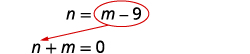</td>
</tr>
<tr valign="top">
<td data-valign="top" data-align="left">Solve for <em>m</em>.</td>
<td data-valign="top" data-align="left"></td>
</tr>
<tr valign="top">
<td data-valign="top" data-align="left" />
<td data-valign="top" data-align="left"></td>
</tr>
<tr valign="top">
<td data-valign="top" data-align="left" />
<td data-valign="top" data-align="left"></td>
</tr>
<tr valign="top">
<td data-valign="top" data-align="left">Substitute <math xmlns="http://www.w3.org/1998/Math/MathML"><mrow><mi>m</mi><mo>=</mo><mfrac><mn>9</mn><mn>2</mn></mfrac></mrow></math> into the second equation
and then solve for <em>n</em>.</td>
<td data-valign="top" data-align="left">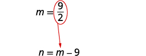</td>
</tr>
<tr valign="top">
<td data-valign="top" data-align="left" />
<td data-valign="top" data-align="left">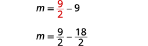</td>
</tr>
<tr valign="top">
<td data-valign="top" data-align="left" />
<td data-valign="top" data-align="left"></td>
</tr>
<tr valign="top">
<td data-valign="top" data-align="left"><strong>Step 6. Check</strong> the answer in the problem.</td>
<td data-valign="top" data-align="left">Do these numbers make sense in
the problem? We will leave this to
you!</td>
</tr>
<tr valign="top">
<td data-valign="top" data-align="left"><strong>Step 7. Answer</strong> the question.</td>
<td data-valign="top" data-align="left">The numbers are <math xmlns="http://www.w3.org/1998/Math/MathML"><mrow><mfrac><mn>9</mn><mn>2</mn></mfrac></mrow></math> and <math xmlns="http://www.w3.org/1998/Math/MathML"><mrow><mo>−</mo><mfrac><mn>9</mn><mn>2</mn></mfrac><mo>.</mo></mrow></math></td>
</tr>
</tbody></table>

The sum of two numbers is 10. One number is 4 less than the other. Find the numbers.

3, 7

The sum of two numbers is <math xmlns="http://www.w3.org/1998/Math/MathML"><mrow><mn>−6</mn><mo>.</mo></mrow></math>

 One number is 10 less than the other. Find the numbers.

2, <math xmlns="http://www.w3.org/1998/Math/MathML"><mrow><mn>−8</mn></mrow></math>

Heather has been offered two options for her salary as a trainer at the gym. Option A would pay her $25,000 plus $15 for each training session. Option B would pay her <math xmlns="http://www.w3.org/1998/Math/MathML"><mrow><mtext>$</mtext><mn>10,000</mn><mo>+</mo><mtext>$</mtext><mn>40</mn></mrow></math>

 for each training session. How many training sessions would make the salary options equal?

<table class="unnumbered unstyled" summary="Step 1 is to read the problem. Step 2 is to identify what we are looking for. We are looking for the number of training sessions that would make the pay equal. Step 3 is to name what we are looking for. We name Heather&#x2019;s salary s and the number of training sessions n. Step 4 is to translate into a system of equations. Option A would pay her 25,000 dollars plus 15 dollars for each training session. So, s is 25,000 plus 15n. Option B would pay her 10,000 dollars plus 40 dollars for each training session. So, s is 10,000 plus 40n. Step 5 is to solve the system of equations. We substitute 25,000 plus 15n for s in the second equation and solve for n. We get n equal to 600. Step 6 is to check if the answer make sense in the problem. Are 600 training sessions a year reasonable? Are the two options equal when n equal to 600? Step 7 is to answer the problem. The salary options would be equal for 600 training sessions." data-label=""><tbody>
<tr valign="top">
<td data-valign="top" data-align="left"><strong>Step 1. Read</strong> the problem.</td>
<td data-valign="top" data-align="left" />
</tr>
<tr valign="top">
<td data-valign="top" data-align="left"><strong>Step 2. Identify</strong> what we are looking for.</td>
<td data-valign="top" data-align="left">We are looking for the number of
training sessions that would make
the pay equal.</td>
</tr>
<tr valign="top">
<td data-valign="top" data-align="left"><strong>Step 3. Name</strong> what we are looking for.</td>
<td data-valign="top" data-align="left">Let <math xmlns="http://www.w3.org/1998/Math/MathML"><mrow><mi>s</mi><mo>=</mo></mrow></math> Heather’s salary.
<math xmlns="http://www.w3.org/1998/Math/MathML"><mspace width="1.5em" /><mrow><mi>n</mi><mo>=</mo></mrow></math> the number of training sessions</td>
</tr>
<tr valign="top">
<td data-valign="top" data-align="left"><strong>Step 4. Translate</strong> into a system of equations.</td>
<td data-valign="top" data-align="left">Option A would pay her $25,000
plus $15 for each training
session.</td>
</tr>
<tr valign="top">
<td data-valign="top" data-align="left" />
<td data-valign="top" data-align="left"></td>
</tr>
<tr valign="top">
<td data-valign="top" data-align="left" />
<td data-valign="top" data-align="left">Option B would pay her $10,000
+ $40 for each training session.</td>
</tr>
<tr valign="top">
<td data-valign="top" data-align="left" />
<td data-valign="top" data-align="left"></td>
</tr>
<tr valign="top">
<td data-valign="top" data-align="left">The system is shown.</td>
<td data-valign="top" data-align="left"></td>
</tr>
<tr valign="top">
<td data-valign="top" data-align="left"><strong>Step 5. Solve</strong> the system of equations.
We will use substitution.</td>
<td data-valign="top" data-align="left"></td>
</tr>
<tr valign="top">
<td data-valign="top" data-align="left">Substitute 25,000 +15<em>n</em> for <em>s</em> in the second
equation.</td>
<td data-valign="top" data-align="left"></td>
</tr>
<tr valign="top">
<td data-valign="top" data-align="left">Solve for <em>n</em>.</td>
<td data-valign="top" data-align="left"></td>
</tr>
<tr valign="top">
<td data-valign="top" data-align="left"><strong>Step 6. Check</strong> the answer.</td>
<td data-valign="top" data-align="left">Are 600 training sessions a year reasonable?
Are the two options equal when <em>n</em> = 600?</td>
</tr>
<tr valign="top">
<td data-valign="top" data-align="left"><strong>Step 7. Answer</strong> the question.</td>
<td data-valign="top" data-align="left">The salary options would be equal for 600 training
sessions.</td>
</tr>
</tbody></table>

Geraldine has been offered positions by two insurance companies. The first company pays a salary of $12,000 plus a commission of $100 for each policy sold. The second pays a salary of $20,000 plus a commission of $50 for each policy sold. How many policies would need to be sold to make the total pay the same?

160 policies

Kenneth currently sells suits for company A at a salary of $22,000 plus a $10 commission for each suit sold. Company B offers him a position with a salary of $28,000 plus a $4 commission for each suit sold. How many suits would Kenneth need to sell for the options to be equal?

1000 suits

As you solve each application, remember to analyze which method of solving the system of equations would be most convenient.

Translate to a system of equations and then solve:

When Jenna spent 10 minutes on the elliptical trainer and then did circuit training for 20 minutes, her fitness app says she burned 278 calories. When she spent 20 minutes on the elliptical trainer and 30 minutes circuit training she burned 473 calories. How many calories does she burn for each minute on the elliptical trainer? How many calories for each minute of circuit training?

<table class="unnumbered unstyled" summary="Step 1 is to read the problem. Step 2 is to identify what we are looking for. We are looking for the number of calories burned each minute on the elliptical trainer and each minute of circuit training. Step 3 is to name what we are looking for. Let e be the number of calories burned per minute on the elliptical trainer and c be the number of calories burned per minute of circuit training. Step 4 is to translate into a system of equations. 10e plus 20c is 278 and 20e plus 30c is 473. Step 5 is to solve the system of equations. We multiply the first by minus 2 to get opposite coefficients of e. Simplify and add the equations and solve for c. We get c equal to 8.3. Substituting this value in either of the original equations, we get e equal to 11.2. Step 6 is to check the answer in the problem. Step 7 is to answer the problem. Jenna burns 8.3 calories per minute circuit training and 11.2 calories per minute while on the elliptical trainer." data-label=""><tbody>
<tr valign="top">
<td data-valign="top" data-align="left"><strong>Step 1. Read</strong> the problem.</td>
<td data-valign="top" data-align="left" />
</tr>
<tr valign="top">
<td data-valign="top" data-align="left"><strong>Step 2. Identify</strong> what we are looking for.</td>
<td data-valign="top" data-align="left">We are looking for the number of
calories burned each minute on the
elliptical trainer and each minute of
circuit training.</td>
</tr>
<tr valign="top">
<td data-valign="top" data-align="left"><strong>Step 3. Name</strong> what we are looking for.</td>
<td data-valign="top" data-align="left">Let <math xmlns="http://www.w3.org/1998/Math/MathML"><mrow><mi>e</mi><mo>=</mo></mrow></math> number of calories burned per
minute on the elliptical trainer.
<math xmlns="http://www.w3.org/1998/Math/MathML"><mspace width="1.4em" /><mrow><mi>c</mi><mo>=</mo></mrow></math> number of calories burned per
minute while circuit training</td>
</tr>
<tr valign="top">
<td data-valign="top" data-align="left"><strong>Step 4. Translate</strong> into a system of equations.</td>
<td data-valign="top" data-align="left">10 minutes on the elliptical and circuit
training for 20 minutes, burned
278 calories</td>
</tr>
<tr valign="top">
<td data-valign="top" data-align="left" />
<td data-valign="top" data-align="left"></td>
</tr>
<tr valign="top">
<td data-valign="top" data-align="left" />
<td data-valign="top" data-align="left">20 minutes on the elliptical and
30 minutes of circuit training burned
473 calories</td>
</tr>
<tr valign="top">
<td data-valign="top" data-align="left" />
<td data-valign="top" data-align="left"></td>
</tr>
<tr valign="top">
<td data-valign="top" data-align="left">The system is:</td>
<td data-valign="top" data-align="left"></td>
</tr>
<tr valign="top">
<td data-valign="top" data-align="left"><strong>Step 5. Solve</strong> the system of equations.</td>
<td data-valign="top" data-align="left" />
</tr>
<tr valign="top">
<td data-valign="top" data-align="left">Multiply the first equation by −2 to get
opposite coefficients of <em>e</em>.</td>
<td data-valign="top" data-align="left"></td>
</tr>
<tr valign="top">
<td data-valign="top" data-align="left">Simplify and add the equations.
Solve for <em>c</em>.</td>
<td data-valign="top" data-align="left">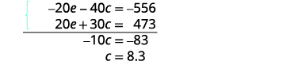</td>
</tr>
<tr valign="top">
<td data-valign="top" data-align="left">Substitute <em>c</em> = 8.3 into one of the
original equations to solve for <em>e</em>.</td>
<td data-valign="top" data-align="left">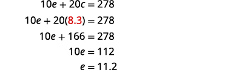</td>
</tr>
<tr valign="top">
<td data-valign="top" data-align="left"><strong>Step 6. Check</strong> the answer in the problem.</td>
<td data-valign="top" data-align="left">Check the math on your own.</td>
</tr>
<tr valign="top">
<td data-valign="top" data-align="left" />
<td data-valign="top" data-align="left"></td>
</tr>
<tr valign="top">
<td data-valign="top" data-align="left"><strong>Step 7. Answer</strong> the question.</td>
<td data-valign="top" data-align="left">Jenna burns 8.3 calories per minute
circuit training and 11.2 calories per
minute while on the elliptical trainer.</td>
</tr>
</tbody></table>

Translate to a system of equations and then solve:

Mark went to the gym and did 40 minutes of Bikram hot yoga and 10 minutes of jumping jacks. He burned 510 calories. The next time he went to the gym, he did 30 minutes of Bikram hot yoga and 20 minutes of jumping jacks burning 470 calories. How many calories were burned for each minute of yoga? How many calories were burned for each minute of jumping jacks?

Mark burned 11 calories for each minute of yoga and 7 calories for each minute of jumping jacks.

Translate to a system of equations and then solve:

Erin spent 30 minutes on the rowing machine and 20 minutes lifting weights at the gym and burned 430 calories. During her next visit to the gym she spent 50 minutes on the rowing machine and 10 minutes lifting weights and burned 600 calories. How many calories did she burn for each minutes on the rowing machine? How many calories did she burn for each minute of weight lifting?

Erin burned 11 calories for each minute on the rowing machine and 5 calories for each minute of weight lifting.

### Solve Geometry Applications

We will now solve geometry applications using systems of linear equations. We will need to add complementary angles and supplementary angles to our list some properties of angles.

The measures of two **complementary angles**{: data-type="term"} add to 90 degrees. The measures of two **supplementary angles**{: data-type="term"} add to 180 degrees.

Complementary and Supplementary Angles

Two angles are complementary if the sum of the measures of their angles is 90 degrees.

Two angles are supplementary if the sum of the measures of their angles is 180 degrees.

If two angles are complementary, we say that *one angle is the complement of the other.*

If two angles are supplementary, we say that *one angle is the supplement of the other.*

Translate to a system of equations and then solve.

The difference of two complementary angles is 26 degrees. Find the measures of the angles.

<math xmlns="http://www.w3.org/1998/Math/MathML"><mrow><mtable> <mtr><mtd columnalign="left"><mtext mathvariant="bold">Step 1. Read</mtext><mspace width="0.2em" /><mtext>the problem.</mtext></mtd><mtd /><mtd /><mtd /></mtr> <mtr><mtd columnalign="left"><mtext mathvariant="bold">Step 2. Identify</mtext><mspace width="0.2em" /><mtext>what we are looking for.</mtext></mtd><mtd /><mtd /><mtd columnalign="left"><mtable><mtr><mtd columnalign="left"><mtext>We are looking for the measure of each</mtext></mtd></mtr><mtr><mtd columnalign="left"><mtext>angle.</mtext></mtd></mtr></mtable></mtd></mtr> <mtr><mtd columnalign="left"><mtext mathvariant="bold">Step 3. Name</mtext><mspace width="0.2em" /><mtext>what we are looking for.</mtext></mtd><mtd /><mtd /><mtd columnalign="left"><mtable><mtr><mtd columnalign="left"><mtext>Let</mtext><mspace width="0.2em" /><mi>x</mi><mo>=</mo><mspace width="0.2em" /><mtext>the measure of the first angle.</mtext></mtd></mtr><mtr><mtd columnalign="left"><mo>  </mo><mi>y</mi><mo>=</mo><mspace width="0.2em" /><mtext>the measure of the second angle</mtext></mtd></mtr></mtable></mtd></mtr> <mtr><mtd columnalign="left"><mtable><mtr><mtd columnalign="left"><mtext mathvariant="bold">Step 4. Translate</mtext><mspace width="0.2em" /><mtext>into a system of</mtext></mtd></mtr><mtr><mtd columnalign="left"><mtext>equations.</mtext></mtd></mtr></mtable></mtd><mtd /><mtd /><mtd columnalign="left"><mtable><mtr><mtd columnalign="left"><mtext>The angles are complementary.</mtext></mtd></mtr><mtr><mtd columnalign="left"><mspace width="5.5em" /><mi>x</mi><mo>+</mo><mi>y</mi><mo>=</mo><mn>90</mn></mtd></mtr></mtable></mtd></mtr> <mtr><mtd /><mtd /><mtd /><mtd columnalign="left"><mtable><mtr><mtd columnalign="left"><mtext>The difference of the two angles is 26</mtext></mtd></mtr><mtr><mtd columnalign="left"><mtext>degrees.</mtext></mtd></mtr></mtable></mtd></mtr> <mtr><mtd /><mtd /><mtd /><mtd columnalign="left"><mspace width="5.6em" /><mi>x</mi><mo>−</mo><mi>y</mi><mo>=</mo><mn>26</mn></mtd></mtr> <mtr /><mtr /><mtr><mtd columnalign="left"><mtext>The system is shown.</mtext></mtd><mtd /><mtd /><mtd columnalign="left"><mspace width="5.3em" /><mrow><mo>{</mo><mtable><mtr><mtd columnalign="left"><mi>x</mi><mo>+</mo><mi>y</mi><mo>=</mo><mn>90</mn></mtd></mtr><mtr><mtd columnalign="left"><mi>x</mi><mo>−</mo><mi>y</mi><mo>=</mo><mn>26</mn></mtd></mtr></mtable></mrow></mtd></mtr><mtr /><mtr /> <mtr><mtd columnalign="left"><mtable><mtr><mtd columnalign="left"><mtext mathvariant="bold">Step 5. Solve</mtext><mspace width="0.2em" /><mtext>the system of equations</mtext></mtd></mtr><mtr><mtd columnalign="left"><mtext>by elimination.</mtext></mtd></mtr></mtable></mtd><mtd /><mtd /><mtd columnalign="left"><mspace width="5em" /><mtable><mtr><mtd columnalign="left"><munder accentunder="true"><mrow><mrow><mo>{</mo><mtable><mtr><mtd columnalign="left"><mi>x</mi><mo>+</mo><mi>y</mi><mo>=</mo><mn>90</mn></mtd></mtr><mtr><mtd columnalign="left"><mi>x</mi><mo>−</mo><mi>y</mi><mo>=</mo><mn>26</mn></mtd></mtr></mtable></mrow></mrow><mo stretchy="true">\_\_\_\_\_\_\_\_\_\_\_</mo></munder></mtd></mtr><mtr><mtd columnalign="left"><mo> </mo><mn>2</mn><mi>x</mi><mspace width="1em" /><mo>=</mo><mn>116</mn></mtd></mtr></mtable></mtd></mtr> <mtr><mtd columnalign="left"><mtext>Substitute</mtext><mspace width="0.2em" /><mi>x</mi><mo>=</mo><mn>58</mn><mspace width="0.2em" /><mtext>into the first equation.</mtext></mtd><mtd /><mtd /><mtd columnalign="left"><mspace width="5.2em" /><mtable><mtr><mtd columnalign="right"><mi>x</mi><mo>=</mo><mn>58</mn></mtd></mtr><mtr /><mtr /><mtr><mtd columnalign="right"><mi>x</mi><mo>+</mo><mi>y</mi><mo>=</mo><mn>90</mn></mtd></mtr><mtr><mtd columnalign="right"><mn>58</mn><mo>+</mo><mi>y</mi><mo>=</mo><mn>90</mn></mtd></mtr><mtr><mtd columnalign="right"><mi>y</mi><mo>=</mo><mn>32</mn></mtd></mtr></mtable></mtd></mtr> <mtr><mtd columnalign="left"><mtable><mtr><mtd columnalign="left"><mtext mathvariant="bold">Step 6. Check</mtext><mspace width="0.2em" /><mtext>the answer in the problem.</mtext></mtd></mtr><mtr /><mtr /><mtr /><mtr><mtd columnalign="left"><mspace width="4em" /><mtable><mtr><mtd columnalign="left"><mn>58</mn><mo>+</mo><mn>32</mn><mo>=</mo><mn>90</mn><mn>✓</mn></mtd></mtr><mtr><mtd columnalign="left"><mn>58</mn><mo>−</mo><mn>32</mn><mo>=</mo><mn>26</mn><mn>✓</mn></mtd></mtr></mtable></mtd></mtr></mtable></mtd><mtd /><mtd /><mtd /></mtr> <mtr><mtd columnalign="left"><mtext mathvariant="bold">Step 7. Answer</mtext><mspace width="0.2em" /><mtext>the question.</mtext></mtd><mtd /><mtd /><mtd columnalign="left"><mtext>The angle measures are 58 and 32 degrees.</mtext></mtd></mtr></mtable></mrow></math>

Translate to a system of equations and then solve:

The difference of two complementary angles is 20 degrees. Find the measures of the angles.

The angle measures are 55 and 35.

Translate to a system of equations and then solve:

The difference of two complementary angles is 80 degrees. Find the measures of the angles.

The angle measures are 5 and 85.

In the next example, we remember that the measures of supplementary angles add to 180.

Translate to a system of equations and then solve:

Two angles are supplementary. The measure of the larger angle is twelve degrees less than five times the measure of the smaller angle. Find the measures of both angles.

<table class="unnumbered unstyled can-break" summary="Step 1 is to read the problem. Step 2 is to identify what we are looking for. We are looking for the measure of each angle. Step 3 is to name what we are looking for. Let x be the measure of the first angle and y be the measure of the second angle. Step 4 is to translate into a system of equations. The angles are supplementary. So, x plus y is 180 and y is 5 x minus 12. Step 5 is to solve the system of equations by substitution. Substitute 5 x minus 12 for y in the first equation. Solving for x, we get x equal to 32. Substitute this in the second equation and solve for y. We get y equal to 148. Step 6 is to check the answer in the problem. Step 7 is to answer the question. The angle measures are 148 and 32." data-label=""><tbody>
<tr valign="top">
<td data-valign="top" data-align="left"><strong>Step 1. Read</strong> the problem.</td>
<td data-valign="top" data-align="left" />
</tr>
<tr valign="top">
<td data-valign="top" data-align="left"><strong>Step 2. Identify</strong> what we are looking for.</td>
<td data-valign="top" data-align="left">We are looking for measure of each
angle.</td>
</tr>
<tr valign="top">
<td data-valign="top" data-align="left"><strong>Step 3. Name</strong> what we are looking for.</td>
<td data-valign="top" data-align="left">Let <math xmlns="http://www.w3.org/1998/Math/MathML"><mrow><mi>x</mi><mo>=</mo></mrow></math> the measure of the first angle.
<math xmlns="http://www.w3.org/1998/Math/MathML"><mspace width="1.5em" /><mrow><mi>y</mi><mo>=</mo></mrow></math> the measure of the second angle</td>
</tr>
<tr valign="top">
<td data-valign="top" data-align="left"><strong>Step 4. Translate</strong> into a system of equations.</td>
<td data-valign="top" data-align="left">The angles are supplementary.</td>
</tr>
<tr valign="top">
<td data-valign="top" data-align="left" />
<td data-valign="top" data-align="left"></td>
</tr>
<tr valign="top">
<td data-valign="top" data-align="left" />
<td data-valign="top" data-align="left">The larger angle is twelve less than five
times the smaller angle.</td>
</tr>
<tr valign="top">
<td data-valign="top" data-align="left" />
<td data-valign="top" data-align="left"></td>
</tr>
<tr valign="top">
<td data-valign="top" data-align="left">The system is shown:
<strong>Step 5. Solve</strong> the system of equations substitution.</td>
<td data-valign="top" data-align="left">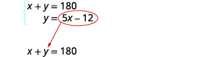</td>
</tr>
<tr valign="top">
<td data-valign="top" data-align="left">Substitute 5<em>x</em> − 12 for <em>y</em> in the first equation.
Solve for <em>x</em>.</td>
<td data-valign="top" data-align="left">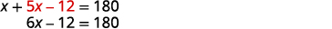</td>
</tr>
<tr valign="top">
<td data-valign="top" data-align="left">

Substitute 32 for <em>x</em> in the second
equation, then solve for <em>y</em>.</td>
<td data-valign="top" data-align="left">

</td>
</tr>
<tr valign="top">
<td data-valign="top" data-align="left"><strong>Step 6. Check</strong> the answer in the problem.</td>
<td data-valign="top" data-align="left">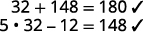</td>
</tr>
<tr valign="top">
<td data-valign="top" data-align="left"><strong>Step 7. Answer</strong> the question.</td>
<td data-valign="top" data-align="left">The angle measures are 148 and 32 degrees.</td>
</tr>
</tbody></table>

Translate to a system of equations and then solve:

Two angles are supplementary. The measure of the larger angle is 12 degrees more than three times the smaller angle. Find the measures of the angles.

The angle measures are 42 and 138.

Translate to a system of equations and then solve:

Two angles are supplementary. The measure of the larger angle is 18 less than twice the measure of the smaller angle. Find the measures of the angles.

The angle measures are 66 and 114.

Recall that the angles of a triangle add up to 180 degrees. A right triangle has one angle that is 90 degrees. What does that tell us about the other two angles? In the next example we will be finding the measures of the other two angles.

The measure of one of the small angles of a right triangle is ten more than three times the measure of the other small angle. Find the measures of both angles.

We will draw and label a figure.

<table class="unnumbered unstyled" summary="Step 1 is to read the problem. Step 2 is to identify what we are looking for. We are looking for the measures of the two angles of the triangle. Step 3 is to name what we are looking for. Let A equal the measure of the first angle. Let B equal the measure of the second angle. Step 4 is to translate into a system of equations. The measure of one of the small angles of a right triangle is ten more than three times the measure of the other small angle. This means that A equals 3 B plus 10. The sum of the measures of the angles of a triangle is 180. A plus B plus 90 equals 180. The system is A equals 3 B plus 10 and A plus B plus 90 equals 180. Step 5 is to solve the system of equations. We will use substitution since the first equation is solved for A. Because A equals 3 B plus 10, we substitute 3 B plus 10 in for A in the second equation. This gives us 3 B plus 10, in parentheses, plus B plus 90 equals 180. Solve for B. 4 B plus 100 equals 180. 4 B equals 80. B equals 20. Substitute B equals 20 into the first equation and then solve for A. A equals 3 times 20 plus 10. A equals 70. Step 6 is to check the answer in the problem. We will leave this to you. Step 7 is to answer the question. The measures of the small angles are 20 and 70." data-label=""><tbody>
<tr valign="top">
<td data-valign="top" data-align="left"><strong>Step 1. Read</strong> the problem.</td>
<td data-valign="top" data-align="left">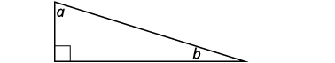</td>
</tr>
<tr valign="top">
<td data-valign="top" data-align="left"><strong>Step 2. Identify</strong> what you are looking for.</td>
<td data-valign="top" data-align="left">We are looking for the measures of the angles.</td>
</tr>
<tr valign="top">
<td data-valign="top" data-align="left"><strong>Step 3. Name</strong> what we are looking for.</td>
<td data-valign="top" data-align="left">Let <math xmlns="http://www.w3.org/1998/Math/MathML"><mrow><mi>a</mi><mo>=</mo></mrow></math> the measure of the first angle.
<math xmlns="http://www.w3.org/1998/Math/MathML"><mspace width="1.5em" /><mrow><mi>b</mi><mo>=</mo></mrow></math> the measure of the second angle</td>
</tr>
<tr valign="top">
<td data-valign="top" data-align="left"><strong>Step 4. Translate</strong> into a system of equations.</td>
<td data-valign="top" data-align="left">The measure of one of the small angles of a right triangle is ten more than three times the measure of the other small angle.</td>
</tr>
<tr valign="top">
<td data-valign="top" data-align="left" />
<td data-valign="top" data-align="left"></td>
</tr>
<tr valign="top">
<td data-valign="top" data-align="left" />
<td data-valign="top" data-align="left">The sum of the measures of the angles of a triangle is 180.</td>
</tr>
<tr valign="top">
<td data-valign="top" data-align="left" />
<td data-valign="top" data-align="left">

</td>
</tr>
<tr valign="top">
<td data-valign="top" data-align="left">The system is shown.</td>
<td data-valign="top" data-align="left"></td>
</tr>
<tr valign="top">
<td data-valign="top" data-align="left"><strong>Step 5. Solve</strong> the system of equations. We will use substitution since the first equation is solved for <em>a</em>.</td>
<td data-valign="top" data-align="left">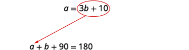</td>
</tr>
<tr valign="top">
<td data-valign="top" data-align="left">Substitute <math xmlns="http://www.w3.org/1998/Math/MathML"><mrow><mn>3</mn><mi>b</mi><mo>+</mo><mn>10</mn></mrow></math> for <em>a</em> in the second equation.</td>
<td data-valign="top" data-align="left"></td>
</tr>
<tr valign="top">
<td data-valign="top" data-align="left">Solve for <em>b</em>.</td>
<td data-valign="top" data-align="left">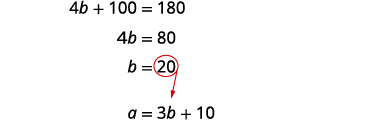</td>
</tr>
<tr valign="top">
<td data-valign="top" data-align="left">Substitute <math xmlns="http://www.w3.org/1998/Math/MathML"><mrow><mi>b</mi><mo>=</mo><mn>20</mn></mrow></math> into the first equation and then solve for <em>a.</em></td>
<td data-valign="top" data-align="left"></td>
</tr>
<tr valign="top">
<td data-valign="top" data-align="left"><strong>Step 6. Check</strong> the answer in the problem.</td>
<td data-valign="top" data-align="left">We will leave this to you!</td>
</tr>
<tr valign="top">
<td data-valign="top" data-align="left"><strong>Step 7. Answer</strong> the question.</td>
<td data-valign="top" data-align="left">The measures of the small angles are 20 and 70 degrees.</td>
</tr>
</tbody></table>

The measure of one of the small angles of a right triangle is 2 more than 3 times the measure of the other small angle. Find the measure of both angles.

22, 68

The measure of one of the small angles of a right triangle is 18 less than twice the measure of the other small angle. Find the measure of both angles.

36, 54

Often it is helpful when solving geometry applications to draw a picture to visualize the situation.

Translate to a system of equations and then solve:

Randall has 125 feet of fencing to enclose the part of his backyard adjacent to his house. He will only need to fence around three sides, because the fourth side will be the wall of the house. He wants the length of the fenced yard (parallel to the house wall) to be 5 feet more than four times as long as the width. Find the length and the width.

<table class="unnumbered unstyled" summary="Step 1 is to read the problem. Step 2 is to identify what we are looking for. We are looking for the length and width. Step 3 is to name what we are looking for. Let L be the length and W be the width. Step 4 is to translate into a system of equations. L plus 2W is 125 and L is 4W plus 5. Step 5 is to solve the system of equations. Substituting the second equation into the first and solving for W, we get W equal to 20. Substituting this into the second equation, we get L equal to 85. Step 6 is to check the answer in the problem. Step 7 is to answer the question. The length is 85 feet and width is 20 feet." data-label=""><tbody>
<tr valign="top">
<td data-valign="top" data-align="left"><strong>Step 1. Read</strong> the problem.</td>
<td data-valign="top" data-align="left" />
</tr>
<tr valign="top">
<td data-valign="top" data-align="left"><strong>Step 2. Identify</strong> what you are looking for.</td>
<td data-valign="top" data-align="left">We are looking for the length and width.</td>
</tr>
<tr valign="top">
<td data-valign="top" data-align="left" />
<td data-valign="top" data-align="left"></td>
</tr>
<tr valign="top">
<td data-valign="top" data-align="left"><strong>Step 3. Name</strong> what we are looking for.</td>
<td data-valign="top" data-align="left">Let <math xmlns="http://www.w3.org/1998/Math/MathML"><mrow><mi>L</mi><mo>=</mo></mrow></math> the length of the fenced yard.
<math xmlns="http://www.w3.org/1998/Math/MathML"><mspace width="1.3em" /><mrow><mi>W</mi><mo>=</mo></mrow></math> the width of the fenced yard</td>
</tr>
<tr valign="top">
<td data-valign="top" data-align="left"><strong>Step 4. Translate</strong> into a system of equations.</td>
<td data-valign="top" data-align="left">One lenth and two widths equal 125.</td>
</tr>
<tr valign="top">
<td data-valign="top" data-align="left" />
<td data-valign="top" data-align="left"></td>
</tr>
<tr valign="top">
<td data-valign="top" data-align="left" />
<td data-valign="top" data-align="left">The length will be 5 feet more than
four times the width.</td>
</tr>
<tr valign="top">
<td data-valign="top" data-align="left" />
<td data-valign="top" data-align="left"></td>
</tr>
<tr valign="top">
<td data-valign="top" data-align="left">The system is shown.

<strong>Step 5. Solve</strong> The system of equations
by substitution.</td>
<td data-valign="top" data-align="left">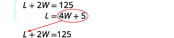</td>
</tr>
<tr valign="top">
<td data-valign="top" data-align="left">Substitute <em>L</em> = 4<em>W</em> + 5 into the first
equation, then solve for <em>W</em>.</td>
<td data-valign="top" data-align="left"></td>
</tr>
<tr valign="top">
<td data-valign="top" data-align="left" />
<td data-valign="top" data-align="left"></td>
</tr>
<tr valign="top">
<td data-valign="top" data-align="left">Substitute 20 for <em>W</em> in the second
equation, then solve for <em>L</em>.</td>
<td data-valign="top" data-align="left"></td>
</tr>
<tr valign="top">
<td data-valign="top" data-align="left"><strong>Step 6. Check</strong> the answer in the
problem.</td>
<td data-valign="top" data-align="left">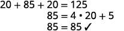</td>
</tr>
<tr valign="top">
<td data-valign="top" data-align="left"><strong>Step 7. Answer</strong> the equation.</td>
<td data-valign="top" data-align="left">The length is 85 feet and the width is 20 feet.</td>
</tr>
</tbody></table>

Translate to a system of equations and then solve:

Mario wants to put a fence around the pool in his backyard. Since one side is adjacent to the house, he will only need to fence three sides. There are two long sides and the one shorter side is parallel to the house. He needs 155 feet of fencing to enclose the pool. The length of the long side is 10 feet less than twice the width. Find the length and width of the pool area to be enclosed.

The length is 60 feet and the width is 35 feet.

Translate to a system of equations and then solve:

Alexis wants to build a rectangular dog run in her yard adjacent to her neighbor’s fence. She will use 136 feet of fencing to completely enclose the rectangular dog run. The length of the dog run along the neighbor’s fence will be 16 feet less than twice the width. Find the length and width of the dog run.

The length is 60 feet and the width is 38 feet.

### Solve uniform motion applications

We used a table to organize the information in uniform motion problems when we introduced them earlier. We’ll continue using the table here. The basic equation was <math xmlns="http://www.w3.org/1998/Math/MathML"><mrow><mi>D</mi><mo>=</mo><mi>r</mi><mi>t</mi></mrow></math>

 where *D* is the distance traveled, *r* is the rate, and *t* is the time.

Our first example of a uniform motion application will be for a situation similar to some we have already seen, but now we can use two variables and two equations.

Translate to a system of equations and then solve:

Joni left St. Louis on the interstate, driving west towards Denver at a speed of 65 miles per hour. Half an hour later, Kelly left St. Louis on the same route as Joni, driving 78 miles per hour. How long will it take Kelly to catch up to Joni?

A diagram is useful in helping us visualize the situation.

* * *
{: data-type="newline"}

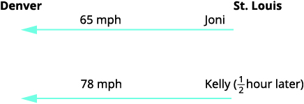

**Identify and name** what we are looking for. A chart will help us organize the data. We know the rates of both Joni and Kelly, and so we enter them in the chart. We are looking for the length of time Kelly, *k*, and Joni, *j*, will each drive.

* * *
{: data-type="newline"}

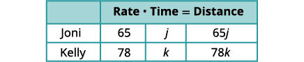

Since <math xmlns="http://www.w3.org/1998/Math/MathML"><mrow><mi>D</mi><mo>=</mo><mi>r</mi><mo>·</mo><mi>t</mi></mrow></math>

 we can fill in the Distance column.

**Translate** into a system of equations.

To make the system of equations, we must recognize that Kelly and Joni will drive the same distance. So,

<math xmlns="http://www.w3.org/1998/Math/MathML"><mrow><mspace width="5em" /><mn>65</mn><mi>j</mi><mo>=</mo><mn>78</mn><mi>k</mi></mrow></math>

Also, since Kelly left later, her time will be <math xmlns="http://www.w3.org/1998/Math/MathML"><mrow><mfrac><mn>1</mn><mn>2</mn></mfrac></mrow></math>

 hour less than Joni’s time. So,

<math xmlns="http://www.w3.org/1998/Math/MathML"><mrow><mtable> <mtr><mtd /><mtd /><mtd /><mtd columnalign="left"><mspace width="4em" /><mi>k</mi><mo>=</mo><mi>j</mi><mo>−</mo><mfrac><mn>1</mn><mn>2</mn></mfrac></mtd></mtr> <mtr /><mtr /><mtr><mtd columnalign="left"><mtext>Now we have the system.</mtext></mtd><mtd /><mtd /><mtd columnalign="left"><mspace width="2.4em" /><mrow><mo>{</mo><mtable><mtr><mtd columnalign="left"><mspace width="1em" /><mi>k</mi><mo>=</mo><mi>j</mi><mo>−</mo><mfrac><mn>1</mn><mn>2</mn></mfrac></mtd></mtr><mtr><mtd columnalign="left"><mn>65</mn><mi>j</mi><mo>=</mo><mn>78</mn><mi>k</mi></mtd></mtr></mtable></mrow></mtd></mtr> <mtr><mtd columnalign="left"><mtext mathvariant="bold">Solve</mtext><mspace width="0.2em" /><mtext>the system of equations by substitution.</mtext></mtd><mtd /><mtd /><mtd /></mtr> <mtr><mtd columnalign="left"><mtable><mtr /><mtr /><mtr><mtd columnalign="left"><mtext>Substitute</mtext><mspace width="0.2em" /><mi>k</mi><mo>=</mo><mi>j</mi><mo>−</mo><mfrac><mn>1</mn><mn>2</mn></mfrac><mspace width="0.2em" /><mtext>into the second equation,</mtext></mtd></mtr><mtr><mtd columnalign="left"><mtext>then solve for</mtext><mspace width="0.2em" /><mi>j</mi><mo>.</mo></mtd></mtr></mtable></mtd><mtd /><mtd /></mtr> <mtr><mtd /><mtd /><mtd /><mtd columnalign="left"><mspace width="3.2em" /><mn>65</mn><mi>j</mi><mo>=</mo><mn>78</mn><mi>k</mi></mtd></mtr> <mtr><mtd /><mtd /><mtd /><mtd columnalign="left"><mspace width="2.1em" /><mtable><mtr><mtd columnalign="right"><mn>65</mn><mi>j</mi></mtd><mtd columnalign="left"><mo>=</mo></mtd><mtd columnalign="left"><mn>78</mn><mrow><mo>(</mo><mrow><mi>j</mi><mo>−</mo><mfrac><mn>1</mn><mn>2</mn></mfrac></mrow><mo>)</mo></mrow></mtd></mtr><mtr><mtd columnalign="right"><mn>65</mn><mi>j</mi></mtd><mtd columnalign="left"><mo>=</mo></mtd><mtd columnalign="left"><mn>78</mn><mi>j</mi><mo>−</mo><mn>39</mn></mtd></mtr><mtr><mtd columnalign="right"><mn>−13</mn><mi>j</mi></mtd><mtd columnalign="left"><mo>=</mo></mtd><mtd columnalign="left"><mn>−39</mn></mtd></mtr><mtr><mtd columnalign="right"><mi>j</mi></mtd><mtd columnalign="left"><mo>=</mo></mtd><mtd columnalign="left"><mn>3</mn></mtd></mtr></mtable></mtd></mtr> <mtr><mtd columnalign="left"><mtable><mtr><mtd columnalign="left"><mtext>To find Kelly’s time, substitute</mtext><mspace width="0.2em" /><mi>j</mi><mo>=</mo><mn>3</mn><mspace width="0.2em" /><mtext> into the first</mtext></mtd></mtr><mtr><mtd columnalign="left"><mtext>equation, then solve for</mtext><mspace width="0.2em" /><mi>k</mi><mo>.</mo></mtd></mtr></mtable></mtd><mtd /><mtd /><mtd columnalign="left"><mspace width="4.3em" /><mi>k</mi><mo>=</mo><mi>j</mi><mo>−</mo><mfrac><mn>1</mn><mn>2</mn></mfrac></mtd></mtr> <mtr><mtd /><mtd /><mtd /><mtd columnalign="left"><mspace width="4.3em" /><mi>k</mi><mo>=</mo><mn>3</mn><mo>−</mo><mfrac><mn>1</mn><mn>2</mn></mfrac></mtd></mtr> <mtr><mtd /><mtd /><mtd /><mtd columnalign="left"><mspace width="1em" /><mi>k</mi><mo>=</mo><mfrac><mn>5</mn><mn>2</mn></mfrac><mspace width="0.5em" /><mtext>or</mtext><mspace width="0.5em" /><mi>k</mi><mo>=</mo><mn>2</mn><mfrac><mn>1</mn><mn>2</mn></mfrac></mtd></mtr> <mtr><mtd columnalign="left"><mtable><mtr><mtd columnalign="left"><mtext mathvariant="bold">Check</mtext><mspace width="0.2em" /><mtext>the answer in the problem.</mtext></mtd></mtr> <mtr><mtd columnalign="left"><mtext>Joni</mtext><mspace width="1.8em" /><mn>3</mn><mspace width="0.2em" /><mtext>hours</mtext><mspace width="0.2em" /><mo>(</mo><mn>65</mn><mspace width="0.2em" /><mtext>mph</mtext><mo>)</mo><mspace width=".2em" /><mo>=</mo><mn>195</mn><mspace width="0.2em" /><mtext>miles</mtext></mtd></mtr> <mtr><mtd columnalign="left"><mtext>Kelly</mtext><mspace width="0.5em" /><mn>2</mn><mfrac><mn>1</mn><mn>2</mn></mfrac><mspace width="0.2em" /><mtext>hours</mtext><mspace width="0.2em" /><mo>(</mo><mn>78</mn><mspace width="0.2em" /><mtext>mph</mtext><mo>)</mo><mo>=</mo><mn>195</mn><mspace width="0.2em" /><mtext>miles</mtext></mtd></mtr></mtable></mtd><mtd /><mtd /><mtd /></mtr> <mtr><mtd columnalign="left"><mtable><mtr><mtd columnalign="left"><mtext>Yes, they will have traveled the same distance</mtext></mtd></mtr><mtr><mtd columnalign="left"><mtext>when they meet.</mtext></mtd></mtr></mtable></mtd><mtd /><mtd /><mtd /></mtr> <mtr><mtd columnalign="left"><mtable><mtr><mtd columnalign="left"><mtext mathvariant="bold">Answer</mtext><mspace width="0.2em" /><mtext>the question.</mtext></mtd></mtr><mtr /><mtr /><mtr /><mtr /></mtable></mtd><mtd /><mtd /><mtd columnalign="left"><mtable><mtr><mtd columnalign="left"><mtext>Kelly will catch up to Joni in</mtext></mtd></mtr><mtr><mtd columnalign="left"><mn>2</mn><mfrac><mn>1</mn><mn>2</mn></mfrac><mspace width="0.2em" /><mtext>hours. By then, Joni will</mtext></mtd></mtr><mtr><mtd columnalign="left"><mtext>have traveled 3 hours.</mtext></mtd></mtr></mtable></mtd></mtr></mtable></mrow></math>

Translate to a system of equations and then solve:

Mitchell left Detroit on the interstate driving south towards Orlando at a speed of 60 miles per hour. Clark left Detroit 1 hour later traveling at a speed of 75 miles per hour, following the same route as Mitchell. How long will it take Clark to catch Mitchell?

It will take Clark 4 hours to catch Mitchell.

Translate to a system of equations and then solve:

Charlie left his mother’s house traveling at an average speed of 36 miles per hour. His sister Sally left 15 minutes <math xmlns="http://www.w3.org/1998/Math/MathML"><mrow><mo stretchy="false">(</mo><mfrac><mn>1</mn><mn>4</mn></mfrac><mspace width="0.2em" /><mtext>hour</mtext><mo stretchy="false">)</mo></mrow></math>

 later traveling the same route at an average speed of 42 miles per hour. How long before Sally catches up to Charlie?

It will take Sally <math xmlns="http://www.w3.org/1998/Math/MathML"><mrow><mn>1</mn><mfrac><mn>1</mn><mn>2</mn></mfrac></mrow></math>

 hours to catch up to Charlie.

Many real-world applications of uniform motion arise because of the effects of currents—of water or air—on the actual speed of a vehicle. Cross-country airplane flights in the United States generally take longer going west than going east because of the prevailing wind currents.

Let’s take a look at a boat travelling on a river. Depending on which way the boat is going, the current of the water is either slowing it down or speeding it up.

The images below show how a river current affects the speed at which a boat is actually travelling. We’ll call the speed of the boat in still water *b* and the speed of the river current *c*.

The boat is going downstream, in the same direction as the river current. The current helps push the boat, so the boat’s actual speed is faster than its speed in still water. The actual speed at which the boat is moving is <math xmlns="http://www.w3.org/1998/Math/MathML"><mrow><mi>b</mi><mo>+</mo><mi>c</mi><mo>.</mo></mrow></math>

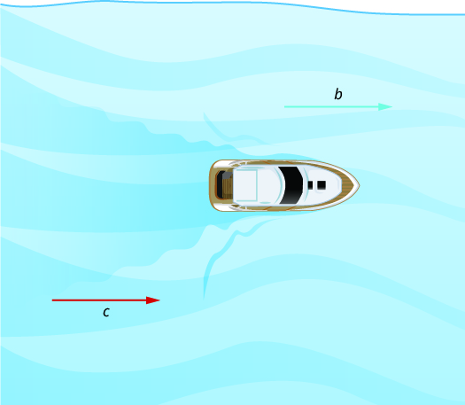

Now, the boat is going upstream, opposite to the river current. The current is going against the boat, so the boat’s actual speed is slower than its speed in still water. The actual speed of the boat is <math xmlns="http://www.w3.org/1998/Math/MathML"><mrow><mi>b</mi><mo>−</mo><mi>c</mi><mo>.</mo></mrow></math>

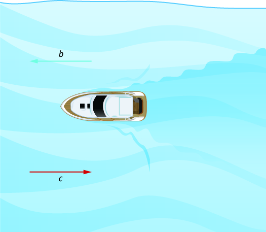

We’ll put some numbers to this situation in the next example.

Translate to a system of equations and then solve.

A river cruise ship sailed 60 miles downstream for 4 hours and then took 5 hours sailing upstream to return to the dock. Find the speed of the ship in still water and the speed of the river current.

<table class="unnumbered unstyled" summary="Step 1 is to read the problem. This is a uniform motion problem and a picture will help us visualize the situation. The picture shows a wavy line pointing right. This is labeled c. A straight arrow pointing right is labeled 4 hours. Another arrow pointing left is labeled 5 hours. The length of arrows is labeled 60 miles. Step 2 is to identify what we are looking for. We are looking for the speed of the ship in still water and the speed of the current. Step 3 is to name what we are looking for. Let s be the rate of ship in still water and c be the rate of current. The ship goes downstream and then upstream. Going downstream, the current helps the ship and so the ship's actual rate is s plus c. Going upstream, the current slows the ship and so the actual rate is s minus c. Step 4 is to translate into a system of equations. 4 open parentheses s plus c close parentheses is 60 and 5 open parentheses s minus c close parentheses is 60. Step 5 is to solve the system of equations. Multiply the top equation by 5 and the bottom one by 4. By adding them and solving for s, we get s equal to 13.5. By substituting, we get c equal to 1.5. Step 6 is to check the answer in the problem. Step 7 is to answer the question. The rate of ship is 13.5 and rate of current is 1.5." data-label=""><tbody>
<tr valign="top">
<td data-valign="top" data-align="left"><strong>Read</strong> the problem.</td>
<td data-valign="top" data-align="left">This is a uniform motion problem and a
picture will help us visualize the situation.</td>
</tr>
<tr valign="top">
<td data-valign="top" data-align="left" />
<td data-valign="top" data-align="left">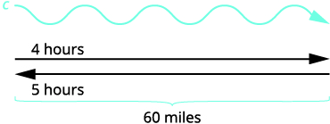</td>
</tr>
<tr valign="top">
<td data-valign="top" data-align="left"><strong>Identify</strong> what we are looking for.</td>
<td data-valign="top" data-align="left">We are looking for the speed of the ship
in still water and the speed of the current.</td>
</tr>
<tr valign="top">
<td data-valign="top" data-align="left"><strong>Name</strong> what we are looking for.</td>
<td data-valign="top" data-align="left">Let <math xmlns="http://www.w3.org/1998/Math/MathML"><mrow><mi>s</mi><mo>=</mo></mrow></math> the rate of the ship in still water.
<math xmlns="http://www.w3.org/1998/Math/MathML"><mspace width="1.5em" /><mrow><mi>c</mi><mo>=</mo></mrow></math> the rate of the current</td>
</tr>
<tr valign="top">
<td data-valign="top" data-align="left">A chart will help us organize the information.
The ship goes downstream and then upstream.
Going downstream, the current helps the
ship and so the ship's actual rate is <em>s</em> + <em>c</em>.
Going upstream, the current slows the ship
and so the actual rate is <em>s</em> − <em>c</em>.</td>
<td data-valign="top" data-align="left">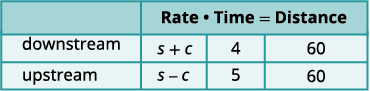</td>
</tr>
<tr valign="top">
<td data-valign="top" data-align="left">Downstream it takes 4 hours.
Upstream it takes 5 hours.
Each way the distance is 60 miles.</td>
<td data-valign="top" data-align="left" />
</tr>
<tr valign="top">
<td data-valign="top" data-align="left"><strong>Translate</strong> into a system of equations.
Since rate times time is distance, we can
write the system of equations.</td>
<td data-valign="top" data-align="left"></td>
</tr>
<tr valign="top">
<td data-valign="top" data-align="left"><strong>Solve</strong> the system of equations.
Distribute to put both equations in standard
form, then solve by elimination.</td>
<td data-valign="top" data-align="left"></td>
</tr>
<tr valign="top">
<td data-valign="top" data-align="left">Multiply the top equation by 5 and the
bottom equation by 4.
Add the equations, then solve for <em>s</em>.</td>
<td data-valign="top" data-align="left"></td>
</tr>
<tr valign="top">
<td data-valign="top" data-align="left">Substitute <em>s</em> = 13.5 into of the original
equations.</td>
<td data-valign="top" data-align="left"></td>
</tr>
<tr valign="top">
<td data-valign="top" data-align="left"><strong>Check</strong> the answer in the problem.

The downstream rate would be
 <math xmlns="http://www.w3.org/1998/Math/MathML"><mrow><mn>13.5</mn><mo>+</mo><mn>1.5</mn><mo>=</mo><mn>15</mn></mrow></math> mph.
In 4 hours the ship would travel
  <math xmlns="http://www.w3.org/1998/Math/MathML"><mrow><mn>15</mn><mo>·</mo><mn>4</mn><mo>=</mo><mn>60</mn></mrow></math> miles.
The upstream rate would be
 <math xmlns="http://www.w3.org/1998/Math/MathML"><mrow><mn>13.5</mn><mo>−</mo><mn>1.5</mn><mo>=</mo><mn>12</mn></mrow></math> mph.
In 5 hours the ship would travel
  <math xmlns="http://www.w3.org/1998/Math/MathML"><mrow><mn>12</mn><mo>·</mo><mn>5</mn><mo>=</mo><mn>60</mn></mrow></math> miles.</td>
<td data-valign="top" data-align="left" />
</tr>
<tr valign="top">
<td data-valign="top" data-align="left"><strong>Answer</strong> the question.</td>
<td data-valign="top" data-align="left">The rate of the ship is 13.5 mph and
the rate of the current is 1.5 mph.</td>
</tr>
</tbody></table>

Translate to a system of equations and then solve:

A Mississippi river boat cruise sailed 120 miles upstream for 12 hours and then took 10 hours to return to the dock. Find the speed of the river boat in still water and the speed of the river current.

The rate of the boat is 11 mph and the rate of the current is 1 mph.

Translate to a system of equations and then solve:

Jason paddled his canoe 24 miles upstream for 4 hours. It took him 3 hours to paddle back. Find the speed of the canoe in still water and the speed of the river current.

The speed of the canoe is 7 mph and the speed of the current is 1 mph.

Wind currents affect airplane speeds in the same way as water currents affect boat speeds. We’ll see this in the next example. A wind current in the same direction as the plane is flying is called a *tailwind*. A wind current blowing against the direction of the plane is called a *headwind*.

Translate to a system of equations and then solve:

A private jet can fly 1,095 miles in three hours with a tailwind but only 987 miles in three hours into a headwind. Find the speed of the jet in still air and the speed of the wind.

<table class="unnumbered unstyled can-break" summary="Step 1 is to read the problem. This is a uniform motion problem and a picture will help us visualize the situation. The picture shows a wavy line pointing right. This is labeled wind, 3 hours. A straight arrow pointing right is labeled j plus w equals 365, 1095 miles. Another arrow, pointing left is labeled j minus w equals 329, 987 miles. Step 2 is to identify what we are looking for. We are looking for the speed of the jet in still air and the speed of the wind. Step 3 is to name what we are looking for. Let j be the speed of jet in still air and w be the speed of wind. Step 4 is to translate into a system of equations. 3j plus 3w is 1095 and 3j minus 3w is 987. Step 5 is to solve the system of equations. Solving by elimination, we get j equal to 347. Solving by substitution we get w equal to 18. Step 6 is to check the answer in the problem. Step 7 is to answer the question. The rate of the jet is 347 mph and rate of wind is 18 mph." data-label=""><tbody>
<tr valign="top">
<td data-valign="top" data-align="left"><strong>Read</strong> the problem.</td>
<td data-valign="top" data-align="left">This is a uniform motion problem and a
picture will help us visualize.</td>
</tr>
<tr valign="top">
<td data-valign="top" data-align="left" />
<td data-valign="top" data-align="left">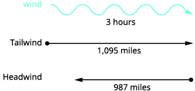</td>
</tr>
<tr valign="top">
<td data-valign="top" data-align="left"><strong>Identify</strong> what we are looking for.</td>
<td data-valign="top" data-align="left">We are looking for the speed of the jet
in still air and the speed of the wind.</td>
</tr>
<tr valign="top">
<td data-valign="top" data-align="left"><strong>Name</strong> what we are looking for.</td>
<td data-valign="top" data-align="left">Let <math xmlns="http://www.w3.org/1998/Math/MathML"><mrow><mi>j</mi><mo>=</mo></mrow></math> the speed of the jet in still air.
<math xmlns="http://www.w3.org/1998/Math/MathML"><mspace width="1.3em" /><mrow><mi>w</mi><mo>=</mo></mrow></math> the speed of the wind.</td>
</tr>
<tr valign="top">
<td data-valign="top" data-align="left">A chart will help us organize the information.
The jet makes two trips—one in a tailwind
and one in a headwind.
In a tailwind, the wind helps the jet and so
the rate is <em>j</em> + <em>w</em>.
In a headwind, the wind slows the jet and
so the rate is <em>j</em> ‒ <em>w</em>.</td>
<td data-valign="top" data-align="left">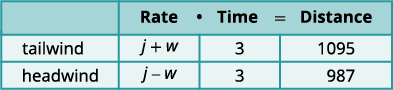</td>
</tr>
<tr valign="top">
<td data-valign="top" data-align="left">Each trip takes 3 hours.
In a tailwind the jet flies 1,095 miles.
In a headwind the jet flies 987 miles.</td>
<td data-valign="top" data-align="left" />
</tr>
<tr valign="top">
<td data-valign="top" data-align="left"><strong>Translate</strong> into a system of equations.
Since rate times time is distance, we get the
system of equations.</td>
<td data-valign="top" data-align="left"></td>
</tr>
<tr valign="top">
<td data-valign="top" data-align="left"><strong>Solve</strong> the system of equations.
Distribute, then solve by elimination.
Add, and solve for <em>j</em>.</td>
<td data-valign="top" data-align="left"></td>
</tr>
<tr valign="top">
<td data-valign="top" data-align="left">Substitute <em>j</em> = 347 into one of the original
equations, then solve for <em>w</em>.</td>
<td data-valign="top" data-align="left"></td>
</tr>
<tr valign="top">
<td data-valign="top" data-align="left"><strong>Check</strong> the answer in the problem.

With the tailwind, the actual rate of the
jet would be
 <math xmlns="http://www.w3.org/1998/Math/MathML"><mrow><mn>347</mn><mo>+</mo><mn>18</mn><mo>=</mo><mn>365</mn></mrow></math> mph.
In 3 hours the jet would travel
  <math xmlns="http://www.w3.org/1998/Math/MathML"><mrow><mn>365</mn><mo>·</mo><mn>3</mn><mo>=</mo><mn>1,095</mn></mrow></math> miles
Going into the headwind, the jet’s actual
rate would be
 <math xmlns="http://www.w3.org/1998/Math/MathML"><mrow><mn>347</mn><mo>−</mo><mn>18</mn><mo>=</mo><mn>329</mn></mrow></math> mph.
In 3 hours the jet would travel
  <math xmlns="http://www.w3.org/1998/Math/MathML"><mrow><mn>329</mn><mo>·</mo><mn>3</mn><mo>=</mo><mn>987</mn></mrow></math> miles.</td>
<td data-valign="top" data-align="left" />
</tr>
<tr valign="top">
<td data-valign="top" data-align="left"><strong>Answer</strong> the question.</td>
<td data-valign="top" data-align="left">The rate of the jet is 347 mph and the
rate of the wind is 18 mph.</td>
</tr>
</tbody></table>

Translate to a system of equations and then solve:

A small jet can fly 1,325 miles in 5 hours with a tailwind but only 1,035 miles in 5 hours into a headwind. Find the speed of the jet in still air and the speed of the wind.

The speed of the jet is 235 mph and the speed of the wind is 30 mph.

Translate to a system of equations and then solve:

A commercial jet can fly 1,728 miles in 4 hours with a tailwind but only 1,536 miles in 4 hours into a headwind. Find the speed of the jet in still air and the speed of the wind.

The speed of the jet is 408 mph and the speed of the wind is 24 mph.

Access this online resource for additional instruction and practice with systems of equations.

* [Systems of Equations][1]

### Key Concepts

* **How To Solve Applications with Systems of Equations**
  1.  **Read** the problem. Make sure all the words and ideas are understood.
  2.  **Identify** what we are looking for.
  3.  **Name** what we are looking for. Choose variables to represent those quantities.
  4.  **Translate** into a system of equations.
  5.  **Solve** the system of equations using good algebra techniques.
  6.  **Check** the answer in the problem and make sure it makes sense.
  7.  **Answer** the question with a complete sentence.
  {: data-number-style="arabic" .stepwise}
{: data-bullet-style="bullet"}

<section data-depth="1" class="section-exercises" markdown="1">
#### Practice Makes Perfect

**Direct Translation Applications**

In the following exercises, translate to a system of equations and solve.

The sum of two number is 15. One number is 3 less than the other. Find the numbers.

The sum of two number is 30. One number is 4 less than the other. Find the numbers.

13 and 17

The sum of two number is −16. One number is 20 less than the other. Find the numbers.

The sum of two number is <math xmlns="http://www.w3.org/1998/Math/MathML"><mrow><mn>−26</mn><mo>.</mo></mrow></math>

 One number is 12 less than the other. Find the numbers.

<math xmlns="http://www.w3.org/1998/Math/MathML"><mrow><mn>−7</mn></mrow></math>

 and <math xmlns="http://www.w3.org/1998/Math/MathML"><mrow><mn>−19</mn></mrow></math>

The sum of two numbers is 65. Their difference is 25. Find the numbers.

The sum of two numbers is 37. Their difference is 9. Find the numbers.

14 and 23

The sum of two numbers is <math xmlns="http://www.w3.org/1998/Math/MathML"><mrow><mn>−27</mn><mo>.</mo></mrow></math>

 Their difference is <math xmlns="http://www.w3.org/1998/Math/MathML"><mrow><mn>−59</mn><mo>.</mo></mrow></math>

 Find the numbers.

The sum of two numbers is <math xmlns="http://www.w3.org/1998/Math/MathML"><mrow><mn>−45</mn><mo>.</mo></mrow></math>

 Their difference is <math xmlns="http://www.w3.org/1998/Math/MathML"><mrow><mn>−89</mn><mo>.</mo></mrow></math>

 Find the numbers.

22 and <math xmlns="http://www.w3.org/1998/Math/MathML"><mrow><mn>−67</mn></mrow></math>

Maxim has been offered positions by two car companies. The first company pays a salary of $10,000 plus a commission of $1000 for each car sold. The second pays a salary of $20,000 plus a commission of $500 for each car sold. How many cars would need to be sold to make the total pay the same?

Jackie has been offered positions by two cable companies. The first company pays a salary of $14,000 plus a commission of $100 for each cable package sold. The second pays a salary of $20,000 plus a commission of $25 for each cable package sold. How many cable packages would need to be sold to make the total pay the same?

Eighty cable packages would need to be sold to make the total pay the same.

Amara currently sells televisions for company A at a salary of $17,000 plus a $100 commission for each television she sells. Company B offers her a position with a salary of $29,000 plus a $20 commission for each television she sells. How televisions would Amara need to sell for the options to be equal?

Mitchell currently sells stoves for company A at a salary of $12,000 plus a $150 commission for each stove he sells. Company B offers him a position with a salary of $24,000 plus a $50 commission for each stove he sells. How many stoves would Mitchell need to sell for the options to be equal?

Mitchell would need to sell 120 stoves for the companies to be equal.

Two containers of gasoline hold a total of fifty gallons. The big container can hold ten gallons less than twice the small container. How many gallons does each container hold?

June needs 48 gallons of punch for a party and has two different coolers to carry it in. The bigger cooler is five times as large as the smaller cooler. How many gallons can each cooler hold?

8 and 40 gallons

Shelly spent 10 minutes jogging and 20 minutes cycling and burned 300 calories. The next day, Shelly swapped times, doing 20 minutes of jogging and 10 minutes of cycling and burned the same number of calories. How many calories were burned for each minute of jogging and how many for each minute of cycling?

Drew burned 1800 calories Friday playing one hour of basketball and canoeing for two hours. Saturday he spent two hours playing basketball and three hours canoeing and burned 3200 calories. How many calories did he burn per hour when playing basketball? How many calories did he burn per hour when canoeing?

1000 calories playing basketball and 400 calories canoeing

Troy and Lisa were shopping for school supplies. Each purchased different quantities of the same notebook and thumb drive. Troy bought four notebooks and five thumb drives for $116. Lisa bought two notebooks and three thumb dives for $68. Find the cost of each notebook and each thumb drive.

Nancy bought seven pounds of oranges and three pounds of bananas for $17. Her husband later bought three pounds of oranges and six pounds of bananas for $12. What was the cost per pound of the oranges and the bananas?

Oranges cost $2 per pound and bananas cost $1 per pound

Andrea is buying some new shirts and sweaters. She is able to buy 3 shirts and 2 sweaters for $114 or she is able to buy 2 shirts and 4 sweaters for $164. How much does a shirt cost? How much does a sweater cost?

Peter is buying office supplies. He is able to buy 3 packages of paper and 4 staplers for $40 or he is able to buy 5 packages of paper and 6 staplers for $62. How much does a package of paper cost? How much does a stapler cost?

Package of paper $4, stapler $7

The total amount of sodium in 2 hot dogs and 3 cups of cottage cheese is 4720 mg. The total amount of sodium in 5 hot dogs and 2 cups of cottage cheese is 6300 mg. How much sodium is in a hot dog? How much sodium is in a cup of cottage cheese?

The total number of calories in 2 hot dogs and 3 cups of cottage cheese is 960 calories. The total number of calories in 5 hot dogs and 2 cups of cottage cheese is 1190 calories. How many calories are in a hot dog? How many calories are in a cup of cottage cheese?

Hot dog 150 calories, cup of cottage cheese 220 calories

Molly is making strawberry infused water. For each ounce of strawberry juice, she uses three times as many ounces of water as juice. How many ounces of strawberry juice and how many ounces of water does she need to make 64 ounces of strawberry infused water?

Owen is making lemonade from concentrate. The number of quarts of water he needs is 4 times the number of quarts of concentrate. How many quarts of water and how many quarts of concentrate does Owen need to make 100 quarts of lemonade?

Owen will need 80 quarts of water and 20 quarts of concentrate to make 100 quarts of lemonade.

**Solve Geometry Applications**

In the following exercises, translate to a system of equations and solve.

The difference of two complementary angles is 55 degrees. Find the measures of the angles.

The difference of two complementary angles is 17 degrees. Find the measures of the angles.

<math xmlns="http://www.w3.org/1998/Math/MathML"><mrow><mn>53.5</mn></mrow></math>

 degrees and <math xmlns="http://www.w3.org/1998/Math/MathML"><mrow><mn>36.5</mn></mrow></math>

 degrees

Two angles are complementary. The measure of the larger angle is twelve less than twice the measure of the smaller angle. Find the measures of both angles.

Two angles are complementary. The measure of the larger angle is ten more than four times the measure of the smaller angle. Find the measures of both angles.

16 degrees and 74 degrees

The difference of two supplementary angles is 8 degrees. Find the measures of the angles.

The difference of two supplementary angles is 88 degrees. Find the measures of the angles.

134 degrees and 46 degrees

Two angles are supplementary. The measure of the larger angle is four more than three times the measure of the smaller angle. Find the measures of both angles.

Two angles are supplementary. The measure of the larger angle is five less than four times the measure of the smaller angle. Find the measures of both angles.

37 degrees and 143 degrees

The measure of one of the small angles of a right triangle is 14 more than 3 times the measure of the other small angle. Find the measure of both angles.

The measure of one of the small angles of a right triangle is 26 more than 3 times the measure of the other small angle. Find the measure of both angles.

<math xmlns="http://www.w3.org/1998/Math/MathML"><mrow><mn>16</mn><mtext>°</mtext></mrow></math>

 and <math xmlns="http://www.w3.org/1998/Math/MathML"><mrow><mn>74</mn><mtext>°</mtext></mrow></math>

The measure of one of the small angles of a right triangle is 15 less than twice the measure of the other small angle. Find the measure of both angles.

The measure of one of the small angles of a right triangle is 45 less than twice the measure of the other small angle. Find the measure of both angles.

<math xmlns="http://www.w3.org/1998/Math/MathML"><mrow><mn>45</mn><mtext>°</mtext></mrow></math>

 and <math xmlns="http://www.w3.org/1998/Math/MathML"><mrow><mn>45</mn><mtext>°</mtext></mrow></math>

Wayne is hanging a string of lights 45 feet long around the three sides of his patio, which is adjacent to his house. The length of his patio, the side along the house, is five feet longer than twice its width. Find the length and width of the patio.

Darrin is hanging 200 feet of Christmas garland on the three sides of fencing that enclose his front yard. The length is five feet less than three times the width. Find the length and width of the fencing.

Width is 41 feet and length is 118 feet.

A frame around a family portrait has a perimeter of 90 inches. The length is fifteen less than twice the width. Find the length and width of the frame.

The perimeter of a toddler play area is 100 feet. The length is ten more than three times the width. Find the length and width of the play area.

Width is 10 feet and length is 40 feet.

**Solve Uniform Motion Applications**

In the following exercises, translate to a system of equations and solve.

Sarah left Minneapolis heading east on the interstate at a speed of 60 mph. Her sister followed her on the same route, leaving two hours later and driving at a rate of 70 mph. How long will it take for Sarah’s sister to catch up to Sarah?

College roommates John and David were driving home to the same town for the holidays. John drove 55 mph, and David, who left an hour later, drove 60 mph. How long will it take for David to catch up to John?

11 hours

At the end of spring break, Lucy left the beach and drove back towards home, driving at a rate of 40 mph. Lucy’s friend left the beach for home 30 minutes (half an hour) later, and drove 50 mph. How long did it take Lucy’s friend to catch up to Lucy?

Felecia left her home to visit her daughter driving 45 mph. Her husband waited for the dog sitter to arrive and left home twenty minutes (1/3 hour) later. He drove 55 mph to catch up to Felecia. How long before he reaches her?

<math xmlns="http://www.w3.org/1998/Math/MathML"><mrow><mn>1.5</mn></mrow></math>

 hour

The Jones family took a 12-mile canoe ride down the Indian River in two hours. After lunch, the return trip back up the river took three hours. Find the rate of the canoe in still water and the rate of the current.

A motor boat travels 60 miles down a river in three hours but takes five hours to return upstream. Find the rate of the boat in still water and the rate of the current.

Boat rate is 16 mph and current rate is 4 mph.

A motor boat traveled 18 miles down a river in two hours but going back upstream, it took <math xmlns="http://www.w3.org/1998/Math/MathML"><mrow><mn>4.5</mn></mrow></math>

 hours due to the current. Find the rate of the motor boat in still water and the rate of the current. (Round to the nearest hundredth.)

A river cruise boat sailed 80 miles down the Mississippi River for four hours. It took five hours to return. Find the rate of the cruise boat in still water and the rate of the current.

Boat rate is 18 mph and current rate is 2 mph.

A small jet can fly 1072 miles in 4 hours with a tailwind but only 848 miles in 4 hours into a headwind. Find the speed of the jet in still air and the speed of the wind.

A small jet can fly 1435 miles in 5 hours with a tailwind but only 1,215 miles in 5 hours into a headwind. Find the speed of the jet in still air and the speed of the wind.

Jet rate is 265 mph and wind speed is 22 mph.

A commercial jet can fly 868 miles in 2 hours with a tailwind but only 792 miles in 2 hours into a headwind. Find the speed of the jet in still air and the speed of the wind.

A commercial jet can fly 1,320 miles in 3 hours with a tailwind but only 1170 miles in 3 hours into a headwind. Find the speed of the jet in still air and the speed of the wind.

Jet rate is 415 mph and wind speed is 25 mph.

#### Writing Exercises

Write an application problem similar to [[link]](#fs-id1167834556567). Then translate to a system of equations and solve it.

Write a uniform motion problem similar to [[link]](#fs-id1167835186838) that relates to where you live with your friends or family members. Then translate to a system of equations and solve it.

Answers will vary.

#### Self Check

ⓐ After completing the exercises, use this checklist to evaluate your mastery of the objectives of this section.

ⓑ After reviewing this checklist, what will you do to become confident for all objectives?

</section>

### Glossary
{: data-type="glossary-title"}

complementary angles
: Two angles are complementary if the sum of the measures of their angles is 90 degrees.
^

supplementary angles
: Two angles are supplementary if the sum of the measures of their angles is 180 degrees.

[1]: https://openstax.org/l/37sysequations
