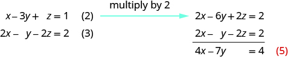

By the end of this section, you will be able to:
* Determine whether an ordered triple is a solution of a system of three linear equations with three variables
* Solve a system of linear equations with three variables
* Solve applications using systems of linear equations with three variables

Before you get started, take this readiness quiz.

1.  Evaluate
    <math xmlns="http://www.w3.org/1998/Math/MathML"><mrow><mn>5</mn><mi>x</mi><mo>−</mo><mn>2</mn><mi>y</mi><mo>+</mo><mn>3</mn><mi>z</mi></mrow></math>
    
    when
    <math xmlns="http://www.w3.org/1998/Math/MathML"><mrow><mi>x</mi><mo>=</mo><mn>−2</mn><mo>,</mo></mrow></math>
    
    <math xmlns="http://www.w3.org/1998/Math/MathML"><mrow><mi>y</mi><mo>=</mo><mn>−4</mn><mo>,</mo></mrow></math>
    
    and
    <math xmlns="http://www.w3.org/1998/Math/MathML"><mrow><mi>z</mi><mo>=</mo><mn>3</mn><mo>.</mo></mrow></math>
    
    * * *
    {: data-type="newline"}
    
    If you missed this problem, review [\[link\]](/m63303#fs-id1167832053133).
2.  Classify the equations as a conditional equation, an identity, or a contradiction and then state the solution.
    <math xmlns="http://www.w3.org/1998/Math/MathML"><mrow><mrow><mo>{</mo><mtable><mtr><mtd columnalign="left"><mo>−</mo><mn>2</mn><mi>x</mi><mo>+</mo><mi>y</mi><mo>=</mo><mn>−11</mn></mtd></mtr><mtr><mtd columnalign="left"><mi>x</mi><mo>+</mo><mn>3</mn><mi>y</mi><mo>=</mo><mn>9</mn></mtd></mtr></mtable></mrow><mo>.</mo></mrow></math>
    
    * * *
    {: data-type="newline"}
    
    If you missed this problem, review [\[link\]](/m63308#fs-id1167836666645).
3.  Classify the equations as a conditional equation, an identity, or a contradiction and then state the solution.
    <math xmlns="http://www.w3.org/1998/Math/MathML"><mrow><mrow><mo>{</mo><mtable><mtr><mtd columnalign="left"><mn>7</mn><mi>x</mi><mo>+</mo><mn>8</mn><mi>y</mi><mo>=</mo><mn>4</mn></mtd></mtr><mtr><mtd columnalign="left"><mn>3</mn><mi>x</mi><mo>−</mo><mn>5</mn><mi>y</mi><mo>=</mo><mn>27</mn></mtd></mtr></mtable></mrow><mo>.</mo></mrow></math>
    
    * * *
    {: data-type="newline"}
    
    If you missed this problem, review [\[link\]](/m63308#fs-id1167826211749).
{: data-number-style="arabic"}

### Determine Whether an Ordered Triple is a Solution of a System of Three Linear Equations with Three Variables

In this section, we will extend our work of solving a system of linear equations. So far we have worked with **systems of equations**{: data-type="term" .no-emphasis} with two equations and two variables. Now we will work with systems of three equations with three variables. But first let\'s review what we already know about solving equations and systems involving up to two variables.

We learned earlier that the graph of a **linear equation**{: data-type="term" .no-emphasis}, <math xmlns="http://www.w3.org/1998/Math/MathML"><mrow><mi>a</mi><mi>x</mi><mo>+</mo><mi>b</mi><mi>y</mi><mo>=</mo><mi>c</mi><mo>,</mo></mrow></math>

 is a line. Each point on the line, an ordered pair <math xmlns="http://www.w3.org/1998/Math/MathML"><mrow><mrow><mo>(</mo><mrow><mi>x</mi><mo>,</mo><mi>y</mi></mrow><mo>)</mo></mrow><mo>,</mo></mrow></math>

 is a solution to the equation. For a system of two equations with two variables, we graph two lines. Then we can see that all the points that are solutions to each equation form a line. And, by finding what the lines have in common, we’ll find the solution to the system.

Most linear equations in one variable have one solution, but we saw that some equations, called contradictions, have no solutions and for other equations, called identities, all numbers are solutions

We know when we solve a system of two linear equations represented by a graph of two lines in the same plane, there are three possible cases, as shown.

![Figure shows three graphs. In the first one, two lines intersect. Intersecting lines have one point in common. There is one solution to this system. The graph is labeled Consistent Independent. In the second graph, two lines are parallel. Parallel lines have no points in common. There is no solution to this system. The graph is labeled inconsistent. In the third graph, there is just one line. Both equations give the same line. Because we have just one line, there are infinitely many solutions. It is labeled consistent dependent.](../resources/CNX_IntAlg_Figure_04_04_001_img.jpg)

Similarly, for a linear equation with three variables <math xmlns="http://www.w3.org/1998/Math/MathML"><mrow><mi>a</mi><mi>x</mi><mo>+</mo><mi>b</mi><mi>y</mi><mo>+</mo><mi>c</mi><mi>z</mi><mo>=</mo><mi>d</mi><mo>,</mo></mrow></math>

 every solution to the equation is an ordered triple, <math xmlns="http://www.w3.org/1998/Math/MathML"><mrow><mrow><mo>(</mo><mrow><mi>x</mi><mo>,</mo><mi>y</mi><mo>,</mo><mi>z</mi></mrow><mo>)</mo></mrow></mrow></math>

 that makes the equation true.

Linear Equation in Three Variables

A linear equation with three variables, where *a, b, c,* and *d* are real numbers and *a, b*, and *c* are not all 0, is of the form

<math xmlns="http://www.w3.org/1998/Math/MathML"><mrow><mi>a</mi><mi>x</mi><mo>+</mo><mi>b</mi><mi>y</mi><mo>+</mo><mi>c</mi><mi>z</mi><mo>=</mo><mi>d</mi></mrow></math>

Every solution to the equation is an ordered triple, <math xmlns="http://www.w3.org/1998/Math/MathML"><mrow><mrow><mo>(</mo><mrow><mi>x</mi><mo>,</mo><mi>y</mi><mo>,</mo><mi>z</mi></mrow><mo>)</mo></mrow></mrow></math>

 that makes the equation true.

All the points that are solutions to one equation form a plane in three-dimensional space. And, by finding what the planes have in common, we’ll find the solution to the system.

When we solve a system of three linear equations represented by a graph of three planes in space, there are three possible cases.

![Eight figures are shown. The first one shows three intersecting planes with one point in common. It is labeled Consistent system and Independent equations. The second figure has three parallel planes with no points in common. It is labeled Inconsistent system. In the third figure two planes are coincident and parallel to the third plane. The planes have no points in common. In the fourth figure, two planes are parallel and each intersects the third plane. The planes have no points in common. In the fifth figure, each plane intersects the other two, but all three share no points. The planes have no points in common. In the sixth figure, three planes intersect in one line. There is just one line, so there are infinitely many solutions. In the seventh figure, two planes are coincident and intersect the third plane in a line. There is just one line, so there are infinitely many solutions. In the last figure, three planes are coincident. There is just one plane, so there are infinitely many solutions.](../resources/CNX_IntAlg_Figure_04_04_002h_img.jpg)

To solve a system of three linear equations, we want to find the values of the variables that are solutions to all three equations. In other words, we are looking for the ordered triple <math xmlns="http://www.w3.org/1998/Math/MathML"><mrow><mrow><mo>(</mo><mrow><mi>x</mi><mo>,</mo><mi>y</mi><mo>,</mo><mi>z</mi></mrow><mo>)</mo></mrow></mrow></math>

 that makes all three equations true. These are called the **solutions of the system of three linear equations with three variables**{: data-type="term"}.

Solutions of a System of Linear Equations with Three Variables

Solutions of a system of equations are the values of the variables that make all the equations true. A solution is represented by an **ordered triple**{: data-type="term"} <math xmlns="http://www.w3.org/1998/Math/MathML"><mrow><mrow><mo>(</mo><mrow><mi>x</mi><mo>,</mo><mi>y</mi><mo>,</mo><mi>z</mi></mrow><mo>)</mo></mrow><mo>.</mo></mrow></math>

To determine if an ordered triple is a solution to a system of three equations, we substitute the values of the variables into each equation. If the ordered triple makes all three equations true, it is a solution to the system.

Determine whether the ordered triple is a solution to the system: <math xmlns="http://www.w3.org/1998/Math/MathML"><mrow><mrow><mo>{</mo><mtable><mtr><mtd columnalign="left"><mi>x</mi><mo>−</mo><mi>y</mi><mo>+</mo><mi>z</mi><mo>=</mo><mn>2</mn></mtd></mtr><mtr><mtd columnalign="left"><mn>2</mn><mi>x</mi><mo>−</mo><mi>y</mi><mo>−</mo><mi>z</mi><mo>=</mo><mn>−6</mn></mtd></mtr><mtr><mtd columnalign="left"><mn>2</mn><mi>x</mi><mo>+</mo><mn>2</mn><mi>y</mi><mo>+</mo><mi>z</mi><mo>=</mo><mn>−3</mn></mtd></mtr></mtable></mrow><mo>.</mo></mrow></math>

ⓐ <math xmlns="http://www.w3.org/1998/Math/MathML"><mrow><mo stretchy="false">(</mo><mn>−2</mn><mo>,</mo><mn>−1</mn><mo>,</mo><mn>3</mn><mo stretchy="false">)</mo></mrow></math>

 ⓑ <math xmlns="http://www.w3.org/1998/Math/MathML"><mrow><mo stretchy="false">(</mo><mn>−4</mn><mo>,</mo><mn>−3</mn><mo>,</mo><mn>4</mn><mo stretchy="false">)</mo></mrow></math>

ⓐ* * *
{: data-type="newline"}

  
ⓑ* * *
{: data-type="newline"}

  

Determine whether the ordered triple is a solution to the system: <math xmlns="http://www.w3.org/1998/Math/MathML"><mrow><mrow><mo>{</mo><mtable><mtr><mtd columnalign="left"><mn>3</mn><mi>x</mi><mo>+</mo><mi>y</mi><mo>+</mo><mi>z</mi><mo>=</mo><mn>2</mn></mtd></mtr><mtr><mtd columnalign="left"><mi>x</mi><mo>+</mo><mn>2</mn><mi>y</mi><mo>+</mo><mi>z</mi><mo>=</mo><mn>−3</mn></mtd></mtr><mtr><mtd columnalign="left"><mn>3</mn><mi>x</mi><mo>+</mo><mi>y</mi><mo>+</mo><mn>2</mn><mi>z</mi><mo>=</mo><mn>4</mn></mtd></mtr></mtable></mrow><mo>.</mo></mrow></math>

ⓐ <math xmlns="http://www.w3.org/1998/Math/MathML"><mrow><mo stretchy="false">(</mo><mn>1</mn><mo>,</mo><mn>−3</mn><mo>,</mo><mn>2</mn><mo stretchy="false">)</mo></mrow></math>

 ⓑ <math xmlns="http://www.w3.org/1998/Math/MathML"><mrow><mo stretchy="false">(</mo><mn>4</mn><mo>,</mo><mn>−1</mn><mo>,</mo><mn>−5</mn><mo stretchy="false">)</mo></mrow></math>

ⓐ yes ⓑ no

Determine whether the ordered triple is a solution to the system: <math xmlns="http://www.w3.org/1998/Math/MathML"><mrow><mrow><mo>{</mo><mtable><mtr><mtd columnalign="left"><mi>x</mi><mo>−</mo><mn>3</mn><mi>y</mi><mo>+</mo><mi>z</mi><mo>=</mo><mn>−5</mn></mtd></mtr><mtr><mtd columnalign="left"><mo>−</mo><mn>3</mn><mi>x</mi><mo>−</mo><mi>y</mi><mo>−</mo><mi>z</mi><mo>=</mo><mn>1</mn></mtd></mtr><mtr><mtd columnalign="left"><mn>2</mn><mi>x</mi><mo>−</mo><mn>2</mn><mi>y</mi><mo>+</mo><mn>3</mn><mi>z</mi><mo>=</mo><mn>1</mn></mtd></mtr></mtable></mrow><mo>.</mo></mrow></math>

ⓐ <math xmlns="http://www.w3.org/1998/Math/MathML"><mrow><mo stretchy="false">(</mo><mn>2</mn><mo>,</mo><mn>−2</mn><mo>,</mo><mn>3</mn><mo stretchy="false">)</mo></mrow></math>

 ⓑ <math xmlns="http://www.w3.org/1998/Math/MathML"><mrow><mo stretchy="false">(</mo><mn>−2</mn><mo>,</mo><mn>2</mn><mo>,</mo><mn>3</mn><mo stretchy="false">)</mo></mrow></math>

ⓐ no ⓑ yes

### Solve a System of Linear Equations with Three Variables

To solve a system of linear equations with three variables, we basically use the same techniques we used with systems that had two variables. We start with two pairs of equations and in each pair we eliminate the same variable. This will then give us a system of equations with only two variables and then we know how to solve that system!

Next, we use the values of the two variables we just found to go back to the original equation and find the third variable. We write our answer as an ordered triple and then check our results.

How to Solve a System of Equations With Three Variables by Elimination

Solve the system by elimination: <math xmlns="http://www.w3.org/1998/Math/MathML"><mrow><mrow><mo>{</mo><mtable><mtr><mtd columnalign="left"><mi>x</mi><mo>−</mo><mn>2</mn><mi>y</mi><mo>+</mo><mi>z</mi><mo>=</mo><mn>3</mn></mtd></mtr><mtr><mtd columnalign="left"><mn>2</mn><mi>x</mi><mo>+</mo><mi>y</mi><mo>+</mo><mi>z</mi><mo>=</mo><mn>4</mn></mtd></mtr><mtr><mtd columnalign="left"><mn>3</mn><mi>x</mi><mo>+</mo><mn>4</mn><mi>y</mi><mo>+</mo><mn>3</mn><mi>z</mi><mo>=</mo><mn>−1</mn></mtd></mtr></mtable></mrow><mo>.</mo></mrow></math>

              

Solve the system by elimination: <math xmlns="http://www.w3.org/1998/Math/MathML"><mrow><mrow><mo>{</mo><mtable><mtr><mtd columnalign="left"><mn>3</mn><mi>x</mi><mo>+</mo><mi>y</mi><mo>−</mo><mi>z</mi><mo>=</mo><mn>2</mn></mtd></mtr><mtr><mtd columnalign="left"><mn>2</mn><mi>x</mi><mo>−</mo><mn>3</mn><mi>y</mi><mo>−</mo><mn>2</mn><mi>z</mi><mo>=</mo><mn>1</mn></mtd></mtr><mtr><mtd columnalign="left"><mn>4</mn><mi>x</mi><mo>−</mo><mi>y</mi><mo>−</mo><mn>3</mn><mi>z</mi><mo>=</mo><mn>0</mn></mtd></mtr></mtable></mrow><mo>.</mo></mrow></math>

<math xmlns="http://www.w3.org/1998/Math/MathML"><mrow><mrow><mo>(</mo><mrow><mn>2</mn><mo>,</mo><mn>−1</mn><mo>,</mo><mn>3</mn></mrow><mo>)</mo></mrow></mrow></math>

Solve the system by elimination: <math xmlns="http://www.w3.org/1998/Math/MathML"><mrow><mrow><mo>{</mo><mtable><mtr><mtd columnalign="left"><mn>4</mn><mi>x</mi><mo>+</mo><mi>y</mi><mo>+</mo><mi>z</mi><mo>=</mo><mn>−1</mn></mtd></mtr><mtr><mtd columnalign="left"><mo>−</mo><mn>2</mn><mi>x</mi><mo>−</mo><mn>2</mn><mi>y</mi><mo>+</mo><mi>z</mi><mo>=</mo><mn>2</mn></mtd></mtr><mtr><mtd columnalign="left"><mn>2</mn><mi>x</mi><mo>+</mo><mn>3</mn><mi>y</mi><mo>−</mo><mi>z</mi><mo>=</mo><mn>1</mn></mtd></mtr></mtable></mrow><mo>.</mo></mrow></math>

<math xmlns="http://www.w3.org/1998/Math/MathML"><mrow><mrow><mo>(</mo><mrow><mn>−2</mn><mo>,</mo><mn>3</mn><mo>,</mo><mn>4</mn></mrow><mo>)</mo></mrow></mrow></math>

The steps are summarized here.

Solve a system of linear equations with three variables.

1.  Write the equations in standard form
    * If any coefficients are fractions, clear them.
    {: data-bullet-style="bullet"}

2.  Eliminate the same variable from two equations.
    * Decide which variable you will eliminate.
    * Work with a pair of equations to eliminate the chosen variable.
    * Multiply one or both equations so that the coefficients of that variable are opposites.
    * Add the equations resulting from Step 2 to eliminate one variable
    {: data-bullet-style="bullet"}

3.  Repeat Step 2 using two other equations and eliminate the same variable as in Step 2.
4.  The two new equations form a system of two equations with two variables. Solve this system.
5.  Use the values of the two variables found in Step 4 to find the third variable.
6.  Write the solution as an ordered triple.
7.  Check that the ordered triple is a solution to **all three** original equations.
{: data-number-style="arabic" .stepwise}

Solve: <math xmlns="http://www.w3.org/1998/Math/MathML"><mrow><mrow><mo>{</mo><mtable><mtr><mtd columnalign="left"><mn>3</mn><mi>x</mi><mo>−</mo><mn>4</mn><mi>z</mi><mo>=</mo><mn>0</mn></mtd></mtr><mtr><mtd columnalign="left"><mn>3</mn><mi>y</mi><mo>+</mo><mn>2</mn><mi>z</mi><mo>=</mo><mn>−3</mn></mtd></mtr><mtr><mtd columnalign="left"><mn>2</mn><mi>x</mi><mo>+</mo><mn>3</mn><mi>y</mi><mo>=</mo><mn>−5</mn></mtd></mtr></mtable></mrow><mo>.</mo></mrow></math>

<math xmlns="http://www.w3.org/1998/Math/MathML"><mrow><mrow><mo>{</mo><mtable><mtr><mtd columnalign="left"><mn>3</mn><mi>x</mi><mo>−</mo><mn>4</mn><mi>z</mi><mo>=</mo><mn>0</mn><mspace width="1em" /><mrow><mo>(</mo><mn>1</mn><mo>)</mo></mrow></mtd></mtr><mtr><mtd columnalign="left"><mn>3</mn><mi>y</mi><mo>+</mo><mn>2</mn><mi>z</mi><mo>=</mo><mn>−3</mn><mspace width="0.3em" /><mrow><mo>(</mo><mn>2</mn><mo>)</mo></mrow></mtd></mtr><mtr><mtd columnalign="left"><mn>2</mn><mi>x</mi><mo>+</mo><mn>3</mn><mi>y</mi><mo>=</mo><mn>−5</mn><mspace width="0.3em" /><mrow><mo>(</mo><mn>3</mn><mo>)</mo></mrow></mtd></mtr></mtable></mrow></mrow></math>

We can eliminate <math xmlns="http://www.w3.org/1998/Math/MathML"><mi>z</mi></math>

 from equations (1) and (2) by multiplying equation (2) by 2 and then adding the resulting equations.

  
Notice that equations (3) and (4) both have the variables <math xmlns="http://www.w3.org/1998/Math/MathML"><mi>x</mi></math>

 and <math xmlns="http://www.w3.org/1998/Math/MathML"><mi>y</mi></math>

. We will solve this new system for <math xmlns="http://www.w3.org/1998/Math/MathML"><mi>x</mi></math>

 and <math xmlns="http://www.w3.org/1998/Math/MathML"><mi>y</mi></math>

.

  
To solve for *y*, we substitute <math xmlns="http://www.w3.org/1998/Math/MathML"><mrow><mi>x</mi><mo>=</mo><mn>−4</mn></mrow></math>

 into equation (3).

  
We now have <math xmlns="http://www.w3.org/1998/Math/MathML"><mrow><mi>x</mi><mo>=</mo><mn>−4</mn></mrow></math>

 and <math xmlns="http://www.w3.org/1998/Math/MathML"><mrow><mi>y</mi><mo>=</mo><mn>1</mn><mo>.</mo></mrow></math>

 We need to solve for *z*. We can substitute <math xmlns="http://www.w3.org/1998/Math/MathML"><mrow><mi>x</mi><mo>=</mo><mn>−4</mn></mrow></math>

 into equation (1) to find *z*.

  
We write the solution as an ordered triple. <math xmlns="http://www.w3.org/1998/Math/MathML"><mrow><mspace width="6em" /><mrow><mo>(</mo><mrow><mn>−4</mn><mo>,</mo><mn>1</mn><mo>,</mo><mn>−3</mn></mrow><mo>)</mo></mrow></mrow></math>

We check that the solution makes all three equations true.

<math xmlns="http://www.w3.org/1998/Math/MathML"><mrow><mtable> <mtr><mtd columnalign="left"><mtable><mtr><mtd columnalign="right"><mn>3</mn><mi>x</mi><mo>−</mo><mn>4</mn><mi>z</mi></mtd><mtd columnalign="left"><mo>=</mo></mtd><mtd columnalign="left"><mn>0</mn><mrow><mo>(</mo><mn>1</mn><mo>)</mo></mrow></mtd></mtr><mtr><mtd columnalign="right"><mn>3</mn><mrow><mo>(</mo><mrow><mn>−4</mn></mrow><mo>)</mo></mrow><mo>−</mo><mn>4</mn><mrow><mo>(</mo><mrow><mn>−3</mn></mrow><mo>)</mo></mrow></mtd><mtd columnalign="left"><mover><mo>=</mo><mo>?</mo></mover></mtd><mtd columnalign="left"><mn>0</mn></mtd></mtr><mtr><mtd columnalign="right"><mn>0</mn></mtd><mtd columnalign="left"><mo>=</mo></mtd><mtd columnalign="left"><mn>0</mn><mo>✓</mo></mtd></mtr></mtable></mtd><mtd /><mtd /> <mtd columnalign="left"><mtable><mtr><mtd columnalign="right"><mn>3</mn><mi>y</mi><mo>+</mo><mn>2</mn><mi>z</mi></mtd><mtd columnalign="left"><mo>=</mo></mtd><mtd columnalign="left"><mn>−3</mn><mrow><mo>(</mo><mn>2</mn><mo>)</mo></mrow></mtd></mtr><mtr><mtd columnalign="right"><mn>3</mn><mrow><mo>(</mo><mn>1</mn><mo>)</mo></mrow><mo>+</mo><mn>2</mn><mrow><mo>(</mo><mrow><mn>−3</mn></mrow><mo>)</mo></mrow></mtd><mtd columnalign="left"><mover><mo>=</mo><mo>?</mo></mover></mtd><mtd columnalign="left"><mo>−</mo><mn>3</mn></mtd></mtr><mtr><mtd columnalign="right"><mn>−3</mn></mtd><mtd columnalign="left"><mo>=</mo></mtd><mtd columnalign="left"><mn>−3</mn><mo>✓</mo></mtd></mtr></mtable></mtd><mtd /><mtd /> <mtd columnalign="left"><mtable><mtr /><mtr /><mtr><mtd columnalign="left"><mtable><mtr><mtd columnalign="right"><mn>2</mn><mi>x</mi><mo>+</mo><mn>3</mn><mi>y</mi></mtd><mtd columnalign="left"><mo>=</mo></mtd><mtd columnalign="left"><mn>−5</mn><mrow><mo>(</mo><mn>3</mn><mo>)</mo></mrow></mtd></mtr><mtr><mtd columnalign="right"><mn>2</mn><mrow><mo>(</mo><mrow><mn>−4</mn></mrow><mo>)</mo></mrow><mo>+</mo><mn>3</mn><mrow><mo>(</mo><mn>1</mn><mo>)</mo></mrow></mtd><mtd columnalign="left"><mover><mo>=</mo><mo>?</mo></mover></mtd><mtd columnalign="left"><mo>−</mo><mn>5</mn></mtd></mtr><mtr><mtd columnalign="right"><mn>−5</mn></mtd><mtd columnalign="left"><mo>=</mo></mtd><mtd columnalign="left"><mn>−5</mn><mo>✓</mo></mtd></mtr></mtable></mtd></mtr><mtr><mtd columnalign="left"><mtext>The solution is</mtext><mspace width="0.2em" /><mrow><mo>(</mo><mrow><mn>−4</mn><mo>,</mo><mn>1</mn><mo>,</mo><mn>−3</mn></mrow><mo>)</mo><mo>.</mo></mrow></mtd></mtr></mtable></mtd></mtr></mtable></mrow></math>

Solve: <math xmlns="http://www.w3.org/1998/Math/MathML"><mrow><mrow><mo>{</mo><mtable><mtr><mtd columnalign="left"><mn>3</mn><mi>x</mi><mo>−</mo><mn>4</mn><mi>z</mi><mo>=</mo><mn>−1</mn></mtd></mtr><mtr><mtd columnalign="left"><mn>2</mn><mi>y</mi><mo>+</mo><mn>3</mn><mi>z</mi><mo>=</mo><mn>2</mn></mtd></mtr><mtr><mtd columnalign="left"><mn>2</mn><mi>x</mi><mo>+</mo><mn>3</mn><mi>y</mi><mo>=</mo><mn>6</mn></mtd></mtr></mtable></mrow><mo>.</mo></mrow></math>

<math xmlns="http://www.w3.org/1998/Math/MathML"><mrow><mrow><mo>(</mo><mrow><mn>−3</mn><mo>,</mo><mn>4</mn><mo>,</mo><mn>−2</mn></mrow><mo>)</mo></mrow></mrow></math>

Solve: <math xmlns="http://www.w3.org/1998/Math/MathML"><mrow><mrow><mo>{</mo><mtable><mtr><mtd columnalign="left"><mn>4</mn><mi>x</mi><mo>−</mo><mn>3</mn><mi>z</mi><mo>=</mo><mn>−5</mn></mtd></mtr><mtr><mtd columnalign="left"><mn>3</mn><mi>y</mi><mo>+</mo><mn>2</mn><mi>z</mi><mo>=</mo><mn>7</mn></mtd></mtr><mtr><mtd columnalign="left"><mn>3</mn><mi>x</mi><mo>+</mo><mn>4</mn><mi>y</mi><mo>=</mo><mn>6</mn></mtd></mtr></mtable></mrow><mo>.</mo></mrow></math>

<math xmlns="http://www.w3.org/1998/Math/MathML"><mrow><mrow><mo>(</mo><mrow><mn>−2</mn><mo>,</mo><mn>3</mn><mo>,</mo><mn>−1</mn></mrow><mo>)</mo></mrow></mrow></math>

When we solve a system and end up with no variables and a false statement, we know there are no solutions and that the system is inconsistent. The next example shows a system of equations that is inconsistent.

Solve the system of equations: <math xmlns="http://www.w3.org/1998/Math/MathML"><mrow><mrow><mo>{</mo><mtable><mtr><mtd columnalign="left"><mi>x</mi><mo>+</mo><mn>2</mn><mi>y</mi><mo>−</mo><mn>3</mn><mi>z</mi><mo>=</mo><mn>−1</mn></mtd></mtr><mtr><mtd columnalign="left"><mi>x</mi><mo>−</mo><mn>3</mn><mi>y</mi><mo>+</mo><mi>z</mi><mo>=</mo><mn>1</mn></mtd></mtr><mtr><mtd columnalign="left"><mn>2</mn><mi>x</mi><mo>−</mo><mi>y</mi><mo>−</mo><mn>2</mn><mi>z</mi><mo>=</mo><mn>2</mn></mtd></mtr></mtable></mrow><mo>.</mo></mrow></math>

<math xmlns="http://www.w3.org/1998/Math/MathML"><mrow><mrow><mo>{</mo><mtable><mtr><mtd columnalign="left"><mi>x</mi><mo>+</mo><mn>2</mn><mi>y</mi><mo>−</mo><mn>3</mn><mi>z</mi><mo>=</mo><mn>−1</mn><mspace width="0.3em" /><mrow><mo>(</mo><mn>1</mn><mo>)</mo></mrow></mtd></mtr><mtr><mtd columnalign="left"><mi>x</mi><mo>−</mo><mn>3</mn><mi>y</mi><mo>+</mo><mi>z</mi><mo>=</mo><mn>1</mn><mspace width="1.5em" /><mrow><mo>(</mo><mn>2</mn><mo>)</mo></mrow></mtd></mtr><mtr><mtd columnalign="left"><mn>2</mn><mi>x</mi><mo>−</mo><mi>y</mi><mo>−</mo><mn>2</mn><mi>z</mi><mo>=</mo><mn>2</mn><mspace width="1em" /><mrow><mo>(</mo><mn>3</mn><mo>)</mo></mrow></mtd></mtr></mtable></mrow></mrow></math>

Use equation (1) and (2) to eliminate *z*.

  
Use (2) and (3) to eliminate <math xmlns="http://www.w3.org/1998/Math/MathML"><mi>z</mi></math>

 again.

  
Use (4) and (5) to eliminate a variable.

  
There is no solution.

We are left with a false statement and this tells us the system is inconsistent and has no solution.

Solve the system of equations: <math xmlns="http://www.w3.org/1998/Math/MathML"><mrow><mrow><mo>{</mo><mtable><mtr><mtd columnalign="left"><mi>x</mi><mo>+</mo><mn>2</mn><mi>y</mi><mo>+</mo><mn>6</mn><mi>z</mi><mo>=</mo><mn>5</mn></mtd></mtr><mtr><mtd columnalign="left"><mo>−</mo><mi>x</mi><mo>+</mo><mi>y</mi><mo>−</mo><mn>2</mn><mi>z</mi><mo>=</mo><mn>3</mn></mtd></mtr><mtr><mtd columnalign="left"><mi>x</mi><mo>−</mo><mn>4</mn><mi>y</mi><mo>−</mo><mn>2</mn><mi>z</mi><mo>=</mo><mn>1</mn></mtd></mtr></mtable></mrow><mo>.</mo></mrow></math>

no solution

Solve the system of equations: <math xmlns="http://www.w3.org/1998/Math/MathML"><mrow><mrow><mo>{</mo><mtable><mtr><mtd columnalign="left"><mn>2</mn><mi>x</mi><mo>−</mo><mn>2</mn><mi>y</mi><mo>+</mo><mn>3</mn><mi>z</mi><mo>=</mo><mn>6</mn></mtd></mtr><mtr><mtd columnalign="left"><mn>4</mn><mi>x</mi><mo>−</mo><mn>3</mn><mi>y</mi><mo>+</mo><mn>2</mn><mi>z</mi><mo>=</mo><mn>0</mn></mtd></mtr><mtr><mtd columnalign="left"><mo>−</mo><mn>2</mn><mi>x</mi><mo>+</mo><mn>3</mn><mi>y</mi><mo>−</mo><mn>7</mn><mi>z</mi><mo>=</mo><mn>1</mn></mtd></mtr></mtable></mrow><mo>.</mo></mrow></math>

no solution

When we solve a system and end up with no variables but a true statement, we know there are infinitely many solutions. The system is consistent with dependent equations. Our solution will show how two of the variables depend on the third.

Solve the system of equations: <math xmlns="http://www.w3.org/1998/Math/MathML"><mrow><mrow><mo>{</mo><mtable><mtr><mtd columnalign="left"><mi>x</mi><mo>+</mo><mn>2</mn><mi>y</mi><mo>−</mo><mi>z</mi><mo>=</mo><mn>1</mn></mtd></mtr><mtr><mtd columnalign="left"><mn>2</mn><mi>x</mi><mo>+</mo><mn>7</mn><mi>y</mi><mo>+</mo><mn>4</mn><mi>z</mi><mo>=</mo><mn>11</mn></mtd></mtr><mtr><mtd columnalign="left"><mi>x</mi><mo>+</mo><mn>3</mn><mi>y</mi><mo>+</mo><mi>z</mi><mo>=</mo><mn>4</mn></mtd></mtr></mtable></mrow><mo>.</mo></mrow></math>

<math xmlns="http://www.w3.org/1998/Math/MathML"><mrow><mrow><mo>{</mo><mtable><mtr><mtd columnalign="left"><mi>x</mi><mo>+</mo><mn>2</mn><mi>y</mi><mo>−</mo><mi>z</mi><mo>=</mo><mn>1</mn><mspace width="1.7em" /><mrow><mo>(</mo><mn>1</mn><mo>)</mo></mrow></mtd></mtr><mtr><mtd columnalign="left"><mn>2</mn><mi>x</mi><mo>+</mo><mn>7</mn><mi>y</mi><mo>+</mo><mn>4</mn><mi>z</mi><mo>=</mo><mn>11</mn><mspace width="0.3em" /><mrow><mo>(</mo><mn>2</mn><mo>)</mo></mrow></mtd></mtr><mtr><mtd columnalign="left"><mi>x</mi><mo>+</mo><mn>3</mn><mi>y</mi><mo>+</mo><mi>z</mi><mo>=</mo><mn>4</mn><mspace width="1.7em" /><mrow><mo>(</mo><mn>3</mn><mo>)</mo></mrow></mtd></mtr></mtable></mrow></mrow></math>

Use equation (1) and (3) to eliminate *x*.

  
Use equation (1) and (2) to eliminate *x* again.

  
Use equation (4) and (5) to eliminate <math xmlns="http://www.w3.org/1998/Math/MathML"><mi>y</mi></math>

.

  
<table class="unnumbered unstyled" summary="" data-label=""><tbody>
<tr valign="top">
<td data-valign="top" data-align="left" />
<td data-valign="top" data-align="left">There are infinitely many solutions.</td>
</tr>
<tr valign="top">
<td data-valign="top" data-align="left">Solve equation (4) for <em>y</em>.</td>
<td data-valign="top" data-align="left">Represent the solution showing how <em>x</em> and <em>y</em> are dependent on <em>z</em>.
<math xmlns="http://www.w3.org/1998/Math/MathML"><mtable><mtr><mtd columnalign="right"><mi>y</mi><mo>+</mo><mn>2</mn><mi>z</mi></mtd><mtd columnalign="left"><mo>=</mo></mtd><mtd columnalign="left"><mn>3</mn></mtd></mtr><mtr><mtd columnalign="right"><mi>y</mi></mtd><mtd columnalign="left"><mo>=</mo></mtd><mtd columnalign="left"><mn>−2</mn><mi>z</mi><mo>+</mo><mn>3</mn></mtd></mtr></mtable></math></td>
</tr>
<tr valign="top">
<td data-valign="top" data-align="left">Use equation (1) to solve for <em>x</em>.</td>
<td data-valign="top" data-align="left"><math xmlns="http://www.w3.org/1998/Math/MathML"><mrow><mspace width="4em" /><mi>x</mi><mo>+</mo><mn>2</mn><mi>y</mi><mo>−</mo><mi>z</mi><mo>=</mo><mn>1</mn></mrow></math></td>
</tr>
<tr valign="top">
<td data-valign="top" data-align="left">Substitute <math xmlns="http://www.w3.org/1998/Math/MathML"><mrow><mi>y</mi><mo>=</mo><mn>−2</mn><mi>z</mi><mo>+</mo><mn>3</mn><mo>.</mo></mrow></math></td>
<td data-valign="top" data-align="left"><math xmlns="http://www.w3.org/1998/Math/MathML"><mtable><mtr><mtd columnalign="right"><mi>x</mi><mo>+</mo><mn>2</mn><mo stretchy="false">(</mo><mn>−2</mn><mi>z</mi><mo>+</mo><mn>3</mn><mo stretchy="false">)</mo><mo>−</mo><mi>z</mi></mtd><mtd columnalign="left"><mo>=</mo></mtd><mtd columnalign="left"><mn>1</mn></mtd></mtr><mtr><mtd columnalign="right"><mi>x</mi><mo>−</mo><mn>4</mn><mi>z</mi><mo>+</mo><mn>6</mn><mo>−</mo><mi>z</mi></mtd><mtd columnalign="left"><mo>=</mo></mtd><mtd columnalign="left"><mn>1</mn></mtd></mtr><mtr><mtd columnalign="right"><mi>x</mi><mo>−</mo><mn>5</mn><mi>z</mi><mo>+</mo><mn>6</mn></mtd><mtd columnalign="left"><mo>=</mo></mtd><mtd columnalign="left"><mn>1</mn></mtd></mtr><mtr><mtd columnalign="right"><mi>x</mi></mtd><mtd columnalign="left"><mo>=</mo></mtd><mtd columnalign="left"><mn>5</mn><mi>z</mi><mo>−</mo><mn>5</mn></mtd></mtr></mtable></math></td>
</tr>
</tbody></table>
The true statement <math xmlns="http://www.w3.org/1998/Math/MathML"><mrow><mn>0</mn><mo>=</mo><mn>0</mn></mrow></math>

 tells us that this is a dependent system that has infinitely many solutions. The solutions are of the form <math xmlns="http://www.w3.org/1998/Math/MathML"><mrow><mrow><mo>(</mo><mrow><mi>x</mi><mo>,</mo><mi>y</mi><mo>,</mo><mi>z</mi></mrow><mo>)</mo></mrow></mrow></math>

 where <math xmlns="http://www.w3.org/1998/Math/MathML"><mrow><mi>x</mi><mo>=</mo><mn>5</mn><mi>z</mi><mo>−</mo><mn>5</mn><mo>;</mo><mi>y</mi><mo>=</mo><mn>−2</mn><mi>z</mi><mo>+</mo><mn>3</mn></mrow></math>

and *z* is any real number.

Solve the system by equations: <math xmlns="http://www.w3.org/1998/Math/MathML"><mrow><mrow><mo>{</mo><mtable><mtr><mtd columnalign="left"><mi>x</mi><mo>+</mo><mi>y</mi><mo>−</mo><mi>z</mi><mo>=</mo><mn>0</mn></mtd></mtr><mtr><mtd columnalign="left"><mn>2</mn><mi>x</mi><mo>+</mo><mn>4</mn><mi>y</mi><mo>−</mo><mn>2</mn><mi>z</mi><mo>=</mo><mn>6</mn></mtd></mtr><mtr><mtd columnalign="left"><mn>3</mn><mi>x</mi><mo>+</mo><mn>6</mn><mi>y</mi><mo>−</mo><mn>3</mn><mi>z</mi><mo>=</mo><mn>9</mn></mtd></mtr></mtable></mrow><mo>.</mo></mrow></math>

infinitely many solutions<math xmlns="http://www.w3.org/1998/Math/MathML"><mrow><mrow><mo>(</mo><mrow><mi>x</mi><mo>,</mo><mn>3</mn><mo>,</mo><mi>z</mi></mrow><mo>)</mo></mrow></mrow></math>

 where <math xmlns="http://www.w3.org/1998/Math/MathML"><mrow><mi>x</mi><mo>=</mo><mi>z</mi><mo>−</mo><mn>3</mn><mo>;</mo><mi>y</mi><mo>=</mo><mn>3</mn><mo>;</mo><mi>z</mi></mrow></math>

 is any real number

Solve the system by equations: <math xmlns="http://www.w3.org/1998/Math/MathML"><mrow><mrow><mo>{</mo><mtable><mtr><mtd columnalign="left"><mi>x</mi><mo>−</mo><mi>y</mi><mo>−</mo><mi>z</mi><mo>=</mo><mn>1</mn></mtd></mtr><mtr><mtd columnalign="left"><mo>−</mo><mi>x</mi><mo>+</mo><mn>2</mn><mi>y</mi><mo>−</mo><mn>3</mn><mi>z</mi><mo>=</mo><mn>−4</mn></mtd></mtr><mtr><mtd columnalign="left"><mn>3</mn><mi>x</mi><mo>−</mo><mn>2</mn><mi>y</mi><mo>−</mo><mn>7</mn><mi>z</mi><mo>=</mo><mn>0</mn></mtd></mtr></mtable></mrow><mo>.</mo></mrow></math>

infinitely many solutions <math xmlns="http://www.w3.org/1998/Math/MathML"><mrow><mrow><mo>(</mo><mrow><mi>x</mi><mo>,</mo><mi>y</mi><mo>,</mo><mi>z</mi></mrow><mo>)</mo></mrow></mrow></math>

 where<math xmlns="http://www.w3.org/1998/Math/MathML"><mrow><mi>x</mi><mo>=</mo><mn>5</mn><mi>z</mi><mo>−</mo><mn>2</mn><mo>;</mo><mi>y</mi><mo>=</mo><mn>4</mn><mi>z</mi><mo>−</mo><mn>3</mn><mo>;</mo><mi>z</mi></mrow></math>

 is any real number

### Solve Applications using Systems of Linear Equations with Three Variables

Applications that are modeled by a systems of equations can be solved using the same techniques we used to solve the systems. Many of the application are just extensions to three variables of the types we have solved earlier.

The community college theater department sold three kinds of tickets to its latest play production. The adult tickets sold for $15, the student tickets for $10 and the child tickets for $8. The theater department was thrilled to have sold 250 tickets and brought in $2,825 in one night. The number of student tickets sold is twice the number of adult tickets sold. How many of each type did the department sell?

<table class="unnumbered unstyled can-break" summary="We will use a chart to organize information. The type is adult, student and child. The numbers for these are x, y and z respectively and the total is 250. The values for these are 15, 10 and 8 respectively. The total values are 15x, 10y and 8z respectively, the total being 2825. Number of students is twice number of adults. So y is 2x. We rewrite as 2x minus y equals 0. The system of equations is x plus y plus z equals 250, 15x plus 10y plus 8z is 2825 and minus 2x plus y is 0. Multiply equation 1 by minus 8 and add it to equation 2. We get 7x plus 2y equals 825. Multiply equation 3 with minus 2 and add it to equation 4. Solving for x, we get x equal to 75. Substituting this into equation 3, we get y equal to 150. Substituting values of x and y in equation 1, we get z equal to 25. The theater department sold 75 adult tickets, 150 student tickets, and 25 child tickets." data-label=""><tbody>
<tr valign="top">
<td data-valign="top" data-align="left">We will use a chart to organize the information.</td>
<td data-valign="top" data-align="left"></td>
</tr>
<tr valign="top">
<td data-valign="top" data-align="left">Number of students is twice number of adults.</td>
<td data-valign="top" data-align="left" />
</tr>
<tr valign="top">
<td data-valign="bottom" data-align="left">Rewrite the equation in standard form.</td>
<td data-valign="top" data-align="left"><math xmlns="http://www.w3.org/1998/Math/MathML"><mrow><mtable><mtr><mtd columnalign="right"><mi>y</mi></mtd><mtd columnalign="left"><mo>=</mo></mtd><mtd columnalign="left"><mn>2</mn><mi>x</mi></mtd></mtr><mtr><mtd columnalign="right"><mn>2</mn><mi>x</mi><mo>−</mo><mi>y</mi></mtd><mtd columnalign="left"><mo>=</mo></mtd><mtd columnalign="left"><mn>0</mn></mtd></mtr></mtable></mrow></math></td>
</tr>
<tr valign="top">
<td colspan="2" data-valign="top" data-align="left"></td>
</tr>
<tr valign="top">
<td data-valign="top" data-align="left">Use equations (1) and (2) to eliminate <em>z</em>.</td>
<td data-valign="top" data-align="left" />
</tr>
<tr valign="top">
<td colspan="2" data-valign="top" data-align="left"></td>
</tr>
<tr valign="top">
<td data-valign="top" data-align="left">Use (3) and (4) to eliminate <math xmlns="http://www.w3.org/1998/Math/MathML"><mi>y</mi><mo>.</mo></math></td>
<td data-valign="top" data-align="left" />
</tr>
<tr valign="top">
<td colspan="2" data-valign="top" data-align="left"></td>
</tr>
<tr valign="top">
<td data-valign="top" data-align="left">Solve for <em>x</em>.</td>
<td data-valign="top" data-align="left"><math xmlns="http://www.w3.org/1998/Math/MathML"><mspace width="1.3em" /><mrow><mo> </mo><mi>x</mi><mspace width="3.6em" /><mo>=</mo><mn>75</mn></mrow></math> adult tickets</td>
</tr>
<tr valign="top">
<td data-valign="top" data-align="left">Use equation (3) to find <em>y</em>.</td>
<td data-valign="top" data-align="left"><math xmlns="http://www.w3.org/1998/Math/MathML"><mspace width="3.4em" /><mrow><mn>−2</mn><mi>x</mi><mo>+</mo><mi>y</mi><mo>=</mo><mn>0</mn></mrow></math></td>
</tr>
<tr valign="top">
<td data-valign="top" data-align="left">Substitute <math xmlns="http://www.w3.org/1998/Math/MathML"><mrow><mi>x</mi><mo>=</mo><mn>75</mn><mo>.</mo></mrow></math></td>
<td data-valign="top" data-align="left"><math xmlns="http://www.w3.org/1998/Math/MathML"><mspace width="1.7em" /><mrow><mtable><mtr><mtd columnalign="right"><mn>−2</mn><mrow><mo>(</mo><mrow><mn>75</mn></mrow><mo>)</mo></mrow><mo>+</mo><mi>y</mi></mtd><mtd columnalign="left"><mo>=</mo></mtd><mtd columnalign="left"><mn>0</mn></mtd></mtr><mtr><mtd columnalign="right"><mn>−150</mn><mo>+</mo><mi>y</mi></mtd><mtd columnalign="left"><mo>=</mo></mtd><mtd columnalign="left"><mn>0</mn></mtd></mtr><mtr><mtd columnalign="right"><mi>y</mi></mtd><mtd columnalign="left"><mo>=</mo></mtd><mtd columnalign="left"><mn>150</mn><mspace width="0.2em" /><mtext>student tickets</mtext></mtd></mtr></mtable></mrow></math></td>
</tr>
<tr valign="top">
<td data-valign="top" data-align="left">Use equation (1) to find <em>z</em>.</td>
<td data-valign="top" data-align="left"><math xmlns="http://www.w3.org/1998/Math/MathML"><mspace width="3.1em" /><mrow><mi>x</mi><mo>+</mo><mi>y</mi><mo>+</mo><mi>z</mi><mo>=</mo><mn>250</mn></mrow></math></td>
</tr>
<tr valign="top">
<td data-valign="top" data-align="left">Substitute in the values
<math xmlns="http://www.w3.org/1998/Math/MathML"><mrow><mi>x</mi><mo>=</mo><mn>75</mn><mo>,</mo><mspace width="0.2em" /><mi>y</mi><mo>=</mo><mn>150</mn><mo>.</mo></mrow></math></td>
<td data-valign="top" data-align="left">
<math xmlns="http://www.w3.org/1998/Math/MathML"><mspace width="1em" /><mrow><mtable><mtr><mtd columnalign="right"><mn>75</mn><mo>+</mo><mn>150</mn><mo>+</mo><mi>z</mi></mtd><mtd columnalign="left"><mo>=</mo></mtd><mtd columnalign="left"><mn>250</mn></mtd></mtr><mtr><mtd columnalign="right"><mn>225</mn><mo>+</mo><mi>z</mi></mtd><mtd columnalign="left"><mo>=</mo></mtd><mtd columnalign="left"><mn>250</mn></mtd></mtr><mtr><mtd columnalign="right"><mi>z</mi></mtd><mtd columnalign="left"><mo>=</mo></mtd><mtd columnalign="left"><mn>25</mn><mspace width="0.2em" /><mtext>child tickets</mtext></mtd></mtr></mtable></mrow></math></td>
</tr>
<tr valign="top">
<td data-valign="top" data-align="left">Write the solution.</td>
<td data-valign="top" data-align="left">The theater department sold 75 adult tickets,
150 student tickets, and 25 child tickets.</td>
</tr>
</tbody></table>

The community college fine arts department sold three kinds of tickets to its latest dance presentation. The adult tickets sold for $20, the student tickets for $12 and the child tickets for $10.The fine arts department was thrilled to have sold 350 tickets and brought in $4,650 in one night. The number of child tickets sold is the same as the number of adult tickets sold. How many of each type did the department sell?

The fine arts department sold 75 adult tickets, 200 student tickets, and 75 child tickets.

The community college soccer team sold three kinds of tickets to its latest game. The adult tickets sold for $10, the student tickets for $8 and the child tickets for $5. The soccer team was thrilled to have sold 600 tickets and brought in $4,900 for one game. The number of adult tickets is twice the number of child tickets. How many of each type did the soccer team sell?

The soccer team sold 200 adult tickets, 300 student tickets, and 100 child tickets.

Access this online resource for additional instruction and practice with solving a linear system in three variables with no or infinite solutions.

* [Solving a Linear System in Three Variables with No or Infinite Solutions][1]
* [3 Variable Application][2]

### Key Concepts

* **Linear Equation in Three Variables:** A linear equation with three variables, where *a, b, c*, and *d* are real numbers and *a, b,* and *c* are not all 0, is of the form
  * * *
  {: data-type="newline"}
  
  

  <math xmlns="http://www.w3.org/1998/Math/MathML"><mrow><mi>a</mi><mi>x</mi><mo>+</mo><mi>b</mi><mi>y</mi><mo>+</mo><mi>c</mi><mi>z</mi><mo>=</mo><mi>d</mi></mrow></math>
  

  
  * * *
  {: data-type="newline"}
  
  Every solution to the equation is an ordered triple,
  <math xmlns="http://www.w3.org/1998/Math/MathML"><mrow><mrow><mo>(</mo><mrow><mi>x</mi><mo>,</mo><mi>y</mi><mo>,</mo><mi>z</mi></mrow><mo>)</mo></mrow></mrow></math>
  
  that makes the equation true.
* **How to solve a system of linear equations with three variables.**
  1.  Write the equations in standard form
      * * *
      {: data-type="newline"}
      
      If any coefficients are fractions, clear them.
  2.  Eliminate the same variable from two equations.
      * * *
      {: data-type="newline"}
      
      Decide which variable you will eliminate.
      * * *
      {: data-type="newline"}
      
      Work with a pair of equations to eliminate the chosen variable.
      * * *
      {: data-type="newline"}
      
      Multiply one or both equations so that the coefficients of that variable are opposites.
      * * *
      {: data-type="newline"}
      
      Add the equations resulting from Step 2 to eliminate one variable
  3.  Repeat Step 2 using two other equations and eliminate the same variable as in Step 2.
  4.  The two new equations form a system of two equations with two variables. Solve this system.
  5.  Use the values of the two variables found in Step 4 to find the third variable.
  6.  Write the solution as an ordered triple.
  7.  Check that the ordered triple is a solution to **all three** original equations.
  {: data-number-style="arabic" .stepwise}
{: data-bullet-style="bullet"}

<section data-depth="1" class="section-exercises" markdown="1">
#### Practice Makes Perfect

**Determine Whether an Ordered Triple is a Solution of a System of Three Linear Equations with Three Variables**

In the following exercises, determine whether the ordered triple is a solution to the system.

<math xmlns="http://www.w3.org/1998/Math/MathML"><mrow><mrow><mo>{</mo><mtable><mtr><mtd columnalign="left"><mn>2</mn><mi>x</mi><mo>−</mo><mn>6</mn><mi>y</mi><mo>+</mo><mi>z</mi><mo>=</mo><mn>3</mn></mtd></mtr><mtr><mtd columnalign="left"><mn>3</mn><mi>x</mi><mo>−</mo><mn>4</mn><mi>y</mi><mo>−</mo><mn>3</mn><mi>z</mi><mo>=</mo><mn>2</mn></mtd></mtr><mtr><mtd columnalign="left"><mn>2</mn><mi>x</mi><mo>+</mo><mn>3</mn><mi>y</mi><mo>−</mo><mn>2</mn><mi>z</mi><mo>=</mo><mn>3</mn></mtd></mtr></mtable></mrow></mrow></math>

ⓐ <math xmlns="http://www.w3.org/1998/Math/MathML"><mrow><mo stretchy="false">(</mo><mn>3</mn><mo>,</mo><mn>1</mn><mo>,</mo><mn>3</mn><mo stretchy="false">)</mo></mrow></math>

* * *
{: data-type="newline"}

ⓑ <math xmlns="http://www.w3.org/1998/Math/MathML"><mrow><mo stretchy="false">(</mo><mn>4</mn><mo>,</mo><mn>3</mn><mo>,</mo><mn>7</mn><mo stretchy="false">)</mo></mrow></math>

<math xmlns="http://www.w3.org/1998/Math/MathML"><mrow><mrow><mo>{</mo><mtable><mtr><mtd columnalign="left"><mo>−</mo><mn>3</mn><mi>x</mi><mo>+</mo><mspace width="0.2em" /><mtext /><mspace width="0.2em" /><mi>y</mi><mo>+</mo><mi>z</mi><mo>=</mo><mn>−4</mn></mtd></mtr><mtr><mtd columnalign="left"><mo>−</mo><mi>x</mi><mo>+</mo><mn>2</mn><mi>y</mi><mo>−</mo><mn>2</mn><mi>z</mi><mo>=</mo><mn>1</mn></mtd></mtr><mtr><mtd columnalign="left"><mn>2</mn><mi>x</mi><mo>−</mo><mspace width="0.2em" /><mtext /><mspace width="0.2em" /><mi>y</mi><mo>−</mo><mi>z</mi><mo>=</mo><mn>−1</mn></mtd></mtr></mtable></mrow></mrow></math>

ⓐ <math xmlns="http://www.w3.org/1998/Math/MathML"><mrow><mo stretchy="false">(</mo><mn>−5</mn><mo>,</mo><mn>−7</mn><mo>,</mo><mn>4</mn><mo stretchy="false">)</mo></mrow></math>

* * *
{: data-type="newline"}

ⓑ <math xmlns="http://www.w3.org/1998/Math/MathML"><mrow><mo stretchy="false">(</mo><mn>5</mn><mo>,</mo><mn>7</mn><mo>,</mo><mn>4</mn><mo stretchy="false">)</mo></mrow></math>

ⓐ no ⓑ yes

<math xmlns="http://www.w3.org/1998/Math/MathML"><mrow><mrow><mo>{</mo><mtable><mtr><mtd columnalign="left"><mi>y</mi><mo>−</mo><mn>10</mn><mi>z</mi><mo>=</mo><mn>−8</mn></mtd></mtr><mtr><mtd columnalign="left"><mn>2</mn><mi>x</mi><mo>−</mo><mi>y</mi><mo>=</mo><mn>2</mn></mtd></mtr><mtr><mtd columnalign="left"><mi>x</mi><mo>−</mo><mn>5</mn><mi>z</mi><mo>=</mo><mn>3</mn></mtd></mtr></mtable></mrow></mrow></math>

ⓐ <math xmlns="http://www.w3.org/1998/Math/MathML"><mrow><mrow><mo>(</mo><mrow><mn>7</mn><mo>,</mo><mn>12</mn><mo>,</mo><mn>2</mn></mrow><mo>)</mo></mrow></mrow></math>

* * *
{: data-type="newline"}

ⓑ <math xmlns="http://www.w3.org/1998/Math/MathML"><mrow><mrow><mo>(</mo><mrow><mn>2</mn><mo>,</mo><mn>2</mn><mo>,</mo><mn>1</mn></mrow><mo>)</mo></mrow></mrow></math>

<math xmlns="http://www.w3.org/1998/Math/MathML"><mrow><mrow><mo>{</mo><mtable><mtr><mtd columnalign="left"><mi>x</mi><mo>+</mo><mn>3</mn><mi>y</mi><mo>−</mo><mi>z</mi><mo>=</mo><mn>15</mn></mtd></mtr><mtr><mtd columnalign="left"><mi>y</mi><mo>=</mo><mfrac><mn>2</mn><mn>3</mn></mfrac><mi>x</mi><mo>−</mo><mn>2</mn></mtd></mtr><mtr><mtd columnalign="left"><mi>x</mi><mo>−</mo><mn>3</mn><mi>y</mi><mo>+</mo><mi>z</mi><mo>=</mo><mn>−2</mn></mtd></mtr></mtable></mrow></mrow></math>

ⓐ <math xmlns="http://www.w3.org/1998/Math/MathML"><mrow><mrow><mo>(</mo><mrow><mn>−6</mn><mo>,</mo><mn>5</mn><mo>,</mo><mfrac><mn>1</mn><mn>2</mn></mfrac></mrow><mo>)</mo></mrow></mrow></math>

* * *
{: data-type="newline"}

ⓑ <math xmlns="http://www.w3.org/1998/Math/MathML"><mrow><mrow><mo>(</mo><mrow><mn>5</mn><mo>,</mo><mfrac><mn>4</mn><mn>3</mn></mfrac><mo>,</mo><mn>−3</mn></mrow><mo>)</mo></mrow></mrow></math>

ⓐ no ⓑ yes

**Solve a System of Linear Equations with Three Variables**

In the following exercises, solve the system of equations.

<math xmlns="http://www.w3.org/1998/Math/MathML"><mrow><mrow><mo>{</mo><mtable><mtr><mtd columnalign="left"><mn>5</mn><mi>x</mi><mo>+</mo><mn>2</mn><mi>y</mi><mo>+</mo><mi>z</mi><mo>=</mo><mn>5</mn></mtd></mtr><mtr><mtd columnalign="left"><mo>−</mo><mn>3</mn><mi>x</mi><mo>−</mo><mi>y</mi><mo>+</mo><mn>2</mn><mi>z</mi><mo>=</mo><mn>6</mn></mtd></mtr><mtr><mtd columnalign="left"><mn>2</mn><mi>x</mi><mo>+</mo><mn>3</mn><mi>y</mi><mo>−</mo><mn>3</mn><mi>z</mi><mo>=</mo><mn>5</mn></mtd></mtr></mtable></mrow></mrow></math>

<math xmlns="http://www.w3.org/1998/Math/MathML"><mrow><mrow><mo>{</mo><mtable><mtr><mtd columnalign="left"><mn>6</mn><mi>x</mi><mo>−</mo><mn>5</mn><mi>y</mi><mo>+</mo><mn>2</mn><mi>z</mi><mo>=</mo><mn>3</mn></mtd></mtr><mtr><mtd columnalign="left"><mn>2</mn><mi>x</mi><mo>+</mo><mi>y</mi><mo>−</mo><mn>4</mn><mi>z</mi><mo>=</mo><mn>5</mn></mtd></mtr><mtr><mtd columnalign="left"><mn>3</mn><mi>x</mi><mo>−</mo><mn>3</mn><mi>y</mi><mo>+</mo><mi>z</mi><mo>=</mo><mn>−1</mn></mtd></mtr></mtable></mrow></mrow></math>

<math xmlns="http://www.w3.org/1998/Math/MathML"><mrow><mrow><mo>(</mo><mrow><mn>4</mn><mo>,</mo><mn>5</mn><mo>,</mo><mn>2</mn></mrow><mo>)</mo></mrow></mrow></math>

<math xmlns="http://www.w3.org/1998/Math/MathML"><mrow><mrow><mo>{</mo><mtable><mtr><mtd columnalign="left"><mn>2</mn><mi>x</mi><mo>−</mo><mn>5</mn><mi>y</mi><mo>+</mo><mn>3</mn><mi>z</mi><mo>=</mo><mn>8</mn></mtd></mtr><mtr><mtd columnalign="left"><mn>3</mn><mi>x</mi><mo>−</mo><mi>y</mi><mo>+</mo><mn>4</mn><mi>z</mi><mo>=</mo><mn>7</mn></mtd></mtr><mtr><mtd columnalign="left"><mi>x</mi><mo>+</mo><mn>3</mn><mi>y</mi><mo>+</mo><mn>2</mn><mi>z</mi><mo>=</mo><mn>−3</mn></mtd></mtr></mtable></mrow></mrow></math>

<math xmlns="http://www.w3.org/1998/Math/MathML"><mrow><mrow><mo>{</mo><mtable><mtr><mtd columnalign="left"><mn>5</mn><mi>x</mi><mo>−</mo><mn>3</mn><mi>y</mi><mo>+</mo><mn>2</mn><mi>z</mi><mo>=</mo><mn>−5</mn></mtd></mtr><mtr><mtd columnalign="left"><mn>2</mn><mi>x</mi><mo>−</mo><mi>y</mi><mo>−</mo><mi>z</mi><mo>=</mo><mn>4</mn></mtd></mtr><mtr><mtd columnalign="left"><mn>3</mn><mi>x</mi><mo>−</mo><mn>2</mn><mi>y</mi><mo>+</mo><mn>2</mn><mi>z</mi><mo>=</mo><mn>−7</mn></mtd></mtr></mtable></mrow></mrow></math>

<math xmlns="http://www.w3.org/1998/Math/MathML"><mrow><mrow><mo>(</mo><mrow><mn>7</mn><mo>,</mo><mn>12</mn><mo>,</mo><mn>−2</mn></mrow><mo>)</mo></mrow></mrow></math>

<math xmlns="http://www.w3.org/1998/Math/MathML"><mrow><mrow><mo>{</mo><mtable><mtr><mtd columnalign="left"><mn>3</mn><mi>x</mi><mo>−</mo><mn>5</mn><mi>y</mi><mo>+</mo><mn>4</mn><mi>z</mi><mo>=</mo><mn>5</mn></mtd></mtr><mtr><mtd columnalign="left"><mn>5</mn><mi>x</mi><mo>+</mo><mn>2</mn><mi>y</mi><mo>+</mo><mi>z</mi><mo>=</mo><mn>0</mn></mtd></mtr><mtr><mtd columnalign="left"><mn>2</mn><mi>x</mi><mo>+</mo><mn>3</mn><mi>y</mi><mo>−</mo><mn>2</mn><mi>z</mi><mo>=</mo><mn>3</mn></mtd></mtr></mtable></mrow></mrow></math>

<math xmlns="http://www.w3.org/1998/Math/MathML"><mrow><mrow><mo>{</mo><mtable><mtr><mtd columnalign="left"><mn>4</mn><mi>x</mi><mo>−</mo><mn>3</mn><mi>y</mi><mo>+</mo><mi>z</mi><mo>=</mo><mn>7</mn></mtd></mtr><mtr><mtd columnalign="left"><mn>2</mn><mi>x</mi><mo>−</mo><mn>5</mn><mi>y</mi><mo>−</mo><mn>4</mn><mi>z</mi><mo>=</mo><mn>3</mn></mtd></mtr><mtr><mtd columnalign="left"><mn>3</mn><mi>x</mi><mo>−</mo><mn>2</mn><mi>y</mi><mo>−</mo><mn>2</mn><mi>z</mi><mo>=</mo><mn>−7</mn></mtd></mtr></mtable></mrow></mrow></math>

<math xmlns="http://www.w3.org/1998/Math/MathML"><mrow><mrow><mo>(</mo><mrow><mn>−3</mn><mo>,</mo><mn>−5</mn><mo>,</mo><mn>4</mn></mrow><mo>)</mo></mrow></mrow></math>

<math xmlns="http://www.w3.org/1998/Math/MathML"><mrow><mrow><mo>{</mo><mtable><mtr><mtd columnalign="left"><mn>3</mn><mi>x</mi><mo>+</mo><mn>8</mn><mi>y</mi><mo>+</mo><mn>2</mn><mi>z</mi><mo>=</mo><mn>−5</mn></mtd></mtr><mtr><mtd columnalign="left"><mn>2</mn><mi>x</mi><mo>+</mo><mn>5</mn><mi>y</mi><mo>−</mo><mn>3</mn><mi>z</mi><mo>=</mo><mn>0</mn></mtd></mtr><mtr><mtd columnalign="left"><mi>x</mi><mo>+</mo><mn>2</mn><mi>y</mi><mo>−</mo><mn>2</mn><mi>z</mi><mo>=</mo><mn>−1</mn></mtd></mtr></mtable></mrow></mrow></math>

<math xmlns="http://www.w3.org/1998/Math/MathML"><mrow><mrow><mo>{</mo><mtable><mtr><mtd columnalign="left"><mn>11</mn><mi>x</mi><mo>+</mo><mn>9</mn><mi>y</mi><mo>+</mo><mn>2</mn><mi>z</mi><mo>=</mo><mn>−9</mn></mtd></mtr><mtr><mtd columnalign="left"><mn>7</mn><mi>x</mi><mo>+</mo><mn>5</mn><mi>y</mi><mo>+</mo><mn>3</mn><mi>z</mi><mo>=</mo><mn>−7</mn></mtd></mtr><mtr><mtd columnalign="left"><mn>4</mn><mi>x</mi><mo>+</mo><mn>3</mn><mi>y</mi><mo>+</mo><mi>z</mi><mo>=</mo><mn>−3</mn></mtd></mtr></mtable></mrow></mrow></math>

<math xmlns="http://www.w3.org/1998/Math/MathML"><mrow><mrow><mo>(</mo><mrow><mn>2</mn><mo>,</mo><mn>−3</mn><mo>,</mo><mn>−2</mn></mrow><mo>)</mo></mrow></mrow></math>

<math xmlns="http://www.w3.org/1998/Math/MathML"><mrow><mrow><mo>{</mo><mtable><mtr><mtd columnalign="left"><mfrac><mn>1</mn><mn>3</mn></mfrac><mi>x</mi><mo>−</mo><mi>y</mi><mo>−</mo><mi>z</mi><mo>=</mo><mn>1</mn></mtd></mtr><mtr><mtd columnalign="left"><mi>x</mi><mo>+</mo><mfrac><mn>5</mn><mn>2</mn></mfrac><mi>y</mi><mo>+</mo><mi>z</mi><mo>=</mo><mn>−2</mn></mtd></mtr><mtr><mtd columnalign="left"><mn>2</mn><mi>x</mi><mo>+</mo><mn>2</mn><mi>y</mi><mo>+</mo><mfrac><mn>1</mn><mn>2</mn></mfrac><mi>z</mi><mo>=</mo><mn>−4</mn></mtd></mtr></mtable></mrow></mrow></math>

<math xmlns="http://www.w3.org/1998/Math/MathML"><mrow><mrow><mo>{</mo><mtable><mtr><mtd columnalign="left"><mi>x</mi><mo>+</mo><mfrac><mn>1</mn><mn>2</mn></mfrac><mi>y</mi><mo>+</mo><mfrac><mn>1</mn><mn>2</mn></mfrac><mi>z</mi><mo>=</mo><mn>0</mn></mtd></mtr><mtr><mtd columnalign="left"><mfrac><mn>1</mn><mn>5</mn></mfrac><mi>x</mi><mo>−</mo><mfrac><mn>1</mn><mn>5</mn></mfrac><mi>y</mi><mo>+</mo><mi>z</mi><mo>=</mo><mn>0</mn></mtd></mtr><mtr><mtd columnalign="left"><mfrac><mn>1</mn><mn>3</mn></mfrac><mi>x</mi><mo>−</mo><mfrac><mn>1</mn><mn>3</mn></mfrac><mi>y</mi><mo>+</mo><mn>2</mn><mi>z</mi><mo>=</mo><mn>−1</mn></mtd></mtr></mtable></mrow></mrow></math>

<math xmlns="http://www.w3.org/1998/Math/MathML"><mrow><mrow><mo>(</mo><mrow><mn>6</mn><mo>,</mo><mn>−9</mn><mo>,</mo><mn>−3</mn></mrow><mo>)</mo></mrow></mrow></math>

<math xmlns="http://www.w3.org/1998/Math/MathML"><mrow><mrow><mo>{</mo><mtable><mtr><mtd columnalign="left"><mi>x</mi><mo>+</mo><mfrac><mn>1</mn><mn>3</mn></mfrac><mi>y</mi><mo>−</mo><mn>2</mn><mi>z</mi><mo>=</mo><mn>−1</mn></mtd></mtr><mtr><mtd columnalign="left"><mfrac><mn>1</mn><mn>3</mn></mfrac><mi>x</mi><mo>+</mo><mi>y</mi><mo>+</mo><mfrac><mn>1</mn><mn>2</mn></mfrac><mi>z</mi><mo>=</mo><mn>0</mn></mtd></mtr><mtr><mtd columnalign="left"><mfrac><mn>1</mn><mn>2</mn></mfrac><mi>x</mi><mo>+</mo><mfrac><mn>1</mn><mn>3</mn></mfrac><mi>y</mi><mo>−</mo><mfrac><mn>1</mn><mn>2</mn></mfrac><mi>z</mi><mo>=</mo><mn>−1</mn></mtd></mtr></mtable></mrow></mrow></math>

<math xmlns="http://www.w3.org/1998/Math/MathML"><mrow><mrow><mo>{</mo><mtable><mtr><mtd columnalign="left"><mfrac><mn>1</mn><mn>3</mn></mfrac><mi>x</mi><mo>−</mo><mi>y</mi><mo>+</mo><mfrac><mn>1</mn><mn>2</mn></mfrac><mi>z</mi><mo>=</mo><mn>4</mn></mtd></mtr><mtr><mtd columnalign="left"><mfrac><mn>2</mn><mn>3</mn></mfrac><mi>x</mi><mo>+</mo><mfrac><mn>5</mn><mn>2</mn></mfrac><mi>y</mi><mo>−</mo><mn>4</mn><mi>z</mi><mo>=</mo><mn>0</mn></mtd></mtr><mtr><mtd columnalign="left"><mi>x</mi><mo>−</mo><mfrac><mn>1</mn><mn>2</mn></mfrac><mi>y</mi><mo>+</mo><mfrac><mn>3</mn><mn>2</mn></mfrac><mi>z</mi><mo>=</mo><mn>2</mn></mtd></mtr></mtable></mrow></mrow></math>

<math xmlns="http://www.w3.org/1998/Math/MathML"><mrow><mrow><mo>(</mo><mrow><mn>3</mn><mo>,</mo><mn>−4</mn><mo>,</mo><mn>−2</mn></mrow><mo>)</mo></mrow></mrow></math>

<math xmlns="http://www.w3.org/1998/Math/MathML"><mrow><mrow><mo>{</mo><mtable><mtr><mtd columnalign="left"><mi>x</mi><mo>+</mo><mn>2</mn><mi>z</mi><mo>=</mo><mn>0</mn></mtd></mtr><mtr><mtd columnalign="left"><mn>4</mn><mi>y</mi><mo>+</mo><mn>3</mn><mi>z</mi><mo>=</mo><mn>−2</mn></mtd></mtr><mtr><mtd columnalign="left"><mn>2</mn><mi>x</mi><mo>−</mo><mn>5</mn><mi>y</mi><mo>=</mo><mn>3</mn></mtd></mtr></mtable></mrow></mrow></math>

<math xmlns="http://www.w3.org/1998/Math/MathML"><mrow><mrow><mo>{</mo><mtable><mtr><mtd columnalign="left"><mn>2</mn><mi>x</mi><mo>+</mo><mn>5</mn><mi>y</mi><mo>=</mo><mn>4</mn></mtd></mtr><mtr><mtd columnalign="left"><mn>3</mn><mi>y</mi><mo>−</mo><mi>z</mi><mo>=</mo><mn>3</mn></mtd></mtr><mtr><mtd columnalign="left"><mn>4</mn><mi>x</mi><mo>+</mo><mn>3</mn><mi>z</mi><mo>=</mo><mn>−3</mn></mtd></mtr></mtable></mrow></mrow></math>

<math xmlns="http://www.w3.org/1998/Math/MathML"><mrow><mrow><mo>(</mo><mrow><mn>−3</mn><mo>,</mo><mn>2</mn><mo>,</mo><mn>3</mn></mrow><mo>)</mo></mrow></mrow></math>

<math xmlns="http://www.w3.org/1998/Math/MathML"><mrow><mrow><mo>{</mo><mtable><mtr><mtd columnalign="left"><mn>2</mn><mi>y</mi><mo>+</mo><mn>3</mn><mi>z</mi><mo>=</mo><mn>−1</mn></mtd></mtr><mtr><mtd columnalign="left"><mn>5</mn><mi>x</mi><mo>+</mo><mn>3</mn><mi>y</mi><mo>=</mo><mn>−6</mn></mtd></mtr><mtr><mtd columnalign="left"><mn>7</mn><mi>x</mi><mo>+</mo><mi>z</mi><mo>=</mo><mn>1</mn></mtd></mtr></mtable></mrow></mrow></math>

<math xmlns="http://www.w3.org/1998/Math/MathML"><mrow><mrow><mo>{</mo><mtable><mtr><mtd columnalign="left"><mn>3</mn><mi>x</mi><mo>−</mo><mi>z</mi><mo>=</mo><mn>−3</mn></mtd></mtr><mtr><mtd columnalign="left"><mn>5</mn><mi>y</mi><mo>+</mo><mn>2</mn><mi>z</mi><mo>=</mo><mn>−6</mn></mtd></mtr><mtr><mtd columnalign="left"><mn>4</mn><mi>x</mi><mo>+</mo><mn>3</mn><mi>y</mi><mo>=</mo><mn>−8</mn></mtd></mtr></mtable></mrow></mrow></math>

<math xmlns="http://www.w3.org/1998/Math/MathML"><mrow><mrow><mo>(</mo><mrow><mn>−2</mn><mo>,</mo><mn>0</mn><mo>,</mo><mn>−3</mn></mrow><mo>)</mo></mrow></mrow></math>

<math xmlns="http://www.w3.org/1998/Math/MathML"><mrow><mrow><mo>{</mo><mtable><mtr><mtd columnalign="left"><mn>4</mn><mi>x</mi><mo>−</mo><mn>3</mn><mi>y</mi><mo>+</mo><mn>2</mn><mi>z</mi><mo>=</mo><mn>0</mn></mtd></mtr><mtr><mtd columnalign="left"><mo>−</mo><mn>2</mn><mi>x</mi><mo>+</mo><mn>3</mn><mi>y</mi><mo>−</mo><mn>7</mn><mi>z</mi><mo>=</mo><mn>1</mn></mtd></mtr><mtr><mtd columnalign="left"><mn>2</mn><mi>x</mi><mo>−</mo><mn>2</mn><mi>y</mi><mo>+</mo><mn>3</mn><mi>z</mi><mo>=</mo><mn>6</mn></mtd></mtr></mtable></mrow></mrow></math>

<math xmlns="http://www.w3.org/1998/Math/MathML"><mrow><mrow><mo>{</mo><mtable><mtr><mtd columnalign="left"><mi>x</mi><mo>−</mo><mn>2</mn><mi>y</mi><mo>+</mo><mn>2</mn><mi>z</mi><mo>=</mo><mn>1</mn></mtd></mtr><mtr><mtd columnalign="left"><mo>−</mo><mn>2</mn><mi>x</mi><mo>+</mo><mi>y</mi><mo>−</mo><mi>z</mi><mo>=</mo><mn>2</mn></mtd></mtr><mtr><mtd columnalign="left"><mi>x</mi><mo>−</mo><mi>y</mi><mo>+</mo><mi>z</mi><mo>=</mo><mn>5</mn></mtd></mtr></mtable></mrow></mrow></math>

no solution

<math xmlns="http://www.w3.org/1998/Math/MathML"><mrow><mrow><mo>{</mo><mtable><mtr><mtd columnalign="left"><mn>2</mn><mi>x</mi><mo>+</mo><mn>3</mn><mi>y</mi><mo>+</mo><mi>z</mi><mo>=</mo><mn>12</mn></mtd></mtr><mtr><mtd columnalign="left"><mi>x</mi><mo>+</mo><mi>y</mi><mo>+</mo><mi>z</mi><mo>=</mo><mn>9</mn></mtd></mtr><mtr><mtd columnalign="left"><mn>3</mn><mi>x</mi><mo>+</mo><mn>4</mn><mi>y</mi><mo>+</mo><mn>2</mn><mi>z</mi><mo>=</mo><mn>20</mn></mtd></mtr></mtable></mrow></mrow></math>

<math xmlns="http://www.w3.org/1998/Math/MathML"><mrow><mrow><mo>{</mo><mtable><mtr><mtd columnalign="left"><mi>x</mi><mo>+</mo><mn>4</mn><mi>y</mi><mo>+</mo><mi>z</mi><mo>=</mo><mn>−8</mn></mtd></mtr><mtr><mtd columnalign="left"><mn>4</mn><mi>x</mi><mo>−</mo><mi>y</mi><mo>+</mo><mn>3</mn><mi>z</mi><mo>=</mo><mn>9</mn></mtd></mtr><mtr><mtd columnalign="left"><mn>2</mn><mi>x</mi><mo>+</mo><mn>7</mn><mi>y</mi><mo>+</mo><mi>z</mi><mo>=</mo><mn>0</mn></mtd></mtr></mtable></mrow></mrow></math>

no solution

<math xmlns="http://www.w3.org/1998/Math/MathML"><mrow><mrow><mo>{</mo><mtable><mtr><mtd columnalign="left"><mi>x</mi><mo>+</mo><mn>2</mn><mi>y</mi><mo>+</mo><mi>z</mi><mo>=</mo><mn>4</mn></mtd></mtr><mtr><mtd columnalign="left"><mi>x</mi><mo>+</mo><mi>y</mi><mo>−</mo><mn>2</mn><mi>z</mi><mo>=</mo><mn>3</mn></mtd></mtr><mtr><mtd columnalign="left"><mo>−</mo><mn>2</mn><mi>x</mi><mo>−</mo><mn>3</mn><mi>y</mi><mo>+</mo><mi>z</mi><mo>=</mo><mn>−7</mn></mtd></mtr></mtable></mrow></mrow></math>

<math xmlns="http://www.w3.org/1998/Math/MathML"><mrow><mrow><mo>{</mo><mtable><mtr><mtd columnalign="left"><mi>x</mi><mo>+</mo><mi>y</mi><mo>−</mo><mn>2</mn><mi>z</mi><mo>=</mo><mn>3</mn></mtd></mtr><mtr><mtd columnalign="left"><mo>−</mo><mn>2</mn><mi>x</mi><mo>−</mo><mn>3</mn><mi>y</mi><mo>+</mo><mi>z</mi><mo>=</mo><mn>−7</mn></mtd></mtr><mtr><mtd columnalign="left"><mi>x</mi><mo>+</mo><mn>2</mn><mi>y</mi><mo>+</mo><mi>z</mi><mo>=</mo><mn>4</mn></mtd></mtr></mtable></mrow></mrow></math>

<math xmlns="http://www.w3.org/1998/Math/MathML"><mrow><mrow><mo>(</mo><mrow><mi>x</mi><mo>,</mo><mi>y</mi><mo>,</mo><mi>z</mi></mrow><mo>)</mo></mrow></mrow></math>

 where <math xmlns="http://www.w3.org/1998/Math/MathML"><mrow><mi>x</mi><mo>=</mo><mn>5</mn><mi>z</mi><mo>+</mo><mn>2</mn><mo>;</mo><mi>y</mi><mo>=</mo><mn>−3</mn><mi>z</mi><mo>+</mo><mn>1</mn><mo>;</mo><mi>z</mi></mrow></math>

 is any real number

<math xmlns="http://www.w3.org/1998/Math/MathML"><mrow><mrow><mo>{</mo><mtable><mtr><mtd columnalign="left"><mi>x</mi><mo>+</mo><mi>y</mi><mo>−</mo><mn>3</mn><mi>z</mi><mo>=</mo><mn>−1</mn></mtd></mtr><mtr><mtd columnalign="left"><mi>y</mi><mo>−</mo><mi>z</mi><mo>=</mo><mn>0</mn></mtd></mtr><mtr><mtd columnalign="left"><mo>−</mo><mi>x</mi><mo>+</mo><mn>2</mn><mi>y</mi><mo>=</mo><mn>1</mn></mtd></mtr></mtable></mrow></mrow></math>

<math xmlns="http://www.w3.org/1998/Math/MathML"><mrow><mrow><mo>{</mo><mtable><mtr><mtd columnalign="left"><mi>x</mi><mo>−</mo><mn>2</mn><mi>y</mi><mo>+</mo><mn>3</mn><mi>z</mi><mo>=</mo><mn>1</mn></mtd></mtr><mtr><mtd columnalign="left"><mi>x</mi><mo>+</mo><mi>y</mi><mo>−</mo><mn>3</mn><mi>z</mi><mo>=</mo><mn>7</mn></mtd></mtr><mtr><mtd columnalign="left"><mn>3</mn><mi>x</mi><mo>−</mo><mn>4</mn><mi>y</mi><mo>+</mo><mn>5</mn><mi>z</mi><mo>=</mo><mn>7</mn></mtd></mtr></mtable></mrow></mrow></math>

<math xmlns="http://www.w3.org/1998/Math/MathML"><mrow><mrow><mo>(</mo><mrow><mi>x</mi><mo>,</mo><mi>y</mi><mo>,</mo><mi>z</mi></mrow><mo>)</mo></mrow></mrow></math>

 where <math xmlns="http://www.w3.org/1998/Math/MathML"><mrow><mi>x</mi><mo>=</mo><mn>5</mn><mi>z</mi><mo>−</mo><mn>2</mn><mo>;</mo><mi>y</mi><mo>=</mo><mn>4</mn><mi>z</mi><mo>−</mo><mn>3</mn><mo>;</mo><mi>z</mi></mrow></math>

 is any real number

**Solve Applications using Systems of Linear Equations with Three Variables**

In the following exercises, solve the given problem.

The sum of the measures of the angles of a triangle is 180. The sum of the measures of the second and third angles is twice the measure if the first angle. The third angle is twelve more than the second. Find the measures of the three angles.

The sum of the measures of the angles of a triangle is 180. The sum of the measures of the second and third angles is three the measure if the first angle. The third angle is fifteen more than the second. Find the measures of the three angles.

42, 50, 58

After watching a major musical production at the theater, the patrons can purchase souvenirs. If a family purchases 4 t-shirts, the video and 1 stuffed animal their total is $135.

A couple buys 2 t-shirts, the video and 3 stuffed animal for their nieces and spends $115. Another couple buys 2 t-shirts, the video and 1 stuffed animal and their total is $85. What is the cost of each item?

The church youth group is selling snacks to raise money to attend their convention. Amy sold 2 pounds of candy, 3 boxes of cookies and 1 can of popcorn for a total sales of $65. Brian sold 4 pounds of candy, 6 boxes of cookies and 3 cans of popcorn for a total sales of $140. Paulina sold 8 pounds of candy, 8 boxes of cookies and 5 can of popcorn for a total sales of $250. What is the cost of each item?

20, 5, 10

#### Writing Exercises

In your own words explain the steps to solve a system of linear equations with three variables by elimination.

How can you tell when a system of three linear equations with three variables has no solution? Infinitely many solutions?

Answers will vary.

#### Self Check

ⓐ After completing the exercises, use this checklist to evaluate your mastery of the objectives of this section.

ⓑ On a scale of 1-10, how would you rate your mastery of this section in light of your responses on the checklist? How can you improve this?

</section>

### Glossary
{: data-type="glossary-title"}

solutions of a system of linear equations with three variables
: The solutions of a system of equations are the values of the variables that make all the equations true; a solution is represented by an ordered triple
  <math xmlns="http://www.w3.org/1998/Math/MathML"><mrow><mrow><mo>(</mo><mrow><mi>x</mi><mo>,</mo><mi>y</mi><mo>,</mo><mi>z</mi></mrow><mo>)</mo></mrow><mo>.</mo></mrow></math>

[1]: https://openstax.org/l/37linsys3var
[2]: https://openstax.org/l/37variableapp
