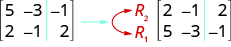
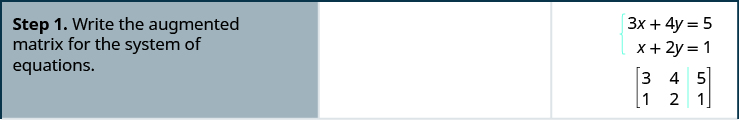
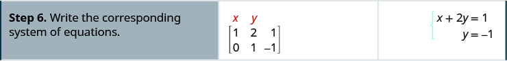

By the end of this section, you will be able to:
* Write the augmented matrix for a system of equations
* Use row operations on a matrix
* Solve systems of equations using matrices

Before you get started, take this readiness quiz.

1.  Solve:
    <math xmlns="http://www.w3.org/1998/Math/MathML"><mrow><mn>3</mn><mo stretchy="false">(</mo><mi>x</mi><mo>+</mo><mn>2</mn><mo stretchy="false">)</mo><mo>+</mo><mn>4</mn><mo>=</mo><mn>4</mn><mo stretchy="false">(</mo><mn>2</mn><mi>x</mi><mo>−</mo><mn>1</mn><mo stretchy="false">)</mo><mo>+</mo><mn>9</mn><mo>.</mo></mrow></math>
    
    * * *
    {: data-type="newline"}
    
    If you missed this problem, review [\[link\]](/m63308#fs-id1167836432956).
2.  Solve:
    <math xmlns="http://www.w3.org/1998/Math/MathML"><mrow><mn>0.25</mn><mi>p</mi><mo>+</mo><mn>0.25</mn><mo stretchy="false">(</mo><mi>x</mi><mo>+</mo><mn>4</mn><mo stretchy="false">)</mo><mo>=</mo><mn>5.20</mn><mo>.</mo></mrow></math>
    
    * * *
    {: data-type="newline"}
    
    If you missed this problem, review [\[link\]](/m63308#fs-id1167836399284).
3.  Evaluate when
    <math xmlns="http://www.w3.org/1998/Math/MathML"><mrow><mi>x</mi><mo>=</mo><mn>−2</mn></mrow></math>
    
    and
    <math xmlns="http://www.w3.org/1998/Math/MathML"><mrow><mi>y</mi><mo>=</mo><mn>3</mn><mtext>:</mtext><mspace width="0.2em" /><mn>2</mn><msup><mi>x</mi><mn>2</mn></msup><mo>−</mo><mi>x</mi><mi>y</mi><mo>+</mo><mn>3</mn><msup><mi>y</mi><mn>2</mn></msup><mo>.</mo></mrow></math>
    
    * * *
    {: data-type="newline"}
    
    If you missed this problem, review [\[link\]](/m63303#fs-id1167832053133).
{: type="1"}

### Write the Augmented Matrix for a System of Equations

Solving a system of equations can be a tedious operation where a simple mistake can wreak havoc on finding the solution. An alternative method which uses the basic procedures of elimination but with notation that is simpler is available. The method involves using a **matrix**{: data-type="term"}. A matrix is a rectangular array of numbers arranged in rows and columns.

Matrix

A **matrix** is a rectangular array of numbers arranged in rows and columns.

A matrix with *m* rows and *n* columns has order <math xmlns="http://www.w3.org/1998/Math/MathML"><mrow><mi>m</mi><mspace width="0.2em" /><mo>×</mo><mspace width="0.2em" /><mi>n</mi><mo>.</mo></mrow></math>

 The matrix on the left below has 2 rows and 3 columns and so it has order <math xmlns="http://www.w3.org/1998/Math/MathML"><mrow><mn>2</mn><mspace width="0.2em" /><mo>×</mo><mspace width="0.2em" /><mn>3</mn><mo>.</mo></mrow></math>

 We say it is a 2 by 3 matrix.

  
Each number in the matrix is called an element or entry in the matrix.

We will use a matrix to represent a system of linear equations. We write each equation in standard form and the coefficients of the variables and the constant of each equation becomes a row in the matrix. Each column then would be the coefficients of one of the variables in the system or the constants. A vertical line replaces the equal signs. We call the resulting matrix the augmented matrix for the system of equations.

    Notice the first column is made up of all the coefficients of *x*, the second column is the all the coefficients of *y*, and the third column is all the constants.

Write each system of linear equations as an augmented matrix:

ⓐ <math xmlns="http://www.w3.org/1998/Math/MathML"><mrow><mrow><mo>{</mo><mtable><mtr><mtd columnalign="left"><mn>5</mn><mi>x</mi><mo>−</mo><mn>3</mn><mi>y</mi><mo>=</mo><mn>−1</mn></mtd></mtr><mtr><mtd columnalign="left"><mi>y</mi><mo>=</mo><mn>2</mn><mi>x</mi><mo>−</mo><mn>2</mn></mtd></mtr></mtable></mrow></mrow></math>

 ⓑ <math xmlns="http://www.w3.org/1998/Math/MathML"><mrow><mrow><mo>{</mo><mtable><mtr><mtd columnalign="left"><mn>6</mn><mi>x</mi><mo>−</mo><mn>5</mn><mi>y</mi><mo>+</mo><mn>2</mn><mi>z</mi><mo>=</mo><mn>3</mn></mtd></mtr><mtr><mtd columnalign="left"><mn>2</mn><mi>x</mi><mo>+</mo><mi>y</mi><mo>−</mo><mn>4</mn><mi>z</mi><mo>=</mo><mn>5</mn></mtd></mtr><mtr><mtd columnalign="left"><mn>3</mn><mi>x</mi><mo>−</mo><mn>3</mn><mi>y</mi><mo>+</mo><mi>z</mi><mo>=</mo><mn>−1</mn></mtd></mtr></mtable></mrow></mrow></math>

ⓐ The second equation is not in standard form. We rewrite the second equation in standard form.

<math xmlns="http://www.w3.org/1998/Math/MathML"><mrow><mtable><mtr><mtd columnalign="right"><mi>y</mi></mtd><mtd columnalign="left"><mo>=</mo></mtd><mtd columnalign="left"><mn>2</mn><mi>x</mi><mo>−</mo><mn>2</mn></mtd></mtr><mtr><mtd columnalign="right"><mn>−2</mn><mi>x</mi><mo>+</mo><mi>y</mi></mtd><mtd columnalign="left"><mo>=</mo></mtd><mtd columnalign="left"><mn>−2</mn></mtd></mtr></mtable></mrow></math>

We replace the second equation with its standard form. In the augmented matrix, the first equation gives us the first row and the second equation gives us the second row. The vertical line replaces the equal signs.

  
ⓑ All three equations are in standard form. In the augmented matrix the first equation gives us the first row, the second equation gives us the second row, and the third equation gives us the third row. The vertical line replaces the equal signs.

  

Write each system of linear equations as an augmented matrix:

ⓐ <math xmlns="http://www.w3.org/1998/Math/MathML"><mrow><mrow><mo>{</mo><mtable><mtr><mtd columnalign="left"><mn>3</mn><mi>x</mi><mo>+</mo><mn>8</mn><mi>y</mi><mo>=</mo><mn>−3</mn></mtd></mtr><mtr><mtd columnalign="left"><mn>2</mn><mi>x</mi><mo>=</mo><mn>−5</mn><mi>y</mi><mo>−</mo><mn>3</mn></mtd></mtr></mtable></mrow></mrow></math>

 ⓑ <math xmlns="http://www.w3.org/1998/Math/MathML"><mrow><mrow><mo>{</mo><mtable><mtr><mtd columnalign="left"><mn>2</mn><mi>x</mi><mo>−</mo><mn>5</mn><mi>y</mi><mo>+</mo><mn>3</mn><mi>z</mi><mo>=</mo><mn>8</mn></mtd></mtr><mtr><mtd columnalign="left"><mn>3</mn><mi>x</mi><mo>−</mo><mi>y</mi><mo>+</mo><mn>4</mn><mi>z</mi><mo>=</mo><mn>7</mn></mtd></mtr><mtr><mtd columnalign="left"><mi>x</mi><mo>+</mo><mn>3</mn><mi>y</mi><mo>+</mo><mn>2</mn><mi>z</mi><mo>=</mo><mn>−3</mn></mtd></mtr></mtable></mrow></mrow></math>

* * *
{: data-type="newline"}

ⓐ <math xmlns="http://www.w3.org/1998/Math/MathML"><mrow><mrow><mo>[</mo><mtable><mtr><mtd columnalign="left"><mn>3</mn></mtd><mtd /><mtd /><mtd columnalign="left"><mn>8</mn></mtd><mtd /><mtd /><mtd columnalign="right"><mn>−3</mn></mtd></mtr><mtr><mtd columnalign="left"><mn>2</mn></mtd><mtd /><mtd /><mtd columnalign="left"><mn>5</mn></mtd><mtd /><mtd /><mtd columnalign="right"><mn>−3</mn></mtd></mtr></mtable><mo>]</mo></mrow></mrow></math>

* * *
{: data-type="newline"}

ⓑ <math xmlns="http://www.w3.org/1998/Math/MathML"><mrow><mrow><mo>[</mo><mtable><mtr><mtd columnalign="left"><mn>2</mn></mtd><mtd /><mtd /><mtd columnalign="right"><mn>−5</mn></mtd><mtd /><mtd /><mtd columnalign="left"><mn>3</mn></mtd><mtd /><mtd /><mtd columnalign="right"><mn>8</mn></mtd></mtr><mtr><mtd columnalign="left"><mn>3</mn></mtd><mtd /><mtd /><mtd columnalign="right"><mn>−1</mn></mtd><mtd /><mtd /><mtd columnalign="left"><mn>4</mn></mtd><mtd /><mtd /><mtd columnalign="right"><mn>7</mn></mtd></mtr><mtr><mtd columnalign="left"><mn>1</mn></mtd><mtd /><mtd /><mtd columnalign="right"><mn>3</mn></mtd><mtd /><mtd /><mtd columnalign="left"><mn>2</mn></mtd><mtd /><mtd /><mtd columnalign="right"><mn>−3</mn></mtd></mtr></mtable><mo>]</mo></mrow></mrow></math>

Write each system of linear equations as an augmented matrix:

ⓐ <math xmlns="http://www.w3.org/1998/Math/MathML"><mrow><mrow><mo>{</mo><mtable><mtr><mtd columnalign="left"><mn>11</mn><mi>x</mi><mo>=</mo><mn>−9</mn><mi>y</mi><mo>−</mo><mn>5</mn></mtd></mtr><mtr><mtd columnalign="left"><mn>7</mn><mi>x</mi><mo>+</mo><mn>5</mn><mi>y</mi><mo>=</mo><mn>−1</mn></mtd></mtr></mtable></mrow></mrow></math>

 ⓑ <math xmlns="http://www.w3.org/1998/Math/MathML"><mrow><mrow><mo>{</mo><mtable><mtr><mtd columnalign="left"><mn>5</mn><mi>x</mi><mo>−</mo><mn>3</mn><mi>y</mi><mo>+</mo><mn>2</mn><mi>z</mi><mo>=</mo><mn>−5</mn></mtd></mtr><mtr><mtd columnalign="left"><mn>2</mn><mi>x</mi><mo>−</mo><mi>y</mi><mo>−</mo><mi>z</mi><mo>=</mo><mn>4</mn></mtd></mtr><mtr><mtd columnalign="left"><mn>3</mn><mi>x</mi><mo>−</mo><mn>2</mn><mi>y</mi><mo>+</mo><mn>2</mn><mi>z</mi><mo>=</mo><mn>−7</mn></mtd></mtr></mtable></mrow></mrow></math>

* * *
{: data-type="newline"}

ⓐ <math xmlns="http://www.w3.org/1998/Math/MathML"><mrow><mrow><mo>[</mo><mtable><mtr><mtd columnalign="left"><mn>11</mn></mtd><mtd /><mtd /><mtd columnalign="left"><mn>9</mn></mtd><mtd /><mtd /><mtd columnalign="right"><mn>−5</mn></mtd></mtr><mtr><mtd columnalign="left"><mn>7</mn></mtd><mtd /><mtd /><mtd columnalign="left"><mn>5</mn></mtd><mtd /><mtd /><mtd columnalign="right"><mn>−1</mn></mtd></mtr></mtable><mo>]</mo></mrow></mrow></math>

* * *
{: data-type="newline"}

ⓑ <math xmlns="http://www.w3.org/1998/Math/MathML"><mrow><mrow><mo>[</mo><mtable><mtr><mtd columnalign="left"><mn>5</mn></mtd><mtd /><mtd /><mtd columnalign="right"><mn>−3</mn></mtd><mtd /><mtd /><mtd columnalign="right"><mn>2</mn></mtd><mtd /><mtd /><mtd columnalign="right"><mn>−5</mn></mtd></mtr><mtr><mtd columnalign="left"><mn>2</mn></mtd><mtd /><mtd /><mtd columnalign="right"><mn>−1</mn></mtd><mtd /><mtd /><mtd columnalign="right"><mn>−1</mn></mtd><mtd /><mtd /><mtd columnalign="right"><mn>4</mn></mtd></mtr><mtr><mtd columnalign="left"><mn>3</mn></mtd><mtd /><mtd /><mtd columnalign="right"><mn>−2</mn></mtd><mtd /><mtd /><mtd columnalign="right"><mn>2</mn></mtd><mtd /><mtd /><mtd columnalign="right"><mn>−7</mn></mtd></mtr></mtable><mo>]</mo></mrow></mrow></math>

It is important as we solve systems of equations using matrices to be able to go back and forth between the system and the matrix. The next example asks us to take the information in the matrix and write the system of equations.

Write the system of equations that corresponds to the augmented matrix:

<math xmlns="http://www.w3.org/1998/Math/MathML"><mrow><mrow><mo>[</mo><mrow><mrow><mtable><mtr><mtd columnalign="right"><mn>4</mn></mtd><mtd /><mtd /><mtd columnalign="right"><mn>−3</mn></mtd><mtd /><mtd /><mtd columnalign="right"><mn>3</mn></mtd><mtd /><mtd /></mtr><mtr><mtd columnalign="right"><mn>1</mn></mtd><mtd /><mtd /><mtd columnalign="right"><mn>2</mn></mtd><mtd /><mtd /><mtd columnalign="right"><mn>−1</mn></mtd><mtd /><mtd /></mtr><mtr><mtd columnalign="right"><mn>−2</mn></mtd><mtd /><mtd /><mtd columnalign="right"><mn>−1</mn></mtd><mtd /><mtd /><mtd columnalign="right"><mn>3</mn></mtd><mtd /><mtd /></mtr></mtable><mo>\|</mo></mrow></mrow></mrow><mrow><mtable><mtr><mtd /><mtd /><mtd columnalign="right"><mn>−1</mn></mtd></mtr><mtr><mtd /><mtd /><mtd columnalign="right"><mn>2</mn></mtd></mtr><mtr><mtd /><mtd /><mtd columnalign="right"><mn>−4</mn></mtd></mtr></mtable><mo>]</mo></mrow><mo>.</mo></mrow></math>

We remember that each row corresponds to an equation and that each entry is a coefficient of a variable or the constant. The vertical line replaces the equal sign. Since this matrix is a <math xmlns="http://www.w3.org/1998/Math/MathML"><mrow><mn>4</mn><mspace width="0.2em" /><mo>×</mo><mspace width="0.2em" /><mn>3</mn></mrow></math>

, we know it will translate into a system of three equations with three variables.

  

Write the system of equations that corresponds to the augmented matrix: <math xmlns="http://www.w3.org/1998/Math/MathML"><mrow><mrow><mo>[</mo><mtable><mtr><mtd columnalign="left"><mn>1</mn></mtd><mtd /><mtd /><mtd columnalign="right"><mn>−1</mn></mtd><mtd /><mtd /><mtd columnalign="right"><mn>2</mn></mtd><mtd /><mtd /><mtd columnalign="right"><mn>3</mn></mtd></mtr><mtr><mtd columnalign="left"><mn>2</mn></mtd><mtd /><mtd /><mtd columnalign="right"><mn>1</mn></mtd><mtd /><mtd /><mtd columnalign="right"><mn>−2</mn></mtd><mtd /><mtd /><mtd columnalign="right"><mn>1</mn></mtd></mtr><mtr><mtd columnalign="left"><mn>4</mn></mtd><mtd /><mtd /><mtd columnalign="right"><mn>−1</mn></mtd><mtd /><mtd /><mtd columnalign="right"><mn>2</mn></mtd><mtd /><mtd /><mtd columnalign="right"><mn>0</mn></mtd></mtr></mtable><mo>]</mo></mrow><mo>.</mo></mrow></math>

<math xmlns="http://www.w3.org/1998/Math/MathML"><mrow><mrow><mo>{</mo><mtable><mtr><mtd columnalign="left"><mspace width="0.2em" /><mtext /><mspace width="0.2em" /><mi>x</mi><mo>−</mo><mi>y</mi><mo>+</mo><mn>2</mn><mi>z</mi><mo>=</mo><mn>3</mn></mtd></mtr><mtr><mtd columnalign="left"><mn>2</mn><mi>x</mi><mo>+</mo><mi>y</mi><mo>−</mo><mn>2</mn><mi>z</mi><mo>=</mo><mn>1</mn></mtd></mtr><mtr><mtd columnalign="left"><mspace width="0.2em" /><mtext /><mspace width="0.2em" /><mn>4</mn><mi>x</mi><mo>−</mo><mi>y</mi><mo>+</mo><mn>2</mn><mi>z</mi><mo>=</mo><mn>0</mn></mtd></mtr></mtable></mrow></mrow></math>

Write the system of equations that corresponds to the augmented matrix: <math xmlns="http://www.w3.org/1998/Math/MathML"><mrow><mrow><mo>[</mo><mtable><mtr><mtd columnalign="left"><mn>1</mn></mtd><mtd /><mtd /><mtd columnalign="left"><mn>1</mn></mtd><mtd /><mtd /><mtd columnalign="right"><mn>1</mn></mtd><mtd /><mtd /><mtd columnalign="right"><mn>4</mn></mtd></mtr><mtr><mtd columnalign="left"><mn>2</mn></mtd><mtd /><mtd /><mtd columnalign="left"><mn>3</mn></mtd><mtd /><mtd /><mtd columnalign="right"><mn>−1</mn></mtd><mtd /><mtd /><mtd columnalign="right"><mn>8</mn></mtd></mtr><mtr><mtd columnalign="left"><mn>1</mn></mtd><mtd /><mtd /><mtd columnalign="left"><mn>1</mn></mtd><mtd /><mtd /><mtd columnalign="right"><mn>−1</mn></mtd><mtd /><mtd /><mtd columnalign="right"><mn>3</mn></mtd></mtr></mtable><mo>]</mo></mrow><mo>.</mo></mrow></math>

<math xmlns="http://www.w3.org/1998/Math/MathML"><mrow><mrow><mo>{</mo><mtable><mtr><mtd columnalign="left"><mspace width="0.2em" /><mtext /><mspace width="0.2em" /><mi>x</mi><mo>+</mo><mi>y</mi><mo>+</mo><mi>z</mi><mo>=</mo><mn>4</mn></mtd></mtr><mtr><mtd columnalign="left"><mn>2</mn><mi>x</mi><mo>+</mo><mn>3</mn><mi>y</mi><mo>−</mo><mi>z</mi><mo>=</mo><mn>8</mn></mtd></mtr><mtr><mtd columnalign="left"><mspace width="0.8em" /><mi>x</mi><mo>+</mo><mi>y</mi><mo>−</mo><mi>z</mi><mo>=</mo><mn>3</mn></mtd></mtr></mtable></mrow></mrow></math>

### Use Row Operations on a Matrix

Once a system of equations is in its augmented matrix form, we will perform operations on the rows that will lead us to the solution.

To solve by elimination, it doesn’t matter which order we place the equations in the system. Similarly, in the matrix we can interchange the rows.

When we solve by elimination, we often multiply one of the equations by a constant. Since each row represents an equation, and we can multiply each side of an equation by a constant, similarly we can multiply each entry in a row by any real number except 0.

In elimination, we often add a multiple of one row to another row. In the matrix we can replace a row with its sum with a multiple of another row.

These actions are called row operations and will help us use the matrix to solve a system of equations.

Row Operations

In a matrix, the following operations can be performed on any row and the resulting matrix will be equivalent to the original matrix.

1.  Interchange any two rows.
2.  Multiply a row by any real number except 0.
3.  Add a nonzero multiple of one row to another row.
{: type="1"}

Performing these operations is easy to do but all the arithmetic can result in a mistake. If we use a system to record the row operation in each step, it is much easier to go back and check our work.

We use capital letters with subscripts to represent each row. We then show the operation to the left of the new matrix. To show interchanging a row:

    To multiply row 2 by <math xmlns="http://www.w3.org/1998/Math/MathML"><mrow><mn>−3</mn></mrow></math>

\:

    To multiply row 2 by <math xmlns="http://www.w3.org/1998/Math/MathML"><mrow><mn>−3</mn></mrow></math>

 and add it to row 1:

    

Perform the indicated operations on the augmented matrix:

ⓐ Interchange rows 2 and 3.

ⓑ Multiply row 2 by 5.

ⓒ Multiply row 3 by <math xmlns="http://www.w3.org/1998/Math/MathML"><mrow><mn>−2</mn></mrow></math>

 and add to row 1.

<math xmlns="http://www.w3.org/1998/Math/MathML"><mrow><mrow><mo>[</mo><mrow><mrow><mtable><mtr><mtd columnalign="left"><mn>6</mn></mtd><mtd /><mtd /><mtd columnalign="right"><mn>−5</mn></mtd><mtd /><mtd /><mtd columnalign="right"><mn>2</mn></mtd><mtd /><mtd /></mtr><mtr><mtd columnalign="left"><mn>2</mn></mtd><mtd /><mtd /><mtd columnalign="right"><mn>1</mn></mtd><mtd /><mtd /><mtd columnalign="right"><mn>−4</mn></mtd><mtd /><mtd /></mtr><mtr><mtd columnalign="left"><mn>3</mn></mtd><mtd /><mtd /><mtd columnalign="right"><mn>−3</mn></mtd><mtd /><mtd /><mtd columnalign="right"><mn>1</mn></mtd><mtd /><mtd /></mtr></mtable><mo>\|</mo></mrow></mrow></mrow><mrow><mtable><mtr><mtd /><mtd /><mtd columnalign="right"><mn>3</mn></mtd></mtr><mtr><mtd /><mtd /><mtd columnalign="right"><mn>5</mn></mtd></mtr><mtr><mtd /><mtd /><mtd columnalign="right"><mn>−1</mn></mtd></mtr></mtable><mo>]</mo></mrow></mrow></math>

ⓐ We interchange rows 2 and 3.* * *
{: data-type="newline"}

  
ⓑ We multiply row 2 by 5.* * *
{: data-type="newline"}

  
ⓒ We multiply row 3 by <math xmlns="http://www.w3.org/1998/Math/MathML"><mrow><mn>−2</mn></mrow></math>

 and add to row 1.* * *
{: data-type="newline"}

  

Perform the indicated operations on the augmented matrix:

ⓐ Interchange rows 1 and 3.

ⓑ Multiply row 3 by 3.

ⓒ Multiply row 3 by 2 and add to row 2.

<math xmlns="http://www.w3.org/1998/Math/MathML"><mrow><mrow><mo>[</mo><mrow><mrow><mtable><mtr><mtd columnalign="right"><mn>5</mn></mtd><mtd /><mtd /><mtd columnalign="right"><mn>−2</mn></mtd><mtd /><mtd /><mtd columnalign="right"><mn>−2</mn></mtd><mtd /><mtd /></mtr><mtr><mtd columnalign="right"><mn>4</mn></mtd><mtd /><mtd /><mtd columnalign="right"><mn>−1</mn></mtd><mtd /><mtd /><mtd columnalign="right"><mn>−4</mn></mtd><mtd /><mtd /></mtr><mtr><mtd columnalign="right"><mn>−2</mn></mtd><mtd /><mtd /><mtd columnalign="right"><mn>3</mn></mtd><mtd /><mtd /><mtd columnalign="right"><mn>0</mn></mtd><mtd /><mtd /></mtr></mtable><mo>\|</mo></mrow></mrow></mrow><mrow><mtable><mtr><mtd /><mtd /><mtd columnalign="right"><mn>−2</mn></mtd></mtr><mtr><mtd /><mtd /><mtd columnalign="right"><mn>4</mn></mtd></mtr><mtr><mtd /><mtd /><mtd columnalign="right"><mn>−1</mn></mtd></mtr></mtable><mo>]</mo></mrow></mrow></math>

* * *
{: data-type="newline"}

ⓐ <math xmlns="http://www.w3.org/1998/Math/MathML"><mrow><mrow><mo>[</mo><mtable><mtr><mtd columnalign="right"><mn>−2</mn></mtd><mtd /><mtd /><mtd columnalign="right"><mn>3</mn></mtd><mtd /><mtd /><mtd columnalign="right"><mn>0</mn></mtd><mtd /><mtd /><mtd columnalign="right"><mn>−2</mn></mtd></mtr><mtr><mtd columnalign="right"><mn>4</mn></mtd><mtd /><mtd /><mtd columnalign="right"><mn>−1</mn></mtd><mtd /><mtd /><mtd columnalign="right"><mn>−4</mn></mtd><mtd /><mtd /><mtd columnalign="right"><mn>4</mn></mtd></mtr><mtr><mtd columnalign="right"><mn>5</mn></mtd><mtd /><mtd /><mtd columnalign="right"><mn>−2</mn></mtd><mtd /><mtd /><mtd columnalign="right"><mn>−2</mn></mtd><mtd /><mtd /><mtd columnalign="right"><mn>−2</mn></mtd></mtr></mtable><mo>]</mo></mrow></mrow></math>

 * * *
{: data-type="newline"}

ⓑ <math xmlns="http://www.w3.org/1998/Math/MathML"><mrow><mrow><mo>[</mo><mtable><mtr><mtd columnalign="right"><mn>−2</mn></mtd><mtd /><mtd /><mtd columnalign="right"><mn>3</mn></mtd><mtd /><mtd /><mtd columnalign="right"><mn>0</mn></mtd><mtd /><mtd /><mtd columnalign="right"><mn>−2</mn></mtd></mtr><mtr><mtd columnalign="right"><mn>4</mn></mtd><mtd /><mtd /><mtd columnalign="right"><mn>−1</mn></mtd><mtd /><mtd /><mtd columnalign="right"><mn>−4</mn></mtd><mtd /><mtd /><mtd columnalign="right"><mn>4</mn></mtd></mtr><mtr><mtd columnalign="left"><mn>15</mn></mtd><mtd /><mtd /><mtd columnalign="right"><mn>−6</mn></mtd><mtd /><mtd /><mtd columnalign="right"><mn>−6</mn></mtd><mtd /><mtd /><mtd columnalign="right"><mn>−6</mn></mtd></mtr></mtable><mo>]</mo></mrow></mrow></math>

 * * *
{: data-type="newline"}

ⓒ <math xmlns="http://www.w3.org/1998/Math/MathML"><mrow><mrow><mo>[</mo><mtable><mtr><mtd columnalign="right"><mn>−2</mn></mtd><mtd /><mtd /><mtd columnalign="right"><mn>3</mn></mtd><mtd /><mtd /><mtd columnalign="right"><mn>0</mn></mtd><mtd /><mtd /><mtd columnalign="right"><mn>−2</mn></mtd><mtd /><mtd /><mtd /></mtr><mtr><mtd columnalign="right"><mn>3</mn></mtd><mtd /><mtd /><mtd columnalign="right"><mn>4</mn></mtd><mtd /><mtd /><mtd columnalign="right"><mn>−13</mn></mtd><mtd /><mtd /><mtd columnalign="right"><mn>−16</mn></mtd><mtd /><mtd /><mtd columnalign="right"><mn>−8</mn></mtd></mtr><mtr><mtd columnalign="right"><mn>15</mn></mtd><mtd /><mtd /><mtd columnalign="right"><mn>−6</mn></mtd><mtd /><mtd /><mtd columnalign="right"><mn>−6</mn></mtd><mtd /><mtd /><mtd columnalign="right"><mn>−6</mn></mtd><mtd /><mtd /><mtd /></mtr></mtable><mo>]</mo></mrow></mrow></math>

Perform the indicated operations on the augmented matrix:

ⓐ Interchange rows 1 and 2,

ⓑ Multiply row 1 by 2,

ⓒ Multiply row 2 by 3 and add to row 1.

<math xmlns="http://www.w3.org/1998/Math/MathML"><mrow><mrow><mo>[</mo><mrow><mrow><mtable><mtr><mtd columnalign="left"><mn>2</mn></mtd><mtd /><mtd /><mtd columnalign="right"><mn>−3</mn></mtd><mtd /><mtd /><mtd columnalign="right"><mn>−2</mn></mtd><mtd /><mtd /></mtr><mtr><mtd columnalign="left"><mn>4</mn></mtd><mtd /><mtd /><mtd columnalign="right"><mn>1</mn></mtd><mtd /><mtd /><mtd columnalign="right"><mn>−3</mn></mtd><mtd /><mtd /></mtr><mtr><mtd columnalign="left"><mn>5</mn></mtd><mtd /><mtd /><mtd columnalign="right"><mn>0</mn></mtd><mtd /><mtd /><mtd columnalign="right"><mn>4</mn></mtd><mtd /><mtd /></mtr></mtable><mo>\|</mo></mrow></mrow></mrow><mrow><mtable><mtr><mtd /><mtd /><mtd columnalign="right"><mn>−4</mn></mtd></mtr><mtr><mtd /><mtd /><mtd columnalign="right"><mn>2</mn></mtd></mtr><mtr><mtd /><mtd /><mtd columnalign="right"><mn>−1</mn></mtd></mtr></mtable><mo>]</mo></mrow></mrow></math>

* * *
{: data-type="newline"}

ⓐ <math xmlns="http://www.w3.org/1998/Math/MathML"><mrow><mrow><mo>[</mo><mtable><mtr><mtd columnalign="left"><mn>4</mn></mtd><mtd /><mtd /><mtd columnalign="right"><mn>1</mn></mtd><mtd /><mtd /><mtd columnalign="right"><mn>−3</mn></mtd><mtd /><mtd /><mtd columnalign="right"><mn>2</mn></mtd></mtr><mtr><mtd columnalign="left"><mn>2</mn></mtd><mtd /><mtd /><mtd columnalign="right"><mn>−3</mn></mtd><mtd /><mtd /><mtd columnalign="right"><mn>−2</mn></mtd><mtd /><mtd /><mtd columnalign="right"><mn>−4</mn></mtd></mtr><mtr><mtd columnalign="left"><mn>5</mn></mtd><mtd /><mtd /><mtd columnalign="right"><mn>0</mn></mtd><mtd /><mtd /><mtd columnalign="right"><mn>4</mn></mtd><mtd /><mtd /><mtd columnalign="right"><mn>−1</mn></mtd></mtr></mtable><mo>]</mo></mrow></mrow></math>

* * *
{: data-type="newline"}

ⓑ <math xmlns="http://www.w3.org/1998/Math/MathML"><mrow><mrow><mo>[</mo><mtable><mtr><mtd columnalign="left"><mn>8</mn></mtd><mtd /><mtd /><mtd columnalign="right"><mn>2</mn></mtd><mtd /><mtd /><mtd columnalign="right"><mn>−6</mn></mtd><mtd /><mtd /><mtd columnalign="right"><mn>4</mn></mtd></mtr><mtr><mtd columnalign="left"><mn>2</mn></mtd><mtd /><mtd /><mtd columnalign="right"><mn>−3</mn></mtd><mtd /><mtd /><mtd columnalign="right"><mn>−2</mn></mtd><mtd /><mtd /><mtd columnalign="right"><mn>−4</mn></mtd></mtr><mtr><mtd columnalign="left"><mn>5</mn></mtd><mtd /><mtd /><mtd columnalign="right"><mn>0</mn></mtd><mtd /><mtd /><mtd columnalign="right"><mn>4</mn></mtd><mtd /><mtd /><mtd columnalign="right"><mn>−1</mn></mtd></mtr></mtable><mo>]</mo></mrow></mrow></math>

* * *
{: data-type="newline"}

ⓒ <math xmlns="http://www.w3.org/1998/Math/MathML"><mrow><mrow><mo>[</mo><mtable><mtr><mtd columnalign="left"><mn>14</mn></mtd><mtd /><mtd /><mtd columnalign="right"><mn>−7</mn></mtd><mtd /><mtd /><mtd columnalign="right"><mn>−12</mn></mtd><mtd /><mtd /><mtd columnalign="right"><mn>−8</mn></mtd></mtr><mtr><mtd columnalign="left"><mn>2</mn></mtd><mtd /><mtd /><mtd columnalign="right"><mn>−3</mn></mtd><mtd /><mtd /><mtd columnalign="right"><mn>−2</mn></mtd><mtd /><mtd /><mtd columnalign="right"><mn>−4</mn></mtd></mtr><mtr><mtd columnalign="left"><mn>5</mn></mtd><mtd /><mtd /><mtd columnalign="right"><mn>0</mn></mtd><mtd /><mtd /><mtd columnalign="right"><mn>4</mn></mtd><mtd /><mtd /><mtd columnalign="right"><mn>−1</mn></mtd></mtr></mtable><mo>]</mo></mrow></mrow></math>

Now that we have practiced the row operations, we will look at an augmented matrix and figure out what operation we will use to reach a goal. This is exactly what we did when we did elimination. We decided what number to multiply a row by in order that a variable would be eliminated when we added the rows together.

Given this system, what would you do to eliminate *x*?

    This next example essentially does the same thing, but to the matrix.

Perform the needed row operation that will get the first entry in row 2 to be zero in the augmented matrix: <math xmlns="http://www.w3.org/1998/Math/MathML"><mrow><mrow> <mo>[</mo><mrow><mrow><mtable><mtr><mtd columnalign="left"><mn>1</mn></mtd><mtd /><mtd /><mtd columnalign="right"><mn>−1</mn></mtd><mtd /><mtd /></mtr><mtr><mtd columnalign="left"><mn>4</mn></mtd><mtd /><mtd /><mtd columnalign="right"><mn>−8</mn></mtd><mtd /><mtd /></mtr></mtable><mo>\|</mo></mrow></mrow></mrow><mrow><mtable><mtr><mtd /><mtd /><mtd columnalign="right"><mn>2</mn></mtd></mtr><mtr><mtd /><mtd /><mtd columnalign="right"><mn>0</mn></mtd></mtr></mtable><mo>]</mo></mrow><mo>.</mo></mrow></math>

To make the 4 a 0, we could multiply row 1 by <math xmlns="http://www.w3.org/1998/Math/MathML"><mrow><mn>−4</mn></mrow></math>

 and then add it to row 2.

  

Perform the needed row operation that will get the first entry in row 2 to be zero in the augmented matrix: <math xmlns="http://www.w3.org/1998/Math/MathML"><mrow><mrow><mo>[</mo><mrow><mrow><mtable><mtr><mtd columnalign="left"><mn>1</mn></mtd><mtd /><mtd /><mtd columnalign="right"><mn>−1</mn></mtd><mtd /><mtd /></mtr><mtr><mtd columnalign="left"><mn>3</mn></mtd><mtd /><mtd /><mtd columnalign="right"><mn>−6</mn></mtd><mtd /><mtd /></mtr></mtable><mo>\|</mo></mrow></mrow></mrow><mrow><mtable><mtr><mtd /><mtd /><mtd columnalign="right"><mn>2</mn></mtd></mtr><mtr><mtd /><mtd /><mtd columnalign="right"><mn>2</mn></mtd></mtr></mtable><mo>]</mo></mrow><mo>.</mo></mrow></math>

<math xmlns="http://www.w3.org/1998/Math/MathML"><mrow><mrow><mo>[</mo><mtable><mtr><mtd columnalign="left"><mn>1</mn></mtd><mtd /><mtd /><mtd columnalign="right"><mn>−1</mn></mtd><mtd /><mtd /><mtd columnalign="right"><mn>2</mn></mtd></mtr><mtr><mtd columnalign="left"><mn>0</mn></mtd><mtd /><mtd /><mtd columnalign="right"><mn>−3</mn></mtd><mtd /><mtd /><mtd columnalign="right"><mn>−4</mn></mtd></mtr></mtable><mo>]</mo></mrow></mrow></math>

Perform the needed row operation that will get the first entry in row 2 to be zero in the augmented matrix: <math xmlns="http://www.w3.org/1998/Math/MathML"><mrow><mrow><mo>[</mo><mrow><mrow><mtable><mtr><mtd columnalign="right"><mn>1</mn></mtd><mtd /><mtd /><mtd columnalign="right"><mn>−1</mn></mtd><mtd /><mtd /></mtr><mtr><mtd columnalign="right"><mn>−2</mn></mtd><mtd /><mtd /><mtd columnalign="right"><mn>−3</mn></mtd><mtd /><mtd /></mtr></mtable><mo>\|</mo></mrow></mrow></mrow><mrow><mtable><mtr><mtd /><mtd /><mtd columnalign="right"><mn>3</mn></mtd></mtr><mtr><mtd /><mtd /><mtd columnalign="right"><mn>2</mn></mtd></mtr></mtable><mo>]</mo></mrow><mo>.</mo></mrow></math>

<math xmlns="http://www.w3.org/1998/Math/MathML"><mrow><mrow><mo>[</mo><mtable><mtr><mtd columnalign="left"><mn>1</mn></mtd><mtd /><mtd /><mtd columnalign="right"><mn>−1</mn></mtd><mtd /><mtd /><mtd columnalign="right"><mn>3</mn></mtd></mtr><mtr><mtd columnalign="left"><mn>0</mn></mtd><mtd /><mtd /><mtd columnalign="right"><mn>−5</mn></mtd><mtd /><mtd /><mtd columnalign="right"><mn>8</mn></mtd></mtr></mtable><mo>]</mo></mrow></mrow></math>

### Solve Systems of Equations Using Matrices

To solve a system of equations using matrices, we transform the augmented matrix into a matrix in **row-echelon form**{: data-type="term"} using row operations. For a consistent and independent system of equations, its **augmented matrix**{: data-type="term" .no-emphasis} is in row-echelon form when to the left of the vertical line, each entry on the diagonal is a 1 and all entries below the diagonal are zeros.

Row-Echelon Form

For a consistent and independent system of equations, its augmented matrix is in **row-echelon form** when to the left of the vertical line, each entry on the diagonal is a 1 and all entries below the diagonal are zeros.

  

Once we get the augmented matrix into row-echelon form, we can write the equivalent system of equations and read the value of at least one variable. We then substitute this value in another equation to continue to solve for the other variables. This process is illustrated in the next example.

How to Solve a System of Equations Using a Matrix

Solve the system of equations using a matrix: <math xmlns="http://www.w3.org/1998/Math/MathML"><mrow><mrow><mo>{</mo><mtable><mtr><mtd columnalign="left"><mn>3</mn><mi>x</mi><mo>+</mo><mn>4</mn><mi>y</mi><mo>=</mo><mn>5</mn></mtd></mtr><mtr><mtd columnalign="left"><mi>x</mi><mo>+</mo><mn>2</mn><mi>y</mi><mo>=</mo><mn>1</mn></mtd></mtr></mtable></mrow><mo>.</mo></mrow></math>

                  

Solve the system of equations using a matrix: <math xmlns="http://www.w3.org/1998/Math/MathML"><mrow><mrow><mo>{</mo><mtable><mtr><mtd columnalign="left"><mn>2</mn><mi>x</mi><mo>+</mo><mi>y</mi><mo>=</mo><mn>7</mn></mtd></mtr><mtr><mtd columnalign="left"><mi>x</mi><mo>−</mo><mn>2</mn><mi>y</mi><mo>=</mo><mn>6</mn></mtd></mtr></mtable></mrow><mo>.</mo></mrow></math>

The solution is <math xmlns="http://www.w3.org/1998/Math/MathML"><mrow><mrow><mo>(</mo><mrow><mn>4</mn><mo>,</mo><mn>−1</mn></mrow><mo>)</mo></mrow><mo>.</mo></mrow></math>

Solve the system of equations using a matrix: <math xmlns="http://www.w3.org/1998/Math/MathML"><mrow><mrow><mo>{</mo><mtable><mtr><mtd columnalign="left"><mn>2</mn><mi>x</mi><mo>+</mo><mi>y</mi><mo>=</mo><mn>−4</mn></mtd></mtr><mtr><mtd columnalign="left"><mi>x</mi><mo>−</mo><mi>y</mi><mo>=</mo><mn>−2</mn></mtd></mtr></mtable></mrow><mo>.</mo></mrow></math>

The solution is <math xmlns="http://www.w3.org/1998/Math/MathML"><mrow><mrow><mo>(</mo><mrow><mn>−2</mn><mo>,</mo><mn>0</mn></mrow><mo>)</mo></mrow><mo>.</mo></mrow></math>

The steps are summarized here.

Solve a system of equations using matrices.

1.  Write the augmented matrix for the system of equations.
2.  Using row operations get the entry in row 1, column 1 to be 1.
3.  Using row operations, get zeros in column 1 below the 1.
4.  Using row operations, get the entry in row 2, column 2 to be 1.
5.  Continue the process until the matrix is in row-echelon form.
6.  Write the corresponding system of equations.
7.  Use substitution to find the remaining variables.
8.  Write the solution as an ordered pair or triple.
9.  Check that the solution makes the original equations true.
{: type="1" .stepwise}

Here is a visual to show the order for getting the 1’s and 0’s in the proper position for row-echelon form.

    We use the same procedure when the system of equations has three equations.

Solve the system of equations using a matrix: <math xmlns="http://www.w3.org/1998/Math/MathML"><mrow><mrow><mo>{</mo><mtable><mtr><mtd columnalign="left"><mn>3</mn><mi>x</mi><mo>+</mo><mn>8</mn><mi>y</mi><mo>+</mo><mn>2</mn><mi>z</mi><mo>=</mo><mn>−5</mn></mtd></mtr><mtr><mtd columnalign="left"><mn>2</mn><mi>x</mi><mo>+</mo><mn>5</mn><mi>y</mi><mo>−</mo><mn>3</mn><mi>z</mi><mo>=</mo><mn>0</mn></mtd></mtr><mtr><mtd columnalign="left"><mi>x</mi><mo>+</mo><mn>2</mn><mi>y</mi><mo>−</mo><mn>2</mn><mi>z</mi><mo>=</mo><mn>−1</mn></mtd></mtr></mtable></mrow><mo>.</mo></mrow></math>

<table class="unnumbered unstyled can-break" summary="The equations are 3x plus 8y plus 2z equals minus 5, 2x plus 5y minus 3z equals 0, x plus 2y minus 2z equals minus 1. Write the augmented matrix for the equations. Row 1 is 3, 8, 2, minus 5. Row 2 is 2, 5, minus 3, 0. Row 3 is 1, 2, minus 2, minus 1. Interchange row 1 and 3 to get the entry in row 1, column 1 to be 1. Use operation minus 2R1 plus R2 on row 2. Use operation minus 3R1 plus R3 on row 3. Use operation minus 2R2 plus R3 on row 3. Use operation 1 upon 6 R3 on row 3. The matrix is now in row-echelon form. The corresponding system of equations is x plus 2y minus 2z equals minus 1, y plus z equals 2 and z equals minus 1. Using substitution, we get y equal to 3 and x equal to minus 9. The solution is minus 9, 3, minus 1. Check that the original equations hold true." data-label=""><tbody>
<tr valign="top">
<td data-valign="top" data-align="left" />
<td data-valign="top" data-align="left"></td>
</tr>
<tr valign="top">
<td data-valign="top" data-align="left">Write the augmented matrix for the equations.</td>
<td data-valign="top" data-align="left"></td>
</tr>
<tr valign="top">
<td data-valign="top" data-align="left">Interchange row 1 and 3 to get the entry in
row 1, column 1 to be 1.</td>
<td data-valign="top" data-align="left"></td>
</tr>
<tr valign="top">
<td data-valign="top" data-align="left">Using row operations, get zeros in column 1 below the 1.</td>
<td data-valign="top" data-align="left"></td>
</tr>
<tr valign="top">
<td data-valign="top" data-align="left" />
<td data-valign="top" data-align="left"></td>
</tr>
<tr valign="top">
<td data-valign="top" data-align="left">The entry in row 2, column 2 is now 1.</td>
<td data-valign="top" data-align="left" />
</tr>
<tr valign="top">
<td data-valign="top" data-align="left">Continue the process until the matrix
is in row-echelon form.</td>
<td data-valign="top" data-align="left"></td>
</tr>
<tr valign="top">
<td data-valign="top" data-align="left" />
<td data-valign="top" data-align="left"></td>
</tr>
<tr valign="top">
<td data-valign="top" data-align="left">The matrix is now in row-echelon form.</td>
<td data-valign="top" data-align="left"></td>
</tr>
<tr valign="top">
<td data-valign="top" data-align="left">Write the corresponding system of equations.</td>
<td data-valign="top" data-align="left"></td>
</tr>
<tr valign="top">
<td data-valign="top" data-align="left">Use substitution to find the remaining variables.</td>
<td data-valign="top" data-align="left"></td>
</tr>
<tr valign="top">
<td data-valign="top" data-align="left" />
<td data-valign="top" data-align="left">
</td>
</tr>
<tr valign="top">
<td data-valign="top" data-align="left">Write the solution as an ordered pair or triple.</td>
<td data-valign="top" data-align="left"></td>
</tr>
<tr valign="top">
<td data-valign="top" data-align="left">Check that the solution makes the original equations true.</td>
<td data-valign="top" data-align="left">We leave the check for you.</td>
</tr>
</tbody></table>

Solve the system of equations using a matrix: <math xmlns="http://www.w3.org/1998/Math/MathML"><mrow><mrow><mo>{</mo><mtable><mtr><mtd columnalign="left"><mn>2</mn><mi>x</mi><mo>−</mo><mn>5</mn><mi>y</mi><mo>+</mo><mn>3</mn><mi>z</mi><mo>=</mo><mn>8</mn></mtd></mtr><mtr><mtd columnalign="left"><mn>3</mn><mi>x</mi><mo>−</mo><mi>y</mi><mo>+</mo><mn>4</mn><mi>z</mi><mo>=</mo><mn>7</mn></mtd></mtr><mtr><mtd columnalign="left"><mi>x</mi><mo>+</mo><mn>3</mn><mi>y</mi><mo>+</mo><mn>2</mn><mi>z</mi><mo>=</mo><mn>−3</mn></mtd></mtr></mtable></mrow><mo>.</mo></mrow></math>

<math xmlns="http://www.w3.org/1998/Math/MathML"><mrow><mrow><mo>(</mo><mrow><mn>6</mn><mo>,</mo><mn>−1</mn><mo>,</mo><mn>−3</mn></mrow><mo>)</mo></mrow></mrow></math>

Solve the system of equations using a matrix: <math xmlns="http://www.w3.org/1998/Math/MathML"><mrow><mrow><mo>{</mo><mtable><mtr><mtd columnalign="right"><mn>−3</mn><mi>x</mi><mo>+</mo><mi>y</mi><mo>+</mo><mi>z</mi><mo>=</mo><mn>−4</mn></mtd></mtr><mtr><mtd columnalign="right"><mtext>−</mtext><mi>x</mi><mo>+</mo><mn>2</mn><mi>y</mi><mo>−</mo><mn>2</mn><mi>z</mi><mo>=</mo><mn>1</mn></mtd></mtr><mtr><mtd columnalign="left"><mn>2</mn><mi>x</mi><mo>−</mo><mi>y</mi><mo>−</mo><mi>z</mi><mo>=</mo><mn>−1</mn></mtd></mtr></mtable></mrow><mo>.</mo></mrow></math>

<math xmlns="http://www.w3.org/1998/Math/MathML"><mrow><mo stretchy="false">(</mo><mn>5</mn><mo>,</mo><mn>7</mn><mo>,</mo><mn>4</mn><mo stretchy="false">)</mo></mrow></math>

So far our work with matrices has only been with systems that are consistent and independent, which means they have exactly one solution. Let’s now look at what happens when we use a matrix for a dependent or inconsistent system.

Solve the system of equations using a matrix: <math xmlns="http://www.w3.org/1998/Math/MathML"><mrow><mrow><mo>{</mo><mtable><mtr><mtd columnalign="left"><mi>x</mi><mo>+</mo><mi>y</mi><mo>+</mo><mn>3</mn><mi>z</mi><mo>=</mo><mn>0</mn></mtd></mtr><mtr><mtd columnalign="left"><mi>x</mi><mo>+</mo><mn>3</mn><mi>y</mi><mo>+</mo><mn>5</mn><mi>z</mi><mo>=</mo><mn>0</mn></mtd></mtr><mtr><mtd columnalign="left"><mn>2</mn><mi>x</mi><mo>+</mo><mn>4</mn><mi>z</mi><mo>=</mo><mn>1</mn></mtd></mtr></mtable><mo>.</mo></mrow></mrow></math>

<table class="unnumbered unstyled can-break" summary="The equations are x plus y plus 3z equals 0, x plus 3y plus 5z equals 0 and 2x plus 4z equals 1. The first row of the augmented matrix is 1, 1, 3, 0. Row 2 is 1, 3, 5, 0. Row 3 is 2, 0, 4, 1. Use row operation minus 1R1 plus R2 on row 2. Use operation minus 2R1 plus R3 on row 3. Use operation half R2 on row 2. Use operation 2R2 plus R3. The corresponding equations are x plus y plus 3z equals 0, y plus z equals 0 and 0 not equal to 1." data-label=""><tbody>
<tr valign="top">
<td data-valign="top" data-align="left" />
<td data-valign="top" data-align="left"></td>
</tr>
<tr valign="top">
<td data-valign="top" data-align="left">Write the augmented matrix for the equations.</td>
<td data-valign="top" data-align="left"></td>
</tr>
<tr valign="top">
<td data-valign="top" data-align="left">The entry in row 1, column 1 is 1.</td>
<td data-valign="top" data-align="left" />
</tr>
<tr valign="top">
<td data-valign="top" data-align="left">Using row operations, get zeros in column 1 below the 1.</td>
<td data-valign="top" data-align="left"></td>
</tr>
<tr valign="top">
<td data-valign="top" data-align="left" />
<td data-valign="top" data-align="left"></td>
</tr>
<tr valign="top">
<td data-valign="top" data-align="left">Continue the process until the matrix is in row-echelon form.</td>
<td data-valign="top" data-align="left"></td>
</tr>
<tr valign="top">
<td data-valign="top" data-align="left">Multiply row 2 by 2 and add it to row 3.</td>
<td data-valign="top" data-align="left"></td>
</tr>
<tr valign="top">
<td data-valign="top" data-align="left">At this point, we have all zeros on the left of row 3.</td>
<td data-valign="top" data-align="left" />
</tr>
<tr valign="top">
<td data-valign="top" data-align="left">Write the corresponding system of equations.</td>
<td data-valign="top" data-align="left"></td>
</tr>
<tr valign="top">
<td colspan="2" data-valign="top" data-align="left">Since <math xmlns="http://www.w3.org/1998/Math/MathML"><mrow><mn>0</mn><mo>≠</mo><mn>1</mn></mrow></math> we have a false statement. Just as when we solved a system using other methods, this tells us we have an inconsistent system. There is no solution.</td>
</tr>
</tbody></table>

Solve the system of equations using a matrix: <math xmlns="http://www.w3.org/1998/Math/MathML"><mrow><mrow><mo>{</mo><mtable><mtr><mtd columnalign="left"><mi>x</mi><mo>−</mo><mn>2</mn><mi>y</mi><mo>+</mo><mn>2</mn><mi>z</mi><mo>=</mo><mn>1</mn></mtd></mtr><mtr><mtd columnalign="right"><mn>−2</mn><mi>x</mi><mo>+</mo><mi>y</mi><mo>−</mo><mi>z</mi><mo>=</mo><mn>2</mn></mtd></mtr><mtr><mtd columnalign="left"><mi>x</mi><mo>−</mo><mi>y</mi><mo>+</mo><mi>z</mi><mo>=</mo><mn>5</mn></mtd></mtr></mtable></mrow><mo>.</mo></mrow></math>

no solution

Solve the system of equations using a matrix: <math xmlns="http://www.w3.org/1998/Math/MathML"><mrow><mrow><mo>{</mo><mtable><mtr><mtd columnalign="left"><mn>3</mn><mi>x</mi><mo>+</mo><mn>4</mn><mi>y</mi><mo>−</mo><mn>3</mn><mi>z</mi><mo>=</mo><mn>−2</mn></mtd></mtr><mtr><mtd columnalign="left"><mn>2</mn><mi>x</mi><mo>+</mo><mn>3</mn><mi>y</mi><mo>−</mo><mi>z</mi><mo>=</mo><mn>−12</mn></mtd></mtr><mtr><mtd columnalign="left"><mi>x</mi><mo>+</mo><mi>y</mi><mo>−</mo><mn>2</mn><mi>z</mi><mo>=</mo><mn>6</mn></mtd></mtr></mtable></mrow><mo>.</mo></mrow></math>

no solution

The last system was inconsistent and so had no solutions. The next example is dependent and has infinitely many solutions.

Solve the system of equations using a matrix: <math xmlns="http://www.w3.org/1998/Math/MathML"><mrow><mrow><mo>{</mo><mtable><mtr><mtd columnalign="left"><mi>x</mi><mo>−</mo><mn>2</mn><mi>y</mi><mo>+</mo><mn>3</mn><mi>z</mi><mo>=</mo><mn>1</mn></mtd></mtr><mtr><mtd columnalign="left"><mi>x</mi><mo>+</mo><mi>y</mi><mo>−</mo><mn>3</mn><mi>z</mi><mo>=</mo><mn>7</mn></mtd></mtr><mtr><mtd columnalign="left"><mn>3</mn><mi>x</mi><mo>−</mo><mn>4</mn><mi>y</mi><mo>+</mo><mn>5</mn><mi>z</mi><mo>=</mo><mn>7</mn></mtd></mtr></mtable></mrow><mo>.</mo></mrow></math>

<table class="unnumbered unstyled can-break" summary="The equations are x minus 2y plus 3z equals 1, x plus y minus 3z equals 7 and 3x minus 4y plus 5z equals 7. The augmented matrix is: row 1: 1, minus 2, 3, 1, row 2: 1, 1, minus 3, 7, row 3: 3, minus 4, 5, 7. Use operation minus 1R1 plus R2 on row 2. use operation minus 3 R1 plus R3 on row 3. Use operation 1 upon 3 R2 on row 2. Use operation minus 2R2 plus R3 on row 3. The corresponding equations are x minus 2y plus 3z is 1, y minus 2z is 2 and 0 is 0. Since 0 is 0 we have a true statement. Just as when we solved by substitution, this tells us we have a dependent system. There are infinitely many solutions. Solving for y in second equation, we get y equal to 2z plus 2. Substituting this in the first equation, we get x equal to z plus 5. The system has infinitely many solutions x, y, z where x is z plus 5 and y is 2z plus 2 and z is any real number." data-label=""><tbody>
<tr valign="top">
<td data-valign="top" data-align="left" />
<td data-valign="top" data-align="left"></td>
</tr>
<tr valign="top">
<td data-valign="top" data-align="left">Write the augmented matrix for the equations.</td>
<td data-valign="top" data-align="left"></td>
</tr>
<tr valign="top">
<td data-valign="top" data-align="left">The entry in row 1, column 1 is 1.</td>
<td data-valign="top" data-align="left" />
</tr>
<tr valign="top">
<td data-valign="top" data-align="left">Using row operations, get zeros in column 1 below the 1.</td>
<td data-valign="top" data-align="left"></td>
</tr>
<tr valign="top">
<td data-valign="top" data-align="left" />
<td data-valign="top" data-align="left"></td>
</tr>
<tr valign="top">
<td data-valign="top" data-align="left">Continue the process until the matrix is in row-echelon form.</td>
<td data-valign="top" data-align="left"></td>
</tr>
<tr valign="top">
<td data-valign="top" data-align="left"> Multiply row 2 by <math xmlns="http://www.w3.org/1998/Math/MathML"><mrow><mn>−2</mn></mrow></math> and add it to row 3.</td>
<td data-valign="top" data-align="left"></td>
</tr>
<tr valign="top">
<td data-valign="top" data-align="left">At this point, we have all zeros in the bottom row.</td>
<td data-valign="top" data-align="left" />
</tr>
<tr valign="top">
<td data-valign="top" data-align="left">Write the corresponding system of equations.</td>
<td data-valign="top" data-align="left"></td>
</tr>
<tr valign="top">
<td colspan="2" data-valign="top" data-align="left">Since <math xmlns="http://www.w3.org/1998/Math/MathML"><mrow><mn>0</mn><mo>=</mo><mn>0</mn></mrow></math> we have a true statement. Just as when we solved by substitution, this tells us we have a dependent system. There are infinitely many solutions.</td>
</tr>
<tr valign="top">
<td data-valign="top" data-align="left">Solve for <em>y</em> in terms of <em>z</em> in the second equation.</td>
<td data-valign="top" data-align="left"></td>
</tr>
<tr valign="top">
<td data-valign="top" data-align="left">Solve the first equation for <em>x</em> in terms of <em>z</em>.</td>
<td data-valign="top" data-align="left"></td>
</tr>
<tr valign="top">
<td data-valign="top" data-align="left">Substitute <math xmlns="http://www.w3.org/1998/Math/MathML"><mrow><mi>y</mi><mo>=</mo><mn>2</mn><mi>z</mi><mo>+</mo><mn>2</mn><mo>.</mo></mrow></math></td>
<td data-valign="top" data-align="left"></td>
</tr>
<tr valign="top">
<td data-valign="top" data-align="left">Simplify.</td>
<td data-valign="top" data-align="left"></td>
</tr>
<tr valign="top">
<td data-valign="top" data-align="left">Simplify.</td>
<td data-valign="top" data-align="left"></td>
</tr>
<tr valign="top">
<td data-valign="top" data-align="left">Simplify.</td>
<td data-valign="top" data-align="left"></td>
</tr>
<tr valign="top">
<td colspan="2" data-valign="top" data-align="left">The system has infinitely many solutions <math xmlns="http://www.w3.org/1998/Math/MathML"><mrow><mrow><mo>(</mo><mrow><mi>x</mi><mo>,</mo><mi>y</mi><mo>,</mo><mi>z</mi></mrow><mo>)</mo></mrow><mtext>,</mtext></mrow></math> where<math xmlns="http://www.w3.org/1998/Math/MathML"><mrow><mi>x</mi><mo>=</mo><mi>z</mi><mo>+</mo><mn>5</mn><mo>;</mo><mi>y</mi><mo>=</mo><mn>2</mn><mi>z</mi><mo>+</mo><mn>2</mn><mo>;</mo><mi>z</mi></mrow></math> is any real number.</td>
</tr>
</tbody></table>

Solve the system of equations using a matrix: <math xmlns="http://www.w3.org/1998/Math/MathML"><mrow><mrow><mo>{</mo><mtable><mtr><mtd columnalign="left"><mi>x</mi><mo>+</mo><mi>y</mi><mo>−</mo><mi>z</mi><mo>=</mo><mn>0</mn></mtd></mtr><mtr><mtd columnalign="left"><mn>2</mn><mi>x</mi><mo>+</mo><mn>4</mn><mi>y</mi><mo>−</mo><mn>2</mn><mi>z</mi><mo>=</mo><mn>6</mn></mtd></mtr><mtr><mtd columnalign="left"><mn>3</mn><mi>x</mi><mo>+</mo><mn>6</mn><mi>y</mi><mo>−</mo><mn>3</mn><mi>z</mi><mo>=</mo><mn>9</mn></mtd></mtr></mtable></mrow><mo>.</mo></mrow></math>

infinitely many solutions <math xmlns="http://www.w3.org/1998/Math/MathML"><mrow><mrow><mo>(</mo><mrow><mi>x</mi><mo>,</mo><mi>y</mi><mo>,</mo><mi>z</mi></mrow><mo>)</mo></mrow><mtext>,</mtext></mrow></math>

 where <math xmlns="http://www.w3.org/1998/Math/MathML"><mrow><mi>x</mi><mo>=</mo><mi>z</mi><mo>−</mo><mn>3</mn><mo>;</mo><mi>y</mi><mo>=</mo><mn>3</mn><mo>;</mo><mi>z</mi></mrow></math>

 is any real number.

Solve the system of equations using a matrix: <math xmlns="http://www.w3.org/1998/Math/MathML"><mrow><mrow><mo>{</mo><mtable><mtr><mtd columnalign="left"><mi>x</mi><mo>−</mo><mi>y</mi><mo>−</mo><mi>z</mi><mo>=</mo><mn>1</mn></mtd></mtr><mtr><mtd columnalign="right"><mtext>−</mtext><mi>x</mi><mo>+</mo><mn>2</mn><mi>y</mi><mo>−</mo><mn>3</mn><mi>z</mi><mo>=</mo><mn>−4</mn></mtd></mtr><mtr><mtd columnalign="left"><mn>3</mn><mi>x</mi><mo>−</mo><mn>2</mn><mi>y</mi><mo>−</mo><mn>7</mn><mi>z</mi><mo>=</mo><mn>0</mn></mtd></mtr></mtable></mrow><mo>.</mo></mrow></math>

infinitely many solutions <math xmlns="http://www.w3.org/1998/Math/MathML"><mrow><mrow><mo>(</mo><mrow><mi>x</mi><mo>,</mo><mi>y</mi><mo>,</mo><mi>z</mi></mrow><mo>)</mo></mrow><mtext>,</mtext></mrow></math>

 where <math xmlns="http://www.w3.org/1998/Math/MathML"><mrow><mi>x</mi><mo>=</mo><mn>5</mn><mi>z</mi><mo>−</mo><mn>2</mn><mo>;</mo><mi>y</mi><mo>=</mo><mn>4</mn><mi>z</mi><mo>−</mo><mn>3</mn><mo>;</mo><mi>z</mi></mrow></math>

 is any real number.

Access this online resource for additional instruction and practice with Gaussian Elimination.

* [Gaussian Elimination][1]
{: data-display="block"}

### Key Concepts

* **Matrix:** A matrix is a rectangular array of numbers arranged in rows and columns. A matrix with *m* rows and *n* columns has *order*
  <math xmlns="http://www.w3.org/1998/Math/MathML"><mrow><mi>m</mi><mspace width="0.2em" /><mo>×</mo><mspace width="0.2em" /><mi>n</mi><mo>.</mo></mrow></math>
  
  The matrix on the left below has 2 rows and 3 columns and so it has order
  <math xmlns="http://www.w3.org/1998/Math/MathML"><mrow><mn>2</mn><mspace width="0.2em" /><mo>×</mo><mspace width="0.2em" /><mn>3</mn><mo>.</mo></mrow></math>
  
  We say it is a 2 by 3 matrix.
  * * *
  {: data-type="newline"}
  
    
  * * *
  {: data-type="newline"}
  
  Each number in the matrix is called an *element* or *entry* in the matrix.
* **Row Operations:** In a matrix, the following operations can be performed on any row and the resulting matrix will be equivalent to the original matrix.
  * Interchange any two rows
  * Multiply a row by any real number except 0
  * Add a nonzero multiple of one row to another row
  {: data-bullet-style="bullet"}

* **Row-Echelon Form:** For a consistent and independent system of equations, its augmented matrix is in row-echelon form when to the left of the vertical line, each entry on the diagonal is a 1 and all entries below the diagonal are zeros.
  * * *
  {: data-type="newline"}
  
    
* **How to solve a system of equations using matrices.**
  1.  Write the augmented matrix for the system of equations.
  2.  Using row operations get the entry in row 1, column 1 to be 1.
  3.  Using row operations, get zeros in column 1 below the 1.
  4.  Using row operations, get the entry in row 2, column 2 to be 1.
  5.  Continue the process until the matrix is in row-echelon form.
  6.  Write the corresponding system of equations.
  7.  Use substitution to find the remaining variables.
  8.  Write the solution as an ordered pair or triple.
  9.  Check that the solution makes the original equations true.
  {: type="1" .stepwise}
{: data-bullet-style="bullet"}

<section data-depth="1" class="section-exercises" markdown="1">
#### Practice Makes Perfect

**Write the Augmented Matrix for a System of Equations**

In the following exercises, write each system of linear equations as an augmented matrix.

* * *
{: data-type="newline"}

ⓐ <math xmlns="http://www.w3.org/1998/Math/MathML"><mrow><mrow><mo>{</mo><mtable><mtr><mtd columnalign="left"><mn>3</mn><mi>x</mi><mo>−</mo><mi>y</mi><mo>=</mo><mn>−1</mn></mtd></mtr><mtr><mtd columnalign="left"><mn>2</mn><mi>y</mi><mo>=</mo><mn>2</mn><mi>x</mi><mo>+</mo><mn>5</mn></mtd></mtr></mtable></mrow></mrow></math>

* * *
{: data-type="newline"}

ⓑ <math xmlns="http://www.w3.org/1998/Math/MathML"><mrow><mrow><mo>{</mo><mtable><mtr><mtd columnalign="left"><mn>4</mn><mi>x</mi><mo>+</mo><mn>3</mn><mi>y</mi><mo>=</mo><mn>−2</mn></mtd></mtr><mtr><mtd columnalign="left"><mi>x</mi><mo>−</mo><mn>2</mn><mi>y</mi><mo>−</mo><mn>3</mn><mi>z</mi><mo>=</mo><mn>7</mn></mtd></mtr><mtr><mtd columnalign="left"><mn>2</mn><mi>x</mi><mo>−</mo><mi>y</mi><mo>+</mo><mn>2</mn><mi>z</mi><mo>=</mo><mn>−6</mn></mtd></mtr></mtable></mrow></mrow></math>

* * *
{: data-type="newline"}

ⓐ <math xmlns="http://www.w3.org/1998/Math/MathML"><mrow><mrow><mo>{</mo><mtable><mtr><mtd columnalign="left"><mn>2</mn><mi>x</mi><mo>+</mo><mn>4</mn><mi>y</mi><mo>=</mo><mn>−5</mn></mtd></mtr><mtr><mtd columnalign="left"><mn>3</mn><mi>x</mi><mo>−</mo><mn>2</mn><mi>y</mi><mo>=</mo><mn>2</mn></mtd></mtr></mtable></mrow></mrow></math>

* * *
{: data-type="newline"}

ⓑ <math xmlns="http://www.w3.org/1998/Math/MathML"><mrow><mrow><mo>{</mo><mtable><mtr><mtd columnalign="left"><mn>3</mn><mi>x</mi><mo>−</mo><mn>2</mn><mi>y</mi><mo>−</mo><mi>z</mi><mo>=</mo><mn>−2</mn></mtd></mtr><mtr><mtd columnalign="left"><mn>−2</mn><mi>x</mi><mo>+</mo><mi>y</mi><mo>=</mo><mn>5</mn></mtd></mtr><mtr><mtd columnalign="left"><mn>5</mn><mi>x</mi><mo>+</mo><mn>4</mn><mi>y</mi><mo>+</mo><mi>z</mi><mo>=</mo><mn>−1</mn></mtd></mtr></mtable></mrow></mrow></math>

* * *
{: data-type="newline"}

ⓐ <math xmlns="http://www.w3.org/1998/Math/MathML"><mrow><mrow><mo>[</mo><mtable><mtr><mtd columnalign="left"><mn>2</mn></mtd><mtd /><mtd /><mtd columnalign="right"><mn>4</mn></mtd><mtd /><mtd /><mtd columnalign="right"><mn>−5</mn></mtd></mtr><mtr><mtd columnalign="left"><mn>3</mn></mtd><mtd /><mtd /><mtd columnalign="right"><mn>−2</mn></mtd><mtd /><mtd /><mtd columnalign="right"><mn>2</mn></mtd></mtr></mtable><mo>]</mo></mrow></mrow></math>

* * *
{: data-type="newline"}

ⓑ<math xmlns="http://www.w3.org/1998/Math/MathML"><mrow><mrow><mo>[</mo><mtable><mtr><mtd columnalign="right"><mn>3</mn></mtd><mtd /><mtd /><mtd columnalign="right"><mn>−2</mn></mtd><mtd /><mtd /><mtd columnalign="right"><mn>−1</mn></mtd><mtd /><mtd /><mtd columnalign="right"><mn>−2</mn></mtd></mtr><mtr><mtd columnalign="right"><mn>−2</mn></mtd><mtd /><mtd /><mtd columnalign="right"><mn>1</mn></mtd><mtd /><mtd /><mtd columnalign="right"><mn>0</mn></mtd><mtd /><mtd /><mtd columnalign="right"><mn>5</mn></mtd></mtr><mtr><mtd columnalign="right"><mn>5</mn></mtd><mtd /><mtd /><mtd columnalign="right"><mn>4</mn></mtd><mtd /><mtd /><mtd columnalign="right"><mn>1</mn></mtd><mtd /><mtd /><mtd columnalign="right"><mn>−1</mn></mtd></mtr></mtable><mo>]</mo></mrow></mrow></math>

* * *
{: data-type="newline"}

ⓐ <math xmlns="http://www.w3.org/1998/Math/MathML"><mrow><mrow><mo>{</mo><mtable><mtr><mtd columnalign="left"><mn>3</mn><mi>x</mi><mo>−</mo><mi>y</mi><mo>=</mo><mn>−4</mn></mtd></mtr><mtr><mtd columnalign="left"><mn>2</mn><mi>x</mi><mo>=</mo><mi>y</mi><mo>+</mo><mn>2</mn></mtd></mtr></mtable></mrow></mrow></math>

* * *
{: data-type="newline"}

ⓑ<math xmlns="http://www.w3.org/1998/Math/MathML"><mrow><mrow><mo>{</mo><mtable><mtr><mtd columnalign="left"><mi>x</mi><mo>−</mo><mn>3</mn><mi>y</mi><mo>−</mo><mn>4</mn><mi>z</mi><mo>=</mo><mn>−2</mn></mtd></mtr><mtr><mtd columnalign="left"><mn>4</mn><mi>x</mi><mo>+</mo><mn>2</mn><mi>y</mi><mo>+</mo><mn>2</mn><mi>z</mi><mo>=</mo><mn>5</mn></mtd></mtr><mtr><mtd columnalign="left"><mn>2</mn><mi>x</mi><mo>−</mo><mn>5</mn><mi>y</mi><mo>+</mo><mn>7</mn><mi>z</mi><mo>=</mo><mn>−8</mn></mtd></mtr></mtable></mrow></mrow></math>

* * *
{: data-type="newline"}

ⓐ <math xmlns="http://www.w3.org/1998/Math/MathML"><mrow><mrow><mo>{</mo><mtable><mtr><mtd columnalign="left"><mn>2</mn><mi>x</mi><mo>−</mo><mn>5</mn><mi>y</mi><mo>=</mo><mn>−3</mn></mtd></mtr><mtr><mtd columnalign="left"><mn>4</mn><mi>x</mi><mo>=</mo><mn>3</mn><mi>y</mi><mo>−</mo><mn>1</mn></mtd></mtr></mtable></mrow></mrow></math>

* * *
{: data-type="newline"}

ⓑ<math xmlns="http://www.w3.org/1998/Math/MathML"><mrow><mrow><mo>{</mo><mtable><mtr><mtd columnalign="left"><mn>4</mn><mi>x</mi><mo>+</mo><mn>3</mn><mi>y</mi><mo>−</mo><mn>2</mn><mi>z</mi><mo>=</mo><mn>−3</mn></mtd></mtr><mtr><mtd columnalign="right"><mn>−2</mn><mi>x</mi><mo>+</mo><mi>y</mi><mo>−</mo><mn>3</mn><mi>z</mi><mo>=</mo><mn>4</mn></mtd></mtr><mtr><mtd columnalign="right"><mtext>−</mtext><mi>x</mi><mo>−</mo><mn>4</mn><mi>y</mi><mo>+</mo><mn>5</mn><mi>z</mi><mo>=</mo><mn>−2</mn></mtd></mtr></mtable></mrow></mrow></math>

* * *
{: data-type="newline"}

ⓐ <math xmlns="http://www.w3.org/1998/Math/MathML"><mrow><mrow><mo>[</mo><mtable><mtr><mtd columnalign="left"><mn>2</mn></mtd><mtd /><mtd /><mtd columnalign="right"><mn>−5</mn></mtd><mtd /><mtd /><mtd columnalign="right"><mn>−3</mn></mtd></mtr><mtr><mtd columnalign="left"><mn>4</mn></mtd><mtd /><mtd /><mtd columnalign="right"><mn>−3</mn></mtd><mtd /><mtd /><mtd columnalign="right"><mn>−1</mn></mtd></mtr></mtable><mo>]</mo></mrow></mrow></math>

* * *
{: data-type="newline"}

ⓑ <math xmlns="http://www.w3.org/1998/Math/MathML"><mrow><mrow><mo>[</mo><mtable><mtr><mtd columnalign="left"><mn>4</mn></mtd><mtd /><mtd /><mtd columnalign="right"><mn>3</mn></mtd><mtd /><mtd /><mtd columnalign="right"><mn>−2</mn></mtd><mtd /><mtd /><mtd columnalign="right"><mn>−3</mn></mtd></mtr><mtr><mtd columnalign="right"><mn>−2</mn></mtd><mtd /><mtd /><mtd columnalign="right"><mn>1</mn></mtd><mtd /><mtd /><mtd columnalign="right"><mn>−3</mn></mtd><mtd /><mtd /><mtd columnalign="right"><mn>4</mn></mtd></mtr><mtr><mtd columnalign="left"><mn>−1</mn></mtd><mtd /><mtd /><mtd columnalign="right"><mn>−4</mn></mtd><mtd /><mtd /><mtd columnalign="right"><mn>5</mn></mtd><mtd /><mtd /><mtd columnalign="right"><mn>−2</mn></mtd></mtr></mtable><mo>]</mo></mrow></mrow></math>

Write the system of equations that that corresponds to the augmented matrix.

<math xmlns="http://www.w3.org/1998/Math/MathML"><mrow><mrow><mo>[</mo><mrow><mrow><mtable><mtr><mtd columnalign="left"><mn>2</mn></mtd><mtd /><mtd /><mtd columnalign="right"><mn>−1</mn></mtd></mtr><mtr><mtd columnalign="left"><mn>1</mn></mtd><mtd /><mtd /><mtd columnalign="right"><mn>−3</mn></mtd></mtr></mtable><mspace width="0.5em" /><mo>\|</mo><mspace width="0.5em" /></mrow></mrow></mrow><mrow><mtable><mtr><mtd columnalign="right"><mn>4</mn></mtd></mtr><mtr><mtd columnalign="right"><mn>2</mn></mtd></mtr></mtable><mo>]</mo></mrow></mrow></math>

<math xmlns="http://www.w3.org/1998/Math/MathML"><mrow><mrow> <mo>[</mo><mrow><mrow><mtable><mtr><mtd columnalign="left"><mn>2</mn></mtd><mtd /><mtd /><mtd columnalign="right"><mn>−4</mn></mtd></mtr><mtr><mtd columnalign="left"><mn>3</mn></mtd><mtd /><mtd /><mtd columnalign="right"><mn>−3</mn></mtd></mtr></mtable><mspace width="0.5em" /><mo>\|</mo><mspace width="0.5em" /></mrow></mrow></mrow><mrow><mtable><mtr><mtd columnalign="right"><mn>−2</mn></mtd></mtr><mtr><mtd columnalign="right"><mn>−1</mn></mtd></mtr></mtable><mo>]</mo></mrow></mrow></math>

<math xmlns="http://www.w3.org/1998/Math/MathML"><mrow><mrow><mo>{</mo><mtable><mtr><mtd columnalign="left"><mn>2</mn><mi>x</mi><mo>−</mo><mn>4</mn><mi>y</mi><mo>=</mo><mn>−2</mn></mtd></mtr><mtr><mtd columnalign="left"><mn>3</mn><mi>x</mi><mo>−</mo><mn>3</mn><mi>y</mi><mo>=</mo><mn>−1</mn></mtd></mtr></mtable></mrow></mrow></math>

<math xmlns="http://www.w3.org/1998/Math/MathML"><mrow><mrow><mo>[</mo><mrow><mrow><mtable><mtr><mtd columnalign="left"><mn>1</mn></mtd><mtd /><mtd /><mtd columnalign="right"><mn>0</mn></mtd><mtd /><mtd /><mtd columnalign="right"><mn>−3</mn></mtd></mtr><mtr><mtd columnalign="left"><mn>1</mn></mtd><mtd /><mtd /><mtd columnalign="right"><mn>−2</mn></mtd><mtd /><mtd /><mtd columnalign="right"><mn>0</mn></mtd></mtr><mtr><mtd columnalign="left"><mn>0</mn></mtd><mtd /><mtd /><mtd columnalign="right"><mn>−1</mn></mtd><mtd /><mtd /><mtd columnalign="right"><mn>2</mn></mtd></mtr></mtable><mspace width="0.5em" /><mo>\|</mo><mspace width="0.5em" /></mrow></mrow></mrow><mrow><mtable><mtr><mtd columnalign="right"><mn>−1</mn></mtd></mtr><mtr><mtd columnalign="right"><mn>−2</mn></mtd></mtr><mtr><mtd columnalign="right"><mn>3</mn></mtd></mtr></mtable><mo>]</mo></mrow></mrow></math>

<math xmlns="http://www.w3.org/1998/Math/MathML"><mrow><mrow><mo>[</mo><mrow><mrow><mtable><mtr><mtd columnalign="left"><mn>2</mn></mtd><mtd /><mtd /><mtd columnalign="right"><mn>−2</mn></mtd><mtd /><mtd /><mtd columnalign="right"><mn>0</mn></mtd></mtr><mtr><mtd columnalign="left"><mn>0</mn></mtd><mtd /><mtd /><mtd columnalign="right"><mn>2</mn></mtd><mtd /><mtd /><mtd columnalign="right"><mn>−1</mn></mtd></mtr><mtr><mtd columnalign="left"><mn>3</mn></mtd><mtd /><mtd /><mtd columnalign="right"><mn>0</mn></mtd><mtd /><mtd /><mtd columnalign="right"><mn>−1</mn></mtd></mtr></mtable><mspace width="0.5em" /><mo>\|</mo><mspace width="0.5em" /></mrow></mrow></mrow><mrow><mtable><mtr><mtd columnalign="right"><mn>−1</mn></mtd></mtr><mtr><mtd columnalign="right"><mn>2</mn></mtd></mtr><mtr><mtd columnalign="right"><mn>−2</mn></mtd></mtr></mtable><mo>]</mo></mrow></mrow></math>

<math xmlns="http://www.w3.org/1998/Math/MathML"><mrow><mrow><mo>{</mo><mtable><mtr><mtd columnalign="left"><mn>2</mn><mi>x</mi><mo>−</mo><mn>2</mn><mi>y</mi><mo>=</mo><mn>−1</mn></mtd></mtr><mtr><mtd columnalign="left"><mn>2</mn><mi>y</mi><mo>−</mo><mi>z</mi><mo>=</mo><mn>2</mn></mtd></mtr><mtr><mtd columnalign="left"><mn>3</mn><mi>x</mi><mo>−</mo><mi>z</mi><mo>=</mo><mn>−2</mn></mtd></mtr></mtable></mrow></mrow></math>

**Use Row Operations on a Matrix**

In the following exercises, perform the indicated operations on the augmented matrices.

<math xmlns="http://www.w3.org/1998/Math/MathML"><mrow><mrow><mo>[</mo><mrow><mrow><mtable><mtr><mtd columnalign="left"><mn>6</mn></mtd><mtd /><mtd /><mtd columnalign="right"><mn>−4</mn></mtd></mtr><mtr><mtd columnalign="left"><mn>3</mn></mtd><mtd /><mtd /><mtd columnalign="right"><mn>−2</mn></mtd></mtr></mtable><mspace width="0.5em" /><mo>\|</mo><mspace width="0.5em" /></mrow></mrow></mrow><mrow><mtable><mtr><mtd columnalign="right"><mn>3</mn></mtd></mtr><mtr><mtd columnalign="right"><mn>1</mn></mtd></mtr></mtable><mo>]</mo></mrow></mrow></math>

ⓐ Interchange rows 1 and 2

ⓑ Multiply row 2 by 3

ⓒ Multiply row 2 by <math xmlns="http://www.w3.org/1998/Math/MathML"><mrow><mn>−2</mn></mrow></math>

 and add to row 1.

<math xmlns="http://www.w3.org/1998/Math/MathML"><mrow><mrow><mo>[</mo><mrow><mrow><mtable><mtr><mtd columnalign="left"><mn>4</mn></mtd><mtd /><mtd /><mtd columnalign="right"><mn>−6</mn></mtd></mtr><mtr><mtd columnalign="left"><mn>3</mn></mtd><mtd /><mtd /><mtd columnalign="right"><mn>2</mn></mtd></mtr></mtable><mspace width="0.5em" /><mo>\|</mo></mrow></mrow></mrow><mspace width="0.5em" /><mrow><mtable><mtr><mtd columnalign="right"><mn>−3</mn></mtd></mtr><mtr><mtd columnalign="right"><mn>1</mn></mtd></mtr></mtable><mo>]</mo></mrow></mrow></math>

ⓐ Interchange rows 1 and 2

ⓑ Multiply row 1 by 4

ⓒ Multiply row 2 by 3 and add to row 1.

* * *
{: data-type="newline"}

ⓐ <math xmlns="http://www.w3.org/1998/Math/MathML"><mrow><mrow><mo>[</mo><mtable><mtr><mtd columnalign="left"><mn>3</mn></mtd><mtd /><mtd /><mtd columnalign="right"><mn>2</mn></mtd><mtd /><mtd /><mtd columnalign="right"><mn>1</mn></mtd></mtr><mtr><mtd columnalign="left"><mn>4</mn></mtd><mtd /><mtd /><mtd columnalign="right"><mn>−6</mn></mtd><mtd /><mtd /><mtd columnalign="right"><mn>−3</mn></mtd></mtr></mtable><mo>]</mo></mrow></mrow></math>

* * *
{: data-type="newline"}

ⓑ <math xmlns="http://www.w3.org/1998/Math/MathML"><mrow><mrow><mo>[</mo><mtable><mtr><mtd columnalign="left"><mn>12</mn></mtd><mtd /><mtd /><mtd columnalign="right"><mn>8</mn></mtd><mtd /><mtd /><mtd columnalign="right"><mn>4</mn></mtd></mtr><mtr><mtd columnalign="left"><mn>4</mn></mtd><mtd /><mtd /><mtd columnalign="right"><mn>−6</mn></mtd><mtd /><mtd /><mtd columnalign="right"><mn>−3</mn></mtd></mtr></mtable><mo>]</mo></mrow></mrow></math>

* * *
{: data-type="newline"}

ⓒ <math xmlns="http://www.w3.org/1998/Math/MathML"><mrow><mrow><mo>[</mo><mtable><mtr><mtd columnalign="left"><mn>12</mn></mtd><mtd /><mtd /><mtd columnalign="right"><mn>8</mn></mtd><mtd /><mtd /><mtd columnalign="right"><mn>4</mn></mtd></mtr><mtr><mtd columnalign="left"><mn>24</mn></mtd><mtd /><mtd /><mtd columnalign="right"><mn>−10</mn></mtd><mtd /><mtd /><mtd columnalign="right"><mn>−5</mn></mtd></mtr></mtable><mo>]</mo></mrow></mrow></math>

<math xmlns="http://www.w3.org/1998/Math/MathML"><mrow><mrow><mo>[</mo><mrow><mrow><mtable><mtr><mtd columnalign="left"><mn>1</mn></mtd><mtd /><mtd /><mtd columnalign="right"><mn>−3</mn></mtd><mtd /><mtd /><mtd columnalign="right"><mn>−2</mn></mtd></mtr><mtr><mtd columnalign="left"><mn>2</mn></mtd><mtd /><mtd /><mtd columnalign="right"><mn>2</mn></mtd><mtd /><mtd /><mtd columnalign="right"><mn>−1</mn></mtd></mtr><mtr><mtd columnalign="left"><mn>4</mn></mtd><mtd /><mtd /><mtd columnalign="right"><mn>−2</mn></mtd><mtd /><mtd /><mtd columnalign="right"><mn>−3</mn></mtd></mtr></mtable><mspace width="0.5em" /><mo>\|</mo><mspace width="0.5em" /></mrow></mrow></mrow><mrow><mtable><mtr><mtd columnalign="right"><mn>4</mn></mtd></mtr><mtr><mtd columnalign="right"><mn>−3</mn></mtd></mtr><mtr><mtd columnalign="right"><mn>−1</mn></mtd></mtr></mtable><mo>]</mo></mrow></mrow></math>

ⓐ Interchange rows 2 and 3

ⓑ Multiply row 1 by 4

ⓒ Multiply row 2 by <math xmlns="http://www.w3.org/1998/Math/MathML"><mrow><mn>−2</mn></mrow></math>

 and add to row 3.

<math xmlns="http://www.w3.org/1998/Math/MathML"><mrow><mrow><mo>[</mo><mrow><mrow><mtable><mtr><mtd columnalign="left"><mn>6</mn></mtd><mtd /><mtd /><mtd columnalign="right"><mn>−5</mn></mtd><mtd /><mtd /><mtd columnalign="right"><mn>2</mn></mtd></mtr><mtr><mtd columnalign="left"><mn>2</mn></mtd><mtd /><mtd /><mtd columnalign="right"><mn>1</mn></mtd><mtd /><mtd /><mtd columnalign="right"><mn>−4</mn></mtd></mtr><mtr><mtd columnalign="left"><mn>3</mn></mtd><mtd /><mtd /><mtd columnalign="right"><mn>−3</mn></mtd><mtd /><mtd /><mtd columnalign="right"><mn>1</mn></mtd></mtr></mtable><mspace width="0.5em" /><mo>\|</mo><mspace width="0.5em" /></mrow></mrow></mrow><mrow><mtable><mtr><mtd columnalign="right"><mn>3</mn></mtd></mtr><mtr><mtd columnalign="right"><mn>5</mn></mtd></mtr><mtr><mtd columnalign="right"><mn>−1</mn></mtd></mtr></mtable><mo>]</mo></mrow></mrow></math>

ⓐ Interchange rows 2 and 3

ⓑ Multiply row 2 by 5

ⓒ Multiply row 3 by <math xmlns="http://www.w3.org/1998/Math/MathML"><mrow><mn>−2</mn></mrow></math>

 and add to row 1.

* * *
{: data-type="newline"}

ⓐ <math xmlns="http://www.w3.org/1998/Math/MathML"><mrow><mrow><mo>[</mo><mtable><mtr><mtd columnalign="right"><mn>2</mn></mtd><mtd /><mtd /><mtd columnalign="right"><mn>1</mn></mtd><mtd /><mtd /><mtd columnalign="right"><mn>−4</mn></mtd><mtd /><mtd /><mtd columnalign="right"><mn>5</mn></mtd></mtr><mtr><mtd columnalign="right"><mn>6</mn></mtd><mtd /><mtd /><mtd columnalign="right"><mn>−5</mn></mtd><mtd /><mtd /><mtd columnalign="right"><mn>2</mn></mtd><mtd /><mtd /><mtd columnalign="right"><mn>3</mn></mtd></mtr><mtr><mtd columnalign="right"><mn>3</mn></mtd><mtd /><mtd /><mtd columnalign="right"><mn>−3</mn></mtd><mtd /><mtd /><mtd columnalign="right"><mn>1</mn></mtd><mtd /><mtd /><mtd columnalign="right"><mn>−1</mn></mtd></mtr></mtable><mo>]</mo></mrow></mrow></math>

* * *
{: data-type="newline"}

ⓑ <math xmlns="http://www.w3.org/1998/Math/MathML"><mrow><mrow><mo>[</mo><mtable><mtr><mtd columnalign="left"><mn>2</mn></mtd><mtd /><mtd /><mtd columnalign="right"><mn>1</mn></mtd><mtd /><mtd /><mtd columnalign="right"><mn>−4</mn></mtd><mtd /><mtd /><mtd columnalign="right"><mn>5</mn></mtd></mtr><mtr><mtd columnalign="left"><mn>6</mn></mtd><mtd /><mtd /><mtd columnalign="right"><mn>−5</mn></mtd><mtd /><mtd /><mtd columnalign="right"><mn>2</mn></mtd><mtd /><mtd /><mtd columnalign="right"><mn>3</mn></mtd></mtr><mtr><mtd columnalign="left"><mn>3</mn></mtd><mtd /><mtd /><mtd columnalign="right"><mn>−3</mn></mtd><mtd /><mtd /><mtd columnalign="right"><mn>1</mn></mtd><mtd /><mtd /><mtd columnalign="right"><mn>−1</mn></mtd></mtr></mtable><mo>]</mo></mrow></mrow></math>

* * *
{: data-type="newline"}

ⓒ <math xmlns="http://www.w3.org/1998/Math/MathML"><mrow><mrow><mo>[</mo><mtable><mtr><mtd columnalign="right"><mn>2</mn></mtd><mtd /><mtd /><mtd columnalign="right"><mn>1</mn></mtd><mtd /><mtd /><mtd columnalign="right"><mn>−4</mn></mtd><mtd /><mtd /><mtd columnalign="right"><mn>5</mn></mtd></mtr><mtr><mtd columnalign="right"><mn>6</mn></mtd><mtd /><mtd /><mtd columnalign="right"><mn>−5</mn></mtd><mtd /><mtd /><mtd columnalign="right"><mn>2</mn></mtd><mtd /><mtd /><mtd columnalign="right"><mn>3</mn></mtd></mtr><mtr><mtd columnalign="right"><mn>−4</mn></mtd><mtd /><mtd /><mtd columnalign="right"><mn>7</mn></mtd><mtd /><mtd /><mtd columnalign="right"><mn>−6</mn></mtd><mtd /><mtd /><mtd columnalign="right"><mn>7</mn></mtd></mtr></mtable><mo>]</mo></mrow></mrow></math>

Perform the needed row operation that will get the first entry in row 2 to be zero in the augmented matrix: <math xmlns="http://www.w3.org/1998/Math/MathML"><mrow><mrow><mo>[</mo><mrow><mrow><mtable><mtr><mtd columnalign="right"><mn>1</mn></mtd><mtd /><mtd /><mtd columnalign="right"><mn>2</mn></mtd></mtr><mtr><mtd columnalign="right"><mn>−3</mn></mtd><mtd /><mtd /><mtd columnalign="right"><mn>−4</mn></mtd></mtr></mtable><mspace width="0.5em" /><mo>\|</mo><mspace width="0.5em" /></mrow></mrow></mrow><mrow><mtable><mtr><mtd columnalign="right"><mn>5</mn></mtd></mtr><mtr><mtd columnalign="right"><mn>−1</mn></mtd></mtr></mtable><mo>]</mo></mrow><mo>.</mo></mrow></math>

Perform the needed row operations that will get the first entry in both row 2 and row 3 to be zero in the augmented matrix: <math xmlns="http://www.w3.org/1998/Math/MathML"><mrow><mrow><mo>[</mo><mrow><mrow><mtable><mtr><mtd columnalign="left"><mn>1</mn></mtd><mtd /><mtd /><mtd columnalign="right"><mn>−2</mn></mtd><mtd /><mtd /><mtd columnalign="right"><mn>3</mn></mtd></mtr><mtr><mtd columnalign="left"><mn>3</mn></mtd><mtd /><mtd /><mtd columnalign="right"><mn>−1</mn></mtd><mtd /><mtd /><mtd columnalign="right"><mn>−2</mn></mtd></mtr><mtr><mtd columnalign="left"><mn>2</mn></mtd><mtd /><mtd /><mtd columnalign="right"><mn>−3</mn></mtd><mtd /><mtd /><mtd columnalign="right"><mn>−4</mn></mtd></mtr></mtable><mspace width="0.5em" /><mo>\|</mo><mspace width="0.5em" /></mrow></mrow></mrow><mrow><mtable><mtr><mtd columnalign="right"><mn>−4</mn></mtd></mtr><mtr><mtd columnalign="right"><mn>5</mn></mtd></mtr><mtr><mtd columnalign="right"><mn>−1</mn></mtd></mtr></mtable><mo>]</mo></mrow><mo>.</mo></mrow></math>

<math xmlns="http://www.w3.org/1998/Math/MathML"><mrow><mrow><mo>[</mo><mtable><mtr><mtd columnalign="left"><mn>1</mn></mtd><mtd /><mtd /><mtd columnalign="right"><mn>−2</mn></mtd><mtd /><mtd /><mtd columnalign="right"><mn>3</mn></mtd><mtd /><mtd /><mtd columnalign="right"><mn>−4</mn></mtd></mtr><mtr><mtd columnalign="left"><mn>0</mn></mtd><mtd /><mtd /><mtd columnalign="right"><mn>5</mn></mtd><mtd /><mtd /><mtd columnalign="right"><mn>−11</mn></mtd><mtd /><mtd /><mtd columnalign="right"><mn>17</mn></mtd></mtr><mtr><mtd columnalign="left"><mn>0</mn></mtd><mtd /><mtd /><mtd columnalign="right"><mn>1</mn></mtd><mtd /><mtd /><mtd columnalign="right"><mn>−10</mn></mtd><mtd /><mtd /><mtd columnalign="right"><mn>7</mn></mtd></mtr></mtable><mo>]</mo></mrow></mrow></math>

**Solve Systems of Equations Using Matrices**

In the following exercises, solve each system of equations using a matrix.

<math xmlns="http://www.w3.org/1998/Math/MathML"><mrow><mrow><mo>{</mo><mtable><mtr><mtd columnalign="left"><mn>2</mn><mi>x</mi><mo>+</mo><mi>y</mi><mo>=</mo><mn>2</mn></mtd></mtr><mtr><mtd columnalign="left"><mi>x</mi><mo>−</mo><mi>y</mi><mo>=</mo><mn>−2</mn></mtd></mtr></mtable></mrow></mrow></math>

<math xmlns="http://www.w3.org/1998/Math/MathML"><mrow><mrow><mo>{</mo><mtable><mtr><mtd columnalign="left"><mn>3</mn><mi>x</mi><mo>+</mo><mi>y</mi><mo>=</mo><mn>2</mn></mtd></mtr><mtr><mtd columnalign="left"><mi>x</mi><mo>−</mo><mi>y</mi><mo>=</mo><mn>2</mn></mtd></mtr></mtable></mrow></mrow></math>

<math xmlns="http://www.w3.org/1998/Math/MathML"><mrow><mrow><mo>(</mo><mrow><mn>1</mn><mo>,</mo><mn>−1</mn></mrow><mo>)</mo></mrow></mrow></math>

<math xmlns="http://www.w3.org/1998/Math/MathML"><mrow><mrow><mo>{</mo><mtable><mtr><mtd columnalign="right"><mtext>−</mtext><mi>x</mi><mo>+</mo><mn>2</mn><mi>y</mi><mo>=</mo><mn>−2</mn></mtd></mtr><mtr><mtd columnalign="left"><mi>x</mi><mo>+</mo><mi>y</mi><mo>=</mo><mn>−4</mn></mtd></mtr></mtable></mrow></mrow></math>

<math xmlns="http://www.w3.org/1998/Math/MathML"><mrow><mrow><mo>{</mo><mtable><mtr><mtd columnalign="right"><mn>−2</mn><mi>x</mi><mo>+</mo><mn>3</mn><mi>y</mi><mo>=</mo><mn>3</mn></mtd></mtr><mtr><mtd columnalign="left"><mi>x</mi><mo>+</mo><mn>3</mn><mi>y</mi><mo>=</mo><mn>12</mn></mtd></mtr></mtable></mrow></mrow></math>

<math xmlns="http://www.w3.org/1998/Math/MathML"><mrow><mrow><mo>(</mo><mrow><mn>3</mn><mo>,</mo><mn>3</mn></mrow><mo>)</mo></mrow></mrow></math>

In the following exercises, solve each system of equations using a matrix.

<math xmlns="http://www.w3.org/1998/Math/MathML"><mrow><mrow><mo>{</mo><mtable><mtr><mtd columnalign="left"><mn>2</mn><mi>x</mi><mo>−</mo><mn>3</mn><mi>y</mi><mo>+</mo><mi>z</mi><mo>=</mo><mn>19</mn></mtd></mtr><mtr><mtd columnalign="right"><mn>−3</mn><mi>x</mi><mo>+</mo><mi>y</mi><mo>−</mo><mn>2</mn><mi>z</mi><mo>=</mo><mn>−15</mn></mtd></mtr><mtr><mtd columnalign="left"><mi>x</mi><mo>+</mo><mi>y</mi><mo>+</mo><mi>z</mi><mo>=</mo><mn>0</mn></mtd></mtr></mtable></mrow></mrow></math>

<math xmlns="http://www.w3.org/1998/Math/MathML"><mrow><mrow><mo>{</mo><mtable><mtr><mtd columnalign="left"><mn>2</mn><mi>x</mi><mo>−</mo><mi>y</mi><mo>+</mo><mn>3</mn><mi>z</mi><mo>=</mo><mn>−3</mn></mtd></mtr><mtr><mtd columnalign="right"><mtext>−</mtext><mi>x</mi><mo>+</mo><mn>2</mn><mi>y</mi><mo>−</mo><mi>z</mi><mo>=</mo><mn>10</mn></mtd></mtr><mtr><mtd columnalign="left"><mi>x</mi><mo>+</mo><mi>y</mi><mo>+</mo><mi>z</mi><mo>=</mo><mn>5</mn></mtd></mtr></mtable></mrow></mrow></math>

<math xmlns="http://www.w3.org/1998/Math/MathML"><mrow><mo stretchy="false">(</mo><mn>−2</mn><mo>,</mo><mn>5</mn><mo>,</mo><mn>2</mn><mo stretchy="false">)</mo></mrow></math>

<math xmlns="http://www.w3.org/1998/Math/MathML"><mrow><mrow><mo>{</mo><mtable><mtr><mtd columnalign="left"><mn>2</mn><mi>x</mi><mo>−</mo><mn>6</mn><mi>y</mi><mo>+</mo><mi>z</mi><mo>=</mo><mn>3</mn></mtd></mtr><mtr><mtd columnalign="left"><mn>3</mn><mi>x</mi><mo>+</mo><mn>2</mn><mi>y</mi><mo>−</mo><mn>3</mn><mi>z</mi><mo>=</mo><mn>2</mn></mtd></mtr><mtr><mtd columnalign="left"><mn>2</mn><mi>x</mi><mo>+</mo><mn>3</mn><mi>y</mi><mo>−</mo><mn>2</mn><mi>z</mi><mo>=</mo><mn>3</mn></mtd></mtr></mtable></mrow></mrow></math>

<math xmlns="http://www.w3.org/1998/Math/MathML"><mrow><mrow><mo>{</mo><mtable><mtr><mtd columnalign="left"><mn>4</mn><mi>x</mi><mo>−</mo><mn>3</mn><mi>y</mi><mo>+</mo><mi>z</mi><mo>=</mo><mn>7</mn></mtd></mtr><mtr><mtd columnalign="left"><mn>2</mn><mi>x</mi><mo>−</mo><mn>5</mn><mi>y</mi><mo>−</mo><mn>4</mn><mi>z</mi><mo>=</mo><mn>3</mn></mtd></mtr><mtr><mtd columnalign="left"><mn>3</mn><mi>x</mi><mo>−</mo><mn>2</mn><mi>y</mi><mo>−</mo><mn>2</mn><mi>z</mi><mo>=</mo><mn>−7</mn></mtd></mtr></mtable></mrow></mrow></math>

<math xmlns="http://www.w3.org/1998/Math/MathML"><mrow><mrow><mo>(</mo><mrow><mn>−3</mn><mo>,</mo><mn>−5</mn><mo>,</mo><mn>4</mn></mrow><mo>)</mo></mrow></mrow></math>

<math xmlns="http://www.w3.org/1998/Math/MathML"><mrow><mrow><mo>{</mo><mtable><mtr><mtd columnalign="left"><mi>x</mi><mo>+</mo><mn>2</mn><mi>z</mi><mo>=</mo><mn>0</mn></mtd></mtr><mtr><mtd columnalign="left"><mn>4</mn><mi>y</mi><mo>+</mo><mn>3</mn><mi>z</mi><mo>=</mo><mn>−2</mn></mtd></mtr><mtr><mtd columnalign="left"><mn>2</mn><mi>x</mi><mo>−</mo><mn>5</mn><mi>y</mi><mo>=</mo><mn>3</mn></mtd></mtr></mtable></mrow></mrow></math>

<math xmlns="http://www.w3.org/1998/Math/MathML"><mrow><mrow><mo>{</mo><mtable><mtr><mtd columnalign="left"><mn>2</mn><mi>x</mi><mo>+</mo><mn>5</mn><mi>y</mi><mo>=</mo><mn>4</mn></mtd></mtr><mtr><mtd columnalign="left"><mn>3</mn><mi>y</mi><mo>−</mo><mi>z</mi><mo>=</mo><mn>3</mn></mtd></mtr><mtr><mtd columnalign="left"><mn>4</mn><mi>x</mi><mo>+</mo><mn>3</mn><mi>z</mi><mo>=</mo><mn>−3</mn></mtd></mtr></mtable></mrow></mrow></math>

<math xmlns="http://www.w3.org/1998/Math/MathML"><mrow><mrow><mo>(</mo><mrow><mn>−3</mn><mo>,</mo><mn>2</mn><mo>,</mo><mn>3</mn></mrow><mo>)</mo></mrow></mrow></math>

<math xmlns="http://www.w3.org/1998/Math/MathML"><mrow><mrow><mo>{</mo><mtable><mtr><mtd columnalign="left"><mn>2</mn><mi>y</mi><mo>+</mo><mn>3</mn><mi>z</mi><mo>=</mo><mn>−1</mn></mtd></mtr><mtr><mtd columnalign="left"><mn>5</mn><mi>x</mi><mo>+</mo><mn>3</mn><mi>y</mi><mo>=</mo><mn>−6</mn></mtd></mtr><mtr><mtd columnalign="left"><mn>7</mn><mi>x</mi><mo>+</mo><mi>z</mi><mo>=</mo><mn>1</mn></mtd></mtr></mtable></mrow></mrow></math>

<math xmlns="http://www.w3.org/1998/Math/MathML"><mrow><mrow><mo>{</mo><mtable><mtr><mtd columnalign="left"><mn>3</mn><mi>x</mi><mo>−</mo><mi>z</mi><mo>=</mo><mn>−3</mn></mtd></mtr><mtr><mtd columnalign="left"><mn>5</mn><mi>y</mi><mo>+</mo><mn>2</mn><mi>z</mi><mo>=</mo><mn>−6</mn></mtd></mtr><mtr><mtd columnalign="left"><mn>4</mn><mi>x</mi><mo>+</mo><mn>3</mn><mi>y</mi><mo>=</mo><mn>−8</mn></mtd></mtr></mtable></mrow></mrow></math>

<math xmlns="http://www.w3.org/1998/Math/MathML"><mrow><mrow><mo>(</mo><mrow><mn>−2</mn><mo>,</mo><mn>0</mn><mo>,</mo><mn>−3</mn></mrow><mo>)</mo></mrow></mrow></math>

<math xmlns="http://www.w3.org/1998/Math/MathML"><mrow><mrow><mo>{</mo><mtable><mtr><mtd columnalign="left"><mn>2</mn><mi>x</mi><mo>+</mo><mn>3</mn><mi>y</mi><mo>+</mo><mi>z</mi><mo>=</mo><mn>12</mn></mtd></mtr><mtr><mtd columnalign="left"><mi>x</mi><mo>+</mo><mi>y</mi><mo>+</mo><mi>z</mi><mo>=</mo><mn>9</mn></mtd></mtr><mtr><mtd columnalign="left"><mn>3</mn><mi>x</mi><mo>+</mo><mn>4</mn><mi>y</mi><mo>+</mo><mn>2</mn><mi>z</mi><mo>=</mo><mn>20</mn></mtd></mtr></mtable></mrow></mrow></math>

<math xmlns="http://www.w3.org/1998/Math/MathML"><mrow><mrow><mo>{</mo><mtable><mtr><mtd columnalign="left"><mi>x</mi><mo>+</mo><mn>2</mn><mi>y</mi><mo>+</mo><mn>6</mn><mi>z</mi><mo>=</mo><mn>5</mn></mtd></mtr><mtr><mtd columnalign="right"><mtext>−</mtext><mi>x</mi><mo>+</mo><mi>y</mi><mo>−</mo><mn>2</mn><mi>z</mi><mo>=</mo><mn>3</mn></mtd></mtr><mtr><mtd columnalign="left"><mi>x</mi><mo>−</mo><mn>4</mn><mi>y</mi><mo>−</mo><mn>2</mn><mi>z</mi><mo>=</mo><mn>1</mn></mtd></mtr></mtable></mrow></mrow></math>

no solution

<math xmlns="http://www.w3.org/1998/Math/MathML"><mrow><mrow><mo>{</mo><mtable><mtr><mtd columnalign="left"><mi>x</mi><mo>+</mo><mn>2</mn><mi>y</mi><mo>−</mo><mn>3</mn><mi>z</mi><mo>=</mo><mn>−1</mn></mtd></mtr><mtr><mtd columnalign="left"><mi>x</mi><mo>−</mo><mn>3</mn><mi>y</mi><mo>+</mo><mi>z</mi><mo>=</mo><mn>1</mn></mtd></mtr><mtr><mtd columnalign="left"><mn>2</mn><mi>x</mi><mo>−</mo><mi>y</mi><mo>−</mo><mn>2</mn><mi>z</mi><mo>=</mo><mn>2</mn></mtd></mtr></mtable></mrow></mrow></math>

<math xmlns="http://www.w3.org/1998/Math/MathML"><mrow><mrow><mo>{</mo><mtable><mtr><mtd columnalign="left"><mn>4</mn><mi>x</mi><mo>−</mo><mn>3</mn><mi>y</mi><mo>+</mo><mn>2</mn><mi>z</mi><mo>=</mo><mn>0</mn></mtd></mtr><mtr><mtd columnalign="right"><mn>−2</mn><mi>x</mi><mo>+</mo><mn>3</mn><mi>y</mi><mo>−</mo><mn>7</mn><mi>z</mi><mo>=</mo><mn>1</mn></mtd></mtr><mtr><mtd columnalign="left"><mn>2</mn><mi>x</mi><mo>−</mo><mn>2</mn><mi>y</mi><mo>+</mo><mn>3</mn><mi>z</mi><mo>=</mo><mn>6</mn></mtd></mtr></mtable></mrow></mrow></math>

no solution

<math xmlns="http://www.w3.org/1998/Math/MathML"><mrow><mrow><mo>{</mo><mtable><mtr><mtd columnalign="left"><mi>x</mi><mo>−</mo><mi>y</mi><mo>+</mo><mn>2</mn><mi>z</mi><mo>=</mo><mn>−4</mn></mtd></mtr><mtr><mtd columnalign="left"><mn>2</mn><mi>x</mi><mo>+</mo><mi>y</mi><mo>+</mo><mn>3</mn><mi>z</mi><mo>=</mo><mn>2</mn></mtd></mtr><mtr><mtd columnalign="right"><mn>−3</mn><mi>x</mi><mo>+</mo><mn>3</mn><mi>y</mi><mo>−</mo><mn>6</mn><mi>z</mi><mo>=</mo><mn>12</mn></mtd></mtr></mtable></mrow></mrow></math>

<math xmlns="http://www.w3.org/1998/Math/MathML"><mrow><mrow><mo>{</mo><mtable><mtr><mtd columnalign="right"><mtext>−</mtext><mi>x</mi><mo>−</mo><mn>3</mn><mi>y</mi><mo>+</mo><mn>2</mn><mi>z</mi><mo>=</mo><mn>14</mn></mtd></mtr><mtr><mtd columnalign="right"><mtext>−</mtext><mi>x</mi><mo>+</mo><mn>2</mn><mi>y</mi><mo>−</mo><mn>3</mn><mi>z</mi><mo>=</mo><mn>−4</mn></mtd></mtr><mtr><mtd columnalign="left"><mn>3</mn><mi>x</mi><mo>+</mo><mi>y</mi><mo>−</mo><mn>2</mn><mi>z</mi><mo>=</mo><mn>6</mn></mtd></mtr></mtable></mrow></mrow></math>

infinitely many solutions <math xmlns="http://www.w3.org/1998/Math/MathML"><mrow><mrow><mo>(</mo><mrow><mi>x</mi><mo>,</mo><mi>y</mi><mo>,</mo><mi>z</mi></mrow><mo>)</mo></mrow></mrow></math>

 where <math xmlns="http://www.w3.org/1998/Math/MathML"><mrow><mi>x</mi><mo>=</mo><mfrac><mn>1</mn><mn>2</mn></mfrac><mi>z</mi><mo>+</mo><mn>4</mn><mo>;</mo><mi>y</mi><mo>=</mo><mfrac><mn>1</mn><mn>2</mn></mfrac><mi>z</mi><mo>−</mo><mn>6</mn><mo>;</mo><mi>z</mi></mrow></math>

 is any real number

<math xmlns="http://www.w3.org/1998/Math/MathML"><mrow><mrow><mo>{</mo><mtable><mtr><mtd columnalign="left"><mi>x</mi><mo>+</mo><mi>y</mi><mo>−</mo><mn>3</mn><mi>z</mi><mo>=</mo><mn>−1</mn></mtd></mtr><mtr><mtd columnalign="left"><mi>y</mi><mo>−</mo><mi>z</mi><mo>=</mo><mn>0</mn></mtd></mtr><mtr><mtd columnalign="right"><mtext>−</mtext><mi>x</mi><mo>+</mo><mn>2</mn><mi>y</mi><mo>=</mo><mn>1</mn></mtd></mtr></mtable></mrow></mrow></math>

<math xmlns="http://www.w3.org/1998/Math/MathML"><mrow><mrow><mo>{</mo><mtable><mtr><mtd columnalign="left"><mi>x</mi><mo>+</mo><mn>2</mn><mi>y</mi><mo>+</mo><mi>z</mi><mo>=</mo><mn>4</mn></mtd></mtr><mtr><mtd columnalign="left"><mi>x</mi><mo>+</mo><mi>y</mi><mo>−</mo><mn>2</mn><mi>z</mi><mo>=</mo><mn>3</mn></mtd></mtr><mtr><mtd columnalign="right"><mn>−2</mn><mi>x</mi><mo>−</mo><mn>3</mn><mi>y</mi><mo>+</mo><mi>z</mi><mo>=</mo><mn>−7</mn></mtd></mtr></mtable></mrow></mrow></math>

infinitely many solutions <math xmlns="http://www.w3.org/1998/Math/MathML"><mrow><mrow><mo>(</mo><mrow><mi>x</mi><mo>,</mo><mi>y</mi><mo>,</mo><mi>z</mi></mrow><mo>)</mo></mrow></mrow></math>

 where <math xmlns="http://www.w3.org/1998/Math/MathML"><mrow><mi>x</mi><mo>=</mo><mn>5</mn><mi>z</mi><mo>+</mo><mn>2</mn><mo>;</mo><mi>y</mi><mo>=</mo><mn>−3</mn><mi>z</mi><mo>+</mo><mn>1</mn><mo>;</mo><mi>z</mi></mrow></math>

 is any real number

#### Writing Exercises

Solve the system of equations <math xmlns="http://www.w3.org/1998/Math/MathML"><mrow><mrow><mo>{</mo><mtable><mtr><mtd columnalign="left"><mi>x</mi><mo>+</mo><mi>y</mi><mo>=</mo><mn>10</mn></mtd></mtr><mtr><mtd columnalign="left"><mi>x</mi><mo>−</mo><mi>y</mi><mo>=</mo><mn>6</mn></mtd></mtr></mtable></mrow></mrow></math>

 ⓐ by graphing and ⓑ by substitution. ⓒ Which method do you prefer? Why?

Solve the system of equations <math xmlns="http://www.w3.org/1998/Math/MathML"><mrow><mrow><mo>{</mo><mtable><mtr><mtd columnalign="left"><mn>3</mn><mi>x</mi><mo>+</mo><mi>y</mi><mo>=</mo><mn>12</mn></mtd></mtr><mtr><mtd columnalign="left"><mi>x</mi><mo>=</mo><mi>y</mi><mo>−</mo><mn>8</mn></mtd></mtr></mtable></mrow></mrow></math>

 by substitution and explain all your steps in words.

Answers will vary.

#### Self Check

ⓐ After completing the exercises, use this checklist to evaluate your mastery of the objectives of this section.

  
ⓑ After looking at the checklist, do you think you are well-prepared for the next section? Why or why not?

</section>

### Glossary
{: data-type="glossary-title"}

matrix
: A matrix is a rectangular array of numbers arranged in rows and columns.
^

row-echelon form
: A matrix is in row-echelon form when to the left of the vertical line, each entry on the diagonal is a 1 and all entries below the diagonal are zeros.

[1]: https://openstax.org/l/37GaussElim
