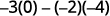

By the end of this section, you will be able to:
* Evaluate the determinant of a
  <math xmlns="http://www.w3.org/1998/Math/MathML"><mrow><mn>2</mn><mspace width="0.2em" /><mo>×</mo><mspace width="0.2em" /><mn>2</mn></mrow></math>
  
  matrix
* Evaluate the determinant of a
  <math xmlns="http://www.w3.org/1998/Math/MathML"><mrow><mn>3</mn><mspace width="0.2em" /><mo>×</mo><mspace width="0.2em" /><mn>3</mn></mrow></math>
  
  matrix
* Use Cramer’s Rule to solve systems of equations
* Solve applications using determinants

Before you get started, take this readiness quiz.

1.  Simplify:
    <math xmlns="http://www.w3.org/1998/Math/MathML"><mrow><mn>5</mn><mrow><mo>(</mo><mrow><mn>−2</mn></mrow><mo>)</mo></mrow><mo>−</mo><mrow><mo>(</mo><mrow><mn>−4</mn></mrow><mo>)</mo></mrow><mrow><mo>(</mo><mn>1</mn><mo>)</mo></mrow><mo>.</mo></mrow></math>
    
    * * *
    {: data-type="newline"}
    
    If you missed this problem, review [\[link\]](/m63303#fs-id1167834556092).
2.  Simplify:
    <math xmlns="http://www.w3.org/1998/Math/MathML"><mrow><mn>−3</mn><mrow><mo>(</mo><mrow><mn>8</mn><mo>−</mo><mn>10</mn></mrow><mo>)</mo></mrow><mo>+</mo><mrow><mo>(</mo><mrow><mn>−2</mn></mrow><mo>)</mo></mrow><mrow><mo>(</mo><mrow><mn>6</mn><mo>−</mo><mn>3</mn></mrow><mo>)</mo></mrow><mo>−</mo><mn>4</mn><mrow><mo>(</mo><mrow><mn>−3</mn><mo>−</mo><mrow><mo>(</mo><mrow><mn>−4</mn></mrow><mo>)</mo></mrow></mrow><mo>)</mo></mrow><mo>.</mo></mrow></math>
    
    * * *
    {: data-type="newline"}
    
    If you missed this problem, review [\[link\]](/m63303#fs-id1167834536158).
3.  Simplify:
    <math xmlns="http://www.w3.org/1998/Math/MathML"><mrow><mfrac><mrow><mn>−12</mn></mrow><mrow><mn>−8</mn></mrow></mfrac><mo>.</mo></mrow></math>
    
    * * *
    {: data-type="newline"}
    
    If you missed this problem, review [\[link\]](/m63303#fs-id1167834536325).
{: type="1"}

In this section we will learn of another method to solve systems of linear equations called Cramer’s rule. Before we can begin to use the rule, we need to learn some new definitions and notation.

### Evaluate the Determinant of a <math xmlns="http://www.w3.org/1998/Math/MathML"><mrow><mn>2</mn><mspace width="0.2em" /><mo>×</mo><mspace width="0.2em" /><mn>2</mn></mrow></math>

 Matrix

If a matrix has the same number of rows and columns, we call it a **square matrix**{: data-type="term"}. Each square matrix has a real number associated with it called its **determinant**{: data-type="term"}. To find the determinant of the square matrix <math xmlns="http://www.w3.org/1998/Math/MathML"><mrow><mrow><mo>[</mo><mtable><mtr><mtd columnalign="left"><mi>a</mi><mspace width="1.5em" /><mi>b</mi></mtd></mtr><mtr><mtd columnalign="left"><mi>c</mi><mspace width="1.5em" /><mi>d</mi></mtd></mtr></mtable><mo>]</mo></mrow><mo>,</mo></mrow></math>

 we first write it as <math xmlns="http://www.w3.org/1998/Math/MathML"><mrow><mrow><mo>\|</mo><mtable><mtr><mtd columnalign="left"><mi>a</mi><mspace width="1.5em" /><mi>b</mi></mtd></mtr><mtr><mtd columnalign="left"><mi>c</mi><mspace width="1.5em" /><mi>d</mi></mtd></mtr></mtable><mo>\|</mo></mrow><mo>.</mo></mrow></math>

 To get the real number value of the determinate we subtract the products of the diagonals, as shown.

    

Determinant

The determinant of any square matrix <math xmlns="http://www.w3.org/1998/Math/MathML"><mrow><mrow><mo>[</mo><mtable><mtr><mtd columnalign="left"><mi>a</mi><mspace width="1.5em" /><mi>b</mi></mtd></mtr><mtr><mtd columnalign="left"><mi>c</mi><mspace width="1.5em" /><mi>d</mi></mtd></mtr></mtable><mo>]</mo></mrow><mo>,</mo></mrow></math>

 where *a, b, c,* and *d* are real numbers, is

<math xmlns="http://www.w3.org/1998/Math/MathML"><mrow><mrow><mo>\|</mo><mtable><mtr><mtd columnalign="left"><mi>a</mi><mspace width="1.5em" /><mi>b</mi></mtd></mtr><mtr><mtd columnalign="left"><mi>c</mi><mspace width="1.5em" /><mi>d</mi></mtd></mtr></mtable><mo>\|</mo></mrow><mo>=</mo><mi>a</mi><mi>d</mi><mo>−</mo><mi>b</mi><mi>c</mi></mrow></math>

Evaluate the determinate of ⓐ <math xmlns="http://www.w3.org/1998/Math/MathML"><mrow><mrow><mo>[</mo><mtable><mtr><mtd columnalign="left"><mn>4</mn><mspace width="1.5em" /><mn>−2</mn></mtd></mtr><mtr><mtd columnalign="left"><mn>3</mn><mspace width="1.5em" /><mn>−1</mn></mtd></mtr></mtable><mo>]</mo></mrow></mrow></math>

 ⓑ <math xmlns="http://www.w3.org/1998/Math/MathML"><mrow><mrow><mo>[</mo><mtable><mtr><mtd columnalign="left"><mn>−3</mn></mtd><mtd /><mtd /><mtd columnalign="right"><mn>−4</mn></mtd></mtr><mtr><mtd columnalign="left"><mn>−2</mn></mtd><mtd /><mtd /><mtd columnalign="right"><mn>0</mn></mtd></mtr></mtable><mo>]</mo></mrow><mo>.</mo></mrow></math>

ⓐ* * *
{: data-type="newline"}

|  |  |
{: valign="top"}| Write the determinant. |  |
{: valign="top"}| Subtract the products of the diagonals. |  |
{: valign="top"}| Simplify. |  |
{: valign="top"}| Simplify. |  |
{: valign="top"}{: .unnumbered .unstyled summary="Row 1 of the 2 by 2 matrix is 4, minus 2. Row 2 is 3, minus 1. The same is written in determinant form with diagonal arrows. Subtracting the products of the diagonals, we get 4 times minus 1 minus 3 times minus 2. We simplify to get 2." data-label=""}

* * *
{: data-type="newline"}

* * *
{: data-type="newline"}

 ⓑ* * *
{: data-type="newline"}

|  |  |
{: valign="top"}| Write the determinant. |  |
{: valign="top"}| Subtract the products of the diagonals. |  |
{: valign="top"}| Simplify. |  |
{: valign="top"}| Simplify. |  |
{: valign="top"}{: .unnumbered .unstyled summary="Row 1 of the 2 by 2 matrix is minus 3, minus 4. Row 2 is minus 2, 0. The same is written in determinant form with diagonal arrows. Subtracting the products of the diagonals, we get minus 3 times 0 minus minus 2 times minus 4. We simplify to get minus 8." data-label=""}

Evaluate the determinate of ⓐ <math xmlns="http://www.w3.org/1998/Math/MathML"><mrow><mrow><mo>[</mo><mtable><mtr><mtd columnalign="left"><mn>5</mn><mspace width="1.5em" /><mn>−3</mn></mtd></mtr><mtr><mtd columnalign="left"><mn>2</mn><mspace width="1.5em" /><mn>−4</mn></mtd></mtr></mtable><mo>]</mo></mrow></mrow></math>

 ⓑ <math xmlns="http://www.w3.org/1998/Math/MathML"><mrow><mrow><mo>[</mo><mtable><mtr><mtd columnalign="right"><mn>−4</mn></mtd><mtd /><mtd /><mtd columnalign="right"><mn>−6</mn></mtd></mtr><mtr><mtd columnalign="right"><mn>0</mn></mtd><mtd /><mtd /><mtd columnalign="right"><mn>7</mn></mtd></mtr></mtable><mo>]</mo></mrow><mo>.</mo></mrow></math>

ⓐ <math xmlns="http://www.w3.org/1998/Math/MathML"><mrow><mn>−14</mn><mo>;</mo></mrow></math>

 ⓑ <math xmlns="http://www.w3.org/1998/Math/MathML"><mrow><mn>−28</mn></mrow></math>

Evaluate the determinate of ⓐ <math xmlns="http://www.w3.org/1998/Math/MathML"><mrow><mrow><mo>[</mo><mtable><mtr><mtd columnalign="left"><mn>−1</mn><mspace width="1.5em" /><mn>3</mn></mtd></mtr><mtr><mtd columnalign="left"><mn>−2</mn><mspace width="1.5em" /><mn>4</mn></mtd></mtr></mtable><mo>]</mo></mrow></mrow></math>

 ⓑ <math xmlns="http://www.w3.org/1998/Math/MathML"><mrow><mrow><mo>[</mo><mtable><mtr><mtd columnalign="left"><mn>−7</mn></mtd><mtd /><mtd /><mtd columnalign="right"><mn>−3</mn></mtd></mtr><mtr><mtd columnalign="left"><mn>−5</mn></mtd><mtd /><mtd /><mtd columnalign="right"><mn>0</mn></mtd></mtr></mtable><mo>]</mo></mrow><mo>.</mo></mrow></math>

ⓐ 2 ⓑ <math xmlns="http://www.w3.org/1998/Math/MathML"><mrow><mn>−15</mn></mrow></math>

### Evaluate the Determinant of a <math xmlns="http://www.w3.org/1998/Math/MathML"><mrow><mn>3</mn><mspace width="0.2em" /><mo>×</mo><mspace width="0.2em" /><mn>3</mn></mrow></math>

 Matrix

To evaluate the determinant of a <math xmlns="http://www.w3.org/1998/Math/MathML"><mrow><mn>3</mn><mspace width="0.2em" /><mo>×</mo><mspace width="0.2em" /><mn>3</mn></mrow></math>

 matrix, we have to be able to evaluate the **minor of an entry**{: data-type="term"} in the determinant. The minor of an entry is the <math xmlns="http://www.w3.org/1998/Math/MathML"><mrow><mn>2</mn><mspace width="0.2em" /><mo>×</mo><mspace width="0.2em" /><mn>2</mn></mrow></math>

 determinant found by eliminating the row and column in the <math xmlns="http://www.w3.org/1998/Math/MathML"><mrow><mn>3</mn><mspace width="0.2em" /><mo>×</mo><mspace width="0.2em" /><mn>3</mn></mrow></math>

 determinant that contains the entry.

Minor of an entry in
<math xmlns="http://www.w3.org/1998/Math/MathML"><mrow><mn>3</mn><mspace width="0.2em" /><mo>×</mo><mspace width="0.2em" /><mn>3</mn></mrow></math>
a Determinant

The **minor of an entry** in a <math xmlns="http://www.w3.org/1998/Math/MathML"><mrow><mn>3</mn><mspace width="0.2em" /><mo>×</mo><mspace width="0.2em" /><mn>3</mn></mrow></math>

 determinant is the <math xmlns="http://www.w3.org/1998/Math/MathML"><mrow><mn>2</mn><mspace width="0.2em" /><mo>×</mo><mspace width="0.2em" /><mn>2</mn></mrow></math>

 determinant found by eliminating the row and column in the <math xmlns="http://www.w3.org/1998/Math/MathML"><mrow><mn>3</mn><mspace width="0.2em" /><mo>×</mo><mspace width="0.2em" /><mn>3</mn></mrow></math>

 determinant that contains the entry.

To find the minor of entry <math xmlns="http://www.w3.org/1998/Math/MathML"><mrow><msub><mi>a</mi><mn>1</mn></msub><mo>,</mo></mrow></math>

 we eliminate the row and column which contain it. So we eliminate the first row and first column. Then we write the <math xmlns="http://www.w3.org/1998/Math/MathML"><mrow><mn>2</mn><mspace width="0.2em" /><mo>×</mo><mspace width="0.2em" /><mn>2</mn></mrow></math>

 determinant that remains.

    To find the minor of entry <math xmlns="http://www.w3.org/1998/Math/MathML"><mrow><msub><mi>b</mi><mn>2</mn></msub><mo>,</mo></mrow></math>

 we eliminate the row and column that contain it. So we eliminate the 2nd row and 2nd column. Then we write the <math xmlns="http://www.w3.org/1998/Math/MathML"><mrow><mn>2</mn><mspace width="0.2em" /><mo>×</mo><mspace width="0.2em" /><mn>2</mn></mrow></math>

 determinant that remains.

    

For the determinant <math xmlns="http://www.w3.org/1998/Math/MathML"><mrow><mrow><mo>\|</mo><mtable><mtr><mtd columnalign="right"><mn>4</mn></mtd><mtd /><mtd /><mtd columnalign="right"><mn>−2</mn></mtd><mtd /><mtd /><mtd columnalign="right"><mn>3</mn></mtd></mtr><mtr><mtd columnalign="right"><mn>1</mn></mtd><mtd /><mtd /><mtd columnalign="right"><mn>0</mn></mtd><mtd /><mtd /><mtd columnalign="right"><mn>−3</mn></mtd></mtr><mtr><mtd columnalign="right"><mn>−2</mn></mtd><mtd /><mtd /><mtd columnalign="right"><mn>−4</mn></mtd><mtd /><mtd /><mtd columnalign="right"><mn>2</mn></mtd></mtr></mtable><mo>\|</mo></mrow><mo>,</mo></mrow></math>

 find and then evaluate the minor of ⓐ <math xmlns="http://www.w3.org/1998/Math/MathML"><mrow><msub><mi>a</mi><mn>1</mn></msub></mrow></math>

 ⓑ <math xmlns="http://www.w3.org/1998/Math/MathML"><mrow><msub><mi>b</mi><mn>3</mn></msub></mrow></math>

 ⓒ <math xmlns="http://www.w3.org/1998/Math/MathML"><mrow><msub><mi>c</mi><mn>2</mn></msub><mo>.</mo></mrow></math>

ⓐ* * *
{: data-type="newline"}

|  |  |
{: valign="top"}| Eliminate the row and column that contains <math xmlns="http://www.w3.org/1998/Math/MathML"><mrow><msub><mi>a</mi><mn>1</mn></msub><mo>.</mo></mrow></math>

 |  |
{: valign="top"}| Write the <math xmlns="http://www.w3.org/1998/Math/MathML"><mrow><mn>2</mn><mspace width="0.2em" /><mo>×</mo><mspace width="0.2em" /><mn>2</mn></mrow></math>

 determinant that remains. |  |
{: valign="top"}| Evaluate. |  |
{: valign="top"}| Simplify. |  |
{: valign="top"}{: .unnumbered .unstyled summary="The first row of the 3 by 3 determinant is 4, minus 2, 3. Row 2 is 1, 0, minus 3. Row 3 is minus 2, minus 4, 2. Eliminating the row and column containing a1, we get the minor of a1. This 2 by 2 determinant has row 1: 0, minus 3 and row 2: minus 4, 2. Evaluate and simplify to get minus 12." data-label=""}

* * *
{: data-type="newline"}

* * *
{: data-type="newline"}

 ⓑ* * *
{: data-type="newline"}

| Eliminate the row and column that contains <math xmlns="http://www.w3.org/1998/Math/MathML"><mrow><msub><mi>b</mi><mn>3</mn></msub><mo>.</mo></mrow></math>

 |  |
{: valign="top"}| Write the <math xmlns="http://www.w3.org/1998/Math/MathML"><mrow><mn>2</mn><mspace width="0.2em" /><mo>×</mo><mspace width="0.2em" /><mn>2</mn></mrow></math>

 determinant that remains. |  |
{: valign="top"}| Evaluate. |  |
{: valign="top"}| Simplify. |  |
{: valign="top"}{: .unnumbered .unstyled summary="The 3 by 3 matrix has row 1: 4, minus 2, 3, row 2: 1, 0, minus 3 and row 3: minus 2, minus 4, 2. Eliminating the row and column containing b3, we get minor of b3 with row 1: 4, 3 and row 2: 1, minus 3. Evaluate and simplify to get minus 15." data-label=""}

* * *
{: data-type="newline"}

* * *
{: data-type="newline"}

 ⓒ* * *
{: data-type="newline"}

|  |  |
{: valign="top"}| Eliminate the row and column that contains <math xmlns="http://www.w3.org/1998/Math/MathML"><mrow><msub><mi>c</mi><mn>2</mn></msub><mo>.</mo></mrow></math>

 |  |
{: valign="top"}| Write the <math xmlns="http://www.w3.org/1998/Math/MathML"><mrow><mn>2</mn><mspace width="0.2em" /><mo>×</mo><mspace width="0.2em" /><mn>2</mn></mrow></math>

 determinant that remains. |  |
{: valign="top"}| Evaluate. |  |
{: valign="top"}| Simplify. |  |
{: valign="top"}{: .unnumbered .unstyled .can-break summary="The 3 by 3 matrix has row 1: 4, minus 2, 3, row 2: 1, 0, minus 3 and row 3: minus 2, minus 4, 2. Eliminating the row and column containing c2, we get minor of c2 with row 1: 4, minus 2 and row 2: minus 2, 4. Evaluate and simplify to get 12" data-label=""}

For the determinant <math xmlns="http://www.w3.org/1998/Math/MathML"><mrow><mrow><mo>\|</mo><mtable><mtr><mtd columnalign="right"><mn>1</mn></mtd><mtd /><mtd /><mtd columnalign="right"><mn>−1</mn></mtd><mtd /><mtd /><mtd columnalign="right"><mn>4</mn></mtd></mtr><mtr><mtd columnalign="right"><mn>0</mn></mtd><mtd /><mtd /><mtd columnalign="right"><mn>2</mn></mtd><mtd /><mtd /><mtd columnalign="right"><mn>−1</mn></mtd></mtr><mtr><mtd columnalign="right"><mn>−2</mn></mtd><mtd /><mtd /><mtd columnalign="right"><mn>−3</mn></mtd><mtd /><mtd /><mtd columnalign="right"><mn>3</mn></mtd></mtr></mtable><mo>\|</mo></mrow><mo>,</mo></mrow></math>

 find and then evaluate the minor of ⓐ <math xmlns="http://www.w3.org/1998/Math/MathML"><mrow><msub><mi>a</mi><mn>1</mn></msub></mrow></math>

 ⓑ <math xmlns="http://www.w3.org/1998/Math/MathML"><mrow><msub><mi>b</mi><mn>2</mn></msub></mrow></math>

 ⓒ <math xmlns="http://www.w3.org/1998/Math/MathML"><mrow><msub><mi>c</mi><mn>3</mn></msub><mo>.</mo></mrow></math>

ⓐ 3 ⓑ 11 ⓒ 2

For the determinant <math xmlns="http://www.w3.org/1998/Math/MathML"><mrow><mrow><mo>\|</mo><mtable><mtr><mtd columnalign="right"><mn>−2</mn></mtd><mtd /><mtd /><mtd columnalign="right"><mn>−1</mn></mtd><mtd /><mtd /><mtd columnalign="right"><mn>0</mn></mtd></mtr><mtr><mtd columnalign="right"><mn>3</mn></mtd><mtd /><mtd /><mtd columnalign="right"><mn>0</mn></mtd><mtd /><mtd /><mtd columnalign="right"><mn>−1</mn></mtd></mtr><mtr><mtd columnalign="right"><mn>−1</mn></mtd><mtd /><mtd /><mtd columnalign="right"><mn>−2</mn></mtd><mtd /><mtd /><mtd columnalign="right"><mn>3</mn></mtd></mtr></mtable><mo>\|</mo></mrow><mo>,</mo></mrow></math>

 find and then evaluate the minor of ⓐ <math xmlns="http://www.w3.org/1998/Math/MathML"><mrow><msub><mi>a</mi><mn>2</mn></msub></mrow></math>

 ⓑ <math xmlns="http://www.w3.org/1998/Math/MathML"><mrow><msub><mi>b</mi><mn>3</mn></msub></mrow></math>

 ⓒ <math xmlns="http://www.w3.org/1998/Math/MathML"><mrow><msub><mi>c</mi><mn>2</mn></msub><mo>.</mo></mrow></math>

ⓐ <math xmlns="http://www.w3.org/1998/Math/MathML"><mrow><mn>−3</mn></mrow></math>

 ⓑ 2 ⓒ 3

We are now ready to evaluate a <math xmlns="http://www.w3.org/1998/Math/MathML"><mrow><mn>3</mn><mspace width="0.2em" /><mo>×</mo><mspace width="0.2em" /><mn>3</mn></mrow></math>

 determinant. To do this we expand by minors, which allows us to evaluate the <math xmlns="http://www.w3.org/1998/Math/MathML"><mrow><mn>3</mn><mspace width="0.2em" /><mo>×</mo><mspace width="0.2em" /><mn>3</mn></mrow></math>

 determinant using <math xmlns="http://www.w3.org/1998/Math/MathML"><mrow><mn>2</mn><mspace width="0.2em" /><mo>×</mo><mspace width="0.2em" /><mn>2</mn></mrow></math>

 determinants—which we already know how to evaluate!

To evaluate a <math xmlns="http://www.w3.org/1998/Math/MathML"><mrow><mn>3</mn><mspace width="0.2em" /><mo>×</mo><mspace width="0.2em" /><mn>3</mn></mrow></math>

 determinant by expanding by minors along the first row, we use the following pattern:

    Remember, to find the minor of an entry we eliminate the row and column that contains the entry.

Expanding by Minors along the First Row to Evaluate a
<math xmlns="http://www.w3.org/1998/Math/MathML"><mrow><mn>3</mn><mspace width="0.2em" /><mo>×</mo><mspace width="0.2em" /><mn>3</mn></mrow></math>
Determinant

To evaluate a <math xmlns="http://www.w3.org/1998/Math/MathML"><mrow><mn>3</mn><mspace width="0.2em" /><mo>×</mo><mspace width="0.2em" /><mn>3</mn></mrow></math>

 determinant by **expanding by minors along the first row**, the following pattern:

  

Evaluate the determinant <math xmlns="http://www.w3.org/1998/Math/MathML"><mrow><mrow><mo>\|</mo><mtable><mtr><mtd columnalign="right"><mn>2</mn></mtd><mtd /><mtd /><mtd columnalign="right"><mn>−3</mn></mtd><mtd /><mtd /><mtd columnalign="right"><mn>−1</mn></mtd></mtr><mtr><mtd columnalign="right"><mn>3</mn></mtd><mtd /><mtd /><mtd columnalign="right"><mn>2</mn></mtd><mtd /><mtd /><mtd columnalign="right"><mn>0</mn></mtd></mtr><mtr><mtd columnalign="right"><mn>−1</mn></mtd><mtd /><mtd /><mtd columnalign="right"><mn>−1</mn></mtd><mtd /><mtd /><mtd columnalign="right"><mn>−2</mn></mtd></mtr></mtable><mo>\|</mo></mrow></mrow></math>

 by expanding by minors along the first row.

|  |  |
{: valign="top"}| Expand by minors along the first row |  |
{: valign="top"}| Evaluate each determinant. |  |
{: valign="top"}| Simplify. |  |
{: valign="top"}| Simplify. |  |
{: valign="top"}| Simplify. |  |
{: valign="top"}{: .unnumbered .unstyled summary="The first row of the determinant is 2, minus 3, minus 1. Row 2 is 3, 2, 0. Row 3 is minus 1, minus 1, minus 2. Expanding by minors, we get 2 times minor of 2 minus 3 times minor of 3 plus minus 1 times minor of minus 1. Evaluating each determinant and simplifying, we get minus 25." data-label=""}

Evaluate the determinant <math xmlns="http://www.w3.org/1998/Math/MathML"><mrow><mrow><mo>\|</mo><mtable><mtr><mtd columnalign="right"><mn>3</mn></mtd><mtd /><mtd /><mtd columnalign="right"><mn>−2</mn></mtd><mtd /><mtd /><mtd columnalign="right"><mn>4</mn></mtd></mtr><mtr><mtd columnalign="right"><mn>0</mn></mtd><mtd /><mtd /><mtd columnalign="right"><mn>−1</mn></mtd><mtd /><mtd /><mtd columnalign="right"><mn>−2</mn></mtd></mtr><mtr><mtd columnalign="right"><mn>2</mn></mtd><mtd /><mtd /><mtd columnalign="right"><mn>3</mn></mtd><mtd /><mtd /><mtd columnalign="right"><mn>−1</mn></mtd></mtr></mtable><mo>\|</mo></mrow><mo>,</mo></mrow></math>

 by expanding by minors along the first row.

37

Evaluate the determinant <math xmlns="http://www.w3.org/1998/Math/MathML"><mrow><mrow><mo>\|</mo><mtable><mtr><mtd columnalign="right"><mn>3</mn></mtd><mtd /><mtd /><mtd columnalign="right"><mn>−2</mn></mtd><mtd /><mtd /><mtd columnalign="right"><mn>−2</mn></mtd></mtr><mtr><mtd columnalign="right"><mn>2</mn></mtd><mtd /><mtd /><mtd columnalign="right"><mn>−1</mn></mtd><mtd /><mtd /><mtd columnalign="right"><mn>4</mn></mtd></mtr><mtr><mtd columnalign="right"><mn>−1</mn></mtd><mtd /><mtd /><mtd columnalign="right"><mn>0</mn></mtd><mtd /><mtd /><mtd columnalign="right"><mn>−3</mn></mtd></mtr></mtable><mo>\|</mo></mrow><mo>,</mo></mrow></math>

 by expanding by minors along the first row.

7

To evaluate a <math xmlns="http://www.w3.org/1998/Math/MathML"><mrow><mn>3</mn><mspace width="0.2em" /><mo>×</mo><mspace width="0.2em" /><mn>3</mn></mrow></math>

 determinant we can expand by minors using any row or column. Choosing a row or column other than the first row sometimes makes the work easier.

When we expand by any row or column, we must be careful about the sign of the terms in the expansion. To determine the sign of the terms, we use the following sign pattern chart.

<math xmlns="http://www.w3.org/1998/Math/MathML"><mrow><mrow><mo>\|</mo><mtable><mtr><mtd columnalign="left"><mo>+</mo><mspace width="1.5em" /><mo>−</mo><mspace width="1.5em" /><mo>+</mo></mtd></mtr><mtr><mtd columnalign="left"><mo>−</mo><mspace width="1.5em" /><mo>+</mo><mspace width="1.5em" /><mo>−</mo></mtd></mtr><mtr><mtd columnalign="left"><mo>+</mo><mspace width="1.5em" /><mo>−</mo><mspace width="1.5em" /><mo>+</mo></mtd></mtr></mtable><mo>\|</mo></mrow></mrow></math>

Sign Pattern

When expanding by minors using a row or column, the sign of the terms in the expansion follow the following pattern.

<math xmlns="http://www.w3.org/1998/Math/MathML"><mrow><mrow><mo>\|</mo><mtable><mtr><mtd columnalign="left"><mo>+</mo><mspace width="1.5em" /><mo>−</mo><mspace width="1.5em" /><mo>+</mo></mtd></mtr><mtr><mtd columnalign="left"><mo>−</mo><mspace width="1.5em" /><mo>+</mo><mspace width="1.5em" /><mo>−</mo></mtd></mtr><mtr><mtd columnalign="left"><mo>+</mo><mspace width="1.5em" /><mo>−</mo><mspace width="1.5em" /><mo>+</mo></mtd></mtr></mtable><mo>\|</mo></mrow></mrow></math>

Notice that the sign pattern in the first row matches the signs between the terms in the expansion by the first row.

    Since we can expand by any row or column, how do we decide which row or column to use? Usually we try to pick a row or column that will make our calculation easier. If the determinant contains a 0, using the row or column that contains the 0 will make the calculations easier.

Evaluate the determinant <math xmlns="http://www.w3.org/1998/Math/MathML"><mrow><mrow><mo>\|</mo><mtable><mtr><mtd columnalign="left"><mn>4</mn></mtd><mtd /><mtd /><mtd columnalign="right"><mn>−1</mn></mtd><mtd /><mtd /><mtd columnalign="right"><mn>−3</mn></mtd></mtr><mtr><mtd columnalign="left"><mn>3</mn></mtd><mtd /><mtd /><mtd columnalign="right"><mn>0</mn></mtd><mtd /><mtd /><mtd columnalign="right"><mn>2</mn></mtd></mtr><mtr><mtd columnalign="left"><mn>5</mn></mtd><mtd /><mtd /><mtd columnalign="right"><mn>−4</mn></mtd><mtd /><mtd /><mtd columnalign="right"><mn>−3</mn></mtd></mtr></mtable><mo>\|</mo></mrow></mrow></math>

 by expanding by minors.

To expand by minors, we look for a row or column that will make our calculations easier. Since 0 is in the second row and second column, expanding by either of those is a good choice. Since the second row has fewer negatives than the second column, we will expand by the second row.

|  |  |
{: valign="top"}| Expand using the second row. |  |
{: valign="top"}| Be careful of the signs. |  |
{: valign="top"}| Evaluate each determinant. |  |
{: valign="top"}| Simplify. |  |
{: valign="top"}| Simplify. |  |
{: valign="top"}| Add. |  |
{: valign="top"}{: .unnumbered .unstyled summary="A 3 by 3 determinant has row 1 4, minus 1, minus 3, row 2: 3, 0, 2 and row 3 5, minus 4, minus 3. The second row is highlighted. Expand using the second row. Be careful of the signs. The middle row is minus, plus, minus. Expanding, we get minus 3 times minor of 3 plus 0 times minor of 0 minus 2 times minor of 2. Evaluating each minor determinant and simplifying, we get 49." data-label=""}

Evaluate the determinant <math xmlns="http://www.w3.org/1998/Math/MathML"><mrow><mrow><mo>\|</mo><mtable><mtr><mtd columnalign="left"><mn>2</mn></mtd><mtd /><mtd /><mtd columnalign="right"><mn>−1</mn></mtd><mtd /><mtd /><mtd columnalign="right"><mn>−3</mn></mtd></mtr><mtr><mtd columnalign="left"><mn>0</mn></mtd><mtd /><mtd /><mtd columnalign="right"><mn>3</mn></mtd><mtd /><mtd /><mtd columnalign="right"><mn>−4</mn></mtd></mtr><mtr><mtd columnalign="left"><mn>3</mn></mtd><mtd /><mtd /><mtd columnalign="right"><mn>−4</mn></mtd><mtd /><mtd /><mtd columnalign="right"><mn>−3</mn></mtd></mtr></mtable><mo>\|</mo></mrow></mrow></math>

 by expanding by minors.

<math xmlns="http://www.w3.org/1998/Math/MathML"><mrow><mn>−11</mn></mrow></math>

Evaluate the determinant <math xmlns="http://www.w3.org/1998/Math/MathML"><mrow><mrow><mo>\|</mo><mtable><mtr><mtd columnalign="right"><mn>−2</mn></mtd><mtd /><mtd /><mtd columnalign="right"><mn>−1</mn></mtd><mtd /><mtd /><mtd columnalign="right"><mn>−3</mn></mtd></mtr><mtr><mtd columnalign="right"><mn>−1</mn></mtd><mtd /><mtd /><mtd columnalign="right"><mn>2</mn></mtd><mtd /><mtd /><mtd columnalign="right"><mn>2</mn></mtd></mtr><mtr><mtd columnalign="right"><mn>4</mn></mtd><mtd /><mtd /><mtd columnalign="right"><mn>−4</mn></mtd><mtd /><mtd /><mtd columnalign="right"><mn>0</mn></mtd></mtr></mtable><mo>\|</mo></mrow></mrow></math>

 by expanding by minors.

8

### Use Cramer’s Rule to Solve Systems of Equations

Cramer’s Rule is a method of solving systems of equations using determinants. It can be derived by solving the general form of the systems of equations by elimination. Here we will demonstrate the rule for both systems of two equations with two variables and for systems of three equations with three variables.

Let’s start with the systems of two equations with two variables.

Cramer’s Rule for Solving a System of Two Equations

For the system of equations <math xmlns="http://www.w3.org/1998/Math/MathML"><mrow><mrow><mo>{</mo><mtable><mtr><mtd columnalign="left"><msub><mi>a</mi><mn>1</mn></msub><mi>x</mi><mo>+</mo><msub><mi>b</mi><mn>1</mn></msub><mi>y</mi><mo>=</mo><msub><mi>k</mi><mn>1</mn></msub></mtd></mtr><mtr><mtd columnalign="left"><msub><mi>a</mi><mn>2</mn></msub><mi>x</mi><mo>+</mo><msub><mi>b</mi><mn>2</mn></msub><mi>y</mi><mo>=</mo><msub><mi>k</mi><mn>2</mn></msub></mtd></mtr></mtable></mrow><mo>,</mo></mrow></math>

 the solution <math xmlns="http://www.w3.org/1998/Math/MathML"><mrow><mrow><mo>(</mo><mrow><mi>x</mi><mo>,</mo><mi>y</mi></mrow><mo>)</mo></mrow></mrow></math>

 can be determined by

  

Notice that to form the determinant *D*, we use take the coefficients of the variables.

    Notice that to form the determinant <math xmlns="http://www.w3.org/1998/Math/MathML"><mrow><msub><mi>D</mi><mi>x</mi></msub></mrow></math>

 and <math xmlns="http://www.w3.org/1998/Math/MathML"><mrow><msub><mi>D</mi><mi>y</mi></msub><mo>,</mo></mrow></math>

 we substitute the constants for the coefficients of the variable we are finding.

    

How to Solve a System of Equations Using Cramer’s Rule

Solve using Cramer’s Rule: <math xmlns="http://www.w3.org/1998/Math/MathML"><mrow><mrow><mo>{</mo><mtable><mtr><mtd columnalign="left"><mn>2</mn><mi>x</mi><mo>+</mo><mi>y</mi><mo>=</mo><mn>−4</mn></mtd></mtr><mtr><mtd columnalign="left"><mn>3</mn><mi>x</mi><mo>−</mo><mn>2</mn><mi>y</mi><mo>=</mo><mn>−6</mn></mtd></mtr></mtable></mrow><mo>.</mo></mrow></math>

                 

Solve using Cramer’s rule: <math xmlns="http://www.w3.org/1998/Math/MathML"><mrow><mrow><mo>{</mo><mtable><mtr><mtd columnalign="left"><mn>3</mn><mi>x</mi><mo>+</mo><mi>y</mi><mo>=</mo><mn>−3</mn></mtd></mtr><mtr><mtd columnalign="left"><mn>2</mn><mi>x</mi><mo>+</mo><mn>3</mn><mi>y</mi><mo>=</mo><mn>6</mn></mtd></mtr></mtable></mrow><mo>.</mo></mrow></math>

<math xmlns="http://www.w3.org/1998/Math/MathML"><mrow><mo stretchy="false">(</mo><mo>−</mo><mfrac><mrow><mn>15</mn></mrow><mn>7</mn></mfrac><mo>,</mo><mfrac><mrow><mn>24</mn></mrow><mn>7</mn></mfrac><mo stretchy="false">)</mo></mrow></math>

Solve using Cramer’s rule: <math xmlns="http://www.w3.org/1998/Math/MathML"><mrow><mrow><mo>{</mo><mtable><mtr><mtd columnalign="left"><mtext>−</mtext><mi>x</mi><mo>+</mo><mi>y</mi><mo>=</mo><mn>2</mn></mtd></mtr><mtr><mtd columnalign="left"><mn>2</mn><mi>x</mi><mo>+</mo><mi>y</mi><mo>=</mo><mn>−4</mn></mtd></mtr></mtable></mrow><mo>.</mo></mrow></math>

<math xmlns="http://www.w3.org/1998/Math/MathML"><mrow><mo stretchy="false">(</mo><mn>−2</mn><mo>,</mo><mn>0</mn><mo stretchy="false">)</mo></mrow></math>

Solve a system of two equations using Cramer’s rule.

1.  Evaluate the determinant *D*, using the coefficients of the variables.
2.  Evaluate the determinant
    <math xmlns="http://www.w3.org/1998/Math/MathML"><mrow><msub><mi>D</mi><mi>x</mi></msub><mo>.</mo></mrow></math>
    
    Use the constants in place of the *x* coefficients.
3.  Evaluate the determinant
    <math xmlns="http://www.w3.org/1998/Math/MathML"><mrow><msub><mi>D</mi><mi>y</mi></msub><mo>.</mo></mrow></math>
    
    Use the constants in place of the *y* coefficients.
4.  Find *x* and *y*.
    <math xmlns="http://www.w3.org/1998/Math/MathML"><mrow><mi>x</mi><mo>=</mo><mfrac><mrow><msub><mi>D</mi><mi>x</mi></msub></mrow><mi>D</mi></mfrac><mo>,</mo></mrow></math>
    
    <math xmlns="http://www.w3.org/1998/Math/MathML"><mrow><mi>y</mi><mo>=</mo><mfrac><mrow><msub><mi>D</mi><mi>y</mi></msub></mrow><mi>D</mi></mfrac></mrow></math>

5.  Write the solution as an ordered pair.
6.  Check that the ordered pair is a solution to both original equations.
{: type="1" .stepwise}

To solve a system of three equations with three variables with Cramer’s Rule, we basically do what we did for a system of two equations. However, we now have to solve for three variables to get the solution. The determinants are also going to be <math xmlns="http://www.w3.org/1998/Math/MathML"><mrow><mn>3</mn><mspace width="0.2em" /><mo>×</mo><mspace width="0.2em" /><mn>3</mn></mrow></math>

 which will make our work more interesting!

Cramer’s Rule for Solving a System of Three Equations

For the system of equations <math xmlns="http://www.w3.org/1998/Math/MathML"><mrow><mrow><mo>{</mo><mtable><mtr><mtd columnalign="left"><msub><mi>a</mi><mn>1</mn></msub><mi>x</mi><mo>+</mo><msub><mi>b</mi><mn>1</mn></msub><mi>y</mi><mo>+</mo><msub><mi>c</mi><mn>1</mn></msub><mi>z</mi><mo>=</mo><msub><mi>k</mi><mn>1</mn></msub></mtd></mtr><mtr><mtd columnalign="left"><msub><mi>a</mi><mn>2</mn></msub><mi>x</mi><mo>+</mo><msub><mi>b</mi><mn>2</mn></msub><mi>y</mi><mo>+</mo><msub><mi>c</mi><mn>2</mn></msub><mi>z</mi><mo>=</mo><msub><mi>k</mi><mn>2</mn></msub></mtd></mtr><mtr><mtd columnalign="left"><msub><mi>a</mi><mn>3</mn></msub><mi>x</mi><mo>+</mo><msub><mi>b</mi><mn>3</mn></msub><mi>y</mi><mo>+</mo><msub><mi>c</mi><mn>3</mn></msub><mi>z</mi><mo>=</mo><msub><mi>k</mi><mn>3</mn></msub></mtd></mtr></mtable></mrow><mo>,</mo></mrow></math>

 the solution <math xmlns="http://www.w3.org/1998/Math/MathML"><mrow><mrow><mo>(</mo><mrow><mi>x</mi><mo>,</mo><mi>y</mi><mo>,</mo><mi>z</mi></mrow><mo>)</mo></mrow></mrow></math>

 can be determined by

 ![x is Dx upon D, y is Dy upon D and z is Dz upon D, where D is determinant with row 1: a1, b1, c1, row 2: a2, b2, c2, row 3: a3, b3, c3, use coefficients of the variables; Dx is determinant with row 1: k1, b1, c1, row 2: k2, b2, c2 and rwo 3: k3, b3, c3, replace the x coefficients with the consonants; Dy is determinant with row 1: a1, k1, c1, row 2: a2, k2, c2 and row 3: a3, k3, c3, replace the y coefficients with constants; Dz is determinant with row 1: a1, b1, k1; row 2: a2, b2, k2, row 3: a3, b3, k3; replace the z coefficients with constants.](../resources/CNX_IntAlg_Figure_04_06_017_img.jpg) 

Solve the system of equations using Cramer’s Rule: <math xmlns="http://www.w3.org/1998/Math/MathML"><mrow><mrow><mo>{</mo><mtable><mtr><mtd columnalign="left"><mn>3</mn><mi>x</mi><mo>−</mo><mn>5</mn><mi>y</mi><mo>+</mo><mn>4</mn><mi>z</mi><mo>=</mo><mn>5</mn></mtd></mtr><mtr><mtd columnalign="left"><mn>5</mn><mi>x</mi><mo>+</mo><mn>2</mn><mi>y</mi><mo>+</mo><mi>z</mi><mo>=</mo><mn>0</mn></mtd></mtr><mtr><mtd columnalign="left"><mn>2</mn><mi>x</mi><mo>+</mo><mn>3</mn><mi>y</mi><mo>−</mo><mn>2</mn><mi>z</mi><mo>=</mo><mn>3</mn></mtd></mtr></mtable></mrow><mo>.</mo></mrow></math>

<table class="unnumbered unstyled can-break" summary="Evaluate the determinant D. D has row 1: 3, minus 5, 4. Row 2 is 5, 2, 1. Row 3 is 2, 3, minus 2. Expand by minors using column 1. Column 1 has the signs plus minus plus. D is 3 times first minor minus 5 times second minor plus 2 times third minor where the first minor has row 1: 2, 1 and row 2: 3, minus 2; second minor has row 1: minus 5, 4 and row 2: 3, minus 2; third minor has row 1: minus 5, 4 and row 2: 2, 1. Evaluate the determinants and simplify to get D equal to minus 37. To evaluate the determinant Dx, use the constants to replace the coefficients of x. Expand by minors using column 1. Evaluate and simplify to get Dx equal to minus 74. To evaluate the determinant Dy, use the constants to replace the coefficients of y. Expand by minors using column 2. Evaluate and simplify to get Dy equal to 111. To evaluate the determinant Dz, use the constants to replace the coefficients of z. Expand by minors using column 3. Evaluate and simplify to get Dz equal to 148. Find x, y, z and write the ordered triple 2, minus 3, minus 4. Check." data-label=""><tbody>
<tr valign="top">
<td data-valign="top" data-align="left">Evaluate the determinant <em>D</em>.</td>
<td data-valign="top" data-align="left"></td>
</tr>
<tr valign="top">
<td data-valign="top" data-align="left">Expand by minors using column 1.</td>
<td data-valign="top" data-align="left" />
</tr>
<tr valign="top">
<td data-valign="top" data-align="left"></td>
<td data-valign="top" data-align="left"></td>
</tr>
<tr valign="top">
<td data-valign="top" data-align="left">Evaluate the determinants.</td>
<td data-valign="top" data-align="left"></td>
</tr>
<tr valign="top">
<td data-valign="top" data-align="left">Simplify.</td>
<td data-valign="top" data-align="left"></td>
</tr>
<tr valign="top">
<td data-valign="top" data-align="left">Simplify.</td>
<td data-valign="top" data-align="left"></td>
</tr>
<tr valign="top">
<td data-valign="top" data-align="left">Simplify.</td>
<td data-valign="top" data-align="left"></td>
</tr>
<tr valign="top">
<td data-valign="top" data-align="left">Evaluate the determinant <math xmlns="http://www.w3.org/1998/Math/MathML"><mrow><msub><mi>D</mi><mi>x</mi></msub><mo>.</mo></mrow></math> Use the
constants to replace the coefficients of <em>x</em>.</td>
<td data-valign="top" data-align="left"></td>
</tr>
<tr valign="top">
<td data-valign="top" data-align="left">Expand by minors using column 1.</td>
<td data-valign="top" data-align="left"></td>
</tr>
<tr valign="top">
<td data-valign="top" data-align="left">Evaluate the determinants.</td>
<td data-valign="top" data-align="left"></td>
</tr>
<tr valign="top">
<td data-valign="top" data-align="left">Simplify.</td>
<td data-valign="top" data-align="left"></td>
</tr>
<tr valign="top">
<td data-valign="top" data-align="left">Simplify.</td>
<td data-valign="top" data-align="left"></td>
</tr>
<tr valign="top">
<td data-valign="top" data-align="left">Evaluate the determinant <math xmlns="http://www.w3.org/1998/Math/MathML"><mrow><msub><mi>D</mi><mi>y</mi></msub><mo>.</mo></mrow></math> Use the
constants to replace the coefficients of <em>y</em>.</td>
<td data-valign="top" data-align="left"></td>
</tr>
<tr valign="top">
<td data-valign="top" data-align="left"></td>
<td data-valign="top" data-align="left"></td>
</tr>
<tr valign="top">
<td data-valign="top" data-align="left">Evaluate the determinants.</td>
<td data-valign="top" data-align="left"></td>
</tr>
<tr valign="top">
<td data-valign="top" data-align="left">Simplify.</td>
<td data-valign="top" data-align="left"></td>
</tr>
<tr valign="top">
<td data-valign="top" data-align="left">Simplify.</td>
<td data-valign="top" data-align="left"></td>
</tr>
<tr valign="top">
<td data-valign="top" data-align="left">Simplify.</td>
<td data-valign="top" data-align="left"></td>
</tr>
<tr valign="top">
<td data-valign="top" data-align="left">Evaluate the determinant <math xmlns="http://www.w3.org/1998/Math/MathML"><mrow><msub><mi>D</mi><mi>z</mi></msub><mo>.</mo></mrow></math> Use the
constants to replace the coefficients of <em>z</em>.</td>
<td data-valign="top" data-align="left"></td>
</tr>
<tr valign="top">
<td data-valign="top" data-align="left"></td>
<td data-valign="top" data-align="left"></td>
</tr>
<tr valign="top">
<td data-valign="top" data-align="left">Evaluate the determinants.</td>
<td data-valign="top" data-align="left"></td>
</tr>
<tr valign="top">
<td data-valign="top" data-align="left">Simplify.</td>
<td data-valign="top" data-align="left"></td>
</tr>
<tr valign="top">
<td data-valign="top" data-align="left">Simplify.</td>
<td data-valign="top" data-align="left"></td>
</tr>
<tr valign="top">
<td data-valign="top" data-align="left">Simplify.</td>
<td data-valign="top" data-align="left"></td>
</tr>
<tr valign="top">
<td data-valign="top" data-align="left">Find <em>x</em>, <em>y</em>, and <em>z</em>.</td>
<td data-valign="top" data-align="left"></td>
</tr>
<tr valign="top">
<td data-valign="top" data-align="left">Substitute in the values.</td>
<td data-valign="top" data-align="left"></td>
</tr>
<tr valign="top">
<td data-valign="top" data-align="left">Simplify.</td>
<td data-valign="top" data-align="left"></td>
</tr>
<tr valign="top">
<td data-valign="top" data-align="left">Write the solution as an ordered triple.</td>
<td data-valign="top" data-align="left"></td>
</tr>
<tr valign="top">
<td data-valign="bottom" data-align="left">Check that the ordered triple is a solution
to <strong>all three</strong> original equations.</td>
<td data-valign="bottom" data-align="left">We leave the check to you.</td>
</tr>
<tr valign="top">
<td data-valign="top" data-align="left" />
<td data-valign="top" data-align="left">The solution is <math xmlns="http://www.w3.org/1998/Math/MathML"><mrow><mrow><mo>(</mo><mrow><mn>2</mn><mo>,</mo><mn>−3</mn><mo>,</mo><mn>−4</mn></mrow><mo>)</mo></mrow><mo>.</mo></mrow></math></td>
</tr>
</tbody></table>

Solve the system of equations using Cramer’s Rule: <math xmlns="http://www.w3.org/1998/Math/MathML"><mrow><mrow><mo>{</mo><mtable><mtr><mtd columnalign="left"><mn>3</mn><mi>x</mi><mo>+</mo><mn>8</mn><mi>y</mi><mo>+</mo><mn>2</mn><mi>z</mi><mo>=</mo><mn>−5</mn></mtd></mtr><mtr><mtd columnalign="left"><mn>2</mn><mi>x</mi><mo>+</mo><mn>5</mn><mi>y</mi><mo>−</mo><mn>3</mn><mi>z</mi><mo>=</mo><mn>0</mn></mtd></mtr><mtr><mtd columnalign="left"><mi>x</mi><mo>+</mo><mn>2</mn><mi>y</mi><mo>−</mo><mn>2</mn><mi>z</mi><mo>=</mo><mn>−1</mn></mtd></mtr></mtable></mrow><mo>.</mo></mrow></math>

<math xmlns="http://www.w3.org/1998/Math/MathML"><mrow><mrow><mo>(</mo><mrow><mn>−9</mn><mo>,</mo><mn>3</mn><mo>,</mo><mn>−1</mn></mrow><mo>)</mo></mrow></mrow></math>

Solve the system of equations using Cramer’s Rule: <math xmlns="http://www.w3.org/1998/Math/MathML"><mrow><mrow><mo>{</mo><mtable><mtr><mtd columnalign="left"><mn>3</mn><mi>x</mi><mo>+</mo><mi>y</mi><mo>−</mo><mn>6</mn><mi>z</mi><mo>=</mo><mn>−3</mn></mtd></mtr><mtr><mtd columnalign="left"><mn>2</mn><mi>x</mi><mo>+</mo><mn>6</mn><mi>y</mi><mo>+</mo><mn>3</mn><mi>z</mi><mo>=</mo><mn>0</mn></mtd></mtr><mtr><mtd columnalign="left"><mn>3</mn><mi>x</mi><mo>+</mo><mn>2</mn><mi>y</mi><mo>−</mo><mn>3</mn><mi>z</mi><mo>=</mo><mn>−6</mn></mtd></mtr></mtable></mrow><mo>.</mo></mrow></math>

<math xmlns="http://www.w3.org/1998/Math/MathML"><mrow><mrow><mo>(</mo><mrow><mn>−6</mn><mo>,</mo><mn>3</mn><mo>,</mo><mn>−2</mn></mrow><mo>)</mo></mrow></mrow></math>

Cramer’s rule does not work when the value of the *D* determinant is 0, as this would mean we would be dividing by 0. But when <math xmlns="http://www.w3.org/1998/Math/MathML"><mrow><mi>D</mi><mo>=</mo><mn>0</mn><mo>,</mo></mrow></math>

 the system is either inconsistent or dependent.

When the value of <math xmlns="http://www.w3.org/1998/Math/MathML"><mrow><mi>D</mi><mo>=</mo><mn>0</mn></mrow></math>

 and <math xmlns="http://www.w3.org/1998/Math/MathML"><mrow><msub><mi>D</mi><mi>x</mi></msub><mo>,</mo><msub><mi>D</mi><mi>y</mi></msub></mrow></math>

 and <math xmlns="http://www.w3.org/1998/Math/MathML"><mrow><msub><mi>D</mi><mi>z</mi></msub></mrow></math>

 are all zero, the system is consistent and dependent and there are infinitely many solutions.

When the value of <math xmlns="http://www.w3.org/1998/Math/MathML"><mrow><mi>D</mi><mo>=</mo><mn>0</mn></mrow></math>

 and <math xmlns="http://www.w3.org/1998/Math/MathML"><mrow><msub><mi>D</mi><mi>x</mi></msub><mo>,</mo><msub><mi>D</mi><mi>y</mi></msub></mrow></math>

 and <math xmlns="http://www.w3.org/1998/Math/MathML"><mrow><msub><mi>D</mi><mi>z</mi></msub></mrow></math>

 are not all zero, the system is inconsistent and there is no solution.

Dependent and Inconsistent Systems of Equations

For any system of equations, where the **value of the determinant** <math xmlns="http://www.w3.org/1998/Math/MathML"><mrow><mi>D</mi><mo>=</mo><mn>0</mn><mo>,</mo></mrow></math>

* * *
{: data-type="newline"}

 <math xmlns="http://www.w3.org/1998/Math/MathML"><mrow><mtable><mtr><mtd columnalign="left"><mtext mathvariant="bold">Value of determinants</mtext></mtd><mtd /><mtd /><mtd columnalign="left"><mtext mathvariant="bold">Type of system</mtext></mtd><mtd /><mtd /><mtd columnalign="left"><mtext mathvariant="bold">Solution</mtext></mtd></mtr><mtr><mtd columnalign="left"><mi>D</mi><mo>=</mo><mn>0</mn><mspace width="0.2em" /><mtext>and</mtext><mspace width="0.2em" /><msub><mi>D</mi><mi>x</mi></msub><mo>,</mo><msub><mi>D</mi><mi>y</mi></msub><mspace width="0.2em" /><mtext>and</mtext><mspace width="0.2em" /><msub><mi>D</mi><mi>z</mi></msub><mspace width="0.2em" /><mtext>are all zero</mtext></mtd><mtd /><mtd /><mtd columnalign="left"><mtext>consistent and dependent</mtext></mtd><mtd /><mtd /><mtd columnalign="left"><mtext>infinitely many solutions</mtext></mtd></mtr><mtr><mtd columnalign="left"><mi>D</mi><mo>=</mo><mn>0</mn><mspace width="0.2em" /><mtext>and</mtext><mspace width="0.2em" /><msub><mi>D</mi><mi>x</mi></msub><mo>,</mo><msub><mi>D</mi><mi>y</mi></msub><mspace width="0.2em" /><mtext>and</mtext><mspace width="0.2em" /><msub><mi>D</mi><mi>z</mi></msub><mspace width="0.2em" /><mtext>are not all zero</mtext></mtd><mtd /><mtd /><mtd columnalign="left"><mtext>inconsistent</mtext></mtd><mtd /><mtd /><mtd columnalign="left"><mtext>no solution</mtext></mtd></mtr></mtable></mrow></math>

In the next example, we will use the values of the determinants to find the solution of the system.

Solve the system of equations using Cramer’s rule : <math xmlns="http://www.w3.org/1998/Math/MathML"><mrow><mrow><mo>{</mo><mtable><mtr><mtd columnalign="right"><mi>x</mi><mo>+</mo><mn>3</mn><mi>y</mi><mo>=</mo><mn>4</mn></mtd></mtr><mtr><mtd columnalign="right"><mn>−2</mn><mi>x</mi><mo>−</mo><mn>6</mn><mi>y</mi><mo>=</mo><mn>3</mn></mtd></mtr></mtable></mrow><mo>.</mo></mrow></math>

<math xmlns="http://www.w3.org/1998/Math/MathML"><mrow><mtable><mtr><mtd /><mtd /><mtd /><mtd /><mtd /><mtd columnalign="left"><mrow><mo>{</mo><mtable><mtr><mtd columnalign="right"><mi>x</mi><mo>+</mo><mn>3</mn><mi>y</mi><mo>=</mo><mn>4</mn></mtd></mtr><mtr><mtd columnalign="right"><mtext>−</mtext><mn>2</mn><mi>x</mi><mo>−</mo><mn>6</mn><mi>y</mi><mo>=</mo><mn>3</mn></mtd></mtr></mtable></mrow></mtd></mtr> <mtr><mtd columnalign="left"><mtable><mtr><mtd columnalign="left"><mtext>Evaluate the determinant</mtext><mspace width="0.2em" /><mi>D</mi><mo>,</mo><mspace width="0.2em" /><mtext>using the</mtext></mtd></mtr><mtr><mtd columnalign="left"><mtext>coefficients of the variables.</mtext></mtd></mtr></mtable></mtd><mtd /><mtd /><mtd /><mtd /><mtd columnalign="left"><mi>D</mi><mo>=</mo><mrow><mo>\|</mo><mtable><mtr><mtd columnalign="right"><mn>1</mn></mtd><mtd /><mtd /><mtd columnalign="right"><mn>3</mn></mtd></mtr><mtr><mtd columnalign="right"><mn>−2</mn></mtd><mtd /><mtd /><mtd columnalign="right"><mn>−6</mn></mtd></mtr></mtable><mo>\|</mo></mrow></mtd></mtr> <mtr><mtd /><mtd /><mtd /><mtd /><mtd /><mtd columnalign="left"><mi>D</mi><mo>=</mo><mn>−6</mn><mo>−</mo><mrow><mo>(</mo><mrow><mo>−</mo><mn>6</mn></mrow><mo>)</mo></mrow></mtd></mtr><mtr><mtd /><mtd /><mtd /><mtd /><mtd /><mtd columnalign="left"><mi>D</mi><mo>=</mo><mn>0</mn></mtd></mtr></mtable></mrow></math>

We cannot use Cramer’s Rule to solve this system. But by looking at the value of the determinants <math xmlns="http://www.w3.org/1998/Math/MathML"><mrow><msub><mi>D</mi><mi>x</mi></msub></mrow></math>

 and <math xmlns="http://www.w3.org/1998/Math/MathML"><mrow><msub><mi>D</mi><mi>y</mi></msub><mo>,</mo></mrow></math>

 we can determine whether the system is dependent or inconsistent.

<math xmlns="http://www.w3.org/1998/Math/MathML"><mrow><mtable><mtr><mtd columnalign="left"><mtext>Evaluate the determinant</mtext><mspace width="0.2em" /><msub><mi>D</mi><mi>x</mi></msub><mo>.</mo></mtd><mtd /><mtd /><mtd /><mtd /><mtd columnalign="left"><mspace width="3.5em" /><msub><mi>D</mi><mi>x</mi></msub><mo>=</mo><mrow><mo>\|</mo><mtable><mtr><mtd columnalign="left"><mn>4</mn></mtd><mtd /><mtd /><mtd columnalign="right"><mn>3</mn></mtd></mtr><mtr><mtd columnalign="left"><mn>3</mn></mtd><mtd /><mtd /><mtd columnalign="right"><mn>−6</mn></mtd></mtr></mtable><mo>\|</mo></mrow></mtd></mtr><mtr><mtd /><mtd /><mtd /><mtd /><mtd /><mtd columnalign="left"><mspace width="3.5em" /><msub><mi>D</mi><mi>x</mi></msub><mo>=</mo><mn>−24</mn><mo>−</mo><mn>9</mn></mtd></mtr><mtr><mtd /><mtd /><mtd /><mtd /><mtd /><mtd columnalign="left"><mspace width="3.5em" /><msub><mi>D</mi><mi>x</mi></msub><mo>=</mo><mn>15</mn></mtd></mtr></mtable></mrow></math>

Since all the determinants are not zero, the system is inconsistent. There is no solution.

Solve the system of equations using Cramer’s rule: <math xmlns="http://www.w3.org/1998/Math/MathML"><mrow><mrow><mo>{</mo><mtable><mtr><mtd columnalign="left"><mn>4</mn><mi>x</mi><mo>−</mo><mn>3</mn><mi>y</mi><mo>=</mo><mn>8</mn></mtd></mtr><mtr><mtd columnalign="left"><mn>8</mn><mi>x</mi><mo>−</mo><mn>6</mn><mi>y</mi><mo>=</mo><mn>14</mn></mtd></mtr></mtable></mrow><mo>.</mo></mrow></math>

no solution

Solve the system of equations using Cramer’s rule: <math xmlns="http://www.w3.org/1998/Math/MathML"><mrow><mrow><mo>{</mo><mtable><mtr><mtd columnalign="left"><mi>x</mi><mo>=</mo><mn>−3</mn><mi>y</mi><mo>+</mo><mn>4</mn></mtd></mtr><mtr><mtd columnalign="left"><mn>2</mn><mi>x</mi><mo>+</mo><mn>6</mn><mi>y</mi><mo>=</mo><mn>8</mn></mtd></mtr></mtable></mrow><mo>.</mo></mrow></math>

infinite solutions

### Solve Applications using Determinants

An interesting application of determinants allows us to test if points are collinear. Three points <math xmlns="http://www.w3.org/1998/Math/MathML"><mrow><mrow><mo>(</mo><mrow><msub><mi>x</mi><mn>1</mn></msub><mo>,</mo><msub><mi>y</mi><mn>1</mn></msub></mrow><mo>)</mo></mrow><mo>,</mo></mrow></math>

 <math xmlns="http://www.w3.org/1998/Math/MathML"><mrow><mrow><mo>(</mo><mrow><msub><mi>x</mi><mn>2</mn></msub><mo>,</mo><msub><mi>y</mi><mn>2</mn></msub></mrow><mo>)</mo></mrow></mrow></math>

 and <math xmlns="http://www.w3.org/1998/Math/MathML"><mrow><mrow><mo>(</mo><mrow><msub><mi>x</mi><mn>3</mn></msub><mo>,</mo><msub><mi>y</mi><mn>3</mn></msub></mrow><mo>)</mo></mrow></mrow></math>

 are collinear if and only if the determinant below is zero.

<math xmlns="http://www.w3.org/1998/Math/MathML"><mrow><mrow><mo>\|</mo><mtable><mtr><mtd columnalign="left"><msub><mi>x</mi><mn>1</mn></msub><mspace width="1.5em" /><msub><mi>y</mi><mrow><mn>1</mn></mrow></msub><mspace width="1.5em" /><mn>1</mn></mtd></mtr><mtr><mtd columnalign="left"><msub><mi>x</mi><mn>2</mn></msub><mspace width="1.5em" /><msub><mi>y</mi><mn>2</mn></msub><mspace width="1.5em" /><mn>1</mn></mtd></mtr><mtr><mtd columnalign="left"><msub><mi>x</mi><mn>3</mn></msub><mspace width="1.5em" /><msub><mi>y</mi><mn>3</mn></msub><mspace width="1.5em" /><mn>1</mn></mtd></mtr></mtable><mo>\|</mo></mrow><mo>=</mo><mn>0</mn></mrow></math>

Test for Collinear Points

Three points <math xmlns="http://www.w3.org/1998/Math/MathML"><mrow><mrow><mo>(</mo><mrow><msub><mi>x</mi><mn>1</mn></msub><mo>,</mo><msub><mi>y</mi><mn>1</mn></msub></mrow><mo>)</mo></mrow><mo>,</mo></mrow></math>

 <math xmlns="http://www.w3.org/1998/Math/MathML"><mrow><mrow><mo>(</mo><mrow><msub><mi>x</mi><mn>2</mn></msub><mo>,</mo><msub><mi>y</mi><mn>2</mn></msub></mrow><mo>)</mo></mrow></mrow></math>

 and <math xmlns="http://www.w3.org/1998/Math/MathML"><mrow><mrow><mo>(</mo><mrow><msub><mi>x</mi><mn>3</mn></msub><mo>,</mo><msub><mi>y</mi><mn>3</mn></msub></mrow><mo>)</mo></mrow></mrow></math>

 are collinear if and only if

<math xmlns="http://www.w3.org/1998/Math/MathML"><mrow><mrow><mo>\|</mo><mtable><mtr><mtd columnalign="left"><msub><mi>x</mi><mn>1</mn></msub><mspace width="1.5em" /><msub><mi>y</mi><mrow><mn>1</mn></mrow></msub><mspace width="1.5em" /><mn>1</mn></mtd></mtr><mtr><mtd columnalign="left"><msub><mi>x</mi><mn>2</mn></msub><mspace width="1.5em" /><msub><mi>y</mi><mn>2</mn></msub><mspace width="1.5em" /><mn>1</mn></mtd></mtr><mtr><mtd columnalign="left"><msub><mi>x</mi><mn>3</mn></msub><mspace width="1.5em" /><msub><mi>y</mi><mn>3</mn></msub><mspace width="1.5em" /><mn>1</mn></mtd></mtr></mtable><mo>\|</mo></mrow><mo>=</mo><mn>0</mn></mrow></math>

We will use this property in the next example.

Determine whether the points <math xmlns="http://www.w3.org/1998/Math/MathML"><mrow><mrow><mo>(</mo><mrow><mn>5</mn><mo>,</mo><mn>−5</mn></mrow><mo>)</mo></mrow><mo>,</mo></mrow></math>

 <math xmlns="http://www.w3.org/1998/Math/MathML"><mrow><mrow><mo>(</mo><mrow><mn>4</mn><mo>,</mo><mn>−3</mn></mrow><mo>)</mo></mrow><mo>,</mo></mrow></math>

 and <math xmlns="http://www.w3.org/1998/Math/MathML"><mrow><mrow><mo>(</mo><mrow><mn>3</mn><mo>,</mo><mn>−1</mn></mrow><mo>)</mo></mrow></mrow></math>

 are collinear.

<table class="unnumbered unstyled" summary="The 3 by 3 determinant has the last column with all ones. Substitute the values into the determinant. We get row 1: 5, minus 5, 1, row 2: 4, minus 3, 1 and row 3: 3, minus 1, 1. Evaluate the determinant by expanding by minors using column 3. Evaluate the determinants. Simplify to get D equal to 0. The value of the determinate is 0, so the points are collinear." data-label=""><tbody>
<tr valign="top">
<td data-valign="top" data-align="left" />
<td data-valign="top" data-align="left"></td>
</tr>
<tr valign="top">
<td data-valign="top" data-align="left">Substitute the values into the determinant.
<math xmlns="http://www.w3.org/1998/Math/MathML"><mrow><mrow><mo>(</mo><mrow><mn>5</mn><mo>,</mo><mn>−5</mn></mrow><mo>)</mo></mrow><mo>,</mo></mrow></math> <math xmlns="http://www.w3.org/1998/Math/MathML"><mrow><mrow><mo>(</mo><mrow><mn>4</mn><mo>,</mo><mn>−3</mn></mrow><mo>)</mo></mrow><mo>,</mo></mrow></math> and <math xmlns="http://www.w3.org/1998/Math/MathML"><mrow><mrow><mo>(</mo><mrow><mn>3</mn><mo>,</mo><mn>−1</mn></mrow><mo>)</mo></mrow></mrow></math></td>
<td data-valign="top" data-align="left"></td>
</tr>
<tr valign="top">
<td data-valign="top" data-align="left">Evaluate the determinant by expanding
by minors using column 3.</td>
<td data-valign="top" data-align="left"></td>
</tr>
<tr valign="top">
<td data-valign="top" data-align="left">Evaluate the determinants.</td>
<td data-valign="top" data-align="left"></td>
</tr>
<tr valign="top">
<td data-valign="top" data-align="left">Simplify.</td>
<td data-valign="top" data-align="left"></td>
</tr>
<tr valign="top">
<td data-valign="top" data-align="left">Simplify.</td>
<td data-valign="top" data-align="left"></td>
</tr>
<tr valign="top">
<td data-valign="top" data-align="left" />
<td data-valign="top" data-align="left">The value of the determinate is 0, so the
points are collinear.</td>
</tr>
</tbody></table>

Determine whether the points <math xmlns="http://www.w3.org/1998/Math/MathML"><mrow><mrow><mo>(</mo><mrow><mn>3</mn><mo>,</mo><mn>−2</mn></mrow><mo>)</mo></mrow><mo>,</mo></mrow></math>

 <math xmlns="http://www.w3.org/1998/Math/MathML"><mrow><mrow><mo>(</mo><mrow><mn>5</mn><mo>,</mo><mn>−3</mn></mrow><mo>)</mo></mrow><mo>,</mo></mrow></math>

 and <math xmlns="http://www.w3.org/1998/Math/MathML"><mrow><mrow><mo>(</mo><mrow><mn>1</mn><mo>,</mo><mn>−1</mn></mrow><mo>)</mo></mrow></mrow></math>

 are collinear.

yes

Determine whether the points <math xmlns="http://www.w3.org/1998/Math/MathML"><mrow><mrow><mo>(</mo><mrow><mn>−4</mn><mo>,</mo><mn>−1</mn></mrow><mo>)</mo></mrow><mo>,</mo></mrow></math>

 <math xmlns="http://www.w3.org/1998/Math/MathML"><mrow><mrow><mo>(</mo><mrow><mn>−6</mn><mo>,</mo><mn>2</mn></mrow><mo>)</mo></mrow><mo>,</mo></mrow></math>

 and <math xmlns="http://www.w3.org/1998/Math/MathML"><mrow><mrow><mo>(</mo><mrow><mn>−2</mn><mo>,</mo><mn>−4</mn></mrow><mo>)</mo></mrow></mrow></math>

 are collinear.

yes

Access these online resources for additional instruction and practice with solving systems of linear inequalities by graphing.

* [Solving Systems of Linear Inequalities by Graphing][1]
* [Systems of Linear Inequalities][2]
{: data-display="block"}

### Key Concepts

* **Determinant:** The determinant of any square matrix
  <math xmlns="http://www.w3.org/1998/Math/MathML"><mrow><mrow><mo>[</mo><mtable><mtr><mtd columnalign="left"><mi>a</mi><mspace width="1.5em" /><mi>b</mi></mtd></mtr><mtr><mtd columnalign="left"><mi>c</mi><mspace width="1.5em" /><mi>d</mi></mtd></mtr></mtable><mo>]</mo></mrow><mo>,</mo></mrow></math>
  
  where *a, b, c,* and *d* are real numbers, is
  * * *
  {: data-type="newline"}
  
  

  <math xmlns="http://www.w3.org/1998/Math/MathML"><mrow><mrow><mo>\|</mo><mtable><mtr><mtd columnalign="left"><mi>a</mi><mspace width="1.5em" /><mi>b</mi></mtd></mtr><mtr><mtd columnalign="left"><mi>c</mi><mspace width="1.5em" /><mi>d</mi></mtd></mtr></mtable><mo>\|</mo></mrow><mo>=</mo><mi>a</mi><mi>d</mi><mo>−</mo><mi>b</mi><mi>c</mi></mrow></math>
  

* **Expanding by Minors along the First Row to Evaluate a 3 × 3 Determinant:** To evaluate a
  <math xmlns="http://www.w3.org/1998/Math/MathML"><mrow><mn>3</mn><mspace width="0.2em" /><mo>×</mo><mspace width="0.2em" /><mn>3</mn></mrow></math>
  
  determinant by expanding by minors along the first row, the following pattern:
  * * *
  {: data-type="newline"}
  
    
* **Sign Pattern:** When expanding by minors using a row or column, the sign of the terms in the expansion follow the following pattern.
  * * *
  {: data-type="newline"}
  
  

  <math xmlns="http://www.w3.org/1998/Math/MathML"><mrow><mrow><mo>\|</mo><mtable><mtr><mtd columnalign="left"><mo>+</mo><mspace width="1.5em" /><mo>−</mo><mspace width="1.5em" /><mo>+</mo></mtd></mtr><mtr><mtd columnalign="left"><mo>−</mo><mspace width="1.5em" /><mo>+</mo><mspace width="1.5em" /><mo>−</mo></mtd></mtr><mtr><mtd columnalign="left"><mo>+</mo><mspace width="1.5em" /><mo>−</mo><mspace width="1.5em" /><mo>+</mo></mtd></mtr></mtable><mo>\|</mo></mrow></mrow></math>
  

* **Cramer’s Rule:** For the system of equations
  <math xmlns="http://www.w3.org/1998/Math/MathML"><mrow><mrow><mo>{</mo><mtable><mtr><mtd columnalign="left"><msub><mi>a</mi><mn>1</mn></msub><mi>x</mi><mo>+</mo><msub><mi>b</mi><mn>1</mn></msub><mi>y</mi><mo>=</mo><msub><mi>k</mi><mn>1</mn></msub></mtd></mtr><mtr><mtd columnalign="left"><msub><mi>a</mi><mn>2</mn></msub><mi>x</mi><mo>+</mo><msub><mi>b</mi><mn>2</mn></msub><mi>y</mi><mo>=</mo><msub><mi>k</mi><mn>2</mn></msub></mtd></mtr></mtable></mrow><mo>,</mo></mrow></math>
  
  the solution
  <math xmlns="http://www.w3.org/1998/Math/MathML"><mrow><mrow><mo>(</mo><mrow><mi>x</mi><mo>,</mo><mi>y</mi></mrow><mo>)</mo></mrow></mrow></math>
  
  can be determined by
  * * *
  {: data-type="newline"}
  
    
  * * *
  {: data-type="newline"}
  
  Notice that to form the determinant *D*, we use take the coefficients of the variables.
* **How to solve a system of two equations using Cramer’s rule.**
  1.  Evaluate the determinant *D*, using the coefficients of the variables.
  2.  Evaluate the determinant
      <math xmlns="http://www.w3.org/1998/Math/MathML"><mrow><msub><mi>D</mi><mi>x</mi></msub><mo>.</mo></mrow></math>
      
      Use the constants in place of the *x* coefficients.
  3.  Evaluate the determinant
      <math xmlns="http://www.w3.org/1998/Math/MathML"><mrow><msub><mi>D</mi><mi>y</mi></msub><mo>.</mo></mrow></math>
      
      Use the constants in place of the *y* coefficients.
  4.  Find *x* and *y*.
      <math xmlns="http://www.w3.org/1998/Math/MathML"><mrow><mi>x</mi><mo>=</mo><mfrac><mrow><msub><mi>D</mi><mi>x</mi></msub></mrow><mi>D</mi></mfrac><mo>,</mo></mrow></math>
      
      <math xmlns="http://www.w3.org/1998/Math/MathML"><mrow><mi>y</mi><mo>=</mo><mfrac><mrow><msub><mi>D</mi><mi>y</mi></msub></mrow><mi>D</mi></mfrac><mo>.</mo></mrow></math>
  
  5.  Write the solution as an ordered pair.
  6.  Check that the ordered pair is a solution to **both** original equations.
  7.  **Dependent and Inconsistent Systems of Equations:** For any system of equations, where the **value of the determinant**
      <math xmlns="http://www.w3.org/1998/Math/MathML"><mrow><mi>D</mi><mo>=</mo><mn>0</mn><mo>,</mo></mrow></math>
      
      * * *
      {: data-type="newline"}
      
      <math xmlns="http://www.w3.org/1998/Math/MathML"><mrow><mtable><mtr><mtd columnalign="left"><mtext mathvariant="bold">Value of determinants</mtext></mtd><mtd /><mtd /><mtd columnalign="left"><mtext mathvariant="bold">Type of system</mtext></mtd><mtd /><mtd /><mtd columnalign="left"><mtext mathvariant="bold">Solution</mtext></mtd></mtr><mtr><mtd columnalign="left"><mi>D</mi><mo>=</mo><mn>0</mn><mspace width="0.2em" /><mtext>and</mtext><mspace width="0.2em" /><msub><mi>D</mi><mi>x</mi></msub><mo>,</mo><msub><mi>D</mi><mi>y</mi></msub><mspace width="0.2em" /><mtext>and</mtext><mspace width="0.2em" /><msub><mi>D</mi><mi>z</mi></msub><mspace width="0.2em" /><mtext>are all zero</mtext></mtd><mtd /><mtd /><mtd columnalign="left"><mtext>consistent and dependent</mtext></mtd><mtd /><mtd /><mtd columnalign="left"><mtext>infinitely many solutions</mtext></mtd></mtr><mtr><mtd columnalign="left"><mi>D</mi><mo>=</mo><mn>0</mn><mspace width="0.2em" /><mtext>and</mtext><mspace width="0.2em" /><msub><mi>D</mi><mi>x</mi></msub><mo>,</mo><msub><mi>D</mi><mi>y</mi></msub><mspace width="0.2em" /><mtext>and</mtext><mspace width="0.2em" /><msub><mi>D</mi><mi>z</mi></msub><mspace width="0.2em" /><mtext>are not all zero</mtext></mtd><mtd /><mtd /><mtd columnalign="left"><mtext>inconsistent</mtext></mtd><mtd /><mtd /><mtd columnalign="left"><mtext>no solution</mtext></mtd></mtr></mtable></mrow></math>
  
  8.  **Test for Collinear Points:** Three points
      <math xmlns="http://www.w3.org/1998/Math/MathML"><mrow><mrow><mo>(</mo><mrow><msub><mi>x</mi><mn>1</mn></msub><mo>,</mo><msub><mi>y</mi><mn>1</mn></msub></mrow><mo>)</mo></mrow><mo>,</mo></mrow></math>
      
      <math xmlns="http://www.w3.org/1998/Math/MathML"><mrow><mrow><mo>(</mo><mrow><msub><mi>x</mi><mn>2</mn></msub><mo>,</mo><msub><mi>y</mi><mn>2</mn></msub></mrow><mo>)</mo></mrow><mo>,</mo></mrow></math>
      
      and
      <math xmlns="http://www.w3.org/1998/Math/MathML"><mrow><mrow><mo>(</mo><mrow><msub><mi>x</mi><mn>3</mn></msub><mo>,</mo><msub><mi>y</mi><mn>3</mn></msub></mrow><mo>)</mo></mrow></mrow></math>
      
      are collinear if and only if
      * * *
      {: data-type="newline"}
      
      

      <math xmlns="http://www.w3.org/1998/Math/MathML"><mrow><mrow><mo>\|</mo><mtable><mtr><mtd columnalign="left"><msub><mi>x</mi><mn>1</mn></msub><mspace width="1.5em" /><msub><mi>y</mi><mrow><mn>1</mn></mrow></msub><mspace width="1.5em" /><mn>1</mn></mtd></mtr><mtr><mtd columnalign="left"><msub><mi>x</mi><mn>2</mn></msub><mspace width="1.5em" /><msub><mi>y</mi><mn>2</mn></msub><mspace width="1.5em" /><mn>1</mn></mtd></mtr><mtr><mtd columnalign="left"><msub><mi>x</mi><mn>3</mn></msub><mspace width="1.5em" /><msub><mi>y</mi><mn>3</mn></msub><mspace width="1.5em" /><mn>1</mn></mtd></mtr></mtable><mo>\|</mo></mrow><mo>=</mo><mn>0</mn></mrow></math>
      

  {: type="1" .stepwise}
{: data-bullet-style="bullet"}

<section data-depth="1" class="section-exercises" markdown="1">
#### Practice Makes Perfect

**Evaluate the Determinant of a 2 × 2 Matrix**

In the following exercises, evaluate the determinate of each square matrix.

<math xmlns="http://www.w3.org/1998/Math/MathML"><mrow><mrow><mo>[</mo><mtable><mtr><mtd columnalign="left"><mn>6</mn><mspace width="1.5em" /><mn>−2</mn></mtd></mtr><mtr><mtd columnalign="left"><mn>3</mn><mspace width="1.5em" /><mn>−1</mn></mtd></mtr></mtable><mo>]</mo></mrow></mrow></math>

<math xmlns="http://www.w3.org/1998/Math/MathML"><mrow><mrow><mo>[</mo><mtable><mtr><mtd columnalign="left"><mn>−4</mn><mspace width="1.5em" /><mn>8</mn></mtd></mtr><mtr><mtd columnalign="left"><mn>−3</mn><mspace width="1.5em" /><mn>5</mn></mtd></mtr></mtable><mo>]</mo></mrow></mrow></math>

4

<math xmlns="http://www.w3.org/1998/Math/MathML"><mrow><mrow><mo>[</mo><mtable><mtr><mtd columnalign="right"><mn>−3</mn></mtd><mtd /><mtd /><mtd columnalign="right"><mn>5</mn></mtd></mtr><mtr><mtd columnalign="right"><mn>0</mn></mtd><mtd /><mtd /><mtd columnalign="right"><mn>−4</mn></mtd></mtr></mtable><mo>]</mo></mrow></mrow></math>

<math xmlns="http://www.w3.org/1998/Math/MathML"><mrow><mrow><mo>[</mo><mtable><mtr><mtd columnalign="right"><mn>−2</mn></mtd><mtd /><mtd /><mtd columnalign="right"><mn>0</mn></mtd></mtr><mtr><mtd columnalign="right"><mn>7</mn></mtd><mtd /><mtd /><mtd columnalign="right"><mn>−5</mn></mtd></mtr></mtable><mo>]</mo></mrow></mrow></math>

10

**Evaluate the Determinant of a 3 × 3 Matrix**

In the following exercises, find and then evaluate the indicated minors.

<math xmlns="http://www.w3.org/1998/Math/MathML"><mrow><mrow><mo>\|</mo><mtable><mtr><mtd columnalign="right"><mn>3</mn></mtd><mtd /><mtd /><mtd columnalign="right"><mn>−1</mn></mtd><mtd /><mtd /><mtd columnalign="right"><mn>4</mn></mtd></mtr><mtr><mtd columnalign="right"><mn>−1</mn></mtd><mtd /><mtd /><mtd columnalign="right"><mn>0</mn></mtd><mtd /><mtd /><mtd columnalign="right"><mn>−2</mn></mtd></mtr><mtr><mtd columnalign="right"><mn>−4</mn></mtd><mtd /><mtd /><mtd columnalign="right"><mn>1</mn></mtd><mtd /><mtd /><mtd columnalign="right"><mn>5</mn></mtd></mtr></mtable><mo>\|</mo></mrow></mrow></math>

* * *
{: data-type="newline"}

Find the minor ⓐ <math xmlns="http://www.w3.org/1998/Math/MathML"><mrow><msub><mi>a</mi><mn>1</mn></msub></mrow></math>

 ⓑ <math xmlns="http://www.w3.org/1998/Math/MathML"><mrow><msub><mi>b</mi><mn>2</mn></msub></mrow></math>

 ⓒ <math xmlns="http://www.w3.org/1998/Math/MathML"><mrow><msub><mi>c</mi><mn>3</mn></msub></mrow></math>

<math xmlns="http://www.w3.org/1998/Math/MathML"><mrow><mrow><mo>\|</mo><mtable><mtr><mtd columnalign="right"><mn>−1</mn></mtd><mtd /><mtd /><mtd columnalign="right"><mn>−3</mn></mtd><mtd /><mtd /><mtd columnalign="right"><mn>2</mn></mtd></mtr><mtr><mtd columnalign="right"><mn>4</mn></mtd><mtd /><mtd /><mtd columnalign="right"><mn>−2</mn></mtd><mtd /><mtd /><mtd columnalign="right"><mn>−1</mn></mtd></mtr><mtr><mtd columnalign="right"><mn>−2</mn></mtd><mtd /><mtd /><mtd columnalign="right"><mn>0</mn></mtd><mtd /><mtd /><mtd columnalign="right"><mn>−3</mn></mtd></mtr></mtable><mo>\|</mo></mrow></mrow></math>

* * *
{: data-type="newline"}

Find the minor ⓐ <math xmlns="http://www.w3.org/1998/Math/MathML"><mrow><msub><mi>a</mi><mn>1</mn></msub></mrow></math>

 ⓑ <math xmlns="http://www.w3.org/1998/Math/MathML"><mrow><msub><mi>b</mi><mn>1</mn></msub></mrow></math>

 ⓒ <math xmlns="http://www.w3.org/1998/Math/MathML"><mrow><msub><mi>c</mi><mn>2</mn></msub></mrow></math>

ⓐ 6 ⓑ <math xmlns="http://www.w3.org/1998/Math/MathML"><mrow><mn>−14</mn></mrow></math>

 ⓒ <math xmlns="http://www.w3.org/1998/Math/MathML"><mrow><mn>−6</mn></mrow></math>

<math xmlns="http://www.w3.org/1998/Math/MathML"><mrow><mrow><mo>\|</mo><mtable><mtr><mtd columnalign="right"><mn>2</mn></mtd><mtd /><mtd /><mtd columnalign="right"><mn>−3</mn></mtd><mtd /><mtd /><mtd columnalign="right"><mn>−4</mn></mtd></mtr><mtr><mtd columnalign="right"><mn>−1</mn></mtd><mtd /><mtd /><mtd columnalign="right"><mn>2</mn></mtd><mtd /><mtd /><mtd columnalign="right"><mn>−3</mn></mtd></mtr><mtr><mtd columnalign="right"><mn>0</mn></mtd><mtd /><mtd /><mtd columnalign="right"><mn>−1</mn></mtd><mtd /><mtd /><mtd columnalign="right"><mn>−2</mn></mtd></mtr></mtable><mo>\|</mo></mrow></mrow></math>

* * *
{: data-type="newline"}

Find the minor ⓐ <math xmlns="http://www.w3.org/1998/Math/MathML"><mrow><msub><mi>a</mi><mn>2</mn></msub></mrow></math>

 ⓑ <math xmlns="http://www.w3.org/1998/Math/MathML"><mrow><msub><mi>b</mi><mn>2</mn></msub></mrow></math>

 ⓒ <math xmlns="http://www.w3.org/1998/Math/MathML"><mrow><msub><mi>c</mi><mn>2</mn></msub></mrow></math>

<math xmlns="http://www.w3.org/1998/Math/MathML"><mrow><mrow><mo>\|</mo><mtable><mtr><mtd columnalign="right"><mn>−2</mn></mtd><mtd /><mtd /><mtd columnalign="right"><mn>−2</mn></mtd><mtd /><mtd /><mtd columnalign="right"><mn>3</mn></mtd></mtr><mtr><mtd columnalign="right"><mn>1</mn></mtd><mtd /><mtd /><mtd columnalign="right"><mn>−3</mn></mtd><mtd /><mtd /><mtd columnalign="right"><mn>0</mn></mtd></mtr><mtr><mtd columnalign="right"><mn>−2</mn></mtd><mtd /><mtd /><mtd columnalign="right"><mn>3</mn></mtd><mtd /><mtd /><mtd columnalign="right"><mn>−2</mn></mtd></mtr></mtable><mo>\|</mo></mrow></mrow></math>

* * *
{: data-type="newline"}

Find the minor ⓐ <math xmlns="http://www.w3.org/1998/Math/MathML"><mrow><msub><mi>a</mi><mn>3</mn></msub></mrow></math>

 ⓑ <math xmlns="http://www.w3.org/1998/Math/MathML"><mrow><msub><mi>b</mi><mn>3</mn></msub></mrow></math>

 ⓒ <math xmlns="http://www.w3.org/1998/Math/MathML"><mrow><msub><mi>c</mi><mn>3</mn></msub></mrow></math>

ⓐ 9 ⓑ <math xmlns="http://www.w3.org/1998/Math/MathML"><mrow><mn>−3</mn></mrow></math>

 ⓒ 8

In the following exercises, evaluate each determinant by expanding by minors along the first row.

<math xmlns="http://www.w3.org/1998/Math/MathML"><mrow><mrow><mo>\|</mo><mtable><mtr><mtd columnalign="right"><mn>−2</mn></mtd><mtd /><mtd /><mtd columnalign="right"><mn>3</mn></mtd><mtd /><mtd /><mtd columnalign="right"><mn>−1</mn></mtd></mtr><mtr><mtd columnalign="right"><mn>−1</mn></mtd><mtd /><mtd /><mtd columnalign="right"><mn>2</mn></mtd><mtd /><mtd /><mtd columnalign="right"><mn>−2</mn></mtd></mtr><mtr><mtd columnalign="right"><mn>3</mn></mtd><mtd /><mtd /><mtd columnalign="right"><mn>1</mn></mtd><mtd /><mtd /><mtd columnalign="right"><mn>−3</mn></mtd></mtr></mtable><mo>\|</mo></mrow></mrow></math>

<math xmlns="http://www.w3.org/1998/Math/MathML"><mrow><mrow><mo>\|</mo><mtable><mtr><mtd columnalign="right"><mn>4</mn></mtd><mtd /><mtd /><mtd columnalign="right"><mn>−1</mn></mtd><mtd /><mtd /><mtd columnalign="right"><mn>−2</mn></mtd></mtr><mtr><mtd columnalign="right"><mn>−3</mn></mtd><mtd /><mtd /><mtd columnalign="right"><mn>−2</mn></mtd><mtd /><mtd /><mtd columnalign="right"><mn>1</mn></mtd></mtr><mtr><mtd columnalign="right"><mn>−2</mn></mtd><mtd /><mtd /><mtd columnalign="right"><mn>−5</mn></mtd><mtd /><mtd /><mtd columnalign="right"><mn>7</mn></mtd></mtr></mtable><mo>\|</mo></mrow></mrow></math>

<math xmlns="http://www.w3.org/1998/Math/MathML"><mrow><mn>−77</mn></mrow></math>

<math xmlns="http://www.w3.org/1998/Math/MathML"><mrow><mrow><mo>\|</mo><mtable><mtr><mtd columnalign="right"><mn>−2</mn></mtd><mtd /><mtd /><mtd columnalign="right"><mn>−3</mn></mtd><mtd /><mtd /><mtd columnalign="right"><mn>−4</mn></mtd></mtr><mtr><mtd columnalign="right"><mn>5</mn></mtd><mtd /><mtd /><mtd columnalign="right"><mn>−6</mn></mtd><mtd /><mtd /><mtd columnalign="right"><mn>7</mn></mtd></mtr><mtr><mtd columnalign="right"><mn>−1</mn></mtd><mtd /><mtd /><mtd columnalign="right"><mn>2</mn></mtd><mtd /><mtd /><mtd columnalign="right"><mn>0</mn></mtd></mtr></mtable><mo>\|</mo></mrow></mrow></math>

<math xmlns="http://www.w3.org/1998/Math/MathML"><mrow><mrow><mo>\|</mo><mtable><mtr><mtd columnalign="left"><mn>1</mn></mtd><mtd /><mtd /><mtd columnalign="right"><mn>3</mn></mtd><mtd /><mtd /><mtd columnalign="right"><mn>−2</mn></mtd></mtr><mtr><mtd columnalign="left"><mn>5</mn></mtd><mtd /><mtd /><mtd columnalign="right"><mn>−6</mn></mtd><mtd /><mtd /><mtd columnalign="right"><mn>4</mn></mtd></mtr><mtr><mtd columnalign="left"><mn>0</mn></mtd><mtd /><mtd /><mtd columnalign="right"><mn>−2</mn></mtd><mtd /><mtd /><mtd columnalign="right"><mn>−1</mn></mtd></mtr></mtable><mo>\|</mo></mrow></mrow></math>

49

In the following exercises, evaluate each determinant by expanding by minors.

<math xmlns="http://www.w3.org/1998/Math/MathML"><mrow><mrow><mo>\|</mo><mtable><mtr><mtd columnalign="right"><mn>−5</mn></mtd><mtd /><mtd /><mtd columnalign="right"><mn>−1</mn></mtd><mtd /><mtd /><mtd columnalign="right"><mn>−4</mn></mtd></mtr><mtr><mtd columnalign="right"><mn>4</mn></mtd><mtd /><mtd /><mtd columnalign="right"><mn>0</mn></mtd><mtd /><mtd /><mtd columnalign="right"><mn>−3</mn></mtd></mtr><mtr><mtd columnalign="right"><mn>2</mn></mtd><mtd /><mtd /><mtd columnalign="right"><mn>−2</mn></mtd><mtd /><mtd /><mtd columnalign="right"><mn>6</mn></mtd></mtr></mtable><mo>\|</mo></mrow></mrow></math>

<math xmlns="http://www.w3.org/1998/Math/MathML"><mrow><mrow><mo>\|</mo><mtable><mtr><mtd columnalign="right"><mn>4</mn></mtd><mtd /><mtd /><mtd columnalign="right"><mn>−1</mn></mtd><mtd /><mtd /><mtd columnalign="right"><mn>3</mn></mtd></mtr><mtr><mtd columnalign="right"><mn>3</mn></mtd><mtd /><mtd /><mtd columnalign="right"><mn>−2</mn></mtd><mtd /><mtd /><mtd columnalign="right"><mn>2</mn></mtd></mtr><mtr><mtd columnalign="right"><mn>−1</mn></mtd><mtd /><mtd /><mtd columnalign="right"><mn>0</mn></mtd><mtd /><mtd /><mtd columnalign="right"><mn>4</mn></mtd></mtr></mtable><mo>\|</mo></mrow></mrow></math>

<math xmlns="http://www.w3.org/1998/Math/MathML"><mrow><mn>−24</mn></mrow></math>

<math xmlns="http://www.w3.org/1998/Math/MathML"><mrow><mrow><mo>\|</mo><mtable><mtr><mtd columnalign="right"><mn>3</mn></mtd><mtd /><mtd /><mtd columnalign="right"><mn>5</mn></mtd><mtd /><mtd /><mtd columnalign="right"><mn>4</mn></mtd></mtr><mtr><mtd columnalign="right"><mn>−1</mn></mtd><mtd /><mtd /><mtd columnalign="right"><mn>3</mn></mtd><mtd /><mtd /><mtd columnalign="right"><mn>0</mn></mtd></mtr><mtr><mtd columnalign="right"><mn>−2</mn></mtd><mtd /><mtd /><mtd columnalign="right"><mn>6</mn></mtd><mtd /><mtd /><mtd columnalign="right"><mn>1</mn></mtd></mtr></mtable><mo>\|</mo></mrow></mrow></math>

<math xmlns="http://www.w3.org/1998/Math/MathML"><mrow><mrow><mo>\|</mo><mtable><mtr><mtd columnalign="left"><mn>2</mn></mtd><mtd /><mtd /><mtd columnalign="right"><mn>−4</mn></mtd><mtd /><mtd /><mtd columnalign="right"><mn>−3</mn></mtd></mtr><mtr><mtd columnalign="left"><mn>5</mn></mtd><mtd /><mtd /><mtd columnalign="right"><mn>−1</mn></mtd><mtd /><mtd /><mtd columnalign="right"><mn>−4</mn></mtd></mtr><mtr><mtd columnalign="left"><mn>3</mn></mtd><mtd /><mtd /><mtd columnalign="right"><mn>2</mn></mtd><mtd /><mtd /><mtd columnalign="right"><mn>0</mn></mtd></mtr></mtable><mo>\|</mo></mrow></mrow></math>

25

**Use Cramer’s Rule to Solve Systems of Equations**

In the following exercises, solve each system of equations using Cramer’s Rule.

<math xmlns="http://www.w3.org/1998/Math/MathML"><mrow><mrow><mo>{</mo><mtable><mtr><mtd columnalign="left"><mn>−2</mn><mi>x</mi><mo>+</mo><mn>3</mn><mi>y</mi><mo>=</mo><mn>3</mn></mtd></mtr><mtr><mtd columnalign="left"><mi>x</mi><mo>+</mo><mn>3</mn><mi>y</mi><mo>=</mo><mn>12</mn></mtd></mtr></mtable></mrow></mrow></math>

<math xmlns="http://www.w3.org/1998/Math/MathML"><mrow><mrow><mo>{</mo><mtable><mtr><mtd columnalign="left"><mi>x</mi><mo>−</mo><mn>2</mn><mi>y</mi><mo>=</mo><mn>−5</mn></mtd></mtr><mtr><mtd columnalign="left"><mn>2</mn><mi>x</mi><mo>−</mo><mn>3</mn><mi>y</mi><mo>=</mo><mn>−4</mn></mtd></mtr></mtable></mrow></mrow></math>

<math xmlns="http://www.w3.org/1998/Math/MathML"><mrow><mo stretchy="false">(</mo><mn>7</mn><mo>,</mo><mn>6</mn><mo stretchy="false">)</mo></mrow></math>

<math xmlns="http://www.w3.org/1998/Math/MathML"><mrow><mrow><mo>{</mo><mtable><mtr><mtd columnalign="left"><mi>x</mi><mo>−</mo><mn>3</mn><mi>y</mi><mo>=</mo><mn>−9</mn></mtd></mtr><mtr><mtd columnalign="left"><mn>2</mn><mi>x</mi><mo>+</mo><mn>5</mn><mi>y</mi><mo>=</mo><mn>4</mn></mtd></mtr></mtable></mrow></mrow></math>

<math xmlns="http://www.w3.org/1998/Math/MathML"><mrow><mrow><mo>{</mo><mtable><mtr><mtd columnalign="left"><mn>2</mn><mi>x</mi><mo>+</mo><mi>y</mi><mo>=</mo><mn>−4</mn></mtd></mtr><mtr><mtd columnalign="left"><mn>3</mn><mi>x</mi><mo>−</mo><mn>2</mn><mi>y</mi><mo>=</mo><mn>−6</mn></mtd></mtr></mtable></mrow></mrow></math>

<math xmlns="http://www.w3.org/1998/Math/MathML"><mrow><mo stretchy="false">(</mo><mn>−2</mn><mo>,</mo><mn>0</mn><mo stretchy="false">)</mo></mrow></math>

<math xmlns="http://www.w3.org/1998/Math/MathML"><mrow><mrow><mo>{</mo><mtable><mtr><mtd columnalign="left"><mi>x</mi><mo>−</mo><mn>2</mn><mi>y</mi><mo>=</mo><mn>−5</mn></mtd></mtr><mtr><mtd columnalign="left"><mn>2</mn><mi>x</mi><mo>−</mo><mn>3</mn><mi>y</mi><mo>=</mo><mn>−4</mn></mtd></mtr></mtable></mrow></mrow></math>

<math xmlns="http://www.w3.org/1998/Math/MathML"><mrow><mrow><mo>{</mo><mtable><mtr><mtd columnalign="left"><mi>x</mi><mo>−</mo><mn>3</mn><mi>y</mi><mo>=</mo><mn>−9</mn></mtd></mtr><mtr><mtd columnalign="left"><mn>2</mn><mi>x</mi><mo>+</mo><mn>5</mn><mi>y</mi><mo>=</mo><mn>4</mn></mtd></mtr></mtable></mrow></mrow></math>

<math xmlns="http://www.w3.org/1998/Math/MathML"><mrow><mo stretchy="false">(</mo><mn>−3</mn><mo>,</mo><mn>2</mn><mo stretchy="false">)</mo></mrow></math>

<math xmlns="http://www.w3.org/1998/Math/MathML"><mrow><mrow><mo>{</mo><mtable><mtr><mtd columnalign="left"><mn>5</mn><mi>x</mi><mo>−</mo><mn>3</mn><mi>y</mi><mo>=</mo><mn>−1</mn></mtd></mtr><mtr><mtd columnalign="left"><mn>2</mn><mi>x</mi><mo>−</mo><mi>y</mi><mo>=</mo><mn>2</mn></mtd></mtr></mtable></mrow></mrow></math>

<math xmlns="http://www.w3.org/1998/Math/MathML"><mrow><mrow><mo>{</mo><mtable><mtr><mtd columnalign="left"><mn>3</mn><mi>x</mi><mo>+</mo><mn>8</mn><mi>y</mi><mo>=</mo><mn>−3</mn></mtd></mtr><mtr><mtd columnalign="left"><mn>2</mn><mi>x</mi><mo>+</mo><mn>5</mn><mi>y</mi><mo>=</mo><mn>−3</mn></mtd></mtr></mtable></mrow></mrow></math>

<math xmlns="http://www.w3.org/1998/Math/MathML"><mrow><mo stretchy="false">(</mo><mn>−9</mn><mo>,</mo><mn>3</mn><mo stretchy="false">)</mo></mrow></math>

<math xmlns="http://www.w3.org/1998/Math/MathML"><mrow><mrow><mo>{</mo><mtable><mtr><mtd columnalign="left"><mn>6</mn><mi>x</mi><mo>−</mo><mn>5</mn><mi>y</mi><mo>+</mo><mn>2</mn><mi>z</mi><mo>=</mo><mn>3</mn></mtd></mtr><mtr><mtd columnalign="left"><mn>2</mn><mi>x</mi><mo>+</mo><mi>y</mi><mo>−</mo><mn>4</mn><mi>z</mi><mo>=</mo><mn>5</mn></mtd></mtr><mtr><mtd columnalign="left"><mn>3</mn><mi>x</mi><mo>−</mo><mn>3</mn><mi>y</mi><mo>+</mo><mi>z</mi><mo>=</mo><mn>−1</mn></mtd></mtr></mtable></mrow></mrow></math>

<math xmlns="http://www.w3.org/1998/Math/MathML"><mrow><mrow><mo>{</mo><mtable><mtr><mtd columnalign="left"><mn>4</mn><mi>x</mi><mo>−</mo><mn>3</mn><mi>y</mi><mo>+</mo><mi>z</mi><mo>=</mo><mn>7</mn></mtd></mtr><mtr><mtd columnalign="left"><mn>2</mn><mi>x</mi><mo>−</mo><mn>5</mn><mi>y</mi><mo>−</mo><mn>4</mn><mi>z</mi><mo>=</mo><mn>3</mn></mtd></mtr><mtr><mtd columnalign="left"><mn>3</mn><mi>x</mi><mo>−</mo><mn>2</mn><mi>y</mi><mo>−</mo><mn>2</mn><mi>z</mi><mo>=</mo><mn>−7</mn></mtd></mtr></mtable></mrow></mrow></math>

<math xmlns="http://www.w3.org/1998/Math/MathML"><mrow><mrow><mo>(</mo><mrow><mn>−3</mn><mo>,</mo><mn>−5</mn><mo>,</mo><mn>4</mn></mrow><mo>)</mo></mrow></mrow></math>

<math xmlns="http://www.w3.org/1998/Math/MathML"><mrow><mrow><mo>{</mo><mtable><mtr><mtd columnalign="left"><mn>2</mn><mi>x</mi><mo>−</mo><mn>5</mn><mi>y</mi><mo>+</mo><mn>3</mn><mi>z</mi><mo>=</mo><mn>8</mn></mtd></mtr><mtr><mtd columnalign="left"><mn>3</mn><mi>x</mi><mo>−</mo><mi>y</mi><mo>+</mo><mn>4</mn><mi>z</mi><mo>=</mo><mn>7</mn></mtd></mtr><mtr><mtd columnalign="left"><mi>x</mi><mo>+</mo><mn>3</mn><mi>y</mi><mo>+</mo><mn>2</mn><mi>z</mi><mo>=</mo><mn>−3</mn></mtd></mtr></mtable></mrow></mrow></math>

<math xmlns="http://www.w3.org/1998/Math/MathML"><mrow><mrow><mo>{</mo><mtable><mtr><mtd columnalign="left"><mn>11</mn><mi>x</mi><mo>+</mo><mn>9</mn><mi>y</mi><mo>+</mo><mn>2</mn><mi>z</mi><mo>=</mo><mn>−9</mn></mtd></mtr><mtr><mtd columnalign="left"><mn>7</mn><mi>x</mi><mo>+</mo><mn>5</mn><mi>y</mi><mo>+</mo><mn>3</mn><mi>z</mi><mo>=</mo><mn>−7</mn></mtd></mtr><mtr><mtd columnalign="left"><mn>4</mn><mi>x</mi><mo>+</mo><mn>3</mn><mi>y</mi><mo>+</mo><mi>z</mi><mo>=</mo><mn>−3</mn></mtd></mtr></mtable></mrow></mrow></math>

<math xmlns="http://www.w3.org/1998/Math/MathML"><mrow><mrow><mo>(</mo><mrow><mn>2</mn><mo>,</mo><mn>−3</mn><mo>,</mo><mn>−2</mn></mrow><mo>)</mo></mrow></mrow></math>

<math xmlns="http://www.w3.org/1998/Math/MathML"><mrow><mrow><mo>{</mo><mtable><mtr><mtd columnalign="left"><mi>x</mi><mo>+</mo><mn>2</mn><mi>z</mi><mo>=</mo><mn>0</mn></mtd></mtr><mtr><mtd columnalign="left"><mn>4</mn><mi>y</mi><mo>+</mo><mn>3</mn><mi>z</mi><mo>=</mo><mn>−2</mn></mtd></mtr><mtr><mtd columnalign="left"><mn>2</mn><mi>x</mi><mo>−</mo><mn>5</mn><mi>y</mi><mo>=</mo><mn>3</mn></mtd></mtr></mtable></mrow></mrow></math>

<math xmlns="http://www.w3.org/1998/Math/MathML"><mrow><mrow><mo>{</mo><mtable><mtr><mtd columnalign="left"><mn>2</mn><mi>x</mi><mo>+</mo><mn>5</mn><mi>y</mi><mo>=</mo><mn>4</mn></mtd></mtr><mtr><mtd columnalign="left"><mn>3</mn><mi>y</mi><mo>−</mo><mi>z</mi><mo>=</mo><mn>3</mn></mtd></mtr><mtr><mtd columnalign="left"><mn>4</mn><mi>x</mi><mo>+</mo><mn>3</mn><mi>z</mi><mo>=</mo><mn>−3</mn></mtd></mtr></mtable></mrow></mrow></math>

<math xmlns="http://www.w3.org/1998/Math/MathML"><mrow><mrow><mo>(</mo><mrow><mn>−3</mn><mo>,</mo><mn>2</mn><mo>,</mo><mn>3</mn></mrow><mo>)</mo></mrow></mrow></math>

<math xmlns="http://www.w3.org/1998/Math/MathML"><mrow><mrow><mo>{</mo><mtable><mtr><mtd columnalign="left"><mn>2</mn><mi>y</mi><mo>+</mo><mn>3</mn><mi>z</mi><mo>=</mo><mn>−1</mn></mtd></mtr><mtr><mtd columnalign="left"><mn>5</mn><mi>x</mi><mo>+</mo><mn>3</mn><mi>y</mi><mo>=</mo><mn>−6</mn></mtd></mtr><mtr><mtd columnalign="left"><mn>7</mn><mi>x</mi><mo>+</mo><mi>z</mi><mo>=</mo><mn>1</mn></mtd></mtr></mtable></mrow></mrow></math>

<math xmlns="http://www.w3.org/1998/Math/MathML"><mrow><mrow><mo>{</mo><mtable><mtr><mtd columnalign="left"><mn>3</mn><mi>x</mi><mo>−</mo><mi>z</mi><mo>=</mo><mn>−3</mn></mtd></mtr><mtr><mtd columnalign="left"><mn>5</mn><mi>y</mi><mo>+</mo><mn>2</mn><mi>z</mi><mo>=</mo><mn>−6</mn></mtd></mtr><mtr><mtd columnalign="left"><mn>4</mn><mi>x</mi><mo>+</mo><mn>3</mn><mi>y</mi><mo>=</mo><mn>−8</mn></mtd></mtr></mtable></mrow></mrow></math>

<math xmlns="http://www.w3.org/1998/Math/MathML"><mrow><mrow><mo>(</mo><mrow><mn>−2</mn><mo>,</mo><mn>0</mn><mo>,</mo><mn>−3</mn></mrow><mo>)</mo></mrow></mrow></math>

<math xmlns="http://www.w3.org/1998/Math/MathML"><mrow><mrow><mo>{</mo><mtable><mtr><mtd columnalign="left"><mn>2</mn><mi>x</mi><mo>+</mo><mi>y</mi><mo>=</mo><mn>3</mn></mtd></mtr><mtr><mtd columnalign="left"><mn>6</mn><mi>x</mi><mo>+</mo><mn>3</mn><mi>y</mi><mo>=</mo><mn>9</mn></mtd></mtr></mtable></mrow></mrow></math>

<math xmlns="http://www.w3.org/1998/Math/MathML"><mrow><mrow><mo>{</mo><mtable><mtr><mtd columnalign="left"><mi>x</mi><mo>−</mo><mn>4</mn><mi>y</mi><mo>=</mo><mn>−1</mn></mtd></mtr><mtr><mtd columnalign="left"><mn>−3</mn><mi>x</mi><mo>+</mo><mn>12</mn><mi>y</mi><mo>=</mo><mn>3</mn></mtd></mtr></mtable></mrow></mrow></math>

infinitely many solutions

<math xmlns="http://www.w3.org/1998/Math/MathML"><mrow><mrow><mo>{</mo><mtable><mtr><mtd columnalign="left"><mn>−3</mn><mi>x</mi><mo>−</mo><mi>y</mi><mo>=</mo><mn>4</mn></mtd></mtr><mtr><mtd columnalign="left"><mn>6</mn><mi>x</mi><mo>+</mo><mn>2</mn><mi>y</mi><mo>=</mo><mn>−16</mn></mtd></mtr></mtable></mrow></mrow></math>

<math xmlns="http://www.w3.org/1998/Math/MathML"><mrow><mrow><mo>{</mo><mtable><mtr><mtd columnalign="left"><mn>4</mn><mi>x</mi><mo>+</mo><mn>3</mn><mi>y</mi><mo>=</mo><mn>2</mn></mtd></mtr><mtr><mtd columnalign="left"><mn>20</mn><mi>x</mi><mo>+</mo><mn>15</mn><mi>y</mi><mo>=</mo><mn>5</mn></mtd></mtr></mtable></mrow></mrow></math>

inconsistent

<math xmlns="http://www.w3.org/1998/Math/MathML"><mrow><mrow><mo>{</mo><mtable><mtr><mtd columnalign="left"><mi>x</mi><mo>+</mo><mi>y</mi><mo>−</mo><mn>3</mn><mi>z</mi><mo>=</mo><mn>−1</mn></mtd></mtr><mtr><mtd columnalign="left"><mi>y</mi><mo>−</mo><mi>z</mi><mo>=</mo><mn>0</mn></mtd></mtr><mtr><mtd columnalign="left"><mtext>−</mtext><mi>x</mi><mo>+</mo><mn>2</mn><mi>y</mi><mo>=</mo><mn>1</mn></mtd></mtr></mtable></mrow></mrow></math>

<math xmlns="http://www.w3.org/1998/Math/MathML"><mrow><mrow><mo>{</mo><mtable><mtr><mtd columnalign="left"><mn>2</mn><mi>x</mi><mo>+</mo><mn>3</mn><mi>y</mi><mo>+</mo><mi>z</mi><mo>=</mo><mn>12</mn></mtd></mtr><mtr><mtd columnalign="left"><mi>x</mi><mo>+</mo><mi>y</mi><mo>+</mo><mi>z</mi><mo>=</mo><mn>9</mn></mtd></mtr><mtr><mtd columnalign="left"><mn>3</mn><mi>x</mi><mo>+</mo><mn>4</mn><mi>y</mi><mo>+</mo><mn>2</mn><mi>z</mi><mo>=</mo><mn>20</mn></mtd></mtr></mtable></mrow></mrow></math>

inconsistent

<math xmlns="http://www.w3.org/1998/Math/MathML"><mrow><mrow><mo>{</mo><mtable><mtr><mtd columnalign="left"><mn>3</mn><mi>x</mi><mo>+</mo><mn>4</mn><mi>y</mi><mo>−</mo><mn>3</mn><mi>z</mi><mo>=</mo><mn>−2</mn></mtd></mtr><mtr><mtd columnalign="left"><mn>2</mn><mi>x</mi><mo>+</mo><mn>3</mn><mi>y</mi><mo>−</mo><mi>z</mi><mo>=</mo><mn>−12</mn></mtd></mtr><mtr><mtd columnalign="left"><mi>x</mi><mo>+</mo><mi>y</mi><mo>−</mo><mn>2</mn><mi>z</mi><mo>=</mo><mn>6</mn></mtd></mtr></mtable></mrow></mrow></math>

<math xmlns="http://www.w3.org/1998/Math/MathML"><mrow><mrow><mo>{</mo><mtable><mtr><mtd columnalign="right"><mi>x</mi><mo>−</mo><mn>2</mn><mi>y</mi><mo>+</mo><mn>3</mn><mi>z</mi><mo>=</mo><mn>1</mn></mtd></mtr><mtr><mtd columnalign="right"><mi>x</mi><mo>+</mo><mi>y</mi><mo>−</mo><mn>3</mn><mi>z</mi><mo>=</mo><mn>7</mn></mtd></mtr><mtr><mtd columnalign="right"><mn>3</mn><mi>x</mi><mo>−</mo><mn>4</mn><mi>y</mi><mo>+</mo><mn>5</mn><mi>z</mi><mo>=</mo><mn>7</mn></mtd></mtr></mtable></mrow></mrow></math>

infinitely many solutions

**Solve Applications Using Determinants**

In the following exercises, determine whether the given points are collinear.

<math xmlns="http://www.w3.org/1998/Math/MathML"><mrow><mrow><mo>(</mo><mrow><mn>0</mn><mo>,</mo><mn>1</mn></mrow><mo>)</mo></mrow><mo>,</mo></mrow></math>

 <math xmlns="http://www.w3.org/1998/Math/MathML"><mrow><mrow><mo>(</mo><mrow><mn>2</mn><mo>,</mo><mn>0</mn></mrow><mo>)</mo></mrow><mo>,</mo></mrow></math>

 and <math xmlns="http://www.w3.org/1998/Math/MathML"><mrow><mrow><mo>(</mo><mrow><mn>−2</mn><mo>,</mo><mn>2</mn></mrow><mo>)</mo></mrow><mo>.</mo></mrow></math>

<math xmlns="http://www.w3.org/1998/Math/MathML"><mrow><mrow><mo>(</mo><mrow><mn>0</mn><mo>,</mo><mn>−5</mn></mrow><mo>)</mo></mrow><mo>,</mo></mrow></math>

 <math xmlns="http://www.w3.org/1998/Math/MathML"><mrow><mrow><mo>(</mo><mrow><mn>−2</mn><mo>,</mo><mn>−2</mn></mrow><mo>)</mo></mrow><mo>,</mo></mrow></math>

 and <math xmlns="http://www.w3.org/1998/Math/MathML"><mrow><mrow><mo>(</mo><mrow><mn>2</mn><mo>,</mo><mn>−8</mn></mrow><mo>)</mo></mrow><mo>.</mo></mrow></math>

yes

<math xmlns="http://www.w3.org/1998/Math/MathML"><mrow><mrow><mo>(</mo><mrow><mn>4</mn><mo>,</mo><mn>−3</mn></mrow><mo>)</mo></mrow><mo>,</mo></mrow></math>

 <math xmlns="http://www.w3.org/1998/Math/MathML"><mrow><mrow><mo>(</mo><mrow><mn>6</mn><mo>,</mo><mn>−4</mn></mrow><mo>)</mo></mrow><mo>,</mo></mrow></math>

 and <math xmlns="http://www.w3.org/1998/Math/MathML"><mrow><mrow><mo>(</mo><mrow><mn>2</mn><mo>,</mo><mn>−2</mn></mrow><mo>)</mo></mrow><mo>.</mo></mrow></math>

<math xmlns="http://www.w3.org/1998/Math/MathML"><mrow><mrow><mo>(</mo><mrow><mn>−2</mn><mo>,</mo><mn>1</mn></mrow><mo>)</mo></mrow><mo>,</mo></mrow></math>

 <math xmlns="http://www.w3.org/1998/Math/MathML"><mrow><mrow><mo>(</mo><mrow><mn>−4</mn><mo>,</mo><mn>4</mn></mrow><mo>)</mo></mrow><mo>,</mo></mrow></math>

 and <math xmlns="http://www.w3.org/1998/Math/MathML"><mrow><mrow><mo>(</mo><mrow><mn>0</mn><mo>,</mo><mn>−2</mn></mrow><mo>)</mo></mrow><mo>.</mo></mrow></math>

no

#### Writing Exercises

Explain the difference between a square matrix and its determinant. Give an example of each.

Explain what is meant by the minor of an entry in a square matrix.

Answers will vary.

Explain how to decide which row or column you will use to expand a <math xmlns="http://www.w3.org/1998/Math/MathML"><mrow><mn>3</mn><mspace width="0.2em" /><mo>×</mo><mspace width="0.2em" /><mn>3</mn></mrow></math>

 determinant.

Explain the steps for solving a system of equations using Cramer’s rule.

Answers will vary.

#### Self Check

ⓐ After completing the exercises, use this checklist to evaluate your mastery of the objectives of this section.

  
ⓑ After reviewing this checklist, what will you do to become confident for all objectives?

</section>

### Glossary
{: data-type="glossary-title"}

determinant
: Each square matrix has a real number associated with it called its determinant.
^

minor of an entry in a <math xmlns="http://www.w3.org/1998/Math/MathML"><mrow><mn>3</mn><mspace width="0.2em" /><mo>×</mo><mspace width="0.2em" /><mn>3</mn></mrow></math>

 determinant
: The minor of an entry in a
  <math xmlns="http://www.w3.org/1998/Math/MathML"><mrow><mn>3</mn><mspace width="0.2em" /><mo>×</mo><mspace width="0.2em" /><mn>3</mn></mrow></math>
  
  determinant is the
  <math xmlns="http://www.w3.org/1998/Math/MathML"><mrow><mn>2</mn><mspace width="0.2em" /><mo>×</mo><mspace width="0.2em" /><mn>2</mn></mrow></math>
  
  determinant found by eliminating the row and column in the
  <math xmlns="http://www.w3.org/1998/Math/MathML"><mrow><mn>3</mn><mspace width="0.2em" /><mo>×</mo><mspace width="0.2em" /><mn>3</mn></mrow></math>
  
  determinant that contains the entry.
^

square matrix
: A square matrix is a matrix with the same number of rows and columns.

[1]: https://www.openstax.org/l/37syslinineqgph
[2]: https://www.openstax.org/l/37syslineqs
