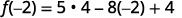
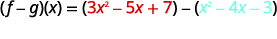

By the end of this section, you will be able to:
* Determine the degree of polynomials
* Add and subtract polynomials
* Evaluate a polynomial function for a given value
* Add and subtract polynomial functions

Before you get started, take this readiness quiz.

1.  Simplify:
    <math xmlns="http://www.w3.org/1998/Math/MathML"><mrow><mn>3</mn><msup><mi>x</mi><mn>2</mn></msup><mo>+</mo><mn>3</mn><mi>x</mi><mo>+</mo><mn>1</mn><mo>+</mo><mn>8</mn><msup><mi>x</mi><mn>2</mn></msup><mo>+</mo><mn>5</mn><mi>x</mi><mo>+</mo><mn>5</mn><mo>.</mo></mrow></math>
    
    * * *
    {: data-type="newline"}
    
    If you missed this problem, review [\[link\]](/m63302#fs-id1167836652573).
2.  Subtract:
    <math xmlns="http://www.w3.org/1998/Math/MathML"><mrow><mrow><mo>(</mo><mrow><mn>5</mn><mi>n</mi><mo>+</mo><mn>8</mn></mrow><mo>)</mo></mrow><mo>−</mo><mrow><mo>(</mo><mrow><mn>2</mn><mi>n</mi><mo>−</mo><mn>1</mn></mrow><mo>)</mo></mrow><mo>.</mo></mrow></math>
    
    * * *
    {: data-type="newline"}
    
    If you missed this problem, review [\[link\]](/m63302#fs-id1167829586631).
3.  Evaluate:
    <math xmlns="http://www.w3.org/1998/Math/MathML"><mrow><mn>4</mn><mi>x</mi><msup><mi>y</mi><mn>2</mn></msup></mrow></math>
    
    when
    <math xmlns="http://www.w3.org/1998/Math/MathML"><mrow><mi>x</mi><mo>=</mo><mn>−2</mn></mrow></math>
    
    and
    <math xmlns="http://www.w3.org/1998/Math/MathML"><mrow><mi>y</mi><mo>=</mo><mn>5</mn><mo>.</mo></mrow></math>
    
    * * *
    {: data-type="newline"}
    
    If you missed this problem, review [\[link\]](/m63303#fs-id1167832053133).
{: type="1"}

### Determine the Degree of Polynomials

We have learned that a *term* is a constant or the product of a constant and one or more variables. A **monomial**{: data-type="term"} is an algebraic expression with one term. When it is of the form <math xmlns="http://www.w3.org/1998/Math/MathML"><mrow><mi>a</mi><msup><mi>x</mi><mi>m</mi></msup><mo>,</mo></mrow></math>

 where *a* is a constant and *m* is a whole number, it is called a monomial in one variable. Some examples of monomial in one variable are. Monomials can also have more than one variable such as and <math xmlns="http://www.w3.org/1998/Math/MathML"><mrow><mn>−4</mn><msup><mi>a</mi><mn>2</mn></msup><msup><mi>b</mi><mn>3</mn></msup><msup><mi>c</mi><mn>2</mn></msup><mo>.</mo></mrow></math>

Monomial

A **monomial** is an algebraic expression with one term.

A monomial in one variable is a term of the form <math xmlns="http://www.w3.org/1998/Math/MathML"><mrow><mi>a</mi><msup><mi>x</mi><mi>m</mi></msup><mo>,</mo></mrow></math>

 where *a* is a constant and *m* is a whole number.

A monomial, or two or more monomials combined by addition or subtraction, is a **polynomial**{: data-type="term"}. Some polynomials have special names, based on the number of terms. A monomial is a polynomial with exactly one term. A binomial has exactly two terms, and a **trinomial**{: data-type="term"} has exactly three terms. There are no special names for polynomials with more than three terms.

Polynomials

**polynomial**—A monomial, or two or more algebraic terms combined by addition or subtraction is a polynomial.

**monomial**—A polynomial with exactly one term is called a monomial.

**binomial**—A polynomial with exactly two terms is called a binomial.

**trinomial**—A polynomial with exactly three terms is called a trinomial.

Here are some examples of polynomials.

| Polynomial | <math xmlns="http://www.w3.org/1998/Math/MathML"><mrow><mi>y</mi><mo>+</mo><mn>1</mn></mrow></math>

 | <math xmlns="http://www.w3.org/1998/Math/MathML"><mrow><mn>4</mn><msup><mi>a</mi><mn>2</mn></msup><mo>−</mo><mn>7</mn><mi>a</mi><mi>b</mi><mo>+</mo><mn>2</mn><msup><mi>b</mi><mn>2</mn></msup></mrow></math>

 | <math xmlns="http://www.w3.org/1998/Math/MathML"><mrow><mn>4</mn><msup><mi>x</mi><mn>4</mn></msup><mo>+</mo><msup><mi>x</mi><mn>3</mn></msup><mo>+</mo><mn>8</mn><msup><mi>x</mi><mn>2</mn></msup><mo>−</mo><mn>9</mn><mi>x</mi><mo>+</mo><mn>1</mn></mrow></math>

 |  |
{: valign="top"}| Monomial | 14 | <math xmlns="http://www.w3.org/1998/Math/MathML"><mrow><mn>8</mn><msup><mi>y</mi><mn>2</mn></msup></mrow></math>

 | <math xmlns="http://www.w3.org/1998/Math/MathML"><mrow><mn>−9</mn><msup><mi>x</mi><mn>3</mn></msup><msup><mi>y</mi><mn>5</mn></msup></mrow></math>

 | <math xmlns="http://www.w3.org/1998/Math/MathML"><mrow><mn>−13</mn><msup><mi>a</mi><mn>3</mn></msup><msup><mi>b</mi><mn>2</mn></msup><mi>c</mi></mrow></math>

 |
{: valign="top"}| Binomial | <math xmlns="http://www.w3.org/1998/Math/MathML"><mrow><mi>a</mi><mo>+</mo><mn>7</mn><mi>b</mi></mrow></math>

 | <math xmlns="http://www.w3.org/1998/Math/MathML"><mrow><mn>4</mn><msup><mi>x</mi><mn>2</mn></msup><mo>−</mo><msup><mi>y</mi><mn>2</mn></msup></mrow></math>

 | <math xmlns="http://www.w3.org/1998/Math/MathML"><mrow><msup><mi>y</mi><mn>2</mn></msup><mo>−</mo><mn>16</mn></mrow></math>

 | <math xmlns="http://www.w3.org/1998/Math/MathML"><mrow><mn>3</mn><msup><mi>p</mi><mn>3</mn></msup><mi>q</mi><mo>−</mo><mn>9</mn><msup><mi>p</mi><mn>2</mn></msup><mi>q</mi></mrow></math>

 |
{: valign="top"}| Trinomial | <math xmlns="http://www.w3.org/1998/Math/MathML"><mrow><msup><mi>x</mi><mn>2</mn></msup><mo>−</mo><mn>7</mn><mi>x</mi><mo>+</mo><mn>12</mn></mrow></math>

 | <math xmlns="http://www.w3.org/1998/Math/MathML"><mrow><mn>9</mn><msup><mi>m</mi><mn>2</mn></msup><mo>+</mo><mn>2</mn><mi>m</mi><mi>n</mi><mo>−</mo><mn>8</mn><msup><mi>n</mi><mn>2</mn></msup></mrow></math>

 | <math xmlns="http://www.w3.org/1998/Math/MathML"><mrow><mn>6</mn><msup><mi>k</mi><mn>4</mn></msup><mo>−</mo><msup><mi>k</mi><mn>3</mn></msup><mo>+</mo><mn>8</mn><mi>k</mi></mrow></math>

 | <math xmlns="http://www.w3.org/1998/Math/MathML"><mrow><msup><mi>z</mi><mn>4</mn></msup><mo>+</mo><mn>3</mn><msup><mi>z</mi><mn>2</mn></msup><mo>−</mo><mn>1</mn></mrow></math>

 |
{: valign="top"}{: .unnumbered summary="This table has five columns and four rows. The first row is for polynomials and lists three examples: y plus 1, 4 a squared minus 7 a b plus 2 b squared, 4 x to the fourth power plus x cubed plus 8 x squared minus 9 x plus 1. The second row is for monomials and lists four examples: 14, 8 y squared, minus 9 x cubed y to the fifth power, and negative 12 a cubed b squared c. The third row is for binomials and lists four examples: a plus 7 b, 4 x square minus y squared, y squared minus 16, and 3 p cubed q minus 9 p squared q. The fourth row is for trinomials and list four examples: x squared minus 7 x plus 12, 9 m squared plus 2 mn minus 8 n squared, 6 k to the fourth power minus k cubed plus 8 k, and z to the fourth power plus 3z squared minus 1." data-label=""}

Notice that every monomial, binomial, and trinomial is also a polynomial. They are just special members of the “family” of polynomials and so they have special names. We use the words *monomial*, *binomial*, and *trinomial* when referring to these special polynomials and just call all the rest *polynomials*.

The **degree of a polynomial**{: data-type="term"} and the degree of its terms are determined by the exponents of the variable.

A monomial that has no variable, just a constant, is a special case. The **degree of a constant**{: data-type="term"} is 0.

Degree of a Polynomial

The **degree of a term** is the sum of the exponents of its variables.

The **degree of a constant** is 0.

The **degree of a polynomial** is the highest degree of all its terms.

Let’s see how this works by looking at several polynomials. We’ll take it step by step, starting with monomials, and then progressing to polynomials with more terms.

Let\'s start by looking at a monomial. The monomial <math xmlns="http://www.w3.org/1998/Math/MathML"><mrow><mn>8</mn><mi>a</mi><msup><mi>b</mi><mn>2</mn></msup></mrow></math>

 has two variables *a* and *b*. To find the degree we need to find the sum of the exponents. The variable a doesn\'t have an exponent written, but remember that means the exponent is 1. The exponent of *b* is 2. The sum of the exponents, <math xmlns="http://www.w3.org/1998/Math/MathML"><mrow><mn>1</mn><mo>+</mo><mn>2</mn><mo>,</mo></mrow></math>

 is 3 so the degree is 3.

    Here are some additional examples.

  ![Monomial examples: 14 has degree 0, 8 a b squared has degree 3, negative 9 x cubed y to the fifth power has degree 8, negative 13 a has degree 1. Binomial examples: The terms in h plus 7 have degree 1 and 0 so the degree of the whole polynomial is 1. The terms in 7 b squared minus 3 b have degree 2 and 1 so the degree of the whole polynomial is 2. The terms in z squared y squared minus 25 have degree 4 and 0 so the degree of the whole polynomial is 4. The terms in 4 n cubed minus 8 n squared have degree 3 and 2 so the degree of the whole polynomial is 3. Trinomial examples: The terms in x squared minus 12 x plus 27 have degree 2, 1 and 0 so the degree of the whole polynomial is 2. The terms in 9 a squared plus 6 a b plus b squared have degree 2, 2, and 2 so the degree of the whole polynomial is 2. The terms in 6 m to the fourth power minus m cubed n squared plus 8 m n to the fifth power have degree 4, 5, and 6 so the degree of the whole polynomial is 6. The terms in z to the fourth power plus 3 z squared minus 1 have degree 4, 2, and 0 so the degree of the whole polynomial is 4. Polynomial examples: The terms in y minus 1 have degree 1 and 0 so the degree of the whole polynomial is 1. The terms in 3 y squared minus 2 y minus 5 have degree 2, 1, 0 so the degree of the whole polynomial is 2. The terms in 4 x to the fourth power plus x cubed plus eight x squared minus 9 x plus 1 have degree 4, 3, 2, 1, and 0 so the degree of the whole polynomial is 4.](../resources/CNX_IntAlg_Figure_05_01_002_img.jpg)  Working with polynomials is easier when you list the terms in descending order of degrees. When a polynomial is written this way, it is said to be in **standard form of a polynomial**{: data-type="term"}. Get in the habit of writing the term with the highest degree first.

Determine whether each polynomial is a monomial, binomial, trinomial, or other polynomial. Then, find the degree of each polynomial.

ⓐ <math xmlns="http://www.w3.org/1998/Math/MathML"><mrow><mn>7</mn><msup><mi>y</mi><mn>2</mn></msup><mo>−</mo><mn>5</mn><mi>y</mi><mo>+</mo><mn>3</mn></mrow></math>

 ⓑ <math xmlns="http://www.w3.org/1998/Math/MathML"><mrow><mn>−2</mn><msup><mi>a</mi><mn>4</mn></msup><msup><mi>b</mi><mn>2</mn></msup></mrow></math>

 ⓒ <math xmlns="http://www.w3.org/1998/Math/MathML"><mrow><mn>3</mn><msup><mi>x</mi><mn>5</mn></msup><mo>−</mo><mn>4</mn><msup><mi>x</mi><mn>3</mn></msup><mo>−</mo><mn>6</mn><msup><mi>x</mi><mn>2</mn></msup><mo>+</mo><mi>x</mi><mo>−</mo><mn>8</mn></mrow></math>

 ⓓ <math xmlns="http://www.w3.org/1998/Math/MathML"><mrow><mn>2</mn><mi>y</mi><mo>−</mo><mn>8</mn><mi>x</mi><msup><mi>y</mi><mn>3</mn></msup></mrow></math>

 ⓔ 15

|  | Polynomial | Number of terms | Type | Degree of terms | Degree of polynomial |
{: valign="top"}|----------
| ⓐ | <math xmlns="http://www.w3.org/1998/Math/MathML"><mrow><mn>7</mn><msup><mi>y</mi><mn>2</mn></msup><mo>−</mo><mn>5</mn><mi>y</mi><mo>+</mo><mn>3</mn></mrow></math>

 | 3 | Trinomial | 2, 1, 0 | 2 |
{: valign="top"}| ⓑ | <math xmlns="http://www.w3.org/1998/Math/MathML"><mrow><mn>−2</mn><msup><mi>a</mi><mn>4</mn></msup><msup><mi>b</mi><mn>2</mn></msup></mrow></math>

 | 1 | Monomial | 4, 2 | 6 |
{: valign="top"}| ⓒ | <math xmlns="http://www.w3.org/1998/Math/MathML"><mrow><mn>3</mn><msup><mi>x</mi><mn>5</mn></msup><mo>−</mo><mn>4</mn><msup><mi>x</mi><mn>3</mn></msup><mo>−</mo><mn>6</mn><msup><mi>x</mi><mn>2</mn></msup><mo>+</mo><mi>x</mi><mo>−</mo><mn>8</mn></mrow></math>

 | 5 | Polynomial | 5, 3, 2, 1, 0 | 5 |
{: valign="top"}| ⓓ | <math xmlns="http://www.w3.org/1998/Math/MathML"><mrow><mn>2</mn><mi>y</mi><mo>−</mo><mn>8</mn><mi>x</mi><msup><mi>y</mi><mn>3</mn></msup></mrow></math>

 | 2 | Binomial | 1, 4 | 4 |
{: valign="top"}| ⓔ | 15 | 1 | Monomial | 0 | 0 |
{: valign="top"}{: .unnumbered summary="This table has five columns. The first is labeled polynomials, the second is number of terms, the third is type, the fourth is degree of terms, and the fifth is degree of polynomial. The first row shows 7 y squared minus 5y plus 3 has 3 terms, trinomial, the degree of terms are 2, 1, 0, and the degree of the polynomial is 2. The second row shows minus 2 a to the fourth b squared has 1 term, monomial, degree of terms and degree of polynomial are both 4. The third row shows 3 x to the fifth power minus 4 x cubed minus 6 x squared plus x minus 8 has 5 terms, is a polynomial, and the degree of terms are 5, 3, 2, 0, and 1, so the degree of the polynomial is 5. The fourth row shows 2y minus 8 x y cubed has 2 terms, is a binomial, has degree of terms 1 and 5, and the degree of the polynomial is 4. The fifth row shows 14 which has 1 term and is a monomial with degree of terms and degree of polynomial 0." data-label=""}

Determine whether each polynomial is a monomial, binomial, trinomial, or other polynomial. Then, find the degree of each polynomial.

ⓐ <math xmlns="http://www.w3.org/1998/Math/MathML"><mrow><mn>−5</mn></mrow></math>

 ⓑ <math xmlns="http://www.w3.org/1998/Math/MathML"><mrow><mn>8</mn><msup><mi>y</mi><mn>3</mn></msup><mo>−</mo><mn>7</mn><msup><mi>y</mi><mn>2</mn></msup><mo>−</mo><mi>y</mi><mo>−</mo><mn>3</mn></mrow></math>

 ⓒ <math xmlns="http://www.w3.org/1998/Math/MathML"><mrow><mn>−3</mn><msup><mi>x</mi><mn>2</mn></msup><mi>y</mi><mo>−</mo><mn>5</mn><mi>x</mi><mi>y</mi><mo>+</mo><mn>9</mn><mi>x</mi><msup><mi>y</mi><mn>3</mn></msup></mrow></math>

 ⓓ <math xmlns="http://www.w3.org/1998/Math/MathML"><mrow><mn>81</mn><msup><mi>m</mi><mn>2</mn></msup><mo>−</mo><mn>4</mn><msup><mi>n</mi><mn>2</mn></msup></mrow></math>

 ⓔ <math xmlns="http://www.w3.org/1998/Math/MathML"><mrow><mn>−3</mn><msup><mi>x</mi><mn>6</mn></msup><msup><mi>y</mi><mn>3</mn></msup><mi>z</mi></mrow></math>

ⓐ monomial, 0* * *
{: data-type="newline"}

ⓑ polynomial, 3 ⓒ trinomial, 3* * *
{: data-type="newline"}

ⓓ binomial, 2 ⓔ monomial, 10

Determine whether each polynomial is a monomial, binomial, trinomial, or other polynomial. Then, find the degree of each polynomial.

ⓐ <math xmlns="http://www.w3.org/1998/Math/MathML"><mrow><mn>64</mn><msup><mi>k</mi><mn>3</mn></msup><mo>−</mo><mn>8</mn></mrow></math>

 ⓑ <math xmlns="http://www.w3.org/1998/Math/MathML"><mrow><mn>9</mn><msup><mi>m</mi><mn>3</mn></msup><mo>+</mo><mn>4</mn><msup><mi>m</mi><mn>2</mn></msup><mo>−</mo><mn>2</mn></mrow></math>

 ⓒ <math xmlns="http://www.w3.org/1998/Math/MathML"><mrow><mfrac><mn>5</mn><mn>6</mn></mfrac></mrow></math>

 ⓓ <math xmlns="http://www.w3.org/1998/Math/MathML"><mrow><mn>8</mn><msup><mi>a</mi><mn>4</mn></msup><mo>−</mo><mn>7</mn><msup><mi>a</mi><mn>3</mn></msup><mi>b</mi><mo>−</mo><mn>6</mn><msup><mi>a</mi><mn>2</mn></msup><msup><mi>b</mi><mn>2</mn></msup><mo>−</mo><mn>4</mn><mi>a</mi><msup><mi>b</mi><mn>3</mn></msup><mo>+</mo><mn>7</mn><msup><mi>b</mi><mn>4</mn></msup></mrow></math>

 ⓔ <math xmlns="http://www.w3.org/1998/Math/MathML"><mrow><mtext>−</mtext><msup><mi>p</mi><mn>4</mn></msup><msup><mi>q</mi><mn>3</mn></msup></mrow></math>

ⓐbinomial, 3 ⓑ trinomial, 3 ⓒ monomial, 0 ⓓ polynomial, 4 ⓔ monomial, 7

### Add and Subtract Polynomials

We have learned how to simplify expressions by combining like terms. Remember, like terms must have the same variables with the same exponent. Since monomials are terms, adding and subtracting monomials is the same as combining like terms. If the monomials are like terms, we just combine them by adding or subtracting the coefficients.

Add or subtract: ⓐ <math xmlns="http://www.w3.org/1998/Math/MathML"><mrow><mn>25</mn><msup><mi>y</mi><mn>2</mn></msup><mo>+</mo><mn>15</mn><msup><mi>y</mi><mn>2</mn></msup></mrow></math>

 ⓑ <math xmlns="http://www.w3.org/1998/Math/MathML"><mrow><mn>16</mn><mi>p</mi><msup><mi>q</mi><mn>3</mn></msup><mo>−</mo><mrow><mo>(</mo><mrow><mn>−7</mn><mi>p</mi><msup><mi>q</mi><mn>3</mn></msup></mrow><mo>)</mo></mrow><mo>.</mo></mrow></math>

ⓐ* * *
{: data-type="newline"}

 <math xmlns="http://www.w3.org/1998/Math/MathML"><mrow><mtable> <mtr><mtd /><mtd /><mtd /><mtd columnalign="center"><mspace width="3em" /><mn>25</mn><msup><mi>y</mi><mn>2</mn></msup><mo>+</mo><mn>15</mn><msup><mi>y</mi><mn>2</mn></msup></mtd></mtr> <mtr><mtd columnalign="left"><mtext>Combine like terms.</mtext></mtd><mtd /><mtd /><mtd columnalign="center"><mspace width="3em" /><mn>40</mn><msup><mi>y</mi><mn>2</mn></msup></mtd></mtr></mtable></mrow></math>

ⓑ* * *
{: data-type="newline"}

 <math xmlns="http://www.w3.org/1998/Math/MathML"><mrow><mtable> <mtr><mtd /><mtd /><mtd /><mtd columnalign="center"><mspace width="3em" /><mn>16</mn><mi>p</mi><msup><mi>q</mi><mn>3</mn></msup><mo>−</mo><mrow><mo>(</mo><mrow><mn>−7</mn><mi>p</mi><msup><mi>q</mi><mn>3</mn></msup></mrow><mo>)</mo></mrow></mtd></mtr> <mtr><mtd columnalign="left"><mtext>Combine like terms.</mtext></mtd><mtd /><mtd /><mtd columnalign="center"><mspace width="3em" /><mn>23</mn><mi>p</mi><msup><mi>q</mi><mn>3</mn></msup></mtd></mtr></mtable></mrow></math>

Add or subtract: ⓐ <math xmlns="http://www.w3.org/1998/Math/MathML"><mrow><mn>12</mn><msup><mi>q</mi><mn>2</mn></msup><mo>+</mo><mn>9</mn><msup><mi>q</mi><mn>2</mn></msup></mrow></math>

 ⓑ <math xmlns="http://www.w3.org/1998/Math/MathML"><mrow><mn>8</mn><mi>m</mi><msup><mi>n</mi><mn>3</mn></msup><mo>−</mo><mrow><mo>(</mo><mrow><mn>−5</mn><mi>m</mi><msup><mi>n</mi><mn>3</mn></msup></mrow><mo>)</mo></mrow><mo>.</mo></mrow></math>

ⓐ <math xmlns="http://www.w3.org/1998/Math/MathML"><mrow><mn>21</mn><msup><mi>q</mi><mn>2</mn></msup></mrow></math>

 ⓑ <math xmlns="http://www.w3.org/1998/Math/MathML"><mrow><mn>13</mn><mi>m</mi><msup><mi>n</mi><mn>3</mn></msup></mrow></math>

Add or subtract: ⓐ <math xmlns="http://www.w3.org/1998/Math/MathML"><mrow><mn>−15</mn><msup><mi>c</mi><mn>2</mn></msup><mo>+</mo><mn>8</mn><msup><mi>c</mi><mn>2</mn></msup></mrow></math>

 ⓑ <math xmlns="http://www.w3.org/1998/Math/MathML"><mrow><mn>−15</mn><msup><mi>y</mi><mn>2</mn></msup><msup><mi>z</mi><mn>3</mn></msup><mo>−</mo><mrow><mo>(</mo><mrow><mn>−5</mn><msup><mi>y</mi><mn>2</mn></msup><msup><mi>z</mi><mn>3</mn></msup></mrow><mo>)</mo></mrow><mo>.</mo></mrow></math>

ⓐ <math xmlns="http://www.w3.org/1998/Math/MathML"><mrow><mn>−7</mn><msup><mi>c</mi><mn>2</mn></msup></mrow></math>

 ⓑ <math xmlns="http://www.w3.org/1998/Math/MathML"><mrow><mn>−10</mn><msup><mi>y</mi><mn>2</mn></msup><msup><mi>z</mi><mn>3</mn></msup></mrow></math>

Remember that like terms must have the same variables with the same exponents.

Simplify: ⓐ <math xmlns="http://www.w3.org/1998/Math/MathML"><mrow><msup><mi>a</mi><mn>2</mn></msup><mo>+</mo><mn>7</mn><msup><mi>b</mi><mn>2</mn></msup><mo>−</mo><mn>6</mn><msup><mi>a</mi><mn>2</mn></msup></mrow></math>

 ⓑ <math xmlns="http://www.w3.org/1998/Math/MathML"><mrow><msup><mi>u</mi><mn>2</mn></msup><mi>v</mi><mo>+</mo><mn>5</mn><msup><mi>u</mi><mn>2</mn></msup><mo>−</mo><mn>3</mn><msup><mi>v</mi><mn>2</mn></msup><mo>.</mo></mrow></math>

ⓐ* * *
{: data-type="newline"}

 <math xmlns="http://www.w3.org/1998/Math/MathML"><mrow><mtable> <mtr><mtd /><mtd /><mtd /><mtd columnalign="center"><mspace width="9em" /><msup><mi>a</mi><mn>2</mn></msup><mo>+</mo><mn>7</mn><msup><mi>b</mi><mn>2</mn></msup><mo>−</mo><mn>6</mn><msup><mi>a</mi><mn>2</mn></msup></mtd></mtr> <mtr><mtd columnalign="left"><mtext>Combine like terms.</mtext></mtd><mtd /><mtd /><mtd columnalign="center"><mspace width="9em" /><mn>−5</mn><msup><mi>a</mi><mn>2</mn></msup><mo>+</mo><mn>7</mn><msup><mi>b</mi><mn>2</mn></msup></mtd></mtr></mtable></mrow></math>

ⓑ* * *
{: data-type="newline"}

 <math xmlns="http://www.w3.org/1998/Math/MathML"><mrow><mtable> <mtr><mtd /><mtd /><mtd /><mtd columnalign="center"><msup><mi>u</mi><mn>2</mn></msup><mi>v</mi><mo>+</mo><mn>5</mn><msup><mi>u</mi><mn>2</mn></msup><mo>−</mo><mn>3</mn><msup><mi>v</mi><mn>2</mn></msup></mtd></mtr> <mtr><mtd columnalign="left"><mtable><mtr><mtd columnalign="left"><mtext>There are no like terms to combine.</mtext></mtd></mtr><mtr><mtd columnalign="left"><mtext>In this case, the polynomial is unchanged.</mtext></mtd></mtr></mtable></mtd><mtd /><mtd /><mtd columnalign="center"><msup><mi>u</mi><mn>2</mn></msup><mi>v</mi><mo>+</mo><mn>5</mn><msup><mi>u</mi><mn>2</mn></msup><mo>−</mo><mn>3</mn><msup><mi>v</mi><mn>2</mn></msup></mtd></mtr></mtable></mrow></math>

Add: ⓐ <math xmlns="http://www.w3.org/1998/Math/MathML"><mrow><mn>8</mn><msup><mi>y</mi><mn>2</mn></msup><mo>+</mo><mn>3</mn><msup><mi>z</mi><mn>2</mn></msup><mo>−</mo><mn>3</mn><msup><mi>y</mi><mn>2</mn></msup></mrow></math>

 ⓑ <math xmlns="http://www.w3.org/1998/Math/MathML"><mrow><msup><mi>m</mi><mn>2</mn></msup><msup><mi>n</mi><mn>2</mn></msup><mo>−</mo><mn>8</mn><msup><mi>m</mi><mn>2</mn></msup><mo>+</mo><mn>4</mn><msup><mi>n</mi><mn>2</mn></msup><mo>.</mo></mrow></math>

ⓐ <math xmlns="http://www.w3.org/1998/Math/MathML"><mrow><mn>5</mn><msup><mi>y</mi><mn>2</mn></msup><mo>+</mo><mn>3</mn><msup><mi>z</mi><mn>2</mn></msup></mrow></math>

* * *
{: data-type="newline"}

ⓑ <math xmlns="http://www.w3.org/1998/Math/MathML"><mrow><msup><mi>m</mi><mn>2</mn></msup><msup><mi>n</mi><mn>2</mn></msup><mo>−</mo><mn>8</mn><msup><mi>m</mi><mn>2</mn></msup><mo>+</mo><mn>4</mn><msup><mi>n</mi><mn>2</mn></msup></mrow></math>

Add: ⓐ <math xmlns="http://www.w3.org/1998/Math/MathML"><mrow><mn>3</mn><msup><mi>m</mi><mn>2</mn></msup><mo>+</mo><msup><mi>n</mi><mn>2</mn></msup><mo>−</mo><mn>7</mn><msup><mi>m</mi><mn>2</mn></msup></mrow></math>

 ⓑ <math xmlns="http://www.w3.org/1998/Math/MathML"><mrow><mi>p</mi><msup><mi>q</mi><mn>2</mn></msup><mo>−</mo><mn>6</mn><mi>p</mi><mo>−</mo><mn>5</mn><msup><mi>q</mi><mn>2</mn></msup><mo>.</mo></mrow></math>

ⓐ <math xmlns="http://www.w3.org/1998/Math/MathML"><mrow><mn>−4</mn><msup><mi>m</mi><mn>2</mn></msup><mo>+</mo><msup><mi>n</mi><mn>2</mn></msup></mrow></math>

* * *
{: data-type="newline"}

ⓑ <math xmlns="http://www.w3.org/1998/Math/MathML"><mrow><mi>p</mi><msup><mi>q</mi><mn>2</mn></msup><mo>−</mo><mn>6</mn><mi>p</mi><mo>−</mo><mn>5</mn><msup><mi>q</mi><mn>2</mn></msup></mrow></math>

We can think of adding and subtracting polynomials as just adding and subtracting a series of monomials. Look for the like terms—those with the same variables and the same exponent. The Commutative Property allows us to rearrange the terms to put like terms together.

Find the sum:<math xmlns="http://www.w3.org/1998/Math/MathML"><mrow><mrow><mo>(</mo><mrow><mn>7</mn><msup><mi>y</mi><mn>2</mn></msup><mo>−</mo><mn>2</mn><mi>y</mi><mo>+</mo><mn>9</mn></mrow><mo>)</mo></mrow><mo>+</mo><mrow><mo>(</mo><mrow><mn>4</mn><msup><mi>y</mi><mn>2</mn></msup><mo>−</mo><mn>8</mn><mi>y</mi><mo>−</mo><mn>7</mn></mrow><mo>)</mo></mrow><mo>.</mo></mrow></math>

<math xmlns="http://www.w3.org/1998/Math/MathML"><mrow><mtable> <mtr><mtd columnalign="left"><mtext>Identify like terms.</mtext></mtd><mtd /><mtd /><mtd columnalign="center"><mrow><mo>(</mo><mrow><munder accentunder="true"><munder accentunder="true"><mrow><mn>7</mn><msup><mi>y</mi><mn>2</mn></msup></mrow><mo stretchy="true">\_\_\_\_</mo></munder><mo stretchy="true">\_\_\_\_</mo></munder><mo>−</mo><munder accentunder="true"><mrow><mn>2</mn><mi>y</mi></mrow><mo stretchy="true">\_\_\_</mo></munder><mo>+</mo><mrow><mrow><mn>9</mn></mrow></mrow><mo>)</mo></mrow><mo>+</mo><mrow><mo>(</mo><mrow><munder accentunder="true"><munder accentunder="true"><mrow><mn>4</mn><msup><mi>y</mi><mn>2</mn></msup></mrow><mo stretchy="true">\_\_\_\_</mo></munder><mo stretchy="true">\_\_\_\_</mo></munder><mo>−</mo><munder accentunder="true"><mrow><mn>8</mn><mi>y</mi></mrow><mo stretchy="true">\_\_\_</mo></munder><mo>−</mo><mn>7</mn><mo>)</mo></mrow></mrow></mrow></mtd></mtr> <mtr><mtd columnalign="left"><mtable><mtr><mtd columnalign="left"><mtext>Rewrite without the parentheses,</mtext></mtd></mtr><mtr><mtd columnalign="left"><mtext>rearranging to get the like terms together.</mtext></mtd></mtr></mtable></mtd><mtd /><mtd /><mtd columnalign="center"><munder accentunder="true"><munder accentunder="true"><mrow><mn>7</mn><msup><mi>y</mi><mn>2</mn></msup><mo>+</mo><mn>4</mn><msup><mi>y</mi><mn>2</mn></msup></mrow><mo stretchy="true">\_\_\_\_\_\_\_\_\_</mo></munder><mo stretchy="true">\_\_\_\_\_\_\_\_\_</mo></munder><mo>−</mo><munder accentunder="true"><mrow><mn>2</mn><mi>y</mi><mo>−</mo><mn>8</mn><mi>y</mi></mrow><mo stretchy="true">\_\_\_\_\_\_\_</mo></munder><mo>+</mo><mrow><mn>9</mn><mo>−</mo><mn>7</mn></mrow></mtd></mtr> <mtr><mtd columnalign="left"><mtext>Combine like terms.</mtext></mtd><mtd /><mtd /><mtd columnalign="center"><mn>11</mn><msup><mi>y</mi><mn>2</mn></msup><mo>−</mo><mn>10</mn><mi>y</mi><mo>+</mo><mn>2</mn></mtd></mtr></mtable></mrow></math>

Find the sum: <math xmlns="http://www.w3.org/1998/Math/MathML"><mrow><mrow><mo>(</mo><mrow><mn>7</mn><msup><mi>x</mi><mn>2</mn></msup><mo>−</mo><mn>4</mn><mi>x</mi><mo>+</mo><mn>5</mn></mrow><mo>)</mo></mrow><mo>+</mo><mrow><mo>(</mo><mrow><msup><mi>x</mi><mn>2</mn></msup><mo>−</mo><mn>7</mn><mi>x</mi><mo>+</mo><mn>3</mn></mrow><mo>)</mo></mrow><mo>.</mo></mrow></math>

<math xmlns="http://www.w3.org/1998/Math/MathML"><mrow><mn>8</mn><msup><mi>x</mi><mn>2</mn></msup><mo>−</mo><mn>11</mn><mi>x</mi><mo>+</mo><mn>8</mn></mrow></math>

Find the sum: <math xmlns="http://www.w3.org/1998/Math/MathML"><mrow><mrow><mo>(</mo><mrow><mn>14</mn><msup><mi>y</mi><mn>2</mn></msup><mo>+</mo><mn>6</mn><mi>y</mi><mo>−</mo><mn>4</mn></mrow><mo>)</mo></mrow><mo>+</mo><mrow><mo>(</mo><mrow><mn>3</mn><msup><mi>y</mi><mn>2</mn></msup><mo>+</mo><mn>8</mn><mi>y</mi><mo>+</mo><mn>5</mn></mrow><mo>)</mo></mrow><mo>.</mo></mrow></math>

<math xmlns="http://www.w3.org/1998/Math/MathML"><mrow><mn>17</mn><msup><mi>y</mi><mn>2</mn></msup><mo>+</mo><mn>14</mn><mi>y</mi><mo>+</mo><mn>1</mn></mrow></math>

Be careful with the signs as you distribute while subtracting the polynomials in the next example.

Find the difference: <math xmlns="http://www.w3.org/1998/Math/MathML"><mrow><mrow><mo>(</mo><mrow><mn>9</mn><msup><mi>w</mi><mn>2</mn></msup><mo>−</mo><mn>7</mn><mi>w</mi><mo>+</mo><mn>5</mn></mrow><mo>)</mo></mrow><mo>−</mo><mrow><mo>(</mo><mrow><mn>2</mn><msup><mi>w</mi><mn>2</mn></msup><mo>−</mo><mn>4</mn></mrow><mo>)</mo></mrow><mo>.</mo></mrow></math>

<math xmlns="http://www.w3.org/1998/Math/MathML"><mrow><mtable> <mtr><mtd /><mtd /><mtd /><mtd columnalign="center"><mrow><mo>(</mo><mrow><mn>9</mn><msup><mi>w</mi><mn>2</mn></msup><mo>−</mo><mn>7</mn><mi>w</mi><mo>+</mo><mn>5</mn></mrow><mo>)</mo></mrow><mo>−</mo><mrow><mo>(</mo><mrow><mn>2</mn><msup><mi>w</mi><mn>2</mn></msup><mo>−</mo><mn>4</mn></mrow><mo>)</mo></mrow></mtd></mtr> <mtr><mtd columnalign="left"><mtext>Distribute and identify like terms.</mtext></mtd><mtd /><mtd /><mtd columnalign="center"><munder accentunder="true"><munder accentunder="true"><mrow><mn>9</mn><msup><mi>w</mi><mn>2</mn></msup></mrow><mo stretchy="true">\_\_\_\_</mo></munder><mo stretchy="true">\_\_\_\_</mo></munder><mo>−</mo><munder accentunder="true"><mrow><mn>7</mn><mi>w</mi></mrow><mo stretchy="true">\_\_\_</mo></munder><mo>+</mo><mn>5</mn><mo>−</mo><munder accentunder="true"><munder accentunder="true"><mrow><mn>2</mn><msup><mi>w</mi><mn>2</mn></msup></mrow><mo stretchy="true">\_\_\_\_</mo></munder><mo stretchy="true">\_\_\_\_</mo></munder><mo>+</mo><mn>4</mn></mtd></mtr> <mtr><mtd columnalign="left"><mtext>Rearrange the terms.</mtext></mtd><mtd /><mtd /><mtd columnalign="center"><munder accentunder="true"><munder accentunder="true"><mrow><mn>9</mn><msup><mi>w</mi><mn>2</mn></msup><mo>−</mo><mn>2</mn><msup><mi>w</mi><mn>2</mn></msup></mrow><mo stretchy="true">\_\_\_\_\_\_\_\_\_\_</mo></munder><mo stretchy="true">\_\_\_\_\_\_\_\_\_\_</mo></munder><mo>−</mo><munder accentunder="true"><mrow><mn>7</mn><mi>w</mi></mrow><mo stretchy="true">\_\_\_</mo></munder><mo>+</mo><mn>5</mn><mo>+</mo><mn>4</mn></mtd></mtr> <mtr><mtd columnalign="left"><mtext>Combine like terms.</mtext></mtd><mtd /><mtd /><mtd columnalign="center"><mn>7</mn><msup><mi>w</mi><mn>2</mn></msup><mo>−</mo><mn>7</mn><mi>w</mi><mo>+</mo><mn>9</mn></mtd></mtr></mtable></mrow></math>

Find the difference: <math xmlns="http://www.w3.org/1998/Math/MathML"><mrow><mrow><mo>(</mo><mrow><mn>8</mn><msup><mi>x</mi><mn>2</mn></msup><mo>+</mo><mn>3</mn><mi>x</mi><mo>−</mo><mn>19</mn></mrow><mo>)</mo></mrow><mo>−</mo><mrow><mo>(</mo><mrow><mn>7</mn><msup><mi>x</mi><mn>2</mn></msup><mo>−</mo><mn>14</mn></mrow><mo>)</mo></mrow><mo>.</mo></mrow></math>

<math xmlns="http://www.w3.org/1998/Math/MathML"><mrow><msup><mi>x</mi><mn>2</mn></msup><mo>+</mo><mn>3</mn><mi>x</mi><mo>−</mo><mn>5</mn></mrow></math>

Find the difference: <math xmlns="http://www.w3.org/1998/Math/MathML"><mrow><mrow><mo>(</mo><mrow><mn>9</mn><msup><mi>b</mi><mn>2</mn></msup><mo>−</mo><mn>5</mn><mi>b</mi><mo>−</mo><mn>4</mn></mrow><mo>)</mo></mrow><mo>−</mo><mrow><mo>(</mo><mrow><mn>3</mn><msup><mi>b</mi><mn>2</mn></msup><mo>−</mo><mn>5</mn><mi>b</mi><mo>−</mo><mn>7</mn></mrow><mo>)</mo></mrow><mo>.</mo></mrow></math>

<math xmlns="http://www.w3.org/1998/Math/MathML"><mrow><mn>6</mn><msup><mi>b</mi><mn>2</mn></msup><mo>+</mo><mn>3</mn></mrow></math>

To subtract <math xmlns="http://www.w3.org/1998/Math/MathML"><mrow><mi>a</mi></mrow></math>

 from <math xmlns="http://www.w3.org/1998/Math/MathML"><mrow><mi>b</mi><mo>,</mo></mrow></math>

 we write it as <math xmlns="http://www.w3.org/1998/Math/MathML"><mrow><mi>b</mi><mo>−</mo><mi>a</mi><mo>,</mo></mrow></math>

 placing the <math xmlns="http://www.w3.org/1998/Math/MathML"><mrow><mi>b</mi></mrow></math>

 first.

Subtract <math xmlns="http://www.w3.org/1998/Math/MathML"><mrow><mrow><mo>(</mo><mrow><msup><mi>p</mi><mn>2</mn></msup><mo>+</mo><mn>10</mn><mi>p</mi><mi>q</mi><mo>−</mo><mn>2</mn><msup><mi>q</mi><mn>2</mn></msup></mrow><mo>)</mo></mrow></mrow></math>

 from <math xmlns="http://www.w3.org/1998/Math/MathML"><mrow><mrow><mo>(</mo><mrow><msup><mi>p</mi><mn>2</mn></msup><mo>+</mo><msup><mi>q</mi><mn>2</mn></msup></mrow><mo>)</mo></mrow><mo>.</mo></mrow></math>

<math xmlns="http://www.w3.org/1998/Math/MathML"><mrow><mtable> <mtr><mtd /><mtd /><mtd /><mtd columnalign="center"><mrow><mo>(</mo><mrow><msup><mi>p</mi><mn>2</mn></msup><mo>+</mo><msup><mi>q</mi><mn>2</mn></msup></mrow><mo>)</mo></mrow><mo>−</mo><mrow><mo>(</mo><mrow><msup><mi>p</mi><mn>2</mn></msup><mo>+</mo><mn>10</mn><mi>p</mi><mi>q</mi><mo>−</mo><mn>2</mn><msup><mi>q</mi><mn>2</mn></msup></mrow><mo>)</mo></mrow></mtd></mtr> <mtr><mtd columnalign="left"><mtext>Distribute.</mtext></mtd><mtd /><mtd /><mtd columnalign="center"><msup><mi>p</mi><mn>2</mn></msup><mo>+</mo><msup><mi>q</mi><mn>2</mn></msup><mo>−</mo><msup><mi>p</mi><mn>2</mn></msup><mo>−</mo><mn>10</mn><mi>p</mi><mi>q</mi><mo>+</mo><mn>2</mn><msup><mi>q</mi><mn>2</mn></msup></mtd></mtr> <mtr><mtd columnalign="left"><mtext>Rearrange the terms, to put like terms together.</mtext></mtd><mtd /><mtd /><mtd columnalign="center"><msup><mi>p</mi><mn>2</mn></msup><mo>−</mo><msup><mi>p</mi><mn>2</mn></msup><mo>−</mo><mn>10</mn><mi>p</mi><mi>q</mi><mo>+</mo><msup><mi>q</mi><mn>2</mn></msup><mo>+</mo><mn>2</mn><msup><mi>q</mi><mn>2</mn></msup></mtd></mtr> <mtr><mtd columnalign="left"><mtext>Combine like terms.</mtext></mtd><mtd /><mtd /><mtd columnalign="center"><mn>−10</mn><mi>p</mi><msup><mi>q</mi><mn>2</mn></msup><mo>+</mo><mn>3</mn><msup><mi>q</mi><mn>2</mn></msup></mtd></mtr></mtable></mrow></math>

Subtract <math xmlns="http://www.w3.org/1998/Math/MathML"><mrow><mrow><mo>(</mo><mrow><msup><mi>a</mi><mn>2</mn></msup><mo>+</mo><mn>5</mn><mi>a</mi><mi>b</mi><mo>−</mo><mn>6</mn><msup><mi>b</mi><mn>2</mn></msup></mrow><mo>)</mo></mrow></mrow></math>

 from <math xmlns="http://www.w3.org/1998/Math/MathML"><mrow><mrow><mo>(</mo><mrow><msup><mi>a</mi><mn>2</mn></msup><mo>+</mo><msup><mi>b</mi><mn>2</mn></msup></mrow><mo>)</mo></mrow><mo>.</mo></mrow></math>

<math xmlns="http://www.w3.org/1998/Math/MathML"><mrow><mn>−5</mn><mi>a</mi><mi>b</mi><mo>+</mo><mn>7</mn><msup><mi>b</mi><mn>2</mn></msup></mrow></math>

Subtract <math xmlns="http://www.w3.org/1998/Math/MathML"><mrow><mrow><mo>(</mo><mrow><msup><mi>m</mi><mn>2</mn></msup><mo>−</mo><mn>7</mn><mi>m</mi><mi>n</mi><mo>−</mo><mn>3</mn><msup><mi>n</mi><mn>2</mn></msup></mrow><mo>)</mo></mrow></mrow></math>

 from <math xmlns="http://www.w3.org/1998/Math/MathML"><mrow><mrow><mo>(</mo><mrow><msup><mi>m</mi><mn>2</mn></msup><mo>+</mo><msup><mi>n</mi><mn>2</mn></msup></mrow><mo>)</mo></mrow><mo>.</mo></mrow></math>

<math xmlns="http://www.w3.org/1998/Math/MathML"><mrow><mn>7</mn><mi>m</mi><mi>n</mi><mo>+</mo><mn>4</mn><msup><mi>n</mi><mn>2</mn></msup></mrow></math>

Find the sum: <math xmlns="http://www.w3.org/1998/Math/MathML"><mrow><mrow><mo>(</mo><mrow><msup><mi>u</mi><mn>2</mn></msup><mo>−</mo><mn>6</mn><mi>u</mi><mi>v</mi><mo>+</mo><mn>5</mn><msup><mi>v</mi><mn>2</mn></msup></mrow><mo>)</mo></mrow><mo>+</mo><mrow><mo>(</mo><mrow><mn>3</mn><msup><mi>u</mi><mn>2</mn></msup><mo>+</mo><mn>2</mn><mi>u</mi><mi>v</mi></mrow><mo>)</mo></mrow><mo>.</mo></mrow></math>

<math xmlns="http://www.w3.org/1998/Math/MathML"><mrow><mtable> <mtr><mtd /><mtd /><mtd /><mtd columnalign="center"><mrow><mo>(</mo><mrow><msup><mi>u</mi><mn>2</mn></msup><mo>−</mo><mn>6</mn><mi>u</mi><mi>v</mi><mo>+</mo><mn>5</mn><msup><mi>v</mi><mn>2</mn></msup></mrow><mo>)</mo></mrow><mo>+</mo><mrow><mo>(</mo><mrow><mn>3</mn><msup><mi>u</mi><mn>2</mn></msup><mo>+</mo><mn>2</mn><mi>u</mi><mi>v</mi></mrow><mo>)</mo></mrow></mtd></mtr> <mtr /><mtr /><mtr><mtd columnalign="left"><mtext>Distribute.</mtext></mtd><mtd /><mtd /><mtd columnalign="center"><msup><mi>u</mi><mn>2</mn></msup><mo>−</mo><mn>6</mn><mi>u</mi><mi>v</mi><mo>+</mo><mn>5</mn><msup><mi>v</mi><mn>2</mn></msup><mo>+</mo><mn>3</mn><msup><mi>u</mi><mn>2</mn></msup><mo>+</mo><mn>2</mn><mi>u</mi><mi>v</mi></mtd></mtr> <mtr /><mtr /><mtr><mtd columnalign="left"><mtext>Rearrange the terms to put like terms together.</mtext></mtd><mtd /><mtd /><mtd columnalign="center"><msup><mi>u</mi><mn>2</mn></msup><mo>+</mo><mn>3</mn><msup><mi>u</mi><mn>2</mn></msup><mo>−</mo><mn>6</mn><mi>u</mi><mi>v</mi><mo>+</mo><mn>2</mn><mi>u</mi><mi>v</mi><mo>+</mo><mn>5</mn><msup><mi>v</mi><mn>2</mn></msup></mtd></mtr> <mtr /><mtr /><mtr><mtd columnalign="left"><mtext>Combine like terms.</mtext></mtd><mtd /><mtd /><mtd columnalign="center"><mn>4</mn><msup><mi>u</mi><mn>2</mn></msup><mo>−</mo><mn>4</mn><mi>u</mi><mi>v</mi><mo>+</mo><mn>5</mn><msup><mi>v</mi><mn>2</mn></msup></mtd></mtr></mtable></mrow></math>

Find the sum: <math xmlns="http://www.w3.org/1998/Math/MathML"><mrow><mrow><mo>(</mo><mrow><mn>3</mn><msup><mi>x</mi><mn>2</mn></msup><mo>−</mo><mn>4</mn><mi>x</mi><mi>y</mi><mo>+</mo><mn>5</mn><msup><mi>y</mi><mn>2</mn></msup></mrow><mo>)</mo></mrow><mo>+</mo><mrow><mo>(</mo><mrow><mn>2</mn><msup><mi>x</mi><mn>2</mn></msup><mo>−</mo><mi>x</mi><mi>y</mi></mrow><mo>)</mo></mrow><mo>.</mo></mrow></math>

<math xmlns="http://www.w3.org/1998/Math/MathML"><mrow><mn>5</mn><msup><mi>x</mi><mn>2</mn></msup><mo>−</mo><mn>5</mn><mi>x</mi><mi>y</mi><mo>+</mo><mn>5</mn><msup><mi>y</mi><mn>2</mn></msup></mrow></math>

Find the sum: <math xmlns="http://www.w3.org/1998/Math/MathML"><mrow><mrow><mo>(</mo><mrow><mn>2</mn><msup><mi>x</mi><mn>2</mn></msup><mo>−</mo><mn>3</mn><mi>x</mi><mi>y</mi><mo>−</mo><mn>2</mn><msup><mi>y</mi><mn>2</mn></msup></mrow><mo>)</mo></mrow><mo>+</mo><mrow><mo>(</mo><mrow><mn>5</mn><msup><mi>x</mi><mn>2</mn></msup><mo>−</mo><mn>3</mn><mi>x</mi><mi>y</mi></mrow><mo>)</mo></mrow><mo>.</mo></mrow></math>

<math xmlns="http://www.w3.org/1998/Math/MathML"><mrow><mn>7</mn><msup><mi>x</mi><mn>2</mn></msup><mo>−</mo><mn>6</mn><mi>x</mi><mi>y</mi><mo>−</mo><mn>2</mn><msup><mi>y</mi><mn>2</mn></msup></mrow></math>

When we add and subtract more than two polynomials, the process is the same.

Simplify: <math xmlns="http://www.w3.org/1998/Math/MathML"><mrow><mrow><mo>(</mo><mrow><msup><mi>a</mi><mn>3</mn></msup><mo>−</mo><msup><mi>a</mi><mn>2</mn></msup><mi>b</mi></mrow><mo>)</mo></mrow><mo>−</mo><mrow><mo>(</mo><mrow><mi>a</mi><msup><mi>b</mi><mn>2</mn></msup><mo>+</mo><msup><mi>b</mi><mn>3</mn></msup></mrow><mo>)</mo></mrow><mo>+</mo><mrow><mo>(</mo><mrow><msup><mi>a</mi><mn>2</mn></msup><mi>b</mi><mo>+</mo><mi>a</mi><msup><mi>b</mi><mn>2</mn></msup></mrow><mo>)</mo></mrow><mo>.</mo></mrow></math>

<math xmlns="http://www.w3.org/1998/Math/MathML"><mrow><mtable> <mtr><mtd /><mtd /><mtd /><mtd columnalign="center"><mrow><mo>(</mo><mrow><msup><mi>a</mi><mn>3</mn></msup><mo>−</mo><msup><mi>a</mi><mn>2</mn></msup><mi>b</mi></mrow><mo>)</mo></mrow><mo>−</mo><mrow><mo>(</mo><mrow><mi>a</mi><msup><mi>b</mi><mn>2</mn></msup><mo>+</mo><msup><mi>b</mi><mn>3</mn></msup></mrow><mo>)</mo></mrow><mo>+</mo><mrow><mo>(</mo><mrow><msup><mi>a</mi><mn>2</mn></msup><mi>b</mi><mo>+</mo><mi>a</mi><msup><mi>b</mi><mn>2</mn></msup></mrow><mo>)</mo></mrow></mtd></mtr> <mtr /><mtr /><mtr><mtd columnalign="left"><mtext>Distribute.</mtext></mtd><mtd /><mtd /><mtd columnalign="center"><msup><mi>a</mi><mn>3</mn></msup><mo>−</mo><msup><mi>a</mi><mn>2</mn></msup><mi>b</mi><mo>−</mo><mi>a</mi><msup><mi>b</mi><mn>2</mn></msup><mo>−</mo><msup><mi>b</mi><mn>3</mn></msup><mo>+</mo><msup><mi>a</mi><mn>2</mn></msup><mi>b</mi><mo>+</mo><mi>a</mi><msup><mi>b</mi><mn>2</mn></msup></mtd></mtr> <mtr /><mtr /><mtr><mtd columnalign="left"><mtext>Rewrite without the parentheses,</mtext></mtd><mtd /><mtd /><mtd /></mtr><mtr><mtd columnalign="left"><mtext>rearranging to get the like terms together.</mtext></mtd><mtd /><mtd /><mtd columnalign="center"><msup><mi>a</mi><mn>3</mn></msup><mo>−</mo><msup><mi>a</mi><mn>2</mn></msup><mi>b</mi><mo>+</mo><msup><mi>a</mi><mn>2</mn></msup><mi>b</mi><mo>−</mo><mi>a</mi><msup><mi>b</mi><mn>2</mn></msup><mo>+</mo><mi>a</mi><msup><mi>b</mi><mn>2</mn></msup><mo>−</mo><msup><mi>b</mi><mn>3</mn></msup></mtd></mtr> <mtr /><mtr /><mtr><mtd columnalign="left"><mtext>Combine like terms.</mtext></mtd><mtd /><mtd /><mtd columnalign="center"><msup><mi>a</mi><mn>3</mn></msup><mo>−</mo><msup><mi>b</mi><mn>3</mn></msup></mtd></mtr></mtable></mrow></math>

Simplify: <math xmlns="http://www.w3.org/1998/Math/MathML"><mrow><mrow><mo>(</mo><mrow><msup><mi>x</mi><mn>3</mn></msup><mo>−</mo><msup><mi>x</mi><mn>2</mn></msup><mi>y</mi></mrow><mo>)</mo></mrow><mo>−</mo><mrow><mo>(</mo><mrow><mi>x</mi><msup><mi>y</mi><mn>2</mn></msup><mo>+</mo><msup><mi>y</mi><mn>3</mn></msup></mrow><mo>)</mo></mrow><mo>+</mo><mrow><mo>(</mo><mrow><msup><mi>x</mi><mn>2</mn></msup><mi>y</mi><mo>+</mo><mi>x</mi><msup><mi>y</mi><mn>2</mn></msup></mrow><mo>)</mo></mrow><mo>.</mo></mrow></math>

<math xmlns="http://www.w3.org/1998/Math/MathML"><mrow><msup><mi>x</mi><mn>3</mn></msup><mo>+</mo><msup><mi>y</mi><mn>3</mn></msup></mrow></math>

Simplify: <math xmlns="http://www.w3.org/1998/Math/MathML"><mrow><mrow><mo>(</mo><mrow><msup><mi>p</mi><mn>3</mn></msup><mo>−</mo><msup><mi>p</mi><mn>2</mn></msup><mi>q</mi></mrow><mo>)</mo></mrow><mo>+</mo><mrow><mo>(</mo><mrow><mi>p</mi><msup><mi>q</mi><mn>2</mn></msup><mo>+</mo><msup><mi>q</mi><mn>3</mn></msup></mrow><mo>)</mo></mrow><mo>−</mo><mrow><mo>(</mo><mrow><msup><mi>p</mi><mn>2</mn></msup><mi>q</mi><mo>+</mo><mi>p</mi><msup><mi>q</mi><mn>2</mn></msup></mrow><mo>)</mo></mrow><mo>.</mo></mrow></math>

<math xmlns="http://www.w3.org/1998/Math/MathML"><mrow><msup><mi>p</mi><mn>3</mn></msup><mo>−</mo><mn>3</mn><msup><mi>p</mi><mn>2</mn></msup><mi>q</mi><mo>+</mo><msup><mi>q</mi><mn>3</mn></msup></mrow></math>

### Evaluate a Polynomial Function for a Given Value

A **polynomial function**{: data-type="term"} is a function defined by a polynomial. For example, <math xmlns="http://www.w3.org/1998/Math/MathML"><mrow><mi>f</mi><mrow><mo>(</mo><mi>x</mi><mo>)</mo></mrow><mo>=</mo><msup><mi>x</mi><mn>2</mn></msup><mo>+</mo><mn>5</mn><mi>x</mi><mo>+</mo><mn>6</mn></mrow></math>

 and <math xmlns="http://www.w3.org/1998/Math/MathML"><mrow><mi>g</mi><mrow><mo>(</mo><mi>x</mi><mo>)</mo></mrow><mo>=</mo><mn>3</mn><mi>x</mi><mo>−</mo><mn>4</mn></mrow></math>

 are polynomial functions, because <math xmlns="http://www.w3.org/1998/Math/MathML"><mrow><msup><mi>x</mi><mn>2</mn></msup><mo>+</mo><mn>5</mn><mi>x</mi><mo>+</mo><mn>6</mn></mrow></math>

 and <math xmlns="http://www.w3.org/1998/Math/MathML"><mrow><mn>3</mn><mi>x</mi><mo>−</mo><mn>4</mn></mrow></math>

 are polynomials.

Polynomial Function

A **polynomial function** is a function whose range values are defined by a polynomial.

In [Graphs and Functions](/m63316){: .target-chapter}, where we first introduced functions, we learned that evaluating a function means to find the value of <math xmlns="http://www.w3.org/1998/Math/MathML"><mrow><mi>f</mi><mrow><mo>(</mo><mi>x</mi><mo>)</mo></mrow></mrow></math>

 for a given value of *x*. To evaluate a polynomial function, we will substitute the given value for the variable and then simplify using the order of operations.

For the function <math xmlns="http://www.w3.org/1998/Math/MathML"><mrow><mi>f</mi><mrow><mo>(</mo><mi>x</mi><mo>)</mo></mrow><mo>=</mo><mn>5</mn><msup><mi>x</mi><mn>2</mn></msup><mo>−</mo><mn>8</mn><mi>x</mi><mo>+</mo><mn>4</mn></mrow></math>

 find: ⓐ <math xmlns="http://www.w3.org/1998/Math/MathML"><mrow><mi>f</mi><mrow><mo>(</mo><mn>4</mn><mo>)</mo></mrow></mrow></math>

 ⓑ <math xmlns="http://www.w3.org/1998/Math/MathML"><mrow><mi>f</mi><mrow><mo>(</mo><mrow><mn>−2</mn></mrow><mo>)</mo></mrow></mrow></math>

 ⓒ <math xmlns="http://www.w3.org/1998/Math/MathML"><mrow><mi>f</mi><mrow><mo>(</mo><mn>0</mn><mo>)</mo></mrow><mo>.</mo></mrow></math>

ⓐ* * *
{: data-type="newline"}

|  |  |
{: valign="top"}|    |  |
{: valign="top"}| Simplify the exponents. |  |
{: valign="top"}| Multiply. |  |
{: valign="top"}| Simplify. |  |
{: valign="top"}{: .unnumbered .unstyled summary="The image shows a series of equations with instructions. The first equation is the function equation f of x equals 5 x squared minus 8 x plus 4. To find f of 4, substitute 4 for x. The second equation is f of 4 equals 5 times 4 squared minus 8 times 4 plus 4. The 4&#x2019;s replacing x are emphasized. The remaining equations show how to simplify the right side of the equation using the order of operations. The third equation is f of 4 equals 5 times 16 minus 8 times 4 plus 4. The fourth equation is f of 4 equals 80 minus 32 plus 4. The last equation is f of 4 equals 52." data-label=""}

ⓑ* * *
{: data-type="newline"}

|  |  |
{: valign="top"}|   |  |
{: valign="top"}| Simplify the exponents. |  |
{: valign="top"}| Multiply. |  |
{: valign="top"}| Simplify. |  |
{: valign="top"}{: .unnumbered .unstyled summary="The image shows a series of equations with instructions. The first equation is the function equation f of x equals 5 x squared minus 8 x plus 4. To find f of negative 2, substitute negative 2 for x. The second equation is f of negative 2 equals 5 times negative 2 squared minus 8 times negative 2 plus 4. The negative 2&#x2019;s replacing x are emphasized. The remaining equations show how to simplify the right side of the equation using the order of operations. The third equation is f of negative 2 equals 5 times 4 minus 8 times negative 2 plus 4. The fourth equation is f of negative 2 equals 20 plus 16 plus 4. The last equation is f of negative 2 equals 40." data-label=""}

ⓒ* * *
{: data-type="newline"}

|  |  |
{: valign="top"}|    |  |
{: valign="top"}| Simplify the exponents. |  |
{: valign="top"}| Multiply. |  |
{: valign="top"}| Simplify. |  |
{: valign="top"}{: .unnumbered .unstyled summary="The image shows a series of equations with instructions. The first equation is the function equation f of x equals 5 x squared minus 8 x plus 4. To find f of 0, substitute 0 for x. The second equation is f of 0 equals 5 times 0 squared minus 8 times 0 plus 4. The 0&#x2019;s replacing x are emphasized. The remaining equations show how to simplify the right side of the equation using the order of operations. The third equation is f of 0 equals 5 times 0 minus 8 times 0 plus 4. The fourth equation is f of 0 equals 0 plus 0 plus 4. The last equation is f of 0 equals 4." data-label=""}

For the function <math xmlns="http://www.w3.org/1998/Math/MathML"><mrow><mi>f</mi><mrow><mo>(</mo><mi>x</mi><mo>)</mo></mrow><mo>=</mo><mn>3</mn><msup><mi>x</mi><mn>2</mn></msup><mo>+</mo><mn>2</mn><mi>x</mi><mo>−</mo><mn>15</mn><mo>,</mo></mrow></math>

 find ⓐ <math xmlns="http://www.w3.org/1998/Math/MathML"><mrow><mi>f</mi><mrow><mo>(</mo><mn>3</mn><mo>)</mo></mrow></mrow></math>

 ⓑ <math xmlns="http://www.w3.org/1998/Math/MathML"><mrow><mi>f</mi><mrow><mo>(</mo><mrow><mn>−5</mn></mrow><mo>)</mo></mrow></mrow></math>

 ⓒ <math xmlns="http://www.w3.org/1998/Math/MathML"><mrow><mi>f</mi><mrow><mo>(</mo><mn>0</mn><mo>)</mo></mrow><mo>.</mo></mrow></math>

ⓐ 18 ⓑ 50 ⓒ <math xmlns="http://www.w3.org/1998/Math/MathML"><mrow><mn>−15</mn></mrow></math>

For the function <math xmlns="http://www.w3.org/1998/Math/MathML"><mrow><mi>g</mi><mrow><mo>(</mo><mi>x</mi><mo>)</mo></mrow><mo>=</mo><mn>5</mn><msup><mi>x</mi><mn>2</mn></msup><mo>−</mo><mi>x</mi><mo>−</mo><mn>4</mn><mo>,</mo></mrow></math>

 find ⓐ <math xmlns="http://www.w3.org/1998/Math/MathML"><mrow><mi>g</mi><mrow><mo>(</mo><mrow><mn>−2</mn></mrow><mo>)</mo></mrow></mrow></math>

 ⓑ <math xmlns="http://www.w3.org/1998/Math/MathML"><mrow><mi>g</mi><mrow><mo>(</mo><mrow><mn>−1</mn></mrow><mo>)</mo></mrow></mrow></math>

 ⓒ <math xmlns="http://www.w3.org/1998/Math/MathML"><mrow><mi>g</mi><mrow><mo>(</mo><mn>0</mn><mo>)</mo></mrow><mo>.</mo></mrow></math>

ⓐ 20 ⓑ 2 ⓒ <math xmlns="http://www.w3.org/1998/Math/MathML"><mrow><mn>−4</mn></mrow></math>

The polynomial functions similar to the one in the next example are used in many fields to determine the height of an object at some time after it is projected into the air. The polynomial in the next function is used specifically for dropping something from 250 ft.

The polynomial function <math xmlns="http://www.w3.org/1998/Math/MathML"><mrow><mi>h</mi><mrow><mo>(</mo><mi>t</mi><mo>)</mo></mrow><mo>=</mo><mn>−16</mn><msup><mi>t</mi><mn>2</mn></msup><mo>+</mo><mn>250</mn></mrow></math>

 gives the height of a ball *t* seconds after it is dropped from a 250-foot tall building. Find the height after <math xmlns="http://www.w3.org/1998/Math/MathML"><mrow><mi>t</mi><mo>=</mo><mn>2</mn></mrow></math>

 seconds.

<math xmlns="http://www.w3.org/1998/Math/MathML"><mrow><mtable> <mtr><mtd /><mtd /><mtd /><mtd columnalign="left"><mi>h</mi><mrow><mo>(</mo><mi>t</mi><mo>)</mo></mrow><mo>=</mo><mn>−16</mn><msup><mi>t</mi><mn>2</mn></msup><mo>+</mo><mn>250</mn></mtd></mtr><mtr /> <mtr><mtd columnalign="left"><mtext>To find</mtext><mspace width="0.2em" /><mi>h</mi><mrow><mo>(</mo><mn>2</mn><mo>)</mo></mrow><mo>,</mo><mspace width="0.2em" /><mtext>substitute</mtext><mspace width="0.2em" /><mi>t</mi><mo>=</mo><mn>2</mn><mo>.</mo></mtd><mtd /><mtd /><mtd columnalign="left"><mi>h</mi><mrow><mo>(</mo><mn>2</mn><mo>)</mo></mrow><mo>=</mo><mn>−16</mn><msup><mrow><mo stretchy="false">(</mo><mn>2</mn><mo stretchy="false">)</mo></mrow><mn>2</mn></msup><mo>+</mo><mn>250</mn></mtd></mtr> <mtr><mtd columnalign="left"><mtext>Simplify.</mtext></mtd><mtd /><mtd /><mtd columnalign="left"><mi>h</mi><mrow><mo>(</mo><mn>2</mn><mo>)</mo></mrow><mo>=</mo><mn>−16</mn><mo>·</mo><mn>4</mn><mo>+</mo><mn>250</mn></mtd></mtr><mtr /> <mtr><mtd columnalign="left"><mtext>Simplify.</mtext></mtd><mtd /><mtd /><mtd columnalign="left"><mi>h</mi><mrow><mo>(</mo><mn>2</mn><mo>)</mo></mrow><mo>=</mo><mn>−64</mn><mo>+</mo><mn>250</mn></mtd></mtr><mtr /> <mtr><mtd columnalign="left"><mtext>Simplify.</mtext></mtd><mtd /><mtd /><mtd columnalign="left"><mi>h</mi><mrow><mo>(</mo><mn>2</mn><mo>)</mo></mrow><mo>=</mo><mn>186</mn></mtd></mtr> <mtr><mtd /><mtd /><mtd /><mtd columnalign="left"><mtext>After 2 seconds the height of the ball is 186 feet.</mtext></mtd></mtr></mtable></mrow></math>

The polynomial function <math xmlns="http://www.w3.org/1998/Math/MathML"><mrow><mi>h</mi><mrow><mo>(</mo><mi>t</mi><mo>)</mo></mrow><mo>=</mo><mn>−16</mn><msup><mi>t</mi><mn>2</mn></msup><mo>+</mo><mn>150</mn></mrow></math>

 gives the height of a stone *t* seconds after it is dropped from a 150-foot tall cliff. Find the height after <math xmlns="http://www.w3.org/1998/Math/MathML"><mrow><mi>t</mi><mo>=</mo><mn>0</mn></mrow></math>

 seconds (the initial height of the object).

The height is <math xmlns="http://www.w3.org/1998/Math/MathML"><mrow><mn>150</mn></mrow></math>

 feet.

The polynomial function <math xmlns="http://www.w3.org/1998/Math/MathML"><mrow><mi>h</mi><mrow><mo>(</mo><mi>t</mi><mo>)</mo></mrow><mo>=</mo><mn>−16</mn><msup><mi>t</mi><mn>2</mn></msup><mo>+</mo><mn>175</mn></mrow></math>

 gives the height of a ball *t* seconds after it is dropped from a 175-foot tall bridge. Find the height after <math xmlns="http://www.w3.org/1998/Math/MathML"><mrow><mi>t</mi><mo>=</mo><mn>3</mn></mrow></math>

 seconds.

The height is 31 feet.

### Add and Subtract Polynomial Functions

Just as polynomials can be added and subtracted, polynomial functions can also be added and subtracted.

Addition and Subtraction of Polynomial Functions

For functions <math xmlns="http://www.w3.org/1998/Math/MathML"><mrow><mi>f</mi><mrow><mo>(</mo><mi>x</mi><mo>)</mo></mrow></mrow></math>

 and <math xmlns="http://www.w3.org/1998/Math/MathML"><mrow><mi>g</mi><mo stretchy="false">(</mo><mi>x</mi><mo stretchy="false">)</mo><mo>,</mo></mrow></math>

<math xmlns="http://www.w3.org/1998/Math/MathML"><mrow><mtable><mtr><mtd columnalign="left"><mrow><mo>(</mo><mrow><mi>f</mi><mo>+</mo><mi>g</mi></mrow><mo>)</mo></mrow><mrow><mo>(</mo><mi>x</mi><mo>)</mo></mrow><mo>=</mo><mi>f</mi><mrow><mo>(</mo><mi>x</mi><mo>)</mo></mrow><mo>+</mo><mi>g</mi><mrow><mo>(</mo><mi>x</mi><mo>)</mo></mrow></mtd></mtr><mtr><mtd columnalign="left"><mrow><mo>(</mo><mrow><mi>f</mi><mo>−</mo><mi>g</mi></mrow><mo>)</mo></mrow><mrow><mo>(</mo><mi>x</mi><mo>)</mo></mrow><mo>=</mo><mi>f</mi><mrow><mo>(</mo><mi>x</mi><mo>)</mo></mrow><mo>−</mo><mi>g</mi><mrow><mo>(</mo><mi>x</mi><mo>)</mo></mrow></mtd></mtr></mtable></mrow></math>

For functions <math xmlns="http://www.w3.org/1998/Math/MathML"><mrow><mi>f</mi><mrow><mo>(</mo><mi>x</mi><mo>)</mo></mrow><mo>=</mo><mn>3</mn><msup><mi>x</mi><mn>2</mn></msup><mo>−</mo><mn>5</mn><mi>x</mi><mo>+</mo><mn>7</mn></mrow></math>

 and <math xmlns="http://www.w3.org/1998/Math/MathML"><mrow><mi>g</mi><mrow><mo>(</mo><mi>x</mi><mo>)</mo></mrow><mo>=</mo><msup><mi>x</mi><mn>2</mn></msup><mo>−</mo><mn>4</mn><mi>x</mi><mo>−</mo><mn>3</mn><mo>,</mo></mrow></math>

 find:

ⓐ <math xmlns="http://www.w3.org/1998/Math/MathML"><mrow><mrow><mo>(</mo><mrow><mi>f</mi><mo>+</mo><mi>g</mi></mrow><mo>)</mo></mrow><mrow><mo>(</mo><mi>x</mi><mo>)</mo></mrow></mrow></math>

 ⓑ <math xmlns="http://www.w3.org/1998/Math/MathML"><mrow><mrow><mo>(</mo><mrow><mi>f</mi><mo>+</mo><mi>g</mi></mrow><mo>)</mo></mrow><mrow><mo>(</mo><mn>3</mn><mo>)</mo></mrow></mrow></math>

 ⓒ <math xmlns="http://www.w3.org/1998/Math/MathML"><mrow><mrow><mo>(</mo><mrow><mi>f</mi><mo>−</mo><mi>g</mi></mrow><mo>)</mo></mrow><mrow><mo>(</mo><mi>x</mi><mo>)</mo></mrow></mrow></math>

 ⓓ <math xmlns="http://www.w3.org/1998/Math/MathML"><mrow><mrow><mo>(</mo><mrow><mi>f</mi><mo>−</mo><mi>g</mi></mrow><mo>)</mo></mrow><mrow><mo>(</mo><mrow><mn>−2</mn></mrow><mo>)</mo></mrow><mo>.</mo></mrow></math>

ⓐ* * *
{: data-type="newline"}

|  |  |
{: valign="top"}|  |  |
{: valign="top"}| Rewrite without the parentheses. |  |
{: valign="top"}| Put like terms together. |  |
{: valign="top"}| Combine like terms. |  |
{: valign="top"}{: .unnumbered .unstyled summary="The figure shows a series of equations in function notation. The first equation is the formula f plus g of x equals f of x plus g of x. Substituting f of x equals 3 x squared minus 5 x plus 7 and g of x equals x squared minus 4 x minus 3 into the formula results in the equation f plus g of x equals the quantity 3 x squared minus 5 x plus 7 in parentheses plus the quantity x squared minus 4 x minus 3 in parentheses. Rewriting without parentheses is the equation f plus g of x equals 3 x squared minus 5 x plus 7 plus x squared minus 4 x minus 3. Putting like terms together results in the equation f plus g of x equals 3 x squared plus x squared minus 5 x minus 4 x plus 7 minus 3. Combining like terms results in the fully simplified function equation f plus g of x equals 4 x squared minus 9 x plus 4." data-label=""}

ⓑ In part (a) we found <math xmlns="http://www.w3.org/1998/Math/MathML"><mrow><mrow><mo>(</mo><mrow><mi>f</mi><mo>+</mo><mi>g</mi></mrow><mo>)</mo></mrow><mrow><mo>(</mo><mi>x</mi><mo>)</mo></mrow></mrow></math>

 and now are asked to find <math xmlns="http://www.w3.org/1998/Math/MathML"><mrow><mrow><mo>(</mo><mrow><mi>f</mi><mo>+</mo><mi>g</mi></mrow><mo>)</mo></mrow><mrow><mo>(</mo><mn>3</mn><mo>)</mo></mrow><mo>.</mo></mrow></math>

* * *
{: data-type="newline"}

* * *
{: data-type="newline"}

 <math xmlns="http://www.w3.org/1998/Math/MathML"><mrow><mtable> <mtr><mtd /><mtd /><mtd /><mtd columnalign="left"><mrow><mo>(</mo><mrow><mi>f</mi><mo>+</mo><mi>g</mi></mrow><mo>)</mo></mrow><mrow><mo>(</mo><mi>x</mi><mo>)</mo></mrow><mo>=</mo><mn>4</mn><msup><mi>x</mi><mn>2</mn></msup><mo>−</mo><mn>9</mn><mi>x</mi><mo>+</mo><mn>4</mn></mtd></mtr><mtr /><mtr /> <mtr><mtd columnalign="left"><mtext>To find</mtext><mspace width="0.2em" /><mrow><mo>(</mo><mrow><mi>f</mi><mo>+</mo><mi>g</mi></mrow><mo>)</mo></mrow><mrow><mo>(</mo><mn>3</mn><mo>)</mo></mrow><mo>,</mo><mspace width="0.2em" /><mtext>substitute</mtext><mspace width="0.2em" /><mi>x</mi><mo>=</mo><mn>3</mn><mo>.</mo></mtd><mtd /><mtd /><mtd columnalign="left"><mrow><mo>(</mo><mrow><mi>f</mi><mo>+</mo><mi>g</mi></mrow><mo>)</mo></mrow><mrow><mo>(</mo><mn>3</mn><mo>)</mo></mrow><mo>=</mo><mn>4</mn><msup><mrow><mrow><mo>(</mo><mn>3</mn><mo>)</mo></mrow></mrow><mn>2</mn></msup><mo>−</mo><mn>9</mn><mo>·</mo><mn>3</mn><mo>+</mo><mn>4</mn></mtd></mtr><mtr /><mtr /> <mtr><mtd /><mtd /><mtd /><mtd columnalign="left"><mrow><mo>(</mo><mrow><mi>f</mi><mo>+</mo><mi>g</mi></mrow><mo>)</mo></mrow><mrow><mo>(</mo><mn>3</mn><mo>)</mo></mrow><mo>=</mo><mn>4</mn><mo>·</mo><mn>9</mn><mo>−</mo><mn>9</mn><mo>·</mo><mn>3</mn><mo>+</mo><mn>4</mn></mtd></mtr><mtr /><mtr /> <mtr><mtd /><mtd /><mtd /><mtd columnalign="left"><mrow><mo>(</mo><mrow><mi>f</mi><mo>+</mo><mi>g</mi></mrow><mo>)</mo></mrow><mrow><mo>(</mo><mn>3</mn><mo>)</mo></mrow><mo>=</mo><mn>36</mn><mo>−</mo><mn>27</mn><mo>+</mo><mn>4</mn></mtd></mtr></mtable></mrow></math>

Notice that we could have found <math xmlns="http://www.w3.org/1998/Math/MathML"><mrow><mrow><mo>(</mo><mrow><mi>f</mi><mo>+</mo><mi>g</mi></mrow><mo>)</mo></mrow><mrow><mo>(</mo><mn>3</mn><mo>)</mo></mrow></mrow></math>

 by first finding the values of <math xmlns="http://www.w3.org/1998/Math/MathML"><mrow><mi>f</mi><mrow><mo>(</mo><mn>3</mn><mo>)</mo></mrow></mrow></math>

 and <math xmlns="http://www.w3.org/1998/Math/MathML"><mrow><mi>g</mi><mrow><mo>(</mo><mn>3</mn><mo>)</mo></mrow></mrow></math>

 separately and then adding the results.

| Find <math xmlns="http://www.w3.org/1998/Math/MathML"><mrow><mi>f</mi><mrow><mo>(</mo><mn>3</mn><mo>)</mo></mrow><mo>.</mo></mrow></math>

 |  |
{: valign="top"}|  |  |
{: valign="top"}|  |  |
{: valign="top"}| Find <math xmlns="http://www.w3.org/1998/Math/MathML"><mrow><mi>g</mi><mrow><mo>(</mo><mn>3</mn><mo>)</mo></mrow><mo>.</mo></mrow></math>

 |  |
{: valign="top"}|  |  |
{: valign="top"}|  |  |
{: valign="top"}| Find <math xmlns="http://www.w3.org/1998/Math/MathML"><mrow><mrow><mo>(</mo><mrow><mi>f</mi><mo>+</mo><mi>g</mi></mrow><mo>)</mo></mrow><mrow><mo>(</mo><mn>3</mn><mo>)</mo></mrow><mo>.</mo></mrow></math>

 |  |
{: valign="top"}|  |  |
{: valign="top"}| <math xmlns="http://www.w3.org/1998/Math/MathML"><mrow><mspace width="1.2em" /></mrow></math>

 |  |
{: valign="top"}|  |  |
{: valign="top"}{: .unnumbered .unstyled summary="The figure shows a series of calculations to verify the last result. The first calculation is labeled Find f of 3. The first equation is the function equation f of x equals 3 x squared minus 5 x plus 7. The second equation is f of 3 equals 3 times 3 squared minus 5 times 3 plus 7, where the 3&#x2019;s are all emphasized. The third equation is f of 3 equals 19. The second calculation is labeled Find g of 3. The first equation is the function equation g of x equals x squared minus 4 x minus 3. The second equation is g of 3 equals 3 squared minus 4 times 3 minus 3. The 3&#x2019;s that replaced the x&#x2019;s are emphasized. The next equation is g of 3 equals negative 6. The last calculation is labeled Find f plus g of 3. The first equation is the formula f plus g of x equals f of x plus g of x. The second equation is f plus g of 3 equals f of 3 plus g of 3. Substituting f of 3 equals 19 and g of 3 equals negative 6 we get the equation f plus g of 3 equals 19 minus 6. The last equation is f plus g of 3 equals 13." data-label=""}

ⓒ* * *
{: data-type="newline"}

|  |  |
{: valign="top"}|  |  |
{: valign="top"}| Rewrite without the parentheses. |  |
{: valign="top"}| Put like terms together. |  |
{: valign="top"}| Combine like terms. |  |
{: valign="top"}{: .unnumbered .unstyled summary="The figure shows a series of equations in function notation. The first equation is the formula f minus g of x equals f of x minus g of x. Substituting f of x equals 3 x squared minus 5 x plus 7 and g of x equals x squared minus 4 x minus 3 into the formula results in the equation f minus g of x equals the quantity 3 x squared minus 5 x plus 7 in parentheses minus the quantity x squared minus 4 x minus 3 in parentheses. Rewriting without parentheses is the equation f minus g of x equals 3 x squared minus 5 x plus 7 minus x squared plus 4 x plus 3. Putting like terms together results in the equation f minus g of x equals 3 x squared minus x squared minus 5 x plus 4 x plus 7 plus 3. Combining like terms results in the fully simplified function equation f minus g of x equals 2 x squared minus x plus 10." data-label=""}

ⓓ* * *
{: data-type="newline"}

|  |
{: valign="top"}{: .unnumbered .unstyled summary="The figure shows a series of equations in function notation. The first equation is the equation f minus g of x equals 2 x squared minus x plus 10. To find f minus g of negative 2 substitute x equals negative 2. The second equation is f minus g of negative 2 equals 2 times negative 2 squared minus negative 2 plus 10. The next equation is f minus g of negative 2 equals 2 times 4 minus negative 2 plus 10. The next equation is f minus g of negative 2 equals 20." data-label=""}

For functions <math xmlns="http://www.w3.org/1998/Math/MathML"><mrow><mi>f</mi><mrow><mo>(</mo><mi>x</mi><mo>)</mo></mrow><mo>=</mo><mn>2</mn><msup><mi>x</mi><mn>2</mn></msup><mo>−</mo><mn>4</mn><mi>x</mi><mo>+</mo><mn>3</mn></mrow></math>

 and <math xmlns="http://www.w3.org/1998/Math/MathML"><mrow><mi>g</mi><mrow><mo>(</mo><mi>x</mi><mo>)</mo></mrow><mo>=</mo><msup><mi>x</mi><mn>2</mn></msup><mo>−</mo><mn>2</mn><mi>x</mi><mo>−</mo><mn>6</mn><mo>,</mo></mrow></math>

 find: ⓐ <math xmlns="http://www.w3.org/1998/Math/MathML"><mrow><mrow><mo>(</mo><mrow><mi>f</mi><mo>+</mo><mi>g</mi></mrow><mo>)</mo></mrow><mrow><mo>(</mo><mi>x</mi><mo>)</mo></mrow></mrow></math>

 ⓑ <math xmlns="http://www.w3.org/1998/Math/MathML"><mrow><mrow><mo>(</mo><mrow><mi>f</mi><mo>+</mo><mi>g</mi></mrow><mo>)</mo></mrow><mrow><mo>(</mo><mn>3</mn><mo>)</mo></mrow></mrow></math>

 ⓒ <math xmlns="http://www.w3.org/1998/Math/MathML"><mrow><mrow><mo>(</mo><mrow><mi>f</mi><mo>−</mo><mi>g</mi></mrow><mo>)</mo></mrow><mrow><mo>(</mo><mi>x</mi><mo>)</mo></mrow></mrow></math>

 ⓓ <math xmlns="http://www.w3.org/1998/Math/MathML"><mrow><mrow><mo>(</mo><mrow><mi>f</mi><mo>−</mo><mi>g</mi></mrow><mo>)</mo></mrow><mrow><mo>(</mo><mrow><mn>−2</mn></mrow><mo>)</mo></mrow><mo>.</mo></mrow></math>

ⓐ <math xmlns="http://www.w3.org/1998/Math/MathML"><mrow><mo stretchy="false">(</mo><mi>f</mi><mo>+</mo><mi>g</mi><mo stretchy="false">)</mo><mo stretchy="false">(</mo><mi>x</mi><mo stretchy="false">)</mo><mo>=</mo><mn>3</mn><msup><mi>x</mi><mn>2</mn></msup><mo>−</mo><mn>6</mn><mi>x</mi><mo>−</mo><mn>3</mn></mrow></math>

 ⓑ <math xmlns="http://www.w3.org/1998/Math/MathML"><mrow><mo stretchy="false">(</mo><mi>f</mi><mo>+</mo><mi>g</mi><mo stretchy="false">)</mo><mo stretchy="false">(</mo><mn>3</mn><mo stretchy="false">)</mo><mo>=</mo><mn>6</mn></mrow></math>

* * *
{: data-type="newline"}

ⓒ <math xmlns="http://www.w3.org/1998/Math/MathML"><mrow><mo stretchy="false">(</mo><mi>f</mi><mo>−</mo><mi>g</mi><mo stretchy="false">)</mo><mo stretchy="false">(</mo><mi>x</mi><mo stretchy="false">)</mo><mo>=</mo><msup><mi>x</mi><mn>2</mn></msup><mo>−</mo><mn>2</mn><mi>x</mi><mo>+</mo><mn>9</mn></mrow></math>

* * *
{: data-type="newline"}

ⓓ <math xmlns="http://www.w3.org/1998/Math/MathML"><mrow><mo stretchy="false">(</mo><mi>f</mi><mo>−</mo><mi>g</mi><mo stretchy="false">)</mo><mo stretchy="false">(</mo><mn>−2</mn><mo stretchy="false">)</mo><mo>=</mo><mn>17</mn></mrow></math>

For functions <math xmlns="http://www.w3.org/1998/Math/MathML"><mrow><mi>f</mi><mrow><mo>(</mo><mi>x</mi><mo>)</mo></mrow><mo>=</mo><mn>5</mn><msup><mi>x</mi><mn>2</mn></msup><mo>−</mo><mn>4</mn><mi>x</mi><mo>−</mo><mn>1</mn></mrow></math>

 and <math xmlns="http://www.w3.org/1998/Math/MathML"><mrow><mi>g</mi><mrow><mo>(</mo><mi>x</mi><mo>)</mo></mrow><mo>=</mo><msup><mi>x</mi><mn>2</mn></msup><mo>+</mo><mn>3</mn><mi>x</mi><mo>+</mo><mn>8</mn><mo>,</mo></mrow></math>

 find ⓐ <math xmlns="http://www.w3.org/1998/Math/MathML"><mrow><mrow><mo>(</mo><mrow><mi>f</mi><mo>+</mo><mi>g</mi></mrow><mo>)</mo></mrow><mrow><mo>(</mo><mi>x</mi><mo>)</mo></mrow></mrow></math>

 ⓑ <math xmlns="http://www.w3.org/1998/Math/MathML"><mrow><mrow><mo>(</mo><mrow><mi>f</mi><mo>+</mo><mi>g</mi></mrow><mo>)</mo></mrow><mrow><mo>(</mo><mn>3</mn><mo>)</mo></mrow></mrow></math>

 ⓒ <math xmlns="http://www.w3.org/1998/Math/MathML"><mrow><mrow><mo>(</mo><mrow><mi>f</mi><mo>−</mo><mi>g</mi></mrow><mo>)</mo></mrow><mrow><mo>(</mo><mi>x</mi><mo>)</mo></mrow></mrow></math>

 ⓓ <math xmlns="http://www.w3.org/1998/Math/MathML"><mrow><mrow><mo>(</mo><mrow><mi>f</mi><mo>−</mo><mi>g</mi></mrow><mo>)</mo></mrow><mrow><mo>(</mo><mrow><mn>−2</mn></mrow><mo>)</mo></mrow><mo>.</mo></mrow></math>

ⓐ <math xmlns="http://www.w3.org/1998/Math/MathML"><mrow><mo stretchy="false">(</mo><mi>f</mi><mo>+</mo><mi>g</mi><mo stretchy="false">)</mo><mo stretchy="false">(</mo><mi>x</mi><mo stretchy="false">)</mo><mo>=</mo><mn>6</mn><msup><mi>x</mi><mn>2</mn></msup><mo>−</mo><mi>x</mi><mo>+</mo><mn>7</mn></mrow></math>

 ⓑ <math xmlns="http://www.w3.org/1998/Math/MathML"><mrow><mo stretchy="false">(</mo><mi>f</mi><mo>+</mo><mi>g</mi><mo stretchy="false">)</mo><mo stretchy="false">(</mo><mn>3</mn><mo stretchy="false">)</mo><mo>=</mo><mn>58</mn></mrow></math>

* * *
{: data-type="newline"}

ⓒ <math xmlns="http://www.w3.org/1998/Math/MathML"><mrow><mo stretchy="false">(</mo><mi>f</mi><mo>−</mo><mi>g</mi><mo stretchy="false">)</mo><mo stretchy="false">(</mo><mi>x</mi><mo stretchy="false">)</mo><mo>=</mo><mn>4</mn><msup><mi>x</mi><mn>2</mn></msup><mo>−</mo><mn>7</mn><mi>x</mi><mo>−</mo><mn>9</mn></mrow></math>

* * *
{: data-type="newline"}

ⓓ <math xmlns="http://www.w3.org/1998/Math/MathML"><mrow><mo stretchy="false">(</mo><mi>f</mi><mo>−</mo><mi>g</mi><mo stretchy="false">)</mo><mo stretchy="false">(</mo><mn>−2</mn><mo stretchy="false">)</mo><mo>=</mo><mn>21</mn></mrow></math>

Access this online resource for additional instruction and practice with adding and subtracting polynomials.

* [Adding and Subtracting Polynomials][1]
{: data-bullet-style="bullet"}

### Key Concepts

* **Monomial**
  * A **monomial** is an algebraic expression with one term.
  * A monomial in one variable is a term of the form
    <math xmlns="http://www.w3.org/1998/Math/MathML"><mrow><mi>a</mi><msup><mi>x</mi><mi>m</mi></msup><mo>,</mo></mrow></math>
    
    where *a* is a constant and *m* is a whole number.
  {: data-bullet-style="bullet"}

* **Polynomials**
  * **Polynomial**—A monomial, or two or more algebraic terms combined by addition or subtraction is a polynomial.
  * **monomial** —A polynomial with exactly one term is called a monomial.
  * **binomial** — A polynomial with exactly two terms is called a binomial.
  * **trinomial** —A polynomial with exactly three terms is called a trinomial.
  {: data-bullet-style="bullet"}

* **Degree of a Polynomial**
  * The **degree of a term** is the sum of the exponents of its variables.
  * The **degree of a constant** is 0.
  * The **degree of a polynomial** is the highest degree of all its terms.
  {: data-bullet-style="bullet"}
{: data-bullet-style="bullet"}

<section data-depth="1" class="section-exercises" markdown="1">
#### Practice Makes Perfect

**Determine the Type of Polynomials**

In the following exercises, determine if the polynomial is a monomial, binomial, trinomial, or other polynomial.

* * *
{: data-type="newline"}

ⓐ <math xmlns="http://www.w3.org/1998/Math/MathML"><mrow><mn>47</mn><msup><mi>x</mi><mn>5</mn></msup><mo>−</mo><mn>17</mn><msup><mi>x</mi><mn>2</mn></msup><msup><mi>y</mi><mn>3</mn></msup><mo>+</mo><msup><mi>y</mi><mn>2</mn></msup></mrow></math>

* * *
{: data-type="newline"}

ⓑ <math xmlns="http://www.w3.org/1998/Math/MathML"><mrow><mn>5</mn><msup><mi>c</mi><mn>3</mn></msup><mo>+</mo><mn>11</mn><msup><mi>c</mi><mn>2</mn></msup><mo>−</mo><mi>c</mi><mo>−</mo><mn>8</mn></mrow></math>

* * *
{: data-type="newline"}

ⓒ <math xmlns="http://www.w3.org/1998/Math/MathML"><mrow><mfrac><mn>5</mn><mn>9</mn></mfrac><mi>a</mi><mi>b</mi><mo>+</mo><mfrac><mn>1</mn><mn>3</mn></mfrac><mi>b</mi></mrow></math>

* * *
{: data-type="newline"}

ⓓ 4* * *
{: data-type="newline"}

ⓔ <math xmlns="http://www.w3.org/1998/Math/MathML"><mrow><mn>4</mn><mi>p</mi><mi>q</mi><mo>+</mo><mn>17</mn></mrow></math>

ⓐ trinomial, 5 ⓑ polynomial, 3 ⓒ binomial, 1 ⓓ monomial, 1* * *
{: data-type="newline"}

ⓔ binomial, 1

* * *
{: data-type="newline"}

ⓐ <math xmlns="http://www.w3.org/1998/Math/MathML"><mrow><msup><mi>x</mi><mn>2</mn></msup><mo>−</mo><msup><mi>y</mi><mn>2</mn></msup></mrow></math>

* * *
{: data-type="newline"}

ⓑ <math xmlns="http://www.w3.org/1998/Math/MathML"><mrow><mn>−13</mn><msup><mi>c</mi><mn>4</mn></msup></mrow></math>

* * *
{: data-type="newline"}

ⓒ <math xmlns="http://www.w3.org/1998/Math/MathML"><mrow><msup><mi>a</mi><mn>2</mn></msup><mo>+</mo><mn>2</mn><mi>a</mi><mi>b</mi><mo>−</mo><mn>7</mn><msup><mi>b</mi><mn>2</mn></msup></mrow></math>

* * *
{: data-type="newline"}

ⓓ <math xmlns="http://www.w3.org/1998/Math/MathML"><mrow><mn>4</mn><msup><mi>x</mi><mn>2</mn></msup><msup><mi>y</mi><mn>2</mn></msup><mo>−</mo><mn>3</mn><mi>x</mi><mi>y</mi><mo>+</mo><mn>8</mn></mrow></math>

* * *
{: data-type="newline"}

ⓔ 19

* * *
{: data-type="newline"}

ⓐ <math xmlns="http://www.w3.org/1998/Math/MathML"><mrow><mn>8</mn><mi>y</mi><mo>−</mo><mn>5</mn><mi>x</mi></mrow></math>

* * *
{: data-type="newline"}

ⓑ <math xmlns="http://www.w3.org/1998/Math/MathML"><mrow><msup><mi>y</mi><mn>2</mn></msup><mo>−</mo><mn>5</mn><mi>y</mi><mi>z</mi><mo>−</mo><mn>6</mn><msup><mi>z</mi><mn>2</mn></msup></mrow></math>

* * *
{: data-type="newline"}

ⓒ <math xmlns="http://www.w3.org/1998/Math/MathML"><mrow><msup><mi>y</mi><mn>3</mn></msup><mo>−</mo><mn>8</mn><msup><mi>y</mi><mn>2</mn></msup><mo>+</mo><mn>2</mn><mi>y</mi><mo>−</mo><mn>16</mn></mrow></math>

* * *
{: data-type="newline"}

ⓓ <math xmlns="http://www.w3.org/1998/Math/MathML"><mrow><mn>81</mn><mi>a</mi><msup><mi>b</mi><mn>4</mn></msup><mo>−</mo><mn>24</mn><msup><mi>a</mi><mn>2</mn></msup><msup><mi>b</mi><mn>2</mn></msup><mo>+</mo><mn>3</mn><mi>b</mi></mrow></math>

* * *
{: data-type="newline"}

ⓔ <math xmlns="http://www.w3.org/1998/Math/MathML"><mrow><mn>−18</mn></mrow></math>

ⓐ binomial ⓑ trinomial* * *
{: data-type="newline"}

ⓒ polynomial ⓓ trinomial* * *
{: data-type="newline"}

ⓔ monomial

* * *
{: data-type="newline"}

ⓐ <math xmlns="http://www.w3.org/1998/Math/MathML"><mrow><mn>11</mn><msup><mi>y</mi><mn>2</mn></msup></mrow></math>

* * *
{: data-type="newline"}

ⓑ <math xmlns="http://www.w3.org/1998/Math/MathML"><mrow><mn>−73</mn></mrow></math>

* * *
{: data-type="newline"}

ⓒ <math xmlns="http://www.w3.org/1998/Math/MathML"><mrow><mn>6</mn><msup><mi>x</mi><mn>2</mn></msup><mo>−</mo><mn>3</mn><mi>x</mi><mi>y</mi><mo>+</mo><mn>4</mn><mi>x</mi><mo>−</mo><mn>2</mn><mi>y</mi><mo>+</mo><msup><mi>y</mi><mn>2</mn></msup></mrow></math>

* * *
{: data-type="newline"}

ⓓ <math xmlns="http://www.w3.org/1998/Math/MathML"><mrow><mn>4</mn><msup><mi>y</mi><mn>2</mn></msup><mo>+</mo><mn>17</mn><msup><mi>z</mi><mn>2</mn></msup></mrow></math>

* * *
{: data-type="newline"}

ⓔ <math xmlns="http://www.w3.org/1998/Math/MathML"><mrow><mn>5</mn><msup><mi>c</mi><mn>3</mn></msup><mo>+</mo><mn>11</mn><msup><mi>c</mi><mn>2</mn></msup><mo>−</mo><mi>c</mi><mo>−</mo><mn>8</mn></mrow></math>

* * *
{: data-type="newline"}

ⓐ <math xmlns="http://www.w3.org/1998/Math/MathML"><mrow><mn>5</mn><msup><mi>a</mi><mn>2</mn></msup><mo>+</mo><mn>12</mn><mi>a</mi><mi>b</mi><mo>−</mo><mn>7</mn><msup><mi>b</mi><mn>2</mn></msup></mrow></math>

* * *
{: data-type="newline"}

ⓑ <math xmlns="http://www.w3.org/1998/Math/MathML"><mrow><mn>18</mn><mi>x</mi><msup><mi>y</mi><mn>2</mn></msup><mi>z</mi></mrow></math>

* * *
{: data-type="newline"}

ⓒ <math xmlns="http://www.w3.org/1998/Math/MathML"><mrow><mn>5</mn><mi>x</mi><mo>+</mo><mn>2</mn></mrow></math>

* * *
{: data-type="newline"}

ⓓ <math xmlns="http://www.w3.org/1998/Math/MathML"><mrow><msup><mi>y</mi><mn>3</mn></msup><mo>−</mo><mn>8</mn><msup><mi>y</mi><mn>2</mn></msup><mo>+</mo><mn>2</mn><mi>y</mi><mo>−</mo><mn>16</mn></mrow></math>

* * *
{: data-type="newline"}

ⓔ <math xmlns="http://www.w3.org/1998/Math/MathML"><mrow><mn>−24</mn></mrow></math>

ⓐ <math xmlns="http://www.w3.org/1998/Math/MathML"><mrow><msup><mn>2</mn><mn>0</mn></msup></mrow></math>

 ⓑ <math xmlns="http://www.w3.org/1998/Math/MathML"><mrow><msup><mn>3</mn><mn>0</mn></msup></mrow></math>

 ⓒ <math xmlns="http://www.w3.org/1998/Math/MathML"><mrow><msup><mn>1</mn><mn>0</mn></msup></mrow></math>

 ⓓ <math xmlns="http://www.w3.org/1998/Math/MathML"><mrow><msup><mn>3</mn><mn>0</mn></msup></mrow></math>

* * *
{: data-type="newline"}

ⓔ <math xmlns="http://www.w3.org/1998/Math/MathML"><mrow><msup><mn>0</mn><mn>0</mn></msup></mrow></math>

* * *
{: data-type="newline"}

ⓐ <math xmlns="http://www.w3.org/1998/Math/MathML"><mrow><mn>9</mn><msup><mi>y</mi><mn>3</mn></msup><mo>−</mo><mn>10</mn><msup><mi>y</mi><mn>2</mn></msup><mo>+</mo><mn>2</mn><mi>y</mi><mo>−</mo><mn>6</mn></mrow></math>

* * *
{: data-type="newline"}

ⓑ <math xmlns="http://www.w3.org/1998/Math/MathML"><mrow><mn>−12</mn><msup><mi>p</mi><mn>3</mn></msup><mi>q</mi></mrow></math>

* * *
{: data-type="newline"}

ⓒ <math xmlns="http://www.w3.org/1998/Math/MathML"><mrow><msup><mi>a</mi><mn>2</mn></msup><mo>+</mo><mn>9</mn><mi>a</mi><mi>b</mi><mo>+</mo><mn>18</mn><msup><mi>b</mi><mn>2</mn></msup></mrow></math>

* * *
{: data-type="newline"}

ⓓ <math xmlns="http://www.w3.org/1998/Math/MathML"><mrow><mn>20</mn><msup><mi>x</mi><mn>2</mn></msup><msup><mi>y</mi><mn>2</mn></msup><mo>−</mo><mn>10</mn><msup><mi>a</mi><mn>2</mn></msup><msup><mi>b</mi><mn>2</mn></msup><mo>+</mo><mn>30</mn></mrow></math>

* * *
{: data-type="newline"}

ⓔ 17

* * *
{: data-type="newline"}

ⓐ <math xmlns="http://www.w3.org/1998/Math/MathML"><mrow><mn>14</mn><mi>s</mi><mo>−</mo><mn>29</mn><mi>t</mi></mrow></math>

* * *
{: data-type="newline"}

ⓑ <math xmlns="http://www.w3.org/1998/Math/MathML"><mrow><msup><mi>z</mi><mn>2</mn></msup><mo>−</mo><mn>5</mn><mi>z</mi><mo>−</mo><mn>6</mn></mrow></math>

* * *
{: data-type="newline"}

ⓒ <math xmlns="http://www.w3.org/1998/Math/MathML"><mrow><msup><mi>y</mi><mn>3</mn></msup><mo>−</mo><mn>8</mn><msup><mi>y</mi><mn>2</mn></msup><mi>z</mi><mo>+</mo><mn>2</mn><mi>y</mi><msup><mi>z</mi><mn>2</mn></msup><mo>−</mo><mn>16</mn><msup><mi>z</mi><mn>3</mn></msup></mrow></math>

* * *
{: data-type="newline"}

ⓓ <math xmlns="http://www.w3.org/1998/Math/MathML"><mrow><mn>23</mn><mi>a</mi><msup><mi>b</mi><mn>2</mn></msup><mo>−</mo><mn>14</mn></mrow></math>

* * *
{: data-type="newline"}

ⓔ <math xmlns="http://www.w3.org/1998/Math/MathML"><mrow><mn>−3</mn></mrow></math>

ⓐ <math xmlns="http://www.w3.org/1998/Math/MathML"><mrow><msup><mn>1</mn><mn>0</mn></msup></mrow></math>

 ⓑ <math xmlns="http://www.w3.org/1998/Math/MathML"><mrow><msup><mn>2</mn><mn>0</mn></msup></mrow></math>

 ⓒ <math xmlns="http://www.w3.org/1998/Math/MathML"><mrow><msup><mn>3</mn><mn>0</mn></msup></mrow></math>

 ⓓ <math xmlns="http://www.w3.org/1998/Math/MathML"><mrow><msup><mn>3</mn><mn>0</mn></msup></mrow></math>

* * *
{: data-type="newline"}

ⓔ <math xmlns="http://www.w3.org/1998/Math/MathML"><mrow><msup><mn>0</mn><mn>0</mn></msup></mrow></math>

* * *
{: data-type="newline"}

ⓐ <math xmlns="http://www.w3.org/1998/Math/MathML"><mrow><mn>15</mn><mi>x</mi><msup><mi>y</mi><mrow /></msup></mrow></math>

* * *
{: data-type="newline"}

ⓑ 15* * *
{: data-type="newline"}

ⓒ <math xmlns="http://www.w3.org/1998/Math/MathML"><mrow><mn>6</mn><msup><mi>x</mi><mn>2</mn></msup><mo>−</mo><mn>3</mn><mi>x</mi><mi>y</mi><mo>+</mo><mn>4</mn><mi>x</mi><mo>−</mo><mn>2</mn><mi>y</mi><mo>+</mo><msup><mi>y</mi><mn>2</mn></msup></mrow></math>

* * *
{: data-type="newline"}

ⓓ <math xmlns="http://www.w3.org/1998/Math/MathML"><mrow><mn>10</mn><mi>p</mi><mo>−</mo><mn>9</mn><mi>q</mi></mrow></math>

* * *
{: data-type="newline"}

ⓔ <math xmlns="http://www.w3.org/1998/Math/MathML"><mrow><msup><mi>m</mi><mn>4</mn></msup><mo>+</mo><mn>4</mn><msup><mi>m</mi><mn>3</mn></msup><mo>+</mo><mn>6</mn><msup><mi>m</mi><mn>2</mn></msup><mo>+</mo><mn>4</mn><mi>m</mi><mo>+</mo><mn>1</mn></mrow></math>

**Add and Subtract Polynomials**

In the following exercises, add or subtract the monomials.

* * *
{: data-type="newline"}

ⓐ <math xmlns="http://www.w3.org/1998/Math/MathML"><mrow><msup><mrow><mspace width="0.2em" /><mtext>7x</mtext></mrow><mtext>2</mtext></msup><mo>+</mo><mn>5</mn><msup><mi>x</mi><mn>2</mn></msup></mrow></math>

* * *
{: data-type="newline"}

ⓑ <math xmlns="http://www.w3.org/1998/Math/MathML"><mrow><mspace width="0.2em" /><mtext>4a</mtext><mo>−</mo><mn>9</mn><mi>a</mi></mrow></math>

ⓐ <math xmlns="http://www.w3.org/1998/Math/MathML"><mrow><msup><mrow><mtext>12x</mtext></mrow><mtext>2</mtext></msup></mrow></math>

 ⓑ <math xmlns="http://www.w3.org/1998/Math/MathML"><mrow><mtext>−</mtext><mspace width="0.2em" /><mtext>5a</mtext></mrow></math>

* * *
{: data-type="newline"}

ⓐ <math xmlns="http://www.w3.org/1998/Math/MathML"><mrow><msup><mrow><mspace width="0.2em" /><mtext>4y</mtext></mrow><mtext>3</mtext></msup><mo>+</mo><mn>6</mn><msup><mi>y</mi><mn>3</mn></msup></mrow></math>

* * *
{: data-type="newline"}

ⓑ <math xmlns="http://www.w3.org/1998/Math/MathML"><mrow><mtext>−</mtext><mi>y</mi><mo>−</mo><mn>5</mn><mi>y</mi></mrow></math>

* * *
{: data-type="newline"}

ⓐ <math xmlns="http://www.w3.org/1998/Math/MathML"><mrow><mn>−12</mn><mi>w</mi><mo>+</mo><mn>18</mn><mi>w</mi></mrow></math>

* * *
{: data-type="newline"}

ⓑ <math xmlns="http://www.w3.org/1998/Math/MathML"><mrow><mn>7</mn><msup><mi>x</mi><mn>2</mn></msup><mi>y</mi><mo>−</mo><mo stretchy="false">(</mo><mn>−12</mn><msup><mi>x</mi><mn>2</mn></msup><mi>y</mi><mo stretchy="false">)</mo></mrow></math>

ⓐ <math xmlns="http://www.w3.org/1998/Math/MathML"><mrow><mtext>6</mtext><mi>w</mi></mrow></math>

 ⓑ <math xmlns="http://www.w3.org/1998/Math/MathML"><mrow><mn>19</mn><msup><mi>x</mi><mn>2</mn></msup><mi>y</mi></mrow></math>

* * *
{: data-type="newline"}

ⓐ <math xmlns="http://www.w3.org/1998/Math/MathML"><mrow><mn>−3</mn><mi>m</mi><mo>+</mo><mn>9</mn><mi>m</mi></mrow></math>

* * *
{: data-type="newline"}

ⓑ <math xmlns="http://www.w3.org/1998/Math/MathML"><mrow><mn>15</mn><mi>y</mi><msup><mi>z</mi><mn>2</mn></msup><mo>−</mo><mo stretchy="false">(</mo><mn>−8</mn><mi>y</mi><msup><mi>z</mi><mn>2</mn></msup><mo stretchy="false">)</mo></mrow></math>

<math xmlns="http://www.w3.org/1998/Math/MathML"><mrow><msup><mrow><mspace width="0.2em" /><mtext>7x</mtext></mrow><mtext>2</mtext></msup><mo>+</mo><mn>5</mn><msup><mi>x</mi><mn>2</mn></msup><mo>+</mo><mspace width="0.2em" /><mtext>4a</mtext><mo>−</mo><mn>9</mn><mi>a</mi></mrow></math>

<math xmlns="http://www.w3.org/1998/Math/MathML"><mrow><msup><mrow><mtext>12x</mtext></mrow><mtext>2</mtext></msup><mo>−</mo><mspace width="0.2em" /><mtext>5a</mtext></mrow></math>

<math xmlns="http://www.w3.org/1998/Math/MathML"><mrow><msup><mrow><mspace width="0.2em" /><mtext>4y</mtext></mrow><mtext>3</mtext></msup><mo>+</mo><mn>6</mn><msup><mi>y</mi><mn>3</mn></msup><mo>−</mo><mi>y</mi><mo>−</mo><mn>5</mn><mi>y</mi></mrow></math>

<math xmlns="http://www.w3.org/1998/Math/MathML"><mrow><mn>−12</mn><mi>w</mi><mo>+</mo><mn>18</mn><mi>w</mi><mo>+</mo><mn>7</mn><msup><mi>x</mi><mn>2</mn></msup><mi>y</mi><mo>−</mo><mo stretchy="false">(</mo><mn>−12</mn><msup><mi>x</mi><mn>2</mn></msup><mi>y</mi><mo stretchy="false">)</mo></mrow></math>

<math xmlns="http://www.w3.org/1998/Math/MathML"><mrow><mn>6</mn><mi>w</mi><mo>+</mo><mn>19</mn><msup><mi>x</mi><mn>2</mn></msup><mi>y</mi></mrow></math>

<math xmlns="http://www.w3.org/1998/Math/MathML"><mrow><mn>−3</mn><mi>m</mi><mo>+</mo><mn>9</mn><mi>m</mi><mo>+</mo><mn>15</mn><mi>y</mi><msup><mi>z</mi><mn>2</mn></msup><mo>−</mo><mo stretchy="false">(</mo><mn>−8</mn><mi>y</mi><msup><mi>z</mi><mn>2</mn></msup><mo stretchy="false">)</mo></mrow></math>

* * *
{: data-type="newline"}

ⓐ <math xmlns="http://www.w3.org/1998/Math/MathML"><mrow><mn>−5</mn><mi>b</mi><mo>−</mo><mn>17</mn><mi>b</mi></mrow></math>

* * *
{: data-type="newline"}

ⓑ <math xmlns="http://www.w3.org/1998/Math/MathML"><mrow><mn>3</mn><mi>x</mi><mi>y</mi><mo>−</mo><mo stretchy="false">(</mo><mn>−8</mn><mi>x</mi><mi>y</mi><mo stretchy="false">)</mo><mo>+</mo><mn>5</mn><mi>x</mi><mi>y</mi></mrow></math>

ⓐ <math xmlns="http://www.w3.org/1998/Math/MathML"><mrow><mn>−22</mn><mi>b</mi></mrow></math>

 ⓑ <math xmlns="http://www.w3.org/1998/Math/MathML"><mrow><mn>16</mn><mi>x</mi><mi>y</mi></mrow></math>

* * *
{: data-type="newline"}

ⓐ <math xmlns="http://www.w3.org/1998/Math/MathML"><mrow><mn>−10</mn><mi>x</mi><mo>−</mo><mn>35</mn><mi>x</mi></mrow></math>

* * *
{: data-type="newline"}

ⓑ <math xmlns="http://www.w3.org/1998/Math/MathML"><mrow><mn>17</mn><mi>m</mi><msup><mi>n</mi><mn>2</mn></msup><mo>−</mo><mo stretchy="false">(</mo><mn>−9</mn><mi>m</mi><msup><mi>n</mi><mn>2</mn></msup><mo stretchy="false">)</mo><mo>+</mo><mn>3</mn><mi>m</mi><msup><mi>n</mi><mn>2</mn></msup></mrow></math>

* * *
{: data-type="newline"}

ⓐ <math xmlns="http://www.w3.org/1998/Math/MathML"><mrow><mspace width="0.2em" /><mtext>12</mtext><mi>a</mi><mo>+</mo><mn>5</mn><mi>b</mi><mo>−</mo><mn>22</mn><mi>a</mi></mrow></math>

* * *
{: data-type="newline"}

ⓑ <math xmlns="http://www.w3.org/1998/Math/MathML"><mrow><mi>p</mi><msup><mi>q</mi><mn>2</mn></msup><mo>−</mo><mn>4</mn><mi>p</mi><mo>−</mo><mn>3</mn><msup><mi>q</mi><mn>2</mn></msup></mrow></math>

ⓐ <math xmlns="http://www.w3.org/1998/Math/MathML"><mrow><mn>−10</mn><mi>a</mi><mo>+</mo><mn>5</mn><mi>b</mi></mrow></math>

* * *
{: data-type="newline"}

ⓑ <math xmlns="http://www.w3.org/1998/Math/MathML"><mrow><mi>p</mi><msup><mi>q</mi><mn>2</mn></msup><mo>−</mo><mn>4</mn><mi>p</mi><mo>−</mo><mn>3</mn><msup><mi>q</mi><mn>2</mn></msup></mrow></math>

* * *
{: data-type="newline"}

ⓐ <math xmlns="http://www.w3.org/1998/Math/MathML"><mrow><mspace width="0.2em" /><mtext>14x</mtext><mo>−</mo><mn>3</mn><mi>y</mi><mo>−</mo><mn>13</mn><mi>x</mi></mrow></math>

* * *
{: data-type="newline"}

ⓑ <math xmlns="http://www.w3.org/1998/Math/MathML"><mrow><msup><mi>a</mi><mn>2</mn></msup><mi>b</mi><mo>−</mo><mn>4</mn><mi>a</mi><mo>−</mo><mn>5</mn><mi>a</mi><msup><mi>b</mi><mn>2</mn></msup></mrow></math>

* * *
{: data-type="newline"}

ⓐ <math xmlns="http://www.w3.org/1998/Math/MathML"><mrow><mn>2</mn><msup><mi>a</mi><mn>2</mn></msup><mo>+</mo><msup><mi>b</mi><mn>2</mn></msup><mo>−</mo><mn>6</mn><msup><mi>a</mi><mn>2</mn></msup></mrow></math>

* * *
{: data-type="newline"}

ⓑ <math xmlns="http://www.w3.org/1998/Math/MathML"><mrow><msup><mi>x</mi><mn>2</mn></msup><mi>y</mi><mo>−</mo><mn>3</mn><mi>x</mi><mo>+</mo><mn>7</mn><mi>x</mi><msup><mi>y</mi><mn>2</mn></msup></mrow></math>

ⓐ <math xmlns="http://www.w3.org/1998/Math/MathML"><mrow><mn>−4</mn><msup><mi>a</mi><mn>2</mn></msup><mo>+</mo><msup><mi>b</mi><mn>2</mn></msup></mrow></math>

* * *
{: data-type="newline"}

ⓑ <math xmlns="http://www.w3.org/1998/Math/MathML"><mrow><msup><mi>x</mi><mn>2</mn></msup><mi>y</mi><mo>−</mo><mn>3</mn><mi>x</mi><mo>+</mo><mn>7</mn><mi>x</mi><msup><mi>y</mi><mn>2</mn></msup></mrow></math>

* * *
{: data-type="newline"}

ⓐ <math xmlns="http://www.w3.org/1998/Math/MathML"><mrow><mn>5</mn><msup><mi>u</mi><mn>2</mn></msup><mo>+</mo><mn>4</mn><msup><mi>v</mi><mn>2</mn></msup><mo>−</mo><mn>6</mn><msup><mi>u</mi><mn>2</mn></msup></mrow></math>

* * *
{: data-type="newline"}

ⓑ <math xmlns="http://www.w3.org/1998/Math/MathML"><mrow><mspace width="0.2em" /><mtext>12a</mtext><mo>+</mo><mn>8</mn><mi>b</mi></mrow></math>

* * *
{: data-type="newline"}

ⓐ <math xmlns="http://www.w3.org/1998/Math/MathML"><mrow><mi>x</mi><msup><mi>y</mi><mn>2</mn></msup><mo>−</mo><mn>5</mn><mi>x</mi><mo>−</mo><mn>5</mn><msup><mi>y</mi><mn>2</mn></msup></mrow></math>

* * *
{: data-type="newline"}

ⓑ <math xmlns="http://www.w3.org/1998/Math/MathML"><mrow><mspace width="0.2em" /><mtext>19y</mtext><mo>+</mo><mn>5</mn><mi>z</mi></mrow></math>

ⓐ <math xmlns="http://www.w3.org/1998/Math/MathML"><mrow><mi>x</mi><msup><mi>y</mi><mn>2</mn></msup><mo>−</mo><mn>5</mn><mi>x</mi><mo>−</mo><mn>5</mn><msup><mi>y</mi><mn>2</mn></msup></mrow></math>

* * *
{: data-type="newline"}

ⓑ <math xmlns="http://www.w3.org/1998/Math/MathML"><mrow><mn>19</mn><mi>y</mi><mo>+</mo><mn>5</mn><mi>z</mi></mrow></math>

<math xmlns="http://www.w3.org/1998/Math/MathML"><mrow><mtext>12</mtext><mi>a</mi><mo>+</mo><mn>5</mn><mi>b</mi><mo>−</mo><mn>22</mn><mi>a</mi><mo>+</mo><mi>p</mi><msup><mi>q</mi><mn>2</mn></msup><mo>−</mo><mn>4</mn><mi>p</mi><mo>−</mo><mn>3</mn><msup><mi>q</mi><mn>2</mn></msup></mrow></math>

<math xmlns="http://www.w3.org/1998/Math/MathML"><mrow><mtext>14x</mtext><mo>−</mo><mn>3</mn><mi>y</mi><mo>−</mo><mn>13</mn><mi>x</mi><mo>+</mo><msup><mi>a</mi><mn>2</mn></msup><mi>b</mi><mo>−</mo><mn>4</mn><mi>a</mi><mo>−</mo><mn>5</mn><mi>a</mi><msup><mi>b</mi><mn>2</mn></msup></mrow></math>

<math xmlns="http://www.w3.org/1998/Math/MathML"><mrow><mi>x</mi><mo>−</mo><mn>3</mn><mi>y</mi><mo>+</mo><msup><mi>a</mi><mn>2</mn></msup><mi>b</mi><mo>−</mo><mn>4</mn><mi>a</mi><mo>−</mo><mn>5</mn><mi>a</mi><msup><mi>b</mi><mn>2</mn></msup></mrow></math>

<math xmlns="http://www.w3.org/1998/Math/MathML"><mrow><mn>2</mn><msup><mi>a</mi><mn>2</mn></msup><mo>+</mo><msup><mi>b</mi><mn>2</mn></msup><mo>−</mo><mn>6</mn><msup><mi>a</mi><mn>2</mn></msup><mo>+</mo><msup><mi>x</mi><mn>2</mn></msup><mi>y</mi><mo>−</mo><mn>3</mn><mi>x</mi><mo>+</mo><mn>7</mn><mi>x</mi><msup><mi>y</mi><mn>2</mn></msup></mrow></math>

<math xmlns="http://www.w3.org/1998/Math/MathML"><mrow><mn>5</mn><msup><mi>u</mi><mn>2</mn></msup><mo>+</mo><mn>4</mn><msup><mi>v</mi><mn>2</mn></msup><mo>−</mo><mn>6</mn><msup><mi>u</mi><mn>2</mn></msup><mo>+</mo><mspace width="0.2em" /><mtext>12a</mtext><mo>+</mo><mn>8</mn><mi>b</mi></mrow></math>

<math xmlns="http://www.w3.org/1998/Math/MathML"><mrow><mtext>−</mtext><msup><mi>u</mi><mn>2</mn></msup><mo>+</mo><mn>4</mn><msup><mi>v</mi><mn>2</mn></msup><mo>+</mo><mspace width="0.2em" /><mtext>12a</mtext><mo>+</mo><mn>8</mn><mi>b</mi></mrow></math>

<math xmlns="http://www.w3.org/1998/Math/MathML"><mrow><mi>x</mi><msup><mi>y</mi><mn>2</mn></msup><mo>−</mo><mn>5</mn><mi>x</mi><mo>−</mo><mn>5</mn><msup><mi>y</mi><mn>2</mn></msup><mo>+</mo><mspace width="0.2em" /><mtext>19y</mtext><mo>+</mo><mn>5</mn><mi>z</mi></mrow></math>

Add: <math xmlns="http://www.w3.org/1998/Math/MathML"><mrow><mn>4</mn><mi>a</mi><mo>,</mo><mn>−3</mn><mi>b</mi><mo>,</mo><mn>−8</mn><mi>a</mi></mrow></math>

<math xmlns="http://www.w3.org/1998/Math/MathML"><mrow><mtext>−</mtext><mtext>4a</mtext><mo>−</mo><mn>3</mn><mi>b</mi></mrow></math>

Add:<math xmlns="http://www.w3.org/1998/Math/MathML"><mrow><mspace width="0.2em" /><mtext>4x</mtext><mo>,</mo><mn>3</mn><mi>y</mi><mo>,</mo><mn>−3</mn><mi>x</mi></mrow></math>

Subtract <math xmlns="http://www.w3.org/1998/Math/MathML"><mrow><mn>5</mn><msup><mi>x</mi><mn>6</mn></msup></mrow></math>

 from <math xmlns="http://www.w3.org/1998/Math/MathML"><mrow><mn>−12</mn><msup><mi>x</mi><mn>6</mn></msup></mrow></math>

<math xmlns="http://www.w3.org/1998/Math/MathML"><mrow><mn>−7</mn><msup><mi>x</mi><mn>6</mn></msup></mrow></math>

Subtract <math xmlns="http://www.w3.org/1998/Math/MathML"><mrow><mn>2</mn><msup><mi>p</mi><mn>4</mn></msup></mrow></math>

 from <math xmlns="http://www.w3.org/1998/Math/MathML"><mrow><mn>−7</mn><msup><mi>p</mi><mn>4</mn></msup></mrow></math>

In the following exercises, add the polynomials.

<math xmlns="http://www.w3.org/1998/Math/MathML"><mrow><mo stretchy="false">(</mo><mn>5</mn><msup><mi>y</mi><mn>2</mn></msup><mo>+</mo><mn>12</mn><mi>y</mi><mo>+</mo><mn>4</mn><mo stretchy="false">)</mo><mo>+</mo><mo stretchy="false">(</mo><mn>6</mn><msup><mi>y</mi><mn>2</mn></msup><mo>−</mo><mn>8</mn><mi>y</mi><mo>+</mo><mn>7</mn><mo stretchy="false">)</mo></mrow></math>

<math xmlns="http://www.w3.org/1998/Math/MathML"><mrow><mn>11</mn><msup><mi>y</mi><mn>2</mn></msup><mo>+</mo><mn>4</mn><mi>y</mi><mo>+</mo><mn>11</mn></mrow></math>

<math xmlns="http://www.w3.org/1998/Math/MathML"><mrow><mo stretchy="false">(</mo><mn>4</mn><msup><mi>y</mi><mn>2</mn></msup><mo>+</mo><mn>10</mn><mi>y</mi><mo>+</mo><mn>3</mn><mo stretchy="false">)</mo><mo>+</mo><mo stretchy="false">(</mo><mn>8</mn><msup><mi>y</mi><mn>2</mn></msup><mo>−</mo><mn>6</mn><mi>y</mi><mo>+</mo><mn>5</mn><mo stretchy="false">)</mo></mrow></math>

<math xmlns="http://www.w3.org/1998/Math/MathML"><mrow><mo stretchy="false">(</mo><msup><mi>x</mi><mn>2</mn></msup><mo>+</mo><mn>6</mn><mi>x</mi><mo>+</mo><mn>8</mn><mo stretchy="false">)</mo><mo>+</mo><mo stretchy="false">(</mo><mn>−4</mn><msup><mi>x</mi><mn>2</mn></msup><mo>+</mo><mn>11</mn><mi>x</mi><mo>−</mo><mn>9</mn><mo stretchy="false">)</mo></mrow></math>

<math xmlns="http://www.w3.org/1998/Math/MathML"><mrow><mn>−3</mn><msup><mi>x</mi><mn>2</mn></msup><mo>+</mo><mn>17</mn><mi>x</mi><mo>−</mo><mn>1</mn></mrow></math>

<math xmlns="http://www.w3.org/1998/Math/MathML"><mrow><mo stretchy="false">(</mo><msup><mi>y</mi><mn>2</mn></msup><mo>+</mo><mn>9</mn><mi>y</mi><mo>+</mo><mn>4</mn><mo stretchy="false">)</mo><mo>+</mo><mo stretchy="false">(</mo><mn>−2</mn><msup><mi>y</mi><mn>2</mn></msup><mo>−</mo><mn>5</mn><mi>y</mi><mo>−</mo><mn>1</mn><mo stretchy="false">)</mo></mrow></math>

<math xmlns="http://www.w3.org/1998/Math/MathML"><mrow><mo stretchy="false">(</mo><mn>8</mn><msup><mi>x</mi><mn>2</mn></msup><mo>−</mo><mn>5</mn><mi>x</mi><mo>+</mo><mn>2</mn><mo stretchy="false">)</mo><mo>+</mo><mo stretchy="false">(</mo><mn>3</mn><msup><mi>x</mi><mn>2</mn></msup><mo>+</mo><mn>3</mn><mo stretchy="false">)</mo></mrow></math>

<math xmlns="http://www.w3.org/1998/Math/MathML"><mrow><mn>11</mn><msup><mi>x</mi><mn>2</mn></msup><mo>−</mo><mn>5</mn><mi>x</mi><mo>+</mo><mn>5</mn></mrow></math>

<math xmlns="http://www.w3.org/1998/Math/MathML"><mrow><mo stretchy="false">(</mo><mn>7</mn><msup><mi>x</mi><mn>2</mn></msup><mo>−</mo><mn>9</mn><mi>x</mi><mo>+</mo><mn>2</mn><mo stretchy="false">)</mo><mo>+</mo><mo stretchy="false">(</mo><mn>6</mn><msup><mi>x</mi><mn>2</mn></msup><mo>−</mo><mn>4</mn><mo stretchy="false">)</mo></mrow></math>

<math xmlns="http://www.w3.org/1998/Math/MathML"><mrow><mo stretchy="false">(</mo><mn>5</mn><msup><mi>a</mi><mn>2</mn></msup><mo>+</mo><mn>8</mn><mo stretchy="false">)</mo><mo>+</mo><mo stretchy="false">(</mo><msup><mi>a</mi><mn>2</mn></msup><mo>−</mo><mn>4</mn><mi>a</mi><mo>−</mo><mn>9</mn><mo stretchy="false">)</mo></mrow></math>

<math xmlns="http://www.w3.org/1998/Math/MathML"><mrow><mn>6</mn><msup><mi>a</mi><mn>2</mn></msup><mo>−</mo><mn>4</mn><mi>a</mi><mo>−</mo><mn>1</mn></mrow></math>

<math xmlns="http://www.w3.org/1998/Math/MathML"><mrow><mo stretchy="false">(</mo><msup><mi>p</mi><mn>2</mn></msup><mo>−</mo><mn>6</mn><mi>p</mi><mo>−</mo><mn>18</mn><mo stretchy="false">)</mo><mo>+</mo><mo stretchy="false">(</mo><mn>2</mn><msup><mi>p</mi><mn>2</mn></msup><mo>+</mo><mn>11</mn><mo stretchy="false">)</mo></mrow></math>

In the following exercises, subtract the polynomials.

<math xmlns="http://www.w3.org/1998/Math/MathML"><mrow><mo stretchy="false">(</mo><mn>4</mn><msup><mi>m</mi><mn>2</mn></msup><mo>−</mo><mn>6</mn><mi>m</mi><mo>−</mo><mn>3</mn><mo stretchy="false">)</mo><mo>−</mo><mo stretchy="false">(</mo><mn>2</mn><msup><mi>m</mi><mn>2</mn></msup><mo>+</mo><mi>m</mi><mo>−</mo><mn>7</mn><mo stretchy="false">)</mo></mrow></math>

<math xmlns="http://www.w3.org/1998/Math/MathML"><mrow><mn>2</mn><msup><mi>m</mi><mn>2</mn></msup><mo>−</mo><mn>7</mn><mi>m</mi><mo>+</mo><mn>4</mn></mrow></math>

<math xmlns="http://www.w3.org/1998/Math/MathML"><mrow><mo stretchy="false">(</mo><mn>3</mn><msup><mi>b</mi><mn>2</mn></msup><mo>−</mo><mn>4</mn><mi>b</mi><mo>+</mo><mn>1</mn><mo stretchy="false">)</mo><mo>−</mo><mo stretchy="false">(</mo><mn>5</mn><msup><mi>b</mi><mn>2</mn></msup><mo>−</mo><mi>b</mi><mo>−</mo><mn>2</mn><mo stretchy="false">)</mo></mrow></math>

<math xmlns="http://www.w3.org/1998/Math/MathML"><mrow><mo stretchy="false">(</mo><msup><mi>a</mi><mn>2</mn></msup><mo>+</mo><mn>8</mn><mi>a</mi><mo>+</mo><mn>5</mn><mo stretchy="false">)</mo><mo>−</mo><mo stretchy="false">(</mo><msup><mi>a</mi><mn>2</mn></msup><mo>−</mo><mn>3</mn><mi>a</mi><mo>+</mo><mn>2</mn><mo stretchy="false">)</mo></mrow></math>

<math xmlns="http://www.w3.org/1998/Math/MathML"><mrow><mn>5</mn><mi>a</mi><mo>+</mo><mn>3</mn></mrow></math>

<math xmlns="http://www.w3.org/1998/Math/MathML"><mrow><mo stretchy="false">(</mo><msup><mi>b</mi><mn>2</mn></msup><mo>−</mo><mn>7</mn><mi>b</mi><mo>+</mo><mn>5</mn><mo stretchy="false">)</mo><mo>−</mo><mo stretchy="false">(</mo><msup><mi>b</mi><mn>2</mn></msup><mo>−</mo><mn>2</mn><mi>b</mi><mo>+</mo><mn>9</mn><mo stretchy="false">)</mo></mrow></math>

<math xmlns="http://www.w3.org/1998/Math/MathML"><mrow><mo stretchy="false">(</mo><mn>12</mn><msup><mi>s</mi><mn>2</mn></msup><mo>−</mo><mn>15</mn><mi>s</mi><mo stretchy="false">)</mo><mo>−</mo><mo stretchy="false">(</mo><mi>s</mi><mo>−</mo><mn>9</mn><mo stretchy="false">)</mo></mrow></math>

<math xmlns="http://www.w3.org/1998/Math/MathML"><mrow><mn>12</mn><msup><mi>s</mi><mn>2</mn></msup><mo>−</mo><mn>14</mn><mi>s</mi><mo>+</mo><mn>9</mn></mrow></math>

<math xmlns="http://www.w3.org/1998/Math/MathML"><mrow><mo stretchy="false">(</mo><mn>10</mn><msup><mi>r</mi><mn>2</mn></msup><mo>−</mo><mn>20</mn><mi>r</mi><mo stretchy="false">)</mo><mo>−</mo><mo stretchy="false">(</mo><mi>r</mi><mo>−</mo><mn>8</mn><mo stretchy="false">)</mo></mrow></math>

In the following exercises, subtract the polynomials.

Subtract <math xmlns="http://www.w3.org/1998/Math/MathML"><mrow><mrow><mo>(</mo><mrow><mn>9</mn><msup><mi>x</mi><mn>2</mn></msup><mo>+</mo><mn>2</mn></mrow><mo>)</mo></mrow></mrow></math>

 from <math xmlns="http://www.w3.org/1998/Math/MathML"><mrow><mrow><mo>(</mo><mrow><mn>12</mn><msup><mi>x</mi><mn>2</mn></msup><mo>−</mo><mi>x</mi><mo>+</mo><mn>6</mn></mrow><mo>)</mo></mrow></mrow></math>

<math xmlns="http://www.w3.org/1998/Math/MathML"><mrow><mn>3</mn><msup><mi>x</mi><mn>2</mn></msup><mo>−</mo><mi>x</mi><mo>+</mo><mn>4</mn></mrow></math>

Subtract <math xmlns="http://www.w3.org/1998/Math/MathML"><mrow><mrow><mo>(</mo><mrow><mn>5</mn><msup><mi>y</mi><mn>2</mn></msup><mo>−</mo><mi>y</mi><mo>+</mo><mn>12</mn></mrow><mo>)</mo></mrow></mrow></math>

 from <math xmlns="http://www.w3.org/1998/Math/MathML"><mrow><mrow><mo>(</mo><mrow><mn>10</mn><msup><mi>y</mi><mn>2</mn></msup><mo>−</mo><mn>8</mn><mi>y</mi><mo>−</mo><mn>20</mn></mrow><mo>)</mo></mrow></mrow></math>

Subtract <math xmlns="http://www.w3.org/1998/Math/MathML"><mrow><mrow><mo>(</mo><mrow><mn>7</mn><msup><mi>w</mi><mn>2</mn></msup><mo>−</mo><mn>4</mn><mi>w</mi><mo>+</mo><mn>2</mn></mrow><mo>)</mo></mrow></mrow></math>

 from <math xmlns="http://www.w3.org/1998/Math/MathML"><mrow><mrow><mo>(</mo><mrow><mn>8</mn><msup><mi>w</mi><mn>2</mn></msup><mo>−</mo><mi>w</mi><mo>+</mo><mn>6</mn></mrow><mo>)</mo></mrow></mrow></math>

<math xmlns="http://www.w3.org/1998/Math/MathML"><mrow><msup><mi>w</mi><mn>2</mn></msup><mo>+</mo><mn>3</mn><mi>w</mi><mo>+</mo><mn>4</mn></mrow></math>

Subtract <math xmlns="http://www.w3.org/1998/Math/MathML"><mrow><mrow><mo>(</mo><mrow><mn>5</mn><msup><mi>x</mi><mn>2</mn></msup><mo>−</mo><mi>x</mi><mo>+</mo><mn>12</mn></mrow><mo>)</mo></mrow></mrow></math>

 from <math xmlns="http://www.w3.org/1998/Math/MathML"><mrow><mrow><mo>(</mo><mrow><mn>9</mn><msup><mi>x</mi><mn>2</mn></msup><mo>−</mo><mn>6</mn><mi>x</mi><mo>−</mo><mn>20</mn></mrow><mo>)</mo></mrow></mrow></math>

In the following exercises, find the difference of the polynomials.

Find the difference of <math xmlns="http://www.w3.org/1998/Math/MathML"><mrow><mrow><mo>(</mo><mrow><msup><mi>w</mi><mn>2</mn></msup><mo>+</mo><mi>w</mi><mo>−</mo><mn>42</mn></mrow><mo>)</mo></mrow></mrow></math>

 and <math xmlns="http://www.w3.org/1998/Math/MathML"><mrow><mrow><mo>(</mo><mrow><msup><mi>w</mi><mn>2</mn></msup><mo>−</mo><mn>10</mn><mi>w</mi><mo>+</mo><mn>24</mn></mrow><mo>)</mo></mrow></mrow></math>

<math xmlns="http://www.w3.org/1998/Math/MathML"><mrow><mn>11</mn><mi>w</mi><mo>−</mo><mn>64</mn></mrow></math>

Find the difference of <math xmlns="http://www.w3.org/1998/Math/MathML"><mrow><mrow><mo>(</mo><mrow><msup><mi>z</mi><mn>2</mn></msup><mo>−</mo><mn>3</mn><mi>z</mi><mo>−</mo><mn>18</mn></mrow><mo>)</mo></mrow></mrow></math>

 and <math xmlns="http://www.w3.org/1998/Math/MathML"><mrow><mrow><mo>(</mo><mrow><msup><mi>z</mi><mn>2</mn></msup><mo>+</mo><mn>5</mn><mi>z</mi><mo>−</mo><mn>20</mn></mrow><mo>)</mo></mrow></mrow></math>

In the following exercises, add the polynomials.

<math xmlns="http://www.w3.org/1998/Math/MathML"><mrow><mrow><mo>(</mo><mrow><mn>7</mn><msup><mi>x</mi><mn>2</mn></msup><mo>−</mo><mn>2</mn><mi>x</mi><mi>y</mi><mo>+</mo><mn>6</mn><msup><mi>y</mi><mn>2</mn></msup></mrow><mo>)</mo></mrow><mo>+</mo><mrow><mo>(</mo><mrow><mn>3</mn><msup><mi>x</mi><mn>2</mn></msup><mo>−</mo><mn>5</mn><mi>x</mi><mi>y</mi></mrow><mo>)</mo></mrow></mrow></math>

<math xmlns="http://www.w3.org/1998/Math/MathML"><mrow><mn>10</mn><msup><mi>x</mi><mn>2</mn></msup><mo>−</mo><mn>7</mn><mi>x</mi><mi>y</mi><mo>+</mo><mn>6</mn><msup><mi>y</mi><mn>2</mn></msup></mrow></math>

<math xmlns="http://www.w3.org/1998/Math/MathML"><mrow><mrow><mo>(</mo><mrow><mn>−5</mn><msup><mi>x</mi><mn>2</mn></msup><mo>−</mo><mn>4</mn><mi>x</mi><mi>y</mi><mo>−</mo><mn>3</mn><msup><mi>y</mi><mn>2</mn></msup></mrow><mo>)</mo></mrow><mo>+</mo><mrow><mo>(</mo><mrow><mn>2</mn><msup><mi>x</mi><mn>2</mn></msup><mo>−</mo><mn>7</mn><mi>x</mi><mi>y</mi></mrow><mo>)</mo></mrow></mrow></math>

<math xmlns="http://www.w3.org/1998/Math/MathML"><mrow><mrow><mo>(</mo><mrow><mn>7</mn><msup><mi>m</mi><mn>2</mn></msup><mo>+</mo><mi>m</mi><mi>n</mi><mo>−</mo><mn>8</mn><msup><mi>n</mi><mn>2</mn></msup></mrow><mo>)</mo></mrow><mo>+</mo><mrow><mo>(</mo><mrow><mn>3</mn><msup><mi>m</mi><mn>2</mn></msup><mo>+</mo><mn>2</mn><mi>m</mi><mi>n</mi></mrow><mo>)</mo></mrow></mrow></math>

<math xmlns="http://www.w3.org/1998/Math/MathML"><mrow><mn>10</mn><msup><mi>m</mi><mn>2</mn></msup><mo>+</mo><mn>3</mn><mi>m</mi><mi>n</mi><mo>−</mo><mn>8</mn><msup><mi>n</mi><mn>2</mn></msup></mrow></math>

<math xmlns="http://www.w3.org/1998/Math/MathML"><mrow><mrow><mo>(</mo><mrow><mn>2</mn><msup><mi>r</mi><mn>2</mn></msup><mo>−</mo><mn>3</mn><mi>r</mi><mi>s</mi><mo>−</mo><mn>2</mn><msup><mi>s</mi><mn>2</mn></msup></mrow><mo>)</mo></mrow><mo>+</mo><mrow><mo>(</mo><mrow><mn>5</mn><msup><mi>r</mi><mn>2</mn></msup><mo>−</mo><mn>3</mn><mi>r</mi><mi>s</mi></mrow><mo>)</mo></mrow></mrow></math>

In the following exercises, add or subtract the polynomials.

<math xmlns="http://www.w3.org/1998/Math/MathML"><mrow><mrow><mo>(</mo><mrow><msup><mi>a</mi><mn>2</mn></msup><mo>−</mo><msup><mi>b</mi><mn>2</mn></msup></mrow><mo>)</mo></mrow><mo>−</mo><mrow><mo>(</mo><mrow><msup><mi>a</mi><mn>2</mn></msup><mo>+</mo><mn>3</mn><mi>a</mi><mi>b</mi><mo>−</mo><mn>4</mn><msup><mi>b</mi><mn>2</mn></msup></mrow><mo>)</mo></mrow></mrow></math>

<math xmlns="http://www.w3.org/1998/Math/MathML"><mrow><mn>−3</mn><mi>a</mi><mi>b</mi><mo>+</mo><mn>3</mn><msup><mi>b</mi><mn>2</mn></msup></mrow></math>

<math xmlns="http://www.w3.org/1998/Math/MathML"><mrow><mrow><mo>(</mo><mrow><msup><mi>m</mi><mn>2</mn></msup><mo>+</mo><mn>2</mn><msup><mi>n</mi><mn>2</mn></msup></mrow><mo>)</mo></mrow><mo>−</mo><mrow><mo>(</mo><mrow><msup><mi>m</mi><mn>2</mn></msup><mo>−</mo><mn>8</mn><mi>m</mi><mi>n</mi><mo>−</mo><msup><mi>n</mi><mn>2</mn></msup></mrow><mo>)</mo></mrow></mrow></math>

<math xmlns="http://www.w3.org/1998/Math/MathML"><mrow><mrow><mo>(</mo><mrow><msup><mi>p</mi><mn>3</mn></msup><mo>−</mo><mn>3</mn><msup><mi>p</mi><mn>2</mn></msup><mi>q</mi></mrow><mo>)</mo></mrow><mo>+</mo><mrow><mo>(</mo><mrow><mn>2</mn><mi>p</mi><msup><mi>q</mi><mn>2</mn></msup><mo>+</mo><mn>4</mn><msup><mi>q</mi><mn>3</mn></msup></mrow><mo>)</mo></mrow><mo>−</mo><mrow><mo>(</mo><mrow><mn>3</mn><msup><mi>p</mi><mn>2</mn></msup><mi>q</mi><mo>+</mo><mi>p</mi><msup><mi>q</mi><mn>2</mn></msup></mrow><mo>)</mo></mrow></mrow></math>

<math xmlns="http://www.w3.org/1998/Math/MathML"><mrow><msup><mi>p</mi><mn>3</mn></msup><mo>−</mo><mn>6</mn><msup><mi>p</mi><mn>2</mn></msup><mi>q</mi><mo>+</mo><mi>p</mi><msup><mi>q</mi><mn>2</mn></msup><mo>+</mo><mn>4</mn><msup><mi>q</mi><mn>3</mn></msup></mrow></math>

<math xmlns="http://www.w3.org/1998/Math/MathML"><mrow><mrow><mo>(</mo><mrow><msup><mi>a</mi><mn>3</mn></msup><mo>−</mo><mn>2</mn><msup><mi>a</mi><mn>2</mn></msup><mi>b</mi></mrow><mo>)</mo></mrow><mo>+</mo><mrow><mo>(</mo><mrow><mi>a</mi><msup><mi>b</mi><mn>2</mn></msup><mo>+</mo><msup><mi>b</mi><mn>3</mn></msup></mrow><mo>)</mo></mrow><mo>−</mo><mrow><mo>(</mo><mrow><mn>3</mn><msup><mi>a</mi><mn>2</mn></msup><mi>b</mi><mo>+</mo><mn>4</mn><mi>a</mi><msup><mi>b</mi><mn>2</mn></msup></mrow><mo>)</mo></mrow></mrow></math>

<math xmlns="http://www.w3.org/1998/Math/MathML"><mrow><mrow><mo>(</mo><mrow><msup><mi>x</mi><mn>3</mn></msup><mo>−</mo><msup><mi>x</mi><mn>2</mn></msup><mi>y</mi></mrow><mo>)</mo></mrow><mo>−</mo><mrow><mo>(</mo><mrow><mn>4</mn><mi>x</mi><msup><mi>y</mi><mn>2</mn></msup><mo>−</mo><msup><mi>y</mi><mn>3</mn></msup></mrow><mo>)</mo></mrow><mo>+</mo><mrow><mo>(</mo><mrow><mn>3</mn><msup><mi>x</mi><mn>2</mn></msup><mi>y</mi><mo>−</mo><mi>x</mi><msup><mi>y</mi><mn>2</mn></msup></mrow><mo>)</mo></mrow></mrow></math>

<math xmlns="http://www.w3.org/1998/Math/MathML"><mrow><msup><mi>x</mi><mn>3</mn></msup><mo>+</mo><mn>2</mn><msup><mi>x</mi><mn>2</mn></msup><mi>y</mi><mo>−</mo><mn>5</mn><mi>x</mi><msup><mi>y</mi><mn>2</mn></msup><mo>+</mo><msup><mi>y</mi><mn>3</mn></msup></mrow></math>

<math xmlns="http://www.w3.org/1998/Math/MathML"><mrow><mrow><mo>(</mo><mrow><msup><mi>x</mi><mn>3</mn></msup><mo>−</mo><mn>2</mn><msup><mi>x</mi><mn>2</mn></msup><mi>y</mi></mrow><mo>)</mo></mrow><mo>−</mo><mrow><mo>(</mo><mrow><mi>x</mi><msup><mi>y</mi><mn>2</mn></msup><mo>−</mo><mn>3</mn><msup><mi>y</mi><mn>3</mn></msup></mrow><mo>)</mo></mrow><mo>−</mo><mrow><mo>(</mo><mrow><msup><mi>x</mi><mn>2</mn></msup><mi>y</mi><mo>−</mo><mn>4</mn><mi>x</mi><msup><mi>y</mi><mn>2</mn></msup></mrow><mo>)</mo></mrow></mrow></math>

**Evaluate a Polynomial Function for a Given Value**

In the following exercises, find the function values for each polynomial function.

For the function <math xmlns="http://www.w3.org/1998/Math/MathML"><mrow><mi>f</mi><mrow><mo>(</mo><mi>x</mi><mo>)</mo></mrow><mo>=</mo><mn>8</mn><msup><mi>x</mi><mn>2</mn></msup><mo>−</mo><mn>3</mn><mi>x</mi><mo>+</mo><mn>2</mn><mo>,</mo></mrow></math>

 find:* * *
{: data-type="newline"}

ⓐ <math xmlns="http://www.w3.org/1998/Math/MathML"><mrow><mi>f</mi><mrow><mo>(</mo><mn>5</mn><mo>)</mo></mrow></mrow></math>

 ⓑ <math xmlns="http://www.w3.org/1998/Math/MathML"><mrow><mi>f</mi><mrow><mo>(</mo><mrow><mn>−2</mn></mrow><mo>)</mo></mrow></mrow></math>

 ⓒ <math xmlns="http://www.w3.org/1998/Math/MathML"><mrow><mi>f</mi><mrow><mo>(</mo><mn>0</mn><mo>)</mo></mrow></mrow></math>

ⓐ 187 ⓑ 40 ⓒ 2

For the function <math xmlns="http://www.w3.org/1998/Math/MathML"><mrow><mi>f</mi><mrow><mo>(</mo><mi>x</mi><mo>)</mo></mrow><mo>=</mo><mn>5</mn><msup><mi>x</mi><mn>2</mn></msup><mo>−</mo><mi>x</mi><mo>−</mo><mn>7</mn><mo>,</mo></mrow></math>

 find:* * *
{: data-type="newline"}

ⓐ <math xmlns="http://www.w3.org/1998/Math/MathML"><mrow><mi>f</mi><mrow><mo>(</mo><mrow><mn>−4</mn></mrow><mo>)</mo></mrow></mrow></math>

 ⓑ <math xmlns="http://www.w3.org/1998/Math/MathML"><mrow><mi>f</mi><mrow><mo>(</mo><mn>1</mn><mo>)</mo></mrow></mrow></math>

 ⓒ <math xmlns="http://www.w3.org/1998/Math/MathML"><mrow><mi>f</mi><mrow><mo>(</mo><mn>0</mn><mo>)</mo></mrow></mrow></math>

For the function <math xmlns="http://www.w3.org/1998/Math/MathML"><mrow><mi>g</mi><mrow><mo>(</mo><mi>x</mi><mo>)</mo></mrow><mo>=</mo><mn>4</mn><mo>−</mo><mn>36</mn><mi>x</mi><mo>,</mo></mrow></math>

 find:* * *
{: data-type="newline"}

ⓐ <math xmlns="http://www.w3.org/1998/Math/MathML"><mrow><mi>g</mi><mrow><mo>(</mo><mn>3</mn><mo>)</mo></mrow></mrow></math>

 ⓑ <math xmlns="http://www.w3.org/1998/Math/MathML"><mrow><mi>g</mi><mrow><mo>(</mo><mn>0</mn><mo>)</mo></mrow></mrow></math>

 ⓒ <math xmlns="http://www.w3.org/1998/Math/MathML"><mrow><mi>g</mi><mrow><mo>(</mo><mrow><mn>−1</mn></mrow><mo>)</mo></mrow></mrow></math>

ⓐ <math xmlns="http://www.w3.org/1998/Math/MathML"><mrow><mn>−104</mn></mrow></math>

 ⓑ 4 ⓒ 40

For the function <math xmlns="http://www.w3.org/1998/Math/MathML"><mrow><mi>g</mi><mrow><mo>(</mo><mi>x</mi><mo>)</mo></mrow><mo>=</mo><mn>16</mn><mo>−</mo><mn>36</mn><msup><mi>x</mi><mn>2</mn></msup><mo>,</mo></mrow></math>

 find:* * *
{: data-type="newline"}

ⓐ <math xmlns="http://www.w3.org/1998/Math/MathML"><mrow><mi>g</mi><mrow><mo>(</mo><mrow><mn>−1</mn></mrow><mo>)</mo></mrow></mrow></math>

 ⓑ <math xmlns="http://www.w3.org/1998/Math/MathML"><mrow><mi>g</mi><mrow><mo>(</mo><mn>0</mn><mo>)</mo></mrow></mrow></math>

 ⓒ <math xmlns="http://www.w3.org/1998/Math/MathML"><mrow><mi>g</mi><mrow><mo>(</mo><mn>2</mn><mo>)</mo></mrow></mrow></math>

In the following exercises, find the height for each polynomial function.

A painter drops a brush from a platform 75 feet high. The polynomial function <math xmlns="http://www.w3.org/1998/Math/MathML"><mrow><mi>h</mi><mrow><mo>(</mo><mi>t</mi><mo>)</mo></mrow><mo>=</mo><mn>−16</mn><msup><mi>t</mi><mn>2</mn></msup><mo>+</mo><mn>75</mn></mrow></math>

 gives the height of the brush *t* seconds after it was dropped. Find the height after <math xmlns="http://www.w3.org/1998/Math/MathML"><mrow><mi>t</mi><mo>=</mo><mn>2</mn></mrow></math>

 seconds.

The height is 11 feet.

A girl is throwing a ball off the cliff into the ocean. The polynomial <math xmlns="http://www.w3.org/1998/Math/MathML"><mrow><mi>h</mi><mrow><mo>(</mo><mi>t</mi><mo>)</mo></mrow><mo>=</mo><mn>−16</mn><msup><mi>t</mi><mn>2</mn></msup><mo>+</mo><mn>200</mn></mrow></math>

 gives the height of a ball *t* seconds after it is dropped from a 250-foot tall cliff. Find the height after <math xmlns="http://www.w3.org/1998/Math/MathML"><mrow><mi>t</mi><mo>=</mo><mn>3</mn></mrow></math>

 seconds.

A manufacturer of stereo sound speakers has found that the revenue received from selling the speakers at a cost of *p* dollars each is given by the polynomial function <math xmlns="http://www.w3.org/1998/Math/MathML"><mrow><mi>R</mi><mrow><mo>(</mo><mi>p</mi><mo>)</mo></mrow><mo>=</mo><mn>−4</mn><msup><mi>p</mi><mn>2</mn></msup><mo>+</mo><mn>420</mn><mi>p</mi><mo>.</mo></mrow></math>

 Find the revenue received when <math xmlns="http://www.w3.org/1998/Math/MathML"><mrow><mi>p</mi><mo>=</mo><mn>60</mn></mrow></math>

 dollars.

The revenue is $10,800.

A manufacturer of the latest basketball shoes has found that the revenue received from selling the shoes at a cost of *p* dollars each is given by the polynomial <math xmlns="http://www.w3.org/1998/Math/MathML"><mrow><mi>R</mi><mrow><mo>(</mo><mi>p</mi><mo>)</mo></mrow><mo>=</mo><mn>−4</mn><msup><mi>p</mi><mn>2</mn></msup><mo>+</mo><mn>420</mn><mi>p</mi><mo>.</mo></mrow></math>

 Find the revenue received when <math xmlns="http://www.w3.org/1998/Math/MathML"><mrow><mi>p</mi><mo>=</mo><mn>90</mn></mrow></math>

 dollars.

The polynomial <math xmlns="http://www.w3.org/1998/Math/MathML"><mrow><mi>C</mi><mrow><mo>(</mo><mi>x</mi><mo>)</mo></mrow><mo>=</mo><mn>6</mn><msup><mi>x</mi><mn>2</mn></msup><mo>+</mo><mn>90</mn><mi>x</mi></mrow></math>

 gives the cost, in dollars, of producing a rectangular container whose top and bottom are squares with side *x* feet and height 6 feet. Find the cost of producing a box with <math xmlns="http://www.w3.org/1998/Math/MathML"><mrow><mi>x</mi><mo>=</mo><mn>4</mn></mrow></math>

 feet.

The cost is $456.

The polynomial <math xmlns="http://www.w3.org/1998/Math/MathML"><mrow><mi>C</mi><mrow><mo>(</mo><mi>x</mi><mo>)</mo></mrow><mo>=</mo><mn>6</mn><msup><mi>x</mi><mn>2</mn></msup><mo>+</mo><mn>90</mn><mi>x</mi></mrow></math>

 gives the cost, in dollars, of producing a rectangular container whose top and bottom are squares with side *x* feet and height 4 feet. Find the cost of producing a box with <math xmlns="http://www.w3.org/1998/Math/MathML"><mrow><mi>x</mi><mo>=</mo><mn>6</mn></mrow></math>

 feet.

**Add and Subtract Polynomial Functions**

For each function, find ⓐ (*f* + *g*)(*x*) ⓑ (*f* + *g*)(2) ⓒ (*f* − *g*)(*x*) ⓓ (*f* − *g*)(−3).

<math xmlns="http://www.w3.org/1998/Math/MathML"><mrow><mi>f</mi><mrow><mo>(</mo><mi>x</mi><mo>)</mo></mrow><mo>=</mo><mn>2</mn><msup><mi>x</mi><mn>2</mn></msup><mo>−</mo><mn>4</mn><mi>x</mi><mo>+</mo><mn>1</mn></mrow></math>

 and <math xmlns="http://www.w3.org/1998/Math/MathML"><mrow><mi>g</mi><mrow><mo>(</mo><mi>x</mi><mo>)</mo></mrow><mo>=</mo><mn>5</mn><msup><mi>x</mi><mn>2</mn></msup><mo>+</mo><mn>8</mn><mi>x</mi><mo>+</mo><mn>3</mn></mrow></math>

ⓐ <math xmlns="http://www.w3.org/1998/Math/MathML"><mrow><mo stretchy="false">(</mo><mi>f</mi><mo>+</mo><mi>g</mi><mo stretchy="false">)</mo><mo stretchy="false">(</mo><mi>x</mi><mo stretchy="false">)</mo><mo>=</mo><mn>7</mn><msup><mi>x</mi><mn>2</mn></msup><mo>+</mo><mn>4</mn><mi>x</mi><mo>+</mo><mn>4</mn></mrow></math>

 ⓑ <math xmlns="http://www.w3.org/1998/Math/MathML"><mrow><mo stretchy="false">(</mo><mi>f</mi><mo>+</mo><mi>g</mi><mo stretchy="false">)</mo><mo stretchy="false">(</mo><mn>2</mn><mo stretchy="false">)</mo><mo>=</mo><mn>40</mn></mrow></math>

* * *
{: data-type="newline"}

ⓒ <math xmlns="http://www.w3.org/1998/Math/MathML"><mrow><mo stretchy="false">(</mo><mi>f</mi><mo>−</mo><mi>g</mi><mo stretchy="false">)</mo><mo stretchy="false">(</mo><mi>x</mi><mo stretchy="false">)</mo><mo>=</mo><mn>−3</mn><msup><mi>x</mi><mn>2</mn></msup><mo>−</mo><mn>12</mn><mi>x</mi><mo>−</mo><mn>2</mn></mrow></math>

* * *
{: data-type="newline"}

ⓓ <math xmlns="http://www.w3.org/1998/Math/MathML"><mrow><mo stretchy="false">(</mo><mi>f</mi><mo>−</mo><mi>g</mi><mo stretchy="false">)</mo><mo stretchy="false">(</mo><mn>−3</mn><mo stretchy="false">)</mo><mo>=</mo><mn>7</mn></mrow></math>

<math xmlns="http://www.w3.org/1998/Math/MathML"><mrow><mi>f</mi><mrow><mo>(</mo><mi>x</mi><mo>)</mo></mrow><mo>=</mo><mn>4</mn><msup><mi>x</mi><mn>2</mn></msup><mo>−</mo><mn>7</mn><mi>x</mi><mo>+</mo><mn>3</mn></mrow></math>

 and <math xmlns="http://www.w3.org/1998/Math/MathML"><mrow><mi>g</mi><mrow><mo>(</mo><mi>x</mi><mo>)</mo></mrow><mo>=</mo><mn>4</mn><msup><mi>x</mi><mn>2</mn></msup><mo>+</mo><mn>2</mn><mi>x</mi><mo>−</mo><mn>1</mn></mrow></math>

<math xmlns="http://www.w3.org/1998/Math/MathML"><mrow><mi>f</mi><mrow><mo>(</mo><mi>x</mi><mo>)</mo></mrow><mo>=</mo><mn>3</mn><msup><mi>x</mi><mn>3</mn></msup><mo>−</mo><msup><mi>x</mi><mn>2</mn></msup><mo>−</mo><mn>2</mn><mi>x</mi><mo>+</mo><mn>3</mn></mrow></math>

 and <math xmlns="http://www.w3.org/1998/Math/MathML"><mrow><mi>g</mi><mrow><mo>(</mo><mi>x</mi><mo>)</mo></mrow><mo>=</mo><mn>3</mn><msup><mi>x</mi><mn>3</mn></msup><mo>−</mo><mn>7</mn><mi>x</mi></mrow></math>

* * *
{: data-type="newline"}

ⓐ <math xmlns="http://www.w3.org/1998/Math/MathML"><mrow><mo stretchy="false">(</mo><mi>f</mi><mo>+</mo><mi>g</mi><mo stretchy="false">)</mo><mo stretchy="false">(</mo><mi>x</mi><mo stretchy="false">)</mo><mo>=</mo><mn>6</mn><msup><mi>x</mi><mn>3</mn></msup><mo>−</mo><msup><mi>x</mi><mn>2</mn></msup><mo>−</mo><mn>9</mn><mi>x</mi><mo>+</mo><mn>3</mn></mrow></math>

* * *
{: data-type="newline"}

ⓑ <math xmlns="http://www.w3.org/1998/Math/MathML"><mrow><mo stretchy="false">(</mo><mi>f</mi><mo>+</mo><mi>g</mi><mo stretchy="false">)</mo><mo stretchy="false">(</mo><mn>2</mn><mo stretchy="false">)</mo><mo>=</mo><mn>29</mn></mrow></math>

* * *
{: data-type="newline"}

ⓒ <math xmlns="http://www.w3.org/1998/Math/MathML"><mrow><mo stretchy="false">(</mo><mi>f</mi><mo>−</mo><mi>g</mi><mo stretchy="false">)</mo><mo stretchy="false">(</mo><mi>x</mi><mo stretchy="false">)</mo><mo>=</mo><mtext>−</mtext><msup><mi>x</mi><mn>2</mn></msup><mo>+</mo><mn>5</mn><mi>x</mi><mo>+</mo><mn>3</mn></mrow></math>

* * *
{: data-type="newline"}

ⓓ <math xmlns="http://www.w3.org/1998/Math/MathML"><mrow><mo stretchy="false">(</mo><mi>f</mi><mo>−</mo><mi>g</mi><mo stretchy="false">)</mo><mo stretchy="false">(</mo><mn>−3</mn><mo stretchy="false">)</mo><mo>=</mo><mn>−21</mn></mrow></math>

<math xmlns="http://www.w3.org/1998/Math/MathML"><mrow><mi>f</mi><mrow><mo>(</mo><mi>x</mi><mo>)</mo></mrow><mo>=</mo><mn>5</mn><msup><mi>x</mi><mn>3</mn></msup><mo>−</mo><msup><mi>x</mi><mn>2</mn></msup><mo>+</mo><mn>3</mn><mi>x</mi><mo>+</mo><mn>4</mn></mrow></math>

 and <math xmlns="http://www.w3.org/1998/Math/MathML"><mrow><mi>g</mi><mrow><mo>(</mo><mi>x</mi><mo>)</mo></mrow><mo>=</mo><mn>8</mn><msup><mi>x</mi><mn>3</mn></msup><mo>−</mo><mn>1</mn></mrow></math>

#### Writing Exercises

Using your own words, explain the difference between a monomial, a binomial, and a trinomial.

Answers will vary.

Using your own words, explain the difference between a polynomial with five terms and a polynomial with a degree of 5.

Ariana thinks the sum <math xmlns="http://www.w3.org/1998/Math/MathML"><mrow><mn>6</mn><msup><mi>y</mi><mn>2</mn></msup><mo>+</mo><mn>5</mn><msup><mi>y</mi><mn>4</mn></msup></mrow></math>

 is <math xmlns="http://www.w3.org/1998/Math/MathML"><mrow><mn>11</mn><msup><mi>y</mi><mn>6</mn></msup><mo>.</mo></mrow></math>

 What is wrong with her reasoning?

Answers will vary.

Is every trinomial a second degree polynomial? If not, give an example.

#### Self Check

ⓐ After completing the exercises, use this checklist to evaluate your mastery of the objectives of this section.

 ![The figure shows a table with six rows and four columns. The first row is a header row and it labels each column. The first column header is &#x201C;I can&#x2026;&#x201D;, the second is &quot;confidently&quot;, the third is &#x201C;with some help&#x201D;, &#x201C;no minus I don&#x2019;t get it!&#x201D;. Under the first column are the phrases &#x201C;identify polynomials, monomials, binomials, and trinomials&#x201D;, &#x201C;determine the degree of polynomials&#x201D;, &#x201C;add and subtract monomials&#x201D;, &#x201C;add and subtract polynomials&#x201D;, and &#x201C;evaluate a polynomial for a given value&#x201D;. Under the second, third, fourth columns are blank spaces where the learner can check what level of mastery they have achieved.](../resources/CNX_IntAlg_Figure_05_01_201_img.jpg) 
ⓑ If most of your checks were:

**…confidently.** Congratulations! You have achieved the objectives in this section. Reflect on the study skills you used so that you can continue to use them. What did you do to become confident of your ability to do these things? Be specific.

**…with some help.** This must be addressed quickly because topics you do not master become potholes in your road to success. In math every topic builds upon previous work. It is important to make sure you have a strong foundation before you move on. Who can you ask for help? Your fellow classmates and instructor are good resources. Is there a place on campus where math tutors are available? Can your study skills be improved?

**…no - I don’t get it!** This is a warning sign and you must not ignore it. You should get help right away or you will quickly be overwhelmed. See your instructor as soon as you can to discuss your situation. Together you can come up with a plan to get you the help you need.

</section>

### Glossary
{: data-type="glossary-title"}

binomial
: A binomial is a polynomial with exactly two terms.
^

degree of a constant
: The degree of any constant is 0.
^

degree of a polynomial
: The degree of a polynomial is the highest degree of all its terms.
^

degree of a term
: The degree of a term is the sum of the exponents of its variables.
^

monomial
: A monomial is an algebraic expression with one term. A monomial in one variable is a term of the form
  <math xmlns="http://www.w3.org/1998/Math/MathML"><mrow><mi>a</mi><msup><mi>x</mi><mi>m</mi></msup><mo>,</mo></mrow></math>
  
  where *a* is a constant and *m* is a whole number.
^

polynomial
: A monomial or two or more monomials combined by addition or subtraction is a polynomial.
^

standard form of a polynomial
: A polynomial is in standard form when the terms of a polynomial are written in descending order of degrees.
^

trinomial
: A trinomial is a polynomial with exactly three terms.
^

polynomial function
: A polynomial function is a function whose range values are defined by a polynomial.

[1]: https://openstax.org/l/37AddSubtrPoly
