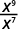
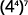
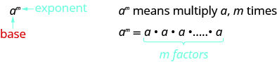

By the end of this section, you will be able to:
* Simplify expressions using the properties for exponents
* Use the definition of a negative exponent
* Use scientific notation

Before you get started, take this readiness quiz.

1.  Simplify:
    <math xmlns="http://www.w3.org/1998/Math/MathML"><mrow><mrow><mo>(</mo><mrow><mn>−2</mn></mrow><mo>)</mo></mrow><mrow><mo>(</mo><mrow><mn>−2</mn></mrow><mo>)</mo></mrow><mrow><mo>(</mo><mrow><mn>−2</mn></mrow><mo>)</mo></mrow><mo>.</mo></mrow></math>
    
    * * *
    {: data-type="newline"}
    
    If you missed this problem, review [\[link\]](/m63303#fs-id1167834536158).
2.  Simplify:
    <math xmlns="http://www.w3.org/1998/Math/MathML"><mrow><mfrac><mrow><mn>8</mn><mi>x</mi></mrow><mrow><mn>24</mn><mi>y</mi></mrow></mfrac><mo>.</mo></mrow></math>
    
    * * *
    {: data-type="newline"}
    
    If you missed this problem, review [\[link\]](/m63304#fs-id1167836620030).
3.  Name the decimal
    <math xmlns="http://www.w3.org/1998/Math/MathML"><mrow><mrow><mo>(</mo><mrow><mn>−2.6</mn></mrow><mo>)</mo></mrow><mrow><mo>(</mo><mrow><mn>4.21</mn></mrow><mo>)</mo></mrow><mo>.</mo></mrow></math>
    
    * * *
    {: data-type="newline"}
    
    If you missed this problem, review [\[link\]](/m63305#fs-id1167836524294).
{: data-number-style="arabic"}

### Simplify Expressions Using the Properties for Exponents

Remember that an exponent indicates repeated multiplication of the same quantity. For example, in the expression <math xmlns="http://www.w3.org/1998/Math/MathML"><mrow><msup><mi>a</mi><mi>m</mi></msup><mo>,</mo></mrow></math>

 the *exponent m* tells us how many times we use the *base a* as a factor.

Let’s review the vocabulary for expressions with exponents.

Exponential Notation

This is read *a* to the <math xmlns="http://www.w3.org/1998/Math/MathML"><mrow><msup><mi>m</mi><mrow><mi>t</mi><mi>h</mi></mrow></msup></mrow></math>

 power.

In the expression <math xmlns="http://www.w3.org/1998/Math/MathML"><mrow><msup><mi>a</mi><mi>m</mi></msup><mo>,</mo></mrow></math>

 the *exponent m* tells us how many times we use the *base a* as a factor.

When we combine like terms by adding and subtracting, we need to have the same base with the same exponent. But when you multiply and divide, the exponents may be different, and sometimes the bases may be different, too.

First, we will look at an example that leads to the **Product Property**{: data-type="term"}.

|  |  | <math xmlns="http://www.w3.org/1998/Math/MathML"><mrow><mspace width="4em" /></mrow></math>

 |
{: valign="top"}| What does this mean? | <math xmlns="http://www.w3.org/1998/Math/MathML"><mrow><mspace width="5em" /></mrow></math>

 |  |
{: valign="top"}|  |  | <math xmlns="http://www.w3.org/1998/Math/MathML"><mrow><mspace width="4em" /></mrow></math>

 |
{: valign="top"}{: .unnumbered .unstyled summary="The figure shows how to multiply exponentials with the same base. In the example we start with x raised to the power of 2 times x raised to the power of 3. This means the we are multiplying 2 factors of x with 3 factors of x for a total of 5 factors of x so the simplified result is x raised to the power of 5." data-label=""}

Notice that 5 is the sum of the exponents, 2 and 3. We see <math xmlns="http://www.w3.org/1998/Math/MathML"><mrow><msup><mi>x</mi><mn>2</mn></msup><mo>·</mo><msup><mi>x</mi><mn>3</mn></msup></mrow></math>

 is <math xmlns="http://www.w3.org/1998/Math/MathML"><mrow><msup><mi>x</mi><mrow><mn>2</mn><mo>+</mo><mn>3</mn></mrow></msup></mrow></math>

 or <math xmlns="http://www.w3.org/1998/Math/MathML"><mrow><msup><mi>x</mi><mn>5</mn></msup><mo>.</mo></mrow></math>

The base stayed the same and we added the exponents. This leads to the Product Property for Exponents.

Product Property for Exponents

If *a* is a real number and *m* and *n* are integers, then

<math xmlns="http://www.w3.org/1998/Math/MathML"><mrow><msup><mi>a</mi><mi>m</mi></msup><mo>·</mo><msup><mi>a</mi><mi>n</mi></msup><mo>=</mo><msup><mi>a</mi><mrow><mi>m</mi><mo>+</mo><mi>n</mi></mrow></msup></mrow></math>

To multiply with like bases, add the exponents.

Simplify each expression: ⓐ <math xmlns="http://www.w3.org/1998/Math/MathML"><mrow><msup><mi>y</mi><mn>5</mn></msup><mo>·</mo><msup><mi>y</mi><mn>6</mn></msup></mrow></math>

 ⓑ <math xmlns="http://www.w3.org/1998/Math/MathML"><mrow><msup><mn>2</mn><mi>x</mi></msup><mo>·</mo><msup><mn>2</mn><mrow><mn>3</mn><mi>x</mi></mrow></msup></mrow></math>

 ⓒ <math xmlns="http://www.w3.org/1998/Math/MathML"><mrow><mn>2</mn><msup><mi>a</mi><mn>7</mn></msup><mo>·</mo><mn>3</mn><mi>a</mi><mo>.</mo></mrow></math>

ⓐ* * *
{: data-type="newline"}

|  |     |
{: valign="top"}| Use the Product Property, <math xmlns="http://www.w3.org/1998/Math/MathML"><mrow><msup><mi>a</mi><mi>m</mi></msup><mo>·</mo><msup><mi>a</mi><mi>n</mi></msup><mo>=</mo><msup><mi>a</mi><mrow><mi>m</mi><mo>+</mo><mi>n</mi></mrow></msup><mo>.</mo></mrow></math>

 |     |
{: valign="top"}| Simplify. |     |
{: valign="top"}{: .unnumbered .unstyled summary="To simplify the expression y to the power of 5 times y to the power of 6 we notice that the base numbers are the same allowing us to use the product property and add the exponents. The expression is equal to y to the power of the quantity 5 plus 6 which simplifies to y to the power of 11." data-label=""}

ⓑ* * *
{: data-type="newline"}

|  |     |
{: valign="top"}| Use the Product Property, <math xmlns="http://www.w3.org/1998/Math/MathML"><mrow><msup><mi>a</mi><mi>m</mi></msup><mo>·</mo><msup><mi>a</mi><mi>n</mi></msup><mo>=</mo><msup><mi>a</mi><mrow><mi>m</mi><mo>+</mo><mi>n</mi></mrow></msup><mo>.</mo></mrow></math>

 |     |
{: valign="top"}| Simplify. |     |
{: valign="top"}{: .unnumbered .unstyled summary="To simplify the expression 2 to the power of x times 2 to the power of 3 x we notice that the base numbers are the same allowing us to use the product property and add the exponents. The expression is equal to 2 to the power of the quantity x plus 3 x which simplifies to 2 to the power of 4 x." data-label=""}

ⓒ* * *
{: data-type="newline"}

<table class="unnumbered unstyled" summary="To simplify the expression 2 a to the power of 7 times 3 a we rewrite a as a to the power of 1. We can use the commutative property to multiply the 2 and 3 to get 6. Then we can use the product property and add the exponents of the variable factors. The product of a to the power of 7 and a to the power of 1 is a to the power of 8. The simplified expression is equal to 6 a to the power of 8." data-label=""><tbody>
<tr valign="top">
<td data-valign="top" data-align="left" />
<td data-valign="top" data-align="center">   </td>
</tr>
<tr valign="top">
<td data-valign="top" data-align="left">Rewrite, <math xmlns="http://www.w3.org/1998/Math/MathML"><mrow><mi>a</mi><mo>=</mo><msup><mi>a</mi><mn>1</mn></msup><mo>.</mo></mrow></math></td>
<td data-valign="top" data-align="center">   </td>
</tr>
<tr valign="top">
<td data-valign="top" data-align="left">Use the Commutative Property and
use the Product Property, <math xmlns="http://www.w3.org/1998/Math/MathML"><mrow><msup><mi>a</mi><mi>m</mi></msup><mo>·</mo><msup><mi>a</mi><mi>n</mi></msup><mo>=</mo><msup><mi>a</mi><mrow><mi>m</mi><mo>+</mo><mi>n</mi></mrow></msup><mo>.</mo></mrow></math></td>
<td data-valign="top" data-align="center">   </td>
</tr>
<tr valign="top">
<td data-valign="top" data-align="left">Simplify.</td>
<td data-valign="top" data-align="center">   </td>
</tr>
</tbody></table>
ⓓ* * *
{: data-type="newline"}

|  |    |
{: valign="top"}| Add the exponents, since bases are the same. |    |
{: valign="top"}| Simplify. |    |
{: valign="top"}{: .unnumbered .unstyled summary="To simplify the expression d to the power of 4 times d to the power of 5 times d to the power of 2 we notice that the base numbers are the same allowing us to use the product property and add the exponents. The expression is equal to d to the power of the quantity 4 plus 5 plus 2 which simplifies to d to the power of 11." data-label=""}

Simplify each expression:

ⓐ <math xmlns="http://www.w3.org/1998/Math/MathML"><mrow><msup><mi>b</mi><mn>9</mn></msup><mo>·</mo><msup><mi>b</mi><mn>8</mn></msup></mrow></math>

 ⓑ <math xmlns="http://www.w3.org/1998/Math/MathML"><mrow><msup><mn>4</mn><mrow><mn>2</mn><mi>x</mi></mrow></msup><mo>·</mo><msup><mn>4</mn><mi>x</mi></msup></mrow></math>

 ⓒ <math xmlns="http://www.w3.org/1998/Math/MathML"><mrow><mn>3</mn><msup><mi>p</mi><mn>5</mn></msup><mo>·</mo><mn>4</mn><mi>p</mi></mrow></math>

 ⓓ <math xmlns="http://www.w3.org/1998/Math/MathML"><mrow><msup><mi>x</mi><mn>6</mn></msup><mo>·</mo><msup><mi>x</mi><mn>4</mn></msup><mo>·</mo><msup><mi>x</mi><mn>8</mn></msup><mo>.</mo></mrow></math>

ⓐ <math xmlns="http://www.w3.org/1998/Math/MathML"><mrow><msup><mi>b</mi><mrow><mn>17</mn></mrow></msup></mrow></math>

 ⓑ <math xmlns="http://www.w3.org/1998/Math/MathML"><mrow><msup><mn>4</mn><mrow><mn>3</mn><mi>x</mi></mrow></msup></mrow></math>

 ⓒ <math xmlns="http://www.w3.org/1998/Math/MathML"><mrow><mn>12</mn><msup><mi>p</mi><mn>6</mn></msup></mrow></math>

* * *
{: data-type="newline"}

ⓓ <math xmlns="http://www.w3.org/1998/Math/MathML"><mrow><msup><mi>x</mi><mrow><mn>18</mn></mrow></msup></mrow></math>

Simplify each expression:

ⓐ <math xmlns="http://www.w3.org/1998/Math/MathML"><mrow><msup><mi>x</mi><mrow><mn>12</mn></mrow></msup><mo>·</mo><msup><mi>x</mi><mn>4</mn></msup></mrow></math>

 ⓑ <math xmlns="http://www.w3.org/1998/Math/MathML"><mrow><mn>10</mn><mo>·</mo><msup><mrow><mn>10</mn></mrow><mi>x</mi></msup></mrow></math>

 ⓒ <math xmlns="http://www.w3.org/1998/Math/MathML"><mrow><mn>2</mn><mi>z</mi><mo>·</mo><mn>6</mn><msup><mi>z</mi><mn>7</mn></msup></mrow></math>

 ⓓ <math xmlns="http://www.w3.org/1998/Math/MathML"><mrow><msup><mi>b</mi><mn>5</mn></msup><mo>·</mo><msup><mi>b</mi><mn>9</mn></msup><mo>·</mo><msup><mi>b</mi><mn>5</mn></msup><mo>.</mo></mrow></math>

ⓐ <math xmlns="http://www.w3.org/1998/Math/MathML"><mrow><msup><mi>x</mi><mrow><mn>16</mn></mrow></msup></mrow></math>

 ⓑ <math xmlns="http://www.w3.org/1998/Math/MathML"><mrow><msup><mrow><mn>10</mn></mrow><mrow><mi>x</mi><mo>+</mo><mn>1</mn></mrow></msup></mrow></math>

 ⓐ <math xmlns="http://www.w3.org/1998/Math/MathML"><mrow><mn>12</mn><msup><mi>z</mi><mn>8</mn></msup></mrow></math>

* * *
{: data-type="newline"}

ⓓ <math xmlns="http://www.w3.org/1998/Math/MathML"><mrow><msup><mi>b</mi><mrow><mn>19</mn></mrow></msup></mrow></math>

Now we will look at an exponent property for division. As before, we’ll try to discover a property by looking at some examples.

| Consider | <math xmlns="http://www.w3.org/1998/Math/MathML"><mrow><mfrac><mrow><msup><mi>x</mi><mn>5</mn></msup></mrow><mrow><msup><mi>x</mi><mn>2</mn></msup></mrow></mfrac></mrow></math>

 | and | <math xmlns="http://www.w3.org/1998/Math/MathML"><mrow><mfrac><mrow><msup><mi>x</mi><mn>2</mn></msup></mrow><mrow><msup><mi>x</mi><mn>3</mn></msup></mrow></mfrac></mrow></math>

 |
{: valign="top"}| What do they mean? | <math xmlns="http://www.w3.org/1998/Math/MathML"><mrow><mfrac><mrow><mi>x</mi><mo>·</mo><mi>x</mi><mo>·</mo><mi>x</mi><mo>·</mo><mi>x</mi><mo>·</mo><mi>x</mi></mrow><mrow><mi>x</mi><mo>·</mo><mi>x</mi></mrow></mfrac></mrow></math>

 |  | <math xmlns="http://www.w3.org/1998/Math/MathML"><mrow><mfrac><mrow><mi>x</mi><mo>·</mo><mi>x</mi></mrow><mrow><mi>x</mi><mo>·</mo><mi>x</mi><mo>·</mo><mi>x</mi></mrow></mfrac></mrow></math>

 |
{: valign="top"}| Use the Equivalent Fractions Property. | <math xmlns="http://www.w3.org/1998/Math/MathML"><mrow><mfrac><mrow><menclose notation="updiagonalstrike"><mi>x</mi></menclose><mo>·</mo><menclose notation="updiagonalstrike"><mi>x</mi></menclose><mo>·</mo><mi>x</mi><mo>·</mo><mi>x</mi><mo>·</mo><mi>x</mi></mrow><mrow><menclose notation="updiagonalstrike"><mi>x</mi></menclose><mo>·</mo><menclose notation="updiagonalstrike"><mi>x</mi></menclose></mrow></mfrac></mrow></math>

 |  | <math xmlns="http://www.w3.org/1998/Math/MathML"><mrow><mfrac><mrow><menclose notation="updiagonalstrike"><mi>x</mi></menclose><mo>·</mo><menclose notation="updiagonalstrike"><mi>x</mi></menclose><mo>·</mo><mn>1</mn></mrow><mrow><menclose notation="updiagonalstrike"><mi>x</mi></menclose><mo>·</mo><menclose notation="updiagonalstrike"><mi>x</mi></menclose><mo>·</mo><mi>x</mi></mrow></mfrac></mrow></math>

 |
{: valign="top"}| Simplify. | <math xmlns="http://www.w3.org/1998/Math/MathML"><msup><mi>x</mi><mn>3</mn></msup></math>

 |  | <math xmlns="http://www.w3.org/1998/Math/MathML"><mfrac><mn>1</mn><mi>x</mi></mfrac></math>

 |
{: valign="top"}{: .unnumbered .unstyled summary="The figure shows two examples of simplifying with the exponent property of division. In the first example the expression is x to the power of 5 divided by x to the power of 2. This means we have 5 factors of x divided by 2 factors of x. Using the equivalent fractions property, we can cross off two factors of x from the numerator and two from the denominator just leaving 3 of the original 5 factors in the numerator. So the simplified expression is x to the power of 3. In the second example the expression is x to the power of 2 divided by x to the power of 3. This means we have 2 factors of x divided by 3 factors of x. Using the equivalent fractions property, we can cross off two factors of x from the numerator and two from the denominator just leaving 1 factor of x in the denominator. So the simplified expression is 1 divided by x." data-label=""}

Notice, in each case the bases were the same and we subtracted exponents. We see <math xmlns="http://www.w3.org/1998/Math/MathML"><mrow><mfrac><mrow><msup><mi>x</mi><mn>5</mn></msup></mrow><mrow><msup><mi>x</mi><mn>2</mn></msup></mrow></mfrac></mrow></math>

 is <math xmlns="http://www.w3.org/1998/Math/MathML"><mrow><msup><mi>x</mi><mrow><mn>5</mn><mo>−</mo><mn>2</mn></mrow></msup></mrow></math>

 or <math xmlns="http://www.w3.org/1998/Math/MathML"><mrow><msup><mi>x</mi><mn>3</mn></msup></mrow></math>

. We see <math xmlns="http://www.w3.org/1998/Math/MathML"><mrow><mfrac><mrow><msup><mi>x</mi><mn>2</mn></msup></mrow><mrow><msup><mi>x</mi><mn>3</mn></msup></mrow></mfrac></mrow></math>

 is or <math xmlns="http://www.w3.org/1998/Math/MathML"><mrow><mfrac><mn>1</mn><mi>x</mi></mfrac><mo>.</mo></mrow></math>

 When the larger exponent was in the numerator, we were left with factors in the numerator. When the larger exponent was in the denominator, we were left with factors in the denominator--notice the numerator of 1. When all the factors in the numerator have been removed, remember this is really dividing the factors to one, and so we need a 1 in the numerator. <math xmlns="http://www.w3.org/1998/Math/MathML"><mrow><mfrac><mrow><menclose notation="updiagonalstrike"><mi>x</mi></menclose></mrow><mrow><menclose notation="updiagonalstrike"><mi>x</mi></menclose></mrow></mfrac><mo>=</mo><mn>1</mn></mrow></math>

. This leads to the **Quotient Property**{: data-type="term"} for Exponents.

Quotient Property for Exponents

If *a* is a real number, <math xmlns="http://www.w3.org/1998/Math/MathML"><mrow><mi>a</mi><mo>≠</mo><mn>0</mn><mo>,</mo></mrow></math>

 and *m* and *n* are integers, then

<math xmlns="http://www.w3.org/1998/Math/MathML"><mrow><mfrac><mrow><msup><mi>a</mi><mi>m</mi></msup></mrow><mrow><msup><mi>a</mi><mi>n</mi></msup></mrow></mfrac><mo>=</mo><msup><mi>a</mi><mrow><mi>m</mi><mo>−</mo><mi>n</mi></mrow></msup><mo>,</mo><mspace width="0.5em" /><mi>m</mi><mo>&gt;</mo><mi>n</mi><mspace width="1em" /><mtext>and</mtext><mspace width="1em" /><mfrac><mrow><msup><mi>a</mi><mi>m</mi></msup></mrow><mrow><msup><mi>a</mi><mi>n</mi></msup></mrow></mfrac><mo>=</mo><mfrac><mn>1</mn><mrow><msup><mi>a</mi><mrow><mi>n</mi><mo>−</mo><mi>m</mi></mrow></msup></mrow></mfrac><mo>,</mo><mspace width="0.5em" /><mi>n</mi><mo>&gt;</mo><mi>m</mi></mrow></math>

Simplify each expression: ⓐ <math xmlns="http://www.w3.org/1998/Math/MathML"><mrow><mfrac><mrow><msup><mi>x</mi><mn>9</mn></msup></mrow><mrow><msup><mi>x</mi><mn>7</mn></msup></mrow></mfrac></mrow></math>

 ⓑ <math xmlns="http://www.w3.org/1998/Math/MathML"><mrow><mfrac><mrow><msup><mn>3</mn><mrow><mn>10</mn></mrow></msup></mrow><mrow><msup><mn>3</mn><mn>2</mn></msup></mrow></mfrac></mrow></math>

 ⓒ <math xmlns="http://www.w3.org/1998/Math/MathML"><mrow><mfrac><mrow><msup><mi>b</mi><mn>8</mn></msup></mrow><mrow><msup><mi>b</mi><mrow><mn>12</mn></mrow></msup></mrow></mfrac></mrow></math>

 ⓓ <math xmlns="http://www.w3.org/1998/Math/MathML"><mrow><mfrac><mrow><msup><mn>7</mn><mn>3</mn></msup></mrow><mrow><msup><mn>7</mn><mn>5</mn></msup></mrow></mfrac><mo>.</mo></mrow></math>

To simplify an expression with a quotient, we need to first compare the exponents in the numerator and denominator.

ⓐ* * *
{: data-type="newline"}

| Since <math xmlns="http://www.w3.org/1998/Math/MathML"><mrow><mn>9</mn><mo>&gt;</mo><mn>7</mn><mo>,</mo></mrow></math>

 there are more factors of <math xmlns="http://www.w3.org/1998/Math/MathML"><mi>x</mi></math>

 in the numerator.<math xmlns="http://www.w3.org/1998/Math/MathML"><mrow><mspace width="0.85em" /></mrow></math>

 |  |
{: valign="top"}| Use Quotient Property, <math xmlns="http://www.w3.org/1998/Math/MathML"><mrow><mfrac><mrow><msup><mi>a</mi><mi>m</mi></msup></mrow><mrow><msup><mi>a</mi><mi>n</mi></msup></mrow></mfrac><mo>=</mo><msup><mi>a</mi><mrow><mi>m</mi><mo>−</mo><mi>n</mi></mrow></msup><mo>.</mo></mrow></math>

 |  |
{: valign="top"}| Simplify. |  |
{: valign="top"}{: .unnumbered .unstyled summary="Simplify the expression x to the power of 9 divided by x to the power of 7. Since 9 is greater than 7, there are 2 more factors of x in the numerator. Using the quotient property the division is equal to x to the power of the quantity 9 minus 7. This simplifies to x to the power of 2." data-label=""}

ⓑ* * *
{: data-type="newline"}

| Since <math xmlns="http://www.w3.org/1998/Math/MathML"><mrow><mn>10</mn><mo>&gt;</mo><mn>2</mn><mo>,</mo></mrow></math>

 there are more factors of <math xmlns="http://www.w3.org/1998/Math/MathML"><mn>3</mn></math>

 in the numerator.<math xmlns="http://www.w3.org/1998/Math/MathML"><mrow><mspace width="0.5em" /></mrow></math>

 |  |
{: valign="top"}| Use Quotient Property, <math xmlns="http://www.w3.org/1998/Math/MathML"><mrow><mfrac><mrow><msup><mi>a</mi><mi>m</mi></msup></mrow><mrow><msup><mi>a</mi><mi>n</mi></msup></mrow></mfrac><mo>=</mo><msup><mi>a</mi><mrow><mi>m</mi><mo>−</mo><mi>n</mi></mrow></msup><mo>.</mo></mrow></math>

 |  |
{: valign="top"}| Simplify. |  |
{: valign="top"}{: .unnumbered .unstyled summary="Simplify the expression 3 to the power of 10 divided by 3 to the power of 2. Since 10 is greater than 2, there are 8 more factors of 3 in the numerator. Using the quotient property the division is equal to 3 to the power of the quantity 10 minus 2. This simplifies to 3 to the power of 8." data-label=""}

Notice that when the larger exponent is in the numerator, we are left with factors in the numerator.

ⓒ* * *
{: data-type="newline"}

| Since <math xmlns="http://www.w3.org/1998/Math/MathML"><mrow><mn>12</mn><mo>&gt;</mo><mn>8</mn><mo>,</mo></mrow></math>

 there are more factors of <math xmlns="http://www.w3.org/1998/Math/MathML"><mi>b</mi></math>

 in the denominator. |  |
{: valign="top"}| Use Quotient Property, <math xmlns="http://www.w3.org/1998/Math/MathML"><mrow><mfrac><mrow><msup><mi>a</mi><mi>m</mi></msup></mrow><mrow><msup><mi>a</mi><mi>n</mi></msup></mrow></mfrac><mo>=</mo><mfrac><mn>1</mn><mrow><msup><mi>a</mi><mrow><mi>n</mi><mo>−</mo><mi>m</mi></mrow></msup></mrow></mfrac><mo>.</mo></mrow></math>

 |  |
{: valign="top"}| Simplify. |  |
{: valign="top"}{: .unnumbered .unstyled summary="Simplify the expression b to the power of 8 divided by b to the power of 12. Since 12 is greater than 8, there are 4 more factors of b in the denominator. Using the quotient property the division is equal to 1 divided by b to the power of the quantity 12 minus 8. This simplifies to 1 divided by b to the power of 4." data-label=""}

ⓓ* * *
{: data-type="newline"}

| Since <math xmlns="http://www.w3.org/1998/Math/MathML"><mrow><mn>5</mn><mo>&gt;</mo><mn>3</mn><mo>,</mo></mrow></math>

 there are more factors of <math xmlns="http://www.w3.org/1998/Math/MathML"><mn>3</mn></math>

 in the denominator.<math xmlns="http://www.w3.org/1998/Math/MathML"><mrow><mspace width="0.2em" /></mrow></math>

 |  |
{: valign="top"}| Use Quotient Property, <math xmlns="http://www.w3.org/1998/Math/MathML"><mrow><mfrac><mrow><msup><mi>a</mi><mi>m</mi></msup></mrow><mrow><msup><mi>a</mi><mi>n</mi></msup></mrow></mfrac><mo>=</mo><mfrac><mn>1</mn><mrow><msup><mi>a</mi><mrow><mi>n</mi><mo>−</mo><mi>m</mi></mrow></msup></mrow></mfrac><mo>.</mo></mrow></math>

 |  |
{: valign="top"}| Simplify. |  |
{: valign="top"}| Simplify. |  |
{: valign="top"}{: .unnumbered .unstyled summary="Simplify the expression 7 to the power of 3 divided by 7 to the power of 5. Since 5 is greater than 3, there are 2 more factors of 7 in the denominator. Using the quotient property the division is equal to 1 divided by 7 to the power of the quantity 5 minus 3. This simplifies to 1 divided by 7 to the power of 2 or 1 divided by 49." data-label=""}

Notice that when the larger exponent is in the denominator, we are left with factors in the denominator.

Simplify each expression: ⓐ <math xmlns="http://www.w3.org/1998/Math/MathML"><mrow><mfrac><mrow><msup><mi>x</mi><mrow><mn>15</mn></mrow></msup></mrow><mrow><msup><mi>x</mi><mrow><mn>10</mn></mrow></msup></mrow></mfrac></mrow></math>

 ⓑ <math xmlns="http://www.w3.org/1998/Math/MathML"><mrow><mfrac><mrow><msup><mn>6</mn><mrow><mn>14</mn></mrow></msup></mrow><mrow><msup><mn>6</mn><mn>5</mn></msup></mrow></mfrac></mrow></math>

 ⓒ <math xmlns="http://www.w3.org/1998/Math/MathML"><mrow><mfrac><mrow><msup><mi>x</mi><mrow><mn>18</mn></mrow></msup></mrow><mrow><msup><mi>x</mi><mrow><mn>22</mn></mrow></msup></mrow></mfrac></mrow></math>

 ⓓ <math xmlns="http://www.w3.org/1998/Math/MathML"><mrow><mfrac><mrow><msup><mrow><mn>12</mn></mrow><mrow><mn>15</mn></mrow></msup></mrow><mrow><msup><mrow><mn>12</mn></mrow><mrow><mn>30</mn></mrow></msup></mrow></mfrac><mo>.</mo></mrow></math>

ⓐ <math xmlns="http://www.w3.org/1998/Math/MathML"><mrow><msup><mi>x</mi><mn>5</mn></msup></mrow></math>

 ⓑ <math xmlns="http://www.w3.org/1998/Math/MathML"><mrow><msup><mn>6</mn><mn>9</mn></msup></mrow></math>

 ⓒ <math xmlns="http://www.w3.org/1998/Math/MathML"><mrow><mfrac><mn>1</mn><mrow><msup><mi>x</mi><mn>4</mn></msup></mrow></mfrac></mrow></math>

* * *
{: data-type="newline"}

ⓓ <math xmlns="http://www.w3.org/1998/Math/MathML"><mrow><mfrac><mn>1</mn><mrow><msup><mrow><mn>12</mn></mrow><mrow><mn>15</mn></mrow></msup></mrow></mfrac></mrow></math>

Simplify each expression: ⓐ <math xmlns="http://www.w3.org/1998/Math/MathML"><mrow><mfrac><mrow><msup><mi>y</mi><mrow><mn>43</mn></mrow></msup></mrow><mrow><msup><mi>y</mi><mrow><mn>37</mn></mrow></msup></mrow></mfrac></mrow></math>

 ⓑ <math xmlns="http://www.w3.org/1998/Math/MathML"><mrow><mfrac><mrow><msup><mrow><mn>10</mn></mrow><mrow><mn>15</mn></mrow></msup></mrow><mrow><msup><mrow><mn>10</mn></mrow><mn>7</mn></msup></mrow></mfrac></mrow></math>

 ⓒ <math xmlns="http://www.w3.org/1998/Math/MathML"><mrow><mfrac><mrow><msup><mi>m</mi><mn>7</mn></msup></mrow><mrow><msup><mi>m</mi><mrow><mn>15</mn></mrow></msup></mrow></mfrac></mrow></math>

 ⓓ <math xmlns="http://www.w3.org/1998/Math/MathML"><mrow><mfrac><mrow><msup><mn>9</mn><mn>8</mn></msup></mrow><mrow><msup><mn>9</mn><mrow><mn>19</mn></mrow></msup></mrow></mfrac><mo>.</mo></mrow></math>

ⓐ <math xmlns="http://www.w3.org/1998/Math/MathML"><mrow><msup><mi>y</mi><mn>6</mn></msup></mrow></math>

 ⓑ <math xmlns="http://www.w3.org/1998/Math/MathML"><mrow><msup><mrow><mn>10</mn></mrow><mn>8</mn></msup></mrow></math>

 ⓒ <math xmlns="http://www.w3.org/1998/Math/MathML"><mrow><mfrac><mn>1</mn><mrow><msup><mi>m</mi><mn>8</mn></msup></mrow></mfrac></mrow></math>

* * *
{: data-type="newline"}

ⓓ <math xmlns="http://www.w3.org/1998/Math/MathML"><mrow><mfrac><mn>1</mn><mrow><msup><mn>9</mn><mrow><mn>11</mn></mrow></msup></mrow></mfrac></mrow></math>

A special case of the **Quotient Property**{: data-type="term" .no-emphasis} is when the exponents of the numerator and denominator are equal, such as an expression like <math xmlns="http://www.w3.org/1998/Math/MathML"><mrow><mfrac><mrow><msup><mi>a</mi><mi>m</mi></msup></mrow><mrow><msup><mi>a</mi><mi>m</mi></msup></mrow></mfrac><mo>.</mo></mrow></math>

 We know<math xmlns="http://www.w3.org/1998/Math/MathML"><mrow><mo>,</mo><mfrac><mi>x</mi><mi>x</mi></mfrac><mo>=</mo><mn>1</mn><mo>,</mo></mrow></math>

 for any <math xmlns="http://www.w3.org/1998/Math/MathML"><mrow><mi>x</mi><mspace width="0.2em" /><mrow><mo>(</mo><mrow><mi>x</mi><mo>≠</mo><mn>0</mn></mrow><mo>)</mo></mrow></mrow></math>

 since any number divided by itself is 1.

The Quotient Property for Exponents shows us how to simplify <math xmlns="http://www.w3.org/1998/Math/MathML"><mrow><mfrac><mrow><msup><mi>a</mi><mi>m</mi></msup></mrow><mrow><msup><mi>a</mi><mi>m</mi></msup></mrow></mfrac><mo>.</mo></mrow></math>

 when <math xmlns="http://www.w3.org/1998/Math/MathML"><mrow><mi>m</mi><mo>&gt;</mo><mi>n</mi></mrow></math>

 and when <math xmlns="http://www.w3.org/1998/Math/MathML"><mrow><mi>n</mi><mo>&lt;</mo><mi>m</mi></mrow></math>

 by subtracting exponents. What if <math xmlns="http://www.w3.org/1998/Math/MathML"><mrow><mi>m</mi><mo>=</mo><mi>n</mi><mo>?</mo></mrow></math>

 We will simplify<math xmlns="http://www.w3.org/1998/Math/MathML"><mrow><mfrac><mrow><msup><mi>a</mi><mi>m</mi></msup></mrow><mrow><msup><mi>a</mi><mi>m</mi></msup></mrow></mfrac></mrow></math>

 in two ways to lead us to the definition of the **Zero Exponent Property**{: data-type="term"}. In general, for <math xmlns="http://www.w3.org/1998/Math/MathML"><mrow><mi>a</mi><mo>≠</mo><mn>0</mn><mo>:</mo></mrow></math>

We see <math xmlns="http://www.w3.org/1998/Math/MathML"><mrow><mfrac><mrow><msup><mi>a</mi><mi>m</mi></msup></mrow><mrow><msup><mi>a</mi><mi>m</mi></msup></mrow></mfrac></mrow></math>

 simplifies to <math xmlns="http://www.w3.org/1998/Math/MathML"><mrow><msup><mi>a</mi><mn>0</mn></msup></mrow></math>

 and to 1. So <math xmlns="http://www.w3.org/1998/Math/MathML"><mrow><msup><mi>a</mi><mn>0</mn></msup><mo>=</mo><mn>1</mn><mo>.</mo></mrow></math>

 Any non-zero base raised to the power of zero equals 1.

Zero Exponent Property

If *a* is a non-zero number, then <math xmlns="http://www.w3.org/1998/Math/MathML"><mrow><msup><mi>a</mi><mn>0</mn></msup><mo>=</mo><mn>1</mn><mo>.</mo></mrow></math>

If *a* is a non-zero number, then *a* to the power of zero equals 1.

Any non-zero number raised to the zero power is 1.

In this text, we assume any variable that we raise to the zero power is not zero.

Simplify each expression: ⓐ <math xmlns="http://www.w3.org/1998/Math/MathML"><mrow><msup><mn>9</mn><mn>0</mn></msup></mrow></math>

 ⓑ <math xmlns="http://www.w3.org/1998/Math/MathML"><mrow><msup><mi>n</mi><mn>0</mn></msup><mo>.</mo></mrow></math>

The definition says any non-zero number raised to the zero power is 1.

ⓐ* * *
{: data-type="newline"}

 <math xmlns="http://www.w3.org/1998/Math/MathML"><mrow><mtable> <mtr><mtd /><mtd /><mtd /><mtd columnalign="left"><mspace width="2em" /><msup><mn>9</mn><mn>0</mn></msup></mtd></mtr> <mtr><mtd columnalign="left"><mtext>Use the definition of the zero exponent.</mtext></mtd><mtd /><mtd /><mtd columnalign="left"><mspace width="2em" /><mn>1</mn></mtd></mtr></mtable></mrow></math>

ⓑ* * *
{: data-type="newline"}

 <math xmlns="http://www.w3.org/1998/Math/MathML"><mrow><mtable> <mtr><mtd /><mtd /><mtd /><mtd columnalign="left"><mspace width="2em" /><msup><mi>n</mi><mn>0</mn></msup></mtd></mtr> <mtr><mtd columnalign="left"><mtext>Use the definition of the zero exponent.</mtext></mtd><mtd /><mtd /><mtd columnalign="left"><mspace width="2em" /><mn>1</mn></mtd></mtr></mtable></mrow></math>

To simplify the expression *n* raised to the zero power we just use the definition of the zero exponent. The result is 1.

Simplify each expression: ⓐ <math xmlns="http://www.w3.org/1998/Math/MathML"><mrow><msup><mn>11</mn><mn>0</mn></msup></mrow></math>

 ⓑ <math xmlns="http://www.w3.org/1998/Math/MathML"><mrow><msup><mi>q</mi><mn>0</mn></msup><mo>.</mo></mrow></math>

ⓐ 1 ⓑ 1

Simplify each expression: ⓐ <math xmlns="http://www.w3.org/1998/Math/MathML"><mrow><msup><mn>23</mn><mn>0</mn></msup></mrow></math>

 ⓑ <math xmlns="http://www.w3.org/1998/Math/MathML"><mrow><msup><mi>r</mi><mn>0</mn></msup><mo>.</mo></mrow></math>

ⓐ 1 ⓑ 1

### Use the Definition of a Negative Exponent

We saw that the Quotient Property for Exponents has two forms depending on whether the exponent is larger in the numerator or the denominator. What if we just subtract exponents regardless of which is larger?

Let’s consider <math xmlns="http://www.w3.org/1998/Math/MathML"><mrow><mfrac><mrow><msup><mi>x</mi><mn>2</mn></msup></mrow><mrow><msup><mi>x</mi><mn>5</mn></msup></mrow></mfrac><mo>.</mo></mrow></math>

 We subtract the exponent in the denominator from the exponent in the numerator. We see <math xmlns="http://www.w3.org/1998/Math/MathML"><mrow><mfrac><mrow><msup><mi>x</mi><mn>2</mn></msup></mrow><mrow><msup><mi>x</mi><mn>5</mn></msup></mrow></mfrac></mrow></math>

 is <math xmlns="http://www.w3.org/1998/Math/MathML"><mrow><msup><mi>x</mi><mrow><mn>2</mn><mo>−</mo><mn>5</mn></mrow></msup></mrow></math>

 or <math xmlns="http://www.w3.org/1998/Math/MathML"><mrow><msup><mi>x</mi><mrow><mn>−3</mn></mrow></msup><mo>.</mo></mrow></math>

We can also simplify <math xmlns="http://www.w3.org/1998/Math/MathML"><mrow><mfrac><mrow><msup><mi>x</mi><mn>2</mn></msup></mrow><mrow><msup><mi>x</mi><mn>5</mn></msup></mrow></mfrac></mrow></math>

 by dividing out common factors:

This implies that <math xmlns="http://www.w3.org/1998/Math/MathML"><mrow><msup><mi>x</mi><mrow><mn>−3</mn></mrow></msup><mo>=</mo><mfrac><mn>1</mn><mrow><msup><mi>x</mi><mn>3</mn></msup></mrow></mfrac></mrow></math>

 and it leads us to the definition of a *negative exponent*. If *n* is an integer and <math xmlns="http://www.w3.org/1998/Math/MathML"><mrow><mi>a</mi><mo>≠</mo><mn>0</mn><mo>,</mo></mrow></math>

 then <math xmlns="http://www.w3.org/1998/Math/MathML"><mrow><msup><mi>a</mi><mrow><mtext>−</mtext><mi>n</mi></mrow></msup><mo>=</mo><mfrac><mn>1</mn><mrow><msup><mi>a</mi><mi>n</mi></msup></mrow></mfrac><mo>.</mo></mrow></math>

Let’s now look at what happens to a fraction whose numerator is one and whose denominator is an integer raised to a negative exponent.

<math xmlns="http://www.w3.org/1998/Math/MathML"><mrow><mtable> <mtr><mtd /><mtd /><mtd /><mtd /><mtd /><mtd columnalign="center"><mspace width="2em" /><mfrac><mn>1</mn><mrow><msup><mi>a</mi><mrow><mtext>−</mtext><mi>n</mi></mrow></msup></mrow></mfrac></mtd></mtr><mtr /><mtr /> <mtr><mtd columnalign="left"><mtext>Use the definition of a negative exponent,</mtext><mspace width="0.2em" /><msup><mi>a</mi><mrow><mtext>−</mtext><mi>n</mi></mrow></msup><mo>=</mo><mfrac><mn>1</mn><mrow><msup><mi>a</mi><mi>n</mi></msup></mrow></mfrac><mo>.</mo></mtd><mtd /><mtd /><mtd /><mtd /><mtd columnalign="center"><mspace width="2em" /><mfrac><mrow><mn>1</mn></mrow><mrow><mfrac><mn>1</mn><mrow><msup><mi>a</mi><mi>n</mi></msup></mrow></mfrac></mrow></mfrac></mtd></mtr><mtr /><mtr /> <mtr><mtd columnalign="left"><mtext>Simplify the complex fraction.</mtext></mtd><mtd /><mtd /><mtd /><mtd /><mtd columnalign="center"><mspace width="2em" /><mn>1</mn><mo>·</mo><mfrac><mrow><msup><mi>a</mi><mi>n</mi></msup></mrow><mn>1</mn></mfrac></mtd></mtr><mtr /><mtr /> <mtr><mtd columnalign="left"><mtext>Multiply.</mtext></mtd><mtd /><mtd /><mtd /><mtd /><mtd columnalign="center"><mspace width="2em" /><msup><mi>a</mi><mi>n</mi></msup></mtd></mtr></mtable></mrow></math>

This implies <math xmlns="http://www.w3.org/1998/Math/MathML"><mrow><mfrac><mn>1</mn><mrow><msup><mi>a</mi><mrow><mtext>−</mtext><mi>n</mi></mrow></msup></mrow></mfrac><mo>=</mo><msup><mi>a</mi><mi>n</mi></msup></mrow></math>

 and is another form of the definition of **Properties of Negative Exponents**{: data-type="term"}.

Properties of Negative Exponents

If *n* is an integer and <math xmlns="http://www.w3.org/1998/Math/MathML"><mrow><mi>a</mi><mo>≠</mo><mn>0</mn><mo>,</mo></mrow></math>

 then <math xmlns="http://www.w3.org/1998/Math/MathML"><mrow><msup><mi>a</mi><mrow><mtext>−</mtext><mi>n</mi></mrow></msup><mo>=</mo><mfrac><mn>1</mn><mrow><msup><mi>a</mi><mi>n</mi></msup></mrow></mfrac></mrow></math>

 or <math xmlns="http://www.w3.org/1998/Math/MathML"><mrow><mfrac><mn>1</mn><mrow><msup><mi>a</mi><mrow><mtext>−</mtext><mi>n</mi></mrow></msup></mrow></mfrac><mo>=</mo><msup><mi>a</mi><mi>n</mi></msup><mo>.</mo></mrow></math>

The negative exponent tells us we can rewrite the expression by taking the reciprocal of the base and then changing the sign of the exponent.

Any expression that has negative exponents is not considered to be in simplest form. We will use the definition of a negative exponent and other properties of exponents to write the expression with only positive exponents.

For example, if after simplifying an expression we end up with the expression <math xmlns="http://www.w3.org/1998/Math/MathML"><mrow><msup><mi>x</mi><mrow><mn>−3</mn></mrow></msup><mo>,</mo></mrow></math>

 we will take one more step and write <math xmlns="http://www.w3.org/1998/Math/MathML"><mrow><mfrac><mn>1</mn><mrow><msup><mi>x</mi><mn>3</mn></msup></mrow></mfrac><mo>.</mo></mrow></math>

 The answer is considered to be in simplest form when it has only positive exponents.

Simplify each expression: ⓐ <math xmlns="http://www.w3.org/1998/Math/MathML"><mrow><msup><mi>x</mi><mrow><mn>−5</mn></mrow></msup></mrow></math>

 ⓑ <math xmlns="http://www.w3.org/1998/Math/MathML"><mrow><msup><mrow><mn>10</mn></mrow><mrow><mn>−3</mn></mrow></msup></mrow></math>

 ⓒ <math xmlns="http://www.w3.org/1998/Math/MathML"><mrow><mfrac><mn>1</mn><mrow><msup><mi>y</mi><mrow><mn>−4</mn></mrow></msup></mrow></mfrac></mrow></math>

 ⓓ <math xmlns="http://www.w3.org/1998/Math/MathML"><mrow><mfrac><mn>1</mn><mrow><msup><mn>3</mn><mrow><mn>−2</mn></mrow></msup></mrow></mfrac><mo>.</mo></mrow></math>

ⓐ* * *
{: data-type="newline"}

 <math xmlns="http://www.w3.org/1998/Math/MathML"><mrow><mtable> <mtr><mtd /><mtd /><mtd /><mtd /><mtd /><mtd columnalign="center"><mspace width="2em" /><msup><mi>x</mi><mrow><mn>−5</mn></mrow></msup></mtd></mtr> <mtr><mtd columnalign="left"><mtext>Use the definition of a negative exponent,</mtext><mspace width="0.2em" /><msup><mi>a</mi><mrow><mtext>−</mtext><mi>n</mi></mrow></msup><mo>=</mo><mfrac><mn>1</mn><mrow><msup><mi>a</mi><mi>n</mi></msup></mrow></mfrac><mo>.</mo></mtd><mtd /><mtd /><mtd /><mtd /><mtd columnalign="center"><mspace width="2em" /><mfrac><mn>1</mn><mrow><msup><mi>x</mi><mn>5</mn></msup></mrow></mfrac></mtd></mtr></mtable></mrow></math>

ⓑ* * *
{: data-type="newline"}

 <math xmlns="http://www.w3.org/1998/Math/MathML"><mrow> <mtable><mtr><mtd /><mtd /><mtd /><mtd /><mtd /><mtd columnalign="center"><mspace width="2em" /><msup><mrow><mn>10</mn></mrow><mrow><mn>−3</mn></mrow></msup></mtd></mtr> <mtr><mtd columnalign="left"><mtext>Use the definition of a negative exponent,</mtext><mspace width="0.2em" /><msup><mi>a</mi><mrow><mtext>−</mtext><mi>n</mi></mrow></msup><mo>=</mo><mfrac><mn>1</mn><mrow><msup><mi>a</mi><mi>n</mi></msup></mrow></mfrac><mo>.</mo></mtd><mtd /><mtd /><mtd /><mtd /><mtd columnalign="center"><mspace width="2em" /><mfrac><mn>1</mn><mrow><msup><mrow><mn>10</mn></mrow><mn>3</mn></msup></mrow></mfrac></mtd></mtr> <mtr><mtd columnalign="left"><mtext>Simplify.</mtext></mtd><mtd /><mtd /><mtd /><mtd /><mtd columnalign="center"><mspace width="2em" /><mfrac><mn>1</mn><mrow><mn>1000</mn></mrow></mfrac></mtd></mtr></mtable></mrow></math>

ⓒ* * *
{: data-type="newline"}

 <math xmlns="http://www.w3.org/1998/Math/MathML"><mrow> <mtable><mtr><mtd /><mtd /><mtd /><mtd /><mtd /><mtd columnalign="center"><mspace width="2.4em" /><mfrac><mn>1</mn><mrow><msup><mi>y</mi><mrow><mn>−4</mn></mrow></msup></mrow></mfrac></mtd></mtr> <mtr><mtd columnalign="left"><mtext>Use the property of a negative exponent,</mtext><mspace width="0.2em" /><mfrac><mn>1</mn><mrow><msup><mi>a</mi><mrow><mtext>−</mtext><mi>n</mi></mrow></msup></mrow></mfrac><mo>=</mo><msup><mi>a</mi><mi>n</mi></msup><mo>.</mo></mtd><mtd /><mtd /><mtd /><mtd /><mtd columnalign="center"><mspace width="2.4em" /><msup><mi>y</mi><mn>4</mn></msup></mtd></mtr></mtable></mrow></math>

ⓓ* * *
{: data-type="newline"}

 <math xmlns="http://www.w3.org/1998/Math/MathML"><mrow> <mtable><mtr><mtd /><mtd /><mtd /><mtd /><mtd /><mtd columnalign="center"><mspace width="2.4em" /><mfrac><mn>1</mn><mrow><msup><mn>3</mn><mrow><mn>−2</mn></mrow></msup></mrow></mfrac></mtd></mtr> <mtr><mtd columnalign="left"><mtext>Use the property of a negative exponent,</mtext><mspace width="0.2em" /><mfrac><mn>1</mn><mrow><msup><mi>a</mi><mrow><mtext>−</mtext><mi>n</mi></mrow></msup></mrow></mfrac><mo>=</mo><msup><mi>a</mi><mi>n</mi></msup><mo>.</mo></mtd><mtd /><mtd /><mtd /><mtd /><mtd columnalign="center"><mspace width="2.4em" /><msup><mn>3</mn><mn>2</mn></msup></mtd></mtr> <mtr><mtd columnalign="left"><mtext>Simplify.</mtext></mtd><mtd /><mtd /><mtd /><mtd /><mtd columnalign="center"><mspace width="2.4em" /><mn>9</mn></mtd></mtr></mtable></mrow></math>

Simplify each expression: ⓐ <math xmlns="http://www.w3.org/1998/Math/MathML"><mrow><msup><mi>z</mi><mrow><mn>−3</mn></mrow></msup></mrow></math>

 ⓑ <math xmlns="http://www.w3.org/1998/Math/MathML"><mrow><msup><mrow><mn>10</mn></mrow><mrow><mn>−7</mn></mrow></msup></mrow></math>

 ⓒ <math xmlns="http://www.w3.org/1998/Math/MathML"><mrow><mfrac><mn>1</mn><mrow><msup><mi>p</mi><mrow><mn>−8</mn></mrow></msup></mrow></mfrac></mrow></math>

 ⓓ <math xmlns="http://www.w3.org/1998/Math/MathML"><mrow><mfrac><mn>1</mn><mrow><msup><mn>4</mn><mrow><mn>−3</mn></mrow></msup></mrow></mfrac><mo>.</mo></mrow></math>

ⓐ <math xmlns="http://www.w3.org/1998/Math/MathML"><mrow><mfrac><mn>1</mn><mrow><msup><mi>z</mi><mn>3</mn></msup></mrow></mfrac></mrow></math>

 ⓑ <math xmlns="http://www.w3.org/1998/Math/MathML"><mrow><mfrac><mn>1</mn><mrow><msup><mrow><mn>10</mn></mrow><mn>7</mn></msup></mrow></mfrac></mrow></math>

 ⓒ <math xmlns="http://www.w3.org/1998/Math/MathML"><mrow><msup><mi>p</mi><mn>8</mn></msup></mrow></math>

 ⓓ <math xmlns="http://www.w3.org/1998/Math/MathML"><mrow><mn>64</mn></mrow></math>

Simplify each expression: ⓐ <math xmlns="http://www.w3.org/1998/Math/MathML"><mrow><msup><mi>n</mi><mrow><mn>−2</mn></mrow></msup></mrow></math>

 ⓑ <math xmlns="http://www.w3.org/1998/Math/MathML"><mrow><msup><mrow><mn>10</mn></mrow><mrow><mn>−4</mn></mrow></msup></mrow></math>

 ⓒ <math xmlns="http://www.w3.org/1998/Math/MathML"><mrow><mfrac><mn>1</mn><mrow><msup><mi>q</mi><mrow><mn>−7</mn></mrow></msup></mrow></mfrac></mrow></math>

 ⓓ <math xmlns="http://www.w3.org/1998/Math/MathML"><mrow><mfrac><mn>1</mn><mrow><msup><mn>2</mn><mrow><mn>−4</mn></mrow></msup></mrow></mfrac><mo>.</mo></mrow></math>

ⓐ <math xmlns="http://www.w3.org/1998/Math/MathML"><mrow><mfrac><mn>1</mn><mrow><msup><mi>n</mi><mn>2</mn></msup></mrow></mfrac></mrow></math>

 ⓑ <math xmlns="http://www.w3.org/1998/Math/MathML"><mrow><mfrac><mn>1</mn><mrow><mn>10,000</mn></mrow></mfrac></mrow></math>

 ⓒ <math xmlns="http://www.w3.org/1998/Math/MathML"><mrow><msup><mi>q</mi><mn>7</mn></msup></mrow></math>

* * *
{: data-type="newline"}

ⓓ <math xmlns="http://www.w3.org/1998/Math/MathML"><mrow><mn>16</mn></mrow></math>

Suppose now we have a fraction raised to a negative exponent. Let’s use our definition of negative exponents to lead us to a new property.

<math xmlns="http://www.w3.org/1998/Math/MathML"><mrow> <mtable><mtr><mtd /><mtd /><mtd /><mtd /><mtd /><mtd columnalign="center"><mspace width="2em" /><msup><mrow><mrow><mo>(</mo><mrow><mfrac><mn>3</mn><mn>4</mn></mfrac></mrow><mo>)</mo></mrow></mrow><mrow><mn>−2</mn></mrow></msup></mtd></mtr> <mtr /><mtr /><mtr><mtd columnalign="left"><mtext>Use the definition of a negative exponent,</mtext><mspace width="0.2em" /><msup><mi>a</mi><mrow><mtext>−</mtext><mi>n</mi></mrow></msup><mo>=</mo><mfrac><mn>1</mn><mrow><msup><mi>a</mi><mi>n</mi></msup></mrow></mfrac><mo>.</mo></mtd><mtd /><mtd /><mtd /><mtd /><mtd columnalign="center"><mspace width="2em" /><mfrac><mn>1</mn><mrow><msup><mrow><mrow><mo>(</mo><mrow><mfrac><mn>3</mn><mn>4</mn></mfrac></mrow><mo>)</mo></mrow></mrow><mn>2</mn></msup></mrow></mfrac></mtd></mtr> <mtr /><mtr /><mtr><mtd columnalign="left"><mtext>Simplify the denominator.</mtext></mtd><mtd /><mtd /><mtd /><mtd /><mtd columnalign="center"><mspace width="2em" /><mfrac><mrow><mn>1</mn></mrow><mrow><mfrac><mn>9</mn><mrow><mn>16</mn></mrow></mfrac></mrow></mfrac></mtd></mtr> <mtr /><mtr /><mtr><mtd columnalign="left"><mtext>Simplify the complex fraction.</mtext></mtd><mtd /><mtd /><mtd /><mtd /><mtd columnalign="center"><mspace width="2em" /><mfrac><mrow><mn>16</mn></mrow><mn>9</mn></mfrac></mtd></mtr> <mtr /><mtr /><mtr><mtd columnalign="left"><mtext>But we know that</mtext><mspace width="0.2em" /><mfrac><mrow><mn>16</mn></mrow><mn>9</mn></mfrac><mspace width="0.2em" /><mtext>is</mtext><mspace width="0.2em" /><msup><mrow><mrow><mo>(</mo><mrow><mfrac><mn>4</mn><mn>3</mn></mfrac></mrow><mo>)</mo></mrow></mrow><mn>2</mn></msup><mo>.</mo></mtd><mtd /><mtd /><mtd /><mtd /><mtd /></mtr> <mtr><mtd columnalign="left"><mtext>This tells us that</mtext></mtd><mtd /><mtd /><mtd /><mtd /><mtd columnalign="center"><mspace width="2em" /><msup><mrow><mrow><mo>(</mo><mrow><mfrac><mn>3</mn><mn>4</mn></mfrac></mrow><mo>)</mo></mrow></mrow><mrow><mn>−2</mn></mrow></msup><mo>=</mo><msup><mrow><mrow><mo>(</mo><mrow><mfrac><mn>4</mn><mn>3</mn></mfrac></mrow><mo>)</mo></mrow></mrow><mn>2</mn></msup></mtd></mtr></mtable></mrow></math>

To get from the original fraction raised to a negative exponent to the final result, we took the reciprocal of the base—the fraction—and changed the sign of the exponent.

This leads us to the **Quotient to a Negative Power**{: data-type="term"} **Property**.

Quotient to a Negative Power Property

If *a* and *b* are real numbers, <math xmlns="http://www.w3.org/1998/Math/MathML"><mrow><mi>a</mi><mo>≠</mo><mn>0</mn><mo>,</mo><mi>b</mi><mo>≠</mo><mn>0</mn></mrow></math>

 and *n* is an integer, then

<math xmlns="http://www.w3.org/1998/Math/MathML"><mrow><mtext>and</mtext><mspace width="0.2em" /><msup><mrow><mrow><mo>(</mo><mrow><mfrac><mi>a</mi><mi>b</mi></mfrac></mrow><mo>)</mo></mrow></mrow><mrow><mtext>−</mtext><mi>n</mi></mrow></msup><mo>=</mo><msup><mrow><mrow><mo>(</mo><mrow><mfrac><mi>b</mi><mi>a</mi></mfrac></mrow><mo>)</mo></mrow></mrow><mi>n</mi></msup></mrow></math>

Simplify each expression: ⓐ <math xmlns="http://www.w3.org/1998/Math/MathML"><mrow><msup><mrow><mrow><mo>(</mo><mrow><mfrac><mn>5</mn><mn>7</mn></mfrac></mrow><mo>)</mo></mrow></mrow><mrow><mn>−2</mn></mrow></msup></mrow></math>

 ⓑ <math xmlns="http://www.w3.org/1998/Math/MathML"><mrow><msup><mrow><mrow><mo>(</mo><mrow><mo>−</mo><mfrac><mi>x</mi><mi>y</mi></mfrac></mrow><mo>)</mo></mrow></mrow><mrow><mn>−3</mn></mrow></msup><mo>.</mo></mrow></math>

ⓐ* * *
{: data-type="newline"}

 <math xmlns="http://www.w3.org/1998/Math/MathML"><mrow><mtable><mtr><mtd /><mtd /><mtd /><mtd /><mtd /><mtd columnalign="center"><mspace width="1em" /><msup><mrow><mrow><mo>(</mo><mrow><mfrac><mn>5</mn><mn>7</mn></mfrac></mrow><mo>)</mo></mrow></mrow><mrow><mn>−2</mn></mrow></msup></mtd></mtr> <mtr><mtd columnalign="left"><mtable><mtr><mtd columnalign="left"><mtext>Use the Quotient to a Negative Exponent Property,</mtext><mspace width="0.2em" /><msup><mrow><mrow><mo>(</mo><mrow><mfrac><mi>a</mi><mi>b</mi></mfrac></mrow><mo>)</mo></mrow></mrow><mrow><mtext>−</mtext><mi>n</mi></mrow></msup><mo>=</mo><msup><mrow><mrow><mo>(</mo><mrow><mfrac><mi>b</mi><mi>a</mi></mfrac></mrow><mo>)</mo></mrow></mrow><mi>n</mi></msup><mo>.</mo></mtd></mtr><mtr><mtd columnalign="left"><mtext>Take the reciprocal of the fraction and change the sign of the exponent.</mtext></mtd></mtr></mtable></mtd><mtd /><mtd /><mtd /><mtd /><mtd columnalign="center"><mspace width="1em" /><msup><mrow><mrow><mo>(</mo><mrow><mfrac><mn>7</mn><mn>5</mn></mfrac></mrow><mo>)</mo></mrow></mrow><mn>2</mn></msup></mtd></mtr> <mtr><mtd columnalign="left"><mtext>Simplify.</mtext></mtd><mtd /><mtd /><mtd /><mtd /><mtd columnalign="center"><mspace width="1em" /><mfrac><mrow><mn>49</mn></mrow><mrow><mn>25</mn></mrow></mfrac></mtd></mtr></mtable></mrow></math>

ⓑ* * *
{: data-type="newline"}

 <math xmlns="http://www.w3.org/1998/Math/MathML"><mrow><mtable> <mtr><mtd /><mtd /><mtd /><mtd /><mtd /><mtd columnalign="center"><mspace width="1em" /><msup><mrow><mrow><mo>(</mo><mrow><mo>−</mo><mfrac><mi>x</mi><mi>y</mi></mfrac></mrow><mo>)</mo></mrow></mrow><mrow><mn>−3</mn></mrow></msup></mtd></mtr> <mtr><mtd columnalign="left"><mtable><mtr><mtd columnalign="left"><mtext>Use the Quotient to a Negative Exponent Property,</mtext><mspace width="0.2em" /><msup><mrow><mrow><mo>(</mo><mrow><mfrac><mi>a</mi><mi>b</mi></mfrac></mrow><mo>)</mo></mrow></mrow><mrow><mtext>−</mtext><mi>n</mi></mrow></msup><mo>=</mo><msup><mrow><mrow><mo>(</mo><mrow><mfrac><mi>b</mi><mi>a</mi></mfrac></mrow><mo>)</mo></mrow></mrow><mi>n</mi></msup><mo>.</mo></mtd></mtr><mtr><mtd columnalign="left"><mtext>Take the reciprocal of the fraction and change the sign of the exponent.</mtext></mtd></mtr></mtable></mtd><mtd /><mtd /><mtd /><mtd /><mtd columnalign="center"><mspace width="1em" /><msup><mrow><mrow><mo>(</mo><mrow><mo>−</mo><mfrac><mi>y</mi><mi>x</mi></mfrac></mrow><mo>)</mo></mrow></mrow><mn>3</mn></msup></mtd></mtr> <mtr><mtd columnalign="left"><mtext>Simplify.</mtext></mtd><mtd /><mtd /><mtd /><mtd /><mtd columnalign="center"><mspace width="1em" /><mo>−</mo><mfrac><mrow><msup><mi>y</mi><mn>3</mn></msup></mrow><mrow><msup><mi>x</mi><mn>3</mn></msup></mrow></mfrac></mtd></mtr></mtable></mrow></math>

Simplify each expression: ⓐ <math xmlns="http://www.w3.org/1998/Math/MathML"><mrow><msup><mrow><mrow><mo>(</mo><mrow><mfrac><mn>2</mn><mn>3</mn></mfrac></mrow><mo>)</mo></mrow></mrow><mrow><mn>−4</mn></mrow></msup></mrow></math>

 ⓑ <math xmlns="http://www.w3.org/1998/Math/MathML"><mrow><msup><mrow><mrow><mo>(</mo><mrow><mo>−</mo><mfrac><mi>m</mi><mi>n</mi></mfrac></mrow><mo>)</mo></mrow></mrow><mrow><mn>−2</mn></mrow></msup><mo>.</mo></mrow></math>

ⓐ <math xmlns="http://www.w3.org/1998/Math/MathML"><mrow><mfrac><mrow><mn>81</mn></mrow><mrow><mn>16</mn></mrow></mfrac></mrow></math>

 ⓑ <math xmlns="http://www.w3.org/1998/Math/MathML"><mrow><mfrac><mrow><msup><mi>n</mi><mn>2</mn></msup></mrow><mrow><msup><mi>m</mi><mn>2</mn></msup></mrow></mfrac></mrow></math>

Simplify each expression: ⓐ <math xmlns="http://www.w3.org/1998/Math/MathML"><mrow><msup><mrow><mrow><mo>(</mo><mrow><mfrac><mn>3</mn><mn>5</mn></mfrac></mrow><mo>)</mo></mrow></mrow><mrow><mn>−3</mn></mrow></msup></mrow></math>

 ⓑ <math xmlns="http://www.w3.org/1998/Math/MathML"><mrow><msup><mrow><mrow><mo>(</mo><mrow><mo>−</mo><mfrac><mi>a</mi><mi>b</mi></mfrac></mrow><mo>)</mo></mrow></mrow><mrow><mn>−4</mn></mrow></msup><mo>.</mo></mrow></math>

ⓐ <math xmlns="http://www.w3.org/1998/Math/MathML"><mrow><mfrac><mrow><mn>125</mn></mrow><mrow><mn>27</mn></mrow></mfrac></mrow></math>

 ⓑ <math xmlns="http://www.w3.org/1998/Math/MathML"><mrow><mfrac><mrow><msup><mi>b</mi><mn>4</mn></msup></mrow><mrow><msup><mi>a</mi><mn>4</mn></msup></mrow></mfrac></mrow></math>

Now that we have negative exponents, we will use the **Product Property**{: data-type="term" .no-emphasis} with expressions that have negative exponents.

Simplify each expression: ⓐ <math xmlns="http://www.w3.org/1998/Math/MathML"><mrow><msup><mi>z</mi><mrow><mn>−5</mn></mrow></msup><mo>·</mo><msup><mi>z</mi><mrow><mn>−3</mn></mrow></msup></mrow></math>

 ⓑ <math xmlns="http://www.w3.org/1998/Math/MathML"><mrow><mrow><mo>(</mo><mrow><msup><mi>m</mi><mn>4</mn></msup><msup><mi>n</mi><mrow><mn>−3</mn></mrow></msup></mrow><mo>)</mo></mrow><mrow><mo>(</mo><mrow><msup><mi>m</mi><mrow><mn>−5</mn></mrow></msup><msup><mi>n</mi><mrow><mn>−2</mn></mrow></msup></mrow><mo>)</mo></mrow></mrow></math>

 ⓒ <math xmlns="http://www.w3.org/1998/Math/MathML"><mrow><mrow><mo>(</mo><mrow><mn>2</mn><msup><mi>x</mi><mrow><mn>−6</mn></mrow></msup><msup><mi>y</mi><mn>8</mn></msup></mrow><mo>)</mo></mrow><mrow><mo>(</mo><mrow><mn>−5</mn><msup><mi>x</mi><mn>5</mn></msup><msup><mi>y</mi><mrow><mn>−3</mn></mrow></msup></mrow><mo>)</mo></mrow><mo>.</mo></mrow></math>

ⓐ* * *
{: data-type="newline"}

 <math xmlns="http://www.w3.org/1998/Math/MathML"><mrow><mtable> <mtr><mtd /><mtd /><mtd /><mtd /><mtd /><mtd columnalign="center"><mspace width="5em" /><msup><mi>z</mi><mrow><mn>−5</mn></mrow></msup><mo>·</mo><msup><mi>z</mi><mrow><mn>−3</mn></mrow></msup></mtd></mtr> <mtr><mtd columnalign="left"><mtext>Add the exponents, since the bases are the same.</mtext></mtd><mtd /><mtd /><mtd /><mtd /><mtd columnalign="center"><mspace width="5em" /><msup><mi>z</mi><mrow><mn>−5</mn><mo>−</mo><mn>3</mn></mrow></msup></mtd></mtr> <mtr><mtd columnalign="left"><mtext>Simplify.</mtext></mtd><mtd /><mtd /><mtd /><mtd /><mtd columnalign="center"><mspace width="5em" /><msup><mi>z</mi><mrow><mn>−8</mn></mrow></msup></mtd></mtr> <mtr><mtd columnalign="left"><mtext>Use the definition of a negative exponent.</mtext></mtd><mtd /><mtd /><mtd /><mtd /><mtd columnalign="center"><mspace width="5em" /><mfrac><mn>1</mn><mrow><msup><mi>z</mi><mn>8</mn></msup></mrow></mfrac></mtd></mtr></mtable></mrow></math>

ⓑ* * *
{: data-type="newline"}

 <math xmlns="http://www.w3.org/1998/Math/MathML"><mrow><mtable> <mtr><mtd /><mtd /><mtd /><mtd /><mtd /><mtd columnalign="center"><mspace width="2em" /><mrow><mo>(</mo><mrow><msup><mi>m</mi><mn>4</mn></msup><msup><mi>n</mi><mrow><mn>−3</mn></mrow></msup></mrow><mo>)</mo></mrow><mrow><mo>(</mo><mrow><msup><mi>m</mi><mrow><mn>−5</mn></mrow></msup><msup><mi>n</mi><mrow><mn>−2</mn></mrow></msup></mrow><mo>)</mo></mrow></mtd></mtr> <mtr><mtd columnalign="left"><mtable><mtr><mtd columnalign="left"><mtext>Use the Commutative Property to get like</mtext></mtd></mtr><mtr><mtd columnalign="left"><mtext>bases together.</mtext></mtd></mtr></mtable></mtd><mtd /><mtd /><mtd /><mtd /><mtd columnalign="center"><mspace width="2em" /><msup><mi>m</mi><mn>4</mn></msup><msup><mi>m</mi><mrow><mn>−5</mn></mrow></msup><mo>·</mo><msup><mi>n</mi><mrow><mn>−2</mn></mrow></msup><msup><mi>n</mi><mrow><mn>−3</mn></mrow></msup></mtd></mtr> <mtr><mtd columnalign="left"><mtext>Add the exponents for each base.</mtext></mtd><mtd /><mtd /><mtd /><mtd /><mtd columnalign="center"><mspace width="2em" /><msup><mi>m</mi><mrow><mn>−1</mn></mrow></msup><mo>·</mo><msup><mi>n</mi><mrow><mn>−5</mn></mrow></msup></mtd></mtr> <mtr><mtd columnalign="left"><mtext>Take reciprocals and change the signs of the exponents.</mtext></mtd><mtd /><mtd /><mtd /><mtd /><mtd columnalign="center"><mspace width="2em" /><mfrac><mn>1</mn><mrow><msup><mi>m</mi><mn>1</mn></msup></mrow></mfrac><mo>·</mo><mfrac><mn>1</mn><mrow><msup><mi>n</mi><mn>5</mn></msup></mrow></mfrac></mtd></mtr> <mtr><mtd columnalign="left"><mtext>Simplify.</mtext></mtd><mtd /><mtd /><mtd /><mtd /><mtd columnalign="center"><mspace width="2em" /><mfrac><mn>1</mn><mrow><mi>m</mi><msup><mi>n</mi><mn>5</mn></msup></mrow></mfrac></mtd></mtr></mtable></mrow></math>

ⓒ* * *
{: data-type="newline"}

 <math xmlns="http://www.w3.org/1998/Math/MathML"><mrow><mtable> <mtr><mtd /><mtd /><mtd /><mtd /><mtd /><mtd columnalign="center"><mspace width="2em" /><mrow><mo>(</mo><mrow><mn>2</mn><msup><mi>x</mi><mrow><mn>−6</mn></mrow></msup><msup><mi>y</mi><mn>8</mn></msup></mrow><mo>)</mo></mrow><mrow><mo>(</mo><mrow><mn>−5</mn><msup><mi>x</mi><mn>5</mn></msup><msup><mi>y</mi><mrow><mn>−3</mn></mrow></msup></mrow><mo>)</mo></mrow></mtd></mtr> <mtr><mtd columnalign="left"><mtext>Rewrite with the like bases together.</mtext></mtd><mtd /><mtd /><mtd /><mtd /><mtd columnalign="center"><mspace width="2em" /><mn>2</mn><mrow><mo>(</mo><mrow><mn>−5</mn></mrow><mo>)</mo></mrow><mo>·</mo><mrow><mo>(</mo><mrow><msup><mi>x</mi><mrow><mn>−6</mn></mrow></msup><msup><mi>x</mi><mn>5</mn></msup></mrow><mo>)</mo></mrow><mo>·</mo><mrow><mo>(</mo><mrow><msup><mi>y</mi><mn>8</mn></msup><msup><mi>y</mi><mrow><mn>−3</mn></mrow></msup></mrow><mo>)</mo></mrow></mtd></mtr> <mtr><mtd columnalign="left"><mtable><mtr><mtd columnalign="left"><mtext>Multiply the coefficients and add the exponents</mtext></mtd></mtr><mtr><mtd columnalign="left"><mtext>of each variable.</mtext></mtd></mtr></mtable></mtd><mtd /><mtd /><mtd /><mtd /><mtd columnalign="center"><mspace width="2em" /><mn>−10</mn><mo>·</mo><msup><mi>x</mi><mrow><mn>−1</mn></mrow></msup><mo>·</mo><msup><mi>y</mi><mn>5</mn></msup></mtd></mtr> <mtr><mtd columnalign="left"><mtext>Use the definition of a negative exponent,</mtext><mspace width="0.2em" /><msup><mi>a</mi><mrow><mtext>−</mtext><mi>n</mi></mrow></msup><mo>=</mo><mfrac><mn>1</mn><mrow><msup><mi>a</mi><mi>n</mi></msup></mrow></mfrac><mo>.</mo></mtd><mtd /><mtd /><mtd /><mtd /><mtd columnalign="center"><mspace width="2em" /><mn>−10</mn><mo>·</mo><mfrac><mn>1</mn><mi>x</mi></mfrac><mo>·</mo><msup><mi>y</mi><mn>5</mn></msup></mtd></mtr> <mtr><mtd columnalign="left"><mtext>Simplify.</mtext></mtd><mtd /><mtd /><mtd /><mtd /><mtd columnalign="center"><mspace width="2em" /><mfrac><mrow><mn>−10</mn><msup><mi>y</mi><mn>5</mn></msup></mrow><mi>x</mi></mfrac></mtd></mtr></mtable></mrow></math>

Simplify each expression:

ⓐ <math xmlns="http://www.w3.org/1998/Math/MathML"><mrow><msup><mi>z</mi><mrow><mn>−4</mn></mrow></msup><mo>·</mo><msup><mi>z</mi><mrow><mn>−5</mn></mrow></msup></mrow></math>

 ⓑ <math xmlns="http://www.w3.org/1998/Math/MathML"><mrow><mrow><mo>(</mo><mrow><msup><mi>p</mi><mn>6</mn></msup><msup><mi>q</mi><mrow><mn>−2</mn></mrow></msup></mrow><mo>)</mo></mrow><mrow><mo>(</mo><mrow><msup><mi>p</mi><mrow><mn>−9</mn></mrow></msup><msup><mi>q</mi><mrow><mn>−1</mn></mrow></msup></mrow><mo>)</mo></mrow></mrow></math>

 ⓒ <math xmlns="http://www.w3.org/1998/Math/MathML"><mrow><mrow><mo>(</mo><mrow><mn>3</mn><msup><mi>u</mi><mrow><mn>−5</mn></mrow></msup><msup><mi>v</mi><mn>7</mn></msup></mrow><mo>)</mo></mrow><mrow><mo>(</mo><mrow><mn>−4</mn><msup><mi>u</mi><mn>4</mn></msup><msup><mi>v</mi><mrow><mn>−2</mn></mrow></msup></mrow><mo>)</mo></mrow><mo>.</mo></mrow></math>

ⓐ <math xmlns="http://www.w3.org/1998/Math/MathML"><mrow><mfrac><mn>1</mn><mrow><msup><mi>z</mi><mn>9</mn></msup></mrow></mfrac></mrow></math>

 ⓑ <math xmlns="http://www.w3.org/1998/Math/MathML"><mrow><mfrac><mn>1</mn><mrow><msup><mi>p</mi><mn>3</mn></msup><msup><mi>q</mi><mn>3</mn></msup></mrow></mfrac></mrow></math>

 ⓒ <math xmlns="http://www.w3.org/1998/Math/MathML"><mrow><mo>−</mo><mfrac><mrow><mn>12</mn><msup><mi>v</mi><mn>5</mn></msup></mrow><mi>u</mi></mfrac></mrow></math>

Simplify each expression:

ⓐ <math xmlns="http://www.w3.org/1998/Math/MathML"><mrow><msup><mi>c</mi><mrow><mn>−8</mn></mrow></msup><mo>·</mo><msup><mi>c</mi><mrow><mn>−7</mn></mrow></msup></mrow></math>

 ⓑ <math xmlns="http://www.w3.org/1998/Math/MathML"><mrow><mrow><mo>(</mo><mrow><msup><mi>r</mi><mn>5</mn></msup><msup><mi>s</mi><mrow><mn>−3</mn></mrow></msup></mrow><mo>)</mo></mrow><mrow><mo>(</mo><mrow><msup><mi>r</mi><mrow><mn>−7</mn></mrow></msup><msup><mi>s</mi><mrow><mn>−5</mn></mrow></msup></mrow><mo>)</mo></mrow></mrow></math>

 ⓒ <math xmlns="http://www.w3.org/1998/Math/MathML"><mrow><mrow><mo>(</mo><mrow><mn>−6</mn><msup><mi>c</mi><mrow><mn>−6</mn></mrow></msup><msup><mi>d</mi><mn>4</mn></msup></mrow><mo>)</mo></mrow><mrow><mo>(</mo><mrow><mn>−5</mn><msup><mi>c</mi><mrow><mn>−2</mn></mrow></msup><msup><mi>d</mi><mrow><mn>−1</mn></mrow></msup></mrow><mo>)</mo></mrow><mo>.</mo></mrow></math>

ⓐ <math xmlns="http://www.w3.org/1998/Math/MathML"><mrow><mfrac><mn>1</mn><mrow><msup><mi>c</mi><mrow><mn>15</mn></mrow></msup></mrow></mfrac></mrow></math>

 ⓑ <math xmlns="http://www.w3.org/1998/Math/MathML"><mrow><mfrac><mn>1</mn><mrow><msup><mi>r</mi><mn>2</mn></msup><msup><mi>s</mi><mn>8</mn></msup></mrow></mfrac></mrow></math>

 ⓒ <math xmlns="http://www.w3.org/1998/Math/MathML"><mrow><mfrac><mrow><mn>30</mn><msup><mi>d</mi><mn>3</mn></msup></mrow><mrow><msup><mi>c</mi><mn>8</mn></msup></mrow></mfrac></mrow></math>

Now let’s look at an exponential expression that contains a power raised to a power. See if you can discover a general property.

<math xmlns="http://www.w3.org/1998/Math/MathML"><mrow><mtable> <mtr><mtd /><mtd /><mtd /><mtd /><mtd /><mtd columnalign="center"><mspace width="8em" /><msup><mrow><mo stretchy="false">(</mo><msup><mi>x</mi><mn>2</mn></msup><mo stretchy="false">)</mo></mrow><mn>3</mn></msup></mtd></mtr> <mtr><mtd columnalign="left"><mtext>What does this mean?</mtext></mtd><mtd /><mtd /><mtd /><mtd /><mtd columnalign="center"><mspace width="9em" /><msup><mi>x</mi><mn>2</mn></msup><mo>·</mo><msup><mi>x</mi><mn>2</mn></msup><mo>·</mo><msup><mi>x</mi><mn>2</mn></msup></mtd></mtr></mtable></mrow></math>

| How many factors altogether? |  |
{: valign="top"}| So we have |  |
{: valign="top"}{: .unnumbered .unstyled summary="The quantity x raised to the power of 2 raised to the power of 3 is written as x to the power of 2 times x to the power of 2 times x to the power of 2. Since each x to the power of 2 is 2 factors of x this is 6 factors of x so we have x to the power of 6." data-label=""}

Notice the 6 is the *product* of the exponents, 2 and 3. We see that <math xmlns="http://www.w3.org/1998/Math/MathML"><mrow><msup><mrow><mo stretchy="false">(</mo><msup><mi>x</mi><mn>2</mn></msup><mo stretchy="false">)</mo></mrow><mn>3</mn></msup></mrow></math>

 is <math xmlns="http://www.w3.org/1998/Math/MathML"><mrow><msup><mi>x</mi><mrow><mn>2</mn><mo>·</mo><mn>3</mn></mrow></msup></mrow></math>

 or <math xmlns="http://www.w3.org/1998/Math/MathML"><mrow><msup><mi>x</mi><mn>6</mn></msup><mo>.</mo></mrow></math>

We multiplied the exponents. This leads to the **Power Property**{: data-type="term"} **for Exponents.**

Power Property for Exponents

If *a* is a real number and *m* and *n* are integers, then

<math xmlns="http://www.w3.org/1998/Math/MathML"><mrow><msup><mrow><mo stretchy="false">(</mo><msup><mi>a</mi><mi>m</mi></msup><mo stretchy="false">)</mo></mrow><mi>n</mi></msup><mo>=</mo><msup><mrow><mi>a</mi></mrow><mrow><mi>m</mi><mo>·</mo><mi>n</mi></mrow></msup></mrow></math>

To raise a power to a power, multiply the exponents.

Simplify each expression: ⓐ <math xmlns="http://www.w3.org/1998/Math/MathML"><mrow><msup><mrow><mo stretchy="false">(</mo><msup><mi>y</mi><mn>5</mn></msup><mo stretchy="false">)</mo></mrow><mn>9</mn></msup></mrow></math>

 ⓑ <math xmlns="http://www.w3.org/1998/Math/MathML"><mrow><msup><mrow><mo stretchy="false">(</mo><msup><mn>4</mn><mn>4</mn></msup><mo stretchy="false">)</mo></mrow><mn>7</mn></msup></mrow></math>

 ⓒ <math xmlns="http://www.w3.org/1998/Math/MathML"><mrow><msup><mrow><mo stretchy="false">(</mo><msup><mi>y</mi><mn>3</mn></msup><mo stretchy="false">)</mo></mrow><mn>6</mn></msup><msup><mrow><mo stretchy="false">(</mo><msup><mi>y</mi><mn>5</mn></msup><mo stretchy="false">)</mo></mrow><mn>4</mn></msup><mo>.</mo></mrow></math>

ⓐ* * *
{: data-type="newline"}

|  |  |
{: valign="top"}| Use the Power Property, <math xmlns="http://www.w3.org/1998/Math/MathML"><mrow><msup><mrow><mo stretchy="false">(</mo><msup><mi>a</mi><mi>m</mi></msup><mo stretchy="false">)</mo></mrow><mi>n</mi></msup><mo>=</mo><msup><mrow><mi>a</mi></mrow><mrow><mi>m</mi><mo>·</mo><mi>n</mi></mrow></msup><mo>.</mo><mspace width="1.2em" /></mrow></math>

 |  |
{: valign="top"}| Simplify. |  |
{: valign="top"}{: .unnumbered .unstyled summary="Simplify the quantity y to the power of 5 raised to the power of 9. Using the power property we multiply the exponents and get y to the power of 5 times 9 or y to the power of 45." data-label=""}

ⓑ* * *
{: data-type="newline"}

|  |  |
{: valign="top"}| Use the Power Property.          |  |
{: valign="top"}| Simplify. |  |
{: valign="top"}{: .unnumbered .unstyled summary="Simplify the quantity 4 to the power of 4 raised to the power of 7. Using the power property we multiply the exponents and get 4 to the power of 4 times 7 or 4 to the power of 28." data-label=""}

ⓒ* * *
{: data-type="newline"}

 <math xmlns="http://www.w3.org/1998/Math/MathML"><mrow><mtable> <mtr><mtd /><mtd /><mtd /><mtd /><mtd /><mtd columnalign="center"><mspace width="5.8em" /><msup><mrow><mo stretchy="false">(</mo><msup><mi>y</mi><mn>3</mn></msup><mo stretchy="false">)</mo></mrow><mn>6</mn></msup><msup><mrow><mo stretchy="false">(</mo><msup><mi>y</mi><mn>5</mn></msup><mo stretchy="false">)</mo></mrow><mn>4</mn></msup></mtd></mtr> <mtr><mtd columnalign="left"><mtext>Use the Power Property.</mtext></mtd><mtd /><mtd /><mtd /><mtd /><mtd columnalign="center"><mspace width="5.8em" /><msup><mi>y</mi><mrow><mn>18</mn></mrow></msup><mo>·</mo><msup><mi>y</mi><mrow><mn>20</mn></mrow></msup></mtd></mtr> <mtr><mtd columnalign="left"><mtext>Add the exponents.</mtext></mtd><mtd /><mtd /><mtd /><mtd /><mtd columnalign="center"><mspace width="5.8em" /><msup><mi>y</mi><mrow><mn>38</mn></mrow></msup></mtd></mtr></mtable></mrow></math>

Simplify each expression: ⓐ <math xmlns="http://www.w3.org/1998/Math/MathML"><mrow><msup><mrow><mo stretchy="false">(</mo><msup><mi>b</mi><mn>7</mn></msup><mo stretchy="false">)</mo></mrow><mn>5</mn></msup></mrow></math>

 ⓑ <math xmlns="http://www.w3.org/1998/Math/MathML"><mrow><msup><mrow><mo stretchy="false">(</mo><msup><mn>5</mn><mn>4</mn></msup><mo stretchy="false">)</mo></mrow><mn>3</mn></msup></mrow></math>

 ⓒ <math xmlns="http://www.w3.org/1998/Math/MathML"><mrow><msup><mrow><mo stretchy="false">(</mo><msup><mi>a</mi><mn>4</mn></msup><mo stretchy="false">)</mo></mrow><mn>5</mn></msup><msup><mrow><mo stretchy="false">(</mo><msup><mi>a</mi><mn>7</mn></msup><mo stretchy="false">)</mo></mrow><mn>4</mn></msup><mo>.</mo></mrow></math>

ⓐ <math xmlns="http://www.w3.org/1998/Math/MathML"><mrow><msup><mi>b</mi><mrow><mn>35</mn></mrow></msup></mrow></math>

 ⓑ <math xmlns="http://www.w3.org/1998/Math/MathML"><mrow><msup><mn>5</mn><mrow><mn>12</mn></mrow></msup></mrow></math>

 ⓒ <math xmlns="http://www.w3.org/1998/Math/MathML"><mrow><msup><mi>a</mi><mrow><mn>48</mn></mrow></msup></mrow></math>

Simplify each expression: ⓐ <math xmlns="http://www.w3.org/1998/Math/MathML"><mrow><msup><mrow><mo stretchy="false">(</mo><msup><mi>z</mi><mn>6</mn></msup><mo stretchy="false">)</mo></mrow><mn>9</mn></msup></mrow></math>

 ⓑ <math xmlns="http://www.w3.org/1998/Math/MathML"><mrow><msup><mrow><mo stretchy="false">(</mo><msup><mn>3</mn><mn>7</mn></msup><mo stretchy="false">)</mo></mrow><mn>7</mn></msup></mrow></math>

 ⓒ <math xmlns="http://www.w3.org/1998/Math/MathML"><mrow><msup><mrow><mo stretchy="false">(</mo><msup><mi>q</mi><mn>4</mn></msup><mo stretchy="false">)</mo></mrow><mn>5</mn></msup><msup><mrow><mo stretchy="false">(</mo><msup><mi>q</mi><mn>3</mn></msup><mo stretchy="false">)</mo></mrow><mn>3</mn></msup><mo>.</mo></mrow></math>

ⓐ <math xmlns="http://www.w3.org/1998/Math/MathML"><mrow><msup><mi>z</mi><mrow><mn>54</mn></mrow></msup></mrow></math>

 ⓑ <math xmlns="http://www.w3.org/1998/Math/MathML"><mrow><msup><mn>3</mn><mrow><mn>49</mn></mrow></msup></mrow></math>

 ⓒ <math xmlns="http://www.w3.org/1998/Math/MathML"><mrow><msup><mi>q</mi><mrow><mn>29</mn></mrow></msup></mrow></math>

We will now look at an expression containing a product that is raised to a power. Can you find this pattern?

<math xmlns="http://www.w3.org/1998/Math/MathML"><mrow><mtable> <mtr><mtd /><mtd /><mtd /><mtd /><mtd /><mtd columnalign="center"><msup><mrow><mrow><mo>(</mo><mrow><mn>2</mn><mi>x</mi></mrow><mo>)</mo></mrow></mrow><mn>3</mn></msup></mtd></mtr> <mtr><mtd columnalign="left"><mtext>What does this mean?</mtext></mtd><mtd /><mtd /><mtd /><mtd /><mtd columnalign="center"><mn>2</mn><mi>x</mi><mo>·</mo><mn>2</mn><mi>x</mi><mo>·</mo><mn>2</mn><mi>x</mi></mtd></mtr> <mtr><mtd columnalign="left"><mtext>We group the like factors together.</mtext></mtd><mtd /><mtd /><mtd /><mtd /><mtd columnalign="center"><mn>2</mn><mo>·</mo><mn>2</mn><mo>·</mo><mn>2</mn><mo>·</mo><mi>x</mi><mo>·</mo><mi>x</mi><mo>·</mo><mi>x</mi></mtd></mtr> <mtr><mtd columnalign="left"><mtext>How many factors of 2 and of</mtext><mspace width="0.2em" /><mi>x</mi></mtd><mtd /><mtd /><mtd /><mtd /><mtd columnalign="center"><msup><mn>2</mn><mn>3</mn></msup><mo>·</mo><msup><mi>x</mi><mn>3</mn></msup></mtd></mtr></mtable></mrow></math>

Notice that each factor was raised to the power and <math xmlns="http://www.w3.org/1998/Math/MathML"><mrow><msup><mrow><mrow><mo>(</mo><mrow><mn>2</mn><mi>x</mi></mrow><mo>)</mo></mrow></mrow><mn>3</mn></msup></mrow></math>

 is <math xmlns="http://www.w3.org/1998/Math/MathML"><mrow><msup><mn>2</mn><mn>3</mn></msup><mo>·</mo><msup><mi>x</mi><mn>3</mn></msup><mo>.</mo></mrow></math>

The exponent applies to each of the factors! This leads to the **Product to a Power**{: data-type="term"} **Property for Exponents**.

Product to a Power Property for Exponents

If *a* and *b* are real numbers and *m* is a whole number, then

<math xmlns="http://www.w3.org/1998/Math/MathML"><mrow><msup><mrow><mo stretchy="false">(</mo><mi>a</mi><mi>b</mi><mo stretchy="false">)</mo></mrow><mi>m</mi></msup><mo>=</mo><msup><mi>a</mi><mi>m</mi></msup><msup><mi>b</mi><mi>m</mi></msup></mrow></math>

To raise a product to a power, raise each factor to that power.

Simplify each expression: ⓐ <math xmlns="http://www.w3.org/1998/Math/MathML"><mrow><msup><mrow><mo stretchy="false">(</mo><mn>−3</mn><mi>m</mi><mi>n</mi><mo stretchy="false">)</mo></mrow><mn>3</mn></msup></mrow></math>

 ⓑ <math xmlns="http://www.w3.org/1998/Math/MathML"><mrow><msup><mrow><mrow><mo>(</mo><mrow><mn>−4</mn><msup><mi>a</mi><mn>2</mn></msup><mi>b</mi></mrow><mo>)</mo></mrow></mrow><mn>0</mn></msup></mrow></math>

 ⓒ <math xmlns="http://www.w3.org/1998/Math/MathML"><mrow><msup><mrow><mrow><mo>(</mo><mrow><mn>6</mn><msup><mi>k</mi><mn>3</mn></msup></mrow><mo>)</mo></mrow></mrow><mrow><mn>−2</mn></mrow></msup></mrow></math>

 ⓓ <math xmlns="http://www.w3.org/1998/Math/MathML"><mrow><msup><mrow><mrow><mo>(</mo><mrow><mn>5</mn><msup><mi>x</mi><mrow><mn>−3</mn></mrow></msup></mrow><mo>)</mo></mrow></mrow><mn>2</mn></msup><mo>.</mo></mrow></math>

ⓐ* * *
{: data-type="newline"}

|  |   |
{: valign="top"}| Use Power of a Product Property, <math xmlns="http://www.w3.org/1998/Math/MathML"><mrow><msup><mrow><mo stretchy="false">(</mo><mi>a</mi><mi>b</mi><mo stretchy="false">)</mo></mrow><mi>m</mi></msup><mo>=</mo><msup><mi>a</mi><mi>m</mi></msup><msup><mi>b</mi><mi>m</mi></msup><mo>.</mo></mrow></math>

 |  |
{: valign="top"}| Simplify. |   |
{: valign="top"}{: .unnumbered .unstyled summary="Given negative 3 m n in parentheses to the power of 3 we can use the power of a product property to write negative 3 to the power of 3 m to the power of 3 n to the power of 3. This simplifies to negative 27 m to the power of 3 n to the power of 3." data-label=""}

ⓑ* * *
{: data-type="newline"}

 <math xmlns="http://www.w3.org/1998/Math/MathML"><mrow><mtable> <mtr><mtd /><mtd /><mtd /><mtd /><mtd /><mtd columnalign="center"><mspace width="1em" /><msup><mrow><mrow><mo>(</mo><mrow><mn>−4</mn><msup><mi>a</mi><mn>2</mn></msup><mi>b</mi></mrow><mo>)</mo></mrow></mrow><mn>0</mn></msup></mtd></mtr> <mtr><mtd columnalign="left"><mtext>Use Power of a Product Property,</mtext><mspace width="0.2em" /><msup><mrow><mo stretchy="false">(</mo><mi>a</mi><mi>b</mi><mo stretchy="false">)</mo></mrow><mi>m</mi></msup><mo>=</mo><msup><mi>a</mi><mi>m</mi></msup><msup><mi>b</mi><mi>m</mi></msup><mo>.</mo></mtd><mtd /><mtd /><mtd /><mtd /><mtd columnalign="center"><mspace width="1em" /><msup><mrow><mrow><mo>(</mo><mrow><mn>−4</mn></mrow><mo>)</mo></mrow></mrow><mn>0</mn></msup><msup><mrow><mrow><mo>(</mo><mrow><msup><mi>a</mi><mn>2</mn></msup></mrow><mo>)</mo></mrow></mrow><mn>0</mn></msup><msup><mrow><mrow><mo>(</mo><mi>b</mi><mo>)</mo></mrow></mrow><mn>0</mn></msup></mtd></mtr> <mtr><mtd columnalign="left"><mtext>Simplify.</mtext></mtd><mtd /><mtd /><mtd /><mtd /><mtd columnalign="center"><mspace width="1em" /><mn>1</mn><mo>·</mo><mn>1</mn><mo>·</mo><mn>1</mn></mtd></mtr> <mtr><mtd columnalign="left"><mtext>Multiply.</mtext></mtd><mtd /><mtd /><mtd /><mtd /><mtd columnalign="center"><mspace width="1em" /><mn>1</mn></mtd></mtr></mtable></mrow></math>

ⓒ* * *
{: data-type="newline"}

 <math xmlns="http://www.w3.org/1998/Math/MathML"><mrow><mtable> <mtr><mtd /><mtd /><mtd /><mtd /><mtd /><mtd columnalign="center"><msup><mrow><mrow><mo>(</mo><mrow><mn>6</mn><msup><mi>k</mi><mn>3</mn></msup></mrow><mo>)</mo></mrow></mrow><mrow><mn>−2</mn></mrow></msup></mtd></mtr> <mtr><mtd columnalign="left"><mtext>Use the Product to a Power Property,</mtext><mspace width="0.2em" /><msup><mrow><mrow><mo>(</mo><mrow><mi>a</mi><mi>b</mi></mrow><mo>)</mo></mrow></mrow><mi>m</mi></msup><mo>=</mo><msup><mi>a</mi><mi>m</mi></msup><msup><mi>b</mi><mi>m</mi></msup><mo>.</mo></mtd><mtd /><mtd /><mtd /><mtd /><mtd columnalign="center"><msup><mrow><mrow><mo>(</mo><mn>6</mn><mo>)</mo></mrow></mrow><mrow><mn>−2</mn></mrow></msup><msup><mrow><mrow><mo>(</mo><mrow><msup><mi>k</mi><mn>3</mn></msup></mrow><mo>)</mo></mrow></mrow><mrow><mn>−2</mn></mrow></msup></mtd></mtr> <mtr><mtd columnalign="left"><mtext>Use the Power Property,</mtext><mspace width="0.2em" /><msup><mrow><mrow><mo>(</mo><mrow><msup><mi>a</mi><mi>m</mi></msup></mrow><mo>)</mo></mrow></mrow><mi>n</mi></msup><mo>=</mo><msup><mi>a</mi><mrow><mi>m</mi><mo>·</mo><mi>n</mi></mrow></msup><mo>.</mo></mtd><mtd /><mtd /><mtd /><mtd /><mtd columnalign="center"><msup><mn>6</mn><mrow><mn>−2</mn></mrow></msup><msup><mi>k</mi><mrow><mn>−6</mn></mrow></msup></mtd></mtr> <mtr><mtd columnalign="left"><mtext>Use the Definition of a negative exponent,</mtext><mspace width="0.2em" /><msup><mi>a</mi><mrow><mtext>−</mtext><mi>n</mi></mrow></msup><mo>=</mo><mfrac><mn>1</mn><mrow><msup><mi>a</mi><mi>n</mi></msup></mrow></mfrac><mo>.</mo></mtd><mtd /><mtd /><mtd /><mtd /><mtd columnalign="center"><mfrac><mn>1</mn><mrow><msup><mn>6</mn><mn>2</mn></msup></mrow></mfrac><mo>·</mo><mfrac><mn>1</mn><mrow><msup><mi>k</mi><mn>6</mn></msup></mrow></mfrac></mtd></mtr> <mtr><mtd columnalign="left"><mtext>Simplify.</mtext></mtd><mtd /><mtd /><mtd /><mtd /><mtd columnalign="center"><mfrac><mn>1</mn><mrow><mn>36</mn><msup><mi>k</mi><mn>6</mn></msup></mrow></mfrac></mtd></mtr></mtable></mrow></math>

ⓓ* * *
{: data-type="newline"}

 <math xmlns="http://www.w3.org/1998/Math/MathML"><mrow><mtable> <mtr><mtd /><mtd /><mtd /><mtd /><mtd /><mtd columnalign="center"><msup><mrow><mrow><mo>(</mo><mrow><mn>5</mn><msup><mi>x</mi><mrow><mn>−3</mn></mrow></msup></mrow><mo>)</mo></mrow></mrow><mn>2</mn></msup></mtd></mtr> <mtr><mtd columnalign="left"><mtext>Use the Product to a Power Property,</mtext><mspace width="0.2em" /><msup><mrow><mrow><mo>(</mo><mrow><mi>a</mi><mi>b</mi></mrow><mo>)</mo></mrow></mrow><mi>m</mi></msup><mo>=</mo><msup><mi>a</mi><mi>m</mi></msup><msup><mi>b</mi><mi>m</mi></msup><mo>.</mo></mtd><mtd /><mtd /><mtd /><mtd /><mtd columnalign="center"><msup><mn>5</mn><mn>2</mn></msup><msup><mrow><mrow><mo>(</mo><mrow><msup><mi>x</mi><mrow><mn>−3</mn></mrow></msup></mrow><mo>)</mo></mrow></mrow><mn>2</mn></msup></mtd></mtr> <mtr><mtd columnalign="left"><mtext>Simplify.</mtext></mtd><mtd /><mtd /><mtd /><mtd /><mtd columnalign="center"><mn>25</mn><mo>·</mo><msup><mi>x</mi><mrow><mn>−6</mn></mrow></msup></mtd></mtr> <mtr><mtd columnalign="left"><mtext>Rewrite</mtext><mspace width="0.2em" /><msup><mi>x</mi><mrow><mn>−6</mn></mrow></msup><mspace width="0.2em" /><mtext>using,</mtext><mspace width="0.2em" /><msup><mi>a</mi><mrow><mtext>−</mtext><mi>n</mi></mrow></msup><mo>=</mo><mfrac><mn>1</mn><mrow><msup><mi>a</mi><mi>n</mi></msup></mrow></mfrac><mo>.</mo></mtd><mtd /><mtd /><mtd /><mtd /><mtd columnalign="center"><mn>25</mn><mo>·</mo><mfrac><mrow><mn>1</mn></mrow><mrow><msup><mi>x</mi><mn>6</mn></msup></mrow></mfrac></mtd></mtr> <mtr><mtd columnalign="left"><mtext>Simplify.</mtext></mtd><mtd /><mtd /><mtd /><mtd /><mtd columnalign="center"><mfrac><mrow><mn>25</mn></mrow><mrow><msup><mi>x</mi><mn>6</mn></msup></mrow></mfrac></mtd></mtr></mtable></mrow></math>

Simplify each expression: ⓐ <math xmlns="http://www.w3.org/1998/Math/MathML"><mrow><msup><mrow><mo stretchy="false">(</mo><mn>2</mn><mi>w</mi><mi>x</mi><mo stretchy="false">)</mo></mrow><mn>5</mn></msup></mrow></math>

 ⓑ <math xmlns="http://www.w3.org/1998/Math/MathML"><mrow><msup><mrow><mrow><mo>(</mo><mrow><mn>−11</mn><mi>p</mi><msup><mi>q</mi><mn>3</mn></msup></mrow><mo>)</mo></mrow></mrow><mn>0</mn></msup></mrow></math>

 ⓒ <math xmlns="http://www.w3.org/1998/Math/MathML"><mrow><msup><mrow><mrow><mo>(</mo><mrow><mn>2</mn><msup><mi>b</mi><mn>3</mn></msup></mrow><mo>)</mo></mrow></mrow><mrow><mn>−4</mn></mrow></msup></mrow></math>

 ⓓ <math xmlns="http://www.w3.org/1998/Math/MathML"><mrow><msup><mrow><mrow><mo>(</mo><mrow><mn>8</mn><msup><mi>a</mi><mrow><mn>−4</mn></mrow></msup></mrow><mo>)</mo></mrow></mrow><mn>2</mn></msup><mo>.</mo></mrow></math>

ⓐ <math xmlns="http://www.w3.org/1998/Math/MathML"><mrow><mn>32</mn><msup><mi>w</mi><mn>5</mn></msup><msup><mi>x</mi><mn>5</mn></msup></mrow></math>

 ⓑ 1 ⓒ <math xmlns="http://www.w3.org/1998/Math/MathML"><mrow><mfrac><mn>1</mn><mrow><mn>16</mn><msup><mi>b</mi><mrow><mn>12</mn></mrow></msup></mrow></mfrac></mrow></math>

* * *
{: data-type="newline"}

ⓓ <math xmlns="http://www.w3.org/1998/Math/MathML"><mrow><mfrac><mrow><mn>64</mn></mrow><mrow><msup><mi>a</mi><mn>8</mn></msup></mrow></mfrac></mrow></math>

Simplify each expression: ⓐ <math xmlns="http://www.w3.org/1998/Math/MathML"><mrow><msup><mrow><mo stretchy="false">(</mo><mn>−3</mn><mi>y</mi><mo stretchy="false">)</mo></mrow><mn>3</mn></msup></mrow></math>

 ⓑ <math xmlns="http://www.w3.org/1998/Math/MathML"><mrow><msup><mrow><mo stretchy="false">(</mo><mn>−8</mn><msup><mi>m</mi><mn>2</mn></msup><msup><mi>n</mi><mn>3</mn></msup><mo stretchy="false">)</mo></mrow><mn>0</mn></msup></mrow></math>

 ⓒ <math xmlns="http://www.w3.org/1998/Math/MathML"><mrow><msup><mrow><mrow><mo>(</mo><mrow><mn>−4</mn><msup><mi>x</mi><mn>4</mn></msup></mrow><mo>)</mo></mrow></mrow><mrow><mn>−2</mn></mrow></msup></mrow></math>

 ⓓ <math xmlns="http://www.w3.org/1998/Math/MathML"><mrow><msup><mrow><mrow><mo>(</mo><mrow><mn>2</mn><msup><mi>c</mi><mrow><mn>−4</mn></mrow></msup></mrow><mo>)</mo></mrow></mrow><mn>3</mn></msup><mo>.</mo></mrow></math>

ⓐ <math xmlns="http://www.w3.org/1998/Math/MathML"><mrow><mn>−27</mn><msup><mi>y</mi><mn>3</mn></msup></mrow></math>

 ⓑ 1 ⓒ <math xmlns="http://www.w3.org/1998/Math/MathML"><mrow><mfrac><mn>1</mn><mrow><mn>16</mn><msup><mi>x</mi><mn>8</mn></msup></mrow></mfrac></mrow></math>

* * *
{: data-type="newline"}

ⓓ <math xmlns="http://www.w3.org/1998/Math/MathML"><mrow><mfrac><mn>8</mn><mrow><msup><mi>c</mi><mrow><mn>12</mn></mrow></msup></mrow></mfrac></mrow></math>

Now we will look at an example that will lead us to the Quotient to a Power Property.

<math xmlns="http://www.w3.org/1998/Math/MathML"><mrow><mtable> <mtr><mtd /><mtd /><mtd /><mtd /><mtd /><mtd columnalign="center"><msup><mrow><mrow><mo>(</mo><mrow><mfrac><mi>x</mi><mi>y</mi></mfrac></mrow><mo>)</mo></mrow></mrow><mn>3</mn></msup></mtd></mtr> <mtr><mtd columnalign="left"><mtext>This means</mtext></mtd><mtd /><mtd /><mtd /><mtd /><mtd columnalign="center"><mfrac><mi>x</mi><mi>y</mi></mfrac><mo>·</mo><mfrac><mi>x</mi><mi>y</mi></mfrac><mo>·</mo><mfrac><mi>x</mi><mi>y</mi></mfrac></mtd></mtr> <mtr><mtd columnalign="left"><mtext>Multiply the fractions.</mtext></mtd><mtd /><mtd /><mtd /><mtd /><mtd columnalign="center"><mfrac><mrow><mi>x</mi><mo>·</mo><mi>x</mi><mo>·</mo><mi>x</mi></mrow><mrow><mi>y</mi><mo>·</mo><mi>y</mi><mo>·</mo><mi>y</mi></mrow></mfrac></mtd></mtr> <mtr><mtd columnalign="left"><mtext>Write with exponents.</mtext></mtd><mtd /><mtd /><mtd /><mtd /><mtd columnalign="center"><mfrac><mrow><msup><mi>x</mi><mn>3</mn></msup></mrow><mrow><msup><mi>y</mi><mn>3</mn></msup></mrow></mfrac></mtd></mtr></mtable></mrow></math>

Notice that the exponent applies to both the numerator and the denominator.

We see that <math xmlns="http://www.w3.org/1998/Math/MathML"><mrow><msup><mrow><mrow><mo>(</mo><mrow><mfrac><mi>x</mi><mi>y</mi></mfrac></mrow><mo>)</mo></mrow></mrow><mn>3</mn></msup></mrow></math>

 is <math xmlns="http://www.w3.org/1998/Math/MathML"><mrow><mfrac><mrow><msup><mi>x</mi><mn>3</mn></msup></mrow><mrow><msup><mi>y</mi><mn>3</mn></msup></mrow></mfrac><mo>.</mo></mrow></math>

This leads to the **Quotient to a Power Property**{: data-type="term"} **for Exponents**.

Quotient to a Power Property for Exponents

If <math xmlns="http://www.w3.org/1998/Math/MathML"><mi>a</mi></math>

 and <math xmlns="http://www.w3.org/1998/Math/MathML"><mi>b</mi></math>

 are real numbers, <math xmlns="http://www.w3.org/1998/Math/MathML"><mrow><mi>b</mi><mo>≠</mo><mn>0</mn><mo>,</mo></mrow></math>

 and <math xmlns="http://www.w3.org/1998/Math/MathML"><mi>m</mi></math>

 is an integer, then

<math xmlns="http://www.w3.org/1998/Math/MathML"><mrow><msup><mrow><mrow><mo>(</mo><mrow><mfrac><mi>a</mi><mi>b</mi></mfrac></mrow><mo>)</mo></mrow></mrow><mi>m</mi></msup><mo>=</mo><mfrac><mrow><msup><mi>a</mi><mi>m</mi></msup></mrow><mrow><msup><mi>b</mi><mi>m</mi></msup></mrow></mfrac></mrow></math>

To raise a fraction to a power, raise the numerator and denominator to that power.

Simplify each expression:

ⓐ <math xmlns="http://www.w3.org/1998/Math/MathML"><mrow><msup><mrow><mrow><mo>(</mo><mrow><mfrac><mi>b</mi><mn>3</mn></mfrac></mrow><mo>)</mo></mrow></mrow><mn>4</mn></msup></mrow></math>

 ⓑ <math xmlns="http://www.w3.org/1998/Math/MathML"><mrow><msup><mrow><mrow><mo>(</mo><mrow><mfrac><mi>k</mi><mi>j</mi></mfrac></mrow><mo>)</mo></mrow></mrow><mrow><mn>−3</mn></mrow></msup></mrow></math>

 ⓒ <math xmlns="http://www.w3.org/1998/Math/MathML"><mrow><msup><mrow><mrow><mo>(</mo><mrow><mfrac><mrow><mn>2</mn><mi>x</mi><msup><mi>y</mi><mn>2</mn></msup></mrow><mi>z</mi></mfrac></mrow><mo>)</mo></mrow></mrow><mn>3</mn></msup></mrow></math>

 ⓓ <math xmlns="http://www.w3.org/1998/Math/MathML"><mrow><msup><mrow><mrow><mo>(</mo><mrow><mfrac><mrow><mn>4</mn><msup><mi>p</mi><mrow><mn>−3</mn></mrow></msup></mrow><mrow><msup><mi>q</mi><mn>2</mn></msup></mrow></mfrac></mrow><mo>)</mo></mrow></mrow><mn>2</mn></msup><mo>.</mo></mrow></math>

ⓐ* * *
{: data-type="newline"}

|  |    |
{: valign="top"}| Use Quotient to a Power Property, <math xmlns="http://www.w3.org/1998/Math/MathML"><mrow><msup><mrow><mrow><mo>(</mo><mrow><mfrac><mi>a</mi><mi>b</mi></mfrac></mrow><mo>)</mo></mrow></mrow><mi>m</mi></msup><mo>=</mo><mfrac><mrow><msup><mi>a</mi><mi>m</mi></msup></mrow><mrow><msup><mi>b</mi><mi>m</mi></msup></mrow></mfrac><mo>.</mo></mrow></math>

 |    |
{: valign="top"}| Simplify. |    |
{: valign="top"}{: .unnumbered .unstyled summary="To simplify b divided by 3 in parentheses to the power of 4 we use the quotient to a power property. The result is b to the power of 4 divided by 3 to the power of 4. This simplifies to b to the power of 4 divided by 81." data-label=""}

ⓑ* * *
{: data-type="newline"}

|  |  |
{: valign="top"}| Raise the numerator and denominator to the power. |  |
{: valign="top"}| Use the definition of negative exponent. |  |
{: valign="top"}| Multiply. |  |
{: valign="top"}{: .unnumbered .unstyled summary="To simplify k divided by j in parentheses to the power of negative 3 we use the quotient to a power property. The result is k to the power of negative 3 divided by j to the power of negative 3. Using the definition of negative exponent we have 1 divided by k to the power of 3 times j to the power of 3. This simplifies to j to the power of 3 divided by k to the power of 3." data-label=""}

ⓒ* * *
{: data-type="newline"}

 <math xmlns="http://www.w3.org/1998/Math/MathML"><mrow><mtable> <mtr><mtd /><mtd /><mtd /><mtd /><mtd /><mtd columnalign="center"><msup><mrow><mrow><mo>(</mo><mrow><mfrac><mrow><mn>2</mn><mi>x</mi><msup><mi>y</mi><mn>2</mn></msup></mrow><mi>z</mi></mfrac></mrow><mo>)</mo></mrow></mrow><mn>3</mn></msup></mtd></mtr> <mtr><mtd columnalign="left"><mtext>Use Quotient to a Power Property,</mtext><mspace width="0.2em" /><msup><mrow><mrow><mo>(</mo><mrow><mfrac><mi>a</mi><mi>b</mi></mfrac></mrow><mo>)</mo></mrow></mrow><mi>m</mi></msup><mo>=</mo><mfrac><mrow><msup><mi>a</mi><mi>m</mi></msup></mrow><mrow><msup><mi>b</mi><mi>m</mi></msup></mrow></mfrac><mo>.</mo></mtd><mtd /><mtd /><mtd /><mtd /><mtd columnalign="center"><mfrac><mrow><msup><mrow><mrow><mo>(</mo><mrow><mn>2</mn><mi>x</mi><msup><mi>y</mi><mn>2</mn></msup></mrow><mo>)</mo></mrow></mrow><mn>3</mn></msup></mrow><mrow><msup><mi>z</mi><mn>3</mn></msup></mrow></mfrac></mtd></mtr> <mtr><mtd columnalign="left"><mtext>Use the Product to a Power Property,</mtext><mspace width="0.2em" /><msup><mrow><mrow><mo>(</mo><mrow><mi>a</mi><mi>b</mi></mrow><mo>)</mo></mrow></mrow><mi>m</mi></msup><mo>=</mo><msup><mi>a</mi><mi>m</mi></msup><msup><mi>b</mi><mi>m</mi></msup><mo>.</mo></mtd><mtd /><mtd /><mtd /><mtd /><mtd columnalign="center"><mfrac><mrow><mn>8</mn><msup><mi>x</mi><mn>3</mn></msup><msup><mi>y</mi><mn>6</mn></msup></mrow><mrow><msup><mi>z</mi><mn>3</mn></msup></mrow></mfrac></mtd></mtr></mtable></mrow></math>

ⓓ* * *
{: data-type="newline"}

 <math xmlns="http://www.w3.org/1998/Math/MathML"><mrow><mtable> <mtr><mtd /><mtd /><mtd /><mtd /><mtd /><mtd columnalign="center"><msup><mrow><mrow><mo>(</mo><mrow><mfrac><mrow><mn>4</mn><msup><mi>p</mi><mrow><mn>−3</mn></mrow></msup></mrow><mrow><msup><mi>q</mi><mn>2</mn></msup></mrow></mfrac></mrow><mo>)</mo></mrow></mrow><mn>2</mn></msup></mtd></mtr> <mtr><mtd columnalign="left"><mtext>Use Quotient to a Power Property,</mtext><mspace width="0.2em" /><msup><mrow><mrow><mo>(</mo><mrow><mfrac><mi>a</mi><mi>b</mi></mfrac></mrow><mo>)</mo></mrow></mrow><mi>m</mi></msup><mo>=</mo><mfrac><mrow><msup><mi>a</mi><mi>m</mi></msup></mrow><mrow><msup><mi>b</mi><mi>m</mi></msup></mrow></mfrac><mo>.</mo></mtd><mtd /><mtd /><mtd /><mtd /><mtd columnalign="center"><mfrac><mrow><msup><mrow><mrow><mo>(</mo><mrow><mn>4</mn><msup><mi>p</mi><mrow><mn>−3</mn></mrow></msup></mrow><mo>)</mo></mrow></mrow><mn>2</mn></msup></mrow><mrow><msup><mrow><mrow><mo>(</mo><mrow><msup><mi>q</mi><mn>2</mn></msup></mrow><mo>)</mo></mrow></mrow><mn>2</mn></msup></mrow></mfrac></mtd></mtr> <mtr><mtd columnalign="left"><mtext>Use the Product to a Power Property,</mtext><mspace width="0.2em" /><msup><mrow><mrow><mo>(</mo><mrow><mi>a</mi><mi>b</mi></mrow><mo>)</mo></mrow></mrow><mi>m</mi></msup><mo>=</mo><msup><mi>a</mi><mi>m</mi></msup><msup><mi>b</mi><mi>m</mi></msup><mo>.</mo></mtd><mtd /><mtd /><mtd /><mtd /><mtd columnalign="center"><mfrac><mrow><msup><mn>4</mn><mn>2</mn></msup><msup><mrow><mrow><mo>(</mo><mrow><msup><mi>p</mi><mrow><mn>−3</mn></mrow></msup></mrow><mo>)</mo></mrow></mrow><mn>2</mn></msup></mrow><mrow><msup><mrow><mrow><mo>(</mo><mrow><msup><mi>q</mi><mn>2</mn></msup></mrow><mo>)</mo></mrow></mrow><mn>2</mn></msup></mrow></mfrac></mtd></mtr> <mtr><mtd columnalign="left"><mtext>Simplify using the Power Property,</mtext><mspace width="0.2em" /><msup><mrow><mrow><mo>(</mo><mrow><msup><mi>a</mi><mi>m</mi></msup></mrow><mo>)</mo></mrow></mrow><mi>n</mi></msup><mo>=</mo><msup><mi>a</mi><mrow><mi>m</mi><mo>·</mo><mi>n</mi></mrow></msup><mo>.</mo></mtd><mtd /><mtd /><mtd /><mtd /><mtd columnalign="center"><mfrac><mrow><mn>16</mn><msup><mi>p</mi><mrow><mn>−6</mn></mrow></msup></mrow><mrow><msup><mi>q</mi><mn>4</mn></msup></mrow></mfrac></mtd></mtr> <mtr><mtd columnalign="left"><mtext>Use the definition of negative exponent.</mtext></mtd><mtd /><mtd /><mtd /><mtd /><mtd columnalign="center"><mfrac><mrow><mn>16</mn></mrow><mrow><msup><mi>q</mi><mn>4</mn></msup></mrow></mfrac><mo>·</mo><mfrac><mn>1</mn><mrow><msup><mi>p</mi><mn>6</mn></msup></mrow></mfrac></mtd></mtr> <mtr><mtd columnalign="left"><mtext>Simplify.</mtext></mtd><mtd /><mtd /><mtd /><mtd /><mtd columnalign="center"><mfrac><mrow><mn>16</mn></mrow><mrow><msup><mi>p</mi><mn>6</mn></msup><msup><mi>q</mi><mn>4</mn></msup></mrow></mfrac></mtd></mtr></mtable></mrow></math>

Simplify each expression:

ⓐ <math xmlns="http://www.w3.org/1998/Math/MathML"><mrow><msup><mrow><mrow><mo>(</mo><mrow><mfrac><mi>p</mi><mrow><mn>10</mn></mrow></mfrac></mrow><mo>)</mo></mrow></mrow><mn>4</mn></msup></mrow></math>

 ⓑ <math xmlns="http://www.w3.org/1998/Math/MathML"><mrow><msup><mrow><mrow><mo>(</mo><mrow><mfrac><mi>m</mi><mi>n</mi></mfrac></mrow><mo>)</mo></mrow></mrow><mrow><mn>−7</mn></mrow></msup></mrow></math>

 ⓒ<math xmlns="http://www.w3.org/1998/Math/MathML"><mrow><msup><mrow><mrow><mo>(</mo><mrow><mfrac><mrow><mn>3</mn><mi>a</mi><msup><mi>b</mi><mn>3</mn></msup></mrow><mrow><msup><mi>c</mi><mn>2</mn></msup></mrow></mfrac></mrow><mo>)</mo></mrow></mrow><mn>4</mn></msup></mrow></math>

 ⓓ <math xmlns="http://www.w3.org/1998/Math/MathML"><mrow><msup><mrow><mrow><mo>(</mo><mrow><mfrac><mrow><mn>3</mn><msup><mi>x</mi><mrow><mn>−2</mn></mrow></msup></mrow><mrow><msup><mi>y</mi><mn>3</mn></msup></mrow></mfrac></mrow><mo>)</mo></mrow></mrow><mn>3</mn></msup><mo>.</mo></mrow></math>

ⓐ <math xmlns="http://www.w3.org/1998/Math/MathML"><mrow><mfrac><mrow><msup><mi>p</mi><mn>4</mn></msup></mrow><mrow><mn>10000</mn></mrow></mfrac></mrow></math>

 ⓑ <math xmlns="http://www.w3.org/1998/Math/MathML"><mrow><mfrac><mrow><msup><mi>n</mi><mn>7</mn></msup></mrow><mrow><msup><mi>m</mi><mn>7</mn></msup></mrow></mfrac></mrow></math>

* * *
{: data-type="newline"}

ⓒ <math xmlns="http://www.w3.org/1998/Math/MathML"><mrow><mfrac><mrow><mn>81</mn><msup><mi>a</mi><mn>4</mn></msup><msup><mi>b</mi><mrow><mn>12</mn></mrow></msup></mrow><mrow><msup><mi>c</mi><mn>8</mn></msup></mrow></mfrac></mrow></math>

 ⓓ <math xmlns="http://www.w3.org/1998/Math/MathML"><mrow><mfrac><mrow><mn>27</mn></mrow><mrow><msup><mi>x</mi><mn>6</mn></msup><msup><mi>y</mi><mn>9</mn></msup></mrow></mfrac></mrow></math>

Simplify each expression:

ⓐ <math xmlns="http://www.w3.org/1998/Math/MathML"><mrow><msup><mrow><mrow><mo>(</mo><mrow><mfrac><mrow><mn>−2</mn></mrow><mi>q</mi></mfrac></mrow><mo>)</mo></mrow></mrow><mn>3</mn></msup></mrow></math>

 ⓑ <math xmlns="http://www.w3.org/1998/Math/MathML"><mrow><msup><mrow><mrow><mo>(</mo><mrow><mfrac><mi>w</mi><mi>x</mi></mfrac></mrow><mo>)</mo></mrow></mrow><mrow><mn>−4</mn></mrow></msup></mrow></math>

 ⓒ <math xmlns="http://www.w3.org/1998/Math/MathML"><mrow><msup><mrow><mrow><mo>(</mo><mrow><mfrac><mrow><mi>x</mi><msup><mi>y</mi><mn>3</mn></msup></mrow><mrow><mn>3</mn><msup><mi>z</mi><mn>2</mn></msup></mrow></mfrac></mrow><mo>)</mo></mrow></mrow><mn>2</mn></msup></mrow></math>

 ⓓ <math xmlns="http://www.w3.org/1998/Math/MathML"><mrow><msup><mrow><mrow><mo>(</mo><mrow><mfrac><mrow><mn>2</mn><msup><mi>m</mi><mrow><mn>−2</mn></mrow></msup></mrow><mrow><msup><mi>n</mi><mrow><mn>−2</mn></mrow></msup></mrow></mfrac></mrow><mo>)</mo></mrow></mrow><mn>3</mn></msup><mo>.</mo></mrow></math>

ⓐ <math xmlns="http://www.w3.org/1998/Math/MathML"><mrow><mfrac><mrow><mn>−8</mn></mrow><mrow><msup><mi>q</mi><mn>3</mn></msup></mrow></mfrac></mrow></math>

 ⓑ <math xmlns="http://www.w3.org/1998/Math/MathML"><mrow><mfrac><mrow><msup><mi>x</mi><mn>4</mn></msup></mrow><mrow><msup><mi>w</mi><mn>4</mn></msup></mrow></mfrac></mrow></math>

 ⓒ <math xmlns="http://www.w3.org/1998/Math/MathML"><mrow><mfrac><mrow><msup><mi>x</mi><mn>2</mn></msup><msup><mi>y</mi><mn>6</mn></msup></mrow><mrow><mn>9</mn><msup><mi>z</mi><mn>4</mn></msup></mrow></mfrac></mrow></math>

* * *
{: data-type="newline"}

ⓓ <math xmlns="http://www.w3.org/1998/Math/MathML"><mrow><mfrac><mrow><mn>8</mn><msup><mi>n</mi><mn>6</mn></msup></mrow><mrow><msup><mi>m</mi><mn>6</mn></msup></mrow></mfrac></mrow></math>

We now have several properties for exponents. Let’s summarize them and then we’ll do some more examples that use more than one of the properties.

Summary of Exponent Properties

If *a* and *b* are real numbers, and *m* and *n* are integers, then

| Property | Description |
{: valign="top"}|----------
| Product Property | <math xmlns="http://www.w3.org/1998/Math/MathML"><mrow><msup><mi>a</mi><mi>m</mi></msup><mo>·</mo><msup><mi>a</mi><mi>n</mi></msup><mo>=</mo><msup><mi>a</mi><mrow><mi>m</mi><mo>+</mo><mi>n</mi></mrow></msup></mrow></math>

 |
{: valign="top"}| Power Property | <math xmlns="http://www.w3.org/1998/Math/MathML"><mrow><msup><mrow><mrow><mo>(</mo><mrow><msup><mi>a</mi><mi>m</mi></msup></mrow><mo>)</mo></mrow></mrow><mi>n</mi></msup><mo>=</mo><msup><mi>a</mi><mrow><mi>m</mi><mo>·</mo><mi>n</mi></mrow></msup></mrow></math>

 |
{: valign="top"}| Product to a Power | <math xmlns="http://www.w3.org/1998/Math/MathML"><mrow><msup><mrow><mrow><mo>(</mo><mrow><mi>a</mi><mi>b</mi></mrow><mo>)</mo></mrow></mrow><mi>n</mi></msup><mo>=</mo><msup><mi>a</mi><mi>m</mi></msup><msup><mi>b</mi><mi>m</mi></msup></mrow></math>

 |
{: valign="top"}| Quotient Property | <math xmlns="http://www.w3.org/1998/Math/MathML"><mrow><mfrac><mrow><msup><mi>a</mi><mi>m</mi></msup></mrow><mrow><msup><mi>a</mi><mi>n</mi></msup></mrow></mfrac><mo>=</mo><msup><mi>a</mi><mrow><mi>m</mi><mo>−</mo><mi>n</mi></mrow></msup><mo>,</mo><mi>a</mi><mo>≠</mo><mn>0</mn></mrow></math>

 |
{: valign="top"}| Zero Exponent Property | <math xmlns="http://www.w3.org/1998/Math/MathML"><mrow><msup><mi>a</mi><mn>0</mn></msup><mo>=</mo><mn>1</mn><mo>,</mo><mi>a</mi><mo>≠</mo><mn>0</mn></mrow></math>

 |
{: valign="top"}| Quotient to a Power Property | <math xmlns="http://www.w3.org/1998/Math/MathML"><mrow><msup><mrow><mrow><mo>(</mo><mrow><mfrac><mi>a</mi><mi>b</mi></mfrac></mrow><mo>)</mo></mrow></mrow><mi>m</mi></msup><mo>=</mo><mfrac><mrow><msup><mi>a</mi><mi>m</mi></msup></mrow><mrow><msup><mi>b</mi><mi>m</mi></msup></mrow></mfrac><mo>,</mo><mi>b</mi><mo>≠</mo><mn>0</mn></mrow></math>

 |
{: valign="top"}| Properties of Negative Exponents | <math xmlns="http://www.w3.org/1998/Math/MathML"><mrow><msup><mi>a</mi><mrow><mtext>−</mtext><mi>n</mi></mrow></msup><mo>=</mo><mfrac><mn>1</mn><mrow><msup><mi>a</mi><mi>n</mi></msup></mrow></mfrac></mrow></math>

 and <math xmlns="http://www.w3.org/1998/Math/MathML"><mrow><mfrac><mn>1</mn><mrow><msup><mi>a</mi><mrow><mtext>−</mtext><mi>n</mi></mrow></msup></mrow></mfrac><mo>=</mo><msup><mi>a</mi><mi>n</mi></msup></mrow></math>

 |
{: valign="top"}| Quotient to a Negative Exponent | <math xmlns="http://www.w3.org/1998/Math/MathML"><mrow><msup><mrow><mrow><mo>(</mo><mrow><mfrac><mi>a</mi><mi>b</mi></mfrac></mrow><mo>)</mo></mrow></mrow><mrow><mtext>−</mtext><mi>n</mi></mrow></msup><mo>=</mo><msup><mrow><mrow><mo>(</mo><mrow><mfrac><mi>b</mi><mi>a</mi></mfrac></mrow><mo>)</mo></mrow></mrow><mi>n</mi></msup></mrow></math>

 |
{: valign="top"}{: .unnumbered summary="This table has two columns, labeled Property and Description. The Product Property states that a to the m times a to the n equals a to the m plus n. The Power Property states that a to the m raised to a power of n is a to the m times n. The Quotient Property states that a to the m divided by a to the n equals a to the m minus n when a is not equal to 0. The Zero Exponent Property states that a to the 0 power equals 1 when a is not equal to 0. The Properties of Negative Exponents states that a to the negative n equals 1 over a to the n and 1 over a to the negative n equals a to the n. The Quotient to a Negative Exponent states that a over b all raised to the negative n equals b over a all raised to the n." data-label=""}

Simplify each expression by applying several properties:

ⓐ <math xmlns="http://www.w3.org/1998/Math/MathML"><mrow><msup><mrow><mo stretchy="false">(</mo><mn>3</mn><msup><mi>x</mi><mn>2</mn></msup><mi>y</mi><mo stretchy="false">)</mo></mrow><mn>4</mn></msup><msup><mrow><mo stretchy="false">(</mo><mn>2</mn><mi>x</mi><msup><mi>y</mi><mn>2</mn></msup><mo stretchy="false">)</mo></mrow><mn>3</mn></msup></mrow></math>

 ⓑ <math xmlns="http://www.w3.org/1998/Math/MathML"><mrow><mfrac><mrow><msup><mrow><mo stretchy="false">(</mo><msup><mi>x</mi><mn>3</mn></msup><mo stretchy="false">)</mo></mrow><mn>4</mn></msup><msup><mrow><mo stretchy="false">(</mo><msup><mi>x</mi><mrow><mn>−2</mn></mrow></msup><mo stretchy="false">)</mo></mrow><mn>5</mn></msup></mrow><mrow><msup><mrow><mo stretchy="false">(</mo><msup><mi>x</mi><mn>6</mn></msup><mo stretchy="false">)</mo></mrow><mn>5</mn></msup></mrow></mfrac></mrow></math>

 ⓒ <math xmlns="http://www.w3.org/1998/Math/MathML"><mrow><msup><mrow><mrow><mo>(</mo><mrow><mfrac><mrow><mn>2</mn><mi>x</mi><msup><mi>y</mi><mn>2</mn></msup></mrow><mrow><msup><mi>x</mi><mn>3</mn></msup><msup><mi>y</mi><mrow><mn>−2</mn></mrow></msup></mrow></mfrac></mrow><mo>)</mo></mrow></mrow><mn>2</mn></msup><msup><mrow><mrow><mo>(</mo><mrow><mfrac><mrow><mn>12</mn><mi>x</mi><msup><mi>y</mi><mn>3</mn></msup></mrow><mrow><msup><mi>x</mi><mn>3</mn></msup><msup><mi>y</mi><mrow><mn>−1</mn></mrow></msup></mrow></mfrac></mrow><mo>)</mo></mrow></mrow><mrow><mn>−1</mn></mrow></msup><mo>.</mo></mrow></math>

ⓐ* * *
{: data-type="newline"}

 <math xmlns="http://www.w3.org/1998/Math/MathML"><mrow><mtable> <mtr><mtd /><mtd /><mtd /><mtd /><mtd /><mtd columnalign="center"><msup><mrow><mo stretchy="false">(</mo><mn>3</mn><msup><mi>x</mi><mn>2</mn></msup><mi>y</mi><mo stretchy="false">)</mo></mrow><mn>4</mn></msup><msup><mrow><mo stretchy="false">(</mo><mn>2</mn><mi>x</mi><msup><mi>y</mi><mn>2</mn></msup><mo stretchy="false">)</mo></mrow><mn>3</mn></msup></mtd></mtr> <mtr /><mtr /><mtr><mtd columnalign="left"><mtext>Use the Product to a Power Property,</mtext><mspace width="0.2em" /><msup><mrow><mrow><mo>(</mo><mrow><mi>a</mi><mi>b</mi></mrow><mo>)</mo></mrow></mrow><mi>m</mi></msup><mo>=</mo><msup><mi>a</mi><mi>m</mi></msup><msup><mi>b</mi><mi>m</mi></msup><mo>.</mo></mtd><mtd /><mtd /><mtd /><mtd /><mtd columnalign="center"><mo stretchy="false">(</mo><msup><mn>3</mn><mn>4</mn></msup><msup><mi>x</mi><mn>8</mn></msup><msup><mi>y</mi><mn>4</mn></msup><mo stretchy="false">)</mo><mo stretchy="false">(</mo><msup><mn>2</mn><mn>3</mn></msup><msup><mi>x</mi><mn>3</mn></msup><msup><mi>y</mi><mn>6</mn></msup><mo stretchy="false">)</mo></mtd></mtr> <mtr /><mtr /><mtr><mtd columnalign="left"><mtext>Simplify.</mtext></mtd><mtd /><mtd /><mtd /><mtd /><mtd columnalign="center"><mo stretchy="false">(</mo><mn>81</mn><msup><mi>x</mi><mn>8</mn></msup><msup><mi>y</mi><mn>4</mn></msup><mo stretchy="false">)</mo><mo stretchy="false">(</mo><mn>8</mn><msup><mi>x</mi><mn>3</mn></msup><msup><mi>y</mi><mn>6</mn></msup><mo stretchy="false">)</mo></mtd></mtr> <mtr /><mtr /><mtr><mtd columnalign="left"><mtext>Use the Commutative Property.</mtext></mtd><mtd /><mtd /><mtd /><mtd /><mtd columnalign="center"><mn>81</mn><mo>·</mo><mn>8</mn><mo>·</mo><msup><mi>x</mi><mn>8</mn></msup><mo>·</mo><msup><mi>x</mi><mn>3</mn></msup><mo>·</mo><msup><mi>y</mi><mn>4</mn></msup><mo>·</mo><msup><mi>y</mi><mn>6</mn></msup></mtd></mtr> <mtr /><mtr /><mtr><mtd columnalign="left"><mtext>Multiply the constants and add the exponents.</mtext></mtd><mtd /><mtd /><mtd /><mtd /><mtd columnalign="center"><mn>648</mn><msup><mi>x</mi><mrow><mn>11</mn></mrow></msup><msup><mi>y</mi><mrow><mn>10</mn></mrow></msup></mtd></mtr></mtable></mrow></math>

ⓑ* * *
{: data-type="newline"}

 <math xmlns="http://www.w3.org/1998/Math/MathML"><mrow><mtable> <mtr><mtd /><mtd /><mtd /><mtd /><mtd /><mtd columnalign="center"><mspace width="7em" /><mfrac><mrow><msup><mrow><mo stretchy="false">(</mo><msup><mi>x</mi><mn>3</mn></msup><mo stretchy="false">)</mo></mrow><mn>4</mn></msup><msup><mrow><mo stretchy="false">(</mo><msup><mi>x</mi><mrow><mn>−2</mn></mrow></msup><mo stretchy="false">)</mo></mrow><mn>5</mn></msup></mrow><mrow><msup><mrow><mo stretchy="false">(</mo><msup><mi>x</mi><mn>6</mn></msup><mo stretchy="false">)</mo></mrow><mn>5</mn></msup></mrow></mfrac></mtd></mtr> <mtr><mtd columnalign="left"><mtext>Use the Power Property,</mtext><mspace width="0.2em" /><msup><mrow><mrow><mo>(</mo><mrow><msup><mi>a</mi><mi>m</mi></msup></mrow><mo>)</mo></mrow></mrow><mi>n</mi></msup><mo>=</mo><msup><mi>a</mi><mrow><mi>m</mi><mo>·</mo><mi>n</mi></mrow></msup><mo>.</mo></mtd><mtd /><mtd /><mtd /><mtd /><mtd columnalign="center"><mspace width="7em" /><mfrac><mrow><mo stretchy="false">(</mo><msup><mi>x</mi><mrow><mn>12</mn></mrow></msup><mo stretchy="false">)</mo><mo stretchy="false">(</mo><msup><mi>x</mi><mrow><mn>−10</mn></mrow></msup><mo stretchy="false">)</mo></mrow><mrow><mo stretchy="false">(</mo><msup><mi>x</mi><mrow><mn>30</mn></mrow></msup><mo stretchy="false">)</mo></mrow></mfrac></mtd></mtr> <mtr><mtd columnalign="left"><mtext>Add the exponents in the numerator.</mtext></mtd><mtd /><mtd /><mtd /><mtd /><mtd columnalign="center"><mspace width="7em" /><mfrac><mrow><msup><mi>x</mi><mn>2</mn></msup></mrow><mrow><msup><mi>x</mi><mrow><mn>30</mn></mrow></msup></mrow></mfrac></mtd></mtr> <mtr><mtd columnalign="left"><mtext>Use the Quotient Property,</mtext><mspace width="0.2em" /><mfrac><mrow><msup><mi>a</mi><mi>m</mi></msup></mrow><mrow><msup><mi>a</mi><mi>n</mi></msup></mrow></mfrac><mo>=</mo><mfrac><mn>1</mn><mrow><msup><mi>a</mi><mrow><mi>n</mi><mo>−</mo><mi>m</mi></mrow></msup></mrow></mfrac><mo>.</mo></mtd><mtd /><mtd /><mtd /><mtd /><mtd columnalign="center"><mspace width="7em" /><mfrac><mn>1</mn><mrow><msup><mi>x</mi><mrow><mn>28</mn></mrow></msup></mrow></mfrac></mtd></mtr></mtable></mrow></math>

ⓒ* * *
{: data-type="newline"}

 <math xmlns="http://www.w3.org/1998/Math/MathML"><mrow><mtable> <mtr><mtd /><mtd /><mtd /><mtd /><mtd /><mtd columnalign="center"><msup><mrow><mrow><mo>(</mo><mrow><mfrac><mrow><mn>2</mn><mi>x</mi><msup><mi>y</mi><mn>2</mn></msup></mrow><mrow><msup><mi>x</mi><mn>3</mn></msup><msup><mi>y</mi><mrow><mn>−2</mn></mrow></msup></mrow></mfrac></mrow><mo>)</mo></mrow></mrow><mn>2</mn></msup><msup><mrow><mrow><mo>(</mo><mrow><mfrac><mrow><mn>12</mn><mi>x</mi><msup><mi>y</mi><mn>3</mn></msup></mrow><mrow><msup><mi>x</mi><mn>3</mn></msup><msup><mi>y</mi><mrow><mn>−1</mn></mrow></msup></mrow></mfrac></mrow><mo>)</mo></mrow></mrow><mrow><mn>−1</mn></mrow></msup></mtd></mtr> <mtr><mtd columnalign="left"><mtext>Simplify inside the parentheses first.</mtext></mtd><mtd /><mtd /><mtd /><mtd /><mtd columnalign="center"><msup><mrow><mrow><mo>(</mo><mrow><mfrac><mrow><mn>2</mn><msup><mi>y</mi><mn>4</mn></msup></mrow><mrow><msup><mi>x</mi><mn>2</mn></msup></mrow></mfrac></mrow><mo>)</mo></mrow></mrow><mn>2</mn></msup><msup><mrow><mrow><mo>(</mo><mrow><mfrac><mrow><mn>12</mn><msup><mi>y</mi><mn>4</mn></msup></mrow><mrow><msup><mi>x</mi><mn>2</mn></msup></mrow></mfrac></mrow><mo>)</mo></mrow></mrow><mrow><mn>−1</mn></mrow></msup></mtd></mtr> <mtr><mtd columnalign="left"><mtext>Use the Quotient to a Power Property,</mtext><mspace width="0.2em" /><msup><mrow><mo>(</mo><mrow><mfrac><mi>a</mi><mi>b</mi></mfrac></mrow><mo>)</mo></mrow><mi>m</mi></msup><mo>=</mo><mfrac><mrow><msup><mi>a</mi><mi>m</mi></msup></mrow><mrow><msup><mi>b</mi><mi>m</mi></msup></mrow></mfrac><mo>.</mo></mtd><mtd /><mtd /><mtd /><mtd /><mtd columnalign="center"><mfrac><mrow><msup><mrow><mrow><mo>(</mo><mrow><mn>2</mn><msup><mi>y</mi><mn>4</mn></msup></mrow><mo>)</mo></mrow></mrow><mn>2</mn></msup></mrow><mrow><msup><mrow><mrow><mo>(</mo><mrow><msup><mi>x</mi><mn>2</mn></msup></mrow><mo>)</mo></mrow></mrow><mn>2</mn></msup></mrow></mfrac><mfrac><mrow><msup><mrow><mrow><mo>(</mo><mrow><mn>12</mn><msup><mi>y</mi><mn>4</mn></msup></mrow><mo>)</mo></mrow></mrow><mrow><mn>−1</mn></mrow></msup></mrow><mrow><msup><mrow><mrow><mo>(</mo><mrow><msup><mi>x</mi><mn>2</mn></msup></mrow><mo>)</mo></mrow></mrow><mrow><mn>−1</mn></mrow></msup></mrow></mfrac></mtd></mtr> <mtr><mtd columnalign="left"><mtext>Use the Product to a Power Property,</mtext><mspace width="0.2em" /><msup><mrow><mrow><mo>(</mo><mrow><mi>a</mi><mi>b</mi></mrow><mo>)</mo></mrow></mrow><mi>m</mi></msup><mo>=</mo><msup><mi>a</mi><mi>m</mi></msup><msup><mi>b</mi><mi>m</mi></msup><mo>.</mo></mtd><mtd /><mtd /><mtd /><mtd /><mtd columnalign="center"><mfrac><mrow><mn>4</mn><msup><mi>y</mi><mn>8</mn></msup></mrow><mrow><msup><mi>x</mi><mn>4</mn></msup></mrow></mfrac><mo>·</mo><mfrac><mrow><msup><mrow><mn>12</mn></mrow><mrow><mn>−1</mn></mrow></msup><msup><mi>y</mi><mrow><mn>−4</mn></mrow></msup></mrow><mrow><msup><mi>x</mi><mrow><mn>−2</mn></mrow></msup></mrow></mfrac></mtd></mtr> <mtr><mtd columnalign="left"><mtext>Simplify.</mtext></mtd><mtd /><mtd /><mtd /><mtd /><mtd columnalign="center"><mfrac><mrow><mn>4</mn><msup><mi>y</mi><mn>4</mn></msup></mrow><mrow><mn>12</mn><msup><mi>x</mi><mn>2</mn></msup></mrow></mfrac></mtd></mtr> <mtr><mtd columnalign="left"><mtext>Simplify.</mtext></mtd><mtd /><mtd /><mtd /><mtd /><mtd columnalign="center"><mfrac><mrow><msup><mi>y</mi><mn>4</mn></msup></mrow><mrow><mn>3</mn><msup><mi>x</mi><mn>2</mn></msup></mrow></mfrac></mtd></mtr></mtable></mrow></math>

Simplify each expression:

ⓐ <math xmlns="http://www.w3.org/1998/Math/MathML"><mrow><msup><mrow><mo stretchy="false">(</mo><msup><mi>c</mi><mn>4</mn></msup><msup><mi>d</mi><mn>2</mn></msup><mo stretchy="false">)</mo></mrow><mn>5</mn></msup><msup><mrow><mo stretchy="false">(</mo><mn>3</mn><mi>c</mi><msup><mi>d</mi><mn>5</mn></msup><mo stretchy="false">)</mo></mrow><mn>4</mn></msup></mrow></math>

 ⓑ <math xmlns="http://www.w3.org/1998/Math/MathML"><mrow><mfrac><mrow><msup><mrow><mo stretchy="false">(</mo><msup><mi>a</mi><mrow><mn>−2</mn></mrow></msup><mo stretchy="false">)</mo></mrow><mn>3</mn></msup><msup><mrow><mo stretchy="false">(</mo><msup><mi>a</mi><mn>2</mn></msup><mo stretchy="false">)</mo></mrow><mn>4</mn></msup></mrow><mrow><msup><mrow><mo stretchy="false">(</mo><msup><mi>a</mi><mn>4</mn></msup><mo stretchy="false">)</mo></mrow><mn>5</mn></msup></mrow></mfrac></mrow></math>

 ⓒ <math xmlns="http://www.w3.org/1998/Math/MathML"><mrow><msup><mrow><mrow><mo>(</mo><mrow><mfrac><mrow><mn>3</mn><mi>x</mi><msup><mi>y</mi><mn>2</mn></msup></mrow><mrow><msup><mi>x</mi><mn>2</mn></msup><msup><mi>y</mi><mrow><mn>−3</mn></mrow></msup></mrow></mfrac></mrow><mo>)</mo></mrow></mrow><mn>2</mn></msup><msup><mrow><mrow><mo>(</mo><mrow><mfrac><mrow><mn>9</mn><mi>x</mi><msup><mi>y</mi><mrow><mn>−3</mn></mrow></msup></mrow><mrow><msup><mi>x</mi><mn>3</mn></msup><msup><mi>y</mi><mn>2</mn></msup></mrow></mfrac></mrow><mo>)</mo></mrow></mrow><mrow><mn>−1</mn></mrow></msup><mo>.</mo></mrow></math>

ⓐ <math xmlns="http://www.w3.org/1998/Math/MathML"><mrow><mn>81</mn><msup><mi>c</mi><mrow><mn>24</mn></mrow></msup><msup><mi>d</mi><mrow><mn>30</mn></mrow></msup></mrow></math>

 ⓑ <math xmlns="http://www.w3.org/1998/Math/MathML"><mrow><mfrac><mn>1</mn><mrow><msup><mi>a</mi><mrow><mn>18</mn></mrow></msup></mrow></mfrac></mrow></math>

* * *
{: data-type="newline"}

ⓒ <math xmlns="http://www.w3.org/1998/Math/MathML"><mrow><msup><mi>y</mi><mrow><mn>15</mn></mrow></msup></mrow></math>

Simplify each expression:

ⓐ <math xmlns="http://www.w3.org/1998/Math/MathML"><mrow><msup><mrow><mo stretchy="false">(</mo><msup><mi>a</mi><mn>3</mn></msup><msup><mi>b</mi><mn>2</mn></msup><mo stretchy="false">)</mo></mrow><mn>6</mn></msup><msup><mrow><mo stretchy="false">(</mo><mn>4</mn><mi>a</mi><msup><mi>b</mi><mn>3</mn></msup><mo stretchy="false">)</mo></mrow><mn>4</mn></msup></mrow></math>

 ⓑ <math xmlns="http://www.w3.org/1998/Math/MathML"><mrow><mfrac><mrow><msup><mrow><mo stretchy="false">(</mo><msup><mi>p</mi><mrow><mn>−3</mn></mrow></msup><mo stretchy="false">)</mo></mrow><mn>4</mn></msup><msup><mrow><mo stretchy="false">(</mo><msup><mi>p</mi><mn>5</mn></msup><mo stretchy="false">)</mo></mrow><mn>3</mn></msup></mrow><mrow><msup><mrow><mo stretchy="false">(</mo><msup><mi>p</mi><mn>7</mn></msup><mo stretchy="false">)</mo></mrow><mn>6</mn></msup></mrow></mfrac></mrow></math>

 ⓒ <math xmlns="http://www.w3.org/1998/Math/MathML"><mrow><msup><mrow><mrow><mo>(</mo><mrow><mfrac><mrow><mn>4</mn><msup><mi>x</mi><mn>3</mn></msup><msup><mi>y</mi><mn>2</mn></msup></mrow><mrow><msup><mi>x</mi><mn>2</mn></msup><msup><mi>y</mi><mrow><mn>−1</mn></mrow></msup></mrow></mfrac></mrow><mo>)</mo></mrow></mrow><mn>2</mn></msup><msup><mrow><mrow><mo>(</mo><mrow><mfrac><mrow><mn>8</mn><mi>x</mi><msup><mi>y</mi><mrow><mn>−3</mn></mrow></msup></mrow><mrow><msup><mi>x</mi><mn>2</mn></msup><msup><mi>y</mi><mrow /></msup></mrow></mfrac></mrow><mo>)</mo></mrow></mrow><mrow><mn>−1</mn></mrow></msup><mo>.</mo></mrow></math>

ⓐ <math xmlns="http://www.w3.org/1998/Math/MathML"><mrow><mn>256</mn><msup><mi>a</mi><mrow><mn>22</mn></mrow></msup><msup><mi>b</mi><mrow><mn>24</mn></mrow></msup></mrow></math>

 ⓑ <math xmlns="http://www.w3.org/1998/Math/MathML"><mrow><mfrac><mn>1</mn><mrow><msup><mi>p</mi><mrow><mn>39</mn></mrow></msup></mrow></mfrac></mrow></math>

* * *
{: data-type="newline"}

ⓒ <math xmlns="http://www.w3.org/1998/Math/MathML"><mrow><mn>2</mn><msup><mi>x</mi><mn>3</mn></msup><msup><mi>y</mi><mrow><mn>10</mn></mrow></msup></mrow></math>

### Use Scientific Notation

Working with very large or very small numbers can be awkward. Since our number system is base ten we can use powers of ten to rewrite very large or very small numbers to make them easier to work with. Consider the numbers 4,000 and 0.004.

Using place value, we can rewrite the numbers 4,000 and 0.004. We know that 4,000 means <math xmlns="http://www.w3.org/1998/Math/MathML"><mrow><mn>4</mn><mspace width="0.2em" /><mo>×</mo><mspace width="0.2em" /><mn>1,000</mn></mrow></math>

 and 0.004 means <math xmlns="http://www.w3.org/1998/Math/MathML"><mrow><mn>4</mn><mspace width="0.2em" /><mo>×</mo><mspace width="0.2em" /><mfrac><mn>1</mn><mrow><mn>1,000</mn></mrow></mfrac><mo>.</mo></mrow></math>

If we write the 1,000 as a power of ten in exponential form, we can rewrite these numbers in this way:

| 4,000 | <math xmlns="http://www.w3.org/1998/Math/MathML"><mrow><mn>4</mn><mspace width="0.2em" /><mo>×</mo><mspace width="0.2em" /><mn>1,000</mn></mrow></math>

 | <math xmlns="http://www.w3.org/1998/Math/MathML"><mrow><mn>4</mn><mspace width="0.2em" /><mo>×</mo><mspace width="0.2em" /><msup><mrow><mn>10</mn></mrow><mn>3</mn></msup></mrow></math>

 |  |
{: valign="top"}| 0.004 | <math xmlns="http://www.w3.org/1998/Math/MathML"><mrow><mn>4</mn><mspace width="0.2em" /><mo>×</mo><mspace width="0.2em" /><mfrac><mn>1</mn><mrow><mn>1,000</mn></mrow></mfrac></mrow></math>

 | <math xmlns="http://www.w3.org/1998/Math/MathML"><mrow><mn>4</mn><mspace width="0.2em" /><mo>×</mo><mspace width="0.2em" /><mfrac><mn>1</mn><mrow><msup><mrow><mn>10</mn></mrow><mn>3</mn></msup></mrow></mfrac></mrow></math>

 | <math xmlns="http://www.w3.org/1998/Math/MathML"><mrow><mn>4</mn><mspace width="0.2em" /><mo>×</mo><mspace width="0.2em" /><msup><mrow><mn>10</mn></mrow><mrow><mn>−3</mn></mrow></msup></mrow></math>

 |
{: valign="top"}{: .unnumbered summary="." data-label=""}

When a number is written as a product of two numbers, where the first factor is a number greater than or equal to one but less than ten, and the second factor is a power of 10 written in exponential form, it is said to be in **scientific notation**{: data-type="term"}.

Scientific Notation

A number is expressed in **scientific notation** when it is of the form

<math xmlns="http://www.w3.org/1998/Math/MathML"><mrow><mi>a</mi><mspace width="0.2em" /><mo>×</mo><mspace width="0.2em" /><msup><mrow><mn>10</mn></mrow><mi>n</mi></msup><mspace width="0.2em" /><mtext>where</mtext><mspace width="0.2em" /><mn>1</mn><mo>≤</mo><mi>a</mi><mo>&lt;</mo><mn>10</mn><mspace width="0.2em" /><mtext>and</mtext><mspace width="0.2em" /><mi>n</mi><mspace width="0.2em" /><mtext>is an integer.</mtext></mrow></math>

It is customary in scientific notation to use as the <math xmlns="http://www.w3.org/1998/Math/MathML"><mspace width="0.2em" /><mo>×</mo><mspace width="0.2em" /></math>

 multiplication sign, even though we avoid using this sign elsewhere in algebra.

If we look at what happened to the decimal point, we can see a method to easily convert from decimal notation to scientific notation.

![The figure shows two examples of converting from standard notation to scientific notation. In one example 4000 is converted to 4 times 10 to the power of 3. The decimal point in 4000 starts at the right and moves 3 places to the left to make the number 4. The 3 places moved make the exponent 3. In the other example, the number 0.004 is converted to 4 times 10 to the negative 3 power. The decimal point in 0.004 is moved 3 places to the right to make the number 4. The 3 places moved make the exponent negative 3.](../resources/CNX_IntAlg_Figure_05_02_020_img.jpg)

In both cases, the decimal was moved 3 places to get the first factor between 1 and 10.

The power of 10 is positive when the number is larger than 1: <math xmlns="http://www.w3.org/1998/Math/MathML"><mrow><mn>4,000</mn><mo>=</mo><mn>4</mn><mspace width="0.2em" /><mo>×</mo><mspace width="0.2em" /><msup><mrow><mn>10</mn></mrow><mn>3</mn></msup></mrow></math>

The power of 10 is negative when the number is between 0 and 1: <math xmlns="http://www.w3.org/1998/Math/MathML"><mrow><mn>0.004</mn><mo>=</mo><mn>4</mn><mspace width="0.2em" /><mo>×</mo><mspace width="0.2em" /><msup><mrow><mn>10</mn></mrow><mrow><mn>−3</mn></mrow></msup></mrow></math>

To convert a decimal to scientific notation.

1.  Move the decimal point so that the first factor is greater than or equal to 1 but less than 10.
2.  Count the number of decimal places, *n*, that the decimal point was moved.
3.  Write the number as a product with a power of 10. If the original number is.
    * greater than 1, the power of 10 will be
      <math xmlns="http://www.w3.org/1998/Math/MathML"><mrow><msup><mrow><mn>10</mn></mrow><mi>n</mi></msup><mo>.</mo></mrow></math>
    
    * between 0 and 1, the power of 10 will be
      <math xmlns="http://www.w3.org/1998/Math/MathML"><mrow><msup><mrow><mn>10</mn></mrow><mrow><mtext>−</mtext><mi>n</mi></mrow></msup><mo>.</mo></mrow></math>
    {: data-bullet-style="bullet"}

4.  Check.
{: data-number-style="arabic" .stepwise}

Write in scientific notation: ⓐ 37,000 ⓑ <math xmlns="http://www.w3.org/1998/Math/MathML"><mrow><mn>0.0052</mn><mo>.</mo></mrow></math>

ⓐ* * *
{: data-type="newline"}

<table class="unnumbered unstyled" summary="Write the number 37,000 in scientific notation. Since the number is greater than 1 it will have a positive exponent. Move the decimal point to get 3.7. This requires that you move the decimal point 4 places. This makes the exponent 4. We write the number as 3.7 times 10 to the 4. You can check the answer by writing 3.7 times 10 to the 4 as 3.7 times 10000 which is 37000." data-label=""><tbody>
<tr valign="top">
<td data-valign="top" data-align="left">The original number, 37,000, is greater than 1
so we will have a positive power of 10.</td>
<td data-valign="top" data-align="left"><math xmlns="http://www.w3.org/1998/Math/MathML"><mrow><mspace width="2em" /></mrow></math>37,000</td>
</tr>
<tr valign="top">
<td data-valign="top" data-align="left">Move the decimal point to get 3.7, a number
between 1 and 10.</td>
<td data-valign="top" data-align="center"></td>
</tr>
<tr valign="top">
<td data-valign="top" data-align="left">Count the number of decimal places the point
was moved.</td>
<td data-valign="top" data-align="center"></td>
</tr>
<tr valign="top">
<td data-valign="top" data-align="left">Write as a product with a power of 10.</td>
<td data-valign="top" data-align="center"></td>
</tr>
<tr valign="top">
<td data-valign="top" data-align="left">Check:	   <math xmlns="http://www.w3.org/1998/Math/MathML"><mrow><mtable><mtr /><mtr><mtd columnalign="left"><mn>3.7</mn><mspace width="0.2em" /><mo>×</mo><mspace width="0.2em" /><msup><mrow><mn>10</mn></mrow><mn>4</mn></msup></mtd></mtr><mtr><mtd columnalign="left"><mn>3.7</mn><mspace width="0.2em" /><mo>×</mo><mspace width="0.2em" /><mn>10,000</mn></mtd></mtr><mtr><mtd columnalign="left"><mn>37,000</mn></mtd></mtr></mtable></mrow></math></td>
<td data-valign="top" data-align="left" />
</tr>
<tr valign="top">
<td data-valign="top" data-align="left" />
<td data-valign="top" data-align="center"></td>
</tr>
</tbody></table>
ⓑ* * *
{: data-type="newline"}

<table class="unnumbered unstyled" summary="Write the number 0.0052 in scientific notation. Since the number is less than 1 it will have a negative exponent. Move the decimal point to get 5.2. This requires that you move the decimal point 3 places. This makes the exponent negative 3. We write the number as 5.2 times 10 to the negative 3. You can check the answer by writing 5.2 times 10 to the negative 3 as 3.7 times 1 divided by 1000 which is 0.0052." data-label=""><tbody>
<tr valign="top">
<td data-valign="top" data-align="left">The original number, 0.0052, is between 0
and 1 so we will have a negative power of 10.</td>
<td data-valign="top" data-align="left"><math xmlns="http://www.w3.org/1998/Math/MathML"><mrow><mspace width="2em" /></mrow></math>0.0052</td>
</tr>
<tr valign="top">
<td data-valign="top" data-align="left">Move the decimal point to get 5.2, a number
between 1 and 10.</td>
<td data-valign="top" data-align="center"></td>
</tr>
<tr valign="top">
<td data-valign="top" data-align="left">Count the number of decimal places the point
was moved.</td>
<td data-valign="top" data-align="center"></td>
</tr>
<tr valign="top">
<td data-valign="top" data-align="left">Write as a product with a power of 10.</td>
<td data-valign="top" data-align="center"></td>
</tr>
<tr valign="top">
<td data-valign="top" data-align="left"><math xmlns="http://www.w3.org/1998/Math/MathML"><mrow><mtable><mtr /><mtr /><mtr><mtd columnalign="left"><mtext>Check:</mtext></mtd><mtd /><mtd /><mtd columnalign="left"><mn>5.2</mn><mspace width="0.2em" /><mo>×</mo><mspace width="0.2em" /><msup><mrow><mn>10</mn></mrow><mrow><mn>−3</mn></mrow></msup></mtd></mtr><mtr><mtd /><mtd /><mtd /><mtd columnalign="left"><mn>5.2</mn><mspace width="0.2em" /><mo>×</mo><mspace width="0.2em" /><mfrac><mn>1</mn><mrow><msup><mrow><mn>10</mn></mrow><mn>3</mn></msup></mrow></mfrac></mtd></mtr><mtr><mtd /><mtd /><mtd /><mtd columnalign="left"><mn>5.2</mn><mspace width="0.2em" /><mo>×</mo><mspace width="0.2em" /><mfrac><mn>1</mn><mrow><mn>1000</mn></mrow></mfrac></mtd></mtr><mtr><mtd /><mtd /><mtd /><mtd columnalign="left"><mn>5.2</mn><mspace width="0.2em" /><mo>×</mo><mspace width="0.2em" /><mn>0.001</mn></mtd></mtr><mtr><mtd /><mtd /><mtd /><mtd columnalign="left"><mn>0.0052</mn></mtd></mtr></mtable></mrow></math></td>
<td data-valign="top" data-align="center" />
</tr>
<tr valign="top">
<td data-valign="top" data-align="left" />
<td data-valign="top" data-align="center"></td>
</tr>
</tbody></table>

Write in scientific notation: ⓐ 96,000 ⓑ 0.0078.

ⓐ <math xmlns="http://www.w3.org/1998/Math/MathML"><mrow><mn>9.6</mn><mspace width="0.2em" /><mo>×</mo><mspace width="0.2em" /><msup><mrow><mn>10</mn></mrow><mn>4</mn></msup></mrow></math>

 ⓑ <math xmlns="http://www.w3.org/1998/Math/MathML"><mrow><mn>7.8</mn><mspace width="0.2em" /><mo>×</mo><mspace width="0.2em" /><msup><mrow><mn>10</mn></mrow><mrow><mn>−3</mn></mrow></msup></mrow></math>

Write in scientific notation: ⓐ 48,300 ⓑ 0.0129.

ⓐ <math xmlns="http://www.w3.org/1998/Math/MathML"><mrow><mn>4.83</mn><mspace width="0.2em" /><mo>×</mo><mspace width="0.2em" /><msup><mrow><mn>10</mn></mrow><mn>4</mn></msup></mrow></math>

* * *
{: data-type="newline"}

ⓑ <math xmlns="http://www.w3.org/1998/Math/MathML"><mrow><mn>1.29</mn><mspace width="0.2em" /><mo>×</mo><mspace width="0.2em" /><msup><mrow><mn>10</mn></mrow><mrow><mn>−2</mn></mrow></msup></mrow></math>

How can we convert from scientific notation to decimal form? Let’s look at two numbers written in scientific notation and see.

<math xmlns="http://www.w3.org/1998/Math/MathML"><mrow><mtable><mtr><mtd columnalign="center"><mn>9.12</mn><mspace width="0.2em" /><mo>×</mo><mspace width="0.2em" /><msup><mrow><mn>10</mn></mrow><mn>4</mn></msup></mtd><mtd /><mtd /><mtd /><mtd /><mtd columnalign="center"><mn>9.12</mn><mspace width="0.2em" /><mo>×</mo><mspace width="0.2em" /><msup><mrow><mn>10</mn></mrow><mrow><mn>−4</mn></mrow></msup></mtd></mtr> <mtr><mtd columnalign="center"><mn>9.12</mn><mspace width="0.2em" /><mo>×</mo><mspace width="0.2em" /><mn>10,000</mn></mtd><mtd /><mtd /><mtd /><mtd /><mtd columnalign="center"><mn>9.12</mn><mspace width="0.2em" /><mo>×</mo><mspace width="0.2em" /><mn>0.0001</mn></mtd></mtr> <mtr><mtd columnalign="center"><mn>91,200</mn></mtd><mtd /><mtd /><mtd /><mtd /><mtd columnalign="center"><mn>0.000912</mn></mtd></mtr></mtable></mrow></math>

If we look at the location of the decimal point, we can see an easy method to convert a number from scientific notation to decimal form.

In both cases the decimal point moved 4 places. When the exponent was positive, the decimal moved to the right. When the exponent was negative, the decimal point moved to the left.

Convert scientific notation to decimal form.

1.  Determine the exponent, *n*, on the factor 10.
2.  Move the decimal *n* places, adding zeros if needed.
    * If the exponent is positive, move the decimal point *n* places to the right.
    * If the exponent is negative, move the decimal point
      <math xmlns="http://www.w3.org/1998/Math/MathML"><mrow><mrow><mo>\|</mo><mi>n</mi><mo>\|</mo></mrow></mrow></math>
      
      places to the left.
    {: data-bullet-style="bullet"}

3.  Check.
{: data-number-style="arabic" .stepwise}

Convert to decimal form: ⓐ <math xmlns="http://www.w3.org/1998/Math/MathML"><mrow><mn>6.2</mn><mspace width="0.2em" /><mo>×</mo><mspace width="0.2em" /><msup><mrow><mn>10</mn></mrow><mn>3</mn></msup></mrow></math>

 ⓑ <math xmlns="http://www.w3.org/1998/Math/MathML"><mrow><mn>−8.9</mn><mspace width="0.2em" /><mo>×</mo><mspace width="0.2em" /><msup><mrow><mn>10</mn></mrow><mrow><mn>−2</mn></mrow></msup><mo>.</mo></mrow></math>

ⓐ* * *
{: data-type="newline"}

<table class="unnumbered unstyled" summary="6.2 times 10 to the power of 3 is converted to standard notation. The exponent is 3. Since the exponent is positive the number is greater than 1. This means we move the decimal point to the right. Moving the decimal point 3 places to the right results in 62000." data-label=""><tbody>
<tr valign="top">
<td data-valign="top" data-align="left" />
<td data-valign="top" data-align="left"></td>
</tr>
<tr valign="top">
<td data-valign="top" data-align="left">Determine the exponent, <em>n</em>, on the factor 10.</td>
<td data-valign="top" data-align="left" />
</tr>
<tr valign="top">
<td data-valign="top" data-align="left" />
<td data-valign="top" data-align="left">The exponent is 3.</td>
</tr>
<tr valign="top">
<td data-valign="top" data-align="left">Since the exponent is positive, move the
decimal point 3 places to the right.</td>
<td data-valign="top" data-align="left"></td>
</tr>
<tr valign="top">
<td data-valign="top" data-align="left">Add zeros as needed for placeholders.</td>
<td data-valign="top" data-align="left"></td>
</tr>
<tr valign="top">
<td data-valign="top" data-align="left" />
<td data-valign="top" data-align="left"></td>
</tr>
</tbody></table>
ⓑ* * *
{: data-type="newline"}

<table class="unnumbered unstyled" summary="Negative 8.9 times 10 to the power of negative 2 is converted to standard notation. The exponent is negative 2. Since the exponent is negative the number is less than 1. This means we move the decimal point to the left. Moving the decimal point 2 places to the left results in negative 0.089." data-label=""><tbody>
<tr valign="top">
<td data-valign="top" data-align="left" />
<td data-valign="top" data-align="left"></td>
</tr>
<tr valign="top">
<td data-valign="top" data-align="left">Determine the exponent, <em>n</em>, on the factor 10.</td>
<td data-valign="top" data-align="left">The exponent is <math xmlns="http://www.w3.org/1998/Math/MathML"><mrow><mn>−2</mn><mo>.</mo></mrow></math></td>
</tr>
<tr valign="top">
<td data-valign="top" data-align="left">Since the exponent is negative, move the
decimal point 2 places to the left.</td>
<td data-valign="top" data-align="left"></td>
</tr>
<tr valign="top">
<td data-valign="top" data-align="left">Add zeros as needed for placeholders.</td>
<td data-valign="top" data-align="left"></td>
</tr>
<tr valign="top">
<td data-valign="top" data-align="left" />
<td data-valign="top" data-align="left"></td>
</tr>
</tbody></table>

Convert to decimal form: ⓐ <math xmlns="http://www.w3.org/1998/Math/MathML"><mrow><mn>1.3</mn><mspace width="0.2em" /><mo>×</mo><mspace width="0.2em" /><msup><mrow><mn>10</mn></mrow><mn>3</mn></msup></mrow></math>

 ⓑ <math xmlns="http://www.w3.org/1998/Math/MathML"><mrow><mn>−1.2</mn><mspace width="0.2em" /><mo>×</mo><mspace width="0.2em" /><msup><mrow><mn>10</mn></mrow><mrow><mn>−4</mn></mrow></msup><mo>.</mo></mrow></math>

ⓐ 1,300 ⓑ <math xmlns="http://www.w3.org/1998/Math/MathML"><mrow><mn>−0.00012</mn></mrow></math>

Convert to decimal form: ⓐ <math xmlns="http://www.w3.org/1998/Math/MathML"><mrow><mn>−9.5</mn><mspace width="0.2em" /><mo>×</mo><mspace width="0.2em" /><msup><mrow><mn>10</mn></mrow><mn>4</mn></msup></mrow></math>

 ⓑ <math xmlns="http://www.w3.org/1998/Math/MathML"><mrow><mn>7.5</mn><mspace width="0.2em" /><mo>×</mo><mspace width="0.2em" /><msup><mrow><mn>10</mn></mrow><mrow><mn>−2</mn></mrow></msup><mo>.</mo></mrow></math>

ⓐ <math xmlns="http://www.w3.org/1998/Math/MathML"><mrow><mn>−950,000</mn></mrow></math>

 ⓑ 0.075

When scientists perform calculations with very large or very small numbers, they use scientific notation. Scientific notation provides a way for the calculations to be done without writing a lot of zeros. We will see how the **Properties of Exponents**{: data-type="term" .no-emphasis} are used to multiply and divide numbers in scientific notation.

Multiply or divide as indicated. Write answers in decimal form: ⓐ <math xmlns="http://www.w3.org/1998/Math/MathML"><mrow><mrow><mo>(</mo><mrow><mn>−4</mn><mspace width="0.2em" /><mo>×</mo><mspace width="0.2em" /><msup><mrow><mn>10</mn></mrow><mn>5</mn></msup></mrow><mo>)</mo></mrow><mrow><mo>(</mo><mrow><mn>2</mn><mspace width="0.2em" /><mo>×</mo><mspace width="0.2em" /><msup><mrow><mn>10</mn></mrow><mrow><mn>−7</mn></mrow></msup></mrow><mo>)</mo></mrow></mrow></math>

 ⓑ <math xmlns="http://www.w3.org/1998/Math/MathML"><mrow><mfrac><mrow><mn>9</mn><mspace width="0.2em" /><mo>×</mo><mspace width="0.2em" /><msup><mrow><mn>10</mn></mrow><mn>3</mn></msup></mrow><mrow><mn>3</mn><mspace width="0.2em" /><mo>×</mo><mspace width="0.2em" /><msup><mrow><mn>10</mn></mrow><mrow><mn>−2</mn></mrow></msup></mrow></mfrac><mo>.</mo></mrow></math>

ⓐ* * *
{: data-type="newline"}

 <math xmlns="http://www.w3.org/1998/Math/MathML"><mrow><mtable> <mtr><mtd /><mtd /><mtd /><mtd /><mtd /><mtd columnalign="center"><mrow><mo>(</mo><mrow><mn>−4</mn><mspace width="0.2em" /><mo>×</mo><mspace width="0.2em" /><msup><mrow><mn>10</mn></mrow><mn>5</mn></msup></mrow><mo>)</mo></mrow><mrow><mo>(</mo><mrow><mn>2</mn><mspace width="0.2em" /><mo>×</mo><mspace width="0.2em" /><msup><mrow><mn>10</mn></mrow><mrow><mn>−7</mn></mrow></msup></mrow><mo>)</mo></mrow></mtd></mtr> <mtr><mtd columnalign="left"><mtext>Use the Commutative Property to rearrange the factors.</mtext></mtd><mtd /><mtd /><mtd /><mtd /><mtd columnalign="center"><mn>−4</mn><mo>·</mo><mn>2</mn><mo>·</mo><msup><mrow><mn>10</mn></mrow><mn>5</mn></msup><mo>·</mo><msup><mrow><mn>10</mn></mrow><mrow><mn>−7</mn></mrow></msup></mtd></mtr> <mtr><mtd columnalign="left"><mtext>Multiply.</mtext></mtd><mtd /><mtd /><mtd /><mtd /><mtd columnalign="center"><mn>−8</mn><mspace width="0.2em" /><mo>×</mo><mspace width="0.2em" /><msup><mrow><mn>10</mn></mrow><mrow><mn>−2</mn></mrow></msup></mtd></mtr> <mtr><mtd columnalign="left"><mtable><mtr><mtd columnalign="left"><mtext>Change to decimal form by moving the decimal two</mtext></mtd></mtr><mtr><mtd columnalign="left"><mtext>places left.</mtext></mtd></mtr></mtable></mtd><mtd /><mtd /><mtd /><mtd /><mtd columnalign="center"><mn>−0.08</mn></mtd></mtr></mtable></mrow></math>

ⓑ* * *
{: data-type="newline"}

 <math xmlns="http://www.w3.org/1998/Math/MathML"><mrow><mtable> <mtr><mtd /><mtd /><mtd /><mtd /><mtd /><mtd columnalign="center"><mspace width="4em" /><mfrac><mrow><mn>9</mn><mspace width="0.2em" /><mo>×</mo><mspace width="0.2em" /><msup><mrow><mn>10</mn></mrow><mn>3</mn></msup></mrow><mrow><mn>9</mn><mspace width="0.2em" /><mo>×</mo><mspace width="0.2em" /><msup><mrow><mn>10</mn></mrow><mrow><mn>−2</mn></mrow></msup></mrow></mfrac></mtd></mtr> <mtr><mtd columnalign="left"><mtable><mtr><mtd columnalign="left"><mtext>Separate the factors, rewriting as the product of two</mtext></mtd></mtr><mtr><mtd columnalign="left"><mtext>fractions.</mtext></mtd></mtr></mtable></mtd><mtd /><mtd /><mtd /><mtd /><mtd columnalign="center"><mspace width="4em" /><mfrac><mn>9</mn><mn>3</mn></mfrac><mspace width="0.2em" /><mo>×</mo><mspace width="0.2em" /><mfrac><mrow><msup><mrow><mn>10</mn></mrow><mn>3</mn></msup></mrow><mrow><msup><mrow><mn>10</mn></mrow><mrow><mn>−2</mn></mrow></msup></mrow></mfrac></mtd></mtr> <mtr><mtd columnalign="left"><mtext>Divide.</mtext></mtd><mtd /><mtd /><mtd /><mtd /><mtd columnalign="center"><mspace width="4em" /><mn>3</mn><mspace width="0.2em" /><mo>×</mo><mspace width="0.2em" /><msup><mrow><mn>10</mn></mrow><mn>5</mn></msup></mtd></mtr> <mtr><mtd columnalign="left"><mtable><mtr><mtd columnalign="left"><mtext>Change to decimal form by moving the decimal five</mtext></mtd></mtr><mtr><mtd columnalign="left"><mtext>places right.</mtext></mtd></mtr></mtable></mtd><mtd /><mtd /><mtd /><mtd /><mtd columnalign="center"><mspace width="4em" /><mn>300,000</mn></mtd></mtr></mtable></mrow></math>

Multiply or divide as indicated. Write answers in decimal form:

ⓐ <math xmlns="http://www.w3.org/1998/Math/MathML"><mrow><mrow><mo>(</mo><mrow><mn>−3</mn><mspace width="0.2em" /><mo>×</mo><mspace width="0.2em" /><msup><mrow><mn>10</mn></mrow><mn>5</mn></msup></mrow><mo>)</mo></mrow><mrow><mo>(</mo><mrow><mn>2</mn><mspace width="0.2em" /><mo>×</mo><mspace width="0.2em" /><msup><mrow><mn>10</mn></mrow><mrow><mn>−8</mn></mrow></msup></mrow><mo>)</mo></mrow></mrow></math>

 ⓑ <math xmlns="http://www.w3.org/1998/Math/MathML"><mrow><mfrac><mrow><mn>8</mn><mspace width="0.2em" /><mo>×</mo><mspace width="0.2em" /><msup><mrow><mn>10</mn></mrow><mn>2</mn></msup></mrow><mrow><mn>4</mn><mspace width="0.2em" /><mo>×</mo><mspace width="0.2em" /><msup><mrow><mn>10</mn></mrow><mrow><mn>−2</mn></mrow></msup></mrow></mfrac><mo>.</mo></mrow></math>

ⓐ <math xmlns="http://www.w3.org/1998/Math/MathML"><mrow><mn>−0.006</mn></mrow></math>

 ⓑ 20,000

Multiply or divide as indicated. Write answers in decimal form:

ⓐ; <math xmlns="http://www.w3.org/1998/Math/MathML"><mrow><mrow><mo>(</mo><mrow><mn>−3</mn><mspace width="0.2em" /><mo>×</mo><mspace width="0.2em" /><msup><mrow><mn>10</mn></mrow><mrow><mn>−2</mn></mrow></msup></mrow><mo>)</mo></mrow><mrow><mo>(</mo><mrow><mn>3</mn><mspace width="0.2em" /><mo>×</mo><mspace width="0.2em" /><msup><mrow><mn>10</mn></mrow><mrow><mn>−1</mn></mrow></msup></mrow><mo>)</mo></mrow></mrow></math>

 ⓑ <math xmlns="http://www.w3.org/1998/Math/MathML"><mrow><mfrac><mrow><mn>8</mn><mspace width="0.2em" /><mo>×</mo><mspace width="0.2em" /><msup><mrow><mn>10</mn></mrow><mn>4</mn></msup></mrow><mrow><mn>2</mn><mspace width="0.2em" /><mo>×</mo><mspace width="0.2em" /><msup><mrow><mn>10</mn></mrow><mrow><mn>−1</mn></mrow></msup></mrow></mfrac><mo>.</mo></mrow></math>

ⓐ <math xmlns="http://www.w3.org/1998/Math/MathML"><mrow><mn>−0.009</mn></mrow></math>

 ⓑ 400,000

Access these online resources for additional instruction and practice with using multiplication properties of exponents.

* [Properties of Exponents][1]
* [Negative exponents][2]
* [Scientific Notation][3]
{: data-bullet-style="bullet"}

### Key Concepts

* **Exponential Notation**
  * * *
  {: data-type="newline"}
  
  

  
  

  
  * * *
  {: data-type="newline"}
  
  This is read *a* to the
  <math xmlns="http://www.w3.org/1998/Math/MathML"><mrow><msup><mi>m</mi><mrow><mi>t</mi><mi>h</mi></mrow></msup></mrow></math>
  
  power.
  * * *
  {: data-type="newline"}
  
  In the expression
  <math xmlns="http://www.w3.org/1998/Math/MathML"><mrow><msup><mi>a</mi><mi>m</mi></msup></mrow></math>
  
  , the *exponent m* tells us how many times we use the *base a* as a factor.
* **Product Property for Exponents**
  * * *
  {: data-type="newline"}
  
  If *a* is a real number and *m* and *n* are integers, then
  * * *
  {: data-type="newline"}
  
  

  <math xmlns="http://www.w3.org/1998/Math/MathML"><mrow><msup><mi>a</mi><mi>m</mi></msup><mo>·</mo><msup><mi>a</mi><mi>n</mi></msup><mo>=</mo><msup><mi>a</mi><mrow><mi>m</mi><mo>+</mo><mi>n</mi></mrow></msup></mrow></math>
  

  
  * * *
  {: data-type="newline"}
  
  To multiply with like bases, add the exponents.
* **Quotient Property for Exponents**
  * * *
  {: data-type="newline"}
  
  If
  <math xmlns="http://www.w3.org/1998/Math/MathML"><mi>a</mi></math>
  
  is a real number,
  <math xmlns="http://www.w3.org/1998/Math/MathML"><mrow><mi>a</mi><mo>≠</mo><mn>0</mn><mo>,</mo></mrow></math>
  
  and *m* and *n* are integers, then
  * * *
  {: data-type="newline"}
  
  

  <math xmlns="http://www.w3.org/1998/Math/MathML"><mrow><mfrac><mrow><msup><mi>a</mi><mi>m</mi></msup></mrow><mrow><msup><mi>a</mi><mi>n</mi></msup></mrow></mfrac><mo>=</mo><msup><mi>a</mi><mrow><mi>m</mi><mo>−</mo><mi>n</mi></mrow></msup><mo>,</mo><mspace width="0.2em" /><mtext /><mspace width="0.2em" /><mi>m</mi><mo>&gt;</mo><mi>n</mi><mspace width="1em" /><mtext>and</mtext><mspace width="1em" /><mfrac><mrow><msup><mi>a</mi><mi>m</mi></msup></mrow><mrow><msup><mi>a</mi><mi>n</mi></msup></mrow></mfrac><mo>=</mo><mfrac><mn>1</mn><mrow><msup><mi>a</mi><mrow><mi>n</mi><mo>−</mo><mi>m</mi></mrow></msup></mrow></mfrac><mo>,</mo><mspace width="0.4em" /><mi>n</mi><mo>&gt;</mo><mi>m</mi></mrow></math>
  

* **Zero Exponent**
  * If *a* is a non-zero number, then
    <math xmlns="http://www.w3.org/1998/Math/MathML"><mrow><msup><mi>a</mi><mn>0</mn></msup><mo>=</mo><mn>1</mn><mo>.</mo></mrow></math>
  
  * If *a* is a non-zero number, then *a* to the power of zero equals 1.
  * Any non-zero number raised to the zero power is 1.
  {: data-bullet-style="bullet"}

* **Negative Exponent**
  * If *n* is an integer and
    <math xmlns="http://www.w3.org/1998/Math/MathML"><mrow><mi>a</mi><mo>≠</mo><mn>0</mn><mo>,</mo></mrow></math>
    
    then
    <math xmlns="http://www.w3.org/1998/Math/MathML"><mrow><msup><mi>a</mi><mrow><mtext>−</mtext><mi>n</mi></mrow></msup><mo>=</mo><mfrac><mn>1</mn><mrow><msup><mi>a</mi><mi>n</mi></msup></mrow></mfrac></mrow></math>
    
    or
    <math xmlns="http://www.w3.org/1998/Math/MathML"><mrow><mfrac><mn>1</mn><mrow><msup><mi>a</mi><mrow><mtext>−</mtext><mi>n</mi></mrow></msup></mrow></mfrac><mo>=</mo><msup><mi>a</mi><mi>n</mi></msup><mo>.</mo></mrow></math>
  {: data-bullet-style="bullet"}

* **Quotient to a Negative Exponent Property**
  * * *
  {: data-type="newline"}
  
  If
  <math xmlns="http://www.w3.org/1998/Math/MathML"><mrow><mi>a</mi><mo>,</mo><mi>b</mi></mrow></math>
  
  are real numbers,
  <math xmlns="http://www.w3.org/1998/Math/MathML"><mrow><mi>a</mi><mo>≠</mo><mn>0</mn><mo>,</mo><mi>b</mi><mo>≠</mo><mn>0</mn></mrow></math>
  
  and
  <math xmlns="http://www.w3.org/1998/Math/MathML"><mi>n</mi></math>
  
  is an integer, then
  * * *
  {: data-type="newline"}
  
  

  <math xmlns="http://www.w3.org/1998/Math/MathML"><mrow><msup><mrow><mrow><mo>(</mo><mrow><mfrac><mi>a</mi><mi>b</mi></mfrac></mrow><mo>)</mo></mrow></mrow><mrow><mtext>−</mtext><mi>n</mi></mrow></msup><mo>=</mo><msup><mrow><mrow><mo>(</mo><mrow><mfrac><mi>b</mi><mi>a</mi></mfrac></mrow><mo>)</mo></mrow></mrow><mi>n</mi></msup></mrow></math>
  

* **Power Property for Exponents**
  * * *
  {: data-type="newline"}
  
  If
  <math xmlns="http://www.w3.org/1998/Math/MathML"><mi>a</mi></math>
  
  is a real number and
  <math xmlns="http://www.w3.org/1998/Math/MathML"><mrow><mi>m</mi><mo>,</mo><mi>n</mi></mrow></math>
  
  are integers, then
  * * *
  {: data-type="newline"}
  
  

  <math xmlns="http://www.w3.org/1998/Math/MathML"><mrow><msup><mrow><mo stretchy="false">(</mo><msup><mi>a</mi><mi>m</mi></msup><mo stretchy="false">)</mo></mrow><mi>n</mi></msup><mo>=</mo><msup><mrow><mi>a</mi></mrow><mrow><mi>m</mi><mo>·</mo><mi>n</mi></mrow></msup></mrow></math>
  

  
  * * *
  {: data-type="newline"}
  
  To raise a power to a power, multiply the exponents.
* **Product to a Power Property for Exponents**
  * * *
  {: data-type="newline"}
  
  If *a* and *b* are real numbers and *m* is a whole number, then
  * * *
  {: data-type="newline"}
  
  

  <math xmlns="http://www.w3.org/1998/Math/MathML"><mrow><msup><mrow><mo stretchy="false">(</mo><mi>a</mi><mi>b</mi><mo stretchy="false">)</mo></mrow><mi>m</mi></msup><mo>=</mo><msup><mi>a</mi><mi>m</mi></msup><msup><mi>b</mi><mi>m</mi></msup></mrow></math>
  

  
  * * *
  {: data-type="newline"}
  
  To raise a product to a power, raise each factor to that power.
* **Quotient to a Power Property for Exponents**
  * * *
  {: data-type="newline"}
  
  If
  <math xmlns="http://www.w3.org/1998/Math/MathML"><mi>a</mi></math>
  
  and are real numbers,
  <math xmlns="http://www.w3.org/1998/Math/MathML"><mrow><mi>b</mi><mo>≠</mo><mn>0</mn><mo>,</mo></mrow></math>
  
  and
  <math xmlns="http://www.w3.org/1998/Math/MathML"><mi>m</mi></math>
  
  is an integer, then
  * * *
  {: data-type="newline"}
  
  

  <math xmlns="http://www.w3.org/1998/Math/MathML"><mrow><msup><mrow><mrow><mo>(</mo><mrow><mfrac><mi>a</mi><mi>b</mi></mfrac></mrow><mo>)</mo></mrow></mrow><mi>m</mi></msup><mo>=</mo><mfrac><mrow><msup><mi>a</mi><mi>m</mi></msup></mrow><mrow><msup><mi>b</mi><mi>m</mi></msup></mrow></mfrac></mrow></math>
  

  
  * * *
  {: data-type="newline"}
  
  To raise a fraction to a power, raise the numerator and denominator to that power.
* **Summary of Exponent Properties**
  * * *
  {: data-type="newline"}
  
  If *a* and *b* are real numbers, and *m* and *n* are integers, then
  * * *
  {: data-type="newline"}
  
  * * *
  {: data-type="newline"}
  
  | Property | Description |
  {: valign="top"}|----------
  | Product Property | <math xmlns="http://www.w3.org/1998/Math/MathML"><mrow><msup><mi>a</mi><mi>m</mi></msup><mo>·</mo><msup><mi>a</mi><mi>n</mi></msup><mo>=</mo><msup><mi>a</mi><mrow><mi>m</mi><mo>+</mo><mi>n</mi></mrow></msup></mrow></math>
  
   |
  {: valign="top"}| Power Property | <math xmlns="http://www.w3.org/1998/Math/MathML"><mrow><msup><mrow><mrow><mo>(</mo><mrow><msup><mi>a</mi><mi>m</mi></msup></mrow><mo>)</mo></mrow></mrow><mi>n</mi></msup><mo>=</mo><msup><mi>a</mi><mrow><mi>m</mi><mo>·</mo><mi>n</mi></mrow></msup></mrow></math>
  
   |
  {: valign="top"}| Product to a Power | <math xmlns="http://www.w3.org/1998/Math/MathML"><mrow><msup><mrow><mrow><mo>(</mo><mrow><mi>a</mi><mi>b</mi></mrow><mo>)</mo></mrow></mrow><mi>n</mi></msup><mo>=</mo><msup><mi>a</mi><mi>m</mi></msup><msup><mi>b</mi><mi>m</mi></msup></mrow></math>
  
   |
  {: valign="top"}| Quotient Property | <math xmlns="http://www.w3.org/1998/Math/MathML"><mrow><mfrac><mrow><msup><mi>a</mi><mi>m</mi></msup></mrow><mrow><msup><mi>a</mi><mi>n</mi></msup></mrow></mfrac><mo>=</mo><msup><mi>a</mi><mrow><mi>m</mi><mo>−</mo><mi>n</mi></mrow></msup><mo>,</mo><mi>a</mi><mo>≠</mo><mn>0</mn></mrow></math>
  
   |
  {: valign="top"}| Zero Exponent Property | <math xmlns="http://www.w3.org/1998/Math/MathML"><mrow><msup><mi>a</mi><mn>0</mn></msup><mo>=</mo><mn>1</mn><mo>,</mo><mi>a</mi><mo>≠</mo><mn>0</mn></mrow></math>
  
   |
  {: valign="top"}| Quotient to a Power Property: | <math xmlns="http://www.w3.org/1998/Math/MathML"><mrow><msup><mrow><mrow><mo>(</mo><mrow><mfrac><mi>a</mi><mi>b</mi></mfrac></mrow><mo>)</mo></mrow></mrow><mi>m</mi></msup><mo>=</mo><mfrac><mrow><msup><mi>a</mi><mi>m</mi></msup></mrow><mrow><msup><mi>b</mi><mi>m</mi></msup></mrow></mfrac><mo>,</mo><mi>b</mi><mo>≠</mo><mn>0</mn></mrow></math>
  
   |
  {: valign="top"}| Properties of Negative Exponents | <math xmlns="http://www.w3.org/1998/Math/MathML"><mrow><msup><mi>a</mi><mrow><mtext>−</mtext><mi>n</mi></mrow></msup><mo>=</mo><mfrac><mn>1</mn><mrow><msup><mi>a</mi><mi>n</mi></msup></mrow></mfrac></mrow></math>
  
   and <math xmlns="http://www.w3.org/1998/Math/MathML"><mrow><mfrac><mn>1</mn><mrow><msup><mi>a</mi><mrow><mtext>−</mtext><mi>n</mi></mrow></msup></mrow></mfrac><mo>=</mo><msup><mi>a</mi><mi>n</mi></msup></mrow></math>
  
   |
  {: valign="top"}| Quotient to a Negative Exponent | <math xmlns="http://www.w3.org/1998/Math/MathML"><mrow><msup><mrow><mrow><mo>(</mo><mrow><mfrac><mi>a</mi><mi>b</mi></mfrac></mrow><mo>)</mo></mrow></mrow><mrow><mtext>−</mtext><mi>n</mi></mrow></msup><mo>=</mo><msup><mrow><mrow><mo>(</mo><mrow><mfrac><mi>b</mi><mi>a</mi></mfrac></mrow><mo>)</mo></mrow></mrow><mi>n</mi></msup></mrow></math>
  
   |
  {: valign="top"}{: .unnumbered summary="This table has two columns, labeled Property and Description. The Product Property states that a to the m times a to the n equals a to the m plus n. The Power Property states that a to the m raised to a power of n is a to the m times n. The Quotient Property states that a to the m divided by a to the n equals a to the m minus n when a is not equal to 0. The Zero Exponent Property states that a to the 0 power equals 1 when a is not equal to 0. The Properties of Negative Exponents states that a to the negative n equals 1 over a to the n and 1 over a to the negative n equals a to the n. The Quotient to a Negative Exponent states that a over b all raised to the negative n equals b over a all raised to the n."}

* **Scientific Notation**
  * * *
  {: data-type="newline"}
  
  A number is expressed in scientific notation when it is of the form
  * * *
  {: data-type="newline"}
  
  

  <math xmlns="http://www.w3.org/1998/Math/MathML"><mrow><mi>a</mi><mspace width="0.2em" /><mo>×</mo><mspace width="0.2em" /><msup><mrow><mn>10</mn></mrow><mi>n</mi></msup><mspace width="0.2em" /><mtext>where</mtext><mspace width="0.2em" /><mn>1</mn><mo>≤</mo><mi>a</mi><mo>&lt;</mo><mn>10</mn><mspace width="0.2em" /><mtext>and</mtext><mspace width="0.2em" /><mi>n</mi><mspace width="0.2em" /><mtext>is an integer.</mtext></mrow></math>
  

* **How to convert a decimal to scientific notation.**
  1.  Move the decimal point so that the first factor is greater than or equal to 1 but less than 10.
  2.  Count the number of decimal places,
      <math xmlns="http://www.w3.org/1998/Math/MathML"><mrow><mi>n</mi><mo>,</mo></mrow></math>
      
      that the decimal point was moved.
  3.  Write the number as a product with a power of 10. If the original number is.
      * greater than 1, the power of 10 will be
        <math xmlns="http://www.w3.org/1998/Math/MathML"><mrow><msup><mrow><mn>10</mn></mrow><mi>n</mi></msup><mo>.</mo></mrow></math>
      
      * between 0 and 1, the power of 10 will be
        <math xmlns="http://www.w3.org/1998/Math/MathML"><mrow><msup><mrow><mn>10</mn></mrow><mrow><mtext>−</mtext><mi>n</mi></mrow></msup><mo>.</mo></mrow></math>
      {: data-bullet-style="bullet"}
  
  4.  Check.
  {: data-number-style="arabic" .stepwise}

* **How to convert scientific notation to decimal form.**
  1.  Determine the exponent,
      <math xmlns="http://www.w3.org/1998/Math/MathML"><mrow><mi>n</mi><mo>,</mo></mrow></math>
      
      on the factor 10.
  2.  Move the decimal
      <math xmlns="http://www.w3.org/1998/Math/MathML"><mi>n</mi></math>
      
      places, adding zeros if needed.
      * If the exponent is positive, move the decimal point
        <math xmlns="http://www.w3.org/1998/Math/MathML"><mi>n</mi></math>
        
        places to the right.
      * If the exponent is negative, move the decimal point
        <math xmlns="http://www.w3.org/1998/Math/MathML"><mrow><mrow><mo>\|</mo><mi>n</mi><mo>\|</mo></mrow></mrow></math>
        
        places to the left.
      {: data-bullet-style="bullet"}
  
  3.  Check.
  {: data-number-style="arabic" .stepwise}
{: data-bullet-style="bullet"}

<section data-depth="1" class="section-exercises" markdown="1">
#### Practice Makes Perfect

**Simplify Expressions Using the Properties for Exponents**

In the following exercises, simplify each expression using the properties for exponents.

ⓐ <math xmlns="http://www.w3.org/1998/Math/MathML"><mrow><msup><mi>d</mi><mn>3</mn></msup><mo>·</mo><msup><mi>d</mi><mn>6</mn></msup></mrow></math>

 ⓑ <math xmlns="http://www.w3.org/1998/Math/MathML"><mrow><msup><mn>4</mn><mrow><mn>5</mn><mi>x</mi></mrow></msup><mo>·</mo><msup><mn>4</mn><mrow><mn>9</mn><mi>x</mi></mrow></msup></mrow></math>

 ⓒ <math xmlns="http://www.w3.org/1998/Math/MathML"><mrow><mn>2</mn><mi>y</mi><mo>·</mo><mn>4</mn><msup><mi>y</mi><mn>3</mn></msup></mrow></math>

 ⓓ <math xmlns="http://www.w3.org/1998/Math/MathML"><mrow><mi>w</mi><mo>·</mo><msup><mi>w</mi><mn>2</mn></msup><mo>·</mo><msup><mi>w</mi><mn>3</mn></msup></mrow></math>

ⓐ <math xmlns="http://www.w3.org/1998/Math/MathML"><mrow><msup><mi>d</mi><mn>9</mn></msup></mrow></math>

 ⓑ <math xmlns="http://www.w3.org/1998/Math/MathML"><mrow><msup><mn>4</mn><mrow><mn>14</mn><mi>x</mi></mrow></msup></mrow></math>

 ⓒ <math xmlns="http://www.w3.org/1998/Math/MathML"><mrow><mn>8</mn><msup><mi>y</mi><mn>4</mn></msup></mrow></math>

 ⓓ <math xmlns="http://www.w3.org/1998/Math/MathML"><mrow><msup><mi>w</mi><mn>6</mn></msup></mrow></math>

ⓐ <math xmlns="http://www.w3.org/1998/Math/MathML"><mrow><msup><mi>x</mi><mn>4</mn></msup><mo>·</mo><msup><mi>x</mi><mn>2</mn></msup></mrow></math>

 ⓑ <math xmlns="http://www.w3.org/1998/Math/MathML"><mrow><msup><mn>8</mn><mrow><mn>9</mn><mi>x</mi></mrow></msup><mo>·</mo><msup><mn>8</mn><mn>3</mn></msup></mrow></math>

 ⓒ <math xmlns="http://www.w3.org/1998/Math/MathML"><mrow><mn>3</mn><msup><mi>z</mi><mrow><mn>25</mn></mrow></msup><mo>·</mo><mn>5</mn><msup><mi>z</mi><mn>8</mn></msup></mrow></math>

 ⓓ <math xmlns="http://www.w3.org/1998/Math/MathML"><mrow><mi>y</mi><mo>·</mo><msup><mi>y</mi><mn>3</mn></msup><mo>·</mo><msup><mi>y</mi><mn>5</mn></msup></mrow></math>

ⓐ <math xmlns="http://www.w3.org/1998/Math/MathML"><mrow><msup><mi>n</mi><mrow><mn>19</mn></mrow></msup><mo>·</mo><msup><mi>n</mi><mrow><mn>12</mn></mrow></msup></mrow></math>

 ⓑ <math xmlns="http://www.w3.org/1998/Math/MathML"><mrow><msup><mn>3</mn><mi>x</mi></msup><mo>·</mo><msup><mn>3</mn><mn>6</mn></msup></mrow></math>

 ⓒ <math xmlns="http://www.w3.org/1998/Math/MathML"><mrow><mn>7</mn><msup><mi>w</mi><mn>5</mn></msup><mo>·</mo><mn>8</mn><msup><mi>w</mi><mrow /></msup></mrow></math>

 ⓓ <math xmlns="http://www.w3.org/1998/Math/MathML"><mrow><msup><mi>a</mi><mn>4</mn></msup><mo>·</mo><msup><mi>a</mi><mn>3</mn></msup><mo>·</mo><msup><mi>a</mi><mn>9</mn></msup></mrow></math>

ⓐ <math xmlns="http://www.w3.org/1998/Math/MathML"><mrow><msup><mi>n</mi><mrow><mn>31</mn></mrow></msup></mrow></math>

 ⓑ <math xmlns="http://www.w3.org/1998/Math/MathML"><mrow><msup><mn>3</mn><mrow><mi>x</mi><mo>+</mo><mn>6</mn></mrow></msup></mrow></math>

 ⓒ <math xmlns="http://www.w3.org/1998/Math/MathML"><mrow><mn>56</mn><msup><mi>w</mi><mn>6</mn></msup></mrow></math>

* * *
{: data-type="newline"}

ⓓ <math xmlns="http://www.w3.org/1998/Math/MathML"><mrow><msup><mi>a</mi><mrow><mn>16</mn></mrow></msup></mrow></math>

ⓐ <math xmlns="http://www.w3.org/1998/Math/MathML"><mrow><msup><mi>q</mi><mrow><mn>27</mn></mrow></msup><mo>·</mo><msup><mi>q</mi><mrow><mn>15</mn></mrow></msup></mrow></math>

 ⓑ <math xmlns="http://www.w3.org/1998/Math/MathML"><mrow><msup><mn>5</mn><mi>x</mi></msup><mo>·</mo><msup><mn>5</mn><mrow><mn>4</mn><mi>x</mi></mrow></msup></mrow></math>

 ⓒ <math xmlns="http://www.w3.org/1998/Math/MathML"><mrow><mn>9</mn><msup><mi>u</mi><mrow><mn>41</mn></mrow></msup><mo>·</mo><mn>7</mn><msup><mi>u</mi><mrow><mn>53</mn></mrow></msup></mrow></math>

* * *
{: data-type="newline"}

ⓓ <math xmlns="http://www.w3.org/1998/Math/MathML"><mrow><msup><mi>c</mi><mn>5</mn></msup><mo>·</mo><msup><mi>c</mi><mrow><mn>11</mn></mrow></msup><mo>·</mo><msup><mi>c</mi><mn>2</mn></msup></mrow></math>

<math xmlns="http://www.w3.org/1998/Math/MathML"><mrow><msup><mi>m</mi><mi>x</mi></msup><mo>·</mo><msup><mi>m</mi><mn>3</mn></msup></mrow></math>

<math xmlns="http://www.w3.org/1998/Math/MathML"><mrow><msup><mi>m</mi><mrow><mi>x</mi><mo>+</mo><mn>3</mn></mrow></msup></mrow></math>

<math xmlns="http://www.w3.org/1998/Math/MathML"><mrow><msup><mi>n</mi><mi>y</mi></msup><mo>·</mo><msup><mi>n</mi><mn>2</mn></msup></mrow></math>

<math xmlns="http://www.w3.org/1998/Math/MathML"><mrow><msup><mi>y</mi><mi>a</mi></msup><mo>·</mo><msup><mi>y</mi><mi>b</mi></msup></mrow></math>

<math xmlns="http://www.w3.org/1998/Math/MathML"><mrow><msup><mi>y</mi><mrow><mi>a</mi><mo>+</mo><mi>b</mi></mrow></msup></mrow></math>

<math xmlns="http://www.w3.org/1998/Math/MathML"><mrow><msup><mi>x</mi><mi>p</mi></msup><mo>·</mo><msup><mi>x</mi><mi>q</mi></msup></mrow></math>

ⓐ <math xmlns="http://www.w3.org/1998/Math/MathML"><mrow><mfrac><mrow><msup><mi>x</mi><mrow><mn>18</mn></mrow></msup></mrow><mrow><msup><mi>x</mi><mn>3</mn></msup></mrow></mfrac></mrow></math>

 ⓑ <math xmlns="http://www.w3.org/1998/Math/MathML"><mrow><mfrac><mrow><msup><mn>5</mn><mrow><mn>12</mn></mrow></msup></mrow><mrow><msup><mn>5</mn><mn>3</mn></msup></mrow></mfrac></mrow></math>

 ⓒ <math xmlns="http://www.w3.org/1998/Math/MathML"><mrow><mfrac><mrow><msup><mi>q</mi><mrow><mn>18</mn></mrow></msup></mrow><mrow><msup><mi>q</mi><mrow><mn>36</mn></mrow></msup></mrow></mfrac></mrow></math>

 ⓓ <math xmlns="http://www.w3.org/1998/Math/MathML"><mrow><mfrac><mrow><msup><mrow><mn>10</mn></mrow><mn>2</mn></msup></mrow><mrow><msup><mrow><mn>10</mn></mrow><mn>3</mn></msup></mrow></mfrac></mrow></math>

ⓐ <math xmlns="http://www.w3.org/1998/Math/MathML"><mrow><msup><mi>x</mi><mrow><mn>15</mn></mrow></msup></mrow></math>

 ⓑ <math xmlns="http://www.w3.org/1998/Math/MathML"><mrow><msup><mn>5</mn><mn>9</mn></msup></mrow></math>

 ⓒ <math xmlns="http://www.w3.org/1998/Math/MathML"><mrow><mfrac><mn>1</mn><mrow><msup><mi>q</mi><mrow><mn>18</mn></mrow></msup></mrow></mfrac></mrow></math>

 ⓓ <math xmlns="http://www.w3.org/1998/Math/MathML"><mrow><mfrac><mn>1</mn><mrow><mn>10</mn></mrow></mfrac></mrow></math>

ⓐ <math xmlns="http://www.w3.org/1998/Math/MathML"><mrow><mfrac><mrow><msup><mi>y</mi><mrow><mn>20</mn></mrow></msup></mrow><mrow><msup><mi>y</mi><mrow><mn>10</mn></mrow></msup></mrow></mfrac></mrow></math>

 ⓑ <math xmlns="http://www.w3.org/1998/Math/MathML"><mrow><mfrac><mrow><msup><mn>7</mn><mrow><mn>16</mn></mrow></msup></mrow><mrow><msup><mn>7</mn><mn>2</mn></msup></mrow></mfrac></mrow></math>

 ⓒ <math xmlns="http://www.w3.org/1998/Math/MathML"><mrow><mfrac><mrow><msup><mi>t</mi><mrow><mn>10</mn></mrow></msup></mrow><mrow><msup><mi>t</mi><mrow><mn>40</mn></mrow></msup></mrow></mfrac></mrow></math>

 ⓓ <math xmlns="http://www.w3.org/1998/Math/MathML"><mrow><mfrac><mrow><msup><mn>8</mn><mn>3</mn></msup></mrow><mrow><msup><mn>8</mn><mn>5</mn></msup></mrow></mfrac></mrow></math>

ⓐ <math xmlns="http://www.w3.org/1998/Math/MathML"><mrow><mfrac><mrow><msup><mi>p</mi><mrow><mn>21</mn></mrow></msup></mrow><mrow><msup><mi>p</mi><mn>7</mn></msup></mrow></mfrac></mrow></math>

 ⓑ <math xmlns="http://www.w3.org/1998/Math/MathML"><mrow><mfrac><mrow><msup><mn>4</mn><mrow><mn>16</mn></mrow></msup></mrow><mrow><msup><mn>4</mn><mn>4</mn></msup></mrow></mfrac></mrow></math>

 ⓒ <math xmlns="http://www.w3.org/1998/Math/MathML"><mrow><mfrac><mi>b</mi><mrow><msup><mi>b</mi><mn>9</mn></msup></mrow></mfrac></mrow></math>

 ⓓ <math xmlns="http://www.w3.org/1998/Math/MathML"><mrow><mfrac><mn>4</mn><mrow><msup><mn>4</mn><mn>6</mn></msup></mrow></mfrac></mrow></math>

ⓐ <math xmlns="http://www.w3.org/1998/Math/MathML"><mrow><msup><mi>p</mi><mrow><mn>14</mn></mrow></msup></mrow></math>

 ⓑ <math xmlns="http://www.w3.org/1998/Math/MathML"><mrow><msup><mn>4</mn><mrow><mn>12</mn></mrow></msup></mrow></math>

 ⓒ <math xmlns="http://www.w3.org/1998/Math/MathML"><mrow><mfrac><mn>1</mn><mrow><msup><mi>b</mi><mn>8</mn></msup></mrow></mfrac></mrow></math>

 ⓓ <math xmlns="http://www.w3.org/1998/Math/MathML"><mrow><mfrac><mn>1</mn><mrow><msup><mn>4</mn><mn>5</mn></msup></mrow></mfrac></mrow></math>

ⓐ <math xmlns="http://www.w3.org/1998/Math/MathML"><mrow><mfrac><mrow><msup><mi>u</mi><mrow><mn>24</mn></mrow></msup></mrow><mrow><msup><mi>u</mi><mn>3</mn></msup></mrow></mfrac></mrow></math>

 ⓑ <math xmlns="http://www.w3.org/1998/Math/MathML"><mrow><mfrac><mrow><msup><mn>9</mn><mrow><mn>15</mn></mrow></msup></mrow><mrow><msup><mn>9</mn><mn>5</mn></msup></mrow></mfrac></mrow></math>

 ⓒ <math xmlns="http://www.w3.org/1998/Math/MathML"><mrow><mfrac><mi>x</mi><mrow><msup><mi>x</mi><mn>7</mn></msup></mrow></mfrac></mrow></math>

 ⓓ <math xmlns="http://www.w3.org/1998/Math/MathML"><mrow><mfrac><mrow><mn>10</mn></mrow><mrow><msup><mrow><mn>10</mn></mrow><mn>3</mn></msup></mrow></mfrac></mrow></math>

ⓐ <math xmlns="http://www.w3.org/1998/Math/MathML"><mrow><msup><mrow><mn>20</mn></mrow><mn>0</mn></msup></mrow></math>

 ⓑ <math xmlns="http://www.w3.org/1998/Math/MathML"><mrow><msup><mi>b</mi><mn>0</mn></msup></mrow></math>

ⓐ 1 ⓑ 1

ⓐ <math xmlns="http://www.w3.org/1998/Math/MathML"><mrow><msup><mrow><mn>13</mn></mrow><mn>0</mn></msup></mrow></math>

 ⓑ <math xmlns="http://www.w3.org/1998/Math/MathML"><mrow><msup><mi>k</mi><mn>0</mn></msup></mrow></math>

ⓐ <math xmlns="http://www.w3.org/1998/Math/MathML"><mrow><mtext>−</mtext><msup><mrow><mn>27</mn></mrow><mn>0</mn></msup></mrow></math>

 ⓑ <math xmlns="http://www.w3.org/1998/Math/MathML"><mrow><mtext>−</mtext><mrow><mo>(</mo><mrow><msup><mrow><mn>27</mn></mrow><mn>0</mn></msup></mrow><mo>)</mo></mrow></mrow></math>

ⓐ <math xmlns="http://www.w3.org/1998/Math/MathML"><mrow><mn>−1</mn></mrow></math>

 ⓑ <math xmlns="http://www.w3.org/1998/Math/MathML"><mrow><mn>−1</mn></mrow></math>

ⓐ <math xmlns="http://www.w3.org/1998/Math/MathML"><mrow><mtext>−</mtext><msup><mrow><mn>15</mn></mrow><mn>0</mn></msup></mrow></math>

 ⓑ <math xmlns="http://www.w3.org/1998/Math/MathML"><mrow><mtext>−</mtext><mrow><mo>(</mo><mrow><msup><mrow><mn>15</mn></mrow><mn>0</mn></msup></mrow><mo>)</mo></mrow></mrow></math>

**Use the Definition of a Negative Exponent**

In the following exercises, simplify each expression.

ⓐ <math xmlns="http://www.w3.org/1998/Math/MathML"><mrow><msup><mi>a</mi><mrow><mn>−2</mn></mrow></msup></mrow></math>

 ⓑ <math xmlns="http://www.w3.org/1998/Math/MathML"><mrow><msup><mrow><mn>10</mn></mrow><mrow><mn>−3</mn></mrow></msup></mrow></math>

 ⓒ <math xmlns="http://www.w3.org/1998/Math/MathML"><mrow><mfrac><mn>1</mn><mrow><msup><mi>c</mi><mrow><mn>−5</mn></mrow></msup></mrow></mfrac></mrow></math>

 ⓓ <math xmlns="http://www.w3.org/1998/Math/MathML"><mrow><mfrac><mn>1</mn><mrow><msup><mn>3</mn><mrow><mn>−2</mn></mrow></msup></mrow></mfrac></mrow></math>

ⓐ <math xmlns="http://www.w3.org/1998/Math/MathML"><mrow><mfrac><mn>1</mn><mrow><msup><mi>a</mi><mn>2</mn></msup></mrow></mfrac></mrow></math>

 ⓑ <math xmlns="http://www.w3.org/1998/Math/MathML"><mrow><mfrac><mn>1</mn><mrow><mn>1000</mn></mrow></mfrac></mrow></math>

 ⓒ <math xmlns="http://www.w3.org/1998/Math/MathML"><mrow><msup><mi>c</mi><mn>5</mn></msup></mrow></math>

 ⓓ <math xmlns="http://www.w3.org/1998/Math/MathML"><mn>9</mn></math>

ⓐ <math xmlns="http://www.w3.org/1998/Math/MathML"><mrow><msup><mi>b</mi><mrow><mn>−4</mn></mrow></msup></mrow></math>

 ⓑ <math xmlns="http://www.w3.org/1998/Math/MathML"><mrow><msup><mrow><mn>10</mn></mrow><mrow><mn>−2</mn></mrow></msup></mrow></math>

 ⓒ <math xmlns="http://www.w3.org/1998/Math/MathML"><mrow><mfrac><mn>1</mn><mrow><msup><mi>c</mi><mrow><mn>−5</mn></mrow></msup></mrow></mfrac></mrow></math>

 ⓓ <math xmlns="http://www.w3.org/1998/Math/MathML"><mrow><mfrac><mn>1</mn><mrow><msup><mn>5</mn><mrow><mn>−2</mn></mrow></msup></mrow></mfrac></mrow></math>

ⓐ <math xmlns="http://www.w3.org/1998/Math/MathML"><mrow><msup><mi>r</mi><mrow><mn>−3</mn></mrow></msup></mrow></math>

 ⓑ <math xmlns="http://www.w3.org/1998/Math/MathML"><mrow><msup><mrow><mn>10</mn></mrow><mrow><mn>−5</mn></mrow></msup></mrow></math>

 ⓒ <math xmlns="http://www.w3.org/1998/Math/MathML"><mrow><mfrac><mn>1</mn><mrow><msup><mi>q</mi><mrow><mn>−10</mn></mrow></msup></mrow></mfrac></mrow></math>

 ⓓ <math xmlns="http://www.w3.org/1998/Math/MathML"><mrow><mfrac><mn>1</mn><mrow><msup><mrow><mn>10</mn></mrow><mrow><mn>−3</mn></mrow></msup></mrow></mfrac></mrow></math>

ⓐ <math xmlns="http://www.w3.org/1998/Math/MathML"><mrow><mfrac><mn>1</mn><mrow><msup><mi>r</mi><mn>3</mn></msup></mrow></mfrac></mrow></math>

 ⓑ <math xmlns="http://www.w3.org/1998/Math/MathML"><mrow><mfrac><mn>1</mn><mrow><mn>100,000</mn></mrow></mfrac></mrow></math>

 ⓒ <math xmlns="http://www.w3.org/1998/Math/MathML"><mrow><msup><mi>q</mi><mrow><mn>10</mn></mrow></msup></mrow></math>

* * *
{: data-type="newline"}

ⓓ <math xmlns="http://www.w3.org/1998/Math/MathML"><mrow><mn>1,000</mn></mrow></math>

ⓐ <math xmlns="http://www.w3.org/1998/Math/MathML"><mrow><msup><mi>s</mi><mrow><mn>−8</mn></mrow></msup></mrow></math>

 ⓑ <math xmlns="http://www.w3.org/1998/Math/MathML"><mrow><msup><mrow><mn>10</mn></mrow><mrow><mn>−2</mn></mrow></msup></mrow></math>

 ⓒ <math xmlns="http://www.w3.org/1998/Math/MathML"><mrow><mfrac><mn>1</mn><mrow><msup><mi>t</mi><mrow><mn>−9</mn></mrow></msup></mrow></mfrac></mrow></math>

 ⓓ <math xmlns="http://www.w3.org/1998/Math/MathML"><mrow><mfrac><mn>1</mn><mrow><msup><mrow><mn>10</mn></mrow><mrow><mn>−4</mn></mrow></msup></mrow></mfrac></mrow></math>

ⓐ <math xmlns="http://www.w3.org/1998/Math/MathML"><mrow><msup><mrow><mrow><mo>(</mo><mrow><mfrac><mn>5</mn><mn>8</mn></mfrac></mrow><mo>)</mo></mrow></mrow><mrow><mn>−2</mn></mrow></msup></mrow></math>

 ⓑ <math xmlns="http://www.w3.org/1998/Math/MathML"><mrow><msup><mrow><mrow><mo>(</mo><mrow><mo>−</mo><mfrac><mi>b</mi><mi>a</mi></mfrac></mrow><mo>)</mo></mrow></mrow><mrow><mn>−2</mn></mrow></msup></mrow></math>

ⓐ <math xmlns="http://www.w3.org/1998/Math/MathML"><mrow><mfrac><mrow><mn>64</mn></mrow><mrow><mn>25</mn></mrow></mfrac></mrow></math>

 ⓑ <math xmlns="http://www.w3.org/1998/Math/MathML"><mrow><mfrac><mrow><msup><mi>a</mi><mn>2</mn></msup></mrow><mrow><msup><mi>b</mi><mn>2</mn></msup></mrow></mfrac></mrow></math>

ⓐ <math xmlns="http://www.w3.org/1998/Math/MathML"><mrow><msup><mrow><mrow><mo>(</mo><mrow><mfrac><mn>3</mn><mrow><mn>10</mn></mrow></mfrac></mrow><mo>)</mo></mrow></mrow><mrow><mn>−2</mn></mrow></msup></mrow></math>

 ⓑ <math xmlns="http://www.w3.org/1998/Math/MathML"><mrow><msup><mrow><mrow><mo>(</mo><mrow><mo>−</mo><mfrac><mn>2</mn><mi>z</mi></mfrac></mrow><mo>)</mo></mrow></mrow><mrow><mn>−3</mn></mrow></msup></mrow></math>

ⓐ <math xmlns="http://www.w3.org/1998/Math/MathML"><mrow><msup><mrow><mrow><mo>(</mo><mrow><mfrac><mn>4</mn><mn>9</mn></mfrac></mrow><mo>)</mo></mrow></mrow><mrow><mn>−3</mn></mrow></msup></mrow></math>

 ⓑ <math xmlns="http://www.w3.org/1998/Math/MathML"><mrow><msup><mrow><mrow><mo>(</mo><mrow><mo>−</mo><mfrac><mi>u</mi><mi>v</mi></mfrac></mrow><mo>)</mo></mrow></mrow><mrow><mn>−5</mn></mrow></msup></mrow></math>

ⓐ <math xmlns="http://www.w3.org/1998/Math/MathML"><mrow><mfrac><mrow><mn>729</mn></mrow><mrow><mn>64</mn></mrow></mfrac></mrow></math>

 ⓑ <math xmlns="http://www.w3.org/1998/Math/MathML"><mrow><mo>−</mo><mfrac><mrow><msup><mi>v</mi><mn>5</mn></msup></mrow><mrow><msup><mi>u</mi><mn>5</mn></msup></mrow></mfrac></mrow></math>

ⓐ <math xmlns="http://www.w3.org/1998/Math/MathML"><mrow><msup><mrow><mrow><mo>(</mo><mrow><mfrac><mn>7</mn><mn>2</mn></mfrac></mrow><mo>)</mo></mrow></mrow><mrow><mn>−3</mn></mrow></msup></mrow></math>

 ⓑ <math xmlns="http://www.w3.org/1998/Math/MathML"><mrow><msup><mrow><mrow><mo>(</mo><mrow><mo>−</mo><mfrac><mn>3</mn><mi>x</mi></mfrac></mrow><mo>)</mo></mrow></mrow><mrow><mn>−3</mn></mrow></msup></mrow></math>

ⓐ <math xmlns="http://www.w3.org/1998/Math/MathML"><mrow><msup><mrow><mrow><mo>(</mo><mrow><mn>−5</mn></mrow><mo>)</mo></mrow></mrow><mrow><mn>−2</mn></mrow></msup></mrow></math>

 ⓑ <math xmlns="http://www.w3.org/1998/Math/MathML"><mrow><mtext>−</mtext><msup><mn>5</mn><mrow><mn>−2</mn></mrow></msup></mrow></math>

 ⓒ <math xmlns="http://www.w3.org/1998/Math/MathML"><mrow><msup><mrow><mrow><mo>(</mo><mrow><mo>−</mo><mfrac><mn>1</mn><mn>5</mn></mfrac></mrow><mo>)</mo></mrow></mrow><mrow><mn>−2</mn></mrow></msup></mrow></math>

 ⓓ <math xmlns="http://www.w3.org/1998/Math/MathML"><mrow><mtext>−</mtext><msup><mrow><mrow><mo>(</mo><mrow><mfrac><mn>1</mn><mn>5</mn></mfrac></mrow><mo>)</mo></mrow></mrow><mrow><mn>−2</mn></mrow></msup></mrow></math>

ⓐ <math xmlns="http://www.w3.org/1998/Math/MathML"><mrow><mfrac><mn>1</mn><mrow><mn>25</mn></mrow></mfrac></mrow></math>

 ⓑ <math xmlns="http://www.w3.org/1998/Math/MathML"><mrow><mfrac><mn>1</mn><mrow><mn>25</mn></mrow></mfrac></mrow></math>

 ⓒ <math xmlns="http://www.w3.org/1998/Math/MathML"><mrow><mn>25</mn></mrow></math>

 ⓓ <math xmlns="http://www.w3.org/1998/Math/MathML"><mrow><mn>−25</mn></mrow></math>

ⓐ <math xmlns="http://www.w3.org/1998/Math/MathML"><mrow><mtext>−</mtext><msup><mn>5</mn><mrow><mn>−3</mn></mrow></msup></mrow></math>

 ⓑ <math xmlns="http://www.w3.org/1998/Math/MathML"><mrow><msup><mrow><mrow><mo>(</mo><mrow><mo>−</mo><mfrac><mn>1</mn><mn>5</mn></mfrac></mrow><mo>)</mo></mrow></mrow><mrow><mn>−3</mn></mrow></msup></mrow></math>

 ⓒ <math xmlns="http://www.w3.org/1998/Math/MathML"><mrow><mtext>−</mtext><msup><mrow><mrow><mo>(</mo><mrow><mfrac><mn>1</mn><mn>5</mn></mfrac></mrow><mo>)</mo></mrow></mrow><mrow><mn>−3</mn></mrow></msup></mrow></math>

 ⓓ <math xmlns="http://www.w3.org/1998/Math/MathML"><mrow><msup><mrow><mrow><mo>(</mo><mrow><mn>−5</mn></mrow><mo>)</mo></mrow></mrow><mrow><mn>−3</mn></mrow></msup></mrow></math>

ⓐ <math xmlns="http://www.w3.org/1998/Math/MathML"><mrow><mn>3</mn><mo>·</mo><msup><mn>5</mn><mrow><mn>−1</mn></mrow></msup></mrow></math>

 ⓑ <math xmlns="http://www.w3.org/1998/Math/MathML"><mrow><msup><mrow><mrow><mo>(</mo><mrow><mn>3</mn><mo>·</mo><mn>5</mn></mrow><mo>)</mo></mrow></mrow><mrow><mn>−1</mn></mrow></msup></mrow></math>

ⓐ <math xmlns="http://www.w3.org/1998/Math/MathML"><mrow><mfrac><mn>3</mn><mn>5</mn></mfrac></mrow></math>

 ⓑ <math xmlns="http://www.w3.org/1998/Math/MathML"><mrow><mfrac><mn>1</mn><mrow><mn>15</mn></mrow></mfrac></mrow></math>

ⓐ <math xmlns="http://www.w3.org/1998/Math/MathML"><mrow><mn>3</mn><mo>·</mo><msup><mn>4</mn><mrow><mn>−2</mn></mrow></msup></mrow></math>

 ⓑ <math xmlns="http://www.w3.org/1998/Math/MathML"><mrow><msup><mrow><mrow><mo>(</mo><mrow><mn>3</mn><mo>·</mo><mn>4</mn></mrow><mo>)</mo></mrow></mrow><mrow><mn>−2</mn></mrow></msup></mrow></math>

In the following exercises, simplify each expression using the Product Property.

ⓐ <math xmlns="http://www.w3.org/1998/Math/MathML"><mrow><msup><mi>b</mi><mn>4</mn></msup><msup><mi>b</mi><mrow><mn>−8</mn></mrow></msup></mrow></math>

 ⓑ <math xmlns="http://www.w3.org/1998/Math/MathML"><mrow><mrow><mo>(</mo><mrow><msup><mi>w</mi><mn>4</mn></msup><msup><mi>x</mi><mrow><mn>−5</mn></mrow></msup></mrow><mo>)</mo></mrow><mrow><mo>(</mo><mrow><msup><mi>w</mi><mrow><mn>−2</mn></mrow></msup><msup><mi>x</mi><mrow><mn>−4</mn></mrow></msup></mrow><mo>)</mo></mrow></mrow></math>

* * *
{: data-type="newline"}

ⓒ <math xmlns="http://www.w3.org/1998/Math/MathML"><mrow><mrow><mo>(</mo><mrow><mn>−6</mn><msup><mi>c</mi><mrow><mn>−3</mn></mrow></msup><msup><mi>d</mi><mn>9</mn></msup></mrow><mo>)</mo></mrow><mrow><mo>(</mo><mrow><mn>2</mn><msup><mi>c</mi><mn>4</mn></msup><msup><mi>d</mi><mrow><mn>−5</mn></mrow></msup></mrow><mo>)</mo></mrow></mrow></math>

ⓐ <math xmlns="http://www.w3.org/1998/Math/MathML"><mrow><mfrac><mn>1</mn><mrow><msup><mi>b</mi><mn>4</mn></msup></mrow></mfrac></mrow></math>

 ⓑ <math xmlns="http://www.w3.org/1998/Math/MathML"><mrow><mfrac><mrow><msup><mi>w</mi><mn>2</mn></msup></mrow><mrow><msup><mi>x</mi><mn>9</mn></msup></mrow></mfrac></mrow></math>

 ⓒ <math xmlns="http://www.w3.org/1998/Math/MathML"><mrow><mn>−12</mn><mi>c</mi><msup><mi>d</mi><mn>4</mn></msup></mrow></math>

ⓐ <math xmlns="http://www.w3.org/1998/Math/MathML"><mrow><msup><mi>s</mi><mn>3</mn></msup><mo>·</mo><msup><mi>s</mi><mrow><mn>−7</mn></mrow></msup></mrow></math>

 ⓑ <math xmlns="http://www.w3.org/1998/Math/MathML"><mrow><mrow><mo>(</mo><mrow><msup><mi>m</mi><mn>3</mn></msup><msup><mi>n</mi><mrow><mn>−3</mn></mrow></msup></mrow><mo>)</mo></mrow><mrow><mo>(</mo><mrow><msup><mi>m</mi><mrow><mn>−5</mn></mrow></msup><msup><mi>n</mi><mrow><mn>−1</mn></mrow></msup></mrow><mo>)</mo></mrow></mrow></math>

* * *
{: data-type="newline"}

ⓒ <math xmlns="http://www.w3.org/1998/Math/MathML"><mrow><mrow><mo>(</mo><mrow><mn>−2</mn><msup><mi>j</mi><mrow><mn>−5</mn></mrow></msup><msup><mi>k</mi><mn>8</mn></msup></mrow><mo>)</mo></mrow><mrow><mo>(</mo><mrow><mn>7</mn><msup><mi>j</mi><mn>2</mn></msup><msup><mi>k</mi><mrow><mn>−3</mn></mrow></msup></mrow><mo>)</mo></mrow></mrow></math>

ⓐ <math xmlns="http://www.w3.org/1998/Math/MathML"><mrow><msup><mi>a</mi><mn>3</mn></msup><mo>·</mo><msup><mi>a</mi><mrow><mn>−3</mn></mrow></msup></mrow></math>

 ⓑ <math xmlns="http://www.w3.org/1998/Math/MathML"><mrow><mrow><mo>(</mo><mrow><mi>u</mi><msup><mi>v</mi><mrow><mn>−2</mn></mrow></msup></mrow><mo>)</mo></mrow><mrow><mo>(</mo><mrow><msup><mi>u</mi><mrow><mn>−5</mn></mrow></msup><msup><mi>v</mi><mrow><mn>−3</mn></mrow></msup></mrow><mo>)</mo></mrow></mrow></math>

* * *
{: data-type="newline"}

ⓒ <math xmlns="http://www.w3.org/1998/Math/MathML"><mrow><mrow><mo>(</mo><mrow><mn>−4</mn><msup><mi>r</mi><mrow><mn>−2</mn></mrow></msup><msup><mi>s</mi><mrow><mn>−8</mn></mrow></msup></mrow><mo>)</mo></mrow><mrow><mo>(</mo><mrow><mn>9</mn><msup><mi>r</mi><mn>4</mn></msup><msup><mi>s</mi><mn>3</mn></msup></mrow><mo>)</mo></mrow></mrow></math>

ⓐ 1 ⓑ <math xmlns="http://www.w3.org/1998/Math/MathML"><mrow><mfrac><mn>1</mn><mrow><msup><mi>u</mi><mn>4</mn></msup><msup><mi>v</mi><mn>5</mn></msup></mrow></mfrac></mrow></math>

 ⓒ <math xmlns="http://www.w3.org/1998/Math/MathML"><mrow><mn>−36</mn><mfrac><mrow><msup><mi>r</mi><mn>2</mn></msup></mrow><mrow><msup><mi>j</mi><mn>5</mn></msup></mrow></mfrac></mrow></math>

ⓐ <math xmlns="http://www.w3.org/1998/Math/MathML"><mrow><msup><mi>y</mi><mn>5</mn></msup><mo>·</mo><msup><mi>y</mi><mrow><mn>−5</mn></mrow></msup></mrow></math>

 ⓑ <math xmlns="http://www.w3.org/1998/Math/MathML"><mrow><mrow><mo>(</mo><mrow><mi>p</mi><msup><mi>q</mi><mrow><mn>−4</mn></mrow></msup></mrow><mo>)</mo></mrow><mrow><mo>(</mo><mrow><msup><mi>p</mi><mrow><mn>−6</mn></mrow></msup><msup><mi>q</mi><mrow><mn>−3</mn></mrow></msup></mrow><mo>)</mo></mrow></mrow></math>

* * *
{: data-type="newline"}

ⓒ <math xmlns="http://www.w3.org/1998/Math/MathML"><mrow><mrow><mo>(</mo><mrow><mn>−5</mn><msup><mi>m</mi><mn>4</mn></msup><msup><mi>n</mi><mn>6</mn></msup></mrow><mo>)</mo></mrow><mrow><mo>(</mo><mrow><mn>8</mn><msup><mi>m</mi><mrow><mn>−5</mn></mrow></msup><msup><mi>n</mi><mrow><mn>−3</mn></mrow></msup></mrow><mo>)</mo></mrow></mrow></math>

<math xmlns="http://www.w3.org/1998/Math/MathML"><mrow><msup><mi>p</mi><mn>5</mn></msup><mo>·</mo><msup><mi>p</mi><mrow><mn>−2</mn></mrow></msup><mo>·</mo><msup><mi>p</mi><mrow><mn>−4</mn></mrow></msup></mrow></math>

<math xmlns="http://www.w3.org/1998/Math/MathML"><mrow><mfrac><mn>1</mn><mi>p</mi></mfrac></mrow></math>

<math xmlns="http://www.w3.org/1998/Math/MathML"><mrow><msup><mi>x</mi><mn>4</mn></msup><mo>·</mo><msup><mi>x</mi><mrow><mn>−2</mn></mrow></msup><mo>·</mo><msup><mi>x</mi><mrow><mn>−3</mn></mrow></msup></mrow></math>

In the following exercises, simplify each expression using the Power Property.

ⓐ <math xmlns="http://www.w3.org/1998/Math/MathML"><mrow><msup><mrow><mo stretchy="false">(</mo><msup><mi>m</mi><mn>4</mn></msup><mo stretchy="false">)</mo></mrow><mn>2</mn></msup></mrow></math>

 ⓑ <math xmlns="http://www.w3.org/1998/Math/MathML"><mrow><msup><mrow><mo stretchy="false">(</mo><msup><mrow><mn>10</mn></mrow><mn>3</mn></msup><mo stretchy="false">)</mo></mrow><mn>6</mn></msup></mrow></math>

 ⓒ <math xmlns="http://www.w3.org/1998/Math/MathML"><mrow><msup><mrow><mrow><mo>(</mo><mrow><msup><mi>x</mi><mn>3</mn></msup></mrow><mo>)</mo></mrow></mrow><mrow><mn>−4</mn></mrow></msup></mrow></math>

ⓐ <math xmlns="http://www.w3.org/1998/Math/MathML"><mrow><msup><mi>m</mi><mn>8</mn></msup></mrow></math>

 ⓑ <math xmlns="http://www.w3.org/1998/Math/MathML"><mrow><msup><mrow><mn>10</mn></mrow><mrow><mn>18</mn></mrow></msup></mrow></math>

 ⓒ <math xmlns="http://www.w3.org/1998/Math/MathML"><mrow><mfrac><mn>1</mn><mrow><msup><mi>x</mi><mrow><mn>12</mn></mrow></msup></mrow></mfrac></mrow></math>

ⓐ <math xmlns="http://www.w3.org/1998/Math/MathML"><mrow><msup><mrow><mo stretchy="false">(</mo><msup><mi>b</mi><mn>2</mn></msup><mo stretchy="false">)</mo></mrow><mn>7</mn></msup></mrow></math>

 ⓑ <math xmlns="http://www.w3.org/1998/Math/MathML"><mrow><msup><mrow><mo stretchy="false">(</mo><msup><mn>3</mn><mn>8</mn></msup><mo stretchy="false">)</mo></mrow><mn>2</mn></msup></mrow></math>

 ⓒ <math xmlns="http://www.w3.org/1998/Math/MathML"><mrow><msup><mrow><mrow><mo>(</mo><mrow><msup><mi>k</mi><mn>2</mn></msup></mrow><mo>)</mo></mrow></mrow><mrow><mn>−5</mn></mrow></msup></mrow></math>

ⓐ <math xmlns="http://www.w3.org/1998/Math/MathML"><mrow><msup><mrow><mrow><mo>(</mo><mrow><msup><mi>y</mi><mn>3</mn></msup></mrow><mo>)</mo></mrow></mrow><mi>x</mi></msup></mrow></math>

 ⓑ <math xmlns="http://www.w3.org/1998/Math/MathML"><mrow><msup><mrow><mrow><mo>(</mo><mrow><msup><mn>5</mn><mi>x</mi></msup></mrow><mo>)</mo></mrow></mrow><mi>y</mi></msup></mrow></math>

 ⓒ <math xmlns="http://www.w3.org/1998/Math/MathML"><mrow><msup><mrow><mrow><mo>(</mo><mrow><msup><mi>q</mi><mn>6</mn></msup></mrow><mo>)</mo></mrow></mrow><mrow><mn>−8</mn></mrow></msup></mrow></math>

ⓐ <math xmlns="http://www.w3.org/1998/Math/MathML"><mrow><msup><mi>y</mi><mrow><mn>3</mn><mi>x</mi></mrow></msup></mrow></math>

 ⓑ <math xmlns="http://www.w3.org/1998/Math/MathML"><mrow><msup><mn>5</mn><mrow><mi>x</mi><mi>y</mi></mrow></msup></mrow></math>

 ⓒ <math xmlns="http://www.w3.org/1998/Math/MathML"><mrow><mfrac><mn>1</mn><mrow><msup><mi>q</mi><mrow><mn>48</mn></mrow></msup></mrow></mfrac></mrow></math>

ⓐ <math xmlns="http://www.w3.org/1998/Math/MathML"><mrow><msup><mrow><mrow><mo>(</mo><mrow><msup><mi>x</mi><mn>2</mn></msup></mrow><mo>)</mo></mrow></mrow><mi>y</mi></msup></mrow></math>

 ⓑ <math xmlns="http://www.w3.org/1998/Math/MathML"><mrow><msup><mrow><mrow><mo>(</mo><mrow><msup><mn>7</mn><mi>a</mi></msup></mrow><mo>)</mo></mrow></mrow><mi>b</mi></msup></mrow></math>

 ⓒ <math xmlns="http://www.w3.org/1998/Math/MathML"><mrow><msup><mrow><mrow><mo>(</mo><mrow><msup><mi>a</mi><mn>9</mn></msup></mrow><mo>)</mo></mrow></mrow><mrow><mn>−10</mn></mrow></msup></mrow></math>

In the following exercises, simplify each expression using the Product to a Power Property.

ⓐ <math xmlns="http://www.w3.org/1998/Math/MathML"><mrow><msup><mrow><mo stretchy="false">(</mo><mn>−3</mn><mi>x</mi><mi>y</mi><mo stretchy="false">)</mo></mrow><mn>2</mn></msup></mrow></math>

 ⓑ <math xmlns="http://www.w3.org/1998/Math/MathML"><mrow><msup><mrow><mo stretchy="false">(</mo><mn>6</mn><mi>a</mi><mo stretchy="false">)</mo></mrow><mn>0</mn></msup></mrow></math>

 ⓒ <math xmlns="http://www.w3.org/1998/Math/MathML"><mrow><msup><mrow><mrow><mo>(</mo><mrow><mn>5</mn><msup><mi>x</mi><mn>2</mn></msup></mrow><mo>)</mo></mrow></mrow><mrow><mn>−2</mn></mrow></msup></mrow></math>

 ⓓ <math xmlns="http://www.w3.org/1998/Math/MathML"><mrow><msup><mrow><mrow><mo>(</mo><mrow><mn>−4</mn><msup><mi>y</mi><mrow><mn>−3</mn></mrow></msup></mrow><mo>)</mo></mrow></mrow><mn>2</mn></msup></mrow></math>

ⓐ <math xmlns="http://www.w3.org/1998/Math/MathML"><mrow><mn>9</mn><msup><mi>x</mi><mn>2</mn></msup><msup><mi>y</mi><mn>2</mn></msup></mrow></math>

 ⓑ 1 ⓒ <math xmlns="http://www.w3.org/1998/Math/MathML"><mrow><mfrac><mn>1</mn><mrow><mn>25</mn><msup><mi>x</mi><mn>4</mn></msup></mrow></mfrac></mrow></math>

* * *
{: data-type="newline"}

ⓓ <math xmlns="http://www.w3.org/1998/Math/MathML"><mrow><mfrac><mrow><mn>16</mn></mrow><mrow><msup><mi>y</mi><mn>6</mn></msup></mrow></mfrac></mrow></math>

ⓐ <math xmlns="http://www.w3.org/1998/Math/MathML"><mrow><msup><mrow><mo stretchy="false">(</mo><mn>−4</mn><mi>a</mi><mi>b</mi><mo stretchy="false">)</mo></mrow><mn>2</mn></msup></mrow></math>

 ⓑ <math xmlns="http://www.w3.org/1998/Math/MathML"><mrow><msup><mrow><mo stretchy="false">(</mo><mn>5</mn><mi>x</mi><mo stretchy="false">)</mo></mrow><mn>0</mn></msup></mrow></math>

 ⓒ <math xmlns="http://www.w3.org/1998/Math/MathML"><mrow><msup><mrow><mrow><mo>(</mo><mrow><mn>4</mn><msup><mi>y</mi><mn>3</mn></msup></mrow><mo>)</mo></mrow></mrow><mrow><mn>−3</mn></mrow></msup></mrow></math>

 ⓓ <math xmlns="http://www.w3.org/1998/Math/MathML"><mrow><msup><mrow><mrow><mo>(</mo><mrow><mn>−7</mn><msup><mi>y</mi><mrow><mn>−3</mn></mrow></msup></mrow><mo>)</mo></mrow></mrow><mn>2</mn></msup></mrow></math>

ⓐ <math xmlns="http://www.w3.org/1998/Math/MathML"><mrow><msup><mrow><mo stretchy="false">(</mo><mn>−5</mn><mi>a</mi><mi>b</mi><mo stretchy="false">)</mo></mrow><mn>3</mn></msup></mrow></math>

 ⓑ <math xmlns="http://www.w3.org/1998/Math/MathML"><mrow><msup><mrow><mrow><mo>(</mo><mrow><mn>−4</mn><mi>p</mi><mi>q</mi></mrow><mo>)</mo></mrow></mrow><mn>0</mn></msup></mrow></math>

 ⓒ <math xmlns="http://www.w3.org/1998/Math/MathML"><mrow><msup><mrow><mrow><mo>(</mo><mrow><mn>−6</mn><msup><mi>x</mi><mn>3</mn></msup></mrow><mo>)</mo></mrow></mrow><mrow><mn>−2</mn></mrow></msup></mrow></math>

 ⓓ <math xmlns="http://www.w3.org/1998/Math/MathML"><mrow><msup><mrow><mrow><mo>(</mo><mrow><mn>3</mn><msup><mi>y</mi><mrow><mn>−4</mn></mrow></msup></mrow><mo>)</mo></mrow></mrow><mn>2</mn></msup></mrow></math>

ⓐ <math xmlns="http://www.w3.org/1998/Math/MathML"><mrow><mn>−125</mn><msup><mi>a</mi><mn>3</mn></msup><msup><mi>b</mi><mn>3</mn></msup></mrow></math>

 ⓑ 1 ⓒ <math xmlns="http://www.w3.org/1998/Math/MathML"><mrow><mfrac><mn>1</mn><mrow><mn>36</mn><msup><mi>x</mi><mn>6</mn></msup></mrow></mfrac></mrow></math>

 ⓓ <math xmlns="http://www.w3.org/1998/Math/MathML"><mrow><mfrac><mn>9</mn><mrow><msup><mi>y</mi><mn>8</mn></msup></mrow></mfrac></mrow></math>

ⓐ <math xmlns="http://www.w3.org/1998/Math/MathML"><mrow><msup><mrow><mrow><mo>(</mo><mrow><mn>−3</mn><mi>x</mi><mi>y</mi><mi>z</mi></mrow><mo>)</mo></mrow></mrow><mn>4</mn></msup></mrow></math>

 ⓑ <math xmlns="http://www.w3.org/1998/Math/MathML"><mrow><msup><mrow><mrow><mo>(</mo><mrow><mn>−7</mn><mi>m</mi><mi>n</mi></mrow><mo>)</mo></mrow></mrow><mn>0</mn></msup></mrow></math>

 ⓒ <math xmlns="http://www.w3.org/1998/Math/MathML"><mrow><msup><mrow><mrow><mo>(</mo><mrow><mn>−3</mn><msup><mi>x</mi><mn>3</mn></msup></mrow><mo>)</mo></mrow></mrow><mrow><mn>−2</mn></mrow></msup></mrow></math>

* * *
{: data-type="newline"}

ⓓ <math xmlns="http://www.w3.org/1998/Math/MathML"><mrow><msup><mrow><mrow><mo>(</mo><mrow><mn>2</mn><msup><mi>y</mi><mrow><mn>−5</mn></mrow></msup></mrow><mo>)</mo></mrow></mrow><mn>2</mn></msup></mrow></math>

In the following exercises, simplify each expression using the Quotient to a Power Property.

ⓐ <math xmlns="http://www.w3.org/1998/Math/MathML"><mrow><msup><mrow><mrow><mo>(</mo><mrow><mfrac><mi>p</mi><mn>2</mn></mfrac></mrow><mo>)</mo></mrow></mrow><mn>5</mn></msup></mrow></math>

 ⓑ <math xmlns="http://www.w3.org/1998/Math/MathML"><mrow><msup><mrow><mrow><mo>(</mo><mrow><mfrac><mi>x</mi><mi>y</mi></mfrac></mrow><mo>)</mo></mrow></mrow><mrow><mn>−6</mn></mrow></msup></mrow></math>

 ⓒ <math xmlns="http://www.w3.org/1998/Math/MathML"><mrow><msup><mrow><mrow><mo>(</mo><mrow><mfrac><mrow><mn>2</mn><mi>x</mi><msup><mi>y</mi><mn>2</mn></msup></mrow><mi>z</mi></mfrac></mrow><mo>)</mo></mrow></mrow><mn>3</mn></msup></mrow></math>

 ⓓ <math xmlns="http://www.w3.org/1998/Math/MathML"><mrow><msup><mrow><mrow><mo>(</mo><mrow><mfrac><mrow><mn>4</mn><msup><mi>p</mi><mrow><mn>−3</mn></mrow></msup></mrow><mrow><msup><mi>q</mi><mn>2</mn></msup></mrow></mfrac></mrow><mo>)</mo></mrow></mrow><mn>2</mn></msup></mrow></math>

ⓐ <math xmlns="http://www.w3.org/1998/Math/MathML"><mrow><mfrac><mrow><msup><mi>p</mi><mn>5</mn></msup></mrow><mrow><mn>32</mn></mrow></mfrac></mrow></math>

 ⓑ <math xmlns="http://www.w3.org/1998/Math/MathML"><mrow><mfrac><mrow><msup><mi>x</mi><mn>6</mn></msup></mrow><mrow><msup><mi>y</mi><mn>6</mn></msup></mrow></mfrac></mrow></math>

 ⓒ <math xmlns="http://www.w3.org/1998/Math/MathML"><mrow><mfrac><mrow><mn>8</mn><msup><mi>x</mi><mn>3</mn></msup><msup><mi>y</mi><mn>6</mn></msup></mrow><mrow><msup><mi>z</mi><mn>3</mn></msup></mrow></mfrac></mrow></math>

* * *
{: data-type="newline"}

ⓓ <math xmlns="http://www.w3.org/1998/Math/MathML"><mrow><mfrac><mrow><mn>16</mn></mrow><mrow><msup><mi>p</mi><mn>6</mn></msup><msup><mi>q</mi><mn>4</mn></msup></mrow></mfrac></mrow></math>

ⓐ <math xmlns="http://www.w3.org/1998/Math/MathML"><mrow><msup><mrow><mrow><mo>(</mo><mrow><mfrac><mi>x</mi><mn>3</mn></mfrac></mrow><mo>)</mo></mrow></mrow><mn>4</mn></msup></mrow></math>

 ⓑ <math xmlns="http://www.w3.org/1998/Math/MathML"><mrow><msup><mrow><mrow><mo>(</mo><mrow><mfrac><mi>a</mi><mi>b</mi></mfrac></mrow><mo>)</mo></mrow></mrow><mrow><mn>−5</mn></mrow></msup></mrow></math>

 ⓒ <math xmlns="http://www.w3.org/1998/Math/MathML"><mrow><msup><mrow><mrow><mo>(</mo><mrow><mfrac><mrow><mn>2</mn><mi>x</mi><msup><mi>y</mi><mn>2</mn></msup></mrow><mi>z</mi></mfrac></mrow><mo>)</mo></mrow></mrow><mn>3</mn></msup></mrow></math>

 ⓓ <math xmlns="http://www.w3.org/1998/Math/MathML"><mrow><msup><mrow><mrow><mo>(</mo><mrow><mfrac><mrow><mn>4</mn><msup><mi>p</mi><mrow><mn>−3</mn></mrow></msup></mrow><mrow><msup><mi>q</mi><mn>2</mn></msup></mrow></mfrac></mrow><mo>)</mo></mrow></mrow><mn>2</mn></msup></mrow></math>

ⓐ <math xmlns="http://www.w3.org/1998/Math/MathML"><mrow><msup><mrow><mrow><mo>(</mo><mrow><mfrac><mi>a</mi><mrow><mn>3</mn><mi>b</mi></mrow></mfrac></mrow><mo>)</mo></mrow></mrow><mn>4</mn></msup></mrow></math>

 ⓑ <math xmlns="http://www.w3.org/1998/Math/MathML"><mrow><msup><mrow><mrow><mo>(</mo><mrow><mfrac><mn>5</mn><mrow><mn>4</mn><mi>m</mi></mrow></mfrac></mrow><mo>)</mo></mrow></mrow><mrow><mn>−2</mn></mrow></msup></mrow></math>

 ⓒ <math xmlns="http://www.w3.org/1998/Math/MathML"><mrow><msup><mrow><mrow><mo>(</mo><mrow><mfrac><mrow><mn>2</mn><mi>x</mi><msup><mi>y</mi><mn>2</mn></msup></mrow><mi>z</mi></mfrac></mrow><mo>)</mo></mrow></mrow><mn>3</mn></msup></mrow></math>

 ⓓ <math xmlns="http://www.w3.org/1998/Math/MathML"><mrow><msup><mrow><mrow><mo>(</mo><mrow><mfrac><mrow><mn>4</mn><msup><mi>p</mi><mrow><mn>−3</mn></mrow></msup></mrow><mrow><msup><mi>q</mi><mn>2</mn></msup></mrow></mfrac></mrow><mo>)</mo></mrow></mrow><mn>2</mn></msup></mrow></math>

ⓐ <math xmlns="http://www.w3.org/1998/Math/MathML"><mrow><mfrac><mrow><msup><mi>a</mi><mn>4</mn></msup></mrow><mrow><mn>81</mn><msup><mi>b</mi><mn>4</mn></msup></mrow></mfrac></mrow></math>

 ⓑ <math xmlns="http://www.w3.org/1998/Math/MathML"><mrow><mfrac><mrow><mn>16</mn><msup><mi>m</mi><mn>2</mn></msup></mrow><mrow><mn>25</mn></mrow></mfrac></mrow></math>

 ⓒ <math xmlns="http://www.w3.org/1998/Math/MathML"><mrow><mfrac><mrow><mn>8</mn><msup><mi>x</mi><mn>3</mn></msup><msup><mi>y</mi><mn>6</mn></msup></mrow><mrow><msup><mi>z</mi><mn>3</mn></msup></mrow></mfrac></mrow></math>

 ⓓ <math xmlns="http://www.w3.org/1998/Math/MathML"><mrow><mfrac><mrow><mn>16</mn></mrow><mrow><msup><mi>p</mi><mn>6</mn></msup><msup><mi>q</mi><mn>4</mn></msup></mrow></mfrac></mrow></math>

ⓐ <math xmlns="http://www.w3.org/1998/Math/MathML"><mrow><msup><mrow><mrow><mo>(</mo><mrow><mfrac><mi>x</mi><mrow><mn>2</mn><mi>y</mi></mrow></mfrac></mrow><mo>)</mo></mrow></mrow><mn>3</mn></msup></mrow></math>

 ⓑ <math xmlns="http://www.w3.org/1998/Math/MathML"><mrow><msup><mrow><mrow><mo>(</mo><mrow><mfrac><mrow><mn>10</mn></mrow><mrow><mn>3</mn><mi>q</mi></mrow></mfrac></mrow><mo>)</mo></mrow></mrow><mrow><mn>−4</mn></mrow></msup></mrow></math>

 ⓒ <math xmlns="http://www.w3.org/1998/Math/MathML"><mrow><msup><mrow><mrow><mo>(</mo><mrow><mfrac><mrow><mn>2</mn><mi>x</mi><msup><mi>y</mi><mn>2</mn></msup></mrow><mi>z</mi></mfrac></mrow><mo>)</mo></mrow></mrow><mn>3</mn></msup></mrow></math>

 ⓓ <math xmlns="http://www.w3.org/1998/Math/MathML"><mrow><msup><mrow><mrow><mo>(</mo><mrow><mfrac><mrow><mn>4</mn><msup><mi>p</mi><mrow><mn>−3</mn></mrow></msup></mrow><mrow><msup><mi>q</mi><mn>2</mn></msup></mrow></mfrac></mrow><mo>)</mo></mrow></mrow><mn>2</mn></msup></mrow></math>

In the following exercises, simplify each expression by applying several properties.

ⓐ <math xmlns="http://www.w3.org/1998/Math/MathML"><mrow><msup><mrow><mo stretchy="false">(</mo><mn>5</mn><msup><mi>t</mi><mn>2</mn></msup><mo stretchy="false">)</mo></mrow><mn>3</mn></msup><msup><mrow><mo stretchy="false">(</mo><mn>3</mn><mi>t</mi><mo stretchy="false">)</mo></mrow><mn>2</mn></msup></mrow></math>

 ⓑ <math xmlns="http://www.w3.org/1998/Math/MathML"><mrow><mfrac><mrow><msup><mrow><mrow><mo>(</mo><mrow><msup><mi>t</mi><mn>2</mn></msup></mrow><mo>)</mo></mrow></mrow><mn>5</mn></msup><msup><mrow><mrow><mo>(</mo><mrow><msup><mi>t</mi><mrow><mn>−4</mn></mrow></msup></mrow><mo>)</mo></mrow></mrow><mn>2</mn></msup></mrow><mrow><msup><mrow><mrow><mo>(</mo><mrow><msup><mi>t</mi><mn>3</mn></msup></mrow><mo>)</mo></mrow></mrow><mn>7</mn></msup></mrow></mfrac></mrow></math>

* * *
{: data-type="newline"}

ⓒ <math xmlns="http://www.w3.org/1998/Math/MathML"><mrow><msup><mrow><mrow><mo>(</mo><mrow><mfrac><mrow><mn>2</mn><mi>x</mi><msup><mi>y</mi><mn>2</mn></msup></mrow><mrow><msup><mi>x</mi><mn>3</mn></msup><msup><mi>y</mi><mrow><mn>−2</mn></mrow></msup></mrow></mfrac></mrow><mo>)</mo></mrow></mrow><mn>2</mn></msup><msup><mrow><mrow><mo>(</mo><mrow><mfrac><mrow><mn>12</mn><mi>x</mi><msup><mi>y</mi><mn>3</mn></msup></mrow><mrow><msup><mi>x</mi><mn>3</mn></msup><msup><mi>y</mi><mrow><mn>−1</mn></mrow></msup></mrow></mfrac></mrow><mo>)</mo></mrow></mrow><mrow><mn>−1</mn></mrow></msup></mrow></math>

ⓐ <math xmlns="http://www.w3.org/1998/Math/MathML"><mrow><mn>1125</mn><msup><mi>t</mi><mn>8</mn></msup></mrow></math>

 ⓑ <math xmlns="http://www.w3.org/1998/Math/MathML"><mrow><mfrac><mn>1</mn><mrow><msup><mi>t</mi><mrow><mn>19</mn></mrow></msup></mrow></mfrac></mrow></math>

 ⓒ <math xmlns="http://www.w3.org/1998/Math/MathML"><mrow><mfrac><mrow><msup><mi>y</mi><mn>4</mn></msup></mrow><mrow><mn>3</mn><msup><mi>x</mi><mn>2</mn></msup></mrow></mfrac></mrow></math>

ⓐ <math xmlns="http://www.w3.org/1998/Math/MathML"><mrow><msup><mrow><mo stretchy="false">(</mo><mn>10</mn><msup><mi>k</mi><mn>4</mn></msup><mo stretchy="false">)</mo></mrow><mn>3</mn></msup><msup><mrow><mo stretchy="false">(</mo><mn>5</mn><msup><mi>k</mi><mn>6</mn></msup><mo stretchy="false">)</mo></mrow><mn>2</mn></msup></mrow></math>

 ⓑ <math xmlns="http://www.w3.org/1998/Math/MathML"><mrow><mfrac><mrow><msup><mrow><mrow><mo>(</mo><mrow><msup><mi>q</mi><mn>3</mn></msup></mrow><mo>)</mo></mrow></mrow><mn>6</mn></msup><msup><mrow><mrow><mo>(</mo><mrow><msup><mi>q</mi><mrow><mn>−2</mn></mrow></msup></mrow><mo>)</mo></mrow></mrow><mn>3</mn></msup></mrow><mrow><msup><mrow><mrow><mo>(</mo><mrow><msup><mi>q</mi><mn>4</mn></msup></mrow><mo>)</mo></mrow></mrow><mn>8</mn></msup></mrow></mfrac></mrow></math>

ⓐ <math xmlns="http://www.w3.org/1998/Math/MathML"><mrow><msup><mrow><mo stretchy="false">(</mo><msup><mi>m</mi><mn>2</mn></msup><mi>n</mi><mo stretchy="false">)</mo></mrow><mn>2</mn></msup><msup><mrow><mo stretchy="false">(</mo><mn>2</mn><mi>m</mi><msup><mi>n</mi><mn>5</mn></msup><mo stretchy="false">)</mo></mrow><mn>4</mn></msup></mrow></math>

 ⓑ <math xmlns="http://www.w3.org/1998/Math/MathML"><mrow><mfrac><mrow><msup><mrow><mrow><mo>(</mo><mrow><mn>−2</mn><msup><mi>p</mi><mrow><mn>−2</mn></mrow></msup></mrow><mo>)</mo></mrow></mrow><mn>4</mn></msup><msup><mrow><mrow><mo>(</mo><mrow><mn>3</mn><msup><mi>p</mi><mn>4</mn></msup></mrow><mo>)</mo></mrow></mrow><mn>2</mn></msup></mrow><mrow><msup><mrow><mrow><mo>(</mo><mrow><mn>−6</mn><msup><mi>p</mi><mn>3</mn></msup></mrow><mo>)</mo></mrow></mrow><mn>2</mn></msup></mrow></mfrac></mrow></math>

ⓐ <math xmlns="http://www.w3.org/1998/Math/MathML"><mrow><mn>16</mn><msup><mi>m</mi><mn>8</mn></msup><msup><mi>n</mi><mrow><mn>22</mn></mrow></msup></mrow></math>

 ⓑ <math xmlns="http://www.w3.org/1998/Math/MathML"><mrow><mfrac><mn>4</mn><mrow><msup><mi>p</mi><mn>6</mn></msup></mrow></mfrac></mrow></math>

ⓐ <math xmlns="http://www.w3.org/1998/Math/MathML"><mrow><msup><mrow><mo stretchy="false">(</mo><mn>3</mn><mi>p</mi><msup><mi>q</mi><mn>4</mn></msup><mo stretchy="false">)</mo></mrow><mn>2</mn></msup><msup><mrow><mo stretchy="false">(</mo><mn>6</mn><msup><mi>p</mi><mn>6</mn></msup><mi>q</mi><mo stretchy="false">)</mo></mrow><mn>2</mn></msup></mrow></math>

 ⓑ <math xmlns="http://www.w3.org/1998/Math/MathML"><mrow><mfrac><mrow><msup><mrow><mrow><mo>(</mo><mrow><mn>−2</mn><msup><mi>k</mi><mrow><mn>−3</mn></mrow></msup></mrow><mo>)</mo></mrow></mrow><mn>2</mn></msup><msup><mrow><mrow><mo>(</mo><mrow><mn>6</mn><msup><mi>k</mi><mn>2</mn></msup></mrow><mo>)</mo></mrow></mrow><mn>4</mn></msup></mrow><mrow><msup><mrow><mrow><mo>(</mo><mrow><mn>9</mn><msup><mi>k</mi><mn>4</mn></msup></mrow><mo>)</mo></mrow></mrow><mn>2</mn></msup></mrow></mfrac></mrow></math>

#### Mixed Practice

In the following exercises, simplify each expression.

ⓐ <math xmlns="http://www.w3.org/1998/Math/MathML"><mrow><mn>7</mn><msup><mi>n</mi><mrow><mn>−1</mn></mrow></msup></mrow></math>

 ⓑ <math xmlns="http://www.w3.org/1998/Math/MathML"><mrow><msup><mrow><mo stretchy="false">(</mo><mn>7</mn><mi>n</mi><mo stretchy="false">)</mo></mrow><mrow><mn>−1</mn></mrow></msup></mrow></math>

 ⓒ <math xmlns="http://www.w3.org/1998/Math/MathML"><mrow><msup><mrow><mo stretchy="false">(</mo><mn>−7</mn><mi>n</mi><mo stretchy="false">)</mo></mrow><mrow><mn>−1</mn></mrow></msup></mrow></math>

ⓐ <math xmlns="http://www.w3.org/1998/Math/MathML"><mrow><mfrac><mn>7</mn><mi>n</mi></mfrac></mrow></math>

 ⓑ <math xmlns="http://www.w3.org/1998/Math/MathML"><mrow><mfrac><mn>1</mn><mrow><mn>7</mn><mi>n</mi></mrow></mfrac></mrow></math>

 ⓒ <math xmlns="http://www.w3.org/1998/Math/MathML"><mrow><mo>−</mo><mfrac><mn>1</mn><mrow><mn>7</mn><mi>n</mi></mrow></mfrac></mrow></math>

ⓐ <math xmlns="http://www.w3.org/1998/Math/MathML"><mrow><mn>6</mn><msup><mi>r</mi><mrow><mn>−1</mn></mrow></msup></mrow></math>

 ⓑ <math xmlns="http://www.w3.org/1998/Math/MathML"><mrow><msup><mrow><mo stretchy="false">(</mo><mn>6</mn><mi>r</mi><mo stretchy="false">)</mo></mrow><mrow><mn>−1</mn></mrow></msup></mrow></math>

 ⓒ <math xmlns="http://www.w3.org/1998/Math/MathML"><mrow><msup><mrow><mo stretchy="false">(</mo><mn>−6</mn><mi>r</mi><mo stretchy="false">)</mo></mrow><mrow><mn>−1</mn></mrow></msup></mrow></math>

ⓐ <math xmlns="http://www.w3.org/1998/Math/MathML"><mrow><msup><mrow><mrow><mo>(</mo><mrow><mn>3</mn><mi>p</mi></mrow><mo>)</mo></mrow></mrow><mrow><mn>−2</mn></mrow></msup></mrow></math>

 ⓑ <math xmlns="http://www.w3.org/1998/Math/MathML"><mrow><mn>3</mn><msup><mi>p</mi><mrow><mn>−2</mn></mrow></msup></mrow></math>

 ⓒ <math xmlns="http://www.w3.org/1998/Math/MathML"><mrow><mn>−3</mn><msup><mi>p</mi><mrow><mn>−2</mn></mrow></msup></mrow></math>

ⓐ <math xmlns="http://www.w3.org/1998/Math/MathML"><mrow><mfrac><mn>1</mn><mrow><mn>9</mn><msup><mi>p</mi><mn>2</mn></msup></mrow></mfrac></mrow></math>

 ⓑ <math xmlns="http://www.w3.org/1998/Math/MathML"><mrow><mfrac><mn>3</mn><mrow><msup><mi>p</mi><mn>2</mn></msup></mrow></mfrac></mrow></math>

 ⓒ <math xmlns="http://www.w3.org/1998/Math/MathML"><mrow><mfrac><mrow><mn>−3</mn></mrow><mrow><msup><mi>p</mi><mn>2</mn></msup></mrow></mfrac></mrow></math>

ⓐ <math xmlns="http://www.w3.org/1998/Math/MathML"><mrow><msup><mrow><mrow><mo>(</mo><mrow><mn>2</mn><mi>q</mi></mrow><mo>)</mo></mrow></mrow><mrow><mn>−4</mn></mrow></msup></mrow></math>

 ⓑ <math xmlns="http://www.w3.org/1998/Math/MathML"><mrow><mn>2</mn><msup><mi>q</mi><mrow><mn>−4</mn></mrow></msup></mrow></math>

 ⓒ <math xmlns="http://www.w3.org/1998/Math/MathML"><mrow><mn>−2</mn><msup><mi>q</mi><mrow><mn>−4</mn></mrow></msup></mrow></math>

<math xmlns="http://www.w3.org/1998/Math/MathML"><mrow><msup><mrow><mrow><mo>(</mo><mrow><msup><mi>x</mi><mn>2</mn></msup></mrow><mo>)</mo></mrow></mrow><mn>4</mn></msup><mo>·</mo><msup><mrow><mrow><mo>(</mo><mrow><msup><mi>x</mi><mn>3</mn></msup></mrow><mo>)</mo></mrow></mrow><mn>2</mn></msup></mrow></math>

<math xmlns="http://www.w3.org/1998/Math/MathML"><mrow><msup><mi>x</mi><mrow><mn>14</mn></mrow></msup></mrow></math>

<math xmlns="http://www.w3.org/1998/Math/MathML"><mrow><msup><mrow><mrow><mo>(</mo><mrow><msup><mi>y</mi><mn>4</mn></msup></mrow><mo>)</mo></mrow></mrow><mn>3</mn></msup><mo>·</mo><msup><mrow><mrow><mo>(</mo><mrow><msup><mi>y</mi><mn>5</mn></msup></mrow><mo>)</mo></mrow></mrow><mn>2</mn></msup></mrow></math>

<math xmlns="http://www.w3.org/1998/Math/MathML"><mrow><msup><mrow><mrow><mo>(</mo><mrow><msup><mi>a</mi><mn>2</mn></msup></mrow><mo>)</mo></mrow></mrow><mn>6</mn></msup><mo>·</mo><msup><mrow><mrow><mo>(</mo><mrow><msup><mi>a</mi><mn>3</mn></msup></mrow><mo>)</mo></mrow></mrow><mn>8</mn></msup></mrow></math>

<math xmlns="http://www.w3.org/1998/Math/MathML"><mrow><msup><mi>x</mi><mrow><mn>30</mn></mrow></msup></mrow></math>

<math xmlns="http://www.w3.org/1998/Math/MathML"><mrow><msup><mrow><mrow><mo>(</mo><mrow><msup><mi>b</mi><mn>7</mn></msup></mrow><mo>)</mo></mrow></mrow><mn>5</mn></msup><mo>·</mo><msup><mrow><mrow><mo>(</mo><mrow><msup><mi>b</mi><mn>2</mn></msup></mrow><mo>)</mo></mrow></mrow><mn>6</mn></msup></mrow></math>

<math xmlns="http://www.w3.org/1998/Math/MathML"><mrow><msup><mrow><mo stretchy="false">(</mo><mn>2</mn><msup><mi>m</mi><mn>6</mn></msup><mo stretchy="false">)</mo></mrow><mn>3</mn></msup></mrow></math>

<math xmlns="http://www.w3.org/1998/Math/MathML"><mrow><mn>2</mn><msup><mi>m</mi><mrow><mn>18</mn></mrow></msup></mrow></math>

<math xmlns="http://www.w3.org/1998/Math/MathML"><mrow><msup><mrow><mo stretchy="false">(</mo><mn>3</mn><msup><mi>y</mi><mn>2</mn></msup><mo stretchy="false">)</mo></mrow><mn>4</mn></msup></mrow></math>

<math xmlns="http://www.w3.org/1998/Math/MathML"><mrow><msup><mrow><mo stretchy="false">(</mo><mn>10</mn><msup><mi>x</mi><mn>2</mn></msup><mi>y</mi><mo stretchy="false">)</mo></mrow><mn>3</mn></msup></mrow></math>

<math xmlns="http://www.w3.org/1998/Math/MathML"><mrow><mn>1,000</mn><msup><mi>x</mi><mn>6</mn></msup><msup><mi>y</mi><mn>3</mn></msup></mrow></math>

<math xmlns="http://www.w3.org/1998/Math/MathML"><mrow><msup><mrow><mo stretchy="false">(</mo><mn>2</mn><mi>m</mi><msup><mi>n</mi><mn>4</mn></msup><mo stretchy="false">)</mo></mrow><mn>5</mn></msup></mrow></math>

<math xmlns="http://www.w3.org/1998/Math/MathML"><mrow><msup><mrow><mo stretchy="false">(</mo><mn>−2</mn><msup><mi>a</mi><mn>3</mn></msup><msup><mi>b</mi><mn>2</mn></msup><mo stretchy="false">)</mo></mrow><mn>4</mn></msup></mrow></math>

<math xmlns="http://www.w3.org/1998/Math/MathML"><mrow><mn>16</mn><msup><mi>a</mi><mrow><mn>12</mn></mrow></msup><msup><mi>b</mi><mn>8</mn></msup></mrow></math>

<math xmlns="http://www.w3.org/1998/Math/MathML"><mrow><msup><mrow><mo stretchy="false">(</mo><mn>−10</mn><msup><mi>u</mi><mn>2</mn></msup><msup><mi>v</mi><mn>4</mn></msup><mo stretchy="false">)</mo></mrow><mn>3</mn></msup></mrow></math>

<math xmlns="http://www.w3.org/1998/Math/MathML"><mrow><msup><mrow><mrow><mo>(</mo><mrow><mfrac><mn>2</mn><mn>3</mn></mfrac><msup><mi>x</mi><mn>2</mn></msup><mi>y</mi></mrow><mo>)</mo></mrow></mrow><mn>3</mn></msup></mrow></math>

<math xmlns="http://www.w3.org/1998/Math/MathML"><mrow><mfrac><mn>8</mn><mrow><mn>27</mn></mrow></mfrac><msup><mi>x</mi><mn>6</mn></msup><msup><mi>y</mi><mn>3</mn></msup></mrow></math>

<math xmlns="http://www.w3.org/1998/Math/MathML"><mrow><msup><mrow><mrow><mo>(</mo><mrow><mfrac><mn>7</mn><mn>9</mn></mfrac><mi>p</mi><msup><mi>q</mi><mn>4</mn></msup></mrow><mo>)</mo></mrow></mrow><mn>2</mn></msup></mrow></math>

<math xmlns="http://www.w3.org/1998/Math/MathML"><mrow><msup><mrow><mo stretchy="false">(</mo><mn>8</mn><msup><mi>a</mi><mn>3</mn></msup><mo stretchy="false">)</mo></mrow><mn>2</mn></msup><msup><mrow><mo stretchy="false">(</mo><mn>2</mn><mi>a</mi><mo stretchy="false">)</mo></mrow><mn>4</mn></msup></mrow></math>

<math xmlns="http://www.w3.org/1998/Math/MathML"><mrow><mn>1,024</mn><msup><mi>a</mi><mrow><mn>10</mn></mrow></msup></mrow></math>

<math xmlns="http://www.w3.org/1998/Math/MathML"><mrow><msup><mrow><mo stretchy="false">(</mo><mn>5</mn><msup><mi>r</mi><mn>2</mn></msup><mo stretchy="false">)</mo></mrow><mn>3</mn></msup><msup><mrow><mo stretchy="false">(</mo><mn>3</mn><mi>r</mi><mo stretchy="false">)</mo></mrow><mn>2</mn></msup></mrow></math>

<math xmlns="http://www.w3.org/1998/Math/MathML"><mrow><msup><mrow><mo stretchy="false">(</mo><mn>10</mn><msup><mi>p</mi><mn>4</mn></msup><mo stretchy="false">)</mo></mrow><mn>3</mn></msup><msup><mrow><mo stretchy="false">(</mo><mn>5</mn><msup><mi>p</mi><mn>6</mn></msup><mo stretchy="false">)</mo></mrow><mn>2</mn></msup></mrow></math>

<math xmlns="http://www.w3.org/1998/Math/MathML"><mrow><mn>25,000</mn><msup><mi>p</mi><mrow><mn>24</mn></mrow></msup></mrow></math>

<math xmlns="http://www.w3.org/1998/Math/MathML"><mrow><msup><mrow><mo stretchy="false">(</mo><mn>4</mn><msup><mi>x</mi><mn>3</mn></msup><mo stretchy="false">)</mo></mrow><mn>3</mn></msup><msup><mrow><mo stretchy="false">(</mo><mn>2</mn><msup><mi>x</mi><mn>5</mn></msup><mo stretchy="false">)</mo></mrow><mn>4</mn></msup></mrow></math>

<math xmlns="http://www.w3.org/1998/Math/MathML"><mrow><msup><mrow><mrow><mo>(</mo><mrow><mfrac><mn>1</mn><mn>2</mn></mfrac><msup><mi>x</mi><mn>2</mn></msup><msup><mi>y</mi><mn>3</mn></msup></mrow><mo>)</mo></mrow></mrow><mn>4</mn></msup><msup><mrow><mrow><mo>(</mo><mrow><mn>4</mn><msup><mi>x</mi><mn>5</mn></msup><msup><mi>y</mi><mn>3</mn></msup></mrow><mo>)</mo></mrow></mrow><mn>2</mn></msup></mrow></math>

<math xmlns="http://www.w3.org/1998/Math/MathML"><mrow><msup><mi>x</mi><mrow><mn>18</mn></mrow></msup><msup><mi>y</mi><mrow><mn>18</mn></mrow></msup></mrow></math>

<math xmlns="http://www.w3.org/1998/Math/MathML"><mrow><msup><mrow><mrow><mo>(</mo><mrow><mfrac><mn>1</mn><mn>3</mn></mfrac><msup><mi>m</mi><mn>3</mn></msup><msup><mi>n</mi><mn>2</mn></msup></mrow><mo>)</mo></mrow></mrow><mn>4</mn></msup><msup><mrow><mrow><mo>(</mo><mrow><mn>9</mn><msup><mi>m</mi><mn>8</mn></msup><msup><mi>n</mi><mn>3</mn></msup></mrow><mo>)</mo></mrow></mrow><mn>2</mn></msup></mrow></math>

<math xmlns="http://www.w3.org/1998/Math/MathML"><mrow><msup><mrow><mo stretchy="false">(</mo><mn>3</mn><msup><mi>m</mi><mn>2</mn></msup><mi>n</mi><mo stretchy="false">)</mo></mrow><mn>2</mn></msup><msup><mrow><mo stretchy="false">(</mo><mn>2</mn><mi>m</mi><msup><mi>n</mi><mn>5</mn></msup><mo stretchy="false">)</mo></mrow><mn>4</mn></msup></mrow></math>

<math xmlns="http://www.w3.org/1998/Math/MathML"><mrow><mn>144</mn><msup><mi>m</mi><mn>8</mn></msup><msup><mi>n</mi><mrow><mn>22</mn></mrow></msup></mrow></math>

<math xmlns="http://www.w3.org/1998/Math/MathML"><mrow><msup><mrow><mo stretchy="false">(</mo><mn>2</mn><mi>p</mi><msup><mi>q</mi><mn>4</mn></msup><mo stretchy="false">)</mo></mrow><mn>3</mn></msup><msup><mrow><mo stretchy="false">(</mo><mn>5</mn><msup><mi>p</mi><mn>6</mn></msup><mi>q</mi><mo stretchy="false">)</mo></mrow><mn>2</mn></msup></mrow></math>

ⓐ <math xmlns="http://www.w3.org/1998/Math/MathML"><mrow><msup><mrow><mo stretchy="false">(</mo><mn>3</mn><mi>x</mi><mo stretchy="false">)</mo></mrow><mn>2</mn></msup><mo stretchy="false">(</mo><mn>5</mn><mi>x</mi><mo stretchy="false">)</mo></mrow></math>

 ⓑ <math xmlns="http://www.w3.org/1998/Math/MathML"><mrow><msup><mrow><mo stretchy="false">(</mo><mn>2</mn><mi>y</mi><mo stretchy="false">)</mo></mrow><mn>3</mn></msup><mo stretchy="false">(</mo><mn>6</mn><mi>y</mi><mo stretchy="false">)</mo></mrow></math>

ⓐ <math xmlns="http://www.w3.org/1998/Math/MathML"><mrow><mn>45</mn><msup><mi>x</mi><mn>3</mn></msup></mrow></math>

 ⓑ <math xmlns="http://www.w3.org/1998/Math/MathML"><mrow><mn>48</mn><msup><mi>y</mi><mn>4</mn></msup></mrow></math>

ⓐ <math xmlns="http://www.w3.org/1998/Math/MathML"><mrow><msup><mrow><mo stretchy="false">(</mo><mfrac><mn>1</mn><mn>2</mn></mfrac><msup><mi>y</mi><mn>2</mn></msup><mo stretchy="false">)</mo></mrow><mn>3</mn></msup><msup><mrow><mo stretchy="false">(</mo><mfrac><mn>2</mn><mn>3</mn></mfrac><mi>y</mi><mo stretchy="false">)</mo></mrow><mn>2</mn></msup></mrow></math>

 ⓑ <math xmlns="http://www.w3.org/1998/Math/MathML"><mrow><msup><mrow><mo stretchy="false">(</mo><mfrac><mn>1</mn><mn>2</mn></mfrac><msup><mi>j</mi><mn>2</mn></msup><mo stretchy="false">)</mo></mrow><mn>5</mn></msup><msup><mrow><mo stretchy="false">(</mo><mfrac><mn>2</mn><mn>5</mn></mfrac><msup><mi>j</mi><mn>3</mn></msup><mo stretchy="false">)</mo></mrow><mn>2</mn></msup></mrow></math>

ⓐ <math xmlns="http://www.w3.org/1998/Math/MathML"><mrow><msup><mrow><mo stretchy="false">(</mo><mn>2</mn><msup><mi>r</mi><mrow><mn>−2</mn></mrow></msup><mo stretchy="false">)</mo></mrow><mn>3</mn></msup><msup><mrow><mo stretchy="false">(</mo><msup><mn>4</mn><mrow><mn>−1</mn></mrow></msup><mi>r</mi><mo stretchy="false">)</mo></mrow><mn>2</mn></msup></mrow></math>

 ⓑ <math xmlns="http://www.w3.org/1998/Math/MathML"><mrow><msup><mrow><mo stretchy="false">(</mo><mn>3</mn><msup><mi>x</mi><mrow><mn>−3</mn></mrow></msup><mo stretchy="false">)</mo></mrow><mn>3</mn></msup><msup><mrow><mo stretchy="false">(</mo><msup><mn>3</mn><mrow><mn>−1</mn></mrow></msup><msup><mi>x</mi><mn>5</mn></msup><mo stretchy="false">)</mo></mrow><mn>4</mn></msup></mrow></math>

ⓐ <math xmlns="http://www.w3.org/1998/Math/MathML"><mrow><mfrac><mn>1</mn><mrow><mn>2</mn><msup><mi>r</mi><mn>4</mn></msup></mrow></mfrac></mrow></math>

 ⓑ <math xmlns="http://www.w3.org/1998/Math/MathML"><mrow><mfrac><mn>1</mn><mn>3</mn></mfrac><msup><mi>x</mi><mrow><mn>11</mn></mrow></msup></mrow></math>

<math xmlns="http://www.w3.org/1998/Math/MathML"><mrow><msup><mrow><mrow><mo>(</mo><mrow><mfrac><mrow><msup><mi>k</mi><mrow><mn>−2</mn></mrow></msup><msup><mi>k</mi><mn>8</mn></msup></mrow><mrow><msup><mi>k</mi><mn>3</mn></msup></mrow></mfrac></mrow><mo>)</mo></mrow></mrow><mn>2</mn></msup></mrow></math>

<math xmlns="http://www.w3.org/1998/Math/MathML"><mrow><msup><mrow><mrow><mo>(</mo><mrow><mfrac><mrow><msup><mi>j</mi><mrow><mn>−2</mn></mrow></msup><msup><mi>j</mi><mn>5</mn></msup></mrow><mrow><msup><mi>j</mi><mn>4</mn></msup></mrow></mfrac></mrow><mo>)</mo></mrow></mrow><mn>3</mn></msup></mrow></math>

<math xmlns="http://www.w3.org/1998/Math/MathML"><mrow><mfrac><mn>1</mn><mrow><msup><mi>j</mi><mn>3</mn></msup></mrow></mfrac></mrow></math>

<math xmlns="http://www.w3.org/1998/Math/MathML"><mrow><mfrac><mrow><msup><mrow><mrow><mo>(</mo><mrow><mn>−4</mn><msup><mi>m</mi><mrow><mn>−3</mn></mrow></msup></mrow><mo>)</mo></mrow></mrow><mn>2</mn></msup><msup><mrow><mrow><mo>(</mo><mrow><mn>5</mn><msup><mi>m</mi><mn>4</mn></msup></mrow><mo>)</mo></mrow></mrow><mn>3</mn></msup></mrow><mrow><msup><mrow><mrow><mo>(</mo><mrow><mn>−10</mn><msup><mi>m</mi><mn>6</mn></msup></mrow><mo>)</mo></mrow></mrow><mn>3</mn></msup></mrow></mfrac></mrow></math>

<math xmlns="http://www.w3.org/1998/Math/MathML"><mrow><mfrac><mrow><msup><mrow><mrow><mo>(</mo><mrow><mn>−10</mn><msup><mi>n</mi><mrow><mn>−2</mn></mrow></msup></mrow><mo>)</mo></mrow></mrow><mn>3</mn></msup><msup><mrow><mrow><mo>(</mo><mrow><mn>4</mn><msup><mi>n</mi><mn>5</mn></msup></mrow><mo>)</mo></mrow></mrow><mn>2</mn></msup></mrow><mrow><msup><mrow><mrow><mo>(</mo><mrow><mn>2</mn><msup><mi>n</mi><mn>8</mn></msup></mrow><mo>)</mo></mrow></mrow><mn>2</mn></msup></mrow></mfrac></mrow></math>

<math xmlns="http://www.w3.org/1998/Math/MathML"><mrow><mo>−</mo><mfrac><mrow><mn>4000</mn></mrow><mrow><msup><mi>n</mi><mrow><mn>12</mn></mrow></msup></mrow></mfrac></mrow></math>

**Use Scientific Notation**

In the following exercises, write each number in scientific notation.

ⓐ 57,000 ⓑ 0.026

ⓐ 340,000 ⓑ 0.041

ⓐ <math xmlns="http://www.w3.org/1998/Math/MathML"><mrow><mn>34</mn><mspace width="0.2em" /><mo>×</mo><mspace width="0.2em" /><msup><mrow><mn>10</mn></mrow><mn>4</mn></msup></mrow></math>

 ⓑ <math xmlns="http://www.w3.org/1998/Math/MathML"><mrow><mn>41</mn><mspace width="0.2em" /><mo>×</mo><mspace width="0.2em" /><msup><mrow><mn>10</mn></mrow><mrow><mn>−3</mn></mrow></msup></mrow></math>

ⓐ 8,750,000 ⓑ 0.00000871

ⓐ 1,290,000 ⓑ 0.00000103

ⓐ <math xmlns="http://www.w3.org/1998/Math/MathML"><mrow><mn>1.29</mn><mspace width="0.2em" /><mo>×</mo><mspace width="0.2em" /><msup><mrow><mn>10</mn></mrow><mn>6</mn></msup></mrow></math>

* * *
{: data-type="newline"}

ⓑ <math xmlns="http://www.w3.org/1998/Math/MathML"><mrow><mn>103</mn><mspace width="0.2em" /><mo>×</mo><mspace width="0.2em" /><msup><mrow><mn>10</mn></mrow><mrow><mn>−8</mn></mrow></msup></mrow></math>

In the following exercises, convert each number to decimal form.

ⓐ <math xmlns="http://www.w3.org/1998/Math/MathML"><mrow><mn>5.2</mn><mspace width="0.2em" /><mo>×</mo><mspace width="0.2em" /><msup><mrow><mn>10</mn></mrow><mn>2</mn></msup></mrow></math>

 ⓑ <math xmlns="http://www.w3.org/1998/Math/MathML"><mrow><mn>2.5</mn><mspace width="0.2em" /><mo>×</mo><mspace width="0.2em" /><msup><mrow><mn>10</mn></mrow><mrow><mn>−2</mn></mrow></msup></mrow></math>

ⓐ <math xmlns="http://www.w3.org/1998/Math/MathML"><mrow><mn>−8.3</mn><mspace width="0.2em" /><mo>×</mo><mspace width="0.2em" /><msup><mrow><mn>10</mn></mrow><mn>2</mn></msup></mrow></math>

 ⓑ <math xmlns="http://www.w3.org/1998/Math/MathML"><mrow><mn>3.8</mn><mspace width="0.2em" /><mo>×</mo><mspace width="0.2em" /><msup><mrow><mn>10</mn></mrow><mrow><mn>−2</mn></mrow></msup></mrow></math>

ⓐ <math xmlns="http://www.w3.org/1998/Math/MathML"><mrow><mn>−830</mn></mrow></math>

 ⓑ 0.038

ⓐ <math xmlns="http://www.w3.org/1998/Math/MathML"><mrow><mn>7.5</mn><mspace width="0.2em" /><mo>×</mo><mspace width="0.2em" /><msup><mrow><mn>10</mn></mrow><mn>6</mn></msup></mrow></math>

 ⓑ <math xmlns="http://www.w3.org/1998/Math/MathML"><mrow><mn>−4.13</mn><mspace width="0.2em" /><mo>×</mo><mspace width="0.2em" /><msup><mrow><mn>10</mn></mrow><mrow><mn>−5</mn></mrow></msup></mrow></math>

ⓐ <math xmlns="http://www.w3.org/1998/Math/MathML"><mrow><mn>1.6</mn><mspace width="0.2em" /><mo>×</mo><mspace width="0.2em" /><msup><mrow><mn>10</mn></mrow><mrow><mn>10</mn></mrow></msup></mrow></math>

 ⓑ <math xmlns="http://www.w3.org/1998/Math/MathML"><mrow><mn>8.43</mn><mspace width="0.2em" /><mo>×</mo><mspace width="0.2em" /><msup><mrow><mn>10</mn></mrow><mrow><mn>−6</mn></mrow></msup></mrow></math>

ⓐ 16,000,000,000* * *
{: data-type="newline"}

ⓑ 0.00000843

In the following exercises, multiply or divide as indicated. Write your answer in decimal form.

ⓐ <math xmlns="http://www.w3.org/1998/Math/MathML"><mrow><mrow><mo>(</mo><mrow><mn>3</mn><mspace width="0.2em" /><mo>×</mo><mspace width="0.2em" /><msup><mrow><mn>10</mn></mrow><mrow><mn>−5</mn></mrow></msup></mrow><mo>)</mo></mrow><mrow><mo>(</mo><mrow><mn>3</mn><mspace width="0.2em" /><mo>×</mo><mspace width="0.2em" /><msup><mrow><mn>10</mn></mrow><mn>9</mn></msup></mrow><mo>)</mo></mrow></mrow></math>

 ⓑ <math xmlns="http://www.w3.org/1998/Math/MathML"><mrow><mfrac><mrow><mn>7</mn><mspace width="0.2em" /><mo>×</mo><mspace width="0.2em" /><msup><mrow><mn>10</mn></mrow><mrow><mn>−3</mn></mrow></msup></mrow><mrow><mn>1</mn><mspace width="0.2em" /><mo>×</mo><mspace width="0.2em" /><msup><mrow><mn>10</mn></mrow><mrow><mn>−7</mn></mrow></msup></mrow></mfrac></mrow></math>

ⓐ <math xmlns="http://www.w3.org/1998/Math/MathML"><mrow><mrow><mo>(</mo><mrow><mn>2</mn><mspace width="0.2em" /><mo>×</mo><mspace width="0.2em" /><msup><mrow><mn>10</mn></mrow><mn>2</mn></msup></mrow><mo>)</mo></mrow><mrow><mo>(</mo><mrow><mn>1</mn><mspace width="0.2em" /><mo>×</mo><mspace width="0.2em" /><msup><mrow><mn>10</mn></mrow><mrow><mn>−4</mn></mrow></msup></mrow><mo>)</mo></mrow></mrow></math>

 ⓑ <math xmlns="http://www.w3.org/1998/Math/MathML"><mrow><mfrac><mrow><mn>5</mn><mspace width="0.2em" /><mo>×</mo><mspace width="0.2em" /><msup><mrow><mn>10</mn></mrow><mrow><mn>−2</mn></mrow></msup></mrow><mrow><mn>1</mn><mspace width="0.2em" /><mo>×</mo><mspace width="0.2em" /><msup><mrow><mn>10</mn></mrow><mrow><mn>−10</mn></mrow></msup></mrow></mfrac></mrow></math>

ⓐ 0.02 ⓑ 500,000,000

ⓐ <math xmlns="http://www.w3.org/1998/Math/MathML"><mrow><mrow><mo>(</mo><mrow><mn>7.1</mn><mspace width="0.2em" /><mo>×</mo><mspace width="0.2em" /><msup><mrow><mn>10</mn></mrow><mrow><mn>−2</mn></mrow></msup></mrow><mo>)</mo></mrow><mrow><mo>(</mo><mrow><mn>2.4</mn><mspace width="0.2em" /><mo>×</mo><mspace width="0.2em" /><msup><mrow><mn>10</mn></mrow><mrow><mn>−4</mn></mrow></msup></mrow><mo>)</mo></mrow></mrow></math>

 ⓑ <math xmlns="http://www.w3.org/1998/Math/MathML"><mrow><mfrac><mrow><mn>6</mn><mspace width="0.2em" /><mo>×</mo><mspace width="0.2em" /><msup><mrow><mn>10</mn></mrow><mn>4</mn></msup></mrow><mrow><mn>3</mn><mspace width="0.2em" /><mo>×</mo><mspace width="0.2em" /><msup><mrow><mn>10</mn></mrow><mrow><mn>−2</mn></mrow></msup></mrow></mfrac></mrow></math>

ⓐ <math xmlns="http://www.w3.org/1998/Math/MathML"><mrow><mrow><mo>(</mo><mrow><mn>3.5</mn><mspace width="0.2em" /><mo>×</mo><mspace width="0.2em" /><msup><mrow><mn>10</mn></mrow><mrow><mn>−4</mn></mrow></msup></mrow><mo>)</mo></mrow><mrow><mo>(</mo><mrow><mn>1.6</mn><mspace width="0.2em" /><mo>×</mo><mspace width="0.2em" /><msup><mrow><mn>10</mn></mrow><mrow><mn>−2</mn></mrow></msup></mrow><mo>)</mo></mrow></mrow></math>

 ⓑ <math xmlns="http://www.w3.org/1998/Math/MathML"><mrow><mfrac><mrow><mn>8</mn><mspace width="0.2em" /><mo>×</mo><mspace width="0.2em" /><msup><mrow><mn>10</mn></mrow><mn>6</mn></msup></mrow><mrow><mn>4</mn><mspace width="0.2em" /><mo>×</mo><mspace width="0.2em" /><msup><mrow><mn>10</mn></mrow><mrow><mn>−1</mn></mrow></msup></mrow></mfrac></mrow></math>

ⓐ 0.0000056 ⓑ 20,000,000

#### Writing Exercises

Use the Product Property for Exponents to explain why <math xmlns="http://www.w3.org/1998/Math/MathML"><mrow><mi>x</mi><mo>·</mo><mi>x</mi><mo>=</mo><msup><mi>x</mi><mn>2</mn></msup><mo>.</mo></mrow></math>

Jennifer thinks the quotient <math xmlns="http://www.w3.org/1998/Math/MathML"><mrow><mfrac><mrow><msup><mi>a</mi><mrow><mn>24</mn></mrow></msup></mrow><mrow><msup><mi>a</mi><mn>6</mn></msup></mrow></mfrac></mrow></math>

 simplifies to <math xmlns="http://www.w3.org/1998/Math/MathML"><mrow><msup><mi>a</mi><mn>4</mn></msup><mo>.</mo></mrow></math>

 What is wrong with her reasoning?

Answers will vary.

Explain why <math xmlns="http://www.w3.org/1998/Math/MathML"><mrow><mtext>−</mtext><msup><mn>5</mn><mn>3</mn></msup><mo>=</mo><msup><mrow><mo stretchy="false">(</mo><mn>−5</mn><mo stretchy="false">)</mo></mrow><mn>3</mn></msup></mrow></math>

 but <math xmlns="http://www.w3.org/1998/Math/MathML"><mrow><mtext>−</mtext><msup><mn>5</mn><mn>4</mn></msup><mo>≠</mo><msup><mrow><mo stretchy="false">(</mo><mn>−5</mn><mo stretchy="false">)</mo></mrow><mn>4</mn></msup><mo>.</mo></mrow></math>

When you convert a number from decimal notation to scientific notation, how do you know if the exponent will be positive or negative?

Answers will vary.

#### Self Check

ⓐ After completing the exercises, use this checklist to evaluate your mastery of the objectives of this section.

![This table has 4 rows and 4 columns. The first row is a header row and it labels each column. The first column header is &#x201C;I can&#x2026;&#x201D;, the second is &#x201C;Confidently&#x201D;, the third is &#x201C;With some help&#x201D;, and the fourth is &#x201C;No, I don&#x2019;t get it&#x201D;. Under the first column are the phrases &#x201C;simplify expressions using the properties for exponents.&#x201D;, &#x201C;use the definition of a negative exponent&#x201D;, and &#x201C;use scientific notation&#x201D;. The other columns are left blank so that the learner may indicate their mastery level for each topic.](../resources/CNX_IntAlg_Figure_05_02_201_img.jpg)

ⓑ After reviewing this checklist, what will you do to become confident for all goals?

</section>

### Glossary
{: data-type="glossary-title"}

Product Property
: According to the Product Property, *a* to the *m* times *a* to the *n* equals *a* to the *m* plus *n*.
^

Power Property
: According to the Power Property, *a* to the *m* to the *n* equals *a* to the *m* times *n*.
^

Product to a Power
: According to the Product to a Power Property, *a* times *b* in parentheses to the *m* equals *a* to the *m* times *b* to the *m*.
^

Quotient Property
: According to the Quotient Property, *a* to the *m* divided by *a* to the *n* equals *a* to the *m* minus *n* as long as *a* is not zero.
^

Zero Exponent Property
: According to the Zero Exponent Property, *a* to the zero is 1 as long as *a* is not zero.
^

Quotient to a Power Property
: According to the Quotient to a Power Property, *a* divided by *b* in parentheses to the power of *m* is equal to *a* to the *m* divided by *b* to the *m* as long as *b* is not zero.
^

Properties of Negative Exponents
: According to the Properties of Negative Exponents, *a* to the negative *n* equals 1 divided by *a* to the *n* and 1 divided by *a* to the negative *n* equals *a* to the *n*.
^

Quotient to a Negative Exponent
: Raising a quotient to a negative exponent occurs when *a* divided by *b* in parentheses to the power of negative *n* equals *b* divided by *a* in parentheses to the power of *n*.

[1]: https://openstax.org/l/37Propofexpo
[2]: https://openstax.org/l/37Negativeexpo
[3]: https://openstax.org/l/37SciNotation
