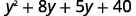
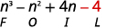

By the end of this section, you will be able to:
* Multiply monomials
* Multiply a polynomial by a monomial
* Multiply a binomial by a binomial
* Multiply a polynomial by a polynomial
* Multiply special products
* Multiply polynomial functions

Before you get started, take this readiness quiz.

1.  Distribute:
    <math xmlns="http://www.w3.org/1998/Math/MathML"><mrow><mn>2</mn><mrow><mo>(</mo><mrow><mi>x</mi><mo>+</mo><mn>3</mn></mrow><mo>)</mo></mrow><mo>.</mo></mrow></math>
    
    * * *
    {: data-type="newline"}
    
    If you missed this problem, review [\[link\]](/m63306#fs-id1167829789060).
2.  Simplify: ⓐ
    <math xmlns="http://www.w3.org/1998/Math/MathML"><mrow><msup><mn>9</mn><mn>2</mn></msup></mrow></math>
    
    ⓑ
    <math xmlns="http://www.w3.org/1998/Math/MathML"><mrow><msup><mrow><mrow><mo>(</mo><mrow><mn>−9</mn></mrow><mo>)</mo></mrow></mrow><mn>2</mn></msup></mrow></math>
    
    ⓒ
    <math xmlns="http://www.w3.org/1998/Math/MathML"><mrow><mtext>−</mtext><msup><mn>9</mn><mn>2</mn></msup><mo>.</mo></mrow></math>
    
    * * *
    {: data-type="newline"}
    
    If you missed this problem, review [\[link\]](/m63303#fs-id1167834536158).
3.  Evaluate:
    <math xmlns="http://www.w3.org/1998/Math/MathML"><mrow><mn>2</mn><msup><mi>x</mi><mn>2</mn></msup><mo>−</mo><mn>5</mn><mi>x</mi><mo>+</mo><mn>3</mn></mrow></math>
    
    for
    <math xmlns="http://www.w3.org/1998/Math/MathML"><mrow><mi>x</mi><mo>=</mo><mn>−2</mn><mo>.</mo></mrow></math>
    
    * * *
    {: data-type="newline"}
    
    If you missed this problem, review [\[link\]](/m63303#fs-id1167832053133).
{: data-number-style="arabic"}

# Multiply Monomials

We are ready to perform operations on polynomials. Since monomials are algebraic expressions, we can use the properties of exponents to multiply monomials.

Multiply: ⓐ <math xmlns="http://www.w3.org/1998/Math/MathML"><mrow><mrow><mo>(</mo><mrow><mn>3</mn><msup><mi>x</mi><mn>2</mn></msup></mrow><mo>)</mo></mrow><mrow><mo>(</mo><mrow><mn>−4</mn><msup><mi>x</mi><mn>3</mn></msup></mrow><mo>)</mo></mrow></mrow></math>

 ⓑ <math xmlns="http://www.w3.org/1998/Math/MathML"><mrow><mrow><mo>(</mo><mrow><mfrac><mn>5</mn><mn>6</mn></mfrac><msup><mi>x</mi><mn>3</mn></msup><mi>y</mi></mrow><mo>)</mo></mrow><mrow><mo>(</mo><mrow><mn>12</mn><mi>x</mi><msup><mi>y</mi><mn>2</mn></msup></mrow><mo>)</mo></mrow><mo>.</mo></mrow></math>

ⓐ* * *
{: data-type="newline"}

 <math xmlns="http://www.w3.org/1998/Math/MathML"><mrow><mtable><mtr><mtd /><mtd /><mtd /><mtd columnalign="center"><mspace width="2em" /><mrow><mo>(</mo><mrow><mn>3</mn><msup><mi>x</mi><mn>2</mn></msup></mrow><mo>)</mo></mrow><mrow><mo>(</mo><mrow><mn>−4</mn><msup><mi>x</mi><mn>3</mn></msup></mrow><mo>)</mo></mrow></mtd></mtr> <mtr><mtd columnalign="left"><mtext>Use the Commutative Property to rearrange the terms.</mtext></mtd><mtd /><mtd /><mtd columnalign="center"><mspace width="2em" /><mn>3</mn><mo>·</mo><mrow><mo>(</mo><mrow><mn>−4</mn></mrow><mo>)</mo></mrow><mo>·</mo><msup><mi>x</mi><mn>2</mn></msup><mo>·</mo><msup><mi>x</mi><mn>3</mn></msup></mtd></mtr> <mtr><mtd columnalign="left"><mtext>Multiply.</mtext></mtd><mtd /><mtd /><mtd columnalign="center"><mspace width="1em" /><mn>−12</mn><msup><mi>x</mi><mn>5</mn></msup></mtd></mtr></mtable></mrow></math>

ⓑ* * *
{: data-type="newline"}

 <math xmlns="http://www.w3.org/1998/Math/MathML"><mrow><mtable><mtr><mtd /><mtd /><mtd /><mtd columnalign="center"><mspace width="2em" /><mrow><mo>(</mo><mrow><mfrac><mn>5</mn><mn>6</mn></mfrac><msup><mi>x</mi><mn>3</mn></msup><mi>y</mi></mrow><mo>)</mo></mrow><mrow><mo>(</mo><mrow><mn>12</mn><mi>x</mi><msup><mi>y</mi><mn>2</mn></msup></mrow><mo>)</mo></mrow></mtd></mtr> <mtr><mtd columnalign="left"><mtext>Use the Commutative Property to rearrange the terms.</mtext></mtd><mtd /><mtd /><mtd columnalign="center"><mspace width="2em" /><mfrac><mn>5</mn><mn>6</mn></mfrac><mo>·</mo><mn>12</mn><mo>·</mo><msup><mi>x</mi><mn>3</mn></msup><mo>·</mo><mi>x</mi><mo>·</mo><mi>y</mi><mo>·</mo><msup><mi>y</mi><mn>2</mn></msup></mtd></mtr> <mtr><mtd columnalign="left"><mtext>Multiply.</mtext></mtd><mtd /><mtd /><mtd columnalign="center"><mspace width="2em" /><mn>10</mn><msup><mi>x</mi><mn>4</mn></msup><msup><mi>y</mi><mn>3</mn></msup></mtd></mtr></mtable></mrow></math>

Multiply: ⓐ <math xmlns="http://www.w3.org/1998/Math/MathML"><mrow><mrow><mo>(</mo><mrow><mn>5</mn><msup><mi>y</mi><mn>7</mn></msup></mrow><mo>)</mo></mrow><mrow><mo>(</mo><mrow><mn>−7</mn><msup><mi>y</mi><mn>4</mn></msup></mrow><mo>)</mo></mrow></mrow></math>

 ⓑ <math xmlns="http://www.w3.org/1998/Math/MathML"><mrow><mrow><mo>(</mo><mrow><mfrac><mn>2</mn><mn>5</mn></mfrac><msup><mi>a</mi><mn>4</mn></msup><msup><mi>b</mi><mn>3</mn></msup></mrow><mo>)</mo></mrow><mrow><mo>(</mo><mrow><mn>15</mn><mi>a</mi><msup><mi>b</mi><mn>3</mn></msup></mrow><mo>)</mo></mrow><mo>.</mo></mrow></math>

ⓐ <math xmlns="http://www.w3.org/1998/Math/MathML"><mrow><mn>−35</mn><msup><mi>y</mi><mrow><mn>11</mn></mrow></msup></mrow></math>

 ⓑ <math xmlns="http://www.w3.org/1998/Math/MathML"><mrow><mn>6</mn><msup><mi>a</mi><mn>5</mn></msup><msup><mi>b</mi><mn>6</mn></msup></mrow></math>

Multiply: ⓐ<math xmlns="http://www.w3.org/1998/Math/MathML"><mrow><mrow><mo>(</mo><mrow><mn>−6</mn><msup><mi>b</mi><mn>4</mn></msup></mrow><mo>)</mo></mrow><mrow><mo>(</mo><mrow><mn>−9</mn><msup><mi>b</mi><mn>5</mn></msup></mrow><mo>)</mo></mrow></mrow></math>

 ⓑ <math xmlns="http://www.w3.org/1998/Math/MathML"><mrow><mrow><mo>(</mo><mrow><mfrac><mn>2</mn><mn>3</mn></mfrac><msup><mi>r</mi><mn>5</mn></msup><mi>s</mi></mrow><mo>)</mo></mrow><mrow><mo>(</mo><mrow><mn>12</mn><msup><mi>r</mi><mn>6</mn></msup><msup><mi>s</mi><mn>7</mn></msup></mrow><mo>)</mo></mrow><mo>.</mo></mrow></math>

ⓐ <math xmlns="http://www.w3.org/1998/Math/MathML"><mrow><mn>54</mn><msup><mi>b</mi><mn>9</mn></msup></mrow></math>

 ⓑ <math xmlns="http://www.w3.org/1998/Math/MathML"><mrow><mn>8</mn><msup><mi>r</mi><mrow><mn>11</mn></mrow></msup><msup><mi>s</mi><mn>8</mn></msup></mrow></math>

# Multiply a Polynomial by a Monomial

Multiplying a polynomial by a monomial is really just applying the Distributive Property.

Multiply: ⓐ <math xmlns="http://www.w3.org/1998/Math/MathML"><mrow><mn>−2</mn><mi>y</mi><mrow><mo>(</mo><mrow><mn>4</mn><msup><mi>y</mi><mn>2</mn></msup><mo>+</mo><mn>3</mn><mi>y</mi><mo>−</mo><mn>5</mn></mrow><mo>)</mo></mrow></mrow></math>

 ⓑ <math xmlns="http://www.w3.org/1998/Math/MathML"><mrow><mn>3</mn><msup><mi>x</mi><mn>3</mn></msup><mi>y</mi><mo stretchy="false">(</mo><msup><mi>x</mi><mn>2</mn></msup><mo>−</mo><mn>8</mn><mi>x</mi><mi>y</mi><mo>+</mo><msup><mi>y</mi><mn>2</mn></msup><mo stretchy="false">)</mo><mo>.</mo></mrow></math>

ⓐ* * *
{: data-type="newline"}

 |  |    |
| Distribute.<math xmlns="http://www.w3.org/1998/Math/MathML"><mrow><mspace width="2.5em" /></mrow></math>

 |    |
| Multiply. |    |
{: .unnumbered .unstyled summary="This figure shows how to distribute the multiplication of negative 2 y with the polynomial 4 y squared plus 3 y minus 5 in parentheses. Three arrows are drawn from the negative 2y pointing to each term in the polynomial in parentheses indicating the three multiplications. The next line shows the result when the negative 2 y is distributed: negative 2 y times 4 y squared plus negative 2 y times 3 y minus negative 2 y times 5. The simplified form is then negative 8 y to power of 3 minus 6 y to the power of 2 plus 10 y." data-label=""}

ⓑ* * *
{: data-type="newline"}

 <math xmlns="http://www.w3.org/1998/Math/MathML"><mrow><mtable><mtr><mtd /><mtd /><mtd /><mtd columnalign="center"><mspace width="1.5em" /><mn>3</mn><msup><mi>x</mi><mn>3</mn></msup><mi>y</mi><mo stretchy="false">(</mo><msup><mi>x</mi><mn>2</mn></msup><mo>−</mo><mn>8</mn><mi>x</mi><mi>y</mi><mo>+</mo><msup><mi>y</mi><mn>2</mn></msup><mo stretchy="false">)</mo></mtd></mtr> <mtr><mtd columnalign="left"><mtext>Distribute.</mtext></mtd><mtd /><mtd /><mtd columnalign="center"><mspace width="1.5em" /><mn>3</mn><msup><mi>x</mi><mn>3</mn></msup><mi>y</mi><mo>·</mo><msup><mi>x</mi><mn>2</mn></msup><mo>+</mo><mrow><mo>(</mo><mrow><mn>3</mn><msup><mi>x</mi><mn>3</mn></msup><mi>y</mi></mrow><mo>)</mo></mrow><mo>·</mo><mo stretchy="false">(</mo><mn>−8</mn><mi>x</mi><mi>y</mi><mo stretchy="false">)</mo><mo>+</mo><mrow><mo>(</mo><mrow><mn>3</mn><msup><mi>x</mi><mn>3</mn></msup><mi>y</mi></mrow><mo>)</mo></mrow><mo>·</mo><msup><mi>y</mi><mn>2</mn></msup></mtd></mtr> <mtr><mtd columnalign="left"><mtext>Multiply.</mtext></mtd><mtd /><mtd /><mtd columnalign="center"><mspace width="1.5em" /><mn>3</mn><msup><mi>x</mi><mn>5</mn></msup><mi>y</mi><mo>−</mo><mn>24</mn><msup><mi>x</mi><mn>4</mn></msup><msup><mi>y</mi><mn>2</mn></msup><mo>+</mo><mn>3</mn><msup><mi>x</mi><mn>3</mn></msup><msup><mi>y</mi><mn>3</mn></msup></mtd></mtr></mtable></mrow></math>

Multiply: ⓐ<math xmlns="http://www.w3.org/1998/Math/MathML"><mrow><mn>−3</mn><mi>y</mi><mrow><mo>(</mo><mrow><mn>5</mn><msup><mi>y</mi><mn>2</mn></msup><mo>+</mo><mn>8</mn><mi>y</mi><mo>−</mo><mn>7</mn></mrow><mo>)</mo></mrow></mrow></math>

 ⓑ <math xmlns="http://www.w3.org/1998/Math/MathML"><mrow><mn>4</mn><msup><mi>x</mi><mn>2</mn></msup><msup><mi>y</mi><mn>2</mn></msup><mrow><mo>(</mo><mrow><mn>3</mn><msup><mi>x</mi><mn>2</mn></msup><mo>−</mo><mn>5</mn><mi>x</mi><mi>y</mi><mo>+</mo><mn>3</mn><msup><mi>y</mi><mn>2</mn></msup></mrow><mo>)</mo></mrow><mo>.</mo></mrow></math>

ⓐ<math xmlns="http://www.w3.org/1998/Math/MathML"><mrow><mn>−15</mn><msup><mi>y</mi><mn>3</mn></msup><mo>−</mo><mn>24</mn><msup><mi>y</mi><mn>2</mn></msup><mo>+</mo><mn>21</mn><mi>y</mi></mrow></math>

* * *
{: data-type="newline"}

ⓑ <math xmlns="http://www.w3.org/1998/Math/MathML"><mrow><mn>12</mn><msup><mi>x</mi><mn>4</mn></msup><msup><mi>y</mi><mn>2</mn></msup><mo>−</mo><mn>20</mn><msup><mi>x</mi><mn>3</mn></msup><msup><mi>y</mi><mn>3</mn></msup><mo>+</mo><mn>12</mn><msup><mi>x</mi><mn>2</mn></msup><msup><mi>y</mi><mn>4</mn></msup></mrow></math>

Multiply: ⓐ<math xmlns="http://www.w3.org/1998/Math/MathML"><mrow><mn>4</mn><msup><mi>x</mi><mn>2</mn></msup><mo stretchy="false">(</mo><mn>2</mn><msup><mi>x</mi><mn>2</mn></msup><mo>−</mo><mn>3</mn><mi>x</mi><mo>+</mo><mn>5</mn><mo stretchy="false">)</mo></mrow></math>

 ⓑ <math xmlns="http://www.w3.org/1998/Math/MathML"><mrow><mn>−6</mn><msup><mi>a</mi><mn>3</mn></msup><mi>b</mi><mo stretchy="false">(</mo><mn>3</mn><msup><mi>a</mi><mn>2</mn></msup><mo>−</mo><mn>2</mn><mi>a</mi><mi>b</mi><mo>+</mo><mn>6</mn><msup><mi>b</mi><mn>2</mn></msup><mo stretchy="false">)</mo><mo>.</mo></mrow></math>

ⓐ <math xmlns="http://www.w3.org/1998/Math/MathML"><mrow><mn>8</mn><msup><mi>x</mi><mn>4</mn></msup><mo>−</mo><mn>24</mn><msup><mi>x</mi><mn>3</mn></msup><mo>+</mo><mn>20</mn><msup><mi>x</mi><mn>2</mn></msup></mrow></math>

* * *
{: data-type="newline"}

ⓑ <math xmlns="http://www.w3.org/1998/Math/MathML"><mrow><mn>−18</mn><msup><mi>a</mi><mn>5</mn></msup><mi>b</mi><mo>+</mo><mn>12</mn><msup><mi>a</mi><mn>4</mn></msup><msup><mi>b</mi><mn>2</mn></msup><mo>−</mo><mn>36</mn><msup><mi>a</mi><mn>3</mn></msup><msup><mi>b</mi><mn>3</mn></msup></mrow></math>

# Multiply a Binomial by a Binomial

Just like there are different ways to represent multiplication of numbers, there are several methods that can be used to multiply a binomial times a binomial. We will start by using the Distributive Property.

Multiply: ⓐ<math xmlns="http://www.w3.org/1998/Math/MathML"><mrow><mrow><mo>(</mo><mrow><mi>y</mi><mo>+</mo><mn>5</mn></mrow><mo>)</mo></mrow><mrow><mo>(</mo><mrow><mi>y</mi><mo>+</mo><mn>8</mn></mrow><mo>)</mo></mrow></mrow></math>

 ⓑ <math xmlns="http://www.w3.org/1998/Math/MathML"><mrow><mrow><mo>(</mo><mrow><mn>4</mn><mi>y</mi><mo>+</mo><mn>3</mn></mrow><mo>)</mo></mrow><mrow><mo>(</mo><mrow><mn>2</mn><mi>y</mi><mo>−</mo><mn>5</mn></mrow><mo>)</mo></mrow><mo>.</mo></mrow></math>

ⓐ* * *
{: data-type="newline"}

 |  |    |
| Distribute <math xmlns="http://www.w3.org/1998/Math/MathML"><mrow><mo stretchy="false">(</mo><mi>y</mi><mo>+</mo><mn>8</mn><mo stretchy="false">)</mo><mo>.</mo></mrow></math>

 |    |
| Distribute again. |    |
| Combine like terms. |    |
{: .unnumbered .unstyled summary="This figure shows how to distribute the multiplication of y plus 5 in parentheses with y plus 8 in parentheses. y plus 8 in parentheses is colored red with two red arrows drawn from y plus 8 in parentheses pointing to the y and 5 in the y plus 5 factor. The next line shows the result when the y plus 8 is distributed: y times the quantity y plus 8 in parentheses plus 5 times the quantity y plus 8 in parentheses. Then we distribute again, distributing the y to the y plus 8 and the 5 to the y plus 8. The result is y squared plus 8 y plus 5 y plus 40. Combining like terms results in the simplified form y to power of 2 plus 13 y plus 40." data-label=""}

ⓑ* * *
{: data-type="newline"}

 |  |    |
| Distribute. |    |
| Distribute again. |    |
| Combine like terms. |    |
{: .unnumbered .unstyled summary="This figure shows how to distribute the multiplication of 4 y plus 3 in parentheses with 2 y minus 5 in parentheses. After distributing the quantity 2 y minus 5 in parentheses the result is 4 y times the quantity 2 y minus 5 in parentheses plus 3 times the quantity 2 y minus 5 in parentheses. Then we distribute the 4 y to the 2 y minus 5 and the 3 to the 2 y minus 5. The result is 8 y squared minus 20 y plus 6 y minus 15. Combining like terms results in the simplified form 8 y to power of 2 minus 14 y minus 15." data-label=""}

Multiply: ⓐ<math xmlns="http://www.w3.org/1998/Math/MathML"><mrow><mrow><mo>(</mo><mrow><mi>x</mi><mo>+</mo><mn>8</mn></mrow><mo>)</mo></mrow><mrow><mo>(</mo><mrow><mi>x</mi><mo>+</mo><mn>9</mn></mrow><mo>)</mo></mrow></mrow></math>

 ⓑ<math xmlns="http://www.w3.org/1998/Math/MathML"><mrow><mrow><mo>(</mo><mrow><mn>3</mn><mi>c</mi><mo>+</mo><mn>4</mn></mrow><mo>)</mo></mrow><mrow><mo>(</mo><mrow><mn>5</mn><mi>c</mi><mo>−</mo><mn>2</mn></mrow><mo>)</mo></mrow><mo>.</mo></mrow></math>

ⓐ<math xmlns="http://www.w3.org/1998/Math/MathML"><mrow><msup><mi>x</mi><mn>2</mn></msup><mo>+</mo><mn>17</mn><mi>x</mi><mo>+</mo><mn>72</mn></mrow></math>

* * *
{: data-type="newline"}

ⓑ <math xmlns="http://www.w3.org/1998/Math/MathML"><mrow><mn>15</mn><msup><mi>c</mi><mn>2</mn></msup><mo>+</mo><mn>14</mn><mi>c</mi><mo>−</mo><mn>8</mn></mrow></math>

Multiply: ⓐ<math xmlns="http://www.w3.org/1998/Math/MathML"><mrow><mrow><mo>(</mo><mrow><mn>5</mn><mi>x</mi><mo>+</mo><mn>9</mn></mrow><mo>)</mo></mrow><mrow><mo>(</mo><mrow><mn>4</mn><mi>x</mi><mo>+</mo><mn>3</mn></mrow><mo>)</mo></mrow></mrow></math>

 ⓑ <math xmlns="http://www.w3.org/1998/Math/MathML"><mrow><mrow><mo>(</mo><mrow><mn>5</mn><mi>y</mi><mo>+</mo><mn>2</mn></mrow><mo>)</mo></mrow><mrow><mo>(</mo><mrow><mn>6</mn><mi>y</mi><mo>−</mo><mn>3</mn></mrow><mo>)</mo></mrow><mo>.</mo></mrow></math>

ⓐ <math xmlns="http://www.w3.org/1998/Math/MathML"><mrow><mn>20</mn><msup><mi>x</mi><mn>2</mn></msup><mo>+</mo><mn>51</mn><mi>x</mi><mo>+</mo><mn>27</mn></mrow></math>

* * *
{: data-type="newline"}

ⓑ <math xmlns="http://www.w3.org/1998/Math/MathML"><mrow><mn>30</mn><msup><mi>y</mi><mn>2</mn></msup><mo>−</mo><mn>3</mn><mi>y</mi><mo>−</mo><mn>6</mn></mrow></math>

If you multiply binomials often enough you may notice a pattern. Notice that the first term in the result is the product of the *first* terms in each binomial. The second and third terms are the product of multiplying the two *outer* terms and then the two *inner* terms. And the last term results from multiplying the two *last* terms,

We abbreviate “First, Outer, Inner, Last” as FOIL. The letters stand for ‘First, Outer, Inner, Last’. We use this as another method of multiplying binomials. The word FOIL is easy to remember and ensures we find all four products.

Let’s multiply <math xmlns="http://www.w3.org/1998/Math/MathML"><mrow><mrow><mo>(</mo><mrow><mi>x</mi><mo>+</mo><mn>3</mn></mrow><mo>)</mo></mrow><mrow><mo>(</mo><mrow><mi>x</mi><mo>+</mo><mn>7</mn></mrow><mo>)</mo></mrow></mrow></math>

 using both methods.

  ![The figure shows how four terms in the product of two binomials can be remembered according to the mnemonic acronym FOIL. The example is the quantity x plus 3 in parentheses times the quantity x plus 7 in parentheses. The expression is expanded as in the previous examples by using the distributive property twice. After distributing the quantity x plus 7 in parentheses the result is x times the quantity x plus 7 in parentheses plus 3 times the quantity x plus 7 in parentheses. Then the x is distributed the x plus 7 and the 3 is distributed to the x plus 7 to get x squared plus 7 x plus 3 x plus 21. The letter F is written under the term x squared since it was the product of the first terms in the binomials. The letter O is written under the 7 x term sine it was the product of the outer terms in the binomials. The letter I is written under the 3 x term since it was the product of the inner terms in the binomials. The letter L is written under the 21 since it was the product of the last terms in the binomial. The original expression is shown again with four arrows connecting the first, outer, inner, and last terms in the binomials showing how the four terms can be determined directly from the factored form.](../resources/CNX_IntAlg_Figure_05_03_004_img.jpg)  We summarize the steps of the FOIL method below. The FOIL method only applies to multiplying binomials, not other polynomials!

Use the FOIL method to multiply two binomials.

 ![The figure shows how to use the FOIL method to multiply two binomials. The example is the quantity a plus b in parentheses times the quantity c plus d in parentheses. The numbers a and c are labeled first and the numbers b and d are labeled last. The numbers b and c are labeled inner and the numbers a and d are labeled outer. A note on the side of the expression tells you to Say it as you multiply! FOIL First Outer Inner Last. The directions are then given in numbered steps. Step 1. Multiply the First terms. Step 2. Multiply the Outer terms. Step 3. Multiply the Inner terms. Step 4. Multiply the Last Terms. Step 5. Combine like terms when possible.](../resources/CNX_IntAlg_Figure_05_03_021_img.jpg) 

When you multiply by the FOIL method, drawing the lines will help your brain focus on the pattern and make it easier to apply.

Now we will do an example where we use the FOIL pattern to multiply two binomials.

Multiply: ⓐ <math xmlns="http://www.w3.org/1998/Math/MathML"><mrow><mrow><mo>(</mo><mrow><mi>y</mi><mo>−</mo><mn>7</mn></mrow><mo>)</mo></mrow><mrow><mo>(</mo><mrow><mi>y</mi><mo>+</mo><mn>4</mn></mrow><mo>)</mo></mrow></mrow></math>

 ⓑ <math xmlns="http://www.w3.org/1998/Math/MathML"><mrow><mrow><mo>(</mo><mrow><mn>4</mn><mi>x</mi><mo>+</mo><mn>3</mn></mrow><mo>)</mo></mrow><mrow><mo>(</mo><mrow><mn>2</mn><mi>x</mi><mo>−</mo><mn>5</mn></mrow><mo>)</mo></mrow><mo>.</mo></mrow></math>

1.  ⓐ
    * * *
    {: data-type="newline"}
    
     ![The figure shows how to use the FOIL method to multiply two binomials. The example is the quantity y minus 7 in parentheses times the quantity y plus 4 in parentheses. Step 1. Multiply the First terms. The terms y and y are colored red with an arrow connecting them. The result is y squared and is shown above the letter F in the word FOIL. Step 2. Multiply the Outer terms. The terms y and 4 are colored red with an arrow connecting them. The result is 4 y and is shown above the letter O in the word FOIL. Step 3. Multiply the Inner terms. The terms negative 7 and y are colored red with an arrow connecting them. The result is negative 7 y squared and is shown above the letter I in the word FOIL. Step 4. Multiply the Last terms. The terms negative 7 and 4 are colored red with an arrow connecting them. The result is negative 28 and is shown above the letter L in the word FOIL. Step 5. Combine like terms. The simplified result is y squared minus 3 y minus 28.](../resources/CNX_IntAlg_Figure_05_03_005_img.jpg) 
2.  * * *
    {: data-type="newline"}
    
    ⓑ
    * * *
    {: data-type="newline"}
    
     ![The figure shows how to use the FOIL method to multiply two binomials. The example is the quantity 4 x plus 3 in parentheses times the quantity 2 x minus 5 in parentheses. The expression is show with four red arrows connecting the First. Outer, Inner, and Last terms. Step 1. Multiply the First terms 4 x and 2 x. The product of the first terms is 8 x squared and is shown above the letter F in the word FOIL. Step 2. Multiply the Outer terms 4 x and negative 5. The result is negative 20 x and is shown above the letter O in the word FOIL. Step 3. Multiply the Inner terms 3 and 2 x. The result is 6 x and is shown above the letter I in the word FOIL. Step 4. Multiply the Last terms 3 and negative 5. The result is negative 15 and is shown above the letter L in the word FOIL. Step 5. Combine like terms. The simplified result is 8 y squared minus 14 x minus 15.](../resources/CNX_IntAlg_Figure_05_03_006_img.jpg) 
{: data-number-style="arabic" .circled}

Multiply: ⓐ <math xmlns="http://www.w3.org/1998/Math/MathML"><mrow><mrow><mo>(</mo><mrow><mi>x</mi><mo>−</mo><mn>7</mn></mrow><mo>)</mo></mrow><mrow><mo>(</mo><mrow><mi>x</mi><mo>+</mo><mn>5</mn></mrow><mo>)</mo></mrow></mrow></math>

 ⓑ <math xmlns="http://www.w3.org/1998/Math/MathML"><mrow><mrow><mo>(</mo><mrow><mn>3</mn><mi>x</mi><mo>+</mo><mn>7</mn></mrow><mo>)</mo></mrow><mrow><mo>(</mo><mrow><mn>5</mn><mi>x</mi><mo>−</mo><mn>2</mn></mrow><mo>)</mo></mrow><mo>.</mo></mrow></math>

ⓐ <math xmlns="http://www.w3.org/1998/Math/MathML"><mrow><msup><mi>x</mi><mn>2</mn></msup><mo>−</mo><mn>2</mn><mi>x</mi><mo>−</mo><mn>35</mn></mrow></math>

* * *
{: data-type="newline"}

ⓑ <math xmlns="http://www.w3.org/1998/Math/MathML"><mrow><mn>15</mn><msup><mi>x</mi><mn>2</mn></msup><mo>+</mo><mn>29</mn><mi>x</mi><mo>−</mo><mn>14</mn></mrow></math>

Multiply: ⓐ <math xmlns="http://www.w3.org/1998/Math/MathML"><mrow><mrow><mo>(</mo><mrow><mi>b</mi><mo>−</mo><mn>3</mn></mrow><mo>)</mo></mrow><mrow><mo>(</mo><mrow><mi>b</mi><mo>+</mo><mn>6</mn></mrow><mo>)</mo></mrow></mrow></math>

 ⓑ <math xmlns="http://www.w3.org/1998/Math/MathML"><mrow><mrow><mo>(</mo><mrow><mn>4</mn><mi>y</mi><mo>+</mo><mn>5</mn></mrow><mo>)</mo></mrow><mrow><mo>(</mo><mrow><mn>4</mn><mi>y</mi><mo>−</mo><mn>10</mn></mrow><mo>)</mo></mrow><mo>.</mo></mrow></math>

ⓐ <math xmlns="http://www.w3.org/1998/Math/MathML"><mrow><msup><mi>b</mi><mn>2</mn></msup><mo>+</mo><mn>3</mn><mi>b</mi><mo>−</mo><mn>18</mn></mrow></math>

* * *
{: data-type="newline"}

ⓑ <math xmlns="http://www.w3.org/1998/Math/MathML"><mrow><mn>16</mn><msup><mi>y</mi><mn>2</mn></msup><mo>−</mo><mn>20</mn><mi>y</mi><mo>−</mo><mn>50</mn></mrow></math>

The final products in the last example were trinomials because we could combine the two middle terms. This is not always the case.

Multiply: ⓐ<math xmlns="http://www.w3.org/1998/Math/MathML"><mrow><mrow><mo>(</mo><mrow><msup><mi>n</mi><mn>2</mn></msup><mo>+</mo><mn>4</mn></mrow><mo>)</mo></mrow><mrow><mo>(</mo><mrow><mi>n</mi><mo>−</mo><mn>1</mn></mrow><mo>)</mo></mrow></mrow></math>

 ⓑ <math xmlns="http://www.w3.org/1998/Math/MathML"><mrow><mrow><mo>(</mo><mrow><mn>3</mn><mi>p</mi><mi>q</mi><mo>+</mo><mn>5</mn></mrow><mo>)</mo></mrow><mrow><mo>(</mo><mrow><mn>6</mn><mi>p</mi><mi>q</mi><mo>−</mo><mn>11</mn></mrow><mo>)</mo></mrow><mo>.</mo></mrow></math>

ⓐ* * *
{: data-type="newline"}

 |  |    |
|  |    |
| **Step 1.** Multiply the *First* terms. |    |
| **Step 2.** Multiply the *Outer* terms. |    |
| **Step 3.** Multiply the *Inner* terms. |    |
| **Step 4.** Multiply the *Last* terms. |    |
| **Step 5.** Combine like terms—there are none. |    |
{: .unnumbered .unstyled summary="The figure shows how to use the FOIL method to multiply two binomials. The example is the quantity n squared plus 4 in parentheses times the quantity n minus 1 in parentheses. The expression is show with four red arrows connecting the First. Outer, Inner, and Last terms. Step 1. Multiply the First terms. The product of the first terms is n to the power of 3 and is shown above the letter F in the word FOIL. Step 2. Multiply the Outer terms. The result is negative n squared and is shown above the letter O in the word FOIL. Step 3. Multiply the Inner terms. The result is 4 n and is shown above the letter I in the word FOIL. Step 4. Multiply the Last terms. The result is negative 4 and is shown above the letter L in the word FOIL. Step 5. Combine like terms. The simplified result is n to the power of 3 minus n squared plus 4 n minus 4." data-label=""}

ⓑ* * *
{: data-type="newline"}

 |  |    |
|  |    |
| **Step 1.** Multiply the *First* terms.      |    |
| **Step 2.** Multiply the *Outer* terms. |    |
| **Step 3.** Multiply the *Inner* terms. |    |
| **Step 4.** Multiply the *Last* terms. |    |
| **Step 5.** Combine like terms. |    |
{: .unnumbered .unstyled summary="The figure shows how to use the FOIL method to multiply two binomials. The example is the quantity 3 p q plus 5 in parentheses times the quantity 6 p q minus 11 in parentheses. The expression is show with four red arrows connecting the First. Outer, Inner, and Last terms. Step 1. Multiply the First terms. The product of the first terms is 18 p squared q squared and is shown above the letter F in the word FOIL. Step 2. Multiply the Outer terms. The result is negative 33 p q and is shown above the letter O in the word FOIL. Step 3. Multiply the Inner terms. The result is 30 p q and is shown above the letter I in the word FOIL. Step 4. Multiply the Last terms. The result is negative 55 and is shown above the letter L in the word FOIL. Step 5. Combine like terms. The simplified result is 18 p squared q squared minus 3 p q minus 55." data-label=""}

Multiply: ⓐ<math xmlns="http://www.w3.org/1998/Math/MathML"><mrow><mrow><mo>(</mo><mrow><msup><mi>x</mi><mn>2</mn></msup><mo>+</mo><mn>6</mn></mrow><mo>)</mo></mrow><mrow><mo>(</mo><mrow><mi>x</mi><mo>−</mo><mn>8</mn></mrow><mo>)</mo></mrow></mrow></math>

 ⓑ <math xmlns="http://www.w3.org/1998/Math/MathML"><mrow><mrow><mo>(</mo><mrow><mn>2</mn><mi>a</mi><mi>b</mi><mo>+</mo><mn>5</mn></mrow><mo>)</mo></mrow><mrow><mo>(</mo><mrow><mn>4</mn><mi>a</mi><mi>b</mi><mo>−</mo><mn>4</mn></mrow><mo>)</mo></mrow><mo>.</mo></mrow></math>

ⓐ<math xmlns="http://www.w3.org/1998/Math/MathML"><mrow><msup><mi>x</mi><mn>3</mn></msup><mo>−</mo><mn>8</mn><msup><mi>x</mi><mn>2</mn></msup><mo>+</mo><mn>6</mn><mi>x</mi><mo>−</mo><mn>48</mn></mrow></math>

* * *
{: data-type="newline"}

ⓑ <math xmlns="http://www.w3.org/1998/Math/MathML"><mrow><mn>8</mn><msup><mi>a</mi><mn>2</mn></msup><msup><mi>b</mi><mn>2</mn></msup><mo>+</mo><mn>12</mn><mi>a</mi><mi>b</mi><mo>−</mo><mn>20</mn></mrow></math>

Multiply: ⓐ<math xmlns="http://www.w3.org/1998/Math/MathML"><mrow><mrow><mo>(</mo><mrow><msup><mi>y</mi><mn>2</mn></msup><mo>+</mo><mn>7</mn></mrow><mo>)</mo></mrow><mrow><mo>(</mo><mrow><mi>y</mi><mo>−</mo><mn>9</mn></mrow><mo>)</mo></mrow></mrow></math>

 ⓑ <math xmlns="http://www.w3.org/1998/Math/MathML"><mrow><mrow><mo>(</mo><mrow><mn>2</mn><mi>x</mi><mi>y</mi><mo>+</mo><mn>3</mn></mrow><mo>)</mo></mrow><mrow><mo>(</mo><mrow><mn>4</mn><mi>x</mi><mi>y</mi><mo>−</mo><mn>5</mn></mrow><mo>)</mo></mrow><mo>.</mo></mrow></math>

ⓐ<math xmlns="http://www.w3.org/1998/Math/MathML"><mrow><msup><mi>y</mi><mn>3</mn></msup><mo>−</mo><mn>9</mn><msup><mi>y</mi><mn>2</mn></msup><mo>+</mo><mn>7</mn><mi>y</mi><mo>−</mo><mn>63</mn></mrow></math>

* * *
{: data-type="newline"}

ⓑ <math xmlns="http://www.w3.org/1998/Math/MathML"><mrow><mn>8</mn><msup><mi>x</mi><mn>2</mn></msup><msup><mi>y</mi><mn>2</mn></msup><mo>+</mo><mn>2</mn><mi>x</mi><mi>y</mi><mo>−</mo><mn>15</mn></mrow></math>

The FOIL method is usually the quickest method for multiplying two binomials, but it *only* works for binomials. You can use the Distributive Property to find the product of any two polynomials. Another method that works for all polynomials is the Vertical Method. It is very much like the method you use to multiply whole numbers. Look carefully at this example of multiplying two-digit numbers.

    Now we’ll apply this same method to multiply two binomials.

Multiply using the Vertical Method: <math xmlns="http://www.w3.org/1998/Math/MathML"><mrow><mrow><mo>(</mo><mrow><mn>3</mn><mi>y</mi><mo>−</mo><mn>1</mn></mrow><mo>)</mo></mrow><mrow><mo>(</mo><mrow><mn>2</mn><mi>y</mi><mo>−</mo><mn>6</mn></mrow><mo>)</mo></mrow><mo>.</mo></mrow></math>

It does not matter which binomial goes on the top.

<math xmlns="http://www.w3.org/1998/Math/MathML"><mrow><mtable> <mtr><mtd columnalign="left"><mtable><mtr /><mtr /><mtr /><mtr /><mtr><mtd columnalign="left"><mtext>Multiply</mtext><mspace width="0.2em" /><mn>3</mn><mi>y</mi><mo>−</mo><mn>1</mn><mspace width="0.2em" /><mtext>by</mtext><mspace width="0.2em" /><mn>−6</mn><mo>.</mo></mtd></mtr><mtr><mtd columnalign="left"><mtext>Multiply</mtext><mspace width="0.2em" /><mn>3</mn><mi>y</mi><mo>−</mo><mn>1</mn><mspace width="0.2em" /><mtext>by</mtext><mspace width="0.2em" /><mn>2</mn><mi>y</mi><mo>.</mo></mtd></mtr><mtr><mtd columnalign="left"><mtext>Add like terms.</mtext></mtd></mtr></mtable></mtd><mtd /><mtd /><mtd /><mtd /> <mtd columnalign="left"> <mtable> <mtr><mtd columnalign="right"><mn>3</mn><mi>y</mi><mo>−</mo><mn>1</mn></mtd></mtr> <mtr><mtd columnalign="right"><munder accentunder="true"><mrow><mspace width="1.9em" /><mo>×</mo><mspace width="0.2em" /><mn>2</mn><mi>y</mi><mo>−</mo><mn>6</mn></mrow><mo stretchy="true">\_\_\_\_\_\_\_\_\_\_\_</mo></munder></mtd></mtr> <mtr><mtd columnalign="right"><mo>−</mo><mn>18</mn><mi>y</mi><mo>+</mo><mn>6</mn></mtd></mtr> <mtr> <mtd columnalign="right"><munder accentunder="true"><mrow><mn>6</mn><msup><mi>y</mi><mn>2</mn></msup><mo>−</mo><mspace width="0.3em" /><mn>2</mn><mi>y</mi><mspace width="1.6em" /></mrow><mo stretchy="true">\_\_\_\_\_\_\_\_\_\_\_</mo></munder></mtd></mtr> <mtr><mtd columnalign="right"><mn>6</mn><msup><mi>y</mi><mn>2</mn></msup><mo>−</mo><mn>20</mn><mi>y</mi><mo>+</mo><mn>6</mn></mtd></mtr></mtable></mtd><mtd /><mtd /><mtd /><mtd /> <mtd columnalign="left"><mtable><mtr /><mtr /><mtr /><mtr /><mtr><mtd columnalign="left"><mtext>partial product</mtext></mtd></mtr><mtr><mtd columnalign="left"><mtext>partial product</mtext></mtd></mtr><mtr><mtd columnalign="left"><mtext>product</mtext></mtd></mtr></mtable></mtd></mtr></mtable></mrow></math>

Notice the partial products are the same as the terms in the FOIL method.

  

Multiply using the Vertical Method: <math xmlns="http://www.w3.org/1998/Math/MathML"><mrow><mrow><mo>(</mo><mrow><mn>5</mn><mi>m</mi><mo>−</mo><mn>7</mn></mrow><mo>)</mo></mrow><mrow><mo>(</mo><mrow><mn>3</mn><mi>m</mi><mo>−</mo><mn>6</mn></mrow><mo>)</mo><mo>.</mo></mrow></mrow></math>

<math xmlns="http://www.w3.org/1998/Math/MathML"><mrow><mn>15</mn><msup><mi>m</mi><mn>2</mn></msup><mo>−</mo><mn>51</mn><mi>m</mi><mo>+</mo><mn>42</mn></mrow></math>

Multiply using the Vertical Method: <math xmlns="http://www.w3.org/1998/Math/MathML"><mrow><mrow><mo>(</mo><mrow><mn>6</mn><mi>b</mi><mo>−</mo><mn>5</mn></mrow><mo>)</mo></mrow><mrow><mo>(</mo><mrow><mn>7</mn><mi>b</mi><mo>−</mo><mn>3</mn></mrow><mo>)</mo><mo>.</mo></mrow></mrow></math>

<math xmlns="http://www.w3.org/1998/Math/MathML"><mrow><mn>42</mn><msup><mi>b</mi><mn>2</mn></msup><mo>−</mo><mn>53</mn><mi>b</mi><mo>+</mo><mn>15</mn></mrow></math>

We have now used three methods for multiplying binomials. Be sure to practice each method, and try to decide which one you prefer. The methods are listed here all together, to help you remember them.

Multiplying Two Binomials

To multiply binomials, use the:

* Distributive Property
* FOIL Method
* Vertical Method
{: data-bullet-style="bullet"}

# Multiply a Polynomial by a Polynomial

We have multiplied monomials by monomials, monomials by polynomials, and binomials by binomials. Now we’re ready to multiply a polynomial by a polynomial. Remember, FOIL will not work in this case, but we can use either the Distributive Property or the Vertical Method.

Multiply <math xmlns="http://www.w3.org/1998/Math/MathML"><mrow><mo stretchy="false">(</mo><mi>b</mi><mo>+</mo><mn>3</mn><mo stretchy="false">)</mo><mo stretchy="false">(</mo><mn>2</mn><msup><mi>b</mi><mn>2</mn></msup><mo>−</mo><mn>5</mn><mi>b</mi><mo>+</mo><mn>8</mn><mo stretchy="false">)</mo></mrow></math>

 using ⓐ the Distributive Property and ⓑ the Vertical Method.

ⓐ* * *
{: data-type="newline"}

 |  |    |
| Distribute. |    |
| Multiply. |    |
| Combine like terms.       |    |
{: .unnumbered .unstyled summary="This figure shows how to distribute the multiplication of b plus 3 in parentheses with 2 b squared minus 5 b plus 8 in parentheses. After distributing the trinomial the result is b times the quantity 2 b squared minus 5 b plus 8 in parentheses plus 3 times the quantity 2 b squared minus 5 b plus 8 in parentheses 2 y minus 5 in parentheses. Then we distribute the b to the trinomial to get 2 b to the power of 3 minus 5 b squared plus 8 b and distribute the 3 to the trinomial to get 6 b squared minus 15 b plus 24. Combining like terms results in the simplified form 2 b to power of 3 plus b squared minus 7 b plus 24." data-label=""}

ⓑ It is easier to put the polynomial with fewer terms on the bottom because we get fewer partial products this way.* * *
{: data-type="newline"}

 <table class="unnumbered unstyled" summary="This figure shows how to multiply the polynomials with the vertical method. The polynomial 2 b squared minus 5 b plus 8 is written directly over the polynomial b plus 3. The 8 is directly over the 3 and the negative 5 b is directly over the b. A horizontal line is drawn below the b plus 3. The result of multiplying 3 with the quantity 2 b squared minus 5 b plus 8 is written below the horizontal line. The result is get 6 b squared minus 15 b plus 24 with the 24 under the 3 and 8. The result of multiplying the b with the quantity 2 b squared minus 5 b plus 8 is written below the last calculation but shifted one term to the left. The result is 2 b to the power of 3 minus 5 b squared plus 8 b with the 8 b under the negative 15 b from the first multiplication. A second horizontal line is draw below the last result. The two multiplications are then added column by column. 24 is brought down since nothing is below it. Negative 15 b is added to 8 b to get negative 7 b. 6 b squared is added to negative 5 b squared to get b squared. 2 b to the power of 3 is brought down since nothing is above it. The final result is 2 b to power of 3 plus b squared minus 7 b plus 24." data-label=""><tbody>
<tr>
<td colspan="2" data-valign="top" data-align="left">Multiply <math xmlns="http://www.w3.org/1998/Math/MathML"><mrow><mo stretchy="false">(</mo><mn>2</mn><msup><mi>b</mi><mn>2</mn></msup><mo>−</mo><mn>5</mn><mi>b</mi><mo>+</mo><mn>8</mn><mo stretchy="false">)</mo></mrow></math> by 3.
Multiply <math xmlns="http://www.w3.org/1998/Math/MathML"><mrow><mo stretchy="false">(</mo><mn>2</mn><msup><mi>b</mi><mn>2</mn></msup><mo>−</mo><mn>5</mn><mi>b</mi><mo>+</mo><mn>8</mn><mo stretchy="false">)</mo></mrow></math> by <math xmlns="http://www.w3.org/1998/Math/MathML"><mi>b</mi></math>.</td>
<td data-valign="top" data-align="left">

</td>
</tr>
<tr>
<td colspan="2" data-valign="top" data-align="left">Add like terms.</td>
<td data-valign="top" data-align="left">  

  

</td>
</tr>
</tbody></table>

Multiply<math xmlns="http://www.w3.org/1998/Math/MathML"><mrow><mrow><mo>(</mo><mrow><mi>y</mi><mo>−</mo><mn>3</mn></mrow><mo>)</mo></mrow><mrow><mo>(</mo><mrow><msup><mi>y</mi><mn>2</mn></msup><mo>−</mo><mn>5</mn><mi>y</mi><mo>+</mo><mn>2</mn></mrow><mo>)</mo></mrow></mrow></math>

 using ⓐ the Distributive Property and ⓑ the Vertical Method.

ⓐ <math xmlns="http://www.w3.org/1998/Math/MathML"><mrow><msup><mi>y</mi><mn>3</mn></msup><mo>−</mo><mn>8</mn><msup><mi>y</mi><mn>2</mn></msup><mo>+</mo><mn>17</mn><mi>y</mi><mo>−</mo><mn>6</mn></mrow></math>

* * *
{: data-type="newline"}

ⓑ <math xmlns="http://www.w3.org/1998/Math/MathML"><mrow><msup><mi>y</mi><mn>3</mn></msup><mo>−</mo><mn>8</mn><msup><mi>y</mi><mn>2</mn></msup><mo>+</mo><mn>17</mn><mi>y</mi><mo>−</mo><mn>6</mn></mrow></math>

Multiply <math xmlns="http://www.w3.org/1998/Math/MathML"><mrow><mo stretchy="false">(</mo><mi>x</mi><mo>+</mo><mn>4</mn><mo stretchy="false">)</mo><mo stretchy="false">(</mo><mn>2</mn><msup><mi>x</mi><mn>2</mn></msup><mo>−</mo><mn>3</mn><mi>x</mi><mo>+</mo><mn>5</mn><mo stretchy="false">)</mo></mrow></math>

 using ⓐ the Distributive Property and ⓑ The Vertical Method.

ⓐ <math xmlns="http://www.w3.org/1998/Math/MathML"><mrow><mn>2</mn><msup><mi>x</mi><mn>3</mn></msup><mo>+</mo><mn>5</mn><msup><mi>x</mi><mn>2</mn></msup><mo>−</mo><mn>7</mn><mi>x</mi><mo>+</mo><mn>20</mn></mrow></math>

* * *
{: data-type="newline"}

ⓑ <math xmlns="http://www.w3.org/1998/Math/MathML"><mrow><msup><mi>y</mi><mn>3</mn></msup><mo>−</mo><mn>8</mn><msup><mi>y</mi><mn>2</mn></msup><mo>+</mo><mn>17</mn><mi>y</mi><mo>−</mo><mn>6</mn></mrow></math>

We have now seen two methods you can use to multiply a polynomial by a polynomial. After you practice each method, you’ll probably find you prefer one way over the other. We list both methods are listed here, for easy reference.

Multiplying a Polynomial by a Polynomial

To multiply a trinomial by a binomial, use the:

* Distributive Property
* Vertical Method
{: data-bullet-style="bullet"}

# Multiply Special Products

Mathematicians like to look for patterns that will make their work easier. A good example of this is squaring binomials. While you can always get the product by writing the binomial twice and multiplying them, there is less work to do if you learn to use a pattern. Let’s start by looking at three examples and look for a pattern.

Look at these results. Do you see any patterns?

  ![The figure shows three examples of squaring a binomial. In the first example x plus 9 is squared to get x plus 9 times x plus 9 which is x squared plus 9 x plus 9 x plus 81 which simplifies to x squared plus 18 x plus 81. Colors show that x squared comes from the square of the x in the original binomial and 81 comes from the square of the 9 in the original binomial. In the second example y minus 7 is squared to get y minus y times y minus 7 which is y squared minus 7 y minus 7 y plus 49 which simplifies to y squared minus 14 y plus 49. Colors show that y squared comes from the square of the y in the original binomial and 49 comes from the square of the negative 7 in the original binomial. In the third example 2 x plus 3 is squared to get 2 x plus 3 times 2 x plus 3 which is 4 x squared plus 6 x plus 6 x plus 9 which simplifies to 4 x squared plus 12 x plus 9. Colors show that 4 x squared comes from the square of the 2 x in the original binomial and 9 comes from the square of the 3 in the original binomial.](../resources/CNX_IntAlg_Figure_05_03_011_img.jpg)  What about the number of terms? In each example we squared a binomial and the result was a trinomial.

<math xmlns="http://www.w3.org/1998/Math/MathML"><mrow><msup><mrow><mo stretchy="false">(</mo><mi>a</mi><mo>+</mo><mi>b</mi><mo stretchy="false">)</mo></mrow><mn>2</mn></msup><mo>=</mo><mo>\_\_\_</mo><mo>+</mo><mo>\_\_\_</mo><mo>+</mo><mo>\_\_\_</mo></mrow></math>

Now look at the *first term* in each result. Where did it come from?

The first term is the product of the first terms of each binomial. Since the binomials are identical, it is just the square of the first term!

<math xmlns="http://www.w3.org/1998/Math/MathML"><mrow><msup><mrow><mo stretchy="false">(</mo><mi>a</mi><mo>+</mo><mi>b</mi><mo stretchy="false">)</mo></mrow><mn>2</mn></msup><mo>=</mo><msup><mi>a</mi><mn>2</mn></msup><mo>+</mo><mo>\_\_\_</mo><mo>+</mo><mo>\_\_\_</mo></mrow></math>

  *To get the first term of the product, square the first term.** * *
{: data-type="newline"}

* * *
{: data-type="newline"}

Where did the *last term* come from? Look at the examples and find the pattern.

The last term is the product of the last terms, which is the square of the last term.

<math xmlns="http://www.w3.org/1998/Math/MathML"><mrow><msup><mrow><mo stretchy="false">(</mo><mi>a</mi><mo>+</mo><mi>b</mi><mo stretchy="false">)</mo></mrow><mn>2</mn></msup><mo>=</mo><mo>\_\_\_</mo><mo>+</mo><mo>\_\_\_</mo><mo>+</mo><msup><mi>b</mi><mn>2</mn></msup></mrow></math>

  *To get the last term of the product, square the last term.** * *
{: data-type="newline"}

* * *
{: data-type="newline"}

Finally, look at the *middle term*. Notice it came from adding the “outer” and the “inner” terms—which are both the same! So the middle term is double the product of the two terms of the binomial.

<math xmlns="http://www.w3.org/1998/Math/MathML"><mrow><mtable><mtr><mtd columnalign="left"><msup><mrow><mo stretchy="false">(</mo><mi>a</mi><mo>+</mo><mi>b</mi><mo stretchy="false">)</mo></mrow><mn>2</mn></msup><mo>=</mo><mo>\_\_\_</mo><mo>+</mo><mn>2</mn><mi>a</mi><mi>b</mi><mo>+</mo><mo>\_\_\_</mo></mtd></mtr> <mtr><mtd columnalign="left"><msup><mrow><mo stretchy="false">(</mo><mi>a</mi><mo>−</mo><mi>b</mi><mo stretchy="false">)</mo></mrow><mn>2</mn></msup><mo>=</mo><mo>\_\_\_</mo><mo>−</mo><mn>2</mn><mi>a</mi><mi>b</mi><mo>+</mo><mo>\_\_\_</mo></mtd></mtr></mtable></mrow></math>

  *To get the middle term of the product, multiply the terms and double their product.** * *
{: data-type="newline"}

* * *
{: data-type="newline"}

Putting it all together:

Binomial Squares Pattern

If *a* and *b* are real numbers,

 ![The figure shows the result of squaring two binomials. The first example is a plus b squared equals a squared plus 2 a b plus b squared. The equation is written out again with each part labeled. The quantity a plus b squared is labeled binomial squared. The terms a squared is labeled first term squared. The term 2 a b is labeled 2 times product of terms. The term b squared is labeled last term squared. The second example is a minus b squared equals a squared minus 2 a b plus b squared. The equation is written out again with each part labeled. The quantity a minus b squared is labeled binomial squared. The terms a squared is labeled first term squared. The term negative 2 a b is labeled 2 times product of terms. The term b squared is labeled last term squared.](../resources/CNX_IntAlg_Figure_05_03_012_img.jpg) 
To square a binomial, square the first term, square the last term , double their product.

Multiply: ⓐ <math xmlns="http://www.w3.org/1998/Math/MathML"><mrow><msup><mrow><mrow><mo>(</mo><mrow><mi>x</mi><mo>+</mo><mn>5</mn></mrow><mo>)</mo></mrow></mrow><mn>2</mn></msup></mrow></math>

 ⓑ <math xmlns="http://www.w3.org/1998/Math/MathML"><mrow><msup><mrow><mrow><mo>(</mo><mrow><mn>2</mn><mi>x</mi><mo>−</mo><mn>3</mn><mi>y</mi></mrow><mo>)</mo></mrow></mrow><mn>2</mn></msup><mo>.</mo></mrow></math>

ⓐ* * *
{: data-type="newline"}

 |  |    |
| Square the first term. |    |
| Square the last term. |    |
| Double their product.       |    |
| Simplify. |    |
{: .unnumbered .unstyled summary="The example shows how to multiply x plus 5 squared using the formula a plus b squared equals a squared plus 2 a b plus b squared. Squaring the first term results in x squared which matches up with the term a squared in the formula. Squaring the last term results in 5 squared which matches up with the term b squared in the formula. Doubling the product results in 2 times x times 5 which matches up with 2 a b in the formula. The simplified version is x squared plus 10 x plus 25." data-label=""}

ⓑ* * *
{: data-type="newline"}

 |  |    |
| Use the pattern.         |    |
| Simplify. |    |
{: .unnumbered .unstyled summary="The example shows how to multiply 2 x minus 3 y squared using the formula a minus b squared equals a squared minus 2 a b plus b squared. Squaring the first term results in 2 x squared which matches up with the term a squared in the formula. Squaring the last term results in 3 y squared which matches up with the term b squared in the formula. Doubling the product results in 2 times 2 x times 3 y which matches up with 2 a b in the formula. The simplified version is 4 x squared minus 12 x y plus 9 y squared." data-label=""}

Multiply: ⓐ<math xmlns="http://www.w3.org/1998/Math/MathML"><mrow><msup><mrow><mrow><mo>(</mo><mrow><mi>x</mi><mo>+</mo><mn>9</mn></mrow><mo>)</mo></mrow></mrow><mn>2</mn></msup></mrow></math>

 ⓑ <math xmlns="http://www.w3.org/1998/Math/MathML"><mrow><msup><mrow><mrow><mo>(</mo><mrow><mn>2</mn><mi>c</mi><mo>−</mo><mi>d</mi></mrow><mo>)</mo></mrow></mrow><mn>2</mn></msup><mo>.</mo></mrow></math>

ⓐ<math xmlns="http://www.w3.org/1998/Math/MathML"><mrow><msup><mi>x</mi><mn>2</mn></msup><mo>+</mo><mn>18</mn><mi>x</mi><mo>+</mo><mn>81</mn></mrow></math>

* * *
{: data-type="newline"}

ⓑ <math xmlns="http://www.w3.org/1998/Math/MathML"><mrow><mn>4</mn><msup><mi>c</mi><mn>2</mn></msup><mo>−</mo><mn>4</mn><mi>c</mi><mi>d</mi><mo>+</mo><msup><mi>d</mi><mn>2</mn></msup></mrow></math>

Multiply: ⓐ<math xmlns="http://www.w3.org/1998/Math/MathML"><mrow><msup><mrow><mrow><mo>(</mo><mrow><mi>y</mi><mo>+</mo><mn>11</mn></mrow><mo>)</mo></mrow></mrow><mn>2</mn></msup></mrow></math>

 ⓑ <math xmlns="http://www.w3.org/1998/Math/MathML"><mrow><msup><mrow><mrow><mo>(</mo><mrow><mn>4</mn><mi>x</mi><mo>−</mo><mn>5</mn><mi>y</mi></mrow><mo>)</mo></mrow></mrow><mn>2</mn></msup><mo>.</mo></mrow></math>

ⓐ<math xmlns="http://www.w3.org/1998/Math/MathML"><mrow><msup><mi>y</mi><mn>2</mn></msup><mo>+</mo><mn>22</mn><mi>y</mi><mo>+</mo><mn>121</mn></mrow></math>

* * *
{: data-type="newline"}

ⓑ <math xmlns="http://www.w3.org/1998/Math/MathML"><mrow><mn>16</mn><msup><mi>x</mi><mn>2</mn></msup><mo>−</mo><mn>40</mn><mi>x</mi><mi>y</mi><mo>+</mo><mn>25</mn><msup><mi>y</mi><mn>2</mn></msup></mrow></math>

We just saw a pattern for squaring binomials that we can use to make multiplying some binomials easier. Similarly, there is a pattern for another product of binomials. But before we get to it, we need to introduce some vocabulary.

A pair of binomials that each have the same first term and the same last term, but one is a sum and one is a difference is called a **conjugate pair** and is of the form <math xmlns="http://www.w3.org/1998/Math/MathML"><mrow><mrow><mo>(</mo><mrow><mi>a</mi><mo>−</mo><mi>b</mi></mrow><mo>)</mo></mrow><mo>,</mo><mrow><mo>(</mo><mrow><mi>a</mi><mo>+</mo><mi>b</mi></mrow><mo>)</mo></mrow><mo>.</mo></mrow></math>

Conjugate Pair

A **conjugate pair**{: data-type="term" .no-emphasis} is two binomials of the form

<math xmlns="http://www.w3.org/1998/Math/MathML"><mrow><mrow><mo>(</mo><mrow><mi>a</mi><mo>−</mo><mi>b</mi></mrow><mo>)</mo></mrow><mo>,</mo><mrow><mo>(</mo><mrow><mi>a</mi><mo>+</mo><mi>b</mi></mrow><mo>)</mo></mrow><mo>.</mo></mrow></math>

The pair of binomials each have the same first term and the same last term, but one binomial is a sum and the other is a difference.

There is a nice pattern for finding the product of conjugates. You could, of course, simply FOIL to get the product, but using the pattern makes your work easier. Let’s look for the pattern by using FOIL to multiply some conjugate pairs.

  ![The figure shows three examples of multiplying a binomial with its conjugate. In the first example x plus 9 is multiplied with x minus 9 to get x squared minus 9 x plus 9 x minus 81 which simplifies to x squared minus 81. Colors show that x squared comes from the square of the x in the original binomial and 81 comes from the square of the 9 in the original binomial. In the second example y minus 8 is multiplied with y plus 8 to get y squared plus 8 y minus 8 y minus 64 which simplifies to y squared minus 64. Colors show that y squared comes from the square of the y in the original binomial and 64 comes from the square of the 8 in the original binomial. In the third example 2 x minus 5 is multiplied with 2 x plus 5 to get 4 x squared plus 10 x minus 10 x minus 25 which simplifies to 4 x squared minus 25. Colors show that 4 x squared comes from the square of the 2 x in the original binomial and 25 comes from the square of the 5 in the original binomial.](../resources/CNX_IntAlg_Figure_05_03_015_img.jpg)  What do you observe about the products?

The product of the two binomials is also a binomial! Most of the products resulting from FOIL have been trinomials.

Each *first term* is the product of the first terms of the binomials, and since they are identical it is the square of the first term.

<math xmlns="http://www.w3.org/1998/Math/MathML"><mrow><mo stretchy="false">(</mo><mi>a</mi><mo>+</mo><mi>b</mi><mo stretchy="false">)</mo><mo stretchy="false">(</mo><mi>a</mi><mo>−</mo><mi>b</mi><mo stretchy="false">)</mo><mo>=</mo><msup><mi>a</mi><mn>2</mn></msup><mo>−</mo><mo>\_\_\_</mo></mrow></math>

   *To get the first term, square the first term.*

The *last term* came from multiplying the last terms, the square of the last term.

<math xmlns="http://www.w3.org/1998/Math/MathML"><mrow><mo stretchy="false">(</mo><mi>a</mi><mo>+</mo><mi>b</mi><mo stretchy="false">)</mo><mo stretchy="false">(</mo><mi>a</mi><mo>−</mo><mi>b</mi><mo stretchy="false">)</mo><mo>=</mo><msup><mi>a</mi><mn>2</mn></msup><mo>−</mo><msup><mi>b</mi><mn>2</mn></msup></mrow></math>

   *To get the last term, square the last term*.

Why is there no middle term? Notice the two middle terms you get from FOIL combine to 0 in every case, the result of one addition and one subtraction.

The product of conjugates is always of the form <math xmlns="http://www.w3.org/1998/Math/MathML"><mrow><msup><mi>a</mi><mn>2</mn></msup><mo>−</mo><msup><mi>b</mi><mn>2</mn></msup><mo>.</mo></mrow></math>

 This is called a **difference of squares**.

This leads to the pattern:

Product of Conjugates Pattern

If *a* and *b* are real numbers,

  
The product is called a difference of squares.

To multiply conjugates, square the first term, square the last term, write it as a difference of squares.

Multiply using the product of conjugates pattern: ⓐ <math xmlns="http://www.w3.org/1998/Math/MathML"><mrow><mrow><mo>(</mo><mrow><mn>2</mn><mi>x</mi><mo>+</mo><mn>5</mn></mrow><mo>)</mo></mrow><mrow><mo>(</mo><mrow><mn>2</mn><mi>x</mi><mo>−</mo><mn>5</mn></mrow><mo>)</mo></mrow></mrow></math>

 ⓑ <math xmlns="http://www.w3.org/1998/Math/MathML"><mrow><mrow><mo>(</mo><mrow><mn>5</mn><mi>m</mi><mo>−</mo><mn>9</mn><mi>n</mi></mrow><mo>)</mo></mrow><mrow><mo>(</mo><mrow><mn>5</mn><mi>m</mi><mo>+</mo><mn>9</mn><mi>n</mi></mrow><mo>)</mo></mrow><mo>.</mo></mrow></math>

ⓐ* * *
{: data-type="newline"}

 | Are the binomials conjugates? |    |
| It is the product of conjugates. |    |
| Square the first term, <math xmlns="http://www.w3.org/1998/Math/MathML"><mrow><mn>2</mn><mi>x</mi><mo>.</mo></mrow></math>

 |    |
| Square the last term, <math xmlns="http://www.w3.org/1998/Math/MathML"><mrow><mn>5</mn><mo>.</mo></mrow></math>

 |    |
| Simplify. The product is a difference of squares.   |    |
{: .unnumbered .unstyled summary="The example shows how to multiply 2 x plus 5 times 2 x minus 5 using the formula a plus b times a minus b equals a squared minus b squared. Squaring the first term results in 2 x squared which matches up with the term a squared in the formula. Squaring the last term results in 5 squared which matches up with the term b squared in the formula. Simplifying the product results in 4 x squared minus 25." data-label=""}

ⓑ* * *
{: data-type="newline"}

 |  |    |
| This fits the pattern.               |    |
| Use the pattern. |    |
| Simplify. |    |
{: .unnumbered .unstyled summary="The example shows how to multiply 5 m minus 9 n times 5 m plus 9 n using the formula a minus b times a plus b equals a squared minus b squared. Squaring the first term results in 5 m squared which matches up with the term a squared in the formula. Squaring the last term results in 9 n squared which matches up with the term b squared in the formula. Simplifying the product results in 25 m squared minus 81 n squared." data-label=""}

Multiply: ⓐ <math xmlns="http://www.w3.org/1998/Math/MathML"><mrow><mrow><mo>(</mo><mrow><mn>6</mn><mi>x</mi><mo>+</mo><mn>5</mn></mrow><mo>)</mo></mrow><mrow><mo>(</mo><mrow><mn>6</mn><mi>x</mi><mo>−</mo><mn>5</mn></mrow><mo>)</mo></mrow></mrow></math>

 ⓑ<math xmlns="http://www.w3.org/1998/Math/MathML"><mrow><mrow><mo>(</mo><mrow><mn>4</mn><mi>p</mi><mo>−</mo><mn>7</mn><mi>q</mi></mrow><mo>)</mo></mrow><mrow><mo>(</mo><mrow><mn>4</mn><mi>p</mi><mo>+</mo><mn>7</mn><mi>q</mi></mrow><mo>)</mo></mrow><mo>.</mo></mrow></math>

ⓐ <math xmlns="http://www.w3.org/1998/Math/MathML"><mrow><mn>36</mn><msup><mi>x</mi><mn>2</mn></msup><mo>−</mo><mn>25</mn></mrow></math>

* * *
{: data-type="newline"}

ⓑ<math xmlns="http://www.w3.org/1998/Math/MathML"><mrow><mn>16</mn><msup><mi>p</mi><mn>2</mn></msup><mo>−</mo><mn>49</mn><msup><mi>q</mi><mn>2</mn></msup></mrow></math>

Multiply: ⓐ <math xmlns="http://www.w3.org/1998/Math/MathML"><mrow><mrow><mo>(</mo><mrow><mn>2</mn><mi>x</mi><mo>+</mo><mn>7</mn></mrow><mo>)</mo></mrow><mrow><mo>(</mo><mrow><mn>2</mn><mi>x</mi><mo>−</mo><mn>7</mn></mrow><mo>)</mo></mrow></mrow></math>

 ⓑ<math xmlns="http://www.w3.org/1998/Math/MathML"><mrow><mrow><mo>(</mo><mrow><mn>3</mn><mi>x</mi><mo>−</mo><mi>y</mi></mrow><mo>)</mo></mrow><mrow><mo>(</mo><mrow><mn>3</mn><mi>x</mi><mo>+</mo><mi>y</mi></mrow><mo>)</mo></mrow><mo>.</mo></mrow></math>

ⓐ <math xmlns="http://www.w3.org/1998/Math/MathML"><mrow><mn>4</mn><msup><mi>x</mi><mn>2</mn></msup><mo>−</mo><mn>49</mn></mrow></math>

 ⓑ <math xmlns="http://www.w3.org/1998/Math/MathML"><mrow><mn>9</mn><msup><mi>x</mi><mn>2</mn></msup><mo>−</mo><msup><mi>y</mi><mn>2</mn></msup></mrow></math>

We just developed special product patterns for Binomial Squares and for the Product of Conjugates. The products look similar, so it is important to recognize when it is appropriate to use each of these patterns and to notice how they differ. Look at the two patterns together and note their similarities and differences.

Comparing the Special Product Patterns

| Binomial Squares | Product of Conjugates |
|----------
| <math xmlns="http://www.w3.org/1998/Math/MathML"><mrow><msup><mrow><mrow><mo>(</mo><mrow><mi>a</mi><mo>+</mo><mi>b</mi></mrow><mo>)</mo></mrow></mrow><mn>2</mn></msup><mo>=</mo><msup><mi>a</mi><mn>2</mn></msup><mo>+</mo><mn>2</mn><mi>a</mi><mi>b</mi><mo>+</mo><msup><mi>b</mi><mn>2</mn></msup></mrow></math>

 | <math xmlns="http://www.w3.org/1998/Math/MathML"><mrow><mrow><mo>(</mo><mrow><mi>a</mi><mo>−</mo><mi>b</mi></mrow><mo>)</mo></mrow><mrow><mo>(</mo><mrow><mi>a</mi><mo>+</mo><mi>b</mi></mrow><mo>)</mo></mrow><mo>=</mo><msup><mi>a</mi><mn>2</mn></msup><mo>−</mo><msup><mi>b</mi><mn>2</mn></msup></mrow></math>

 |
| <math xmlns="http://www.w3.org/1998/Math/MathML"><mrow><msup><mrow><mrow><mo>(</mo><mrow><mi>a</mi><mo>−</mo><mi>b</mi></mrow><mo>)</mo></mrow></mrow><mn>2</mn></msup><mo>=</mo><msup><mi>a</mi><mn>2</mn></msup><mo>−</mo><mn>2</mn><mi>a</mi><mi>b</mi><mo>+</mo><msup><mi>b</mi><mn>2</mn></msup></mrow></math>

 |  |
| •  Squaring a binomial | •  Multiplying conjugates |
| •  Product is a **trinomial** | •  Product is a **binomial.** |
| •  Inner and outer terms with FOIL are **the same.** | •  Inner and outer terms with FOIL are **opposites.** |
| •  Middle term is **double the product** of the terms | •  There is **no** middle term. |
{: summary="Table has two columns. The left column lists binomial squares and shows two equations: a plus b in parentheses square equals a square plus 2 a b plus b squared and a minus b in parentheses squared equals a squared minus 2 ab plus b squared. Below the equations the text states squaring a binomial, product is a trinomial, inner and outer terms with foil are the same, and middle term is double the product of the terms. The right column lists product of conjugates with the equation a minus b times a plus b equals a squared minus b squared, Below the equation the test states multiplying conjugates, product is a binomial, inner and outer terms with foil are opposites, and there is no middle term." .unnumbered data-label=""}

Choose the appropriate pattern and use it to find the product:

ⓐ <math xmlns="http://www.w3.org/1998/Math/MathML"><mrow><mrow><mo>(</mo><mrow><mn>2</mn><mi>x</mi><mo>−</mo><mn>3</mn></mrow><mo>)</mo></mrow><mrow><mo>(</mo><mrow><mn>2</mn><mi>x</mi><mo>+</mo><mn>3</mn></mrow><mo>)</mo></mrow></mrow></math>

 ⓑ <math xmlns="http://www.w3.org/1998/Math/MathML"><mrow><msup><mrow><mrow><mo>(</mo><mrow><mn>5</mn><mi>x</mi><mo>−</mo><mn>8</mn></mrow><mo>)</mo></mrow></mrow><mn>2</mn></msup></mrow></math>

 ⓒ <math xmlns="http://www.w3.org/1998/Math/MathML"><mrow><msup><mrow><mrow><mo>(</mo><mrow><mn>6</mn><mi>m</mi><mo>+</mo><mn>7</mn></mrow><mo>)</mo></mrow></mrow><mn>2</mn></msup></mrow></math>

 ⓓ <math xmlns="http://www.w3.org/1998/Math/MathML"><mrow><mrow><mo>(</mo><mrow><mn>5</mn><mi>x</mi><mo>−</mo><mn>6</mn></mrow><mo>)</mo></mrow><mrow><mo>(</mo><mrow><mn>6</mn><mi>x</mi><mo>+</mo><mn>5</mn></mrow><mo>)</mo></mrow><mo>.</mo></mrow></math>

ⓐ <math xmlns="http://www.w3.org/1998/Math/MathML"><mrow><mrow><mo>(</mo><mrow><mn>2</mn><mi>x</mi><mo>−</mo><mn>3</mn></mrow><mo>)</mo></mrow><mrow><mo>(</mo><mrow><mn>2</mn><mi>x</mi><mo>+</mo><mn>3</mn></mrow><mo>)</mo></mrow></mrow></math>

These are conjugates. They have the same first numbers, and the same last numbers, and one binomial is a sum and the other is a difference. It fits the Product of Conjugates pattern.

|  |    |
| Use the pattern.     |    |
| Simplify. |    |
{: .unnumbered .unstyled summary="The example shows how to multiply 2 x minus 3 times 2 x plus 3 using the formula a minus b times a plus b equals a squared minus b squared. Squaring the first term results in 2 x squared which matches up with the term a squared in the formula. Squaring the last term results in 3 squared which matches up with the term b squared in the formula. Simplifying the product results in 4 x squared minus 9." data-label=""}

ⓑ <math xmlns="http://www.w3.org/1998/Math/MathML"><mrow><msup><mrow><mrow><mo>(</mo><mrow><mn>8</mn><mi>x</mi><mo>−</mo><mn>5</mn></mrow><mo>)</mo></mrow></mrow><mn>2</mn></msup></mrow></math>

We are asked to square a binomial. It fits the binomial squares pattern.

|  |    |
| Use the pattern.     |    |
| Simplify. |    |
{: .unnumbered .unstyled summary="The example shows how to square 8 x minus 5 using the formula a minus b squared equals a squared minus 2 a b plus b squared. Squaring the first term results in the quantity 8 x in parentheses squared which matches up with the term a squared in the formula. Squaring the last term results in 5 squared which matches up with the term b squared in the formula. Doubling the product results in 2 times 8 x times 5 which matches up with 2 a b in the formula. The simplified version is 64 x squared minus 80 x plus 25." data-label=""}

ⓒ <math xmlns="http://www.w3.org/1998/Math/MathML"><mrow><msup><mrow><mrow><mo>(</mo><mrow><mn>6</mn><mi>m</mi><mo>+</mo><mn>7</mn></mrow><mo>)</mo></mrow></mrow><mn>2</mn></msup></mrow></math>

Again, we will square a binomial so we use the binomial squares pattern.

|  |    |
| Use the pattern.     |    |
| Simplify. |    |
{: .unnumbered .unstyled summary="The example shows how to square 6 m plus 7 using the formula a plus b squared equals a squared plus 2 a b plus b squared. Squaring the first term results in the quantity 6 m in parentheses squared which matches up with the term a squared in the formula. Squaring the last term results in 7 squared which matches up with the term b squared in the formula. Doubling the product results in 2 times 6 m times 7 which matches up with 2 a b in the formula. The simplified version is 36 m squared plus 84 m plus 49." data-label=""}

ⓓ <math xmlns="http://www.w3.org/1998/Math/MathML"><mrow><mrow><mo>(</mo><mrow><mn>5</mn><mi>x</mi><mo>−</mo><mn>6</mn></mrow><mo>)</mo></mrow><mrow><mo>(</mo><mrow><mn>6</mn><mi>x</mi><mo>+</mo><mn>5</mn></mrow><mo>)</mo></mrow></mrow></math>

This product does not fit the patterns, so we will use FOIL.

<math xmlns="http://www.w3.org/1998/Math/MathML"><mrow><mtable><mtr><mtd /><mtd /><mtd /><mtd columnalign="center"><mspace width="6.5em" /><mrow><mo>(</mo><mrow><mn>5</mn><mi>x</mi><mo>−</mo><mn>6</mn></mrow><mo>)</mo></mrow><mrow><mo>(</mo><mrow><mn>6</mn><mi>x</mi><mo>+</mo><mn>5</mn></mrow><mo>)</mo></mrow></mtd></mtr> <mtr><mtd columnalign="left"><mtext>Use FOIL.</mtext></mtd><mtd /><mtd /><mtd columnalign="center"><mspace width="6.5em" /><mn>30</mn><msup><mi>x</mi><mn>2</mn></msup><mo>+</mo><mn>25</mn><mi>x</mi><mo>−</mo><mn>36</mn><mi>x</mi><mo>−</mo><mn>30</mn></mtd></mtr> <mtr><mtd columnalign="left"><mtext>Simplify.</mtext></mtd><mtd /><mtd /><mtd columnalign="center"><mspace width="6.5em" /><mn>30</mn><msup><mi>x</mi><mn>2</mn></msup><mo>−</mo><mn>11</mn><mi>x</mi><mo>−</mo><mn>30</mn></mtd></mtr></mtable></mrow></math>

Choose the appropriate pattern and use it to find the product:

ⓐ <math xmlns="http://www.w3.org/1998/Math/MathML"><mrow><mrow><mo>(</mo><mrow><mn>9</mn><mi>b</mi><mo>−</mo><mn>2</mn></mrow><mo>)</mo></mrow><mrow><mo>(</mo><mrow><mn>2</mn><mi>b</mi><mo>+</mo><mn>9</mn></mrow><mo>)</mo></mrow></mrow></math>

 ⓑ <math xmlns="http://www.w3.org/1998/Math/MathML"><mrow><msup><mrow><mrow><mo>(</mo><mrow><mn>9</mn><mi>p</mi><mo>−</mo><mn>4</mn></mrow><mo>)</mo></mrow></mrow><mn>2</mn></msup></mrow></math>

 ⓒ <math xmlns="http://www.w3.org/1998/Math/MathML"><mrow><msup><mrow><mrow><mo>(</mo><mrow><mn>7</mn><mi>y</mi><mo>+</mo><mn>1</mn></mrow><mo>)</mo></mrow></mrow><mn>2</mn></msup></mrow></math>

 ⓓ <math xmlns="http://www.w3.org/1998/Math/MathML"><mrow><mrow><mo>(</mo><mrow><mn>4</mn><mi>r</mi><mo>−</mo><mn>3</mn></mrow><mo>)</mo></mrow><mrow><mo>(</mo><mrow><mn>4</mn><mi>r</mi><mo>+</mo><mn>3</mn></mrow><mo>)</mo></mrow><mo>.</mo></mrow></math>

ⓐ FOIL; <math xmlns="http://www.w3.org/1998/Math/MathML"><mrow><mn>18</mn><msup><mi>b</mi><mn>2</mn></msup><mo>+</mo><mn>77</mn><mi>b</mi><mo>−</mo><mn>18</mn></mrow></math>

* * *
{: data-type="newline"}

ⓑ Binomial Squares; <math xmlns="http://www.w3.org/1998/Math/MathML"><mrow><mn>81</mn><msup><mi>p</mi><mn>2</mn></msup><mo>−</mo><mn>72</mn><mi>p</mi><mo>+</mo><mn>16</mn></mrow></math>

* * *
{: data-type="newline"}

ⓒ Binomial Squares; <math xmlns="http://www.w3.org/1998/Math/MathML"><mrow><mn>49</mn><msup><mi>y</mi><mn>2</mn></msup><mo>+</mo><mn>14</mn><mi>y</mi><mo>+</mo><mn>1</mn></mrow></math>

* * *
{: data-type="newline"}

ⓓ Product of Conjugates; <math xmlns="http://www.w3.org/1998/Math/MathML"><mrow><mn>16</mn><msup><mi>r</mi><mn>2</mn></msup><mo>−</mo><mn>9</mn></mrow></math>

Choose the appropriate pattern and use it to find the product:

ⓐ <math xmlns="http://www.w3.org/1998/Math/MathML"><mrow><msup><mrow><mo stretchy="false">(</mo><mn>6</mn><mi>x</mi><mo>+</mo><mn>7</mn><mo stretchy="false">)</mo></mrow><mn>2</mn></msup></mrow></math>

 ⓑ <math xmlns="http://www.w3.org/1998/Math/MathML"><mrow><mrow><mo>(</mo><mrow><mn>3</mn><mi>x</mi><mo>−</mo><mn>4</mn></mrow><mo>)</mo></mrow><mrow><mo>(</mo><mrow><mn>3</mn><mi>x</mi><mo>+</mo><mn>4</mn></mrow><mo>)</mo></mrow></mrow></math>

 ⓒ <math xmlns="http://www.w3.org/1998/Math/MathML"><mrow><mrow><mo>(</mo><mrow><mn>2</mn><mi>x</mi><mo>−</mo><mn>5</mn></mrow><mo>)</mo></mrow><mrow><mo>(</mo><mrow><mn>5</mn><mi>x</mi><mo>−</mo><mn>2</mn></mrow><mo>)</mo></mrow></mrow></math>

 ⓓ <math xmlns="http://www.w3.org/1998/Math/MathML"><mrow><msup><mrow><mo stretchy="false">(</mo><mn>6</mn><mi>n</mi><mo>−</mo><mn>1</mn><mo stretchy="false">)</mo></mrow><mn>2</mn></msup><mo>.</mo></mrow></math>

ⓐ Binomial Squares; <math xmlns="http://www.w3.org/1998/Math/MathML"><mrow><mn>36</mn><msup><mi>x</mi><mn>2</mn></msup><mo>+</mo><mn>84</mn><mi>x</mi><mo>+</mo><mn>49</mn></mrow></math>

 ⓑ Product of Conjugates; <math xmlns="http://www.w3.org/1998/Math/MathML"><mrow><mn>9</mn><msup><mi>x</mi><mn>2</mn></msup><mo>−</mo><mn>16</mn></mrow></math>

 ⓒ FOIL; <math xmlns="http://www.w3.org/1998/Math/MathML"><mrow><mn>10</mn><msup><mi>x</mi><mn>2</mn></msup><mo>−</mo><mn>29</mn><mi>x</mi><mo>+</mo><mn>10</mn></mrow></math>

 ⓓ Binomial Squares; <math xmlns="http://www.w3.org/1998/Math/MathML"><mrow><mn>36</mn><msup><mi>n</mi><mn>2</mn></msup><mo>−</mo><mn>12</mn><mi>n</mi><mo>+</mo><mn>1</mn></mrow></math>

# Multiply Polynomial Functions

Just as polynomials can be multiplied, polynomial functions can also be multiplied.

Multiplication of Polynomial Functions

For functions <math xmlns="http://www.w3.org/1998/Math/MathML"><mrow><mi>f</mi><mrow><mo>(</mo><mi>x</mi><mo>)</mo></mrow></mrow></math>

 and <math xmlns="http://www.w3.org/1998/Math/MathML"><mrow><mi>g</mi><mo stretchy="false">(</mo><mi>x</mi><mo stretchy="false">)</mo><mo>,</mo></mrow></math>

<math xmlns="http://www.w3.org/1998/Math/MathML"><mrow><mrow><mo>(</mo><mrow><mi>f</mi><mo>·</mo><mi>g</mi></mrow><mo>)</mo></mrow><mrow><mo>(</mo><mi>x</mi><mo>)</mo></mrow><mo>=</mo><mi>f</mi><mrow><mo>(</mo><mi>x</mi><mo>)</mo></mrow><mo>·</mo><mi>g</mi><mrow><mo>(</mo><mi>x</mi><mo>)</mo></mrow></mrow></math>

For functions <math xmlns="http://www.w3.org/1998/Math/MathML"><mrow><mi>f</mi><mrow><mo>(</mo><mi>x</mi><mo>)</mo></mrow><mo>=</mo><mi>x</mi><mo>+</mo><mn>2</mn></mrow></math>

 and <math xmlns="http://www.w3.org/1998/Math/MathML"><mrow><mi>g</mi><mrow><mo>(</mo><mi>x</mi><mo>)</mo></mrow><mo>=</mo><msup><mi>x</mi><mn>2</mn></msup><mo>−</mo><mn>3</mn><mi>x</mi><mo>−</mo><mn>4</mn><mo>,</mo></mrow></math>

 find: ⓐ <math xmlns="http://www.w3.org/1998/Math/MathML"><mrow><mrow><mo>(</mo><mrow><mi>f</mi><mo>·</mo><mi>g</mi></mrow><mo>)</mo></mrow><mrow><mo>(</mo><mi>x</mi><mo>)</mo></mrow></mrow></math>

 ⓑ <math xmlns="http://www.w3.org/1998/Math/MathML"><mrow><mrow><mo>(</mo><mrow><mi>f</mi><mo>·</mo><mi>g</mi></mrow><mo>)</mo></mrow><mrow><mo>(</mo><mn>2</mn><mo>)</mo></mrow><mo>.</mo></mrow></math>

ⓐ* * *
{: data-type="newline"}

 <math xmlns="http://www.w3.org/1998/Math/MathML"><mrow><mtable><mtr><mtd /><mtd /><mtd /><mtd columnalign="right"><mrow><mo>(</mo><mrow><mi>f</mi><mo>·</mo><mi>g</mi></mrow><mo>)</mo></mrow><mrow><mo>(</mo><mi>x</mi><mo>)</mo></mrow></mtd><mtd columnalign="left"><mo>=</mo></mtd><mtd columnalign="left"><mi>f</mi><mrow><mo>(</mo><mi>x</mi><mo>)</mo></mrow><mo>·</mo><mi>g</mi><mrow><mo>(</mo><mi>x</mi><mo>)</mo></mrow></mtd></mtr> <mtr><mtd columnalign="left"><mtext>Substitute for</mtext><mspace width="0.2em" /><mi>f</mi><mrow><mo>(</mo><mi>x</mi><mo>)</mo></mrow><mtext>and</mtext><mspace width="0.2em" /><mi>g</mi><mrow><mo>(</mo><mi>x</mi><mo>)</mo></mrow><mo>.</mo></mtd><mtd /><mtd /><mtd columnalign="right"><mrow><mo>(</mo><mrow><mi>f</mi><mo>·</mo><mi>g</mi></mrow><mo>)</mo></mrow><mrow><mo>(</mo><mi>x</mi><mo>)</mo></mrow></mtd><mtd columnalign="left"><mo>=</mo></mtd><mtd columnalign="left"><mrow><mo>(</mo><mrow><mi>x</mi><mo>+</mo><mn>2</mn></mrow><mo>)</mo></mrow><mrow><mo>(</mo><mrow><msup><mi>x</mi><mn>2</mn></msup><mo>−</mo><mn>3</mn><mi>x</mi><mo>−</mo><mn>4</mn></mrow><mo>)</mo></mrow></mtd></mtr> <mtr><mtd columnalign="left"><mtext>Multiply the polynomials.</mtext></mtd><mtd /><mtd /><mtd columnalign="right"><mrow><mo>(</mo><mrow><mi>f</mi><mo>·</mo><mi>g</mi></mrow><mo>)</mo></mrow><mrow><mo>(</mo><mi>x</mi><mo>)</mo></mrow></mtd><mtd columnalign="left"><mo>=</mo></mtd><mtd columnalign="left"><mi>x</mi><mrow><mo>(</mo><mrow><msup><mi>x</mi><mn>2</mn></msup><mo>−</mo><mn>3</mn><mi>x</mi><mo>−</mo><mn>4</mn></mrow><mo>)</mo></mrow><mo>+</mo><mn>2</mn><mrow><mo>(</mo><mrow><msup><mi>x</mi><mn>2</mn></msup><mo>−</mo><mn>3</mn><mi>x</mi><mo>−</mo><mn>4</mn></mrow><mo>)</mo></mrow></mtd></mtr> <mtr><mtd columnalign="left"><mtext>Distribute.</mtext></mtd><mtd /><mtd /><mtd columnalign="right"><mrow><mo>(</mo><mrow><mi>f</mi><mo>·</mo><mi>g</mi></mrow><mo>)</mo></mrow><mrow><mo>(</mo><mi>x</mi><mo>)</mo></mrow></mtd><mtd columnalign="left"><mo>=</mo></mtd><mtd columnalign="left"><msup><mi>x</mi><mn>3</mn></msup><mo>−</mo><mn>3</mn><msup><mi>x</mi><mn>2</mn></msup><mo>−</mo><mn>4</mn><mi>x</mi><mo>+</mo><mn>2</mn><msup><mi>x</mi><mn>2</mn></msup><mo>−</mo><mn>6</mn><mi>x</mi><mo>−</mo><mn>8</mn></mtd></mtr> <mtr><mtd columnalign="left"><mtext>Combine like terms.</mtext></mtd><mtd /><mtd /><mtd columnalign="right"><mrow><mo>(</mo><mrow><mi>f</mi><mo>·</mo><mi>g</mi></mrow><mo>)</mo></mrow><mrow><mo>(</mo><mi>x</mi><mo>)</mo></mrow></mtd><mtd columnalign="left"><mo>=</mo></mtd><mtd columnalign="left"><msup><mi>x</mi><mn>3</mn></msup><mo>−</mo><msup><mi>x</mi><mn>2</mn></msup><mo>−</mo><mn>10</mn><mi>x</mi><mo>−</mo><mn>8</mn></mtd></mtr></mtable></mrow></math>

ⓑ In part ⓐ we found <math xmlns="http://www.w3.org/1998/Math/MathML"><mrow><mrow><mo>(</mo><mrow><mi>f</mi><mo>·</mo><mi>g</mi></mrow><mo>)</mo></mrow><mrow><mo>(</mo><mi>x</mi><mo>)</mo></mrow></mrow></math>

 and now are asked to find <math xmlns="http://www.w3.org/1998/Math/MathML"><mrow><mrow><mo>(</mo><mrow><mi>f</mi><mo>·</mo><mi>g</mi></mrow><mo>)</mo></mrow><mrow><mo>(</mo><mn>2</mn><mo>)</mo></mrow><mo>.</mo></mrow></math>

<math xmlns="http://www.w3.org/1998/Math/MathML"><mrow><mtable><mtr><mtd /><mtd /><mtd /><mtd columnalign="right"><mrow><mo>(</mo><mrow><mi>f</mi><mo>·</mo><mi>g</mi></mrow><mo>)</mo></mrow><mrow><mo>(</mo><mi>x</mi><mo>)</mo></mrow></mtd><mtd columnalign="left"><mo>=</mo></mtd><mtd columnalign="left"><msup><mi>x</mi><mn>3</mn></msup><mo>−</mo><msup><mi>x</mi><mn>2</mn></msup><mo>−</mo><mn>10</mn><mi>x</mi><mo>−</mo><mn>8</mn></mtd></mtr> <mtr><mtd columnalign="left"><mtext>To find</mtext><mspace width="0.2em" /><mrow><mo>(</mo><mrow><mi>f</mi><mo>·</mo><mi>g</mi></mrow><mo>)</mo></mrow><mrow><mo>(</mo><mn>2</mn><mo>)</mo></mrow><mo>,</mo><mspace width="0.2em" /><mtext>substitute</mtext><mspace width="0.2em" /><mi>x</mi><mo>=</mo><mn>2</mn><mo>.</mo></mtd><mtd /><mtd /><mtd columnalign="right"><mrow><mo>(</mo><mrow><mi>f</mi><mo>·</mo><mi>g</mi></mrow><mo>)</mo></mrow><mrow><mo>(</mo><mn>2</mn><mo>)</mo></mrow></mtd><mtd columnalign="left"><mo>=</mo></mtd><mtd columnalign="left"><msup><mn>2</mn><mn>3</mn></msup><mo>−</mo><msup><mn>2</mn><mn>2</mn></msup><mo>−</mo><mn>10</mn><mo>·</mo><mn>2</mn><mo>−</mo><mn>8</mn></mtd></mtr> <mtr><mtd /><mtd /><mtd /><mtd columnalign="right"><mrow><mo>(</mo><mrow><mi>f</mi><mo>·</mo><mi>g</mi></mrow><mo>)</mo></mrow><mrow><mo>(</mo><mn>2</mn><mo>)</mo></mrow></mtd><mtd columnalign="left"><mo>=</mo></mtd><mtd columnalign="left"><mn>8</mn><mo>−</mo><mn>4</mn><mo>−</mo><mn>20</mn><mo>−</mo><mn>8</mn></mtd></mtr> <mtr><mtd /><mtd /><mtd /><mtd columnalign="right"><mrow><mo>(</mo><mrow><mi>f</mi><mo>·</mo><mi>g</mi></mrow><mo>)</mo></mrow><mrow><mo>(</mo><mn>2</mn><mo>)</mo></mrow></mtd><mtd columnalign="left"><mo>=</mo></mtd><mtd columnalign="left"><mn>−24</mn></mtd></mtr></mtable></mrow></math>

For functions <math xmlns="http://www.w3.org/1998/Math/MathML"><mrow><mi>f</mi><mrow><mo>(</mo><mi>x</mi><mo>)</mo></mrow><mo>=</mo><mi>x</mi><mo>−</mo><mn>5</mn></mrow></math>

 and <math xmlns="http://www.w3.org/1998/Math/MathML"><mrow><mi>g</mi><mrow><mo>(</mo><mi>x</mi><mo>)</mo></mrow><mo>=</mo><msup><mi>x</mi><mn>2</mn></msup><mo>−</mo><mn>2</mn><mi>x</mi><mo>+</mo><mn>3</mn><mo>,</mo></mrow></math>

 find ⓐ <math xmlns="http://www.w3.org/1998/Math/MathML"><mrow><mrow><mo>(</mo><mrow><mi>f</mi><mo>·</mo><mi>g</mi></mrow><mo>)</mo></mrow><mrow><mo>(</mo><mi>x</mi><mo>)</mo></mrow></mrow></math>

 ⓑ <math xmlns="http://www.w3.org/1998/Math/MathML"><mrow><mrow><mo>(</mo><mrow><mi>f</mi><mo>·</mo><mi>g</mi></mrow><mo>)</mo></mrow><mrow><mo>(</mo><mn>2</mn><mo>)</mo></mrow><mo>.</mo></mrow></math>

ⓐ <math xmlns="http://www.w3.org/1998/Math/MathML"><mrow><mrow><mo>(</mo><mrow><mi>f</mi><mo>·</mo><mi>g</mi></mrow><mo>)</mo></mrow><mrow><mo>(</mo><mi>x</mi><mo>)</mo></mrow><mo>=</mo><msup><mi>x</mi><mn>3</mn></msup><mo>−</mo><mn>7</mn><msup><mi>x</mi><mn>2</mn></msup><mo>+</mo><mn>13</mn><mi>x</mi><mo>−</mo><mn>15</mn></mrow></math>

* * *
{: data-type="newline"}

ⓑ <math xmlns="http://www.w3.org/1998/Math/MathML"><mrow><mrow><mo>(</mo><mrow><mi>f</mi><mo>·</mo><mi>g</mi></mrow><mo>)</mo></mrow><mrow><mo>(</mo><mn>2</mn><mo>)</mo></mrow><mo>=</mo><mn>−9</mn></mrow></math>

For functions <math xmlns="http://www.w3.org/1998/Math/MathML"><mrow><mi>f</mi><mrow><mo>(</mo><mi>x</mi><mo>)</mo></mrow><mo>=</mo><mi>x</mi><mo>−</mo><mn>7</mn></mrow></math>

 and <math xmlns="http://www.w3.org/1998/Math/MathML"><mrow><mi>g</mi><mrow><mo>(</mo><mi>x</mi><mo>)</mo></mrow><mo>=</mo><msup><mi>x</mi><mn>2</mn></msup><mo>+</mo><mn>8</mn><mi>x</mi><mo>+</mo><mn>4</mn><mo>,</mo></mrow></math>

 find ⓐ <math xmlns="http://www.w3.org/1998/Math/MathML"><mrow><mrow><mo>(</mo><mrow><mi>f</mi><mo>·</mo><mi>g</mi></mrow><mo>)</mo></mrow><mrow><mo>(</mo><mi>x</mi><mo>)</mo></mrow></mrow></math>

 ⓑ <math xmlns="http://www.w3.org/1998/Math/MathML"><mrow><mrow><mo>(</mo><mrow><mi>f</mi><mo>·</mo><mi>g</mi></mrow><mo>)</mo></mrow><mrow><mo>(</mo><mn>2</mn><mo>)</mo></mrow><mo>.</mo></mrow></math>

ⓐ <math xmlns="http://www.w3.org/1998/Math/MathML"><mrow><mrow><mo>(</mo><mrow><mi>f</mi><mo>·</mo><mi>g</mi></mrow><mo>)</mo></mrow><mrow><mo>(</mo><mi>x</mi><mo>)</mo></mrow><mo>=</mo><msup><mi>x</mi><mn>3</mn></msup><mo>+</mo><msup><mi>x</mi><mn>2</mn></msup><mo>−</mo><mn>52</mn><mi>x</mi><mo>−</mo><mn>28</mn></mrow></math>

* * *
{: data-type="newline"}

ⓑ <math xmlns="http://www.w3.org/1998/Math/MathML"><mrow><mrow><mo>(</mo><mrow><mi>f</mi><mo>·</mo><mi>g</mi></mrow><mo>)</mo></mrow><mrow><mo>(</mo><mn>2</mn><mo>)</mo></mrow><mo>=</mo><mn>−120</mn></mrow></math>

Access this online resource for additional instruction and practice with multiplying polynomials.

* [Introduction to special products of binomials][1]
{: data-display="block"}

# Key Concepts

* **How to use the FOIL method to multiply two binomials.**
  * * *
  {: data-type="newline"}
  
   ![The figure shows how to use the FOIL method to multiply two binomials. The example is the quantity a plus b in parentheses times the quantity c plus d in parentheses. The numbers a and c are labeled first and the numbers b and d are labeled last. The numbers b and c are labeled inner and the numbers a and d are labeled outer. A note on the side of the expression tells you to Say it as you multiply! FOIL First Outer Inner Last. The directions are then given in numbered steps. Step 1. Multiply the First terms. Step 2. Multiply the Outer terms. Step 3. Multiply the Inner terms. Step 4. Multiply the Last Terms. Step 5. Combine like terms when possible.](../resources/CNX_IntAlg_Figure_05_03_021a_img.jpg) 
* **Multiplying Two Binomials:** To multiply binomials, use the:
  * Distributive Property
  * FOIL Method
  {: data-bullet-style="open-circle"}

* **Multiplying a Polynomial by a Polynomial:** To multiply a trinomial by a binomial, use the:
  * Distributive Property
  * Vertical Method
  {: data-bullet-style="open-circle"}

* **Binomial Squares Pattern**
  * * *
  {: data-type="newline"}
  
  If *a* and *b* are real numbers,  ![The figure shows the result of squaring two binomials. The first example is a plus b squared equals a squared plus 2 a b plus b squared. The equation is written out again with each part labeled. The quantity a plus b squared is labeled binomial squared. The terms a squared is labeled first term squared. The term 2 a b is labeled 2 times product of terms. The term b squared is labeled last term squared. The second example is a minus b squared equals a squared minus 2 a b plus b squared. The equation is written out again with each part labeled. The quantity a minus b squared is labeled binomial squared. The terms a squared is labeled first term squared. The term negative 2 a b is labeled 2 times product of terms. The term b squared is labeled last term squared.](../resources/CNX_IntAlg_Figure_05_03_024_img.jpg) 
* **Product of Conjugates Pattern**
  * * *
  {: data-type="newline"}
  
  If
  <math xmlns="http://www.w3.org/1998/Math/MathML"><mrow><mi>a</mi><mo>,</mo><mi>b</mi></mrow></math>
  
  are real numbers
  * * *
  {: data-type="newline"}
  
    
  * * *
  {: data-type="newline"}
  
  The product is called a difference of squares.
  * * *
  {: data-type="newline"}
  
  To multiply conjugates, square the first term, square the last term, write it as a difference of squares.
* **Comparing the Special Product Patterns**
  * * *
  {: data-type="newline"}
  
  | Binomial Squares | Product of Conjugates |
  |----------
  | <math xmlns="http://www.w3.org/1998/Math/MathML"><mrow><msup><mrow><mrow><mo>(</mo><mrow><mi>a</mi><mo>+</mo><mi>b</mi></mrow><mo>)</mo></mrow></mrow><mn>2</mn></msup><mo>=</mo><msup><mi>a</mi><mn>2</mn></msup><mo>+</mo><mn>2</mn><mi>a</mi><mi>b</mi><mo>+</mo><msup><mi>b</mi><mn>2</mn></msup></mrow></math>
  
   | <math xmlns="http://www.w3.org/1998/Math/MathML"><mrow><msup><mrow><mrow><mo>(</mo><mrow><mi>a</mi><mo>−</mo><mi>b</mi></mrow><mo>)</mo></mrow></mrow><mn>2</mn></msup><mo>=</mo><msup><mi>a</mi><mn>2</mn></msup><mo>−</mo><mn>2</mn><mi>a</mi><mi>b</mi><mo>+</mo><msup><mi>b</mi><mn>2</mn></msup></mrow></math>
  
   |
  | <math xmlns="http://www.w3.org/1998/Math/MathML"><mrow><mrow><mo>(</mo><mrow><mi>a</mi><mo>−</mo><mi>b</mi></mrow><mo>)</mo></mrow><mrow><mo>(</mo><mrow><mi>a</mi><mo>+</mo><mi>b</mi></mrow><mo>)</mo></mrow><mo>=</mo><msup><mi>a</mi><mn>2</mn></msup><mo>−</mo><msup><mi>b</mi><mn>2</mn></msup></mrow></math>
  
   |  |
  | •  Squaring a binomial | •  Multiplying conjugates |
  | •  Product is a **trinomial** | •  Product is a **binomial.** |
  | •  Inner and outer terms with FOIL are **the same.** | •  Inner and outer terms with FOIL are **opposites.** |
  | •  Middle term is **double the product** of the terms | •  There is **no** middle term. |
  {: .unnumbered summary="Table has two columns. The left column lists binomial squares and shows two equations: a plus b in parentheses square equals a square plus 2 a b plus b squared and a minus b in parentheses squared equals a squared minus 2 ab plus b squared. Below the equations the text states squaring a binomial, product is a trinomial, inner and outer terms with foil are the same, and middle term is double the product of the terms. The right column lists product of conjugates with the equation a minus b times a plus b equals a squared minus b squared, Below the equation the test states multiplying conjugates, product is a binomial, inner and outer terms with foil are opposites, and there is no middle term." data-label=""}

* **Multiplication of Polynomial Functions:**
  * For functions
    <math xmlns="http://www.w3.org/1998/Math/MathML"><mrow><mi>f</mi><mrow><mo>(</mo><mi>x</mi><mo>)</mo></mrow></mrow></math>
    
    and
    <math xmlns="http://www.w3.org/1998/Math/MathML"><mrow><mi>g</mi><mo stretchy="false">(</mo><mi>x</mi><mo stretchy="false">)</mo><mo>,</mo></mrow></math>
    
    * * *
    {: data-type="newline"}
    
    

    <math xmlns="http://www.w3.org/1998/Math/MathML"><mrow><mrow><mo>(</mo><mrow><mi>f</mi><mo>·</mo><mi>g</mi></mrow><mo>)</mo></mrow><mrow><mo>(</mo><mi>x</mi><mo>)</mo></mrow><mo>=</mo><mi>f</mi><mrow><mo>(</mo><mi>x</mi><mo>)</mo></mrow><mo>·</mo><mi>g</mi><mrow><mo>(</mo><mi>x</mi><mo>)</mo></mrow></mrow></math>
    

  {: data-bullet-style="open-circle"}
{: data-bullet-style="bullet"}

<section data-depth="1" class="section-exercises" markdown="1">
## Practice Makes Perfect

**Multiply Monomials**

In the following exercises, multiply the monomials.

* * *
{: data-type="newline"}

ⓐ <math xmlns="http://www.w3.org/1998/Math/MathML"><mrow><mrow><mo>(</mo><mrow><mn>6</mn><msup><mi>y</mi><mn>7</mn></msup></mrow><mo>)</mo></mrow><mrow><mo>(</mo><mrow><mn>−3</mn><msup><mi>y</mi><mn>4</mn></msup></mrow><mo>)</mo></mrow></mrow></math>

* * *
{: data-type="newline"}

ⓑ <math xmlns="http://www.w3.org/1998/Math/MathML"><mrow><mrow><mo>(</mo><mrow><mfrac><mn>4</mn><mn>7</mn></mfrac><mi>r</mi><msup><mi>s</mi><mn>2</mn></msup></mrow><mo>)</mo></mrow><mrow><mo>(</mo><mrow><mn>14</mn><mi>r</mi><msup><mi>s</mi><mn>3</mn></msup></mrow><mo>)</mo></mrow></mrow></math>

* * *
{: data-type="newline"}

ⓐ <math xmlns="http://www.w3.org/1998/Math/MathML"><mrow><mrow><mo>(</mo><mrow><mn>−10</mn><msup><mi>x</mi><mn>5</mn></msup></mrow><mo>)</mo></mrow><mrow><mo>(</mo><mrow><mn>−3</mn><msup><mi>x</mi><mn>3</mn></msup></mrow><mo>)</mo></mrow></mrow></math>

* * *
{: data-type="newline"}

ⓑ<math xmlns="http://www.w3.org/1998/Math/MathML"><mrow><mrow><mo>(</mo><mrow><mfrac><mn>5</mn><mn>8</mn></mfrac><msup><mi>x</mi><mn>3</mn></msup><mi>y</mi></mrow><mo>)</mo></mrow><mrow><mo>(</mo><mrow><mn>24</mn><msup><mi>x</mi><mn>5</mn></msup><mi>y</mi></mrow><mo>)</mo></mrow></mrow></math>

ⓐ<math xmlns="http://www.w3.org/1998/Math/MathML"><mrow><mn>30</mn><msup><mi>x</mi><mn>8</mn></msup></mrow></math>

 ⓑ <math xmlns="http://www.w3.org/1998/Math/MathML"><mrow><mn>15</mn><msup><mi>x</mi><mn>8</mn></msup><msup><mi>y</mi><mn>2</mn></msup></mrow></math>

* * *
{: data-type="newline"}

ⓐ<math xmlns="http://www.w3.org/1998/Math/MathML"><mrow><mo stretchy="false">(</mo><mn>−8</mn><msup><mi>u</mi><mn>6</mn></msup><mo stretchy="false">)</mo><mo stretchy="false">(</mo><mn>−9</mn><mi>u</mi><mo stretchy="false">)</mo></mrow></math>

* * *
{: data-type="newline"}

ⓑ<math xmlns="http://www.w3.org/1998/Math/MathML"><mrow><mrow><mo>(</mo><mrow><mfrac><mn>2</mn><mn>3</mn></mfrac><msup><mi>x</mi><mn>2</mn></msup><mi>y</mi></mrow><mo>)</mo></mrow><mrow><mo>(</mo><mrow><mfrac><mn>3</mn><mn>4</mn></mfrac><mi>x</mi><msup><mi>y</mi><mn>2</mn></msup></mrow><mo>)</mo></mrow></mrow></math>

* * *
{: data-type="newline"}

ⓐ<math xmlns="http://www.w3.org/1998/Math/MathML"><mrow><mo stretchy="false">(</mo><mn>−6</mn><msup><mi>c</mi><mn>4</mn></msup><mo stretchy="false">)</mo><mo stretchy="false">(</mo><mn>−12</mn><mi>c</mi><mo stretchy="false">)</mo></mrow></math>

* * *
{: data-type="newline"}

ⓑ<math xmlns="http://www.w3.org/1998/Math/MathML"><mrow><mrow><mo>(</mo><mrow><mfrac><mn>3</mn><mn>5</mn></mfrac><msup><mi>m</mi><mn>3</mn></msup><msup><mi>n</mi><mn>2</mn></msup></mrow><mo>)</mo></mrow><mrow><mo>(</mo><mrow><mfrac><mn>5</mn><mn>9</mn></mfrac><msup><mi>m</mi><mn>2</mn></msup><msup><mi>n</mi><mn>3</mn></msup></mrow><mo>)</mo></mrow></mrow></math>

ⓐ <math xmlns="http://www.w3.org/1998/Math/MathML"><mrow><mn>72</mn><msup><mi>c</mi><mn>5</mn></msup></mrow></math>

 ⓑ <math xmlns="http://www.w3.org/1998/Math/MathML"><mrow><mfrac><mn>1</mn><mn>3</mn></mfrac><msup><mi>m</mi><mn>5</mn></msup><msup><mi>n</mi><mn>5</mn></msup></mrow></math>

**Multiply a Polynomial by a Monomial**

In the following exercises, multiply.

* * *
{: data-type="newline"}

ⓐ<math xmlns="http://www.w3.org/1998/Math/MathML"><mrow><mn>−8</mn><mi>x</mi><mo stretchy="false">(</mo><msup><mi>x</mi><mn>2</mn></msup><mo>+</mo><mn>2</mn><mi>x</mi><mo>−</mo><mn>15</mn><mo stretchy="false">)</mo></mrow></math>

* * *
{: data-type="newline"}

ⓑ<math xmlns="http://www.w3.org/1998/Math/MathML"><mrow><mn>5</mn><mi>p</mi><msup><mi>q</mi><mn>3</mn></msup><mo stretchy="false">(</mo><msup><mi>p</mi><mn>2</mn></msup><mo>−</mo><mn>2</mn><mi>p</mi><mi>q</mi><mo>+</mo><mn>6</mn><msup><mi>q</mi><mn>2</mn></msup><mo stretchy="false">)</mo></mrow></math>

* * *
{: data-type="newline"}

ⓐ<math xmlns="http://www.w3.org/1998/Math/MathML"><mrow><mn>−5</mn><mi>t</mi><mo stretchy="false">(</mo><msup><mi>t</mi><mn>2</mn></msup><mo>+</mo><mn>3</mn><mi>t</mi><mo>−</mo><mn>18</mn><mo stretchy="false">)</mo><mo>;</mo></mrow></math>

* * *
{: data-type="newline"}

ⓑ <math xmlns="http://www.w3.org/1998/Math/MathML"><mrow><mn>9</mn><msup><mi>r</mi><mn>3</mn></msup><mi>s</mi><mo stretchy="false">(</mo><msup><mi>r</mi><mn>2</mn></msup><mo>−</mo><mn>3</mn><mi>r</mi><mi>s</mi><mo>+</mo><mn>5</mn><msup><mi>s</mi><mn>2</mn></msup><mo stretchy="false">)</mo></mrow></math>

ⓐ <math xmlns="http://www.w3.org/1998/Math/MathML"><mrow><mn>−5</mn><msup><mi>t</mi><mn>3</mn></msup><mo>−</mo><mn>15</mn><msup><mi>t</mi><mn>2</mn></msup><mo>+</mo><mn>90</mn><mi>t</mi></mrow></math>

* * *
{: data-type="newline"}

ⓑ <math xmlns="http://www.w3.org/1998/Math/MathML"><mrow><mn>9</mn><mi>s</mi><msup><mi>r</mi><mn>5</mn></msup><mo>−</mo><mn>27</mn><msup><mi>s</mi><mn>2</mn></msup><msup><mi>r</mi><mn>4</mn></msup><mo>+</mo><mn>45</mn><msup><mi>s</mi><mn>3</mn></msup><msup><mi>r</mi><mn>3</mn></msup></mrow></math>

* * *
{: data-type="newline"}

ⓐ<math xmlns="http://www.w3.org/1998/Math/MathML"><mrow><mn>−8</mn><mi>y</mi><mo stretchy="false">(</mo><msup><mi>y</mi><mn>2</mn></msup><mo>+</mo><mn>2</mn><mi>y</mi><mo>−</mo><mn>15</mn><mo stretchy="false">)</mo></mrow></math>

* * *
{: data-type="newline"}

ⓑ <math xmlns="http://www.w3.org/1998/Math/MathML"><mrow><mn>−4</mn><msup><mi>y</mi><mn>2</mn></msup><msup><mi>z</mi><mn>2</mn></msup><mo stretchy="false">(</mo><mn>3</mn><msup><mi>y</mi><mn>2</mn></msup><mo>+</mo><mn>12</mn><mi>y</mi><mi>z</mi><mo>−</mo><msup><mi>z</mi><mn>2</mn></msup><mo stretchy="false">)</mo></mrow></math>

* * *
{: data-type="newline"}

ⓐ<math xmlns="http://www.w3.org/1998/Math/MathML"><mrow><mn>−5</mn><mi>m</mi><mo stretchy="false">(</mo><msup><mi>m</mi><mn>2</mn></msup><mo>+</mo><mn>3</mn><mi>m</mi><mo>−</mo><mn>18</mn><mo stretchy="false">)</mo></mrow></math>

* * *
{: data-type="newline"}

ⓑ<math xmlns="http://www.w3.org/1998/Math/MathML"><mrow><mn>−3</mn><msup><mi>x</mi><mn>2</mn></msup><msup><mi>y</mi><mn>2</mn></msup><mo stretchy="false">(</mo><mn>7</mn><msup><mi>x</mi><mn>2</mn></msup><mo>+</mo><mn>10</mn><mi>x</mi><mi>y</mi><mo>−</mo><msup><mi>y</mi><mn>2</mn></msup><mo stretchy="false">)</mo></mrow></math>

ⓐ <math xmlns="http://www.w3.org/1998/Math/MathML"><mrow><mn>−5</mn><msup><mi>m</mi><mn>3</mn></msup><mo>−</mo><mn>15</mn><msup><mi>m</mi><mn>2</mn></msup><mo>+</mo><mn>90</mn><mi>m</mi></mrow></math>

* * *
{: data-type="newline"}

ⓑ <math xmlns="http://www.w3.org/1998/Math/MathML"><mrow><mn>−21</mn><msup><mi>x</mi><mn>4</mn></msup><msup><mi>y</mi><mn>2</mn></msup><mo>−</mo><mn>30</mn><msup><mi>x</mi><mn>3</mn></msup><msup><mi>y</mi><mn>3</mn></msup><mo>+</mo><mn>3</mn><msup><mi>x</mi><mn>2</mn></msup><msup><mi>y</mi><mn>4</mn></msup></mrow></math>

**Multiply a Binomial by a Binomial**

In the following exercises, multiply the binomials using ⓐ the Distributive Property; ⓑ the FOIL method; ⓒ the Vertical Method.

<math xmlns="http://www.w3.org/1998/Math/MathML"><mrow><mo stretchy="false">(</mo><mi>w</mi><mo>+</mo><mn>5</mn><mo stretchy="false">)</mo><mo stretchy="false">(</mo><mi>w</mi><mo>+</mo><mn>7</mn><mo stretchy="false">)</mo></mrow></math>

<math xmlns="http://www.w3.org/1998/Math/MathML"><mrow><mo stretchy="false">(</mo><mi>y</mi><mo>+</mo><mn>9</mn><mo stretchy="false">)</mo><mo stretchy="false">(</mo><mi>y</mi><mo>+</mo><mn>3</mn><mo stretchy="false">)</mo></mrow></math>

<math xmlns="http://www.w3.org/1998/Math/MathML"><mrow><msup><mi>y</mi><mn>2</mn></msup><mo>+</mo><mn>12</mn><mi>y</mi><mo>+</mo><mn>27</mn></mrow></math>

<math xmlns="http://www.w3.org/1998/Math/MathML"><mrow><mo stretchy="false">(</mo><mn>4</mn><mi>p</mi><mo>+</mo><mn>11</mn><mo stretchy="false">)</mo><mo stretchy="false">(</mo><mn>5</mn><mi>p</mi><mo>−</mo><mn>4</mn><mo stretchy="false">)</mo></mrow></math>

<math xmlns="http://www.w3.org/1998/Math/MathML"><mrow><mo stretchy="false">(</mo><mn>7</mn><mi>q</mi><mo>+</mo><mn>4</mn><mo stretchy="false">)</mo><mo stretchy="false">(</mo><mn>3</mn><mi>q</mi><mo>−</mo><mn>8</mn><mo stretchy="false">)</mo></mrow></math>

<math xmlns="http://www.w3.org/1998/Math/MathML"><mrow><mn>21</mn><msup><mi>q</mi><mn>2</mn></msup><mo>−</mo><mn>44</mn><mi>q</mi><mo>−</mo><mn>32</mn></mrow></math>

In the following exercises, multiply the binomials. Use any method.

<math xmlns="http://www.w3.org/1998/Math/MathML"><mrow><mo stretchy="false">(</mo><mi>x</mi><mo>+</mo><mn>8</mn><mo stretchy="false">)</mo><mo stretchy="false">(</mo><mi>x</mi><mo>+</mo><mn>3</mn><mo stretchy="false">)</mo></mrow></math>

<math xmlns="http://www.w3.org/1998/Math/MathML"><mrow><mo stretchy="false">(</mo><mi>y</mi><mo>−</mo><mn>6</mn><mo stretchy="false">)</mo><mo stretchy="false">(</mo><mi>y</mi><mo>−</mo><mn>2</mn><mo stretchy="false">)</mo></mrow></math>

<math xmlns="http://www.w3.org/1998/Math/MathML"><mrow><msup><mi>y</mi><mn>2</mn></msup><mo>−</mo><mn>8</mn><mi>y</mi><mo>+</mo><mn>12</mn></mrow></math>

<math xmlns="http://www.w3.org/1998/Math/MathML"><mrow><mo stretchy="false">(</mo><mn>2</mn><mi>t</mi><mo>−</mo><mn>9</mn><mo stretchy="false">)</mo><mo stretchy="false">(</mo><mn>10</mn><mi>t</mi><mo>+</mo><mn>1</mn><mo stretchy="false">)</mo></mrow></math>

<math xmlns="http://www.w3.org/1998/Math/MathML"><mrow><mo stretchy="false">(</mo><mn>6</mn><mi>p</mi><mo>+</mo><mn>5</mn><mo stretchy="false">)</mo><mo stretchy="false">(</mo><mi>p</mi><mo>+</mo><mn>1</mn><mo stretchy="false">)</mo></mrow></math>

<math xmlns="http://www.w3.org/1998/Math/MathML"><mrow><mn>6</mn><msup><mi>p</mi><mn>2</mn></msup><mo>+</mo><mn>11</mn><mi>p</mi><mo>+</mo><mn>5</mn></mrow></math>

<math xmlns="http://www.w3.org/1998/Math/MathML"><mrow><mo stretchy="false">(</mo><mi>q</mi><mo>−</mo><mn>5</mn><mo stretchy="false">)</mo><mo stretchy="false">(</mo><mi>q</mi><mo>+</mo><mn>8</mn><mo stretchy="false">)</mo></mrow></math>

<math xmlns="http://www.w3.org/1998/Math/MathML"><mrow><mo stretchy="false">(</mo><mi>m</mi><mo>+</mo><mn>11</mn><mo stretchy="false">)</mo><mo stretchy="false">(</mo><mi>m</mi><mo>−</mo><mn>4</mn><mo stretchy="false">)</mo></mrow></math>

<math xmlns="http://www.w3.org/1998/Math/MathML"><mrow><msup><mi>m</mi><mn>2</mn></msup><mo>+</mo><mn>7</mn><mi>m</mi><mo>−</mo><mn>44</mn></mrow></math>

<math xmlns="http://www.w3.org/1998/Math/MathML"><mrow><mo stretchy="false">(</mo><mn>7</mn><mi>m</mi><mo>+</mo><mn>1</mn><mo stretchy="false">)</mo><mo stretchy="false">(</mo><mi>m</mi><mo>−</mo><mn>3</mn><mo stretchy="false">)</mo></mrow></math>

<math xmlns="http://www.w3.org/1998/Math/MathML"><mrow><mo stretchy="false">(</mo><mn>3</mn><mi>r</mi><mo>−</mo><mn>8</mn><mo stretchy="false">)</mo><mo stretchy="false">(</mo><mn>11</mn><mi>r</mi><mo>+</mo><mn>1</mn><mo stretchy="false">)</mo></mrow></math>

<math xmlns="http://www.w3.org/1998/Math/MathML"><mrow><mn>33</mn><msup><mi>r</mi><mn>2</mn></msup><mo>−</mo><mn>85</mn><mi>r</mi><mo>−</mo><mn>8</mn></mrow></math>

<math xmlns="http://www.w3.org/1998/Math/MathML"><mrow><mo stretchy="false">(</mo><msup><mi>x</mi><mn>2</mn></msup><mo>+</mo><mn>3</mn><mo stretchy="false">)</mo><mo stretchy="false">(</mo><mi>x</mi><mo>+</mo><mn>2</mn><mo stretchy="false">)</mo></mrow></math>

<math xmlns="http://www.w3.org/1998/Math/MathML"><mrow><mo stretchy="false">(</mo><msup><mi>y</mi><mn>2</mn></msup><mo>−</mo><mn>4</mn><mo stretchy="false">)</mo><mo stretchy="false">(</mo><mi>y</mi><mo>+</mo><mn>3</mn><mo stretchy="false">)</mo></mrow></math>

<math xmlns="http://www.w3.org/1998/Math/MathML"><mrow><msup><mi>y</mi><mn>3</mn></msup><mo>+</mo><mn>3</mn><msup><mi>y</mi><mn>2</mn></msup><mo>−</mo><mn>4</mn><mi>y</mi><mo>−</mo><mn>12</mn></mrow></math>

<math xmlns="http://www.w3.org/1998/Math/MathML"><mrow><mo stretchy="false">(</mo><mn>5</mn><mi>a</mi><mi>b</mi><mo>−</mo><mn>1</mn><mo stretchy="false">)</mo><mo stretchy="false">(</mo><mn>2</mn><mi>a</mi><mi>b</mi><mo>+</mo><mn>3</mn><mo stretchy="false">)</mo></mrow></math>

<math xmlns="http://www.w3.org/1998/Math/MathML"><mrow><mo stretchy="false">(</mo><mn>2</mn><mi>x</mi><mi>y</mi><mo>+</mo><mn>3</mn><mo stretchy="false">)</mo><mo stretchy="false">(</mo><mn>3</mn><mi>x</mi><mi>y</mi><mo>+</mo><mn>2</mn><mo stretchy="false">)</mo></mrow></math>

<math xmlns="http://www.w3.org/1998/Math/MathML"><mrow><mn>6</mn><msup><mi>x</mi><mn>2</mn></msup><msup><mi>y</mi><mn>2</mn></msup><mo>+</mo><mn>13</mn><mi>x</mi><mi>y</mi><mo>+</mo><mn>6</mn></mrow></math>

<math xmlns="http://www.w3.org/1998/Math/MathML"><mrow><mo stretchy="false">(</mo><msup><mi>x</mi><mn>2</mn></msup><mo>+</mo><mn>8</mn><mo stretchy="false">)</mo><mo stretchy="false">(</mo><msup><mi>x</mi><mn>2</mn></msup><mo>−</mo><mn>5</mn><mo stretchy="false">)</mo></mrow></math>

<math xmlns="http://www.w3.org/1998/Math/MathML"><mrow><mo stretchy="false">(</mo><msup><mi>y</mi><mn>2</mn></msup><mo>−</mo><mn>7</mn><mo stretchy="false">)</mo><mo stretchy="false">(</mo><msup><mi>y</mi><mn>2</mn></msup><mo>−</mo><mn>4</mn><mo stretchy="false">)</mo></mrow></math>

<math xmlns="http://www.w3.org/1998/Math/MathML"><mrow><msup><mi>y</mi><mn>4</mn></msup><mo>−</mo><mn>11</mn><msup><mi>y</mi><mn>2</mn></msup><mo>+</mo><mn>28</mn></mrow></math>

<math xmlns="http://www.w3.org/1998/Math/MathML"><mrow><mo stretchy="false">(</mo><mn>6</mn><mi>p</mi><mi>q</mi><mo>−</mo><mn>3</mn><mo stretchy="false">)</mo><mo stretchy="false">(</mo><mn>4</mn><mi>p</mi><mi>q</mi><mo>−</mo><mn>5</mn><mo stretchy="false">)</mo></mrow></math>

<math xmlns="http://www.w3.org/1998/Math/MathML"><mrow><mo stretchy="false">(</mo><mn>3</mn><mi>r</mi><mi>s</mi><mo>−</mo><mn>7</mn><mo stretchy="false">)</mo><mo stretchy="false">(</mo><mn>3</mn><mi>r</mi><mi>s</mi><mo>−</mo><mn>4</mn><mo stretchy="false">)</mo></mrow></math>

<math xmlns="http://www.w3.org/1998/Math/MathML"><mrow><mn>9</mn><msup><mi>r</mi><mn>2</mn></msup><msup><mi>s</mi><mn>2</mn></msup><mo>−</mo><mn>33</mn><mi>r</mi><mi>s</mi><mo>+</mo><mn>28</mn></mrow></math>

**Multiply a Polynomial by a Polynomial**

In the following exercises, multiply using ⓐ the Distributive Property; ⓑ the Vertical Method.

<math xmlns="http://www.w3.org/1998/Math/MathML"><mrow><mo stretchy="false">(</mo><mi>x</mi><mo>+</mo><mn>5</mn><mo stretchy="false">)</mo><mo stretchy="false">(</mo><msup><mi>x</mi><mn>2</mn></msup><mo>+</mo><mn>4</mn><mi>x</mi><mo>+</mo><mn>3</mn><mo stretchy="false">)</mo></mrow></math>

<math xmlns="http://www.w3.org/1998/Math/MathML"><mrow><mo stretchy="false">(</mo><mi>u</mi><mo>+</mo><mn>4</mn><mo stretchy="false">)</mo><mo stretchy="false">(</mo><msup><mi>u</mi><mn>2</mn></msup><mo>+</mo><mn>3</mn><mi>u</mi><mo>+</mo><mn>2</mn><mo stretchy="false">)</mo></mrow></math>

<math xmlns="http://www.w3.org/1998/Math/MathML"><mrow><msup><mi>u</mi><mn>3</mn></msup><mo>+</mo><mn>7</mn><msup><mi>u</mi><mn>2</mn></msup><mo>+</mo><mn>14</mn><mi>u</mi><mo>+</mo><mn>8</mn></mrow></math>

<math xmlns="http://www.w3.org/1998/Math/MathML"><mrow><mo stretchy="false">(</mo><mi>y</mi><mo>+</mo><mn>8</mn><mo stretchy="false">)</mo><mo stretchy="false">(</mo><mn>4</mn><msup><mi>y</mi><mn>2</mn></msup><mo>+</mo><mi>y</mi><mo>−</mo><mn>7</mn><mo stretchy="false">)</mo></mrow></math>

<math xmlns="http://www.w3.org/1998/Math/MathML"><mrow><mo stretchy="false">(</mo><mi>a</mi><mo>+</mo><mn>10</mn><mo stretchy="false">)</mo><mo stretchy="false">(</mo><mn>3</mn><msup><mi>a</mi><mn>2</mn></msup><mo>+</mo><mi>a</mi><mo>−</mo><mn>5</mn><mo stretchy="false">)</mo></mrow></math>

<math xmlns="http://www.w3.org/1998/Math/MathML"><mrow><mn>3</mn><msup><mi>a</mi><mn>3</mn></msup><mo>+</mo><mn>31</mn><msup><mi>a</mi><mn>2</mn></msup><mo>+</mo><mn>5</mn><mi>a</mi><mo>−</mo><mn>50</mn></mrow></math>

<math xmlns="http://www.w3.org/1998/Math/MathML"><mrow><mo stretchy="false">(</mo><msup><mi>y</mi><mn>2</mn></msup><mo>−</mo><mn>3</mn><mi>y</mi><mo>+</mo><mn>8</mn><mo stretchy="false">)</mo><mo stretchy="false">(</mo><mn>4</mn><msup><mi>y</mi><mn>2</mn></msup><mo>+</mo><mi>y</mi><mo>−</mo><mn>7</mn><mo stretchy="false">)</mo></mrow></math>

<math xmlns="http://www.w3.org/1998/Math/MathML"><mrow><mo stretchy="false">(</mo><mn>2</mn><msup><mi>a</mi><mn>2</mn></msup><mo>−</mo><mn>5</mn><mi>a</mi><mo>+</mo><mn>10</mn><mo stretchy="false">)</mo><mo stretchy="false">(</mo><mn>3</mn><msup><mi>a</mi><mn>2</mn></msup><mo>+</mo><mi>a</mi><mo>−</mo><mn>5</mn><mo stretchy="false">)</mo></mrow></math>

<math xmlns="http://www.w3.org/1998/Math/MathML"><mrow><mn>6</mn><msup><mi>a</mi><mn>4</mn></msup><mo>−</mo><mn>13</mn><msup><mi>a</mi><mn>3</mn></msup><mo>+</mo><mn>15</mn><msup><mi>a</mi><mn>2</mn></msup><mo>+</mo><mn>35</mn><mi>a</mi><mo>−</mo><mn>50</mn></mrow></math>

**Multiply Special Products**

In the following exercises, multiply. Use either method.

<math xmlns="http://www.w3.org/1998/Math/MathML"><mrow><mo stretchy="false">(</mo><mi>w</mi><mo>−</mo><mn>7</mn><mo stretchy="false">)</mo><mo stretchy="false">(</mo><msup><mi>w</mi><mn>2</mn></msup><mo>−</mo><mn>9</mn><mi>w</mi><mo>+</mo><mn>10</mn><mo stretchy="false">)</mo></mrow></math>

<math xmlns="http://www.w3.org/1998/Math/MathML"><mrow><mo stretchy="false">(</mo><mi>p</mi><mo>−</mo><mn>4</mn><mo stretchy="false">)</mo><mo stretchy="false">(</mo><msup><mi>p</mi><mn>2</mn></msup><mo>−</mo><mn>6</mn><mi>p</mi><mo>+</mo><mn>9</mn><mo stretchy="false">)</mo></mrow></math>

<math xmlns="http://www.w3.org/1998/Math/MathML"><mrow><msup><mi>p</mi><mn>3</mn></msup><mo>−</mo><mn>10</mn><msup><mi>p</mi><mn>2</mn></msup><mo>+</mo><mn>33</mn><mi>p</mi><mo>−</mo><mn>36</mn></mrow></math>

<math xmlns="http://www.w3.org/1998/Math/MathML"><mrow><mo stretchy="false">(</mo><mn>3</mn><mi>q</mi><mo>+</mo><mn>1</mn><mo stretchy="false">)</mo><mo stretchy="false">(</mo><msup><mi>q</mi><mn>2</mn></msup><mo>−</mo><mn>4</mn><mi>q</mi><mo>−</mo><mn>5</mn><mo stretchy="false">)</mo></mrow></math>

<math xmlns="http://www.w3.org/1998/Math/MathML"><mrow><mo stretchy="false">(</mo><mn>6</mn><mi>r</mi><mo>+</mo><mn>1</mn><mo stretchy="false">)</mo><mo stretchy="false">(</mo><msup><mi>r</mi><mn>2</mn></msup><mo>−</mo><mn>7</mn><mi>r</mi><mo>−</mo><mn>9</mn><mo stretchy="false">)</mo></mrow></math>

<math xmlns="http://www.w3.org/1998/Math/MathML"><mrow><mn>6</mn><msup><mi>r</mi><mn>3</mn></msup><mo>−</mo><mn>41</mn><msup><mi>r</mi><mn>2</mn></msup><mo>−</mo><mn>61</mn><mi>r</mi><mo>−</mo><mn>9</mn></mrow></math>

In the following exercises, square each binomial using the Binomial Squares Pattern.

<math xmlns="http://www.w3.org/1998/Math/MathML"><mrow><msup><mrow><mo stretchy="false">(</mo><mi>w</mi><mo>+</mo><mn>4</mn><mo stretchy="false">)</mo></mrow><mn>2</mn></msup></mrow></math>

<math xmlns="http://www.w3.org/1998/Math/MathML"><mrow><msup><mrow><mo stretchy="false">(</mo><mi>q</mi><mo>+</mo><mn>12</mn><mo stretchy="false">)</mo></mrow><mn>2</mn></msup></mrow></math>

<math xmlns="http://www.w3.org/1998/Math/MathML"><mrow><msup><mi>q</mi><mn>2</mn></msup><mo>+</mo><mn>24</mn><mi>q</mi><mo>+</mo><mn>144</mn></mrow></math>

<math xmlns="http://www.w3.org/1998/Math/MathML"><mrow><msup><mrow><mrow><mo>(</mo><mrow><mn>3</mn><mi>x</mi><mo>−</mo><mi>y</mi></mrow><mo>)</mo></mrow></mrow><mn>2</mn></msup></mrow></math>

<math xmlns="http://www.w3.org/1998/Math/MathML"><mrow><msup><mrow><mrow><mo>(</mo><mrow><mn>2</mn><mi>y</mi><mo>−</mo><mn>3</mn><mi>z</mi></mrow><mo>)</mo></mrow></mrow><mn>2</mn></msup></mrow></math>

<math xmlns="http://www.w3.org/1998/Math/MathML"><mrow><mn>4</mn><msup><mi>y</mi><mn>2</mn></msup><mo>−</mo><mn>12</mn><mi>y</mi><mi>z</mi><mo>+</mo><mn>9</mn><msup><mi>z</mi><mn>2</mn></msup></mrow></math>

<math xmlns="http://www.w3.org/1998/Math/MathML"><mrow><msup><mrow><mrow><mo>(</mo><mrow><mi>y</mi><mo>+</mo><mfrac><mn>1</mn><mn>4</mn></mfrac></mrow><mo>)</mo></mrow></mrow><mn>2</mn></msup></mrow></math>

<math xmlns="http://www.w3.org/1998/Math/MathML"><mrow><msup><mrow><mrow><mo>(</mo><mrow><mi>x</mi><mo>+</mo><mfrac><mn>2</mn><mn>3</mn></mfrac></mrow><mo>)</mo></mrow></mrow><mn>2</mn></msup></mrow></math>

<math xmlns="http://www.w3.org/1998/Math/MathML"><mrow><msup><mi>x</mi><mn>2</mn></msup><mo>+</mo><mfrac><mn>4</mn><mn>3</mn></mfrac><mi>x</mi><mo>+</mo><mfrac><mn>4</mn><mn>9</mn></mfrac></mrow></math>

<math xmlns="http://www.w3.org/1998/Math/MathML"><mrow><msup><mrow><mrow><mo>(</mo><mrow><mfrac><mn>1</mn><mn>5</mn></mfrac><mi>x</mi><mo>−</mo><mfrac><mn>1</mn><mn>7</mn></mfrac><mi>y</mi></mrow><mo>)</mo></mrow></mrow><mn>2</mn></msup></mrow></math>

<math xmlns="http://www.w3.org/1998/Math/MathML"><mrow><msup><mrow><mrow><mo>(</mo><mrow><mfrac><mn>1</mn><mn>8</mn></mfrac><mi>x</mi><mo>−</mo><mfrac><mn>1</mn><mn>9</mn></mfrac><mi>y</mi></mrow><mo>)</mo></mrow></mrow><mn>2</mn></msup></mrow></math>

<math xmlns="http://www.w3.org/1998/Math/MathML"><mrow><mfrac><mn>1</mn><mrow><mn>64</mn></mrow></mfrac><msup><mi>x</mi><mn>2</mn></msup><mo>−</mo><mfrac><mn>1</mn><mrow><mn>36</mn></mrow></mfrac><mi>x</mi><mi>y</mi><mo>+</mo><mfrac><mn>1</mn><mrow><mn>81</mn></mrow></mfrac><msup><mi>y</mi><mn>2</mn></msup></mrow></math>

<math xmlns="http://www.w3.org/1998/Math/MathML"><mrow><msup><mrow><mo stretchy="false">(</mo><mn>3</mn><msup><mi>x</mi><mn>2</mn></msup><mo>+</mo><mn>2</mn><mo stretchy="false">)</mo></mrow><mn>2</mn></msup></mrow></math>

<math xmlns="http://www.w3.org/1998/Math/MathML"><mrow><msup><mrow><mo stretchy="false">(</mo><mn>5</mn><msup><mi>u</mi><mn>2</mn></msup><mo>+</mo><mn>9</mn><mo stretchy="false">)</mo></mrow><mn>2</mn></msup></mrow></math>

<math xmlns="http://www.w3.org/1998/Math/MathML"><mrow><mn>25</mn><msup><mi>u</mi><mn>4</mn></msup><mo>+</mo><mn>90</mn><msup><mi>u</mi><mn>2</mn></msup><mo>+</mo><mn>81</mn></mrow></math>

<math xmlns="http://www.w3.org/1998/Math/MathML"><mrow><msup><mrow><mo stretchy="false">(</mo><mn>4</mn><msup><mi>y</mi><mn>3</mn></msup><mo>−</mo><mn>2</mn><mo stretchy="false">)</mo></mrow><mn>2</mn></msup></mrow></math>

<math xmlns="http://www.w3.org/1998/Math/MathML"><mrow><msup><mrow><mo stretchy="false">(</mo><mn>8</mn><msup><mi>p</mi><mn>3</mn></msup><mo>−</mo><mn>3</mn><mo stretchy="false">)</mo></mrow><mn>2</mn></msup></mrow></math>

<math xmlns="http://www.w3.org/1998/Math/MathML"><mrow><mn>64</mn><msup><mi>p</mi><mn>6</mn></msup><mo>−</mo><mn>48</mn><msup><mi>p</mi><mn>3</mn></msup><mo>+</mo><mn>9</mn></mrow></math>

In the following exercises, multiply each pair of conjugates using the Product of Conjugates Pattern.

<math xmlns="http://www.w3.org/1998/Math/MathML"><mrow><mo stretchy="false">(</mo><mn>5</mn><mi>k</mi><mo>+</mo><mn>6</mn><mo stretchy="false">)</mo><mo stretchy="false">(</mo><mn>5</mn><mi>k</mi><mo>−</mo><mn>6</mn><mo stretchy="false">)</mo></mrow></math>

<math xmlns="http://www.w3.org/1998/Math/MathML"><mrow><mo stretchy="false">(</mo><mn>8</mn><mi>j</mi><mo>+</mo><mn>4</mn><mo stretchy="false">)</mo><mo stretchy="false">(</mo><mn>8</mn><mi>j</mi><mo>−</mo><mn>4</mn><mo stretchy="false">)</mo></mrow></math>

<math xmlns="http://www.w3.org/1998/Math/MathML"><mrow><mn>64</mn><msup><mi>j</mi><mn>2</mn></msup><mo>−</mo><mn>16</mn></mrow> </math>

<math xmlns="http://www.w3.org/1998/Math/MathML"><mrow><mo stretchy="false">(</mo><mn>11</mn><mi>k</mi><mo>+</mo><mn>4</mn><mo stretchy="false">)</mo><mo stretchy="false">(</mo><mn>11</mn><mi>k</mi><mo>−</mo><mn>4</mn><mo stretchy="false">)</mo></mrow></math>

<math xmlns="http://www.w3.org/1998/Math/MathML"><mrow><mo stretchy="false">(</mo><mn>9</mn><mi>c</mi><mo>+</mo><mn>5</mn><mo stretchy="false">)</mo><mo stretchy="false">(</mo><mn>9</mn><mi>c</mi><mo>−</mo><mn>5</mn><mo stretchy="false">)</mo></mrow></math>

<math xmlns="http://www.w3.org/1998/Math/MathML"><mrow><mn>81</mn><msup><mi>c</mi><mn>2</mn></msup><mo>−</mo><mn>25</mn></mrow></math>

<math xmlns="http://www.w3.org/1998/Math/MathML"><mrow><mo stretchy="false">(</mo><mn>9</mn><mi>c</mi><mo>−</mo><mn>2</mn><mi>d</mi><mo stretchy="false">)</mo><mo stretchy="false">(</mo><mn>9</mn><mi>c</mi><mo>+</mo><mn>2</mn><mi>d</mi><mo stretchy="false">)</mo></mrow></math>

<math xmlns="http://www.w3.org/1998/Math/MathML"><mrow><mo stretchy="false">(</mo><mn>7</mn><mi>w</mi><mo>+</mo><mn>10</mn><mi>x</mi><mo stretchy="false">)</mo><mo stretchy="false">(</mo><mn>7</mn><mi>w</mi><mo>−</mo><mn>10</mn><mi>x</mi><mo stretchy="false">)</mo></mrow></math>

<math xmlns="http://www.w3.org/1998/Math/MathML"><mrow><mn>49</mn><msup><mi>w</mi><mn>2</mn></msup><mo>−</mo><mn>100</mn><msup><mi>x</mi><mn>2</mn></msup></mrow></math>

<math xmlns="http://www.w3.org/1998/Math/MathML"><mrow><mrow><mo>(</mo><mrow><mi>m</mi><mo>+</mo><mfrac><mn>2</mn><mn>3</mn></mfrac><mi>n</mi></mrow><mo>)</mo></mrow><mrow><mo>(</mo><mrow><mi>m</mi><mo>−</mo><mfrac><mn>2</mn><mn>3</mn></mfrac><mi>n</mi></mrow><mo>)</mo></mrow></mrow></math>

<math xmlns="http://www.w3.org/1998/Math/MathML"><mrow><mrow><mo>(</mo><mrow><mi>p</mi><mo>+</mo><mfrac><mn>4</mn><mn>5</mn></mfrac><mi>q</mi></mrow><mo>)</mo></mrow><mrow><mo>(</mo><mrow><mi>p</mi><mo>−</mo><mfrac><mn>4</mn><mn>5</mn></mfrac><mi>q</mi></mrow><mo>)</mo></mrow></mrow></math>

<math xmlns="http://www.w3.org/1998/Math/MathML"><mrow><msup><mi>p</mi><mn>2</mn></msup><mo>−</mo><mfrac><mrow><mn>16</mn></mrow><mrow><mn>25</mn></mrow></mfrac><msup><mi>q</mi><mn>2</mn></msup></mrow></math>

<math xmlns="http://www.w3.org/1998/Math/MathML"><mrow><mo stretchy="false">(</mo><mi>a</mi><mi>b</mi><mo>−</mo><mn>4</mn><mo stretchy="false">)</mo><mo stretchy="false">(</mo><mi>a</mi><mi>b</mi><mo>+</mo><mn>4</mn><mo stretchy="false">)</mo></mrow></math>

<math xmlns="http://www.w3.org/1998/Math/MathML"><mrow><mo stretchy="false">(</mo><mi>x</mi><mi>y</mi><mo>−</mo><mn>9</mn><mo stretchy="false">)</mo><mo stretchy="false">(</mo><mi>x</mi><mi>y</mi><mo>+</mo><mn>9</mn><mo stretchy="false">)</mo></mrow></math>

<math xmlns="http://www.w3.org/1998/Math/MathML"><mrow><msup><mi>x</mi><mn>2</mn></msup><msup><mi>y</mi><mn>2</mn></msup><mo>−</mo><mn>81</mn></mrow> </math>

<math xmlns="http://www.w3.org/1998/Math/MathML"><mrow><mo stretchy="false">(</mo><mn>12</mn><msup><mi>p</mi><mn>3</mn></msup><mo>−</mo><mn>11</mn><msup><mi>q</mi><mn>2</mn></msup><mo stretchy="false">)</mo><mo stretchy="false">(</mo><mn>12</mn><msup><mi>p</mi><mn>3</mn></msup><mo>+</mo><mn>11</mn><msup><mi>q</mi><mn>2</mn></msup><mo stretchy="false">)</mo></mrow></math>

<math xmlns="http://www.w3.org/1998/Math/MathML"><mrow><mo stretchy="false">(</mo><mn>15</mn><msup><mi>m</mi><mn>2</mn></msup><mo>−</mo><mn>8</mn><msup><mi>n</mi><mn>4</mn></msup><mo stretchy="false">)</mo><mo stretchy="false">(</mo><mn>15</mn><msup><mi>m</mi><mn>2</mn></msup><mo>+</mo><mn>8</mn><msup><mi>n</mi><mn>4</mn></msup><mo stretchy="false">)</mo></mrow></math>

<math xmlns="http://www.w3.org/1998/Math/MathML"><mrow><mn>225</mn><msup><mi>m</mi><mn>4</mn></msup><mo>−</mo><mn>64</mn><msup><mi>n</mi><mn>8</mn></msup></mrow></math>

In the following exercises, find each product.

<math xmlns="http://www.w3.org/1998/Math/MathML"><mrow><mrow><mo>(</mo><mrow><mi>p</mi><mo>−</mo><mn>3</mn></mrow><mo>)</mo></mrow><mrow><mo>(</mo><mrow><mi>p</mi><mo>+</mo><mn>3</mn></mrow><mo>)</mo></mrow></mrow></math>

<math xmlns="http://www.w3.org/1998/Math/MathML"><mrow><msup><mrow><mrow><mo>(</mo><mrow><mi>t</mi><mo>−</mo><mn>9</mn></mrow><mo>)</mo></mrow></mrow><mn>2</mn></msup></mrow></math>

<math xmlns="http://www.w3.org/1998/Math/MathML"><mrow><msup><mi>t</mi><mn>2</mn></msup><mo>−</mo><mn>18</mn><mi>t</mi><mo>+</mo><mn>81</mn></mrow></math>

<math xmlns="http://www.w3.org/1998/Math/MathML"><mrow><msup><mrow><mrow><mo>(</mo><mrow><mi>m</mi><mo>+</mo><mi>n</mi></mrow><mo>)</mo></mrow></mrow><mn>2</mn></msup></mrow></math>

<math xmlns="http://www.w3.org/1998/Math/MathML"><mrow><mo stretchy="false">(</mo><mn>2</mn><mi>x</mi><mo>+</mo><mi>y</mi><mo stretchy="false">)</mo><mo stretchy="false">(</mo><mi>x</mi><mo>−</mo><mn>2</mn><mi>y</mi><mo stretchy="false">)</mo></mrow></math>

<math xmlns="http://www.w3.org/1998/Math/MathML"><mrow><mn>2</mn><msup><mi>x</mi><mn>2</mn></msup><mo>−</mo><mn>3</mn><mi>x</mi><mi>y</mi><mo>−</mo><mn>2</mn><msup><mi>y</mi><mn>2</mn></msup></mrow></math>

<math xmlns="http://www.w3.org/1998/Math/MathML"><mrow><msup><mrow><mo stretchy="false">(</mo><mn>2</mn><mi>r</mi><mo>+</mo><mn>12</mn><mo stretchy="false">)</mo></mrow><mn>2</mn></msup></mrow></math>

<math xmlns="http://www.w3.org/1998/Math/MathML"><mrow><mo stretchy="false">(</mo><mn>3</mn><mi>p</mi><mo>+</mo><mn>8</mn><mo stretchy="false">)</mo><mo stretchy="false">(</mo><mn>3</mn><mi>p</mi><mo>−</mo><mn>8</mn><mo stretchy="false">)</mo></mrow></math>

<math xmlns="http://www.w3.org/1998/Math/MathML"><mrow><mn>9</mn><msup><mi>p</mi><mn>2</mn></msup><mo>−</mo><mn>64</mn></mrow></math>

<math xmlns="http://www.w3.org/1998/Math/MathML"><mrow><mo stretchy="false">(</mo><mn>7</mn><mi>a</mi><mo>+</mo><mi>b</mi><mo stretchy="false">)</mo><mo stretchy="false">(</mo><mi>a</mi><mo>−</mo><mn>7</mn><mi>b</mi><mo stretchy="false">)</mo></mrow></math>

<math xmlns="http://www.w3.org/1998/Math/MathML"><mrow><msup><mrow><mrow><mo>(</mo><mrow><mi>k</mi><mo>−</mo><mn>6</mn></mrow><mo>)</mo></mrow></mrow><mn>2</mn></msup></mrow></math>

<math xmlns="http://www.w3.org/1998/Math/MathML"><mrow><msup><mi>k</mi><mn>2</mn></msup><mo>−</mo><mn>12</mn><mi>k</mi><mo>+</mo><mn>36</mn></mrow></math>

<math xmlns="http://www.w3.org/1998/Math/MathML"><mrow><msup><mrow><mo stretchy="false">(</mo><msup><mi>a</mi><mn>5</mn></msup><mo>−</mo><mn>7</mn><mi>b</mi><mo stretchy="false">)</mo></mrow><mn>2</mn></msup></mrow></math>

<math xmlns="http://www.w3.org/1998/Math/MathML"><mrow><mo stretchy="false">(</mo><msup><mi>x</mi><mn>2</mn></msup><mo>+</mo><mn>8</mn><mi>y</mi><mo stretchy="false">)</mo><mo stretchy="false">(</mo><mn>8</mn><mi>x</mi><mo>−</mo><msup><mi>y</mi><mn>2</mn></msup><mo stretchy="false">)</mo></mrow></math>

<math xmlns="http://www.w3.org/1998/Math/MathML"><mrow><mn>8</mn><msup><mi>x</mi><mn>3</mn></msup><mo>−</mo><msup><mi>x</mi><mn>2</mn></msup><msup><mi>y</mi><mn>2</mn></msup><mo>+</mo><mn>64</mn><mi>x</mi><mi>y</mi><mo>−</mo><mn>8</mn><msup><mi>y</mi><mn>3</mn></msup></mrow></math>

<math xmlns="http://www.w3.org/1998/Math/MathML"><mrow><mo stretchy="false">(</mo><msup><mi>r</mi><mn>6</mn></msup><mo>+</mo><msup><mi>s</mi><mn>6</mn></msup><mo stretchy="false">)</mo><mo stretchy="false">(</mo><msup><mi>r</mi><mn>6</mn></msup><mo>−</mo><msup><mi>s</mi><mn>6</mn></msup><mo stretchy="false">)</mo></mrow></math>

<math xmlns="http://www.w3.org/1998/Math/MathML"><mrow><msup><mrow><mo stretchy="false">(</mo><msup><mi>y</mi><mn>4</mn></msup><mo>+</mo><mn>2</mn><mi>z</mi><mo stretchy="false">)</mo></mrow><mn>2</mn></msup></mrow></math>

<math xmlns="http://www.w3.org/1998/Math/MathML"><mrow><msup><mi>y</mi><mn>8</mn></msup><mo>+</mo><mn>4</mn><msup><mi>y</mi><mn>4</mn></msup><mi>z</mi><mo>+</mo><mn>4</mn><msup><mi>z</mi><mn>2</mn></msup></mrow></math>

<math xmlns="http://www.w3.org/1998/Math/MathML"><mrow><mo stretchy="false">(</mo><msup><mi>x</mi><mn>5</mn></msup><mo>+</mo><msup><mi>y</mi><mn>5</mn></msup><mo stretchy="false">)</mo><mo stretchy="false">(</mo><msup><mi>x</mi><mn>5</mn></msup><mo>−</mo><msup><mi>y</mi><mn>5</mn></msup><mo stretchy="false">)</mo></mrow></math>

<math xmlns="http://www.w3.org/1998/Math/MathML"><mrow><msup><mrow><mo stretchy="false">(</mo><msup><mi>m</mi><mn>3</mn></msup><mo>−</mo><mn>8</mn><mi>n</mi><mo stretchy="false">)</mo></mrow><mn>2</mn></msup></mrow></math>

<math xmlns="http://www.w3.org/1998/Math/MathML"><mrow><msup><mi>m</mi><mn>6</mn></msup><mo>−</mo><mn>16</mn><msup><mi>m</mi><mn>3</mn></msup><mi>n</mi><mo>+</mo><mn>64</mn><msup><mi>n</mi><mn>2</mn></msup></mrow></math>

<math xmlns="http://www.w3.org/1998/Math/MathML"><mrow><msup><mrow><mo stretchy="false">(</mo><mn>9</mn><mi>p</mi><mo>+</mo><mn>8</mn><mi>q</mi><mo stretchy="false">)</mo></mrow><mn>2</mn></msup></mrow></math>

<math xmlns="http://www.w3.org/1998/Math/MathML"><mrow><mo stretchy="false">(</mo><msup><mi>r</mi><mn>2</mn></msup><mo>−</mo><msup><mi>s</mi><mn>3</mn></msup><mo stretchy="false">)</mo><mo stretchy="false">(</mo><msup><mi>r</mi><mn>3</mn></msup><mo>+</mo><msup><mi>s</mi><mn>2</mn></msup><mo stretchy="false">)</mo></mrow></math>

<math xmlns="http://www.w3.org/1998/Math/MathML"><mrow><msup><mi>r</mi><mn>5</mn></msup><mo>+</mo><msup><mi>r</mi><mn>2</mn></msup><msup><mi>s</mi><mn>2</mn></msup><mo>−</mo><msup><mi>r</mi><mn>3</mn></msup><msup><mi>s</mi><mn>3</mn></msup><mo>−</mo><msup><mi>s</mi><mn>5</mn></msup></mrow></math>

## Mixed Practice

<math xmlns="http://www.w3.org/1998/Math/MathML"><mrow><mrow><mo>(</mo><mrow><mn>10</mn><mi>y</mi><mo>−</mo><mn>6</mn></mrow><mo>)</mo></mrow><mo>+</mo><mrow><mo>(</mo><mrow><mn>4</mn><mi>y</mi><mo>−</mo><mn>7</mn></mrow><mo>)</mo></mrow></mrow></math>

<math xmlns="http://www.w3.org/1998/Math/MathML"><mrow><mrow><mo>(</mo><mrow><mn>15</mn><mi>p</mi><mo>−</mo><mn>4</mn></mrow><mo>)</mo></mrow><mo>+</mo><mrow><mo>(</mo><mrow><mn>3</mn><mi>p</mi><mo>−</mo><mn>5</mn></mrow><mo>)</mo></mrow></mrow></math>

<math xmlns="http://www.w3.org/1998/Math/MathML"><mrow><mn>18</mn><mi>p</mi><mo>−</mo><mn>9</mn></mrow></math>

<math xmlns="http://www.w3.org/1998/Math/MathML"><mrow><mrow><mo>(</mo><mrow><msup><mi>x</mi><mn>2</mn></msup><mo>−</mo><mn>4</mn><mi>x</mi><mo>−</mo><mn>34</mn></mrow><mo>)</mo></mrow><mo>−</mo><mrow><mo>(</mo><mrow><msup><mi>x</mi><mn>2</mn></msup><mo>+</mo><mn>7</mn><mi>x</mi><mo>−</mo><mn>6</mn></mrow><mo>)</mo></mrow></mrow></math>

<math xmlns="http://www.w3.org/1998/Math/MathML"><mrow><mrow><mo>(</mo><mrow><msup><mi>j</mi><mn>2</mn></msup><mo>−</mo><mn>8</mn><mi>j</mi><mo>−</mo><mn>27</mn></mrow><mo>)</mo></mrow><mo>−</mo><mrow><mo>(</mo><mrow><msup><mi>j</mi><mn>2</mn></msup><mo>+</mo><mn>2</mn><mi>j</mi><mo>−</mo><mn>12</mn></mrow><mo>)</mo></mrow></mrow></math>

<math xmlns="http://www.w3.org/1998/Math/MathML"><mrow><mn>−10</mn><mi>j</mi><mo>−</mo><mn>15</mn></mrow></math>

<math xmlns="http://www.w3.org/1998/Math/MathML"><mrow><mo stretchy="false">(</mo><mfrac><mn>1</mn><mn>5</mn></mfrac><msup><mi>f</mi><mn>8</mn></msup><mo stretchy="false">)</mo><mo stretchy="false">(</mo><mn>20</mn><msup><mi>f</mi><mn>3</mn></msup><mo stretchy="false">)</mo></mrow></math>

<math xmlns="http://www.w3.org/1998/Math/MathML"><mrow><mo stretchy="false">(</mo><mfrac><mn>1</mn><mn>4</mn></mfrac><msup><mi>d</mi><mn>5</mn></msup><mo stretchy="false">)</mo><mo stretchy="false">(</mo><mn>36</mn><msup><mi>d</mi><mn>2</mn></msup><mo stretchy="false">)</mo></mrow></math>

<math xmlns="http://www.w3.org/1998/Math/MathML"><mrow><mn>9</mn><msup><mi>d</mi><mn>7</mn></msup></mrow></math>

<math xmlns="http://www.w3.org/1998/Math/MathML"><mrow><mo stretchy="false">(</mo><mn>4</mn><msup><mi>a</mi><mn>3</mn></msup><mi>b</mi><mo stretchy="false">)</mo><mo stretchy="false">(</mo><mn>9</mn><msup><mi>a</mi><mn>2</mn></msup><msup><mi>b</mi><mn>6</mn></msup><mo stretchy="false">)</mo></mrow></math>

<math xmlns="http://www.w3.org/1998/Math/MathML"><mrow><mo stretchy="false">(</mo><mn>6</mn><msup><mi>m</mi><mn>4</mn></msup><msup><mi>n</mi><mn>3</mn></msup><mo stretchy="false">)</mo><mo stretchy="false">(</mo><mn>7</mn><mi>m</mi><msup><mi>n</mi><mn>5</mn></msup><mo stretchy="false">)</mo></mrow></math>

<math xmlns="http://www.w3.org/1998/Math/MathML"><mrow><mn>72</mn><msup><mi>m</mi><mn>5</mn></msup><msup><mi>n</mi><mn>8</mn></msup></mrow></math>

<math xmlns="http://www.w3.org/1998/Math/MathML"><mrow><mn>−5</mn><mi>m</mi><mo stretchy="false">(</mo><msup><mi>m</mi><mn>2</mn></msup><mo>+</mo><mn>3</mn><mi>m</mi><mo>−</mo><mn>18</mn><mo stretchy="false">)</mo></mrow></math>

<math xmlns="http://www.w3.org/1998/Math/MathML"><mrow><mn>5</mn><msup><mi>q</mi><mn>3</mn></msup><mo stretchy="false">(</mo><msup><mi>q</mi><mn>2</mn></msup><mo>−</mo><mn>2</mn><mi>q</mi><mo>+</mo><mn>6</mn><mo stretchy="false">)</mo></mrow></math>

<math xmlns="http://www.w3.org/1998/Math/MathML"><mrow><mn>5</mn><msup><mi>q</mi><mn>5</mn></msup><mo>−</mo><mn>10</mn><msup><mi>q</mi><mn>4</mn></msup><mo>+</mo><mn>30</mn><msup><mi>q</mi><mn>3</mn></msup></mrow></math>

<math xmlns="http://www.w3.org/1998/Math/MathML"><mrow><mrow><mo>(</mo><mrow><mi>s</mi><mo>−</mo><mn>7</mn></mrow><mo>)</mo></mrow><mrow><mo>(</mo><mrow><mi>s</mi><mo>+</mo><mn>9</mn></mrow><mo>)</mo></mrow></mrow></math>

<math xmlns="http://www.w3.org/1998/Math/MathML"><mrow><mrow><mo>(</mo><mrow><msup><mi>y</mi><mn>2</mn></msup><mo>−</mo><mn>2</mn><mi>y</mi></mrow><mo>)</mo></mrow><mrow><mo>(</mo><mrow><mi>y</mi><mo>+</mo><mn>1</mn></mrow><mo>)</mo></mrow></mrow></math>

<math xmlns="http://www.w3.org/1998/Math/MathML"><mrow><msup><mi>y</mi><mn>3</mn></msup><mo>−</mo><msup><mi>y</mi><mn>2</mn></msup><mo>−</mo><mn>2</mn><mi>y</mi></mrow></math>

<math xmlns="http://www.w3.org/1998/Math/MathML"><mrow><mo stretchy="false">(</mo><mn>5</mn><mi>x</mi><mo>−</mo><mi>y</mi><mo stretchy="false">)</mo><mo stretchy="false">(</mo><mi>x</mi><mo>−</mo><mn>4</mn><mo stretchy="false">)</mo></mrow></math>

<math xmlns="http://www.w3.org/1998/Math/MathML"><mrow><mrow><mo>(</mo><mrow><mn>6</mn><mi>k</mi><mo>−</mo><mn>1</mn></mrow><mo>)</mo></mrow><mrow><mo>(</mo><mrow><msup><mi>k</mi><mn>2</mn></msup><mo>+</mo><mn>2</mn><mi>k</mi><mo>−</mo><mn>4</mn></mrow><mo>)</mo></mrow></mrow></math>

<math xmlns="http://www.w3.org/1998/Math/MathML"><mrow><mn>6</mn><msup><mi>k</mi><mn>3</mn></msup><mo>−</mo><mn>11</mn><msup><mi>k</mi><mn>2</mn></msup><mo>−</mo><mn>26</mn><mi>k</mi><mo>+</mo><mn>4</mn></mrow></math>

<math xmlns="http://www.w3.org/1998/Math/MathML"><mrow><mrow><mo>(</mo><mrow><mn>3</mn><mi>x</mi><mo>−</mo><mn>11</mn><mi>y</mi></mrow><mo>)</mo></mrow><mrow><mo>(</mo><mrow><mn>3</mn><mi>x</mi><mo>−</mo><mn>11</mn><mi>y</mi></mrow><mo>)</mo></mrow></mrow></math>

<math xmlns="http://www.w3.org/1998/Math/MathML"><mrow><mo stretchy="false">(</mo><mn>11</mn><mo>−</mo><mi>b</mi><mo stretchy="false">)</mo><mo stretchy="false">(</mo><mn>11</mn><mo>+</mo><mi>b</mi><mo stretchy="false">)</mo></mrow></math>

<math xmlns="http://www.w3.org/1998/Math/MathML"><mrow><mn>121</mn><mo>−</mo><msup><mi>b</mi><mn>2</mn></msup></mrow></math>

<math xmlns="http://www.w3.org/1998/Math/MathML"><mrow><mo stretchy="false">(</mo><mi>r</mi><mi>s</mi><mo>−</mo><mfrac><mn>2</mn><mn>7</mn></mfrac><mo stretchy="false">)</mo><mo stretchy="false">(</mo><mi>r</mi><mi>s</mi><mo>+</mo><mfrac><mn>2</mn><mn>7</mn></mfrac><mo stretchy="false">)</mo></mrow></math>

<math xmlns="http://www.w3.org/1998/Math/MathML"><mrow><mo stretchy="false">(</mo><mn>2</mn><msup><mi>x</mi><mn>2</mn></msup><mo>−</mo><mn>3</mn><msup><mi>y</mi><mn>4</mn></msup><mo stretchy="false">)</mo><mo stretchy="false">(</mo><mn>2</mn><msup><mi>x</mi><mn>2</mn></msup><mo>+</mo><mn>3</mn><msup><mi>y</mi><mn>4</mn></msup><mo stretchy="false">)</mo></mrow></math>

<math xmlns="http://www.w3.org/1998/Math/MathML"><mrow><mn>4</mn><msup><mi>x</mi><mn>4</mn></msup><mo>−</mo><mn>9</mn><msup><mi>y</mi><mn>8</mn></msup></mrow></math>

<math xmlns="http://www.w3.org/1998/Math/MathML"><mrow><msup><mrow><mrow><mo>(</mo><mrow><mi>m</mi><mo>−</mo><mn>15</mn></mrow><mo>)</mo></mrow></mrow><mn>2</mn></msup></mrow></math>

<math xmlns="http://www.w3.org/1998/Math/MathML"><mrow><msup><mrow><mo stretchy="false">(</mo><mn>3</mn><mi>d</mi><mo>+</mo><mn>1</mn><mo stretchy="false">)</mo></mrow><mn>2</mn></msup></mrow></math>

<math xmlns="http://www.w3.org/1998/Math/MathML"><mrow><mn>9</mn><msup><mi>d</mi><mn>2</mn></msup><mo>+</mo><mn>6</mn><mi>d</mi><mo>+</mo><mn>1</mn></mrow></math>

<math xmlns="http://www.w3.org/1998/Math/MathML"><mrow><msup><mrow><mrow><mo>(</mo><mrow><mn>4</mn><mi>a</mi><mo>+</mo><mn>10</mn></mrow><mo>)</mo></mrow></mrow><mn>2</mn></msup></mrow></math>

<math xmlns="http://www.w3.org/1998/Math/MathML"><mrow><msup><mrow><mrow><mo>(</mo><mrow><mn>3</mn><mi>z</mi><mo>+</mo><mfrac><mn>1</mn><mn>5</mn></mfrac></mrow><mo>)</mo></mrow></mrow><mn>2</mn></msup></mrow></math>

<math xmlns="http://www.w3.org/1998/Math/MathML"><mrow><mn>9</mn><msup><mi>z</mi><mn>2</mn></msup><mo>−</mo><mfrac><mn>6</mn><mn>5</mn></mfrac><mi>z</mi><mo>+</mo><mfrac><mn>1</mn><mrow><mn>25</mn></mrow></mfrac></mrow></math>

**Multiply Polynomial Functions**

For functions <math xmlns="http://www.w3.org/1998/Math/MathML"><mrow><mi>f</mi><mrow><mo>(</mo><mi>x</mi><mo>)</mo></mrow><mo>=</mo><mi>x</mi><mo>+</mo><mn>2</mn></mrow></math>

 and <math xmlns="http://www.w3.org/1998/Math/MathML"><mrow><mi>g</mi><mrow><mo>(</mo><mi>x</mi><mo>)</mo></mrow><mo>=</mo><mn>3</mn><msup><mi>x</mi><mn>2</mn></msup><mo>−</mo><mn>2</mn><mi>x</mi><mo>+</mo><mn>4</mn><mo>,</mo></mrow></math>

 find ⓐ <math xmlns="http://www.w3.org/1998/Math/MathML"><mrow><mrow><mo>(</mo><mrow><mi>f</mi><mo>·</mo><mi>g</mi></mrow><mo>)</mo></mrow><mrow><mo>(</mo><mi>x</mi><mo>)</mo></mrow></mrow></math>

 ⓑ <math xmlns="http://www.w3.org/1998/Math/MathML"><mrow><mrow><mo>(</mo><mrow><mi>f</mi><mo>·</mo><mi>g</mi></mrow><mo>)</mo></mrow><mrow><mo>(</mo><mrow><mn>−1</mn></mrow><mo>)</mo></mrow></mrow></math>

For functions <math xmlns="http://www.w3.org/1998/Math/MathML"><mrow><mi>f</mi><mrow><mo>(</mo><mi>x</mi><mo>)</mo></mrow><mo>=</mo><mi>x</mi><mo>−</mo><mn>1</mn></mrow></math>

 and <math xmlns="http://www.w3.org/1998/Math/MathML"><mrow><mi>g</mi><mrow><mo>(</mo><mi>x</mi><mo>)</mo></mrow><mo>=</mo><mn>4</mn><msup><mi>x</mi><mn>2</mn></msup><mo>+</mo><mn>3</mn><mi>x</mi><mo>−</mo><mn>5</mn><mo>,</mo></mrow></math>

 find ⓐ <math xmlns="http://www.w3.org/1998/Math/MathML"><mrow><mrow><mo>(</mo><mrow><mi>f</mi><mo>·</mo><mi>g</mi></mrow><mo>)</mo></mrow><mrow><mo>(</mo><mi>x</mi><mo>)</mo></mrow></mrow></math>

 ⓑ <math xmlns="http://www.w3.org/1998/Math/MathML"><mrow><mrow><mo>(</mo><mrow><mi>f</mi><mo>·</mo><mi>g</mi></mrow><mo>)</mo></mrow><mrow><mo>(</mo><mrow><mn>−2</mn></mrow><mo>)</mo></mrow></mrow></math>

* * *
{: data-type="newline"}

ⓐ <math xmlns="http://www.w3.org/1998/Math/MathML"><mrow><mrow><mo>(</mo><mrow><mi>f</mi><mo>·</mo><mi>g</mi></mrow><mo>)</mo></mrow><mrow><mo>(</mo><mi>x</mi><mo>)</mo></mrow><mo>=</mo><mn>4</mn><msup><mi>x</mi><mn>3</mn></msup><mo>−</mo><msup><mi>x</mi><mn>2</mn></msup><mo>−</mo><mn>8</mn><mi>x</mi><mo>+</mo><mn>5</mn></mrow></math>

* * *
{: data-type="newline"}

ⓑ <math xmlns="http://www.w3.org/1998/Math/MathML"><mrow><mrow><mo>(</mo><mrow><mi>f</mi><mo>·</mo><mi>g</mi></mrow><mo>)</mo></mrow><mrow><mo>(</mo><mrow><mn>−2</mn></mrow><mo>)</mo></mrow><mo>=</mo><mn>−15</mn></mrow></math>

For functions <math xmlns="http://www.w3.org/1998/Math/MathML"><mrow><mi>f</mi><mrow><mo>(</mo><mi>x</mi><mo>)</mo></mrow><mo>=</mo><mn>2</mn><mi>x</mi><mo>−</mo><mn>7</mn></mrow></math>

 and <math xmlns="http://www.w3.org/1998/Math/MathML"><mrow><mi>g</mi><mrow><mo>(</mo><mi>x</mi><mo>)</mo></mrow><mo>=</mo><mn>2</mn><mi>x</mi><mo>+</mo><mn>7</mn><mo>,</mo></mrow></math>

 find ⓐ<math xmlns="http://www.w3.org/1998/Math/MathML"><mrow><mrow><mo>(</mo><mrow><mi>f</mi><mo>·</mo><mi>g</mi></mrow><mo>)</mo></mrow><mrow><mo>(</mo><mi>x</mi><mo>)</mo></mrow></mrow></math>

 ⓑ <math xmlns="http://www.w3.org/1998/Math/MathML"><mrow><mrow><mo>(</mo><mrow><mi>f</mi><mo>·</mo><mi>g</mi></mrow><mo>)</mo></mrow><mrow><mo>(</mo><mrow><mn>−3</mn></mrow><mo>)</mo></mrow></mrow></math>

For functions <math xmlns="http://www.w3.org/1998/Math/MathML"><mrow><mi>f</mi><mrow><mo>(</mo><mi>x</mi><mo>)</mo></mrow><mo>=</mo><mn>7</mn><mi>x</mi><mo>−</mo><mn>8</mn></mrow></math>

 and <math xmlns="http://www.w3.org/1998/Math/MathML"><mrow><mi>g</mi><mrow><mo>(</mo><mi>x</mi><mo>)</mo></mrow><mo>=</mo><mn>7</mn><mi>x</mi><mo>+</mo><mn>8</mn><mo>,</mo></mrow></math>

 find ⓐ <math xmlns="http://www.w3.org/1998/Math/MathML"><mrow><mrow><mo>(</mo><mrow><mi>f</mi><mo>·</mo><mi>g</mi></mrow><mo>)</mo></mrow><mrow><mo>(</mo><mi>x</mi><mo>)</mo></mrow></mrow></math>

 ⓑ <math xmlns="http://www.w3.org/1998/Math/MathML"><mrow><mrow><mo>(</mo><mrow><mi>f</mi><mo>·</mo><mi>g</mi></mrow><mo>)</mo></mrow><mrow><mo>(</mo><mrow><mn>−2</mn></mrow><mo>)</mo></mrow></mrow></math>

ⓐ <math xmlns="http://www.w3.org/1998/Math/MathML"><mrow><mrow><mo>(</mo><mrow><mi>f</mi><mo>·</mo><mi>g</mi></mrow><mo>)</mo></mrow><mrow><mo>(</mo><mi>x</mi><mo>)</mo></mrow><mo>=</mo><mn>49</mn><msup><mi>x</mi><mn>2</mn></msup><mo>−</mo><mn>64</mn></mrow></math>

* * *
{: data-type="newline"}

ⓑ <math xmlns="http://www.w3.org/1998/Math/MathML"><mrow><mrow><mo>(</mo><mrow><mi>f</mi><mo>·</mo><mi>g</mi></mrow><mo>)</mo></mrow><mrow><mo>(</mo><mrow><mn>−2</mn></mrow><mo>)</mo></mrow><mo>=</mo><mn>187</mn></mrow></math>

For functions <math xmlns="http://www.w3.org/1998/Math/MathML"><mrow><mi>f</mi><mrow><mo>(</mo><mi>x</mi><mo>)</mo></mrow><mo>=</mo><msup><mi>x</mi><mn>2</mn></msup><mo>−</mo><mn>5</mn><mi>x</mi><mo>+</mo><mn>2</mn></mrow></math>

 and <math xmlns="http://www.w3.org/1998/Math/MathML"><mrow><mi>g</mi><mrow><mo>(</mo><mi>x</mi><mo>)</mo></mrow><mo>=</mo><msup><mi>x</mi><mn>2</mn></msup><mo>−</mo><mn>3</mn><mi>x</mi><mo>−</mo><mn>1</mn><mo>,</mo></mrow></math>

 find ⓐ <math xmlns="http://www.w3.org/1998/Math/MathML"><mrow><mrow><mo>(</mo><mrow><mi>f</mi><mo>·</mo><mi>g</mi></mrow><mo>)</mo></mrow><mrow><mo>(</mo><mi>x</mi><mo>)</mo></mrow></mrow></math>

 ⓑ <math xmlns="http://www.w3.org/1998/Math/MathML"><mrow><mrow><mo>(</mo><mrow><mi>f</mi><mo>·</mo><mi>g</mi></mrow><mo>)</mo></mrow><mrow><mo>(</mo><mrow><mn>−1</mn></mrow><mo>)</mo></mrow></mrow></math>

For functions <math xmlns="http://www.w3.org/1998/Math/MathML"><mrow><mi>f</mi><mrow><mo>(</mo><mi>x</mi><mo>)</mo></mrow><mo>=</mo><msup><mi>x</mi><mn>2</mn></msup><mo>+</mo><mn>4</mn><mi>x</mi><mo>−</mo><mn>3</mn></mrow></math>

 and <math xmlns="http://www.w3.org/1998/Math/MathML"><mrow><mi>g</mi><mrow><mo>(</mo><mi>x</mi><mo>)</mo></mrow><mo>=</mo><msup><mi>x</mi><mn>2</mn></msup><mo>+</mo><mn>2</mn><mi>x</mi><mo>+</mo><mn>4</mn><mo>,</mo></mrow></math>

 find ⓐ <math xmlns="http://www.w3.org/1998/Math/MathML"><mrow><mrow><mo>(</mo><mrow><mi>f</mi><mo>·</mo><mi>g</mi></mrow><mo>)</mo></mrow><mrow><mo>(</mo><mi>x</mi><mo>)</mo></mrow></mrow></math>

 ⓑ <math xmlns="http://www.w3.org/1998/Math/MathML"><mrow><mrow><mo>(</mo><mrow><mi>f</mi><mo>·</mo><mi>g</mi></mrow><mo>)</mo></mrow><mrow><mo>(</mo><mn>1</mn><mo>)</mo></mrow></mrow></math>

* * *
{: data-type="newline"}

ⓐ <math xmlns="http://www.w3.org/1998/Math/MathML"><mrow><mrow><mo>(</mo><mrow><mi>f</mi><mo>·</mo><mi>g</mi></mrow><mo>)</mo></mrow><mrow><mo>(</mo><mi>x</mi><mo>)</mo></mrow><mo>=</mo><msup><mi>x</mi><mn>4</mn></msup><mo>+</mo><mn>6</mn><msup><mi>x</mi><mn>3</mn></msup><mo>+</mo><mn>9</mn><msup><mi>x</mi><mn>2</mn></msup><mo>+</mo><mn>10</mn><mi>x</mi><mo>−</mo><mn>12</mn></mrow></math>

 ⓑ <math xmlns="http://www.w3.org/1998/Math/MathML"><mrow><mrow><mo>(</mo><mrow><mi>f</mi><mo>·</mo><mi>g</mi></mrow><mo>)</mo></mrow><mrow><mo>(</mo><mn>1</mn><mo>)</mo></mrow><mo>=</mo><mn>14</mn></mrow></math>

## Writing Exercises

Which method do you prefer to use when multiplying two binomials: the Distributive Property or the FOIL method? Why? Which method do you prefer to use when multiplying a polynomial by a polynomial: the Distributive Property or the Vertical Method? Why?

Multiply the following:

<math xmlns="http://www.w3.org/1998/Math/MathML"><mtable><mtr><mtd columnalign="left"><mo stretchy="false">(</mo><mi>x</mi><mo>+</mo><mn>2</mn><mo stretchy="false">)</mo><mo stretchy="false">(</mo><mi>x</mi><mo>−</mo><mn>2</mn><mo stretchy="false">)</mo></mtd></mtr><mtr><mtd columnalign="left"><mo stretchy="false">(</mo><mi>y</mi><mo>+</mo><mn>7</mn><mo stretchy="false">)</mo><mo stretchy="false">(</mo><mi>y</mi><mo>−</mo><mn>7</mn><mo stretchy="false">)</mo></mtd></mtr><mtr><mtd columnalign="left"><mo stretchy="false">(</mo><mi>w</mi><mo>+</mo><mn>5</mn><mo stretchy="false">)</mo><mo stretchy="false">(</mo><mi>w</mi><mo>−</mo><mn>5</mn><mo stretchy="false">)</mo></mtd></mtr></mtable></math>

Explain the pattern that you see in your answers.

Answers will vary.

Multiply the following:

<math xmlns="http://www.w3.org/1998/Math/MathML"><mtable><mtr><mtd columnalign="left"><mo stretchy="false">(</mo><mi>p</mi><mo>+</mo><mn>3</mn><mo stretchy="false">)</mo><mo stretchy="false">(</mo><mi>p</mi><mo>+</mo><mn>3</mn><mo stretchy="false">)</mo></mtd></mtr><mtr><mtd columnalign="left"><mo stretchy="false">(</mo><mi>q</mi><mo>+</mo><mn>6</mn><mo stretchy="false">)</mo><mo stretchy="false">(</mo><mi>q</mi><mo>+</mo><mn>6</mn><mo stretchy="false">)</mo></mtd></mtr><mtr><mtd columnalign="left"><mo stretchy="false">(</mo><mi>r</mi><mo>+</mo><mn>1</mn><mo stretchy="false">)</mo><mo stretchy="false">(</mo><mi>r</mi><mo>+</mo><mn>1</mn><mo stretchy="false">)</mo></mtd></mtr></mtable></math>

Explain the pattern that you see in your answers.

Why does <math xmlns="http://www.w3.org/1998/Math/MathML"><mrow><msup><mrow><mo stretchy="false">(</mo><mi>a</mi><mo>+</mo><mi>b</mi><mo stretchy="false">)</mo></mrow><mn>2</mn></msup></mrow></math>

 result in a trinomial, but <math xmlns="http://www.w3.org/1998/Math/MathML"><mrow><mo stretchy="false">(</mo><mi>a</mi><mo>−</mo><mi>b</mi><mo stretchy="false">)</mo><mo stretchy="false">(</mo><mi>a</mi><mo>+</mo><mi>b</mi><mo stretchy="false">)</mo></mrow></math>

 result in a binomial?

Answers will vary.

## Self Check

ⓐ After completing the exercises, use this checklist to evaluate your mastery of the objectives of this section.

  
ⓑ What does this checklist tell you about your mastery of this section? What steps will you take to improve?

</section>

## Glossary
{: data-type="glossary-title"}

conjugate pair
: A conjugate pair is two binomials of the form
  <math xmlns="http://www.w3.org/1998/Math/MathML"><mrow><mrow><mo>(</mo><mrow><mi>a</mi><mo>−</mo><mi>b</mi></mrow><mo>)</mo></mrow><mo>,</mo><mrow><mo>(</mo><mrow><mi>a</mi><mo>+</mo><mi>b</mi></mrow><mo>)</mo></mrow><mo>.</mo></mrow></math>
  
  The pair of binomials each have the same first term and the same last term, but one binomial is a sum and the other is a difference.
{: .definition}

[1]: https://openstax.org/l/37Introspecprod
