

By the end of this section, you will be able to:
* Solve mixture applications
* Solve interest applications
* Solve applications of cost and revenue functions

Before you get started, take this readiness quiz.

1.  Multiply:
    <math xmlns="http://www.w3.org/1998/Math/MathML"><mrow><mn>4.025</mn><mrow><mo>(</mo><mrow><mn>1,562</mn></mrow><mo>)</mo></mrow><mo>.</mo></mrow></math>
    
    * * *
    {: data-type="newline"}
    
    If you missed this problem, review [\[link\]](/m63305#fs-id1167836524294).
2.  Write 8.2% as a decimal.
    * * *
    {: data-type="newline"}
    
    If you missed this problem, review [\[link\]](/m63305#fs-id1167829721053).
3.  Earl’s dinner bill came to $32.50 and he wanted to leave an 18% tip. How much should the tip be?
    * * *
    {: data-type="newline"}
    
    If you missed this problem, review [\[link\]](/m63309#fs-id1167829788852).
{: data-number-style="arabic"}

### Solve Mixture Applications

Mixture application involve combining two or more quantities. When we solved mixture applications with coins and tickets earlier, we started by creating a table so we could organize the information. For a coin example with nickels and dimes, the table looked like this:

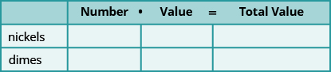

Using one variable meant that we had to relate the number of nickels and the number of dimes. We had to decide if we were going to let *n* be the number of nickels and then write the number of dimes in terms of *n*, or if we would let *d* be the number of dimes and write the number of nickels in terms of *d*.

Now that we know how to solve systems of equations with two variables, we’ll just let *n* be the number of nickels and *d* be the number of dimes. We’ll write one equation based on the total value column, like we did before, and the other equation will come from the number column.

For the first example, we’ll do a ticket problem where the ticket prices are in whole dollars, so we won’t need to use decimals just yet.

Translate to a system of equations and solve:

A science center sold 1,363 tickets on a busy weekend. The receipts totaled $12,146. How many $12 adult tickets and how many $7 child tickets were sold?

<table class="unnumbered unstyled can-break" summary="Step 1 is to read the problem. We will create a table to organize the information. Step 2 is to identify what we are looking for. We are looking for the number of adult tickets and the number of child tickets sold. Step 3 is to name what we are looking for. Let a be the number of adult tickets and c be the number of child tickets. A table will help us organize the data. We have two types of tickets, adult and child. Write a and c for the number of tickets. Write the total number of tickets sold at the bottom of the Number column. Altogether 1363 were sold. Write the value of each type of ticket in the Value column. The value of each adult ticket is 12 dollars. The value of each child tickets is 7 dollars. The number times the value gives the total value, so, the total value of adult tickets is 12a and the total value of child tickets is 7c. Altogether the total value of the tickets was 1302 dollars.  Step 4 is to translate into a system of equations. The Number column and the Total value column give us the system of equations. The equations are a plus c equals 1363 and 12a plus 7c equals 12146. We will use the elimination method to solve this system. Multiply the first equation by minus 7. Simplify and add, then solve for a. We get a equal to 521. Substitute this into the first equation, then solve for c. We get c equal to 842. Step 6 is to check the answer in the problem. 521 adult at 12 dollars per ticket makes 6252 dollars. 842 child tickets at 7 dollars per ticket makes 58994 dollars. The total receipts are 12,146 dollars, which is correct. Step 7 is to answer the question. The science center sold 521 adult tickets and 842 child tickets." data-label=""><tbody>
<tr valign="top">
<td data-valign="top" data-align="left"><strong>Step 1. Read</strong> the problem.</td>
<td data-valign="top" data-align="left">We will create a table to organize the information.</td>
</tr>
<tr valign="top">
<td data-valign="top" data-align="left"><strong>Step 2. Identify</strong> what we are looking for.</td>
<td data-valign="top" data-align="left">We are looking for the number of adult tickets
and the number of child tickets sold.</td>
</tr>
<tr valign="top">
<td data-valign="top" data-align="left"><strong>Step 3. Name</strong> what we are looking for.</td>
<td data-valign="top" data-align="left">Let <math xmlns="http://www.w3.org/1998/Math/MathML"><mrow><mi>a</mi><mo>=</mo></mrow></math> the number of adult tickets.
<math xmlns="http://www.w3.org/1998/Math/MathML"><mspace width="1.5em" /><mrow><mi>c</mi><mo>=</mo></mrow></math> the number of child tickets</td>
</tr>
<tr valign="top">
<td data-valign="top" data-align="left">A table will help us organize the data.
We have two types of tickets, adult and child.</td>
<td data-valign="top" data-align="left">Write in <em>a</em> and <em>c</em> for the number of tickets.</td>
</tr>
<tr>
<td data-valign="top" data-align="left">Write the total number of tickets sold at the bottom
of the Number column.</td>
<td data-valign="top" data-align="left">Altogether 1,363 were sold.</td>
</tr>
<tr>
<td data-valign="top" data-align="left">Write the value of each type of ticket in the
Value column.</td>
<td data-valign="top" data-align="left">The value of each adult ticket is $12.
The value of each child tickets is $7.</td>
</tr>
<tr valign="top">
<td data-valign="top" data-align="left">The number times the value gives the total value,
so the total value of adult tickets is <math xmlns="http://www.w3.org/1998/Math/MathML"><mrow><mi>a</mi><mo>·</mo><mn>12</mn><mo>=</mo><mn>12</mn><mi>a</mi><mo>,</mo></mrow></math>
and the total value of child tickets is <math xmlns="http://www.w3.org/1998/Math/MathML"><mrow><mi>c</mi><mo>·</mo><mn>7</mn><mo>=</mo><mn>7</mn><mi>c</mi><mo>.</mo></mrow></math></td>
<td data-valign="top" data-align="left">Fill in the Total Value column.</td>
</tr>
<tr valign="top">
<td data-valign="top" data-align="left">Altogether the total value of the tickets was $12,146.</td>
<td data-valign="top" data-align="left">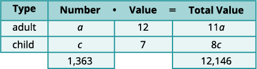</td>
</tr>
<tr valign="top">
<td data-valign="top" data-align="left"><strong>Step 4. Translate</strong> into a system of equations.</td>
<td data-valign="top" data-align="left" />
</tr>
<tr valign="top">
<td data-valign="top" data-align="left">The Number column and the Total value column
give us the system of equations.</td>
<td data-valign="top" data-align="left"></td>
</tr>
<tr valign="top">
<td data-valign="top" data-align="left">We will use the elimination method to solve
this system. Multiply the first equation by <math xmlns="http://www.w3.org/1998/Math/MathML"><mrow><mn>−7</mn><mo>.</mo></mrow></math></td>
<td data-valign="top" data-align="left"></td>
</tr>
<tr valign="top">
<td data-valign="middle" data-align="left">Simplify and add, then solve for <em>a</em>.</td>
<td data-valign="top" data-align="left"></td>
</tr>
<tr valign="top">
<td data-valign="top" data-align="left">Substitute <math xmlns="http://www.w3.org/1998/Math/MathML"><mrow><mi>a</mi><mo>=</mo><mn>521</mn></mrow></math> into the first equation, then
solve for <em>c</em>.</td>
<td data-valign="top" data-align="left"></td>
</tr>
<tr valign="top">
<td data-valign="top" data-align="left"><strong>Step 6. Check</strong> the answer in the
problem.
521 adult at $12  per ticket makes  $  6,252
 842 child at $7 per ticket makes  <u>$58,994</u>
      The total receipts are $12,146✓</td>
<td data-valign="top" data-align="left" />
</tr>
<tr valign="top">
<td data-valign="top" data-align="left"><strong>Step 7. Answer</strong> the question.</td>
<td data-valign="top" data-align="left">The science center sold 521 adult tickets and
842 child tickets.</td>
</tr>
</tbody></table>

Translate to a system of equations and solve:

The ticket office at the zoo sold 553 tickets one day. The receipts totaled $3,936. How many $9 adult tickets and how many $6 child tickets were sold?

206 adults, 347 children

Translate to a system of equations and solve:

The box office at a movie theater sold 147 tickets for the evening show, and receipts totaled $1,302. How many $11 adult and how many $8 child tickets were sold?

42 adults, 105 children

In the next example, we’ll solve a coin problem. Now that we know how to work with systems of two variables, naming the variables in the ‘number’ column will be easy.

Translate to a system of equations and solve:

Juan has a pocketful of nickels and dimes. The total value of the coins is $8.10. The number of dimes is 9 less than twice the number of nickels. How many nickels and how many dimes does Juan have?

<table class="unnumbered unstyled can-break" summary="Step 1 is to read the problem. We will create a table to organize the information. Step 2 is to identify what we are looking for. We are looking for the number of nickels and the number of dimes. Step 3 is to name what we are looking for. Let n be the number of nickels and d be the number of dimes. A table will help us organize the data. We have two types of coins, nickels and dimes. Write n for the number of each type of coin. Fill in the Value column with the value of each type of coin. The value of each nickel is 0.05 dollars. The value of each dime is 0.10 dollars. The number times the value gives the total value, so, the total value of the nickels is 0.05n and the total value of dimes is 0.1d. Altogether the total value of the coins is 8.10 dollars. Step 4 is to translate into a system of equations. We have 0.05n plus 0.1d equal 8.1. We also know the number of dimes is 9 less than twice the number of nickels. Translate to get the second equation d equals 2n minus 9. Step 5 is to solve the system of equations. Substitute the second equation into the first, simplify and solve for n. We get n equal to 36. To find the number of dimes, substitute this into the second equation. We get d equal to 63. Step 6 is to check the answer in the problem. Step 7 is to answer the question. Juan has 36 nickels and 63 dimes." data-label=""><tbody>
<tr valign="top">
<td data-valign="top" data-align="left"><strong>Step 1. Read</strong> the problem.
We will create a table to organize the information.</td>
<td data-valign="top" data-align="left" />
</tr>
<tr valign="top">
<td data-valign="top" data-align="left"><strong>Step 2. Identify</strong> what we are looking for.</td>
<td data-valign="top" data-align="left">We are looking for the number of
nickels and the number of dimes.</td>
</tr>
<tr valign="top">
<td data-valign="top" data-align="left"><strong>Step 3. Name</strong> what we are looking for.</td>
<td data-valign="top" data-align="left">Let <math xmlns="http://www.w3.org/1998/Math/MathML"><mrow><mi>n</mi><mo>=</mo></mrow></math> the number of nickels.
  <math xmlns="http://www.w3.org/1998/Math/MathML"><mrow><mi>d</mi><mo>=</mo></mrow></math> the number of dimes</td>
</tr>
<tr valign="top">
<td data-valign="top" data-align="left">A table will help us organize the data.
We have two types of coins, nickels and dimes.</td>
<td data-valign="top" data-align="left">Write <em>n</em> and <em>d</em> for the number of
each type of coin.</td>
</tr>
<tr valign="top">
<td data-valign="top" data-align="left">Fill in the Value column with the value of each
type of coin.</td>
<td data-valign="top" data-align="left">The value of each nickel is $0.05.
The value of each dime is $0.10.</td>
</tr>
<tr valign="top">
<td data-valign="top" data-align="left">The number times the value gives the total
value, so, the total value of the nickels is
<math xmlns="http://www.w3.org/1998/Math/MathML"><mrow><mi>n</mi><mrow><mo>(</mo><mrow><mn>0.05</mn></mrow><mo>)</mo></mrow><mo>=</mo><mn>0.05</mn><mi>n</mi></mrow></math> and the total value of dimes is
<math xmlns="http://www.w3.org/1998/Math/MathML"><mrow><mi>d</mi><mrow><mo>(</mo><mrow><mn>0.10</mn></mrow><mo>)</mo></mrow><mo>=</mo><mn>0.10</mn><mi>d</mi><mo>.</mo></mrow></math>
Altogether the total value of the coins is $8.10.</td>
<td data-valign="top" data-align="left">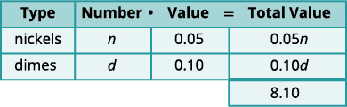</td>
</tr>
<tr valign="top">
<td data-valign="top" data-align="left"><strong>Step 4. Translate</strong> into a system of equations.</td>
<td data-valign="top" data-align="left" />
</tr>
<tr valign="top">
<td data-valign="top" data-align="left">The Total Value column gives one equation.</td>
<td data-valign="top" data-align="left"></td>
</tr>
<tr valign="top">
<td data-valign="top" data-align="left">We also know the number of dimes is 9 less than
twice the number of nickels.</td>
<td data-valign="top" data-align="left" />
</tr>
<tr valign="top">
<td data-valign="top" data-align="left">Translate to get the second equation.</td>
<td data-valign="top" data-align="left"></td>
</tr>
<tr valign="top">
<td data-valign="middle" data-align="left">Now we have the system to solve.</td>
<td data-valign="top" data-align="left"></td>
</tr>
<tr valign="top">
<td data-valign="middle" data-align="left"><strong>Step 5. Solve</strong> the system of equations
We will use the substitution method.</td>
<td data-valign="middle" data-align="left" />
</tr>
<tr valign="top">
<td data-valign="top" data-align="left">Substitute <math xmlns="http://www.w3.org/1998/Math/MathML"><mrow><mi>d</mi><mo>=</mo><mn>2</mn><mi>n</mi><mo>−</mo><mn>9</mn></mrow></math> into the first equation.</td>
<td data-valign="top" data-align="left"></td>
</tr>
<tr valign="top">
<td data-valign="top" data-align="left">Simplify and solve for <em>n</em>.</td>
<td data-valign="top" data-align="left"></td>
</tr>
<tr valign="top">
<td data-valign="top" data-align="left">To find the number of dimes, substitute
<math xmlns="http://www.w3.org/1998/Math/MathML"><mrow><mi>n</mi><mo>=</mo><mn>36</mn></mrow></math> into the second equation.</td>
<td data-valign="top" data-align="left"></td>
</tr>
<tr valign="top">
<td data-valign="top" data-align="left"><strong>Step 6. Check</strong> the answer in the problem
 63 dimes at  <math xmlns="http://www.w3.org/1998/Math/MathML"><mrow><mtext>$</mtext><mn>0.10</mn><mo>=</mo><mtext>$</mtext><mn>6.30</mn></mrow></math>
 36 nickels at <math xmlns="http://www.w3.org/1998/Math/MathML"><mrow><mtext>$</mtext><mn>0.05</mn><mo>=</mo><mtext>$</mtext><mn>1.80</mn></mrow></math>
       Total <math xmlns="http://www.w3.org/1998/Math/MathML"><mrow><mo>=</mo><mtext>$</mtext><mn>8.10</mn><mo>✓</mo></mrow></math></td>
<td data-valign="top" data-align="left" />
</tr>
<tr valign="top">
<td data-valign="top" data-align="left"><strong>Step 7. Answer</strong> the question.</td>
<td data-valign="top" data-align="left">Juan has 36 nickels and 63 dimes.</td>
</tr>
</tbody></table>

Translate to a system of equations and solve:

Matilda has a handful of quarters and dimes, with a total value of $8.55. The number of quarters is 3 more than twice the number of dimes. How many dimes and how many quarters does she have?

13 dimes and 29 quarters

Translate to a system of equations and solve:

Priam has a collection of nickels and quarters, with a total value of $7.30. The number of nickels is six less than three times the number of quarters. How many nickels and how many quarters does he have?

19 quarters and 51 nickels

Some mixture applications involve combining foods or drinks. Example situations might include combining raisins and nuts to make a trail mix or using two types of coffee beans to make a blend.

Translate to a system of equations and solve:

Carson wants to make 20 pounds of trail mix using nuts and chocolate chips. His budget requires that the trail mix costs him $7.60. per pound. Nuts cost $9.00 per pound and chocolate chips cost $2.00 per pound. How many pounds of nuts and how many pounds of chocolate chips should he use?

<table class="unnumbered unstyled can-break" summary="Step 1 is to read the problem. Step 2 is to identify what we are looking for. We are looking for the number of pounds of nuts and the number of pounds of chocolate chips. Step 3 is to name what we are looking for. Let n be the number of pound of nuts and c be the number of pounds of chips. Step 4 is to translate into a system of equations. We have n plus c equals 20 and 9n plus 2c equals 152. Step 5 is to solve the system of equations. We will use elimination to solve the system. Multiply the first equation by minus 2 to eliminate c. Simplify and add. Solve for n. We get n equal to 16. To find the number of pounds of chocolate chips, substitute n equal to 16 into the first equation, then solve for c. We get c equal to 4. Step 6 is to check the answer in the problem. Step 7 is to answer the question. Carson should mix 16 pounds of nuts with 4 pounds of chocolate chips to create the trail mix." data-label=""><tbody>
<tr valign="top">
<td data-valign="top" data-align="left"><strong>Step 1. Read</strong> the problem.
We will create a table to organize the information.</td>
<td data-valign="top" data-align="left" />
</tr>
<tr valign="top">
<td data-valign="top" data-align="left"><strong>Step 2. Identify</strong> what we are looking for.</td>
<td data-valign="top" data-align="left">We are looking for the number of pounds of
nuts and the number of pounds of chocolate
chips.</td>
</tr>
<tr valign="top">
<td data-valign="top" data-align="left"><strong>Step 3. Name</strong> what we are looking for.</td>
<td data-valign="top" data-align="left">Let <math xmlns="http://www.w3.org/1998/Math/MathML"><mrow><mi>n</mi><mo>=</mo></mrow></math> the number of pound of nuts.
  <math xmlns="http://www.w3.org/1998/Math/MathML"><mrow><mi>c</mi><mo>=</mo></mrow></math> the number of pounds of chips</td>
</tr>
<tr valign="top">
<td data-valign="top" data-align="left">Carson will mix nuts and chocolate chips to get
trail mix.
Write in <em>n</em> and <em>c</em> for the number of pounds of
nuts and chocolate chips.</td>
<td data-valign="top" data-align="left">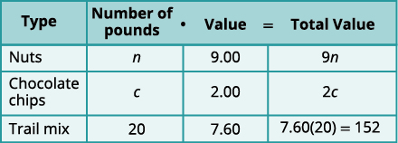</td>
</tr>
<tr valign="top">
<td data-valign="top" data-align="left">There will be 20 pounds of trail mix.
Put the price per pound of each item in
the Value column.
Fill in the last column using
 <math xmlns="http://www.w3.org/1998/Math/MathML"><mrow><mtext>Number</mtext><mspace width="0.2em" /><mo>•</mo><mspace width="0.2em" /><mtext>Value</mtext><mo>=</mo><mtext>Total Value</mtext></mrow></math></td>
<td data-valign="top" data-align="left" />
</tr>
<tr valign="top">
<td data-valign="top" data-align="left"><strong>Step 4. Translate</strong> into a system of equations.
We get the equations from the Number
and Total Value columns.</td>
<td data-valign="top" data-align="left"></td>
</tr>
<tr valign="top">
<td data-valign="top" data-align="left"><strong>Step 5. Solve</strong> the system of equations
We will use elimination to solve the system.
Multiply the first equation by <math xmlns="http://www.w3.org/1998/Math/MathML"><mrow><mn>−2</mn></mrow></math> to eliminate <em>c.</em></td>
<td data-valign="top" data-align="left"></td>
</tr>
<tr valign="top">
<td data-valign="top" data-align="left">Simplify and add.
Solve for <em>n</em>.</td>
<td data-valign="top" data-align="left"></td>
</tr>
<tr valign="top">
<td data-valign="top" data-align="left">To find the number of pounds of chocolate
chips, substitute <math xmlns="http://www.w3.org/1998/Math/MathML"><mrow><mi>n</mi><mo>=</mo><mn>16</mn></mrow></math> into the first equation,
then solve for <em>c</em>.</td>
<td data-valign="top" data-align="left"></td>
</tr>
<tr valign="top">
<td data-valign="top" data-align="left"><strong>Step 6. Check</strong> the answer in the problem.
<math xmlns="http://www.w3.org/1998/Math/MathML"><mrow><mtable columnalign="left"><mtr columnalign="left"><mtd columnalign="right"><mrow><mn>16</mn><mo>+</mo><mn>4</mn></mrow></mtd><mtd columnalign="left"><mo>=</mo></mtd><mtd columnalign="left"><mrow><mn>20</mn><mo>✓</mo></mrow></mtd></mtr><mtr columnalign="left"><mtd columnalign="left"><mrow><mn>9</mn><mo>·</mo><mn>16</mn><mo>+</mo><mn>2</mn><mo>·</mo><mn>4</mn></mrow></mtd><mtd columnalign="left"><mo>=</mo></mtd><mtd columnalign="left"><mrow><mn>152</mn><mo>✓</mo></mrow></mtd></mtr></mtable></mrow></math></td>
<td data-valign="top" data-align="left" />
</tr>
<tr valign="top">
<td data-valign="top" data-align="left"><strong>Step 7. Answer</strong> the question.</td>
<td data-valign="top" data-align="left">Carson should mix 16 pounds of nuts with 4
pounds of chocolate chips to create the trail
mix.</td>
</tr>
</tbody></table>

Translate to a system of equations and solve:

Greta wants to make 5 pounds of a nut mix using peanuts and cashews. Her budget requires the mixture to cost her $6 per pound. Peanuts are $4 per pound and cashews are $9 per pound. How many pounds of peanuts and how many pounds of cashews should she use?

3 pounds peanuts and 2 pounds cashews

Translate to a system of equations and solve:

Sammy has most of the ingredients he needs to make a large batch of chili. The only items he lacks are beans and ground beef. He needs a total of 20 pounds combined of beans and ground beef and has a budget of $3 per pound. The price of beans is $1 per pound and the price of ground beef is $5 per pound. How many pounds of beans and how many pounds of ground beef should he purchase?

10 pounds of beans, 10 pounds of ground beef

Another application of mixture problems relates to concentrated cleaning supplies, other chemicals, and mixed drinks. The concentration is given as a percent. For example, a 20% concentrated household cleanser means that 20% of the total amount is cleanser, and the rest is water. To make 35 ounces of a 20% concentration, you mix 7 ounces (20% of 35) of the cleanser with 28 ounces of water.

For these kinds of mixture problems, we’ll use “percent” instead of “value” for one of the columns in our table.

Translate to a system of equations and solve:

Sasheena is lab assistant at her community college. She needs to make 200 milliliters of a 40% solution of sulfuric acid for a lab experiment. The lab has only 25% and 50% solutions in the storeroom. How much should she mix of the 25% and the 50% solutions to make the 40% solution?

<table class="unnumbered unstyled can-break" summary="Step 1 is to read the problem. Sasheena must mix some of the 25% solution and some of the 50% solution together to get 200 ml of the 40% solution. Step 2 is to identify what we are looking for. We are looking for how much of each solution she needs. Step 3 is to name what we are looking for. Let x be number of ml of 25% solution and y be number of ml of 50% solution. Step 4 is to translate into a system of equations. We get x plus y equal to 200 and 0.25x plus 0.5y equal to 0.4 times 200. Step 5 is to solve the system of equations. We will solve the system by Elimination. Multiply the first equation by minus 0.5 to eliminate y. Simplify and add to solve for x. W get x equal to 80. Substitute this into the first equation to get y equal to 120. Step 6 is to check the answer in the problem. Step 7 is to answer the question. Sasheena should mix 80 ml of the 25% solution with 120 ml of the 50% solution to get the 200 ml of the 40% solution." data-label=""><tbody>
<tr valign="top">
<td data-valign="top" data-align="left"><strong>Step 1. Read</strong> the problem.
A figure may help us visualize the
situation, then we will create a table to
organize the information.</td>
<td data-valign="top" data-align="left">Sasheena must mix some of the 25% solution and
some of the 50% solution together to get 200 ml of
the 40% solution.</td>
</tr>
<tr valign="top">
<td data-valign="top" data-align="left" />
<td data-valign="top" data-align="left">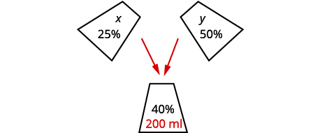</td>
</tr>
<tr valign="top">
<td data-valign="top" data-align="left"><strong>Step 2. Identify</strong> what we are looking for.</td>
<td data-valign="top" data-align="left">We are looking for how much of each solution she
needs.</td>
</tr>
<tr valign="top">
<td data-valign="top" data-align="left"><strong>Step 3. Name</strong> what we are looking for.</td>
<td data-valign="top" data-align="left"> Let <math xmlns="http://www.w3.org/1998/Math/MathML"><mrow><mi>x</mi><mo>=</mo></mrow></math> number of ml of 25% solution.
  <math xmlns="http://www.w3.org/1998/Math/MathML"><mrow><mi>y</mi><mo>=</mo></mrow></math> number of ml of 50% solution</td>
</tr>
<tr valign="top">
<td data-valign="top" data-align="left">A table will help us organize the data. She will
mix <em>x</em> ml of 25% with <em>y</em> ml of 50% to get 200 ml
of 40% solution. We write the percents as decimals
in the chart.
We multiply the number of units times the
concentration to get the total amount of
sulfuric acid in each solution.</td>
<td data-valign="top" data-align="left">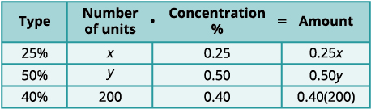</td>
</tr>
<tr valign="top">
<td data-valign="top" data-align="left"><strong>Step 4. Translate</strong> into a system of
equations.
We get the equations from the Number
column and the Amount column.
Now we have the system.</td>
<td data-valign="bottom" data-align="left"></td>
</tr>
<tr valign="top">
<td data-valign="top" data-align="left"><strong>Step 5. Solve</strong> the system of equations
We will solve the system by elimination.
Multiply the first equation by <math xmlns="http://www.w3.org/1998/Math/MathML"><mrow><mn>−0.5</mn></mrow></math> to
eliminate <em>y</em>.</td>
<td data-valign="bottom" data-align="left"></td>
</tr>
<tr valign="top">
<td data-valign="top" data-align="left">Simplify and add to solve for <em>x</em>.</td>
<td data-valign="top" data-align="left"></td>
</tr>
<tr valign="top">
<td data-valign="top" data-align="left">To solve for <em>y</em>, substitute <math xmlns="http://www.w3.org/1998/Math/MathML"><mrow><mi>x</mi><mo>=</mo><mn>80</mn></mrow></math> into the first
equation.</td>
<td data-valign="top" data-align="left"></td>
</tr>
<tr valign="top">
<td data-valign="top" data-align="left"><strong>Step 6. Check</strong> the answer in the problem.
<math xmlns="http://www.w3.org/1998/Math/MathML"><mrow><mtable columnalign="left"><mtr columnalign="left"><mtd columnalign="right"><mrow><mn>80</mn><mo>+</mo><mn>120</mn></mrow></mtd><mtd columnalign="left"><mo>=</mo></mtd><mtd columnalign="left"><mrow><mn>200</mn><mo>✓</mo></mrow></mtd></mtr><mtr columnalign="left"><mtd columnalign="left"><mrow><mn>0.25</mn><mo stretchy="false">(</mo><mn>80</mn><mo stretchy="false">)</mo><mo>+</mo><mn>0.50</mn><mo stretchy="false">(</mo><mn>120</mn><mo stretchy="false">)</mo></mrow></mtd><mtd columnalign="left"><mo>=</mo></mtd><mtd columnalign="left"><mrow><mn>200</mn><mo>✓</mo></mrow></mtd></mtr><mtr columnalign="left"><mtd columnalign="left"><mrow /></mtd><mtd columnalign="left"><mrow /></mtd><mtd columnalign="left"><mrow><mtext>Yes!</mtext></mrow></mtd></mtr></mtable></mrow></math></td>
<td data-valign="top" data-align="left" />
</tr>
<tr valign="top">
<td data-valign="top" data-align="left"><strong>Step 7. Answer</strong> the question.</td>
<td data-valign="top" data-align="left">Sasheena should mix 80 ml of the 25% solution with
120 ml of the 50% solution to get the 200 ml of the
40% solution.</td>
</tr>
</tbody></table>

Translate to a system of equations and solve:

LeBron needs 150 milliliters of a 30% solution of sulfuric acid for a lab experiment but only has access to a 25% and a 50% solution. How much of the 25% and how much of the 50% solution should he mix to make the 30% solution?

120 ml of 25% solution and 30 ml of 50% solution

Translate to a system of equations and solve:

Anatole needs to make 250 milliliters of a 25% solution of hydrochloric acid for a lab experiment. The lab only has a 10% solution and a 40% solution in the storeroom. How much of the 10% and how much of the 40% solutions should he mix to make the 25% solution?

125 ml of 10% solution and 125 ml of 40% solution

### Solve Interest Applications

The formula to model simple interest applications is <math xmlns="http://www.w3.org/1998/Math/MathML"><mrow><mi>I</mi><mo>=</mo><mi>P</mi><mi>r</mi><mi>t</mi><mo>.</mo></mrow></math>

 Interest, *I*, is the product of the principal, *P*, the rate, *r*, and the time, *t*. In our work here, we will calculate the interest earned in one year, so *t* will be 1.

We modify the column titles in the mixture table to show the formula for interest, as you’ll see in the next example.

Translate to a system of equations and solve:

Adnan has $40,000 to invest and hopes to earn <math xmlns="http://www.w3.org/1998/Math/MathML"><mrow><mn>7.1</mn><mtext>%</mtext></mrow></math>

 interest per year. He will put some of the money into a stock fund that earns 8% per year and the rest into bonds that earns 3% per year. How much money should he put into each fund?

<table class="unnumbered unstyled can-break" summary="Step 1 is to read the problem. Step 2 is to identify. We are looking for the amount to invest in each fund. Step 3 is to Name. Let s be the amount in stocks and b be the amount in bonds. So, for stock fund, interest is 0.08s. For bonds, the interest is 0.03b. For total, the interest is 0.071 times 40000. Step 4 is to translate into equations. We get s plus b equal to 40000 and 0.08s plus 0.03b equal to 0.071 times 40000. Step 5 is to solve. To solve by elimination, we multiply the top equation by minus 0.03. We simplify and add to solve for s. We get s equal to 32800. Substituting this into the first equation, we get b equal to 7200. Step 6 is to check the answer in the problem. Step 7 is to answer the question." data-label=""><tbody>
<tr valign="top">
<td data-valign="top" data-align="left"><strong>Step 1. Read</strong> the problem.</td>
<td data-valign="top" data-align="left">A chart will help us organize the information.</td>
</tr>
<tr valign="top">
<td data-valign="top" data-align="left"><strong>Step 2. Identify</strong> what we are looking for.</td>
<td data-valign="top" data-align="left">We are looking for the amount to invest in each fund.</td>
</tr>
<tr valign="top">
<td data-valign="top" data-align="left"><strong>Step 3. Name</strong> what we are looking for.</td>
<td data-valign="top" data-align="left">Let <math xmlns="http://www.w3.org/1998/Math/MathML"><mrow><mi>s</mi><mo>=</mo></mrow></math> the amount invested in stocks.
<math xmlns="http://www.w3.org/1998/Math/MathML"><mrow><mspace width="1.5em" /><mi>b</mi><mo>=</mo></mrow></math> the amount invested in stocks</td>
</tr>
<tr valign="top">
<td data-valign="top" data-align="left">Write the interest rate as a decimal for
each fund.
Multiply: Principal · Rate · Time</td>
<td data-valign="top" data-align="left">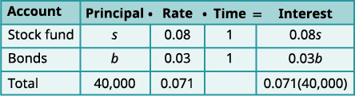</td>
</tr>
<tr valign="top">
<td data-valign="top" data-align="left"><strong>Step 4. Translate</strong> into a system of
equations.
We get our system of equations from
the Principal column and the
Interest column.</td>
<td data-valign="bottom" data-align="left"></td>
</tr>
<tr valign="top">
<td data-valign="top" data-align="left"><strong>Step 5. Solve</strong> the system of equations
 by elimination.
Multiply the top equation by −0.03.</td>
<td data-valign="bottom" data-align="left"></td>
</tr>
<tr valign="top">
<td data-valign="top" data-align="left">Simplify and add to solve for <em>s</em>.</td>
<td data-valign="top" data-align="left"></td>
</tr>
<tr valign="top">
<td data-valign="top" data-align="left">To find <em>b</em>, substitute <em>s</em> = 32,800 into
the first equation.</td>
<td data-valign="top" data-align="left"></td>
</tr>
<tr valign="top">
<td data-valign="top" data-align="left"><strong>Step 6. Check</strong> the answer in the
problem.</td>
<td data-valign="top" data-align="left">We leave the check to you.</td>
</tr>
<tr valign="top">
<td data-valign="top" data-align="left"><strong>Step 7. Answer</strong> the question.</td>
<td data-valign="top" data-align="left">Adnan should invest $32,000 in stock and
$7,200 in bonds.</td>
</tr>
</tbody></table>
Did you notice that the Principal column represents the total amount of money invested while the Interest column represents only the interest earned? Likewise, the first equation in our system, <math xmlns="http://www.w3.org/1998/Math/MathML"><mrow><mi>s</mi><mo>+</mo><mi>b</mi><mo>=</mo><mn>40,000</mn><mo>,</mo></mrow></math>

 represents the total amount of money invested and the second equation, <math xmlns="http://www.w3.org/1998/Math/MathML"><mrow><mn>0.08</mn><mi>s</mi><mo>+</mo><mn>0.03</mn><mi>b</mi><mo>=</mo><mn>0.071</mn><mrow><mo>(</mo><mrow><mn>40,000</mn></mrow><mo>)</mo></mrow><mo>,</mo></mrow></math>

 represents the interest earned.

Translate to a system of equations and solve:

Leon had $50,000 to invest and hopes to earn <math xmlns="http://www.w3.org/1998/Math/MathML"><mrow><mn>6.2</mn><mtext>%</mtext></mrow></math>

 interest per year. He will put some of the money into a stock fund that earns 7% per year and the rest in to a savings account that earns 2% per year. How much money should he put into each fund?

$42,000 in the stock fund and $8000 in the savings account

Translate to a system of equations and solve:

Julius invested $7000 into two stock investments. One stock paid 11% interest and the other stock paid 13% interest. He earned <math xmlns="http://www.w3.org/1998/Math/MathML"><mrow><mn>12.5</mn><mtext>%</mtext></mrow></math>

 interest on the total investment. How much money did he put in each stock?

$1750 at 11% and $5250 at 13%

The next example requires that we find the principal given the amount of interest earned.

Translate to a system of equations and solve:

Rosie owes $21,540 on her two student loans. The interest rate on her bank loan is <math xmlns="http://www.w3.org/1998/Math/MathML"><mrow><mn>10.5</mn><mtext>%</mtext></mrow></math>

 and the interest rate on the federal loan is <math xmlns="http://www.w3.org/1998/Math/MathML"><mrow><mn>5.9</mn><mtext>%</mtext><mo>.</mo></mrow></math>

 The total amount of interest she paid last year was <math xmlns="http://www.w3.org/1998/Math/MathML"><mrow><mtext>$</mtext><mn>1,669.68</mn><mo>.</mo></mrow></math>

 What was the principal for each loan?

<table class="unnumbered unstyled can-break" summary="Step 1 is to read. Step 2 is to identify. We are looking for the principal of each loan. Step 3 is to name. Let b be the principal for the bank loan and f be the principal on the federal loan. The total loans 21540. Records the interest rates as decimals in the chart. Multiply using the formula l equal to Prt to get the interest. Step 4 is to translate into equations. We get b plus f equal to 21540 and 0.105b plus 0.059f equal to 1669.68. Step 5 is to solve. We solve by substitution. We get f equal to 12870 and b equal to 8670. In step 6, check the answer and in step 7, answer the question. the principal of the bank loan is 12870 and the principal for the federal loan is 8670 dollars." data-label=""><tbody>
<tr valign="top">
<td data-valign="top" data-align="left"><strong>Step 1. Read</strong> the problem.</td>
<td data-valign="top" data-align="left">A chart will help us organize the information.</td>
</tr>
<tr valign="top">
<td data-valign="top" data-align="left"><strong>Step 2. Identify</strong> what we are looking for.</td>
<td data-valign="top" data-align="left">We are looking for the principal of each loan.</td>
</tr>
<tr valign="top">
<td data-valign="top" data-align="left"><strong>Step 3. Name</strong> what we are looking for.</td>
<td data-valign="top" data-align="left">Let <math xmlns="http://www.w3.org/1998/Math/MathML"><mrow><mi>b</mi><mo>=</mo></mrow></math> the principal for the bank loan.
<math xmlns="http://www.w3.org/1998/Math/MathML"><mrow><mspace width="1.3em" /><mi>f</mi><mo>=</mo></mrow></math> the principal on the federal loan</td>
</tr>
<tr valign="top">
<td data-valign="top" data-align="left">The total loans are $21,540.</td>
<td data-valign="top" data-align="left" />
</tr>
<tr valign="top">
<td data-valign="top" data-align="left">Record the interest rates as decimals
in the chart.
Multiply using the formula <em>I</em> =  <em>Prt</em> to
get the Interest.</td>
<td data-valign="top" data-align="left">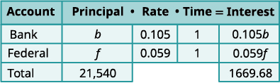</td>
</tr>
<tr valign="top">
<td data-valign="top" data-align="left"><strong>Step 4. Translate</strong> into a system of
equations.
The system of equations comes from
the Principal column and the Interest
column.</td>
<td data-valign="bottom" data-align="left"></td>
</tr>
<tr valign="top">
<td data-valign="top" data-align="left"><strong>Step 5. Solve</strong> the system of equations
We will use substitution to solve.
Solve the first equation for <em>b</em>.</td>
<td data-valign="top" data-align="left"></td>
</tr>
<tr valign="top">
<td data-valign="top" data-align="left" />
<td data-valign="top" data-align="left"></td>
</tr>
<tr valign="top">
<td data-valign="top" data-align="left">Substitute <em>b</em> = −<em>f</em> + 21.540 into
the second equation.</td>
<td data-valign="top" data-align="left"></td>
</tr>
<tr valign="top">
<td data-valign="top" data-align="left">Simplify and solve for <em>f</em>.</td>
<td data-valign="top" data-align="left">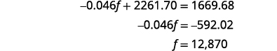</td>
</tr>
<tr valign="top">
<td data-valign="top" data-align="left">To find <em>b</em>, substitute <em>f</em> = 12,870 into the first equation.</td>
<td data-valign="top" data-align="left"></td>
</tr>
<tr valign="top">
<td data-valign="top" data-align="left"><strong>Step 6. Check</strong> the answer in the
problem.</td>
<td data-valign="top" data-align="left">We leave the check to you.</td>
</tr>
<tr valign="top">
<td data-valign="top" data-align="left"><strong>Step 7. Answer</strong> the question.</td>
<td data-valign="top" data-align="left">The principal of the federal loan is $12,870 and
the principal for the bank loan is $8,670.</td>
</tr>
</tbody></table>

Translate to a system of equations and solve:

Laura owes $18,000 on her student loans. The interest rate on the bank loan is 2.5% and the interest rate on the federal loan is 6.9%. The total amount of interest she paid last year was $1,066. What was the principal for each loan?

Bank $4,000; Federal $14,000

Translate to a system of equations and solve:

Jill’s Sandwich Shoppe owes $65,200 on two business loans, one at 4.5% interest and the other at 7.2% interest. The total amount of interest owed last year was $3,582. What was the principal for each loan?

$41,200 at 4.5%, $24,000 at 7.2%

### Solve applications of cost and revenue functions

Suppose a company makes and sells *x* units of a product. The cost to the company is the total costs to produce *x* units. This is the cost to manufacture for each unit times *x*, the number of units manufactured, plus the fixed costs.

The **revenue**{: data-type="term"} is the money the company brings in as a result of selling *x* units. This is the selling price of each unit times the number of units sold.

When the costs equal the revenue we say the business has reached the **break-even point**{: data-type="term"}.

Cost and Revenue Functions

The **cost function**{: data-type="term"} is the cost to manufacture each unit times *x*, the number of units manufactured, plus the fixed costs.

<math xmlns="http://www.w3.org/1998/Math/MathML"><mrow><mi>C</mi><mrow><mo>(</mo><mi>x</mi><mo>)</mo></mrow><mo>=</mo><mrow><mo>(</mo><mrow><mtext>cost per unit</mtext></mrow><mo>)</mo></mrow><mo>·</mo><mi>x</mi><mo>+</mo><mtext>fixed costs</mtext></mrow></math>

The **revenue** function is the selling price of each unit times *x*, the number of units sold.

<math xmlns="http://www.w3.org/1998/Math/MathML"><mrow><mi>R</mi><mo stretchy="false">(</mo><mi>x</mi><mo stretchy="false">)</mo><mo>=</mo><mrow><mo>(</mo><mrow><mtext>selling price per unit</mtext></mrow><mo>)</mo></mrow><mo>·</mo><mi>x</mi></mrow></math>

The **break-even point** is when the revenue equals the costs.

<math xmlns="http://www.w3.org/1998/Math/MathML"><mrow><mi>C</mi><mrow><mo>(</mo><mi>x</mi><mo>)</mo></mrow><mo>=</mo><mi>R</mi><mrow><mo>(</mo><mi>x</mi><mo>)</mo></mrow></mrow></math>

The manufacturer of a weight training bench spends $105 to build each bench and sells them for $245. The manufacturer also has fixed costs each month of $7,000.

ⓐ Find the cost function *C* when *x* benches are manufactured.

ⓑ Find the revenue function *R* when *x* benches are sold.

ⓒ Show the break-even point by graphing both the Revenue and Cost functions on the same grid.

ⓓ Find the break-even point. Interpret what the break-even point means.

ⓐ The manufacturer has $7,000 of fixed costs no matter how many weight training benches it produces. In addition to the fixed costs, the manufacturer also spends $105 to produce each bench. Suppose *x* benches are sold.

<math xmlns="http://www.w3.org/1998/Math/MathML"><mrow><mtable> <mtr><mtd columnalign="left"><mtext>Write the general Cost function formula.</mtext></mtd><mtd /><mtd /><mtd columnalign="left"><mi>C</mi><mrow><mo>(</mo><mi>x</mi><mo>)</mo></mrow><mo>=</mo><mrow><mo>(</mo><mrow><mtext>cost per unit</mtext></mrow><mo>)</mo></mrow><mo>·</mo><mi>x</mi><mo>+</mo><mtext>fixed costs</mtext></mtd></mtr> <mtr><mtd columnalign="left"><mtext>Substitute in the cost values.</mtext></mtd><mtd /><mtd /><mtd columnalign="left"><mi>C</mi><mrow><mo>(</mo><mi>x</mi><mo>)</mo></mrow><mo>=</mo><mn>105</mn><mi>x</mi><mo>+</mo><mn>7000</mn></mtd></mtr></mtable></mrow></math>

ⓑ The manufacturer sells each weight training bench for $245. We get the total revenue by multiplying the revenue per unit times the number of units sold.

<math xmlns="http://www.w3.org/1998/Math/MathML"><mrow><mtable> <mtr><mtd columnalign="left"><mtext>Write the general Revenue function.</mtext></mtd><mtd /><mtd /><mtd columnalign="left"><mi>R</mi><mo stretchy="false">(</mo><mi>x</mi><mo stretchy="false">)</mo><mo>=</mo><mrow><mo>(</mo><mrow><mtext>selling</mtext><mspace width="0.2em" /><mtext>price</mtext><mspace width="0.2em" /><mtext>per</mtext><mspace width="0.2em" /><mtext>unit</mtext></mrow><mo>)</mo></mrow><mo>·</mo><mi>x</mi></mtd></mtr> <mtr><mtd columnalign="left"><mtext>Substitute in the revenue per unit.</mtext></mtd><mtd /><mtd /><mtd columnalign="left"><mi>R</mi><mo stretchy="false">(</mo><mi>x</mi><mo stretchy="false">)</mo><mo>=</mo><mn>245</mn><mi>x</mi></mtd></mtr></mtable></mrow></math>

ⓒ Essentially we have a system of linear equations. We will show the graph of the system as this helps make the idea of a break-even point more visual.

<math xmlns="http://www.w3.org/1998/Math/MathML"><mrow><mrow><mo>{</mo><mtable><mtr><mtd columnalign="left"><mi>C</mi><mrow><mo>(</mo><mi>x</mi><mo>)</mo></mrow><mo>=</mo><mn>105</mn><mi>x</mi><mo>+</mo><mn>7000</mn></mtd></mtr><mtr><mtd columnalign="left"><mi>R</mi><mo stretchy="false">(</mo><mi>x</mi><mo stretchy="false">)</mo><mo>=</mo><mn>245</mn><mi>x</mi></mtd></mtr></mtable></mrow><mspace width="1em" /><mtext>or</mtext><mspace width="1em" /><mrow><mo>{</mo><mtable><mtr><mtd columnalign="left"><mi>y</mi><mo>=</mo><mn>105</mn><mi>x</mi><mo>+</mo><mn>7000</mn></mtd></mtr><mtr><mtd columnalign="left"><mi>y</mi><mo>=</mo><mn>245</mn><mi>x</mi></mtd></mtr></mtable></mrow></mrow></math>

 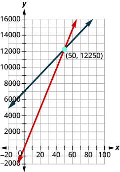 
ⓓ To find the actual value, we remember the break-even point occurs when costs equal revenue.

<math xmlns="http://www.w3.org/1998/Math/MathML"><mrow><mtable><mtr><mtd columnalign="left"><mtext>Write the break-even formula.</mtext></mtd><mtd /><mtd /><mtd /><mtd /><mtd columnalign="left"><mtable><mtr><mtd columnalign="right"><mi>C</mi><mrow><mo>(</mo><mi>x</mi><mo>)</mo></mrow></mtd><mtd columnalign="left"><mo>=</mo></mtd><mtd columnalign="left"><mi>R</mi><mrow><mo>(</mo><mi>x</mi><mo>)</mo></mrow></mtd></mtr><mtr><mtd columnalign="right"><mn>105</mn><mi>x</mi><mo>+</mo><mn>7000</mn></mtd><mtd columnalign="left"><mo>=</mo></mtd><mtd columnalign="left"><mn>245</mn><mi>x</mi></mtd></mtr></mtable></mtd></mtr> <mtr><mtd columnalign="left"><mtext>Solve.</mtext></mtd><mtd /><mtd /><mtd /><mtd /><mtd columnalign="left"><mspace width="3.2em" /><mtable><mtr><mtd columnalign="right"><mn>7000</mn></mtd><mtd columnalign="left"><mo>=</mo></mtd><mtd columnalign="left"><mn>140</mn><mi>x</mi></mtd></mtr><mtr><mtd columnalign="right"><mn>50</mn></mtd><mtd columnalign="left"><mo>=</mo></mtd><mtd columnalign="left"><mi>x</mi></mtd></mtr></mtable></mtd></mtr></mtable></mrow></math>

When 50 benches are sold, the costs equal the revenue.

 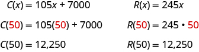 
When 50 benches are sold, the revenue and costs are both $12,250. Notice this corresponds to the ordered pair <math xmlns="http://www.w3.org/1998/Math/MathML"><mrow><mrow><mo>(</mo><mrow><mn>50</mn><mo>,</mo><mn>12,250</mn></mrow><mo>)</mo></mrow><mo>.</mo></mrow></math>

The manufacturer of a weight training bench spends $15 to build each bench and sells them for $32. The manufacturer also has fixed costs each month of $25,500.

ⓐ Find the cost function *C* when *x* benches are manufactured.

ⓑ Find the revenue function *R* when *x* benches are sold.

ⓒ Show the break-even point by graphing both the Revenue and Cost functions on the same grid.

ⓓ Find the break-even point. Interpret what the break-even point means.

ⓐ <math xmlns="http://www.w3.org/1998/Math/MathML"><mrow><mi>C</mi><mo stretchy="false">(</mo><mi>x</mi><mo stretchy="false">)</mo><mo>=</mo><mn>15</mn><mi>x</mi><mo>+</mo><mn>25</mn><mo>,</mo><mn>500</mn></mrow></math>

ⓑ <math xmlns="http://www.w3.org/1998/Math/MathML"><mrow><mi>R</mi><mo stretchy="false">(</mo><mi>x</mi><mo stretchy="false">)</mo><mo>=</mo><mn>32</mn><mi>x</mi></mrow></math>

ⓒ* * *
{: data-type="newline"}

 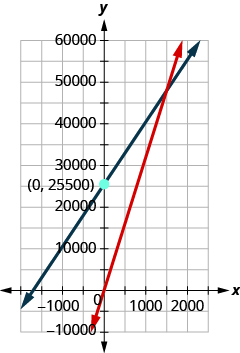 
ⓓ <math xmlns="http://www.w3.org/1998/Math/MathML"><mrow><mn>1,500</mn></mrow></math>

; when 1,500 benches are sold, the cost and revenue will be both 48,000

The manufacturer of a weight training bench spends $120 to build each bench and sells them for $170. The manufacturer also has fixed costs each month of $150,000.

ⓐ Find the cost function *C* when *x* benches are manufactured.

ⓑ Find the revenue function *R* when *x* benches are sold.

ⓒ Show the break-even point by graphing both the Revenue and Cost functions on the same grid.

ⓓ Find the break-even point. Interpret what the break-even point means.

ⓐ <math xmlns="http://www.w3.org/1998/Math/MathML"><mrow><mi>C</mi><mo stretchy="false">(</mo><mi>x</mi><mo stretchy="false">)</mo><mo>=</mo><mn>120</mn><mi>x</mi><mo>+</mo><mn>150,000</mn></mrow></math>

ⓑ <math xmlns="http://www.w3.org/1998/Math/MathML"><mrow><mi>R</mi><mo stretchy="false">(</mo><mi>x</mi><mo stretchy="false">)</mo><mo>=</mo><mn>170</mn><mi>x</mi></mrow></math>

ⓒ* * *
{: data-type="newline"}

 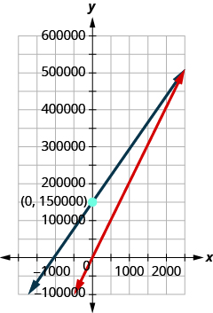 
ⓓ <math xmlns="http://www.w3.org/1998/Math/MathML"><mrow><mn>3,000</mn></mrow></math>

; when 3,000 benches are sold, the revenue and costs are both $510,000

Access this online resource for additional instruction and practice with interest and mixtures.

* [Interest and Mixtures][1]

### Key Concepts

* **Cost function:** The cost function is the cost to manufacture each unit times *x*, the number of units manufactured, plus the fixed costs.
  * * *
  {: data-type="newline"}
  
  

  <math xmlns="http://www.w3.org/1998/Math/MathML"><mrow><mi>C</mi><mrow><mo>(</mo><mi>x</mi><mo>)</mo></mrow><mo>=</mo><mrow><mo>(</mo><mrow><mtext>cost per unit</mtext></mrow><mo>)</mo></mrow><mo>·</mo><mi>x</mi><mo>+</mo><mtext>fixed costs</mtext></mrow></math>
  

* **Revenue:** The revenue function is the selling price of each unit times *x*, the number of units sold.
  * * *
  {: data-type="newline"}
  
  

  <math xmlns="http://www.w3.org/1998/Math/MathML"><mrow><mi>R</mi><mo stretchy="false">(</mo><mi>x</mi><mo stretchy="false">)</mo><mo>=</mo><mrow><mo>(</mo><mrow><mtext>selling</mtext><mtext>price</mtext><mtext>per</mtext><mtext>unit</mtext></mrow><mo>)</mo></mrow><mo>·</mo><mi>x</mi></mrow></math>
  

* **Break-even point:** The break-even point is when the revenue equals the costs.
  * * *
  {: data-type="newline"}
  
  

  <math xmlns="http://www.w3.org/1998/Math/MathML"><mrow><mi>C</mi><mrow><mo>(</mo><mi>x</mi><mo>)</mo></mrow><mo>=</mo><mi>R</mi><mrow><mo>(</mo><mi>x</mi><mo>)</mo></mrow></mrow></math>
  

{: data-bullet-style="bullet"}

<section data-depth="1" class="section-exercises" markdown="1">
#### Practice Makes Perfect

**Solve Mixture Applications**

In the following exercises, translate to a system of equations and solve.

Tickets to a Broadway show cost $35 for adults and $15 for children. The total receipts for 1650 tickets at one performance were $47,150. How many adult and how many child tickets were sold?

Tickets for the Cirque du Soleil show are $70 for adults and $50 for children. One evening performance had a total of 300 tickets sold and the receipts totaled $17,200. How many adult and how many child tickets were sold?

110 adult tickets, 190 child tickets

Tickets for an Amtrak train cost $10 for children and $22 for adults. Josie paid $1200 for a total of 72 tickets. How many children tickets and how many adult tickets did Josie buy?

Tickets for a Minnesota Twins baseball game are $69 for Main Level seats and $39 for Terrace Level seats. A group of sixteen friends went to the game and spent a total of $804 for the tickets. How many of Main Level and how many Terrace Level tickets did they buy?

6 good seats, 10 cheap seats

Tickets for a dance recital cost $15 for adults and $7 dollars for children. The dance company sold 253 tickets and the total receipts were $2771. How many adult tickets and how many child tickets were sold?

Tickets for the community fair cost $12 for adults and $5 dollars for children. On the first day of the fair, 312 tickets were sold for a total of $2204. How many adult tickets and how many child tickets were sold?

92 adult tickets, 220 children tickets

Brandon has a cup of quarters and dimes with a total value of <math xmlns="http://www.w3.org/1998/Math/MathML"><mrow><mtext>$</mtext><mn>3.80</mn><mo>.</mo></mrow></math>

 The number of quarters is four less than twice the number of quarters. How many quarters and how many dimes does Brandon have?

Sherri saves nickels and dimes in a coin purse for her daughter. The total value of the coins in the purse is <math xmlns="http://www.w3.org/1998/Math/MathML"><mrow><mtext>$</mtext><mn>0.95</mn><mo>.</mo></mrow></math>

 The number of nickels is two less than five times the number of dimes. How many nickels and how many dimes are in the coin purse?

13 nickels, 3 dimes

Peter has been saving his loose change for several days. When he counted his quarters and nickels, he found they had a total value <math xmlns="http://www.w3.org/1998/Math/MathML"><mrow><mtext>$</mtext><mn>13.10</mn><mo>.</mo></mrow></math>

 The number of quarters was fifteen more than three times the number of dimes. How many quarters and how many dimes did Peter have?

Lucinda had a pocketful of dimes and quarters with a value of <math xmlns="http://www.w3.org/1998/Math/MathML"><mrow><mtext>$</mtext><mn>6.20</mn><mo>.</mo></mrow></math>

 The number of dimes is eighteen more than three times the number of quarters. How many dimes and how many quarters does Lucinda have?

42 dimes, 8 quarters

A cashier has 30 bills, all of which are $10 or $20 bills. The total value of the money is $460. How many of each type of bill does the cashier have?

A cashier has 54 bills, all of which are $10 or $20 bills. The total value of the money is $910. How many of each type of bill does the cashier have?

17 $10 bills, 37 $20 bills

Marissa wants to blend candy selling for <math xmlns="http://www.w3.org/1998/Math/MathML"><mrow><mtext>$</mtext><mn>1.80</mn></mrow></math>

 per pound with candy costing <math xmlns="http://www.w3.org/1998/Math/MathML"><mrow><mtext>$</mtext><mn>1.20</mn></mrow></math>

 per pound to get a mixture that costs her <math xmlns="http://www.w3.org/1998/Math/MathML"><mrow><mtext>$</mtext><mn>1.40</mn></mrow></math>

 per pound to make. She wants to make 90 pounds of the candy blend. How many pounds of each type of candy should she use?

How many pounds of nuts selling for $6 per pound and raisins selling for $3 per pound should Kurt combine to obtain 120 pounds of trail mix that cost him $5 per pound?

80 pounds nuts and 40 pounds raisins

Hannah has to make twenty-five gallons of punch for a potluck. The punch is made of soda and fruit drink. The cost of the soda is <math xmlns="http://www.w3.org/1998/Math/MathML"><mrow><mtext>$</mtext><mn>1.79</mn></mrow></math>

 per gallon and the cost of the fruit drink is <math xmlns="http://www.w3.org/1998/Math/MathML"><mrow><mtext>$</mtext><mn>2.49</mn></mrow></math>

 per gallon. Hannah’s budget requires that the punch cost <math xmlns="http://www.w3.org/1998/Math/MathML"><mrow><mtext>$</mtext><mn>2.21</mn></mrow></math>

 per gallon. How many gallons of soda and how many gallons of fruit drink does she need?

Joseph would like to make twelve pounds of a coffee blend at a cost of $6 per pound. He blends Ground Chicory at $5 a pound with Jamaican Blue Mountain at $9 per pound. How much of each type of coffee should he use?

9 pounds of Chicory coffee, 3 pounds of Jamaican Blue Mountain coffee

Julia and her husband own a coffee shop. They experimented with mixing a City Roast Columbian coffee that cost $7.80 per pound with French Roast Columbian coffee that cost $8.10 per pound to make a twenty-pound blend. Their blend should cost them $7.92 per pound. How much of each type of coffee should they buy?

Twelve-year old Melody wants to sell bags of mixed candy at her lemonade stand. She will mix M&amp;M’s that cost $4.89 per bag and Reese’s Pieces that cost $3.79 per bag to get a total of twenty-five bags of mixed candy. Melody wants the bags of mixed candy to cost her $4.23 a bag to make. How many bags of M&amp;M’s and how many bags of Reese’s Pieces should she use?

10 bags of M&amp;M’s, 15 bags of Reese’s Pieces

Jotham needs 70 liters of a 50% solution of an alcohol solution. He has a 30% and an 80% solution available. How many liters of the 30% and how many liters of the 80% solutions should he mix to make the 50% solution?

Joy is preparing 15 liters of a 25% saline solution. She only has 40% and 10% solution in her lab. How many liters of the 40% and how many liters of the 10% should she mix to make the 25% solution?

<math xmlns="http://www.w3.org/1998/Math/MathML"><mrow><mn>7.5</mn></mrow></math>

 liters of each solution

A scientist needs 65 liters of a 15% alcohol solution. She has available a 25% and a 12% solution. How many liters of the 25% and how many liters of the 12% solutions should she mix to make the 15% solution?

A scientist needs 120 milliliters of a 20% acid solution for an experiment. The lab has available a 25% and a 10% solution. How many liters of the 25% and how many liters of the 10% solutions should the scientist mix to make the 20% solution?

80 liters of the 25% solution and 40 liters of the 10% solution

A 40% antifreeze solution is to be mixed with a 70% antifreeze solution to get 240 liters of a 50% solution. How many liters of the 40% and how many liters of the 70% solutions will be used?

A 90% antifreeze solution is to be mixed with a 75% antifreeze solution to get 360 liters of an 85% solution. How many liters of the 90% and how many liters of the 75% solutions will be used?

240 liters of the 90% solution and 120 liters of the 75% solution

**Solve Interest Applications**

In the following exercises, translate to a system of equations and solve.

Hattie had $3000 to invest and wants to earn <math xmlns="http://www.w3.org/1998/Math/MathML"><mrow><mn>10.6</mn><mtext>%</mtext></mrow></math>

 interest per year. She will put some of the money into an account that earns 12% per year and the rest into an account that earns 10% per year. How much money should she put into each account?

Carol invested $2560 into two accounts. One account paid 8% interest and the other paid 6% interest. She earned <math xmlns="http://www.w3.org/1998/Math/MathML"><mrow><mn>7.25</mn><mtext>%</mtext></mrow></math>

 interest on the total investment. How much money did she put in each account?

$1600 at 8%, 960 at 6%

Sam invested $48,000, some at 6% interest and the rest at 10%. How much did he invest at each rate if he received $4000 in interest in one year?

Arnold invested $64,000, some at <math xmlns="http://www.w3.org/1998/Math/MathML"><mrow><mn>5.5</mn><mtext>%</mtext></mrow></math>

 interest and the rest at 9%. How much did he invest at each rate if he received $4500 in interest in one year?

$28,000 at 9%, $36,000 at <math xmlns="http://www.w3.org/1998/Math/MathML"><mrow><mn>5.5</mn><mtext>%</mtext></mrow></math>

After four years in college, Josie owes $65, 800 in student loans. The interest rate on the federal loans is <math xmlns="http://www.w3.org/1998/Math/MathML"><mrow><mn>4.5</mn><mtext>%</mtext></mrow></math>

 and the rate on the private bank loans is 2%. The total interest she owes for one year was <math xmlns="http://www.w3.org/1998/Math/MathML"><mrow><mtext>$</mtext><mn>2878.50</mn><mo>.</mo></mrow></math>

 What is the amount of each loan?

Mark wants to invest $10,000 to pay for his daughter’s wedding next year. He will invest some of the money in a short term CD that pays 12% interest and the rest in a money market savings account that pays 5% interest. How much should he invest at each rate if he wants to earn $1095 in interest in one year?

$8500 CD, $1500 savings account

A trust fund worth $25,000 is invested in two different portfolios. This year, one portfolio is expected to earn <math xmlns="http://www.w3.org/1998/Math/MathML"><mrow><mn>5.25</mn><mtext>%</mtext></mrow></math>

 interest and the other is expected to earn 4%. Plans are for the total interest on the fund to be $1150 in one year. How much money should be invested at each rate?

A business has two loans totaling $85,000. One loan has a rate of 6% and the other has a rate of 4.5% This year, the business expects to pay $4,650 in interest on the two loans. How much is each loan?

$55,000 on loan at 6% and $30,000 on loan at <math xmlns="http://www.w3.org/1998/Math/MathML"><mrow><mn>4.5</mn><mtext>%</mtext></mrow></math>

**Solve Applications of Cost and Revenue Functions**

The manufacturer of an energy drink spends $1.20 to make each drink and sells them for $2. The manufacturer also has fixed costs each month of $8,000.

ⓐ Find the cost function *C* when *x* energy drinks are manufactured.

ⓑ Find the revenue function *R* when *x* drinks are sold.

ⓒ Show the break-even point by graphing both the Revenue and Cost functions on the same grid.

ⓓ Find the break-even point. Interpret what the break-even point means.

The manufacturer of a water bottle spends $5 to build each bottle and sells them for $10. The manufacturer also has fixed costs each month of $6500. ⓐ Find the cost function *C* when *x* bottles are manufactured. ⓑ Find the revenue function *R* when *x* bottles are sold. ⓒ Show the break-even point by graphing both the Revenue and Cost functions on the same grid. ⓓ Find the break-even point. Interpret what the break-even point means.

ⓐ <math xmlns="http://www.w3.org/1998/Math/MathML"><mrow><mi>C</mi><mo stretchy="false">(</mo><mi>x</mi><mo stretchy="false">)</mo><mo>=</mo><mn>5</mn><mi>x</mi><mo>+</mo><mn>6500</mn></mrow></math>

ⓑ <math xmlns="http://www.w3.org/1998/Math/MathML"><mrow><mi>R</mi><mo stretchy="false">(</mo><mi>x</mi><mo stretchy="false">)</mo><mo>=</mo><mn>10</mn><mi>x</mi></mrow></math>

ⓒ* * *
{: data-type="newline"}

 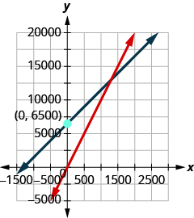 
ⓓ 1,500; when 1,500 water bottles are sold, the cost and the revenue equal $15,000

#### Writing Exercises

Take a handful of two types of coins, and write a problem similar to [[link]](#fs-id1167835337355) relating the total number of coins and their total value. Set up a system of equations to describe your situation and then solve it.

In [[link]](#fs-id1167835334400), we used elimination to solve the system of equations* * *
{: data-type="newline"}

<math xmlns="http://www.w3.org/1998/Math/MathML"><mrow><mrow><mo>{</mo><mtable><mtr><mtd columnalign="left"><mi>s</mi><mo>+</mo><mi>b</mi><mo>=</mo><mn>40,000</mn></mtd></mtr><mtr><mtd columnalign="left"><mn>0.08</mn><mi>s</mi><mo>+</mo><mn>0.03</mn><mi>b</mi><mo>=</mo><mn>0.071</mn><mrow><mo>(</mo><mrow><mn>40,000</mn></mrow><mo>)</mo></mrow></mtd></mtr></mtable></mrow><mo>.</mo></mrow></math>

Could you have used substitution or elimination to solve this system? Why?

Answers will vary.

#### Self Check

ⓐ After completing the exercises, use this checklist to evaluate your mastery of the objectives of this section.

ⓑ What does this checklist tell you about your mastery of this section? What steps will you take to improve?

</section>

### Glossary
{: data-type="glossary-title"}

cost function
: The cost function is the cost to manufacture each unit times
  <math xmlns="http://www.w3.org/1998/Math/MathML"><mi>x</mi></math>
  
  , the number of units manufactured, plus the fixed costs; *C*(*x*) = (cost per unit)*x* + fixed costs.
^

revenue
: The revenue is the selling price of each unit times *x*, the number of units sold; *R(x*) = (selling price per unit)*x*.
^

break-even point
: The point at which the revenue equals the costs is the break-even point;
  <math xmlns="http://www.w3.org/1998/Math/MathML"><mrow><mi>C</mi><mrow><mo>(</mo><mi>x</mi><mo>)</mo></mrow><mo>=</mo><mi>R</mi><mrow><mo>(</mo><mi>x</mi><mo>)</mo></mrow><mo>.</mo></mrow></math>

[1]: https://openstax.org/l/37intmixure
