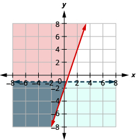
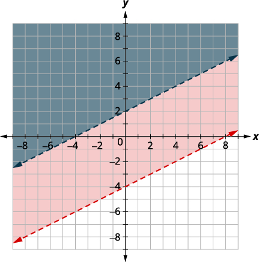

By the end of this section, you will be able to:
* Determine whether an ordered pair is a solution of a system of linear inequalities
* Solve a system of linear inequalities by graphing
* Solve applications of systems of inequalities

Before you get started, take this readiness quiz.

1.  Solve the inequality
    <math xmlns="http://www.w3.org/1998/Math/MathML"><mrow><mn>2</mn><mi>a</mi><mo>&lt;</mo><mn>5</mn><mi>a</mi><mo>+</mo><mn>12</mn><mo>.</mo></mrow></math>
    
    * * *
    {: data-type="newline"}
    
    If you missed this problem, review [\[link\]](/m63312#fs-id1167835324646).
2.  Determine whether the ordered pair
    <math xmlns="http://www.w3.org/1998/Math/MathML"><mrow><mrow><mo>(</mo><mrow><mn>3</mn><mo>,</mo><mfrac><mn>1</mn><mn>2</mn></mfrac></mrow><mo>)</mo></mrow></mrow></math>
    
    is a solution to the system
    <math xmlns="http://www.w3.org/1998/Math/MathML"><mrow><mi>y</mi><mo>&gt;</mo><mn>2</mn><mi>x</mi><mo>+</mo><mn>3</mn><mo>.</mo></mrow></math>
    
    * * *
    {: data-type="newline"}
    
    If you missed this problem, review [\[link\]](/m63321#fs-id1167835253977).
{: type="1"}

### Determine whether an ordered pair is a solution of a system of linear inequalities

The definition of a **system of linear inequalities**{: data-type="term"} is very similar to the definition of a system of linear equations.

System of Linear Inequalities

Two or more linear inequalities grouped together form a system of linear inequalities.

A system of linear inequalities looks like a system of linear equations, but it has inequalities instead of equations. A system of two linear inequalities is shown here.

<math xmlns="http://www.w3.org/1998/Math/MathML"><mrow><mrow><mo>{</mo><mtable><mtr><mtd columnalign="left"><mi>x</mi><mo>+</mo><mn>4</mn><mi>y</mi><mo>≥</mo><mn>10</mn></mtd></mtr><mtr><mtd columnalign="left"><mn>3</mn><mi>x</mi><mo>−</mo><mn>2</mn><mi>y</mi><mo>&lt;</mo><mn>12</mn></mtd></mtr></mtable></mrow></mrow></math>

To solve a system of linear inequalities, we will find values of the variables that are solutions to both inequalities. We solve the system by using the graphs of each inequality and show the solution as a graph. We will find the region on the plane that contains all ordered pairs <math xmlns="http://www.w3.org/1998/Math/MathML"><mrow><mrow><mo>(</mo><mrow><mi>x</mi><mo>,</mo><mi>y</mi></mrow><mo>)</mo></mrow></mrow></math>

 that make both inequalities true.

Solutions of a System of Linear Inequalities

Solutions of a system of linear inequalities are the values of the variables that make all the inequalities true.

The solution of a system of linear inequalities is shown as a shaded region in the *x, y* coordinate system that includes all the points whose ordered pairs make the inequalities true.

To determine if an ordered pair is a solution to a system of two inequalities, we substitute the values of the variables into each inequality. If the ordered pair makes both inequalities true, it is a solution to the system.

Determine whether the ordered pair is a solution to the system <math xmlns="http://www.w3.org/1998/Math/MathML"><mrow><mrow><mo>{</mo><mtable><mtr><mtd columnalign="left"><mi>x</mi><mo>+</mo><mn>4</mn><mi>y</mi><mo>≥</mo><mn>10</mn></mtd></mtr><mtr><mtd columnalign="left"><mn>3</mn><mi>x</mi><mo>−</mo><mn>2</mn><mi>y</mi><mo>&lt;</mo><mn>12</mn></mtd></mtr></mtable></mrow><mo>.</mo></mrow></math>

ⓐ <math xmlns="http://www.w3.org/1998/Math/MathML"><mrow><mrow><mo>(</mo><mrow><mn>−2</mn><mo>,</mo><mn>4</mn></mrow><mo>)</mo></mrow></mrow></math>

 ⓑ <math xmlns="http://www.w3.org/1998/Math/MathML"><mrow><mrow><mo>(</mo><mrow><mn>3</mn><mo>,</mo><mn>1</mn></mrow><mo>)</mo></mrow></mrow></math>

ⓐ Is the ordered pair <math xmlns="http://www.w3.org/1998/Math/MathML"><mrow><mrow><mo>(</mo><mrow><mn>−2</mn><mo>,</mo><mn>4</mn></mrow><mo>)</mo></mrow></mrow></math>

 a solution?

 ![We substitute x equal to negative 2 and y equal to 4 into both inequalities. First inequality is x plus 4 times y greater than or equal to 10. So negative 2 plus 4 open parentheses 4 close parenthesis is greater than or equal to 10 or not. 14 is greater than or equal to 10 is true. Second inequality, 3 times x minus 2 times y is less than 12. Three open parentheses negative 2 close parentheses minus two open parentheses 4 close parentheses is less than 12 or not. Negative 14 is less than 12 is true.](../resources/CNX_IntAlg_Figure_04_07_001_img.jpg) 
The ordered pair <math xmlns="http://www.w3.org/1998/Math/MathML"><mrow><mrow><mo>(</mo><mrow><mn>−2</mn><mo>,</mo><mn>4</mn></mrow><mo>)</mo></mrow></mrow></math>

 made both inequalities true. Therefore <math xmlns="http://www.w3.org/1998/Math/MathML"><mrow><mrow><mo>(</mo><mrow><mn>−2</mn><mo>,</mo><mn>4</mn></mrow><mo>)</mo></mrow></mrow></math>

 is a solution to this system.

ⓑ Is the ordered pair <math xmlns="http://www.w3.org/1998/Math/MathML"><mrow><mrow><mo>(</mo><mrow><mn>3</mn><mo>,</mo><mn>1</mn></mrow><mo>)</mo></mrow></mrow></math>

 a solution?

 ![We substitute x equal to three and y equal to one into both inequalities. First inequality is x plus four times y greater than or equal to ten. So three plus four open parentheses one close parenthesis is greater than or equal to ten or not. Seven greater than or equal to ten is false. Second inequality, three times x minus two times y is less than twelve. Three open parentheses three close parentheses minus two open parentheses one close parentheses is less than twelve or not. Seven less than 12 holds true.](../resources/CNX_IntAlg_Figure_04_07_002_img.jpg) 
The ordered pair <math xmlns="http://www.w3.org/1998/Math/MathML"><mrow><mrow><mo>(</mo><mrow><mn>3</mn><mo>,</mo><mn>1</mn></mrow><mo>)</mo></mrow></mrow></math>

 made one inequality true, but the other one false. Therefore <math xmlns="http://www.w3.org/1998/Math/MathML"><mrow><mrow><mo>(</mo><mrow><mn>3</mn><mo>,</mo><mn>1</mn></mrow><mo>)</mo></mrow></mrow></math>

 is not a solution to this system.

Determine whether the ordered pair is a solution to the system: <math xmlns="http://www.w3.org/1998/Math/MathML"><mrow><mrow><mo>{</mo><mtable><mtr><mtd columnalign="left"><mi>x</mi><mo>−</mo><mn>5</mn><mi>y</mi><mo>&gt;</mo><mn>10</mn></mtd></mtr><mtr><mtd columnalign="left"><mn>2</mn><mi>x</mi><mo>+</mo><mn>3</mn><mi>y</mi><mo>&gt;</mo><mn>−2</mn></mtd></mtr></mtable></mrow><mo>.</mo></mrow></math>

ⓐ <math xmlns="http://www.w3.org/1998/Math/MathML"><mrow><mrow><mo>(</mo><mrow><mn>3</mn><mo>,</mo><mn>−1</mn></mrow><mo>)</mo></mrow></mrow></math>

 ⓑ <math xmlns="http://www.w3.org/1998/Math/MathML"><mrow><mrow><mo>(</mo><mrow><mn>6</mn><mo>,</mo><mn>−3</mn></mrow><mo>)</mo></mrow></mrow></math>

ⓐ no ⓑ yes

Determine whether the ordered pair is a solution to the system: <math xmlns="http://www.w3.org/1998/Math/MathML"><mrow><mrow><mo>{</mo><mtable><mtr><mtd columnalign="left"><mi>y</mi><mo>&gt;</mo><mn>4</mn><mi>x</mi><mo>−</mo><mn>2</mn></mtd></mtr><mtr><mtd columnalign="left"><mn>4</mn><mi>x</mi><mo>−</mo><mi>y</mi><mo>&lt;</mo><mn>20</mn></mtd></mtr></mtable></mrow><mo>.</mo></mrow></math>

ⓐ <math xmlns="http://www.w3.org/1998/Math/MathML"><mrow><mrow><mo>(</mo><mrow><mn>−2</mn><mo>,</mo><mn>1</mn></mrow><mo>)</mo></mrow></mrow></math>

 ⓑ <math xmlns="http://www.w3.org/1998/Math/MathML"><mrow><mrow><mo>(</mo><mrow><mn>4</mn><mo>,</mo><mn>−1</mn></mrow><mo>)</mo></mrow></mrow></math>

ⓐ yes ⓑ no

### Solve a System of Linear Inequalities by Graphing

The solution to a single linear inequality is the region on one side of the boundary line that contains all the points that make the inequality true. The solution to a system of two linear inequalities is a region that contains the solutions to both inequalities. To find this region, we will graph each inequality separately and then locate the region where they are both true. The solution is always shown as a graph.

How to Solve a System of Linear Inequalities by Graphing

Solve the system by graphing: <math xmlns="http://www.w3.org/1998/Math/MathML"><mrow><mrow><mo>{</mo><mtable><mtr><mtd columnalign="left"><mi>y</mi><mo>≥</mo><mn>2</mn><mi>x</mi><mo>−</mo><mn>1</mn></mtd></mtr><mtr><mtd columnalign="left"><mi>y</mi><mo>&lt;</mo><mi>x</mi><mo>+</mo><mn>1</mn></mtd></mtr></mtable></mrow><mo>.</mo></mrow></math>

           

Solve the system by graphing: <math xmlns="http://www.w3.org/1998/Math/MathML"><mrow><mrow><mo>{</mo><mtable><mtr><mtd columnalign="left"><mi>y</mi><mo>&lt;</mo><mn>3</mn><mi>x</mi><mo>+</mo><mn>2</mn></mtd></mtr><mtr><mtd columnalign="left"><mi>y</mi><mo>&gt;</mo><mtext>−</mtext><mi>x</mi><mo>−</mo><mn>1</mn></mtd></mtr></mtable></mrow><mo>.</mo></mrow></math>

  
* * *
{: data-type="newline"}

 The solution is the grey region.

Solve the system by graphing: <math xmlns="http://www.w3.org/1998/Math/MathML"><mrow><mrow><mo>{</mo><mtable><mtr><mtd columnalign="left"><mi>y</mi><mo>&lt;</mo><mo>−</mo><mfrac><mn>1</mn><mn>2</mn></mfrac><mi>x</mi><mo>+</mo><mn>3</mn></mtd></mtr><mtr><mtd columnalign="left"><mi>y</mi><mo>&lt;</mo><mn>3</mn><mi>x</mi><mo>−</mo><mn>4</mn></mtd></mtr></mtable></mrow><mo>.</mo></mrow></math>

  
* * *
{: data-type="newline"}

 The solution is the grey region.

Solve a system of linear inequalities by graphing.

1.  Graph the first inequality.
    * Graph the boundary line.
    * Shade in the side of the boundary line where the inequality is true.
    {: data-bullet-style="bullet"}

2.  On the same grid, graph the second inequality.
    * Graph the boundary line.
    * Shade in the side of that boundary line where the inequality is true.
    {: data-bullet-style="bullet"}

3.  The solution is the region where the shading overlaps.
4.  Check by choosing a test point.
{: type="1" .stepwise}

Solve the system by graphing: <math xmlns="http://www.w3.org/1998/Math/MathML"><mrow><mrow><mo>{</mo><mtable><mtr><mtd columnalign="left"><mi>x</mi><mo>−</mo><mi>y</mi><mo>&gt;</mo><mn>3</mn></mtd></mtr><mtr><mtd columnalign="left"><mi>y</mi><mo>&lt;</mo><mo>−</mo><mfrac><mn>1</mn><mn>5</mn></mfrac><mi>x</mi><mo>+</mo><mn>4</mn></mtd></mtr></mtable></mrow><mo>.</mo></mrow></math>

<table class="unnumbered unstyled" summary="The figure shows the graph of the inequality x minus y greater than three. It is plotted by graphing x minus y equal to three and testing a point. The intercepts are x equal to three and y equal to minus three and the boundary line is dashed. Test with point with coordinates zero and zero which makes the inequality false so shade the side that does not contain this point in red." data-label=""><tbody>
<tr valign="top">
<td data-valign="top" data-align="left" />
<td data-valign="top" data-align="left"><math xmlns="http://www.w3.org/1998/Math/MathML"><mrow><mrow><mo>{</mo><mtable><mtr><mtd columnalign="left"><mi>x</mi><mo>−</mo><mi>y</mi><mo>&gt;</mo><mn>3</mn></mtd></mtr><mtr><mtd columnalign="left"><mi>y</mi><mo>&lt;</mo><mo>−</mo><mfrac><mn>1</mn><mn>5</mn></mfrac><mi>x</mi><mo>+</mo><mn>4</mn></mtd></mtr></mtable></mrow></mrow></math></td>
</tr>
<tr valign="top">
<td data-valign="top" data-align="left">Graph <em>x</em> − <em>y</em> &gt; 3, by graphing <em>x</em> − <em>y</em> = 3
and testing a point.

The intercepts are <em>x</em> = 3 and <em>y</em> = −3 and the
boundary line will be dashed.

Test (0, 0) which makes the inequality false so shade
(red) the side that does not contain (0, 0).</td>
<td data-valign="top" data-align="left"></td>
</tr>
</tbody></table>
<table class="unnumbered unstyled" summary="The figure shows the making of graph of y less than minus one fifth x plus four by graphing y equal to minus one fifth x plus four using the slope m equal to minus one by five and y intercept b equal to four. The boundary line is dashed. Test with point with coordinates zero and zero which makes the inequality true so the side that contains this point is shaded blue." data-label=""><tbody>
<tr valign="top">
<td data-valign="top" data-align="left">Graph <math xmlns="http://www.w3.org/1998/Math/MathML"><mrow><mi>y</mi><mo>&lt;</mo><mo>−</mo><mfrac><mn>1</mn><mn>5</mn></mfrac><mi>x</mi><mo>+</mo><mn>4</mn></mrow></math> by graphing <math xmlns="http://www.w3.org/1998/Math/MathML"><mrow><mi>y</mi><mo>=</mo><mo>−</mo><mfrac><mn>1</mn><mn>5</mn></mfrac><mi>x</mi><mo>+</mo><mn>4</mn></mrow></math>
using the slope <math xmlns="http://www.w3.org/1998/Math/MathML"><mrow><mi>m</mi><mo>=</mo><mo>−</mo><mfrac><mn>1</mn><mn>5</mn></mfrac></mrow></math> and <em>y</em>-intercept <em>b</em> = 4.
The boundary line will be dashed

Test (0, 0) which makes the inequality true, so
shade (blue) the side that contains (0, 0).

Choose a test point in the solution and verify that it is a solution to both inequalties.</td>
<td data-valign="top" data-align="left"></td>
</tr>
</tbody></table>
The point of intersection of the two lines is not included as both boundary lines were dashed. The solution is the area shaded twice—which appears as the darkest shaded region.

Solve the system by graphing: <math xmlns="http://www.w3.org/1998/Math/MathML"><mrow><mrow><mo>{</mo><mtable><mtr><mtd columnalign="left"><mi>x</mi><mo>+</mo><mi>y</mi><mo>≤</mo><mn>2</mn></mtd></mtr><mtr><mtd columnalign="left"><mi>y</mi><mo>≥</mo><mfrac><mn>2</mn><mn>3</mn></mfrac><mi>x</mi><mo>−</mo><mn>1</mn></mtd></mtr></mtable></mrow><mo>.</mo></mrow></math>

  
* * *
{: data-type="newline"}

 The solution is the grey region.

Solve the system by graphing: <math xmlns="http://www.w3.org/1998/Math/MathML"><mrow><mrow><mo>{</mo><mtable><mtr><mtd columnalign="left"><mn>3</mn><mi>x</mi><mo>−</mo><mn>2</mn><mi>y</mi><mo>≤</mo><mn>6</mn></mtd></mtr><mtr><mtd columnalign="left"><mi>y</mi><mo>&gt;</mo><mtext>−</mtext><mfrac><mn>1</mn><mn>4</mn></mfrac><mi>x</mi><mo>+</mo><mn>5</mn></mtd></mtr></mtable></mrow><mo>.</mo></mrow></math>

  
* * *
{: data-type="newline"}

 The solution is the grey region.

Solve the system by graphing: <math xmlns="http://www.w3.org/1998/Math/MathML"><mrow><mrow><mo>{</mo><mtable><mtr><mtd columnalign="left"><mi>x</mi><mo>−</mo><mn>2</mn><mi>y</mi><mo>&lt;</mo><mn>5</mn></mtd></mtr><mtr><mtd columnalign="left"><mi>y</mi><mo>&gt;</mo><mn>−4</mn></mtd></mtr></mtable></mrow><mo>.</mo></mrow></math>

<table class="unnumbered unstyled" summary="The figure shows the making of graph of x minus two times y less than five by graphing x minus two times y equal to five and testing a point The intercepts are x equal to five and y equal to minus two point five. The boundary line is dashed. Test with point with coordinates zero and zero which makes the inequality true so the side that contains this point is shaded red." data-label=""><tbody>
<tr valign="top">
<td data-valign="top" data-align="left" />
<td data-valign="top" data-align="left"><math xmlns="http://www.w3.org/1998/Math/MathML"><mrow><mspace width="2em" /><mrow><mo>{</mo><mtable><mtr><mtd columnalign="left"><mi>x</mi><mo>−</mo><mn>2</mn><mi>y</mi><mo>&lt;</mo><mn>5</mn></mtd></mtr><mtr><mtd columnalign="left"><mi>y</mi><mo>&gt;</mo><mn>−4</mn></mtd></mtr></mtable></mrow></mrow></math></td>
</tr>
<tr valign="top">
<td data-valign="top" data-align="left">Graph <math xmlns="http://www.w3.org/1998/Math/MathML"><mrow><mi>x</mi><mo>−</mo><mn>2</mn><mi>y</mi><mo>&lt;</mo><mn>5</mn><mo>,</mo></mrow></math> by graphing <math xmlns="http://www.w3.org/1998/Math/MathML"><mrow><mi>x</mi><mo>−</mo><mn>2</mn><mi>y</mi><mo>=</mo><mn>5</mn></mrow></math>
and testing a point. The intercepts are
<em>x</em> = 5 and <em>y</em> = −2.5 and the
boundary line will be dashed.

Test (0, 0) which makes the inequality true, so shade
(red) the side that contains (0, 0).</td>
<td data-valign="top" data-align="left"></td>
</tr>
</tbody></table>
<table class="unnumbered unstyled can-break" summary="The figure shows the making of graph of y greater than minus four by graphing y equal to minus four and recognizing that it is a horizontal line through y equal to minus four. The boundary line is dashed. Test with point with coordinates zero and zero which makes the inequality true so the side that contains this point is shaded blue." data-label=""><tbody>
<tr valign="top">
<td data-valign="top" data-align="left">Graph <math xmlns="http://www.w3.org/1998/Math/MathML"><mrow><mi>y</mi><mo>&gt;</mo><mn>−4</mn><mo>,</mo></mrow></math> by graphing <math xmlns="http://www.w3.org/1998/Math/MathML"><mrow><mi>y</mi><mo>=</mo><mn>−4</mn></mrow></math> and
recognizing that it is a horizontal line
through <math xmlns="http://www.w3.org/1998/Math/MathML"><mrow><mi>y</mi><mo>=</mo><mn>−4</mn><mo>.</mo></mrow></math> The boundary line will
be dashed.

Test (0, 0) which makes the inequality
true so shade (blue) the side that contains (0, 0).</td>
<td data-valign="top" data-align="left"></td>
</tr>
</tbody></table>
The point <math xmlns="http://www.w3.org/1998/Math/MathML"><mrow><mrow><mo>(</mo><mrow><mn>0</mn><mo>,</mo><mn>0</mn></mrow><mo>)</mo></mrow></mrow></math>

 is in the solution and we have already found it to be a solution of each inequality. The point of intersection of the two lines is not included as both boundary lines were dashed.

The solution is the area shaded twice—which appears as the darkest shaded region.

Solve the system by graphing: <math xmlns="http://www.w3.org/1998/Math/MathML"><mrow><mrow><mo>{</mo><mtable><mtr><mtd columnalign="left"><mi>y</mi><mo>≥</mo><mn>3</mn><mi>x</mi><mo>−</mo><mn>2</mn></mtd></mtr><mtr><mtd columnalign="left"><mi>y</mi><mo>&lt;</mo><mo>−</mo><mn>1</mn></mtd></mtr></mtable></mrow><mo>.</mo></mrow></math>

  
* * *
{: data-type="newline"}

 The solution is the grey region.

Solve the system by graphing: <math xmlns="http://www.w3.org/1998/Math/MathML"><mrow><mrow><mo>{</mo><mtable><mtr><mtd columnalign="left"><mi>x</mi><mo>&gt;</mo><mn>−4</mn></mtd></mtr><mtr><mtd columnalign="left"><mi>x</mi><mo>−</mo><mn>2</mn><mi>y</mi><mo>≥</mo><mn>−4</mn></mtd></mtr></mtable></mrow><mo>.</mo></mrow></math>

  
* * *
{: data-type="newline"}

 The solution is the grey region.

Systems of linear inequalities where the boundary lines are parallel might have no solution. We’ll see this in the next example.

Solve the system by graphing: <math xmlns="http://www.w3.org/1998/Math/MathML"><mrow><mrow><mo>{</mo><mtable><mtr><mtd columnalign="left"><mn>4</mn><mi>x</mi><mo>+</mo><mn>3</mn><mi>y</mi><mo>≥</mo><mn>12</mn></mtd></mtr><mtr><mtd columnalign="left"><mi>y</mi><mo>&lt;</mo><mo>−</mo><mfrac><mn>4</mn><mn>3</mn></mfrac><mi>x</mi><mo>+</mo><mn>1</mn></mtd></mtr></mtable></mrow><mo>.</mo></mrow></math>

<table class="unnumbered unstyled can-break" summary="The figure shows the making of two graphs. First the graph of four times x plus three times y greater than or equal to twelve is made by graphing four times x plus three times y equal to twelve. The intercepts are x equal to three and y equal to four. The boundary line is dashed. Test with point with coordinates zero and zero which makes the inequality false so the side that contains this point is shaded blue. Next the graph of y less than minus four by three of x plus one is made by graphing y equal to minus four by three of x plus one using the slope m equal to minus four by three and y intercept b equal to one. The boundary line is dashed. Test with point with coordinates zero and zero which makes the inequality true so the side that contains this point is shaded red." data-label=""><tbody>
<tr valign="top">
<td data-valign="top" data-align="left" />
<td data-valign="top" data-align="left"><math xmlns="http://www.w3.org/1998/Math/MathML"><mrow><mrow><mo>{</mo><mtable><mtr><mtd columnalign="left"><mn>4</mn><mi>x</mi><mo>+</mo><mn>3</mn><mi>y</mi><mo>≥</mo><mn>12</mn></mtd></mtr><mtr><mtd columnalign="left"><mi>y</mi><mo>&lt;</mo><mo>−</mo><mfrac><mn>4</mn><mn>3</mn></mfrac><mi>x</mi><mo>+</mo><mn>1</mn></mtd></mtr></mtable></mrow></mrow></math></td>
</tr>
<tr valign="top">
<td data-valign="top" data-align="left">Graph <math xmlns="http://www.w3.org/1998/Math/MathML"><mrow><mn>4</mn><mi>x</mi><mo>+</mo><mn>3</mn><mi>y</mi><mo>≥</mo><mn>12</mn><mo>,</mo></mrow></math> by graphing <math xmlns="http://www.w3.org/1998/Math/MathML"><mrow><mn>4</mn><mi>x</mi><mo>+</mo><mn>3</mn><mi>y</mi><mo>=</mo><mn>12</mn></mrow></math>
and testing a point. The intercepts are <em>x</em> = 3
and <em>y</em> = 4 and the boundary line will be solid.

Test (0, 0) which makes the inequality false, so
shade (red) the side that does not contain (0, 0).</td>
<td data-valign="top" data-align="left"></td>
</tr>
<tr valign="top">
<td data-valign="top" data-align="left">Graph <math xmlns="http://www.w3.org/1998/Math/MathML"><mrow><mi>y</mi><mo>&lt;</mo><mo>−</mo><mfrac><mn>4</mn><mn>3</mn></mfrac><mi>x</mi><mo>+</mo><mn>1</mn></mrow></math> by graphing <math xmlns="http://www.w3.org/1998/Math/MathML"><mrow><mi>y</mi><mo>=</mo><mo>−</mo><mfrac><mn>4</mn><mn>3</mn></mfrac><mi>x</mi><mo>+</mo><mn>1</mn></mrow></math>
using the slope <math xmlns="http://www.w3.org/1998/Math/MathML"><mrow><mi>m</mi><mo>=</mo><mo>−</mo><mfrac><mn>4</mn><mn>3</mn></mfrac></mrow></math> and <em>y</em>-intercept
<em>b</em> = 1. The boundary line will be dashed.

Test (0, 0) which makes the inequality true, so
shade (blue) the side that contains (0, 0).</td>
<td data-valign="top" data-align="left"></td>
</tr>
</tbody></table>
There is no point in both shaded regions, so the system has no solution.

Solve the system by graphing: <math xmlns="http://www.w3.org/1998/Math/MathML"><mrow><mrow><mo>{</mo><mtable><mtr><mtd columnalign="left"><mn>3</mn><mi>x</mi><mo>−</mo><mn>2</mn><mi>y</mi><mo>≥</mo><mn>12</mn></mtd></mtr><mtr><mtd columnalign="left"><mi>y</mi><mo>≥</mo><mfrac><mn>3</mn><mn>2</mn></mfrac><mi>x</mi><mo>+</mo><mn>1</mn></mtd></mtr></mtable></mrow><mo>.</mo></mrow></math>

  
* * *
{: data-type="newline"}

 No solution.

Solve the system by graphing: <math xmlns="http://www.w3.org/1998/Math/MathML"><mrow><mrow><mo>{</mo><mtable><mtr><mtd columnalign="left"><mi>x</mi><mo>+</mo><mn>3</mn><mi>y</mi><mo>&gt;</mo><mn>8</mn></mtd></mtr><mtr><mtd columnalign="left"><mi>y</mi><mo>&lt;</mo><mo>−</mo><mfrac><mn>1</mn><mn>3</mn></mfrac><mi>x</mi><mo>−</mo><mn>2</mn></mtd></mtr></mtable></mrow><mo>.</mo></mrow></math>

  
* * *
{: data-type="newline"}

 No solution.

Some systems of linear inequalities where the boundary lines are parallel will have a solution. We’ll see this in the next example.

Solve the system by graphing: <math xmlns="http://www.w3.org/1998/Math/MathML"><mrow><mrow><mo>{</mo><mtable><mtr><mtd columnalign="left"><mi>y</mi><mo>&gt;</mo><mfrac><mn>1</mn><mn>2</mn></mfrac><mi>x</mi><mo>−</mo><mn>4</mn></mtd></mtr><mtr><mtd columnalign="left"><mi>x</mi><mo>−</mo><mn>2</mn><mi>y</mi><mo>&lt;</mo><mn>−4</mn></mtd></mtr></mtable></mrow><mo>.</mo></mrow></math>

<table class="unnumbered unstyled can-break" summary="The figure shows the making of two graphs. First the graph of y greater than half of x minus four is made by graphing y equal to half of x minus four using the slope m equal to half and y intercept b equal to minus 4. The boundary line is dashed. Test with point with coordinates zero and zero which makes the inequality so the side that contains this point is shaded red. Next the graph of x minus two times y less than minus four is made by graphing x minus two times y equal to minus four. The intercepts are x equal to minus four and y equal to two. The boundary line is dashed." data-label=""><tbody>
<tr valign="top">
<td data-valign="top" data-align="left" />
<td data-valign="top" data-align="left"><math xmlns="http://www.w3.org/1998/Math/MathML"><mrow><mspace width="2em" /><mrow><mo>{</mo><mtable><mtr><mtd columnalign="left"><mi>y</mi><mo>&gt;</mo><mfrac><mn>1</mn><mn>2</mn></mfrac><mi>x</mi><mo>−</mo><mn>4</mn></mtd></mtr><mtr><mtd columnalign="left"><mi>x</mi><mo>−</mo><mn>2</mn><mi>y</mi><mo>&lt;</mo><mn>−4</mn></mtd></mtr></mtable></mrow></mrow></math></td>
</tr>
<tr valign="top">
<td data-valign="top" data-align="left">Graph <math xmlns="http://www.w3.org/1998/Math/MathML"><mrow><mi>y</mi><mo>&gt;</mo><mfrac><mn>1</mn><mn>2</mn></mfrac><mi>x</mi><mo>−</mo><mn>4</mn></mrow></math> by graphing <math xmlns="http://www.w3.org/1998/Math/MathML"><mrow><mi>y</mi><mo>=</mo><mfrac><mn>1</mn><mn>2</mn></mfrac><mi>x</mi><mo>−</mo><mn>4</mn></mrow></math>
using the slope <math xmlns="http://www.w3.org/1998/Math/MathML"><mrow><mi>m</mi><mo>=</mo><mfrac><mn>1</mn><mn>2</mn></mfrac></mrow></math> and the intercept
<em>b</em> = −4. The boundary line will be dashed.

Test (0, 0) which makes the inequality true, so
shade (red) the side that contains (0, 0).</td>
<td data-valign="top" data-align="left"></td>
</tr>
<tr valign="top">
<td data-valign="top" data-align="left">Graph <math xmlns="http://www.w3.org/1998/Math/MathML"><mrow><mi>x</mi><mo>−</mo><mn>2</mn><mi>y</mi><mo>&lt;</mo><mn>−4</mn></mrow></math> by graphing <math xmlns="http://www.w3.org/1998/Math/MathML"><mrow><mi>x</mi><mo>−</mo><mn>2</mn><mi>y</mi><mo>=</mo><mn>−4</mn></mrow></math>
and testing a point. The intercepts are
<em>x</em> = −4 and <em>y</em> = 2 and the boundary line will be dashed.

Choose a test point in the solution and verify
that it is a solution to both inequalties.

Test (0, 0) which makes the inequality false, so
shade (blue) the side that does not contain (0, 0).</td>
<td data-valign="top" data-align="left"></td>
</tr>
</tbody></table>
No point on the boundary lines is included in the solution as both lines are dashed.

The solution is the region that is shaded twice which is also the solution to <math xmlns="http://www.w3.org/1998/Math/MathML"><mrow><mi>x</mi><mo>−</mo><mn>2</mn><mi>y</mi><mo>&lt;</mo><mn>−4</mn><mo>.</mo></mrow></math>

Solve the system by graphing: <math xmlns="http://www.w3.org/1998/Math/MathML"><mrow><mrow><mo>{</mo><mtable><mtr><mtd columnalign="left"><mi>y</mi><mo>≥</mo><mn>3</mn><mi>x</mi><mo>+</mo><mn>1</mn></mtd></mtr><mtr><mtd columnalign="left"><mn>−3</mn><mi>x</mi><mo>+</mo><mi>y</mi><mo>≥</mo><mn>−4</mn></mtd></mtr></mtable></mrow><mo>.</mo></mrow></math>

  
* * *
{: data-type="newline"}

 The solution is the grey region.

Solve the system by graphing: <math xmlns="http://www.w3.org/1998/Math/MathML"><mrow><mrow><mo>{</mo><mtable><mtr><mtd columnalign="left"><mi>y</mi><mo>≤</mo><mo>−</mo><mfrac><mn>1</mn><mn>4</mn></mfrac><mi>x</mi><mo>+</mo><mn>2</mn></mtd></mtr><mtr><mtd columnalign="left"><mi>x</mi><mo>+</mo><mn>4</mn><mi>y</mi><mo>≤</mo><mn>4</mn></mtd></mtr></mtable></mrow><mo>.</mo></mrow></math>

  
* * *
{: data-type="newline"}

 The solution is the grey region.

### Solve Applications of Systems of Inequalities

The first thing we’ll need to do to solve applications of systems of inequalities is to translate each condition into an inequality. Then we graph the system, as we did above, to see the region that contains the solutions. Many situations will be realistic only if both variables are positive, so we add inequalities to the system as additional requirements.

Christy sells her photographs at a booth at a street fair. At the start of the day, she wants to have at least 25 photos to display at her booth. Each small photo she displays costs her $4 and each large photo costs her $10. She doesn’t want to spend more than $200 on photos to display.

ⓐ Write a system of inequalities to model this situation.* * *
{: data-type="newline"}

ⓑ Graph the system.* * *
{: data-type="newline"}

ⓒ Could she display 10 small and 20 large photos?* * *
{: data-type="newline"}

ⓓ Could she display 20 large and 10 small photos?

ⓐ* * *
{: data-type="newline"}

 <math xmlns="http://www.w3.org/1998/Math/MathML"><mtable><mtr><mtd columnalign="left"><mtext>Let</mtext></mtd><mtd columnalign="left"><mi>x</mi><mo>=</mo><mtext>the number of small photos</mtext><mo>.</mo></mtd></mtr><mtr><mtd /><mtd columnalign="left"><mi>y</mi><mo>=</mo><mtext>the number of large photos</mtext></mtd></mtr></mtable></math>

To find the system of equations translate the information.

<math xmlns="http://www.w3.org/1998/Math/MathML"><mrow><mtable><mtr /><mtr /><mtr /><mtr><mtd columnalign="left"><mspace width="3em" /><mtext>She wants to have at least 25 photos.</mtext></mtd></mtr><mtr><mtd columnalign="left"><mspace width="3em" /><mtext>The number of small plus the number of large should be at least 25.</mtext></mtd></mtr><mtr><mtd columnalign="center"><mi>x</mi><mo>+</mo><mi>y</mi><mo>≥</mo><mn>25</mn></mtd></mtr><mtr /><mtr /><mtr><mtd columnalign="left"><mspace width="3em" /><mtext>$4 for each small and $10 for each large must be no more than $200</mtext></mtd></mtr><mtr><mtd columnalign="center"><mn>4</mn><mi>x</mi><mo>+</mo><mn>10</mn><mi>y</mi><mo>≤</mo><mn>200</mn></mtd></mtr><mtr /><mtr /><mtr><mtd columnalign="left"><mspace width="3em" /><mtext>The number of small photos must be greater than or equal to 0.</mtext></mtd></mtr><mtr><mtd columnalign="center"><mi>x</mi><mo>≥</mo><mn>0</mn></mtd></mtr><mtr /><mtr /><mtr><mtd columnalign="left"><mspace width="3em" /><mtext>The number of large photos must be greater than or equal to 0.</mtext></mtd></mtr><mtr><mtd columnalign="center"><mi>y</mi><mo>≥</mo><mn>0</mn></mtd></mtr></mtable></mrow></math>

We have our system of equations.

<math xmlns="http://www.w3.org/1998/Math/MathML"><mrow><mspace width="1em" /><mrow><mo>{</mo><mtable><mtr><mtd columnalign="left"><mi>x</mi><mo>+</mo><mi>y</mi><mo>≥</mo><mn>25</mn></mtd></mtr><mtr><mtd columnalign="left"><mn>4</mn><mi>x</mi><mo>+</mo><mn>10</mn><mi>y</mi><mo>≤</mo><mn>200</mn></mtd></mtr><mtr><mtd columnalign="left"><mi>x</mi><mo>≥</mo><mn>0</mn></mtd></mtr><mtr><mtd columnalign="left"><mi>y</mi><mo>≥</mo><mn>0</mn></mtd></mtr></mtable></mrow></mrow></math>

ⓑ* * *
{: data-type="newline"}

 Since <math xmlns="http://www.w3.org/1998/Math/MathML"><mrow><mi>x</mi><mo>≥</mo><mn>0</mn></mrow></math>

 and <math xmlns="http://www.w3.org/1998/Math/MathML"><mrow><mi>y</mi><mo>≥</mo><mn>0</mn></mrow></math>

 (both are greater than or equal to) all solutions will be in the first quadrant. As a result, our graph shows only quadrant one.* * *
{: data-type="newline"}

<table class="unnumbered unstyled can-break" summary="The figure shows the making of two graphs. First the inequality x plus y greater than or equal to twenty five is made by graphing x plus y equal to twenty five as a solid line. The point with coordinates zero and zero does not make the inequality true so the side that does not include this point is shaded red. Next the inequality four times x plus ten times y greater than or equal to two hundred is made by graphing four times x plus ten times y equal to two hundred. The point with coordinates zero and zero does make the inequality true so the side which contains this point is shaded blue." data-label=""><tbody>
<tr valign="top">
<td data-valign="top" data-align="left">To graph <math xmlns="http://www.w3.org/1998/Math/MathML"><mrow><mi>x</mi><mo>+</mo><mi>y</mi><mo>≥</mo><mn>25</mn><mo>,</mo></mrow></math> graph <math xmlns="http://www.w3.org/1998/Math/MathML"><mrow><mi>x</mi><mo>+</mo><mi>y</mi><mo>=</mo><mn>25</mn></mrow></math> as a solid line.
Choose (0, 0) as a test point. Since it does not make the inequality true, shade (red) the side that does not include the point (0, 0).

To graph <math xmlns="http://www.w3.org/1998/Math/MathML"><mrow><mn>4</mn><mi>x</mi><mo>+</mo><mn>10</mn><mi>y</mi><mo>≤</mo><mn>200</mn><mo>,</mo></mrow></math> graph <math xmlns="http://www.w3.org/1998/Math/MathML"><mrow><mn>4</mn><mi>x</mi><mo>+</mo><mn>10</mn><mi>y</mi><mo>=</mo><mn>200</mn></mrow></math> as a solid line.
Choose (0, 0) as a test point. Since it does make the inequality true, shade (blue) the side that include the point (0, 0).</td>
<td data-valign="top" data-align="left"></td>
</tr>
</tbody></table>
The solution of the system is the region of the graph that is shaded the darkest. The boundary line sections that border the darkly-shaded section are included in the solution as are the points on the *x*-axis from (25, 0) to (55, 0).

ⓒ To determine if 10 small and 20 large photos would work, we look at the graph to see if the point (10, 20) is in the solution region. We could also test the point to see if it is a solution of both equations.

It is not, Christy would not display 10 small and 20 large photos.

ⓓ To determine if 20 small and 10 large photos would work, we look at the graph to see if the point (20, 10) is in the solution region. We could also test the point to see if it is a solution of both equations.

It is, so Christy could choose to display 20 small and 10 large photos.

Notice that we could also test the possible solutions by substituting the values into each inequality.

A trailer can carry a maximum weight of 160 pounds and a maximum volume of 15 cubic feet. A microwave oven weighs 30 pounds and has 2 cubic feet of volume, while a printer weighs 20 pounds and has 3 cubic feet of space.

ⓐ Write a system of inequalities to model this situation.* * *
{: data-type="newline"}

ⓑ Graph the system.* * *
{: data-type="newline"}

ⓒ Could 4 microwaves and 2 printers be carried on this trailer?* * *
{: data-type="newline"}

ⓓ Could 7 microwaves and 3 printers be carried on this trailer?

ⓐ <math xmlns="http://www.w3.org/1998/Math/MathML"><mrow><mrow><mo>{</mo><mtable><mtr><mtd columnalign="left"><mn>30</mn><mi>m</mi><mo>+</mo><mn>20</mn><mi>p</mi><mo>≤</mo><mn>160</mn></mtd></mtr><mtr><mtd columnalign="left"><mn>2</mn><mi>m</mi><mo>+</mo><mn>3</mn><mi>p</mi><mo>≤</mo><mn>15</mn></mtd></mtr></mtable></mrow></mrow></math>

* * *
{: data-type="newline"}

 ⓑ* * *
{: data-type="newline"}

  
* * *
{: data-type="newline"}

 ⓒ yes* * *
{: data-type="newline"}

 ⓓ no

Mary needs to purchase supplies of answer sheets and pencils for a standardized test to be given to the juniors at her high school. The number of the answer sheets needed is at least 5 more than the number of pencils. The pencils cost $2 and the answer sheets cost $1. Mary’s budget for these supplies allows for a maximum cost of $400.

ⓐ Write a system of inequalities to model this situation.* * *
{: data-type="newline"}

ⓑ Graph the system.* * *
{: data-type="newline"}

ⓒ Could Mary purchase 100 pencils and 100 answer sheets?* * *
{: data-type="newline"}

ⓓ Could Mary purchase 150 pencils and 150 answer sheets?

ⓐ <math xmlns="http://www.w3.org/1998/Math/MathML"><mrow><mrow><mo>{</mo><mtable><mtr><mtd columnalign="left"><mi>a</mi><mo>≥</mo><mi>p</mi><mo>+</mo><mn>5</mn></mtd></mtr><mtr><mtd columnalign="left"><mi>a</mi><mo>+</mo><mn>2</mn><mi>p</mi><mo>≤</mo><mn>400</mn></mtd></mtr></mtable></mrow></mrow></math>

* * *
{: data-type="newline"}

 ⓑ* * *
{: data-type="newline"}

  
* * *
{: data-type="newline"}

 ⓒ no* * *
{: data-type="newline"}

 ⓓ no

When we use variables other than *x* and *y* to define an unknown quantity, we must change the names of the axes of the graph as well.

Omar needs to eat at least 800 calories before going to his team practice. All he wants is hamburgers and cookies, and he doesn’t want to spend more than $5. At the hamburger restaurant near his college, each hamburger has 240 calories and costs $1.40. Each cookie has 160 calories and costs $0.50.

ⓐ Write a system of inequalities to model this situation.* * *
{: data-type="newline"}

ⓑ Graph the system.* * *
{: data-type="newline"}

ⓒ Could he eat 3 hamburgers and 1 cookie?* * *
{: data-type="newline"}

ⓓ Could he eat 2 hamburgers and 4 cookies?

ⓐ* * *
{: data-type="newline"}

 <math xmlns="http://www.w3.org/1998/Math/MathML"><mtable><mtr><mtd columnalign="left"><mtext>Let</mtext></mtd><mtd columnalign="left"><mi>h</mi><mo>=</mo><mtext>the number of hamburgers</mtext><mo>.</mo></mtd></mtr><mtr><mtd /><mtd columnalign="left"><mi>c</mi><mo>=</mo><mtext>the number of cookies</mtext></mtd></mtr></mtable></math>

To find the system of equations translate the information.

The calories from hamburgers at 240 calories each, plus the calories from cookies at 160 calories each must be more that 800.

<math xmlns="http://www.w3.org/1998/Math/MathML"><mrow><mtable><mtr><mtd columnalign="center"><mn>240</mn><mi>h</mi><mo>+</mo><mn>160</mn><mi>c</mi><mo>≥</mo><mn>800</mn></mtd></mtr><mtr /><mtr /><mtr><mtd columnalign="left"><mspace width="3em" /><mtext>The amount spent on hamburgers at $1.40 each, plus the amount spent on cookies</mtext></mtd></mtr><mtr><mtd columnalign="left"><mspace width="3em" /><mtext>at $0.50 each must be no more than $5.00.</mtext></mtd></mtr><mtr><mtd columnalign="center"><mn>1.40</mn><mi>h</mi><mo>+</mo><mn>0.50</mn><mi>c</mi><mo>≤</mo><mn>5</mn></mtd></mtr><mtr /><mtr /><mtr><mtd columnalign="left"><mspace width="3em" /><mtext>The number of hamburgers must be greater than or equal to 0.</mtext></mtd></mtr><mtr><mtd columnalign="center"><mi>h</mi><mo>≥</mo><mn>0</mn></mtd></mtr><mtr /><mtr /><mtr><mtd columnalign="left"><mspace width="3em" /><mtext>The number of cookies must be greater than or equal to 0.</mtext></mtd></mtr><mtr><mtd columnalign="center"><mi>c</mi><mo>≥</mo><mn>0</mn></mtd></mtr></mtable></mrow></math>

<math xmlns="http://www.w3.org/1998/Math/MathML"><mrow><mtable><mtr><mtd columnalign="left"><mtext>We have our system of equations.</mtext></mtd><mtd /><mtd /><mtd columnalign="center"><mspace width="2em" /><mrow><mo>{</mo><mtable><mtr><mtd columnalign="left"><mn>240</mn><mi>h</mi><mo>+</mo><mn>160</mn><mi>c</mi><mo>≥</mo><mn>800</mn></mtd></mtr><mtr><mtd columnalign="left"><mn>1.40</mn><mi>h</mi><mo>+</mo><mn>0.50</mn><mi>c</mi><mo>≤</mo><mn>5</mn></mtd></mtr><mtr><mtd columnalign="left"><mi>h</mi><mo>≥</mo><mn>0</mn></mtd></mtr><mtr><mtd columnalign="left"><mi>c</mi><mo>≥</mo><mn>0</mn></mtd></mtr></mtable></mrow></mtd></mtr></mtable></mrow></math>

ⓑ* * *
{: data-type="newline"}

 Since <math xmlns="http://www.w3.org/1998/Math/MathML"><mrow><mi>h</mi><mo>&gt;</mo><mo>=</mo><mn>0</mn></mrow></math>

 and <math xmlns="http://www.w3.org/1998/Math/MathML"><mrow><mi>c</mi><mo>&gt;</mo><mo>=</mo><mn>0</mn></mrow></math>

 (both are greater than or equal to) all solutions will be in the first quadrant. As a result, our graph shows only quadrant one.* * *
{: data-type="newline"}

<table class="unnumbered unstyled can-break" summary="The graph of inequality two forty times h plus one sixty times c greater than or equal to eight hundred is shown. It is made by graphing two forty h plus one sixty c equal to eight hundred as a solid line. The point with coordinates zero and zero does not make the inequality true so the side which does not include this point is shaded red." data-label=""><tbody>
<tr valign="top">
<td data-valign="top" data-align="left">To graph <math xmlns="http://www.w3.org/1998/Math/MathML"><mrow><mn>240</mn><mi>h</mi><mo>+</mo><mn>160</mn><mi>c</mi><mo>≥</mo><mn>800</mn><mo>,</mo></mrow></math> graph <math xmlns="http://www.w3.org/1998/Math/MathML"><mrow><mn>240</mn><mi>h</mi><mo>+</mo><mn>160</mn><mi>c</mi><mo>=</mo><mn>800</mn></mrow></math> as a solid line.

Choose (0, 0) as a test point. Since it does not make the inequality true, shade (red) the side that does not include the point (0, 0).</td>
<td data-valign="top" data-align="left"></td>
</tr>
</tbody></table>
Graph <math xmlns="http://www.w3.org/1998/Math/MathML"><mrow><mn>1.40</mn><mi>h</mi><mo>+</mo><mn>0.50</mn><mi>c</mi><mo>≤</mo><mn>5</mn><mo>.</mo></mrow></math>

 The boundary line is <math xmlns="http://www.w3.org/1998/Math/MathML"><mrow><mn>1.40</mn><mi>h</mi><mo>+</mo><mn>0.50</mn><mi>c</mi><mo>=</mo><mn>5</mn><mo>.</mo></mrow></math>

 We test (0, 0) and it makes the inequality true. We shade the side of the line that includes (0, 0).

The solution of the system is the region of the graph that is shaded the darkest. The boundary line sections that border the darkly shaded section are included in the solution as are the points on the *x*-axis from (5, 0) to (10, 0).

ⓒ To determine if 3 hamburgers and 2 cookies would meet Omar’s criteria, we see if the point (3, 2) is in the solution region. It is, so Omar might choose to eat 3 hamburgers and 2 cookies.

ⓓ To determine if 2 hamburgers and 4 cookies would meet Omar’s criteria, we see if the point (2, 4) is in the solution region. It is, Omar might choose to eat 2 hamburgers and 4 cookies.

We could also test the possible solutions by substituting the values into each inequality.

Tension needs to eat at least an extra 1,000 calories a day to prepare for running a marathon. He has only $25 to spend on the extra food he needs and will spend it on $0.75 donuts which have 360 calories each and $2 energy drinks which have 110 calories.

ⓐ Write a system of inequalities that models this situation.* * *
{: data-type="newline"}

ⓑ Graph the system.* * *
{: data-type="newline"}

ⓒ Can he buy 8 donuts and 4 energy drinks and satisfy his caloric needs?* * *
{: data-type="newline"}

ⓓ Can he buy 1 donut and 3 energy drinks and satisfy his caloric needs?

ⓐ <math xmlns="http://www.w3.org/1998/Math/MathML"><mrow><mrow><mo>{</mo><mtable><mtr><mtd columnalign="left"><mn>0.75</mn><mi>d</mi><mo>+</mo><mn>2</mn><mi>e</mi><mo>≤</mo><mn>25</mn></mtd></mtr><mtr><mtd columnalign="left"><mn>360</mn><mi>d</mi><mo>+</mo><mn>110</mn><mi>e</mi><mo>≥</mo><mn>1000</mn></mtd></mtr></mtable></mrow></mrow></math>

* * *
{: data-type="newline"}

 ⓑ* * *
{: data-type="newline"}

  
* * *
{: data-type="newline"}

 ⓒ yes* * *
{: data-type="newline"}

 ⓓ no

Philip’s doctor tells him he should add at least 1,000 more calories per day to his usual diet. Philip wants to buy protein bars that cost $1.80 each and have 140 calories and juice that costs $1.25 per bottle and have 125 calories. He doesn’t want to spend more than $12.

ⓐ Write a system of inequalities that models this situation.* * *
{: data-type="newline"}

ⓑ Graph the system.* * *
{: data-type="newline"}

ⓒ Can he buy 3 protein bars and 5 bottles of juice?* * *
{: data-type="newline"}

ⓓ Can he buy 5 protein bars and 3 bottles of juice?

ⓐ <math xmlns="http://www.w3.org/1998/Math/MathML"><mrow><mrow><mo>{</mo><mtable><mtr><mtd columnalign="left"><mn>140</mn><mi>p</mi><mo>+</mo><mn>125</mn><mi>j</mi><mo>≥</mo><mn>1000</mn></mtd></mtr><mtr><mtd columnalign="left"><mn>1.80</mn><mi>p</mi><mo>+</mo><mn>1.25</mn><mi>j</mi><mo>≤</mo><mn>12</mn></mtd></mtr></mtable></mrow></mrow></math>

* * *
{: data-type="newline"}

 ⓑ* * *
{: data-type="newline"}

  
* * *
{: data-type="newline"}

 ⓒ yes* * *
{: data-type="newline"}

 ⓓ no

Access these online resources for additional instruction and practice with solving systems of linear inequalities by graphing.

* [Solving Systems of Linear Inequalities by Graphing][1]
* [Systems of Linear Inequalities][2]
{: data-display="block"}

### Key Concepts

* **Solutions of a System of Linear Inequalities:** Solutions of a system of linear inequalities are the values of the variables that make all the inequalities true. The solution of a system of linear inequalities is shown as a shaded region in the *x, y* coordinate system that includes all the points whose ordered pairs make the inequalities true.
* **How to solve a system of linear inequalities by graphing.**
  1.  Graph the first inequality.
      * * *
      {: data-type="newline"}
      
      Graph the boundary line.
      * * *
      {: data-type="newline"}
      
      Shade in the side of the boundary line where the inequality is true.
  2.  On the same grid, graph the second inequality.
      * * *
      {: data-type="newline"}
      
      Graph the boundary line.
      * * *
      {: data-type="newline"}
      
      Shade in the side of that boundary line where the inequality is true.
  3.  The solution is the region where the shading overlaps.
  4.  Check by choosing a test point.
  {: type="1" .stepwise}
{: data-bullet-style="bullet"}

<section data-depth="1" class="section-exercises" markdown="1">
#### Practice Makes Perfect

**Determine Whether an Ordered Pair is a Solution of a System of Linear Inequalities**

In the following exercises, determine whether each ordered pair is a solution to the system.

<math xmlns="http://www.w3.org/1998/Math/MathML"><mrow><mrow><mo>{</mo><mtable><mtr><mtd columnalign="left"><mn>3</mn><mi>x</mi><mo>+</mo><mi>y</mi><mo>&gt;</mo><mn>5</mn></mtd></mtr><mtr><mtd columnalign="left"><mn>2</mn><mi>x</mi><mo>−</mo><mi>y</mi><mo>≤</mo><mn>10</mn></mtd></mtr></mtable></mrow></mrow></math>

ⓐ <math xmlns="http://www.w3.org/1998/Math/MathML"><mrow><mo stretchy="false">(</mo><mn>3</mn><mo>,</mo><mn>−3</mn><mo stretchy="false">)</mo></mrow></math>

* * *
{: data-type="newline"}

ⓑ <math xmlns="http://www.w3.org/1998/Math/MathML"><mrow><mo stretchy="false">(</mo><mn>7</mn><mo>,</mo><mn>1</mn><mo stretchy="false">)</mo></mrow></math>

<math xmlns="http://www.w3.org/1998/Math/MathML"><mrow><mrow><mo>{</mo><mtable><mtr><mtd columnalign="left"><mn>4</mn><mi>x</mi><mo>−</mo><mi>y</mi><mo>&lt;</mo><mn>10</mn></mtd></mtr><mtr><mtd columnalign="left"><mn>−2</mn><mi>x</mi><mo>+</mo><mn>2</mn><mi>y</mi><mo>&gt;</mo><mn>−8</mn></mtd></mtr></mtable></mrow></mrow></math>

ⓐ <math xmlns="http://www.w3.org/1998/Math/MathML"><mrow><mo stretchy="false">(</mo><mn>5</mn><mo>,</mo><mn>−2</mn><mo stretchy="false">)</mo></mrow></math>

* * *
{: data-type="newline"}

ⓑ <math xmlns="http://www.w3.org/1998/Math/MathML"><mrow><mo stretchy="false">(</mo><mn>−1</mn><mo>,</mo><mn>3</mn><mo stretchy="false">)</mo></mrow></math>

ⓐ false ⓑ true

<math xmlns="http://www.w3.org/1998/Math/MathML"><mrow><mrow><mo>{</mo><mtable><mtr><mtd columnalign="left"><mi>y</mi><mo>&gt;</mo><mfrac><mn>2</mn><mn>3</mn></mfrac><mi>x</mi><mo>−</mo><mn>5</mn></mtd></mtr><mtr><mtd columnalign="left"><mi>x</mi><mo>+</mo><mfrac><mn>1</mn><mn>2</mn></mfrac><mi>y</mi><mo>≤</mo><mn>4</mn></mtd></mtr></mtable></mrow></mrow></math>

ⓐ <math xmlns="http://www.w3.org/1998/Math/MathML"><mrow><mtext>(6, −4)</mtext></mrow></math>

* * *
{: data-type="newline"}

ⓑ <math xmlns="http://www.w3.org/1998/Math/MathML"><mrow><mtext>(3, 0)</mtext></mrow></math>

<math xmlns="http://www.w3.org/1998/Math/MathML"><mrow><mrow><mo>{</mo><mtable><mtr><mtd columnalign="left"><mi>y</mi><mo>&lt;</mo><mfrac><mn>3</mn><mn>2</mn></mfrac><mi>x</mi><mo>+</mo><mn>3</mn></mtd></mtr><mtr><mtd columnalign="left"><mfrac><mn>3</mn><mn>4</mn></mfrac><mi>x</mi><mo>−</mo><mn>2</mn><mi>y</mi><mo>&lt;</mo><mn>5</mn></mtd></mtr></mtable></mrow></mrow></math>

ⓐ <math xmlns="http://www.w3.org/1998/Math/MathML"><mrow><mo>(</mo><mn>−4</mn><mo>,</mo><mn>−1</mn><mo>)</mo></mrow></math>

* * *
{: data-type="newline"}

ⓑ <math xmlns="http://www.w3.org/1998/Math/MathML"><mrow><mtext>(8, 3)</mtext></mrow></math>

ⓐ false ⓑ true

<math xmlns="http://www.w3.org/1998/Math/MathML"><mrow><mrow><mo>{</mo><mtable><mtr><mtd columnalign="left"><mn>7</mn><mi>x</mi><mo>+</mo><mn>2</mn><mi>y</mi><mo>&gt;</mo><mn>14</mn></mtd></mtr><mtr><mtd columnalign="left"><mn>5</mn><mi>x</mi><mo>−</mo><mi>y</mi><mo>≤</mo><mn>8</mn></mtd></mtr></mtable></mrow></mrow></math>

ⓐ <math xmlns="http://www.w3.org/1998/Math/MathML"><mrow><mtext>(2, 3)</mtext></mrow></math>

* * *
{: data-type="newline"}

ⓑ <math xmlns="http://www.w3.org/1998/Math/MathML"><mrow><mtext>(7, −1)</mtext></mrow></math>

<math xmlns="http://www.w3.org/1998/Math/MathML"><mrow><mrow><mo>{</mo><mtable><mtr><mtd columnalign="left"><mn>6</mn><mi>x</mi><mo>−</mo><mn>5</mn><mi>y</mi><mo>&lt;</mo><mn>20</mn></mtd></mtr><mtr><mtd columnalign="left"><mn>−2</mn><mi>x</mi><mo>+</mo><mn>7</mn><mi>y</mi><mo>&gt;</mo><mn>−8</mn></mtd></mtr></mtable></mrow></mrow></math>

ⓐ <math xmlns="http://www.w3.org/1998/Math/MathML"><mrow><mtext>(1, −3)</mtext></mrow></math>

* * *
{: data-type="newline"}

ⓑ <math xmlns="http://www.w3.org/1998/Math/MathML"><mrow><mtext>(−4, 4)</mtext></mrow></math>

ⓐ false ⓑ true

**Solve a System of Linear Inequalities by Graphing**

In the following exercises, solve each system by graphing.

<math xmlns="http://www.w3.org/1998/Math/MathML"><mrow><mrow><mo>{</mo><mtable><mtr><mtd columnalign="left"><mi>y</mi><mo>≤</mo><mn>3</mn><mi>x</mi><mo>+</mo><mn>2</mn></mtd></mtr><mtr><mtd columnalign="left"><mi>y</mi><mo>&gt;</mo><mi>x</mi><mo>−</mo><mn>1</mn></mtd></mtr></mtable></mrow></mrow></math>

<math xmlns="http://www.w3.org/1998/Math/MathML"><mrow><mrow><mo>{</mo><mtable><mtr><mtd columnalign="left"><mi>y</mi><mo>&lt;</mo><mo>−</mo><mn>2</mn><mi>x</mi><mo>+</mo><mn>2</mn></mtd></mtr><mtr><mtd columnalign="left"><mi>y</mi><mo>≥</mo><mo>−</mo><mi>x</mi><mo>−</mo><mn>1</mn></mtd></mtr></mtable></mrow></mrow></math>

  
* * *
{: data-type="newline"}

 The solution is the grey region.

<math xmlns="http://www.w3.org/1998/Math/MathML"><mrow><mrow><mo>{</mo><mtable><mtr><mtd columnalign="left"><mi>y</mi><mo>&lt;</mo><mn>2</mn><mi>x</mi><mo>−</mo><mn>1</mn></mtd></mtr><mtr><mtd columnalign="left"><mi>y</mi><mo>≤</mo><mo>−</mo><mfrac><mn>1</mn><mn>2</mn></mfrac><mi>x</mi><mo>+</mo><mn>4</mn></mtd></mtr></mtable></mrow></mrow></math>

<math xmlns="http://www.w3.org/1998/Math/MathML"><mrow><mrow><mo>{</mo><mtable><mtr><mtd columnalign="left"><mi>y</mi><mo>≥</mo><mo>−</mo><mfrac><mn>2</mn><mn>3</mn></mfrac><mi>x</mi><mo>+</mo><mn>2</mn></mtd></mtr><mtr><mtd columnalign="left"><mi>y</mi><mo>&gt;</mo><mn>2</mn><mi>x</mi><mo>−</mo><mn>3</mn></mtd></mtr></mtable></mrow></mrow></math>

  
* * *
{: data-type="newline"}

 The solution is the grey region.

<math xmlns="http://www.w3.org/1998/Math/MathML"><mrow><mrow><mo>{</mo><mtable><mtr><mtd columnalign="left"><mi>x</mi><mo>−</mo><mi>y</mi><mo>&gt;</mo><mn>1</mn></mtd></mtr><mtr><mtd columnalign="left"><mi>y</mi><mo>&lt;</mo><mo>−</mo><mfrac><mn>1</mn><mn>4</mn></mfrac><mi>x</mi><mo>+</mo></mtd></mtr></mtable></mrow><mn>3</mn></mrow></math>

<math xmlns="http://www.w3.org/1998/Math/MathML"><mrow><mrow><mo>{</mo><mtable><mtr><mtd columnalign="left"><mi>x</mi><mo>+</mo><mn>2</mn><mi>y</mi><mo>&lt;</mo><mn>4</mn></mtd></mtr><mtr><mtd columnalign="left"><mi>y</mi><mo>&lt;</mo><mi>x</mi><mo>−</mo><mn>2</mn></mtd></mtr></mtable></mrow></mrow></math>

  
* * *
{: data-type="newline"}

 The solution is the grey region.

<math xmlns="http://www.w3.org/1998/Math/MathML"><mrow><mrow><mo>{</mo><mtable><mtr><mtd columnalign="left"><mn>3</mn><mi>x</mi><mo>−</mo><mi>y</mi><mo>≥</mo><mn>6</mn></mtd></mtr><mtr><mtd columnalign="left"><mi>y</mi><mo>≥</mo><mo>−</mo><mfrac><mn>1</mn><mn>2</mn></mfrac><mi>x</mi></mtd></mtr></mtable></mrow></mrow></math>

<math xmlns="http://www.w3.org/1998/Math/MathML"><mrow><mrow><mo>{</mo><mtable><mtr><mtd columnalign="left"><mn>2</mn><mi>x</mi><mo>+</mo><mn>4</mn><mi>y</mi><mo>≥</mo><mn>8</mn></mtd></mtr><mtr><mtd columnalign="left"><mi>y</mi><mo>≤</mo><mfrac><mn>3</mn><mn>4</mn></mfrac><mi>x</mi></mtd></mtr></mtable></mrow></mrow></math>

  
* * *
{: data-type="newline"}

 The solution is the grey region.

<math xmlns="http://www.w3.org/1998/Math/MathML"><mrow><mrow><mo>{</mo><mtable><mtr><mtd columnalign="left"><mn>2</mn><mi>x</mi><mo>−</mo><mn>5</mn><mi>y</mi><mo>&lt;</mo><mn>10</mn></mtd></mtr><mtr><mtd columnalign="left"><mn>3</mn><mi>x</mi><mo>+</mo><mn>4</mn><mi>y</mi><mo>≥</mo><mn>12</mn></mtd></mtr></mtable></mrow></mrow></math>

<math xmlns="http://www.w3.org/1998/Math/MathML"><mrow><mrow><mo>{</mo><mtable><mtr><mtd columnalign="left"><mn>3</mn><mi>x</mi><mo>−</mo><mn>2</mn><mi>y</mi><mo>≤</mo><mn>6</mn></mtd></mtr><mtr><mtd columnalign="left"><mn>−4</mn><mi>x</mi><mo>−</mo><mn>2</mn><mi>y</mi><mo>&gt;</mo><mn>8</mn></mtd></mtr></mtable></mrow></mrow></math>

  
* * *
{: data-type="newline"}

 The solution is the grey region.

<math xmlns="http://www.w3.org/1998/Math/MathML"><mrow><mrow><mo>{</mo><mtable><mtr><mtd columnalign="left"><mn>2</mn><mi>x</mi><mo>+</mo><mn>2</mn><mi>y</mi><mo>&gt;</mo><mn>−4</mn></mtd></mtr><mtr><mtd columnalign="left"><mtext>−</mtext><mi>x</mi><mo>+</mo><mn>3</mn><mi>y</mi><mo>≥</mo><mn>9</mn></mtd></mtr></mtable></mrow></mrow></math>

<math xmlns="http://www.w3.org/1998/Math/MathML"><mrow><mrow><mo>{</mo><mtable><mtr><mtd columnalign="left"><mn>2</mn><mi>x</mi><mo>+</mo><mi>y</mi><mo>&gt;</mo><mn>−6</mn></mtd></mtr><mtr><mtd columnalign="left"><mtext>−</mtext><mi>x</mi><mo>+</mo><mn>2</mn><mi>y</mi><mo>≥</mo><mn>−4</mn></mtd></mtr></mtable></mrow></mrow></math>

  
* * *
{: data-type="newline"}

 The solution is the grey region.

<math xmlns="http://www.w3.org/1998/Math/MathML"><mrow><mrow><mo>{</mo><mtable><mtr><mtd columnalign="left"><mi>x</mi><mo>−</mo><mn>2</mn><mi>y</mi><mo>&lt;</mo><mn>3</mn></mtd></mtr><mtr><mtd columnalign="left"><mi>y</mi><mo>≤</mo><mn>1</mn></mtd></mtr></mtable></mrow></mrow></math>

<math xmlns="http://www.w3.org/1998/Math/MathML"><mrow><mrow><mo>{</mo><mtable><mtr><mtd columnalign="left"><mi>x</mi><mo>−</mo><mn>3</mn><mi>y</mi><mo>&gt;</mo><mn>4</mn></mtd></mtr><mtr><mtd columnalign="left"><mi>y</mi><mo>≤</mo><mo>−</mo><mn>1</mn></mtd></mtr></mtable></mrow></mrow></math>

  
* * *
{: data-type="newline"}

 The solution is the grey region.

<math xmlns="http://www.w3.org/1998/Math/MathML"><mrow><mrow><mo>{</mo><mtable><mtr><mtd columnalign="left"><mi>y</mi><mo>≥</mo><mo>−</mo><mfrac><mn>1</mn><mn>2</mn></mfrac><mi>x</mi><mo>−</mo><mn>3</mn></mtd></mtr><mtr><mtd columnalign="left"><mi>x</mi><mo>≤</mo><mn>2</mn></mtd></mtr></mtable></mrow></mrow></math>

<math xmlns="http://www.w3.org/1998/Math/MathML"><mrow><mrow><mo>{</mo><mtable><mtr><mtd columnalign="left"><mi>y</mi><mo>≤</mo><mo>−</mo><mfrac><mn>2</mn><mn>3</mn></mfrac><mi>x</mi><mo>+</mo><mn>5</mn></mtd></mtr><mtr><mtd columnalign="left"><mi>x</mi><mo>≥</mo><mn>3</mn></mtd></mtr></mtable></mrow></mrow></math>

  
* * *
{: data-type="newline"}

 The solution is the grey region.

<math xmlns="http://www.w3.org/1998/Math/MathML"><mrow><mrow><mo>{</mo><mtable><mtr><mtd columnalign="left"><mi>y</mi><mo>≥</mo><mfrac><mn>3</mn><mn>4</mn></mfrac><mi>x</mi><mo>−</mo><mn>2</mn></mtd></mtr><mtr><mtd columnalign="left"><mi>y</mi><mo>&lt;</mo><mn>2</mn></mtd></mtr></mtable></mrow></mrow></math>

<math xmlns="http://www.w3.org/1998/Math/MathML"><mrow><mrow><mo>{</mo><mtable><mtr><mtd columnalign="left"><mi>y</mi><mo>≤</mo><mo>−</mo><mfrac><mn>1</mn><mn>2</mn></mfrac><mi>x</mi><mo>+</mo><mn>3</mn></mtd></mtr><mtr><mtd columnalign="left"><mi>y</mi><mo>&lt;</mo><mn>1</mn></mtd></mtr></mtable></mrow></mrow></math>

  
* * *
{: data-type="newline"}

 The solution is the grey region.

<math xmlns="http://www.w3.org/1998/Math/MathML"><mrow><mrow><mo>{</mo><mtable><mtr><mtd columnalign="left"><mn>3</mn><mi>x</mi><mo>−</mo><mn>4</mn><mi>y</mi><mo>&lt;</mo><mn>8</mn></mtd></mtr><mtr><mtd columnalign="left"><mi>x</mi><mo>&lt;</mo><mn>1</mn></mtd></mtr></mtable></mrow></mrow></math>

<math xmlns="http://www.w3.org/1998/Math/MathML"><mrow><mrow><mo>{</mo><mtable><mtr><mtd columnalign="left"><mn>−3</mn><mi>x</mi><mo>+</mo><mn>5</mn><mi>y</mi><mo>&gt;</mo><mn>10</mn></mtd></mtr><mtr><mtd columnalign="left"><mi>x</mi><mo>&gt;</mo><mn>−1</mn></mtd></mtr></mtable></mrow></mrow></math>

  
* * *
{: data-type="newline"}

 The solution is the grey region.

<math xmlns="http://www.w3.org/1998/Math/MathML"><mrow><mrow><mo>{</mo><mtable><mtr><mtd columnalign="left"><mi>x</mi><mo>≥</mo><mn>3</mn></mtd></mtr><mtr><mtd columnalign="left"><mi>y</mi><mo>≤</mo><mn>2</mn></mtd></mtr></mtable></mrow></mrow></math>

<math xmlns="http://www.w3.org/1998/Math/MathML"><mrow><mrow><mo>{</mo><mtable><mtr><mtd columnalign="left"><mi>x</mi><mo>≤</mo><mn>−1</mn></mtd></mtr><mtr><mtd columnalign="left"><mi>y</mi><mo>≥</mo><mn>3</mn></mtd></mtr></mtable></mrow></mrow></math>

  
* * *
{: data-type="newline"}

 The solution is the grey region.

<math xmlns="http://www.w3.org/1998/Math/MathML"><mrow><mrow><mo>{</mo><mtable><mtr><mtd columnalign="left"><mn>2</mn><mi>x</mi><mo>+</mo><mn>4</mn><mi>y</mi><mo>&gt;</mo><mn>4</mn></mtd></mtr><mtr><mtd columnalign="left"><mi>y</mi><mo>≤</mo><mo>−</mo><mfrac><mn>1</mn><mn>2</mn></mfrac><mi>x</mi><mo>−</mo><mn>2</mn></mtd></mtr></mtable></mrow></mrow></math>

<math xmlns="http://www.w3.org/1998/Math/MathML"><mrow><mrow><mo>{</mo><mtable><mtr><mtd columnalign="left"><mi>x</mi><mo>−</mo><mn>3</mn><mi>y</mi><mo>≥</mo><mn>6</mn></mtd></mtr><mtr><mtd columnalign="left"><mi>y</mi><mo>&gt;</mo><mfrac><mn>1</mn><mn>3</mn></mfrac><mi>x</mi><mo>+</mo><mn>1</mn></mtd></mtr></mtable></mrow></mrow></math>

  
* * *
{: data-type="newline"}

 No solution.

<math xmlns="http://www.w3.org/1998/Math/MathML"><mrow><mrow><mo>{</mo><mtable><mtr><mtd columnalign="left"><mn>−2</mn><mi>x</mi><mo>+</mo><mn>6</mn><mi>y</mi><mo>&lt;</mo><mn>0</mn></mtd></mtr><mtr><mtd columnalign="left"><mn>6</mn><mi>y</mi><mo>&gt;</mo><mn>2</mn><mi>x</mi><mo>+</mo><mn>4</mn></mtd></mtr></mtable></mrow></mrow></math>

<math xmlns="http://www.w3.org/1998/Math/MathML"><mrow><mrow><mo>{</mo><mtable><mtr><mtd columnalign="left"><mn>−3</mn><mi>x</mi><mo>+</mo><mn>6</mn><mi>y</mi><mo>&gt;</mo><mn>12</mn></mtd></mtr><mtr><mtd columnalign="left"><mn>4</mn><mi>y</mi><mo>≤</mo><mn>2</mn><mi>x</mi><mo>−</mo><mn>4</mn></mtd></mtr></mtable></mrow></mrow></math>

  
* * *
{: data-type="newline"}

 No solution.

<math xmlns="http://www.w3.org/1998/Math/MathML"><mrow><mrow><mo>{</mo><mtable><mtr><mtd columnalign="left"><mi>y</mi><mo>≥</mo><mn>−3</mn><mi>x</mi><mo>+</mo><mn>2</mn></mtd></mtr><mtr><mtd columnalign="left"><mn>3</mn><mi>x</mi><mo>+</mo><mi>y</mi><mo>&gt;</mo><mn>5</mn></mtd></mtr></mtable></mrow></mrow></math>

<math xmlns="http://www.w3.org/1998/Math/MathML"><mrow><mrow><mo>{</mo><mtable><mtr><mtd columnalign="left"><mi>y</mi><mo>≥</mo><mfrac><mn>1</mn><mn>2</mn></mfrac><mi>x</mi><mo>−</mo><mn>1</mn></mtd></mtr><mtr><mtd columnalign="left"><mn>−2</mn><mi>x</mi><mo>+</mo><mn>4</mn><mi>y</mi><mo>≥</mo><mn>4</mn></mtd></mtr></mtable></mrow></mrow></math>

  
* * *
{: data-type="newline"}

 The solution is the grey region.

<math xmlns="http://www.w3.org/1998/Math/MathML"><mrow><mrow><mo>{</mo><mtable><mtr><mtd columnalign="left"><mi>y</mi><mo>≤</mo><mo>−</mo><mfrac><mn>1</mn><mn>4</mn></mfrac><mi>x</mi><mo>−</mo><mn>2</mn></mtd></mtr><mtr><mtd columnalign="left"><mi>x</mi><mo>+</mo><mn>4</mn><mi>y</mi><mo>&lt;</mo><mn>6</mn></mtd></mtr></mtable></mrow></mrow></math>

<math xmlns="http://www.w3.org/1998/Math/MathML"><mrow><mrow><mo>{</mo><mtable><mtr><mtd columnalign="left"><mi>y</mi><mo>≥</mo><mn>3</mn><mi>x</mi><mo>−</mo><mn>1</mn></mtd></mtr><mtr><mtd columnalign="left"><mn>−3</mn><mi>x</mi><mo>+</mo><mi>y</mi><mo>&gt;</mo><mn>−4</mn></mtd></mtr></mtable></mrow></mrow></math>

  
* * *
{: data-type="newline"}

 The solution is the grey region.

<math xmlns="http://www.w3.org/1998/Math/MathML"><mrow><mrow><mo>{</mo><mtable><mtr><mtd columnalign="left"><mn>3</mn><mi>y</mi><mo>&gt;</mo><mi>x</mi><mo>+</mo><mn>2</mn></mtd></mtr><mtr><mtd columnalign="left"><mn>−2</mn><mi>x</mi><mo>+</mo><mn>6</mn><mi>y</mi><mo>&gt;</mo><mn>8</mn></mtd></mtr></mtable></mrow></mrow></math>

<math xmlns="http://www.w3.org/1998/Math/MathML"><mrow><mrow><mo>{</mo><mtable><mtr><mtd columnalign="left"><mi>y</mi><mo>&lt;</mo><mfrac><mn>3</mn><mn>4</mn></mfrac><mi>x</mi><mo>−</mo><mn>2</mn></mtd></mtr><mtr><mtd columnalign="left"><mn>−3</mn><mi>x</mi><mo>+</mo><mn>4</mn><mi>y</mi><mo>&lt;</mo><mn>7</mn></mtd></mtr></mtable></mrow></mrow></math>

  
* * *
{: data-type="newline"}

 The solution is the grey region.

**Solve Applications of Systems of Inequalities**

In the following exercises, translate to a system of inequalities and solve.

Caitlyn sells her drawings at the county fair. She wants to sell at least 60 drawings and has portraits and landscapes. She sells the portraits for $15 and the landscapes for $10. She needs to sell at least $800 worth of drawings in order to earn a profit.

ⓐ Write a system of inequalities to model this situation.* * *
{: data-type="newline"}

 ⓑ Graph the system.* * *
{: data-type="newline"}

 ⓒ Will she make a profit if she sells 20 portraits and 35 landscapes?* * *
{: data-type="newline"}

 ⓓ Will she make a profit if she sells 50 portraits and 20 landscapes?

Jake does not want to spend more than $50 on bags of fertilizer and peat moss for his garden. Fertilizer costs $2 a bag and peat moss costs $5 a bag. Jake’s van can hold at most 20 bags.

ⓐ Write a system of inequalities to model this situation.* * *
{: data-type="newline"}

 ⓑ Graph the system.* * *
{: data-type="newline"}

 ⓒ Can he buy 15 bags of fertilizer and 4 bags of peat moss?* * *
{: data-type="newline"}

 ⓓ Can he buy 10 bags of fertilizer and 10 bags of peat moss?

ⓐ <math xmlns="http://www.w3.org/1998/Math/MathML"><mrow><mrow><mo>{</mo><mtable><mtr><mtd columnalign="left"><mi>f</mi><mo>≥</mo><mn>0</mn></mtd></mtr><mtr><mtd columnalign="left"><mi>p</mi><mo>≥</mo><mn>0</mn></mtd></mtr><mtr><mtd columnalign="left"><mi>f</mi><mo>+</mo><mi>p</mi><mo>≤</mo><mn>20</mn></mtd></mtr><mtr><mtd columnalign="left"><mn>2</mn><mi>f</mi><mo>+</mo><mn>5</mn><mi>p</mi><mo>≤</mo><mn>50</mn></mtd></mtr></mtable></mrow></mrow></math>

* * *
{: data-type="newline"}

 ⓑ* * *
{: data-type="newline"}

  
* * *
{: data-type="newline"}

 ⓒ yes* * *
{: data-type="newline"}

 ⓓ no

Reiko needs to mail her Christmas cards and packages and wants to keep her mailing costs to no more than $500. The number of cards is at least 4 more than twice the number of packages. The cost of mailing a card (with pictures enclosed) is $3 and for a package the cost is $7.

ⓐ Write a system of inequalities to model this situation.* * *
{: data-type="newline"}

 ⓑ Graph the system.* * *
{: data-type="newline"}

 ⓒ Can she mail 60 cards and 26 packages?* * *
{: data-type="newline"}

 ⓓ Can she mail 90 cards and 40 packages?

Juan is studying for his final exams in chemistry and algebra. he knows he only has 24 hours to study, and it will take him at least three times as long to study for algebra than chemistry.

ⓐ Write a system of inequalities to model this situation.* * *
{: data-type="newline"}

 ⓑ Graph the system.* * *
{: data-type="newline"}

 ⓒ Can he spend 4 hours on chemistry and 20 hours on algebra?* * *
{: data-type="newline"}

 ⓓ Can he spend 6 hours on chemistry and 18 hours on algebra?

ⓐ <math xmlns="http://www.w3.org/1998/Math/MathML"><mrow><mrow><mo>{</mo><mtable><mtr><mtd columnalign="left"><mi>c</mi><mo>≥</mo><mn>0</mn></mtd></mtr><mtr><mtd columnalign="left"><mi>a</mi><mo>≥</mo><mn>0</mn></mtd></mtr><mtr><mtd columnalign="left"><mi>c</mi><mo>+</mo><mi>a</mi><mo>≤</mo><mn>24</mn></mtd></mtr><mtr><mtd columnalign="left"><mi>a</mi><mo>≥</mo><mn>3</mn><mi>c</mi></mtd></mtr></mtable></mrow></mrow></math>

* * *
{: data-type="newline"}

 ⓑ* * *
{: data-type="newline"}

  
* * *
{: data-type="newline"}

 ⓒ yes* * *
{: data-type="newline"}

 ⓓ no

Jocelyn is pregnant and so she needs to eat at least 500 more calories a day than usual. When buying groceries one day with a budget of $15 for the extra food, she buys bananas that have 90 calories each and chocolate granola bars that have 150 calories each. The bananas cost $0.35 each and the granola bars cost $2.50 each.

ⓐ Write a system of inequalities to model this situation.* * *
{: data-type="newline"}

 ⓑ Graph the system.* * *
{: data-type="newline"}

 ⓒ Could she buy 5 bananas and 6 granola bars?* * *
{: data-type="newline"}

 ⓓ Could she buy 3 bananas and 4 granola bars?

Mark is attempting to build muscle mass and so he needs to eat at least an additional 80 grams of protein a day. A bottle of protein water costs $3.20 and a protein bar costs $1.75. The protein water supplies 27 grams of protein and the bar supplies 16 gram. If he has $10 dollars to spend

ⓐ Write a system of inequalities to model this situation.* * *
{: data-type="newline"}

 ⓑ Graph the system.* * *
{: data-type="newline"}

 ⓒ Could he buy 3 bottles of protein water and 1 protein bar?* * *
{: data-type="newline"}

 ⓓ Could he buy no bottles of protein water and 5 protein bars?

ⓐ <math xmlns="http://www.w3.org/1998/Math/MathML"><mrow><mrow><mo>{</mo><mtable><mtr><mtd columnalign="left"><mi>w</mi><mo>≥</mo><mn>0</mn></mtd></mtr><mtr><mtd columnalign="left"><mi>b</mi><mo>≥</mo><mn>0</mn></mtd></mtr><mtr><mtd columnalign="left"><mn>27</mn><mi>w</mi><mo>+</mo><mn>16</mn><mi>b</mi><mo>&gt;</mo><mn>80</mn></mtd></mtr><mtr><mtd columnalign="left"><mn>3.20</mn><mi>w</mi><mo>+</mo><mn>1.75</mn><mi>b</mi><mo>≤</mo><mn>10</mn></mtd></mtr></mtable></mrow></mrow></math>

* * *
{: data-type="newline"}

 ⓑ* * *
{: data-type="newline"}

  
* * *
{: data-type="newline"}

 ⓒ no* * *
{: data-type="newline"}

 ⓓ yes

Jocelyn desires to increase both her protein consumption and caloric intake. She desires to have at least 35 more grams of protein each day and no more than an additional 200 calories daily. An ounce of cheddar cheese has 7 grams of protein and 110 calories. An ounce of parmesan cheese has 11 grams of protein and 22 calories.

ⓐ Write a system of inequalities to model this situation.* * *
{: data-type="newline"}

 ⓑ Graph the system.* * *
{: data-type="newline"}

 ⓒ Could she eat 1 ounce of cheddar cheese and 3 ounces of parmesan cheese?* * *
{: data-type="newline"}

 ⓓ Could she eat 2 ounces of cheddar cheese and 1 ounce of parmesan cheese?

Mark is increasing his exercise routine by running and walking at least 4 miles each day. His goal is to burn a minimum of 1500 calories from this exercise. Walking burns 270 calories/mile and running burns 650 calories.

ⓐ Write a system of inequalities to model this situation.* * *
{: data-type="newline"}

 ⓑ Graph the system.* * *
{: data-type="newline"}

 ⓒ Could he meet his goal by walking 3 miles and running 1 mile?* * *
{: data-type="newline"}

 ⓓ Could he his goal by walking 2 miles and running 2 mile

ⓐ <math xmlns="http://www.w3.org/1998/Math/MathML"><mrow><mrow><mo>{</mo><mtable><mtr><mtd columnalign="left"><mi>w</mi><mo>≥</mo><mn>0</mn></mtd></mtr><mtr><mtd columnalign="left"><mi>r</mi><mo>≥</mo><mn>0</mn></mtd></mtr><mtr><mtd columnalign="left"><mi>w</mi><mo>+</mo><mi>r</mi><mo>≥</mo><mn>4</mn></mtd></mtr><mtr><mtd columnalign="left"><mn>270</mn><mi>w</mi><mo>+</mo><mn>650</mn><mi>r</mi><mo>≥</mo><mn>1500</mn></mtd></mtr></mtable></mrow></mrow></math>

* * *
{: data-type="newline"}

 ⓑ* * *
{: data-type="newline"}

  
* * *
{: data-type="newline"}

 ⓒ no* * *
{: data-type="newline"}

 ⓓ yes

#### Writing Exercises

Graph the inequality <math xmlns="http://www.w3.org/1998/Math/MathML"><mrow><mi>x</mi><mo>−</mo><mi>y</mi><mo>≥</mo><mn>3</mn><mo>.</mo></mrow></math>

 How do you know which side of the line <math xmlns="http://www.w3.org/1998/Math/MathML"><mrow><mi>x</mi><mo>−</mo><mi>y</mi><mo>=</mo><mn>3</mn></mrow></math>

 should be shaded?

Graph the system <math xmlns="http://www.w3.org/1998/Math/MathML"><mrow><mrow><mo>{</mo><mtable><mtr><mtd columnalign="left"><mi>x</mi><mo>+</mo><mn>2</mn><mi>y</mi><mo>≤</mo><mn>6</mn></mtd></mtr><mtr><mtd columnalign="left"><mi>y</mi><mo>≥</mo><mo>−</mo><mfrac><mn>1</mn><mn>2</mn></mfrac><mi>x</mi><mo>−</mo><mn>4</mn></mtd></mtr></mtable></mrow><mo>.</mo></mrow></math>

 What does the solution mean?

Answers will vary.

#### Self Check

ⓐ After completing the exercises, use this checklist to evaluate your mastery of the objectives of this section.

  
ⓑ What does this checklist tell you about your mastery of this section? What steps will you take to improve?

</section>

### Chapter Review Exercises

#### [Solve Systems of Linear Equations with Two Variables](/m63327){: .target-chapter}

**Determine Whether an Ordered Pair is a Solution of a System of Equations**.

In the following exercises, determine if the following points are solutions to the given system of equations.

<math xmlns="http://www.w3.org/1998/Math/MathML"><mrow><mrow><mo>{</mo><mtable><mtr><mtd columnalign="left"><mi>x</mi><mo>+</mo><mn>3</mn><mi>y</mi><mo>=</mo><mn>−9</mn></mtd></mtr><mtr><mtd columnalign="left"><mn>2</mn><mi>x</mi><mo>−</mo><mn>4</mn><mi>y</mi><mo>=</mo><mn>12</mn></mtd></mtr></mtable></mrow></mrow></math>

* * *
{: data-type="newline"}

ⓐ <math xmlns="http://www.w3.org/1998/Math/MathML"><mrow><mo stretchy="false">(</mo><mn>−3</mn><mo>,</mo><mn>−2</mn><mo stretchy="false">)</mo></mrow></math>

* * *
{: data-type="newline"}

ⓑ <math xmlns="http://www.w3.org/1998/Math/MathML"><mrow><mo stretchy="false">(</mo><mn>0</mn><mo>,</mo><mn>−3</mn><mo stretchy="false">)</mo></mrow></math>

<math xmlns="http://www.w3.org/1998/Math/MathML"><mrow><mrow><mo>{</mo><mtable><mtr><mtd columnalign="left"><mi>x</mi><mo>+</mo><mi>y</mi><mo>=</mo><mn>8</mn></mtd></mtr><mtr><mtd columnalign="left"><mi>y</mi><mo>=</mo><mi>x</mi><mo>−</mo><mn>4</mn></mtd></mtr></mtable></mrow></mrow></math>

* * *
{: data-type="newline"}

ⓐ <math xmlns="http://www.w3.org/1998/Math/MathML"><mrow><mrow><mo>(</mo><mrow><mn>6</mn><mo>,</mo><mn>2</mn></mrow><mo>)</mo></mrow></mrow></math>

* * *
{: data-type="newline"}

ⓑ <math xmlns="http://www.w3.org/1998/Math/MathML"><mrow><mrow><mo>(</mo><mrow><mn>9</mn><mo>,</mo><mn>−1</mn></mrow><mo>)</mo></mrow></mrow></math>

ⓐ yes ⓑ no

**Solve a System of Linear Equations by Graphing**

In the following exercises, solve the following systems of equations by graphing.

<math xmlns="http://www.w3.org/1998/Math/MathML"><mrow><mrow><mo>{</mo><mtable><mtr><mtd columnalign="left"><mn>3</mn><mi>x</mi><mo>+</mo><mi>y</mi><mo>=</mo><mn>6</mn></mtd></mtr><mtr><mtd columnalign="left"><mi>x</mi><mo>+</mo><mn>3</mn><mi>y</mi><mo>=</mo><mn>−6</mn></mtd></mtr></mtable></mrow></mrow></math>

<math xmlns="http://www.w3.org/1998/Math/MathML"><mrow><mrow><mo>{</mo><mtable><mtr><mtd columnalign="left"><mi>x</mi><mo>+</mo><mn>4</mn><mi>y</mi><mo>=</mo><mn>−1</mn></mtd></mtr><mtr><mtd columnalign="left"><mi>x</mi><mo>=</mo><mn>3</mn></mtd></mtr></mtable></mrow></mrow></math>

  
* * *
{: data-type="newline"}

 <math xmlns="http://www.w3.org/1998/Math/MathML"><mrow><mrow><mo>(</mo><mrow><mn>3</mn><mo>,</mo><mn>−1</mn></mrow><mo>)</mo></mrow></mrow></math>

<math xmlns="http://www.w3.org/1998/Math/MathML"><mrow><mrow><mo>{</mo><mtable><mtr><mtd columnalign="left"><mn>2</mn><mi>x</mi><mo>−</mo><mi>y</mi><mo>=</mo><mn>5</mn></mtd></mtr><mtr><mtd columnalign="left"><mn>4</mn><mi>x</mi><mo>−</mo><mn>2</mn><mi>y</mi><mo>=</mo><mn>10</mn></mtd></mtr></mtable></mrow></mrow></math>

<math xmlns="http://www.w3.org/1998/Math/MathML"><mrow><mrow><mo>{</mo><mtable><mtr><mtd columnalign="left"><mtext>−</mtext><mi>x</mi><mo>+</mo><mn>2</mn><mi>y</mi><mo>=</mo><mn>4</mn></mtd></mtr><mtr><mtd columnalign="left"><mi>y</mi><mo>=</mo><mfrac><mn>1</mn><mn>2</mn></mfrac><mi>x</mi><mo>−</mo><mn>3</mn></mtd></mtr></mtable></mrow></mrow></math>

  
* * *
{: data-type="newline"}

 no solution

In the following exercises, without graphing determine the number of solutions and then classify the system of equations.

<math xmlns="http://www.w3.org/1998/Math/MathML"><mrow><mrow><mo>{</mo><mtable><mtr><mtd columnalign="left"><mi>y</mi><mo>=</mo><mfrac><mn>2</mn><mn>5</mn></mfrac><mi>x</mi><mo>+</mo><mn>2</mn></mtd></mtr><mtr><mtd columnalign="left"><mn>−2</mn><mi>x</mi><mo>+</mo><mn>5</mn><mi>y</mi><mo>=</mo><mn>10</mn></mtd></mtr></mtable></mrow></mrow></math>

<math xmlns="http://www.w3.org/1998/Math/MathML"><mrow><mrow><mo>{</mo><mtable><mtr><mtd columnalign="left"><mn>3</mn><mi>x</mi><mo>+</mo><mn>2</mn><mi>y</mi><mo>=</mo><mn>6</mn></mtd></mtr><mtr><mtd columnalign="left"><mi>y</mi><mo>=</mo><mn>−3</mn><mi>x</mi><mo>+</mo><mn>4</mn></mtd></mtr></mtable></mrow></mrow></math>

one solution, consistent system, independent equations

<math xmlns="http://www.w3.org/1998/Math/MathML"><mrow><mrow><mo>{</mo><mtable><mtr><mtd columnalign="left"><mn>5</mn><mi>x</mi><mo>−</mo><mn>4</mn><mi>y</mi><mo>=</mo><mn>0</mn></mtd></mtr><mtr><mtd columnalign="left"><mi>y</mi><mo>=</mo><mfrac><mn>5</mn><mn>4</mn></mfrac><mi>x</mi><mo>−</mo><mn>5</mn></mtd></mtr></mtable></mrow></mrow></math>

**Solve a System of Equations by Substitution**

In the following exercises, solve the systems of equations by substitution.

<math xmlns="http://www.w3.org/1998/Math/MathML"><mrow><mrow><mo>{</mo><mtable><mtr><mtd columnalign="left"><mn>3</mn><mi>x</mi><mo>−</mo><mn>2</mn><mi>y</mi><mo>=</mo><mn>2</mn></mtd></mtr><mtr><mtd columnalign="left"><mi>y</mi><mo>=</mo><mfrac><mn>1</mn><mn>2</mn></mfrac><mi>x</mi><mo>+</mo><mn>3</mn></mtd></mtr></mtable></mrow></mrow></math>

<math xmlns="http://www.w3.org/1998/Math/MathML"><mrow><mrow><mo>(</mo><mrow><mn>4</mn><mo>,</mo><mn>5</mn></mrow><mo>)</mo></mrow></mrow></math>

<math xmlns="http://www.w3.org/1998/Math/MathML"><mrow><mrow><mo>{</mo><mtable><mtr><mtd columnalign="left"><mi>x</mi><mo>−</mo><mi>y</mi><mo>=</mo><mn>0</mn></mtd></mtr><mtr><mtd columnalign="left"><mn>2</mn><mi>x</mi><mo>+</mo><mn>5</mn><mi>y</mi><mo>=</mo><mn>−14</mn></mtd></mtr></mtable></mrow></mrow></math>

<math xmlns="http://www.w3.org/1998/Math/MathML"><mrow><mrow><mo>{</mo><mtable><mtr><mtd columnalign="left"><mi>y</mi><mo>=</mo><mn>−2</mn><mi>x</mi><mo>+</mo><mn>7</mn></mtd></mtr><mtr><mtd columnalign="left"><mi>y</mi><mo>=</mo><mfrac><mn>2</mn><mn>3</mn></mfrac><mi>x</mi><mo>−</mo><mn>1</mn></mtd></mtr></mtable></mrow></mrow></math>

<math xmlns="http://www.w3.org/1998/Math/MathML"><mrow><mrow><mo>(</mo><mrow><mn>3</mn><mo>,</mo><mn>1</mn></mrow><mo>)</mo></mrow></mrow></math>

<math xmlns="http://www.w3.org/1998/Math/MathML"><mrow><mrow><mo>{</mo><mtable><mtr><mtd columnalign="left"><mi>y</mi><mo>=</mo><mn>−5</mn><mi>x</mi></mtd></mtr><mtr><mtd columnalign="left"><mn>5</mn><mi>x</mi><mo>+</mo><mi>y</mi><mo>=</mo><mn>6</mn></mtd></mtr></mtable></mrow></mrow></math>

<math xmlns="http://www.w3.org/1998/Math/MathML"><mrow><mrow><mo>{</mo><mtable><mtr><mtd columnalign="left"><mi>y</mi><mo>=</mo><mo>−</mo><mfrac><mn>1</mn><mn>3</mn></mfrac><mi>x</mi><mo>+</mo><mn>2</mn></mtd></mtr><mtr><mtd columnalign="left"><mi>x</mi><mo>+</mo><mn>3</mn><mi>y</mi><mo>=</mo><mn>6</mn></mtd></mtr></mtable></mrow></mrow></math>

infinitely many solutions

**Solve a System of Equations by Elimination**

In the following exercises, solve the systems of equations by elimination

<math xmlns="http://www.w3.org/1998/Math/MathML"><mrow><mrow><mo>{</mo><mtable><mtr><mtd columnalign="left"><mi>x</mi><mo>+</mo><mi>y</mi><mo>=</mo><mn>12</mn></mtd></mtr><mtr><mtd columnalign="left"><mi>x</mi><mo>−</mo><mi>y</mi><mo>=</mo><mn>−10</mn></mtd></mtr></mtable></mrow></mrow></math>

<math xmlns="http://www.w3.org/1998/Math/MathML"><mrow><mrow><mo>{</mo><mtable><mtr><mtd columnalign="left"><mn>3</mn><mi>x</mi><mo>−</mo><mn>8</mn><mi>y</mi><mo>=</mo><mn>20</mn></mtd></mtr><mtr><mtd columnalign="left"><mi>x</mi><mo>+</mo><mn>3</mn><mi>y</mi><mo>=</mo><mn>1</mn></mtd></mtr></mtable></mrow></mrow></math>

<math xmlns="http://www.w3.org/1998/Math/MathML"><mrow><mrow><mo>(</mo><mrow><mn>4</mn><mo>,</mo><mn>−1</mn></mrow><mo>)</mo></mrow></mrow></math>

<math xmlns="http://www.w3.org/1998/Math/MathML"><mrow><mrow><mo>{</mo><mtable><mtr><mtd columnalign="left"><mn>9</mn><mi>x</mi><mo>+</mo><mn>4</mn><mi>y</mi><mo>=</mo><mn>2</mn></mtd></mtr><mtr><mtd columnalign="left"><mn>5</mn><mi>x</mi><mo>+</mo><mn>3</mn><mi>y</mi><mo>=</mo><mn>5</mn></mtd></mtr></mtable></mrow></mrow></math>

<math xmlns="http://www.w3.org/1998/Math/MathML"><mrow><mrow><mo>{</mo><mtable><mtr><mtd columnalign="left"><mfrac><mn>1</mn><mn>3</mn></mfrac><mi>x</mi><mo>−</mo><mfrac><mn>1</mn><mn>2</mn></mfrac><mi>y</mi><mo>=</mo><mn>1</mn></mtd></mtr><mtr><mtd columnalign="left"><mfrac><mn>3</mn><mn>4</mn></mfrac><mi>x</mi><mo>−</mo><mi>y</mi><mo>=</mo><mfrac><mn>5</mn><mn>2</mn></mfrac></mtd></mtr></mtable></mrow></mrow></math>

<math xmlns="http://www.w3.org/1998/Math/MathML"><mrow><mrow><mo>(</mo><mrow><mn>6</mn><mo>,</mo><mn>2</mn></mrow><mo>)</mo></mrow></mrow></math>

<math xmlns="http://www.w3.org/1998/Math/MathML"><mrow><mrow><mo>{</mo><mtable><mtr><mtd columnalign="left"><mtext>−</mtext><mi>x</mi><mo>+</mo><mn>3</mn><mi>y</mi><mo>=</mo><mn>8</mn></mtd></mtr><mtr><mtd columnalign="left"><mn>2</mn><mi>x</mi><mo>−</mo><mn>6</mn><mi>y</mi><mo>=</mo><mn>−20</mn></mtd></mtr></mtable></mrow></mrow></math>

**Choose the Most Convenient Method to Solve a System of Linear Equations**

In the following exercises, decide whether it would be more convenient to solve the system of equations by substitution or elimination.

<math xmlns="http://www.w3.org/1998/Math/MathML"><mrow><mrow><mo>{</mo><mtable><mtr><mtd columnalign="left"><mn>6</mn><mi>x</mi><mo>−</mo><mn>5</mn><mi>y</mi><mo>=</mo><mn>27</mn></mtd></mtr><mtr><mtd columnalign="left"><mn>3</mn><mi>x</mi><mo>+</mo><mn>10</mn><mi>y</mi><mo>=</mo><mn>−24</mn></mtd></mtr></mtable></mrow></mrow></math>

elimination

<math xmlns="http://www.w3.org/1998/Math/MathML"><mrow><mrow><mo>{</mo><mtable><mtr><mtd columnalign="left"><mi>y</mi><mo>=</mo><mn>3</mn><mi>x</mi><mo>−</mo><mn>9</mn></mtd></mtr><mtr><mtd columnalign="left"><mn>4</mn><mi>x</mi><mo>−</mo><mn>5</mn><mi>y</mi><mo>=</mo><mn>23</mn></mtd></mtr></mtable></mrow></mrow></math>

#### [Solve Applications with Systems of Equations](/m63328){: .target-chapter}

**Solve Direct Translation Applications**

In the following exercises, translate to a system of equations and solve.

Mollie wants to plant 200 bulbs in her garden, all irises and tulips. She wants to plant three times as many tulips as irises. How many irises and how many tulips should she plant?

50 irises and 150 tulips

Ashanti has been offered positions by two phone companies. The first company pays a salary of $22,000 plus a commission of $100 for each contract sold. The second pays a salary of $28,000 plus a commission of $25 for each contract sold. How many contract would need to be sold to make the total pay the same?

Leroy spent 20 minutes jogging and 40 minutes cycling and burned 600 calories. The next day, Leroy swapped times, doing 40 minutes of jogging and 20 minutes of cycling and burned the same number of calories. How many calories were burned for each minute of jogging and how many for each minute of cycling?

10 calories jogging and 10 calories cycling

Troy and Lisa were shopping for school supplies. Each purchased different quantities of the same notebook and calculator. Troy bought four notebooks and five calculators for $116. Lisa bought two notebooks and three calculators for $68. Find the cost of each notebook and each thumb drive.

**Solve Geometry Applications**

In the following exercises, translate to a system of equations and solve.

The difference of two supplementary angles is 58 degrees. Find the measures of the angles.

119, 61

Two angles are complementary. The measure of the larger angle is five more than four times the measure of the smaller angle. Find the measures of both angles.

The measure of one of the small angles of a right triangle is 15 less than twice the measure of the other small angle. Find the measure of both angles.

<math xmlns="http://www.w3.org/1998/Math/MathML"><mrow><mn>35</mn><mtext>°</mtext></mrow></math>

 and <math xmlns="http://www.w3.org/1998/Math/MathML"><mrow><mn>55</mn><mtext>°</mtext></mrow></math>

Becca is hanging a 28 foot floral garland on the two sides and top of a pergola to prepare for a wedding. The height is four feet less than the width. Find the height and width of the pergola.

The perimeter of a city rectangular park is 1428 feet. The length is 78 feet more than twice the width. Find the length and width of the park.

the length is 450 feet, the width is 264 feet

**Solve Uniform Motion Applications**

In the following exercises, translate to a system of equations and solve.

Sheila and Lenore were driving to their grandmother’s house. Lenore left one hour after Sheila. Sheila drove at a rate of 45 mph, and Lenore drove at a rate of 60 mph. How long will it take for Lenore to catch up to Sheila?

Bob left home, riding his bike at a rate of 10 miles per hour to go to the lake. Cheryl, his wife, left 45 minutes <math xmlns="http://www.w3.org/1998/Math/MathML"><mrow><mo stretchy="false">(</mo><mfrac><mn>3</mn><mn>4</mn></mfrac></mrow></math>

 hour) later, driving her car at a rate of 25 miles per hour. How long will it take Cheryl to catch up to Bob?

<math xmlns="http://www.w3.org/1998/Math/MathML"><mrow><mfrac><mn>1</mn><mn>2</mn></mfrac></mrow></math>

 an hour

Marcus can drive his boat 36 miles down the river in three hours but takes four hours to return upstream. Find the rate of the boat in still water and the rate of the current.

A passenger jet can fly 804 miles in 2 hours with a tailwind but only 776 miles in 2 hours into a headwind. Find the speed of the jet in still air and the speed of the wind.

the rate of the jet is 395 mph, the rate of the wind is 7 mph

#### [Solve Mixture Applications with Systems of Equations](/m63353){: .target-chapter}

**Solve Mixture Applications with Systems of Equations**

For the following exercises, translate to a system of equations and solve.

Lynn paid a total of $2,780 for 261 tickets to the theater. Student tickets cost $10 and adult tickets cost $15. How many student tickets and how many adult tickets did Lynn buy?

Priam has dimes and pennies in a cup holder in his car. The total value of the coins is $4.21. The number of dimes is three less than four times the number of pennies. How many dimes and how many pennies are in the cup?

41 dimes and 11 pennies

Yumi wants to make 12 cups of party mix using candies and nuts. Her budget requires the party mix to cost her $1.29 per cup. The candies are $2.49 per cup and the nuts are $0.69 per cup. How many cups of candies and how many cups of nuts should she use?

A scientist needs 70 liters of a 40% solution of alcohol. He has a 30% and a 60% solution available. How many liters of the 30% and how many liters of the 60% solutions should he mix to make the 40% solution?

<math xmlns="http://www.w3.org/1998/Math/MathML"><mrow><mn>46</mn><mfrac><mn>2</mn><mn>3</mn></mfrac></mrow></math>

 liters of 30% solution, <math xmlns="http://www.w3.org/1998/Math/MathML"><mrow><mn>23</mn><mfrac><mn>1</mn><mn>3</mn></mfrac></mrow></math>

 liters of 60% solution

**Solve Interest Applications**

For the following exercises, translate to a system of equations and solve.

Jack has $12,000 to invest and wants to earn 7.5% interest per year. He will put some of the money into a savings account that earns 4% per year and the rest into CD account that earns 9% per year. How much money should he put into each account?

When she graduates college, Linda will owe $43,000 in student loans. The interest rate on the federal loans is 4.5% and the rate on the private bank loans is 2%. The total interest she owes for one year was $1,585. What is the amount of each loan?

$29,000 for the federal loan, $14,000 for the private loan

#### [Solve Systems of Equations with Three Variables](/m63331){: .target-chapter}

**Solve Systems of Equations with Three Variables**

In the following exercises, determine whether the ordered triple is a solution to the system.

<math xmlns="http://www.w3.org/1998/Math/MathML"><mrow><mrow><mo>{</mo><mtable><mtr><mtd columnalign="left"><mn>3</mn><mi>x</mi><mo>−</mo><mn>4</mn><mi>y</mi><mo>−</mo><mn>3</mn><mi>z</mi><mo>=</mo><mn>2</mn></mtd></mtr><mtr><mtd columnalign="left"><mn>2</mn><mi>x</mi><mo>−</mo><mn>6</mn><mi>y</mi><mo>+</mo><mi>z</mi><mo>=</mo><mn>3</mn></mtd></mtr><mtr><mtd columnalign="left"><mn>2</mn><mi>x</mi><mo>+</mo><mn>3</mn><mi>y</mi><mo>−</mo><mn>2</mn><mi>z</mi><mo>=</mo><mn>3</mn></mtd></mtr></mtable></mrow></mrow></math>

* * *
{: data-type="newline"}

ⓐ <math xmlns="http://www.w3.org/1998/Math/MathML"><mrow><mo stretchy="false">(</mo><mn>2</mn><mo>,</mo><mn>3</mn><mo>,</mo><mn>−1</mn><mo stretchy="false">)</mo></mrow></math>

* * *
{: data-type="newline"}

ⓑ <math xmlns="http://www.w3.org/1998/Math/MathML"><mrow><mo stretchy="false">(</mo><mn>3</mn><mo>,</mo><mn>1</mn><mo>,</mo><mn>3</mn><mo stretchy="false">)</mo></mrow></math>

<math xmlns="http://www.w3.org/1998/Math/MathML"><mrow><mrow><mo>{</mo><mtable><mtr><mtd columnalign="left"><mi>y</mi><mo>=</mo><mfrac><mn>2</mn><mn>3</mn></mfrac><mi>x</mi><mo>−</mo><mn>2</mn></mtd></mtr><mtr><mtd columnalign="left"><mi>x</mi><mo>+</mo><mn>3</mn><mi>y</mi><mo>−</mo><mi>z</mi><mo>=</mo><mn>15</mn></mtd></mtr><mtr><mtd columnalign="left"><mi>x</mi><mo>−</mo><mn>3</mn><mi>y</mi><mo>+</mo><mi>z</mi><mo>=</mo><mn>−2</mn></mtd></mtr></mtable></mrow></mrow></math>

* * *
{: data-type="newline"}

ⓐ <math xmlns="http://www.w3.org/1998/Math/MathML"><mrow><mrow><mo>(</mo><mrow><mn>−6</mn><mo>,</mo><mn>5</mn><mo>,</mo><mfrac><mn>1</mn><mn>2</mn></mfrac></mrow><mo>)</mo></mrow></mrow></math>

* * *
{: data-type="newline"}

ⓑ <math xmlns="http://www.w3.org/1998/Math/MathML"><mrow><mrow><mo>(</mo><mrow><mn>5</mn><mo>,</mo><mfrac><mn>4</mn><mn>3</mn></mfrac><mo>,</mo><mn>−3</mn></mrow><mo>)</mo></mrow></mrow></math>

ⓐ no ⓑ yes

**Solve a System of Linear Equations with Three Variables**

In the following exercises, solve the system of equations.

<math xmlns="http://www.w3.org/1998/Math/MathML"><mrow><mrow><mo>{</mo><mtable><mtr><mtd columnalign="left"><mn>3</mn><mi>x</mi><mo>−</mo><mn>5</mn><mi>y</mi><mo>+</mo><mn>4</mn><mi>z</mi><mo>=</mo><mn>5</mn></mtd></mtr><mtr><mtd columnalign="left"><mn>5</mn><mi>x</mi><mo>+</mo><mn>2</mn><mi>y</mi><mo>+</mo><mi>z</mi><mo>=</mo><mn>0</mn></mtd></mtr><mtr><mtd columnalign="left"><mn>2</mn><mi>x</mi><mo>+</mo><mn>3</mn><mi>y</mi><mo>−</mo><mn>2</mn><mi>z</mi><mo>=</mo><mn>3</mn></mtd></mtr></mtable></mrow></mrow></math>

<math xmlns="http://www.w3.org/1998/Math/MathML"><mrow><mrow><mo>{</mo><mtable><mtr><mtd columnalign="left"><mi>x</mi><mo>+</mo><mfrac><mn>5</mn><mn>2</mn></mfrac><mi>y</mi><mo>+</mo><mi>z</mi><mo>=</mo><mn>−2</mn></mtd></mtr><mtr><mtd columnalign="left"><mn>2</mn><mi>x</mi><mo>+</mo><mn>2</mn><mi>y</mi><mo>+</mo><mfrac><mn>1</mn><mn>2</mn></mfrac><mi>z</mi><mo>=</mo><mn>−4</mn></mtd></mtr><mtr><mtd columnalign="left"><mfrac><mn>1</mn><mn>3</mn></mfrac><mi>x</mi><mo>−</mo><mi>y</mi><mo>−</mo><mi>z</mi><mo>=</mo><mn>1</mn></mtd></mtr></mtable></mrow></mrow></math>

<math xmlns="http://www.w3.org/1998/Math/MathML"><mrow><mrow><mo>(</mo><mrow><mn>−3</mn><mo>,</mo><mn>2</mn><mo>,</mo><mn>−4</mn></mrow><mo>)</mo></mrow></mrow></math>

<math xmlns="http://www.w3.org/1998/Math/MathML"><mrow><mrow><mo>{</mo><mtable><mtr><mtd columnalign="left"><mn>5</mn><mi>x</mi><mo>+</mo><mn>3</mn><mi>y</mi><mo>=</mo><mn>−6</mn></mtd></mtr><mtr><mtd columnalign="left"><mn>2</mn><mi>y</mi><mo>+</mo><mn>3</mn><mi>z</mi><mo>=</mo><mn>−1</mn></mtd></mtr><mtr><mtd columnalign="left"><mn>7</mn><mi>x</mi><mo>+</mo><mi>z</mi><mo>=</mo><mn>1</mn></mtd></mtr></mtable></mrow></mrow></math>

<math xmlns="http://www.w3.org/1998/Math/MathML"><mrow><mrow><mo>{</mo><mtable><mtr><mtd columnalign="left"><mn>2</mn><mi>x</mi><mo>+</mo><mn>3</mn><mi>y</mi><mo>+</mo><mi>z</mi><mo>=</mo><mn>12</mn></mtd></mtr><mtr><mtd columnalign="left"><mi>x</mi><mo>+</mo><mi>y</mi><mo>+</mo><mi>z</mi><mo>=</mo><mn>9</mn></mtd></mtr><mtr><mtd columnalign="left"><mn>3</mn><mi>x</mi><mo>+</mo><mn>4</mn><mi>y</mi><mo>+</mo><mn>2</mn><mi>z</mi><mo>=</mo><mn>20</mn></mtd></mtr></mtable></mrow></mrow></math>

no solution

<math xmlns="http://www.w3.org/1998/Math/MathML"><mrow><mrow><mo>{</mo><mtable><mtr><mtd columnalign="left"><mtext>−</mtext><mi>x</mi><mo>−</mo><mn>3</mn><mi>y</mi><mo>+</mo><mn>2</mn><mi>z</mi><mo>=</mo><mn>14</mn></mtd></mtr><mtr><mtd columnalign="left"><mtext>−</mtext><mi>x</mi><mo>+</mo><mn>2</mn><mi>y</mi><mo>−</mo><mn>3</mn><mi>z</mi><mo>=</mo><mn>−4</mn></mtd></mtr><mtr><mtd columnalign="left"><mn>3</mn><mi>x</mi><mo>+</mo><mi>y</mi><mo>−</mo><mn>2</mn><mi>z</mi><mo>=</mo><mn>6</mn></mtd></mtr></mtable></mrow></mrow></math>

**Solve Applications using Systems of Linear Equations with Three Variables**

After attending a major league baseball game, the patrons often purchase souvenirs. If a family purchases 4 t-shirts, a cap and 1 stuffed animal their total is $135. A couple buys 2 t-shirts, a cap and 3 stuffed animals for their nieces and spends $115. Another couple buys 2 t-shirts, a cap and 1 stuffed animal and their total is $85. What is the cost of each item?

25, 20, 15

#### [Solve Systems of Equations Using Matrices](/m63333){: .target-chapter}

**Write the Augmented Matrix for a System of Equations.**

Write each system of linear equations as an augmented matrix.

<math xmlns="http://www.w3.org/1998/Math/MathML"><mrow><mrow><mo>{</mo><mtable><mtr><mtd columnalign="left"><mn>3</mn><mi>x</mi><mo>−</mo><mi>y</mi><mo>=</mo><mn>−1</mn></mtd></mtr><mtr><mtd columnalign="left"><mn>−2</mn><mi>x</mi><mo>+</mo><mn>2</mn><mi>y</mi><mo>=</mo><mn>5</mn></mtd></mtr></mtable></mrow></mrow></math>

<math xmlns="http://www.w3.org/1998/Math/MathML"><mrow><mrow><mo>{</mo><mtable><mtr><mtd columnalign="left"><mn>4</mn><mi>x</mi><mo>+</mo><mn>3</mn><mi>y</mi><mo>=</mo><mn>−2</mn></mtd></mtr><mtr><mtd columnalign="left"><mi>x</mi><mo>−</mo><mn>2</mn><mi>y</mi><mo>−</mo><mn>3</mn><mi>z</mi><mo>=</mo><mn>7</mn></mtd></mtr><mtr><mtd columnalign="left"><mn>2</mn><mi>x</mi><mo>−</mo><mi>y</mi><mo>+</mo><mn>2</mn><mi>z</mi><mo>=</mo><mn>−6</mn></mtd></mtr></mtable></mrow></mrow></math>

<math xmlns="http://www.w3.org/1998/Math/MathML"><mrow><mrow><mo>[</mo><mtable><mtr><mtd columnalign="right"><mn>4</mn></mtd><mtd /><mtd /><mtd columnalign="right"><mn>3</mn></mtd><mtd /><mtd /><mtd columnalign="right"><mn>0</mn></mtd><mtd /><mtd /><mtd columnalign="right"><mn>−2</mn></mtd></mtr><mtr><mtd columnalign="right"><mn>1</mn></mtd><mtd /><mtd /><mtd columnalign="right"><mn>−2</mn></mtd><mtd /><mtd /><mtd columnalign="right"><mn>−3</mn></mtd><mtd /><mtd /><mtd columnalign="right"><mn>7</mn></mtd></mtr><mtr><mtd columnalign="right"><mn>2</mn></mtd><mtd /><mtd /><mtd columnalign="right"><mn>−1</mn></mtd><mtd /><mtd /><mtd columnalign="right"><mn>2</mn></mtd><mtd /><mtd /><mtd columnalign="right"><mn>−6</mn></mtd></mtr></mtable><mo>]</mo></mrow></mrow></math>

Write the system of equations that that corresponds to the augmented matrix.

<math xmlns="http://www.w3.org/1998/Math/MathML"><mrow><mrow><mo>[</mo><mrow><mrow><mtable><mtr><mtd columnalign="left"><mn>2</mn></mtd><mtd /><mtd /><mtd columnalign="right"><mn>−4</mn></mtd></mtr><mtr><mtd columnalign="left"><mn>3</mn></mtd><mtd /><mtd /><mtd columnalign="right"><mn>−3</mn></mtd></mtr></mtable><mspace width="1em" /><mo>\|</mo><mspace width="1em" /></mrow></mrow></mrow><mrow><mtable><mtr><mtd columnalign="right"><mn>−2</mn></mtd></mtr><mtr><mtd columnalign="right"><mn>−1</mn></mtd></mtr></mtable><mo>]</mo></mrow></mrow></math>

<math xmlns="http://www.w3.org/1998/Math/MathML"><mrow><mrow><mo>[</mo><mrow><mrow><mtable><mtr><mtd columnalign="right"><mn>1</mn></mtd><mtd /><mtd /><mtd columnalign="right"><mn>0</mn></mtd><mtd /><mtd /><mtd columnalign="right"><mn>−3</mn></mtd></mtr><mtr><mtd columnalign="right"><mn>1</mn></mtd><mtd /><mtd /><mtd columnalign="right"><mn>−2</mn></mtd><mtd /><mtd /><mtd columnalign="right"><mn>0</mn></mtd></mtr><mtr><mtd columnalign="right"><mn>0</mn></mtd><mtd /><mtd /><mtd columnalign="right"><mn>−1</mn></mtd><mtd /><mtd /><mtd columnalign="right"><mn>2</mn></mtd></mtr></mtable><mspace width="1em" /><mo>\|</mo><mspace width="1em" /></mrow></mrow></mrow><mrow><mtable><mtr><mtd columnalign="right"><mn>−1</mn></mtd></mtr><mtr><mtd columnalign="right"><mn>−2</mn></mtd></mtr><mtr><mtd columnalign="right"><mn>3</mn></mtd></mtr></mtable><mo>]</mo></mrow></mrow></math>

<math xmlns="http://www.w3.org/1998/Math/MathML"><mrow><mrow><mo>{</mo><mtable><mtr><mtd columnalign="left"><mi>x</mi><mo>−</mo><mn>3</mn><mi>z</mi><mo>=</mo><mn>−1</mn></mtd></mtr><mtr><mtd columnalign="left"><mi>x</mi><mo>−</mo><mn>2</mn><mi>y</mi><mo>=</mo><mn>−27</mn></mtd></mtr><mtr><mtd columnalign="left"><mtext>−</mtext><mi>y</mi><mo>+</mo><mn>2</mn><mi>z</mi><mo>=</mo><mn>3</mn></mtd></mtr></mtable></mrow></mrow></math>

In the following exercises, perform the indicated operations on the augmented matrices.

<math xmlns="http://www.w3.org/1998/Math/MathML"><mrow><mrow><mo>[</mo><mrow><mrow><mtable><mtr><mtd columnalign="left"><mn>4</mn></mtd><mtd /><mtd /><mtd columnalign="right"><mn>−6</mn></mtd></mtr><mtr><mtd columnalign="left"><mn>3</mn></mtd><mtd /><mtd /><mtd columnalign="right"><mn>2</mn></mtd></mtr></mtable><mspace width="1em" /><mo>\|</mo><mspace width="1em" /></mrow></mrow></mrow><mrow><mtable><mtr><mtd columnalign="right"><mn>−3</mn></mtd></mtr><mtr><mtd columnalign="right"><mn>1</mn></mtd></mtr></mtable><mo>]</mo></mrow></mrow></math>

ⓐ Interchange rows 2 and 1.* * *
{: data-type="newline"}

 ⓑ Multiply row 1 by 4.* * *
{: data-type="newline"}

 ⓒ Multiply row 2 by 3 and add to row 1.

<math xmlns="http://www.w3.org/1998/Math/MathML"><mrow><mrow><mo>[</mo><mrow><mrow><mtable><mtr><mtd columnalign="left"><mn>1</mn></mtd><mtd /><mtd /><mtd columnalign="right"><mn>−3</mn></mtd><mtd /><mtd /><mtd columnalign="right"><mn>−2</mn></mtd></mtr><mtr><mtd columnalign="left"><mn>2</mn></mtd><mtd /><mtd /><mtd columnalign="right"><mn>2</mn></mtd><mtd /><mtd /><mtd columnalign="right"><mn>−1</mn></mtd></mtr><mtr><mtd columnalign="left"><mn>4</mn></mtd><mtd /><mtd /><mtd columnalign="right"><mn>−2</mn></mtd><mtd /><mtd /><mtd columnalign="right"><mn>−3</mn></mtd></mtr></mtable><mspace width="1em" /><mo>\|</mo><mspace width="1em" /></mrow></mrow></mrow><mrow><mtable><mtr><mtd columnalign="right"><mn>4</mn></mtd></mtr><mtr><mtd columnalign="right"><mn>−3</mn></mtd></mtr><mtr><mtd columnalign="right"><mn>−1</mn></mtd></mtr></mtable><mo>]</mo></mrow></mrow></math>

ⓐ Interchange rows 2 and 3.* * *
{: data-type="newline"}

 ⓑ Multiply row 1 by 2.* * *
{: data-type="newline"}

 ⓒ Multiply row 3 by <math xmlns="http://www.w3.org/1998/Math/MathML"><mrow><mn>−2</mn></mrow></math>

 and add to row 2.

* * *
{: data-type="newline"}

ⓐ <math xmlns="http://www.w3.org/1998/Math/MathML"><mrow><mrow><mo>[</mo><mtable><mtr><mtd columnalign="left"><mn>1</mn></mtd><mtd /><mtd /><mtd columnalign="right"><mn>−3</mn></mtd><mtd /><mtd /><mtd columnalign="right"><mn>−2</mn></mtd><mtd /><mtd /><mtd columnalign="right"><mn>4</mn></mtd></mtr><mtr><mtd columnalign="left"><mn>4</mn></mtd><mtd /><mtd /><mtd columnalign="right"><mn>−2</mn></mtd><mtd /><mtd /><mtd columnalign="right"><mn>−3</mn></mtd><mtd /><mtd /><mtd columnalign="right"><mn>−1</mn></mtd></mtr><mtr><mtd columnalign="left"><mn>2</mn></mtd><mtd /><mtd /><mtd columnalign="right"><mn>2</mn></mtd><mtd /><mtd /><mtd columnalign="right"><mn>−1</mn></mtd><mtd /><mtd /><mtd columnalign="right"><mn>−3</mn></mtd></mtr></mtable><mo>]</mo></mrow></mrow></math>

* * *
{: data-type="newline"}

ⓑ <math xmlns="http://www.w3.org/1998/Math/MathML"><mrow><mrow><mo>[</mo><mtable><mtr><mtd columnalign="left"><mn>2</mn></mtd><mtd /><mtd /><mtd columnalign="right"><mn>−6</mn></mtd><mtd /><mtd /><mtd columnalign="right"><mn>−4</mn></mtd><mtd /><mtd /><mtd columnalign="right"><mn>8</mn></mtd></mtr><mtr><mtd columnalign="left"><mn>4</mn></mtd><mtd /><mtd /><mtd columnalign="right"><mn>−2</mn></mtd><mtd /><mtd /><mtd columnalign="right"><mn>−3</mn></mtd><mtd /><mtd /><mtd columnalign="right"><mn>−1</mn></mtd></mtr><mtr><mtd columnalign="left"><mn>2</mn></mtd><mtd /><mtd /><mtd columnalign="right"><mn>2</mn></mtd><mtd /><mtd /><mtd columnalign="right"><mn>−1</mn></mtd><mtd /><mtd /><mtd columnalign="right"><mn>−3</mn></mtd></mtr></mtable><mo>]</mo></mrow></mrow></math>

* * *
{: data-type="newline"}

ⓒ <math xmlns="http://www.w3.org/1998/Math/MathML"><mrow><mrow><mo>[</mo><mtable><mtr><mtd columnalign="left"><mn>2</mn></mtd><mtd /><mtd /><mtd columnalign="right"><mn>−6</mn></mtd><mtd /><mtd /><mtd columnalign="right"><mn>−4</mn></mtd><mtd /><mtd /><mtd columnalign="right"><mn>8</mn></mtd></mtr><mtr><mtd columnalign="left"><mn>4</mn></mtd><mtd /><mtd /><mtd columnalign="right"><mn>−2</mn></mtd><mtd /><mtd /><mtd columnalign="right"><mn>−3</mn></mtd><mtd /><mtd /><mtd columnalign="right"><mn>−1</mn></mtd></mtr><mtr><mtd columnalign="left"><mn>0</mn></mtd><mtd /><mtd /><mtd columnalign="right"><mn>−6</mn></mtd><mtd /><mtd /><mtd columnalign="right"><mn>−1</mn></mtd><mtd /><mtd /><mtd columnalign="right"><mn>5</mn></mtd></mtr></mtable><mo>]</mo></mrow></mrow></math>

**Solve Systems of Equations Using Matrices**

In the following exercises, solve each system of equations using a matrix.

<math xmlns="http://www.w3.org/1998/Math/MathML"><mrow><mrow><mo>{</mo><mtable><mtr><mtd columnalign="left"><mn>4</mn><mi>x</mi><mo>+</mo><mi>y</mi><mo>=</mo><mn>6</mn></mtd></mtr><mtr><mtd columnalign="left"><mi>x</mi><mo>−</mo><mi>y</mi><mo>=</mo><mn>4</mn></mtd></mtr></mtable></mrow></mrow></math>

<math xmlns="http://www.w3.org/1998/Math/MathML"><mrow><mrow><mo>{</mo><mtable><mtr><mtd columnalign="left"><mn>2</mn><mi>x</mi><mo>−</mo><mi>y</mi><mo>+</mo><mn>3</mn><mi>z</mi><mo>=</mo><mn>−3</mn></mtd></mtr><mtr><mtd columnalign="left"><mtext>−</mtext><mi>x</mi><mo>+</mo><mn>2</mn><mi>y</mi><mo>−</mo><mi>z</mi><mo>=</mo><mn>10</mn></mtd></mtr><mtr><mtd columnalign="left"><mi>x</mi><mo>+</mo><mi>y</mi><mo>+</mo><mi>z</mi><mo>=</mo><mn>5</mn></mtd></mtr></mtable></mrow></mrow></math>

<math xmlns="http://www.w3.org/1998/Math/MathML"><mrow><mo stretchy="false">(</mo><mn>−2</mn><mo>,</mo><mn>5</mn><mo>,</mo><mn>−2</mn><mo stretchy="false">)</mo></mrow></math>

<math xmlns="http://www.w3.org/1998/Math/MathML"><mrow><mrow><mo>{</mo><mtable><mtr><mtd columnalign="left"><mn>2</mn><mi>y</mi><mo>+</mo><mn>3</mn><mi>z</mi><mo>=</mo><mn>−1</mn></mtd></mtr><mtr><mtd columnalign="left"><mn>5</mn><mi>x</mi><mo>+</mo><mn>3</mn><mi>y</mi><mo>=</mo><mn>−6</mn></mtd></mtr><mtr><mtd columnalign="left"><mn>7</mn><mi>x</mi><mo>+</mo><mi>z</mi><mo>=</mo><mn>1</mn></mtd></mtr></mtable></mrow></mrow></math>

<math xmlns="http://www.w3.org/1998/Math/MathML"><mrow><mrow><mo>{</mo><mtable><mtr><mtd columnalign="left"><mi>x</mi><mo>+</mo><mn>2</mn><mi>y</mi><mo>−</mo><mn>3</mn><mi>z</mi><mo>=</mo><mn>−1</mn></mtd></mtr><mtr><mtd columnalign="left"><mi>x</mi><mo>−</mo><mn>3</mn><mi>y</mi><mo>+</mo><mi>z</mi><mo>=</mo><mn>1</mn></mtd></mtr><mtr><mtd columnalign="left"><mn>2</mn><mi>x</mi><mo>−</mo><mi>y</mi><mo>−</mo><mn>2</mn><mi>z</mi><mo>=</mo><mn>2</mn></mtd></mtr></mtable></mrow></mrow></math>

no solution

<math xmlns="http://www.w3.org/1998/Math/MathML"><mrow><mrow><mo>{</mo><mtable><mtr><mtd columnalign="left"><mi>x</mi><mo>+</mo><mi>y</mi><mo>−</mo><mn>3</mn><mi>z</mi><mo>=</mo><mn>−1</mn></mtd></mtr><mtr><mtd columnalign="left"><mi>y</mi><mo>−</mo><mi>z</mi><mo>=</mo><mn>0</mn></mtd></mtr><mtr><mtd columnalign="left"><mtext>−</mtext><mi>x</mi><mo>+</mo><mn>2</mn><mi>y</mi><mo>=</mo><mn>1</mn></mtd></mtr></mtable></mrow></mrow></math>

#### [Solve Systems of Equations Using Determinants](/m63334){: .target-chapter}

**Evaluate the Determinant of a 2 × 2 Matrix**

In the following exercise, evaluate the determinate of the square matrix.

<math xmlns="http://www.w3.org/1998/Math/MathML"><mrow><mrow><mo>[</mo><mtable><mtr><mtd columnalign="left"><mn>8</mn></mtd><mtd /><mtd /><mtd columnalign="right"><mn>−4</mn></mtd></mtr><mtr><mtd columnalign="left"><mn>5</mn></mtd><mtd /><mtd /><mtd columnalign="right"><mn>−3</mn></mtd></mtr></mtable><mo>]</mo></mrow></mrow></math>

<math xmlns="http://www.w3.org/1998/Math/MathML"><mrow><mn>−4</mn></mrow></math>

**Evaluate the Determinant of a 3 × 3 Matrix**

In the following exercise, find and then evaluate the indicated minors.

<math xmlns="http://www.w3.org/1998/Math/MathML"><mrow><mrow><mo>\|</mo><mtable><mtr><mtd columnalign="right"><mn>−1</mn></mtd><mtd /><mtd /><mtd columnalign="right"><mn>−3</mn></mtd><mtd /><mtd /><mtd columnalign="right"><mn>2</mn></mtd></mtr><mtr><mtd columnalign="right"><mn>4</mn></mtd><mtd /><mtd /><mtd columnalign="right"><mn>−2</mn></mtd><mtd /><mtd /><mtd columnalign="right"><mn>−1</mn></mtd></mtr><mtr><mtd columnalign="right"><mn>−2</mn></mtd><mtd /><mtd /><mtd columnalign="right"><mn>0</mn></mtd><mtd /><mtd /><mtd columnalign="right"><mn>−3</mn></mtd></mtr></mtable><mo>\|</mo></mrow><mo>;</mo></mrow></math>

 Find the minor ⓐ <math xmlns="http://www.w3.org/1998/Math/MathML"><mrow><msub><mi>a</mi><mn>1</mn></msub></mrow></math>

 ⓑ <math xmlns="http://www.w3.org/1998/Math/MathML"><mrow><msub><mi>b</mi><mn>1</mn></msub></mrow></math>

 ⓒ <math xmlns="http://www.w3.org/1998/Math/MathML"><mrow><msub><mi>c</mi><mn>2</mn></msub></mrow></math>

In the following exercise, evaluate each determinant by expanding by minors along the first row.

<math xmlns="http://www.w3.org/1998/Math/MathML"><mrow><mrow><mo>\|</mo><mtable><mtr><mtd columnalign="right"><mn>−2</mn></mtd><mtd /><mtd /><mtd columnalign="right"><mn>−3</mn></mtd><mtd /><mtd /><mtd columnalign="right"><mn>−4</mn></mtd></mtr><mtr><mtd columnalign="right"><mn>5</mn></mtd><mtd /><mtd /><mtd columnalign="right"><mn>−6</mn></mtd><mtd /><mtd /><mtd columnalign="right"><mn>7</mn></mtd></mtr><mtr><mtd columnalign="right"><mn>−1</mn></mtd><mtd /><mtd /><mtd columnalign="right"><mn>2</mn></mtd><mtd /><mtd /><mtd columnalign="right"><mn>0</mn></mtd></mtr></mtable><mo>\|</mo></mrow></mrow></math>

21

In the following exercise, evaluate each determinant by expanding by minors.

<math xmlns="http://www.w3.org/1998/Math/MathML"><mrow><mrow><mo>\|</mo><mtable><mtr><mtd columnalign="right"><mn>3</mn></mtd><mtd /><mtd /><mtd columnalign="right"><mn>5</mn></mtd><mtd /><mtd /><mtd columnalign="right"><mn>4</mn></mtd></mtr><mtr><mtd columnalign="right"><mn>−1</mn></mtd><mtd /><mtd /><mtd columnalign="right"><mn>3</mn></mtd><mtd /><mtd /><mtd columnalign="right"><mn>0</mn></mtd></mtr><mtr><mtd columnalign="right"><mn>−2</mn></mtd><mtd /><mtd /><mtd columnalign="right"><mn>6</mn></mtd><mtd /><mtd /><mtd columnalign="right"><mn>1</mn></mtd></mtr></mtable><mo>\|</mo></mrow></mrow></math>

**Use Cramer’s Rule to Solve Systems of Equations**

In the following exercises, solve each system of equations using Cramer’s rule

<math xmlns="http://www.w3.org/1998/Math/MathML"><mrow><mrow><mo>{</mo><mtable><mtr><mtd columnalign="left"><mi>x</mi><mo>−</mo><mn>3</mn><mi>y</mi><mo>=</mo><mn>−9</mn></mtd></mtr><mtr><mtd columnalign="left"><mn>2</mn><mi>x</mi><mo>+</mo><mn>5</mn><mi>y</mi><mo>=</mo><mn>4</mn></mtd></mtr></mtable></mrow></mrow></math>

<math xmlns="http://www.w3.org/1998/Math/MathML"><mrow><mo stretchy="false">(</mo><mn>−3</mn><mo>,</mo><mn>2</mn><mo stretchy="false">)</mo></mrow></math>

<math xmlns="http://www.w3.org/1998/Math/MathML"><mrow><mrow><mo>{</mo><mtable><mtr><mtd columnalign="left"><mn>4</mn><mi>x</mi><mo>−</mo><mn>3</mn><mi>y</mi><mo>+</mo><mi>z</mi><mo>=</mo><mn>7</mn></mtd></mtr><mtr><mtd columnalign="left"><mn>2</mn><mi>x</mi><mo>−</mo><mn>5</mn><mi>y</mi><mo>−</mo><mn>4</mn><mi>z</mi><mo>=</mo><mn>3</mn></mtd></mtr><mtr><mtd columnalign="left"><mn>3</mn><mi>x</mi><mo>−</mo><mn>2</mn><mi>y</mi><mo>−</mo><mn>2</mn><mi>z</mi><mo>=</mo><mn>−7</mn></mtd></mtr></mtable></mrow></mrow></math>

<math xmlns="http://www.w3.org/1998/Math/MathML"><mrow><mrow><mo>{</mo><mtable><mtr><mtd columnalign="left"><mn>2</mn><mi>x</mi><mo>+</mo><mn>5</mn><mi>y</mi><mo>=</mo><mn>4</mn></mtd></mtr><mtr><mtd columnalign="left"><mn>3</mn><mi>y</mi><mo>−</mo><mi>z</mi><mo>=</mo><mn>3</mn></mtd></mtr><mtr><mtd columnalign="left"><mn>4</mn><mi>x</mi><mo>+</mo><mn>3</mn><mi>z</mi><mo>=</mo><mn>−3</mn></mtd></mtr></mtable></mrow></mrow></math>

<math xmlns="http://www.w3.org/1998/Math/MathML"><mrow><mrow><mo>(</mo><mrow><mn>−3</mn><mo>,</mo><mn>2</mn><mo>,</mo><mn>3</mn></mrow><mo>)</mo></mrow></mrow></math>

<math xmlns="http://www.w3.org/1998/Math/MathML"><mrow><mrow><mo>{</mo><mtable><mtr><mtd columnalign="left"><mi>x</mi><mo>+</mo><mi>y</mi><mo>−</mo><mn>3</mn><mi>z</mi><mo>=</mo><mn>−1</mn></mtd></mtr><mtr><mtd columnalign="left"><mi>y</mi><mo>−</mo><mi>z</mi><mo>=</mo><mn>0</mn></mtd></mtr><mtr><mtd columnalign="left"><mtext>−</mtext><mi>x</mi><mo>+</mo><mn>2</mn><mi>y</mi><mo>=</mo><mn>1</mn></mtd></mtr></mtable></mrow></mrow></math>

<math xmlns="http://www.w3.org/1998/Math/MathML"><mrow><mrow><mo>{</mo><mtable><mtr><mtd columnalign="left"><mn>3</mn><mi>x</mi><mo>+</mo><mn>4</mn><mi>y</mi><mo>−</mo><mn>3</mn><mi>z</mi><mo>=</mo><mn>−2</mn></mtd></mtr><mtr><mtd columnalign="left"><mn>2</mn><mi>x</mi><mo>+</mo><mn>3</mn><mi>y</mi><mo>−</mo><mi>z</mi><mo>=</mo><mn>−12</mn></mtd></mtr><mtr><mtd columnalign="left"><mi>x</mi><mo>+</mo><mi>y</mi><mo>−</mo><mn>2</mn><mi>z</mi><mo>=</mo><mn>6</mn></mtd></mtr></mtable></mrow></mrow></math>

inconsistent

**Solve Applications Using Determinants**

In the following exercises, determine whether the given points are collinear.

<math xmlns="http://www.w3.org/1998/Math/MathML"><mrow><mrow><mo>(</mo><mrow><mn>0</mn><mo>,</mo><mn>2</mn></mrow><mo>)</mo></mrow><mo>,</mo></mrow></math>

 <math xmlns="http://www.w3.org/1998/Math/MathML"><mrow><mrow><mo>(</mo><mrow><mn>−1</mn><mo>,</mo><mn>−1</mn></mrow><mo>)</mo></mrow><mo>,</mo></mrow></math>

 and <math xmlns="http://www.w3.org/1998/Math/MathML"><mrow><mrow><mo>(</mo><mrow><mn>−2</mn><mo>,</mo><mn>4</mn></mrow><mo>)</mo></mrow></mrow></math>

#### [Graphing Systems of Linear Inequalities](/m63354){: .target-chapter}

**Determine Whether an Ordered Pair is a Solution of a System of Linear Inequalities**

In the following exercises, determine whether each ordered pair is a solution to the system.

<math xmlns="http://www.w3.org/1998/Math/MathML"><mrow><mrow><mo>{</mo><mtable><mtr><mtd columnalign="left"><mn>4</mn><mi>x</mi><mo>+</mo><mi>y</mi><mo>&gt;</mo><mn>6</mn></mtd></mtr><mtr><mtd columnalign="left"><mn>3</mn><mi>x</mi><mo>−</mo><mi>y</mi><mo>≤</mo><mn>12</mn></mtd></mtr></mtable></mrow></mrow></math>

ⓐ <math xmlns="http://www.w3.org/1998/Math/MathML"><mrow><mo stretchy="false">(</mo><mn>2</mn><mo>,</mo><mn>−1</mn><mo stretchy="false">)</mo></mrow></math>

* * *
{: data-type="newline"}

ⓑ <math xmlns="http://www.w3.org/1998/Math/MathML"><mrow><mo stretchy="false">(</mo><mn>3</mn><mo>,</mo><mn>−2</mn><mo stretchy="false">)</mo></mrow></math>

ⓐ yes ⓑ no

<math xmlns="http://www.w3.org/1998/Math/MathML"><mrow><mrow><mo>{</mo><mtable><mtr><mtd columnalign="left"><mi>y</mi><mo>&gt;</mo><mfrac><mn>1</mn><mn>3</mn></mfrac><mi>x</mi><mo>+</mo><mn>2</mn></mtd></mtr><mtr><mtd columnalign="left"><mi>x</mi><mo>−</mo><mfrac><mn>1</mn><mn>4</mn></mfrac><mi>y</mi><mo>≤</mo><mn>10</mn></mtd></mtr></mtable></mrow></mrow></math>

ⓐ <math xmlns="http://www.w3.org/1998/Math/MathML"><mrow><mo stretchy="false">(</mo><mn>6</mn><mo>,</mo><mn>5</mn><mo stretchy="false">)</mo></mrow></math>

* * *
{: data-type="newline"}

ⓑ <math xmlns="http://www.w3.org/1998/Math/MathML"><mrow><mo stretchy="false">(</mo><mn>15</mn><mo>,</mo><mn>8</mn><mo stretchy="false">)</mo></mrow></math>

**Solve a System of Linear Inequalities by Graphing**

In the following exercises, solve each system by graphing.

<math xmlns="http://www.w3.org/1998/Math/MathML"><mrow><mrow><mo>{</mo><mtable><mtr><mtd columnalign="left"><mi>y</mi><mo>&lt;</mo><mn>3</mn><mi>x</mi><mo>+</mo><mn>1</mn></mtd></mtr><mtr><mtd columnalign="left"><mi>y</mi><mo>≥</mo><mo>−</mo><mi>x</mi><mo>−</mo><mn>2</mn></mtd></mtr></mtable></mrow></mrow></math>

  
* * *
{: data-type="newline"}

 The solution is the grey region.

<math xmlns="http://www.w3.org/1998/Math/MathML"><mrow><mrow><mo>{</mo><mtable><mtr><mtd columnalign="left"><mi>x</mi><mo>−</mo><mi>y</mi><mo>&gt;</mo><mn>−1</mn></mtd></mtr><mtr><mtd columnalign="left"><mi>y</mi><mo>&lt;</mo><mfrac><mn>1</mn><mn>3</mn></mfrac><mi>x</mi><mo>−</mo><mn>2</mn></mtd></mtr></mtable></mrow></mrow></math>

<math xmlns="http://www.w3.org/1998/Math/MathML"><mrow><mrow><mo>{</mo><mtable><mtr><mtd columnalign="left"><mn>2</mn><mi>x</mi><mo>−</mo><mn>3</mn><mi>y</mi><mo>&lt;</mo><mn>6</mn></mtd></mtr><mtr><mtd columnalign="left"><mn>3</mn><mi>x</mi><mo>+</mo><mn>4</mn><mi>y</mi><mo>≥</mo><mn>12</mn></mtd></mtr></mtable></mrow></mrow></math>

  
* * *
{: data-type="newline"}

 The solution is the grey region.

<math xmlns="http://www.w3.org/1998/Math/MathML"><mrow><mrow><mo>{</mo><mtable><mtr><mtd columnalign="left"><mi>y</mi><mo>≤</mo><mo>−</mo><mfrac><mn>3</mn><mn>4</mn></mfrac><mi>x</mi><mo>+</mo><mn>1</mn></mtd></mtr><mtr><mtd columnalign="left"><mi>x</mi><mo>≥</mo><mn>−5</mn></mtd></mtr></mtable></mrow></mrow></math>

<math xmlns="http://www.w3.org/1998/Math/MathML"><mrow><mrow><mo>{</mo><mtable><mtr><mtd columnalign="left"><mi>x</mi><mo>+</mo><mn>3</mn><mi>y</mi><mo>&lt;</mo><mn>5</mn></mtd></mtr><mtr><mtd columnalign="left"><mi>y</mi><mo>≥</mo><mo>−</mo><mfrac><mn>1</mn><mn>3</mn></mfrac><mi>x</mi><mo>+</mo><mn>6</mn></mtd></mtr></mtable></mrow></mrow></math>

  
* * *
{: data-type="newline"}

 No solution.

<math xmlns="http://www.w3.org/1998/Math/MathML"><mrow><mrow><mo>{</mo><mtable><mtr><mtd columnalign="left"><mi>y</mi><mo>≥</mo><mn>2</mn><mi>x</mi><mo>−</mo><mn>5</mn></mtd></mtr><mtr><mtd columnalign="left"><mn>−6</mn><mi>x</mi><mo>+</mo><mn>3</mn><mi>y</mi><mo>&gt;</mo><mn>−4</mn></mtd></mtr></mtable></mrow></mrow></math>

**Solve Applications of Systems of Inequalities**

In the following exercises, translate to a system of inequalities and solve.

Roxana makes bracelets and necklaces and sells them at the farmers’ market. She sells the bracelets for $12 each and the necklaces for $18 each. At the market next weekend she will have room to display no more than 40 pieces, and she needs to sell at least $500 worth in order to earn a profit.

ⓐ Write a system of inequalities to model this situation.* * *
{: data-type="newline"}

 ⓑ Graph the system.* * *
{: data-type="newline"}

 ⓒ Should she display 26 bracelets and 14 necklaces?* * *
{: data-type="newline"}

 ⓓ Should she display 39 bracelets and 1 necklace?

ⓐ <math xmlns="http://www.w3.org/1998/Math/MathML"><mrow><mrow><mo>{</mo><mtable><mtr><mtd columnalign="left"><mi>b</mi><mo>≥</mo><mn>0</mn></mtd></mtr><mtr><mtd columnalign="left"><mi>n</mi><mo>≥</mo><mn>0</mn></mtd></mtr><mtr><mtd columnalign="left"><mi>b</mi><mo>+</mo><mi>n</mi><mo>≤</mo><mn>40</mn></mtd></mtr><mtr><mtd columnalign="left"><mn>12</mn><mi>b</mi><mo>+</mo><mn>18</mn><mi>n</mi><mo>≥</mo><mn>500</mn></mtd></mtr></mtable></mrow></mrow></math>

* * *
{: data-type="newline"}

 ⓑ* * *
{: data-type="newline"}

  
* * *
{: data-type="newline"}

 ⓒ yes* * *
{: data-type="newline"}

 ⓓ no

Annie has a budget of $600 to purchase paperback books and hardcover books for her classroom. She wants the number of hardcover to be at least 5 more than three times the number of paperback books. Paperback books cost $4 each and hardcover books cost $15 each.

ⓐ Write a system of inequalities to model this situation.* * *
{: data-type="newline"}

 ⓑ Graph the system.* * *
{: data-type="newline"}

 ⓒ Can she buy 8 paperback books and 40 hardcover books?* * *
{: data-type="newline"}

 ⓓ Can she buy 10 paperback books and 37 hardcover books?

### Chapter Practice Test

In the following exercises, solve the following systems by graphing.

<math xmlns="http://www.w3.org/1998/Math/MathML"><mrow><mrow><mo>{</mo><mtable><mtr><mtd columnalign="left"><mi>x</mi><mo>−</mo><mi>y</mi><mo>=</mo><mn>5</mn></mtd></mtr><mtr><mtd columnalign="left"><mi>x</mi><mo>+</mo><mn>2</mn><mi>y</mi><mo>=</mo><mn>−4</mn></mtd></mtr></mtable></mrow></mrow></math>

  
* * *
{: data-type="newline"}

 <math xmlns="http://www.w3.org/1998/Math/MathML"><mrow><mrow><mo>(</mo><mrow><mn>2</mn><mo>,</mo><mn>−3</mn></mrow><mo>)</mo></mrow></mrow></math>

<math xmlns="http://www.w3.org/1998/Math/MathML"><mrow><mrow><mo>{</mo><mtable><mtr><mtd columnalign="left"><mi>x</mi><mo>−</mo><mi>y</mi><mo>&gt;</mo><mn>−2</mn></mtd></mtr><mtr><mtd columnalign="left"><mi>y</mi><mo>≤</mo><mn>3</mn><mi>x</mi><mo>+</mo><mn>1</mn></mtd></mtr></mtable></mrow></mrow></math>

In the following exercises, solve each system of equations. Use either substitution or elimination.

<math xmlns="http://www.w3.org/1998/Math/MathML"><mrow><mrow><mo>{</mo><mtable><mtr><mtd columnalign="left"><mi>x</mi><mo>+</mo><mn>4</mn><mi>y</mi><mo>=</mo><mn>6</mn></mtd></mtr><mtr><mtd columnalign="left"><mn>−2</mn><mi>x</mi><mo>+</mo><mi>y</mi><mo>=</mo><mn>−3</mn></mtd></mtr></mtable></mrow></mrow></math>

<math xmlns="http://www.w3.org/1998/Math/MathML"><mrow><mo stretchy="false">(</mo><mn>2</mn><mo>,</mo><mn>1</mn><mo stretchy="false">)</mo></mrow></math>

<math xmlns="http://www.w3.org/1998/Math/MathML"><mrow><mrow><mo>{</mo><mtable><mtr><mtd columnalign="left"><mn>−3</mn><mi>x</mi><mo>+</mo><mn>4</mn><mi>y</mi><mo>=</mo><mn>25</mn></mtd></mtr><mtr><mtd columnalign="left"><mi>x</mi><mo>−</mo><mn>5</mn><mi>y</mi><mo>=</mo><mn>−23</mn></mtd></mtr></mtable></mrow></mrow></math>

<math xmlns="http://www.w3.org/1998/Math/MathML"><mrow><mrow><mo>{</mo><mtable><mtr><mtd columnalign="left"><mi>x</mi><mo>+</mo><mi>y</mi><mo>−</mo><mi>z</mi><mo>=</mo><mn>−1</mn></mtd></mtr><mtr><mtd columnalign="left"><mn>2</mn><mi>x</mi><mo>−</mo><mi>y</mi><mo>+</mo><mn>2</mn><mi>z</mi><mo>=</mo><mn>8</mn></mtd></mtr><mtr><mtd columnalign="left"><mn>−3</mn><mi>x</mi><mo>+</mo><mn>2</mn><mi>y</mi><mo>+</mo><mi>z</mi><mo>=</mo><mn>−9</mn></mtd></mtr></mtable></mrow></mrow></math>

<math xmlns="http://www.w3.org/1998/Math/MathML"><mrow><mo stretchy="false">(</mo><mn>2</mn><mo>,</mo><mn>−2</mn><mo>,</mo><mn>1</mn><mo stretchy="false">)</mo></mrow></math>

Solve the system of equations using a matrix.

<math xmlns="http://www.w3.org/1998/Math/MathML"><mrow><mrow><mo>{</mo><mtable><mtr><mtd columnalign="left"><mn>2</mn><mi>x</mi><mo>+</mo><mi>y</mi><mo>=</mo><mn>7</mn></mtd></mtr><mtr><mtd columnalign="left"><mi>x</mi><mo>−</mo><mn>2</mn><mi>y</mi><mo>=</mo><mn>6</mn></mtd></mtr></mtable></mrow></mrow></math>

<math xmlns="http://www.w3.org/1998/Math/MathML"><mrow><mrow><mo>{</mo><mtable><mtr><mtd columnalign="left"><mn>−3</mn><mi>x</mi><mo>+</mo><mi>y</mi><mo>+</mo><mi>z</mi><mo>=</mo><mn>−4</mn></mtd></mtr><mtr><mtd columnalign="left"><mtext>−</mtext><mi>x</mi><mo>+</mo><mn>2</mn><mi>y</mi><mo>−</mo><mn>2</mn><mi>z</mi><mo>=</mo><mn>1</mn></mtd></mtr><mtr><mtd columnalign="left"><mn>2</mn><mi>x</mi><mo>−</mo><mi>y</mi><mo>−</mo><mi>z</mi><mo>=</mo><mn>−1</mn></mtd></mtr></mtable></mrow></mrow></math>

<math xmlns="http://www.w3.org/1998/Math/MathML"><mrow><mo stretchy="false">(</mo><mn>5</mn><mo>,</mo><mn>7</mn><mo>,</mo><mn>4</mn><mo stretchy="false">)</mo></mrow></math>

Solve using Cramer’s rule.

<math xmlns="http://www.w3.org/1998/Math/MathML"><mrow><mrow><mo>{</mo><mtable><mtr><mtd columnalign="left"><mn>3</mn><mi>x</mi><mo>+</mo><mi>y</mi><mo>=</mo><mn>−3</mn></mtd></mtr><mtr><mtd columnalign="left"><mn>2</mn><mi>x</mi><mo>+</mo><mn>3</mn><mi>y</mi><mo>=</mo><mn>6</mn></mtd></mtr></mtable></mrow></mrow></math>

Evaluate the determinant by expanding by minors:* * *
{: data-type="newline"}

<math xmlns="http://www.w3.org/1998/Math/MathML"><mrow><mrow><mo>\|</mo><mtable><mtr><mtd columnalign="right"><mn>3</mn></mtd><mtd /><mtd /><mtd columnalign="right"><mn>−2</mn></mtd><mtd /><mtd /><mtd columnalign="right"><mn>−2</mn></mtd></mtr><mtr><mtd columnalign="right"><mn>2</mn></mtd><mtd /><mtd /><mtd columnalign="right"><mn>−1</mn></mtd><mtd /><mtd /><mtd columnalign="right"><mn>4</mn></mtd></mtr><mtr><mtd columnalign="right"><mn>−1</mn></mtd><mtd /><mtd /><mtd columnalign="right"><mn>0</mn></mtd><mtd /><mtd /><mtd columnalign="right"><mn>−3</mn></mtd></mtr></mtable><mo>\|</mo></mrow><mo>.</mo></mrow></math>

<math xmlns="http://www.w3.org/1998/Math/MathML"><mn>9</mn></math>

In the following exercises, translate to a system of equations and solve.

Greg is paddling his canoe upstream, against the current, to a fishing spot 10 miles away. If he paddles upstream for 2.5 hours and his return trip takes 1.25 hours, find the speed of the current and his paddling speed in still water.

A pharmacist needs 20 liters of a 2% saline solution. He has a 1% and a 5% solution available. How many liters of the 1% and how many liters of the 5% solutions should she mix to make the 2% solution?

15 liters of 1% solution, 5 liters of 5% solution

Arnold invested $64,000, some at 5.5% interest and the rest at 9%. How much did he invest at each rate if he received $4,500 in interest in one year?

The church youth group is selling snacks to raise money to attend their convention. Amy sold 2 pounds of candy, 3 boxes of cookies and 1 can of popcorn for a total sales of $65. Brian sold 4 pounds of candy, 6 boxes of cookies and 3 cans of popcorn for a total sales of $140. Paulina sold 8 pounds of candy, 8 boxes of cookies and 5 can of popcorn for a total sales of $250. What is the cost of each item?

The candy cost $20; the cookies cost $5; and the popcorn cost $10.

The manufacturer of a granola bar spends $1.20 to make each bar and sells them for $2. The manufacturer also has fixed costs each month of $8,000.

ⓐ Find the cost function *C* when *x* granola bars are manufactured* * *
{: data-type="newline"}

 ⓑ Find the revenue function *R* when *x* granola bars are sold.* * *
{: data-type="newline"}

 ⓒ Show the break-even point by graphing both the Revenue and Cost functions on the same grid.* * *
{: data-type="newline"}

 ⓓ Find the break-even point. Interpret what the break-even point means.

Translate to a system of inequalities and solve.

Andi wants to spend no more than $50 on Halloween treats. She wants to buy candy bars that cost $1 each and lollipops that cost $0.50 each, and she wants the number of lollipops to be at least three times the number of candy bars.

ⓐ Write a system of inequalities to model this situation.* * *
{: data-type="newline"}

 ⓑ Graph the system.* * *
{: data-type="newline"}

 ⓒ Can she buy 20 candy bars and 40 lollipops?

ⓐ <math xmlns="http://www.w3.org/1998/Math/MathML"><mrow><mrow><mo>{</mo><mtable><mtr><mtd columnalign="left"><mi>C</mi><mo>≥</mo><mn>0</mn></mtd></mtr><mtr><mtd columnalign="left"><mi>L</mi><mo>≥</mo><mn>0</mn></mtd></mtr><mtr><mtd columnalign="left"><mi>C</mi><mo>+</mo><mn>0.5</mn><mi>L</mi><mo>≤</mo><mn>50</mn></mtd></mtr><mtr><mtd columnalign="left"><mi>L</mi><mo>≥</mo><mn>3</mn><mi>C</mi></mtd></mtr></mtable></mrow></mrow></math>

* * *
{: data-type="newline"}

 ⓑ* * *
{: data-type="newline"}

  
* * *
{: data-type="newline"}

 ⓒ no* * *
{: data-type="newline"}

 ⓓ yes

### Glossary
{: data-type="glossary-title"}

system of linear inequalities
: Two or more linear inequalities grouped together form a system of linear inequalities.

[1]: https://openstax.org/l/37sysineqgraph
[2]: https://openstax.org/l/37sysineqgraph2
