

By the end of this section, you will be able to:
* Dividing monomials
* Dividing a polynomial by a monomial
* Dividing polynomials using long division
* Dividing polynomials using synthetic division
* Dividing polynomial functions
* Use the remainder and factor theorems

Before you get started, take this readiness quiz.

1.  Add:
    <math xmlns="http://www.w3.org/1998/Math/MathML"><mrow><mfrac><mn>3</mn><mi>d</mi></mfrac><mo>+</mo><mfrac><mi>x</mi><mi>d</mi></mfrac><mo>.</mo></mrow></math>
    
    * * *
    {: data-type="newline"}
    
    If you missed this problem, review [\[link\]](/m63304#fs-id1167836518722).
2.  Simplify:
    <math xmlns="http://www.w3.org/1998/Math/MathML"><mrow><mfrac><mrow><mn>30</mn><mi>x</mi><msup><mi>y</mi><mn>3</mn></msup></mrow><mrow><mn>5</mn><mi>x</mi><mi>y</mi></mrow></mfrac><mo>.</mo></mrow></math>
    
    * * *
    {: data-type="newline"}
    
    If you missed this problem, review [\[link\]](/m63304#fs-id1167836390100).
3.  Combine like terms:
    <math xmlns="http://www.w3.org/1998/Math/MathML"><mrow><mn>8</mn><msup><mi>a</mi><mn>2</mn></msup><mo>+</mo><mn>12</mn><mi>a</mi><mo>+</mo><mn>1</mn><mo>+</mo><mn>3</mn><msup><mi>a</mi><mn>2</mn></msup><mo>−</mo><mn>5</mn><mi>a</mi><mo>+</mo><mn>4</mn><mo>.</mo></mrow></math>
    
    * * *
    {: data-type="newline"}
    
    If you missed this problem, review [\[link\]](/m63302#fs-id1167836652573).
{: type="1"}

### Dividing Monomials

We are now familiar with all the properties of exponents and used them to multiply polynomials. Next, we’ll use these properties to divide monomials and polynomials.

Find the quotient: <math xmlns="http://www.w3.org/1998/Math/MathML"><mrow><mn>54</mn><msup><mi>a</mi><mn>2</mn></msup><msup><mi>b</mi><mn>3</mn></msup><mo>÷</mo><mrow><mo>(</mo><mrow><mn>−6</mn><mi>a</mi><msup><mi>b</mi><mn>5</mn></msup></mrow><mo>)</mo></mrow><mo>.</mo></mrow></math>

When we divide monomials with more than one variable, we write one fraction for each variable.* * *
{: data-type="newline"}

 <math xmlns="http://www.w3.org/1998/Math/MathML"><mrow><mtable><mtr><mtd /><mtd /><mtd /><mtd /><mtd /><mtd columnalign="center"><mn>54</mn><msup><mi>a</mi><mn>2</mn></msup><msup><mi>b</mi><mn>3</mn></msup><mo>÷</mo><mrow><mo>(</mo><mrow><mn>−6</mn><mi>a</mi><msup><mi>b</mi><mn>5</mn></msup></mrow><mo>)</mo></mrow></mtd></mtr><mtr><mtd columnalign="left"><mtext>Rewrite as a fraction.</mtext></mtd><mtd /><mtd /><mtd /><mtd /><mtd columnalign="center"><mfrac><mrow><mn>54</mn><msup><mi>a</mi><mn>2</mn></msup><msup><mi>b</mi><mn>3</mn></msup></mrow><mrow><mn>−6</mn><mi>a</mi><msup><mi>b</mi><mn>5</mn></msup></mrow></mfrac></mtd></mtr><mtr><mtd columnalign="left"><mtext>Use fraction multiplication.</mtext></mtd><mtd /><mtd /><mtd /><mtd /><mtd columnalign="center"><mfrac><mrow><mn>54</mn></mrow><mrow><mn>−6</mn></mrow></mfrac><mo>·</mo><mfrac><mrow><msup><mi>a</mi><mn>2</mn></msup></mrow><mi>a</mi></mfrac><mo>·</mo><mfrac><mrow><msup><mi>b</mi><mn>3</mn></msup></mrow><mrow><msup><mi>b</mi><mn>5</mn></msup></mrow></mfrac></mtd></mtr><mtr><mtd columnalign="left"><mtext>Simplify and use the Quotient Property.</mtext></mtd><mtd /><mtd /><mtd /><mtd /><mtd columnalign="center"><mn>−9</mn><mo>·</mo><mi>a</mi><mo>·</mo><mfrac><mn>1</mn><mrow><msup><mi>b</mi><mn>2</mn></msup></mrow></mfrac></mtd></mtr><mtr><mtd columnalign="left"><mtext>Multiply.</mtext></mtd><mtd /><mtd /><mtd /><mtd /><mtd columnalign="center"><mo>−</mo><mfrac><mrow><mn>9</mn><mi>a</mi></mrow><mrow><msup><mi>b</mi><mn>2</mn></msup></mrow></mfrac></mtd></mtr></mtable></mrow></math>

Find the quotient: <math xmlns="http://www.w3.org/1998/Math/MathML"><mrow><mn>−72</mn><msup><mi>a</mi><mn>7</mn></msup><msup><mi>b</mi><mn>3</mn></msup><mo>÷</mo><mrow><mo>(</mo><mrow><mn>8</mn><msup><mi>a</mi><mrow><mn>12</mn></mrow></msup><msup><mi>b</mi><mn>4</mn></msup></mrow><mo>)</mo></mrow><mo>.</mo></mrow></math>

<math xmlns="http://www.w3.org/1998/Math/MathML"><mrow><mo>−</mo><mfrac><mn>9</mn><mrow><msup><mi>a</mi><mn>5</mn></msup><mi>b</mi></mrow></mfrac></mrow></math>

Find the quotient: <math xmlns="http://www.w3.org/1998/Math/MathML"><mrow><mn>−63</mn><msup><mi>c</mi><mn>8</mn></msup><msup><mi>d</mi><mn>3</mn></msup><mo>÷</mo><mrow><mo>(</mo><mrow><mn>7</mn><msup><mi>c</mi><mrow><mn>12</mn></mrow></msup><msup><mi>d</mi><mn>2</mn></msup></mrow><mo>)</mo></mrow><mo>.</mo></mrow></math>

<math xmlns="http://www.w3.org/1998/Math/MathML"><mrow><mfrac><mrow><mn>−9</mn><mi>d</mi></mrow><mrow><msup><mi>c</mi><mn>4</mn></msup></mrow></mfrac></mrow></math>

Once you become familiar with the process and have practiced it step by step several times, you may be able to simplify a fraction in one step.

Find the quotient: <math xmlns="http://www.w3.org/1998/Math/MathML"><mrow><mfrac><mrow><mn>14</mn><msup><mi>x</mi><mn>7</mn></msup><msup><mi>y</mi><mrow><mn>12</mn></mrow></msup></mrow><mrow><mn>21</mn><msup><mi>x</mi><mrow><mn>11</mn></mrow></msup><msup><mi>y</mi><mn>6</mn></msup></mrow></mfrac><mo>.</mo></mrow></math>

Be very careful to simplify <math xmlns="http://www.w3.org/1998/Math/MathML"><mrow><mfrac><mrow><mn>14</mn></mrow><mrow><mn>21</mn></mrow></mfrac></mrow></math>

 by dividing out a common factor, and to simplify the variables by subtracting their exponents.* * *
{: data-type="newline"}

 <math xmlns="http://www.w3.org/1998/Math/MathML"><mrow><mtable><mtr><mtd /><mtd /><mtd /><mtd /><mtd /><mtd columnalign="center"><mfrac><mrow><mn>14</mn><msup><mi>x</mi><mn>7</mn></msup><msup><mi>y</mi><mrow><mn>12</mn></mrow></msup></mrow><mrow><mn>21</mn><msup><mi>x</mi><mrow><mn>11</mn></mrow></msup><msup><mi>y</mi><mn>6</mn></msup></mrow></mfrac></mtd></mtr><mtr><mtd columnalign="left"><mtext>Simplify and use the Quotient Property.</mtext></mtd><mtd /><mtd /><mtd /><mtd /><mtd columnalign="center"><mfrac><mrow><mn>2</mn><msup><mi>y</mi><mn>6</mn></msup></mrow><mrow><mn>3</mn><msup><mi>x</mi><mn>4</mn></msup></mrow></mfrac></mtd></mtr></mtable></mrow></math>

Find the quotient: <math xmlns="http://www.w3.org/1998/Math/MathML"><mrow><mfrac><mrow><mn>28</mn><msup><mi>x</mi><mn>5</mn></msup><msup><mi>y</mi><mrow><mn>14</mn></mrow></msup></mrow><mrow><mn>49</mn><msup><mi>x</mi><mn>9</mn></msup><msup><mi>y</mi><mrow><mn>12</mn></mrow></msup></mrow></mfrac><mo>.</mo></mrow></math>

<math xmlns="http://www.w3.org/1998/Math/MathML"><mrow><mfrac><mrow><mn>4</mn><msup><mi>y</mi><mn>2</mn></msup></mrow><mrow><mn>7</mn><msup><mi>x</mi><mn>4</mn></msup></mrow></mfrac></mrow></math>

Find the quotient: <math xmlns="http://www.w3.org/1998/Math/MathML"><mrow><mfrac><mrow><mn>30</mn><msup><mi>m</mi><mn>5</mn></msup><msup><mi>n</mi><mrow><mn>11</mn></mrow></msup></mrow><mrow><mn>48</mn><msup><mi>m</mi><mrow><mn>10</mn></mrow></msup><msup><mi>n</mi><mrow><mn>14</mn></mrow></msup></mrow></mfrac><mo>.</mo></mrow></math>

<math xmlns="http://www.w3.org/1998/Math/MathML"><mrow><mfrac><mn>5</mn><mrow><mn>8</mn><msup><mi>m</mi><mn>5</mn></msup><msup><mi>n</mi><mn>3</mn></msup></mrow></mfrac></mrow></math>

### Divide a Polynomial by a Monomial

Now that we know how to divide a monomial by a monomial, the next procedure is to divide a polynomial of two or more terms by a monomial.

The method we’ll use to divide a polynomial by a monomial is based on the properties of fraction addition. So we’ll start with an example to review fraction addition. The sum <math xmlns="http://www.w3.org/1998/Math/MathML"><mrow><mfrac><mi>y</mi><mn>5</mn></mfrac><mo>+</mo><mfrac><mn>2</mn><mn>5</mn></mfrac></mrow></math>

 simplifies to <math xmlns="http://www.w3.org/1998/Math/MathML"><mrow><mfrac><mrow><mi>y</mi><mo>+</mo><mn>2</mn></mrow><mn>5</mn></mfrac><mo>.</mo></mrow></math>

Now we will do this in reverse to split a single fraction into separate fractions. For example, <math xmlns="http://www.w3.org/1998/Math/MathML"><mrow><mfrac><mrow><mi>y</mi><mo>+</mo><mn>2</mn></mrow><mn>5</mn></mfrac></mrow></math>

 can be written <math xmlns="http://www.w3.org/1998/Math/MathML"><mrow><mfrac><mi>y</mi><mn>5</mn></mfrac><mo>+</mo><mfrac><mn>2</mn><mn>5</mn></mfrac><mo>.</mo></mrow></math>

This is the “reverse” of fraction addition and it states that if *a*, *b*, and *c* are numbers where <math xmlns="http://www.w3.org/1998/Math/MathML"><mrow><mi>c</mi><mo>≠</mo><mn>0</mn><mo>,</mo></mrow></math>

 then <math xmlns="http://www.w3.org/1998/Math/MathML"><mrow><mfrac><mrow><mi>a</mi><mo>+</mo><mi>b</mi></mrow><mi>c</mi></mfrac><mo>=</mo><mfrac><mi>a</mi><mi>c</mi></mfrac><mo>+</mo><mfrac><mi>b</mi><mi>c</mi></mfrac><mo>.</mo></mrow></math>

 We will use this to divide polynomials by monomials.

Division of a Polynomial by a Monomial

To divide a polynomial by a monomial, divide each term of the polynomial by the monomial.

Find the quotient: <math xmlns="http://www.w3.org/1998/Math/MathML"><mrow><mrow><mo>(</mo><mrow><mn>18</mn><msup><mi>x</mi><mn>3</mn></msup><mi>y</mi><mo>−</mo><mn>36</mn><mi>x</mi><msup><mi>y</mi><mn>2</mn></msup></mrow><mo>)</mo></mrow><mo>÷</mo><mrow><mo>(</mo><mrow><mn>−3</mn><mi>x</mi><mi>y</mi></mrow><mo>)</mo></mrow><mo>.</mo></mrow></math>

<math xmlns="http://www.w3.org/1998/Math/MathML"><mrow><mtable><mtr><mtd /><mtd /><mtd /><mtd /><mtd /><mtd columnalign="center"><mrow><mo>(</mo><mrow><mn>18</mn><msup><mi>x</mi><mn>3</mn></msup><mi>y</mi><mo>−</mo><mn>36</mn><mi>x</mi><msup><mi>y</mi><mn>2</mn></msup></mrow><mo>)</mo></mrow><mo>÷</mo><mrow><mo>(</mo><mrow><mn>−3</mn><mi>x</mi><mi>y</mi></mrow><mo>)</mo></mrow></mtd></mtr><mtr><mtd columnalign="left"><mtext>Rewrite as a fraction.</mtext></mtd><mtd /><mtd /><mtd /><mtd /><mtd columnalign="center"><mfrac><mrow><mn>18</mn><msup><mi>x</mi><mn>3</mn></msup><mi>y</mi><mo>−</mo><mn>36</mn><mi>x</mi><msup><mi>y</mi><mn>2</mn></msup></mrow><mrow><mn>−3</mn><mi>x</mi><mi>y</mi></mrow></mfrac></mtd></mtr><mtr><mtd columnalign="left"><mtext>Divide each term by the divisor. Be careful with the signs!</mtext></mtd><mtd /><mtd /><mtd /><mtd /><mtd columnalign="center"><mfrac><mrow><mn>18</mn><msup><mi>x</mi><mn>3</mn></msup><mi>y</mi></mrow><mrow><mn>−3</mn><mi>x</mi><mi>y</mi></mrow></mfrac><mo>−</mo><mfrac><mrow><mn>36</mn><mi>x</mi><msup><mi>y</mi><mn>2</mn></msup></mrow><mrow><mn>−3</mn><mi>x</mi><mi>y</mi></mrow></mfrac></mtd></mtr><mtr><mtd columnalign="left"><mtext>Simplify.</mtext></mtd><mtd /><mtd /><mtd /><mtd /><mtd columnalign="center"><mn>−6</mn><msup><mi>x</mi><mn>2</mn></msup><mo>+</mo><mn>12</mn><mi>y</mi></mtd></mtr></mtable></mrow></math>

Find the quotient: <math xmlns="http://www.w3.org/1998/Math/MathML"><mrow><mrow><mo>(</mo><mrow><mn>32</mn><msup><mi>a</mi><mn>2</mn></msup><mi>b</mi><mo>−</mo><mn>16</mn><mi>a</mi><msup><mi>b</mi><mn>2</mn></msup></mrow><mo>)</mo></mrow><mo>÷</mo><mrow><mo>(</mo><mrow><mn>−8</mn><mi>a</mi><mi>b</mi></mrow><mo>)</mo></mrow><mo>.</mo></mrow></math>

<math xmlns="http://www.w3.org/1998/Math/MathML"><mrow><mn>−4</mn><mi>a</mi><mo>+</mo><mn>2</mn><mi>b</mi></mrow></math>

Find the quotient: <math xmlns="http://www.w3.org/1998/Math/MathML"><mrow><mrow><mo>(</mo><mrow><mn>−48</mn><msup><mi>a</mi><mn>8</mn></msup><msup><mi>b</mi><mn>4</mn></msup><mo>−</mo><mn>36</mn><msup><mi>a</mi><mn>6</mn></msup><msup><mi>b</mi><mn>5</mn></msup></mrow><mo>)</mo></mrow><mo>÷</mo><mrow><mo>(</mo><mrow><mn>−6</mn><msup><mi>a</mi><mn>3</mn></msup><msup><mi>b</mi><mn>3</mn></msup></mrow><mo>)</mo></mrow><mo>.</mo></mrow></math>

<math xmlns="http://www.w3.org/1998/Math/MathML"><mrow><mn>8</mn><msup><mi>a</mi><mn>5</mn></msup><mi>b</mi><mo>+</mo><mn>6</mn><msup><mi>a</mi><mn>3</mn></msup><msup><mi>b</mi><mn>2</mn></msup></mrow></math>

### Divide Polynomials Using Long Division

Divide a polynomial by a binomial, we follow a procedure very similar to long division of numbers. So let’s look carefully the steps we take when we divide a 3-digit number, 875, by a 2-digit number, 25.

  ![This figure shows the long division of 875 divided by 25. 875 is labeled dividend and 25 is labeled divisor. The result of 35 is labeled quotient. The 3 in 35 is determined from the number of times we can divide 25 into 87. Multiplying 25 and 3 results in 75. 75 is subtracted from 87 to get 12. The 5 from 875 is dropped down to make 12 into 125. The 5 in 35 is determined from the number of times was can divide 25 into 125. Since 25 goes into 125 evenly there is no remainder. The result of subtracting 125 from 125 is 0 which is labeled remainder.](../resources/CNX_IntAlg_Figure_05_04_001_img.jpg)  We check division by multiplying the quotient by the divisor.

If we did the division correctly, the product should equal the dividend.

<math xmlns="http://www.w3.org/1998/Math/MathML"><mrow><mtable><mtr><mtd columnalign="left"><mn>35</mn><mo>·</mo><mn>25</mn></mtd></mtr><mtr><mtd columnalign="left"><mn>875</mn><mo>✓</mo></mtd></mtr></mtable></mrow></math>

Now we will divide a trinomial by a binomial. As you read through the example, notice how similar the steps are to the numerical example above.

Find the quotient: <math xmlns="http://www.w3.org/1998/Math/MathML"><mrow><mrow><mo>(</mo><mrow><msup><mi>x</mi><mn>2</mn></msup><mo>+</mo><mn>9</mn><mi>x</mi><mo>+</mo><mn>20</mn></mrow><mo>)</mo></mrow><mo>÷</mo><mrow><mo>(</mo><mrow><mi>x</mi><mo>+</mo><mn>5</mn></mrow><mo>)</mo></mrow><mo>.</mo></mrow></math>

<table class="unnumbered unstyled can-break" summary="This image shows the process for polynomial long division using the example x squared plus 9 x plus 20 divided by x plus 5. Writing the problem as a long division problem we make sure the dividend is in standard form. The dividend of x squared plus 9 x plus 20 is put in the long division symbol. The divisor of x plus 5 is written to the left of the long division symbol. The quotient is written above the long division symbol. To find the first term in the quotient we divide the x squared by x to get x. Then multiplying the x from the quotient with the entire divisor we get x squared plus 5 x. This is written below the x squared plus 9 x in the dividend and subtracted to get 4 x. The 20 in the dividend is dropped down to make this 4 x plus 20. To find the next term in the quotient we divide the 4 x by the x in the divisor to get 4. The quotient is now x plus 4. The 4 is multiplied to the entire divisor to get 4 x plus 20. This is subtracted from the 4 x plus 20 to give a remainder of 0. The process can be checked by multiplying the quotient of x plus 4 with the divisor of x plus 5 to get the dividend of x squared plus 9 x plus 20." data-label=""><tbody>
<tr valign="top">
<td data-valign="top" data-align="left" />
<td data-valign="top" data-align="left">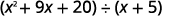</td>
</tr>
<tr valign="top">
<td data-valign="top" data-align="left">Write it as a long division problem.
Be sure the dividend is in standard form.</td>
<td data-valign="top" data-align="left">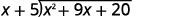</td>
</tr>
<tr valign="top">
<td data-valign="top" data-align="left">Divide <math xmlns="http://www.w3.org/1998/Math/MathML"><mrow><msup><mi>x</mi><mn>2</mn></msup></mrow></math> by <math xmlns="http://www.w3.org/1998/Math/MathML"><mrow><mi>x</mi><mo>.</mo></mrow></math> It may help to ask yourself, “What do I need
to multiply <math xmlns="http://www.w3.org/1998/Math/MathML"><mi>x</mi></math> by to get <math xmlns="http://www.w3.org/1998/Math/MathML"><mrow><msup><mi>x</mi><mn>2</mn></msup></mrow></math>?”</td>
<td data-valign="top" data-align="left">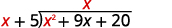</td>
</tr>
<tr valign="top">
<td data-valign="top" data-align="left">Put the answer, <math xmlns="http://www.w3.org/1998/Math/MathML"><mrow><mi>x</mi><mo>,</mo></mrow></math> in the quotient over the <math xmlns="http://www.w3.org/1998/Math/MathML"><mi>x</mi></math> term.
Multiply <math xmlns="http://www.w3.org/1998/Math/MathML"><mi>x</mi></math> times <math xmlns="http://www.w3.org/1998/Math/MathML"><mrow><mi>x</mi><mo>+</mo><mn>5</mn><mo>.</mo></mrow></math> Line up the like terms under the dividend.</td>
<td data-valign="top" data-align="left">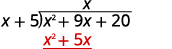</td>
</tr>
<tr valign="top">
<td data-valign="top" data-align="left">Subtract <math xmlns="http://www.w3.org/1998/Math/MathML"><mrow><msup><mi>x</mi><mn>2</mn></msup><mo>+</mo><mn>5</mn><mi>x</mi></mrow></math> from <math xmlns="http://www.w3.org/1998/Math/MathML"><mrow><msup><mi>x</mi><mn>2</mn></msup><mo>+</mo><mn>9</mn><mi>x</mi><mo>.</mo></mrow></math>
You may find it easier to change the signs and then add.
Then bring down the last term, 20.</td>
<td data-valign="top" data-align="left">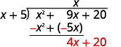</td>
</tr>
<tr valign="top">
<td data-valign="top" data-align="left">
Divide <math xmlns="http://www.w3.org/1998/Math/MathML"><mrow><mn>4</mn><mi>x</mi></mrow></math> by <math xmlns="http://www.w3.org/1998/Math/MathML"><mrow><mi>x</mi><mo>.</mo></mrow></math> It may help to ask yourself, “What do I
need to multiply <math xmlns="http://www.w3.org/1998/Math/MathML"><mi>x</mi></math> by to get <math xmlns="http://www.w3.org/1998/Math/MathML"><mrow><mn>4</mn><mi>x</mi></mrow></math>?”
Put the answer, <math xmlns="http://www.w3.org/1998/Math/MathML"><mn>4</mn></math>, in the quotient over the constant term.</td>
<td data-valign="top" data-align="left">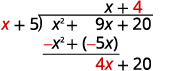</td>
</tr>
<tr valign="top">
<td data-valign="top" data-align="left">Multiply 4 times <math xmlns="http://www.w3.org/1998/Math/MathML"><mrow><mi>x</mi><mo>+</mo><mn>5</mn><mo>.</mo></mrow></math></td>
<td data-valign="top" data-align="left">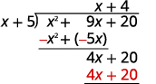</td>
</tr>
<tr valign="top">
<td data-valign="top" data-align="left">Subtract <math xmlns="http://www.w3.org/1998/Math/MathML"><mrow><mn>4</mn><mi>x</mi><mo>+</mo><mn>20</mn></mrow></math> from <math xmlns="http://www.w3.org/1998/Math/MathML"><mrow><mn>4</mn><mi>x</mi><mo>+</mo><mn>20</mn><mo>.</mo></mrow></math></td>
<td data-valign="top" data-align="left">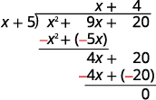</td>
</tr>
<tr>
<td data-valign="top" data-align="left">Check:
Multiply the quotient by the divisor. <math xmlns="http://www.w3.org/1998/Math/MathML"><mrow><mrow><mspace width="1em" /><mo>(</mo><mrow><mi>x</mi><mo>+</mo><mn>4</mn></mrow><mo>)</mo></mrow><mrow><mo>(</mo><mrow><mi>x</mi><mo>+</mo><mn>5</mn></mrow><mo>)</mo></mrow></mrow></math>
You should get the dividend. <math xmlns="http://www.w3.org/1998/Math/MathML"><mrow><mspace width="4em" /><msup><mi>x</mi><mn>2</mn></msup><mo>+</mo><mn>9</mn><mi>x</mi><mo>+</mo><mn>20</mn><mo>✓</mo></mrow></math></td>
<td />
</tr>
</tbody></table>

Find the quotient: <math xmlns="http://www.w3.org/1998/Math/MathML"><mrow><mrow><mo>(</mo><mrow><msup><mi>y</mi><mn>2</mn></msup><mo>+</mo><mn>10</mn><mi>y</mi><mo>+</mo><mn>21</mn></mrow><mo>)</mo></mrow><mo>÷</mo><mrow><mo>(</mo><mrow><mi>y</mi><mo>+</mo><mn>3</mn></mrow><mo>)</mo></mrow><mo>.</mo></mrow></math>

<math xmlns="http://www.w3.org/1998/Math/MathML"><mrow><mi>y</mi><mo>+</mo><mn>7</mn></mrow></math>

Find the quotient: <math xmlns="http://www.w3.org/1998/Math/MathML"><mrow><mrow><mo>(</mo><mrow><msup><mi>m</mi><mn>2</mn></msup><mo>+</mo><mn>9</mn><mi>m</mi><mo>+</mo><mn>20</mn></mrow><mo>)</mo></mrow><mo>÷</mo><mrow><mo>(</mo><mrow><mi>m</mi><mo>+</mo><mn>4</mn></mrow><mo>)</mo></mrow><mo>.</mo></mrow></math>

<math xmlns="http://www.w3.org/1998/Math/MathML"><mrow><mi>m</mi><mo>+</mo><mn>5</mn></mrow></math>

When we divided 875 by 25, we had no remainder. But sometimes division of numbers does leave a remainder. The same is true when we divide polynomials. In the next example, we’ll have a division that leaves a remainder. We write the remainder as a fraction with the divisor as the denominator.

Look back at the dividends in previous examples. The terms were written in descending order of degrees, and there were no missing degrees. The dividend in this example will be <math xmlns="http://www.w3.org/1998/Math/MathML"><mrow><msup><mi>x</mi><mn>4</mn></msup><mo>−</mo><msup><mi>x</mi><mn>2</mn></msup><mo>+</mo><mn>5</mn><mi>x</mi><mo>−</mo><mn>6</mn><mo>.</mo></mrow></math>

 It is missing an <math xmlns="http://www.w3.org/1998/Math/MathML"><mrow><msup><mi>x</mi><mn>3</mn></msup></mrow></math>

 term. We will add in <math xmlns="http://www.w3.org/1998/Math/MathML"><mrow><mn>0</mn><msup><mi>x</mi><mn>3</mn></msup></mrow></math>

 as a placeholder.

Find the quotient: <math xmlns="http://www.w3.org/1998/Math/MathML"><mrow><mrow><mo>(</mo><mrow><msup><mi>x</mi><mn>4</mn></msup><mo>−</mo><msup><mi>x</mi><mn>2</mn></msup><mo>+</mo><mn>5</mn><mi>x</mi><mo>−</mo><mn>6</mn></mrow><mo>)</mo></mrow><mo>÷</mo><mrow><mo>(</mo><mrow><mi>x</mi><mo>+</mo><mn>2</mn></mrow><mo>)</mo></mrow><mo>.</mo></mrow></math>

Notice that there is no <math xmlns="http://www.w3.org/1998/Math/MathML"><mrow><msup><mi>x</mi><mn>3</mn></msup></mrow></math>

 term in the dividend. We will add <math xmlns="http://www.w3.org/1998/Math/MathML"><mrow><mn>0</mn><msup><mi>x</mi><mn>3</mn></msup></mrow></math>

 as a placeholder.

<table class="unnumbered unstyled can-break" summary="This image shows the process for polynomial long division using the example x to the fourth power minus x squared plus 5 x minus 6 divided by x plus 2. Writing the problem as a long division problem we include placeholders for any missing terms in the dividend. The dividend of x to the fourth power plus 0 x cubed minus x squared plus 5 x minus 6 is put inside the long division symbol. The divisor of x plus 2 is written to the left of the long division symbol. The quotient is written above the long division symbol. To find the first term in the quotient we divide the x to the fourth power by x to get x cubed. Then multiplying the x cubed from the quotient with the entire divisor we get x to the fourth power plus 2 x cubed. This is written below the x to the fourth power plus 0 x cubed in the dividend and subtracted to get negative 2 x cubed. Like terms are lined up in vertical columns. A note is made that it may be helpful to change the signs of the terms you are subtracting and add them. The negative x squared in the dividend is dropped down to make this 2 x cubed minus x squared. To find the next term in the quotient we divide the negative 2 x cubed by the x in the divisor to get negative 2 x squared. The quotient is now x cubed minus 2 x squared. The negative 2 x squared is multiplied to the entire divisor to get negative 2 x cubed minus 4 x squared. This is subtracted from the 2 x cubed minus x squared to give a remainder of 3 x squared. The 5 x in the dividend is dropped down to make this 3 x squared plus 5 x. Like terms are lined up in vertical columns. To find the next term in the quotient we divide the negative 3 x squared by the x in the divisor to get 3 x. The quotient is now x cubed minus 2 x squared plus 3 x. The 3 x is multiplied to the entire divisor to get 3 x squared plus 6 x. This is subtracted from the 3 x squared plus 5 x to give a remainder of negative x. The negative 6 in the dividend is brought down to make this negative x minus 6. The next term in the quotient is found by dividing the negative x by the x in the divisor to get negative 1. The quotient is now x cubed minus 2 x squared plus 3 x minus 1. The negative 1 is multiplied to the entire divisor to get negative x minus 2. This is subtracted from the negative x minus 6 to get the remainder of negative 4. The remainder is then written over the divisor as negative 4 divided by the quantity x plus 2. The process can be checked by multiplying the quotient of x cubed minus 2 x squared plus 3 x minus 1 minus 4 divided by the quantity x plus 2 with the divisor of x plus 2 to get the dividend of x to the fourth power minus x squared plus 5 x minus 6." data-label=""><tbody>
<tr valign="top">
<td data-valign="top" data-align="left" />
<td data-valign="top" data-align="left"></td>
</tr>
<tr valign="top">
<td data-valign="top" data-align="left">Write it as a long division problem. Be sure the dividend is in standard form with placeholders for missing terms.</td>
<td data-valign="top" data-align="left"></td>
</tr>
<tr valign="top">
<td data-valign="top" data-align="left">Divide <math xmlns="http://www.w3.org/1998/Math/MathML"><mrow><msup><mi>x</mi><mn>4</mn></msup></mrow></math> by <math xmlns="http://www.w3.org/1998/Math/MathML"><mrow><mi>x</mi><mo>.</mo></mrow></math>
Put the answer, <math xmlns="http://www.w3.org/1998/Math/MathML"><mrow><msup><mi>x</mi><mn>3</mn></msup><mo>,</mo></mrow></math> in the quotient over the <math xmlns="http://www.w3.org/1998/Math/MathML"><mrow><msup><mi>x</mi><mn>3</mn></msup></mrow></math> term.
Multiply <math xmlns="http://www.w3.org/1998/Math/MathML"><mrow><msup><mi>x</mi><mn>3</mn></msup></mrow></math> times <math xmlns="http://www.w3.org/1998/Math/MathML"><mrow><mi>x</mi><mo>+</mo><mn>2</mn><mo>.</mo></mrow></math> Line up the like terms.
Subtract and then bring down the next term.</td>
<td data-valign="top" data-align="left"></td>
</tr>
<tr valign="top">
<td data-valign="top" data-align="left">Divide <math xmlns="http://www.w3.org/1998/Math/MathML"><mrow><mn>−2</mn><msup><mi>x</mi><mn>3</mn></msup></mrow></math> by <math xmlns="http://www.w3.org/1998/Math/MathML"><mrow><mi>x</mi><mo>.</mo></mrow></math>
Put the answer, <math xmlns="http://www.w3.org/1998/Math/MathML"><mrow><mn>−2</mn><msup><mi>x</mi><mn>2</mn></msup><mo>,</mo></mrow></math> in the quotient over the <math xmlns="http://www.w3.org/1998/Math/MathML"><mrow><msup><mi>x</mi><mn>2</mn></msup></mrow></math> term.
Multiply <math xmlns="http://www.w3.org/1998/Math/MathML"><mrow><mn>−2</mn><msup><mi>x</mi><mn>2</mn></msup></mrow></math> times <math xmlns="http://www.w3.org/1998/Math/MathML"><mrow><mi>x</mi><mo>+</mo><mn>1</mn><mo>.</mo></mrow></math> Line up the like terms
Subtract and bring down the next term.</td>
<td data-valign="top" data-align="left">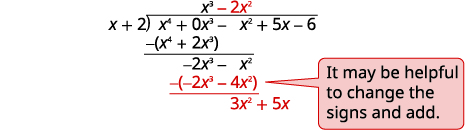</td>
</tr>
<tr valign="top">
<td data-valign="top" data-align="left">Divide <math xmlns="http://www.w3.org/1998/Math/MathML"><mrow><mn>3</mn><msup><mi>x</mi><mn>2</mn></msup></mrow></math> by <math xmlns="http://www.w3.org/1998/Math/MathML"><mrow><mi>x</mi><mo>.</mo></mrow></math>
Put the answer, <math xmlns="http://www.w3.org/1998/Math/MathML"><mrow><mn>3</mn><mi>x</mi><mo>,</mo></mrow></math> in the quotient over the <math xmlns="http://www.w3.org/1998/Math/MathML"><mi>x</mi></math> term.
Multiply <math xmlns="http://www.w3.org/1998/Math/MathML"><mrow><mn>3</mn><mi>x</mi></mrow></math> times <math xmlns="http://www.w3.org/1998/Math/MathML"><mrow><mi>x</mi><mo>+</mo><mn>1</mn><mo>.</mo></mrow></math> Line up the like terms.
Subtract and bring down the next term.</td>
<td data-valign="top" data-align="left">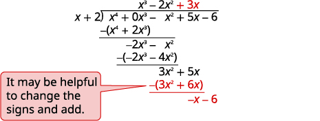</td>
</tr>
<tr valign="top">
<td data-valign="top" data-align="left">Divide <math xmlns="http://www.w3.org/1998/Math/MathML"><mrow><mtext>−</mtext><mi>x</mi></mrow></math> by <math xmlns="http://www.w3.org/1998/Math/MathML"><mrow><mi>x</mi><mo>.</mo></mrow></math>
Put the answer, <math xmlns="http://www.w3.org/1998/Math/MathML"><mrow><mn>−1</mn><mo>,</mo></mrow></math> in the quotient over the constant term.
Multiply <math xmlns="http://www.w3.org/1998/Math/MathML"><mrow><mn>−1</mn></mrow></math> times <math xmlns="http://www.w3.org/1998/Math/MathML"><mrow><mi>x</mi><mo>+</mo><mn>1</mn><mo>.</mo></mrow></math> Line up the like terms.
Change the signs, add.

Write the remainder as a fraction with the divisor as the denominator.</td>
<td data-valign="top" data-align="left">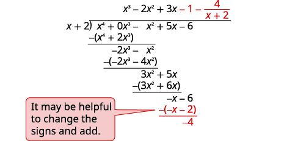</td>
</tr>
<tr>
<td data-valign="top" data-align="left">To check, multiply <math xmlns="http://www.w3.org/1998/Math/MathML"><mrow><mrow><mo>(</mo><mrow><mi>x</mi><mo>+</mo><mn>2</mn></mrow><mo>)</mo></mrow><mrow><mo>(</mo><mrow><msup><mi>x</mi><mn>3</mn></msup><mo>−</mo><mn>2</mn><msup><mi>x</mi><mn>2</mn></msup><mo>+</mo><mn>3</mn><mi>x</mi><mo>−</mo><mn>1</mn><mo>−</mo><mfrac><mn>4</mn><mrow><mi>x</mi><mo>+</mo><mn>2</mn></mrow></mfrac></mrow><mo>)</mo></mrow></mrow></math>.
The result should be <math xmlns="http://www.w3.org/1998/Math/MathML"><mrow><msup><mi>x</mi><mn>4</mn></msup><mo>−</mo><msup><mi>x</mi><mn>2</mn></msup><mo>+</mo><mn>5</mn><mi>x</mi><mo>−</mo><mn>6</mn><mo>.</mo></mrow></math></td>
<td />
</tr>
</tbody></table>

Find the quotient: <math xmlns="http://www.w3.org/1998/Math/MathML"><mrow><mrow><mo>(</mo><mrow><msup><mi>x</mi><mn>4</mn></msup><mo>−</mo><mn>7</mn><msup><mi>x</mi><mn>2</mn></msup><mo>+</mo><mn>7</mn><mi>x</mi><mo>+</mo><mn>6</mn></mrow><mo>)</mo></mrow><mo>÷</mo><mrow><mo>(</mo><mrow><mi>x</mi><mo>+</mo><mn>3</mn></mrow><mo>)</mo></mrow><mo>.</mo></mrow></math>

<math xmlns="http://www.w3.org/1998/Math/MathML"><mrow><msup><mi>x</mi><mn>3</mn></msup><mo>−</mo><mn>3</mn><msup><mi>x</mi><mn>2</mn></msup><mo>+</mo><mn>2</mn><mi>x</mi><mo>+</mo><mn>1</mn><mo>+</mo><mfrac><mn>3</mn><mrow><mi>x</mi><mo>+</mo><mn>3</mn></mrow></mfrac></mrow></math>

Find the quotient: <math xmlns="http://www.w3.org/1998/Math/MathML"><mrow><mrow><mo>(</mo><mrow><msup><mi>x</mi><mn>4</mn></msup><mo>−</mo><mn>11</mn><msup><mi>x</mi><mn>2</mn></msup><mo>−</mo><mn>7</mn><mi>x</mi><mo>−</mo><mn>6</mn></mrow><mo>)</mo></mrow><mo>÷</mo><mrow><mo>(</mo><mrow><mi>x</mi><mo>+</mo><mn>3</mn></mrow><mo>)</mo></mrow><mo>.</mo></mrow></math>

<math xmlns="http://www.w3.org/1998/Math/MathML"><mrow><msup><mi>x</mi><mn>3</mn></msup><mo>−</mo><mn>3</mn><msup><mi>x</mi><mn>2</mn></msup><mo>−</mo><mn>2</mn><mi>x</mi><mo>−</mo><mn>1</mn><mo>−</mo><mfrac><mn>3</mn><mrow><mi>x</mi><mo>+</mo><mn>3</mn></mrow></mfrac></mrow></math>

In the next example, we will divide by <math xmlns="http://www.w3.org/1998/Math/MathML"><mrow><mn>2</mn><mi>a</mi><mo>−</mo><mn>3</mn><mo>.</mo></mrow></math>

 As we divide, we will have to consider the constants as well as the variables.

Find the quotient: <math xmlns="http://www.w3.org/1998/Math/MathML"><mrow><mrow><mo>(</mo><mrow><mn>8</mn><msup><mi>a</mi><mn>3</mn></msup><mo>+</mo><mn>27</mn></mrow><mo>)</mo></mrow><mo>÷</mo><mrow><mo>(</mo><mrow><mn>2</mn><mi>a</mi><mo>+</mo><mn>3</mn></mrow><mo>)</mo></mrow><mo>.</mo></mrow></math>

This time we will show the division all in one step. We need to add two placeholders in order to divide.

|  |  |
{: valign="top"}|  | 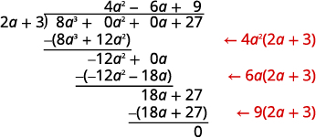 |
{: valign="top"}{: .unnumbered .unstyled summary="This image shows the process for polynomial long division using the example 8 a to the third power plus 27 divided by 2 a plus 3. Writing the problem as a long division problem we include placeholders for any missing terms in the dividend. The dividend of 8 a to the third power plus 0 a squared plus 0 a plus 27 is put inside the long division symbol. The divisor of 2 a plus 3 is written to the left of the long division symbol. The quotient is written above the long division symbol. To find the first term in the quotient we divide the 8 a to the third power by 2 a to get 4 a squared. Then multiplying the 4 a squared from the quotient with the entire divisor we get 8 a to the third power plus 12 a squared. This is written below the 8 a to the third power plus 0 a squared in the dividend and subtracted to get negative 12 a squared. The 0 a in the dividend is dropped down to make this negative 12 a squared plus 0 a. To find the next term in the quotient we divide the negative 12 a squared by the 2 a in the divisor to get negative 6 a. The quotient is now 4 a squared minus 6 a. The negative 6 a is multiplied to the entire divisor to get negative 12 a squared minus 18 a. This is subtracted from the negative 12 a squared plus 0 a to give a remainder of 18 a. The 27 in the dividend is dropped down to make this 18 a plus 27. To find the next term in the quotient we divide the 18 a by the 2 a in the divisor to get 9. The quotient is now 4 a squared minus 6 a plus 9. The 9 is multiplied to the entire divisor to get 18 a plus 27. This is subtracted from the 18 a plus 27 to give a remainder of 0. The process can be checked by multiplying the quotient of 4 a squared minus 6 a plus 9 with the divisor of 2 a plus 3 to get the dividend of 8 a cubed plus 27." data-label=""}

To check, multiply <math xmlns="http://www.w3.org/1998/Math/MathML"><mrow><mrow><mo>(</mo><mrow><mn>2</mn><mi>a</mi><mo>+</mo><mn>3</mn></mrow><mo>)</mo></mrow><mrow><mo>(</mo><mrow><mn>4</mn><msup><mi>a</mi><mn>2</mn></msup><mo>−</mo><mn>6</mn><mi>a</mi><mo>+</mo><mn>9</mn></mrow><mo>)</mo></mrow><mo>.</mo></mrow></math>

The result should be <math xmlns="http://www.w3.org/1998/Math/MathML"><mrow><mn>8</mn><msup><mi>a</mi><mn>3</mn></msup><mo>+</mo><mn>27</mn><mo>.</mo></mrow></math>

Find the quotient: <math xmlns="http://www.w3.org/1998/Math/MathML"><mrow><mrow><mo>(</mo><mrow><msup><mi>x</mi><mn>3</mn></msup><mo>−</mo><mn>64</mn></mrow><mo>)</mo></mrow><mo>÷</mo><mrow><mo>(</mo><mrow><mi>x</mi><mo>−</mo><mn>4</mn></mrow><mo>)</mo></mrow><mo>.</mo></mrow></math>

<math xmlns="http://www.w3.org/1998/Math/MathML"><mrow><msup><mi>x</mi><mn>2</mn></msup><mo>+</mo><mn>4</mn><mi>x</mi><mo>+</mo><mn>16</mn></mrow></math>

Find the quotient: <math xmlns="http://www.w3.org/1998/Math/MathML"><mrow><mrow><mo>(</mo><mrow><mn>125</mn><msup><mi>x</mi><mn>3</mn></msup><mo>−</mo><mn>8</mn></mrow><mo>)</mo></mrow><mo>÷</mo><mrow><mo>(</mo><mrow><mn>5</mn><mi>x</mi><mo>−</mo><mn>2</mn></mrow><mo>)</mo></mrow><mo>.</mo></mrow></math>

<math xmlns="http://www.w3.org/1998/Math/MathML"><mrow><mn>25</mn><msup><mi>x</mi><mn>2</mn></msup><mo>+</mo><mn>10</mn><mi>x</mi><mo>+</mo><mn>4</mn></mrow></math>

### Divide Polynomials using Synthetic Division

As we have mentioned before, mathematicians like to find patterns to make their work easier. Since long division can be tedious, let’s look back at the long division we did in [\[link\]](#fs-id1167832051608) and look for some patterns. We will use this as a basis for what is called synthetic division. The same problem in the synthetic division format is shown next.

  ![The figure shows the long division of 1 x squared plus 9 x plus 20 divided by x plus 5 right next to the same problem done with synthetic division. In the long division problem, the coefficients of the dividend are 1 and 9 and 20 and the zero of the divisor is negative 5. In the synthetic division problem, we just write the numbers negative 5 1 9 20 with a line separating the negative 5. In the long division problem, the subtracted terms are 5 x and 20. In the synthetic division problem the second line is the numbers negative 5 and negative 20. The remainder of the problem is 0 and the quotient is x plus 4. The synthetic division puts these coefficients as the last line 1 4 0.](../resources/CNX_IntAlg_Figure_05_04_005_img.jpg)  Synthetic division basically just removes unnecessary repeated variables and numbers. Here all the <math xmlns="http://www.w3.org/1998/Math/MathML"><mrow><mi>x</mi></mrow></math>

 and <math xmlns="http://www.w3.org/1998/Math/MathML"><mrow><msup><mi>x</mi><mn>2</mn></msup></mrow></math>

 are removed. as well as the <math xmlns="http://www.w3.org/1998/Math/MathML"><mrow><mtext>−</mtext><msup><mi>x</mi><mn>2</mn></msup></mrow></math>

 and <math xmlns="http://www.w3.org/1998/Math/MathML"><mrow><mn>−4</mn><mi>x</mi></mrow></math>

 as they are opposite the term above.

The first row of the synthetic division is the coefficients of the dividend. The <math xmlns="http://www.w3.org/1998/Math/MathML"><mrow><mn>−5</mn></mrow></math>

 is the opposite of the 5 in the divisor.

The second row of the synthetic division are the numbers shown in red in the division problem.

The third row of the synthetic division are the numbers shown in blue in the division problem.

Notice the quotient and remainder are shown in the third row.

<math xmlns="http://www.w3.org/1998/Math/MathML"><mrow><mtext mathvariant="italics">Synthetic division only works when the divisor is of the form</mtext><mspace width="0.2em" /><mi>x</mi><mo>−</mo><mi>c</mi><mo>.</mo></mrow></math>

The following example will explain the process.

Use synthetic division to find the quotient and remainder when <math xmlns="http://www.w3.org/1998/Math/MathML"><mrow><mn>2</mn><msup><mi>x</mi><mn>3</mn></msup><mo>+</mo><mn>3</mn><msup><mi>x</mi><mn>2</mn></msup><mo>+</mo><mi>x</mi><mo>+</mo><mn>8</mn></mrow></math>

 is divided by <math xmlns="http://www.w3.org/1998/Math/MathML"><mrow><mi>x</mi><mo>+</mo><mn>2</mn><mo>.</mo></mrow></math>

<table class="unnumbered unstyled can-break" summary="The figure shows how to perform polynomial long division with the synthetic division method using the example 2 x cubed plus 3 x squared plus x plus 8 divided by x plus 2. The first step is to write the dividend with decreasing powers of x, which is already done. Next the coefficients of the terms are written as the first row 2 3 1 8. Writing the divisor as x minus c we would have x minus negative 2. This negative 2 is written in front of the first row negative 2 vertical line 2 3 1 8. The next step is to bring down the first coefficient to the third row. The third row is now 2 blank blank blank. Multiplying that coefficient with the divisor number of negative 2 we get the number negative 4. The negative 4 is written in the second column of the second row, directly below the 3. Adding the second column results in 3 plus negative 4 equals negative 1. The negative 1 goes in the third row. The third row now consists of 2 negative 1 blank blank. Multiplying the negative 1 with the divisor number of negative 2 results in 2. The 2 goes in the second row of the third column. The second row is now blank negative 4 2 blank. Adding the third column 1 plus 2 equals 3. The third row is now 2 negative 1 3 blank. Multiplying the 3 with the negative 2 in the divisor yields negative 6. The negative 6 is written in the fourth column of the second row. The second row is now blank negative 4 2 negative 6. Adding the fourth column 8 plus negative 6 equals 2. The 2 is goes in the fourth column of the third row. The third row is now 2 negative 1 3 2. The third row gives the coefficients for the quotient and remainder. The quotient is then 2 x squared minus 1 x plus 3 with remainder 2. The result can be checked by multiplying the quotient of 2 x squared minus 1 x plus 3 with the divisor of x plus 2 and adding the remainder of 2 to give the dividend of 2 x cubed plus 3 x squared plus x plus 8." data-label=""><tbody>
<tr valign="top">
<td data-valign="top" data-align="left">Write the dividend with decreasing powers of <math xmlns="http://www.w3.org/1998/Math/MathML"><mrow><mi>x</mi><mo>.</mo></mrow></math></td>
<td data-valign="top" data-align="left"></td>
</tr>
<tr valign="top">
<td data-valign="top" data-align="left">Write the coefficients of the terms as the first
row of the synthetic division.</td>
<td data-valign="top" data-align="left">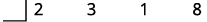</td>
</tr>
<tr valign="top">
<td data-valign="top" data-align="left">Write the divisor as <math xmlns="http://www.w3.org/1998/Math/MathML"><mrow><mi>x</mi><mo>−</mo><mi>c</mi></mrow></math> and place <em>c</em>
in the synthetic division in the divisor box.</td>
<td data-valign="top" data-align="left">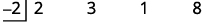</td>
</tr>
<tr valign="top">
<td data-valign="top" data-align="left">Bring down the first coefficient to the third row.</td>
<td data-valign="top" data-align="left">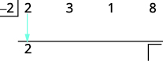</td>
</tr>
<tr valign="top">
<td data-valign="top" data-align="left">Multiply that coefficient by the divisor and place the
result in the second row under the second coefficient.</td>
<td data-valign="top" data-align="left">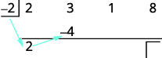</td>
</tr>
<tr valign="top">
<td data-valign="top" data-align="left">Add the second column, putting the result in the third row.</td>
<td data-valign="top" data-align="left">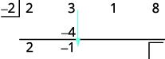</td>
</tr>
<tr valign="top">
<td data-valign="top" data-align="left">Multiply that result by the divisor and place the
result in the second row under the third coefficient.</td>
<td data-valign="top" data-align="left">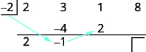</td>
</tr>
<tr valign="top">
<td data-valign="top" data-align="left">Add the third column, putting the result in the third row.</td>
<td data-valign="top" data-align="left">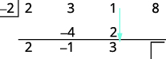</td>
</tr>
<tr valign="top">
<td data-valign="top" data-align="left">Multiply that result by the divisor and place the
result in the third row under the third coefficient.</td>
<td data-valign="top" data-align="left">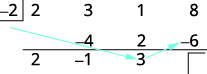</td>
</tr>
<tr valign="top">
<td data-valign="top" data-align="left">Add the final column, putting the result in the third row.</td>
<td data-valign="top" data-align="left">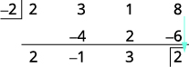</td>
</tr>
<tr valign="top">
<td data-valign="top" data-align="left">The quotient is <math xmlns="http://www.w3.org/1998/Math/MathML"><mrow><mn>2</mn><msup><mi>x</mi><mn>2</mn></msup><mo>−</mo><mn>1</mn><mi>x</mi><mo>+</mo><mn>3</mn></mrow></math> and the remainder is 2.</td>
<td data-valign="top" data-align="left" />
</tr>
</tbody></table>
The division is complete. The numbers in the third row give us the result. The <math xmlns="http://www.w3.org/1998/Math/MathML"><mrow><mn>2</mn><mspace width="1em" /><mn>−1</mn><mspace width="1em" /><mn>3</mn></mrow></math>

 are the coefficients of the quotient. The quotient is <math xmlns="http://www.w3.org/1998/Math/MathML"><mrow><mn>2</mn><msup><mi>x</mi><mn>2</mn></msup><mo>−</mo><mn>1</mn><mi>x</mi><mo>+</mo><mn>3</mn><mo>.</mo></mrow></math>

 The 2 in the box in the third row is the remainder.

Check:

<math xmlns="http://www.w3.org/1998/Math/MathML"><mrow><mspace width="2em" /><mtable><mtr /><mtr /><mtr><mtd columnalign="right"><mtext>(quotient)(divisor)</mtext><mo>+</mo><mtext>remainder</mtext></mtd><mtd columnalign="left"><mo>=</mo></mtd><mtd columnalign="left"><mtext>dividend</mtext></mtd></mtr><mtr><mtd columnalign="right"><mo>(</mo><mrow><mn>2</mn><msup><mi>x</mi><mn>2</mn></msup><mo>−</mo><mn>1</mn><mi>x</mi><mo>+</mo><mn>3</mn></mrow><mo>)</mo><mrow><mo>(</mo><mrow><mi>x</mi><mo>+</mo><mn>2</mn></mrow><mo>)</mo></mrow><mo>+</mo><mn>2</mn></mtd><mtd columnalign="left"><mover><mo>=</mo><mo>?</mo></mover></mtd><mtd columnalign="left"><mn>2</mn><msup><mi>x</mi><mn>3</mn></msup><mo>+</mo><mn>3</mn><msup><mi>x</mi><mn>2</mn></msup><mo>+</mo><mi>x</mi><mo>+</mo><mn>8</mn></mtd></mtr> <mtr><mtd columnalign="right"><mn>2</mn><msup><mi>x</mi><mn>3</mn></msup><mo>−</mo><msup><mi>x</mi><mn>2</mn></msup><mo>+</mo><mn>3</mn><mi>x</mi><mo>+</mo><mn>4</mn><msup><mi>x</mi><mn>2</mn></msup><mo>−</mo><mn>2</mn><mi>x</mi><mo>+</mo><mn>6</mn><mo>+</mo><mn>2</mn></mtd><mtd columnalign="left"><mover><mo>=</mo><mo>?</mo></mover></mtd><mtd columnalign="left"><mn>2</mn><msup><mi>x</mi><mn>3</mn></msup><mo>+</mo><mn>3</mn><msup><mi>x</mi><mn>2</mn></msup><mo>+</mo><mi>x</mi><mo>+</mo><mn>8</mn></mtd></mtr> <mtr><mtd columnalign="right"><mn>2</mn><msup><mi>x</mi><mn>3</mn></msup><mo>+</mo><mn>3</mn><msup><mi>x</mi><mn>2</mn></msup><mo>+</mo><mi>x</mi><mo>+</mo><mn>8</mn></mtd><mtd columnalign="left"><mo>=</mo></mtd><mtd columnalign="left"><mn>2</mn><msup><mi>x</mi><mn>3</mn></msup><mo>+</mo><mn>3</mn><msup><mi>x</mi><mn>2</mn></msup><mo>+</mo><mi>x</mi><mo>+</mo><mn>8</mn><mo>✓</mo></mtd></mtr></mtable></mrow></math>

Use synthetic division to find the quotient and remainder when <math xmlns="http://www.w3.org/1998/Math/MathML"><mrow><mn>3</mn><msup><mi>x</mi><mn>3</mn></msup><mo>+</mo><mn>10</mn><msup><mi>x</mi><mn>2</mn></msup><mo>+</mo><mn>6</mn><mi>x</mi><mo>−</mo><mn>2</mn></mrow></math>

 is divided by <math xmlns="http://www.w3.org/1998/Math/MathML"><mrow><mi>x</mi><mo>+</mo><mn>2</mn><mo>.</mo></mrow></math>

<math xmlns="http://www.w3.org/1998/Math/MathML"><mrow><mn>3</mn><msup><mi>x</mi><mn>2</mn></msup><mo>+</mo><mn>4</mn><mi>x</mi><mo>−</mo><mn>2</mn><mtext>;</mtext><mspace width="0.2em" /><mn>2</mn></mrow></math>

Use synthetic division to find the quotient and remainder when <math xmlns="http://www.w3.org/1998/Math/MathML"><mrow><mn>4</mn><msup><mi>x</mi><mn>3</mn></msup><mo>+</mo><mn>5</mn><msup><mi>x</mi><mn>2</mn></msup><mo>−</mo><mn>5</mn><mi>x</mi><mo>+</mo><mn>3</mn></mrow></math>

 is divided by <math xmlns="http://www.w3.org/1998/Math/MathML"><mrow><mi>x</mi><mo>+</mo><mn>2</mn><mo>.</mo></mrow></math>

<math xmlns="http://www.w3.org/1998/Math/MathML"><mrow><mn>4</mn><msup><mi>x</mi><mn>2</mn></msup><mo>−</mo><mn>3</mn><mi>x</mi><mo>+</mo><mn>1</mn><mtext>;</mtext><mspace width="0.2em" /><mn>1</mn></mrow></math>

In the next example, we will do all the steps together.

Use synthetic division to find the quotient and remainder when <math xmlns="http://www.w3.org/1998/Math/MathML"><mrow><msup><mi>x</mi><mn>4</mn></msup><mo>−</mo><mn>16</mn><msup><mi>x</mi><mn>2</mn></msup><mo>+</mo><mn>3</mn><mi>x</mi><mo>+</mo><mn>12</mn></mrow></math>

 is divided by <math xmlns="http://www.w3.org/1998/Math/MathML"><mrow><mi>x</mi><mo>+</mo><mn>4</mn><mo>.</mo></mrow></math>

The polynomial <math xmlns="http://www.w3.org/1998/Math/MathML"><mrow><msup><mi>x</mi><mn>4</mn></msup><mo>−</mo><mn>16</mn><msup><mi>x</mi><mn>2</mn></msup><mo>+</mo><mn>3</mn><mi>x</mi><mo>+</mo><mn>12</mn></mrow></math>

 has its term in order with descending degree but we notice there is no <math xmlns="http://www.w3.org/1998/Math/MathML"><mrow><msup><mi>x</mi><mn>3</mn></msup></mrow></math>

 term. We will add a 0 as a placeholder for the <math xmlns="http://www.w3.org/1998/Math/MathML"><mrow><msup><mi>x</mi><mn>3</mn></msup></mrow></math>

 term. In <math xmlns="http://www.w3.org/1998/Math/MathML"><mrow><mi>x</mi><mo>−</mo><mi>c</mi></mrow></math>

 form, the divisor is <math xmlns="http://www.w3.org/1998/Math/MathML"><mrow><mi>x</mi><mo>−</mo><mrow><mo>(</mo><mrow><mn>−4</mn></mrow><mo>)</mo></mrow><mo>.</mo></mrow></math>

  
We divided a 4th degree polynomial by a 1st degree polynomial so the quotient will be a 3rd degree polynomial.

Reading from the third row, the quotient has the coefficients <math xmlns="http://www.w3.org/1998/Math/MathML"><mrow><mn>1</mn><mspace width="1em" /><mn>−4</mn><mspace width="1em" /><mn>0</mn><mspace width="1em" /><mn>3</mn><mo>,</mo></mrow></math>

 which is <math xmlns="http://www.w3.org/1998/Math/MathML"><mrow><msup><mi>x</mi><mn>3</mn></msup><mo>−</mo><mn>4</mn><msup><mi>x</mi><mn>2</mn></msup><mo>+</mo><mn>3</mn><mo>.</mo></mrow></math>

 The remainder* * *
{: data-type="newline"}

is 0.

Use synthetic division to find the quotient and remainder when <math xmlns="http://www.w3.org/1998/Math/MathML"><mrow><msup><mi>x</mi><mn>4</mn></msup><mo>−</mo><mn>16</mn><msup><mi>x</mi><mn>2</mn></msup><mo>+</mo><mn>5</mn><mi>x</mi><mo>+</mo><mn>20</mn></mrow></math>

 is divided by <math xmlns="http://www.w3.org/1998/Math/MathML"><mrow><mi>x</mi><mo>+</mo><mn>4</mn><mo>.</mo></mrow></math>

<math xmlns="http://www.w3.org/1998/Math/MathML"><mrow><msup><mi>x</mi><mn>3</mn></msup><mo>−</mo><mn>4</mn><msup><mi>x</mi><mn>2</mn></msup><mo>+</mo><mn>5</mn><mtext>;</mtext><mspace width="0.2em" /><mn>0</mn></mrow></math>

Use synthetic division to find the quotient and remainder when <math xmlns="http://www.w3.org/1998/Math/MathML"><mrow><msup><mi>x</mi><mn>4</mn></msup><mo>−</mo><mn>9</mn><msup><mi>x</mi><mn>2</mn></msup><mo>+</mo><mn>2</mn><mi>x</mi><mo>+</mo><mn>6</mn></mrow></math>

 is divided by <math xmlns="http://www.w3.org/1998/Math/MathML"><mrow><mi>x</mi><mo>+</mo><mn>3</mn><mo>.</mo></mrow></math>

<math xmlns="http://www.w3.org/1998/Math/MathML"><mrow><msup><mi>x</mi><mn>3</mn></msup><mo>−</mo><mn>3</mn><msup><mi>x</mi><mn>2</mn></msup><mo>+</mo><mn>2</mn><mtext>;</mtext><mspace width="0.2em" /><mn>0</mn></mrow></math>

### Divide Polynomial Functions

Just as polynomials can be divided, polynomial functions can also be divided.

Division of Polynomial Functions

For functions <math xmlns="http://www.w3.org/1998/Math/MathML"><mrow><mi>f</mi><mrow><mo>(</mo><mi>x</mi><mo>)</mo></mrow></mrow></math>

 and <math xmlns="http://www.w3.org/1998/Math/MathML"><mrow><mi>g</mi><mo stretchy="false">(</mo><mi>x</mi><mo stretchy="false">)</mo><mo>,</mo></mrow></math>

 where <math xmlns="http://www.w3.org/1998/Math/MathML"><mrow><mi>g</mi><mo stretchy="false">(</mo><mi>x</mi><mo stretchy="false">)</mo><mo>≠</mo><mn>0</mn><mo>,</mo></mrow></math>

<math xmlns="http://www.w3.org/1998/Math/MathML"><mrow><mrow><mo>(</mo><mrow><mfrac><mi>f</mi><mi>g</mi></mfrac></mrow><mo>)</mo></mrow><mrow><mo>(</mo><mi>x</mi><mo>)</mo></mrow><mo>=</mo><mfrac><mrow><mi>f</mi><mrow><mo>(</mo><mi>x</mi><mo>)</mo></mrow></mrow><mrow><mi>g</mi><mrow><mo>(</mo><mi>x</mi><mo>)</mo></mrow></mrow></mfrac></mrow></math>

For functions <math xmlns="http://www.w3.org/1998/Math/MathML"><mrow><mi>f</mi><mrow><mo>(</mo><mi>x</mi><mo>)</mo></mrow><mo>=</mo><msup><mi>x</mi><mn>2</mn></msup><mo>−</mo><mn>5</mn><mi>x</mi><mo>−</mo><mn>14</mn></mrow></math>

 and <math xmlns="http://www.w3.org/1998/Math/MathML"><mrow><mi>g</mi><mrow><mo>(</mo><mi>x</mi><mo>)</mo></mrow><mo>=</mo><mi>x</mi><mo>+</mo><mn>2</mn><mo>,</mo></mrow></math>

 find: ⓐ <math xmlns="http://www.w3.org/1998/Math/MathML"><mrow><mrow><mo>(</mo><mrow><mfrac><mi>f</mi><mi>g</mi></mfrac></mrow><mo>)</mo></mrow><mrow><mo>(</mo><mi>x</mi><mo>)</mo></mrow></mrow></math>

 ⓑ <math xmlns="http://www.w3.org/1998/Math/MathML"><mrow><mrow><mo>(</mo><mrow><mfrac><mi>f</mi><mi>g</mi></mfrac></mrow><mo>)</mo></mrow><mrow><mo>(</mo><mrow><mn>−4</mn></mrow><mo>)</mo></mrow><mo>.</mo></mrow></math>

ⓐ* * *
{: data-type="newline"}

 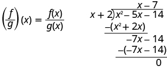 
* * *
{: data-type="newline"}

 <math xmlns="http://www.w3.org/1998/Math/MathML"><mrow><mtable><mtr><mtd columnalign="left"><mtext>Substitute for</mtext><mspace width="0.2em" /><mi>f</mi><mrow><mo>(</mo><mi>x</mi><mo>)</mo></mrow><mspace width="0.2em" /><mtext>and</mtext><mspace width="0.2em" /><mi>g</mi><mrow><mo>(</mo><mi>x</mi><mo>)</mo></mrow><mo>.</mo></mtd><mtd /><mtd /><mtd /><mtd /><mtd columnalign="left"><mspace width="4.6em" /><mrow><mo>(</mo><mrow><mfrac><mi>f</mi><mi>g</mi></mfrac></mrow><mo>)</mo></mrow><mrow><mo>(</mo><mi>x</mi><mo>)</mo></mrow><mo>=</mo><mfrac><mrow><msup><mi>x</mi><mn>2</mn></msup><mo>−</mo><mn>5</mn><mi>x</mi><mo>−</mo><mn>14</mn></mrow><mrow><mi>x</mi><mo>+</mo><mn>2</mn></mrow></mfrac></mtd></mtr><mtr><mtd columnalign="left"><mtext>Divide the polynomials.</mtext></mtd><mtd /><mtd /><mtd /><mtd /><mtd columnalign="left"><mspace width="4.6em" /><mrow><mo>(</mo><mrow><mfrac><mrow><mi>f</mi></mrow><mi>g</mi></mfrac></mrow><mo>)</mo></mrow><mrow><mo>(</mo><mi>x</mi><mo>)</mo></mrow><mo>=</mo><mi>x</mi><mo>−</mo><mn>7</mn></mtd></mtr></mtable></mrow></math>

* * *
{: data-type="newline"}

* * *
{: data-type="newline"}

 ⓑ In part ⓐ we found <math xmlns="http://www.w3.org/1998/Math/MathML"><mrow><mrow><mo>(</mo><mrow><mfrac><mi>f</mi><mi>g</mi></mfrac></mrow><mo>)</mo></mrow><mrow><mo>(</mo><mi>x</mi><mo>)</mo></mrow></mrow></math>

 and now are asked to find <math xmlns="http://www.w3.org/1998/Math/MathML"><mrow><mrow><mo>(</mo><mrow><mfrac><mi>f</mi><mi>g</mi></mfrac></mrow><mo>)</mo></mrow><mrow><mo>(</mo><mrow><mn>−4</mn></mrow><mo>)</mo></mrow><mo>.</mo></mrow></math>

* * *
{: data-type="newline"}

 <math xmlns="http://www.w3.org/1998/Math/MathML"><mrow><mtable><mtr><mtd /><mtd /><mtd /><mtd /><mtd /><mtd columnalign="right"><mrow><mo>(</mo><mrow><mfrac><mrow><mi>f</mi></mrow><mi>g</mi></mfrac></mrow><mo>)</mo></mrow><mrow><mo>(</mo><mi>x</mi><mo>)</mo></mrow></mtd><mtd columnalign="left"><mo>=</mo></mtd><mtd columnalign="left"><mi>x</mi><mo>−</mo><mn>7</mn></mtd></mtr><mtr><mtd columnalign="left"><mtext>To find</mtext><mspace width="0.2em" /><mrow><mo>(</mo><mrow><mfrac><mi>f</mi><mi>g</mi></mfrac></mrow><mo>)</mo></mrow><mrow><mo>(</mo><mrow><mn>−4</mn></mrow><mo>)</mo></mrow><mo>,</mo><mspace width="0.2em" /><mtext>substitute</mtext><mspace width="0.2em" /><mi>x</mi><mo>=</mo><mn>−4</mn><mo>.</mo></mtd><mtd /><mtd /><mtd /><mtd /><mtd columnalign="right"><mrow><mo>(</mo><mrow><mfrac><mrow><mi>f</mi></mrow><mi>g</mi></mfrac></mrow><mo>)</mo></mrow><mrow><mo>(</mo><mrow><mn>−4</mn></mrow><mo>)</mo></mrow></mtd><mtd columnalign="left"><mo>=</mo></mtd><mtd columnalign="left"><mn>−4</mn><mo>−</mo><mn>7</mn></mtd></mtr><mtr><mtd /><mtd /><mtd /><mtd /><mtd /><mtd columnalign="right"><mrow><mo>(</mo><mrow><mfrac><mrow><mi>f</mi></mrow><mi>g</mi></mfrac></mrow><mo>)</mo></mrow><mrow><mo>(</mo><mrow><mn>−4</mn></mrow><mo>)</mo></mrow></mtd><mtd columnalign="left"><mo>=</mo></mtd><mtd columnalign="left"><mn>−11</mn></mtd></mtr></mtable></mrow></math>

For functions <math xmlns="http://www.w3.org/1998/Math/MathML"><mrow><mi>f</mi><mrow><mo>(</mo><mi>x</mi><mo>)</mo></mrow><mo>=</mo><msup><mi>x</mi><mn>2</mn></msup><mo>−</mo><mn>5</mn><mi>x</mi><mo>−</mo><mn>24</mn></mrow></math>

 and <math xmlns="http://www.w3.org/1998/Math/MathML"><mrow><mi>g</mi><mrow><mo>(</mo><mi>x</mi><mo>)</mo></mrow><mo>=</mo><mi>x</mi><mo>+</mo><mn>3</mn><mo>,</mo></mrow></math>

 find ⓐ <math xmlns="http://www.w3.org/1998/Math/MathML"><mrow><mrow><mo>(</mo><mrow><mfrac><mi>f</mi><mi>g</mi></mfrac></mrow><mo>)</mo></mrow><mrow><mo>(</mo><mi>x</mi><mo>)</mo></mrow></mrow></math>

 ⓑ <math xmlns="http://www.w3.org/1998/Math/MathML"><mrow><mrow><mo>(</mo><mrow><mfrac><mi>f</mi><mi>g</mi></mfrac></mrow><mo>)</mo></mrow><mrow><mo>(</mo><mrow><mn>−3</mn></mrow><mo>)</mo></mrow><mo>.</mo></mrow></math>

ⓐ <math xmlns="http://www.w3.org/1998/Math/MathML"><mrow><mrow><mo>(</mo><mrow><mfrac><mi>f</mi><mi>g</mi></mfrac></mrow><mo>)</mo></mrow><mrow><mo>(</mo><mi>x</mi><mo>)</mo></mrow><mo>=</mo><mi>x</mi><mo>−</mo><mn>8</mn></mrow></math>

* * *
{: data-type="newline"}

ⓑ <math xmlns="http://www.w3.org/1998/Math/MathML"><mrow><mrow><mo>(</mo><mrow><mfrac><mi>f</mi><mi>g</mi></mfrac></mrow><mo>)</mo></mrow><mrow><mo>(</mo><mrow><mn>−3</mn></mrow><mo>)</mo></mrow><mo>=</mo><mn>−11</mn></mrow></math>

For functions <math xmlns="http://www.w3.org/1998/Math/MathML"><mrow><mi>f</mi><mrow><mo>(</mo><mi>x</mi><mo>)</mo></mrow><mo>=</mo><msup><mi>x</mi><mn>2</mn></msup><mo>−</mo><mn>5</mn><mi>x</mi><mo>−</mo><mn>36</mn></mrow></math>

 and <math xmlns="http://www.w3.org/1998/Math/MathML"><mrow><mi>g</mi><mrow><mo>(</mo><mi>x</mi><mo>)</mo></mrow><mo>=</mo><mi>x</mi><mo>+</mo><mn>4</mn><mo>,</mo></mrow></math>

 find ⓐ <math xmlns="http://www.w3.org/1998/Math/MathML"><mrow><mrow><mo>(</mo><mrow><mfrac><mi>f</mi><mi>g</mi></mfrac></mrow><mo>)</mo></mrow><mrow><mo>(</mo><mi>x</mi><mo>)</mo></mrow></mrow></math>

 ⓑ <math xmlns="http://www.w3.org/1998/Math/MathML"><mrow><mrow><mo>(</mo><mrow><mfrac><mi>f</mi><mi>g</mi></mfrac></mrow><mo>)</mo></mrow><mrow><mo>(</mo><mrow><mn>−5</mn></mrow><mo>)</mo></mrow><mo>.</mo></mrow></math>

ⓐ <math xmlns="http://www.w3.org/1998/Math/MathML"><mrow><mrow><mo>(</mo><mrow><mfrac><mi>f</mi><mi>g</mi></mfrac></mrow><mo>)</mo></mrow><mrow><mo>(</mo><mi>x</mi><mo>)</mo></mrow><mo>=</mo><mi>x</mi><mo>−</mo><mn>9</mn></mrow></math>

* * *
{: data-type="newline"}

ⓑ <math xmlns="http://www.w3.org/1998/Math/MathML"><mrow><mrow><mo>(</mo><mrow><mfrac><mi>f</mi><mi>g</mi></mfrac></mrow><mo>)</mo></mrow><mrow><mo>(</mo><mrow><mn>−5</mn></mrow><mo>)</mo></mrow><mo>=</mo><mn>−14</mn></mrow></math>

### Use the Remainder and Factor Theorem

Let’s look at the division problems we have just worked that ended up with a remainder. They are summarized in the chart below. If we take the dividend from each division problem and use it to define a function, we get the functions shown in the chart. When the divisor is written as <math xmlns="http://www.w3.org/1998/Math/MathML"><mrow><mi>x</mi><mo>−</mo><mi>c</mi><mo>,</mo></mrow></math>

 the value of the function at <math xmlns="http://www.w3.org/1998/Math/MathML"><mrow><mi>c</mi><mo>,</mo><mi>f</mi><mrow><mo>(</mo><mi>c</mi><mo>)</mo></mrow><mo>,</mo></mrow></math>

 is the same as the remainder from the division problem.

| Dividend | Divisor <math xmlns="http://www.w3.org/1998/Math/MathML"><mrow><mi>x</mi><mo>−</mo><mi>c</mi></mrow></math>

 | Remainder | Function | <math xmlns="http://www.w3.org/1998/Math/MathML"><mrow><mi>f</mi><mrow><mo>(</mo><mi>c</mi><mo>)</mo></mrow></mrow></math>

 |
{: valign="top"}|----------
| <math xmlns="http://www.w3.org/1998/Math/MathML"><mrow><msup><mi>x</mi><mn>4</mn></msup><mo>−</mo><msup><mi>x</mi><mn>2</mn></msup><mo>+</mo><mn>5</mn><mi>x</mi><mo>−</mo><mn>6</mn></mrow></math>

 | <math xmlns="http://www.w3.org/1998/Math/MathML"><mrow><mi>x</mi><mo>−</mo><mrow><mo>(</mo><mrow><mn>−2</mn></mrow><mo>)</mo></mrow></mrow></math>

 | <math xmlns="http://www.w3.org/1998/Math/MathML"><mrow><mn>−4</mn></mrow></math>

 | <math xmlns="http://www.w3.org/1998/Math/MathML"><mrow><mi>f</mi><mrow><mo>(</mo><mi>x</mi><mo>)</mo></mrow><mo>=</mo><msup><mi>x</mi><mn>4</mn></msup><mo>−</mo><msup><mi>x</mi><mn>2</mn></msup><mo>+</mo><mn>5</mn><mi>x</mi><mo>−</mo><mn>6</mn></mrow></math>

 | <math xmlns="http://www.w3.org/1998/Math/MathML"><mrow><mn>−4</mn></mrow></math>

 |
{: valign="top"}| <math xmlns="http://www.w3.org/1998/Math/MathML"><mrow><mn>3</mn><msup><mi>x</mi><mn>3</mn></msup><mo>−</mo><mn>2</mn><msup><mi>x</mi><mn>2</mn></msup><mo>−</mo><mn>10</mn><mi>x</mi><mo>+</mo><mn>8</mn></mrow></math>

 | <math xmlns="http://www.w3.org/1998/Math/MathML"><mrow><mi>x</mi><mo>−</mo><mn>2</mn></mrow></math>

 | 4 | <math xmlns="http://www.w3.org/1998/Math/MathML"><mrow><mi>f</mi><mrow><mo>(</mo><mi>x</mi><mo>)</mo></mrow><mo>=</mo><mn>3</mn><msup><mi>x</mi><mn>3</mn></msup><mo>−</mo><mn>2</mn><msup><mi>x</mi><mn>2</mn></msup><mo>−</mo><mn>10</mn><mi>x</mi><mo>+</mo><mn>8</mn></mrow></math>

 | 4 |
{: valign="top"}| <math xmlns="http://www.w3.org/1998/Math/MathML"><mrow><msup><mi>x</mi><mn>4</mn></msup><mo>−</mo><mn>16</mn><msup><mi>x</mi><mn>2</mn></msup><mo>+</mo><mn>3</mn><mi>x</mi><mo>+</mo><mn>15</mn></mrow></math>

 | <math xmlns="http://www.w3.org/1998/Math/MathML"><mrow><mi>x</mi><mo>−</mo><mrow><mo>(</mo><mrow><mn>−4</mn></mrow><mo>)</mo></mrow></mrow></math>

 | 3 | <math xmlns="http://www.w3.org/1998/Math/MathML"><mrow><mi>f</mi><mrow><mo>(</mo><mi>x</mi><mo>)</mo></mrow><mo>=</mo><msup><mi>x</mi><mn>4</mn></msup><mo>−</mo><mn>16</mn><msup><mi>x</mi><mn>2</mn></msup><mo>+</mo><mn>3</mn><mi>x</mi><mo>+</mo><mn>15</mn></mrow></math>

 | 3 |
{: valign="top"}{: summary="The table has four rows and five columns. The first row is a header row with the headers &#x201C;dividend&#x201D;, &#x201C;Divisor&#x201D;, &#x201C;Remainder&#x201D;, and f of c. The second row contains the expressions x to the fourth power minus x squared plus 5 x minus 6, x minus negative 2, negative 4, f of x equals x to the fourth power minus x squared plus 5 x minus 6, negative 4. The third row contains the expressions 3 x cubed minus 2 x squared minus 10 x plus 8, x minus 2, 4, f of x equals 3 x cubed minus 2 x squared minus 10 x plus 8, 4. The fourth row contains the expressions x to the fourth power minus 16 x squared plus 3 x plus 15, x minus negative 4, 3, f of x equals x to the fourth minus 16 x squared plus 3 x plus 15, 3."}

To see this more generally, we realize we can check a division problem by multiplying the quotient times the divisor and add the remainder. In function notation we could say, to get the dividend <math xmlns="http://www.w3.org/1998/Math/MathML"><mrow><mi>f</mi><mrow><mo>(</mo><mi>x</mi><mo>)</mo></mrow><mo>,</mo></mrow></math>

 we multiply the quotient, <math xmlns="http://www.w3.org/1998/Math/MathML"><mrow><mi>q</mi><mrow><mo>(</mo><mi>x</mi><mo>)</mo></mrow></mrow></math>

 times the divisor, <math xmlns="http://www.w3.org/1998/Math/MathML"><mrow><mi>x</mi><mo>−</mo><mi>c</mi><mo>,</mo></mrow></math>

 and add the remainder, *r*.

|  | 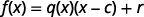 |
{: valign="top"}| If we evaluate this at <math xmlns="http://www.w3.org/1998/Math/MathML"><mrow><mi>c</mi><mo>,</mo></mrow></math>

 we get: | 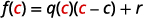 |
{: valign="top"}|  | 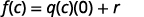 |
{: valign="top"}|  | 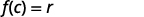 |
{: valign="top"}{: .unnumbered .unstyled summary="The figure shows four equations in function notation. The first equation is f of x equals q of x times the quantity x minus c in parentheses plus r. The second equation replaces x with c. The second equation is f of c equals q of c times the quantity c minus c in parentheses plus r. The third equation simplifies the difference c minus c. The third equation is f of c equals q of c times 0 plus r. The fourth equation simplifies the product q of c times 0. The fourth equation is f of c equals r." data-label=""}

This leads us to the Remainder Theorem.

Remainder Theorem

If the polynomial function <math xmlns="http://www.w3.org/1998/Math/MathML"><mrow><mi>f</mi><mrow><mo>(</mo><mi>x</mi><mo>)</mo></mrow></mrow></math>

 is divided by <math xmlns="http://www.w3.org/1998/Math/MathML"><mrow><mi>x</mi><mo>−</mo><mi>c</mi><mo>,</mo></mrow></math>

 then the remainder is <math xmlns="http://www.w3.org/1998/Math/MathML"><mrow><mi>f</mi><mrow><mo>(</mo><mi>c</mi><mo>)</mo></mrow><mo>.</mo></mrow></math>

Use the Remainder Theorem to find the remainder when <math xmlns="http://www.w3.org/1998/Math/MathML"><mrow><mi>f</mi><mrow><mo>(</mo><mi>x</mi><mo>)</mo></mrow><mo>=</mo><msup><mi>x</mi><mn>3</mn></msup><mo>+</mo><mn>3</mn><mi>x</mi><mo>+</mo><mn>19</mn></mrow></math>

 is divided by <math xmlns="http://www.w3.org/1998/Math/MathML"><mrow><mi>x</mi><mo>+</mo><mn>2</mn><mo>.</mo></mrow></math>

To use the Remainder Theorem, we must use the divisor in the <math xmlns="http://www.w3.org/1998/Math/MathML"><mrow><mi>x</mi><mo>−</mo><mi>c</mi></mrow></math>

 form. We can write the divisor <math xmlns="http://www.w3.org/1998/Math/MathML"><mrow><mi>x</mi><mo>+</mo><mn>2</mn></mrow></math>

 as <math xmlns="http://www.w3.org/1998/Math/MathML"><mrow><mi>x</mi><mo>−</mo><mrow><mo>(</mo><mrow><mn>−2</mn></mrow><mo>)</mo></mrow><mo>.</mo></mrow></math>

 So, our <math xmlns="http://www.w3.org/1998/Math/MathML"><mi>c</mi></math>

 is <math xmlns="http://www.w3.org/1998/Math/MathML"><mrow><mn>−2</mn><mo>.</mo></mrow></math>

To find the remainder, we evaluate <math xmlns="http://www.w3.org/1998/Math/MathML"><mrow><mi>f</mi><mrow><mo>(</mo><mi>c</mi><mo>)</mo></mrow></mrow></math>

 which is <math xmlns="http://www.w3.org/1998/Math/MathML"><mrow><mi>f</mi><mrow><mo>(</mo><mrow><mn>−2</mn></mrow><mo>)</mo></mrow><mo>.</mo></mrow></math>

<table class="unnumbered unstyled" summary="The figure shows a series of equations. The first equation is the function f of x equals x cubed plus 3 x plus 19. The second equation evaluates this function when x equals negative 2. The second equation is f of negative 2 equals negative 2 cubed plus 3 times negative 2 plus 19. The equation is simplified in the next two lines. The third equation is f of negative 2 equals negative 8 minus 6 plus 19. The fourth equation is f of negative 2 equals 5. The remainder is 5 when f of x equals x cubed plus 3 x plus 19 is divided by x plus 2. Synthetic division is used to check. The divisor number is negative 2. The first row is 1 0 3 19. The first column is 1 blank 1. The second column is 0 negative 2 negative 2. The third column is 3 4 7. The fourth column is 19 negative 14 5. The remainder is 5." data-label=""><tbody>
<tr valign="top">
<td data-valign="top" data-align="left" />
<td data-valign="top" data-align="left">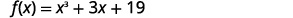</td>
</tr>
<tr valign="top">
<td data-valign="top" data-align="left">To evaluate <math xmlns="http://www.w3.org/1998/Math/MathML"><mrow><mi>f</mi><mrow><mo>(</mo><mrow><mn>−2</mn></mrow><mo>)</mo></mrow><mo>,</mo></mrow></math> substitute <math xmlns="http://www.w3.org/1998/Math/MathML"><mrow><mi>x</mi><mo>=</mo><mn>−2</mn><mo>.</mo></mrow></math></td>
<td data-valign="top" data-align="left">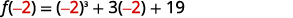</td>
</tr>
<tr valign="top">
<td data-valign="top" data-align="left">Simplify.</td>
<td data-valign="top" data-align="left">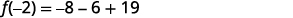</td>
</tr>
<tr valign="top">
<td data-valign="top" data-align="left" />
<td data-valign="top" data-align="left">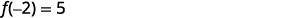</td>
</tr>
<tr valign="top">
<td data-valign="top" data-align="left" />
<td data-valign="top" data-align="left">The remainder is 5 when <math xmlns="http://www.w3.org/1998/Math/MathML"><mrow><mi>f</mi><mo stretchy="false">(</mo><mi>x</mi><mo stretchy="false">)</mo><mo>=</mo><msup><mrow><mi>x</mi></mrow><mrow><mn>3</mn></mrow></msup><mo>+</mo><mn>3</mn><mi>x</mi><mo>+</mo><mn>19</mn></mrow></math> is divided by <math xmlns="http://www.w3.org/1998/Math/MathML"><mrow><mi>x</mi><mo>+</mo><mn>2</mn><mo>.</mo></mrow></math></td>
</tr>
<tr valign="top">
<td data-valign="top" data-align="left">Check:
Use synthetic division to check.</td>
<td data-valign="top" data-align="left" />
</tr>
<tr valign="top">
<td data-valign="top" data-align="left">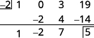</td>
<td data-valign="top" data-align="left" />
</tr>
<tr valign="top">
<td data-valign="top" data-align="left">The remainder is 5.</td>
<td data-valign="top" data-align="left" />
</tr>
</tbody></table>

Use the Remainder Theorem to find the remainder when <math xmlns="http://www.w3.org/1998/Math/MathML"><mrow><mi>f</mi><mrow><mo>(</mo><mi>x</mi><mo>)</mo></mrow><mo>=</mo><msup><mi>x</mi><mn>3</mn></msup><mo>+</mo><mn>4</mn><mi>x</mi><mo>+</mo><mn>15</mn></mrow></math>

 is divided by <math xmlns="http://www.w3.org/1998/Math/MathML"><mrow><mi>x</mi><mo>+</mo><mn>2</mn><mo>.</mo></mrow></math>

<math xmlns="http://www.w3.org/1998/Math/MathML"><mrow><mn>−1</mn></mrow></math>

Use the Remainder Theorem to find the remainder when <math xmlns="http://www.w3.org/1998/Math/MathML"><mrow><mi>f</mi><mrow><mo>(</mo><mi>x</mi><mo>)</mo></mrow><mo>=</mo><msup><mi>x</mi><mn>3</mn></msup><mo>−</mo><mn>7</mn><mi>x</mi><mo>+</mo><mn>12</mn></mrow></math>

 is divided by <math xmlns="http://www.w3.org/1998/Math/MathML"><mrow><mi>x</mi><mo>+</mo><mn>3</mn><mo>.</mo></mrow></math>

<math xmlns="http://www.w3.org/1998/Math/MathML"><mn>6</mn></math>

When we divided <math xmlns="http://www.w3.org/1998/Math/MathML"><mrow><mn>8</mn><msup><mi>a</mi><mn>3</mn></msup><mo>+</mo><mn>27</mn></mrow></math>

 by <math xmlns="http://www.w3.org/1998/Math/MathML"><mrow><mn>2</mn><mi>a</mi><mo>+</mo><mn>3</mn></mrow></math>

 in [\[link\]](#fs-id1167827957929) the result was <math xmlns="http://www.w3.org/1998/Math/MathML"><mrow><mn>4</mn><msup><mi>a</mi><mn>2</mn></msup><mo>−</mo><mn>6</mn><mi>a</mi><mo>+</mo><mn>9</mn><mo>.</mo></mrow></math>

 To check our work, we multiply <math xmlns="http://www.w3.org/1998/Math/MathML"><mrow><mn>4</mn><msup><mi>a</mi><mn>2</mn></msup><mo>−</mo><mn>6</mn><mi>a</mi><mo>+</mo><mn>9</mn></mrow></math>

 by <math xmlns="http://www.w3.org/1998/Math/MathML"><mrow><mn>2</mn><mi>a</mi><mo>+</mo><mn>3</mn></mrow></math>

 to get <math xmlns="http://www.w3.org/1998/Math/MathML"><mrow><mn>8</mn><msup><mi>a</mi><mn>3</mn></msup><mo>+</mo><mn>27</mn></mrow></math>

.

<math xmlns="http://www.w3.org/1998/Math/MathML"><mrow><mrow><mo>(</mo><mrow><mn>4</mn><msup><mi>a</mi><mn>2</mn></msup><mo>−</mo><mn>6</mn><mi>a</mi><mo>+</mo><mn>9</mn></mrow><mo>)</mo></mrow><mrow><mo>(</mo><mrow><mn>2</mn><mi>a</mi><mo>+</mo><mn>3</mn></mrow><mo>)</mo></mrow><mo>=</mo><mn>8</mn><msup><mi>a</mi><mn>3</mn></msup><mo>+</mo><mn>27</mn></mrow></math>

Written this way, we can see that <math xmlns="http://www.w3.org/1998/Math/MathML"><mrow><mn>4</mn><msup><mi>a</mi><mn>2</mn></msup><mo>−</mo><mn>6</mn><mi>a</mi><mo>+</mo><mn>9</mn></mrow></math>

 and <math xmlns="http://www.w3.org/1998/Math/MathML"><mrow><mn>2</mn><mi>a</mi><mo>+</mo><mn>3</mn></mrow></math>

 are factors of <math xmlns="http://www.w3.org/1998/Math/MathML"><mrow><mn>8</mn><msup><mi>a</mi><mn>3</mn></msup><mo>+</mo><mn>27</mn><mo>.</mo></mrow></math>

 When we did the division, the remainder was zero.

Whenever a divisor, <math xmlns="http://www.w3.org/1998/Math/MathML"><mrow><mi>x</mi><mo>−</mo><mi>c</mi><mo>,</mo></mrow></math>

 divides a polynomial function, <math xmlns="http://www.w3.org/1998/Math/MathML"><mrow><mi>f</mi><mrow><mo>(</mo><mi>x</mi><mo>)</mo></mrow><mo>,</mo></mrow></math>

 and resulting in a remainder of zero, we say <math xmlns="http://www.w3.org/1998/Math/MathML"><mrow><mi>x</mi><mo>−</mo><mi>c</mi></mrow></math>

 is a factor of <math xmlns="http://www.w3.org/1998/Math/MathML"><mrow><mi>f</mi><mrow><mo>(</mo><mi>x</mi><mo>)</mo></mrow><mo>.</mo></mrow></math>

The reverse is also true. If <math xmlns="http://www.w3.org/1998/Math/MathML"><mrow><mi>x</mi><mo>−</mo><mi>c</mi></mrow></math>

 is a factor of <math xmlns="http://www.w3.org/1998/Math/MathML"><mrow><mi>f</mi><mrow><mo>(</mo><mi>x</mi><mo>)</mo></mrow></mrow></math>

 then <math xmlns="http://www.w3.org/1998/Math/MathML"><mrow><mi>x</mi><mo>−</mo><mi>c</mi></mrow></math>

 will divide the polynomial function resulting in a remainder of zero.

We will state this in the Factor Theorem.

Factor Theorem

For any polynomial function <math xmlns="http://www.w3.org/1998/Math/MathML"><mrow><mi>f</mi><mrow><mo>(</mo><mi>x</mi><mo>)</mo></mrow><mo>,</mo></mrow></math>

* if
  <math xmlns="http://www.w3.org/1998/Math/MathML"><mrow><mi>x</mi><mo>−</mo><mi>c</mi></mrow></math>
  
  is a factor of
  <math xmlns="http://www.w3.org/1998/Math/MathML"><mrow><mi>f</mi><mrow><mo>(</mo><mi>x</mi><mo>)</mo></mrow><mo>,</mo></mrow></math>
  
  then
  <math xmlns="http://www.w3.org/1998/Math/MathML"><mrow><mi>f</mi><mrow><mo>(</mo><mi>c</mi><mo>)</mo></mrow><mo>=</mo><mn>0</mn></mrow></math>

* if
  <math xmlns="http://www.w3.org/1998/Math/MathML"><mrow><mi>f</mi><mrow><mo>(</mo><mi>c</mi><mo>)</mo></mrow><mo>=</mo><mn>0</mn><mo>,</mo></mrow></math>
  
  then
  <math xmlns="http://www.w3.org/1998/Math/MathML"><mrow><mi>x</mi><mo>−</mo><mi>c</mi></mrow></math>
  
  is a factor of
  <math xmlns="http://www.w3.org/1998/Math/MathML"><mrow><mi>f</mi><mrow><mo>(</mo><mi>x</mi><mo>)</mo></mrow></mrow></math>
{: data-bullet-style="bullet"}

Use the Remainder Theorem to determine if <math xmlns="http://www.w3.org/1998/Math/MathML"><mrow><mi>x</mi><mo>−</mo><mn>4</mn></mrow></math>

 is a factor of <math xmlns="http://www.w3.org/1998/Math/MathML"><mrow><mi>f</mi><mrow><mo>(</mo><mi>x</mi><mo>)</mo></mrow><mo>=</mo><msup><mi>x</mi><mn>3</mn></msup><mo>−</mo><mn>64</mn><mo>.</mo></mrow></math>

The Factor Theorem tells us that <math xmlns="http://www.w3.org/1998/Math/MathML"><mrow><mi>x</mi><mo>−</mo><mn>4</mn></mrow></math>

 is a factor of <math xmlns="http://www.w3.org/1998/Math/MathML"><mrow><mi>f</mi><mrow><mo>(</mo><mi>x</mi><mo>)</mo></mrow><mo>=</mo><msup><mi>x</mi><mn>3</mn></msup><mo>−</mo><mn>64</mn></mrow></math>

 if <math xmlns="http://www.w3.org/1998/Math/MathML"><mrow><mi>f</mi><mrow><mo>(</mo><mn>4</mn><mo>)</mo></mrow><mo>=</mo><mn>0</mn><mo>.</mo></mrow></math>

* * *
{: data-type="newline"}

 <math xmlns="http://www.w3.org/1998/Math/MathML"><mrow><mtable><mtr><mtd /><mtd /><mtd /><mtd /><mtd /><mtd columnalign="left"><mi>f</mi><mrow><mo>(</mo><mi>x</mi><mo>)</mo></mrow><mo>=</mo><msup><mi>x</mi><mn>3</mn></msup><mo>−</mo><mn>64</mn></mtd></mtr><mtr><mtd columnalign="left"><mtext>To evaluate</mtext><mspace width="0.2em" /><mi>f</mi><mrow><mo>(</mo><mn>4</mn><mo>)</mo></mrow><mspace width="0.2em" /><mtext>substitute</mtext><mspace width="0.2em" /><mi>x</mi><mo>=</mo><mn>4</mn><mo>.</mo></mtd><mtd /><mtd /><mtd /><mtd /><mtd columnalign="left"><mi>f</mi><mrow><mo>(</mo><mn>4</mn><mo>)</mo></mrow><mo>=</mo><msup><mn>4</mn><mn>3</mn></msup><mo>−</mo><mn>64</mn></mtd></mtr><mtr><mtd columnalign="left"><mtext>Simplify.</mtext></mtd><mtd /><mtd /><mtd /><mtd /><mtd columnalign="left"><mi>f</mi><mrow><mo>(</mo><mn>4</mn><mo>)</mo></mrow><mo>=</mo><mn>64</mn><mo>−</mo><mn>64</mn></mtd></mtr><mtr><mtd columnalign="left"><mtext>Subtract.</mtext></mtd><mtd /><mtd /><mtd /><mtd /><mtd columnalign="left"><mi>f</mi><mrow><mo>(</mo><mn>4</mn><mo>)</mo></mrow><mo>=</mo><mn>0</mn></mtd></mtr></mtable></mrow></math>

Since <math xmlns="http://www.w3.org/1998/Math/MathML"><mrow><mi>f</mi><mrow><mo>(</mo><mn>4</mn><mo>)</mo></mrow><mo>=</mo><mn>0</mn><mo>,</mo></mrow></math>

 <math xmlns="http://www.w3.org/1998/Math/MathML"><mrow><mi>x</mi><mo>−</mo><mn>4</mn></mrow></math>

 is a factor of <math xmlns="http://www.w3.org/1998/Math/MathML"><mrow><mi>f</mi><mrow><mo>(</mo><mi>x</mi><mo>)</mo></mrow><mo>=</mo><msup><mi>x</mi><mn>3</mn></msup><mo>−</mo><mn>64</mn><mo>.</mo></mrow></math>

Use the Factor Theorem to determine if <math xmlns="http://www.w3.org/1998/Math/MathML"><mrow><mi>x</mi><mo>−</mo><mn>5</mn></mrow></math>

 is a factor of <math xmlns="http://www.w3.org/1998/Math/MathML"><mrow><mi>f</mi><mrow><mo>(</mo><mi>x</mi><mo>)</mo></mrow><mo>=</mo><msup><mi>x</mi><mn>3</mn></msup><mo>−</mo><mn>125</mn><mo>.</mo></mrow></math>

yes

Use the Factor Theorem to determine if <math xmlns="http://www.w3.org/1998/Math/MathML"><mrow><mi>x</mi><mo>−</mo><mn>6</mn></mrow></math>

 is a factor of <math xmlns="http://www.w3.org/1998/Math/MathML"><mrow><mi>f</mi><mrow><mo>(</mo><mi>x</mi><mo>)</mo></mrow><mo>=</mo><msup><mi>x</mi><mn>3</mn></msup><mo>−</mo><mn>216</mn><mo>.</mo></mrow></math>

yes

Access these online resources for additional instruction and practice with dividing polynomials.

* [Dividing a Polynomial by a Binomial][1]
* [Synthetic Division &amp; Remainder Theorem][2]
{: data-display="block"}

### Key Concepts

* **Division of a Polynomial by a Monomial**
  * To divide a polynomial by a monomial, divide each term of the polynomial by the monomial.
  {: data-bullet-style="bullet"}

* **Division of Polynomial Functions**
  * For functions
    <math xmlns="http://www.w3.org/1998/Math/MathML"><mrow><mi>f</mi><mrow><mo>(</mo><mi>x</mi><mo>)</mo></mrow></mrow></math>
    
    and
    <math xmlns="http://www.w3.org/1998/Math/MathML"><mrow><mi>g</mi><mo stretchy="false">(</mo><mi>x</mi><mo stretchy="false">)</mo><mo>,</mo></mrow></math>
    
    where
    <math xmlns="http://www.w3.org/1998/Math/MathML"><mrow><mi>g</mi><mo stretchy="false">(</mo><mi>x</mi><mo stretchy="false">)</mo><mo>≠</mo><mn>0</mn><mo>,</mo></mrow></math>
    
    * * *
    {: data-type="newline"}
    
    <math xmlns="http://www.w3.org/1998/Math/MathML"><mrow><mrow><mo>(</mo><mrow><mfrac><mi>f</mi><mi>g</mi></mfrac></mrow><mo>)</mo></mrow><mrow><mo>(</mo><mi>x</mi><mo>)</mo></mrow><mo>=</mo><mfrac><mrow><mi>f</mi><mrow><mo>(</mo><mi>x</mi><mo>)</mo></mrow></mrow><mrow><mi>g</mi><mrow><mo>(</mo><mi>x</mi><mo>)</mo></mrow></mrow></mfrac></mrow></math>
  {: data-bullet-style="bullet"}

* **Remainder Theorem**
  * If the polynomial function
    <math xmlns="http://www.w3.org/1998/Math/MathML"><mrow><mi>f</mi><mrow><mo>(</mo><mi>x</mi><mo>)</mo></mrow></mrow></math>
    
    is divided by
    <math xmlns="http://www.w3.org/1998/Math/MathML"><mrow><mi>x</mi><mo>−</mo><mi>c</mi><mo>,</mo></mrow></math>
    
    then the remainder is
    <math xmlns="http://www.w3.org/1998/Math/MathML"><mrow><mi>f</mi><mrow><mo>(</mo><mi>c</mi><mo>)</mo></mrow><mo>.</mo></mrow></math>
  {: data-bullet-style="bullet"}

* **Factor Theorem:** For any polynomial function
  <math xmlns="http://www.w3.org/1998/Math/MathML"><mrow><mi>f</mi><mrow><mo>(</mo><mi>x</mi><mo>)</mo></mrow><mo>,</mo></mrow></math>
  
  * if
    <math xmlns="http://www.w3.org/1998/Math/MathML"><mrow><mi>x</mi><mo>−</mo><mi>c</mi></mrow></math>
    
    is a factor of
    <math xmlns="http://www.w3.org/1998/Math/MathML"><mrow><mi>f</mi><mrow><mo>(</mo><mi>x</mi><mo>)</mo></mrow><mo>,</mo></mrow></math>
    
    then
    <math xmlns="http://www.w3.org/1998/Math/MathML"><mrow><mi>f</mi><mrow><mo>(</mo><mi>c</mi><mo>)</mo></mrow><mo>=</mo><mn>0</mn></mrow></math>
  
  * if
    <math xmlns="http://www.w3.org/1998/Math/MathML"><mrow><mi>f</mi><mrow><mo>(</mo><mi>c</mi><mo>)</mo></mrow><mo>=</mo><mn>0</mn><mo>,</mo></mrow></math>
    
    then
    <math xmlns="http://www.w3.org/1998/Math/MathML"><mrow><mi>x</mi><mo>−</mo><mi>c</mi></mrow></math>
    
    is a factor of
    <math xmlns="http://www.w3.org/1998/Math/MathML"><mrow><mi>f</mi><mrow><mo>(</mo><mi>x</mi><mo>)</mo></mrow></mrow></math>
  {: data-bullet-style="bullet"}
{: data-bullet-style="bullet"}

<section data-depth="1" class="section-exercises" markdown="1">
#### Practice Makes Perfect

**Divide Monomials**

In the following exercises, divide the monomials.

<math xmlns="http://www.w3.org/1998/Math/MathML"><mrow><mn>15</mn><msup><mi>r</mi><mn>4</mn></msup><msup><mi>s</mi><mn>9</mn></msup><mo>÷</mo><mrow><mo>(</mo><mrow><mn>15</mn><msup><mi>r</mi><mn>4</mn></msup><msup><mi>s</mi><mn>9</mn></msup></mrow><mo>)</mo></mrow></mrow></math>

<math xmlns="http://www.w3.org/1998/Math/MathML"><mrow><mn>20</mn><msup><mi>m</mi><mn>8</mn></msup><msup><mi>n</mi><mn>4</mn></msup><mo>÷</mo><mrow><mo>(</mo><mrow><mn>30</mn><msup><mi>m</mi><mn>5</mn></msup><msup><mi>n</mi><mn>9</mn></msup></mrow><mo>)</mo></mrow></mrow></math>

<math xmlns="http://www.w3.org/1998/Math/MathML"><mrow><mfrac><mrow><mn>2</mn><msup><mi>m</mi><mn>3</mn></msup></mrow><mrow><mn>3</mn><msup><mi>n</mi><mn>5</mn></msup></mrow></mfrac></mrow></math>

<math xmlns="http://www.w3.org/1998/Math/MathML"><mrow><mfrac><mrow><mn>18</mn><msup><mi>a</mi><mn>4</mn></msup><msup><mi>b</mi><mn>8</mn></msup></mrow><mrow><mn>−27</mn><msup><mi>a</mi><mn>9</mn></msup><msup><mi>b</mi><mn>5</mn></msup></mrow></mfrac></mrow></math>

<math xmlns="http://www.w3.org/1998/Math/MathML"><mrow><mfrac><mrow><mn>45</mn><msup><mi>x</mi><mn>5</mn></msup><msup><mi>y</mi><mn>9</mn></msup></mrow><mrow><mn>−60</mn><msup><mi>x</mi><mn>8</mn></msup><msup><mi>y</mi><mn>6</mn></msup></mrow></mfrac></mrow></math>

<math xmlns="http://www.w3.org/1998/Math/MathML"><mrow><mfrac><mrow><mn>−3</mn><msup><mi>y</mi><mn>3</mn></msup></mrow><mrow><mn>4</mn><msup><mi>x</mi><mn>3</mn></msup></mrow></mfrac></mrow></math>

<math xmlns="http://www.w3.org/1998/Math/MathML"><mrow><mfrac><mrow><mrow><mo>(</mo><mrow><mn>10</mn><msup><mi>m</mi><mn>5</mn></msup><msup><mi>n</mi><mn>4</mn></msup></mrow><mo>)</mo></mrow><mrow><mo>(</mo><mrow><mn>5</mn><msup><mi>m</mi><mn>3</mn></msup><msup><mi>n</mi><mn>6</mn></msup></mrow><mo>)</mo></mrow></mrow><mrow><mn>25</mn><msup><mi>m</mi><mn>7</mn></msup><msup><mi>n</mi><mn>5</mn></msup></mrow></mfrac></mrow></math>

<math xmlns="http://www.w3.org/1998/Math/MathML"><mrow><mfrac><mrow><mrow><mo>(</mo><mrow><mn>−18</mn><msup><mi>p</mi><mn>4</mn></msup><msup><mi>q</mi><mn>7</mn></msup></mrow><mo>)</mo></mrow><mrow><mo>(</mo><mrow><mn>−6</mn><msup><mi>p</mi><mn>3</mn></msup><msup><mi>q</mi><mn>8</mn></msup></mrow><mo>)</mo></mrow></mrow><mrow><mn>−36</mn><msup><mi>p</mi><mrow><mn>12</mn></mrow></msup><msup><mi>q</mi><mrow><mn>10</mn></mrow></msup></mrow></mfrac></mrow></math>

<math xmlns="http://www.w3.org/1998/Math/MathML"><mrow><mfrac><mrow><mn>−3</mn><msup><mi>q</mi><mn>5</mn></msup></mrow><mrow><msup><mi>p</mi><mn>5</mn></msup></mrow></mfrac></mrow></math>

<math xmlns="http://www.w3.org/1998/Math/MathML"><mrow><mfrac><mrow><mrow><mo>(</mo><mrow><mn>6</mn><msup><mi>a</mi><mn>4</mn></msup><msup><mi>b</mi><mn>3</mn></msup></mrow><mo>)</mo></mrow><mrow><mo>(</mo><mrow><mn>4</mn><mi>a</mi><msup><mi>b</mi><mn>5</mn></msup></mrow><mo>)</mo></mrow></mrow><mrow><mrow><mo>(</mo><mrow><mn>12</mn><msup><mi>a</mi><mn>2</mn></msup><mi>b</mi></mrow><mo>)</mo></mrow><mrow><mo>(</mo><mrow><msup><mi>a</mi><mn>3</mn></msup><mi>b</mi></mrow><mo>)</mo></mrow></mrow></mfrac></mrow></math>

<math xmlns="http://www.w3.org/1998/Math/MathML"><mrow><mfrac><mrow><mrow><mo>(</mo><mrow><mn>4</mn><msup><mi>u</mi><mn>2</mn></msup><msup><mi>v</mi><mn>5</mn></msup></mrow><mo>)</mo></mrow><mrow><mo>(</mo><mrow><mn>15</mn><msup><mi>u</mi><mn>3</mn></msup><mi>v</mi></mrow><mo>)</mo></mrow></mrow><mrow><mrow><mo>(</mo><mrow><mn>12</mn><msup><mi>u</mi><mn>3</mn></msup><mi>v</mi></mrow><mo>)</mo></mrow><mrow><mo>(</mo><mrow><msup><mi>u</mi><mn>4</mn></msup><mi>v</mi></mrow><mo>)</mo></mrow></mrow></mfrac></mrow></math>

<math xmlns="http://www.w3.org/1998/Math/MathML"><mrow><mfrac><mrow><mn>5</mn><msup><mi>v</mi><mn>4</mn></msup></mrow><mrow><msup><mi>u</mi><mn>2</mn></msup></mrow></mfrac></mrow></math>

**Divide a Polynomial by a Monomial**

In the following exercises, divide each polynomial by the monomial.

<math xmlns="http://www.w3.org/1998/Math/MathML"><mrow><mrow><mo>(</mo><mrow><mn>9</mn><msup><mi>n</mi><mn>4</mn></msup><mo>+</mo><mn>6</mn><msup><mi>n</mi><mn>3</mn></msup></mrow><mo>)</mo></mrow><mo>÷</mo><mn>3</mn><mi>n</mi></mrow></math>

<math xmlns="http://www.w3.org/1998/Math/MathML"><mrow><mrow><mo>(</mo><mrow><mn>8</mn><msup><mi>x</mi><mn>3</mn></msup><mo>+</mo><mn>6</mn><msup><mi>x</mi><mn>2</mn></msup></mrow><mo>)</mo></mrow><mo>÷</mo><mn>2</mn><mi>x</mi></mrow></math>

<math xmlns="http://www.w3.org/1998/Math/MathML"><mrow><mn>4</mn><msup><mi>x</mi><mn>2</mn></msup><mo>+</mo><mn>3</mn><mi>x</mi></mrow></math>

<math xmlns="http://www.w3.org/1998/Math/MathML"><mrow><mrow><mo>(</mo><mrow><mn>63</mn><msup><mi>m</mi><mn>4</mn></msup><mo>−</mo><mn>42</mn><msup><mi>m</mi><mn>3</mn></msup></mrow><mo>)</mo></mrow><mo>÷</mo><mrow><mo>(</mo><mrow><mn>−7</mn><msup><mi>m</mi><mn>2</mn></msup></mrow><mo>)</mo></mrow></mrow></math>

<math xmlns="http://www.w3.org/1998/Math/MathML"><mrow><mrow><mo>(</mo><mrow><mn>48</mn><msup><mi>y</mi><mn>4</mn></msup><mo>−</mo><mn>24</mn><msup><mi>y</mi><mn>3</mn></msup></mrow><mo>)</mo></mrow><mo>÷</mo><mrow><mo>(</mo><mrow><mn>−8</mn><msup><mi>y</mi><mn>2</mn></msup></mrow><mo>)</mo></mrow></mrow></math>

<math xmlns="http://www.w3.org/1998/Math/MathML"><mrow><mn>−6</mn><msup><mi>y</mi><mn>2</mn></msup><mo>+</mo><mn>3</mn><mi>y</mi></mrow></math>

<math xmlns="http://www.w3.org/1998/Math/MathML"><mrow><mfrac><mrow><mn>66</mn><msup><mi>x</mi><mn>3</mn></msup><msup><mi>y</mi><mn>2</mn></msup><mo>−</mo><mn>110</mn><msup><mi>x</mi><mn>2</mn></msup><msup><mi>y</mi><mn>3</mn></msup><mo>−</mo><mn>44</mn><msup><mi>x</mi><mn>4</mn></msup><msup><mi>y</mi><mn>3</mn></msup></mrow><mrow><mn>11</mn><msup><mi>x</mi><mn>2</mn></msup><msup><mi>y</mi><mn>2</mn></msup></mrow></mfrac></mrow></math>

<math xmlns="http://www.w3.org/1998/Math/MathML"><mrow><mfrac><mrow><mn>72</mn><msup><mi>r</mi><mn>5</mn></msup><msup><mi>s</mi><mn>2</mn></msup><mo>+</mo><mn>132</mn><msup><mi>r</mi><mn>4</mn></msup><msup><mi>s</mi><mn>3</mn></msup><mo>−</mo><mn>96</mn><msup><mi>r</mi><mn>3</mn></msup><msup><mi>s</mi><mn>5</mn></msup></mrow><mrow><mn>12</mn><msup><mi>r</mi><mn>2</mn></msup><msup><mi>s</mi><mn>2</mn></msup></mrow></mfrac></mrow></math>

<math xmlns="http://www.w3.org/1998/Math/MathML"><mrow><mn>6</mn><msup><mi>r</mi><mn>3</mn></msup><mo>+</mo><mn>11</mn><msup><mi>r</mi><mn>2</mn></msup><mi>s</mi><mo>−</mo><mn>8</mn><mi>r</mi><msup><mi>s</mi><mn>3</mn></msup></mrow></math>

<math xmlns="http://www.w3.org/1998/Math/MathML"><mrow><mfrac><mrow><mn>10</mn><msup><mi>x</mi><mn>2</mn></msup><mo>+</mo><mn>5</mn><mi>x</mi><mo>−</mo><mn>4</mn></mrow><mrow><mn>−5</mn><mi>x</mi></mrow></mfrac></mrow></math>

<math xmlns="http://www.w3.org/1998/Math/MathML"><mrow><mfrac><mrow><mn>20</mn><msup><mi>y</mi><mn>2</mn></msup><mo>+</mo><mn>12</mn><mi>y</mi><mo>−</mo><mn>1</mn></mrow><mrow><mn>−4</mn><mi>y</mi></mrow></mfrac></mrow></math>

<math xmlns="http://www.w3.org/1998/Math/MathML"><mrow><mn>−5</mn><mi>y</mi><mo>−</mo><mn>3</mn><mo>+</mo><mfrac><mn>1</mn><mrow><mn>4</mn><mi>y</mi></mrow></mfrac></mrow></math>

**Divide Polynomials using Long Division**

In the following exercises, divide each polynomial by the binomial.

<math xmlns="http://www.w3.org/1998/Math/MathML"><mrow><mrow><mo>(</mo><mrow><msup><mi>y</mi><mn>2</mn></msup><mo>+</mo><mn>7</mn><mi>y</mi><mo>+</mo><mn>12</mn></mrow><mo>)</mo></mrow><mo>÷</mo><mrow><mo>(</mo><mrow><mi>y</mi><mo>+</mo><mn>3</mn></mrow><mo>)</mo></mrow></mrow></math>

<math xmlns="http://www.w3.org/1998/Math/MathML"><mrow><mrow><mo>(</mo><mrow><msup><mi>a</mi><mn>2</mn></msup><mo>−</mo><mn>2</mn><mi>a</mi><mo>−</mo><mn>35</mn></mrow><mo>)</mo></mrow><mo>÷</mo><mrow><mo>(</mo><mrow><mi>a</mi><mo>+</mo><mn>5</mn></mrow><mo>)</mo></mrow></mrow></math>

<math xmlns="http://www.w3.org/1998/Math/MathML"><mrow><mi>a</mi><mo>−</mo><mn>7</mn></mrow></math>

<math xmlns="http://www.w3.org/1998/Math/MathML"><mrow><mrow><mo>(</mo><mrow><mn>6</mn><msup><mi>m</mi><mn>2</mn></msup><mo>−</mo><mn>19</mn><mi>m</mi><mo>−</mo><mn>20</mn></mrow><mo>)</mo></mrow><mo>÷</mo><mrow><mo>(</mo><mrow><mi>m</mi><mo>−</mo><mn>4</mn></mrow><mo>)</mo></mrow></mrow></math>

<math xmlns="http://www.w3.org/1998/Math/MathML"><mrow><mrow><mo>(</mo><mrow><mn>4</mn><msup><mi>x</mi><mn>2</mn></msup><mo>−</mo><mn>17</mn><mi>x</mi><mo>−</mo><mn>15</mn></mrow><mo>)</mo></mrow><mo>÷</mo><mrow><mo>(</mo><mrow><mi>x</mi><mo>−</mo><mn>5</mn></mrow><mo>)</mo></mrow></mrow></math>

<math xmlns="http://www.w3.org/1998/Math/MathML"><mrow><mn>4</mn><mi>x</mi><mo>+</mo><mn>3</mn></mrow></math>

<math xmlns="http://www.w3.org/1998/Math/MathML"><mrow><mrow><mo>(</mo><mrow><msup><mi>q</mi><mn>2</mn></msup><mo>+</mo><mn>2</mn><mi>q</mi><mo>+</mo><mn>20</mn></mrow><mo>)</mo></mrow><mo>÷</mo><mrow><mo>(</mo><mrow><mi>q</mi><mo>+</mo><mn>6</mn></mrow><mo>)</mo></mrow></mrow></math>

<math xmlns="http://www.w3.org/1998/Math/MathML"><mrow><mrow><mo>(</mo><mrow><msup><mi>p</mi><mn>2</mn></msup><mo>+</mo><mn>11</mn><mi>p</mi><mo>+</mo><mn>16</mn></mrow><mo>)</mo></mrow><mo>÷</mo><mrow><mo>(</mo><mrow><mi>p</mi><mo>+</mo><mn>8</mn></mrow><mo>)</mo></mrow></mrow></math>

<math xmlns="http://www.w3.org/1998/Math/MathML"><mrow><mi>p</mi><mo>+</mo><mn>3</mn><mo>−</mo><mfrac><mn>8</mn><mrow><mi>p</mi><mo>+</mo><mn>8</mn></mrow></mfrac></mrow></math>

<math xmlns="http://www.w3.org/1998/Math/MathML"><mrow><mrow><mo>(</mo><mrow><mn>3</mn><msup><mi>b</mi><mn>3</mn></msup><mo>+</mo><msup><mi>b</mi><mn>2</mn></msup><mo>+</mo><mn>4</mn></mrow><mo>)</mo></mrow><mo>÷</mo><mrow><mo>(</mo><mrow><mi>b</mi><mo>+</mo><mn>1</mn></mrow><mo>)</mo></mrow></mrow></math>

<math xmlns="http://www.w3.org/1998/Math/MathML"><mrow><mrow><mo>(</mo><mrow><mn>2</mn><msup><mi>n</mi><mn>3</mn></msup><mo>−</mo><mn>10</mn><mi>n</mi><mo>+</mo><mn>28</mn></mrow><mo>)</mo></mrow><mo>÷</mo><mrow><mo>(</mo><mrow><mi>n</mi><mo>+</mo><mn>3</mn></mrow><mo>)</mo></mrow></mrow></math>

<math xmlns="http://www.w3.org/1998/Math/MathML"><mfrac><mrow><mn>2</mn><msup><mi>n</mi><mn>2</mn></msup><mo>−</mo><mn>6</mn><mi>n</mi><mo>+</mo><mn>8</mn><mo>+</mo><mn>4</mn></mrow><mrow><mi>n</mi><mo>+</mo><mn>3</mn></mrow></mfrac></math>

<math xmlns="http://www.w3.org/1998/Math/MathML"><mrow><mrow><mo>(</mo><mrow><msup><mi>z</mi><mn>3</mn></msup><mo>+</mo><mn>1</mn></mrow><mo>)</mo></mrow><mo>÷</mo><mrow><mo>(</mo><mrow><mi>z</mi><mo>+</mo><mn>1</mn></mrow><mo>)</mo></mrow></mrow></math>

<math xmlns="http://www.w3.org/1998/Math/MathML"><mrow><mrow><mo>(</mo><mrow><msup><mi>m</mi><mn>3</mn></msup><mo>+</mo><mn>1000</mn></mrow><mo>)</mo></mrow><mo>÷</mo><mrow><mo>(</mo><mrow><mi>m</mi><mo>+</mo><mn>10</mn></mrow><mo>)</mo></mrow></mrow></math>

<math xmlns="http://www.w3.org/1998/Math/MathML"><mrow><msup><mi>m</mi><mn>2</mn></msup><mo>−</mo><mn>10</mn><mi>m</mi><mo>+</mo><mn>100</mn></mrow></math>

<math xmlns="http://www.w3.org/1998/Math/MathML"><mrow><mrow><mo>(</mo><mrow><mn>64</mn><msup><mi>x</mi><mn>3</mn></msup><mo>−</mo><mn>27</mn></mrow><mo>)</mo></mrow><mo>÷</mo><mrow><mo>(</mo><mrow><mn>4</mn><mi>x</mi><mo>−</mo><mn>3</mn></mrow><mo>)</mo></mrow></mrow></math>

<math xmlns="http://www.w3.org/1998/Math/MathML"><mrow><mrow><mo>(</mo><mrow><mn>125</mn><msup><mi>y</mi><mn>3</mn></msup><mo>−</mo><mn>64</mn></mrow><mo>)</mo></mrow><mo>÷</mo><mrow><mo>(</mo><mrow><mn>5</mn><mi>y</mi><mo>−</mo><mn>4</mn></mrow><mo>)</mo></mrow></mrow></math>

<math xmlns="http://www.w3.org/1998/Math/MathML"><mrow><mn>25</mn><msup><mi>y</mi><mn>2</mn></msup><mo>+</mo><mn>20</mn><mi>x</mi><mo>+</mo><mn>16</mn></mrow></math>

<section data-depth="2" markdown="1">
**Divide Polynomials using Synthetic Division**

In the following exercises, use synthetic Division to find the quotient and remainder.

<math xmlns="http://www.w3.org/1998/Math/MathML"><mrow><msup><mi>x</mi><mn>3</mn></msup><mo>−</mo><mn>6</mn><msup><mi>x</mi><mn>2</mn></msup><mo>+</mo><mn>5</mn><mi>x</mi><mo>+</mo><mn>14</mn></mrow></math>

 is divided by <math xmlns="http://www.w3.org/1998/Math/MathML"><mrow><mi>x</mi><mo>+</mo><mn>1</mn></mrow></math>

<math xmlns="http://www.w3.org/1998/Math/MathML"><mrow><msup><mi>x</mi><mn>3</mn></msup><mo>−</mo><mn>3</mn><msup><mi>x</mi><mn>2</mn></msup><mo>−</mo><mn>4</mn><mi>x</mi><mo>+</mo><mn>12</mn></mrow></math>

 is divided by <math xmlns="http://www.w3.org/1998/Math/MathML"><mrow><mi>x</mi><mo>+</mo><mn>2</mn></mrow></math>

<math xmlns="http://www.w3.org/1998/Math/MathML"><mrow><msup><mi>x</mi><mn>2</mn></msup><mo>−</mo><mn>5</mn><mi>x</mi><mo>+</mo><mn>6</mn><mtext>;</mtext><mspace width="0.2em" /><mn>0</mn></mrow></math>

<math xmlns="http://www.w3.org/1998/Math/MathML"><mrow><mn>2</mn><msup><mi>x</mi><mn>3</mn></msup><mo>−</mo><mn>11</mn><msup><mi>x</mi><mn>2</mn></msup><mo>+</mo><mn>11</mn><mi>x</mi><mo>+</mo><mn>12</mn></mrow></math>

 is divided by <math xmlns="http://www.w3.org/1998/Math/MathML"><mrow><mi>x</mi><mo>−</mo><mn>3</mn></mrow></math>

<math xmlns="http://www.w3.org/1998/Math/MathML"><mrow><mn>2</mn><msup><mi>x</mi><mn>3</mn></msup><mo>−</mo><mn>11</mn><msup><mi>x</mi><mn>2</mn></msup><mo>+</mo><mn>16</mn><mi>x</mi><mo>−</mo><mn>12</mn></mrow></math>

 is divided by <math xmlns="http://www.w3.org/1998/Math/MathML"><mrow><mi>x</mi><mo>−</mo><mn>4</mn></mrow></math>

<math xmlns="http://www.w3.org/1998/Math/MathML"><mrow><mn>2</mn><msup><mi>x</mi><mn>2</mn></msup><mo>−</mo><mn>3</mn><mi>x</mi><mo>+</mo><mn>4</mn><mtext>;</mtext><mspace width="0.2em" /><mn>4</mn></mrow></math>

<math xmlns="http://www.w3.org/1998/Math/MathML"><mrow><msup><mi>x</mi><mn>4</mn></msup><mo>+</mo><mn>13</mn><msup><mi>x</mi><mn>2</mn></msup><mo>+</mo><mn>13</mn><mi>x</mi><mo>+</mo><mn>3</mn></mrow></math>

 is divided by <math xmlns="http://www.w3.org/1998/Math/MathML"><mrow><mi>x</mi><mo>+</mo><mn>3</mn></mrow></math>

<math xmlns="http://www.w3.org/1998/Math/MathML"><mrow><msup><mi>x</mi><mn>4</mn></msup><mo>+</mo><msup><mi>x</mi><mn>2</mn></msup><mo>+</mo><mn>6</mn><mi>x</mi><mo>−</mo><mn>10</mn></mrow></math>

 is divided by <math xmlns="http://www.w3.org/1998/Math/MathML"><mrow><mi>x</mi><mo>+</mo><mn>2</mn></mrow></math>

<math xmlns="http://www.w3.org/1998/Math/MathML"><mrow><msup><mi>x</mi><mn>3</mn></msup><mo>−</mo><mn>2</mn><msup><mi>x</mi><mn>2</mn></msup><mo>+</mo><mn>5</mn><mi>x</mi><mo>−</mo><mn>4</mn><mtext>;</mtext><mspace width="0.2em" /><mtext>−</mtext><mn>2</mn></mrow></math>

<math xmlns="http://www.w3.org/1998/Math/MathML"><mrow><mn>2</mn><msup><mi>x</mi><mn>4</mn></msup><mo>−</mo><mn>9</mn><msup><mi>x</mi><mn>3</mn></msup><mo>+</mo><mn>5</mn><msup><mi>x</mi><mn>2</mn></msup><mo>−</mo><mn>3</mn><mi>x</mi><mo>−</mo><mn>6</mn></mrow></math>

 is divided by <math xmlns="http://www.w3.org/1998/Math/MathML"><mrow><mi>x</mi><mo>−</mo><mn>4</mn></mrow></math>

<math xmlns="http://www.w3.org/1998/Math/MathML"><mrow><mn>3</mn><msup><mi>x</mi><mn>4</mn></msup><mo>−</mo><mn>11</mn><msup><mi>x</mi><mn>3</mn></msup><mo>+</mo><mn>2</mn><msup><mi>x</mi><mn>2</mn></msup><mo>+</mo><mn>10</mn><mi>x</mi><mo>+</mo><mn>6</mn></mrow></math>

 is divided by <math xmlns="http://www.w3.org/1998/Math/MathML"><mrow><mi>x</mi><mo>−</mo><mn>3</mn></mrow></math>

<math xmlns="http://www.w3.org/1998/Math/MathML"><mrow><mn>3</mn><msup><mi>x</mi><mn>3</mn></msup><mo>−</mo><mn>2</mn><msup><mi>x</mi><mn>2</mn></msup><mo>−</mo><mn>4</mn><mi>x</mi><mo>−</mo><mn>2</mn><mtext>;</mtext><mspace width="0.2em" /><mn>0</mn></mrow></math>

**Divide Polynomial Functions**

In the following exercises, divide.

For functions <math xmlns="http://www.w3.org/1998/Math/MathML"><mrow><mi>f</mi><mrow><mo>(</mo><mi>x</mi><mo>)</mo></mrow><mo>=</mo><msup><mi>x</mi><mn>2</mn></msup><mo>−</mo><mn>13</mn><mi>x</mi><mo>+</mo><mn>36</mn></mrow></math>

 and <math xmlns="http://www.w3.org/1998/Math/MathML"><mrow><mi>g</mi><mrow><mo>(</mo><mi>x</mi><mo>)</mo></mrow><mo>=</mo><mi>x</mi><mo>−</mo><mn>4</mn><mo>,</mo></mrow></math>

 find ⓐ <math xmlns="http://www.w3.org/1998/Math/MathML"><mrow><mrow><mo>(</mo><mrow><mfrac><mi>f</mi><mi>g</mi></mfrac></mrow><mo>)</mo></mrow><mrow><mo>(</mo><mi>x</mi><mo>)</mo></mrow></mrow></math>

 ⓑ <math xmlns="http://www.w3.org/1998/Math/MathML"><mrow><mrow><mo>(</mo><mrow><mfrac><mi>f</mi><mi>g</mi></mfrac></mrow><mo>)</mo></mrow><mrow><mo>(</mo><mrow><mn>−1</mn></mrow><mo>)</mo></mrow></mrow></math>

For functions <math xmlns="http://www.w3.org/1998/Math/MathML"><mrow><mi>f</mi><mrow><mo>(</mo><mi>x</mi><mo>)</mo></mrow><mo>=</mo><msup><mi>x</mi><mn>2</mn></msup><mo>−</mo><mn>15</mn><mi>x</mi><mo>+</mo><mn>45</mn></mrow></math>

 and <math xmlns="http://www.w3.org/1998/Math/MathML"><mrow><mi>g</mi><mrow><mo>(</mo><mi>x</mi><mo>)</mo></mrow><mo>=</mo><mi>x</mi><mo>−</mo><mn>9</mn><mo>,</mo></mrow></math>

 find ⓐ <math xmlns="http://www.w3.org/1998/Math/MathML"><mrow><mrow><mo>(</mo><mrow><mfrac><mi>f</mi><mi>g</mi></mfrac></mrow><mo>)</mo></mrow><mrow><mo>(</mo><mi>x</mi><mo>)</mo></mrow></mrow></math>

 ⓑ <math xmlns="http://www.w3.org/1998/Math/MathML"><mrow><mrow><mo>(</mo><mrow><mfrac><mi>f</mi><mi>g</mi></mfrac></mrow><mo>)</mo></mrow><mrow><mo>(</mo><mrow><mn>−5</mn></mrow><mo>)</mo></mrow></mrow></math>

ⓐ <math xmlns="http://www.w3.org/1998/Math/MathML"><mrow><mrow><mo>(</mo><mrow><mfrac><mi>f</mi><mi>g</mi></mfrac></mrow><mo>)</mo></mrow><mrow><mo>(</mo><mi>x</mi><mo>)</mo></mrow><mo>=</mo><mi>x</mi><mo>−</mo><mn>6</mn></mrow></math>

* * *
{: data-type="newline"}

ⓑ <math xmlns="http://www.w3.org/1998/Math/MathML"><mrow><mrow><mo>(</mo><mrow><mfrac><mi>f</mi><mi>g</mi></mfrac></mrow><mo>)</mo></mrow><mrow><mo>(</mo><mrow><mn>−5</mn></mrow><mo>)</mo></mrow><mo>=</mo><mn>−11</mn></mrow></math>

For functions <math xmlns="http://www.w3.org/1998/Math/MathML"><mrow><mi>f</mi><mrow><mo>(</mo><mi>x</mi><mo>)</mo></mrow><mo>=</mo><msup><mi>x</mi><mn>3</mn></msup><mo>+</mo><msup><mi>x</mi><mn>2</mn></msup><mo>−</mo><mn>7</mn><mi>x</mi><mo>+</mo><mn>2</mn></mrow></math>

 and <math xmlns="http://www.w3.org/1998/Math/MathML"><mrow><mi>g</mi><mrow><mo>(</mo><mi>x</mi><mo>)</mo></mrow><mo>=</mo><mi>x</mi><mo>−</mo><mn>2</mn><mo>,</mo></mrow></math>

 find ⓐ <math xmlns="http://www.w3.org/1998/Math/MathML"><mrow><mrow><mo>(</mo><mrow><mfrac><mi>f</mi><mi>g</mi></mfrac></mrow><mo>)</mo></mrow><mrow><mo>(</mo><mi>x</mi><mo>)</mo></mrow></mrow></math>

 ⓑ <math xmlns="http://www.w3.org/1998/Math/MathML"><mrow><mrow><mo>(</mo><mrow><mfrac><mi>f</mi><mi>g</mi></mfrac></mrow><mo>)</mo></mrow><mrow><mo>(</mo><mn>2</mn><mo>)</mo></mrow></mrow></math>

For functions <math xmlns="http://www.w3.org/1998/Math/MathML"><mrow><mi>f</mi><mrow><mo>(</mo><mi>x</mi><mo>)</mo></mrow><mo>=</mo><msup><mi>x</mi><mn>3</mn></msup><mo>+</mo><mn>2</mn><msup><mi>x</mi><mn>2</mn></msup><mo>−</mo><mn>19</mn><mi>x</mi><mo>+</mo><mn>12</mn></mrow></math>

 and <math xmlns="http://www.w3.org/1998/Math/MathML"><mrow><mi>g</mi><mrow><mo>(</mo><mi>x</mi><mo>)</mo></mrow><mo>=</mo><mi>x</mi><mo>−</mo><mn>3</mn><mo>,</mo></mrow></math>

 find ⓐ <math xmlns="http://www.w3.org/1998/Math/MathML"><mrow><mrow><mo>(</mo><mrow><mfrac><mi>f</mi><mi>g</mi></mfrac></mrow><mo>)</mo></mrow><mrow><mo>(</mo><mi>x</mi><mo>)</mo></mrow></mrow></math>

 ⓑ <math xmlns="http://www.w3.org/1998/Math/MathML"><mrow><mrow><mo>(</mo><mrow><mfrac><mi>f</mi><mi>g</mi></mfrac></mrow><mo>)</mo></mrow><mrow><mo>(</mo><mn>0</mn><mo>)</mo></mrow></mrow></math>

ⓐ <math xmlns="http://www.w3.org/1998/Math/MathML"><mrow><mrow><mo>(</mo><mrow><mfrac><mi>f</mi><mi>g</mi></mfrac></mrow><mo>)</mo></mrow><mrow><mo>(</mo><mi>x</mi><mo>)</mo></mrow><mo>=</mo><msup><mi>x</mi><mn>2</mn></msup><mo>+</mo><mn>5</mn><mi>x</mi><mo>−</mo><mn>4</mn></mrow></math>

* * *
{: data-type="newline"}

ⓑ <math xmlns="http://www.w3.org/1998/Math/MathML"><mrow><mrow><mo>(</mo><mrow><mfrac><mi>f</mi><mi>g</mi></mfrac></mrow><mo>)</mo></mrow><mrow><mo>(</mo><mn>0</mn><mo>)</mo></mrow><mo>=</mo><mn>−4</mn></mrow></math>

For functions <math xmlns="http://www.w3.org/1998/Math/MathML"><mrow><mi>f</mi><mrow><mo>(</mo><mi>x</mi><mo>)</mo></mrow><mo>=</mo><msup><mi>x</mi><mn>2</mn></msup><mo>−</mo><mn>5</mn><mi>x</mi><mo>+</mo><mn>2</mn></mrow></math>

 and <math xmlns="http://www.w3.org/1998/Math/MathML"><mrow><mi>g</mi><mrow><mo>(</mo><mi>x</mi><mo>)</mo></mrow><mo>=</mo><msup><mi>x</mi><mn>2</mn></msup><mo>−</mo><mn>3</mn><mi>x</mi><mo>−</mo><mn>1</mn><mo>,</mo></mrow></math>

 find ⓐ <math xmlns="http://www.w3.org/1998/Math/MathML"><mrow><mrow><mo>(</mo><mrow><mi>f</mi><mo>·</mo><mi>g</mi></mrow><mo>)</mo></mrow><mrow><mo>(</mo><mi>x</mi><mo>)</mo></mrow></mrow></math>

 ⓑ <math xmlns="http://www.w3.org/1998/Math/MathML"><mrow><mrow><mo>(</mo><mrow><mi>f</mi><mo>·</mo><mi>g</mi></mrow><mo>)</mo></mrow><mrow><mo>(</mo><mrow><mn>−1</mn></mrow><mo>)</mo></mrow></mrow></math>

For functions <math xmlns="http://www.w3.org/1998/Math/MathML"><mrow><mi>f</mi><mrow><mo>(</mo><mi>x</mi><mo>)</mo></mrow><mo>=</mo><msup><mi>x</mi><mn>2</mn></msup><mo>+</mo><mn>4</mn><mi>x</mi><mo>−</mo><mn>3</mn></mrow></math>

 and <math xmlns="http://www.w3.org/1998/Math/MathML"><mrow><mi>g</mi><mrow><mo>(</mo><mi>x</mi><mo>)</mo></mrow><mo>=</mo><msup><mi>x</mi><mn>2</mn></msup><mo>+</mo><mn>2</mn><mi>x</mi><mo>+</mo><mn>4</mn><mo>,</mo></mrow></math>

 find ⓐ <math xmlns="http://www.w3.org/1998/Math/MathML"><mrow><mrow><mo>(</mo><mrow><mi>f</mi><mo>·</mo><mi>g</mi></mrow><mo>)</mo></mrow><mrow><mo>(</mo><mi>x</mi><mo>)</mo></mrow></mrow></math>

 ⓑ <math xmlns="http://www.w3.org/1998/Math/MathML"><mrow><mrow><mo>(</mo><mrow><mi>f</mi><mo>·</mo><mi>g</mi></mrow><mo>)</mo></mrow><mrow><mo>(</mo><mn>1</mn><mo>)</mo></mrow></mrow></math>

* * *
{: data-type="newline"}

ⓐ <math xmlns="http://www.w3.org/1998/Math/MathML"><mrow><mrow><mo>(</mo><mrow><mi>f</mi><mo>·</mo><mi>g</mi></mrow><mo>)</mo></mrow><mrow><mo>(</mo><mi>x</mi><mo>)</mo></mrow><mo>=</mo><msup><mi>x</mi><mn>4</mn></msup><mo>+</mo><mn>6</mn><msup><mi>x</mi><mn>3</mn></msup><mo>+</mo><mn>9</mn><msup><mi>x</mi><mn>2</mn></msup><mo>+</mo><mn>10</mn><mi>x</mi><mo>−</mo><mn>12</mn><mo>;</mo></mrow></math>

 ⓑ <math xmlns="http://www.w3.org/1998/Math/MathML"><mrow><mrow><mo>(</mo><mrow><mi>f</mi><mo>·</mo><mi>g</mi></mrow><mo>)</mo></mrow><mrow><mo>(</mo><mn>1</mn><mo>)</mo></mrow><mo>=</mo><mn>14</mn></mrow></math>

**Use the Remainder and Factor Theorem**

In the following exercises, use the Remainder Theorem to find the remainder.

<math xmlns="http://www.w3.org/1998/Math/MathML"><mrow><mi>f</mi><mrow><mo>(</mo><mi>x</mi><mo>)</mo></mrow><mo>=</mo><msup><mi>x</mi><mn>3</mn></msup><mo>−</mo><mn>8</mn><mi>x</mi><mo>+</mo><mn>7</mn></mrow></math>

 is divided by <math xmlns="http://www.w3.org/1998/Math/MathML"><mrow><mi>x</mi><mo>+</mo><mn>3</mn></mrow></math>

<math xmlns="http://www.w3.org/1998/Math/MathML"><mrow><mi>f</mi><mrow><mo>(</mo><mi>x</mi><mo>)</mo></mrow><mo>=</mo><msup><mi>x</mi><mn>3</mn></msup><mo>−</mo><mn>4</mn><mi>x</mi><mo>−</mo><mn>9</mn></mrow></math>

 is divided by <math xmlns="http://www.w3.org/1998/Math/MathML"><mrow><mi>x</mi><mo>+</mo><mn>2</mn></mrow></math>

<math xmlns="http://www.w3.org/1998/Math/MathML"><mrow><mn>−9</mn></mrow></math>

<math xmlns="http://www.w3.org/1998/Math/MathML"><mrow><mi>f</mi><mrow><mo>(</mo><mi>x</mi><mo>)</mo></mrow><mo>=</mo><mn>2</mn><msup><mi>x</mi><mn>3</mn></msup><mo>−</mo><mn>6</mn><mi>x</mi><mo>−</mo><mn>24</mn></mrow></math>

 divided by <math xmlns="http://www.w3.org/1998/Math/MathML"><mrow><mi>x</mi><mo>−</mo><mn>3</mn></mrow></math>

<math xmlns="http://www.w3.org/1998/Math/MathML"><mrow><mi>f</mi><mrow><mo>(</mo><mi>x</mi><mo>)</mo></mrow><mo>=</mo><mn>7</mn><msup><mi>x</mi><mn>2</mn></msup><mo>−</mo><mn>5</mn><mi>x</mi><mo>−</mo><mn>8</mn></mrow></math>

 divided by <math xmlns="http://www.w3.org/1998/Math/MathML"><mrow><mi>x</mi><mo>−</mo><mn>1</mn></mrow></math>

−6

In the following exercises, use the Factor Theorem to determine if <math xmlns="http://www.w3.org/1998/Math/MathML"><mrow><mi>x</mi><mo>−</mo><mi>c</mi></mrow></math>

 is a factor of the polynomial function.

Determine whether <math xmlns="http://www.w3.org/1998/Math/MathML"><mrow><mi>x</mi><mo>+</mo><mn>3</mn></mrow></math>

 a factor of <math xmlns="http://www.w3.org/1998/Math/MathML"><mrow><msup><mi>x</mi><mn>3</mn></msup><mo>+</mo><mn>8</mn><msup><mi>x</mi><mn>2</mn></msup><mo>+</mo><mn>21</mn><mi>x</mi><mo>+</mo><mn>18</mn></mrow></math>

Determine whether <math xmlns="http://www.w3.org/1998/Math/MathML"><mrow><mi>x</mi><mo>+</mo><mn>4</mn></mrow></math>

 a factor of <math xmlns="http://www.w3.org/1998/Math/MathML"><mrow><msup><mi>x</mi><mn>3</mn></msup><mo>+</mo><msup><mi>x</mi><mn>2</mn></msup><mo>−</mo><mn>14</mn><mi>x</mi><mo>+</mo><mn>8</mn></mrow></math>

no

Determine whether <math xmlns="http://www.w3.org/1998/Math/MathML"><mrow><mi>x</mi><mo>−</mo><mn>2</mn></mrow></math>

 a factor of <math xmlns="http://www.w3.org/1998/Math/MathML"><mrow><msup><mi>x</mi><mn>3</mn></msup><mo>−</mo><mn>7</mn><msup><mi>x</mi><mn>2</mn></msup><mo>+</mo><mn>7</mn><mi>x</mi><mo>−</mo><mn>6</mn></mrow></math>

Determine whether <math xmlns="http://www.w3.org/1998/Math/MathML"><mrow><mi>x</mi><mo>−</mo><mn>3</mn></mrow></math>

 a factor of <math xmlns="http://www.w3.org/1998/Math/MathML"><mrow><msup><mi>x</mi><mn>3</mn></msup><mo>−</mo><mn>7</mn><msup><mi>x</mi><mn>2</mn></msup><mo>+</mo><mn>11</mn><mi>x</mi><mo>+</mo><mn>3</mn></mrow></math>

yes

</section>
#### Writing Exercises

James divides <math xmlns="http://www.w3.org/1998/Math/MathML"><mrow><mn>48</mn><mi>y</mi><mo>+</mo><mn>6</mn></mrow></math>

 by 6 this way: <math xmlns="http://www.w3.org/1998/Math/MathML"><mrow><mfrac><mrow><mn>48</mn><mi>y</mi><mo>+</mo><menclose notation="updiagonalstrike"><mn>6</mn></menclose></mrow><mrow><menclose notation="updiagonalstrike"><mn>6</mn></menclose></mrow></mfrac><mo>=</mo><mn>48</mn><mi>y</mi><mo>.</mo></mrow></math>

 What is wrong with his reasoning?

Divide <math xmlns="http://www.w3.org/1998/Math/MathML"><mrow><mfrac><mrow><mn>10</mn><msup><mi>x</mi><mn>2</mn></msup><mo>+</mo><mi>x</mi><mo>−</mo><mn>12</mn></mrow><mrow><mn>2</mn><mi>x</mi></mrow></mfrac></mrow></math>

 and explain with words how you get each term of the quotient.

answer will vary

Explain when you can use synthetic division.

In your own words, write the steps for synthetic division for <math xmlns="http://www.w3.org/1998/Math/MathML"><mrow><msup><mi>x</mi><mn>2</mn></msup><mo>+</mo><mn>5</mn><mi>x</mi><mo>+</mo><mn>6</mn></mrow></math>

 divided by <math xmlns="http://www.w3.org/1998/Math/MathML"><mrow><mi>x</mi><mo>−</mo><mn>2</mn><mo>.</mo></mrow></math>

Answers will vary.

#### Self Check

ⓐ After completing the exercises, use this checklist to evaluate your mastery of the objectives of this section

 ![The figure shows a table with seven rows and four columns. The first row is a header row and it labels each column. The first column header is &#x201C;I can&#x2026;&#x201D;, the second is &quot;confidently&quot;, the third is &#x201C;with some help&#x201D;, &#x201C;no minus I don&#x2019;t get it!&#x201D;. Under the first column are the phrases &#x201C;divide monomials&#x201D;, &#x201C;divide a polynomial by using a monomial&#x201D;, &#x201C;divide polynomials using long division&#x201D;, &#x201C;divide polynomials using synthetic division&#x201D;, &#x201C;divide polynomial functions&#x201D;, and &#x201C;use the Remainder and Factor Theorem&#x201D;. Under the second, third, fourth columns are blank spaces where the learner can check what level of mastery they have achieved.](../resources/CNX_IntAlg_Figure_05_04_201_img.jpg) 
ⓑ On a scale of 1-10, how would you rate your mastery of this section in light of your responses on the checklist? How can you improve this?

</section>

### Chapter Review Exercises

#### [Add and Subtract Polynomials](/m63343){: .target-chapter}

**Determine the Degree of Polynomials**

In the following exercises, determine the type of polynomial.

<math xmlns="http://www.w3.org/1998/Math/MathML"><mrow><mn>16</mn><msup><mi>x</mi><mn>2</mn></msup><mo>−</mo><mn>40</mn><mi>x</mi><mo>−</mo><mn>25</mn></mrow></math>

<math xmlns="http://www.w3.org/1998/Math/MathML"><mrow><mn>5</mn><mi>m</mi><mo>+</mo><mn>9</mn></mrow></math>

binomial

<math xmlns="http://www.w3.org/1998/Math/MathML"><mrow><mn>−15</mn></mrow></math>

<math xmlns="http://www.w3.org/1998/Math/MathML"><mrow><msup><mi>y</mi><mn>2</mn></msup><mo>+</mo><mn>6</mn><msup><mi>y</mi><mn>3</mn></msup><mo>+</mo><mn>9</mn><msup><mi>y</mi><mn>4</mn></msup></mrow></math>

other polynomial

**Add and Subtract Polynomials**

In the following exercises, add or subtract the polynomials.

<math xmlns="http://www.w3.org/1998/Math/MathML"><mrow><mn>4</mn><mi>p</mi><mo>+</mo><mn>11</mn><mi>p</mi></mrow></math>

<math xmlns="http://www.w3.org/1998/Math/MathML"><mrow><mn>−8</mn><msup><mi>y</mi><mn>3</mn></msup><mo>−</mo><mn>5</mn><msup><mi>y</mi><mn>3</mn></msup></mrow></math>

<math xmlns="http://www.w3.org/1998/Math/MathML"><mrow><mn>−13</mn><msup><mi>y</mi><mn>3</mn></msup></mrow></math>

<math xmlns="http://www.w3.org/1998/Math/MathML"><mrow><mrow><mo>(</mo><mrow><mn>4</mn><msup><mi>a</mi><mn>2</mn></msup><mo>+</mo><mn>9</mn><mi>a</mi><mo>−</mo><mn>11</mn></mrow><mo>)</mo></mrow><mo>+</mo><mrow><mo>(</mo><mrow><mn>6</mn><msup><mi>a</mi><mn>2</mn></msup><mo>−</mo><mn>5</mn><mi>a</mi><mo>+</mo><mn>10</mn></mrow><mo>)</mo></mrow></mrow></math>

<math xmlns="http://www.w3.org/1998/Math/MathML"><mrow><mrow><mo>(</mo><mrow><mn>8</mn><msup><mi>m</mi><mn>2</mn></msup><mo>+</mo><mn>12</mn><mi>m</mi><mo>−</mo><mn>5</mn></mrow><mo>)</mo></mrow><mo>−</mo><mrow><mo>(</mo><mrow><mn>2</mn><msup><mi>m</mi><mn>2</mn></msup><mo>−</mo><mn>7</mn><mi>m</mi><mo>−</mo><mn>1</mn></mrow><mo>)</mo></mrow></mrow></math>

<math xmlns="http://www.w3.org/1998/Math/MathML"><mrow><mn>6</mn><msup><mi>m</mi><mn>2</mn></msup><mo>+</mo><mn>19</mn><mi>m</mi><mo>−</mo><mn>4</mn></mrow></math>

<math xmlns="http://www.w3.org/1998/Math/MathML"><mrow><mrow><mo>(</mo><mrow><msup><mi>y</mi><mn>2</mn></msup><mo>−</mo><mn>3</mn><mi>y</mi><mo>+</mo><mn>12</mn></mrow><mo>)</mo></mrow><mo>+</mo><mrow><mo>(</mo><mrow><mn>5</mn><msup><mi>y</mi><mn>2</mn></msup><mo>−</mo><mn>9</mn></mrow><mo>)</mo></mrow></mrow></math>

<math xmlns="http://www.w3.org/1998/Math/MathML"><mrow><mrow><mo>(</mo><mrow><mn>5</mn><msup><mi>u</mi><mn>2</mn></msup><mo>+</mo><mn>8</mn><mi>u</mi></mrow><mo>)</mo></mrow><mo>−</mo><mrow><mo>(</mo><mrow><mn>4</mn><mi>u</mi><mo>−</mo><mn>7</mn></mrow><mo>)</mo></mrow></mrow></math>

<math xmlns="http://www.w3.org/1998/Math/MathML"><mrow><mn>5</mn><msup><mi>u</mi><mn>2</mn></msup><mo>+</mo><mn>4</mn><mi>u</mi><mo>+</mo><mn>7</mn></mrow></math>

Find the sum of <math xmlns="http://www.w3.org/1998/Math/MathML"><mrow><mn>8</mn><msup><mi>q</mi><mn>3</mn></msup><mo>−</mo><mn>27</mn></mrow></math>

 and <math xmlns="http://www.w3.org/1998/Math/MathML"><mrow><msup><mi>q</mi><mn>2</mn></msup><mo>+</mo><mn>6</mn><mi>q</mi><mo>−</mo><mn>2</mn><mo>.</mo></mrow></math>

Find the difference of <math xmlns="http://www.w3.org/1998/Math/MathML"><mrow><msup><mi>x</mi><mn>2</mn></msup><mo>+</mo><mn>6</mn><mi>x</mi><mo>+</mo><mn>8</mn></mrow></math>

 and <math xmlns="http://www.w3.org/1998/Math/MathML"><mrow><msup><mi>x</mi><mn>2</mn></msup><mo>−</mo><mn>8</mn><mi>x</mi><mo>+</mo><mn>15</mn><mo>.</mo></mrow></math>

<math xmlns="http://www.w3.org/1998/Math/MathML"><mrow><mn>2</mn><msup><mi>x</mi><mn>2</mn></msup><mo>−</mo><mn>2</mn><mi>x</mi><mo>+</mo><mn>23</mn></mrow></math>

In the following exercises, simplify.

<math xmlns="http://www.w3.org/1998/Math/MathML"><mrow><mn>17</mn><mi>m</mi><msup><mi>n</mi><mn>2</mn></msup><mo>−</mo><mo stretchy="false">(</mo><mn>−9</mn><mi>m</mi><msup><mi>n</mi><mn>2</mn></msup><mo stretchy="false">)</mo><mo>+</mo><mn>3</mn><mi>m</mi><msup><mi>n</mi><mn>2</mn></msup></mrow></math>

<math xmlns="http://www.w3.org/1998/Math/MathML"><mrow><mn>18</mn><mi>a</mi><mo>−</mo><mn>7</mn><mi>b</mi><mo>−</mo><mn>21</mn><mi>a</mi></mrow></math>

<math xmlns="http://www.w3.org/1998/Math/MathML"><mrow><mn>−7</mn><mi>b</mi><mo>−</mo><mn>3</mn><mi>a</mi></mrow></math>

<math xmlns="http://www.w3.org/1998/Math/MathML"><mrow><mn>2</mn><mi>p</mi><msup><mi>q</mi><mn>2</mn></msup><mo>−</mo><mn>5</mn><mi>p</mi><mo>−</mo><mn>3</mn><msup><mi>q</mi><mn>2</mn></msup></mrow></math>

<math xmlns="http://www.w3.org/1998/Math/MathML"><mrow><mo stretchy="false">(</mo><mn>6</mn><msup><mi>a</mi><mn>2</mn></msup><mo>+</mo><mn>7</mn><mo stretchy="false">)</mo><mo>+</mo><mo stretchy="false">(</mo><mn>2</mn><msup><mi>a</mi><mn>2</mn></msup><mo>−</mo><mn>5</mn><mi>a</mi><mo>−</mo><mn>9</mn><mo stretchy="false">)</mo></mrow></math>

<math xmlns="http://www.w3.org/1998/Math/MathML"><mrow><mn>8</mn><msup><mi>a</mi><mn>2</mn></msup><mo>−</mo><mn>5</mn><mi>a</mi><mo>−</mo><mn>2</mn></mrow></math>

<math xmlns="http://www.w3.org/1998/Math/MathML"><mrow><mo stretchy="false">(</mo><mn>3</mn><msup><mi>p</mi><mn>2</mn></msup><mo>−</mo><mn>4</mn><mi>p</mi><mo>−</mo><mn>9</mn><mo stretchy="false">)</mo><mo>+</mo><mo stretchy="false">(</mo><mn>5</mn><msup><mi>p</mi><mn>2</mn></msup><mo>+</mo><mn>14</mn><mo stretchy="false">)</mo></mrow></math>

<math xmlns="http://www.w3.org/1998/Math/MathML"><mrow><mo stretchy="false">(</mo><mn>7</mn><msup><mi>m</mi><mn>2</mn></msup><mo>−</mo><mn>2</mn><mi>m</mi><mo>−</mo><mn>5</mn><mo stretchy="false">)</mo><mo>−</mo><mo stretchy="false">(</mo><mn>4</mn><msup><mi>m</mi><mn>2</mn></msup><mo>+</mo><mi>m</mi><mo>−</mo><mn>8</mn><mo stretchy="false">)</mo></mrow></math>

<math xmlns="http://www.w3.org/1998/Math/MathML"><mrow><mn>−3</mn><mi>m</mi><mo>+</mo><mn>3</mn></mrow></math>

<math xmlns="http://www.w3.org/1998/Math/MathML"><mrow><mo stretchy="false">(</mo><mn>7</mn><msup><mi>b</mi><mn>2</mn></msup><mo>−</mo><mn>4</mn><mi>b</mi><mo>+</mo><mn>3</mn><mo stretchy="false">)</mo><mo>−</mo><mo stretchy="false">(</mo><mn>8</mn><msup><mi>b</mi><mn>2</mn></msup><mo>−</mo><mn>5</mn><mi>b</mi><mo>−</mo><mn>7</mn><mo stretchy="false">)</mo></mrow></math>

Subtract <math xmlns="http://www.w3.org/1998/Math/MathML"><mrow><mrow><mo>(</mo><mrow><mn>8</mn><msup><mi>y</mi><mn>2</mn></msup><mo>−</mo><mi>y</mi><mo>+</mo><mn>9</mn></mrow><mo>)</mo></mrow></mrow></math>

 from <math xmlns="http://www.w3.org/1998/Math/MathML"><mrow><mrow><mo>(</mo><mrow><mn>11</mn><msup><mi>y</mi><mn>2</mn></msup><mo>−</mo><mn>9</mn><mi>y</mi><mo>−</mo><mn>5</mn></mrow><mo>)</mo></mrow></mrow></math>

<math xmlns="http://www.w3.org/1998/Math/MathML"><mrow><mn>3</mn><msup><mi>y</mi><mn>2</mn></msup><mo>−</mo><mn>8</mn><mi>y</mi><mo>−</mo><mn>14</mn></mrow></math>

Find the difference of <math xmlns="http://www.w3.org/1998/Math/MathML"><mrow><mrow><mo>(</mo><mrow><msup><mi>z</mi><mn>2</mn></msup><mo>−</mo><mn>4</mn><mi>z</mi><mo>−</mo><mn>12</mn></mrow><mo>)</mo></mrow></mrow></math>

 and <math xmlns="http://www.w3.org/1998/Math/MathML"><mrow><mrow><mo>(</mo><mrow><mn>3</mn><msup><mi>z</mi><mn>2</mn></msup><mo>+</mo><mn>2</mn><mi>z</mi><mo>−</mo><mn>11</mn></mrow><mo>)</mo></mrow></mrow></math>

<math xmlns="http://www.w3.org/1998/Math/MathML"><mrow><mrow><mo>(</mo><mrow><msup><mi>x</mi><mn>3</mn></msup><mo>−</mo><msup><mi>x</mi><mn>2</mn></msup><mi>y</mi></mrow><mo>)</mo></mrow><mo>−</mo><mrow><mo>(</mo><mrow><mn>4</mn><mi>x</mi><msup><mi>y</mi><mn>2</mn></msup><mo>−</mo><msup><mi>y</mi><mn>3</mn></msup></mrow><mo>)</mo></mrow><mo>+</mo><mrow><mo>(</mo><mrow><mn>3</mn><msup><mi>x</mi><mn>2</mn></msup><mi>y</mi><mo>−</mo><mi>x</mi><msup><mi>y</mi><mn>2</mn></msup></mrow><mo>)</mo></mrow></mrow></math>

<math xmlns="http://www.w3.org/1998/Math/MathML"><mrow><msup><mi>x</mi><mn>3</mn></msup><mo>+</mo><mn>2</mn><msup><mi>x</mi><mn>2</mn></msup><mi>y</mi><mo>−</mo><mn>4</mn><mi>x</mi><msup><mi>y</mi><mn>2</mn></msup></mrow></math>

<math xmlns="http://www.w3.org/1998/Math/MathML"><mrow><mrow><mo>(</mo><mrow><msup><mi>x</mi><mn>3</mn></msup><mo>−</mo><mn>2</mn><msup><mi>x</mi><mn>2</mn></msup><mi>y</mi></mrow><mo>)</mo></mrow><mo>−</mo><mrow><mo>(</mo><mrow><mi>x</mi><msup><mi>y</mi><mn>2</mn></msup><mo>−</mo><mn>3</mn><msup><mi>y</mi><mn>3</mn></msup></mrow><mo>)</mo></mrow><mo>−</mo><mrow><mo>(</mo><mrow><msup><mi>x</mi><mn>2</mn></msup><mi>y</mi><mo>−</mo><mn>4</mn><mi>x</mi><msup><mi>y</mi><mn>2</mn></msup></mrow><mo>)</mo></mrow></mrow></math>

**Evaluate a Polynomial Function for a Given Value of the Variable**

In the following exercises, find the function values for each polynomial function.

For the function <math xmlns="http://www.w3.org/1998/Math/MathML"><mrow><mi>f</mi><mrow><mo>(</mo><mi>x</mi><mo>)</mo></mrow><mo>=</mo><mn>7</mn><msup><mi>x</mi><mn>2</mn></msup><mo>−</mo><mn>3</mn><mi>x</mi><mo>+</mo><mn>5</mn></mrow></math>

 find:* * *
{: data-type="newline"}

ⓐ <math xmlns="http://www.w3.org/1998/Math/MathML"><mrow><mi>f</mi><mrow><mo>(</mo><mn>5</mn><mo>)</mo></mrow></mrow></math>

 ⓑ <math xmlns="http://www.w3.org/1998/Math/MathML"><mrow><mi>f</mi><mrow><mo>(</mo><mrow><mn>−2</mn></mrow><mo>)</mo></mrow></mrow></math>

 ⓒ <math xmlns="http://www.w3.org/1998/Math/MathML"><mrow><mi>f</mi><mrow><mo>(</mo><mn>0</mn><mo>)</mo></mrow></mrow></math>

ⓐ 165 ⓑ 39 ⓒ 5

For the function <math xmlns="http://www.w3.org/1998/Math/MathML"><mrow><mi>g</mi><mrow><mo>(</mo><mi>x</mi><mo>)</mo></mrow><mo>=</mo><mn>15</mn><mo>−</mo><mn>16</mn><msup><mi>x</mi><mn>2</mn></msup><mo>,</mo></mrow></math>

 find:* * *
{: data-type="newline"}

ⓐ <math xmlns="http://www.w3.org/1998/Math/MathML"><mrow><mi>g</mi><mrow><mo>(</mo><mrow><mn>−1</mn></mrow><mo>)</mo></mrow></mrow></math>

 ⓑ <math xmlns="http://www.w3.org/1998/Math/MathML"><mrow><mi>g</mi><mrow><mo>(</mo><mn>0</mn><mo>)</mo></mrow></mrow></math>

 ⓒ <math xmlns="http://www.w3.org/1998/Math/MathML"><mrow><mi>g</mi><mrow><mo>(</mo><mn>2</mn><mo>)</mo></mrow></mrow></math>

A pair of glasses is dropped off a bridge 640 feet above a river. The polynomial function <math xmlns="http://www.w3.org/1998/Math/MathML"><mrow><mi>h</mi><mrow><mo>(</mo><mi>t</mi><mo>)</mo></mrow><mo>=</mo><mn>−16</mn><msup><mi>t</mi><mn>2</mn></msup><mo>+</mo><mn>640</mn></mrow></math>

 gives the height of the glasses *t* seconds after they were dropped. Find the height of the glasses when <math xmlns="http://www.w3.org/1998/Math/MathML"><mrow><mi>t</mi><mo>=</mo><mn>6</mn><mo>.</mo></mrow></math>

The height is <math xmlns="http://www.w3.org/1998/Math/MathML"><mrow><mn>64</mn><mspace width="0.2em" /><mtext>feet</mtext></mrow></math>

.

A manufacturer of the latest soccer shoes has found that the revenue received from selling the shoes at a cost of <math xmlns="http://www.w3.org/1998/Math/MathML"><mi>p</mi></math>

 dollars each is given by the polynomial <math xmlns="http://www.w3.org/1998/Math/MathML"><mrow><mi>R</mi><mrow><mo>(</mo><mi>p</mi><mo>)</mo></mrow><mo>=</mo><mn>−5</mn><msup><mi>p</mi><mn>2</mn></msup><mo>+</mo><mn>360</mn><mi>p</mi><mo>.</mo></mrow></math>

 Find the revenue received when <math xmlns="http://www.w3.org/1998/Math/MathML"><mrow><mi>p</mi><mo>=</mo><mn>110</mn></mrow></math>

 dollars.

**Add and Subtract Polynomial Functions**

In the following exercises, find ⓐ (*f* + *g*)(*x*) ⓑ (*f* + *g*)(3) ⓒ (*f* − *g*)(*x*) ⓓ (*f* − *g*)(−2)

<math xmlns="http://www.w3.org/1998/Math/MathML"><mrow><mi>f</mi><mrow><mo>(</mo><mi>x</mi><mo>)</mo></mrow><mo>=</mo><mn>2</mn><msup><mi>x</mi><mn>2</mn></msup><mo>−</mo><mn>4</mn><mi>x</mi><mo>−</mo><mn>7</mn></mrow></math>

 and <math xmlns="http://www.w3.org/1998/Math/MathML"><mrow><mi>g</mi><mrow><mo>(</mo><mi>x</mi><mo>)</mo></mrow><mo>=</mo><mn>2</mn><msup><mi>x</mi><mn>2</mn></msup><mo>−</mo><mi>x</mi><mo>+</mo><mn>5</mn></mrow></math>

ⓐ <math xmlns="http://www.w3.org/1998/Math/MathML"><mrow><mo stretchy="false">(</mo><mi>f</mi><mo>+</mo><mi>g</mi><mo stretchy="false">)</mo><mo stretchy="false">(</mo><mi>x</mi><mo stretchy="false">)</mo><mo>=</mo><mn>4</mn><msup><mi>x</mi><mn>2</mn></msup><mo>−</mo><mn>5</mn><mi>x</mi><mo>−</mo><mn>2</mn></mrow></math>

 ⓑ <math xmlns="http://www.w3.org/1998/Math/MathML"><mrow><mo stretchy="false">(</mo><mi>f</mi><mo>+</mo><mi>g</mi><mo stretchy="false">)</mo><mo stretchy="false">(</mo><mn>3</mn><mo stretchy="false">)</mo><mo>=</mo><mn>19</mn></mrow></math>

* * *
{: data-type="newline"}

ⓒ <math xmlns="http://www.w3.org/1998/Math/MathML"><mrow><mo stretchy="false">(</mo><mi>f</mi><mo>−</mo><mi>g</mi><mo stretchy="false">)</mo><mo stretchy="false">(</mo><mi>x</mi><mo stretchy="false">)</mo><mo>=</mo><mn>−3</mn><mi>x</mi><mo>−</mo><mn>12</mn></mrow></math>

* * *
{: data-type="newline"}

ⓓ <math xmlns="http://www.w3.org/1998/Math/MathML"><mrow><mo stretchy="false">(</mo><mi>f</mi><mo>−</mo><mi>g</mi><mo stretchy="false">)</mo><mo stretchy="false">(</mo><mn>−2</mn><mo stretchy="false">)</mo><mo>=</mo><mn>−6</mn></mrow></math>

<math xmlns="http://www.w3.org/1998/Math/MathML"><mrow><mi>f</mi><mrow><mo>(</mo><mi>x</mi><mo>)</mo></mrow><mo>=</mo><mn>4</mn><msup><mi>x</mi><mn>3</mn></msup><mo>−</mo><mn>3</mn><msup><mi>x</mi><mn>2</mn></msup><mo>+</mo><mi>x</mi><mo>−</mo><mn>1</mn></mrow></math>

 and <math xmlns="http://www.w3.org/1998/Math/MathML"><mrow><mi>g</mi><mrow><mo>(</mo><mi>x</mi><mo>)</mo></mrow><mo>=</mo><mn>8</mn><msup><mi>x</mi><mn>3</mn></msup><mo>−</mo><mn>1</mn></mrow></math>

#### [Properties of Exponents and Scientific Notation](/m63345){: .target-chapter}

**Simplify Expressions Using the Properties for Exponents**

In the following exercises, simplify each expression using the properties for exponents.

<math xmlns="http://www.w3.org/1998/Math/MathML"><mrow><msup><mi>p</mi><mn>3</mn></msup><mo>·</mo><msup><mi>p</mi><mrow><mn>10</mn></mrow></msup></mrow></math>

<math xmlns="http://www.w3.org/1998/Math/MathML"><mrow><msup><mi>p</mi><mrow><mn>13</mn></mrow></msup></mrow></math>

<math xmlns="http://www.w3.org/1998/Math/MathML"><mrow><mn>2</mn><mo>·</mo><msup><mn>2</mn><mn>6</mn></msup></mrow></math>

<math xmlns="http://www.w3.org/1998/Math/MathML"><mrow><mi>a</mi><mo>·</mo><msup><mi>a</mi><mn>2</mn></msup><mo>·</mo><msup><mi>a</mi><mn>3</mn></msup></mrow></math>

<math xmlns="http://www.w3.org/1998/Math/MathML"><mrow><msup><mi>a</mi><mn>6</mn></msup></mrow></math>

<math xmlns="http://www.w3.org/1998/Math/MathML"><mrow><mi>x</mi><mo>·</mo><msup><mi>x</mi><mn>8</mn></msup></mrow></math>

<math xmlns="http://www.w3.org/1998/Math/MathML"><mrow><msup><mi>y</mi><mi>a</mi></msup><mo>·</mo><msup><mi>y</mi><mi>b</mi></msup></mrow></math>

<math xmlns="http://www.w3.org/1998/Math/MathML"><mrow><msup><mi>y</mi><mrow><mi>a</mi><mo>+</mo><mi>b</mi></mrow></msup></mrow></math>

<math xmlns="http://www.w3.org/1998/Math/MathML"><mrow><mfrac><mrow><msup><mn>2</mn><mn>8</mn></msup></mrow><mrow><msup><mn>2</mn><mn>2</mn></msup></mrow></mfrac></mrow></math>

<math xmlns="http://www.w3.org/1998/Math/MathML"><mrow><mfrac><mrow><msup><mi>a</mi><mn>6</mn></msup></mrow><mi>a</mi></mfrac></mrow></math>

<math xmlns="http://www.w3.org/1998/Math/MathML"><mrow><msup><mi>a</mi><mn>5</mn></msup></mrow></math>

<math xmlns="http://www.w3.org/1998/Math/MathML"><mrow><mfrac><mrow><msup><mi>n</mi><mn>3</mn></msup></mrow><mrow><msup><mi>n</mi><mrow><mn>12</mn></mrow></msup></mrow></mfrac></mrow></math>

<math xmlns="http://www.w3.org/1998/Math/MathML"><mrow><mfrac><mn>1</mn><mrow><msup><mi>x</mi><mn>5</mn></msup></mrow></mfrac></mrow></math>

<math xmlns="http://www.w3.org/1998/Math/MathML"><mrow><mfrac><mn>1</mn><mrow><msup><mi>x</mi><mn>4</mn></msup></mrow></mfrac></mrow></math>

<math xmlns="http://www.w3.org/1998/Math/MathML"><mrow><msup><mn>3</mn><mn>0</mn></msup></mrow></math>

<math xmlns="http://www.w3.org/1998/Math/MathML"><mrow><msup><mi>y</mi><mn>0</mn></msup></mrow></math>

1

<math xmlns="http://www.w3.org/1998/Math/MathML"><mrow><msup><mrow><mrow><mo>(</mo><mrow><mn>14</mn><mi>t</mi></mrow><mo>)</mo></mrow></mrow><mn>0</mn></msup></mrow></math>

<math xmlns="http://www.w3.org/1998/Math/MathML"><mrow><mn>12</mn><msup><mi>a</mi><mn>0</mn></msup><mo>−</mo><mn>15</mn><msup><mi>b</mi><mn>0</mn></msup></mrow></math>

<math xmlns="http://www.w3.org/1998/Math/MathML"><mrow><mn>−3</mn></mrow></math>

**Use the Definition of a Negative Exponent**

In the following exercises, simplify each expression.

<math xmlns="http://www.w3.org/1998/Math/MathML"><mrow><msup><mn>6</mn><mrow><mn>−2</mn></mrow></msup></mrow></math>

<math xmlns="http://www.w3.org/1998/Math/MathML"><mrow><msup><mrow><mrow><mo>(</mo><mrow><mn>−10</mn></mrow><mo>)</mo></mrow></mrow><mrow><mn>−3</mn></mrow></msup></mrow></math>

<math xmlns="http://www.w3.org/1998/Math/MathML"><mrow><mo>−</mo><mfrac><mn>1</mn><mrow><mn>1000</mn></mrow></mfrac></mrow></math>

<math xmlns="http://www.w3.org/1998/Math/MathML"><mrow><mn>5</mn><mo>·</mo><msup><mn>2</mn><mrow><mn>−4</mn></mrow></msup></mrow></math>

<math xmlns="http://www.w3.org/1998/Math/MathML"><mrow><msup><mrow><mrow><mo>(</mo><mrow><mn>8</mn><mi>n</mi></mrow><mo>)</mo></mrow></mrow><mrow><mn>−1</mn></mrow></msup></mrow></math>

<math xmlns="http://www.w3.org/1998/Math/MathML"><mrow><mfrac><mn>1</mn><mrow><mn>8</mn><mi>n</mi></mrow></mfrac></mrow></math>

<math xmlns="http://www.w3.org/1998/Math/MathML"><mrow><msup><mi>y</mi><mrow><mn>−5</mn></mrow></msup></mrow></math>

<math xmlns="http://www.w3.org/1998/Math/MathML"><mrow><msup><mrow><mn>10</mn></mrow><mrow><mn>−3</mn></mrow></msup></mrow></math>

<math xmlns="http://www.w3.org/1998/Math/MathML"><mrow><mfrac><mn>1</mn><mrow><mn>1000</mn></mrow></mfrac></mrow></math>

<math xmlns="http://www.w3.org/1998/Math/MathML"><mrow><mfrac><mn>1</mn><mrow><msup><mi>a</mi><mrow><mn>−4</mn></mrow></msup></mrow></mfrac></mrow></math>

<math xmlns="http://www.w3.org/1998/Math/MathML"><mrow><mfrac><mn>1</mn><mrow><msup><mn>6</mn><mrow><mn>−2</mn></mrow></msup></mrow></mfrac></mrow></math>

36

<math xmlns="http://www.w3.org/1998/Math/MathML"><mrow><mtext>−</mtext><msup><mn>5</mn><mrow><mn>−3</mn></mrow></msup></mrow></math>

<math xmlns="http://www.w3.org/1998/Math/MathML"><mrow><msup><mrow><mrow><mo>(</mo><mrow><mo>−</mo><mfrac><mn>1</mn><mn>5</mn></mfrac></mrow><mo>)</mo></mrow></mrow><mrow><mn>−3</mn></mrow></msup></mrow></math>

<math xmlns="http://www.w3.org/1998/Math/MathML"><mrow><mn>−125</mn></mrow></math>

<math xmlns="http://www.w3.org/1998/Math/MathML"><mrow><mtext>−</mtext><msup><mrow><mrow><mo>(</mo><mrow><mfrac><mn>1</mn><mn>2</mn></mfrac></mrow><mo>)</mo></mrow></mrow><mrow><mn>−3</mn></mrow></msup></mrow></math>

<math xmlns="http://www.w3.org/1998/Math/MathML"><mrow><msup><mrow><mrow><mo>(</mo><mrow><mn>−5</mn></mrow><mo>)</mo></mrow></mrow><mrow><mn>−3</mn></mrow></msup></mrow></math>

<math xmlns="http://www.w3.org/1998/Math/MathML"><mrow><mo>−</mo><mfrac><mn>1</mn><mrow><mn>125</mn></mrow></mfrac></mrow></math>

<math xmlns="http://www.w3.org/1998/Math/MathML"><mrow><msup><mrow><mrow><mo>(</mo><mrow><mfrac><mn>5</mn><mn>9</mn></mfrac></mrow><mo>)</mo></mrow></mrow><mrow><mn>−2</mn></mrow></msup></mrow></math>

<math xmlns="http://www.w3.org/1998/Math/MathML"><mrow><msup><mrow><mrow><mo>(</mo><mrow><mo>−</mo><mfrac><mn>3</mn><mi>x</mi></mfrac></mrow><mo>)</mo></mrow></mrow><mrow><mn>−3</mn></mrow></msup></mrow></math>

<math xmlns="http://www.w3.org/1998/Math/MathML"><mrow><mfrac><mrow><msup><mi>x</mi><mn>3</mn></msup></mrow><mrow><mn>27</mn></mrow></mfrac></mrow></math>

In the following exercises, simplify each expression using the Product Property.

<math xmlns="http://www.w3.org/1998/Math/MathML"><mrow><msup><mrow><mrow><mo>(</mo><mrow><msup><mi>y</mi><mn>4</mn></msup></mrow><mo>)</mo></mrow></mrow><mn>3</mn></msup></mrow></math>

<math xmlns="http://www.w3.org/1998/Math/MathML"><mrow><msup><mrow><mrow><mo>(</mo><mrow><msup><mn>3</mn><mn>2</mn></msup></mrow><mo>)</mo></mrow></mrow><mn>5</mn></msup></mrow></math>

<math xmlns="http://www.w3.org/1998/Math/MathML"><mrow><msup><mn>3</mn><mrow><mn>10</mn></mrow></msup></mrow></math>

<math xmlns="http://www.w3.org/1998/Math/MathML"><mrow><msup><mrow><mrow><mo>(</mo><mrow><msup><mi>a</mi><mn>10</mn></msup></mrow><mo>)</mo></mrow></mrow><mi>y</mi></msup></mrow></math>

<math xmlns="http://www.w3.org/1998/Math/MathML"><mrow><msup><mi>x</mi><mrow><mn>−3</mn></mrow></msup><mo>·</mo><msup><mi>x</mi><mn>9</mn></msup></mrow></math>

<math xmlns="http://www.w3.org/1998/Math/MathML"><mrow><msup><mi>x</mi><mn>5</mn></msup></mrow></math>

<math xmlns="http://www.w3.org/1998/Math/MathML"><mrow><msup><mi>r</mi><mrow><mn>−5</mn></mrow></msup><mo>·</mo><msup><mi>r</mi><mrow><mn>−4</mn></mrow></msup></mrow></math>

<math xmlns="http://www.w3.org/1998/Math/MathML"><mrow><mrow><mo>(</mo><mrow><mi>u</mi><msup><mi>v</mi><mrow><mn>−3</mn></mrow></msup></mrow><mo>)</mo></mrow><mrow><mo>(</mo><mrow><msup><mi>u</mi><mrow><mn>−4</mn></mrow></msup><msup><mi>v</mi><mrow><mn>−2</mn></mrow></msup></mrow><mo>)</mo></mrow></mrow></math>

<math xmlns="http://www.w3.org/1998/Math/MathML"><mrow><mfrac><mn>1</mn><mrow><msup><mi>u</mi><mn>3</mn></msup><msup><mi>v</mi><mn>5</mn></msup></mrow></mfrac></mrow></math>

<math xmlns="http://www.w3.org/1998/Math/MathML"><mrow><msup><mrow><mrow><mo>(</mo><mrow><msup><mi>m</mi><mn>5</mn></msup></mrow><mo>)</mo></mrow></mrow><mrow><mn>−1</mn></mrow></msup></mrow></math>

<math xmlns="http://www.w3.org/1998/Math/MathML"><mrow><msup><mi>p</mi><mn>5</mn></msup><mo>·</mo><msup><mi>p</mi><mrow><mn>−2</mn></mrow></msup><mo>·</mo><msup><mi>p</mi><mrow><mn>−4</mn></mrow></msup></mrow></math>

<math xmlns="http://www.w3.org/1998/Math/MathML"><mrow><mfrac><mn>1</mn><mrow><msup><mi>m</mi><mn>5</mn></msup></mrow></mfrac></mrow></math>

In the following exercises, simplify each expression using the Power Property.

<math xmlns="http://www.w3.org/1998/Math/MathML"><mrow><msup><mrow><mo stretchy="false">(</mo><msup><mi>k</mi><mrow><mn>−2</mn></mrow></msup><mo stretchy="false">)</mo></mrow><mrow><mn>−3</mn></mrow></msup></mrow></math>

<math xmlns="http://www.w3.org/1998/Math/MathML"><mrow><mfrac><mrow><msup><mi>q</mi><mn>4</mn></msup></mrow><mrow><msup><mi>q</mi><mrow><mn>20</mn></mrow></msup></mrow></mfrac></mrow></math>

<math xmlns="http://www.w3.org/1998/Math/MathML"><mrow><mfrac><mn>1</mn><mrow><msup><mi>q</mi><mrow><mn>16</mn></mrow></msup></mrow></mfrac></mrow></math>

<math xmlns="http://www.w3.org/1998/Math/MathML"><mrow><mfrac><mrow><msup><mi>b</mi><mn>8</mn></msup></mrow><mrow><msup><mi>b</mi><mrow><mn>−2</mn></mrow></msup></mrow></mfrac></mrow></math>

<math xmlns="http://www.w3.org/1998/Math/MathML"><mrow><mfrac><mrow><msup><mi>n</mi><mn>−3</mn></msup></mrow><mrow><msup><mi>n</mi><mrow><mn>−5</mn></mrow></msup></mrow></mfrac></mrow></math>

<math xmlns="http://www.w3.org/1998/Math/MathML"><mrow><msup><mi>n</mi><mn>2</mn></msup></mrow></math>

In the following exercises, simplify each expression using the Product to a Power Property.

<math xmlns="http://www.w3.org/1998/Math/MathML"><mrow><msup><mrow><mo stretchy="false">(</mo><mn>−5</mn><mi>a</mi><mi>b</mi><mo stretchy="false">)</mo></mrow><mn>3</mn></msup></mrow></math>

<math xmlns="http://www.w3.org/1998/Math/MathML"><mrow><msup><mrow><mrow><mo>(</mo><mrow><mn>−4</mn><mi>p</mi><mi>q</mi></mrow><mo>)</mo></mrow></mrow><mn>0</mn></msup></mrow></math>

1

<math xmlns="http://www.w3.org/1998/Math/MathML"><mrow><msup><mrow><mrow><mo>(</mo><mrow><mn>−6</mn><msup><mi>x</mi><mn>3</mn></msup></mrow><mo>)</mo></mrow></mrow><mrow><mn>−2</mn></mrow></msup></mrow></math>

<math xmlns="http://www.w3.org/1998/Math/MathML"><mrow><msup><mrow><mrow><mo>(</mo><mrow><mn>3</mn><msup><mi>y</mi><mrow><mn>−4</mn></mrow></msup></mrow><mo>)</mo></mrow></mrow><mn>2</mn></msup></mrow></math>

<math xmlns="http://www.w3.org/1998/Math/MathML"><mrow><mfrac><mn>9</mn><mrow><msup><mi>y</mi><mn>8</mn></msup></mrow></mfrac></mrow></math>

In the following exercises, simplify each expression using the Quotient to a Power Property.

<math xmlns="http://www.w3.org/1998/Math/MathML"><mrow><msup><mrow><mrow><mo>(</mo><mrow><mfrac><mn>3</mn><mrow><mn>5</mn><mi>x</mi></mrow></mfrac></mrow><mo>)</mo></mrow></mrow><mrow><mn>−2</mn></mrow></msup></mrow></math>

<math xmlns="http://www.w3.org/1998/Math/MathML"><mrow><msup><mrow><mrow><mo>(</mo><mrow><mfrac><mrow><mn>3</mn><mi>x</mi><msup><mi>y</mi><mn>2</mn></msup></mrow><mi>z</mi></mfrac></mrow><mo>)</mo></mrow></mrow><mn>4</mn></msup></mrow></math>

<math xmlns="http://www.w3.org/1998/Math/MathML"><mrow><mfrac><mrow><mn>81</mn><msup><mi>x</mi><mn>4</mn></msup><msup><mi>y</mi><mn>8</mn></msup></mrow><mrow><msup><mi>z</mi><mn>4</mn></msup></mrow></mfrac></mrow></math>

<math xmlns="http://www.w3.org/1998/Math/MathML"><mrow><msup><mrow><mrow><mo>(</mo><mrow><mfrac><mrow><mn>4</mn><msup><mi>p</mi><mrow><mn>−3</mn></mrow></msup></mrow><mrow><msup><mi>q</mi><mn>2</mn></msup></mrow></mfrac></mrow><mo>)</mo></mrow></mrow><mn>2</mn></msup></mrow></math>

In the following exercises, simplify each expression by applying several properties.

<math xmlns="http://www.w3.org/1998/Math/MathML"><mrow><msup><mrow><mo stretchy="false">(</mo><msup><mi>x</mi><mn>2</mn></msup><mi>y</mi><mo stretchy="false">)</mo></mrow><mn>2</mn></msup><msup><mrow><mo stretchy="false">(</mo><mn>3</mn><mi>x</mi><msup><mi>y</mi><mn>5</mn></msup><mo stretchy="false">)</mo></mrow><mn>3</mn></msup></mrow></math>

<math xmlns="http://www.w3.org/1998/Math/MathML"><mrow><mn>27</mn><msup><mi>x</mi><mn>7</mn></msup><msup><mi>y</mi><mrow><mn>17</mn></mrow></msup></mrow></math>

<math xmlns="http://www.w3.org/1998/Math/MathML"><mrow><mfrac><mrow><msup><mrow><mrow><mo>(</mo><mrow><mn>−3</mn><msup><mi>a</mi><mrow><mn>−2</mn></mrow></msup></mrow><mo>)</mo></mrow></mrow><mn>4</mn></msup><msup><mrow><mrow><mo>(</mo><mrow><mn>2</mn><msup><mi>a</mi><mn>4</mn></msup></mrow><mo>)</mo></mrow></mrow><mn>2</mn></msup></mrow><mrow><msup><mrow><mrow><mo>(</mo><mrow><mn>−6</mn><msup><mi>a</mi><mn>2</mn></msup></mrow><mo>)</mo></mrow></mrow><mn>3</mn></msup></mrow></mfrac></mrow></math>

<math xmlns="http://www.w3.org/1998/Math/MathML"><mrow><msup><mrow><mrow><mo>(</mo><mrow><mfrac><mrow><mn>3</mn><mi>x</mi><msup><mi>y</mi><mn>3</mn></msup></mrow><mrow><mn>4</mn><msup><mi>x</mi><mn>4</mn></msup><msup><mi>y</mi><mrow><mn>−2</mn></mrow></msup></mrow></mfrac></mrow><mo>)</mo></mrow></mrow><mn>2</mn></msup><msup><mrow><mrow><mo>(</mo><mrow><mfrac><mrow><mn>6</mn><mi>x</mi><msup><mi>y</mi><mn>4</mn></msup></mrow><mrow><mn>8</mn><msup><mi>x</mi><mn>3</mn></msup><msup><mi>y</mi><mrow><mn>−2</mn></mrow></msup></mrow></mfrac></mrow><mo>)</mo></mrow></mrow><mrow><mn>−1</mn></mrow></msup></mrow></math>

<math xmlns="http://www.w3.org/1998/Math/MathML"><mrow><mfrac><mrow><mn>3</mn><msup><mi>y</mi><mn>4</mn></msup></mrow><mrow><mn>4</mn><msup><mi>x</mi><mn>4</mn></msup></mrow></mfrac></mrow></math>

In the following exercises, write each number in scientific notation.

<math xmlns="http://www.w3.org/1998/Math/MathML"><mrow><mn>2.568</mn></mrow></math>

5,300,000

<math xmlns="http://www.w3.org/1998/Math/MathML"><mrow><mn>5.3</mn><mspace width="0.2em" /><mo>×</mo><mspace width="0.2em" /><msup><mrow><mn>10</mn></mrow><mn>6</mn></msup></mrow></math>

<math xmlns="http://www.w3.org/1998/Math/MathML"><mrow><mn>0.00814</mn></mrow></math>

In the following exercises, convert each number to decimal form.

<math xmlns="http://www.w3.org/1998/Math/MathML"><mrow><mn>2.9</mn><mspace width="0.2em" /><mo>×</mo><mspace width="0.2em" /><msup><mrow><mn>10</mn></mrow><mn>4</mn></msup></mrow></math>

<math xmlns="http://www.w3.org/1998/Math/MathML"><mrow><mn>29,000</mn></mrow></math>

<math xmlns="http://www.w3.org/1998/Math/MathML"><mrow><mn>3.75</mn><mspace width="0.2em" /><mo>×</mo><mspace width="0.2em" /><msup><mrow><mn>10</mn></mrow><mrow><mn>−1</mn></mrow></msup></mrow></math>

<math xmlns="http://www.w3.org/1998/Math/MathML"><mrow><mn>9.413</mn><mspace width="0.2em" /><mo>×</mo><mspace width="0.2em" /><msup><mrow><mn>10</mn></mrow><mrow><mn>−5</mn></mrow></msup></mrow></math>

<math xmlns="http://www.w3.org/1998/Math/MathML"><mrow><mn>0.00009413</mn></mrow></math>

In the following exercises, multiply or divide as indicated. Write your answer in decimal form.

<math xmlns="http://www.w3.org/1998/Math/MathML"><mrow><mrow><mo>(</mo><mrow><mn>3</mn><mspace width="0.2em" /><mo>×</mo><mspace width="0.2em" /><msup><mrow><mn>10</mn></mrow><mn>7</mn></msup></mrow><mo>)</mo></mrow><mrow><mo>(</mo><mrow><mn>2</mn><mspace width="0.2em" /><mo>×</mo><mspace width="0.2em" /><msup><mrow><mn>10</mn></mrow><mrow><mn>−4</mn></mrow></msup></mrow><mo>)</mo></mrow></mrow></math>

<math xmlns="http://www.w3.org/1998/Math/MathML"><mrow><mrow><mo>(</mo><mrow><mn>1.5</mn><mspace width="0.2em" /><mo>×</mo><mspace width="0.2em" /><msup><mrow><mn>10</mn></mrow><mrow><mn>−3</mn></mrow></msup></mrow><mo>)</mo></mrow><mrow><mo>(</mo><mrow><mn>4.8</mn><mspace width="0.2em" /><mo>×</mo><mspace width="0.2em" /><msup><mrow><mn>10</mn></mrow><mrow><mn>−1</mn></mrow></msup></mrow><mo>)</mo></mrow></mrow></math>

<math xmlns="http://www.w3.org/1998/Math/MathML"><mrow><mn>0.00072</mn></mrow></math>

<math xmlns="http://www.w3.org/1998/Math/MathML"><mrow><mfrac><mrow><mn>6</mn><mspace width="0.2em" /><mo>×</mo><mspace width="0.2em" /><msup><mrow><mn>10</mn></mrow><mn>9</mn></msup></mrow><mrow><mn>2</mn><mspace width="0.2em" /><mo>×</mo><mspace width="0.2em" /><msup><mrow><mn>10</mn></mrow><mrow><mn>−1</mn></mrow></msup></mrow></mfrac></mrow></math>

<math xmlns="http://www.w3.org/1998/Math/MathML"><mrow><mfrac><mrow><mn>9</mn><mspace width="0.2em" /><mo>×</mo><mspace width="0.2em" /><msup><mrow><mn>10</mn></mrow><mrow><mn>−3</mn></mrow></msup></mrow><mrow><mn>1</mn><mspace width="0.2em" /><mo>×</mo><mspace width="0.2em" /><msup><mrow><mn>10</mn></mrow><mrow><mn>−6</mn></mrow></msup></mrow></mfrac></mrow></math>

<math xmlns="http://www.w3.org/1998/Math/MathML"><mrow><mn>9,000</mn></mrow></math>

#### [Multiply Polynomials](/m63351){: .target-chapter}

**Multiply Monomials**

In the following exercises, multiply the monomials.

<math xmlns="http://www.w3.org/1998/Math/MathML"><mrow><mrow><mo>(</mo><mrow><mn>−6</mn><msup><mi>p</mi><mn>4</mn></msup></mrow><mo>)</mo></mrow><mrow><mo>(</mo><mrow><mn>9</mn><mi>p</mi></mrow><mo>)</mo></mrow></mrow></math>

<math xmlns="http://www.w3.org/1998/Math/MathML"><mrow><mrow><mo>(</mo><mrow><mfrac><mn>1</mn><mn>3</mn></mfrac><msup><mi>c</mi><mn>2</mn></msup></mrow><mo>)</mo></mrow><mrow><mo>(</mo><mrow><mn>30</mn><msup><mi>c</mi><mn>8</mn></msup></mrow><mo>)</mo></mrow></mrow></math>

<math xmlns="http://www.w3.org/1998/Math/MathML"><mrow><mn>10</mn><msup><mi>c</mi><mrow><mn>10</mn></mrow></msup></mrow></math>

<math xmlns="http://www.w3.org/1998/Math/MathML"><mrow><mrow><mo>(</mo><mrow><mn>8</mn><msup><mi>x</mi><mn>2</mn></msup><msup><mi>y</mi><mn>5</mn></msup></mrow><mo>)</mo></mrow><mrow><mo>(</mo><mrow><mn>7</mn><mi>x</mi><msup><mi>y</mi><mn>6</mn></msup></mrow><mo>)</mo></mrow></mrow></math>

<math xmlns="http://www.w3.org/1998/Math/MathML"><mrow><mrow><mo>(</mo><mrow><mfrac><mn>2</mn><mn>3</mn></mfrac><msup><mi>m</mi><mn>3</mn></msup><msup><mi>n</mi><mn>6</mn></msup></mrow><mo>)</mo></mrow><mrow><mo>(</mo><mrow><mfrac><mn>1</mn><mn>6</mn></mfrac><msup><mi>m</mi><mn>4</mn></msup><msup><mi>n</mi><mn>4</mn></msup></mrow><mo>)</mo></mrow></mrow></math>

<math xmlns="http://www.w3.org/1998/Math/MathML"><mrow><mfrac><mrow><msup><mi>m</mi><mn>7</mn></msup><msup><mi>n</mi><mrow><mn>10</mn></mrow></msup></mrow><mn>9</mn></mfrac></mrow></math>

**Multiply a Polynomial by a Monomial**

In the following exercises, multiply.

<math xmlns="http://www.w3.org/1998/Math/MathML"><mrow><mn>7</mn><mrow><mo>(</mo><mrow><mn>10</mn><mo>−</mo><mi>x</mi></mrow><mo>)</mo></mrow></mrow></math>

<math xmlns="http://www.w3.org/1998/Math/MathML"><mrow><msup><mi>a</mi><mn>2</mn></msup><mrow><mo>(</mo><mrow><msup><mi>a</mi><mn>2</mn></msup><mo>−</mo><mn>9</mn><mi>a</mi><mo>−</mo><mn>36</mn></mrow><mo>)</mo></mrow></mrow></math>

<math xmlns="http://www.w3.org/1998/Math/MathML"><mrow><msup><mi>a</mi><mn>4</mn></msup><mo>−</mo><mn>9</mn><msup><mi>a</mi><mn>3</mn></msup><mo>−</mo><mn>36</mn><msup><mi>a</mi><mn>2</mn></msup></mrow></math>

<math xmlns="http://www.w3.org/1998/Math/MathML"><mrow><mn>−5</mn><mi>y</mi><mrow><mo>(</mo><mrow><mn>125</mn><msup><mi>y</mi><mn>3</mn></msup><mo>−</mo><mn>1</mn></mrow><mo>)</mo></mrow></mrow></math>

<math xmlns="http://www.w3.org/1998/Math/MathML"><mrow><mrow><mo>(</mo><mrow><mn>4</mn><mi>n</mi><mo>−</mo><mn>5</mn></mrow><mo>)</mo></mrow><mrow><mo>(</mo><mrow><mn>2</mn><msup><mi>n</mi><mn>3</mn></msup></mrow><mo>)</mo></mrow></mrow></math>

<math xmlns="http://www.w3.org/1998/Math/MathML"><mrow><mn>8</mn><msup><mi>n</mi><mn>4</mn></msup><mo>−</mo><mn>10</mn><msup><mi>n</mi><mn>3</mn></msup></mrow></math>

**Multiply a Binomial by a Binomial**

In the following exercises, multiply the binomials using:

ⓐ the Distributive Property ⓑ the FOIL method ⓒ the Vertical Method.

<math xmlns="http://www.w3.org/1998/Math/MathML"><mrow><mrow><mo>(</mo><mrow><mi>a</mi><mo>+</mo><mn>5</mn></mrow><mo>)</mo></mrow><mrow><mo>(</mo><mrow><mi>a</mi><mo>+</mo><mn>2</mn></mrow><mo>)</mo></mrow></mrow></math>

<math xmlns="http://www.w3.org/1998/Math/MathML"><mrow><mrow><mo>(</mo><mrow><mi>y</mi><mo>−</mo><mn>4</mn></mrow><mo>)</mo></mrow><mrow><mo>(</mo><mrow><mi>y</mi><mo>+</mo><mn>12</mn></mrow><mo>)</mo></mrow></mrow></math>

<math xmlns="http://www.w3.org/1998/Math/MathML"><mrow><msup><mi>y</mi><mn>2</mn></msup><mo>+</mo><mn>8</mn><mi>y</mi><mo>−</mo><mn>48</mn></mrow></math>

<math xmlns="http://www.w3.org/1998/Math/MathML"><mrow><mrow><mo>(</mo><mrow><mn>3</mn><mi>x</mi><mo>+</mo><mn>1</mn></mrow><mo>)</mo></mrow><mrow><mo>(</mo><mrow><mn>2</mn><mi>x</mi><mo>−</mo><mn>7</mn></mrow><mo>)</mo></mrow></mrow></math>

<math xmlns="http://www.w3.org/1998/Math/MathML"><mrow><mrow><mo>(</mo><mrow><mn>6</mn><mi>p</mi><mo>−</mo><mn>11</mn></mrow><mo>)</mo></mrow><mrow><mo>(</mo><mrow><mn>3</mn><mi>p</mi><mo>−</mo><mn>10</mn></mrow><mo>)</mo></mrow></mrow></math>

<math xmlns="http://www.w3.org/1998/Math/MathML"><mrow><mn>18</mn><msup><mi>p</mi><mn>2</mn></msup><mo>−</mo><mn>93</mn><mi>p</mi><mo>+</mo><mn>110</mn></mrow></math>

In the following exercises, multiply the binomials. Use any method.

<math xmlns="http://www.w3.org/1998/Math/MathML"><mrow><mrow><mo>(</mo><mrow><mi>n</mi><mo>+</mo><mn>8</mn></mrow><mo>)</mo></mrow><mrow><mo>(</mo><mrow><mi>n</mi><mo>+</mo><mn>1</mn></mrow><mo>)</mo></mrow></mrow></math>

<math xmlns="http://www.w3.org/1998/Math/MathML"><mrow><mrow><mo>(</mo><mrow><mi>k</mi><mo>+</mo><mn>6</mn></mrow><mo>)</mo></mrow><mrow><mo>(</mo><mrow><mi>k</mi><mo>−</mo><mn>9</mn></mrow><mo>)</mo></mrow></mrow></math>

<math xmlns="http://www.w3.org/1998/Math/MathML"><mrow><msup><mi>k</mi><mn>2</mn></msup><mo>−</mo><mn>3</mn><mi>k</mi><mo>−</mo><mn>54</mn></mrow></math>

<math xmlns="http://www.w3.org/1998/Math/MathML"><mrow><mrow><mo>(</mo><mrow><mn>5</mn><mi>u</mi><mo>−</mo><mn>3</mn></mrow><mo>)</mo></mrow><mrow><mo>(</mo><mrow><mi>u</mi><mo>+</mo><mn>8</mn></mrow><mo>)</mo></mrow></mrow></math>

<math xmlns="http://www.w3.org/1998/Math/MathML"><mrow><mrow><mo>(</mo><mrow><mn>2</mn><mi>y</mi><mo>−</mo><mn>9</mn></mrow><mo>)</mo></mrow><mrow><mo>(</mo><mrow><mn>5</mn><mi>y</mi><mo>−</mo><mn>7</mn></mrow><mo>)</mo></mrow></mrow></math>

<math xmlns="http://www.w3.org/1998/Math/MathML"><mrow><mn>10</mn><msup><mi>y</mi><mn>2</mn></msup><mo>−</mo><mn>59</mn><mi>y</mi><mo>+</mo><mn>63</mn></mrow></math>

<math xmlns="http://www.w3.org/1998/Math/MathML"><mrow><mrow><mo>(</mo><mrow><mi>p</mi><mo>+</mo><mn>4</mn></mrow><mo>)</mo></mrow><mrow><mo>(</mo><mrow><mi>p</mi><mo>+</mo><mn>7</mn></mrow><mo>)</mo></mrow></mrow></math>

<math xmlns="http://www.w3.org/1998/Math/MathML"><mrow><mrow><mo>(</mo><mrow><mi>x</mi><mo>−</mo><mn>8</mn></mrow><mo>)</mo></mrow><mrow><mo>(</mo><mrow><mi>x</mi><mo>+</mo><mn>9</mn></mrow><mo>)</mo></mrow></mrow></math>

<math xmlns="http://www.w3.org/1998/Math/MathML"><mrow><msup><mi>x</mi><mn>2</mn></msup><mo>+</mo><mi>x</mi><mo>−</mo><mn>72</mn></mrow></math>

<math xmlns="http://www.w3.org/1998/Math/MathML"><mrow><mrow><mo>(</mo><mrow><mn>3</mn><mi>c</mi><mo>+</mo><mn>1</mn></mrow><mo>)</mo></mrow><mrow><mo>(</mo><mrow><mn>9</mn><mi>c</mi><mo>−</mo><mn>4</mn></mrow><mo>)</mo></mrow></mrow></math>

<math xmlns="http://www.w3.org/1998/Math/MathML"><mrow><mrow><mo>(</mo><mrow><mn>10</mn><mi>a</mi><mo>−</mo><mn>1</mn></mrow><mo>)</mo></mrow><mrow><mo>(</mo><mrow><mn>3</mn><mi>a</mi><mo>−</mo><mn>3</mn></mrow><mo>)</mo></mrow></mrow></math>

<math xmlns="http://www.w3.org/1998/Math/MathML"><mrow><mn>30</mn><msup><mi>a</mi><mn>2</mn></msup><mo>−</mo><mn>33</mn><mi>a</mi><mo>+</mo><mn>3</mn></mrow></math>

**Multiply a Polynomial by a Polynomial**

In the following exercises, multiply using ⓐ the Distributive Property ⓑ the Vertical Method.

<math xmlns="http://www.w3.org/1998/Math/MathML"><mrow><mrow><mo>(</mo><mrow><mi>x</mi><mo>+</mo><mn>1</mn></mrow><mo>)</mo></mrow><mrow><mo>(</mo><mrow><msup><mi>x</mi><mn>2</mn></msup><mo>−</mo><mn>3</mn><mi>x</mi><mo>−</mo><mn>21</mn></mrow><mo>)</mo></mrow></mrow></math>

<math xmlns="http://www.w3.org/1998/Math/MathML"><mrow><mrow><mo>(</mo><mrow><mn>5</mn><mi>b</mi><mo>−</mo><mn>2</mn></mrow><mo>)</mo></mrow><mrow><mo>(</mo><mrow><mn>3</mn><msup><mi>b</mi><mn>2</mn></msup><mo>+</mo><mi>b</mi><mo>−</mo><mn>9</mn></mrow><mo>)</mo></mrow></mrow></math>

<math xmlns="http://www.w3.org/1998/Math/MathML"><mrow><mn>15</mn><msup><mi>b</mi><mn>3</mn></msup><mo>−</mo><msup><mi>b</mi><mn>2</mn></msup><mo>−</mo><mn>47</mn><mi>b</mi><mo>+</mo><mn>18</mn></mrow></math>

In the following exercises, multiply. Use either method.

<math xmlns="http://www.w3.org/1998/Math/MathML"><mrow><mrow><mo>(</mo><mrow><mi>m</mi><mo>+</mo><mn>6</mn></mrow><mo>)</mo></mrow><mrow><mo>(</mo><mrow><msup><mi>m</mi><mn>2</mn></msup><mo>−</mo><mn>7</mn><mi>m</mi><mo>−</mo><mn>30</mn></mrow><mo>)</mo></mrow></mrow></math>

<math xmlns="http://www.w3.org/1998/Math/MathML"><mrow><mrow><mo>(</mo><mrow><mn>4</mn><mi>y</mi><mo>−</mo><mn>1</mn></mrow><mo>)</mo></mrow><mrow><mo>(</mo><mrow><mn>6</mn><msup><mi>y</mi><mn>2</mn></msup><mo>−</mo><mn>12</mn><mi>y</mi><mo>+</mo><mn>5</mn></mrow><mo>)</mo></mrow></mrow></math>

<math xmlns="http://www.w3.org/1998/Math/MathML"><mrow><mn>24</mn><msup><mi>y</mi><mn>2</mn></msup><mo>−</mo><mn>54</mn><msup><mi>y</mi><mn>2</mn></msup><mo>+</mo><mn>32</mn><mi>y</mi><mo>−</mo><mn>5</mn></mrow></math>

**Multiply Special Products**

In the following exercises, square each binomial using the Binomial Squares Pattern.

<math xmlns="http://www.w3.org/1998/Math/MathML"><mrow><msup><mrow><mrow><mo>(</mo><mrow><mn>2</mn><mi>x</mi><mo>−</mo><mi>y</mi></mrow><mo>)</mo></mrow></mrow><mn>2</mn></msup></mrow></math>

<math xmlns="http://www.w3.org/1998/Math/MathML"><mrow><msup><mrow><mrow><mo>(</mo><mrow><mi>x</mi><mo>+</mo><mfrac><mn>3</mn><mn>4</mn></mfrac></mrow><mo>)</mo></mrow></mrow><mn>2</mn></msup></mrow></math>

<math xmlns="http://www.w3.org/1998/Math/MathML"><mrow><msup><mi>x</mi><mn>2</mn></msup><mo>+</mo><mfrac><mn>3</mn><mn>2</mn></mfrac><mi>x</mi><mo>+</mo><mfrac><mn>9</mn><mrow><mn>16</mn></mrow></mfrac></mrow></math>

<math xmlns="http://www.w3.org/1998/Math/MathML"><mrow><msup><mrow><mo stretchy="false">(</mo><mn>8</mn><msup><mi>p</mi><mn>3</mn></msup><mo>−</mo><mn>3</mn><mo stretchy="false">)</mo></mrow><mn>2</mn></msup></mrow></math>

<math xmlns="http://www.w3.org/1998/Math/MathML"><mrow><msup><mrow><mo stretchy="false">(</mo><mn>5</mn><mi>p</mi><mo>+</mo><mn>7</mn><mi>q</mi><mo stretchy="false">)</mo></mrow><mn>2</mn></msup></mrow></math>

<math xmlns="http://www.w3.org/1998/Math/MathML"><mrow><mn>25</mn><msup><mi>p</mi><mn>2</mn></msup><mo>+</mo><mn>70</mn><mi>p</mi><mi>q</mi><mo>+</mo><mn>49</mn><msup><mi>q</mi><mn>2</mn></msup></mrow></math>

In the following exercises, multiply each pair of conjugates using the Product of Conjugates.

<math xmlns="http://www.w3.org/1998/Math/MathML"><mrow><mo stretchy="false">(</mo><mn>3</mn><mi>y</mi><mo>+</mo><mn>5</mn><mo stretchy="false">)</mo><mo stretchy="false">(</mo><mn>3</mn><mi>y</mi><mo>−</mo><mn>5</mn><mo stretchy="false">)</mo></mrow></math>

<math xmlns="http://www.w3.org/1998/Math/MathML"><mrow><mo stretchy="false">(</mo><mn>6</mn><mi>x</mi><mo>+</mo><mi>y</mi><mo stretchy="false">)</mo><mo stretchy="false">(</mo><mn>6</mn><mi>x</mi><mo>−</mo><mi>y</mi><mo stretchy="false">)</mo></mrow></math>

<math xmlns="http://www.w3.org/1998/Math/MathML"><mrow><mn>36</mn><msup><mi>x</mi><mn>2</mn></msup><mo>−</mo><msup><mi>y</mi><mn>2</mn></msup></mrow></math>

<math xmlns="http://www.w3.org/1998/Math/MathML"><mrow><mrow><mo>(</mo><mrow><mi>a</mi><mo>+</mo><mfrac><mn>2</mn><mn>3</mn></mfrac><mi>b</mi></mrow><mo>)</mo></mrow><mrow><mo>(</mo><mrow><mi>a</mi><mo>−</mo><mfrac><mn>2</mn><mn>3</mn></mfrac><mi>b</mi></mrow><mo>)</mo></mrow></mrow></math>

<math xmlns="http://www.w3.org/1998/Math/MathML"><mrow><mo stretchy="false">(</mo><mn>12</mn><msup><mi>x</mi><mn>3</mn></msup><mo>−</mo><mn>7</mn><msup><mi>y</mi><mn>2</mn></msup><mo stretchy="false">)</mo><mo stretchy="false">(</mo><mn>12</mn><msup><mi>x</mi><mn>3</mn></msup><mo>+</mo><mn>7</mn><msup><mi>y</mi><mn>2</mn></msup><mo stretchy="false">)</mo></mrow></math>

<math xmlns="http://www.w3.org/1998/Math/MathML"><mrow><mn>144</mn><msup><mi>x</mi><mn>6</mn></msup><mo>−</mo><mn>49</mn><msup><mi>y</mi><mn>4</mn></msup></mrow></math>

<math xmlns="http://www.w3.org/1998/Math/MathML"><mrow><mo stretchy="false">(</mo><mn>13</mn><msup><mi>a</mi><mn>2</mn></msup><mo>−</mo><mn>8</mn><msup><mi>b</mi><mn>4</mn></msup><mo stretchy="false">)</mo><mo stretchy="false">(</mo><mn>13</mn><msup><mi>a</mi><mn>2</mn></msup><mo>+</mo><mn>8</mn><msup><mi>b</mi><mn>4</mn></msup><mo stretchy="false">)</mo></mrow></math>

#### [Divide Monomials](/m63355){: .target-chapter}

**Divide Monomials**

In the following exercises, divide the monomials.

<math xmlns="http://www.w3.org/1998/Math/MathML"><mrow><mn>72</mn><msup><mi>p</mi><mrow><mn>12</mn></mrow></msup><mo>÷</mo><mn>8</mn><msup><mi>p</mi><mn>3</mn></msup></mrow></math>

<math xmlns="http://www.w3.org/1998/Math/MathML"><mrow><mn>9</mn><msup><mi>p</mi><mn>9</mn></msup></mrow></math>

<math xmlns="http://www.w3.org/1998/Math/MathML"><mrow><mn>−26</mn><msup><mi>a</mi><mn>8</mn></msup><mo>÷</mo><mrow><mo>(</mo><mrow><mn>2</mn><msup><mi>a</mi><mn>2</mn></msup></mrow><mo>)</mo></mrow></mrow></math>

<math xmlns="http://www.w3.org/1998/Math/MathML"><mrow><mfrac><mrow><mn>45</mn><msup><mi>y</mi><mn>6</mn></msup></mrow><mrow><mn>−15</mn><msup><mi>y</mi><mrow><mn>10</mn></mrow></msup></mrow></mfrac></mrow></math>

<math xmlns="http://www.w3.org/1998/Math/MathML"><mrow><mo>−</mo><mfrac><mn>3</mn><mrow><msup><mi>y</mi><mn>4</mn></msup></mrow></mfrac></mrow></math>

<math xmlns="http://www.w3.org/1998/Math/MathML"><mrow><mfrac><mrow><mn>−30</mn><msup><mi>x</mi><mn>8</mn></msup></mrow><mrow><mn>−36</mn><msup><mi>x</mi><mn>9</mn></msup></mrow></mfrac></mrow></math>

<math xmlns="http://www.w3.org/1998/Math/MathML"><mrow><mfrac><mrow><mn>28</mn><msup><mi>a</mi><mn>9</mn></msup><mi>b</mi></mrow><mrow><mn>7</mn><msup><mi>a</mi><mn>4</mn></msup><msup><mi>b</mi><mn>3</mn></msup></mrow></mfrac></mrow></math>

<math xmlns="http://www.w3.org/1998/Math/MathML"><mrow><mfrac><mrow><mn>4</mn><msup><mi>a</mi><mn>5</mn></msup></mrow><mrow><msup><mi>b</mi><mn>2</mn></msup></mrow></mfrac></mrow></math>

<math xmlns="http://www.w3.org/1998/Math/MathML"><mrow><mfrac><mrow><mn>11</mn><msup><mi>u</mi><mn>6</mn></msup><msup><mi>v</mi><mn>3</mn></msup></mrow><mrow><mn>55</mn><msup><mi>u</mi><mn>2</mn></msup><msup><mi>v</mi><mn>8</mn></msup></mrow></mfrac></mrow></math>

<math xmlns="http://www.w3.org/1998/Math/MathML"><mrow><mfrac><mrow><mrow><mo>(</mo><mrow><mn>5</mn><msup><mi>m</mi><mn>9</mn></msup><msup><mi>n</mi><mn>3</mn></msup></mrow><mo>)</mo></mrow><mrow><mo>(</mo><mrow><mn>8</mn><msup><mi>m</mi><mn>3</mn></msup><msup><mi>n</mi><mn>2</mn></msup></mrow><mo>)</mo></mrow></mrow><mrow><mrow><mo>(</mo><mrow><mn>10</mn><mi>m</mi><msup><mi>n</mi><mn>4</mn></msup></mrow><mo>)</mo></mrow><mrow><mo>(</mo><mrow><msup><mi>m</mi><mn>2</mn></msup><msup><mi>n</mi><mn>5</mn></msup></mrow><mo>)</mo></mrow></mrow></mfrac></mrow></math>

<math xmlns="http://www.w3.org/1998/Math/MathML"><mrow><mfrac><mrow><mn>4</mn><msup><mi>m</mi><mn>9</mn></msup></mrow><mrow><msup><mi>n</mi><mn>4</mn></msup></mrow></mfrac></mrow></math>

<math xmlns="http://www.w3.org/1998/Math/MathML"><mrow><mfrac><mrow><mo stretchy="false">(</mo><mn>42</mn><msup><mi>r</mi><mn>2</mn></msup><msup><mi>s</mi><mn>4</mn></msup><mo stretchy="false">)</mo><mo stretchy="false">(</mo><mn>54</mn><mi>r</mi><msup><mi>s</mi><mn>2</mn></msup><mo stretchy="false">)</mo></mrow><mrow><mo stretchy="false">(</mo><mn>6</mn><mi>r</mi><msup><mi>s</mi><mn>3</mn></msup><mo stretchy="false">)</mo><mo stretchy="false">(</mo><mn>9</mn><mi>s</mi><mo stretchy="false">)</mo></mrow></mfrac></mrow></math>

**Divide a Polynomial by a Monomial**

In the following exercises, divide each polynomial by the monomial

<math xmlns="http://www.w3.org/1998/Math/MathML"><mrow><mrow><mo>(</mo><mrow><mn>54</mn><msup><mi>y</mi><mn>4</mn></msup><mo>−</mo><mn>24</mn><msup><mi>y</mi><mn>3</mn></msup></mrow><mo>)</mo></mrow><mo>÷</mo><mrow><mo>(</mo><mrow><mn>−6</mn><msup><mi>y</mi><mn>2</mn></msup></mrow><mo>)</mo></mrow></mrow></math>

<math xmlns="http://www.w3.org/1998/Math/MathML"><mrow><mn>−9</mn><msup><mi>y</mi><mn>2</mn></msup><mo>+</mo><mn>4</mn><mi>y</mi></mrow></math>

<math xmlns="http://www.w3.org/1998/Math/MathML"><mrow><mfrac><mrow><mn>63</mn><msup><mi>x</mi><mn>3</mn></msup><msup><mi>y</mi><mn>2</mn></msup><mo>−</mo><mn>99</mn><msup><mi>x</mi><mn>2</mn></msup><msup><mi>y</mi><mn>3</mn></msup><mo>−</mo><mn>45</mn><msup><mi>x</mi><mn>4</mn></msup><msup><mi>y</mi><mn>3</mn></msup></mrow><mrow><mn>9</mn><msup><mi>x</mi><mn>2</mn></msup><msup><mi>y</mi><mn>2</mn></msup></mrow></mfrac></mrow></math>

<math xmlns="http://www.w3.org/1998/Math/MathML"><mrow><mfrac><mrow><mn>12</mn><msup><mi>x</mi><mn>2</mn></msup><mo>+</mo><mn>4</mn><mi>x</mi><mo>−</mo><mn>3</mn></mrow><mrow><mn>−4</mn><mi>x</mi></mrow></mfrac></mrow></math>

<math xmlns="http://www.w3.org/1998/Math/MathML"><mrow><mn>−3</mn><mi>x</mi><mo>−</mo><mn>1</mn><mo>+</mo><mfrac><mn>3</mn><mrow><mn>4</mn><mi>x</mi></mrow></mfrac></mrow></math>

**Divide Polynomials using Long Division**

In the following exercises, divide each polynomial by the binomial.

<math xmlns="http://www.w3.org/1998/Math/MathML"><mrow><mrow><mo>(</mo><mrow><mn>4</mn><msup><mi>x</mi><mn>2</mn></msup><mo>−</mo><mn>21</mn><mi>x</mi><mo>−</mo><mn>18</mn></mrow><mo>)</mo></mrow><mo>÷</mo><mrow><mo>(</mo><mrow><mi>x</mi><mo>−</mo><mn>6</mn></mrow><mo>)</mo></mrow></mrow></math>

<math xmlns="http://www.w3.org/1998/Math/MathML"><mrow><mrow><mo>(</mo><mrow><msup><mi>y</mi><mn>2</mn></msup><mo>+</mo><mn>2</mn><mi>y</mi><mo>+</mo><mn>18</mn></mrow><mo>)</mo></mrow><mo>÷</mo><mrow><mo>(</mo><mrow><mi>y</mi><mo>+</mo><mn>5</mn></mrow><mo>)</mo></mrow></mrow></math>

<math xmlns="http://www.w3.org/1998/Math/MathML"><mrow><mi>y</mi><mo>−</mo><mn>3</mn><mo>+</mo><mfrac><mrow><mn>33</mn></mrow><mrow><mi>q</mi><mo>+</mo><mn>6</mn></mrow></mfrac></mrow></math>

<math xmlns="http://www.w3.org/1998/Math/MathML"><mrow><mrow><mo>(</mo><mrow><msup><mi>n</mi><mn>3</mn></msup><mo>−</mo><mn>2</mn><msup><mi>n</mi><mn>2</mn></msup><mo>−</mo><mn>6</mn><mi>n</mi><mo>+</mo><mn>27</mn></mrow><mo>)</mo></mrow><mo>÷</mo><mrow><mo>(</mo><mrow><mi>n</mi><mo>+</mo><mn>3</mn></mrow><mo>)</mo></mrow></mrow></math>

<math xmlns="http://www.w3.org/1998/Math/MathML"><mrow><mrow><mo>(</mo><mrow><msup><mi>a</mi><mn>3</mn></msup><mo>−</mo><mn>1</mn></mrow><mo>)</mo></mrow><mo>÷</mo><mrow><mo>(</mo><mrow><mi>a</mi><mo>+</mo><mn>1</mn></mrow><mo>)</mo></mrow></mrow></math>

<math xmlns="http://www.w3.org/1998/Math/MathML"><mrow><msup><mi>a</mi><mn>2</mn></msup><mo>+</mo><mi>a</mi><mo>+</mo><mn>1</mn></mrow></math>

**Divide Polynomials using Synthetic Division**

*In the following exercises*, use synthetic Division to find the quotient and remainder.

<math xmlns="http://www.w3.org/1998/Math/MathML"><mrow><msup><mi>x</mi><mn>3</mn></msup><mo>−</mo><mn>3</mn><msup><mi>x</mi><mn>2</mn></msup><mo>−</mo><mn>4</mn><mi>x</mi><mo>+</mo><mn>12</mn></mrow></math>

 is divided by <math xmlns="http://www.w3.org/1998/Math/MathML"><mrow><mi>x</mi><mo>+</mo><mn>2</mn></mrow></math>

<math xmlns="http://www.w3.org/1998/Math/MathML"><mrow><mn>2</mn><msup><mi>x</mi><mn>3</mn></msup><mo>−</mo><mn>11</mn><msup><mi>x</mi><mn>2</mn></msup><mo>+</mo><mn>11</mn><mi>x</mi><mo>+</mo><mn>12</mn></mrow></math>

 is divided by <math xmlns="http://www.w3.org/1998/Math/MathML"><mrow><mi>x</mi><mo>−</mo><mn>3</mn></mrow></math>

<math xmlns="http://www.w3.org/1998/Math/MathML"><mrow><mn>2</mn><msup><mi>x</mi><mn>2</mn></msup><mo>−</mo><mn>5</mn><mi>x</mi><mo>−</mo><mn>4</mn><mtext>;</mtext><mspace width="0.2em" /><mn>0</mn></mrow></math>

<math xmlns="http://www.w3.org/1998/Math/MathML"><mrow><msup><mi>x</mi><mn>4</mn></msup><mo>+</mo><msup><mi>x</mi><mn>2</mn></msup><mo>+</mo><mn>6</mn><mi>x</mi><mo>−</mo><mn>10</mn></mrow></math>

 is divided by <math xmlns="http://www.w3.org/1998/Math/MathML"><mrow><mi>x</mi><mo>+</mo><mn>2</mn></mrow></math>

**Divide Polynomial Functions**

In the following exercises, divide.

For functions <math xmlns="http://www.w3.org/1998/Math/MathML"><mrow><mi>f</mi><mrow><mo>(</mo><mi>x</mi><mo>)</mo></mrow><mo>=</mo><msup><mi>x</mi><mn>2</mn></msup><mo>−</mo><mn>15</mn><mi>x</mi><mo>+</mo><mn>45</mn></mrow></math>

 and <math xmlns="http://www.w3.org/1998/Math/MathML"><mrow><mi>g</mi><mrow><mo>(</mo><mi>x</mi><mo>)</mo></mrow><mo>=</mo><mi>x</mi><mo>−</mo><mn>9</mn><mo>,</mo></mrow></math>

 find ⓐ <math xmlns="http://www.w3.org/1998/Math/MathML"><mrow><mrow><mo>(</mo><mrow><mfrac><mi>f</mi><mi>g</mi></mfrac></mrow><mo>)</mo></mrow><mrow><mo>(</mo><mi>x</mi><mo>)</mo></mrow></mrow></math>

* * *
{: data-type="newline"}

ⓑ <math xmlns="http://www.w3.org/1998/Math/MathML"><mrow><mrow><mo>(</mo><mrow><mfrac><mi>f</mi><mi>g</mi></mfrac></mrow><mo>)</mo></mrow><mrow><mo>(</mo><mrow><mn>−2</mn></mrow><mo>)</mo></mrow></mrow></math>

ⓐ <math xmlns="http://www.w3.org/1998/Math/MathML"><mrow><mrow><mo>(</mo><mrow><mfrac><mi>f</mi><mi>g</mi></mfrac></mrow><mo>)</mo></mrow><mrow><mo>(</mo><mi>x</mi><mo>)</mo></mrow><mo>=</mo><mi>x</mi><mo>−</mo><mn>6</mn></mrow></math>

* * *
{: data-type="newline"}

ⓑ <math xmlns="http://www.w3.org/1998/Math/MathML"><mrow><mrow><mo>(</mo><mrow><mfrac><mi>f</mi><mi>g</mi></mfrac></mrow><mo>)</mo></mrow><mrow><mo>(</mo><mrow><mn>−2</mn></mrow><mo>)</mo></mrow><mo>=</mo><mn>−8</mn></mrow></math>

For functions <math xmlns="http://www.w3.org/1998/Math/MathML"><mrow><mi>f</mi><mrow><mo>(</mo><mi>x</mi><mo>)</mo></mrow><mo>=</mo><msup><mi>x</mi><mn>3</mn></msup><mo>+</mo><msup><mi>x</mi><mn>2</mn></msup><mo>−</mo><mn>7</mn><mi>x</mi><mo>+</mo><mn>2</mn></mrow></math>

 and <math xmlns="http://www.w3.org/1998/Math/MathML"><mrow><mi>g</mi><mrow><mo>(</mo><mi>x</mi><mo>)</mo></mrow><mo>=</mo><mi>x</mi><mo>−</mo><mn>2</mn><mo>,</mo></mrow></math>

 find ⓐ <math xmlns="http://www.w3.org/1998/Math/MathML"><mrow><mrow><mo>(</mo><mrow><mfrac><mi>f</mi><mi>g</mi></mfrac></mrow><mo>)</mo></mrow><mrow><mo>(</mo><mi>x</mi><mo>)</mo></mrow></mrow></math>

* * *
{: data-type="newline"}

ⓑ <math xmlns="http://www.w3.org/1998/Math/MathML"><mrow><mrow><mo>(</mo><mrow><mfrac><mi>f</mi><mi>g</mi></mfrac></mrow><mo>)</mo></mrow><mrow><mo>(</mo><mn>3</mn><mo>)</mo></mrow></mrow></math>

**Use the Remainder and Factor Theorem**

In the following exercises, use the Remainder Theorem to find the remainder.

<math xmlns="http://www.w3.org/1998/Math/MathML"><mrow><mi>f</mi><mrow><mo>(</mo><mi>x</mi><mo>)</mo></mrow><mo>=</mo><msup><mi>x</mi><mn>3</mn></msup><mo>−</mo><mn>4</mn><mi>x</mi><mo>−</mo><mn>9</mn></mrow></math>

 is divided by <math xmlns="http://www.w3.org/1998/Math/MathML"><mrow><mi>x</mi><mo>+</mo><mn>2</mn></mrow></math>

<math xmlns="http://www.w3.org/1998/Math/MathML"><mrow><mn>−9</mn></mrow></math>

<math xmlns="http://www.w3.org/1998/Math/MathML"><mrow><mi>f</mi><mrow><mo>(</mo><mi>x</mi><mo>)</mo></mrow><mo>=</mo><mn>2</mn><msup><mi>x</mi><mn>3</mn></msup><mo>−</mo><mn>6</mn><mi>x</mi><mo>−</mo><mn>24</mn></mrow></math>

 divided by <math xmlns="http://www.w3.org/1998/Math/MathML"><mrow><mi>x</mi><mo>−</mo><mn>3</mn></mrow></math>

In the following exercises, use the Factor Theorem to determine if <math xmlns="http://www.w3.org/1998/Math/MathML"><mrow><mi>x</mi><mo>−</mo><mi>c</mi></mrow></math>

 is a factor of the polynomial function.

Determine whether <math xmlns="http://www.w3.org/1998/Math/MathML"><mrow><mi>x</mi><mo>−</mo><mn>2</mn></mrow></math>

 is a factor of <math xmlns="http://www.w3.org/1998/Math/MathML"><mrow><msup><mi>x</mi><mn>3</mn></msup><mo>−</mo><mn>7</mn><msup><mi>x</mi><mn>2</mn></msup><mo>+</mo><mn>7</mn><mi>x</mi><mo>−</mo><mn>6</mn></mrow></math>

.

no

Determine whether <math xmlns="http://www.w3.org/1998/Math/MathML"><mrow><mi>x</mi><mo>−</mo><mn>3</mn></mrow></math>

 is a factor of <math xmlns="http://www.w3.org/1998/Math/MathML"><mrow><msup><mi>x</mi><mn>3</mn></msup><mo>−</mo><mn>7</mn><msup><mi>x</mi><mn>2</mn></msup><mo>+</mo><mn>11</mn><mi>x</mi><mo>+</mo><mn>3</mn></mrow></math>

.

### Chapter Practice Test

For the polynomial <math xmlns="http://www.w3.org/1998/Math/MathML"><mrow><mn>8</mn><msup><mi>y</mi><mn>4</mn></msup><mo>−</mo><mn>3</mn><msup><mi>y</mi><mn>2</mn></msup><mo>+</mo><mn>1</mn></mrow></math>

ⓐ Is it a monomial, binomial, or trinomial? ⓑ What is its degree?

ⓐ trinomial ⓑ 4

<math xmlns="http://www.w3.org/1998/Math/MathML"><mrow><mrow><mo>(</mo><mrow><mn>5</mn><msup><mi>a</mi><mn>2</mn></msup><mo>+</mo><mn>2</mn><mi>a</mi><mo>−</mo><mn>12</mn></mrow><mo>)</mo></mrow><mrow><mo>(</mo><mrow><mn>9</mn><msup><mi>a</mi><mn>2</mn></msup><mo>+</mo><mn>8</mn><mi>a</mi><mo>−</mo><mn>4</mn></mrow><mo>)</mo></mrow></mrow></math>

<math xmlns="http://www.w3.org/1998/Math/MathML"><mrow><mrow><mo>(</mo><mrow><mn>10</mn><msup><mi>x</mi><mn>2</mn></msup><mo>−</mo><mn>3</mn><mi>x</mi><mo>+</mo><mn>5</mn></mrow><mo>)</mo></mrow><mo>−</mo><mrow><mo>(</mo><mrow><mn>4</mn><msup><mi>x</mi><mn>2</mn></msup><mo>−</mo><mn>6</mn></mrow><mo>)</mo></mrow></mrow></math>

<math xmlns="http://www.w3.org/1998/Math/MathML"><mrow><mn>6</mn><msup><mi>x</mi><mn>2</mn></msup><mo>−</mo><mn>3</mn><mi>x</mi><mo>+</mo><mn>11</mn></mrow></math>

<math xmlns="http://www.w3.org/1998/Math/MathML"><mrow><msup><mrow><mrow><mo>(</mo><mrow><mo>−</mo><mfrac><mn>3</mn><mn>4</mn></mfrac></mrow><mo>)</mo></mrow></mrow><mn>3</mn></msup></mrow></math>

<math xmlns="http://www.w3.org/1998/Math/MathML"><mrow><msup><mi>x</mi><mrow><mn>−3</mn></mrow></msup><msup><mi>x</mi><mn>4</mn></msup></mrow></math>

<math xmlns="http://www.w3.org/1998/Math/MathML"><mi>x</mi></math>

<math xmlns="http://www.w3.org/1998/Math/MathML"><mrow><mfrac><mrow><msup><mn>5</mn><mn>6</mn></msup></mrow><mrow><msup><mn>5</mn><mn>8</mn></msup></mrow></mfrac></mrow></math>

<math xmlns="http://www.w3.org/1998/Math/MathML"><mrow><msup><mrow><mrow><mo>(</mo><mrow><mn>47</mn><msup><mi>a</mi><mrow><mn>18</mn></mrow></msup><msup><mi>b</mi><mrow><mn>23</mn></mrow></msup><msup><mi>c</mi><mn>5</mn></msup></mrow><mo>)</mo></mrow></mrow><mn>0</mn></msup></mrow></math>

<math xmlns="http://www.w3.org/1998/Math/MathML"><mn>1</mn></math>

<math xmlns="http://www.w3.org/1998/Math/MathML"><mrow><msup><mn>4</mn><mrow><mn>−1</mn></mrow></msup></mrow></math>

<math xmlns="http://www.w3.org/1998/Math/MathML"><mrow><msup><mrow><mrow><mo>(</mo><mrow><mn>2</mn><mi>y</mi></mrow><mo>)</mo></mrow></mrow><mrow><mn>−3</mn></mrow></msup></mrow></math>

<math xmlns="http://www.w3.org/1998/Math/MathML"><mrow><mfrac><mn>1</mn><mrow><mn>8</mn><msup><mi>y</mi><mn>3</mn></msup></mrow></mfrac></mrow></math>

<math xmlns="http://www.w3.org/1998/Math/MathML"><mrow><msup><mi>p</mi><mrow><mn>−3</mn></mrow></msup><mo>·</mo><msup><mi>p</mi><mrow><mn>−8</mn></mrow></msup></mrow></math>

<math xmlns="http://www.w3.org/1998/Math/MathML"><mrow><mfrac><mrow><msup><mi>x</mi><mn>4</mn></msup></mrow><mrow><msup><mi>x</mi><mrow><mn>−5</mn></mrow></msup></mrow></mfrac></mrow></math>

<math xmlns="http://www.w3.org/1998/Math/MathML"><mrow><msup><mi>x</mi><mn>9</mn></msup></mrow></math>

<math xmlns="http://www.w3.org/1998/Math/MathML"><mrow><msup><mrow><mrow><mo>(</mo><mrow><mn>3</mn><msup><mi>x</mi><mrow><mn>−3</mn></mrow></msup></mrow><mo>)</mo></mrow></mrow><mn>2</mn></msup></mrow></math>

<math xmlns="http://www.w3.org/1998/Math/MathML"><mrow><mfrac><mrow><mn>24</mn><msup><mi>r</mi><mn>3</mn></msup><mi>s</mi></mrow><mrow><mn>6</mn><msup><mi>r</mi><mn>2</mn></msup><msup><mi>s</mi><mn>7</mn></msup></mrow></mfrac></mrow></math>

<math xmlns="http://www.w3.org/1998/Math/MathML"><mrow><mfrac><mrow><mn>4</mn><mi>r</mi></mrow><mrow><msup><mi>s</mi><mn>6</mn></msup></mrow></mfrac></mrow></math>

<math xmlns="http://www.w3.org/1998/Math/MathML"><mrow><msup><mrow><mrow><mo>(</mo><mrow><mfrac><mrow><msup><mi>x</mi><mn>4</mn></msup><msup><mi>y</mi><mn>9</mn></msup></mrow><mrow><msup><mi>x</mi><mrow><mn>−3</mn></mrow></msup></mrow></mfrac></mrow><mo>)</mo></mrow></mrow><mn>2</mn></msup></mrow></math>

<math xmlns="http://www.w3.org/1998/Math/MathML"><mrow><mrow><mo>(</mo><mrow><mn>8</mn><mi>x</mi><msup><mi>y</mi><mn>3</mn></msup></mrow><mo>)</mo></mrow><mrow><mo>(</mo><mrow><mn>−6</mn><msup><mi>x</mi><mn>4</mn></msup><msup><mi>y</mi><mn>6</mn></msup></mrow><mo>)</mo></mrow></mrow></math>

<math xmlns="http://www.w3.org/1998/Math/MathML"><mrow><mn>−48</mn><msup><mi>x</mi><mn>5</mn></msup><msup><mi>y</mi><mn>9</mn></msup></mrow></math>

<math xmlns="http://www.w3.org/1998/Math/MathML"><mrow><mn>4</mn><mi>u</mi><mrow><mo>(</mo><mrow><msup><mi>u</mi><mn>2</mn></msup><mo>−</mo><mn>9</mn><mi>u</mi><mo>+</mo><mn>1</mn></mrow><mo>)</mo></mrow></mrow></math>

<math xmlns="http://www.w3.org/1998/Math/MathML"><mrow><mrow><mo>(</mo><mrow><mi>m</mi><mo>+</mo><mn>3</mn></mrow><mo>)</mo></mrow><mrow><mo>(</mo><mrow><mn>7</mn><mi>m</mi><mo>−</mo><mn>2</mn></mrow><mo>)</mo></mrow></mrow></math>

<math xmlns="http://www.w3.org/1998/Math/MathML"><mrow><mn>21</mn><msup><mi>m</mi><mn>2</mn></msup><mo>−</mo><mn>19</mn><mi>m</mi><mo>−</mo><mn>6</mn></mrow></math>

<math xmlns="http://www.w3.org/1998/Math/MathML"><mrow><mrow><mo>(</mo><mrow><mi>n</mi><mo>−</mo><mn>8</mn></mrow><mo>)</mo></mrow><mrow><mo>(</mo><mrow><msup><mi>n</mi><mn>2</mn></msup><mo>−</mo><mn>4</mn><mi>n</mi><mo>+</mo><mn>11</mn></mrow><mo>)</mo></mrow></mrow></math>

<math xmlns="http://www.w3.org/1998/Math/MathML"><mrow><msup><mrow><mrow><mo>(</mo><mrow><mn>4</mn><mi>x</mi><mo>−</mo><mn>3</mn></mrow><mo>)</mo></mrow></mrow><mn>2</mn></msup></mrow></math>

<math xmlns="http://www.w3.org/1998/Math/MathML"><mrow><mn>16</mn><msup><mi>x</mi><mn>2</mn></msup><mo>−</mo><mn>24</mn><mi>x</mi><mo>+</mo><mn>9</mn></mrow></math>

<math xmlns="http://www.w3.org/1998/Math/MathML"><mrow><mrow><mo>(</mo><mrow><mn>5</mn><mi>x</mi><mo>+</mo><mn>2</mn><mi>y</mi></mrow><mo>)</mo></mrow><mrow><mo>(</mo><mrow><mn>5</mn><mi>x</mi><mo>−</mo><mn>2</mn><mi>y</mi></mrow><mo>)</mo></mrow></mrow></math>

<math xmlns="http://www.w3.org/1998/Math/MathML"><mrow><mrow><mo>(</mo><mrow><mn>15</mn><mi>x</mi><msup><mi>y</mi><mn>3</mn></msup><mo>−</mo><mn>35</mn><msup><mi>x</mi><mn>2</mn></msup><mi>y</mi></mrow><mo>)</mo></mrow><mo>÷</mo><mn>5</mn><mi>x</mi><mi>y</mi></mrow></math>

<math xmlns="http://www.w3.org/1998/Math/MathML"><mrow><mn>3</mn><msup><mi>y</mi><mn>2</mn></msup><mo>−</mo><mn>7</mn><mi>x</mi></mrow></math>

<math xmlns="http://www.w3.org/1998/Math/MathML"><mrow><mrow><mo>(</mo><mrow><mn>3</mn><msup><mi>x</mi><mn>3</mn></msup><mo>−</mo><mn>10</mn><msup><mi>x</mi><mn>2</mn></msup><mo>+</mo><mn>7</mn><mi>x</mi><mo>+</mo><mn>10</mn></mrow><mo>)</mo></mrow><mo>÷</mo><mrow><mo>(</mo><mrow><mn>3</mn><mi>x</mi><mo>+</mo><mn>2</mn></mrow><mo>)</mo></mrow></mrow></math>

Use the Factor Theorem to determine if <math xmlns="http://www.w3.org/1998/Math/MathML"><mrow><mi>x</mi><mo>+</mo><mn>3</mn></mrow></math>

 a factor of <math xmlns="http://www.w3.org/1998/Math/MathML"><mrow><msup><mi>x</mi><mn>3</mn></msup><mo>+</mo><mn>8</mn><msup><mi>x</mi><mn>2</mn></msup><mo>+</mo><mn>21</mn><mi>x</mi><mo>+</mo><mn>18</mn><mo>.</mo></mrow></math>

yes

ⓐ Convert 112,000 to scientific notation. ⓑ Convert <math xmlns="http://www.w3.org/1998/Math/MathML"><mrow><mn>5.25</mn><mspace width="0.2em" /><mo>×</mo><mspace width="0.2em" /><msup><mrow><mn>10</mn></mrow><mrow><mn>−4</mn></mrow></msup></mrow></math>

 to decimal form.

In the following exercises, simplify and write your answer in decimal form.

<math xmlns="http://www.w3.org/1998/Math/MathML"><mrow><mrow><mo>(</mo><mrow><mn>2.4</mn><mspace width="0.2em" /><mo>×</mo><mspace width="0.2em" /><msup><mrow><mn>10</mn></mrow><mn>8</mn></msup></mrow><mo>)</mo></mrow><mrow><mo>(</mo><mrow><mn>2</mn><mspace width="0.2em" /><mo>×</mo><mspace width="0.2em" /><msup><mrow><mn>10</mn></mrow><mrow><mn>−5</mn></mrow></msup></mrow><mo>)</mo></mrow></mrow></math>

<math xmlns="http://www.w3.org/1998/Math/MathML"><mrow><mn>4.4</mn><mspace width="0.2em" /><mo>×</mo><mspace width="0.2em" /><msup><mrow><mn>10</mn></mrow><mn>3</mn></msup></mrow></math>

<math xmlns="http://www.w3.org/1998/Math/MathML"><mrow><mfrac><mrow><mn>9</mn><mspace width="0.2em" /><mo>×</mo><mspace width="0.2em" /><msup><mrow><mn>10</mn></mrow><mn>4</mn></msup></mrow><mrow><mn>3</mn><mspace width="0.2em" /><mo>×</mo><mspace width="0.2em" /><msup><mrow><mn>10</mn></mrow><mrow><mn>−1</mn></mrow></msup></mrow></mfrac></mrow></math>

For the function <math xmlns="http://www.w3.org/1998/Math/MathML"><mrow><mi>f</mi><mrow><mo>(</mo><mi>x</mi><mo>)</mo></mrow><mo>=</mo><mn>6</mn><msup><mi>x</mi><mn>2</mn></msup><mo>−</mo><mn>3</mn><mi>x</mi><mo>−</mo><mn>9</mn></mrow></math>

 find:* * *
{: data-type="newline"}

ⓐ <math xmlns="http://www.w3.org/1998/Math/MathML"><mrow><mi>f</mi><mrow><mo>(</mo><mn>3</mn><mo>)</mo></mrow></mrow></math>

 ⓑ <math xmlns="http://www.w3.org/1998/Math/MathML"><mrow><mi>f</mi><mrow><mo>(</mo><mrow><mn>−2</mn></mrow><mo>)</mo></mrow></mrow></math>

 ⓒ <math xmlns="http://www.w3.org/1998/Math/MathML"><mrow><mi>f</mi><mrow><mo>(</mo><mn>0</mn><mo>)</mo></mrow></mrow></math>

ⓐ <math xmlns="http://www.w3.org/1998/Math/MathML"><mrow><mn>36</mn></mrow></math>

 ⓑ <math xmlns="http://www.w3.org/1998/Math/MathML"><mrow><mn>21</mn></mrow></math>

For <math xmlns="http://www.w3.org/1998/Math/MathML"><mrow><mi>f</mi><mrow><mo>(</mo><mi>x</mi><mo>)</mo></mrow><mo>=</mo><mn>2</mn><msup><mi>x</mi><mn>2</mn></msup><mo>−</mo><mn>3</mn><mi>x</mi><mo>−</mo><mn>5</mn></mrow></math>

 and <math xmlns="http://www.w3.org/1998/Math/MathML"><mrow><mi>g</mi><mrow><mo>(</mo><mi>x</mi><mo>)</mo></mrow><mo>=</mo><mn>3</mn><msup><mi>x</mi><mn>2</mn></msup><mo>−</mo><mn>4</mn><mi>x</mi><mo>+</mo><mn>1</mn><mo>,</mo></mrow></math>

 find* * *
{: data-type="newline"}

ⓐ <math xmlns="http://www.w3.org/1998/Math/MathML"><mrow><mrow><mo>(</mo><mrow><mi>f</mi><mo>+</mo><mi>g</mi></mrow><mo>)</mo></mrow><mrow><mo>(</mo><mi>x</mi><mo>)</mo></mrow></mrow></math>

 ⓑ <math xmlns="http://www.w3.org/1998/Math/MathML"><mrow><mrow><mo>(</mo><mrow><mi>f</mi><mo>+</mo><mi>g</mi></mrow><mo>)</mo></mrow><mrow><mo>(</mo><mn>1</mn><mo>)</mo></mrow></mrow></math>

* * *
{: data-type="newline"}

ⓒ <math xmlns="http://www.w3.org/1998/Math/MathML"><mrow><mrow><mo>(</mo><mrow><mi>f</mi><mo>−</mo><mi>g</mi></mrow><mo>)</mo></mrow><mrow><mo>(</mo><mi>x</mi><mo>)</mo></mrow></mrow></math>

 ⓓ <math xmlns="http://www.w3.org/1998/Math/MathML"><mrow><mrow><mo>(</mo><mrow><mi>f</mi><mo>−</mo><mi>g</mi></mrow><mo>)</mo></mrow><mrow><mo>(</mo><mrow><mn>−2</mn></mrow><mo>)</mo></mrow></mrow></math>

For functions* * *
{: data-type="newline"}

<math xmlns="http://www.w3.org/1998/Math/MathML"><mrow><mi>f</mi><mrow><mo>(</mo><mi>x</mi><mo>)</mo></mrow><mo>=</mo><mn>3</mn><msup><mi>x</mi><mn>2</mn></msup><mo>−</mo><mn>23</mn><mi>x</mi><mo>−</mo><mn>36</mn></mrow></math>

 and* * *
{: data-type="newline"}

<math xmlns="http://www.w3.org/1998/Math/MathML"><mrow><mi>g</mi><mrow><mo>(</mo><mi>x</mi><mo>)</mo></mrow><mo>=</mo><mi>x</mi><mo>−</mo><mn>9</mn><mo>,</mo></mrow></math>

 find* * *
{: data-type="newline"}

ⓐ <math xmlns="http://www.w3.org/1998/Math/MathML"><mrow><mrow><mo>(</mo><mrow><mfrac><mi>f</mi><mi>g</mi></mfrac></mrow><mo>)</mo></mrow><mrow><mo>(</mo><mi>x</mi><mo>)</mo></mrow></mrow></math>

 ⓑ <math xmlns="http://www.w3.org/1998/Math/MathML"><mrow><mrow><mo>(</mo><mrow><mfrac><mi>f</mi><mi>g</mi></mfrac></mrow><mo>)</mo></mrow><mrow><mo>(</mo><mn>3</mn><mo>)</mo></mrow></mrow></math>

ⓐ <math xmlns="http://www.w3.org/1998/Math/MathML"><mrow><mrow><mo>(</mo><mrow><mfrac><mi>f</mi><mi>g</mi></mfrac></mrow><mo>)</mo></mrow><mrow><mo>(</mo><mi>x</mi><mo>)</mo></mrow><mo>=</mo><mn>3</mn><mi>x</mi><mo>+</mo><mn>4</mn></mrow></math>

* * *
{: data-type="newline"}

ⓑ <math xmlns="http://www.w3.org/1998/Math/MathML"><mrow><mrow><mo>(</mo><mrow><mfrac><mi>f</mi><mi>g</mi></mfrac></mrow><mo>)</mo></mrow><mrow><mo>(</mo><mn>3</mn><mo>)</mo></mrow><mo>=</mo><mn>13</mn></mrow></math>

A hiker drops a pebble from a bridge 240 feet above a canyon. The function <math xmlns="http://www.w3.org/1998/Math/MathML"><mrow><mi>h</mi><mrow><mo>(</mo><mi>t</mi><mo>)</mo></mrow><mo>=</mo><mn>−16</mn><msup><mi>t</mi><mn>2</mn></msup><mo>+</mo><mn>240</mn></mrow></math>

 gives the height of the pebble <math xmlns="http://www.w3.org/1998/Math/MathML"><mi>t</mi></math>

 seconds after it was dropped. Find the height when <math xmlns="http://www.w3.org/1998/Math/MathML"><mrow><mi>t</mi><mo>=</mo><mn>3</mn><mo>.</mo></mrow></math>

[1]: https://openstax.org/l/37Polybybinom
[2]: https://openstax.org/l/37SynDivision
