

By the end of this section, you will be able to:
* Find the greatest common factor of two or more expressions
* Factor the greatest common factor from a polynomial
* Factor by grouping

Before you get started, take this readiness quiz.

1.  Factor 56 into primes.
    * * *
    {: data-type="newline"}
    
    If you missed this problem, review [\[link\]](/m63302#fs-id1167829937177).
2.  Find the least common multiple (LCM) of 18 and 24.
    * * *
    {: data-type="newline"}
    
    If you missed this problem, review [\[link\]](/m63302#fs-id1167829937221).
3.  Multiply:
    <math xmlns="http://www.w3.org/1998/Math/MathML"><mrow><mn>−3</mn><mi>a</mi><mo stretchy="false">(</mo><mn>7</mn><mi>a</mi><mo>+</mo><mn>8</mn><mi>b</mi><mo stretchy="false">)</mo><mo>.</mo></mrow></math>
    
    * * *
    {: data-type="newline"}
    
    If you missed this problem, review [\[link\]](/m63351#fs-id1167829810683).
{: data-number-style="arabic"}

### Find the Greatest Common Factor of Two or More Expressions

Earlier we multiplied factors together to get a **product**{: data-type="term" .no-emphasis}. Now, we will reverse this process; we will start with a product and then break it down into its factors. Splitting a product into factors is called **factoring**{: data-type="term"}.

We have learned how to factor numbers to find the least common multiple (LCM) of two or more numbers. Now we will factor expressions and find the **greatest common factor**{: data-type="term"} of two or more expressions. The method we use is similar to what we used to find the LCM.

Greatest Common Factor

The **greatest common factor** (GCF) of two or more expressions is the largest expression that is a factor of all the expressions.

We summarize the steps we use to find the greatest common factor.

Find the greatest common factor (GCF) of two expressions.

1.  Factor each coefficient into primes. Write all variables with exponents in expanded form.
2.  List all factors—matching common factors in a column. In each column, circle the common factors.
3.  Bring down the common factors that all expressions share.
4.  Multiply the factors.
{: data-number-style="arabic" .stepwise}

The next example will show us the steps to find the greatest common factor of three expressions.

Find the greatest common factor of <math xmlns="http://www.w3.org/1998/Math/MathML"><mrow><mn>21</mn><msup><mi>x</mi><mn>3</mn></msup><mo>,</mo><mn>9</mn><msup><mi>x</mi><mn>2</mn></msup><mo>,</mo><mn>15</mn><mi>x</mi><mo>.</mo></mrow></math>

<table class="unnumbered unstyled" summary="The terms are 21 x cubed, 9 x squared and 15 x. The first step is to factor each coefficient into primes and write the variables with exponents in expanded form. 21 x cubed is written as 3 times 7 times x times x times x. 9 x squared is written as 3 times 3 times x times x. 15 x is written as 3 times 5 times x. Now bring down the common factors. So, GCF is 3 times x. Now multiply the factors. So, GCF of 21 x cubed, 9 x squared and 15x is 3x." data-label=""><tbody>
<tr valign="top">
<td data-valign="top" data-align="left">Factor each coefficient into primes and write the
variables with exponents in expanded form.
Circle the common factors in each column.
Bring down the common factors.</td>
<td data-valign="top" data-align="left">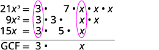</td>
</tr>
<tr valign="top">
<td data-valign="top" data-align="left">Multiply the factors.</td>
<td data-valign="top" data-align="left"></td>
</tr>
<tr valign="top">
<td data-valign="top" data-align="left" />
<td data-valign="top" data-align="left">The GCF of <math xmlns="http://www.w3.org/1998/Math/MathML"><mrow><mn>21</mn><msup><mi>x</mi><mn>3</mn></msup></mrow></math>, <math xmlns="http://www.w3.org/1998/Math/MathML"><mrow><mn>9</mn><msup><mi>x</mi><mn>2</mn></msup></mrow></math> and <math xmlns="http://www.w3.org/1998/Math/MathML"><mrow><mn>15</mn><mi>x</mi></mrow></math> is <math xmlns="http://www.w3.org/1998/Math/MathML"><mrow><mn>3</mn><mi>x</mi></mrow></math>.</td>
</tr>
</tbody></table>

Find the greatest common factor: <math xmlns="http://www.w3.org/1998/Math/MathML"><mrow><mn>25</mn><msup><mi>m</mi><mn>4</mn></msup><mo>,</mo><mn>35</mn><msup><mi>m</mi><mn>3</mn></msup><mo>,</mo><mn>20</mn><msup><mi>m</mi><mn>2</mn></msup><mo>.</mo></mrow></math>

<math xmlns="http://www.w3.org/1998/Math/MathML"><mrow><mn>5</mn><msup><mi>m</mi><mn>2</mn></msup></mrow></math>

Find the greatest common factor: <math xmlns="http://www.w3.org/1998/Math/MathML"><mrow><mn>14</mn><msup><mi>x</mi><mn>3</mn></msup><mo>,</mo><mn>70</mn><msup><mi>x</mi><mn>2</mn></msup><mo>,</mo><mn>105</mn><mi>x</mi><mo>.</mo></mrow></math>

<math xmlns="http://www.w3.org/1998/Math/MathML"><mrow><mn>7</mn><mi>x</mi></mrow></math>

### Factor the Greatest Common Factor from a Polynomial

It is sometimes useful to represent a number as a product of factors, for example, 12 as <math xmlns="http://www.w3.org/1998/Math/MathML"><mrow><mn>2</mn><mo>·</mo><mn>6</mn></mrow></math>

 or <math xmlns="http://www.w3.org/1998/Math/MathML"><mrow><mn>3</mn><mo>·</mo><mn>4</mn><mo>.</mo></mrow></math>

 In algebra, it can also be useful to represent a polynomial in factored form. We will start with a product, such as <math xmlns="http://www.w3.org/1998/Math/MathML"><mrow><mn>3</mn><msup><mi>x</mi><mn>2</mn></msup><mo>+</mo><mn>15</mn><mi>x</mi><mo>,</mo></mrow></math>

 and end with its factors, <math xmlns="http://www.w3.org/1998/Math/MathML"><mrow><mn>3</mn><mi>x</mi><mrow><mo>(</mo><mrow><mi>x</mi><mo>+</mo><mn>5</mn></mrow><mo>)</mo></mrow><mo>.</mo></mrow></math>

 To do this we apply the Distributive Property “in reverse.”

We state the Distributive Property here just as you saw it in earlier chapters and “in reverse.”

Distributive Property

If *a*, *b*, and *c* are real numbers, then

<math xmlns="http://www.w3.org/1998/Math/MathML"><mrow><mi>a</mi><mrow><mo>(</mo><mrow><mi>b</mi><mo>+</mo><mi>c</mi></mrow><mo>)</mo></mrow><mo>=</mo><mi>a</mi><mi>b</mi><mo>+</mo><mi>a</mi><mi>c</mi><mspace width="1em" /><mtext>and</mtext><mspace width="1em" /><mi>a</mi><mi>b</mi><mo>+</mo><mi>a</mi><mi>c</mi><mo>=</mo><mi>a</mi><mrow><mo>(</mo><mrow><mi>b</mi><mo>+</mo><mi>c</mi></mrow><mo>)</mo></mrow></mrow></math>

The form on the left is used to multiply. The form on the right is used to factor.

So how do you use the Distributive Property to factor a **polynomial**{: data-type="term" .no-emphasis}? You just find the GCF of all the terms and write the polynomial as a product!

How to Use the Distributive Property to factor a polynomial

Factor: <math xmlns="http://www.w3.org/1998/Math/MathML"><mrow><mn>8</mn><msup><mi>m</mi><mn>3</mn></msup><mo>−</mo><mn>12</mn><msup><mi>m</mi><mn>2</mn></msup><mi>n</mi><mo>+</mo><mn>20</mn><mi>m</mi><msup><mi>n</mi><mn>2</mn></msup><mo>.</mo></mrow></math>

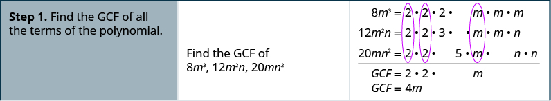

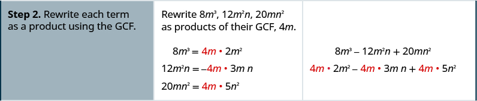

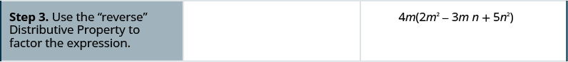

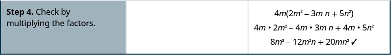

Factor: <math xmlns="http://www.w3.org/1998/Math/MathML"><mrow><mn>9</mn><mi>x</mi><msup><mi>y</mi><mn>2</mn></msup><mo>+</mo><mn>6</mn><msup><mi>x</mi><mn>2</mn></msup><msup><mi>y</mi><mn>2</mn></msup><mo>+</mo><mn>21</mn><msup><mi>y</mi><mn>3</mn></msup><mo>.</mo></mrow></math>

<math xmlns="http://www.w3.org/1998/Math/MathML"><mrow><mn>3</mn><msup><mi>y</mi><mn>2</mn></msup><mrow><mo>(</mo><mrow><mn>3</mn><mi>x</mi><mo>+</mo><mn>2</mn><msup><mi>x</mi><mn>2</mn></msup><mo>+</mo><mn>7</mn><mi>y</mi></mrow><mo>)</mo></mrow></mrow></math>

Factor: <math xmlns="http://www.w3.org/1998/Math/MathML"><mrow><mn>3</mn><msup><mi>p</mi><mn>3</mn></msup><mo>−</mo><mn>6</mn><msup><mi>p</mi><mn>2</mn></msup><mi>q</mi><mo>+</mo><mn>9</mn><mi>p</mi><msup><mi>q</mi><mn>3</mn></msup><mo>.</mo></mrow></math>

<math xmlns="http://www.w3.org/1998/Math/MathML"><mrow><mn>3</mn><mi>p</mi><mrow><mo>(</mo><mrow><msup><mi>p</mi><mn>2</mn></msup><mo>−</mo><mn>2</mn><mi>p</mi><mi>q</mi><mo>+</mo><mn>3</mn><msup><mi>q</mi><mn>2</mn></msup></mrow><mo>)</mo></mrow></mrow></math>

Factor the greatest common factor from a polynomial.

1.  Find the GCF of all the terms of the polynomial.
2.  Rewrite each term as a product using the GCF.
3.  Use the “reverse” Distributive Property to factor the expression.
4.  Check by multiplying the factors.
{: data-number-style="arabic" .stepwise}

Factor as a Noun and a Verb

We use “factor” as both a noun and a verb:

<math xmlns="http://www.w3.org/1998/Math/MathML"><mrow><mtable><mtr><mtd columnalign="left"><mtext>Noun:</mtext></mtd><mtd /><mtd /><mtd columnalign="left"><mspace width="8em" /><mtext>7 is a</mtext><mspace width="0.2em" /><mtext mathvariant="italics">factor</mtext><mspace width="0.2em" /><mtext>of 14</mtext></mtd></mtr><mtr><mtd columnalign="left"><mtext>Verb:</mtext></mtd><mtd /><mtd /><mtd columnalign="left"><mspace width="8em" /><mtext mathvariant="italics">factor</mtext><mspace width="0.2em" /><mtext>3 from</mtext><mspace width="0.2em" /><mn>3</mn><mi>a</mi><mo>+</mo><mn>3</mn></mtd></mtr></mtable></mrow></math>

Factor: <math xmlns="http://www.w3.org/1998/Math/MathML"><mrow><mn>5</mn><msup><mi>x</mi><mn>3</mn></msup><mo>−</mo><mn>25</mn><msup><mi>x</mi><mn>2</mn></msup><mo>.</mo></mrow></math>

<table class="unnumbered unstyled" summary="First find the GCF of 5 x cubed and 25 x squared. By factoring, bringing down the common factors and multiplying them, we get the GCF as 5 x squared. We rewrite the polynomial as 5 x squared times x minus 5 x squared times 5. Next we factor the GCF and rewrite as 5 x squared open parentheses x minus 5 close parentheses. Finally we check by multiplying the factors to get the original polynomial." data-label=""><tbody>
<tr valign="top">
<td colspan="2" data-valign="middle" data-align="left">Find the GCF of <math xmlns="http://www.w3.org/1998/Math/MathML"><mrow><mn>5</mn><msup><mi>x</mi><mn>3</mn></msup></mrow></math> and <math xmlns="http://www.w3.org/1998/Math/MathML"><mrow><mn>25</mn><msup><mi>x</mi><mn>2</mn></msup><mo>.</mo></mrow></math></td>
<td data-valign="middle" data-align="left">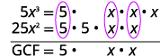</td>
</tr>
<tr valign="top">
<td data-valign="top" data-align="left" />
<td data-valign="top" data-align="left" />
<td data-valign="top" data-align="left"></td>
</tr>
<tr valign="top">
<td data-valign="top" data-align="left" />
<td data-valign="top" data-align="left" />
<td data-valign="top" data-align="left"></td>
</tr>
<tr valign="top">
<td data-valign="top" data-align="left">Rewrite each term.</td>
<td data-valign="top" data-align="left" />
<td data-valign="top" data-align="left"></td>
</tr>
<tr valign="top">
<td data-valign="top" data-align="left">Factor the GCF.</td>
<td data-valign="top" data-align="left" />
<td data-valign="top" data-align="left"></td>
</tr>
<tr valign="top">
<td data-valign="top" data-align="left">Check:

<math xmlns="http://www.w3.org/1998/Math/MathML"><mspace width="4em" /><mtable><mtr><mtd columnalign="center"><mn>5</mn><msup><mi>x</mi><mn>2</mn></msup><mo stretchy="false">(</mo><mi>x</mi><mo>−</mo><mn>5</mn><mo stretchy="false">)</mo></mtd></mtr><mtr><mtd columnalign="center"><mn>5</mn><msup><mi>x</mi><mn>2</mn></msup><mo>·</mo><mi>x</mi><mo>−</mo><mn>5</mn><msup><mi>x</mi><mn>2</mn></msup><mo>·</mo><mn>5</mn></mtd></mtr><mtr><mtd columnalign="center"><mn>5</mn><msup><mi>x</mi><mn>3</mn></msup><mo>−</mo><mn>25</mn><msup><mi>x</mi><mn>2</mn></msup><mo>✓</mo></mtd></mtr></mtable></math></td>
<td data-valign="top" data-align="left" />
<td data-valign="top" data-align="left" />
</tr>
</tbody></table>

Factor: <math xmlns="http://www.w3.org/1998/Math/MathML"><mrow><mn>2</mn><msup><mi>x</mi><mn>3</mn></msup><mo>+</mo><mn>12</mn><msup><mi>x</mi><mn>2</mn></msup><mo>.</mo></mrow></math>

<math xmlns="http://www.w3.org/1998/Math/MathML"><mrow><mn>2</mn><msup><mi>x</mi><mn>2</mn></msup><mrow><mo>(</mo><mrow><mi>x</mi><mo>+</mo><mn>6</mn></mrow><mo>)</mo></mrow></mrow></math>

Factor: <math xmlns="http://www.w3.org/1998/Math/MathML"><mrow><mn>6</mn><msup><mi>y</mi><mn>3</mn></msup><mo>−</mo><mn>15</mn><msup><mi>y</mi><mn>2</mn></msup><mo>.</mo></mrow></math>

<math xmlns="http://www.w3.org/1998/Math/MathML"><mrow><mn>3</mn><msup><mi>y</mi><mn>2</mn></msup><mrow><mo>(</mo><mrow><mn>2</mn><mi>y</mi><mo>−</mo><mn>5</mn></mrow><mo>)</mo></mrow></mrow></math>

Factor: <math xmlns="http://www.w3.org/1998/Math/MathML"><mrow><mn>8</mn><msup><mi>x</mi><mn>3</mn></msup><mi>y</mi><mo>−</mo><mn>10</mn><msup><mi>x</mi><mn>2</mn></msup><msup><mi>y</mi><mn>2</mn></msup><mo>+</mo><mn>12</mn><mi>x</mi><msup><mi>y</mi><mn>3</mn></msup><mo>.</mo></mrow></math>

<table class="unnumbered unstyled" summary="The GCF of 8 x cubed y minus 10 x squared y squared plus 12 x y cubed is 2xy. Rewriting each term using the GCF, we get 2xy times 4x squared minus 2xy times 5xy plus 2xy times 6 y squared. Factoring out the GCF, we get 2xy open parentheses 4 x squared minus 5xy plus 6 y squared. Finally, we check by multiplying the factors to get the original polynomial." data-label=""><tbody>
<tr valign="top">
<td data-valign="top" data-align="left">The GCF of <math xmlns="http://www.w3.org/1998/Math/MathML"><mrow><mn>8</mn><msup><mi>x</mi><mn>3</mn></msup><mi>y</mi><mo>,</mo><mn>−10</mn><msup><mi>x</mi><mn>2</mn></msup><msup><mi>y</mi><mn>2</mn></msup><mo>,</mo><mspace width="0.2em" /><mtext>and</mtext><mspace width="0.2em" /><mn>12</mn><mi>x</mi><msup><mi>y</mi><mn>3</mn></msup></mrow></math>
is <math xmlns="http://www.w3.org/1998/Math/MathML"><mrow><mn>2</mn><mi>x</mi><mi>y</mi><mo>.</mo></mrow></math></td>
<td data-valign="top" data-align="left">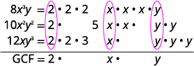</td>
</tr>
<tr valign="top">
<td data-valign="top" data-align="left" />
<td data-valign="top" data-align="left"></td>
</tr>
<tr valign="top">
   <td data-valign="top" data-align="left" />
<td data-valign="top" data-align="center">     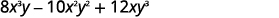</td>
</tr>
<tr valign="top">
<td data-valign="top" data-align="left">Rewrite each term using the GCF, <math xmlns="http://www.w3.org/1998/Math/MathML"><mrow><mn>2</mn><mi>x</mi><mi>y</mi><mo>.</mo></mrow></math>    </td>
<td data-valign="top" data-align="center">  </td>
</tr>
<tr valign="top">
<td data-valign="top" data-align="left">Factor the GCF.</td>
<td data-valign="top" data-align="center">     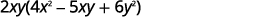</td>
</tr>
<tr valign="top">
<td data-valign="top" data-align="left">Check:

<math xmlns="http://www.w3.org/1998/Math/MathML"><mrow><mspace width="4em" /><mtable><mtr><mtd columnalign="center"><mn>2</mn><mi>x</mi><mi>y</mi><mrow><mo>(</mo><mrow><mn>4</mn><msup><mi>x</mi><mn>2</mn></msup><mo>−</mo><mn>5</mn><mi>x</mi><mi>y</mi><mo>+</mo><mn>6</mn><msup><mi>y</mi><mn>2</mn></msup></mrow><mo>)</mo></mrow></mtd></mtr><mtr><mtd columnalign="center"><mn>2</mn><mi>x</mi><mi>y</mi><mo>·</mo><mn>4</mn><msup><mi>x</mi><mn>2</mn></msup><mo>−</mo><mn>2</mn><mi>x</mi><mi>y</mi><mo>·</mo><mn>5</mn><mi>x</mi><mi>y</mi><mo>+</mo><mn>2</mn><mi>x</mi><mi>y</mi><mo>·</mo><mn>6</mn><msup><mi>y</mi><mn>2</mn></msup></mtd></mtr><mtr><mtd columnalign="center"><mn>8</mn><msup><mi>x</mi><mn>3</mn></msup><mi>y</mi><mo>−</mo><mn>10</mn><msup><mi>x</mi><mn>2</mn></msup><msup><mi>y</mi><mn>2</mn></msup><mo>+</mo><mn>12</mn><mi>x</mi><msup><mi>y</mi><mn>3</mn></msup><mo>✓</mo></mtd></mtr></mtable></mrow></math></td>
<td data-valign="top" data-align="left" />
</tr>
</tbody></table>

Factor: <math xmlns="http://www.w3.org/1998/Math/MathML"><mrow><mn>15</mn><msup><mi>x</mi><mn>3</mn></msup><mi>y</mi><mo>−</mo><mn>3</mn><msup><mi>x</mi><mn>2</mn></msup><msup><mi>y</mi><mn>2</mn></msup><mo>+</mo><mn>6</mn><mi>x</mi><msup><mi>y</mi><mn>3</mn></msup><mo>.</mo></mrow></math>

<math xmlns="http://www.w3.org/1998/Math/MathML"><mrow><mn>3</mn><mi>x</mi><mi>y</mi><mrow><mo>(</mo><mrow><mn>5</mn><msup><mi>x</mi><mn>2</mn></msup><mo>−</mo><mi>x</mi><mi>y</mi><mo>+</mo><mn>2</mn><msup><mi>y</mi><mn>2</mn></msup></mrow><mo>)</mo></mrow></mrow></math>

Factor: <math xmlns="http://www.w3.org/1998/Math/MathML"><mrow><mn>8</mn><msup><mi>a</mi><mn>3</mn></msup><mi>b</mi><mo>+</mo><mn>2</mn><msup><mi>a</mi><mn>2</mn></msup><msup><mi>b</mi><mn>2</mn></msup><mo>−</mo><mn>6</mn><mi>a</mi><msup><mi>b</mi><mn>3</mn></msup><mo>.</mo></mrow></math>

<math xmlns="http://www.w3.org/1998/Math/MathML"><mrow><mn>2</mn><mi>a</mi><mi>b</mi><mrow><mo>(</mo><mrow><mn>4</mn><msup><mi>a</mi><mn>2</mn></msup><mo>+</mo><mi>a</mi><mi>b</mi><mo>−</mo><mn>3</mn><msup><mi>b</mi><mn>2</mn></msup></mrow><mo>)</mo></mrow></mrow></math>

When the leading coefficient is negative, we factor the negative out as part of the GCF.

Factor: <math xmlns="http://www.w3.org/1998/Math/MathML"><mrow><mn>−4</mn><msup><mi>a</mi><mn>3</mn></msup><mo>+</mo><mn>36</mn><msup><mi>a</mi><mn>2</mn></msup><mo>−</mo><mn>8</mn><mi>a</mi><mo>.</mo></mrow></math>

The leading coefficient is negative, so the GCF will be negative.

<table class="unnumbered unstyled" summary="We rewrite each term in the polynomial using the GCF minus 4a. So, we get minus 4a times a squared minus open parentheses minus 4 a close parentheses times 9 a plus open parentheses minus 4 a close parentheses times 2. Factoring the GCF, we get minus 4 a open parentheses a squared minus 9a plus 2 close parentheses. Finally, we check by multiplying the factors to get the original polynomial." data-label=""><tbody>
<tr valign="top">
<td data-valign="top" data-align="left" />
<td data-valign="top" data-align="center"></td>
</tr>
<tr valign="top">
<td data-valign="top" data-align="left">Rewrite each term using the GCF, <math xmlns="http://www.w3.org/1998/Math/MathML"><mrow><mn>−4</mn><mi>a</mi><mo>.</mo></mrow></math></td>
<td data-valign="top" data-align="center">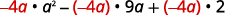</td>
</tr>
<tr valign="top">
<td data-valign="top" data-align="left">Factor the GCF.</td>
<td data-valign="top" data-align="center"></td>
</tr>
<tr valign="top">
<td data-valign="top" data-align="left">Check:

<math xmlns="http://www.w3.org/1998/Math/MathML"><mrow><mspace width="4em" /><mtable><mtr><mtd columnalign="center"><mn>−4</mn><mi>a</mi><mrow><mo>(</mo><mrow><msup><mi>a</mi><mn>2</mn></msup><mo>−</mo><mn>9</mn><mi>a</mi><mo>+</mo><mn>2</mn></mrow><mo>)</mo></mrow></mtd></mtr><mtr><mtd columnalign="center"><mn>−4</mn><mi>a</mi><mo>·</mo><msup><mi>a</mi><mn>2</mn></msup><mo>−</mo><mrow><mo>(</mo><mrow><mn>−4</mn><mi>a</mi></mrow><mo>)</mo></mrow><mo>·</mo><mn>9</mn><mi>a</mi><mo>+</mo><mrow><mo>(</mo><mrow><mn>−4</mn><mi>a</mi></mrow><mo>)</mo></mrow><mo>·</mo><mn>2</mn></mtd></mtr><mtr><mtd columnalign="center"><mn>−4</mn><msup><mi>a</mi><mn>3</mn></msup><mo>+</mo><mn>36</mn><msup><mi>a</mi><mn>2</mn></msup><mo>−</mo><mn>8</mn><mi>a</mi><mo>✓</mo></mtd></mtr></mtable></mrow></math></td>
<td data-valign="top" data-align="left" />
</tr>
</tbody></table>

Factor: <math xmlns="http://www.w3.org/1998/Math/MathML"><mrow><mn>−4</mn><msup><mi>b</mi><mn>3</mn></msup><mo>+</mo><mn>16</mn><msup><mi>b</mi><mn>2</mn></msup><mo>−</mo><mn>8</mn><mi>b</mi><mo>.</mo></mrow></math>

<math xmlns="http://www.w3.org/1998/Math/MathML"><mrow><mn>−4</mn><mi>b</mi><mrow><mo>(</mo><mrow><msup><mi>b</mi><mn>2</mn></msup><mo>−</mo><mn>4</mn><mi>b</mi><mo>+</mo><mn>2</mn></mrow><mo>)</mo></mrow></mrow></math>

Factor: <math xmlns="http://www.w3.org/1998/Math/MathML"><mrow><mn>−7</mn><msup><mi>a</mi><mn>3</mn></msup><mo>+</mo><mn>21</mn><msup><mi>a</mi><mn>2</mn></msup><mo>−</mo><mn>14</mn><mi>a</mi><mo>.</mo></mrow></math>

<math xmlns="http://www.w3.org/1998/Math/MathML"><mrow><mn>−7</mn><mi>a</mi><mrow><mo>(</mo><mrow><msup><mi>a</mi><mn>2</mn></msup><mo>−</mo><mn>3</mn><mi>a</mi><mo>+</mo><mn>2</mn></mrow><mo>)</mo></mrow></mrow></math>

So far our greatest common factors have been monomials. In the next example, the greatest common factor is a binomial.

Factor: <math xmlns="http://www.w3.org/1998/Math/MathML"><mrow><mn>3</mn><mi>y</mi><mrow><mo>(</mo><mrow><mi>y</mi><mo>+</mo><mn>7</mn></mrow><mo>)</mo></mrow><mo>−</mo><mn>4</mn><mrow><mo>(</mo><mrow><mi>y</mi><mo>+</mo><mn>7</mn></mrow><mo>)</mo></mrow><mo>.</mo></mrow></math>

The GCF is the binomial <math xmlns="http://www.w3.org/1998/Math/MathML"><mrow><mi>y</mi><mo>+</mo><mn>7</mn><mo>.</mo></mrow></math>

|  | 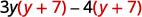 |
{: valign="top"}| Factor the GCF, <math xmlns="http://www.w3.org/1998/Math/MathML"><mrow><mrow><mo>(</mo><mrow><mi>y</mi><mo>+</mo><mn>7</mn></mrow><mo>)</mo></mrow><mo>.</mo></mrow></math>

 |  |
{: valign="top"}| Check on your own by multiplying.    |  |
{: valign="top"}{: .unnumbered .unstyled summary="The polynomial is 3y open parentheses y plus 7 close parentheses minus 4 open parentheses y plus 7 close parentheses. Factor the GCF open parentheses y plus 7 close parentheses. We get open parentheses y plus 7 close parentheses open parentheses 3y minus 4 close parentheses. Check on your own by multiplying." data-label=""}

Factor: <math xmlns="http://www.w3.org/1998/Math/MathML"><mrow><mn>4</mn><mi>m</mi><mrow><mo>(</mo><mrow><mi>m</mi><mo>+</mo><mn>3</mn></mrow><mo>)</mo></mrow><mo>−</mo><mn>7</mn><mrow><mo>(</mo><mrow><mi>m</mi><mo>+</mo><mn>3</mn></mrow><mo>)</mo></mrow><mo>.</mo></mrow></math>

<math xmlns="http://www.w3.org/1998/Math/MathML"><mrow><mrow><mo>(</mo><mrow><mi>m</mi><mo>+</mo><mn>3</mn></mrow><mo>)</mo></mrow><mrow><mo>(</mo><mrow><mn>4</mn><mi>m</mi><mo>−</mo><mn>7</mn></mrow><mo>)</mo></mrow></mrow></math>

Factor: <math xmlns="http://www.w3.org/1998/Math/MathML"><mrow><mn>8</mn><mi>n</mi><mrow><mo>(</mo><mrow><mi>n</mi><mo>−</mo><mn>4</mn></mrow><mo>)</mo></mrow><mo>+</mo><mn>5</mn><mrow><mo>(</mo><mrow><mi>n</mi><mo>−</mo><mn>4</mn></mrow><mo>)</mo></mrow><mo>.</mo></mrow></math>

<math xmlns="http://www.w3.org/1998/Math/MathML"><mrow><mrow><mo>(</mo><mrow><mi>n</mi><mo>−</mo><mn>4</mn></mrow><mo>)</mo></mrow><mrow><mo>(</mo><mrow><mn>8</mn><mi>n</mi><mo>+</mo><mn>5</mn></mrow><mo>)</mo></mrow></mrow></math>

### Factor by Grouping

Sometimes there is no common factor of all the terms of a polynomial. When there are four terms we separate the polynomial into two parts with two terms in each part. Then look for the **GCF**{: data-type="term" .no-emphasis} in each part. If the polynomial can be factored, you will find a common factor emerges from both parts. Not all polynomials can be factored. Just like some numbers are **prime**{: data-type="term" .no-emphasis}, some polynomials are prime.

How to Factor a Polynomial by Grouping

Factor by grouping: <math xmlns="http://www.w3.org/1998/Math/MathML"><mrow><mi>x</mi><mi>y</mi><mo>+</mo><mn>3</mn><mi>y</mi><mo>+</mo><mn>2</mn><mi>x</mi><mo>+</mo><mn>6</mn><mo>.</mo></mrow></math>

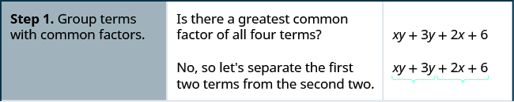

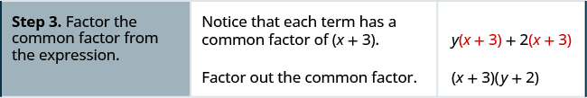

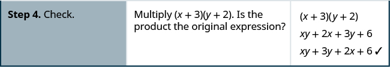

Factor by grouping: <math xmlns="http://www.w3.org/1998/Math/MathML"><mrow><mi>x</mi><mi>y</mi><mo>+</mo><mn>8</mn><mi>y</mi><mo>+</mo><mn>3</mn><mi>x</mi><mo>+</mo><mn>24</mn><mo>.</mo></mrow></math>

<math xmlns="http://www.w3.org/1998/Math/MathML"><mrow><mrow><mo>(</mo><mrow><mi>x</mi><mo>+</mo><mn>8</mn></mrow><mo>)</mo></mrow><mrow><mo>(</mo><mrow><mi>y</mi><mo>+</mo><mn>3</mn></mrow><mo>)</mo></mrow></mrow></math>

Factor by grouping: <math xmlns="http://www.w3.org/1998/Math/MathML"><mrow><mi>a</mi><mi>b</mi><mo>+</mo><mn>7</mn><mi>b</mi><mo>+</mo><mn>8</mn><mi>a</mi><mo>+</mo><mn>56</mn><mo>.</mo></mrow></math>

<math xmlns="http://www.w3.org/1998/Math/MathML"><mrow><mrow><mo>(</mo><mrow><mi>a</mi><mo>+</mo><mn>7</mn></mrow><mo>)</mo></mrow><mrow><mo>(</mo><mrow><mi>b</mi><mo>+</mo><mn>8</mn></mrow><mo>)</mo></mrow></mrow></math>

Factor by grouping.

1.  Group terms with common factors.
2.  Factor out the common factor in each group.
3.  Factor the common factor from the expression.
4.  Check by multiplying the factors.
{: data-number-style="arabic" .stepwise}

Factor by grouping: ⓐ <math xmlns="http://www.w3.org/1998/Math/MathML"><mrow><msup><mi>x</mi><mn>2</mn></msup><mo>+</mo><mn>3</mn><mi>x</mi><mo>−</mo><mn>2</mn><mi>x</mi><mo>−</mo><mn>6</mn></mrow></math>

 ⓑ <math xmlns="http://www.w3.org/1998/Math/MathML"><mrow><mn>6</mn><msup><mi>x</mi><mn>2</mn></msup><mo>−</mo><mn>3</mn><mi>x</mi><mo>−</mo><mn>4</mn><mi>x</mi><mo>+</mo><mn>2</mn><mo>.</mo></mrow></math>

ⓐ* * *
{: data-type="newline"}

 <math xmlns="http://www.w3.org/1998/Math/MathML"><mrow><mtable><mtr><mtd columnalign="left"><mtext>There is no GCF in all four terms.</mtext></mtd><mtd /><mtd /><mtd /><mtd /><mtd columnalign="left"><msup><mi>x</mi><mn>2</mn></msup><mo>+</mo><mn>3</mn><mi>x</mi><mo>−</mo><mn>2</mn><mi>x</mi><mo>−</mo><mn>6</mn></mtd></mtr><mtr><mtd columnalign="left"><mtext>Separate into two parts.</mtext></mtd><mtd /><mtd /><mtd /><mtd /><mtd columnalign="left"><mrow><msup><mi>x</mi><mn>2</mn></msup><mo>+</mo><mn>3</mn><mi>x</mi></mrow><mspace width="1.5em" /><mrow><mn>−2</mn><mi>x</mi><mo>−</mo><mn>6</mn></mrow></mtd></mtr><mtr><mtd columnalign="left"><mtable><mtr><mtd columnalign="left"><mtext>Factor the GCF from both parts. Be careful</mtext></mtd></mtr><mtr><mtd columnalign="left"><mtext>with the signs when factoring the GCF from</mtext></mtd></mtr><mtr><mtd columnalign="left"><mtext>the last two terms.</mtext></mtd></mtr></mtable></mtd><mtd /><mtd /><mtd /><mtd /><mtd columnalign="left"><mi>x</mi><mrow><mo>(</mo><mrow><mi>x</mi><mo>+</mo><mn>3</mn></mrow><mo>)</mo></mrow><mo>−</mo><mn>2</mn><mrow><mo>(</mo><mrow><mi>x</mi><mo>+</mo><mn>3</mn></mrow><mo>)</mo></mrow></mtd></mtr><mtr><mtd columnalign="left"><mtext>Factor out the common factor.</mtext></mtd><mtd /><mtd /><mtd /><mtd /><mtd columnalign="left"><mrow><mo>(</mo><mrow><mi>x</mi><mo>+</mo><mn>3</mn></mrow><mo>)</mo></mrow><mrow><mo>(</mo><mrow><mi>x</mi><mo>−</mo><mn>2</mn></mrow><mo>)</mo></mrow></mtd></mtr><mtr><mtd columnalign="left"><mtext>Check on your own by multiplying.</mtext></mtd><mtd /><mtd /><mtd /><mtd /><mtd /></mtr></mtable></mrow></math>

* * *
{: data-type="newline"}

* * *
{: data-type="newline"}

 ⓑ* * *
{: data-type="newline"}

 <math xmlns="http://www.w3.org/1998/Math/MathML"><mrow><mtable><mtr><mtd columnalign="left"><mtext>There is no GCF in all four terms.</mtext></mtd><mtd /><mtd /><mtd /><mtd /><mtd columnalign="left"><mspace width="3em" /><mn>6</mn><msup><mi>x</mi><mn>2</mn></msup><mo>−</mo><mn>3</mn><mi>x</mi><mo>−</mo><mn>4</mn><mi>x</mi><mo>+</mo><mn>2</mn></mtd></mtr><mtr><mtd columnalign="left"><mtext>Separate into two parts.</mtext></mtd><mtd /><mtd /><mtd /><mtd /><mtd columnalign="left"><mspace width="3em" /><mrow><mn>6</mn><msup><mi>x</mi><mn>2</mn></msup><mo>−</mo><mn>3</mn><mi>x</mi></mrow><mspace width="1.5em" /><mrow><mn>−4</mn><mi>x</mi><mo>+</mo><mn>2</mn></mrow></mtd></mtr><mtr><mtd columnalign="left"><mtext>Factor the GCF from both parts.</mtext></mtd><mtd /><mtd /><mtd /><mtd /><mtd columnalign="left"><mspace width="3em" /><mn>3</mn><mi>x</mi><mrow><mo>(</mo><mrow><mn>2</mn><mi>x</mi><mo>−</mo><mn>1</mn></mrow><mo>)</mo></mrow><mo>−</mo><mn>2</mn><mrow><mo>(</mo><mrow><mn>2</mn><mi>x</mi><mo>−</mo><mn>1</mn></mrow><mo>)</mo></mrow></mtd></mtr><mtr><mtd columnalign="left"><mtext>Factor out the common factor.</mtext></mtd><mtd /><mtd /><mtd /><mtd /><mtd columnalign="left"><mspace width="3em" /><mrow><mo>(</mo><mrow><mn>2</mn><mi>x</mi><mo>−</mo><mn>1</mn></mrow><mo>)</mo></mrow><mrow><mo>(</mo><mrow><mn>3</mn><mi>x</mi><mo>−</mo><mn>2</mn></mrow><mo>)</mo></mrow></mtd></mtr><mtr><mtd columnalign="left"><mtext>Check on your own by multiplying.</mtext></mtd><mtd /><mtd /><mtd /><mtd /><mtd /></mtr></mtable></mrow></math>

Factor by grouping: ⓐ <math xmlns="http://www.w3.org/1998/Math/MathML"><mrow><msup><mi>x</mi><mn>2</mn></msup><mo>+</mo><mn>2</mn><mi>x</mi><mo>−</mo><mn>5</mn><mi>x</mi><mo>−</mo><mn>10</mn></mrow></math>

 ⓑ <math xmlns="http://www.w3.org/1998/Math/MathML"><mrow><mn>20</mn><msup><mi>x</mi><mn>2</mn></msup><mo>−</mo><mn>16</mn><mi>x</mi><mo>−</mo><mn>15</mn><mi>x</mi><mo>+</mo><mn>12</mn><mo>.</mo></mrow></math>

ⓐ <math xmlns="http://www.w3.org/1998/Math/MathML"><mrow><mrow><mo>(</mo><mrow><mi>x</mi><mo>−</mo><mn>5</mn></mrow><mo>)</mo></mrow><mrow><mo>(</mo><mrow><mi>x</mi><mo>+</mo><mn>2</mn></mrow><mo>)</mo></mrow></mrow></math>

* * *
{: data-type="newline"}

ⓑ <math xmlns="http://www.w3.org/1998/Math/MathML"><mrow><mrow><mo>(</mo><mrow><mn>5</mn><mi>x</mi><mo>−</mo><mn>4</mn></mrow><mo>)</mo></mrow><mrow><mo>(</mo><mrow><mn>4</mn><mi>x</mi><mo>−</mo><mn>3</mn></mrow><mo>)</mo></mrow></mrow></math>

Factor by grouping: ⓐ <math xmlns="http://www.w3.org/1998/Math/MathML"><mrow><msup><mi>y</mi><mn>2</mn></msup><mo>+</mo><mn>4</mn><mi>y</mi><mo>−</mo><mn>7</mn><mi>y</mi><mo>−</mo><mn>28</mn></mrow></math>

 ⓑ <math xmlns="http://www.w3.org/1998/Math/MathML"><mrow><mn>42</mn><msup><mi>m</mi><mn>2</mn></msup><mo>−</mo><mn>18</mn><mi>m</mi><mo>−</mo><mn>35</mn><mi>m</mi><mo>+</mo><mn>15</mn><mo>.</mo></mrow></math>

ⓐ <math xmlns="http://www.w3.org/1998/Math/MathML"><mrow><mrow><mo>(</mo><mrow><mi>y</mi><mo>+</mo><mn>4</mn></mrow><mo>)</mo></mrow><mrow><mo>(</mo><mrow><mi>y</mi><mo>−</mo><mn>7</mn></mrow><mo>)</mo></mrow></mrow></math>

* * *
{: data-type="newline"}

ⓑ <math xmlns="http://www.w3.org/1998/Math/MathML"><mrow><mrow><mo>(</mo><mrow><mn>7</mn><mi>m</mi><mo>−</mo><mn>3</mn></mrow><mo>)</mo></mrow><mrow><mo>(</mo><mrow><mn>6</mn><mi>m</mi><mo>−</mo><mn>5</mn></mrow><mo>)</mo></mrow></mrow></math>

### Key Concepts

* **How to find the greatest common factor (GCF) of two expressions.**
  1.  Factor each coefficient into primes. Write all variables with exponents in expanded form.
  2.  List all factors—matching common factors in a column. In each column, circle the common factors.
  3.  Bring down the common factors that all expressions share.
  4.  Multiply the factors.
  {: data-number-style="arabic" .stepwise}

* **Distributive Property:** If *a*, *b*, and *c* are real numbers, then
  * * *
  {: data-type="newline"}
  
  

  <math xmlns="http://www.w3.org/1998/Math/MathML"><mrow><mi>a</mi><mrow><mo>(</mo><mrow><mi>b</mi><mo>+</mo><mi>c</mi></mrow><mo>)</mo></mrow><mo>=</mo><mi>a</mi><mi>b</mi><mo>+</mo><mi>a</mi><mi>c</mi><mspace width="1em" /><mtext>and</mtext><mspace width="1em" /><mi>a</mi><mi>b</mi><mo>+</mo><mi>a</mi><mi>c</mi><mo>=</mo><mi>a</mi><mrow><mo>(</mo><mrow><mi>b</mi><mo>+</mo><mi>c</mi></mrow><mo>)</mo></mrow></mrow></math>
  

  
  * * *
  {: data-type="newline"}
  
  The form on the left is used to multiply. The form on the right is used to factor.
* **How to factor the greatest common factor from a polynomial.**
  1.  Find the GCF of all the terms of the polynomial.
  2.  Rewrite each term as a product using the GCF.
  3.  Use the “reverse” Distributive Property to factor the expression.
  4.  Check by multiplying the factors.
  {: data-number-style="arabic" .stepwise}

* **Factor as a Noun and a Verb:** We use “factor” as both a noun and a verb.
  * * *
  {: data-type="newline"}
  
  

  <math xmlns="http://www.w3.org/1998/Math/MathML"><mrow><mtable><mtr><mtd columnalign="left"><mtext>Noun:</mtext></mtd><mtd /><mtd /><mtd columnalign="left"><mtext>7 is a</mtext><mspace width="0.2em" /><mtext mathvariant="italics">factor</mtext><mspace width="0.2em" /><mtext>of 14</mtext></mtd></mtr><mtr><mtd columnalign="left"><mtext>Verb:</mtext></mtd><mtd /><mtd /><mtd columnalign="left"><mtext mathvariant="italics">factor</mtext><mspace width="0.2em" /><mtext>3 from</mtext><mspace width="0.2em" /><mn>3</mn><mi>a</mi><mo>+</mo><mn>3</mn></mtd></mtr></mtable></mrow></math>
  

* **How to factor by grouping.**
  1.  Group terms with common factors.
  2.  Factor out the common factor in each group.
  3.  Factor the common factor from the expression.
  4.  Check by multiplying the factors.
  {: data-number-style="arabic" .stepwise}
{: data-bullet-style="bullet"}

<section data-depth="1" class="section-exercises" markdown="1">
#### Practice Makes Perfect

**Find the Greatest Common Factor of Two or More Expressions**

In the following exercises, find the greatest common factor.

<math xmlns="http://www.w3.org/1998/Math/MathML"><mrow><mn>10</mn><msup><mi>p</mi><mn>3</mn></msup><mi>q</mi><mo>,</mo><mn>12</mn><mi>p</mi><msup><mi>q</mi><mn>2</mn></msup></mrow></math>

<math xmlns="http://www.w3.org/1998/Math/MathML"><mrow><mn>2</mn><mi>p</mi><mi>q</mi></mrow></math>

<math xmlns="http://www.w3.org/1998/Math/MathML"><mrow><mn>8</mn><msup><mi>a</mi><mn>2</mn></msup><msup><mi>b</mi><mn>3</mn></msup><mo>,</mo><mn>10</mn><mi>a</mi><msup><mi>b</mi><mn>2</mn></msup></mrow></math>

<math xmlns="http://www.w3.org/1998/Math/MathML"><mrow><mn>12</mn><msup><mi>m</mi><mn>2</mn></msup><msup><mi>n</mi><mn>3</mn></msup><mo>,</mo><mn>30</mn><msup><mi>m</mi><mn>5</mn></msup><msup><mi>n</mi><mn>3</mn></msup></mrow></math>

<math xmlns="http://www.w3.org/1998/Math/MathML"><mrow><mn>6</mn><msup><mi>m</mi><mn>2</mn></msup><msup><mi>n</mi><mn>3</mn></msup></mrow></math>

<math xmlns="http://www.w3.org/1998/Math/MathML"><mrow><mn>28</mn><msup><mi>x</mi><mn>2</mn></msup><msup><mi>y</mi><mn>4</mn></msup><mo>,</mo><mn>42</mn><msup><mi>x</mi><mn>4</mn></msup><msup><mi>y</mi><mn>4</mn></msup></mrow></math>

<math xmlns="http://www.w3.org/1998/Math/MathML"><mrow><mn>10</mn><msup><mi>a</mi><mn>3</mn></msup><mo>,</mo><mn>12</mn><msup><mi>a</mi><mn>2</mn></msup><mo>,</mo><mn>14</mn><mi>a</mi></mrow></math>

<math xmlns="http://www.w3.org/1998/Math/MathML"><mrow><mn>2</mn><mi>a</mi></mrow></math>

<math xmlns="http://www.w3.org/1998/Math/MathML"><mrow><mn>20</mn><msup><mi>y</mi><mn>3</mn></msup><mo>,</mo><mn>28</mn><msup><mi>y</mi><mn>2</mn></msup><mo>,</mo><mn>40</mn><mi>y</mi></mrow></math>

<math xmlns="http://www.w3.org/1998/Math/MathML"><mrow><mn>35</mn><msup><mi>x</mi><mn>3</mn></msup><msup><mi>y</mi><mn>2</mn></msup><mo>,</mo><mn>10</mn><msup><mi>x</mi><mn>4</mn></msup><mi>y</mi><mo>,</mo><mn>5</mn><msup><mi>x</mi><mn>5</mn></msup><msup><mi>y</mi><mn>3</mn></msup></mrow></math>

<math xmlns="http://www.w3.org/1998/Math/MathML"><mrow><mn>5</mn><msup><mi>x</mi><mn>3</mn></msup><mi>y</mi></mrow></math>

<math xmlns="http://www.w3.org/1998/Math/MathML"><mrow><mn>27</mn><msup><mi>p</mi><mn>2</mn></msup><msup><mi>q</mi><mn>3</mn></msup><mo>,</mo><mn>45</mn><msup><mi>p</mi><mn>3</mn></msup><msup><mi>q</mi><mn>4</mn></msup><mo>,</mo><mn>9</mn><msup><mi>p</mi><mn>4</mn></msup><msup><mi>q</mi><mn>3</mn></msup></mrow></math>

**Factor the Greatest Common Factor from a Polynomial**

In the following exercises, factor the greatest common factor from each polynomial.

<math xmlns="http://www.w3.org/1998/Math/MathML"><mrow><mn>6</mn><mi>m</mi><mo>+</mo><mn>9</mn></mrow></math>

<math xmlns="http://www.w3.org/1998/Math/MathML"><mrow><mn>3</mn><mrow><mo>(</mo><mrow><mn>2</mn><mi>m</mi><mo>+</mo><mn>3</mn></mrow><mo>)</mo></mrow></mrow></math>

<math xmlns="http://www.w3.org/1998/Math/MathML"><mrow><mn>14</mn><mi>p</mi><mo>+</mo><mn>35</mn></mrow></math>

<math xmlns="http://www.w3.org/1998/Math/MathML"><mrow><mn>9</mn><mi>n</mi><mo>−</mo><mn>63</mn></mrow></math>

<math xmlns="http://www.w3.org/1998/Math/MathML"><mrow><mn>9</mn><mrow><mo>(</mo><mrow><mi>n</mi><mo>−</mo><mn>7</mn></mrow><mo>)</mo></mrow></mrow></math>

<math xmlns="http://www.w3.org/1998/Math/MathML"><mrow><mn>45</mn><mi>b</mi><mo>−</mo><mn>18</mn></mrow></math>

<math xmlns="http://www.w3.org/1998/Math/MathML"><mrow><mn>3</mn><msup><mi>x</mi><mn>2</mn></msup><mo>+</mo><mn>6</mn><mi>x</mi><mo>−</mo><mn>9</mn></mrow></math>

<math xmlns="http://www.w3.org/1998/Math/MathML"><mrow><mn>3</mn><mo stretchy="false">(</mo><msup><mi>x</mi><mn>2</mn></msup><mo>+</mo><mn>2</mn><mi>x</mi><mo>−</mo><mn>3</mn><mo stretchy="false">)</mo></mrow></math>

<math xmlns="http://www.w3.org/1998/Math/MathML"><mrow><mn>4</mn><msup><mi>y</mi><mn>2</mn></msup><mo>+</mo><mn>8</mn><mi>y</mi><mo>−</mo><mn>4</mn></mrow></math>

<math xmlns="http://www.w3.org/1998/Math/MathML"><mrow><mn>8</mn><msup><mi>p</mi><mn>2</mn></msup><mo>+</mo><mn>4</mn><mi>p</mi><mo>+</mo><mn>2</mn></mrow></math>

<math xmlns="http://www.w3.org/1998/Math/MathML"><mrow><mn>2</mn><mo stretchy="false">(</mo><msup><mi>p</mi><mn>2</mn></msup><mo>+</mo><mn>4</mn><mi>p</mi><mo>+</mo><mn>1</mn><mo stretchy="false">)</mo></mrow></math>

<math xmlns="http://www.w3.org/1998/Math/MathML"><mrow><mn>10</mn><msup><mi>q</mi><mn>2</mn></msup><mo>+</mo><mn>14</mn><mi>q</mi><mo>+</mo><mn>20</mn></mrow></math>

<math xmlns="http://www.w3.org/1998/Math/MathML"><mrow><mn>8</mn><msup><mi>y</mi><mn>3</mn></msup><mo>+</mo><mn>16</mn><msup><mi>y</mi><mn>2</mn></msup></mrow></math>

<math xmlns="http://www.w3.org/1998/Math/MathML"><mrow><mn>8</mn><msup><mi>y</mi><mn>2</mn></msup><mo stretchy="false">(</mo><mi>y</mi><mo>+</mo><mn>2</mn><mo stretchy="false">)</mo></mrow></math>

<math xmlns="http://www.w3.org/1998/Math/MathML"><mrow><mn>12</mn><msup><mi>x</mi><mn>3</mn></msup><mo>−</mo><mn>10</mn><mi>x</mi></mrow></math>

<math xmlns="http://www.w3.org/1998/Math/MathML"><mrow><mn>5</mn><msup><mi>x</mi><mn>3</mn></msup><mo>−</mo><mn>15</mn><msup><mi>x</mi><mn>2</mn></msup><mo>+</mo><mn>20</mn><mi>x</mi></mrow></math>

<math xmlns="http://www.w3.org/1998/Math/MathML"><mrow><mn>5</mn><mi>x</mi><mo stretchy="false">(</mo><msup><mi>x</mi><mn>2</mn></msup><mo>−</mo><mn>3</mn><mi>x</mi><mo>+</mo><mn>4</mn><mo stretchy="false">)</mo></mrow></math>

<math xmlns="http://www.w3.org/1998/Math/MathML"><mrow><mn>8</mn><msup><mi>m</mi><mn>2</mn></msup><mo>−</mo><mn>40</mn><mi>m</mi><mo>+</mo><mn>16</mn></mrow></math>

<math xmlns="http://www.w3.org/1998/Math/MathML"><mrow><mn>24</mn><msup><mi>x</mi><mn>3</mn></msup><mo>−</mo><mn>12</mn><msup><mi>x</mi><mn>2</mn></msup><mo>+</mo><mn>15</mn><mi>x</mi></mrow></math>

<math xmlns="http://www.w3.org/1998/Math/MathML"><mrow><mn>3</mn><mi>x</mi><mrow><mo>(</mo><mrow><mn>8</mn><msup><mi>x</mi><mn>2</mn></msup><mo>−</mo><mn>4</mn><mi>x</mi><mo>+</mo><mn>5</mn></mrow><mo>)</mo></mrow></mrow></math>

<math xmlns="http://www.w3.org/1998/Math/MathML"><mrow><mn>24</mn><msup><mi>y</mi><mn>3</mn></msup><mo>−</mo><mn>18</mn><msup><mi>y</mi><mn>2</mn></msup><mo>−</mo><mn>30</mn><mi>y</mi></mrow></math>

<math xmlns="http://www.w3.org/1998/Math/MathML"><mrow><mn>12</mn><mi>x</mi><msup><mi>y</mi><mn>2</mn></msup><mo>+</mo><mn>18</mn><msup><mi>x</mi><mn>2</mn></msup><msup><mi>y</mi><mn>2</mn></msup><mo>−</mo><mn>30</mn><msup><mi>y</mi><mn>3</mn></msup></mrow></math>

<math xmlns="http://www.w3.org/1998/Math/MathML"><mrow><mn>6</mn><msup><mi>y</mi><mn>2</mn></msup><mo stretchy="false">(</mo><mn>2</mn><mi>x</mi><mo>+</mo><mn>3</mn><msup><mi>x</mi><mn>2</mn></msup><mo>−</mo><mn>5</mn><mi>y</mi><mo stretchy="false">)</mo></mrow></math>

<math xmlns="http://www.w3.org/1998/Math/MathML"><mrow><mn>21</mn><mi>p</mi><msup><mi>q</mi><mn>2</mn></msup><mo>+</mo><mn>35</mn><msup><mi>p</mi><mn>2</mn></msup><msup><mi>q</mi><mn>2</mn></msup><mo>−</mo><mn>28</mn><msup><mi>q</mi><mn>3</mn></msup></mrow></math>

<math xmlns="http://www.w3.org/1998/Math/MathML"><mrow><mn>20</mn><msup><mi>x</mi><mn>3</mn></msup><mi>y</mi><mo>−</mo><mn>4</mn><msup><mi>x</mi><mn>2</mn></msup><msup><mi>y</mi><mn>2</mn></msup><mo>+</mo><mn>12</mn><mi>x</mi><msup><mi>y</mi><mn>3</mn></msup></mrow></math>

<math xmlns="http://www.w3.org/1998/Math/MathML"><mrow><mn>4</mn><mi>x</mi><mi>y</mi><mrow><mo>(</mo><mrow><mn>5</mn><msup><mi>x</mi><mn>2</mn></msup><mo>−</mo><mi>x</mi><mi>y</mi><mo>+</mo><mn>3</mn><msup><mi>y</mi><mn>2</mn></msup></mrow><mo>)</mo></mrow></mrow></math>

<math xmlns="http://www.w3.org/1998/Math/MathML"><mrow><mn>24</mn><msup><mi>a</mi><mn>3</mn></msup><mi>b</mi><mo>+</mo><mn>6</mn><msup><mi>a</mi><mn>2</mn></msup><msup><mi>b</mi><mn>2</mn></msup><mo>−</mo><mn>18</mn><mi>a</mi><msup><mi>b</mi><mn>3</mn></msup></mrow></math>

<math xmlns="http://www.w3.org/1998/Math/MathML"><mrow><mn>−2</mn><mi>x</mi><mo>−</mo><mn>4</mn></mrow></math>

<math xmlns="http://www.w3.org/1998/Math/MathML"><mrow><mn>−2</mn><mrow><mo>(</mo><mrow><mi>x</mi><mo>+</mo><mn>4</mn></mrow><mo>)</mo></mrow></mrow></math>

<math xmlns="http://www.w3.org/1998/Math/MathML"><mrow><mn>−3</mn><mi>b</mi><mo>+</mo><mn>12</mn></mrow></math>

<math xmlns="http://www.w3.org/1998/Math/MathML"><mrow><mn>−2</mn><msup><mi>x</mi><mn>3</mn></msup><mo>+</mo><mn>18</mn><msup><mi>x</mi><mn>2</mn></msup><mo>−</mo><mn>8</mn><mi>x</mi></mrow></math>

<math xmlns="http://www.w3.org/1998/Math/MathML"><mrow><mn>−2</mn><mi>x</mi><mrow><mo>(</mo><mrow><msup><mi>x</mi><mn>2</mn></msup><mo>−</mo><mn>9</mn><mi>x</mi><mo>+</mo><mn>4</mn></mrow><mo>)</mo></mrow></mrow></math>

<math xmlns="http://www.w3.org/1998/Math/MathML"><mrow><mn>−5</mn><msup><mi>y</mi><mn>3</mn></msup><mo>+</mo><mn>35</mn><msup><mi>y</mi><mn>2</mn></msup><mo>−</mo><mn>15</mn><mi>y</mi></mrow></math>

<math xmlns="http://www.w3.org/1998/Math/MathML"><mrow><mn>−4</mn><msup><mi>p</mi><mn>3</mn></msup><mi>q</mi><mo>−</mo><mn>12</mn><msup><mi>p</mi><mn>2</mn></msup><msup><mi>q</mi><mn>2</mn></msup><mo>+</mo><mn>16</mn><mi>p</mi><msup><mi>q</mi><mn>2</mn></msup></mrow></math>

<math xmlns="http://www.w3.org/1998/Math/MathML"><mrow><mn>−4</mn><mi>p</mi><mi>q</mi><mrow><mo>(</mo><mrow><msup><mi>p</mi><mn>2</mn></msup><mo>+</mo><mn>3</mn><mi>p</mi><mi>q</mi><mo>−</mo><mn>4</mn><mi>q</mi></mrow><mo>)</mo></mrow></mrow></math>

<math xmlns="http://www.w3.org/1998/Math/MathML"><mrow><mn>−6</mn><msup><mi>a</mi><mn>3</mn></msup><mi>b</mi><mo>−</mo><mn>12</mn><msup><mi>a</mi><mn>2</mn></msup><msup><mi>b</mi><mn>2</mn></msup><mo>+</mo><mn>18</mn><mi>a</mi><msup><mi>b</mi><mn>2</mn></msup></mrow></math>

<math xmlns="http://www.w3.org/1998/Math/MathML"><mrow><mn>5</mn><mi>x</mi><mrow><mo>(</mo><mrow><mi>x</mi><mo>+</mo><mn>1</mn></mrow><mo>)</mo></mrow><mo>+</mo><mn>3</mn><mrow><mo>(</mo><mrow><mi>x</mi><mo>+</mo><mn>1</mn></mrow><mo>)</mo></mrow></mrow></math>

<math xmlns="http://www.w3.org/1998/Math/MathML"><mrow><mrow><mo>(</mo><mrow><mi>x</mi><mo>+</mo><mn>1</mn></mrow><mo>)</mo></mrow><mrow><mo>(</mo><mrow><mn>5</mn><mi>x</mi><mo>+</mo><mn>3</mn></mrow><mo>)</mo></mrow></mrow></math>

<math xmlns="http://www.w3.org/1998/Math/MathML"><mrow><mn>2</mn><mi>x</mi><mrow><mo>(</mo><mrow><mi>x</mi><mo>−</mo><mn>1</mn></mrow><mo>)</mo></mrow><mo>+</mo><mspace width="0.2em" /><mn>9</mn><mrow><mo>(</mo><mrow><mi>x</mi><mo>−</mo><mn>1</mn></mrow><mo>)</mo></mrow></mrow></math>

<math xmlns="http://www.w3.org/1998/Math/MathML"><mrow><mn>3</mn><mi>b</mi><mrow><mo>(</mo><mrow><mi>b</mi><mo>−</mo><mn>2</mn></mrow><mo>)</mo></mrow><mo>−</mo><mn>13</mn><mrow><mo>(</mo><mrow><mi>b</mi><mo>−</mo><mn>2</mn></mrow><mo>)</mo></mrow></mrow></math>

<math xmlns="http://www.w3.org/1998/Math/MathML"><mrow><mo stretchy="false">(</mo><mi>b</mi><mo>−</mo><mn>2</mn><mo stretchy="false">)</mo><mrow><mo>(</mo><mrow><mn>3</mn><mi>b</mi><mo>−</mo><mn>13</mn></mrow><mo>)</mo></mrow></mrow></math>

<math xmlns="http://www.w3.org/1998/Math/MathML"><mrow><mn>6</mn><mi>m</mi><mrow><mo>(</mo><mrow><mi>m</mi><mo>−</mo><mn>5</mn></mrow><mo>)</mo></mrow><mo>−</mo><mn>7</mn><mrow><mo>(</mo><mrow><mi>m</mi><mo>−</mo><mn>5</mn></mrow><mo>)</mo></mrow></mrow></math>

**Factor by Grouping**

In the following exercises, factor by grouping.

<math xmlns="http://www.w3.org/1998/Math/MathML"><mrow><mi>a</mi><mi>b</mi><mo>+</mo><mn>5</mn><mi>a</mi><mo>+</mo><mn>3</mn><mi>b</mi><mo>+</mo><mn>15</mn></mrow></math>

<math xmlns="http://www.w3.org/1998/Math/MathML"><mrow><mo stretchy="false">(</mo><mi>b</mi><mo>+</mo><mn>5</mn><mo stretchy="false">)</mo><mo stretchy="false">(</mo><mi>a</mi><mo>+</mo><mn>3</mn><mo stretchy="false">)</mo></mrow></math>

<math xmlns="http://www.w3.org/1998/Math/MathML"><mrow><mi>c</mi><mi>d</mi><mo>+</mo><mn>6</mn><mi>c</mi><mo>+</mo><mn>4</mn><mi>d</mi><mo>+</mo><mn>24</mn></mrow></math>

<math xmlns="http://www.w3.org/1998/Math/MathML"><mrow><mn>8</mn><msup><mi>y</mi><mn>2</mn></msup><mo>+</mo><mi>y</mi><mo>+</mo><mn>40</mn><mi>y</mi><mo>+</mo><mn>5</mn></mrow></math>

<math xmlns="http://www.w3.org/1998/Math/MathML"><mrow><mrow><mo>(</mo><mrow><mi>y</mi><mo>+</mo><mn>5</mn></mrow><mo>)</mo></mrow><mrow><mo>(</mo><mrow><mn>8</mn><mi>y</mi><mo>+</mo><mn>1</mn></mrow><mo>)</mo></mrow></mrow></math>

<math xmlns="http://www.w3.org/1998/Math/MathML"><mrow><mn>6</mn><msup><mi>y</mi><mn>2</mn></msup><mo>+</mo><mn>7</mn><mi>y</mi><mo>+</mo><mn>24</mn><mi>y</mi><mo>+</mo><mn>28</mn></mrow></math>

<math xmlns="http://www.w3.org/1998/Math/MathML"><mrow><mi>u</mi><mi>v</mi><mo>−</mo><mn>9</mn><mi>u</mi><mo>+</mo><mn>2</mn><mi>v</mi><mo>−</mo><mn>18</mn></mrow></math>

<math xmlns="http://www.w3.org/1998/Math/MathML"><mrow><mrow><mo>(</mo><mrow><mi>u</mi><mo>+</mo><mn>2</mn></mrow><mo>)</mo></mrow><mrow><mo>(</mo><mrow><mi>v</mi><mo>−</mo><mn>9</mn></mrow><mo>)</mo></mrow></mrow></math>

<math xmlns="http://www.w3.org/1998/Math/MathML"><mrow><mi>p</mi><mi>q</mi><mo>−</mo><mn>10</mn><mi>p</mi><mo>+</mo><mn>8</mn><mi>q</mi><mo>−</mo><mn>80</mn></mrow></math>

<math xmlns="http://www.w3.org/1998/Math/MathML"><mrow><msup><mi>u</mi><mn>2</mn></msup><mo>−</mo><mi>u</mi><mo>+</mo><mn>6</mn><mi>u</mi><mo>−</mo><mn>6</mn></mrow></math>

<math xmlns="http://www.w3.org/1998/Math/MathML"><mrow><mo stretchy="false">(</mo><mi>u</mi><mo>−</mo><mn>1</mn><mo stretchy="false">)</mo><mo stretchy="false">(</mo><mi>u</mi><mo>+</mo><mn>6</mn><mo stretchy="false">)</mo></mrow></math>

<math xmlns="http://www.w3.org/1998/Math/MathML"><mrow><msup><mi>x</mi><mn>2</mn></msup><mo>−</mo><mi>x</mi><mo>+</mo><mn>4</mn><mi>x</mi><mo>−</mo><mn>4</mn></mrow></math>

<math xmlns="http://www.w3.org/1998/Math/MathML"><mrow><mn>9</mn><msup><mi>p</mi><mn>2</mn></msup><mo>−</mo><mn>3</mn><mi>p</mi><mo>−</mo><mn>20</mn></mrow></math>

<math xmlns="http://www.w3.org/1998/Math/MathML"><mrow><mrow><mo>(</mo><mrow><mn>3</mn><mi>p</mi><mo>−</mo><mn>5</mn></mrow><mo>)</mo></mrow><mrow><mo>(</mo><mrow><mn>3</mn><mi>p</mi><mo>+</mo><mn>4</mn></mrow><mo>)</mo></mrow></mrow></math>

<math xmlns="http://www.w3.org/1998/Math/MathML"><mrow><mn>16</mn><msup><mi>q</mi><mn>2</mn></msup><mo>−</mo><mn>8</mn><mi>q</mi><mo>−</mo><mn>35</mn></mrow></math>

<math xmlns="http://www.w3.org/1998/Math/MathML"><mrow><mi>m</mi><mi>n</mi><mo>−</mo><mn>6</mn><mi>m</mi><mo>−</mo><mn>4</mn><mi>n</mi><mo>+</mo><mn>24</mn></mrow></math>

<math xmlns="http://www.w3.org/1998/Math/MathML"><mrow><mo stretchy="false">(</mo><mi>n</mi><mo>−</mo><mn>6</mn><mo stretchy="false">)</mo><mo stretchy="false">(</mo><mi>m</mi><mo>−</mo><mn>4</mn><mo stretchy="false">)</mo></mrow></math>

<math xmlns="http://www.w3.org/1998/Math/MathML"><mrow><msup><mi>r</mi><mn>2</mn></msup><mo>−</mo><mn>3</mn><mi>r</mi><mo>−</mo><mi>r</mi><mo>+</mo><mn>3</mn></mrow></math>

<math xmlns="http://www.w3.org/1998/Math/MathML"><mrow><mn>2</mn><msup><mi>x</mi><mn>2</mn></msup><mo>−</mo><mn>14</mn><mi>x</mi><mo>−</mo><mn>5</mn><mi>x</mi><mo>+</mo><mn>35</mn></mrow></math>

<math xmlns="http://www.w3.org/1998/Math/MathML"><mrow><mrow><mo>(</mo><mrow><mi>x</mi><mo>−</mo><mn>7</mn></mrow><mo>)</mo></mrow><mrow><mo>(</mo><mrow><mn>2</mn><mi>x</mi><mo>−</mo><mn>5</mn></mrow><mo>)</mo></mrow></mrow></math>

<math xmlns="http://www.w3.org/1998/Math/MathML"><mrow><mn>4</mn><msup><mi>x</mi><mn>2</mn></msup><mo>−</mo><mn>36</mn><mi>x</mi><mo>−</mo><mn>3</mn><mi>x</mi><mo>+</mo><mn>27</mn></mrow></math>

**Mixed Practice**

In the following exercises, factor.

<math xmlns="http://www.w3.org/1998/Math/MathML"><mrow><mn>−18</mn><mi>x</mi><msup><mi>y</mi><mn>2</mn></msup><mo>−</mo><mn>27</mn><msup><mi>x</mi><mn>2</mn></msup><mi>y</mi></mrow></math>

<math xmlns="http://www.w3.org/1998/Math/MathML"><mrow><mn>−9</mn><mi>x</mi><mi>y</mi><mrow><mo>(</mo><mrow><mn>3</mn><mi>x</mi><mo>+</mo><mn>2</mn><mi>y</mi></mrow><mo>)</mo></mrow></mrow></math>

<math xmlns="http://www.w3.org/1998/Math/MathML"><mrow><mn>−4</mn><msup><mi>x</mi><mn>3</mn></msup><msup><mi>y</mi><mn>5</mn></msup><mo>−</mo><msup><mi>x</mi><mn>2</mn></msup><msup><mi>y</mi><mn>3</mn></msup><mo>+</mo><mn>12</mn><mi>x</mi><msup><mi>y</mi><mn>4</mn></msup></mrow></math>

<math xmlns="http://www.w3.org/1998/Math/MathML"><mrow><mn>3</mn><msup><mi>x</mi><mn>3</mn></msup><mo>−</mo><mn>7</mn><msup><mi>x</mi><mn>2</mn></msup><mo>+</mo><mn>6</mn><mi>x</mi><mo>−</mo><mn>14</mn></mrow></math>

<math xmlns="http://www.w3.org/1998/Math/MathML"><mrow><mo stretchy="false">(</mo><msup><mi>x</mi><mn>2</mn></msup><mo>+</mo><mn>2</mn><mo stretchy="false">)</mo><mo stretchy="false">(</mo><mn>3</mn><mi>x</mi><mo>−</mo><mn>7</mn><mo stretchy="false">)</mo></mrow></math>

<math xmlns="http://www.w3.org/1998/Math/MathML"><mrow><msup><mi>x</mi><mn>3</mn></msup><mo>+</mo><msup><mi>x</mi><mn>2</mn></msup><mo>−</mo><mi>x</mi><mo>−</mo><mn>1</mn></mrow></math>

<math xmlns="http://www.w3.org/1998/Math/MathML"><mrow><msup><mi>x</mi><mn>2</mn></msup><mo>+</mo><mi>x</mi><mi>y</mi><mo>+</mo><mn>5</mn><mi>x</mi><mo>+</mo><mn>5</mn><mi>y</mi></mrow></math>

<math xmlns="http://www.w3.org/1998/Math/MathML"><mrow><mrow><mo>(</mo><mrow><mi>x</mi><mo>+</mo><mi>y</mi></mrow><mo>)</mo></mrow><mrow><mo>(</mo><mrow><mi>x</mi><mo>+</mo><mn>5</mn></mrow><mo>)</mo></mrow></mrow></math>

<math xmlns="http://www.w3.org/1998/Math/MathML"><mrow><mn>5</mn><msup><mi>x</mi><mn>3</mn></msup><mo>−</mo><mn>3</mn><msup><mi>x</mi><mn>2</mn></msup><mo>+</mo><mn>5</mn><mi>x</mi><mo>−</mo><mn>3</mn></mrow></math>

#### Writing Exercises

What does it mean to say a polynomial is in factored form?

Answers will vary.

How do you check result after factoring a polynomial?

The greatest common factor of 36 and 60 is 12. Explain what this means.

Answers will vary.

What is the GCF of <math xmlns="http://www.w3.org/1998/Math/MathML"><mrow><msup><mi>y</mi><mn>4</mn></msup><mo>,</mo><msup><mi>y</mi><mn>5</mn></msup><mo>,</mo></mrow></math>

 and <math xmlns="http://www.w3.org/1998/Math/MathML"><mrow><msup><mi>y</mi><mrow><mn>10</mn></mrow></msup><mo>?</mo></mrow></math>

 Write a general rule that tells you how to find the GCF of <math xmlns="http://www.w3.org/1998/Math/MathML"><mrow><msup><mi>y</mi><mi>a</mi></msup><mo>,</mo><msup><mi>y</mi><mi>b</mi></msup><mo>,</mo></mrow></math>

 and <math xmlns="http://www.w3.org/1998/Math/MathML"><mrow><msup><mi>y</mi><mi>c</mi></msup><mo>.</mo></mrow></math>

#### Self Check

ⓐ After completing the exercises, use this checklist to evaluate your mastery of the objectives of this section.

ⓑ If most of your checks were:

**…confidently.** Congratulations! You have achieved your goals in this section! Reflect on the study skills you used so that you can continue to use them. What did you do to become confident of your ability to do these things? Be specific!

**…with some help.** This must be addressed quickly as topics you do not master become potholes in your road to success. Math is sequential - every topic builds upon previous work. It is important to make sure you have a strong foundation before you move on. Who can you ask for help? Your fellow classmates and instructor are good resources. Is there a place on campus where math tutors are available? Can your study skills be improved?

**…no - I don’t get it!** This is critical and you must not ignore it. You need to get help immediately or you will quickly be overwhelmed. See your instructor as soon as possible to discuss your situation. Together you can come up with a plan to get you the help you need.

</section>

### Glossary
{: data-type="glossary-title"}

factoring
: Splitting a product into factors is called factoring.
^

greatest common factor
: The greatest common factor (GCF) of two or more expressions is the largest expression that is a factor of all the expressions.

