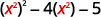

By the end of this section, you will be able to:
* Factor trinomials of the form
  <math xmlns="http://www.w3.org/1998/Math/MathML"><mrow><msup><mi>x</mi><mn>2</mn></msup><mo>+</mo><mi>b</mi><mi>x</mi><mo>+</mo><mi>c</mi></mrow></math>

* Factor trinomials of the form
  <math xmlns="http://www.w3.org/1998/Math/MathML"><mrow><mi>a</mi><msup><mi>x</mi><mn>2</mn></msup><mo>+</mo><mi>b</mi><mi>x</mi><mo>+</mo><mi>c</mi></mrow></math>
  
  using trial and error
* Factor trinomials of the form
  <math xmlns="http://www.w3.org/1998/Math/MathML"><mrow><mi>a</mi><msup><mi>x</mi><mn>2</mn></msup><mo>+</mo><mi>b</mi><mi>x</mi><mo>+</mo><mi>c</mi></mrow></math>
  
  using the ‘ac’ method
* Factor using substitution

Before you get started, take this readiness quiz.

1.  Find all the factors of 72.
    * * *
    {: data-type="newline"}
    
    If you missed this problem, review [\[link\]](/m63302#fs-id1167829937177).
2.  Find the product:
    <math xmlns="http://www.w3.org/1998/Math/MathML"><mrow><mo stretchy="false">(</mo><mn>3</mn><mi>y</mi><mo>+</mo><mn>4</mn><mo stretchy="false">)</mo><mo stretchy="false">(</mo><mn>2</mn><mi>y</mi><mo>+</mo><mn>5</mn><mo stretchy="false">)</mo><mo>.</mo></mrow></math>
    
    * * *
    {: data-type="newline"}
    
    If you missed this problem, review [\[link\]](/m63351#fs-id1167836544266).
3.  Simplify:
    <math xmlns="http://www.w3.org/1998/Math/MathML"><mrow><mn>−9</mn><mo stretchy="false">(</mo><mn>6</mn><mo stretchy="false">)</mo><mo>;</mo></mrow></math>
    
    <math xmlns="http://www.w3.org/1998/Math/MathML"><mrow><mn>−9</mn><mo stretchy="false">(</mo><mn>−6</mn><mo stretchy="false">)</mo><mo>.</mo></mrow></math>
    
    * * *
    {: data-type="newline"}
    
    If you missed this problem, review [\[link\]](/m63303#fs-id1167834536325).
{: type="1"}

### Factor Trinomials of the Form <math xmlns="http://www.w3.org/1998/Math/MathML"><mrow><msup><mi>x</mi><mn>2</mn></msup><mo>+</mo><mi>b</mi><mi>x</mi><mo>+</mo><mi>c</mi></mrow></math>

You have already learned how to multiply binomials using **FOIL**{: data-type="term" .no-emphasis}. Now you’ll need to “undo” this multiplication. To factor the trinomial means to start with the product, and end with the factors.

    To figure out how we would factor a **trinomial**{: data-type="term" .no-emphasis} of the form <math xmlns="http://www.w3.org/1998/Math/MathML"><mrow><msup><mi>x</mi><mn>2</mn></msup><mo>+</mo><mi>b</mi><mi>x</mi><mo>+</mo><mi>c</mi><mo>,</mo></mrow></math>

 such as <math xmlns="http://www.w3.org/1998/Math/MathML"><mrow><msup><mi>x</mi><mn>2</mn></msup><mo>+</mo><mn>5</mn><mi>x</mi><mo>+</mo><mn>6</mn></mrow></math>

 and factor it to <math xmlns="http://www.w3.org/1998/Math/MathML"><mrow><mrow><mo>(</mo><mrow><mi>x</mi><mo>+</mo><mn>2</mn></mrow><mo>)</mo></mrow><mrow><mo>(</mo><mrow><mi>x</mi><mo>+</mo><mn>3</mn></mrow><mo>)</mo></mrow><mo>,</mo></mrow></math>

 let’s start with two general binomials of the form <math xmlns="http://www.w3.org/1998/Math/MathML"><mrow><mrow><mo>(</mo><mrow><mi>x</mi><mo>+</mo><mi>m</mi></mrow><mo>)</mo></mrow></mrow></math>

 and <math xmlns="http://www.w3.org/1998/Math/MathML"><mrow><mrow><mo>(</mo><mrow><mi>x</mi><mo>+</mo><mi>n</mi></mrow><mo>)</mo></mrow><mo>.</mo></mrow></math>

|  |  |
{: valign="top"}| Foil to find the product. |  |
{: valign="top"}| Factor the GCF from the middle terms. |  |
{: valign="top"}| Our trinomial is of the form <math xmlns="http://www.w3.org/1998/Math/MathML"><mrow><msup><mi>x</mi><mn>2</mn></msup><mo>+</mo><mi>b</mi><mi>x</mi><mo>+</mo><mi>c</mi><mo>.</mo></mrow></math>

 |  |
{: valign="top"}{: .unnumbered .unstyled summary="We have open parentheses x plus m close parentheses open parentheses x plus n close parentheses. Foil to find the product x squared plus mx plus nx plus mn. Factor the GCF from the middle terms x squared plus open parentheses m plus n close parentheses x plus mn. Now our trinomial is of the form x squared plus bx plus c, where b is m plus n and c is mn" data-label=""}

This tells us that to factor a trinomial of the form <math xmlns="http://www.w3.org/1998/Math/MathML"><mrow><msup><mi>x</mi><mn>2</mn></msup><mo>+</mo><mi>b</mi><mi>x</mi><mo>+</mo><mi>c</mi><mo>,</mo></mrow></math>

 we need two factors <math xmlns="http://www.w3.org/1998/Math/MathML"><mrow><mrow><mo>(</mo><mrow><mi>x</mi><mo>+</mo><mi>m</mi></mrow><mo>)</mo></mrow></mrow></math>

 and <math xmlns="http://www.w3.org/1998/Math/MathML"><mrow><mrow><mo>(</mo><mrow><mi>x</mi><mo>+</mo><mi>n</mi></mrow><mo>)</mo></mrow></mrow></math>

 where the two numbers *m* and *n* multiply to *c* and add to *b*.

How to Factor a Trinomial of the form
<math xmlns="http://www.w3.org/1998/Math/MathML"><mrow><msup><mi>x</mi><mn>2</mn></msup><mo>+</mo><mi>b</mi><mi>x</mi><mo>+</mo><mi>c</mi></mrow></math>

Factor: <math xmlns="http://www.w3.org/1998/Math/MathML"><mrow><msup><mi>x</mi><mn>2</mn></msup><mo>+</mo><mn>11</mn><mi>x</mi><mo>+</mo><mn>24</mn><mo>.</mo></mrow></math>

           

Factor: <math xmlns="http://www.w3.org/1998/Math/MathML"><mrow><msup><mi>q</mi><mn>2</mn></msup><mo>+</mo><mn>10</mn><mi>q</mi><mo>+</mo><mn>24</mn><mo>.</mo></mrow></math>

<math xmlns="http://www.w3.org/1998/Math/MathML"><mrow><mrow><mo>(</mo><mrow><mi>q</mi><mo>+</mo><mn>4</mn></mrow><mo>)</mo></mrow><mrow><mo>(</mo><mrow><mi>q</mi><mo>+</mo><mn>6</mn></mrow><mo>)</mo></mrow></mrow></math>

Factor: <math xmlns="http://www.w3.org/1998/Math/MathML"><mrow><msup><mi>t</mi><mn>2</mn></msup><mo>+</mo><mn>14</mn><mi>t</mi><mo>+</mo><mn>24</mn><mo>.</mo></mrow></math>

<math xmlns="http://www.w3.org/1998/Math/MathML"><mrow><mrow><mo>(</mo><mrow><mi>t</mi><mo>+</mo><mn>2</mn></mrow><mo>)</mo></mrow><mrow><mo>(</mo><mrow><mi>t</mi><mo>+</mo><mn>12</mn></mrow><mo>)</mo></mrow></mrow></math>

Let’s summarize the steps we used to find the factors.

Factor trinomials of the form
<math xmlns="http://www.w3.org/1998/Math/MathML"><mrow><msup><mi>x</mi><mn>2</mn></msup><mo>+</mo><mi>b</mi><mi>x</mi><mo>+</mo><mi>c</mi><mo>.</mo></mrow></math>

1.  Write the factors as two binomials with first terms *x*.
    <math xmlns="http://www.w3.org/1998/Math/MathML"><mrow><mspace width="4em" /><mtable><mtr><mtd columnalign="left"><msup><mi>x</mi><mn>2</mn></msup><mo>+</mo><mi>b</mi><mi>x</mi><mo>+</mo><mi>c</mi></mtd></mtr><mtr><mtd columnalign="left"><mrow><mo>(</mo><mrow><mi>x</mi><mspace width="1.2em" /></mrow><mo>)</mo></mrow><mrow><mo>(</mo><mrow><mi>x</mi><mspace width="1.2em" /></mrow><mo>)</mo></mrow></mtd></mtr></mtable></mrow></math>

2.  Find two numbers *m* and *n* that
    * multiply to
      <math xmlns="http://www.w3.org/1998/Math/MathML"><mrow><mi>c</mi><mo>,</mo><mi>m</mi><mo>·</mo><mi>n</mi><mo>=</mo><mi>c</mi></mrow></math>
    
    * add to
      <math xmlns="http://www.w3.org/1998/Math/MathML"><mrow><mi>b</mi><mo>,</mo><mi>m</mi><mo>+</mo><mi>n</mi><mo>=</mo><mi>b</mi></mrow></math>
    {: data-bullet-style="bullet"}

3.  Use *m* and *n* as the last terms of the factors.
    <math xmlns="http://www.w3.org/1998/Math/MathML"><mrow><mrow><mspace width="7em" /><mo>(</mo><mrow><mi>x</mi><mo>+</mo><mi>m</mi></mrow><mo>)</mo></mrow><mrow><mo>(</mo><mrow><mi>x</mi><mo>+</mo><mi>n</mi></mrow><mo>)</mo></mrow></mrow></math>

4.  Check by multiplying the factors.
{: type="1" .stepwise}

In the first example, all terms in the trinomial were positive. What happens when there are negative terms? Well, it depends which term is negative. Let’s look first at trinomials with only the middle term negative.

How do you get a *positive product* and a *negative sum*? We use two negative numbers.

Factor: <math xmlns="http://www.w3.org/1998/Math/MathML"><mrow><msup><mi>y</mi><mn>2</mn></msup><mo>−</mo><mn>11</mn><mi>y</mi><mo>+</mo><mn>28.</mn></mrow></math>

Again, with the positive last term, 28, and the negative middle term, <math xmlns="http://www.w3.org/1998/Math/MathML"><mrow><mn>−11</mn><mi>y</mi><mo>,</mo></mrow></math>

 we need two negative factors. Find two numbers that multiply 28 and add to <math xmlns="http://www.w3.org/1998/Math/MathML"><mrow><mn>−11</mn><mo>.</mo></mrow></math>

* * *
{: data-type="newline"}

 <math xmlns="http://www.w3.org/1998/Math/MathML"><mrow><mtable><mtr><mtd /><mtd /><mtd /><mtd columnalign="left"><mspace width="4em" /><msup><mi>y</mi><mn>2</mn></msup><mo>−</mo><mn>11</mn><mi>y</mi><mo>+</mo><mn>28</mn></mtd></mtr><mtr><mtd columnalign="left"><mtext>Write the factors as two binomials with first terms</mtext><mspace width="0.2em" /><mi>y</mi><mo>.</mo></mtd><mtd /><mtd /><mtd columnalign="center"><mspace width="4em" /><mrow><mo>(</mo><mrow><mi>y</mi><mspace width="1.2em" /></mrow><mo>)</mo></mrow><mrow><mo>(</mo><mrow><mi>y</mi><mspace width="1.2em" /></mrow><mo>)</mo></mrow></mtd></mtr><mtr><mtd columnalign="left"><mtext>Find two numbers that: multiply to 28 and add to</mtext><mspace width="0.2em" /><mn>−11</mn><mo>.</mo></mtd><mtd /><mtd /><mtd /></mtr></mtable></mrow></math>

* * *
{: data-type="newline"}

<table class="unnumbered" summary="This table has two columns showing factors of 28 and sum of the factors. Factors are: minus 1 and minus 28, whose sum is minus 29, minus 2 and minus 14 whose sum is minus 16, minus 4 and minus 7 whose sum is minus 11."><thead>
<tr valign="top">
<th data-valign="top" data-align="left">Factors of <math xmlns="http://www.w3.org/1998/Math/MathML"><mrow><mn>28</mn></mrow></math></th>
<th data-valign="top" data-align="center">Sum of factors</th>
</tr>
</thead><tbody>
<tr valign="top">
<td data-valign="top" data-align="left"><math xmlns="http://www.w3.org/1998/Math/MathML"><mrow><mtext>−</mtext><mn>1</mn><mo>,</mo><mn>−28</mn></mrow></math>

<math xmlns="http://www.w3.org/1998/Math/MathML"><mrow><mtext>−</mtext><mn>2</mn><mo>,</mo><mn>−14</mn></mrow></math>

<math xmlns="http://www.w3.org/1998/Math/MathML"><mrow><mtext>−</mtext><mn>4</mn><mo>,</mo><mn>−7</mn></mrow></math></td>
<td data-valign="top" data-align="left"><math xmlns="http://www.w3.org/1998/Math/MathML"><mrow><mtext>−</mtext><mn>1</mn><mo>+</mo><mrow><mo>(</mo><mrow><mtext>−</mtext><mn>28</mn></mrow><mo>)</mo></mrow><mo>=</mo><mn>−29</mn></mrow></math>

<math xmlns="http://www.w3.org/1998/Math/MathML"><mrow><mtext>−</mtext><mn>2</mn><mo>+</mo><mrow><mo>(</mo><mrow><mtext>−</mtext><mn>14</mn></mrow><mo>)</mo></mrow><mo>=</mo><mn>−16</mn></mrow></math>

<math xmlns="http://www.w3.org/1998/Math/MathML"><mrow><mspace width="0.5em" /><mtext>−</mtext><mn>4</mn><mo>+</mo><mrow><mo>(</mo><mrow><mtext>−</mtext><mn>7</mn></mrow><mo>)</mo></mrow><mo>=</mo><msup><mn>−11</mn><mo>*</mo></msup></mrow></math></td>
</tr>
</tbody></table>
* * *
{: data-type="newline"}

 <math xmlns="http://www.w3.org/1998/Math/MathML"><mrow><mtable><mtr><mtd columnalign="left"><mtext>Use</mtext><mspace width="0.2em" /><mn>−4</mn><mo>,</mo><mn>−7</mn><mspace width="0.2em" /><mtext>as the last terms of the binomials.</mtext></mtd><mtd /><mtd /><mtd columnalign="left"><mrow><mspace width="7.6em" /><mo>(</mo><mrow><mi>y</mi><mo>−</mo><mn>4</mn></mrow><mo>)</mo></mrow><mrow><mo>(</mo><mrow><mi>y</mi><mo>−</mo><mn>7</mn></mrow><mo>)</mo></mrow></mtd></mtr><mtr><mtd columnalign="left"><mtext>Check:</mtext></mtd><mtd /><mtd /><mtd /></mtr><mtr><mtd columnalign="center"><mrow><mo>(</mo><mrow><mi>y</mi><mo>−</mo><mn>4</mn></mrow><mo>)</mo></mrow><mrow><mo>(</mo><mrow><mi>y</mi><mo>−</mo><mn>7</mn></mrow><mo>)</mo></mrow></mtd><mtd /><mtd /><mtd /></mtr><mtr><mtd columnalign="center"><msup><mi>y</mi><mn>2</mn></msup><mo>−</mo><mn>7</mn><mi>y</mi><mo>−</mo><mn>4</mn><mi>y</mi><mo>+</mo><mn>28</mn></mtd><mtd /><mtd /><mtd /></mtr><mtr><mtd columnalign="center"><msup><mi>y</mi><mn>2</mn></msup><mo>−</mo><mn>11</mn><mi>y</mi><mo>+</mo><mn>28</mn><mo>✓</mo></mtd><mtd /><mtd /><mtd /></mtr></mtable></mrow></math>

Factor: <math xmlns="http://www.w3.org/1998/Math/MathML"><mrow><msup><mi>u</mi><mn>2</mn></msup><mo>−</mo><mn>9</mn><mi>u</mi><mo>+</mo><mn>18</mn><mo>.</mo></mrow></math>

<math xmlns="http://www.w3.org/1998/Math/MathML"><mrow><mrow><mo>(</mo><mrow><mi>u</mi><mo>−</mo><mn>3</mn></mrow><mo>)</mo></mrow><mrow><mo>(</mo><mrow><mi>u</mi><mo>−</mo><mn>6</mn></mrow><mo>)</mo></mrow></mrow></math>

Factor: <math xmlns="http://www.w3.org/1998/Math/MathML"><mrow><msup><mi>y</mi><mn>2</mn></msup><mo>−</mo><mn>16</mn><mi>y</mi><mo>+</mo><mn>63</mn><mo>.</mo></mrow></math>

<math xmlns="http://www.w3.org/1998/Math/MathML"><mrow><mrow><mo>(</mo><mrow><mi>y</mi><mo>−</mo><mn>7</mn></mrow><mo>)</mo></mrow><mrow><mo>(</mo><mrow><mi>y</mi><mo>−</mo><mn>9</mn></mrow><mo>)</mo></mrow></mrow></math>

Now, what if the last term in the trinomial is negative? Think about **FOIL**{: data-type="term" .no-emphasis}. The last term is the product of the last terms in the two binomials. A negative product results from multiplying two numbers with opposite signs. You have to be very careful to choose factors to make sure you get the correct sign for the middle term, too.

How do you get a *negative product* and a *positive sum*? We use one positive and one negative number.

When we factor trinomials, we must have the terms written in descending order—in order from highest degree to lowest degree.

Factor: <math xmlns="http://www.w3.org/1998/Math/MathML"><mrow><mn>2</mn><mi>x</mi><mo>+</mo><msup><mi>x</mi><mn>2</mn></msup><mo>−</mo><mn>48</mn><mo>.</mo></mrow></math>

<math xmlns="http://www.w3.org/1998/Math/MathML"><mrow><mtable><mtr><mtd /><mtd /><mtd /><mtd columnalign="left"><mspace width="4em" /><mn>2</mn><mi>x</mi><mo>+</mo><msup><mi>x</mi><mn>2</mn></msup><mo>−</mo><mn>48</mn></mtd></mtr><mtr><mtd columnalign="left"><mtext>First we put the terms in decreasing degree order.</mtext></mtd><mtd /><mtd /><mtd columnalign="left"><mspace width="4em" /><msup><mi>x</mi><mn>2</mn></msup><mo>+</mo><mn>2</mn><mi>x</mi><mo>−</mo><mn>48</mn></mtd></mtr><mtr><mtd columnalign="left"><mtext>Factors will be two binomials with first terms</mtext><mspace width="0.2em" /><mi>x</mi><mo>.</mo></mtd><mtd /><mtd /><mtd columnalign="left"><mrow><mspace width="4em" /><mo>(</mo><mrow><mi>x</mi><mspace width="1.2em" /></mrow><mo>)</mo></mrow><mrow><mo>(</mo><mrow><mi>x</mi><mspace width="1.2em" /></mrow><mo>)</mo></mrow></mtd></mtr></mtable></mrow></math>

* * *
{: data-type="newline"}

<table class="unnumbered" summary="This table has two columns showing factors of minus 48 and sum of the factors. Factors are: minus 1 and 48, whose sum is 47, minus 2 and 24, whose sum is 22, minus 3 and 16, whose sum is 13, minus 4 and 12, whose sum is 8, minus 6 and 8, whose sum is 2."><thead>
<tr valign="top">
<th data-valign="top" data-align="left">Factors of <math xmlns="http://www.w3.org/1998/Math/MathML"><mrow><mn>−48</mn></mrow></math></th>
<th data-valign="middle" data-align="left">Sum of factors</th>
</tr>
</thead><tbody>
<tr valign="top">
<td data-valign="top" data-align="left"><math xmlns="http://www.w3.org/1998/Math/MathML"><mrow><mn>−1</mn><mo>,</mo><mn>48</mn></mrow></math>
<math xmlns="http://www.w3.org/1998/Math/MathML"><mrow><mn>−2</mn><mo>,</mo><mn>24</mn></mrow></math>
<math xmlns="http://www.w3.org/1998/Math/MathML"><mrow><mn>−3</mn><mo>,</mo><mn>16</mn></mrow></math>
<math xmlns="http://www.w3.org/1998/Math/MathML"><mrow><mn>−4</mn><mo>,</mo><mn>12</mn></mrow></math>
<math xmlns="http://www.w3.org/1998/Math/MathML"><mrow><mn>−6</mn><mo>,</mo><mn>8</mn></mrow></math></td>
<td data-valign="top" data-align="left"><math xmlns="http://www.w3.org/1998/Math/MathML"><mrow><mn>−1</mn><mo>+</mo><mn>48</mn><mo>=</mo><mn>47</mn></mrow></math>
<math xmlns="http://www.w3.org/1998/Math/MathML"><mrow><mn>−2</mn><mo>+</mo><mn>24</mn><mo>=</mo><mn>22</mn></mrow></math>
<math xmlns="http://www.w3.org/1998/Math/MathML"><mrow><mn>−3</mn><mo>+</mo><mn>16</mn><mo>=</mo><mn>13</mn></mrow></math>
<math xmlns="http://www.w3.org/1998/Math/MathML"><mrow><mn>−4</mn><mo>+</mo><mn>12</mn><mo>=</mo><mn>8</mn></mrow></math>
<math xmlns="http://www.w3.org/1998/Math/MathML"><mrow><mspace width="0.5em" /><mn>−6</mn><mo>+</mo><mn>8</mn><mo>=</mo><msup><mn>2</mn><mo>*</mo></msup></mrow></math></td>
</tr>
</tbody></table>
* * *
{: data-type="newline"}

 <math xmlns="http://www.w3.org/1998/Math/MathML"><mrow><mtable><mtr><mtd columnalign="left"><mtext>Use</mtext><mspace width="0.2em" /><mn>−6</mn><mo>,</mo><mn>8</mn><mspace width="0.2em" /><mtext>as the last terms of the binomials.</mtext></mtd><mtd /><mtd /><mtd /><mtd /><mtd columnalign="left"><mspace width="4.7em" /><mrow><mo>(</mo><mrow><mi>x</mi><mo>−</mo><mn>6</mn></mrow><mo>)</mo></mrow><mrow><mo>(</mo><mrow><mi>x</mi><mo>+</mo><mn>8</mn></mrow><mo>)</mo></mrow></mtd></mtr><mtr><mtd columnalign="left"><mtext>Check:</mtext></mtd><mtd /><mtd /><mtd /><mtd /><mtd /></mtr><mtr><mtd columnalign="center"><mrow><mo>(</mo><mrow><mi>x</mi><mo>−</mo><mn>6</mn></mrow><mo>)</mo></mrow><mrow><mo>(</mo><mrow><mi>x</mi><mo>+</mo><mn>8</mn></mrow><mo>)</mo></mrow></mtd><mtd /><mtd /><mtd /><mtd /><mtd /></mtr><mtr><mtd columnalign="center"><msup><mi>x</mi><mn>2</mn></msup><mo>−</mo><mn>6</mn><mi>q</mi><mo>+</mo><mn>8</mn><mi>q</mi><mo>−</mo><mn>48</mn></mtd><mtd /><mtd /><mtd /><mtd /><mtd /></mtr><mtr><mtd columnalign="center"><msup><mi>x</mi><mn>2</mn></msup><mo>+</mo><mn>2</mn><mi>x</mi><mo>−</mo><mn>48</mn><mo>✓</mo></mtd><mtd /><mtd /><mtd /><mtd /><mtd /></mtr></mtable></mrow></math>

Factor: <math xmlns="http://www.w3.org/1998/Math/MathML"><mrow><mn>9</mn><mi>m</mi><mo>+</mo><msup><mi>m</mi><mn>2</mn></msup><mo>+</mo><mn>18</mn><mo>.</mo></mrow></math>

<math xmlns="http://www.w3.org/1998/Math/MathML"><mrow><mrow><mo>(</mo><mrow><mi>m</mi><mo>+</mo><mn>3</mn></mrow><mo>)</mo></mrow><mrow><mo>(</mo><mrow><mi>m</mi><mo>+</mo><mn>6</mn></mrow><mo>)</mo></mrow></mrow></math>

Factor: <math xmlns="http://www.w3.org/1998/Math/MathML"><mrow><mn>−7</mn><mi>n</mi><mo>+</mo><mn>12</mn><mo>+</mo><msup><mi>n</mi><mn>2</mn></msup><mo>.</mo></mrow></math>

<math xmlns="http://www.w3.org/1998/Math/MathML"><mrow><mrow><mo>(</mo><mrow><mi>n</mi><mo>−</mo><mn>3</mn></mrow><mo>)</mo></mrow><mrow><mo>(</mo><mrow><mi>n</mi><mo>−</mo><mn>4</mn></mrow><mo>)</mo></mrow></mrow></math>

Sometimes you’ll need to factor trinomials of the form <math xmlns="http://www.w3.org/1998/Math/MathML"><mrow><msup><mi>x</mi><mn>2</mn></msup><mo>+</mo><mi>b</mi><mi>x</mi><mi>y</mi><mo>+</mo><mi>c</mi><msup><mi>y</mi><mn>2</mn></msup></mrow></math>

 with two variables, such as <math xmlns="http://www.w3.org/1998/Math/MathML"><mrow><msup><mi>x</mi><mn>2</mn></msup><mo>+</mo><mn>12</mn><mi>x</mi><mi>y</mi><mo>+</mo><mn>36</mn><msup><mi>y</mi><mn>2</mn></msup><mo>.</mo></mrow></math>

 The first term, <math xmlns="http://www.w3.org/1998/Math/MathML"><mrow><msup><mi>x</mi><mn>2</mn></msup><mo>,</mo></mrow></math>

 is the product of the first terms of the binomial factors, <math xmlns="http://www.w3.org/1998/Math/MathML"><mrow><mi>x</mi><mo>·</mo><mi>x</mi><mo>.</mo></mrow></math>

 The <math xmlns="http://www.w3.org/1998/Math/MathML"><mrow><msup><mi>y</mi><mn>2</mn></msup></mrow></math>

 in the last term means that the second terms of the binomial factors must each contain *y*. To get the coefficients *b* and *c*, you use the same process summarized in [How To Factor trinomials](#fs-id1167836732813).

Factor: <math xmlns="http://www.w3.org/1998/Math/MathML"><mrow><msup><mi>r</mi><mn>2</mn></msup><mo>−</mo><mn>8</mn><mi>r</mi><mi>s</mi><mo>−</mo><mn>9</mn><msup><mi>s</mi><mn>2</mn></msup><mo>.</mo></mrow></math>

We need *r* in the first term of each binomial and *s* in the second term. The last term of the trinomial is negative, so the factors must have opposite signs.* * *
{: data-type="newline"}

 <math xmlns="http://www.w3.org/1998/Math/MathML"><mrow><mtable><mtr><mtd /><mtd /><mtd /><mtd /><mtd /><mtd columnalign="left"><msup><mi>r</mi><mn>2</mn></msup><mo>−</mo><mn>8</mn><mi>r</mi><mi>s</mi><mo>−</mo><mn>9</mn><msup><mi>s</mi><mn>2</mn></msup></mtd></mtr><mtr><mtd columnalign="left"><mtext>Note that the first terms are</mtext><mspace width="0.2em" /><mi>r</mi><mo>,</mo><mspace width="0.2em" /><mtext>last terms contain</mtext><mspace width="0.2em" /><mi>s</mi><mo>.</mo></mtd><mtd /><mtd /><mtd /><mtd /><mtd columnalign="center"><mrow><mo>(</mo><mrow><mi>r</mi><mspace width="1.2em" /><mi>s</mi></mrow><mo>)</mo></mrow><mrow><mo>(</mo><mrow><mi>r</mi><mspace width="1.2em" /><mi>s</mi></mrow><mo>)</mo></mrow></mtd></mtr><mtr><mtd columnalign="left"><mtext>Find the numbers that multiply to</mtext><mspace width="0.2em" /><mn>−9</mn><mspace width="0.2em" /><mtext>and add to</mtext><mspace width="0.2em" /><mn>−8</mn><mo>.</mo></mtd></mtr></mtable></mrow></math>

* * *
{: data-type="newline"}

| Factors of <math xmlns="http://www.w3.org/1998/Math/MathML"><mrow><mn>−9</mn></mrow></math>

 | Sum of factors |
{: valign="top"}|----------
| <math xmlns="http://www.w3.org/1998/Math/MathML"><mrow><mspace width="0.65em" /><mn>1</mn><mo>,</mo><mn>−9</mn></mrow></math>

 | <math xmlns="http://www.w3.org/1998/Math/MathML"><mrow><mspace width="0.65em" /><mn>−1</mn><mo>+</mo><mn>9</mn><mo>=</mo><mn>8</mn></mrow></math>

 |
{: valign="top"}| <math xmlns="http://www.w3.org/1998/Math/MathML"><mrow><mn>−1</mn><mo>,</mo><mn>9</mn></mrow></math>

 | <math xmlns="http://www.w3.org/1998/Math/MathML"><mrow><mn>1</mn><mo>+</mo><mrow><mo>(</mo><mrow><mn>−9</mn></mrow><mo>)</mo></mrow><mo>=</mo><mtext>−</mtext><msup><mn>8</mn><mo>*</mo></msup></mrow></math>

 |
{: valign="top"}| <math xmlns="http://www.w3.org/1998/Math/MathML"><mrow><mspace width="0.65em" /><mn>3</mn><mo>,</mo><mn>−3</mn></mrow></math>

 | <math xmlns="http://www.w3.org/1998/Math/MathML"><mrow><mn>3</mn><mo>+</mo><mrow><mo>(</mo><mrow><mn>−3</mn></mrow><mo>)</mo></mrow><mo>=</mo><mn>0</mn></mrow></math>

 |
{: valign="top"}{: .unnumbered summary="This table has 2 columns showing factors of minus 9 and sum of factors. The factors are: 1 and minus 9 whose sum is 8, minus 1 and 9 whose sum is minus 8, 3 and minus 3 whose sum is 0."}

* * *
{: data-type="newline"}

 <math xmlns="http://www.w3.org/1998/Math/MathML"><mrow><mtable><mtr><mtd columnalign="left"><mtext>Use</mtext><mspace width="0.2em" /><mn>1</mn><mo>,</mo><mn>−9</mn><mspace width="0.2em" /><mtext>as coefficients of the last terms.</mtext></mtd><mtd /><mtd /><mtd columnalign="left"><mspace width="4.9em" /><mrow><mo>(</mo><mrow><mi>r</mi><mo>+</mo><mi>s</mi></mrow><mo>)</mo></mrow><mrow><mo>(</mo><mrow><mi>r</mi><mo>−</mo><mn>9</mn><mi>s</mi></mrow><mo>)</mo></mrow></mtd></mtr><mtr><mtd columnalign="left"><mtext>Check:</mtext></mtd><mtd /><mtd /><mtd /></mtr><mtr><mtd columnalign="center"><mrow><mo>(</mo><mrow><mi>r</mi><mo>−</mo><mn>9</mn><mi>s</mi></mrow><mo>)</mo></mrow><mrow><mo>(</mo><mrow><mi>r</mi><mo>+</mo><mi>s</mi></mrow><mo>)</mo></mrow></mtd><mtd /><mtd /><mtd /></mtr><mtr><mtd columnalign="center"><msup><mi>r</mi><mn>2</mn></msup><mo>+</mo><mi>r</mi><mi>s</mi><mo>−</mo><mn>9</mn><mi>r</mi><mi>s</mi><mo>−</mo><mn>9</mn><msup><mi>s</mi><mn>2</mn></msup></mtd><mtd /><mtd /><mtd /></mtr><mtr><mtd columnalign="center"><msup><mi>r</mi><mn>2</mn></msup><mo>−</mo><mn>8</mn><mi>r</mi><mi>s</mi><mo>−</mo><mn>9</mn><msup><mi>s</mi><mn>2</mn></msup><mo>✓</mo></mtd><mtd /><mtd /><mtd /></mtr></mtable></mrow></math>

Factor: <math xmlns="http://www.w3.org/1998/Math/MathML"><mrow><msup><mi>a</mi><mn>2</mn></msup><mo>−</mo><mn>11</mn><mi>a</mi><mi>b</mi><mo>+</mo><mn>10</mn><msup><mi>b</mi><mn>2</mn></msup><mo>.</mo></mrow></math>

<math xmlns="http://www.w3.org/1998/Math/MathML"><mrow><mrow><mo>(</mo><mrow><mi>a</mi><mo>−</mo><mi>b</mi></mrow><mo>)</mo></mrow><mrow><mo>(</mo><mrow><mi>a</mi><mo>−</mo><mn>10</mn><mi>b</mi></mrow><mo>)</mo></mrow></mrow></math>

Factor: <math xmlns="http://www.w3.org/1998/Math/MathML"><mrow><msup><mi>m</mi><mn>2</mn></msup><mo>−</mo><mn>13</mn><mi>m</mi><mi>n</mi><mo>+</mo><mn>12</mn><msup><mi>n</mi><mn>2</mn></msup><mo>.</mo></mrow></math>

<math xmlns="http://www.w3.org/1998/Math/MathML"><mrow><mrow><mo>(</mo><mrow><mi>m</mi><mo>−</mo><mi>n</mi></mrow><mo>)</mo></mrow><mrow><mo>(</mo><mrow><mi>m</mi><mo>−</mo><mn>12</mn><mi>n</mi></mrow><mo>)</mo></mrow></mrow></math>

Some trinomials are prime. The only way to be certain a trinomial is **prime**{: data-type="term" .no-emphasis} is to list all the possibilities and show that none of them work.

Factor: <math xmlns="http://www.w3.org/1998/Math/MathML"><mrow><msup><mi>u</mi><mn>2</mn></msup><mo>−</mo><mn>9</mn><mi>u</mi><mi>v</mi><mo>−</mo><mn>12</mn><msup><mi>v</mi><mn>2</mn></msup><mo>.</mo></mrow></math>

We need *u* in the first term of each binomial and *v* in the second term. The last term of the trinomial is negative, so the factors must have opposite signs.* * *
{: data-type="newline"}

 <math xmlns="http://www.w3.org/1998/Math/MathML"><mrow><mtable><mtr><mtd /><mtd /><mtd /><mtd /><mtd /><mtd columnalign="center"><msup><mi>u</mi><mn>2</mn></msup><mo>−</mo><mn>9</mn><mi>u</mi><mi>v</mi><mo>−</mo><mn>12</mn><msup><mi>v</mi><mn>2</mn></msup></mtd></mtr><mtr><mtd columnalign="left"><mtext>Note that the first terms are</mtext><mspace width="0.2em" /><mi>u</mi><mo>,</mo><mspace width="0.2em" /><mtext>last terms contain</mtext><mspace width="0.2em" /><mi>v</mi><mo>.</mo></mtd><mtd /><mtd /><mtd /><mtd /><mtd columnalign="center"><mrow><mo>(</mo><mrow><mi>u</mi><mspace width="1.2em" /><mi>v</mi></mrow><mo>)</mo></mrow><mrow><mo>(</mo><mrow><mi>u</mi><mspace width="1.2em" /><mi>v</mi></mrow><mo>)</mo></mrow></mtd></mtr><mtr><mtd columnalign="left"><mtext>Find the numbers that multiply to</mtext><mspace width="0.2em" /><mn>−12</mn><mspace width="0.2em" /><mtext>and add to</mtext><mspace width="0.2em" /><mn>−9</mn><mo>.</mo></mtd><mtd /><mtd /><mtd /><mtd /><mtd /></mtr></mtable></mrow></math>

<table class="unnumbered" summary="This table has 2 columns showing factors of minus 12 and sum of factors. The factors are: 1 and minus 12 whose sum is minus 11, minus 1 and 12 whose sum is 11, 2 and minus 6 whose sum is minus 4, minus 2 and 6 whose sum is 4, 3 and minus 4 whose sum is minus 1, minus 3 and minus 3 and 4 whose sum is 1."><thead>
<tr valign="top">
<th data-valign="top" data-align="left">Factors of <math xmlns="http://www.w3.org/1998/Math/MathML"><mrow><mtext>−</mtext><mn>12</mn></mrow></math></th>
<th data-valign="top" data-align="left">Sum of factors</th>
</tr>
</thead><tbody>
<tr valign="top">
<td data-valign="top" data-align="left"><math xmlns="http://www.w3.org/1998/Math/MathML"><mrow><mspace width="0.65em" /><mn>1</mn><mo>,</mo><mn>−12</mn></mrow></math>
<math xmlns="http://www.w3.org/1998/Math/MathML"><mrow><mn>−1</mn><mo>,</mo><mn>12</mn></mrow></math>
<math xmlns="http://www.w3.org/1998/Math/MathML"><mrow><mspace width="0.65em" /><mn>2</mn><mo>,</mo><mn>−6</mn></mrow></math>
<math xmlns="http://www.w3.org/1998/Math/MathML"><mrow><mn>−2</mn><mo>,</mo><mn>6</mn></mrow></math>
<math xmlns="http://www.w3.org/1998/Math/MathML"><mrow><mspace width="0.65em" /><mn>3</mn><mo>,</mo><mn>−4</mn></mrow></math>
<math xmlns="http://www.w3.org/1998/Math/MathML"><mrow><mn>−3</mn><mo>,</mo><mn>4</mn></mrow></math></td>
<td data-valign="top" data-align="left"><math xmlns="http://www.w3.org/1998/Math/MathML"><mrow><mn>1</mn><mo>+</mo><mrow><mo>(</mo><mrow><mn>−12</mn></mrow><mo>)</mo></mrow><mo>=</mo><mn>−11</mn></mrow></math>
<math xmlns="http://www.w3.org/1998/Math/MathML"><mrow><mspace width="0.65em" /><mn>−1</mn><mo>+</mo><mn>12</mn><mo>=</mo><mn>11</mn></mrow></math>
<math xmlns="http://www.w3.org/1998/Math/MathML"><mrow><mspace width="0.5em" /><mn>2</mn><mo>+</mo><mrow><mo>(</mo><mrow><mn>−6</mn></mrow><mo>)</mo></mrow><mo>=</mo><mn>−4</mn></mrow></math>
<math xmlns="http://www.w3.org/1998/Math/MathML"><mrow><mspace width="1.2em" /><mn>−2</mn><mo>+</mo><mn>6</mn><mo>=</mo><mn>4</mn></mrow></math>
<math xmlns="http://www.w3.org/1998/Math/MathML"><mrow><mspace width="0.6em" /><mn>3</mn><mo>+</mo><mrow><mo>(</mo><mrow><mn>−4</mn></mrow><mo>)</mo></mrow><mo>=</mo><mn>−1</mn></mrow></math>
<math xmlns="http://www.w3.org/1998/Math/MathML"><mrow><mspace width="1.2em" /><mn>−3</mn><mo>+</mo><mn>4</mn><mo>=</mo><mn>1</mn></mrow></math></td>
</tr>
</tbody></table>
Note there are no factor pairs that give us <math xmlns="http://www.w3.org/1998/Math/MathML"><mrow><mn>−9</mn></mrow></math>

 as a sum. The trinomial is prime.

Factor: <math xmlns="http://www.w3.org/1998/Math/MathML"><mrow><msup><mi>x</mi><mn>2</mn></msup><mo>−</mo><mn>7</mn><mi>x</mi><mi>y</mi><mo>−</mo><mn>10</mn><msup><mi>y</mi><mn>2</mn></msup><mo>.</mo></mrow></math>

prime

Factor: <math xmlns="http://www.w3.org/1998/Math/MathML"><mrow><msup><mi>p</mi><mn>2</mn></msup><mo>+</mo><mn>15</mn><mi>p</mi><mi>q</mi><mo>+</mo><mn>20</mn><msup><mi>q</mi><mn>2</mn></msup><mo>.</mo></mrow></math>

prime

Let’s summarize the method we just developed to factor trinomials of the form <math xmlns="http://www.w3.org/1998/Math/MathML"><mrow><msup><mi>x</mi><mn>2</mn></msup><mo>+</mo><mi>b</mi><mi>x</mi><mo>+</mo><mi>c</mi><mo>.</mo></mrow></math>

Strategy for Factoring Trinomials of the Form
<math xmlns="http://www.w3.org/1998/Math/MathML"><mrow><msup><mi>x</mi><mn>2</mn></msup><mo>+</mo><mi>b</mi><mi>x</mi><mo>+</mo><mi>c</mi></mrow></math>

When we factor a trinomial, we look at the signs of its terms first to determine the signs of the binomial factors.

<math xmlns="http://www.w3.org/1998/Math/MathML"><mrow><mtable><mtr><mtd columnalign="center"><mtable><mtr><mtd columnalign="center"><msup><mi>x</mi><mn>2</mn></msup><mo>+</mo><mi>b</mi><mi>x</mi><mo>+</mo><mi>c</mi></mtd></mtr><mtr><mtd columnalign="center"><mrow><mo>(</mo><mrow><mi>x</mi><mo>+</mo><mi>m</mi></mrow><mo>)</mo></mrow><mrow><mo>(</mo><mrow><mi>x</mi><mo>+</mo><mi>n</mi></mrow><mo>)</mo></mrow></mtd></mtr></mtable></mtd></mtr><mtr><mtd columnalign="center"><mtext mathvariant="bold">When</mtext><mspace width="0.2em" /><mtext mathvariant="bolditalics">c</mtext><mspace width="0.2em" /><mtext mathvariant="bold">is positive,</mtext><mspace width="0.2em" /><mtext mathvariant="bolditalics">m</mtext><mspace width="0.2em" /><mtext mathvariant="bold">and</mtext><mspace width="0.2em" /><mtext mathvariant="bolditalics">n</mtext><mspace width="0.2em" /><mtext mathvariant="bold">have the same sign.</mtext></mtd></mtr><mtr><mtd columnalign="center"><mi>b</mi><mspace width="0.2em" /><mtext>positive</mtext><mspace width="16.5em" /><mi>b</mi><mspace width="0.2em" /><mtext>negative</mtext></mtd></mtr><mtr><mtd columnalign="center"><mi>m</mi><mo>,</mo><mi>n</mi><mspace width="0.2em" /><mtext>positive</mtext><mspace width="15em" /><mi>m</mi><mo>,</mo><mi>n</mi><mspace width="0.2em" /><mtext>negative</mtext></mtd></mtr><mtr><mtd columnalign="center"><msup><mi>x</mi><mn>2</mn></msup><mo>+</mo><mn>5</mn><mi>x</mi><mo>+</mo><mn>6</mn><mspace width="16em" /><msup><mi>x</mi><mn>2</mn></msup><mo>−</mo><mn>6</mn><mi>x</mi><mo>+</mo><mn>8</mn></mtd></mtr><mtr><mtd columnalign="center"><mrow><mo>(</mo><mrow><mi>x</mi><mo>+</mo><mn>2</mn></mrow><mo>)</mo></mrow><mrow><mo>(</mo><mrow><mi>x</mi><mo>+</mo><mn>3</mn></mrow><mo>)</mo></mrow><mspace width="15em" /><mrow><mo>(</mo><mrow><mi>x</mi><mo>−</mo><mn>4</mn></mrow><mo>)</mo></mrow><mrow><mo>(</mo><mrow><mi>x</mi><mo>−</mo><mn>2</mn></mrow><mo>)</mo></mrow></mtd></mtr><mtr><mtd columnalign="center"><mtext>same signs</mtext><mspace width="16em" /><mtext>same signs</mtext></mtd></mtr><mtr><mtd columnalign="center"><mtext mathvariant="bold">When</mtext><mspace width="0.2em" /><mtext mathvariant="bolditalics">c</mtext><mspace width="0.2em" /><mtext mathvariant="bold">is negative,</mtext><mspace width="0.2em" /><mtext mathvariant="bolditalics">m</mtext><mspace width="0.2em" /><mtext mathvariant="bold">and</mtext><mspace width="0.2em" /><mtext mathvariant="bolditalics">n</mtext><mspace width="0.2em" /><mtext mathvariant="bold">have opposite signs.</mtext></mtd></mtr><mtr><mtd columnalign="center"><msup><mi>x</mi><mn>2</mn></msup><mo>+</mo><mi>x</mi><mo>−</mo><mn>12</mn><mspace width="16em" /><msup><mi>x</mi><mn>2</mn></msup><mo>−</mo><mn>2</mn><mi>x</mi><mo>−</mo><mn>15</mn></mtd></mtr><mtr><mtd columnalign="center"><mrow><mo>(</mo><mrow><mi>x</mi><mo>+</mo><mn>4</mn></mrow><mo>)</mo></mrow><mrow><mo>(</mo><mrow><mi>x</mi><mo>−</mo><mn>3</mn></mrow><mo>)</mo></mrow><mspace width="15em" /><mrow><mo>(</mo><mrow><mi>x</mi><mo>−</mo><mn>5</mn></mrow><mo>)</mo></mrow><mrow><mo>(</mo><mrow><mi>x</mi><mo>+</mo><mn>3</mn></mrow><mo>)</mo></mrow></mtd></mtr><mtr><mtd columnalign="center"><mtext>opposite signs</mtext><mspace width="15em" /><mtext>opposite signs</mtext></mtd></mtr></mtable></mrow></math>

Notice that, in the case when *m* and *n* have opposite signs, the sign of the one with the larger absolute value matches the sign of *b*.

### Factor Trinomials of the form *ax*2 + *bx* + *c* using Trial and Error

Our next step is to factor trinomials whose leading coefficient is not 1, trinomials of the form <math xmlns="http://www.w3.org/1998/Math/MathML"><mrow><mi>a</mi><msup><mi>x</mi><mn>2</mn></msup><mo>+</mo><mi>b</mi><mi>x</mi><mo>+</mo><mi>c</mi><mo>.</mo></mrow></math>

Remember to always check for a **GCF**{: data-type="term" .no-emphasis} first! Sometimes, after you factor the GCF, the leading coefficient of the trinomial becomes 1 and you can factor it by the methods we’ve used so far. Let’s do an example to see how this works.

Factor completely: <math xmlns="http://www.w3.org/1998/Math/MathML"><mrow><mn>4</mn><msup><mi>x</mi><mn>3</mn></msup><mo>+</mo><mn>16</mn><msup><mi>x</mi><mn>2</mn></msup><mo>−</mo><mn>20</mn><mi>x</mi><mo>.</mo></mrow></math>

<math xmlns="http://www.w3.org/1998/Math/MathML"><mrow><mtable><mtr><mtd columnalign="left"><mtext>Is there a greatest common factor?</mtext></mtd><mtd /><mtd /><mtd columnalign="left"><mspace width="4em" /><mn>4</mn><msup><mi>x</mi><mn>3</mn></msup><mo>+</mo><mn>16</mn><msup><mi>x</mi><mn>2</mn></msup><mo>−</mo><mn>20</mn><mi>x</mi></mtd></mtr><mtr><mtd columnalign="left"><mspace width="2em" /><mtext>Yes, GCF</mtext><mo>=</mo><mn>4</mn><mi>x</mi><mo>.</mo><mspace width="0.2em" /><mtext>Factor it.</mtext></mtd><mtd /><mtd /><mtd columnalign="left"><mspace width="4em" /><mn>4</mn><mi>x</mi><mrow><mo>(</mo><mrow><msup><mi>x</mi><mn>2</mn></msup><mo>+</mo><mn>4</mn><mi>x</mi><mo>−</mo><mn>5</mn></mrow><mo>)</mo></mrow></mtd></mtr><mtr /><mtr /><mtr><mtd columnalign="left"><mtext>Binomial, trinomial, or more than three terms?</mtext></mtd><mtd /><mtd /><mtd /></mtr><mtr><mtd columnalign="left"><mspace width="2em" /><mtext>It is a trinomial. So “undo FOIL.”</mtext></mtd><mtd /><mtd /><mtd columnalign="left"><mspace width="4em" /><mn>4</mn><mi>x</mi><mrow><mo>(</mo><mrow><mi>x</mi><mspace width="1.8em" /></mrow><mo>)</mo></mrow><mrow><mo>(</mo><mrow><mi>x</mi><mspace width="1.5em" /></mrow><mo>)</mo></mrow></mtd></mtr><mtr /><mtr /><mtr><mtd columnalign="left"><mtext>Use a table like the one shown to find two numbers that</mtext></mtd><mtd /><mtd /><mtd columnalign="left"><mspace width="4em" /><mn>4</mn><mi>x</mi><mrow><mo>(</mo><mrow><mi>x</mi><mo>−</mo><mn>1</mn></mrow><mo>)</mo></mrow><mrow><mo>(</mo><mrow><mi>x</mi><mo>+</mo><mn>5</mn></mrow><mo>)</mo></mrow></mtd></mtr><mtr><mtd columnalign="left"><mtext>multiply to</mtext><mspace width="0.2em" /><mn>−5</mn><mspace width="0.2em" /><mtext>and add to 4.</mtext></mtd><mtd /><mtd /><mtd /></mtr></mtable></mrow></math>

* * *
{: data-type="newline"}

<table class="unnumbered" summary="The polynomial is 3x squared plus 5x plus 2. There are two pairs of parentheses, with the first terms in them being x and 3x."><thead>
<tr valign="top">
<th data-valign="top" data-align="left">Factors of <math xmlns="http://www.w3.org/1998/Math/MathML"><mrow><mtext>−</mtext><mn>5</mn></mrow></math></th>
<th data-valign="top" data-align="left">Sum of factors</th>
</tr>
</thead><tbody>
<tr valign="top">
<td data-valign="top" data-align="left"><math xmlns="http://www.w3.org/1998/Math/MathML"><mrow><mtext>−</mtext><mn>1</mn><mo>,</mo><mn>5</mn></mrow></math>
<math xmlns="http://www.w3.org/1998/Math/MathML"><mrow><mspace width="0.6em" /><mn>1</mn><mo>,</mo><mn>−5</mn></mrow></math></td>
<td data-valign="top" data-align="left"><math xmlns="http://www.w3.org/1998/Math/MathML"><mrow><mspace width="0.6em" /><mtext>−</mtext><mn>1</mn><mo>+</mo><mn>5</mn><mo>=</mo><msup><mn>4</mn><mo>*</mo></msup></mrow></math>
<math xmlns="http://www.w3.org/1998/Math/MathML"><mrow><mn>1</mn><mo>+</mo><mrow><mo>(</mo><mrow><mtext>−</mtext><mn>5</mn></mrow><mo>)</mo></mrow><mo>=</mo><mn>−4</mn></mrow></math></td>
</tr>
</tbody></table>
* * *
{: data-type="newline"}

 <math xmlns="http://www.w3.org/1998/Math/MathML"><mrow><mtable><mtr><mtd columnalign="left"><mtext>Check:</mtext></mtd><mtd /><mtd /><mtd /></mtr><mtr><mtd /><mtd /><mtd /><mtd columnalign="center"><mn>4</mn><mi>x</mi><mrow><mo>(</mo><mrow><mi>x</mi><mo>−</mo><mn>1</mn></mrow><mo>)</mo></mrow><mrow><mo>(</mo><mrow><mi>x</mi><mo>+</mo><mn>5</mn></mrow><mo>)</mo></mrow></mtd></mtr><mtr><mtd /><mtd /><mtd /><mtd columnalign="center"><mn>4</mn><mi>x</mi><mo stretchy="false">(</mo><msup><mi>x</mi><mn>2</mn></msup><mo>+</mo><mn>5</mn><mi>x</mi><mo>−</mo><mi>x</mi><mo>−</mo><mn>5</mn><mo stretchy="false">)</mo></mtd></mtr><mtr><mtd /><mtd /><mtd /><mtd columnalign="center"><mn>4</mn><mi>x</mi><mo stretchy="false">(</mo><msup><mi>x</mi><mn>2</mn></msup><mo>+</mo><mn>4</mn><mi>x</mi><mo>−</mo><mn>5</mn><mo stretchy="false">)</mo></mtd></mtr><mtr><mtd /><mtd /><mtd /><mtd columnalign="center"><mn>4</mn><msup><mi>x</mi><mn>3</mn></msup><mo>+</mo><mn>16</mn><msup><mi>x</mi><mn>2</mn></msup><mo>−</mo><mn>20</mn><mi>x</mi><mo>✓</mo></mtd></mtr></mtable></mrow></math>

Factor completely: <math xmlns="http://www.w3.org/1998/Math/MathML"><mrow><mn>5</mn><msup><mi>x</mi><mn>3</mn></msup><mo>+</mo><mn>15</mn><msup><mi>x</mi><mn>2</mn></msup><mo>−</mo><mn>20</mn><mi>x</mi><mo>.</mo></mrow></math>

<math xmlns="http://www.w3.org/1998/Math/MathML"><mrow><mn>5</mn><mi>x</mi><mrow><mo>(</mo><mrow><mi>x</mi><mo>−</mo><mn>1</mn></mrow><mo>)</mo></mrow><mrow><mo>(</mo><mrow><mi>x</mi><mo>+</mo><mn>4</mn></mrow><mo>)</mo></mrow></mrow></math>

Factor completely: <math xmlns="http://www.w3.org/1998/Math/MathML"><mrow><mn>6</mn><msup><mi>y</mi><mn>3</mn></msup><mo>+</mo><mn>18</mn><msup><mi>y</mi><mn>2</mn></msup><mo>−</mo><mn>60</mn><mi>y</mi><mo>.</mo></mrow></math>

<math xmlns="http://www.w3.org/1998/Math/MathML"><mrow><mn>6</mn><mi>y</mi><mrow><mo>(</mo><mrow><mi>y</mi><mo>−</mo><mn>2</mn></mrow><mo>)</mo></mrow><mrow><mo>(</mo><mrow><mi>y</mi><mo>+</mo><mn>5</mn></mrow><mo>)</mo></mrow></mrow></math>

What happens when the leading coefficient is not 1 and there is no GCF? There are several methods that can be used to factor these trinomials. First we will use the Trial and Error method.

Let’s factor the trinomial <math xmlns="http://www.w3.org/1998/Math/MathML"><mrow><mn>3</mn><msup><mi>x</mi><mn>2</mn></msup><mo>+</mo><mn>5</mn><mi>x</mi><mo>+</mo><mn>2</mn><mo>.</mo></mrow></math>

From our earlier work, we expect this will factor into two binomials.

<math xmlns="http://www.w3.org/1998/Math/MathML"><mrow><mtable><mtr /><mtr /><mtr><mtd columnalign="center"><mn>3</mn><msup><mi>x</mi><mn>2</mn></msup><mo>+</mo><mn>5</mn><mi>x</mi><mo>+</mo><mn>2</mn></mtd></mtr><mtr><mtd columnalign="center"><mrow><mo>(</mo><mrow><mspace width="2em" /></mrow><mo>)</mo></mrow><mrow><mo>(</mo><mrow><mspace width="2em" /></mrow><mo>)</mo></mrow></mtd></mtr></mtable></mrow></math>

We know the first terms of the binomial factors will multiply to give us <math xmlns="http://www.w3.org/1998/Math/MathML"><mrow><mn>3</mn><msup><mi>x</mi><mn>2</mn></msup><mo>.</mo></mrow></math>

 The only factors of <math xmlns="http://www.w3.org/1998/Math/MathML"><mrow><mn>3</mn><msup><mi>x</mi><mn>2</mn></msup></mrow></math>

 are <math xmlns="http://www.w3.org/1998/Math/MathML"><mrow><mn>1</mn><mi>x</mi><mo>,</mo><mn>3</mn><mi>x</mi><mo>.</mo></mrow></math>

 We can place them in the binomials.

    Check: Does <math xmlns="http://www.w3.org/1998/Math/MathML"><mrow><mn>1</mn><mi>x</mi><mo>·</mo><mn>3</mn><mi>x</mi><mo>=</mo><mn>3</mn><msup><mi>x</mi><mn>2</mn></msup><mo>?</mo></mrow></math>

We know the last terms of the binomials will multiply to 2. Since this trinomial has all positive terms, we only need to consider positive factors. The only factors of 2 are 1, 2. But we now have two cases to consider as it will make a difference if we write 1, 2 or 2, 1.

    Which factors are correct? To decide that, we multiply the inner and outer terms.

    Since the middle term of the trinomial is <math xmlns="http://www.w3.org/1998/Math/MathML"><mrow><mn>5</mn><mi>x</mi><mo>,</mo></mrow></math>

 the factors in the first case will work. Let’s use FOIL to check.

<math xmlns="http://www.w3.org/1998/Math/MathML"><mrow><mtable><mtr><mtd columnalign="center"><mrow><mo>(</mo><mrow><mi>x</mi><mo>+</mo><mn>1</mn></mrow><mo>)</mo></mrow><mrow><mo>(</mo><mrow><mn>3</mn><mi>x</mi><mo>+</mo><mn>2</mn></mrow><mo>)</mo></mrow></mtd></mtr><mtr><mtd columnalign="center"><mn>3</mn><msup><mi>x</mi><mn>2</mn></msup><mo>+</mo><mn>2</mn><mi>x</mi><mo>+</mo><mn>3</mn><mi>x</mi><mo>+</mo><mn>2</mn></mtd></mtr><mtr><mtd columnalign="center"><mn>3</mn><msup><mi>x</mi><mn>2</mn></msup><mo>+</mo><mn>5</mn><mi>x</mi><mo>+</mo><mn>2</mn><mo>✓</mo></mtd></mtr></mtable></mrow></math>

Our result of the factoring is:

<math xmlns="http://www.w3.org/1998/Math/MathML"><mrow><mtable><mtr /><mtr><mtd columnalign="center"><mn>3</mn><msup><mi>x</mi><mn>2</mn></msup><mo>+</mo><mn>5</mn><mi>x</mi><mo>+</mo><mn>2</mn></mtd></mtr><mtr><mtd columnalign="center"><mrow><mo>(</mo><mrow><mi>x</mi><mo>+</mo><mn>1</mn></mrow><mo>)</mo></mrow><mrow><mo>(</mo><mrow><mn>3</mn><mi>x</mi><mo>+</mo><mn>2</mn></mrow><mo>)</mo></mrow></mtd></mtr></mtable></mrow></math>

How to Factor a Trinomial Using Trial and Error

Factor completely using trial and error: <math xmlns="http://www.w3.org/1998/Math/MathML"><mrow><mn>3</mn><msup><mi>y</mi><mn>2</mn></msup><mo>+</mo><mn>22</mn><mi>y</mi><mo>+</mo><mn>7</mn><mo>.</mo></mrow></math>

             ![Step 5 is to test all the possible combinations of the factors until the correct product is found. For possible factors open parentheses y plus 1 close parentheses open parentheses 37 plus 7 close parentheses, the product is 3 y squared plus 10y plus 7. For the possible factors open parentheses y plus 7 close parentheses open parentheses 3y plus 1 close parentheses, the product is 3 y squared plus 22y plus 7, which is the correct product. Hence, the correct factors are open parentheses y plus 7 close parentheses open parentheses 3y plus 1 close parentheses.](../resources/CNX_IntAlg_Figure_06_02_007e.jpg)    

Factor completely using trial and error: <math xmlns="http://www.w3.org/1998/Math/MathML"><mrow><mn>2</mn><msup><mi>a</mi><mn>2</mn></msup><mo>+</mo><mn>5</mn><mi>a</mi><mo>+</mo><mn>3</mn><mo>.</mo></mrow></math>

<math xmlns="http://www.w3.org/1998/Math/MathML"><mrow><mrow><mo>(</mo><mrow><mi>a</mi><mo>+</mo><mn>1</mn></mrow><mo>)</mo></mrow><mrow><mo>(</mo><mrow><mn>2</mn><mi>a</mi><mo>+</mo><mn>3</mn></mrow><mo>)</mo></mrow></mrow></math>

Factor completely using trial and error: <math xmlns="http://www.w3.org/1998/Math/MathML"><mrow><mn>4</mn><msup><mi>b</mi><mn>2</mn></msup><mo>+</mo><mn>5</mn><mi>b</mi><mo>+</mo><mn>1</mn><mo>.</mo></mrow></math>

<math xmlns="http://www.w3.org/1998/Math/MathML"><mrow><mrow><mo>(</mo><mrow><mi>b</mi><mo>+</mo><mn>1</mn></mrow><mo>)</mo></mrow><mrow><mo>(</mo><mrow><mn>4</mn><mi>b</mi><mo>+</mo><mn>1</mn></mrow><mo>)</mo></mrow></mrow></math>

Factor trinomials of the form
<math xmlns="http://www.w3.org/1998/Math/MathML"><mrow><mi>a</mi><msup><mi>x</mi><mn>2</mn></msup><mo>+</mo><mi>b</mi><mi>x</mi><mo>+</mo><mi>c</mi></mrow></math>
using trial and error.

1.  Write the trinomial in descending order of degrees as needed.
2.  Factor any GCF.
3.  Find all the factor pairs of the first term.
4.  Find all the factor pairs of the third term.
5.  Test all the possible combinations of the factors until the correct product is found.
6.  Check by multiplying.
{: type="1" .stepwise}

Remember, when the middle term is negative and the last term is positive, the signs in the binomials must both be negative.

Factor completely using trial and error: <math xmlns="http://www.w3.org/1998/Math/MathML"><mrow><mn>6</mn><msup><mi>b</mi><mn>2</mn></msup><mo>−</mo><mn>13</mn><mi>b</mi><mo>+</mo><mn>5</mn><mo>.</mo></mrow></math>

<table class="unnumbered unstyled" summary="The trinomial 6 b squared minus 13 b plus 5 is already in descending order. Factoring the first term, we get 1b times 6b and 2b times 3b. To find the factors of the last term, consider the signs. Since the last term, 5, is positive its factors must both be positive or both be negative. The coefficient of the middle term is negative, so we use the negative factors minus 1 and minus 5." data-label=""><tbody>
<tr valign="top">
<td data-valign="top" data-align="left">The trinomial is already in descending order.</td>
<td data-valign="top" data-align="left"></td>
</tr>
<tr valign="top">
<td data-valign="top" data-align="left">Find the factors of the first term.</td>
<td data-valign="top" data-align="left"></td>
</tr>
<tr valign="top">
<td data-valign="top" data-align="left">Find the factors of the last term. Consider the signs.
Since the last term, 5, is positive its factors must both be
positive or both be negative. The coefficient of the
middle term is negative, so we use the negative factors.</td>
<td data-valign="top" data-align="left"></td>
</tr>
</tbody></table>
Consider all the combinations of factors.

<table class="unnumbered" summary="This table shows the possible factors and corresponding products of 6 b squared minus 13 b plus 5. Factors: open parentheses b minus 1 close parentheses open parentheses 6b minus 5 close parentheses; product: 6 b squared minus 11 b plus 5. Factors: open parentheses b minus 5 close parentheses open parentheses 6b minus 1 close parentheses; product: 6 b squared minus 31 b plus 5. Factors: open parentheses 2b minus 1 close parentheses open parentheses 3b minus 5 close parentheses; product: 6 b squared minus 13b plus 5. This is the original trinomial. Factors: open parentheses 2b minus 5 close parentheses open parentheses 3b minus 1 close parentheses; product: 6 b squared minus 17b plus 5."><thead>
<tr valign="top">
<th colspan="2" data-valign="top" data-align="center"><math xmlns="http://www.w3.org/1998/Math/MathML"><mrow><mn>6</mn><msup><mi>b</mi><mn>2</mn></msup><mo>−</mo><mn>13</mn><mi>b</mi><mo>+</mo><mn>5</mn></mrow></math></th>
</tr>
<tr valign="top">
<th data-valign="top" data-align="left">Possible factors</th>
<th data-valign="top" data-align="left">Product</th>
</tr>
</thead><tbody>
<tr valign="top">
<td data-valign="top" data-align="left"><math xmlns="http://www.w3.org/1998/Math/MathML"><mrow><mrow><mo>(</mo><mrow><mi>b</mi><mo>−</mo><mn>1</mn></mrow><mo>)</mo></mrow><mrow><mo>(</mo><mrow><mn>6</mn><mi>b</mi><mo>−</mo><mn>5</mn></mrow><mo>)</mo></mrow></mrow></math></td>
<td data-valign="top" data-align="left"><math xmlns="http://www.w3.org/1998/Math/MathML"><mrow><mn>6</mn><msup><mi>b</mi><mn>2</mn></msup><mo>−</mo><mn>11</mn><mi>b</mi><mo>+</mo><mn>5</mn></mrow></math></td>
</tr>
<tr valign="top">
<td data-valign="top" data-align="left"><math xmlns="http://www.w3.org/1998/Math/MathML"><mrow><mrow><mo>(</mo><mrow><mi>b</mi><mo>−</mo><mn>5</mn></mrow><mo>)</mo></mrow><mrow><mo>(</mo><mrow><mn>6</mn><mi>b</mi><mo>−</mo><mn>1</mn></mrow><mo>)</mo></mrow></mrow></math></td>
<td data-valign="top" data-align="left"><math xmlns="http://www.w3.org/1998/Math/MathML"><mrow><mn>6</mn><msup><mi>b</mi><mn>2</mn></msup><mo>−</mo><mn>31</mn><mi>b</mi><mo>+</mo><mn>5</mn></mrow></math></td>
</tr>
<tr valign="top">
<td data-valign="top" data-align="left"><math xmlns="http://www.w3.org/1998/Math/MathML"><mrow><mrow><mo>(</mo><mrow><mn>2</mn><mi>b</mi><mo>−</mo><mn>1</mn></mrow><mo>)</mo></mrow><mrow><mo>(</mo><mrow><mn>3</mn><mi>b</mi><mo>−</mo><mn>5</mn></mrow><mo>)</mo></mrow></mrow></math></td>
<td data-valign="middle" data-align="left"><math xmlns="http://www.w3.org/1998/Math/MathML"><mrow><mn>6</mn><msup><mi>b</mi><mn>2</mn></msup><mo>−</mo><mn>13</mn><mi>b</mi><mo>+</mo><msup><mn>5</mn><mo>*</mo></msup></mrow></math></td>
</tr>
<tr valign="top">
<td data-valign="top" data-align="left"><math xmlns="http://www.w3.org/1998/Math/MathML"><mrow><mrow><mo>(</mo><mrow><mn>2</mn><mi>b</mi><mo>−</mo><mn>5</mn></mrow><mo>)</mo></mrow><mrow><mo>(</mo><mrow><mn>3</mn><mi>b</mi><mo>−</mo><mn>1</mn></mrow><mo>)</mo></mrow></mrow></math></td>
<td data-valign="middle" data-align="left"><math xmlns="http://www.w3.org/1998/Math/MathML"><mrow><mn>6</mn><msup><mi>b</mi><mn>2</mn></msup><mo>−</mo><mn>17</mn><mi>b</mi><mo>+</mo><mn>5</mn></mrow></math></td>
</tr>
</tbody></table>
<math xmlns="http://www.w3.org/1998/Math/MathML"><mrow><mtable><mtr><mtd columnalign="left"><mtext>The correct factors are those whose product</mtext></mtd><mtd /><mtd /><mtd /></mtr><mtr><mtd columnalign="left"><mtext>is the original trinomial.</mtext></mtd><mtd /><mtd /><mtd columnalign="left"><mspace width="4em" /><mrow><mo>(</mo><mrow><mn>2</mn><mi>b</mi><mo>−</mo><mn>1</mn></mrow><mo>)</mo></mrow><mrow><mo>(</mo><mrow><mn>3</mn><mi>b</mi><mo>−</mo><mn>5</mn></mrow><mo>)</mo></mrow></mtd></mtr><mtr><mtd columnalign="left"><mtext>Check by multiplying:</mtext></mtd><mtd /><mtd /><mtd /></mtr><mtr /><mtr /><mtr><mtd columnalign="center"><mspace width="4em" /><mrow><mo>(</mo><mrow><mn>2</mn><mi>b</mi><mo>−</mo><mn>1</mn></mrow><mo>)</mo></mrow><mrow><mo>(</mo><mrow><mn>3</mn><mi>b</mi><mo>−</mo><mn>5</mn></mrow><mo>)</mo></mrow></mtd><mtd /><mtd /><mtd /></mtr><mtr><mtd columnalign="center"><mspace width="4em" /><mn>6</mn><msup><mi>b</mi><mn>2</mn></msup><mo>−</mo><mn>10</mn><mi>b</mi><mo>−</mo><mn>3</mn><mi>b</mi><mo>+</mo><mn>5</mn></mtd><mtd /><mtd /><mtd /></mtr><mtr><mtd columnalign="center"><mspace width="4em" /><mn>6</mn><msup><mi>b</mi><mn>2</mn></msup><mo>−</mo><mn>13</mn><mi>b</mi><mo>+</mo><mn>5</mn><mo>✓</mo></mtd><mtd /><mtd /><mtd /></mtr></mtable></mrow></math>

Factor completely using trial and error: <math xmlns="http://www.w3.org/1998/Math/MathML"><mrow><mn>8</mn><msup><mi>x</mi><mn>2</mn></msup><mo>−</mo><mn>13</mn><mi>x</mi><mo>+</mo><mn>3</mn><mo>.</mo></mrow></math>

<math xmlns="http://www.w3.org/1998/Math/MathML"><mrow><mrow><mo>(</mo><mrow><mn>2</mn><mi>x</mi><mo>−</mo><mn>3</mn></mrow><mo>)</mo></mrow><mrow><mo>(</mo><mrow><mn>4</mn><mi>x</mi><mo>−</mo><mn>1</mn></mrow><mo>)</mo></mrow></mrow></math>

Factor completely using trial and error: <math xmlns="http://www.w3.org/1998/Math/MathML"><mrow><mn>10</mn><msup><mi>y</mi><mn>2</mn></msup><mo>−</mo><mn>37</mn><mi>y</mi><mo>+</mo><mn>7</mn><mo>.</mo></mrow></math>

<math xmlns="http://www.w3.org/1998/Math/MathML"><mrow><mrow><mo>(</mo><mrow><mn>2</mn><mi>y</mi><mo>−</mo><mn>7</mn></mrow><mo>)</mo></mrow><mrow><mo>(</mo><mrow><mn>5</mn><mi>y</mi><mo>−</mo><mn>1</mn></mrow><mo>)</mo></mrow></mrow></math>

When we factor an expression, we always look for a greatest common factor first. If the expression does not have a greatest common factor, there cannot be one in its factors either. This may help us eliminate some of the possible factor combinations.

Factor completely using trial and error: <math xmlns="http://www.w3.org/1998/Math/MathML"><mrow><mn>18</mn><msup><mi>x</mi><mn>2</mn></msup><mo>−</mo><mn>37</mn><mi>x</mi><mi>y</mi><mo>+</mo><mn>15</mn><msup><mi>y</mi><mn>2</mn></msup><mo>.</mo></mrow></math>

<table class="unnumbered unstyled" summary="The trinomial 18 x squared minus 37xy plus 15y squared is already in descending order. Factoring the first term, we get 1x times 18x, 2x times 9x and 3x times 6x.To find the factors of the last term, consider the signs. Since 15 is positive and the coefficient of the middle term is negative, we use the negative factors minus 1, minus 5 and minus 5, minus 1." data-label=""><tbody>
<tr valign="top">
<td data-valign="top" data-align="left">The trinomial is already in descending order.</td>
<td data-valign="top" data-align="left"></td>
</tr>
<tr valign="top">
<td data-valign="top" data-align="left">Find the factors of the first term.</td>
<td data-valign="top" data-align="left"></td>
</tr>
<tr valign="top">
<td data-valign="top" data-align="left">Find the factors of the last term. Consider the signs.
Since 15 is positive and the coefficient of the middle
term is negative, we use the negative factors.</td>
<td data-valign="top" data-align="left"></td>
</tr>
</tbody></table>
Consider all the combinations of factors.

 ![This table shows the possible factors and corresponding products of the trinomial 18 x squared minus 37xy plus 15 y squared. In some pairs of factors, when one factor contains two terms with a common factor, that factor is highlighted. In such cases, product is not an option because if trinomial has no common factors, then neither factor can contain a common factor. Factor: open parentheses x minus 1y close parentheses open parentheses 18x minus 15y close parentheses, highlighted. Factor, open parentheses x minus 15y close parentheses open parentheses 18x minus 1y close parentheses; product: 18 x squared minus 271xy plus 15 y squared. Factor open parentheses x minus 3y close parentheses open parentheses 18x minus 5 y close parentheses; product: 18 x squared minus 59xy plus 15 y squared. Factor: open parentheses x minus 5y close parentheses open parentheses 18x minus 3y close parentheses highlighted. Factor: open parentheses 2x minus 1y close parentheses open parentheses 9x minus 15y close parentheses highlighted. Factor: open parentheses 2x minus 15y close parentheses open parentheses 9x minus 1y close parentheses; product 18 x squared minus 137 xy plus 15y squared. Factor: open parentheses 2x minus 3y close parentheses open parentheses 9x minus 5y close parentheses; product: 18 x squared minus 37xy plus 15 y squared, which is the original trinomial. Factor: open parentheses 2x minus 57 close parentheses open parentheses 9x minus 3y close parentheses highlighted. Factor: open parentheses 3x minus 1y close parentheses open parentheses 6x minus 15y close parentheses highlighted. Factor: open parentheses 3x minus 15y close parentheses highlighted open parentheses 6x minus 1y close parentheses. Factor: open parentheses 3x minus 3y close parentheses highlighted open parentheses 6x minus 5y.](../resources/CNX_IntAlg_Figure_06_02_015_img.jpg) 
<math xmlns="http://www.w3.org/1998/Math/MathML"><mrow><mtable><mtr><mtd columnalign="left"><mtext>The correct factors are those whose product is</mtext></mtd><mtd /><mtd /><mtd /></mtr><mtr><mtd columnalign="left"><mtext>the original trinomial.</mtext></mtd><mtd /><mtd /><mtd columnalign="left"><mspace width="4em" /><mrow><mo>(</mo><mrow><mn>2</mn><mi>x</mi><mo>−</mo><mn>3</mn><mi>y</mi><mo stretchy="false">)</mo><mo stretchy="false">(</mo><mn>9</mn><mi>x</mi><mo>−</mo><mn>5</mn><mi>y</mi></mrow><mo>)</mo></mrow></mtd></mtr><mtr><mtd columnalign="left"><mtext>Check by multiplying:</mtext></mtd><mtd /><mtd /><mtd /></mtr><mtr /><mtr /><mtr><mtd columnalign="center"><mspace width="4em" /><mrow><mo>(</mo><mrow><mn>2</mn><mi>x</mi><mo>−</mo><mn>3</mn><mi>y</mi><mo stretchy="false">)</mo><mo stretchy="false">(</mo><mn>9</mn><mi>x</mi><mo>−</mo><mn>5</mn><mi>y</mi></mrow><mo>)</mo></mrow></mtd><mtd /><mtd /><mtd /></mtr><mtr><mtd columnalign="center"><mspace width="4em" /><mn>18</mn><msup><mi>x</mi><mn>2</mn></msup><mo>−</mo><mn>10</mn><mi>x</mi><mi>y</mi><mo>−</mo><mn>27</mn><mi>x</mi><mi>y</mi><mo>+</mo><mn>15</mn><msup><mi>y</mi><mn>2</mn></msup></mtd><mtd /><mtd /><mtd /></mtr><mtr><mtd columnalign="center"><mspace width="4em" /><mn>18</mn><msup><mi>x</mi><mn>2</mn></msup><mo>−</mo><mn>37</mn><mi>x</mi><mi>y</mi><mo>+</mo><mn>15</mn><msup><mi>y</mi><mn>2</mn></msup><mo>✓</mo></mtd><mtd /><mtd /><mtd /></mtr></mtable></mrow></math>

Factor completely using trial and error <math xmlns="http://www.w3.org/1998/Math/MathML"><mrow><mn>18</mn><msup><mi>x</mi><mn>2</mn></msup><mo>−</mo><mn>3</mn><mi>x</mi><mi>y</mi><mo>−</mo><mn>10</mn><msup><mi>y</mi><mn>2</mn></msup><mo>.</mo></mrow></math>

<math xmlns="http://www.w3.org/1998/Math/MathML"><mrow><mrow><mo>(</mo><mrow><mn>3</mn><mi>x</mi><mo>+</mo><mn>2</mn><mi>y</mi></mrow><mo>)</mo></mrow><mrow><mo>(</mo><mrow><mn>6</mn><mi>x</mi><mo>−</mo><mn>5</mn><mi>y</mi></mrow><mo>)</mo></mrow></mrow></math>

Factor completely using trial and error: <math xmlns="http://www.w3.org/1998/Math/MathML"><mrow><mn>30</mn><msup><mi>x</mi><mn>2</mn></msup><mo>−</mo><mn>53</mn><mi>x</mi><mi>y</mi><mo>−</mo><mn>21</mn><msup><mi>y</mi><mn>2</mn></msup><mo>.</mo></mrow></math>

<math xmlns="http://www.w3.org/1998/Math/MathML"><mrow><mrow><mo>(</mo><mrow><mn>3</mn><mi>x</mi><mo>+</mo><mi>y</mi></mrow><mo>)</mo></mrow><mrow><mo>(</mo><mrow><mn>10</mn><mi>x</mi><mo>−</mo><mn>21</mn><mi>y</mi></mrow><mo>)</mo></mrow></mrow></math>

Don’t forget to look for a GCF first and remember if the leading coefficient is negative, so is the GCF.

Factor completely using trial and error: <math xmlns="http://www.w3.org/1998/Math/MathML"><mrow><mn>−10</mn><msup><mi>y</mi><mn>4</mn></msup><mo>−</mo><mn>55</mn><msup><mi>y</mi><mn>3</mn></msup><mo>−</mo><mn>60</mn><msup><mi>y</mi><mn>2</mn></msup><mo>.</mo></mrow></math>

|  |  |
{: valign="top"}| Notice the greatest common factor, so factor it first. |  |
{: valign="top"}| Factor the trinomial. |  |
{: valign="top"}{: .unnumbered .unstyled summary="The trinomial is minus 10 y to the power 4 minus 55 y cubed minus 60 y squared. Factoring the GCF, we get minus 5 y squared open parentheses 2 y squared plus 11y plus 12 close parentheses. The factors of the first term of the trinomial in the parentheses are y and 2y. The factor pairs of the last term are 1 and 12, 2 and 6, 3 and 4." data-label=""}

Consider all the combinations.

 ![This table shows the possible factors and product of the trinomial 2 y squared plus 11y plus 12. In some pairs of factors, when one factor contains two terms with a common factor, that factor is highlighted. In such cases, product is not an option because if trinomial has no common factors, then neither factor can contain a common factor. Factor: y plus 1, 2y plus 12 highlighted. Factor: y plus 12, 2y plus 1; product: 2 y squared plus 25y plus 12. Factor: y plus 2, 2y plus 6 highlighted. Factor: y plus 6, 2y plus 2 highlighted. Factor: y plus 3, 2y plus 4 highlighted. Factor: y plus 4, 2y plus 3; product: 2 y squared plus 11y plus 12. This is the original trinomial.](../resources/CNX_IntAlg_Figure_06_02_016_img.jpg) 
<math xmlns="http://www.w3.org/1998/Math/MathML"><mrow><mtable><mtr><mtd columnalign="left"><mtext>The correct factors are those whose product</mtext></mtd><mtd /><mtd /><mtd /></mtr><mtr><mtd columnalign="left"><mtext>is the original trinomial. Remember to include</mtext></mtd><mtd /><mtd /><mtd /></mtr><mtr><mtd columnalign="left"><mtext>the factor</mtext><mspace width="0.2em" /><mtext>−</mtext><mn>5</mn><msup><mi>y</mi><mn>2</mn></msup><mo>.</mo></mtd><mtd /><mtd /><mtd /><mtd columnalign="left"><mspace width="4em" /><mtext>−</mtext><mn>5</mn><msup><mi>y</mi><mn>2</mn></msup><mrow><mo>(</mo><mrow><mi>y</mi><mo>+</mo><mn>4</mn></mrow><mo>)</mo></mrow><mrow><mo>(</mo><mrow><mn>2</mn><mi>y</mi><mo>+</mo><mn>3</mn></mrow><mo>)</mo></mrow></mtd></mtr><mtr><mtd columnalign="left"><mtext>Check by multiplying:</mtext></mtd><mtd /><mtd /><mtd /></mtr><mtr /><mtr /><mtr><mtd columnalign="center"><mspace width="4em" /><mtext>−</mtext><mn>5</mn><msup><mi>y</mi><mn>2</mn></msup><mrow><mo>(</mo><mrow><mi>y</mi><mo>+</mo><mn>4</mn></mrow><mo>)</mo></mrow><mrow><mo>(</mo><mrow><mn>2</mn><mi>y</mi><mo>+</mo><mn>3</mn></mrow><mo>)</mo></mrow></mtd><mtd /><mtd /><mtd /></mtr><mtr><mtd columnalign="center"><mspace width="4em" /><mtext>−</mtext><mn>5</mn><msup><mi>y</mi><mn>2</mn></msup><mrow><mo>(</mo><mrow><mn>2</mn><msup><mi>y</mi><mn>2</mn></msup><mo>+</mo><mn>8</mn><mi>y</mi><mo>+</mo><mn>3</mn><mi>y</mi><mo>+</mo><mn>12</mn></mrow><mo>)</mo></mrow></mtd><mtd /><mtd /><mtd /></mtr><mtr><mtd columnalign="center"><mspace width="4em" /><mtext>−</mtext><mn>10</mn><msup><mi>y</mi><mn>4</mn></msup><mo>−</mo><mn>55</mn><msup><mi>y</mi><mn>3</mn></msup><mo>−</mo><mn>60</mn><msup><mi>y</mi><mn>2</mn></msup><mo>✓</mo></mtd><mtd /><mtd /><mtd /></mtr></mtable></mrow></math>

Factor completely using trial and error: <math xmlns="http://www.w3.org/1998/Math/MathML"><mrow><mn>15</mn><msup><mi>n</mi><mn>3</mn></msup><mo>−</mo><mn>85</mn><msup><mi>n</mi><mn>2</mn></msup><mo>+</mo><mn>100</mn><mi>n</mi><mo>.</mo></mrow></math>

<math xmlns="http://www.w3.org/1998/Math/MathML"><mrow><mn>5</mn><mi>n</mi><mrow><mo>(</mo><mrow><mi>n</mi><mo>−</mo><mn>4</mn></mrow><mo>)</mo></mrow><mrow><mo>(</mo><mrow><mn>3</mn><mi>n</mi><mo>−</mo><mn>5</mn></mrow><mo>)</mo></mrow></mrow></math>

Factor completely using trial and error: <math xmlns="http://www.w3.org/1998/Math/MathML"><mrow><mn>56</mn><msup><mi>q</mi><mn>3</mn></msup><mo>+</mo><mn>320</mn><msup><mi>q</mi><mn>2</mn></msup><mo>−</mo><mn>96</mn><mi>q</mi><mo>.</mo></mrow></math>

<math xmlns="http://www.w3.org/1998/Math/MathML"><mrow><mn>8</mn><mi>q</mi><mrow><mo>(</mo><mrow><mi>q</mi><mo>+</mo><mn>6</mn></mrow><mo>)</mo></mrow><mrow><mo>(</mo><mrow><mn>7</mn><mi>q</mi><mo>−</mo><mn>2</mn></mrow><mo>)</mo></mrow></mrow></math>

### Factor Trinomials of the Form <math xmlns="http://www.w3.org/1998/Math/MathML"><mrow><mi>a</mi><msup><mi>x</mi><mn>2</mn></msup><mo>+</mo><mi>b</mi><mi>x</mi><mo>+</mo><mi>c</mi></mrow></math>

 using the “ac” Method

Another way to factor trinomials of the form <math xmlns="http://www.w3.org/1998/Math/MathML"><mrow><mi>a</mi><msup><mi>x</mi><mn>2</mn></msup><mo>+</mo><mi>b</mi><mi>x</mi><mo>+</mo><mi>c</mi></mrow></math>

 is the “ac” method. (The “ac” method is sometimes called the grouping method.) The “ac” method is actually an extension of the methods you used in the last section to factor trinomials with leading coefficient one. This method is very structured (that is step-by-step), and it always works!

How to Factor Trinomials using the “ac” Method

Factor using the *‘ac’* method: <math xmlns="http://www.w3.org/1998/Math/MathML"><mrow><mn>6</mn><msup><mi>x</mi><mn>2</mn></msup><mo>+</mo><mn>7</mn><mi>x</mi><mo>+</mo><mn>2</mn><mo>.</mo></mrow></math>

                 

Factor using the ‘ac’ method: <math xmlns="http://www.w3.org/1998/Math/MathML"><mrow><mn>6</mn><msup><mi>x</mi><mn>2</mn></msup><mo>+</mo><mn>13</mn><mi>x</mi><mo>+</mo><mn>2</mn><mo>.</mo></mrow></math>

<math xmlns="http://www.w3.org/1998/Math/MathML"><mrow><mrow><mo>(</mo><mrow><mi>x</mi><mo>+</mo><mn>2</mn></mrow><mo>)</mo></mrow><mrow><mo>(</mo><mrow><mn>6</mn><mi>x</mi><mo>+</mo><mn>1</mn></mrow><mo>)</mo></mrow></mrow></math>

Factor using the ‘ac’ method: <math xmlns="http://www.w3.org/1998/Math/MathML"><mrow><mn>4</mn><msup><mi>y</mi><mn>2</mn></msup><mo>+</mo><mn>8</mn><mi>y</mi><mo>+</mo><mn>3</mn><mo>.</mo></mrow></math>

<math xmlns="http://www.w3.org/1998/Math/MathML"><mrow><mrow><mo>(</mo><mrow><mn>2</mn><mi>y</mi><mo>+</mo><mn>1</mn></mrow><mo>)</mo></mrow><mrow><mo>(</mo><mrow><mn>2</mn><mi>y</mi><mo>+</mo><mn>3</mn></mrow><mo>)</mo></mrow></mrow></math>

The “ac” method is summarized here.

Factor trinomials of the form
<math xmlns="http://www.w3.org/1998/Math/MathML"><mrow><mi>a</mi><msup><mi>x</mi><mn>2</mn></msup><mo>+</mo><mi>b</mi><mi>x</mi><mo>+</mo><mi>c</mi></mrow></math>
using the “ac” method.

1.  Factor any GCF.
2.  Find the product *ac*.
3.  Find two numbers *m* and *n* that:
    * * *
    {: data-type="newline"}
    
    <math xmlns="http://www.w3.org/1998/Math/MathML"><mrow><mtable><mtr><mtd columnalign="left"><mtext>Multiply to</mtext><mspace width="0.2em" /><mi>a</mi><mi>c</mi></mtd><mtd /><mtd /><mtd /><mtd /><mtd columnalign="left"><mi>m</mi><mo>·</mo><mi>n</mi><mo>=</mo><mi>a</mi><mo>·</mo><mi>c</mi></mtd></mtr><mtr><mtd columnalign="left"><mtext>Add to</mtext><mspace width="0.2em" /><mi>b</mi></mtd><mtd /><mtd /><mtd /><mtd /><mtd columnalign="left"><mi>m</mi><mo>+</mo><mi>n</mi><mo>=</mo><mi>b</mi></mtd></mtr><mtr><mtd /><mtd /><mtd /><mtd /><mtd /><mtd columnalign="left"><mi>a</mi><msup><mi>x</mi><mn>2</mn></msup><mo>+</mo><mi>b</mi><mi>x</mi><mo>+</mo><mi>c</mi></mtd></mtr></mtable></mrow></math>

4.  Split the middle term using *m* and *n*.
    <math xmlns="http://www.w3.org/1998/Math/MathML"><mrow><mspace width="5em" /><mi>a</mi><msup><mi>x</mi><mn>2</mn></msup><mo>+</mo><mi>m</mi><mi>x</mi><mo>+</mo><mi>n</mi><mi>x</mi><mo>+</mo><mi>c</mi></mrow></math>

5.  Factor by grouping.
6.  Check by multiplying the factors.
{: type="1" .stepwise}

Don’t forget to look for a common factor!

Factor using the *‘ac’* method: <math xmlns="http://www.w3.org/1998/Math/MathML"><mrow><mn>10</mn><msup><mi>y</mi><mn>2</mn></msup><mo>−</mo><mn>55</mn><mi>y</mi><mo>+</mo><mn>70</mn><mo>.</mo></mrow></math>

<table class="unnumbered unstyled" summary="The GCF in 10 y squared minus 55y plus 70 is 5. Factoring this, we get 5 open parentheses 2 y squared minus 11 y plus 14. The trinomial inside the parentheses has a leading coefficient that is not 1. So we find the product ac, which is 28. Now we find two numbers that multiply to ac and add to b. Minus 4 times minus 7 is 28 and minus 4 minus 7 is minus 11. Splitting the middle term of the trinomial, we get, 5 open parentheses 2 y squared minus 7y minus 4 y plus 14 close parentheses. We factor by grouping to get 5 open parentheses y minus 2 close parentheses open parentheses 2y minus 7 close parentheses. Now we check by multiplying all three factors to get the original polynomial." data-label=""><tbody>
<tr valign="top">
<td data-valign="top" data-align="left">Is there a greatest common factor?</td>
<td data-valign="top" data-align="left" />
<td data-valign="top" data-align="left" />
</tr>
<tr valign="top">
<td data-valign="top" data-align="left">Yes. The GCF is 5.</td>
<td data-valign="top" data-align="left" />
<td data-valign="top" data-align="left"></td>
</tr>
<tr valign="top">
<td data-valign="top" data-align="left">Factor it.</td>
<td data-valign="top" data-align="left" />
<td data-valign="top" data-align="left"></td>
</tr>
<tr valign="top">
<td data-valign="top" data-align="left">The trinomial inside the parentheses has a
leading coefficient that is not 1.</td>
<td data-valign="top" data-align="left" />
<td data-valign="bottom" data-align="left"></td>
</tr>
<tr valign="top">
<td data-valign="top" data-align="left">Find the product <math xmlns="http://www.w3.org/1998/Math/MathML"><mrow><mi>a</mi><mi>c</mi><mo>.</mo></mrow></math></td>
<td data-valign="top" data-align="left"><math xmlns="http://www.w3.org/1998/Math/MathML"><mrow><mspace width="3.3em" /><mi>a</mi><mi>c</mi><mo>=</mo><mn>28</mn></mrow></math></td>
<td data-valign="top" data-align="left" />
</tr>
<tr valign="top">
<td data-valign="top" data-align="left">Find two numbers that multiply to <math xmlns="http://www.w3.org/1998/Math/MathML"><mrow><mi>a</mi><mi>c</mi></mrow></math></td>
<td data-valign="top" data-align="left"><math xmlns="http://www.w3.org/1998/Math/MathML"><mrow><mspace width="0.5em" /><mo stretchy="false">(</mo><mn>−4</mn><mo stretchy="false">)</mo><mo stretchy="false">(</mo><mn>−7</mn><mo stretchy="false">)</mo><mo>=</mo><mn>28</mn></mrow></math></td>
<td data-valign="top" data-align="left" />
</tr>
<tr valign="top">
<td data-valign="top" data-align="left">and add to <em>b</em>.</td>
<td data-valign="top" data-align="left"><math xmlns="http://www.w3.org/1998/Math/MathML"><mrow><mn>−4</mn><mo>+</mo><mo stretchy="false">(</mo><mn>−7</mn><mo stretchy="false">)</mo><mo>=</mo><mn>−11</mn></mrow></math></td>
<td data-valign="top" data-align="left" />
</tr>
<tr valign="top">
<td data-valign="top" data-align="left">Split the middle term.</td>
<td data-valign="top" data-align="left" />
<td data-valign="top" data-align="left"></td>
</tr>
<tr valign="top">
<td data-valign="top" data-align="left" />
<td data-valign="top" data-align="left" />
<td data-valign="top" data-align="left"></td>
</tr>
<tr valign="top">
<td data-valign="top" data-align="left">Factor the trinomial by grouping.</td>
<td data-valign="top" data-align="left" />
<td data-valign="top" data-align="left"></td>
</tr>
<tr valign="top">
<td data-valign="top" data-align="left" />
<td data-valign="top" data-align="left" />
<td data-valign="top" data-align="left"></td>
</tr>
<tr valign="top">
<td data-valign="top" data-align="left">Check by multiplying all three factors.

<math xmlns="http://www.w3.org/1998/Math/MathML"><mrow><mspace width="4em" /><mtable><mtr><mtd columnalign="center"><mn>5</mn><mrow><mo>(</mo><mrow><mi>y</mi><mo>−</mo><mn>2</mn></mrow><mo>)</mo></mrow><mrow><mo>(</mo><mrow><mn>2</mn><mi>y</mi><mo>−</mo><mn>7</mn></mrow><mo>)</mo></mrow></mtd></mtr><mtr><mtd columnalign="center"><mn>5</mn><mrow><mo>(</mo><mrow><mn>2</mn><msup><mi>y</mi><mn>2</mn></msup><mo>−</mo><mn>7</mn><mi>y</mi><mo>−</mo><mn>4</mn><mi>y</mi><mo>+</mo><mn>14</mn></mrow><mo>)</mo></mrow></mtd></mtr><mtr><mtd columnalign="center"><mn>5</mn><mrow><mo>(</mo><mrow><mn>2</mn><msup><mi>y</mi><mn>2</mn></msup><mo>−</mo><mn>11</mn><mi>y</mi><mo>+</mo><mn>14</mn></mrow><mo>)</mo></mrow></mtd></mtr><mtr><mtd columnalign="center"><mn>10</mn><msup><mi>y</mi><mn>2</mn></msup><mo>−</mo><mn>55</mn><mi>y</mi><mo>+</mo><mn>70</mn><mo>✓</mo></mtd></mtr></mtable></mrow></math></td>
<td data-valign="top" data-align="left" />
<td data-valign="top" data-align="left" />
</tr>
</tbody></table>

Factor using the ‘ac’ method: <math xmlns="http://www.w3.org/1998/Math/MathML"><mrow><mn>16</mn><msup><mi>x</mi><mn>2</mn></msup><mo>−</mo><mn>32</mn><mi>x</mi><mo>+</mo><mn>12</mn><mo>.</mo></mrow></math>

<math xmlns="http://www.w3.org/1998/Math/MathML"><mrow><mn>4</mn><mrow><mo>(</mo><mrow><mn>2</mn><mi>x</mi><mo>−</mo><mn>3</mn></mrow><mo>)</mo></mrow><mrow><mo>(</mo><mrow><mn>2</mn><mi>x</mi><mo>−</mo><mn>1</mn></mrow><mo>)</mo></mrow></mrow></math>

Factor using the ‘ac’ method: <math xmlns="http://www.w3.org/1998/Math/MathML"><mrow><mn>18</mn><msup><mi>w</mi><mn>2</mn></msup><mo>−</mo><mn>39</mn><mi>w</mi><mo>+</mo><mn>18</mn><mo>.</mo></mrow></math>

<math xmlns="http://www.w3.org/1998/Math/MathML"><mrow><mn>3</mn><mrow><mo>(</mo><mrow><mn>3</mn><mi>w</mi><mo>−</mo><mn>2</mn></mrow><mo>)</mo></mrow><mrow><mo>(</mo><mrow><mn>2</mn><mi>w</mi><mo>−</mo><mn>3</mn></mrow><mo>)</mo></mrow></mrow></math>

### Factor Using Substitution

Sometimes a trinomial does not appear to be in the <math xmlns="http://www.w3.org/1998/Math/MathML"><mrow><mi>a</mi><msup><mi>x</mi><mn>2</mn></msup><mo>+</mo><mi>b</mi><mi>x</mi><mo>+</mo><mi>c</mi></mrow></math>

 form. However, we can often make a thoughtful substitution that will allow us to make it fit the <math xmlns="http://www.w3.org/1998/Math/MathML"><mrow><mi>a</mi><msup><mi>x</mi><mn>2</mn></msup><mo>+</mo><mi>b</mi><mi>x</mi><mo>+</mo><mi>c</mi></mrow></math>

 form. This is called **factoring by substitution**{: data-type="term" .no-emphasis}. It is standard to use *u* for the substitution.

In the <math xmlns="http://www.w3.org/1998/Math/MathML"><mrow><mi>a</mi><msup><mi>x</mi><mn>2</mn></msup><mo>+</mo><mi>b</mi><mi>x</mi><mo>+</mo><mi>c</mi><mo>,</mo></mrow></math>

 the middle term has a variable, *x*, and its square, <math xmlns="http://www.w3.org/1998/Math/MathML"><mrow><msup><mi>x</mi><mn>2</mn></msup><mo>,</mo></mrow></math>

 is the variable part of the first term. Look for this relationship as you try to find a substitution.

Factor by substitution: <math xmlns="http://www.w3.org/1998/Math/MathML"><mrow><msup><mi>x</mi><mn>4</mn></msup><mo>−</mo><mn>4</mn><msup><mi>x</mi><mn>2</mn></msup><mo>−</mo><mn>5.</mn></mrow></math>

The variable part of the middle term is <math xmlns="http://www.w3.org/1998/Math/MathML"><mrow><msup><mi>x</mi><mn>2</mn></msup></mrow></math>

 and its square, <math xmlns="http://www.w3.org/1998/Math/MathML"><mrow><msup><mi>x</mi><mn>4</mn></msup><mo>,</mo></mrow></math>

 is the variable part of the first term. (We know <math xmlns="http://www.w3.org/1998/Math/MathML"><mrow><msup><mrow><mrow><mo>(</mo><mrow><msup><mi>x</mi><mn>2</mn></msup></mrow><mo>)</mo></mrow></mrow><mn>2</mn></msup><mo>=</mo><msup><mi>x</mi><mn>4</mn></msup><mo stretchy="false">)</mo><mo>.</mo></mrow></math>

 If we let <math xmlns="http://www.w3.org/1998/Math/MathML"><mrow><mi>u</mi><mo>=</mo><msup><mi>x</mi><mn>2</mn></msup><mo>,</mo></mrow></math>

 we can put our trinomial in the <math xmlns="http://www.w3.org/1998/Math/MathML"><mrow><mi>a</mi><msup><mi>x</mi><mn>2</mn></msup><mo>+</mo><mi>b</mi><mi>x</mi><mo>+</mo><mi>c</mi></mrow></math>

 form we need to factor it.

<table class="unnumbered unstyled" summary="In the polynomial x to the power 4 minus 4 x squared minus 5, substitute x squared with u. We get the trinomial u squared minus 4u minus 5. We factor this to get u plus 1, u minus 5. Replacing u with x squared, we get x squared plus 1, x squared minus 5. We check by multiplying the factors to get the original polynomial." data-label=""><tbody>
<tr valign="top">
<td data-valign="top" data-align="left" />
<td data-valign="top" data-align="left"></td>
</tr>
<tr valign="top">
<td data-valign="top" data-align="left">Rewrite the trinomial to prepare for the substitution.</td>
<td data-valign="top" data-align="left"></td>
</tr>
<tr valign="top">
<td data-valign="top" data-align="left">Let <math xmlns="http://www.w3.org/1998/Math/MathML"><mrow><mi>u</mi><mo>=</mo><msup><mi>x</mi><mn>2</mn></msup></mrow></math> and substitute.</td>
<td data-valign="top" data-align="left"></td>
</tr>
<tr valign="top">
<td data-valign="top" data-align="left">Factor the trinomial.</td>
<td data-valign="top" data-align="left"></td>
</tr>
<tr valign="top">
<td data-valign="top" data-align="left">Replace <em>u</em> with <math xmlns="http://www.w3.org/1998/Math/MathML"><mrow><msup><mi>x</mi><mn>2</mn></msup><mo>.</mo></mrow></math></td>
<td data-valign="top" data-align="left"></td>
</tr>
<tr valign="top">
<td data-valign="top" data-align="left">Check:

<math xmlns="http://www.w3.org/1998/Math/MathML"><mrow><mspace width="3em" /><mtable><mtr><mtd columnalign="center"><mrow><mo>(</mo><mrow><msup><mi>x</mi><mn>2</mn></msup><mo>+</mo><mn>1</mn></mrow><mo>)</mo></mrow><mrow><mo>(</mo><mrow><msup><mi>x</mi><mn>2</mn></msup><mo>−</mo><mn>5</mn></mrow><mo>)</mo></mrow></mtd></mtr><mtr><mtd columnalign="center"><msup><mi>x</mi><mn>4</mn></msup><mo>−</mo><mn>5</mn><msup><mi>x</mi><mn>2</mn></msup><mo>+</mo><msup><mi>x</mi><mn>2</mn></msup><mo>−</mo><mn>5</mn></mtd></mtr><mtr><mtd columnalign="center"><msup><mi>x</mi><mn>4</mn></msup><mo>−</mo><mn>4</mn><msup><mi>x</mi><mn>2</mn></msup><mo>−</mo><mn>5</mn><mo>✓</mo></mtd></mtr></mtable></mrow></math></td>
<td data-valign="top" data-align="left" />
</tr>
</tbody></table>

Factor by substitution: <math xmlns="http://www.w3.org/1998/Math/MathML"><mrow><msup><mi>h</mi><mn>4</mn></msup><mo>+</mo><mn>4</mn><msup><mi>h</mi><mn>2</mn></msup><mo>−</mo><mn>12</mn><mo>.</mo></mrow></math>

<math xmlns="http://www.w3.org/1998/Math/MathML"><mrow><mrow><mo>(</mo><mrow><msup><mi>h</mi><mn>2</mn></msup><mo>−</mo><mn>2</mn></mrow><mo>)</mo></mrow><mrow><mo>(</mo><mrow><msup><mi>h</mi><mn>2</mn></msup><mo>+</mo><mn>6</mn></mrow><mo>)</mo></mrow></mrow></math>

Factor by substitution: <math xmlns="http://www.w3.org/1998/Math/MathML"><mrow><msup><mi>y</mi><mn>4</mn></msup><mo>−</mo><msup><mi>y</mi><mn>2</mn></msup><mo>−</mo><mn>20</mn><mo>.</mo></mrow></math>

<math xmlns="http://www.w3.org/1998/Math/MathML"><mrow><mrow><mo>(</mo><mrow><msup><mi>y</mi><mn>2</mn></msup><mo>+</mo><mn>4</mn></mrow><mo>)</mo></mrow><mrow><mo>(</mo><mrow><msup><mi>y</mi><mn>2</mn></msup><mo>−</mo><mn>5</mn></mrow><mo>)</mo></mrow></mrow></math>

Sometimes the expression to be substituted is not a monomial.

Factor by substitution: <math xmlns="http://www.w3.org/1998/Math/MathML"><mrow><msup><mrow><mrow><mo>(</mo><mrow><mi>x</mi><mo>−</mo><mn>2</mn></mrow><mo>)</mo></mrow></mrow><mn>2</mn></msup><mo>+</mo><mn>7</mn><mrow><mo>(</mo><mrow><mi>x</mi><mo>−</mo><mn>2</mn></mrow><mo>)</mo></mrow><mo>+</mo><mn>12</mn></mrow></math>

The binomial in the middle term, <math xmlns="http://www.w3.org/1998/Math/MathML"><mrow><mrow><mo>(</mo><mrow><mi>x</mi><mo>−</mo><mn>2</mn></mrow><mo>)</mo></mrow></mrow></math>

 is squared in the first term. If we let <math xmlns="http://www.w3.org/1998/Math/MathML"><mrow><mi>u</mi><mo>=</mo><mi>x</mi><mo>−</mo><mn>2</mn></mrow></math>

 and substitute, our trinomial will be in <math xmlns="http://www.w3.org/1998/Math/MathML"><mrow><mi>a</mi><msup><mi>x</mi><mn>2</mn></msup><mo>+</mo><mi>b</mi><mi>x</mi><mo>+</mo><mi>c</mi></mrow></math>

 form.

|  |  |
{: valign="top"}| Rewrite the trinomial to prepare for the substitution. |  |
{: valign="top"}| Let <math xmlns="http://www.w3.org/1998/Math/MathML"><mrow><mi>u</mi><mo>=</mo><mi>x</mi><mo>−</mo><mn>2</mn></mrow></math>

 and substitute. |  |
{: valign="top"}| Factor the trinomial. |  |
{: valign="top"}| Replace *u* with <math xmlns="http://www.w3.org/1998/Math/MathML"><mrow><mi>x</mi><mo>−</mo><mn>2</mn><mo>.</mo></mrow></math>

 |  |
{: valign="top"}| Simplify inside the parentheses. |  |
{: valign="top"}{: .unnumbered .unstyled summary="The polynomial is open parentheses x minus 2 close parentheses squared plus 7 open parentheses x minus 2 close parentheses plus 12. Substituting x minus 2 with u, we get u squared plus 7u plus 12. We factor this to get u plus 3, u plus 4. Replacing u with x minus 2, we get open parentheses x minus 2 plus 3 close parentheses open parentheses x minus 2 plus 4 close parentheses. Simplifying, we get x plus 1, x plus 2." data-label=""}

This could also be factored by first multiplying out the <math xmlns="http://www.w3.org/1998/Math/MathML"><mrow><msup><mrow><mrow><mo>(</mo><mrow><mi>x</mi><mo>−</mo><mn>2</mn></mrow><mo>)</mo></mrow></mrow><mn>2</mn></msup></mrow></math>

 and the <math xmlns="http://www.w3.org/1998/Math/MathML"><mrow><mn>7</mn><mrow><mo>(</mo><mrow><mi>x</mi><mo>−</mo><mn>2</mn></mrow><mo>)</mo></mrow></mrow></math>

 and then combining like terms and then factoring. Most students prefer the substitution method.

Factor by substitution: <math xmlns="http://www.w3.org/1998/Math/MathML"><mrow><msup><mrow><mrow><mo>(</mo><mrow><mi>x</mi><mo>−</mo><mn>5</mn></mrow><mo>)</mo></mrow></mrow><mn>2</mn></msup><mo>+</mo><mn>6</mn><mrow><mo>(</mo><mrow><mi>x</mi><mo>−</mo><mn>5</mn></mrow><mo>)</mo></mrow><mo>+</mo><mn>8</mn><mo>.</mo></mrow></math>

<math xmlns="http://www.w3.org/1998/Math/MathML"><mrow><mrow><mo>(</mo><mrow><mi>x</mi><mo>−</mo><mn>3</mn></mrow><mo>)</mo></mrow><mrow><mo>(</mo><mrow><mi>x</mi><mo>−</mo><mn>1</mn></mrow><mo>)</mo></mrow></mrow></math>

Factor by substitution: <math xmlns="http://www.w3.org/1998/Math/MathML"><mrow><msup><mrow><mrow><mo>(</mo><mrow><mi>y</mi><mo>−</mo><mn>4</mn></mrow><mo>)</mo></mrow></mrow><mn>2</mn></msup><mo>+</mo><mn>8</mn><mrow><mo>(</mo><mrow><mi>y</mi><mo>−</mo><mn>4</mn></mrow><mo>)</mo></mrow><mo>+</mo><mn>15</mn><mo>.</mo></mrow></math>

<math xmlns="http://www.w3.org/1998/Math/MathML"><mrow><mrow><mo>(</mo><mrow><mi>y</mi><mo>−</mo><mn>1</mn></mrow><mo>)</mo></mrow><mrow><mo>(</mo><mrow><mi>y</mi><mo>+</mo><mn>1</mn></mrow><mo>)</mo></mrow></mrow></math>

Access this online resource for additional instruction and practice with factoring.

* [Factor a trinomial using the AC method][1]
{: data-display="block"}

### Key Concepts

* **How to factor trinomials of the form <math xmlns="http://www.w3.org/1998/Math/MathML"><mrow><msup><mi>x</mi><mn>2</mn></msup><mo>+</mo><mi>b</mi><mi>x</mi><mo>+</mo><mi>c</mi><mo>.</mo></mrow></math>
  
  **
  1.  Write the factors as two binomials with first terms *x*.
      <math xmlns="http://www.w3.org/1998/Math/MathML"><mrow><mspace width="4em" /><mtable><mtr><mtd columnalign="center"><msup><mi>x</mi><mn>2</mn></msup><mo>+</mo><mi>b</mi><mi>x</mi><mo>+</mo><mi>c</mi></mtd></mtr><mtr><mtd columnalign="center"><mrow><mo>(</mo><mrow><mi>x</mi><mspace width="1.2em" /></mrow><mo>)</mo></mrow><mrow><mo>(</mo><mrow><mi>x</mi><mspace width="1.2em" /></mrow><mo>)</mo></mrow></mtd></mtr></mtable></mrow></math>
  
  2.  Find two numbers *m* and *n* that
      * * *
      {: data-type="newline"}
      
      <math xmlns="http://www.w3.org/1998/Math/MathML"><mrow><mtable><mtr><mtd columnalign="left"><mtext>multiply to</mtext></mtd><mtd /><mtd columnalign="left"><mi>c</mi><mo>,</mo><mi>m</mi><mo>·</mo><mi>n</mi><mo>=</mo><mi>c</mi></mtd></mtr><mtr><mtd columnalign="left"><mtext>add to</mtext></mtd><mtd /><mtd columnalign="left"><mi>b</mi><mo>,</mo><mi>m</mi><mo>+</mo><mi>n</mi><mo>=</mo><mi>b</mi></mtd></mtr></mtable></mrow></math>
  
  3.  Use *m* and *n* as the last terms of the factors.
      <math xmlns="http://www.w3.org/1998/Math/MathML"><mrow><mrow><mspace width="8em" /><mo>(</mo><mrow><mi>x</mi><mo>+</mo><mi>m</mi></mrow><mo>)</mo></mrow><mrow><mo>(</mo><mrow><mi>x</mi><mo>+</mo><mi>n</mi></mrow><mo>)</mo></mrow></mrow></math>
      
      * * *
      {: data-type="newline"}
  
  4.  Check by multiplying the factors.
  {: type="1" .stepwise}

* **Strategy for Factoring Trinomials of the Form <math xmlns="http://www.w3.org/1998/Math/MathML"><mrow><msup><mi>x</mi><mn>2</mn></msup><mo>+</mo><mi>b</mi><mi>x</mi><mo>+</mo><mi>c</mi></mrow></math>
  
  \:** When we factor a trinomial, we look at the signs of its terms first to determine the signs of the binomial factors.
  * * *
  {: data-type="newline"}
  
  <math xmlns="http://www.w3.org/1998/Math/MathML"><mrow><mtable><mtr><mtd columnalign="center"><mtable><mtr><mtd columnalign="center"><msup><mi>x</mi><mn>2</mn></msup><mo>+</mo><mi>b</mi><mi>x</mi><mo>+</mo><mi>c</mi></mtd></mtr><mtr><mtd columnalign="center"><mrow><mo>(</mo><mrow><mi>x</mi><mo>+</mo><mi>m</mi></mrow><mo>)</mo></mrow><mrow><mo>(</mo><mrow><mi>x</mi><mo>+</mo><mi>n</mi></mrow><mo>)</mo></mrow></mtd></mtr></mtable></mtd></mtr><mtr><mtd columnalign="center"><mtext mathvariant="bold">When</mtext><mspace width="0.2em" /><mtext mathvariant="bolditalics">c</mtext><mspace width="0.2em" /><mtext mathvariant="bold">is positive,</mtext><mspace width="0.2em" /><mtext mathvariant="bolditalics">m</mtext><mspace width="0.2em" /><mtext mathvariant="bold">and</mtext><mspace width="0.2em" /><mtext mathvariant="bolditalics">n</mtext><mspace width="0.2em" /><mtext mathvariant="bold">have the same sign.</mtext></mtd></mtr><mtr><mtd columnalign="center"><mi>b</mi><mspace width="0.2em" /><mtext>positive</mtext><mspace width="16.5em" /><mi>b</mi><mspace width="0.2em" /><mtext>negative</mtext></mtd></mtr><mtr><mtd columnalign="center"><mi>m</mi><mo>,</mo><mi>n</mi><mspace width="0.2em" /><mtext>positive</mtext><mspace width="15em" /><mi>m</mi><mo>,</mo><mi>n</mi><mspace width="0.2em" /><mtext>negative</mtext></mtd></mtr><mtr><mtd columnalign="center"><msup><mi>x</mi><mn>2</mn></msup><mo>+</mo><mn>5</mn><mi>x</mi><mo>+</mo><mn>6</mn><mspace width="16em" /><msup><mi>x</mi><mn>2</mn></msup><mo>−</mo><mn>6</mn><mi>x</mi><mo>+</mo><mn>8</mn></mtd></mtr><mtr><mtd columnalign="center"><mrow><mo>(</mo><mrow><mi>x</mi><mo>+</mo><mn>2</mn></mrow><mo>)</mo></mrow><mrow><mo>(</mo><mrow><mi>x</mi><mo>+</mo><mn>3</mn></mrow><mo>)</mo></mrow><mspace width="15em" /><mrow><mo>(</mo><mrow><mi>x</mi><mo>−</mo><mn>4</mn></mrow><mo>)</mo></mrow><mrow><mo>(</mo><mrow><mi>x</mi><mo>−</mo><mn>2</mn></mrow><mo>)</mo></mrow></mtd></mtr><mtr><mtd columnalign="center"><mtext>same signs</mtext><mspace width="16em" /><mtext>same signs</mtext></mtd></mtr><mtr><mtd columnalign="center"><mtext mathvariant="bold">When</mtext><mspace width="0.2em" /><mtext mathvariant="bolditalics">c</mtext><mspace width="0.2em" /><mtext mathvariant="bold">is negative,</mtext><mspace width="0.2em" /><mtext mathvariant="bolditalics">m</mtext><mspace width="0.2em" /><mtext mathvariant="bold">and</mtext><mspace width="0.2em" /><mtext mathvariant="bolditalics">n</mtext><mspace width="0.2em" /><mtext mathvariant="bold">have opposite signs.</mtext></mtd></mtr><mtr><mtd columnalign="center"><msup><mi>x</mi><mn>2</mn></msup><mo>+</mo><mi>x</mi><mo>−</mo><mn>12</mn><mspace width="15em" /><msup><mi>x</mi><mn>2</mn></msup><mo>−</mo><mn>2</mn><mi>x</mi><mo>−</mo><mn>15</mn></mtd></mtr><mtr><mtd columnalign="center"><mrow><mo>(</mo><mrow><mi>x</mi><mo>+</mo><mn>4</mn></mrow><mo>)</mo></mrow><mrow><mo>(</mo><mrow><mi>x</mi><mo>−</mo><mn>3</mn></mrow><mo>)</mo></mrow><mspace width="15em" /><mrow><mo>(</mo><mrow><mi>x</mi><mo>−</mo><mn>5</mn></mrow><mo>)</mo></mrow><mrow><mo>(</mo><mrow><mi>x</mi><mo>+</mo><mn>3</mn></mrow><mo>)</mo></mrow></mtd></mtr><mtr><mtd columnalign="center"><mtext>opposite signs</mtext><mspace width="15em" /><mtext>opposite signs</mtext></mtd></mtr></mtable></mrow></math>
  
  * * *
  {: data-type="newline"}
  
  Notice that, in the case when *m* and *n* have opposite signs, the sign of the one with the larger absolute value matches the sign of *b*.
* **How to factor trinomials of the form <math xmlns="http://www.w3.org/1998/Math/MathML"><mrow><mi>a</mi><msup><mi>x</mi><mn>2</mn></msup><mo>+</mo><mi>b</mi><mi>x</mi><mo>+</mo><mi>c</mi></mrow></math>
  
   using trial and error.**
  1.  Write the trinomial in descending order of degrees as needed.
  2.  Factor any GCF.
  3.  Find all the factor pairs of the first term.
  4.  Find all the factor pairs of the third term.
  5.  Test all the possible combinations of the factors until the correct product is found.
  6.  Check by multiplying.
  {: type="1" .stepwise}

* **How to factor trinomials of the form <math xmlns="http://www.w3.org/1998/Math/MathML"><mrow><mi>a</mi><msup><mi>x</mi><mn>2</mn></msup><mo>+</mo><mi>b</mi><mi>x</mi><mo>+</mo><mi>c</mi></mrow></math>
  
   using the “ac” method.**
  1.  Factor any GCF.
  2.  Find the product *ac*.
  3.  Find two numbers *m* and *n* that:
      * * *
      {: data-type="newline"}
      
      <math xmlns="http://www.w3.org/1998/Math/MathML"><mrow><mtable><mtr><mtd columnalign="left"><mtext>Multiply to</mtext><mspace width="0.2em" /><mi>a</mi><mi>c</mi><mo>.</mo></mtd><mtd /><mtd /><mtd /><mtd /><mtd columnalign="left"><mi>m</mi><mo>·</mo><mi>n</mi><mo>=</mo><mi>a</mi><mo>·</mo><mi>c</mi></mtd></mtr><mtr><mtd columnalign="left"><mtext>Add to</mtext><mspace width="0.2em" /><mi>b</mi><mo>.</mo></mtd><mtd /><mtd /><mtd /><mtd /><mtd columnalign="left"><mi>m</mi><mo>+</mo><mi>n</mi><mo>=</mo><mi>b</mi></mtd></mtr><mtr><mtd /><mtd /><mtd /><mtd /><mtd /><mtd columnalign="left"><mi>a</mi><msup><mi>x</mi><mn>2</mn></msup><mo>+</mo><mi>b</mi><mi>x</mi><mo>+</mo><mi>c</mi></mtd></mtr></mtable></mrow></math>
  
  4.  Split the middle term using *m* and *n*.
      <math xmlns="http://www.w3.org/1998/Math/MathML"><mrow><mspace width="4em" /><mi>a</mi><msup><mi>x</mi><mn>2</mn></msup><mo>+</mo><mi>m</mi><mi>x</mi><mo>+</mo><mi>n</mi><mi>x</mi><mo>+</mo><mi>c</mi></mrow></math>
  
  5.  Factor by grouping.
  6.  Check by multiplying the factors.
  {: type="1" .stepwise}
{: data-bullet-style="bullet"}

<section data-depth="1" class="section-exercises" markdown="1">
#### Practice Makes Perfect

**Factor Trinomials of the Form <math xmlns="http://www.w3.org/1998/Math/MathML"><mrow><msup><mi>x</mi><mn>2</mn></msup><mo>+</mo><mi>b</mi><mi>x</mi><mo>+</mo><mi>c</mi></mrow></math>

**

In the following exercises, factor each trinomial of the form <math xmlns="http://www.w3.org/1998/Math/MathML"><mrow><msup><mi>x</mi><mn>2</mn></msup><mo>+</mo><mi>b</mi><mi>x</mi><mo>+</mo><mi>c</mi><mo>.</mo></mrow></math>

<math xmlns="http://www.w3.org/1998/Math/MathML"><mrow><msup><mi>p</mi><mn>2</mn></msup><mo>+</mo><mn>11</mn><mi>p</mi><mo>+</mo><mn>30</mn></mrow></math>

<math xmlns="http://www.w3.org/1998/Math/MathML"><mrow><mrow><mo>(</mo><mrow><mi>p</mi><mo>+</mo><mn>5</mn></mrow><mo>)</mo></mrow><mrow><mo>(</mo><mrow><mi>p</mi><mo>+</mo><mn>6</mn></mrow><mo>)</mo></mrow></mrow></math>

<math xmlns="http://www.w3.org/1998/Math/MathML"><mrow><msup><mi>w</mi><mn>2</mn></msup><mo>+</mo><mn>10</mn><mi>x</mi><mo>+</mo><mn>21</mn></mrow></math>

<math xmlns="http://www.w3.org/1998/Math/MathML"><mrow><msup><mi>n</mi><mn>2</mn></msup><mo>+</mo><mn>19</mn><mi>n</mi><mo>+</mo><mn>48</mn></mrow></math>

<math xmlns="http://www.w3.org/1998/Math/MathML"><mrow><mrow><mo>(</mo><mrow><mi>n</mi><mo>+</mo><mn>3</mn></mrow><mo>)</mo></mrow><mrow><mo>(</mo><mrow><mi>n</mi><mo>+</mo><mn>16</mn></mrow><mo>)</mo></mrow></mrow></math>

<math xmlns="http://www.w3.org/1998/Math/MathML"><mrow><msup><mi>b</mi><mn>2</mn></msup><mo>+</mo><mn>14</mn><mi>b</mi><mo>+</mo><mn>48</mn></mrow></math>

<math xmlns="http://www.w3.org/1998/Math/MathML"><mrow><msup><mi>a</mi><mn>2</mn></msup><mo>+</mo><mn>25</mn><mi>a</mi><mo>+</mo><mn>100</mn></mrow></math>

<math xmlns="http://www.w3.org/1998/Math/MathML"><mrow><mrow><mo>(</mo><mrow><mi>a</mi><mo>+</mo><mn>5</mn></mrow><mo>)</mo></mrow><mrow><mo>(</mo><mrow><mi>a</mi><mo>+</mo><mn>20</mn></mrow><mo>)</mo></mrow></mrow></math>

<math xmlns="http://www.w3.org/1998/Math/MathML"><mrow><msup><mi>u</mi><mn>2</mn></msup><mo>+</mo><mn>101</mn><mi>u</mi><mo>+</mo><mn>100</mn></mrow></math>

<math xmlns="http://www.w3.org/1998/Math/MathML"><mrow><msup><mi>x</mi><mn>2</mn></msup><mo>−</mo><mn>8</mn><mi>x</mi><mo>+</mo><mn>12</mn></mrow></math>

<math xmlns="http://www.w3.org/1998/Math/MathML"><mrow><mo stretchy="false">(</mo><mi>x</mi><mo>−</mo><mn>2</mn><mo stretchy="false">)</mo><mo stretchy="false">(</mo><mi>x</mi><mo>−</mo><mn>6</mn><mo stretchy="false">)</mo></mrow></math>

<math xmlns="http://www.w3.org/1998/Math/MathML"><mrow><msup><mi>q</mi><mn>2</mn></msup><mo>−</mo><mn>13</mn><mi>q</mi><mo>+</mo><mn>36</mn></mrow></math>

<math xmlns="http://www.w3.org/1998/Math/MathML"><mrow><msup><mi>y</mi><mn>2</mn></msup><mo>−</mo><mn>18</mn><mi>y</mi><mo>+</mo><mn>45</mn></mrow></math>

<math xmlns="http://www.w3.org/1998/Math/MathML"><mrow><mo stretchy="false">(</mo><mi>y</mi><mo>−</mo><mn>3</mn><mo stretchy="false">)</mo><mo stretchy="false">(</mo><mi>y</mi><mo>−</mo><mn>15</mn><mo stretchy="false">)</mo></mrow></math>

<math xmlns="http://www.w3.org/1998/Math/MathML"><mrow><msup><mi>m</mi><mn>2</mn></msup><mo>−</mo><mn>13</mn><mi>m</mi><mo>+</mo><mn>30</mn></mrow></math>

<math xmlns="http://www.w3.org/1998/Math/MathML"><mrow><msup><mi>x</mi><mn>2</mn></msup><mo>−</mo><mn>8</mn><mi>x</mi><mo>+</mo><mn>7</mn></mrow></math>

<math xmlns="http://www.w3.org/1998/Math/MathML"><mrow><mo stretchy="false">(</mo><mi>x</mi><mo>−</mo><mn>1</mn><mo stretchy="false">)</mo><mo stretchy="false">(</mo><mi>x</mi><mo>−</mo><mn>7</mn><mo stretchy="false">)</mo></mrow></math>

<math xmlns="http://www.w3.org/1998/Math/MathML"><mrow><msup><mi>y</mi><mn>2</mn></msup><mo>−</mo><mn>5</mn><mi>y</mi><mo>+</mo><mn>6</mn></mrow></math>

<math xmlns="http://www.w3.org/1998/Math/MathML"><mrow><mn>5</mn><mi>p</mi><mo>−</mo><mn>6</mn><mo>+</mo><msup><mi>p</mi><mn>2</mn></msup></mrow></math>

<math xmlns="http://www.w3.org/1998/Math/MathML"><mrow><mo stretchy="false">(</mo><mi>p</mi><mo>−</mo><mn>1</mn><mo stretchy="false">)</mo><mo stretchy="false">(</mo><mi>p</mi><mo>+</mo><mn>6</mn><mo stretchy="false">)</mo></mrow></math>

<math xmlns="http://www.w3.org/1998/Math/MathML"><mrow><mn>6</mn><mi>n</mi><mo>−</mo><mn>7</mn><mo>+</mo><msup><mi>n</mi><mn>2</mn></msup></mrow></math>

<math xmlns="http://www.w3.org/1998/Math/MathML"><mrow><mn>8</mn><mo>−</mo><mn>6</mn><mi>x</mi><mo>+</mo><msup><mi>x</mi><mn>2</mn></msup></mrow></math>

<math xmlns="http://www.w3.org/1998/Math/MathML"><mrow><mo stretchy="false">(</mo><mi>x</mi><mo>−</mo><mn>4</mn><mo stretchy="false">)</mo><mo stretchy="false">(</mo><mi>x</mi><mo>−</mo><mn>2</mn><mo stretchy="false">)</mo></mrow></math>

<math xmlns="http://www.w3.org/1998/Math/MathML"><mrow><mn>7</mn><mi>x</mi><mo>+</mo><msup><mi>x</mi><mn>2</mn></msup><mo>+</mo><mn>6</mn></mrow></math>

<math xmlns="http://www.w3.org/1998/Math/MathML"><mrow><msup><mi>x</mi><mn>2</mn></msup><mo>−</mo><mn>12</mn><mo>−</mo><mn>11</mn><mi>x</mi></mrow></math>

<math xmlns="http://www.w3.org/1998/Math/MathML"><mrow><mo stretchy="false">(</mo><mi>x</mi><mo>−</mo><mn>12</mn><mo stretchy="false">)</mo><mo stretchy="false">(</mo><mi>x</mi><mo>+</mo><mn>1</mn><mo stretchy="false">)</mo></mrow></math>

<math xmlns="http://www.w3.org/1998/Math/MathML"><mrow><mn>−11</mn><mo>−</mo><mn>10</mn><mi>x</mi><mo>+</mo><msup><mi>x</mi><mn>2</mn></msup></mrow></math>

In the following exercises, factor each trinomial of the form <math xmlns="http://www.w3.org/1998/Math/MathML"><mrow><msup><mi>x</mi><mn>2</mn></msup><mo>+</mo><mi>b</mi><mi>x</mi><mi>y</mi><mo>+</mo><mi>c</mi><msup><mi>y</mi><mn>2</mn></msup><mo>.</mo></mrow></math>

<math xmlns="http://www.w3.org/1998/Math/MathML"><mrow><msup><mi>x</mi><mn>2</mn></msup><mo>−</mo><mn>2</mn><mi>x</mi><mi>y</mi><mo>−</mo><mn>80</mn><msup><mi>y</mi><mn>2</mn></msup></mrow></math>

<math xmlns="http://www.w3.org/1998/Math/MathML"><mrow><mo stretchy="false">(</mo><mi>x</mi><mo>+</mo><mn>8</mn><mi>y</mi><mo stretchy="false">)</mo><mo stretchy="false">(</mo><mi>x</mi><mo>−</mo><mn>10</mn><mi>y</mi><mo stretchy="false">)</mo></mrow></math>

<math xmlns="http://www.w3.org/1998/Math/MathML"><mrow><msup><mi>p</mi><mn>2</mn></msup><mo>−</mo><mn>8</mn><mi>p</mi><mi>q</mi><mo>−</mo><mn>65</mn><msup><mi>q</mi><mn>2</mn></msup></mrow></math>

<math xmlns="http://www.w3.org/1998/Math/MathML"><mrow><msup><mi>m</mi><mn>2</mn></msup><mo>−</mo><mn>64</mn><mi>m</mi><mi>n</mi><mo>−</mo><mn>65</mn><msup><mi>n</mi><mn>2</mn></msup></mrow></math>

<math xmlns="http://www.w3.org/1998/Math/MathML"><mrow><mo stretchy="false">(</mo><mi>m</mi><mo>+</mo><mi>n</mi><mo stretchy="false">)</mo><mo stretchy="false">(</mo><mi>m</mi><mo>−</mo><mn>65</mn><mi>n</mi><mo stretchy="false">)</mo></mrow></math>

<math xmlns="http://www.w3.org/1998/Math/MathML"><mrow><msup><mi>p</mi><mn>2</mn></msup><mo>−</mo><mn>2</mn><mi>p</mi><mi>q</mi><mo>−</mo><mn>35</mn><msup><mi>q</mi><mn>2</mn></msup></mrow></math>

<math xmlns="http://www.w3.org/1998/Math/MathML"><mrow><msup><mi>a</mi><mn>2</mn></msup><mo>+</mo><mn>5</mn><mi>a</mi><mi>b</mi><mo>−</mo><mn>24</mn><msup><mi>b</mi><mn>2</mn></msup></mrow></math>

<math xmlns="http://www.w3.org/1998/Math/MathML"><mrow><mrow><mo>(</mo><mrow><mi>a</mi><mo>+</mo><mn>8</mn><mi>b</mi></mrow><mo>)</mo></mrow><mrow><mo>(</mo><mrow><mi>a</mi><mo>−</mo><mn>3</mn><mi>b</mi></mrow><mo>)</mo></mrow></mrow></math>

<math xmlns="http://www.w3.org/1998/Math/MathML"><mrow><msup><mi>r</mi><mn>2</mn></msup><mo>+</mo><mn>3</mn><mi>r</mi><mi>s</mi><mo>−</mo><mn>28</mn><msup><mi>s</mi><mn>2</mn></msup></mrow></math>

<math xmlns="http://www.w3.org/1998/Math/MathML"><mrow><msup><mi>x</mi><mn>2</mn></msup><mo>−</mo><mn>3</mn><mi>x</mi><mi>y</mi><mo>−</mo><mn>14</mn><msup><mi>y</mi><mn>2</mn></msup></mrow></math>

Prime

<math xmlns="http://www.w3.org/1998/Math/MathML"><mrow><msup><mi>u</mi><mn>2</mn></msup><mo>−</mo><mn>8</mn><mi>u</mi><mi>v</mi><mo>−</mo><mn>24</mn><msup><mi>v</mi><mn>2</mn></msup></mrow></math>

<math xmlns="http://www.w3.org/1998/Math/MathML"><mrow><msup><mi>m</mi><mn>2</mn></msup><mo>−</mo><mn>5</mn><mi>m</mi><mi>n</mi><mo>+</mo><mn>30</mn><msup><mi>n</mi><mn>2</mn></msup></mrow></math>

Prime

<math xmlns="http://www.w3.org/1998/Math/MathML"><mrow><msup><mi>c</mi><mn>2</mn></msup><mo>−</mo><mn>7</mn><mi>c</mi><mi>d</mi><mo>+</mo><mn>18</mn><msup><mi>d</mi><mn>2</mn></msup></mrow></math>

**Factor Trinomials of the Form <math xmlns="http://www.w3.org/1998/Math/MathML"><mrow><mi>a</mi><msup><mi>x</mi><mn>2</mn></msup><mo>+</mo><mi>b</mi><mi>x</mi><mo>+</mo><mi>c</mi></mrow></math>

 Using Trial and Error**

In the following exercises, factor completely using trial and error.

<math xmlns="http://www.w3.org/1998/Math/MathML"><mrow><msup><mi>p</mi><mn>3</mn></msup><mo>−</mo><mn>8</mn><msup><mi>p</mi><mn>2</mn></msup><mo>−</mo><mn>20</mn><mi>p</mi></mrow></math>

<math xmlns="http://www.w3.org/1998/Math/MathML"><mrow><mi>p</mi><mo stretchy="false">(</mo><mi>p</mi><mo>−</mo><mn>10</mn><mo stretchy="false">)</mo><mo stretchy="false">(</mo><mi>p</mi><mo>+</mo><mn>2</mn><mo stretchy="false">)</mo></mrow></math>

<math xmlns="http://www.w3.org/1998/Math/MathML"><mrow><msup><mi>q</mi><mn>3</mn></msup><mo>−</mo><mn>5</mn><msup><mi>q</mi><mn>2</mn></msup><mo>−</mo><mn>24</mn><mi>q</mi></mrow></math>

<math xmlns="http://www.w3.org/1998/Math/MathML"><mrow><mn>3</mn><msup><mi>m</mi><mn>3</mn></msup><mo>−</mo><mn>21</mn><msup><mi>m</mi><mn>2</mn></msup><mo>+</mo><mn>30</mn><mi>m</mi></mrow></math>

<math xmlns="http://www.w3.org/1998/Math/MathML"><mrow><mn>3</mn><mi>m</mi><mo stretchy="false">(</mo><mi>m</mi><mo>−</mo><mn>5</mn><mo stretchy="false">)</mo><mo stretchy="false">(</mo><mi>m</mi><mo>−</mo><mn>2</mn><mo stretchy="false">)</mo></mrow></math>

<math xmlns="http://www.w3.org/1998/Math/MathML"><mrow><mn>11</mn><msup><mi>n</mi><mn>3</mn></msup><mo>−</mo><mn>55</mn><msup><mi>n</mi><mn>2</mn></msup><mo>+</mo><mn>44</mn><mi>n</mi></mrow></math>

<math xmlns="http://www.w3.org/1998/Math/MathML"><mrow><mn>5</mn><msup><mi>x</mi><mn>4</mn></msup><mo>+</mo><mn>10</mn><msup><mi>x</mi><mn>3</mn></msup><mo>−</mo><mn>75</mn><msup><mi>x</mi><mn>2</mn></msup></mrow></math>

<math xmlns="http://www.w3.org/1998/Math/MathML"><mrow><mn>5</mn><msup><mi>x</mi><mn>2</mn></msup><mo stretchy="false">(</mo><mi>x</mi><mo>−</mo><mn>3</mn><mo stretchy="false">)</mo><mo stretchy="false">(</mo><mi>x</mi><mo>+</mo><mn>5</mn><mo stretchy="false">)</mo></mrow></math>

<math xmlns="http://www.w3.org/1998/Math/MathML"><mrow><mn>6</mn><msup><mi>y</mi><mn>4</mn></msup><mo>+</mo><mn>12</mn><msup><mi>y</mi><mn>3</mn></msup><mo>−</mo><mn>48</mn><msup><mi>y</mi><mn>2</mn></msup></mrow></math>

<math xmlns="http://www.w3.org/1998/Math/MathML"><mrow><mn>2</mn><msup><mi>t</mi><mn>2</mn></msup><mo>+</mo><mn>7</mn><mi>t</mi><mo>+</mo><mn>5</mn></mrow></math>

<math xmlns="http://www.w3.org/1998/Math/MathML"><mrow><mo stretchy="false">(</mo><mn>2</mn><mi>t</mi><mo>+</mo><mn>5</mn><mo stretchy="false">)</mo><mo stretchy="false">(</mo><mi>t</mi><mo>+</mo><mn>1</mn><mo stretchy="false">)</mo></mrow></math>

<math xmlns="http://www.w3.org/1998/Math/MathML"><mrow><mn>5</mn><msup><mi>y</mi><mn>2</mn></msup><mo>+</mo><mn>16</mn><mi>y</mi><mo>+</mo><mn>11</mn></mrow></math>

<math xmlns="http://www.w3.org/1998/Math/MathML"><mrow><mn>11</mn><msup><mi>x</mi><mn>2</mn></msup><mo>+</mo><mn>34</mn><mi>x</mi><mo>+</mo><mn>3</mn></mrow></math>

<math xmlns="http://www.w3.org/1998/Math/MathML"><mrow><mo stretchy="false">(</mo><mn>11</mn><mi>x</mi><mo>+</mo><mn>1</mn><mo stretchy="false">)</mo><mo stretchy="false">(</mo><mi>x</mi><mo>+</mo><mn>3</mn><mo stretchy="false">)</mo></mrow></math>

<math xmlns="http://www.w3.org/1998/Math/MathML"><mrow><mn>7</mn><msup><mi>b</mi><mn>2</mn></msup><mo>+</mo><mn>50</mn><mi>b</mi><mo>+</mo><mn>7</mn></mrow></math>

<math xmlns="http://www.w3.org/1998/Math/MathML"><mrow><mn>4</mn><msup><mi>w</mi><mn>2</mn></msup><mo>−</mo><mn>5</mn><mi>w</mi><mo>+</mo><mn>1</mn></mrow></math>

<math xmlns="http://www.w3.org/1998/Math/MathML"><mrow><mrow><mo>(</mo><mrow><mn>4</mn><mi>w</mi><mo>−</mo><mn>1</mn></mrow><mo>)</mo></mrow><mrow><mo>(</mo><mrow><mi>w</mi><mo>−</mo><mn>1</mn></mrow><mo>)</mo></mrow></mrow></math>

<math xmlns="http://www.w3.org/1998/Math/MathML"><mrow><mn>5</mn><msup><mi>x</mi><mn>2</mn></msup><mo>−</mo><mn>17</mn><mi>x</mi><mo>+</mo><mn>6</mn></mrow></math>

<math xmlns="http://www.w3.org/1998/Math/MathML"><mrow><mn>4</mn><msup><mi>q</mi><mn>2</mn></msup><mo>−</mo><mn>7</mn><mi>q</mi><mo>−</mo><mn>2</mn></mrow></math>

<math xmlns="http://www.w3.org/1998/Math/MathML"><mrow><mrow><mo>(</mo><mrow><mn>4</mn><mi>q</mi><mo>+</mo><mn>1</mn></mrow><mo>)</mo></mrow><mrow><mo>(</mo><mrow><mi>q</mi><mo>−</mo><mn>2</mn></mrow><mo>)</mo></mrow></mrow></math>

<math xmlns="http://www.w3.org/1998/Math/MathML"><mrow><mn>10</mn><msup><mi>y</mi><mn>2</mn></msup><mo>−</mo><mn>53</mn><mi>y</mi><mo>−</mo><mn>11</mn></mrow></math>

<math xmlns="http://www.w3.org/1998/Math/MathML"><mrow><mn>6</mn><msup><mi>p</mi><mn>2</mn></msup><mo>−</mo><mn>19</mn><mi>p</mi><mi>q</mi><mo>+</mo><mn>10</mn><msup><mi>q</mi><mn>2</mn></msup></mrow></math>

<math xmlns="http://www.w3.org/1998/Math/MathML"><mrow><mo stretchy="false">(</mo><mn>2</mn><mi>p</mi><mo>−</mo><mn>5</mn><mi>q</mi><mo stretchy="false">)</mo><mo stretchy="false">(</mo><mn>3</mn><mi>p</mi><mo>−</mo><mn>2</mn><mi>q</mi><mo stretchy="false">)</mo></mrow></math>

<math xmlns="http://www.w3.org/1998/Math/MathML"><mrow><mn>21</mn><msup><mi>m</mi><mn>2</mn></msup><mo>−</mo><mn>29</mn><mi>m</mi><mi>n</mi><mo>+</mo><mn>10</mn><msup><mi>n</mi><mn>2</mn></msup></mrow></math>

<math xmlns="http://www.w3.org/1998/Math/MathML"><mrow><mn>4</mn><msup><mi>a</mi><mn>2</mn></msup><mo>+</mo><mn>17</mn><mi>a</mi><mi>b</mi><mo>−</mo><mn>15</mn><msup><mi>b</mi><mn>2</mn></msup></mrow></math>

<math xmlns="http://www.w3.org/1998/Math/MathML"><mrow><mrow><mo>(</mo><mrow><mn>4</mn><mi>a</mi><mo>−</mo><mn>3</mn><mi>b</mi></mrow><mo>)</mo></mrow><mrow><mo>(</mo><mrow><mi>a</mi><mo>+</mo><mn>5</mn><mi>b</mi></mrow><mo>)</mo></mrow></mrow></math>

<math xmlns="http://www.w3.org/1998/Math/MathML"><mrow><mn>6</mn><msup><mi>u</mi><mn>2</mn></msup><mo>+</mo><mn>5</mn><mi>u</mi><mi>v</mi><mo>−</mo><mn>14</mn><msup><mi>v</mi><mn>2</mn></msup></mrow></math>

<math xmlns="http://www.w3.org/1998/Math/MathML"><mrow><mn>−16</mn><msup><mi>x</mi><mn>2</mn></msup><mo>−</mo><mn>32</mn><mi>x</mi><mo>−</mo><mn>16</mn></mrow></math>

<math xmlns="http://www.w3.org/1998/Math/MathML"><mrow><mn>−16</mn><mrow><mo>(</mo><mrow><mi>x</mi><mo>+</mo><mn>1</mn></mrow><mo>)</mo></mrow><mrow><mo>(</mo><mrow><mi>x</mi><mo>+</mo><mn>1</mn></mrow><mo>)</mo></mrow></mrow></math>

<math xmlns="http://www.w3.org/1998/Math/MathML"><mrow><mn>−81</mn><msup><mi>a</mi><mn>2</mn></msup><mo>+</mo><mn>153</mn><mi>a</mi><mo>+</mo><mn>18</mn></mrow></math>

<math xmlns="http://www.w3.org/1998/Math/MathML"><mrow><mn>−30</mn><msup><mi>q</mi><mn>3</mn></msup><mo>−</mo><mn>140</mn><msup><mi>q</mi><mn>2</mn></msup><mo>−</mo><mn>80</mn><mi>q</mi></mrow></math>

<math xmlns="http://www.w3.org/1998/Math/MathML"><mrow><mn>10</mn><mi>q</mi><mrow><mo>(</mo><mrow><mn>3</mn><mi>q</mi><mo>+</mo><mn>2</mn></mrow><mo>)</mo></mrow><mrow><mo>(</mo><mrow><mi>q</mi><mo>+</mo><mn>4</mn></mrow><mo>)</mo></mrow></mrow></math>

<math xmlns="http://www.w3.org/1998/Math/MathML"><mrow><mn>−5</mn><msup><mi>y</mi><mn>3</mn></msup><mo>−</mo><mn>30</mn><msup><mi>y</mi><mn>2</mn></msup><mo>+</mo><mn>35</mn><mi>y</mi></mrow></math>

**Factor Trinomials of the Form <math xmlns="http://www.w3.org/1998/Math/MathML"><mrow><mi>a</mi><msup><mi>x</mi><mn>2</mn></msup><mo>+</mo><mi>b</mi><mi>x</mi><mo>+</mo><mi>c</mi></mrow></math>

 using the ‘ac’ Method**

In the following exercises, factor using the ‘ac’ method.

<math xmlns="http://www.w3.org/1998/Math/MathML"><mrow><mn>5</mn><msup><mi>n</mi><mn>2</mn></msup><mo>+</mo><mn>21</mn><mi>n</mi><mo>+</mo><mn>4</mn></mrow></math>

<math xmlns="http://www.w3.org/1998/Math/MathML"><mrow><mo stretchy="false">(</mo><mn>5</mn><mi>n</mi><mo>+</mo><mn>1</mn><mo stretchy="false">)</mo><mo stretchy="false">(</mo><mi>n</mi><mo>+</mo><mn>4</mn><mo stretchy="false">)</mo></mrow></math>

<math xmlns="http://www.w3.org/1998/Math/MathML"><mrow><mn>8</mn><msup><mi>w</mi><mn>2</mn></msup><mo>+</mo><mn>25</mn><mi>w</mi><mo>+</mo><mn>3</mn></mrow></math>

<math xmlns="http://www.w3.org/1998/Math/MathML"><mrow><mn>4</mn><msup><mi>k</mi><mn>2</mn></msup><mo>−</mo><mn>16</mn><mi>k</mi><mo>+</mo><mn>15</mn></mrow></math>

<math xmlns="http://www.w3.org/1998/Math/MathML"><mrow><mo stretchy="false">(</mo><mn>2</mn><mi>k</mi><mo>−</mo><mn>3</mn><mo stretchy="false">)</mo><mo stretchy="false">(</mo><mn>2</mn><mi>k</mi><mo>−</mo><mn>5</mn><mo stretchy="false">)</mo></mrow></math>

<math xmlns="http://www.w3.org/1998/Math/MathML"><mrow><mn>5</mn><msup><mi>s</mi><mn>2</mn></msup><mo>−</mo><mn>9</mn><mi>s</mi><mo>+</mo><mn>4</mn></mrow></math>

<math xmlns="http://www.w3.org/1998/Math/MathML"><mrow><mn>6</mn><msup><mi>y</mi><mn>2</mn></msup><mo>+</mo><mi>y</mi><mo>−</mo><mn>15</mn></mrow></math>

<math xmlns="http://www.w3.org/1998/Math/MathML"><mrow><mo stretchy="false">(</mo><mn>3</mn><mi>y</mi><mo>+</mo><mn>5</mn><mo stretchy="false">)</mo><mo stretchy="false">(</mo><mn>2</mn><mi>y</mi><mo>−</mo><mn>3</mn><mo stretchy="false">)</mo></mrow></math>

<math xmlns="http://www.w3.org/1998/Math/MathML"><mrow><mn>6</mn><msup><mi>p</mi><mn>2</mn></msup><mo>+</mo><mi>p</mi><mo>−</mo><mn>22</mn></mrow></math>

<math xmlns="http://www.w3.org/1998/Math/MathML"><mrow><mn>2</mn><msup><mi>n</mi><mn>2</mn></msup><mo>−</mo><mn>27</mn><mi>n</mi><mo>−</mo><mn>45</mn></mrow></math>

<math xmlns="http://www.w3.org/1998/Math/MathML"><mrow><mo stretchy="false">(</mo><mn>2</mn><mi>n</mi><mo>+</mo><mn>3</mn><mo stretchy="false">)</mo><mo stretchy="false">(</mo><mi>n</mi><mo>−</mo><mn>15</mn><mo stretchy="false">)</mo></mrow></math>

<math xmlns="http://www.w3.org/1998/Math/MathML"><mrow><mn>12</mn><msup><mi>z</mi><mn>2</mn></msup><mo>−</mo><mn>41</mn><mi>z</mi><mo>−</mo><mn>11</mn></mrow></math>

<math xmlns="http://www.w3.org/1998/Math/MathML"><mrow><mn>60</mn><msup><mi>y</mi><mn>2</mn></msup><mo>+</mo><mn>290</mn><mi>y</mi><mo>−</mo><mn>50</mn></mrow></math>

<math xmlns="http://www.w3.org/1998/Math/MathML"><mrow><mn>10</mn><mo stretchy="false">(</mo><mn>6</mn><mi>y</mi><mo>−</mo><mn>1</mn><mo stretchy="false">)</mo><mo stretchy="false">(</mo><mi>y</mi><mo>+</mo><mn>5</mn><mo stretchy="false">)</mo></mrow></math>

<math xmlns="http://www.w3.org/1998/Math/MathML"><mrow><mn>6</mn><msup><mi>u</mi><mn>2</mn></msup><mo>−</mo><mn>46</mn><mi>u</mi><mo>−</mo><mn>16</mn></mrow></math>

<math xmlns="http://www.w3.org/1998/Math/MathML"><mrow><mn>48</mn><msup><mi>z</mi><mn>3</mn></msup><mo>−</mo><mn>102</mn><msup><mi>z</mi><mn>2</mn></msup><mo>−</mo><mn>45</mn><mi>z</mi></mrow></math>

<math xmlns="http://www.w3.org/1998/Math/MathML"><mrow><mn>3</mn><mi>z</mi><mo stretchy="false">(</mo><mn>8</mn><mi>z</mi><mo>+</mo><mn>3</mn><mo stretchy="false">)</mo><mo stretchy="false">(</mo><mn>2</mn><mi>z</mi><mo>−</mo><mn>5</mn><mo stretchy="false">)</mo></mrow></math>

<math xmlns="http://www.w3.org/1998/Math/MathML"><mrow><mn>90</mn><msup><mi>n</mi><mn>3</mn></msup><mo>+</mo><mn>42</mn><msup><mi>n</mi><mn>2</mn></msup><mo>−</mo><mn>216</mn><mi>n</mi></mrow></math>

<math xmlns="http://www.w3.org/1998/Math/MathML"><mrow><mn>16</mn><msup><mi>s</mi><mn>2</mn></msup><mo>+</mo><mn>40</mn><mi>s</mi><mo>+</mo><mn>24</mn></mrow></math>

<math xmlns="http://www.w3.org/1998/Math/MathML"><mrow><mn>8</mn><mrow><mo>(</mo><mrow><mn>2</mn><mi>s</mi><mo>+</mo><mn>3</mn></mrow><mo>)</mo></mrow><mrow><mo>(</mo><mrow><mi>s</mi><mo>+</mo><mn>1</mn></mrow><mo>)</mo></mrow></mrow></math>

<math xmlns="http://www.w3.org/1998/Math/MathML"><mrow><mn>24</mn><msup><mi>p</mi><mn>2</mn></msup><mo>+</mo><mn>160</mn><mi>p</mi><mo>+</mo><mn>96</mn></mrow></math>

<math xmlns="http://www.w3.org/1998/Math/MathML"><mrow><mn>48</mn><msup><mi>y</mi><mn>2</mn></msup><mo>+</mo><mn>12</mn><mi>y</mi><mo>−</mo><mn>36</mn></mrow></math>

<math xmlns="http://www.w3.org/1998/Math/MathML"><mrow><mn>12</mn><mrow><mo>(</mo><mrow><mn>4</mn><mi>y</mi><mo>−</mo><mn>3</mn></mrow><mo>)</mo></mrow><mrow><mo>(</mo><mrow><mi>y</mi><mo>+</mo><mn>1</mn></mrow><mo>)</mo></mrow></mrow></math>

<math xmlns="http://www.w3.org/1998/Math/MathML"><mrow><mn>30</mn><msup><mi>x</mi><mn>2</mn></msup><mo>+</mo><mn>105</mn><mi>x</mi><mo>−</mo><mn>60</mn></mrow></math>

**Factor Using Substitution**

In the following exercises, factor using substitution.

<math xmlns="http://www.w3.org/1998/Math/MathML"><mrow><msup><mi>x</mi><mn>4</mn></msup><mo>−</mo><msup><mi>x</mi><mn>2</mn></msup><mo>−</mo><mn>12</mn></mrow></math>

<math xmlns="http://www.w3.org/1998/Math/MathML"><mrow><mrow><mo>(</mo><mrow><msup><mi>x</mi><mn>2</mn></msup><mo>+</mo><mn>3</mn></mrow><mo>)</mo></mrow><mrow><mo>(</mo><mrow><msup><mi>x</mi><mn>2</mn></msup><mo>−</mo><mn>4</mn></mrow><mo>)</mo></mrow></mrow></math>

<math xmlns="http://www.w3.org/1998/Math/MathML"><mrow><msup><mi>x</mi><mn>4</mn></msup><mo>+</mo><mn>2</mn><msup><mi>x</mi><mn>2</mn></msup><mo>−</mo><mn>8</mn></mrow></math>

<math xmlns="http://www.w3.org/1998/Math/MathML"><mrow><msup><mi>x</mi><mn>4</mn></msup><mo>−</mo><mn>3</mn><msup><mi>x</mi><mn>2</mn></msup><mo>−</mo><mn>28</mn></mrow></math>

<math xmlns="http://www.w3.org/1998/Math/MathML"><mrow><mo stretchy="false">(</mo><msup><mi>x</mi><mn>2</mn></msup><mo>−</mo><mn>7</mn><mo stretchy="false">)</mo><mo stretchy="false">(</mo><msup><mi>x</mi><mn>2</mn></msup><mo>+</mo><mn>4</mn><mo stretchy="false">)</mo></mrow></math>

<math xmlns="http://www.w3.org/1998/Math/MathML"><mrow><msup><mi>x</mi><mn>4</mn></msup><mo>−</mo><mn>13</mn><msup><mi>x</mi><mn>2</mn></msup><mo>−</mo><mn>30</mn></mrow></math>

<math xmlns="http://www.w3.org/1998/Math/MathML"><mrow><msup><mrow><mrow><mo>(</mo><mrow><mi>x</mi><mo>−</mo><mn>3</mn></mrow><mo>)</mo></mrow></mrow><mn>2</mn></msup><mo>−</mo><mn>5</mn><mrow><mo>(</mo><mrow><mi>x</mi><mo>−</mo><mn>3</mn></mrow><mo>)</mo></mrow><mo>−</mo><mn>36</mn></mrow></math>

<math xmlns="http://www.w3.org/1998/Math/MathML"><mrow><mo stretchy="false">(</mo><mi>x</mi><mo>−</mo><mn>12</mn><mo stretchy="false">)</mo><mo stretchy="false">(</mo><mi>x</mi><mo>+</mo><mn>1</mn><mo stretchy="false">)</mo></mrow></math>

<math xmlns="http://www.w3.org/1998/Math/MathML"><mrow><msup><mrow><mrow><mo>(</mo><mrow><mi>x</mi><mo>−</mo><mn>2</mn></mrow><mo>)</mo></mrow></mrow><mn>2</mn></msup><mo>−</mo><mn>3</mn><mrow><mo>(</mo><mrow><mi>x</mi><mo>−</mo><mn>2</mn></mrow><mo>)</mo></mrow><mo>−</mo><mn>54</mn></mrow></math>

<math xmlns="http://www.w3.org/1998/Math/MathML"><mrow><msup><mrow><mrow><mo>(</mo><mrow><mn>3</mn><mi>y</mi><mo>−</mo><mn>2</mn></mrow><mo>)</mo></mrow></mrow><mn>2</mn></msup><mo>−</mo><mrow><mo>(</mo><mrow><mn>3</mn><mi>y</mi><mo>−</mo><mn>2</mn></mrow><mo>)</mo></mrow><mo>−</mo><mn>2</mn></mrow></math>

<math xmlns="http://www.w3.org/1998/Math/MathML"><mrow><mrow><mo>(</mo><mrow><mn>3</mn><mi>y</mi><mo>−</mo><mn>4</mn></mrow><mo>)</mo></mrow><mrow><mo>(</mo><mrow><mn>3</mn><mi>y</mi><mo>−</mo><mn>1</mn></mrow><mo>)</mo></mrow></mrow></math>

<math xmlns="http://www.w3.org/1998/Math/MathML"><mrow><msup><mrow><mrow><mo>(</mo><mrow><mn>5</mn><mi>y</mi><mo>−</mo><mn>1</mn></mrow><mo>)</mo></mrow></mrow><mn>2</mn></msup><mo>−</mo><mn>3</mn><mrow><mo>(</mo><mrow><mn>5</mn><mi>y</mi><mo>−</mo><mn>1</mn></mrow><mo>)</mo></mrow><mo>−</mo><mn>18</mn></mrow></math>

**Mixed Practice**

In the following exercises, factor each expression using any method.

<math xmlns="http://www.w3.org/1998/Math/MathML"><mrow><msup><mi>u</mi><mn>2</mn></msup><mo>−</mo><mn>12</mn><mi>u</mi><mo>+</mo><mn>36</mn></mrow></math>

<math xmlns="http://www.w3.org/1998/Math/MathML"><mrow><mo stretchy="false">(</mo><mi>u</mi><mo>−</mo><mn>6</mn><mo stretchy="false">)</mo><mo stretchy="false">(</mo><mi>u</mi><mo>−</mo><mn>6</mn><mo stretchy="false">)</mo></mrow></math>

<math xmlns="http://www.w3.org/1998/Math/MathML"><mrow><msup><mi>x</mi><mn>2</mn></msup><mo>−</mo><mn>14</mn><mi>x</mi><mo>−</mo><mn>32</mn></mrow></math>

<math xmlns="http://www.w3.org/1998/Math/MathML"><mrow><msup><mi>r</mi><mn>2</mn></msup><mo>−</mo><mn>20</mn><mi>r</mi><mi>s</mi><mo>+</mo><mn>64</mn><msup><mi>s</mi><mn>2</mn></msup></mrow></math>

<math xmlns="http://www.w3.org/1998/Math/MathML"><mrow><mo stretchy="false">(</mo><mi>r</mi><mo>−</mo><mn>4</mn><mi>s</mi><mo stretchy="false">)</mo><mo stretchy="false">(</mo><mi>r</mi><mo>−</mo><mn>16</mn><mi>s</mi><mo stretchy="false">)</mo></mrow></math>

<math xmlns="http://www.w3.org/1998/Math/MathML"><mrow><msup><mi>q</mi><mn>2</mn></msup><mo>−</mo><mn>29</mn><mi>q</mi><mi>r</mi><mo>−</mo><mn>96</mn><msup><mi>r</mi><mn>2</mn></msup></mrow></math>

<math xmlns="http://www.w3.org/1998/Math/MathML"><mrow><mn>12</mn><msup><mi>y</mi><mn>2</mn></msup><mo>−</mo><mn>29</mn><mi>y</mi><mo>+</mo><mn>14</mn></mrow></math>

<math xmlns="http://www.w3.org/1998/Math/MathML"><mrow><mrow><mo>(</mo><mrow><mn>4</mn><mi>y</mi><mo>−</mo><mn>7</mn></mrow><mo>)</mo></mrow><mrow><mo>(</mo><mrow><mn>3</mn><mi>y</mi><mo>−</mo><mn>2</mn></mrow><mo>)</mo></mrow></mrow></math>

<math xmlns="http://www.w3.org/1998/Math/MathML"><mrow><mn>12</mn><msup><mi>x</mi><mn>2</mn></msup><mo>+</mo><mn>36</mn><mi>y</mi><mo>−</mo><mn>24</mn><mi>z</mi></mrow></math>

<math xmlns="http://www.w3.org/1998/Math/MathML"><mrow><mn>6</mn><msup><mi>n</mi><mn>2</mn></msup><mo>+</mo><mn>5</mn><mi>n</mi><mo>−</mo><mn>4</mn></mrow></math>

<math xmlns="http://www.w3.org/1998/Math/MathML"><mrow><mrow><mo>(</mo><mrow><mn>2</mn><mi>n</mi><mo>−</mo><mn>1</mn></mrow><mo>)</mo></mrow><mrow><mo>(</mo><mrow><mn>3</mn><mi>n</mi><mo>+</mo><mn>4</mn></mrow><mo>)</mo></mrow></mrow></math>

<math xmlns="http://www.w3.org/1998/Math/MathML"><mrow><mn>3</mn><msup><mi>q</mi><mn>2</mn></msup><mo>+</mo><mn>6</mn><mi>q</mi><mo>+</mo><mn>2</mn></mrow></math>

<math xmlns="http://www.w3.org/1998/Math/MathML"><mrow><mn>13</mn><msup><mi>z</mi><mn>2</mn></msup><mo>+</mo><mn>39</mn><mi>z</mi><mo>−</mo><mn>26</mn></mrow></math>

<math xmlns="http://www.w3.org/1998/Math/MathML"><mrow><mn>13</mn><mrow><mo>(</mo><mrow><msup><mi>z</mi><mn>2</mn></msup><mo>+</mo><mn>3</mn><mi>z</mi><mo>−</mo><mn>2</mn></mrow><mo>)</mo></mrow></mrow></math>

<math xmlns="http://www.w3.org/1998/Math/MathML"><mrow><mn>5</mn><msup><mi>r</mi><mn>2</mn></msup><mo>+</mo><mn>25</mn><mi>r</mi><mo>+</mo><mn>30</mn></mrow></math>

<math xmlns="http://www.w3.org/1998/Math/MathML"><mrow><mn>3</mn><msup><mi>p</mi><mn>2</mn></msup><mo>+</mo><mn>21</mn><mi>p</mi></mrow></math>

<math xmlns="http://www.w3.org/1998/Math/MathML"><mrow><mn>3</mn><mi>p</mi><mrow><mo>(</mo><mrow><mi>p</mi><mo>+</mo><mn>7</mn></mrow><mo>)</mo></mrow></mrow></math>

<math xmlns="http://www.w3.org/1998/Math/MathML"><mrow><mn>7</mn><msup><mi>x</mi><mn>2</mn></msup><mo>−</mo><mn>21</mn><mi>x</mi></mrow></math>

<math xmlns="http://www.w3.org/1998/Math/MathML"><mrow><mn>6</mn><msup><mi>r</mi><mn>2</mn></msup><mo>+</mo><mn>30</mn><mi>r</mi><mo>+</mo><mn>36</mn></mrow></math>

<math xmlns="http://www.w3.org/1998/Math/MathML"><mrow><mn>6</mn><mrow><mo>(</mo><mrow><mi>r</mi><mo>+</mo><mn>2</mn></mrow><mo>)</mo></mrow><mrow><mo>(</mo><mrow><mi>r</mi><mo>+</mo><mn>3</mn></mrow><mo>)</mo></mrow></mrow></math>

<math xmlns="http://www.w3.org/1998/Math/MathML"><mrow><mn>18</mn><msup><mi>m</mi><mn>2</mn></msup><mo>+</mo><mn>15</mn><mi>m</mi><mo>+</mo><mn>3</mn></mrow></math>

<math xmlns="http://www.w3.org/1998/Math/MathML"><mrow><mn>24</mn><msup><mi>n</mi><mn>2</mn></msup><mo>+</mo><mn>20</mn><mi>n</mi><mo>+</mo><mn>4</mn></mrow></math>

<math xmlns="http://www.w3.org/1998/Math/MathML"><mrow><mn>4</mn><mrow><mo>(</mo><mrow><mn>2</mn><mi>n</mi><mo>+</mo><mn>1</mn></mrow><mo>)</mo></mrow><mrow><mo>(</mo><mrow><mn>3</mn><mi>n</mi><mo>+</mo><mn>1</mn></mrow><mo>)</mo></mrow></mrow></math>

<math xmlns="http://www.w3.org/1998/Math/MathML"><mrow><mn>4</mn><msup><mi>a</mi><mn>2</mn></msup><mo>+</mo><mn>5</mn><mi>a</mi><mo>+</mo><mn>2</mn></mrow></math>

<math xmlns="http://www.w3.org/1998/Math/MathML"><mrow><msup><mi>x</mi><mn>4</mn></msup><mo>−</mo><mn>4</mn><msup><mi>x</mi><mn>2</mn></msup><mo>−</mo><mn>12</mn></mrow></math>

<math xmlns="http://www.w3.org/1998/Math/MathML"><mrow><mrow><mo>(</mo><mrow><msup><mi>x</mi><mn>2</mn></msup><mo>+</mo><mn>2</mn></mrow><mo>)</mo></mrow><mrow><mo>(</mo><mrow><msup><mi>x</mi><mn>2</mn></msup><mo>−</mo><mn>6</mn></mrow><mo>)</mo></mrow></mrow></math>

<math xmlns="http://www.w3.org/1998/Math/MathML"><mrow><msup><mi>x</mi><mn>4</mn></msup><mo>−</mo><mn>7</mn><msup><mi>x</mi><mn>2</mn></msup><mo>−</mo><mn>8</mn></mrow></math>

<math xmlns="http://www.w3.org/1998/Math/MathML"><mrow><msup><mrow><mrow><mo>(</mo><mrow><mi>x</mi><mo>+</mo><mn>3</mn></mrow><mo>)</mo></mrow></mrow><mn>2</mn></msup><mo>−</mo><mn>9</mn><mrow><mo>(</mo><mrow><mi>x</mi><mo>+</mo><mn>3</mn></mrow><mo>)</mo></mrow><mo>−</mo><mn>36</mn></mrow></math>

<math xmlns="http://www.w3.org/1998/Math/MathML"><mrow><mo stretchy="false">(</mo><mi>x</mi><mo>−</mo><mn>9</mn><mo stretchy="false">)</mo><mo stretchy="false">(</mo><mi>x</mi><mo>+</mo><mn>6</mn><mo stretchy="false">)</mo></mrow></math>

<math xmlns="http://www.w3.org/1998/Math/MathML"><mrow><msup><mrow><mrow><mo>(</mo><mrow><mi>x</mi><mo>+</mo><mn>2</mn></mrow><mo>)</mo></mrow></mrow><mn>2</mn></msup><mo>−</mo><mn>25</mn><mrow><mo>(</mo><mrow><mi>x</mi><mo>+</mo><mn>2</mn></mrow><mo>)</mo></mrow><mo>−</mo><mn>54</mn></mrow></math>

#### Writing Exercises

Many trinomials of the form <math xmlns="http://www.w3.org/1998/Math/MathML"><mrow><msup><mi>x</mi><mn>2</mn></msup><mo>+</mo><mi>b</mi><mi>x</mi><mo>+</mo><mi>c</mi></mrow></math>

 factor into the product of two binomials <math xmlns="http://www.w3.org/1998/Math/MathML"><mrow><mo stretchy="false">(</mo><mi>x</mi><mo>+</mo><mi>m</mi><mo stretchy="false">)</mo><mo stretchy="false">(</mo><mi>x</mi><mo>+</mo><mi>n</mi><mo stretchy="false">)</mo><mo>.</mo></mrow></math>

 Explain how you find the values of *m* and *n*.

Answers will vary.

Tommy factored <math xmlns="http://www.w3.org/1998/Math/MathML"><mrow><msup><mi>x</mi><mn>2</mn></msup><mo>−</mo><mi>x</mi><mo>−</mo><mn>20</mn></mrow></math>

 as <math xmlns="http://www.w3.org/1998/Math/MathML"><mrow><mo stretchy="false">(</mo><mi>x</mi><mo>+</mo><mn>5</mn><mo stretchy="false">)</mo><mo stretchy="false">(</mo><mi>x</mi><mo>−</mo><mn>4</mn><mo stretchy="false">)</mo><mo>.</mo></mrow></math>

 Sara factored it as <math xmlns="http://www.w3.org/1998/Math/MathML"><mrow><mo stretchy="false">(</mo><mi>x</mi><mo>+</mo><mn>4</mn><mo stretchy="false">)</mo><mo stretchy="false">(</mo><mi>x</mi><mo>−</mo><mn>5</mn><mo stretchy="false">)</mo><mo>.</mo></mrow></math>

 Ernesto factored it as <math xmlns="http://www.w3.org/1998/Math/MathML"><mrow><mo stretchy="false">(</mo><mi>x</mi><mo>−</mo><mn>5</mn><mo stretchy="false">)</mo><mo stretchy="false">(</mo><mi>x</mi><mo>−</mo><mn>4</mn><mo stretchy="false">)</mo><mo>.</mo></mrow></math>

 Who is correct? Explain why the other two are wrong.

List, in order, all the steps you take when using the “ac” method to factor a trinomial of the form <math xmlns="http://www.w3.org/1998/Math/MathML"><mrow><mi>a</mi><msup><mi>x</mi><mn>2</mn></msup><mo>+</mo><mi>b</mi><mi>x</mi><mo>+</mo><mi>c</mi><mo>.</mo></mrow></math>

Answers will vary.

How is the “ac” method similar to the “undo FOIL” method? How is it different?

#### Self Check

ⓐ After completing the exercises, use this checklist to evaluate your mastery of the objectives of this section.

  
ⓑ After reviewing this checklist, what will you do to become confident for all objectives?

</section>

[1]: https://openstax.org/l/37ACmethod
