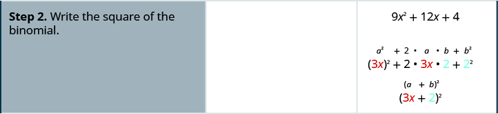

By the end of this section, you will be able to:
* Factor perfect square trinomials
* Factor differences of squares
* Factor sums and differences of cubes

Before you get started, take this readiness quiz.

1.  Simplify:
    <math xmlns="http://www.w3.org/1998/Math/MathML"><mrow><msup><mrow><mrow><mo>(</mo><mrow><mn>3</mn><msup><mi>x</mi><mn>2</mn></msup></mrow><mo>)</mo></mrow></mrow><mn>3</mn></msup><mo>.</mo></mrow></math>
    
    * * *
    {: data-type="newline"}
    
    If you missed this problem, review [\[link\]](/m63345#fs-id1167835304261).
2.  Multiply:
    <math xmlns="http://www.w3.org/1998/Math/MathML"><mrow><msup><mrow><mrow><mo>(</mo><mrow><mi>m</mi><mo>+</mo><mn>4</mn></mrow><mo>)</mo></mrow></mrow><mn>2</mn></msup><mo>.</mo></mrow></math>
    
    * * *
    {: data-type="newline"}
    
    If you missed this problem, review [\[link\]](/m63351#fs-id1167836392219).
3.  Multiply:
    <math xmlns="http://www.w3.org/1998/Math/MathML"><mrow><mrow><mo>(</mo><mrow><mi>x</mi><mo>−</mo><mn>3</mn></mrow><mo>)</mo></mrow><mrow><mo>(</mo><mrow><mi>x</mi><mo>+</mo><mn>3</mn></mrow><mo>)</mo></mrow><mo>.</mo></mrow></math>
    
    * * *
    {: data-type="newline"}
    
    If you missed this problem, review [\[link\]](/m63351#fs-id1167836717042).
{: type="1"}

We have seen that some binomials and trinomials result from special products—squaring binomials and multiplying conjugates. If you learn to recognize these kinds of polynomials, you can use the special products patterns to factor them much more quickly.

### Factor Perfect Square Trinomials

Some trinomials are perfect squares. They result from multiplying a binomial times itself. We squared a binomial using the Binomial Squares pattern in a previous chapter.

    The trinomial <math xmlns="http://www.w3.org/1998/Math/MathML"><mrow><mn>9</mn><msup><mi>x</mi><mn>2</mn></msup><mo>+</mo><mn>24</mn><mi>x</mi><mo>+</mo><mn>16</mn></mrow></math>

 is called a *perfect square trinomial*. It is the square of the binomial <math xmlns="http://www.w3.org/1998/Math/MathML"><mrow><mn>3</mn><mi>x</mi><mo>+</mo><mn>4</mn><mo>.</mo></mrow></math>

In this chapter, you will start with a perfect square trinomial and factor it into its **prime**{: data-type="term" .no-emphasis} factors.

You could factor this **trinomial**{: data-type="term" .no-emphasis} using the methods described in the last section, since it is of the form <math xmlns="http://www.w3.org/1998/Math/MathML"><mrow><mi>a</mi><msup><mi>x</mi><mn>2</mn></msup><mo>+</mo><mi>b</mi><mi>x</mi><mo>+</mo><mi>c</mi><mo>.</mo></mrow></math>

 But if you recognize that the first and last terms are squares and the trinomial fits the perfect square trinomials pattern, you will save yourself a lot of work.

Here is the pattern—the reverse of the binomial squares pattern.

Perfect Square Trinomials Pattern

If *a* and *b* are real numbers

<math xmlns="http://www.w3.org/1998/Math/MathML"><mtable><mtr><mtd columnalign="center"><msup><mi>a</mi><mn>2</mn></msup><mo>+</mo><mn>2</mn><mi>a</mi><mi>b</mi><mo>+</mo><msup><mi>b</mi><mn>2</mn></msup><mo>=</mo><msup><mrow><mo>(</mo><mrow><mi>a</mi><mo>+</mo><mi>b</mi></mrow><mo>)</mo></mrow><mn>2</mn></msup></mtd></mtr><mtr><mtd columnalign="center"><msup><mi>a</mi><mn>2</mn></msup><mo>−</mo><mn>2</mn><mi>a</mi><mi>b</mi><mo>+</mo><msup><mi>b</mi><mn>2</mn></msup><mo>=</mo><msup><mrow><mo>(</mo><mrow><mi>a</mi><mo>−</mo><mi>b</mi></mrow><mo>)</mo></mrow><mn>2</mn></msup></mtd></mtr></mtable></math>

To make use of this pattern, you have to recognize that a given trinomial fits it. Check first to see if the leading coefficient is a perfect square, <math xmlns="http://www.w3.org/1998/Math/MathML"><mrow><msup><mi>a</mi><mn>2</mn></msup><mo>.</mo></mrow></math>

 Next check that the last term is a perfect square, <math xmlns="http://www.w3.org/1998/Math/MathML"><mrow><msup><mi>b</mi><mn>2</mn></msup><mo>.</mo></mrow></math>

 Then check the middle term—is it the product, <math xmlns="http://www.w3.org/1998/Math/MathML"><mrow><mn>2</mn><mi>a</mi><mi>b</mi><mo>?</mo></mrow></math>

 If everything checks, you can easily write the factors.

How to Factor Perfect Square Trinomials

Factor: <math xmlns="http://www.w3.org/1998/Math/MathML"><mrow><mn>9</mn><msup><mi>x</mi><mn>2</mn></msup><mo>+</mo><mn>12</mn><mi>x</mi><mo>+</mo><mn>4</mn><mo>.</mo></mrow></math>

        

Factor: <math xmlns="http://www.w3.org/1998/Math/MathML"><mrow><mn>4</mn><msup><mi>x</mi><mn>2</mn></msup><mo>+</mo><mn>12</mn><mi>x</mi><mo>+</mo><mn>9</mn><mo>.</mo></mrow></math>

<math xmlns="http://www.w3.org/1998/Math/MathML"><mrow><msup><mrow><mrow><mo>(</mo><mrow><mn>2</mn><mi>x</mi><mo>+</mo><mn>3</mn></mrow><mo>)</mo></mrow></mrow><mn>2</mn></msup></mrow></math>

Factor: <math xmlns="http://www.w3.org/1998/Math/MathML"><mrow><mn>9</mn><msup><mi>y</mi><mn>2</mn></msup><mo>+</mo><mn>24</mn><mi>y</mi><mo>+</mo><mn>16</mn><mo>.</mo></mrow></math>

<math xmlns="http://www.w3.org/1998/Math/MathML"><mrow><msup><mrow><mrow><mo>(</mo><mrow><mn>3</mn><mi>y</mi><mo>+</mo><mn>4</mn></mrow><mo>)</mo></mrow></mrow><mn>2</mn></msup></mrow></math>

The sign of the middle term determines which pattern we will use. When the middle term is negative, we use the pattern <math xmlns="http://www.w3.org/1998/Math/MathML"><mrow><msup><mi>a</mi><mn>2</mn></msup><mo>−</mo><mn>2</mn><mi>a</mi><mi>b</mi><mo>+</mo><msup><mi>b</mi><mn>2</mn></msup><mo>,</mo></mrow></math>

 which factors to <math xmlns="http://www.w3.org/1998/Math/MathML"><mrow><msup><mrow><mrow><mo>(</mo><mrow><mi>a</mi><mo>−</mo><mi>b</mi></mrow><mo>)</mo></mrow></mrow><mn>2</mn></msup><mo>.</mo></mrow></math>

The steps are summarized here.

Factor perfect square trinomials.

<math xmlns="http://www.w3.org/1998/Math/MathML"><mrow><mtable><mtr><mtd columnalign="left"><mtext mathvariant="bold">Step 1.</mtext></mtd><mtd columnalign="left"><mtext>Does the trinomial fit the pattern?</mtext></mtd><mtd /><mtd /><mtd columnalign="center"><mspace width="4em" /><msup><mi>a</mi><mn>2</mn></msup><mo>+</mo><mn>2</mn><mi>a</mi><mi>b</mi><mo>+</mo><msup><mi>b</mi><mn>2</mn></msup></mtd><mtd /><mtd /><mtd columnalign="center"><msup><mi>a</mi><mn>2</mn></msup><mo>−</mo><mn>2</mn><mi>a</mi><mi>b</mi><mo>+</mo><msup><mi>b</mi><mn>2</mn></msup></mtd></mtr> <mtr><mtd /><mtd columnalign="left"><mtext>Is the first term a perfect square?</mtext></mtd><mtd /><mtd /><mtd columnalign="center"><mspace width="4em" /><msup><mrow><mrow><mo>(</mo><mi>a</mi><mo>)</mo></mrow></mrow><mn>2</mn></msup></mtd><mtd /><mtd /><mtd columnalign="center"><msup><mrow><mrow><mo>(</mo><mi>a</mi><mo>)</mo></mrow></mrow><mn>2</mn></msup></mtd></mtr> <mtr><mtd /><mtd columnalign="left"><mtext>Write it as a square.</mtext></mtd><mtd /><mtd /><mtd /><mtd /><mtd /><mtd /></mtr> <mtr><mtd /><mtd columnalign="left"><mtext>Is the last term a perfect square?</mtext></mtd><mtd /><mtd /><mtd columnalign="center"><mspace width="4em" /><msup><mrow><mrow><mo>(</mo><mi>a</mi><mo>)</mo></mrow></mrow><mn>2</mn></msup><mspace width="4.5em" /><msup><mrow><mrow><mo>(</mo><mi>b</mi><mo>)</mo></mrow></mrow><mn>2</mn></msup></mtd><mtd /><mtd /><mtd columnalign="center"><msup><mrow><mrow><mo>(</mo><mi>a</mi><mo>)</mo></mrow></mrow><mn>2</mn></msup><mspace width="4.5em" /><msup><mrow><mrow><mo>(</mo><mi>b</mi><mo>)</mo></mrow></mrow><mn>2</mn></msup></mtd></mtr> <mtr><mtd /><mtd columnalign="left"><mtext>Write it as a square.</mtext></mtd><mtd /><mtd /><mtd /><mtd /><mtd /><mtd /></mtr> <mtr><mtd /><mtd columnalign="left"><mtext>Check the middle term. Is it</mtext><mspace width="0.2em" /><mn>2</mn><mi>a</mi><mi>b</mi><mo>?</mo></mtd><mtd /><mtd /><mtd columnalign="center"><mspace width="4em" /><msup><mrow><mrow><mo>(</mo><mi>a</mi><mo>)</mo></mrow></mrow><mn>2</mn></msup><msub><mrow /><mtext>↘</mtext></msub><munder><mrow /><mrow><mn>2</mn><mo>·</mo><mi>a</mi><mo>·</mo><mi>b</mi></mrow></munder><msub><mrow /><mtext>↙</mtext></msub><mrow><msup><mrow><mo>(</mo><mi>b</mi><mo>)</mo></mrow><mn>2</mn></msup></mrow></mtd><mtd /><mtd /><mtd columnalign="center"><msup><mrow><mrow><mo>(</mo><mi>a</mi><mo>)</mo></mrow></mrow><mn>2</mn></msup><msub><mrow /><mtext>↘</mtext></msub><munder><mrow /><mrow><mn>2</mn><mo>·</mo><mi>a</mi><mo>·</mo><mi>b</mi></mrow></munder><msub><mrow /><mtext>↙</mtext></msub><mrow><msup><mrow><mo>(</mo><mi>b</mi><mo>)</mo></mrow><mn>2</mn></msup></mrow></mtd></mtr> <mtr><mtd columnalign="left"><mtext mathvariant="bold">Step 2.</mtext></mtd><mtd columnalign="left"><mtext>Write the square of the binomial.</mtext></mtd><mtd /><mtd /><mtd columnalign="center"><mspace width="4em" /><msup><mrow><mrow><mo>(</mo><mrow><mi>a</mi><mo>+</mo><mi>b</mi></mrow><mo>)</mo></mrow></mrow><mn>2</mn></msup></mtd><mtd /><mtd /><mtd columnalign="center"><msup><mrow><mrow><mo>(</mo><mrow><mi>a</mi><mo>−</mo><mi>b</mi></mrow><mo>)</mo></mrow></mrow><mn>2</mn></msup></mtd></mtr> <mtr><mtd columnalign="left"><mtext mathvariant="bold">Step 3.</mtext></mtd><mtd columnalign="left"><mtext>Check by multiplying.</mtext></mtd><mtd /><mtd /><mtd /><mtd /><mtd /><mtd /></mtr></mtable></mrow></math>

We’ll work one now where the middle term is negative.

Factor: <math xmlns="http://www.w3.org/1998/Math/MathML"><mrow><mn>81</mn><msup><mi>y</mi><mn>2</mn></msup><mo>−</mo><mn>72</mn><mi>y</mi><mo>+</mo><mn>16</mn><mo>.</mo></mrow></math>

The first and last terms are squares. See if the middle term fits the pattern of a **perfect square**{: data-type="term" .no-emphasis} trinomial. The middle term is negative, so the binomial square would be <math xmlns="http://www.w3.org/1998/Math/MathML"><mrow><msup><mrow><mo stretchy="false">(</mo><mi>a</mi><mo>−</mo><mi>b</mi><mo stretchy="false">)</mo></mrow><mn>2</mn></msup><mo>.</mo></mrow></math>

<table class="unnumbered unstyled" summary="The trinomial is 81 y squared minus 72y plus 16. The first and last terms are perfect squares of 9y and 4. Check the middle term. It is twice 9y times 4. The trinomial matches a minus b the whole squared. So we write it as the square of a binomial open parentheses 9y minus 4 close parentheses squared. Finally, we check by multiplying." data-label=""><tbody>
<tr valign="top">
<td data-valign="top" data-align="left" />
<td data-valign="top" data-align="left"></td>
</tr>
<tr valign="top">
<td data-valign="top" data-align="left">Are the first and last terms perfect squares?    </td>
<td data-valign="top" data-align="left"></td>
</tr>
<tr valign="top">
<td data-valign="top" data-align="left">Check the middle term.</td>
<td data-valign="top" data-align="left"></td>
</tr>
<tr valign="top">
<td data-valign="top" data-align="left">Does it match <math xmlns="http://www.w3.org/1998/Math/MathML"><mrow><msup><mrow><mo stretchy="false">(</mo><mi>a</mi><mo>−</mo><mi>b</mi><mo stretchy="false">)</mo></mrow><mn>2</mn></msup><mo>?</mo></mrow></math> Yes.</td>
<td data-valign="top" data-align="left"></td>
</tr>
<tr valign="top">
<td data-valign="top" data-align="left">Write as the square of a binomial.</td>
<td data-valign="top" data-align="left"></td>
</tr>
<tr valign="top">
<td data-valign="top" data-align="left">Check by multiplying:

<math xmlns="http://www.w3.org/1998/Math/MathML"><mrow><mspace width="4em" /><mtable><mtr><mtd columnalign="center"><msup><mrow><mrow><mo>(</mo><mrow><mn>9</mn><mi>y</mi><mo>−</mo><mn>4</mn></mrow><mo>)</mo></mrow></mrow><mn>2</mn></msup></mtd></mtr><mtr><mtd columnalign="center"><msup><mrow><mo stretchy="false">(</mo><mn>9</mn><mi>y</mi><mo stretchy="false">)</mo></mrow><mn>2</mn></msup><mo>−</mo><mn>2</mn><mo>·</mo><mn>9</mn><mi>y</mi><mo>·</mo><mn>4</mn><mo>+</mo><msup><mn>4</mn><mn>2</mn></msup></mtd></mtr><mtr><mtd columnalign="center"><mn>81</mn><msup><mi>y</mi><mn>2</mn></msup><mo>−</mo><mn>72</mn><mi>y</mi><mo>+</mo><mn>16</mn><mo>✓</mo></mtd></mtr></mtable></mrow></math></td>
<td data-valign="top" data-align="left" />
</tr>
</tbody></table>

Factor: <math xmlns="http://www.w3.org/1998/Math/MathML"><mrow><mn>64</mn><msup><mi>y</mi><mn>2</mn></msup><mo>−</mo><mn>80</mn><mi>y</mi><mo>+</mo><mn>25</mn><mo>.</mo></mrow></math>

<math xmlns="http://www.w3.org/1998/Math/MathML"><mrow><msup><mrow><mrow><mo>(</mo><mrow><mn>8</mn><mi>y</mi><mo>−</mo><mn>5</mn></mrow><mo>)</mo></mrow></mrow><mn>2</mn></msup></mrow></math>

Factor: <math xmlns="http://www.w3.org/1998/Math/MathML"><mrow><mn>16</mn><msup><mi>z</mi><mn>2</mn></msup><mo>−</mo><mn>72</mn><mi>z</mi><mo>+</mo><mn>81</mn><mo>.</mo></mrow></math>

<math xmlns="http://www.w3.org/1998/Math/MathML"><mrow><msup><mrow><mrow><mo>(</mo><mrow><mn>4</mn><mi>z</mi><mo>−</mo><mn>9</mn></mrow><mo>)</mo></mrow></mrow><mn>2</mn></msup></mrow></math>

The next example will be a perfect square trinomial with two variables.

Factor: <math xmlns="http://www.w3.org/1998/Math/MathML"><mrow><mn>36</mn><msup><mi>x</mi><mn>2</mn></msup><mo>+</mo><mn>84</mn><mi>x</mi><mi>y</mi><mo>+</mo><mn>49</mn><msup><mi>y</mi><mn>2</mn></msup><mo>.</mo></mrow></math>

<table class="unnumbered unstyled" summary="The trinomial is 36 x squared plus 84xy plus 49 y squared. We test each term to verify the pattern. The trinomial is open parentheses 6x close parentheses squared plus 2 times 6x times 7y plus open parentheses 7y close parentheses squared. We factor to get open parentheses 6x plus 7y close parentheses squared." data-label=""><tbody>
<tr valign="top">
<td data-valign="top" data-align="left" />
<td data-valign="top" data-align="left"></td>
</tr>
<tr valign="top">
<td data-valign="top" data-align="left">Test each term to verify the pattern.   </td>
<td data-valign="top" data-align="left"></td>
</tr>
<tr valign="top">
<td data-valign="top" data-align="left">Factor.</td>
<td data-valign="top" data-align="left"></td>
</tr>
<tr valign="top">
<td data-valign="top" data-align="left">Check by multiplying.

<math xmlns="http://www.w3.org/1998/Math/MathML"><mrow><mspace width="4em" /><mtable><mtr><mtd columnalign="center"><msup><mrow><mrow><mo>(</mo><mrow><mn>6</mn><mi>x</mi><mo>+</mo><mn>7</mn><mi>y</mi></mrow><mo>)</mo></mrow></mrow><mn>2</mn></msup></mtd></mtr><mtr><mtd columnalign="center"><msup><mrow><mrow><mo>(</mo><mrow><mn>6</mn><mi>x</mi></mrow><mo>)</mo></mrow></mrow><mn>2</mn></msup><mo>+</mo><mn>2</mn><mo>·</mo><mn>6</mn><mi>x</mi><mo>·</mo><mn>7</mn><mi>y</mi><mo>+</mo><msup><mrow><mrow><mo>(</mo><mrow><mn>7</mn><mi>y</mi></mrow><mo>)</mo></mrow></mrow><mn>2</mn></msup></mtd></mtr><mtr><mtd columnalign="center"><mn>36</mn><msup><mi>x</mi><mn>2</mn></msup><mo>+</mo><mn>84</mn><mi>x</mi><mi>y</mi><mo>+</mo><mn>49</mn><msup><mi>y</mi><mn>2</mn></msup><mo>✓</mo></mtd></mtr></mtable></mrow></math></td>
<td data-valign="top" data-align="left" />
</tr>
</tbody></table>

Factor: <math xmlns="http://www.w3.org/1998/Math/MathML"><mrow><mn>49</mn><msup><mi>x</mi><mn>2</mn></msup><mo>+</mo><mn>84</mn><mi>x</mi><mi>y</mi><mo>+</mo><mn>36</mn><msup><mi>y</mi><mn>2</mn></msup><mo>.</mo></mrow></math>

<math xmlns="http://www.w3.org/1998/Math/MathML"><mrow><msup><mrow><mrow><mo>(</mo><mrow><mn>7</mn><mi>x</mi><mo>+</mo><mn>6</mn><mi>y</mi></mrow><mo>)</mo></mrow></mrow><mn>2</mn></msup></mrow></math>

Factor: <math xmlns="http://www.w3.org/1998/Math/MathML"><mrow><mn>64</mn><msup><mi>m</mi><mn>2</mn></msup><mo>+</mo><mn>112</mn><mi>m</mi><mi>n</mi><mo>+</mo><mn>49</mn><msup><mi>n</mi><mn>2</mn></msup><mo>.</mo></mrow></math>

<math xmlns="http://www.w3.org/1998/Math/MathML"><mrow><msup><mrow><mrow><mo>(</mo><mrow><mn>8</mn><mi>m</mi><mo>+</mo><mn>7</mn><mi>n</mi></mrow><mo>)</mo></mrow></mrow><mn>2</mn></msup></mrow></math>

Remember the first step in factoring is to look for a greatest common factor. Perfect square trinomials may have a **GCF**{: data-type="term" .no-emphasis} in all three terms and it should be factored out first. And, sometimes, once the GCF has been factored, you will recognize a perfect square trinomial.

Factor: <math xmlns="http://www.w3.org/1998/Math/MathML"><mrow><mn>100</mn><msup><mi>x</mi><mn>2</mn></msup><mi>y</mi><mo>−</mo><mn>80</mn><mi>x</mi><mi>y</mi><mo>+</mo><mn>16</mn><mi>y</mi><mo>.</mo></mrow></math>

|  |  |
{: valign="top"}| Is there a GCF? Yes, <math xmlns="http://www.w3.org/1998/Math/MathML"><mrow><mn>4</mn><mi>y</mi><mo>,</mo></mrow></math>

 so factor it out.     |  |
{: valign="top"}| Is this a perfect square trinomial? |  |
{: valign="top"}| Verify the pattern. |  |
{: valign="top"}| Factor. |  |
{: valign="top"}{: .unnumbered .unstyled summary="Is there a GCF in 100 x squared y minus 80xy plus 16y? Yes. Factoring it out, we get 4y open parentheses 25 x squared minus 20x plus 4 close parentheses. Is this a perfect square trinomial? To verify the pattern, we rewrite as 4y open bracket open parentheses 5x close parentheses squared minus 2 times 5x times 2 plus 2 squared close bracket. Factor to get 4y open parentheses 5x minus 2 close parentheses squared. Finally, we check by multiplying." data-label=""}

Remember: Keep the factor 4*y* in the final product.

Check:* * *
{: data-type="newline"}

* * *
{: data-type="newline"}

<math xmlns="http://www.w3.org/1998/Math/MathML"><mrow><mspace width="4em" /><mtable><mtr><mtd columnalign="center"><mn>4</mn><mi>y</mi><msup><mrow><mrow><mo>(</mo><mrow><mn>5</mn><mi>x</mi><mo>−</mo><mn>2</mn></mrow><mo>)</mo></mrow></mrow><mn>2</mn></msup></mtd></mtr><mtr><mtd columnalign="center"><mn>4</mn><mi>y</mi><mrow><mo>[</mo><mrow><msup><mrow><mrow><mo>(</mo><mrow><mn>5</mn><mi>x</mi></mrow><mo>)</mo></mrow></mrow><mn>2</mn></msup><mo>−</mo><mn>2</mn><mo>·</mo><mn>5</mn><mi>x</mi><mo>·</mo><mn>2</mn><mo>+</mo><msup><mn>2</mn><mn>2</mn></msup></mrow><mo>]</mo></mrow></mtd></mtr><mtr><mtd columnalign="center"><mn>4</mn><mi>y</mi><mrow><mo>(</mo><mrow><mn>25</mn><msup><mi>x</mi><mn>2</mn></msup><mo>−</mo><mn>20</mn><mi>x</mi><mo>+</mo><mn>4</mn></mrow><mo>)</mo></mrow></mtd></mtr><mtr><mtd columnalign="center"><mn>100</mn><msup><mi>x</mi><mn>2</mn></msup><mi>y</mi><mo>−</mo><mn>80</mn><mi>x</mi><mi>y</mi><mo>+</mo><mn>16</mn><mi>y</mi><mo>✓</mo></mtd></mtr></mtable></mrow></math>

Factor: <math xmlns="http://www.w3.org/1998/Math/MathML"><mrow><mn>8</mn><msup><mi>x</mi><mn>2</mn></msup><mi>y</mi><mo>−</mo><mn>24</mn><mi>x</mi><mi>y</mi><mo>+</mo><mn>18</mn><mi>y</mi><mo>.</mo></mrow></math>

<math xmlns="http://www.w3.org/1998/Math/MathML"><mrow><mn>2</mn><mi>y</mi><msup><mrow><mrow><mo>(</mo><mrow><mn>2</mn><mi>x</mi><mo>−</mo><mn>3</mn></mrow><mo>)</mo></mrow></mrow><mn>2</mn></msup></mrow></math>

Factor: <math xmlns="http://www.w3.org/1998/Math/MathML"><mrow><mn>27</mn><msup><mi>p</mi><mn>2</mn></msup><mi>q</mi><mo>+</mo><mn>90</mn><mi>p</mi><mi>q</mi><mo>+</mo><mn>75</mn><mi>q</mi><mo>.</mo></mrow></math>

<math xmlns="http://www.w3.org/1998/Math/MathML"><mrow><mn>3</mn><mi>q</mi><msup><mrow><mrow><mo>(</mo><mrow><mn>3</mn><mi>p</mi><mo>+</mo><mn>5</mn></mrow><mo>)</mo></mrow></mrow><mn>2</mn></msup></mrow></math>

### Factor Differences of Squares

The other special product you saw in the previous chapter was the Product of Conjugates pattern. You used this to multiply two binomials that were conjugates. Here’s an example:

    A difference of squares factors to a product of conjugates.

Difference of Squares Pattern

If *a* and *b* are real numbers,

  

Remember, “difference” refers to subtraction. So, to use this pattern you must make sure you have a binomial in which two squares are being subtracted.

How to Factor a Trinomial Using the Difference of Squares

Factor: <math xmlns="http://www.w3.org/1998/Math/MathML"><mrow><mn>64</mn><msup><mi>y</mi><mn>2</mn></msup><mo>−</mo><mn>1</mn><mo>.</mo></mrow></math>

           

Factor: <math xmlns="http://www.w3.org/1998/Math/MathML"><mrow><mn>121</mn><msup><mi>m</mi><mn>2</mn></msup><mo>−</mo><mn>1</mn><mo>.</mo></mrow></math>

<math xmlns="http://www.w3.org/1998/Math/MathML"><mrow><mrow><mo>(</mo><mrow><mn>11</mn><mi>m</mi><mo>−</mo><mn>1</mn></mrow><mo>)</mo></mrow><mrow><mo>(</mo><mrow><mn>11</mn><mi>m</mi><mo>+</mo><mn>1</mn></mrow><mo>)</mo></mrow></mrow></math>

Factor: <math xmlns="http://www.w3.org/1998/Math/MathML"><mrow><mn>81</mn><msup><mi>y</mi><mn>2</mn></msup><mo>−</mo><mn>1</mn><mo>.</mo></mrow></math>

<math xmlns="http://www.w3.org/1998/Math/MathML"><mrow><mrow><mo>(</mo><mrow><mn>9</mn><mi>y</mi><mo>−</mo><mn>1</mn></mrow><mo>)</mo></mrow><mrow><mo>(</mo><mrow><mn>9</mn><mi>y</mi><mo>+</mo><mn>1</mn></mrow><mo>)</mo></mrow></mrow></math>

Factor differences of squares.

<math xmlns="http://www.w3.org/1998/Math/MathML"><mrow><mtable><mtr><mtd columnalign="left"><mtext mathvariant="bold">Step 1.</mtext></mtd><mtd columnalign="left"><mtext>Does the binomial fit the pattern?</mtext></mtd><mtd /><mtd /><mtd columnalign="center"><mspace width="4em" /><msup><mi>a</mi><mn>2</mn></msup><mo>−</mo><msup><mi>b</mi><mn>2</mn></msup></mtd></mtr><mtr><mtd /><mtd columnalign="left"><mtext>Is this a difference?</mtext></mtd><mtd /><mtd /><mtd columnalign="center"><mspace width="4em" /><mtext>\_\_\_\_</mtext><mo>−</mo><mtext>\_\_\_\_</mtext></mtd></mtr><mtr><mtd /><mtd columnalign="left"><mtext>Are the first and last terms perfect squares?</mtext></mtd><mtd /><mtd /><mtd /></mtr><mtr><mtd columnalign="left"><mtext mathvariant="bold">Step 2.</mtext></mtd><mtd columnalign="left"><mtext>Write them as squares.</mtext></mtd><mtd /><mtd /><mtd columnalign="center"><mspace width="4em" /><msup><mrow><mrow><mo>(</mo><mi>a</mi><mo>)</mo></mrow></mrow><mn>2</mn></msup><mo>−</mo><msup><mrow><mrow><mo>(</mo><mi>b</mi><mo>)</mo></mrow></mrow><mn>2</mn></msup></mtd></mtr><mtr><mtd columnalign="left"><mtext mathvariant="bold">Step 3.</mtext></mtd><mtd columnalign="left"><mtext>Write the product of conjugates.</mtext></mtd><mtd /><mtd /><mtd columnalign="center"><mspace width="4em" /><mrow><mo>(</mo><mrow><mi>a</mi><mo>−</mo><mi>b</mi></mrow><mo>)</mo></mrow><mrow><mo>(</mo><mrow><mi>a</mi><mo>+</mo><mi>b</mi></mrow><mo>)</mo></mrow></mtd></mtr><mtr><mtd columnalign="left"><mtext mathvariant="bold">Step 4.</mtext></mtd><mtd columnalign="left"><mtext>Check by multiplying.</mtext></mtd><mtd /><mtd /><mtd /></mtr></mtable></mrow></math>

It is important to remember that *sums of squares do not factor into a product of binomials*. There are no binomial factors that multiply together to get a sum of squares. After removing any GCF, the expression <math xmlns="http://www.w3.org/1998/Math/MathML"><mrow><msup><mi>a</mi><mn>2</mn></msup><mo>+</mo><msup><mi>b</mi><mn>2</mn></msup></mrow></math>

 is prime!

The next example shows variables in both terms.

Factor: <math xmlns="http://www.w3.org/1998/Math/MathML"><mrow><mn>144</mn><msup><mi>x</mi><mn>2</mn></msup><mo>−</mo><mn>49</mn><msup><mi>y</mi><mn>2</mn></msup><mo>.</mo></mrow></math>

<math xmlns="http://www.w3.org/1998/Math/MathML"><mrow><mtable><mtr><mtd /><mtd /><mtd /><mtd columnalign="left"><mspace width="4em" /><mn>144</mn><msup><mi>x</mi><mn>2</mn></msup><mo>−</mo><mn>49</mn><msup><mi>y</mi><mn>2</mn></msup></mtd></mtr><mtr><mtd columnalign="left"><mtext>Is this a difference of squares? Yes.</mtext></mtd><mtd /><mtd /><mtd columnalign="left"><mspace width="4em" /><msup><mrow><mrow><mo>(</mo><mrow><mn>12</mn><mi>x</mi></mrow><mo>)</mo></mrow></mrow><mn>2</mn></msup><mo>−</mo><msup><mrow><mrow><mo>(</mo><mrow><mn>7</mn><mi>y</mi></mrow><mo>)</mo></mrow></mrow><mn>2</mn></msup></mtd></mtr><mtr><mtd columnalign="left"><mtext>Factor as the product of conjugates.</mtext></mtd><mtd /><mtd /><mtd columnalign="left"><mspace width="4em" /><mrow><mo>(</mo><mrow><mn>12</mn><mi>x</mi><mo>−</mo><mn>7</mn><mi>y</mi></mrow><mo>)</mo></mrow><mrow><mo>(</mo><mrow><mn>12</mn><mi>x</mi><mo>+</mo><mn>7</mn><mi>y</mi></mrow><mo>)</mo></mrow></mtd></mtr><mtr><mtd columnalign="left"><mtext>Check by multiplying.</mtext></mtd><mtd /><mtd /><mtd /></mtr><mtr /><mtr /><mtr><mtd columnalign="center"><mspace width="4em" /><mrow><mo>(</mo><mrow><mn>12</mn><mi>x</mi><mo>−</mo><mn>7</mn><mi>y</mi></mrow><mo>)</mo></mrow><mrow><mo>(</mo><mrow><mn>12</mn><mi>x</mi><mo>+</mo><mn>7</mn><mi>y</mi></mrow><mo>)</mo></mrow></mtd><mtd /><mtd /><mtd /></mtr><mtr><mtd columnalign="center"><mspace width="4em" /><mn>144</mn><msup><mi>x</mi><mn>2</mn></msup><mo>−</mo><mn>49</mn><msup><mi>y</mi><mn>2</mn></msup><mo>✓</mo></mtd><mtd /><mtd /><mtd /></mtr></mtable></mrow></math>

Factor: <math xmlns="http://www.w3.org/1998/Math/MathML"><mrow><mn>196</mn><msup><mi>m</mi><mn>2</mn></msup><mo>−</mo><mn>25</mn><msup><mi>n</mi><mn>2</mn></msup><mo>.</mo></mrow></math>

<math xmlns="http://www.w3.org/1998/Math/MathML"><mrow><mrow><mo>(</mo><mrow><mn>16</mn><mi>m</mi><mo>−</mo><mn>5</mn><mi>n</mi></mrow><mo>)</mo></mrow><mrow><mo>(</mo><mrow><mn>16</mn><mi>m</mi><mo>+</mo><mn>5</mn><mi>n</mi></mrow><mo>)</mo></mrow></mrow></math>

Factor: <math xmlns="http://www.w3.org/1998/Math/MathML"><mrow><mn>121</mn><msup><mi>p</mi><mn>2</mn></msup><mo>−</mo><mn>9</mn><msup><mi>q</mi><mn>2</mn></msup><mo>.</mo></mrow></math>

<math xmlns="http://www.w3.org/1998/Math/MathML"><mrow><mrow><mo>(</mo><mrow><mn>11</mn><mi>p</mi><mo>−</mo><mn>3</mn><mi>q</mi></mrow><mo>)</mo></mrow><mrow><mo>(</mo><mrow><mn>11</mn><mi>p</mi><mo>+</mo><mn>3</mn><mi>q</mi></mrow><mo>)</mo></mrow></mrow></math>

As always, you should look for a common factor first whenever you have an expression to factor. Sometimes a common factor may “disguise” the difference of squares and you won’t recognize the perfect squares until you factor the GCF.

Also, to completely factor the binomial in the next example, we’ll factor a difference of squares twice!

Factor: <math xmlns="http://www.w3.org/1998/Math/MathML"><mrow><mn>48</mn><msup><mi>x</mi><mn>4</mn></msup><msup><mi>y</mi><mn>2</mn></msup><mo>−</mo><mn>243</mn><msup><mi>y</mi><mn>2</mn></msup><mo>.</mo></mrow></math>

<math xmlns="http://www.w3.org/1998/Math/MathML"><mrow><mtable><mtr><mtd /><mtd /><mtd /><mtd /><mtd /><mtd columnalign="center"><mn>48</mn><msup><mi>x</mi><mn>4</mn></msup><msup><mi>y</mi><mn>2</mn></msup><mo>−</mo><mn>243</mn><msup><mi>y</mi><mn>2</mn></msup></mtd></mtr><mtr><mtd columnalign="left"><mtext>Is there a GCF? Yes,</mtext><mspace width="0.2em" /><mn>3</mn><msup><mi>y</mi><mn>2</mn></msup><mtext>—factor it out!</mtext></mtd><mtd /><mtd /><mtd /><mtd /><mtd columnalign="center"><mn>3</mn><msup><mi>y</mi><mn>2</mn></msup><mrow><mo>(</mo><mrow><mn>16</mn><msup><mi>x</mi><mn>4</mn></msup><mo>−</mo><mn>81</mn></mrow><mo>)</mo></mrow></mtd></mtr><mtr><mtd columnalign="left"><mtext>Is the binomial a difference of squares? Yes.</mtext></mtd><mtd /><mtd /><mtd /><mtd /><mtd columnalign="center"><mn>3</mn><msup><mi>y</mi><mn>2</mn></msup><mrow><mo>(</mo><mrow><msup><mrow><mrow><mo>(</mo><mrow><mn>4</mn><msup><mi>x</mi><mn>2</mn></msup></mrow><mo>)</mo></mrow></mrow><mn>2</mn></msup><mo>−</mo><msup><mrow><mrow><mo>(</mo><mn>9</mn><mo>)</mo></mrow></mrow><mn>2</mn></msup></mrow><mo>)</mo></mrow></mtd></mtr><mtr><mtd columnalign="left"><mtext>Factor as a product of conjugates.</mtext></mtd><mtd /><mtd /><mtd /><mtd /><mtd columnalign="center"><mn>3</mn><msup><mi>y</mi><mn>2</mn></msup><mrow><mo>(</mo><mrow><mn>4</mn><msup><mi>x</mi><mn>2</mn></msup><mo>−</mo><mn>9</mn></mrow><mo>)</mo></mrow><mrow><mo>(</mo><mrow><mn>4</mn><msup><mi>x</mi><mn>2</mn></msup><mo>+</mo><mn>9</mn></mrow><mo>)</mo></mrow></mtd></mtr><mtr><mtd columnalign="left"><mtext>Notice the first binomial is also a difference of squares!</mtext></mtd><mtd /><mtd /><mtd /><mtd /><mtd columnalign="center"><mn>3</mn><msup><mi>y</mi><mn>2</mn></msup><mrow><mo>(</mo><mrow><msup><mrow><mo stretchy="false">(</mo><mn>2</mn><mi>x</mi><mo stretchy="false">)</mo></mrow><mn>2</mn></msup><mo>−</mo><msup><mrow><mo stretchy="false">(</mo><mn>3</mn><mo stretchy="false">)</mo></mrow><mn>2</mn></msup></mrow><mo>)</mo></mrow><mrow><mo>(</mo><mrow><mn>4</mn><msup><mi>x</mi><mn>2</mn></msup><mo>+</mo><mn>9</mn></mrow><mo>)</mo></mrow></mtd></mtr><mtr><mtd columnalign="left"><mtext>Factor it as the product of conjugates.</mtext></mtd><mtd /><mtd /><mtd /><mtd /><mtd columnalign="center"><mn>3</mn><msup><mi>y</mi><mn>2</mn></msup><mrow><mo>(</mo><mrow><mn>2</mn><mi>x</mi><mo>−</mo><mn>3</mn></mrow><mo>)</mo></mrow><mrow><mo>(</mo><mrow><mn>2</mn><mi>x</mi><mo>+</mo><mn>3</mn></mrow><mo>)</mo></mrow><mrow><mo>(</mo><mrow><mn>4</mn><msup><mi>x</mi><mn>2</mn></msup><mo>+</mo><mn>9</mn></mrow><mo>)</mo></mrow></mtd></mtr></mtable></mrow></math>

The last factor, the sum of squares, cannot be factored.

<math xmlns="http://www.w3.org/1998/Math/MathML"><mrow><mtable><mtr><mtd columnalign="left"><mtext>Check by multiplying:</mtext></mtd></mtr><mtr /><mtr /><mtr><mtd columnalign="center"><mspace width="4em" /><mn>3</mn><msup><mi>y</mi><mn>2</mn></msup><mrow><mo>(</mo><mrow><mn>2</mn><mi>x</mi><mo>−</mo><mn>3</mn></mrow><mo>)</mo></mrow><mrow><mo>(</mo><mrow><mn>2</mn><mi>x</mi><mo>+</mo><mn>3</mn></mrow><mo>)</mo></mrow><mrow><mo>(</mo><mrow><mn>4</mn><msup><mi>x</mi><mn>2</mn></msup><mo>+</mo><mn>9</mn></mrow><mo>)</mo></mrow></mtd></mtr><mtr><mtd columnalign="center"><mspace width="4em" /><mn>3</mn><msup><mi>y</mi><mn>2</mn></msup><mrow><mo>(</mo><mrow><mn>4</mn><msup><mi>x</mi><mn>2</mn></msup><mo>−</mo><mn>9</mn></mrow><mo>)</mo></mrow><mrow><mo>(</mo><mrow><mn>4</mn><msup><mi>x</mi><mn>2</mn></msup><mo>+</mo><mn>9</mn></mrow><mo>)</mo></mrow></mtd></mtr><mtr><mtd columnalign="center"><mspace width="4em" /><mn>3</mn><msup><mi>y</mi><mn>2</mn></msup><mrow><mo>(</mo><mrow><mn>16</mn><msup><mi>x</mi><mn>4</mn></msup><mo>−</mo><mn>81</mn></mrow><mo>)</mo></mrow></mtd></mtr><mtr><mtd columnalign="center"><mspace width="4em" /><mn>48</mn><msup><mi>x</mi><mn>4</mn></msup><msup><mi>y</mi><mn>2</mn></msup><mo>−</mo><mn>243</mn><msup><mi>y</mi><mn>2</mn></msup><mo>✓</mo></mtd></mtr></mtable></mrow></math>

Factor: <math xmlns="http://www.w3.org/1998/Math/MathML"><mrow><mn>2</mn><msup><mi>x</mi><mn>4</mn></msup><msup><mi>y</mi><mn>2</mn></msup><mo>−</mo><mn>32</mn><msup><mi>y</mi><mn>2</mn></msup><mo>.</mo></mrow></math>

<math xmlns="http://www.w3.org/1998/Math/MathML"><mrow><mn>2</mn><msup><mi>y</mi><mn>2</mn></msup><mrow><mo>(</mo><mrow><mi>x</mi><mo>−</mo><mn>2</mn></mrow><mo>)</mo></mrow><mrow><mo>(</mo><mrow><mi>x</mi><mo>+</mo><mn>2</mn></mrow><mo>)</mo></mrow><mrow><mo>(</mo><mrow><msup><mi>x</mi><mn>2</mn></msup><mo>+</mo><mn>4</mn></mrow><mo>)</mo></mrow></mrow></math>

Factor: <math xmlns="http://www.w3.org/1998/Math/MathML"><mrow><mn>7</mn><msup><mi>a</mi><mn>4</mn></msup><msup><mi>c</mi><mn>2</mn></msup><mo>−</mo><mn>7</mn><msup><mi>b</mi><mn>4</mn></msup><msup><mi>c</mi><mn>2</mn></msup><mo>.</mo></mrow></math>

<math xmlns="http://www.w3.org/1998/Math/MathML"><mrow><mn>7</mn><msup><mi>c</mi><mn>2</mn></msup><mrow><mo>(</mo><mrow><mi>a</mi><mo>−</mo><mi>b</mi></mrow><mo>)</mo></mrow><mrow><mo>(</mo><mrow><mi>a</mi><mo>+</mo><mi>b</mi></mrow><mo>)</mo></mrow><mrow><mo>(</mo><mrow><msup><mi>a</mi><mn>2</mn></msup><mo>+</mo><msup><mi>b</mi><mn>2</mn></msup></mrow><mo>)</mo></mrow></mrow></math>

The next example has a polynomial with 4 terms. So far, when this occurred we grouped the terms in twos and factored from there. Here we will notice that the first three terms form a perfect square trinomial.

Factor: <math xmlns="http://www.w3.org/1998/Math/MathML"><mrow><msup><mi>x</mi><mn>2</mn></msup><mo>−</mo><mn>6</mn><mi>x</mi><mo>+</mo><mn>9</mn><mo>−</mo><msup><mi>y</mi><mn>2</mn></msup><mo>.</mo></mrow></math>

Notice that the first three terms form a perfect square trinomial.

|  |  |
{: valign="top"}| Factor by grouping the first three terms. |  |
{: valign="top"}| Use the perfect square trinomial pattern.      |  |
{: valign="top"}| Is this a difference of squares? Yes. |  |
{: valign="top"}| Yes—write them as squares. |  |
{: valign="top"}| Factor as the product of conjugates. |  |
{: valign="top"}|  |  |
{: valign="top"}{: .unnumbered .unstyled summary="We have x squared minus 6x plus 9 minus y squared. We factor by grouping the first three terms. Use the perfect square trinomial pattern to get open parentheses x minus 3 close parentheses squared minus y squared. Is this a difference of squares? Yes. Factor as the product of conjugates, open parentheses x minus 3 minus y close parentheses open parentheses x minus 3 plus y close parentheses. You may want to rewrite the solution as open parentheses x minus y minus 3 close parentheses open parentheses x plus y minus 3 close parentheses." data-label=""}

You may want to rewrite the solution as <math xmlns="http://www.w3.org/1998/Math/MathML"><mrow><mrow><mo>(</mo><mrow><mi>x</mi><mo>−</mo><mi>y</mi><mo>−</mo><mn>3</mn></mrow><mo>)</mo></mrow><mrow><mo>(</mo><mrow><mi>x</mi><mo>+</mo><mi>y</mi><mo>−</mo><mn>3</mn></mrow><mo>)</mo></mrow><mo>.</mo></mrow></math>

Factor: <math xmlns="http://www.w3.org/1998/Math/MathML"><mrow><msup><mi>x</mi><mn>2</mn></msup><mo>−</mo><mn>10</mn><mi>x</mi><mo>+</mo><mn>25</mn><mo>−</mo><msup><mi>y</mi><mn>2</mn></msup><mo>.</mo></mrow></math>

<math xmlns="http://www.w3.org/1998/Math/MathML"><mrow><mrow><mo>(</mo><mrow><mi>x</mi><mo>−</mo><mn>5</mn><mo>−</mo><mi>y</mi></mrow><mo>)</mo></mrow><mrow><mo>(</mo><mrow><mi>x</mi><mo>−</mo><mn>5</mn><mo>+</mo><mi>y</mi></mrow><mo>)</mo></mrow></mrow></math>

Factor: <math xmlns="http://www.w3.org/1998/Math/MathML"><mrow><msup><mi>x</mi><mn>2</mn></msup><mo>+</mo><mn>6</mn><mi>x</mi><mo>+</mo><mn>9</mn><mo>−</mo><mn>4</mn><msup><mi>y</mi><mn>2</mn></msup><mo>.</mo></mrow></math>

<math xmlns="http://www.w3.org/1998/Math/MathML"><mrow><mrow><mo>(</mo><mrow><mi>x</mi><mo>+</mo><mn>3</mn><mo>−</mo><mn>2</mn><mi>y</mi></mrow><mo>)</mo></mrow><mrow><mo>(</mo><mrow><mi>x</mi><mo>+</mo><mn>3</mn><mo>+</mo><mn>2</mn><mi>y</mi></mrow><mo>)</mo></mrow></mrow></math>

### Factor Sums and Differences of Cubes

There is another special pattern for factoring, one that we did not use when we multiplied polynomials. This is the pattern for the sum and difference of cubes. We will write these formulas first and then check them by multiplication.

<math xmlns="http://www.w3.org/1998/Math/MathML"><mrow><mtable><mtr><mtd columnalign="center"><msup><mi>a</mi><mn>3</mn></msup><mo>+</mo><msup><mi>b</mi><mn>3</mn></msup><mo>=</mo><mrow><mo>(</mo><mrow><mi>a</mi><mo>+</mo><mi>b</mi></mrow><mo>)</mo></mrow><mrow><mo>(</mo><mrow><msup><mi>a</mi><mn>2</mn></msup><mo>−</mo><mi>a</mi><mi>b</mi><mo>+</mo><msup><mi>b</mi><mn>2</mn></msup></mrow><mo>)</mo></mrow></mtd></mtr><mtr><mtd columnalign="center"><msup><mi>a</mi><mn>3</mn></msup><mo>−</mo><msup><mi>b</mi><mn>3</mn></msup><mo>=</mo><mrow><mo>(</mo><mrow><mi>a</mi><mo>−</mo><mi>b</mi></mrow><mo>)</mo></mrow><mrow><mo>(</mo><mrow><msup><mi>a</mi><mn>2</mn></msup><mo>+</mo><mi>a</mi><mi>b</mi><mo>+</mo><msup><mi>b</mi><mn>2</mn></msup></mrow><mo>)</mo></mrow></mtd></mtr></mtable></mrow></math>

We’ll check the first pattern and leave the second to you.

|  |  |
{: valign="top"}| Distribute. |  |
{: valign="top"}| Multiply. |  |
{: valign="top"}| Combine like terms. |  |
{: valign="top"}{: .unnumbered .unstyled summary="Open parentheses a plus b close parentheses open parentheses a squared minus ab plus b squared. Distribute: a open parentheses a squared minus ab plus b squared plus b open parentheses a squared minus ab plus b squared close parentheses. Multiply: a cubed minus a squared b plus ab squared plus a squared b minus ab squared plus b cubed. Combine like terms: a cubed plus b cubed." data-label=""}

Sum and Difference of Cubes Pattern

<math xmlns="http://www.w3.org/1998/Math/MathML"><mrow><mtable><mtr><mtd columnalign="center"><msup><mi>a</mi><mn>3</mn></msup><mo>+</mo><msup><mi>b</mi><mn>3</mn></msup><mo>=</mo><mrow><mo>(</mo><mrow><mi>a</mi><mo>+</mo><mi>b</mi></mrow><mo>)</mo></mrow><mrow><mo>(</mo><mrow><msup><mi>a</mi><mn>2</mn></msup><mo>−</mo><mi>a</mi><mi>b</mi><mo>+</mo><msup><mi>b</mi><mn>2</mn></msup></mrow><mo>)</mo></mrow></mtd></mtr><mtr><mtd columnalign="center"><msup><mi>a</mi><mn>3</mn></msup><mo>−</mo><msup><mi>b</mi><mn>3</mn></msup><mo>=</mo><mrow><mo>(</mo><mrow><mi>a</mi><mo>−</mo><mi>b</mi></mrow><mo>)</mo></mrow><mrow><mo>(</mo><mrow><msup><mi>a</mi><mn>2</mn></msup><mo>+</mo><mi>a</mi><mi>b</mi><mo>+</mo><msup><mi>b</mi><mn>2</mn></msup></mrow><mo>)</mo></mrow></mtd></mtr></mtable></mrow></math>

The two patterns look very similar, don’t they? But notice the signs in the factors. The sign of the binomial factor matches the sign in the original binomial. And the sign of the middle term of the trinomial factor is the opposite of the sign in the original binomial. If you recognize the pattern of the signs, it may help you memorize the patterns.

    The trinomial factor in the sum and difference of cubes pattern cannot be factored.

It be very helpful if you learn to recognize the cubes of the integers from 1 to 10, just like you have learned to recognize squares. We have listed the cubes of the integers from 1 to 10 in [\[link\]](#fs-id1167835337696).

| *n* | 1 | 2 | 3 | 4 | 5 | 6 | 7 | 8 | 9 | 10 |
{: valign="top"}|----------
| <math xmlns="http://www.w3.org/1998/Math/MathML"><mrow><msup><mi>n</mi><mn>3</mn></msup></mrow></math>

 | 1 | 8 | 27 | 64 | 125 | 216 | 343 | 512 | 729 | 1000 |
{: valign="top"}{: summary="This table has 11 columns and 2 columns. The first column labels each row n and n cubed. The remaining columns of the first row have the numbers 1 through 10. The remaining columns of the second row have the numbers 1, 8, 27, 64, 125, 216, 343, 512, 729, 1000."}

How to Factor the Sum or Difference of Cubes

Factor: <math xmlns="http://www.w3.org/1998/Math/MathML"><mrow><msup><mi>x</mi><mn>3</mn></msup><mo>+</mo><mn>64</mn><mo>.</mo></mrow></math>

              

Factor: <math xmlns="http://www.w3.org/1998/Math/MathML"><mrow><msup><mi>x</mi><mn>3</mn></msup><mo>+</mo><mn>27</mn><mo>.</mo></mrow></math>

<math xmlns="http://www.w3.org/1998/Math/MathML"><mrow><mrow><mo>(</mo><mrow><mi>x</mi><mo>+</mo><mn>3</mn></mrow><mo>)</mo></mrow><mrow><mo>(</mo><mrow><msup><mi>x</mi><mn>2</mn></msup><mo>−</mo><mn>3</mn><mi>x</mi><mo>+</mo><mn>9</mn></mrow><mo>)</mo></mrow></mrow></math>

Factor: <math xmlns="http://www.w3.org/1998/Math/MathML"><mrow><msup><mi>y</mi><mn>3</mn></msup><mo>+</mo><mn>8</mn><mo>.</mo></mrow></math>

<math xmlns="http://www.w3.org/1998/Math/MathML"><mrow><mrow><mo>(</mo><mrow><mi>y</mi><mo>+</mo><mn>2</mn></mrow><mo>)</mo></mrow><mrow><mo>(</mo><mrow><msup><mi>y</mi><mn>2</mn></msup><mo>−</mo><mn>2</mn><mi>y</mi><mo>+</mo><mn>4</mn></mrow><mo>)</mo></mrow></mrow></math>

Factor the sum or difference of cubes.

1.  Does the binomial fit the sum or difference of cubes pattern?
    * * *
    {: data-type="newline"}
    
    Is it a sum or difference?
    * * *
    {: data-type="newline"}
    
    Are the first and last terms perfect cubes?
2.  Write them as cubes.
3.  Use either the sum or difference of cubes pattern.
4.  Simplify inside the parentheses.
5.  Check by multiplying the factors.
{: type="1" .stepwise}

Factor: <math xmlns="http://www.w3.org/1998/Math/MathML"><mrow><mn>27</mn><msup><mi>u</mi><mn>3</mn></msup><mo>−</mo><mn>125</mn><msup><mi>v</mi><mn>3</mn></msup><mo>.</mo></mrow></math>

<table class="unnumbered unstyled" summary="The binomial is 27 u cubed minus 125 v cubed. It is a difference. The first and last terms are perfect cubes. We rewrite as open parentheses 3u close parentheses cubed minus open parentheses 5v close parentheses cubed. Using the difference of cubes pattern, we get open parentheses 3u minus 5v close parentheses open parentheses open parentheses3u close parentheses squared plus 3u times 5v plus open parentheses 5v close parentheses squared close parentheses. We simplify to get open parentheses 3u minus 5v close parentheses open parentheses 9 u squared plus 15uv plus 25 v squared close parentheses. Finally, check by multiplying." data-label=""><tbody>
<tr valign="top">
<td data-valign="top" data-align="left" />
<td data-valign="top" data-align="left"></td>
</tr>
<tr valign="top">
<td data-valign="top" data-align="left">This binomial is a difference. The first and last
terms are perfect cubes.</td>
<td data-valign="top" data-align="left" />
</tr>
<tr valign="top">
<td data-valign="top" data-align="left">Write the terms as cubes.</td>
<td data-valign="top" data-align="left"></td>
</tr>
<tr valign="top">
<td data-valign="top" data-align="left">Use the difference of cubes pattern.</td>
<td data-valign="top" data-align="left"></td>
</tr>
<tr valign="top">
<td data-valign="top" data-align="left">Simplify.</td>
<td data-valign="top" data-align="left"></td>
</tr>
<tr valign="top">
<td data-valign="top" data-align="left">Check by multiplying.</td>
<td data-valign="top" data-align="left">We’ll leave the check to you.</td>
</tr>
</tbody></table>

Factor: <math xmlns="http://www.w3.org/1998/Math/MathML"><mrow><mn>8</mn><msup><mi>x</mi><mn>3</mn></msup><mo>−</mo><mn>27</mn><msup><mi>y</mi><mn>3</mn></msup><mo>.</mo></mrow></math>

<math xmlns="http://www.w3.org/1998/Math/MathML"><mrow><mrow><mo>(</mo><mrow><mn>2</mn><mi>x</mi><mo>−</mo><mn>3</mn><mi>y</mi></mrow><mo>)</mo></mrow><mrow><mo>(</mo><mrow><mn>4</mn><msup><mi>x</mi><mn>2</mn></msup><mo>−</mo><mn>6</mn><mi>x</mi><mi>y</mi><mo>+</mo><mn>9</mn><msup><mi>y</mi><mn>2</mn></msup></mrow><mo>)</mo></mrow></mrow></math>

Factor: <math xmlns="http://www.w3.org/1998/Math/MathML"><mrow><mn>1000</mn><msup><mi>m</mi><mn>3</mn></msup><mo>−</mo><mn>125</mn><msup><mi>n</mi><mn>3</mn></msup><mo>.</mo></mrow></math>

<math xmlns="http://www.w3.org/1998/Math/MathML"><mrow><mrow><mo>(</mo><mrow><mn>10</mn><mi>m</mi><mo>−</mo><mn>5</mn><mi>n</mi></mrow><mo>)</mo></mrow><mrow><mo>(</mo><mrow><mn>100</mn><msup><mi>m</mi><mn>2</mn></msup><mo>−</mo><mn>50</mn><mi>m</mi><mi>n</mi><mo>+</mo><mn>25</mn><msup><mi>n</mi><mn>2</mn></msup></mrow><mo>)</mo></mrow></mrow></math>

In the next example, we first factor out the GCF. Then we can recognize the sum of cubes.

Factor: <math xmlns="http://www.w3.org/1998/Math/MathML"><mrow><mn>6</mn><msup><mi>x</mi><mn>3</mn></msup><mi>y</mi><mo>+</mo><mn>48</mn><msup><mi>y</mi><mn>4</mn></msup><mo>.</mo></mrow></math>

<table class="unnumbered unstyled" summary="We have 6 x cubed y plus 48 y to the power 4. Factoring the common factor, we rewrite as 6y open parentheses x cubed plus 8 y cubed close parentheses. This binomial is a sum and the first and last terms are perfect cubes. We rewrite as 6y open brackets x cubed plus open parentheses 2y close parentheses cubed close bracket. Using the sum of cubes pattern and simplifying, we get 6y open parentheses x plus 2y close parentheses open parentheses x squared minus 2xy plus 4 y squared close parentheses." data-label=""><tbody>
<tr valign="top">
<td data-valign="top" data-align="left" />
<td data-valign="top" data-align="left"></td>
</tr>
<tr valign="top">
<td data-valign="top" data-align="left">Factor the common factor.</td>
<td data-valign="top" data-align="left"></td>
</tr>
<tr valign="top">
<td data-valign="top" data-align="left">This binomial is a sum The first and last
terms are perfect cubes.</td>
<td data-valign="top" data-align="left" />
</tr>
<tr valign="top">
<td data-valign="top" data-align="left">Write the terms as cubes.</td>
<td data-valign="top" data-align="left"></td>
</tr>
<tr valign="top">
<td data-valign="top" data-align="left">Use the sum of cubes pattern.</td>
<td data-valign="top" data-align="left"></td>
</tr>
<tr valign="top">
<td data-valign="top" data-align="left">Simplify.</td>
<td data-valign="top" data-align="left"></td>
</tr>
</tbody></table>
Check:

To check, you may find it easier to multiply the sum of cubes factors first, then multiply that product by <math xmlns="http://www.w3.org/1998/Math/MathML"><mrow><mn>6</mn><mi>y</mi><mo>.</mo></mrow></math>

 We’ll leave the multiplication for you.

Factor: <math xmlns="http://www.w3.org/1998/Math/MathML"><mrow><mn>500</mn><msup><mi>p</mi><mn>3</mn></msup><mo>+</mo><mn>4</mn><msup><mi>q</mi><mn>3</mn></msup><mo>.</mo></mrow></math>

<math xmlns="http://www.w3.org/1998/Math/MathML"><mrow><mn>4</mn><mo stretchy="false">(</mo><mn>5</mn><mi>p</mi><mo>+</mo><mi>q</mi><mo stretchy="false">)</mo><mrow><mo>(</mo><mrow><mn>25</mn><msup><mi>p</mi><mn>2</mn></msup><mo>−</mo><mn>5</mn><mi>p</mi><mi>q</mi><mo>+</mo><msup><mi>q</mi><mn>2</mn></msup></mrow><mo>)</mo></mrow></mrow></math>

Factor: <math xmlns="http://www.w3.org/1998/Math/MathML"><mrow><mn>432</mn><msup><mi>c</mi><mn>3</mn></msup><mo>+</mo><mn>686</mn><msup><mi>d</mi><mn>3</mn></msup><mo>.</mo></mrow></math>

<math xmlns="http://www.w3.org/1998/Math/MathML"><mrow><mn>2</mn><mrow><mo>(</mo><mrow><mn>6</mn><mi>c</mi><mo>+</mo><mn>7</mn><mi>d</mi></mrow><mo>)</mo></mrow><mrow><mo>(</mo><mrow><mn>36</mn><msup><mi>c</mi><mn>2</mn></msup><mo>−</mo><mn>42</mn><mi>c</mi><mi>d</mi><mo>+</mo><mn>49</mn><msup><mi>d</mi><mn>2</mn></msup></mrow><mo>)</mo></mrow></mrow></math>

The first term in the next example is a binomial cubed.

Factor: <math xmlns="http://www.w3.org/1998/Math/MathML"><mrow><msup><mrow><mrow><mo>(</mo><mrow><mi>x</mi><mo>+</mo><mn>5</mn></mrow><mo>)</mo></mrow></mrow><mn>3</mn></msup><mo>−</mo><mn>64</mn><msup><mi>x</mi><mn>3</mn></msup><mo>.</mo></mrow></math>

<table class="unnumbered unstyled" summary="The binomial open parentheses x plus 5 close parentheses cubed minus 64 x cubed is a difference. The first and last terms are perfect cubes. Using the difference of cubes pattern and simplifying, we get open parentheses minus 3x plus 5 close parentheses open parentheses 21 x squared plus 30x plus 25 close parentheses. Check by multiplying." data-label=""><tbody>
<tr valign="top">
<td data-valign="top" data-align="left" />
<td data-valign="top" data-align="left"></td>
</tr>
<tr valign="top">
<td data-valign="top" data-align="left">This binomial is a difference. The first and
last terms are perfect cubes.</td>
<td data-valign="top" data-align="left" />
</tr>
<tr valign="top">
<td data-valign="top" data-align="left">Write the terms as cubes.</td>
<td data-valign="top" data-align="left"></td>
</tr>
<tr valign="top">
<td data-valign="top" data-align="left">Use the difference of cubes pattern.</td>
<td data-valign="top" data-align="left"></td>
</tr>
<tr valign="top">
<td data-valign="top" data-align="left">Simplify.</td>
<td data-valign="top" data-align="left"></td>
</tr>
<tr valign="top">
<td data-valign="top" data-align="left" />
<td data-valign="top" data-align="left"></td>
</tr>
<tr valign="top">
<td data-valign="top" data-align="left">Check by multiplying.</td>
<td data-valign="top" data-align="left">We’ll leave the check to you.</td>
</tr>
</tbody></table>

Factor: <math xmlns="http://www.w3.org/1998/Math/MathML"><mrow><msup><mrow><mrow><mo>(</mo><mrow><mi>y</mi><mo>+</mo><mn>1</mn></mrow><mo>)</mo></mrow></mrow><mn>3</mn></msup><mo>−</mo><mn>27</mn><msup><mi>y</mi><mn>3</mn></msup><mo>.</mo></mrow></math>

<math xmlns="http://www.w3.org/1998/Math/MathML"><mrow><mrow><mo>(</mo><mrow><mn>−2</mn><mi>y</mi><mo>+</mo><mn>1</mn></mrow><mo>)</mo></mrow><mrow><mo>(</mo><mrow><mn>13</mn><msup><mi>y</mi><mn>2</mn></msup><mo>+</mo><mn>5</mn><mi>y</mi><mo>+</mo><mn>1</mn></mrow><mo>)</mo></mrow></mrow></math>

Factor: <math xmlns="http://www.w3.org/1998/Math/MathML"><mrow><msup><mrow><mrow><mo>(</mo><mrow><mi>n</mi><mo>+</mo><mn>3</mn></mrow><mo>)</mo></mrow></mrow><mn>3</mn></msup><mo>−</mo><mn>125</mn><msup><mi>n</mi><mn>3</mn></msup><mo>.</mo></mrow></math>

<math xmlns="http://www.w3.org/1998/Math/MathML"><mrow><mrow><mo>(</mo><mrow><mn>−4</mn><mi>n</mi><mo>+</mo><mn>3</mn></mrow><mo>)</mo></mrow><mrow><mo>(</mo><mrow><mn>31</mn><msup><mi>n</mi><mn>2</mn></msup><mo>+</mo><mn>21</mn><mi>n</mi><mo>+</mo><mn>9</mn></mrow><mo>)</mo></mrow></mrow></math>

Access this online resource for additional instruction and practice with factoring special products.

* [Factoring Binomials-Cubes #2][1]
{: data-display="block"}

### Key Concepts

* **Perfect Square Trinomials Pattern:** If *a* and *b* are real numbers,
  * * *
  {: data-type="newline"}
  
  

  <math xmlns="http://www.w3.org/1998/Math/MathML"><mtable><mtr><mtd columnalign="center"><msup><mi>a</mi><mn>2</mn></msup><mo>+</mo><mn>2</mn><mi>a</mi><mi>b</mi><mo>+</mo><msup><mi>b</mi><mn>2</mn></msup><mo>=</mo><msup><mrow><mo>(</mo><mrow><mi>a</mi><mo>+</mo><mi>b</mi></mrow><mo>)</mo></mrow><mn>2</mn></msup></mtd></mtr><mtr><mtd columnalign="center"><msup><mi>a</mi><mn>2</mn></msup><mo>−</mo><mn>2</mn><mi>a</mi><mi>b</mi><mo>+</mo><msup><mi>b</mi><mn>2</mn></msup><mo>=</mo><msup><mrow><mo>(</mo><mrow><mi>a</mi><mo>−</mo><mi>b</mi></mrow><mo>)</mo></mrow><mn>2</mn></msup></mtd></mtr></mtable></math>
  

* **How to factor perfect square trinomials.**
  * * *
  {: data-type="newline"}
  
  <math xmlns="http://www.w3.org/1998/Math/MathML"><mrow><mtable><mtr><mtd columnalign="left"><mtext>Step 1.</mtext></mtd><mtd columnalign="left"><mtext>Does the trinomial fit the pattern?</mtext></mtd><mtd /><mtd /><mtd columnalign="center"><mspace width="4em" /><msup><mi>a</mi><mn>2</mn></msup><mo>+</mo><mn>2</mn><mi>a</mi><mi>b</mi><mo>+</mo><msup><mi>b</mi><mn>2</mn></msup></mtd><mtd /><mtd /><mtd columnalign="center"><msup><mi>a</mi><mn>2</mn></msup><mo>−</mo><mn>2</mn><mi>a</mi><mi>b</mi><mo>+</mo><msup><mi>b</mi><mn>2</mn></msup></mtd></mtr> <mtr><mtd /><mtd columnalign="left"><mtext>Is the first term a perfect square?</mtext></mtd><mtd /><mtd /><mtd columnalign="center"><mspace width="4em" /><msup><mrow><mrow><mo>(</mo><mi>a</mi><mo>)</mo></mrow></mrow><mn>2</mn></msup></mtd><mtd /><mtd /><mtd columnalign="center"><msup><mrow><mrow><mo>(</mo><mi>a</mi><mo>)</mo></mrow></mrow><mn>2</mn></msup></mtd></mtr> <mtr><mtd /><mtd columnalign="left"><mtext>Write it as a square.</mtext></mtd><mtd /><mtd /><mtd /><mtd /><mtd /><mtd /></mtr> <mtr><mtd /><mtd columnalign="left"><mtext>Is the last term a perfect square?</mtext></mtd><mtd /><mtd /><mtd columnalign="center"><mspace width="4em" /><msup><mrow><mrow><mo>(</mo><mi>a</mi><mo>)</mo></mrow></mrow><mn>2</mn></msup><mspace width="4.5em" /><msup><mrow><mrow><mo>(</mo><mi>b</mi><mo>)</mo></mrow></mrow><mn>2</mn></msup></mtd><mtd /><mtd /><mtd columnalign="center"><msup><mrow><mrow><mo>(</mo><mi>a</mi><mo>)</mo></mrow></mrow><mn>2</mn></msup><mspace width="4.5em" /><msup><mrow><mrow><mo>(</mo><mi>b</mi><mo>)</mo></mrow></mrow><mn>2</mn></msup></mtd></mtr> <mtr><mtd /><mtd columnalign="left"><mtext>Write it as a square.</mtext></mtd><mtd /><mtd /><mtd /><mtd /><mtd /><mtd /></mtr> <mtr><mtd /><mtd columnalign="left"><mtext>Check the middle term. Is it</mtext><mspace width="0.2em" /><mn>2</mn><mi>a</mi><mi>b</mi><mo>?</mo></mtd><mtd /><mtd /><mtd columnalign="center"><mspace width="4em" /><msup><mrow><mrow><mo>(</mo><mi>a</mi><mo>)</mo></mrow></mrow><mn>2</mn></msup><msub><mrow /><mtext>↘</mtext></msub><munder><mrow /><mrow><mn>2</mn><mo>·</mo><mi>a</mi><mo>·</mo><mi>b</mi></mrow></munder><msub><mrow /><mtext>↙</mtext></msub><mrow><msup><mrow><mo>(</mo><mi>b</mi><mo>)</mo></mrow><mn>2</mn></msup></mrow></mtd><mtd /><mtd /><mtd columnalign="center"><msup><mrow><mrow><mo>(</mo><mi>a</mi><mo>)</mo></mrow></mrow><mn>2</mn></msup><msub><mrow /><mtext>↘</mtext></msub><munder><mrow /><mrow><mn>2</mn><mo>·</mo><mi>a</mi><mo>·</mo><mi>b</mi></mrow></munder><msub><mrow /><mtext>↙</mtext></msub><mrow><msup><mrow><mo>(</mo><mi>b</mi><mo>)</mo></mrow><mn>2</mn></msup></mrow></mtd></mtr> <mtr><mtd columnalign="left"><mtext>Step 2.</mtext></mtd><mtd columnalign="left"><mtext>Write the square of the binomial.</mtext></mtd><mtd /><mtd /><mtd columnalign="center"><mspace width="4em" /><msup><mrow><mrow><mo>(</mo><mrow><mi>a</mi><mo>+</mo><mi>b</mi></mrow><mo>)</mo></mrow></mrow><mn>2</mn></msup></mtd><mtd /><mtd /><mtd columnalign="center"><msup><mrow><mrow><mo>(</mo><mrow><mi>a</mi><mo>−</mo><mi>b</mi></mrow><mo>)</mo></mrow></mrow><mn>2</mn></msup></mtd></mtr> <mtr><mtd columnalign="left"><mtext>Step 3.</mtext></mtd><mtd columnalign="left"><mtext>Check by multiplying.</mtext></mtd><mtd /><mtd /><mtd /><mtd /><mtd /><mtd /></mtr></mtable></mrow></math>

* **Difference of Squares Pattern:** If
  <math xmlns="http://www.w3.org/1998/Math/MathML"><mrow><mi>a</mi><mo>,</mo><mi>b</mi></mrow></math>
  
  are real numbers,
  * * *
  {: data-type="newline"}
  
    
* **How to factor differences of squares.**
  * * *
  {: data-type="newline"}
  
  <math xmlns="http://www.w3.org/1998/Math/MathML"><mrow><mtable><mtr><mtd columnalign="left"><mtext>Step 1.</mtext></mtd><mtd columnalign="left"><mtext>Does the binomial fit the pattern?</mtext></mtd><mtd /><mtd /><mtd columnalign="center"><mspace width="4em" /><msup><mi>a</mi><mn>2</mn></msup><mo>−</mo><msup><mi>b</mi><mn>2</mn></msup></mtd></mtr><mtr><mtd /><mtd columnalign="left"><mtext>Is this a difference?</mtext></mtd><mtd /><mtd /><mtd columnalign="center"><mspace width="4em" /><mtext>\_\_\_\_</mtext><mo>−</mo><mtext>\_\_\_\_</mtext></mtd></mtr><mtr><mtd /><mtd columnalign="left"><mtext>Are the first and last terms perfect squares?</mtext></mtd><mtd /><mtd /><mtd /></mtr><mtr><mtd columnalign="left"><mtext>Step 2.</mtext></mtd><mtd columnalign="left"><mtext>Write them as squares.</mtext></mtd><mtd /><mtd /><mtd columnalign="center"><mspace width="4em" /><msup><mrow><mrow><mo>(</mo><mi>a</mi><mo>)</mo></mrow></mrow><mn>2</mn></msup><mo>−</mo><msup><mrow><mrow><mo>(</mo><mi>b</mi><mo>)</mo></mrow></mrow><mn>2</mn></msup></mtd></mtr><mtr><mtd columnalign="left"><mtext>Step 3.</mtext></mtd><mtd columnalign="left"><mtext>Write the product of conjugates.</mtext></mtd><mtd /><mtd /><mtd columnalign="center"><mspace width="4em" /><mrow><mo>(</mo><mrow><mi>a</mi><mo>−</mo><mi>b</mi></mrow><mo>)</mo></mrow><mrow><mo>(</mo><mrow><mi>a</mi><mo>+</mo><mi>b</mi></mrow><mo>)</mo></mrow></mtd></mtr><mtr><mtd columnalign="left"><mtext>Step 4.</mtext></mtd><mtd columnalign="left"><mtext>Check by multiplying.</mtext></mtd><mtd /><mtd /><mtd /></mtr></mtable></mrow></math>

* **Sum and Difference of Cubes Pattern**
  * * *
  {: data-type="newline"}
  
  <math xmlns="http://www.w3.org/1998/Math/MathML"><mtable><mtr><mtd columnalign="center"><msup><mi>a</mi><mn>3</mn></msup><mo>+</mo><msup><mi>b</mi><mn>3</mn></msup><mo>=</mo><mrow><mo>(</mo><mrow><mi>a</mi><mo>+</mo><mi>b</mi></mrow><mo>)</mo></mrow><mrow><mo>(</mo><mrow><msup><mi>a</mi><mn>2</mn></msup><mo>−</mo><mi>a</mi><mi>b</mi><mo>+</mo><msup><mi>b</mi><mn>2</mn></msup></mrow><mo>)</mo></mrow></mtd></mtr><mtr><mtd columnalign="center"><msup><mi>a</mi><mn>3</mn></msup><mo>−</mo><msup><mi>b</mi><mn>3</mn></msup><mo>=</mo><mrow><mo>(</mo><mrow><mi>a</mi><mo>−</mo><mi>b</mi></mrow><mo>)</mo></mrow><mrow><mo>(</mo><mrow><msup><mi>a</mi><mn>2</mn></msup><mo>+</mo><mi>a</mi><mi>b</mi><mo>+</mo><msup><mi>b</mi><mn>2</mn></msup></mrow><mo>)</mo></mrow></mtd></mtr></mtable></math>

* **How to factor the sum or difference of cubes.**
  1.  Does the binomial fit the sum or difference of cubes pattern?
      * * *
      {: data-type="newline"}
      
      Is it a sum or difference?
      * * *
      {: data-type="newline"}
      
      Are the first and last terms perfect cubes?
  2.  Write them as cubes.
  3.  Use either the sum or difference of cubes pattern.
  4.  Simplify inside the parentheses
  5.  Check by multiplying the factors.
  {: type="1" .stepwise}
{: data-bullet-style="bullet"}

<section data-depth="1" class="section-exercises" markdown="1">
#### Practice Makes Perfect

**Factor Perfect Square Trinomials**

In the following exercises, factor completely using the perfect square trinomials pattern.

<math xmlns="http://www.w3.org/1998/Math/MathML"><mrow><mn>16</mn><msup><mi>y</mi><mn>2</mn></msup><mo>+</mo><mn>24</mn><mi>y</mi><mo>+</mo><mn>9</mn></mrow></math>

<math xmlns="http://www.w3.org/1998/Math/MathML"><mrow><msup><mrow><mo stretchy="false">(</mo><mn>4</mn><mi>y</mi><mo>+</mo><mn>3</mn><mo stretchy="false">)</mo></mrow><mn>2</mn></msup></mrow></math>

<math xmlns="http://www.w3.org/1998/Math/MathML"><mrow><mn>25</mn><msup><mi>v</mi><mn>2</mn></msup><mo>+</mo><mn>20</mn><mi>v</mi><mo>+</mo><mn>4</mn></mrow></math>

<math xmlns="http://www.w3.org/1998/Math/MathML"><mrow><mn>36</mn><msup><mi>s</mi><mn>2</mn></msup><mo>+</mo><mn>84</mn><mi>s</mi><mo>+</mo><mn>49</mn></mrow></math>

<math xmlns="http://www.w3.org/1998/Math/MathML"><mrow><msup><mrow><mo stretchy="false">(</mo><mn>6</mn><mi>s</mi><mo>+</mo><mn>7</mn><mo stretchy="false">)</mo></mrow><mn>2</mn></msup></mrow></math>

<math xmlns="http://www.w3.org/1998/Math/MathML"><mrow><mn>49</mn><msup><mi>s</mi><mn>2</mn></msup><mo>+</mo><mn>154</mn><mi>s</mi><mo>+</mo><mn>121</mn></mrow></math>

<math xmlns="http://www.w3.org/1998/Math/MathML"><mrow><mn>100</mn><msup><mi>x</mi><mn>2</mn></msup><mo>−</mo><mn>20</mn><mi>x</mi><mo>+</mo><mn>1</mn></mrow></math>

<math xmlns="http://www.w3.org/1998/Math/MathML"><mrow><msup><mrow><mo stretchy="false">(</mo><mn>10</mn><mi>x</mi><mo>−</mo><mn>1</mn><mo stretchy="false">)</mo></mrow><mn>2</mn></msup></mrow></math>

<math xmlns="http://www.w3.org/1998/Math/MathML"><mrow><mn>64</mn><msup><mi>z</mi><mn>2</mn></msup><mo>−</mo><mn>16</mn><mi>z</mi><mo>+</mo><mn>1</mn></mrow></math>

<math xmlns="http://www.w3.org/1998/Math/MathML"><mrow><mn>25</mn><msup><mi>n</mi><mn>2</mn></msup><mo>−</mo><mn>120</mn><mi>n</mi><mo>+</mo><mn>144</mn></mrow></math>

<math xmlns="http://www.w3.org/1998/Math/MathML"><mrow><msup><mrow><mo stretchy="false">(</mo><mn>5</mn><mi>n</mi><mo>−</mo><mn>12</mn><mo stretchy="false">)</mo></mrow><mn>2</mn></msup></mrow></math>

<math xmlns="http://www.w3.org/1998/Math/MathML"><mrow><mn>4</mn><msup><mi>p</mi><mn>2</mn></msup><mo>−</mo><mn>52</mn><mi>p</mi><mo>+</mo><mn>169</mn></mrow></math>

<math xmlns="http://www.w3.org/1998/Math/MathML"><mrow><mn>49</mn><msup><mi>x</mi><mn>2</mn></msup><mo>+</mo><mn>28</mn><mi>x</mi><mi>y</mi><mo>+</mo><mn>4</mn><msup><mi>y</mi><mn>2</mn></msup></mrow></math>

<math xmlns="http://www.w3.org/1998/Math/MathML"><mrow><msup><mrow><mrow><mo>(</mo><mrow><mn>7</mn><mi>x</mi><mo>+</mo><mn>2</mn><mi>y</mi></mrow><mo>)</mo></mrow></mrow><mn>2</mn></msup></mrow></math>

<math xmlns="http://www.w3.org/1998/Math/MathML"><mrow><mn>25</mn><msup><mi>r</mi><mn>2</mn></msup><mo>+</mo><mn>60</mn><mi>r</mi><mi>s</mi><mo>+</mo><mn>36</mn><msup><mi>s</mi><mn>2</mn></msup></mrow></math>

<math xmlns="http://www.w3.org/1998/Math/MathML"><mrow><mn>100</mn><msup><mi>y</mi><mn>2</mn></msup><mo>−</mo><mn>52</mn><mi>y</mi><mo>+</mo><mn>1</mn></mrow></math>

<math xmlns="http://www.w3.org/1998/Math/MathML"><mrow><mrow><mo>(</mo><mrow><mn>50</mn><mi>y</mi><mo>−</mo><mn>1</mn></mrow><mo>)</mo></mrow><mrow><mo>(</mo><mrow><mn>2</mn><mi>y</mi><mo>−</mo><mn>1</mn></mrow><mo>)</mo></mrow></mrow></math>

<math xmlns="http://www.w3.org/1998/Math/MathML"><mrow><mn>64</mn><msup><mi>m</mi><mn>2</mn></msup><mo>−</mo><mn>34</mn><mi>m</mi><mo>+</mo><mn>1</mn></mrow></math>

<math xmlns="http://www.w3.org/1998/Math/MathML"><mrow><mn>10</mn><mi>j</mi><msup><mi>k</mi><mn>2</mn></msup><mo>+</mo><mn>80</mn><mi>j</mi><mi>k</mi><mo>+</mo><mn>160</mn><mi>j</mi></mrow></math>

<math xmlns="http://www.w3.org/1998/Math/MathML"><mrow><mn>10</mn><mi>j</mi><msup><mrow><mo stretchy="false">(</mo><mi>k</mi><mo>+</mo><mn>4</mn><mo stretchy="false">)</mo></mrow><mn>2</mn></msup></mrow></math>

<math xmlns="http://www.w3.org/1998/Math/MathML"><mrow><mn>64</mn><msup><mi>x</mi><mn>2</mn></msup><mi>y</mi><mo>−</mo><mn>96</mn><mi>x</mi><mi>y</mi><mo>+</mo><mn>36</mn><mi>y</mi></mrow></math>

<math xmlns="http://www.w3.org/1998/Math/MathML"><mrow><mn>75</mn><msup><mi>u</mi><mn>4</mn></msup><mo>−</mo><mn>30</mn><msup><mi>u</mi><mn>3</mn></msup><mi>v</mi><mo>+</mo><mn>3</mn><msup><mi>u</mi><mn>2</mn></msup><msup><mi>v</mi><mn>2</mn></msup></mrow></math>

<math xmlns="http://www.w3.org/1998/Math/MathML"><mrow><mn>3</mn><msup><mi>u</mi><mn>2</mn></msup><msup><mrow><mrow><mo>(</mo><mrow><mn>5</mn><mi>u</mi><mo>−</mo><mi>v</mi></mrow><mo>)</mo></mrow></mrow><mn>2</mn></msup></mrow></math>

<math xmlns="http://www.w3.org/1998/Math/MathML"><mrow><mn>90</mn><msup><mi>p</mi><mn>4</mn></msup><mo>+</mo><mn>300</mn><msup><mi>p</mi><mn>4</mn></msup><mi>q</mi><mo>+</mo><mn>250</mn><msup><mi>p</mi><mn>2</mn></msup><msup><mi>q</mi><mn>2</mn></msup></mrow></math>

**Factor Differences of Squares**

In the following exercises, factor completely using the difference of squares pattern, if possible.

<math xmlns="http://www.w3.org/1998/Math/MathML"><mrow><mn>25</mn><msup><mi>v</mi><mn>2</mn></msup><mo>−</mo><mn>1</mn></mrow></math>

<math xmlns="http://www.w3.org/1998/Math/MathML"><mrow><mrow><mo>(</mo><mrow><mn>5</mn><mi>v</mi><mo>−</mo><mn>1</mn></mrow><mo>)</mo></mrow><mrow><mo>(</mo><mrow><mn>5</mn><mi>v</mi><mo>+</mo><mn>1</mn></mrow><mo>)</mo></mrow></mrow></math>

<math xmlns="http://www.w3.org/1998/Math/MathML"><mrow><mn>169</mn><msup><mi>q</mi><mn>2</mn></msup><mo>−</mo><mn>1</mn></mrow></math>

<math xmlns="http://www.w3.org/1998/Math/MathML"><mrow><mn>4</mn><mo>−</mo><mn>49</mn><msup><mi>x</mi><mn>2</mn></msup></mrow></math>

<math xmlns="http://www.w3.org/1998/Math/MathML"><mrow><mo stretchy="false">(</mo><mn>7</mn><mi>x</mi><mo>−</mo><mn>2</mn><mo stretchy="false">)</mo><mo stretchy="false">(</mo><mn>7</mn><mi>x</mi><mo>+</mo><mn>2</mn><mo stretchy="false">)</mo></mrow></math>

<math xmlns="http://www.w3.org/1998/Math/MathML"><mrow><mn>121</mn><mo>−</mo><mn>25</mn><msup><mi>s</mi><mn>2</mn></msup></mrow></math>

<math xmlns="http://www.w3.org/1998/Math/MathML"><mrow><mn>6</mn><msup><mi>p</mi><mn>2</mn></msup><msup><mi>q</mi><mn>2</mn></msup><mo>−</mo><mn>54</mn><msup><mi>p</mi><mn>2</mn></msup></mrow></math>

<math xmlns="http://www.w3.org/1998/Math/MathML"><mrow><mn>6</mn><msup><mi>p</mi><mn>2</mn></msup><mo stretchy="false">(</mo><mi>q</mi><mo>−</mo><mn>3</mn><mo stretchy="false">)</mo><mo stretchy="false">(</mo><mi>q</mi><mo>+</mo><mn>3</mn><mo stretchy="false">)</mo></mrow></math>

<math xmlns="http://www.w3.org/1998/Math/MathML"><mrow><mn>98</mn><msup><mi>r</mi><mn>3</mn></msup><mo>−</mo><mn>72</mn><mi>r</mi></mrow></math>

<math xmlns="http://www.w3.org/1998/Math/MathML"><mrow><mn>24</mn><msup><mi>p</mi><mn>2</mn></msup><mo>+</mo><mn>54</mn></mrow></math>

<math xmlns="http://www.w3.org/1998/Math/MathML"><mrow><mn>6</mn><mrow><mo>(</mo><mrow><mn>4</mn><msup><mi>p</mi><mn>2</mn></msup><mo>+</mo><mn>9</mn></mrow><mo>)</mo></mrow></mrow></math>

<math xmlns="http://www.w3.org/1998/Math/MathML"><mrow><mn>20</mn><msup><mi>b</mi><mn>2</mn></msup><mo>+</mo><mn>140</mn></mrow></math>

<math xmlns="http://www.w3.org/1998/Math/MathML"><mrow><mn>121</mn><msup><mi>x</mi><mn>2</mn></msup><mo>−</mo><mn>144</mn><msup><mi>y</mi><mn>2</mn></msup></mrow></math>

<math xmlns="http://www.w3.org/1998/Math/MathML"><mrow><mrow><mo>(</mo><mrow><mn>11</mn><mi>x</mi><mo>−</mo><mn>12</mn><mi>y</mi></mrow><mo>)</mo></mrow><mrow><mo>(</mo><mrow><mn>11</mn><mi>x</mi><mo>+</mo><mn>12</mn><mi>y</mi></mrow><mo>)</mo></mrow></mrow></math>

<math xmlns="http://www.w3.org/1998/Math/MathML"><mrow><mn>49</mn><msup><mi>x</mi><mn>2</mn></msup><mo>−</mo><mn>81</mn><msup><mi>y</mi><mn>2</mn></msup></mrow></math>

<math xmlns="http://www.w3.org/1998/Math/MathML"><mrow><mn>169</mn><msup><mi>c</mi><mn>2</mn></msup><mo>−</mo><mn>36</mn><msup><mi>d</mi><mn>2</mn></msup></mrow></math>

<math xmlns="http://www.w3.org/1998/Math/MathML"><mrow><mrow><mo>(</mo><mrow><mn>13</mn><mi>c</mi><mo>−</mo><mn>6</mn><mi>d</mi></mrow><mo>)</mo></mrow><mrow><mo>(</mo><mrow><mn>13</mn><mi>c</mi><mo>+</mo><mn>6</mn><mi>d</mi></mrow><mo>)</mo></mrow></mrow></math>

<math xmlns="http://www.w3.org/1998/Math/MathML"><mrow><mn>36</mn><msup><mi>p</mi><mn>2</mn></msup><mo>−</mo><mn>49</mn><msup><mi>q</mi><mn>2</mn></msup></mrow></math>

<math xmlns="http://www.w3.org/1998/Math/MathML"><mrow><mn>16</mn><msup><mi>z</mi><mn>4</mn></msup><mo>−</mo><mn>1</mn></mrow></math>

<math xmlns="http://www.w3.org/1998/Math/MathML"><mrow><mo stretchy="false">(</mo><mn>2</mn><mi>z</mi><mo>−</mo><mn>1</mn><mo stretchy="false">)</mo><mo stretchy="false">(</mo><mn>2</mn><mi>z</mi><mo>+</mo><mn>1</mn><mo stretchy="false">)</mo><mo stretchy="false">(</mo><mn>4</mn><msup><mi>z</mi><mn>2</mn></msup><mo>+</mo><mn>1</mn><mo stretchy="false">)</mo></mrow></math>

<math xmlns="http://www.w3.org/1998/Math/MathML"><mrow><msup><mi>m</mi><mn>4</mn></msup><mo>−</mo><msup><mi>n</mi><mn>4</mn></msup></mrow></math>

<math xmlns="http://www.w3.org/1998/Math/MathML"><mrow><mn>162</mn><msup><mi>a</mi><mn>4</mn></msup><msup><mi>b</mi><mn>2</mn></msup><mo>−</mo><mn>32</mn><msup><mi>b</mi><mn>2</mn></msup></mrow></math>

<math xmlns="http://www.w3.org/1998/Math/MathML"><mrow><mn>2</mn><msup><mi>b</mi><mn>2</mn></msup><mrow><mo>(</mo><mrow><mn>3</mn><mi>a</mi><mo>−</mo><mn>2</mn></mrow><mo>)</mo></mrow><mrow><mo>(</mo><mrow><mn>3</mn><mi>a</mi><mo>+</mo><mn>2</mn></mrow><mo>)</mo></mrow><mrow><mo>(</mo><mrow><mn>9</mn><msup><mi>a</mi><mn>2</mn></msup><mo>+</mo><mn>4</mn></mrow><mo>)</mo></mrow></mrow></math>

<math xmlns="http://www.w3.org/1998/Math/MathML"><mrow><mn>48</mn><msup><mi>m</mi><mn>4</mn></msup><msup><mi>n</mi><mn>2</mn></msup><mo>−</mo><mn>243</mn><msup><mi>n</mi><mn>2</mn></msup></mrow></math>

<math xmlns="http://www.w3.org/1998/Math/MathML"><mrow><msup><mi>x</mi><mn>2</mn></msup><mo>−</mo><mn>16</mn><mi>x</mi><mo>+</mo><mn>64</mn><mo>−</mo><msup><mi>y</mi><mn>2</mn></msup></mrow></math>

<math xmlns="http://www.w3.org/1998/Math/MathML"><mrow><mrow><mo>(</mo><mrow><mi>x</mi><mo>−</mo><mn>8</mn><mo>−</mo><mi>y</mi></mrow><mo>)</mo></mrow><mrow><mo>(</mo><mrow><mi>x</mi><mo>−</mo><mn>8</mn><mo>+</mo><mi>y</mi></mrow><mo>)</mo></mrow></mrow></math>

<math xmlns="http://www.w3.org/1998/Math/MathML"><mrow><msup><mi>p</mi><mn>2</mn></msup><mo>+</mo><mn>14</mn><mi>p</mi><mo>+</mo><mn>49</mn><mo>−</mo><msup><mi>q</mi><mn>2</mn></msup></mrow></math>

<math xmlns="http://www.w3.org/1998/Math/MathML"><mrow><msup><mi>a</mi><mn>2</mn></msup><mo>+</mo><mn>6</mn><mi>a</mi><mo>+</mo><mn>9</mn><mo>−</mo><mn>9</mn><msup><mi>b</mi><mn>2</mn></msup></mrow></math>

<math xmlns="http://www.w3.org/1998/Math/MathML"><mrow><mrow><mo>(</mo><mrow><mi>a</mi><mo>+</mo><mn>3</mn><mo>−</mo><mn>3</mn><mi>b</mi></mrow><mo>)</mo></mrow><mrow><mo>(</mo><mrow><mi>a</mi><mo>+</mo><mn>3</mn><mo>+</mo><mn>3</mn><mi>b</mi></mrow><mo>)</mo></mrow></mrow></math>

<math xmlns="http://www.w3.org/1998/Math/MathML"><mrow><msup><mi>m</mi><mn>2</mn></msup><mo>−</mo><mn>6</mn><mi>m</mi><mo>+</mo><mn>9</mn><mo>−</mo><mn>16</mn><msup><mi>n</mi><mn>2</mn></msup></mrow></math>

**Factor Sums and Differences of Cubes**

In the following exercises, factor completely using the sums and differences of cubes pattern, if possible.

<math xmlns="http://www.w3.org/1998/Math/MathML"><mrow><msup><mi>x</mi><mn>3</mn></msup><mo>+</mo><mn>125</mn></mrow></math>

<math xmlns="http://www.w3.org/1998/Math/MathML"><mrow><mo stretchy="false">(</mo><mi>x</mi><mo>+</mo><mn>5</mn><mo stretchy="false">)</mo><mo stretchy="false">(</mo><msup><mi>x</mi><mn>2</mn></msup><mo>−</mo><mn>5</mn><mi>x</mi><mo>+</mo><mn>25</mn><mo stretchy="false">)</mo></mrow></math>

<math xmlns="http://www.w3.org/1998/Math/MathML"><mrow><msup><mi>n</mi><mn>6</mn></msup><mo>+</mo><mn>512</mn></mrow></math>

<math xmlns="http://www.w3.org/1998/Math/MathML"><mrow><msup><mi>z</mi><mn>6</mn></msup><mo>−</mo><mn>27</mn></mrow></math>

<math xmlns="http://www.w3.org/1998/Math/MathML"><mrow><mo stretchy="false">(</mo><msup><mi>z</mi><mn>2</mn></msup><mo>−</mo><mn>3</mn><mo stretchy="false">)</mo><mo stretchy="false">(</mo><msup><mi>z</mi><mn>4</mn></msup><mo>+</mo><mn>3</mn><msup><mi>z</mi><mn>2</mn></msup><mo>+</mo><mn>9</mn><mo stretchy="false">)</mo></mrow></math>

<math xmlns="http://www.w3.org/1998/Math/MathML"><mrow><msup><mi>v</mi><mn>3</mn></msup><mo>−</mo><mn>216</mn></mrow></math>

<math xmlns="http://www.w3.org/1998/Math/MathML"><mrow><mn>8</mn><mo>−</mo><mn>343</mn><msup><mi>t</mi><mn>3</mn></msup></mrow></math>

<math xmlns="http://www.w3.org/1998/Math/MathML"><mrow><mo stretchy="false">(</mo><mn>2</mn><mo>−</mo><mn>7</mn><mi>t</mi><mo stretchy="false">)</mo><mo stretchy="false">(</mo><mn>4</mn><mo>+</mo><mn>14</mn><mi>t</mi><mo>+</mo><mn>49</mn><msup><mi>t</mi><mn>2</mn></msup><mo stretchy="false">)</mo></mrow></math>

<math xmlns="http://www.w3.org/1998/Math/MathML"><mrow><mn>125</mn><mo>−</mo><mn>27</mn><msup><mi>w</mi><mn>3</mn></msup></mrow></math>

<math xmlns="http://www.w3.org/1998/Math/MathML"><mrow><mn>8</mn><msup><mi>y</mi><mn>3</mn></msup><mo>−</mo><mn>125</mn><msup><mi>z</mi><mn>3</mn></msup></mrow></math>

<math xmlns="http://www.w3.org/1998/Math/MathML"><mrow><mo stretchy="false">(</mo><mn>2</mn><mi>y</mi><mo>−</mo><mn>5</mn><mi>z</mi><mo stretchy="false">)</mo><mo stretchy="false">(</mo><mn>4</mn><msup><mi>y</mi><mn>2</mn></msup><mo>+</mo><mn>10</mn><mi>y</mi><mi>z</mi><mo>+</mo><mn>25</mn><msup><mi>z</mi><mn>2</mn></msup><mo stretchy="false">)</mo></mrow></math>

<math xmlns="http://www.w3.org/1998/Math/MathML"><mrow><mn>27</mn><msup><mi>x</mi><mn>3</mn></msup><mo>−</mo><mn>64</mn><msup><mi>y</mi><mn>3</mn></msup></mrow></math>

<math xmlns="http://www.w3.org/1998/Math/MathML"><mrow><mn>216</mn><msup><mi>a</mi><mn>3</mn></msup><mo>+</mo><mn>125</mn><msup><mi>b</mi><mn>3</mn></msup></mrow></math>

<math xmlns="http://www.w3.org/1998/Math/MathML"><mrow><mo stretchy="false">(</mo><mn>6</mn><mi>a</mi><mo>+</mo><mn>5</mn><mi>b</mi><mo stretchy="false">)</mo><mo stretchy="false">(</mo><mn>36</mn><msup><mi>a</mi><mn>2</mn></msup><mo>−</mo><mn>30</mn><mi>a</mi><mi>b</mi><mo>+</mo><mn>25</mn><msup><mi>b</mi><mn>2</mn></msup><mo stretchy="false">)</mo></mrow></math>

<math xmlns="http://www.w3.org/1998/Math/MathML"><mrow><mn>27</mn><msup><mi>y</mi><mn>3</mn></msup><mo>+</mo><mn>8</mn><msup><mi>z</mi><mn>3</mn></msup></mrow></math>

<math xmlns="http://www.w3.org/1998/Math/MathML"><mrow><mn>7</mn><msup><mi>k</mi><mn>3</mn></msup><mo>+</mo><mn>56</mn></mrow></math>

<math xmlns="http://www.w3.org/1998/Math/MathML"><mrow><mn>7</mn><mo stretchy="false">(</mo><mi>k</mi><mo>+</mo><mn>2</mn><mo stretchy="false">)</mo><mo stretchy="false">(</mo><msup><mi>k</mi><mn>2</mn></msup><mo>−</mo><mn>2</mn><mi>k</mi><mo>+</mo><mn>4</mn><mo stretchy="false">)</mo></mrow></math>

<math xmlns="http://www.w3.org/1998/Math/MathML"><mrow><mn>6</mn><msup><mi>x</mi><mn>3</mn></msup><mo>−</mo><mn>48</mn><msup><mi>y</mi><mn>3</mn></msup></mrow></math>

<math xmlns="http://www.w3.org/1998/Math/MathML"><mrow><mn>2</mn><msup><mi>x</mi><mn>2</mn></msup><mo>−</mo><mn>16</mn><msup><mi>x</mi><mn>2</mn></msup><msup><mi>y</mi><mn>3</mn></msup></mrow></math>

<math xmlns="http://www.w3.org/1998/Math/MathML"><mrow><mn>2</mn><msup><mi>x</mi><mn>2</mn></msup><mo stretchy="false">(</mo><mn>1</mn><mo>−</mo><mn>2</mn><mi>y</mi><mo stretchy="false">)</mo><mo stretchy="false">(</mo><mn>1</mn><mo>+</mo><mn>2</mn><mi>y</mi><mo>+</mo><mn>4</mn><msup><mi>y</mi><mn>2</mn></msup><mo stretchy="false">)</mo></mrow></math>

<math xmlns="http://www.w3.org/1998/Math/MathML"><mrow><mn>−2</mn><msup><mi>x</mi><mn>3</mn></msup><msup><mi>y</mi><mn>2</mn></msup><mo>−</mo><mn>16</mn><msup><mi>y</mi><mn>5</mn></msup></mrow></math>

<math xmlns="http://www.w3.org/1998/Math/MathML"><mrow><msup><mrow><mrow><mo>(</mo><mrow><mi>x</mi><mo>+</mo><mn>3</mn></mrow><mo>)</mo></mrow></mrow><mn>3</mn></msup><mo>+</mo><mn>8</mn><msup><mi>x</mi><mn>3</mn></msup></mrow></math>

<math xmlns="http://www.w3.org/1998/Math/MathML"><mrow><mn>−9</mn><mrow><mo>(</mo><mrow><mi>x</mi><mo>+</mo><mn>1</mn></mrow><mo>)</mo></mrow><mrow><mo>(</mo><mrow><msup><mi>x</mi><mn>2</mn></msup><mo>+</mo><mn>3</mn></mrow><mo>)</mo></mrow></mrow></math>

<math xmlns="http://www.w3.org/1998/Math/MathML"><mrow><msup><mrow><mrow><mo>(</mo><mrow><mi>x</mi><mo>+</mo><mn>4</mn></mrow><mo>)</mo></mrow></mrow><mn>3</mn></msup><mo>−</mo><mn>27</mn><msup><mi>x</mi><mn>3</mn></msup></mrow></math>

<math xmlns="http://www.w3.org/1998/Math/MathML"><mrow><msup><mrow><mrow><mo>(</mo><mrow><mi>y</mi><mo>−</mo><mn>5</mn></mrow><mo>)</mo></mrow></mrow><mn>3</mn></msup><mo>−</mo><mn>64</mn><msup><mi>y</mi><mn>3</mn></msup></mrow></math>

<math xmlns="http://www.w3.org/1998/Math/MathML"><mrow><mtext>−</mtext><mrow><mo>(</mo><mrow><mn>3</mn><mi>y</mi><mo>+</mo><mn>5</mn></mrow><mo>)</mo></mrow><mrow><mo>(</mo><mrow><mn>21</mn><msup><mi>y</mi><mn>2</mn></msup><mo>−</mo><mn>30</mn><mi>y</mi><mo>+</mo><mn>25</mn></mrow><mo>)</mo></mrow></mrow></math>

<math xmlns="http://www.w3.org/1998/Math/MathML"><mrow><msup><mrow><mrow><mo>(</mo><mrow><mi>y</mi><mo>−</mo><mn>5</mn></mrow><mo>)</mo></mrow></mrow><mn>3</mn></msup><mo>+</mo><mn>125</mn><msup><mi>y</mi><mn>3</mn></msup></mrow></math>

**Mixed Practice**

In the following exercises, factor completely.

<math xmlns="http://www.w3.org/1998/Math/MathML"><mrow><mn>64</mn><msup><mi>a</mi><mn>2</mn></msup><mo>−</mo><mn>25</mn></mrow></math>

<math xmlns="http://www.w3.org/1998/Math/MathML"><mrow><mrow><mo>(</mo><mrow><mn>8</mn><mi>a</mi><mo>−</mo><mn>5</mn></mrow><mo>)</mo></mrow><mrow><mo>(</mo><mrow><mn>8</mn><mi>a</mi><mo>+</mo><mn>5</mn></mrow><mo>)</mo></mrow></mrow></math>

<math xmlns="http://www.w3.org/1998/Math/MathML"><mrow><mn>121</mn><msup><mi>x</mi><mn>2</mn></msup><mo>−</mo><mn>144</mn></mrow></math>

<math xmlns="http://www.w3.org/1998/Math/MathML"><mrow><mn>27</mn><msup><mi>q</mi><mn>2</mn></msup><mo>−</mo><mn>3</mn></mrow></math>

<math xmlns="http://www.w3.org/1998/Math/MathML"><mrow><mn>3</mn><mrow><mo>(</mo><mrow><mn>3</mn><mi>q</mi><mo>−</mo><mn>1</mn></mrow><mo>)</mo></mrow><mrow><mo>(</mo><mrow><mn>3</mn><mi>q</mi><mo>+</mo><mn>1</mn></mrow><mo>)</mo></mrow></mrow></math>

<math xmlns="http://www.w3.org/1998/Math/MathML"><mrow><mn>4</mn><msup><mi>p</mi><mn>2</mn></msup><mo>−</mo><mn>100</mn></mrow></math>

<math xmlns="http://www.w3.org/1998/Math/MathML"><mrow><mn>16</mn><msup><mi>x</mi><mn>2</mn></msup><mo>−</mo><mn>72</mn><mi>x</mi><mo>+</mo><mn>81</mn></mrow></math>

<math xmlns="http://www.w3.org/1998/Math/MathML"><mrow><msup><mrow><mrow><mo>(</mo><mrow><mn>4</mn><mi>x</mi><mo>−</mo><mn>9</mn></mrow><mo>)</mo></mrow></mrow><mn>2</mn></msup></mrow></math>

<math xmlns="http://www.w3.org/1998/Math/MathML"><mrow><mn>36</mn><msup><mi>y</mi><mn>2</mn></msup><mo>+</mo><mn>12</mn><mi>y</mi><mo>+</mo><mn>1</mn></mrow></math>

<math xmlns="http://www.w3.org/1998/Math/MathML"><mrow><mn>8</mn><msup><mi>p</mi><mn>2</mn></msup><mo>+</mo><mn>2</mn></mrow></math>

<math xmlns="http://www.w3.org/1998/Math/MathML"><mrow><mn>2</mn><mrow><mo>(</mo><mrow><mn>4</mn><msup><mi>p</mi><mn>2</mn></msup><mo>+</mo><mn>1</mn></mrow><mo>)</mo></mrow></mrow></math>

<math xmlns="http://www.w3.org/1998/Math/MathML"><mrow><mn>81</mn><msup><mi>x</mi><mn>2</mn></msup><mo>+</mo><mn>169</mn></mrow></math>

<math xmlns="http://www.w3.org/1998/Math/MathML"><mrow><mn>125</mn><mo>−</mo><mn>8</mn><msup><mi>y</mi><mn>3</mn></msup></mrow></math>

<math xmlns="http://www.w3.org/1998/Math/MathML"><mrow><mrow><mo>(</mo><mrow><mn>5</mn><mo>−</mo><mn>2</mn><mi>y</mi></mrow><mo>)</mo></mrow><mrow><mo>(</mo><mrow><mn>25</mn><mo>+</mo><mn>10</mn><mi>y</mi><mo>+</mo><mn>4</mn><msup><mi>y</mi><mn>2</mn></msup></mrow><mo>)</mo></mrow></mrow></math>

<math xmlns="http://www.w3.org/1998/Math/MathML"><mrow><mn>27</mn><msup><mi>u</mi><mn>3</mn></msup><mo>+</mo><mn>1000</mn></mrow></math>

<math xmlns="http://www.w3.org/1998/Math/MathML"><mrow><mn>45</mn><msup><mi>n</mi><mn>2</mn></msup><mo>+</mo><mn>60</mn><mi>n</mi><mo>+</mo><mn>20</mn></mrow></math>

<math xmlns="http://www.w3.org/1998/Math/MathML"><mrow><mn>5</mn><msup><mrow><mrow><mo>(</mo><mrow><mn>3</mn><mi>n</mi><mo>+</mo><mn>2</mn></mrow><mo>)</mo></mrow></mrow><mn>2</mn></msup></mrow></math>

<math xmlns="http://www.w3.org/1998/Math/MathML"><mrow><mn>48</mn><msup><mi>q</mi><mn>3</mn></msup><mo>−</mo><mn>24</mn><msup><mi>q</mi><mn>2</mn></msup><mo>+</mo><mn>3</mn><mi>q</mi></mrow></math>

<math xmlns="http://www.w3.org/1998/Math/MathML"><mrow><msup><mi>x</mi><mn>2</mn></msup><mo>−</mo><mn>10</mn><mi>x</mi><mo>+</mo><mn>25</mn><mo>−</mo><msup><mi>y</mi><mn>2</mn></msup></mrow></math>

<math xmlns="http://www.w3.org/1998/Math/MathML"><mrow><mrow><mo>(</mo><mrow><mi>x</mi><mo>+</mo><mi>y</mi><mo>−</mo><mn>5</mn></mrow><mo>)</mo></mrow><mrow><mo>(</mo><mrow><mi>x</mi><mo>−</mo><mi>y</mi><mo>−</mo><mn>5</mn></mrow><mo>)</mo></mrow></mrow></math>

<math xmlns="http://www.w3.org/1998/Math/MathML"><mrow><msup><mi>x</mi><mn>2</mn></msup><mo>+</mo><mn>12</mn><mi>x</mi><mo>+</mo><mn>36</mn><mo>−</mo><msup><mi>y</mi><mn>2</mn></msup></mrow></math>

<math xmlns="http://www.w3.org/1998/Math/MathML"><mrow><msup><mrow><mrow><mo>(</mo><mrow><mi>x</mi><mo>+</mo><mn>1</mn></mrow><mo>)</mo></mrow></mrow><mn>3</mn></msup><mo>+</mo><mn>8</mn><msup><mi>x</mi><mn>3</mn></msup></mrow></math>

<math xmlns="http://www.w3.org/1998/Math/MathML"><mrow><mrow><mo>(</mo><mrow><mn>3</mn><mi>x</mi><mo>+</mo><mn>1</mn></mrow><mo>)</mo></mrow><mrow><mo>(</mo><mrow><mn>3</mn><msup><mi>x</mi><mn>2</mn></msup><mo>+</mo><mn>1</mn></mrow><mo>)</mo></mrow></mrow></math>

<math xmlns="http://www.w3.org/1998/Math/MathML"><mrow><msup><mrow><mrow><mo>(</mo><mrow><mi>y</mi><mo>−</mo><mn>3</mn></mrow><mo>)</mo></mrow></mrow><mn>3</mn></msup><mo>−</mo><mn>64</mn><msup><mi>y</mi><mn>3</mn></msup></mrow></math>

#### Writing Exercises

Why was it important to practice using the binomial squares pattern in the chapter on multiplying polynomials?

Answers will vary.

How do you recognize the binomial squares pattern?

Explain why <math xmlns="http://www.w3.org/1998/Math/MathML"><mrow><msup><mi>n</mi><mn>2</mn></msup><mo>+</mo><mn>25</mn><mo>≠</mo><msup><mrow><mo stretchy="false">(</mo><mi>n</mi><mo>+</mo><mn>5</mn><mo stretchy="false">)</mo></mrow><mn>2</mn></msup><mo>.</mo></mrow></math>

 Use algebra, words, or pictures.

Answers will vary.

Maribel factored <math xmlns="http://www.w3.org/1998/Math/MathML"><mrow><msup><mi>y</mi><mn>2</mn></msup><mo>−</mo><mn>30</mn><mi>y</mi><mo>+</mo><mn>81</mn></mrow></math>

 as <math xmlns="http://www.w3.org/1998/Math/MathML"><mrow><msup><mrow><mo stretchy="false">(</mo><mi>y</mi><mo>−</mo><mn>9</mn><mo stretchy="false">)</mo></mrow><mn>2</mn></msup><mo>.</mo></mrow></math>

 Was she right or wrong? How do you know?

#### Self Check

ⓐ After completing the exercises, use this checklist to evaluate your mastery of the objectives of this section.

  
ⓑ What does this checklist tell you about your mastery of this section? What steps will you take to improve?

</section>

[1]: https://openstax.org/l/37BinomCubes
