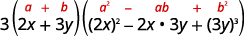

By the end of this section, you will be able to:
* Recognize and use the appropriate method to factor a polynomial completely

### Recognize and Use the Appropriate Method to Factor a Polynomial Completely

You have now become acquainted with all the methods of factoring that you will need in this course. The following chart summarizes all the factoring methods we have covered, and outlines a strategy you should use when factoring polynomials.

General Strategy for Factoring Polynomials

 ![This chart shows the general strategies for factoring polynomials. It shows ways to find GCF of binomials, trinomials and polynomials with more than 3 terms. For binomials, we have difference of squares: a squared minus b squared equals a minus b, a plus b; sum of squares do not factor; sub of cubes: a cubed plus b cubed equals open parentheses a plus b close parentheses open parentheses a squared minus ab plus b squared close parentheses; difference of cubes: a cubed minus b cubed equals open parentheses a minus b close parentheses open parentheses a squared plus ab plus b squared close parentheses. For trinomials, we have x squared plus bx plus c where we put x as a term in each factor and we have a squared plus bx plus c. Here, if a and c are squares, we have a plus b whole squared equals a squared plus 2 ab plus b squared and a minus b whole squared equals a squared minus 2 ab plus b squared. If a and c are not squares, we use the ac method. For polynomials with more than 3 terms, we use grouping.](../resources/CNX_IntAlg_Figure_06_04_002_img.jpg) 

Use a general strategy for factoring polynomials.

1.  Is there a greatest common factor?
    * * *
    {: data-type="newline"}
    
    Factor it out.
2.  Is the polynomial a binomial, trinomial, or are there more than three terms?
    * * *
    {: data-type="newline"}
    
    If it is a binomial:
    * Is it a sum?
      * * *
      {: data-type="newline"}
      
      Of squares? Sums of squares do not factor.
      * * *
      {: data-type="newline"}
      
      Of cubes? Use the sum of cubes pattern.
    * Is it a difference?
      * * *
      {: data-type="newline"}
      
      Of squares? Factor as the product of conjugates.
      * * *
      {: data-type="newline"}
      
      Of cubes? Use the difference of cubes pattern.
    {: data-bullet-style="bullet"}
    
    If it is a trinomial:
    * Is it of the form
      <math xmlns="http://www.w3.org/1998/Math/MathML"><mrow><msup><mi>x</mi><mn>2</mn></msup><mo>+</mo><mi>b</mi><mi>x</mi><mo>+</mo><mi>c</mi><mo>?</mo></mrow></math>
      
      Undo FOIL.
    * Is it of the form
      <math xmlns="http://www.w3.org/1998/Math/MathML"><mrow><mi>a</mi><msup><mi>x</mi><mn>2</mn></msup><mo>+</mo><mi>b</mi><mi>x</mi><mo>+</mo><mi>c</mi><mo>?</mo></mrow></math>
      
      * * *
      {: data-type="newline"}
      
      If *a* and *c* are squares, check if it fits the trinomial square pattern.
      * * *
      {: data-type="newline"}
      
      Use the trial and error or “ac” method.
    {: data-bullet-style="bullet"}
    
    If it has more than three terms:
    * Use the grouping method.
    {: data-bullet-style="bullet"}

3.  Check.
    * * *
    {: data-type="newline"}
    
    Is it factored completely?
    * * *
    {: data-type="newline"}
    
    Do the factors multiply back to the original polynomial?
{: type="1" .stepwise}

Remember, a polynomial is completely factored if, other than monomials, its factors are **prime**{: data-type="term" .no-emphasis}!

Factor completely: <math xmlns="http://www.w3.org/1998/Math/MathML"><mrow><mn>7</mn><msup><mi>x</mi><mn>3</mn></msup><mo>−</mo><mn>21</mn><msup><mi>x</mi><mn>2</mn></msup><mo>−</mo><mn>70</mn><mi>x</mi><mo>.</mo></mrow></math>

<math xmlns="http://www.w3.org/1998/Math/MathML"><mrow><mtable><mtr><mtd /><mtd /><mtd /><mtd /><mtd /><mtd columnalign="left"><mn>7</mn><msup><mi>x</mi><mn>3</mn></msup><mo>−</mo><mn>21</mn><msup><mi>x</mi><mn>2</mn></msup><mo>−</mo><mn>70</mn><mi>x</mi></mtd></mtr><mtr><mtd columnalign="left"><mtext>Is there a GCF? Yes,</mtext><mspace width="0.2em" /><mn>7</mn><mi>x</mi><mo>.</mo></mtd><mtd /><mtd /><mtd /><mtd /><mtd /></mtr><mtr><mtd columnalign="left"><mtext>Factor out the GCF.</mtext></mtd><mtd /><mtd /><mtd /><mtd /><mtd columnalign="left"><mn>7</mn><mi>x</mi><mrow><mo>(</mo><mrow><msup><mi>x</mi><mn>2</mn></msup><mo>−</mo><mn>3</mn><mi>x</mi><mo>−</mo><mn>10</mn></mrow><mo>)</mo></mrow></mtd></mtr><mtr><mtd columnalign="left"><mtable><mtr><mtd columnalign="left"><mtext>In the parentheses, is it a binomial, trinomial,</mtext></mtd></mtr><mtr><mtd columnalign="left"><mtext>or are there more terms?</mtext></mtd></mtr><mtr><mtd columnalign="left"><mtext>Trinomial with leading coefficient 1.</mtext></mtd></mtr></mtable></mtd><mtd /><mtd /><mtd /><mtd /><mtd /></mtr><mtr><mtd columnalign="left"><mtext>“Undo” FOIL.</mtext></mtd><mtd /><mtd /><mtd /><mtd /><mtd columnalign="left"><mn>7</mn><mi>x</mi><mrow><mo>(</mo><mrow><mi>x</mi><mspace width="1.6em" /></mrow><mo>)</mo></mrow><mrow><mo>(</mo><mrow><mi>x</mi><mspace width="1.4em" /></mrow><mo>)</mo></mrow></mtd></mtr><mtr><mtd /><mtd /><mtd /><mtd /><mtd /><mtd columnalign="left"><mn>7</mn><mi>x</mi><mrow><mo>(</mo><mrow><mi>x</mi><mo>+</mo><mn>2</mn></mrow><mo>)</mo></mrow><mrow><mo>(</mo><mrow><mi>x</mi><mo>−</mo><mn>5</mn></mrow><mo>)</mo></mrow></mtd></mtr><mtr><mtd columnalign="left"><mtext>Is the expression factored completely? Yes.</mtext></mtd><mtd /><mtd /><mtd /><mtd /><mtd /></mtr><mtr><mtd columnalign="left"><mtext>Neither binomial can be factored.</mtext></mtd><mtd /><mtd /><mtd /><mtd /><mtd /></mtr><mtr><mtd columnalign="left"><mtext>Check your answer.</mtext></mtd><mtd /><mtd /><mtd /><mtd /><mtd /></mtr><mtr><mtd columnalign="left"><mtext>Multiply.</mtext></mtd><mtd /><mtd /><mtd /><mtd /><mtd /></mtr><mtr /><mtr /><mtr><mtd columnalign="center"><mn>7</mn><mi>x</mi><mrow><mo>(</mo><mrow><mi>x</mi><mo>+</mo><mn>2</mn></mrow><mo>)</mo></mrow><mrow><mo>(</mo><mrow><mi>x</mi><mo>−</mo><mn>5</mn></mrow><mo>)</mo></mrow></mtd><mtd /><mtd /><mtd /><mtd /><mtd /></mtr><mtr /><mtr><mtd columnalign="center"><mn>7</mn><mi>x</mi><mrow><mo>(</mo><mrow><msup><mi>x</mi><mn>2</mn></msup><mo>−</mo><mn>5</mn><mi>x</mi><mo>+</mo><mn>2</mn><mi>x</mi><mo>−</mo><mn>10</mn></mrow><mo>)</mo></mrow></mtd><mtd /><mtd /><mtd /><mtd /><mtd /></mtr><mtr><mtd columnalign="center"><mn>7</mn><mi>x</mi><mrow><mo>(</mo><mrow><msup><mi>x</mi><mn>2</mn></msup><mo>−</mo><mn>3</mn><mi>x</mi><mo>−</mo><mn>10</mn></mrow><mo>)</mo></mrow></mtd><mtd /><mtd /><mtd /><mtd /><mtd /></mtr><mtr><mtd columnalign="center"><mn>7</mn><msup><mi>x</mi><mn>3</mn></msup><mo>−</mo><mn>21</mn><msup><mi>x</mi><mn>2</mn></msup><mo>−</mo><mn>70</mn><mi>x</mi><mo>✓</mo></mtd><mtd /><mtd /><mtd /><mtd /><mtd /></mtr></mtable></mrow></math>

Factor completely: <math xmlns="http://www.w3.org/1998/Math/MathML"><mrow><mn>8</mn><msup><mi>y</mi><mn>3</mn></msup><mo>+</mo><mn>16</mn><msup><mi>y</mi><mn>2</mn></msup><mo>−</mo><mn>24</mn><mi>y</mi><mo>.</mo></mrow></math>

<math xmlns="http://www.w3.org/1998/Math/MathML"><mrow><mn>8</mn><mi>y</mi><mrow><mo>(</mo><mrow><mi>y</mi><mo>−</mo><mn>1</mn></mrow><mo>)</mo></mrow><mrow><mo>(</mo><mrow><mi>y</mi><mo>+</mo><mn>3</mn></mrow><mo>)</mo></mrow></mrow></math>

Factor completely: <math xmlns="http://www.w3.org/1998/Math/MathML"><mrow><mn>5</mn><msup><mi>y</mi><mn>3</mn></msup><mo>−</mo><mn>15</mn><msup><mi>y</mi><mn>2</mn></msup><mo>−</mo><mn>270</mn><mi>y</mi><mo>.</mo></mrow></math>

<math xmlns="http://www.w3.org/1998/Math/MathML"><mrow><mn>5</mn><mi>y</mi><mrow><mo>(</mo><mrow><mi>y</mi><mo>−</mo><mn>9</mn></mrow><mo>)</mo></mrow><mrow><mo>(</mo><mrow><mi>y</mi><mo>+</mo><mn>6</mn></mrow><mo>)</mo></mrow></mrow></math>

Be careful when you are asked to factor a binomial as there are several options!

Factor completely: <math xmlns="http://www.w3.org/1998/Math/MathML"><mrow><mn>24</mn><msup><mi>y</mi><mn>2</mn></msup><mo>−</mo><mn>150</mn><mo>.</mo></mrow></math>

<math xmlns="http://www.w3.org/1998/Math/MathML"><mrow><mtable><mtr><mtd /><mtd /><mtd /><mtd /><mtd /><mtd columnalign="center"><mn>24</mn><msup><mi>y</mi><mn>2</mn></msup><mo>−</mo><mn>150</mn></mtd></mtr><mtr><mtd columnalign="left"><mtext>Is there a GCF? Yes, 6.</mtext></mtd><mtd /><mtd /><mtd /><mtd /><mtd /></mtr><mtr><mtd columnalign="left"><mtext>Factor out the GCF.</mtext></mtd><mtd /><mtd /><mtd /><mtd /><mtd columnalign="center"><mn>6</mn><mrow><mo>(</mo><mrow><mn>4</mn><msup><mi>y</mi><mn>2</mn></msup><mo>−</mo><mn>25</mn></mrow><mo>)</mo></mrow></mtd></mtr><mtr><mtd columnalign="left"><mtext>In the parentheses, is it a binomial, trinomial</mtext></mtd><mtd /><mtd /><mtd /><mtd /><mtd /></mtr><mtr><mtd columnalign="left"><mtext>or are there more than three terms? Binomial.</mtext></mtd><mtd /><mtd /><mtd /><mtd /><mtd /></mtr><mtr><mtd columnalign="left"><mtext>Is it a sum? No.</mtext></mtd><mtd /><mtd /><mtd /><mtd /><mtd /></mtr><mtr><mtd columnalign="left"><mtext>Is it a difference? Of squares or cubes? Yes, squares.</mtext></mtd><mtd /><mtd /><mtd /><mtd /><mtd columnalign="center"><mn>6</mn><mrow><mo>(</mo><mrow><msup><mrow><mrow><mo>(</mo><mrow><mn>2</mn><mi>y</mi></mrow><mo>)</mo></mrow></mrow><mn>2</mn></msup><mo>−</mo><msup><mrow><mrow><mo>(</mo><mn>5</mn><mo>)</mo></mrow></mrow><mn>2</mn></msup></mrow><mo>)</mo></mrow></mtd></mtr><mtr><mtd columnalign="left"><mtext>Write as a product of conjugates.</mtext></mtd><mtd /><mtd /><mtd /><mtd /><mtd columnalign="center"><mn>6</mn><mrow><mo>(</mo><mrow><mn>2</mn><mi>y</mi><mo>−</mo><mn>5</mn></mrow><mo>)</mo></mrow><mrow><mo>(</mo><mrow><mn>2</mn><mi>y</mi><mo>+</mo><mn>5</mn></mrow><mo>)</mo></mrow></mtd></mtr><mtr /><mtr /><mtr><mtd columnalign="left"><mspace width="2em" /><mtext>Is the expression factored completely?</mtext></mtd><mtd /><mtd /><mtd /><mtd /><mtd /></mtr><mtr><mtd columnalign="left"><mspace width="2em" /><mtext>Neither binomial can be factored.</mtext></mtd><mtd /><mtd /><mtd /><mtd /><mtd /></mtr><mtr><mtd columnalign="left"><mtext>Check:</mtext></mtd><mtd /><mtd /><mtd /><mtd /><mtd /></mtr><mtr /><mtr /><mtr><mtd columnalign="left"><mspace width="2em" /><mtext>Multiply.</mtext></mtd><mtd /><mtd /><mtd /><mtd /><mtd /></mtr><mtr /><mtr><mtd columnalign="center"><mn>6</mn><mrow><mo>(</mo><mrow><mn>2</mn><mi>y</mi><mo>−</mo><mn>5</mn></mrow><mo>)</mo></mrow><mrow><mo>(</mo><mrow><mn>2</mn><mi>y</mi><mo>+</mo><mn>5</mn></mrow><mo>)</mo></mrow></mtd><mtd /><mtd /><mtd /><mtd /><mtd /></mtr><mtr /><mtr><mtd columnalign="center"><mn>6</mn><mrow><mo>(</mo><mrow><mn>4</mn><msup><mi>y</mi><mn>2</mn></msup><mo>−</mo><mn>25</mn></mrow><mo>)</mo></mrow></mtd><mtd /><mtd /><mtd /><mtd /><mtd /></mtr><mtr><mtd columnalign="center"><mn>24</mn><msup><mi>y</mi><mn>2</mn></msup><mo>−</mo><mn>150</mn><mo>✓</mo></mtd><mtd /><mtd /><mtd /><mtd /><mtd /></mtr></mtable></mrow></math>

Factor completely: <math xmlns="http://www.w3.org/1998/Math/MathML"><mrow><mn>16</mn><msup><mi>x</mi><mn>3</mn></msup><mo>−</mo><mn>36</mn><mi>x</mi><mo>.</mo></mrow></math>

<math xmlns="http://www.w3.org/1998/Math/MathML"><mrow><mn>4</mn><mi>x</mi><mrow><mo>(</mo><mrow><mn>2</mn><mi>x</mi><mo>−</mo><mn>3</mn></mrow><mo>)</mo></mrow><mrow><mo>(</mo><mrow><mn>2</mn><mi>x</mi><mo>+</mo><mn>3</mn></mrow><mo>)</mo></mrow></mrow></math>

Factor completely: <math xmlns="http://www.w3.org/1998/Math/MathML"><mrow><mn>27</mn><msup><mi>y</mi><mn>2</mn></msup><mo>−</mo><mn>48</mn><mo>.</mo></mrow></math>

<math xmlns="http://www.w3.org/1998/Math/MathML"><mrow><mn>3</mn><mrow><mo>(</mo><mrow><mn>3</mn><mi>y</mi><mo>−</mo><mn>4</mn></mrow><mo>)</mo></mrow><mrow><mo>(</mo><mrow><mn>3</mn><mi>y</mi><mo>+</mo><mn>4</mn></mrow><mo>)</mo></mrow></mrow></math>

The next example can be factored using several methods. Recognizing the trinomial squares pattern will make your work easier.

Factor completely: <math xmlns="http://www.w3.org/1998/Math/MathML"><mrow><mn>4</mn><msup><mi>a</mi><mn>2</mn></msup><mo>−</mo><mn>12</mn><mi>a</mi><mi>b</mi><mo>+</mo><mn>9</mn><msup><mi>b</mi><mn>2</mn></msup><mo>.</mo></mrow></math>

<math xmlns="http://www.w3.org/1998/Math/MathML"><mrow><mtable><mtr><mtd /><mtd /><mtd /><mtd /><mtd /><mtd columnalign="center"><mn>4</mn><msup><mi>a</mi><mn>2</mn></msup><mo>−</mo><mn>12</mn><mi>a</mi><mi>b</mi><mo>+</mo><mn>9</mn><msup><mi>b</mi><mn>2</mn></msup></mtd></mtr><mtr><mtd columnalign="left"><mtext>Is there a GCF? No.</mtext></mtd><mtd /><mtd /><mtd /><mtd /><mtd /></mtr><mtr><mtd columnalign="left"><mtext>Is it a binomial, trinomial, or are there more terms?</mtext></mtd><mtd /><mtd /><mtd /><mtd /><mtd /></mtr><mtr><mtd columnalign="left"><mtext>Trinomial with</mtext><mspace width="0.2em" /><mi>a</mi><mo>≠</mo><mn>1</mn><mo>.</mo><mspace width="0.2em" /><mtext>But the first term is a perfect square.</mtext></mtd><mtd /><mtd /><mtd /><mtd /><mtd /></mtr><mtr><mtd columnalign="left"><mtext>Is the last term a perfect square? Yes.</mtext></mtd><mtd /><mtd /><mtd /><mtd /><mtd columnalign="center"><msup><mrow><mrow><mo>(</mo><mrow><mn>2</mn><mi>a</mi></mrow><mo>)</mo></mrow></mrow><mn>2</mn></msup><mo>−</mo><mn>12</mn><mi>a</mi><mi>b</mi><mo>+</mo><msup><mrow><mrow><mo>(</mo><mrow><mn>3</mn><mi>b</mi></mrow><mo>)</mo></mrow></mrow><mn>2</mn></msup></mtd></mtr><mtr><mtd columnalign="left"><mtext>Does it fit the pattern,</mtext><mspace width="0.2em" /><msup><mi>a</mi><mn>2</mn></msup><mo>−</mo><mn>2</mn><mi>a</mi><mi>b</mi><mo>+</mo><msup><mi>b</mi><mn>2</mn></msup><mo>?</mo><mspace width="0.2em" /><mtext>Yes.</mtext></mtd><mtd /><mtd /><mtd /><mtd /><mtd columnalign="center"><msup><mrow><mrow><mo>(</mo><mrow><mn>2</mn><mi>a</mi></mrow><mo>)</mo></mrow></mrow><mn>2</mn></msup><msub><mrow /><mtext>↘</mtext></msub><munder><mrow><mn>−12</mn><mi>a</mi><mi>b</mi><mo>+</mo></mrow><mrow><mrow><mn>−2</mn><mrow><mo>(</mo><mrow><mn>2</mn><mi>a</mi></mrow><mo>)</mo></mrow><mrow><mo>(</mo><mrow><mn>3</mn><mi>b</mi></mrow><mo>)</mo></mrow></mrow></mrow></munder><msub><mrow /><mtext>↙</mtext></msub><mrow><msup><mrow><mo>(</mo><mrow><mn>3</mn><mi>b</mi></mrow><mo>)</mo></mrow><mn>2</mn></msup></mrow></mtd></mtr><mtr><mtd columnalign="left"><mtext>Write it as a square.</mtext></mtd><mtd /><mtd /><mtd /><mtd /><mtd columnalign="center"><msup><mrow><mrow><mo>(</mo><mrow><mn>2</mn><mi>a</mi><mo>−</mo><mn>3</mn><mi>b</mi></mrow><mo>)</mo></mrow></mrow><mn>2</mn></msup></mtd></mtr><mtr /><mtr /><mtr><mtd columnalign="left"><mspace width="2em" /><mtext>Is the expression factored completely? Yes.</mtext></mtd><mtd /><mtd /><mtd /><mtd /><mtd /></mtr><mtr><mtd columnalign="left"><mspace width="2em" /><mtext>The binomial cannot be factored.</mtext></mtd><mtd /><mtd /><mtd /><mtd /><mtd /></mtr><mtr><mtd columnalign="left"><mtext>Check your answer.</mtext></mtd><mtd /><mtd /><mtd /><mtd /><mtd /></mtr><mtr /><mtr /><mtr><mtd columnalign="left"><mspace width="2em" /><mtext>Multiply.</mtext></mtd><mtd /><mtd /><mtd /><mtd /><mtd /></mtr><mtr><mtd columnalign="center"><msup><mrow><mrow><mo>(</mo><mrow><mn>2</mn><mi>a</mi><mo>−</mo><mn>3</mn><mi>b</mi></mrow><mo>)</mo></mrow></mrow><mn>2</mn></msup></mtd><mtd /><mtd /><mtd /><mtd /><mtd /></mtr><mtr><mtd columnalign="center"><msup><mrow><mrow><mo>(</mo><mrow><mn>2</mn><mi>a</mi></mrow><mo>)</mo></mrow></mrow><mn>2</mn></msup><mo>−</mo><mn>2</mn><mo>·</mo><mn>2</mn><mi>a</mi><mo>·</mo><mn>3</mn><mi>b</mi><mo>+</mo><msup><mrow><mrow><mo>(</mo><mrow><mn>3</mn><mi>b</mi></mrow><mo>)</mo></mrow></mrow><mn>2</mn></msup></mtd><mtd /><mtd /><mtd /><mtd /><mtd /></mtr><mtr><mtd columnalign="center"><mn>4</mn><msup><mi>a</mi><mn>2</mn></msup><mo>−</mo><mn>12</mn><mi>a</mi><mi>b</mi><mo>+</mo><mn>9</mn><msup><mi>b</mi><mn>2</mn></msup><mo>✓</mo></mtd><mtd /><mtd /><mtd /><mtd /><mtd /></mtr></mtable></mrow></math>

Factor completely: <math xmlns="http://www.w3.org/1998/Math/MathML"><mrow><mn>4</mn><msup><mi>x</mi><mn>2</mn></msup><mo>+</mo><mn>20</mn><mi>x</mi><mi>y</mi><mo>+</mo><mn>25</mn><msup><mi>y</mi><mn>2</mn></msup><mo>.</mo></mrow></math>

<math xmlns="http://www.w3.org/1998/Math/MathML"><mrow><msup><mrow><mrow><mo>(</mo><mrow><mn>2</mn><mi>x</mi><mo>+</mo><mn>5</mn><mi>y</mi></mrow><mo>)</mo></mrow></mrow><mn>2</mn></msup></mrow></math>

Factor completely: <math xmlns="http://www.w3.org/1998/Math/MathML"><mrow><mn>9</mn><msup><mi>x</mi><mn>2</mn></msup><mo>−</mo><mn>24</mn><mi>x</mi><mi>y</mi><mo>+</mo><mn>16</mn><msup><mi>y</mi><mn>2</mn></msup><mo>.</mo></mrow></math>

<math xmlns="http://www.w3.org/1998/Math/MathML"><mrow><msup><mrow><mrow><mo>(</mo><mrow><mn>3</mn><mi>x</mi><mo>−</mo><mn>4</mn><mi>y</mi></mrow><mo>)</mo></mrow></mrow><mn>2</mn></msup></mrow></math>

Remember, sums of squares do not factor, but sums of cubes do!

Factor completely <math xmlns="http://www.w3.org/1998/Math/MathML"><mrow><mn>12</mn><msup><mi>x</mi><mn>3</mn></msup><msup><mi>y</mi><mn>2</mn></msup><mo>+</mo><mn>75</mn><mi>x</mi><msup><mi>y</mi><mn>2</mn></msup><mo>.</mo></mrow></math>

<math xmlns="http://www.w3.org/1998/Math/MathML"><mrow><mtable><mtr><mtd /><mtd /><mtd /><mtd /><mtd /><mtd columnalign="center"><mn>12</mn><msup><mi>x</mi><mn>3</mn></msup><msup><mi>y</mi><mn>2</mn></msup><mo>+</mo><mn>75</mn><mi>x</mi><msup><mi>y</mi><mn>2</mn></msup></mtd></mtr><mtr><mtd columnalign="left"><mtext>Is there a GCF? Yes,</mtext><mspace width="0.2em" /><mn>3</mn><mi>x</mi><msup><mi>y</mi><mn>2</mn></msup><mo>.</mo></mtd><mtd /><mtd /><mtd /><mtd /><mtd /></mtr><mtr><mtd columnalign="left"><mtext>Factor out the GCF.</mtext></mtd><mtd /><mtd /><mtd /><mtd /><mtd columnalign="center"><mn>3</mn><mi>x</mi><msup><mi>y</mi><mn>2</mn></msup><mrow><mo>(</mo><mrow><mn>4</mn><msup><mi>x</mi><mn>2</mn></msup><mo>+</mo><mn>25</mn></mrow><mo>)</mo></mrow></mtd></mtr><mtr><mtd columnalign="left"><mtext>In the parentheses, is it a binomial, trinomial, or are</mtext></mtd><mtd /><mtd /><mtd /><mtd /><mtd /></mtr><mtr><mtd columnalign="left"><mtext>there more than three terms? Binomial.</mtext></mtd><mtd /><mtd /><mtd /><mtd /><mtd /></mtr><mtr /><mtr><mtd columnalign="left"><mtext>Is it a sum? Of squares? Yes.</mtext></mtd><mtd /><mtd /><mtd /><mtd /><mtd columnalign="left"><mtext>Sums of squares are prime.</mtext></mtd></mtr><mtr /><mtr /><mtr><mtd columnalign="left"><mspace width="2em" /><mtext>Is the expression factored completely? Yes.</mtext></mtd><mtd /><mtd /><mtd /><mtd /><mtd /></mtr><mtr><mtd columnalign="left"><mtext>Check:</mtext></mtd><mtd /><mtd /><mtd /><mtd /><mtd /></mtr><mtr /><mtr /><mtr><mtd columnalign="left"><mspace width="2em" /><mtext>Multiply.</mtext></mtd><mtd /><mtd /><mtd /><mtd /><mtd /></mtr><mtr><mtd columnalign="center"><mn>3</mn><mi>x</mi><msup><mi>y</mi><mn>2</mn></msup><mrow><mo>(</mo><mrow><mn>4</mn><msup><mi>x</mi><mn>2</mn></msup><mo>+</mo><mn>25</mn></mrow><mo>)</mo></mrow></mtd><mtd /><mtd /><mtd /><mtd /><mtd /></mtr><mtr><mtd columnalign="center"><mn>12</mn><msup><mi>x</mi><mn>3</mn></msup><msup><mi>y</mi><mn>2</mn></msup><mo>+</mo><mn>75</mn><mi>x</mi><msup><mi>y</mi><mn>2</mn></msup><mo>✓</mo></mtd><mtd /><mtd /><mtd /><mtd /><mtd /></mtr></mtable></mrow></math>

Factor completely: <math xmlns="http://www.w3.org/1998/Math/MathML"><mrow><mn>50</mn><msup><mi>x</mi><mn>3</mn></msup><mi>y</mi><mo>+</mo><mn>72</mn><mi>x</mi><mi>y</mi><mo>.</mo></mrow></math>

<math xmlns="http://www.w3.org/1998/Math/MathML"><mrow><mn>2</mn><mi>x</mi><mi>y</mi><mrow><mo>(</mo><mrow><mn>25</mn><msup><mi>x</mi><mn>2</mn></msup><mo>+</mo><mn>36</mn></mrow><mo>)</mo></mrow></mrow></math>

Factor completely: <math xmlns="http://www.w3.org/1998/Math/MathML"><mrow><mn>27</mn><mi>x</mi><msup><mi>y</mi><mn>3</mn></msup><mo>+</mo><mn>48</mn><mi>x</mi><mi>y</mi><mo>.</mo></mrow></math>

<math xmlns="http://www.w3.org/1998/Math/MathML"><mrow><mn>3</mn><mi>x</mi><mi>y</mi><mrow><mo>(</mo><mrow><mn>9</mn><msup><mi>y</mi><mn>2</mn></msup><mo>+</mo><mn>16</mn></mrow><mo>)</mo></mrow></mrow></math>

When using the sum or difference of cubes pattern, being careful with the signs.

Factor completely: <math xmlns="http://www.w3.org/1998/Math/MathML"><mrow><mn>24</mn><msup><mi>x</mi><mn>3</mn></msup><mo>+</mo><mn>81</mn><msup><mi>y</mi><mn>3</mn></msup><mo>.</mo></mrow></math>

<table class="unnumbered unstyled" summary="We have 24 x cubed plus 81. Factoring out the GCF, 3, we get 3 open parentheses 8 x cubed plus 27 close parentheses. In the parentheses, is it a binomial, trinomial or are there more than three terms. It is a binomial. It is a sum or difference? It is a sum. Of squares or cubes? It is a sum of cubes. We rewrite as 3 open parentheses open parentheses 2x close parentheses cubed plus 3 cubed close parentheses. Next we write it using the sum of cubes pattern. We get 3 open parentheses 2x plus 3 close parentheses 4x squared minus 6x plus 9 close parentheses. Is the expression factored completely? Yes. Check by multiplying." data-label=""><tbody>
<tr valign="top">
<td data-valign="top" data-align="left">Is there a GCF? Yes, 3.</td>
<td data-valign="top" data-align="left"></td>
</tr>
<tr valign="top">
<td data-valign="top" data-align="left">Factor it out.</td>
<td data-valign="top" data-align="left"></td>
</tr>
<tr valign="top">
<td data-valign="top" data-align="left">In the parentheses, is it a binomial, trinomial,
of are there more than three terms? Binomial.</td>
<td data-valign="top" data-align="left" />
</tr>
<tr valign="top">
<td data-valign="top" data-align="left">Is it a sum or difference? Sum.</td>
<td data-valign="top" data-align="left" />
</tr>
<tr valign="top">
<td data-valign="top" data-align="left">Of squares or cubes? Sum of cubes.</td>
<td data-valign="top" data-align="left"></td>
</tr>
<tr valign="top">
<td data-valign="top" data-align="left">Write it using the sum of cubes pattern.</td>
<td data-valign="top" data-align="left"></td>
</tr>
<tr valign="top">
<td data-valign="top" data-align="left">Is the expression factored completely? Yes.</td>
<td data-valign="top" data-align="left"></td>
</tr>
<tr valign="top">
<td data-valign="top" data-align="left">Check by multiplying.</td>
<td data-valign="top" data-align="left" />
</tr>
</tbody></table>

Factor completely: <math xmlns="http://www.w3.org/1998/Math/MathML"><mrow><mn>250</mn><msup><mi>m</mi><mn>3</mn></msup><mo>+</mo><mn>432</mn><msup><mi>n</mi><mn>3</mn></msup><mo>.</mo></mrow></math>

<math xmlns="http://www.w3.org/1998/Math/MathML"><mrow><mn>2</mn><mrow><mo>(</mo><mrow><mn>5</mn><mi>m</mi><mo>+</mo><mn>6</mn><mi>n</mi></mrow><mo>)</mo></mrow><mrow><mo>(</mo><mrow><mn>25</mn><msup><mi>m</mi><mn>2</mn></msup><mo>−</mo><mn>30</mn><mi>m</mi><mi>n</mi><mo>+</mo><mn>36</mn><msup><mi>n</mi><mn>2</mn></msup></mrow><mo>)</mo></mrow></mrow></math>

Factor completely: <math xmlns="http://www.w3.org/1998/Math/MathML"><mrow><mn>2</mn><msup><mi>p</mi><mn>3</mn></msup><mo>+</mo><mn>54</mn><msup><mi>q</mi><mn>3</mn></msup><mo>.</mo></mrow></math>

<math xmlns="http://www.w3.org/1998/Math/MathML"><mrow><mn>2</mn><mrow><mo>(</mo><mrow><mi>p</mi><mo>+</mo><mn>3</mn><mi>q</mi></mrow><mo>)</mo></mrow><mrow><mo>(</mo><mrow><msup><mi>p</mi><mn>2</mn></msup><mo>−</mo><mn>3</mn><mi>p</mi><mi>q</mi><mo>+</mo><mn>9</mn><msup><mi>q</mi><mn>2</mn></msup></mrow><mo>)</mo></mrow></mrow></math>

Factor completely: <math xmlns="http://www.w3.org/1998/Math/MathML"><mrow><mn>3</mn><msup><mi>x</mi><mn>5</mn></msup><mi>y</mi><mo>−</mo><mn>48</mn><mi>x</mi><mi>y</mi><mo>.</mo></mrow></math>

<math xmlns="http://www.w3.org/1998/Math/MathML"><mrow><mtable><mtr><mtd /><mtd /><mtd /><mtd /><mtd /><mtd columnalign="center"><mn>3</mn><msup><mi>x</mi><mn>5</mn></msup><mi>y</mi><mo>−</mo><mn>48</mn><mi>x</mi><mi>y</mi></mtd></mtr><mtr><mtd columnalign="left"><mtext>Is there a GCF? Factor out</mtext><mspace width="0.2em" /><mn>3</mn><mi>x</mi><mi>y</mi></mtd><mtd /><mtd /><mtd /><mtd /><mtd columnalign="center"><mn>3</mn><mi>x</mi><mi>y</mi><mrow><mo>(</mo><mrow><msup><mi>x</mi><mn>4</mn></msup><mo>−</mo><mn>16</mn></mrow><mo>)</mo></mrow></mtd></mtr><mtr><mtd columnalign="left"><mtable><mtr><mtd columnalign="left"><mtext>Is the binomial a sum or difference? Of squares or cubes?</mtext></mtd></mtr><mtr><mtd columnalign="left"><mtext>Write it as a difference of squares.</mtext></mtd></mtr></mtable></mtd><mtd /><mtd /><mtd /><mtd /><mtd columnalign="center"><mn>3</mn><mi>x</mi><mi>y</mi><mrow><mo>(</mo><mrow><msup><mrow><mrow><mo>(</mo><mrow><msup><mi>x</mi><mn>2</mn></msup></mrow><mo>)</mo></mrow></mrow><mn>2</mn></msup><mo>−</mo><msup><mrow><mrow><mo>(</mo><mn>4</mn><mo>)</mo></mrow></mrow><mn>2</mn></msup></mrow><mo>)</mo></mrow></mtd></mtr><mtr><mtd columnalign="left"><mtext>Factor it as a product of conjugates</mtext></mtd><mtd /><mtd /><mtd /><mtd /><mtd columnalign="center"><mn>3</mn><mi>x</mi><mi>y</mi><mrow><mo>(</mo><mrow><msup><mi>x</mi><mn>2</mn></msup><mo>−</mo><mn>4</mn></mrow><mo>)</mo></mrow><mrow><mo>(</mo><mrow><msup><mi>x</mi><mn>2</mn></msup><mo>+</mo><mn>4</mn></mrow><mo>)</mo></mrow></mtd></mtr><mtr><mtd columnalign="left"><mtext>The first binomial is again a difference of squares.</mtext></mtd><mtd /><mtd /><mtd /><mtd /><mtd columnalign="center"><mn>3</mn><mi>x</mi><mi>y</mi><mrow><mo>(</mo><mrow><msup><mrow><mrow><mo>(</mo><mi>x</mi><mo>)</mo></mrow></mrow><mn>2</mn></msup><mo>−</mo><msup><mrow><mrow><mo>(</mo><mn>2</mn><mo>)</mo></mrow></mrow><mn>2</mn></msup></mrow><mo>)</mo></mrow><mrow><mo>(</mo><mrow><msup><mi>x</mi><mn>2</mn></msup><mo>+</mo><mn>4</mn></mrow><mo>)</mo></mrow></mtd></mtr><mtr><mtd columnalign="left"><mtext>Factor it as a product of conjugates.</mtext></mtd><mtd /><mtd /><mtd /><mtd /><mtd columnalign="center"><mn>3</mn><mi>x</mi><mi>y</mi><mrow><mo>(</mo><mrow><mi>x</mi><mo>−</mo><mn>2</mn></mrow><mo>)</mo></mrow><mrow><mo>(</mo><mrow><mi>x</mi><mo>+</mo><mn>2</mn></mrow><mo>)</mo></mrow><mrow><mo>(</mo><mrow><msup><mi>x</mi><mn>2</mn></msup><mo>+</mo><mn>4</mn></mrow><mo>)</mo></mrow></mtd></mtr><mtr><mtd columnalign="left"><mtext>Is the expression factored completely? Yes.</mtext></mtd><mtd /><mtd /><mtd /><mtd /><mtd /></mtr><mtr><mtd columnalign="left"><mtext>Check your answer.</mtext></mtd><mtd /><mtd /><mtd /><mtd /><mtd /></mtr><mtr><mtd columnalign="left"><mtext>Multiply.</mtext></mtd><mtd /><mtd /><mtd /><mtd /><mtd /></mtr><mtr /><mtr /><mtr><mtd columnalign="center"><mn>3</mn><mi>x</mi><mi>y</mi><mrow><mrow><mo>(</mo><mrow><mi>x</mi><mo>−</mo><mn>2</mn></mrow><mo>)</mo></mrow><mrow><mo>(</mo><mrow><mi>x</mi><mo>+</mo><mn>2</mn></mrow><mo>)</mo></mrow></mrow><mrow><mo>(</mo><mrow><msup><mi>x</mi><mn>2</mn></msup><mo>+</mo><mn>4</mn></mrow><mo>)</mo></mrow></mtd><mtd /><mtd /><mtd /><mtd /><mtd /></mtr><mtr><mtd columnalign="center"><mn>3</mn><mi>x</mi><mi>y</mi><mrow><mo>(</mo><mrow><msup><mi>x</mi><mn>2</mn></msup><mo>−</mo><mn>4</mn></mrow><mo>)</mo></mrow><mrow><mo>(</mo><mrow><msup><mi>x</mi><mn>2</mn></msup><mo>+</mo><mn>4</mn></mrow><mo>)</mo></mrow></mtd><mtd /><mtd /><mtd /><mtd /><mtd /></mtr><mtr><mtd columnalign="center"><mn>3</mn><mi>x</mi><mi>y</mi><mrow><mo>(</mo><mrow><msup><mi>x</mi><mn>4</mn></msup><mo>−</mo><mn>16</mn></mrow><mo>)</mo></mrow></mtd><mtd /><mtd /><mtd /><mtd /><mtd /></mtr><mtr><mtd columnalign="center"><mn>3</mn><msup><mi>x</mi><mn>5</mn></msup><mi>y</mi><mo>−</mo><mn>48</mn><mi>x</mi><mi>y</mi><mo>✓</mo></mtd><mtd /><mtd /><mtd /><mtd /><mtd /></mtr></mtable></mrow></math>

Factor completely: <math xmlns="http://www.w3.org/1998/Math/MathML"><mrow><mn>4</mn><msup><mi>a</mi><mn>5</mn></msup><mi>b</mi><mo>−</mo><mn>64</mn><mi>a</mi><mi>b</mi><mo>.</mo></mrow></math>

<math xmlns="http://www.w3.org/1998/Math/MathML"><mrow><mn>4</mn><mi>a</mi><mi>b</mi><mrow><mo>(</mo><mrow><msup><mi>a</mi><mn>2</mn></msup><mo>+</mo><mn>4</mn></mrow><mo>)</mo></mrow><mrow><mo>(</mo><mrow><mi>a</mi><mo>−</mo><mn>2</mn></mrow><mo>)</mo></mrow><mrow><mo>(</mo><mrow><mi>a</mi><mo>+</mo><mn>2</mn></mrow><mo>)</mo></mrow></mrow></math>

Factor completely: <math xmlns="http://www.w3.org/1998/Math/MathML"><mrow><mn>7</mn><mi>x</mi><msup><mi>y</mi><mn>5</mn></msup><mo>−</mo><mn>7</mn><mi>x</mi><mi>y</mi><mo>.</mo></mrow></math>

<math xmlns="http://www.w3.org/1998/Math/MathML"><mrow><mn>7</mn><mi>x</mi><mi>y</mi><mrow><mo>(</mo><mrow><msup><mi>y</mi><mn>2</mn></msup><mo>+</mo><mn>1</mn></mrow><mo>)</mo></mrow><mrow><mo>(</mo><mrow><mi>y</mi><mo>−</mo><mn>1</mn></mrow><mo>)</mo></mrow><mrow><mo>(</mo><mrow><mi>y</mi><mo>+</mo><mn>1</mn></mrow><mo>)</mo></mrow></mrow></math>

Factor completely: <math xmlns="http://www.w3.org/1998/Math/MathML"><mrow><mn>4</mn><msup><mi>x</mi><mn>2</mn></msup><mo>+</mo><mn>8</mn><mi>b</mi><mi>x</mi><mo>−</mo><mn>4</mn><mi>a</mi><mi>x</mi><mo>−</mo><mn>8</mn><mi>a</mi><mi>b</mi><mo>.</mo></mrow></math>

<math xmlns="http://www.w3.org/1998/Math/MathML"><mrow><mtable><mtr><mtd /><mtd /><mtd /><mtd /><mtd /><mtd columnalign="center"><mn>4</mn><msup><mi>x</mi><mn>2</mn></msup><mo>+</mo><mn>8</mn><mi>b</mi><mi>x</mi><mo>−</mo><mn>4</mn><mi>a</mi><mi>x</mi><mo>−</mo><mn>8</mn><mi>a</mi><mi>b</mi></mtd></mtr><mtr><mtd columnalign="left"><mtext>Is there a GCF? Factor out the GCF, 4.</mtext></mtd><mtd /><mtd /><mtd /><mtd /><mtd columnalign="center"><mn>4</mn><mrow><mo>(</mo><mrow><msup><mi>x</mi><mn>2</mn></msup><mo>+</mo><mn>2</mn><mi>b</mi><mi>x</mi><mo>−</mo><mi>a</mi><mi>x</mi><mo>−</mo><mn>2</mn><mi>a</mi><mi>b</mi></mrow><mo>)</mo></mrow></mtd></mtr><mtr><mtd columnalign="left"><mtext>There are four terms. Use grouping.</mtext></mtd><mtd /><mtd /><mtd /><mtd /><mtd columnalign="center"><mn>4</mn><mrow><mo>[</mo><mrow><mi>x</mi><mrow><mo>(</mo><mrow><mi>x</mi><mo>+</mo><mn>2</mn><mi>b</mi></mrow><mo>)</mo></mrow><mo>−</mo><mi>a</mi><mrow><mo>(</mo><mrow><mi>x</mi><mo>+</mo><mn>2</mn><mi>b</mi></mrow><mo>)</mo></mrow></mrow><mo>]</mo></mrow></mtd></mtr><mtr><mtd /><mtd /><mtd /><mtd /><mtd /><mtd columnalign="center"><mn>4</mn><mrow><mo>(</mo><mrow><mi>x</mi><mo>+</mo><mn>2</mn><mi>b</mi></mrow><mo>)</mo></mrow><mrow><mo>(</mo><mrow><mi>x</mi><mo>−</mo><mi>a</mi></mrow><mo>)</mo></mrow></mtd></mtr><mtr><mtd columnalign="left"><mtext>Is the expression factored completely? Yes.</mtext></mtd><mtd /><mtd /><mtd /><mtd /><mtd /></mtr><mtr><mtd columnalign="left"><mtext>Check your answer.</mtext></mtd><mtd /><mtd /><mtd /><mtd /><mtd /></mtr><mtr><mtd columnalign="left"><mtext>Multiply.</mtext></mtd><mtd /><mtd /><mtd /><mtd /><mtd /></mtr><mtr /><mtr /><mtr><mtd columnalign="center"><mspace width="4em" /><mn>4</mn><mrow><mo>(</mo><mrow><mi>x</mi><mo>+</mo><mn>2</mn><mi>b</mi></mrow><mo>)</mo></mrow><mrow><mo>(</mo><mrow><mi>x</mi><mo>−</mo><mi>a</mi></mrow><mo>)</mo></mrow></mtd><mtd /><mtd /><mtd /><mtd /><mtd /></mtr><mtr><mtd columnalign="center"><mspace width="4em" /><mn>4</mn><mrow><mo>(</mo><mrow><msup><mi>x</mi><mn>2</mn></msup><mo>−</mo><mi>a</mi><mi>x</mi><mo>+</mo><mn>2</mn><mi>b</mi><mi>x</mi><mo>−</mo><mn>2</mn><mi>a</mi><mi>b</mi></mrow><mo>)</mo></mrow></mtd><mtd /><mtd /><mtd /><mtd /><mtd /></mtr><mtr><mtd columnalign="center"><mspace width="4em" /><mn>4</mn><msup><mi>x</mi><mn>2</mn></msup><mo>+</mo><mn>8</mn><mi>b</mi><mi>x</mi><mo>−</mo><mn>4</mn><mi>a</mi><mi>x</mi><mo>−</mo><mn>8</mn><mi>a</mi><mi>b</mi><mo>✓</mo></mtd><mtd /><mtd /><mtd /><mtd /><mtd /></mtr></mtable></mrow></math>

Factor completely: <math xmlns="http://www.w3.org/1998/Math/MathML"><mrow><mn>6</mn><msup><mi>x</mi><mn>2</mn></msup><mo>−</mo><mn>12</mn><mi>x</mi><mi>c</mi><mo>+</mo><mn>6</mn><mi>b</mi><mi>x</mi><mo>−</mo><mn>12</mn><mi>b</mi><mi>c</mi><mo>.</mo></mrow></math>

<math xmlns="http://www.w3.org/1998/Math/MathML"><mrow><mn>6</mn><mrow><mo>(</mo><mrow><mi>x</mi><mo>+</mo><mi>b</mi></mrow><mo>)</mo></mrow><mrow><mo>(</mo><mrow><mi>x</mi><mo>−</mo><mn>2</mn><mi>c</mi></mrow><mo>)</mo></mrow></mrow></math>

Factor completely: <math xmlns="http://www.w3.org/1998/Math/MathML"><mrow><mn>16</mn><msup><mi>x</mi><mn>2</mn></msup><mo>+</mo><mn>24</mn><mi>x</mi><mi>y</mi><mo>−</mo><mn>4</mn><mi>x</mi><mo>−</mo><mn>6</mn><mi>y</mi><mo>.</mo></mrow></math>

<math xmlns="http://www.w3.org/1998/Math/MathML"><mrow><mn>2</mn><mo stretchy="false">(</mo><mn>4</mn><mi>x</mi><mo>−</mo><mn>1</mn><mo stretchy="false">)</mo><mo stretchy="false">(</mo><mn>2</mn><mi>x</mi><mo>+</mo><mn>3</mn><mi>y</mi><mo stretchy="false">)</mo></mrow></math>

Taking out the complete GCF in the first step will always make your work easier.

Factor completely: <math xmlns="http://www.w3.org/1998/Math/MathML"><mrow><mn>40</mn><msup><mi>x</mi><mn>2</mn></msup><mi>y</mi><mo>+</mo><mn>44</mn><mi>x</mi><mi>y</mi><mo>−</mo><mn>24</mn><mi>y</mi><mo>.</mo></mrow></math>

<math xmlns="http://www.w3.org/1998/Math/MathML"><mrow><mtable><mtr><mtd /><mtd /><mtd /><mtd /><mtd /><mtd columnalign="center"><mn>40</mn><msup><mi>x</mi><mn>2</mn></msup><mi>y</mi><mo>+</mo><mn>44</mn><mi>x</mi><mi>y</mi><mo>−</mo><mn>24</mn><mi>y</mi></mtd></mtr><mtr><mtd columnalign="left"><mtext>Is there a GCF? Factor out the GCF,</mtext><mspace width="0.2em" /><mn>4</mn><mi>y</mi><mo>.</mo></mtd><mtd /><mtd /><mtd /><mtd /><mtd columnalign="center"><mn>4</mn><mi>y</mi><mrow><mo>(</mo><mrow><mn>10</mn><msup><mi>x</mi><mn>2</mn></msup><mo>+</mo><mn>11</mn><mi>x</mi><mo>−</mo><mn>6</mn></mrow><mo>)</mo></mrow></mtd></mtr><mtr><mtd columnalign="left"><mtext>Factor the trinomial with</mtext><mspace width="0.2em" /><mi>a</mi><mo>≠</mo><mn>1</mn><mo>.</mo></mtd><mtd /><mtd /><mtd /><mtd /><mtd columnalign="center"><mn>4</mn><mi>y</mi><mrow><mo>(</mo><mrow><mn>10</mn><msup><mi>x</mi><mn>2</mn></msup><mo>+</mo><mn>11</mn><mi>x</mi><mo>−</mo><mn>6</mn></mrow><mo>)</mo></mrow></mtd></mtr><mtr><mtd /><mtd /><mtd /><mtd /><mtd /><mtd columnalign="center"><mn>4</mn><mi>y</mi><mrow><mo>(</mo><mrow><mn>5</mn><mi>x</mi><mo>−</mo><mn>2</mn></mrow><mo>)</mo></mrow><mrow><mo>(</mo><mrow><mn>2</mn><mi>x</mi><mo>+</mo><mn>3</mn></mrow><mo>)</mo></mrow></mtd></mtr><mtr><mtd columnalign="left"><mtext>Is the expression factored completely? Yes.</mtext></mtd><mtd /><mtd /><mtd /><mtd /><mtd /></mtr><mtr><mtd columnalign="left"><mtext>Check your answer.</mtext></mtd><mtd /><mtd /><mtd /><mtd /><mtd /></mtr><mtr><mtd columnalign="left"><mtext>Multiply.</mtext></mtd><mtd /><mtd /><mtd /><mtd /><mtd /></mtr><mtr /><mtr /><mtr><mtd columnalign="center"><mspace width="4em" /><mn>4</mn><mi>y</mi><mrow><mo>(</mo><mrow><mn>5</mn><mi>x</mi><mo>−</mo><mn>2</mn></mrow><mo>)</mo></mrow><mrow><mo>(</mo><mrow><mn>2</mn><mi>x</mi><mo>+</mo><mn>3</mn></mrow><mo>)</mo></mrow></mtd><mtd /><mtd /><mtd /><mtd /><mtd /></mtr><mtr><mtd columnalign="center"><mspace width="4em" /><mn>4</mn><mi>y</mi><mrow><mo>(</mo><mrow><mn>10</mn><msup><mi>x</mi><mn>2</mn></msup><mo>+</mo><mn>11</mn><mi>x</mi><mo>−</mo><mn>6</mn></mrow><mo>)</mo></mrow></mtd><mtd /><mtd /><mtd /><mtd /><mtd /></mtr><mtr><mtd columnalign="center"><mspace width="4em" /><mn>40</mn><msup><mi>x</mi><mn>2</mn></msup><mi>y</mi><mo>+</mo><mn>44</mn><mi>x</mi><mi>y</mi><mo>−</mo><mn>24</mn><mi>y</mi><mo>✓</mo></mtd><mtd /><mtd /><mtd /><mtd /><mtd /></mtr></mtable></mrow></math>

Factor completely: <math xmlns="http://www.w3.org/1998/Math/MathML"><mrow><mn>4</mn><msup><mi>p</mi><mn>2</mn></msup><mi>q</mi><mo>−</mo><mn>16</mn><mi>p</mi><mi>q</mi><mo>+</mo><mn>12</mn><mi>q</mi><mo>.</mo></mrow></math>

<math xmlns="http://www.w3.org/1998/Math/MathML"><mrow><mn>4</mn><mi>q</mi><mrow><mo>(</mo><mrow><mi>p</mi><mo>−</mo><mn>3</mn></mrow><mo>)</mo></mrow><mrow><mo>(</mo><mrow><mi>p</mi><mo>−</mo><mn>1</mn></mrow><mo>)</mo></mrow></mrow></math>

Factor completely: <math xmlns="http://www.w3.org/1998/Math/MathML"><mrow><mn>6</mn><mi>p</mi><msup><mi>q</mi><mn>2</mn></msup><mo>−</mo><mn>9</mn><mi>p</mi><mi>q</mi><mo>−</mo><mn>6</mn><mi>p</mi><mo>.</mo></mrow></math>

<math xmlns="http://www.w3.org/1998/Math/MathML"><mrow><mn>3</mn><mi>p</mi><mrow><mo>(</mo><mrow><mn>2</mn><mi>q</mi><mo>+</mo><mn>1</mn></mrow><mo>)</mo></mrow><mrow><mo>(</mo><mrow><mi>q</mi><mo>−</mo><mn>2</mn></mrow><mo>)</mo></mrow></mrow></math>

When we have factored a polynomial with four terms, most often we separated it into two groups of two terms. Remember that we can also separate it into a trinomial and then one term.

Factor completely: <math xmlns="http://www.w3.org/1998/Math/MathML"><mrow><mn>9</mn><msup><mi>x</mi><mn>2</mn></msup><mo>−</mo><mn>12</mn><mi>x</mi><mi>y</mi><mo>+</mo><mn>4</mn><msup><mi>y</mi><mn>2</mn></msup><mo>−</mo><mn>49</mn><mo>.</mo></mrow></math>

<math xmlns="http://www.w3.org/1998/Math/MathML"><mrow><mtable><mtr><mtd /><mtd /><mtd /><mtd /><mtd /><mtd columnalign="center"><mn>9</mn><msup><mi>x</mi><mn>2</mn></msup><mo>−</mo><mn>12</mn><mi>x</mi><mi>y</mi><mo>+</mo><mn>4</mn><msup><mi>y</mi><mn>2</mn></msup><mo>−</mo><mn>49</mn></mtd></mtr><mtr><mtd columnalign="left"><mtext>Is there a GCF? No.</mtext></mtd><mtd /><mtd /><mtd /><mtd /><mtd /></mtr><mtr><mtd columnalign="left"><mtable><mtr><mtd columnalign="left"><mtext>With more than 3 terms, use grouping. Last 2 terms</mtext></mtd></mtr><mtr><mtd columnalign="left"><mtext>have no GCF. Try grouping first 3 terms.</mtext></mtd></mtr></mtable></mtd><mtd /><mtd /><mtd /><mtd /><mtd columnalign="center"><mn>9</mn><msup><mi>x</mi><mn>2</mn></msup><mo>−</mo><mn>12</mn><mi>x</mi><mi>y</mi><mo>+</mo><mn>4</mn><msup><mi>y</mi><mn>2</mn></msup><mo>−</mo><mn>49</mn></mtd></mtr><mtr><mtd columnalign="left"><mtable><mtr><mtd columnalign="left"><mtext>Factor the trinomial with</mtext><mspace width="0.2em" /><mi>a</mi><mo>≠</mo><mn>1</mn><mo>.</mo><mspace width="0.2em" /><mtext>But the first term is a</mtext></mtd></mtr><mtr><mtd columnalign="left"><mtext>perfect square.</mtext></mtd></mtr></mtable></mtd><mtd /><mtd /><mtd /><mtd /><mtd /></mtr><mtr><mtd columnalign="left"><mtext>Is the last term of the trinomial a perfect square? Yes.</mtext></mtd><mtd /><mtd /><mtd /><mtd /><mtd columnalign="center"><msup><mrow><mrow><mo>(</mo><mrow><mn>3</mn><mi>x</mi></mrow><mo>)</mo></mrow></mrow><mn>2</mn></msup><mo>−</mo><mn>12</mn><mi>x</mi><mi>y</mi><mo>+</mo><msup><mrow><mrow><mo>(</mo><mrow><mn>2</mn><mi>y</mi></mrow><mo>)</mo></mrow></mrow><mn>2</mn></msup><mo>−</mo><mn>49</mn></mtd></mtr><mtr><mtd columnalign="left"><mtext>Does the trinomial fit the pattern,</mtext><mspace width="0.2em" /><msup><mi>a</mi><mn>2</mn></msup><mo>−</mo><mn>2</mn><mi>a</mi><mi>b</mi><mo>+</mo><msup><mi>b</mi><mn>2</mn></msup><mo>?</mo><mspace width="0.2em" /><mtext>Yes.</mtext></mtd><mtd /><mtd /><mtd /><mtd /><mtd columnalign="center"><msup><mrow><mrow><mo>(</mo><mrow><mn>3</mn><mi>x</mi></mrow><mo>)</mo></mrow></mrow><mn>2</mn></msup><msub><mrow /><mtext>↘</mtext></msub><munder><mrow><mn>−12</mn><mi>x</mi><mi>y</mi><mo>+</mo></mrow><mrow><mrow><mn>−2</mn><mrow><mo>(</mo><mrow><mn>3</mn><mi>x</mi></mrow><mo>)</mo></mrow><mrow><mo>(</mo><mrow><mn>2</mn><mi>y</mi></mrow><mo>)</mo></mrow></mrow></mrow></munder><msub><mrow /><mtext>↙</mtext></msub><mrow><msup><mrow><mo>(</mo><mrow><mn>2</mn><mi>y</mi></mrow><mo>)</mo></mrow><mn>2</mn></msup></mrow><mo>−</mo><mn>49</mn></mtd></mtr><mtr><mtd columnalign="left"><mtext>Write the trinomial as a square.</mtext></mtd><mtd /><mtd /><mtd /><mtd /><mtd columnalign="center"><msup><mrow><mrow><mo>(</mo><mrow><mn>3</mn><mi>x</mi><mo>−</mo><mn>2</mn><mi>y</mi></mrow><mo>)</mo></mrow></mrow><mn>2</mn></msup><mo>−</mo><mn>49</mn></mtd></mtr><mtr><mtd columnalign="left"><mtable><mtr><mtd columnalign="left"><mtext>Is this binomial a sum or difference? Of squares or</mtext></mtd></mtr><mtr><mtd columnalign="left"><mtext>cubes? Write it as a difference of squares.</mtext></mtd></mtr></mtable></mtd><mtd /><mtd /><mtd /><mtd /><mtd columnalign="center"><msup><mrow><mrow><mo>(</mo><mrow><mn>3</mn><mi>x</mi><mo>−</mo><mn>2</mn><mi>y</mi></mrow><mo>)</mo></mrow></mrow><mn>2</mn></msup><mo>−</mo><msup><mn>7</mn><mn>2</mn></msup></mtd></mtr><mtr><mtd columnalign="left"><mtext>Write it as a product of conjugates.</mtext></mtd><mtd /><mtd /><mtd /><mtd /><mtd columnalign="center"><mrow><mo>(</mo><mrow><mrow><mo>(</mo><mrow><mn>3</mn><mi>x</mi><mo>−</mo><mn>2</mn><mi>y</mi></mrow><mo>)</mo></mrow><mo>−</mo><mn>7</mn></mrow><mo>)</mo></mrow><mrow><mo>(</mo><mrow><mrow><mo>(</mo><mrow><mn>3</mn><mi>x</mi><mo>−</mo><mn>2</mn><mi>y</mi></mrow><mo>)</mo></mrow><mo>+</mo><mn>7</mn></mrow><mo>)</mo></mrow></mtd></mtr><mtr><mtd /><mtd /><mtd /><mtd /><mtd /><mtd columnalign="center"><mrow><mo>(</mo><mrow><mn>3</mn><mi>x</mi><mo>−</mo><mn>2</mn><mi>y</mi><mo>−</mo><mn>7</mn></mrow><mo>)</mo></mrow><mrow><mo>(</mo><mrow><mn>3</mn><mi>x</mi><mo>−</mo><mn>2</mn><mi>y</mi><mo>+</mo><mn>7</mn></mrow><mo>)</mo></mrow></mtd></mtr><mtr><mtd columnalign="left"><mtext>Is the expression factored completely? Yes.</mtext></mtd><mtd /><mtd /><mtd /><mtd /><mtd /></mtr><mtr><mtd columnalign="left"><mtext>Check your answer.</mtext></mtd><mtd /><mtd /><mtd /><mtd /><mtd /></mtr><mtr><mtd columnalign="left"><mtext>Multiply.</mtext></mtd><mtd /><mtd /><mtd /><mtd /><mtd /></mtr><mtr /><mtr /><mtr><mtd columnalign="center"><mspace width="4em" /><mrow><mo>(</mo><mrow><mn>3</mn><mi>x</mi><mo>−</mo><mn>2</mn><mi>y</mi><mo>−</mo><mn>7</mn></mrow><mo>)</mo></mrow><mrow><mo>(</mo><mrow><mn>3</mn><mi>x</mi><mo>−</mo><mn>2</mn><mi>y</mi><mo>+</mo><mn>7</mn></mrow><mo>)</mo></mrow></mtd><mtd /><mtd /><mtd /><mtd /><mtd /></mtr><mtr><mtd columnalign="center"><mspace width="4em" /><mn>9</mn><msup><mi>x</mi><mn>2</mn></msup><mo>−</mo><mn>6</mn><mi>x</mi><mi>y</mi><mo>−</mo><mn>21</mn><mi>x</mi><mo>−</mo><mn>6</mn><mi>x</mi><mi>y</mi><mo>+</mo><mn>4</mn><msup><mi>y</mi><mn>2</mn></msup><mo>+</mo><mn>14</mn><mi>y</mi><mo>+</mo><mn>21</mn><mi>x</mi><mo>−</mo><mn>14</mn><mi>y</mi><mo>−</mo><mn>49</mn></mtd><mtd /><mtd /><mtd /><mtd /><mtd /></mtr><mtr><mtd columnalign="center"><mspace width="4em" /><mn>9</mn><msup><mi>x</mi><mn>2</mn></msup><mo>−</mo><mn>12</mn><mi>x</mi><mi>y</mi><mo>+</mo><mn>4</mn><msup><mi>y</mi><mn>2</mn></msup><mo>−</mo><mn>49</mn><mo>✓</mo></mtd><mtd /><mtd /><mtd /><mtd /><mtd /></mtr></mtable></mrow></math>

Factor completely: <math xmlns="http://www.w3.org/1998/Math/MathML"><mrow><mn>4</mn><msup><mi>x</mi><mn>2</mn></msup><mo>−</mo><mn>12</mn><mi>x</mi><mi>y</mi><mo>+</mo><mn>9</mn><msup><mi>y</mi><mn>2</mn></msup><mo>−</mo><mn>25</mn><mo>.</mo></mrow></math>

<math xmlns="http://www.w3.org/1998/Math/MathML"><mrow><mrow><mo>(</mo><mrow><mn>2</mn><mi>x</mi><mo>−</mo><mn>3</mn><mi>y</mi><mo>−</mo><mn>5</mn></mrow><mo>)</mo></mrow><mrow><mo>(</mo><mrow><mn>2</mn><mi>x</mi><mo>−</mo><mn>3</mn><mi>y</mi><mo>+</mo><mn>5</mn></mrow><mo>)</mo></mrow></mrow></math>

Factor completely: <math xmlns="http://www.w3.org/1998/Math/MathML"><mrow><mn>16</mn><msup><mi>x</mi><mn>2</mn></msup><mo>−</mo><mn>24</mn><mi>x</mi><mi>y</mi><mo>+</mo><mn>9</mn><msup><mi>y</mi><mn>2</mn></msup><mo>−</mo><mn>64</mn><mo>.</mo></mrow></math>

<math xmlns="http://www.w3.org/1998/Math/MathML"><mrow><mrow><mo>(</mo><mrow><mn>4</mn><mi>x</mi><mo>−</mo><mn>3</mn><mi>y</mi><mo>−</mo><mn>8</mn></mrow><mo>)</mo></mrow><mrow><mo>(</mo><mrow><mn>4</mn><mi>x</mi><mo>−</mo><mn>3</mn><mi>y</mi><mo>+</mo><mn>8</mn></mrow><mo>)</mo></mrow></mrow></math>

### Key Concepts

  ![This chart shows the general strategies for factoring polynomials. It shows ways to find GCF of binomials, trinomials and polynomials with more than 3 terms. For binomials, we have difference of squares: a squared minus b squared equals a minus b, a plus b; sum of squares do not factor; sub of cubes: a cubed plus b cubed equals open parentheses a plus b close parentheses open parentheses a squared minus ab plus b squared close parentheses; difference of cubes: a cubed minus b cubed equals open parentheses a minus b close parentheses open parentheses a squared plus ab plus b squared close parentheses. For trinomials, we have x squared plus bx plus c where we put x as a term in each factor and we have a squared plus bx plus c. Here, if a and c are squares, we have a plus b whole squared equals a squared plus 2 ab plus b squared and a minus b whole squared equals a squared minus 2 ab plus b squared. If a and c are not squares, we use the ac method. For polynomials with more than 3 terms, we use grouping.](../resources/CNX_IntAlg_Figure_06_04_001_img.jpg)  * **How to use a general strategy for factoring polynomials.**
  1.  Is there a greatest common factor?
      * * *
      {: data-type="newline"}
      
      Factor it out.
  2.  Is the polynomial a binomial, trinomial, or are there more than three terms?
      * * *
      {: data-type="newline"}
      
      If it is a binomial:
      * * *
      {: data-type="newline"}
      
      Is it a sum?
      * * *
      {: data-type="newline"}
      
      Of squares? Sums of squares do not factor.
      * * *
      {: data-type="newline"}
      
      Of cubes? Use the sum of cubes pattern.
      * * *
      {: data-type="newline"}
      
      Is it a difference?
      * * *
      {: data-type="newline"}
      
      Of squares? Factor as the product of conjugates.
      * * *
      {: data-type="newline"}
      
      Of cubes? Use the difference of cubes pattern.
      * * *
      {: data-type="newline"}
      
      If it is a trinomial:
      * * *
      {: data-type="newline"}
      
      Is it of the form
      <math xmlns="http://www.w3.org/1998/Math/MathML"><mrow><msup><mi>x</mi><mn>2</mn></msup><mo>+</mo><mi>b</mi><mi>x</mi><mo>+</mo><mi>c</mi><mo>?</mo></mrow></math>
      
      Undo FOIL.
      * * *
      {: data-type="newline"}
      
      Is it of the form
      <math xmlns="http://www.w3.org/1998/Math/MathML"><mrow><mi>a</mi><msup><mi>x</mi><mn>2</mn></msup><mo>+</mo><mi>b</mi><mi>x</mi><mo>+</mo><mi>c</mi><mo>?</mo></mrow></math>
      
      * * *
      {: data-type="newline"}
      
      If *a* and *c* are squares, check if it fits the trinomial square pattern.
      * * *
      {: data-type="newline"}
      
      Use the trial and error or “ac” method.
      * * *
      {: data-type="newline"}
      
      If it has more than three terms:
      * * *
      {: data-type="newline"}
      
      Use the grouping method.
  3.  Check.
      * * *
      {: data-type="newline"}
      
      Is it factored completely?
      * * *
      {: data-type="newline"}
      
      Do the factors multiply back to the original polynomial?
  {: type="1" .stepwise}
{: data-bullet-style="bullet"}

<section data-depth="1" class="section-exercises" markdown="1">
#### Practice Makes Perfect

**Recognize and Use the Appropriate Method to Factor a Polynomial Completely**

In the following exercises, factor completely.

<math xmlns="http://www.w3.org/1998/Math/MathML"><mrow><mn>2</mn><msup><mi>n</mi><mn>2</mn></msup><mo>+</mo><mn>13</mn><mi>n</mi><mo>−</mo><mn>7</mn></mrow></math>

<math xmlns="http://www.w3.org/1998/Math/MathML"><mrow><mo stretchy="false">(</mo><mn>2</mn><mi>n</mi><mo>−</mo><mn>1</mn><mo stretchy="false">)</mo><mo stretchy="false">(</mo><mi>n</mi><mo>+</mo><mn>7</mn><mo stretchy="false">)</mo></mrow></math>

<math xmlns="http://www.w3.org/1998/Math/MathML"><mrow><mn>8</mn><msup><mi>x</mi><mn>2</mn></msup><mo>−</mo><mn>9</mn><mi>x</mi><mo>−</mo><mn>3</mn></mrow></math>

<math xmlns="http://www.w3.org/1998/Math/MathML"><mrow><msup><mi>a</mi><mn>5</mn></msup><mo>+</mo><mn>9</mn><msup><mi>a</mi><mn>3</mn></msup></mrow></math>

<math xmlns="http://www.w3.org/1998/Math/MathML"><mrow><msup><mi>a</mi><mn>3</mn></msup><mo stretchy="false">(</mo><msup><mi>a</mi><mn>2</mn></msup><mo>+</mo><mn>9</mn><mo stretchy="false">)</mo></mrow></math>

<math xmlns="http://www.w3.org/1998/Math/MathML"><mrow><mn>75</mn><msup><mi>m</mi><mn>3</mn></msup><mo>+</mo><mn>12</mn><mi>m</mi></mrow></math>

<math xmlns="http://www.w3.org/1998/Math/MathML"><mrow><mn>121</mn><msup><mi>r</mi><mn>2</mn></msup><mo>−</mo><msup><mi>s</mi><mn>2</mn></msup></mrow></math>

<math xmlns="http://www.w3.org/1998/Math/MathML"><mrow><mo stretchy="false">(</mo><mn>11</mn><mi>r</mi><mo>−</mo><mi>s</mi><mo stretchy="false">)</mo><mo stretchy="false">(</mo><mn>11</mn><mi>r</mi><mo>+</mo><mi>s</mi><mo stretchy="false">)</mo></mrow></math>

<math xmlns="http://www.w3.org/1998/Math/MathML"><mrow><mn>49</mn><msup><mi>b</mi><mn>2</mn></msup><mo>−</mo><mn>36</mn><msup><mi>a</mi><mn>2</mn></msup></mrow></math>

<math xmlns="http://www.w3.org/1998/Math/MathML"><mrow><mn>8</mn><msup><mi>m</mi><mn>2</mn></msup><mo>−</mo><mn>32</mn></mrow></math>

<math xmlns="http://www.w3.org/1998/Math/MathML"><mrow><mn>8</mn><mo stretchy="false">(</mo><mi>m</mi><mo>−</mo><mn>2</mn><mo stretchy="false">)</mo><mo stretchy="false">(</mo><mi>m</mi><mo>+</mo><mn>2</mn><mo stretchy="false">)</mo></mrow></math>

<math xmlns="http://www.w3.org/1998/Math/MathML"><mrow><mn>36</mn><msup><mi>q</mi><mn>2</mn></msup><mo>−</mo><mn>100</mn></mrow></math>

<math xmlns="http://www.w3.org/1998/Math/MathML"><mrow><mn>25</mn><msup><mi>w</mi><mn>2</mn></msup><mo>−</mo><mn>60</mn><mi>w</mi><mo>+</mo><mn>36</mn></mrow></math>

<math xmlns="http://www.w3.org/1998/Math/MathML"><mrow><msup><mrow><mo stretchy="false">(</mo><mn>5</mn><mi>w</mi><mo>−</mo><mn>6</mn><mo stretchy="false">)</mo></mrow><mn>2</mn></msup></mrow></math>

<math xmlns="http://www.w3.org/1998/Math/MathML"><mrow><mn>49</mn><msup><mi>b</mi><mn>2</mn></msup><mo>−</mo><mn>112</mn><mi>b</mi><mo>+</mo><mn>64</mn></mrow></math>

<math xmlns="http://www.w3.org/1998/Math/MathML"><mrow><msup><mi>m</mi><mn>2</mn></msup><mo>+</mo><mn>14</mn><mi>m</mi><mi>n</mi><mo>+</mo><mn>49</mn><msup><mi>n</mi><mn>2</mn></msup></mrow></math>

<math xmlns="http://www.w3.org/1998/Math/MathML"><mrow><msup><mrow><mo stretchy="false">(</mo><mi>m</mi><mo>+</mo><mn>7</mn><mi>n</mi><mo stretchy="false">)</mo></mrow><mn>2</mn></msup></mrow></math>

<math xmlns="http://www.w3.org/1998/Math/MathML"><mrow><mn>64</mn><msup><mi>x</mi><mn>2</mn></msup><mo>+</mo><mn>16</mn><mi>x</mi><mi>y</mi><mo>+</mo><msup><mi>y</mi><mn>2</mn></msup></mrow></math>

<math xmlns="http://www.w3.org/1998/Math/MathML"><mrow><mn>7</mn><msup><mi>b</mi><mn>2</mn></msup><mo>+</mo><mn>7</mn><mi>b</mi><mo>−</mo><mn>42</mn></mrow></math>

<math xmlns="http://www.w3.org/1998/Math/MathML"><mrow><mn>7</mn><mo stretchy="false">(</mo><mi>b</mi><mo>+</mo><mn>3</mn><mo stretchy="false">)</mo><mo stretchy="false">(</mo><mi>b</mi><mo>-</mo><mn>2</mn><mo stretchy="false">)</mo></mrow></math>

<math xmlns="http://www.w3.org/1998/Math/MathML"><mrow><mn>30</mn><msup><mi>n</mi><mn>2</mn></msup><mo>+</mo><mn>30</mn><mi>n</mi><mo>+</mo><mn>72</mn></mrow></math>

<math xmlns="http://www.w3.org/1998/Math/MathML"><mrow><mn>3</mn><msup><mi>x</mi><mn>4</mn></msup><mi>y</mi><mo>−</mo><mn>81</mn><mi>x</mi><mi>y</mi></mrow></math>

<math xmlns="http://www.w3.org/1998/Math/MathML"><mrow><mn>3</mn><mrow><mo>(</mo><mrow><mi>x</mi><mo>−</mo><mn>3</mn></mrow><mo>)</mo></mrow><mrow><mo>(</mo><mrow><msup><mi>x</mi><mn>2</mn></msup><mo>+</mo><mn>3</mn><mi>x</mi><mo>+</mo><mn>9</mn></mrow><mo>)</mo></mrow></mrow></math>

<math xmlns="http://www.w3.org/1998/Math/MathML"><mrow><mn>4</mn><msup><mi>x</mi><mn>5</mn></msup><mi>y</mi><mo>−</mo><mn>32</mn><msup><mi>x</mi><mn>2</mn></msup><mi>y</mi></mrow></math>

<math xmlns="http://www.w3.org/1998/Math/MathML"><mrow><msup><mi>k</mi><mn>4</mn></msup><mo>−</mo><mn>16</mn></mrow></math>

<math xmlns="http://www.w3.org/1998/Math/MathML"><mrow><mo stretchy="false">(</mo><mi>k</mi><mo>−</mo><mn>2</mn><mo stretchy="false">)</mo><mo stretchy="false">(</mo><mi>k</mi><mo>+</mo><mn>2</mn><mo stretchy="false">)</mo><mo stretchy="false">(</mo><msup><mi>k</mi><mn>2</mn></msup><mo>+</mo><mn>4</mn><mo stretchy="false">)</mo></mrow></math>

<math xmlns="http://www.w3.org/1998/Math/MathML"><mrow><msup><mi>m</mi><mn>4</mn></msup><mo>−</mo><mn>81</mn></mrow></math>

<math xmlns="http://www.w3.org/1998/Math/MathML"><mrow><mn>5</mn><msup><mi>x</mi><mn>5</mn></msup><msup><mi>y</mi><mn>2</mn></msup><mo>−</mo><mn>80</mn><mi>x</mi><msup><mi>y</mi><mn>2</mn></msup></mrow></math>

<math xmlns="http://www.w3.org/1998/Math/MathML"><mrow><mn>5</mn><mi>x</mi><msup><mi>y</mi><mn>2</mn></msup><mrow><mo>(</mo><mrow><msup><mi>x</mi><mn>2</mn></msup><mo>+</mo><mn>4</mn></mrow><mo>)</mo></mrow><mrow><mo>(</mo><mrow><mi>x</mi><mo>+</mo><mn>2</mn></mrow><mo>)</mo></mrow><mrow><mo>(</mo><mrow><mi>x</mi><mo>−</mo><mn>2</mn></mrow><mo>)</mo></mrow></mrow></math>

<math xmlns="http://www.w3.org/1998/Math/MathML"><mrow><mn>48</mn><msup><mi>x</mi><mn>5</mn></msup><msup><mi>y</mi><mn>2</mn></msup><mo>−</mo><mn>243</mn><mi>x</mi><msup><mi>y</mi><mn>2</mn></msup></mrow></math>

<math xmlns="http://www.w3.org/1998/Math/MathML"><mrow><mn>15</mn><mi>p</mi><mi>q</mi><mo>−</mo><mn>15</mn><mi>p</mi><mo>+</mo><mn>12</mn><mi>q</mi><mo>−</mo><mn>12</mn></mrow></math>

<math xmlns="http://www.w3.org/1998/Math/MathML"><mrow><mn>3</mn><mo stretchy="false">(</mo><mn>5</mn><mi>p</mi><mo>+</mo><mn>4</mn><mo stretchy="false">)</mo><mo stretchy="false">(</mo><mi>q</mi><mo>−</mo><mn>1</mn><mo stretchy="false">)</mo></mrow></math>

<math xmlns="http://www.w3.org/1998/Math/MathML"><mrow><mn>12</mn><mi>a</mi><mi>b</mi><mo>−</mo><mn>6</mn><mi>a</mi><mo>+</mo><mn>10</mn><mi>b</mi><mo>−</mo><mn>5</mn></mrow></math>

<math xmlns="http://www.w3.org/1998/Math/MathML"><mrow><mn>4</mn><msup><mi>x</mi><mn>2</mn></msup><mo>+</mo><mn>40</mn><mi>x</mi><mo>+</mo><mn>84</mn></mrow></math>

<math xmlns="http://www.w3.org/1998/Math/MathML"><mrow><mn>4</mn><mrow><mo>(</mo><mrow><mi>x</mi><mo>+</mo><mn>3</mn></mrow><mo>)</mo></mrow><mrow><mo>(</mo><mrow><mi>x</mi><mo>+</mo><mn>7</mn></mrow><mo>)</mo></mrow></mrow></math>

<math xmlns="http://www.w3.org/1998/Math/MathML"><mrow><mn>5</mn><msup><mi>q</mi><mn>2</mn></msup><mo>−</mo><mn>15</mn><mi>q</mi><mo>−</mo><mn>90</mn></mrow></math>

<math xmlns="http://www.w3.org/1998/Math/MathML"><mrow><mn>4</mn><msup><mi>u</mi><mn>5</mn></msup><mi>v</mi><mo>+</mo><mn>4</mn><msup><mi>u</mi><mn>2</mn></msup><msup><mi>v</mi><mn>3</mn></msup></mrow></math>

<math xmlns="http://www.w3.org/1998/Math/MathML"><mrow><msup><mi>u</mi><mn>2</mn></msup><mrow><mo>(</mo><mrow><mi>u</mi><mo>+</mo><mn>1</mn></mrow><mo>)</mo></mrow><mrow><mo>(</mo><mrow><msup><mi>u</mi><mn>2</mn></msup><mo>−</mo><mi>u</mi><mo>+</mo><mn>1</mn></mrow><mo>)</mo></mrow></mrow></math>

<math xmlns="http://www.w3.org/1998/Math/MathML"><mrow><mn>5</mn><msup><mi>m</mi><mn>4</mn></msup><mi>n</mi><mo>+</mo><mn>320</mn><mi>m</mi><msup><mi>n</mi><mn>4</mn></msup></mrow></math>

<math xmlns="http://www.w3.org/1998/Math/MathML"><mrow><mn>4</mn><msup><mi>c</mi><mn>2</mn></msup><mo>+</mo><mn>20</mn><mi>c</mi><mi>d</mi><mo>+</mo><mn>81</mn><msup><mi>d</mi><mn>2</mn></msup></mrow></math>

prime

<math xmlns="http://www.w3.org/1998/Math/MathML"><mrow><mn>25</mn><msup><mi>x</mi><mn>2</mn></msup><mo>+</mo><mn>35</mn><mi>x</mi><mi>y</mi><mo>+</mo><mn>49</mn><msup><mi>y</mi><mn>2</mn></msup></mrow></math>

<math xmlns="http://www.w3.org/1998/Math/MathML"><mrow><mn>10</mn><msup><mi>m</mi><mn>4</mn></msup><mo>−</mo><mn>6250</mn></mrow></math>

<math xmlns="http://www.w3.org/1998/Math/MathML"><mrow><mn>10</mn><mrow><mo>(</mo><mrow><mi>m</mi><mo>−</mo><mn>5</mn></mrow><mo>)</mo></mrow><mrow><mo>(</mo><mrow><mi>m</mi><mo>+</mo><mn>5</mn></mrow><mo>)</mo></mrow><mrow><mo>(</mo><mrow><msup><mi>m</mi><mn>2</mn></msup><mo>+</mo><mn>25</mn></mrow><mo>)</mo></mrow></mrow></math>

<math xmlns="http://www.w3.org/1998/Math/MathML"><mrow><mn>3</mn><msup><mi>v</mi><mn>4</mn></msup><mo>−</mo><mn>768</mn></mrow></math>

<math xmlns="http://www.w3.org/1998/Math/MathML"><mrow><mn>36</mn><msup><mi>x</mi><mn>2</mn></msup><mi>y</mi><mo>+</mo><mn>15</mn><mi>x</mi><mi>y</mi><mo>−</mo><mn>6</mn><mi>y</mi></mrow></math>

<math xmlns="http://www.w3.org/1998/Math/MathML"><mrow><mn>3</mn><mi>y</mi><mrow><mo>(</mo><mrow><mn>3</mn><mi>x</mi><mo>+</mo><mn>2</mn></mrow><mo>)</mo></mrow><mrow><mo>(</mo><mrow><mn>4</mn><mi>x</mi><mo>−</mo><mn>1</mn></mrow><mo>)</mo></mrow></mrow></math>

<math xmlns="http://www.w3.org/1998/Math/MathML"><mrow><mn>60</mn><msup><mi>x</mi><mn>2</mn></msup><mi>y</mi><mo>−</mo><mn>75</mn><mi>x</mi><mi>y</mi><mo>+</mo><mn>30</mn><mi>y</mi></mrow></math>

<math xmlns="http://www.w3.org/1998/Math/MathML"><mrow><mn>8</mn><msup><mi>x</mi><mn>3</mn></msup><mo>−</mo><mn>27</mn><msup><mi>y</mi><mn>3</mn></msup></mrow></math>

<math xmlns="http://www.w3.org/1998/Math/MathML"><mrow><mrow><mo>(</mo><mrow><mn>2</mn><mi>x</mi><mo>−</mo><mn>3</mn><mi>y</mi></mrow><mo>)</mo></mrow><mrow><mo>(</mo><mrow><mn>4</mn><msup><mi>x</mi><mn>2</mn></msup><mo>+</mo><mn>6</mn><mi>x</mi><mi>y</mi><mo>+</mo><mn>9</mn><msup><mi>y</mi><mn>2</mn></msup></mrow><mo>)</mo></mrow></mrow></math>

<math xmlns="http://www.w3.org/1998/Math/MathML"><mrow><mn>64</mn><msup><mi>x</mi><mn>3</mn></msup><mo>+</mo><mn>125</mn><msup><mi>y</mi><mn>3</mn></msup></mrow></math>

<math xmlns="http://www.w3.org/1998/Math/MathML"><mrow><msup><mi>y</mi><mn>6</mn></msup><mo>−</mo><mn>1</mn></mrow></math>

<math xmlns="http://www.w3.org/1998/Math/MathML"><mrow><mrow><mo>(</mo><mrow><mi>y</mi><mo>+</mo><mn>1</mn></mrow><mo>)</mo></mrow><mrow><mo>(</mo><mrow><mi>y</mi><mo>−</mo><mn>1</mn></mrow><mo>)</mo></mrow><mrow><mo>(</mo><mrow><msup><mi>y</mi><mn>2</mn></msup><mo>−</mo><mi>y</mi><mo>+</mo><mn>1</mn></mrow><mo>)</mo></mrow><mrow><mo>(</mo><mrow><msup><mi>y</mi><mn>2</mn></msup><mo>+</mo><mi>y</mi><mo>+</mo><mn>1</mn></mrow><mo>)</mo></mrow></mrow></math>

<math xmlns="http://www.w3.org/1998/Math/MathML"><mrow><msup><mi>y</mi><mn>6</mn></msup><mo>+</mo><mn>1</mn></mrow></math>

<math xmlns="http://www.w3.org/1998/Math/MathML"><mrow><mn>9</mn><msup><mi>x</mi><mn>2</mn></msup><mo>−</mo><mn>6</mn><mi>x</mi><mi>y</mi><mo>+</mo><msup><mi>y</mi><mn>2</mn></msup><mo>−</mo><mn>49</mn></mrow></math>

<math xmlns="http://www.w3.org/1998/Math/MathML"><mrow><mrow><mo>(</mo><mrow><mn>3</mn><mi>x</mi><mo>−</mo><mi>y</mi><mo>+</mo><mn>7</mn></mrow><mo>)</mo></mrow><mrow><mo>(</mo><mrow><mn>3</mn><mi>x</mi><mo>−</mo><mi>y</mi><mo>−</mo><mn>7</mn></mrow><mo>)</mo></mrow></mrow></math>

<math xmlns="http://www.w3.org/1998/Math/MathML"><mrow><mn>16</mn><msup><mi>x</mi><mn>2</mn></msup><mo>−</mo><mn>24</mn><mi>x</mi><mi>y</mi><mo>+</mo><mn>9</mn><msup><mi>y</mi><mn>2</mn></msup><mo>−</mo><mn>64</mn></mrow></math>

<math xmlns="http://www.w3.org/1998/Math/MathML"><mrow><msup><mrow><mrow><mo>(</mo><mrow><mn>3</mn><mi>x</mi><mo>+</mo><mn>1</mn></mrow><mo>)</mo></mrow></mrow><mn>2</mn></msup><mo>−</mo><mn>6</mn><mrow><mo>(</mo><mrow><mn>3</mn><mi>x</mi><mo>−</mo><mn>1</mn></mrow><mo>)</mo></mrow><mo>+</mo><mn>9</mn></mrow></math>

<math xmlns="http://www.w3.org/1998/Math/MathML"><mrow><mrow><mo>(</mo><mrow><mn>9</mn><msup><mi>x</mi><mn>2</mn></msup><mo>−</mo><mn>12</mn><mi>x</mi><mo>+</mo><mn>4</mn></mrow><mo>)</mo></mrow></mrow></math>

<math xmlns="http://www.w3.org/1998/Math/MathML"><mrow><msup><mrow><mrow><mo>(</mo><mrow><mn>4</mn><mi>x</mi><mo>−</mo><mn>5</mn></mrow><mo>)</mo></mrow></mrow><mn>2</mn></msup><mo>−</mo><mn>7</mn><mrow><mo>(</mo><mrow><mn>4</mn><mi>x</mi><mo>−</mo><mn>5</mn></mrow><mo>)</mo></mrow><mo>+</mo><mn>12</mn></mrow></math>

#### Writing Exercises

Explain what it mean to factor a polynomial completely.

Answers will vary.

The difference of squares <math xmlns="http://www.w3.org/1998/Math/MathML"><mrow><msup><mi>y</mi><mn>4</mn></msup><mo>−</mo><mn>625</mn></mrow></math>

 can be factored as <math xmlns="http://www.w3.org/1998/Math/MathML"><mrow><mrow><mo>(</mo><mrow><msup><mi>y</mi><mn>2</mn></msup><mo>−</mo><mn>25</mn></mrow><mo>)</mo></mrow><mrow><mo>(</mo><mrow><msup><mi>y</mi><mn>2</mn></msup><mo>+</mo><mn>25</mn></mrow><mo>)</mo></mrow><mo>.</mo></mrow></math>

 But it is not completely factored. What more must be done to completely factor.

Of all the factoring methods covered in this chapter (GCF, grouping, undo FOIL, ‘ac’ method, special products) which is the easiest for you? Which is the hardest? Explain your answers.

Answers will vary.

Create three factoring problems that would be good test questions to measure your knowledge of factoring. Show the solutions.

#### Self Check

ⓐ After completing the exercises, use this checklist to evaluate your mastery of the objectives of this section.

  
ⓑ On a scale of 1-10, how would you rate your mastery of this section in light of your responses on the checklist? How can you improve this?

</section>

