

By the end of this section, you will be able to:
* Use the Zero Product Property
* Solve quadratic equations by factoring
* Solve equations with polynomial functions
* Solve applications modeled by polynomial equations

Before you get started, take this readiness quiz.

1.  Solve:
    <math xmlns="http://www.w3.org/1998/Math/MathML"><mrow><mn>5</mn><mi>y</mi><mo>−</mo><mn>3</mn><mo>=</mo><mn>0</mn><mo>.</mo></mrow></math>
    
    * * *
    {: data-type="newline"}
    
    If you missed this problem, review [\[link\]](/m63308#fs-id1167836432956).
2.  Factor completely:
    <math xmlns="http://www.w3.org/1998/Math/MathML"><mrow><msup><mi>n</mi><mn>3</mn></msup><mo>−</mo><mn>9</mn><msup><mi>n</mi><mn>2</mn></msup><mo>−</mo><mn>22</mn><mi>n</mi><mo>.</mo></mrow></math>
    
    * * *
    {: data-type="newline"}
    
    If you missed this problem, review [\[link\]](/m63324#fs-id1167836521479).
3.  If
    <math xmlns="http://www.w3.org/1998/Math/MathML"><mrow><mi>f</mi><mrow><mo>(</mo><mi>x</mi><mo>)</mo></mrow><mo>=</mo><mn>8</mn><mi>x</mi><mo>−</mo><mn>16</mn><mo>,</mo></mrow></math>
    
    find
    <math xmlns="http://www.w3.org/1998/Math/MathML"><mrow><mi>f</mi><mrow><mo>(</mo><mn>3</mn><mo>)</mo></mrow></mrow></math>
    
    and solve
    <math xmlns="http://www.w3.org/1998/Math/MathML"><mrow><mi>f</mi><mrow><mo>(</mo><mi>x</mi><mo>)</mo></mrow><mo>=</mo><mn>0</mn><mo>.</mo></mrow></math>
    
    * * *
    {: data-type="newline"}
    
    If you missed this problem, review [\[link\]](/m63325#fs-id1167836731462).
{: data-number-style="arabic"}

We have spent considerable time learning how to factor polynomials. We will now look at polynomial equations and solve them using factoring, if possible.

A **polynomial equation**{: data-type="term"} is an equation that contains a polynomial expression. The **degree of the polynomial equation**{: data-type="term"} is the degree of the polynomial.

Polynomial Equation

A **polynomial equation** is an equation that contains a polynomial expression.

The **degree of the polynomial equation** is the degree of the polynomial.

We have already solved polynomial equations of **degree one**{: data-type="term" .no-emphasis}. Polynomial equations of degree one are linear equations are of the form <math xmlns="http://www.w3.org/1998/Math/MathML"><mrow><mi>a</mi><mi>x</mi><mo>+</mo><mi>b</mi><mo>=</mo><mi>c</mi><mo>.</mo></mrow></math>

We are now going to solve polynomial equations of **degree two**{: data-type="term" .no-emphasis}. A polynomial equation of degree two is called a **quadratic equation**{: data-type="term"}. Listed below are some examples of quadratic equations:

<math xmlns="http://www.w3.org/1998/Math/MathML"><mrow><msup><mi>x</mi><mn>2</mn></msup><mo>+</mo><mn>5</mn><mi>x</mi><mo>+</mo><mn>6</mn><mo>=</mo><mn>0</mn><mspace width="3em" /><mn>3</mn><msup><mi>y</mi><mn>2</mn></msup><mo>+</mo><mn>4</mn><mi>y</mi><mo>=</mo><mn>10</mn><mspace width="3em" /><mn>64</mn><msup><mi>u</mi><mn>2</mn></msup><mo>−</mo><mn>81</mn><mo>=</mo><mn>0</mn><mspace width="3em" /><mi>n</mi><mrow><mo>(</mo><mrow><mi>n</mi><mo>+</mo><mn>1</mn></mrow><mo>)</mo></mrow><mo>=</mo><mn>42</mn></mrow></math>

The last equation doesn’t appear to have the variable squared, but when we simplify the expression on the left we will get <math xmlns="http://www.w3.org/1998/Math/MathML"><mrow><msup><mi>n</mi><mn>2</mn></msup><mo>+</mo><mi>n</mi><mo>.</mo></mrow></math>

The general form of a quadratic equation is <math xmlns="http://www.w3.org/1998/Math/MathML"><mrow><mi>a</mi><msup><mi>x</mi><mn>2</mn></msup><mo>+</mo><mi>b</mi><mi>x</mi><mo>+</mo><mi>c</mi><mo>=</mo><mn>0</mn><mo>,</mo></mrow></math>

 with <math xmlns="http://www.w3.org/1998/Math/MathML"><mrow><mi>a</mi><mo>≠</mo><mn>0</mn><mo>.</mo></mrow></math>

 (If <math xmlns="http://www.w3.org/1998/Math/MathML"><mrow><mi>a</mi><mo>=</mo><mn>0</mn><mo>,</mo></mrow></math>

 then <math xmlns="http://www.w3.org/1998/Math/MathML"><mrow><mn>0</mn><mo>·</mo><msup><mi>x</mi><mn>2</mn></msup><mo>=</mo><mn>0</mn></mrow></math>

 and we are left with no quadratic term.)

Quadratic Equation

An equation of the form <math xmlns="http://www.w3.org/1998/Math/MathML"><mrow><mi>a</mi><msup><mi>x</mi><mn>2</mn></msup><mo>+</mo><mi>b</mi><mi>x</mi><mo>+</mo><mi>c</mi><mo>=</mo><mn>0</mn></mrow></math>

 is called a quadratic equation.

<math xmlns="http://www.w3.org/1998/Math/MathML"><mrow><mi>a</mi><mo>,</mo><mi>b</mi><mo>,</mo><mspace width="0.2em" /><mtext>and</mtext><mspace width="0.2em" /><mi>c</mi><mspace width="0.2em" /><mtext>are real numbers and</mtext><mspace width="0.2em" /><mi>a</mi><mo>≠</mo><mn>0</mn></mrow></math>

To solve quadratic equations we need methods different from the ones we used in solving linear equations. We will look at one method here and then several others in a later chapter.

# Use the Zero Product Property

We will first solve some quadratic equations by using the **Zero Product Property**{: data-type="term"}. The Zero Product Property says that if the product of two quantities is zero, then at least one of the quantities is zero. The only way to get a product equal to zero is to multiply by zero itself.

Zero Product Property

If <math xmlns="http://www.w3.org/1998/Math/MathML"><mrow><mi>a</mi><mo>·</mo><mi>b</mi><mo>=</mo><mn>0</mn><mo>,</mo></mrow></math>

 then either <math xmlns="http://www.w3.org/1998/Math/MathML"><mrow><mi>a</mi><mo>=</mo><mn>0</mn></mrow></math>

 or <math xmlns="http://www.w3.org/1998/Math/MathML"><mrow><mi>b</mi><mo>=</mo><mn>0</mn></mrow></math>

 or both.

We will now use the Zero Product Property, to solve a **quadratic equation**{: data-type="term" .no-emphasis}.

How to Solve a Quadratic Equation Using the Zero Product Property

Solve: <math xmlns="http://www.w3.org/1998/Math/MathML"><mrow><mrow><mo>(</mo><mrow><mn>5</mn><mi>n</mi><mo>−</mo><mn>2</mn></mrow><mo>)</mo></mrow><mrow><mo>(</mo><mrow><mn>6</mn><mi>n</mi><mo>−</mo><mn>1</mn></mrow><mo>)</mo></mrow><mo>=</mo><mn>0</mn><mo>.</mo></mrow></math>

    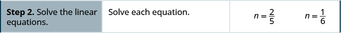   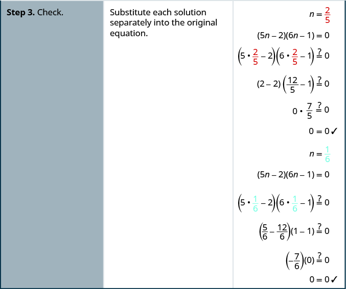 

Solve: <math xmlns="http://www.w3.org/1998/Math/MathML"><mrow><mrow><mo>(</mo><mrow><mn>3</mn><mi>m</mi><mo>−</mo><mn>2</mn></mrow><mo>)</mo></mrow><mrow><mo>(</mo><mrow><mn>2</mn><mi>m</mi><mo>+</mo><mn>1</mn></mrow><mo>)</mo></mrow><mo>=</mo><mn>0</mn><mo>.</mo></mrow></math>

<math xmlns="http://www.w3.org/1998/Math/MathML"><mrow><mi>m</mi><mo>=</mo><mfrac><mn>2</mn><mn>3</mn></mfrac><mo>,</mo><mi>m</mi><mo>=</mo><mo>−</mo><mfrac><mn>1</mn><mn>2</mn></mfrac></mrow></math>

Solve: <math xmlns="http://www.w3.org/1998/Math/MathML"><mrow><mrow><mo>(</mo><mrow><mn>4</mn><mi>p</mi><mo>+</mo><mn>3</mn></mrow><mo>)</mo></mrow><mrow><mo>(</mo><mrow><mn>4</mn><mi>p</mi><mo>−</mo><mn>3</mn></mrow><mo>)</mo></mrow><mo>=</mo><mn>0</mn><mo>.</mo></mrow></math>

<math xmlns="http://www.w3.org/1998/Math/MathML"><mrow><mi>p</mi><mo>=</mo><mo>−</mo><mfrac><mn>3</mn><mn>4</mn></mfrac><mo>,</mo><mi>p</mi><mo>=</mo><mfrac><mn>3</mn><mn>4</mn></mfrac></mrow></math>

Use the Zero Product Property.

1.  Set each factor equal to zero.
2.  Solve the linear equations.
3.  Check.
{: data-number-style="arabic" .stepwise}

# Solve Quadratic Equations by Factoring

The Zero Product Property works very nicely to solve quadratic equations. The quadratic equation must be factored, with zero isolated on one side. So we be sure to start with the quadratic equation in **standard form**{: data-type="term" .no-emphasis}, <math xmlns="http://www.w3.org/1998/Math/MathML"><mrow><mi>a</mi><msup><mi>x</mi><mn>2</mn></msup><mo>+</mo><mi>b</mi><mi>x</mi><mo>+</mo><mi>c</mi><mo>=</mo><mn>0</mn><mo>.</mo></mrow></math>

 Then we factor the expression on the left.

How to Solve a Quadratic Equation by Factoring

Solve: <math xmlns="http://www.w3.org/1998/Math/MathML"><mrow><mn>2</mn><msup><mi>y</mi><mn>2</mn></msup><mo>=</mo><mn>13</mn><mi>y</mi><mo>+</mo><mn>45</mn><mo>.</mo></mrow></math>

 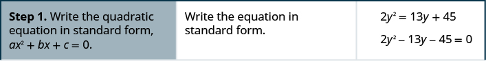   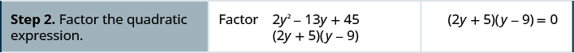   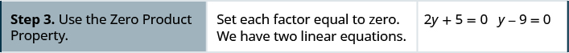   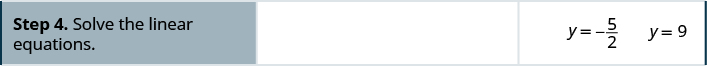   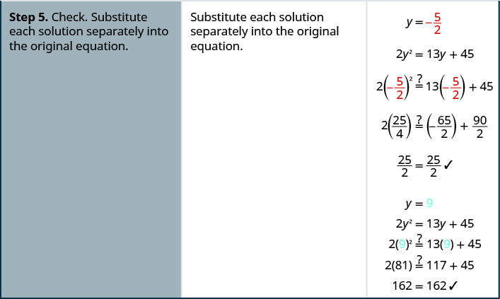 

Solve: <math xmlns="http://www.w3.org/1998/Math/MathML"><mrow><mn>3</mn><msup><mi>c</mi><mn>2</mn></msup><mo>=</mo><mn>10</mn><mi>c</mi><mo>−</mo><mn>8</mn><mo>.</mo></mrow></math>

<math xmlns="http://www.w3.org/1998/Math/MathML"><mrow><mi>c</mi><mo>=</mo><mn>2</mn><mo>,</mo><mi>c</mi><mo>=</mo><mfrac><mn>4</mn><mn>3</mn></mfrac></mrow></math>

Solve: <math xmlns="http://www.w3.org/1998/Math/MathML"><mrow><mn>2</mn><msup><mi>d</mi><mn>2</mn></msup><mo>−</mo><mn>5</mn><mi>d</mi><mo>=</mo><mn>3</mn><mo>.</mo></mrow></math>

<math xmlns="http://www.w3.org/1998/Math/MathML"><mrow><mi>d</mi><mo>=</mo><mn>3</mn><mo>,</mo><mi>d</mi><mo>=</mo><mo>−</mo><mfrac><mn>1</mn><mn>2</mn></mfrac></mrow></math>

Solve a quadratic equation by factoring.

1.  Write the quadratic equation in standard form,
    <math xmlns="http://www.w3.org/1998/Math/MathML"><mrow><mi>a</mi><msup><mi>x</mi><mn>2</mn></msup><mo>+</mo><mi>b</mi><mi>x</mi><mo>+</mo><mi>c</mi><mo>=</mo><mn>0</mn><mo>.</mo></mrow></math>

2.  Factor the quadratic expression.
3.  Use the Zero Product Property.
4.  Solve the linear equations.
5.  Check. Substitute each solution separately into the original equation.
{: data-number-style="arabic" .stepwise}

Before we factor, we must make sure the **quadratic equation**{: data-type="term" .no-emphasis} is in **standard form**{: data-type="term" .no-emphasis}.

Solving quadratic equations by factoring will make use of all the factoring techniques you have learned in this chapter! Do you recognize the special product pattern in the next example?

Solve: <math xmlns="http://www.w3.org/1998/Math/MathML"><mrow><mn>169</mn><msup><mi>q</mi><mn>2</mn></msup><mo>=</mo><mn>49</mn><mo>.</mo></mrow></math>

<math xmlns="http://www.w3.org/1998/Math/MathML"><mrow><mtable><mtr><mtd /><mtd /><mtd /><mtd /><mtd /><mtd columnalign="left"><mspace width="5.15em" /><mn>169</mn><msup><mi>x</mi><mn>2</mn></msup><mo>=</mo><mn>49</mn></mtd></mtr><mtr><mtd columnalign="left"><mtext>Write the quadratic equation in standard form.</mtext></mtd><mtd /><mtd /><mtd /><mtd /><mtd columnalign="left"><mspace width="3em" /><mn>169</mn><msup><mi>x</mi><mn>2</mn></msup><mo>−</mo><mn>49</mn><mo>=</mo><mn>0</mn></mtd></mtr><mtr><mtd columnalign="left"><mtext>Factor. It is a difference of squares.</mtext></mtd><mtd /><mtd /><mtd /><mtd /><mtd columnalign="left"><mrow><mo>(</mo><mrow><mn>13</mn><mi>x</mi><mo>−</mo><mn>7</mn></mrow><mo>)</mo></mrow><mrow><mo>(</mo><mrow><mn>13</mn><mi>x</mi><mo>+</mo><mn>7</mn></mrow><mo>)</mo></mrow><mo>=</mo><mn>0</mn></mtd></mtr><mtr><mtd columnalign="left"><mtable><mtr><mtd columnalign="left"><mtext>Use the Zero Product Property to set each factor to</mtext><mspace width="0.2em" /><mn>0</mn><mo>.</mo></mtd></mtr><mtr><mtd columnalign="left"><mtext>Solve each equation.</mtext></mtd></mtr><mtr /><mtr /><mtr /><mtr /><mtr /><mtr /></mtable></mtd><mtd /><mtd /><mtd /><mtd /><mtd columnalign="left"><mtable><mtr><mtd columnalign="right"><mn>13</mn><mi>x</mi><mo>−</mo><mn>7</mn></mtd><mtd columnalign="left"><mo>=</mo></mtd><mtd columnalign="left"><mn>0</mn></mtd><mtd /><mtd /><mtd /><mtd columnalign="right"><mn>13</mn><mi>x</mi><mo>+</mo><mn>7</mn></mtd><mtd columnalign="left"><mo>=</mo></mtd><mtd columnalign="left"><mn>0</mn></mtd></mtr><mtr><mtd columnalign="right"><mn>13</mn><mi>x</mi></mtd><mtd columnalign="left"><mo>=</mo></mtd><mtd columnalign="left"><mn>7</mn></mtd><mtd /><mtd /><mtd /><mtd columnalign="right"><mn>13</mn><mi>x</mi></mtd><mtd columnalign="left"><mo>=</mo></mtd><mtd columnalign="left"><mn>−7</mn></mtd></mtr><mtr><mtd columnalign="right"><mi>x</mi></mtd><mtd columnalign="left"><mo>=</mo></mtd><mtd columnalign="left"><mfrac><mn>7</mn><mrow><mn>13</mn></mrow></mfrac></mtd><mtd /><mtd /><mtd /><mtd columnalign="right"><mi>x</mi></mtd><mtd columnalign="left"><mo>=</mo></mtd><mtd columnalign="left"><mo>−</mo><mfrac><mn>7</mn><mrow><mn>13</mn></mrow></mfrac></mtd></mtr></mtable></mtd></mtr></mtable></mrow></math>

Check:

We leave the check up to you.

Solve: <math xmlns="http://www.w3.org/1998/Math/MathML"><mrow><mn>25</mn><msup><mi>p</mi><mn>2</mn></msup><mo>=</mo><mn>49</mn><mo>.</mo></mrow></math>

<math xmlns="http://www.w3.org/1998/Math/MathML"><mrow><mi>p</mi><mo>=</mo><mfrac><mn>7</mn><mn>5</mn></mfrac><mo>,</mo><mtext>p</mtext><mo>=</mo><mo>−</mo><mfrac><mn>7</mn><mn>5</mn></mfrac></mrow></math>

Solve: <math xmlns="http://www.w3.org/1998/Math/MathML"><mrow><mn>36</mn><msup><mi>x</mi><mn>2</mn></msup><mo>=</mo><mn>121</mn><mo>.</mo></mrow></math>

<math xmlns="http://www.w3.org/1998/Math/MathML"><mrow><mi>x</mi><mo>=</mo><mfrac><mrow><mn>11</mn></mrow><mn>6</mn></mfrac><mo>,</mo><mi>x</mi><mo>=</mo><mo>−</mo><mfrac><mrow><mn>11</mn></mrow><mn>6</mn></mfrac></mrow></math>

In the next example, the left side of the equation is factored, but the right side is not zero. In order to use the **Zero Product Property**{: data-type="term" .no-emphasis}, one side of the equation must be zero. We’ll multiply the factors and then write the equation in standard form.

Solve: <math xmlns="http://www.w3.org/1998/Math/MathML"><mrow><mrow><mo>(</mo><mrow><mn>3</mn><mi>x</mi><mo>−</mo><mn>8</mn></mrow><mo>)</mo></mrow><mrow><mo>(</mo><mrow><mi>x</mi><mo>−</mo><mn>1</mn></mrow><mo>)</mo></mrow><mo>=</mo><mn>3</mn><mi>x</mi><mo>.</mo></mrow></math>

<math xmlns="http://www.w3.org/1998/Math/MathML"><mrow><mtable><mtr><mtd /><mtd /><mtd /><mtd /><mtd /><mtd columnalign="left"><mspace width="0.3em" /><mrow><mo>(</mo><mrow><mn>3</mn><mi>x</mi><mo>−</mo><mn>8</mn></mrow><mo>)</mo></mrow><mrow><mo>(</mo><mrow><mi>x</mi><mo>−</mo><mn>1</mn></mrow><mo>)</mo></mrow><mo>=</mo><mn>3</mn><mi>x</mi></mtd></mtr><mtr><mtd columnalign="left"><mtext>Multiply the binomials.</mtext></mtd><mtd /><mtd /><mtd /><mtd /><mtd columnalign="left"><mspace width="0.6em" /><mn>3</mn><msup><mi>x</mi><mn>2</mn></msup><mo>−</mo><mn>11</mn><mi>x</mi><mo>+</mo><mn>8</mn><mo>=</mo><mn>3</mn><mi>x</mi></mtd></mtr><mtr><mtd columnalign="left"><mtext>Write the quadratic equation in standard form.</mtext></mtd><mtd /><mtd /><mtd /><mtd /><mtd columnalign="left"><mspace width="0.6em" /><mn>3</mn><msup><mi>x</mi><mn>2</mn></msup><mo>−</mo><mn>14</mn><mi>x</mi><mo>+</mo><mn>8</mn><mo>=</mo><mn>0</mn></mtd></mtr><mtr><mtd columnalign="left"><mtext>Factor the trinomial.</mtext></mtd><mtd /><mtd /><mtd /><mtd /><mtd columnalign="left"><mspace width="0.25em" /><mrow><mo>(</mo><mrow><mn>3</mn><mi>x</mi><mo>−</mo><mn>2</mn></mrow><mo>)</mo></mrow><mrow><mo>(</mo><mrow><mi>x</mi><mo>−</mo><mn>4</mn></mrow><mo>)</mo></mrow><mo>=</mo><mn>0</mn></mtd></mtr><mtr><mtd columnalign="left"><mtable><mtr><mtd columnalign="left"><mtext>Use the Zero Product Property to set each factor to 0.</mtext></mtd></mtr><mtr><mtd columnalign="left"><mtext>Solve each equation.</mtext></mtd></mtr></mtable></mtd><mtd /><mtd /><mtd /><mtd /><mtd columnalign="left"><mtable><mtr><mtd columnalign="right"><mn>3</mn><mi>x</mi><mo>−</mo><mn>2</mn></mtd><mtd columnalign="left"><mo>=</mo></mtd><mtd columnalign="left"><mn>0</mn></mtd><mtd /><mtd /><mtd /><mtd columnalign="right"><mi>x</mi><mo>−</mo><mn>4</mn></mtd><mtd columnalign="left"><mo>=</mo></mtd><mtd columnalign="left"><mn>0</mn></mtd></mtr><mtr><mtd columnalign="right"><mn>3</mn><mi>x</mi></mtd><mtd columnalign="left"><mo>=</mo></mtd><mtd columnalign="left"><mn>2</mn></mtd><mtd /><mtd /><mtd /><mtd columnalign="right"><mi>x</mi></mtd><mtd columnalign="left"><mo>=</mo></mtd><mtd columnalign="left"><mn>4</mn></mtd></mtr></mtable></mtd></mtr><mtr><mtd /><mtd /><mtd /><mtd /><mtd /><mtd columnalign="left"><mspace width="2.7em" /><mi>x</mi><mo>=</mo><mfrac><mn>2</mn><mn>3</mn></mfrac></mtd></mtr><mtr><mtd columnalign="left"><mtext>Check your answers.</mtext></mtd><mtd /><mtd /><mtd /><mtd /><mtd columnalign="left"><mtext>The check is left to you.</mtext></mtd></mtr></mtable></mrow></math>

Solve: <math xmlns="http://www.w3.org/1998/Math/MathML"><mrow><mrow><mo>(</mo><mrow><mn>2</mn><mi>m</mi><mo>+</mo><mn>1</mn></mrow><mo>)</mo></mrow><mrow><mo>(</mo><mrow><mi>m</mi><mo>+</mo><mn>3</mn></mrow><mo>)</mo></mrow><mo>=</mo><mn>1</mn><mn>2</mn><mi>m</mi><mo>.</mo></mrow></math>

<math xmlns="http://www.w3.org/1998/Math/MathML"><mrow><mi>m</mi><mo>=</mo><mn>1</mn><mo>,</mo><mi>m</mi><mo>=</mo><mfrac><mn>3</mn><mn>2</mn></mfrac></mrow></math>

Solve: <math xmlns="http://www.w3.org/1998/Math/MathML"><mrow><mrow><mo>(</mo><mrow><mi>k</mi><mo>+</mo><mn>1</mn></mrow><mo>)</mo></mrow><mrow><mo>(</mo><mrow><mi>k</mi><mo>−</mo><mn>1</mn></mrow><mo>)</mo></mrow><mo>=</mo><mn>8</mn><mo>.</mo></mrow></math>

<math xmlns="http://www.w3.org/1998/Math/MathML"><mrow><mi>k</mi><mo>=</mo><mn>3</mn><mo>,</mo><mi>k</mi><mo>=</mo><mn>−3</mn></mrow></math>

In the next example, when we factor the quadratic equation we will get three factors. However the first factor is a constant. We know that factor cannot equal 0.

Solve: <math xmlns="http://www.w3.org/1998/Math/MathML"><mrow><mn>3</mn><msup><mi>x</mi><mn>2</mn></msup><mo>=</mo><mn>12</mn><mi>x</mi><mo>+</mo><mn>63</mn><mo>.</mo></mrow></math>

<math xmlns="http://www.w3.org/1998/Math/MathML"><mrow><mtable><mtr><mtd /><mtd /><mtd /><mtd /><mtd /><mtd columnalign="left"><mspace width="5.5em" /><mn>3</mn><msup><mi>x</mi><mn>2</mn></msup><mo>=</mo><mn>12</mn><mi>x</mi><mo>+</mo><mn>63</mn></mtd></mtr><mtr><mtd columnalign="left"><mtext>Write the quadratic equation in standard form.</mtext></mtd><mtd /><mtd /><mtd /><mtd /><mtd columnalign="left"><mspace width="0.7em" /><mn>3</mn><msup><mi>x</mi><mn>2</mn></msup><mo>−</mo><mn>12</mn><mi>x</mi><mo>−</mo><mn>63</mn><mo>=</mo><mn>0</mn></mtd></mtr><mtr><mtd columnalign="left"><mtext>Factor the greatest common factor first.</mtext></mtd><mtd /><mtd /><mtd /><mtd /><mtd columnalign="left"><mspace width="0.7em" /><mn>3</mn><mrow><mo>(</mo><mrow><msup><mi>x</mi><mn>2</mn></msup><mo>−</mo><mn>4</mn><mi>x</mi><mo>−</mo><mn>21</mn></mrow><mo>)</mo></mrow><mo>=</mo><mn>0</mn></mtd></mtr><mtr><mtd columnalign="left"><mtext>Factor the trinomial.</mtext></mtd><mtd /><mtd /><mtd /><mtd /><mtd columnalign="left"><mspace width="0.8em" /><mn>3</mn><mrow><mo>(</mo><mrow><mi>x</mi><mo>−</mo><mn>7</mn></mrow><mo>)</mo></mrow><mrow><mo>(</mo><mrow><mi>x</mi><mo>+</mo><mn>3</mn></mrow><mo>)</mo></mrow><mo>=</mo><mn>0</mn></mtd></mtr> <mtr><mtd columnalign="left"><mtable><mtr><mtd columnalign="left"><mtext>Use the Zero Product Property to set each factor to 0.</mtext></mtd></mtr><mtr><mtd columnalign="left"><mtext>Solve each equation.</mtext></mtd></mtr></mtable></mtd><mtd /><mtd /><mtd /><mtd /><mtd columnalign="left"><mtable><mtr><mtd columnalign="left"><mn>3</mn><mo>≠</mo><mn>0</mn></mtd><mtd /><mtd /><mtd /><mtd columnalign="right"><mi>x</mi><mo>−</mo><mn>7</mn></mtd><mtd columnalign="left"><mo>=</mo></mtd><mtd columnalign="left"><mn>0</mn></mtd><mtd /><mtd /><mtd /><mtd columnalign="right"><mi>x</mi><mo>+</mo><mn>3</mn></mtd><mtd columnalign="left"><mo>=</mo></mtd><mtd columnalign="left"><mn>0</mn></mtd></mtr><mtr><mtd columnalign="left"><mn>3</mn><mo>≠</mo><mn>0</mn></mtd><mtd /><mtd /><mtd /><mtd columnalign="right"><mi>x</mi></mtd><mtd columnalign="left"><mo>=</mo></mtd><mtd columnalign="left"><mn>7</mn></mtd><mtd /><mtd /><mtd /><mtd columnalign="right"><mi>x</mi></mtd><mtd columnalign="left"><mo>=</mo></mtd><mtd columnalign="left"><mn>−3</mn></mtd></mtr></mtable></mtd></mtr><mtr><mtd columnalign="left"><mtext>Check your answers.</mtext></mtd><mtd /><mtd /><mtd /><mtd /><mtd columnalign="left"><mtext>The check is left to you.</mtext></mtd></mtr></mtable></mrow></math>

Solve: <math xmlns="http://www.w3.org/1998/Math/MathML"><mrow><mn>18</mn><msup><mi>a</mi><mn>2</mn></msup><mo>−</mo><mn>30</mn><mo>=</mo><mn>−33</mn><mi>a</mi><mo>.</mo></mrow></math>

<math xmlns="http://www.w3.org/1998/Math/MathML"><mrow><mi>a</mi><mo>=</mo><mo>−</mo><mfrac><mn>5</mn><mn>2</mn></mfrac><mo>,</mo><mi>a</mi><mo>=</mo><mfrac><mn>2</mn><mn>3</mn></mfrac></mrow></math>

Solve: <math xmlns="http://www.w3.org/1998/Math/MathML"><mrow><mn>123</mn><mi>b</mi><mo>=</mo><mn>−6</mn><mo>−</mo><mn>60</mn><msup><mi>b</mi><mn>2</mn></msup><mo>.</mo></mrow></math>

<math xmlns="http://www.w3.org/1998/Math/MathML"><mrow><mi>b</mi><mo>=</mo><mn>−2</mn><mo>,</mo><mi>b</mi><mo>=</mo><mo>−</mo><mfrac><mn>1</mn><mrow><mn>20</mn></mrow></mfrac></mrow></math>

The **Zero Product Property**{: data-type="term" .no-emphasis} also applies to the product of three or more factors. If the product is zero, at least one of the factors must be zero. We can solve some equations of degree greater than two by using the Zero Product Property, just like we solved quadratic equations.

Solve: <math xmlns="http://www.w3.org/1998/Math/MathML"><mrow><mn>9</mn><msup><mi>m</mi><mn>3</mn></msup><mo>+</mo><mn>100</mn><mi>m</mi><mo>=</mo><mn>60</mn><msup><mi>m</mi><mn>2</mn></msup><mo>.</mo></mrow></math>

<math xmlns="http://www.w3.org/1998/Math/MathML"><mrow><mtable><mtr><mtd /><mtd /><mtd /><mtd /><mtd /><mtd columnalign="left"><mspace width="3.7em" /><mn>9</mn><msup><mi>m</mi><mn>3</mn></msup><mo>+</mo><mn>100</mn><mi>m</mi><mo>=</mo><mn>60</mn><msup><mi>m</mi><mn>2</mn></msup></mtd></mtr><mtr><mtd columnalign="left"><mtext>Bring all the terms to one side so that the other side is zero.</mtext></mtd><mtd /><mtd /><mtd /><mtd /><mtd columnalign="left"><mspace width="0.35em" /><mn>9</mn><msup><mi>m</mi><mn>3</mn></msup><mo>−</mo><mn>60</mn><msup><mi>m</mi><mn>2</mn></msup><mo>+</mo><mn>100</mn><mi>m</mi><mo>=</mo><mn>0</mn></mtd></mtr><mtr><mtd columnalign="left"><mtext>Factor the greatest common factor first.</mtext></mtd><mtd /><mtd /><mtd /><mtd /><mtd columnalign="left"><mspace width="0.35em" /><mi>m</mi><mrow><mo>(</mo><mrow><mn>9</mn><msup><mi>m</mi><mn>2</mn></msup><mo>−</mo><mn>60</mn><mi>m</mi><mo>+</mo><mn>100</mn></mrow><mo>)</mo></mrow><mo>=</mo><mn>0</mn></mtd></mtr><mtr><mtd columnalign="left"><mtext>Factor the trinomial.</mtext></mtd><mtd /><mtd /><mtd /><mtd /><mtd columnalign="left"><mi>m</mi><mo stretchy="false">(</mo><mn>3</mn><mi>m</mi><mo>−</mo><mn>10</mn><mo stretchy="false">)</mo><mo stretchy="false">(</mo><mn>3</mn><mi>m</mi><mo>−</mo><mn>10</mn><mo stretchy="false">)</mo><mo>=</mo><mn>0</mn></mtd></mtr><mtr><mtd columnalign="left"><mtable><mtr><mtd columnalign="left"><mtext>Use the Zero Product Property to set each factor to 0.</mtext></mtd></mtr><mtr><mtd columnalign="left"><mtext>Solve each equation.</mtext></mtd></mtr></mtable></mtd><mtd /><mtd /><mtd /><mtd /><mtd columnalign="left"><mspace width="0.35em" /><mtable><mtr><mtd columnalign="left"><mi>m</mi><mo>=</mo><mn>0</mn></mtd><mtd /><mtd /><mtd /><mtd columnalign="right"><mn>3</mn><mi>m</mi><mo>−</mo><mn>10</mn></mtd><mtd columnalign="left"><mo>=</mo></mtd><mtd columnalign="left"><mn>0</mn></mtd><mtd /><mtd /><mtd /><mtd columnalign="right"><mn>3</mn><mi>m</mi><mo>−</mo><mn>10</mn></mtd><mtd columnalign="left"><mo>=</mo></mtd><mtd columnalign="left"><mn>0</mn></mtd></mtr><mtr><mtd columnalign="left"><mi>m</mi><mo>=</mo><mn>0</mn></mtd><mtd /><mtd /><mtd /><mtd columnalign="right"><mi>m</mi></mtd><mtd columnalign="left"><mo>=</mo></mtd><mtd columnalign="left"><mfrac><mrow><mn>10</mn></mrow><mn>3</mn></mfrac></mtd><mtd /><mtd /><mtd /><mtd columnalign="right"><mi>m</mi></mtd><mtd columnalign="left"><mo>=</mo></mtd><mtd columnalign="left"><mfrac><mrow><mn>10</mn></mrow><mn>3</mn></mfrac></mtd></mtr></mtable></mtd></mtr><mtr><mtd columnalign="left"><mtext>Check your answers.</mtext></mtd><mtd /><mtd /><mtd /><mtd /><mtd columnalign="left"><mtext>The check is left to you.</mtext></mtd></mtr></mtable></mrow></math>

Solve: <math xmlns="http://www.w3.org/1998/Math/MathML"><mrow><mn>8</mn><msup><mi>x</mi><mn>3</mn></msup><mo>=</mo><mn>24</mn><msup><mi>x</mi><mn>2</mn></msup><mo>−</mo><mn>18</mn><mi>x</mi><mo>.</mo></mrow></math>

<math xmlns="http://www.w3.org/1998/Math/MathML"><mrow><mi>x</mi><mo>=</mo><mn>0</mn><mo>,</mo><mi>x</mi><mo>=</mo><mfrac><mn>3</mn><mn>2</mn></mfrac></mrow></math>

Solve: <math xmlns="http://www.w3.org/1998/Math/MathML"><mrow><mn>16</mn><msup><mi>y</mi><mn>2</mn></msup><mo>=</mo><mn>32</mn><msup><mi>y</mi><mn>3</mn></msup><mo>+</mo><mn>2</mn><mi>y</mi><mo>.</mo></mrow></math>

<math xmlns="http://www.w3.org/1998/Math/MathML"><mrow><mi>y</mi><mo>=</mo><mn>0</mn><mo>,</mo><mi>y</mi><mo>=</mo><mfrac><mn>1</mn><mn>4</mn></mfrac></mrow></math>

# Solve Equations with Polynomial Functions

As our study of polynomial functions continues, it will often be important to know when the function will have a certain value or what points lie on the graph of the function. Our work with the **Zero Product Property**{: data-type="term" .no-emphasis} will be help us find these answers.

For the function <math xmlns="http://www.w3.org/1998/Math/MathML"><mrow><mi>f</mi><mrow><mo>(</mo><mi>x</mi><mo>)</mo></mrow><mo>=</mo><msup><mi>x</mi><mn>2</mn></msup><mo>+</mo><mn>2</mn><mi>x</mi><mo>−</mo><mn>2</mn><mo>,</mo></mrow></math>

ⓐ find *x* when <math xmlns="http://www.w3.org/1998/Math/MathML"><mrow><mi>f</mi><mrow><mo>(</mo><mi>x</mi><mo>)</mo></mrow><mo>=</mo><mn>6</mn></mrow></math>

* * *
{: data-type="newline"}

ⓑ find two points that lie on the graph of the function.

ⓐ* * *
{: data-type="newline"}

 <math xmlns="http://www.w3.org/1998/Math/MathML"><mrow><mtable><mtr><mtd /><mtd /><mtd /><mtd /><mtd /><mtd columnalign="left"><mi>f</mi><mrow><mo>(</mo><mi>x</mi><mo>)</mo></mrow><mo>=</mo><msup><mi>x</mi><mn>2</mn></msup><mo>+</mo><mn>2</mn><mi>x</mi><mo>−</mo><mn>2</mn></mtd></mtr><mtr><mtd columnalign="left"><mtext>Substitute 6 for</mtext><mspace width="0.2em" /><mi>f</mi><mrow><mo>(</mo><mi>x</mi><mo>)</mo></mrow><mo>.</mo></mtd><mtd /><mtd /><mtd /><mtd /><mtd columnalign="left"><mspace width="1.2em" /><mn>6</mn><mo>=</mo><msup><mi>x</mi><mn>2</mn></msup><mo>+</mo><mn>2</mn><mi>x</mi><mo>−</mo><mn>2</mn></mtd></mtr><mtr><mtd columnalign="left"><mtext>Put the quadratic in standard form.</mtext></mtd><mtd /><mtd /><mtd /><mtd /><mtd columnalign="left"><mspace width="0.8em" /><msup><mi>x</mi><mn>2</mn></msup><mo>+</mo><mn>2</mn><mi>x</mi><mo>−</mo><mn>8</mn><mo>=</mo><mn>0</mn></mtd></mtr><mtr><mtd columnalign="left"><mtext>Factor the trinomial.</mtext></mtd><mtd /><mtd /><mtd /><mtd /><mtd columnalign="left"><mrow><mo>(</mo><mrow><mi>x</mi><mo>+</mo><mn>4</mn></mrow><mo>)</mo></mrow><mrow><mo>(</mo><mrow><mi>x</mi><mo>−</mo><mn>2</mn></mrow><mo>)</mo></mrow><mo>=</mo><mn>0</mn></mtd></mtr><mtr><mtd columnalign="left"><mtable><mtr><mtd columnalign="left"><mtext>Use the zero product property.</mtext></mtd></mtr><mtr><mtd columnalign="left"><mtext>Solve.</mtext></mtd></mtr></mtable></mtd><mtd /><mtd /><mtd /><mtd /><mtd columnalign="left"><mtable><mtr><mtd columnalign="right"><mi>x</mi><mo>+</mo><mn>4</mn></mtd><mtd columnalign="left"><mo>=</mo></mtd><mtd columnalign="left"><mn>0</mn></mtd><mtd /><mtd /><mtd columnalign="left"><mtext>or</mtext></mtd><mtd /><mtd /><mtd columnalign="right"><mi>x</mi><mo>−</mo><mn>2</mn></mtd><mtd columnalign="left"><mo>=</mo></mtd><mtd columnalign="left"><mn>0</mn></mtd></mtr><mtr><mtd columnalign="right"><mi>x</mi></mtd><mtd columnalign="left"><mo>=</mo></mtd><mtd columnalign="left"><mn>−4</mn></mtd><mtd /><mtd /><mtd columnalign="left"><mtext>or</mtext></mtd><mtd /><mtd /><mtd columnalign="right"><mi>x</mi></mtd><mtd columnalign="left"><mo>=</mo></mtd><mtd columnalign="left"><mn>2</mn></mtd></mtr></mtable></mtd></mtr><mtr><mtd columnalign="left"><mtext>Check:</mtext></mtd><mtd /><mtd /><mtd /><mtd /><mtd /></mtr><mtr /><mtr /><mtr /><mtr /><mtr /><mtr /><mtr /><mtr /><mtr><mtd columnalign="left"><mspace width="4em" /><mtable><mtr><mtd columnalign="left"><mspace width="0.7em" /><mi>f</mi><mrow><mo>(</mo><mi>x</mi><mo>)</mo></mrow><mo>=</mo><msup><mi>x</mi><mn>2</mn></msup><mo>+</mo><mn>2</mn><mi>x</mi><mo>−</mo><mn>2</mn></mtd><mtd /><mtd /><mtd /><mtd columnalign="left"><mi>f</mi><mrow><mo>(</mo><mi>x</mi><mo>)</mo></mrow><mo>=</mo><msup><mi>x</mi><mn>2</mn></msup><mo>+</mo><mn>2</mn><mi>x</mi><mo>−</mo><mn>2</mn></mtd></mtr><mtr><mtd columnalign="left"><mi>f</mi><mrow><mo>(</mo><mrow><mtext>−</mtext><mn>4</mn></mrow><mo>)</mo></mrow><mo>=</mo><msup><mrow><mrow><mo>(</mo><mrow><mtext>−</mtext><mn>4</mn></mrow><mo>)</mo></mrow></mrow><mn>2</mn></msup><mo>+</mo><mn>2</mn><mrow><mo>(</mo><mrow><mtext>−</mtext><mn>4</mn></mrow><mo>)</mo></mrow><mo>−</mo><mn>2</mn></mtd><mtd /><mtd /><mtd /><mtd columnalign="left"><mi>f</mi><mrow><mo>(</mo><mn>2</mn><mo>)</mo></mrow><mo>=</mo><msup><mn>2</mn><mn>2</mn></msup><mo>+</mo><mn>2</mn><mo>·</mo><mn>2</mn><mo>−</mo><mn>2</mn></mtd></mtr><mtr><mtd columnalign="left"><mi>f</mi><mrow><mo>(</mo><mrow><mtext>−</mtext><mn>4</mn></mrow><mo>)</mo></mrow><mo>=</mo><mn>16</mn><mo>−</mo><mn>8</mn><mo>−</mo><mn>2</mn></mtd><mtd /><mtd /><mtd /><mtd columnalign="left"><mi>f</mi><mrow><mo>(</mo><mn>2</mn><mo>)</mo></mrow><mo>=</mo><mn>4</mn><mo>+</mo><mn>4</mn><mo>−</mo><mn>2</mn></mtd></mtr><mtr><mtd columnalign="left"><mi>f</mi><mrow><mo>(</mo><mrow><mtext>−</mtext><mn>4</mn></mrow><mo>)</mo></mrow><mo>=</mo><mn>6</mn><mo>✓</mo></mtd><mtd /><mtd /><mtd /><mtd columnalign="left"><mi>f</mi><mrow><mo>(</mo><mn>2</mn><mo>)</mo></mrow><mo>=</mo><mn>6</mn><mo>✓</mo></mtd></mtr></mtable></mtd><mtd /><mtd /><mtd /><mtd /><mtd /></mtr></mtable></mrow></math>

* * *
{: data-type="newline"}

* * *
{: data-type="newline"}

 ⓑ Since <math xmlns="http://www.w3.org/1998/Math/MathML"><mrow><mi>f</mi><mrow><mo>(</mo><mrow><mn>−4</mn></mrow><mo>)</mo></mrow><mo>=</mo><mn>6</mn></mrow></math>

 and <math xmlns="http://www.w3.org/1998/Math/MathML"><mrow><mi>f</mi><mrow><mo>(</mo><mn>2</mn><mo>)</mo></mrow><mo>=</mo><mn>6</mn><mo>,</mo></mrow></math>

 the points <math xmlns="http://www.w3.org/1998/Math/MathML"><mrow><mrow><mo>(</mo><mrow><mn>−4</mn><mo>,</mo><mn>6</mn></mrow><mo>)</mo></mrow></mrow></math>

 and <math xmlns="http://www.w3.org/1998/Math/MathML"><mrow><mrow><mo>(</mo><mrow><mn>2</mn><mo>,</mo><mn>6</mn></mrow><mo>)</mo></mrow></mrow></math>

 lie on the graph of the function.

For the function <math xmlns="http://www.w3.org/1998/Math/MathML"><mrow><mi>f</mi><mrow><mo>(</mo><mi>x</mi><mo>)</mo></mrow><mo>=</mo><msup><mi>x</mi><mn>2</mn></msup><mo>−</mo><mn>2</mn><mi>x</mi><mo>−</mo><mn>8</mn><mo>,</mo></mrow></math>

ⓐ find *x* when <math xmlns="http://www.w3.org/1998/Math/MathML"><mrow><mi>f</mi><mrow><mo>(</mo><mi>x</mi><mo>)</mo></mrow><mo>=</mo><mn>7</mn></mrow></math>

* * *
{: data-type="newline"}

ⓑ Find two points that lie on the graph of the function.

ⓐ <math xmlns="http://www.w3.org/1998/Math/MathML"><mrow><mi>x</mi><mo>=</mo><mn>−3</mn></mrow></math>

 or <math xmlns="http://www.w3.org/1998/Math/MathML"><mrow><mi>x</mi><mo>=</mo><mn>5</mn></mrow></math>

* * *
{: data-type="newline"}

ⓑ <math xmlns="http://www.w3.org/1998/Math/MathML"><mrow><mrow><mo>(</mo><mrow><mn>−3</mn><mo>,</mo><mn>7</mn></mrow><mo>)</mo></mrow></mrow></math>

 <math xmlns="http://www.w3.org/1998/Math/MathML"><mrow><mrow><mo>(</mo><mrow><mn>5</mn><mo>,</mo><mn>7</mn></mrow><mo>)</mo></mrow></mrow></math>

For the function <math xmlns="http://www.w3.org/1998/Math/MathML"><mrow><mi>f</mi><mrow><mo>(</mo><mi>x</mi><mo>)</mo></mrow><mo>=</mo><msup><mi>x</mi><mn>2</mn></msup><mo>−</mo><mn>8</mn><mi>x</mi><mo>+</mo><mn>3</mn><mo>,</mo></mrow></math>

ⓐ find *x* when <math xmlns="http://www.w3.org/1998/Math/MathML"><mrow><mi>f</mi><mrow><mo>(</mo><mi>x</mi><mo>)</mo></mrow><mo>=</mo><mn>−4</mn></mrow></math>

* * *
{: data-type="newline"}

ⓑ Find two points that lie on the graph of the function.

ⓐ <math xmlns="http://www.w3.org/1998/Math/MathML"><mrow><mi>x</mi><mo>=</mo><mn>1</mn></mrow></math>

 or <math xmlns="http://www.w3.org/1998/Math/MathML"><mrow><mi>x</mi><mo>=</mo><mn>7</mn></mrow></math>

* * *
{: data-type="newline"}

ⓑ <math xmlns="http://www.w3.org/1998/Math/MathML"><mrow><mrow><mo>(</mo><mrow><mn>1</mn><mo>,</mo><mn>−4</mn></mrow><mo>)</mo></mrow></mrow></math>

 <math xmlns="http://www.w3.org/1998/Math/MathML"><mrow><mrow><mo>(</mo><mrow><mn>7</mn><mo>,</mo><mn>−4</mn></mrow><mo>)</mo></mrow></mrow></math>

The **Zero Product Property**{: data-type="term" .no-emphasis} also helps us determine where the function is zero. A value of *x* where the function is 0, is called a **zero of the function**{: data-type="term"}.

Zero of a Function

For any function *f*, if <math xmlns="http://www.w3.org/1998/Math/MathML"><mrow><mi>f</mi><mrow><mo>(</mo><mi>x</mi><mo>)</mo></mrow><mo>=</mo><mn>0</mn><mo>,</mo></mrow></math>

 then *x* is a **zero of the function**.

When <math xmlns="http://www.w3.org/1998/Math/MathML"><mrow><mi>f</mi><mrow><mo>(</mo><mi>x</mi><mo>)</mo></mrow><mo>=</mo><mn>0</mn><mo>,</mo></mrow></math>

 the point <math xmlns="http://www.w3.org/1998/Math/MathML"><mrow><mrow><mo>(</mo><mrow><mi>x</mi><mo>,</mo><mn>0</mn></mrow><mo>)</mo></mrow></mrow></math>

 is a point on the graph. This point is an ***x*-intercept**{: data-type="term" .no-emphasis} of the graph. It is often important to know where the graph of a function crosses the axes. We will see some examples later.

For the function <math xmlns="http://www.w3.org/1998/Math/MathML"><mrow><mi>f</mi><mrow><mo>(</mo><mi>x</mi><mo>)</mo></mrow><mo>=</mo><mn>3</mn><msup><mi>x</mi><mn>2</mn></msup><mo>+</mo><mn>10</mn><mi>x</mi><mo>−</mo><mn>8</mn><mo>,</mo></mrow></math>

 find

ⓐ the zeros of the function,* * *
{: data-type="newline"}

ⓑ any *x*-intercepts of the graph of the function* * *
{: data-type="newline"}

ⓒ any *y*-intercepts of the graph of the function

ⓐ To find the zeros of the function, we need to find when the function value is 0.* * *
{: data-type="newline"}

 <math xmlns="http://www.w3.org/1998/Math/MathML"><mrow><mtable><mtr><mtd /><mtd /><mtd /><mtd /><mtd /><mtd columnalign="left"><mi>f</mi><mrow><mo>(</mo><mi>x</mi><mo>)</mo></mrow><mo>=</mo><mn>3</mn><msup><mi>x</mi><mn>2</mn></msup><mo>+</mo><mn>10</mn><mi>x</mi><mo>−</mo><mn>8</mn></mtd></mtr><mtr><mtd columnalign="left"><mtext>Substitute 0 for</mtext><mspace width="0.2em" /><mi>f</mi><mrow><mo>(</mo><mi>x</mi><mo>)</mo></mrow><mo>.</mo></mtd><mtd /><mtd /><mtd /><mtd /><mtd columnalign="left"><mspace width="1.2em" /><mn>0</mn><mo>=</mo><mn>3</mn><msup><mi>x</mi><mn>2</mn></msup><mo>+</mo><mn>10</mn><mi>x</mi><mo>−</mo><mn>8</mn></mtd></mtr><mtr><mtd columnalign="left"><mtext>Factor the trinomial.</mtext></mtd><mtd /><mtd /><mtd /><mtd /><mtd columnalign="left"><mrow><mo>(</mo><mrow><mi>x</mi><mo>+</mo><mn>4</mn></mrow><mo>)</mo></mrow><mrow><mo>(</mo><mrow><mn>3</mn><mi>x</mi><mo>−</mo><mn>2</mn></mrow><mo>)</mo></mrow><mo>=</mo><mn>0</mn></mtd></mtr><mtr><mtd columnalign="left"><mtable><mtr><mtd columnalign="left"><mtext>Use the zero product property.</mtext></mtd></mtr><mtr><mtd columnalign="left"><mtext>Solve.</mtext></mtd></mtr></mtable></mtd><mtd /><mtd /><mtd /><mtd /><mtd columnalign="left"><mtable><mtr><mtd columnalign="right"><mi>x</mi><mo>+</mo><mn>4</mn></mtd><mtd columnalign="left"><mo>=</mo></mtd><mtd columnalign="left"><mn>0</mn></mtd><mtd /><mtd /><mtd columnalign="left"><mtext>or</mtext></mtd><mtd /><mtd /><mtd columnalign="right"><mn>3</mn><mi>x</mi><mo>−</mo><mn>2</mn></mtd><mtd columnalign="left"><mo>=</mo></mtd><mtd columnalign="left"><mn>0</mn></mtd></mtr><mtr><mtd columnalign="right"><mi>x</mi></mtd><mtd columnalign="left"><mo>=</mo></mtd><mtd columnalign="left"><mn>−4</mn></mtd><mtd /><mtd /><mtd columnalign="left"><mtext>or</mtext></mtd><mtd /><mtd /><mtd columnalign="right"><mi>x</mi></mtd><mtd columnalign="left"><mo>=</mo></mtd><mtd columnalign="left"><mfrac><mn>2</mn><mn>3</mn></mfrac></mtd></mtr></mtable></mtd></mtr></mtable></mrow></math>

* * *
{: data-type="newline"}

* * *
{: data-type="newline"}

 ⓑ An *x*-intercept occurs when <math xmlns="http://www.w3.org/1998/Math/MathML"><mrow><mi>y</mi><mo>=</mo><mn>0</mn><mo>.</mo></mrow></math>

 Since <math xmlns="http://www.w3.org/1998/Math/MathML"><mrow><mi>f</mi><mrow><mo>(</mo><mrow><mn>−4</mn></mrow><mo>)</mo></mrow><mo>=</mo><mn>0</mn></mrow></math>

 and <math xmlns="http://www.w3.org/1998/Math/MathML"><mrow><mi>f</mi><mrow><mo>(</mo><mrow><mfrac><mn>2</mn><mn>3</mn></mfrac></mrow><mo>)</mo></mrow><mo>=</mo><mn>0</mn><mo>,</mo></mrow></math>

 the points <math xmlns="http://www.w3.org/1998/Math/MathML"><mrow><mrow><mo>(</mo><mrow><mn>−4</mn><mo>,</mo><mn>0</mn></mrow><mo>)</mo></mrow></mrow></math>

 and <math xmlns="http://www.w3.org/1998/Math/MathML"><mrow><mrow><mo>(</mo><mrow><mfrac><mn>2</mn><mn>3</mn></mfrac><mo>,</mo><mn>0</mn></mrow><mo>)</mo></mrow></mrow></math>

 lie on the graph. These points are *x*-intercepts of the function.* * *
{: data-type="newline"}

* * *
{: data-type="newline"}

* * *
{: data-type="newline"}

 ⓒ A *y*-intercept occurs when <math xmlns="http://www.w3.org/1998/Math/MathML"><mrow><mi>x</mi><mo>=</mo><mn>0</mn><mo>.</mo></mrow></math>

 To find the *y*-intercepts we need to find <math xmlns="http://www.w3.org/1998/Math/MathML"><mrow><mi>f</mi><mrow><mo>(</mo><mn>0</mn><mo>)</mo></mrow><mo>.</mo></mrow></math>

* * *
{: data-type="newline"}

 <math xmlns="http://www.w3.org/1998/Math/MathML"><mrow><mtable><mtr><mtd /><mtd /><mtd /><mtd /><mtd /><mtd columnalign="left"><mi>f</mi><mrow><mo>(</mo><mi>x</mi><mo>)</mo></mrow><mo>=</mo><mn>3</mn><msup><mi>x</mi><mn>2</mn></msup><mo>+</mo><mn>10</mn><mi>x</mi><mo>−</mo><mn>8</mn></mtd></mtr><mtr><mtd columnalign="left"><mtext>Find</mtext><mspace width="0.2em" /><mi>f</mi><mrow><mo>(</mo><mn>0</mn><mo>)</mo></mrow><mspace width="0.2em" /><mtext>by substituting 0 for</mtext><mspace width="0.2em" /><mi>x</mi><mo>.</mo></mtd><mtd /><mtd /><mtd /><mtd /><mtd columnalign="left"><mi>f</mi><mrow><mo>(</mo><mn>0</mn><mo>)</mo></mrow><mo>=</mo><mn>3</mn><mo>·</mo><msup><mn>0</mn><mn>2</mn></msup><mo>+</mo><mn>10</mn><mo>·</mo><mn>0</mn><mo>−</mo><mn>8</mn></mtd></mtr><mtr><mtd columnalign="left"><mtext>Simplify.</mtext></mtd><mtd /><mtd /><mtd /><mtd /><mtd columnalign="left"><mi>f</mi><mrow><mo>(</mo><mn>0</mn><mo>)</mo></mrow><mo>=</mo><mn>−8</mn></mtd></mtr></mtable></mrow></math>

* * *
{: data-type="newline"}

 Since <math xmlns="http://www.w3.org/1998/Math/MathML"><mrow><mi>f</mi><mrow><mo>(</mo><mn>0</mn><mo>)</mo></mrow><mo>=</mo><mn>−8</mn><mo>,</mo></mrow></math>

 the point <math xmlns="http://www.w3.org/1998/Math/MathML"><mrow><mrow><mo>(</mo><mrow><mn>0</mn><mo>,</mo><mn>−8</mn></mrow><mo>)</mo></mrow></mrow></math>

 lies on the graph. This point is the *y*-intercept of the function.

For the function <math xmlns="http://www.w3.org/1998/Math/MathML"><mrow><mi>f</mi><mrow><mo>(</mo><mi>x</mi><mo>)</mo></mrow><mo>=</mo><mn>2</mn><msup><mi>x</mi><mn>2</mn></msup><mo>−</mo><mn>7</mn><mi>x</mi><mo>+</mo><mn>5</mn><mo>,</mo></mrow></math>

 find

ⓐ the zeros of the function* * *
{: data-type="newline"}

ⓑ any *x*-intercepts of the graph of the function* * *
{: data-type="newline"}

ⓒ any *y*-intercepts of the graph of the function.

ⓐ <math xmlns="http://www.w3.org/1998/Math/MathML"><mrow><mi>x</mi><mo>=</mo><mn>1</mn></mrow></math>

 or <math xmlns="http://www.w3.org/1998/Math/MathML"><mrow><mi>x</mi><mo>=</mo><mfrac><mn>5</mn><mn>2</mn></mfrac></mrow></math>

* * *
{: data-type="newline"}

ⓑ <math xmlns="http://www.w3.org/1998/Math/MathML"><mrow><mrow><mo>(</mo><mrow><mn>1</mn><mo>,</mo><mn>0</mn></mrow><mo>)</mo></mrow><mo>,</mo></mrow></math>

 <math xmlns="http://www.w3.org/1998/Math/MathML"><mrow><mrow><mo>(</mo><mrow><mfrac><mn>5</mn><mn>2</mn></mfrac><mo>,</mo><mn>0</mn></mrow><mo>)</mo></mrow></mrow></math>

 ⓒ <math xmlns="http://www.w3.org/1998/Math/MathML"><mrow><mrow><mo>(</mo><mrow><mn>0</mn><mo>,</mo><mn>5</mn></mrow><mo>)</mo></mrow></mrow></math>

For the function <math xmlns="http://www.w3.org/1998/Math/MathML"><mrow><mi>f</mi><mrow><mo>(</mo><mi>x</mi><mo>)</mo></mrow><mo>=</mo><mn>6</mn><msup><mi>x</mi><mn>2</mn></msup><mo>+</mo><mn>13</mn><mi>x</mi><mo>−</mo><mn>15</mn><mo>,</mo></mrow></math>

 find

ⓐ the zeros of the function* * *
{: data-type="newline"}

ⓑ any *x*-intercepts of the graph of the function* * *
{: data-type="newline"}

ⓒ any *y*-intercepts of the graph of the function.

ⓐ <math xmlns="http://www.w3.org/1998/Math/MathML"><mrow><mi>x</mi><mo>=</mo><mn>−3</mn></mrow></math>

 or <math xmlns="http://www.w3.org/1998/Math/MathML"><mrow><mi>x</mi><mo>=</mo><mfrac><mn>5</mn><mn>6</mn></mfrac></mrow></math>

* * *
{: data-type="newline"}

ⓑ <math xmlns="http://www.w3.org/1998/Math/MathML"><mrow><mrow><mo>(</mo><mrow><mn>−3</mn><mo>,</mo><mn>0</mn></mrow><mo>)</mo></mrow><mo>,</mo></mrow></math>

 <math xmlns="http://www.w3.org/1998/Math/MathML"><mrow><mrow><mo>(</mo><mrow><mfrac><mn>5</mn><mn>6</mn></mfrac><mo>,</mo><mn>0</mn></mrow><mo>)</mo></mrow></mrow></math>

 ⓒ <math xmlns="http://www.w3.org/1998/Math/MathML"><mrow><mrow><mo>(</mo><mrow><mn>0</mn><mo>,</mo><mn>−15</mn></mrow><mo>)</mo></mrow></mrow></math>

# Solve Applications Modeled by Polynomial Equations

The problem-solving strategy we used earlier for applications that translate to linear equations will work just as well for applications that translate to polynomial equations. We will copy the problem-solving strategy here so we can use it for reference.

Use a problem solving strategy to solve word problems.

1.  **Read** the problem. Make sure all the words and ideas are understood.
2.  **Identify** what we are looking for.
3.  **Name** what we are looking for. Choose a variable to represent that quantity.
4.  **Translate** into an equation. It may be helpful to restate the problem in one sentence with all the important information. Then, translate the English sentence into an algebraic equation.
5.  **Solve** the equation using appropriate algebra techniques.
6.  **Check** the answer in the problem and make sure it makes sense.
7.  **Answer** the question with a complete sentence.
{: data-number-style="arabic" .stepwise}

We will start with a number problem to get practice translating words into a polynomial equation.

The product of two consecutive odd integers is 323. Find the integers.

<math xmlns="http://www.w3.org/1998/Math/MathML"><mrow><mtable><mtr><mtd columnalign="left"><mtext mathvariant="bold">Step 1. Read</mtext><mspace width="0.2em" /><mtext>the problem.</mtext></mtd><mtd /><mtd /><mtd /><mtd /><mtd /></mtr><mtr><mtd columnalign="left"><mtext mathvariant="bold">Step 2. Identify</mtext><mspace width="0.2em" /><mtext>what we are looking for.</mtext></mtd><mtd /><mtd /><mtd /><mtd /><mtd columnalign="left"><mtext>We are looking for two consecutive integers.</mtext></mtd></mtr><mtr><mtd columnalign="left"><mtext mathvariant="bold">Step 3. Name</mtext><mspace width="0.2em" /><mtext>what we are looking for.</mtext></mtd><mtd /><mtd /><mtd /><mtd /><mtd columnalign="left"><mtext>Let</mtext><mspace width="0.2em" /><mi>n</mi><mo>=</mo><mtext>the first integer.</mtext></mtd></mtr><mtr><mtd /><mtd /><mtd /><mtd /><mtd /><mtd columnalign="left"><mi>n</mi><mo>+</mo><mn>2</mn><mo>=</mo><mspace width="0.2em" /><mtext>next consecutive odd integer</mtext></mtd></mtr><mtr><mtd columnalign="left"><mtable><mtr><mtd columnalign="left"><mtext mathvariant="bold">Step 4. Translate</mtext><mspace width="0.2em" /><mtext>into an equation. Restate the</mtext></mtd></mtr><mtr><mtd columnalign="left"><mtext>problem in a sentence.</mtext></mtd></mtr></mtable></mtd><mtd /><mtd /><mtd /><mtd /><mtd columnalign="left"><mtable><mtr><mtd columnalign="left"><mtext>The product of the two consecutive odd</mtext></mtd></mtr><mtr><mtd columnalign="left"><mtext>integers is 323.</mtext></mtd></mtr></mtable></mtd></mtr><mtr><mtd /><mtd /><mtd /><mtd /><mtd /><mtd columnalign="left"><mspace width="3.47em" /><mi>n</mi><mrow><mo>(</mo><mrow><mi>n</mi><mo>+</mo><mn>2</mn></mrow><mo>)</mo></mrow><mo>=</mo><mn>323</mn></mtd></mtr><mtr><mtd columnalign="left"><mtext mathvariant="bold">Step 5. Solve</mtext><mspace width="0.2em" /><mtext>the equation.</mtext></mtd><mtd /><mtd /><mtd /><mtd /><mtd columnalign="left"><mspace width="3.57em" /><msup><mi>n</mi><mn>2</mn></msup><mo>+</mo><mn>2</mn><mi>n</mi><mo>=</mo><mn>323</mn></mtd></mtr><mtr><mtd columnalign="left"><mtext>Bring all the terms to one side.</mtext></mtd><mtd /><mtd /><mtd /><mtd /><mtd columnalign="left"><mspace width="0.85em" /><msup><mi>n</mi><mn>2</mn></msup><mo>+</mo><mn>2</mn><mi>n</mi><mo>−</mo><mn>323</mn><mo>=</mo><mn>0</mn></mtd></mtr><mtr><mtd columnalign="left"><mtext>Factor the trinomial.</mtext></mtd><mtd /><mtd /><mtd /><mtd /><mtd columnalign="left"><mrow><mo>(</mo><mrow><mi>n</mi><mo>−</mo><mn>17</mn></mrow><mo>)</mo></mrow><mrow><mo>(</mo><mrow><mi>n</mi><mo>+</mo><mn>19</mn></mrow><mo>)</mo></mrow><mo>=</mo><mn>0</mn></mtd></mtr><mtr><mtd columnalign="left"><mtable><mtr><mtd columnalign="left"><mtext>Use the Zero Product Property.</mtext></mtd></mtr><mtr><mtd columnalign="left"><mtext>Solve the equations.</mtext></mtd></mtr></mtable></mtd><mtd /><mtd /><mtd /><mtd /><mtd columnalign="left"><mtable><mtr><mtd columnalign="right"><mi>n</mi><mo>−</mo><mn>17</mn></mtd><mtd columnalign="left"><mo>=</mo></mtd><mtd columnalign="left"><mn>0</mn></mtd><mtd /><mtd /><mtd /><mtd columnalign="right"><mi>n</mi><mo>+</mo><mn>19</mn></mtd><mtd columnalign="left"><mo>=</mo></mtd><mtd columnalign="left"><mn>0</mn></mtd></mtr><mtr><mtd columnalign="right"><mi>n</mi></mtd><mtd columnalign="left"><mo>=</mo></mtd><mtd columnalign="left"><mn>17</mn></mtd><mtd /><mtd /><mtd /><mtd columnalign="right"><mi>n</mi></mtd><mtd columnalign="left"><mo>=</mo></mtd><mtd columnalign="left"><mn>−19</mn></mtd></mtr></mtable></mtd></mtr></mtable></mrow></math>

* * *
{: data-type="newline"}

 There are two values for *n* that are solutions to this problem. So there are two sets of consecutive odd integers that will work.* * *
{: data-type="newline"}

 <math xmlns="http://www.w3.org/1998/Math/MathML"><mrow><mtable><mtr><mtd columnalign="left"><mtext>If the first integer is</mtext><mspace width="0.2em" /><mi>n</mi><mo>=</mo><mn>17</mn></mtd><mtd /><mtd /><mtd /><mtd /><mtd columnalign="left"><mtext>If the first integer is</mtext><mspace width="0.2em" /><mi>n</mi><mo>=</mo><mn>−19</mn></mtd></mtr><mtr><mtd columnalign="left"><mtext>then the next odd integer is</mtext></mtd><mtd /><mtd /><mtd /><mtd /><mtd columnalign="left"><mtext>then the next odd integer is</mtext></mtd></mtr> <mtr><mtd columnalign="left"><mspace width="11em" /><mi>n</mi><mo>+</mo><mn>2</mn></mtd><mtd /><mtd /><mtd /><mtd /><mtd columnalign="left"><mspace width="11em" /><mi>n</mi><mo>+</mo><mn>2</mn></mtd></mtr> <mtr><mtd columnalign="left"><mspace width="10.5em" /><mn>17</mn><mo>+</mo><mn>2</mn></mtd><mtd /><mtd /><mtd /><mtd /><mtd columnalign="left"><mspace width="10em" /><mtext>−</mtext><mn>19</mn><mo>+</mo><mn>2</mn></mtd></mtr><mtr><mtd columnalign="left"><mspace width="11.5em" /><mn>19</mn></mtd><mtd /><mtd /><mtd /><mtd /><mtd columnalign="left"><mspace width="11em" /><mtext>−</mtext><mn>17</mn></mtd></mtr><mtr><mtd columnalign="left"><mspace width="10.5em" /><mn>17</mn><mo>,</mo><mn>19</mn></mtd><mtd /><mtd /><mtd /><mtd /><mtd columnalign="left"><mspace width="10em" /><mtext>−</mtext><mn>17</mn><mo>,</mo><mn>−19</mn></mtd></mtr><mtr><mtd columnalign="left"><mtext mathvariant="bold">Step 6. Check</mtext><mspace width="0.2em" /><mtext>the answer.</mtext></mtd><mtd /><mtd /><mtd /><mtd /><mtd /></mtr><mtr><mtd columnalign="left"><mtext>The results are consecutive odd integers</mtext></mtd><mtd /><mtd /><mtd /><mtd /><mtd /></mtr><mtr><mtd columnalign="left"><mn>17</mn><mo>,</mo><mn>19</mn><mspace width="0.2em" /><mtext>and</mtext><mspace width="0.2em" /><mtext>−</mtext><mn>19</mn><mo>,</mo><mn>−17</mn><mo>.</mo></mtd><mtd /><mtd /><mtd /><mtd /><mtd /></mtr><mtr><mtd columnalign="left"><mn>17</mn><mo>·</mo><mn>19</mn><mo>=</mo><mn>323</mn><mo>✓</mo><mspace width="4em" /><mtext>−</mtext><mn>19</mn><mrow><mo>(</mo><mrow><mtext>−</mtext><mn>17</mn></mrow><mo>)</mo></mrow><mo>=</mo><mn>323</mn><mo>✓</mo></mtd><mtd /><mtd /><mtd /><mtd /><mtd /></mtr><mtr><mtd columnalign="left"><mtext>Both pairs of consecutive integers are solutions.</mtext></mtd><mtd /><mtd /><mtd /><mtd /><mtd /></mtr><mtr><mtd columnalign="left"><mtext mathvariant="bold">Step 7. Answer</mtext><mspace width="0.2em" /><mtext>the question</mtext></mtd><mtd /><mtd /><mtd /><mtd /><mtd columnalign="left"><mtext>The consecutive integers are 17, 19 and</mtext><mspace width="0.2em" /><mtext>−</mtext><mn>19</mn><mo>,</mo><mn>−17</mn><mo>.</mo></mtd></mtr></mtable></mrow></math>

The product of two consecutive odd integers is 255. Find the integers.

<math xmlns="http://www.w3.org/1998/Math/MathML"><mrow><mn>−15</mn><mo>,</mo><mn>−17</mn></mrow></math>

 and 15, 17

The product of two consecutive odd integers is 483 Find the integers.

<math xmlns="http://www.w3.org/1998/Math/MathML"><mrow><mn>−23</mn><mo>,</mo><mn>−21</mn></mrow></math>

 and 21, 23

Were you surprised by the pair of negative integers that is one of the solutions to the previous example? The product of the two positive integers and the product of the two negative integers both give positive results.

In some applications, negative solutions will result from the algebra, but will not be realistic for the situation.

A rectangular bedroom has an area 117 square feet. The length of the bedroom is four feet more than the width. Find the length and width of the bedroom.

<table class="unnumbered unstyled can-break" summary="Step 1: Read the problem. In problems involving geometric figures, a sketch can help you visualize the situation. Make a rectangle with the shorter side equal to w units and the longer one equal to w plus 4 units. Step 2: Identify what you are looking for. We are looking for the length and width. Step 3: Name what you are looking for. The length is four feet more than the width. Let w be the width of the bedroom and w plus 4 be the length of the garden. Step 4: Translate into an equation. Restate the important information in a sentence. The area of the bedroom is 117square feet. Use the formula for the area of a rectangle. A is L times W. Substitute in the variables. 117 equals open parentheses w plus 4 close parentheses w. Step 5: Solve the equation Distribute first. 117 equals w squared plus 4w. Get zero on one side. 0 equals w squared plus 4w minus 117. Factor the trinomial. 0 equals w plus 13, w minus 9. Use the Zero Product Property. 0 equals w plus 13 and 0 equals w plus 9. Solve each equation. Minus 13 equals w or 9 equals w. Since w is the width of the bedroom, it does not make sense for it to be negative. We eliminate that value for w. So w equals 9 and width is 9 feet. Find the value of the length. Length is w plus 4 equals 13. Step 6: Check the answer. Does the answer make sense? Yes, this makes sense. Step 7: Answer the question. The width of the bedroom is 9 feet and the length is 13 feet." data-label=""><tbody>
<tr valign="top">
<td data-valign="top" data-align="left"><strong>Step 1. Read</strong> the problem. In problems involving
geometric figures, a sketch can help you visualize
the situation.</td>
<td data-valign="top" data-align="left">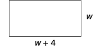</td>
</tr>
<tr valign="top">
<td data-valign="top" data-align="left"><strong>Step 2. Identify</strong> what you are looking for.</td>
<td data-valign="top" data-align="left">We are looking for the length and width.</td>
</tr>
<tr valign="top">
<td data-valign="top" data-align="left"><strong>Step 3. Name</strong> what you are looking for.</td>
<td data-valign="top" data-align="left">Let <math xmlns="http://www.w3.org/1998/Math/MathML"><mrow><mi>w</mi><mo>=</mo></mrow></math> the width of the bedroom.</td>
</tr>
<tr valign="top">
<td data-valign="top" data-align="left">The length is four feet more than the width.</td>
<td data-valign="top" data-align="left"><math xmlns="http://www.w3.org/1998/Math/MathML"><mrow><mi>w</mi><mo>+</mo><mn>4</mn><mo>=</mo></mrow></math> the length of the garden</td>
</tr>
<tr valign="top">
<td data-valign="top" data-align="left"><strong>Step 4. Translate</strong> into an equation.</td>
<td data-valign="top" data-align="left" />
</tr>
<tr valign="top">
<td data-valign="top" data-align="left">Restate the important information in a sentence.</td>
<td data-valign="top" data-align="left">The area of the bedroom is 117 square feet.</td>
</tr>
<tr valign="top">
<td data-valign="top" data-align="left">Use the formula for the area of a rectangle.</td>
<td data-valign="top" data-align="center"><math xmlns="http://www.w3.org/1998/Math/MathML"><mrow><mi>A</mi><mo>=</mo><mi>l</mi><mo>·</mo><mi>w</mi><mspace width="1.2em" /></mrow></math></td>
</tr>
<tr valign="top">
<td data-valign="top" data-align="left">Substitute in the variables.</td>
<td data-valign="top" data-align="center"><math xmlns="http://www.w3.org/1998/Math/MathML"><mrow><mspace width="0.2em" /><mn>117</mn><mo>=</mo><mo stretchy="false">(</mo><mi>w</mi><mo>+</mo><mn>4</mn><mo stretchy="false">)</mo><mi>w</mi></mrow></math></td>
</tr>
<tr valign="top">
<td data-valign="top" data-align="left"><strong>Step 5. Solve</strong> the equation Distribute first.</td>
<td data-valign="top" data-align="center"><math xmlns="http://www.w3.org/1998/Math/MathML"><mrow><mn>117</mn><mo>=</mo><msup><mi>w</mi><mn>2</mn></msup><mo>+</mo><mn>4</mn><mi>w</mi></mrow></math></td>
</tr>
<tr valign="top">
<td data-valign="top" data-align="left">Get zero on one side.</td>
<td data-valign="top" data-align="center"><math xmlns="http://www.w3.org/1998/Math/MathML"><mrow><mn>117</mn><mo>=</mo><msup><mi>w</mi><mn>2</mn></msup><mo>+</mo><mn>4</mn><mi>w</mi></mrow></math></td>
</tr>
<tr valign="top">
<td data-valign="top" data-align="left">Factor the trinomial.</td>
<td data-valign="top" data-align="center"><math xmlns="http://www.w3.org/1998/Math/MathML"><mrow><mspace width="3.5em" /><mn>0</mn><mo>=</mo><msup><mi>w</mi><mn>2</mn></msup><mo>+</mo><mn>4</mn><mi>w</mi><mo>−</mo><mn>117</mn></mrow></math></td>
</tr>
<tr valign="top">
<td data-valign="top" data-align="left">Use the Zero Product Property.</td>
<td data-valign="top" data-align="center"><math xmlns="http://www.w3.org/1998/Math/MathML"><mrow><mspace width="4.4em" /><mn>0</mn><mo>=</mo><mo stretchy="false">(</mo><msup><mi>w</mi><mn>2</mn></msup><mo>+</mo><mn>13</mn><mo stretchy="false">)</mo><mo stretchy="false">(</mo><mi>w</mi><mo>−</mo><mn>9</mn><mo stretchy="false">)</mo></mrow></math></td>
</tr>
<tr valign="top">
<td data-valign="top" data-align="left">Solve each equation.</td>
<td data-valign="top" data-align="center"><math xmlns="http://www.w3.org/1998/Math/MathML"><mrow><mspace width="5.6em" /><mn>0</mn><mo>=</mo><mi>w</mi><mo>+</mo><mn>13</mn><mspace width="1.5em" /><mn>0</mn><mo>=</mo><mi>w</mi><mo>−</mo><mn>9</mn></mrow></math></td>
</tr>
<tr valign="top">
<td data-valign="top" data-align="left">Since <em>w</em> is the width of the bedroom, it does not
make sense for it to be negative. We eliminate that value for <em>w</em>.</td>
<td data-valign="top" data-align="center"><math xmlns="http://www.w3.org/1998/Math/MathML"><mrow><mspace width="3em" /><menclose notation="updiagonalstrike"><mrow><mn>−13</mn><mo>=</mo><mi>w</mi></mrow></menclose><mspace width="3.5em" /><mn>9</mn><mo>=</mo><mi>w</mi></mrow></math></td>
</tr>
<tr valign="top">
<td />
<td data-valign="top" data-align="right"><math xmlns="http://www.w3.org/1998/Math/MathML"><mrow><mi>w</mi><mo>=</mo><mn>9</mn></mrow></math> Width is 9 feet.     </td>
</tr>
<tr valign="top">
<td data-valign="top" data-align="left">Find the value of the length.</td>
<td data-valign="top" data-align="center"><math xmlns="http://www.w3.org/1998/Math/MathML"><mrow><mi>w</mi><mo>+</mo><mn>4</mn><mspace width="1.5em" /></mrow></math>
<math xmlns="http://www.w3.org/1998/Math/MathML"><mrow><mn>9</mn><mo>+</mo><mn>4</mn><mspace width="1.5em" /></mrow></math>
<math xmlns="http://www.w3.org/1998/Math/MathML"><mrow><mspace width="7em" /></mrow></math>13  Length is 13 feet.</td>
</tr>
<tr valign="top">
<td data-valign="top" data-align="left"><strong>Step 6. Check</strong> the answer.
Does the answer make sense?

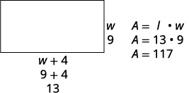
Yes, this makes sense.</td>
<td data-valign="top" data-align="left" />
</tr>
<tr valign="top">
<td data-valign="top" data-align="left"><strong>Step 7. Answer</strong> the question.</td>
<td data-valign="top" data-align="left">The width of the bedroom is 9 feet and
the length is 13 feet.</td>
</tr>
</tbody></table>

A rectangular sign has area 30 square feet. The length of the sign is one foot more than the width. Find the length and width of the sign.

The width is 5 feet and length is 6 feet.

A rectangular patio has area 180 square feet. The width of the patio is three feet less than the length. Find the length and width of the patio.

The length of the patio is 12 feet and the width 15 feet.

In the next example, we will use the Pythagorean Theorem <math xmlns="http://www.w3.org/1998/Math/MathML"><mrow><mrow><mo>(</mo><mrow><msup><mi>a</mi><mn>2</mn></msup><mo>+</mo><msup><mi>b</mi><mn>2</mn></msup><mo>=</mo><msup><mi>c</mi><mn>2</mn></msup></mrow><mo>)</mo></mrow><mo>.</mo></mrow></math>

 This formula gives the relation between the legs and the hypotenuse of a right triangle.

  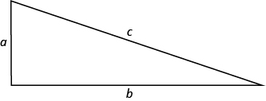  We will use this formula to in the next example.

A boat’s sail is in the shape of a right triangle as shown. The hypotenuse will be 17 feet long. The length of one side will be 7 feet less than the length of the other side. Find the lengths of the sides of the sail.

 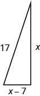 

<table class="unnumbered unstyled can-break" summary="Step 1: Read the problem. Step 2: Identify what you are looking for. We are looking for the lengths of the sides of the sail. Step 3: Name what you are looking for. One side is 7 less than the other. Let x be length of a side of the sail and x minus 7 be length of other side. Step 4: Translate into an equation. Since this is a right triangle we can use the Pythagorean Theorem a squared plus b squared equals c squared. Substitute in the variables: x squared plus open parentheses x minus 7 close parentheses squared equals 17 squared. Step 5: Solve the equation. Simplify: x squared plus x squared minus 14x plus 49 is 289. 2 x squared minus 14x plus 49 equals 289. It is a quadratic equation, so get zero on one side: 2 x squared minus 14x minus 240 equals 0. Factor the greatest common factor. Factor the trinomial. 2 open parentheses x minus 15 close parentheses open parentheses x plus 8 close parentheses. Use the Zero Product Property: 2 is not equal to 0, x minus 15 equals 0 or x plus 8 equal 0. Solve: x is 15 or x is minus 8. Since x is a side of the triangle, x equals minus 8 does not make sense. Find the length of the other side. If the length of one side is 15, then the length of the other side is 15 minus 7 equals 8. Step 6: Check the answer in the problem. Do these numbers make sense? Step 7: Answer the question: The sides of the sail are 8, 15 and 17 feet." data-label=""><tbody>
<tr valign="top">
<td data-valign="top" data-align="left"><strong>Step 1. Read</strong> the problem</td>
<td data-valign="top" data-align="left" />
</tr>
<tr valign="top">
<td data-valign="top" data-align="left"><strong>Step 2. Identify</strong> what you are looking for.</td>
<td data-valign="top" data-align="left">We are looking for the lengths of the
sides of the sail.</td>
</tr>
<tr valign="top">
<td data-valign="top" data-align="left"><strong>Step 3. Name</strong> what you are looking for.
One side is 7 less than the other.</td>
<td data-valign="top" data-align="left">Let <math xmlns="http://www.w3.org/1998/Math/MathML"><mrow><mi>x</mi><mo>=</mo></mrow></math> length of a side of the sail.
<math xmlns="http://www.w3.org/1998/Math/MathML"><mrow><mi>x</mi><mo>−</mo><mn>7</mn><mo>=</mo></mrow></math> length of other side</td>
</tr>
<tr valign="top">
<td data-valign="top" data-align="left"><strong>Step 4. Translate</strong> into an equation. Since this is a
right triangle we can use the Pythagorean Theorem.</td>
<td data-valign="bottom" data-align="left"><math xmlns="http://www.w3.org/1998/Math/MathML"><mrow><mspace width="4.8em" /><msup><mi>a</mi><mn>2</mn></msup><mo>+</mo><msup><mi>b</mi><mn>2</mn></msup><mo>=</mo><msup><mi>c</mi><mn>2</mn></msup></mrow></math></td>
</tr>
<tr valign="top">
<td data-valign="top" data-align="left">Substitute in the variables.</td>
<td data-valign="top" data-align="left"><math xmlns="http://www.w3.org/1998/Math/MathML"><mrow><mspace width="2.5em" /><msup><mi>x</mi><mn>2</mn></msup><mo>+</mo><msup><mrow><mo stretchy="false">(</mo><mi>x</mi><mo>−</mo><mn>7</mn><mo stretchy="false">)</mo></mrow><mn>2</mn></msup><mo>=</mo><msup><mrow><mn>17</mn></mrow><mn>2</mn></msup></mrow></math></td>
</tr>
<tr valign="top">
<td data-valign="top" data-align="left"><strong>Step 5. Solve</strong> the equation
Simplify.</td>
<td data-valign="bottom" data-align="left"><math xmlns="http://www.w3.org/1998/Math/MathML"><mrow><msup><mi>x</mi><mn>2</mn></msup><mo>+</mo><msup><mi>x</mi><mn>2</mn></msup><mo>−</mo><mn>14</mn><mi>x</mi><mo>+</mo><mn>49</mn><mo>=</mo><mn>289</mn></mrow></math></td>
</tr>
<tr valign="top">
<td data-valign="top" data-align="left" />
<td data-valign="top" data-align="left"><math xmlns="http://www.w3.org/1998/Math/MathML"><mrow><mspace width="1.5em" /><mn>2</mn><msup><mi>x</mi><mn>2</mn></msup><mo>−</mo><mn>14</mn><mi>x</mi><mo>+</mo><mn>49</mn><mo>=</mo><mn>289</mn></mrow></math></td>
</tr>
<tr valign="top">
<td data-valign="top" data-align="left">It is a quadratic equation, so get zero on one side.</td>
<td data-valign="top" data-align="left"><math xmlns="http://www.w3.org/1998/Math/MathML"><mrow><mspace width="1em" /><mn>2</mn><msup><mi>x</mi><mn>2</mn></msup><mo>−</mo><mn>14</mn><mi>x</mi><mo>−</mo><mn>240</mn><mo>=</mo><mn>0</mn></mrow></math></td>
</tr>
<tr valign="top">
<td data-valign="top" data-align="left">Factor the greatest common factor.</td>
<td data-valign="top" data-align="left"><math xmlns="http://www.w3.org/1998/Math/MathML"><mrow><mspace width="0.8em" /><mn>2</mn><mo stretchy="false">(</mo><msup><mi>x</mi><mn>2</mn></msup><mo>−</mo><mn>7</mn><mi>x</mi><mo>−</mo><mn>120</mn><mo stretchy="false">)</mo><mo>=</mo><mn>0</mn></mrow></math></td>
</tr>
<tr valign="top">
<td data-valign="top" data-align="left">Factor the trinomial.</td>
<td data-valign="top" data-align="left"><math xmlns="http://www.w3.org/1998/Math/MathML"><mrow><mspace width="1.1em" /><mn>2</mn><mo stretchy="false">(</mo><mi>x</mi><mo>−</mo><mn>15</mn><mo stretchy="false">)</mo><mo stretchy="false">(</mo><mi>x</mi><mo>+</mo><mn>8</mn><mo stretchy="false">)</mo><mo>=</mo><mn>0</mn></mrow></math></td>
</tr>
<tr valign="top">
<td data-valign="top" data-align="left">Use the Zero Product Property.</td>
<td data-valign="top" data-align="left"><math xmlns="http://www.w3.org/1998/Math/MathML"><mrow><mn>2</mn><mo>≠</mo><mn>0</mn><mspace width="1.5em" /><mi>x</mi><mo>−</mo><mn>15</mn><mo>=</mo><mn>0</mn><mspace width="0.6em" /><mi>x</mi><mo>+</mo><mn>8</mn><mo>=</mo><mn>0</mn></mrow></math></td>
</tr>
<tr valign="top">
<td data-valign="top" data-align="left">Solve.</td>
<td data-valign="top" data-align="left"><math xmlns="http://www.w3.org/1998/Math/MathML"><mrow><mn>2</mn><mo>≠</mo><mn>0</mn><mspace width="1.5em" /><mi>x</mi><mo>=</mo><mn>15</mn><mspace width="2em" /><mi>x</mi><mo>=</mo><mn>−8</mn></mrow></math></td>
</tr>
<tr valign="top">
<td data-valign="top" data-align="left">Since <em>x</em> is a side of the triangle, <math xmlns="http://www.w3.org/1998/Math/MathML"><mrow><mi>x</mi><mo>=</mo><mn>−8</mn></mrow></math> does not
make sense.</td>
<td data-valign="top" data-align="left"><math xmlns="http://www.w3.org/1998/Math/MathML"><mrow><mn>2</mn><mo>≠</mo><mn>0</mn><mspace width="1.5em" /><mi>x</mi><mo>=</mo><mn>15</mn><mspace width="2em" /><menclose notation="updiagonalstrike"><mrow><mi>x</mi><mo>=</mo><mn>−8</mn></mrow></menclose></mrow></math></td>
</tr>
<tr valign="top">
<td data-valign="top" data-align="left">Find the length of the other side.</td>
<td data-valign="top" data-align="left" />
</tr>
<tr valign="top">
<td data-valign="top" data-align="left">   If the length of one side is
   then the length of the other side is</td>
<td data-valign="top" data-align="left">

8 is the length of the other side.</td>
</tr>
<tr valign="top">
<td data-valign="top" data-align="left"><strong>Step 6. Check</strong> the answer in the problem
Do these numbers make sense?

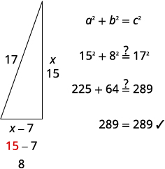</td>
<td data-valign="top" data-align="left" />
</tr>
<tr valign="top">
<td data-valign="top" data-align="left"><strong>Step 7. Answer</strong> the question</td>
<td data-valign="top" data-align="left">The sides of the sail are 8, 15 and 17 feet.</td>
</tr>
</tbody></table>

Justine wants to put a deck in the corner of her backyard in the shape of a right triangle. The length of one side of the deck is 7 feet more than the other side. The hypotenuse is 13. Find the lengths of the two sides of the deck.

5 feet and 12 feet

A meditation garden is in the shape of a right triangle, with one leg 7 feet. The length of the hypotenuse is one more than the length of the other leg. Find the lengths of the hypotenuse and the other leg.

24 feet and 25 feet

The next example uses the function that gives the height of an object as a function of time when it is thrown from 80 feet above the ground.

Dennis is going to throw his rubber band ball upward from the top of a campus building. When he throws the rubber band ball from 80 feet above the ground, the function <math xmlns="http://www.w3.org/1998/Math/MathML"><mrow><mi>h</mi><mrow><mo>(</mo><mi>t</mi><mo>)</mo></mrow><mo>=</mo><mn>−16</mn><msup><mi>t</mi><mn>2</mn></msup><mo>+</mo><mn>64</mn><mi>t</mi><mo>+</mo><mn>80</mn></mrow></math>

 models the height, *h*, of the ball above the ground as a function of time, *t.* Find:

ⓐ the zeros of this function which tell us when the ball hits the ground* * *
{: data-type="newline"}

ⓑ when the ball will be 80 feet above the ground* * *
{: data-type="newline"}

ⓒ the height of the ball at <math xmlns="http://www.w3.org/1998/Math/MathML"><mrow><mi>t</mi><mo>=</mo><mn>2</mn></mrow></math>

 seconds.

ⓐ The zeros of this function are found by solving <math xmlns="http://www.w3.org/1998/Math/MathML"><mrow><mi>h</mi><mrow><mo>(</mo><mi>t</mi><mo>)</mo></mrow><mo>=</mo><mn>0</mn><mo>.</mo></mrow></math>

 This will tell us when the ball will hit the ground.* * *
{: data-type="newline"}

 <math xmlns="http://www.w3.org/1998/Math/MathML"><mrow><mtable><mtr><mtd /><mtd /><mtd /><mtd /><mtd /><mtd columnalign="left"><mspace width="7.45em" /><mi>h</mi><mrow><mo>(</mo><mi>t</mi><mo>)</mo></mrow><mo>=</mo><mn>0</mn></mtd></mtr> <mtr><mtd columnalign="left"><mtext>Substitute in the polynomial for</mtext><mspace width="0.2em" /><mi>h</mi><mrow><mo>(</mo><mi>t</mi><mo>)</mo></mrow><mo>.</mo></mtd><mtd /><mtd /><mtd /><mtd /><mtd columnalign="left"><mspace width="2.03em" /><mn>−16</mn><msup><mi>t</mi><mn>2</mn></msup><mo>+</mo><mn>64</mn><mi>t</mi><mo>+</mo><mn>80</mn><mo>=</mo><mn>0</mn></mtd></mtr> <mtr><mtd columnalign="left"><mtext>Factor the GCF,</mtext><mspace width="0.2em" /><mn>−16</mn><mo>.</mo></mtd><mtd /><mtd /><mtd /><mtd /><mtd columnalign="left"><mspace width="2.35em" /><mn>−16</mn><mo stretchy="false">(</mo><msup><mi>t</mi><mn>2</mn></msup><mo>−</mo><mn>4</mn><mi>t</mi><mo>−</mo><mn>5</mn><mo stretchy="false">)</mo><mo>=</mo><mn>0</mn></mtd></mtr> <mtr><mtd columnalign="left"><mtext>Factor the trinomial.</mtext></mtd><mtd /><mtd /><mtd /><mtd /><mtd columnalign="left"><mspace width="2.1em" /><mn>−16</mn><mrow><mo>(</mo><mrow><mi>t</mi><mo>−</mo><mn>5</mn></mrow><mo>)</mo></mrow><mrow><mo>(</mo><mrow><mi>t</mi><mo>+</mo><mn>1</mn></mrow><mo>)</mo></mrow><mo>=</mo><mn>0</mn></mtd></mtr> <mtr><mtd columnalign="left"><mtable><mtr><mtd columnalign="left"><mtext>Use the Zero Product Property.</mtext></mtd></mtr><mtr><mtd columnalign="left"><mtext>Solve.</mtext></mtd></mtr></mtable></mtd><mtd /><mtd /><mtd /><mtd /><mtd columnalign="left"><mtable><mtr><mtd columnalign="right"><mi>t</mi><mo>−</mo><mn>5</mn></mtd><mtd columnalign="left"><mo>=</mo></mtd><mtd columnalign="left"><mn>0</mn></mtd><mtd /><mtd /><mtd /><mtd /><mtd /><mtd columnalign="right"><mspace width="2em" /><mi>t</mi><mo>+</mo><mn>1</mn></mtd><mtd columnalign="left"><mo>=</mo></mtd><mtd columnalign="left"><mn>0</mn></mtd></mtr><mtr><mtd columnalign="right"><mi>t</mi></mtd><mtd columnalign="left"><mo>=</mo></mtd><mtd columnalign="left"><mn>5</mn></mtd><mtd /><mtd /><mtd /><mtd /><mtd /><mtd columnalign="right"><mspace width="2em" /><mi>t</mi></mtd><mtd columnalign="left"><mo>=</mo></mtd><mtd columnalign="left"><mn>−1</mn></mtd></mtr></mtable></mtd></mtr></mtable></mrow></math>

The result <math xmlns="http://www.w3.org/1998/Math/MathML"><mrow><mi>t</mi><mo>=</mo><mn>5</mn></mrow></math>

 tells us the ball will hit the ground 5 seconds after it is thrown. Since time cannot be negative, the result <math xmlns="http://www.w3.org/1998/Math/MathML"><mrow><mi>t</mi><mo>=</mo><mn>−1</mn></mrow></math>

 is discarded.

ⓑ The ball will be 80 feet above the ground when <math xmlns="http://www.w3.org/1998/Math/MathML"><mrow><mi>h</mi><mrow><mo>(</mo><mi>t</mi><mo>)</mo></mrow><mo>=</mo><mn>80</mn><mo>.</mo></mrow></math>

* * *
{: data-type="newline"}

 <math xmlns="http://www.w3.org/1998/Math/MathML"><mrow><mtable><mtr><mtd /><mtd /><mtd /><mtd /><mtd /><mtd columnalign="left"><mspace width="7.55em" /><mi>h</mi><mrow><mo>(</mo><mi>t</mi><mo>)</mo></mrow><mo>=</mo><mn>80</mn></mtd></mtr><mtr><mtd columnalign="left"><mtext>Substitute in the polynomial for</mtext><mspace width="0.2em" /><mi>h</mi><mrow><mo>(</mo><mi>t</mi><mo>)</mo></mrow><mo>.</mo></mtd><mtd /><mtd /><mtd /><mtd /><mtd columnalign="left"><mspace width="2.05em" /><mn>−16</mn><msup><mi>t</mi><mn>2</mn></msup><mo>+</mo><mn>64</mn><mi>t</mi><mo>+</mo><mn>80</mn><mo>=</mo><mn>80</mn></mtd></mtr><mtr><mtd columnalign="left"><mtext>Subtract 80 from both sides.</mtext></mtd><mtd /><mtd /><mtd /><mtd /><mtd columnalign="left"><mspace width="4.2em" /><mn>−16</mn><msup><mi>t</mi><mn>2</mn></msup><mo>+</mo><mn>64</mn><mi>t</mi><mo>=</mo><mn>0</mn></mtd></mtr><mtr><mtd columnalign="left"><mtext>Factor the GCF,</mtext><mspace width="0.2em" /><mn>−16</mn><mi>t</mi><mo>.</mo></mtd><mtd /><mtd /><mtd /><mtd /><mtd columnalign="left"><mspace width="4.5em" /><mn>−16</mn><mi>t</mi><mo stretchy="false">(</mo><mi>t</mi><mo>−</mo><mn>4</mn><mo stretchy="false">)</mo><mo>=</mo><mn>0</mn></mtd></mtr><mtr><mtd columnalign="left"><mtable><mtr><mtd columnalign="left"><mtext>Use the Zero Product Property.</mtext></mtd></mtr><mtr><mtd columnalign="left"><mtext>Solve.</mtext></mtd></mtr></mtable></mtd><mtd /><mtd /><mtd /><mtd /><mtd columnalign="left"><mspace width="3em" /><mtable><mtr><mtd columnalign="right"><mn>−16</mn><mi>t</mi></mtd><mtd columnalign="left"><mo>=</mo></mtd><mtd columnalign="left"><mn>0</mn></mtd><mtd /><mtd /><mtd /><mtd columnalign="right"><mi>t</mi><mo>−</mo><mn>4</mn></mtd><mtd columnalign="left"><mo>=</mo></mtd><mtd columnalign="left"><mn>0</mn></mtd></mtr><mtr><mtd columnalign="right"><mi>t</mi></mtd><mtd columnalign="left"><mo>=</mo></mtd><mtd columnalign="left"><mn>0</mn></mtd><mtd /><mtd /><mtd /><mtd columnalign="right"><mi>t</mi></mtd><mtd columnalign="left"><mo>=</mo></mtd><mtd columnalign="left"><mn>4</mn></mtd></mtr></mtable></mtd></mtr><mtr><mtd /><mtd /><mtd /><mtd /><mtd /><mtd columnalign="left"><mtable><mtr><mtd columnalign="left"><mtext>The ball will be at 80 feet the moment Dennis</mtext></mtd></mtr><mtr><mtd columnalign="left"><mtext>tosses the ball and then 4 seconds later, when</mtext></mtd></mtr><mtr><mtd columnalign="left"><mtext>the ball is falling.</mtext></mtd></mtr></mtable></mtd></mtr></mtable></mrow></math>

ⓒ To find the height ball at <math xmlns="http://www.w3.org/1998/Math/MathML"><mrow><mi>t</mi><mo>=</mo><mn>2</mn></mrow></math>

 seconds we find <math xmlns="http://www.w3.org/1998/Math/MathML"><mrow><mi>h</mi><mrow><mo>(</mo><mn>2</mn><mo>)</mo></mrow><mo>.</mo></mrow></math>

* * *
{: data-type="newline"}

 <math xmlns="http://www.w3.org/1998/Math/MathML"><mrow><mtable><mtr><mtd /><mtd /><mtd /><mtd /><mtd /><mtd columnalign="left"><mspace width="3.2em" /><mi>h</mi><mrow><mo>(</mo><mi>t</mi><mo>)</mo></mrow><mo>=</mo><mn>−16</mn><msup><mi>t</mi><mn>2</mn></msup><mo>+</mo><mn>64</mn><mi>t</mi><mo>+</mo><mn>80</mn></mtd></mtr><mtr><mtd columnalign="left"><mtext>To find</mtext><mspace width="0.2em" /><mi>h</mi><mrow><mo>(</mo><mn>2</mn><mo>)</mo></mrow><mspace width="0.2em" /><mtext>substitute 2 for</mtext><mspace width="0.2em" /><mi>t</mi><mo>.</mo></mtd><mtd /><mtd /><mtd /><mtd /><mtd columnalign="left"><mspace width="3em" /><mi>h</mi><mrow><mo>(</mo><mn>2</mn><mo>)</mo></mrow><mo>=</mo><mn>−16</mn><msup><mrow><mrow><mo>(</mo><mn>2</mn><mo>)</mo></mrow></mrow><mn>2</mn></msup><mo>+</mo><mn>64</mn><mo>·</mo><mn>2</mn><mo>+</mo><mn>80</mn></mtd></mtr><mtr><mtd columnalign="left"><mtext>Simplify.</mtext></mtd><mtd /><mtd /><mtd /><mtd /><mtd columnalign="left"><mspace width="3em" /><mi>h</mi><mrow><mo>(</mo><mn>2</mn><mo>)</mo></mrow><mo>=</mo><mn>144</mn></mtd></mtr><mtr><mtd /><mtd /><mtd /><mtd /><mtd /><mtd columnalign="left"><mspace width="3em" /><mtext>After 2 seconds, the ball will be at 144 feet.</mtext></mtd></mtr></mtable></mrow></math>

Genevieve is going to throw a rock from the top a trail overlooking the ocean. When she throws the rock upward from 160 feet above the ocean, the function <math xmlns="http://www.w3.org/1998/Math/MathML"><mrow><mi>h</mi><mrow><mo>(</mo><mi>t</mi><mo>)</mo></mrow><mo>=</mo><mn>−16</mn><msup><mi>t</mi><mn>2</mn></msup><mo>+</mo><mn>48</mn><mi>t</mi><mo>+</mo><mn>160</mn></mrow></math>

 models the height, *h*, of the rock above the ocean as a function of time, *t*. Find:

ⓐ the zeros of this function which tell us when the rock will hit the ocean* * *
{: data-type="newline"}

ⓑ when the rock will be 160 feet above the ocean.* * *
{: data-type="newline"}

ⓒ the height of the rock at <math xmlns="http://www.w3.org/1998/Math/MathML"><mrow><mi>t</mi><mo>=</mo><mn>1.5</mn></mrow></math>

 seconds.

ⓐ 5 ⓑ 0;3 ⓒ 196

Calib is going to throw his lucky penny from his balcony on a cruise ship. When he throws the penny upward from 128 feet above the ground, the function <math xmlns="http://www.w3.org/1998/Math/MathML"><mrow><mi>h</mi><mrow><mo>(</mo><mi>t</mi><mo>)</mo></mrow><mo>=</mo><mn>−16</mn><msup><mi>t</mi><mn>2</mn></msup><mo>+</mo><mn>32</mn><mi>t</mi><mo>+</mo><mn>128</mn></mrow></math>

 models the height, *h*, of the penny above the ocean as a function of time, *t*. Find:

ⓐ the zeros of this function which is when the penny will hit the ocean* * *
{: data-type="newline"}

ⓑ when the penny will be 128 feet above the ocean.* * *
{: data-type="newline"}

ⓒ the height the penny will be at <math xmlns="http://www.w3.org/1998/Math/MathML"><mrow><mi>t</mi><mo>=</mo><mn>1</mn></mrow></math>

 seconds which is when the penny will be at its highest point.

ⓐ 4 ⓑ 0;2 ⓒ 144

Access this online resource for additional instruction and practice with quadratic equations.

* [Beginning Algebra &amp; Solving Quadratics with the Zero Property][1]
{: data-display="block"}

# Key Concepts

* **Polynomial Equation:** A polynomial equation is an equation that contains a polynomial expression. The degree of the polynomial equation is the degree of the polynomial.
* **Quadratic Equation:** An equation of the form
  <math xmlns="http://www.w3.org/1998/Math/MathML"><mrow><mi>a</mi><msup><mi>x</mi><mn>2</mn></msup><mo>+</mo><mi>b</mi><mi>x</mi><mo>+</mo><mi>c</mi><mo>=</mo><mn>0</mn></mrow></math>
  
  is called a quadratic equation.
  * * *
  {: data-type="newline"}
  
  

  <math xmlns="http://www.w3.org/1998/Math/MathML"><mrow><mi>a</mi><mo>,</mo><mi>b</mi><mo>,</mo><mi>c</mi><mspace width="0.2em" /><mtext>are real numbers and</mtext><mspace width="0.2em" /><mi>a</mi><mo>≠</mo><mn>0</mn></mrow></math>
  

* **Zero Product Property:** If
  <math xmlns="http://www.w3.org/1998/Math/MathML"><mrow><mi>a</mi><mo>·</mo><mi>b</mi><mo>=</mo><mn>0</mn><mo>,</mo></mrow></math>
  
  then either
  <math xmlns="http://www.w3.org/1998/Math/MathML"><mrow><mi>a</mi><mo>=</mo><mn>0</mn></mrow></math>
  
  or
  <math xmlns="http://www.w3.org/1998/Math/MathML"><mrow><mi>b</mi><mo>=</mo><mn>0</mn></mrow></math>
  
  or both.
* **How to use the Zero Product Property**
  1.  Set each factor equal to zero.
  2.  Solve the linear equations.
  3.  Check.
  {: data-number-style="arabic" .stepwise}

* **How to solve a quadratic equation by factoring.**
  1.  Write the quadratic equation in standard form,
      <math xmlns="http://www.w3.org/1998/Math/MathML"><mrow><mi>a</mi><msup><mi>x</mi><mn>2</mn></msup><mo>+</mo><mi>b</mi><mi>x</mi><mo>+</mo><mi>c</mi><mo>=</mo><mn>0</mn><mo>.</mo></mrow></math>
  
  2.  Factor the quadratic expression.
  3.  Use the Zero Product Property.
      * * *
      {: data-type="newline"}
  
  4.  Solve the linear equations.
  5.  Check. Substitute each solution separately into the original equation.
  {: data-number-style="arabic" .stepwise}

* **Zero of a Function:** For any function *f*, if
  <math xmlns="http://www.w3.org/1998/Math/MathML"><mrow><mi>f</mi><mrow><mo>(</mo><mi>x</mi><mo>)</mo></mrow><mo>=</mo><mn>0</mn><mo>,</mo></mrow></math>
  
  then *x* is a zero of the function.
* **How to use a problem solving strategy to solve word problems.**
  1.  **Read** the problem. Make sure all the words and ideas are understood.
  2.  **Identify** what we are looking for.
  3.  **Name** what we are looking for. Choose a variable to represent that quantity.
  4.  **Translate** into an equation. It may be helpful to restate the problem in one sentence with all the important information. Then, translate the English sentence into an algebraic equation.
  5.  **Solve** the equation using appropriate algebra techniques.
  6.  **Check** the answer in the problem and make sure it makes sense.
  7.  **Answer** the question with a complete sentence.
  {: data-number-style="arabic" .stepwise}
{: data-bullet-style="bullet"}

<section data-depth="1" class="section-exercises" markdown="1">
## Practice Makes Perfect

**Use the Zero Product Property**

In the following exercises, solve.

<math xmlns="http://www.w3.org/1998/Math/MathML"><mrow><mrow><mo>(</mo><mrow><mn>3</mn><mi>a</mi><mo>−</mo><mn>10</mn></mrow><mo>)</mo></mrow><mrow><mo>(</mo><mrow><mn>2</mn><mi>a</mi><mo>−</mo><mn>7</mn></mrow><mo>)</mo></mrow><mo>=</mo><mn>0</mn></mrow></math>

<math xmlns="http://www.w3.org/1998/Math/MathML"><mrow><mi>a</mi><mo>=</mo><mn>10</mn><mtext>/</mtext><mn>3</mn><mo>,</mo><mi>a</mi><mo>=</mo><mn>7</mn><mtext>/</mtext><mn>2</mn></mrow></math>

<math xmlns="http://www.w3.org/1998/Math/MathML"><mrow><mrow><mo>(</mo><mrow><mn>5</mn><mi>b</mi><mo>+</mo><mn>1</mn></mrow><mo>)</mo></mrow><mrow><mo>(</mo><mrow><mn>6</mn><mi>b</mi><mo>+</mo><mn>1</mn></mrow><mo>)</mo></mrow><mo>=</mo><mn>0</mn></mrow></math>

<math xmlns="http://www.w3.org/1998/Math/MathML"><mrow><mn>6</mn><mi>m</mi><mrow><mo>(</mo><mrow><mn>12</mn><mi>m</mi><mo>−</mo><mn>5</mn></mrow><mo>)</mo></mrow><mo>=</mo><mn>0</mn></mrow></math>

<math xmlns="http://www.w3.org/1998/Math/MathML"><mrow><mi>m</mi><mo>=</mo><mn>0</mn><mo>,</mo><mi>m</mi><mo>=</mo><mn>5</mn><mtext>/</mtext><mn>12</mn></mrow></math>

<math xmlns="http://www.w3.org/1998/Math/MathML"><mrow><mn>2</mn><mi>x</mi><mrow><mo>(</mo><mrow><mn>6</mn><mi>x</mi><mo>−</mo><mn>3</mn></mrow><mo>)</mo></mrow><mo>=</mo><mn>0</mn></mrow></math>

<math xmlns="http://www.w3.org/1998/Math/MathML"><mrow><msup><mrow><mo stretchy="false">(</mo><mn>2</mn><mi>x</mi><mo>−</mo><mn>1</mn><mo stretchy="false">)</mo></mrow><mn>2</mn></msup><mo>=</mo><mn>0</mn></mrow></math>

<math xmlns="http://www.w3.org/1998/Math/MathML"><mrow><mi>x</mi><mo>=</mo><mn>1</mn><mtext>/</mtext><mn>2</mn></mrow></math>

<math xmlns="http://www.w3.org/1998/Math/MathML"><mrow><msup><mrow><mo stretchy="false">(</mo><mn>3</mn><mi>y</mi><mo>+</mo><mn>5</mn><mo stretchy="false">)</mo></mrow><mn>2</mn></msup><mo>=</mo><mn>0</mn></mrow></math>

**Solve Quadratic Equations by Factoring**

In the following exercises, solve.

<math xmlns="http://www.w3.org/1998/Math/MathML"><mrow><mn>5</mn><msup><mi>a</mi><mn>2</mn></msup><mo>−</mo><mn>26</mn><mi>a</mi><mo>=</mo><mn>24</mn></mrow></math>

<math xmlns="http://www.w3.org/1998/Math/MathML"><mrow><mi>a</mi><mo>=</mo><mn>−5</mn><mtext>/</mtext><mn>4</mn><mo>,</mo><mi>a</mi><mo>=</mo><mn>6</mn></mrow></math>

<math xmlns="http://www.w3.org/1998/Math/MathML"><mrow><mn>4</mn><msup><mi>b</mi><mn>2</mn></msup><mo>+</mo><mn>7</mn><mi>b</mi><mo>=</mo><mn>−3</mn></mrow></math>

<math xmlns="http://www.w3.org/1998/Math/MathML"><mrow><mn>4</mn><msup><mi>m</mi><mn>2</mn></msup><mo>=</mo><mn>17</mn><mi>m</mi><mo>−</mo><mn>15</mn></mrow></math>

<math xmlns="http://www.w3.org/1998/Math/MathML"><mrow><mi>m</mi><mo>=</mo><mn>5</mn><mtext>/</mtext><mn>4</mn><mo>,</mo><mi>m</mi><mo>=</mo><mn>3</mn></mrow></math>

<math xmlns="http://www.w3.org/1998/Math/MathML"><mrow><msup><mi>n</mi><mn>2</mn></msup><mo>=</mo><mn>5</mn><mo>−</mo><mn>6</mn><mi>n</mi></mrow></math>

<math xmlns="http://www.w3.org/1998/Math/MathML"><mrow><mn>7</mn><msup><mi>a</mi><mn>2</mn></msup><mo>+</mo><mn>14</mn><mi>a</mi><mo>=</mo><mn>7</mn><mi>a</mi></mrow></math>

<math xmlns="http://www.w3.org/1998/Math/MathML"><mrow><mi>a</mi><mo>=</mo><mn>−1</mn><mo>,</mo><mi>a</mi><mo>=</mo><mn>0</mn></mrow></math>

<math xmlns="http://www.w3.org/1998/Math/MathML"><mrow><mn>12</mn><msup><mi>b</mi><mn>2</mn></msup><mo>−</mo><mn>15</mn><mi>b</mi><mo>=</mo><mn>−9</mn><mi>b</mi></mrow></math>

<math xmlns="http://www.w3.org/1998/Math/MathML"><mrow><mn>49</mn><msup><mi>m</mi><mn>2</mn></msup><mo>=</mo><mn>144</mn></mrow></math>

<math xmlns="http://www.w3.org/1998/Math/MathML"><mrow><mi>m</mi><mo>=</mo><mn>12</mn><mtext>/</mtext><mn>7</mn><mo>,</mo><mi>m</mi><mo>=</mo><mn>−12</mn><mtext>/</mtext><mn>7</mn></mrow></math>

<math xmlns="http://www.w3.org/1998/Math/MathML"><mrow><mn>625</mn><mo>=</mo><msup><mi>x</mi><mn>2</mn></msup></mrow></math>

<math xmlns="http://www.w3.org/1998/Math/MathML"><mrow><mn>16</mn><msup><mi>y</mi><mn>2</mn></msup><mo>=</mo><mn>81</mn></mrow></math>

<math xmlns="http://www.w3.org/1998/Math/MathML"><mrow><mi>y</mi><mo>=</mo><mn>−9</mn><mtext>/</mtext><mn>4</mn><mo>,</mo><mi>y</mi><mo>=</mo><mn>9</mn><mtext>/</mtext><mn>4</mn></mrow></math>

<math xmlns="http://www.w3.org/1998/Math/MathML"><mrow><mn>64</mn><msup><mi>p</mi><mn>2</mn></msup><mo>=</mo><mn>225</mn></mrow></math>

<math xmlns="http://www.w3.org/1998/Math/MathML"><mrow><mn>121</mn><msup><mi>n</mi><mn>2</mn></msup><mo>=</mo><mn>36</mn></mrow></math>

<math xmlns="http://www.w3.org/1998/Math/MathML"><mrow><mi>n</mi><mo>=</mo><mn>−6</mn><mtext>/</mtext><mn>11</mn><mo>,</mo><mtext>n</mtext><mo>=</mo><mn>6</mn><mtext>/</mtext><mn>11</mn></mrow></math>

<math xmlns="http://www.w3.org/1998/Math/MathML"><mrow><mn>100</mn><msup><mi>y</mi><mn>2</mn></msup><mo>=</mo><mn>9</mn></mrow></math>

<math xmlns="http://www.w3.org/1998/Math/MathML"><mrow><mrow><mo>(</mo><mrow><mi>x</mi><mo>+</mo><mn>6</mn></mrow><mo>)</mo></mrow><mrow><mo>(</mo><mrow><mi>x</mi><mo>−</mo><mn>3</mn></mrow><mo>)</mo></mrow><mo>=</mo><mn>−8</mn></mrow></math>

<math xmlns="http://www.w3.org/1998/Math/MathML"><mrow><mi>x</mi><mo>=</mo><mn>2</mn><mo>,</mo><mi>x</mi><mo>=</mo><mn>−5</mn></mrow></math>

<math xmlns="http://www.w3.org/1998/Math/MathML"><mrow><mo stretchy="false">(</mo><mi>p</mi><mo>−</mo><mn>5</mn><mo stretchy="false">)</mo><mo stretchy="false">(</mo><mi>p</mi><mo>+</mo><mn>3</mn><mo stretchy="false">)</mo><mo>=</mo><mn>−7</mn></mrow></math>

<math xmlns="http://www.w3.org/1998/Math/MathML"><mrow><mrow><mo>(</mo><mrow><mn>2</mn><mi>x</mi><mo>+</mo><mn>1</mn></mrow><mo>)</mo></mrow><mrow><mo>(</mo><mrow><mi>x</mi><mo>−</mo><mn>3</mn></mrow><mo>)</mo></mrow><mo>=</mo><mn>−4</mn><mi>x</mi></mrow></math>

<math xmlns="http://www.w3.org/1998/Math/MathML"><mrow><mi>x</mi><mo>=</mo><mn>3</mn><mtext>/</mtext><mn>2</mn><mo>,</mo><mi>x</mi><mo>=</mo><mn>−1</mn></mrow></math>

<math xmlns="http://www.w3.org/1998/Math/MathML"><mrow><mo stretchy="false">(</mo><mi>y</mi><mo>−</mo><mn>3</mn><mo stretchy="false">)</mo><mrow><mo>(</mo><mrow><mi>y</mi><mo>+</mo><mn>2</mn></mrow><mo>)</mo></mrow><mo>=</mo><mn>4</mn><mi>y</mi></mrow></math>

<math xmlns="http://www.w3.org/1998/Math/MathML"><mrow><mrow><mo>(</mo><mrow><mn>3</mn><mi>x</mi><mo>−</mo><mn>2</mn></mrow><mo>)</mo></mrow><mrow><mo>(</mo><mrow><mi>x</mi><mo>+</mo><mn>4</mn></mrow><mo>)</mo></mrow><mo>=</mo><mn>12</mn><mi>x</mi></mrow></math>

<math xmlns="http://www.w3.org/1998/Math/MathML"><mrow><mi>x</mi><mo>=</mo><mn>3</mn><mtext>/</mtext><mn>2</mn><mo>,</mo><mi>x</mi><mo>=</mo><mn>−1</mn></mrow></math>

<math xmlns="http://www.w3.org/1998/Math/MathML"><mrow><mo stretchy="false">(</mo><mn>2</mn><mi>y</mi><mo>−</mo><mn>3</mn><mo stretchy="false">)</mo><mrow><mo>(</mo><mrow><mn>3</mn><mi>y</mi><mo>−</mo><mn>1</mn></mrow><mo>)</mo></mrow><mo>=</mo><mn>8</mn><mi>y</mi></mrow></math>

<math xmlns="http://www.w3.org/1998/Math/MathML"><mrow><mn>20</mn><msup><mi>x</mi><mn>2</mn></msup><mo>−</mo><mn>60</mn><mi>x</mi><mo>=</mo><mn>−45</mn></mrow></math>

<math xmlns="http://www.w3.org/1998/Math/MathML"><mrow><mi>x</mi><mo>=</mo><mn>−2</mn><mtext>/</mtext><mn>3</mn></mrow></math>

<math xmlns="http://www.w3.org/1998/Math/MathML"><mrow><mn>3</mn><msup><mi>y</mi><mn>2</mn></msup><mo>−</mo><mn>18</mn><mi>y</mi><mo>=</mo><mn>−27</mn></mrow></math>

<math xmlns="http://www.w3.org/1998/Math/MathML"><mrow><mn>15</mn><msup><mi>x</mi><mn>2</mn></msup><mo>−</mo><mn>10</mn><mi>x</mi><mo>=</mo><mn>40</mn></mrow></math>

<math xmlns="http://www.w3.org/1998/Math/MathML"><mrow><mi>x</mi><mo>=</mo><mn>2</mn><mo>,</mo><mi>x</mi><mo>=</mo><mn>−4</mn><mtext>/</mtext><mn>3</mn></mrow></math>

<math xmlns="http://www.w3.org/1998/Math/MathML"><mrow><mn>14</mn><msup><mi>y</mi><mn>2</mn></msup><mo>−</mo><mn>77</mn><mi>y</mi><mo>=</mo><mn>−35</mn></mrow></math>

<math xmlns="http://www.w3.org/1998/Math/MathML"><mrow><mn>18</mn><msup><mi>x</mi><mn>2</mn></msup><mo>−</mo><mn>9</mn><mo>=</mo><mn>−21</mn><mi>x</mi></mrow></math>

<math xmlns="http://www.w3.org/1998/Math/MathML"><mrow><mi>x</mi><mo>=</mo><mn>−3</mn><mtext>/</mtext><mn>2</mn><mo>,</mo><mi>x</mi><mo>=</mo><mn>1</mn><mtext>/</mtext><mn>3</mn></mrow></math>

<math xmlns="http://www.w3.org/1998/Math/MathML"><mrow><mn>16</mn><msup><mi>y</mi><mn>2</mn></msup><mo>+</mo><mn>12</mn><mo>=</mo><mn>−32</mn><mi>x</mi></mrow></math>

<math xmlns="http://www.w3.org/1998/Math/MathML"><mrow><mn>16</mn><msup><mi>p</mi><mn>3</mn></msup><mo>=</mo><mn>24</mn><msup><mi>p</mi><mn>2</mn></msup><mo>+</mo><mn>9</mn><mi>p</mi></mrow></math>

<math xmlns="http://www.w3.org/1998/Math/MathML"><mrow><mi>p</mi><mo>=</mo><mn>0</mn><mo>,</mo><mi>p</mi><mo>=</mo><mn>¾</mn></mrow></math>

<math xmlns="http://www.w3.org/1998/Math/MathML"><mrow><msup><mi>m</mi><mn>3</mn></msup><mo>−</mo><mn>2</mn><msup><mi>m</mi><mn>2</mn></msup><mo>=</mo><mtext>−</mtext><mi>m</mi></mrow></math>

<math xmlns="http://www.w3.org/1998/Math/MathML"><mrow><mn>2</mn><msup><mi>x</mi><mn>3</mn></msup><mo>+</mo><mn>72</mn><mi>x</mi><mo>=</mo><mn>24</mn><msup><mi>x</mi><mn>2</mn></msup></mrow></math>

<math xmlns="http://www.w3.org/1998/Math/MathML"><mrow><mi>x</mi><mo>=</mo><mn>0</mn><mo>,</mo><mi>x</mi><mo>=</mo><mn>6</mn></mrow></math>

<math xmlns="http://www.w3.org/1998/Math/MathML"><mrow><mn>3</mn><msup><mi>y</mi><mn>3</mn></msup><mo>+</mo><mn>48</mn><mi>y</mi><mo>=</mo><mn>24</mn><msup><mi>y</mi><mn>2</mn></msup></mrow></math>

<math xmlns="http://www.w3.org/1998/Math/MathML"><mrow><mn>36</mn><msup><mi>x</mi><mn>3</mn></msup><mo>+</mo><mn>24</mn><msup><mi>x</mi><mn>2</mn></msup><mo>=</mo><mn>−4</mn><mi>x</mi></mrow></math>

<math xmlns="http://www.w3.org/1998/Math/MathML"><mrow><mi>x</mi><mo>=</mo><mn>0</mn><mo>,</mo><mi>x</mi><mo>=</mo><mn>1</mn><mtext>/</mtext><mn>3</mn></mrow></math>

<math xmlns="http://www.w3.org/1998/Math/MathML"><mrow><mn>2</mn><msup><mi>y</mi><mn>3</mn></msup><mo>+</mo><mn>2</mn><msup><mi>y</mi><mn>2</mn></msup><mo>=</mo><mn>12</mn><mi>y</mi></mrow></math>

**Solve Equations with Polynomial Functions**

In the following exercises, solve.

For the function, <math xmlns="http://www.w3.org/1998/Math/MathML"><mrow><mi>f</mi><mrow><mo>(</mo><mi>x</mi><mo>)</mo></mrow><mo>=</mo><msup><mi>x</mi><mn>2</mn></msup><mo>−</mo><mn>8</mn><mi>x</mi><mo>+</mo><mn>8</mn><mo>,</mo></mrow></math>

 ⓐ find when <math xmlns="http://www.w3.org/1998/Math/MathML"><mrow><mi>f</mi><mrow><mo>(</mo><mi>x</mi><mo>)</mo></mrow><mo>=</mo><mn>−4</mn></mrow></math>

 ⓑ Use this information to find two points that lie on the graph of the function.

ⓐ <math xmlns="http://www.w3.org/1998/Math/MathML"><mrow><mi>x</mi><mo>=</mo><mn>2</mn></mrow></math>

 or <math xmlns="http://www.w3.org/1998/Math/MathML"><mrow><mi>x</mi><mo>=</mo><mn>6</mn></mrow></math>

 ⓑ <math xmlns="http://www.w3.org/1998/Math/MathML"><mrow><mrow><mo>(</mo><mrow><mn>2</mn><mo>,</mo><mn>−4</mn></mrow><mo>)</mo></mrow></mrow></math>

 <math xmlns="http://www.w3.org/1998/Math/MathML"><mrow><mrow><mo>(</mo><mrow><mn>6</mn><mo>,</mo><mn>−4</mn></mrow><mo>)</mo></mrow></mrow></math>

For the function, <math xmlns="http://www.w3.org/1998/Math/MathML"><mrow><mi>f</mi><mrow><mo>(</mo><mi>x</mi><mo>)</mo></mrow><mo>=</mo><msup><mi>x</mi><mn>2</mn></msup><mo>+</mo><mn>11</mn><mi>x</mi><mo>+</mo><mn>20</mn><mo>,</mo></mrow></math>

 ⓐ find when <math xmlns="http://www.w3.org/1998/Math/MathML"><mrow><mi>f</mi><mrow><mo>(</mo><mi>x</mi><mo>)</mo></mrow><mo>=</mo><mn>−8</mn></mrow></math>

 ⓑ Use this information to find two points that lie on the graph of the function.

For the function, <math xmlns="http://www.w3.org/1998/Math/MathML"><mrow><mi>f</mi><mrow><mo>(</mo><mi>x</mi><mo>)</mo></mrow><mo>=</mo><mn>8</mn><msup><mi>x</mi><mn>2</mn></msup><mo>−</mo><mn>18</mn><mi>x</mi><mo>+</mo><mn>5</mn><mo>,</mo></mrow></math>

 ⓐ find when <math xmlns="http://www.w3.org/1998/Math/MathML"><mrow><mi>f</mi><mrow><mo>(</mo><mi>x</mi><mo>)</mo></mrow><mo>=</mo><mn>−4</mn></mrow></math>

 ⓑ Use this information to find two points that lie on the graph of the function.

ⓐ <math xmlns="http://www.w3.org/1998/Math/MathML"><mrow><mi>x</mi><mo>=</mo><mfrac><mn>3</mn><mn>2</mn></mfrac></mrow></math>

 or <math xmlns="http://www.w3.org/1998/Math/MathML"><mrow><mi>x</mi><mo>=</mo><mfrac><mn>3</mn><mn>4</mn></mfrac></mrow></math>

* * *
{: data-type="newline"}

ⓑ <math xmlns="http://www.w3.org/1998/Math/MathML"><mrow><mrow><mo>(</mo><mrow><mfrac><mn>3</mn><mn>2</mn></mfrac><mo>,</mo><mn>−4</mn></mrow><mo>)</mo></mrow></mrow></math>

 <math xmlns="http://www.w3.org/1998/Math/MathML"><mrow><mrow><mo>(</mo><mrow><mfrac><mn>3</mn><mn>4</mn></mfrac><mo>,</mo><mn>−4</mn></mrow><mo>)</mo></mrow></mrow></math>

For the function, <math xmlns="http://www.w3.org/1998/Math/MathML"><mrow><mi>f</mi><mrow><mo>(</mo><mi>x</mi><mo>)</mo></mrow><mo>=</mo><mn>18</mn><msup><mi>x</mi><mn>2</mn></msup><mo>+</mo><mn>15</mn><mi>x</mi><mo>−</mo><mn>10</mn><mo>,</mo></mrow></math>

 ⓐ find when <math xmlns="http://www.w3.org/1998/Math/MathML"><mrow><mi>f</mi><mrow><mo>(</mo><mi>x</mi><mo>)</mo></mrow><mo>=</mo><mn>15</mn></mrow></math>

 ⓑ Use this information to find two points that lie on the graph of the function.

In the following exercises, for each function, find: ⓐ the zeros of the function ⓑ the *x*-intercepts of the graph of the function ⓒ the *y*-intercept of the graph of the function.

<math xmlns="http://www.w3.org/1998/Math/MathML"><mrow><mi>f</mi><mrow><mo>(</mo><mi>x</mi><mo>)</mo></mrow><mo>=</mo><mn>9</mn><msup><mi>x</mi><mn>2</mn></msup><mo>−</mo><mn>4</mn></mrow></math>

ⓐ <math xmlns="http://www.w3.org/1998/Math/MathML"><mrow><mi>x</mi><mo>=</mo><mfrac><mn>2</mn><mn>3</mn></mfrac></mrow></math>

 or <math xmlns="http://www.w3.org/1998/Math/MathML"><mrow><mi>x</mi><mo>=</mo><mo>−</mo><mfrac><mn>2</mn><mn>3</mn></mfrac></mrow></math>

* * *
{: data-type="newline"}

ⓑ <math xmlns="http://www.w3.org/1998/Math/MathML"><mrow><mrow><mo>(</mo><mrow><mfrac><mn>2</mn><mn>3</mn></mfrac><mo>,</mo><mn>0</mn></mrow><mo>)</mo></mrow></mrow></math>

, <math xmlns="http://www.w3.org/1998/Math/MathML"><mrow><mrow><mo>(</mo><mrow><mo>−</mo><mfrac><mn>2</mn><mn>3</mn></mfrac><mo>,</mo><mn>0</mn></mrow><mo>)</mo></mrow></mrow></math>

 ⓒ <math xmlns="http://www.w3.org/1998/Math/MathML"><mrow><mrow><mo>(</mo><mrow><mn>0</mn><mo>,</mo><mn>−4</mn></mrow><mo>)</mo></mrow></mrow></math>

<math xmlns="http://www.w3.org/1998/Math/MathML"><mrow><mi>f</mi><mrow><mo>(</mo><mi>x</mi><mo>)</mo></mrow><mo>=</mo><mn>25</mn><msup><mi>x</mi><mn>2</mn></msup><mo>−</mo><mn>49</mn></mrow></math>

<math xmlns="http://www.w3.org/1998/Math/MathML"><mrow><mi>f</mi><mrow><mo>(</mo><mi>x</mi><mo>)</mo></mrow><mo>=</mo><mn>6</mn><msup><mi>x</mi><mn>2</mn></msup><mo>−</mo><mn>7</mn><mi>x</mi><mo>−</mo><mn>5</mn></mrow></math>

ⓐ <math xmlns="http://www.w3.org/1998/Math/MathML"><mrow><mi>x</mi><mo>=</mo><mfrac><mn>5</mn><mn>3</mn></mfrac></mrow></math>

 or <math xmlns="http://www.w3.org/1998/Math/MathML"><mrow><mi>x</mi><mo>=</mo><mo>−</mo><mfrac><mn>1</mn><mn>2</mn></mfrac></mrow></math>

* * *
{: data-type="newline"}

ⓑ <math xmlns="http://www.w3.org/1998/Math/MathML"><mrow><mrow><mo>(</mo><mrow><mfrac><mn>5</mn><mn>3</mn></mfrac><mo>,</mo><mn>0</mn></mrow><mo>)</mo></mrow></mrow></math>

, <math xmlns="http://www.w3.org/1998/Math/MathML"><mrow><mrow><mo>(</mo><mrow><mo>−</mo><mfrac><mn>1</mn><mn>2</mn></mfrac><mo>,</mo><mn>0</mn></mrow><mo>)</mo></mrow></mrow></math>

 ⓒ <math xmlns="http://www.w3.org/1998/Math/MathML"><mrow><mrow><mo>(</mo><mrow><mn>0</mn><mo>,</mo><mn>−5</mn></mrow><mo>)</mo></mrow></mrow></math>

<math xmlns="http://www.w3.org/1998/Math/MathML"><mrow><mi>f</mi><mrow><mo>(</mo><mi>x</mi><mo>)</mo></mrow><mo>=</mo><mn>12</mn><msup><mi>x</mi><mn>2</mn></msup><mo>−</mo><mn>11</mn><mi>x</mi><mo>+</mo><mn>2</mn></mrow></math>

**Solve Applications Modeled by Quadratic Equations**

In the following exercises, solve.

The product of two consecutive odd integers is 143. Find the integers.

<math xmlns="http://www.w3.org/1998/Math/MathML"><mrow><mn>−13</mn><mo>,</mo><mn>−11</mn></mrow></math>

 and 11, 13

The product of two consecutive odd integers is 195. Find the integers.

The product of two consecutive even integers is 168. Find the integers.

<math xmlns="http://www.w3.org/1998/Math/MathML"><mrow><mn>−14</mn><mo>,</mo><mn>−12</mn></mrow></math>

 and 12, 14

The product of two consecutive even integers is 288. Find the integers.

The area of a rectangular carpet is 28 square feet. The length is three feet more than the width. Find the length and the width of the carpet.

<math xmlns="http://www.w3.org/1998/Math/MathML"><mrow><mn>−4</mn></mrow></math>

 and 7

A rectangular retaining wall has area 15 square feet. The height of the wall is two feet less than its length. Find the height and the length of the wall.

The area of a bulletin board is 55 feet. The length is four feet less than three times the width. Find the length and the width of the a bulletin board.

5, 11

A rectangular carport has area 150 square feet. The height of the carport is five feet less than twice its length. Find the height and the length of the carport.

A pennant is shaped like a right triangle, with hypotenuse 10 feet. The length of one side of the pennant is two feet longer than the length of the other side. Find the length of the two sides of the pennant.

6, 8

A stained glass window is shaped like a right triangle. The hypotenuse is 15 feet. One leg is three more than the other. Find the lengths of the legs.

A reflecting pool is shaped like a right triangle, with one leg along the wall of a building. The hypotenuse is 9 feet longer than the side along the building. The third side is 7 feet longer than the side along the building. Find the lengths of all three sides of the reflecting pool.

8, 15, 17

A goat enclosure is in the shape of a right triangle. One leg of the enclosure is built against the side of the barn. The other leg is 4 feet more than the leg against the barn. The hypotenuse is 8 feet more than the leg along the barn. Find the three sides of the goat enclosure.

Juli is going to launch a model rocket in her back yard. When she launches the rocket, the function <math xmlns="http://www.w3.org/1998/Math/MathML"><mrow><mi>h</mi><mrow><mo>(</mo><mi>t</mi><mo>)</mo></mrow><mo>=</mo><mn>−16</mn><msup><mi>t</mi><mn>2</mn></msup><mo>+</mo><mn>32</mn><mi>t</mi></mrow></math>

 models the height, *h*, of the rocket above the ground as a function of time, *t*. Find:

ⓐ the zeros of this function which tells us when the penny will hit the ground. ⓑ the time the rocket will be 16 feet above the ground.

ⓐ 0, 2 ⓑ 1

Gianna is going to throw a ball from the top floor of her middle school. When she throws the ball from 48 feet above the ground, the function <math xmlns="http://www.w3.org/1998/Math/MathML"><mrow><mi>h</mi><mrow><mo>(</mo><mi>t</mi><mo>)</mo></mrow><mo>=</mo><mn>−16</mn><msup><mi>t</mi><mn>2</mn></msup><mo>+</mo><mn>32</mn><mi>t</mi><mo>+</mo><mn>48</mn></mrow></math>

 models the height, *h*, of the ball above the ground as a function of time, *t*. Find:

ⓐ the zeros of this function which tells us when the ball will hit the ground. ⓑ the time(s) the ball will be 48 feet above the ground. ⓒ the height the ball will be at <math xmlns="http://www.w3.org/1998/Math/MathML"><mrow><mi>t</mi><mo>=</mo><mn>1</mn></mrow></math>

 seconds which is when the ball will be at its highest point.

## Writing Exercises

Explain how you solve a quadratic equation. How many answers do you expect to get for a quadratic equation?

Answers will vary.

Give an example of a quadratic equation that has a GCF and none of the solutions to the equation is zero.

## Self Check

ⓐ After completing the exercises, use this checklist to evaluate your mastery of the objectives of this section.

  
ⓑ Overall, after looking at the checklist, do you think you are well-prepared for the next section? Why or why not?

</section>

# Chapter Review Exercises

## [Section 6.1 Greatest Common Factor and Factor by Grouping](/m63357){: .target-chapter}

**Find the Greatest Common Factor of Two or More Expressions**

In the following exercises, find the greatest common factor.

<math xmlns="http://www.w3.org/1998/Math/MathML"><mrow><mn>12</mn><msup><mi>a</mi><mn>2</mn></msup><msup><mi>b</mi><mn>3</mn></msup><mo>,</mo><mn>15</mn><mi>a</mi><msup><mi>b</mi><mn>2</mn></msup></mrow></math>

<math xmlns="http://www.w3.org/1998/Math/MathML"><mrow><mn>3</mn><mi>a</mi><msup><mi>b</mi><mn>2</mn></msup></mrow></math>

<math xmlns="http://www.w3.org/1998/Math/MathML"><mrow><mn>12</mn><msup><mi>m</mi><mn>2</mn></msup><msup><mi>n</mi><mn>3</mn></msup><mo>,</mo><mn>42</mn><msup><mi>m</mi><mn>5</mn></msup><msup><mi>n</mi><mn>3</mn></msup></mrow></math>

<math xmlns="http://www.w3.org/1998/Math/MathML"><mrow><mn>15</mn><msup><mi>y</mi><mn>3</mn></msup><mo>,</mo><mn>21</mn><msup><mi>y</mi><mn>2</mn></msup><mo>,</mo><mn>30</mn><mi>y</mi></mrow></math>

<math xmlns="http://www.w3.org/1998/Math/MathML"><mrow><mn>3</mn><mi>y</mi></mrow></math>

<math xmlns="http://www.w3.org/1998/Math/MathML"><mrow><mn>45</mn><msup><mi>x</mi><mn>3</mn></msup><msup><mi>y</mi><mn>2</mn></msup><mo>,</mo><mn>15</mn><msup><mi>x</mi><mn>4</mn></msup><mi>y</mi><mo>,</mo><mn>10</mn><msup><mi>x</mi><mn>5</mn></msup><msup><mi>y</mi><mn>3</mn></msup></mrow></math>

**Factor the Greatest Common Factor from a Polynomial**

In the following exercises, factor the greatest common factor from each polynomial.

<math xmlns="http://www.w3.org/1998/Math/MathML"><mrow><mn>35</mn><mi>y</mi><mo>+</mo><mn>84</mn></mrow></math>

<math xmlns="http://www.w3.org/1998/Math/MathML"><mrow><mn>7</mn><mo stretchy="false">(</mo><mn>5</mn><mi>y</mi><mo>+</mo><mn>12</mn><mo stretchy="false">)</mo></mrow></math>

<math xmlns="http://www.w3.org/1998/Math/MathML"><mrow><mn>6</mn><msup><mi>y</mi><mn>2</mn></msup><mo>+</mo><mn>12</mn><mi>y</mi><mo>−</mo><mn>6</mn></mrow></math>

<math xmlns="http://www.w3.org/1998/Math/MathML"><mrow><mn>18</mn><msup><mi>x</mi><mn>3</mn></msup><mo>−</mo><mn>15</mn><mi>x</mi></mrow></math>

<math xmlns="http://www.w3.org/1998/Math/MathML"><mrow><mn>3</mn><mi>x</mi><mo stretchy="false">(</mo><mn>6</mn><msup><mi>x</mi><mn>2</mn></msup><mo>−</mo><mn>5</mn><mo stretchy="false">)</mo></mrow></math>

<math xmlns="http://www.w3.org/1998/Math/MathML"><mrow><mn>15</mn><msup><mi>m</mi><mn>4</mn></msup><mo>+</mo><mn>6</mn><msup><mi>m</mi><mn>2</mn></msup><mi>n</mi></mrow></math>

<math xmlns="http://www.w3.org/1998/Math/MathML"><mrow><mn>4</mn><msup><mi>x</mi><mn>3</mn></msup><mo>−</mo><mn>12</mn><msup><mi>x</mi><mn>2</mn></msup><mo>+</mo><mn>16</mn><mi>x</mi></mrow></math>

<math xmlns="http://www.w3.org/1998/Math/MathML"><mrow><mn>4</mn><mi>x</mi><mo stretchy="false">(</mo><msup><mi>x</mi><mn>2</mn></msup><mo>−</mo><mn>3</mn><mi>x</mi><mo>+</mo><mn>4</mn><mo stretchy="false">)</mo></mrow></math>

<math xmlns="http://www.w3.org/1998/Math/MathML"><mrow><mn>−3</mn><mi>x</mi><mo>+</mo><mn>24</mn></mrow></math>

<math xmlns="http://www.w3.org/1998/Math/MathML"><mrow><mn>−3</mn><msup><mi>x</mi><mn>3</mn></msup><mo>+</mo><mn>27</mn><msup><mi>x</mi><mn>2</mn></msup><mo>−</mo><mn>12</mn><mi>x</mi></mrow></math>

<math xmlns="http://www.w3.org/1998/Math/MathML"><mrow><mn>−3</mn><mi>x</mi><mrow><mo>(</mo><mrow><msup><mi>x</mi><mn>2</mn></msup><mo>−</mo><mn>9</mn><mi>x</mi><mo>+</mo><mn>4</mn></mrow><mo>)</mo></mrow></mrow></math>

<math xmlns="http://www.w3.org/1998/Math/MathML"><mrow><mn>3</mn><mi>x</mi><mrow><mo>(</mo><mrow><mi>x</mi><mo>−</mo><mn>1</mn></mrow><mo>)</mo></mrow><mo>+</mo><mspace width="0.2em" /><mn>5</mn><mrow><mo>(</mo><mrow><mi>x</mi><mo>−</mo><mn>1</mn></mrow><mo>)</mo></mrow></mrow></math>

**Factor by Grouping**

In the following exercises, factor by grouping.

<math xmlns="http://www.w3.org/1998/Math/MathML"><mrow><mi>a</mi><mi>x</mi><mo>−</mo><mi>a</mi><mi>y</mi><mo>+</mo><mi>b</mi><mi>x</mi><mo>−</mo><mi>b</mi><mi>y</mi></mrow></math>

<math xmlns="http://www.w3.org/1998/Math/MathML"><mrow><mrow><mo>(</mo><mrow><mi>a</mi><mo>+</mo><mi>b</mi></mrow><mo>)</mo></mrow><mrow><mo>(</mo><mrow><mi>x</mi><mo>−</mo><mi>y</mi></mrow><mo>)</mo></mrow></mrow></math>

<math xmlns="http://www.w3.org/1998/Math/MathML"><mrow><msup><mi>x</mi><mn>2</mn></msup><mi>y</mi><mo>−</mo><mi>x</mi><msup><mi>y</mi><mn>2</mn></msup><mo>+</mo><mn>2</mn><mi>x</mi><mo>−</mo><mn>2</mn><mi>y</mi></mrow></math>

<math xmlns="http://www.w3.org/1998/Math/MathML"><mrow><msup><mi>x</mi><mn>2</mn></msup><mo>+</mo><mn>7</mn><mi>x</mi><mo>−</mo><mn>3</mn><mi>x</mi><mo>−</mo><mn>21</mn></mrow></math>

<math xmlns="http://www.w3.org/1998/Math/MathML"><mrow><mrow><mo>(</mo><mrow><mi>x</mi><mo>−</mo><mn>3</mn></mrow><mo>)</mo></mrow><mrow><mo>(</mo><mrow><mi>x</mi><mo>+</mo><mn>7</mn></mrow><mo>)</mo></mrow></mrow></math>

<math xmlns="http://www.w3.org/1998/Math/MathML"><mrow><mn>4</mn><msup><mi>x</mi><mn>2</mn></msup><mo>−</mo><mn>16</mn><mi>x</mi><mo>+</mo><mn>3</mn><mi>x</mi><mo>−</mo><mn>12</mn></mrow></math>

<math xmlns="http://www.w3.org/1998/Math/MathML"><mrow><msup><mi>m</mi><mn>3</mn></msup><mo>+</mo><msup><mi>m</mi><mn>2</mn></msup><mo>+</mo><mi>m</mi><mo>+</mo><mn>1</mn></mrow></math>

<math xmlns="http://www.w3.org/1998/Math/MathML"><mrow><mo stretchy="false">(</mo><msup><mi>m</mi><mn>2</mn></msup><mo>+</mo><mn>1</mn><mo stretchy="false">)</mo><mo stretchy="false">(</mo><mi>m</mi><mo>+</mo><mn>1</mn><mo stretchy="false">)</mo></mrow></math>

<math xmlns="http://www.w3.org/1998/Math/MathML"><mrow><mn>5</mn><mi>x</mi><mo>−</mo><mn>5</mn><mi>y</mi><mo>−</mo><mi>y</mi><mo>+</mo><mi>x</mi></mrow></math>

## [Section 6.2 Factor Trinomials](/m63358){: .target-chapter}

**Factor Trinomials of the Form <math xmlns="http://www.w3.org/1998/Math/MathML"><mrow><msup><mi>x</mi><mn>2</mn></msup><mo>+</mo><mi>b</mi><mi>x</mi><mo>+</mo><mi>c</mi></mrow></math>

**

In the following exercises, factor each trinomial of the form <math xmlns="http://www.w3.org/1998/Math/MathML"><mrow><msup><mi>x</mi><mn>2</mn></msup><mo>+</mo><mi>b</mi><mi>x</mi><mo>+</mo><mi>c</mi><mo>.</mo></mrow></math>

<math xmlns="http://www.w3.org/1998/Math/MathML"><mrow><msup><mi>a</mi><mn>2</mn></msup><mo>+</mo><mn>14</mn><mi>a</mi><mo>+</mo><mn>33</mn></mrow></math>

<math xmlns="http://www.w3.org/1998/Math/MathML"><mrow><mrow><mo>(</mo><mrow><mi>a</mi><mo>+</mo><mn>3</mn></mrow><mo>)</mo></mrow><mrow><mo>(</mo><mrow><mi>a</mi><mo>+</mo><mn>11</mn></mrow><mo>)</mo></mrow></mrow></math>

<math xmlns="http://www.w3.org/1998/Math/MathML"><mrow><msup><mi>k</mi><mn>2</mn></msup><mo>−</mo><mn>16</mn><mi>k</mi><mo>+</mo><mn>60</mn></mrow></math>

<math xmlns="http://www.w3.org/1998/Math/MathML"><mrow><msup><mi>m</mi><mn>2</mn></msup><mo>+</mo><mn>3</mn><mi>m</mi><mo>−</mo><mn>54</mn></mrow></math>

<math xmlns="http://www.w3.org/1998/Math/MathML"><mrow><mrow><mo>(</mo><mrow><mi>m</mi><mo>+</mo><mn>9</mn></mrow><mo>)</mo></mrow><mrow><mo>(</mo><mrow><mi>m</mi><mo>−</mo><mn>6</mn></mrow><mo>)</mo></mrow></mrow></math>

<math xmlns="http://www.w3.org/1998/Math/MathML"><mrow><msup><mi>x</mi><mn>2</mn></msup><mo>−</mo><mn>3</mn><mi>x</mi><mo>−</mo><mn>10</mn></mrow></math>

In the following examples, factor each trinomial of the form <math xmlns="http://www.w3.org/1998/Math/MathML"><mrow><msup><mi>x</mi><mn>2</mn></msup><mo>+</mo><mi>b</mi><mi>x</mi><mi>y</mi><mo>+</mo><mi>c</mi><msup><mi>y</mi><mn>2</mn></msup><mo>.</mo></mrow></math>

<math xmlns="http://www.w3.org/1998/Math/MathML"><mrow><msup><mi>x</mi><mn>2</mn></msup><mo>+</mo><mn>12</mn><mi>x</mi><mi>y</mi><mo>+</mo><mn>35</mn><msup><mi>y</mi><mn>2</mn></msup></mrow></math>

<math xmlns="http://www.w3.org/1998/Math/MathML"><mrow><mrow><mo>(</mo><mrow><mi>x</mi><mo>+</mo><mn>5</mn><mi>y</mi></mrow><mo>)</mo></mrow><mrow><mo>(</mo><mrow><mi>x</mi><mo>+</mo><mn>7</mn><mi>y</mi></mrow><mo>)</mo></mrow></mrow></math>

<math xmlns="http://www.w3.org/1998/Math/MathML"><mrow><msup><mi>r</mi><mn>2</mn></msup><mo>+</mo><mn>3</mn><mi>r</mi><mi>s</mi><mo>−</mo><mn>28</mn><msup><mi>s</mi><mn>2</mn></msup></mrow></math>

<math xmlns="http://www.w3.org/1998/Math/MathML"><mrow><msup><mi>a</mi><mn>2</mn></msup><mo>+</mo><mn>4</mn><mi>a</mi><mi>b</mi><mo>−</mo><mn>21</mn><msup><mi>b</mi><mn>2</mn></msup></mrow></math>

<math xmlns="http://www.w3.org/1998/Math/MathML"><mrow><mrow><mo>(</mo><mrow><mi>a</mi><mo>+</mo><mn>7</mn><mi>b</mi></mrow><mo>)</mo></mrow><mrow><mo>(</mo><mrow><mi>a</mi><mo>−</mo><mn>3</mn><mi>b</mi></mrow><mo>)</mo></mrow></mrow></math>

<math xmlns="http://www.w3.org/1998/Math/MathML"><mrow><msup><mi>p</mi><mn>2</mn></msup><mo>−</mo><mn>5</mn><mi>p</mi><mi>q</mi><mo>−</mo><mn>36</mn><msup><mi>q</mi><mn>2</mn></msup></mrow></math>

<math xmlns="http://www.w3.org/1998/Math/MathML"><mrow><msup><mi>m</mi><mn>2</mn></msup><mo>−</mo><mn>5</mn><mi>m</mi><mi>n</mi><mo>+</mo><mn>30</mn><msup><mi>n</mi><mn>2</mn></msup></mrow></math>

Prime

**Factor Trinomials of the Form <math xmlns="http://www.w3.org/1998/Math/MathML"><mrow><mi>a</mi><msup><mi>x</mi><mn>2</mn></msup><mo>+</mo><mi>b</mi><mi>x</mi><mo>+</mo><mi>c</mi></mrow></math>

 Using Trial and Error**

In the following exercises, factor completely using trial and error.

<math xmlns="http://www.w3.org/1998/Math/MathML"><mrow><msup><mi>x</mi><mn>3</mn></msup><mo>+</mo><mn>5</mn><msup><mi>x</mi><mn>2</mn></msup><mo>−</mo><mn>24</mn><mi>x</mi></mrow></math>

<math xmlns="http://www.w3.org/1998/Math/MathML"><mrow><mn>3</mn><msup><mi>y</mi><mn>3</mn></msup><mo>−</mo><mn>21</mn><msup><mi>y</mi><mn>2</mn></msup><mo>+</mo><mn>30</mn><mi>y</mi></mrow></math>

<math xmlns="http://www.w3.org/1998/Math/MathML"><mrow><mn>3</mn><mi>y</mi><mo stretchy="false">(</mo><mi>y</mi><mo>−</mo><mn>5</mn><mo stretchy="false">)</mo><mo stretchy="false">(</mo><mi>y</mi><mo>−</mo><mn>2</mn><mo stretchy="false">)</mo></mrow></math>

<math xmlns="http://www.w3.org/1998/Math/MathML"><mrow><mn>5</mn><msup><mi>x</mi><mn>4</mn></msup><mo>+</mo><mn>10</mn><msup><mi>x</mi><mn>3</mn></msup><mo>−</mo><mn>75</mn><msup><mi>x</mi><mn>2</mn></msup></mrow></math>

<math xmlns="http://www.w3.org/1998/Math/MathML"><mrow><mn>5</mn><msup><mi>y</mi><mn>2</mn></msup><mo>+</mo><mn>14</mn><mi>y</mi><mo>+</mo><mn>9</mn></mrow></math>

<math xmlns="http://www.w3.org/1998/Math/MathML"><mrow><mo stretchy="false">(</mo><mn>5</mn><mi>y</mi><mo>+</mo><mn>9</mn><mo stretchy="false">)</mo><mo stretchy="false">(</mo><mi>y</mi><mo>+</mo><mn>1</mn><mo stretchy="false">)</mo></mrow></math>

<math xmlns="http://www.w3.org/1998/Math/MathML"><mrow><mn>8</mn><msup><mi>x</mi><mn>2</mn></msup><mo>+</mo><mn>25</mn><mi>x</mi><mo>+</mo><mn>3</mn></mrow></math>

<math xmlns="http://www.w3.org/1998/Math/MathML"><mrow><mn>10</mn><msup><mi>y</mi><mn>2</mn></msup><mo>−</mo><mn>53</mn><mi>y</mi><mo>−</mo><mn>11</mn></mrow></math>

<math xmlns="http://www.w3.org/1998/Math/MathML"><mrow><mrow><mo>(</mo><mrow><mn>5</mn><mi>y</mi><mo>+</mo><mn>1</mn></mrow><mo>)</mo></mrow><mrow><mo>(</mo><mrow><mn>2</mn><mi>y</mi><mo>−</mo><mn>11</mn></mrow><mo>)</mo></mrow></mrow></math>

<math xmlns="http://www.w3.org/1998/Math/MathML"><mrow><mn>6</mn><msup><mi>p</mi><mn>2</mn></msup><mo>−</mo><mn>19</mn><mi>p</mi><mi>q</mi><mo>+</mo><mn>10</mn><msup><mi>q</mi><mn>2</mn></msup></mrow></math>

<math xmlns="http://www.w3.org/1998/Math/MathML"><mrow><mn>−81</mn><msup><mi>a</mi><mn>2</mn></msup><mo>+</mo><mn>153</mn><mi>a</mi><mo>+</mo><mn>18</mn></mrow></math>

<math xmlns="http://www.w3.org/1998/Math/MathML"><mrow><mn>−9</mn><mrow><mo>(</mo><mrow><mn>9</mn><mi>a</mi><mo>−</mo><mn>1</mn></mrow><mo>)</mo></mrow><mrow><mo>(</mo><mrow><mi>a</mi><mo>+</mo><mn>2</mn></mrow><mo>)</mo></mrow></mrow></math>

**Factor Trinomials of the Form <math xmlns="http://www.w3.org/1998/Math/MathML"><mrow><mi>a</mi><msup><mi>x</mi><mn>2</mn></msup><mo>+</mo><mi>b</mi><mi>x</mi><mo>+</mo><mi>c</mi></mrow></math>

 using the ‘ac’ Method**

In the following exercises, factor.

<math xmlns="http://www.w3.org/1998/Math/MathML"><mrow><mn>2</mn><msup><mi>x</mi><mn>2</mn></msup><mo>+</mo><mn>9</mn><mi>x</mi><mo>+</mo><mn>4</mn></mrow></math>

<math xmlns="http://www.w3.org/1998/Math/MathML"><mrow><mn>18</mn><msup><mi>a</mi><mn>2</mn></msup><mo>−</mo><mn>9</mn><mi>a</mi><mo>+</mo><mn>1</mn></mrow></math>

<math xmlns="http://www.w3.org/1998/Math/MathML"><mrow><mrow><mo>(</mo><mrow><mn>3</mn><mi>a</mi><mo>−</mo><mn>1</mn></mrow><mo>)</mo></mrow><mrow><mo>(</mo><mrow><mn>6</mn><mi>a</mi><mo>−</mo><mn>1</mn></mrow><mo>)</mo></mrow></mrow></math>

<math xmlns="http://www.w3.org/1998/Math/MathML"><mrow><mn>15</mn><msup><mi>p</mi><mn>2</mn></msup><mo>+</mo><mn>2</mn><mi>p</mi><mo>−</mo><mn>8</mn></mrow></math>

<math xmlns="http://www.w3.org/1998/Math/MathML"><mrow><mn>15</mn><msup><mi>x</mi><mn>2</mn></msup><mo>+</mo><mn>6</mn><mi>x</mi><mo>−</mo><mn>2</mn></mrow></math>

<math xmlns="http://www.w3.org/1998/Math/MathML"><mrow><mrow><mo>(</mo><mrow><mn>3</mn><mi>x</mi><mo>−</mo><mn>1</mn></mrow><mo>)</mo></mrow><mrow><mo>(</mo><mrow><mn>5</mn><mi>x</mi><mo>+</mo><mn>2</mn></mrow><mo>)</mo></mrow></mrow></math>

<math xmlns="http://www.w3.org/1998/Math/MathML"><mrow><mn>8</mn><msup><mi>a</mi><mn>2</mn></msup><mo>+</mo><mn>32</mn><mi>a</mi><mo>+</mo><mn>24</mn></mrow></math>

<math xmlns="http://www.w3.org/1998/Math/MathML"><mrow><mn>3</mn><msup><mi>x</mi><mn>2</mn></msup><mo>+</mo><mn>3</mn><mi>x</mi><mo>−</mo><mn>36</mn></mrow></math>

<math xmlns="http://www.w3.org/1998/Math/MathML"><mrow><mn>3</mn><mrow><mo>(</mo><mrow><mi>x</mi><mo>+</mo><mn>4</mn></mrow><mo>)</mo></mrow><mrow><mo>(</mo><mrow><mi>x</mi><mo>−</mo><mn>3</mn></mrow><mo>)</mo></mrow></mrow></math>

<math xmlns="http://www.w3.org/1998/Math/MathML"><mrow><mn>48</mn><msup><mi>y</mi><mn>2</mn></msup><mo>+</mo><mn>12</mn><mi>y</mi><mo>−</mo><mn>36</mn></mrow></math>

<math xmlns="http://www.w3.org/1998/Math/MathML"><mrow><mn>18</mn><msup><mi>a</mi><mn>2</mn></msup><mo>−</mo><mn>57</mn><mi>a</mi><mo>−</mo><mn>21</mn></mrow></math>

<math xmlns="http://www.w3.org/1998/Math/MathML"><mrow><mn>3</mn><mrow><mo>(</mo><mrow><mn>2</mn><mi>a</mi><mo>−</mo><mn>7</mn></mrow><mo>)</mo></mrow><mrow><mo>(</mo><mrow><mn>3</mn><mi>a</mi><mo>+</mo><mn>1</mn></mrow><mo>)</mo></mrow></mrow></math>

<math xmlns="http://www.w3.org/1998/Math/MathML"><mrow><mn>3</mn><msup><mi>n</mi><mn>4</mn></msup><mo>−</mo><mn>12</mn><msup><mi>n</mi><mn>3</mn></msup><mo>−</mo><mn>96</mn><msup><mi>n</mi><mn>2</mn></msup></mrow></math>

**Factor using substitution**

In the following exercises, factor using substitution.

<math xmlns="http://www.w3.org/1998/Math/MathML"><mrow><msup><mi>x</mi><mn>4</mn></msup><mo>−</mo><mn>13</mn><msup><mi>x</mi><mn>2</mn></msup><mo>−</mo><mn>30</mn></mrow></math>

<math xmlns="http://www.w3.org/1998/Math/MathML"><mrow><mo stretchy="false">(</mo><msup><mi>x</mi><mn>2</mn></msup><mo>−</mo><mn>15</mn><mo stretchy="false">)</mo><mo stretchy="false">(</mo><msup><mi>x</mi><mn>2</mn></msup><mo>+</mo><mn>2</mn><mo stretchy="false">)</mo></mrow></math>

<math xmlns="http://www.w3.org/1998/Math/MathML"><mrow><msup><mrow><mrow><mo>(</mo><mrow><mi>x</mi><mo>−</mo><mn>3</mn></mrow><mo>)</mo></mrow></mrow><mn>2</mn></msup><mo>−</mo><mn>5</mn><mrow><mo>(</mo><mrow><mi>x</mi><mo>−</mo><mn>3</mn></mrow><mo>)</mo></mrow><mo>−</mo><mn>36</mn></mrow></math>

## [Section 6.3 Factor Special Products](/m63360){: .target-chapter}

**Factor Perfect Square Trinomials**

In the following exercises, factor completely using the perfect square trinomials pattern.

<math xmlns="http://www.w3.org/1998/Math/MathML"><mrow><mn>25</mn><msup><mi>x</mi><mn>2</mn></msup><mo>+</mo><mn>30</mn><mi>x</mi><mo>+</mo><mn>9</mn></mrow></math>

<math xmlns="http://www.w3.org/1998/Math/MathML"><mrow><msup><mrow><mrow><mo>(</mo><mrow><mn>5</mn><mi>x</mi><mo>+</mo><mn>3</mn></mrow><mo>)</mo></mrow></mrow><mn>2</mn></msup></mrow></math>

<math xmlns="http://www.w3.org/1998/Math/MathML"><mrow><mn>36</mn><msup><mi>a</mi><mn>2</mn></msup><mo>−</mo><mn>84</mn><mi>a</mi><mi>b</mi><mo>+</mo><mn>49</mn><msup><mi>b</mi><mn>2</mn></msup></mrow></math>

<math xmlns="http://www.w3.org/1998/Math/MathML"><mrow><mn>40</mn><msup><mi>x</mi><mn>2</mn></msup><mo>+</mo><mn>360</mn><mi>x</mi><mo>+</mo><mn>810</mn></mrow></math>

<math xmlns="http://www.w3.org/1998/Math/MathML"><mrow><mn>10</mn><msup><mrow><mrow><mo>(</mo><mrow><mn>2</mn><mi>x</mi><mo>+</mo><mn>9</mn></mrow><mo>)</mo></mrow></mrow><mn>2</mn></msup></mrow></math>

<math xmlns="http://www.w3.org/1998/Math/MathML"><mrow><mn>5</mn><msup><mi>k</mi><mn>3</mn></msup><mo>−</mo><mn>70</mn><msup><mi>k</mi><mn>2</mn></msup><mo>+</mo><mn>245</mn><mi>k</mi></mrow></math>

<math xmlns="http://www.w3.org/1998/Math/MathML"><mrow><mn>75</mn><msup><mi>u</mi><mn>4</mn></msup><mo>−</mo><mn>30</mn><msup><mi>u</mi><mn>3</mn></msup><mi>v</mi><mo>+</mo><mn>3</mn><msup><mi>u</mi><mn>2</mn></msup><msup><mi>v</mi><mn>2</mn></msup></mrow></math>

<math xmlns="http://www.w3.org/1998/Math/MathML"><mrow><mn>3</mn><msup><mi>u</mi><mn>2</mn></msup><msup><mrow><mrow><mo>(</mo><mrow><mn>5</mn><mi>u</mi><mo>−</mo><mi>v</mi></mrow><mo>)</mo></mrow></mrow><mn>2</mn></msup></mrow></math>

**Factor Differences of Squares**

In the following exercises, factor completely using the difference of squares pattern, if possible.

<math xmlns="http://www.w3.org/1998/Math/MathML"><mrow><mn>81</mn><msup><mi>r</mi><mn>2</mn></msup><mo>−</mo><mn>25</mn></mrow></math>

<math xmlns="http://www.w3.org/1998/Math/MathML"><mrow><mn>169</mn><msup><mi>m</mi><mn>2</mn></msup><mo>−</mo><msup><mi>n</mi><mn>2</mn></msup></mrow></math>

<math xmlns="http://www.w3.org/1998/Math/MathML"><mrow><mrow><mo>(</mo><mrow><mn>13</mn><mi>m</mi><mo>+</mo><mi>n</mi></mrow><mo>)</mo></mrow><mrow><mo>(</mo><mrow><mn>13</mn><mi>m</mi><mo>−</mo><mi>n</mi></mrow><mo>)</mo></mrow></mrow></math>

<math xmlns="http://www.w3.org/1998/Math/MathML"><mrow><mn>25</mn><msup><mi>p</mi><mn>2</mn></msup><mo>−</mo><mn>1</mn></mrow></math>

<math xmlns="http://www.w3.org/1998/Math/MathML"><mrow><mn>9</mn><mo>−</mo><mn>121</mn><msup><mi>y</mi><mn>2</mn></msup></mrow></math>

<math xmlns="http://www.w3.org/1998/Math/MathML"><mrow><mrow><mo>(</mo><mrow><mn>3</mn><mo>+</mo><mn>11</mn><mi>y</mi></mrow><mo>)</mo></mrow><mrow><mo>(</mo><mrow><mn>3</mn><mo>−</mo><mn>11</mn><mi>y</mi></mrow><mo>)</mo></mrow></mrow></math>

<math xmlns="http://www.w3.org/1998/Math/MathML"><mrow><mn>20</mn><msup><mi>x</mi><mn>2</mn></msup><mo>−</mo><mn>125</mn></mrow></math>

<math xmlns="http://www.w3.org/1998/Math/MathML"><mrow><mn>169</mn><msup><mi>n</mi><mn>3</mn></msup><mo>−</mo><mi>n</mi></mrow></math>

<math xmlns="http://www.w3.org/1998/Math/MathML"><mrow><mi>n</mi><mrow><mo>(</mo><mrow><mn>13</mn><mi>n</mi><mo>+</mo><mn>1</mn></mrow><mo>)</mo></mrow><mrow><mo>(</mo><mrow><mn>13</mn><mi>n</mi><mo>−</mo><mn>1</mn></mrow><mo>)</mo></mrow></mrow></math>

<math xmlns="http://www.w3.org/1998/Math/MathML"><mrow><mn>6</mn><msup><mi>p</mi><mn>2</mn></msup><msup><mi>q</mi><mn>2</mn></msup><mo>−</mo><mn>54</mn><msup><mi>p</mi><mn>2</mn></msup></mrow></math>

<math xmlns="http://www.w3.org/1998/Math/MathML"><mrow><mn>24</mn><msup><mi>p</mi><mn>2</mn></msup><mo>+</mo><mn>54</mn></mrow></math>

<math xmlns="http://www.w3.org/1998/Math/MathML"><mrow><mn>6</mn><mrow><mo>(</mo><mrow><mn>4</mn><msup><mi>p</mi><mn>2</mn></msup><mo>+</mo><mn>9</mn></mrow><mo>)</mo></mrow></mrow></math>

<math xmlns="http://www.w3.org/1998/Math/MathML"><mrow><mn>49</mn><msup><mi>x</mi><mn>2</mn></msup><mo>−</mo><mn>81</mn><msup><mi>y</mi><mn>2</mn></msup></mrow></math>

<math xmlns="http://www.w3.org/1998/Math/MathML"><mrow><mn>16</mn><msup><mi>z</mi><mn>4</mn></msup><mo>−</mo><mn>1</mn></mrow></math>

<math xmlns="http://www.w3.org/1998/Math/MathML"><mrow><mo stretchy="false">(</mo><mn>2</mn><mi>z</mi><mo>−</mo><mn>1</mn><mo stretchy="false">)</mo><mo stretchy="false">(</mo><mn>2</mn><mi>z</mi><mo>+</mo><mn>1</mn><mo stretchy="false">)</mo><mo stretchy="false">(</mo><mn>4</mn><msup><mi>z</mi><mn>2</mn></msup><mo>+</mo><mn>1</mn><mo stretchy="false">)</mo></mrow></math>

<math xmlns="http://www.w3.org/1998/Math/MathML"><mrow><mn>48</mn><msup><mi>m</mi><mn>4</mn></msup><msup><mi>n</mi><mn>2</mn></msup><mo>−</mo><mn>243</mn><msup><mi>n</mi><mn>2</mn></msup></mrow></math>

<math xmlns="http://www.w3.org/1998/Math/MathML"><mrow><msup><mi>a</mi><mn>2</mn></msup><mo>+</mo><mn>6</mn><mi>a</mi><mo>+</mo><mn>9</mn><mo>−</mo><mn>9</mn><msup><mi>b</mi><mn>2</mn></msup></mrow></math>

<math xmlns="http://www.w3.org/1998/Math/MathML"><mrow><mrow><mo>(</mo><mrow><mi>a</mi><mo>+</mo><mn>3</mn><mo>−</mo><mn>3</mn><mi>b</mi></mrow><mo>)</mo></mrow><mrow><mo>(</mo><mrow><mi>a</mi><mo>+</mo><mn>3</mn><mo>+</mo><mn>3</mn><mi>b</mi></mrow><mo>)</mo></mrow></mrow></math>

<math xmlns="http://www.w3.org/1998/Math/MathML"><mrow><msup><mi>x</mi><mn>2</mn></msup><mo>−</mo><mn>16</mn><mi>x</mi><mo>+</mo><mn>64</mn><mo>−</mo><msup><mi>y</mi><mn>2</mn></msup></mrow></math>

**Factor Sums and Differences of Cubes**

In the following exercises, factor completely using the sums and differences of cubes pattern, if possible.

<math xmlns="http://www.w3.org/1998/Math/MathML"><mrow><msup><mi>a</mi><mn>3</mn></msup><mo>−</mo><mn>125</mn></mrow></math>

<math xmlns="http://www.w3.org/1998/Math/MathML"><mrow><mrow><mo>(</mo><mrow><mi>a</mi><mo>−</mo><mn>5</mn></mrow><mo>)</mo></mrow><mrow><mo>(</mo><mrow><msup><mi>a</mi><mn>2</mn></msup><mo>+</mo><mn>5</mn><mi>a</mi><mo>+</mo><mn>25</mn></mrow><mo>)</mo></mrow></mrow></math>

<math xmlns="http://www.w3.org/1998/Math/MathML"><mrow><msup><mi>b</mi><mn>3</mn></msup><mo>−</mo><mn>216</mn></mrow></math>

<math xmlns="http://www.w3.org/1998/Math/MathML"><mrow><mn>2</mn><msup><mi>m</mi><mn>3</mn></msup><mo>+</mo><mn>54</mn></mrow></math>

<math xmlns="http://www.w3.org/1998/Math/MathML"><mrow><mn>2</mn><mrow><mo>(</mo><mrow><mi>m</mi><mo>+</mo><mn>3</mn></mrow><mo>)</mo></mrow><mrow><mo>(</mo><mrow><msup><mi>m</mi><mn>2</mn></msup><mo>−</mo><mn>3</mn><mi>m</mi><mo>+</mo><mn>9</mn></mrow><mo>)</mo></mrow></mrow></math>

<math xmlns="http://www.w3.org/1998/Math/MathML"><mrow><mn>81</mn><msup><mi>m</mi><mn>3</mn></msup><mo>+</mo><mn>3</mn></mrow></math>

## [Section 6.4 General Strategy for Factoring Polynomials](/m63361){: .target-chapter}

**Recognize and Use the Appropriate Method to Factor a Polynomial Completely**

In the following exercises, factor completely.

<math xmlns="http://www.w3.org/1998/Math/MathML"><mrow><mn>24</mn><msup><mi>x</mi><mn>3</mn></msup><mo>+</mo><mn>44</mn><msup><mi>x</mi><mn>2</mn></msup></mrow></math>

<math xmlns="http://www.w3.org/1998/Math/MathML"><mrow><mn>4</mn><msup><mi>x</mi><mn>2</mn></msup><mrow><mo>(</mo><mrow><mn>6</mn><mi>x</mi><mo>+</mo><mn>11</mn></mrow><mo>)</mo></mrow></mrow></math>

<math xmlns="http://www.w3.org/1998/Math/MathML"><mrow><mn>24</mn><msup><mi>a</mi><mn>4</mn></msup><mo>−</mo><mn>9</mn><msup><mi>a</mi><mn>3</mn></msup></mrow></math>

<math xmlns="http://www.w3.org/1998/Math/MathML"><mrow><mn>16</mn><msup><mi>n</mi><mn>2</mn></msup><mo>−</mo><mn>56</mn><mi>m</mi><mi>n</mi><mo>+</mo><mn>49</mn><msup><mi>m</mi><mn>2</mn></msup></mrow></math>

<math xmlns="http://www.w3.org/1998/Math/MathML"><mrow><msup><mrow><mrow><mo>(</mo><mrow><mn>4</mn><mi>n</mi><mo>−</mo><mn>7</mn><mi>m</mi></mrow><mo>)</mo></mrow></mrow><mn>2</mn></msup></mrow></math>

<math xmlns="http://www.w3.org/1998/Math/MathML"><mrow><mn>6</mn><msup><mi>a</mi><mn>2</mn></msup><mo>−</mo><mn>25</mn><mi>a</mi><mo>−</mo><mn>9</mn></mrow></math>

<math xmlns="http://www.w3.org/1998/Math/MathML"><mrow><mn>5</mn><msup><mi>u</mi><mn>4</mn></msup><mo>−</mo><mn>45</mn><msup><mi>u</mi><mn>2</mn></msup></mrow></math>

<math xmlns="http://www.w3.org/1998/Math/MathML"><mrow><mn>5</mn><msup><mi>u</mi><mn>2</mn></msup><mrow><mo>(</mo><mrow><mi>u</mi><mo>+</mo><mn>3</mn></mrow><mo>)</mo></mrow><mrow><mo>(</mo><mrow><mi>u</mi><mo>−</mo><mn>3</mn></mrow><mo>)</mo></mrow></mrow></math>

<math xmlns="http://www.w3.org/1998/Math/MathML"><mrow><msup><mi>n</mi><mn>4</mn></msup><mo>−</mo><mn>81</mn></mrow></math>

<math xmlns="http://www.w3.org/1998/Math/MathML"><mrow><mn>64</mn><msup><mi>j</mi><mn>2</mn></msup><mo>+</mo><mn>225</mn></mrow></math>

prime

<math xmlns="http://www.w3.org/1998/Math/MathML"><mrow><mn>5</mn><msup><mi>x</mi><mn>2</mn></msup><mo>+</mo><mn>5</mn><mi>x</mi><mo>−</mo><mn>60</mn></mrow></math>

<math xmlns="http://www.w3.org/1998/Math/MathML"><mrow><msup><mi>b</mi><mn>3</mn></msup><mo>−</mo><mn>64</mn></mrow></math>

<math xmlns="http://www.w3.org/1998/Math/MathML"><mrow><mrow><mo>(</mo><mrow><mi>b</mi><mo>−</mo><mn>4</mn></mrow><mo>)</mo></mrow><mrow><mo>(</mo><mrow><msup><mi>b</mi><mn>2</mn></msup><mo>+</mo><mn>4</mn><mi>b</mi><mo>+</mo><mn>16</mn></mrow><mo>)</mo></mrow></mrow></math>

<math xmlns="http://www.w3.org/1998/Math/MathML"><mrow><msup><mi>m</mi><mn>3</mn></msup><mo>+</mo><mn>125</mn></mrow></math>

<math xmlns="http://www.w3.org/1998/Math/MathML"><mrow><mn>2</mn><msup><mi>b</mi><mn>2</mn></msup><mo>−</mo><mn>2</mn><mi>b</mi><mi>c</mi><mo>+</mo><mn>5</mn><mi>c</mi><mi>b</mi><mo>−</mo><mn>5</mn><msup><mi>c</mi><mn>2</mn></msup></mrow></math>

<math xmlns="http://www.w3.org/1998/Math/MathML"><mrow><mrow><mo>(</mo><mrow><mn>2</mn><mi>b</mi><mo>+</mo><mn>5</mn><mi>c</mi></mrow><mo>)</mo></mrow><mrow><mo>(</mo><mrow><mi>b</mi><mo>−</mo><mi>c</mi></mrow><mo>)</mo></mrow></mrow></math>

<math xmlns="http://www.w3.org/1998/Math/MathML"><mrow><mn>48</mn><msup><mi>x</mi><mn>5</mn></msup><msup><mi>y</mi><mn>2</mn></msup><mo>−</mo><mn>243</mn><mi>x</mi><msup><mi>y</mi><mn>2</mn></msup></mrow></math>

<math xmlns="http://www.w3.org/1998/Math/MathML"><mrow><mn>5</mn><msup><mi>q</mi><mn>2</mn></msup><mo>−</mo><mn>15</mn><mi>q</mi><mo>−</mo><mn>90</mn></mrow></math>

<math xmlns="http://www.w3.org/1998/Math/MathML"><mrow><mn>5</mn><mrow><mo>(</mo><mrow><mi>q</mi><mo>+</mo><mn>3</mn></mrow><mo>)</mo></mrow><mrow><mo>(</mo><mrow><mi>q</mi><mo>−</mo><mn>6</mn></mrow><mo>)</mo></mrow></mrow></math>

<math xmlns="http://www.w3.org/1998/Math/MathML"><mrow><mn>4</mn><msup><mi>u</mi><mn>5</mn></msup><mi>v</mi><mo>+</mo><mn>4</mn><msup><mi>u</mi><mn>2</mn></msup><msup><mi>v</mi><mn>3</mn></msup></mrow></math>

<math xmlns="http://www.w3.org/1998/Math/MathML"><mrow><mn>10</mn><msup><mi>m</mi><mn>4</mn></msup><mo>−</mo><mn>6250</mn></mrow></math>

<math xmlns="http://www.w3.org/1998/Math/MathML"><mrow><mn>10</mn><mrow><mo>(</mo><mrow><mi>m</mi><mo>−</mo><mn>5</mn></mrow><mo>)</mo></mrow><mrow><mo>(</mo><mrow><mi>m</mi><mo>+</mo><mn>5</mn></mrow><mo>)</mo></mrow><mrow><mo>(</mo><mrow><msup><mi>m</mi><mn>2</mn></msup><mo>+</mo><mn>25</mn></mrow><mo>)</mo></mrow></mrow></math>

<math xmlns="http://www.w3.org/1998/Math/MathML"><mrow><mn>60</mn><msup><mi>x</mi><mn>2</mn></msup><mi>y</mi><mo>−</mo><mn>75</mn><mi>x</mi><mi>y</mi><mo>+</mo><mn>30</mn><mi>y</mi></mrow></math>

<math xmlns="http://www.w3.org/1998/Math/MathML"><mrow><mn>16</mn><msup><mi>x</mi><mn>2</mn></msup><mo>−</mo><mn>24</mn><mi>x</mi><mi>y</mi><mo>+</mo><mn>9</mn><msup><mi>y</mi><mn>2</mn></msup><mo>−</mo><mn>64</mn></mrow></math>

<math xmlns="http://www.w3.org/1998/Math/MathML"><mrow><mrow><mo>(</mo><mrow><mn>4</mn><mi>x</mi><mo>−</mo><mn>3</mn><mi>y</mi><mo>+</mo><mn>8</mn></mrow><mo>)</mo></mrow><mrow><mo>(</mo><mrow><mn>4</mn><mi>x</mi><mo>−</mo><mn>3</mn><mi>y</mi><mo>−</mo><mn>8</mn></mrow><mo>)</mo></mrow></mrow></math>

## [Section 6.5 Polynomial Equations](/m63362){: .target-chapter}

**Use the Zero Product Property**

In the following exercises, solve.

<math xmlns="http://www.w3.org/1998/Math/MathML"><mrow><mrow><mo>(</mo><mrow><mi>a</mi><mo>−</mo><mn>3</mn></mrow><mo>)</mo></mrow><mrow><mo>(</mo><mrow><mi>a</mi><mo>+</mo><mn>7</mn></mrow><mo>)</mo></mrow><mo>=</mo><mn>0</mn></mrow></math>

<math xmlns="http://www.w3.org/1998/Math/MathML"><mrow><mrow><mo>(</mo><mrow><mn>5</mn><mi>b</mi><mo>+</mo><mn>1</mn></mrow><mo>)</mo></mrow><mrow><mo>(</mo><mrow><mn>6</mn><mi>b</mi><mo>+</mo><mn>1</mn></mrow><mo>)</mo></mrow><mo>=</mo><mn>0</mn></mrow></math>

<math xmlns="http://www.w3.org/1998/Math/MathML"><mrow><mi>b</mi><mo>=</mo><mn>−1</mn><mtext>/</mtext><mn>5</mn><mo>,</mo><mi>b</mi><mo>=</mo><mn>−1</mn><mtext>/</mtext><mn>6</mn></mrow></math>

<math xmlns="http://www.w3.org/1998/Math/MathML"><mrow><mn>6</mn><mi>m</mi><mrow><mo>(</mo><mrow><mn>12</mn><mi>m</mi><mo>−</mo><mn>5</mn></mrow><mo>)</mo></mrow><mo>=</mo><mn>0</mn></mrow></math>

<math xmlns="http://www.w3.org/1998/Math/MathML"><mrow><msup><mrow><mo stretchy="false">(</mo><mn>2</mn><mi>x</mi><mo>−</mo><mn>1</mn><mo stretchy="false">)</mo></mrow><mn>2</mn></msup><mo>=</mo><mn>0</mn></mrow></math>

<math xmlns="http://www.w3.org/1998/Math/MathML"><mrow><mi>x</mi><mo>=</mo><mn>1</mn><mtext>/</mtext><mn>2</mn></mrow></math>

<math xmlns="http://www.w3.org/1998/Math/MathML"><mrow><mn>3</mn><mi>m</mi><mrow><mo>(</mo><mrow><mn>2</mn><mi>m</mi><mo>−</mo><mn>5</mn></mrow><mo>)</mo></mrow><mrow><mo>(</mo><mrow><mi>m</mi><mo>+</mo><mn>6</mn></mrow><mo>)</mo></mrow><mo>=</mo><mn>0</mn></mrow></math>

**Solve Quadratic Equations by Factoring**

In the following exercises, solve.

<math xmlns="http://www.w3.org/1998/Math/MathML"><mrow><msup><mi>x</mi><mn>2</mn></msup><mo>+</mo><mn>9</mn><mi>x</mi><mo>+</mo><mn>20</mn><mo>=</mo><mn>0</mn></mrow></math>

<math xmlns="http://www.w3.org/1998/Math/MathML"><mrow><mi>x</mi><mo>=</mo><mn>−4</mn><mo>,</mo><mi>x</mi><mo>=</mo><mn>−5</mn></mrow></math>

<math xmlns="http://www.w3.org/1998/Math/MathML"><mrow><msup><mi>y</mi><mn>2</mn></msup><mo>−</mo><mi>y</mi><mo>−</mo><mn>72</mn><mo>=</mo><mn>0</mn></mrow></math>

<math xmlns="http://www.w3.org/1998/Math/MathML"><mrow><mn>2</mn><msup><mi>p</mi><mn>2</mn></msup><mo>−</mo><mn>11</mn><mi>p</mi><mo>=</mo><mn>40</mn></mrow></math>

<math xmlns="http://www.w3.org/1998/Math/MathML"><mrow><mi>p</mi><mo>=</mo><mo>−</mo><mfrac><mn>5</mn><mn>2</mn></mfrac><mo>,</mo><mi>p</mi><mo>=</mo><mn>8</mn></mrow></math>

<math xmlns="http://www.w3.org/1998/Math/MathML"><mrow><msup><mi>q</mi><mn>3</mn></msup><mo>+</mo><mn>3</mn><msup><mi>q</mi><mn>2</mn></msup><mo>+</mo><mn>2</mn><mi>q</mi><mo>=</mo><mn>0</mn></mrow></math>

<math xmlns="http://www.w3.org/1998/Math/MathML"><mrow><mn>144</mn><msup><mi>m</mi><mn>2</mn></msup><mo>−</mo><mn>25</mn><mo>=</mo><mn>0</mn></mrow></math>

<math xmlns="http://www.w3.org/1998/Math/MathML"><mrow><mi>m</mi><mo>=</mo><mfrac><mn>5</mn><mrow><mn>12</mn></mrow></mfrac><mo>,</mo><mi>m</mi><mo>=</mo><mo>−</mo><mfrac><mn>5</mn><mrow><mn>12</mn></mrow></mfrac></mrow></math>

<math xmlns="http://www.w3.org/1998/Math/MathML"><mrow><mn>4</mn><msup><mi>n</mi><mn>2</mn></msup><mo>=</mo><mn>36</mn></mrow></math>

<math xmlns="http://www.w3.org/1998/Math/MathML"><mrow><mrow><mo>(</mo><mrow><mi>x</mi><mo>+</mo><mn>6</mn></mrow><mo>)</mo></mrow><mrow><mo>(</mo><mrow><mi>x</mi><mo>−</mo><mn>3</mn></mrow><mo>)</mo></mrow><mo>=</mo><mn>−8</mn></mrow></math>

<math xmlns="http://www.w3.org/1998/Math/MathML"><mrow><mi>x</mi><mo>=</mo><mn>2</mn><mo>,</mo><mi>x</mi><mo>=</mo><mn>−5</mn></mrow></math>

<math xmlns="http://www.w3.org/1998/Math/MathML"><mrow><mrow><mo>(</mo><mrow><mn>3</mn><mi>x</mi><mo>−</mo><mn>2</mn></mrow><mo>)</mo></mrow><mrow><mo>(</mo><mrow><mi>x</mi><mo>+</mo><mn>4</mn></mrow><mo>)</mo></mrow><mo>=</mo><mn>12</mn><mi>x</mi></mrow></math>

<math xmlns="http://www.w3.org/1998/Math/MathML"><mrow><mn>16</mn><msup><mi>p</mi><mn>3</mn></msup><mo>=</mo><mn>24</mn><msup><mi>p</mi><mn>2</mn></msup><mo>+</mo><mn>9</mn><mi>p</mi></mrow></math>

<math xmlns="http://www.w3.org/1998/Math/MathML"><mrow><mi>p</mi><mo>=</mo><mn>0</mn><mo>,</mo><mi>p</mi><mo>=</mo><mn>¾</mn></mrow></math>

<math xmlns="http://www.w3.org/1998/Math/MathML"><mrow><mn>2</mn><msup><mi>y</mi><mn>3</mn></msup><mo>+</mo><mn>2</mn><msup><mi>y</mi><mn>2</mn></msup><mo>=</mo><mn>12</mn><mi>y</mi></mrow></math>

**Solve Equations with Polynomial Functions**

In the following exercises, solve.

For the function, <math xmlns="http://www.w3.org/1998/Math/MathML"><mrow><mi>f</mi><mrow><mo>(</mo><mi>x</mi><mo>)</mo></mrow><mo>=</mo><msup><mi>x</mi><mn>2</mn></msup><mo>+</mo><mn>11</mn><mi>x</mi><mo>+</mo><mn>20</mn><mo>,</mo></mrow></math>

 ⓐ find when <math xmlns="http://www.w3.org/1998/Math/MathML"><mrow><mi>f</mi><mrow><mo>(</mo><mi>x</mi><mo>)</mo></mrow><mo>=</mo><mn>−8</mn></mrow></math>

 ⓑ Use this information to find two points that lie on the graph of the function.

ⓐ <math xmlns="http://www.w3.org/1998/Math/MathML"><mrow><mi>x</mi><mo>=</mo><mn>−7</mn></mrow></math>

 or <math xmlns="http://www.w3.org/1998/Math/MathML"><mrow><mi>x</mi><mo>=</mo><mn>−4</mn></mrow></math>

* * *
{: data-type="newline"}

ⓑ <math xmlns="http://www.w3.org/1998/Math/MathML"><mrow><mrow><mo>(</mo><mrow><mn>−7</mn><mo>,</mo><mn>−8</mn></mrow><mo>)</mo></mrow></mrow></math>

 <math xmlns="http://www.w3.org/1998/Math/MathML"><mrow><mrow><mo>(</mo><mrow><mn>−4</mn><mo>,</mo><mn>−8</mn></mrow><mo>)</mo></mrow></mrow></math>

For the function, <math xmlns="http://www.w3.org/1998/Math/MathML"><mrow><mi>f</mi><mrow><mo>(</mo><mi>x</mi><mo>)</mo></mrow><mo>=</mo><mn>9</mn><msup><mi>x</mi><mn>2</mn></msup><mo>−</mo><mn>18</mn><mi>x</mi><mo>+</mo><mn>5</mn><mo>,</mo></mrow></math>

 ⓐ find when <math xmlns="http://www.w3.org/1998/Math/MathML"><mrow><mi>f</mi><mrow><mo>(</mo><mi>x</mi><mo>)</mo></mrow><mo>=</mo><mn>−3</mn></mrow></math>

 ⓑ Use this information to find two points that lie on the graph of the function.

In each function, find: ⓐ the zeros of the function ⓑ the *x*-intercepts of the graph of the function ⓒ the *y*-intercept of the graph of the function.

<math xmlns="http://www.w3.org/1998/Math/MathML"><mrow><mi>f</mi><mrow><mo>(</mo><mi>x</mi><mo>)</mo></mrow><mo>=</mo><mn>64</mn><msup><mi>x</mi><mn>2</mn></msup><mo>−</mo><mn>49</mn></mrow></math>

ⓐ <math xmlns="http://www.w3.org/1998/Math/MathML"><mrow><mi>x</mi><mo>=</mo><mfrac><mn>7</mn><mn>8</mn></mfrac></mrow></math>

 or <math xmlns="http://www.w3.org/1998/Math/MathML"><mrow><mi>x</mi><mo>=</mo><mo>−</mo><mfrac><mn>7</mn><mn>8</mn></mfrac></mrow></math>

* * *
{: data-type="newline"}

ⓑ <math xmlns="http://www.w3.org/1998/Math/MathML"><mrow><mrow><mo>(</mo><mrow><mfrac><mn>7</mn><mn>8</mn></mfrac><mo>,</mo><mn>0</mn></mrow><mo>)</mo></mrow><mo>,</mo></mrow></math>

 <math xmlns="http://www.w3.org/1998/Math/MathML"><mrow><mrow><mo>(</mo><mrow><mo>−</mo><mfrac><mn>7</mn><mn>8</mn></mfrac><mo>,</mo><mn>0</mn></mrow><mo>)</mo></mrow></mrow></math>

 ⓒ <math xmlns="http://www.w3.org/1998/Math/MathML"><mrow><mrow><mo>(</mo><mrow><mn>0</mn><mo>,</mo><mn>−49</mn></mrow><mo>)</mo></mrow></mrow></math>

<math xmlns="http://www.w3.org/1998/Math/MathML"><mrow><mi>f</mi><mrow><mo>(</mo><mi>x</mi><mo>)</mo></mrow><mo>=</mo><mn>6</mn><msup><mi>x</mi><mn>2</mn></msup><mo>−</mo><mn>13</mn><mi>x</mi><mo>−</mo><mn>5</mn></mrow></math>

**Solve Applications Modeled by Quadratic Equations**

In the following exercises, solve.

The product of two consecutive numbers is 399. Find the numbers.

The numbers are <math xmlns="http://www.w3.org/1998/Math/MathML"><mrow><mn>−21</mn></mrow></math>

 and <math xmlns="http://www.w3.org/1998/Math/MathML"><mrow><mn>−19</mn></mrow></math>

 or 19 and 21.

The area of a rectangular shaped patio 432 square feet. The length of the patio is 6 feet more than its width. Find the length and width.

A ladder leans against the wall of a building. The length of the ladder is 9 feet longer than the distance of the bottom of the ladder from the building. The distance of the top of the ladder reaches up the side of the building is 7 feet longer than the distance of the bottom of the ladder from the building. Find the lengths of all three sides of the triangle formed by the ladder leaning against the building.

The lengths are 8, 15, and 17 ft.

Shruti is going to throw a ball from the top of a cliff. When she throws the ball from 80 feet above the ground, the function <math xmlns="http://www.w3.org/1998/Math/MathML"><mrow><mi>h</mi><mrow><mo>(</mo><mi>t</mi><mo>)</mo></mrow><mo>=</mo><mn>−16</mn><msup><mi>t</mi><mn>2</mn></msup><mo>+</mo><mn>64</mn><mi>t</mi><mo>+</mo><mn>80</mn></mrow></math>

 models the height, *h*, of the ball above the ground as a function of time, *t*. Find: ⓐ the zeros of this function which tells us when the ball will hit the ground. ⓑ the time(s) the ball will be 80 feet above the ground. ⓒ the height the ball will be at <math xmlns="http://www.w3.org/1998/Math/MathML"><mrow><mi>t</mi><mo>=</mo><mn>2</mn></mrow></math>

 seconds which is when the ball will be at its highest point.

# Chapter Practice Test

In the following exercises, factor completely.

<math xmlns="http://www.w3.org/1998/Math/MathML"><mrow><mn>80</mn><msup><mi>a</mi><mn>2</mn></msup><mo>+</mo><mn>120</mn><msup><mi>a</mi><mn>3</mn></msup></mrow></math>

<math xmlns="http://www.w3.org/1998/Math/MathML"><mrow><mn>40</mn><msup><mi>a</mi><mn>2</mn></msup><mo stretchy="false">(</mo><mn>2</mn><mo>+</mo><mn>3</mn><mi>a</mi><mo stretchy="false">)</mo></mrow></math>

<math xmlns="http://www.w3.org/1998/Math/MathML"><mrow><mn>5</mn><mi>m</mi><mrow><mo>(</mo><mrow><mi>m</mi><mo>−</mo><mn>1</mn></mrow><mo>)</mo></mrow><mo>+</mo><mn>3</mn><mrow><mo>(</mo><mrow><mi>m</mi><mo>−</mo><mn>1</mn></mrow><mo>)</mo></mrow></mrow></math>

<math xmlns="http://www.w3.org/1998/Math/MathML"><mrow><msup><mi>x</mi><mn>2</mn></msup><mo>+</mo><mn>13</mn><mi>x</mi><mo>+</mo><mn>36</mn></mrow></math>

<math xmlns="http://www.w3.org/1998/Math/MathML"><mrow><mo stretchy="false">(</mo><mi>x</mi><mo>+</mo><mn>7</mn><mo stretchy="false">)</mo><mo stretchy="false">(</mo><mi>x</mi><mo>+</mo><mn>6</mn><mo stretchy="false">)</mo></mrow></math>

<math xmlns="http://www.w3.org/1998/Math/MathML"><mrow><msup><mi>p</mi><mn>2</mn></msup><mo>+</mo><mi>p</mi><mi>q</mi><mo>−</mo><mn>12</mn><msup><mi>q</mi><mn>2</mn></msup></mrow></math>

<math xmlns="http://www.w3.org/1998/Math/MathML"><mrow><mi>x</mi><mi>y</mi><mo>−</mo><mn>8</mn><mi>y</mi><mo>+</mo><mn>7</mn><mi>x</mi><mo>−</mo><mn>56</mn></mrow></math>

<math xmlns="http://www.w3.org/1998/Math/MathML"><mrow><mrow><mo>(</mo><mrow><mi>x</mi><mo>−</mo><mn>8</mn></mrow><mo>)</mo></mrow><mrow><mo>(</mo><mrow><mi>y</mi><mo>+</mo><mn>7</mn></mrow><mo>)</mo></mrow></mrow></math>

<math xmlns="http://www.w3.org/1998/Math/MathML"><mrow><mn>40</mn><msup><mi>r</mi><mn>2</mn></msup><mo>+</mo><mn>810</mn></mrow></math>

<math xmlns="http://www.w3.org/1998/Math/MathML"><mrow><mn>9</mn><msup><mi>s</mi><mn>2</mn></msup><mo>−</mo><mn>12</mn><mi>s</mi><mo>+</mo><mn>4</mn></mrow></math>

<math xmlns="http://www.w3.org/1998/Math/MathML"><mrow><msup><mrow><mo stretchy="false">(</mo><mn>3</mn><mi>s</mi><mo>−</mo><mn>2</mn><mo stretchy="false">)</mo></mrow><mn>2</mn></msup></mrow></math>

<math xmlns="http://www.w3.org/1998/Math/MathML"><mrow><mn>6</mn><msup><mi>x</mi><mn>2</mn></msup><mo>−</mo><mn>11</mn><mi>x</mi><mo>−</mo><mn>10</mn></mrow></math>

<math xmlns="http://www.w3.org/1998/Math/MathML"><mrow><mn>3</mn><msup><mi>x</mi><mn>2</mn></msup><mo>−</mo><mn>75</mn><msup><mi>y</mi><mn>2</mn></msup></mrow></math>

<math xmlns="http://www.w3.org/1998/Math/MathML"><mrow><mn>3</mn><mrow><mo>(</mo><mrow><mi>x</mi><mo>+</mo><mn>5</mn><mi>y</mi></mrow><mo>)</mo></mrow><mrow><mo>(</mo><mrow><mi>x</mi><mo>−</mo><mn>5</mn><mi>y</mi></mrow><mo>)</mo></mrow></mrow></math>

<math xmlns="http://www.w3.org/1998/Math/MathML"><mrow><mn>6</mn><msup><mi>u</mi><mn>2</mn></msup><mo>+</mo><mn>3</mn><mi>u</mi><mo>−</mo><mn>18</mn></mrow></math>

<math xmlns="http://www.w3.org/1998/Math/MathML"><mrow><msup><mi>x</mi><mn>3</mn></msup><mo>+</mo><mn>125</mn></mrow></math>

<math xmlns="http://www.w3.org/1998/Math/MathML"><mrow><mrow><mo>(</mo><mrow><mi>x</mi><mo>+</mo><mn>5</mn></mrow><mo>)</mo></mrow><mrow><mo>(</mo><mrow><msup><mi>x</mi><mn>2</mn></msup><mo>−</mo><mn>5</mn><mi>x</mi><mo>+</mo><mn>25</mn></mrow><mo>)</mo></mrow></mrow></math>

<math xmlns="http://www.w3.org/1998/Math/MathML"><mrow><mn>32</mn><msup><mi>x</mi><mn>5</mn></msup><msup><mi>y</mi><mn>2</mn></msup><mo>−</mo><mn>162</mn><mi>x</mi><msup><mi>y</mi><mn>2</mn></msup></mrow></math>

<math xmlns="http://www.w3.org/1998/Math/MathML"><mrow><mn>6</mn><msup><mi>x</mi><mn>4</mn></msup><mo>−</mo><mn>19</mn><msup><mi>x</mi><mn>2</mn></msup><mo>+</mo><mn>15</mn></mrow></math>

<math xmlns="http://www.w3.org/1998/Math/MathML"><mrow><mrow><mo>(</mo><mrow><mn>3</mn><msup><mi>x</mi><mn>2</mn></msup><mo>−</mo><mn>5</mn></mrow><mo>)</mo></mrow><mrow><mo>(</mo><mrow><mn>2</mn><msup><mi>x</mi><mn>2</mn></msup><mo>−</mo><mn>3</mn></mrow><mo>)</mo></mrow></mrow></math>

<math xmlns="http://www.w3.org/1998/Math/MathML"><mrow><mn>3</mn><msup><mi>x</mi><mn>3</mn></msup><mo>−</mo><mn>36</mn><msup><mi>x</mi><mn>2</mn></msup><mo>+</mo><mn>108</mn><mi>x</mi></mrow></math>

In the following exercises, solve

<math xmlns="http://www.w3.org/1998/Math/MathML"><mrow><mn>5</mn><msup><mi>a</mi><mn>2</mn></msup><mo>+</mo><mn>26</mn><mi>a</mi><mo>=</mo><mn>24</mn></mrow></math>

<math xmlns="http://www.w3.org/1998/Math/MathML"><mrow><mi>a</mi><mo>=</mo><mn>4</mn><mtext>/</mtext><mn>5</mn><mo>,</mo><mi>a</mi><mo>=</mo><mn>−6</mn></mrow></math>

The product of two consecutive integers is 156. Find the integers.

The area of a rectangular place mat is 168 square inches. Its length is two inches longer than the width. Find the length and width of the placemat.

The width is 12 inches and the length is 14 inches.

Jing is going to throw a ball from the balcony of her condo. When she throws the ball from 80 feet above the ground, the function <math xmlns="http://www.w3.org/1998/Math/MathML"><mrow><mi>h</mi><mrow><mo>(</mo><mi>t</mi><mo>)</mo></mrow><mo>=</mo><mn>−16</mn><msup><mi>t</mi><mn>2</mn></msup><mo>+</mo><mn>64</mn><mi>t</mi><mo>+</mo><mn>80</mn></mrow></math>

 models the height, *h*, of the ball above the ground as a function of time, *t*. Find: ⓐ the zeros of this function which tells us when the ball will hit the ground. ⓑ the time(s) the ball will be 128 feet above the ground. ⓒ the height the ball will be at <math xmlns="http://www.w3.org/1998/Math/MathML"><mrow><mi>t</mi><mo>=</mo><mn>4</mn></mrow></math>

 seconds.

For the function, <math xmlns="http://www.w3.org/1998/Math/MathML"><mrow><mi>f</mi><mrow><mo>(</mo><mi>x</mi><mo>)</mo></mrow><mo>=</mo><msup><mi>x</mi><mn>2</mn></msup><mo>−</mo><mn>7</mn><mi>x</mi><mo>+</mo><mn>5</mn><mo>,</mo></mrow></math>

 ⓐ find when <math xmlns="http://www.w3.org/1998/Math/MathML"><mrow><mi>f</mi><mrow><mo>(</mo><mi>x</mi><mo>)</mo></mrow><mo>=</mo><mn>−7</mn></mrow></math>

 ⓑ Use this information to find two points that lie on the graph of the function.

ⓐ <math xmlns="http://www.w3.org/1998/Math/MathML"><mrow><mi>x</mi><mo>=</mo><mn>3</mn></mrow></math>

 or <math xmlns="http://www.w3.org/1998/Math/MathML"><mrow><mi>x</mi><mo>=</mo><mn>4</mn></mrow></math>

 ⓑ <math xmlns="http://www.w3.org/1998/Math/MathML"><mrow><mrow><mo>(</mo><mrow><mn>3</mn><mo>,</mo><mn>−7</mn></mrow><mo>)</mo></mrow></mrow></math>

 <math xmlns="http://www.w3.org/1998/Math/MathML"><mrow><mrow><mo>(</mo><mrow><mn>4</mn><mo>,</mo><mn>−7</mn></mrow><mo>)</mo></mrow></mrow></math>

For the function <math xmlns="http://www.w3.org/1998/Math/MathML"><mrow><mi>f</mi><mrow><mo>(</mo><mi>x</mi><mo>)</mo></mrow><mo>=</mo><mn>25</mn><msup><mi>x</mi><mn>2</mn></msup><mo>−</mo><mn>81</mn><mo>,</mo></mrow></math>

 find: ⓐ the zeros of the function ⓑ the *x*-intercepts of the graph of the function ⓒ the *y*-intercept of the graph of the function.

## Glossary
{: data-type="glossary-title"}

degree of the polynomial equation
: The degree of the polynomial equation is the degree of the polynomial.
{: .definition}

polynomial equation
: A polynomial equation is an equation that contains a polynomial expression.
{: .definition}

quadratic equation
: Polynomial equations of degree two are called quadratic equations.
{: .definition}

zero of the function
: A value of
  <math xmlns="http://www.w3.org/1998/Math/MathML"><mi>x</mi></math>
  
  where the function is 0, is called a zero of the function.
{: .definition}

Zero Product Property
: The Zero Product Property says that if the product of two quantities is zero, then at least one of the quantities is zero.
{: .definition}

[1]: https://openstax.org/l/37ZeroProperty
