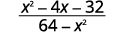
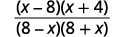
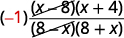
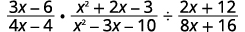
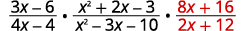
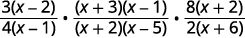
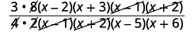

By the end of this section, you will be able to:
* Determine the values for which a rational expression is undefined
* Simplify rational expressions
* Multiply rational expressions
* Divide rational expressions
* Multiply and divide rational functions

Before you get started, take this readiness quiz.

1.  Simplify:
    <math xmlns="http://www.w3.org/1998/Math/MathML"><mrow><mfrac><mrow><mn>90</mn><mi>y</mi></mrow><mrow><mn>15</mn><msup><mi>y</mi><mn>2</mn></msup></mrow></mfrac><mo>.</mo></mrow></math>
    
    * * *
    {: data-type="newline"}
    
    If you missed this problem, review [\[link\]](/m63345#fs-id1167835337754).
2.  Multiply:
    <math xmlns="http://www.w3.org/1998/Math/MathML"><mrow><mfrac><mrow><mn>14</mn></mrow><mrow><mn>15</mn></mrow></mfrac><mo>·</mo><mfrac><mn>6</mn><mrow><mn>35</mn></mrow></mfrac><mo>.</mo></mrow></math>
    
    * * *
    {: data-type="newline"}
    
    If you missed this problem, review [\[link\]](/m63304#fs-id1167836390100).
3.  Divide:
    <math xmlns="http://www.w3.org/1998/Math/MathML"><mrow><mfrac><mrow><mn>12</mn></mrow><mrow><mn>10</mn></mrow></mfrac><mo>÷</mo><mfrac><mn>8</mn><mrow><mn>25</mn></mrow></mfrac><mo>.</mo></mrow></math>
    
    * * *
    {: data-type="newline"}
    
    If you missed this problem, review [\[link\]](/m63304#fs-id1167836356409).
{: data-number-style="arabic"}

We previously reviewed the properties of fractions and their operations. We introduced rational numbers, which are just fractions where the numerators and denominators are integers. In this chapter, we will work with fractions whose numerators and denominators are polynomials. We call this kind of expression a **rational expression**{: data-type="term"}.

Rational Expression

A rational expression is an expression of the form <math xmlns="http://www.w3.org/1998/Math/MathML"><mrow><mfrac><mi>p</mi><mi>q</mi></mfrac><mo>,</mo></mrow></math>

 where *p* and *q* are polynomials and <math xmlns="http://www.w3.org/1998/Math/MathML"><mrow><mi>q</mi><mo>≠</mo><mn>0</mn><mo>.</mo></mrow></math>

Here are some examples of rational expressions:

<math xmlns="http://www.w3.org/1998/Math/MathML"><mrow><mtable> <mtr><mtd columnalign="center"><mrow><mo>−</mo><mfrac><mrow><mn>24</mn></mrow><mrow><mn>56</mn></mrow></mfrac></mrow></mtd><mtd /><mtd /><mtd columnalign="center"><mspace width="3em" /><mfrac><mrow><mn>5</mn><mi>x</mi></mrow><mrow><mn>12</mn><mi>y</mi></mrow></mfrac></mtd><mtd /><mtd /><mtd columnalign="center"><mspace width="3em" /><mfrac><mrow><mn>4</mn><mi>x</mi><mo>+</mo><mn>1</mn></mrow><mrow><msup><mi>x</mi><mn>2</mn></msup><mo>−</mo><mn>9</mn></mrow></mfrac></mtd><mtd /><mtd /><mtd columnalign="center"><mspace width="3em" /><mfrac><mrow><mn>4</mn><msup><mi>x</mi><mn>2</mn></msup><mo>+</mo><mn>3</mn><mi>x</mi><mo>−</mo><mn>1</mn></mrow><mrow><mn>2</mn><mi>x</mi><mo>−</mo><mn>8</mn></mrow></mfrac></mtd></mtr></mtable></mrow></math>

Notice that the first rational expression listed above, <math xmlns="http://www.w3.org/1998/Math/MathML"><mrow><mo>−</mo><mfrac><mrow><mn>24</mn></mrow><mrow><mn>56</mn></mrow></mfrac></mrow></math>

, is just a fraction. Since a constant is a polynomial with degree zero, the ratio of two constants is a rational expression, provided the denominator is not zero.

We will do the same operations with rational expressions that we did with fractions. We will simplify, add, subtract, multiply, divide and use them in applications.

# Determine the Values for Which a Rational Expression is Undefined

If the denominator is zero, the rational expression is undefined. The numerator of a rational expression may be 0—but not the denominator.

When we work with a numerical fraction, it is easy to avoid dividing by zero because we can see the number in the denominator. In order to avoid dividing by zero in a rational expression, we must not allow values of the variable that will make the denominator be zero.

So before we begin any operation with a rational expression, we examine it first to find the values that would make the denominator zero. That way, when we solve a rational equation for example, we will know whether the algebraic solutions we find are allowed or not.

Determine the values for which a rational expression is undefined.

1.  Set the denominator equal to zero.
2.  Solve the equation.
{: data-number-style="arabic" .stepwise}

Determine the value for which each rational expression is undefined:

ⓐ <math xmlns="http://www.w3.org/1998/Math/MathML"><mrow><mfrac><mrow><mn>8</mn><msup><mi>a</mi><mn>2</mn></msup><mi>b</mi></mrow><mrow><mn>3</mn><mi>c</mi></mrow></mfrac></mrow></math>

 ⓑ <math xmlns="http://www.w3.org/1998/Math/MathML"><mrow><mfrac><mrow><mn>4</mn><mi>b</mi><mo>−</mo><mn>3</mn></mrow><mrow><mn>2</mn><mi>b</mi><mo>+</mo><mn>5</mn></mrow></mfrac></mrow></math>

 ⓒ <math xmlns="http://www.w3.org/1998/Math/MathML"><mrow><mfrac><mrow><mi>x</mi><mo>+</mo><mn>4</mn></mrow><mrow><msup><mi>x</mi><mn>2</mn></msup><mo>+</mo><mn>5</mn><mi>x</mi><mo>+</mo><mn>6</mn></mrow></mfrac><mo>.</mo></mrow></math>

The expression will be undefined when the denominator is zero.

ⓐ* * *
{: data-type="newline"}

 <math xmlns="http://www.w3.org/1998/Math/MathML"><mrow><mtable> <mtr><mtd /><mtd /><mtd /><mtd columnalign="center"><mspace width="5em" /><mfrac><mrow><mn>8</mn><msup><mi>a</mi><mn>2</mn></msup><mi>b</mi></mrow><mrow><mn>3</mn><mi>c</mi></mrow></mfrac></mtd></mtr> <mtr><mtd columnalign="left"><mtable><mtr><mtd columnalign="left"><mtext>Set the denominator equal to zero and solve</mtext></mtd></mtr><mtr><mtd columnalign="left"><mtext>for the variable.</mtext></mtd></mtr></mtable></mtd><mtd /><mtd /><mtd columnalign="center"><mspace width="5em" /><mn>3</mn><mi>c</mi><mo>=</mo><mn>0</mn></mtd></mtr> <mtr><mtd /><mtd /><mtd /><mtd columnalign="center"><mspace width="5em" /><mi>c</mi><mo>=</mo><mn>0</mn></mtd></mtr> <mtr><mtd /><mtd /><mtd /><mtd columnalign="center"><mspace width="5em" /><mfrac><mrow><mn>8</mn><msup><mi>a</mi><mn>2</mn></msup><mi>b</mi></mrow><mrow><mn>3</mn><mi>c</mi></mrow></mfrac><mspace width="0.2em" /><mtext>is undefined for</mtext><mspace width="0.2em" /><mi>c</mi><mo>=</mo><mn>0</mn><mo>.</mo></mtd></mtr></mtable></mrow></math>

ⓑ* * *
{: data-type="newline"}

 <math xmlns="http://www.w3.org/1998/Math/MathML"><mrow><mtable> <mtr><mtd /><mtd /><mtd /><mtd columnalign="center"><mspace width="5em" /><mfrac><mrow><mn>4</mn><mi>b</mi><mo>−</mo><mn>3</mn></mrow><mrow><mn>2</mn><mi>b</mi><mo>+</mo><mn>5</mn></mrow></mfrac></mtd></mtr> <mtr><mtd columnalign="left"><mtable><mtr><mtd columnalign="left"><mtext>Set the denominator equal to zero and solve</mtext></mtd></mtr><mtr><mtd columnalign="left"><mtext>for the variable.</mtext></mtd></mtr><mtr /><mtr /><mtr /><mtr /></mtable></mtd><mtd /><mtd /><mtd columnalign="center"><mspace width="5em" /><mtable><mtr><mtd columnalign="right"><mn>2</mn><mi>b</mi><mo>+</mo><mn>5</mn></mtd><mtd columnalign="left"><mo>=</mo></mtd><mtd columnalign="left"><mn>0</mn></mtd></mtr><mtr><mtd columnalign="right"><mn>2</mn><mi>b</mi></mtd><mtd columnalign="left"><mo>=</mo></mtd><mtd columnalign="left"><mn>−5</mn></mtd></mtr><mtr><mtd columnalign="right"><mi>b</mi></mtd><mtd columnalign="left"><mo>=</mo></mtd><mtd columnalign="left"><mo>−</mo><mfrac><mn>5</mn><mn>2</mn></mfrac></mtd></mtr></mtable></mtd></mtr> <mtr><mtd /><mtd /><mtd /><mtd columnalign="center"><mspace width="5em" /><mfrac><mrow><mn>4</mn><mi>b</mi><mo>−</mo><mn>3</mn></mrow><mrow><mn>2</mn><mi>b</mi><mo>+</mo><mn>5</mn></mrow></mfrac><mspace width="0.2em" /><mtext>is undefined for</mtext><mspace width="0.2em" /><mi>b</mi><mo>=</mo><mo>−</mo><mfrac><mn>5</mn><mn>2</mn></mfrac><mo>.</mo></mtd></mtr></mtable></mrow></math>

ⓒ* * *
{: data-type="newline"}

 <math xmlns="http://www.w3.org/1998/Math/MathML"><mrow><mtable> <mtr><mtd /><mtd /><mtd /><mtd columnalign="right"><mfrac><mrow><mi>x</mi><mo>+</mo><mn>4</mn></mrow><mrow><msup><mi>x</mi><mn>2</mn></msup><mo>+</mo><mn>5</mn><mi>x</mi><mo>+</mo><mn>6</mn></mrow></mfrac><mspace width="1.4em" /></mtd></mtr> <mtr><mtd columnalign="left"><mtable><mtr><mtd columnalign="left"><mtext>Set the denominator equal to zero and solve</mtext></mtd></mtr><mtr><mtd columnalign="left"><mtext>for the variable.</mtext></mtd></mtr><mtr /><mtr /><mtr /></mtable></mtd><mtd /><mtd /><mtd columnalign="right"><mtable><mtr><mtd columnalign="right"><msup><mi>x</mi><mn>2</mn></msup><mo>+</mo><mn>5</mn><mi>x</mi><mo>+</mo><mn>6</mn><mo>=</mo><mn>0</mn><mspace width="1em" /></mtd></mtr><mtr><mtd columnalign="right"><mrow><mo>(</mo><mrow><mi>x</mi><mo>+</mo><mn>2</mn></mrow><mo>)</mo></mrow><mrow><mo>(</mo><mrow><mi>x</mi><mo>+</mo><mn>3</mn></mrow><mo>)</mo></mrow><mo>=</mo><mn>0</mn><mspace width="1em" /></mtd></mtr><mtr><mtd columnalign="right"><mi>x</mi><mo>+</mo><mn>2</mn><mo>=</mo><mn>0</mn><mspace width="0.5em" /><mtext>or</mtext><mspace width="0.5em" /><mi>x</mi><mo>+</mo><mn>3</mn><mo>=</mo><mn>0</mn><mspace width="1em" /></mtd></mtr><mtr><mtd columnalign="right"><mi>x</mi><mo>=</mo><mn>−2</mn><mspace width="0.2em" /><mtext>or</mtext><mspace width="0.2em" /><mi>x</mi><mo>=</mo><mn>−3</mn><mspace width="0.2em" /></mtd></mtr></mtable></mtd></mtr> <mtr><mtd /><mtd /><mtd /><mtd columnalign="right"><mfrac><mrow><mi>x</mi><mo>+</mo><mn>4</mn></mrow><mrow><msup><mi>x</mi><mn>2</mn></msup><mo>+</mo><mn>5</mn><mi>x</mi><mo>+</mo><mn>6</mn></mrow></mfrac><mspace width="0.2em" /><mtext>is undefined for</mtext><mspace width="0.2em" /><mi>x</mi><mo>=</mo><mn>−2</mn><mspace width="0.2em" /><mtext>or</mtext><mspace width="0.2em" /><mi>x</mi><mo>=</mo><mn>−3</mn><mo>.</mo></mtd></mtr></mtable></mrow></math>

Determine the value for which each rational expression is undefined.

ⓐ <math xmlns="http://www.w3.org/1998/Math/MathML"><mrow><mfrac><mrow><mn>3</mn><msup><mi>y</mi><mn>2</mn></msup></mrow><mrow><mn>8</mn><mi>x</mi></mrow></mfrac></mrow></math>

 ⓑ <math xmlns="http://www.w3.org/1998/Math/MathML"><mrow><mfrac><mrow><mn>8</mn><mi>n</mi><mo>−</mo><mn>5</mn></mrow><mrow><mn>3</mn><mi>n</mi><mo>+</mo><mn>1</mn></mrow></mfrac></mrow></math>

 ⓒ <math xmlns="http://www.w3.org/1998/Math/MathML"><mrow><mfrac><mrow><mi>a</mi><mo>+</mo><mn>10</mn></mrow><mrow><msup><mi>a</mi><mn>2</mn></msup><mo>+</mo><mn>4</mn><mi>a</mi><mo>+</mo><mn>3</mn></mrow></mfrac></mrow></math>

ⓐ <math xmlns="http://www.w3.org/1998/Math/MathML"><mrow><mi>x</mi><mo>=</mo><mn>0</mn></mrow></math>

 ⓑ <math xmlns="http://www.w3.org/1998/Math/MathML"><mrow><mi>n</mi><mo>=</mo><mo>−</mo><mfrac><mn>1</mn><mn>3</mn></mfrac></mrow></math>

* * *
{: data-type="newline"}

ⓒ <math xmlns="http://www.w3.org/1998/Math/MathML"><mrow><mi>a</mi><mo>=</mo><mn>−1</mn><mo>,</mo><mi>a</mi><mo>=</mo><mn>−3</mn></mrow></math>

Determine the value for which each rational expression is undefined.

ⓐ<math xmlns="http://www.w3.org/1998/Math/MathML"><mrow><mfrac><mrow><mn>4</mn><mi>p</mi></mrow><mrow><mn>5</mn><mi>q</mi></mrow></mfrac></mrow></math>

 ⓑ <math xmlns="http://www.w3.org/1998/Math/MathML"><mrow><mfrac><mrow><mi>y</mi><mo>−</mo><mn>1</mn></mrow><mrow><mn>3</mn><mi>y</mi><mo>+</mo><mn>2</mn></mrow></mfrac></mrow></math>

 ⓒ <math xmlns="http://www.w3.org/1998/Math/MathML"><mrow><mfrac><mrow><mi>m</mi><mo>−</mo><mn>5</mn></mrow><mrow><msup><mi>m</mi><mn>2</mn></msup><mo>+</mo><mi>m</mi><mo>−</mo><mn>6</mn></mrow></mfrac></mrow></math>

ⓐ <math xmlns="http://www.w3.org/1998/Math/MathML"><mrow><mi>q</mi><mo>=</mo><mn>0</mn></mrow></math>

 ⓑ <math xmlns="http://www.w3.org/1998/Math/MathML"><mrow><mi>y</mi><mo>=</mo><mo>−</mo><mfrac><mn>2</mn><mn>3</mn></mfrac></mrow></math>

* * *
{: data-type="newline"}

ⓒ <math xmlns="http://www.w3.org/1998/Math/MathML"><mrow><mi>m</mi><mo>=</mo><mn>2</mn><mo>,</mo><mi>m</mi><mo>=</mo><mn>−3</mn></mrow></math>

# Simplify Rational Expressions

A fraction is considered simplified if there are no common factors, other than 1, in its numerator and denominator. Similarly, a **simplified rational expression**{: data-type="term"} has no common factors, other than 1, in its numerator and denominator.

Simplified Rational Expression

A rational expression is considered simplified if there are no common factors in its numerator and denominator.

For example,

<math xmlns="http://www.w3.org/1998/Math/MathML"><mrow><mtable><mtr><mtd columnalign="left"><mfrac><mrow><mi>x</mi><mo>+</mo><mn>2</mn></mrow><mrow><mi>x</mi><mo>+</mo><mn>3</mn></mrow></mfrac><mspace width="0.2em" /><mtext>is simplified because there are no common factors of</mtext><mspace width="0.2em" /><mi>x</mi><mo>+</mo><mn>2</mn><mspace width="0.2em" /><mtext>and</mtext><mspace width="0.2em" /><mi>x</mi><mo>+</mo><mn>3</mn><mo>.</mo></mtd></mtr> <mtr><mtd columnalign="left"><mfrac><mrow><mn>2</mn><mi>x</mi></mrow><mrow><mn>3</mn><mi>x</mi></mrow></mfrac><mspace width="0.2em" /><mtext>is not simplified because</mtext><mspace width="0.2em" /><mi>x</mi><mspace width="0.2em" /><mtext>is a common factor of</mtext><mspace width="0.2em" /><mn>2</mn><mi>x</mi><mspace width="0.2em" /><mtext>and</mtext><mspace width="0.2em" /><mn>3</mn><mi>x</mi><mo>.</mo></mtd></mtr></mtable></mrow></math>

We use the Equivalent Fractions Property to simplify numerical fractions. We restate it here as we will also use it to simplify rational expressions.

Equivalent Fractions Property

If *a*, *b*, and *c* are numbers where <math xmlns="http://www.w3.org/1998/Math/MathML"><mrow><mi>b</mi><mo>≠</mo><mn>0</mn><mo>,</mo><mi>c</mi><mo>≠</mo><mn>0</mn><mo>,</mo></mrow></math>

<math xmlns="http://www.w3.org/1998/Math/MathML"><mrow><mtext>then</mtext><mspace width="0.5em" /><mfrac><mi>a</mi><mi>b</mi></mfrac><mo>=</mo><mfrac><mrow><mi>a</mi><mo>·</mo><mi>c</mi></mrow><mrow><mi>b</mi><mo>·</mo><mi>c</mi></mrow></mfrac><mspace width="1em" /><mtext>and</mtext><mspace width="1em" /><mfrac><mrow><mi>a</mi><mo>·</mo><mi>c</mi></mrow><mrow><mi>b</mi><mo>·</mo><mi>c</mi></mrow></mfrac><mo>=</mo><mfrac><mi>a</mi><mi>b</mi></mfrac><mo>.</mo></mrow></math>

Notice that in the Equivalent Fractions Property, the values that would make the denominators zero are specifically disallowed. We see <math xmlns="http://www.w3.org/1998/Math/MathML"><mrow><mi>b</mi><mo>≠</mo><mn>0</mn><mo>,</mo><mi>c</mi><mo>≠</mo><mn>0</mn></mrow></math>

 clearly stated.

To simplify rational expressions, we first write the numerator and denominator in factored form. Then we remove the common factors using the Equivalent Fractions Property.

Be very careful as you remove common factors. Factors are multiplied to make a product. You can remove a factor from a product. You cannot remove a term from a sum.

  ![The rational expression is the quantity 2 times 3 times 7 divided by the quantity 3 times 5 times 7 are 3 and 7. Its common factors are 3 and 7, which are factors of the product. When they are removed, the result is two-fifths. The rational expression is the product of 3 x and the quantity x minus 9 divided by the product of 5 and the quantity x minus 9. The common factor is x minus 9, which is a factor of the product. When it is removed, the result is 3 x divided by 5. The rational expression is the quantity x plus 5 divided by 5. There is an x both the numerator and denomiantor. However, it is a term of the sum in the numerator. The rational expression has no common factors.](../resources/CNX_IntAlg_Figure_07_01_001_img.jpg)  Removing the *x*’s from <math xmlns="http://www.w3.org/1998/Math/MathML"><mrow><mfrac><mrow><mi>x</mi><mo>+</mo><mn>5</mn></mrow><mi>x</mi></mfrac></mrow></math>

 would be like cancelling the 2’s in the fraction <math xmlns="http://www.w3.org/1998/Math/MathML"><mrow><mfrac><mrow><mn>2</mn><mo>+</mo><mn>5</mn></mrow><mn>2</mn></mfrac><mo>!</mo></mrow></math>

How to Simplify a Rational Expression

Simplify: <math xmlns="http://www.w3.org/1998/Math/MathML"><mrow><mfrac><mrow><msup><mi>x</mi><mn>2</mn></msup><mo>+</mo><mn>5</mn><mi>x</mi><mo>+</mo><mn>6</mn></mrow><mrow><msup><mi>x</mi><mn>2</mn></msup><mo>+</mo><mn>8</mn><mi>x</mi><mo>+</mo><mn>12</mn></mrow></mfrac></mrow></math>

.

     

Simplify: <math xmlns="http://www.w3.org/1998/Math/MathML"><mrow><mfrac><mrow><msup><mi>x</mi><mn>2</mn></msup><mo>−</mo><mi>x</mi><mo>−</mo><mn>2</mn></mrow><mrow><msup><mi>x</mi><mn>2</mn></msup><mo>−</mo><mn>3</mn><mi>x</mi><mo>+</mo><mn>2</mn></mrow></mfrac><mo>.</mo></mrow></math>

<math xmlns="http://www.w3.org/1998/Math/MathML"><mrow><mfrac><mrow><mi>x</mi><mo>+</mo><mn>1</mn></mrow><mrow><mi>x</mi><mo>−</mo><mn>1</mn></mrow></mfrac><mo>,</mo></mrow></math>

<math xmlns="http://www.w3.org/1998/Math/MathML"><mrow><mi>x</mi><mo>≠</mo><mn>2</mn><mo>,</mo></mrow></math>

<math xmlns="http://www.w3.org/1998/Math/MathML"><mrow><mi>x</mi><mo>≠</mo><mn>1</mn></mrow></math>

Simplify: <math xmlns="http://www.w3.org/1998/Math/MathML"><mrow><mfrac><mrow><msup><mi>x</mi><mn>2</mn></msup><mo>−</mo><mn>3</mn><mi>x</mi><mo>−</mo><mn>10</mn></mrow><mrow><msup><mi>x</mi><mn>2</mn></msup><mo>+</mo><mi>x</mi><mo>−</mo><mn>2</mn></mrow></mfrac><mo>.</mo></mrow></math>

<math xmlns="http://www.w3.org/1998/Math/MathML"><mrow><mfrac><mrow><mi>x</mi><mo>−</mo><mn>5</mn></mrow><mrow><mi>x</mi><mo>−</mo><mn>1</mn></mrow></mfrac><mo>,</mo></mrow></math>

<math xmlns="http://www.w3.org/1998/Math/MathML"><mrow><mi>x</mi><mo>≠</mo><mtext>−</mtext><mn>2</mn><mo>,</mo></mrow></math>

<math xmlns="http://www.w3.org/1998/Math/MathML"><mrow><mi>x</mi><mo>≠</mo><mn>1</mn></mrow></math>

We now summarize the steps you should follow to simplify rational expressions.

Simplify a rational expression.

1.  Factor the numerator and denominator completely.
2.  Simplify by dividing out common factors.
{: data-number-style="arabic" .stepwise}

Usually, we leave the simplified rational expression in factored form. This way, it is easy to check that we have removed *all* the common factors.

We’ll use the methods we have learned to factor the polynomials in the numerators and denominators in the following examples.

Every time we write a rational expression, we should make a statement disallowing values that would make a denominator zero. However, to let us focus on the work at hand, we will omit writing it in the examples.

Simplify: <math xmlns="http://www.w3.org/1998/Math/MathML"><mrow><mfrac><mrow><mn>3</mn><msup><mi>a</mi><mn>2</mn></msup><mo>−</mo><mn>12</mn><mi>a</mi><mi>b</mi><mo>+</mo><mn>12</mn><msup><mi>b</mi><mn>2</mn></msup></mrow><mrow><mn>6</mn><msup><mi>a</mi><mn>2</mn></msup><mo>−</mo><mn>24</mn><msup><mi>b</mi><mn>2</mn></msup></mrow></mfrac></mrow></math>

.

<math xmlns="http://www.w3.org/1998/Math/MathML"><mrow><mtable> <mtr><mtd /><mtd /><mtd /><mtd columnalign="center"><mfrac><mrow><mn>3</mn><msup><mi>a</mi><mn>2</mn></msup><mo>−</mo><mn>12</mn><mi>a</mi><mi>b</mi><mo>+</mo><mn>12</mn><msup><mi>b</mi><mn>2</mn></msup></mrow><mrow><mn>6</mn><msup><mi>a</mi><mn>2</mn></msup><mo>−</mo><mn>24</mn><msup><mi>b</mi><mn>2</mn></msup></mrow></mfrac></mtd></mtr><mtr /><mtr /> <mtr><mtd columnalign="left"><mtable><mtr><mtd columnalign="left"><mtext>Factor the numerator and denominator,</mtext></mtd></mtr><mtr><mtd columnalign="left"><mtext>first factoring out the GCF.</mtext></mtd></mtr></mtable></mtd><mtd /><mtd /><mtd columnalign="center"><mfrac><mrow><mn>3</mn><mrow><mo>(</mo><mrow><msup><mi>a</mi><mn>2</mn></msup><mo>−</mo><mn>4</mn><mi>a</mi><mi>b</mi><mo>+</mo><mn>4</mn><msup><mi>b</mi><mn>2</mn></msup></mrow><mo>)</mo></mrow></mrow><mrow><mn>6</mn><mrow><mo>(</mo><mrow><msup><mi>a</mi><mn>2</mn></msup><mo>−</mo><mn>4</mn><msup><mi>b</mi><mn>2</mn></msup></mrow><mo>)</mo></mrow></mrow></mfrac></mtd></mtr><mtr /><mtr /> <mtr><mtd /><mtd /><mtd /><mtd columnalign="center"><mfrac><mrow><mn>3</mn><mrow><mo>(</mo><mrow><mi>a</mi><mo>−</mo><mn>2</mn><mi>b</mi></mrow><mo>)</mo></mrow><mrow><mo>(</mo><mrow><mi>a</mi><mo>−</mo><mn>2</mn><mi>b</mi></mrow><mo>)</mo></mrow></mrow><mrow><mn>6</mn><mrow><mo>(</mo><mrow><mi>a</mi><mo>+</mo><mn>2</mn><mi>b</mi></mrow><mo>)</mo></mrow><mrow><mo>(</mo><mrow><mi>a</mi><mo>−</mo><mn>2</mn><mi>b</mi></mrow><mo>)</mo></mrow></mrow></mfrac></mtd></mtr><mtr /><mtr /> <mtr><mtd columnalign="left"><mtext>Remove the common factors of</mtext><mspace width="0.2em" /><mi>a</mi><mo>−</mo><mn>2</mn><mi>b</mi><mspace width="0.2em" /><mtext>and</mtext><mspace width="0.2em" /><mn>3</mn><mo>.</mo></mtd><mtd /><mtd /><mtd columnalign="center"><mfrac><mrow><menclose notation="updiagonalstrike"><mn>3</mn></menclose><mrow><mo>(</mo><mrow><mi>a</mi><mo>−</mo><mn>2</mn><mi>b</mi></mrow><mo>)</mo></mrow><menclose notation="updiagonalstrike"><mrow><mrow><mo>(</mo><mrow><mi>a</mi><mo>−</mo><mn>2</mn><mi>b</mi></mrow><mo>)</mo></mrow></mrow></menclose></mrow><mrow><menclose notation="updiagonalstrike"><mn>3</mn></menclose><mo>·</mo><mn>2</mn><mrow><mo>(</mo><mrow><mi>a</mi><mo>+</mo><mn>2</mn><mi>b</mi></mrow><mo>)</mo></mrow><menclose notation="updiagonalstrike"><mrow><mrow><mo>(</mo><mrow><mi>a</mi><mo>−</mo><mn>2</mn><mi>b</mi></mrow><mo>)</mo></mrow></mrow></menclose></mrow></mfrac></mtd></mtr> <mtr><mtd /><mtd /><mtd /><mtd columnalign="center"><mfrac><mrow><mi>a</mi><mo>−</mo><mn>2</mn><mi>b</mi></mrow><mrow><mn>2</mn><mrow><mo>(</mo><mrow><mi>a</mi><mo>+</mo><mn>2</mn><mi>b</mi></mrow><mo>)</mo></mrow></mrow></mfrac></mtd></mtr></mtable></mrow></math>

Simplify: <math xmlns="http://www.w3.org/1998/Math/MathML"><mrow><mfrac><mrow><mn>2</mn><msup><mi>x</mi><mn>2</mn></msup><mo>−</mo><mn>12</mn><mi>x</mi><mi>y</mi><mo>+</mo><mn>18</mn><msup><mi>y</mi><mn>2</mn></msup></mrow><mrow><mn>3</mn><msup><mi>x</mi><mn>2</mn></msup><mo>−</mo><mn>27</mn><msup><mi>y</mi><mn>2</mn></msup></mrow></mfrac></mrow></math>

.

<math xmlns="http://www.w3.org/1998/Math/MathML"><mrow><mfrac><mrow><mn>2</mn><mrow><mo>(</mo><mrow><mi>x</mi><mo>−</mo><mn>3</mn><mi>y</mi></mrow><mo>)</mo></mrow></mrow><mrow><mn>3</mn><mrow><mo>(</mo><mrow><mi>x</mi><mo>+</mo><mn>3</mn><mi>y</mi></mrow><mo>)</mo></mrow></mrow></mfrac></mrow></math>

Simplify: <math xmlns="http://www.w3.org/1998/Math/MathML"><mrow><mfrac><mrow><mn>5</mn><msup><mi>x</mi><mn>2</mn></msup><mo>−</mo><mn>30</mn><mi>x</mi><mi>y</mi><mo>+</mo><mn>25</mn><msup><mi>y</mi><mn>2</mn></msup></mrow><mrow><mn>2</mn><msup><mi>x</mi><mn>2</mn></msup><mo>−</mo><mn>50</mn><msup><mi>y</mi><mn>2</mn></msup></mrow></mfrac></mrow></math>

.

<math xmlns="http://www.w3.org/1998/Math/MathML"><mrow><mfrac><mrow><mn>5</mn><mrow><mo>(</mo><mrow><mi>x</mi><mo>−</mo><mi>y</mi></mrow><mo>)</mo></mrow></mrow><mrow><mn>2</mn><mrow><mo>(</mo><mrow><mi>x</mi><mo>+</mo><mn>5</mn><mi>y</mi></mrow><mo>)</mo></mrow></mrow></mfrac></mrow></math>

Now we will see how to simplify a rational expression whose numerator and denominator have opposite factors. We previously introduced opposite notation: the opposite of *a* is <math xmlns="http://www.w3.org/1998/Math/MathML"><mrow><mtext>−</mtext><mi>a</mi></mrow></math>

 and <math xmlns="http://www.w3.org/1998/Math/MathML"><mrow><mtext>−</mtext><mi>a</mi><mo>=</mo><mn>−1</mn><mo>·</mo><mi>a</mi><mo>.</mo></mrow></math>

The numerical fraction, say <math xmlns="http://www.w3.org/1998/Math/MathML"><mrow><mfrac><mrow><mn>7</mn></mrow><mrow><mn>−7</mn></mrow></mfrac></mrow></math>

 simplifies to <math xmlns="http://www.w3.org/1998/Math/MathML"><mrow><mn>−1</mn></mrow></math>

. We also recognize that the numerator and denominator are opposites.

The fraction <math xmlns="http://www.w3.org/1998/Math/MathML"><mrow><mfrac><mrow><mi>a</mi></mrow><mrow><mtext>−</mtext><mi>a</mi></mrow></mfrac></mrow></math>

, whose numerator and denominator are opposites also simplifies to <math xmlns="http://www.w3.org/1998/Math/MathML"><mrow><mn>−1</mn></mrow></math>

.

<math xmlns="http://www.w3.org/1998/Math/MathML"><mrow><mtable> <mtr><mtd columnalign="left"><mtext>Let’s look at the expression</mtext><mspace width="0.2em" /><mi>b</mi><mo>−</mo><mi>a</mi><mo>.</mo></mtd><mtd /><mtd /><mtd columnalign="center"><mspace width="2em" /><mi>b</mi><mo>−</mo><mi>a</mi></mtd></mtr> <mtr><mtd columnalign="left"><mtext>Rewrite.</mtext></mtd><mtd /><mtd /><mtd columnalign="center"><mspace width="2em" /><mtext>−</mtext><mi>a</mi><mo>+</mo><mi>b</mi></mtd></mtr> <mtr><mtd columnalign="left"><mtext>Factor out</mtext><mspace width="0.2em" /><mn>–1</mn><mo>.</mo></mtd><mtd /><mtd /><mtd columnalign="center"><mspace width="2em" /><mn>−1</mn><mrow><mo>(</mo><mrow><mi>a</mi><mo>−</mo><mi>b</mi></mrow><mo>)</mo></mrow></mtd></mtr></mtable></mrow></math>

This tells us that <math xmlns="http://www.w3.org/1998/Math/MathML"><mrow><mi>b</mi><mo>−</mo><mi>a</mi></mrow></math>

 is the opposite of <math xmlns="http://www.w3.org/1998/Math/MathML"><mrow><mi>a</mi><mo>−</mo><mi>b</mi><mo>.</mo></mrow></math>

In general, we could write the opposite of <math xmlns="http://www.w3.org/1998/Math/MathML"><mrow><mi>a</mi><mo>−</mo><mi>b</mi></mrow></math>

 as <math xmlns="http://www.w3.org/1998/Math/MathML"><mrow><mi>b</mi><mo>−</mo><mi>a</mi><mo>.</mo></mrow></math>

 So the rational expression <math xmlns="http://www.w3.org/1998/Math/MathML"><mrow><mfrac><mrow><mi>a</mi><mo>−</mo><mi>b</mi></mrow><mrow><mi>b</mi><mo>−</mo><mi>a</mi></mrow></mfrac></mrow></math>

 simplifies to <math xmlns="http://www.w3.org/1998/Math/MathML"><mrow><mn>−1</mn><mo>.</mo></mrow></math>

Opposites in a Rational Expression

The opposite of <math xmlns="http://www.w3.org/1998/Math/MathML"><mrow><mi>a</mi><mo>−</mo><mi>b</mi></mrow></math>

 is <math xmlns="http://www.w3.org/1998/Math/MathML"><mrow><mi>b</mi><mo>−</mo><mi>a</mi><mo>.</mo></mrow></math>

<math xmlns="http://www.w3.org/1998/Math/MathML"><mrow><mfrac><mrow><mi>a</mi><mo>−</mo><mi>b</mi></mrow><mrow><mi>b</mi><mo>−</mo><mi>a</mi></mrow></mfrac><mo>=</mo><mn>−1</mn><mspace width="0.5em" /><mi>a</mi><mo>≠</mo><mi>b</mi></mrow></math>

An expression and its opposite divide to <math xmlns="http://www.w3.org/1998/Math/MathML"><mrow><mn>−1</mn><mo>.</mo></mrow></math>

We will use this property to simplify rational expressions that contain opposites in their numerators and denominators. Be careful not to treat <math xmlns="http://www.w3.org/1998/Math/MathML"><mrow><mi>a</mi><mo>+</mo><mi>b</mi></mrow></math>

 and <math xmlns="http://www.w3.org/1998/Math/MathML"><mrow><mi>b</mi><mo>+</mo><mi>a</mi></mrow></math>

 as opposites. Recall that in addition, order doesn’t matter so <math xmlns="http://www.w3.org/1998/Math/MathML"><mrow><mi>a</mi><mo>+</mo><mi>b</mi><mo>=</mo><mi>b</mi><mo>+</mo><mi>a</mi></mrow></math>

. So if <math xmlns="http://www.w3.org/1998/Math/MathML"><mrow><mi>a</mi><mo>≠</mo><mtext>−</mtext><mi>b</mi></mrow></math>

, then <math xmlns="http://www.w3.org/1998/Math/MathML"><mrow><mfrac><mrow><mi>a</mi><mo>+</mo><mi>b</mi></mrow><mrow><mi>b</mi><mo>+</mo><mi>a</mi></mrow></mfrac><mo>=</mo><mn>1</mn><mo>.</mo></mrow></math>

Simplify: <math xmlns="http://www.w3.org/1998/Math/MathML"><mrow><mfrac><mrow><msup><mi>x</mi><mn>2</mn></msup><mo>−</mo><mn>4</mn><mi>x</mi><mo>−</mo><mn>32</mn></mrow><mrow><mn>64</mn><mo>−</mo><msup><mi>x</mi><mn>2</mn></msup></mrow></mfrac><mo>.</mo></mrow></math>

|  |  |
{: valign="top"}| Factor the numerator and the denominator. |  |
{: valign="top"}| Recognize the factors that are opposites. |  |
{: valign="top"}| Simplify. |  |
{: valign="top"}{: .unnumbered .unstyled summary="Factor the numerator and denominator of the rational expression, the quantity x squared minus 4 x minus 32 divided by the quantity 64 minus x squared. The numerator factors into the quantity x minus 8 times the quantity x plus 4. The denominator factors into the quantity 8 minus x times the quantity 8 plus x. The factors x minus 8 and 8 minus x are opposites, so multiply the rational expression by negative 1. The result is the negative of the quantity x plus 4 divided by the quantity x plus 8." data-label=""}

Simplify: <math xmlns="http://www.w3.org/1998/Math/MathML"><mrow><mfrac><mrow><msup><mi>x</mi><mn>2</mn></msup><mo>−</mo><mn>4</mn><mi>x</mi><mo>−</mo><mn>5</mn></mrow><mrow><mn>25</mn><mo>−</mo><msup><mi>x</mi><mn>2</mn></msup></mrow></mfrac><mo>.</mo></mrow></math>

<math xmlns="http://www.w3.org/1998/Math/MathML"><mrow><mo>−</mo><mfrac><mrow><mi>x</mi><mo>+</mo><mn>1</mn></mrow><mrow><mi>x</mi><mo>+</mo><mn>5</mn></mrow></mfrac></mrow></math>

Simplify: <math xmlns="http://www.w3.org/1998/Math/MathML"><mrow><mfrac><mrow><msup><mi>x</mi><mn>2</mn></msup><mo>+</mo><mi>x</mi><mo>−</mo><mn>2</mn></mrow><mrow><mn>1</mn><mo>−</mo><msup><mi>x</mi><mn>2</mn></msup></mrow></mfrac><mo>.</mo></mrow></math>

<math xmlns="http://www.w3.org/1998/Math/MathML"><mrow><mo>−</mo><mfrac><mrow><mi>x</mi><mo>+</mo><mn>2</mn></mrow><mrow><mi>x</mi><mo>+</mo><mn>1</mn></mrow></mfrac></mrow></math>

# Multiply Rational Expressions

To multiply rational expressions, we do just what we did with numerical fractions. We multiply the numerators and multiply the denominators. Then, if there are any common factors, we remove them to simplify the result.

Multiplication of Rational Expressions

If *p*, *q*, *r*, and *s* are polynomials where <math xmlns="http://www.w3.org/1998/Math/MathML"><mrow><mi>q</mi><mo>≠</mo><mn>0</mn><mo>,</mo><mi>s</mi><mo>≠</mo><mn>0</mn><mo>,</mo></mrow></math>

 then

<math xmlns="http://www.w3.org/1998/Math/MathML"><mrow><mfrac><mi>p</mi><mi>q</mi></mfrac><mo>·</mo><mfrac><mi>r</mi><mi>s</mi></mfrac><mo>=</mo><mfrac><mrow><mi>p</mi><mi>r</mi></mrow><mrow><mi>q</mi><mi>s</mi></mrow></mfrac></mrow></math>

To multiply rational expressions, multiply the numerators and multiply the denominators.

Remember, throughout this chapter, we will assume that all numerical values that would make the denominator be zero are excluded. We will not write the restrictions for each rational expression, but keep in mind that the denominator can never be zero. So in this next example, <math xmlns="http://www.w3.org/1998/Math/MathML"><mrow><mi>x</mi><mo>≠</mo><mn>0</mn><mo>,</mo></mrow></math>

<math xmlns="http://www.w3.org/1998/Math/MathML"><mrow><mi>x</mi><mo>≠</mo><mn>3</mn><mo>,</mo></mrow></math>

 and <math xmlns="http://www.w3.org/1998/Math/MathML"><mrow><mi>x</mi><mo>≠</mo><mn>4</mn><mo>.</mo></mrow></math>

How to Multiply Rational Expressions

Simplify: <math xmlns="http://www.w3.org/1998/Math/MathML"><mrow><mfrac><mrow><mn>2</mn><mi>x</mi></mrow><mrow><msup><mi>x</mi><mn>2</mn></msup><mo>−</mo><mn>7</mn><mi>x</mi><mo>+</mo><mn>12</mn></mrow></mfrac><mo>·</mo><mfrac><mrow><msup><mi>x</mi><mn>2</mn></msup><mo>−</mo><mn>9</mn></mrow><mrow><mn>6</mn><msup><mi>x</mi><mn>2</mn></msup></mrow></mfrac><mo>.</mo></mrow></math>

        

Simplify: <math xmlns="http://www.w3.org/1998/Math/MathML"><mrow><mfrac><mrow><mn>5</mn><mi>x</mi></mrow><mrow><msup><mi>x</mi><mn>2</mn></msup><mo>+</mo><mn>5</mn><mi>x</mi><mo>+</mo><mn>6</mn></mrow></mfrac><mo>·</mo><mfrac><mrow><msup><mi>x</mi><mn>2</mn></msup><mo>−</mo><mn>4</mn></mrow><mrow><mn>10</mn><mi>x</mi></mrow></mfrac><mo>.</mo></mrow></math>

<math xmlns="http://www.w3.org/1998/Math/MathML"><mrow><mfrac><mrow><mi>x</mi><mo>−</mo><mn>2</mn></mrow><mrow><mn>2</mn><mrow><mo>(</mo><mrow><mi>x</mi><mo>+</mo><mn>3</mn></mrow><mo>)</mo></mrow></mrow></mfrac></mrow></math>

Simplify: <math xmlns="http://www.w3.org/1998/Math/MathML"><mrow><mfrac><mrow><mn>9</mn><msup><mi>x</mi><mn>2</mn></msup></mrow><mrow><msup><mi>x</mi><mn>2</mn></msup><mo>+</mo><mn>11</mn><mi>x</mi><mo>+</mo><mn>30</mn></mrow></mfrac><mo>·</mo><mfrac><mrow><msup><mi>x</mi><mn>2</mn></msup><mo>−</mo><mn>36</mn></mrow><mrow><mn>3</mn><msup><mi>x</mi><mn>2</mn></msup></mrow></mfrac><mo>.</mo></mrow></math>

<math xmlns="http://www.w3.org/1998/Math/MathML"><mrow><mfrac><mrow><mn>3</mn><mo stretchy="false">(</mo><mi>x</mi><mo>−</mo><mn>6</mn><mo stretchy="false">)</mo></mrow><mrow><mi>x</mi><mo>+</mo><mn>5</mn></mrow></mfrac></mrow></math>

Multiply rational expressions.

1.  Factor each numerator and denominator completely.
2.  Multiply the numerators and denominators.
3.  Simplify by dividing out common factors.
{: data-number-style="arabic" .stepwise}

Multiply: <math xmlns="http://www.w3.org/1998/Math/MathML"><mrow><mfrac><mrow><mn>3</mn><msup><mi>a</mi><mn>2</mn></msup><mo>−</mo><mn>8</mn><mi>a</mi><mo>−</mo><mn>3</mn></mrow><mrow><msup><mi>a</mi><mn>2</mn></msup><mo>−</mo><mn>25</mn></mrow></mfrac><mo>·</mo><mfrac><mrow><msup><mi>a</mi><mn>2</mn></msup><mo>+</mo><mn>10</mn><mi>a</mi><mo>+</mo><mn>25</mn></mrow><mrow><mn>3</mn><msup><mi>a</mi><mn>2</mn></msup><mo>−</mo><mn>14</mn><mi>a</mi><mo>−</mo><mn>5</mn></mrow></mfrac><mo>.</mo></mrow></math>

<math xmlns="http://www.w3.org/1998/Math/MathML"><mrow><mtable> <mtr><mtd /><mtd /><mtd /><mtd columnalign="center"><mspace width="2em" /><mfrac><mrow><mn>3</mn><msup><mi>a</mi><mn>2</mn></msup><mo>−</mo><mn>8</mn><mi>a</mi><mo>−</mo><mn>3</mn></mrow><mrow><msup><mi>a</mi><mn>2</mn></msup><mo>−</mo><mn>25</mn></mrow></mfrac><mo>·</mo><mfrac><mrow><msup><mi>a</mi><mn>2</mn></msup><mo>+</mo><mn>10</mn><mi>a</mi><mo>+</mo><mn>25</mn></mrow><mrow><mn>3</mn><msup><mi>a</mi><mn>2</mn></msup><mo>−</mo><mn>14</mn><mi>a</mi><mo>−</mo><mn>5</mn></mrow></mfrac></mtd></mtr><mtr /><mtr /> <mtr><mtd columnalign="left"><mtable><mtr><mtd columnalign="left"><mtext>Factor the numerators and denominators</mtext></mtd></mtr><mtr><mtd columnalign="left"><mtext>and then multiply.</mtext></mtd></mtr></mtable></mtd><mtd /><mtd /><mtd columnalign="center"><mspace width="2em" /><mfrac><mrow><mrow><mo>(</mo><mrow><mn>3</mn><mi>a</mi><mo>+</mo><mn>1</mn></mrow><mo>)</mo></mrow><mrow><mo>(</mo><mrow><mi>a</mi><mo>−</mo><mn>3</mn></mrow><mo>)</mo></mrow><mrow><mo>(</mo><mrow><mi>a</mi><mo>+</mo><mn>5</mn></mrow><mo>)</mo></mrow><mrow><mo>(</mo><mrow><mi>a</mi><mo>+</mo><mn>5</mn></mrow><mo>)</mo></mrow></mrow><mrow><mrow><mo>(</mo><mrow><mi>a</mi><mo>−</mo><mn>5</mn></mrow><mo>)</mo></mrow><mrow><mo>(</mo><mrow><mi>a</mi><mo>+</mo><mn>5</mn></mrow><mo>)</mo></mrow><mrow><mo>(</mo><mrow><mn>3</mn><mi>a</mi><mo>+</mo><mn>1</mn></mrow><mo>)</mo></mrow><mrow><mo>(</mo><mrow><mi>a</mi><mo>−</mo><mn>5</mn></mrow><mo>)</mo></mrow></mrow></mfrac></mtd></mtr><mtr /><mtr /> <mtr><mtd columnalign="left"><mtable><mtr><mtd columnalign="left"><mtext>Simplify by dividing out</mtext></mtd></mtr><mtr><mtd columnalign="left"><mtext>common factors.</mtext></mtd></mtr></mtable></mtd><mtd /><mtd /><mtd columnalign="center"><mspace width="2em" /><mfrac><mrow><menclose notation="updiagonalstrike"><mrow><mrow><mo>(</mo><mrow><mn>3</mn><mi>a</mi><mo>+</mo><mn>1</mn></mrow><mo>)</mo></mrow></mrow></menclose><mrow><mo>(</mo><mrow><mi>a</mi><mo>−</mo><mn>3</mn></mrow><mo>)</mo></mrow><menclose notation="updiagonalstrike"><mrow><mrow><mo>(</mo><mrow><mi>a</mi><mo>+</mo><mn>5</mn></mrow><mo>)</mo></mrow></mrow></menclose><mrow><mo>(</mo><mrow><mi>a</mi><mo>+</mo><mn>5</mn></mrow><mo>)</mo></mrow></mrow><mrow><mrow><mo>(</mo><mrow><mi>a</mi><mo>−</mo><mn>5</mn></mrow><mo>)</mo></mrow><menclose notation="updiagonalstrike"><mrow><mrow><mo>(</mo><mrow><mi>a</mi><mo>+</mo><mn>5</mn></mrow><mo>)</mo></mrow></mrow></menclose><menclose notation="updiagonalstrike"><mrow><mrow><mo>(</mo><mrow><mn>3</mn><mi>a</mi><mo>+</mo><mn>1</mn></mrow><mo>)</mo></mrow></mrow></menclose><mrow><mo>(</mo><mrow><mi>a</mi><mo>−</mo><mn>5</mn></mrow><mo>)</mo></mrow></mrow></mfrac></mtd></mtr><mtr /><mtr /> <mtr><mtd columnalign="left"><mtext>Simplify.</mtext></mtd><mtd /><mtd /><mtd columnalign="center"><mspace width="2em" /><mfrac><mrow><mo stretchy="false">(</mo><mi>a</mi><mo>−</mo><mn>3</mn><mo stretchy="false">)</mo><mo stretchy="false">(</mo><mi>a</mi><mo>+</mo><mn>5</mn><mo stretchy="false">)</mo></mrow><mrow><mo stretchy="false">(</mo><mi>a</mi><mo>−</mo><mn>5</mn><mo stretchy="false">)</mo><mo stretchy="false">(</mo><mi>a</mi><mo>−</mo><mn>5</mn><mo stretchy="false">)</mo></mrow></mfrac></mtd></mtr><mtr /><mtr /> <mtr><mtd columnalign="left"><mtext>Rewrite</mtext><mspace width="0.2em" /><mo stretchy="false">(</mo><mi>a</mi><mo>−</mo><mn>5</mn><mo stretchy="false">)</mo><mo stretchy="false">(</mo><mi>a</mi><mo>−</mo><mn>5</mn><mo stretchy="false">)</mo><mspace width="0.2em" /><mtext>using an exponent.</mtext></mtd><mtd /><mtd /><mtd columnalign="center"><mspace width="2em" /><mfrac><mrow><mo stretchy="false">(</mo><mi>a</mi><mo>−</mo><mn>3</mn><mo stretchy="false">)</mo><mo stretchy="false">(</mo><mi>a</mi><mo>+</mo><mn>5</mn><mo stretchy="false">)</mo></mrow><mrow><msup><mrow><mo stretchy="false">(</mo><mi>a</mi><mo>−</mo><mn>5</mn><mo stretchy="false">)</mo></mrow><mn>2</mn></msup></mrow></mfrac></mtd></mtr></mtable></mrow></math>

Simplify: <math xmlns="http://www.w3.org/1998/Math/MathML"><mrow><mfrac><mrow><mn>2</mn><msup><mi>x</mi><mn>2</mn></msup><mo>+</mo><mn>5</mn><mi>x</mi><mo>−</mo><mn>12</mn></mrow><mrow><msup><mi>x</mi><mn>2</mn></msup><mo>−</mo><mn>16</mn></mrow></mfrac><mo>·</mo><mfrac><mrow><msup><mi>x</mi><mn>2</mn></msup><mo>−</mo><mn>8</mn><mi>x</mi><mo>+</mo><mn>16</mn></mrow><mrow><mn>2</mn><msup><mi>x</mi><mn>2</mn></msup><mo>−</mo><mn>13</mn><mi>x</mi><mo>+</mo><mn>15</mn></mrow></mfrac><mo>.</mo></mrow></math>

<math xmlns="http://www.w3.org/1998/Math/MathML"><mrow><mfrac><mrow><mi>x</mi><mo>−</mo><mn>4</mn></mrow><mrow><mi>x</mi><mo>−</mo><mn>5</mn></mrow></mfrac></mrow></math>

Simplify: <math xmlns="http://www.w3.org/1998/Math/MathML"><mrow><mfrac><mrow><mn>4</mn><msup><mi>b</mi><mn>2</mn></msup><mo>+</mo><mn>7</mn><mi>b</mi><mo>−</mo><mn>2</mn></mrow><mrow><mn>1</mn><mo>−</mo><msup><mi>b</mi><mn>2</mn></msup></mrow></mfrac><mo>·</mo><mfrac><mrow><msup><mi>b</mi><mn>2</mn></msup><mo>−</mo><mn>2</mn><mi>b</mi><mo>+</mo><mn>1</mn></mrow><mrow><mn>4</mn><msup><mi>b</mi><mn>2</mn></msup><mo>+</mo><mn>15</mn><mi>b</mi><mo>−</mo><mn>4</mn></mrow></mfrac><mo>.</mo></mrow></math>

<math xmlns="http://www.w3.org/1998/Math/MathML"><mrow><mo>−</mo><mfrac><mrow><mo stretchy="false">(</mo><mi>b</mi><mo>+</mo><mn>2</mn><mo stretchy="false">)</mo><mo stretchy="false">(</mo><mi>b</mi><mo>−</mo><mn>1</mn><mo stretchy="false">)</mo></mrow><mrow><mo stretchy="false">(</mo><mn>1</mn><mo>+</mo><mi>b</mi><mo stretchy="false">)</mo><mo stretchy="false">(</mo><mi>b</mi><mo>+</mo><mn>4</mn><mo stretchy="false">)</mo></mrow></mfrac></mrow></math>

# Divide Rational Expressions

Just like we did for numerical fractions, to divide rational expressions, we multiply the first fraction by the reciprocal of the second.

Division of Rational Expressions

If *p*, *q*, *r,* and *s* are polynomials where <math xmlns="http://www.w3.org/1998/Math/MathML"><mrow><mi>q</mi><mo>≠</mo><mn>0</mn><mo>,</mo><mi>r</mi><mo>≠</mo><mn>0</mn><mo>,</mo><mi>s</mi><mo>≠</mo><mn>0</mn><mo>,</mo></mrow></math>

 then

<math xmlns="http://www.w3.org/1998/Math/MathML"><mrow><mfrac><mi>p</mi><mi>q</mi></mfrac><mo>÷</mo><mfrac><mi>r</mi><mi>s</mi></mfrac><mo>=</mo><mfrac><mi>p</mi><mi>q</mi></mfrac><mo>·</mo><mfrac><mi>s</mi><mi>r</mi></mfrac></mrow></math>

To divide rational expressions, multiply the first fraction by the reciprocal of the second.

Once we rewrite the division as multiplication of the first expression by the reciprocal of the second, we then factor everything and look for common factors.

How to Divide Rational Expressions

Divide: <math xmlns="http://www.w3.org/1998/Math/MathML"><mrow><mfrac><mrow><msup><mi>p</mi><mn>3</mn></msup><mo>+</mo><msup><mi>q</mi><mn>3</mn></msup></mrow><mrow><mn>2</mn><msup><mi>p</mi><mn>2</mn></msup><mo>+</mo><mn>2</mn><mi>p</mi><mi>q</mi><mo>+</mo><mn>2</mn><msup><mi>q</mi><mn>2</mn></msup></mrow></mfrac><mo>÷</mo><mfrac><mrow><msup><mi>p</mi><mn>2</mn></msup><mo>−</mo><msup><mi>q</mi><mn>2</mn></msup></mrow><mn>6</mn></mfrac><mo>.</mo></mrow></math>

 ![Step 1 is to rewrite the division of the rational expression, the quantity p cubed plus q cubes divided by the quantity 2 p squared plus 2 p q plus 2 q squared divided by the rational expression, the quantity p squared minus q squared all divided by 6. Do this by flipping the rational expression, the quantity p squared minus q squared all divided by 6, and changing division to multiplication. The result is the quantity p cubed plus q cubes divided by the quantity 2 p squared plus 2 p q plus 2 q squared times the quantity 6 divided by the quantity p squared minus q squared.](../resources/CNX_IntAlg_Figure_07_01_005a_img.jpg)          

Simplify: <math xmlns="http://www.w3.org/1998/Math/MathML"><mrow><mfrac><mrow><msup><mi>x</mi><mn>3</mn></msup><mo>−</mo><mn>8</mn></mrow><mrow><mn>3</mn><msup><mi>x</mi><mn>2</mn></msup><mo>−</mo><mn>6</mn><mi>x</mi><mo>+</mo><mn>12</mn></mrow></mfrac><mo>÷</mo><mfrac><mrow><msup><mi>x</mi><mn>2</mn></msup><mo>−</mo><mn>4</mn></mrow><mn>6</mn></mfrac><mo>.</mo></mrow></math>

<math xmlns="http://www.w3.org/1998/Math/MathML"><mrow><mfrac><mrow><mn>2</mn><mrow><mo>(</mo><mrow><msup><mi>x</mi><mn>2</mn></msup><mo>+</mo><mn>2</mn><mi>x</mi><mo>+</mo><mn>4</mn></mrow><mo>)</mo></mrow></mrow><mrow><mrow><mo>(</mo><mrow><mi>x</mi><mo>+</mo><mn>2</mn></mrow><mo>)</mo></mrow><mrow><mo>(</mo><mrow><msup><mi>x</mi><mn>2</mn></msup><mo>−</mo><mn>2</mn><mi>x</mi><mo>+</mo><mn>4</mn></mrow><mo>)</mo></mrow></mrow></mfrac></mrow></math>

Simplify: <math xmlns="http://www.w3.org/1998/Math/MathML"><mrow><mfrac><mrow><mn>2</mn><msup><mi>z</mi><mn>2</mn></msup></mrow><mrow><msup><mi>z</mi><mn>2</mn></msup><mo>−</mo><mn>1</mn></mrow></mfrac><mo>÷</mo><mfrac><mrow><msup><mi>z</mi><mn>3</mn></msup><mo>−</mo><msup><mi>z</mi><mn>2</mn></msup><mo>+</mo><mi>z</mi></mrow><mrow><msup><mi>z</mi><mn>3</mn></msup><mo>+</mo><mn>1</mn></mrow></mfrac><mo>.</mo></mrow></math>

<math xmlns="http://www.w3.org/1998/Math/MathML"><mrow><mfrac><mrow><mn>2</mn><mi>z</mi></mrow><mrow><mi>z</mi><mo>−</mo><mn>1</mn></mrow></mfrac></mrow></math>

Divide rational expressions.

1.  Rewrite the division as the product of the first rational expression and the reciprocal of the second.
2.  Factor the numerators and denominators completely.
3.  Multiply the numerators and denominators together.
4.  Simplify by dividing out common factors.
{: data-number-style="arabic" .stepwise}

Recall from [Use the Language of Algebra](/m63302){: .target-chapter} that a complex fraction is a fraction that contains a fraction in the numerator, the denominator or both. Also, remember a fraction bar means division. A complex fraction is another way of writing division of two fractions.

Divide: <math xmlns="http://www.w3.org/1998/Math/MathML"><mrow><mfrac><mrow><mfrac><mrow><mn>6</mn><msup><mi>x</mi><mn>2</mn></msup><mo>−</mo><mn>7</mn><mi>x</mi><mo>+</mo><mn>2</mn></mrow><mrow><mn>4</mn><mi>x</mi><mo>−</mo><mn>8</mn></mrow></mfrac></mrow><mrow><mfrac><mrow><mn>2</mn><msup><mi>x</mi><mn>2</mn></msup><mo>−</mo><mn>7</mn><mi>x</mi><mo>+</mo><mn>3</mn></mrow><mrow><msup><mi>x</mi><mn>2</mn></msup><mo>−</mo><mn>5</mn><mi>x</mi><mo>+</mo><mn>6</mn></mrow></mfrac></mrow></mfrac><mo>.</mo></mrow></math>

<math xmlns="http://www.w3.org/1998/Math/MathML"><mrow><mtable> <mtr><mtd /><mtd /><mtd /><mtd columnalign="center"><mfrac><mrow><mfrac><mrow><mn>6</mn><msup><mi>x</mi><mn>2</mn></msup><mo>−</mo><mn>7</mn><mi>x</mi><mo>+</mo><mn>2</mn></mrow><mrow><mn>4</mn><mi>x</mi><mo>−</mo><mn>8</mn></mrow></mfrac></mrow><mrow><mfrac><mrow><mn>2</mn><msup><mi>x</mi><mn>2</mn></msup><mo>−</mo><mn>7</mn><mi>x</mi><mo>+</mo><mn>3</mn></mrow><mrow><msup><mi>x</mi><mn>2</mn></msup><mo>−</mo><mn>5</mn><mi>x</mi><mo>+</mo><mn>6</mn></mrow></mfrac></mrow></mfrac></mtd></mtr><mtr /><mtr /> <mtr><mtd columnalign="left"><mtext>Rewrite with a division sign.</mtext></mtd><mtd /><mtd /><mtd columnalign="center"><mfrac><mrow><mn>6</mn><msup><mi>x</mi><mn>2</mn></msup><mo>−</mo><mn>7</mn><mi>x</mi><mo>+</mo><mn>2</mn></mrow><mrow><mn>4</mn><mi>x</mi><mo>−</mo><mn>8</mn></mrow></mfrac><mo>÷</mo><mfrac><mrow><mn>2</mn><msup><mi>x</mi><mn>2</mn></msup><mo>−</mo><mn>7</mn><mi>x</mi><mo>+</mo><mn>3</mn></mrow><mrow><msup><mi>x</mi><mn>2</mn></msup><mo>−</mo><mn>5</mn><mi>x</mi><mo>+</mo><mn>6</mn></mrow></mfrac></mtd></mtr><mtr /><mtr /> <mtr><mtd columnalign="left"><mtable><mtr><mtd columnalign="left"><mtext>Rewrite as product of first times reciprocal</mtext></mtd></mtr><mtr><mtd columnalign="left"><mtext>of second.</mtext></mtd></mtr></mtable></mtd><mtd /><mtd /><mtd columnalign="center"><mfrac><mrow><mn>6</mn><msup><mi>x</mi><mn>2</mn></msup><mo>−</mo><mn>7</mn><mi>x</mi><mo>+</mo><mn>2</mn></mrow><mrow><mn>4</mn><mi>x</mi><mo>−</mo><mn>8</mn></mrow></mfrac><mo>·</mo><mfrac><mrow><msup><mi>x</mi><mn>2</mn></msup><mo>−</mo><mn>5</mn><mi>x</mi><mo>+</mo><mn>6</mn></mrow><mrow><mn>2</mn><msup><mi>x</mi><mn>2</mn></msup><mo>−</mo><mn>7</mn><mi>x</mi><mo>+</mo><mn>3</mn></mrow></mfrac></mtd></mtr><mtr /><mtr /> <mtr><mtd columnalign="left"><mtable><mtr><mtd columnalign="left"><mtext>Factor the numerators and the</mtext></mtd></mtr><mtr><mtd columnalign="left"><mtext>denominators, and then multiply.</mtext></mtd></mtr></mtable></mtd><mtd /><mtd /><mtd columnalign="center"><mfrac><mrow><mrow><mo>(</mo><mrow><mn>2</mn><mi>x</mi><mo>−</mo><mn>1</mn></mrow><mo>)</mo></mrow><mrow><mo>(</mo><mrow><mn>3</mn><mi>x</mi><mo>−</mo><mn>2</mn></mrow><mo>)</mo></mrow><mrow><mo>(</mo><mrow><mi>x</mi><mo>−</mo><mn>2</mn></mrow><mo>)</mo></mrow><mrow><mo>(</mo><mrow><mi>x</mi><mo>−</mo><mn>3</mn></mrow><mo>)</mo></mrow></mrow><mrow><mn>4</mn><mrow><mo>(</mo><mrow><mi>x</mi><mo>−</mo><mn>2</mn></mrow><mo>)</mo></mrow><mrow><mo>(</mo><mrow><mn>2</mn><mi>x</mi><mo>−</mo><mn>1</mn></mrow><mo>)</mo></mrow><mrow><mo>(</mo><mrow><mi>x</mi><mo>−</mo><mn>3</mn></mrow><mo>)</mo></mrow></mrow></mfrac></mtd></mtr><mtr /><mtr /> <mtr><mtd columnalign="left"><mtext>Simplify by dividing out common factors.</mtext></mtd><mtd /><mtd /><mtd columnalign="center"><mfrac><mrow><menclose notation="updiagonalstrike"><mrow><mrow><mo>(</mo><mrow><mn>2</mn><mi>x</mi><mo>−</mo><mn>1</mn></mrow><mo>)</mo></mrow></mrow></menclose><mrow><mo>(</mo><mrow><mn>3</mn><mi>x</mi><mo>−</mo><mn>2</mn></mrow><mo>)</mo></mrow><menclose notation="updiagonalstrike"><mrow><mrow><mo>(</mo><mrow><mi>x</mi><mo>−</mo><mn>2</mn></mrow><mo>)</mo></mrow></mrow></menclose><menclose notation="updiagonalstrike"><mrow><mrow><mo>(</mo><mrow><mi>x</mi><mo>−</mo><mn>3</mn></mrow><mo>)</mo></mrow></mrow></menclose></mrow><mrow><mn>4</mn><menclose notation="updiagonalstrike"><mrow><mrow><mo>(</mo><mrow><mi>x</mi><mo>−</mo><mn>2</mn></mrow><mo>)</mo></mrow></mrow></menclose><menclose notation="updiagonalstrike"><mrow><mrow><mo>(</mo><mrow><mn>2</mn><mi>x</mi><mo>−</mo><mn>1</mn></mrow><mo>)</mo></mrow></mrow></menclose><menclose notation="updiagonalstrike"><mrow><mrow><mo>(</mo><mrow><mi>x</mi><mo>−</mo><mn>3</mn></mrow><mo>)</mo></mrow></mrow></menclose></mrow></mfrac></mtd></mtr><mtr /><mtr /> <mtr><mtd columnalign="left"><mtext>Simplify.</mtext></mtd><mtd /><mtd /><mtd columnalign="center"><mfrac><mrow><mn>3</mn><mi>x</mi><mo>−</mo><mn>2</mn></mrow><mn>4</mn></mfrac></mtd></mtr></mtable></mrow></math>

Simplify: <math xmlns="http://www.w3.org/1998/Math/MathML"><mrow><mfrac><mrow><mfrac><mrow><mn>3</mn><msup><mi>x</mi><mn>2</mn></msup><mo>+</mo><mn>7</mn><mi>x</mi><mo>+</mo><mn>2</mn></mrow><mrow><mn>4</mn><mi>x</mi><mo>+</mo><mn>24</mn></mrow></mfrac></mrow><mrow><mfrac><mrow><mn>3</mn><msup><mi>x</mi><mn>2</mn></msup><mo>−</mo><mn>14</mn><mi>x</mi><mo>−</mo><mn>5</mn></mrow><mrow><msup><mi>x</mi><mn>2</mn></msup><mo>+</mo><mi>x</mi><mo>−</mo><mn>30</mn></mrow></mfrac></mrow></mfrac><mo>.</mo></mrow></math>

<math xmlns="http://www.w3.org/1998/Math/MathML"><mrow><mfrac><mrow><mi>x</mi><mo>+</mo><mn>2</mn></mrow><mn>4</mn></mfrac></mrow></math>

Simplify: <math xmlns="http://www.w3.org/1998/Math/MathML"><mrow><mfrac><mrow><mfrac><mrow><msup><mi>y</mi><mn>2</mn></msup><mo>−</mo><mn>36</mn></mrow><mrow><mn>2</mn><msup><mi>y</mi><mn>2</mn></msup><mo>+</mo><mn>11</mn><mi>y</mi><mo>−</mo><mn>6</mn></mrow></mfrac></mrow><mrow><mfrac><mrow><mn>2</mn><msup><mi>y</mi><mn>2</mn></msup><mo>−</mo><mn>2</mn><mi>y</mi><mo>−</mo><mn>60</mn></mrow><mrow><mn>8</mn><mi>y</mi><mo>−</mo><mn>4</mn></mrow></mfrac></mrow></mfrac><mo>.</mo></mrow></math>

<math xmlns="http://www.w3.org/1998/Math/MathML"><mrow><mfrac><mn>2</mn><mrow><mi>y</mi><mo>+</mo><mn>5</mn></mrow></mfrac></mrow></math>

If we have more than two rational expressions to work with, we still follow the same procedure. The first step will be to rewrite any division as multiplication by the reciprocal. Then, we factor and multiply.

Perform the indicated operations: <math xmlns="http://www.w3.org/1998/Math/MathML"><mrow><mfrac><mrow><mn>3</mn><mi>x</mi><mo>−</mo><mn>6</mn></mrow><mrow><mn>4</mn><mi>x</mi><mo>−</mo><mn>4</mn></mrow></mfrac><mo>·</mo><mfrac><mrow><msup><mi>x</mi><mn>2</mn></msup><mo>+</mo><mn>2</mn><mi>x</mi><mo>−</mo><mn>3</mn></mrow><mrow><msup><mi>x</mi><mn>2</mn></msup><mo>−</mo><mn>3</mn><mi>x</mi><mo>−</mo><mn>10</mn></mrow></mfrac><mo>÷</mo><mfrac><mrow><mn>2</mn><mi>x</mi><mo>+</mo><mn>12</mn></mrow><mrow><mn>8</mn><mi>x</mi><mo>+</mo><mn>16</mn></mrow></mfrac><mo>.</mo></mrow></math>

<table class="unnumbered unstyled" summary="The quantity 3 x minus 6 divided by the quantity 4 x minus 4 times the quantity x squared plus 2 x minus 3 divided by the quantity x squared minus 3 x minus 10 divided by the quantity 2 x plus 12 divided by the quantity 8 x plus 16. To simplify the expression, rewrite the division as multiplication using the reciprocal of the quantity 2 x plus 12 divided by the quantity 8 x plus 16, which is the quantity 8 x plus 16 divided by the quantity 2 x plus 12. The result is the quantity 3 x minus 6 divided by the quantity 4 x minus 4 times the quantity x squared plus 2 x minus 3 divided by the quantity x squared minus 3 x minus 10 times the quantity 8 x plus 16 divided by the quantity 2 x plus 12. Factor the numerators and denominators. The numerator 3 x minus 6 factors into 3 times the quantity x minus 2. The numerator x squared plus 2 x minus 3 factors into the quantity x plus 3 times the quantity x minus 1. The numerator 8 x plus 16 factors into 8 times the quantity x plus 2. The denominator 4 x minus 4 factors into 4 times the quantity x minus 1. The denominator x squared minus 3 x minus 10 factors into the quantity x plus two times the quantity x minus 5. The denominator 2 x plus 12 factors into 2 times the quantity x plus 6. The result is the rational expression, 3 times the quantity x minus 2 divided by 4 times the quantity x minus 1 times the rational expression, the quantity x plus 3 times the quantity x minus 1 divided by the quantity x plus 2 times the quantity x minus 5 times the rational expression 8 times the quantity x plus 2 divided by 2 times the quantity x plus 6. Multiply the fractions, bringing the constants to the front of the expression to help remove common factors. The result is 3 times 8 times the quantity x minus 2 times the quantity x plus 3 times the quantity x minus 1 times the quantity x plus 2 all divided by 4 times 2 times the quantity x minus 1 times the quantity x plus 2 times the quantity x minus 5 times the quantity x plus 6. Simplify by removing the common factors. 8 is in the numerator and the product of 4 and 2 is 8 in the denominator. Remove the common factors, 8, x minus 1, and x plus 2 from the numerator and denominator. The result is 3 times the quantity x minus 2 times the quantity x plus 3 all divided by the quantity x minus 5 times the quantity x plus 6." data-label=""><tbody>
<tr valign="top">
<td data-valign="top" data-align="left" />
<td data-valign="top" data-align="left"></td>
</tr>
<tr valign="top">
<td data-valign="top" data-align="left">Rewrite the division as multiplication
by the reciprocal.</td>
<td data-valign="top" data-align="left"></td>
</tr>
<tr valign="top">
<td data-valign="top" data-align="left">Factor the numerators and the denominators.</td>
<td data-valign="top" data-align="left"></td>
</tr>
<tr valign="top">
<td data-valign="top" data-align="left">Multiply the fractions. Bringing the constants to
the front will help when removing common factors.</td>
<td data-valign="top" data-align="left" />
</tr>
<tr valign="top">
<td data-valign="top" data-align="left">Simplify by dividing out common factors.</td>
<td data-valign="top" data-align="left"></td>
</tr>
<tr valign="top">
<td data-valign="top" data-align="left">Simplify.</td>
<td data-valign="top" data-align="left"></td>
</tr>
</tbody></table>

Perform the indicated operations: <math xmlns="http://www.w3.org/1998/Math/MathML"><mrow><mfrac><mrow><mn>4</mn><mi>m</mi><mo>+</mo><mn>4</mn></mrow><mrow><mn>3</mn><mi>m</mi><mo>−</mo><mn>15</mn></mrow></mfrac><mo>·</mo><mfrac><mrow><msup><mi>m</mi><mn>2</mn></msup><mo>−</mo><mn>3</mn><mi>m</mi><mo>−</mo><mn>10</mn></mrow><mrow><msup><mi>m</mi><mn>2</mn></msup><mo>−</mo><mn>4</mn><mi>m</mi><mo>−</mo><mn>32</mn></mrow></mfrac><mo>÷</mo><mfrac><mrow><mn>12</mn><mi>m</mi><mo>−</mo><mn>36</mn></mrow><mrow><mn>6</mn><mi>m</mi><mo>−</mo><mn>48</mn></mrow></mfrac><mo>.</mo></mrow></math>

<math xmlns="http://www.w3.org/1998/Math/MathML"><mrow><mfrac><mrow><mn>2</mn><mo stretchy="false">(</mo><mi>m</mi><mo>+</mo><mn>1</mn><mo stretchy="false">)</mo><mo stretchy="false">(</mo><mi>m</mi><mo>+</mo><mn>2</mn><mo stretchy="false">)</mo></mrow><mrow><mn>3</mn><mo stretchy="false">(</mo><mi>m</mi><mo>+</mo><mn>4</mn><mo stretchy="false">)</mo><mo stretchy="false">(</mo><mi>m</mi><mo>−</mo><mn>3</mn><mo stretchy="false">)</mo></mrow></mfrac></mrow></math>

Perform the indicated operations: <math xmlns="http://www.w3.org/1998/Math/MathML"><mrow><mfrac><mrow><mn>2</mn><msup><mi>n</mi><mn>2</mn></msup><mo>+</mo><mn>10</mn><mi>n</mi></mrow><mrow><mi>n</mi><mo>−</mo><mn>1</mn></mrow></mfrac><mo>÷</mo><mfrac><mrow><msup><mi>n</mi><mn>2</mn></msup><mo>+</mo><mn>10</mn><mi>n</mi><mo>+</mo><mn>24</mn></mrow><mrow><msup><mi>n</mi><mn>2</mn></msup><mo>+</mo><mn>8</mn><mi>n</mi><mo>−</mo><mn>9</mn></mrow></mfrac><mo>·</mo><mfrac><mrow><mi>n</mi><mo>+</mo><mn>4</mn></mrow><mrow><mn>8</mn><msup><mi>n</mi><mn>2</mn></msup><mo>+</mo><mn>12</mn><mi>n</mi></mrow></mfrac><mo>.</mo></mrow></math>

<math xmlns="http://www.w3.org/1998/Math/MathML"><mrow><mfrac><mrow><mo stretchy="false">(</mo><mi>n</mi><mo>+</mo><mn>5</mn><mo stretchy="false">)</mo><mo stretchy="false">(</mo><mi>n</mi><mo>+</mo><mn>9</mn><mo stretchy="false">)</mo></mrow><mrow><mn>2</mn><mo stretchy="false">(</mo><mi>n</mi><mo>+</mo><mn>6</mn><mo stretchy="false">)</mo><mo stretchy="false">(</mo><mn>2</mn><mi>n</mi><mo>+</mo><mn>3</mn><mo stretchy="false">)</mo></mrow></mfrac></mrow></math>

# Multiply and Divide Rational Functions

We started this section stating that a **rational expression**{: data-type="term" .no-emphasis} is an expression of the form <math xmlns="http://www.w3.org/1998/Math/MathML"><mrow><mfrac><mi>p</mi><mi>q</mi></mfrac><mo>,</mo></mrow></math>

 where *p* and *q* are polynomials and <math xmlns="http://www.w3.org/1998/Math/MathML"><mrow><mi>q</mi><mo>≠</mo><mn>0</mn><mo>.</mo></mrow></math>

 Similarly, we define a **rational function**{: data-type="term"} as a function of the form <math xmlns="http://www.w3.org/1998/Math/MathML"><mrow><mi>R</mi><mrow><mo>(</mo><mi>x</mi><mo>)</mo></mrow><mo>=</mo><mfrac><mrow><mi>p</mi><mrow><mo>(</mo><mi>x</mi><mo>)</mo></mrow></mrow><mrow><mi>q</mi><mrow><mo>(</mo><mi>x</mi><mo>)</mo></mrow></mrow></mfrac></mrow></math>

 where <math xmlns="http://www.w3.org/1998/Math/MathML"><mrow><mi>p</mi><mrow><mo>(</mo><mi>x</mi><mo>)</mo></mrow></mrow></math>

 and <math xmlns="http://www.w3.org/1998/Math/MathML"><mrow><mi>q</mi><mrow><mo>(</mo><mi>x</mi><mo>)</mo></mrow></mrow></math>

 are polynomial functions and <math xmlns="http://www.w3.org/1998/Math/MathML"><mrow><mi>q</mi><mrow><mo>(</mo><mi>x</mi><mo>)</mo></mrow></mrow></math>

 is not zero.

Rational Function

A rational function is a function of the form

<math xmlns="http://www.w3.org/1998/Math/MathML"><mrow><mi>R</mi><mrow><mo>(</mo><mi>x</mi><mo>)</mo></mrow><mo>=</mo><mfrac><mrow><mi>p</mi><mrow><mo>(</mo><mi>x</mi><mo>)</mo></mrow></mrow><mrow><mi>q</mi><mrow><mo>(</mo><mi>x</mi><mo>)</mo></mrow></mrow></mfrac></mrow></math>

where <math xmlns="http://www.w3.org/1998/Math/MathML"><mrow><mi>p</mi><mrow><mo>(</mo><mi>x</mi><mo>)</mo></mrow></mrow></math>

 and <math xmlns="http://www.w3.org/1998/Math/MathML"><mrow><mi>q</mi><mrow><mo>(</mo><mi>x</mi><mo>)</mo></mrow></mrow></math>

 are polynomial functions and <math xmlns="http://www.w3.org/1998/Math/MathML"><mrow><mi>q</mi><mrow><mo>(</mo><mi>x</mi><mo>)</mo></mrow></mrow></math>

 is not zero.

The domain of a rational function is all real numbers except for those values that would cause division by zero. We must eliminate any values that make <math xmlns="http://www.w3.org/1998/Math/MathML"><mrow><mi>q</mi><mrow><mo>(</mo><mi>x</mi><mo>)</mo></mrow><mo>=</mo><mn>0</mn><mo>.</mo></mrow></math>

Determine the domain of a rational function.

1.  Set the denominator equal to zero.
2.  Solve the equation.
3.  The domain is all real numbers excluding the values found in Step 2.
{: data-number-style="arabic" .stepwise}

Find the domain of <math xmlns="http://www.w3.org/1998/Math/MathML"><mrow><mi>R</mi><mrow><mo>(</mo><mi>x</mi><mo>)</mo></mrow><mo>=</mo><mfrac><mrow><mn>2</mn><msup><mi>x</mi><mn>2</mn></msup><mo>−</mo><mn>14</mn><mi>x</mi></mrow><mrow><mn>4</mn><msup><mi>x</mi><mn>2</mn></msup><mo>−</mo><mn>16</mn><mi>x</mi><mo>−</mo><mn>48</mn></mrow></mfrac><mo>.</mo></mrow></math>

The domain will be all real numbers except those values that make the denominator zero. We will set the denominator equal to zero , solve that equation, and then exclude those values from the domain.

<math xmlns="http://www.w3.org/1998/Math/MathML"><mrow><mtable><mtr><mtd columnalign="left"><mtext>Set the denominator to zero.</mtext></mtd><mtd /><mtd /><mtd columnalign="right"><mn>4</mn><msup><mi>x</mi><mn>2</mn></msup><mo>−</mo><mn>16</mn><mi>x</mi><mo>−</mo><mn>48</mn><mo>=</mo><mn>0</mn><mspace width="0.7em" /></mtd></mtr><mtr><mtd columnalign="left"><mtext>Factor, first factor out the GCF.</mtext></mtd><mtd /><mtd /><mtd columnalign="right"><mn>4</mn><mrow><mo>(</mo><mrow><msup><mi>x</mi><mn>2</mn></msup><mo>−</mo><mn>4</mn><mi>x</mi><mo>−</mo><mn>12</mn></mrow><mo>)</mo></mrow><mo>=</mo><mn>0</mn><mspace width="0.7em" /></mtd></mtr><mtr><mtd /><mtd /><mtd /><mtd columnalign="right"><mn>4</mn><mrow><mo>(</mo><mrow><mi>x</mi><mo>−</mo><mn>6</mn></mrow><mo>)</mo></mrow><mrow><mo>(</mo><mrow><mi>x</mi><mo>+</mo><mn>2</mn></mrow><mo>)</mo></mrow><mo>=</mo><mn>0</mn><mspace width="0.7em" /></mtd></mtr><mtr><mtd columnalign="left"><mtext>Use the Zero Product Property.</mtext></mtd><mtd /><mtd /><mtd columnalign="right"><mn>4</mn><mo>≠</mo><mn>0</mn><mspace width="1em" /><mi>x</mi><mo>−</mo><mn>6</mn><mo>=</mo><mn>0</mn><mspace width="1em" /><mi>x</mi><mo>+</mo><mn>2</mn><mo>=</mo><mn>0</mn><mspace width="0.7em" /></mtd></mtr><mtr><mtd columnalign="left"><mtext>Solve.</mtext></mtd><mtd /><mtd /><mtd columnalign="right"><mi>x</mi><mo>=</mo><mn>6</mn><mspace width="1em" /><mi>x</mi><mo>=</mo><mn>−2</mn></mtd></mtr><mtr><mtd /><mtd /><mtd /><mtd columnalign="left"><mtable><mtr><mtd columnalign="left"><mtext>The domain of</mtext><mspace width="0.2em" /><mi>R</mi><mrow><mo>(</mo><mi>x</mi><mo>)</mo></mrow><mspace width="0.2em" /><mtext>is all real numbers</mtext></mtd></mtr><mtr><mtd columnalign="left"><mtext>where</mtext><mspace width="0.2em" /><mi>x</mi><mo>≠</mo><mn>6</mn><mspace width="0.2em" /><mtext>and</mtext><mspace width="0.2em" /><mi>x</mi><mo>≠</mo><mtext>−</mtext><mn>2</mn><mo>.</mo></mtd></mtr></mtable></mtd></mtr></mtable></mrow></math>

Find the domain of <math xmlns="http://www.w3.org/1998/Math/MathML"><mrow><mi>R</mi><mrow><mo>(</mo><mi>x</mi><mo>)</mo></mrow><mo>=</mo><mfrac><mrow><mn>2</mn><msup><mi>x</mi><mn>2</mn></msup><mo>−</mo><mn>10</mn><mi>x</mi></mrow><mrow><mn>4</mn><msup><mi>x</mi><mn>2</mn></msup><mo>−</mo><mn>16</mn><mi>x</mi><mo>−</mo><mn>20</mn></mrow></mfrac><mo>.</mo></mrow></math>

The domain of <math xmlns="http://www.w3.org/1998/Math/MathML"><mrow><mi>R</mi><mrow><mo>(</mo><mi>x</mi><mo>)</mo></mrow></mrow></math>

 is all real numbers where <math xmlns="http://www.w3.org/1998/Math/MathML"><mrow><mi>x</mi><mo>≠</mo><mn>5</mn></mrow></math>

 and <math xmlns="http://www.w3.org/1998/Math/MathML"><mrow><mi>x</mi><mo>≠</mo><mtext>−</mtext><mn>1</mn><mo>.</mo></mrow></math>

Find the domain of <math xmlns="http://www.w3.org/1998/Math/MathML"><mrow><mi>R</mi><mrow><mo>(</mo><mi>x</mi><mo>)</mo></mrow><mo>=</mo><mfrac><mrow><mn>4</mn><msup><mi>x</mi><mn>2</mn></msup><mo>−</mo><mn>16</mn><mi>x</mi></mrow><mrow><mn>8</mn><msup><mi>x</mi><mn>2</mn></msup><mo>−</mo><mn>16</mn><mi>x</mi><mo>−</mo><mn>64</mn></mrow></mfrac><mo>.</mo></mrow></math>

The domain of <math xmlns="http://www.w3.org/1998/Math/MathML"><mrow><mi>R</mi><mrow><mo>(</mo><mi>x</mi><mo>)</mo></mrow></mrow></math>

 is all real numbers where <math xmlns="http://www.w3.org/1998/Math/MathML"><mrow><mi>x</mi><mo>≠</mo><mn>4</mn></mrow></math>

 and <math xmlns="http://www.w3.org/1998/Math/MathML"><mrow><mi>x</mi><mo>≠</mo><mtext>−</mtext><mn>2</mn><mo>.</mo></mrow></math>

To multiply rational functions, we multiply the resulting rational expressions on the right side of the equation using the same techniques we used to multiply rational expressions.

Find <math xmlns="http://www.w3.org/1998/Math/MathML"><mrow><mi>R</mi><mrow><mo>(</mo><mi>x</mi><mo>)</mo></mrow><mo>=</mo><mi>f</mi><mrow><mo>(</mo><mi>x</mi><mo>)</mo></mrow><mo>·</mo><mi>g</mi><mrow><mo>(</mo><mi>x</mi><mo>)</mo></mrow></mrow></math>

 where <math xmlns="http://www.w3.org/1998/Math/MathML"><mrow><mi>f</mi><mrow><mo>(</mo><mi>x</mi><mo>)</mo></mrow><mo>=</mo><mfrac><mrow><mn>2</mn><mi>x</mi><mo>−</mo><mn>6</mn></mrow><mrow><msup><mi>x</mi><mn>2</mn></msup><mo>−</mo><mn>8</mn><mi>x</mi><mo>+</mo><mn>15</mn></mrow></mfrac></mrow></math>

 and <math xmlns="http://www.w3.org/1998/Math/MathML"><mrow><mi>g</mi><mrow><mo>(</mo><mi>x</mi><mo>)</mo></mrow><mo>=</mo><mfrac><mrow><msup><mi>x</mi><mn>2</mn></msup><mo>−</mo><mn>25</mn></mrow><mrow><mn>2</mn><mi>x</mi><mo>+</mo><mn>10</mn></mrow></mfrac><mo>.</mo></mrow></math>

<math xmlns="http://www.w3.org/1998/Math/MathML"><mrow><mtable> <mtr><mtd /><mtd /><mtd /><mtd columnalign="left"><mspace width="2em" /><mi>R</mi><mrow><mo>(</mo><mi>x</mi><mo>)</mo></mrow><mo>=</mo><mi>f</mi><mrow><mo>(</mo><mi>x</mi><mo>)</mo></mrow><mo>·</mo><mi>g</mi><mrow><mo>(</mo><mi>x</mi><mo>)</mo></mrow></mtd></mtr> <mtr /><mtr /><mtr><mtd /><mtd /><mtd /><mtd columnalign="left"><mspace width="2em" /><mi>R</mi><mrow><mo>(</mo><mi>x</mi><mo>)</mo></mrow><mo>=</mo><mfrac><mrow><mn>2</mn><mi>x</mi><mo>−</mo><mn>6</mn></mrow><mrow><msup><mi>x</mi><mn>2</mn></msup><mo>−</mo><mn>8</mn><mi>x</mi><mo>+</mo><mn>15</mn></mrow></mfrac><mo>·</mo><mfrac><mrow><msup><mi>x</mi><mn>2</mn></msup><mo>−</mo><mn>25</mn></mrow><mrow><mn>2</mn><mi>x</mi><mo>+</mo><mn>10</mn></mrow></mfrac></mtd></mtr> <mtr /><mtr /><mtr><mtd columnalign="left"><mtext>Factor each numerator and denominator.</mtext></mtd><mtd /><mtd /><mtd columnalign="left"><mspace width="2em" /><mi>R</mi><mrow><mo>(</mo><mi>x</mi><mo>)</mo></mrow><mo>=</mo><mfrac><mrow><mn>2</mn><mrow><mo>(</mo><mrow><mi>x</mi><mo>−</mo><mn>3</mn></mrow><mo>)</mo></mrow></mrow><mrow><mrow><mo>(</mo><mrow><mi>x</mi><mo>−</mo><mn>3</mn></mrow><mo>)</mo></mrow><mrow><mo>(</mo><mrow><mi>x</mi><mo>−</mo><mn>5</mn></mrow><mo>)</mo></mrow></mrow></mfrac><mo>·</mo><mfrac><mrow><mrow><mo>(</mo><mrow><mi>x</mi><mo>−</mo><mn>5</mn></mrow><mo>)</mo></mrow><mrow><mo>(</mo><mrow><mi>x</mi><mo>+</mo><mn>5</mn></mrow><mo>)</mo></mrow></mrow><mrow><mn>2</mn><mrow><mo>(</mo><mrow><mi>x</mi><mo>+</mo><mn>5</mn></mrow><mo>)</mo></mrow></mrow></mfrac></mtd></mtr> <mtr /><mtr /><mtr><mtd columnalign="left"><mtext>Multiply the numerators and denominators.</mtext></mtd><mtd /><mtd /><mtd columnalign="left"><mspace width="2em" /><mi>R</mi><mrow><mo>(</mo><mi>x</mi><mo>)</mo></mrow><mo>=</mo><mfrac><mrow><mn>2</mn><mrow><mo>(</mo><mrow><mi>x</mi><mo>−</mo><mn>3</mn></mrow><mo>)</mo></mrow><mrow><mo>(</mo><mrow><mi>x</mi><mo>−</mo><mn>5</mn></mrow><mo>)</mo></mrow><mrow><mo>(</mo><mrow><mi>x</mi><mo>+</mo><mn>5</mn></mrow><mo>)</mo></mrow></mrow><mrow><mn>2</mn><mrow><mo>(</mo><mrow><mi>x</mi><mo>−</mo><mn>3</mn></mrow><mo>)</mo></mrow><mrow><mo>(</mo><mrow><mi>x</mi><mo>−</mo><mn>5</mn></mrow><mo>)</mo></mrow><mrow><mo>(</mo><mrow><mi>x</mi><mo>+</mo><mn>5</mn></mrow><mo>)</mo></mrow></mrow></mfrac></mtd></mtr> <mtr /><mtr /><mtr><mtd columnalign="left"><mtext>Remove common factors.</mtext></mtd><mtd /><mtd /><mtd columnalign="left"><mspace width="2em" /><mi>R</mi><mrow><mo>(</mo><mi>x</mi><mo>)</mo></mrow><mo>=</mo><mfrac><mrow><menclose notation="updiagonalstrike"><mn>2</mn></menclose><menclose notation="updiagonalstrike"><mrow><mrow><mo>(</mo><mrow><mi>x</mi><mo>−</mo><mn>3</mn></mrow><mo>)</mo></mrow></mrow></menclose><menclose notation="updiagonalstrike"><mrow><mrow><mo>(</mo><mrow><mi>x</mi><mo>−</mo><mn>5</mn></mrow><mo>)</mo></mrow></mrow></menclose><menclose notation="updiagonalstrike"><mrow><mrow><mo>(</mo><mrow><mi>x</mi><mo>+</mo><mn>5</mn></mrow><mo>)</mo></mrow></mrow></menclose></mrow><mrow><menclose notation="updiagonalstrike"><mn>2</mn></menclose><menclose notation="updiagonalstrike"><mrow><mo>(</mo><mrow><mi>x</mi><mo>−</mo><mn>3</mn></mrow><mo>)</mo></mrow></menclose><menclose notation="updiagonalstrike"><mrow><mrow><mo>(</mo><mrow><mi>x</mi><mo>−</mo><mn>5</mn></mrow><mo>)</mo></mrow></mrow></menclose><menclose notation="updiagonalstrike"><mrow><mrow><mo>(</mo><mrow><mi>x</mi><mo>+</mo><mn>5</mn></mrow><mo>)</mo></mrow></mrow></menclose></mrow></mfrac></mtd></mtr> <mtr /><mtr /><mtr><mtd columnalign="left"><mtext>Simplify.</mtext></mtd><mtd /><mtd /><mtd columnalign="left"><mspace width="2em" /><mi>R</mi><mrow><mo>(</mo><mi>x</mi><mo>)</mo></mrow><mo>=</mo><mn>1</mn></mtd></mtr></mtable></mrow></math>

Find <math xmlns="http://www.w3.org/1998/Math/MathML"><mrow><mi>R</mi><mrow><mo>(</mo><mi>x</mi><mo>)</mo></mrow><mo>=</mo><mi>f</mi><mrow><mo>(</mo><mi>x</mi><mo>)</mo></mrow><mo>·</mo><mi>g</mi><mrow><mo>(</mo><mi>x</mi><mo>)</mo></mrow></mrow></math>

 where <math xmlns="http://www.w3.org/1998/Math/MathML"><mrow><mi>f</mi><mrow><mo>(</mo><mi>x</mi><mo>)</mo></mrow><mo>=</mo><mfrac><mrow><mn>3</mn><mi>x</mi><mo>−</mo><mn>21</mn></mrow><mrow><msup><mi>x</mi><mn>2</mn></msup><mo>−</mo><mn>9</mn><mi>x</mi><mo>+</mo><mn>14</mn></mrow></mfrac></mrow></math>

 and <math xmlns="http://www.w3.org/1998/Math/MathML"><mrow><mi>g</mi><mrow><mo>(</mo><mi>x</mi><mo>)</mo></mrow><mo>=</mo><mfrac><mrow><mn>2</mn><msup><mi>x</mi><mn>2</mn></msup><mo>−</mo><mn>8</mn></mrow><mrow><mn>3</mn><mi>x</mi><mo>+</mo><mn>6</mn></mrow></mfrac><mo>.</mo></mrow></math>

<math xmlns="http://www.w3.org/1998/Math/MathML"><mrow><mi>R</mi><mrow><mo>(</mo><mi>x</mi><mo>)</mo></mrow><mo>=</mo><mn>2</mn></mrow></math>

Find <math xmlns="http://www.w3.org/1998/Math/MathML"><mrow><mi>R</mi><mrow><mo>(</mo><mi>x</mi><mo>)</mo></mrow><mo>=</mo><mi>f</mi><mrow><mo>(</mo><mi>x</mi><mo>)</mo></mrow><mo>·</mo><mi>g</mi><mrow><mo>(</mo><mi>x</mi><mo>)</mo></mrow></mrow></math>

 where <math xmlns="http://www.w3.org/1998/Math/MathML"><mrow><mi>f</mi><mrow><mo>(</mo><mi>x</mi><mo>)</mo></mrow><mo>=</mo><mfrac><mrow><msup><mi>x</mi><mn>2</mn></msup><mo>−</mo><mi>x</mi></mrow><mrow><mn>3</mn><msup><mi>x</mi><mn>2</mn></msup><mo>+</mo><mn>27</mn><mi>x</mi><mo>−</mo><mn>30</mn></mrow></mfrac></mrow></math>

 and <math xmlns="http://www.w3.org/1998/Math/MathML"><mrow><mi>g</mi><mrow><mo>(</mo><mi>x</mi><mo>)</mo></mrow><mo>=</mo><mfrac><mrow><msup><mi>x</mi><mn>2</mn></msup><mo>−</mo><mn>100</mn></mrow><mrow><msup><mi>x</mi><mn>2</mn></msup><mo>−</mo><mn>10</mn><mi>x</mi></mrow></mfrac><mo>.</mo></mrow></math>

<math xmlns="http://www.w3.org/1998/Math/MathML"><mrow><mi>R</mi><mrow><mo>(</mo><mi>x</mi><mo>)</mo></mrow><mo>=</mo><mfrac><mn>1</mn><mn>3</mn></mfrac></mrow></math>

To divide rational functions, we divide the resulting rational expressions on the right side of the equation using the same techniques we used to divide rational expressions.

Find <math xmlns="http://www.w3.org/1998/Math/MathML"><mrow><mi>R</mi><mrow><mo>(</mo><mi>x</mi><mo>)</mo></mrow><mo>=</mo><mfrac><mrow><mi>f</mi><mrow><mo>(</mo><mi>x</mi><mo>)</mo></mrow></mrow><mrow><mi>g</mi><mrow><mo>(</mo><mi>x</mi><mo>)</mo></mrow></mrow></mfrac></mrow></math>

 where <math xmlns="http://www.w3.org/1998/Math/MathML"><mrow><mi>f</mi><mrow><mo>(</mo><mi>x</mi><mo>)</mo></mrow><mo>=</mo><mfrac><mrow><mn>3</mn><msup><mi>x</mi><mn>2</mn></msup></mrow><mrow><msup><mi>x</mi><mn>2</mn></msup><mo>−</mo><mn>4</mn><mi>x</mi></mrow></mfrac></mrow></math>

 and <math xmlns="http://www.w3.org/1998/Math/MathML"><mrow><mi>g</mi><mrow><mo>(</mo><mi>x</mi><mo>)</mo></mrow><mo>=</mo><mfrac><mrow><mn>9</mn><msup><mi>x</mi><mn>2</mn></msup><mo>−</mo><mn>45</mn><mi>x</mi></mrow><mrow><msup><mi>x</mi><mn>2</mn></msup><mo>−</mo><mn>7</mn><mi>x</mi><mo>+</mo><mn>10</mn></mrow></mfrac><mo>.</mo></mrow></math>

<math xmlns="http://www.w3.org/1998/Math/MathML"><mrow><mtable> <mtr><mtd /><mtd /><mtd /><mtd columnalign="left"><mspace width="2em" /><mi>R</mi><mrow><mo>(</mo><mi>x</mi><mo>)</mo></mrow><mo>=</mo><mfrac><mrow><mi>f</mi><mrow><mo>(</mo><mi>x</mi><mo>)</mo></mrow></mrow><mrow><mi>g</mi><mrow><mo>(</mo><mi>x</mi><mo>)</mo></mrow></mrow></mfrac></mtd></mtr> <mtr><mtd columnalign="left"><mtext>Substitute in the functions</mtext><mspace width="0.2em" /><mi>f</mi><mrow><mo>(</mo><mi>x</mi><mo>)</mo></mrow><mo>,</mo><mspace width="0.2em" /><mi>g</mi><mrow><mo>(</mo><mi>x</mi><mo>)</mo></mrow><mo>.</mo></mtd><mtd /><mtd /><mtd columnalign="left"><mspace width="2em" /><mi>R</mi><mrow><mo>(</mo><mi>x</mi><mo>)</mo></mrow><mo>=</mo><mfrac><mrow><mfrac><mrow><mn>3</mn><msup><mi>x</mi><mn>2</mn></msup></mrow><mrow><msup><mi>x</mi><mn>2</mn></msup><mo>−</mo><mn>4</mn><mi>x</mi></mrow></mfrac></mrow><mrow><mfrac><mrow><mn>9</mn><msup><mi>x</mi><mn>2</mn></msup><mo>−</mo><mn>45</mn><mi>x</mi></mrow><mrow><msup><mi>x</mi><mn>2</mn></msup><mo>−</mo><mn>7</mn><mi>x</mi><mo>+</mo><mn>10</mn></mrow></mfrac></mrow></mfrac></mtd></mtr> <mtr /><mtr /><mtr><mtd columnalign="left"><mtable><mtr><mtd columnalign="left"><mtext>Rewrite the division as the product of</mtext></mtd></mtr><mtr><mtd columnalign="left"><mi>f</mi><mrow><mo>(</mo><mi>x</mi><mo>)</mo></mrow><mspace width="0.2em" /><mtext>and the reciprocal of</mtext><mspace width="0.2em" /><mi>g</mi><mrow><mo>(</mo><mi>x</mi><mo>)</mo></mrow><mo>.</mo></mtd></mtr></mtable></mtd><mtd /><mtd /><mtd columnalign="left"><mspace width="2em" /><mi>R</mi><mrow><mo>(</mo><mi>x</mi><mo>)</mo></mrow><mo>=</mo><mfrac><mrow><mn>3</mn><msup><mi>x</mi><mn>2</mn></msup></mrow><mrow><msup><mi>x</mi><mn>2</mn></msup><mo>−</mo><mn>4</mn><mi>x</mi></mrow></mfrac><mo>·</mo><mfrac><mrow><msup><mi>x</mi><mn>2</mn></msup><mo>−</mo><mn>7</mn><mi>x</mi><mo>+</mo><mn>10</mn></mrow><mrow><mn>9</mn><msup><mi>x</mi><mn>2</mn></msup><mo>−</mo><mn>45</mn><mi>x</mi></mrow></mfrac></mtd></mtr> <mtr /><mtr /><mtr><mtd columnalign="left"><mtable><mtr><mtd columnalign="left"><mtext>Factor the numerators and denominators</mtext></mtd></mtr><mtr><mtd columnalign="left"><mtext>and then multiply.</mtext></mtd></mtr></mtable></mtd><mtd /><mtd /><mtd columnalign="left"><mspace width="2em" /><mi>R</mi><mrow><mo>(</mo><mi>x</mi><mo>)</mo></mrow><mo>=</mo><mfrac><mrow><mn>3</mn><mo>·</mo><mi>x</mi><mo>·</mo><mi>x</mi><mo>·</mo><mrow><mo>(</mo><mrow><mi>x</mi><mo>−</mo><mn>5</mn></mrow><mo>)</mo></mrow><mrow><mo>(</mo><mrow><mi>x</mi><mo>−</mo><mn>2</mn></mrow><mo>)</mo></mrow></mrow><mrow><mi>x</mi><mrow><mo>(</mo><mrow><mi>x</mi><mo>−</mo><mn>4</mn></mrow><mo>)</mo></mrow><mo>·</mo><mn>3</mn><mo>·</mo><mn>3</mn><mo>·</mo><mi>x</mi><mo>·</mo><mrow><mo>(</mo><mrow><mi>x</mi><mo>−</mo><mn>5</mn></mrow><mo>)</mo></mrow></mrow></mfrac></mtd></mtr> <mtr /><mtr /><mtr><mtd columnalign="left"><mtext>Simplify by dividing out common factors.</mtext></mtd><mtd /><mtd /><mtd columnalign="left"><mspace width="2em" /><mi>R</mi><mrow><mo>(</mo><mi>x</mi><mo>)</mo></mrow><mo>=</mo><mfrac><mrow><menclose notation="updiagonalstrike"><mn>3</mn></menclose><mo>·</mo><menclose notation="updiagonalstrike"><mi>x</mi></menclose><mo>·</mo><menclose notation="updiagonalstrike"><mi>x</mi></menclose><menclose notation="updiagonalstrike"><mrow><mrow><mo>(</mo><mrow><mi>x</mi><mo>−</mo><mn>5</mn></mrow><mo>)</mo></mrow></mrow></menclose><mrow><mo>(</mo><mrow><mi>x</mi><mo>−</mo><mn>2</mn></mrow><mo>)</mo></mrow></mrow><mrow><menclose notation="updiagonalstrike"><mi>x</mi></menclose><mrow><mo>(</mo><mrow><mi>x</mi><mo>−</mo><mn>4</mn></mrow><mo>)</mo></mrow><mo>·</mo><menclose notation="updiagonalstrike"><mn>3</mn></menclose><mo>·</mo><mn>3</mn><mo>·</mo><menclose notation="updiagonalstrike"><mi>x</mi></menclose><menclose notation="updiagonalstrike"><mrow><mrow><mo>(</mo><mrow><mi>x</mi><mo>−</mo><mn>5</mn></mrow><mo>)</mo></mrow></mrow></menclose></mrow></mfrac></mtd></mtr> <mtr /><mtr /><mtr><mtd /><mtd /><mtd /><mtd columnalign="left"><mspace width="2em" /><mi>R</mi><mrow><mo>(</mo><mi>x</mi><mo>)</mo></mrow><mo>=</mo><mfrac><mrow><mi>x</mi><mo>−</mo><mn>2</mn></mrow><mrow><mn>3</mn><mrow><mo>(</mo><mrow><mi>x</mi><mo>−</mo><mn>4</mn></mrow><mo>)</mo></mrow></mrow></mfrac></mtd></mtr></mtable></mrow></math>

Find <math xmlns="http://www.w3.org/1998/Math/MathML"><mrow><mi>R</mi><mrow><mo>(</mo><mi>x</mi><mo>)</mo></mrow><mo>=</mo><mfrac><mrow><mi>f</mi><mrow><mo>(</mo><mi>x</mi><mo>)</mo></mrow></mrow><mrow><mi>g</mi><mrow><mo>(</mo><mi>x</mi><mo>)</mo></mrow></mrow></mfrac></mrow></math>

 where <math xmlns="http://www.w3.org/1998/Math/MathML"><mrow><mi>f</mi><mrow><mo>(</mo><mi>x</mi><mo>)</mo></mrow><mo>=</mo><mfrac><mrow><mn>2</mn><msup><mi>x</mi><mn>2</mn></msup></mrow><mrow><msup><mi>x</mi><mn>2</mn></msup><mo>−</mo><mn>8</mn><mi>x</mi></mrow></mfrac></mrow></math>

 and <math xmlns="http://www.w3.org/1998/Math/MathML"><mrow><mi>g</mi><mrow><mo>(</mo><mi>x</mi><mo>)</mo></mrow><mo>=</mo><mfrac><mrow><mn>8</mn><msup><mi>x</mi><mn>2</mn></msup><mo>+</mo><mn>24</mn><mi>x</mi></mrow><mrow><msup><mi>x</mi><mn>2</mn></msup><mo>+</mo><mi>x</mi><mo>−</mo><mn>6</mn></mrow></mfrac><mo>.</mo></mrow></math>

<math xmlns="http://www.w3.org/1998/Math/MathML"><mrow><mi>R</mi><mrow><mo>(</mo><mi>x</mi><mo>)</mo></mrow><mo>=</mo><mfrac><mrow><mi>x</mi><mo>−</mo><mn>2</mn></mrow><mrow><mn>4</mn><mrow><mo>(</mo><mrow><mi>x</mi><mo>−</mo><mn>8</mn></mrow><mo>)</mo></mrow></mrow></mfrac></mrow></math>

Find <math xmlns="http://www.w3.org/1998/Math/MathML"><mrow><mi>R</mi><mrow><mo>(</mo><mi>x</mi><mo>)</mo></mrow><mo>=</mo><mfrac><mrow><mi>f</mi><mrow><mo>(</mo><mi>x</mi><mo>)</mo></mrow></mrow><mrow><mi>g</mi><mrow><mo>(</mo><mi>x</mi><mo>)</mo></mrow></mrow></mfrac></mrow></math>

 where <math xmlns="http://www.w3.org/1998/Math/MathML"><mrow><mi>f</mi><mrow><mo>(</mo><mi>x</mi><mo>)</mo></mrow><mo>=</mo><mfrac><mrow><mn>15</mn><msup><mi>x</mi><mn>2</mn></msup></mrow><mrow><mn>3</mn><msup><mi>x</mi><mn>2</mn></msup><mo>+</mo><mn>33</mn><mi>x</mi></mrow></mfrac></mrow></math>

 and <math xmlns="http://www.w3.org/1998/Math/MathML"><mrow><mi>g</mi><mrow><mo>(</mo><mi>x</mi><mo>)</mo></mrow><mo>=</mo><mfrac><mrow><mn>5</mn><mi>x</mi><mo>−</mo><mn>5</mn></mrow><mrow><msup><mi>x</mi><mn>2</mn></msup><mo>+</mo><mn>9</mn><mi>x</mi><mo>−</mo><mn>22</mn></mrow></mfrac><mo>.</mo></mrow></math>

<math xmlns="http://www.w3.org/1998/Math/MathML"><mrow><mi>R</mi><mrow><mo>(</mo><mi>x</mi><mo>)</mo></mrow><mo>=</mo><mfrac><mrow><mi>x</mi><mo stretchy="false">(</mo><mi>x</mi><mo>−</mo><mn>2</mn><mo stretchy="false">)</mo></mrow><mrow><mi>x</mi><mo>−</mo><mn>1</mn></mrow></mfrac></mrow></math>

# Key Concepts

* **Determine the values for which a rational expression is undefined.**
  1.  Set the denominator equal to zero.
  2.  Solve the equation.
  {: data-number-style="arabic" .stepwise}

* **Equivalent Fractions Property**
  * * *
  {: data-type="newline"}
  
  If *a*, *b*, and *c* are numbers where
  <math xmlns="http://www.w3.org/1998/Math/MathML"><mrow><mi>b</mi><mo>≠</mo><mn>0</mn><mo>,</mo><mi>c</mi><mo>≠</mo><mn>0</mn><mo>,</mo></mrow></math>
  
  then
  <math xmlns="http://www.w3.org/1998/Math/MathML"><mrow><mfrac><mi>a</mi><mi>b</mi></mfrac><mo>=</mo><mfrac><mrow><mi>a</mi><mo>·</mo><mi>c</mi></mrow><mrow><mi>b</mi><mo>·</mo><mi>c</mi></mrow></mfrac></mrow></math>
  
  and
  <math xmlns="http://www.w3.org/1998/Math/MathML"><mrow><mfrac><mrow><mi>a</mi><mo>·</mo><mi>c</mi></mrow><mrow><mi>b</mi><mo>·</mo><mi>c</mi></mrow></mfrac><mo>=</mo><mfrac><mi>a</mi><mi>b</mi></mfrac><mo>.</mo></mrow></math>

* **How to simplify a rational expression.**
  1.  Factor the numerator and denominator completely.
  2.  Simplify by dividing out common factors.
  {: data-number-style="arabic" .stepwise}

* **Opposites in a Rational Expression**
  * * *
  {: data-type="newline"}
  
       The opposite of
  <math xmlns="http://www.w3.org/1998/Math/MathML"><mrow><mi>a</mi><mo>−</mo><mi>b</mi></mrow></math>
  
  is
  <math xmlns="http://www.w3.org/1998/Math/MathML"><mrow><mi>b</mi><mo>−</mo><mi>a</mi><mo>.</mo></mrow></math>
  
  * * *
  {: data-type="newline"}
  
      
  <math xmlns="http://www.w3.org/1998/Math/MathML"><mrow><mfrac><mrow><mi>a</mi><mo>−</mo><mi>b</mi></mrow><mrow><mi>b</mi><mo>−</mo><mi>a</mi></mrow></mfrac><mo>=</mo><mn>−1</mn><mspace width="8em" /><mi>a</mi><mo>≠</mo><mi>b</mi></mrow></math>
  
  * * *
  {: data-type="newline"}
  
      An expression and its opposite divide to
  <math xmlns="http://www.w3.org/1998/Math/MathML"><mrow><mn>−1</mn><mo>.</mo></mrow></math>

* **Multiplication of Rational Expressions**
  * * *
  {: data-type="newline"}
  
  If *p*, *q*, *r*, and *s* are polynomials where
  <math xmlns="http://www.w3.org/1998/Math/MathML"><mrow><mi>q</mi><mo>≠</mo><mn>0</mn><mo>,</mo><mi>s</mi><mo>≠</mo><mn>0</mn><mo>,</mo></mrow></math>
  
  then
  * * *
  {: data-type="newline"}
  
  <math xmlns="http://www.w3.org/1998/Math/MathML"><mrow><mspace width="8em" /><mfrac><mi>p</mi><mi>q</mi></mfrac><mo>·</mo><mfrac><mi>r</mi><mi>s</mi></mfrac><mo>=</mo><mfrac><mrow><mi>p</mi><mi>r</mi></mrow><mrow><mi>q</mi><mi>s</mi></mrow></mfrac></mrow></math>

* **How to multiply rational expressions.**
  1.  Factor each numerator and denominator completely.
  2.  Multiply the numerators and denominators.
  3.  Simplify by dividing out common factors.
  {: data-number-style="arabic" .stepwise}

* **Division of Rational Expressions**
  * * *
  {: data-type="newline"}
  
  If *p*, *q*, *r*, and *s* are polynomials where
  <math xmlns="http://www.w3.org/1998/Math/MathML"><mrow><mi>q</mi><mo>≠</mo><mn>0</mn><mo>,</mo><mi>r</mi><mo>≠</mo><mn>0</mn><mo>,</mo><mi>s</mi><mo>≠</mo><mn>0</mn><mo>,</mo></mrow></math>
  
  then
  * * *
  {: data-type="newline"}
  
  <math xmlns="http://www.w3.org/1998/Math/MathML"><mrow><mspace width="8em" /><mfrac><mi>p</mi><mi>q</mi></mfrac><mo>÷</mo><mfrac><mi>r</mi><mi>s</mi></mfrac><mo>=</mo><mfrac><mi>p</mi><mi>q</mi></mfrac><mo>·</mo><mfrac><mi>s</mi><mi>r</mi></mfrac></mrow></math>

* **How to divide rational expressions.**
  1.  Rewrite the division as the product of the first rational expression and the reciprocal of the second.
  2.  Factor the numerators and denominators completely.
  3.  Multiply the numerators and denominators together.
  4.  Simplify by dividing out common factors.
  {: data-number-style="arabic" .stepwise}

* **How to determine the domain of a rational function.**
  1.  Set the denominator equal to zero.
  2.  Solve the equation.
  3.  The domain is all real numbers excluding the values found in Step 2.
  {: data-number-style="arabic" .stepwise}
{: data-bullet-style="bullet"}

<section data-depth="1" class="section-exercises" markdown="1">
## Practice Makes Perfect

**Determine the Values for Which a Rational Expression is Undefined**

In the following exercises, determine the values for which the rational expression is undefined.

* * *
{: data-type="newline"}

ⓐ <math xmlns="http://www.w3.org/1998/Math/MathML"><mrow><mfrac><mrow><mn>2</mn><msup><mi>x</mi><mn>2</mn></msup></mrow><mi>z</mi></mfrac></mrow></math>

* * *
{: data-type="newline"}

ⓑ <math xmlns="http://www.w3.org/1998/Math/MathML"><mrow><mfrac><mrow><mn>4</mn><mi>p</mi><mo>−</mo><mn>1</mn></mrow><mrow><mn>6</mn><mi>p</mi><mo>−</mo><mn>5</mn></mrow></mfrac></mrow></math>

* * *
{: data-type="newline"}

ⓒ <math xmlns="http://www.w3.org/1998/Math/MathML"><mrow><mfrac><mrow><mi>n</mi><mo>−</mo><mn>3</mn></mrow><mrow><msup><mi>n</mi><mn>2</mn></msup><mo>+</mo><mn>2</mn><mi>n</mi><mo>−</mo><mn>8</mn></mrow></mfrac></mrow></math>

ⓐ <math xmlns="http://www.w3.org/1998/Math/MathML"><mrow><mi>z</mi><mo>=</mo><mn>0</mn></mrow></math>

 ⓑ <math xmlns="http://www.w3.org/1998/Math/MathML"><mrow><mi>p</mi><mo>=</mo><mfrac><mn>5</mn><mn>6</mn></mfrac></mrow></math>

* * *
{: data-type="newline"}

ⓒ <math xmlns="http://www.w3.org/1998/Math/MathML"><mrow><mi>n</mi><mo>=</mo><mn>−4</mn><mo>,</mo><mi>n</mi><mo>=</mo><mn>2</mn></mrow></math>

* * *
{: data-type="newline"}

ⓐ <math xmlns="http://www.w3.org/1998/Math/MathML"><mrow><mfrac><mrow><mn>10</mn><mi>m</mi></mrow><mrow><mn>11</mn><mi>n</mi></mrow></mfrac></mrow></math>

* * *
{: data-type="newline"}

ⓑ <math xmlns="http://www.w3.org/1998/Math/MathML"><mrow><mfrac><mrow><mn>6</mn><mi>y</mi><mo>+</mo><mn>13</mn></mrow><mrow><mn>4</mn><mi>y</mi><mo>−</mo><mn>9</mn></mrow></mfrac></mrow></math>

* * *
{: data-type="newline"}

ⓒ <math xmlns="http://www.w3.org/1998/Math/MathML"><mrow><mfrac><mrow><mi>b</mi><mo>−</mo><mn>8</mn></mrow><mrow><msup><mi>b</mi><mn>2</mn></msup><mo>−</mo><mn>36</mn></mrow></mfrac></mrow></math>

* * *
{: data-type="newline"}

ⓐ <math xmlns="http://www.w3.org/1998/Math/MathML"><mrow><mfrac><mrow><mn>4</mn><msup><mi>x</mi><mn>2</mn></msup><mi>y</mi></mrow><mrow><mn>3</mn><mi>y</mi></mrow></mfrac></mrow></math>

* * *
{: data-type="newline"}

ⓑ <math xmlns="http://www.w3.org/1998/Math/MathML"><mrow><mfrac><mrow><mn>3</mn><mi>x</mi><mo>−</mo><mn>2</mn></mrow><mrow><mn>2</mn><mi>x</mi><mo>+</mo><mn>1</mn></mrow></mfrac></mrow></math>

* * *
{: data-type="newline"}

ⓒ <math xmlns="http://www.w3.org/1998/Math/MathML"><mrow><mfrac><mrow><mi>u</mi><mo>−</mo><mn>1</mn></mrow><mrow><msup><mi>u</mi><mn>2</mn></msup><mo>−</mo><mn>3</mn><mi>u</mi><mo>−</mo><mn>28</mn></mrow></mfrac></mrow></math>

ⓐ <math xmlns="http://www.w3.org/1998/Math/MathML"><mrow><mi>y</mi><mo>=</mo><mn>0</mn></mrow></math>

 ⓑ <math xmlns="http://www.w3.org/1998/Math/MathML"><mrow><mi>x</mi><mo>=</mo><mo>−</mo><mfrac><mn>1</mn><mn>2</mn></mfrac></mrow></math>

* * *
{: data-type="newline"}

ⓒ <math xmlns="http://www.w3.org/1998/Math/MathML"><mrow><mi>u</mi><mo>=</mo><mn>−4</mn><mo>,</mo><mi>u</mi><mo>=</mo><mn>7</mn></mrow></math>

* * *
{: data-type="newline"}

ⓐ <math xmlns="http://www.w3.org/1998/Math/MathML"><mrow><mfrac><mrow><mn>5</mn><mi>p</mi><msup><mi>q</mi><mn>2</mn></msup></mrow><mrow><mn>9</mn><mi>q</mi></mrow></mfrac></mrow></math>

* * *
{: data-type="newline"}

ⓑ <math xmlns="http://www.w3.org/1998/Math/MathML"><mrow><mfrac><mrow><mn>7</mn><mi>a</mi><mo>−</mo><mn>4</mn></mrow><mrow><mn>3</mn><mi>a</mi><mo>+</mo><mn>5</mn></mrow></mfrac></mrow></math>

* * *
{: data-type="newline"}

ⓒ <math xmlns="http://www.w3.org/1998/Math/MathML"><mrow><mfrac><mn>1</mn><mrow><msup><mi>x</mi><mn>2</mn></msup><mo>−</mo><mn>4</mn></mrow></mfrac></mrow></math>

**Simplify Rational Expressions**

In the following exercises, simplify each rational expression.

<math xmlns="http://www.w3.org/1998/Math/MathML"><mrow><mo>−</mo><mfrac><mrow><mn>44</mn></mrow><mrow><mn>55</mn></mrow></mfrac></mrow></math>

<math xmlns="http://www.w3.org/1998/Math/MathML"><mrow><mo>−</mo><mfrac><mn>4</mn><mn>5</mn></mfrac></mrow></math>

<math xmlns="http://www.w3.org/1998/Math/MathML"><mrow><mfrac><mrow><mn>56</mn></mrow><mrow><mn>63</mn></mrow></mfrac></mrow></math>

<math xmlns="http://www.w3.org/1998/Math/MathML"><mrow><mfrac><mrow><mn>8</mn><msup><mi>m</mi><mn>3</mn></msup><mi>n</mi></mrow><mrow><mn>12</mn><mi>m</mi><msup><mi>n</mi><mn>2</mn></msup></mrow></mfrac></mrow></math>

<math xmlns="http://www.w3.org/1998/Math/MathML"><mrow><mfrac><mrow><mn>2</mn><msup><mi>m</mi><mn>2</mn></msup></mrow><mrow><mn>3</mn><mi>n</mi></mrow></mfrac></mrow></math>

<math xmlns="http://www.w3.org/1998/Math/MathML"><mrow><mfrac><mrow><mn>36</mn><msup><mi>v</mi><mn>3</mn></msup><msup><mi>w</mi><mn>2</mn></msup></mrow><mrow><mn>27</mn><mi>v</mi><msup><mi>w</mi><mn>3</mn></msup></mrow></mfrac></mrow></math>

<math xmlns="http://www.w3.org/1998/Math/MathML"><mrow><mfrac><mrow><mn>8</mn><mi>n</mi><mo>−</mo><mn>96</mn></mrow><mrow><mn>3</mn><mi>n</mi><mo>−</mo><mn>36</mn></mrow></mfrac></mrow></math>

<math xmlns="http://www.w3.org/1998/Math/MathML"><mrow><mfrac><mn>8</mn><mn>3</mn></mfrac></mrow></math>

<math xmlns="http://www.w3.org/1998/Math/MathML"><mrow><mfrac><mrow><mn>12</mn><mi>p</mi><mo>−</mo><mn>240</mn></mrow><mrow><mn>5</mn><mi>p</mi><mo>−</mo><mn>100</mn></mrow></mfrac></mrow></math>

<math xmlns="http://www.w3.org/1998/Math/MathML"><mrow><mfrac><mrow><msup><mi>x</mi><mn>2</mn></msup><mo>+</mo><mn>4</mn><mi>x</mi><mo>−</mo><mn>5</mn></mrow><mrow><msup><mi>x</mi><mn>2</mn></msup><mo>−</mo><mn>2</mn><mi>x</mi><mo>+</mo><mn>1</mn></mrow></mfrac></mrow></math>

<math xmlns="http://www.w3.org/1998/Math/MathML"><mrow><mfrac><mrow><mi>x</mi><mo>+</mo><mn>5</mn></mrow><mrow><mi>x</mi><mo>−</mo><mn>1</mn></mrow></mfrac></mrow></math>

<math xmlns="http://www.w3.org/1998/Math/MathML"><mrow><mfrac><mrow><msup><mi>y</mi><mn>2</mn></msup><mo>+</mo><mn>3</mn><mi>y</mi><mo>−</mo><mn>4</mn></mrow><mrow><msup><mi>y</mi><mn>2</mn></msup><mo>−</mo><mn>6</mn><mi>y</mi><mo>+</mo><mn>5</mn></mrow></mfrac></mrow></math>

<math xmlns="http://www.w3.org/1998/Math/MathML"><mrow><mfrac><mrow><msup><mi>a</mi><mn>2</mn></msup><mo>−</mo><mn>4</mn></mrow><mrow><msup><mi>a</mi><mn>2</mn></msup><mo>+</mo><mn>6</mn><mi>a</mi><mo>−</mo><mn>16</mn></mrow></mfrac></mrow></math>

<math xmlns="http://www.w3.org/1998/Math/MathML"><mrow><mfrac><mrow><mi>a</mi><mo>+</mo><mn>2</mn></mrow><mrow><mi>a</mi><mo>+</mo><mn>8</mn></mrow></mfrac></mrow></math>

<math xmlns="http://www.w3.org/1998/Math/MathML"><mrow><mfrac><mrow><msup><mi>y</mi><mn>2</mn></msup><mo>−</mo><mn>2</mn><mi>y</mi><mo>−</mo><mn>3</mn></mrow><mrow><msup><mi>y</mi><mn>2</mn></msup><mo>−</mo><mn>9</mn></mrow></mfrac></mrow></math>

<math xmlns="http://www.w3.org/1998/Math/MathML"><mrow><mfrac><mrow><msup><mi>p</mi><mn>3</mn></msup><mo>+</mo><mn>3</mn><msup><mi>p</mi><mn>2</mn></msup><mo>+</mo><mn>4</mn><mi>p</mi><mo>+</mo><mn>12</mn></mrow><mrow><msup><mi>p</mi><mn>2</mn></msup><mo>+</mo><mi>p</mi><mo>−</mo><mn>6</mn></mrow></mfrac></mrow></math>

<math xmlns="http://www.w3.org/1998/Math/MathML"><mrow><mfrac><mrow><msup><mi>p</mi><mn>2</mn></msup><mo>+</mo><mn>4</mn></mrow><mrow><mi>p</mi><mo>−</mo><mn>2</mn></mrow></mfrac></mrow></math>

<math xmlns="http://www.w3.org/1998/Math/MathML"><mrow><mfrac><mrow><msup><mi>x</mi><mn>3</mn></msup><mo>−</mo><mn>2</mn><msup><mi>x</mi><mn>2</mn></msup><mo>−</mo><mn>25</mn><mi>x</mi><mo>+</mo><mn>50</mn></mrow><mrow><msup><mi>x</mi><mn>2</mn></msup><mo>−</mo><mn>25</mn></mrow></mfrac></mrow></math>

<math xmlns="http://www.w3.org/1998/Math/MathML"><mrow><mfrac><mrow><mn>8</mn><msup><mi>b</mi><mn>2</mn></msup><mo>−</mo><mn>32</mn><mi>b</mi></mrow><mrow><mn>2</mn><msup><mi>b</mi><mn>2</mn></msup><mo>−</mo><mn>6</mn><mi>b</mi><mo>−</mo><mn>80</mn></mrow></mfrac></mrow></math>

<math xmlns="http://www.w3.org/1998/Math/MathML"><mrow><mfrac><mrow><mn>4</mn><mi>b</mi><mo stretchy="false">(</mo><mi>b</mi><mo>−</mo><mn>4</mn><mo stretchy="false">)</mo></mrow><mrow><mo stretchy="false">(</mo><mi>b</mi><mo>+</mo><mn>5</mn><mo stretchy="false">)</mo><mo stretchy="false">(</mo><mi>b</mi><mo>−</mo><mn>8</mn><mo stretchy="false">)</mo></mrow></mfrac></mrow></math>

<math xmlns="http://www.w3.org/1998/Math/MathML"><mrow><mfrac><mrow><mn>−5</mn><msup><mi>c</mi><mn>2</mn></msup><mo>−</mo><mn>10</mn><mi>c</mi></mrow><mrow><mn>−10</mn><msup><mi>c</mi><mn>2</mn></msup><mo>+</mo><mn>30</mn><mi>c</mi><mo>+</mo><mn>100</mn></mrow></mfrac></mrow></math>

<math xmlns="http://www.w3.org/1998/Math/MathML"><mrow><mfrac><mrow><mn>3</mn><msup><mi>m</mi><mn>2</mn></msup><mo>+</mo><mn>30</mn><mi>m</mi><mi>n</mi><mo>+</mo><mn>75</mn><msup><mi>n</mi><mn>2</mn></msup></mrow><mrow><mn>4</mn><msup><mi>m</mi><mn>2</mn></msup><mo>−</mo><mn>100</mn><msup><mi>n</mi><mn>2</mn></msup></mrow></mfrac></mrow></math>

<math xmlns="http://www.w3.org/1998/Math/MathML"><mrow><mfrac><mrow><mn>3</mn><mo stretchy="false">(</mo><mi>m</mi><mo>+</mo><mn>5</mn><mi>n</mi><mo stretchy="false">)</mo></mrow><mrow><mn>4</mn><mo stretchy="false">(</mo><mi>m</mi><mo>−</mo><mn>5</mn><mi>n</mi><mo stretchy="false">)</mo></mrow></mfrac></mrow></math>

<math xmlns="http://www.w3.org/1998/Math/MathML"><mrow><mfrac><mrow><mn>5</mn><msup><mi>r</mi><mn>2</mn></msup><mo>+</mo><mn>30</mn><mi>r</mi><mi>s</mi><mo>−</mo><mn>35</mn><msup><mi>s</mi><mn>2</mn></msup></mrow><mrow><msup><mi>r</mi><mn>2</mn></msup><mo>−</mo><mn>49</mn><msup><mi>s</mi><mn>2</mn></msup></mrow></mfrac></mrow></math>

<math xmlns="http://www.w3.org/1998/Math/MathML"><mrow><mfrac><mrow><mi>a</mi><mo>−</mo><mn>5</mn></mrow><mrow><mn>5</mn><mo>−</mo><mi>a</mi></mrow></mfrac></mrow></math>

<math xmlns="http://www.w3.org/1998/Math/MathML"><mrow><mn>−1</mn></mrow></math>

<math xmlns="http://www.w3.org/1998/Math/MathML"><mrow><mfrac><mrow><mn>5</mn><mo>−</mo><mi>d</mi></mrow><mrow><mi>d</mi><mo>−</mo><mn>5</mn></mrow></mfrac></mrow></math>

<math xmlns="http://www.w3.org/1998/Math/MathML"><mrow><mfrac><mrow><mn>20</mn><mo>−</mo><mn>5</mn><mi>y</mi></mrow><mrow><msup><mi>y</mi><mn>2</mn></msup><mo>−</mo><mn>16</mn></mrow></mfrac></mrow></math>

<math xmlns="http://www.w3.org/1998/Math/MathML"><mrow><mo>−</mo><mfrac><mn>5</mn><mrow><mi>y</mi><mo>+</mo><mn>4</mn></mrow></mfrac></mrow></math>

<math xmlns="http://www.w3.org/1998/Math/MathML"><mrow><mfrac><mrow><mn>4</mn><mi>v</mi><mo>−</mo><mn>32</mn></mrow><mrow><mn>64</mn><mo>−</mo><msup><mi>v</mi><mn>2</mn></msup></mrow></mfrac></mrow></math>

<math xmlns="http://www.w3.org/1998/Math/MathML"><mrow><mfrac><mrow><msup><mi>w</mi><mn>3</mn></msup><mo>+</mo><mn>216</mn></mrow><mrow><msup><mi>w</mi><mn>2</mn></msup><mo>−</mo><mn>36</mn></mrow></mfrac></mrow></math>

<math xmlns="http://www.w3.org/1998/Math/MathML"><mrow><mfrac><mrow><msup><mi>w</mi><mn>2</mn></msup><mo>−</mo><mn>6</mn><mi>w</mi><mo>+</mo><mn>36</mn></mrow><mrow><mi>w</mi><mo>−</mo><mn>6</mn></mrow></mfrac></mrow></math>

<math xmlns="http://www.w3.org/1998/Math/MathML"><mrow><mfrac><mrow><msup><mi>v</mi><mn>3</mn></msup><mo>+</mo><mn>125</mn></mrow><mrow><msup><mi>v</mi><mn>2</mn></msup><mo>−</mo><mn>25</mn></mrow></mfrac></mrow></math>

<math xmlns="http://www.w3.org/1998/Math/MathML"><mrow><mfrac><mrow><msup><mi>z</mi><mn>2</mn></msup><mo>−</mo><mn>9</mn><mi>z</mi><mo>+</mo><mn>20</mn></mrow><mrow><mn>16</mn><mo>−</mo><msup><mi>z</mi><mn>2</mn></msup></mrow></mfrac></mrow></math>

<math xmlns="http://www.w3.org/1998/Math/MathML"><mrow><mo>−</mo><mfrac><mrow><mi>z</mi><mo>−</mo><mn>5</mn></mrow><mrow><mn>4</mn><mo>+</mo><mi>z</mi></mrow></mfrac></mrow></math>

<math xmlns="http://www.w3.org/1998/Math/MathML"><mrow><mfrac><mrow><msup><mi>a</mi><mn>2</mn></msup><mo>−</mo><mn>5</mn><mi>z</mi><mo>−</mo><mn>36</mn></mrow><mrow><mn>81</mn><mo>−</mo><msup><mi>a</mi><mn>2</mn></msup></mrow></mfrac></mrow></math>

**Multiply Rational Expressions**

In the following exercises, multiply the rational expressions.

<math xmlns="http://www.w3.org/1998/Math/MathML"><mrow><mfrac><mrow><mn>12</mn></mrow><mrow><mn>16</mn></mrow></mfrac><mo>·</mo><mfrac><mn>4</mn><mrow><mn>10</mn></mrow></mfrac></mrow></math>

<math xmlns="http://www.w3.org/1998/Math/MathML"><mrow><mfrac><mn>3</mn><mrow><mn>10</mn></mrow></mfrac></mrow></math>

<math xmlns="http://www.w3.org/1998/Math/MathML"><mrow><mfrac><mrow><mn>32</mn></mrow><mn>5</mn></mfrac><mo>·</mo><mfrac><mrow><mn>16</mn></mrow><mrow><mn>24</mn></mrow></mfrac></mrow></math>

<math xmlns="http://www.w3.org/1998/Math/MathML"><mrow><mfrac><mrow><mn>5</mn><msup><mi>x</mi><mn>2</mn></msup><msup><mi>y</mi><mn>4</mn></msup></mrow><mrow><mn>12</mn><mi>x</mi><msup><mi>y</mi><mn>3</mn></msup></mrow></mfrac><mo>·</mo><mfrac><mrow><mn>6</mn><msup><mi>x</mi><mn>2</mn></msup></mrow><mrow><mn>20</mn><msup><mi>y</mi><mn>2</mn></msup></mrow></mfrac></mrow></math>

<math xmlns="http://www.w3.org/1998/Math/MathML"><mrow><mfrac><mrow><msup><mi>x</mi><mn>3</mn></msup></mrow><mrow><mn>8</mn><mi>y</mi></mrow></mfrac></mrow></math>

<math xmlns="http://www.w3.org/1998/Math/MathML"><mrow><mfrac><mrow><mn>12</mn><msup><mi>a</mi><mn>3</mn></msup><mi>b</mi></mrow><mrow><msup><mi>b</mi><mn>2</mn></msup></mrow></mfrac><mo>·</mo><mfrac><mrow><mn>2</mn><mi>a</mi><msup><mi>b</mi><mn>2</mn></msup></mrow><mrow><mn>9</mn><msup><mi>b</mi><mn>3</mn></msup></mrow></mfrac></mrow></math>

<math xmlns="http://www.w3.org/1998/Math/MathML"><mrow><mfrac><mrow><mn>5</mn><msup><mi>p</mi><mn>2</mn></msup></mrow><mrow><msup><mi>p</mi><mn>2</mn></msup><mo>−</mo><mn>5</mn><mi>p</mi><mo>−</mo><mn>36</mn></mrow></mfrac><mo>·</mo><mfrac><mrow><msup><mi>p</mi><mn>2</mn></msup><mo>−</mo><mn>16</mn></mrow><mrow><mn>10</mn><mi>p</mi></mrow></mfrac></mrow></math>

<math xmlns="http://www.w3.org/1998/Math/MathML"><mrow><mfrac><mrow><mi>p</mi><mo stretchy="false">(</mo><mi>p</mi><mo>−</mo><mn>4</mn><mo stretchy="false">)</mo></mrow><mrow><mn>2</mn><mrow><mo>(</mo><mrow><mi>p</mi><mo>−</mo><mn>9</mn></mrow><mo>)</mo></mrow></mrow></mfrac></mrow></math>

<math xmlns="http://www.w3.org/1998/Math/MathML"><mrow><mfrac><mrow><mn>3</mn><msup><mi>q</mi><mn>2</mn></msup></mrow><mrow><msup><mi>q</mi><mn>2</mn></msup><mo>+</mo><mi>q</mi><mo>−</mo><mn>6</mn></mrow></mfrac><mo>·</mo><mfrac><mrow><msup><mi>q</mi><mn>2</mn></msup><mo>−</mo><mn>9</mn></mrow><mrow><mn>9</mn><mi>q</mi></mrow></mfrac></mrow></math>

<math xmlns="http://www.w3.org/1998/Math/MathML"><mrow><mfrac><mrow><mn>2</mn><msup><mi>y</mi><mn>2</mn></msup><mo>−</mo><mn>10</mn><mi>y</mi></mrow><mrow><msup><mi>y</mi><mn>2</mn></msup><mo>+</mo><mn>10</mn><mi>y</mi><mo>+</mo><mn>25</mn></mrow></mfrac><mo>·</mo><mfrac><mrow><mi>y</mi><mo>+</mo><mn>5</mn></mrow><mrow><mn>6</mn><mi>y</mi></mrow></mfrac></mrow></math>

<math xmlns="http://www.w3.org/1998/Math/MathML"><mrow><mfrac><mrow><mi>y</mi><mo>−</mo><mn>5</mn></mrow><mrow><mn>3</mn><mo stretchy="false">(</mo><mi>y</mi><mo>+</mo><mn>5</mn><mo stretchy="false">)</mo></mrow></mfrac></mrow></math>

<math xmlns="http://www.w3.org/1998/Math/MathML"><mrow><mfrac><mrow><msup><mi>z</mi><mn>2</mn></msup><mo>+</mo><mn>3</mn><mi>z</mi></mrow><mrow><msup><mi>z</mi><mn>2</mn></msup><mo>−</mo><mn>3</mn><mi>z</mi><mo>−</mo><mn>4</mn></mrow></mfrac><mo>·</mo><mfrac><mrow><mi>z</mi><mo>−</mo><mn>4</mn></mrow><mrow><msup><mi>z</mi><mn>2</mn></msup></mrow></mfrac></mrow></math>

<math xmlns="http://www.w3.org/1998/Math/MathML"><mrow><mfrac><mrow><mn>28</mn><mo>−</mo><mn>4</mn><mi>b</mi></mrow><mrow><mn>3</mn><mi>b</mi><mo>−</mo><mn>3</mn></mrow></mfrac><mo>·</mo><mfrac><mrow><msup><mi>b</mi><mn>2</mn></msup><mo>+</mo><mn>8</mn><mi>b</mi><mo>−</mo><mn>9</mn></mrow><mrow><msup><mi>b</mi><mn>2</mn></msup><mo>−</mo><mn>49</mn></mrow></mfrac></mrow></math>

<math xmlns="http://www.w3.org/1998/Math/MathML"><mrow><mo>−</mo><mfrac><mrow><mn>4</mn><mo stretchy="false">(</mo><mi>b</mi><mo>+</mo><mn>9</mn><mo stretchy="false">)</mo></mrow><mrow><mn>3</mn><mo stretchy="false">(</mo><mi>b</mi><mo>+</mo><mn>7</mn><mo stretchy="false">)</mo></mrow></mfrac></mrow></math>

<math xmlns="http://www.w3.org/1998/Math/MathML"><mrow><mfrac><mrow><mn>72</mn><mi>m</mi><mo>−</mo><mn>12</mn><msup><mi>m</mi><mn>2</mn></msup></mrow><mrow><mn>8</mn><mi>m</mi><mo>+</mo><mn>32</mn></mrow></mfrac><mo>·</mo><mfrac><mrow><msup><mi>m</mi><mn>2</mn></msup><mo>+</mo><mn>10</mn><mi>m</mi><mo>+</mo><mn>24</mn></mrow><mrow><msup><mi>m</mi><mn>2</mn></msup><mo>−</mo><mn>36</mn></mrow></mfrac></mrow></math>

<math xmlns="http://www.w3.org/1998/Math/MathML"><mrow><mfrac><mrow><mn>5</mn><msup><mi>c</mi><mn>2</mn></msup><mo>+</mo><mn>9</mn><mi>c</mi><mo>+</mo><mn>2</mn></mrow><mrow><msup><mi>c</mi><mn>2</mn></msup><mo>−</mo><mn>25</mn></mrow></mfrac><mo>·</mo><mfrac><mrow><msup><mi>c</mi><mn>2</mn></msup><mo>+</mo><mn>10</mn><mi>c</mi><mo>+</mo><mn>25</mn></mrow><mrow><mn>3</mn><msup><mi>c</mi><mn>2</mn></msup><mo>−</mo><mn>14</mn><mi>c</mi><mo>−</mo><mn>5</mn></mrow></mfrac></mrow></math>

<math xmlns="http://www.w3.org/1998/Math/MathML"><mrow><mfrac><mrow><mo stretchy="false">(</mo><mi>c</mi><mo>+</mo><mn>2</mn><mo stretchy="false">)</mo><mo stretchy="false">(</mo><mi>c</mi><mo>+</mo><mn>2</mn><mo stretchy="false">)</mo></mrow><mrow><mo stretchy="false">(</mo><mi>c</mi><mo>−</mo><mn>2</mn><mo stretchy="false">)</mo><mo stretchy="false">(</mo><mi>c</mi><mo>−</mo><mn>3</mn><mo stretchy="false">)</mo></mrow></mfrac></mrow></math>

<math xmlns="http://www.w3.org/1998/Math/MathML"><mrow><mfrac><mrow><mn>2</mn><msup><mi>d</mi><mn>2</mn></msup><mo>+</mo><mi>d</mi><mo>−</mo><mn>3</mn></mrow><mrow><msup><mi>d</mi><mn>2</mn></msup><mo>−</mo><mn>16</mn></mrow></mfrac><mo>·</mo><mfrac><mrow><msup><mi>d</mi><mn>2</mn></msup><mo>−</mo><mn>8</mn><mi>d</mi><mo>+</mo><mn>16</mn></mrow><mrow><mn>2</mn><msup><mi>d</mi><mn>2</mn></msup><mo>−</mo><mn>9</mn><mi>d</mi><mo>−</mo><mn>18</mn></mrow></mfrac></mrow></math>

<math xmlns="http://www.w3.org/1998/Math/MathML"><mrow><mfrac><mrow><mn>6</mn><msup><mi>m</mi><mn>2</mn></msup><mo>−</mo><mn>2</mn><mi>m</mi><mo>−</mo><mn>10</mn></mrow><mrow><mn>9</mn><mo>−</mo><msup><mi>m</mi><mn>2</mn></msup></mrow></mfrac><mo>·</mo><mfrac><mrow><msup><mi>m</mi><mn>2</mn></msup><mo>−</mo><mn>6</mn><mi>m</mi><mo>+</mo><mn>9</mn></mrow><mrow><mn>6</mn><msup><mi>m</mi><mn>2</mn></msup><mo>+</mo><mn>29</mn><mi>m</mi><mo>−</mo><mn>20</mn></mrow></mfrac></mrow></math>

<math xmlns="http://www.w3.org/1998/Math/MathML"><mrow><mo>−</mo><mfrac><mrow><mo stretchy="false">(</mo><mi>m</mi><mo>−</mo><mn>2</mn><mo stretchy="false">)</mo><mo stretchy="false">(</mo><mi>m</mi><mo>−</mo><mn>3</mn><mo stretchy="false">)</mo></mrow><mrow><mo stretchy="false">(</mo><mn>3</mn><mo>+</mo><mi>m</mi><mo stretchy="false">)</mo><mo stretchy="false">(</mo><mi>m</mi><mo>+</mo><mn>4</mn><mo stretchy="false">)</mo></mrow></mfrac></mrow></math>

<math xmlns="http://www.w3.org/1998/Math/MathML"><mrow><mfrac><mrow><mn>2</mn><msup><mi>n</mi><mn>2</mn></msup><mo>−</mo><mn>3</mn><mi>n</mi><mo>−</mo><mn>14</mn></mrow><mrow><mn>25</mn><mo>−</mo><msup><mi>n</mi><mn>2</mn></msup></mrow></mfrac><mo>·</mo><mfrac><mrow><msup><mi>n</mi><mn>2</mn></msup><mo>−</mo><mn>10</mn><mi>n</mi><mo>+</mo><mn>25</mn></mrow><mrow><mn>2</mn><msup><mi>n</mi><mn>2</mn></msup><mo>−</mo><mn>13</mn><mi>n</mi><mo>+</mo><mn>21</mn></mrow></mfrac></mrow></math>

**Divide Rational Expressions**

In the following exercises, divide the rational expressions.

<math xmlns="http://www.w3.org/1998/Math/MathML"><mrow><mfrac><mrow><mi>v</mi><mo>−</mo><mn>5</mn></mrow><mrow><mn>11</mn><mo>−</mo><mi>v</mi></mrow></mfrac><mo>÷</mo><mfrac><mrow><msup><mi>v</mi><mn>2</mn></msup><mo>−</mo><mn>25</mn></mrow><mrow><mi>v</mi><mo>−</mo><mn>11</mn></mrow></mfrac></mrow></math>

<math xmlns="http://www.w3.org/1998/Math/MathML"><mrow><mo>−</mo><mfrac><mn>1</mn><mrow><mi>v</mi><mo>+</mo><mn>5</mn></mrow></mfrac></mrow></math>

<math xmlns="http://www.w3.org/1998/Math/MathML"><mrow><mfrac><mrow><mn>10</mn><mo>+</mo><mi>w</mi></mrow><mrow><mi>w</mi><mo>−</mo><mn>8</mn></mrow></mfrac><mo>÷</mo><mfrac><mrow><mn>100</mn><mo>−</mo><msup><mi>w</mi><mn>2</mn></msup></mrow><mrow><mn>8</mn><mo>−</mo><mi>w</mi></mrow></mfrac></mrow></math>

<math xmlns="http://www.w3.org/1998/Math/MathML"><mrow><mfrac><mrow><mn>3</mn><msup><mi>s</mi><mn>2</mn></msup></mrow><mrow><msup><mi>s</mi><mn>2</mn></msup><mo>−</mo><mn>16</mn></mrow></mfrac><mo>÷</mo><mfrac><mrow><msup><mi>s</mi><mn>3</mn></msup><mo>−</mo><mn>4</mn><msup><mi>s</mi><mn>2</mn></msup><mo>+</mo><mn>16</mn><mi>s</mi></mrow><mrow><msup><mi>s</mi><mn>3</mn></msup><mo>−</mo><mn>64</mn></mrow></mfrac></mrow></math>

<math xmlns="http://www.w3.org/1998/Math/MathML"><mrow><mfrac><mrow><mn>3</mn><mi>s</mi></mrow><mrow><mi>s</mi><mo>+</mo><mn>4</mn></mrow></mfrac></mrow></math>

<math xmlns="http://www.w3.org/1998/Math/MathML"><mrow><mfrac><mrow><msup><mi>r</mi><mn>2</mn></msup><mo>−</mo><mn>9</mn></mrow><mrow><mn>15</mn></mrow></mfrac><mo>÷</mo><mfrac><mrow><msup><mi>r</mi><mn>3</mn></msup><mo>−</mo><mn>27</mn></mrow><mrow><mn>5</mn><msup><mi>r</mi><mn>2</mn></msup><mo>+</mo><mn>15</mn><mi>r</mi><mo>+</mo><mn>45</mn></mrow></mfrac></mrow></math>

<math xmlns="http://www.w3.org/1998/Math/MathML"><mrow><mfrac><mrow><msup><mi>p</mi><mn>3</mn></msup><mo>+</mo><msup><mi>q</mi><mn>3</mn></msup></mrow><mrow><mn>3</mn><msup><mi>p</mi><mn>2</mn></msup><mo>+</mo><mn>3</mn><mi>p</mi><mi>q</mi><mo>+</mo><mn>3</mn><msup><mi>q</mi><mn>2</mn></msup></mrow></mfrac><mo>÷</mo><mfrac><mrow><msup><mi>p</mi><mn>2</mn></msup><mo>−</mo><msup><mi>q</mi><mn>2</mn></msup></mrow><mrow><mn>12</mn></mrow></mfrac></mrow></math>

<math xmlns="http://www.w3.org/1998/Math/MathML"><mrow><mfrac><mrow><mn>4</mn><mo stretchy="false">(</mo><msup><mi>p</mi><mn>2</mn></msup><mo>−</mo><mi>p</mi><mi>q</mi><mo>+</mo><msup><mi>q</mi><mn>2</mn></msup><mo stretchy="false">)</mo></mrow><mrow><mo stretchy="false">(</mo><mi>p</mi><mo>−</mo><mi>q</mi><mo stretchy="false">)</mo><mo stretchy="false">(</mo><msup><mi>p</mi><mn>2</mn></msup><mo>+</mo><mi>p</mi><mi>q</mi><mo>+</mo><msup><mi>q</mi><mn>2</mn></msup><mo stretchy="false">)</mo></mrow></mfrac></mrow></math>

<math xmlns="http://www.w3.org/1998/Math/MathML"><mrow><mfrac><mrow><msup><mi>v</mi><mn>3</mn></msup><mo>−</mo><mn>8</mn><msup><mi>w</mi><mn>3</mn></msup></mrow><mrow><mn>2</mn><msup><mi>v</mi><mn>2</mn></msup><mo>+</mo><mn>4</mn><mi>v</mi><mi>w</mi><mo>+</mo><mn>8</mn><msup><mi>w</mi><mn>2</mn></msup></mrow></mfrac><mo>÷</mo><mfrac><mrow><msup><mi>v</mi><mn>2</mn></msup><mo>−</mo><mn>4</mn><msup><mi>w</mi><mn>2</mn></msup></mrow><mn>4</mn></mfrac></mrow></math>

<math xmlns="http://www.w3.org/1998/Math/MathML"><mrow><mfrac><mrow><msup><mi>x</mi><mn>2</mn></msup><mo>+</mo><mn>3</mn><mi>x</mi><mo>−</mo><mn>10</mn></mrow><mrow><mn>4</mn><mi>x</mi></mrow></mfrac><mo>÷</mo><mo stretchy="false">(</mo><mn>2</mn><msup><mi>x</mi><mn>2</mn></msup><mo>+</mo><mn>20</mn><mi>x</mi><mo>+</mo><mn>50</mn><mo stretchy="false">)</mo></mrow></math>

<math xmlns="http://www.w3.org/1998/Math/MathML"><mrow><mfrac><mrow><mi>x</mi><mo>−</mo><mn>2</mn></mrow><mrow><mn>8</mn><mi>x</mi></mrow></mfrac></mrow></math>

<math xmlns="http://www.w3.org/1998/Math/MathML"><mrow><mfrac><mrow><mn>2</mn><msup><mi>y</mi><mn>2</mn></msup><mo>−</mo><mn>10</mn><mi>y</mi><mi>z</mi><mo>−</mo><mn>48</mn><msup><mi>z</mi><mn>2</mn></msup></mrow><mrow><mn>2</mn><mi>y</mi><mo>−</mo><mn>1</mn></mrow></mfrac><mo>÷</mo><mo stretchy="false">(</mo><mn>4</mn><msup><mi>y</mi><mn>2</mn></msup><mo>−</mo><mn>32</mn><mi>y</mi><mi>z</mi><mo stretchy="false">)</mo></mrow></math>

<math xmlns="http://www.w3.org/1998/Math/MathML"><mrow><mfrac><mrow><mfrac><mrow><mn>2</mn><msup><mi>a</mi><mn>2</mn></msup><mo>−</mo><mi>a</mi><mo>−</mo><mn>21</mn></mrow><mrow><mn>5</mn><mi>a</mi><mo>+</mo><mn>20</mn></mrow></mfrac></mrow><mrow><mfrac><mrow><msup><mi>a</mi><mn>2</mn></msup><mo>+</mo><mn>7</mn><mi>a</mi><mo>+</mo><mn>12</mn></mrow><mrow><msup><mi>a</mi><mn>2</mn></msup><mo>+</mo><mn>8</mn><mi>a</mi><mo>+</mo><mn>16</mn></mrow></mfrac></mrow></mfrac></mrow></math>

<math xmlns="http://www.w3.org/1998/Math/MathML"><mrow><mfrac><mrow><mn>2</mn><mi>a</mi><mo>−</mo><mn>7</mn></mrow><mn>5</mn></mfrac></mrow></math>

<math xmlns="http://www.w3.org/1998/Math/MathML"><mrow><mfrac><mrow><mfrac><mrow><mn>3</mn><msup><mi>b</mi><mn>2</mn></msup><mo>+</mo><mn>2</mn><mi>b</mi><mo>−</mo><mn>8</mn></mrow><mrow><mn>12</mn><mi>b</mi><mo>+</mo><mn>18</mn></mrow></mfrac></mrow><mrow><mfrac><mrow><mn>3</mn><msup><mi>b</mi><mn>2</mn></msup><mo>+</mo><mn>2</mn><mi>b</mi><mo>−</mo><mn>8</mn></mrow><mrow><mn>2</mn><msup><mi>b</mi><mn>2</mn></msup><mo>−</mo><mn>7</mn><mi>b</mi><mo>−</mo><mn>15</mn></mrow></mfrac></mrow></mfrac></mrow></math>

<math xmlns="http://www.w3.org/1998/Math/MathML"><mrow><mfrac><mrow><mfrac><mrow><mn>12</mn><msup><mi>c</mi><mn>2</mn></msup><mo>−</mo><mn>12</mn></mrow><mrow><mn>2</mn><msup><mi>c</mi><mn>2</mn></msup><mo>−</mo><mn>3</mn><mi>c</mi><mo>+</mo><mn>1</mn></mrow></mfrac></mrow><mrow><mfrac><mrow><mn>4</mn><mi>c</mi><mo>+</mo><mn>4</mn></mrow><mrow><mn>6</mn><msup><mi>c</mi><mn>2</mn></msup><mo>−</mo><mn>13</mn><mi>c</mi><mo>+</mo><mn>5</mn></mrow></mfrac></mrow></mfrac></mrow></math>

<math xmlns="http://www.w3.org/1998/Math/MathML"><mrow><mn>3</mn><mrow><mo>(</mo><mrow><mn>3</mn><mi>c</mi><mo>−</mo><mn>5</mn></mrow><mo>)</mo></mrow></mrow></math>

<math xmlns="http://www.w3.org/1998/Math/MathML"><mrow><mfrac><mrow><mfrac><mrow><mn>4</mn><msup><mi>d</mi><mn>2</mn></msup><mo>+</mo><mn>7</mn><mi>d</mi><mo>−</mo><mn>2</mn></mrow><mrow><mn>35</mn><mi>d</mi><mo>+</mo><mn>10</mn></mrow></mfrac></mrow><mrow><mfrac><mrow><msup><mi>d</mi><mn>2</mn></msup><mo>−</mo><mn>4</mn></mrow><mrow><mn>7</mn><msup><mi>d</mi><mn>2</mn></msup><mo>−</mo><mn>12</mn><mi>d</mi><mo>−</mo><mn>4</mn></mrow></mfrac></mrow></mfrac></mrow></math>

For the following exercises, perform the indicated operations.

<math xmlns="http://www.w3.org/1998/Math/MathML"><mrow><mfrac><mrow><mn>10</mn><msup><mi>m</mi><mn>2</mn></msup><mo>+</mo><mn>80</mn><mi>m</mi></mrow><mrow><mn>3</mn><mi>m</mi><mo>−</mo><mn>9</mn></mrow></mfrac><mo>·</mo><mfrac><mrow><msup><mi>m</mi><mn>2</mn></msup><mo>+</mo><mn>4</mn><mi>m</mi><mo>−</mo><mn>21</mn></mrow><mrow><msup><mi>m</mi><mn>2</mn></msup><mo>−</mo><mn>9</mn><mi>m</mi><mo>+</mo><mn>20</mn></mrow></mfrac><mo>÷</mo><mfrac><mrow><mn>5</mn><msup><mi>m</mi><mn>2</mn></msup><mo>+</mo><mn>10</mn><mi>m</mi></mrow><mrow><mn>2</mn><mi>m</mi><mo>−</mo><mn>10</mn></mrow></mfrac></mrow></math>

<math xmlns="http://www.w3.org/1998/Math/MathML"><mrow><mfrac><mrow><mn>4</mn><mo stretchy="false">(</mo><mi>m</mi><mo>+</mo><mn>8</mn><mo stretchy="false">)</mo><mo stretchy="false">(</mo><mi>m</mi><mo>+</mo><mn>7</mn><mo stretchy="false">)</mo></mrow><mrow><mn>3</mn><mo stretchy="false">(</mo><mi>m</mi><mo>−</mo><mn>4</mn><mo stretchy="false">)</mo><mo stretchy="false">(</mo><mi>m</mi><mo>+</mo><mn>2</mn><mo stretchy="false">)</mo></mrow></mfrac></mrow></math>

<math xmlns="http://www.w3.org/1998/Math/MathML"><mrow><mfrac><mrow><mn>4</mn><msup><mi>n</mi><mn>2</mn></msup><mo>+</mo><mn>32</mn><mi>n</mi></mrow><mrow><mn>3</mn><mi>n</mi><mo>+</mo><mn>2</mn></mrow></mfrac><mo>·</mo><mfrac><mrow><mn>3</mn><msup><mi>n</mi><mn>2</mn></msup><mo>−</mo><mi>n</mi><mo>−</mo><mn>2</mn></mrow><mrow><msup><mi>n</mi><mn>2</mn></msup><mo>+</mo><mi>n</mi><mo>−</mo><mn>30</mn></mrow></mfrac><mo>÷</mo><mfrac><mrow><mn>108</mn><msup><mi>n</mi><mn>2</mn></msup><mo>−</mo><mn>24</mn><mi>n</mi></mrow><mrow><mi>n</mi><mo>+</mo><mn>6</mn></mrow></mfrac></mrow></math>

<math xmlns="http://www.w3.org/1998/Math/MathML"><mrow><mfrac><mrow><mn>12</mn><msup><mi>p</mi><mn>2</mn></msup><mo>+</mo><mn>3</mn><mi>p</mi></mrow><mrow><mi>p</mi><mo>+</mo><mn>3</mn></mrow></mfrac><mo>÷</mo><mfrac><mrow><msup><mi>p</mi><mn>2</mn></msup><mo>+</mo><mn>2</mn><mi>p</mi><mo>−</mo><mn>63</mn></mrow><mrow><msup><mi>p</mi><mn>2</mn></msup><mo>−</mo><mi>p</mi><mo>−</mo><mn>12</mn></mrow></mfrac><mo>·</mo><mfrac><mrow><mi>p</mi><mo>−</mo><mn>7</mn></mrow><mrow><mn>9</mn><msup><mi>p</mi><mn>3</mn></msup><mo>−</mo><mn>9</mn><msup><mi>p</mi><mn>2</mn></msup></mrow></mfrac></mrow></math>

<math xmlns="http://www.w3.org/1998/Math/MathML"><mrow><mfrac><mrow><mo stretchy="false">(</mo><mn>4</mn><mi>p</mi><mo>+</mo><mn>1</mn><mo stretchy="false">)</mo><mo stretchy="false">(</mo><mi>p</mi><mo>−</mo><mn>7</mn><mo stretchy="false">)</mo></mrow><mrow><mn>3</mn><mi>p</mi><mo stretchy="false">(</mo><mi>p</mi><mo>+</mo><mn>9</mn><mo stretchy="false">)</mo><mo stretchy="false">(</mo><mi>p</mi><mo>−</mo><mn>1</mn><mo stretchy="false">)</mo></mrow></mfrac></mrow></math>

<math xmlns="http://www.w3.org/1998/Math/MathML"><mrow><mfrac><mrow><mn>6</mn><mi>q</mi><mo>+</mo><mn>3</mn></mrow><mrow><mn>9</mn><msup><mi>q</mi><mn>2</mn></msup><mo>−</mo><mn>9</mn><mi>q</mi></mrow></mfrac><mo>÷</mo><mfrac><mrow><msup><mi>q</mi><mn>2</mn></msup><mo>+</mo><mn>14</mn><mi>q</mi><mo>+</mo><mn>33</mn></mrow><mrow><msup><mi>q</mi><mn>2</mn></msup><mo>+</mo><mn>4</mn><mi>q</mi><mo>−</mo><mn>5</mn></mrow></mfrac><mo>·</mo><mfrac><mrow><mn>4</mn><msup><mi>q</mi><mn>2</mn></msup><mo>+</mo><mn>12</mn><mi>q</mi></mrow><mrow><mn>12</mn><mi>q</mi><mo>+</mo><mn>6</mn></mrow></mfrac></mrow></math>

**Multiply and Divide Rational Functions**

In the following exercises, find the domain of each function.

<math xmlns="http://www.w3.org/1998/Math/MathML"><mrow><mi>R</mi><mrow><mo>(</mo><mi>x</mi><mo>)</mo></mrow><mo>=</mo><mfrac><mrow><msup><mi>x</mi><mn>3</mn></msup><mo>−</mo><mn>2</mn><msup><mi>x</mi><mn>2</mn></msup><mo>−</mo><mn>25</mn><mi>x</mi><mo>+</mo><mn>50</mn></mrow><mrow><msup><mi>x</mi><mn>2</mn></msup><mo>−</mo><mn>25</mn></mrow></mfrac></mrow></math>

<math xmlns="http://www.w3.org/1998/Math/MathML"><mrow><mi>x</mi><mo>≠</mo><mn>5</mn></mrow></math>

 and <math xmlns="http://www.w3.org/1998/Math/MathML"><mrow><mi>x</mi><mo>≠</mo><mtext>−</mtext><mn>5</mn></mrow></math>

<math xmlns="http://www.w3.org/1998/Math/MathML"><mrow><mi>R</mi><mrow><mo>(</mo><mi>x</mi><mo>)</mo></mrow><mo>=</mo><mfrac><mrow><msup><mi>x</mi><mn>3</mn></msup><mo>+</mo><mn>3</mn><msup><mi>x</mi><mn>2</mn></msup><mo>−</mo><mn>4</mn><mi>x</mi><mo>−</mo><mn>12</mn></mrow><mrow><msup><mi>x</mi><mn>2</mn></msup><mo>−</mo><mn>4</mn></mrow></mfrac></mrow></math>

<math xmlns="http://www.w3.org/1998/Math/MathML"><mrow><mi>R</mi><mrow><mo>(</mo><mi>x</mi><mo>)</mo></mrow><mo>=</mo><mfrac><mrow><mn>3</mn><msup><mi>x</mi><mn>2</mn></msup><mo>+</mo><mn>15</mn><mi>x</mi></mrow><mrow><mn>6</mn><msup><mi>x</mi><mn>2</mn></msup><mo>+</mo><mn>6</mn><mi>x</mi><mo>−</mo><mn>36</mn></mrow></mfrac></mrow></math>

<math xmlns="http://www.w3.org/1998/Math/MathML"><mrow><mi>x</mi><mo>≠</mo><mn>2</mn></mrow></math>

 and <math xmlns="http://www.w3.org/1998/Math/MathML"><mrow><mi>x</mi><mo>≠</mo><mtext>−</mtext><mn>3</mn></mrow></math>

<math xmlns="http://www.w3.org/1998/Math/MathML"><mrow><mi>R</mi><mrow><mo>(</mo><mi>x</mi><mo>)</mo></mrow><mo>=</mo><mfrac><mrow><mn>8</mn><msup><mi>x</mi><mn>2</mn></msup><mo>−</mo><mn>32</mn><mi>x</mi></mrow><mrow><mn>2</mn><msup><mi>x</mi><mn>2</mn></msup><mo>−</mo><mn>6</mn><mi>x</mi><mo>−</mo><mn>80</mn></mrow></mfrac></mrow></math>

For the following exercises, find <math xmlns="http://www.w3.org/1998/Math/MathML"><mrow><mi>R</mi><mrow><mo>(</mo><mi>x</mi><mo>)</mo></mrow><mo>=</mo><mi>f</mi><mrow><mo>(</mo><mi>x</mi><mo>)</mo></mrow><mo>·</mo><mi>g</mi><mrow><mo>(</mo><mi>x</mi><mo>)</mo></mrow></mrow></math>

 where <math xmlns="http://www.w3.org/1998/Math/MathML"><mrow><mi>f</mi><mrow><mo>(</mo><mi>x</mi><mo>)</mo></mrow></mrow></math>

 and <math xmlns="http://www.w3.org/1998/Math/MathML"><mrow><mi>g</mi><mrow><mo>(</mo><mi>x</mi><mo>)</mo></mrow></mrow></math>

 are given.

<math xmlns="http://www.w3.org/1998/Math/MathML"><mrow><mi>f</mi><mrow><mo>(</mo><mi>x</mi><mo>)</mo></mrow><mo>=</mo><mfrac><mrow><mn>6</mn><msup><mi>x</mi><mn>2</mn></msup><mo>−</mo><mn>12</mn><mi>x</mi></mrow><mrow><msup><mi>x</mi><mn>2</mn></msup><mo>+</mo><mn>7</mn><mi>x</mi><mo>−</mo><mn>18</mn></mrow></mfrac></mrow></math>

* * *
{: data-type="newline"}

<math xmlns="http://www.w3.org/1998/Math/MathML"><mrow><mspace width="1.4em" /><mi>g</mi><mrow><mo>(</mo><mi>x</mi><mo>)</mo></mrow><mo>=</mo><mfrac><mrow><msup><mi>x</mi><mn>2</mn></msup><mo>−</mo><mn>81</mn></mrow><mrow><mn>3</mn><msup><mi>x</mi><mn>2</mn></msup><mo>−</mo><mn>27</mn><mi>x</mi></mrow></mfrac></mrow></math>

<math xmlns="http://www.w3.org/1998/Math/MathML"><mrow><mi>R</mi><mrow><mo>(</mo><mi>x</mi><mo>)</mo></mrow><mo>=</mo><mn>2</mn></mrow></math>

<math xmlns="http://www.w3.org/1998/Math/MathML"><mrow><mi>f</mi><mrow><mo>(</mo><mi>x</mi><mo>)</mo></mrow><mo>=</mo><mfrac><mrow><msup><mi>x</mi><mn>2</mn></msup><mo>−</mo><mn>2</mn><mi>x</mi></mrow><mrow><msup><mi>x</mi><mn>2</mn></msup><mo>+</mo><mn>6</mn><mi>x</mi><mo>−</mo><mn>16</mn></mrow></mfrac></mrow></math>

* * *
{: data-type="newline"}

<math xmlns="http://www.w3.org/1998/Math/MathML"><mrow><mspace width="1.4em" /><mi>g</mi><mrow><mo>(</mo><mi>x</mi><mo>)</mo></mrow><mo>=</mo><mfrac><mrow><msup><mi>x</mi><mn>2</mn></msup><mo>−</mo><mn>64</mn></mrow><mrow><msup><mi>x</mi><mn>2</mn></msup><mo>−</mo><mn>8</mn><mi>x</mi></mrow></mfrac></mrow></math>

<math xmlns="http://www.w3.org/1998/Math/MathML"><mrow><mi>f</mi><mrow><mo>(</mo><mi>x</mi><mo>)</mo></mrow><mo>=</mo><mfrac><mrow><mn>4</mn><mi>x</mi></mrow><mrow><msup><mi>x</mi><mn>2</mn></msup><mo>−</mo><mn>3</mn><mi>x</mi><mo>−</mo><mn>10</mn></mrow></mfrac></mrow></math>

* * *
{: data-type="newline"}

<math xmlns="http://www.w3.org/1998/Math/MathML"><mrow><mspace width="1.4em" /><mi>g</mi><mrow><mo>(</mo><mi>x</mi><mo>)</mo></mrow><mo>=</mo><mfrac><mrow><msup><mi>x</mi><mn>2</mn></msup><mo>−</mo><mn>25</mn></mrow><mrow><mn>8</mn><msup><mi>x</mi><mn>2</mn></msup></mrow></mfrac></mrow></math>

<math xmlns="http://www.w3.org/1998/Math/MathML"><mrow><mi>R</mi><mrow><mo>(</mo><mi>x</mi><mo>)</mo></mrow><mo>=</mo><mfrac><mrow><mi>x</mi><mo>+</mo><mn>5</mn></mrow><mrow><mn>2</mn><mi>x</mi><mo stretchy="false">(</mo><mi>x</mi><mo>+</mo><mn>2</mn><mo stretchy="false">)</mo></mrow></mfrac></mrow></math>

<math xmlns="http://www.w3.org/1998/Math/MathML"><mrow><mi>f</mi><mrow><mo>(</mo><mi>x</mi><mo>)</mo></mrow><mo>=</mo><mfrac><mrow><mn>2</mn><msup><mi>x</mi><mn>2</mn></msup><mo>+</mo><mn>8</mn><mi>x</mi></mrow><mrow><msup><mi>x</mi><mn>2</mn></msup><mo>−</mo><mn>9</mn><mi>x</mi><mo>+</mo><mn>20</mn></mrow></mfrac></mrow></math>

* * *
{: data-type="newline"}

<math xmlns="http://www.w3.org/1998/Math/MathML"><mrow><mspace width="1.4em" /><mi>g</mi><mrow><mo>(</mo><mi>x</mi><mo>)</mo></mrow><mo>=</mo><mfrac><mrow><mi>x</mi><mo>−</mo><mn>5</mn></mrow><mrow><msup><mi>x</mi><mn>2</mn></msup></mrow></mfrac></mrow></math>

For the following exercises, find <math xmlns="http://www.w3.org/1998/Math/MathML"><mrow><mi>R</mi><mrow><mo>(</mo><mi>x</mi><mo>)</mo></mrow><mo>=</mo><mfrac><mrow><mi>f</mi><mrow><mo>(</mo><mi>x</mi><mo>)</mo></mrow></mrow><mrow><mi>g</mi><mrow><mo>(</mo><mi>x</mi><mo>)</mo></mrow></mrow></mfrac></mrow></math>

 where <math xmlns="http://www.w3.org/1998/Math/MathML"><mrow><mi>f</mi><mrow><mo>(</mo><mi>x</mi><mo>)</mo></mrow></mrow></math>

 and <math xmlns="http://www.w3.org/1998/Math/MathML"><mrow><mi>g</mi><mrow><mo>(</mo><mi>x</mi><mo>)</mo></mrow></mrow></math>

 are given.

<math xmlns="http://www.w3.org/1998/Math/MathML"><mrow><mi>f</mi><mo stretchy="false">(</mo><mi>x</mi><mo stretchy="false">)</mo><mo>=</mo><mfrac><mrow><mn>27</mn><msup><mi>x</mi><mn>2</mn></msup></mrow><mrow><mn>3</mn><mi>x</mi><mo>−</mo><mn>21</mn></mrow></mfrac></mrow></math>

* * *
{: data-type="newline"}

<math xmlns="http://www.w3.org/1998/Math/MathML"><mrow><mspace width="1.4em" /><mi>g</mi><mrow><mo>(</mo><mi>x</mi><mo>)</mo></mrow><mo>=</mo><mfrac><mrow><mn>3</mn><msup><mi>x</mi><mn>2</mn></msup><mo>+</mo><mn>18</mn><mi>x</mi></mrow><mrow><msup><mi>x</mi><mn>2</mn></msup><mo>+</mo><mn>13</mn><mi>x</mi><mo>+</mo><mn>42</mn></mrow></mfrac></mrow></math>

<math xmlns="http://www.w3.org/1998/Math/MathML"><mrow><mi>R</mi><mrow><mo>(</mo><mi>x</mi><mo>)</mo></mrow><mo>=</mo><mfrac><mrow><mn>3</mn><mi>x</mi><mo stretchy="false">(</mo><mi>x</mi><mo>+</mo><mn>7</mn><mo stretchy="false">)</mo></mrow><mrow><mi>x</mi><mo>−</mo><mn>7</mn></mrow></mfrac></mrow></math>

<math xmlns="http://www.w3.org/1998/Math/MathML"><mrow><mi>f</mi><mo stretchy="false">(</mo><mi>x</mi><mo stretchy="false">)</mo><mo>=</mo><mfrac><mrow><mn>24</mn><msup><mi>x</mi><mn>2</mn></msup></mrow><mrow><mn>2</mn><mi>x</mi><mo>−</mo><mn>8</mn></mrow></mfrac></mrow></math>

* * *
{: data-type="newline"}

<math xmlns="http://www.w3.org/1998/Math/MathML"><mrow><mspace width="1.4em" /><mi>g</mi><mrow><mo>(</mo><mi>x</mi><mo>)</mo></mrow><mo>=</mo><mfrac><mrow><mn>4</mn><msup><mi>x</mi><mn>3</mn></msup><mo>+</mo><mn>28</mn><msup><mi>x</mi><mn>2</mn></msup></mrow><mrow><msup><mi>x</mi><mn>2</mn></msup><mo>+</mo><mn>11</mn><mi>x</mi><mo>+</mo><mn>28</mn></mrow></mfrac></mrow></math>

<math xmlns="http://www.w3.org/1998/Math/MathML"><mrow><mi>f</mi><mo stretchy="false">(</mo><mi>x</mi><mo stretchy="false">)</mo><mo>=</mo><mfrac><mrow><mn>16</mn><msup><mi>x</mi><mn>2</mn></msup></mrow><mrow><mn>4</mn><mi>x</mi><mo>+</mo><mn>36</mn></mrow></mfrac></mrow></math>

* * *
{: data-type="newline"}

<math xmlns="http://www.w3.org/1998/Math/MathML"><mrow><mspace width="1.4em" /><mi>g</mi><mrow><mo>(</mo><mi>x</mi><mo>)</mo></mrow><mo>=</mo><mfrac><mrow><mn>4</mn><msup><mi>x</mi><mn>2</mn></msup><mo>−</mo><mn>24</mn><mi>x</mi></mrow><mrow><msup><mi>x</mi><mn>2</mn></msup><mo>+</mo><mn>4</mn><mi>x</mi><mo>−</mo><mn>45</mn></mrow></mfrac></mrow></math>

<math xmlns="http://www.w3.org/1998/Math/MathML"><mrow><mi>R</mi><mrow><mo>(</mo><mi>x</mi><mo>)</mo></mrow><mo>=</mo><mfrac><mrow><mi>x</mi><mo stretchy="false">(</mo><mi>x</mi><mo>−</mo><mn>5</mn><mo stretchy="false">)</mo></mrow><mrow><mi>x</mi><mo>−</mo><mn>6</mn></mrow></mfrac></mrow></math>

<math xmlns="http://www.w3.org/1998/Math/MathML"><mrow><mi>f</mi><mo stretchy="false">(</mo><mi>x</mi><mo stretchy="false">)</mo><mo>=</mo><mfrac><mrow><mn>24</mn><msup><mi>x</mi><mn>2</mn></msup></mrow><mrow><mn>2</mn><mi>x</mi><mo>−</mo><mn>4</mn></mrow></mfrac></mrow></math>

* * *
{: data-type="newline"}

<math xmlns="http://www.w3.org/1998/Math/MathML"><mrow><mspace width="1.4em" /><mi>g</mi><mrow><mo>(</mo><mi>x</mi><mo>)</mo></mrow><mo>=</mo><mfrac><mrow><mn>12</mn><msup><mi>x</mi><mn>2</mn></msup><mo>+</mo><mn>36</mn><mi>x</mi></mrow><mrow><msup><mi>x</mi><mn>2</mn></msup><mo>−</mo><mn>11</mn><mi>x</mi><mo>+</mo><mn>18</mn></mrow></mfrac></mrow></math>

## Writing Exercises

Explain how you find the values of *x* for which the rational expression <math xmlns="http://www.w3.org/1998/Math/MathML"><mrow><mfrac><mrow><msup><mi>x</mi><mn>2</mn></msup><mo>−</mo><mi>x</mi><mo>−</mo><mn>20</mn></mrow><mrow><msup><mi>x</mi><mn>2</mn></msup><mo>−</mo><mn>4</mn></mrow></mfrac></mrow></math>

 is undefined.

Answers will vary.

Explain all the steps you take to simplify the rational expression <math xmlns="http://www.w3.org/1998/Math/MathML"><mrow><mfrac><mrow><msup><mi>p</mi><mn>2</mn></msup><mo>+</mo><mn>4</mn><mi>p</mi><mo>−</mo><mn>21</mn></mrow><mrow><mn>9</mn><mo>−</mo><msup><mi>p</mi><mn>2</mn></msup></mrow></mfrac><mo>.</mo></mrow></math>

ⓐ Multiply <math xmlns="http://www.w3.org/1998/Math/MathML"><mrow><mfrac><mn>7</mn><mn>4</mn></mfrac><mo>·</mo><mfrac><mn>9</mn><mrow><mn>10</mn></mrow></mfrac></mrow></math>

 and explain all your steps.* * *
{: data-type="newline"}

ⓑ Multiply <math xmlns="http://www.w3.org/1998/Math/MathML"><mrow><mfrac><mi>n</mi><mrow><mi>n</mi><mo>−</mo><mn>3</mn></mrow></mfrac><mo>·</mo><mfrac><mn>9</mn><mrow><mi>n</mi><mo>+</mo><mn>3</mn></mrow></mfrac></mrow></math>

 and explain all your steps.* * *
{: data-type="newline"}

ⓒ Evaluate your answer to part ⓑ when <math xmlns="http://www.w3.org/1998/Math/MathML"><mrow><mi>n</mi><mo>=</mo><mn>7</mn></mrow></math>

. Did you get the same answer you got in part ⓐ? Why or why not?

Answers will vary.

ⓐ Divide <math xmlns="http://www.w3.org/1998/Math/MathML"><mrow><mfrac><mrow><mn>24</mn></mrow><mn>5</mn></mfrac><mo>÷</mo><mn>6</mn></mrow></math>

 and explain all your steps.* * *
{: data-type="newline"}

ⓑ Divide <math xmlns="http://www.w3.org/1998/Math/MathML"><mrow><mfrac><mrow><msup><mi>x</mi><mn>2</mn></msup><mo>−</mo><mn>1</mn></mrow><mi>x</mi></mfrac><mo>÷</mo><mo stretchy="false">(</mo><mi>x</mi><mo>+</mo><mn>1</mn><mo stretchy="false">)</mo></mrow></math>

 and explain all your steps.* * *
{: data-type="newline"}

ⓒ Evaluate your answer to part ⓑ when <math xmlns="http://www.w3.org/1998/Math/MathML"><mrow><mi>x</mi><mo>=</mo><mn>5</mn><mo>.</mo></mrow></math>

 Did you get the same answer you got in part ⓐ? Why or why not?

## Self Check

ⓐ After completing the exercises, use this checklist to evaluate your mastery of the objectives of this section.

 ![This table has four columns and six rows. The first row is a header and it labels each column, &#x201C;I can&#x2026;&#x201D;, &#x201C;Confidently,&#x201D; &#x201C;With some help,&#x201D; and &#x201C;No-I don&#x2019;t get it!&#x201D; In row 2, the I can was determine the values for which a rational expression is undefined. In row 3, the I can was simplify rationale expressions. In row 4, the I can was multiply rational expressions. In row 5, the I can was divide rational expressions. In row 6, the I can was multiply and divide rational functions. There is the nothing in the other columns.](../resources/CNX_IntAlg_Figure_07_01_201_img.jpg) 
ⓑ If most of your checks were:

**…confidently.** Congratulations! You have achieved your goals in this section! Reflect on the study skills you used so that you can continue to use them. What did you do to become confident of your ability to do these things? Be specific!

**…with some help.** This must be addressed quickly as topics you do not master become potholes in your road to success. Math is sequential - every topic builds upon previous work. It is important to make sure you have a strong foundation before you move on. Who can you ask for help? Your fellow classmates and instructor are good resources. Is there a place on campus where math tutors are available? Can your study skills be improved?

**…no - I don’t get it!** This is critical and you must not ignore it. You need to get help immediately or you will quickly be overwhelmed. See your instructor as soon as possible to discuss your situation. Together you can come up with a plan to get you the help you need.

</section>

## Glossary
{: data-type="glossary-title"}

rational expression
: A rational expression is an expression of the form
  <math xmlns="http://www.w3.org/1998/Math/MathML"><mrow><mfrac><mi>p</mi><mi>q</mi></mfrac><mo>,</mo></mrow></math>
  
  where *p* and *q* are polynomials and
  <math xmlns="http://www.w3.org/1998/Math/MathML"><mrow><mi>q</mi><mo>≠</mo><mn>0</mn><mo>.</mo></mrow></math>
{: .definition}

simplified rational expression
: A simplified rational expression has no common factors, other than 1, in its numerator and denominator.
{: .definition}

rational function
: A rational function is a function of the form
  <math xmlns="http://www.w3.org/1998/Math/MathML"><mrow><mi>R</mi><mrow><mo>(</mo><mi>x</mi><mo>)</mo></mrow><mo>=</mo><mfrac><mrow><mi>p</mi><mrow><mo>(</mo><mi>x</mi><mo>)</mo></mrow></mrow><mrow><mi>q</mi><mrow><mo>(</mo><mi>x</mi><mo>)</mo></mrow></mrow></mfrac></mrow></math>
  
  where
  <math xmlns="http://www.w3.org/1998/Math/MathML"><mrow><mi>p</mi><mrow><mo>(</mo><mi>x</mi><mo>)</mo></mrow></mrow></math>
  
  and
  <math xmlns="http://www.w3.org/1998/Math/MathML"><mrow><mi>q</mi><mrow><mo>(</mo><mi>x</mi><mo>)</mo></mrow></mrow></math>
  
  are polynomial functions and
  <math xmlns="http://www.w3.org/1998/Math/MathML"><mrow><mi>q</mi><mrow><mo>(</mo><mi>x</mi><mo>)</mo></mrow></mrow></math>
  
  is not zero.
{: .definition}

