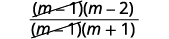
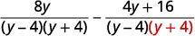
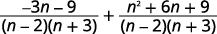
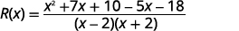

By the end of this section, you will be able to:
* Add and subtract rational expressions with a common denominator
* Add and subtract rational expressions whose denominators are opposites
* Find the least common denominator of rational expressions
* Add and subtract rational expressions with unlike denominators
* Add and subtract rational functions

Before you get started, take this readiness quiz.

1.  Add:
    <math xmlns="http://www.w3.org/1998/Math/MathML"><mrow><mfrac><mn>7</mn><mrow><mn>10</mn></mrow></mfrac><mo>+</mo><mfrac><mn>8</mn><mrow><mn>15</mn></mrow></mfrac><mo>.</mo></mrow></math>
    
    * * *
    {: data-type="newline"}
    
    If you missed this problem, review [\[link\]](/m63304#fs-id1167836553755).
2.  Subtract:
    <math xmlns="http://www.w3.org/1998/Math/MathML"><mrow><mfrac><mrow><mn>3</mn><mi>x</mi></mrow><mn>4</mn></mfrac><mo>−</mo><mfrac><mn>8</mn><mn>9</mn></mfrac><mo>.</mo></mrow></math>
    
    * * *
    {: data-type="newline"}
    
    If you missed this problem, review [\[link\]](/m63304#fs-id1167836518722).
3.  Subtract:
    <math xmlns="http://www.w3.org/1998/Math/MathML"><mrow><mn>6</mn><mrow><mo>(</mo><mrow><mn>2</mn><mi>x</mi><mo>+</mo><mn>1</mn></mrow><mo>)</mo></mrow><mo>−</mo><mn>4</mn><mrow><mo>(</mo><mrow><mi>x</mi><mo>−</mo><mn>5</mn></mrow><mo>)</mo></mrow><mo>.</mo></mrow></math>
    
    * * *
    {: data-type="newline"}
    
    If you missed this problem, review [\[link\]](/m63306#fs-id1167829791835).
{: type="1"}

### Add and Subtract Rational Expressions with a Common Denominator

What is the first step you take when you add numerical fractions? You check if they have a common denominator. If they do, you add the numerators and place the sum over the common denominator. If they do not have a common denominator, you find one before you add.

It is the same with rational expressions. To add rational expressions, they must have a common denominator. When the denominators are the same, you add the numerators and place the sum over the common denominator.

Rational Expression Addition and Subtraction

If *p*, *q*, and *r* are polynomials where <math xmlns="http://www.w3.org/1998/Math/MathML"><mrow><mi>r</mi><mo>≠</mo><mn>0</mn><mo>,</mo></mrow></math>

 then

<math xmlns="http://www.w3.org/1998/Math/MathML"><mrow><mfrac><mi>p</mi><mi>r</mi></mfrac><mo>+</mo><mfrac><mi>q</mi><mi>r</mi></mfrac><mo>=</mo><mfrac><mrow><mi>p</mi><mo>+</mo><mi>q</mi></mrow><mi>r</mi></mfrac><mspace width="1em" /><mtext>and</mtext><mspace width="1em" /><mfrac><mi>p</mi><mi>r</mi></mfrac><mo>−</mo><mfrac><mi>q</mi><mi>r</mi></mfrac><mo>=</mo><mfrac><mrow><mi>p</mi><mo>−</mo><mi>q</mi></mrow><mi>r</mi></mfrac></mrow></math>

To add or subtract rational expressions with a common denominator, add or subtract the numerators and place the result over the common denominator.

We always simplify rational expressions. Be sure to factor, if possible, after you subtract the numerators so you can identify any common factors.

Remember, too, we do not allow values that would make the denominator zero. What value of *x* should be excluded in the next example?

Add: <math xmlns="http://www.w3.org/1998/Math/MathML"><mrow><mfrac><mrow><mn>11</mn><mi>x</mi><mo>+</mo><mn>28</mn></mrow><mrow><mi>x</mi><mo>+</mo><mn>4</mn></mrow></mfrac><mo>+</mo><mfrac><mrow><msup><mi>x</mi><mn>2</mn></msup></mrow><mrow><mi>x</mi><mo>+</mo><mn>4</mn></mrow></mfrac><mo>.</mo></mrow></math>

Since the denominator is <math xmlns="http://www.w3.org/1998/Math/MathML"><mrow><mi>x</mi><mo>+</mo><mn>4</mn><mo>,</mo></mrow></math>

 we must exclude the value <math xmlns="http://www.w3.org/1998/Math/MathML"><mrow><mi>x</mi><mo>=</mo><mn>−4</mn><mo>.</mo></mrow></math>

<math xmlns="http://www.w3.org/1998/Math/MathML"><mrow><mtable> <mtr><mtd /><mtd /><mtd /><mtd columnalign="center"><mspace width="5.8em" /><mfrac><mrow><mn>11</mn><mi>x</mi><mo>+</mo><mn>28</mn></mrow><mrow><mi>x</mi><mo>+</mo><mn>4</mn></mrow></mfrac><mo>+</mo><mfrac><mrow><msup><mi>x</mi><mn>2</mn></msup></mrow><mrow><mi>x</mi><mo>+</mo><mn>4</mn></mrow></mfrac><mo>,</mo><mspace width="0.8em" /><mi>x</mi><mo>≠</mo><mtext>−</mtext><mn>4</mn></mtd></mtr> <mtr><mtd columnalign="left"><mtable><mtr><mtd columnalign="left"><mtext>The fractions have a common denominator,</mtext></mtd></mtr><mtr><mtd columnalign="left"><mtext>so add the numerators and place the sum</mtext></mtd></mtr><mtr><mtd columnalign="left"><mtext>over the common denominator.</mtext></mtd></mtr></mtable></mtd><mtd /><mtd /><mtd columnalign="center"><mspace width="2em" /><mfrac><mrow><mn>11</mn><mi>x</mi><mo>+</mo><mn>28</mn><mo>+</mo><msup><mi>x</mi><mn>2</mn></msup></mrow><mrow><mi>x</mi><mo>+</mo><mn>4</mn></mrow></mfrac></mtd></mtr> <mtr /><mtr /><mtr><mtd columnalign="left"><mtext>Write the degrees in descending order.</mtext></mtd><mtd /><mtd /><mtd columnalign="center"><mspace width="2em" /><mfrac><mrow><msup><mi>x</mi><mn>2</mn></msup><mo>+</mo><mn>11</mn><mi>x</mi><mo>+</mo><mn>28</mn></mrow><mrow><mi>x</mi><mo>+</mo><mn>4</mn></mrow></mfrac></mtd></mtr> <mtr /><mtr /><mtr><mtd columnalign="left"><mtext>Factor the numerator.</mtext></mtd><mtd /><mtd /><mtd columnalign="center"><mspace width="2em" /><mfrac><mrow><mrow><mo>(</mo><mrow><mi>x</mi><mo>+</mo><mn>4</mn></mrow><mo>)</mo></mrow><mrow><mo>(</mo><mrow><mi>x</mi><mo>+</mo><mn>7</mn></mrow><mo>)</mo></mrow></mrow><mrow><mi>x</mi><mo>+</mo><mn>4</mn></mrow></mfrac></mtd></mtr> <mtr /><mtr /><mtr><mtd columnalign="left"><mtext>Simplify by removing common factors.</mtext></mtd><mtd /><mtd /><mtd columnalign="center"><mspace width="2em" /><mfrac><mrow><menclose notation="updiagonalstrike"><mrow><mrow><mo>(</mo><mrow><mi>x</mi><mo>+</mo><mn>4</mn></mrow><mo>)</mo></mrow></mrow></menclose><mrow><mo>(</mo><mrow><mi>x</mi><mo>+</mo><mn>7</mn></mrow><mo>)</mo></mrow></mrow><mrow><menclose notation="updiagonalstrike"><mrow><mi>x</mi><mo>+</mo><mn>4</mn></mrow></menclose></mrow></mfrac></mtd></mtr> <mtr /><mtr /><mtr><mtd columnalign="left"><mtext>Simplify.</mtext></mtd><mtd /><mtd /><mtd columnalign="center"><mspace width="2em" /><mi>x</mi><mo>+</mo><mn>7</mn></mtd></mtr></mtable></mrow></math>

The expression simplifies to <math xmlns="http://www.w3.org/1998/Math/MathML"><mrow><mi>x</mi><mo>+</mo><mn>7</mn></mrow></math>

 but the original expression had a denominator of <math xmlns="http://www.w3.org/1998/Math/MathML"><mrow><mi>x</mi><mo>+</mo><mn>4</mn></mrow></math>

 so <math xmlns="http://www.w3.org/1998/Math/MathML"><mrow><mi>x</mi><mo>≠</mo><mtext>−</mtext><mn>4</mn><mo>.</mo></mrow></math>

Simplify: <math xmlns="http://www.w3.org/1998/Math/MathML"><mrow><mfrac><mrow><mn>9</mn><mi>x</mi><mo>+</mo><mn>14</mn></mrow><mrow><mi>x</mi><mo>+</mo><mn>7</mn></mrow></mfrac><mo>+</mo><mfrac><mrow><msup><mi>x</mi><mn>2</mn></msup></mrow><mrow><mi>x</mi><mo>+</mo><mn>7</mn></mrow></mfrac><mo>.</mo></mrow></math>

<math xmlns="http://www.w3.org/1998/Math/MathML"><mrow><mi>x</mi><mo>+</mo><mn>2</mn></mrow></math>

Simplify: <math xmlns="http://www.w3.org/1998/Math/MathML"><mrow><mfrac><mrow><msup><mi>x</mi><mn>2</mn></msup><mo>+</mo><mn>8</mn><mi>x</mi></mrow><mrow><mi>x</mi><mo>+</mo><mn>5</mn></mrow></mfrac><mo>+</mo><mfrac><mrow><mn>15</mn></mrow><mrow><mi>x</mi><mo>+</mo><mn>5</mn></mrow></mfrac><mo>.</mo></mrow></math>

<math xmlns="http://www.w3.org/1998/Math/MathML"><mrow><mi>x</mi><mo>+</mo><mn>3</mn></mrow></math>

To subtract rational expressions, they must also have a common denominator. When the denominators are the same, you subtract the numerators and place the difference over the common denominator. Be careful of the signs when you subtract a binomial or trinomial.

Subtract: <math xmlns="http://www.w3.org/1998/Math/MathML"><mrow><mfrac><mrow><mn>5</mn><msup><mi>x</mi><mn>2</mn></msup><mo>−</mo><mn>7</mn><mi>x</mi><mo>+</mo><mn>3</mn></mrow><mrow><msup><mi>x</mi><mn>2</mn></msup><mo>−</mo><mn>3</mn><mi>x</mi><mo>+</mo><mn>18</mn></mrow></mfrac><mo>−</mo><mfrac><mrow><mn>4</mn><msup><mi>x</mi><mn>2</mn></msup><mo>+</mo><mi>x</mi><mo>−</mo><mn>9</mn></mrow><mrow><msup><mi>x</mi><mn>2</mn></msup><mo>−</mo><mn>3</mn><mi>x</mi><mo>+</mo><mn>18</mn></mrow></mfrac><mo>.</mo></mrow></math>

<math xmlns="http://www.w3.org/1998/Math/MathML"><mrow><mtable> <mtr><mtd /><mtd /><mtd /><mtd columnalign="center"><mspace width="2em" /><mfrac><mrow><mn>5</mn><msup><mi>x</mi><mn>2</mn></msup><mo>−</mo><mn>7</mn><mi>x</mi><mo>+</mo><mn>3</mn></mrow><mrow><msup><mi>x</mi><mn>2</mn></msup><mo>−</mo><mn>3</mn><mi>x</mi><mo>+</mo><mn>18</mn></mrow></mfrac><mo>−</mo><mfrac><mrow><mn>4</mn><msup><mi>x</mi><mn>2</mn></msup><mo>+</mo><mi>x</mi><mo>−</mo><mn>9</mn></mrow><mrow><msup><mi>x</mi><mn>2</mn></msup><mo>−</mo><mn>3</mn><mi>x</mi><mo>+</mo><mn>18</mn></mrow></mfrac></mtd></mtr><mtr /><mtr /> <mtr><mtd columnalign="left"><mtable><mtr><mtd columnalign="left"><mtext>Subtract the numerators and place the</mtext></mtd></mtr><mtr><mtd columnalign="left"><mtext>difference over the common denominator.</mtext></mtd></mtr></mtable></mtd><mtd /><mtd /><mtd columnalign="center"><mspace width="2em" /><mfrac><mrow><mn>5</mn><msup><mi>x</mi><mn>2</mn></msup><mo>−</mo><mn>7</mn><mi>x</mi><mo>+</mo><mn>3</mn><mo>−</mo><mrow><mo>(</mo><mrow><mn>4</mn><msup><mi>x</mi><mn>2</mn></msup><mo>+</mo><mi>x</mi><mo>−</mo><mn>9</mn></mrow><mo>)</mo></mrow></mrow><mrow><msup><mi>x</mi><mn>2</mn></msup><mo>−</mo><mn>3</mn><mi>x</mi><mo>+</mo><mn>18</mn></mrow></mfrac></mtd></mtr><mtr /><mtr /> <mtr><mtd columnalign="left"><mtext>Distribute the sign in the numerator.</mtext></mtd><mtd /><mtd /><mtd columnalign="center"><mspace width="2em" /><mfrac><mrow><mn>5</mn><msup><mi>x</mi><mn>2</mn></msup><mo>−</mo><mn>7</mn><mi>x</mi><mo>+</mo><mn>3</mn><mo>−</mo><mn>4</mn><msup><mi>x</mi><mn>2</mn></msup><mo>−</mo><mi>x</mi><mo>+</mo><mn>9</mn></mrow><mrow><msup><mi>x</mi><mn>2</mn></msup><mo>−</mo><mn>3</mn><mi>x</mi><mo>−</mo><mn>18</mn></mrow></mfrac></mtd></mtr><mtr /><mtr /> <mtr><mtd columnalign="left"><mtext>Combine like terms.</mtext></mtd><mtd /><mtd /><mtd columnalign="center"><mspace width="2em" /><mfrac><mrow><msup><mi>x</mi><mn>2</mn></msup><mo>−</mo><mn>8</mn><mi>x</mi><mo>+</mo><mn>12</mn></mrow><mrow><msup><mi>x</mi><mn>2</mn></msup><mo>−</mo><mn>3</mn><mi>x</mi><mo>−</mo><mn>18</mn></mrow></mfrac></mtd></mtr><mtr /><mtr /> <mtr><mtd columnalign="left"><mtext>Factor the numerator and the denominator.</mtext></mtd><mtd /><mtd /><mtd columnalign="center"><mspace width="2em" /><mfrac><mrow><mrow><mo>(</mo><mrow><mi>x</mi><mo>−</mo><mn>2</mn></mrow><mo>)</mo></mrow><mrow><mo>(</mo><mrow><mi>x</mi><mo>−</mo><mn>6</mn></mrow><mo>)</mo></mrow></mrow><mrow><mrow><mo>(</mo><mrow><mi>x</mi><mo>+</mo><mn>3</mn></mrow><mo>)</mo></mrow><mrow><mo>(</mo><mrow><mi>x</mi><mo>−</mo><mn>6</mn></mrow><mo>)</mo></mrow></mrow></mfrac></mtd></mtr><mtr /><mtr /> <mtr><mtd columnalign="left"><mtext>Simplify by removing common factors.</mtext></mtd><mtd /><mtd /><mtd columnalign="center"><mspace width="2em" /><mfrac><mrow><mrow><mo>(</mo><mrow><mi>x</mi><mo>−</mo><mn>2</mn></mrow><mo>)</mo></mrow><menclose notation="updiagonalstrike"><mrow><mrow><mo>(</mo><mrow><mi>x</mi><mo>−</mo><mn>6</mn></mrow><mo>)</mo></mrow></mrow></menclose></mrow><mrow><mrow><mo>(</mo><mrow><mi>x</mi><mo>+</mo><mn>3</mn></mrow><mo>)</mo></mrow><menclose notation="updiagonalstrike"><mrow><mrow><mo>(</mo><mrow><mi>x</mi><mo>−</mo><mn>6</mn></mrow><mo>)</mo></mrow></mrow></menclose></mrow></mfrac></mtd></mtr><mtr /><mtr /> <mtr><mtd /><mtd /><mtd /><mtd columnalign="center"><mspace width="2em" /><mfrac><mrow><mrow><mo>(</mo><mrow><mi>x</mi><mo>−</mo><mn>2</mn></mrow><mo>)</mo></mrow></mrow><mrow><mrow><mo>(</mo><mrow><mi>x</mi><mo>+</mo><mn>3</mn></mrow><mo>)</mo></mrow></mrow></mfrac></mtd></mtr></mtable></mrow></math>

Subtract: <math xmlns="http://www.w3.org/1998/Math/MathML"><mrow><mfrac><mrow><mn>4</mn><msup><mi>x</mi><mn>2</mn></msup><mo>−</mo><mn>11</mn><mi>x</mi><mo>+</mo><mn>8</mn></mrow><mrow><msup><mi>x</mi><mn>2</mn></msup><mo>−</mo><mn>3</mn><mi>x</mi><mo>+</mo><mn>2</mn></mrow></mfrac><mo>−</mo><mfrac><mrow><mn>3</mn><msup><mi>x</mi><mn>2</mn></msup><mo>+</mo><mi>x</mi><mo>−</mo><mn>3</mn></mrow><mrow><msup><mi>x</mi><mn>2</mn></msup><mo>−</mo><mn>3</mn><mi>x</mi><mo>+</mo><mn>2</mn></mrow></mfrac><mo>.</mo></mrow></math>

<math xmlns="http://www.w3.org/1998/Math/MathML"><mrow><mfrac><mrow><mi>x</mi><mo>−</mo><mn>11</mn></mrow><mrow><mi>x</mi><mo>−</mo><mn>2</mn></mrow></mfrac></mrow></math>

Subtract: <math xmlns="http://www.w3.org/1998/Math/MathML"><mrow><mfrac><mrow><mn>6</mn><msup><mi>x</mi><mn>2</mn></msup><mo>−</mo><mi>x</mi><mo>+</mo><mn>20</mn></mrow><mrow><msup><mi>x</mi><mn>2</mn></msup><mo>−</mo><mn>81</mn></mrow></mfrac><mo>−</mo><mfrac><mrow><mn>5</mn><msup><mi>x</mi><mn>2</mn></msup><mo>+</mo><mn>11</mn><mi>x</mi><mo>−</mo><mn>7</mn></mrow><mrow><msup><mi>x</mi><mn>2</mn></msup><mo>−</mo><mn>81</mn></mrow></mfrac><mo>.</mo></mrow></math>

<math xmlns="http://www.w3.org/1998/Math/MathML"><mrow><mfrac><mrow><mi>x</mi><mo>−</mo><mn>3</mn></mrow><mrow><mi>x</mi><mo>+</mo><mn>9</mn></mrow></mfrac></mrow></math>

### Add and Subtract Rational Expressions Whose Denominators are Opposites

When the denominators of two rational expressions are opposites, it is easy to get a common denominator. We just have to multiply one of the fractions by <math xmlns="http://www.w3.org/1998/Math/MathML"><mrow><mfrac><mrow><mn>−1</mn></mrow><mrow><mn>−1</mn></mrow></mfrac><mo>.</mo></mrow></math>

Let’s see how this works.

|  |  |
{: valign="top"}| Multiply the second fraction by <math xmlns="http://www.w3.org/1998/Math/MathML"><mrow><mfrac><mrow><mn>−1</mn></mrow><mrow><mn>−1</mn></mrow></mfrac><mo>.</mo></mrow></math>

 |  |
{: valign="top"}| The denominators are the same. |  |
{: valign="top"}| Simplify. |  |
{: valign="top"}{: .unnumbered .unstyled summary="7 divided by d plus 5 divided by negative d. Multiply 5 divided by d times the fraction, negative 1 over negative 1. The result is 7 divided by d plus the quantity negative 1 times 5 all divided by the quantity negative 1times negative d. Notice that the denominators are the same. The denominators are d. 7 divided by d plus negative 5 divided by d. Simplify by adding the numerators. The result is 2 divided by d." data-label=""}

Be careful with the signs as you work with the opposites when the fractions are being subtracted.

Subtract: <math xmlns="http://www.w3.org/1998/Math/MathML"><mrow><mfrac><mrow><msup><mi>m</mi><mn>2</mn></msup><mo>−</mo><mn>6</mn><mi>m</mi></mrow><mrow><msup><mi>m</mi><mn>2</mn></msup><mo>−</mo><mn>1</mn></mrow></mfrac><mo>−</mo><mfrac><mrow><mn>3</mn><mi>m</mi><mo>+</mo><mn>2</mn></mrow><mrow><mn>1</mn><mo>−</mo><msup><mi>m</mi><mn>2</mn></msup></mrow></mfrac><mo>.</mo></mrow></math>

<table class="unnumbered unstyled can-break" summary="The rational expression the quantity m squared minus 6 divided by the quantity m squared minus 1 minus the rational expression the quantity 3 m plus 2 divided by the quantity 1 minus m squared. The denominators m squared minus 1 and 1 minus m squared are opposites so multiply the second rational expression by negative 1 over negative 1. The result is the quantity m squared minus 6 divided by the quantity m squared minus 1 minus negative 1 times the quantity 3 m plus 2 divided by negative 1 times the quantity 1 minus m squared. Simplify the second rational expression. The result is the rational expression, the quantity m squared minus 6 divided by the quantity m squared minus 1 minus the rational expression, the quantity negative 3 m minus 2 divided by the quantity m squared minus 1. The denominators of both rational expressions are the same, m squared minus 1, so subtract the numerators. The result is m squared minus 6 m minus the quantity negative 3 m minus 2 all divided by the quantity m squared minus 1. Combine the like terms in the numerator. The result is the quantity m squared minus 3 m plus 2 all divided by m squared minus 1. The numerator, the quantity m squared minus 3 m plus 2, factors into the quantity m minus 1 times the quantity m minus 2, and the denominator, m squared minus 1, factors into the quantity m minus 1 times the quantity m plus 1. The result is the quantity m minus 1 times the quantity m minus 2 all divided by the quantity m minus 1 times the quantity m plus 1. Simplify the expression by removing the common factor, m minus 1, from the numerator and denominator. The result is the quantity m minus 2 divided by the quantity m plus 1." data-label=""><tbody>
<tr valign="top">
<td data-valign="top" data-align="left" />
<td data-valign="top" data-align="center"></td>
</tr>
<tr valign="top">
<td data-valign="top" data-align="left">The denominators are opposites, so multiply the
second fraction by <math xmlns="http://www.w3.org/1998/Math/MathML"><mrow><mfrac><mrow><mn>−1</mn></mrow><mrow><mn>−1</mn></mrow></mfrac><mo>.</mo></mrow></math></td>
<td data-valign="top" data-align="center"></td>
</tr>
<tr valign="top">
<td data-valign="top" data-align="left">Simplify the second fraction.</td>
<td data-valign="top" data-align="center"></td>
</tr>
<tr valign="top">
<td data-valign="top" data-align="left">The denominators are the same. Subtract the numerators.</td>
<td data-valign="top" data-align="center"></td>
</tr>
<tr valign="top">
<td data-valign="top" data-align="left">Distribute.</td>
<td data-valign="top" data-align="center"></td>
</tr>
<tr valign="top">
<td data-valign="top" data-align="left">Combine like terms.</td>
<td data-valign="top" data-align="center"></td>
</tr>
<tr valign="top">
<td data-valign="top" data-align="left">Factor the numerator and denominator.</td>
<td data-valign="top" data-align="center"></td>
</tr>
<tr valign="top">
<td data-valign="top" data-align="left">Simplify by removing common factors.</td>
<td data-valign="top" data-align="center"></td>
</tr>
<tr valign="top">
<td data-valign="top" data-align="left">Simplify.</td>
<td data-valign="top" data-align="center"></td>
</tr>
</tbody></table>

Subtract: <math xmlns="http://www.w3.org/1998/Math/MathML"><mrow><mfrac><mrow><msup><mi>y</mi><mn>2</mn></msup><mo>−</mo><mn>5</mn><mi>y</mi></mrow><mrow><msup><mi>y</mi><mn>2</mn></msup><mo>−</mo><mn>4</mn></mrow></mfrac><mo>−</mo><mfrac><mrow><mn>6</mn><mi>y</mi><mo>−</mo><mn>6</mn></mrow><mrow><mn>4</mn><mo>−</mo><msup><mi>y</mi><mn>2</mn></msup></mrow></mfrac><mo>.</mo></mrow></math>

<math xmlns="http://www.w3.org/1998/Math/MathML"><mrow><mfrac><mrow><mi>y</mi><mo>+</mo><mn>3</mn></mrow><mrow><mi>y</mi><mo>+</mo><mn>2</mn></mrow></mfrac></mrow></math>

Subtract: <math xmlns="http://www.w3.org/1998/Math/MathML"><mrow><mfrac><mrow><mn>2</mn><msup><mi>n</mi><mn>2</mn></msup><mo>+</mo><mn>8</mn><mi>n</mi><mo>−</mo><mn>1</mn></mrow><mrow><msup><mi>n</mi><mn>2</mn></msup><mo>−</mo><mn>1</mn></mrow></mfrac><mo>−</mo><mfrac><mrow><msup><mi>n</mi><mn>2</mn></msup><mo>−</mo><mn>7</mn><mi>n</mi><mo>−</mo><mn>1</mn></mrow><mrow><mn>1</mn><mo>−</mo><msup><mi>n</mi><mn>2</mn></msup></mrow></mfrac><mo>.</mo></mrow></math>

<math xmlns="http://www.w3.org/1998/Math/MathML"><mrow><mfrac><mrow><mn>3</mn><mi>n</mi><mo>−</mo><mn>2</mn></mrow><mrow><mi>n</mi><mo>−</mo><mn>1</mn></mrow></mfrac></mrow></math>

### Find the Least Common Denominator of Rational Expressions

When we add or subtract rational expressions with unlike denominators, we will need to get common denominators. If we review the procedure we used with numerical fractions, we will know what to do with rational expressions.

Let’s look at this example: <math xmlns="http://www.w3.org/1998/Math/MathML"><mrow><mfrac><mn>7</mn><mrow><mn>12</mn></mrow></mfrac><mo>+</mo><mfrac><mn>5</mn><mrow><mn>18</mn></mrow></mfrac><mo>.</mo></mrow></math>

 Since the denominators are not the same, the first step was to find the least common denominator (LCD).

To find the LCD of the fractions, we factored 12 and 18 into primes, lining up any common primes in columns. Then we “brought down” one prime from each column. Finally, we multiplied the factors to find the LCD.

When we add numerical fractions, once we found the LCD, we rewrote each fraction as an equivalent fraction with the LCD by multiplying the numerator and denominator by the same number. We are now ready to add.

 ![Seven-twelfths plus five-eighteenths. Write the prime factorizations of each denominator and line up the common factors. The denominator of the first fraction is 12. The prime factorization of 12 is 2 times 2 times 3. The denominator of the second fraction is 18. The prime factorization of 18 is 2 times 3 times 3. Bringing down a factor from each column, the lowest common denominator of 12 and 18 is 2 times 2 times 3 times 3, which is 36. Write both fractions using the lowest common denominator. To do this multiply the numerator and denominator of the first fraction by 3 and multiply the numerator and denominator of the second fraction by 2. The result is 7 times 3 all divided by 12 times 3 plus 5 times 2 all divided by 18 times 2. Simplify each fraction. 7 times 3 is 21 and 12 times 3 is 36. 5 times 2 is 10 and 18 times 2 is 36. The result is twenty-one thirty-sixths plus ten thirty-sixths.](../resources/CNX_IntAlg_Figure_07_02_003_img.jpg) We do the same thing for rational expressions. However, we leave the LCD in factored form.

Find the least common denominator of rational expressions.

1.  Factor each denominator completely.
2.  List the factors of each denominator. Match factors vertically when possible.
3.  Bring down the columns by including all factors, but do not include common factors twice.
4.  Write the LCD as the product of the factors.
{: type="1" .stepwise}

Remember, we always exclude values that would make the denominator zero. What values of <math xmlns="http://www.w3.org/1998/Math/MathML"><mi>x</mi></math>

 should we exclude in this next example?

ⓐ Find the LCD for the expressions <math xmlns="http://www.w3.org/1998/Math/MathML"><mrow><mfrac><mn>8</mn><mrow><msup><mi>x</mi><mn>2</mn></msup><mo>−</mo><mn>2</mn><mi>x</mi><mo>−</mo><mn>3</mn></mrow></mfrac><mo>,</mo><mfrac><mrow><mn>3</mn><mi>x</mi></mrow><mrow><msup><mi>x</mi><mn>2</mn></msup><mo>+</mo><mn>4</mn><mi>x</mi><mo>+</mo><mn>3</mn></mrow></mfrac></mrow></math>

 and ⓑ rewrite them as equivalent rational expressions with the lowest common denominator.

ⓐ

<table class="unnumbered unstyled" summary="Find the lowest common denominator of the rational expressions 8 divided by the quantity x squared minus 2 x minus 3 and 3 x divided by the quantity x squared plus 4 x plus 3. Line up the denominators and factor them completely. Line up the common factors. The denominator x squared minus 2 x minus 3 is equal to the quantity x plus 1 times the quantity x minus 3. The denominator x squared plus 4 x plus 3 is equal to the quantity x plus 1 times the quantity x plus 3. The quantity x plus 1 is a factor of both denominators. The quantity x minus 3 is only a factor of the denominator x squared minus 2 x minus 3, so it is in a column alone. The quantity x plus 3 is only a factor of the denominator x squared plus 4 x plus 3, so it is in a column alone. The lowest common denominator is the product of the primes from each column, the quantity x plus 1 times the quantity x minus 3 times the quantity x plus 3." data-label=""><tbody>
<tr valign="top">
<td data-valign="top" data-align="left">Find the LCD for <math xmlns="http://www.w3.org/1998/Math/MathML"><mrow><mfrac><mn>8</mn><mrow><msup><mi>x</mi><mn>2</mn></msup><mo>−</mo><mn>2</mn><mi>x</mi><mo>−</mo><mn>3</mn></mrow></mfrac><mo>,</mo><mfrac><mrow><mn>3</mn><mi>x</mi></mrow><mrow><msup><mi>x</mi><mn>2</mn></msup><mo>+</mo><mn>4</mn><mi>x</mi><mo>+</mo><mn>3</mn></mrow></mfrac></mrow><mo>.</mo></math></td>
<td data-valign="top" data-align="left" />
</tr>
<tr valign="top">
<td data-valign="top" data-align="left">Factor each denominator completely, lining up common factors.

Bring down the columns.</td>
<td data-valign="top" data-align="left"></td>
</tr>
<tr valign="top">
<td data-valign="top" data-align="left">Write the LCD as the product of the factors.</td>
<td data-valign="top" data-align="left"></td>
</tr>
</tbody></table>
ⓑ

<table class="unnumbered unstyled" summary="Factor the denominators of the rational expressions, 8 divided by the quantity x squared minus 2 x minus 3 and 3 x divided by the quantity x squared plus 4 x plus 3. The denominator, x squared minus 2 x minus 3, factors into the quantity x plus 1 times the quantity x minus 3. The denominator, x squared plus 4 x plus 3, factors into the quantity x plus 1 times the quantity x plus 3. Write each rational expression with a factored denominator. The first rational expression is 8 divided by the quantity x plus 1 times the quantity x minus 3. The second rational expression is 3 x divided by the quantity x plus 1 times the quantity x plus 3. Multiply the numerator and denominator of each expression by the missing lowest common denominator factor. The results are 8 times the quantity x plus 3 all divided by the quantity x plus 1 times the quantity x minus 3 times the quantity x plus 3 and the quantity 3 x times the quantity x minus 3 all divided by the quantity x plus 1 times the quantity x plus 3 times the quantity x minus 3. Simplify the numerators of the rational expressions and keep the denominators. 8 times the quantity x plus 3 is 8 x plus 24. 3 x times the quantity x minus 3 is 3 x squared minus 9. The results are 8 times the quantity x plus 3 all divided by the quantity x plus 1 times the quantity x minus 3 times the quantity x plus 3 and the quantity 3 x squared minus 9 x all divided by the quantity x plus 1 times x plus 3 times the quantity x minus 3." data-label=""><tbody>
<tr valign="top">
<td data-valign="top" data-align="left" />
<td data-valign="top" data-align="center"></td>
</tr>
<tr valign="top">
<td data-valign="top" data-align="left">Factor each denominator.</td>
<td data-valign="top" data-align="center"></td>
</tr>
<tr valign="top">
<td data-valign="top" data-align="left">Multiply each denominator by the ‘missing’
LCD factor and multiply each numerator by the same factor.</td>
<td data-valign="top" data-align="center"></td>
</tr>
<tr valign="top">
<td data-valign="top" data-align="left">Simplify the numerators.</td>
<td data-valign="top" data-align="center"></td>
</tr>
</tbody></table>

ⓐ Find the LCD for the expressions <math xmlns="http://www.w3.org/1998/Math/MathML"><mrow><mfrac><mn>2</mn><mrow><msup><mi>x</mi><mn>2</mn></msup><mo>−</mo><mi>x</mi><mo>−</mo><mn>12</mn></mrow></mfrac><mo>,</mo><mfrac><mn>1</mn><mrow><msup><mi>x</mi><mn>2</mn></msup><mo>−</mo><mn>16</mn></mrow></mfrac></mrow></math>

 ⓑ rewrite them as equivalent rational expressions with the lowest common denominator.

ⓐ <math xmlns="http://www.w3.org/1998/Math/MathML"><mrow><mrow><mo>(</mo><mrow><mi>x</mi><mo>−</mo><mn>4</mn></mrow><mo>)</mo></mrow><mrow><mo>(</mo><mrow><mi>x</mi><mo>+</mo><mn>3</mn></mrow><mo>)</mo></mrow><mrow><mo>(</mo><mrow><mi>x</mi><mo>+</mo><mn>4</mn></mrow><mo>)</mo></mrow></mrow></math>

* * *
{: data-type="newline"}

ⓑ <math xmlns="http://www.w3.org/1998/Math/MathML"><mrow><mfrac><mrow><mn>2</mn><mi>x</mi><mo>+</mo><mn>8</mn></mrow><mrow><mrow><mo>(</mo><mrow><mi>x</mi><mo>−</mo><mn>4</mn></mrow><mo>)</mo></mrow><mrow><mo>(</mo><mrow><mi>x</mi><mo>+</mo><mn>3</mn></mrow><mo>)</mo></mrow><mrow><mo>(</mo><mrow><mi>x</mi><mo>+</mo><mn>4</mn></mrow><mo>)</mo></mrow></mrow></mfrac></mrow></math>

,* * *
{: data-type="newline"}

<math xmlns="http://www.w3.org/1998/Math/MathML"><mrow><mfrac><mrow><mi>x</mi><mo>+</mo><mn>3</mn></mrow><mrow><mrow><mo>(</mo><mrow><mi>x</mi><mo>−</mo><mn>4</mn></mrow><mo>)</mo></mrow><mrow><mo>(</mo><mrow><mi>x</mi><mo>+</mo><mn>3</mn></mrow><mo>)</mo></mrow><mrow><mo>(</mo><mrow><mi>x</mi><mo>+</mo><mn>4</mn></mrow><mo>)</mo></mrow></mrow></mfrac></mrow></math>

ⓐ Find the LCD for the expressions <math xmlns="http://www.w3.org/1998/Math/MathML"><mrow><mfrac><mrow><mn>3</mn><mi>x</mi></mrow><mrow><msup><mi>x</mi><mn>2</mn></msup><mo>−</mo><mn>3</mn><mi>x</mi><mo>+</mo><mn>10</mn></mrow></mfrac><mo>,</mo><mfrac><mn>5</mn><mrow><msup><mi>x</mi><mn>2</mn></msup><mo>+</mo><mn>3</mn><mi>x</mi><mo>+</mo><mn>2</mn></mrow></mfrac></mrow></math>

 ⓑ rewrite them as equivalent rational expressions with the lowest common denominator.

ⓐ <math xmlns="http://www.w3.org/1998/Math/MathML"><mrow><mrow><mo>(</mo><mrow><mi>x</mi><mo>+</mo><mn>2</mn></mrow><mo>)</mo></mrow><mrow><mo>(</mo><mrow><mi>x</mi><mo>−</mo><mn>5</mn></mrow><mo>)</mo></mrow><mrow><mo>(</mo><mrow><mi>x</mi><mo>+</mo><mn>1</mn></mrow><mo>)</mo></mrow></mrow></math>

* * *
{: data-type="newline"}

ⓑ <math xmlns="http://www.w3.org/1998/Math/MathML"><mrow><mfrac><mrow><mn>3</mn><msup><mi>x</mi><mn>2</mn></msup><mo>+</mo><mn>3</mn><mi>x</mi></mrow><mrow><mrow><mo>(</mo><mrow><mi>x</mi><mo>+</mo><mn>2</mn></mrow><mo>)</mo></mrow><mrow><mo>(</mo><mrow><mi>x</mi><mo>−</mo><mn>5</mn></mrow><mo>)</mo></mrow><mrow><mo>(</mo><mrow><mi>x</mi><mo>+</mo><mn>1</mn></mrow><mo>)</mo></mrow></mrow></mfrac></mrow></math>

,* * *
{: data-type="newline"}

<math xmlns="http://www.w3.org/1998/Math/MathML"><mrow><mfrac><mrow><mn>5</mn><mi>x</mi><mo>−</mo><mn>25</mn></mrow><mrow><mrow><mo>(</mo><mrow><mi>x</mi><mo>+</mo><mn>2</mn></mrow><mo>)</mo></mrow><mrow><mo>(</mo><mrow><mi>x</mi><mo>−</mo><mn>5</mn></mrow><mo>)</mo></mrow><mrow><mo>(</mo><mrow><mi>x</mi><mo>+</mo><mn>1</mn></mrow><mo>)</mo></mrow></mrow></mfrac></mrow></math>

### Add and Subtract Rational Expressions with Unlike Denominators

Now we have all the steps we need to add or subtract rational expressions with unlike denominators.

How to Add Rational Expressions with Unlike Denominators

Add: <math xmlns="http://www.w3.org/1998/Math/MathML"><mrow><mfrac><mn>3</mn><mrow><mi>x</mi><mo>−</mo><mn>3</mn></mrow></mfrac><mo>+</mo><mfrac><mn>2</mn><mrow><mi>x</mi><mo>−</mo><mn>2</mn></mrow></mfrac><mo>.</mo></mrow></math>

 ![Step 1 is to determine if the rational expressions 3 divided by the quantity x minus 3 and 2 divided by the quantity x minus 2 have a common factors. The denominators x minus 3 and x minus 2 do not have any common factors, which means the lowest common denominator of the rational expressions is the quantity x minus 3 times the quantity x minus 2. Rewrite each rational expression with the least common denominator. Multiply the numerator and denominator of 3 divided by the quantity x minus 3 by the quantity x minus 2. Multiply the numerator and denominator of 2 divided by the quantity x minus 2 by the quantity x minus 2. The result is the rational expression 3 times the quantity x minus 2 all divided by the quantity x minus 3 times the quantity x minus 2 plus the rational expression 2 times the quantity x minus 3 divided by the quantity x minus 2 times the quantity x minus 3. Simplify the numerators and keep the denominators factored. The numerator of the first rational expression, 3 times the quantity x minus 2, simplifies to 3 x minus 6. The numerator of the second rational expression, 2 times the quantity x minus 3, simplifies to 2 x minus 6. The result is the rational expression the quantity 3 x minus 6 all divided by the quantity x minus 3 times the quantity x minus 2 plus the rational expression, the quantity 2 x minus 6 all divided by the quantity x minus 3 times the quantity x minus 2.](../resources/CNX_IntAlg_Figure_07_02_006a_img.jpg)   ![Step 2 is to add or subtract the rational expressions by adding the numerators, the quantity 3 x minus 6 and the quantity 2 x minus 6, and placing the sum over the denominator, the quantity x minus 3 times the quantity x minus 2. The result is the quantity 3 x minus 6 plus 2 x minus 6 all divided by the quantity x minus 3 times the quantity x minus 2. Simplify the numerator by combining like terms. The result is the quantity 5 x minus 12 all divided by the quantity x minus 3 times the quantity x minus 2.](../resources/CNX_IntAlg_Figure_07_02_006b_img.jpg)    

Add: <math xmlns="http://www.w3.org/1998/Math/MathML"><mrow><mfrac><mn>2</mn><mrow><mi>x</mi><mo>−</mo><mn>2</mn></mrow></mfrac><mo>+</mo><mfrac><mn>5</mn><mrow><mi>x</mi><mo>+</mo><mn>3</mn></mrow></mfrac><mo>.</mo></mrow></math>

<math xmlns="http://www.w3.org/1998/Math/MathML"><mrow><mfrac><mrow><mn>7</mn><mi>x</mi><mo>−</mo><mn>4</mn></mrow><mrow><mo stretchy="false">(</mo><mi>x</mi><mo>−</mo><mn>2</mn><mo stretchy="false">)</mo><mo stretchy="false">(</mo><mi>x</mi><mo>+</mo><mn>3</mn><mo stretchy="false">)</mo></mrow></mfrac></mrow></math>

Add:<math xmlns="http://www.w3.org/1998/Math/MathML"><mrow><mfrac><mn>4</mn><mrow><mi>m</mi><mo>+</mo><mn>3</mn></mrow></mfrac><mo>+</mo><mfrac><mn>3</mn><mrow><mi>m</mi><mo>+</mo><mn>4</mn></mrow></mfrac><mo>.</mo></mrow></math>

<math xmlns="http://www.w3.org/1998/Math/MathML"><mrow><mfrac><mrow><mn>7</mn><mi>m</mi><mo>+</mo><mn>25</mn></mrow><mrow><mo stretchy="false">(</mo><mi>m</mi><mo>+</mo><mn>3</mn><mo stretchy="false">)</mo><mo stretchy="false">(</mo><mi>m</mi><mo>+</mo><mn>4</mn><mo stretchy="false">)</mo></mrow></mfrac></mrow></math>

The steps used to add rational expressions are summarized here.

Add or subtract rational expressions.

1.  Determine if the expressions have a common denominator.
    * **Yes** – go to step 2.
    * **No** – Rewrite each rational expression with the LCD.
      * Find the LCD.
      * Rewrite each rational expression as an equivalent rational expression with the LCD.
      {: data-bullet-style="bullet"}
    {: data-bullet-style="bullet"}

2.  Add or subtract the rational expressions.
3.  Simplify, if possible.
{: type="1" .stepwise}

Avoid the temptation to simplify too soon. In the example above, we must leave the first rational expression as <math xmlns="http://www.w3.org/1998/Math/MathML"><mrow><mfrac><mrow><mn>3</mn><mi>x</mi><mo>−</mo><mn>6</mn></mrow><mrow><mrow><mo>(</mo><mrow><mi>x</mi><mo>−</mo><mn>3</mn></mrow><mo>)</mo></mrow><mrow><mo>(</mo><mrow><mi>x</mi><mo>−</mo><mn>2</mn></mrow><mo>)</mo></mrow></mrow></mfrac></mrow></math>

 to be able to add it to <math xmlns="http://www.w3.org/1998/Math/MathML"><mrow><mfrac><mrow><mn>2</mn><mi>x</mi><mo>−</mo><mn>6</mn></mrow><mrow><mrow><mo>(</mo><mrow><mi>x</mi><mo>−</mo><mn>2</mn></mrow><mo>)</mo></mrow><mrow><mo>(</mo><mrow><mi>x</mi><mo>−</mo><mn>3</mn></mrow><mo>)</mo></mrow></mrow></mfrac><mo>.</mo></mrow></math>

 Simplify *only* after you have combined the numerators.

Add: <math xmlns="http://www.w3.org/1998/Math/MathML"><mrow><mfrac><mn>8</mn><mrow><msup><mi>x</mi><mn>2</mn></msup><mo>−</mo><mn>2</mn><mi>x</mi><mo>−</mo><mn>3</mn></mrow></mfrac><mo>+</mo><mfrac><mrow><mn>3</mn><mi>x</mi></mrow><mrow><msup><mi>x</mi><mn>2</mn></msup><mo>+</mo><mn>4</mn><mi>x</mi><mo>+</mo><mn>3</mn></mrow></mfrac><mo>.</mo></mrow></math>

<table class="unnumbered unstyled" summary="Add the rational expressions 8 divided by the quantity x squared minus 2 x minus 3 and 3 x divided by the quantity x squared plus 4 x plus 3. Notice the denominators x squared minus 2 x minus 3 and x squared plus 4 x plus 3 do not have a common denominator. Rewrite each rational expression using the least common denominator. To find the least common denominator, factor x squared minus 2 x minus 3 and x squared plus 4 x plus 3, lining their common factors up in columns. The denominator x squared minus 2 x minus 3 is equal to the quantity x plus 1 times the quantity x minus 3. The denominator x squared plus 4 x plus 3 is equal to the quantity x plus 1 times the quantity x plus 3. The least common denominator is the product of each factor from each column, the quantity x plus 1 times the quantity x minus 3 times the quantity x plus 3. Rewrite the rationale expression as an equivalent rational expression using the least common denominator, quantity x plus 1 times the quantity x minus 3 times the quantity x plus 3. The first denominator of the rational expression, 8 divided by the quantity x squared minus 2 x minus 3, can be factored into the quantity x plus 1 times the quantity x minus 3. Multiply the numerator and the denominator of the rational expression by the quantity x plus three to create the least common denominator. The equivalent rational expression is the quantity 8 times the quantity x plus one, divided by the quantity x plus 1 times the quantity x minus 3 times the quantity x plus 3. The first denominator of the rational expression, 3 x divided by the quantity x squared plus 4 x plus 3, can be factored into the quantity x plus 1 times the quantity x plus 3. Multiply the numerator and the denominator of the rational expression by the quantity x minus 3 to create the least common denominator. The equivalent rational expression is the quantity 3 x times the quantity x minus 1, divided by the quantity x plus 1 times the quantity x minus 3 times the quantity x plus 3. Simplify the numerators. The numerator 8 times the quantity x plus 1 can be simplified to 8 x plus 24. The numerator 3 x times the quantity x minus 1 can be simplified to 3 x squared minus 9 x. Now add the rational expression 8 x plus 24 divided by the quantity x plus 1 times the quantity x minus 3 times the quantity x plus 3 and the rational expression 3 x squared minus 9 x divided by the quantity x plus 1 times the quantity x minus 3 times the quantity x plus 3. The result is the quantity 8 x plus the quantity 24 plus the quantity 3 x squared minus the quantity 9 x, divided by the quantity x plus 1 times the quantity x minus 3 times the quantity x plus 3. Simplify the numerator by combining like terms. The result is the quantity 3 x squared minus the quantity x plus the quantity 24, divided by the quantity x plus 1 times the quantity x minus 3 times the quantity x plus 3. The numerator is prime, so there are no common factors." data-label=""><tbody>
<tr valign="top">
<td data-valign="top" data-align="left" />
<td data-valign="top" data-align="center"></td>
</tr>
<tr valign="top">
<td data-valign="top" data-align="left">Do the expressions have a common denominator?</td>
<td data-valign="top" data-align="center">No.</td>
</tr>
<tr valign="top">
<td data-valign="top" data-align="left">Rewrite each expression with the LCD.</td>
<td data-valign="top" data-align="left" />
</tr>
<tr valign="top">
<td data-valign="top" data-align="left"><math xmlns="http://www.w3.org/1998/Math/MathML"><mtable><mtr /><mtr /><mtr><mtd columnalign="left"><mtext>Find the LCD.</mtext></mtd><mtd /><mtd /><mtd columnalign="left"><mtable><mtr><mtd columnalign="left"><mspace width="1.3em" /><msup><mi>x</mi><mn>2</mn></msup><mo>−</mo><mn>2</mn><mi>x</mi><mo>−</mo><mn>3</mn><mo>=</mo><mrow><mo>(</mo><mrow><mi>x</mi><mo>+</mo><mn>1</mn></mrow><mo>)</mo></mrow><mrow><mo>(</mo><mrow><mi>x</mi><mo>−</mo><mn>3</mn></mrow><mo>)</mo></mrow></mtd></mtr><mtr><mtd columnalign="left"><munder accentunder="true"><mrow><msup><mi>x</mi><mn>2</mn></msup><mo>+</mo><mn>4</mn><mi>x</mi><mo>+</mo><mn>3</mn><mo>=</mo><mrow><mo>(</mo><mrow><mi>x</mi><mo>+</mo><mn>1</mn></mrow><mo>)</mo></mrow><mspace width="1em" /><mrow><mo>(</mo><mrow><mi>x</mi><mo>+</mo><mn>3</mn></mrow><mo>)</mo></mrow></mrow><mo stretchy="true">\_\_\_\_\_\_\_\_\_\_\_\_\_\_\_\_\_\_\_\_\_\_\_\_\_\_\_\_\_\_</mo></munder><mspace width="1em" /></mtd></mtr><mtr><mtd><mrow /></mtd></mtr><mtr><mtd columnalign="left"><mspace width="3.75em" /><mtext>LCD</mtext><mspace width="0.2em" /><mo>=</mo><mrow><mo>(</mo><mrow><mi>x</mi><mo>+</mo><mn>1</mn></mrow><mo>)</mo></mrow><mrow><mo>(</mo><mrow><mi>x</mi><mo>−</mo><mn>3</mn></mrow><mo>)</mo></mrow><mrow><mo>(</mo><mrow><mi>x</mi><mo>+</mo><mn>3</mn></mrow><mo>)</mo></mrow></mtd></mtr></mtable></mtd></mtr></mtable></math></td>
<td data-valign="top" data-align="left" />
</tr>
<tr valign="top">
<td data-valign="top" data-align="left">Rewrite each rational expression as an
equivalent rational expression with the LCD.</td>
<td data-valign="top" data-align="center"></td>
</tr>
<tr valign="top">
<td data-valign="top" data-align="left">Simplify the numerators.</td>
<td data-valign="top" data-align="center"></td>
</tr>
<tr valign="top">
<td data-valign="top" data-align="left">Add the rational expressions.</td>
<td data-valign="top" data-align="center"></td>
</tr>
<tr valign="top">
<td data-valign="top" data-align="left">Simplify the numerator.</td>
<td data-valign="top" data-align="center"></td>
</tr>
<tr valign="top">
<td data-valign="top" data-align="left" />
<td data-valign="top" data-align="left">The numerator is prime, so there are
no common factors.</td>
</tr>
</tbody></table>

Add: <math xmlns="http://www.w3.org/1998/Math/MathML"><mrow><mfrac><mn>1</mn><mrow><msup><mi>m</mi><mn>2</mn></msup><mo>−</mo><mi>m</mi><mo>−</mo><mn>2</mn></mrow></mfrac><mo>+</mo><mfrac><mrow><mn>5</mn><mi>m</mi></mrow><mrow><msup><mi>m</mi><mn>2</mn></msup><mo>+</mo><mn>3</mn><mi>m</mi><mo>+</mo><mn>2</mn></mrow></mfrac><mo>.</mo></mrow></math>

<math xmlns="http://www.w3.org/1998/Math/MathML"><mrow><mfrac><mrow><mn>5</mn><msup><mi>m</mi><mn>2</mn></msup><mo>−</mo><mn>9</mn><mi>m</mi><mo>+</mo><mn>2</mn></mrow><mrow><mo stretchy="false">(</mo><mi>m</mi><mo>+</mo><mn>1</mn><mo stretchy="false">)</mo><mo stretchy="false">(</mo><mi>m</mi><mo>−</mo><mn>2</mn><mo stretchy="false">)</mo><mo stretchy="false">(</mo><mi>m</mi><mo>+</mo><mn>2</mn><mo stretchy="false">)</mo></mrow></mfrac></mrow></math>

Add:<math xmlns="http://www.w3.org/1998/Math/MathML"><mrow><mfrac><mrow><mn>2</mn><mi>n</mi></mrow><mrow><msup><mi>n</mi><mn>2</mn></msup><mo>−</mo><mn>3</mn><mi>n</mi><mo>−</mo><mn>10</mn></mrow></mfrac><mo>+</mo><mfrac><mn>6</mn><mrow><msup><mi>n</mi><mn>2</mn></msup><mo>+</mo><mn>5</mn><mi>n</mi><mo>+</mo><mn>6</mn></mrow></mfrac><mo>.</mo></mrow></math>

<math xmlns="http://www.w3.org/1998/Math/MathML"><mrow><mfrac><mrow><mn>2</mn><msup><mi>n</mi><mn>2</mn></msup><mo>+</mo><mn>12</mn><mi>n</mi><mo>−</mo><mn>30</mn></mrow><mrow><mo stretchy="false">(</mo><mi>n</mi><mo>+</mo><mn>2</mn><mo stretchy="false">)</mo><mo stretchy="false">(</mo><mi>n</mi><mo>−</mo><mn>5</mn><mo stretchy="false">)</mo><mo stretchy="false">(</mo><mi>n</mi><mo>+</mo><mn>3</mn><mo stretchy="false">)</mo></mrow></mfrac></mrow></math>

The process we use to subtract rational expressions with different denominators is the same as for addition. We just have to be very careful of the signs when subtracting the numerators.

Subtract: <math xmlns="http://www.w3.org/1998/Math/MathML"><mrow><mfrac><mrow><mn>8</mn><mi>y</mi></mrow><mrow><msup><mi>y</mi><mn>2</mn></msup><mo>−</mo><mn>16</mn></mrow></mfrac><mo>−</mo><mfrac><mn>4</mn><mrow><mi>y</mi><mo>−</mo><mn>4</mn></mrow></mfrac><mo>.</mo></mrow></math>

<table class="unnumbered unstyled" summary="Subtract the rational expressions 8y divided by the quantity y squared minus 16 and 4 divided by the quantity y minus 4. Notice the denominators y squared minus 16 and y minus 4 do not have a common denominator. Rewrite each rational expression using the least common denominator. To find the least common denominator, factor y squared minus 16 and y minus 4, lining their common factors up in columns. The denominator y squared minus 16 is equal to the quantity y minus 4 times the quantity y plus 4. The denominator y minus 4 cannot be factored. The least common denominator is the product of each factor from each column, the quantity y minus 4 times the quantity y plus 4. Rewrite the rationale expression as an equivalent rational expression using the least common denominator, the quantity y minus 4 times the quantity y plus 4. The first denominator of the rational expression, the quantity 8 y divided by the quantity y squared minus 16 minus 4 divided by the quantity y plus 4, can be factored into the quantity y minus 4 times the quantity y plus 4, which is the least common denominator. The equivalent rational expression for 8 y divided by the quantity y squared minus 16 is 8 y divided by the quantity y minus 4 times the quantity y plus 4. Multiply the numerator and the denominator of the rational expression, 4 divided by the quantity y minus 4, by y plus 4 to write its equivalent rational expression. The result is 4 times the quantity y plus 4 all divided by the quantity y minus 4 times the quantity y plus 4. Simplify the numerators. Notice that the numerator of 8 y divided by the quantity y minus 4 times the quantity y plus 4 is already simplified. The numerator 4 times the quantity y plus 4 can be simplified to 4 y plus 16. Now subtract the rational expressions, 8 y divided by the quantity y minus 4 times the quantity y plus 4 and the quantity 4 y plus 16 all divided by the quantity y minus 4 times the quantity y plus 4. The result is the quantity 8 y minus 4 y minus 16 all divided by the quantity y minus 4 times the quantity y plus 4. Simplify the numerator by combining like terms. The result is the quantity 4 y minus 16 all divided by the quantity y minus 4 times the quantity y plus 4. Factor the numerator, 4 y minus 16, to look for common factors. 4 y minus 16 factors into 4 times the quantity y minus 4. Notice that y minus 4 is a common factor in the numerator and denominator so it can be removed. Once simplified, the result is 4 divided by the quantity y plus 4." data-label=""><tbody>
<tr valign="top">
<td data-valign="top" data-align="left" />
<td data-valign="top" data-align="left"></td>
</tr>
<tr valign="top">
<td data-valign="top" data-align="left">Do the expressions have a common denominator?</td>
<td data-valign="top" data-align="center">No.</td>
</tr>
<tr valign="top">
<td data-valign="top" data-align="left">Rewrite each expression with the LCD.</td>
<td data-valign="top" data-align="left" />
</tr>
<tr valign="top">
<td data-valign="top" data-align="left"><math xmlns="http://www.w3.org/1998/Math/MathML"><mtable><mtr><mtd columnalign="left"><mtext>Find the LCD.</mtext></mtd><mtd /><mtd /><mtd columnalign="left"><mtable><mtr><mtd columnalign="left"><msup><mi>y</mi><mn>2</mn></msup><mo>−</mo><mn>16</mn><mo>=</mo><mrow><mo>(</mo><mrow><mi>y</mi><mo>−</mo><mn>4</mn></mrow><mo>)</mo></mrow><mrow><mo>(</mo><mrow><mi>y</mi><mo>+</mo><mn>4</mn></mrow><mo>)</mo></mrow></mtd></mtr><mtr><mtd columnalign="left"><mspace width="0.55em" /><munder accentunder="true"><mrow><mtext>​</mtext><mi>y</mi><mo>−</mo><mn>4</mn><mspace width="0.2em" /><mo>=</mo><mi>y</mi><mo>−</mo><mn>4</mn></mrow><mo stretchy="true">\_\_\_\_\_\_\_\_\_\_\_\_</mo></munder></mtd></mtr><mtr><mtd columnalign="left"><mspace width="0.55em" /><mtext>LCD</mtext><mspace width="0.5em" /><mo>=</mo><mrow><mo>(</mo><mrow><mi>y</mi><mo>−</mo><mn>4</mn></mrow><mo>)</mo></mrow><mrow><mo>(</mo><mrow><mi>y</mi><mo>+</mo><mn>4</mn></mrow><mo>)</mo></mrow></mtd></mtr></mtable></mtd></mtr></mtable></math></td>
<td data-valign="top" data-align="left" />
</tr>
<tr valign="top">
<td data-valign="top" data-align="left">Rewrite each rational expression as an
equivalent rational expression with the LCD.</td>
<td data-valign="top" data-align="left"></td>
</tr>
<tr valign="top">
<td data-valign="top" data-align="left">Simplify the numerators.</td>
<td data-valign="top" data-align="left"></td>
</tr>
<tr valign="top">
<td data-valign="top" data-align="left">Subtract the rational expressions.</td>
<td data-valign="top" data-align="left"></td>
</tr>
<tr valign="top">
<td data-valign="top" data-align="left">Simplify the numerator.</td>
<td data-valign="top" data-align="left"></td>
</tr>
<tr valign="top">
<td data-valign="top" data-align="left">Factor the numerator to look for common factors.</td>
<td data-valign="top" data-align="left"></td>
</tr>
<tr valign="top">
<td data-valign="top" data-align="left">Remove common factors</td>
<td data-valign="top" data-align="left"></td>
</tr>
<tr valign="top">
<td data-valign="top" data-align="left">Simplify.</td>
<td data-valign="top" data-align="left"></td>
</tr>
</tbody></table>

Subtract: <math xmlns="http://www.w3.org/1998/Math/MathML"><mrow><mfrac><mrow><mn>2</mn><mi>x</mi></mrow><mrow><msup><mi>x</mi><mn>2</mn></msup><mo>−</mo><mn>4</mn></mrow></mfrac><mo>−</mo><mfrac><mn>1</mn><mrow><mi>x</mi><mo>+</mo><mn>2</mn></mrow></mfrac><mo>.</mo></mrow></math>

<math xmlns="http://www.w3.org/1998/Math/MathML"><mrow><mfrac><mn>1</mn><mrow><mi>x</mi><mo>−</mo><mn>2</mn></mrow></mfrac></mrow></math>

Subtract: <math xmlns="http://www.w3.org/1998/Math/MathML"><mrow><mfrac><mn>3</mn><mrow><mi>z</mi><mo>+</mo><mn>3</mn></mrow></mfrac><mo>−</mo><mfrac><mrow><mn>6</mn><mi>z</mi></mrow><mrow><msup><mi>z</mi><mn>2</mn></msup><mo>−</mo><mn>9</mn></mrow></mfrac><mo>.</mo></mrow></math>

<math xmlns="http://www.w3.org/1998/Math/MathML"><mrow><mfrac><mrow><mn>−3</mn></mrow><mrow><mi>z</mi><mo>−</mo><mn>3</mn></mrow></mfrac></mrow></math>

There are lots of negative signs in the next example. Be extra careful.

Subtract:<math xmlns="http://www.w3.org/1998/Math/MathML"><mrow><mfrac><mrow><mn>−3</mn><mi>n</mi><mo>−</mo><mn>9</mn></mrow><mrow><msup><mi>n</mi><mn>2</mn></msup><mo>+</mo><mi>n</mi><mo>−</mo><mn>6</mn></mrow></mfrac><mo>−</mo><mfrac><mrow><mi>n</mi><mo>+</mo><mn>3</mn></mrow><mrow><mn>2</mn><mo>−</mo><mi>n</mi></mrow></mfrac><mo>.</mo></mrow></math>

<table class="unnumbered unstyled" summary="Subtract the rational expressions the quantity negative 3 n minus 9 all divided by the quantity n squared plus n minus 6 and the quantity n plus 3 divided by the quantity 2 minus n. Factor the denominator of the first rational expression, n squared plus n minus 6. The result is the quantity negative 3 n minus 9 all divided by the quantity n minus 2 times the quantity n plus 3 minus the quantity n plus 3 divided by the quantity 2 minus n. Notice that n minus 2 and 2 minus n are opposites. Multiply the numerator and denominator of the second rational expression, n plus 3 divided by the quantity 2 minus n, by negative 1. Write its denominator, negative 1 times the quantity 2 minus n, as n minus 2. The result is the quantity negative 3 n minus 9 all divided by the quantity n minus 2 times the quantity n plus 3 minus negative one times the quantity n plus 3 all divided by n minus 2. Simplify the numerator of the second rational expression, remembering that a minus negative b is a plus b. Write the numerator, negative times the quantity n plus 3, as n plus 3. The result is the quantity negative 3 n minus 9 all divided by the quantity n minus 2 times the quantity n plus 3 minus the quantity n plus 3 all divided by n minus 2. Notice that the denominators do not have any common factors. Find the lowest common denominator. The denominator, n squared plus n minus 6, factors into the quantity n minus 2 times the quantity n plus 3. The denominator, n minus 2, cannot be factored. Line the denominators up by common factors. The least common denominator is the product of a factor from each column, the quantity n minus 2 times the quantity n plus 3. Rewrite each rational expression as an equivalent rational expression using the lowest common denominator. The first rational expression, the quantity negative 3 n minus 9 all divided by the quantity n minus 2 times the quantity n plus 3 , is already written using the LCD. Multiply the numerator and denominator of the second rational expression, the quantity n plus 3 divided by the quantity n plus 2, by n plus 3. Simplify the numerators. The result is the quantity negative 3 n minus 9 all divided by the quantity n minus 2 times the quantity n plus 3 minus the quantity n squared plus 6 n plus 9 all divided by the quantity n minus 2 times the quantity n plus 3. Add the rational expressions. The result is the quantity negative 3 n minus 9 plus n squared plus 6 n plus 9 all divided by the quantity n minus 2 times the quantity n plus 3. Simplify the numerator by combining like terms. The result is the quantity n squared plus 3 n all divided by the quantity n minus 2 times the quantity n plus 3. Factoring the numerator, results in n times the quantity n plus 3 all divided by the quantity n minus 2 times the quantity n plus 3. Notice that n plus 3 is a common factor in the numerator and denominator. Remove it and simplify. The result is n divided by the quantity n minus 2." data-label=""><tbody>
<tr valign="top">
<td data-valign="top" data-align="left" />
<td data-valign="top" data-align="left"></td>
</tr>
<tr valign="top">
<td data-valign="top" data-align="left">Factor the denominator.</td>
<td data-valign="top" data-align="left"></td>
</tr>
<tr valign="top">
<td data-valign="top" data-align="left">Since <math xmlns="http://www.w3.org/1998/Math/MathML"><mrow><mi>n</mi><mo>−</mo><mn>2</mn></mrow></math> and <math xmlns="http://www.w3.org/1998/Math/MathML"><mrow><mn>2</mn><mo>−</mo><mi>n</mi></mrow></math> are opposites, we will
multiply the second rational expression by <math xmlns="http://www.w3.org/1998/Math/MathML"><mrow><mfrac><mrow><mn>−1</mn></mrow><mrow><mn>−1</mn></mrow></mfrac><mo>.</mo></mrow></math></td>
<td data-valign="top" data-align="left"></td>
</tr>
<tr valign="top">
<td data-valign="top" data-align="left"></td>
<td data-valign="top" data-align="left"></td>
</tr>
<tr valign="top">
<td data-valign="top" data-align="left">Simplify. Remember, <math xmlns="http://www.w3.org/1998/Math/MathML"><mrow><mi>a</mi><mo>−</mo><mo stretchy="false">(</mo><mtext>−</mtext><mi>b</mi><mo stretchy="false">)</mo><mo>=</mo><mi>a</mi><mo>+</mo><mi>b</mi><mo>.</mo></mrow></math></td>
<td data-valign="top" data-align="left"></td>
</tr>
<tr valign="top">
<td data-valign="top" data-align="left">Do the rational expressions have a
common denominator? No.</td>
<td data-valign="top" data-align="left" />
</tr>
<tr valign="top">
<td data-valign="top" data-align="left"><math xmlns="http://www.w3.org/1998/Math/MathML"><mtable><mtr><mtd columnalign="left"><mtext>Find the LCD.</mtext></mtd><mtd /><mtd /><mtd columnalign="left"><mtable><mtr><mtd columnalign="left"><msup><mi>n</mi><mn>2</mn></msup><mo>+</mo><mi>n</mi><mo>−</mo><mn>6</mn><mo>=</mo><mrow><mo>(</mo><mrow><mi>n</mi><mo>−</mo><mn>2</mn></mrow><mo>)</mo></mrow><mrow><mo>(</mo><mrow><mi>n</mi><mo>+</mo><mn>3</mn></mrow><mo>)</mo></mrow></mtd></mtr><mtr><mtd columnalign="left"><mspace width="0.95em" /><munder accentunder="true"><mrow><mi>n</mi><mo>−</mo><mn>2</mn><mo>=</mo><mrow><mo>(</mo><mrow><mi>n</mi><mo>−</mo><mn>2</mn></mrow><mo>)</mo></mrow></mrow><mo stretchy="true">\_\_\_\_\_\_\_\_\_\_\_\_\_\_\_\_\_</mo></munder></mtd></mtr><mtr><mtd columnalign="left"><mspace width="0.5em" /><mtext>LCD</mtext><mspace width="1.75em" /><mo>=</mo><mrow><mo>(</mo><mrow><mi>n</mi><mo>−</mo><mn>2</mn></mrow><mo>)</mo></mrow><mrow><mo>(</mo><mrow><mi>n</mi><mo>+</mo><mn>3</mn></mrow><mo>)</mo></mrow></mtd></mtr></mtable></mtd></mtr></mtable></math></td>
<td data-valign="top" data-align="left" />
</tr>
<tr valign="top">
<td data-valign="top" data-align="left">Rewrite each rational expression as an
equivalent rational expression with the LCD.	</td>
<td data-valign="top" data-align="left"></td>
</tr>
<tr valign="top">
<td data-valign="top" data-align="left">Simplify the numerators.</td>
<td data-valign="top" data-align="left"></td>
</tr>
<tr valign="top">
<td data-valign="top" data-align="left">Add the rational expressions.</td>
<td data-valign="top" data-align="left"></td>
</tr>
<tr valign="top">
<td data-valign="top" data-align="left">Simplify the numerator.</td>
<td data-valign="top" data-align="left"></td>
</tr>
<tr valign="top">
<td data-valign="top" data-align="left">Factor the numerator to look for common factors.</td>
<td data-valign="top" data-align="left"></td>
</tr>
<tr valign="top">
<td data-valign="top" data-align="left">Simplify.</td>
<td data-valign="top" data-align="left"></td>
</tr>
</tbody></table>

Subtract :<math xmlns="http://www.w3.org/1998/Math/MathML"><mrow><mfrac><mrow><mn>3</mn><mi>x</mi><mo>−</mo><mn>1</mn></mrow><mrow><msup><mi>x</mi><mn>2</mn></msup><mo>−</mo><mn>5</mn><mi>x</mi><mo>−</mo><mn>6</mn></mrow></mfrac><mo>−</mo><mfrac><mn>2</mn><mrow><mn>6</mn><mo>−</mo><mi>x</mi></mrow></mfrac><mo>.</mo></mrow></math>

<math xmlns="http://www.w3.org/1998/Math/MathML"><mrow><mfrac><mrow><mn>5</mn><mi>x</mi><mo>+</mo><mn>1</mn></mrow><mrow><mrow><mo>(</mo><mrow><mi>x</mi><mo>−</mo><mn>6</mn></mrow><mo>)</mo></mrow><mrow><mo>(</mo><mrow><mi>x</mi><mo>+</mo><mn>1</mn></mrow><mo>)</mo></mrow></mrow></mfrac></mrow></math>

Subtract: <math xmlns="http://www.w3.org/1998/Math/MathML"><mrow><mfrac><mrow><mn>−2</mn><mi>y</mi><mo>−</mo><mn>2</mn></mrow><mrow><msup><mi>y</mi><mn>2</mn></msup><mo>+</mo><mn>2</mn><mi>y</mi><mo>−</mo><mn>8</mn></mrow></mfrac><mo>−</mo><mfrac><mrow><mi>y</mi><mo>−</mo><mn>1</mn></mrow><mrow><mn>2</mn><mo>−</mo><mi>y</mi></mrow></mfrac><mo>.</mo></mrow></math>

<math xmlns="http://www.w3.org/1998/Math/MathML"><mrow><mfrac><mrow><mi>y</mi><mo>+</mo><mn>3</mn></mrow><mrow><mi>y</mi><mo>+</mo><mn>4</mn></mrow></mfrac></mrow></math>

Things can get very messy when both fractions must be multiplied by a binomial to get the common denominator.

Subtract: <math xmlns="http://www.w3.org/1998/Math/MathML"><mrow><mfrac><mn>4</mn><mrow><msup><mi>a</mi><mn>2</mn></msup><mo>+</mo><mn>6</mn><mi>a</mi><mo>+</mo><mn>5</mn></mrow></mfrac><mo>−</mo><mfrac><mn>3</mn><mrow><msup><mi>a</mi><mn>2</mn></msup><mo>+</mo><mn>7</mn><mi>a</mi><mo>+</mo><mn>10</mn></mrow></mfrac><mo>.</mo></mrow></math>

<table class="unnumbered unstyled" summary="Subtract the rational expressions, 4 divided by the quantity a squared plus 6 a plus 5 and 3 divided by the quantity a squared plus 7 a plus 10. Factor each denominator. The result is 4 divided by the quantity a plus 1 times a plus 5 minus 3 divided by the quantity a plus 2 times a plus 5. The expressions do not have a common denominator. Line the denominators up by common factors in columns. The least common denominator is the product of the factors from each column, the quantity a plus 1 times the quantity a plus 5 times the quantity a plus 2. Rewrite each rational expression as an equivalent rational expression using the least common denominator. Multiply the numerator and denominator of the first rational expression by a plus 2. Multiply the numerator and denominator of the second rational expression by a plus 1. Simplifying each numerator, the result is the quantity 4 a plus 8 divided by the quantity a plus 1 times the quantity a plus 5 times the quantity a plus 2 minus 3 divided by the quantity a plus 1 times the quantity a plus 5 times the quantity a plus 2. Subtract the rational expressions. The result is the quantity 4 a plus 8 minus the quantity 3 a plus 3 all divided by the quantity a plus 1 times the quantity a plus 5 times the quantity a plus 2. Simplify the numerator by combining like terms. The result is the quantity a plus 5 all divided by the quantity a plus 1 times the quantity a plus 5 times the quantity a plus 2. Notice a plus 5 is a common factor in the numerator and denominator. Remove it and simplify. The result is 1 divided by the quantity a plus 1 times the quantity a plus 2." data-label=""><tbody>
<tr valign="top">
<td data-valign="top" data-align="left" />
<td data-valign="top" data-align="center"></td>
</tr>
<tr valign="top">
<td data-valign="top" data-align="left">Factor the denominators.</td>
<td data-valign="top" data-align="center"></td>
</tr>
<tr valign="top">
<td data-valign="top" data-align="left">Do the rational expressions have a
common denominator? No.</td>
<td data-valign="top" data-align="left" />
</tr>
<tr valign="top">
<td data-valign="top" data-align="left"><math xmlns="http://www.w3.org/1998/Math/MathML"><mtable><mtr><mtd columnalign="left"><mtext>Find the LCD.</mtext></mtd><mtd /><mtd /><mtd columnalign="left"><mtable><mtr><mtd columnalign="left"><mspace width="0.1em" /><msup><mi>a</mi><mn>2</mn></msup><mo>+</mo><mn>6</mn><mi>a</mi><mo>+</mo><mn>5</mn><mspace width="0.75em" /><mo>=</mo><mo stretchy="false">(</mo><mi>a</mi><mo>+</mo><mn>1</mn><mo stretchy="false">)</mo><mo stretchy="false">(</mo><mi>a</mi><mo>+</mo><mn>5</mn><mo stretchy="false">)</mo></mtd></mtr><mtr><mtd columnalign="left"><mspace width="0.2em" /><munder accentunder="true"><mrow><msup><mi>a</mi><mn>2</mn></msup><mo>+</mo><mn>7</mn><mi>a</mi><mo>+</mo><mn>10</mn><mspace width="0.2em" /><mo>=</mo><mspace width="3em" /><mo stretchy="false">(</mo><mi>a</mi><mo>+</mo><mn>5</mn><mo stretchy="false">)</mo><mo stretchy="false">(</mo><mi>a</mi><mo>+</mo><mn>2</mn><mo stretchy="false">)</mo></mrow><mo stretchy="true">\_\_\_\_\_\_\_\_\_\_\_\_\_\_\_\_\_\_\_\_\_\_\_\_\_\_\_\_</mo></munder></mtd></mtr><mtr><mtd columnalign="left"><mspace width="3.7em" /><mtext>LCD</mtext><mo>=</mo><mo stretchy="false">(</mo><mi>a</mi><mo>+</mo><mn>1</mn><mo stretchy="false">)</mo><mo stretchy="false">(</mo><mi>a</mi><mo>+</mo><mn>5</mn><mo stretchy="false">)</mo><mo stretchy="false">(</mo><mi>a</mi><mo>+</mo><mn>2</mn><mo stretchy="false">)</mo></mtd></mtr></mtable></mtd></mtr></mtable></math></td>
<td data-valign="top" data-align="left" />
</tr>
<tr valign="top">
<td data-valign="top" data-align="left">Rewrite each rational expression as an
equivalent rational expression with the LCD.</td>
<td data-valign="top" data-align="center"></td>
</tr>
<tr valign="top">
<td data-valign="top" data-align="left">Simplify the numerators.</td>
<td data-valign="top" data-align="center"></td>
</tr>
<tr valign="top">
<td data-valign="top" data-align="left">Subtract the rational expressions.</td>
<td data-valign="top" data-align="center"></td>
</tr>
<tr valign="top">
<td data-valign="top" data-align="left">Simplify the numerator.</td>
<td data-valign="top" data-align="center"></td>
</tr>
<tr valign="top">
<td data-valign="top" data-align="left" />
<td data-valign="top" data-align="center"></td>
</tr>
<tr valign="top">
<td data-valign="top" data-align="left">Look for common factors.</td>
<td data-valign="top" data-align="center"></td>
</tr>
<tr valign="top">
<td data-valign="top" data-align="left">Simplify.</td>
<td data-valign="top" data-align="center"></td>
</tr>
</tbody></table>

Subtract: <math xmlns="http://www.w3.org/1998/Math/MathML"><mrow><mfrac><mn>3</mn><mrow><msup><mi>b</mi><mn>2</mn></msup><mo>−</mo><mn>4</mn><mi>b</mi><mo>−</mo><mn>5</mn></mrow></mfrac><mo>−</mo><mfrac><mn>2</mn><mrow><msup><mi>b</mi><mn>2</mn></msup><mo>−</mo><mn>6</mn><mi>b</mi><mo>+</mo><mn>5</mn></mrow></mfrac><mo>.</mo></mrow></math>

<math xmlns="http://www.w3.org/1998/Math/MathML"><mrow><mfrac><mn>1</mn><mrow><mrow><mo>(</mo><mrow><mi>b</mi><mo>+</mo><mn>1</mn></mrow><mo>)</mo></mrow><mrow><mo>(</mo><mrow><mi>b</mi><mo>−</mo><mn>1</mn></mrow><mo>)</mo></mrow></mrow></mfrac></mrow></math>

Subtract: <math xmlns="http://www.w3.org/1998/Math/MathML"><mrow><mfrac><mn>4</mn><mrow><msup><mi>x</mi><mn>2</mn></msup><mo>−</mo><mn>4</mn></mrow></mfrac><mo>−</mo><mfrac><mn>3</mn><mrow><msup><mi>x</mi><mn>2</mn></msup><mo>−</mo><mi>x</mi><mo>−</mo><mn>2</mn></mrow></mfrac><mo>.</mo></mrow></math>

<math xmlns="http://www.w3.org/1998/Math/MathML"><mrow><mfrac><mn>1</mn><mrow><mrow><mo>(</mo><mrow><mi>x</mi><mo>+</mo><mn>2</mn></mrow><mo>)</mo></mrow><mrow><mo>(</mo><mrow><mi>x</mi><mo>+</mo><mn>1</mn></mrow><mo>)</mo></mrow></mrow></mfrac></mrow></math>

We follow the same steps as before to find the LCD when we have more than two rational expressions. In the next example, we will start by factoring all three denominators to find their LCD.

Simplify: <math xmlns="http://www.w3.org/1998/Math/MathML"><mrow><mfrac><mrow><mn>2</mn><mi>u</mi></mrow><mrow><mi>u</mi><mo>−</mo><mn>1</mn></mrow></mfrac><mo>+</mo><mfrac><mn>1</mn><mi>u</mi></mfrac><mo>−</mo><mfrac><mrow><mn>2</mn><mi>u</mi><mo>−</mo><mn>1</mn></mrow><mrow><msup><mi>u</mi><mn>2</mn></msup><mo>−</mo><mi>u</mi></mrow></mfrac><mo>.</mo></mrow></math>

<table class="unnumbered unstyled can-break" summary="Simplify 2 u divided by the quantity u minus 1 plus 1 divided by u minus the quantity 2 u minus 1 all divided by u squared minus u. Notice that the expressions do not have any common denominators. Find the least common denominator. Notice that u minus 1 and u cannot be factored, but u squared minus u factors into u times the quantity u minus 1. The least common denominator is u times the quantity u minus 1. Rewrite each rational expression as an equivalent rational expression using the least common denominator. Multiply the numerator and denominator of the first rational expression 2 u divided the quantity u minus 1 by u. Multiply the numerator and denominator of the second rational expression, 1 divided by u, by u minus 1. The denominator of the third rational expression is already written using the least common denominator. Simplifying, the result is 2 u squared divided by the quantity u minus 1 times u plus the quantity u minus 1 divided by u times the quantity u minus 1 minus the quantity 2 u minus 1 divided by u times the quantity u minus 1. Write the expressions as one rational expression by adding and subtracting the numerators. The result is the quantity 2 u squared plus u minus 1 minus 2 u plus 1 all divided by u times the quantity u minus 1. Simplify by combining like terms in the numerator. The result is 2 u squared minus u all divided by u times the quantity u minus 1. Factor the numerator. The result is u times the quantity 2 u minus 1 all divided by u times the quantity u minus 1. Notice that u is a common factor in the numerator and denominator. Remove it and simplify. The result is the quantity 2 u minus 1 divided by the quantity u minus 1." data-label=""><tbody>
<tr valign="top">
<td data-valign="top" data-align="left" />
<td data-valign="top" data-align="center"></td>
</tr>
<tr valign="top">
<td data-valign="top" data-align="left">Do the expressions have a common denominator? No.
Rewrite each expression with the LCD.</td>
<td data-valign="top" data-align="left" />
</tr>
<tr valign="top">
<td data-valign="top" data-align="left"><math xmlns="http://www.w3.org/1998/Math/MathML"><mtable><mtr><mtd columnalign="left"><mtext>Find the LCD.</mtext></mtd><mtd /><mtd /><mtd columnalign="left">
<mtable><mtr><mtd columnalign="left"><mi>u</mi><mo>−</mo><mn>1</mn><mspace width="0.65em" /><mo>=</mo><mspace width="0.5em" /><mo stretchy="false">(</mo><mi>u</mi><mo>−</mo><mn>1</mn><mo stretchy="false">)</mo></mtd></mtr>
<mtr><mtd columnalign="left"><mi>u</mi><mspace width="2.3em" /><mo>=</mo><mi>u</mi></mtd></mtr>
<mtr><mtd columnalign="left"><munder accentunder="true"><mrow><msup><mi>u</mi><mn>2</mn></msup><mo>−</mo><mi>u</mi><mo>=</mo><mi>u</mi><mo stretchy="false">(</mo><mi>u</mi><mo>−</mo><mn>1</mn><mo stretchy="false">)</mo></mrow><mo stretchy="true">\_\_\_\_\_\_\_\_\_\_\_\_\_\_\_</mo></munder></mtd></mtr>
   <mtr><mtd columnalign="left"><mtext>LCD</mtext><mspace width="0.8em" /><mo>=</mo><mi>u</mi><mo stretchy="false">(</mo><mi>u</mi><mo>−</mo><mn>1</mn><mo stretchy="false">)</mo></mtd></mtr></mtable></mtd></mtr></mtable></math></td>
<td data-valign="top" data-align="left" />
</tr>
<tr valign="top">
<td data-valign="top" data-align="left">Rewrite each rational expression as an
equivalent rational expression with the LCD.</td>
<td data-valign="top" data-align="center"></td>
</tr>
<tr valign="top">
<td data-valign="top" data-align="left" />
<td data-valign="top" data-align="center"></td>
</tr>
<tr valign="top">
<td data-valign="top" data-align="left">Write as one rational expression.</td>
<td data-valign="top" data-align="center"></td>
</tr>
<tr valign="top">
<td data-valign="top" data-align="left">Simplify.</td>
<td data-valign="top" data-align="center"></td>
</tr>
<tr valign="top">
<td data-valign="top" data-align="left">Factor the numerator, and remove
common factors.</td>
<td data-valign="top" data-align="center"></td>
</tr>
<tr valign="top">
<td data-valign="top" data-align="left">Simplify.</td>
<td data-valign="top" data-align="center"></td>
</tr>
</tbody></table>

Simplify: <math xmlns="http://www.w3.org/1998/Math/MathML"><mrow><mfrac><mi>v</mi><mrow><mi>v</mi><mo>+</mo><mn>1</mn></mrow></mfrac><mo>+</mo><mfrac><mn>3</mn><mrow><mi>v</mi><mo>−</mo><mn>1</mn></mrow></mfrac><mo>−</mo><mfrac><mn>6</mn><mrow><msup><mi>v</mi><mn>2</mn></msup><mo>−</mo><mn>1</mn></mrow></mfrac><mo>.</mo></mrow></math>

<math xmlns="http://www.w3.org/1998/Math/MathML"><mrow><mfrac><mrow><mi>v</mi><mo>+</mo><mn>3</mn></mrow><mrow><mi>v</mi><mo>+</mo><mn>1</mn></mrow></mfrac></mrow></math>

Simplify: <math xmlns="http://www.w3.org/1998/Math/MathML"><mrow><mfrac><mrow><mn>3</mn><mi>w</mi></mrow><mrow><mi>w</mi><mo>+</mo><mn>2</mn></mrow></mfrac><mo>+</mo><mfrac><mn>2</mn><mrow><mi>w</mi><mo>+</mo><mn>7</mn></mrow></mfrac><mo>−</mo><mfrac><mrow><mn>17</mn><mi>w</mi><mo>+</mo><mn>4</mn></mrow><mrow><msup><mi>w</mi><mn>2</mn></msup><mo>+</mo><mn>9</mn><mi>w</mi><mo>+</mo><mn>14</mn></mrow></mfrac><mo>.</mo></mrow></math>

<math xmlns="http://www.w3.org/1998/Math/MathML"><mrow><mfrac><mrow><mn>3</mn><mi>w</mi></mrow><mrow><mi>w</mi><mo>+</mo><mn>7</mn></mrow></mfrac></mrow></math>

### Add and subtract rational functions

To add or subtract rational functions, we use the same techniques we used to add or subtract polynomial functions.

Find <math xmlns="http://www.w3.org/1998/Math/MathML"><mrow><mi>R</mi><mrow><mo>(</mo><mi>x</mi><mo>)</mo></mrow><mo>=</mo><mi>f</mi><mrow><mo>(</mo><mi>x</mi><mo>)</mo></mrow><mo>−</mo><mi>g</mi><mrow><mo>(</mo><mi>x</mi><mo>)</mo></mrow></mrow></math>

 where <math xmlns="http://www.w3.org/1998/Math/MathML"><mrow><mi>f</mi><mrow><mo>(</mo><mi>x</mi><mo>)</mo></mrow><mo>=</mo><mfrac><mrow><mi>x</mi><mo>+</mo><mn>5</mn></mrow><mrow><mi>x</mi><mo>−</mo><mn>2</mn></mrow></mfrac></mrow></math>

 and <math xmlns="http://www.w3.org/1998/Math/MathML"><mrow><mi>g</mi><mrow><mo>(</mo><mi>x</mi><mo>)</mo></mrow><mo>=</mo><mfrac><mrow><mn>5</mn><mi>x</mi><mo>+</mo><mn>18</mn></mrow><mrow><msup><mi>x</mi><mn>2</mn></msup><mo>−</mo><mn>4</mn></mrow></mfrac><mo>.</mo></mrow></math>

<table class="unnumbered unstyled can-break" summary="The function R is equal to the function f minus the function g. Substitute the quantity x plus 5 divided by the quantity x minus 2 for the function f and the quantity 5 x plus 18 divided by the quantity x squared minus 4. Factor the denominators. Notice that x minus 2 cannot be factored, but x squared minus 4 can be factored into the quantity x minus 2 times the quantity x plus 2. The result is the function R is equal to the quantity x plus 5 all divided by the quantity x minus 2 minus the quantity 5 x plus 18 all divided by the quantity x minus 2 times the quantity x plus 2. The expressions do have a common denominator. Rewrite the expressions as equivalent expressions using the least common denominator. Line the factors for each denominator up by common factors in columns. The least common denominator is the product of the factors for each column, the quantity x minus 2 times the quantity x plus 2. In the function R, multiply the numerator and denominator of the first rational expression by x plus 2. The second rational expression is already written with the least common denominator. Write the rational expressions as one. The result is the quantity x plus 5 times the quantity x plus 2 minus the quantity 5 x plus 18 all divided by the quantity x minus 2 times the quantity x plus 2. Simplify the numerator. The result is the quantity x squared plus 7 x plus 10 minus 5 x minus 18 all divided by the quantity x minus 2 times the quantity x plus 2, which further simplifies to the quantity x squared plus 2 x minus 8 all divided by the quantity x minus 2 times the quantity x plus 2. Factoring the numerator, the result is the quantity x plus 4 times the quantity x minus 2 all divided by the quantity x minus 2 times the quantity x plus 2. Notice that x minus 2 is a common factor in the numerator and denominator. Remove it, and then simplify. The result is R is equal to the quantity x plus 4 divided by the quantity x plus 2." data-label=""><tbody>
<tr valign="top">
<td data-valign="top" data-align="left" />
<td data-valign="top" data-align="left"></td>
</tr>
<tr valign="top">
<td data-valign="top" data-align="left">Substitute in the functions <math xmlns="http://www.w3.org/1998/Math/MathML"><mrow><mi>f</mi><mrow><mo>(</mo><mi>x</mi><mo>)</mo></mrow><mo>,</mo></mrow></math><math xmlns="http://www.w3.org/1998/Math/MathML"><mrow><mi>g</mi><mrow><mo>(</mo><mi>x</mi><mo>)</mo></mrow><mo>.</mo></mrow></math></td>
<td data-valign="top" data-align="left"></td>
</tr>
<tr valign="top">
<td data-valign="top" data-align="left">Factor the denominators.</td>
<td data-valign="top" data-align="left"></td>
</tr>
<tr valign="top">
<td data-valign="top" data-align="left">Do the expressions have a common denominator? No.
Rewrite each expression with the LCD.</td>
<td data-valign="top" data-align="left" />
</tr>
<tr valign="top">
<td data-valign="top" data-align="left"><math xmlns="http://www.w3.org/1998/Math/MathML"><mtable><mtr><mtd columnalign="left"><mtext>Find the LCD.</mtext></mtd><mtd /><mtd /><mtd columnalign="left">
<mtable><mtr><mtd columnalign="left"><mi>x</mi><mo>−</mo><mn>2</mn><mspace width="0.5em" /><mo>=</mo><mo stretchy="false">(</mo><mi>x</mi><mo>−</mo><mn>2</mn><mo stretchy="false">)</mo></mtd></mtr>
<mtr><mtd columnalign="left"><munder accentunder="true"><mrow><msup><mi>x</mi><mn>2</mn></msup><mo>−</mo><mn>4</mn><mo>=</mo><mo stretchy="false">(</mo><mi>x</mi><mo>−</mo><mn>2</mn><mo stretchy="false">)</mo><mo stretchy="false">(</mo><mi>x</mi><mo>+</mo><mn>2</mn><mo stretchy="false">)</mo></mrow><mo stretchy="true">\_\_\_\_\_\_\_\_\_\_\_\_\_\_\_\_\_\_\_</mo></munder></mtd></mtr>
   <mtr><mtd columnalign="left"><mspace width="0.7em" /><mtext>LCD</mtext><mo>=</mo><mo stretchy="false">(</mo><mi>x</mi><mo>−</mo><mn>2</mn><mo stretchy="false">)</mo><mo stretchy="false">(</mo><mi>x</mi><mo>+</mo><mn>2</mn><mo stretchy="false">)</mo></mtd></mtr></mtable></mtd></mtr></mtable></math></td>
<td data-valign="top" data-align="left" />
</tr>
<tr valign="top">
<td data-valign="top" data-align="left">Rewrite each rational expression as an
equivalent rational expression with the LCD.</td>
<td data-valign="top" data-align="left"></td>
</tr>
<tr valign="top">
<td data-valign="top" data-align="left">Write as one rational expression.</td>
<td data-valign="top" data-align="left"></td>
</tr>
<tr valign="top">
<td data-valign="top" data-align="left">Simplify.</td>
<td data-valign="top" data-align="left"></td>
</tr>
<tr valign="top">
<td data-valign="top" data-align="left" />
<td data-valign="top" data-align="left"></td>
</tr>
<tr valign="top">
<td data-valign="top" data-align="left">Factor the numerator, and remove
common factors.</td>
<td data-valign="top" data-align="left"></td>
</tr>
<tr valign="top">
<td data-valign="top" data-align="left">Simplify.</td>
<td data-valign="top" data-align="left"></td>
</tr>
</tbody></table>

Find <math xmlns="http://www.w3.org/1998/Math/MathML"><mrow><mi>R</mi><mrow><mo>(</mo><mi>x</mi><mo>)</mo></mrow><mo>=</mo><mi>f</mi><mrow><mo>(</mo><mi>x</mi><mo>)</mo></mrow><mo>−</mo><mi>g</mi><mrow><mo>(</mo><mi>x</mi><mo>)</mo></mrow></mrow></math>

 where <math xmlns="http://www.w3.org/1998/Math/MathML"><mrow><mi>f</mi><mrow><mo>(</mo><mi>x</mi><mo>)</mo></mrow><mo>=</mo><mfrac><mrow><mi>x</mi><mo>+</mo><mn>1</mn></mrow><mrow><mi>x</mi><mo>+</mo><mn>3</mn></mrow></mfrac></mrow></math>

 and <math xmlns="http://www.w3.org/1998/Math/MathML"><mrow><mi>g</mi><mrow><mo>(</mo><mi>x</mi><mo>)</mo></mrow><mo>=</mo><mfrac><mrow><mi>x</mi><mo>+</mo><mn>17</mn></mrow><mrow><msup><mi>x</mi><mn>2</mn></msup><mo>−</mo><mi>x</mi><mo>−</mo><mn>12</mn></mrow></mfrac><mo>.</mo></mrow></math>

<math xmlns="http://www.w3.org/1998/Math/MathML"><mrow><mfrac><mrow><mi>x</mi><mo>−</mo><mn>7</mn></mrow><mrow><mi>x</mi><mo>−</mo><mn>4</mn></mrow></mfrac></mrow></math>

Find <math xmlns="http://www.w3.org/1998/Math/MathML"><mrow><mi>R</mi><mrow><mo>(</mo><mi>x</mi><mo>)</mo></mrow><mo>=</mo><mi>f</mi><mrow><mo>(</mo><mi>x</mi><mo>)</mo></mrow><mo>+</mo><mi>g</mi><mrow><mo>(</mo><mi>x</mi><mo>)</mo></mrow></mrow></math>

 where <math xmlns="http://www.w3.org/1998/Math/MathML"><mrow><mi>f</mi><mrow><mo>(</mo><mi>x</mi><mo>)</mo></mrow><mo>=</mo><mfrac><mrow><mi>x</mi><mo>−</mo><mn>4</mn></mrow><mrow><mi>x</mi><mo>+</mo><mn>3</mn></mrow></mfrac></mrow></math>

 and <math xmlns="http://www.w3.org/1998/Math/MathML"><mrow><mi>g</mi><mrow><mo>(</mo><mi>x</mi><mo>)</mo></mrow><mo>=</mo><mfrac><mrow><mn>4</mn><mi>x</mi><mo>+</mo><mn>6</mn></mrow><mrow><msup><mi>x</mi><mn>2</mn></msup><mo>−</mo><mn>9</mn></mrow></mfrac><mo>.</mo></mrow></math>

<math xmlns="http://www.w3.org/1998/Math/MathML"><mrow><mfrac><mrow><msup><mi>x</mi><mn>2</mn></msup><mo>−</mo><mn>3</mn><mi>x</mi><mo>+</mo><mn>18</mn></mrow><mrow><mrow><mo>(</mo><mrow><mi>x</mi><mo>+</mo><mn>3</mn></mrow><mo>)</mo></mrow><mrow><mo>(</mo><mrow><mi>x</mi><mo>−</mo><mn>3</mn></mrow><mo>)</mo></mrow></mrow></mfrac></mrow></math>

Access this online resource for additional instruction and practice with adding and subtracting rational expressions.

* [Add and Subtract Rational Expressions- Unlike Denominators][1]
{: data-display="block"}

### Key Concepts

* **Rational Expression Addition and Subtraction**
  * * *
  {: data-type="newline"}
  
  If *p*, *q*, and *r* are polynomials where
  <math xmlns="http://www.w3.org/1998/Math/MathML"><mrow><mi>r</mi><mo>≠</mo><mn>0</mn><mo>,</mo></mrow></math>
  
  then
  * * *
  {: data-type="newline"}
  
  <math xmlns="http://www.w3.org/1998/Math/MathML"><mrow><mspace width="8em" /><mfrac><mi>p</mi><mi>r</mi></mfrac><mo>+</mo><mfrac><mi>q</mi><mi>r</mi></mfrac><mo>=</mo><mfrac><mrow><mi>p</mi><mo>+</mo><mi>q</mi></mrow><mi>r</mi></mfrac></mrow></math>
  
  and
  <math xmlns="http://www.w3.org/1998/Math/MathML"><mrow><mfrac><mi>p</mi><mi>r</mi></mfrac><mo>−</mo><mfrac><mi>q</mi><mi>r</mi></mfrac><mo>=</mo><mfrac><mrow><mi>p</mi><mo>−</mo><mi>q</mi></mrow><mi>r</mi></mfrac></mrow></math>

* **How to find the least common denominator of rational expressions.**
  1.  Factor each expression completely.
  2.  List the factors of each expression. Match factors vertically when possible.
  3.  Bring down the columns.
  4.  Write the LCD as the product of the factors.
  {: type="1" .stepwise}

* **How to add or subtract rational expressions.**
  1.  Determine if the expressions have a common denominator.
      * Yes – go to step 2.
      * No – Rewrite each rational expression with the LCD.
        * Find the LCD.
        * Rewrite each rational expression as an equivalent rational expression with the LCD.
        {: data-bullet-style="bullet"}
      {: data-bullet-style="bullet"}
  
  2.  Add or subtract the rational expressions.
  3.  Simplify, if possible.
  {: type="1" .stepwise}
{: data-bullet-style="bullet"}

<section data-depth="1" class="section-exercises" markdown="1">
#### Practice Makes Perfect

**Add and Subtract Rational Expressions with a Common Denominator**

In the following exercises, add.

<math xmlns="http://www.w3.org/1998/Math/MathML"><mrow><mfrac><mn>2</mn><mrow><mn>15</mn></mrow></mfrac><mo>+</mo><mfrac><mn>7</mn><mrow><mn>15</mn></mrow></mfrac></mrow></math>

<math xmlns="http://www.w3.org/1998/Math/MathML"><mrow><mfrac><mn>3</mn><mn>5</mn></mfrac></mrow></math>

<math xmlns="http://www.w3.org/1998/Math/MathML"><mrow><mfrac><mn>7</mn><mrow><mn>24</mn></mrow></mfrac><mo>+</mo><mfrac><mrow><mn>11</mn></mrow><mrow><mn>24</mn></mrow></mfrac></mrow></math>

<math xmlns="http://www.w3.org/1998/Math/MathML"><mrow><mfrac><mrow><mn>3</mn><mi>c</mi></mrow><mrow><mn>4</mn><mi>c</mi><mo>−</mo><mn>5</mn></mrow></mfrac><mo>+</mo><mfrac><mn>5</mn><mrow><mn>4</mn><mi>c</mi><mo>−</mo><mn>5</mn></mrow></mfrac></mrow></math>

<math xmlns="http://www.w3.org/1998/Math/MathML"><mrow><mfrac><mrow><mn>3</mn><mi>c</mi><mo>+</mo><mn>5</mn></mrow><mrow><mn>4</mn><mi>c</mi><mo>−</mo><mn>5</mn></mrow></mfrac></mrow></math>

<math xmlns="http://www.w3.org/1998/Math/MathML"><mrow><mfrac><mrow><mn>7</mn><mi>m</mi></mrow><mrow><mn>2</mn><mi>m</mi><mo>+</mo><mi>n</mi></mrow></mfrac><mo>+</mo><mfrac><mn>4</mn><mrow><mn>2</mn><mi>m</mi><mo>+</mo><mi>n</mi></mrow></mfrac></mrow></math>

<math xmlns="http://www.w3.org/1998/Math/MathML"><mrow><mfrac><mrow><mn>2</mn><msup><mi>r</mi><mn>2</mn></msup></mrow><mrow><mn>2</mn><mi>r</mi><mo>−</mo><mn>1</mn></mrow></mfrac><mo>+</mo><mfrac><mrow><mn>15</mn><mi>r</mi><mo>−</mo><mn>8</mn></mrow><mrow><mn>2</mn><mi>r</mi><mo>−</mo><mn>1</mn></mrow></mfrac></mrow></math>

<math xmlns="http://www.w3.org/1998/Math/MathML"><mrow><mi>r</mi><mo>+</mo><mn>8</mn></mrow></math>

<math xmlns="http://www.w3.org/1998/Math/MathML"><mrow><mfrac><mrow><mn>3</mn><msup><mi>s</mi><mn>2</mn></msup></mrow><mrow><mn>3</mn><mi>s</mi><mo>−</mo><mn>2</mn></mrow></mfrac><mo>+</mo><mfrac><mrow><mn>13</mn><mi>s</mi><mo>−</mo><mn>10</mn></mrow><mrow><mn>3</mn><mi>s</mi><mo>−</mo><mn>2</mn></mrow></mfrac></mrow></math>

<math xmlns="http://www.w3.org/1998/Math/MathML"><mrow><mfrac><mrow><mn>2</mn><msup><mi>w</mi><mn>2</mn></msup></mrow><mrow><msup><mi>w</mi><mn>2</mn></msup><mo>−</mo><mn>16</mn></mrow></mfrac><mo>+</mo><mfrac><mrow><mn>8</mn><mi>w</mi></mrow><mrow><msup><mi>w</mi><mn>2</mn></msup><mo>−</mo><mn>16</mn></mrow></mfrac></mrow></math>

<math xmlns="http://www.w3.org/1998/Math/MathML"><mrow><mfrac><mrow><mn>2</mn><mi>w</mi></mrow><mrow><mi>w</mi><mo>−</mo><mn>4</mn></mrow></mfrac></mrow></math>

<math xmlns="http://www.w3.org/1998/Math/MathML"><mrow><mfrac><mrow><mn>7</mn><msup><mi>x</mi><mn>2</mn></msup></mrow><mrow><msup><mi>x</mi><mn>2</mn></msup><mo>−</mo><mn>9</mn></mrow></mfrac><mo>+</mo><mfrac><mrow><mn>21</mn><mi>x</mi></mrow><mrow><msup><mi>x</mi><mn>2</mn></msup><mo>−</mo><mn>9</mn></mrow></mfrac></mrow></math>

In the following exercises, subtract.

<math xmlns="http://www.w3.org/1998/Math/MathML"><mrow><mfrac><mrow><mn>9</mn><msup><mi>a</mi><mn>2</mn></msup></mrow><mrow><mn>3</mn><mi>a</mi><mo>−</mo><mn>7</mn></mrow></mfrac><mo>−</mo><mfrac><mrow><mn>49</mn></mrow><mrow><mn>3</mn><mi>a</mi><mo>−</mo><mn>7</mn></mrow></mfrac></mrow></math>

<math xmlns="http://www.w3.org/1998/Math/MathML"><mrow><mn>3</mn><mi>a</mi><mo>+</mo><mn>7</mn></mrow></math>

<math xmlns="http://www.w3.org/1998/Math/MathML"><mrow><mfrac><mrow><mn>25</mn><msup><mi>b</mi><mn>2</mn></msup></mrow><mrow><mn>5</mn><mi>b</mi><mo>−</mo><mn>6</mn></mrow></mfrac><mo>−</mo><mfrac><mrow><mn>36</mn></mrow><mrow><mn>5</mn><mi>b</mi><mo>−</mo><mn>6</mn></mrow></mfrac></mrow></math>

<math xmlns="http://www.w3.org/1998/Math/MathML"><mrow><mfrac><mrow><mn>3</mn><msup><mi>m</mi><mn>2</mn></msup></mrow><mrow><mn>6</mn><mi>m</mi><mo>−</mo><mn>30</mn></mrow></mfrac><mo>−</mo><mfrac><mrow><mn>21</mn><mi>m</mi><mo>−</mo><mn>30</mn></mrow><mrow><mn>6</mn><mi>m</mi><mo>−</mo><mn>30</mn></mrow></mfrac></mrow></math>

<math xmlns="http://www.w3.org/1998/Math/MathML"><mrow><mfrac><mrow><mi>m</mi><mo>−</mo><mn>2</mn></mrow><mn>2</mn></mfrac></mrow></math>

<math xmlns="http://www.w3.org/1998/Math/MathML"><mrow><mfrac><mrow><mn>2</mn><msup><mi>n</mi><mn>2</mn></msup></mrow><mrow><mn>4</mn><mi>n</mi><mo>−</mo><mn>32</mn></mrow></mfrac><mo>−</mo><mfrac><mrow><mn>18</mn><mi>n</mi><mo>−</mo><mn>16</mn></mrow><mrow><mn>4</mn><mi>n</mi><mo>−</mo><mn>32</mn></mrow></mfrac></mrow></math>

<math xmlns="http://www.w3.org/1998/Math/MathML"><mrow><mfrac><mrow><mn>6</mn><msup><mi>p</mi><mn>2</mn></msup><mo>+</mo><mn>3</mn><mi>p</mi><mo>+</mo><mn>4</mn></mrow><mrow><msup><mi>p</mi><mn>2</mn></msup><mo>+</mo><mn>4</mn><mi>p</mi><mo>−</mo><mn>5</mn></mrow></mfrac><mo>−</mo><mfrac><mrow><mn>5</mn><msup><mi>p</mi><mn>2</mn></msup><mo>+</mo><mi>p</mi><mo>+</mo><mn>7</mn></mrow><mrow><msup><mi>p</mi><mn>2</mn></msup><mo>+</mo><mn>4</mn><mi>p</mi><mo>−</mo><mn>5</mn></mrow></mfrac></mrow></math>

<math xmlns="http://www.w3.org/1998/Math/MathML"><mrow><mfrac><mrow><mi>p</mi><mo>+</mo><mn>3</mn></mrow><mrow><mi>p</mi><mo>+</mo><mn>5</mn></mrow></mfrac></mrow></math>

<math xmlns="http://www.w3.org/1998/Math/MathML"><mrow><mfrac><mrow><mn>5</mn><msup><mi>q</mi><mn>2</mn></msup><mo>+</mo><mn>3</mn><mi>q</mi><mo>−</mo><mn>9</mn></mrow><mrow><msup><mi>q</mi><mn>2</mn></msup><mo>+</mo><mn>6</mn><mi>q</mi><mo>+</mo><mn>8</mn></mrow></mfrac><mo>−</mo><mfrac><mrow><mn>4</mn><msup><mi>q</mi><mn>2</mn></msup><mo>+</mo><mn>9</mn><mi>q</mi><mo>+</mo><mn>7</mn></mrow><mrow><msup><mi>q</mi><mn>2</mn></msup><mo>+</mo><mn>6</mn><mi>q</mi><mo>+</mo><mn>8</mn></mrow></mfrac></mrow></math>

<math xmlns="http://www.w3.org/1998/Math/MathML"><mrow><mfrac><mrow><mn>5</mn><msup><mi>r</mi><mn>2</mn></msup><mo>+</mo><mn>7</mn><mi>r</mi><mo>−</mo><mn>33</mn></mrow><mrow><msup><mi>r</mi><mn>2</mn></msup><mo>−</mo><mn>49</mn></mrow></mfrac><mo>−</mo><mfrac><mrow><mn>4</mn><msup><mi>r</mi><mn>2</mn></msup><mo>+</mo><mn>5</mn><mi>r</mi><mo>+</mo><mn>30</mn></mrow><mrow><msup><mi>r</mi><mn>2</mn></msup><mo>−</mo><mn>49</mn></mrow></mfrac></mrow></math>

<math xmlns="http://www.w3.org/1998/Math/MathML"><mrow><mfrac><mrow><mi>r</mi><mo>+</mo><mn>9</mn></mrow><mrow><mi>r</mi><mo>+</mo><mn>7</mn></mrow></mfrac></mrow></math>

<math xmlns="http://www.w3.org/1998/Math/MathML"><mrow><mfrac><mrow><mn>7</mn><msup><mi>t</mi><mn>2</mn></msup><mo>−</mo><mi>t</mi><mo>−</mo><mn>4</mn></mrow><mrow><msup><mi>t</mi><mn>2</mn></msup><mo>−</mo><mn>25</mn></mrow></mfrac><mo>−</mo><mfrac><mrow><mn>6</mn><msup><mi>t</mi><mn>2</mn></msup><mo>+</mo><mn>12</mn><mi>t</mi><mo>−</mo><mn>44</mn></mrow><mrow><msup><mi>t</mi><mn>2</mn></msup><mo>−</mo><mn>25</mn></mrow></mfrac></mrow></math>

**Add and Subtract Rational Expressions whose Denominators are Opposites**

In the following exercises, add or subtract.

<math xmlns="http://www.w3.org/1998/Math/MathML"><mrow><mfrac><mrow><mn>10</mn><mi>v</mi></mrow><mrow><mn>2</mn><mi>v</mi><mo>−</mo><mn>1</mn></mrow></mfrac><mo>+</mo><mfrac><mrow><mn>2</mn><mi>v</mi><mo>+</mo><mn>4</mn></mrow><mrow><mn>1</mn><mo>−</mo><mn>2</mn><mi>v</mi></mrow></mfrac></mrow></math>

<math xmlns="http://www.w3.org/1998/Math/MathML"><mn>4</mn></math>

<math xmlns="http://www.w3.org/1998/Math/MathML"><mrow><mfrac><mrow><mn>20</mn><mi>w</mi></mrow><mrow><mn>5</mn><mi>w</mi><mo>−</mo><mn>2</mn></mrow></mfrac><mo>+</mo><mfrac><mrow><mn>5</mn><mi>w</mi><mo>+</mo><mn>6</mn></mrow><mrow><mn>2</mn><mo>−</mo><mn>5</mn><mi>w</mi></mrow></mfrac></mrow></math>

<math xmlns="http://www.w3.org/1998/Math/MathML"><mrow><mfrac><mrow><mn>10</mn><msup><mi>x</mi><mn>2</mn></msup><mo>+</mo><mn>16</mn><mi>x</mi><mo>−</mo><mn>7</mn></mrow><mrow><mn>8</mn><mi>x</mi><mo>−</mo><mn>3</mn></mrow></mfrac><mo>+</mo><mfrac><mrow><mn>2</mn><msup><mi>x</mi><mn>2</mn></msup><mo>+</mo><mn>3</mn><mi>x</mi><mo>−</mo><mn>1</mn></mrow><mrow><mn>3</mn><mo>−</mo><mn>8</mn><mi>x</mi></mrow></mfrac></mrow></math>

<math xmlns="http://www.w3.org/1998/Math/MathML"><mrow><mi>x</mi><mo>+</mo><mn>2</mn></mrow></math>

<math xmlns="http://www.w3.org/1998/Math/MathML"><mrow><mfrac><mrow><mn>6</mn><msup><mi>y</mi><mn>2</mn></msup><mo>+</mo><mn>2</mn><mi>y</mi><mo>−</mo><mn>11</mn></mrow><mrow><mn>3</mn><mi>y</mi><mo>−</mo><mn>7</mn></mrow></mfrac><mo>+</mo><mfrac><mrow><mn>3</mn><msup><mi>y</mi><mn>2</mn></msup><mo>−</mo><mn>3</mn><mi>y</mi><mo>+</mo><mn>17</mn></mrow><mrow><mn>7</mn><mo>−</mo><mn>3</mn><mi>y</mi></mrow></mfrac></mrow></math>

<math xmlns="http://www.w3.org/1998/Math/MathML"><mrow><mfrac><mrow><msup><mi>z</mi><mn>2</mn></msup><mo>+</mo><mn>6</mn><mi>z</mi></mrow><mrow><msup><mi>z</mi><mn>2</mn></msup><mo>−</mo><mn>25</mn></mrow></mfrac><mo>−</mo><mfrac><mrow><mn>3</mn><mi>z</mi><mo>+</mo><mn>20</mn></mrow><mrow><mn>25</mn><mo>−</mo><msup><mi>z</mi><mn>2</mn></msup></mrow></mfrac></mrow></math>

<math xmlns="http://www.w3.org/1998/Math/MathML"><mrow><mfrac><mrow><mi>z</mi><mo>+</mo><mn>4</mn></mrow><mrow><mi>z</mi><mo>−</mo><mn>5</mn></mrow></mfrac></mrow></math>

<math xmlns="http://www.w3.org/1998/Math/MathML"><mrow><mfrac><mrow><msup><mi>a</mi><mn>2</mn></msup><mo>+</mo><mn>3</mn><mi>a</mi></mrow><mrow><msup><mi>a</mi><mn>2</mn></msup><mo>−</mo><mn>9</mn></mrow></mfrac><mo>−</mo><mfrac><mrow><mn>3</mn><mi>a</mi><mo>−</mo><mn>27</mn></mrow><mrow><mn>9</mn><mo>−</mo><msup><mi>a</mi><mn>2</mn></msup></mrow></mfrac></mrow></math>

<math xmlns="http://www.w3.org/1998/Math/MathML"><mrow><mfrac><mrow><mn>2</mn><msup><mi>b</mi><mn>2</mn></msup><mo>+</mo><mn>30</mn><mi>b</mi><mo>−</mo><mn>13</mn></mrow><mrow><msup><mi>b</mi><mn>2</mn></msup><mo>−</mo><mn>49</mn></mrow></mfrac><mo>−</mo><mfrac><mrow><mn>2</mn><msup><mi>b</mi><mn>2</mn></msup><mo>−</mo><mn>5</mn><mi>b</mi><mo>−</mo><mn>8</mn></mrow><mrow><mn>49</mn><mo>−</mo><msup><mi>b</mi><mn>2</mn></msup></mrow></mfrac></mrow></math>

<math xmlns="http://www.w3.org/1998/Math/MathML"><mrow><mfrac><mrow><mn>4</mn><mi>b</mi><mo>−</mo><mn>3</mn></mrow><mrow><mi>b</mi><mo>−</mo><mn>7</mn></mrow></mfrac></mrow></math>

<math xmlns="http://www.w3.org/1998/Math/MathML"><mrow><mfrac><mrow><msup><mi>c</mi><mn>2</mn></msup><mo>+</mo><mn>5</mn><mi>c</mi><mo>−</mo><mn>10</mn></mrow><mrow><msup><mi>c</mi><mn>2</mn></msup><mo>−</mo><mn>16</mn></mrow></mfrac><mo>−</mo><mfrac><mrow><msup><mi>c</mi><mn>2</mn></msup><mo>−</mo><mn>8</mn><mi>c</mi><mo>−</mo><mn>10</mn></mrow><mrow><mn>16</mn><mo>−</mo><msup><mi>c</mi><mn>2</mn></msup></mrow></mfrac></mrow></math>

**Find the Least Common Denominator of Rational Expressions**

In the following exercises, ⓐ find the LCD for the given rational expressions ⓑ rewrite them as equivalent rational expressions with the lowest common denominator.

<math xmlns="http://www.w3.org/1998/Math/MathML"><mrow><mfrac><mn>5</mn><mrow><msup><mi>x</mi><mn>2</mn></msup><mo>−</mo><mn>2</mn><mi>x</mi><mo>−</mo><mn>8</mn></mrow></mfrac><mo>,</mo><mfrac><mrow><mn>2</mn><mi>x</mi></mrow><mrow><msup><mi>x</mi><mn>2</mn></msup><mo>−</mo><mi>x</mi><mo>−</mo><mn>12</mn></mrow></mfrac></mrow></math>

ⓐ <math xmlns="http://www.w3.org/1998/Math/MathML"><mrow><mrow><mo>(</mo><mrow><mi>x</mi><mo>+</mo><mn>2</mn></mrow><mo>)</mo></mrow><mrow><mo>(</mo><mrow><mi>x</mi><mo>−</mo><mn>4</mn></mrow><mo>)</mo></mrow><mrow><mo>(</mo><mrow><mi>x</mi><mo>+</mo><mn>3</mn></mrow><mo>)</mo></mrow></mrow></math>

* * *
{: data-type="newline"}

ⓑ <math xmlns="http://www.w3.org/1998/Math/MathML"><mrow><mfrac><mrow><mn>5</mn><mi>x</mi><mo>+</mo><mn>15</mn></mrow><mrow><mrow><mo>(</mo><mrow><mi>x</mi><mo>+</mo><mn>2</mn></mrow><mo>)</mo></mrow><mrow><mo>(</mo><mrow><mi>x</mi><mo>−</mo><mn>4</mn></mrow><mo>)</mo></mrow><mrow><mo>(</mo><mrow><mi>x</mi><mo>+</mo><mn>3</mn></mrow><mo>)</mo></mrow></mrow></mfrac></mrow></math>

,* * *
{: data-type="newline"}

<math xmlns="http://www.w3.org/1998/Math/MathML"><mrow><mfrac><mrow><mn>2</mn><msup><mi>x</mi><mn>2</mn></msup><mo>+</mo><mn>4</mn><mi>x</mi></mrow><mrow><mrow><mo>(</mo><mrow><mi>x</mi><mo>+</mo><mn>2</mn></mrow><mo>)</mo></mrow><mrow><mo>(</mo><mrow><mi>x</mi><mo>−</mo><mn>4</mn></mrow><mo>)</mo></mrow><mrow><mo>(</mo><mrow><mi>x</mi><mo>+</mo><mn>3</mn></mrow><mo>)</mo></mrow></mrow></mfrac></mrow></math>

<math xmlns="http://www.w3.org/1998/Math/MathML"><mrow><mfrac><mn>8</mn><mrow><msup><mi>y</mi><mn>2</mn></msup><mo>+</mo><mn>12</mn><mi>y</mi><mo>+</mo><mn>35</mn></mrow></mfrac><mo>,</mo><mfrac><mrow><mn>3</mn><mi>y</mi></mrow><mrow><msup><mi>y</mi><mn>2</mn></msup><mo>+</mo><mi>y</mi><mo>−</mo><mn>42</mn></mrow></mfrac></mrow></math>

<math xmlns="http://www.w3.org/1998/Math/MathML"><mrow><mfrac><mn>9</mn><mrow><msup><mi>z</mi><mn>2</mn></msup><mo>+</mo><mn>2</mn><mi>z</mi><mo>−</mo><mn>8</mn></mrow></mfrac><mo>,</mo><mfrac><mrow><mn>4</mn><mi>z</mi></mrow><mrow><msup><mi>z</mi><mn>2</mn></msup><mo>−</mo><mn>4</mn></mrow></mfrac></mrow></math>

ⓐ <math xmlns="http://www.w3.org/1998/Math/MathML"><mrow><mrow><mo>(</mo><mrow><mi>z</mi><mo>−</mo><mn>2</mn></mrow><mo>)</mo></mrow><mrow><mo>(</mo><mrow><mi>z</mi><mo>+</mo><mn>4</mn></mrow><mo>)</mo></mrow><mrow><mo>(</mo><mrow><mi>z</mi><mo>−</mo><mn>4</mn></mrow><mo>)</mo></mrow></mrow></math>

* * *
{: data-type="newline"}

ⓑ <math xmlns="http://www.w3.org/1998/Math/MathML"><mrow><mfrac><mrow><mn>9</mn><mi>z</mi><mo>−</mo><mn>36</mn></mrow><mrow><mrow><mo>(</mo><mrow><mi>z</mi><mo>−</mo><mn>2</mn></mrow><mo>)</mo></mrow><mrow><mo>(</mo><mrow><mi>z</mi><mo>+</mo><mn>4</mn></mrow><mo>)</mo></mrow><mrow><mo>(</mo><mrow><mi>z</mi><mo>−</mo><mn>4</mn></mrow><mo>)</mo></mrow></mrow></mfrac></mrow></math>

,* * *
{: data-type="newline"}

<math xmlns="http://www.w3.org/1998/Math/MathML"><mrow><mfrac><mrow><mn>4</mn><msup><mi>z</mi><mn>2</mn></msup><mo>−</mo><mn>8</mn><mi>z</mi></mrow><mrow><mrow><mo>(</mo><mrow><mi>z</mi><mo>−</mo><mn>2</mn></mrow><mo>)</mo></mrow><mrow><mo>(</mo><mrow><mi>z</mi><mo>+</mo><mn>4</mn></mrow><mo>)</mo></mrow><mrow><mo>(</mo><mrow><mi>z</mi><mo>−</mo><mn>4</mn></mrow><mo>)</mo></mrow></mrow></mfrac></mrow></math>

<math xmlns="http://www.w3.org/1998/Math/MathML"><mrow><mfrac><mn>6</mn><mrow><msup><mi>a</mi><mn>2</mn></msup><mo>+</mo><mn>14</mn><mi>a</mi><mo>+</mo><mn>45</mn></mrow></mfrac><mo>,</mo><mfrac><mrow><mn>5</mn><mi>a</mi></mrow><mrow><msup><mi>a</mi><mn>2</mn></msup><mo>−</mo><mn>81</mn></mrow></mfrac></mrow></math>

<math xmlns="http://www.w3.org/1998/Math/MathML"><mrow><mfrac><mn>4</mn><mrow><msup><mi>b</mi><mn>2</mn></msup><mo>+</mo><mn>6</mn><mi>b</mi><mo>+</mo><mn>9</mn></mrow></mfrac><mo>,</mo><mfrac><mrow><mn>2</mn><mi>b</mi></mrow><mrow><msup><mi>b</mi><mn>2</mn></msup><mo>−</mo><mn>2</mn><mi>b</mi><mo>−</mo><mn>15</mn></mrow></mfrac></mrow></math>

ⓐ <math xmlns="http://www.w3.org/1998/Math/MathML"><mrow><mrow><mo>(</mo><mrow><mi>b</mi><mo>+</mo><mn>3</mn></mrow><mo>)</mo></mrow><mrow><mo>(</mo><mrow><mi>b</mi><mo>+</mo><mn>3</mn></mrow><mo>)</mo></mrow><mrow><mo>(</mo><mrow><mi>b</mi><mo>−</mo><mn>5</mn></mrow><mo>)</mo></mrow></mrow></math>

* * *
{: data-type="newline"}

ⓑ <math xmlns="http://www.w3.org/1998/Math/MathML"><mrow><mfrac><mrow><mn>4</mn><mi>b</mi><mo>−</mo><mn>20</mn></mrow><mrow><mrow><mo>(</mo><mrow><mi>b</mi><mo>+</mo><mn>3</mn></mrow><mo>)</mo></mrow><mrow><mo>(</mo><mrow><mi>b</mi><mo>+</mo><mn>3</mn></mrow><mo>)</mo></mrow><mrow><mo>(</mo><mrow><mi>b</mi><mo>−</mo><mn>5</mn></mrow><mo>)</mo></mrow></mrow></mfrac></mrow></math>

,* * *
{: data-type="newline"}

<math xmlns="http://www.w3.org/1998/Math/MathML"><mrow><mfrac><mrow><mn>2</mn><msup><mi>b</mi><mn>2</mn></msup><mo>+</mo><mn>6</mn><mi>b</mi></mrow><mrow><mrow><mo>(</mo><mrow><mi>b</mi><mo>+</mo><mn>3</mn></mrow><mo>)</mo></mrow><mrow><mo>(</mo><mrow><mi>b</mi><mo>+</mo><mn>3</mn></mrow><mo>)</mo></mrow><mrow><mo>(</mo><mrow><mi>b</mi><mo>−</mo><mn>5</mn></mrow><mo>)</mo></mrow></mrow></mfrac></mrow></math>

<math xmlns="http://www.w3.org/1998/Math/MathML"><mrow><mfrac><mn>5</mn><mrow><msup><mi>c</mi><mn>2</mn></msup><mo>−</mo><mn>4</mn><mi>c</mi><mo>+</mo><mn>4</mn></mrow></mfrac><mo>,</mo><mfrac><mrow><mn>3</mn><mi>c</mi></mrow><mrow><msup><mi>c</mi><mn>2</mn></msup><mo>−</mo><mn>7</mn><mi>c</mi><mo>+</mo><mn>10</mn></mrow></mfrac></mrow></math>

<math xmlns="http://www.w3.org/1998/Math/MathML"><mrow><mfrac><mn>2</mn><mrow><mn>3</mn><msup><mi>d</mi><mn>2</mn></msup><mo>+</mo><mn>14</mn><mi>d</mi><mo>−</mo><mn>5</mn></mrow></mfrac><mo>,</mo><mfrac><mrow><mn>5</mn><mi>d</mi></mrow><mrow><mn>3</mn><msup><mi>d</mi><mn>2</mn></msup><mo>−</mo><mn>19</mn><mi>d</mi><mo>+</mo><mn>6</mn></mrow></mfrac></mrow></math>

ⓐ <math xmlns="http://www.w3.org/1998/Math/MathML"><mrow><mrow><mo>(</mo><mrow><mi>d</mi><mo>+</mo><mn>5</mn></mrow><mo>)</mo></mrow><mrow><mo>(</mo><mrow><mn>3</mn><mi>d</mi><mo>−</mo><mn>1</mn></mrow><mo>)</mo></mrow><mrow><mo>(</mo><mrow><mi>d</mi><mo>−</mo><mn>6</mn></mrow><mo>)</mo></mrow></mrow></math>

* * *
{: data-type="newline"}

ⓑ <math xmlns="http://www.w3.org/1998/Math/MathML"><mrow><mfrac><mrow><mn>2</mn><mi>d</mi><mo>−</mo><mn>12</mn></mrow><mrow><mrow><mo>(</mo><mrow><mi>d</mi><mo>+</mo><mn>5</mn></mrow><mo>)</mo></mrow><mrow><mo>(</mo><mrow><mn>3</mn><mi>d</mi><mo>−</mo><mn>1</mn></mrow><mo>)</mo></mrow><mrow><mo>(</mo><mrow><mi>d</mi><mo>−</mo><mn>6</mn></mrow><mo>)</mo></mrow></mrow></mfrac></mrow></math>

,* * *
{: data-type="newline"}

<math xmlns="http://www.w3.org/1998/Math/MathML"><mrow><mfrac><mrow><mn>5</mn><msup><mi>d</mi><mn>2</mn></msup><mo>+</mo><mn>25</mn><mi>d</mi></mrow><mrow><mrow><mo>(</mo><mrow><mi>d</mi><mo>+</mo><mn>5</mn></mrow><mo>)</mo></mrow><mrow><mo>(</mo><mrow><mn>3</mn><mi>d</mi><mo>−</mo><mn>1</mn></mrow><mo>)</mo></mrow><mrow><mo>(</mo><mrow><mi>d</mi><mo>−</mo><mn>6</mn></mrow><mo>)</mo></mrow></mrow></mfrac></mrow></math>

<math xmlns="http://www.w3.org/1998/Math/MathML"><mrow><mfrac><mn>3</mn><mrow><mn>5</mn><msup><mi>m</mi><mn>2</mn></msup><mo>−</mo><mn>3</mn><mi>m</mi><mo>−</mo><mn>2</mn></mrow></mfrac><mo>,</mo><mfrac><mrow><mn>6</mn><mi>m</mi></mrow><mrow><mn>5</mn><msup><mi>m</mi><mn>2</mn></msup><mo>+</mo><mn>17</mn><mi>m</mi><mo>+</mo><mn>6</mn></mrow></mfrac></mrow></math>

**Add and Subtract Rational Expressions with Unlike Denominators**

In the following exercises, perform the indicated operations.

<math xmlns="http://www.w3.org/1998/Math/MathML"><mrow><mfrac><mn>7</mn><mrow><mn>10</mn><msup><mi>x</mi><mn>2</mn></msup><mi>y</mi></mrow></mfrac><mo>+</mo><mfrac><mn>4</mn><mrow><mn>15</mn><mi>x</mi><msup><mi>y</mi><mn>2</mn></msup></mrow></mfrac></mrow></math>

<math xmlns="http://www.w3.org/1998/Math/MathML"><mrow><mfrac><mrow><mn>21</mn><mi>y</mi><mo>+</mo><mn>8</mn><mi>x</mi></mrow><mrow><mn>30</mn><msup><mi>x</mi><mn>2</mn></msup><msup><mi>y</mi><mn>2</mn></msup></mrow></mfrac></mrow></math>

<math xmlns="http://www.w3.org/1998/Math/MathML"><mrow><mfrac><mn>1</mn><mrow><mn>12</mn><msup><mi>a</mi><mn>3</mn></msup><msup><mi>b</mi><mn>2</mn></msup></mrow></mfrac><mo>+</mo><mfrac><mn>5</mn><mrow><mn>9</mn><msup><mi>a</mi><mn>2</mn></msup><msup><mi>b</mi><mn>3</mn></msup></mrow></mfrac></mrow></math>

<math xmlns="http://www.w3.org/1998/Math/MathML"><mrow><mfrac><mn>3</mn><mrow><mi>r</mi><mo>+</mo><mn>4</mn></mrow></mfrac><mo>+</mo><mfrac><mn>2</mn><mrow><mi>r</mi><mo>−</mo><mn>5</mn></mrow></mfrac></mrow></math>

<math xmlns="http://www.w3.org/1998/Math/MathML"><mrow><mfrac><mrow><mn>5</mn><mi>r</mi><mo>−</mo><mn>7</mn></mrow><mrow><mo stretchy="false">(</mo><mi>r</mi><mo>+</mo><mn>4</mn><mo stretchy="false">)</mo><mo stretchy="false">(</mo><mi>r</mi><mo>−</mo><mn>5</mn><mo stretchy="false">)</mo></mrow></mfrac></mrow></math>

<math xmlns="http://www.w3.org/1998/Math/MathML"><mrow><mfrac><mn>4</mn><mrow><mi>s</mi><mo>−</mo><mn>7</mn></mrow></mfrac><mo>+</mo><mfrac><mn>5</mn><mrow><mi>s</mi><mo>+</mo><mn>3</mn></mrow></mfrac></mrow></math>

<math xmlns="http://www.w3.org/1998/Math/MathML"><mrow><mfrac><mn>5</mn><mrow><mn>3</mn><mi>w</mi><mo>−</mo><mn>2</mn></mrow></mfrac><mo>+</mo><mfrac><mn>2</mn><mrow><mi>w</mi><mo>+</mo><mn>1</mn></mrow></mfrac></mrow></math>

<math xmlns="http://www.w3.org/1998/Math/MathML"><mrow><mfrac><mrow><mn>11</mn><mi>w</mi><mo>+</mo><mn>1</mn></mrow><mrow><mo stretchy="false">(</mo><mn>3</mn><mi>w</mi><mo>−</mo><mn>2</mn><mo stretchy="false">)</mo><mo stretchy="false">(</mo><mi>w</mi><mo>+</mo><mn>1</mn><mo stretchy="false">)</mo></mrow></mfrac></mrow></math>

<math xmlns="http://www.w3.org/1998/Math/MathML"><mrow><mfrac><mn>4</mn><mrow><mn>2</mn><mi>x</mi><mo>+</mo><mn>5</mn></mrow></mfrac><mo>+</mo><mfrac><mn>2</mn><mrow><mi>x</mi><mo>−</mo><mn>1</mn></mrow></mfrac></mrow></math>

<math xmlns="http://www.w3.org/1998/Math/MathML"><mrow><mfrac><mrow><mn>2</mn><mi>y</mi></mrow><mrow><mi>y</mi><mo>+</mo><mn>3</mn></mrow></mfrac><mo>+</mo><mfrac><mn>3</mn><mrow><mi>y</mi><mo>−</mo><mn>1</mn></mrow></mfrac></mrow></math>

<math xmlns="http://www.w3.org/1998/Math/MathML"><mrow><mfrac><mrow><mn>2</mn><msup><mi>y</mi><mn>2</mn></msup><mo>+</mo><mi>y</mi><mo>+</mo><mn>9</mn></mrow><mrow><mo stretchy="false">(</mo><mi>y</mi><mo>+</mo><mn>3</mn><mo stretchy="false">)</mo><mo stretchy="false">(</mo><mi>y</mi><mo>−</mo><mn>1</mn><mo stretchy="false">)</mo></mrow></mfrac></mrow></math>

<math xmlns="http://www.w3.org/1998/Math/MathML"><mrow><mfrac><mrow><mn>3</mn><mi>z</mi></mrow><mrow><mi>z</mi><mo>−</mo><mn>2</mn></mrow></mfrac><mo>+</mo><mfrac><mn>1</mn><mrow><mi>z</mi><mo>+</mo><mn>5</mn></mrow></mfrac></mrow></math>

<math xmlns="http://www.w3.org/1998/Math/MathML"><mrow><mfrac><mrow><mn>5</mn><mi>b</mi></mrow><mrow><msup><mi>a</mi><mn>2</mn></msup><mi>b</mi><mo>−</mo><mn>2</mn><msup><mi>a</mi><mn>2</mn></msup></mrow></mfrac><mo>+</mo><mfrac><mrow><mn>2</mn><mi>b</mi></mrow><mrow><msup><mi>b</mi><mn>2</mn></msup><mo>−</mo><mn>4</mn></mrow></mfrac></mrow></math>

<math xmlns="http://www.w3.org/1998/Math/MathML"><mrow><mfrac><mrow><mi>b</mi><mo stretchy="false">(</mo><mn>5</mn><mi>b</mi><mo>+</mo><mn>10</mn><mo>+</mo><mn>2</mn><msup><mi>a</mi><mn>2</mn></msup><mo stretchy="false">)</mo></mrow><mrow><msup><mi>a</mi><mn>2</mn></msup><mo stretchy="false">(</mo><mi>b</mi><mo>−</mo><mn>2</mn><mo stretchy="false">)</mo><mo stretchy="false">(</mo><mi>b</mi><mo>+</mo><mn>2</mn><mo stretchy="false">)</mo></mrow></mfrac></mrow></math>

<math xmlns="http://www.w3.org/1998/Math/MathML"><mrow><mfrac><mn>4</mn><mrow><mi>c</mi><mi>d</mi><mo>+</mo><mn>3</mn><mi>c</mi></mrow></mfrac><mo>+</mo><mfrac><mn>1</mn><mrow><msup><mi>d</mi><mn>2</mn></msup><mo>−</mo><mn>9</mn></mrow></mfrac></mrow></math>

<math xmlns="http://www.w3.org/1998/Math/MathML"><mrow><mfrac><mrow><mn>−3</mn><mi>m</mi></mrow><mrow><mn>3</mn><mi>m</mi><mo>−</mo><mn>3</mn></mrow></mfrac><mo>+</mo><mfrac><mrow><mn>5</mn><mi>m</mi></mrow><mrow><msup><mi>m</mi><mn>2</mn></msup><mo>+</mo><mn>3</mn><mi>m</mi><mo>−</mo><mn>4</mn></mrow></mfrac></mrow></math>

<math xmlns="http://www.w3.org/1998/Math/MathML"><mrow><mtext>−</mtext><mfrac><mi>m</mi><mrow><mi>m</mi><mo>+</mo><mn>4</mn></mrow></mfrac></mrow></math>

<math xmlns="http://www.w3.org/1998/Math/MathML"><mrow><mfrac><mn>8</mn><mrow><mn>4</mn><mi>n</mi><mo>+</mo><mn>4</mn></mrow></mfrac><mo>+</mo><mfrac><mn>6</mn><mrow><msup><mi>n</mi><mn>2</mn></msup><mo>−</mo><mi>n</mi><mo>−</mo><mn>2</mn></mrow></mfrac></mrow></math>

<math xmlns="http://www.w3.org/1998/Math/MathML"><mrow><mfrac><mrow><mn>3</mn><mi>r</mi></mrow><mrow><msup><mi>r</mi><mn>2</mn></msup><mo>+</mo><mn>7</mn><mi>r</mi><mo>+</mo><mn>6</mn></mrow></mfrac><mo>+</mo><mfrac><mn>9</mn><mrow><msup><mi>r</mi><mn>2</mn></msup><mo>+</mo><mn>4</mn><mi>r</mi><mo>+</mo><mn>3</mn></mrow></mfrac></mrow></math>

<math xmlns="http://www.w3.org/1998/Math/MathML"><mrow><mfrac><mrow><mn>3</mn><mo stretchy="false">(</mo><msup><mi>r</mi><mn>2</mn></msup><mo>+</mo><mn>6</mn><mi>r</mi><mo>+</mo><mn>18</mn><mo stretchy="false">)</mo></mrow><mrow><mo stretchy="false">(</mo><mi>r</mi><mo>+</mo><mn>1</mn><mo stretchy="false">)</mo><mo stretchy="false">(</mo><mi>r</mi><mo>+</mo><mn>6</mn><mo stretchy="false">)</mo><mo stretchy="false">(</mo><mi>r</mi><mo>+</mo><mn>3</mn><mo stretchy="false">)</mo></mrow></mfrac></mrow></math>

<math xmlns="http://www.w3.org/1998/Math/MathML"><mrow><mfrac><mrow><mn>2</mn><mi>s</mi></mrow><mrow><msup><mi>s</mi><mn>2</mn></msup><mo>+</mo><mn>2</mn><mi>s</mi><mo>−</mo><mn>8</mn></mrow></mfrac><mo>+</mo><mfrac><mn>4</mn><mrow><msup><mi>s</mi><mn>2</mn></msup><mo>+</mo><mn>3</mn><mi>s</mi><mo>−</mo><mn>10</mn></mrow></mfrac></mrow></math>

<math xmlns="http://www.w3.org/1998/Math/MathML"><mrow><mfrac><mi>t</mi><mrow><mi>t</mi><mo>−</mo><mn>6</mn></mrow></mfrac><mo>−</mo><mfrac><mrow><mi>t</mi><mo>−</mo><mn>2</mn></mrow><mrow><mi>t</mi><mo>+</mo><mn>6</mn></mrow></mfrac></mrow></math>

<math xmlns="http://www.w3.org/1998/Math/MathML"><mrow><mfrac><mrow><mn>2</mn><mo stretchy="false">(</mo><mn>7</mn><mi>t</mi><mo>−</mo><mn>6</mn><mo stretchy="false">)</mo></mrow><mrow><mo stretchy="false">(</mo><mi>t</mi><mo>−</mo><mn>6</mn><mo stretchy="false">)</mo><mo stretchy="false">(</mo><mi>t</mi><mo>+</mo><mn>6</mn><mo stretchy="false">)</mo></mrow></mfrac></mrow></math>

<math xmlns="http://www.w3.org/1998/Math/MathML"><mrow><mfrac><mrow><mi>x</mi><mo>−</mo><mn>3</mn></mrow><mrow><mi>x</mi><mo>+</mo><mn>6</mn></mrow></mfrac><mo>−</mo><mfrac><mi>x</mi><mrow><mi>x</mi><mo>+</mo><mn>3</mn></mrow></mfrac></mrow></math>

<math xmlns="http://www.w3.org/1998/Math/MathML"><mrow><mfrac><mrow><mn>5</mn><mi>a</mi></mrow><mrow><mi>a</mi><mo>+</mo><mn>3</mn></mrow></mfrac><mo>−</mo><mfrac><mrow><mi>a</mi><mo>+</mo><mn>2</mn></mrow><mrow><mi>a</mi><mo>+</mo><mn>6</mn></mrow></mfrac></mrow></math>

<math xmlns="http://www.w3.org/1998/Math/MathML"><mrow><mfrac><mrow><mn>4</mn><msup><mi>a</mi><mn>2</mn></msup><mo>+</mo><mn>25</mn><mi>a</mi><mo>−</mo><mn>6</mn></mrow><mrow><mo stretchy="false">(</mo><mi>a</mi><mo>+</mo><mn>3</mn><mo stretchy="false">)</mo><mo stretchy="false">(</mo><mi>a</mi><mo>+</mo><mn>6</mn><mo stretchy="false">)</mo></mrow></mfrac></mrow></math>

<math xmlns="http://www.w3.org/1998/Math/MathML"><mrow><mfrac><mrow><mn>3</mn><mi>b</mi></mrow><mrow><mi>b</mi><mo>−</mo><mn>2</mn></mrow></mfrac><mo>−</mo><mfrac><mrow><mi>b</mi><mo>−</mo><mn>6</mn></mrow><mrow><mi>b</mi><mo>−</mo><mn>8</mn></mrow></mfrac></mrow></math>

<math xmlns="http://www.w3.org/1998/Math/MathML"><mrow><mfrac><mn>6</mn><mrow><mi>m</mi><mo>+</mo><mn>6</mn></mrow></mfrac><mo>−</mo><mfrac><mrow><mn>12</mn><mi>m</mi></mrow><mrow><msup><mi>m</mi><mn>2</mn></msup><mo>−</mo><mn>36</mn></mrow></mfrac></mrow></math>

<math xmlns="http://www.w3.org/1998/Math/MathML"><mrow><mfrac><mrow><mn>−6</mn></mrow><mrow><mi>m</mi><mo>−</mo><mn>6</mn></mrow></mfrac></mrow></math>

<math xmlns="http://www.w3.org/1998/Math/MathML"><mrow><mfrac><mn>4</mn><mrow><mi>n</mi><mo>+</mo><mn>4</mn></mrow></mfrac><mo>−</mo><mfrac><mrow><mn>8</mn><mi>n</mi></mrow><mrow><msup><mi>n</mi><mn>2</mn></msup><mo>−</mo><mn>16</mn></mrow></mfrac></mrow></math>

<math xmlns="http://www.w3.org/1998/Math/MathML"><mrow><mfrac><mrow><mn>−9</mn><mi>p</mi><mo>−</mo><mn>17</mn></mrow><mrow><msup><mi>p</mi><mn>2</mn></msup><mo>−</mo><mn>4</mn><mi>p</mi><mo>−</mo><mn>21</mn></mrow></mfrac><mo>−</mo><mfrac><mrow><mi>p</mi><mo>+</mo><mn>1</mn></mrow><mrow><mn>7</mn><mo>−</mo><mi>p</mi></mrow></mfrac></mrow></math>

<math xmlns="http://www.w3.org/1998/Math/MathML"><mrow><mfrac><mrow><mi>p</mi><mo>+</mo><mn>2</mn></mrow><mrow><mi>p</mi><mo>+</mo><mn>3</mn></mrow></mfrac></mrow></math>

<math xmlns="http://www.w3.org/1998/Math/MathML"><mrow><mfrac><mrow><mo>−</mo><mn>13</mn><mi>q</mi><mo>-</mo><mn>8</mn></mrow><mrow><msup><mi>q</mi><mn>2</mn></msup><mo>+</mo><mn>2</mn><mi>q</mi><mo>−</mo><mn>24</mn></mrow></mfrac><mo>−</mo><mfrac><mrow><mi>q</mi><mo>+</mo><mn>2</mn></mrow><mrow><mn>4</mn><mo>−</mo><mi>q</mi></mrow></mfrac></mrow></math>

<math xmlns="http://www.w3.org/1998/Math/MathML"><mrow><mfrac><mrow><mn>−2</mn><mi>r</mi><mo>−</mo><mn>16</mn></mrow><mrow><msup><mi>r</mi><mn>2</mn></msup><mo>+</mo><mn>6</mn><mi>r</mi><mo>−</mo><mn>16</mn></mrow></mfrac><mo>−</mo><mfrac><mn>5</mn><mrow><mn>2</mn><mo>−</mo><mi>r</mi></mrow></mfrac></mrow></math>

<math xmlns="http://www.w3.org/1998/Math/MathML"><mrow><mfrac><mn>3</mn><mrow><mi>r</mi><mo>−</mo><mn>2</mn></mrow></mfrac></mrow></math>

<math xmlns="http://www.w3.org/1998/Math/MathML"><mrow><mfrac><mrow><mn>2</mn><mi>t</mi><mo>−</mo><mn>30</mn></mrow><mrow><msup><mi>t</mi><mn>2</mn></msup><mo>+</mo><mn>6</mn><mi>t</mi><mo>−</mo><mn>27</mn></mrow></mfrac><mo>−</mo><mfrac><mn>2</mn><mrow><mn>3</mn><mo>−</mo><mi>t</mi></mrow></mfrac></mrow></math>

<math xmlns="http://www.w3.org/1998/Math/MathML"><mrow><mfrac><mrow><mn>2</mn><mi>x</mi><mo>+</mo><mn>7</mn></mrow><mrow><mn>10</mn><mi>x</mi><mo>−</mo><mn>1</mn></mrow></mfrac><mo>+</mo><mn>3</mn></mrow></math>

<math xmlns="http://www.w3.org/1998/Math/MathML"><mrow><mfrac><mrow><mn>4</mn><mo stretchy="false">(</mo><mn>8</mn><mi>x</mi><mo>+</mo><mn>1</mn><mo stretchy="false">)</mo></mrow><mrow><mn>10</mn><mi>x</mi><mo>−</mo><mn>1</mn></mrow></mfrac></mrow></math>

<math xmlns="http://www.w3.org/1998/Math/MathML"><mrow><mfrac><mrow><mn>8</mn><mi>y</mi><mo>−</mo><mn>4</mn></mrow><mrow><mn>5</mn><mi>y</mi><mo>+</mo><mn>2</mn></mrow></mfrac><mo>−</mo><mn>6</mn></mrow></math>

<math xmlns="http://www.w3.org/1998/Math/MathML"><mrow><mfrac><mn>3</mn><mrow><msup><mi>x</mi><mn>2</mn></msup><mo>−</mo><mn>3</mn><mi>x</mi><mo>−</mo><mn>4</mn></mrow></mfrac><mo>−</mo><mfrac><mn>2</mn><mrow><msup><mi>x</mi><mn>2</mn></msup><mo>−</mo><mn>5</mn><mi>x</mi><mo>+</mo><mn>4</mn></mrow></mfrac></mrow></math>

<math xmlns="http://www.w3.org/1998/Math/MathML"><mrow><mfrac><mrow><mi>x</mi><mo>−</mo><mn>5</mn></mrow><mrow><mrow><mo>(</mo><mrow><mi>x</mi><mo>−</mo><mn>4</mn></mrow><mo>)</mo></mrow><mrow><mo>(</mo><mrow><mi>x</mi><mo>+</mo><mn>1</mn></mrow><mo>)</mo></mrow><mrow><mo>(</mo><mrow><mi>x</mi><mo>−</mo><mn>1</mn></mrow><mo>)</mo></mrow></mrow></mfrac></mrow></math>

<math xmlns="http://www.w3.org/1998/Math/MathML"><mrow><mfrac><mn>4</mn><mrow><msup><mi>x</mi><mn>2</mn></msup><mo>−</mo><mn>6</mn><mi>x</mi><mo>+</mo><mn>5</mn></mrow></mfrac><mo>−</mo><mfrac><mn>3</mn><mrow><msup><mi>x</mi><mn>2</mn></msup><mo>−</mo><mn>7</mn><mi>x</mi><mo>+</mo><mn>10</mn></mrow></mfrac></mrow></math>

<math xmlns="http://www.w3.org/1998/Math/MathML"><mrow><mfrac><mn>5</mn><mrow><msup><mi>x</mi><mn>2</mn></msup><mo>+</mo><mn>8</mn><mi>x</mi><mo>−</mo><mn>9</mn></mrow></mfrac><mo>−</mo><mfrac><mn>4</mn><mrow><msup><mi>x</mi><mn>2</mn></msup><mo>+</mo><mn>10</mn><mi>x</mi><mo>+</mo><mn>9</mn></mrow></mfrac></mrow></math>

<math xmlns="http://www.w3.org/1998/Math/MathML"><mrow><mfrac><mn>1</mn><mrow><mrow><mo>(</mo><mrow><mi>x</mi><mo>−</mo><mn>1</mn></mrow><mo>)</mo></mrow><mrow><mo>(</mo><mrow><mi>x</mi><mo>+</mo><mn>1</mn></mrow><mo>)</mo></mrow></mrow></mfrac></mrow></math>

<math xmlns="http://www.w3.org/1998/Math/MathML"><mrow><mfrac><mn>3</mn><mrow><mn>2</mn><msup><mi>x</mi><mn>2</mn></msup><mo>+</mo><mn>5</mn><mi>x</mi><mo>+</mo><mn>2</mn></mrow></mfrac><mo>−</mo><mfrac><mn>1</mn><mrow><mn>2</mn><msup><mi>x</mi><mn>2</mn></msup><mo>+</mo><mn>3</mn><mi>x</mi><mo>+</mo><mn>1</mn></mrow></mfrac></mrow></math>

<math xmlns="http://www.w3.org/1998/Math/MathML"><mrow><mfrac><mrow><mn>5</mn><mi>a</mi></mrow><mrow><mi>a</mi><mo>−</mo><mn>2</mn></mrow></mfrac><mo>+</mo><mfrac><mn>9</mn><mi>a</mi></mfrac><mo>−</mo><mfrac><mrow><mn>2</mn><mi>a</mi><mo>+</mo><mn>18</mn></mrow><mrow><msup><mi>a</mi><mn>2</mn></msup><mo>−</mo><mn>2</mn><mi>a</mi></mrow></mfrac></mrow></math>

<math xmlns="http://www.w3.org/1998/Math/MathML"><mrow><mfrac><mrow><mn>5</mn><msup><mi>a</mi><mn>2</mn></msup><mo>+</mo><mn>7</mn><mi>a</mi><mo>−</mo><mn>36</mn></mrow><mrow><mi>a</mi><mrow><mo>(</mo><mrow><mi>a</mi><mo>−</mo><mn>2</mn></mrow><mo>)</mo></mrow></mrow></mfrac></mrow></math>

<math xmlns="http://www.w3.org/1998/Math/MathML"><mrow><mfrac><mrow><mn>2</mn><mi>b</mi></mrow><mrow><mi>b</mi><mo>−</mo><mn>5</mn></mrow></mfrac><mo>+</mo><mfrac><mn>3</mn><mrow><mn>2</mn><mi>b</mi></mrow></mfrac><mo>−</mo><mfrac><mrow><mn>2</mn><mi>b</mi><mo>−</mo><mn>15</mn></mrow><mrow><mn>2</mn><msup><mi>b</mi><mn>2</mn></msup><mo>−</mo><mn>10</mn><mi>b</mi></mrow></mfrac></mrow></math>

<math xmlns="http://www.w3.org/1998/Math/MathML"><mrow><mfrac><mi>c</mi><mrow><mi>c</mi><mo>+</mo><mn>2</mn></mrow></mfrac><mo>+</mo><mfrac><mn>5</mn><mrow><mi>c</mi><mo>−</mo><mn>2</mn></mrow></mfrac><mo>−</mo><mfrac><mrow><mn>10</mn><mi>c</mi></mrow><mrow><msup><mi>c</mi><mn>2</mn></msup><mo>−</mo><mn>4</mn></mrow></mfrac></mrow></math>

<math xmlns="http://www.w3.org/1998/Math/MathML"><mrow><mfrac><mrow><mi>c</mi><mo>−</mo><mn>5</mn></mrow><mrow><mi>c</mi><mo>+</mo><mn>2</mn></mrow></mfrac></mrow></math>

<math xmlns="http://www.w3.org/1998/Math/MathML"><mrow><mfrac><mrow><mn>6</mn><mi>d</mi></mrow><mrow><mi>d</mi><mo>−</mo><mn>5</mn></mrow></mfrac><mo>+</mo><mfrac><mn>1</mn><mrow><mi>d</mi><mo>+</mo><mn>4</mn></mrow></mfrac><mo>−</mo><mfrac><mrow><mn>7</mn><mi>d</mi><mo>−</mo><mn>5</mn></mrow><mrow><msup><mi>d</mi><mn>2</mn></msup><mo>−</mo><mi>d</mi><mo>−</mo><mn>20</mn></mrow></mfrac></mrow></math>

<math xmlns="http://www.w3.org/1998/Math/MathML"><mrow><mfrac><mrow><mn>3</mn><mi>d</mi></mrow><mrow><mi>d</mi><mo>+</mo><mn>2</mn></mrow></mfrac><mo>+</mo><mfrac><mn>4</mn><mi>d</mi></mfrac><mo>−</mo><mfrac><mrow><mi>d</mi><mo>+</mo><mn>8</mn></mrow><mrow><msup><mi>d</mi><mn>2</mn></msup><mo>+</mo><mn>2</mn><mi>d</mi></mrow></mfrac></mrow></math>

<math xmlns="http://www.w3.org/1998/Math/MathML"><mrow><mfrac><mrow><mn>3</mn><mo stretchy="false">(</mo><mi>d</mi><mo>+</mo><mn>1</mn><mo stretchy="false">)</mo></mrow><mrow><mi>d</mi><mo>+</mo><mn>2</mn></mrow></mfrac></mrow></math>

<math xmlns="http://www.w3.org/1998/Math/MathML"><mrow><mfrac><mrow><mn>2</mn><mi>q</mi></mrow><mrow><mi>q</mi><mo>+</mo><mn>5</mn></mrow></mfrac><mo>+</mo><mfrac><mn>3</mn><mrow><mi>q</mi><mo>−</mo><mn>3</mn></mrow></mfrac><mo>−</mo><mfrac><mrow><mn>13</mn><mi>q</mi><mo>+</mo><mn>15</mn></mrow><mrow><msup><mi>q</mi><mn>2</mn></msup><mo>+</mo><mn>2</mn><mi>q</mi><mo>−</mo><mn>15</mn></mrow></mfrac></mrow></math>

**Add and Subtract Rational Functions**

In the following exercises, find ⓐ <math xmlns="http://www.w3.org/1998/Math/MathML"><mrow><mi>R</mi><mrow><mo>(</mo><mi>x</mi><mo>)</mo></mrow><mo>=</mo><mi>f</mi><mrow><mo>(</mo><mi>x</mi><mo>)</mo></mrow><mo>+</mo><mi>g</mi><mrow><mo>(</mo><mi>x</mi><mo>)</mo></mrow></mrow></math>

 ⓑ <math xmlns="http://www.w3.org/1998/Math/MathML"><mrow><mi>R</mi><mrow><mo>(</mo><mi>x</mi><mo>)</mo></mrow><mo>=</mo><mi>f</mi><mrow><mo>(</mo><mi>x</mi><mo>)</mo></mrow><mo>−</mo><mi>g</mi><mrow><mo>(</mo><mi>x</mi><mo>)</mo></mrow><mo>.</mo></mrow></math>

<math xmlns="http://www.w3.org/1998/Math/MathML"><mrow><mi>f</mi><mrow><mo>(</mo><mi>x</mi><mo>)</mo></mrow><mo>=</mo><mfrac><mrow><mn>−5</mn><mi>x</mi><mo>−</mo><mn>5</mn></mrow><mrow><msup><mi>x</mi><mn>2</mn></msup><mo>+</mo><mi>x</mi><mo>−</mo><mn>6</mn></mrow></mfrac></mrow></math>

 and* * *
{: data-type="newline"}

<math xmlns="http://www.w3.org/1998/Math/MathML"><mrow><mspace width="1.8em" /><mi>g</mi><mrow><mo>(</mo><mi>x</mi><mo>)</mo></mrow><mo>=</mo><mfrac><mrow><mi>x</mi><mo>+</mo><mn>1</mn></mrow><mrow><mn>2</mn><mo>−</mo><mi>x</mi></mrow></mfrac></mrow></math>

ⓐ <math xmlns="http://www.w3.org/1998/Math/MathML"><mrow><mi>R</mi><mrow><mo>(</mo><mi>x</mi><mo>)</mo></mrow><mo>=</mo><mo>−</mo><mfrac><mrow><mrow><mo>(</mo><mrow><mi>x</mi><mo>+</mo><mn>8</mn></mrow><mo>)</mo></mrow><mrow><mo>(</mo><mrow><mi>x</mi><mo>+</mo><mn>1</mn></mrow><mo>)</mo></mrow></mrow><mrow><mrow><mo>(</mo><mrow><mi>x</mi><mo>−</mo><mn>2</mn></mrow><mo>)</mo></mrow><mrow><mo>(</mo><mrow><mi>x</mi><mo>+</mo><mn>3</mn></mrow><mo>)</mo></mrow></mrow></mfrac></mrow></math>

 ⓑ <math xmlns="http://www.w3.org/1998/Math/MathML"><mrow><mi>R</mi><mrow><mo>(</mo><mi>x</mi><mo>)</mo></mrow><mo>=</mo><mfrac><mrow><mi>x</mi><mo>+</mo><mn>1</mn></mrow><mrow><mi>x</mi><mo>+</mo><mn>3</mn></mrow></mfrac></mrow></math>

<math xmlns="http://www.w3.org/1998/Math/MathML"><mrow><mi>f</mi><mrow><mo>(</mo><mi>x</mi><mo>)</mo></mrow><mo>=</mo><mfrac><mrow><mn>−4</mn><mi>x</mi><mo>−</mo><mn>24</mn></mrow><mrow><msup><mi>x</mi><mn>2</mn></msup><mo>+</mo><mi>x</mi><mo>−</mo><mn>30</mn></mrow></mfrac></mrow></math>

 and* * *
{: data-type="newline"}

<math xmlns="http://www.w3.org/1998/Math/MathML"><mrow><mspace width="1.8em" /><mi>g</mi><mrow><mo>(</mo><mi>x</mi><mo>)</mo></mrow><mo>=</mo><mfrac><mrow><mi>x</mi><mo>+</mo><mn>7</mn></mrow><mrow><mn>5</mn><mo>−</mo><mi>x</mi></mrow></mfrac></mrow></math>

<math xmlns="http://www.w3.org/1998/Math/MathML"><mrow><mi>f</mi><mrow><mo>(</mo><mi>x</mi><mo>)</mo></mrow><mo>=</mo><mfrac><mrow><mn>6</mn><mi>x</mi></mrow><mrow><msup><mi>x</mi><mn>2</mn></msup><mo>−</mo><mn>64</mn></mrow></mfrac></mrow></math>

 and* * *
{: data-type="newline"}

<math xmlns="http://www.w3.org/1998/Math/MathML"><mrow><mspace width="1.8em" /><mi>g</mi><mrow><mo>(</mo><mi>x</mi><mo>)</mo></mrow><mo>=</mo><mfrac><mn>3</mn><mrow><mi>x</mi><mo>−</mo><mn>8</mn></mrow></mfrac></mrow></math>

ⓐ <math xmlns="http://www.w3.org/1998/Math/MathML"><mrow><mfrac><mrow><mn>3</mn><mrow><mo>(</mo><mrow><mn>3</mn><mi>x</mi><mo>+</mo><mn>8</mn></mrow><mo>)</mo></mrow></mrow><mrow><mrow><mo>(</mo><mrow><mi>x</mi><mo>−</mo><mn>8</mn></mrow><mo>)</mo></mrow><mrow><mo>(</mo><mrow><mi>x</mi><mo>+</mo><mn>8</mn></mrow><mo>)</mo></mrow></mrow></mfrac></mrow></math>

* * *
{: data-type="newline"}

ⓑ <math xmlns="http://www.w3.org/1998/Math/MathML"><mrow><mi>R</mi><mrow><mo>(</mo><mi>x</mi><mo>)</mo></mrow><mo>=</mo><mfrac><mn>3</mn><mrow><mi>x</mi><mo>+</mo><mn>8</mn></mrow></mfrac></mrow></math>

<math xmlns="http://www.w3.org/1998/Math/MathML"><mrow><mi>f</mi><mrow><mo>(</mo><mi>x</mi><mo>)</mo></mrow><mo>=</mo><mfrac><mn>5</mn><mrow><mi>x</mi><mo>+</mo><mn>7</mn></mrow></mfrac></mrow></math>

 and* * *
{: data-type="newline"}

<math xmlns="http://www.w3.org/1998/Math/MathML"><mrow><mspace width="1.8em" /><mi>g</mi><mrow><mo>(</mo><mi>x</mi><mo>)</mo></mrow><mo>=</mo><mfrac><mrow><mn>10</mn><mi>x</mi></mrow><mrow><msup><mi>x</mi><mn>2</mn></msup><mo>−</mo><mn>49</mn></mrow></mfrac></mrow></math>

#### Writing Exercises

Donald thinks that <math xmlns="http://www.w3.org/1998/Math/MathML"><mrow><mfrac><mn>3</mn><mi>x</mi></mfrac><mo>+</mo><mfrac><mn>4</mn><mi>x</mi></mfrac></mrow></math>

 is <math xmlns="http://www.w3.org/1998/Math/MathML"><mrow><mfrac><mn>7</mn><mrow><mn>2</mn><mi>x</mi></mrow></mfrac><mo>.</mo></mrow></math>

 Is Donald correct? Explain.

Answers will vary.

Explain how you find the Least Common Denominator of <math xmlns="http://www.w3.org/1998/Math/MathML"><mrow><msup><mi>x</mi><mn>2</mn></msup><mo>+</mo><mn>5</mn><mi>x</mi><mo>+</mo><mn>4</mn></mrow></math>

 and <math xmlns="http://www.w3.org/1998/Math/MathML"><mrow><msup><mi>x</mi><mn>2</mn></msup><mo>−</mo><mn>16</mn><mo>.</mo></mrow></math>

Felipe thinks <math xmlns="http://www.w3.org/1998/Math/MathML"><mrow><mfrac><mn>1</mn><mi>x</mi></mfrac><mo>+</mo><mfrac><mn>1</mn><mi>y</mi></mfrac></mrow></math>

 is <math xmlns="http://www.w3.org/1998/Math/MathML"><mrow><mfrac><mn>2</mn><mrow><mi>x</mi><mo>+</mo><mi>y</mi></mrow></mfrac><mo>.</mo></mrow></math>

* * *
{: data-type="newline"}

ⓐ Choose numerical values for *x* and *y* and evaluate <math xmlns="http://www.w3.org/1998/Math/MathML"><mrow><mfrac><mn>1</mn><mi>x</mi></mfrac><mo>+</mo><mfrac><mn>1</mn><mi>y</mi></mfrac><mo>.</mo></mrow></math>

* * *
{: data-type="newline"}

ⓑ Evaluate <math xmlns="http://www.w3.org/1998/Math/MathML"><mrow><mfrac><mn>2</mn><mrow><mi>x</mi><mo>+</mo><mi>y</mi></mrow></mfrac></mrow></math>

 for the same values of *x* and *y* you used in part ⓐ.* * *
{: data-type="newline"}

ⓒ Explain why Felipe is wrong.* * *
{: data-type="newline"}

ⓓ Find the correct expression for <math xmlns="http://www.w3.org/1998/Math/MathML"><mrow><mfrac><mn>1</mn><mi>x</mi></mfrac><mo>+</mo><mfrac><mn>1</mn><mi>y</mi></mfrac><mo>.</mo></mrow></math>

ⓐ Answers will vary.* * *
{: data-type="newline"}

ⓑ Answers will vary.* * *
{: data-type="newline"}

ⓒ Answers will vary.* * *
{: data-type="newline"}

ⓓ <math xmlns="http://www.w3.org/1998/Math/MathML"><mrow><mfrac><mrow><mi>x</mi><mo>+</mo><mi>y</mi></mrow><mrow><mi>x</mi><mi>y</mi></mrow></mfrac></mrow></math>

Simplify the expression <math xmlns="http://www.w3.org/1998/Math/MathML"><mrow><mfrac><mn>4</mn><mrow><msup><mi>n</mi><mn>2</mn></msup><mo>+</mo><mn>6</mn><mi>n</mi><mo>+</mo><mn>9</mn></mrow></mfrac><mo>−</mo><mfrac><mn>1</mn><mrow><msup><mi>n</mi><mn>2</mn></msup><mo>−</mo><mn>9</mn></mrow></mfrac></mrow></math>

 and explain all your steps.

#### Self Check

ⓐ After completing the exercises, use this checklist to evaluate your mastery of the objectives of this section.

 ![This table has four columns and six rows. The first row is a header and it labels each column, &#x201C;I can&#x2026;&#x201D;, &#x201C;Confidently,&#x201D; &#x201C;With some help,&#x201D; and &#x201C;No-I don&#x2019;t get it!&#x201D; In row 2, the I can was add and subtract rational expressions with a common denominator. In row 3, the I can was add and subtract rational expressions with denominators that are opposites. In row 4, the I can find the least common denominator of rational expressions. In row 5, the I can was add and subtract rational expressions with unlike denominators. In row 6, the I can was add or subtract rational functions. There is the nothing in the other columns.](../resources/CNX_IntAlg_Figure_07_02_201_img.jpg) 
ⓑ After reviewing this checklist, what will you do to become confident for all objectives?

</section>

[1]: https://openstax.org/l/37AddSubRatExp
