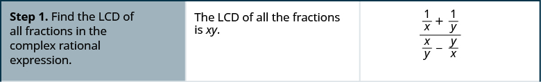
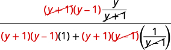

By the end of this section, you will be able to:
* Simplify a complex rational expression by writing it as division
* Simplify a complex rational expression by using the LCD

Before you get started, take this readiness quiz.

1.  Simplify:
    <math xmlns="http://www.w3.org/1998/Math/MathML"><mrow><mfrac><mrow><mfrac><mn>3</mn><mn>5</mn></mfrac></mrow><mrow><mfrac><mn>9</mn><mrow><mn>10</mn></mrow></mfrac></mrow></mfrac><mo>.</mo></mrow></math>
    
    * * *
    {: data-type="newline"}
    
    If you missed this problem, review [\[link\]](/m63304#fs-id1167829590640).
2.  Simplify:
    <math xmlns="http://www.w3.org/1998/Math/MathML"><mrow><mfrac><mrow><mn>1</mn><mo>−</mo><mfrac><mn>1</mn><mn>3</mn></mfrac></mrow><mrow><msup><mn>4</mn><mn>2</mn></msup><mo>+</mo><mn>4</mn><mo>·</mo><mn>5</mn></mrow></mfrac><mo>.</mo></mrow></math>
    
    * * *
    {: data-type="newline"}
    
    If you missed this problem, review [\[link\]](/m63304#fs-id1167829627815).
3.  Solve:
    <math xmlns="http://www.w3.org/1998/Math/MathML"><mrow><mfrac><mn>1</mn><mrow><mn>2</mn><mi>x</mi></mrow></mfrac><mo>+</mo><mfrac><mn>1</mn><mn>4</mn></mfrac><mo>=</mo><mfrac><mn>1</mn><mn>8</mn></mfrac><mo>.</mo></mrow></math>
    
    * * *
    {: data-type="newline"}
    
    If you missed this problem, review [\[link\]](/m63308#fs-id1167833239741).
{: data-number-style="arabic"}

### Simplify a Complex Rational Expression by Writing it as Division

Complex fractions are fractions in which the numerator or denominator contains a fraction. We previously simplified complex fractions like these:

<math xmlns="http://www.w3.org/1998/Math/MathML"><mrow><mtable><mtr><mtd columnalign="left"><mfrac><mrow><mfrac><mn>3</mn><mn>4</mn></mfrac></mrow><mrow><mfrac><mn>5</mn><mn>8</mn></mfrac></mrow></mfrac></mtd><mtd /><mtd /><mtd /><mtd /><mtd columnalign="left"><mfrac><mrow><mfrac><mi>x</mi><mn>2</mn></mfrac></mrow><mrow><mfrac><mrow><mi>x</mi><mi>y</mi></mrow><mn>6</mn></mfrac></mrow></mfrac></mtd></mtr></mtable></mrow></math>

In this section, we will simplify complex rational expressions, which are rational expressions with rational expressions in the numerator or denominator.

Complex Rational Expression

A **complex rational expression**{: data-type="term"} is a rational expression in which the numerator and/or the denominator contains a rational expression.

Here are a few complex rational expressions:

<math xmlns="http://www.w3.org/1998/Math/MathML"><mrow><mfrac><mrow><mfrac><mn>4</mn><mrow><mi>y</mi><mo>−</mo><mn>3</mn></mrow></mfrac></mrow><mrow><mfrac><mn>8</mn><mrow><msup><mi>y</mi><mn>2</mn></msup><mo>−</mo><mn>9</mn></mrow></mfrac></mrow></mfrac><mspace width="3em" /><mfrac><mrow><mfrac><mn>1</mn><mi>x</mi></mfrac><mo>+</mo><mfrac><mn>1</mn><mi>y</mi></mfrac></mrow><mrow><mfrac><mi>x</mi><mi>y</mi></mfrac><mo>−</mo><mfrac><mi>y</mi><mi>x</mi></mfrac></mrow></mfrac><mspace width="3em" /><mfrac><mrow><mfrac><mn>2</mn><mrow><mi>x</mi><mo>+</mo><mn>6</mn></mrow></mfrac></mrow><mrow><mfrac><mn>4</mn><mrow><mi>x</mi><mo>−</mo><mn>6</mn></mrow></mfrac><mo>−</mo><mfrac><mn>4</mn><mrow><msup><mi>x</mi><mn>2</mn></msup><mo>−</mo><mn>36</mn></mrow></mfrac></mrow></mfrac></mrow></math>

Remember, we always exclude values that would make any denominator zero.

We will use two methods to simplify complex rational expressions.

We have already seen this complex rational expression earlier in this chapter.

<math xmlns="http://www.w3.org/1998/Math/MathML"><mrow><mfrac><mrow><mfrac><mrow><mn>6</mn><msup><mi>x</mi><mn>2</mn></msup><mo>−</mo><mn>7</mn><mi>x</mi><mo>+</mo><mn>2</mn></mrow><mrow><mn>4</mn><mi>x</mi><mo>−</mo><mn>8</mn></mrow></mfrac></mrow><mrow><mfrac><mrow><mn>2</mn><msup><mi>x</mi><mn>2</mn></msup><mo>−</mo><mn>8</mn><mi>x</mi><mo>+</mo><mn>3</mn></mrow><mrow><msup><mi>x</mi><mn>2</mn></msup><mo>−</mo><mn>5</mn><mi>x</mi><mo>+</mo><mn>6</mn></mrow></mfrac></mrow></mfrac></mrow></math>

We noted that fraction bars tell us to divide, so rewrote it as the division problem:

<math xmlns="http://www.w3.org/1998/Math/MathML"><mrow><mrow><mo>(</mo><mrow><mfrac><mrow><mn>6</mn><msup><mi>x</mi><mn>2</mn></msup><mo>−</mo><mn>7</mn><mi>x</mi><mo>+</mo><mn>2</mn></mrow><mrow><mn>4</mn><mi>x</mi><mo>−</mo><mn>8</mn></mrow></mfrac></mrow><mo>)</mo></mrow><mo>÷</mo><mrow><mo>(</mo><mrow><mfrac><mrow><mn>2</mn><msup><mi>x</mi><mn>2</mn></msup><mo>−</mo><mn>8</mn><mi>x</mi><mo>+</mo><mn>3</mn></mrow><mrow><msup><mi>x</mi><mn>2</mn></msup><mo>−</mo><mn>5</mn><mi>x</mi><mo>+</mo><mn>6</mn></mrow></mfrac></mrow><mo>)</mo></mrow><mo>.</mo></mrow></math>

Then, we multiplied the first rational expression by the reciprocal of the second, just like we do when we divide two fractions.

This is one method to simplify complex rational expressions. We make sure the complex rational expression is of the form where one fraction is over one fraction. We then write it as if we were dividing two fractions.

Simplify the complex rational expression by writing it as division: <math xmlns="http://www.w3.org/1998/Math/MathML"><mrow><mfrac><mrow><mfrac><mn>6</mn><mrow><mi>x</mi><mo>−</mo><mn>4</mn></mrow></mfrac></mrow><mrow><mfrac><mn>3</mn><mrow><msup><mi>x</mi><mn>2</mn></msup><mo>−</mo><mn>16</mn></mrow></mfrac></mrow></mfrac><mo>.</mo></mrow></math>

<math xmlns="http://www.w3.org/1998/Math/MathML"><mrow><mtable> <mtr><mtd /><mtd /><mtd /><mtd columnalign="center"><mspace width="4em" /><mfrac><mrow><mfrac><mn>6</mn><mrow><mi>x</mi><mo>−</mo><mn>4</mn></mrow></mfrac></mrow><mrow><mfrac><mn>3</mn><mrow><msup><mi>x</mi><mn>2</mn></msup><mo>−</mo><mn>16</mn></mrow></mfrac></mrow></mfrac></mtd></mtr><mtr /><mtr /> <mtr><mtd columnalign="left"><mtext>Rewrite the complex fraction as division.</mtext></mtd><mtd /><mtd /><mtd columnalign="center"><mspace width="4em" /><mfrac><mn>6</mn><mrow><mi>x</mi><mo>−</mo><mn>4</mn></mrow></mfrac><mo>÷</mo><mfrac><mn>3</mn><mrow><msup><mi>x</mi><mn>2</mn></msup><mo>−</mo><mn>16</mn></mrow></mfrac></mtd></mtr><mtr /><mtr /> <mtr><mtd columnalign="left"><mtable><mtr><mtd columnalign="left"><mtext>Rewrite as the product of first times the</mtext></mtd></mtr><mtr><mtd columnalign="left"><mtext>reciprocal of the second.</mtext></mtd></mtr></mtable></mtd><mtd /><mtd /><mtd columnalign="center"><mspace width="4em" /><mfrac><mn>6</mn><mrow><mi>x</mi><mo>−</mo><mn>4</mn></mrow></mfrac><mo>·</mo><mfrac><mrow><msup><mi>x</mi><mn>2</mn></msup><mo>−</mo><mn>16</mn></mrow><mn>3</mn></mfrac></mtd></mtr><mtr /><mtr /> <mtr><mtd columnalign="left"><mtext>Factor.</mtext></mtd><mtd /><mtd /><mtd columnalign="center"><mspace width="4em" /><mfrac><mrow><mn>3</mn><mo>·</mo><mn>2</mn></mrow><mrow><mi>x</mi><mo>−</mo><mn>4</mn></mrow></mfrac><mo>·</mo><mfrac><mrow><mrow><mo>(</mo><mrow><mi>x</mi><mo>−</mo><mn>4</mn></mrow><mo>)</mo></mrow><mrow><mo>(</mo><mrow><mi>x</mi><mo>+</mo><mn>4</mn></mrow><mo>)</mo></mrow></mrow><mn>3</mn></mfrac></mtd></mtr><mtr /><mtr /> <mtr><mtd columnalign="left"><mtext>Multiply.</mtext></mtd><mtd /><mtd /><mtd columnalign="center"><mspace width="4em" /><mfrac><mrow><mn>3</mn><mo>·</mo><mn>2</mn><mrow><mo>(</mo><mrow><mi>x</mi><mo>−</mo><mn>4</mn></mrow><mo>)</mo></mrow><mrow><mo>(</mo><mrow><mi>x</mi><mo>+</mo><mn>4</mn></mrow><mo>)</mo></mrow></mrow><mrow><mn>3</mn><mrow><mo>(</mo><mrow><mi>x</mi><mo>−</mo><mn>4</mn></mrow><mo>)</mo></mrow></mrow></mfrac></mtd></mtr><mtr /><mtr /> <mtr><mtd columnalign="left"><mtext>Remove common factors.</mtext></mtd><mtd /><mtd /><mtd columnalign="center"><mspace width="4em" /><mfrac><mrow><menclose notation="updiagonalstrike"><mn>3</mn></menclose><mo>·</mo><mn>2</mn><menclose notation="updiagonalstrike"><mrow><mrow><mo>(</mo><mrow><mi>x</mi><mo>−</mo><mn>4</mn></mrow><mo>)</mo></mrow></mrow></menclose><mrow><mo>(</mo><mrow><mi>x</mi><mo>+</mo><mn>4</mn></mrow><mo>)</mo></mrow></mrow><mrow><menclose notation="updiagonalstrike"><mn>3</mn></menclose><menclose notation="updiagonalstrike"><mrow><mrow><mo>(</mo><mrow><mi>x</mi><mo>−</mo><mn>4</mn></mrow><mo>)</mo></mrow></mrow></menclose></mrow></mfrac></mtd></mtr><mtr /><mtr /> <mtr><mtd columnalign="left"><mtext>Simplify.</mtext></mtd><mtd /><mtd /><mtd columnalign="center"><mspace width="4em" /><mn>2</mn><mrow><mo>(</mo><mrow><mi>x</mi><mo>+</mo><mn>4</mn></mrow><mo>)</mo></mrow></mtd></mtr></mtable></mrow></math>

Are there any value(s) of *x* that should not be allowed? The original complex rational expression had denominators of <math xmlns="http://www.w3.org/1998/Math/MathML"><mrow><mi>x</mi><mo>−</mo><mn>4</mn></mrow></math>

 and <math xmlns="http://www.w3.org/1998/Math/MathML"><mrow><msup><mi>x</mi><mn>2</mn></msup><mo>−</mo><mn>16</mn><mo>.</mo></mrow></math>

 This expression would be undefined if <math xmlns="http://www.w3.org/1998/Math/MathML"><mrow><mi>x</mi><mo>=</mo><mn>4</mn></mrow></math>

 or <math xmlns="http://www.w3.org/1998/Math/MathML"><mrow><mi>x</mi><mo>=</mo><mn>−4</mn><mo>.</mo></mrow></math>

Simplify the complex rational expression by writing it as division: <math xmlns="http://www.w3.org/1998/Math/MathML"><mrow><mfrac><mrow><mfrac><mn>2</mn><mrow><msup><mi>x</mi><mn>2</mn></msup><mo>−</mo><mn>1</mn></mrow></mfrac></mrow><mrow><mfrac><mn>3</mn><mrow><mi>x</mi><mo>+</mo><mn>1</mn></mrow></mfrac></mrow></mfrac><mo>.</mo></mrow></math>

<math xmlns="http://www.w3.org/1998/Math/MathML"><mrow><mfrac><mn>2</mn><mrow><mn>3</mn><mrow><mo>(</mo><mrow><mi>x</mi><mo>−</mo><mn>1</mn></mrow><mo>)</mo></mrow></mrow></mfrac></mrow></math>

Simplify the complex rational expression by writing it as division: <math xmlns="http://www.w3.org/1998/Math/MathML"><mrow><mfrac><mrow><mfrac><mn>1</mn><mrow><msup><mi>x</mi><mn>2</mn></msup><mo>−</mo><mn>7</mn><mi>x</mi><mo>+</mo><mn>12</mn></mrow></mfrac></mrow><mrow><mfrac><mn>2</mn><mrow><mi>x</mi><mo>−</mo><mn>4</mn></mrow></mfrac></mrow></mfrac><mo>.</mo></mrow></math>

<math xmlns="http://www.w3.org/1998/Math/MathML"><mrow><mfrac><mn>1</mn><mrow><mn>2</mn><mrow><mo>(</mo><mrow><mi>x</mi><mo>−</mo><mn>3</mn></mrow><mo>)</mo></mrow></mrow></mfrac></mrow></math>

Fraction bars act as grouping symbols. So to follow the Order of Operations, we simplify the numerator and denominator as much as possible before we can do the division.

Simplify the complex rational expression by writing it as division: <math xmlns="http://www.w3.org/1998/Math/MathML"><mrow><mfrac><mrow><mfrac><mn>1</mn><mn>3</mn></mfrac><mo>+</mo><mfrac><mn>1</mn><mn>6</mn></mfrac></mrow><mrow><mfrac><mn>1</mn><mn>2</mn></mfrac><mo>−</mo><mfrac><mn>1</mn><mn>3</mn></mfrac></mrow></mfrac><mo>.</mo></mrow></math>

<table class="unnumbered unstyled" summary="The quantity one-third plus one-sixth divided by the quantity one-half minus one-third. Rewrite the numerator and denominator by finding the lowest common denominator. The lowest common denominator of one-third, one-sixth, one-half, and one-third is 6. In the numerator of the expression, multiply the numerator and denominator of one-third by 2. In the denominator of the expression, multiply the numerator and denominator of one-half by 3, and the numerator and denominator of one-third by 2. Simplify the numerator and the denominator. The result is the quantity two-sixths plus one-sixth all divided by the quantity three-sixths minus two-sixths. Rewrite the complex rational expression as a division problem, three-sixth divided by one-sixth. Multiply three-sixth by the reciprocal of one-sixth, which is 6 over 1. The result is three-sixth times six ones. Simplify the expression. The result is 3." data-label=""><tbody>
<tr valign="top">
<td data-valign="top" data-align="left" />
<td data-valign="top" data-align="center"></td>
</tr>
<tr valign="top">
<td data-valign="top" data-align="left">Simplify the numerator and denominator.
Find the LCD and add the fractions in the numerator.
Find the LCD and subtract the fractions in the
denominator.</td>
<td data-valign="top" data-align="center"></td>
</tr>
<tr valign="top">
<td data-valign="top" data-align="left">Simplify the numerator and denominator.</td>
<td data-valign="top" data-align="center"></td>
</tr>
<tr valign="top">
<td data-valign="top" data-align="left">Rewrite the complex rational expression as a division
problem.</td>
<td data-valign="top" data-align="center"></td>
</tr>
<tr valign="top">
<td data-valign="top" data-align="left">Multiply the first by the reciprocal of the second.</td>
<td data-valign="top" data-align="center"></td>
</tr>
<tr valign="top">
<td data-valign="top" data-align="left">Simplify.</td>
<td data-valign="top" data-align="center">3</td>
</tr>
</tbody></table>

Simplify the complex rational expression by writing it as division: <math xmlns="http://www.w3.org/1998/Math/MathML"><mrow><mfrac><mrow><mfrac><mn>1</mn><mn>2</mn></mfrac><mo>+</mo><mfrac><mn>2</mn><mn>3</mn></mfrac></mrow><mrow><mfrac><mn>5</mn><mn>6</mn></mfrac><mo>+</mo><mfrac><mn>1</mn><mrow><mn>12</mn></mrow></mfrac></mrow></mfrac><mo>.</mo></mrow></math>

<math xmlns="http://www.w3.org/1998/Math/MathML"><mrow><mfrac><mrow><mn>14</mn></mrow><mrow><mn>11</mn></mrow></mfrac></mrow></math>

Simplify the complex rational expression by writing it as division: <math xmlns="http://www.w3.org/1998/Math/MathML"><mrow><mfrac><mrow><mfrac><mn>3</mn><mn>4</mn></mfrac><mo>−</mo><mfrac><mn>1</mn><mn>3</mn></mfrac></mrow><mrow><mfrac><mn>1</mn><mn>8</mn></mfrac><mo>+</mo><mfrac><mn>5</mn><mn>6</mn></mfrac></mrow></mfrac><mo>.</mo></mrow></math>

<math xmlns="http://www.w3.org/1998/Math/MathML"><mrow><mfrac><mrow><mn>10</mn></mrow><mrow><mn>23</mn></mrow></mfrac></mrow></math>

We follow the same procedure when the complex rational expression contains variables.

How to Simplify a Complex Rational Expression using Division

Simplify the complex rational expression by writing it as division: <math xmlns="http://www.w3.org/1998/Math/MathML"><mrow><mfrac><mrow><mfrac><mn>1</mn><mi>x</mi></mfrac><mo>+</mo><mfrac><mn>1</mn><mi>y</mi></mfrac></mrow><mrow><mfrac><mi>x</mi><mi>y</mi></mfrac><mo>−</mo><mfrac><mi>y</mi><mi>x</mi></mfrac></mrow></mfrac><mo>.</mo></mrow></math>

 ![Step 1 is to simplify the sum in the numerator and the difference in the denominator of complex rational expression, the quantity 1 divided by x plus 1 divided by y all divided by the quantity x divided by y minus y divided by x. The common denominator of the fractions in the complex rational expression is x y. Multiply the numerator and denominator of 1 divided by x by y over y. Multiply the numerator and denominator of 1 divided by y by x over x. Multiply the numerator and denominator of x divided by y by x over x. Multiply the numerator and denominator of y over x by y over y. The result is the quantity y divided by x y plus x divided by x y all divided by the quantity x squared divided by x y minus y squared divided by x y. Add the fractions in the numerator and subtract the fractions in the denominator. The result is the sum of y and x divided by x y all divided by the difference between x squared and y squared divided by x y. We now have just one rational expression in the numerator and one in the denominator.](../resources/CNX_IntAlg_Figure_07_03_002a_img.jpg) 

![Step 3 is to divided the expressions. Multiply the first expression by the reciprocal of the second expression. The result is the quantity of the sum y and x divided by x y times the quantity x y divided by the difference between x squared and y squared. Factor any expressions if possible. The result is the product of x y and the sum of y and x all divided by the product of x y, the difference between x and y, and the sum of x and y. Remove the common factors, x y and the sum of x and y. Simplify. The result is 1 divided by the quantity x minus y.](../resources/CNX_IntAlg_Figure_07_03_002c_img.jpg)

Simplify the complex rational expression by writing it as division: <math xmlns="http://www.w3.org/1998/Math/MathML"><mrow><mfrac><mrow><mfrac><mn>1</mn><mi>x</mi></mfrac><mo>+</mo><mfrac><mn>1</mn><mi>y</mi></mfrac></mrow><mrow><mfrac><mn>1</mn><mi>x</mi></mfrac><mo>−</mo><mfrac><mn>1</mn><mi>y</mi></mfrac></mrow></mfrac><mo>.</mo></mrow></math>

<math xmlns="http://www.w3.org/1998/Math/MathML"><mrow><mfrac><mrow><mi>y</mi><mo>+</mo><mi>x</mi></mrow><mrow><mi>y</mi><mo>−</mo><mi>x</mi></mrow></mfrac></mrow></math>

Simplify the complex rational expression by writing it as division: <math xmlns="http://www.w3.org/1998/Math/MathML"><mrow><mfrac><mrow><mfrac><mn>1</mn><mi>a</mi></mfrac><mo>+</mo><mfrac><mn>1</mn><mi>b</mi></mfrac></mrow><mrow><mfrac><mn>1</mn><mrow><msup><mi>a</mi><mn>2</mn></msup></mrow></mfrac><mo>−</mo><mfrac><mn>1</mn><mrow><msup><mi>b</mi><mn>2</mn></msup></mrow></mfrac></mrow></mfrac></mrow></math>

.

<math xmlns="http://www.w3.org/1998/Math/MathML"><mrow><mfrac><mrow><mi>a</mi><mi>b</mi></mrow><mrow><mi>b</mi><mo>−</mo><mi>a</mi></mrow></mfrac></mrow></math>

We summarize the steps here.

Simplify a complex rational expression by writing it as division.

1.  Simplify the numerator and denominator.
2.  Rewrite the complex rational expression as a division problem.
3.  Divide the expressions.
{: data-number-style="arabic" .stepwise}

Simplify the complex rational expression by writing it as division: <math xmlns="http://www.w3.org/1998/Math/MathML"><mrow><mfrac><mrow><mi>n</mi><mo>−</mo><mfrac><mrow><mn>4</mn><mi>n</mi></mrow><mrow><mi>n</mi><mo>+</mo><mn>5</mn></mrow></mfrac></mrow><mrow><mfrac><mn>1</mn><mrow><mi>n</mi><mo>+</mo><mn>5</mn></mrow></mfrac><mo>+</mo><mfrac><mn>1</mn><mrow><mi>n</mi><mo>−</mo><mn>5</mn></mrow></mfrac></mrow></mfrac><mo>.</mo></mrow></math>

<table class="unnumbered unstyled can-break" summary="Simplify the complex rational expression n minus the quantity 4 n divided by the quantity n plus 5 all divided by the sum of 1 divided by the quantity n plus 5 and 1 divided by the quantity n minus 5. Simplify the numerator and denominator. Find the common denominators for the numerator and denominator. The result is the n times the quantity n plus 5 all divided by 1 times the quantity n plus 5 minus the quantity 4 n divided by the quantity n plus 5 all divided by 1 times the quantity n minus 5 divided by the quantity n plus 5 times the quantity n minus 5 plus the quantity 1 times the quantity n plus 5 divided by the quantity n plus 5 times the quantity n minus 5. Simplify the numerators. The result is the quantity n squared plus 5 n divided by the quantity n plus 5 minus the quantity 4 n divided by the quantity n plus 5 all divided by 1 times the quantity n minus 5 divided by the quantity n plus 5 times the quantity n minus 5 plus 1 times the quantity n plus 5 divided by the quantity n plus 5 times the quantity n minus 5. Subtract the rational expressions in the numerator and add in the denominator. The result is the quantity n squared plus 5 n minus 4 n divided by the quantity n plus 5 all divided by the quantity n minus 5 plus n plus 5 divided by the quantity n plus 5 times the quantity n minus 5. Multiply the first expression by the reciprocal of the second. The result is the quantity n squared plus 5 n minus 4 n divided by the quantity n plus 5 times the quantity n plus 5 times the quantity n minus 5 divided by the quantity n minus 5 plus n plus 5. Simplify. We now have one rational expression over one rational expression. The result is the quantity n squared plus n divided by the quantity n plus 5 all divided by the quantity 2 n divided by the quantity n plus 5 times the quantity n minus 5. Rewrite the expression as fraction division. The result is the quotient of the quantity n squared plus n divided by the quantity n plus 5 and the quantity 2 n divided by the quantity n plus 5 times the quantity n minus 5. Multiply the first fraction times the reciprocal of the second fraction. The result is the quantity n squared plus n divided by the quantity n plus 5 times the quantity of n plus 5 times the quantity n minus 5 all divided by the quantity 2 n. Factor any expressions if possible. The result us n times the quantity n plus 1 times the quantity n plus 5 times the quantity n minus 5 all divided by the product of the quantity n plus 5 and 2 n. Remove the common factors, n and n plus 5, from the numerator and denominator. Simplify. The result is the product of the quantity n plus 1 and the quantity n minus 5 all divided by 2." data-label=""><tbody>
<tr valign="top">
<td data-valign="top" data-align="left" />
<td data-valign="top" data-align="center"></td>
</tr>
<tr valign="top">
<td data-valign="top" data-align="left">Simplify the numerator and denominator.
Find common denominators for the numerator and
denominator.</td>
<td data-valign="top" data-align="center"></td>
</tr>
<tr valign="top">
<td data-valign="top" data-align="left">Simplify the numerators.</td>
<td data-valign="top" data-align="center"></td>
</tr>
<tr valign="top">
<td data-valign="top" data-align="left">Subtract the rational expressions in the numerator and
add in the denominator.</td>
<td data-valign="top" data-align="center"></td>
</tr>
<tr valign="top">
<td data-valign="top" data-align="left">Simplify. (We now have one rational expression over
one rational expression.)</td>
<td data-valign="top" data-align="center"></td>
</tr>
<tr valign="top">
<td data-valign="top" data-align="left">Rewrite as fraction division.</td>
<td data-valign="top" data-align="center"></td>
</tr>
<tr valign="top">
<td data-valign="top" data-align="left">Multiply the first times the reciprocal of the second.</td>
<td data-valign="top" data-align="center"></td>
</tr>
<tr valign="top">
<td data-valign="top" data-align="left">Factor any expressions if possible.</td>
<td data-valign="top" data-align="center"></td>
</tr>
<tr valign="top">
<td data-valign="top" data-align="left">Remove common factors.</td>
<td data-valign="top" data-align="center"></td>
</tr>
<tr valign="top">
<td data-valign="top" data-align="left">Simplify.</td>
<td data-valign="top" data-align="center"></td>
</tr>
</tbody></table>

Simplify the complex rational expression by writing it as division: <math xmlns="http://www.w3.org/1998/Math/MathML"><mrow><mfrac><mrow><mi>b</mi><mo>−</mo><mfrac><mrow><mn>3</mn><mi>b</mi></mrow><mrow><mi>b</mi><mo>+</mo><mn>5</mn></mrow></mfrac></mrow><mrow><mfrac><mn>2</mn><mrow><mi>b</mi><mo>+</mo><mn>5</mn></mrow></mfrac><mo>+</mo><mfrac><mn>1</mn><mrow><mi>b</mi><mo>−</mo><mn>5</mn></mrow></mfrac></mrow></mfrac><mo>.</mo></mrow></math>

<math xmlns="http://www.w3.org/1998/Math/MathML"><mrow><mfrac><mrow><mi>b</mi><mrow><mo>(</mo><mrow><mi>b</mi><mo>+</mo><mn>2</mn></mrow><mo>)</mo></mrow><mrow><mo>(</mo><mrow><mi>b</mi><mo>−</mo><mn>5</mn></mrow><mo>)</mo></mrow></mrow><mrow><mn>3</mn><mi>b</mi><mo>−</mo><mn>5</mn></mrow></mfrac></mrow></math>

Simplify the complex rational expression by writing it as division: <math xmlns="http://www.w3.org/1998/Math/MathML"><mrow><mfrac><mrow><mn>1</mn><mo>−</mo><mfrac><mn>3</mn><mrow><mi>c</mi><mo>+</mo><mn>4</mn></mrow></mfrac></mrow><mrow><mfrac><mn>1</mn><mrow><mi>c</mi><mo>+</mo><mn>4</mn></mrow></mfrac><mo>+</mo><mfrac><mi>c</mi><mn>3</mn></mfrac></mrow></mfrac><mo>.</mo></mrow></math>

<math xmlns="http://www.w3.org/1998/Math/MathML"><mrow><mfrac><mn>3</mn><mrow><mi>c</mi><mo>+</mo><mn>3</mn></mrow></mfrac></mrow></math>

### Simplify a Complex Rational Expression by Using the LCD

We “cleared” the fractions by multiplying by the LCD when we solved equations with fractions. We can use that strategy here to simplify complex rational expressions. We will multiply the numerator and denominator by the LCD of all the rational expressions.

Let’s look at the complex rational expression we simplified one way in [\[link\]](#fs-id1167835236104). We will simplify it here by multiplying the numerator and denominator by the LCD. When we multiply by <math xmlns="http://www.w3.org/1998/Math/MathML"><mrow><mfrac><mrow><mtext>LCD</mtext></mrow><mrow><mtext>LCD</mtext></mrow></mfrac></mrow></math>

 we are multiplying by 1, so the value stays the same.

Simplify the complex rational expression by using the LCD: <math xmlns="http://www.w3.org/1998/Math/MathML"><mrow><mfrac><mrow><mfrac><mn>1</mn><mn>3</mn></mfrac><mo>+</mo><mfrac><mn>1</mn><mn>6</mn></mfrac></mrow><mrow><mfrac><mn>1</mn><mn>2</mn></mfrac><mo>−</mo><mfrac><mn>1</mn><mn>3</mn></mfrac></mrow></mfrac><mo>.</mo></mrow></math>

<table class="unnumbered unstyled" summary="Simplify the sum of one-third and one-sixth all divided by the difference between one-half and one-third. The least common denominator of all the fractions in the entire expression is 6. Clear the fractions by multiplying the numerator and denominator by the least common denominator. The result is 6 times sum of one-third and one-sixth all divided by 6 times the difference between one-half and one-third. Distribute. The result is the quantity 6 times one-third plus 6 times one-sixth all divided by the quantity 6 times one-half minus 6 times one-third. Simplify. The result is the quantity 2 plus 1 divided by the quantity 3 minus 2, which simplifies to 3 divided by 1. 3 divided by 1 is 3." data-label=""><tbody>
<tr valign="top">
<td data-valign="top" data-align="left" />
<td data-valign="top" data-align="center"></td>
</tr>
<tr valign="top">
<td data-valign="top" data-align="left">The LCD of all the fractions in the whole expression is 6.</td>
<td data-valign="top" data-align="left" />
</tr>

<tr valign="top">
<td data-valign="top" data-align="left">Clear the fractions by multiplying the numerator and
denominator by that LCD.</td>
<td data-valign="top" data-align="center"></td>
</tr>
<tr valign="top">
<td data-valign="top" data-align="left">Distribute.</td>
<td data-valign="top" data-align="center"></td>
</tr>
<tr valign="top">
<td data-valign="top" data-align="left">Simplify.</td>
<td data-valign="top" data-align="center"></td>
</tr>
<tr valign="top">
<td data-valign="top" data-align="left" />
<td data-valign="top" data-align="center"></td>
</tr>
<tr valign="top">
<td data-valign="top" data-align="left" />
<td data-valign="top" data-align="center"></td>
</tr>
</tbody></table>

Simplify the complex rational expression by using the LCD: <math xmlns="http://www.w3.org/1998/Math/MathML"><mrow><mfrac><mrow><mfrac><mn>1</mn><mn>2</mn></mfrac><mo>+</mo><mfrac><mn>1</mn><mn>5</mn></mfrac></mrow><mrow><mfrac><mn>1</mn><mrow><mn>10</mn></mrow></mfrac><mo>+</mo><mfrac><mn>1</mn><mn>5</mn></mfrac></mrow></mfrac><mo>.</mo></mrow></math>

<math xmlns="http://www.w3.org/1998/Math/MathML"><mrow><mfrac><mn>7</mn><mn>3</mn></mfrac></mrow></math>

Simplify the complex rational expression by using the LCD: <math xmlns="http://www.w3.org/1998/Math/MathML"><mrow><mfrac><mrow><mfrac><mn>1</mn><mn>4</mn></mfrac><mo>+</mo><mfrac><mn>3</mn><mn>8</mn></mfrac></mrow><mrow><mfrac><mn>1</mn><mn>2</mn></mfrac><mo>−</mo><mfrac><mn>5</mn><mrow><mn>16</mn></mrow></mfrac></mrow></mfrac><mo>.</mo></mrow></math>

<math xmlns="http://www.w3.org/1998/Math/MathML"><mrow><mfrac><mrow><mn>10</mn></mrow><mn>3</mn></mfrac></mrow></math>

We will use the same example as in [\[link\]](#fs-id1167830705566). Decide which method works better for you.

How to Simplify a Complex Rational Expressing using the LCD

Simplify the complex rational expression by using the LCD: <math xmlns="http://www.w3.org/1998/Math/MathML"><mrow><mfrac><mrow><mfrac><mn>1</mn><mi>x</mi></mfrac><mo>+</mo><mfrac><mn>1</mn><mi>y</mi></mfrac></mrow><mrow><mfrac><mi>x</mi><mi>y</mi></mfrac><mo>−</mo><mfrac><mi>y</mi><mi>x</mi></mfrac></mrow></mfrac><mo>.</mo></mrow></math>

![Step 3 is to simplify the expression. Distribute x y in the numerator and the denominator. The result is x y times 1 divided by x plus x y times 1 divided by y all divided by x y times x divided by y plus x y times y divided by x. It simplifies to the sum of y and x divided by the quantity x squared minus y squared. Write the denominator as the difference of squares, the quantity x minus y times the quantity x plus y. The result is the quantity y plus x all divided by the quantity x minus y times the quantity x plus y. Remove the common factor, y plus x, from the numerator and denominator. The result is 1 divided by the quantity x minus y.](../resources/CNX_IntAlg_Figure_07_03_005c_img.jpg)

Simplify the complex rational expression by using the LCD: <math xmlns="http://www.w3.org/1998/Math/MathML"><mrow><mfrac><mrow><mfrac><mn>1</mn><mi>a</mi></mfrac><mo>+</mo><mfrac><mn>1</mn><mi>b</mi></mfrac></mrow><mrow><mfrac><mi>a</mi><mi>b</mi></mfrac><mo>+</mo><mfrac><mi>b</mi><mi>a</mi></mfrac></mrow></mfrac><mo>.</mo></mrow></math>

<math xmlns="http://www.w3.org/1998/Math/MathML"><mrow><mfrac><mrow><mi>b</mi><mo>+</mo><mi>a</mi></mrow><mrow><msup><mi>a</mi><mn>2</mn></msup><mo>+</mo><msup><mi>b</mi><mn>2</mn></msup></mrow></mfrac></mrow></math>

Simplify the complex rational expression by using the LCD: <math xmlns="http://www.w3.org/1998/Math/MathML"><mrow><mfrac><mrow><mfrac><mn>1</mn><mrow><msup><mi>x</mi><mn>2</mn></msup></mrow></mfrac><mo>−</mo><mfrac><mn>1</mn><mrow><msup><mi>y</mi><mn>2</mn></msup></mrow></mfrac></mrow><mrow><mfrac><mn>1</mn><mi>x</mi></mfrac><mo>+</mo><mfrac><mn>1</mn><mi>y</mi></mfrac></mrow></mfrac><mo>.</mo></mrow></math>

<math xmlns="http://www.w3.org/1998/Math/MathML"><mrow><mfrac><mrow><mi>y</mi><mo>−</mo><mi>x</mi></mrow><mrow><mi>x</mi><mi>y</mi></mrow></mfrac></mrow></math>

Simplify a complex rational expression by using the LCD.

1.  Find the LCD of all fractions in the complex rational expression.
2.  Multiply the numerator and denominator by the LCD.
3.  Simplify the expression.
{: data-number-style="arabic" .stepwise}

Be sure to start by factoring all the denominators so you can find the LCD.

Simplify the complex rational expression by using the LCD: <math xmlns="http://www.w3.org/1998/Math/MathML"><mrow><mfrac><mrow><mfrac><mn>2</mn><mrow><mi>x</mi><mo>+</mo><mn>6</mn></mrow></mfrac></mrow><mrow><mfrac><mn>4</mn><mrow><mi>x</mi><mo>−</mo><mn>6</mn></mrow></mfrac><mo>−</mo><mfrac><mn>4</mn><mrow><msup><mi>x</mi><mn>2</mn></msup><mo>−</mo><mn>36</mn></mrow></mfrac></mrow></mfrac><mo>.</mo></mrow></math>

<table class="unnumbered unstyled can-break" summary="Simplify the complex rational expression, 2 divided by the quantity x plus 6 all divided by the difference between 4 divided by the quantity x minus 6 and 4 divided by the quantity x squared minus 36. Find the least common denominator all of the fractions. It is x squared minus 36 which equals the quantity x plus 6 times the quantity x minus 6. Multiply the numerator and denominator by the least common denominator. The result is the quantity x plus 6 times the quantity x minus 6 times the quantity 2 divided by the quantity x plus 6 all divided by the quantity x plus 6 times the quantity x minus 6 times the difference between the quantity 4 divided by the quantity x minus 6 and 4 divided by the product of the quantity x plus 6 and the quantity x minus 6. Simplify the expression. Distribute, the quantity x plus 6 and x minus 6, in the denominator. The result is the quantity x plus 6 times the quantity x minus 6 times the quantity 2 divided by the quantity x plus 6 all divided by the quantity x plus 6 times the quantity x minus 6 times the quantity 4 divided by the quantity x minus 6 minus the quantity x plus 6 times the quantity x minus 6 times 4 divided by the product of the quantity x plus 6 and the quantity x minus 6. Simplify by removing the common factors, x plus 6 from the numerator, and the quantity x minus 6 times the quantity x plus 6, from the denominator. The result is 2 times the quantity x minus 6 all divided by the product of 4 and the quantity x plus 6 minus 4. To simplify the denominator, distribute and combine like terms. The result is 2 times the quantity x minus 6 all divided by the quantity 4 x plus 20. Factor the denominator. The result is 2 times the quantity x minus 6 all divided by 4 times the quantity x plus 5. Notice that 4 in the denominator is 2 times 2. Remove the common factor, 2, from the numerator and denominator. The result is the quantity x minus 6 all divided by 2 times the quantity x plus 5. Notice that there are no more factors common to the numerator and denominator." data-label=""><tbody>
<tr valign="top">
<td data-valign="top" data-align="left" />
<td data-valign="top" data-align="center"></td>
</tr>
<tr valign="top">
<td data-valign="top" data-align="left">Find the LCD of all fractions in the complex rational
expression. The LCD is <math xmlns="http://www.w3.org/1998/Math/MathML"><mrow><msup><mi>x</mi><mn>2</mn></msup><mo>−</mo><mn>36</mn><mo>=</mo><mo>(</mo><mi>x</mi><mo>+</mo><mn>6</mn><mo>)</mo><mo>(</mo><mi>x</mi><mo>−</mo><mn>6</mn><mo>)</mo></mrow></math>.</td>
<td data-valign="top" data-align="left" />
</tr>
<tr valign="top">
<td data-valign="top" data-align="left">Multiply the numerator and denominator by the LCD.</td>
<td data-valign="top" data-align="center"></td>
</tr>
<tr valign="top">
<td data-valign="top" data-align="left">Simplify the expression.</td>
<td data-valign="top" data-align="left" />
</tr>
<tr valign="top">
<td data-valign="top" data-align="left">Distribute in the denominator.</td>
<td data-valign="top" data-align="center"></td>
</tr>
<tr valign="top">
<td data-valign="top" data-align="left">Simplify.</td>
<td data-valign="top" data-align="center"></td>
</tr>
<tr valign="top">
<td data-valign="top" data-align="left">Simplify.</td>
<td data-valign="top" data-align="center"></td>
</tr>
<tr valign="top">
<td data-valign="top" data-align="left">To simplify the denominator, distribute
and combine like terms.</td>
<td data-valign="top" data-align="center"></td>
</tr>
<tr valign="top">
<td data-valign="top" data-align="left">Factor the denominator.</td>
<td data-valign="top" data-align="center"></td>
</tr>
<tr valign="top">
<td data-valign="top" data-align="left">Remove common factors.</td>
<td data-valign="top" data-align="center"></td>
</tr>
<tr valign="top">
<td data-valign="top" data-align="left">Simplify.</td>
<td data-valign="top" data-align="center"></td>
</tr>
<tr valign="top">
<td data-valign="top" data-align="left">Notice that there are no more factors
common to the numerator and denominator.</td>
<td data-valign="top" data-align="left" />
</tr>
</tbody></table>

Simplify the complex rational expression by using the LCD: <math xmlns="http://www.w3.org/1998/Math/MathML"><mrow><mfrac><mrow><mfrac><mn>3</mn><mrow><mi>x</mi><mo>+</mo><mn>2</mn></mrow></mfrac></mrow><mrow><mfrac><mn>5</mn><mrow><mi>x</mi><mo>−</mo><mn>2</mn></mrow></mfrac><mo>−</mo><mfrac><mn>3</mn><mrow><msup><mi>x</mi><mn>2</mn></msup><mo>−</mo><mn>4</mn></mrow></mfrac></mrow></mfrac><mo>.</mo></mrow></math>

<math xmlns="http://www.w3.org/1998/Math/MathML"><mrow><mfrac><mrow><mn>3</mn><mrow><mo>(</mo><mrow><mi>x</mi><mo>−</mo><mn>2</mn></mrow><mo>)</mo></mrow></mrow><mrow><mn>5</mn><mi>x</mi><mo>+</mo><mn>7</mn></mrow></mfrac></mrow></math>

Simplify the complex rational expression by using the LCD: <math xmlns="http://www.w3.org/1998/Math/MathML"><mrow><mfrac><mrow><mfrac><mn>2</mn><mrow><mi>x</mi><mo>−</mo><mn>7</mn></mrow></mfrac><mo>−</mo><mfrac><mn>1</mn><mrow><mi>x</mi><mo>+</mo><mn>7</mn></mrow></mfrac></mrow><mrow><mfrac><mn>6</mn><mrow><mi>x</mi><mo>+</mo><mn>7</mn></mrow></mfrac><mo>−</mo><mfrac><mn>1</mn><mrow><msup><mi>x</mi><mn>2</mn></msup><mo>−</mo><mn>49</mn></mrow></mfrac></mrow></mfrac><mo>.</mo></mrow></math>

<math xmlns="http://www.w3.org/1998/Math/MathML"><mrow><mfrac><mrow><mi>x</mi><mo>+</mo><mn>21</mn></mrow><mrow><mn>6</mn><mi>x</mi><mo>−</mo><mn>43</mn></mrow></mfrac></mrow></math>

Be sure to factor the denominators first. Proceed carefully as the math can get messy!

Simplify the complex rational expression by using the LCD: <math xmlns="http://www.w3.org/1998/Math/MathML"><mrow><mfrac><mrow><mfrac><mn>4</mn><mrow><msup><mi>m</mi><mn>2</mn></msup><mo>−</mo><mn>7</mn><mi>m</mi><mo>+</mo><mn>12</mn></mrow></mfrac></mrow><mrow><mfrac><mn>3</mn><mrow><mi>m</mi><mo>−</mo><mn>3</mn></mrow></mfrac><mo>−</mo><mfrac><mn>2</mn><mrow><mi>m</mi><mo>−</mo><mn>4</mn></mrow></mfrac></mrow></mfrac><mo>.</mo></mrow></math>

<table class="unnumbered unstyled" summary="Simplify the complex rational expression, 4 divided by the quantity m squared minus 7 m plus 12 all divided by the difference between 3 divided by the quantity m minus 3 and 2 divided by the quantity m minus 4. Find the least common denominator of all fractions in the expression. The least common denominator is the quantity m minus 3 times the quantity m minus 4. Multiply the numerator and denominator by the least common denominator. The result is the quantity m minus 3 times the quantity m minus 4 times the quantity 4 divided by the quantity m minus 3 times the quantity m minus 4 all divided by the quantity m minus 3 times the quantity m minus 4 times the difference between 3 divided by the quantity m minus 3 and 2 divided by the quantity m minus 4. Simplify by removing the common factors, m minus 3 and m minus 4, from the numerator and denominator. The result is 4 divided by the product of 3 and m minus 4 minus the product of 2 and minus 3. Distribute the factors 3 and 2 in the denominator. The result is 4 divided by the quantity 3 m minus 12 minus 2 m plus 6. Combine like terms in the denominator. The result is 4 divided by the quantity m minus 6." data-label=""><tbody>
<tr valign="top">
<td data-valign="top" data-align="left" />
<td data-valign="top" data-align="center"></td>
</tr>
<tr valign="top">
<td data-valign="top" data-align="left">Find the LCD of all fractions in the
complex rational expression.</td>
<td data-valign="top" data-align="center" />
</tr>
<tr valign="top">
<td data-valign="top" data-align="left">The LCD is <math xmlns="http://www.w3.org/1998/Math/MathML"><mrow><mrow><mo>(</mo><mrow><mi>m</mi><mo>−</mo><mn>3</mn></mrow><mo>)</mo></mrow><mrow><mo>(</mo><mrow><mi>m</mi><mo>−</mo><mn>4</mn></mrow><mo>)</mo></mrow><mo>.</mo></mrow></math></td>
<td data-valign="top" data-align="center" />
</tr>
<tr valign="top">
<td data-valign="top" data-align="left">Multiply the numerator and
denominator by the LCD.</td>
<td data-valign="top" data-align="center"></td>
</tr>
<tr valign="top">
<td data-valign="top" data-align="left">Simplify.</td>
<td data-valign="top" data-align="center"></td>
</tr>
<tr valign="top">
<td data-valign="top" data-align="left">Simplify.</td>
<td data-valign="top" data-align="center"></td>
</tr>
<tr valign="top">
<td data-valign="top" data-align="left">Distribute.</td>
<td data-valign="top" data-align="center"></td>
</tr>
<tr valign="top">
<td data-valign="top" data-align="left">Combine like terms.</td>
<td data-valign="top" data-align="center"></td>
</tr>
</tbody></table>

Simplify the complex rational expression by using the LCD: <math xmlns="http://www.w3.org/1998/Math/MathML"><mrow><mfrac><mrow><mfrac><mn>3</mn><mrow><msup><mi>x</mi><mn>2</mn></msup><mo>+</mo><mn>7</mn><mi>x</mi><mo>+</mo><mn>10</mn></mrow></mfrac></mrow><mrow><mfrac><mn>4</mn><mrow><mi>x</mi><mo>+</mo><mn>2</mn></mrow></mfrac><mo>+</mo><mfrac><mn>1</mn><mrow><mi>x</mi><mo>+</mo><mn>5</mn></mrow></mfrac></mrow></mfrac><mo>.</mo></mrow></math>

<math xmlns="http://www.w3.org/1998/Math/MathML"><mrow><mfrac><mn>3</mn><mrow><mn>5</mn><mi>x</mi><mo>+</mo><mn>22</mn></mrow></mfrac></mrow></math>

Simplify the complex rational expression by using the LCD: <math xmlns="http://www.w3.org/1998/Math/MathML"><mrow><mfrac><mrow><mfrac><mrow><mn>4</mn><mi>y</mi></mrow><mrow><mi>y</mi><mo>+</mo><mn>5</mn></mrow></mfrac><mo>+</mo><mfrac><mn>2</mn><mrow><mi>y</mi><mo>+</mo><mn>6</mn></mrow></mfrac></mrow><mrow><mfrac><mrow><mn>3</mn><mi>y</mi></mrow><mrow><msup><mi>y</mi><mn>2</mn></msup><mo>+</mo><mn>11</mn><mi>y</mi><mo>+</mo><mn>30</mn></mrow></mfrac></mrow></mfrac><mo>.</mo></mrow></math>

<math xmlns="http://www.w3.org/1998/Math/MathML"><mrow><mfrac><mrow><mn>2</mn><mrow><mo>(</mo><mrow><mn>2</mn><msup><mi>y</mi><mn>2</mn></msup><mo>+</mo><mn>13</mn><mi>y</mi><mo>+</mo><mn>5</mn></mrow><mo>)</mo></mrow></mrow><mrow><mn>3</mn><mi>y</mi></mrow></mfrac></mrow></math>

Simplify the complex rational expression by using the LCD: <math xmlns="http://www.w3.org/1998/Math/MathML"><mrow><mfrac><mrow><mfrac><mi>y</mi><mrow><mi>y</mi><mo>+</mo><mn>1</mn></mrow></mfrac></mrow><mrow><mn>1</mn><mo>+</mo><mfrac><mn>1</mn><mrow><mi>y</mi><mo>−</mo><mn>1</mn></mrow></mfrac></mrow></mfrac><mo>.</mo></mrow></math>

<table class="unnumbered unstyled can-break" summary="Simplify the complex rational expression, y divided by quantity y plus 1 all divided by 1 plus the quantity 1 divided by the quantity y minus 1. Find the lowest common denominator of all fractions in the complex rational expression. It is the quantity y plus 1 times the quantity y minus 1. Multiply the numerator and denominator by the least common denominator. The result is the quantity y plus 1 times the quantity y minus 1 times the quantity y divided by quantity y plus 1 all divided by the quantity y plus 1 times the quantity y minus 1 times the quantity 1 plus the quantity 1 divided by the quantity y minus 1. Distribute the least common denominator, the quantity y plus 1 times the quantity y minus 1, in the denominator. The result is the quantity y plus 1 times the quantity y minus 1 times the quantity y divided by the quantity y plus 1 all divided by the quantity y plus 1 times the quantity y minus 1 times 1 plus the quantity y plus 1 times the quantity y minus 1 times the quantity 1 divided by the quantity y minus 1. Simplify by removing the common factor, y plus 1, in the denominator and the common factor, y minus 1, in the denominator. Simplify. The result is the product of the quantity y minus 1 times y all divided by the product of the quantity y plus 1 and the quantity y minus 1 plus the quantity y plus 1. Simplify the denominator and leave the numerator factored. The result is y times the quantity y minus 1 all divided by the quantity y squared minus 1 plus y plus 1, which simplifies to y times the quantity y minus 1 all divided by the quantity y squared plus y. Factor the denominator. The result is y times the quantity y minus 1 all divided by y times the quantity y plus 1. Remove the common factor, y, in the numerator and denominator. Then simplify. The result is the quantity y minus 1 divided by the quantity y plus 1." data-label=""><tbody>
<tr valign="top">
<td data-valign="top" data-align="left" />
<td data-valign="top" data-align="center"></td>
</tr>
<tr valign="top">
<td data-valign="top" data-align="left">Find the LCD of all fractions in the complex rational expression.</td>
<td data-valign="top" data-align="center" />
</tr>
<tr valign="top">
<td data-valign="top" data-align="left">The LCD is <math xmlns="http://www.w3.org/1998/Math/MathML"><mrow><mrow><mo>(</mo><mrow><mi>y</mi><mo>+</mo><mn>1</mn></mrow><mo>)</mo></mrow><mrow><mo>(</mo><mrow><mi>y</mi><mo>−</mo><mn>1</mn></mrow><mo>)</mo></mrow><mo>.</mo></mrow></math></td>
<td data-valign="top" data-align="center" />
</tr>
<tr valign="top">
<td data-valign="top" data-align="left">Multiply the numerator and denominator by the LCD.</td>
<td data-valign="top" data-align="center"></td>
</tr>
<tr valign="top">
<td data-valign="top" data-align="left">Distribute in the denominator and simplify.</td>
<td data-valign="top" data-align="center"></td>
</tr>
<tr valign="top">
<td data-valign="top" data-align="left">Simplify.</td>
<td data-valign="top" data-align="center"></td>
</tr>
<tr valign="top">
<td data-valign="top" data-align="left">Simplify the denominator and leave the
numerator factored.</td>
<td data-valign="top" data-align="center"></td>
</tr>
<tr valign="top">
<td data-valign="top" data-align="left" />
<td data-valign="top" data-align="center"></td>
</tr>
<tr valign="top">
<td data-valign="top" data-align="left">Factor the denominator and remove factors
common with the numerator.</td>
<td data-valign="top" data-align="center"></td>
</tr>
<tr valign="top">
<td data-valign="top" data-align="left">Simplify.</td>
<td data-valign="top" data-align="center"></td>
</tr>
</tbody></table>

Simplify the complex rational expression by using the LCD: <math xmlns="http://www.w3.org/1998/Math/MathML"><mrow><mfrac><mrow><mfrac><mi>x</mi><mrow><mi>x</mi><mo>+</mo><mn>3</mn></mrow></mfrac></mrow><mrow><mn>1</mn><mo>+</mo><mfrac><mn>1</mn><mrow><mi>x</mi><mo>+</mo><mn>3</mn></mrow></mfrac></mrow></mfrac><mo>.</mo></mrow></math>

<math xmlns="http://www.w3.org/1998/Math/MathML"><mrow><mfrac><mi>x</mi><mrow><mi>x</mi><mo>+</mo><mn>4</mn></mrow></mfrac></mrow></math>

Simplify the complex rational expression by using the LCD: <math xmlns="http://www.w3.org/1998/Math/MathML"><mrow><mfrac><mrow><mn>1</mn><mo>+</mo><mfrac><mn>1</mn><mrow><mi>x</mi><mo>−</mo><mn>1</mn></mrow></mfrac></mrow><mrow><mfrac><mn>3</mn><mrow><mi>x</mi><mo>+</mo><mn>1</mn></mrow></mfrac></mrow></mfrac><mo>.</mo></mrow></math>

<math xmlns="http://www.w3.org/1998/Math/MathML"><mrow><mfrac><mrow><mi>x</mi><mrow><mo>(</mo><mrow><mi>x</mi><mo>+</mo><mn>1</mn></mrow><mo>)</mo></mrow></mrow><mrow><mn>3</mn><mrow><mo>(</mo><mrow><mi>x</mi><mo>−</mo><mn>1</mn></mrow><mo>)</mo></mrow></mrow></mfrac></mrow></math>

Access this online resource for additional instruction and practice with complex fractions.

* [Complex Fractions][1]

### Key Concepts

* **How to simplify a complex rational expression by writing it as division.**
  1.  Simplify the numerator and denominator.
  2.  Rewrite the complex rational expression as a division problem.
  3.  Divide the expressions.
  {: data-number-style="arabic" .stepwise}

* **How to simplify a complex rational expression by using the LCD.**
  1.  Find the LCD of all fractions in the complex rational expression.
  2.  Multiply the numerator and denominator by the LCD.
  3.  Simplify the expression.
  {: data-number-style="arabic" .stepwise}
{: data-bullet-style="bullet"}

<section data-depth="1" class="section-exercises" markdown="1">
#### Practice Makes Perfect

**Simplify a Complex Rational Expression by Writing it as Division**

In the following exercises, simplify each complex rational expression by writing it as division.

<math xmlns="http://www.w3.org/1998/Math/MathML"><mrow><mfrac><mrow><mfrac><mrow><mn>2</mn><mi>a</mi></mrow><mrow><mi>a</mi><mo>+</mo><mn>4</mn></mrow></mfrac></mrow><mrow><mfrac><mrow><mn>4</mn><msup><mi>a</mi><mn>2</mn></msup></mrow><mrow><msup><mi>a</mi><mn>2</mn></msup><mo>−</mo><mn>16</mn></mrow></mfrac></mrow></mfrac></mrow></math>

<math xmlns="http://www.w3.org/1998/Math/MathML"><mrow><mfrac><mrow><mi>a</mi><mo>−</mo><mn>4</mn></mrow><mrow><mn>2</mn><mi>a</mi></mrow></mfrac></mrow></math>

<math xmlns="http://www.w3.org/1998/Math/MathML"><mrow><mfrac><mrow><mfrac><mrow><mn>3</mn><mi>b</mi></mrow><mrow><mi>b</mi><mo>−</mo><mn>5</mn></mrow></mfrac></mrow><mrow><mfrac><mrow><msup><mi>b</mi><mn>2</mn></msup></mrow><mrow><msup><mi>b</mi><mn>2</mn></msup><mo>−</mo><mn>25</mn></mrow></mfrac></mrow></mfrac></mrow></math>

<math xmlns="http://www.w3.org/1998/Math/MathML"><mrow><mfrac><mrow><mfrac><mn>5</mn><mrow><msup><mi>c</mi><mn>2</mn></msup><mo>+</mo><mn>5</mn><mi>c</mi><mo>−</mo><mn>14</mn></mrow></mfrac></mrow><mrow><mfrac><mrow><mn>10</mn></mrow><mrow><mi>c</mi><mo>+</mo><mn>7</mn></mrow></mfrac></mrow></mfrac></mrow></math>

<math xmlns="http://www.w3.org/1998/Math/MathML"><mrow><mfrac><mn>1</mn><mrow><mn>2</mn><mo stretchy="false">(</mo><mi>c</mi><mo>−</mo><mn>2</mn><mo stretchy="false">)</mo></mrow></mfrac></mrow></math>

<math xmlns="http://www.w3.org/1998/Math/MathML"><mrow><mfrac><mrow><mfrac><mn>8</mn><mrow><msup><mi>d</mi><mn>2</mn></msup><mo>+</mo><mn>9</mn><mi>d</mi><mo>+</mo><mn>18</mn></mrow></mfrac></mrow><mrow><mfrac><mrow><mn>12</mn></mrow><mrow><mi>d</mi><mo>+</mo><mn>6</mn></mrow></mfrac></mrow></mfrac></mrow></math>

<math xmlns="http://www.w3.org/1998/Math/MathML"><mrow><mfrac><mrow><mfrac><mn>1</mn><mn>2</mn></mfrac><mo>+</mo><mfrac><mn>5</mn><mn>6</mn></mfrac></mrow><mrow><mfrac><mn>2</mn><mn>3</mn></mfrac><mo>+</mo><mfrac><mn>7</mn><mn>9</mn></mfrac></mrow></mfrac></mrow></math>

<math xmlns="http://www.w3.org/1998/Math/MathML"><mrow><mfrac><mrow><mn>12</mn></mrow><mrow><mn>13</mn></mrow></mfrac></mrow></math>

<math xmlns="http://www.w3.org/1998/Math/MathML"><mrow><mfrac><mrow><mfrac><mn>1</mn><mn>2</mn></mfrac><mo>+</mo><mfrac><mn>3</mn><mn>4</mn></mfrac></mrow><mrow><mfrac><mn>3</mn><mn>5</mn></mfrac><mo>+</mo><mfrac><mn>7</mn><mrow><mn>10</mn></mrow></mfrac></mrow></mfrac></mrow></math>

<math xmlns="http://www.w3.org/1998/Math/MathML"><mrow><mfrac><mrow><mfrac><mn>2</mn><mn>3</mn></mfrac><mo>−</mo><mfrac><mn>1</mn><mn>9</mn></mfrac></mrow><mrow><mfrac><mn>3</mn><mn>4</mn></mfrac><mo>+</mo><mfrac><mn>5</mn><mn>6</mn></mfrac></mrow></mfrac></mrow></math>

<math xmlns="http://www.w3.org/1998/Math/MathML"><mrow><mfrac><mrow><mn>20</mn></mrow><mrow><mn>57</mn></mrow></mfrac></mrow></math>

<math xmlns="http://www.w3.org/1998/Math/MathML"><mrow><mfrac><mrow><mfrac><mn>1</mn><mn>2</mn></mfrac><mo>−</mo><mfrac><mn>1</mn><mn>6</mn></mfrac></mrow><mrow><mfrac><mn>2</mn><mn>3</mn></mfrac><mo>+</mo><mfrac><mn>3</mn><mn>4</mn></mfrac></mrow></mfrac></mrow></math>

<math xmlns="http://www.w3.org/1998/Math/MathML"><mrow><mfrac><mrow><mfrac><mi>n</mi><mi>m</mi></mfrac><mo>+</mo><mfrac><mn>1</mn><mi>n</mi></mfrac></mrow><mrow><mfrac><mn>1</mn><mi>n</mi></mfrac><mo>−</mo><mfrac><mi>n</mi><mi>m</mi></mfrac></mrow></mfrac></mrow></math>

<math xmlns="http://www.w3.org/1998/Math/MathML"><mrow><mfrac><mrow><msup><mi>n</mi><mn>2</mn></msup><mo>+</mo><mi>m</mi></mrow><mrow><mi>m</mi><mo>−</mo><msup><mi>n</mi><mn>2</mn></msup></mrow></mfrac></mrow></math>

<math xmlns="http://www.w3.org/1998/Math/MathML"><mrow><mfrac><mrow><mfrac><mn>1</mn><mi>p</mi></mfrac><mo>+</mo><mfrac><mi>p</mi><mi>q</mi></mfrac></mrow><mrow><mfrac><mi>q</mi><mi>p</mi></mfrac><mo>−</mo><mfrac><mn>1</mn><mi>q</mi></mfrac></mrow></mfrac></mrow></math>

<math xmlns="http://www.w3.org/1998/Math/MathML"><mrow><mfrac><mrow><mfrac><mn>1</mn><mi>r</mi></mfrac><mo>+</mo><mfrac><mn>1</mn><mi>t</mi></mfrac></mrow><mrow><mfrac><mn>1</mn><mrow><msup><mi>r</mi><mn>2</mn></msup></mrow></mfrac><mo>−</mo><mfrac><mn>1</mn><mrow><msup><mi>t</mi><mn>2</mn></msup></mrow></mfrac></mrow></mfrac></mrow></math>

<math xmlns="http://www.w3.org/1998/Math/MathML"><mrow><mfrac><mrow><mi>r</mi><mi>t</mi></mrow><mrow><mi>t</mi><mo>−</mo><mi>r</mi></mrow></mfrac></mrow></math>

<math xmlns="http://www.w3.org/1998/Math/MathML"><mrow><mfrac><mrow><mfrac><mn>2</mn><mi>v</mi></mfrac><mo>+</mo><mfrac><mn>2</mn><mi>w</mi></mfrac></mrow><mrow><mfrac><mn>1</mn><mrow><msup><mi>v</mi><mn>2</mn></msup></mrow></mfrac><mo>−</mo><mfrac><mn>1</mn><mrow><msup><mi>w</mi><mn>2</mn></msup></mrow></mfrac></mrow></mfrac></mrow></math>

<math xmlns="http://www.w3.org/1998/Math/MathML"><mrow><mfrac><mrow><mi>x</mi><mo>−</mo><mfrac><mrow><mn>2</mn><mi>x</mi></mrow><mrow><mi>x</mi><mo>+</mo><mn>3</mn></mrow></mfrac></mrow><mrow><mfrac><mn>1</mn><mrow><mi>x</mi><mo>+</mo><mn>3</mn></mrow></mfrac><mo>+</mo><mfrac><mn>1</mn><mrow><mi>x</mi><mo>−</mo><mn>3</mn></mrow></mfrac></mrow></mfrac></mrow></math>

<math xmlns="http://www.w3.org/1998/Math/MathML"><mrow><mfrac><mrow><mo stretchy="false">(</mo><mi>x</mi><mo>+</mo><mn>1</mn><mo stretchy="false">)</mo><mo stretchy="false">(</mo><mi>x</mi><mo>−</mo><mn>3</mn><mo stretchy="false">)</mo></mrow><mn>2</mn></mfrac></mrow></math>

<math xmlns="http://www.w3.org/1998/Math/MathML"><mrow><mfrac><mrow><mi>y</mi><mo>−</mo><mfrac><mrow><mn>2</mn><mi>y</mi></mrow><mrow><mi>y</mi><mo>−</mo><mn>4</mn></mrow></mfrac></mrow><mrow><mfrac><mn>2</mn><mrow><mi>y</mi><mo>−</mo><mn>4</mn></mrow></mfrac><mo>+</mo><mfrac><mn>2</mn><mrow><mi>y</mi><mo>+</mo><mn>4</mn></mrow></mfrac></mrow></mfrac></mrow></math>

<math xmlns="http://www.w3.org/1998/Math/MathML"><mrow><mfrac><mrow><mn>2</mn><mo>−</mo><mfrac><mn>2</mn><mrow><mi>a</mi><mo>+</mo><mn>3</mn></mrow></mfrac></mrow><mrow><mfrac><mn>1</mn><mrow><mi>a</mi><mo>+</mo><mn>3</mn></mrow></mfrac><mo>+</mo><mfrac><mi>a</mi><mn>2</mn></mfrac></mrow></mfrac></mrow></math>

<math xmlns="http://www.w3.org/1998/Math/MathML"><mrow><mfrac><mn>4</mn><mrow><mi>a</mi><mo>+</mo><mn>1</mn></mrow></mfrac></mrow></math>

<math xmlns="http://www.w3.org/1998/Math/MathML"><mrow><mfrac><mrow><mn>4</mn><mo>+</mo><mfrac><mn>4</mn><mrow><mi>b</mi><mo>−</mo><mn>5</mn></mrow></mfrac></mrow><mrow><mfrac><mn>1</mn><mrow><mi>b</mi><mo>−</mo><mn>5</mn></mrow></mfrac><mo>+</mo><mfrac><mi>b</mi><mn>4</mn></mfrac></mrow></mfrac></mrow></math>

**Simplify a Complex Rational Expression by Using the LCD**

In the following exercises, simplify each complex rational expression by using the LCD.

<math xmlns="http://www.w3.org/1998/Math/MathML"><mrow><mfrac><mrow><mfrac><mn>1</mn><mn>3</mn></mfrac><mo>+</mo><mfrac><mn>1</mn><mn>8</mn></mfrac></mrow><mrow><mfrac><mn>1</mn><mn>4</mn></mfrac><mo>+</mo><mfrac><mn>1</mn><mrow><mn>12</mn></mrow></mfrac></mrow></mfrac></mrow></math>

<math xmlns="http://www.w3.org/1998/Math/MathML"><mrow><mfrac><mrow><mn>11</mn></mrow><mn>8</mn></mfrac></mrow></math>

<math xmlns="http://www.w3.org/1998/Math/MathML"><mrow><mfrac><mrow><mfrac><mn>1</mn><mn>4</mn></mfrac><mo>+</mo><mfrac><mn>1</mn><mn>9</mn></mfrac></mrow><mrow><mfrac><mn>1</mn><mn>6</mn></mfrac><mo>+</mo><mfrac><mn>1</mn><mrow><mn>12</mn></mrow></mfrac></mrow></mfrac></mrow></math>

<math xmlns="http://www.w3.org/1998/Math/MathML"><mrow><mfrac><mrow><mfrac><mn>5</mn><mn>6</mn></mfrac><mo>+</mo><mfrac><mn>2</mn><mn>9</mn></mfrac></mrow><mrow><mfrac><mn>7</mn><mrow><mn>18</mn></mrow></mfrac><mo>−</mo><mfrac><mn>1</mn><mn>3</mn></mfrac></mrow></mfrac></mrow></math>

<math xmlns="http://www.w3.org/1998/Math/MathML"><mrow><mn>19</mn></mrow></math>

<math xmlns="http://www.w3.org/1998/Math/MathML"><mrow><mfrac><mrow><mfrac><mn>1</mn><mn>6</mn></mfrac><mo>+</mo><mfrac><mn>4</mn><mrow><mn>15</mn></mrow></mfrac></mrow><mrow><mfrac><mn>3</mn><mn>5</mn></mfrac><mo>−</mo><mfrac><mn>1</mn><mn>2</mn></mfrac></mrow></mfrac></mrow></math>

<math xmlns="http://www.w3.org/1998/Math/MathML"><mrow><mfrac><mrow><mfrac><mi>c</mi><mi>d</mi></mfrac><mo>+</mo><mfrac><mn>1</mn><mi>d</mi></mfrac></mrow><mrow><mfrac><mn>1</mn><mi>d</mi></mfrac><mo>−</mo><mfrac><mi>d</mi><mi>c</mi></mfrac></mrow></mfrac></mrow></math>

<math xmlns="http://www.w3.org/1998/Math/MathML"><mrow><mfrac><mrow><msup><mi>c</mi><mn>2</mn></msup><mo>+</mo><mi>c</mi></mrow><mrow><mi>c</mi><mo>−</mo><msup><mi>d</mi><mn>2</mn></msup></mrow></mfrac></mrow></math>

<math xmlns="http://www.w3.org/1998/Math/MathML"><mrow><mfrac><mrow><mfrac><mn>1</mn><mi>m</mi></mfrac><mo>+</mo><mfrac><mi>m</mi><mi>n</mi></mfrac></mrow><mrow><mfrac><mi>n</mi><mi>m</mi></mfrac><mo>−</mo><mfrac><mn>1</mn><mi>n</mi></mfrac></mrow></mfrac></mrow></math>

<math xmlns="http://www.w3.org/1998/Math/MathML"><mrow><mfrac><mrow><mfrac><mn>1</mn><mi>p</mi></mfrac><mo>+</mo><mfrac><mn>1</mn><mi>q</mi></mfrac></mrow><mrow><mfrac><mn>1</mn><mrow><msup><mi>p</mi><mn>2</mn></msup></mrow></mfrac><mo>−</mo><mfrac><mn>1</mn><mrow><msup><mi>q</mi><mn>2</mn></msup></mrow></mfrac></mrow></mfrac></mrow></math>

<math xmlns="http://www.w3.org/1998/Math/MathML"><mrow><mfrac><mrow><mi>p</mi><mi>q</mi></mrow><mrow><mi>q</mi><mo>−</mo><mi>p</mi></mrow></mfrac></mrow></math>

<math xmlns="http://www.w3.org/1998/Math/MathML"><mrow><mfrac><mrow><mfrac><mn>2</mn><mi>r</mi></mfrac><mo>+</mo><mfrac><mn>2</mn><mi>t</mi></mfrac></mrow><mrow><mfrac><mn>1</mn><mrow><msup><mi>r</mi><mn>2</mn></msup></mrow></mfrac><mo>−</mo><mfrac><mn>1</mn><mrow><msup><mi>t</mi><mn>2</mn></msup></mrow></mfrac></mrow></mfrac></mrow></math>

<math xmlns="http://www.w3.org/1998/Math/MathML"><mrow><mfrac><mrow><mfrac><mn>2</mn><mrow><mi>x</mi><mo>+</mo><mn>5</mn></mrow></mfrac></mrow><mrow><mfrac><mn>3</mn><mrow><mi>x</mi><mo>−</mo><mn>5</mn></mrow></mfrac><mo>+</mo><mfrac><mn>1</mn><mrow><msup><mi>x</mi><mn>2</mn></msup><mo>−</mo><mn>25</mn></mrow></mfrac></mrow></mfrac></mrow></math>

<math xmlns="http://www.w3.org/1998/Math/MathML"><mrow><mfrac><mrow><mn>2</mn><mi>x</mi><mo>−</mo><mn>10</mn></mrow><mrow><mn>3</mn><mi>x</mi><mo>+</mo><mn>16</mn></mrow></mfrac></mrow></math>

<math xmlns="http://www.w3.org/1998/Math/MathML"><mrow><mfrac><mrow><mfrac><mn>5</mn><mrow><mi>y</mi><mo>−</mo><mn>4</mn></mrow></mfrac></mrow><mrow><mfrac><mn>3</mn><mrow><mi>y</mi><mo>+</mo><mn>4</mn></mrow></mfrac><mo>+</mo><mfrac><mn>2</mn><mrow><msup><mi>y</mi><mn>2</mn></msup><mo>−</mo><mn>16</mn></mrow></mfrac></mrow></mfrac></mrow></math>

<math xmlns="http://www.w3.org/1998/Math/MathML"><mrow><mfrac><mrow><mfrac><mn>5</mn><mrow><msup><mi>z</mi><mn>2</mn></msup><mo>−</mo><mn>64</mn></mrow></mfrac><mo>+</mo><mfrac><mn>3</mn><mrow><mi>z</mi><mo>+</mo><mn>8</mn></mrow></mfrac></mrow><mrow><mfrac><mn>1</mn><mrow><mi>z</mi><mo>+</mo><mn>8</mn></mrow></mfrac><mo>+</mo><mfrac><mn>2</mn><mrow><mi>z</mi><mo>−</mo><mn>8</mn></mrow></mfrac></mrow></mfrac></mrow></math>

<math xmlns="http://www.w3.org/1998/Math/MathML"><mrow><mfrac><mrow><mn>3</mn><mi>z</mi><mo>−</mo><mn>19</mn></mrow><mrow><mn>3</mn><mi>z</mi><mo>+</mo><mn>8</mn></mrow></mfrac></mrow></math>

<math xmlns="http://www.w3.org/1998/Math/MathML"><mrow><mfrac><mrow><mfrac><mn>3</mn><mrow><mi>s</mi><mo>+</mo><mn>6</mn></mrow></mfrac><mo>+</mo><mfrac><mn>5</mn><mrow><mi>s</mi><mo>−</mo><mn>6</mn></mrow></mfrac></mrow><mrow><mfrac><mn>1</mn><mrow><msup><mi>s</mi><mn>2</mn></msup><mo>−</mo><mn>36</mn></mrow></mfrac><mo>+</mo><mfrac><mn>4</mn><mrow><mi>s</mi><mo>+</mo><mn>6</mn></mrow></mfrac></mrow></mfrac></mrow></math>

<math xmlns="http://www.w3.org/1998/Math/MathML"><mrow><mfrac><mrow><mfrac><mn>4</mn><mrow><msup><mi>a</mi><mn>2</mn></msup><mo>−</mo><mn>2</mn><mi>a</mi><mo>−</mo><mn>15</mn></mrow></mfrac></mrow><mrow><mfrac><mn>1</mn><mrow><mi>a</mi><mo>−</mo><mn>5</mn></mrow></mfrac><mo>+</mo><mfrac><mn>2</mn><mrow><mi>a</mi><mo>+</mo><mn>3</mn></mrow></mfrac></mrow></mfrac></mrow></math>

<math xmlns="http://www.w3.org/1998/Math/MathML"><mrow><mfrac><mn>4</mn><mrow><mn>3</mn><mi>a</mi><mo>−</mo><mn>7</mn></mrow></mfrac></mrow></math>

<math xmlns="http://www.w3.org/1998/Math/MathML"><mrow><mfrac><mrow><mfrac><mn>5</mn><mrow><msup><mi>b</mi><mn>2</mn></msup><mo>−</mo><mn>6</mn><mi>b</mi><mo>−</mo><mn>27</mn></mrow></mfrac></mrow><mrow><mfrac><mn>3</mn><mrow><mi>b</mi><mo>−</mo><mn>9</mn></mrow></mfrac><mo>+</mo><mfrac><mn>1</mn><mrow><mi>b</mi><mo>+</mo><mn>3</mn></mrow></mfrac></mrow></mfrac></mrow></math>

<math xmlns="http://www.w3.org/1998/Math/MathML"><mrow><mfrac><mrow><mfrac><mn>5</mn><mrow><mi>c</mi><mo>+</mo><mn>2</mn></mrow></mfrac><mo>−</mo><mfrac><mn>3</mn><mrow><mi>c</mi><mo>+</mo><mn>7</mn></mrow></mfrac></mrow><mrow><mfrac><mrow><mn>5</mn><mi>c</mi></mrow><mrow><msup><mi>c</mi><mn>2</mn></msup><mo>+</mo><mn>9</mn><mi>c</mi><mo>+</mo><mn>14</mn></mrow></mfrac></mrow></mfrac></mrow></math>

<math xmlns="http://www.w3.org/1998/Math/MathML"><mrow><mfrac><mrow><mn>2</mn><mi>c</mi><mo>+</mo><mn>29</mn></mrow><mrow><mn>5</mn><mi>c</mi></mrow></mfrac></mrow></math>

<math xmlns="http://www.w3.org/1998/Math/MathML"><mrow><mfrac><mrow><mfrac><mn>6</mn><mrow><mi>d</mi><mo>−</mo><mn>4</mn></mrow></mfrac><mo>−</mo><mfrac><mn>2</mn><mrow><mi>d</mi><mo>+</mo><mn>7</mn></mrow></mfrac></mrow><mrow><mfrac><mrow><mn>2</mn><mi>d</mi></mrow><mrow><msup><mi>d</mi><mn>2</mn></msup><mo>+</mo><mn>3</mn><mi>d</mi><mo>−</mo><mn>28</mn></mrow></mfrac></mrow></mfrac></mrow></math>

<math xmlns="http://www.w3.org/1998/Math/MathML"><mrow><mfrac><mrow><mn>2</mn><mo>+</mo><mfrac><mn>1</mn><mrow><mi>p</mi><mo>−</mo><mn>3</mn></mrow></mfrac></mrow><mrow><mfrac><mn>5</mn><mrow><mi>p</mi><mo>−</mo><mn>3</mn></mrow></mfrac></mrow></mfrac></mrow></math>

<math xmlns="http://www.w3.org/1998/Math/MathML"><mrow><mfrac><mrow><mn>2</mn><mi>p</mi><mo>−</mo><mn>5</mn></mrow><mn>5</mn></mfrac></mrow></math>

<math xmlns="http://www.w3.org/1998/Math/MathML"><mrow><mfrac><mrow><mfrac><mi>n</mi><mrow><mi>n</mi><mo>−</mo><mn>2</mn></mrow></mfrac></mrow><mrow><mn>3</mn><mo>+</mo><mfrac><mn>5</mn><mrow><mi>n</mi><mo>−</mo><mn>2</mn></mrow></mfrac></mrow></mfrac></mrow></math>

<math xmlns="http://www.w3.org/1998/Math/MathML"><mrow><mfrac><mrow><mfrac><mi>m</mi><mrow><mi>m</mi><mo>+</mo><mn>5</mn></mrow></mfrac></mrow><mrow><mn>4</mn><mo>+</mo><mfrac><mn>1</mn><mrow><mi>m</mi><mo>−</mo><mn>5</mn></mrow></mfrac></mrow></mfrac></mrow></math>

<math xmlns="http://www.w3.org/1998/Math/MathML"><mrow><mfrac><mrow><mi>m</mi><mo stretchy="false">(</mo><mi>m</mi><mo>−</mo><mn>5</mn><mo stretchy="false">)</mo></mrow><mrow><mrow><mo>(</mo><mrow><mn>4</mn><mi>m</mi><mo>−</mo><mn>19</mn></mrow><mo>)</mo></mrow><mrow><mo>(</mo><mrow><mi>m</mi><mo>+</mo><mn>5</mn></mrow><mo>)</mo></mrow></mrow></mfrac></mrow></math>

<math xmlns="http://www.w3.org/1998/Math/MathML"><mrow><mfrac><mrow><mn>7</mn><mo>+</mo><mfrac><mn>2</mn><mrow><mi>q</mi><mo>−</mo><mn>2</mn></mrow></mfrac></mrow><mrow><mfrac><mn>1</mn><mrow><mi>q</mi><mo>+</mo><mn>2</mn></mrow></mfrac></mrow></mfrac></mrow></math>

In the following exercises, simplify each complex rational expression using either method.

<math xmlns="http://www.w3.org/1998/Math/MathML"><mrow><mfrac><mrow><mfrac><mn>3</mn><mn>4</mn></mfrac><mo>−</mo><mfrac><mn>2</mn><mn>7</mn></mfrac></mrow><mrow><mfrac><mn>1</mn><mn>2</mn></mfrac><mo>+</mo><mfrac><mn>5</mn><mrow><mn>14</mn></mrow></mfrac></mrow></mfrac></mrow></math>

<math xmlns="http://www.w3.org/1998/Math/MathML"><mrow><mfrac><mrow><mn>13</mn></mrow><mrow><mn>24</mn></mrow></mfrac></mrow></math>

<math xmlns="http://www.w3.org/1998/Math/MathML"><mrow><mfrac><mrow><mfrac><mi>v</mi><mi>w</mi></mfrac><mo>+</mo><mfrac><mn>1</mn><mi>v</mi></mfrac></mrow><mrow><mfrac><mn>1</mn><mi>v</mi></mfrac><mo>−</mo><mfrac><mi>v</mi><mi>w</mi></mfrac></mrow></mfrac></mrow></math>

<math xmlns="http://www.w3.org/1998/Math/MathML"><mrow><mfrac><mrow><mfrac><mn>2</mn><mrow><mi>a</mi><mo>+</mo><mn>4</mn></mrow></mfrac></mrow><mrow><mfrac><mn>1</mn><mrow><msup><mi>a</mi><mn>2</mn></msup><mo>−</mo><mn>16</mn></mrow></mfrac></mrow></mfrac></mrow></math>

<math xmlns="http://www.w3.org/1998/Math/MathML"><mrow><mn>2</mn><mo stretchy="false">(</mo><mi>a</mi><mo>−</mo><mn>4</mn><mo stretchy="false">)</mo></mrow></math>

<math xmlns="http://www.w3.org/1998/Math/MathML"><mrow><mfrac><mrow><mfrac><mn>3</mn><mrow><msup><mi>b</mi><mn>2</mn></msup><mo>−</mo><mn>3</mn><mi>b</mi><mo>−</mo><mn>40</mn></mrow></mfrac></mrow><mrow><mfrac><mn>5</mn><mrow><mi>b</mi><mo>+</mo><mn>5</mn></mrow></mfrac><mo>−</mo><mfrac><mn>2</mn><mrow><mi>b</mi><mo>−</mo><mn>8</mn></mrow></mfrac></mrow></mfrac></mrow></math>

<math xmlns="http://www.w3.org/1998/Math/MathML"><mrow><mfrac><mrow><mfrac><mn>3</mn><mi>m</mi></mfrac><mo>+</mo><mfrac><mn>3</mn><mi>n</mi></mfrac></mrow><mrow><mfrac><mn>1</mn><mrow><msup><mi>m</mi><mn>2</mn></msup></mrow></mfrac><mo>−</mo><mfrac><mn>1</mn><mrow><msup><mi>n</mi><mn>2</mn></msup></mrow></mfrac></mrow></mfrac></mrow></math>

<math xmlns="http://www.w3.org/1998/Math/MathML"><mrow><mfrac><mrow><mn>3</mn><mi>m</mi><mi>n</mi></mrow><mrow><mi>n</mi><mo>−</mo><mi>m</mi></mrow></mfrac></mrow></math>

<math xmlns="http://www.w3.org/1998/Math/MathML"><mrow><mfrac><mrow><mfrac><mn>2</mn><mrow><mi>r</mi><mo>−</mo><mn>9</mn></mrow></mfrac></mrow><mrow><mfrac><mn>1</mn><mrow><mi>r</mi><mo>+</mo><mn>9</mn></mrow></mfrac><mo>+</mo><mfrac><mn>3</mn><mrow><msup><mi>r</mi><mn>2</mn></msup><mo>−</mo><mn>81</mn></mrow></mfrac></mrow></mfrac></mrow></math>

<math xmlns="http://www.w3.org/1998/Math/MathML"><mrow><mfrac><mrow><mi>x</mi><mo>−</mo><mfrac><mrow><mn>3</mn><mi>x</mi></mrow><mrow><mi>x</mi><mo>+</mo><mn>2</mn></mrow></mfrac></mrow><mrow><mfrac><mn>3</mn><mrow><mi>x</mi><mo>+</mo><mn>2</mn></mrow></mfrac><mo>+</mo><mfrac><mn>3</mn><mrow><mi>x</mi><mo>−</mo><mn>2</mn></mrow></mfrac></mrow></mfrac></mrow></math>

<math xmlns="http://www.w3.org/1998/Math/MathML"><mrow><mfrac><mrow><mo stretchy="false">(</mo><mi>x</mi><mo>−</mo><mn>1</mn><mo stretchy="false">)</mo><mo stretchy="false">(</mo><mi>x</mi><mo>−</mo><mn>2</mn><mo stretchy="false">)</mo></mrow><mn>6</mn></mfrac></mrow></math>

<math xmlns="http://www.w3.org/1998/Math/MathML"><mrow><mfrac><mrow><mfrac><mi>y</mi><mrow><mi>y</mi><mo>+</mo><mn>3</mn></mrow></mfrac></mrow><mrow><mn>2</mn><mo>+</mo><mfrac><mn>1</mn><mrow><mi>y</mi><mo>−</mo><mn>3</mn></mrow></mfrac></mrow></mfrac></mrow></math>

#### Writing Exercises

In this section, you learned to simplify the complex fraction <math xmlns="http://www.w3.org/1998/Math/MathML"><mrow><mfrac><mrow><mfrac><mn>3</mn><mrow><mi>x</mi><mo>+</mo><mn>2</mn></mrow></mfrac></mrow><mrow><mfrac><mi>x</mi><mrow><msup><mi>x</mi><mn>2</mn></msup><mo>−</mo><mn>4</mn></mrow></mfrac></mrow></mfrac></mrow></math>

 two ways: rewriting it as a division problem or multiplying the numerator and denominator by the LCD. Which method do you prefer? Why?

Answers will vary.

Efraim wants to start simplifying the complex fraction <math xmlns="http://www.w3.org/1998/Math/MathML"><mrow><mfrac><mrow><mfrac><mn>1</mn><mi>a</mi></mfrac><mo>+</mo><mfrac><mn>1</mn><mi>b</mi></mfrac></mrow><mrow><mfrac><mn>1</mn><mi>a</mi></mfrac><mo>−</mo><mfrac><mn>1</mn><mi>b</mi></mfrac></mrow></mfrac></mrow></math>

 by cancelling the variables from the numerator and denominator, <math xmlns="http://www.w3.org/1998/Math/MathML"><mrow><mfrac><mrow><mfrac><mn>1</mn><mrow><menclose notation="updiagonalstrike"><mi>a</mi></menclose></mrow></mfrac><mo>+</mo><mfrac><mn>1</mn><mrow><menclose notation="updiagonalstrike"><mi>b</mi></menclose></mrow></mfrac></mrow><mrow><mfrac><mn>1</mn><mrow><menclose notation="updiagonalstrike"><mi>a</mi></menclose></mrow></mfrac><mo>−</mo><mfrac><mn>1</mn><mrow><menclose notation="updiagonalstrike"><mi>b</mi></menclose></mrow></mfrac></mrow></mfrac><mo>.</mo></mrow></math>

 Explain what is wrong with Efraim’s plan.

#### Self Check

ⓐ After completing the exercises, use this checklist to evaluate your mastery of the objectives of this section.

ⓑ After looking at the checklist, do you think you are well-prepared for the next section? Why or why not?

</section>

### Glossary
{: data-type="glossary-title"}

complex rational expression
: A complex rational expression is a rational expression in which the numerator and/or denominator contains a rational expression.

[1]: https://openstax.org/l/37CompFrac
