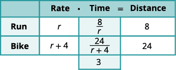
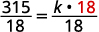

By the end of this section, you will be able to:
* Solve proportions
* Solve similar figure applications
* Solve uniform motion applications
* Solve work applications
* Solve direct variation problems
* Solve inverse variation problems

Before you get started, take this readiness quiz.

1.  Solve:
    <math xmlns="http://www.w3.org/1998/Math/MathML"><mrow><mn>2</mn><mo stretchy="false">(</mo><mi>n</mi><mo>−</mo><mn>1</mn><mo stretchy="false">)</mo><mo>−</mo><mn>4</mn><mo>=</mo><mn>−10</mn><mo>.</mo></mrow></math>
    
    * * *
    {: data-type="newline"}
    
    If you missed this problem, review [\[link\]](/m63308#fs-id1167836399284).
2.  An express train and a charter bus leave Chicago to travel to Champaign. The express train can make the trip in two hours and the bus takes five hours for the trip. The speed of the express train is 42 miles per hour faster than the speed of the bus. Find the speed of the bus.
    * * *
    {: data-type="newline"}
    
    If you missed this problem, review [\[link\]](/m63311#fs-id1167836309166).
3.  Solve
    <math xmlns="http://www.w3.org/1998/Math/MathML"><mrow><mfrac><mn>1</mn><mn>3</mn></mfrac><mi>x</mi><mo>+</mo><mfrac><mn>1</mn><mn>4</mn></mfrac><mi>x</mi><mo>=</mo><mfrac><mn>5</mn><mn>6</mn></mfrac><mo>.</mo></mrow></math>
    
    * * *
    {: data-type="newline"}
    
    If you missed this problem, review [\[link\]](/m63308#fs-id1167833239741).
{: data-number-style="arabic"}

### Solve Proportions

When two rational expressions are equal, the equation relating them is called a **proportion**{: data-type="term"}.

Proportion

A **proportion** is an equation of the form <math xmlns="http://www.w3.org/1998/Math/MathML"><mrow><mfrac><mi>a</mi><mi>b</mi></mfrac><mo>=</mo><mfrac><mi>c</mi><mi>d</mi></mfrac><mo>,</mo></mrow></math>

 where <math xmlns="http://www.w3.org/1998/Math/MathML"><mrow><mi>b</mi><mo>≠</mo><mn>0</mn><mo>,</mo><mi>d</mi><mo>≠</mo><mn>0</mn><mo>.</mo></mrow></math>

The proportion is read “*a* is to *b* as *c* is to *d.*”

The equation <math xmlns="http://www.w3.org/1998/Math/MathML"><mrow><mfrac><mn>1</mn><mn>2</mn></mfrac><mo>=</mo><mfrac><mn>4</mn><mn>8</mn></mfrac></mrow></math>

 is a proportion because the two fractions are equal. The proportion <math xmlns="http://www.w3.org/1998/Math/MathML"><mrow><mfrac><mn>1</mn><mn>2</mn></mfrac><mo>=</mo><mfrac><mn>4</mn><mn>8</mn></mfrac></mrow></math>

 is read “1 is to 2 as 4 is to 8.”

Since a proportion is an equation with rational expressions, we will solve proportions the same way we solved rational equations. We’ll multiply both sides of the equation by the LCD to clear the fractions and then solve the resulting equation.

Solve: <math xmlns="http://www.w3.org/1998/Math/MathML"><mrow><mfrac><mi>n</mi><mrow><mi>n</mi><mo>+</mo><mn>14</mn></mrow></mfrac><mo>=</mo><mfrac><mn>5</mn><mn>7</mn></mfrac><mo>.</mo></mrow></math>

<table class="unnumbered unstyled can-break" summary="Solve n divided by the quantity n plus 14 is equal to 5 divided by 7. Notice that the least common denominator is the product of 7 and the quantity n plus 14. Multiply each side of the equation by the least common denominator and remove the common factors on each side. The result is 7 n is equal to 5 times the quantity n plus 14. Simplify the equation on the right side. The result is 7 n is equal to 5 n plus 70. By further simplifying, the equation becomes 2 n is equal to 70. When the equation is solved, the result is n is equal to 35. Check the solution by substituting into the original equation. The result is 35 divided by the sum of 35 and 14 is equal to 5 divided by 7. Determine whether the equation is true by simplifying. Is 35 divided by 49 is equal to 5 divided by 7 a true equation? Show the common factors on the right side. Is the quantity 5 times 7 divided by the quantity 7 times 7 is equal to 5 divided by 7 true? 5 divided by 7 is equal to 5 divided by 7 is a true equation." data-label=""><tbody>
<tr>
<td />
<td />
<td data-align="left">

</td>
</tr>
<tr>
<td colspan="2" data-align="left">Multiply both sides by LCD.</td>
<td data-align="left">

</td>
</tr>
<tr>
<td colspan="2" data-align="left">Remove common factors on each side.</td>
<td data-align="left">

</td>
</tr>
<tr>
<td colspan="2" data-align="left">Simplify.</td>
<td data-align="left">

</td>
</tr>
<tr>
<td colspan="2" data-align="left">Solve for <em>n</em>.</td>
<td data-align="left">

</td>
</tr>
<tr>
<td />
<td />
<td data-align="left">

</td>
</tr>
<tr>
<td colspan="3" data-align="left">Check.</td>
</tr>
<tr>
<td />
<td data-align="left">

</td>
<td />
</tr>
<tr>
<td data-align="left">

</td>
<td data-align="left">

</td>
<td />
</tr>
<tr>
<td data-align="left">Simplify.</td>
<td data-align="left">

</td>
<td />
</tr>
<tr>
<td data-align="left">Show common factors.</td>
<td data-align="left">

</td>
<td />
</tr>
<tr>
<td data-align="left">Simplify.</td>
<td data-align="left">

</td>
<td />
</tr>
</tbody></table>

Solve the proportion: <math xmlns="http://www.w3.org/1998/Math/MathML"><mrow><mfrac><mi>y</mi><mrow><mi>y</mi><mo>+</mo><mn>55</mn></mrow></mfrac><mo>=</mo><mfrac><mn>3</mn><mn>8</mn></mfrac><mo>.</mo></mrow></math>

<math xmlns="http://www.w3.org/1998/Math/MathML"><mrow><mi>y</mi><mo>=</mo><mn>33</mn></mrow></math>

Solve the proportion: <math xmlns="http://www.w3.org/1998/Math/MathML"><mrow><mfrac><mi>z</mi><mrow><mi>z</mi><mo>−</mo><mn>84</mn></mrow></mfrac><mo>=</mo><mo>−</mo><mfrac><mn>1</mn><mn>5</mn></mfrac><mo>.</mo></mrow></math>

<math xmlns="http://www.w3.org/1998/Math/MathML"><mrow><mi>z</mi><mo>=</mo><mn>14</mn></mrow></math>

Notice in the last example that when we cleared the fractions by multiplying by the LCD, the result is the same as if we had cross-multiplied.

![The equation n divided by the quantity n plus 14 is equal to 5 divided by 7 can be solved by multiplying each side by the least common denominator, 7 times the quantity n plus 14. Multiplying by the least common denominator is a way to clear the fractions. The result is 7 n is equal to 5 times the quantity n plus 14. The equation n divided by the quantity n plus 14 is equal to 5 divided by 7 can also be solved using cross multiplication. Multiply n and 7. Multiply the quantity n plus 14 and 5. The result is also 7 n is equal to 5 times the quantity n plus 14. Cross multiplication also clears fractions.](../resources/CNX_IntAlg_Figure_07_05_018_img.jpg)

For any proportion, <math xmlns="http://www.w3.org/1998/Math/MathML"><mrow><mfrac><mi>a</mi><mi>b</mi></mfrac><mo>=</mo><mfrac><mi>c</mi><mi>d</mi></mfrac><mo>,</mo></mrow></math>

 we get the same result when we clear the fractions by multiplying by the LCD as when we cross-multiply.

To solve applications with proportions, we will follow our usual strategy for solving applications But when we set up the proportion, we must make sure to have the units correct—the units in the numerators must match each other and the units in the denominators must also match each other.

When pediatricians prescribe acetaminophen to children, they prescribe 5 milliliters (ml) of acetaminophen for every 25 pounds of the child’s weight. If Zoe weighs 80 pounds, how many milliliters of acetaminophen will her doctor prescribe?

<table class="unnumbered unstyled" summary="Identify what must be found and a variable to represent it. The number of milliliters of acetaminophen the doctor will prescribe must be found. Let a represent the number of milliliters of acetaminophen. Write a sentence that gives the information to find a. If 5 milliliters are prescribed for every 25 pounds, find how much will be prescribed for 80 pounds. Translate the sentence into a proportion. Be careful of the units, making sure the proportion shows the number of milliliters divided by the number of pounds for the rational expressions on each side. The proportion to find how much acetaminophen is prescribed for 80 pounds is 5 divided by 25 is equal to a divided by 80. Multiply each side of the proportion by the least common denominator, which is 400. The result is 400 times the quantity 5 divided by 25 is equal to 400 times the quantity a divided by 80. Remove the common factors on each side. The common factor on the left side is 25. The common factor on the right side is 8. The equation that result is 16 times 5 is equal to 5 a. Do not simplify on the left side of the equation. Think about the next step. Solve for a by dividing each side by 5. The result is 16 is equal to a. Check that the answer is reasonable. Notice that 80 is about 3 times 25. The amount of acetaminophen should be about 3 times 5. So, 16 milliliters makes sense. To be sure, substitute a is equal to 16 in the original proportion. Is 5 divided by 25 equal to 16 divided by 80? The proportion simplifies to 1 divided by 5 is equal to 1 divided by 5, which is true. The solution, 16 is equal to a, checks. Write a complete sentence. The pediatrician would prescribe 16 milliliters of acetaminophen to Zoe." data-label=""><tbody>
<tr>
<td data-align="left">Identify what we are asked to find,
and choose a variable to represent it.</td>
<td data-align="left">How many ml of acetaminophen will the
doctor prescribe?</td>
</tr>
<tr>
<td />
<td data-align="left">Let <em>a</em> = ml of acetaminophen.</td>
</tr>
<tr>
<td data-align="left">Write a sentence that gives the
information to find it.</td>
<td data-align="left">If 5 ml is prescribed for every
25 pounds, how much will be
prescribed for 80 pounds?</td>
</tr>
<tr>
<td data-align="left">Translate into a proportion—be
careful of the units.</td>
<td data-align="left" />
</tr>
<tr>
<td data-align="center">

</td>
<td data-align="left">

</td>
</tr>
<tr>
<td data-align="left">Multiply both sides by the LCD, 400.</td>
<td data-align="left">

</td>
</tr>
<tr>
<td data-align="left">Remove common factors on each side.</td>
<td data-align="left">

</td>
</tr>
<tr>
<td data-align="left">Simplify, but don’t multiply on the left. Notice
what the next step will be.</td>
<td data-align="left">

</td>
</tr>
<tr>
<td data-align="left">Solve for <em>a</em>.</td>
<td data-align="left">

</td>
</tr>
<tr>
<td />
<td data-align="left">

</td>
</tr>
<tr>
<td data-align="left">Check.
Is the answer reasonable?

</td>
<td />
</tr>
<tr>
<td data-align="left">Write a complete sentence.</td>
<td data-align="left">The pediatrician would prescribe 16 ml of
acetaminophen to Zoe.</td>
</tr>
</tbody></table>

Pediatricians prescribe 5 milliliters (ml) of acetaminophen for every 25 pounds of a child’s weight. How many milliliters of acetaminophen will the doctor prescribe for Emilia, who weighs 60 pounds?

The pediatrician will prescribe 12 ml of acetaminophen to Emilia.

For every 1 kilogram (kg) of a child’s weight, pediatricians prescribe 15 milligrams (mg) of a fever reducer. If Isabella weighs 12 kg, how many milligrams of the fever reducer will the pediatrician prescribe?

The pediatrician will prescribe 180 mg of fever reducer to Isabella.

### Solve similar figure applications

When you shrink or enlarge a photo on a phone or tablet, figure out a distance on a map, or use a pattern to build a bookcase or sew a dress, you are working with **similar figures**{: data-type="term"}. If two figures have exactly the same shape, but different sizes, they are said to be similar. One is a scale model of the other. All their corresponding angles have the same measures and their corresponding sides have the same ratio.

Similar Figures

Two figures are similar if the measures of their corresponding angles are equal and their corresponding sides have the same ratio.

For example, the two triangles in [\[link\]](#CNX_IntAlg_Figure_07_05_003) are similar. Each side of <math xmlns="http://www.w3.org/1998/Math/MathML"><mrow><mtext>Δ</mtext><mi>A</mi><mi>B</mi><mi>C</mi></mrow></math>

 is four times the length of the corresponding side of <math xmlns="http://www.w3.org/1998/Math/MathML"><mrow><mtext>Δ</mtext><mi>X</mi><mi>Y</mi><mi>Z</mi><mo>.</mo></mrow></math>

 {: #CNX_IntAlg_Figure_07_05_003}

This is summed up in the Property of Similar Triangles.

Property of Similar Triangles

If <math xmlns="http://www.w3.org/1998/Math/MathML"><mrow><mtext>Δ</mtext><mi>A</mi><mi>B</mi><mi>C</mi></mrow></math>

 is similar to <math xmlns="http://www.w3.org/1998/Math/MathML"><mrow><mtext>Δ</mtext><mi>X</mi><mi>Y</mi><mi>Z</mi><mo>,</mo></mrow></math>

 then their corresponding angle measure are equal and their corresponding sides have the same ratio.

To solve applications with similar figures we will follow the Problem-Solving Strategy for Geometry Applications we used earlier.

On a map, San Francisco, Las Vegas, and Los Angeles form a triangle. The distance between the cities is measured in inches. The figure on the left below represents the triangle formed by the cities on the map. If the actual distance from Los Angeles to Las Vegas is 270 miles, find the distance from Los Angeles to San Francisco.

![The first figure is a triangle labeled &#x201C;Distances on map.&#x201D; The triangle is formed by San Francisco, Las Vegas, and Los Angeles. The distance between San Francisco and Las Vegas is 2.1 inches. The distance between Las Vegas and Los Angeles is 1 inch. The distance between Los Angeles and San Francisco is 1.3 inches. The second figure is a triangle labeled &#x201C;Actual Distances.&#x201D; The triangle is formed by San Francisco, Las Vegas, and Los Angeles. The distance between Las Vegas and Los Angeles is 270 miles. The distance between Los Angeles and San Francisco is labeled x.](../resources/CNX_IntAlg_Figure_07_05_005_img.jpg)

Since the triangles are similar, the corresponding sides are proportional.

<table class="unnumbered unstyled" summary="Read the problem. Draw the figures and label it with the given information. Recall that the figures are shown above. Identify what we are looking for. It is the actual distance from Los Angeles to San Francisco. Name the variable to represent the distance. Let x be equal to the distance from Los Angeles to San Francisco. Translate the problem into an equation. Since the triangles are similar, the corresponding sides are proportional. Make the numerators miles and the numerator inches. The equation is x miles divided by 1.3 inches is equal to 270 miles divided by 1 inch. Solve the equation, 1.3 times the quantity x divided by 1.3 is equal to 1.3 times the quantity 270 divided by 1. The solution is x is equal to 351. Check the solution. On the map, the distance from Los Angeles to San Francisco is more than the distance from Los Angeles to Las Vegas. Since 351 is more than 270, the answer makes sense. Now check x is equal to 351 in the original proportion. Use a calculator. Is 351 miles divided by 1.3 inches equal to 270 miles divided by 1 inch? When simplified, the equation becomes 270 miles divided by 1 inch is equal to 270 miles divided by 1 inch, which is true. Answer the question. The distance from Los Angeles to San Francisco is 351 miles." data-label=""><tbody>
<tr>
<td data-align="left"><strong>Read</strong> the problem. Draw the figures and label
it with the given information.</td>
<td data-align="left">The figures are shown above.</td>
</tr>
<tr>
<td data-valign="top" data-align="left"><strong>Identify</strong> what we are looking for.</td>
<td data-align="left">the actual distance from Los Angeles
to San Francisco</td>
</tr>
<tr>
<td data-valign="top" data-align="left"><strong>Name</strong> the variables.</td>
<td data-align="left">Let <em>x</em> = distance from Los Angeles
to San Francisco.</td>
</tr>
<tr>
<td data-align="left"><strong>Translate</strong> into an equation.
Since the triangles are similar, the
corresponding sides are proportional. We’ll
make the numerators “miles” and
the denominators “inches”.</td>
<td data-align="center">

</td>
</tr>
<tr>
<td data-align="left"><strong>Solve</strong> the equation.</td>
<td data-align="center">

</td>
</tr>
<tr>
<td />
<td data-align="center">

</td>
</tr>
<tr>
<td data-align="left"><strong>Check.</strong>
On the map, the distance from Los Angeles
to San Francisco is more than
the distance from Los Angeles to
Las Vegas. Since 351 is more than 270
the answer makes sense.

</td>
<td />
</tr>
<tr>
<td data-valign="top" data-align="left"><strong>Answer</strong> the question.</td>
<td data-align="left">The distance from Los Angeles to
San Francisco is 351 miles.</td>
</tr>
</tbody></table>

On the map, Seattle, Portland, and Boise form a triangle. The distance between the cities is measured in inches. The figure on the left below represents the triangle formed by the cities on the map. The actual distance from Seattle to Boise is 400 miles.

Find the actual distance from Seattle to Portland.

The distance is 150 miles.

Find the actual distance from Portland to Boise.

The distance is 350 miles.

We can use similar figures to find heights that we cannot directly measure.

Tyler is 6 feet tall. Late one afternoon, his shadow was 8 feet long. At the same time, the shadow of a tree was 24 feet long. Find the height of the tree.

<table class="unnumbered unstyled" summary="Read the problem and draw a figure. The figure is a triangle formed by the height of a tree labeled h and the shadow of the tree, which is 24 feet long. Within the triangle is a smaller triangle formed by the height of Tyler, which is 6 feet and Tyler&#x2019;s shadow, which is 8 feet. We are looking for h, the height of the tree. We will use similar triangles to write an equation. The equation is h divided by 24 is equal to 6 divided by 8. The small triangle is similar to the large triangle. Solve the proportion by multiplying each side by the least common denominator, 24. 24 times the quantity 6 divided by 8 is equal to 24 times the quantity h divided by 24. Simplify the equation. The result is 18 is equal to h. Check the answer. Tyler&#x2019;s height is less than his shadow&#x2019;s, so it makes sense that the tree&#x2019;s height is less than the length of its shadow. Check that h is equal to 18 in the original equation. Is 6 divided by 8 equal to 18 divided by 24? When simplified, the equation becomes 3 divided by 4 is equal to 3 divided by 4, which checks." data-label=""><tbody>
<tr>
<td data-align="left">Read the problem and draw a figure.</td>
<td />
</tr>
<tr>
<td data-valign="top" data-align="left">We are looking for <em>h</em>, the height of the tree.</td>
<td data-align="left">

</td>
</tr>
<tr>
<td data-align="left">We will use similar triangles to write an equation.</td>
<td />
</tr>
<tr>
<td data-align="left">The small triangle is similar to the large triangle.</td>
<td data-align="left">

</td>
</tr>
<tr>
<td data-align="left">Solve the proportion.</td>
<td data-align="left">

</td>
</tr>
<tr>
<td />
<td data-align="left">

</td>
</tr>
<tr>
<td data-align="left">Simplify.</td>
<td />
</tr>
<tr>
<td data-align="left">Check.

</td>
</tr>
</tbody></table>

A telephone pole casts a shadow that is 50 feet long. Nearby, an 8 foot tall traffic sign casts a shadow that is 10 feet long. How tall is the telephone pole?

The telephone pole is 40 feet tall.

A pine tree casts a shadow of 80 feet next to a 30 foot tall building which casts a 40 feet shadow. How tall is the pine tree?

The pine tree is 60 feet tall.

### Solve Uniform Motion Applications

We have solved uniform motion problems using the formula <math xmlns="http://www.w3.org/1998/Math/MathML"><mrow><mi>D</mi><mo>=</mo><mi>r</mi><mi>t</mi></mrow></math>

 in previous chapters. We used a table like the one below to organize the information and lead us to the equation.

The formula <math xmlns="http://www.w3.org/1998/Math/MathML"><mrow><mi>D</mi><mo>=</mo><mi>r</mi><mi>t</mi></mrow></math>

 assumes we know *r* and *t* and use them to find *D*. If we know *D* and *r* and need to find *t*, we would solve the equation for *t* and get the formula <math xmlns="http://www.w3.org/1998/Math/MathML"><mrow><mi>t</mi><mo>=</mo><mfrac><mi>D</mi><mi>r</mi></mfrac><mo>.</mo></mrow></math>

We have also explained how flying with or against the wind affects the speed of a plane. We will revisit that idea in the next example.

An airplane can fly 200 miles into a 30 mph headwind in the same amount of time it takes to fly 300 miles with a 30 mph tailwind. What is the speed of the airplane?

This is a uniform motion situation. A diagram will help us visualize the situation.

<table class="unnumbered unstyled can-break" summary="A figure shows the uniform motion of an airplane. An arrow labeled &#x201C;300 miles with the wind; r plus 30&#x201D; runs parallel to the wind which is labeled &#x201C;Wind; 30 miles per hour.&#x201D; A second arrow also runs parallel to the wind, is labeled &#x201C;200 miles against the wind; r minus 30,&#x201D; and points opposite the first arrow. We fill in the chart to organize the information. The chart has two columns and three rows. The first row is a header row and the second column is labeled &#x201C;Rate times Time is equal to Distance.&#x201D; The second column is subdivided into three columns for &#x201C;Rate,&#x201D; &#x201C;Time,&#x201D; and &#x201C;Distance.&#x201D; The first column is a header column with the first row labeled &#x201C;Headwind&#x201D; and the second row labeled &#x201C;Tailwind.&#x201D; We are looking for the speed of the airplane. Let r be equal to the speed of the airplane. When the plane flies with the wind, the wind increases its speed and so the rate is r plus 30. When the plane flies against the wind, the wind decreases its speed and the rate is r minus 30. Write the headwind speed, r minus 30, and the tailwind speed r plus 30 in the &#x201C;Rate&#x201D; column of the chart. Write the distances 200 and 300 in the &#x201C;Distance&#x201D; column of the chart. Since D is equal to r times t, we solve for t and get t is equal to D divided by r. We divided the distance by the rate in each row, and place the expressions 200 divided by the quantity r minus 30 for the headwind and 300 divided by the quantity r plus 30 in the &#x201C;Time&#x201D; column. We know the times are equal and so we write our equation, 200 divided by the quantity r minus 30 is equal to 300 divided by the quantity r plus 30. We multiply both sides of the equation by the least common denominator, the quantity r plus 30 times the quantity r minus 30. The result is 200 times the quantity r plus 30 is equal to 300 times the quantity r minus 30. Simplify. The equation becomes 200 r plus 6,000 is equal to 300 r minus 9,000, which becomes 15,000 is equal to 100 r. The result is 150 is equal to r. Check. Is 150 miles per hour a reasonable speed for an airplane? Yes. If the plane is traveling 150 miles per hour and the wind is 30 miles per hour, the tailwind is 150 plus 30, which is equal to 180 miles per hour and 300 divided by 180 is equal to five-thirds hours. Also, the headwind is 150 minus 30, which is equal to 120 miles per hour and 200 divided by 120 is equal to Five-thirds hours. The times are equal, so the plane was traveling 150 miles per hour." data-label=""><tbody>
<tr>
<td colspan="2" data-align="center">

</td>
</tr>
<tr>
<td colspan="2" data-align="left">We fill in the chart to organize the information.</td>
</tr>
<tr>
<td data-align="left">We are looking for the speed of the airplane.</td>
<td data-align="left">Let <em>r</em> = the speed of the airplane.</td>
</tr>
<tr>
<td colspan="2" data-align="left">When the plane flies with the wind,
the wind increases its speed and so the rate is <em>r</em> + 30.</td>
</tr>
<tr>
<td colspan="2" data-align="left">When the plane flies against the wind,
the wind decreases its speed and the rate is <em>r</em> − 30.</td>
</tr>
<tr>
<td data-align="left">Write in the rates.
Write in the distances.

Since <math xmlns="http://www.w3.org/1998/Math/MathML"><mrow><mi>D</mi><mo>=</mo><mi>r</mi><mo>·</mo><mi>t</mi><mo>,</mo></mrow></math> we solve for <math xmlns="http://www.w3.org/1998/Math/MathML"><mrow><mi>t</mi></mrow></math> and get <math xmlns="http://www.w3.org/1998/Math/MathML"><mrow><mi>t</mi><mo>=</mo><mfrac><mi>D</mi><mi>r</mi></mfrac><mo>.</mo></mrow></math>

We divide the distance by the rate in each row, and place the expression in the time column.</td>
<td data-align="left">

</td>
</tr>
<tr>
<td data-align="left">We know the times are equal and so we write
our equation.</td>
<td data-align="left"><math xmlns="http://www.w3.org/1998/Math/MathML"><mrow><mspace width="7.1em" /><mfrac><mrow><mn>200</mn></mrow><mrow><mi>r</mi><mo>−</mo><mn>30</mn></mrow></mfrac><mo>=</mo><mfrac><mrow><mn>300</mn></mrow><mrow><mi>r</mi><mo>+</mo><mn>30</mn></mrow></mfrac></mrow></math></td>
</tr>
<tr>
<td data-align="left">We multiply both sides by the LCD.</td>
<td data-align="left"><math xmlns="http://www.w3.org/1998/Math/MathML"><mrow><mo stretchy="false">(</mo><mi>r</mi><mo>+</mo><mn>30</mn><mo stretchy="false">)</mo><mo stretchy="false">(</mo><mi>r</mi><mo>−</mo><mn>30</mn><mo stretchy="false">)</mo><mo>(</mo><mfrac><mrow><mn>200</mn></mrow><mrow><mi>r</mi><mo>−</mo><mn>30</mn></mrow></mfrac><mo>)</mo><mo>=</mo><mo stretchy="false">(</mo><mi>r</mi><mo>+</mo><mn>30</mn><mo stretchy="false">)</mo><mo stretchy="false">(</mo><mi>r</mi><mo>−</mo><mn>30</mn><mo stretchy="false">)</mo><mo>(</mo><mfrac><mrow><mn>300</mn></mrow><mrow><mi>r</mi><mo>+</mo><mn>30</mn></mrow></mfrac><mo>)</mo></mrow></math></td>
</tr>
<tr>
<td data-align="left">Simplify.</td>
<td data-align="left"><math xmlns="http://www.w3.org/1998/Math/MathML"><mrow><mspace width="4.45em" /><mo stretchy="false">(</mo><mi>r</mi><mo>+</mo><mn>30</mn><mo stretchy="false">)</mo><mo stretchy="false">(</mo><mn>200</mn><mo stretchy="false">)</mo><mo>=</mo><mo stretchy="false">(</mo><mi>r</mi><mo>−</mo><mn>30</mn><mo stretchy="false">)</mo><mn>300</mn></mrow></math>
</td>
</tr>
<tr>
<td />
<td data-align="left"><math xmlns="http://www.w3.org/1998/Math/MathML"><mrow><mspace width="4.8em" /><mn>200</mn><mi>r</mi><mo>+</mo><mn>6000</mn><mo>=</mo><mn>300</mn><mi>r</mi><mo>−</mo><mn>9000</mn></mrow></math>
</td>
</tr>
<tr>
<td data-align="left">Solve.</td>
<td data-align="left"><math xmlns="http://www.w3.org/1998/Math/MathML"><mrow><mspace width="7.3em" /><mn>15000</mn><mo>=</mo><mn>100</mn><mi>r</mi></mrow></math></td>
</tr>
<tr>
<td data-align="left"><strong>Check.</strong>
Is 150 mph a reasonable speed for an airplane? Yes.
If the plane is traveling 150 mph and the wind is 30 mph,
<math xmlns="http://www.w3.org/1998/Math/MathML"><mrow><mtable><mtr><mtd columnalign="left"><mtext>Tailwind</mtext></mtd><mtd /><mtd columnalign="left"><mn>150</mn><mo>+</mo><mn>30</mn><mo>=</mo><mn>180</mn><mspace width="0.2em" /><mtext>mph</mtext></mtd><mtd columnalign="left"><mfrac><mn>300</mn><mn>180</mn></mfrac><mo>=</mo><mfrac><mn>5</mn><mn>3</mn></mfrac><mspace width="0.2em" /><mtext>hours</mtext></mtd></mtr><mtr><mtd columnalign="left"><mtext>Headwind</mtext></mtd><mtd /><mtd columnalign="left"><mn>150</mn><mo>−</mo><mn>30</mn><mo>=</mo><mn>120</mn><mspace width="0.2em" /><mtext>mph</mtext></mtd><mtd columnalign="left"><mfrac><mn>200</mn><mn>120</mn></mfrac><mo>=</mo><mfrac><mn>5</mn><mn>3</mn></mfrac><mspace width="0.2em" /><mtext>hours</mtext></mtd></mtr></mtable></mrow></math></td>
<td />
</tr>
<tr>
<td data-align="left">The times are equal, so it checks.</td>
<td data-align="left">The plane was traveling 150 mph.</td>
</tr>
</tbody></table>

Link can ride his bike 20 miles into a 3 mph headwind in the same amount of time he can ride 30 miles with a 3 mph tailwind. What is Link’s biking speed?

Link’s biking speed is 15 mph.

Danica can sail her boat 5 miles into a 7 mph headwind in the same amount of time she can sail 12 miles with a 7 mph tailwind. What is the speed of Danica’s boat without a wind?

The speed of Danica’s boat is 17 mph.

In the next example, we will know the total time resulting from travelling different distances at different speeds.

Jazmine trained for 3 hours on Saturday. She ran 8 miles and then biked 24 miles. Her biking speed is 4 mph faster than her running speed. What is her running speed?

This is a uniform motion situation. A diagram will help us visualize the situation.

<table class="unnumbered unstyled can-break" summary="A figure shows the uniform motion of an airplane. An arrow labeled &#x201C;300 miles with the wind; r plus 30&#x201D; runs parallel to the wind which is labeled &#x201C;Wind; 30 miles per hour.&#x201D; A second arrow also runs parallel to the wind, is labeled &#x201C;200 miles against the wind; r minus 30,&#x201D; and points opposite the first arrow. We fill in the chart to organize the information. The chart has two columns and three rows. The first row is a header row and the second column is labeled &#x201C;Rate times Time is equal to Distance.&#x201D; The second column is subdivided into three columns for &#x201C;Rate,&#x201D; &#x201C;Time,&#x201D; and &#x201C;Distance.&#x201D; The first column is a header column with the first row labeled &#x201C;Headwind&#x201D; and the second row labeled &#x201C;Tailwind.&#x201D; We are looking for the speed of the airplane. Let r be equal to the speed of the airplane. When the plane flies with the wind, the wind increases its speed and so the rate is r plus 30. When the plane flies against the wind, the wind decreases its speed and the rate is r minus 30. Write the headwind speed, r minus 30, and the tailwind speed r plus 30 in the &#x201C;Rate&#x201D; column of the chart. Write the distances 200 and 300 in the &#x201C;Distance&#x201D; column of the chart. Since D is equal to r times t, we solve for t and get t is equal to D divided by r. We divided the distance by the rate in each row, and place the expressions 200 divided by the quantity r minus 30 for the headwind and 300 divided by the quantity r plus 30 in the &#x201C;Time&#x201D; column. We know the times are equal and so we write our equation, 200 divided by the quantity r minus 30 is equal to 300 divided by the quantity r plus 30. We multiply both sides of the equation by the least common denominator, the quantity r plus 30 times the quantity r minus 30. The result is 200 times the quantity r plus 30 is equal to 300 times the quantity r minus 30. Simplify. The equation becomes 200 r plus 6,000 is equal to 300 r minus 9,000, which becomes 15,000 is equal to 100 r. The result is 150 is equal to r. Check. Is 150 miles per hour a reasonable speed for an airplane? Yes. If the plane is traveling 150 miles per hour and the wind is 30 miles per hour, the tailwind is 150 plus 30, which is equal to 180 miles per hour and 300 divided by 180 is equal to five-thirds hours. Also, the headwind is 150 minus 30, which is equal to 120 miles per hour and 200 divided by 120 is equal to Five-thirds hours. The times are equal, so the plane was traveling 150 miles per hour." data-label=""><tbody>
<tr>
<td colspan="2" data-align="center">

</td>
</tr>
<tr>
<td colspan="2" data-align="left">We fill in the chart to organize the information.</td>
</tr>
<tr>
<td data-align="left">We are looking for Jazmine’s running speed.</td>
<td data-align="left">Let <em>r</em> = Jazmine’s running speed.</td>
</tr>
<tr>
<td data-align="left">Her biking speed is 4 miles faster than her
running speed.</td>
<td data-align="left"><em>r</em> + 4 = her biking speed</td>
</tr>
<tr>
<td data-align="left">The distances are given, enter them into the chart.

Since <math xmlns="http://www.w3.org/1998/Math/MathML"><mrow><mi>D</mi><mo>=</mo><mi>r</mi><mo>·</mo><mi>t</mi><mo>,</mo></mrow></math> we solve for <math xmlns="http://www.w3.org/1998/Math/MathML"><mrow><mi>t</mi></mrow></math> and get <math xmlns="http://www.w3.org/1998/Math/MathML"><mrow><mi>t</mi><mo>=</mo><mfrac><mi>D</mi><mi>r</mi></mfrac><mo>.</mo></mrow></math>

We divide the distance by the rate in each row, and place the expression in the time column.</td>
<td data-align="left">

</td>
</tr>
<tr>
<td data-align="left">Write a word sentence.</td>
<td data-align="left">Her time plus the time biking is 3 hours.</td>
</tr>
<tr>
<td data-align="left">Translate the sentence to get the equation.</td>
<td data-align="center"><math xmlns="http://www.w3.org/1998/Math/MathML"><mrow><mfrac><mn>8</mn><mi>r</mi></mfrac><mo>+</mo><mfrac><mrow><mn>24</mn></mrow><mrow><mi>r</mi><mo>+</mo><mn>4</mn></mrow></mfrac><mspace width="0.5em" /><mo>=</mo><mspace width="0.5em" /><mn>3</mn><mspace width="1.8em" /></mrow></math></td>
</tr>
<tr>
<td data-valign="top" data-align="left">Solve.</td>
<td data-valign="top" data-align="center"><math xmlns="http://www.w3.org/1998/Math/MathML"><mrow><mtable><mtr><mtd columnalign="right"><mrow><mi>r</mi><mo>(</mo><mi>r</mi><mo>+</mo><mn>4</mn><mo>)</mo><mo>(</mo><mfrac><mn>8</mn><mi>r</mi></mfrac><mo>+</mo><mfrac><mrow><mn>24</mn></mrow><mrow><mi>r</mi><mo>+</mo><mn>4</mn></mrow></mfrac><mo>)</mo></mrow></mtd><mtd columnalign="left"><mo>=</mo></mtd><mtd columnalign="left"><mrow><mn>3</mn><mo>·</mo><mi>r</mi><mo stretchy="false">(</mo><mi>r</mi><mo>+</mo><mn>4</mn><mo stretchy="false">)</mo></mrow></mtd></mtr><mtr><mtd columnalign="right"><mrow><mn>8</mn><mo stretchy="false">(</mo><mi>r</mi><mo>+</mo><mn>4</mn><mo stretchy="false">)</mo><mo>+</mo><mn>24</mn><mi>r</mi></mrow></mtd><mtd columnalign="left"><mo>=</mo></mtd><mtd columnalign="left"><mrow><mn>3</mn><mi>r</mi><mo stretchy="false">(</mo><mi>r</mi><mo>+</mo><mn>4</mn><mo stretchy="false">)</mo></mrow></mtd></mtr><mtr><mtd columnalign="right"><mrow><mn>8</mn><mi>r</mi><mo>+</mo><mn>32</mn><mo>+</mo><mn>24</mn><mi>r</mi></mrow></mtd><mtd columnalign="left"><mo>=</mo></mtd><mtd columnalign="left"><mrow><mn>3</mn><msup><mi>r</mi><mn>2</mn></msup><mo>+</mo><mn>12</mn><mi>r</mi></mrow></mtd></mtr><mtr><mtd columnalign="right"><mrow><mn>32</mn><mo>+</mo><mn>32</mn><mi>r</mi></mrow></mtd><mtd columnalign="left"><mo>=</mo></mtd><mtd columnalign="left"><mrow><mn>3</mn><msup><mi>r</mi><mn>2</mn></msup><mo>+</mo><mn>12</mn><mi>r</mi></mrow></mtd></mtr><mtr><mtd columnalign="right"><mn>0</mn></mtd><mtd columnalign="left"><mo>=</mo></mtd><mtd columnalign="left"><mrow><mn>3</mn><msup><mi>r</mi><mn>2</mn></msup><mo>−</mo><mn>20</mn><mi>r</mi><mo>−</mo><mn>32</mn></mrow></mtd></mtr><mtr><mtd columnalign="right"><mn>0</mn></mtd><mtd columnalign="left"><mo>=</mo></mtd><mtd columnalign="left"><mrow><mo stretchy="false">(</mo><mn>3</mn><mi>r</mi><mo>+</mo><mn>4</mn><mo stretchy="false">)</mo><mo stretchy="false">(</mo><mi>r</mi><mo>−</mo><mn>8</mn><mo stretchy="false">)</mo></mrow></mtd></mtr></mtable></mrow></math></td>
</tr>
<tr>
<td data-valign="top" data-align="left" />
<td data-valign="top" data-align="center"><math xmlns="http://www.w3.org/1998/Math/MathML"><mrow><mo stretchy="false">(</mo><mn>3</mn><mi>r</mi><mo>+</mo><mn>4</mn><mo stretchy="false">)</mo><mo>=</mo><mn>0</mn><mspace width="1.2em" /><mo stretchy="false">(</mo><mi>r</mi><mo>−</mo><mn>8</mn><mo stretchy="false">)</mo><mo>=</mo><mn>0</mn></mrow></math></td>
</tr>
<tr>
<td data-valign="top" data-align="left" />
<td data-valign="top" data-align="center"><math xmlns="http://www.w3.org/1998/Math/MathML"><mrow><menclose notation="updiagonalstrike"><mrow><mi>r</mi><mo>=</mo><mo>−</mo><mfrac><mn>4</mn><mn>3</mn></mfrac></mrow></menclose><mspace width="1.2em" /><mi>r</mi><mo>=</mo><mn>8</mn></mrow></math></td>
</tr>
<tr>
<td data-align="left">Check.
A negative speed does not make sense in this problem,
so <math xmlns="http://www.w3.org/1998/Math/MathML"><mrow><mi>r</mi><mo>=</mo><mn>8</mn></mrow></math> is the solution.
Is 8 mph a reasonable running speed? Yes.
If Jazmine’s running rate is 4, then her biking rate,
<math xmlns="http://www.w3.org/1998/Math/MathML"><mrow><mi>r</mi><mo>+</mo><mn>4</mn><mo>,</mo></mrow></math> which is <math xmlns="http://www.w3.org/1998/Math/MathML"><mrow><mn>8</mn><mo>+</mo><mn>4</mn><mo>=</mo><mn>12</mn><mo>.</mo></mrow></math>

<math xmlns="http://www.w3.org/1998/Math/MathML"><mrow><mtable><mtr><mtd columnalign="left"><mtext>Run</mtext><mspace width="0.2em" /><mn>8</mn><mspace width="0.2em" /><mtext>mph</mtext></mtd><mtd columnalign="left"><mfrac><mrow><mn>8</mn><mspace width="0.2em" /><mtext>miles</mtext></mrow><mrow><mn>8</mn><mspace width="0.2em" /><mtext>mph</mtext></mrow></mfrac></mtd><mtd columnalign="left"><mo>=</mo></mtd><mtd columnalign="left"><mn>1</mn><mspace width="0.2em" /><mtext>hour</mtext></mtd></mtr>
<mtr><mtd columnalign="left"><mtext>Bike</mtext><mspace width="0.2em" /><mn>12</mn><mspace width="0.2em" /><mtext>mph</mtext></mtd><mtd columnalign="left"><mfrac><mrow><mn>24</mn><mspace width="0.2em" /><mtext>miles</mtext></mrow><mrow><mn>12</mn><mspace width="0.2em" /><mtext>mph</mtext></mrow></mfrac></mtd><mtd columnalign="left"><mo>=</mo></mtd><mtd columnalign="left"><mn>2</mn><mspace width="0.2em" /><mtext>hours</mtext></mtd></mtr></mtable></mrow></math></td>
<td />
</tr>
<tr>
<td data-align="left"><math xmlns="http://www.w3.org/1998/Math/MathML"><mrow><mspace width="8.7em" /></mrow></math>Total 3 hours.</td>
<td data-align="left">Jazmine’s running speed is 8 mph.</td>
</tr>
</tbody></table>

Dennis went cross-country skiing for 6 hours on Saturday. He skied 20 mile uphill and then 20 miles back downhill, returning to his starting point. His uphill speed was 5 mph slower than his downhill speed. What was Dennis’ speed going uphill and his speed going downhill?

Dennis’s uphill speed was 10 mph and his downhill speed was 5 mph.

Joon drove 4 hours to his home, driving 208 miles on the interstate and 40 miles on country roads. If he drove 15 mph faster on the interstate than on the country roads, what was his rate on the country roads?

Joon’s rate on the country roads is 50 mph.

Once again, we will use the uniform motion formula solved for the variable <math xmlns="http://www.w3.org/1998/Math/MathML"><mrow><mi>t</mi><mo>.</mo></mrow></math>

Hamilton rode his bike downhill 12 miles on the river trail from his house to the ocean and then rode uphill to return home. His uphill speed was 8 miles per hour slower than his downhill speed. It took him 2 hours longer to get home than it took him to get to the ocean. Find Hamilton’s downhill speed.

This is a uniform motion situation. A diagram will help us visualize the situation.

<table class="unnumbered unstyled can-break" summary="A figure shows the uniform motion of a bike. An arrow is labeled &#x201C;12 miles.&#x201D; A second arrow in the opposite direction is labeled &#x201C;8 miles per hour slower; 2 hours longer.&#x201D; We fill in the chart to organize the information. The first row is a header row and the second column is labeled &#x201C;Rate times Time is equal to Distance.&#x201D; The second column is subdivided into three columns for &#x201C;Rate,&#x201D; &#x201C;Time,&#x201D; and &#x201C;Distance.&#x201D; The first column is a header column with the first row labeled &#x201C;Downhill&#x201D; and the second row labeled &#x201C;Uphill.&#x201D; We are looking for Hamilton&#x2019;s downhill speed. Let h be equal to Hamilton&#x2019;s downhill speed. His uphill speed is 8 miles per hour slower. Let h minus 8 be equal to Hamilton&#x2019;s uphill speed. Write the rates, h and the quantity h minus 8, in the &#x201C;Rate&#x201D; column. The distance is the same in both directions, 12 miles. Since D is equal to r times t, we solve for t and get t is equal to D divided by r. We divide the distance by the rate in each row and place the expressions in the &#x201C;time&#x201D; column. The downhill time is 12 divided by h. The uphill time is 12 divided by the quantity h minus 8. Write a word sentence about the time. He took 2 hours longer uphill than downhill. The uphill time is 2 more than the downhill time. Translate the sentence to get the equation. The equation is 12 divided by the quantity h minus 8 is equal to the sum of 12 divided by h and 2. Solve the equation by multiplying each side by the least common denominator h times the quantity h minus 8. The result is h times the quantity h minus 8 times 12 divided by the quantity h minus 8 is equal to h times the quantity h minus 8 times the sum of 12 divided by h and 2. When completely simplified, the result is 0 is 0 is equal to 2 h squared minus 16 h minus 96. Notice that the factor 2 can be removed on the right side. The equation becomes 0 is equal to 2 times the quantity h squared minus 8 h minus 48. Factoring the right side, the equation becomes 0 is equal to 2 times the quantity h minus 12 times the quantity h plus 4, which means h minus 12 is equal to 0 or h plus 4 is equal to 0. h is equal to 12 can be a solution, but h is equal to negative 4 cannot. Check. Is 12 miles per hour a s reasonable speed for biking downhill. Yes. The downhill speed is 12 miles per hour, so the time is 12 miles divided by 12 miles per hour is equal to 1 hour. The uphill speed is 12 minus 8 is equal to 4 miles per hour, so the time is 12 miles divided by 4 miles per hour is equal to 3 hours. The uphill time is 2 hours more than the downhill time. Hamilton&#x2019;s downhill speed is 12 miles per hour." data-label=""><tbody>
<tr>
<td colspan="2" data-align="center">

</td>
</tr>
<tr>
<td colspan="2" data-align="left">We fill in the chart to organize the information.</td>
</tr>
<tr>
<td data-align="left">We are looking for Hamilton’s downhill speed.</td>
<td data-align="left">Let <em>h</em> = Hamilton’s downhill speed.</td>
</tr>
<tr>
<td data-align="left">His uphill speed is 8 miles per hour slower.
Enter the rates into the chart.</td>
<td data-align="left"><em>h</em> − 8 = Hamilton’s uphill speed</td>
</tr>
<tr>
<td data-align="left">The distance is the same in both directions.
12 miles.

Since <math xmlns="http://www.w3.org/1998/Math/MathML"><mrow><mi>D</mi><mo>=</mo><mi>r</mi><mo>·</mo><mi>t</mi><mo>,</mo></mrow></math> we solve for <math xmlns="http://www.w3.org/1998/Math/MathML"><mrow><mi>t</mi></mrow></math> and get <math xmlns="http://www.w3.org/1998/Math/MathML"><mrow><mi>t</mi><mo>=</mo><mfrac><mi>D</mi><mi>r</mi></mfrac><mo>.</mo></mrow></math>

We divide the distance by the rate in each row, and place the expression in the time column.</td>
<td data-align="left">

</td>
</tr>
<tr>
<td data-align="left">Write a word sentence about the line.</td>
<td data-align="left">He took 2 hours longer uphill than downhill.
The uphill time is 2 more than the downhill time.</td>
</tr>
<tr>
<td data-align="left">Translate the sentence to get the equation.</td>
<td data-align="left"><math xmlns="http://www.w3.org/1998/Math/MathML"><mrow><mspace width="4.2em" /><mfrac><mrow><mn>12</mn></mrow><mrow><mi>h</mi><mo>−</mo><mn>8</mn></mrow></mfrac><mspace width="0.2em" /><mo>=</mo><mspace width="0.2em" /><mfrac><mrow><mn>12</mn></mrow><mi>h</mi></mfrac><mo>+</mo><mn>2</mn></mrow></math>
</td>
</tr>
<tr>
<td data-valign="top" data-align="left">Solve.</td>
<td data-align="left"><math xmlns="http://www.w3.org/1998/Math/MathML"><mtable><mtr><mtd columnalign="left"><mtable><mtr><mtd columnalign="right"><mi>h</mi><mo stretchy="false">(</mo><mi>h</mi><mo>−</mo><mn>8</mn><mo stretchy="false">)</mo><mrow><mo>(</mo><mrow><mfrac><mrow><mn>12</mn></mrow><mrow><mi>h</mi><mo>−</mo><mn>8</mn></mrow></mfrac></mrow><mo>)</mo></mrow></mtd><mtd columnalign="left"><mo>=</mo></mtd><mtd columnalign="left"><mi>h</mi><mo stretchy="false">(</mo><mi>h</mi><mo>−</mo><mn>8</mn><mo stretchy="false">)</mo><mrow><mo>(</mo><mrow><mfrac><mrow><mn>12</mn></mrow><mi>h</mi></mfrac><mo>+</mo><mn>2</mn></mrow><mo>)</mo></mrow></mtd></mtr><mtr><mtd columnalign="right"><mn>12</mn><mi>h</mi></mtd><mtd columnalign="left"><mo>=</mo></mtd><mtd columnalign="left"><mn>12</mn><mo stretchy="false">(</mo><mi>h</mi><mo>−</mo><mn>8</mn><mo stretchy="false">)</mo><mo>+</mo><mn>2</mn><mi>h</mi><mo stretchy="false">(</mo><mi>h</mi><mo>−</mo><mn>8</mn><mo stretchy="false">)</mo></mtd></mtr><mtr><mtd columnalign="right"><mn>12</mn><mi>h</mi></mtd><mtd columnalign="left"><mo>=</mo></mtd><mtd columnalign="left"><mn>12</mn><mi>h</mi><mo>−</mo><mn>96</mn><mo>+</mo><mn>2</mn><msup><mi>h</mi><mn>2</mn></msup><mo>−</mo><mn>16</mn><mi>h</mi></mtd></mtr><mtr><mtd columnalign="right"><mn>0</mn></mtd><mtd columnalign="left"><mo>=</mo></mtd><mtd columnalign="left"><mn>2</mn><msup><mi>h</mi><mn>2</mn></msup><mo>−</mo><mn>16</mn><mi>h</mi><mo>−</mo><mn>96</mn></mtd></mtr><mtr><mtd columnalign="right"><mn>0</mn></mtd><mtd columnalign="left"><mo>=</mo></mtd><mtd columnalign="left"><mn>2</mn><mo stretchy="false">(</mo><msup><mi>h</mi><mn>2</mn></msup><mo>−</mo><mn>8</mn><mi>h</mi><mo>−</mo><mn>48</mn><mo stretchy="false">)</mo></mtd></mtr><mtr><mtd columnalign="right"><mn>0</mn></mtd><mtd columnalign="left"><mo>=</mo></mtd><mtd columnalign="left"><mn>2</mn><mo stretchy="false">(</mo><mi>h</mi><mo>−</mo><mn>12</mn><mo stretchy="false">)</mo><mo stretchy="false">(</mo><mi>h</mi><mo>+</mo><mn>4</mn><mo stretchy="false">)</mo></mtd></mtr></mtable></mtd></mtr><mtr /><mtr /><mtr><mtd columnalign="left"><mspace width="3.97em" /><mi>h</mi><mo>−</mo><mn>12</mn><mspace width="0.2em" /><mo>=</mo><mspace width="0.2em" /><mn>0</mn><mspace width="1em" /><mi>h</mi><mo>+</mo><mn>4</mn><mspace width="0.2em" /><mo>=</mo><mspace width="0.2em" /><mn>0</mn></mtd></mtr><mtr><mtd columnalign="left"><mspace width="6.2em" /><mi>h</mi><mspace width="0.2em" /><mo>=</mo><mspace width="0.2em" /><mn>12</mn><mspace width="2em" /><menclose notation="updiagonalstrike"><mrow><mi>h</mi><mspace width="0.2em" /><mo>=</mo><mspace width="0.2em" /><mtext>−</mtext><mn>4</mn></mrow></menclose></mtd></mtr></mtable></math>
</td>
</tr>
<tr>
<td data-align="left">Check.
Is 12 mph a reasonable speed for biking downhill? Yes.
<math xmlns="http://www.w3.org/1998/Math/MathML"><mrow><mtable><mtr><mtd columnalign="right"><mtext>Downhill</mtext></mtd><mtd columnalign="left"><mtext>12 mph</mtext></mtd><mtd columnalign="left"><mfrac><mrow><mtext>12 miles</mtext></mrow><mrow><mtext>12 mph</mtext></mrow></mfrac></mtd><mtd columnalign="left"><mo>=</mo></mtd><mtd columnalign="left"><mtext>1 hour</mtext></mtd></mtr><mtr><mtd columnalign="right"><mtext>Uphill</mtext></mtd><mtd columnalign="left"><mn>12</mn><mo>−</mo><mn>8</mn><mo>=</mo><mtext>4 mph</mtext></mtd><mtd columnalign="left"><mfrac><mrow><mtext>12 miles</mtext></mrow><mrow><mtext>4 mph</mtext></mrow></mfrac></mtd><mtd columnalign="left"><mo>=</mo></mtd><mtd columnalign="left"><mtext>3 hours.</mtext></mtd></mtr></mtable></mrow></math></td>
</tr>
<tr>
<td data-align="left">The uphill time is 2 hours more that the downhill time.</td>
<td />
</tr>
<tr>
<td />
<td data-align="left">Hamilton’s downhill speed is 12 mph.</td>
</tr>
</tbody></table>

Kayla rode her bike 75 miles home from college one weekend and then rode the bus back to college. It took her 2 hours less to ride back to college on the bus than it took her to ride home on her bike, and the average speed of the bus was 10 miles per hour faster than Kayla’s biking speed. Find Kayla’s biking speed.

Kayla’s biking speed was 15 mph.

Victoria jogs 12 miles to the park along a flat trail and then returns by jogging on an 20 mile hilly trail. She jogs 1 mile per hour slower on the hilly trail than on the flat trail, and her return trip takes her two hours longer. Find her rate of jogging on the flat trail.

Victoria jogged 6 mph on the flat trail.

### Solve Work Applications

The weekly gossip magazine has a big story about the Princess’ baby and the editor wants the magazine to be printed as soon as possible. She has asked the printer to run an extra printing press to get the printing done more quickly. Press #1 takes 6 hours to do the job and Press #2 takes 12 hours to do the job. How long will it take the printer to get the magazine printed with both presses running together?

This is a typical ‘work’ application. There are three quantities involved here—the time it would take each of the two presses to do the job alone and the time it would take for them to do the job together.

If Press #1 can complete the job in 6 hours, in one hour it would complete <math xmlns="http://www.w3.org/1998/Math/MathML"><mrow><mfrac><mn>1</mn><mn>6</mn></mfrac></mrow></math>

 of the job.

If Press #2 can complete the job in 12 hours, in one hour it would complete <math xmlns="http://www.w3.org/1998/Math/MathML"><mrow><mfrac><mn>1</mn><mn>12</mn></mfrac></mrow></math>

 of the job.

We will let *t* be the number of hours it would take the presses to print the magazines with both presses running together. So in 1 hour working together they have completed <math xmlns="http://www.w3.org/1998/Math/MathML"><mrow><mfrac><mn>1</mn><mi>t</mi></mfrac></mrow></math>

 of the job.

We can model this with the word equation and then translate to a rational equation. To find the time it would take the presses to complete the job if they worked together, we solve for <math xmlns="http://www.w3.org/1998/Math/MathML"><mrow><mi>t</mi><mo>.</mo></mrow></math>

A chart will help us organize the information. We are looking for how many hours it would take to complete the job with both presses running together.

<table class="unnumbered unstyled can-break" summary="A figure shows the uniform motion of a bike. An arrow is labeled &#x201C;12 miles.&#x201D; A second arrow in the opposite direction is labeled &#x201C;8 miles per hour slower; 2 hours longer.&#x201D; We fill in the chart to organize the information. The first row is a header row and the second column is labeled &#x201C;Rate times Time is equal to Distance.&#x201D; The second column is subdivided into three columns for &#x201C;Rate,&#x201D; &#x201C;Time,&#x201D; and &#x201C;Distance.&#x201D; The first column is a header column with the first row labeled &#x201C;Downhill&#x201D; and the second row labeled &#x201C;Uphill.&#x201D; We are looking for Hamilton&#x2019;s downhill speed. Let h be equal to Hamilton&#x2019;s downhill speed. His uphill speed is 8 miles per hour slower. Let h minus 8 be equal to Hamilton&#x2019;s uphill speed. Write the rates, h and the quantity h minus 8, in the &#x201C;Rate&#x201D; column. The distance is the same in both directions, 12 miles. Since D is equal to r times t, we solve for t and get t is equal to D divided by r. We divide the distance by the rate in each row and place the expressions in the &#x201C;time&#x201D; column. The downhill time is 12 divided by h. The uphill time is 12 divided by the quantity h minus 8. Write a word sentence about the time. He took 2 hours longer uphill than downhill. The uphill time is 2 more than the downhill time. Translate the sentence to get the equation. The equation is 12 divided by the quantity h minus 8 is equal to the sum of 12 divided by h and 2. Solve the equation by multiplying each side by the least common denominator h times the quantity h minus 8. The result is h times the quantity h minus 8 times 12 divided by the quantity h minus 8 is equal to h times the quantity h minus 8 times the sum of 12 divided by h and 2. When completely simplified, the result is 0 is 0 is equal to 2 h squared minus 16 h minus 96. Notice that the factor 2 can be removed on the right side. The equation becomes 0 is equal to 2 times the quantity h squared minus 8 h minus 48. Factoring the right side, the equation becomes 0 is equal to 2 times the quantity h minus 12 times the quantity h plus 4, which means h minus 12 is equal to 0 or h plus 4 is equal to 0. h is equal to 12 can be a solution, but h is equal to negative 4 cannot. Check. Is 12 miles per hour a s reasonable speed for biking downhill. Yes. The downhill speed is 12 miles per hour, so the time is 12 miles divided by 12 miles per hour is equal to 1 hour. The uphill speed is 12 minus 8 is equal to 4 miles per hour, so the time is 12 miles divided by 4 miles per hour is equal to 3 hours. The uphill time is 2 hours more than the downhill time. Hamilton&#x2019;s downhill speed is 12 miles per hour." data-label=""><tbody>
<tr>
<td data-align="left">Let <em>t</em> = the number of hours needed to
complete the job together.</td>
<td />
</tr>
<tr>
<td data-align="left" data-valign="top">Enter the hours per job for Press #1,
Press #2, and when they work together.

If a job on Press #1 takes 6 hours, then in 1 hour <math xmlns="http://www.w3.org/1998/Math/MathML"><mrow><mfrac><mn>1</mn><mn>6</mn></mfrac></mrow></math> of the job is completed.

Similarly find the part of the job completed/hours for Press #2 and when thet both together.

Write a word sentence.</td>
<td data-align="left">

</td>
</tr>
<tr>
<td />
<td data-align="left">The part completed by Press #1 plus the part completed by Press #2 equals the amount completed together.</td>
</tr>
<tr>
<td data-align="left">Translate into an equation.</td>
<td data-align="left">

</td>
</tr>
<tr>
<td data-align="left">Solve.</td>
<td data-align="left">

</td>
</tr>
<tr>
<td data-align="left">Mutiply by the LCD, 12<em>t</em></td>
<td data-align="left">

</td>
</tr>
<tr>
<td data-valign="top" data-align="left">Simplify.</td>
<td data-align="left">

</td>
</tr>
<tr>
<td />
<td data-align="center">When both presses are running it
takes 4 hours to do the job.</td>
</tr>
</tbody></table>

Keep in mind, it should take less time for two presses to complete a job working together than for either press to do it alone.

Suppose Pete can paint a room in 10 hours. If he works at a steady pace, in 1 hour he would paint <math xmlns="http://www.w3.org/1998/Math/MathML"><mrow><mfrac><mn>1</mn><mrow><mn>10</mn></mrow></mfrac></mrow></math>

 of the room. If Alicia would take 8 hours to paint the same room, then in 1 hour she would paint <math xmlns="http://www.w3.org/1998/Math/MathML"><mrow><mfrac><mn>1</mn><mn>8</mn></mfrac></mrow></math>

 of the room. How long would it take Pete and Alicia to paint the room if they worked together (and didn’t interfere with each other’s progress)?

This is a ‘work’ application. A chart will help us organize the information. We are looking for the numbers of hours it will take them to paint the room together.

In one hour Pete did <math xmlns="http://www.w3.org/1998/Math/MathML"><mrow><mfrac><mn>1</mn><mrow><mn>10</mn></mrow></mfrac></mrow></math>

 of the job. Alicia did <math xmlns="http://www.w3.org/1998/Math/MathML"><mrow><mfrac><mn>1</mn><mn>8</mn></mfrac></mrow></math>

 of the job. And together they did <math xmlns="http://www.w3.org/1998/Math/MathML"><mrow><mfrac><mn>1</mn><mi>t</mi></mfrac></mrow></math>

 of the job.

<table class="unnumbered unstyled can-break" summary="Let t be equal to the number of hours needed to paint the room together. The chart has three columns and four rows. The first row is a header row and it labels the first column &#x201C;Number of hours to complete the job.&#x201D; and the second column &#x201C;Part of job completed or hour&#x201D;. The first column is a header column and it labels the first row &#x201C;Pete&#x201D;, the second row &#x201C;Alicia&#x201D;, and the third row &#x201C;Together&#x201D;. Enter the hours per job for Pete, Alicia, and when they work together. They are 10, 8, and t. In 1 hour of working together, they have completed 1 divided by t of the job. Similarly find the part of the job completed by Pete, and then by Alicia. They are one-tenth of the job and one-eighth of the job. Write a word sentence. The work completed by Pete plus the work completed by Alicia equals the total work completed. When the sentence is translated into an equation, the result is one-tenth plus one-eighth is equal to 1 divided by t. To solve the equation, multiply by the least common denominator, 40 t. The result is 40 t times the sum of one-tenth and one-eighth is equal to 40 t times the quantity 1 divided by t. Distribute 40 t. When simplified, the equation becomes 4 t plus 5 t is equal to 40. The solution is t is equal to 40 divided by 9. We&#x2019;ll write it as a mixed number so that we can convert it to hours and minutes. The solution is t is equal to 4 and four-ninths hours. Remember 1 hour is equal to 60 minutes. Multiply, and then round to the nearest minute to convert the fraction. The result is t is equal to 4 hours plus four-ninths times 60 minutes. So, t is equal to 4 hours plus 27 minutes. It would take Pete and Alicia about 4 hours and 27 minutes to paint the room." data-label=""><tbody>
<tr>
<td data-align="left">Let <em>t</em> be the number of hours needed
to paint the room together.</td>
<td />
</tr>
<tr>
<td data-align="left">Enter the hours per job for Pete, Alicia, and when they work together.

In 1 hour working together, they have completed <math xmlns="http://www.w3.org/1998/Math/MathML"><mrow><mfrac><mn>1</mn><mi>t</mi></mfrac></mrow></math> of the job.
Similarly, find the part of the job
completed/hour by Pete and then by Alicia.</td>
<td data-align="left">

</td>
</tr>
<tr>
<td data-valign="top" data-align="left">Write a word sentence.</td>
<td data-align="left">The work completed by Pete plus the work
completed by Alicia equals the total
work completed.
<math xmlns="http://www.w3.org/1998/Math/MathML"><mrow><mspace width="5em" /></mrow></math>Work completed by:

</td>
</tr>
<tr>
<td data-align="left">Multiply by the LCD, 40<em>t</em>.</td>
<td data-align="left">

</td>
</tr>
<tr>
<td data-align="left">Distribute.</td>
<td data-align="left">

</td>
</tr>
<tr>
<td data-valign="top" data-align="left">Simplify and solve.</td>
<td data-align="left">

</td>
</tr>
<tr>
<td data-align="left">We’ll write as a mixed number
so that we can convert it to hours
and minutes.</td>
<td data-align="left">

</td>
</tr>
<tr>
<td data-align="left">Remember, 1 hour = 60 minutes.</td>
<td data-align="left">

</td>
</tr>
<tr>
<td data-align="left">Multiply, and then round to the
nearest minute.</td>
<td data-align="left">

</td>
</tr>
<tr>
<td />
<td data-align="center">It would take Pete and Alica about
4 hours and 27 minutes to paint the room.</td>
</tr>
</tbody></table>

One gardener can mow a golf course in 4 hours, while another gardener can mow the same golf course in 6 hours. How long would it take if the two gardeners worked together to mow the golf course?

When the two gardeners work together it takes 2 hours and 24 minutes.

Daria can weed the garden in 7 hours, while her mother can do it in 3. How long will it take the two of them working together?

When Daria and her mother work together it takes 2 hours and 6 minutes.

Ra’shon can clean the house in 7 hours. When his sister helps him it takes 3 hours. How long does it take his sister when she cleans the house alone?

This is a work problem. A chart will help us organize the information.

We are looking for how many hours it would take Ra’shon’s sister to complete the job by herself.

<table class="unnumbered unstyled can-break" summary="Let s be equal to the number of hours Ra&#x2019;shon&#x2019;s sister takes to clean the house alone. The chart has three columns and four rows. The first row is a header row and it labels the first column &#x201C;Number of hours to clean the house&#x201D; and the second column &#x201C;Part of job completed or hour&#x201D;. The first column is a header column and it labels the first row &#x201C;Ra&#x2019;shon&#x201D;, the second row &#x201C;His sister&#x201D;, and the third row &#x201C;Together&#x201D;. Enter the hours per job for Ra&#x2019;shon, his sister, and when they work together. They are 7, s, and 3. If Ras&#x2019;shon takes 7 hours, then in 1 hour, one-seventh of the job is completed. If Ra&#x2019;shon&#x2019;s sister takes s hours, then in 1 hour, 1 divided by s of the job is completed. Write a word sentence. The part completed by Ras&#x2019;shon plus the part completed by his sister equals the amount completed together. Translate to an equation. One-seventh is equal to 1 divided by s is equal to one-third. Solve the equation. Multiply by the least common denominator, 21 s. The result is 21 s times sum of one-seventh and one divided by s is equal to 21 s times one-third. When simplified, the equation becomes 3 s plus 21 is equal to 7 s. When solved for s, the result is s is equal to 5 and one-fourth hours. There are 60 minutes in 1 hour, so s is equal to 5 hours plus one-fourth times 60 minutes. That means s is equal to 5 hours plus 15 minutes. It would take Ra&#x2019;Shon&#x2019;s sister 5 hours and 15 minutes to clean the house alone." data-label=""><tbody>
<tr>
<td data-align="left">Let <em>s</em> be the number of hours Ra’shon’s
sister takes to clean the house alone.</td>
<td />
</tr>
<tr>
<td data-align="left">Enter the hours per job for Ra’shon, his
sister, and when they work together.
If Ra’shon takes 7 hours, then in 1 hour <math xmlns="http://www.w3.org/1998/Math/MathML"><mrow><mfrac><mn>1</mn><mn>7</mn></mfrac></mrow></math>
of the job is completed.
If Ra’shon’s sister takes <em>s</em> hours, then in
1 hour <math xmlns="http://www.w3.org/1998/Math/MathML"><mrow><mfrac><mn>1</mn><mi>s</mi></mfrac></mrow></math> of the job is completed.</td>
<td data-align="left">

</td>
</tr>
<tr>
<td data-align="left">Write a word sentence.</td>
<td data-align="left">The part completed by Ra’shon plus the part
by his sister equals the amount completed together.</td>
</tr>
<tr>
<td data-align="left">Translate to an equation.</td>
<td data-align="left">

</td>
</tr>
<tr>
<td data-align="left">Solve.</td>
<td data-align="left">

</td>
</tr>
<tr>
<td data-align="left">Multiply by the LCD, 21<em>s</em>.</td>
<td data-align="left">

</td>
</tr>
<tr>
<td data-align="left">Simplify.</td>
<td data-align="left">

</td>
</tr>
<tr>
<td data-align="left">Write as a mixed number to
convert it to hours and minutes.</td>
<td data-align="left">

</td>
</tr>
<tr>
<td data-align="left">There are 60 minutes in 1 hour.</td>
<td data-align="left">

</td>
</tr>
<tr>
<td />
<td data-align="left">It would take Ra’shon’s sister 5 hours and
15 minutes to clean the house alone.</td>
</tr>
</tbody></table>

Alice can paint a room in 6 hours. If Kristina helps her it takes them 4 hours to paint the room. How long would it take Kristina to paint the room by herself?

Kristina can paint the room in 12 hours.

Tracy can lay a slab of concrete in 3 hours, with Jordan’s help they can do it in 2 hours. If Jordan works alone, how long will it take?

It will take Jordan 6 hours.

### Solve Direct Variation Problems

When two quantities are related by a proportion, we say they are *proportional* to each other. Another way to express this relation is to talk about the *variation* of the two quantities. We will discuss direct variation and inverse variation in this section.

Lindsay gets paid $15 per hour at her job. If we let *s* be her salary and *h* be the number of hours she has worked, we could model this situation with the equation

<math xmlns="http://www.w3.org/1998/Math/MathML"><mrow><mi>s</mi><mo>=</mo><mn>15</mn><mi>h</mi></mrow></math>

Lindsay’s salary is the product of a constant, 15, and the number of hours she works. We say that Lindsay’s salary *varies directly* with the number of hours she works. Two variables vary directly if one is the product of a constant and the other.

Direct Variation

For any two variables *x* and *y*, *y* varies directly with *x* if

<math xmlns="http://www.w3.org/1998/Math/MathML"><mrow><mi>y</mi><mo>=</mo><mi>k</mi><mi>x</mi><mo>,</mo><mspace width="0.2em" /><mtext>where</mtext><mspace width="0.2em" /><mi>k</mi><mo>≠</mo><mn>0</mn></mrow></math>

The constant *k* is called the constant of variation.

In applications using direct variation, generally we will know values of one pair of the variables and will be asked to find the equation that relates *x* and *y.* Then we can use that equation to find values of *y* for other values of *x*.

We’ll list the steps here.

Solve direct variation problems.

1.  Write the formula for direct variation.
2.  Substitute the given values for the variables.
3.  Solve for the constant of variation.
4.  Write the equation that relates *x* and *y* using the constant of variation.
{: data-number-style="arabic" .stepwise}

Now we’ll solve an application of direct variation.

When Raoul runs on the treadmill at the gym, the number of calories, *c*, he burns varies directly with the number of minutes, *m*, he uses the treadmill. He burned 315 calories when he used the treadmill for 18 minutes.

ⓐ Write the equation that relates *c* and *m*. ⓑ How many calories would he burn if he ran on the treadmill for 25 minutes?

ⓐ* * *
{: data-type="newline"}

<table class="unnumbered unstyled can-break" summary="The number of calories, c, varies directly with the number of minutes, m, on a treadmill, and c is equal to 315 and m is equal to 18. Write the formula for direct variation, y is equal to k times x. We will use c in place of y and m in place of x. So, the equation is c is equal to k times m instead. Substitute the given values for the variables. The result is 315 is equal to k times 18. Solve for the constant of variation by dividing each side of the equation by 18. The result is 17.5 is equal to k. Write the equation that relates c and m. The equation is c is equal to k times m. Substitute the constant of variation. The result is c is equal to 17.5 times m." data-label=""><tbody>
<tr>
<td />
<td data-align="left">The number of calories, <em>c</em>, varies directly with
the number of minutes, <em>m</em>, on the treadmill,
and <math xmlns="http://www.w3.org/1998/Math/MathML"><mrow><mi>c</mi><mo>=</mo><mn>315</mn></mrow></math> when <math xmlns="http://www.w3.org/1998/Math/MathML"><mrow><mi>m</mi><mo>=</mo><mn>18</mn></mrow></math>.</td>
</tr>
<tr>
<td data-align="left">Write the formula for direct variation.</td>
<td data-align="center">

</td>
</tr>
<tr>
<td data-align="left">We will use <em>c</em> in place of <em>y</em> and <em>m</em> in place of <em>x</em>.</td>
<td data-align="center">

</td>
</tr>
<tr>
<td data-align="left">Substitute the given values for the variables.</td>
<td data-align="center">

</td>
</tr>
<tr>
<td data-align="left">Solve for the constant of variation.</td>
<td data-align="center">

</td>
</tr>
<tr>
<td data-align="left">Write the equation that relates <em>c</em> and <em>m</em>.</td>
<td data-align="center">

</td>
</tr>
<tr>
<td data-align="left">Substitute in the constant of variation.</td>
<td data-align="center">

</td>
</tr>
</tbody></table>
ⓑ* * *
{: data-type="newline"}

<table class="unnumbered unstyled can-break" summary="Find c when m is equal to 25. Write the equation that relates c to m. the equation is c is equal to 17.5 m. Substitute the given value for m. The result is c is equal to 17.5 times 25. Simplify the equation. The result is c is equal to 4375. Raoul would burn 437.5 calories if he used the treadmill for 25 minutes." data-label=""><tbody>
<tr>
<td />
<td data-align="left"><math xmlns="http://www.w3.org/1998/Math/MathML"><mrow><mspace width="0.05em" /></mrow></math>Find <em>c</em> when <em>m</em> = 25.</td>
</tr>
<tr>
<td data-align="left">Write the equation that relates <em>c</em> and <em>m</em>.<math xmlns="http://www.w3.org/1998/Math/MathML"><mrow><mspace width="1.4em" /></mrow></math></td>
<td data-align="center"><math xmlns="http://www.w3.org/1998/Math/MathML"><mrow><mspace width="0.1em" /></mrow></math>

</td>
</tr>
<tr>
<td data-align="left">Substitute the given value for <em>m</em>.</td>
<td data-align="center"><math xmlns="http://www.w3.org/1998/Math/MathML"><mrow><mspace width="0.1em" /></mrow></math>

</td>
</tr>
<tr>
<td data-align="left">Simplify.</td>
<td data-align="center"><math xmlns="http://www.w3.org/1998/Math/MathML"><mrow><mspace width="0.1em" /></mrow></math>

</td>
</tr>
<tr>
<td />
<td data-align="left"><math xmlns="http://www.w3.org/1998/Math/MathML"><mrow><mspace width="0.1em" /></mrow></math>Raoul would burn 437.5 calories if
<math xmlns="http://www.w3.org/1998/Math/MathML"><mrow><mspace width="0.1em" /></mrow></math>he used the treadmill for 25 minutes.</td>
</tr>
</tbody></table>

The number of calories, *c*, burned varies directly with the amount of time, *t*, spent exercising. Arnold burned 312 calories in 65 minutes exercising.

ⓐ Write the equation that relates *c* and *t*. ⓑ How many calories would he burn if he exercises for 90 minutes?

ⓐ <math xmlns="http://www.w3.org/1998/Math/MathML"><mrow><mi>c</mi><mo>=</mo><mn>4.8</mn><mi>t</mi></mrow></math>

 ⓑ He would burn 432 calories.

The distance a moving body travels, *d*, varies directly with time, *t*, it moves. A train travels 100 miles in 2 hours

ⓐ Write the equation that relates *d* and *t*. ⓑ How many miles would it travel in 5 hours?

ⓐ <math xmlns="http://www.w3.org/1998/Math/MathML"><mrow><mi>d</mi><mo>=</mo><mn>50</mn><mi>t</mi></mrow></math>

 ⓑ It would travel 250 miles.

### Solve Inverse Variation Problems

Many applications involve two variable that *vary inversely*. As one variable increases, the other decreases. The equation that relates them is <math xmlns="http://www.w3.org/1998/Math/MathML"><mrow><mi>y</mi><mo>=</mo><mfrac><mi>k</mi><mi>x</mi></mfrac><mo>.</mo></mrow></math>

Inverse Variation

For any two variables *x* and *y*, *y* varies inversely with *x* if

<math xmlns="http://www.w3.org/1998/Math/MathML"><mrow><mi>y</mi><mo>=</mo><mfrac><mi>k</mi><mi>x</mi></mfrac><mo>,</mo><mspace width="0.2em" /><mtext>where</mtext><mspace width="0.2em" /><mi>k</mi><mo>≠</mo><mn>0</mn></mrow></math>

The constant *k* is called the constant of variation.

The word ‘inverse’ in inverse variation refers to the multiplicative inverse. The multiplicative inverse of *x* is <math xmlns="http://www.w3.org/1998/Math/MathML"><mrow><mfrac><mn>1</mn><mi>x</mi></mfrac><mo>.</mo></mrow></math>

We solve inverse variation problems in the same way we solved direct variation problems. Only the general form of the equation has changed. We will copy the procedure box here and just change ‘direct’ to ‘inverse’.

Solve inverse variation problems.

1.  Write the formula for inverse variation.
2.  Substitute the given values for the variables.
3.  Solve for the constant of variation.
4.  Write the equation that relates *x* and *y* using the constant of variation.
{: data-number-style="arabic" .stepwise}

The frequency of a guitar string varies inversely with its length. A 26 in.-long string has a frequency of 440 vibrations per second.

ⓐ Write the equation of variation. ⓑ How many vibrations per second will there be if the string’s length is reduced to 20 inches by putting a finger on a fret?

ⓐ* * *
{: data-type="newline"}

<table class="unnumbered unstyled can-break" summary="The frequency varies inversely with the length. Name the variables. Let f be equal to frequency and L be equal to length. Write the formula for inverse variation. The formula is y is equal to k divided by x. We will use f in place of y and L in place of x. The equation is f is equal to the quantity k divided by L instead. Substitute the given values for the variables. f is equal to 440 when L is equal to 26. The result is 440 is equal k divided by 26. Solve for the constant of variation. Multiplying each side by the least common denominator 26, the result is 26 times 440 is equal to 26 times the quantity k divided by 26. Solving for k, the result is 11,440 is equal to k. Write the equation that relates f and L. The equation is f is equal to the quantity k divided by L. Substitute the constant of variation. The result is f is equal to the quantity 11,440 divided by L" data-label=""><tbody>
<tr>
<td />
<td data-align="left">The frequency varies
inversely with the length.</td>
</tr>
<tr>
<td data-align="left">Name the variables.</td>
<td data-align="left">Let <em>f</em> = frequency.
<math xmlns="http://www.w3.org/1998/Math/MathML"><mrow><mspace width="1em" /></mrow></math><em>L</em> = length</td>
</tr>
<tr>
<td data-align="left">Write the formula for inverse variation.</td>
<td data-align="left">

</td>
</tr>
<tr>
<td data-align="left">We will use <em>f</em> in place of <em>y</em> and <em>L</em> in place of <em>x</em>.</td>
<td data-align="left">

</td>
</tr>
<tr>
<td data-align="left">Substitute the given values for the variables.<math xmlns="http://www.w3.org/1998/Math/MathML"><mrow><mspace width="4em" /></mrow></math></td>
<td data-align="left">

</td>
</tr>
<tr>
<td data-align="left">Solve for the constant of variation</td>
<td data-align="left">

</td>
</tr>
<tr>
<td data-align="left">Write the equation that relates <em>f</em> and <em>L</em>.</td>
<td data-align="left">

</td>
</tr>
<tr>
<td data-align="left">Substitute the constant of variation</td>
<td data-align="left">

</td>
</tr>
</tbody></table>
ⓑ* * *
{: data-type="newline"}

 <math xmlns="http://www.w3.org/1998/Math/MathML"><mrow><mtable><mtr><mtd /><mtd /><mtd /><mtd columnalign="left"><mspace width="8.2em" /><mtext>Find</mtext><mspace width="0.2em" /><mi>f</mi><mspace width="0.2em" /><mtext>when</mtext><mspace width="0.2em" /><mi>L</mi><mo>=</mo><mn>20</mn><mo>.</mo></mtd></mtr> <mtr><mtd columnalign="left"><mtext>Write the equation that relates</mtext><mspace width="0.2em" /><mi>f</mi><mtext>and</mtext><mspace width="0.2em" /><mi>L</mi><mo>.</mo></mtd><mtd /><mtd /><mtd columnalign="left"><mspace width="8.2em" /><mi>f</mi><mo>=</mo><mfrac><mrow><mn>11,440</mn></mrow><mi>L</mi></mfrac></mtd></mtr> <mtr><mtd columnalign="left"><mtext>Substitute the given value for</mtext><mspace width="0.2em" /><mi>L</mi><mo>.</mo></mtd><mtd /><mtd /><mtd columnalign="left"><mspace width="8.2em" /><mi>f</mi><mo>=</mo><mfrac><mrow><mn>11,440</mn></mrow><mrow><mn>20</mn></mrow></mfrac></mtd></mtr> <mtr><mtd columnalign="left"><mtext>Simplify.</mtext></mtd><mtd /><mtd /><mtd columnalign="left"><mspace width="8.2em" /><mi>f</mi><mo>=</mo><mn>572</mn></mtd></mtr> <mtr><mtd /><mtd /><mtd /><mtd columnalign="left"><mspace width="8.2em" /><mtable><mtr><mtd columnalign="left"><mtext>A</mtext><mspace width="0.2em" /><mn>20</mn><mtext>″</mtext><mtext>-guitar string has frequency 572</mtext></mtd></mtr><mtr><mtd columnalign="left"><mtext>vibrations per second.</mtext></mtd></mtr></mtable></mtd></mtr></mtable></mrow></math>

The number of hours it takes for ice to melt varies inversely with the air temperature. Suppose a block of ice melts in 2 hours when the temperature is 65 degrees Celsius.

ⓐ Write the equation of variation. ⓑ How many hours would it take for the same block of ice to melt if the temperature was 78 degrees?

ⓐ <math xmlns="http://www.w3.org/1998/Math/MathML"><mrow><mi>h</mi><mo>=</mo><mfrac><mrow><mn>130</mn></mrow><mi>t</mi></mfrac></mrow></math>

 ⓑ <math xmlns="http://www.w3.org/1998/Math/MathML"><mrow><mn>1</mn><mfrac><mn>2</mn><mn>3</mn></mfrac></mrow></math>

 hours

Xander’s new business found that the daily demand for its product was inversely proportional to the price, <math xmlns="http://www.w3.org/1998/Math/MathML"><mrow><mi>p</mi><mo>.</mo></mrow></math>

 When the price is $5, the demand is 700 units.

ⓐ Write the equation of variation. ⓑ What is the demand if the price is raised to $7?

ⓐ <math xmlns="http://www.w3.org/1998/Math/MathML"><mrow><mi>x</mi><mo>=</mo><mfrac><mrow><mn>3500</mn></mrow><mi>p</mi></mfrac></mrow></math>

 ⓑ 500 units

Access this online resource for additional instruction and practice with applications of rational expressions

* [Applications of Rational Expressions][1]

### Key Concepts

* A proportion is an equation of the form
  <math xmlns="http://www.w3.org/1998/Math/MathML"><mrow><mfrac><mi>a</mi><mi>b</mi></mfrac><mo>=</mo><mfrac><mi>c</mi><mi>d</mi></mfrac><mo>,</mo></mrow></math>
  
  where
  <math xmlns="http://www.w3.org/1998/Math/MathML"><mrow><mi>b</mi><mo>≠</mo><mn>0</mn><mo>,</mo><mi>d</mi><mo>≠</mo><mn>0</mn><mo>.</mo></mrow></math>
  
  The proportion is read “*a* is to *b* as *c* is to *d.*”
* **Property of Similar Triangles**
  * * *
  {: data-type="newline"}
  
  If
  <math xmlns="http://www.w3.org/1998/Math/MathML"><mrow><mtext>Δ</mtext><mi>A</mi><mi>B</mi><mi>C</mi></mrow></math>
  
  is similar to
  <math xmlns="http://www.w3.org/1998/Math/MathML"><mrow><mtext>Δ</mtext><mi>X</mi><mi>Y</mi><mi>Z</mi><mo>,</mo></mrow></math>
  
  then their corresponding angle measure are equal and their corresponding sides have the same ratio.
  * * *
  {: data-type="newline"}
  
  

  
  

* **Direct Variation**
  * For any two variables *x* and *y*, *y* varies directly with *x* if
    <math xmlns="http://www.w3.org/1998/Math/MathML"><mrow><mi>y</mi><mo>=</mo><mi>k</mi><mi>x</mi><mo>,</mo></mrow></math>
    
    where
    <math xmlns="http://www.w3.org/1998/Math/MathML"><mrow><mi>k</mi><mo>≠</mo><mn>0</mn><mo>.</mo></mrow></math>
    
    The constant *k* is called the constant of variation.
  * How to solve direct variation problems.
    * * *
    {: data-type="newline"}
    
    1.  Write the formula for direct variation.
    2.  Substitute the given values for the variables.
    3.  Solve for the constant of variation.
    4.  Write the equation that relates
        <math xmlns="http://www.w3.org/1998/Math/MathML"><mi>x</mi></math>
        
        and
        <math xmlns="http://www.w3.org/1998/Math/MathML"><mrow><mi>y</mi><mo>.</mo></mrow></math>
    {: data-number-style="arabic" .stepwise}
  {: data-bullet-style="open-circle"}

* **Inverse Variation**
  * For any two variables *x* and *y*, *y* varies inversely with *x* if
    <math xmlns="http://www.w3.org/1998/Math/MathML"><mrow><mi>y</mi><mo>=</mo><mfrac><mi>k</mi><mi>x</mi></mfrac><mo>,</mo></mrow></math>
    
    where
    <math xmlns="http://www.w3.org/1998/Math/MathML"><mrow><mi>k</mi><mo>≠</mo><mn>0</mn><mo>.</mo></mrow></math>
    
    The constant *k* is called the constant of variation.
  * How to solve inverse variation problems.
    1.  Write the formula for inverse variation.
    2.  Substitute the given values for the variables.
    3.  Solve for the constant of variation.
    4.  Write the equation that relates *x* and *y*.
    {: data-number-style="arabic" .stepwise}
  {: data-bullet-style="open-circle"}
{: data-bullet-style="bullet"}

<section data-depth="1" class="section-exercises" markdown="1">
#### Practice Makes Perfect

**Solve Proportions**

In the following exercises, solve each proportion.

<math xmlns="http://www.w3.org/1998/Math/MathML"><mrow><mfrac><mi>x</mi><mrow><mn>56</mn></mrow></mfrac><mo>=</mo><mfrac><mn>7</mn><mn>8</mn></mfrac></mrow></math>

<math xmlns="http://www.w3.org/1998/Math/MathML"><mrow><mi>x</mi><mo>=</mo><mn>49</mn></mrow></math>

<math xmlns="http://www.w3.org/1998/Math/MathML"><mrow><mfrac><mrow><mn>56</mn></mrow><mrow><mn>72</mn></mrow></mfrac><mo>=</mo><mfrac><mi>y</mi><mn>9</mn></mfrac></mrow></math>

<math xmlns="http://www.w3.org/1998/Math/MathML"><mrow><mfrac><mrow><mn>98</mn></mrow><mrow><mn>154</mn></mrow></mfrac><mo>=</mo><mfrac><mrow><mn>−7</mn></mrow><mi>p</mi></mfrac></mrow></math>

<math xmlns="http://www.w3.org/1998/Math/MathML"><mrow><mi>p</mi><mo>=</mo><mn>−11</mn></mrow></math>

<math xmlns="http://www.w3.org/1998/Math/MathML"><mrow><mfrac><mrow><mn>72</mn></mrow><mrow><mn>156</mn></mrow></mfrac><mo>=</mo><mfrac><mrow><mn>−6</mn></mrow><mi>q</mi></mfrac></mrow></math>

<math xmlns="http://www.w3.org/1998/Math/MathML"><mrow><mfrac><mi>a</mi><mrow><mi>a</mi><mo>+</mo><mn>12</mn></mrow></mfrac><mo>=</mo><mfrac><mn>4</mn><mn>7</mn></mfrac></mrow></math>

<math xmlns="http://www.w3.org/1998/Math/MathML"><mrow><mi>a</mi><mo>=</mo><mn>16</mn></mrow></math>

<math xmlns="http://www.w3.org/1998/Math/MathML"><mrow><mfrac><mi>b</mi><mrow><mi>b</mi><mo>−</mo><mn>16</mn></mrow></mfrac><mo>=</mo><mfrac><mrow><mn>11</mn></mrow><mn>9</mn></mfrac></mrow></math>

<math xmlns="http://www.w3.org/1998/Math/MathML"><mrow><mfrac><mrow><mi>m</mi><mo>+</mo><mn>90</mn></mrow><mrow><mn>25</mn></mrow></mfrac><mo>=</mo><mfrac><mrow><mi>m</mi><mo>+</mo><mn>30</mn></mrow><mrow><mn>15</mn></mrow></mfrac></mrow></math>

<math xmlns="http://www.w3.org/1998/Math/MathML"><mrow><mi>m</mi><mo>=</mo><mn>60</mn></mrow></math>

<math xmlns="http://www.w3.org/1998/Math/MathML"><mrow><mfrac><mrow><mi>n</mi><mo>+</mo><mn>10</mn></mrow><mn>4</mn></mfrac><mo>=</mo><mfrac><mrow><mn>40</mn><mo>−</mo><mi>n</mi></mrow><mn>6</mn></mfrac></mrow></math>

<math xmlns="http://www.w3.org/1998/Math/MathML"><mrow><mfrac><mrow><mn>2</mn><mi>p</mi><mo>+</mo><mn>4</mn></mrow><mn>8</mn></mfrac><mo>=</mo><mfrac><mrow><mi>p</mi><mo>+</mo><mn>18</mn></mrow><mn>6</mn></mfrac></mrow></math>

<math xmlns="http://www.w3.org/1998/Math/MathML"><mrow><mi>p</mi><mo>=</mo><mn>30</mn></mrow></math>

<math xmlns="http://www.w3.org/1998/Math/MathML"><mrow><mfrac><mrow><mi>q</mi><mo>−</mo><mn>2</mn></mrow><mn>2</mn></mfrac><mo>=</mo><mfrac><mrow><mn>2</mn><mi>q</mi><mo>−</mo><mn>7</mn></mrow><mrow><mn>18</mn></mrow></mfrac></mrow></math>

In the following exercises, solve.

Kevin wants to keep his heart rate at 160 beats per minute while training. During his workout he counts 27 beats in 10 seconds.

ⓐ How many beats per minute is this?* * *
{: data-type="newline"}

ⓑ Has Kevin met his target heart rate?

ⓐ 162 beats per minute* * *
{: data-type="newline"}

ⓑ yes

Jesse’s car gets 30 miles per gallon of gas.

ⓐ If Las Vegas is 285 miles away, how many gallons of gas are needed to get there and then home?* * *
{: data-type="newline"}

ⓑ If gas is $3.09 per gallon, what is the total cost of the gas for the trip?

Pediatricians prescribe 5 milliliters (ml) of acetaminophen for every 25 pounds of a child’s weight. How many milliliters of acetaminophen will the doctor prescribe for Jocelyn, who weighs 45 pounds?

<math xmlns="http://www.w3.org/1998/Math/MathML"><mn>9</mn></math>

 ml

A veterinarian prescribed Sunny, a 65-pound dog, an antibacterial medicine in case an infection emerges after her teeth were cleaned. If the dosage is 5 mg for every pound, how much medicine was Sunny given?

A new energy drink advertises 106 calories for 8 ounces. How many calories are in 12 ounces of the drink?

<math xmlns="http://www.w3.org/1998/Math/MathML"><mrow><mn>159</mn></mrow></math>

 calories

One 12-ounce can of soda has 150 calories. If Josiah drinks the big 32-ounce size from the local mini-mart, how many calories does he get?

Kyra is traveling to Canada and will change $250 US dollars into Canadian dollars. At the current exchange rate, $1 US is equal to $1.3 Canadian. How many Canadian dollars will she get for her trip?

<math xmlns="http://www.w3.org/1998/Math/MathML"><mrow><mn>325</mn></mrow></math>

 Canadian dollars

Maurice is traveling to Mexico and needs to exchange $450 into Mexican pesos. If each dollar is worth 12.29 pesos, how many pesos will he get for his trip?

Ronald needs a morning breakfast drink that will give him at least 390 calories. Orange juice has 130 calories in one cup. How many cups does he need to drink to reach his calorie goal?

<math xmlns="http://www.w3.org/1998/Math/MathML"><mn>3</mn></math>

 cups

Sonya drinks a 32-ounce energy drink containing 80 calories per 12 ounce. How many calories did she drink?

Phil wants to fertilize his lawn. Each bag of fertilizer covers about 4,000 square feet of lawn. Phil’s lawn is approximately 13,500 square feet. How many bags of fertilizer will he have to buy?

4 bags

An oatmeal cookie recipe calls for <math xmlns="http://www.w3.org/1998/Math/MathML"><mrow><mfrac><mn>1</mn><mn>2</mn></mfrac></mrow></math>

 cup of butter to make 4 dozen cookies. Hilda needs to make 10 dozen cookies for the bake sale. How many cups of butter will she need?

**Solve Similar Figure Applications**

In the following exercises, the triangles are similar. Find the length of the indicated side.

* * *
{: data-type="newline"}

  
ⓐ side *x** * *
{: data-type="newline"}

ⓑ side *b*

ⓐ 6 ⓑ <math xmlns="http://www.w3.org/1998/Math/MathML"><mrow><mn>12</mn></mrow></math>

* * *
{: data-type="newline"}

  
ⓐ side *d** * *
{: data-type="newline"}

ⓑ side *q*

In the following exercises, use the map shown. On the map, New York City, Chicago, and Memphis form a triangle. The actual distance from New York to Chicago is 800 miles.

Find the actual distance from New York to Memphis.

950 miles

Find the actual distance from Chicago to Memphis.

In the following exercises, use the map shown. On the map, Atlanta, Miami, and New Orleans form a triangle. The actual distance from Atlanta to New Orleans is 420 miles.

Find the actual distance from New Orleans to Miami.

680 miles

Find the actual distance from Atlanta to Miami.

In the following exercises, answer each question.

A 2-foot-tall dog casts a 3-foot shadow at the same time a cat casts a one foot shadow. How tall is the cat ?

<math xmlns="http://www.w3.org/1998/Math/MathML"><mrow><mfrac><mn>2</mn><mn>3</mn></mfrac></mrow></math>

 foot (<math xmlns="http://www.w3.org/1998/Math/MathML"><mn>8</mn></math>

 in.)

Larry and Tom were standing next to each other in the backyard when Tom challenged Larry to guess how tall he was. Larry knew his own height is 6.5 feet and when they measured their shadows, Larry’s shadow was 8 feet and Tom’s was 7.75 feet long. What is Tom’s height?

The tower portion of a windmill is 212 feet tall. A six foot tall person standing next to the tower casts a seven-foot shadow. How long is the windmill’s shadow?

<math xmlns="http://www.w3.org/1998/Math/MathML"><mrow><mn>247.3</mn></mrow></math>

 feet

The height of the Statue of Liberty is 305 feet. Nikia, who is standing next to the statue, casts a 6-foot shadow and she is 5 feet tall. How long should the shadow of the statue be?

**Solve Uniform Motion Applications**

In the following exercises, solve the application problem provided.

Mary takes a sightseeing tour on a helicopter that can fly 450 miles against a 35-mph headwind in the same amount of time it can travel 702 miles with a 35-mph tailwind. Find the speed of the helicopter.

<math xmlns="http://www.w3.org/1998/Math/MathML"><mrow><mn>160</mn></mrow></math>

 mph

A private jet can fly 1,210 miles against a 25-mph headwind in the same amount of time it can fly 1694 miles with a 25-mph tailwind. Find the speed of the jet.

A boat travels 140 miles downstream in the same time as it travels 92 miles upstream. The speed of the current is 6mph. What is the speed of the boat?

<math xmlns="http://www.w3.org/1998/Math/MathML"><mrow><mn>29</mn></mrow></math>

 mph

Darrin can skateboard 2 miles against a 4-mph wind in the same amount of time he skateboards 6 miles with a 4-mph wind. Find the speed Darrin skateboards with no wind.

Jane spent 2 hours exploring a mountain with a dirt bike. First, she rode 40 miles uphill. After she reached the peak she rode for 12 miles along the summit. While going uphill, she went 5 mph slower than when she was on the summit. What was her rate along the summit?

<math xmlns="http://www.w3.org/1998/Math/MathML"><mrow><mn>30</mn></mrow></math>

 mph

Laney wanted to lose some weight so she planned a day of exercising. She spent a total of 2 hours riding her bike and jogging. She biked for 12 miles and jogged for 6 miles. Her rate for jogging was 10 mph less than biking rate. What was her rate when jogging?

Byron wanted to try out different water craft. He went 62 miles downstream in a motor boat and 27 miles downstream on a jet ski. His speed on the jet ski was 10 mph faster than in the motor boat. Bill spent a total of 4 hours on the water. What was his rate of speed in the motor boat?

<math xmlns="http://www.w3.org/1998/Math/MathML"><mrow><mn>20</mn></mrow></math>

 mph

Nancy took a 3-hour drive. She went 50 miles before she got caught in a storm. Then she drove 68 miles at 9 mph less than she had driven when the weather was good. What was her speed driving in the storm?

Chester rode his bike uphill 24 miles and then back downhill at 2 mph faster than his uphill. If it took him 2 hours longer to ride uphill than downhill, what was his uphill rate?

<math xmlns="http://www.w3.org/1998/Math/MathML"><mn>4</mn></math>

 mph

Matthew jogged to his friend’s house 12 miles away and then got a ride back home. It took him 2 hours longer to jog there than ride back. His jogging rate was 25 mph slower than the rate when he was riding. What was his jogging rate?

Hudson travels 1080 miles in a jet and then 240 miles by car to get to a business meeting. The jet goes 300 mph faster than the rate of the car, and the car ride takes 1 hour longer than the jet. What is the speed of the car?

<math xmlns="http://www.w3.org/1998/Math/MathML"><mrow><mn>60</mn></mrow></math>

 mph

Nathan walked on an asphalt pathway for 12 miles. He walked the 12 miles back to his car on a gravel road through the forest. On the asphalt he walked 2 miles per hour faster than on the gravel. The walk on the gravel took one hour longer than the walk on the asphalt. How fast did he walk on the gravel.

John can fly his airplane 2800 miles with a wind speed of 50 mph in the same time he can travel 2400 miles against the wind. If the speed of the wind is 50 mph, find the speed of his airplane.

<math xmlns="http://www.w3.org/1998/Math/MathML"><mrow><mn>650</mn></mrow></math>

 mph

Jim’s speedboat can travel 20 miles upstream against a 3-mph current in the same amount of time it travels 22 miles downstream with a 3-mph current speed . Find the speed of the Jim’s boat.

Hazel needs to get to her granddaughter’s house by taking an airplane and a rental car. She travels 900 miles by plane and 250 miles by car. The plane travels 250 mph faster than the car. If she drives the rental car for 2 hours more than she rode the plane, find the speed of the car.

<math xmlns="http://www.w3.org/1998/Math/MathML"><mrow><mn>50</mn></mrow></math>

 mph

Stu trained for 3 hours yesterday. He ran 14 miles and then biked 40 miles. His biking speed is 6 mph faster than his running speed. What is his running speed?

When driving the 9-hour trip home, Sharon drove 390 miles on the interstate and 150 miles on country roads. Her speed on the interstate was 15 more than on country roads. What was her speed on country roads?

<math xmlns="http://www.w3.org/1998/Math/MathML"><mrow><mn>50</mn></mrow></math>

 mph

Two sisters like to compete on their bike rides. Tamara can go 4 mph faster than her sister, Samantha. If it takes Samantha 1 hours longer than Tamara to go 80 miles, how fast can Samantha ride her bike?

Dana enjoys taking her dog for a walk, but sometimes her dog gets away, and she has to run after him. Dana walked her dog for 7 miles but then had to run for 1 mile, spending a total time of 2.5 hours with her dog. Her running speed was 3 mph faster than her walking speed. Find her walking speed.

4\.2 mph

Ken and Joe leave their apartment to go to a football game 45 miles away. Ken drives his car 30 mph faster Joe can ride his bike. If it takes Joe 2 hours longer than Ken to get to the game, what is Joe’s speed?

**Solve Work Applications**

Mike, an experienced bricklayer, can build a wall in 3 hours, while his son, who is learning, can do the job in 6 hours. How long does it take for them to build a wall together?

<math xmlns="http://www.w3.org/1998/Math/MathML"><mn>2</mn></math>

 hours

It takes Sam 4 hours to rake the front lawn while his brother, Dave, can rake the lawn in 2 hours. How long will it take them to rake the lawn working together?

Mia can clean her apartment in 6 hours while her roommate can clean the apartment in 5 hours. If they work together, how long would it take them to clean the apartment?

<math xmlns="http://www.w3.org/1998/Math/MathML"><mn>2</mn></math>

 hours and <math xmlns="http://www.w3.org/1998/Math/MathML"><mrow><mn>44</mn></mrow></math>

 minutes

Brian can lay a slab of concrete in 6 hours, while Greg can do it in 4 hours. If Brian and Greg work together, how long will it take?

Josephine can correct her students test papers in 5 hours, but if her teacher’s assistant helps, it would take them 3 hours. How long would it take the assistant to do it alone?

<math xmlns="http://www.w3.org/1998/Math/MathML"><mn>7</mn></math>

 hours and <math xmlns="http://www.w3.org/1998/Math/MathML"><mrow><mn>30</mn></mrow></math>

 minutes

Washing his dad’s car alone, eight year old Levi takes 2.5 hours. If his dad helps him, then it takes 1 hour. How long does it take Levi’s dad to wash the car by himself?

At the end of the day Dodie can clean her hair salon in 15 minutes. Ann, who works with her, can clean the salon in 30 minutes. How long would it take them to clean the shop if they work together?

<math xmlns="http://www.w3.org/1998/Math/MathML"><mrow><mn>10</mn></mrow></math>

 min

Ronald can shovel the driveway in 4 hours, but if his brother Donald helps it would take 2 hours. How long would it take Donald to shovel the driveway alone?

**Solve Direct Variation Problems**

In the following exercises, solve.

If <math xmlns="http://www.w3.org/1998/Math/MathML"><mi>y</mi></math>

 varies directly as <math xmlns="http://www.w3.org/1998/Math/MathML"><mi>x</mi></math>

 and <math xmlns="http://www.w3.org/1998/Math/MathML"><mrow><mi>y</mi><mo>=</mo><mn>14</mn><mo>,</mo><mtext>​</mtext></mrow></math>

 when <math xmlns="http://www.w3.org/1998/Math/MathML"><mrow><mi>x</mi><mo>=</mo><mn>3</mn><mo>.</mo></mrow></math>

 find the equation that relates <math xmlns="http://www.w3.org/1998/Math/MathML"><mi>x</mi></math>

 and <math xmlns="http://www.w3.org/1998/Math/MathML"><mrow><mi>y</mi><mo>.</mo></mrow></math>

<math xmlns="http://www.w3.org/1998/Math/MathML"><mrow><mi>y</mi><mo>=</mo><mfrac><mrow><mn>14</mn></mrow><mn>3</mn></mfrac><mi>x</mi></mrow></math>

If <math xmlns="http://www.w3.org/1998/Math/MathML"><mi>a</mi></math>

 varies directly as <math xmlns="http://www.w3.org/1998/Math/MathML"><mi>b</mi></math>

 and <math xmlns="http://www.w3.org/1998/Math/MathML"><mrow><mi>a</mi><mo>=</mo><mn>16</mn><mo>,</mo><mtext>​</mtext><mtext>​</mtext></mrow></math>

 when <math xmlns="http://www.w3.org/1998/Math/MathML"><mrow><mi>b</mi><mo>=</mo><mn>4</mn><mo>.</mo></mrow></math>

 find the equation that relates <math xmlns="http://www.w3.org/1998/Math/MathML"><mi>a</mi></math>

 and <math xmlns="http://www.w3.org/1998/Math/MathML"><mrow><mi>b</mi><mo>.</mo></mrow></math>

If <math xmlns="http://www.w3.org/1998/Math/MathML"><mi>p</mi></math>

 varies directly as <math xmlns="http://www.w3.org/1998/Math/MathML"><mi>q</mi></math>

 and <math xmlns="http://www.w3.org/1998/Math/MathML"><mrow><mi>p</mi><mo>=</mo><mn>9.6</mn><mo>,</mo><mtext>​</mtext><mtext>​</mtext></mrow></math>

 when <math xmlns="http://www.w3.org/1998/Math/MathML"><mrow><mi>q</mi><mo>=</mo><mn>3</mn><mo>.</mo></mrow></math>

 find the equation that relates <math xmlns="http://www.w3.org/1998/Math/MathML"><mi>p</mi></math>

 and <math xmlns="http://www.w3.org/1998/Math/MathML"><mrow><mi>q</mi><mo>.</mo></mrow></math>

<math xmlns="http://www.w3.org/1998/Math/MathML"><mrow><mi>p</mi><mo>=</mo><mn>3.2</mn><mi>q</mi></mrow></math>

If <math xmlns="http://www.w3.org/1998/Math/MathML"><mi>v</mi></math>

 varies directly as <math xmlns="http://www.w3.org/1998/Math/MathML"><mi>w</mi></math>

 and <math xmlns="http://www.w3.org/1998/Math/MathML"><mrow><mi>v</mi><mo>=</mo><mn>8</mn><mo>,</mo><mtext>​</mtext></mrow></math>

 when <math xmlns="http://www.w3.org/1998/Math/MathML"><mrow><mtext>​</mtext><mi>w</mi><mo>=</mo><mfrac><mn>1</mn><mn>2</mn></mfrac><mo>.</mo></mrow></math>

 find the equation that relates <math xmlns="http://www.w3.org/1998/Math/MathML"><mi>v</mi></math>

 and <math xmlns="http://www.w3.org/1998/Math/MathML"><mrow><mi>w</mi><mo>.</mo></mrow></math>

The price, <math xmlns="http://www.w3.org/1998/Math/MathML"><mrow><mi>P</mi><mo>,</mo></mrow></math>

 that Eric pays for gas varies directly with the number of gallons, <math xmlns="http://www.w3.org/1998/Math/MathML"><mrow><mi>g</mi><mo>,</mo></mrow></math>

 he buys. It costs him $50 to buy 20 gallons of gas.

ⓐ Write the equation that relates <math xmlns="http://www.w3.org/1998/Math/MathML"><mi>P</mi></math>

 and <math xmlns="http://www.w3.org/1998/Math/MathML"><mrow><mi>g</mi><mo>.</mo></mrow></math>

* * *
{: data-type="newline"}

ⓑ How much would 33 gallons cost Eric?

ⓐ <math xmlns="http://www.w3.org/1998/Math/MathML"><mrow><mi>P</mi><mo>=</mo><mn>2.5</mn><mi>g</mi></mrow></math>

 ⓑ <math xmlns="http://www.w3.org/1998/Math/MathML"><mrow><mtext>$</mtext><mn>82.50</mn></mrow></math>

Joseph is traveling on a road trip. The distance, <math xmlns="http://www.w3.org/1998/Math/MathML"><mrow><mi>d</mi><mo>,</mo></mrow></math>

 he travels before stopping for lunch varies directly with the speed, <math xmlns="http://www.w3.org/1998/Math/MathML"><mrow><mi>v</mi><mo>,</mo></mrow></math>

 he travels. He can travel 120 miles at a speed of 60 mph.

ⓐ Write the equation that relates <math xmlns="http://www.w3.org/1998/Math/MathML"><mi>d</mi></math>

 and <math xmlns="http://www.w3.org/1998/Math/MathML"><mrow><mi>v</mi><mo>.</mo></mrow></math>

* * *
{: data-type="newline"}

ⓑ How far would he travel before stopping for lunch at a rate of 65 mph?

The mass of a liquid varies directly with its volume. A liquid with mass 16 kilograms has a volume of 2 liters.

ⓐ Write the equation that relates the mass to the volume.* * *
{: data-type="newline"}

ⓑ What is the volume of this liquid if its mass is 128 kilograms?

ⓐ <math xmlns="http://www.w3.org/1998/Math/MathML"><mrow><mi>m</mi><mo>=</mo><mn>8</mn><mi>v</mi></mrow></math>

 ⓑ <math xmlns="http://www.w3.org/1998/Math/MathML"><mrow><mn>16</mn></mrow></math>

 liters

The length that a spring stretches varies directly with a weight placed at the end of the spring. When Sarah placed a 10-pound watermelon on a hanging scale, the spring stretched 5 inches.

ⓐ Write the equation that relates the length of the spring to the weight.* * *
{: data-type="newline"}

ⓑ What weight of watermelon would stretch the spring 6 inches?

The maximum load a beam will support varies directly with the square of the diagonal of the beam’s cross-section. A beam with diagonal 6 inch will support a maximum load of 108 pounds.

ⓐ Write the equation that relates the load to the diagonal of the cross-section.* * *
{: data-type="newline"}

ⓑ What load will a beam with a 10-inch diagonal support?

ⓐ <math xmlns="http://www.w3.org/1998/Math/MathML"><mrow><mi>L</mi><mo>=</mo><mn>3</mn><msup><mi>d</mi><mn>2</mn></msup></mrow></math>

 ⓑ<math xmlns="http://www.w3.org/1998/Math/MathML"><mrow><mn>300</mn></mrow></math>

 pounds

The area of a circle varies directly as the square of the radius. A circular pizza with a radius of 6 inches has an area of 113.04 square inches.

ⓐ Write the equation that relates the area to the radius.* * *
{: data-type="newline"}

ⓑ What is the area of a personal pizza with a radius 4 inches?

**Solve Inverse Variation Problems**

In the following exercises, solve.

If <math xmlns="http://www.w3.org/1998/Math/MathML"><mi>y</mi></math>

 varies inversely with <math xmlns="http://www.w3.org/1998/Math/MathML"><mi>x</mi></math>

 and <math xmlns="http://www.w3.org/1998/Math/MathML"><mrow><mi>y</mi><mo>=</mo><mn>5</mn></mrow></math>

 when <math xmlns="http://www.w3.org/1998/Math/MathML"><mrow><mi>x</mi><mo>=</mo><mn>4</mn><mo>,</mo></mrow></math>

 find the equation that relates <math xmlns="http://www.w3.org/1998/Math/MathML"><mi>x</mi></math>

 and <math xmlns="http://www.w3.org/1998/Math/MathML"><mrow><mi>y</mi><mo>.</mo></mrow></math>

<math xmlns="http://www.w3.org/1998/Math/MathML"><mrow><mi>y</mi><mo>=</mo><mfrac><mrow><mn>20</mn></mrow><mi>x</mi></mfrac></mrow></math>

If <math xmlns="http://www.w3.org/1998/Math/MathML"><mi>p</mi></math>

 varies inversely with <math xmlns="http://www.w3.org/1998/Math/MathML"><mi>q</mi></math>

 and <math xmlns="http://www.w3.org/1998/Math/MathML"><mrow><mi>p</mi><mo>=</mo><mn>2</mn></mrow></math>

 when <math xmlns="http://www.w3.org/1998/Math/MathML"><mrow><mi>q</mi><mo>=</mo><mn>1</mn></mrow></math>

, find the equation that relates <math xmlns="http://www.w3.org/1998/Math/MathML"><mi>p</mi></math>

 and <math xmlns="http://www.w3.org/1998/Math/MathML"><mrow><mi>q</mi><mo>.</mo></mrow></math>

If <math xmlns="http://www.w3.org/1998/Math/MathML"><mi>v</mi></math>

 varies inversely with <math xmlns="http://www.w3.org/1998/Math/MathML"><mi>w</mi></math>

 and <math xmlns="http://www.w3.org/1998/Math/MathML"><mrow><mi>v</mi><mo>=</mo><mn>6</mn></mrow></math>

 when <math xmlns="http://www.w3.org/1998/Math/MathML"><mrow><mi>w</mi><mo>=</mo><mfrac><mn>1</mn><mn>2</mn></mfrac><mo>,</mo></mrow></math>

 find the equation that relates <math xmlns="http://www.w3.org/1998/Math/MathML"><mi>v</mi></math>

 and <math xmlns="http://www.w3.org/1998/Math/MathML"><mrow><mi>w</mi><mo>.</mo></mrow></math>

<math xmlns="http://www.w3.org/1998/Math/MathML"><mrow><mi>v</mi><mo>=</mo><mfrac><mn>3</mn><mi>w</mi></mfrac></mrow></math>

If <math xmlns="http://www.w3.org/1998/Math/MathML"><mi>a</mi></math>

 varies inversely with <math xmlns="http://www.w3.org/1998/Math/MathML"><mi>b</mi></math>

 and <math xmlns="http://www.w3.org/1998/Math/MathML"><mrow><mi>a</mi><mo>=</mo><mn>12</mn></mrow></math>

 when <math xmlns="http://www.w3.org/1998/Math/MathML"><mrow><mi>b</mi><mo>=</mo><mfrac><mn>1</mn><mn>3</mn></mfrac><mo>,</mo></mrow></math>

 find the equation that relates <math xmlns="http://www.w3.org/1998/Math/MathML"><mi>a</mi></math>

 and <math xmlns="http://www.w3.org/1998/Math/MathML"><mrow><mi>b</mi><mo>.</mo></mrow></math>

In the following exercises, write an inverse variation equation to solve the following problems.

The fuel consumption (mpg) of a car varies inversely with its weight. A Toyota Corolla weighs 2800 pounds getting 33 mpg on the highway.

ⓐ Write the equation that relates the mpg to the car’s weight.* * *
{: data-type="newline"}

ⓑ What would the fuel consumption be for a Toyota Sequoia that weighs 5500 pounds?

ⓐ <math xmlns="http://www.w3.org/1998/Math/MathML"><mrow><mi>g</mi><mo>=</mo><mfrac><mrow><mn>92,400</mn></mrow><mi>w</mi></mfrac></mrow></math>

 ⓑ 16.8 mpg

A car’s value varies inversely with its age. Jackie bought a 10-year-old car for $2,400.

ⓐ Write the equation that relates the car’s value to its age.* * *
{: data-type="newline"}

ⓑ What will be the value of Jackie’s car when it is 15 years old?

The time required to empty a tank varies inversely as the rate of pumping. It took Ada 5 hours to pump her flooded basement using a pump that was rated at 200 gpm (gallons per minute).

ⓐ Write the equation that relates the number of hours to the pump rate.* * *
{: data-type="newline"}

ⓑ How long would it take Ada to pump her basement if she used a pump rated at 400 gpm?

ⓐ <math xmlns="http://www.w3.org/1998/Math/MathML"><mrow><mi>t</mi><mo>=</mo><mfrac><mrow><mn>1000</mn></mrow><mi>r</mi></mfrac></mrow></math>

 ⓑ <math xmlns="http://www.w3.org/1998/Math/MathML"><mrow><mn>2.5</mn></mrow></math>

 hours

On a string instrument, the length of a string varies inversely as the frequency of its vibrations. An 11-inch string on a violin has a frequency of 400 cycles per second.

ⓐ Write the equation that relates the string length to its frequency. ⓑ What is the frequency of a 10 inch string?

Paul, a dentist, determined that the number of cavities that develops in his patient’s mouth each year varies inversely to the number of minutes spent brushing each night. His patient, Lori, had four cavities when brushing her teeth 30 seconds (0.5 minutes) each night.

ⓐ Write the equation that relates the number of cavities to the time spent brushing.* * *
{: data-type="newline"}

ⓑ How many cavities would Paul expect Lori to have if she had brushed her teeth for 2 minutes each night?

ⓐ <math xmlns="http://www.w3.org/1998/Math/MathML"><mrow><mi>c</mi><mo>=</mo><mfrac><mn>2</mn><mi>t</mi></mfrac></mrow></math>

 ⓑ <math xmlns="http://www.w3.org/1998/Math/MathML"><mn>1</mn></math>

 cavity

Boyle’s law states that if the temperature of a gas stays constant, then the pressure varies inversely to the volume of the gas. Braydon, a scuba diver, has a tank that holds 6 liters of air under a pressure of 220 psi.

ⓐ Write the equation that relates pressure to volume.* * *
{: data-type="newline"}

ⓑ If the pressure increases to 330 psi, how much air can Braydon’s tank hold?

The cost of a ride service varies directly with the distance traveled. It costs $35 for a ride from the city center to the airport, 14 miles away.

ⓐ Write the equation that relates the cost, *c*, with the number of miles, <math xmlns="http://www.w3.org/1998/Math/MathML"><mrow><mi>m</mi><mo>.</mo></mrow></math>

* * *
{: data-type="newline"}

ⓑ What would it cost to travel 22 miles with this service?

ⓐ <math xmlns="http://www.w3.org/1998/Math/MathML"><mrow><mi>c</mi><mo>=</mo><mn>2.5</mn><mi>m</mi></mrow></math>

 ⓑ $55

The number of hours it takes Jack to drive from Boston to Bangor is inversely proportional to his average driving speed. When he drives at an average speed of 40 miles per hour, it takes him 6 hours for the trip.

ⓐ Write the equation that relates the number of hours, <math xmlns="http://www.w3.org/1998/Math/MathML"><mrow><mi>h</mi><mo>,</mo></mrow></math>

 with the speed, <math xmlns="http://www.w3.org/1998/Math/MathML"><mrow><mi>s</mi><mo>.</mo></mrow></math>

* * *
{: data-type="newline"}

ⓑ How long would the trip take if his average speed was 75 miles per hour?

#### Writing Exercises

Marisol solves the proportion <math xmlns="http://www.w3.org/1998/Math/MathML"><mrow><mfrac><mrow><mn>144</mn></mrow><mi>a</mi></mfrac><mo>=</mo><mfrac><mn>9</mn><mn>4</mn></mfrac></mrow></math>

 by ‘cross multiplying,’ so her first step looks like <math xmlns="http://www.w3.org/1998/Math/MathML"><mrow><mn>4</mn><mo>·</mo><mn>144</mn><mo>=</mo><mn>9</mn><mo>·</mo><mi>a</mi><mo>.</mo></mrow></math>

 Explain how this differs from the method of solution shown in [[link]](#fs-id1167835341039).

Answers will vary.

Paula and Yuki are roommates. It takes Paula 3 hours to clean their apartment. It takes Yuki 4 hours to clean the apartment. The equation <math xmlns="http://www.w3.org/1998/Math/MathML"><mrow><mfrac><mn>1</mn><mn>3</mn></mfrac><mo>+</mo><mfrac><mn>1</mn><mn>4</mn></mfrac><mo>=</mo><mfrac><mn>1</mn><mi>t</mi></mfrac></mrow></math>

 can be used to find *t*, the number of hours it would take both of them, working together, to clean their apartment. Explain how this equation models the situation.

In your own words, explain the difference between direct variation and inverse variation.

Answers will vary.

Make up an example from your life experience of inverse variation.

#### Self Check

ⓐ After completing the exercises, use this checklist to evaluate your mastery of the objectives of this section.

![This table has four columns and seven rows. The first row is a header and it labels each column, &#x201C;I can&#x2026;&#x201D;, &#x201C;Confidently,&#x201D; &#x201C;With some help,&#x201D; and &#x201C;No-I don&#x2019;t get it!&#x201D; In row 2, the I can was solve proportions. In row 3, the I can was solve similar figure applications. In row 4, the I can was solve uniform motion applications. In row 5, the I can was solve work applications. In row 6, the I can was solve direct variation problems. In row 7, the I can was solve inverse variation problems.](../resources/CNX_IntAlg_Figure_07_05_205_img.jpg)

ⓑ After looking at the checklist, do you think you are well-prepared for the next section? Why or why not?

</section>

### Glossary
{: data-type="glossary-title"}

proportion
: When two rational expressions are equal, the equation relating them is called a proportion.
^

similar figures
: Two figures are similar if the measures of their corresponding angles are equal and their corresponding sides have the same ratio.

[1]: https://openstax.org/l/37AppRatExp
