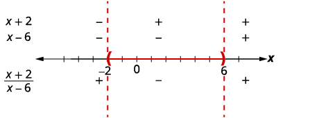
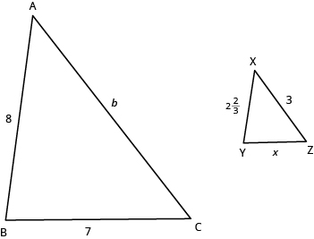

By the end of this section, you will be able to:
* Solve rational inequalities
* Solve an inequality with rational functions

Before you get started, take this readiness quiz.

1.  Find the value of
    <math xmlns="http://www.w3.org/1998/Math/MathML"><mrow><mi>x</mi><mo>−</mo><mn>5</mn></mrow></math>
    
    when ⓐ
    <math xmlns="http://www.w3.org/1998/Math/MathML"><mrow><mi>x</mi><mo>=</mo><mn>6</mn></mrow></math>
    
    ⓑ
    <math xmlns="http://www.w3.org/1998/Math/MathML"><mrow><mi>x</mi><mo>=</mo><mn>−3</mn></mrow></math>
    
    ⓒ
    <math xmlns="http://www.w3.org/1998/Math/MathML"><mrow><mi>x</mi><mo>=</mo><mn>5</mn><mo>.</mo></mrow></math>
    
    * * *
    {: data-type="newline"}
    
    If you missed this problem, review [\[link\]](/m63302#fs-id1167836530265).
2.  Solve:
    <math xmlns="http://www.w3.org/1998/Math/MathML"><mrow><mn>8</mn><mo>−</mo><mn>2</mn><mi>x</mi><mo>&lt;</mo><mn>12</mn><mo>.</mo></mrow></math>
    
    * * *
    {: data-type="newline"}
    
    If you missed this problem, review [\[link\]](/m63312#fs-id1167835324646).
3.  Write in interval notation:
    <math xmlns="http://www.w3.org/1998/Math/MathML"><mrow><mn>−3</mn><mo>≤</mo><mi>x</mi><mo>&lt;</mo><mn>5</mn><mo>.</mo></mrow></math>
    
    * * *
    {: data-type="newline"}
    
    If you missed this problem, review [\[link\]](/m63312#fs-id1167835524181).
{: data-number-style="arabic"}

# Solve Rational Inequalities

We learned to solve linear inequalities after learning to solve linear equations. The techniques were very much the same with one major exception. When we multiplied or divided by a negative number, the inequality sign reversed.

Having just learned to solve rational equations we are now ready to solve rational inequalities. A **rational inequality**{: data-type="term"} is an inequality that contains a rational expression.

Rational Inequality

A **rational inequality** is an inequality that contains a rational expression.

Inequalities such as <math xmlns="http://www.w3.org/1998/Math/MathML"><mrow><mfrac><mn>3</mn><mrow><mn>2</mn><mi>x</mi></mrow></mfrac><mo>&gt;</mo><mn>1</mn><mo>,</mo><mspace width="0.5em" /><mfrac><mrow><mn>2</mn><mi>x</mi></mrow><mrow><mi>x</mi><mo>−</mo><mn>3</mn></mrow></mfrac><mo>&lt;</mo><mn>4</mn><mo>,</mo><mspace width="0.5em" /><mfrac><mrow><mn>2</mn><mi>x</mi><mo>−</mo><mn>3</mn></mrow><mrow><mi>x</mi><mo>−</mo><mn>6</mn></mrow></mfrac><mo>≥</mo><mi>x</mi><mo>,</mo></mrow></math>

 and <math xmlns="http://www.w3.org/1998/Math/MathML"><mrow><mfrac><mn>1</mn><mn>4</mn></mfrac><mo>−</mo><mfrac><mn>2</mn><mrow><msup><mi>x</mi><mn>2</mn></msup></mrow></mfrac><mo>≤</mo><mfrac><mn>3</mn><mi>x</mi></mfrac></mrow></math>

 are rational inequalities as they each contain a rational expression.

When we solve a rational inequality, we will use many of the techniques we used solving linear inequalities. We especially must remember that when we multiply or divide by a negative number, the inequality sign must reverse.

Another difference is that we must carefully consider what value might make the rational expression undefined and so must be excluded.

When we solve an equation and the result is <math xmlns="http://www.w3.org/1998/Math/MathML"><mrow><mi>x</mi><mo>=</mo><mn>3</mn><mo>,</mo></mrow></math>

 we know there is one solution, which is 3.

When we solve an inequality and the result is <math xmlns="http://www.w3.org/1998/Math/MathML"><mrow><mi>x</mi><mo>&gt;</mo><mn>3</mn><mo>,</mo></mrow></math>

 we know there are many solutions. We graph the result to better help show all the solutions, and we start with 3. Three becomes a **critical point**{: data-type="term"} and then we decide whether to shade to the left or right of it. The numbers to the right of 3 are larger than 3, so we shade to the right.

    To solve a rational inequality, we first must write the inequality with only one quotient on the left and 0 on the right.

Next we determine the critical points to use to divide the number line into intervals. A **critical point** is a number which make the rational expression zero or undefined.

We then will evaluate the factors of the numerator and denominator, and find the quotient in each interval. This will identify the interval, or intervals, that contains all the solutions of the rational inequality.

We write the solution in interval notation being careful to determine whether the endpoints are included.

Solve and write the solution in interval notation: <math xmlns="http://www.w3.org/1998/Math/MathML"><mrow><mfrac><mrow><mi>x</mi><mo>−</mo><mn>1</mn></mrow><mrow><mi>x</mi><mo>+</mo><mn>3</mn></mrow></mfrac><mo>≥</mo><mn>0</mn><mo>.</mo></mrow></math>

**Step 1.** Write the inequality as one quotient on the left and zero on the right.

Our inequality is in this form. <math xmlns="http://www.w3.org/1998/Math/MathML"><mrow><mspace width="5em" /><mfrac><mrow><mi>x</mi><mo>−</mo><mn>1</mn></mrow><mrow><mi>x</mi><mo>+</mo><mn>3</mn></mrow></mfrac><mo>≥</mo><mn>0</mn></mrow></math>

**Step 2.** Determine the critical points—the points where the rational expression will be zero or undefined.

The rational expression will be zero when the numerator is zero. Since <math xmlns="http://www.w3.org/1998/Math/MathML"><mrow><mi>x</mi><mo>−</mo><mn>1</mn><mo>=</mo><mn>0</mn></mrow></math>

 when <math xmlns="http://www.w3.org/1998/Math/MathML"><mrow><mi>x</mi><mo>=</mo><mn>1</mn><mo>,</mo></mrow></math>

 then <math xmlns="http://www.w3.org/1998/Math/MathML"><mn>1</mn></math>

 is a critical point.

The rational expression will be undefined when the denominator is zero. Since <math xmlns="http://www.w3.org/1998/Math/MathML"><mrow><mi>x</mi><mo>+</mo><mn>3</mn><mo>=</mo><mn>0</mn></mrow></math>

 when <math xmlns="http://www.w3.org/1998/Math/MathML"><mrow><mi>x</mi><mo>=</mo><mn>−3</mn><mo>,</mo></mrow></math>

 then <math xmlns="http://www.w3.org/1998/Math/MathML"><mrow><mn>−3</mn></mrow></math>

 is a critical point.

The critical points are 1 and <math xmlns="http://www.w3.org/1998/Math/MathML"><mrow><mn>−3</mn><mo>.</mo></mrow></math>

**Step 3.** Use the critical points to divide the number line into intervals.

  
The number line is divided into three intervals:

<math xmlns="http://www.w3.org/1998/Math/MathML"><mrow><mspace width="10.3em" /><mrow><mo>(</mo><mrow><mtext>−</mtext><mi>∞</mi><mo>,</mo><mn>−3</mn></mrow><mo>)</mo></mrow><mspace width="5em" /><mrow><mo>(</mo><mrow><mn>−3</mn><mo>,</mo><mn>1</mn></mrow><mo>)</mo></mrow><mspace width="5.5em" /><mrow><mo>(</mo><mrow><mn>1</mn><mo>,</mo><mi>∞</mi></mrow><mo>)</mo></mrow></mrow></math>

**Step 4.** Test a value in each interval. Above the number line show the sign of each factor of the rational expression in each interval. Below the number line show the sign of the quotient.

To find the sign of each factor in an interval, we choose any point in that interval and use it as a test point. Any point in the interval will give the expression the same sign, so we can choose any point in the interval.

<math xmlns="http://www.w3.org/1998/Math/MathML"><mrow><mtext mathvariant="bold">Interval</mtext><mspace width="0.2em" /><mrow><mstyle mathvariant="bold"><mo>(</mo><mrow><mtext>−</mtext><mi>∞</mi><mo>,</mo><mn>−3</mn></mrow><mo>)</mo></mstyle></mrow></mrow></math>

The number <math xmlns="http://www.w3.org/1998/Math/MathML"><mrow><mn>−4</mn></mrow></math>

 is in the interval <math xmlns="http://www.w3.org/1998/Math/MathML"><mrow><mrow><mo>(</mo><mrow><mtext>−</mtext><mi>∞</mi><mo>,</mo><mn>−3</mn></mrow><mo>)</mo></mrow><mo>.</mo></mrow></math>

 Test <math xmlns="http://www.w3.org/1998/Math/MathML"><mrow><mi>x</mi><mo>=</mo><mn>−4</mn></mrow></math>

 in the expression in the numerator and the denominator.

 
Above the number line, mark the factor <math xmlns="http://www.w3.org/1998/Math/MathML"><mrow><mi>x</mi><mo>−</mo><mn>1</mn></mrow></math>

 negative and mark the factor <math xmlns="http://www.w3.org/1998/Math/MathML"><mrow><mi>x</mi><mo>+</mo><mn>3</mn></mrow></math>

 negative.

Since a negative divided by a negative is positive, mark the quotient positive in the interval <math xmlns="http://www.w3.org/1998/Math/MathML"><mrow><mrow><mo>(</mo><mrow><mtext>−</mtext><mi>∞</mi><mo>,</mo><mn>−3</mn></mrow><mo>)</mo></mrow><mo>.</mo></mrow></math>

 ![This figure shows the quotient of the quantity x minus 1 and the quantity x plus 3, the numerator is negative and the denominator is negative, which is positive. It shows a number line divided into three intervals by its critical points marked at negative 3 and 0. The factors x minus 1 and x plus 3 are marked as negative above the number line for the interval negative infinity to negative 3. The quotient of the quantity x minus 1 and the quantity x plus 3 is marked as positive below the number line for the interval negative infinity to negative 3.](../resources/CNX_IntAlg_Figure_07_06_008_img.jpg) 

<math xmlns="http://www.w3.org/1998/Math/MathML"><mrow><mtext mathvariant="bold">Interval</mtext><mspace width="0.2em" /><mrow><mstyle mathvariant="bold"><mo>(</mo><mrow><mn>−3</mn><mo>,</mo><mn>1</mn></mrow><mo>)</mo></mstyle></mrow></mrow></math>

The number 0 is in the interval <math xmlns="http://www.w3.org/1998/Math/MathML"><mrow><mrow><mo>(</mo><mrow><mn>−3</mn><mo>,</mo><mn>1</mn></mrow><mo>)</mo></mrow><mo>.</mo></mrow></math>

 Test <math xmlns="http://www.w3.org/1998/Math/MathML"><mrow><mi>x</mi><mo>=</mo><mn>0</mn><mo>.</mo></mrow></math>

  
Above the number line, mark the factor <math xmlns="http://www.w3.org/1998/Math/MathML"><mrow><mi>x</mi><mo>−</mo><mn>1</mn></mrow></math>

 negative and mark <math xmlns="http://www.w3.org/1998/Math/MathML"><mrow><mi>x</mi><mo>+</mo><mn>3</mn></mrow></math>

 positive.

Since a negative divided by a positive is negative, the quotient is marked negative in the interval <math xmlns="http://www.w3.org/1998/Math/MathML"><mrow><mrow><mo>(</mo><mrow><mn>−3</mn><mo>,</mo><mn>1</mn></mrow><mo>)</mo></mrow><mo>.</mo></mrow></math>

 ![This figure shows a shows the quotient of the quantity x minus 1 and the quantity x plus 3, the numerator is negative and the denominator is positive, which is negative. It shows a number line divided into three intervals by its critical points marked at negative 3 and 0. The factors x minus 1 and x plus 3 are marked as negative above the number line for the interval negative infinity to negative 3. The quotient of the quantity x minus 1 and the quantity x plus 3 is marked as positive below the number line for the interval negative infinity to negative 3. The factor x minus 1 is marked as negative and the factor x plus 3 is marked as positive above the number line for the interval negative 3 to 1. The quotient of the quantity x minus 1 and the quantity x plus 3 is marked as negative below the number line for the interval negative 3 to 1.](../resources/CNX_IntAlg_Figure_07_06_010_img.jpg) 

<math xmlns="http://www.w3.org/1998/Math/MathML"><mrow><mtext mathvariant="bold">Interval</mtext><mspace width="0.2em" /><mrow><mstyle mathvariant="bold"><mo>(</mo><mrow><mn>1</mn><mo>,</mo><mi>∞</mi></mrow><mo>)</mo></mstyle></mrow></mrow></math>

The number 2 is in the interval <math xmlns="http://www.w3.org/1998/Math/MathML"><mrow><mrow><mo>(</mo><mrow><mn>1</mn><mo>,</mo><mi>∞</mi></mrow><mo>)</mo></mrow><mo>.</mo></mrow></math>

 Test <math xmlns="http://www.w3.org/1998/Math/MathML"><mrow><mi>x</mi><mo>=</mo><mn>2</mn><mo>.</mo></mrow></math>

  
Above the number line, mark the factor <math xmlns="http://www.w3.org/1998/Math/MathML"><mrow><mi>x</mi><mo>−</mo><mn>1</mn></mrow></math>

 positive and mark <math xmlns="http://www.w3.org/1998/Math/MathML"><mrow><mi>x</mi><mo>+</mo><mn>3</mn></mrow></math>

 positive.

Since a positive divided by a positive is positive, mark the quotient positive in the interval <math xmlns="http://www.w3.org/1998/Math/MathML"><mrow><mrow><mo>(</mo><mrow><mn>1</mn><mo>,</mo><mi>∞</mi></mrow><mo>)</mo></mrow><mo>.</mo></mrow></math>

 ![The figure shows that in the quotient of the quantity x minus 1 and the quantity x plus 3, the numerator is negative and the denominator is positive, which is negative. It shows a number line is divided into intervals by critical points at negative 3 and 1. The factors x minus 1 and x plus 3 are marked as negative above the number line for the interval negative infinity to negative 3. The quotient of the quantity x minus 1 and the quantity x plus 3 is marked as positive below the number line for the interval negative infinity to negative 3. The factor x minus 1 is marked as negative and the factor x plus 3 is marked as positive above the number line for the interval negative 3 to 1. The quotient of the quantity x minus 1 and the quantity x plus 3 is marked as negative below the number line for the interval negative 3 to 1. The factors x minus 1 and x plus 3 are marked as positive above the number line for the interval 1 to infinity. The quotient of the quantity x minus 1 and the quantity x plus 3 is marked as positive below the number line for the interval negative 1 to infinity.](../resources/CNX_IntAlg_Figure_07_06_012_img.jpg) 
**Step 5.** Determine the intervals where the inequality is correct. Write the solution in interval notation.

We want the quotient to be greater than or equal to zero, so the numbers in the intervals <math xmlns="http://www.w3.org/1998/Math/MathML"><mrow><mrow><mo>(</mo><mrow><mtext>−</mtext><mi>∞</mi><mo>,</mo><mn>−3</mn></mrow><mo>)</mo></mrow></mrow></math>

 and <math xmlns="http://www.w3.org/1998/Math/MathML"><mrow><mo stretchy="false">(</mo><mn>1</mn><mo>,</mo><mi>∞</mi><mo stretchy="false">)</mo></mrow></math>

 are solutions.

But what about the critical points?

The critical point <math xmlns="http://www.w3.org/1998/Math/MathML"><mrow><mi>x</mi><mo>=</mo><mn>−3</mn></mrow></math>

 makes the denominator 0, so it must be excluded from the solution and we mark it with a parenthesis.

The critical point <math xmlns="http://www.w3.org/1998/Math/MathML"><mrow><mi>x</mi><mo>=</mo><mn>1</mn></mrow></math>

 makes the whole rational expression 0. The inequality requires that the rational expression be greater than or equal to. So, 1 is part of the solution and we will mark it with a bracket.

 ![The number line is divided into intervals by critical points at negative 3 and 1. A closed parenthesis is used at 3 and an open bracket is used at 1. The number is shaded to the left of 3 and to the right of 1. The factors x minus 1 and x plus 3 are marked as negative above the number line for the interval negative infinity to negative 3. The quotient of the quantity x minus 1 and the quantity x plus 3 is marked as positive below the number line for the interval negative infinity to negative 3. The factor x minus 1 is marked as negative and the factor x plus 3 is marked as positive above the number line for the interval negative 3 to 1. The quotient of the quantity x minus 1 and the quantity x plus 3 is marked as negative below the number line for the interval negative 3 to 1. The factors x minus 1 and x plus 3 are marked as positive above the number line for the interval 1 to infinity. The quotient of the quantity x minus 1 and the quantity x plus 3 is marked as positive below the number line for the interval negative 1 to infinity.](../resources/CNX_IntAlg_Figure_07_06_013_img.jpg) 
Recall that when we have a solution made up of more than one interval we use the union symbol, <math xmlns="http://www.w3.org/1998/Math/MathML"><mrow><mo>∪</mo><mo>,</mo></mrow></math>

 to connect the two intervals. The solution in interval notation is <math xmlns="http://www.w3.org/1998/Math/MathML"><mrow><mrow><mo>(</mo><mrow><mtext>−</mtext><mi>∞</mi><mo>,</mo><mn>−3</mn></mrow><mo>)</mo></mrow><mo>∪</mo><mrow><mo>[</mo><mrow><mn>1</mn><mo>,</mo><mi>∞</mi></mrow><mo>)</mo></mrow><mo>.</mo></mrow></math>

Solve and write the solution in interval notation: <math xmlns="http://www.w3.org/1998/Math/MathML"><mrow><mfrac><mrow><mi>x</mi><mo>−</mo><mn>2</mn></mrow><mrow><mi>x</mi><mo>+</mo><mn>4</mn></mrow></mfrac><mo>≥</mo><mn>0</mn><mo>.</mo></mrow></math>

<math xmlns="http://www.w3.org/1998/Math/MathML"><mrow><mo stretchy="false">(</mo><mtext>−</mtext><mi>∞</mi><mo>,</mo><mn>−4</mn><mo stretchy="false">)</mo><mo>∪</mo><mo stretchy="false">[</mo><mn>2</mn><mo>,</mo><mi>∞</mi><mo stretchy="false">)</mo></mrow></math>

Solve and write the solution in interval notation: <math xmlns="http://www.w3.org/1998/Math/MathML"><mrow><mfrac><mrow><mi>x</mi><mo>+</mo><mn>2</mn></mrow><mrow><mi>x</mi><mo>−</mo><mn>4</mn></mrow></mfrac><mo>≥</mo><mn>0</mn><mo>.</mo></mrow></math>

<math xmlns="http://www.w3.org/1998/Math/MathML"><mrow><mo stretchy="false">(</mo><mtext>−</mtext><mi>∞</mi><mo>,</mo><mn>−2</mn><mo stretchy="false">]</mo><mo>∪</mo><mo stretchy="false">(</mo><mn>4</mn><mo>,</mo><mi>∞</mi><mo stretchy="false">)</mo></mrow></math>

We summarize the steps for easy reference.

Solve a rational inequality.

1.  Write the inequality as one quotient on the left and zero on the right.
2.  Determine the critical points–the points where the rational expression will be zero or undefined.
3.  Use the critical points to divide the number line into intervals.
4.  Test a value in each interval. Above the number line show the sign of each factor of the numerator and denominator in each interval. Below the number line show the sign of the quotient.
5.  Determine the intervals where the inequality is correct. Write the solution in interval notation.
{: data-number-style="arabic" .stepwise}

The next example requires that we first get the rational inequality into the correct form.

Solve and write the solution in interval notation: <math xmlns="http://www.w3.org/1998/Math/MathML"><mrow><mfrac><mrow><mn>4</mn><mi>x</mi></mrow><mrow><mi>x</mi><mo>−</mo><mn>6</mn></mrow></mfrac><mo>&lt;</mo><mn>1</mn><mo>.</mo></mrow></math>

<table class="unnumbered unstyled can-break" summary="Solve the inequality 4 x divided by the quantity x minus 6 is less than 1. Subtract 1 to get zero on the right. The result is the difference between 4 x divided by the quantity x minus 6 and 1 is less than 0. Rewrite 1 as a fraction using the least common denominator. The result is the difference between the quotient of 4 x and the quantity x minus 6 and the quotient of the quantity x minus 6 and x minus 6 is less than 0. Subtract the numerators and place the difference over the common denominator. The result is 4 x minus the quantity x minus 6 all divided by the quantity x minus 6 is less than 0. Simplify the numerator. The result is the quotient of the quantity 3 x plus 6 and the quantity x minus 6 is less than 0. Factor the numerator to show all factors. The result is 3 times the quantity x plus 2 all divided by the quantity x minus 6 is less than 0. Find the critical points. The quotient will be 0 when the numerator is 0. The quotient is undefined when the numerator is 0. That is 3 times the quantity x plus 2 is equal to 0 and x minus 6 is equal to 0. So, 3 is not equal to 0, x is equal to negative 2, and x is equal to 6. Use the critical points, negative 2 and 6, to divide the number line into intervals. The intervals are negative infinity to negative 2, negative 2 to 6, and 6 to infinity. Test a value in each interval using a chart. The chart has four columns and three rows. The first row is a header row and it labels the second column the interval negative infinity to negative 2, the third column the interval negative 2 to 6, and the fourth column the interval 6 to infinity. The first column is a header column and it labels the first row the factor x plus 2 and the second row the factor x minus 6. Test a value in each interval. The factor, x plus 2, is negative when negative 3 is substituted for x in the interval negative infinity to negative 2. The factor, x minus 6, is negative when negative 3 is substituted for x in the interval negative infinity to negative 2. The factor, x plus 2, is positive when 0 is substituted for x in the interval negative 2 to 6. The factor, x minus 6, is negative when 0 is substituted for x in the interval negative 2 to 6. The factor, x plus 2, is positive when 7 is substituted for x in the interval 6 to infinity. The factor, x minus 6, is positive when 0 is substituted for x in the interval 6 to infinity. Above the number line, show the sign of each factor of the rational expression in each interval. Below the number line, show the sign of the quotient. The number line is divided into intervals by critical points at negative 2 and 6. An open parenthesis is used at negative 2 and a closed parenthesis is used at 6. The number line is shaded between negative 2 and 6. The factors x plus 2 and x minus 6 are marked as negative above the number line for the interval negative infinity to negative 2. The quotient of the quantity x plus 2 and the quantity x minus 6 is marked as positive below the number line for the interval negative infinity to negative 2. The factor x plus 2 is marked as positive and the factor x minus 6 is marked as negative above the number line for the interval negative 2 to 6. The quotient of the quantity x plus 2 and the quantity x minus 6 is marked as negative below the number line for the interval negative 2 to 6. The factors x plus 2 and x minus 6 are marked as positive above the number line for the interval 6 to infinity. The quotient of the quantity x plus 2 and the quantity x minus 6 is marked as positive below the number line for the interval 6 to infinity. Determine the intervals where the inequality is correct. Write the solution in interval notation. The solution is the interval negative 2 and 6 with negative 2 and 6 not included." data-label=""><tbody>
<tr valign="top">
<td data-valign="top" data-align="left" />
<td data-valign="top" data-align="right"><math xmlns="http://www.w3.org/1998/Math/MathML"><mrow><mfrac><mrow><mn>4</mn><mi>x</mi></mrow><mrow><mi>x</mi><mo>−</mo><mn>6</mn></mrow></mfrac><mo>&lt;</mo><mn>1</mn></mrow></math></td>
<td />
</tr>
<tr valign="top">
<td data-valign="top" data-align="left">Subtract 1 to get zero on the right.</td>
<td data-valign="top" data-align="right"><math xmlns="http://www.w3.org/1998/Math/MathML"><mrow><mfrac><mrow><mn>4</mn><mi>x</mi></mrow><mrow><mi>x</mi><mo>−</mo><mn>6</mn></mrow></mfrac><mo>−</mo><mn>1</mn><mo>&lt;</mo><mn>0</mn></mrow></math>
</td>
<td />
</tr>
<tr valign="top">
<td data-valign="top" data-align="left">Rewrite 1 as a fraction using the LCD.</td>
<td data-align="right"><math xmlns="http://www.w3.org/1998/Math/MathML"><mrow><mfrac><mrow><mn>4</mn><mi>x</mi></mrow><mrow><mi>x</mi><mo>−</mo><mn>6</mn></mrow></mfrac><mo>−</mo><mfrac><mrow><mi>x</mi><mo>−</mo><mn>6</mn></mrow><mrow><mi>x</mi><mo>−</mo><mn>6</mn></mrow></mfrac><mo>&lt;</mo><mn>0</mn></mrow></math></td>
<td />
</tr>
<tr>
<td>Subtract the numerators and place the
difference over the common denominator.</td>
<td data-align="right"><math xmlns="http://www.w3.org/1998/Math/MathML"><mrow><mfrac><mrow><mn>4</mn><mi>x</mi><mo>−</mo><mo stretchy="false">(</mo><mi>x</mi><mo>−</mo><mn>6</mn><mo stretchy="false">)</mo></mrow><mrow><mi>x</mi><mo>−</mo><mn>6</mn></mrow></mfrac><mo>&lt;</mo><mn>0</mn></mrow></math>
</td>
<td />
</tr>
<tr>
<td>Simplify.</td>
<td data-align="right"><math xmlns="http://www.w3.org/1998/Math/MathML"><mrow><mfrac><mrow><mn>3</mn><mi>x</mi><mo>+</mo><mn>6</mn></mrow><mrow><mi>x</mi><mo>−</mo><mn>6</mn></mrow></mfrac><mo>&lt;</mo><mn>0</mn></mrow></math>
</td>
<td />
</tr>
<tr valign="top">
<td data-valign="top" data-align="left">Factor the numerator to show all factors.</td>
<td data-valign="top" data-align="right"><math xmlns="http://www.w3.org/1998/Math/MathML"><mrow><mfrac><mrow><mn>3</mn><mo stretchy="false">(</mo><mi>x</mi><mo>+</mo><mn>2</mn><mo stretchy="false">)</mo></mrow><mrow><mi>x</mi><mo>−</mo><mn>6</mn></mrow></mfrac><mo>&lt;</mo><mn>0</mn></mrow></math>
</td>
<td />
</tr>
<tr valign="top">
<td data-valign="top" data-align="left">Find the critical points.</td>
<td data-valign="top" data-align="left" />
<td />
</tr>
<tr valign="top">
<td data-valign="top" data-align="left">The quotient will be zero when the numerator is zero.
The quotient is undefined when the denominator is zero.</td>
<td colspan="2" data-valign="top" data-align="center"><math xmlns="http://www.w3.org/1998/Math/MathML"><mtable><mtr><mtd columnalign="right"><mi>x</mi><mo>+</mo><mn>2</mn></mtd><mtd columnalign="left"><mo>=</mo></mtd><mtd columnalign="left"><mn>0</mn></mtd><mtd /><mtd /><mtd columnalign="right"><mi>x</mi><mo>−</mo><mn>6</mn></mtd><mtd columnalign="left"><mo>=</mo></mtd><mtd columnalign="left"><mn>0</mn></mtd></mtr><mtr><mtd columnalign="right"><mi>x</mi></mtd><mtd columnalign="left"><mo>=</mo></mtd><mtd columnalign="left"><mtext>−</mtext><mn>2</mn></mtd><mtd /><mtd /><mtd columnalign="right"><mi>x</mi></mtd><mtd columnalign="left"><mo>=</mo></mtd><mtd columnalign="left"><mn>6</mn></mtd></mtr></mtable></math></td>
</tr>
<tr valign="top">
<td colspan="3" data-valign="top" data-align="left">Use the critical points to divide the number line into intervals.</td>
</tr>
<tr valign="top">
<td colspan="3" data-valign="top" data-align="center"></td>
</tr>
<tr valign="top">
<td colspan="3" data-valign="top" data-align="left">Test a value in each interval.</td>
</tr>
<tr valign="top">
<td colspan="3" data-valign="top" data-align="center"></td>
</tr>
<tr valign="top">
<td colspan="3" data-valign="top" data-align="left">Above the number line show the sign of each factor of the rational expression in each interval.
Below the number line show the sign of the quotient.</td>
</tr>
<tr valign="top">
<td colspan="3" data-valign="top" data-align="center"></td>
</tr>
<tr valign="top">
<td colspan="3" data-valign="top" data-align="left">Determine the intervals where the inequality is correct. We want the quotient to be negative, so the solution includes the points between −2 and 6. Since the inequality is strictly less than, the endpoints are not included.</td>
</tr>
<tr valign="top">
<td colspan="3" data-valign="top" data-align="left">We write the solution in interval notation as (−2, 6).</td>
</tr>
</tbody></table>

Solve and write the solution in interval notation: <math xmlns="http://www.w3.org/1998/Math/MathML"><mrow><mfrac><mrow><mn>3</mn><mi>x</mi></mrow><mrow><mi>x</mi><mo>−</mo><mn>3</mn></mrow></mfrac><mo>&lt;</mo><mn>1</mn><mo>.</mo></mrow></math>

<math xmlns="http://www.w3.org/1998/Math/MathML"><mrow><mrow><mo>(</mo><mrow><mo>−</mo><mfrac><mn>3</mn><mn>2</mn></mfrac><mo>,</mo><mn>3</mn></mrow><mo>)</mo></mrow></mrow></math>

Solve and write the solution in interval notation: <math xmlns="http://www.w3.org/1998/Math/MathML"><mrow><mfrac><mrow><mn>3</mn><mi>x</mi></mrow><mrow><mi>x</mi><mo>−</mo><mn>4</mn></mrow></mfrac><mo>&lt;</mo><mn>2</mn><mo>.</mo></mrow></math>

<math xmlns="http://www.w3.org/1998/Math/MathML"><mrow><mrow><mo>(</mo><mrow><mn>−8</mn><mo>,</mo><mn>4</mn></mrow><mo>)</mo></mrow></mrow></math>

In the next example, the numerator is always positive, so the sign of the rational expression depends on the sign of the denominator.

Solve and write the solution in interval notation: <math xmlns="http://www.w3.org/1998/Math/MathML"><mrow><mfrac><mn>5</mn><mrow><msup><mi>x</mi><mn>2</mn></msup><mo>−</mo><mn>2</mn><mi>x</mi><mo>−</mo><mn>15</mn></mrow></mfrac><mo>&gt;</mo><mn>0</mn><mo>.</mo></mrow></math>

<table class="unnumbered unstyled can-break" summary="The inequality 5 divided by the quantity x squared minus 2 x minus 15 is greater than 0 is already in the correct form. Factor the denominator. The result is 5 divided by the product of the quantity x plus 3 and the quantity x minus 5 is greater than 0. Find the critical points. The quotient is 0 when the numerator is 0. Since the numerator is always 5, the quotient cannot be 0. The quotient will be undefined when the denominator is 0. That is the product of the quantity x plus 3 and the quantity x minus 5 is equal to 0, which is x is equal to negative 3 and x is equal to 5. Use the critical points, negative 3 and 5, to divide the number line into intervals. Test values in each interval. Above the number line, show the sign of each factor of the rational expression in each interval. Below the number line, show the sign of the quotient. The number line is divided into intervals by critical points at negative 3 and 5. A closed parenthesis is used at negative 3 and an open parenthesis is used at 5. The number line is shaded to the left of 3 and to the right of 5. The factors x plus 3 and x minus 5 are marked as negative above the number line for the interval negative infinity to negative 3. The quotient of 4 and the product of the quantity x plus 3 and the quantity x minus 5 is marked as positive below the number line for the interval negative infinity to negative 3. The factor x plus 3 is marked as positive and the factor x minus 5 is marked as negative above the number line for the interval negative 3 to 5. The quotient of 4 and the product of the quantity x plus 3 and the quantity x minus 5 is marked as negative below the number line for the interval negative 3 to 5. The factors x plus 3 and x minus 5 are marked as positive above the number line for the interval 5 to infinity. The quotient of 4 and the product of the quantity x plus 3 and the quantity x minus 5 is marked as positive below the number line for the interval 5 to infinity. Write the solution in interval notation. The solution is the union of the interval negative infinity to negative 3 and the interval 5 to infinity, with 3 and 5 not included" data-label=""><tbody>
<tr valign="top">
<td data-valign="top" data-align="left">The inequality is in the correct form.</td>
<td data-valign="top" data-align="right"><math xmlns="http://www.w3.org/1998/Math/MathML"><mrow><mfrac><mn>5</mn><mrow><msup><mi>x</mi><mn>2</mn></msup><mo>−</mo><mn>2</mn><mi>x</mi><mo>−</mo><mn>15</mn></mrow></mfrac><mo>&gt;</mo><mn>0</mn></mrow></math>
</td>
</tr>
<tr valign="top">
<td data-valign="top" data-align="left">Factor the denominator.</td>
<td data-valign="top" data-align="right"><math xmlns="http://www.w3.org/1998/Math/MathML"><mrow><mfrac><mn>5</mn><mrow><mo stretchy="false">(</mo><mi>x</mi><mo>+</mo><mn>3</mn><mo stretchy="false">)</mo><mo stretchy="false">(</mo><mi>x</mi><mo>−</mo><mn>5</mn><mo stretchy="false">)</mo></mrow></mfrac><mo>&gt;</mo><mn>0</mn></mrow></math>
</td>
</tr>
<tr valign="top">
<td colspan="2" data-valign="top" data-align="left">Find the critical points.
The quotient is 0 when the numerator is 0.
Since the numerator is always 5, the quotient cannot be 0.</td>
</tr>
<tr valign="top">
<td data-valign="top" data-align="left">The quotient will be undefined when the
denominator is zero.</td>
<td data-valign="top" data-align="left"><math xmlns="http://www.w3.org/1998/Math/MathML"><mtable><mtr><mtd columnalign="left"><mo stretchy="false">(</mo><mi>x</mi><mo>+</mo><mn>3</mn><mo stretchy="false">)</mo><mo stretchy="false">(</mo><mi>x</mi><mo>−</mo><mn>5</mn><mo stretchy="false">)</mo><mo>=</mo><mn>0</mn></mtd></mtr><mtr><mtd columnalign="left"><mi>x</mi><mo>=</mo><mo>−</mo><mn>3</mn><mo>,</mo><mtext> </mtext><mi>x</mi><mo>=</mo><mn>5</mn></mtd></mtr></mtable>

</math>

</td>
</tr>
<tr valign="top">
<td colspan="2" data-valign="top" data-align="left">Use the critical points to divide the number line into intervals.</td>
</tr>
<tr valign="top">
<td data-valign="top" data-align="left" />
<td data-valign="top" data-align="center"></td>
</tr>
<tr valign="top">
<td colspan="2" data-valign="top" data-align="left">Test values in each interval.
Above the number line show the sign of each
factor of the denominator in each interval.
Below the number line, show the sign of the quotient.</td>
</tr>
<tr valign="top">
<td data-valign="top" data-align="left">Write the solution in interval notation.</td>
<td data-valign="top" data-align="center"><math xmlns="http://www.w3.org/1998/Math/MathML"><mrow><mo stretchy="false">(</mo><mtext>−</mtext><mo>∞</mo><mo>,</mo><mo>−</mo><mn>3</mn><mo stretchy="false">)</mo><mo>∪</mo><mo stretchy="false">(</mo><mn>5</mn><mo>,</mo><mo>∞</mo><mo stretchy="false">)</mo></mrow></math>
</td>
</tr>
</tbody></table>

Solve and write the solution in interval notation: <math xmlns="http://www.w3.org/1998/Math/MathML"><mrow><mfrac><mn>1</mn><mrow><msup><mi>x</mi><mn>2</mn></msup><mo>+</mo><mn>2</mn><mi>x</mi><mo>−</mo><mn>8</mn></mrow></mfrac><mo>&gt;</mo><mn>0</mn><mo>.</mo></mrow></math>

<math xmlns="http://www.w3.org/1998/Math/MathML"><mrow><mrow><mo>(</mo><mrow><mtext>−</mtext><mi>∞</mi><mo>,</mo><mn>−4</mn></mrow><mo>)</mo></mrow><mo>∪</mo><mrow><mo>(</mo><mrow><mn>2</mn><mo>,</mo><mi>∞</mi></mrow><mo>)</mo></mrow></mrow></math>

Solve and write the solution in interval notation: <math xmlns="http://www.w3.org/1998/Math/MathML"><mrow><mfrac><mn>3</mn><mrow><msup><mi>x</mi><mn>2</mn></msup><mo>+</mo><mi>x</mi><mo>−</mo><mn>12</mn></mrow></mfrac><mo>&gt;</mo><mn>0</mn><mo>.</mo></mrow></math>

<math xmlns="http://www.w3.org/1998/Math/MathML"><mrow><mrow><mo>(</mo><mrow><mtext>−</mtext><mi>∞</mi><mo>,</mo><mn>−4</mn></mrow><mo>)</mo></mrow><mo>∪</mo><mrow><mo>(</mo><mrow><mn>3</mn><mo>,</mo><mi>∞</mi></mrow><mo>)</mo></mrow></mrow></math>

The next example requires some work to get it into the needed form.

Solve and write the solution in interval notation: <math xmlns="http://www.w3.org/1998/Math/MathML"><mrow><mfrac><mn>1</mn><mn>3</mn></mfrac><mo>−</mo><mfrac><mn>2</mn><mrow><msup><mi>x</mi><mn>2</mn></msup></mrow></mfrac><mo>&lt;</mo><mfrac><mn>5</mn><mrow><mn>3</mn><mi>x</mi></mrow></mfrac><mo>.</mo></mrow></math>

<table class="unnumbered unstyled can-break" summary="Solve the difference between one-third and the quantity 2 divided by x squared is less than the quantity 5 divided by 3 x. Subtract 5 divided by 3 x to get 0 on the right side. The result is one-third minus the quantity 2 divided by x squared minus the quantity 5 divided by 3 x is less than 0. Rewrite the inequality to get each fraction with the least common denominator, 3 x squared. The result is 1 times x squared all divided by 3 times x squared minus 2 times 6 all divided by x squared times 3 minus 5 times x all divided by 3 x times x is less than 0. Simplify. The result is the quantity x squared divided by 3 x squared minus the quantity 6 divided by 3 x squared minus the quantity 5 x divided by 3 x squared is less than 0. Subtract the numerators and place the difference over the common denominator. The result is the quantity x squared minus 5 x minus 6 divided by the quantity 3 x squared is less than 0. Factor the numerator. The result is the product of the quantity x minus 6 and the quantity x plus divided by 3 x squared is less than 0. Find the critical points using 3 x squared is equal to 0, x minus 6 is equal to 0, and x plus 1 is equal to 0. The critical points are x is equal to 0, x is equal to 6, and x is equal to negative 1. Use the critical points to divide the number line into intervals. Above the number line, show the sign of each factor in each interval. Below the number line, show the sign of the quotient. The number line is divided into intervals by critical points at negative 1, 0, and 6. An open parenthesis is used at negative 1, an open and closed parenthesis is used at 0, and a closed parenthesis is used at 6. The number line is shaded between negative 1 and 0 and between 0 and 6. The factors x minus 6 and x plus 1 are marked as negative above the number line for the interval negative infinity to negative 1. The factor x squared is marked as positive above the number line for the interval negative infinity to negative 1. The quotient of the product of the quantity x minus 6 and the quantity x plus 1 all divided by 3 x squared is marked as positive below the number line for the interval negative infinity to negative 1. The factor x minus 6 is marked as negative above the number line for the interval negative 1 to 0. The factors x plus 1 and x squared are marked as positive above the number line for the interval negative 1 and 0. The quotient of the product of the quantity x minus 6 and the quantity x plus 1 all divided by 3 x squared is marked as negative below the number line on the interval negative 1 to 0. The factor x minus 6 is marked as negative above the number line on the interval 0 to 6. The factors x plus 1 and x squared are marked as positive above the number line on the interval 0 to 6. The quotient of the product of the quantity x minus 6 and the quantity x plus 1 all divided by 3 x squared is marked as negative below the number line on the interval 0 to 6. The factors x minus 6, x plus 1 and x squared are marked positive above the number line on the interval 6 to infinity. The quotient of the product of the quantity x minus 6 and the quantity x plus 1 all divided by 3 x squared is marked as positive below the number line on the interval 6 to infinity. Since 0 is excluded, the solution is the two intervals negative 1 to 0 and 0 to 6, or the union of the intervals negative 1 to 0 and 0 to 6." data-label=""><tbody>
<tr valign="top">
<td data-valign="top" data-align="left" />
<td data-valign="top" data-align="right"><math xmlns="http://www.w3.org/1998/Math/MathML"><mrow><mfrac><mn>1</mn><mn>3</mn></mfrac><mo>−</mo><mfrac><mn>2</mn><mrow><msup><mi>x</mi><mn>2</mn></msup></mrow></mfrac><mo>&lt;</mo><mfrac><mn>5</mn><mrow><mn>3</mn><mi>x</mi></mrow></mfrac></mrow></math></td>
<td />
</tr>
<tr valign="top">
<td data-valign="top" data-align="left">Subtract <math xmlns="http://www.w3.org/1998/Math/MathML"><mrow><mfrac><mn>5</mn><mrow><mn>3</mn><mi>x</mi></mrow></mfrac></mrow></math> to get zero on the right.</td>
<td data-valign="top" data-align="right"><math xmlns="http://www.w3.org/1998/Math/MathML"><mrow><mfrac><mn>1</mn><mn>3</mn></mfrac><mo>−</mo><mfrac><mn>2</mn><mrow><msup><mi>x</mi><mn>2</mn></msup></mrow></mfrac><mo>−</mo><mfrac><mn>5</mn><mrow><mn>3</mn><mi>x</mi></mrow></mfrac><mo>&lt;</mo><mn>0</mn></mrow></math></td>
<td />
</tr>
<tr valign="top">
<td data-valign="top" data-align="left">Rewrite to get each fraction with the LCD <math xmlns="http://www.w3.org/1998/Math/MathML"><mrow><mn>3</mn><msup><mi>x</mi><mn>2</mn></msup><mo>.</mo></mrow></math></td>
<td data-valign="top" data-align="right"><math xmlns="http://www.w3.org/1998/Math/MathML"><mrow><mfrac><mrow><mn>1</mn><mo>⋅</mo><msup><mi>x</mi><mn>2</mn></msup></mrow><mrow><mn>3</mn><mo>⋅</mo><msup><mi>x</mi><mn>2</mn></msup></mrow></mfrac><mo>−</mo><mfrac><mrow><mn>2</mn><mo>⋅</mo><mn>3</mn></mrow><mrow><msup><mi>x</mi><mn>2</mn></msup><mo>⋅</mo><mn>3</mn></mrow></mfrac><mo>−</mo><mfrac><mrow><mn>5</mn><mo>⋅</mo><mi>x</mi></mrow><mrow><mn>3</mn><mi>x</mi><mo>⋅</mo><mi>x</mi></mrow></mfrac><mo>&lt;</mo><mn>0</mn></mrow></math>
</td>
<td />
</tr>
<tr valign="top">
<td data-valign="top" data-align="left">Simplify.</td>
<td data-align="right"><math xmlns="http://www.w3.org/1998/Math/MathML"><mrow><mfrac><mrow><msup><mi>x</mi><mn>2</mn></msup></mrow><mrow><mn>3</mn><msup><mi>x</mi><mn>2</mn></msup></mrow></mfrac><mo>−</mo><mfrac><mn>6</mn><mrow><mn>3</mn><msup><mi>x</mi><mn>2</mn></msup></mrow></mfrac><mo>−</mo><mfrac><mrow><mn>5</mn><mi>x</mi></mrow><mrow><mn>3</mn><msup><mi>x</mi><mn>2</mn></msup></mrow></mfrac><mo>&lt;</mo><mn>0</mn></mrow></math>
</td>
<td />
</tr>
<tr>
<td data-valign="top" data-align="left">Subtract the numerators and place the
difference over the common denominator.</td>
<td data-valign="top" data-align="right"><math xmlns="http://www.w3.org/1998/Math/MathML"><mrow><mfrac><mrow><msup><mi>x</mi><mn>2</mn></msup><mo>−</mo><mn>5</mn><mi>x</mi><mo>−</mo><mn>6</mn></mrow><mrow><mn>3</mn><msup><mi>x</mi><mn>2</mn></msup></mrow></mfrac><mo>&lt;</mo><mn>0</mn></mrow></math>
</td>
<td />
</tr>
<tr valign="top">
<td data-valign="top" data-align="left">Factor the numerator.</td>
<td data-valign="top" data-align="right"><math xmlns="http://www.w3.org/1998/Math/MathML"><mrow><mfrac><mrow><mo stretchy="false">(</mo><mi>x</mi><mo>−</mo><mn>6</mn><mo stretchy="false">)</mo><mo stretchy="false">(</mo><mi>x</mi><mo>+</mo><mn>1</mn><mo stretchy="false">)</mo></mrow><mrow><mn>3</mn><msup><mi>x</mi><mn>2</mn></msup></mrow></mfrac><mo>&lt;</mo><mn>0</mn></mrow></math>
</td>
<td />
</tr>
<tr valign="top">
<td data-valign="top" data-align="left">Find the critical points.</td>
<td colspan="2" data-valign="top" data-align="center"><math xmlns="http://www.w3.org/1998/Math/MathML"><mtable><mtr /><mtr><mtd columnalign="right"><mn>3</mn><msup><mi>x</mi><mn>2</mn></msup></mtd><mtd columnalign="left"><mo>=</mo></mtd><mtd columnalign="left"><mn>0</mn></mtd><mtd /><mtd /><mtd columnalign="right"><mi>x</mi><mo>−</mo><mn>6</mn></mtd><mtd columnalign="left"><mo>=</mo></mtd><mtd columnalign="left"><mn>0</mn></mtd><mtd /><mtd /><mtd columnalign="right"><mi>x</mi><mo>+</mo><mn>1</mn></mtd><mtd columnalign="left"><mo>=</mo></mtd><mtd columnalign="left"><mn>0</mn></mtd></mtr><mtr><mtd columnalign="right"><mi>x</mi></mtd><mtd columnalign="left"><mo>=</mo></mtd><mtd columnalign="left"><mn>0</mn></mtd><mtd /><mtd /><mtd columnalign="right"><mi>x</mi></mtd><mtd columnalign="left"><mo>=</mo></mtd><mtd columnalign="left"><mn>6</mn></mtd><mtd /><mtd /><mtd columnalign="right"><mi>x</mi></mtd><mtd columnalign="left"><mo>=</mo></mtd><mtd columnalign="left"><mtext>−</mtext><mn>1</mn></mtd></mtr></mtable></math>
</td>
</tr>
<tr valign="top">
<td data-valign="top" data-align="left">Use the critical points to divide the number
line into intervals.</td>
<td data-valign="top" data-align="left" />
</tr>
<tr>
<td data-valign="top" data-align="left" />
<td data-valign="top" data-align="left"></td>
</tr>
<tr valign="top">
<td colspan="2" data-valign="top" data-align="left">Above the number line show the sign of each
factor in each interval.  Below the number line, show the sign of the quotient.</td>
</tr>
<tr valign="top">
<td data-valign="top" data-align="left">Since, 0 is excluded, the solution is the two
intervals, <math xmlns="http://www.w3.org/1998/Math/MathML"><mrow><mrow><mo>(</mo><mrow><mn>−1</mn><mo>,</mo><mn>0</mn></mrow><mo>)</mo></mrow></mrow></math> and <math xmlns="http://www.w3.org/1998/Math/MathML"><mrow><mrow><mo>(</mo><mrow><mn>0</mn><mo>,</mo><mn>6</mn></mrow><mo>)</mo></mrow><mo>.</mo></mrow></math></td>
<td data-valign="top" data-align="center"><math xmlns="http://www.w3.org/1998/Math/MathML"><mrow><mo stretchy="false">(</mo><mo>−</mo><mn>1</mn><mo>,</mo><mn>0</mn><mo stretchy="false">)</mo><mo>∪</mo><mo stretchy="false">(</mo><mn>0</mn><mo>,</mo><mn>6</mn><mo stretchy="false">)</mo></mrow></math></td>
</tr>
</tbody></table>

Solve and write the solution in interval notation: <math xmlns="http://www.w3.org/1998/Math/MathML"><mrow><mfrac><mn>1</mn><mn>2</mn></mfrac><mo>+</mo><mfrac><mn>4</mn><mrow><msup><mi>x</mi><mn>2</mn></msup></mrow></mfrac><mo>&lt;</mo><mfrac><mn>3</mn><mi>x</mi></mfrac><mo>.</mo></mrow></math>

<math xmlns="http://www.w3.org/1998/Math/MathML"><mrow><mo stretchy="false">(</mo><mn>2</mn><mo>,</mo><mn>4</mn><mo stretchy="false">)</mo></mrow></math>

Solve and write the solution in interval notation: <math xmlns="http://www.w3.org/1998/Math/MathML"><mrow><mfrac><mn>1</mn><mn>3</mn></mfrac><mo>+</mo><mfrac><mn>6</mn><mrow><msup><mi>x</mi><mn>2</mn></msup></mrow></mfrac><mo>&lt;</mo><mfrac><mn>3</mn><mi>x</mi></mfrac><mo>.</mo></mrow></math>

<math xmlns="http://www.w3.org/1998/Math/MathML"><mrow><mo stretchy="false">(</mo><mn>3</mn><mo>,</mo><mn>6</mn><mo stretchy="false">)</mo></mrow></math>

# Solve an Inequality with Rational Functions

When working with rational functions, it is sometimes useful to know when the function is greater than or less than a particular value. This leads to a rational inequality.

Given the function <math xmlns="http://www.w3.org/1998/Math/MathML"><mrow><mi>R</mi><mrow><mo>(</mo><mi>x</mi><mo>)</mo></mrow><mo>=</mo><mfrac><mrow><mi>x</mi><mo>+</mo><mn>3</mn></mrow><mrow><mi>x</mi><mo>−</mo><mn>5</mn></mrow></mfrac><mo>,</mo></mrow></math>

 find the values of *x* that make the function less than or equal to 0.

We want the function to be less than or equal to 0.

<table class="unnumbered unstyled" summary="The function R is less than or equal to 0. Substitute the rational expression, the quotient of the quantity x plus 3 and the quantity x minus 5, for the function R. The result is the quotient of the quantity x plus 3 and the quantity x minus 5 is less than or equal to 0, where x is not equal to 5. Find the critical points using x plus 3 is equal to 3 and x minus 5 is equal to 0. The critical points are x is equal to negative 3 and x is equal to 5. Use the critical points to divide the number line into intervals. Test values in each interval. Above the number line show the sign of each factor in each interval. Below the number line, show the sign of the quotient. The number line is divided into intervals by critical points at negative 3 and 5. An open bracket is used at negative 3 and a closed parenthesis is used at 5. The number line is shaded between negative 3 and 5. The factors x plus 3 and x minus 5 are marked as negative above the number line for the interval negative infinity to negative 3. The quotient of the quantity x plus 3 and the quantity x minus 5 is marked as positive below the number line for the interval negative infinity to negative 3. The factor x plus 3 is marked as positive above the number line for the interval negative 3 to 5. The factor x minus 5 is marked as negative above the number line for the interval negative 3 to 5. The quotient of the quantity x plus 3 and the quantity x minus 5 is marked as negative below the number line on the interval negative 3 to 5. The factors x plus 3 and x minus 5 are marked as positive above the number line on the interval 5 to infinity. The quotient of the quantity x plus 3 and the quantity x minus 5 is marked as positive below the number line on the interval 5 to infinity. Write the solution in interval notation. Since 5 is excluded, we do not include it in the interval. The solution is the interval negative 3 to 5, with negative 3 included." data-label=""><tbody>
<tr valign="top">
<td data-valign="top" data-align="left" />
<td data-valign="top" data-align="center"><math xmlns="http://www.w3.org/1998/Math/MathML"><mrow><mi>R</mi><mrow><mo>(</mo><mi>x</mi><mo>)</mo></mrow><mo>≤</mo><mn>0</mn></mrow></math></td>
</tr>
<tr valign="top">
<td data-valign="top" data-align="left">Substitute the rational expression for <math xmlns="http://www.w3.org/1998/Math/MathML"><mrow><mi>R</mi><mrow><mo>(</mo><mi>x</mi><mo>)</mo></mrow><mo>.</mo></mrow></math></td>
<td data-valign="top" data-align="center"><math xmlns="http://www.w3.org/1998/Math/MathML"><mrow><mfrac><mrow><mi>x</mi><mo>+</mo><mn>3</mn></mrow><mrow><mi>x</mi><mo>−</mo><mn>5</mn></mrow></mfrac><mo>≤</mo><mn>0</mn><mspace width="3.5em" /><mi>x</mi><mo>≠</mo><mn>5</mn></mrow></math></td>
</tr>
<tr valign="top">
<td data-valign="top" data-align="left">Find the critical points.</td>
<td data-valign="top" data-align="center"><math xmlns="http://www.w3.org/1998/Math/MathML"><mrow><mtable><mtr><mtd columnalign="right"><mi>x</mi><mo>+</mo><mn>3</mn></mtd><mtd columnalign="left"><mo>=</mo></mtd><mtd columnalign="left"><mn>0</mn></mtd><mtd /><mtd /><mtd columnalign="right"><mi>x</mi><mo>−</mo><mn>5</mn></mtd><mtd columnalign="left"><mo>=</mo></mtd><mtd columnalign="left"><mn>0</mn></mtd></mtr>
<mtr><mtd columnalign="right"><mi>x</mi></mtd><mtd columnalign="left"><mo>=</mo></mtd><mtd columnalign="left"><mn>−3</mn></mtd><mtd /><mtd /><mtd columnalign="right"><mi>x</mi></mtd><mtd columnalign="left"><mo>=</mo></mtd><mtd columnalign="left"><mn>5</mn></mtd></mtr></mtable></mrow></math></td>
</tr>
<tr valign="top">
<td colspan="2" data-valign="top" data-align="left">Use the critical points to divide the number line into intervals.</td>
</tr>
<tr valign="top">
<td data-valign="top" data-align="left" />
<td data-valign="top" data-align="left"></td>
</tr>
<tr valign="top">
<td colspan="2" data-valign="top" data-align="left">Test values in each interval. Above the
number line, show the sign of each factor
in each interval. Below the number line,
show the sign of the quotient</td>
</tr>
<tr valign="top">
<td data-valign="top" data-align="left">Write the solution in interval notation. Since
5 is excluded we, do not include it in the interval.</td>
<td data-valign="top" data-align="center"><math xmlns="http://www.w3.org/1998/Math/MathML"><mrow><mrow><mo>[</mo><mrow><mn>−3</mn><mo>,</mo><mn>5</mn></mrow><mo>)</mo></mrow></mrow></math></td>
</tr>
</tbody></table>

Given the function <math xmlns="http://www.w3.org/1998/Math/MathML"><mrow><mi>R</mi><mrow><mo>(</mo><mi>x</mi><mo>)</mo></mrow><mo>=</mo><mfrac><mrow><mi>x</mi><mo>−</mo><mn>2</mn></mrow><mrow><mi>x</mi><mo>+</mo><mn>4</mn></mrow></mfrac><mo>,</mo></mrow></math>

 find the values of *x* that make the function less than or equal to 0.

<math xmlns="http://www.w3.org/1998/Math/MathML"><mrow><mo stretchy="false">(</mo><mn>−4</mn><mo>,</mo><mn>2</mn><mo stretchy="false">]</mo></mrow></math>

Given the function <math xmlns="http://www.w3.org/1998/Math/MathML"><mrow><mi>R</mi><mrow><mo>(</mo><mi>x</mi><mo>)</mo></mrow><mo>=</mo><mfrac><mrow><mi>x</mi><mo>+</mo><mn>1</mn></mrow><mrow><mi>x</mi><mo>−</mo><mn>4</mn></mrow></mfrac><mo>,</mo></mrow></math>

 find the values of *x* that make the function less than or equal to 0.

<math xmlns="http://www.w3.org/1998/Math/MathML"><mrow><mo stretchy="false">[</mo><mn>−1</mn><mo>,</mo><mn>4</mn><mo stretchy="false">)</mo></mrow></math>

In economics, the function <math xmlns="http://www.w3.org/1998/Math/MathML"><mrow><mi>C</mi><mo stretchy="false">(</mo><mi>x</mi><mo stretchy="false">)</mo></mrow></math>

 is used to represent the cost of producing *x* units of a commodity. The average cost per unit can be found by dividing <math xmlns="http://www.w3.org/1998/Math/MathML"><mrow><mi>C</mi><mo stretchy="false">(</mo><mi>x</mi><mo stretchy="false">)</mo></mrow></math>

 by the number of items <math xmlns="http://www.w3.org/1998/Math/MathML"><mrow><mi>x</mi><mo>.</mo></mrow></math>

 Then, the average cost per unit is <math xmlns="http://www.w3.org/1998/Math/MathML"><mrow><mi>c</mi><mo stretchy="false">(</mo><mi>x</mi><mo stretchy="false">)</mo><mo>=</mo><mfrac><mrow><mi>C</mi><mo stretchy="false">(</mo><mi>x</mi><mo stretchy="false">)</mo></mrow><mi>x</mi></mfrac><mo>.</mo></mrow></math>

The function <math xmlns="http://www.w3.org/1998/Math/MathML"><mrow><mi>C</mi><mo stretchy="false">(</mo><mi>x</mi><mo stretchy="false">)</mo><mo>=</mo><mn>10</mn><mi>x</mi><mo>+</mo><mn>3000</mn></mrow></math>

 represents the cost to produce <math xmlns="http://www.w3.org/1998/Math/MathML"><mrow><mi>x</mi><mo>,</mo></mrow></math>

 number of items. Find ⓐ the average cost function, <math xmlns="http://www.w3.org/1998/Math/MathML"><mrow><mi>c</mi><mo stretchy="false">(</mo><mi>x</mi><mo stretchy="false">)</mo></mrow></math>

 ⓑ how many items should be produced so that the average cost is less than $40.

ⓐ

<math xmlns="http://www.w3.org/1998/Math/MathML"><mrow><mtable> <mtr><mtd /><mtd /><mtd /><mtd columnalign="left"><mi>C</mi><mo stretchy="false">(</mo><mi>x</mi><mo stretchy="false">)</mo><mo>=</mo><mn>10</mn><mi>x</mi><mo>+</mo><mn>3000</mn></mtd></mtr> <mtr><mtd columnalign="left"><mtext>The average cost function is</mtext><mspace width="0.2em" /><mi>c</mi><mo stretchy="false">(</mo><mi>x</mi><mo stretchy="false">)</mo><mo>=</mo><mfrac><mrow><mi>C</mi><mo stretchy="false">(</mo><mi>x</mi><mo stretchy="false">)</mo></mrow><mi>x</mi></mfrac><mo>.</mo></mtd><mtd /><mtd /><mtd /></mtr> <mtr><mtd columnalign="left"><mtable><mtr><mtd columnalign="left"><mtext>To find the average cost function, divide the</mtext></mtd></mtr><mtr><mtd columnalign="left"><mtext>cost function by</mtext><mspace width="0.2em" /><mi>x</mi><mo>.</mo></mtd></mtr></mtable></mtd><mtd /><mtd /><mtd columnalign="left"><mtable><mtr><mtd columnalign="left"><mi>c</mi><mo stretchy="false">(</mo><mi>x</mi><mo stretchy="false">)</mo><mo>=</mo><mfrac><mrow><mi>C</mi><mo stretchy="false">(</mo><mi>x</mi><mo stretchy="false">)</mo></mrow><mi>x</mi></mfrac></mtd></mtr><mtr><mtd columnalign="left"><mi>c</mi><mrow><mo>(</mo><mi>x</mi><mo>)</mo></mrow><mo>=</mo><mfrac><mrow><mn>10</mn><mi>x</mi><mo>+</mo><mn>3000</mn></mrow><mi>x</mi></mfrac></mtd></mtr></mtable></mtd></mtr> <mtr><mtd /><mtd /><mtd /><mtd columnalign="left"><mtext>The average cost function is</mtext><mspace width="0.2em" /><mi>c</mi><mo stretchy="false">(</mo><mi>x</mi><mo stretchy="false">)</mo><mo>=</mo><mfrac><mrow><mn>10</mn><mi>x</mi><mo>+</mo><mn>3000</mn></mrow><mi>x</mi></mfrac><mo>.</mo></mtd></mtr></mtable></mrow></math>

ⓑ

<math xmlns="http://www.w3.org/1998/Math/MathML"><mrow><mtable> <mtr><mtd columnalign="left"><mtext>We want the function</mtext><mspace width="0.2em" /><mi>c</mi><mo stretchy="false">(</mo><mi>x</mi><mo stretchy="false">)</mo><mspace width="0.2em" /><mtext>to be less than</mtext><mspace width="0.2em" /><mn>40</mn><mo>.</mo></mtd><mtd /><mtd /><mtd columnalign="left"><mspace width="6.4em" /><mi>c</mi><mo stretchy="false">(</mo><mi>x</mi><mo stretchy="false">)</mo><mo>&lt;</mo><mn>40</mn></mtd></mtr> <mtr><mtd columnalign="left"><mtext>Substitute the rational expression for</mtext><mspace width="0.2em" /><mi>c</mi><mo stretchy="false">(</mo><mi>x</mi><mo stretchy="false">)</mo><mo>.</mo></mtd><mtd /><mtd /><mtd columnalign="left"><mspace width="3.3em" /><mfrac><mrow><mn>10</mn><mi>x</mi><mo>+</mo><mn>3000</mn></mrow><mi>x</mi></mfrac><mo>&lt;</mo><mn>40</mn><mspace width="0.5em" /><mi>x</mi><mo>≠</mo><mn>0</mn></mtd></mtr> <mtr><mtd columnalign="left"><mtext>Subtract 40 to get 0 on the right.</mtext></mtd><mtd /><mtd /><mtd columnalign="left"><mspace width="1.11em" /><mfrac><mrow><mn>10</mn><mi>x</mi><mo>+</mo><mn>3000</mn></mrow><mi>x</mi></mfrac><mo>−</mo><mn>40</mn><mo>&lt;</mo><mn>0</mn></mtd></mtr> <mtr><mtd columnalign="left"><mtable><mtr><mtd columnalign="left"><mtext>Rewrite the left side as one quotient by finding</mtext></mtd></mtr><mtr><mtd columnalign="left"><mtext>the LCD and performing the subtraction.</mtext></mtd></mtr></mtable></mtd><mtd /><mtd /><mtd columnalign="left"><mfrac><mrow><mn>10</mn><mi>x</mi><mo>+</mo><mn>3000</mn></mrow><mi>x</mi></mfrac><mo>−</mo><mn>40</mn><mrow><mo>(</mo><mrow><mfrac><mi>x</mi><mi>x</mi></mfrac></mrow><mo>)</mo></mrow><mo>&lt;</mo><mn>0</mn></mtd></mtr> <mtr><mtd /><mtd /><mtd /><mtd columnalign="left"><mspace width="0.5em" /><mfrac><mrow><mn>10</mn><mi>x</mi><mo>+</mo><mn>3000</mn></mrow><mi>x</mi></mfrac><mo>−</mo><mfrac><mrow><mn>40</mn><mi>x</mi></mrow><mi>x</mi></mfrac><mo>&lt;</mo><mn>0</mn></mtd></mtr> <mtr><mtd /><mtd /><mtd /><mtd columnalign="left"><mspace width="0.6em" /><mfrac><mrow><mn>10</mn><mi>x</mi><mo>+</mo><mn>3000</mn><mo>−</mo><mn>40</mn><mi>x</mi></mrow><mi>x</mi></mfrac><mo>&lt;</mo><mn>0</mn></mtd></mtr> <mtr><mtd /><mtd /><mtd /><mtd columnalign="left"><mspace width="2.55em" /><mfrac><mrow><mn>−30</mn><mi>x</mi><mo>+</mo><mn>3000</mn></mrow><mi>x</mi></mfrac><mo>&lt;</mo><mn>0</mn></mtd></mtr> <mtr><mtd columnalign="left"><mtext>Factor the numerator to show all factors.</mtext></mtd><mtd /><mtd /><mtd columnalign="left"><mspace width="2.4em" /><mfrac><mrow><mn>−30</mn><mo stretchy="false">(</mo><mi>x</mi><mo>−</mo><mn>100</mn><mo stretchy="false">)</mo></mrow><mi>x</mi></mfrac><mo>&lt;</mo><mn>0</mn></mtd></mtr> <mtr><mtd columnalign="left"><mtext>Find the critical points.</mtext></mtd><mtd /><mtd /><mtd columnalign="left"><mtable><mtr><mtd columnalign="right"><mo>−</mo><mn>30</mn><mo stretchy="false">(</mo><mi>x</mi><mo>−</mo><mn>100</mn><mo stretchy="false">)</mo></mtd><mtd columnalign="left"><mo>=</mo></mtd><mtd columnalign="left"><mn>0</mn></mtd><mtd columnalign="left"><mspace width="1em" /><mi>x</mi><mo>=</mo><mn>0</mn></mtd></mtr><mtr><mtd columnalign="right"><mo>−</mo><mn>30</mn><mo>≠</mo><mn>0</mn><mspace width="1em" /><mi>x</mi><mo>−</mo><mn>100</mn></mtd><mtd columnalign="left"><mo>=</mo></mtd><mtd columnalign="left"><mn>0</mn></mtd><mtd /></mtr><mtr><mtd columnalign="right"><mi>x</mi></mtd><mtd columnalign="left"><mo>=</mo></mtd><mtd columnalign="left"><mn>100</mn></mtd><mtd /></mtr></mtable></mtd></mtr></mtable></mrow></math>

More than 100 items must be produced to keep the average cost below $40 per item.

The function <math xmlns="http://www.w3.org/1998/Math/MathML"><mrow><mi>C</mi><mo stretchy="false">(</mo><mi>x</mi><mo stretchy="false">)</mo><mo>=</mo><mn>20</mn><mi>x</mi><mo>+</mo><mn>6000</mn></mrow></math>

 represents the cost to produce <math xmlns="http://www.w3.org/1998/Math/MathML"><mrow><mi>x</mi><mo>,</mo></mrow></math>

 number of items. Find ⓐ the average cost function, <math xmlns="http://www.w3.org/1998/Math/MathML"><mrow><mi>c</mi><mo stretchy="false">(</mo><mi>x</mi><mo stretchy="false">)</mo></mrow></math>

 ⓑ how many items should be produced so that the average cost is less than $60?

ⓐ <math xmlns="http://www.w3.org/1998/Math/MathML"><mrow><mi>c</mi><mo stretchy="false">(</mo><mi>x</mi><mo stretchy="false">)</mo><mo>=</mo><mfrac><mrow><mn>20</mn><mi>x</mi><mo>+</mo><mn>6000</mn></mrow><mi>x</mi></mfrac></mrow></math>

* * *
{: data-type="newline"}

ⓑ More than 150 items must be produced to keep the average cost below $60 per item.

The function <math xmlns="http://www.w3.org/1998/Math/MathML"><mrow><mi>C</mi><mo stretchy="false">(</mo><mi>x</mi><mo stretchy="false">)</mo><mo>=</mo><mn>5</mn><mi>x</mi><mo>+</mo><mn>900</mn></mrow></math>

 represents the cost to produce <math xmlns="http://www.w3.org/1998/Math/MathML"><mrow><mi>x</mi><mo>,</mo></mrow></math>

 number of items. Find ⓐ the average cost function, <math xmlns="http://www.w3.org/1998/Math/MathML"><mrow><mi>c</mi><mo stretchy="false">(</mo><mi>x</mi><mo stretchy="false">)</mo></mrow></math>

 ⓑ how many items should be produced so that the average cost is less than $20?

ⓐ <math xmlns="http://www.w3.org/1998/Math/MathML"><mrow><mi>c</mi><mo stretchy="false">(</mo><mi>x</mi><mo stretchy="false">)</mo><mo>=</mo><mfrac><mrow><mn>5</mn><mi>x</mi><mo>+</mo><mn>900</mn></mrow><mi>x</mi></mfrac></mrow></math>

 ⓑ More than 60 items must be produced to keep the average cost below $20 per item.

# Key Concepts

* **Solve a rational inequality.**
  1.  Write the inequality as one quotient on the left and zero on the right.
  2.  Determine the critical points–the points where the rational expression will be zero or undefined.
  3.  Use the critical points to divide the number line into intervals.
  4.  Test a value in each interval. Above the number line show the sign of each factor of the rational expression in each interval. Below the number line show the sign of the quotient.
  5.  Determine the intervals where the inequality is correct. Write the solution in interval notation.
  {: data-number-style="arabic" .stepwise}
{: data-bullet-style="bullet"}

<section data-depth="1" class="section-exercises" markdown="1">
## Practice Makes Perfect

**Solve Rational Inequalities**

In the following exercises, solve each rational inequality and write the solution in interval notation.

<math xmlns="http://www.w3.org/1998/Math/MathML"><mrow><mfrac><mrow><mi>x</mi><mo>−</mo><mn>3</mn></mrow><mrow><mi>x</mi><mo>+</mo><mn>4</mn></mrow></mfrac><mo>≥</mo><mn>0</mn></mrow></math>

<math xmlns="http://www.w3.org/1998/Math/MathML"><mrow><mo stretchy="false">(</mo><mtext>−</mtext><mi>∞</mi><mo>,</mo><mn>−4</mn><mo stretchy="false">)</mo><mo>∪</mo><mo stretchy="false">[</mo><mn>3</mn><mo>,</mo><mi>∞</mi><mo stretchy="false">)</mo></mrow></math>

<math xmlns="http://www.w3.org/1998/Math/MathML"><mrow><mfrac><mrow><mi>x</mi><mo>+</mo><mn>6</mn></mrow><mrow><mi>x</mi><mo>−</mo><mn>5</mn></mrow></mfrac><mo>≥</mo><mn>0</mn></mrow></math>

<math xmlns="http://www.w3.org/1998/Math/MathML"><mrow><mfrac><mrow><mi>x</mi><mo>+</mo><mn>1</mn></mrow><mrow><mi>x</mi><mo>−</mo><mn>3</mn></mrow></mfrac><mo>≤</mo><mn>0</mn></mrow></math>

<math xmlns="http://www.w3.org/1998/Math/MathML"><mrow><mo stretchy="false">[</mo><mn>−1</mn><mo>,</mo><mn>3</mn><mo stretchy="false">)</mo></mrow></math>

<math xmlns="http://www.w3.org/1998/Math/MathML"><mrow><mfrac><mrow><mi>x</mi><mo>−</mo><mn>4</mn></mrow><mrow><mi>x</mi><mo>+</mo><mn>2</mn></mrow></mfrac><mo>≤</mo><mn>0</mn></mrow></math>

<math xmlns="http://www.w3.org/1998/Math/MathML"><mrow><mfrac><mrow><mi>x</mi><mo>−</mo><mn>7</mn></mrow><mrow><mi>x</mi><mo>−</mo><mn>1</mn></mrow></mfrac><mo>&gt;</mo><mn>0</mn></mrow></math>

<math xmlns="http://www.w3.org/1998/Math/MathML"><mrow><mo stretchy="false">(</mo><mtext>−</mtext><mi>∞</mi><mo>,</mo><mn>1</mn><mo stretchy="false">)</mo><mo>∪</mo><mo stretchy="false">(</mo><mn>7</mn><mo>,</mo><mi>∞</mi><mo stretchy="false">)</mo></mrow></math>

<math xmlns="http://www.w3.org/1998/Math/MathML"><mrow><mfrac><mrow><mi>x</mi><mo>+</mo><mn>8</mn></mrow><mrow><mi>x</mi><mo>+</mo><mn>3</mn></mrow></mfrac><mo>&gt;</mo><mn>0</mn></mrow></math>

<math xmlns="http://www.w3.org/1998/Math/MathML"><mrow><mfrac><mrow><mi>x</mi><mo>−</mo><mn>6</mn></mrow><mrow><mi>x</mi><mo>+</mo><mn>5</mn></mrow></mfrac><mo>&lt;</mo><mn>0</mn></mrow></math>

<math xmlns="http://www.w3.org/1998/Math/MathML"><mrow><mo stretchy="false">(</mo><mn>−5</mn><mo>,</mo><mn>6</mn><mo stretchy="false">)</mo></mrow></math>

<math xmlns="http://www.w3.org/1998/Math/MathML"><mrow><mfrac><mrow><mi>x</mi><mo>+</mo><mn>5</mn></mrow><mrow><mi>x</mi><mo>−</mo><mn>2</mn></mrow></mfrac><mo>&lt;</mo><mn>0</mn></mrow></math>

<math xmlns="http://www.w3.org/1998/Math/MathML"><mrow><mfrac><mrow><mn>3</mn><mi>x</mi></mrow><mrow><mi>x</mi><mo>−</mo><mn>5</mn></mrow></mfrac><mo>&lt;</mo><mn>1</mn></mrow></math>

<math xmlns="http://www.w3.org/1998/Math/MathML"><mrow><mrow><mo>(</mo><mrow><mo>−</mo><mfrac><mn>5</mn><mn>2</mn></mfrac><mo>,</mo><mn>5</mn></mrow><mo>)</mo></mrow></mrow></math>

<math xmlns="http://www.w3.org/1998/Math/MathML"><mrow><mfrac><mrow><mn>5</mn><mi>x</mi></mrow><mrow><mi>x</mi><mo>−</mo><mn>2</mn></mrow></mfrac><mo>&lt;</mo><mn>1</mn></mrow></math>

<math xmlns="http://www.w3.org/1998/Math/MathML"><mrow><mfrac><mrow><mn>6</mn><mi>x</mi></mrow><mrow><mi>x</mi><mo>−</mo><mn>6</mn></mrow></mfrac><mo>&gt;</mo><mn>2</mn></mrow></math>

<math xmlns="http://www.w3.org/1998/Math/MathML"><mrow><mo stretchy="false">(</mo><mtext>−</mtext><mi>∞</mi><mo>,</mo><mn>−3</mn><mo stretchy="false">)</mo><mo>∪</mo><mo stretchy="false">(</mo><mn>6</mn><mo>,</mo><mi>∞</mi><mo stretchy="false">)</mo></mrow></math>

<math xmlns="http://www.w3.org/1998/Math/MathML"><mrow><mfrac><mrow><mn>3</mn><mi>x</mi></mrow><mrow><mi>x</mi><mo>−</mo><mn>4</mn></mrow></mfrac><mo>&gt;</mo><mn>2</mn></mrow></math>

<math xmlns="http://www.w3.org/1998/Math/MathML"><mrow><mfrac><mrow><mn>2</mn><mi>x</mi><mo>+</mo><mn>3</mn></mrow><mrow><mi>x</mi><mo>−</mo><mn>6</mn></mrow></mfrac><mo>≤</mo><mn>1</mn></mrow></math>

<math xmlns="http://www.w3.org/1998/Math/MathML"><mrow><mo stretchy="false">[</mo><mn>−9</mn><mo>,</mo><mn>6</mn><mo stretchy="false">)</mo></mrow></math>

<math xmlns="http://www.w3.org/1998/Math/MathML"><mrow><mfrac><mrow><mn>4</mn><mi>x</mi><mo>−</mo><mn>1</mn></mrow><mrow><mi>x</mi><mo>−</mo><mn>4</mn></mrow></mfrac><mo>≤</mo><mn>1</mn></mrow></math>

<math xmlns="http://www.w3.org/1998/Math/MathML"><mrow><mfrac><mrow><mn>3</mn><mi>x</mi><mo>−</mo><mn>2</mn></mrow><mrow><mi>x</mi><mo>−</mo><mn>4</mn></mrow></mfrac><mo>≥</mo><mn>2</mn></mrow></math>

<math xmlns="http://www.w3.org/1998/Math/MathML"><mrow><mo stretchy="false">(</mo><mtext>−</mtext><mi>∞</mi><mo>,</mo><mn>−6</mn><mo stretchy="false">]</mo><mo>∪</mo><mo stretchy="false">(</mo><mn>4</mn><mo>,</mo><mi>∞</mi><mo stretchy="false">)</mo></mrow></math>

<math xmlns="http://www.w3.org/1998/Math/MathML"><mrow><mfrac><mrow><mn>4</mn><mi>x</mi><mo>−</mo><mn>3</mn></mrow><mrow><mi>x</mi><mo>−</mo><mn>3</mn></mrow></mfrac><mo>≥</mo><mn>2</mn></mrow></math>

<math xmlns="http://www.w3.org/1998/Math/MathML"><mrow><mfrac><mn>1</mn><mrow><msup><mi>x</mi><mn>2</mn></msup><mo>+</mo><mn>7</mn><mi>x</mi><mo>+</mo><mn>12</mn></mrow></mfrac><mo>&gt;</mo><mn>0</mn></mrow></math>

<math xmlns="http://www.w3.org/1998/Math/MathML"><mrow><mo stretchy="false">(</mo><mtext>−</mtext><mi>∞</mi><mo>,</mo><mn>−3</mn><mo stretchy="false">)</mo><mo>∪</mo><mo stretchy="false">(</mo><mn>−4</mn><mo>,</mo><mi>∞</mi><mo stretchy="false">)</mo></mrow></math>

<math xmlns="http://www.w3.org/1998/Math/MathML"><mrow><mfrac><mn>1</mn><mrow><msup><mi>x</mi><mn>2</mn></msup><mo>−</mo><mn>4</mn><mi>x</mi><mo>−</mo><mn>12</mn></mrow></mfrac><mo>&gt;</mo><mn>0</mn></mrow></math>

<math xmlns="http://www.w3.org/1998/Math/MathML"><mrow><mfrac><mn>3</mn><mrow><msup><mi>x</mi><mn>2</mn></msup><mo>−</mo><mn>5</mn><mi>x</mi><mo>+</mo><mn>4</mn></mrow></mfrac><mo>&lt;</mo><mn>0</mn></mrow></math>

<math xmlns="http://www.w3.org/1998/Math/MathML"><mrow><mo stretchy="false">(</mo><mn>1</mn><mo>,</mo><mn>4</mn><mo stretchy="false">)</mo></mrow></math>

<math xmlns="http://www.w3.org/1998/Math/MathML"><mrow><mfrac><mn>4</mn><mrow><msup><mi>x</mi><mn>2</mn></msup><mo>+</mo><mn>7</mn><mi>x</mi><mo>+</mo><mn>12</mn></mrow></mfrac><mo>&lt;</mo><mn>0</mn></mrow></math>

<math xmlns="http://www.w3.org/1998/Math/MathML"><mrow><mfrac><mn>2</mn><mrow><mn>2</mn><msup><mi>x</mi><mn>2</mn></msup><mo>+</mo><mi>x</mi><mo>−</mo><mn>15</mn></mrow></mfrac><mo>≥</mo><mn>0</mn></mrow></math>

<math xmlns="http://www.w3.org/1998/Math/MathML"><mrow><mo stretchy="false">(</mo><mtext>−</mtext><mi>∞</mi><mo>,</mo><mn>−3</mn><mo stretchy="false">)</mo><mo>∪</mo><mo stretchy="false">(</mo><mfrac><mn>5</mn><mn>2</mn></mfrac><mo>,</mo><mi>∞</mi><mo stretchy="false">)</mo></mrow></math>

<math xmlns="http://www.w3.org/1998/Math/MathML"><mrow><mfrac><mn>6</mn><mrow><mn>3</mn><msup><mi>x</mi><mn>2</mn></msup><mo>−</mo><mn>2</mn><mi>x</mi><mo>−</mo><mn>5</mn></mrow></mfrac><mo>≥</mo><mn>0</mn></mrow></math>

<math xmlns="http://www.w3.org/1998/Math/MathML"><mrow><mfrac><mrow><mn>−2</mn></mrow><mrow><mn>6</mn><msup><mi>x</mi><mn>2</mn></msup><mo>−</mo><mn>13</mn><mi>x</mi><mo>+</mo><mn>6</mn></mrow></mfrac><mo>≤</mo><mn>0</mn></mrow></math>

<math xmlns="http://www.w3.org/1998/Math/MathML"><mrow><mo stretchy="false">(</mo><mtext>−</mtext><mi>∞</mi><mo>,</mo><mfrac><mn>2</mn><mn>3</mn></mfrac><mo stretchy="false">)</mo><mo>∪</mo><mo stretchy="false">(</mo><mfrac><mn>3</mn><mn>2</mn></mfrac><mo>,</mo><mi>∞</mi><mo stretchy="false">)</mo></mrow></math>

<math xmlns="http://www.w3.org/1998/Math/MathML"><mrow><mfrac><mrow><mn>−1</mn></mrow><mrow><mn>10</mn><msup><mi>x</mi><mn>2</mn></msup><mo>+</mo><mn>11</mn><mi>x</mi><mo>−</mo><mn>6</mn></mrow></mfrac><mo>≤</mo><mn>0</mn></mrow></math>

<math xmlns="http://www.w3.org/1998/Math/MathML"><mrow><mfrac><mn>1</mn><mn>2</mn></mfrac><mo>+</mo><mfrac><mrow><mn>12</mn></mrow><mrow><msup><mi>x</mi><mn>2</mn></msup></mrow></mfrac><mo>&gt;</mo><mfrac><mn>5</mn><mi>x</mi></mfrac></mrow></math>

<math xmlns="http://www.w3.org/1998/Math/MathML"><mrow><mo stretchy="false">(</mo><mtext>−</mtext><mi>∞</mi><mo>,</mo><mn>0</mn><mo stretchy="false">)</mo><mo>∪</mo><mo stretchy="false">(</mo><mn>0</mn><mo>,</mo><mn>4</mn><mo stretchy="false">)</mo><mo>∪</mo><mo stretchy="false">(</mo><mn>6</mn><mo>,</mo><mi>∞</mi><mo stretchy="false">)</mo></mrow></math>

<math xmlns="http://www.w3.org/1998/Math/MathML"><mrow><mfrac><mn>1</mn><mn>3</mn></mfrac><mo>+</mo><mfrac><mn>1</mn><mrow><msup><mi>x</mi><mn>2</mn></msup></mrow></mfrac><mo>&gt;</mo><mfrac><mn>4</mn><mrow><mn>3</mn><mi>x</mi></mrow></mfrac></mrow></math>

<math xmlns="http://www.w3.org/1998/Math/MathML"><mrow><mfrac><mn>1</mn><mn>2</mn></mfrac><mo>−</mo><mfrac><mn>4</mn><mrow><msup><mi>x</mi><mn>2</mn></msup></mrow></mfrac><mo>≤</mo><mfrac><mn>1</mn><mi>x</mi></mfrac></mrow></math>

<math xmlns="http://www.w3.org/1998/Math/MathML"><mrow><mo stretchy="false">[</mo><mn>−2</mn><mo>,</mo><mn>0</mn><mo stretchy="false">)</mo><mo>∪</mo><mo stretchy="false">(</mo><mn>0</mn><mo>,</mo><mn>4</mn><mo stretchy="false">]</mo></mrow></math>

<math xmlns="http://www.w3.org/1998/Math/MathML"><mrow><mfrac><mn>1</mn><mn>2</mn></mfrac><mo>−</mo><mfrac><mn>3</mn><mrow><mn>2</mn><msup><mi>x</mi><mn>2</mn></msup></mrow></mfrac><mo>≥</mo><mfrac><mn>1</mn><mi>x</mi></mfrac></mrow></math>

<math xmlns="http://www.w3.org/1998/Math/MathML"><mrow><mfrac><mn>1</mn><mrow><msup><mi>x</mi><mn>2</mn></msup><mo>−</mo><mn>16</mn></mrow></mfrac><mo>&lt;</mo><mn>0</mn></mrow></math>

<math xmlns="http://www.w3.org/1998/Math/MathML"><mrow><mrow><mo>(</mo><mrow><mn>−4</mn><mo>,</mo><mn>4</mn></mrow><mo>)</mo></mrow></mrow></math>

<math xmlns="http://www.w3.org/1998/Math/MathML"><mrow><mfrac><mn>4</mn><mrow><msup><mi>x</mi><mn>2</mn></msup><mo>−</mo><mn>25</mn></mrow></mfrac><mo>&gt;</mo><mn>0</mn></mrow></math>

<math xmlns="http://www.w3.org/1998/Math/MathML"><mrow><mfrac><mn>4</mn><mrow><mi>x</mi><mo>−</mo><mn>2</mn></mrow></mfrac><mo>≥</mo><mfrac><mn>3</mn><mrow><mi>x</mi><mo>+</mo><mn>1</mn></mrow></mfrac></mrow></math>

<math xmlns="http://www.w3.org/1998/Math/MathML"><mrow><mo stretchy="false">[</mo><mn>−10</mn><mo>,</mo><mn>−1</mn><mo stretchy="false">)</mo><mo>∪</mo><mo stretchy="false">(</mo><mn>2</mn><mo>,</mo><mi>∞</mi><mo stretchy="false">)</mo></mrow></math>

<math xmlns="http://www.w3.org/1998/Math/MathML"><mrow><mfrac><mn>5</mn><mrow><mi>x</mi><mo>−</mo><mn>1</mn></mrow></mfrac><mo>≤</mo><mfrac><mn>4</mn><mrow><mi>x</mi><mo>+</mo><mn>2</mn></mrow></mfrac></mrow></math>

**Solve an Inequality with Rational Functions**

In the following exercises, solve each rational function inequality and write the solution in interval notation.

Given the function <math xmlns="http://www.w3.org/1998/Math/MathML"><mrow><mi>R</mi><mrow><mo>(</mo><mi>x</mi><mo>)</mo></mrow><mo>=</mo><mfrac><mrow><mi>x</mi><mo>−</mo><mn>5</mn></mrow><mrow><mi>x</mi><mo>−</mo><mn>2</mn></mrow></mfrac><mo>,</mo></mrow></math>

 find the values of <math xmlns="http://www.w3.org/1998/Math/MathML"><mi>x</mi></math>

 that make the function less than or equal to 0.

<math xmlns="http://www.w3.org/1998/Math/MathML"><mrow><mo stretchy="false">(</mo><mn>2</mn><mo>,</mo><mn>5</mn><mo stretchy="false">]</mo></mrow></math>

Given the function <math xmlns="http://www.w3.org/1998/Math/MathML"><mrow><mi>R</mi><mrow><mo>(</mo><mi>x</mi><mo>)</mo></mrow><mo>=</mo><mfrac><mrow><mi>x</mi><mo>+</mo><mn>1</mn></mrow><mrow><mi>x</mi><mo>+</mo><mn>3</mn></mrow></mfrac><mo>,</mo></mrow></math>

 find the values of <math xmlns="http://www.w3.org/1998/Math/MathML"><mi>x</mi></math>

 that make the function less than or equal to 0.

Given the function <math xmlns="http://www.w3.org/1998/Math/MathML"><mrow><mi>R</mi><mrow><mo>(</mo><mi>x</mi><mo>)</mo></mrow><mo>=</mo><mfrac><mrow><mi>x</mi><mo>−</mo><mn>6</mn></mrow><mrow><mi>x</mi><mo>+</mo><mn>2</mn></mrow></mfrac></mrow></math>

, find the values of x that make the function less than or equal to 0.

<math xmlns="http://www.w3.org/1998/Math/MathML"><mrow><mo stretchy="false">(</mo><mtext>−</mtext><mi>∞</mi><mo>,</mo><mn>−2</mn><mo stretchy="false">)</mo><mo>∪</mo><mo stretchy="false">[</mo><mn>6</mn><mo>,</mo><mi>∞</mi><mo stretchy="false">)</mo></mrow></math>

Given the function <math xmlns="http://www.w3.org/1998/Math/MathML"><mrow><mi>R</mi><mrow><mo>(</mo><mi>x</mi><mo>)</mo></mrow><mo>=</mo><mfrac><mrow><mi>x</mi><mo>+</mo><mn>1</mn></mrow><mrow><mi>x</mi><mo>−</mo><mn>4</mn></mrow></mfrac><mo>,</mo></mrow></math>

 find the values of x that make the function less than or equal to 0.

## Writing Exercises

Write the steps you would use to explain solving rational inequalities to your little brother.

Answers will vary.

Create a rational inequality whose solution is <math xmlns="http://www.w3.org/1998/Math/MathML"><mrow><mrow><mo>(</mo><mrow><mtext>−</mtext><mi>∞</mi><mo>,</mo><mn>−2</mn></mrow><mo>]</mo></mrow><mo>∪</mo><mrow><mo>[</mo><mrow><mn>4</mn><mo>,</mo><mi>∞</mi></mrow><mo>)</mo></mrow><mo>.</mo></mrow></math>

## Self Check

ⓐ After completing the exercises, use this checklist to evaluate your mastery of the objectives of this section.

  
ⓑ After reviewing this checklist, what will you do to become confident for all objectives?

</section>

<section data-depth="1" class="review-exercises" markdown="1">
## [7.1 Simplify, Multiply, and Divide Rational Expressions](/m63367){: .target-chapter}

**Determine the Values for Which a Rational Expression is Undefined**

In the following exercises, determine the values for which the rational expression is undefined.

<math xmlns="http://www.w3.org/1998/Math/MathML"><mrow><mfrac><mrow><mn>5</mn><mi>a</mi><mo>+</mo><mn>3</mn></mrow><mrow><mn>3</mn><mi>a</mi><mo>−</mo><mn>2</mn></mrow></mfrac></mrow></math>

<math xmlns="http://www.w3.org/1998/Math/MathML"><mrow><mi>a</mi><mo>≠</mo><mfrac><mn>2</mn><mn>3</mn></mfrac></mrow></math>

<math xmlns="http://www.w3.org/1998/Math/MathML"><mrow><mfrac><mrow><mi>b</mi><mo>−</mo><mn>7</mn></mrow><mrow><msup><mi>b</mi><mn>2</mn></msup><mo>−</mo><mn>25</mn></mrow></mfrac></mrow></math>

<math xmlns="http://www.w3.org/1998/Math/MathML"><mrow><mfrac><mrow><mn>5</mn><msup><mi>x</mi><mn>2</mn></msup><msup><mi>y</mi><mn>2</mn></msup></mrow><mrow><mn>8</mn><mi>y</mi></mrow></mfrac></mrow></math>

<math xmlns="http://www.w3.org/1998/Math/MathML"><mrow><mi>y</mi><mo>≠</mo><mn>0</mn></mrow></math>

<math xmlns="http://www.w3.org/1998/Math/MathML"><mrow><mfrac><mrow><mi>x</mi><mo>−</mo><mn>3</mn></mrow><mrow><msup><mi>x</mi><mn>2</mn></msup><mo>−</mo><mi>x</mi><mo>−</mo><mn>30</mn></mrow></mfrac></mrow></math>

**Simplify Rational Expressions**

In the following exercises, simplify.

<math xmlns="http://www.w3.org/1998/Math/MathML"><mrow><mfrac><mrow><mn>18</mn></mrow><mrow><mn>24</mn></mrow></mfrac></mrow></math>

<math xmlns="http://www.w3.org/1998/Math/MathML"><mrow><mfrac><mn>3</mn><mn>4</mn></mfrac></mrow></math>

<math xmlns="http://www.w3.org/1998/Math/MathML"><mrow><mfrac><mrow><mn>9</mn><msup><mi>m</mi><mn>4</mn></msup></mrow><mrow><mn>18</mn><mi>m</mi><msup><mi>n</mi><mn>3</mn></msup></mrow></mfrac></mrow></math>

<math xmlns="http://www.w3.org/1998/Math/MathML"><mrow><mfrac><mrow><msup><mi>x</mi><mn>2</mn></msup><mo>+</mo><mn>7</mn><mi>x</mi><mo>+</mo><mn>12</mn></mrow><mrow><msup><mi>x</mi><mn>2</mn></msup><mo>+</mo><mn>8</mn><mi>x</mi><mo>+</mo><mn>16</mn></mrow></mfrac></mrow></math>

<math xmlns="http://www.w3.org/1998/Math/MathML"><mrow><mfrac><mrow><mi>x</mi><mo>+</mo><mn>3</mn></mrow><mrow><mi>x</mi><mo>+</mo><mn>4</mn></mrow></mfrac></mrow></math>

<math xmlns="http://www.w3.org/1998/Math/MathML"><mrow><mfrac><mrow><mn>7</mn><mi>v</mi><mo>−</mo><mn>35</mn></mrow><mrow><mn>25</mn><mo>−</mo><msup><mi>v</mi><mn>2</mn></msup></mrow></mfrac></mrow></math>

**Multiply Rational Expressions**

In the following exercises, multiply.

<math xmlns="http://www.w3.org/1998/Math/MathML"><mrow><mfrac><mn>5</mn><mn>8</mn></mfrac><mo>·</mo><mfrac><mn>4</mn><mrow><mn>15</mn></mrow></mfrac></mrow></math>

<math xmlns="http://www.w3.org/1998/Math/MathML"><mrow><mfrac><mn>1</mn><mn>6</mn></mfrac></mrow></math>

<math xmlns="http://www.w3.org/1998/Math/MathML"><mrow><mfrac><mrow><mn>3</mn><mi>x</mi><msup><mi>y</mi><mn>2</mn></msup></mrow><mrow><mn>8</mn><msup><mi>y</mi><mn>3</mn></msup></mrow></mfrac><mo>·</mo><mfrac><mrow><mn>16</mn><msup><mi>y</mi><mn>2</mn></msup></mrow><mrow><mn>24</mn><mi>x</mi></mrow></mfrac></mrow></math>

<math xmlns="http://www.w3.org/1998/Math/MathML"><mrow><mfrac><mrow><mn>72</mn><mi>x</mi><mo>−</mo><mn>12</mn><msup><mi>x</mi><mn>2</mn></msup></mrow><mrow><mn>8</mn><mi>x</mi><mo>+</mo><mn>32</mn></mrow></mfrac><mo>·</mo><mfrac><mrow><msup><mi>x</mi><mn>2</mn></msup><mo>+</mo><mn>10</mn><mi>x</mi><mo>+</mo><mn>24</mn></mrow><mrow><msup><mi>x</mi><mn>2</mn></msup><mo>−</mo><mn>36</mn></mrow></mfrac></mrow></math>

<math xmlns="http://www.w3.org/1998/Math/MathML"><mrow><mfrac><mrow><mn>−3</mn><mi>x</mi></mrow><mn>2</mn></mfrac></mrow></math>

<math xmlns="http://www.w3.org/1998/Math/MathML"><mrow><mfrac><mrow><mn>6</mn><msup><mi>y</mi><mn>2</mn></msup><mo>−</mo><mn>2</mn><mi>y</mi><mo>−</mo><mn>10</mn></mrow><mrow><mn>9</mn><mo>−</mo><msup><mi>y</mi><mn>2</mn></msup></mrow></mfrac><mo>·</mo><mfrac><mrow><msup><mi>y</mi><mn>2</mn></msup><mo>−</mo><mn>6</mn><mi>y</mi><mo>+</mo><mn>9</mn></mrow><mrow><mn>6</mn><msup><mi>y</mi><mn>2</mn></msup><mo>+</mo><mn>29</mn><mi>y</mi><mo>−</mo><mn>20</mn></mrow></mfrac></mrow></math>

**Divide Rational Expressions**

In the following exercises, divide.

<math xmlns="http://www.w3.org/1998/Math/MathML"><mrow><mfrac><mrow><msup><mi>x</mi><mn>2</mn></msup><mo>−</mo><mn>4</mn><mi>x</mi><mo>+</mo><mn>12</mn></mrow><mrow><msup><mi>x</mi><mn>2</mn></msup><mo>+</mo><mn>8</mn><mi>x</mi><mo>+</mo><mn>12</mn></mrow></mfrac><mo>÷</mo><mfrac><mrow><msup><mi>x</mi><mn>2</mn></msup><mo>−</mo><mn>36</mn></mrow><mrow><mn>3</mn><mi>x</mi></mrow></mfrac></mrow></math>

<math xmlns="http://www.w3.org/1998/Math/MathML"><mrow><mfrac><mrow><mn>3</mn><mi>x</mi></mrow><mrow><mo stretchy="false">(</mo><mi>x</mi><mo>+</mo><mn>6</mn><mo stretchy="false">)</mo><mo stretchy="false">(</mo><mi>x</mi><mo>+</mo><mn>6</mn><mo stretchy="false">)</mo></mrow></mfrac></mrow></math>

<math xmlns="http://www.w3.org/1998/Math/MathML"><mrow><mfrac><mrow><msup><mi>y</mi><mn>2</mn></msup><mo>−</mo><mn>16</mn></mrow><mn>4</mn></mfrac><mo>÷</mo><mfrac><mrow><msup><mi>y</mi><mn>3</mn></msup><mo>−</mo><mn>64</mn></mrow><mrow><mn>2</mn><msup><mi>y</mi><mn>2</mn></msup><mo>+</mo><mn>8</mn><mi>y</mi><mo>+</mo><mn>32</mn></mrow></mfrac></mrow></math>

<math xmlns="http://www.w3.org/1998/Math/MathML"><mrow><mfrac><mrow><mn>11</mn><mo>+</mo><mi>w</mi></mrow><mrow><mi>w</mi><mo>−</mo><mn>9</mn></mrow></mfrac><mo>÷</mo><mfrac><mrow><mn>121</mn><mo>−</mo><msup><mi>w</mi><mn>2</mn></msup></mrow><mrow><mn>9</mn><mo>−</mo><mi>w</mi></mrow></mfrac></mrow></math>

<math xmlns="http://www.w3.org/1998/Math/MathML"><mrow><mfrac><mn>1</mn><mrow><mn>11</mn><mo>+</mo><mi>w</mi></mrow></mfrac></mrow></math>

<math xmlns="http://www.w3.org/1998/Math/MathML"><mrow><mfrac><mrow><mn>3</mn><msup><mi>y</mi><mn>2</mn></msup><mo>−</mo><mn>12</mn><mi>y</mi><mo>−</mo><mn>63</mn></mrow><mrow><mn>4</mn><mi>y</mi><mo>+</mo><mn>3</mn></mrow></mfrac><mo>÷</mo><mo stretchy="false">(</mo><mn>6</mn><msup><mi>y</mi><mn>2</mn></msup><mo>−</mo><mn>42</mn><mi>y</mi><mo stretchy="false">)</mo></mrow></math>

<math xmlns="http://www.w3.org/1998/Math/MathML"><mrow><mfrac><mrow><mfrac><mrow><msup><mi>c</mi><mn>2</mn></msup><mo>−</mo><mn>64</mn></mrow><mrow><mn>3</mn><msup><mi>c</mi><mn>2</mn></msup><mo>+</mo><mn>26</mn><mi>c</mi><mo>+</mo><mn>16</mn></mrow></mfrac></mrow><mrow><mfrac><mrow><msup><mi>c</mi><mn>2</mn></msup><mo>−</mo><mn>4</mn><mi>c</mi><mo>−</mo><mn>32</mn></mrow><mrow><mn>15</mn><mi>c</mi><mo>+</mo><mn>10</mn></mrow></mfrac></mrow></mfrac></mrow></math>

<math xmlns="http://www.w3.org/1998/Math/MathML"><mrow><mfrac><mn>5</mn><mrow><mi>c</mi><mo>+</mo><mn>4</mn></mrow></mfrac></mrow></math>

<math xmlns="http://www.w3.org/1998/Math/MathML"><mrow><mfrac><mrow><mn>8</mn><msup><mi>a</mi><mn>2</mn></msup><mo>+</mo><mn>16</mn><mi>a</mi></mrow><mrow><mi>a</mi><mo>−</mo><mn>4</mn></mrow></mfrac><mo>·</mo><mfrac><mrow><msup><mi>a</mi><mn>2</mn></msup><mo>+</mo><mn>2</mn><mi>a</mi><mo>−</mo><mn>24</mn></mrow><mrow><msup><mi>a</mi><mn>2</mn></msup><mo>+</mo><mn>7</mn><mi>a</mi><mo>+</mo><mn>10</mn></mrow></mfrac><mo>÷</mo><mfrac><mrow><mn>2</mn><msup><mi>a</mi><mn>2</mn></msup><mo>−</mo><mn>6</mn><mi>a</mi></mrow><mrow><mi>a</mi><mo>+</mo><mn>5</mn></mrow></mfrac></mrow></math>

**Multiply and Divide Rational Functions**

Find <math xmlns="http://www.w3.org/1998/Math/MathML"><mrow><mi>R</mi><mrow><mo>(</mo><mi>x</mi><mo>)</mo></mrow><mo>=</mo><mi>f</mi><mrow><mo>(</mo><mi>x</mi><mo>)</mo></mrow><mo>·</mo><mi>g</mi><mrow><mo>(</mo><mi>x</mi><mo>)</mo></mrow></mrow></math>

 where <math xmlns="http://www.w3.org/1998/Math/MathML"><mrow><mi>f</mi><mrow><mo>(</mo><mi>x</mi><mo>)</mo></mrow><mo>=</mo><mfrac><mrow><mn>9</mn><msup><mi>x</mi><mn>2</mn></msup><mo>+</mo><mn>9</mn><mi>x</mi></mrow><mrow><msup><mi>x</mi><mn>2</mn></msup><mo>−</mo><mn>3</mn><mi>x</mi><mo>−</mo><mn>4</mn></mrow></mfrac></mrow></math>

 and <math xmlns="http://www.w3.org/1998/Math/MathML"><mrow><mi>g</mi><mrow><mo>(</mo><mi>x</mi><mo>)</mo></mrow><mo>=</mo><mfrac><mrow><msup><mi>x</mi><mn>2</mn></msup><mo>−</mo><mn>16</mn></mrow><mrow><mn>3</mn><msup><mi>x</mi><mn>2</mn></msup><mo>+</mo><mn>12</mn><mi>x</mi></mrow></mfrac><mo>.</mo></mrow></math>

<math xmlns="http://www.w3.org/1998/Math/MathML"><mrow><mi>R</mi><mrow><mo>(</mo><mi>x</mi><mo>)</mo></mrow><mo>=</mo><mn>3</mn></mrow></math>

Find <math xmlns="http://www.w3.org/1998/Math/MathML"><mrow><mi>R</mi><mrow><mo>(</mo><mi>x</mi><mo>)</mo></mrow><mo>=</mo><mfrac><mrow><mi>f</mi><mrow><mo>(</mo><mi>x</mi><mo>)</mo></mrow></mrow><mrow><mi>g</mi><mrow><mo>(</mo><mi>x</mi><mo>)</mo></mrow></mrow></mfrac></mrow></math>

 where <math xmlns="http://www.w3.org/1998/Math/MathML"><mrow><mi>f</mi><mo stretchy="false">(</mo><mi>x</mi><mo stretchy="false">)</mo><mo>=</mo><mfrac><mrow><mn>27</mn><msup><mi>x</mi><mn>2</mn></msup></mrow><mrow><mn>3</mn><mi>x</mi><mo>−</mo><mn>21</mn></mrow></mfrac></mrow></math>

 and* * *
{: data-type="newline"}

<math xmlns="http://www.w3.org/1998/Math/MathML"><mrow><mi>g</mi><mrow><mo>(</mo><mi>x</mi><mo>)</mo></mrow><mo>=</mo><mfrac><mrow><mn>9</mn><msup><mi>x</mi><mn>2</mn></msup><mo>+</mo><mn>54</mn><mi>x</mi></mrow><mrow><msup><mi>x</mi><mn>2</mn></msup><mo>−</mo><mi>x</mi><mo>−</mo><mn>42</mn></mrow></mfrac><mo>.</mo></mrow></math>

## [7.2 Add and Subtract Rational Expressions](/m63368){: .target-chapter}

**Add and Subtract Rational Expressions with a Common Denominator**

In the following exercises, perform the indicated operations.

<math xmlns="http://www.w3.org/1998/Math/MathML"><mrow><mfrac><mn>7</mn><mrow><mn>15</mn></mrow></mfrac><mo>+</mo><mfrac><mn>8</mn><mrow><mn>15</mn></mrow></mfrac></mrow></math>

<math xmlns="http://www.w3.org/1998/Math/MathML"><mn>1</mn></math>

<math xmlns="http://www.w3.org/1998/Math/MathML"><mrow><mfrac><mrow><mn>4</mn><msup><mi>a</mi><mn>2</mn></msup></mrow><mrow><mn>2</mn><mi>a</mi><mo>−</mo><mn>1</mn></mrow></mfrac><mo>−</mo><mfrac><mn>1</mn><mrow><mn>2</mn><mi>a</mi><mo>−</mo><mn>1</mn></mrow></mfrac></mrow></math>

<math xmlns="http://www.w3.org/1998/Math/MathML"><mrow><mfrac><mrow><msup><mi>y</mi><mn>2</mn></msup><mo>+</mo><mn>10</mn><mi>y</mi></mrow><mrow><mi>y</mi><mo>+</mo><mn>5</mn></mrow></mfrac><mo>+</mo><mfrac><mrow><mn>25</mn></mrow><mrow><mi>y</mi><mo>+</mo><mn>5</mn></mrow></mfrac></mrow></math>

<math xmlns="http://www.w3.org/1998/Math/MathML"><mrow><mi>y</mi><mo>+</mo><mn>5</mn></mrow></math>

<math xmlns="http://www.w3.org/1998/Math/MathML"><mrow><mfrac><mrow><mn>7</mn><msup><mi>x</mi><mn>2</mn></msup></mrow><mrow><msup><mi>x</mi><mn>2</mn></msup><mo>−</mo><mn>9</mn></mrow></mfrac><mo>+</mo><mfrac><mrow><mn>21</mn><mi>x</mi></mrow><mrow><msup><mi>x</mi><mn>2</mn></msup><mo>−</mo><mn>9</mn></mrow></mfrac></mrow></math>

<math xmlns="http://www.w3.org/1998/Math/MathML"><mrow><mfrac><mrow><msup><mi>x</mi><mn>2</mn></msup></mrow><mrow><mi>x</mi><mo>−</mo><mn>7</mn></mrow></mfrac><mo>−</mo><mfrac><mrow><mn>3</mn><mi>x</mi><mo>+</mo><mn>28</mn></mrow><mrow><mi>x</mi><mo>−</mo><mn>7</mn></mrow></mfrac></mrow></math>

<math xmlns="http://www.w3.org/1998/Math/MathML"><mrow><mi>x</mi><mo>+</mo><mn>4</mn></mrow></math>

<math xmlns="http://www.w3.org/1998/Math/MathML"><mrow><mfrac><mrow><msup><mi>y</mi><mn>2</mn></msup></mrow><mrow><mi>y</mi><mo>+</mo><mn>11</mn></mrow></mfrac><mo>−</mo><mfrac><mrow><mn>121</mn></mrow><mrow><mi>y</mi><mo>+</mo><mn>11</mn></mrow></mfrac></mrow></math>

<math xmlns="http://www.w3.org/1998/Math/MathML"><mrow><mfrac><mrow><mn>4</mn><msup><mi>q</mi><mn>2</mn></msup><mo>−</mo><mi>q</mi><mo>+</mo><mn>3</mn></mrow><mrow><msup><mi>q</mi><mn>2</mn></msup><mo>+</mo><mn>6</mn><mi>q</mi><mo>+</mo><mn>5</mn></mrow></mfrac><mo>−</mo><mfrac><mrow><mn>3</mn><msup><mi>q</mi><mn>2</mn></msup><mo>−</mo><mi>q</mi><mo>−</mo><mn>6</mn></mrow><mrow><msup><mi>q</mi><mn>2</mn></msup><mo>+</mo><mn>6</mn><mi>q</mi><mo>+</mo><mn>5</mn></mrow></mfrac></mrow></math>

<math xmlns="http://www.w3.org/1998/Math/MathML"><mrow><mfrac><mrow><mi>q</mi><mo>−</mo><mn>3</mn></mrow><mrow><mi>q</mi><mo>+</mo><mn>5</mn></mrow></mfrac></mrow></math>

<math xmlns="http://www.w3.org/1998/Math/MathML"><mrow><mfrac><mrow><mn>5</mn><mi>t</mi><mo>+</mo><mn>4</mn><mi>t</mi><mo>+</mo><mn>3</mn></mrow><mrow><msup><mi>t</mi><mn>2</mn></msup><mo>−</mo><mn>25</mn></mrow></mfrac><mo>−</mo><mfrac><mrow><mn>4</mn><msup><mi>t</mi><mn>2</mn></msup><mo>−</mo><mn>8</mn><mi>t</mi><mo>−</mo><mn>32</mn></mrow><mrow><msup><mi>t</mi><mn>2</mn></msup><mo>−</mo><mn>25</mn></mrow></mfrac></mrow></math>

**Add and Subtract Rational Expressions Whose Denominators Are Opposites**

In the following exercises, add and subtract.

<math xmlns="http://www.w3.org/1998/Math/MathML"><mrow><mfrac><mrow><mn>18</mn><mi>w</mi></mrow><mrow><mn>6</mn><mi>w</mi><mo>−</mo><mn>1</mn></mrow></mfrac><mo>+</mo><mfrac><mrow><mn>3</mn><mi>w</mi><mo>−</mo><mn>2</mn></mrow><mrow><mn>1</mn><mo>−</mo><mn>6</mn><mi>w</mi></mrow></mfrac></mrow></math>

<math xmlns="http://www.w3.org/1998/Math/MathML"><mrow><mfrac><mrow><mn>15</mn><mi>w</mi><mo>+</mo><mn>2</mn></mrow><mrow><mn>6</mn><mi>w</mi><mo>−</mo><mn>1</mn></mrow></mfrac></mrow></math>

<math xmlns="http://www.w3.org/1998/Math/MathML"><mrow><mfrac><mrow><msup><mi>a</mi><mn>2</mn></msup><mo>+</mo><mn>3</mn><mi>a</mi></mrow><mrow><msup><mi>a</mi><mn>2</mn></msup><mo>−</mo><mn>4</mn></mrow></mfrac><mo>−</mo><mfrac><mrow><mn>3</mn><mi>a</mi><mo>−</mo><mn>8</mn></mrow><mrow><mn>4</mn><mo>−</mo><msup><mi>a</mi><mn>2</mn></msup></mrow></mfrac></mrow></math>

<math xmlns="http://www.w3.org/1998/Math/MathML"><mrow><mfrac><mrow><mn>2</mn><msup><mi>b</mi><mn>2</mn></msup><mo>+</mo><mn>3</mn><mi>b</mi><mo>−</mo><mn>15</mn></mrow><mrow><msup><mi>b</mi><mn>2</mn></msup><mo>−</mo><mn>49</mn></mrow></mfrac><mo>−</mo><mfrac><mrow><msup><mi>b</mi><mn>2</mn></msup><mo>+</mo><mn>16</mn><mi>b</mi><mo>−</mo><mn>1</mn></mrow><mrow><mn>49</mn><mo>−</mo><msup><mi>b</mi><mn>2</mn></msup></mrow></mfrac></mrow></math>

<math xmlns="http://www.w3.org/1998/Math/MathML"><mrow><mfrac><mrow><mn>3</mn><mi>b</mi><mo>−</mo><mn>2</mn></mrow><mrow><mi>b</mi><mo>+</mo><mn>7</mn></mrow></mfrac></mrow></math>

<math xmlns="http://www.w3.org/1998/Math/MathML"><mrow><mfrac><mrow><mn>8</mn><msup><mi>y</mi><mn>2</mn></msup><mo>−</mo><mn>10</mn><mi>y</mi><mo>+</mo><mn>7</mn></mrow><mrow><mn>2</mn><mi>y</mi><mo>−</mo><mn>5</mn></mrow></mfrac><mo>+</mo><mfrac><mrow><mn>2</mn><msup><mi>y</mi><mn>2</mn></msup><mo>+</mo><mn>7</mn><mi>y</mi><mo>+</mo><mn>2</mn></mrow><mrow><mn>5</mn><mo>−</mo><mn>2</mn><mi>y</mi></mrow></mfrac></mrow></math>

**Find the Least Common Denominator of Rational Expressions**

In the following exercises, find the LCD.

<math xmlns="http://www.w3.org/1998/Math/MathML"><mrow><mfrac><mn>7</mn><mrow><msup><mi>a</mi><mn>2</mn></msup><mo>−</mo><mn>3</mn><mi>a</mi><mo>−</mo><mn>10</mn></mrow></mfrac><mo>,</mo><mfrac><mrow><mn>3</mn><mi>a</mi></mrow><mrow><msup><mi>a</mi><mn>2</mn></msup><mo>−</mo><mi>a</mi><mo>−</mo><mn>20</mn></mrow></mfrac></mrow></math>

<math xmlns="http://www.w3.org/1998/Math/MathML"><mrow><mo stretchy="false">(</mo><mi>a</mi><mo>+</mo><mn>2</mn><mo stretchy="false">)</mo><mo stretchy="false">(</mo><mi>a</mi><mo>−</mo><mn>5</mn><mo stretchy="false">)</mo><mo stretchy="false">(</mo><mi>a</mi><mo>+</mo><mn>4</mn><mo stretchy="false">)</mo></mrow></math>

<math xmlns="http://www.w3.org/1998/Math/MathML"><mrow><mfrac><mn>6</mn><mrow><msup><mi>n</mi><mn>2</mn></msup><mo>−</mo><mn>4</mn></mrow></mfrac><mo>,</mo><mfrac><mrow><mn>2</mn><mi>n</mi></mrow><mrow><msup><mi>n</mi><mn>2</mn></msup><mo>−</mo><mn>4</mn><mi>n</mi><mo>+</mo><mn>4</mn></mrow></mfrac></mrow></math>

<math xmlns="http://www.w3.org/1998/Math/MathML"><mrow><mfrac><mn>5</mn><mrow><mn>3</mn><msup><mi>p</mi><mn>2</mn></msup><mo>+</mo><mn>17</mn><mi>p</mi><mo>−</mo><mn>6</mn></mrow></mfrac><mo>,</mo><mfrac><mrow><mn>2</mn><mi>m</mi></mrow><mrow><mn>3</mn><msup><mi>p</mi><mn>2</mn></msup><mo>−</mo><mn>23</mn><mi>p</mi><mo>−</mo><mn>8</mn></mrow></mfrac></mrow></math>

<math xmlns="http://www.w3.org/1998/Math/MathML"><mrow><mo stretchy="false">(</mo><mn>3</mn><mi>p</mi><mo>+</mo><mn>1</mn><mo stretchy="false">)</mo><mo stretchy="false">(</mo><mi>p</mi><mo>+</mo><mn>6</mn><mo stretchy="false">)</mo><mo stretchy="false">(</mo><mi>p</mi><mo>+</mo><mn>8</mn><mo stretchy="false">)</mo></mrow></math>

**Add and Subtract Rational Expressions with Unlike Denominators**

In the following exercises, perform the indicated operations.

<math xmlns="http://www.w3.org/1998/Math/MathML"><mrow><mfrac><mn>7</mn><mrow><mn>5</mn><mi>a</mi></mrow></mfrac><mo>+</mo><mfrac><mn>3</mn><mrow><mn>2</mn><mi>b</mi></mrow></mfrac></mrow></math>

<math xmlns="http://www.w3.org/1998/Math/MathML"><mrow><mfrac><mn>2</mn><mrow><mi>c</mi><mo>−</mo><mn>2</mn></mrow></mfrac><mo>+</mo><mfrac><mn>9</mn><mrow><mi>c</mi><mo>+</mo><mn>3</mn></mrow></mfrac></mrow></math>

<math xmlns="http://www.w3.org/1998/Math/MathML"><mrow><mfrac><mrow><mn>11</mn><mi>c</mi><mo>−</mo><mn>12</mn></mrow><mrow><mo stretchy="false">(</mo><mi>c</mi><mo>−</mo><mn>2</mn><mo stretchy="false">)</mo><mo stretchy="false">(</mo><mi>c</mi><mo>+</mo><mn>3</mn><mo stretchy="false">)</mo></mrow></mfrac></mrow></math>

<math xmlns="http://www.w3.org/1998/Math/MathML"><mrow><mfrac><mrow><mn>3</mn><mi>x</mi></mrow><mrow><msup><mi>x</mi><mn>2</mn></msup><mo>−</mo><mn>9</mn></mrow></mfrac><mo>+</mo><mfrac><mn>5</mn><mrow><msup><mi>x</mi><mn>2</mn></msup><mo>+</mo><mn>6</mn><mi>x</mi><mo>+</mo><mn>9</mn></mrow></mfrac></mrow></math>

<math xmlns="http://www.w3.org/1998/Math/MathML"><mrow><mfrac><mrow><mn>2</mn><mi>x</mi></mrow><mrow><msup><mi>x</mi><mn>2</mn></msup><mo>+</mo><mn>10</mn><mi>x</mi><mo>+</mo><mn>24</mn></mrow></mfrac><mo>+</mo><mfrac><mrow><mn>3</mn><mi>x</mi></mrow><mrow><msup><mi>x</mi><mn>2</mn></msup><mo>+</mo><mn>8</mn><mi>x</mi><mo>+</mo><mn>16</mn></mrow></mfrac></mrow></math>

<math xmlns="http://www.w3.org/1998/Math/MathML"><mrow><mfrac><mrow><mn>5</mn><msup><mi>x</mi><mn>2</mn></msup><mo>+</mo><mn>26</mn><mi>x</mi></mrow><mrow><mo stretchy="false">(</mo><mi>x</mi><mo>+</mo><mn>4</mn><mo stretchy="false">)</mo><mo stretchy="false">(</mo><mi>x</mi><mo>+</mo><mn>4</mn><mo stretchy="false">)</mo><mo stretchy="false">(</mo><mi>x</mi><mo>+</mo><mn>6</mn><mo stretchy="false">)</mo></mrow></mfrac></mrow></math>

<math xmlns="http://www.w3.org/1998/Math/MathML"><mrow><mfrac><mrow><mn>5</mn><mi>q</mi></mrow><mrow><msup><mi>p</mi><mn>2</mn></msup><mi>q</mi><mo>−</mo><msup><mi>p</mi><mn>2</mn></msup></mrow></mfrac><mo>+</mo><mfrac><mrow><mn>4</mn><mi>q</mi></mrow><mrow><msup><mi>q</mi><mn>2</mn></msup><mo>−</mo><mn>1</mn></mrow></mfrac></mrow></math>

<math xmlns="http://www.w3.org/1998/Math/MathML"><mrow><mfrac><mrow><mn>3</mn><mi>y</mi></mrow><mrow><mi>y</mi><mo>+</mo><mn>2</mn></mrow></mfrac><mo>−</mo><mfrac><mrow><mi>y</mi><mo>+</mo><mn>2</mn></mrow><mrow><mi>y</mi><mo>+</mo><mn>8</mn></mrow></mfrac></mrow></math>

<math xmlns="http://www.w3.org/1998/Math/MathML"><mrow><mfrac><mrow><mn>2</mn><mo stretchy="false">(</mo><msup><mi>y</mi><mn>2</mn></msup><mo>+</mo><mn>10</mn><mi>y</mi><mo>−</mo><mn>2</mn><mo stretchy="false">)</mo></mrow><mrow><mo stretchy="false">(</mo><mi>y</mi><mo>+</mo><mn>2</mn><mo stretchy="false">)</mo><mo stretchy="false">(</mo><mi>y</mi><mo>+</mo><mn>8</mn><mo stretchy="false">)</mo></mrow></mfrac></mrow></math>

<math xmlns="http://www.w3.org/1998/Math/MathML"><mrow><mfrac><mrow><mn>−3</mn><mi>w</mi><mo>−</mo><mn>15</mn></mrow><mrow><msup><mi>w</mi><mn>2</mn></msup><mo>+</mo><mi>w</mi><mo>−</mo><mn>20</mn></mrow></mfrac><mo>−</mo><mfrac><mrow><mi>w</mi><mo>+</mo><mn>2</mn></mrow><mrow><mn>4</mn><mo>−</mo><mi>w</mi></mrow></mfrac></mrow></math>

<math xmlns="http://www.w3.org/1998/Math/MathML"><mrow><mfrac><mrow><mn>7</mn><mi>m</mi><mo>+</mo><mn>3</mn></mrow><mrow><mi>m</mi><mo>+</mo><mn>2</mn></mrow></mfrac><mo>−</mo><mn>5</mn></mrow></math>

<math xmlns="http://www.w3.org/1998/Math/MathML"><mrow><mfrac><mrow><mn>2</mn><mi>m</mi><mo>−</mo><mn>7</mn></mrow><mrow><mi>m</mi><mo>+</mo><mn>2</mn></mrow></mfrac></mrow></math>

<math xmlns="http://www.w3.org/1998/Math/MathML"><mrow><mfrac><mi>n</mi><mrow><mi>n</mi><mo>+</mo><mn>3</mn></mrow></mfrac><mo>+</mo><mfrac><mn>2</mn><mrow><mi>n</mi><mo>−</mo><mn>3</mn></mrow></mfrac><mo>−</mo><mfrac><mrow><mi>n</mi><mo>−</mo><mn>9</mn></mrow><mrow><msup><mi>n</mi><mn>2</mn></msup><mo>−</mo><mn>9</mn></mrow></mfrac></mrow></math>

<math xmlns="http://www.w3.org/1998/Math/MathML"><mrow><mfrac><mrow><mn>8</mn><mi>a</mi></mrow><mrow><msup><mi>a</mi><mn>2</mn></msup><mo>−</mo><mn>64</mn></mrow></mfrac><mo>−</mo><mfrac><mn>4</mn><mrow><mi>a</mi><mo>+</mo><mn>8</mn></mrow></mfrac></mrow></math>

<math xmlns="http://www.w3.org/1998/Math/MathML"><mrow><mfrac><mn>4</mn><mrow><mi>a</mi><mo>−</mo><mn>8</mn></mrow></mfrac></mrow></math>

<math xmlns="http://www.w3.org/1998/Math/MathML"><mrow><mfrac><mn>5</mn><mrow><mn>12</mn><msup><mi>x</mi><mn>2</mn></msup><mi>y</mi></mrow></mfrac><mo>+</mo><mfrac><mn>7</mn><mrow><mn>20</mn><mi>x</mi><msup><mi>y</mi><mn>3</mn></msup></mrow></mfrac></mrow></math>

**Add and Subtract Rational Functions**

In the following exercises, find <math xmlns="http://www.w3.org/1998/Math/MathML"><mrow><mi>R</mi><mrow><mo>(</mo><mi>x</mi><mo>)</mo></mrow><mo>=</mo><mi>f</mi><mrow><mo>(</mo><mi>x</mi><mo>)</mo></mrow><mo>+</mo><mi>g</mi><mrow><mo>(</mo><mi>x</mi><mo>)</mo></mrow></mrow></math>

 where <math xmlns="http://www.w3.org/1998/Math/MathML"><mrow><mi>f</mi><mrow><mo>(</mo><mi>x</mi><mo>)</mo></mrow></mrow></math>

 and <math xmlns="http://www.w3.org/1998/Math/MathML"><mrow><mi>g</mi><mrow><mo>(</mo><mi>x</mi><mo>)</mo></mrow></mrow></math>

 are given.

<math xmlns="http://www.w3.org/1998/Math/MathML"><mrow><mi>f</mi><mo stretchy="false">(</mo><mi>x</mi><mo stretchy="false">)</mo><mo>=</mo><mfrac><mrow><mn>2</mn><msup><mi>x</mi><mn>2</mn></msup><mo>+</mo><mn>12</mn><mi>x</mi><mo>−</mo><mn>11</mn></mrow><mrow><msup><mi>x</mi><mn>2</mn></msup><mo>+</mo><mn>3</mn><mi>x</mi><mo>−</mo><mn>10</mn></mrow></mfrac><mo>,</mo></mrow></math>

<math xmlns="http://www.w3.org/1998/Math/MathML"><mrow><mi>g</mi><mrow><mo>(</mo><mi>x</mi><mo>)</mo></mrow><mo>=</mo><mfrac><mrow><mi>x</mi><mo>+</mo><mn>1</mn></mrow><mrow><mn>2</mn><mo>−</mo><mi>x</mi></mrow></mfrac></mrow></math>

<math xmlns="http://www.w3.org/1998/Math/MathML"><mrow><mi>R</mi><mrow><mo>(</mo><mi>x</mi><mo>)</mo></mrow><mo>=</mo><mfrac><mrow><mi>x</mi><mo>+</mo><mn>8</mn></mrow><mrow><mi>x</mi><mo>+</mo><mn>5</mn></mrow></mfrac></mrow></math>

<math xmlns="http://www.w3.org/1998/Math/MathML"><mrow><mi>f</mi><mrow><mo>(</mo><mi>x</mi><mo>)</mo></mrow><mo>=</mo><mfrac><mrow><mn>−4</mn><mi>x</mi><mo>+</mo><mn>31</mn></mrow><mrow><msup><mi>x</mi><mn>2</mn></msup><mo>+</mo><mi>x</mi><mo>−</mo><mn>30</mn></mrow></mfrac><mo>,</mo></mrow></math>

<math xmlns="http://www.w3.org/1998/Math/MathML"><mrow><mi>g</mi><mrow><mo>(</mo><mi>x</mi><mo>)</mo></mrow><mo>=</mo><mfrac><mn>5</mn><mrow><mi>x</mi><mo>+</mo><mn>6</mn></mrow></mfrac></mrow></math>

In the following exercises, find <math xmlns="http://www.w3.org/1998/Math/MathML"><mrow><mi>R</mi><mrow><mo>(</mo><mi>x</mi><mo>)</mo></mrow><mo>=</mo><mi>f</mi><mrow><mo>(</mo><mi>x</mi><mo>)</mo></mrow><mo>−</mo><mi>g</mi><mrow><mo>(</mo><mi>x</mi><mo>)</mo></mrow></mrow></math>

 where <math xmlns="http://www.w3.org/1998/Math/MathML"><mrow><mi>f</mi><mrow><mo>(</mo><mi>x</mi><mo>)</mo></mrow></mrow></math>

 and <math xmlns="http://www.w3.org/1998/Math/MathML"><mrow><mi>g</mi><mrow><mo>(</mo><mi>x</mi><mo>)</mo></mrow></mrow></math>

 are given.

<math xmlns="http://www.w3.org/1998/Math/MathML"><mrow><mi>f</mi><mrow><mo>(</mo><mi>x</mi><mo>)</mo></mrow><mo>=</mo><mfrac><mrow><mn>4</mn><mi>x</mi></mrow><mrow><msup><mi>x</mi><mn>2</mn></msup><mo>−</mo><mn>121</mn></mrow></mfrac><mo>,</mo></mrow></math>

<math xmlns="http://www.w3.org/1998/Math/MathML"><mrow><mi>g</mi><mrow><mo>(</mo><mi>x</mi><mo>)</mo></mrow><mo>=</mo><mfrac><mn>2</mn><mrow><mi>x</mi><mo>−</mo><mn>11</mn></mrow></mfrac></mrow></math>

<math xmlns="http://www.w3.org/1998/Math/MathML"><mrow><mi>R</mi><mrow><mo>(</mo><mi>x</mi><mo>)</mo></mrow><mo>=</mo><mfrac><mn>2</mn><mrow><mi>x</mi><mo>+</mo><mn>11</mn></mrow></mfrac></mrow></math>

<math xmlns="http://www.w3.org/1998/Math/MathML"><mrow><mi>f</mi><mrow><mo>(</mo><mi>x</mi><mo>)</mo></mrow><mo>=</mo><mfrac><mn>7</mn><mrow><mi>x</mi><mo>+</mo><mn>6</mn></mrow></mfrac><mo>,</mo></mrow></math>

<math xmlns="http://www.w3.org/1998/Math/MathML"><mrow><mi>g</mi><mrow><mo>(</mo><mi>x</mi><mo>)</mo></mrow><mo>=</mo><mfrac><mrow><mn>14</mn><mi>x</mi></mrow><mrow><msup><mi>x</mi><mn>2</mn></msup><mo>−</mo><mn>36</mn></mrow></mfrac></mrow></math>

## [7.3 Simplify Complex Rational Expressions](/m63371){: .target-chapter}

**Simplify a Complex Rational Expression by Writing It as Division**

In the following exercises, simplify.

<math xmlns="http://www.w3.org/1998/Math/MathML"><mrow><mfrac><mrow><mfrac><mrow><mn>7</mn><mi>x</mi></mrow><mrow><mi>x</mi><mo>+</mo><mn>2</mn></mrow></mfrac></mrow><mrow><mfrac><mrow><mn>14</mn><msup><mi>x</mi><mn>2</mn></msup></mrow><mrow><msup><mi>x</mi><mn>2</mn></msup><mo>−</mo><mn>4</mn></mrow></mfrac></mrow></mfrac></mrow></math>

<math xmlns="http://www.w3.org/1998/Math/MathML"><mrow><mfrac><mrow><mi>x</mi><mo>−</mo><mn>2</mn></mrow><mrow><mn>2</mn><mi>x</mi></mrow></mfrac></mrow></math>

<math xmlns="http://www.w3.org/1998/Math/MathML"><mrow><mfrac><mrow><mfrac><mn>2</mn><mn>5</mn></mfrac><mo>+</mo><mfrac><mn>5</mn><mn>6</mn></mfrac></mrow><mrow><mfrac><mn>1</mn><mn>3</mn></mfrac><mo>+</mo><mfrac><mn>1</mn><mn>4</mn></mfrac></mrow></mfrac></mrow></math>

<math xmlns="http://www.w3.org/1998/Math/MathML"><mrow><mfrac><mrow><mi>x</mi><mo>−</mo><mfrac><mrow><mn>3</mn><mi>x</mi></mrow><mrow><mi>x</mi><mo>+</mo><mn>5</mn></mrow></mfrac></mrow><mrow><mfrac><mn>1</mn><mrow><mi>x</mi><mo>+</mo><mn>5</mn></mrow></mfrac><mo>+</mo><mfrac><mn>1</mn><mrow><mi>x</mi><mo>−</mo><mn>5</mn></mrow></mfrac></mrow></mfrac></mrow></math>

<math xmlns="http://www.w3.org/1998/Math/MathML"><mrow><mfrac><mrow><mo stretchy="false">(</mo><mi>x</mi><mo>−</mo><mn>8</mn><mo stretchy="false">)</mo><mo stretchy="false">(</mo><mi>x</mi><mo>−</mo><mn>5</mn><mo stretchy="false">)</mo></mrow><mn>2</mn></mfrac></mrow></math>

<math xmlns="http://www.w3.org/1998/Math/MathML"><mrow><mfrac><mrow><mfrac><mn>2</mn><mi>m</mi></mfrac><mo>+</mo><mfrac><mi>m</mi><mi>n</mi></mfrac></mrow><mrow><mfrac><mi>n</mi><mi>m</mi></mfrac><mo>−</mo><mfrac><mn>1</mn><mi>n</mi></mfrac></mrow></mfrac></mrow></math>

**Simplify a Complex Rational Expression by Using the LCD**

In the following exercises, simplify.

<math xmlns="http://www.w3.org/1998/Math/MathML"><mrow><mfrac><mrow><mfrac><mn>1</mn><mn>3</mn></mfrac><mo>+</mo><mfrac><mn>1</mn><mn>8</mn></mfrac></mrow><mrow><mfrac><mn>1</mn><mn>4</mn></mfrac><mo>+</mo><mfrac><mn>1</mn><mrow><mn>12</mn></mrow></mfrac></mrow></mfrac></mrow></math>

<math xmlns="http://www.w3.org/1998/Math/MathML"><mrow><mfrac><mrow><mn>11</mn></mrow><mn>8</mn></mfrac></mrow></math>

<math xmlns="http://www.w3.org/1998/Math/MathML"><mrow><mfrac><mrow><mfrac><mn>3</mn><mrow><msup><mi>a</mi><mn>2</mn></msup></mrow></mfrac><mo>−</mo><mfrac><mn>1</mn><mi>b</mi></mfrac></mrow><mrow><mfrac><mn>1</mn><mi>a</mi></mfrac><mo>+</mo><mfrac><mn>1</mn><mrow><msup><mi>b</mi><mn>2</mn></msup></mrow></mfrac></mrow></mfrac></mrow></math>

<math xmlns="http://www.w3.org/1998/Math/MathML"><mrow><mfrac><mrow><mfrac><mn>2</mn><mrow><msup><mi>z</mi><mn>2</mn></msup><mo>−</mo><mn>49</mn></mrow></mfrac><mo>+</mo><mfrac><mn>1</mn><mrow><mi>z</mi><mo>+</mo><mn>7</mn></mrow></mfrac></mrow><mrow><mfrac><mn>9</mn><mrow><mi>z</mi><mo>+</mo><mn>7</mn></mrow></mfrac><mo>+</mo><mfrac><mrow><mn>12</mn></mrow><mrow><mi>z</mi><mo>−</mo><mn>7</mn></mrow></mfrac></mrow></mfrac></mrow></math>

<math xmlns="http://www.w3.org/1998/Math/MathML"><mrow><mfrac><mrow><mi>z</mi><mo>−</mo><mn>5</mn></mrow><mrow><mn>23</mn><mi>z</mi><mo>+</mo><mn>21</mn></mrow></mfrac></mrow></math>

<math xmlns="http://www.w3.org/1998/Math/MathML"><mrow><mfrac><mrow><mfrac><mn>3</mn><mrow><msup><mi>y</mi><mn>2</mn></msup><mo>−</mo><mn>4</mn><mi>y</mi><mo>−</mo><mn>32</mn></mrow></mfrac></mrow><mrow><mfrac><mn>2</mn><mrow><mi>y</mi><mo>−</mo><mn>8</mn></mrow></mfrac><mo>+</mo><mfrac><mn>1</mn><mrow><mi>y</mi><mo>+</mo><mn>4</mn></mrow></mfrac></mrow></mfrac></mrow></math>

## [7.4 Solve Rational Equations](/m63380){: .target-chapter}

**Solve Rational Equations**

In the following exercises, solve.

<math xmlns="http://www.w3.org/1998/Math/MathML"><mrow><mfrac><mn>1</mn><mn>2</mn></mfrac><mo>+</mo><mfrac><mn>2</mn><mn>3</mn></mfrac><mo>=</mo><mfrac><mn>1</mn><mi>x</mi></mfrac></mrow></math>

<math xmlns="http://www.w3.org/1998/Math/MathML"><mrow><mi>x</mi><mo>=</mo><mfrac><mn>6</mn><mn>7</mn></mfrac></mrow></math>

<math xmlns="http://www.w3.org/1998/Math/MathML"><mrow><mn>1</mn><mo>−</mo><mfrac><mn>2</mn><mi>m</mi></mfrac><mo>=</mo><mfrac><mn>8</mn><mrow><msup><mi>m</mi><mn>2</mn></msup></mrow></mfrac></mrow></math>

<math xmlns="http://www.w3.org/1998/Math/MathML"><mrow><mfrac><mn>1</mn><mrow><mi>b</mi><mo>−</mo><mn>2</mn></mrow></mfrac><mo>+</mo><mfrac><mn>1</mn><mrow><mi>b</mi><mo>+</mo><mn>2</mn></mrow></mfrac><mo>=</mo><mfrac><mn>3</mn><mrow><msup><mi>b</mi><mn>2</mn></msup><mo>−</mo><mn>4</mn></mrow></mfrac></mrow></math>

<math xmlns="http://www.w3.org/1998/Math/MathML"><mrow><mi>b</mi><mo>=</mo><mfrac><mn>3</mn><mn>2</mn></mfrac></mrow></math>

<math xmlns="http://www.w3.org/1998/Math/MathML"><mrow><mfrac><mn>3</mn><mrow><mi>q</mi><mo>+</mo><mn>8</mn></mrow></mfrac><mo>−</mo><mfrac><mn>2</mn><mrow><mi>q</mi><mo>−</mo><mn>2</mn></mrow></mfrac><mo>=</mo><mn>1</mn></mrow></math>

<math xmlns="http://www.w3.org/1998/Math/MathML"><mrow><mfrac><mrow><mi>v</mi><mo>−</mo><mn>15</mn></mrow><mrow><msup><mi>v</mi><mn>2</mn></msup><mo>−</mo><mn>9</mn><mi>v</mi><mo>+</mo><mn>18</mn></mrow></mfrac><mo>=</mo><mfrac><mn>4</mn><mrow><mi>v</mi><mo>−</mo><mn>3</mn></mrow></mfrac><mo>+</mo><mfrac><mn>2</mn><mrow><mi>v</mi><mo>−</mo><mn>6</mn></mrow></mfrac></mrow></math>

no solution

<math xmlns="http://www.w3.org/1998/Math/MathML"><mrow><mfrac><mi>z</mi><mrow><mn>12</mn></mrow></mfrac><mo>+</mo><mfrac><mrow><mi>z</mi><mo>+</mo><mn>3</mn></mrow><mrow><mn>3</mn><mi>z</mi></mrow></mfrac><mo>=</mo><mfrac><mn>1</mn><mi>z</mi></mfrac></mrow></math>

**Solve Rational Equations that Involve Functions**

For rational function, <math xmlns="http://www.w3.org/1998/Math/MathML"><mrow><mi>f</mi><mrow><mo>(</mo><mi>x</mi><mo>)</mo></mrow><mo>=</mo><mfrac><mrow><mi>x</mi><mo>+</mo><mn>2</mn></mrow><mrow><msup><mi>x</mi><mn>2</mn></msup><mo>−</mo><mn>6</mn><mi>x</mi><mo>+</mo><mn>8</mn></mrow></mfrac><mo>,</mo></mrow></math>

 ⓐ find the domain of the function ⓑ solve <math xmlns="http://www.w3.org/1998/Math/MathML"><mrow><mi>f</mi><mrow><mo>(</mo><mi>x</mi><mo>)</mo></mrow><mo>=</mo><mn>1</mn></mrow></math>

 ⓒ find the points on the graph at this function value.

ⓐ The domain is all real numbers except <math xmlns="http://www.w3.org/1998/Math/MathML"><mrow><mi>x</mi><mo>≠</mo><mn>2</mn></mrow></math>

 and <math xmlns="http://www.w3.org/1998/Math/MathML"><mrow><mi>x</mi><mo>≠</mo><mn>4</mn><mo>.</mo></mrow></math>

 ⓑ <math xmlns="http://www.w3.org/1998/Math/MathML"><mrow><mi>x</mi><mo>=</mo><mn>1</mn><mo>,</mo><mi>x</mi><mo>=</mo><mn>6</mn></mrow></math>

* * *
{: data-type="newline"}

ⓒ <math xmlns="http://www.w3.org/1998/Math/MathML"><mrow><mrow><mo>(</mo><mrow><mn>1</mn><mo>,</mo><mn>1</mn></mrow><mo>)</mo></mrow><mo>,</mo><mrow><mo>(</mo><mrow><mn>6</mn><mo>,</mo><mn>1</mn></mrow><mo>)</mo></mrow></mrow></math>

For rational function, <math xmlns="http://www.w3.org/1998/Math/MathML"><mrow><mi>f</mi><mrow><mo>(</mo><mi>x</mi><mo>)</mo></mrow><mo>=</mo><mfrac><mrow><mn>2</mn><mo>−</mo><mi>x</mi></mrow><mrow><msup><mi>x</mi><mn>2</mn></msup><mo>+</mo><mn>7</mn><mi>x</mi><mo>+</mo><mn>10</mn></mrow></mfrac><mo>,</mo></mrow></math>

 ⓐ find the domain of the function ⓑ solve <math xmlns="http://www.w3.org/1998/Math/MathML"><mrow><mi>f</mi><mrow><mo>(</mo><mi>x</mi><mo>)</mo></mrow><mo>=</mo><mn>2</mn></mrow></math>

 ⓒ find the points on the graph at this function value.

**Solve a Rational Equation for a Specific Variable**

In the following exercises, solve for the indicated variable.

<math xmlns="http://www.w3.org/1998/Math/MathML"><mrow><mfrac><mi>V</mi><mi>l</mi></mfrac><mo>=</mo><mi>h</mi><mi>w</mi></mrow></math>

 for <math xmlns="http://www.w3.org/1998/Math/MathML"><mrow><mi>l</mi><mo>.</mo></mrow></math>

<math xmlns="http://www.w3.org/1998/Math/MathML"><mrow><mi>l</mi><mo>=</mo><mfrac><mi>V</mi><mrow><mi>h</mi><mi>w</mi></mrow></mfrac></mrow></math>

<math xmlns="http://www.w3.org/1998/Math/MathML"><mrow><mfrac><mn>1</mn><mi>x</mi></mfrac><mo>−</mo><mfrac><mn>2</mn><mi>y</mi></mfrac><mo>=</mo><mn>5</mn></mrow></math>

 for <math xmlns="http://www.w3.org/1998/Math/MathML"><mrow><mi>y</mi><mo>.</mo></mrow></math>

<math xmlns="http://www.w3.org/1998/Math/MathML"><mrow><mi>x</mi><mo>=</mo><mfrac><mrow><mi>y</mi><mo>+</mo><mn>5</mn></mrow><mrow><mi>z</mi><mo>−</mo><mn>7</mn></mrow></mfrac></mrow></math>

 for <math xmlns="http://www.w3.org/1998/Math/MathML"><mrow><mi>z</mi><mo>.</mo></mrow></math>

<math xmlns="http://www.w3.org/1998/Math/MathML"><mrow><mi>z</mi><mo>=</mo><mfrac><mrow><mi>y</mi><mo>+</mo><mn>5</mn><mo>+</mo><mn>7</mn><mi>x</mi></mrow><mi>x</mi></mfrac></mrow></math>

<math xmlns="http://www.w3.org/1998/Math/MathML"><mrow><mi>P</mi><mo>=</mo><mfrac><mi>k</mi><mi>V</mi></mfrac></mrow></math>

 for <math xmlns="http://www.w3.org/1998/Math/MathML"><mrow><mi>V</mi><mo>.</mo></mrow></math>

## [7.5 Solve Applications with Rational Equations](/m63374){: .target-chapter}

**Solve Proportions**

In the following exercises, solve.

<math xmlns="http://www.w3.org/1998/Math/MathML"><mrow><mfrac><mi>x</mi><mn>4</mn></mfrac><mo>=</mo><mfrac><mn>3</mn><mn>5</mn></mfrac></mrow></math>

<math xmlns="http://www.w3.org/1998/Math/MathML"><mrow><mfrac><mrow><mn>12</mn></mrow><mn>5</mn></mfrac></mrow></math>

<math xmlns="http://www.w3.org/1998/Math/MathML"><mrow><mfrac><mn>3</mn><mi>y</mi></mfrac><mo>=</mo><mfrac><mn>9</mn><mn>5</mn></mfrac></mrow></math>

<math xmlns="http://www.w3.org/1998/Math/MathML"><mrow><mfrac><mi>s</mi><mrow><mi>s</mi><mo>+</mo><mn>20</mn></mrow></mfrac><mo>=</mo><mfrac><mn>3</mn><mn>7</mn></mfrac></mrow></math>

<math xmlns="http://www.w3.org/1998/Math/MathML"><mrow><mn>15</mn></mrow></math>

<math xmlns="http://www.w3.org/1998/Math/MathML"><mrow><mfrac><mrow><mi>t</mi><mo>−</mo><mn>3</mn></mrow><mn>5</mn></mfrac><mo>=</mo><mfrac><mrow><mi>t</mi><mo>+</mo><mn>2</mn></mrow><mn>9</mn></mfrac></mrow></math>

**Solve Using Proportions**

In the following exercises, solve.

Rachael had a 21-ounce strawberry shake that has 739 calories. How many calories are there in a 32-ounce shake?

<math xmlns="http://www.w3.org/1998/Math/MathML"><mrow><mn>1161</mn></mrow></math>

 calories

Leo went to Mexico over Christmas break and changed $525 dollars into Mexican pesos. At that time, the exchange rate had $1 US is equal to 16.25 Mexican pesos. How many Mexican pesos did he get for his trip?

**Solve Similar Figure Applications**

In the following exercises, solve.

<math xmlns="http://www.w3.org/1998/Math/MathML"><mrow><mtext>Δ</mtext><mi>A</mi><mi>B</mi><mi>C</mi></mrow></math>

 is similar to <math xmlns="http://www.w3.org/1998/Math/MathML"><mrow><mtext>Δ</mtext><mi>X</mi><mi>Y</mi><mi>Z</mi><mo>.</mo></mrow></math>

 The lengths of two sides of each triangle are given in the figure. Find the lengths of the third sides.* * *
{: data-type="newline"}

   

<math xmlns="http://www.w3.org/1998/Math/MathML"><mrow><mi>b</mi><mo>=</mo><mn>9</mn><mo>;</mo><mi>x</mi><mo>=</mo><mn>2</mn><mfrac><mn>1</mn><mn>3</mn></mfrac></mrow></math>

On a map of Europe, Paris, Rome, and Vienna form a triangle whose sides are shown in the figure below. If the actual distance from Rome to Vienna is 700 miles, find the distance from* * *
{: data-type="newline"}

ⓐ Paris to Rome* * *
{: data-type="newline"}

ⓑ Paris to Vienna* * *
{: data-type="newline"}

   

Francesca is 5.75 feet tall. Late one afternoon, her shadow was 8 feet long. At the same time, the shadow of a nearby tree was 32 feet long. Find the height of the tree.

23 feet

The height of a lighthouse in Pensacola, Florida is 150 feet. Standing next to the statue, 5.5-foot-tall Natasha cast a 1.1-foot shadow. How long would the shadow of the lighthouse be?

**Solve Uniform Motion Applications**

In the following exercises, solve.

When making the 5-hour drive home from visiting her parents, Lolo ran into bad weather. She was able to drive 176 miles while the weather was good, but then driving 10 mph slower, went 81 miles when it turned bad. How fast did she drive when the weather was bad?

<math xmlns="http://www.w3.org/1998/Math/MathML"><mrow><mn>45</mn></mrow></math>

 mph

Mark is riding on a plane that can fly 490 miles with a tailwind of 20 mph in the same time that it can fly 350 miles against a tailwind of 20 mph. What is the speed of the plane?

Josue can ride his bicycle 8 mph faster than Arjun can ride his bike. It takes Luke 3 hours longer than Josue to ride 48 miles. How fast can John ride his bike?

<math xmlns="http://www.w3.org/1998/Math/MathML"><mrow><mn>16</mn></mrow></math>

 mph

Curtis was training for a triathlon. He ran 8 kilometers and biked 32 kilometers in a total of 3 hours. His running speed was 8 kilometers per hour less than his biking speed. What was his running speed?

**Solve Work Applications**

In the following exercises, solve.

Brandy can frame a room in 1 hour, while Jake takes 4 hours. How long could they frame a room working together?

<math xmlns="http://www.w3.org/1998/Math/MathML"><mrow><mfrac><mn>4</mn><mn>5</mn></mfrac></mrow></math>

 hour

Prem takes 3 hours to mow the lawn while her cousin, Barb, takes 2 hours. How long will it take them working together?

Jeffrey can paint a house in 6 days, but if he gets a helper he can do it in 4 days. How long would it take the helper to paint the house alone?

<math xmlns="http://www.w3.org/1998/Math/MathML"><mrow><mn>12</mn></mrow></math>

 days

Marta and Deb work together writing a book that takes them 90 days. If Sue worked alone it would take her 120 days. How long would it take Deb to write the book alone?

**Solve Direct Variation Problems**

In the following exercises, solve.

If <math xmlns="http://www.w3.org/1998/Math/MathML"><mi>y</mi></math>

 varies directly as <math xmlns="http://www.w3.org/1998/Math/MathML"><mi>x</mi></math>

 when <math xmlns="http://www.w3.org/1998/Math/MathML"><mrow><mi>y</mi><mo>=</mo><mn>9</mn></mrow></math>

 and <math xmlns="http://www.w3.org/1998/Math/MathML"><mrow><mi>x</mi><mo>=</mo><mn>3</mn><mo>,</mo></mrow></math>

 find <math xmlns="http://www.w3.org/1998/Math/MathML"><mi>x</mi></math>

 when <math xmlns="http://www.w3.org/1998/Math/MathML"><mrow><mi>y</mi><mo>=</mo><mn>21</mn><mo>.</mo></mrow></math>

<math xmlns="http://www.w3.org/1998/Math/MathML"><mn>7</mn></math>

If <math xmlns="http://www.w3.org/1998/Math/MathML"><mi>y</mi></math>

 varies inversely as <math xmlns="http://www.w3.org/1998/Math/MathML"><mi>x</mi></math>

 when <math xmlns="http://www.w3.org/1998/Math/MathML"><mrow><mi>y</mi><mo>=</mo><mn>20</mn></mrow></math>

 and <math xmlns="http://www.w3.org/1998/Math/MathML"><mrow><mi>x</mi><mo>=</mo><mn>2</mn><mo>,</mo></mrow></math>

 find <math xmlns="http://www.w3.org/1998/Math/MathML"><mi>y</mi></math>

 when <math xmlns="http://www.w3.org/1998/Math/MathML"><mrow><mi>x</mi><mo>=</mo><mn>4</mn><mo>.</mo></mrow></math>

Vanessa is traveling to see her fiancé. The distance, <math xmlns="http://www.w3.org/1998/Math/MathML"><mrow><mi>d</mi><mo>,</mo></mrow></math>

 varies directly with the speed, <math xmlns="http://www.w3.org/1998/Math/MathML"><mrow><mi>v</mi><mo>,</mo></mrow></math>

 she drives. If she travels 258 miles driving 60 mph, how far would she travel going 70 mph?

<math xmlns="http://www.w3.org/1998/Math/MathML"><mrow><mn>301</mn></mrow></math>

 mph

If the cost of a pizza varies directly with its diameter, and if an 8” diameter pizza costs $12, how much would a 6” diameter pizza cost?

The distance to stop a car varies directly with the square of its speed. It takes 200 feet to stop a car going 50 mph. How many feet would it take to stop a car going 60 mph?

<math xmlns="http://www.w3.org/1998/Math/MathML"><mrow><mn>288</mn></mrow></math>

 feet

**Solve Inverse Variation Problems**

In the following exercises, solve.

If <math xmlns="http://www.w3.org/1998/Math/MathML"><mi>m</mi></math>

 varies inversely with the square of <math xmlns="http://www.w3.org/1998/Math/MathML"><mrow><mi>n</mi><mo>,</mo></mrow></math>

 when <math xmlns="http://www.w3.org/1998/Math/MathML"><mrow><mi>m</mi><mo>=</mo><mn>4</mn></mrow></math>

 and <math xmlns="http://www.w3.org/1998/Math/MathML"><mrow><mi>n</mi><mo>=</mo><mn>6</mn></mrow></math>

 find <math xmlns="http://www.w3.org/1998/Math/MathML"><mi>m</mi></math>

 when <math xmlns="http://www.w3.org/1998/Math/MathML"><mrow><mi>n</mi><mo>=</mo><mn>2</mn><mo>.</mo></mrow></math>

The number of tickets for a music fundraiser varies inversely with the price of the tickets. If Madelyn has just enough money to purchase 12 tickets for $6, how many tickets can Madelyn afford to buy if the price increased to $8?

<math xmlns="http://www.w3.org/1998/Math/MathML"><mrow><mn>97</mn></mrow></math>

 tickets

On a string instrument, the length of a string varies inversely with the frequency of its vibrations. If an 11-inch string on a violin has a frequency of 360 cycles per second, what frequency does a 12-inch string have?

## [7.6 Solve Rational Inequalities](/m63378){: .target-chapter}

**Solve Rational Inequalities**

In the following exercises, solve each rational inequality and write the solution in interval notation.

<math xmlns="http://www.w3.org/1998/Math/MathML"><mrow><mfrac><mrow><mi>x</mi><mo>−</mo><mn>3</mn></mrow><mrow><mi>x</mi><mo>+</mo><mn>4</mn></mrow></mfrac><mo>≤</mo><mn>0</mn></mrow></math>

<math xmlns="http://www.w3.org/1998/Math/MathML"><mrow><mo stretchy="false">(</mo><mn>−4</mn><mo>,</mo><mn>3</mn><mo stretchy="false">]</mo></mrow></math>

<math xmlns="http://www.w3.org/1998/Math/MathML"><mrow><mfrac><mrow><mn>5</mn><mi>x</mi></mrow><mrow><mi>x</mi><mo>−</mo><mn>2</mn></mrow></mfrac><mo>&gt;</mo><mn>1</mn></mrow></math>

<math xmlns="http://www.w3.org/1998/Math/MathML"><mrow><mfrac><mrow><mn>3</mn><mi>x</mi><mo>−</mo><mn>2</mn></mrow><mrow><mi>x</mi><mo>−</mo><mn>4</mn></mrow></mfrac><mo>≤</mo><mn>2</mn></mrow></math>

<math xmlns="http://www.w3.org/1998/Math/MathML"><mrow><mo stretchy="false">[</mo><mn>−6</mn><mo>,</mo><mn>4</mn><mo stretchy="false">)</mo></mrow></math>

<math xmlns="http://www.w3.org/1998/Math/MathML"><mrow><mfrac><mn>1</mn><mrow><msup><mi>x</mi><mn>2</mn></msup><mo>−</mo><mn>4</mn><mi>x</mi><mo>−</mo><mn>12</mn></mrow></mfrac><mo>&lt;</mo><mn>0</mn></mrow></math>

<math xmlns="http://www.w3.org/1998/Math/MathML"><mrow><mfrac><mn>1</mn><mn>2</mn></mfrac><mo>−</mo><mfrac><mn>4</mn><mrow><msup><mi>x</mi><mn>2</mn></msup></mrow></mfrac><mo>≥</mo><mfrac><mn>1</mn><mi>x</mi></mfrac></mrow></math>

<math xmlns="http://www.w3.org/1998/Math/MathML"><mrow><mo stretchy="false">(</mo><mtext>−</mtext><mi>∞</mi><mo>,</mo><mn>−2</mn><mo stretchy="false">]</mo><mo>∪</mo><mo stretchy="false">[</mo><mn>4</mn><mo>,</mo><mi>∞</mi><mo stretchy="false">)</mo></mrow></math>

<math xmlns="http://www.w3.org/1998/Math/MathML"><mrow><mfrac><mn>4</mn><mrow><mi>x</mi><mo>−</mo><mn>2</mn></mrow></mfrac><mo>&lt;</mo><mfrac><mn>3</mn><mrow><mi>x</mi><mo>+</mo><mn>1</mn></mrow></mfrac></mrow></math>

**Solve an Inequality with Rational Functions**

In the following exercises, solve each rational function inequality and write the solution in interval notation

Given the function, <math xmlns="http://www.w3.org/1998/Math/MathML"><mrow><mi>R</mi><mrow><mo>(</mo><mi>x</mi><mo>)</mo></mrow><mo>=</mo><mfrac><mrow><mi>x</mi><mo>−</mo><mn>5</mn></mrow><mrow><mi>x</mi><mo>−</mo><mn>2</mn></mrow></mfrac><mo>,</mo></mrow></math>

 find the values of <math xmlns="http://www.w3.org/1998/Math/MathML"><mi>x</mi></math>

 that make the function greater than or equal to 0.

<math xmlns="http://www.w3.org/1998/Math/MathML"><mrow><mo stretchy="false">(</mo><mtext>−</mtext><mi>∞</mi><mo>,</mo><mn>2</mn><mo stretchy="false">)</mo><mo>∪</mo><mo stretchy="false">[</mo><mn>5</mn><mo>,</mo><mi>∞</mi><mo stretchy="false">)</mo></mrow></math>

Given the function, <math xmlns="http://www.w3.org/1998/Math/MathML"><mrow><mi>R</mi><mrow><mo>(</mo><mi>x</mi><mo>)</mo></mrow><mo>=</mo><mfrac><mrow><mi>x</mi><mo>+</mo><mn>1</mn></mrow><mrow><mi>x</mi><mo>+</mo><mn>3</mn></mrow></mfrac><mo>,</mo></mrow></math>

 find the values of <math xmlns="http://www.w3.org/1998/Math/MathML"><mi>x</mi></math>

 that make the function less than or equal to 0.

The function* * *
{: data-type="newline"}

<math xmlns="http://www.w3.org/1998/Math/MathML"><mrow><mi>C</mi><mo stretchy="false">(</mo><mi>x</mi><mo stretchy="false">)</mo><mo>=</mo><mn>150</mn><mi>x</mi><mo>+</mo><mn>100,000</mn></mrow></math>

 represents the cost to produce <math xmlns="http://www.w3.org/1998/Math/MathML"><mrow><mi>x</mi><mo>,</mo></mrow></math>

 number of items. Find ⓐ the average cost function, <math xmlns="http://www.w3.org/1998/Math/MathML"><mrow><mi>c</mi><mo stretchy="false">(</mo><mi>x</mi><mo stretchy="false">)</mo></mrow></math>

 ⓑ how many items should be produced so that the average cost is less than $160.

* * *
{: data-type="newline"}

ⓐ <math xmlns="http://www.w3.org/1998/Math/MathML"><mrow><mi>c</mi><mo stretchy="false">(</mo><mi>x</mi><mo stretchy="false">)</mo><mo>=</mo><mfrac><mrow><mn>150</mn><mi>x</mi><mo>+</mo><mn>100000</mn></mrow><mi>x</mi></mfrac></mrow></math>

* * *
{: data-type="newline"}

ⓑ More than 10,000 items must be produced to keep the average cost below <math xmlns="http://www.w3.org/1998/Math/MathML"><mrow><mtext>$</mtext><mn>160</mn></mrow></math>

 per item.

Tillman is starting his own business by selling tacos at the beach. Accounting for the cost of his food truck and ingredients for the tacos, the function <math xmlns="http://www.w3.org/1998/Math/MathML"><mrow><mi>C</mi><mo stretchy="false">(</mo><mi>x</mi><mo stretchy="false">)</mo><mo>=</mo><mn>2</mn><mi>x</mi><mo>+</mo><mn>6,000</mn></mrow></math>

 represents the cost for Tillman to produce <math xmlns="http://www.w3.org/1998/Math/MathML"><mrow><mi>x</mi><mo>,</mo></mrow></math>

 tacos. Find ⓐ the average cost function, <math xmlns="http://www.w3.org/1998/Math/MathML"><mrow><mi>c</mi><mo stretchy="false">(</mo><mi>x</mi><mo stretchy="false">)</mo></mrow></math>

 for Tillman’s Tacos ⓑ how many tacos should Tillman produce so that the average cost is less than $4.

</section>

# Practice Test

In the following exercises, simplify.

<math xmlns="http://www.w3.org/1998/Math/MathML"><mrow><mfrac><mrow><mn>4</mn><msup><mi>a</mi><mn>2</mn></msup><mi>b</mi></mrow><mrow><mn>12</mn><mi>a</mi><msup><mi>b</mi><mn>2</mn></msup></mrow></mfrac></mrow></math>

<math xmlns="http://www.w3.org/1998/Math/MathML"><mrow><mfrac><mi>a</mi><mrow><mn>3</mn><mi>b</mi></mrow></mfrac></mrow></math>

<math xmlns="http://www.w3.org/1998/Math/MathML"><mrow><mfrac><mrow><mn>6</mn><mi>x</mi><mo>−</mo><mn>18</mn></mrow><mrow><msup><mi>x</mi><mn>2</mn></msup><mo>−</mo><mn>9</mn></mrow></mfrac></mrow></math>

In the following exercises, perform the indicated operation and simplify.

<math xmlns="http://www.w3.org/1998/Math/MathML"><mrow><mfrac><mrow><mn>4</mn><mi>x</mi></mrow><mrow><mi>x</mi><mo>+</mo><mn>2</mn></mrow></mfrac><mo>·</mo><mfrac><mrow><msup><mi>x</mi><mn>2</mn></msup><mo>+</mo><mn>5</mn><mi>x</mi><mo>+</mo><mn>6</mn></mrow><mrow><mn>12</mn><msup><mi>x</mi><mn>2</mn></msup></mrow></mfrac></mrow></math>

<math xmlns="http://www.w3.org/1998/Math/MathML"><mrow><mfrac><mrow><mi>x</mi><mo>+</mo><mn>3</mn></mrow><mrow><mn>3</mn><mi>x</mi></mrow></mfrac></mrow></math>

<math xmlns="http://www.w3.org/1998/Math/MathML"><mrow><mfrac><mrow><mn>2</mn><msup><mi>y</mi><mn>2</mn></msup></mrow><mrow><msup><mi>y</mi><mn>2</mn></msup><mo>−</mo><mn>1</mn></mrow></mfrac><mo>÷</mo><mfrac><mrow><msup><mi>y</mi><mn>3</mn></msup><mo>−</mo><msup><mi>y</mi><mn>2</mn></msup><mo>+</mo><mi>y</mi></mrow><mrow><msup><mi>y</mi><mn>3</mn></msup><mo>−</mo><mn>1</mn></mrow></mfrac></mrow></math>

<math xmlns="http://www.w3.org/1998/Math/MathML"><mrow><mfrac><mrow><mn>6</mn><msup><mi>x</mi><mn>2</mn></msup><mo>−</mo><mi>x</mi><mo>+</mo><mn>20</mn></mrow><mrow><msup><mi>x</mi><mn>2</mn></msup><mo>−</mo><mn>81</mn></mrow></mfrac><mo>−</mo><mfrac><mrow><mn>5</mn><msup><mi>x</mi><mn>2</mn></msup><mo>+</mo><mn>11</mn><mi>x</mi><mo>−</mo><mn>7</mn></mrow><mrow><msup><mi>x</mi><mn>2</mn></msup><mo>−</mo><mn>81</mn></mrow></mfrac></mrow></math>

<math xmlns="http://www.w3.org/1998/Math/MathML"><mrow><mfrac><mrow><mi>x</mi><mo>−</mo><mn>3</mn></mrow><mrow><mi>x</mi><mo>+</mo><mn>9</mn></mrow></mfrac></mrow></math>

<math xmlns="http://www.w3.org/1998/Math/MathML"><mrow><mfrac><mrow><mn>−3</mn><mi>a</mi></mrow><mrow><mn>3</mn><mi>a</mi><mo>−</mo><mn>3</mn></mrow></mfrac><mo>+</mo><mfrac><mrow><mn>5</mn><mi>a</mi></mrow><mrow><msup><mi>a</mi><mn>2</mn></msup><mo>+</mo><mn>3</mn><mi>a</mi><mo>−</mo><mn>4</mn></mrow></mfrac></mrow></math>

<math xmlns="http://www.w3.org/1998/Math/MathML"><mrow><mfrac><mrow><mn>2</mn><msup><mi>n</mi><mn>2</mn></msup><mo>+</mo><mn>8</mn><mi>n</mi><mo>−</mo><mn>1</mn></mrow><mrow><msup><mi>n</mi><mn>2</mn></msup><mo>−</mo><mn>1</mn></mrow></mfrac><mo>−</mo><mfrac><mrow><msup><mi>n</mi><mn>2</mn></msup><mo>−</mo><mn>7</mn><mi>n</mi><mo>−</mo><mn>1</mn></mrow><mrow><mn>1</mn><mo>−</mo><msup><mi>n</mi><mn>2</mn></msup></mrow></mfrac></mrow></math>

<math xmlns="http://www.w3.org/1998/Math/MathML"><mrow><mfrac><mrow><mn>3</mn><mi>n</mi><mo>−</mo><mn>2</mn></mrow><mrow><mi>n</mi><mo>−</mo><mn>1</mn></mrow></mfrac></mrow></math>

<math xmlns="http://www.w3.org/1998/Math/MathML"><mrow><mfrac><mrow><mn>10</mn><msup><mi>x</mi><mn>2</mn></msup><mo>+</mo><mn>16</mn><mi>x</mi><mo>−</mo><mn>7</mn></mrow><mrow><mn>8</mn><mi>x</mi><mo>−</mo><mn>3</mn></mrow></mfrac><mo>+</mo><mfrac><mrow><mn>2</mn><msup><mi>x</mi><mn>2</mn></msup><mo>+</mo><mn>3</mn><mi>x</mi><mo>−</mo><mn>1</mn></mrow><mrow><mn>3</mn><mo>−</mo><mn>8</mn><mi>x</mi></mrow></mfrac></mrow></math>

<math xmlns="http://www.w3.org/1998/Math/MathML"><mrow><mfrac><mrow><mfrac><mn>1</mn><mi>m</mi></mfrac><mo>−</mo><mfrac><mn>1</mn><mi>n</mi></mfrac></mrow><mrow><mfrac><mn>1</mn><mi>n</mi></mfrac><mo>+</mo><mfrac><mn>1</mn><mi>m</mi></mfrac></mrow></mfrac></mrow></math>

<math xmlns="http://www.w3.org/1998/Math/MathML"><mrow><mfrac><mrow><mi>n</mi><mo>−</mo><mi>m</mi></mrow><mrow><mi>m</mi><mo>+</mo><mi>n</mi></mrow></mfrac></mrow></math>

In the following exercises, solve each equation.

<math xmlns="http://www.w3.org/1998/Math/MathML"><mrow><mfrac><mn>1</mn><mi>x</mi></mfrac><mo>+</mo><mfrac><mn>3</mn><mn>4</mn></mfrac><mo>=</mo><mfrac><mn>5</mn><mn>8</mn></mfrac></mrow></math>

<math xmlns="http://www.w3.org/1998/Math/MathML"><mrow><mfrac><mn>1</mn><mrow><mi>z</mi><mo>−</mo><mn>5</mn></mrow></mfrac><mo>+</mo><mfrac><mn>1</mn><mrow><mi>z</mi><mo>+</mo><mn>5</mn></mrow></mfrac><mo>=</mo><mfrac><mn>1</mn><mrow><msup><mi>z</mi><mn>2</mn></msup><mo>−</mo><mn>25</mn></mrow></mfrac></mrow></math>

<math xmlns="http://www.w3.org/1998/Math/MathML"><mrow><mi>z</mi><mo>=</mo><mfrac><mn>1</mn><mn>2</mn></mfrac></mrow></math>

<math xmlns="http://www.w3.org/1998/Math/MathML"><mrow><mfrac><mi>z</mi><mrow><mn>2</mn><mi>z</mi><mo>+</mo><mn>8</mn></mrow></mfrac><mo>−</mo><mfrac><mn>3</mn><mrow><mn>4</mn><mi>z</mi><mo>−</mo><mn>8</mn></mrow></mfrac><mo>=</mo><mfrac><mrow><mn>3</mn><msup><mi>z</mi><mn>2</mn></msup><mo>−</mo><mn>16</mn><mi>z</mi><mo>−</mo><mn>16</mn></mrow><mrow><mn>8</mn><msup><mi>z</mi><mn>2</mn></msup><mo>+</mo><mn>2</mn><mi>z</mi><mo>−</mo><mn>64</mn></mrow></mfrac></mrow></math>

In the following exercises, solve each rational inequality and write the solution in interval notation.

<math xmlns="http://www.w3.org/1998/Math/MathML"><mrow><mfrac><mrow><mn>6</mn><mi>x</mi></mrow><mrow><mi>x</mi><mo>−</mo><mn>6</mn></mrow></mfrac><mo>≤</mo><mn>2</mn></mrow></math>

<math xmlns="http://www.w3.org/1998/Math/MathML"><mrow><mo stretchy="false">[</mo><mn>−3</mn><mo>,</mo><mn>6</mn><mo stretchy="false">)</mo></mrow></math>

<math xmlns="http://www.w3.org/1998/Math/MathML"><mrow><mfrac><mrow><mn>2</mn><mi>x</mi><mo>+</mo><mn>3</mn></mrow><mrow><mi>x</mi><mo>−</mo><mn>6</mn></mrow></mfrac><mo>&gt;</mo><mn>1</mn></mrow></math>

<math xmlns="http://www.w3.org/1998/Math/MathML"><mrow><mfrac><mn>1</mn><mn>2</mn></mfrac><mo>+</mo><mfrac><mrow><mn>12</mn></mrow><mrow><msup><mi>x</mi><mn>2</mn></msup></mrow></mfrac><mo>≥</mo><mfrac><mn>5</mn><mi>x</mi></mfrac></mrow></math>

<math xmlns="http://www.w3.org/1998/Math/MathML"><mrow><mo stretchy="false">(</mo><mtext>−</mtext><mi>∞</mi><mo>,</mo><mn>0</mn><mo stretchy="false">)</mo><mo>∪</mo><mo stretchy="false">(</mo><mn>0</mn><mo>,</mo><mn>4</mn><mo stretchy="false">]</mo><mo>∪</mo><mo stretchy="false">[</mo><mn>6</mn><mo>,</mo><mi>∞</mi><mo stretchy="false">)</mo></mrow></math>

In the following exercises, find <math xmlns="http://www.w3.org/1998/Math/MathML"><mrow><mi>R</mi><mrow><mo>(</mo><mi>x</mi><mo>)</mo></mrow></mrow></math>

 given <math xmlns="http://www.w3.org/1998/Math/MathML"><mrow><mi>f</mi><mrow><mo>(</mo><mi>x</mi><mo>)</mo></mrow><mo>=</mo><mfrac><mrow><mi>x</mi><mo>−</mo><mn>4</mn></mrow><mrow><msup><mi>x</mi><mn>2</mn></msup><mo>−</mo><mn>3</mn><mi>x</mi><mo>−</mo><mn>10</mn></mrow></mfrac></mrow></math>

 and <math xmlns="http://www.w3.org/1998/Math/MathML"><mrow><mi>g</mi><mrow><mo>(</mo><mi>x</mi><mo>)</mo></mrow><mo>=</mo><mfrac><mrow><mi>x</mi><mo>−</mo><mn>5</mn></mrow><mrow><msup><mi>x</mi><mn>2</mn></msup><mo>−</mo><mn>2</mn><mi>x</mi><mo>−</mo><mn>8</mn></mrow></mfrac><mo>.</mo></mrow></math>

<math xmlns="http://www.w3.org/1998/Math/MathML"><mrow><mi>R</mi><mo stretchy="false">(</mo><mi>x</mi><mo stretchy="false">)</mo><mo>=</mo><mi>f</mi><mo stretchy="false">(</mo><mi>x</mi><mo stretchy="false">)</mo><mo>−</mo><mi>g</mi><mo stretchy="false">(</mo><mi>x</mi><mo stretchy="false">)</mo></mrow></math>

<math xmlns="http://www.w3.org/1998/Math/MathML"><mrow><mi>R</mi><mo stretchy="false">(</mo><mi>x</mi><mo stretchy="false">)</mo><mo>=</mo><mi>f</mi><mo stretchy="false">(</mo><mi>x</mi><mo stretchy="false">)</mo><mo>·</mo><mi>g</mi><mo stretchy="false">(</mo><mi>x</mi><mo stretchy="false">)</mo></mrow></math>

<math xmlns="http://www.w3.org/1998/Math/MathML"><mrow><mi>R</mi><mrow><mo>(</mo><mi>x</mi><mo>)</mo></mrow><mo>=</mo><mfrac><mn>1</mn><mrow><mo stretchy="false">(</mo><mi>x</mi><mo>+</mo><mn>2</mn><mo stretchy="false">)</mo><mo stretchy="false">(</mo><mi>x</mi><mo>+</mo><mn>2</mn><mo stretchy="false">)</mo></mrow></mfrac></mrow></math>

<math xmlns="http://www.w3.org/1998/Math/MathML"><mrow><mi>R</mi><mo stretchy="false">(</mo><mi>x</mi><mo stretchy="false">)</mo><mo>=</mo><mi>f</mi><mo stretchy="false">(</mo><mi>x</mi><mo stretchy="false">)</mo><mo>÷</mo><mi>g</mi><mo stretchy="false">(</mo><mi>x</mi><mo stretchy="false">)</mo></mrow></math>

Given the function,* * *
{: data-type="newline"}

<math xmlns="http://www.w3.org/1998/Math/MathML"><mrow><mi>R</mi><mrow><mo>(</mo><mi>x</mi><mo>)</mo></mrow><mo>=</mo><mfrac><mn>2</mn><mrow><mn>2</mn><msup><mi>x</mi><mn>2</mn></msup><mo>+</mo><mi>x</mi><mo>−</mo><mn>15</mn></mrow></mfrac><mo>,</mo></mrow></math>

 find the values of <math xmlns="http://www.w3.org/1998/Math/MathML"><mi>x</mi></math>

 that make the function less than or equal to 0.

<math xmlns="http://www.w3.org/1998/Math/MathML"><mrow><mo stretchy="false">(</mo><mn>2</mn><mo>,</mo><mn>5</mn><mo stretchy="false">]</mo></mrow></math>

In the following exercises, solve.

If <math xmlns="http://www.w3.org/1998/Math/MathML"><mi>y</mi></math>

 varies directly with <math xmlns="http://www.w3.org/1998/Math/MathML"><mi>x</mi></math>

, and <math xmlns="http://www.w3.org/1998/Math/MathML"><mrow><mi>x</mi><mo>=</mo><mn>5</mn></mrow></math>

 when <math xmlns="http://www.w3.org/1998/Math/MathML"><mrow><mi>y</mi><mo>=</mo><mn>30</mn><mo>,</mo></mrow></math>

 find <math xmlns="http://www.w3.org/1998/Math/MathML"><mi>x</mi></math>

 when <math xmlns="http://www.w3.org/1998/Math/MathML"><mrow><mi>y</mi><mo>=</mo><mn>42</mn><mo>.</mo></mrow></math>

If <math xmlns="http://www.w3.org/1998/Math/MathML"><mi>y</mi></math>

 varies inversely with the square of <math xmlns="http://www.w3.org/1998/Math/MathML"><mi>x</mi></math>

 and <math xmlns="http://www.w3.org/1998/Math/MathML"><mrow><mi>x</mi><mo>=</mo><mn>3</mn></mrow></math>

 when <math xmlns="http://www.w3.org/1998/Math/MathML"><mrow><mi>y</mi><mo>=</mo><mn>9</mn><mo>,</mo></mrow></math>

 find <math xmlns="http://www.w3.org/1998/Math/MathML"><mi>y</mi></math>

 when <math xmlns="http://www.w3.org/1998/Math/MathML"><mrow><mi>x</mi><mo>=</mo><mn>4</mn><mo>.</mo></mrow></math>

<math xmlns="http://www.w3.org/1998/Math/MathML"><mrow><mi>y</mi><mo>=</mo><mfrac><mrow><mn>81</mn></mrow><mrow><mn>16</mn></mrow></mfrac></mrow></math>

Matheus can ride his bike for 30 miles with the wind in the same amount of time that he can go 21 miles against the wind. If the wind’s speed is 6 mph, what is Matheus’ speed on his bike?

Oliver can split a truckload of logs in 8 hours, but working with his dad they can get it done in 3 hours. How long would it take Oliver’s dad working alone to split the logs?

Oliver’s dad would take <math xmlns="http://www.w3.org/1998/Math/MathML"><mrow><mn>4</mn><mfrac><mn>4</mn><mn>5</mn></mfrac></mrow></math>

 hours to split the logs himself.

The volume of a gas in a container varies inversely with the pressure on the gas. If a container of nitrogen has a volume of 29.5 liters with 2000 psi, what is the volume if the tank has a 14.7 psi rating? Round to the nearest whole number.

The cities of Dayton, Columbus, and Cincinnati form a triangle in southern Ohio. The diagram gives the map distances between these cities in inches.

  

The actual distance from Dayton to Cincinnati is 48 miles. What is the actual distance between Dayton and Columbus?

The distance between Dayton and Columbus is 64 miles.

## Glossary
{: data-type="glossary-title"}

critical point of a rational inequality
: The critical point of a rational inequality is a number which makes the rational expression zero or undefined.
{: .definition}

rational inequality
: A rational inequality is an inequality that contains a rational expression.
{: .definition}

