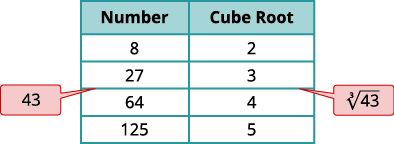

By the end of this section, you will be able to:
* Simplify expressions with roots
* Estimate and approximate roots
* Simplify variable expressions with roots

Before you get started, take this readiness quiz.

1.  Simplify: ⓐ
    <math xmlns="http://www.w3.org/1998/Math/MathML"><mrow><msup><mrow><mrow><mo>(</mo><mrow><mn>−9</mn></mrow><mo>)</mo></mrow></mrow><mn>2</mn></msup></mrow></math>
    
    ⓑ
    <math xmlns="http://www.w3.org/1998/Math/MathML"><mrow><mtext>−</mtext><msup><mn>9</mn><mn>2</mn></msup></mrow></math>
    
    ⓒ
    <math xmlns="http://www.w3.org/1998/Math/MathML"><mrow><msup><mrow><mrow><mo>(</mo><mrow><mn>−9</mn></mrow><mo>)</mo></mrow></mrow><mn>3</mn></msup><mo>.</mo></mrow></math>
    
    * * *
    {: data-type="newline"}
    
    If you missed this problem, review [\[link\]](/m63309#fs-id1167836699133).
2.  Round
    <math xmlns="http://www.w3.org/1998/Math/MathML"><mrow><mn>3.846</mn></mrow></math>
    
    to the nearest hundredth.
    * * *
    {: data-type="newline"}
    
    If you missed this problem, review [\[link\]](/m63305#fs-id1167836309901).
3.  Simplify: ⓐ
    <math xmlns="http://www.w3.org/1998/Math/MathML"><mrow><msup><mi>x</mi><mn>3</mn></msup><mo>·</mo><msup><mi>x</mi><mn>3</mn></msup></mrow></math>
    
    ⓑ
    <math xmlns="http://www.w3.org/1998/Math/MathML"><mrow><msup><mi>y</mi><mn>2</mn></msup><mo>·</mo><msup><mi>y</mi><mn>2</mn></msup><mo>·</mo><msup><mi>y</mi><mn>2</mn></msup></mrow></math>
    
    ⓒ
    <math xmlns="http://www.w3.org/1998/Math/MathML"><mrow><msup><mi>z</mi><mn>3</mn></msup><mo>·</mo><msup><mi>z</mi><mn>3</mn></msup><mo>·</mo><msup><mi>z</mi><mn>3</mn></msup><mo>·</mo><msup><mi>z</mi><mn>3</mn></msup><mo>.</mo></mrow></math>
    
    * * *
    {: data-type="newline"}
    
    If you missed this problem, review [\[link\]](/m63345#fs-id1167835512989).
{: type="1"}

### Simplify Expressions with Roots

In [Foundations](/m63301){: .target-chapter}, we briefly looked at square roots. Remember that when a real number *n* is multiplied by itself, we write <math xmlns="http://www.w3.org/1998/Math/MathML"><mrow><msup><mi>n</mi><mn>2</mn></msup></mrow></math>

 and read it ‘*n* squared’. This number is called the **square**{: data-type="term"} of *n*, and *n* is called the **square root**{: data-type="term"}. For example,

<math xmlns="http://www.w3.org/1998/Math/MathML"><mrow><mtable><mtr><mtd columnalign="center"><msup><mrow><mn>13</mn></mrow><mn>2</mn></msup><mspace width="0.2em" /><mtext>is read “13 squared”</mtext></mtd></mtr><mtr><mtd columnalign="center"><mtext>169 is called the</mtext><mspace width="0.2em" /><mtext mathvariant="italics">square</mtext><mspace width="0.2em" /><mtext>of 13, since</mtext><mspace width="0.2em" /><msup><mrow><mn>13</mn></mrow><mn>2</mn></msup><mo>=</mo><mn>169</mn></mtd></mtr><mtr><mtd columnalign="center"><mtext>13 is a</mtext><mspace width="0.2em" /><mtext mathvariant="italics">square root</mtext><mspace width="0.2em" /><mtext>of 169</mtext></mtd></mtr></mtable></mrow></math>

Square and Square Root of a number

**Square**

<math xmlns="http://www.w3.org/1998/Math/MathML"><mrow><mtext>If</mtext><mspace width="0.2em" /><msup><mi>n</mi><mn>2</mn></msup><mo>=</mo><mi>m</mi><mo>,</mo><mspace width="0.2em" /><mtext>then</mtext><mspace width="0.2em" /><mi>m</mi><mspace width="0.2em" /><mtext>is the</mtext><mspace width="0.2em" /><mtext mathvariant="bold">square</mtext><mspace width="0.2em" /><mtext>of</mtext><mspace width="0.2em" /><mi>n</mi><mo>.</mo></mrow></math>

**Square Root**

<math xmlns="http://www.w3.org/1998/Math/MathML"><mrow><mtext>If</mtext><mspace width="0.2em" /><msup><mi>n</mi><mn>2</mn></msup><mo>=</mo><mi>m</mi><mo>,</mo><mspace width="0.2em" /><mtext>then</mtext><mspace width="0.2em" /><mi>n</mi><mspace width="0.2em" /><mtext>is a</mtext><mspace width="0.2em" /><mtext mathvariant="bold">square root</mtext><mspace width="0.2em" /><mtext>of</mtext><mspace width="0.2em" /><mi>m</mi><mo>.</mo></mrow></math>

Notice (−13)2 = 169 also, so −13 is also a square root of 169. Therefore, both 13 and −13 are square roots of 169.

So, every positive number has two square roots—one positive and one negative. What if we only wanted the positive square root of a positive number? We use a *radical sign*, and write, <math xmlns="http://www.w3.org/1998/Math/MathML"><mrow><msqrt><mi>m</mi></msqrt><mo>,</mo></mrow></math>

 which denotes the positive square root of *m*. The positive square root is also called the **principal square root**{: data-type="term"}.

We also use the radical sign for the square root of zero. Because <math xmlns="http://www.w3.org/1998/Math/MathML"><mrow><msup><mn>0</mn><mn>2</mn></msup><mo>=</mo><mn>0</mn><mo>,</mo></mrow></math>

 <math xmlns="http://www.w3.org/1998/Math/MathML"><mrow><msqrt><mn>0</mn></msqrt><mo>=</mo><mn>0</mn><mo>.</mo></mrow></math>

 Notice that zero has only one square root.

Square Root Notation

<math xmlns="http://www.w3.org/1998/Math/MathML"><mrow><mtable><mtr /><mtr /><mtr><mtd columnalign="center"><msqrt><mi>m</mi></msqrt><mspace width="0.2em" /><mtext>is read “the square root of</mtext><mspace width="0.2em" /><mi>m</mi><mtext>”.</mtext></mtd></mtr><mtr><mtd columnalign="center"><mtext>If</mtext><mspace width="0.2em" /><msup><mi>n</mi><mn>2</mn></msup><mo>=</mo><mi>m</mi><mo>,</mo><mspace width="0.2em" /><mtext>then</mtext><mspace width="0.2em" /><mi>n</mi><mo>=</mo><msqrt><mi>m</mi></msqrt><mo>,</mo><mspace width="0.2em" /><mtext>for</mtext><mspace width="0.2em" /><mi>n</mi><mo>≥</mo><mn>0</mn><mo>.</mo></mtd></mtr></mtable></mrow></math>

  

We know that every positive number has two square roots and the radical sign indicates the positive one. We write <math xmlns="http://www.w3.org/1998/Math/MathML"><mrow><msqrt><mrow><mn>169</mn></mrow></msqrt><mo>=</mo><mn>13</mn><mo>.</mo></mrow></math>

 If we want to find the negative square root of a number, we place a negative in front of the radical sign. For example, <math xmlns="http://www.w3.org/1998/Math/MathML"><mrow><mtext>−</mtext><msqrt><mrow><mn>169</mn></mrow></msqrt><mo>=</mo><mn>−13</mn><mo>.</mo></mrow></math>

Simplify: ⓐ <math xmlns="http://www.w3.org/1998/Math/MathML"><mrow><msqrt><mrow><mn>144</mn></mrow></msqrt></mrow></math>

 ⓑ <math xmlns="http://www.w3.org/1998/Math/MathML"><mrow><mtext>−</mtext><msqrt><mrow><mn>289</mn></mrow></msqrt><mo>.</mo></mrow></math>

ⓐ* * *
{: data-type="newline"}

 <math xmlns="http://www.w3.org/1998/Math/MathML"><mrow><mtable><mtr><mtd /><mtd /><mtd /><mtd columnalign="center"><mspace width="14em" /><msqrt><mrow><mn>144</mn></mrow></msqrt></mtd></mtr><mtr><mtd columnalign="left"><mtext>Since</mtext><mspace width="0.2em" /><msup><mrow><mn>12</mn></mrow><mn>2</mn></msup><mo>=</mo><mn>144</mn><mo>.</mo></mtd><mtd /><mtd /><mtd columnalign="center"><mspace width="14em" /><mn>12</mn></mtd></mtr></mtable></mrow></math>

* * *
{: data-type="newline"}

* * *
{: data-type="newline"}

 ⓑ* * *
{: data-type="newline"}

 <math xmlns="http://www.w3.org/1998/Math/MathML"><mrow><mtable><mtr><mtd /><mtd /><mtd /><mtd columnalign="center"><mspace width="4em" /><mtext>−</mtext><msqrt><mrow><mn>289</mn></mrow></msqrt></mtd></mtr><mtr><mtd columnalign="left"><mtext>Since</mtext><mspace width="0.2em" /><msup><mrow><mn>17</mn></mrow><mn>2</mn></msup><mo>=</mo><mn>289</mn><mspace width="0.2em" /><mtext>and the negative is in</mtext></mtd><mtd /><mtd /><mtd /></mtr><mtr><mtd columnalign="left"><mtext>front of the radical sign.</mtext></mtd><mtd /><mtd /><mtd columnalign="center"><mspace width="4em" /><mn>−17</mn></mtd></mtr></mtable></mrow></math>

Simplify: ⓐ <math xmlns="http://www.w3.org/1998/Math/MathML"><mrow><mtext>−</mtext><msqrt><mrow><mn>64</mn></mrow></msqrt></mrow></math>

 ⓑ <math xmlns="http://www.w3.org/1998/Math/MathML"><mrow><msqrt><mrow><mn>225</mn></mrow></msqrt><mo>.</mo></mrow></math>

ⓐ <math xmlns="http://www.w3.org/1998/Math/MathML"><mrow><mn>−8</mn></mrow></math>

 ⓑ 15

Simplify: ⓐ <math xmlns="http://www.w3.org/1998/Math/MathML"><mrow><msqrt><mrow><mn>100</mn></mrow></msqrt></mrow></math>

 ⓑ <math xmlns="http://www.w3.org/1998/Math/MathML"><mrow><mtext>−</mtext><msqrt><mrow><mn>121</mn></mrow></msqrt><mo>.</mo></mrow></math>

ⓐ 10 ⓑ <math xmlns="http://www.w3.org/1998/Math/MathML"><mrow><mn>−11</mn></mrow></math>

Can we simplify <math xmlns="http://www.w3.org/1998/Math/MathML"><mrow><msqrt><mrow><mn>−49</mn></mrow></msqrt><mo>?</mo></mrow></math>

 Is there a number whose square is <math xmlns="http://www.w3.org/1998/Math/MathML"><mrow><mn>−49</mn><mo>?</mo></mrow></math>

<math xmlns="http://www.w3.org/1998/Math/MathML"><mrow><msup><mrow><mrow><mo>(</mo><mrow><mspace width="0.2em" /></mrow><mo>)</mo></mrow></mrow><mn>2</mn></msup><mo>=</mo><mn>−49</mn></mrow></math>

Any positive number squared is positive. Any negative number squared is positive. There is no real number equal to <math xmlns="http://www.w3.org/1998/Math/MathML"><mrow><msqrt><mrow><mn>−49</mn></mrow></msqrt><mo>.</mo></mrow></math>

 The square root of a negative number is not a real number.

Simplify: ⓐ <math xmlns="http://www.w3.org/1998/Math/MathML"><mrow><msqrt><mrow><mn>−196</mn></mrow></msqrt></mrow></math>

 ⓑ <math xmlns="http://www.w3.org/1998/Math/MathML"><mrow><mtext>−</mtext><msqrt><mrow><mn>64</mn></mrow></msqrt><mo>.</mo></mrow></math>

ⓐ* * *
{: data-type="newline"}

 <math xmlns="http://www.w3.org/1998/Math/MathML"><mrow><mtable><mtr><mtd /><mtd /><mtd /><mtd columnalign="center"><mspace width="4em" /><msqrt><mrow><mn>−196</mn></mrow></msqrt></mtd></mtr><mtr><mtd columnalign="left"><mtext>There is no real number whose square is</mtext><mspace width="0.2em" /><mn>−196</mn><mo>.</mo></mtd><mtd /><mtd /><mtd columnalign="center"><mspace width="4em" /><msqrt><mrow><mn>−196</mn></mrow></msqrt><mspace width="0.2em" /><mtext>is not a real number.</mtext></mtd></mtr></mtable></mrow></math>

* * *
{: data-type="newline"}

* * *
{: data-type="newline"}

 ⓑ* * *
{: data-type="newline"}

 <math xmlns="http://www.w3.org/1998/Math/MathML"><mrow><mtable><mtr><mtd /><mtd /><mtd /><mtd columnalign="center"><mspace width="12em" /><mtext>−</mtext><msqrt><mrow><mn>64</mn></mrow></msqrt></mtd></mtr><mtr><mtd columnalign="left"><mtext>The negative is in front of the radical.</mtext></mtd><mtd /><mtd /><mtd columnalign="center"><mspace width="12em" /><mn>−8</mn></mtd></mtr></mtable></mrow></math>

Simplify: ⓐ <math xmlns="http://www.w3.org/1998/Math/MathML"><mrow><msqrt><mrow><mn>−169</mn></mrow></msqrt></mrow></math>

 ⓑ <math xmlns="http://www.w3.org/1998/Math/MathML"><mrow><mtext>−</mtext><msqrt><mrow><mn>81</mn></mrow></msqrt><mo>.</mo></mrow></math>

ⓐ not a real number ⓑ <math xmlns="http://www.w3.org/1998/Math/MathML"><mrow><mn>−9</mn></mrow></math>

Simplify: ⓐ <math xmlns="http://www.w3.org/1998/Math/MathML"><mrow><mtext>−</mtext><msqrt><mrow><mn>49</mn></mrow></msqrt></mrow></math>

 ⓑ <math xmlns="http://www.w3.org/1998/Math/MathML"><mrow><msqrt><mrow><mn>−121</mn></mrow></msqrt><mo>.</mo></mrow></math>

ⓐ <math xmlns="http://www.w3.org/1998/Math/MathML"><mrow><mn>−7</mn></mrow></math>

 ⓑ not a real number

So far we have only talked about squares and square roots. Let’s now extend our work to include higher powers and higher roots.

Let’s review some vocabulary first.

<math xmlns="http://www.w3.org/1998/Math/MathML"><mrow><mtable><mtr><mtd columnalign="left"><mtext>We write:</mtext></mtd><mtd /><mtd /><mtd /><mtd /><mtd columnalign="left"><mtext>We say:</mtext></mtd></mtr><mtr><mtd columnalign="center"><msup><mi>n</mi><mn>2</mn></msup></mtd><mtd /><mtd /><mtd /><mtd /><mtd columnalign="left"><mi>n</mi><mspace width="0.2em" /><mtext>squared</mtext></mtd></mtr><mtr><mtd columnalign="center"><msup><mi>n</mi><mn>3</mn></msup></mtd><mtd /><mtd /><mtd /><mtd /><mtd columnalign="left"><mi>n</mi><mspace width="0.2em" /><mtext>cubed</mtext></mtd></mtr><mtr><mtd columnalign="center"><msup><mi>n</mi><mn>4</mn></msup></mtd><mtd /><mtd /><mtd /><mtd /><mtd columnalign="left"><mi>n</mi><mspace width="0.2em" /><mtext>to the fourth power</mtext></mtd></mtr><mtr><mtd columnalign="center"><msup><mi>n</mi><mn>5</mn></msup></mtd><mtd /><mtd /><mtd /><mtd /><mtd columnalign="left"><mi>n</mi><mspace width="0.2em" /><mtext>to the fifth power</mtext></mtd></mtr></mtable></mrow></math>

The terms ‘squared’ and ‘cubed’ come from the formulas for area of a square and volume of a cube.

It will be helpful to have a table of the powers of the integers from −5 to 5. See [\[link\]](#CNX_IntAlg_Figure_08_01_002).

 ![The figure contains two tables. The first table has 9 rows and 5 columns. The first row is a header row with the headers &#x201C;Number&#x201D;, &#x201C;Square&#x201D;, &#x201C;Cube&#x201D;, &#x201C;Fourth power&#x201D;, and &#x201C;Fifth power&#x201D;. The second row contains the expressions n, n squared, n cubed, n to the fourth power, and n to the fifth power. The third row contains the number 1 in each column. The fourth row contains the numbers 2, 4, 8, 16, 32. The fifth row contains the numbers 3, 9, 27, 81, 243. The sixth row contains the numbers 4, 16, 64, 256, 1024. The seventh row contains the numbers 5, 25, 125 625, 3125. The eighth row contains the expressions x, x squared, x cubed, x to the fourth power, and x to the fifth power. The last row contains the expressions x squared, x to the fourth power, x to the sixth power, x to the eighth power, and x to the tenth power. The second table has 7 rows and 5 columns. The first row is a header row with the headers &#x201C;Number&#x201D;, &#x201C;Square&#x201D;, &#x201C;Cube&#x201D;, &#x201C;Fourth power&#x201D;, and &#x201C;Fifth power&#x201D;. The second row contains the expressions n, n squared, n cubed, n to the fourth power, and n to the fifth power. The third row contains the numbers negative 1, 1 negative 1, 1, negative 1. The fourth row contains the numbers negative 2, 4, negative 8, 16, negative 32. The fifth row contains the numbers negative 3, 9, negative 27, 81, negative 243. The sixth row contains the numbers negative 4, 16, negative 64, 256, negative 1024. The last row contains the numbers negative 5, 25, negative 125, 625, negative 3125.](../resources/CNX_IntAlg_Figure_08_01_002.jpg){: #CNX_IntAlg_Figure_08_01_002}

Notice the signs in the table. All powers of positive numbers are positive, of course. But when we have a negative number, the *even* powers are positive and the *odd* powers are negative. We’ll copy the row with the powers of −2 to help you see this.

    We will now extend the square root definition to higher roots.

*n*th Root of a Number

<math xmlns="http://www.w3.org/1998/Math/MathML"><mrow><mtable><mtr /><mtr /><mtr><mtd columnalign="center"><mtext>If</mtext><mspace width="0.2em" /><msup><mi>b</mi><mi>n</mi></msup><mo>=</mo><mi>a</mi><mo>,</mo><mspace width="0.2em" /><mtext>then</mtext><mspace width="0.2em" /><mi>b</mi><mspace width="0.2em" /><mtext>is an</mtext><mspace width="0.2em" /><msup><mi>n</mi><mrow><mi>t</mi><mi>h</mi></mrow></msup><mspace width="0.2em" /><mtext>root of</mtext><mspace width="0.2em" /><mi>a</mi><mo>.</mo></mtd></mtr><mtr><mtd columnalign="center"><mtext>The principal</mtext><mspace width="0.2em" /><msup><mi>n</mi><mrow><mi>t</mi><mi>h</mi></mrow></msup><mspace width="0.2em" /><mtext>root of</mtext><mspace width="0.2em" /><mi>a</mi><mspace width="0.2em" /><mtext>is written</mtext><mspace width="0.2em" /><mroot><mi>a</mi><mi>n</mi></mroot><mo>.</mo></mtd></mtr><mtr><mtd columnalign="center"><mi>n</mi><mspace width="0.2em" /><mtext>is called the</mtext><mspace width="0.2em" /><mtext mathvariant="bold">index</mtext><mspace width="0.2em" /><mtext>of the radical.</mtext></mtd></mtr></mtable></mrow></math>

Just like we use the word ‘cubed’ for *b*3, we use the term ‘cube root’ for <math xmlns="http://www.w3.org/1998/Math/MathML"><mrow><mroot><mi>a</mi><mn>3</mn></mroot><mo>.</mo></mrow></math>

We can refer to [\[link\]](#CNX_IntAlg_Figure_08_01_002) to help find higher roots.

<math xmlns="http://www.w3.org/1998/Math/MathML"><mtable><mtr><mtd columnalign="right"><msup><mn>4</mn><mn>3</mn></msup></mtd><mtd columnalign="left"><mo>=</mo></mtd><mtd columnalign="left"><mn>64</mn></mtd></mtr><mtr><mtd columnalign="right"><msup><mn>3</mn><mn>4</mn></msup></mtd><mtd columnalign="left"><mo>=</mo></mtd><mtd columnalign="left"><mn>81</mn></mtd></mtr><mtr><mtd columnalign="right"><msup><mrow><mo stretchy="false">(</mo><mn>−2</mn><mo stretchy="false">)</mo></mrow><mn>5</mn></msup></mtd><mtd columnalign="left"><mo>=</mo></mtd><mtd columnalign="left"><mn>−32</mn></mtd></mtr></mtable><mspace width="6em" /><mtable><mtr><mtd columnalign="right"><mroot><mrow><mn>64</mn></mrow><mn>3</mn></mroot></mtd><mtd columnalign="left"><mo>=</mo></mtd><mtd columnalign="left"><mn>4</mn></mtd></mtr><mtr><mtd columnalign="right"><mroot><mrow><mn>81</mn></mrow><mn>4</mn></mroot></mtd><mtd columnalign="left"><mo>=</mo></mtd><mtd columnalign="left"><mn>3</mn></mtd></mtr><mtr><mtd columnalign="right"><mroot><mrow><mn>−32</mn></mrow><mn>5</mn></mroot></mtd><mtd columnalign="left"><mo>=</mo></mtd><mtd columnalign="left"><mn>−2</mn></mtd></mtr></mtable></math>

Could we have an even root of a negative number? We know that the square root of a negative number is not a real number. The same is true for any even root. *Even* roots of negative numbers are not real numbers. *Odd* roots of negative numbers are real numbers.

Properties of
<math xmlns="http://www.w3.org/1998/Math/MathML"><mrow><mroot><mi>a</mi><mi>n</mi></mroot></mrow></math>

When *n* is an even number and

* <math xmlns="http://www.w3.org/1998/Math/MathML"><mrow><mi>a</mi><mo>≥</mo><mn>0</mn><mo>,</mo></mrow></math>
  
  then
  <math xmlns="http://www.w3.org/1998/Math/MathML"><mrow><mroot><mi>a</mi><mi>n</mi></mroot></mrow></math>
  
  is a real number.
* <math xmlns="http://www.w3.org/1998/Math/MathML"><mrow><mi>a</mi><mo>&lt;</mo><mn>0</mn><mo>,</mo></mrow></math>
  
  then
  <math xmlns="http://www.w3.org/1998/Math/MathML"><mrow><mroot><mi>a</mi><mi>n</mi></mroot></mrow></math>
  
  is not a real number.
{: data-bullet-style="bullet"}

When *n* is an odd number, <math xmlns="http://www.w3.org/1998/Math/MathML"><mrow><mroot><mi>a</mi><mi>n</mi></mroot></mrow></math>

 is a real number for all values of *a*.

We will apply these properties in the next two examples.

Simplify: ⓐ <math xmlns="http://www.w3.org/1998/Math/MathML"><mrow><mroot><mrow><mn>64</mn></mrow><mn>3</mn></mroot></mrow></math>

 ⓑ <math xmlns="http://www.w3.org/1998/Math/MathML"><mrow><mroot><mrow><mn>81</mn></mrow><mn>4</mn></mroot></mrow></math>

 ⓒ <math xmlns="http://www.w3.org/1998/Math/MathML"><mrow><mroot><mrow><mn>32</mn></mrow><mn>5</mn></mroot><mo>.</mo></mrow></math>

ⓐ* * *
{: data-type="newline"}

 <math xmlns="http://www.w3.org/1998/Math/MathML"><mrow><mtable><mtr><mtd /><mtd /><mtd /><mtd columnalign="center"><mspace width="5em" /><mroot><mrow><mn>64</mn></mrow><mn>3</mn></mroot></mtd></mtr><mtr><mtd columnalign="left"><mtext>Since</mtext><mspace width="0.2em" /><msup><mn>4</mn><mn>3</mn></msup><mo>=</mo><mn>64</mn><mo>.</mo></mtd><mtd /><mtd /><mtd columnalign="center"><mspace width="5em" /><mn>4</mn></mtd></mtr></mtable></mrow></math>

* * *
{: data-type="newline"}

* * *
{: data-type="newline"}

 ⓑ* * *
{: data-type="newline"}

 <math xmlns="http://www.w3.org/1998/Math/MathML"><mrow><mtable><mtr><mtd /><mtd /><mtd /><mtd columnalign="center"><mspace width="4em" /><mroot><mrow><mn>81</mn></mrow><mn>4</mn></mroot></mtd></mtr><mtr><mtd columnalign="left"><mtext>Since</mtext><mspace width="0.2em" /><msup><mrow><mrow><mo>(</mo><mn>3</mn><mo>)</mo></mrow></mrow><mn>4</mn></msup><mo>=</mo><mn>81</mn><mo>.</mo></mtd><mtd /><mtd /><mtd columnalign="center"><mspace width="4em" /><mn>3</mn></mtd></mtr></mtable></mrow></math>

* * *
{: data-type="newline"}

* * *
{: data-type="newline"}

 ⓒ* * *
{: data-type="newline"}

 <math xmlns="http://www.w3.org/1998/Math/MathML"><mrow><mtable><mtr><mtd /><mtd /><mtd /><mtd columnalign="center"><mspace width="4em" /><mroot><mrow><mn>32</mn></mrow><mn>5</mn></mroot></mtd></mtr><mtr><mtd columnalign="left"><mtext>Since</mtext><mspace width="0.2em" /><msup><mrow><mrow><mo>(</mo><mn>2</mn><mo>)</mo></mrow></mrow><mn>5</mn></msup><mo>=</mo><mn>32</mn><mo>.</mo></mtd><mtd /><mtd /><mtd columnalign="center"><mspace width="4em" /><mn>2</mn></mtd></mtr></mtable></mrow></math>

Simplify: ⓐ <math xmlns="http://www.w3.org/1998/Math/MathML"><mrow><mroot><mrow><mn>27</mn></mrow><mn>3</mn></mroot></mrow></math>

 ⓑ <math xmlns="http://www.w3.org/1998/Math/MathML"><mrow><mroot><mrow><mn>256</mn></mrow><mn>4</mn></mroot></mrow></math>

 ⓒ <math xmlns="http://www.w3.org/1998/Math/MathML"><mrow><mroot><mrow><mn>243</mn></mrow><mn>5</mn></mroot><mo>.</mo></mrow></math>

ⓐ 3 ⓑ 4 ⓒ 3

Simplify: ⓐ <math xmlns="http://www.w3.org/1998/Math/MathML"><mrow><mroot><mrow><mn>1000</mn></mrow><mn>3</mn></mroot></mrow></math>

 ⓑ <math xmlns="http://www.w3.org/1998/Math/MathML"><mrow><mroot><mrow><mn>16</mn></mrow><mn>4</mn></mroot></mrow></math>

 ⓒ <math xmlns="http://www.w3.org/1998/Math/MathML"><mrow><mroot><mrow><mn>243</mn></mrow><mn>5</mn></mroot><mo>.</mo></mrow></math>

ⓐ 10 ⓑ 2 ⓒ 3

In this example be alert for the negative signs as well as even and odd powers.

Simplify: ⓐ <math xmlns="http://www.w3.org/1998/Math/MathML"><mrow><mroot><mrow><mn>−125</mn></mrow><mn>3</mn></mroot></mrow></math>

 ⓑ <math xmlns="http://www.w3.org/1998/Math/MathML"><mrow><mroot><mrow><mn>16</mn></mrow><mn>4</mn></mroot></mrow></math>

 ⓒ <math xmlns="http://www.w3.org/1998/Math/MathML"><mrow><mroot><mrow><mn>−243</mn></mrow><mn>5</mn></mroot><mo>.</mo></mrow></math>

ⓐ* * *
{: data-type="newline"}

 <math xmlns="http://www.w3.org/1998/Math/MathML"><mrow><mtable><mtr><mtd /><mtd /><mtd /><mtd columnalign="center"><mspace width="13em" /><mroot><mrow><mn>−125</mn></mrow><mn>3</mn></mroot></mtd></mtr><mtr><mtd columnalign="left"><mtext>Since</mtext><mspace width="0.2em" /><msup><mrow><mrow><mo>(</mo><mrow><mn>−5</mn></mrow><mo>)</mo></mrow></mrow><mn>3</mn></msup><mo>=</mo><mn>−125</mn><mo>.</mo></mtd><mtd /><mtd /><mtd columnalign="center"><mspace width="13em" /><mn>−5</mn></mtd></mtr></mtable></mrow></math>

* * *
{: data-type="newline"}

* * *
{: data-type="newline"}

 ⓑ* * *
{: data-type="newline"}

 <math xmlns="http://www.w3.org/1998/Math/MathML"><mrow><mtable><mtr><mtd /><mtd /><mtd /><mtd columnalign="center"><mspace width="2em" /><mroot><mrow><mn>−16</mn></mrow><mn>4</mn></mroot></mtd></mtr><mtr><mtd columnalign="left"><mtext>Think,</mtext><mspace width="0.2em" /><msup><mrow><mrow><mo>(</mo><mo>?</mo><mo>)</mo></mrow></mrow><mn>4</mn></msup><mo>=</mo><mn>−16</mn><mo>.</mo><mspace width="0.2em" /><mtext>No real number raised</mtext></mtd><mtd /><mtd /><mtd /></mtr><mtr><mtd columnalign="left"><mtext>to the fourth power is negative.</mtext></mtd><mtd /><mtd /><mtd columnalign="center"><mspace width="2em" /><mtext>Not a real number.</mtext></mtd></mtr></mtable></mrow></math>

* * *
{: data-type="newline"}

* * *
{: data-type="newline"}

 ⓒ* * *
{: data-type="newline"}

 <math xmlns="http://www.w3.org/1998/Math/MathML"><mrow><mtable><mtr><mtd /><mtd /><mtd /><mtd columnalign="center"><mspace width="13em" /><mroot><mrow><mn>−243</mn></mrow><mn>5</mn></mroot></mtd></mtr><mtr><mtd columnalign="left"><mtext>Since</mtext><mspace width="0.2em" /><msup><mrow><mrow><mo>(</mo><mrow><mn>−3</mn></mrow><mo>)</mo></mrow></mrow><mn>5</mn></msup><mo>=</mo><mn>−243</mn><mo>.</mo></mtd><mtd /><mtd /><mtd columnalign="center"><mspace width="13em" /><mn>−3</mn></mtd></mtr></mtable></mrow></math>

Simplify: ⓐ <math xmlns="http://www.w3.org/1998/Math/MathML"><mrow><mroot><mrow><mn>−27</mn></mrow><mn>3</mn></mroot></mrow></math>

 ⓑ <math xmlns="http://www.w3.org/1998/Math/MathML"><mrow><mroot><mrow><mn>−256</mn></mrow><mn>4</mn></mroot></mrow></math>

 ⓒ <math xmlns="http://www.w3.org/1998/Math/MathML"><mrow><mroot><mrow><mn>−32</mn></mrow><mn>5</mn></mroot><mo>.</mo></mrow></math>

ⓐ <math xmlns="http://www.w3.org/1998/Math/MathML"><mrow><mn>−3</mn></mrow></math>

 ⓑ not real ⓒ <math xmlns="http://www.w3.org/1998/Math/MathML"><mrow><mn>−2</mn></mrow></math>

Simplify: ⓐ <math xmlns="http://www.w3.org/1998/Math/MathML"><mrow><mroot><mrow><mn>−216</mn></mrow><mn>3</mn></mroot></mrow></math>

 ⓑ <math xmlns="http://www.w3.org/1998/Math/MathML"><mrow><mroot><mrow><mn>−81</mn></mrow><mn>4</mn></mroot></mrow></math>

 ⓒ <math xmlns="http://www.w3.org/1998/Math/MathML"><mrow><mroot><mrow><mn>−1024</mn></mrow><mn>5</mn></mroot><mo>.</mo></mrow></math>

ⓐ <math xmlns="http://www.w3.org/1998/Math/MathML"><mrow><mn>−6</mn></mrow></math>

 ⓑ not real ⓒ <math xmlns="http://www.w3.org/1998/Math/MathML"><mrow><mn>−4</mn></mrow></math>

### Estimate and Approximate Roots

When we see a number with a radical sign, we often don’t think about its numerical value. While we probably know that the <math xmlns="http://www.w3.org/1998/Math/MathML"><mrow><msqrt><mn>4</mn></msqrt><mo>=</mo><mn>2</mn><mo>,</mo></mrow></math>

 what is the value of <math xmlns="http://www.w3.org/1998/Math/MathML"><mrow><mroot><mrow><mn>21</mn></mrow><mrow /></mroot></mrow></math>

 or <math xmlns="http://www.w3.org/1998/Math/MathML"><mrow><mroot><mrow><mn>50</mn></mrow><mn>3</mn></mroot><mo>?</mo></mrow></math>

 In some situations a quick estimate is meaningful and in others it is convenient to have a decimal approximation.

To get a numerical estimate of a square root, we look for **perfect square**{: data-type="term" .no-emphasis} numbers closest to the radicand. To find an estimate of <math xmlns="http://www.w3.org/1998/Math/MathML"><mrow><msqrt><mrow><mn>11</mn></mrow></msqrt><mo>,</mo></mrow></math>

 we see 11 is between perfect square numbers 9 and 16, *closer* to 9. Its square root then will be between 3 and 4, but closer to 3.

  ![The figure contains two tables. The first table has 5 rows and 2 columns. The first row is a header row with the headers &#x201C;Number&#x201D; and &#x201C;Square Root&#x201D;. The second row has the numbers 4 and 2. The third row is 9 and 3. The fourth row is 16 and 4. The last row is 25 and 5. A callout containing the number 11 is directed between the 9 and 16 in the first column. Another callout containing the number square root of 11 is directed between the 3 and 4 of the second column. Below the table are the inequalities 9 is less than 11 is less than 16 and 3 is less than square root of 11 is less than 4. The second table has 5 rows and 2 columns. The first row is a header row with the headers &#x201C;Number&#x201D; and &#x201C;Cube Root&#x201D;. The second row has the numbers 8 and 2. The third row is 27 and 3. The fourth row is 64 and 4. The last row is 125 and 5. A callout containing the number 91 is directed between the 64 and 125 in the first column. Another callout containing the number cube root of 91 is directed between the 4 and 5 of the second column. Below the table are the inequalities 64 is less than 91 is less than 125 and 4 is less than cube root of 91 is less than 5.](../resources/CNX_IntAlg_Figure_08_01_004_img.jpg)  Similarly, to estimate <math xmlns="http://www.w3.org/1998/Math/MathML"><mrow><mroot><mrow><mn>91</mn></mrow><mn>3</mn></mroot><mo>,</mo></mrow></math>

 we see 91 is between perfect cube numbers 64 and 125. The cube root then will be between 4 and 5.

Estimate each root between two consecutive whole numbers: ⓐ <math xmlns="http://www.w3.org/1998/Math/MathML"><mrow><msqrt><mrow><mn>105</mn></mrow></msqrt></mrow></math>

 ⓑ <math xmlns="http://www.w3.org/1998/Math/MathML"><mrow><mroot><mrow><mn>43</mn></mrow><mn>3</mn></mroot><mo>.</mo></mrow></math>

ⓐ Think of the perfect square numbers closest to 105. Make a small table of these perfect squares and their squares roots.

|  |  |
{: valign="top"}|  |  |
{: valign="top"}| Locate 105 between two consecutive perfect squares. |  |
{: valign="top"}| <math xmlns="http://www.w3.org/1998/Math/MathML"><mrow><msqrt><mrow><mn>105</mn></mrow></msqrt></mrow></math>

 is between their square roots. |  |
{: valign="top"}{: .unnumbered .unstyled summary="The table has 5 rows and 2 columns. The first row is a header row with the headers &#x201C;Number&#x201D; and &#x201C;Square Root&#x201D;. The second row has the numbers 81and 9. The third row is 100 and 10. The fourth row is 121 and 11. The last row is 144 and 12. A callout containing the number 105 is directed between the 100 and 121 in the first column. Another callout containing the number square root of 105 is directed between the 10 and 11 of the second column. Below the table are the inequalities 100 is less than 105 is less than 121 and 10 is less than square root of 105 is less than 11." data-label=""}

ⓑ Similarly we locate 43 between two perfect cube numbers.

|  |  |
{: valign="top"}|  |  |
{: valign="top"}| Locate 43 between two consecutive perfect cubes. |  |
{: valign="top"}| <math xmlns="http://www.w3.org/1998/Math/MathML"><mrow><mroot><mrow><mn>43</mn></mrow><mn>3</mn></mroot></mrow></math>

 is between their cube roots. |  |
{: valign="top"}{: .unnumbered .unstyled .can-break summary="The table has 5 rows and 2 columns. The first row is a header row with the headers &#x201C;Number&#x201D; and &#x201C;Cube Root&#x201D;. The second row has the numbers 8 and 2. The third row is 27 and 3. The fourth row is 64 and 4. The last row is 125 and 5. A callout containing the number 43 is directed between the 27 and 64 in the first column. Another callout containing the number cube root of 43 is directed between the 3 and 4 of the second column. Below the table are the inequalities 27 is less than 43 is less than 64 and 3 is less than cube root of 43 is less than 4." data-label=""}

Estimate each root between two consecutive whole numbers:

ⓐ <math xmlns="http://www.w3.org/1998/Math/MathML"><mrow><msqrt><mrow><mn>38</mn></mrow></msqrt></mrow></math>

 ⓑ <math xmlns="http://www.w3.org/1998/Math/MathML"><mrow><mroot><mrow><mn>93</mn></mrow><mn>3</mn></mroot></mrow></math>

ⓐ <math xmlns="http://www.w3.org/1998/Math/MathML"><mrow><mn>6</mn><mo>&lt;</mo><msqrt><mrow><mn>38</mn></mrow></msqrt><mo>&lt;</mo><mn>7</mn></mrow></math>

* * *
{: data-type="newline"}

ⓑ <math xmlns="http://www.w3.org/1998/Math/MathML"><mrow><mn>4</mn><mo>&lt;</mo><mroot><mrow><mn>93</mn></mrow><mn>3</mn></mroot><mo>&lt;</mo><mn>5</mn></mrow></math>

Estimate each root between two consecutive whole numbers:

ⓐ <math xmlns="http://www.w3.org/1998/Math/MathML"><mrow><msqrt><mrow><mn>84</mn></mrow></msqrt></mrow></math>

 ⓑ <math xmlns="http://www.w3.org/1998/Math/MathML"><mrow><mroot><mrow><mn>152</mn></mrow><mn>3</mn></mroot></mrow></math>

ⓐ <math xmlns="http://www.w3.org/1998/Math/MathML"><mrow><mn>9</mn><mo>&lt;</mo><msqrt><mrow><mn>84</mn></mrow></msqrt><mo>&lt;</mo><mn>10</mn></mrow></math>

* * *
{: data-type="newline"}

ⓑ <math xmlns="http://www.w3.org/1998/Math/MathML"><mrow><mn>5</mn><mo>&lt;</mo><mroot><mrow><mn>152</mn></mrow><mn>3</mn></mroot><mo>&lt;</mo><mn>6</mn></mrow></math>

There are mathematical methods to approximate square roots, but nowadays most people use a calculator to find square roots. To find a square root you will use the <math xmlns="http://www.w3.org/1998/Math/MathML"><mrow><msqrt><mi>x</mi></msqrt></mrow></math>

 key on your calculator. To find a cube root, or any root with higher index, you will use the <math xmlns="http://www.w3.org/1998/Math/MathML"><mrow><mroot><mi>x</mi><mrow><mi>y</mi></mrow></mroot></mrow></math>

 key.

When you use these keys, you get an approximate value. It is an approximation, accurate to the number of digits shown on your calculator’s display. The symbol for an approximation is <math xmlns="http://www.w3.org/1998/Math/MathML"><mo>≈</mo></math>

 and it is read ‘approximately’.

Suppose your calculator has a 10 digit display. You would see that

<math xmlns="http://www.w3.org/1998/Math/MathML"><mrow><mtable><mtr><mtd columnalign="center"><msqrt><mn>5</mn></msqrt><mo>≈</mo><mn>2.236067978</mn><mspace width="0.2em" /><mtext>rounded to two decimal places is</mtext><mspace width="0.2em" /><msqrt><mn>5</mn></msqrt><mo>≈</mo><mn>2.24</mn></mtd></mtr><mtr><mtd columnalign="center"><mroot><mrow><mn>93</mn></mrow><mrow><mn>4</mn></mrow></mroot><mo>≈</mo><mn>3.105422799</mn><mspace width="0.2em" /><mtext>rounded to two decimal places is</mtext><mspace width="0.2em" /><mroot><mrow><mn>93</mn></mrow><mrow><mn>4</mn></mrow></mroot><mo>≈</mo><mn>3.11</mn></mtd></mtr></mtable></mrow></math>

How do we know these values are approximations and not the exact values? Look at what happens when we square them:

<math xmlns="http://www.w3.org/1998/Math/MathML"><mtable><mtr><mtd columnalign="right"><msup><mrow><mo>(</mo><mrow><mn>2.236067978</mn></mrow><mo>)</mo></mrow><mn>2</mn></msup></mtd><mtd columnalign="left"><mo>=</mo></mtd><mtd columnalign="left"><mn>5.000000002</mn></mtd></mtr><mtr><mtd columnalign="right"><msup><mrow><mo>(</mo><mrow><mn>2.24</mn></mrow><mo>)</mo></mrow><mn>2</mn></msup></mtd><mtd columnalign="left"><mo>=</mo></mtd><mtd columnalign="left"><mn>5.0176</mn></mtd></mtr></mtable><mspace width="4em" /><mtable><mtr><mtd columnalign="right"><msup><mrow><mo>(</mo><mrow><mn>3.105422799</mn></mrow><mo>)</mo></mrow><mn>4</mn></msup></mtd><mtd columnalign="left"><mo>=</mo></mtd><mtd columnalign="left"><mn>92.999999991</mn></mtd></mtr><mtr><mtd columnalign="right"><msup><mrow><mo>(</mo><mrow><mn>3.11</mn></mrow><mo>)</mo></mrow><mn>4</mn></msup></mtd><mtd columnalign="left"><mo>=</mo></mtd><mtd columnalign="left"><mn>93.54951841</mn></mtd></mtr></mtable></math>

Their squares are close to 5, but are not exactly equal to 5. The fourth powers are close to 93, but not equal to 93.

Round to two decimal places: ⓐ <math xmlns="http://www.w3.org/1998/Math/MathML"><mrow><msqrt><mrow><mn>17</mn></mrow></msqrt></mrow></math>

 ⓑ <math xmlns="http://www.w3.org/1998/Math/MathML"><mrow><mroot><mrow><mn>49</mn></mrow><mrow><mn>3</mn></mrow></mroot></mrow></math>

 ⓒ <math xmlns="http://www.w3.org/1998/Math/MathML"><mrow><mroot><mrow><mn>51</mn></mrow><mrow><mn>4</mn></mrow></mroot><mo>.</mo></mrow></math>

ⓐ* * *
{: data-type="newline"}

 <math xmlns="http://www.w3.org/1998/Math/MathML"><mrow><mtable><mtr><mtd /><mtd /><mtd /><mtd columnalign="center"><mspace width="4em" /><msqrt><mrow><mn>17</mn></mrow></msqrt></mtd></mtr><mtr><mtd columnalign="left"><mtext>Use the calculator square root key.</mtext></mtd><mtd /><mtd /><mtd columnalign="center"><mspace width="4em" /><mn>4.123105626</mn><mtext>…</mtext></mtd></mtr><mtr><mtd columnalign="left"><mtext>Round to two decimal places.</mtext></mtd><mtd /><mtd /><mtd columnalign="center"><mspace width="4em" /><mn>4.12</mn></mtd></mtr><mtr><mtd /><mtd /><mtd /><mtd columnalign="center"><mspace width="4em" /><msqrt><mrow><mn>17</mn></mrow></msqrt><mo>≈</mo><mn>4.12</mn></mtd></mtr></mtable></mrow></math>

* * *
{: data-type="newline"}

* * *
{: data-type="newline"}

 ⓑ* * *
{: data-type="newline"}

 <math xmlns="http://www.w3.org/1998/Math/MathML"><mrow><mtable><mtr><mtd /><mtd /><mtd /><mtd columnalign="center"><mspace width="6.5em" /><mroot><mrow><mn>49</mn></mrow><mrow><mn>3</mn></mrow></mroot></mtd></mtr><mtr><mtd columnalign="left"><mtext>Use the calculator</mtext><mspace width="0.2em" /><mroot><mi>x</mi><mrow><mi>y</mi></mrow></mroot><mspace width="0.2em" /><mtext>key</mtext><mo>.</mo></mtd><mtd /><mtd /><mtd columnalign="center"><mspace width="6.5em" /><mn>3.659305710</mn><mtext>…</mtext></mtd></mtr><mtr><mtd columnalign="left"><mtext>Round to two decimal places.</mtext></mtd><mtd /><mtd /><mtd columnalign="center"><mspace width="6.5em" /><mn>3.66</mn></mtd></mtr><mtr><mtd /><mtd /><mtd /><mtd columnalign="center"><mspace width="6.5em" /><mroot><mrow><mn>49</mn></mrow><mrow><mn>3</mn></mrow></mroot><mo>≈</mo><mn>3.66</mn></mtd></mtr></mtable></mrow></math>

* * *
{: data-type="newline"}

* * *
{: data-type="newline"}

 ⓒ* * *
{: data-type="newline"}

 <math xmlns="http://www.w3.org/1998/Math/MathML"><mrow><mtable><mtr><mtd /><mtd /><mtd /><mtd columnalign="center"><mspace width="6.5em" /><mroot><mrow><mn>51</mn></mrow><mn>4</mn></mroot></mtd></mtr><mtr><mtd columnalign="left"><mtext>Use the calculator</mtext><mspace width="0.2em" /><mroot><mi>x</mi><mrow><mi>y</mi></mrow></mroot><mspace width="0.2em" /><mtext>key</mtext><mo>.</mo></mtd><mtd /><mtd /><mtd columnalign="center"><mspace width="6.5em" /><mn>2.6723451177</mn><mtext>…</mtext></mtd></mtr><mtr><mtd columnalign="left"><mtext>Round to two decimal places.</mtext></mtd><mtd /><mtd /><mtd columnalign="center"><mspace width="6.5em" /><mn>2.67</mn></mtd></mtr><mtr><mtd /><mtd /><mtd /><mtd columnalign="center"><mspace width="6.5em" /><mroot><mrow><mn>51</mn></mrow><mn>4</mn></mroot><mo>≈</mo><mn>2.67</mn></mtd></mtr></mtable></mrow></math>

Round to two decimal places:

ⓐ <math xmlns="http://www.w3.org/1998/Math/MathML"><mrow><msqrt><mrow><mn>11</mn></mrow></msqrt></mrow></math>

 ⓑ <math xmlns="http://www.w3.org/1998/Math/MathML"><mrow><mroot><mrow><mn>71</mn></mrow><mrow><mn>3</mn></mrow></mroot></mrow></math>

 ⓒ <math xmlns="http://www.w3.org/1998/Math/MathML"><mrow><mroot><mrow><mn>127</mn></mrow><mrow><mn>4</mn></mrow></mroot><mo>.</mo></mrow></math>

ⓐ <math xmlns="http://www.w3.org/1998/Math/MathML"><mrow><mo>≈</mo><mn>3.32</mn></mrow></math>

 ⓑ <math xmlns="http://www.w3.org/1998/Math/MathML"><mrow><mo>≈</mo><mn>4.14</mn></mrow></math>

* * *
{: data-type="newline"}

ⓒ <math xmlns="http://www.w3.org/1998/Math/MathML"><mrow><mo>≈</mo><mn>3.36</mn></mrow></math>

Round to two decimal places:

ⓐ <math xmlns="http://www.w3.org/1998/Math/MathML"><mrow><msqrt><mrow><mn>13</mn></mrow></msqrt></mrow></math>

 ⓑ <math xmlns="http://www.w3.org/1998/Math/MathML"><mrow><mroot><mrow><mn>84</mn></mrow><mrow><mn>3</mn></mrow></mroot></mrow></math>

 ⓒ <math xmlns="http://www.w3.org/1998/Math/MathML"><mrow><mroot><mrow><mn>98</mn></mrow><mrow><mn>4</mn></mrow></mroot><mo>.</mo></mrow></math>

ⓐ <math xmlns="http://www.w3.org/1998/Math/MathML"><mrow><mo>≈</mo><mn>3.61</mn></mrow></math>

 ⓑ <math xmlns="http://www.w3.org/1998/Math/MathML"><mrow><mo>≈</mo><mn>4.38</mn></mrow></math>

* * *
{: data-type="newline"}

ⓒ <math xmlns="http://www.w3.org/1998/Math/MathML"><mrow><mo>≈</mo><mn>3.15</mn></mrow></math>

### Simplify Variable Expressions with Roots

The odd root of a number can be either positive or negative. For example,

  ![Three equivalent expressions are written: the cube root of 4 cubed, the cube root of 64, and 4. There are arrows pointing to the 4 that is cubed in the first expression and the 4 in the last expression labeling them as &#x201C;same&#x201D;. Three more equivalent expressions are also written: the cube root of the quantity negative 4 in parentheses cubed, the cube root of negative 64, and negative 4. The negative 4 in the first expression and the negative 4 in the last expression are labeled as being the &#x201C;same&#x201D;.](../resources/CNX_IntAlg_Figure_08_01_007_img.jpg)  But what about an even root? We want the principal root, so <math xmlns="http://www.w3.org/1998/Math/MathML"><mrow><mroot><mrow><mn>625</mn></mrow><mrow><mn>4</mn></mrow></mroot><mo>=</mo><mn>5</mn><mo>.</mo></mrow></math>

But notice,

  ![Three equivalent expressions are written: the fourth root of the quantity 5 to the fourth power in parentheses, the fourth root of 625, and 5. There are arrows pointing to the 5 in the first expression and the 5 in the last expression labeling them as &#x201C;same&#x201D;. Three more equivalent expressions are also written: the fourth root of the quantity negative 5 in parentheses to the fourth power in parentheses, the fourth root of 625, and 5. The negative 5 in the first expression and the 5 in the last expression are labeled as being the &#x201C;different&#x201D;.](../resources/CNX_IntAlg_Figure_08_01_008_img.jpg)  How can we make sure the fourth root of −5 raised to the fourth power is 5? We can use the absolute value. <math xmlns="http://www.w3.org/1998/Math/MathML"><mrow><mrow><mo>\|</mo><mrow><mn>−5</mn></mrow><mo>\|</mo></mrow><mo>=</mo><mn>5</mn><mo>.</mo></mrow></math>

 So we say that when *n* is even <math xmlns="http://www.w3.org/1998/Math/MathML"><mrow><mroot><mrow><msup><mi>a</mi><mi>n</mi></msup></mrow><mi>n</mi></mroot><mo>=</mo><mrow><mo>\|</mo><mi>a</mi><mo>\|</mo></mrow><mo>.</mo></mrow></math>

 This guarantees the principal root is positive.

Simplifying Odd and Even Roots

For any integer <math xmlns="http://www.w3.org/1998/Math/MathML"><mrow><mi>n</mi><mo>≥</mo><mn>2</mn><mo>,</mo></mrow></math>

<math xmlns="http://www.w3.org/1998/Math/MathML"><mrow><mtable><mtr><mtd columnalign="left"><mtext>when the index</mtext><mspace width="0.2em" /><mi>n</mi><mspace width="0.2em" /><mtext>is odd</mtext></mtd><mtd /><mtd /><mtd columnalign="left"><mspace width="4em" /><mroot><mrow><msup><mi>a</mi><mi>n</mi></msup></mrow><mi>n</mi></mroot><mo>=</mo><mi>a</mi></mtd></mtr><mtr><mtd columnalign="left"><mtext>when the index</mtext><mspace width="0.2em" /><mi>n</mi><mspace width="0.2em" /><mtext>is even</mtext></mtd><mtd /><mtd /><mtd columnalign="left"><mspace width="4em" /><mroot><mrow><msup><mi>a</mi><mi>n</mi></msup></mrow><mi>n</mi></mroot><mo>=</mo><mrow><mo>\|</mo><mi>a</mi><mo>\|</mo></mrow></mtd></mtr></mtable></mrow></math>

We must use the **absolute value**{: data-type="term" .no-emphasis} signs when we take an even root of an expression with a variable in the radical.

Simplify: ⓐ <math xmlns="http://www.w3.org/1998/Math/MathML"><mrow><msqrt><mrow><msup><mi>x</mi><mn>2</mn></msup></mrow></msqrt></mrow></math>

 ⓑ <math xmlns="http://www.w3.org/1998/Math/MathML"><mrow><mroot><mrow><msup><mi>n</mi><mn>3</mn></msup></mrow><mn>3</mn></mroot></mrow></math>

 ⓒ <math xmlns="http://www.w3.org/1998/Math/MathML"><mrow><mroot><mrow><msup><mi>p</mi><mn>4</mn></msup></mrow><mn>4</mn></mroot></mrow></math>

 ⓓ <math xmlns="http://www.w3.org/1998/Math/MathML"><mrow><mroot><mrow><msup><mi>y</mi><mn>5</mn></msup></mrow><mn>5</mn></mroot><mo>.</mo></mrow></math>

ⓐ We use the absolute value to be sure to get the positive root.

<math xmlns="http://www.w3.org/1998/Math/MathML"><mrow><mtable><mtr><mtd /><mtd /><mtd /><mtd columnalign="center"><mspace width="5em" /><msqrt><mrow><msup><mi>x</mi><mn>2</mn></msup></mrow></msqrt></mtd></mtr><mtr><mtd columnalign="left"><mtext>Since the index</mtext><mspace width="0.2em" /><mi>n</mi><mspace width="0.2em" /><mtext>is even,</mtext><mspace width="0.2em" /><mroot><mrow><msup><mi>a</mi><mi>n</mi></msup></mrow><mi>n</mi></mroot><mo>=</mo><mrow><mo>\|</mo><mi>a</mi><mo>\|</mo></mrow><mo>.</mo></mtd><mtd /><mtd /><mtd columnalign="center"><mspace width="5em" /><mrow><mo>\|</mo><mi>x</mi><mo>\|</mo></mrow></mtd></mtr></mtable></mrow></math>

ⓑ This is an odd indexed root so there is no need for an absolute value sign.

<math xmlns="http://www.w3.org/1998/Math/MathML"><mrow><mtable><mtr><mtd /><mtd /><mtd /><mtd columnalign="center"><mspace width="5.5em" /><mroot><mrow><msup><mi>m</mi><mn>3</mn></msup></mrow><mn>3</mn></mroot></mtd></mtr><mtr><mtd columnalign="left"><mtext>Since the index</mtext><mspace width="0.2em" /><mi>n</mi><mspace width="0.2em" /><mtext>is odd,</mtext><mspace width="0.2em" /><mroot><mrow><msup><mi>a</mi><mi>n</mi></msup></mrow><mi>n</mi></mroot><mo>=</mo><mi>a</mi><mo>.</mo></mtd><mtd /><mtd /><mtd columnalign="center"><mspace width="5.5em" /><mi>m</mi></mtd></mtr></mtable></mrow></math>

ⓒ

<math xmlns="http://www.w3.org/1998/Math/MathML"><mrow><mtable><mtr><mtd /><mtd /><mtd /><mtd columnalign="center"><mspace width="5em" /><mroot><mrow><msup><mi>p</mi><mn>4</mn></msup></mrow><mn>4</mn></mroot></mtd></mtr><mtr><mtd columnalign="left"><mtext>Since the index</mtext><mspace width="0.2em" /><mi>n</mi><mspace width="0.2em" /><mtext>is even</mtext><mspace width="0.2em" /><mroot><mrow><msup><mi>a</mi><mi>n</mi></msup></mrow><mi>n</mi></mroot><mo>=</mo><mrow><mo>\|</mo><mi>a</mi><mo>\|</mo></mrow><mo>.</mo></mtd><mtd /><mtd /><mtd columnalign="center"><mspace width="5em" /><mrow><mo>\|</mo><mi>p</mi><mo>\|</mo></mrow></mtd></mtr></mtable></mrow></math>

ⓓ

<math xmlns="http://www.w3.org/1998/Math/MathML"><mrow><mtable><mtr><mtd /><mtd /><mtd /><mtd columnalign="center"><mspace width="5.5em" /><mroot><mrow><msup><mi>y</mi><mn>5</mn></msup></mrow><mn>5</mn></mroot></mtd></mtr><mtr><mtd columnalign="left"><mtext>Since the index</mtext><mspace width="0.2em" /><mi>n</mi><mspace width="0.2em" /><mtext>is odd,</mtext><mspace width="0.2em" /><mroot><mrow><msup><mi>a</mi><mi>n</mi></msup></mrow><mi>n</mi></mroot><mo>=</mo><mi>a</mi><mo>.</mo></mtd><mtd /><mtd /><mtd columnalign="center"><mspace width="5.5em" /><mi>y</mi></mtd></mtr></mtable></mrow></math>

Simplify: ⓐ <math xmlns="http://www.w3.org/1998/Math/MathML"><mrow><msqrt><mrow><msup><mi>b</mi><mn>2</mn></msup></mrow></msqrt></mrow></math>

 ⓑ <math xmlns="http://www.w3.org/1998/Math/MathML"><mrow><mroot><mrow><msup><mi>w</mi><mn>3</mn></msup></mrow><mn>3</mn></mroot></mrow></math>

 ⓒ <math xmlns="http://www.w3.org/1998/Math/MathML"><mrow><mroot><mrow><msup><mi>m</mi><mn>4</mn></msup></mrow><mn>4</mn></mroot></mrow></math>

 ⓓ <math xmlns="http://www.w3.org/1998/Math/MathML"><mrow><mroot><mrow><msup><mi>q</mi><mn>5</mn></msup></mrow><mn>5</mn></mroot><mo>.</mo></mrow></math>

ⓐ <math xmlns="http://www.w3.org/1998/Math/MathML"><mrow><mrow><mo>\|</mo><mi>b</mi><mo>\|</mo></mrow></mrow></math>

 ⓑ *w* ⓒ <math xmlns="http://www.w3.org/1998/Math/MathML"><mrow><mrow><mo>\|</mo><mi>m</mi><mo>\|</mo></mrow></mrow></math>

 ⓓ *q*

Simplify: ⓐ <math xmlns="http://www.w3.org/1998/Math/MathML"><mrow><msqrt><mrow><msup><mi>y</mi><mn>2</mn></msup></mrow></msqrt></mrow></math>

 ⓑ <math xmlns="http://www.w3.org/1998/Math/MathML"><mrow><mroot><mrow><msup><mi>p</mi><mn>3</mn></msup></mrow><mn>3</mn></mroot></mrow></math>

 ⓒ <math xmlns="http://www.w3.org/1998/Math/MathML"><mrow><mroot><mrow><msup><mi>z</mi><mn>4</mn></msup></mrow><mn>4</mn></mroot></mrow></math>

 ⓓ <math xmlns="http://www.w3.org/1998/Math/MathML"><mrow><mroot><mrow><msup><mi>q</mi><mn>5</mn></msup></mrow><mn>5</mn></mroot><mo>.</mo></mrow></math>

ⓐ <math xmlns="http://www.w3.org/1998/Math/MathML"><mrow><mrow><mo>\|</mo><mi>y</mi><mo>\|</mo></mrow></mrow></math>

 ⓑ *p* ⓒ <math xmlns="http://www.w3.org/1998/Math/MathML"><mrow><mrow><mo>\|</mo><mi>z</mi><mo>\|</mo></mrow></mrow></math>

 ⓓ *q*

What about square roots of higher powers of variables? The Power Property of Exponents says <math xmlns="http://www.w3.org/1998/Math/MathML"><mrow><msup><mrow><mrow><mo>(</mo><mrow><msup><mi>a</mi><mi>m</mi></msup></mrow><mo>)</mo></mrow></mrow><mi>n</mi></msup><mo>=</mo><msup><mi>a</mi><mrow><mi>m</mi><mo>·</mo><mi>n</mi></mrow></msup><mo>.</mo></mrow></math>

 So if we square *am*, the exponent will become 2*m*.

<math xmlns="http://www.w3.org/1998/Math/MathML"><mrow><msup><mrow><mrow><mo>(</mo><mrow><msup><mi>a</mi><mi>m</mi></msup></mrow><mo>)</mo></mrow></mrow><mn>2</mn></msup><mo>=</mo><msup><mi>a</mi><mrow><mn>2</mn><mi>m</mi></mrow></msup></mrow></math>

Looking now at the square root,

<math xmlns="http://www.w3.org/1998/Math/MathML"><mrow><mtable><mtr><mtd /><mtd /><mtd /><mtd columnalign="center"><mspace width="4em" /><msqrt><mrow><msup><mi>a</mi><mrow><mn>2</mn><mi>m</mi></mrow></msup></mrow></msqrt></mtd></mtr><mtr><mtd columnalign="left"><mtext>Since</mtext><mspace width="0.2em" /><msup><mrow><mrow><mo>(</mo><mrow><msup><mi>a</mi><mi>m</mi></msup></mrow><mo>)</mo></mrow></mrow><mn>2</mn></msup><mo>=</mo><msup><mi>a</mi><mrow><mn>2</mn><mi>m</mi></mrow></msup><mo>.</mo></mtd><mtd /><mtd /><mtd columnalign="center"><mspace width="4em" /><msqrt><mrow><msup><mrow><mrow><mo>(</mo><mrow><msup><mi>a</mi><mi>m</mi></msup></mrow><mo>)</mo></mrow></mrow><mn>2</mn></msup></mrow></msqrt></mtd></mtr><mtr><mtd columnalign="left"><mtext>Since</mtext><mspace width="0.2em" /><mi>n</mi><mspace width="0.2em" /><mtext>is even</mtext><mspace width="0.2em" /><mroot><mrow><msup><mi>a</mi><mi>n</mi></msup></mrow><mi>n</mi></mroot><mo>=</mo><mrow><mo>\|</mo><mi>a</mi><mo>\|</mo></mrow><mo>.</mo></mtd><mtd /><mtd /><mtd columnalign="center"><mspace width="4em" /><mrow><mo>\|</mo><mrow><msup><mi>a</mi><mi>m</mi></msup></mrow><mo>\|</mo></mrow></mtd></mtr><mtr><mtd /><mtd /><mtd /><mtd columnalign="center"><mspace width="4em" /><mtext>So</mtext><mspace width="0.2em" /><msqrt><mrow><msup><mi>a</mi><mrow><mn>2</mn><mi>m</mi></mrow></msup></mrow></msqrt><mo>=</mo><mrow><mo>\|</mo><mrow><msup><mi>a</mi><mi>m</mi></msup></mrow><mo>\|</mo></mrow><mo>.</mo></mtd></mtr></mtable></mrow></math>

We apply this concept in the next example.

Simplify: ⓐ <math xmlns="http://www.w3.org/1998/Math/MathML"><mrow><msqrt><mrow><msup><mi>x</mi><mn>6</mn></msup></mrow></msqrt></mrow></math>

 ⓑ <math xmlns="http://www.w3.org/1998/Math/MathML"><mrow><msqrt><mrow><msup><mi>y</mi><mrow><mn>16</mn></mrow></msup></mrow></msqrt><mo>.</mo></mrow></math>

ⓐ* * *
{: data-type="newline"}

 <math xmlns="http://www.w3.org/1998/Math/MathML"><mrow><mtable><mtr><mtd /><mtd /><mtd /><mtd columnalign="center"><mspace width="5em" /><msqrt><mrow><msup><mi>x</mi><mn>6</mn></msup></mrow></msqrt></mtd></mtr><mtr><mtd columnalign="left"><mtext>Since</mtext><mspace width="0.2em" /><msup><mrow><mrow><mo>(</mo><mrow><msup><mi>x</mi><mn>3</mn></msup></mrow><mo>)</mo></mrow></mrow><mn>2</mn></msup><mo>=</mo><msup><mi>x</mi><mn>6</mn></msup><mo>.</mo></mtd><mtd /><mtd /><mtd columnalign="center"><mspace width="5em" /><msqrt><mrow><msup><mrow><mrow><mo>(</mo><mrow><msup><mi>x</mi><mn>3</mn></msup></mrow><mo>)</mo></mrow></mrow><mn>2</mn></msup></mrow></msqrt></mtd></mtr><mtr><mtd columnalign="left"><mtext>Since the index</mtext><mspace width="0.2em" /><mi>n</mi><mspace width="0.2em" /><mtext>is even</mtext><mspace width="0.2em" /><msqrt><mrow><msup><mi>a</mi><mi>n</mi></msup></mrow></msqrt><mo>=</mo><mrow><mo>\|</mo><mi>a</mi><mo>\|</mo></mrow><mo>.</mo></mtd><mtd /><mtd /><mtd columnalign="center"><mspace width="5em" /><mrow><mo>\|</mo><mrow><msup><mi>x</mi><mn>3</mn></msup></mrow><mo>\|</mo></mrow></mtd></mtr></mtable></mrow></math>

* * *
{: data-type="newline"}

* * *
{: data-type="newline"}

 ⓑ* * *
{: data-type="newline"}

 <math xmlns="http://www.w3.org/1998/Math/MathML"><mrow><mtable><mtr><mtd /><mtd /><mtd /><mtd columnalign="center"><mspace width="4em" /><msqrt><mrow><msup><mi>y</mi><mrow><mn>16</mn></mrow></msup></mrow></msqrt></mtd></mtr><mtr><mtd columnalign="left"><mtext>Since</mtext><mspace width="0.2em" /><msup><mrow><mrow><mo>(</mo><mrow><msup><mi>y</mi><mn>8</mn></msup></mrow><mo>)</mo></mrow></mrow><mn>2</mn></msup><mo>=</mo><msup><mi>y</mi><mrow><mn>16</mn></mrow></msup><mo>.</mo></mtd><mtd /><mtd /><mtd columnalign="center"><mspace width="4em" /><msqrt><mrow><msup><mrow><mrow><mo>(</mo><mrow><msup><mi>y</mi><mn>8</mn></msup></mrow><mo>)</mo></mrow></mrow><mn>2</mn></msup></mrow></msqrt></mtd></mtr><mtr><mtd columnalign="left"><mtext>Since the index</mtext><mspace width="0.2em" /><mi>n</mi><mspace width="0.2em" /><mtext>is even</mtext><mspace width="0.2em" /><mroot><mrow><msup><mi>a</mi><mi>n</mi></msup></mrow><mi>n</mi></mroot><mo>=</mo><mrow><mo>\|</mo><mi>a</mi><mo>\|</mo></mrow><mo>.</mo></mtd><mtd /><mtd /><mtd columnalign="center"><mspace width="4em" /><msup><mi>y</mi><mn>8</mn></msup></mtd></mtr><mtr><mtd columnalign="left"><mtext>In this case the absolute value sign is</mtext></mtd><mtd /><mtd /><mtd /></mtr><mtr><mtd columnalign="left"><mtext>not needed as</mtext><mspace width="0.2em" /><msup><mi>y</mi><mn>8</mn></msup><mspace width="0.2em" /><mtext>is positive.</mtext></mtd><mtd /><mtd /><mtd /></mtr></mtable></mrow></math>

Simplify: ⓐ <math xmlns="http://www.w3.org/1998/Math/MathML"><mrow><msqrt><mrow><msup><mi>y</mi><mrow><mn>18</mn></mrow></msup></mrow></msqrt></mrow></math>

 ⓑ <math xmlns="http://www.w3.org/1998/Math/MathML"><mrow><msqrt><mrow><msup><mi>z</mi><mrow><mn>12</mn></mrow></msup></mrow></msqrt><mo>.</mo></mrow></math>

ⓐ <math xmlns="http://www.w3.org/1998/Math/MathML"><mrow><mrow><mo>\|</mo><mrow><msup><mi>y</mi><mn>9</mn></msup></mrow><mo>\|</mo></mrow></mrow></math>

 ⓑ <math xmlns="http://www.w3.org/1998/Math/MathML"><mrow><msup><mi>z</mi><mn>6</mn></msup></mrow></math>

Simplify: ⓐ <math xmlns="http://www.w3.org/1998/Math/MathML"><mrow><msqrt><mrow><msup><mi>m</mi><mn>4</mn></msup></mrow></msqrt></mrow></math>

 ⓑ <math xmlns="http://www.w3.org/1998/Math/MathML"><mrow><msqrt><mrow><msup><mi>b</mi><mrow><mn>10</mn></mrow></msup></mrow></msqrt><mo>.</mo></mrow></math>

ⓐ <math xmlns="http://www.w3.org/1998/Math/MathML"><mrow><msup><mi>m</mi><mn>2</mn></msup></mrow></math>

 ⓑ <math xmlns="http://www.w3.org/1998/Math/MathML"><mrow><mrow><mo>\|</mo><mrow><msup><mi>b</mi><mn>5</mn></msup></mrow><mo>\|</mo></mrow></mrow></math>

The next example uses the same idea for highter roots.

Simplify: ⓐ <math xmlns="http://www.w3.org/1998/Math/MathML"><mrow><mroot><mrow><msup><mi>y</mi><mrow><mn>18</mn></mrow></msup></mrow><mn>3</mn></mroot></mrow></math>

 ⓑ <math xmlns="http://www.w3.org/1998/Math/MathML"><mrow><mroot><mrow><msup><mi>z</mi><mn>8</mn></msup></mrow><mn>4</mn></mroot><mo>.</mo></mrow></math>

ⓐ* * *
{: data-type="newline"}

 <math xmlns="http://www.w3.org/1998/Math/MathML"><mrow><mtable><mtr><mtd /><mtd /><mtd /><mtd columnalign="center"><mspace width="10em" /><mroot><mrow><msup><mi>y</mi><mrow><mn>18</mn></mrow></msup></mrow><mn>3</mn></mroot></mtd></mtr><mtr><mtd columnalign="left"><mtext>Since</mtext><mspace width="0.2em" /><msup><mrow><mrow><mo>(</mo><mrow><msup><mi>y</mi><mn>6</mn></msup></mrow><mo>)</mo></mrow></mrow><mn>3</mn></msup><mo>=</mo><msup><mi>y</mi><mrow><mn>18</mn></mrow></msup><mo>.</mo></mtd><mtd /><mtd /><mtd columnalign="center"><mspace width="10em" /><mroot><mrow><msup><mrow><mrow><mo>(</mo><mrow><msup><mi>y</mi><mn>6</mn></msup></mrow><mo>)</mo></mrow></mrow><mn>3</mn></msup></mrow><mn>3</mn></mroot></mtd></mtr><mtr><mtd columnalign="left"><mtext>Since</mtext><mspace width="0.2em" /><mi>n</mi><mspace width="0.2em" /><mtext>is odd,</mtext><mspace width="0.2em" /><mroot><mrow><msup><mi>a</mi><mi>n</mi></msup></mrow><mi>n</mi></mroot><mo>=</mo><mi>a</mi><mo>.</mo></mtd><mtd /><mtd /><mtd columnalign="center"><mspace width="10em" /><msup><mi>y</mi><mn>6</mn></msup></mtd></mtr></mtable></mrow></math>

* * *
{: data-type="newline"}

* * *
{: data-type="newline"}

 ⓑ* * *
{: data-type="newline"}

 <math xmlns="http://www.w3.org/1998/Math/MathML"><mrow><mtable><mtr><mtd /><mtd /><mtd /><mtd columnalign="center"><mspace width="4em" /><mroot><mrow><msup><mi>z</mi><mn>8</mn></msup></mrow><mn>4</mn></mroot></mtd></mtr><mtr><mtd columnalign="left"><mtext>Since</mtext><mspace width="0.2em" /><msup><mrow><mrow><mo>(</mo><mrow><msup><mi>z</mi><mn>2</mn></msup></mrow><mo>)</mo></mrow></mrow><mn>4</mn></msup><mo>=</mo><msup><mi>z</mi><mn>8</mn></msup><mo>.</mo></mtd><mtd /><mtd /><mtd columnalign="center"><mspace width="4em" /><mroot><mrow><msup><mrow><mrow><mo>(</mo><mrow><msup><mi>z</mi><mn>2</mn></msup></mrow><mo>)</mo></mrow></mrow><mn>4</mn></msup></mrow><mn>4</mn></mroot></mtd></mtr><mtr><mtd columnalign="left"><mtext>Since</mtext><mspace width="0.2em" /><msup><mi>z</mi><mn>2</mn></msup><mspace width="0.2em" /><mtext>is positive, we do not need an</mtext></mtd><mtd /><mtd /><mtd columnalign="center"><mspace width="4em" /><msup><mi>z</mi><mn>2</mn></msup></mtd></mtr><mtr><mtd columnalign="left"><mtext>absolute value sign.</mtext></mtd><mtd /><mtd /><mtd /></mtr></mtable></mrow></math>

Simplify: ⓐ <math xmlns="http://www.w3.org/1998/Math/MathML"><mrow><mroot><mrow><msup><mi>u</mi><mrow><mn>12</mn></mrow></msup></mrow><mn>4</mn></mroot></mrow></math>

 ⓑ <math xmlns="http://www.w3.org/1998/Math/MathML"><mrow><mroot><mrow><msup><mi>v</mi><mrow><mn>15</mn></mrow></msup></mrow><mn>3</mn></mroot><mo>.</mo></mrow></math>

ⓐ <math xmlns="http://www.w3.org/1998/Math/MathML"><mrow><mrow><mo>\|</mo><mrow><msup><mi>u</mi><mn>3</mn></msup></mrow><mo>\|</mo></mrow></mrow></math>

 ⓑ <math xmlns="http://www.w3.org/1998/Math/MathML"><mrow><msup><mi>v</mi><mn>5</mn></msup></mrow></math>

Simplify: ⓐ <math xmlns="http://www.w3.org/1998/Math/MathML"><mrow><mroot><mrow><msup><mi>c</mi><mrow><mn>20</mn></mrow></msup></mrow><mn>5</mn></mroot></mrow></math>

 ⓑ <math xmlns="http://www.w3.org/1998/Math/MathML"><mrow><mroot><mrow><msup><mi>d</mi><mrow><mn>24</mn></mrow></msup></mrow><mn>6</mn></mroot></mrow></math>

ⓐ <math xmlns="http://www.w3.org/1998/Math/MathML"><mrow><msup><mi>c</mi><mn>4</mn></msup></mrow></math>

 ⓑ <math xmlns="http://www.w3.org/1998/Math/MathML"><mrow><msup><mi>d</mi><mn>4</mn></msup></mrow></math>

In the next example, we now have a coefficient in front of the variable. The concept <math xmlns="http://www.w3.org/1998/Math/MathML"><mrow><msqrt><mrow><msup><mi>a</mi><mrow><mn>2</mn><mi>m</mi></mrow></msup></mrow></msqrt><mo>=</mo><mrow><mo>\|</mo><mrow><msup><mi>a</mi><mi>m</mi></msup></mrow><mo>\|</mo></mrow></mrow></math>

 works in much the same way.

<math xmlns="http://www.w3.org/1998/Math/MathML"><mrow><msqrt><mrow><mn>16</mn><msup><mi>r</mi><mrow><mn>22</mn></mrow></msup></mrow></msqrt><mo>=</mo><mn>4</mn><mrow><mo>\|</mo><mrow><msup><mi>r</mi><mrow><mn>11</mn></mrow></msup></mrow><mo>\|</mo></mrow><mspace width="0.2em" /><mtext>because</mtext><mspace width="0.2em" /><msup><mrow><mrow><mo>(</mo><mrow><mn>4</mn><msup><mi>r</mi><mrow><mn>11</mn></mrow></msup></mrow><mo>)</mo></mrow></mrow><mn>2</mn></msup><mo>=</mo><mn>16</mn><msup><mi>r</mi><mrow><mn>22</mn></mrow></msup><mo>.</mo></mrow></math>

But notice <math xmlns="http://www.w3.org/1998/Math/MathML"><mrow><msqrt><mrow><mn>25</mn><msup><mi>u</mi><mn>8</mn></msup></mrow></msqrt><mo>=</mo><mn>5</mn><msup><mi>u</mi><mn>4</mn></msup></mrow></math>

 and no absolute value sign is needed as *u*4 is always positive.

Simplify: ⓐ <math xmlns="http://www.w3.org/1998/Math/MathML"><mrow><msqrt><mrow><mn>16</mn><msup><mi>n</mi><mn>2</mn></msup></mrow></msqrt></mrow></math>

 ⓑ <math xmlns="http://www.w3.org/1998/Math/MathML"><mrow><mtext>−</mtext><msqrt><mrow><mn>81</mn><msup><mi>c</mi><mn>2</mn></msup></mrow></msqrt><mo>.</mo></mrow></math>

ⓐ* * *
{: data-type="newline"}

 <math xmlns="http://www.w3.org/1998/Math/MathML"><mrow><mtable><mtr><mtd /><mtd /><mtd /><mtd columnalign="center"><mspace width="6.5em" /><msqrt><mrow><mn>16</mn><msup><mi>n</mi><mn>2</mn></msup></mrow></msqrt></mtd></mtr><mtr><mtd columnalign="left"><mtext>Since</mtext><mspace width="0.2em" /><msup><mrow><mrow><mo>(</mo><mrow><mn>4</mn><mi>n</mi></mrow><mo>)</mo></mrow></mrow><mn>2</mn></msup><mo>=</mo><mn>16</mn><msup><mi>n</mi><mn>2</mn></msup><mo>.</mo></mtd><mtd /><mtd /><mtd columnalign="center"><mspace width="6.5em" /><msqrt><mrow><msup><mrow><mrow><mo>(</mo><mrow><mn>4</mn><mi>n</mi></mrow><mo>)</mo></mrow></mrow><mn>2</mn></msup></mrow></msqrt></mtd></mtr><mtr><mtd columnalign="left"><mtext>Since the index</mtext><mspace width="0.2em" /><mi>n</mi><mspace width="0.2em" /><mtext>is even</mtext><mspace width="0.2em" /><mroot><mrow><msup><mi>a</mi><mi>n</mi></msup></mrow><mi>n</mi></mroot><mo>=</mo><mrow><mo>\|</mo><mi>a</mi><mo>\|</mo></mrow><mo>.</mo></mtd><mtd /><mtd /><mtd columnalign="center"><mspace width="6.5em" /><mn>4</mn><mrow><mo>\|</mo><mi>n</mi><mo>\|</mo></mrow></mtd></mtr></mtable></mrow></math>

* * *
{: data-type="newline"}

* * *
{: data-type="newline"}

 ⓑ* * *
{: data-type="newline"}

 <math xmlns="http://www.w3.org/1998/Math/MathML"><mrow><mtable><mtr><mtd /><mtd /><mtd /><mtd columnalign="center"><mspace width="6em" /><mtext>−</mtext><msqrt><mrow><mn>81</mn><msup><mi>c</mi><mn>2</mn></msup></mrow></msqrt></mtd></mtr><mtr><mtd columnalign="left"><mtext>Since</mtext><mspace width="0.2em" /><msup><mrow><mrow><mo>(</mo><mrow><mn>9</mn><mi>c</mi></mrow><mo>)</mo></mrow></mrow><mn>2</mn></msup><mo>=</mo><mn>81</mn><msup><mi>c</mi><mn>2</mn></msup><mo>.</mo></mtd><mtd /><mtd /><mtd columnalign="center"><mspace width="6em" /><mtext>−</mtext><msqrt><mrow><msup><mrow><mrow><mo>(</mo><mrow><mn>9</mn><mi>c</mi></mrow><mo>)</mo></mrow></mrow><mn>2</mn></msup></mrow></msqrt></mtd></mtr><mtr><mtd columnalign="left"><mtext>Since the index</mtext><mspace width="0.2em" /><mi>n</mi><mspace width="0.2em" /><mtext>is even</mtext><mspace width="0.2em" /><mroot><mrow><msup><mi>a</mi><mi>n</mi></msup></mrow><mi>n</mi></mroot><mo>=</mo><mrow><mo>\|</mo><mi>a</mi><mo>\|</mo></mrow><mo>.</mo></mtd><mtd /><mtd /><mtd columnalign="center"><mspace width="6em" /><mn>−9</mn><mrow><mo>\|</mo><mi>c</mi><mo>\|</mo></mrow></mtd></mtr></mtable></mrow></math>

Simplify: ⓐ <math xmlns="http://www.w3.org/1998/Math/MathML"><mrow><msqrt><mrow><mn>64</mn><msup><mi>x</mi><mn>2</mn></msup></mrow></msqrt></mrow></math>

 ⓑ <math xmlns="http://www.w3.org/1998/Math/MathML"><mrow><mtext>−</mtext><msqrt><mrow><mn>100</mn><msup><mi>p</mi><mn>2</mn></msup></mrow></msqrt><mo>.</mo></mrow></math>

ⓐ <math xmlns="http://www.w3.org/1998/Math/MathML"><mrow><mn>8</mn><mrow><mo>\|</mo><mi>x</mi><mo>\|</mo></mrow></mrow></math>

 ⓑ <math xmlns="http://www.w3.org/1998/Math/MathML"><mrow><mn>−10</mn><mrow><mo>\|</mo><mi>p</mi><mo>\|</mo></mrow></mrow></math>

Simplify: ⓐ <math xmlns="http://www.w3.org/1998/Math/MathML"><mrow><msqrt><mrow><mn>169</mn><msup><mi>y</mi><mn>2</mn></msup></mrow></msqrt></mrow></math>

 ⓑ <math xmlns="http://www.w3.org/1998/Math/MathML"><mrow><mtext>−</mtext><msqrt><mrow><mn>121</mn><msup><mi>y</mi><mn>2</mn></msup></mrow></msqrt><mo>.</mo></mrow></math>

ⓐ <math xmlns="http://www.w3.org/1998/Math/MathML"><mrow><mn>13</mn><mrow><mo>\|</mo><mi>y</mi><mo>\|</mo></mrow></mrow></math>

 ⓑ <math xmlns="http://www.w3.org/1998/Math/MathML"><mrow><mn>−11</mn><mrow><mo>\|</mo><mi>y</mi><mo>\|</mo></mrow></mrow></math>

This example just takes the idea farther as it has roots of higher index.

Simplify: ⓐ <math xmlns="http://www.w3.org/1998/Math/MathML"><mrow><mroot><mrow><mn>64</mn><msup><mi>p</mi><mn>6</mn></msup></mrow><mn>3</mn></mroot></mrow></math>

 ⓑ <math xmlns="http://www.w3.org/1998/Math/MathML"><mrow><mroot><mrow><mn>16</mn><msup><mi>q</mi><mrow><mn>12</mn></mrow></msup></mrow><mn>4</mn></mroot><mo>.</mo></mrow></math>

ⓐ* * *
{: data-type="newline"}

 <math xmlns="http://www.w3.org/1998/Math/MathML"><mrow><mtable><mtr><mtd /><mtd /><mtd /><mtd columnalign="center"><mspace width="11em" /><mroot><mrow><mn>64</mn><msup><mi>p</mi><mn>6</mn></msup></mrow><mn>3</mn></mroot></mtd></mtr><mtr><mtd columnalign="left"><mtext>Rewrite</mtext><mspace width="0.2em" /><mn>64</mn><msup><mi>p</mi><mn>6</mn></msup><mspace width="0.2em" /><mtext>as</mtext><mspace width="0.2em" /><msup><mrow><mrow><mo>(</mo><mrow><mn>4</mn><msup><mi>p</mi><mn>2</mn></msup></mrow><mo>)</mo></mrow></mrow><mn>3</mn></msup><mo>.</mo></mtd><mtd /><mtd /><mtd columnalign="center"><mspace width="11em" /><mroot><mrow><msup><mrow><mrow><mo>(</mo><mrow><mn>4</mn><msup><mi>p</mi><mn>2</mn></msup></mrow><mo>)</mo></mrow></mrow><mn>3</mn></msup></mrow><mn>3</mn></mroot></mtd></mtr><mtr><mtd columnalign="left"><mtext>Take the cube root.</mtext></mtd><mtd /><mtd /><mtd columnalign="center"><mspace width="11em" /><mn>4</mn><msup><mi>p</mi><mn>2</mn></msup></mtd></mtr></mtable></mrow></math>

* * *
{: data-type="newline"}

* * *
{: data-type="newline"}

 ⓑ* * *
{: data-type="newline"}

 <math xmlns="http://www.w3.org/1998/Math/MathML"><mrow><mtable><mtr><mtd /><mtd /><mtd /><mtd columnalign="center"><mspace width="4.5em" /><mroot><mrow><mn>16</mn><msup><mi>q</mi><mrow><mn>12</mn></mrow></msup></mrow><mn>4</mn></mroot></mtd></mtr><mtr><mtd columnalign="left"><mtext>Rewrite the radicand as a fourth power.</mtext></mtd><mtd /><mtd /><mtd columnalign="center"><mspace width="4.5em" /><mroot><mrow><msup><mrow><mrow><mo>(</mo><mrow><mn>2</mn><msup><mi>q</mi><mn>3</mn></msup></mrow><mo>)</mo></mrow></mrow><mn>4</mn></msup></mrow><mn>4</mn></mroot></mtd></mtr><mtr><mtd columnalign="left"><mtext>Take the fourth root.</mtext></mtd><mtd /><mtd /><mtd columnalign="center"><mspace width="4.5em" /><mn>2</mn><mrow><mo>\|</mo><mrow><msup><mi>q</mi><mn>3</mn></msup></mrow><mo>\|</mo></mrow></mtd></mtr></mtable></mrow></math>

Simplify: ⓐ <math xmlns="http://www.w3.org/1998/Math/MathML"><mrow><mroot><mrow><mn>27</mn><msup><mi>x</mi><mrow><mn>27</mn></mrow></msup></mrow><mn>3</mn></mroot></mrow></math>

 ⓑ <math xmlns="http://www.w3.org/1998/Math/MathML"><mrow><mroot><mrow><mn>81</mn><msup><mi>q</mi><mrow><mn>28</mn></mrow></msup></mrow><mn>4</mn></mroot><mo>.</mo></mrow></math>

ⓐ <math xmlns="http://www.w3.org/1998/Math/MathML"><mrow><mn>3</mn><msup><mi>x</mi><mn>9</mn></msup></mrow></math>

 ⓑ <math xmlns="http://www.w3.org/1998/Math/MathML"><mrow><mn>3</mn><mrow><mo>\|</mo><mrow><msup><mi>q</mi><mn>7</mn></msup></mrow><mo>\|</mo></mrow></mrow></math>

Simplify: ⓐ <math xmlns="http://www.w3.org/1998/Math/MathML"><mrow><mroot><mrow><mn>125</mn><msup><mi>q</mi><mn>9</mn></msup></mrow><mn>3</mn></mroot></mrow></math>

 ⓑ <math xmlns="http://www.w3.org/1998/Math/MathML"><mrow><mroot><mrow><mn>243</mn><msup><mi>q</mi><mrow><mn>25</mn></mrow></msup></mrow><mn>5</mn></mroot><mo>.</mo></mrow></math>

ⓐ <math xmlns="http://www.w3.org/1998/Math/MathML"><mrow><mn>5</mn><msup><mi>p</mi><mn>3</mn></msup></mrow></math>

 ⓑ <math xmlns="http://www.w3.org/1998/Math/MathML"><mrow><mn>3</mn><msup><mi>q</mi><mn>5</mn></msup></mrow></math>

The next examples have two variables.

Simplify: ⓐ <math xmlns="http://www.w3.org/1998/Math/MathML"><mrow><msqrt><mrow><mn>36</mn><msup><mi>x</mi><mn>2</mn></msup><msup><mi>y</mi><mn>2</mn></msup></mrow></msqrt></mrow></math>

 ⓑ <math xmlns="http://www.w3.org/1998/Math/MathML"><mrow><msqrt><mrow><mn>121</mn><msup><mi>a</mi><mn>6</mn></msup><msup><mi>b</mi><mn>8</mn></msup></mrow></msqrt></mrow></math>

 ⓒ <math xmlns="http://www.w3.org/1998/Math/MathML"><mrow><mroot><mrow><mn>64</mn><msup><mi>p</mi><mrow><mn>63</mn></mrow></msup><msup><mi>q</mi><mn>9</mn></msup></mrow><mrow><mn>3</mn></mrow></mroot><mo>.</mo></mrow></math>

ⓐ* * *
{: data-type="newline"}

 <math xmlns="http://www.w3.org/1998/Math/MathML"><mrow><mtable><mtr><mtd /><mtd /><mtd /><mtd columnalign="center"><mspace width="8em" /><msqrt><mrow><mn>36</mn><msup><mi>x</mi><mn>2</mn></msup><msup><mi>y</mi><mn>2</mn></msup></mrow></msqrt></mtd></mtr><mtr><mtd columnalign="left"><mtext>Since</mtext><mspace width="0.2em" /><msup><mrow><mrow><mo>(</mo><mrow><mn>6</mn><mi>x</mi><mi>y</mi></mrow><mo>)</mo></mrow></mrow><mn>2</mn></msup><mo>=</mo><mn>36</mn><msup><mi>x</mi><mn>2</mn></msup><msup><mi>y</mi><mn>2</mn></msup></mtd><mtd /><mtd /><mtd columnalign="center"><mspace width="8em" /><msqrt><mrow><msup><mrow><mrow><mo>(</mo><mrow><mn>6</mn><mi>x</mi><mi>y</mi></mrow><mo>)</mo></mrow></mrow><mn>2</mn></msup></mrow></msqrt></mtd></mtr><mtr><mtd columnalign="left"><mtext>Take the square root.</mtext></mtd><mtd /><mtd /><mtd columnalign="center"><mspace width="8em" /><mn>6</mn><mrow><mo>\|</mo><mrow><mi>x</mi><mi>y</mi></mrow><mo>\|</mo></mrow></mtd></mtr></mtable></mrow></math>

* * *
{: data-type="newline"}

* * *
{: data-type="newline"}

 ⓑ* * *
{: data-type="newline"}

 <math xmlns="http://www.w3.org/1998/Math/MathML"><mrow><mtable><mtr><mtd /><mtd /><mtd /><mtd columnalign="center"><mspace width="5em" /><msqrt><mrow><mn>121</mn><msup><mi>a</mi><mn>6</mn></msup><msup><mi>b</mi><mn>8</mn></msup></mrow></msqrt></mtd></mtr><mtr><mtd columnalign="left"><mtext>Since</mtext><mspace width="0.2em" /><msup><mrow><mrow><mo>(</mo><mrow><mn>11</mn><msup><mi>a</mi><mn>3</mn></msup><msup><mi>b</mi><mn>4</mn></msup></mrow><mo>)</mo></mrow></mrow><mn>2</mn></msup><mo>=</mo><mn>121</mn><msup><mi>a</mi><mn>6</mn></msup><msup><mi>b</mi><mn>8</mn></msup></mtd><mtd /><mtd /><mtd columnalign="center"><mspace width="5em" /><msqrt><mrow><msup><mrow><mrow><mo>(</mo><mrow><mn>11</mn><msup><mi>a</mi><mn>3</mn></msup><msup><mi>b</mi><mn>4</mn></msup></mrow><mo>)</mo></mrow></mrow><mn>2</mn></msup></mrow></msqrt></mtd></mtr><mtr><mtd columnalign="left"><mtext>Take the square root.</mtext></mtd><mtd /><mtd /><mtd columnalign="center"><mspace width="5em" /><mn>11</mn><mrow><mo>\|</mo><mrow><msup><mi>a</mi><mn>3</mn></msup></mrow><mo>\|</mo></mrow><msup><mi>b</mi><mn>4</mn></msup></mtd></mtr></mtable></mrow></math>

* * *
{: data-type="newline"}

* * *
{: data-type="newline"}

 ⓒ* * *
{: data-type="newline"}

 <math xmlns="http://www.w3.org/1998/Math/MathML"><mrow><mtable><mtr><mtd /><mtd /><mtd /><mtd columnalign="center"><mspace width="5em" /><mroot><mrow><mn>64</mn><msup><mi>p</mi><mrow><mn>63</mn></mrow></msup><msup><mi>q</mi><mn>9</mn></msup></mrow><mrow><mn>3</mn></mrow></mroot></mtd></mtr><mtr><mtd columnalign="left"><mtext>Since</mtext><mspace width="0.2em" /><msup><mrow><mrow><mo>(</mo><mrow><mn>4</mn><msup><mi>p</mi><mrow><mn>21</mn></mrow></msup><msup><mi>q</mi><mn>3</mn></msup></mrow><mo>)</mo></mrow></mrow><mn>3</mn></msup><mo>=</mo><mn>64</mn><msup><mi>p</mi><mrow><mn>63</mn></mrow></msup><msup><mi>q</mi><mn>9</mn></msup></mtd><mtd /><mtd /><mtd columnalign="center"><mspace width="5em" /><mroot><mrow><msup><mrow><mrow><mo>(</mo><mrow><mn>4</mn><msup><mi>p</mi><mrow><mn>21</mn></mrow></msup><msup><mi>q</mi><mn>3</mn></msup></mrow><mo>)</mo></mrow></mrow><mn>3</mn></msup></mrow><mrow><mn>3</mn></mrow></mroot></mtd></mtr><mtr><mtd columnalign="left"><mtext>Take the cube root.</mtext></mtd><mtd /><mtd /><mtd columnalign="center"><mspace width="5em" /><mn>4</mn><msup><mi>p</mi><mrow><mn>21</mn></mrow></msup><msup><mi>q</mi><mn>3</mn></msup></mtd></mtr></mtable></mrow></math>

Simplify: ⓐ <math xmlns="http://www.w3.org/1998/Math/MathML"><mrow><msqrt><mrow><mn>100</mn><msup><mi>a</mi><mn>2</mn></msup><msup><mi>b</mi><mn>2</mn></msup></mrow></msqrt></mrow></math>

 ⓑ <math xmlns="http://www.w3.org/1998/Math/MathML"><mrow><msqrt><mrow><mn>144</mn><msup><mi>p</mi><mrow><mn>12</mn></mrow></msup><msup><mi>q</mi><mrow><mn>20</mn></mrow></msup></mrow></msqrt></mrow></math>

 ⓒ <math xmlns="http://www.w3.org/1998/Math/MathML"><mrow><mroot><mrow><mn>8</mn><msup><mi>x</mi><mrow><mn>30</mn></mrow></msup><msup><mi>y</mi><mrow><mn>12</mn></mrow></msup></mrow><mrow><mn>3</mn></mrow></mroot></mrow></math>

ⓐ <math xmlns="http://www.w3.org/1998/Math/MathML"><mrow><mn>10</mn><mrow><mo>\|</mo><mrow><mi>a</mi><mi>b</mi></mrow><mo>\|</mo></mrow></mrow></math>

 ⓑ <math xmlns="http://www.w3.org/1998/Math/MathML"><mrow><mn>12</mn><msup><mi>p</mi><mn>6</mn></msup><msup><mi>q</mi><mrow><mn>10</mn></mrow></msup></mrow></math>

* * *
{: data-type="newline"}

ⓒ <math xmlns="http://www.w3.org/1998/Math/MathML"><mrow><mn>2</mn><msup><mi>x</mi><mrow><mn>10</mn></mrow></msup><msup><mi>y</mi><mn>4</mn></msup></mrow></math>

Simplify: ⓐ <math xmlns="http://www.w3.org/1998/Math/MathML"><mrow><msqrt><mrow><mn>225</mn><msup><mi>m</mi><mn>2</mn></msup><msup><mi>n</mi><mn>2</mn></msup></mrow></msqrt></mrow></math>

 ⓑ <math xmlns="http://www.w3.org/1998/Math/MathML"><mrow><msqrt><mrow><mn>169</mn><msup><mi>x</mi><mrow><mn>10</mn></mrow></msup><msup><mi>y</mi><mrow><mn>14</mn></mrow></msup></mrow></msqrt></mrow></math>

 ⓒ <math xmlns="http://www.w3.org/1998/Math/MathML"><mrow><mroot><mrow><mn>27</mn><msup><mi>w</mi><mrow><mn>36</mn></mrow></msup><msup><mi>z</mi><mrow><mn>15</mn></mrow></msup></mrow><mrow><mn>3</mn></mrow></mroot></mrow></math>

ⓐ <math xmlns="http://www.w3.org/1998/Math/MathML"><mrow><mn>15</mn><mrow><mo>\|</mo><mrow><mi>m</mi><mi>n</mi></mrow><mo>\|</mo></mrow></mrow></math>

 ⓑ <math xmlns="http://www.w3.org/1998/Math/MathML"><mrow><mn>13</mn><mrow><mo>\|</mo><mrow><msup><mi>x</mi><mn>5</mn></msup><msup><mi>y</mi><mn>7</mn></msup></mrow><mo>\|</mo></mrow></mrow></math>

* * *
{: data-type="newline"}

ⓒ <math xmlns="http://www.w3.org/1998/Math/MathML"><mrow><mn>3</mn><msup><mi>w</mi><mrow><mn>12</mn></mrow></msup><msup><mi>z</mi><mn>5</mn></msup></mrow></math>

Access this online resource for additional instruction and practice with simplifying expressions with roots.

* [Simplifying Variables Exponents with Roots using Absolute Values][1]
{: data-display="block"}

### Key Concepts

* **Square Root Notation**
  * <math xmlns="http://www.w3.org/1998/Math/MathML"><mrow><msqrt><mi>m</mi></msqrt></mrow></math>
    
    is read ‘the square root of *m*’
  * If *n*2 = *m*, then
    <math xmlns="http://www.w3.org/1998/Math/MathML"><mrow><mi>n</mi><mo>=</mo><msqrt><mi>m</mi></msqrt><mo>,</mo></mrow></math>
    
    for
    <math xmlns="http://www.w3.org/1998/Math/MathML"><mrow><mi>n</mi><mo>≥</mo><mn>0</mn><mo>.</mo></mrow></math>
    
    * * *
    {: data-type="newline"}
    
      
  * The square root of *m*,
    <math xmlns="http://www.w3.org/1998/Math/MathML"><mrow><msqrt><mi>m</mi></msqrt><mo>,</mo></mrow></math>
    
    is a positive number whose square is *m*.
  {: data-bullet-style="bullet"}

* ***n*th Root of a Number**
  * If
    <math xmlns="http://www.w3.org/1998/Math/MathML"><mrow><msup><mi>b</mi><mi>n</mi></msup><mo>=</mo><mi>a</mi><mo>,</mo></mrow></math>
    
    then *b* is an *nth* root of *a*.
  * The principal *nth* root of *a* is written
    <math xmlns="http://www.w3.org/1998/Math/MathML"><mrow><mroot><mi>a</mi><mi>n</mi></mroot><mo>.</mo></mrow></math>
  
  * *n* is called the *index* of the radical.
  {: data-bullet-style="bullet"}

* **Properties of <math xmlns="http://www.w3.org/1998/Math/MathML"><mrow><mroot><mi>a</mi><mi>n</mi></mroot></mrow></math>
  
  **
  * When *n* is an even number and
    * <math xmlns="http://www.w3.org/1998/Math/MathML"><mrow><mi>a</mi><mo>≥</mo><mn>0</mn><mo>,</mo></mrow></math>
      
      then
      <math xmlns="http://www.w3.org/1998/Math/MathML"><mrow><mroot><mi>a</mi><mi>n</mi></mroot></mrow></math>
      
      is a real number
    * <math xmlns="http://www.w3.org/1998/Math/MathML"><mrow><mi>a</mi><mo>&lt;</mo><mn>0</mn><mo>,</mo></mrow></math>
      
      then
      <math xmlns="http://www.w3.org/1998/Math/MathML"><mrow><mroot><mi>a</mi><mi>n</mi></mroot></mrow></math>
      
      is not a real number
    {: data-bullet-style="bullet"}
  
  * When *n* is an odd number,
    <math xmlns="http://www.w3.org/1998/Math/MathML"><mrow><mroot><mi>a</mi><mi>n</mi></mroot></mrow></math>
    
    is a real number for all values of *a*.
  {: data-bullet-style="bullet"}

* **Simplifying Odd and Even Roots**
  * For any integer
    <math xmlns="http://www.w3.org/1998/Math/MathML"><mrow><mi>n</mi><mo>≥</mo><mn>2</mn><mo>,</mo></mrow></math>
    
    * when *n* is odd
      <math xmlns="http://www.w3.org/1998/Math/MathML"><mrow><mroot><mrow><msup><mi>a</mi><mi>n</mi></msup></mrow><mi>n</mi></mroot><mo>=</mo><mi>a</mi></mrow></math>
    
    * when *n* is even
      <math xmlns="http://www.w3.org/1998/Math/MathML"><mrow><mroot><mrow><msup><mi>a</mi><mi>n</mi></msup></mrow><mi>n</mi></mroot><mo>=</mo><mrow><mo>\|</mo><mi>a</mi><mo>\|</mo></mrow></mrow></math>
    {: data-bullet-style="bullet"}
  
  * We must use the absolute value signs when we take an even root of an expression with a variable in the radical.
  {: data-bullet-style="bullet"}
{: data-bullet-style="bullet"}

<section data-depth="1" class="section-exercises" markdown="1">
#### Practice Makes Perfect

**Simplify Expressions with Roots**

In the following exercises, simplify.

ⓐ <math xmlns="http://www.w3.org/1998/Math/MathML"><mrow><msqrt><mrow><mn>64</mn></mrow></msqrt></mrow></math>

 ⓑ <math xmlns="http://www.w3.org/1998/Math/MathML"><mrow><mtext>−</mtext><msqrt><mrow><mn>81</mn></mrow></msqrt></mrow></math>

ⓐ 8 ⓑ <math xmlns="http://www.w3.org/1998/Math/MathML"><mrow><mn>−9</mn></mrow></math>

ⓐ <math xmlns="http://www.w3.org/1998/Math/MathML"><mrow><msqrt><mrow><mn>169</mn></mrow></msqrt></mrow></math>

 ⓑ <math xmlns="http://www.w3.org/1998/Math/MathML"><mrow><mtext>−</mtext><msqrt><mrow><mn>100</mn></mrow></msqrt></mrow></math>

ⓐ <math xmlns="http://www.w3.org/1998/Math/MathML"><mrow><msqrt><mrow><mn>196</mn></mrow></msqrt></mrow></math>

 ⓑ <math xmlns="http://www.w3.org/1998/Math/MathML"><mrow><mtext>−</mtext><msqrt><mn>1</mn></msqrt></mrow></math>

ⓐ 14 ⓑ <math xmlns="http://www.w3.org/1998/Math/MathML"><mrow><mn>−1</mn></mrow></math>

ⓐ <math xmlns="http://www.w3.org/1998/Math/MathML"><mrow><msqrt><mrow><mn>144</mn></mrow></msqrt></mrow></math>

 ⓑ <math xmlns="http://www.w3.org/1998/Math/MathML"><mrow><mtext>−</mtext><msqrt><mrow><mn>121</mn></mrow></msqrt></mrow></math>

ⓐ <math xmlns="http://www.w3.org/1998/Math/MathML"><mrow><msqrt><mrow><mfrac><mn>4</mn><mn>9</mn></mfrac></mrow></msqrt></mrow></math>

 ⓑ <math xmlns="http://www.w3.org/1998/Math/MathML"><mrow><mtext>−</mtext><msqrt><mrow><mn>0.01</mn></mrow></msqrt></mrow></math>

ⓐ <math xmlns="http://www.w3.org/1998/Math/MathML"><mrow><mfrac><mn>2</mn><mn>3</mn></mfrac></mrow></math>

 ⓑ <math xmlns="http://www.w3.org/1998/Math/MathML"><mrow><mn>−0.1</mn></mrow></math>

ⓐ <math xmlns="http://www.w3.org/1998/Math/MathML"><mrow><msqrt><mrow><mfrac><mrow><mn>64</mn></mrow><mrow><mn>121</mn></mrow></mfrac></mrow></msqrt></mrow></math>

 ⓑ <math xmlns="http://www.w3.org/1998/Math/MathML"><mrow><mtext>−</mtext><msqrt><mrow><mn>0.16</mn></mrow></msqrt></mrow></math>

ⓐ <math xmlns="http://www.w3.org/1998/Math/MathML"><mrow><msqrt><mrow><mn>−121</mn></mrow></msqrt></mrow></math>

 ⓑ <math xmlns="http://www.w3.org/1998/Math/MathML"><mrow><mtext>−</mtext><msqrt><mrow><mn>289</mn></mrow></msqrt></mrow></math>

ⓐ not real number ⓑ <math xmlns="http://www.w3.org/1998/Math/MathML"><mrow><mn>−17</mn></mrow></math>

ⓐ <math xmlns="http://www.w3.org/1998/Math/MathML"><mrow><mtext>−</mtext><msqrt><mrow><mn>400</mn></mrow></msqrt></mrow></math>

 ⓑ <math xmlns="http://www.w3.org/1998/Math/MathML"><mrow><msqrt><mrow><mn>−36</mn></mrow></msqrt></mrow></math>

ⓐ <math xmlns="http://www.w3.org/1998/Math/MathML"><mrow><mtext>−</mtext><msqrt><mrow><mn>225</mn></mrow></msqrt></mrow></math>

 ⓑ <math xmlns="http://www.w3.org/1998/Math/MathML"><mrow><msqrt><mrow><mn>−9</mn></mrow></msqrt></mrow></math>

ⓐ <math xmlns="http://www.w3.org/1998/Math/MathML"><mrow><mn>−15</mn></mrow></math>

 ⓑ not real number

ⓐ <math xmlns="http://www.w3.org/1998/Math/MathML"><mrow><msqrt><mrow><mn>−49</mn></mrow></msqrt></mrow></math>

 ⓑ <math xmlns="http://www.w3.org/1998/Math/MathML"><mrow><mtext>−</mtext><msqrt><mrow><mn>256</mn></mrow></msqrt></mrow></math>

ⓐ <math xmlns="http://www.w3.org/1998/Math/MathML"><mrow><mroot><mrow><mn>216</mn></mrow><mn>3</mn></mroot></mrow></math>

 ⓑ <math xmlns="http://www.w3.org/1998/Math/MathML"><mrow><mroot><mrow><mn>256</mn></mrow><mn>4</mn></mroot></mrow></math>

ⓐ 6 ⓑ 4

ⓐ <math xmlns="http://www.w3.org/1998/Math/MathML"><mrow><mroot><mrow><mn>27</mn></mrow><mn>3</mn></mroot></mrow></math>

 ⓑ <math xmlns="http://www.w3.org/1998/Math/MathML"><mrow><mroot><mrow><mn>16</mn></mrow><mn>4</mn></mroot></mrow></math>

 ⓒ <math xmlns="http://www.w3.org/1998/Math/MathML"><mrow><mroot><mrow><mn>243</mn></mrow><mn>5</mn></mroot></mrow></math>

ⓐ <math xmlns="http://www.w3.org/1998/Math/MathML"><mrow><mroot><mrow><mn>512</mn></mrow><mn>3</mn></mroot></mrow></math>

 ⓑ <math xmlns="http://www.w3.org/1998/Math/MathML"><mrow><mroot><mrow><mn>81</mn></mrow><mn>4</mn></mroot></mrow></math>

 ⓒ <math xmlns="http://www.w3.org/1998/Math/MathML"><mrow><mroot><mn>1</mn><mn>5</mn></mroot></mrow></math>

ⓐ 8 ⓑ 3 ⓒ 1

ⓐ <math xmlns="http://www.w3.org/1998/Math/MathML"><mrow><mroot><mrow><mn>125</mn></mrow><mn>3</mn></mroot></mrow></math>

 ⓑ <math xmlns="http://www.w3.org/1998/Math/MathML"><mrow><mroot><mrow><mn>1296</mn></mrow><mn>4</mn></mroot></mrow></math>

 ⓒ <math xmlns="http://www.w3.org/1998/Math/MathML"><mrow><mroot><mrow><mn>1024</mn></mrow><mn>5</mn></mroot></mrow></math>

ⓐ <math xmlns="http://www.w3.org/1998/Math/MathML"><mrow><mroot><mrow><mn>−8</mn></mrow><mn>3</mn></mroot></mrow></math>

 ⓑ <math xmlns="http://www.w3.org/1998/Math/MathML"><mrow><mroot><mrow><mn>−81</mn></mrow><mn>4</mn></mroot></mrow></math>

 ⓒ <math xmlns="http://www.w3.org/1998/Math/MathML"><mrow><mroot><mrow><mn>−32</mn></mrow><mn>5</mn></mroot></mrow></math>

ⓐ <math xmlns="http://www.w3.org/1998/Math/MathML"><mrow><mn>−2</mn></mrow></math>

 ⓑ <math xmlns="http://www.w3.org/1998/Math/MathML"><mrow><mtext>not real</mtext></mrow></math>

 ⓒ <math xmlns="http://www.w3.org/1998/Math/MathML"><mrow><mn>−2</mn></mrow></math>

* * *
{: data-type="newline"}

ⓐ <math xmlns="http://www.w3.org/1998/Math/MathML"><mrow><mroot><mrow><mn>−64</mn></mrow><mn>3</mn></mroot></mrow></math>

* * *
{: data-type="newline"}

ⓑ <math xmlns="http://www.w3.org/1998/Math/MathML"><mrow><mroot><mrow><mn>−16</mn></mrow><mn>4</mn></mroot></mrow></math>

* * *
{: data-type="newline"}

ⓒ <math xmlns="http://www.w3.org/1998/Math/MathML"><mrow><mroot><mrow><mn>−243</mn></mrow><mn>5</mn></mroot></mrow></math>

* * *
{: data-type="newline"}

ⓐ <math xmlns="http://www.w3.org/1998/Math/MathML"><mrow><mroot><mrow><mn>−125</mn></mrow><mn>3</mn></mroot></mrow></math>

* * *
{: data-type="newline"}

ⓑ <math xmlns="http://www.w3.org/1998/Math/MathML"><mrow><mroot><mrow><mn>−1296</mn></mrow><mn>4</mn></mroot></mrow></math>

* * *
{: data-type="newline"}

ⓒ <math xmlns="http://www.w3.org/1998/Math/MathML"><mrow><mroot><mrow><mn>−1024</mn></mrow><mn>5</mn></mroot></mrow></math>

ⓐ <math xmlns="http://www.w3.org/1998/Math/MathML"><mrow><mn>−5</mn></mrow></math>

 ⓑ <math xmlns="http://www.w3.org/1998/Math/MathML"><mrow><mtext>not real</mtext></mrow></math>

 ⓒ <math xmlns="http://www.w3.org/1998/Math/MathML"><mrow><mn>−4</mn></mrow></math>

* * *
{: data-type="newline"}

ⓐ <math xmlns="http://www.w3.org/1998/Math/MathML"><mrow><mroot><mrow><mn>−512</mn></mrow><mn>3</mn></mroot></mrow></math>

* * *
{: data-type="newline"}

ⓑ <math xmlns="http://www.w3.org/1998/Math/MathML"><mrow><mroot><mrow><mn>−81</mn></mrow><mn>4</mn></mroot></mrow></math>

* * *
{: data-type="newline"}

ⓒ <math xmlns="http://www.w3.org/1998/Math/MathML"><mrow><mroot><mrow><mn>−1</mn></mrow><mn>5</mn></mroot></mrow></math>

**Estimate and Approximate Roots**

In the following exercises, estimate each root between two consecutive whole numbers.

ⓐ <math xmlns="http://www.w3.org/1998/Math/MathML"><mrow><msqrt><mrow><mn>70</mn></mrow></msqrt></mrow></math>

 ⓑ <math xmlns="http://www.w3.org/1998/Math/MathML"><mrow><mroot><mrow><mn>71</mn></mrow><mn>3</mn></mroot></mrow></math>

ⓐ <math xmlns="http://www.w3.org/1998/Math/MathML"><mrow><mn>8</mn><mo>&lt;</mo><msqrt><mrow><mn>70</mn></mrow></msqrt><mo>&lt;</mo><mn>9</mn></mrow></math>

* * *
{: data-type="newline"}

ⓑ <math xmlns="http://www.w3.org/1998/Math/MathML"><mrow><mn>4</mn><mo>&lt;</mo><mroot><mrow><mn>71</mn></mrow><mn>3</mn></mroot><mo>&lt;</mo><mn>5</mn></mrow></math>

ⓐ <math xmlns="http://www.w3.org/1998/Math/MathML"><mrow><msqrt><mrow><mn>55</mn></mrow></msqrt></mrow></math>

 ⓑ <math xmlns="http://www.w3.org/1998/Math/MathML"><mrow><mroot><mrow><mn>119</mn></mrow><mn>3</mn></mroot></mrow></math>

ⓐ <math xmlns="http://www.w3.org/1998/Math/MathML"><mrow><msqrt><mrow><mn>200</mn></mrow></msqrt></mrow></math>

 ⓑ <math xmlns="http://www.w3.org/1998/Math/MathML"><mrow><mroot><mrow><mn>137</mn></mrow><mn>3</mn></mroot></mrow></math>

ⓐ <math xmlns="http://www.w3.org/1998/Math/MathML"><mrow><mn>14</mn><mo>&lt;</mo><msqrt><mrow><mn>200</mn></mrow></msqrt><mo>&lt;</mo><mn>15</mn></mrow></math>

* * *
{: data-type="newline"}

ⓑ <math xmlns="http://www.w3.org/1998/Math/MathML"><mrow><mn>5</mn><mo>&lt;</mo><mroot><mrow><mn>137</mn></mrow><mn>3</mn></mroot><mo>&lt;</mo><mn>6</mn></mrow></math>

ⓐ <math xmlns="http://www.w3.org/1998/Math/MathML"><mrow><msqrt><mrow><mn>172</mn></mrow></msqrt></mrow></math>

 ⓑ <math xmlns="http://www.w3.org/1998/Math/MathML"><mrow><mroot><mrow><mn>200</mn></mrow><mn>3</mn></mroot></mrow></math>

In the following exercises, approximate each root and round to two decimal places.

ⓐ <math xmlns="http://www.w3.org/1998/Math/MathML"><mrow><msqrt><mrow><mn>19</mn></mrow></msqrt></mrow></math>

 ⓑ <math xmlns="http://www.w3.org/1998/Math/MathML"><mrow><mroot><mrow><mn>89</mn></mrow><mrow><mn>3</mn></mrow></mroot></mrow></math>

 ⓒ <math xmlns="http://www.w3.org/1998/Math/MathML"><mrow><mroot><mrow><mn>97</mn></mrow><mrow><mn>4</mn></mrow></mroot></mrow></math>

ⓐ <math xmlns="http://www.w3.org/1998/Math/MathML"><mrow><mn>4.36</mn></mrow></math>

 ⓑ <math xmlns="http://www.w3.org/1998/Math/MathML"><mrow><mo>≈</mo><mn>4.46</mn></mrow></math>

* * *
{: data-type="newline"}

ⓒ <math xmlns="http://www.w3.org/1998/Math/MathML"><mrow><mo>≈</mo><mn>3.14</mn></mrow></math>

ⓐ <math xmlns="http://www.w3.org/1998/Math/MathML"><mrow><msqrt><mrow><mn>21</mn></mrow></msqrt></mrow></math>

 ⓑ <math xmlns="http://www.w3.org/1998/Math/MathML"><mrow><mroot><mrow><mn>93</mn></mrow><mrow><mn>3</mn></mrow></mroot></mrow></math>

 ⓒ <math xmlns="http://www.w3.org/1998/Math/MathML"><mrow><mroot><mrow><mn>101</mn></mrow><mrow><mn>4</mn></mrow></mroot></mrow></math>

ⓐ <math xmlns="http://www.w3.org/1998/Math/MathML"><mrow><msqrt><mrow><mn>53</mn></mrow></msqrt></mrow></math>

 ⓑ <math xmlns="http://www.w3.org/1998/Math/MathML"><mrow><mroot><mrow><mn>147</mn></mrow><mrow><mn>3</mn></mrow></mroot></mrow></math>

 ⓒ <math xmlns="http://www.w3.org/1998/Math/MathML"><mrow><mroot><mrow><mn>452</mn></mrow><mrow><mn>4</mn></mrow></mroot></mrow></math>

ⓐ <math xmlns="http://www.w3.org/1998/Math/MathML"><mrow><mn>7.28</mn></mrow></math>

 ⓑ <math xmlns="http://www.w3.org/1998/Math/MathML"><mrow><mo>≈</mo><mn>5.28</mn></mrow></math>

* * *
{: data-type="newline"}

ⓒ <math xmlns="http://www.w3.org/1998/Math/MathML"><mrow><mo>≈</mo><mn>4.61</mn></mrow></math>

ⓐ <math xmlns="http://www.w3.org/1998/Math/MathML"><mrow><msqrt><mrow><mn>47</mn></mrow></msqrt></mrow></math>

 ⓑ <math xmlns="http://www.w3.org/1998/Math/MathML"><mrow><mroot><mrow><mn>163</mn></mrow><mrow><mn>3</mn></mrow></mroot></mrow></math>

 ⓒ <math xmlns="http://www.w3.org/1998/Math/MathML"><mrow><mroot><mrow><mn>527</mn></mrow><mrow><mn>4</mn></mrow></mroot></mrow></math>

**Simplify Variable Expressions with Roots**

In the following exercises, simplify using absolute values as necessary.

ⓐ <math xmlns="http://www.w3.org/1998/Math/MathML"><mrow><mroot><mrow><msup><mi>u</mi><mn>5</mn></msup></mrow><mn>5</mn></mroot></mrow></math>

 ⓑ <math xmlns="http://www.w3.org/1998/Math/MathML"><mrow><mroot><mrow><msup><mi>v</mi><mn>8</mn></msup></mrow><mn>8</mn></mroot></mrow></math>

ⓐ *u* ⓑ <math xmlns="http://www.w3.org/1998/Math/MathML"><mrow><mrow><mo>\|</mo><mi>v</mi><mo>\|</mo></mrow></mrow></math>

ⓐ <math xmlns="http://www.w3.org/1998/Math/MathML"><mrow><mroot><mrow><msup><mi>a</mi><mn>3</mn></msup></mrow><mn>3</mn></mroot></mrow></math>

 ⓑ <math xmlns="http://www.w3.org/1998/Math/MathML"><mrow><mroot><mrow><msup><mi>b</mi><mrow><mn>9</mn></mrow></msup></mrow><mrow><mn>9</mn></mrow></mroot></mrow></math>

ⓐ <math xmlns="http://www.w3.org/1998/Math/MathML"><mrow><mroot><mrow><msup><mi>y</mi><mn>4</mn></msup></mrow><mn>4</mn></mroot></mrow></math>

 ⓑ <math xmlns="http://www.w3.org/1998/Math/MathML"><mrow><mroot><mrow><msup><mi>m</mi><mn>7</mn></msup></mrow><mn>7</mn></mroot></mrow></math>

ⓐ <math xmlns="http://www.w3.org/1998/Math/MathML"><mrow><mrow><mo>\|</mo><mi>y</mi><mo>\|</mo></mrow></mrow></math>

 ⓑ <math xmlns="http://www.w3.org/1998/Math/MathML"><mi>m</mi></math>

ⓐ <math xmlns="http://www.w3.org/1998/Math/MathML"><mrow><mroot><mrow><msup><mi>k</mi><mn>8</mn></msup></mrow><mn>8</mn></mroot></mrow></math>

 ⓑ <math xmlns="http://www.w3.org/1998/Math/MathML"><mrow><mroot><mrow><msup><mi>p</mi><mn>6</mn></msup></mrow><mn>6</mn></mroot></mrow></math>

ⓐ <math xmlns="http://www.w3.org/1998/Math/MathML"><mrow><msqrt><mrow><msup><mi>x</mi><mn>6</mn></msup></mrow></msqrt></mrow></math>

 ⓑ <math xmlns="http://www.w3.org/1998/Math/MathML"><mrow><msqrt><mrow><msup><mi>y</mi><mrow><mn>16</mn></mrow></msup></mrow></msqrt></mrow></math>

ⓐ <math xmlns="http://www.w3.org/1998/Math/MathML"><mrow><mrow><mo>\|</mo><mrow><msup><mi>x</mi><mn>3</mn></msup></mrow><mo>\|</mo></mrow></mrow></math>

 ⓑ <math xmlns="http://www.w3.org/1998/Math/MathML"><mrow><msup><mi>y</mi><mn>8</mn></msup></mrow></math>

ⓐ <math xmlns="http://www.w3.org/1998/Math/MathML"><mrow><msqrt><mrow><msup><mi>a</mi><mrow><mn>14</mn></mrow></msup></mrow></msqrt></mrow></math>

 ⓑ <math xmlns="http://www.w3.org/1998/Math/MathML"><mrow><msqrt><mrow><msup><mi>w</mi><mrow><mn>24</mn></mrow></msup></mrow></msqrt></mrow></math>

ⓐ <math xmlns="http://www.w3.org/1998/Math/MathML"><mrow><msqrt><mrow><msup><mi>x</mi><mrow><mn>24</mn></mrow></msup></mrow></msqrt></mrow></math>

 ⓑ <math xmlns="http://www.w3.org/1998/Math/MathML"><mrow><msqrt><mrow><msup><mi>y</mi><mrow><mn>22</mn></mrow></msup></mrow></msqrt></mrow></math>

ⓐ <math xmlns="http://www.w3.org/1998/Math/MathML"><mrow><msup><mi>x</mi><mrow><mn>12</mn></mrow></msup></mrow></math>

 ⓑ <math xmlns="http://www.w3.org/1998/Math/MathML"><mrow><mrow><mo>\|</mo><mrow><msup><mi>y</mi><mrow><mn>11</mn></mrow></msup></mrow><mo>\|</mo></mrow></mrow></math>

ⓐ <math xmlns="http://www.w3.org/1998/Math/MathML"><mrow><msqrt><mrow><msup><mi>a</mi><mrow><mn>12</mn></mrow></msup></mrow></msqrt></mrow></math>

 ⓑ <math xmlns="http://www.w3.org/1998/Math/MathML"><mrow><msqrt><mrow><msup><mi>b</mi><mrow><mn>26</mn></mrow></msup></mrow></msqrt></mrow></math>

ⓐ <math xmlns="http://www.w3.org/1998/Math/MathML"><mrow><mroot><mrow><msup><mi>x</mi><mn>9</mn></msup></mrow><mn>3</mn></mroot></mrow></math>

 ⓑ <math xmlns="http://www.w3.org/1998/Math/MathML"><mrow><mroot><mrow><msup><mi>y</mi><mrow><mn>12</mn></mrow></msup></mrow><mn>4</mn></mroot></mrow></math>

ⓐ <math xmlns="http://www.w3.org/1998/Math/MathML"><mrow><msup><mi>x</mi><mn>3</mn></msup></mrow></math>

 ⓑ <math xmlns="http://www.w3.org/1998/Math/MathML"><mrow><mrow><mo>\|</mo><mrow><msup><mi>y</mi><mn>3</mn></msup></mrow><mo>\|</mo></mrow></mrow></math>

ⓐ <math xmlns="http://www.w3.org/1998/Math/MathML"><mrow><mroot><mrow><msup><mi>a</mi><mrow><mn>10</mn></mrow></msup></mrow><mn>5</mn></mroot></mrow></math>

 ⓑ <math xmlns="http://www.w3.org/1998/Math/MathML"><mrow><mroot><mrow><msup><mi>b</mi><mrow><mn>27</mn></mrow></msup></mrow><mn>3</mn></mroot></mrow></math>

ⓐ <math xmlns="http://www.w3.org/1998/Math/MathML"><mrow><mroot><mrow><msup><mi>m</mi><mn>8</mn></msup></mrow><mn>4</mn></mroot></mrow></math>

 ⓑ <math xmlns="http://www.w3.org/1998/Math/MathML"><mrow><mroot><mrow><msup><mi>n</mi><mrow><mn>20</mn></mrow></msup></mrow><mn>5</mn></mroot></mrow></math>

ⓐ <math xmlns="http://www.w3.org/1998/Math/MathML"><mrow><msup><mi>m</mi><mn>2</mn></msup></mrow></math>

 ⓑ <math xmlns="http://www.w3.org/1998/Math/MathML"><mrow><msup><mi>n</mi><mn>4</mn></msup></mrow></math>

ⓐ <math xmlns="http://www.w3.org/1998/Math/MathML"><mrow><mroot><mrow><msup><mi>r</mi><mrow><mn>12</mn></mrow></msup></mrow><mn>6</mn></mroot></mrow></math>

 ⓑ <math xmlns="http://www.w3.org/1998/Math/MathML"><mrow><mroot><mrow><msup><mi>s</mi><mrow><mn>30</mn></mrow></msup></mrow><mn>3</mn></mroot></mrow></math>

ⓐ <math xmlns="http://www.w3.org/1998/Math/MathML"><mrow><msqrt><mrow><mn>49</mn><msup><mi>x</mi><mn>2</mn></msup></mrow></msqrt></mrow></math>

 ⓑ <math xmlns="http://www.w3.org/1998/Math/MathML"><mrow><mtext>−</mtext><msqrt><mrow><mn>81</mn><msup><mi>x</mi><mrow><mn>18</mn></mrow></msup></mrow></msqrt></mrow></math>

ⓐ <math xmlns="http://www.w3.org/1998/Math/MathML"><mrow><mn>7</mn><mrow><mo>\|</mo><mi>x</mi><mo>\|</mo></mrow></mrow></math>

 ⓑ <math xmlns="http://www.w3.org/1998/Math/MathML"><mrow><mn>−9</mn><mrow><mo>\|</mo><mrow><msup><mi>x</mi><mn>9</mn></msup></mrow><mo>\|</mo></mrow></mrow></math>

ⓐ <math xmlns="http://www.w3.org/1998/Math/MathML"><mrow><msqrt><mrow><mn>100</mn><msup><mi>y</mi><mn>2</mn></msup></mrow></msqrt></mrow></math>

 ⓑ <math xmlns="http://www.w3.org/1998/Math/MathML"><mrow><mtext>−</mtext><msqrt><mrow><mn>100</mn><msup><mi>m</mi><mrow><mn>32</mn></mrow></msup></mrow></msqrt></mrow></math>

ⓐ <math xmlns="http://www.w3.org/1998/Math/MathML"><mrow><msqrt><mrow><mn>121</mn><msup><mi>m</mi><mrow><mn>20</mn></mrow></msup></mrow></msqrt></mrow></math>

 ⓑ <math xmlns="http://www.w3.org/1998/Math/MathML"><mrow><mtext>−</mtext><msqrt><mrow><mn>64</mn><msup><mi>a</mi><mn>2</mn></msup></mrow></msqrt></mrow></math>

ⓐ <math xmlns="http://www.w3.org/1998/Math/MathML"><mrow><mn>11</mn><msup><mi>m</mi><mrow><mn>10</mn></mrow></msup></mrow></math>

 ⓑ <math xmlns="http://www.w3.org/1998/Math/MathML"><mrow><mn>−8</mn><mrow><mo>\|</mo><mi>a</mi><mo>\|</mo></mrow></mrow></math>

* * *
{: data-type="newline"}

ⓐ <math xmlns="http://www.w3.org/1998/Math/MathML"><mrow><msqrt><mrow><mn>81</mn><msup><mi>x</mi><mrow><mn>36</mn></mrow></msup></mrow></msqrt></mrow></math>

* * *
{: data-type="newline"}

ⓑ <math xmlns="http://www.w3.org/1998/Math/MathML"><mrow><mtext>−</mtext><msqrt><mrow><mn>25</mn><msup><mi>x</mi><mn>2</mn></msup></mrow></msqrt></mrow></math>

* * *
{: data-type="newline"}

ⓐ <math xmlns="http://www.w3.org/1998/Math/MathML"><mrow><mroot><mrow><mn>16</mn><msup><mi>x</mi><mn>8</mn></msup></mrow><mn>4</mn></mroot></mrow></math>

* * *
{: data-type="newline"}

ⓑ <math xmlns="http://www.w3.org/1998/Math/MathML"><mrow><mroot><mrow><mn>64</mn><msup><mi>y</mi><mrow><mn>12</mn></mrow></msup></mrow><mn>6</mn></mroot></mrow></math>

ⓐ <math xmlns="http://www.w3.org/1998/Math/MathML"><mrow><mn>2</mn><msup><mi>x</mi><mn>2</mn></msup></mrow></math>

 ⓑ <math xmlns="http://www.w3.org/1998/Math/MathML"><mrow><mn>2</mn><msup><mi>y</mi><mn>2</mn></msup></mrow></math>

* * *
{: data-type="newline"}

ⓐ <math xmlns="http://www.w3.org/1998/Math/MathML"><mrow><mroot><mrow><mn>−8</mn><msup><mi>c</mi><mn>9</mn></msup></mrow><mn>3</mn></mroot></mrow></math>

* * *
{: data-type="newline"}

ⓑ <math xmlns="http://www.w3.org/1998/Math/MathML"><mrow><mroot><mrow><mn>125</mn><msup><mi>d</mi><mrow><mn>15</mn></mrow></msup></mrow><mn>3</mn></mroot></mrow></math>

* * *
{: data-type="newline"}

ⓐ <math xmlns="http://www.w3.org/1998/Math/MathML"><mrow><mroot><mrow><mn>216</mn><msup><mi>a</mi><mn>6</mn></msup></mrow><mn>3</mn></mroot></mrow></math>

* * *
{: data-type="newline"}

ⓑ <math xmlns="http://www.w3.org/1998/Math/MathML"><mrow><mroot><mrow><mn>32</mn><msup><mi>b</mi><mrow><mn>20</mn></mrow></msup></mrow><mn>5</mn></mroot></mrow></math>

ⓐ <math xmlns="http://www.w3.org/1998/Math/MathML"><mrow><mn>6</mn><msup><mi>a</mi><mn>2</mn></msup></mrow></math>

 ⓑ <math xmlns="http://www.w3.org/1998/Math/MathML"><mrow><mn>2</mn><msup><mi>b</mi><mn>4</mn></msup></mrow></math>

* * *
{: data-type="newline"}

ⓐ <math xmlns="http://www.w3.org/1998/Math/MathML"><mrow><mroot><mrow><mn>128</mn><msup><mi>r</mi><mrow><mn>14</mn></mrow></msup></mrow><mn>7</mn></mroot></mrow></math>

* * *
{: data-type="newline"}

ⓑ <math xmlns="http://www.w3.org/1998/Math/MathML"><mrow><mroot><mrow><mn>81</mn><msup><mi>s</mi><mrow><mn>24</mn></mrow></msup></mrow><mn>4</mn></mroot></mrow></math>

* * *
{: data-type="newline"}

ⓐ <math xmlns="http://www.w3.org/1998/Math/MathML"><mrow><msqrt><mrow><mn>144</mn><msup><mi>x</mi><mn>2</mn></msup><msup><mi>y</mi><mn>2</mn></msup></mrow></msqrt></mrow></math>

* * *
{: data-type="newline"}

ⓑ <math xmlns="http://www.w3.org/1998/Math/MathML"><mrow><msqrt><mrow><mn>169</mn><msup><mi>w</mi><mn>8</mn></msup><msup><mi>y</mi><mrow><mn>10</mn></mrow></msup></mrow></msqrt></mrow></math>

* * *
{: data-type="newline"}

ⓒ <math xmlns="http://www.w3.org/1998/Math/MathML"><mrow><mroot><mrow><mn>8</mn><msup><mi>a</mi><mrow><mn>51</mn></mrow></msup><msup><mi>b</mi><mn>6</mn></msup></mrow><mrow><mn>3</mn></mrow></mroot></mrow></math>

ⓐ <math xmlns="http://www.w3.org/1998/Math/MathML"><mrow><mn>12</mn><mrow><mo>\|</mo><mrow><mi>x</mi><mi>y</mi></mrow><mo>\|</mo></mrow></mrow></math>

 ⓑ <math xmlns="http://www.w3.org/1998/Math/MathML"><mrow><mn>13</mn><msup><mi>w</mi><mn>4</mn></msup><mrow><mo>\|</mo><mrow><msup><mi>y</mi><mn>5</mn></msup></mrow><mo>\|</mo></mrow></mrow></math>

* * *
{: data-type="newline"}

ⓒ <math xmlns="http://www.w3.org/1998/Math/MathML"><mrow><mn>2</mn><msup><mi>a</mi><mrow><mn>17</mn></mrow></msup><msup><mi>b</mi><mn>2</mn></msup></mrow></math>

* * *
{: data-type="newline"}

ⓐ <math xmlns="http://www.w3.org/1998/Math/MathML"><mrow><msqrt><mrow><mn>196</mn><msup><mi>a</mi><mn>2</mn></msup><msup><mi>b</mi><mn>2</mn></msup></mrow></msqrt></mrow></math>

* * *
{: data-type="newline"}

ⓑ <math xmlns="http://www.w3.org/1998/Math/MathML"><mrow><msqrt><mrow><mn>81</mn><msup><mi>p</mi><mrow><mn>24</mn></mrow></msup><msup><mi>q</mi><mn>6</mn></msup></mrow></msqrt></mrow></math>

* * *
{: data-type="newline"}

ⓒ <math xmlns="http://www.w3.org/1998/Math/MathML"><mrow><mroot><mrow><mn>27</mn><msup><mi>p</mi><mrow><mn>45</mn></mrow></msup><msup><mi>q</mi><mn>9</mn></msup></mrow><mrow><mn>3</mn></mrow></mroot></mrow></math>

* * *
{: data-type="newline"}

ⓐ <math xmlns="http://www.w3.org/1998/Math/MathML"><mrow><msqrt><mrow><mn>121</mn><msup><mi>a</mi><mn>2</mn></msup><msup><mi>b</mi><mn>2</mn></msup></mrow></msqrt></mrow></math>

* * *
{: data-type="newline"}

ⓑ <math xmlns="http://www.w3.org/1998/Math/MathML"><mrow><msqrt><mrow><mn>9</mn><msup><mi>c</mi><mn>8</mn></msup><msup><mi>d</mi><mrow><mn>12</mn></mrow></msup></mrow></msqrt></mrow></math>

* * *
{: data-type="newline"}

ⓒ <math xmlns="http://www.w3.org/1998/Math/MathML"><mrow><mroot><mrow><mn>64</mn><msup><mi>x</mi><mrow><mn>15</mn></mrow></msup><msup><mi>y</mi><mrow><mn>66</mn></mrow></msup></mrow><mrow><mn>3</mn></mrow></mroot></mrow></math>

ⓐ <math xmlns="http://www.w3.org/1998/Math/MathML"><mrow><mn>11</mn><mrow><mo>\|</mo><mrow><mi>a</mi><mi>b</mi></mrow><mo>\|</mo></mrow></mrow></math>

 ⓑ <math xmlns="http://www.w3.org/1998/Math/MathML"><mrow><mn>3</mn><msup><mi>c</mi><mn>4</mn></msup><msup><mi>d</mi><mn>6</mn></msup></mrow></math>

* * *
{: data-type="newline"}

ⓒ <math xmlns="http://www.w3.org/1998/Math/MathML"><mrow><mn>4</mn><msup><mi>x</mi><mn>5</mn></msup><msup><mi>y</mi><mrow><mn>22</mn></mrow></msup></mrow></math>

* * *
{: data-type="newline"}

ⓐ <math xmlns="http://www.w3.org/1998/Math/MathML"><mrow><msqrt><mrow><mn>225</mn><msup><mi>x</mi><mn>2</mn></msup><msup><mi>y</mi><mn>2</mn></msup><msup><mi>z</mi><mn>2</mn></msup></mrow></msqrt></mrow></math>

* * *
{: data-type="newline"}

ⓑ <math xmlns="http://www.w3.org/1998/Math/MathML"><mrow><msqrt><mrow><mn>36</mn><msup><mi>r</mi><mn>6</mn></msup><msup><mi>s</mi><mrow><mn>20</mn></mrow></msup></mrow></msqrt></mrow></math>

* * *
{: data-type="newline"}

ⓒ <math xmlns="http://www.w3.org/1998/Math/MathML"><mrow><mroot><mrow><mn>125</mn><msup><mi>y</mi><mrow><mn>18</mn></mrow></msup><msup><mi>z</mi><mrow><mn>27</mn></mrow></msup></mrow><mrow><mn>3</mn></mrow></mroot></mrow></math>

#### Writing Exercises

Why is there no real number equal to <math xmlns="http://www.w3.org/1998/Math/MathML"><mrow><msqrt><mrow><mn>−64</mn></mrow></msqrt><mo>?</mo></mrow></math>

Answers will vary.

What is the difference between <math xmlns="http://www.w3.org/1998/Math/MathML"><mrow><msup><mn>9</mn><mn>2</mn></msup></mrow></math>

 and <math xmlns="http://www.w3.org/1998/Math/MathML"><mrow><msqrt><mn>9</mn></msqrt><mo>?</mo></mrow></math>

Explain what is meant by the *nth* root of a number.

Answers will vary.

Explain the difference of finding the *nth* root of a number when the index is even compared to when the index is odd.

#### Self Check

ⓐ After completing the exercises, use this checklist to evaluate your mastery of the objectives of this section.

 ![This table has 4 rows and 4 columns. The first row is a header row and it labels each column. The first column header is &#x201C;I can&#x2026;&#x201D;, the second is &#x201C;Confidently&#x201D;, the third is &#x201C;With some help&#x201D;, and the fourth is &#x201C;No, I don&#x2019;t get it&#x201D;. Under the first column are the phrases &#x201C;simplify expressions with roots.&#x201D;, &#x201C;estimate and approximate roots&#x201D;, and &#x201C;simplify variable expressions with roots&#x201D;. The other columns are left blank so that the learner may indicate their mastery level for each topic.](../resources/CNX_IntAlg_Figure_08_01_201_img.jpg) 
ⓑ If most of your checks were:

**…confidently.** Congratulations! You have achieved the objectives in this section. Reflect on the study skills you used so that you can continue to use them. What did you do to become confident of your ability to do these things? Be specific.

**…with some help.** This must be addressed quickly because topics you do not master become potholes in your road to success. In math every topic builds upon previous work. It is important to make sure you have a strong foundation before you move on. Who can you ask for help? Your fellow classmates and instructor are good resources. Is there a place on campus where math tutors are available? Can your study skills be improved?

**…no - I don’t get it!** This is a warning sign and you must not ignore it. You should get help right away or you will quickly be overwhelmed. See your instructor as soon as you can to discuss your situation. Together you can come up with a plan to get you the help you need.

</section>

### Glossary
{: data-type="glossary-title"}

square of a number
: If *n*2 = *m*, then *m* is the square of *n*.
^

square root of a number
: If *n*2 = *m,* then *n* is a square root of *m*.

[1]: https://openstax.org/l/37SimVarAbVal
