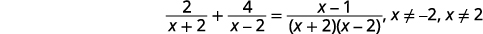
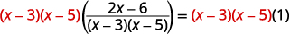

By the end of this section, you will be able to:
* Solve rational equations
* Use rational functions
* Solve a rational equation for a specific variable

Before you get started, take this readiness quiz.

1.  Solve:
    <math xmlns="http://www.w3.org/1998/Math/MathML"><mrow><mfrac><mn>1</mn><mn>6</mn></mfrac><mi>x</mi><mo>+</mo><mfrac><mn>1</mn><mn>2</mn></mfrac><mo>=</mo><mfrac><mn>1</mn><mn>3</mn></mfrac><mo>.</mo></mrow></math>
    
    * * *
    {: data-type="newline"}
    
    If you missed this problem, review [\[link\]](/m63308#fs-id1167833239741).
2.  Solve:
    <math xmlns="http://www.w3.org/1998/Math/MathML"><mrow><msup><mi>n</mi><mn>2</mn></msup><mo>−</mo><mn>5</mn><mi>n</mi><mo>−</mo><mn>36</mn><mo>=</mo><mn>0</mn><mo>.</mo></mrow></math>
    
    * * *
    {: data-type="newline"}
    
    If you missed this problem, review [\[link\]](/m63362#fs-id1167836625705).
3.  Solve the formula
    <math xmlns="http://www.w3.org/1998/Math/MathML"><mrow><mn>5</mn><mi>x</mi><mo>+</mo><mn>2</mn><mi>y</mi><mo>=</mo><mn>10</mn></mrow></math>
    
    for
    <math xmlns="http://www.w3.org/1998/Math/MathML"><mrow><mi>y</mi><mo>.</mo></mrow></math>
    
    * * *
    {: data-type="newline"}
    
    If you missed this problem, review [\[link\]](/m63310#fs-id1167835229496).
{: type="1"}

After defining the terms ‘expression’ and ‘equation’ earlier, we have used them throughout this book. We have *simplified* many kinds of *expressions* and *solved* many kinds of *equations*. We have simplified many rational expressions so far in this chapter. Now we will *solve* a **rational equation**{: data-type="term"}.

Rational Equation

A **rational equation** is an equation that contains a rational expression.

You must make sure to know the difference between rational expressions and rational equations. The equation contains an equal sign.

<math xmlns="http://www.w3.org/1998/Math/MathML"><mrow><mtable><mtr><mtd columnalign="center"><mtext>Rational Expression</mtext></mtd><mtd /><mtd /><mtd columnalign="center"><mtext>Rational Equation</mtext></mtd></mtr> <mtr><mtd columnalign="center"><mtable><mtr><mtd columnalign="center"><mfrac><mn>1</mn><mn>8</mn></mfrac><mi>x</mi><mo>+</mo><mfrac><mn>1</mn><mn>2</mn></mfrac></mtd></mtr> <mtr><mtd columnalign="center"><mfrac><mrow><mi>y</mi><mo>+</mo><mn>6</mn></mrow><mrow><msup><mi>y</mi><mn>2</mn></msup><mo>−</mo><mn>36</mn></mrow></mfrac></mtd></mtr> <mtr><mtd columnalign="center"><mfrac><mn>1</mn><mrow><mi>n</mi><mo>−</mo><mn>3</mn></mrow></mfrac><mo>+</mo><mfrac><mn>1</mn><mrow><mi>n</mi><mo>+</mo><mn>4</mn></mrow></mfrac></mtd></mtr></mtable></mtd> <mtd /><mtd /><mtd columnalign="center"><mtable><mtr><mtd columnalign="right"><mfrac><mn>1</mn><mn>8</mn></mfrac><mi>x</mi><mo>+</mo><mfrac><mn>1</mn><mn>2</mn></mfrac></mtd><mtd columnalign="left"><mo>=</mo></mtd><mtd columnalign="left"><mfrac><mn>1</mn><mn>4</mn></mfrac></mtd></mtr> <mtr><mtd columnalign="right"><mfrac><mrow><mi>y</mi><mo>+</mo><mn>6</mn></mrow><mrow><msup><mi>y</mi><mn>2</mn></msup><mo>−</mo><mn>36</mn></mrow></mfrac></mtd><mtd columnalign="left"><mo>=</mo></mtd><mtd columnalign="left"><mi>y</mi><mo>+</mo><mn>1</mn></mtd></mtr> <mtr><mtd columnalign="right"><mfrac><mn>1</mn><mrow><mi>n</mi><mo>−</mo><mn>3</mn></mrow></mfrac><mo>+</mo><mfrac><mn>1</mn><mrow><mi>n</mi><mo>+</mo><mn>4</mn></mrow></mfrac></mtd><mtd columnalign="left"><mo>=</mo></mtd><mtd columnalign="left"><mfrac><mrow><mn>15</mn></mrow><mrow><msup><mi>n</mi><mn>2</mn></msup><mo>+</mo><mi>n</mi><mo>−</mo><mn>12</mn></mrow></mfrac></mtd></mtr></mtable></mtd></mtr></mtable></mrow></math>

### Solve Rational Equations

We have already solved linear equations that contained fractions. We found the LCD of all the fractions in the equation and then multiplied both sides of the equation by the LCD to “clear” the fractions.

We will use the same strategy to solve rational equations. We will multiply both sides of the equation by the LCD. Then, we will have an equation that does not contain rational expressions and thus is much easier for us to solve. But because the original equation may have a variable in a denominator, we must be careful that we don’t end up with a solution that would make a denominator equal to zero.

So before we begin solving a rational equation, we examine it first to find the values that would make any denominators zero. That way, when we solve a rational equation we will know if there are any algebraic solutions we must discard.

An algebraic solution to a rational equation that would cause any of the rational expressions to be undefined is called an **extraneous solution to a rational equation**{: data-type="term"}.

Extraneous Solution to a Rational Equation

An **extraneous solution to a rational equation** is an algebraic solution that would cause any of the expressions in the original equation to be undefined.

We note any possible extraneous solutions, *c*, by writing <math xmlns="http://www.w3.org/1998/Math/MathML"><mrow><mi>x</mi><mo>≠</mo><mi>c</mi></mrow></math>

 next to the equation.

How to Solve a Rational Equation

Solve: <math xmlns="http://www.w3.org/1998/Math/MathML"><mrow><mfrac><mn>1</mn><mi>x</mi></mfrac><mo>+</mo><mfrac><mn>1</mn><mn>3</mn></mfrac><mo>=</mo><mfrac><mn>5</mn><mn>6</mn></mfrac><mo>.</mo></mrow></math>

             ![Step 5 is to check the solution. Remember that any solutions that makes the original expression undefined must be discarded. The solution is not 0. Substitute x is equal to 2 into the original equation, 1 divided by x plus one-third is equal to five-sixths. Is one-half plus one-third is equal to five-sixths a true equation? Is three-sixths plus two-sixth is equal to five-sixths a true equation? Three-sixths plus two-sixth is equal to five-sixths. Five-sixth is equal to five-sixth is a true equation. So, the solution is x is equal to 2](../resources/CNX_IntAlg_Figure_07_04_001e_img.jpg) 

Solve: <math xmlns="http://www.w3.org/1998/Math/MathML"><mrow><mfrac><mn>1</mn><mi>y</mi></mfrac><mo>+</mo><mfrac><mn>2</mn><mn>3</mn></mfrac><mo>=</mo><mfrac><mn>1</mn><mn>5</mn></mfrac><mo>.</mo></mrow></math>

<math xmlns="http://www.w3.org/1998/Math/MathML"><mrow><mi>y</mi><mo>=</mo><mo>−</mo><mfrac><mn>7</mn><mrow><mn>15</mn></mrow></mfrac></mrow></math>

Solve: <math xmlns="http://www.w3.org/1998/Math/MathML"><mrow><mfrac><mn>2</mn><mn>3</mn></mfrac><mo>+</mo><mfrac><mn>1</mn><mn>5</mn></mfrac><mo>=</mo><mfrac><mn>1</mn><mi>x</mi></mfrac><mo>.</mo></mrow></math>

<math xmlns="http://www.w3.org/1998/Math/MathML"><mrow><mi>x</mi><mo>=</mo><mfrac><mrow><mn>13</mn></mrow><mrow><mn>15</mn></mrow></mfrac></mrow></math>

The steps of this method are shown.

Solve equations with rational expressions.

1.  Note any value of the variable that would make any denominator zero.
2.  Find the least common denominator of *all* denominators in the equation.
3.  Clear the fractions by multiplying both sides of the equation by the LCD.
4.  Solve the resulting equation.
5.  Check:
    * If any values found in Step 1 are algebraic solutions, discard them.
    * Check any remaining solutions in the original equation.
    {: data-bullet-style="bullet"}
{: type="1" .stepwise}

We always start by noting the values that would cause any denominators to be zero.

How to Solve a Rational Equation using the Zero Product Property

Solve: <math xmlns="http://www.w3.org/1998/Math/MathML"><mrow><mn>1</mn><mo>−</mo><mfrac><mn>5</mn><mi>y</mi></mfrac><mo>=</mo><mo>−</mo><mfrac><mn>6</mn><mrow><msup><mi>y</mi><mn>2</mn></msup></mrow></mfrac><mo>.</mo></mrow></math>

<table class="unnumbered unstyled can-break" summary="1 minus the quantity 5 divided by y is equal to the negative of the quantity 6 divided by y squared. Identify any value of y that would make any denominator 0. Add y is not equal to 0 to the equation. The least common denominator of the fractions in the equation, the quantity 5 divided by y and the negative of the quantity 6 divided by y squared is y squared. Clear the fractions in the equation by multiplying each side by y squared. y squared times the quantity 1 minus the quantity 5 divided by y is equal to y squared times the negative of the quantity 6 divided by y squared. Distribute y squared. The result is y squared times 1 minus y squared times the quantity 5 divided by y is equal to the negative of the quantity 6 divided by y squared. Multiply on both sides of the equation. The result is y squared minus 5 y is equal to negative 6. To solve this equation, first write it in standard form. Its standard form is y squared minus 5 y plus 6 is equal to 0. Factor the left side of the equation. The result is the quantity y minus 2 times the quantity y minus 3 is equal to zero. Using the Zero Product Property. the equation becomes y minus 2 is equal to 0 or y minus 3 is equal to 0. Solving each equation results in the solutions, y is equal to 2 or y is equal to 3. Check the solutions by substituting them into the original equation, 1 minus the quantity 5 divided by y is equal to the negative of 6 divided by y squared. Note that 0 was not an algebraic solution. Is the equation 1 minus the quantity 5 divided by 2 is equal to the quantity 6 divided by 2 squared true? When each side is simplified, the result is negative 3 divided by 2 is equal negative 3 divided by 2, which is a true equation. Is the equation 1 minus the quantity 5 divided by 3 is equal to the quantity 6 divided by 3 squared true? When each side is simplified, the result is negative 2 divided by 3 is equal to negative 2 divided by 3, which is a true equation. The solution is y is equal to 2 or y is equal to 3." data-label=""><tbody>
<tr>
<td />
<td data-align="left">

</td>
</tr>
<tr>
<td data-align="left">Note any value of the variable that would make
any denominator zero.</td>
<td data-align="left">

</td>
</tr>
<tr>
<td data-align="left">Find the least common denominator of all denominators in
the equation. The LCD is <em>y</em>2.</td>
<td />
</tr>
<tr><td data-align="left">Clear the fractions by multiplying both sides of
the equation by the LCD.</td>
<td data-align="left">

</td>
</tr>
<tr>
<td data-align="left">Distribute.</td>
<td data-align="left">

</td>
</tr>
<tr>
<td data-align="left">Multiply.</td>
<td data-align="left">

</td>
</tr>
<tr>
<td data-align="left">Solve the resulting equation. First
write the quadratic equation in standard form.</td>
<td data-align="left">

</td>
</tr>
<tr>
<td data-align="left">Factor.</td>
<td data-align="left">

</td>
</tr>
<tr>
<td data-align="left">Use the Zero Product Property.</td>
<td data-align="left">

</td>
</tr>
<tr>
<td data-align="left">Solve.</td>
<td data-align="left">

</td>
</tr>
<tr>
<td data-align="left">Check.
We did not get 0 as an algebraic solution.

</td>
<td />
</tr>
<tr>
<td />
<td data-align="left">The solution is <math xmlns="http://www.w3.org/1998/Math/MathML"><mrow><mi>y</mi><mo>=</mo><mn>2</mn><mo>,</mo></mrow></math> <math xmlns="http://www.w3.org/1998/Math/MathML"><mrow><mi>y</mi><mo>=</mo><mn>3</mn><mo>.</mo></mrow></math></td>
</tr>
</tbody></table>

Solve: <math xmlns="http://www.w3.org/1998/Math/MathML"><mrow><mn>1</mn><mo>−</mo><mfrac><mn>2</mn><mi>x</mi></mfrac><mo>=</mo><mfrac><mrow><mn>15</mn></mrow><mrow><msup><mi>x</mi><mn>2</mn></msup></mrow></mfrac><mo>.</mo></mrow></math>

<math xmlns="http://www.w3.org/1998/Math/MathML"><mrow><mi>x</mi><mo>=</mo><mn>−3</mn><mo>,</mo><mi>x</mi><mo>=</mo><mn>5</mn></mrow></math>

Solve: <math xmlns="http://www.w3.org/1998/Math/MathML"><mrow><mn>1</mn><mo>−</mo><mfrac><mn>4</mn><mi>y</mi></mfrac><mo>=</mo><mfrac><mrow><mn>12</mn></mrow><mrow><msup><mi>y</mi><mn>2</mn></msup></mrow></mfrac><mo>.</mo></mrow></math>

<math xmlns="http://www.w3.org/1998/Math/MathML"><mrow><mi>y</mi><mo>=</mo><mn>−2</mn><mo>,</mo><mi>y</mi><mo>=</mo><mn>6</mn></mrow></math>

In the next example, the last denominators is a difference of squares. Remember to factor it first to find the LCD.

Solve: <math xmlns="http://www.w3.org/1998/Math/MathML"><mrow><mfrac><mn>2</mn><mrow><mi>x</mi><mo>+</mo><mn>2</mn></mrow></mfrac><mo>+</mo><mfrac><mn>4</mn><mrow><mi>x</mi><mo>−</mo><mn>2</mn></mrow></mfrac><mo>=</mo><mfrac><mrow><mi>x</mi><mo>−</mo><mn>1</mn></mrow><mrow><msup><mi>x</mi><mn>2</mn></msup><mo>−</mo><mn>4</mn></mrow></mfrac><mo>.</mo></mrow></math>

<table class="unnumbered unstyled can-break" summary="2 divided by the quantity x plus 2 plus 4 divided by the quantity x minus 2 is equal to the quantity x minus 1 divided by the quantity x squared minus 4. Notice that x is equal to negative 2 and x is equal to 2 would make denominators zero. Factor the denominator on the right side of the equation. The result is 2 divided by the quantity x plus 2 plus 4 divided by the quantity x minus 2 is equal to the quantity x minus 1 divided by the quantity x plus 2 times the quantity x minus 2, x is not equal to negative and x is not equal to 2. The least common denominator of all the denominators in the equation is the quantity x plus 2 times the quantity x minus 2. Clear the fractions by multiplying both sides of the equation by the least common denominator, the quantity x plus 2 times the quantity x minus 2. Distribute the least common denominator to each expression in the equation. The result is the quantity x plus 2 times the quantity x minus 2 times 2 divided by the quantity x plus 2 plus the quantity x plus 2 times the quantity x minus 2 times 4 divided by the quantity x minus 2 is equal to the quantity x plus 2 times the quantity x minus 2 times the quantity x minus 1 divided by the quantity x squared minus 4. Remove the common factors from the equation. The result is 2 times the quantity x minus 2 plus 4 times the quantity x plus 2 is equal to x minus 1. Distribute the constants on the left side of the equation. The result is 2 x minus 4 plus 4 x plus 8 is equal to x minus 1. Solve the equation by simplifying each side of the equation. The result is 6 x plus 4 is equal to x minus 1. Isolating the variable term, the result is 5 x is equal to negative 5. Solving for x, the solution is x is equal to negative 1. Check the solution. Remember x cannot be equal to 2 and x cannot be equal to negative 2. Substitute x is equal to negative into the original equation, 2 divided by the quantity x plus 2 plus 4 divided by the quantity x minus 2 is equal to the quantity x minus 1 divided by the quantity x squared minus 4. Is 2 divided by the quantity negative 1 plus 2 plus 4 divided by the quantity negative 1 minus 2 is equal to the quantity negative 1 minus 1 all divided by the square of negative 1 minus 4? When each side of the equation is simplified, the result is 2 divided by 3 is equal to 2 divided by 3, which is true. So, the solution is x is equal to negative 1." data-label=""><tbody>
<tr>
<td />
<td data-align="left">

</td>
</tr>
<tr>
<td data-align="left">Note any value of the variable
that would make any denominator
zero.</td>
<td data-align="left">

</td>
</tr>
<tr>
<td data-align="left">Find the least common
denominator of all denominators
in the equation.
The LCD is <math xmlns="http://www.w3.org/1998/Math/MathML"><mrow><mrow><mo>(</mo><mrow><mi>x</mi><mo>+</mo><mn>2</mn></mrow><mo>)</mo></mrow><mrow><mo>(</mo><mrow><mi>x</mi><mo>−</mo><mn>2</mn></mrow><mo>)</mo></mrow><mo>.</mo></mrow></math></td>
<td />
</tr>
<tr>
<td data-align="left">Clear the fractions by multiplying
both sides of the equation by the
LCD.</td>
<td data-align="left">

</td>
</tr>
<tr>
<td data-align="left">Distribute.</td>
<td data-align="left">

</td>
</tr>
<tr>
<td data-align="left">Remove common factors.</td>
<td data-align="left">

</td>
</tr>
<tr>
<td data-align="left">Simplify.</td>
<td data-align="left">

</td>
</tr>
<tr>
<td data-align="left">Distribute.</td>
<td data-align="left">

</td>
</tr>
<tr>
<td data-valign="top" data-align="left">Solve.</td>
<td data-align="left">

</td>
</tr>
<tr>
<td data-align="left">Check:
We did not get 2 or −2 as algebraic solutions.

</td>
<td />
</tr>
<tr>
<td />
<td data-align="left">The solution is <math xmlns="http://www.w3.org/1998/Math/MathML"><mrow><mi>x</mi><mo>=</mo><mn>−1</mn><mo>.</mo></mrow></math></td>
</tr>
</tbody></table>

Solve: <math xmlns="http://www.w3.org/1998/Math/MathML"><mrow><mfrac><mn>2</mn><mrow><mi>x</mi><mo>+</mo><mn>1</mn></mrow></mfrac><mo>+</mo><mfrac><mn>1</mn><mrow><mi>x</mi><mo>−</mo><mn>1</mn></mrow></mfrac><mo>=</mo><mfrac><mn>1</mn><mrow><msup><mi>x</mi><mn>2</mn></msup><mo>−</mo><mn>1</mn></mrow></mfrac><mo>.</mo></mrow></math>

<math xmlns="http://www.w3.org/1998/Math/MathML"><mrow><mi>x</mi><mo>=</mo><mfrac><mn>2</mn><mn>3</mn></mfrac></mrow></math>

Solve: <math xmlns="http://www.w3.org/1998/Math/MathML"><mrow><mfrac><mn>5</mn><mrow><mi>y</mi><mo>+</mo><mn>3</mn></mrow></mfrac><mo>+</mo><mfrac><mn>2</mn><mrow><mi>y</mi><mo>−</mo><mn>3</mn></mrow></mfrac><mo>=</mo><mfrac><mn>5</mn><mrow><msup><mi>y</mi><mn>2</mn></msup><mo>−</mo><mn>9</mn></mrow></mfrac><mo>.</mo></mrow></math>

<math xmlns="http://www.w3.org/1998/Math/MathML"><mrow><mi>y</mi><mo>=</mo><mn>2</mn></mrow></math>

In the next example, the first denominator is a **trinomial**{: data-type="term" .no-emphasis}. Remember to factor it first to find the LCD.

Solve: <math xmlns="http://www.w3.org/1998/Math/MathML"><mrow><mfrac><mrow><mi>m</mi><mo>+</mo><mn>11</mn></mrow><mrow><msup><mi>m</mi><mn>2</mn></msup><mo>−</mo><mn>5</mn><mi>m</mi><mo>+</mo><mn>4</mn></mrow></mfrac><mo>=</mo><mfrac><mn>5</mn><mrow><mi>m</mi><mo>−</mo><mn>4</mn></mrow></mfrac><mo>−</mo><mfrac><mn>3</mn><mrow><mi>m</mi><mo>−</mo><mn>1</mn></mrow></mfrac><mo>.</mo></mrow></math>

<table class="unnumbered unstyled" summary="Solve the quantity m plus 11 all divided by the quantity m squared minus 5 m plus 4 is equal to 5 divided by the quantity m minus 4 minus 3 divided by the quantity m minus 1. Factor the quadratic denominator. The result is the quantity m plus 11 all divided by the quantity m minus 4 times the quantity m minus 1 is equal to 5 divided by the quantity m minus 4 minus 3 divided by the quantity m minus 1. Notice that m is equal to 4 and m is equal to 1 would make a denominator 0. The least common denominator of all the denominators is the quantity m minus 4 times the quantity m minus 1. Clear the fractions in the equation by multiplying each side of the equation by the least common denominator. The result is the quantity m minus 4 times the quantity m minus 1 times the quantity m plus 11 all divided by the quantity m minus 4 times the quantity m minus 1 is equal to the quantity m minus 4 times the difference between 5 divided by the quantity m minus 4 and 3 divided by m minus 1. Distribute the quantity m minus 4 times the quantity m minus 1 to each term in the equation. The result is the quantity m minus 4 times the quantity m minus 1 times the quantity m plus 11 all divided by the quantity m minus 4 is equal to the quantity m minus 4 times the quantity m minus 1 times 5 divided by the quantity m minus 4 minus the quantity m minus 4 times the quantity m minus 1 times 3 divided by the quantity m minus 1. Removing the common factors, the result is m plus 11 is equal to 5 times the quantity x minus 1 minus 3 times the quantity m minus 4. Simplify the equation, the result is m plus 11 is equal to 5 m minus 5 minus 3 m plus 12. Solving the equation, the result is 4 is equal to m. Check the solution. Recall that a solution m is equal to 4would make a denominator 0, which means the solution is extraneous. There is no solution, which can be confirmed by substituting m is equal to 4 into the original equation, the quantity m plus 11 all divided by the quantity m squared minus 5 m plus 4 is equal to 5 divided by the quantity m minus 4 minus 3 divided by the quantity m minus 1. Simplifying each side of the equation, the result is the quantity 4 plus 11 all divided by the quantity 4 squared minus 5 times 4 plus 4 is equal to 5 divided by 0 minus 3 divided by the quantity 4 minus 1. 5 divided by 0 is undefined. The substitution confirmed that m is equal to 4 is extraneous, and that there is no solution." data-label=""><tbody>
<tr>
<td />
<td data-align="left">

</td>
</tr>
<tr>
<td data-align="left">Note any value of the variable that
would make any denominator zero.
Use the factored form of the quadratic
denominator.</td>
<td data-align="left">

</td>
</tr>
<tr>
<td data-align="left">Find the least common denominator
of all denominators in the equation.
The LCD is <math xmlns="http://www.w3.org/1998/Math/MathML"><mrow><mo stretchy="false">(</mo><mi>m</mi><mo>−</mo><mn>4</mn><mo stretchy="false">)</mo><mo stretchy="false">(</mo><mi>m</mi><mo>−</mo><mn>1</mn><mo stretchy="false">)</mo><mo>.</mo></mrow></math></td>
<td />
</tr>
<tr>
<td data-align="left">Clear the fractions by
multiplying both sides of the
equation by the LCD.</td>
<td data-align="left">

</td>
</tr>
<tr>
<td data-align="left">Distribute.</td>
<td data-align="left">

</td>
</tr>
<tr>
<td data-align="left">Remove common factors.</td>
<td data-align="left">

</td>
</tr>
<tr>
<td data-align="left">Simplify.</td>
<td data-align="left">

</td>
</tr>
<tr>
<td data-valign="top" data-align="left">Solve the resulting equation.</td>
<td data-align="left">

</td>
</tr>
<tr>
<td data-align="left">Check.
The only algebraic solution
was 4, but we said that 4 would make
a denominator equal to zero. The algebraic solution is an
extraneous solution.</td>
<td />
</tr>
<tr>
<td />
<td data-align="center">There is no solution to this equation.</td>
</tr>
</tbody></table>

Solve: <math xmlns="http://www.w3.org/1998/Math/MathML"><mrow><mfrac><mrow><mi>x</mi><mo>+</mo><mn>13</mn></mrow><mrow><msup><mi>x</mi><mn>2</mn></msup><mo>−</mo><mn>7</mn><mi>x</mi><mo>+</mo><mn>10</mn></mrow></mfrac><mo>=</mo><mfrac><mn>6</mn><mrow><mi>x</mi><mo>−</mo><mn>5</mn></mrow></mfrac><mo>−</mo><mfrac><mn>4</mn><mrow><mi>x</mi><mo>−</mo><mn>2</mn></mrow></mfrac><mo>.</mo></mrow></math>

There is no solution.

Solve: <math xmlns="http://www.w3.org/1998/Math/MathML"><mrow><mfrac><mrow><mi>y</mi><mo>−</mo><mn>6</mn></mrow><mrow><msup><mi>y</mi><mn>2</mn></msup><mo>+</mo><mn>3</mn><mi>y</mi><mo>−</mo><mn>4</mn></mrow></mfrac><mo>=</mo><mfrac><mn>2</mn><mrow><mi>y</mi><mo>+</mo><mn>4</mn></mrow></mfrac><mo>+</mo><mfrac><mn>7</mn><mrow><mi>y</mi><mo>−</mo><mn>1</mn></mrow></mfrac><mo>.</mo></mrow></math>

There is no solution.

The equation we solved in the previous example had only one algebraic solution, but it was an extraneous solution. That left us with no solution to the equation. In the next example we get two algebraic solutions. Here one or both could be extraneous solutions.

Solve: <math xmlns="http://www.w3.org/1998/Math/MathML"><mrow><mfrac><mi>y</mi><mrow><mi>y</mi><mo>+</mo><mn>6</mn></mrow></mfrac><mo>=</mo><mfrac><mrow><mn>72</mn></mrow><mrow><msup><mi>y</mi><mn>2</mn></msup><mo>−</mo><mn>36</mn></mrow></mfrac><mo>+</mo><mn>4</mn><mo>.</mo></mrow></math>

<table class="unnumbered unstyled" summary="Solve y divided by the quantity y plus 6 is equal to the quantity 72 divided by the difference between y squared and 36 plus 4. Factor all of the denominators. The result is y divided by the quantity y plus 6 is equal to 72 divided by the sum of the quantity y minus 6 times y plus 6 and 4. This shows y is not equal to 6 and y is not equal to negative 6. They make a denominator 0. The least common denominator of all of the denominators is the quantity y minus 6 times the quantity y plus 6. Clear the fractions by multiplying each side by the least common denominator. The result is the quantity y minus 6 times y is equal to 72 plus the quantity y minus 6 times the quantity y plus 6 times 4. Simplifying the equation, the result is y times the quantity y minus 6 is equal to 72 plus 4 times the quantity y squared minus 36. Now the equation can be solved. Write the equation so that 0 is on one side. The result is 0 is equal to 3 y squared plus 6 y minus 72. After factoring, the equation becomes 0 is equal to 3 times the quantity y plus 6 times the quantity y minus 4. The results are y is equal to negative 6 or y is equal to 4. Remember that y is equal to negative 6 is an extraneous solution. Check y is equal to 4 by substituting it into the original equation. Is 4 divided by the sum of 4 and 6 is equal to 72 divided by the difference between 4 squared and 36 plus 4 an true equation? After simplifying, the result is four-tenths is equal to four-tenths, which is a true equation. So, the solution is y is equal to 4." data-label=""><tbody>
<tr>
<td />
<td data-align="left">

</td>
</tr>
<tr>
<td data-align="left">Factor all the denominators,
so we can note any value of
the variable that would make
any denominator zero.</td>
<td data-align="left">

</td>
</tr>
<tr>
<td data-align="left">Find the least common denominator.
The LCD is <math xmlns="http://www.w3.org/1998/Math/MathML"><mrow><mo stretchy="false">(</mo><mi>y</mi><mo>−</mo><mn>6</mn><mo stretchy="false">)</mo><mo stretchy="false">(</mo><mi>y</mi><mo>+</mo><mn>6</mn><mo stretchy="false">)</mo><mo>.</mo></mrow></math></td>
<td />
</tr>
<tr>
<td data-align="left">Clear the fractions.</td>
<td data-align="left">

</td>
</tr>
<tr>
<td data-align="left">Simplify.</td>
<td data-align="left">

</td>
</tr>
<tr>
<td data-align="left">Simplify.</td>
<td data-align="left">

</td>
</tr>
<tr>
<td data-valign="top" data-align="left">Solve the resulting equation.</td>
<td data-align="left">

</td>
</tr>
<tr>
<td data-align="left">Check.

</td>
<td />
</tr>
<tr>
<td />
<td data-align="center">The solution is <math xmlns="http://www.w3.org/1998/Math/MathML"><mrow><mi>y</mi><mo>=</mo><mn>4</mn><mo>.</mo></mrow></math></td>
</tr>
</tbody></table>

Solve: <math xmlns="http://www.w3.org/1998/Math/MathML"><mrow><mfrac><mi>x</mi><mrow><mi>x</mi><mo>+</mo><mn>4</mn></mrow></mfrac><mo>=</mo><mfrac><mrow><mn>32</mn></mrow><mrow><msup><mi>x</mi><mn>2</mn></msup><mo>−</mo><mn>16</mn></mrow></mfrac><mo>+</mo><mn>5</mn><mo>.</mo></mrow></math>

<math xmlns="http://www.w3.org/1998/Math/MathML"><mrow><mi>x</mi><mo>=</mo><mn>3</mn></mrow></math>

Solve: <math xmlns="http://www.w3.org/1998/Math/MathML"><mrow><mfrac><mi>y</mi><mrow><mi>y</mi><mo>+</mo><mn>8</mn></mrow></mfrac><mo>=</mo><mfrac><mrow><mn>128</mn></mrow><mrow><msup><mi>y</mi><mn>2</mn></msup><mo>−</mo><mn>64</mn></mrow></mfrac><mo>+</mo><mn>9</mn><mo>.</mo></mrow></math>

<math xmlns="http://www.w3.org/1998/Math/MathML"><mrow><mi>y</mi><mo>=</mo><mn>7</mn></mrow></math>

In some cases, all the algebraic solutions are extraneous.

Solve: <math xmlns="http://www.w3.org/1998/Math/MathML"><mrow><mfrac><mi>x</mi><mrow><mn>2</mn><mi>x</mi><mo>−</mo><mn>2</mn></mrow></mfrac><mo>−</mo><mfrac><mn>2</mn><mrow><mn>3</mn><mi>x</mi><mo>+</mo><mn>3</mn></mrow></mfrac><mo>=</mo><mfrac><mrow><mn>5</mn><msup><mi>x</mi><mn>2</mn></msup><mo>−</mo><mn>2</mn><mi>x</mi><mo>+</mo><mn>9</mn></mrow><mrow><mn>12</mn><msup><mi>x</mi><mn>2</mn></msup><mo>−</mo><mn>12</mn></mrow></mfrac><mo>.</mo></mrow></math>

<table class="unnumbered unstyled" summary="Solve the difference between x divided by the quantity 2 x minus 2 and 2 divided by the quantity 3x plus 3 is equal to the quantity 5 x squared minus 2 x plus 9 all over the quantity 12 x squared minus 12. Factor all of the denominators in the equation to identify extraneous solutions and the least common denominator. The result is the difference between x divided by the product of 2 and x minus 1 and 2 divided by the product of 3 and x plus 1 is equal to the quantity 5 x squared minus 2 x plus 9 all divided by the product of 12 x minus 1 and x plus 1. Notice that x is not equal to and x is not equal to negative 1, and that the least common denominator 12 times the quantity x minus 1 times the quantity x plus 1. Multiply each side of the equation by the least common denominator to clear the fractions. The result tis 6 times the quantity x plus 1 times x minus 4 times the quantity x minus 1 times 2 is equal to 5 x squared minus 2 x plus 9. Simplify the equation by writing the constant factors first. The result is 6 x times the quantity x plus 1 minus 4 times 2 times the quantity x minus 1 is equal to 5 x squared minus 2 x plus 9. Distribute the factors to further simplify. The result is 6 x squared plus 6x minus 8 x plus 8 is equal to 5 x squared minus 2 x plus 9. Begin solving the equation by writing it with 0 on one side. The result is x squared minus 1 is equal to 0. After factoring, the equation becomes the quantity x minus 1 times the quantity x plus 1 is equal to 0. The results are x is equal to 1 or x is equal to negative 1. Recall that x is not equal to 1 or x is not equal to negative 1. Those values are extraneous, so there is no solution." data-label=""><tbody>
<tr>
<td />
<td data-align="left">

</td>
</tr>
<tr>
<td data-align="left">We will start by factoring all
denominators, to make it easier
to identify extraneous solutions and the LCD.</td>
<td data-align="left">

</td>
</tr>
<tr>
<td data-align="left">Note any value of the variable
that would make any denominator zero.</td>
<td data-align="left">

</td>
</tr>
<tr>
<td data-align="left">Find the least common
denominator.
The LCD is <math xmlns="http://www.w3.org/1998/Math/MathML"><mrow><mn>12</mn><mrow><mo>(</mo><mrow><mi>x</mi><mo>−</mo><mn>1</mn></mrow><mo>)</mo></mrow><mrow><mo>(</mo><mrow><mi>x</mi><mo>+</mo><mn>1</mn></mrow><mo>)</mo></mrow><mo>.</mo></mrow></math></td>
<td />
</tr>
<tr>
<td data-align="left">Clear the fractions.</td>
<td data-align="left">

</td>
</tr>
<tr>
<td data-align="left">Simplify.</td>
<td data-align="left">

</td>
</tr>
<tr>
<td data-align="left">Simplify.</td>
<td data-align="left">

</td>
</tr>
<tr>
<td data-valign="top" data-align="left">Solve the resulting equation.</td>
<td data-align="left">

</td>
</tr>
<tr>
<td colspan="2" data-align="left">Check.

 <math xmlns="http://www.w3.org/1998/Math/MathML"><mrow><mi>x</mi><mo>=</mo><mn>1</mn></mrow></math> and <math xmlns="http://www.w3.org/1998/Math/MathML"><mrow><mi>x</mi><mo>=</mo><mn>−1</mn></mrow></math> are extraneous solutions.</td>
</tr>
<tr>
<td />
<td data-align="center">The equation has no solution.</td>
</tr>
</tbody></table>

Solve: <math xmlns="http://www.w3.org/1998/Math/MathML"><mrow><mfrac><mi>y</mi><mrow><mn>5</mn><mi>y</mi><mo>−</mo><mn>10</mn></mrow></mfrac><mo>−</mo><mfrac><mn>5</mn><mrow><mn>3</mn><mi>y</mi><mo>+</mo><mn>6</mn></mrow></mfrac><mo>=</mo><mfrac><mrow><mn>2</mn><msup><mi>y</mi><mn>2</mn></msup><mo>−</mo><mn>19</mn><mi>y</mi><mo>+</mo><mn>54</mn></mrow><mrow><mn>15</mn><msup><mi>y</mi><mn>2</mn></msup><mo>−</mo><mn>60</mn></mrow></mfrac><mo>.</mo></mrow></math>

There is no solution.

Solve: <math xmlns="http://www.w3.org/1998/Math/MathML"><mrow><mfrac><mi>z</mi><mrow><mn>2</mn><mi>z</mi><mo>+</mo><mn>8</mn></mrow></mfrac><mo>−</mo><mfrac><mn>3</mn><mrow><mn>4</mn><mi>z</mi><mo>−</mo><mn>8</mn></mrow></mfrac><mo>=</mo><mfrac><mrow><mn>3</mn><msup><mi>z</mi><mn>2</mn></msup><mo>−</mo><mn>16</mn><mi>z</mi><mo>−</mo><mn>16</mn></mrow><mrow><mn>8</mn><msup><mi>z</mi><mn>2</mn></msup><mo>+</mo><mn>2</mn><mi>z</mi><mo>−</mo><mn>64</mn></mrow></mfrac><mo>.</mo></mrow></math>

There is no solution.

Solve: <math xmlns="http://www.w3.org/1998/Math/MathML"><mrow><mfrac><mn>4</mn><mrow><mn>3</mn><msup><mi>x</mi><mn>2</mn></msup><mo>−</mo><mn>10</mn><mi>x</mi><mo>+</mo><mn>3</mn></mrow></mfrac><mo>+</mo><mfrac><mn>3</mn><mrow><mn>3</mn><msup><mi>x</mi><mn>2</mn></msup><mo>+</mo><mn>2</mn><mi>x</mi><mo>−</mo><mn>1</mn></mrow></mfrac><mo>=</mo><mfrac><mn>2</mn><mrow><msup><mi>x</mi><mn>2</mn></msup><mo>−</mo><mn>2</mn><mi>x</mi><mo>−</mo><mn>3</mn></mrow></mfrac><mo>.</mo></mrow></math>

<table class="unnumbered unstyled" summary="Solve 4 divided by the quantity 3 x squared minus 10 x plus 3 plus 3 divided by the quantity 3 x squared plus 2 x minus 1 is equal to 2 divided by the quantity x squared minus 2 x minus 3. Factor all of the denominators in the equation. The result is 4 divided by the quantity 3 x minus 1 times the quantity x minus 3 plus 3 divided by the quantity 3 x minus 1 times the quantity x plus 1 is equal to 2 divided by the quantity x minus 3 times the quantity x plus 1. Notice that x is not equal to negative 1, x is not equal to one-third, and x is not equal to 3. Those values make a denominator 0. The least common denominator is the quantity 3 x minus 1 times the quantity x plus 1 times the quantity x minus 3. Clear the fractions by multiplying each side of the equation by the least common denominator. The quantity 3 x minus 1 times the quantity x plus 1 times the quantity x minus 3 times the quantity of divided by the quantity 3 x minus 1 times the quantity x minus 3 plus 3 divided by the quantity 3 x minus 1 times the quantity x plus 1 is equal to the quantity 3 x minus 1 times the quantity x plus 1 times the quantity x minus 3 times 2 divided by the quantity x minus 3 times the quantity x plus 1. Simplify by removing common factors. The result is 4 times the quantity x plus 1 plus 3 times the quantity x minus 3 is equal to 2 times the quantity 3 x minus 1. Simplify the equation by distributing. The result is 4 x plus 4 plus 3 x minus 9 is equal to 6 x minus 2. further simplifying, the result is 7 x minus 5 is equal to 6 x minus 2. Solve the equation. The result is x is equal to 3. The only algebraic solution was  but we said that  would make a denominator equal to zero. The algebraic solution is an extraneous solution. There is no solution to this equation." data-label=""><tbody>
<tr>
<td />
<td data-align="left">

</td>
</tr>
<tr>
<td data-align="left">Factor all the denominators, so we can note any value of the variable that would make any denominator
zero.</td>
<td data-align="center">

<math xmlns="http://www.w3.org/1998/Math/MathML"><mrow><mi>x</mi><mo>≠</mo><mtext>−</mtext><mn>1</mn><mo>,</mo><mi>x</mi><mo>≠</mo><mfrac><mn>1</mn><mn>3</mn></mfrac><mo>,</mo><mi>x</mi><mo>≠</mo><mn>3</mn></mrow></math></td>
</tr>
<tr>
<td data-align="left">Find the least common denominator. The LCD is <math xmlns="http://www.w3.org/1998/Math/MathML"><mrow><mrow><mo>(</mo><mrow><mn>3</mn><mi>x</mi><mo>−</mo><mn>1</mn></mrow><mo>)</mo></mrow><mrow><mo>(</mo><mrow><mi>x</mi><mo>+</mo><mn>1</mn></mrow><mo>)</mo></mrow><mrow><mo>(</mo><mrow><mi>x</mi><mo>−</mo><mn>3</mn></mrow><mo>)</mo></mrow><mo>.</mo></mrow></math></td>
<td />
</tr>
<tr>
<td data-align="left">Clear the fractions.</td>
<td />
</tr>
<tr>
<td colspan="2" data-align="right">

</td>
</tr>
<tr>
<td data-align="left">Simplify.</td>
<td data-align="center">

</td>
</tr>
<tr>
<td data-align="left">Distribute.</td>
<td data-align="left">

</td>
</tr>
<tr>
<td data-align="left">Simplify.</td>
<td data-align="left">

</td>
</tr>
<tr>
<td />
<td data-align="left">

</td>
</tr>
<tr>
<td data-align="left">The only algebraic solution was <math xmlns="http://www.w3.org/1998/Math/MathML"><mrow><mi>x</mi><mo>=</mo><mn>3</mn><mo>,</mo></mrow></math> but we said that <math xmlns="http://www.w3.org/1998/Math/MathML"><mrow><mi>x</mi><mo>=</mo><mn>3</mn></mrow></math> would make a denominator equal to zero. The algebraic solution is an extraneous solution.</td>
<td />
</tr>
<tr>
<td />
<td data-align="center">There is no solution to this equation.</td>
</tr>
</tbody></table>

Solve: <math xmlns="http://www.w3.org/1998/Math/MathML"><mrow><mfrac><mrow><mn>15</mn></mrow><mrow><msup><mi>x</mi><mn>2</mn></msup><mo>+</mo><mi>x</mi><mo>−</mo><mn>6</mn></mrow></mfrac><mo>−</mo><mfrac><mn>3</mn><mrow><mi>x</mi><mo>−</mo><mn>2</mn></mrow></mfrac><mo>=</mo><mfrac><mn>2</mn><mrow><mi>x</mi><mo>+</mo><mn>3</mn></mrow></mfrac><mo>.</mo></mrow></math>

There is no solution.

Solve: <math xmlns="http://www.w3.org/1998/Math/MathML"><mrow><mfrac><mn>5</mn><mrow><msup><mi>x</mi><mn>2</mn></msup><mo>+</mo><mn>2</mn><mi>x</mi><mo>−</mo><mn>3</mn></mrow></mfrac><mo>−</mo><mfrac><mn>3</mn><mrow><msup><mi>x</mi><mn>2</mn></msup><mo>+</mo><mi>x</mi><mo>−</mo><mn>2</mn></mrow></mfrac><mo>=</mo><mfrac><mn>1</mn><mrow><msup><mi>x</mi><mn>2</mn></msup><mo>+</mo><mn>5</mn><mi>x</mi><mo>+</mo><mn>6</mn></mrow></mfrac><mo>.</mo></mrow></math>

There is no solution.

### Use Rational Functions

Working with functions that are defined by rational expressions often lead to rational equations. Again, we use the same techniques to solve them.

For rational function, <math xmlns="http://www.w3.org/1998/Math/MathML"><mrow><mi>f</mi><mrow><mo>(</mo><mi>x</mi><mo>)</mo></mrow><mo>=</mo><mfrac><mrow><mn>2</mn><mi>x</mi><mo>−</mo><mn>6</mn></mrow><mrow><msup><mi>x</mi><mn>2</mn></msup><mo>−</mo><mn>8</mn><mi>x</mi><mo>+</mo><mn>15</mn></mrow></mfrac><mo>,</mo></mrow></math>

 ⓐ find the domain of the function, ⓑ solve <math xmlns="http://www.w3.org/1998/Math/MathML"><mrow><mi>f</mi><mrow><mo>(</mo><mi>x</mi><mo>)</mo></mrow><mo>=</mo><mn>1</mn><mo>,</mo></mrow></math>

 and ⓒ find the points on the graph at this function value.

ⓐ The domain of a rational function is all real numbers except those that make the rational expression undefined. So to find them, we will set the denominator equal to zero and solve.

<math xmlns="http://www.w3.org/1998/Math/MathML"><mrow><mtable><mtr><mtd /><mtd /><mtd /><mtd columnalign="right"><msup><mi>x</mi><mn>2</mn></msup><mo>−</mo><mn>8</mn><mi>x</mi><mo>+</mo><mn>15</mn><mo>=</mo><mn>0</mn></mtd></mtr><mtr><mtd columnalign="left"><mtext>Factor the trinomial.</mtext></mtd><mtd /><mtd /><mtd columnalign="right"><mrow><mo>(</mo><mrow><mi>x</mi><mo>−</mo><mn>3</mn></mrow><mo>)</mo></mrow><mrow><mo>(</mo><mrow><mi>x</mi><mo>−</mo><mn>5</mn></mrow><mo>)</mo></mrow><mo>=</mo><mn>0</mn></mtd></mtr><mtr><mtd columnalign="left"><mtext>Use the Zero Product Property.</mtext></mtd><mtd /><mtd /><mtd columnalign="right"><mi>x</mi><mo>−</mo><mn>3</mn><mo>=</mo><mn>0</mn><mspace width="1em" /><mi>x</mi><mo>−</mo><mn>5</mn><mo>=</mo><mn>0</mn></mtd></mtr><mtr><mtd columnalign="left"><mtext>Solve.</mtext></mtd><mtd /><mtd /><mtd columnalign="right"><mi>x</mi><mo>=</mo><mn>3</mn><mspace width="1em" /><mi>x</mi><mo>=</mo><mn>5</mn></mtd></mtr><mtr><mtd /><mtd /><mtd /><mtd columnalign="right"><mtext>The domain is all real numbers except</mtext><mspace width="0.2em" /><mi>x</mi><mo>≠</mo><mn>3</mn><mo>,</mo><mi>x</mi><mo>≠</mo><mn>5</mn><mtext>.</mtext></mtd></mtr></mtable></mrow></math>

.

ⓑ* * *
{: data-type="newline"}

<table class="unnumbered unstyled" summary="The function f is equal to 1. Substitute the quantity 2 x minus 6 divided by the quantity x squared minus 8 x plus 15 for f. Factoring the denominator, the result is the quantity 2 x minus 6 all divided by the x squared minus 8 x plus 15 is equal to 1. Factoring the denominator, the result is the quantity 2 x minus 6 divided by the quantity x minus 3 times the quantity x minus 5 is equal to 1. Multiply each side of the equation by the least common denominator, the quantity x minus 3 times the quantity x minus 5. Simplifying, the result is 2 x minus 6 is equal to x squared minus 8 x plus 15. Solve the equation so that terms with variables are one side. The result is 0 is equal to x squared minus 10 x plus 21. Factor the right side of the equation. The result is 0 is equal to the quantity x minus 7 times the quantity x minus 3. Using the Zero Product Property, the result is x minus 7 is equal to 0 or x minus 3 is equal to 0. Solve each equation. The results is x is equal to 7 or x is equal to 3." data-label=""><tbody>
<tr>
<td />
<td data-align="center">

</td>
</tr>
<tr>
<td data-align="left">Substitute in the rational expression.</td>
<td data-align="center">

</td>
</tr>
<tr>
<td data-align="left">Factor the denominator.</td>
<td data-align="center">

</td>
</tr>
<tr>
<td data-align="left">Multiply both sides by the LCD,
<math xmlns="http://www.w3.org/1998/Math/MathML"><mrow><mrow><mo>(</mo><mrow><mi>x</mi><mo>−</mo><mn>3</mn></mrow><mo>)</mo></mrow><mrow><mo>(</mo><mrow><mi>x</mi><mo>−</mo><mn>5</mn></mrow><mo>)</mo></mrow><mo>.</mo></mrow></math></td>
<td data-align="center">

</td>
</tr>
<tr>
<td data-align="left">Simplify.</td>
<td data-align="left">

</td>
</tr>
<tr>
<td data-align="left">Solve.</td>
<td data-align="left">

</td>
</tr>
<tr>
<td data-align="left">Factor.</td>
<td data-align="left">

</td>
</tr>
<tr>
<td data-align="left">Use the Zero Product Property.</td>
<td data-align="left">

</td></tr>
<tr>
<td data-align="left">Solve.</td>
<td data-align="left">

</td>
</tr>
</tbody></table>
ⓒ The value of the function is 1 when <math xmlns="http://www.w3.org/1998/Math/MathML"><mrow><mi>x</mi><mo>=</mo><mn>7</mn><mo>,</mo><mi>x</mi><mo>=</mo><mn>3</mn><mo>.</mo></mrow></math>

 So the points on the graph of this function when <math xmlns="http://www.w3.org/1998/Math/MathML"><mrow><mi>f</mi><mrow><mo>(</mo><mi>x</mi><mo>)</mo></mrow><mo>=</mo><mn>1</mn><mo>,</mo></mrow></math>

 will be <math xmlns="http://www.w3.org/1998/Math/MathML"><mrow><mrow><mo>(</mo><mrow><mn>7</mn><mo>,</mo><mn>1</mn></mrow><mo>)</mo></mrow><mo>,</mo><mrow><mo>(</mo><mrow><mn>3</mn><mo>,</mo><mn>1</mn></mrow><mo>)</mo></mrow><mo>.</mo></mrow></math>

For rational function, <math xmlns="http://www.w3.org/1998/Math/MathML"><mrow><mi>f</mi><mrow><mo>(</mo><mi>x</mi><mo>)</mo></mrow><mo>=</mo><mfrac><mrow><mn>8</mn><mo>−</mo><mi>x</mi></mrow><mrow><msup><mi>x</mi><mn>2</mn></msup><mo>−</mo><mn>7</mn><mi>x</mi><mo>+</mo><mn>12</mn></mrow></mfrac><mo>,</mo></mrow></math>

 ⓐ find the domain of the function ⓑ solve <math xmlns="http://www.w3.org/1998/Math/MathML"><mrow><mi>f</mi><mrow><mo>(</mo><mi>x</mi><mo>)</mo></mrow><mo>=</mo><mn>3</mn></mrow></math>

 ⓒ find the points on the graph at this function value.

ⓐ The domain is all real numbers except <math xmlns="http://www.w3.org/1998/Math/MathML"><mrow><mi>x</mi><mo>≠</mo><mn>3</mn></mrow></math>

 and <math xmlns="http://www.w3.org/1998/Math/MathML"><mrow><mi>x</mi><mo>≠</mo><mn>4</mn><mo>.</mo></mrow></math>

 ⓑ <math xmlns="http://www.w3.org/1998/Math/MathML"><mrow><mi>x</mi><mo>=</mo><mn>2</mn><mo>,</mo><mi>x</mi><mo>=</mo><mfrac><mrow><mn>14</mn></mrow><mn>3</mn></mfrac></mrow></math>

* * *
{: data-type="newline"}

ⓒ <math xmlns="http://www.w3.org/1998/Math/MathML"><mrow><mrow><mo>(</mo><mrow><mn>2</mn><mo>,</mo><mn>3</mn></mrow><mo>)</mo></mrow><mo>,</mo><mrow><mo>(</mo><mrow><mfrac><mrow><mn>14</mn></mrow><mn>3</mn></mfrac><mo>,</mo><mn>3</mn></mrow><mo>)</mo></mrow></mrow></math>

For rational function, <math xmlns="http://www.w3.org/1998/Math/MathML"><mrow><mi>f</mi><mrow><mo>(</mo><mi>x</mi><mo>)</mo></mrow><mo>=</mo><mfrac><mrow><mi>x</mi><mo>−</mo><mn>1</mn></mrow><mrow><msup><mi>x</mi><mn>2</mn></msup><mo>−</mo><mn>6</mn><mi>x</mi><mo>+</mo><mn>5</mn></mrow></mfrac><mo>,</mo></mrow></math>

 ⓐ find the domain of the function ⓑ solve <math xmlns="http://www.w3.org/1998/Math/MathML"><mrow><mi>f</mi><mrow><mo>(</mo><mi>x</mi><mo>)</mo></mrow><mo>=</mo><mn>4</mn></mrow></math>

 ⓒ find the points on the graph at this function value.

ⓐ The domain is all real numbers except <math xmlns="http://www.w3.org/1998/Math/MathML"><mrow><mi>x</mi><mo>≠</mo><mn>1</mn></mrow></math>

 and <math xmlns="http://www.w3.org/1998/Math/MathML"><mrow><mi>x</mi><mo>≠</mo><mn>5</mn><mo>.</mo></mrow></math>

 ⓑ <math xmlns="http://www.w3.org/1998/Math/MathML"><mrow><mi>x</mi><mo>=</mo><mfrac><mrow><mn>21</mn></mrow><mn>4</mn></mfrac></mrow></math>

 ⓒ <math xmlns="http://www.w3.org/1998/Math/MathML"><mrow><mrow><mo>(</mo><mrow><mfrac><mrow><mn>21</mn></mrow><mn>4</mn></mfrac><mo>,</mo><mn>4</mn></mrow><mo>)</mo></mrow></mrow></math>

### Solve a Rational Equation for a Specific Variable

When we solved linear equations, we learned how to solve a formula for a specific variable. Many formulas used in business, science, economics, and other fields use rational equations to model the relation between two or more variables. We will now see how to solve a rational equation for a specific variable.

When we developed the point-slope formula from our slope formula, we cleared the fractions by multiplying by the LCD.

<math xmlns="http://www.w3.org/1998/Math/MathML"><mrow><mtable><mtr><mtd /><mtd /><mtd /><mtd columnalign="right"><mi>m</mi></mtd><mtd columnalign="left"><mo>=</mo></mtd><mtd columnalign="left"><mfrac><mrow><mi>y</mi><mo>−</mo><msub><mi>y</mi><mn>1</mn></msub></mrow><mrow><mi>x</mi><mo>−</mo><msub><mi>x</mi><mn>1</mn></msub></mrow></mfrac></mtd></mtr> <mtr><mtd columnalign="left"><mtext>Multiply both sides of the equation by</mtext><mspace width="0.2em" /><mi>x</mi><mo>−</mo><msub><mi>x</mi><mn>1</mn></msub><mo>.</mo></mtd><mtd /><mtd /><mtd columnalign="right"><mi>m</mi><mrow><mo>(</mo><mrow><mi>x</mi><mo>−</mo><msub><mi>x</mi><mn>1</mn></msub></mrow><mo>)</mo></mrow></mtd><mtd columnalign="left"><mo>=</mo></mtd><mtd columnalign="left"><mrow><mo>(</mo><mrow><mfrac><mrow><mi>y</mi><mo>−</mo><msub><mi>y</mi><mn>1</mn></msub></mrow><mrow><mi>x</mi><mo>−</mo><msub><mi>x</mi><mn>1</mn></msub></mrow></mfrac></mrow><mo>)</mo></mrow><mrow><mo>(</mo><mrow><mi>x</mi><mo>−</mo><msub><mi>x</mi><mn>1</mn></msub></mrow><mo>)</mo></mrow></mtd></mtr> <mtr><mtd columnalign="left"><mtext>Simplify.</mtext></mtd><mtd /><mtd /><mtd columnalign="right"><mi>m</mi><mrow><mo>(</mo><mrow><mi>x</mi><mo>−</mo><msub><mi>x</mi><mn>1</mn></msub></mrow><mo>)</mo></mrow></mtd><mtd columnalign="left"><mo>=</mo></mtd><mtd columnalign="left"><mi>y</mi><mo>−</mo><msub><mi>y</mi><mn>1</mn></msub></mtd></mtr> <mtr><mtd columnalign="left"><mtext>Rewrite the equation with the</mtext><mspace width="0.2em" /><mi>y</mi><mspace width="0.2em" /><mtext>terms on the left.</mtext></mtd><mtd /><mtd /><mtd columnalign="right"><mi>y</mi><mo>−</mo><msub><mi>y</mi><mn>1</mn></msub></mtd><mtd columnalign="left"><mo>=</mo></mtd><mtd columnalign="left"><mi>m</mi><mrow><mo>(</mo><mrow><mi>x</mi><mo>−</mo><msub><mi>x</mi><mn>1</mn></msub></mrow><mo>)</mo></mrow></mtd></mtr></mtable></mrow></math>

In the next example, we will use the same technique with the formula for slope that we used to get the point-slope form of an equation of a line through the point <math xmlns="http://www.w3.org/1998/Math/MathML"><mrow><mrow><mo>(</mo><mrow><mn>2</mn><mo>,</mo><mn>3</mn></mrow><mo>)</mo></mrow><mo>.</mo></mrow></math>

 We will add one more step to solve for *y*.

Solve:<math xmlns="http://www.w3.org/1998/Math/MathML"><mrow><mi>m</mi><mo>=</mo><mfrac><mrow><mi>y</mi><mo>−</mo><mn>2</mn></mrow><mrow><mi>x</mi><mo>−</mo><mn>3</mn></mrow></mfrac></mrow></math>

 for <math xmlns="http://www.w3.org/1998/Math/MathML"><mrow><mi>y</mi><mo>.</mo></mrow></math>

<table class="unnumbered unstyled" summary="Solve the quantity y minus 2 divided by the quantity x minus 3 for y. The solution cannot be x is equal to 3 because it will make a denominator 0. Clear the fractions on both sides of the equation by multiplying each one by the lowest common denominator, x minus 3. The result is the quantity x minus 3 times m is equal to the quantity x minus 3 times the quantity y minus 2 all divided by the quantity x minus 3. Simplifying on each side, the result is x m minus 3 m is equal to y minus 2. Isolating the term with y, the result is x m minus 3 m plus 2 is equal to y." data-label=""><tbody>
<tr>
<td />
<td data-align="left">

</td>
</tr>
<tr>
<td data-align="left">Note any value of the variable that would
make any denominator zero.</td>
<td data-align="left">

</td>
</tr>
<tr>
<td data-align="left">Clear the fractions by multiplying both sides of
the equation by the LCD, <math xmlns="http://www.w3.org/1998/Math/MathML"><mrow><mi>x</mi><mo>−</mo><mn>3</mn><mo>.</mo></mrow></math></td>
<td data-align="left">

</td>
</tr>
<tr>
<td data-align="left">Simplify.</td>
<td data-align="left">

</td>
</tr>
<tr>
<td data-align="left">Isolate the term with <em>y</em>.</td>
<td data-align="left">

</td>
</tr>
</tbody></table>

Solve: <math xmlns="http://www.w3.org/1998/Math/MathML"><mrow><mi>m</mi><mo>=</mo><mfrac><mrow><mi>y</mi><mo>−</mo><mn>5</mn></mrow><mrow><mi>x</mi><mo>−</mo><mn>4</mn></mrow></mfrac></mrow></math>

for <math xmlns="http://www.w3.org/1998/Math/MathML"><mrow><mi>y</mi><mo>.</mo></mrow></math>

<math xmlns="http://www.w3.org/1998/Math/MathML"><mrow><mi>y</mi><mo>=</mo><mi>m</mi><mi>x</mi><mo>−</mo><mn>4</mn><mi>m</mi><mo>+</mo><mn>5</mn></mrow></math>

Solve: <math xmlns="http://www.w3.org/1998/Math/MathML"><mrow><mi>m</mi><mo>=</mo><mfrac><mrow><mi>y</mi><mo>−</mo><mn>1</mn></mrow><mrow><mi>x</mi><mo>+</mo><mn>5</mn></mrow></mfrac></mrow></math>

 for <math xmlns="http://www.w3.org/1998/Math/MathML"><mrow><mi>y</mi><mo>.</mo></mrow></math>

<math xmlns="http://www.w3.org/1998/Math/MathML"><mrow><mi>y</mi><mo>=</mo><mi>m</mi><mi>x</mi><mo>+</mo><mn>5</mn><mi>m</mi><mo>+</mo><mn>1</mn></mrow></math>

Remember to multiply both sides by the LCD in the next example.

Solve: <math xmlns="http://www.w3.org/1998/Math/MathML"><mrow><mfrac><mn>1</mn><mi>c</mi></mfrac><mo>+</mo><mfrac><mn>1</mn><mi>m</mi></mfrac><mo>=</mo><mn>1</mn></mrow></math>

 for *c*.

<table class="unnumbered unstyled" summary="Solve the quantity 1 divided by c plus the quantity 1 divided by m is equal to 1 for c. Notice that the values that would make any denominator 0 are c is equal to 0 and m is equal to 0. The least common denominator of the denominators of the fractions is c m. Clear the fractions in the equation by multiplying each side by c m. Distribute c m to each term. The result is c m times the quantity 1 divided by c plus c m times the quantity 1 divided by m is equal to c m times 1. When simplified, the equation becomes m plus c is equal to c m. Collect the terns with c on the right side of the equation. The result is m is equal to c m minus c. When the right side is factored, the result is m is equal to c times the quantity m minus 1. Divide each side of the equation by the quantity m minus 1 to isolate c. When the common factors are removed, the result is m divided by the quantity m minus 1 is equal to c. Notice that m is not equal to 1." data-label=""><tbody>
<tr>
<td />
<td data-align="left">

</td>
</tr>
<tr>
<td data-align="left">Note any value of the variable that would make
any denominator zero.</td>
<td data-align="left">

</td>
</tr>
<tr>
<td data-align="left">Clear the fractions by multiplying both sides of
the equations by the LCD, <em>cm</em>.</td>
<td data-align="left">

</td>
</tr>
<tr>
<td data-align="left">Distribute.</td>
<td data-align="left">

</td>
</tr>
<tr>
<td data-align="left">Simplify.</td>
<td data-align="left">

</td>
</tr>
<tr>
<td data-align="left">Collect the terms with <em>c</em> to the right.</td>
<td data-align="left">

</td>
</tr>
<tr>
<td data-align="left">Factor the expression on the right.</td>
<td data-align="left">

</td>
</tr>
<tr>
<td data-align="left">To isolate <em>c</em>, divide both sides by <math xmlns="http://www.w3.org/1998/Math/MathML"><mrow><mi>m</mi><mo>−</mo><mn>1</mn><mo>.</mo></mrow></math></td>
<td data-align="left">

</td>
</tr>
<tr>
<td data-align="left">Simplify by removing common factors.</td>
<td data-align="left">

</td>
</tr>
<tr>
<td colspan="2" data-align="left">Notice that even though we excluded <math xmlns="http://www.w3.org/1998/Math/MathML"><mrow><mi>c</mi><mo>=</mo><mn>0</mn><mo>,</mo><mi>m</mi><mo>=</mo><mn>0</mn></mrow></math> from the original equation, we must also now state that <math xmlns="http://www.w3.org/1998/Math/MathML"><mrow><mi>m</mi><mo>≠</mo><mn>1</mn><mo>.</mo></mrow></math></td>
</tr>
</tbody></table>

Solve: <math xmlns="http://www.w3.org/1998/Math/MathML"><mrow><mfrac><mn>1</mn><mi>a</mi></mfrac><mo>+</mo><mfrac><mn>1</mn><mi>b</mi></mfrac><mo>=</mo><mi>c</mi></mrow></math>

 for *a*.

<math xmlns="http://www.w3.org/1998/Math/MathML"><mrow><mi>a</mi><mo>=</mo><mfrac><mi>b</mi><mrow><mi>c</mi><mi>b</mi><mo>−</mo><mn>1</mn></mrow></mfrac></mrow></math>

Solve: <math xmlns="http://www.w3.org/1998/Math/MathML"><mrow><mfrac><mn>2</mn><mi>x</mi></mfrac><mo>+</mo><mfrac><mn>1</mn><mn>3</mn></mfrac><mo>=</mo><mfrac><mn>1</mn><mi>y</mi></mfrac></mrow></math>

 for *y*.

<math xmlns="http://www.w3.org/1998/Math/MathML"><mrow><mi>y</mi><mo>=</mo><mfrac><mrow><mn>3</mn><mi>x</mi></mrow><mrow><mi>x</mi><mo>+</mo><mn>6</mn></mrow></mfrac></mrow></math>

Access this online resource for additional instruction and practice with equations with rational expressions.

* [Equations with Rational Expressions][1]
{: data-display="block"}

### Key Concepts

* **How to solve equations with rational expressions.**
  1.  Note any value of the variable that would make any denominator zero.
  2.  Find the least common denominator of all denominators in the equation.
  3.  Clear the fractions by multiplying both sides of the equation by the LCD.
  4.  Solve the resulting equation.
  5.  Check:
      * If any values found in Step 1 are algebraic solutions, discard them.
      * Check any remaining solutions in the original equation.
      {: data-bullet-style="bullet"}
  {: type="1" .stepwise}
{: data-bullet-style="bullet"}

<section data-depth="1" class="section-exercises" markdown="1">
#### Practice Makes Perfect

**Solve Rational Equations**

In the following exercises, solve each rational equation.

<math xmlns="http://www.w3.org/1998/Math/MathML"><mrow><mfrac><mn>1</mn><mi>a</mi></mfrac><mo>+</mo><mfrac><mn>2</mn><mn>5</mn></mfrac><mo>=</mo><mfrac><mn>1</mn><mn>2</mn></mfrac></mrow></math>

<math xmlns="http://www.w3.org/1998/Math/MathML"><mrow><mi>a</mi><mo>=</mo><mn>10</mn></mrow></math>

<math xmlns="http://www.w3.org/1998/Math/MathML"><mrow><mfrac><mn>6</mn><mn>3</mn></mfrac><mo>−</mo><mfrac><mn>2</mn><mi>d</mi></mfrac><mo>=</mo><mfrac><mn>4</mn><mn>9</mn></mfrac></mrow></math>

<math xmlns="http://www.w3.org/1998/Math/MathML"><mrow><mfrac><mn>4</mn><mn>5</mn></mfrac><mo>+</mo><mfrac><mn>1</mn><mn>4</mn></mfrac><mo>=</mo><mfrac><mn>2</mn><mi>v</mi></mfrac></mrow></math>

<math xmlns="http://www.w3.org/1998/Math/MathML"><mrow><mi>v</mi><mo>=</mo><mfrac><mrow><mn>40</mn></mrow><mrow><mn>21</mn></mrow></mfrac></mrow></math>

<math xmlns="http://www.w3.org/1998/Math/MathML"><mrow><mfrac><mn>3</mn><mn>8</mn></mfrac><mo>+</mo><mfrac><mn>2</mn><mi>y</mi></mfrac><mo>=</mo><mfrac><mn>1</mn><mn>4</mn></mfrac></mrow></math>

<math xmlns="http://www.w3.org/1998/Math/MathML"><mrow><mn>1</mn><mo>−</mo><mfrac><mn>2</mn><mi>m</mi></mfrac><mo>=</mo><mfrac><mn>8</mn><mrow><msup><mi>m</mi><mn>2</mn></msup></mrow></mfrac></mrow></math>

<math xmlns="http://www.w3.org/1998/Math/MathML"><mrow><mi>m</mi><mo>=</mo><mn>−2</mn><mo>,</mo><mi>m</mi><mo>=</mo><mn>4</mn></mrow></math>

<math xmlns="http://www.w3.org/1998/Math/MathML"><mrow><mn>1</mn><mo>+</mo><mfrac><mn>4</mn><mi>n</mi></mfrac><mo>=</mo><mfrac><mrow><mn>21</mn></mrow><mrow><msup><mi>n</mi><mn>2</mn></msup></mrow></mfrac></mrow></math>

<math xmlns="http://www.w3.org/1998/Math/MathML"><mrow><mn>1</mn><mo>+</mo><mfrac><mn>9</mn><mi>p</mi></mfrac><mo>=</mo><mfrac><mrow><mn>−20</mn></mrow><mrow><msup><mi>p</mi><mn>2</mn></msup></mrow></mfrac></mrow></math>

<math xmlns="http://www.w3.org/1998/Math/MathML"><mrow><mi>p</mi><mo>=</mo><mn>−5</mn><mo>,</mo><mi>p</mi><mo>=</mo><mn>−4</mn></mrow></math>

<math xmlns="http://www.w3.org/1998/Math/MathML"><mrow><mn>1</mn><mo>−</mo><mfrac><mn>7</mn><mi>q</mi></mfrac><mo>=</mo><mfrac><mrow><mn>−6</mn></mrow><mrow><msup><mi>q</mi><mn>2</mn></msup></mrow></mfrac></mrow></math>

<math xmlns="http://www.w3.org/1998/Math/MathML"><mrow><mfrac><mn>5</mn><mrow><mn>3</mn><mi>v</mi><mo>−</mo><mn>2</mn></mrow></mfrac><mo>=</mo><mfrac><mn>7</mn><mrow><mn>4</mn><mi>v</mi></mrow></mfrac></mrow></math>

<math xmlns="http://www.w3.org/1998/Math/MathML"><mrow><mi>v</mi><mo>=</mo><mn>14</mn></mrow></math>

<math xmlns="http://www.w3.org/1998/Math/MathML"><mrow><mfrac><mn>8</mn><mrow><mn>2</mn><mi>w</mi><mo>+</mo><mn>1</mn></mrow></mfrac><mo>=</mo><mfrac><mn>3</mn><mi>w</mi></mfrac></mrow></math>

<math xmlns="http://www.w3.org/1998/Math/MathML"><mrow><mfrac><mn>3</mn><mrow><mi>x</mi><mo>+</mo><mn>4</mn></mrow></mfrac><mo>+</mo><mfrac><mn>7</mn><mrow><mi>x</mi><mo>−</mo><mn>4</mn></mrow></mfrac><mo>=</mo><mfrac><mn>8</mn><mrow><msup><mi>x</mi><mn>2</mn></msup><mo>−</mo><mn>16</mn></mrow></mfrac></mrow></math>

<math xmlns="http://www.w3.org/1998/Math/MathML"><mrow><mi>x</mi><mo>=</mo><mo>−</mo><mfrac><mn>4</mn><mn>5</mn></mfrac></mrow></math>

<math xmlns="http://www.w3.org/1998/Math/MathML"><mrow><mfrac><mn>5</mn><mrow><mi>y</mi><mo>−</mo><mn>9</mn></mrow></mfrac><mo>+</mo><mfrac><mn>1</mn><mrow><mi>y</mi><mo>+</mo><mn>9</mn></mrow></mfrac><mo>=</mo><mfrac><mrow><mn>18</mn></mrow><mrow><msup><mi>y</mi><mn>2</mn></msup><mo>−</mo><mn>81</mn></mrow></mfrac></mrow></math>

<math xmlns="http://www.w3.org/1998/Math/MathML"><mrow><mfrac><mn>8</mn><mrow><mi>z</mi><mo>−</mo><mn>10</mn></mrow></mfrac><mo>−</mo><mfrac><mn>7</mn><mrow><mi>z</mi><mo>+</mo><mn>10</mn></mrow></mfrac><mo>=</mo><mfrac><mn>5</mn><mrow><msup><mi>z</mi><mn>2</mn></msup><mo>−</mo><mn>100</mn></mrow></mfrac></mrow></math>

<math xmlns="http://www.w3.org/1998/Math/MathML"><mrow><mi>z</mi><mo>=</mo><mn>−145</mn></mrow></math>

<math xmlns="http://www.w3.org/1998/Math/MathML"><mrow><mfrac><mn>9</mn><mrow><mi>a</mi><mo>+</mo><mn>11</mn></mrow></mfrac><mo>−</mo><mfrac><mn>6</mn><mrow><mi>a</mi><mo>−</mo><mn>11</mn></mrow></mfrac><mo>=</mo><mfrac><mn>6</mn><mrow><msup><mi>a</mi><mn>2</mn></msup><mo>−</mo><mn>121</mn></mrow></mfrac></mrow></math>

<math xmlns="http://www.w3.org/1998/Math/MathML"><mrow><mfrac><mrow><mn>−10</mn></mrow><mrow><mi>q</mi><mo>−</mo><mn>2</mn></mrow></mfrac><mo>−</mo><mfrac><mn>7</mn><mrow><mi>q</mi><mo>+</mo><mn>4</mn></mrow></mfrac><mo>=</mo><mn>1</mn></mrow></math>

<math xmlns="http://www.w3.org/1998/Math/MathML"><mrow><mi>q</mi><mo>=</mo><mn>−18</mn><mo>,</mo><mi>q</mi><mo>=</mo><mn>−1</mn></mrow></math>

<math xmlns="http://www.w3.org/1998/Math/MathML"><mrow><mfrac><mn>2</mn><mrow><mi>s</mi><mo>+</mo><mn>7</mn></mrow></mfrac><mo>−</mo><mfrac><mn>3</mn><mrow><mi>s</mi><mo>−</mo><mn>3</mn></mrow></mfrac><mo>=</mo><mn>1</mn></mrow></math>

<math xmlns="http://www.w3.org/1998/Math/MathML"><mrow><mfrac><mrow><mi>v</mi><mo>−</mo><mn>10</mn></mrow><mrow><msup><mi>v</mi><mn>2</mn></msup><mo>−</mo><mn>5</mn><mi>v</mi><mo>+</mo><mn>4</mn></mrow></mfrac><mo>=</mo><mfrac><mn>3</mn><mrow><mi>v</mi><mo>−</mo><mn>1</mn></mrow></mfrac><mo>−</mo><mfrac><mn>6</mn><mrow><mi>v</mi><mo>−</mo><mn>4</mn></mrow></mfrac></mrow></math>

<math xmlns="http://www.w3.org/1998/Math/MathML"><mrow><mtext>no solution</mtext></mrow></math>

<math xmlns="http://www.w3.org/1998/Math/MathML"><mrow><mfrac><mrow><mi>w</mi><mo>+</mo><mn>8</mn></mrow><mrow><msup><mi>w</mi><mn>2</mn></msup><mo>−</mo><mn>11</mn><mi>w</mi><mo>+</mo><mn>28</mn></mrow></mfrac><mo>=</mo><mfrac><mn>5</mn><mrow><mi>w</mi><mo>−</mo><mn>7</mn></mrow></mfrac><mo>+</mo><mfrac><mn>2</mn><mrow><mi>w</mi><mo>−</mo><mn>4</mn></mrow></mfrac></mrow></math>

<math xmlns="http://www.w3.org/1998/Math/MathML"><mrow><mfrac><mrow><mi>x</mi><mo>−</mo><mn>10</mn></mrow><mrow><msup><mi>x</mi><mn>2</mn></msup><mo>+</mo><mn>8</mn><mi>x</mi><mo>+</mo><mn>12</mn></mrow></mfrac><mo>=</mo><mfrac><mn>3</mn><mrow><mi>x</mi><mo>+</mo><mn>2</mn></mrow></mfrac><mo>+</mo><mfrac><mn>4</mn><mrow><mi>x</mi><mo>+</mo><mn>6</mn></mrow></mfrac></mrow></math>

<math xmlns="http://www.w3.org/1998/Math/MathML"><mrow><mtext>no solution</mtext></mrow></math>

<math xmlns="http://www.w3.org/1998/Math/MathML"><mrow><mfrac><mrow><mi>y</mi><mo>−</mo><mn>5</mn></mrow><mrow><msup><mi>y</mi><mn>2</mn></msup><mo>−</mo><mn>4</mn><mi>y</mi><mo>−</mo><mn>5</mn></mrow></mfrac><mo>=</mo><mfrac><mn>1</mn><mrow><mi>y</mi><mo>+</mo><mn>1</mn></mrow></mfrac><mo>+</mo><mfrac><mn>1</mn><mrow><mi>y</mi><mo>−</mo><mn>5</mn></mrow></mfrac></mrow></math>

<math xmlns="http://www.w3.org/1998/Math/MathML"><mrow><mfrac><mrow><mi>b</mi><mo>+</mo><mn>3</mn></mrow><mrow><mn>3</mn><mi>b</mi></mrow></mfrac><mo>+</mo><mfrac><mi>b</mi><mrow><mn>24</mn></mrow></mfrac><mo>=</mo><mfrac><mn>1</mn><mi>b</mi></mfrac></mrow></math>

<math xmlns="http://www.w3.org/1998/Math/MathML"><mrow><mi>b</mi><mo>=</mo><mn>−8</mn></mrow></math>

<math xmlns="http://www.w3.org/1998/Math/MathML"><mrow><mfrac><mrow><mi>c</mi><mo>+</mo><mn>3</mn></mrow><mrow><mn>12</mn><mi>c</mi></mrow></mfrac><mo>+</mo><mfrac><mi>c</mi><mrow><mn>36</mn></mrow></mfrac><mo>=</mo><mfrac><mn>1</mn><mrow><mn>4</mn><mi>c</mi></mrow></mfrac></mrow></math>

<math xmlns="http://www.w3.org/1998/Math/MathML"><mrow><mfrac><mi>d</mi><mrow><mi>d</mi><mo>+</mo><mn>3</mn></mrow></mfrac><mo>=</mo><mfrac><mrow><mn>18</mn></mrow><mrow><msup><mi>d</mi><mn>2</mn></msup><mo>−</mo><mn>9</mn></mrow></mfrac><mo>+</mo><mn>4</mn></mrow></math>

<math xmlns="http://www.w3.org/1998/Math/MathML"><mrow><mi>d</mi><mo>=</mo><mn>2</mn></mrow></math>

<math xmlns="http://www.w3.org/1998/Math/MathML"><mrow><mfrac><mi>m</mi><mrow><mi>m</mi><mo>+</mo><mn>5</mn></mrow></mfrac><mo>=</mo><mfrac><mrow><mn>50</mn></mrow><mrow><msup><mi>m</mi><mn>2</mn></msup><mo>−</mo><mn>25</mn></mrow></mfrac><mo>+</mo><mn>6</mn></mrow></math>

<math xmlns="http://www.w3.org/1998/Math/MathML"><mrow><mfrac><mi>n</mi><mrow><mi>n</mi><mo>+</mo><mn>2</mn></mrow></mfrac><mo>−</mo><mn>3</mn><mo>=</mo><mfrac><mn>8</mn><mrow><msup><mi>n</mi><mn>2</mn></msup><mo>−</mo><mn>4</mn></mrow></mfrac></mrow></math>

<math xmlns="http://www.w3.org/1998/Math/MathML"><mrow><mi>m</mi><mo>=</mo><mn>1</mn></mrow></math>

<math xmlns="http://www.w3.org/1998/Math/MathML"><mrow><mfrac><mi>p</mi><mrow><mi>p</mi><mo>+</mo><mn>7</mn></mrow></mfrac><mo>−</mo><mn>8</mn><mo>=</mo><mfrac><mrow><mn>98</mn></mrow><mrow><msup><mi>p</mi><mn>2</mn></msup><mo>−</mo><mn>49</mn></mrow></mfrac></mrow></math>

<math xmlns="http://www.w3.org/1998/Math/MathML"><mrow><mfrac><mi>q</mi><mrow><mn>3</mn><mi>q</mi><mo>−</mo><mn>9</mn></mrow></mfrac><mo>−</mo><mfrac><mn>3</mn><mrow><mn>4</mn><mi>q</mi><mo>+</mo><mn>12</mn></mrow></mfrac><mo>=</mo><mfrac><mrow><mn>7</mn><msup><mi>q</mi><mn>2</mn></msup><mo>+</mo><mn>6</mn><mi>q</mi><mo>+</mo><mn>63</mn></mrow><mrow><mn>24</mn><msup><mi>q</mi><mn>2</mn></msup><mo>−</mo><mn>216</mn></mrow></mfrac></mrow></math>

<math xmlns="http://www.w3.org/1998/Math/MathML"><mrow><mtext>no solution</mtext></mrow></math>

<math xmlns="http://www.w3.org/1998/Math/MathML"><mrow><mfrac><mi>r</mi><mrow><mn>3</mn><mi>r</mi><mo>−</mo><mn>15</mn></mrow></mfrac><mo>−</mo><mfrac><mn>1</mn><mrow><mn>4</mn><mi>r</mi><mo>+</mo><mn>20</mn></mrow></mfrac><mo>=</mo><mfrac><mrow><mn>3</mn><msup><mi>r</mi><mn>2</mn></msup><mo>+</mo><mn>17</mn><mi>r</mi><mo>+</mo><mn>40</mn></mrow><mrow><mn>12</mn><msup><mi>r</mi><mn>2</mn></msup><mo>−</mo><mn>300</mn></mrow></mfrac></mrow></math>

<math xmlns="http://www.w3.org/1998/Math/MathML"><mrow><mfrac><mi>s</mi><mrow><mn>2</mn><mi>s</mi><mo>+</mo><mn>6</mn></mrow></mfrac><mo>−</mo><mfrac><mn>2</mn><mrow><mn>5</mn><mi>s</mi><mo>+</mo><mn>5</mn></mrow></mfrac><mo>=</mo><mfrac><mrow><mn>5</mn><msup><mi>s</mi><mn>2</mn></msup><mo>−</mo><mn>3</mn><mi>s</mi><mo>−</mo><mn>7</mn></mrow><mrow><mn>10</mn><msup><mi>s</mi><mn>2</mn></msup><mo>+</mo><mn>40</mn><mi>s</mi><mo>+</mo><mn>30</mn></mrow></mfrac></mrow></math>

<math xmlns="http://www.w3.org/1998/Math/MathML"><mrow><mi>s</mi><mo>=</mo><mfrac><mn>5</mn><mn>4</mn></mfrac></mrow></math>

<math xmlns="http://www.w3.org/1998/Math/MathML"><mrow><mfrac><mi>t</mi><mrow><mn>6</mn><mi>t</mi><mo>−</mo><mn>12</mn></mrow></mfrac><mo>−</mo><mfrac><mn>5</mn><mrow><mn>2</mn><mi>t</mi><mo>+</mo><mn>10</mn></mrow></mfrac><mo>=</mo><mfrac><mrow><msup><mi>t</mi><mn>2</mn></msup><mo>−</mo><mn>23</mn><mi>t</mi><mo>+</mo><mn>70</mn></mrow><mrow><mn>12</mn><msup><mi>t</mi><mn>2</mn></msup><mo>+</mo><mn>36</mn><mi>t</mi><mo>−</mo><mn>120</mn></mrow></mfrac></mrow></math>

<math xmlns="http://www.w3.org/1998/Math/MathML"><mrow><mfrac><mn>2</mn><mrow><msup><mi>x</mi><mn>2</mn></msup><mo>+</mo><mn>2</mn><mi>x</mi><mo>−</mo><mn>8</mn></mrow></mfrac><mo>−</mo><mfrac><mn>1</mn><mrow><msup><mi>x</mi><mn>2</mn></msup><mo>+</mo><mn>9</mn><mi>x</mi><mo>+</mo><mn>20</mn></mrow></mfrac><mo>=</mo><mfrac><mn>4</mn><mrow><msup><mi>x</mi><mn>2</mn></msup><mo>+</mo><mn>3</mn><mi>x</mi><mo>−</mo><mn>10</mn></mrow></mfrac></mrow></math>

<math xmlns="http://www.w3.org/1998/Math/MathML"><mrow><mi>x</mi><mo>=</mo><mo>−</mo><mfrac><mn>4</mn><mn>3</mn></mfrac></mrow></math>

<math xmlns="http://www.w3.org/1998/Math/MathML"><mrow><mfrac><mn>5</mn><mrow><msup><mi>x</mi><mn>2</mn></msup><mo>+</mo><mn>4</mn><mi>x</mi><mo>+</mo><mn>3</mn></mrow></mfrac><mo>+</mo><mfrac><mn>2</mn><mrow><msup><mi>x</mi><mn>2</mn></msup><mo>+</mo><mi>x</mi><mo>−</mo><mn>6</mn></mrow></mfrac><mo>=</mo><mfrac><mn>3</mn><mrow><msup><mi>x</mi><mn>2</mn></msup><mo>−</mo><mi>x</mi><mo>−</mo><mn>2</mn></mrow></mfrac></mrow></math>

<math xmlns="http://www.w3.org/1998/Math/MathML"><mrow><mfrac><mn>3</mn><mrow><msup><mi>x</mi><mn>2</mn></msup><mo>−</mo><mn>5</mn><mi>x</mi><mo>−</mo><mn>6</mn></mrow></mfrac><mo>+</mo><mfrac><mn>3</mn><mrow><msup><mi>x</mi><mn>2</mn></msup><mo>−</mo><mn>7</mn><mi>x</mi><mo>+</mo><mn>6</mn></mrow></mfrac><mo>=</mo><mfrac><mn>6</mn><mrow><msup><mi>x</mi><mn>2</mn></msup><mo>−</mo><mn>1</mn></mrow></mfrac></mrow></math>

no solution

<math xmlns="http://www.w3.org/1998/Math/MathML"><mrow><mfrac><mn>2</mn><mrow><msup><mi>x</mi><mn>2</mn></msup><mo>+</mo><mn>2</mn><mi>x</mi><mo>−</mo><mn>3</mn></mrow></mfrac><mo>+</mo><mfrac><mn>3</mn><mrow><msup><mi>x</mi><mn>2</mn></msup><mo>+</mo><mn>4</mn><mi>x</mi><mo>+</mo><mn>3</mn></mrow></mfrac><mo>=</mo><mfrac><mn>6</mn><mrow><msup><mi>x</mi><mn>2</mn></msup><mo>−</mo><mn>1</mn></mrow></mfrac></mrow></math>

**Solve Rational Equations that Involve Functions**

For rational function, <math xmlns="http://www.w3.org/1998/Math/MathML"><mrow><mi>f</mi><mrow><mo>(</mo><mi>x</mi><mo>)</mo></mrow><mo>=</mo><mfrac><mrow><mi>x</mi><mo>−</mo><mn>2</mn></mrow><mrow><msup><mi>x</mi><mn>2</mn></msup><mo>+</mo><mn>6</mn><mi>x</mi><mo>+</mo><mn>8</mn></mrow></mfrac><mo>,</mo></mrow></math>

* * *
{: data-type="newline"}

ⓐ find the domain of the function* * *
{: data-type="newline"}

ⓑ solve <math xmlns="http://www.w3.org/1998/Math/MathML"><mrow><mi>f</mi><mrow><mo>(</mo><mi>x</mi><mo>)</mo></mrow><mo>=</mo><mn>5</mn></mrow></math>

* * *
{: data-type="newline"}

ⓒ find the points on the graph at this function value.

* * *
{: data-type="newline"}

ⓐ The domain is all real numbers except <math xmlns="http://www.w3.org/1998/Math/MathML"><mrow><mi>x</mi><mo>≠</mo><mtext>−</mtext><mn>2</mn></mrow></math>

 and <math xmlns="http://www.w3.org/1998/Math/MathML"><mrow><mi>x</mi><mo>≠</mo><mtext>−</mtext><mn>4</mn><mo>.</mo></mrow></math>

* * *
{: data-type="newline"}

ⓑ <math xmlns="http://www.w3.org/1998/Math/MathML"><mrow><mi>x</mi><mo>=</mo><mn>−3</mn><mo>,</mo><mi>x</mi><mo>=</mo><mo>−</mo><mfrac><mrow><mn>14</mn></mrow><mn>5</mn></mfrac></mrow></math>

* * *
{: data-type="newline"}

ⓒ <math xmlns="http://www.w3.org/1998/Math/MathML"><mrow><mrow><mo>(</mo><mrow><mn>−3</mn><mo>,</mo><mn>5</mn></mrow><mo>)</mo></mrow><mo>,</mo><mrow><mo>(</mo><mrow><mo>−</mo><mfrac><mrow><mn>14</mn></mrow><mn>5</mn></mfrac><mo>,</mo><mn>5</mn></mrow><mo>)</mo></mrow></mrow></math>

For rational function, <math xmlns="http://www.w3.org/1998/Math/MathML"><mrow><mi>f</mi><mrow><mo>(</mo><mi>x</mi><mo>)</mo></mrow><mo>=</mo><mfrac><mrow><mi>x</mi><mo>+</mo><mn>1</mn></mrow><mrow><msup><mi>x</mi><mn>2</mn></msup><mo>−</mo><mn>2</mn><mi>x</mi><mo>−</mo><mn>3</mn></mrow></mfrac><mo>,</mo></mrow></math>

* * *
{: data-type="newline"}

ⓐ find the domain of the function* * *
{: data-type="newline"}

ⓑ solve <math xmlns="http://www.w3.org/1998/Math/MathML"><mrow><mi>f</mi><mrow><mo>(</mo><mi>x</mi><mo>)</mo></mrow><mo>=</mo><mn>1</mn></mrow></math>

* * *
{: data-type="newline"}

ⓒ find the points on the graph at this function value.

For rational function, <math xmlns="http://www.w3.org/1998/Math/MathML"><mrow><mi>f</mi><mrow><mo>(</mo><mi>x</mi><mo>)</mo></mrow><mo>=</mo><mfrac><mrow><mn>2</mn><mo>−</mo><mi>x</mi></mrow><mrow><msup><mi>x</mi><mn>2</mn></msup><mo>−</mo><mn>7</mn><mi>x</mi><mo>+</mo><mn>10</mn></mrow></mfrac><mo>,</mo></mrow></math>

* * *
{: data-type="newline"}

ⓐ find the domain of the function* * *
{: data-type="newline"}

ⓑ solve <math xmlns="http://www.w3.org/1998/Math/MathML"><mrow><mi>f</mi><mrow><mo>(</mo><mi>x</mi><mo>)</mo></mrow><mo>=</mo><mn>2</mn></mrow></math>

* * *
{: data-type="newline"}

ⓒ find the points on the graph at this function value.

* * *
{: data-type="newline"}

ⓐ The domain is all real numbers except <math xmlns="http://www.w3.org/1998/Math/MathML"><mrow><mi>x</mi><mo>≠</mo><mn>2</mn></mrow></math>

 and <math xmlns="http://www.w3.org/1998/Math/MathML"><mrow><mi>x</mi><mo>≠</mo><mn>5</mn><mo>.</mo></mrow></math>

* * *
{: data-type="newline"}

ⓑ <math xmlns="http://www.w3.org/1998/Math/MathML"><mrow><mi>x</mi><mo>=</mo><mfrac><mn>9</mn><mn>2</mn></mfrac><mo>,</mo></mrow></math>

* * *
{: data-type="newline"}

ⓒ <math xmlns="http://www.w3.org/1998/Math/MathML"><mrow><mrow><mo>(</mo><mrow><mfrac><mn>9</mn><mn>2</mn></mfrac><mo>,</mo><mn>2</mn></mrow><mo>)</mo></mrow></mrow></math>

For rational function, <math xmlns="http://www.w3.org/1998/Math/MathML"><mrow><mi>f</mi><mrow><mo>(</mo><mi>x</mi><mo>)</mo></mrow><mo>=</mo><mfrac><mrow><mn>5</mn><mo>−</mo><mi>x</mi></mrow><mrow><msup><mi>x</mi><mn>2</mn></msup><mo>+</mo><mn>5</mn><mi>x</mi><mo>+</mo><mn>6</mn></mrow></mfrac><mo>,</mo></mrow></math>

* * *
{: data-type="newline"}

ⓐ find the domain of the function* * *
{: data-type="newline"}

ⓑ solve <math xmlns="http://www.w3.org/1998/Math/MathML"><mrow><mi>f</mi><mrow><mo>(</mo><mi>x</mi><mo>)</mo></mrow><mo>=</mo><mn>3</mn></mrow></math>

* * *
{: data-type="newline"}

ⓒ the points on the graph at this function value.

**Solve a Rational Equation for a Specific Variable**

In the following exercises, solve.

<math xmlns="http://www.w3.org/1998/Math/MathML"><mrow><mfrac><mi>C</mi><mi>r</mi></mfrac><mo>=</mo><mn>2</mn><mi>π</mi></mrow></math>

 for <math xmlns="http://www.w3.org/1998/Math/MathML"><mrow><mi>r</mi><mo>.</mo></mrow></math>

<math xmlns="http://www.w3.org/1998/Math/MathML"><mrow><mi>r</mi><mo>=</mo><mfrac><mi>C</mi><mrow><mn>2</mn><mi>π</mi></mrow></mfrac></mrow></math>

<math xmlns="http://www.w3.org/1998/Math/MathML"><mrow><mfrac><mi>I</mi><mi>r</mi></mfrac><mo>=</mo><mi>P</mi></mrow></math>

 for <math xmlns="http://www.w3.org/1998/Math/MathML"><mrow><mi>r</mi><mo>.</mo></mrow></math>

<math xmlns="http://www.w3.org/1998/Math/MathML"><mrow><mfrac><mrow><mi>v</mi><mo>+</mo><mn>3</mn></mrow><mrow><mi>w</mi><mo>−</mo><mn>1</mn></mrow></mfrac><mo>=</mo><mfrac><mn>1</mn><mn>2</mn></mfrac></mrow></math>

 for <math xmlns="http://www.w3.org/1998/Math/MathML"><mrow><mi>w</mi><mo>.</mo></mrow></math>

<math xmlns="http://www.w3.org/1998/Math/MathML"><mrow><mi>w</mi><mo>=</mo><mn>2</mn><mi>v</mi><mo>+</mo><mn>7</mn></mrow></math>

<math xmlns="http://www.w3.org/1998/Math/MathML"><mrow><mfrac><mrow><mi>x</mi><mo>+</mo><mn>5</mn></mrow><mrow><mn>2</mn><mo>−</mo><mi>y</mi></mrow></mfrac><mo>=</mo><mfrac><mn>4</mn><mn>3</mn></mfrac></mrow></math>

 for <math xmlns="http://www.w3.org/1998/Math/MathML"><mrow><mi>y</mi><mo>.</mo></mrow></math>

<math xmlns="http://www.w3.org/1998/Math/MathML"><mrow><mi>a</mi><mo>=</mo><mfrac><mrow><mi>b</mi><mo>+</mo><mn>3</mn></mrow><mrow><mi>c</mi><mo>−</mo><mn>2</mn></mrow></mfrac></mrow></math>

 for <math xmlns="http://www.w3.org/1998/Math/MathML"><mrow><mi>c</mi><mo>.</mo></mrow></math>

<math xmlns="http://www.w3.org/1998/Math/MathML"><mrow><mi>c</mi><mo>=</mo><mfrac><mrow><mi>b</mi><mo>+</mo><mn>3</mn><mo>+</mo><mn>2</mn><mi>a</mi></mrow><mi>a</mi></mfrac></mrow></math>

<math xmlns="http://www.w3.org/1998/Math/MathML"><mrow><mi>m</mi><mo>=</mo><mfrac><mi>n</mi><mrow><mn>2</mn><mo>−</mo><mi>n</mi></mrow></mfrac></mrow></math>

 for <math xmlns="http://www.w3.org/1998/Math/MathML"><mrow><mi>n</mi><mo>.</mo></mrow></math>

<math xmlns="http://www.w3.org/1998/Math/MathML"><mrow><mfrac><mn>1</mn><mi>p</mi></mfrac><mo>+</mo><mfrac><mn>2</mn><mi>q</mi></mfrac><mo>=</mo><mn>4</mn></mrow></math>

 for <math xmlns="http://www.w3.org/1998/Math/MathML"><mrow><mi>p</mi><mo>.</mo></mrow></math>

<math xmlns="http://www.w3.org/1998/Math/MathML"><mrow><mi>p</mi><mo>=</mo><mfrac><mi>q</mi><mrow><mn>4</mn><mi>q</mi><mo>−</mo><mn>2</mn></mrow></mfrac></mrow></math>

<math xmlns="http://www.w3.org/1998/Math/MathML"><mrow><mfrac><mn>3</mn><mi>s</mi></mfrac><mo>+</mo><mfrac><mn>1</mn><mi>t</mi></mfrac><mo>=</mo><mn>2</mn></mrow></math>

 for <math xmlns="http://www.w3.org/1998/Math/MathML"><mrow><mi>s</mi><mo>.</mo></mrow></math>

<math xmlns="http://www.w3.org/1998/Math/MathML"><mrow><mfrac><mn>2</mn><mi>v</mi></mfrac><mo>+</mo><mfrac><mn>1</mn><mn>5</mn></mfrac><mo>=</mo><mfrac><mn>3</mn><mi>w</mi></mfrac></mrow></math>

 for <math xmlns="http://www.w3.org/1998/Math/MathML"><mrow><mi>w</mi><mo>.</mo></mrow></math>

<math xmlns="http://www.w3.org/1998/Math/MathML"><mrow><mi>w</mi><mo>=</mo><mfrac><mrow><mn>15</mn><mi>v</mi></mrow><mrow><mn>10</mn><mo>+</mo><mi>v</mi></mrow></mfrac></mrow></math>

<math xmlns="http://www.w3.org/1998/Math/MathML"><mrow><mfrac><mn>6</mn><mi>x</mi></mfrac><mo>+</mo><mfrac><mn>2</mn><mn>3</mn></mfrac><mo>=</mo><mfrac><mn>1</mn><mi>y</mi></mfrac></mrow></math>

 for <math xmlns="http://www.w3.org/1998/Math/MathML"><mrow><mi>y</mi><mo>.</mo></mrow></math>

<math xmlns="http://www.w3.org/1998/Math/MathML"><mrow><mfrac><mrow><mi>m</mi><mo>+</mo><mn>3</mn></mrow><mrow><mi>n</mi><mo>−</mo><mn>2</mn></mrow></mfrac><mo>=</mo><mfrac><mn>4</mn><mn>5</mn></mfrac></mrow></math>

 for <math xmlns="http://www.w3.org/1998/Math/MathML"><mrow><mi>n</mi><mo>.</mo></mrow></math>

<math xmlns="http://www.w3.org/1998/Math/MathML"><mrow><mi>n</mi><mo>=</mo><mfrac><mrow><mn>5</mn><mi>m</mi><mo>+</mo><mn>23</mn></mrow><mn>4</mn></mfrac></mrow></math>

<math xmlns="http://www.w3.org/1998/Math/MathML"><mrow><mi>r</mi><mo>=</mo><mfrac><mi>s</mi><mrow><mn>3</mn><mo>−</mo><mi>t</mi></mrow></mfrac></mrow></math>

 for <math xmlns="http://www.w3.org/1998/Math/MathML"><mrow><mi>t</mi><mo>.</mo></mrow></math>

<math xmlns="http://www.w3.org/1998/Math/MathML"><mrow><mfrac><mi>E</mi><mi>c</mi></mfrac><mo>=</mo><msup><mi>m</mi><mn>2</mn></msup></mrow></math>

 for <math xmlns="http://www.w3.org/1998/Math/MathML"><mrow><mi>c</mi><mo>.</mo></mrow></math>

<math xmlns="http://www.w3.org/1998/Math/MathML"><mrow><mi>c</mi><mo>=</mo><mfrac><mi>E</mi><mrow><msup><mi>m</mi><mn>2</mn></msup></mrow></mfrac></mrow></math>

<math xmlns="http://www.w3.org/1998/Math/MathML"><mrow><mfrac><mi>R</mi><mi>T</mi></mfrac><mo>=</mo><mi>W</mi></mrow></math>

 for <math xmlns="http://www.w3.org/1998/Math/MathML"><mrow><mi>T</mi><mo>.</mo></mrow></math>

<math xmlns="http://www.w3.org/1998/Math/MathML"><mrow><mfrac><mn>3</mn><mi>x</mi></mfrac><mo>−</mo><mfrac><mn>5</mn><mi>y</mi></mfrac><mo>=</mo><mfrac><mn>1</mn><mn>4</mn></mfrac></mrow></math>

 for <math xmlns="http://www.w3.org/1998/Math/MathML"><mrow><mi>y</mi><mo>.</mo></mrow></math>

<math xmlns="http://www.w3.org/1998/Math/MathML"><mrow><mi>y</mi><mo>=</mo><mfrac><mrow><mn>20</mn><mi>x</mi></mrow><mrow><mn>12</mn><mo>−</mo><mi>x</mi></mrow></mfrac></mrow></math>

<math xmlns="http://www.w3.org/1998/Math/MathML"><mrow><mi>c</mi><mo>=</mo><mfrac><mn>2</mn><mi>a</mi></mfrac><mspace width="0.2em" /><mo>+</mo><mfrac><mi>b</mi><mn>5</mn></mfrac></mrow></math>

 for <math xmlns="http://www.w3.org/1998/Math/MathML"><mrow><mi>a</mi><mo>.</mo></mrow></math>

#### Writing Exercises

Your class mate is having trouble in this section. Write down the steps you would use to explain how to solve a rational equation.

Answers will vary.

Alek thinks the equation <math xmlns="http://www.w3.org/1998/Math/MathML"><mrow><mfrac><mi>y</mi><mrow><mi>y</mi><mo>+</mo><mn>6</mn></mrow></mfrac><mo>=</mo><mfrac><mrow><mn>72</mn></mrow><mrow><msup><mi>y</mi><mn>2</mn></msup><mo>−</mo><mn>36</mn></mrow></mfrac><mo>+</mo><mn>4</mn></mrow></math>

 has two solutions, <math xmlns="http://www.w3.org/1998/Math/MathML"><mrow><mi>y</mi><mo>=</mo><mn>−6</mn></mrow></math>

 and <math xmlns="http://www.w3.org/1998/Math/MathML"><mrow><mi>y</mi><mo>=</mo><mn>4</mn><mo>.</mo></mrow></math>

 Explain why Alek is wrong.

#### Self Check

ⓐ After completing the exercises, use this checklist to evaluate your mastery of the objectives of this section.

  
ⓑ On a scale of <math xmlns="http://www.w3.org/1998/Math/MathML"><mrow><mn>1</mn><mo>−</mo><mn>10</mn><mo>,</mo></mrow></math>

 how would you rate your mastery of this section in light of your responses on the checklist? How can you improve this?

</section>

### Glossary
{: data-type="glossary-title"}

extraneous solution to a rational equation
: An extraneous solution to a rational equation is an algebraic solution that would cause any of the expressions in the original equation to be undefined.
^

rational equation
: A rational equation is an equation that contains a rational expression.

[1]: https://openstax.org/l/37EqRatExp
