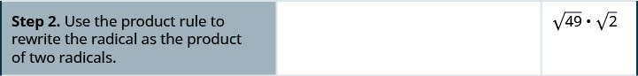

By the end of this section, you will be able to:
* Use the Product Property to simplify radical expressions
* Use the Quotient Property to simplify radical expressions

Before you get started, take this readiness quiz.

1.  Simplify:
    <math xmlns="http://www.w3.org/1998/Math/MathML"><mrow><mfrac><mrow><msup><mi>x</mi><mn>9</mn></msup></mrow><mrow><msup><mi>x</mi><mn>4</mn></msup></mrow></mfrac><mo>.</mo></mrow></math>
    
    * * *
    {: data-type="newline"}
    
    If you missed this problem, review [\[link\]](/m63345#fs-id1167835337754).
2.  Simplify:
    <math xmlns="http://www.w3.org/1998/Math/MathML"><mrow><mfrac><mrow><msup><mi>y</mi><mn>3</mn></msup></mrow><mrow><msup><mi>y</mi><mrow><mn>11</mn></mrow></msup></mrow></mfrac><mo>.</mo></mrow></math>
    
    * * *
    {: data-type="newline"}
    
    If you missed this problem, review [\[link\]](/m63345#fs-id1167835337754).
3.  Simplify:
    <math xmlns="http://www.w3.org/1998/Math/MathML"><mrow><msup><mrow><mrow><mo>(</mo><mrow><msup><mi>n</mi><mn>2</mn></msup></mrow><mo>)</mo></mrow></mrow><mn>6</mn></msup><mo>.</mo></mrow></math>
    
    * * *
    {: data-type="newline"}
    
    If you missed this problem, review [\[link\]](/m63345#fs-id1167834222370).
{: data-number-style="arabic"}

# Use the Product Property to Simplify Radical Expressions

We will simplify radical expressions in a way similar to how we simplified fractions. A fraction is simplified if there are no common factors in the numerator and denominator. To simplify a fraction, we look for any common factors in the numerator and denominator.

A **radical expression**{: data-type="term" .no-emphasis}, <math xmlns="http://www.w3.org/1998/Math/MathML"><mrow><mroot><mi>a</mi><mi>n</mi></mroot><mo>,</mo></mrow></math>

 is considered simplified if it has no factors of <math xmlns="http://www.w3.org/1998/Math/MathML"><mrow><msup><mi>m</mi><mi>n</mi></msup><mo>.</mo></mrow></math>

 So, to simplify a radical expression, we look for any factors in the radicand that are powers of the index.

Simplified Radical Expression

For real numbers *a* and *m*, and <math xmlns="http://www.w3.org/1998/Math/MathML"><mrow><mi>n</mi><mo>≥</mo><mn>2</mn><mo>,</mo></mrow></math>

<math xmlns="http://www.w3.org/1998/Math/MathML"><mrow><mroot><mi>a</mi><mi>n</mi></mroot><mspace width="0.2em" /><mtext>is considered simplified if</mtext><mspace width="0.2em" /><mi>a</mi><mspace width="0.2em" /><mtext>has no factors of</mtext><mspace width="0.2em" /><msup><mi>m</mi><mi>n</mi></msup></mrow></math>

For example, <math xmlns="http://www.w3.org/1998/Math/MathML"><mrow><msqrt><mn>5</mn></msqrt></mrow></math>

 is considered simplified because there are no perfect square factors in 5. But <math xmlns="http://www.w3.org/1998/Math/MathML"><mrow><msqrt><mrow><mn>12</mn></mrow></msqrt></mrow></math>

 is not simplified because 12 has a perfect square factor of 4.

Similarly, <math xmlns="http://www.w3.org/1998/Math/MathML"><mrow><mroot><mn>4</mn><mrow><mn>3</mn></mrow></mroot></mrow></math>

 is simplified because there are no perfect cube factors in 4. But <math xmlns="http://www.w3.org/1998/Math/MathML"><mrow><mroot><mrow><mn>24</mn></mrow><mrow><mn>3</mn></mrow></mroot></mrow></math>

 is not simplified because 24 has a perfect cube factor of 8.

To simplify radical expressions, we will also use some properties of roots. The properties we will use to simplify radical expressions are similar to the properties of exponents. We know that <math xmlns="http://www.w3.org/1998/Math/MathML"><mrow><msup><mrow><mo stretchy="false">(</mo><mi>a</mi><mi>b</mi><mo stretchy="false">)</mo></mrow><mi>n</mi></msup><mo>=</mo><msup><mi>a</mi><mi>n</mi></msup><msup><mi>b</mi><mi>n</mi></msup><mo>.</mo></mrow></math>

 The corresponding of **Product Property of Roots**{: data-type="term"} says that <math xmlns="http://www.w3.org/1998/Math/MathML"><mrow><mroot><mrow><mi>a</mi><mi>b</mi></mrow><mrow><mi>n</mi></mrow></mroot><mo>=</mo><mroot><mi>a</mi><mrow><mi>n</mi></mrow></mroot><mo>·</mo><mroot><mi>b</mi><mrow><mi>n</mi></mrow></mroot><mo>.</mo></mrow></math>

Product Property of *n*th Roots

If <math xmlns="http://www.w3.org/1998/Math/MathML"><mrow><mroot><mi>a</mi><mi>n</mi></mroot></mrow></math>

 and <math xmlns="http://www.w3.org/1998/Math/MathML"><mrow><mroot><mi>b</mi><mi>n</mi></mroot></mrow></math>

 are real numbers, and <math xmlns="http://www.w3.org/1998/Math/MathML"><mrow><mi>n</mi><mo>≥</mo><mn>2</mn></mrow></math>

 is an integer, then

<math xmlns="http://www.w3.org/1998/Math/MathML"><mrow><mroot><mrow><mi>a</mi><mi>b</mi></mrow><mi>n</mi></mroot><mo>=</mo><mroot><mi>a</mi><mi>n</mi></mroot><mo>·</mo><mroot><mi>b</mi><mi>n</mi></mroot><mspace width="1em" /><mtext>and</mtext><mspace width="1em" /><mroot><mi>a</mi><mi>n</mi></mroot><mo>·</mo><mroot><mi>b</mi><mi>n</mi></mroot><mo>=</mo><mroot><mrow><mi>a</mi><mi>b</mi></mrow><mi>n</mi></mroot></mrow></math>

We use the Product Property of Roots to remove all perfect square factors from a square root.

Simplify Square Roots Using the Product Property of Roots

Simplify: <math xmlns="http://www.w3.org/1998/Math/MathML"><mrow><msqrt><mrow><mn>98</mn></mrow></msqrt><mo>.</mo></mrow></math>

        

Simplify: <math xmlns="http://www.w3.org/1998/Math/MathML"><mrow><msqrt><mrow><mn>48</mn></mrow></msqrt><mo>.</mo></mrow></math>

<math xmlns="http://www.w3.org/1998/Math/MathML"><mrow><mn>4</mn><msqrt><mn>3</mn></msqrt></mrow></math>

Simplify: <math xmlns="http://www.w3.org/1998/Math/MathML"><mrow><msqrt><mrow><mn>45</mn></mrow></msqrt><mo>.</mo></mrow></math>

<math xmlns="http://www.w3.org/1998/Math/MathML"><mrow><mn>3</mn><msqrt><mn>5</mn></msqrt></mrow></math>

Notice in the previous example that the simplified form of <math xmlns="http://www.w3.org/1998/Math/MathML"><mrow><msqrt><mrow><mn>98</mn></mrow></msqrt></mrow></math>

 is <math xmlns="http://www.w3.org/1998/Math/MathML"><mrow><mn>7</mn><msqrt><mn>2</mn></msqrt><mo>,</mo></mrow></math>

 which is the product of an integer and a square root. We always write the integer in front of the square root.

Be careful to write your integer so that it is not confused with the index. The expression <math xmlns="http://www.w3.org/1998/Math/MathML"><mrow><mn>7</mn><msqrt><mn>2</mn></msqrt></mrow></math>

 is very different from <math xmlns="http://www.w3.org/1998/Math/MathML"><mrow><mroot><mn>2</mn><mrow><mn>7</mn></mrow></mroot><mo>.</mo></mrow></math>

Simplify a radical expression using the Product Property.

1.  Find the largest factor in the radicand that is a perfect power of the index. Rewrite the radicand as a product of two factors, using that factor.
2.  Use the product rule to rewrite the radical as the product of two radicals.
3.  Simplify the root of the perfect power.
{: data-number-style="arabic" .stepwise}

We will apply this method in the next example. It may be helpful to have a table of perfect squares, cubes, and fourth powers.

Simplify: ⓐ <math xmlns="http://www.w3.org/1998/Math/MathML"><mrow><msqrt><mrow><mn>500</mn></mrow></msqrt></mrow></math>

 ⓑ <math xmlns="http://www.w3.org/1998/Math/MathML"><mrow><mroot><mrow><mn>16</mn></mrow><mn>3</mn></mroot></mrow></math>

 ⓒ <math xmlns="http://www.w3.org/1998/Math/MathML"><mrow><mroot><mrow><mn>243</mn></mrow><mn>4</mn></mroot><mo>.</mo></mrow></math>

ⓐ* * *
{: data-type="newline"}

 <math xmlns="http://www.w3.org/1998/Math/MathML"><mrow><mtable><mtr><mtd /><mtd /><mtd /><mtd columnalign="center"><mspace width="4em" /><msqrt><mrow><mn>500</mn></mrow></msqrt></mtd></mtr><mtr><mtd columnalign="left"><mtable><mtr><mtd columnalign="left"><mtext>Rewrite the radicand as a product</mtext></mtd></mtr><mtr><mtd columnalign="left"><mtext>using the largest perfect square factor.</mtext></mtd></mtr></mtable></mtd><mtd /><mtd /><mtd columnalign="center"><mspace width="4em" /><msqrt><mrow><mn>1</mn><mn>00</mn><mo>·</mo><mn>5</mn></mrow></msqrt></mtd></mtr><mtr><mtd columnalign="left"><mtable><mtr><mtd columnalign="left"><mtext>Rewrite the radical as the product of two</mtext></mtd></mtr><mtr><mtd columnalign="left"><mtext>radicals</mtext></mtd></mtr></mtable></mtd><mtd /><mtd /><mtd columnalign="center"><mspace width="4em" /><msqrt><mrow><mn>1</mn><mn>00</mn></mrow></msqrt><mo>·</mo><msqrt><mn>5</mn></msqrt></mtd></mtr><mtr><mtd columnalign="left"><mtext>Simplify.</mtext></mtd><mtd /><mtd /><mtd columnalign="center"><mspace width="4em" /><mn>10</mn><msqrt><mn>5</mn></msqrt></mtd></mtr></mtable></mrow></math>

* * *
{: data-type="newline"}

* * *
{: data-type="newline"}

 ⓑ* * *
{: data-type="newline"}

 <math xmlns="http://www.w3.org/1998/Math/MathML"><mrow><mtable><mtr><mtd /><mtd /><mtd /><mtd columnalign="center"><mspace width="4em" /><mroot><mrow><mn>16</mn></mrow><mn>3</mn></mroot></mtd></mtr><mtr><mtd columnalign="left"><mtable><mtr><mtd columnalign="left"><mtext>Rewrite the radicand as a product using</mtext></mtd></mtr><mtr><mtd columnalign="left"><mtext>the greatest perfect cube factor.</mtext><mspace width="0.2em" /><msup><mn>2</mn><mn>3</mn></msup><mo>=</mo><mn>8</mn></mtd></mtr></mtable></mtd><mtd /><mtd /><mtd columnalign="center"><mspace width="4em" /><mroot><mrow><mn>8</mn><mo>·</mo><mn>2</mn></mrow><mn>3</mn></mroot></mtd></mtr><mtr><mtd columnalign="left"><mtable><mtr><mtd columnalign="left"><mtext>Rewrite the radical as the product of two</mtext></mtd></mtr><mtr><mtd columnalign="left"><mtext>radicals.</mtext></mtd></mtr></mtable></mtd><mtd /><mtd /><mtd columnalign="center"><mspace width="4em" /><mroot><mrow><mn>8</mn></mrow><mn>3</mn></mroot><mo>·</mo><mroot><mrow><msup><mn>2</mn><mrow /></msup></mrow><mn>3</mn></mroot></mtd></mtr><mtr><mtd columnalign="left"><mtext>Simplify.</mtext></mtd><mtd /><mtd /><mtd columnalign="center"><mspace width="4em" /><mn>2</mn><mspace width="0.2em" /><mroot><mrow><msup><mn>2</mn><mrow /></msup></mrow><mn>3</mn></mroot></mtd></mtr></mtable></mrow></math>

* * *
{: data-type="newline"}

* * *
{: data-type="newline"}

 ⓒ* * *
{: data-type="newline"}

 <math xmlns="http://www.w3.org/1998/Math/MathML"><mrow><mtable><mtr><mtd /><mtd /><mtd /><mtd columnalign="center"><mspace width="4em" /><mroot><mrow><mn>243</mn></mrow><mn>4</mn></mroot></mtd></mtr><mtr><mtd columnalign="left"><mtable><mtr><mtd columnalign="left"><mtext>Rewrite the radicand as a product using</mtext></mtd></mtr><mtr><mtd columnalign="left"><mtext>the greatest perfect fourth power factor.</mtext></mtd></mtr></mtable></mtd><mtd /><mtd /><mtd columnalign="center"><mspace width="4em" /><mroot><mrow><mn>81</mn><mo>·</mo><msup><mn>3</mn><mrow /></msup></mrow><mn>4</mn></mroot></mtd></mtr><mtr><mtd columnalign="left"><msup><mn>3</mn><mn>4</mn></msup><mo>=</mo><mn>81</mn></mtd><mtd /><mtd /><mtd /></mtr><mtr><mtd columnalign="left"><mtable><mtr><mtd columnalign="left"><mtext>Rewrite the radical as the product of two</mtext></mtd></mtr><mtr><mtd columnalign="left"><mtext>radicals</mtext></mtd></mtr></mtable></mtd><mtd /><mtd /><mtd columnalign="center"><mspace width="4em" /><mroot><mrow><mn>81</mn></mrow><mn>4</mn></mroot><mo>·</mo><mroot><mrow><msup><mn>3</mn><mrow /></msup></mrow><mn>4</mn></mroot></mtd></mtr><mtr><mtd columnalign="left"><mtext>Simplify.</mtext></mtd><mtd /><mtd /><mtd columnalign="center"><mspace width="4em" /><mn>3</mn><mspace width="0.2em" /><mroot><mrow><msup><mn>3</mn><mrow /></msup></mrow><mn>4</mn></mroot></mtd></mtr></mtable></mrow></math>

Simplify: ⓐ <math xmlns="http://www.w3.org/1998/Math/MathML"><mrow><msqrt><mrow><mn>288</mn></mrow></msqrt></mrow></math>

 ⓑ <math xmlns="http://www.w3.org/1998/Math/MathML"><mrow><mroot><mrow><mn>81</mn></mrow><mn>3</mn></mroot></mrow></math>

 ⓒ <math xmlns="http://www.w3.org/1998/Math/MathML"><mrow><mroot><mrow><mn>64</mn></mrow><mn>4</mn></mroot><mo>.</mo></mrow></math>

ⓐ <math xmlns="http://www.w3.org/1998/Math/MathML"><mrow><mn>12</mn><msqrt><mn>2</mn></msqrt></mrow></math>

 ⓑ <math xmlns="http://www.w3.org/1998/Math/MathML"><mrow><mn>3</mn><mroot><mn>3</mn><mn>3</mn></mroot></mrow></math>

 ⓒ <math xmlns="http://www.w3.org/1998/Math/MathML"><mrow><mn>2</mn><mroot><mn>4</mn><mn>4</mn></mroot></mrow></math>

Simplify: ⓐ <math xmlns="http://www.w3.org/1998/Math/MathML"><mrow><msqrt><mrow><mn>432</mn></mrow></msqrt></mrow></math>

 ⓑ <math xmlns="http://www.w3.org/1998/Math/MathML"><mrow><mroot><mrow><mn>625</mn></mrow><mn>3</mn></mroot></mrow></math>

 ⓒ <math xmlns="http://www.w3.org/1998/Math/MathML"><mrow><mroot><mrow><mn>729</mn></mrow><mn>4</mn></mroot><mo>.</mo></mrow></math>

ⓐ <math xmlns="http://www.w3.org/1998/Math/MathML"><mrow><mn>12</mn><msqrt><mn>3</mn></msqrt></mrow></math>

 ⓑ <math xmlns="http://www.w3.org/1998/Math/MathML"><mrow><mn>5</mn><mroot><mn>5</mn><mn>3</mn></mroot></mrow></math>

 ⓒ <math xmlns="http://www.w3.org/1998/Math/MathML"><mrow><mn>3</mn><mroot><mn>9</mn><mn>4</mn></mroot></mrow></math>

The next example is much like the previous examples, but with variables. Don’t forget to use the absolute value signs when taking an even root of an expression with a variable in the radical.

Simplify: ⓐ <math xmlns="http://www.w3.org/1998/Math/MathML"><mrow><msqrt><mrow><msup><mi>x</mi><mn>3</mn></msup></mrow></msqrt></mrow></math>

 ⓑ <math xmlns="http://www.w3.org/1998/Math/MathML"><mrow><mroot><mrow><msup><mi>x</mi><mn>4</mn></msup></mrow><mn>3</mn></mroot></mrow></math>

 ⓒ <math xmlns="http://www.w3.org/1998/Math/MathML"><mrow><mroot><mrow><msup><mi>x</mi><mn>7</mn></msup></mrow><mn>4</mn></mroot><mo>.</mo></mrow></math>

ⓐ* * *
{: data-type="newline"}

 <math xmlns="http://www.w3.org/1998/Math/MathML"><mrow><mtable><mtr><mtd /><mtd /><mtd /><mtd columnalign="center"><mspace width="4em" /><msqrt><mrow><msup><mi>x</mi><mn>3</mn></msup></mrow></msqrt></mtd></mtr><mtr><mtd columnalign="left"><mtable><mtr><mtd columnalign="left"><mtext>Rewrite the radicand as a product using</mtext></mtd></mtr><mtr><mtd columnalign="left"><mtext>the largest perfect square factor.</mtext></mtd></mtr></mtable></mtd><mtd /><mtd /><mtd columnalign="center"><mspace width="4em" /><msqrt><mrow><msup><mi>x</mi><mn>2</mn></msup><mo>·</mo><mi>x</mi></mrow></msqrt></mtd></mtr><mtr><mtd columnalign="left"><mtable><mtr><mtd columnalign="left"><mtext>Rewrite the radical as the product of two</mtext></mtd></mtr><mtr><mtd columnalign="left"><mtext>radicals.</mtext></mtd></mtr></mtable></mtd><mtd /><mtd /><mtd columnalign="center"><mspace width="4em" /><msqrt><mrow><msup><mi>x</mi><mn>2</mn></msup></mrow></msqrt><mo>·</mo><msqrt><mi>x</mi></msqrt></mtd></mtr><mtr><mtd columnalign="left"><mtext>Simplify.</mtext></mtd><mtd /><mtd /><mtd columnalign="center"><mspace width="4em" /><mrow><mo>\|</mo><mrow><mi>x</mi></mrow><mo>\|</mo></mrow><mspace width="0.2em" /><msqrt><mi>x</mi></msqrt></mtd></mtr></mtable></mrow></math>

* * *
{: data-type="newline"}

* * *
{: data-type="newline"}

 ⓑ* * *
{: data-type="newline"}

 <math xmlns="http://www.w3.org/1998/Math/MathML"><mrow><mtable><mtr><mtd /><mtd /><mtd /><mtd columnalign="center"><mspace width="4em" /><mroot><mrow><msup><mi>x</mi><mn>4</mn></msup></mrow><mn>3</mn></mroot></mtd></mtr> <mtr><mtd columnalign="left"><mtable><mtr><mtd columnalign="left"><mtext>Rewrite the radicand as a product</mtext></mtd></mtr><mtr><mtd columnalign="left"><mtext>using the largest perfect cube factor.</mtext></mtd></mtr></mtable></mtd><mtd /><mtd /><mtd columnalign="center"><mspace width="4em" /><mroot><mrow><msup><mi>x</mi><mn>3</mn></msup><mo>·</mo><mi>x</mi></mrow><mn>3</mn></mroot><mo>.</mo></mtd></mtr> <mtr><mtd columnalign="left"><mtable><mtr><mtd columnalign="left"><mtext>Rewrite the radical as the product of two</mtext></mtd></mtr><mtr><mtd columnalign="left"><mtext>radicals.</mtext></mtd></mtr></mtable></mtd><mtd /><mtd /><mtd columnalign="center"><mspace width="4em" /><mroot><mrow><msup><mi>x</mi><mn>3</mn></msup></mrow><mn>3</mn></mroot><mo>·</mo><mroot><mi>x</mi><mn>3</mn></mroot></mtd></mtr> <mtr><mtd columnalign="left"><mtext>Simplify.</mtext></mtd><mtd /><mtd /><mtd columnalign="center"><mspace width="4em" /><mi>x</mi><mspace width="0.2em" /><mroot><mi>x</mi><mn>3</mn></mroot></mtd></mtr></mtable></mrow></math>

* * *
{: data-type="newline"}

* * *
{: data-type="newline"}

 ⓒ* * *
{: data-type="newline"}

 <math xmlns="http://www.w3.org/1998/Math/MathML"><mrow><mtable><mtr><mtd /><mtd /><mtd /><mtd columnalign="center"><mspace width="4em" /><mroot><mrow><msup><mi>x</mi><mn>7</mn></msup></mrow><mn>4</mn></mroot></mtd></mtr><mtr><mtd columnalign="left"><mtable><mtr><mtd columnalign="left"><mtext>Rewrite the radicand as a product</mtext></mtd></mtr><mtr><mtd columnalign="left"><mtext>using the greatest perfect fourth power</mtext></mtd></mtr></mtable></mtd><mtd /><mtd /><mtd columnalign="center"><mspace width="4em" /><mroot><mrow><msup><mi>x</mi><mn>4</mn></msup><mo>·</mo><msup><mi>x</mi><mn>3</mn></msup></mrow><mn>4</mn></mroot></mtd></mtr><mtr><mtd columnalign="left"><mtext>factor.</mtext></mtd><mtd /><mtd /><mtd /></mtr><mtr><mtd columnalign="left"><mtable><mtr><mtd columnalign="left"><mtext>Rewrite the radical as the product of two</mtext></mtd></mtr><mtr><mtd columnalign="left"><mtext>radicals.</mtext></mtd></mtr></mtable></mtd><mtd /><mtd /><mtd columnalign="center"><mspace width="4em" /><mroot><mrow><msup><mi>x</mi><mn>4</mn></msup></mrow><mn>4</mn></mroot><mo>·</mo><mroot><mrow><msup><mi>x</mi><mn>3</mn></msup></mrow><mn>4</mn></mroot></mtd></mtr><mtr><mtd columnalign="left"><mtext>Simplify.</mtext></mtd><mtd /><mtd /><mtd columnalign="center"><mspace width="4em" /><mrow><mo>\|</mo><mi>x</mi><mo>\|</mo></mrow><mspace width="0.2em" /><mroot><mrow><msup><mi>x</mi><mn>3</mn></msup></mrow><mrow><mn>4</mn></mrow></mroot></mtd></mtr></mtable></mrow></math>

Simplify: ⓐ <math xmlns="http://www.w3.org/1998/Math/MathML"><mrow><msqrt><mrow><msup><mi>b</mi><mn>5</mn></msup></mrow></msqrt></mrow></math>

 ⓑ <math xmlns="http://www.w3.org/1998/Math/MathML"><mrow><mroot><mrow><msup><mi>y</mi><mn>6</mn></msup></mrow><mn>4</mn></mroot></mrow></math>

 ⓒ <math xmlns="http://www.w3.org/1998/Math/MathML"><mrow><mroot><mrow><msup><mi>z</mi><mn>5</mn></msup></mrow><mn>3</mn></mroot></mrow></math>

ⓐ <math xmlns="http://www.w3.org/1998/Math/MathML"><mrow><msup><mi>b</mi><mn>2</mn></msup><msqrt><mi>b</mi></msqrt></mrow></math>

 ⓑ <math xmlns="http://www.w3.org/1998/Math/MathML"><mrow><mrow><mo>\|</mo><mi>y</mi><mo>\|</mo></mrow><mroot><mrow><msup><mi>y</mi><mn>2</mn></msup></mrow><mn>4</mn></mroot></mrow></math>

 ⓒ <math xmlns="http://www.w3.org/1998/Math/MathML"><mrow><mi>z</mi><mroot><mrow><msup><mi>z</mi><mn>2</mn></msup></mrow><mn>3</mn></mroot></mrow></math>

Simplify: ⓐ <math xmlns="http://www.w3.org/1998/Math/MathML"><mrow><msqrt><mrow><msup><mi>p</mi><mn>9</mn></msup></mrow></msqrt></mrow></math>

 ⓑ <math xmlns="http://www.w3.org/1998/Math/MathML"><mrow><mroot><mrow><msup><mi>y</mi><mn>8</mn></msup></mrow><mn>5</mn></mroot></mrow></math>

 ⓒ <math xmlns="http://www.w3.org/1998/Math/MathML"><mrow><mroot><mrow><msup><mi>q</mi><mrow><mn>13</mn></mrow></msup></mrow><mn>6</mn></mroot></mrow></math>

ⓐ <math xmlns="http://www.w3.org/1998/Math/MathML"><mrow><msup><mi>p</mi><mn>4</mn></msup><msqrt><mi>p</mi></msqrt></mrow></math>

 ⓑ <math xmlns="http://www.w3.org/1998/Math/MathML"><mrow><mi>p</mi><mroot><mrow><msup><mi>p</mi><mn>3</mn></msup></mrow><mn>5</mn></mroot></mrow></math>

* * *
{: data-type="newline"}

ⓒ <math xmlns="http://www.w3.org/1998/Math/MathML"><mrow><msup><mi>q</mi><mn>2</mn></msup><mroot><mi>q</mi><mn>6</mn></mroot></mrow></math>

We follow the same procedure when there is a coefficient in the radicand. In the next example, both the constant and the variable have perfect square factors.

Simplify: ⓐ <math xmlns="http://www.w3.org/1998/Math/MathML"><mrow><msqrt><mrow><mn>72</mn><msup><mi>n</mi><mn>7</mn></msup></mrow></msqrt></mrow></math>

 ⓑ <math xmlns="http://www.w3.org/1998/Math/MathML"><mrow><mroot><mrow><mn>24</mn><msup><mi>x</mi><mn>7</mn></msup></mrow><mn>3</mn></mroot></mrow></math>

 ⓒ <math xmlns="http://www.w3.org/1998/Math/MathML"><mrow><mroot><mrow><mn>80</mn><msup><mi>y</mi><mrow><mn>14</mn></mrow></msup></mrow><mn>4</mn></mroot><mo>.</mo></mrow></math>

ⓐ* * *
{: data-type="newline"}

 <math xmlns="http://www.w3.org/1998/Math/MathML"><mrow><mtable><mtr><mtd /><mtd /><mtd /><mtd columnalign="center"><mspace width="4em" /><msqrt><mrow><mn>72</mn><msup><mi>n</mi><mn>7</mn></msup></mrow></msqrt></mtd></mtr> <mtr><mtd columnalign="left"><mtable><mtr><mtd columnalign="left"><mtext>Rewrite the radicand as a product</mtext></mtd></mtr><mtr><mtd columnalign="left"><mtext>using the largest perfect square factor.</mtext></mtd></mtr></mtable></mtd><mtd /><mtd /><mtd columnalign="center"><mspace width="4em" /><msqrt><mrow><mn>36</mn><msup><mi>n</mi><mn>6</mn></msup><mo>·</mo><mn>2</mn><mi>n</mi></mrow></msqrt></mtd></mtr> <mtr><mtd columnalign="left"><mtable><mtr><mtd columnalign="left"><mtext>Rewrite the radical as the product of two</mtext></mtd></mtr><mtr><mtd columnalign="left"><mtext>radicals.</mtext></mtd></mtr></mtable></mtd><mtd /><mtd /><mtd columnalign="center"><mspace width="4em" /><msqrt><mrow><mn>36</mn><msup><mi>n</mi><mn>6</mn></msup></mrow></msqrt><mo>·</mo><msqrt><mrow><mn>2</mn><mi>n</mi></mrow></msqrt></mtd></mtr> <mtr><mtd columnalign="left"><mtext>Simplify.</mtext></mtd><mtd /><mtd /><mtd columnalign="center"><mspace width="4em" /><mn>6</mn><mrow><mo>\|</mo><mrow><msup><mi>n</mi><mn>3</mn></msup></mrow><mo>\|</mo></mrow><mspace width="0.2em" /><msqrt><mrow><mn>2</mn><mi>n</mi></mrow></msqrt></mtd></mtr></mtable></mrow></math>

* * *
{: data-type="newline"}

* * *
{: data-type="newline"}

 ⓑ* * *
{: data-type="newline"}

 <math xmlns="http://www.w3.org/1998/Math/MathML"><mrow><mtable><mtr><mtd /><mtd /><mtd /><mtd columnalign="center"><mspace width="4em" /><mroot><mrow><mn>24</mn><msup><mi>x</mi><mn>7</mn></msup></mrow><mn>3</mn></mroot></mtd></mtr><mtr><mtd columnalign="left"><mtable><mtr><mtd columnalign="left"><mtext>Rewrite the radicand as a product</mtext></mtd></mtr><mtr><mtd columnalign="left"><mtext>using perfect cube factors.</mtext></mtd></mtr></mtable></mtd><mtd /><mtd /><mtd columnalign="center"><mspace width="4em" /><mroot><mrow><mn>8</mn><msup><mi>x</mi><mn>6</mn></msup><mo>·</mo><mn>3</mn><mi>x</mi></mrow><mn>3</mn></mroot></mtd></mtr><mtr><mtd columnalign="left"><mtable><mtr><mtd columnalign="left"><mtext>Rewrite the radical as the product of two</mtext></mtd></mtr><mtr><mtd columnalign="left"><mtext>radicals.</mtext></mtd></mtr></mtable></mtd><mtd /><mtd /><mtd columnalign="center"><mspace width="4em" /><mroot><mrow><mn>8</mn><msup><mi>x</mi><mn>6</mn></msup></mrow><mn>3</mn></mroot><mo>·</mo><mroot><mrow><msup><mn>3</mn><mrow /></msup><mi>x</mi></mrow><mn>3</mn></mroot></mtd></mtr><mtr><mtd columnalign="left"><mtext>Rewrite the first radicand as</mtext><mspace width="0.2em" /><msup><mrow><mrow><mo>(</mo><mrow><mn>2</mn><msup><mi>x</mi><mn>2</mn></msup></mrow><mo>)</mo></mrow></mrow><mn>3</mn></msup><mo>.</mo></mtd><mtd /><mtd /><mtd columnalign="center"><mspace width="4em" /><mroot><mrow><msup><mrow><mrow><mo>(</mo><mrow><msup><mn>2</mn><mrow /></msup><msup><mi>x</mi><mn>2</mn></msup></mrow><mo>)</mo></mrow></mrow><mn>3</mn></msup></mrow><mn>3</mn></mroot><mo>·</mo><mroot><mrow><msup><mn>3</mn><mrow /></msup><mi>x</mi></mrow><mn>3</mn></mroot></mtd></mtr><mtr><mtd columnalign="left"><mtext>Simplify.</mtext></mtd><mtd /><mtd /><mtd columnalign="center"><mspace width="4em" /><mn>2</mn><msup><mi>x</mi><mn>2</mn></msup><mspace width="0.2em" /><mroot><mrow><msup><mn>3</mn><mrow /></msup><mi>x</mi></mrow><mn>3</mn></mroot></mtd></mtr></mtable></mrow></math>

* * *
{: data-type="newline"}

* * *
{: data-type="newline"}

 ⓒ* * *
{: data-type="newline"}

 <math xmlns="http://www.w3.org/1998/Math/MathML"><mrow><mtable><mtr><mtd /><mtd /><mtd /><mtd columnalign="center"><mspace width="4em" /><mroot><mrow><mn>80</mn><msup><mi>y</mi><mrow><mn>14</mn></mrow></msup></mrow><mn>4</mn></mroot></mtd></mtr><mtr><mtd columnalign="left"><mtable><mtr><mtd columnalign="left"><mtext>Rewrite the radicand as a product</mtext></mtd></mtr><mtr><mtd columnalign="left"><mtext>using perfect fourth power factors.</mtext></mtd></mtr></mtable></mtd><mtd /><mtd /><mtd columnalign="center"><mspace width="4em" /><mroot><mrow><mn>16</mn><msup><mi>y</mi><mrow><mn>12</mn></mrow></msup><mo>·</mo><msup><mn>5</mn><mrow /></msup><msup><mi>y</mi><mn>2</mn></msup></mrow><mn>4</mn></mroot></mtd></mtr><mtr><mtd columnalign="left"><mtable><mtr><mtd columnalign="left"><mtext>Rewrite the radical as the product of two</mtext></mtd></mtr><mtr><mtd columnalign="left"><mtext>radicals.</mtext></mtd></mtr></mtable></mtd><mtd /><mtd /><mtd columnalign="center"><mspace width="4em" /><mroot><mrow><mn>16</mn><msup><mi>y</mi><mrow><mn>12</mn></mrow></msup></mrow><mn>4</mn></mroot><mo>·</mo><mroot><mrow><mn>5</mn><msup><mi>y</mi><mn>2</mn></msup><msup><mrow /><mrow /></msup></mrow><mn>4</mn></mroot></mtd></mtr><mtr><mtd columnalign="left"><mtext>Rewrite the first radicand as</mtext><mspace width="0.2em" /><msup><mrow><mrow><mo>(</mo><mrow><mn>2</mn><msup><mi>y</mi><mn>3</mn></msup></mrow><mo>)</mo></mrow></mrow><mn>4</mn></msup><mo>.</mo></mtd><mtd /><mtd /><mtd columnalign="center"><mspace width="4em" /><mroot><mrow><msup><mrow><mrow><mo>(</mo><mrow><msup><mn>2</mn><mrow /></msup><msup><mi>y</mi><mn>3</mn></msup></mrow><mo>)</mo></mrow></mrow><mn>4</mn></msup></mrow><mn>4</mn></mroot><mo>·</mo><mroot><mrow><mn>5</mn><msup><mi>y</mi><mn>2</mn></msup><msup><mrow /><mrow /></msup></mrow><mn>4</mn></mroot></mtd></mtr><mtr><mtd columnalign="left"><mtext>Simplify.</mtext></mtd><mtd /><mtd /><mtd columnalign="center"><mspace width="4em" /><mn>2</mn><mrow><mo>\|</mo><mrow><msup><mi>y</mi><mn>3</mn></msup></mrow><mo>\|</mo></mrow><mspace width="0.2em" /><mroot><mrow><msup><mn>5</mn><mrow /></msup><msup><mi>y</mi><mn>2</mn></msup></mrow><mn>4</mn></mroot></mtd></mtr></mtable></mrow></math>

Simplify: ⓐ <math xmlns="http://www.w3.org/1998/Math/MathML"><mrow><msqrt><mrow><mn>32</mn><msup><mi>y</mi><mn>5</mn></msup></mrow></msqrt></mrow></math>

 ⓑ <math xmlns="http://www.w3.org/1998/Math/MathML"><mrow><mroot><mrow><mn>54</mn><msup><mi>p</mi><mrow><mn>10</mn></mrow></msup></mrow><mn>3</mn></mroot></mrow></math>

 ⓒ <math xmlns="http://www.w3.org/1998/Math/MathML"><mrow><mroot><mrow><mn>64</mn><msup><mi>q</mi><mrow><mn>10</mn></mrow></msup></mrow><mn>4</mn></mroot><mo>.</mo></mrow></math>

ⓐ <math xmlns="http://www.w3.org/1998/Math/MathML"><mrow><mn>4</mn><msup><mi>y</mi><mn>2</mn></msup><msqrt><mrow><mn>2</mn><mi>y</mi></mrow></msqrt></mrow></math>

 ⓑ <math xmlns="http://www.w3.org/1998/Math/MathML"><mrow><mn>3</mn><msup><mi>p</mi><mn>3</mn></msup><mroot><mrow><mn>2</mn><mi>p</mi></mrow><mn>3</mn></mroot></mrow></math>

* * *
{: data-type="newline"}

ⓒ <math xmlns="http://www.w3.org/1998/Math/MathML"><mrow><mn>2</mn><msup><mi>q</mi><mn>2</mn></msup><mroot><mrow><mn>4</mn><msup><mi>q</mi><mn>2</mn></msup></mrow><mn>4</mn></mroot></mrow></math>

Simplify: ⓐ <math xmlns="http://www.w3.org/1998/Math/MathML"><mrow><msqrt><mrow><mn>75</mn><msup><mi>a</mi><mn>9</mn></msup></mrow></msqrt></mrow></math>

 ⓑ <math xmlns="http://www.w3.org/1998/Math/MathML"><mrow><mroot><mrow><mn>128</mn><msup><mi>m</mi><mrow><mn>11</mn></mrow></msup></mrow><mn>3</mn></mroot></mrow></math>

 ⓒ <math xmlns="http://www.w3.org/1998/Math/MathML"><mrow><mroot><mrow><mn>162</mn><msup><mi>n</mi><mn>7</mn></msup></mrow><mn>4</mn></mroot><mo>.</mo></mrow></math>

ⓐ <math xmlns="http://www.w3.org/1998/Math/MathML"><mrow><mn>5</mn><msup><mi>a</mi><mn>4</mn></msup><msqrt><mrow><mn>3</mn><mi>a</mi></mrow></msqrt></mrow></math>

 ⓑ <math xmlns="http://www.w3.org/1998/Math/MathML"><mrow><mn>4</mn><msup><mi>m</mi><mn>3</mn></msup><mroot><mrow><mn>2</mn><msup><mi>m</mi><mn>2</mn></msup></mrow><mn>3</mn></mroot></mrow></math>

* * *
{: data-type="newline"}

ⓒ <math xmlns="http://www.w3.org/1998/Math/MathML"><mrow><mn>3</mn><mrow><mo>\|</mo><mi>n</mi><mo>\|</mo></mrow><mroot><mrow><mn>2</mn><msup><mi>n</mi><mn>3</mn></msup></mrow><mn>4</mn></mroot></mrow></math>

In the next example, we continue to use the same methods even though there are more than one variable under the radical.

Simplify: ⓐ <math xmlns="http://www.w3.org/1998/Math/MathML"><mrow><msqrt><mrow><mn>63</mn><msup><mi>u</mi><mn>3</mn></msup><msup><mi>v</mi><mn>5</mn></msup></mrow></msqrt></mrow></math>

 ⓑ <math xmlns="http://www.w3.org/1998/Math/MathML"><mrow><mroot><mrow><mn>40</mn><msup><mi>x</mi><mn>4</mn></msup><msup><mi>y</mi><mn>5</mn></msup></mrow><mrow><mn>3</mn></mrow></mroot></mrow></math>

 ⓒ <math xmlns="http://www.w3.org/1998/Math/MathML"><mrow><mroot><mrow><mn>48</mn><msup><mi>x</mi><mn>4</mn></msup><msup><mi>y</mi><mn>7</mn></msup></mrow><mrow><mn>4</mn></mrow></mroot><mo>.</mo></mrow></math>

ⓐ* * *
{: data-type="newline"}

 <math xmlns="http://www.w3.org/1998/Math/MathML"><mrow><mtable><mtr><mtd /><mtd /><mtd /><mtd columnalign="center"><mspace width="4em" /><msqrt><mrow><mn>63</mn><msup><mi>u</mi><mn>3</mn></msup><msup><mi>v</mi><mn>5</mn></msup></mrow></msqrt></mtd></mtr><mtr><mtd columnalign="left"><mtable><mtr><mtd columnalign="left"><mtext>Rewrite the radicand as a product</mtext></mtd></mtr><mtr><mtd columnalign="left"><mtext>using the largest perfect square factor.</mtext></mtd></mtr></mtable></mtd><mtd /><mtd /><mtd columnalign="center"><mspace width="4em" /><msqrt><mrow><mn>9</mn><msup><mi>u</mi><mn>2</mn></msup><msup><mi>v</mi><mn>4</mn></msup><mo>·</mo><mn>7</mn><mi>u</mi><mi>v</mi></mrow></msqrt></mtd></mtr><mtr><mtd columnalign="left"><mtable><mtr><mtd columnalign="left"><mtext>Rewrite the radical as the product of two</mtext></mtd></mtr><mtr><mtd columnalign="left"><mtext>radicals.</mtext></mtd></mtr></mtable></mtd><mtd /><mtd /><mtd columnalign="center"><mspace width="4em" /><msqrt><mrow><mn>9</mn><msup><mi>u</mi><mn>2</mn></msup><msup><mi>v</mi><mn>4</mn></msup></mrow></msqrt><mo>·</mo><msqrt><mrow><mn>7</mn><mi>u</mi><mi>v</mi></mrow></msqrt></mtd></mtr><mtr><mtd columnalign="left"><mtext>Rewrite the first radicand as</mtext><mspace width="0.2em" /><msup><mrow><mrow><mo>(</mo><mrow><mn>3</mn><mi>u</mi><msup><mi>v</mi><mn>2</mn></msup></mrow><mo>)</mo></mrow></mrow><mn>2</mn></msup><mo>.</mo></mtd><mtd /><mtd /><mtd columnalign="center"><mspace width="4em" /><msqrt><mrow><msup><mrow><mrow><mo>(</mo><mrow><mn>3</mn><mi>u</mi><msup><mi>v</mi><mn>2</mn></msup></mrow><mo>)</mo></mrow></mrow><mn>2</mn></msup></mrow></msqrt><mo>·</mo><msqrt><mrow><mn>7</mn><mi>u</mi><mi>v</mi></mrow></msqrt></mtd></mtr><mtr><mtd columnalign="left"><mtext>Simplify.</mtext></mtd><mtd /><mtd /><mtd columnalign="center"><mspace width="4em" /><mn>3</mn><mrow><mo>\|</mo><mi>u</mi><mo>\|</mo></mrow><msup><mi>v</mi><mn>2</mn></msup><mspace width="0.2em" /><msqrt><mrow><mn>7</mn><mi>u</mi><mi>v</mi></mrow></msqrt></mtd></mtr></mtable></mrow></math>

* * *
{: data-type="newline"}

* * *
{: data-type="newline"}

 ⓑ* * *
{: data-type="newline"}

 <math xmlns="http://www.w3.org/1998/Math/MathML"><mrow><mtable><mtr><mtd /><mtd /><mtd /><mtd columnalign="center"><mspace width="4em" /><mroot><mrow><mn>40</mn><msup><mi>x</mi><mn>4</mn></msup><msup><mi>y</mi><mn>5</mn></msup></mrow><mrow><mn>3</mn></mrow></mroot></mtd></mtr><mtr><mtd columnalign="left"><mtable><mtr><mtd columnalign="left"><mtext>Rewrite the radicand as a product</mtext></mtd></mtr><mtr><mtd columnalign="left"><mtext>using the largest perfect cube factor.</mtext></mtd></mtr></mtable></mtd><mtd /><mtd /><mtd columnalign="center"><mspace width="4em" /><mroot><mrow><mn>8</mn><msup><mi>x</mi><mn>3</mn></msup><msup><mi>y</mi><mn>3</mn></msup><mo>·</mo><mn>5</mn><mi>x</mi><msup><mi>y</mi><mn>2</mn></msup></mrow><mrow><mn>3</mn></mrow></mroot></mtd></mtr><mtr><mtd columnalign="left"><mtable><mtr><mtd columnalign="left"><mtext>Rewrite the radical as the product of two</mtext></mtd></mtr><mtr><mtd columnalign="left"><mtext>radicals.</mtext></mtd></mtr></mtable></mtd><mtd /><mtd /><mtd columnalign="center"><mspace width="4em" /><mroot><mrow><mn>8</mn><msup><mi>x</mi><mn>3</mn></msup><msup><mi>y</mi><mn>3</mn></msup></mrow><mrow><mn>3</mn></mrow></mroot><mo>·</mo><mroot><mrow><mn>5</mn><mi>x</mi><msup><mi>y</mi><mn>2</mn></msup></mrow><mrow><mn>3</mn></mrow></mroot></mtd></mtr><mtr><mtd columnalign="left"><mtext>Rewrite the first radicand as</mtext><mspace width="0.2em" /><msup><mrow><mrow><mo>(</mo><mrow><mn>2</mn><mi>x</mi><mi>y</mi></mrow><mo>)</mo></mrow></mrow><mn>3</mn></msup><mo>.</mo></mtd><mtd /><mtd /><mtd columnalign="center"><mspace width="4em" /><mroot><mrow><msup><mrow><mrow><mo>(</mo><mrow><mn>2</mn><mi>x</mi><mi>y</mi></mrow><mo>)</mo></mrow></mrow><mn>3</mn></msup></mrow><mrow><mn>3</mn></mrow></mroot><mo>·</mo><mroot><mrow><mn>5</mn><mi>x</mi><msup><mi>y</mi><mn>2</mn></msup></mrow><mrow><mn>3</mn></mrow></mroot></mtd></mtr><mtr><mtd columnalign="left"><mtext>Simplify.</mtext></mtd><mtd /><mtd /><mtd columnalign="center"><mspace width="4em" /><mn>2</mn><mi>x</mi><mi>y</mi><mspace width="0.2em" /><mroot><mrow><mn>5</mn><mi>x</mi><msup><mi>y</mi><mn>2</mn></msup></mrow><mrow><mn>3</mn></mrow></mroot></mtd></mtr></mtable></mrow></math>

* * *
{: data-type="newline"}

* * *
{: data-type="newline"}

 ⓒ* * *
{: data-type="newline"}

 <math xmlns="http://www.w3.org/1998/Math/MathML"><mrow><mtable><mtr><mtd /><mtd /><mtd /><mtd columnalign="center"><mspace width="4em" /><mroot><mrow><mn>48</mn><msup><mi>x</mi><mn>4</mn></msup><msup><mi>y</mi><mn>7</mn></msup></mrow><mrow><mn>4</mn></mrow></mroot></mtd></mtr><mtr><mtd columnalign="left"><mtable><mtr><mtd columnalign="left"><mtext>Rewrite the radicand as a product</mtext></mtd></mtr><mtr><mtd columnalign="left"><mtext>using the largest perfect fourth power</mtext></mtd></mtr></mtable></mtd><mtd /><mtd /><mtd columnalign="center"><mspace width="4em" /><mroot><mrow><mn>16</mn><msup><mi>x</mi><mn>4</mn></msup><msup><mi>y</mi><mn>4</mn></msup><mo>·</mo><mn>3</mn><msup><mi>y</mi><mn>3</mn></msup></mrow><mn>4</mn></mroot></mtd></mtr><mtr><mtd columnalign="left"><mtext>factor.</mtext></mtd><mtd /><mtd /><mtd /></mtr><mtr><mtd columnalign="left"><mtable><mtr><mtd columnalign="left"><mtext>Rewrite the radical as the product of two</mtext></mtd></mtr><mtr><mtd columnalign="left"><mtext>radicals.</mtext></mtd></mtr></mtable></mtd><mtd /><mtd /><mtd columnalign="center"><mspace width="4em" /><mroot><mrow><mn>16</mn><msup><mi>x</mi><mn>4</mn></msup><msup><mi>y</mi><mn>4</mn></msup></mrow><mn>4</mn></mroot><mo>·</mo><mroot><mrow><mn>3</mn><msup><mi>y</mi><mn>3</mn></msup></mrow><mrow><mn>4</mn></mrow></mroot></mtd></mtr><mtr><mtd columnalign="left"><mtext>Rewrite the first radicand as</mtext><mspace width="0.2em" /><msup><mrow><mrow><mo>(</mo><mrow><mn>2</mn><mi>x</mi><mi>y</mi></mrow><mo>)</mo></mrow></mrow><mn>4</mn></msup><mo>.</mo></mtd><mtd /><mtd /><mtd columnalign="center"><mspace width="4em" /><mroot><mrow><msup><mrow><mrow><mo>(</mo><mrow><mn>2</mn><mi>x</mi><mi>y</mi></mrow><mo>)</mo></mrow></mrow><mn>4</mn></msup></mrow><mn>4</mn></mroot><mo>·</mo><mroot><mrow><mn>3</mn><msup><mi>y</mi><mn>3</mn></msup></mrow><mrow><mn>4</mn></mrow></mroot></mtd></mtr><mtr><mtd columnalign="left"><mtext>Simplify.</mtext></mtd><mtd /><mtd /><mtd columnalign="center"><mspace width="4em" /><mn>2</mn><mrow><mo>\|</mo><mrow><mi>x</mi><mi>y</mi></mrow><mo>\|</mo></mrow><mspace width="0.2em" /><mroot><mrow><mn>3</mn><msup><mi>y</mi><mn>3</mn></msup></mrow><mrow><mn>4</mn></mrow></mroot></mtd></mtr></mtable></mrow></math>

Simplify: ⓐ <math xmlns="http://www.w3.org/1998/Math/MathML"><mrow><msqrt><mrow><mn>98</mn><msup><mi>a</mi><mn>7</mn></msup><msup><mi>b</mi><mn>5</mn></msup></mrow></msqrt></mrow></math>

 ⓑ <math xmlns="http://www.w3.org/1998/Math/MathML"><mrow><mroot><mrow><mn>56</mn><msup><mi>x</mi><mn>5</mn></msup><msup><mi>y</mi><mn>4</mn></msup></mrow><mrow><mn>3</mn></mrow></mroot></mrow></math>

 ⓒ <math xmlns="http://www.w3.org/1998/Math/MathML"><mrow><mroot><mrow><mn>32</mn><msup><mi>x</mi><mn>5</mn></msup><msup><mi>y</mi><mn>8</mn></msup></mrow><mrow><mn>4</mn></mrow></mroot><mo>.</mo></mrow></math>

ⓐ <math xmlns="http://www.w3.org/1998/Math/MathML"><mrow><mn>7</mn><mrow><mo>\|</mo><mrow><msup><mi>a</mi><mn>3</mn></msup></mrow><mo>\|</mo></mrow><msup><mi>b</mi><mn>2</mn></msup><msup><mrow><msqrt><mrow><mn>2</mn><mi>a</mi><mi>b</mi></mrow></msqrt></mrow><mrow /></msup></mrow></math>

* * *
{: data-type="newline"}

ⓑ <math xmlns="http://www.w3.org/1998/Math/MathML"><mrow><mn>2</mn><mi>x</mi><mi>y</mi><mroot><mrow><mn>7</mn><msup><mi>x</mi><mn>2</mn></msup><mi>y</mi></mrow><mn>3</mn></mroot></mrow></math>

 ⓒ <math xmlns="http://www.w3.org/1998/Math/MathML"><mrow><mn>2</mn><mrow><mo>\|</mo><mi>x</mi><mo>\|</mo></mrow><msup><mi>y</mi><mn>2</mn></msup><mroot><mrow><mn>2</mn><mi>x</mi></mrow><mn>4</mn></mroot></mrow></math>

Simplify: ⓐ <math xmlns="http://www.w3.org/1998/Math/MathML"><mrow><msqrt><mrow><mn>180</mn><msup><mi>m</mi><mn>9</mn></msup><msup><mi>n</mi><mrow><mn>11</mn></mrow></msup></mrow></msqrt></mrow></math>

 ⓑ <math xmlns="http://www.w3.org/1998/Math/MathML"><mrow><mroot><mrow><mn>72</mn><msup><mi>x</mi><mn>6</mn></msup><msup><mi>y</mi><mn>5</mn></msup></mrow><mrow><mn>3</mn></mrow></mroot></mrow></math>

 ⓒ <math xmlns="http://www.w3.org/1998/Math/MathML"><mrow><mroot><mrow><mn>80</mn><msup><mi>x</mi><mn>7</mn></msup><msup><mi>y</mi><mn>4</mn></msup></mrow><mrow><mn>4</mn></mrow></mroot><mo>.</mo></mrow></math>

ⓐ <math xmlns="http://www.w3.org/1998/Math/MathML"><mrow><mn>6</mn><msup><mi>m</mi><mn>4</mn></msup><mrow><mo>\|</mo><mrow><msup><mi>n</mi><mn>5</mn></msup></mrow><mo>\|</mo></mrow><msqrt><mrow><mn>5</mn><mi>m</mi><mi>n</mi></mrow></msqrt></mrow></math>

* * *
{: data-type="newline"}

ⓑ <math xmlns="http://www.w3.org/1998/Math/MathML"><mrow><mn>2</mn><msup><mi>x</mi><mn>2</mn></msup><mi>y</mi><mroot><mrow><mn>9</mn><msup><mi>y</mi><mn>2</mn></msup></mrow><mn>3</mn></mroot></mrow></math>

 ⓒ <math xmlns="http://www.w3.org/1998/Math/MathML"><mrow><mn>2</mn><mrow><mo>\|</mo><mrow><mi>x</mi><mi>y</mi></mrow><mo>\|</mo></mrow><mroot><mrow><mn>5</mn><msup><mi>x</mi><mn>3</mn></msup></mrow><mn>4</mn></mroot></mrow></math>

Simplify: ⓐ <math xmlns="http://www.w3.org/1998/Math/MathML"><mrow><mroot><mrow><mn>−27</mn></mrow><mn>3</mn></mroot></mrow></math>

 ⓑ <math xmlns="http://www.w3.org/1998/Math/MathML"><mrow><mroot><mrow><mn>−16</mn></mrow><mn>4</mn></mroot><mo>.</mo></mrow></math>

ⓐ* * *
{: data-type="newline"}

 <math xmlns="http://www.w3.org/1998/Math/MathML"><mrow><mtable><mtr><mtd /><mtd /><mtd /><mtd columnalign="center"><mspace width="7.5em" /><mroot><mrow><mn>−27</mn></mrow><mn>3</mn></mroot></mtd></mtr><mtr><mtd columnalign="left"><mtable><mtr><mtd columnalign="left"><mtext>Rewrite the radicand as a product using</mtext></mtd></mtr><mtr><mtd columnalign="left"><mtext>perfect cube factors.</mtext></mtd></mtr></mtable></mtd><mtd /><mtd /><mtd columnalign="center"><mspace width="7.5em" /><mroot><mrow><msup><mrow><mrow><mo>(</mo><mrow><mn>−3</mn></mrow><mo>)</mo></mrow></mrow><mn>3</mn></msup></mrow><mn>3</mn></mroot></mtd></mtr><mtr><mtd columnalign="left"><mtext>Take the cube root.</mtext></mtd><mtd /><mtd /><mtd columnalign="center"><mspace width="7.5em" /><mn>−3</mn></mtd></mtr></mtable></mrow></math>

* * *
{: data-type="newline"}

* * *
{: data-type="newline"}

 ⓑ* * *
{: data-type="newline"}

 <math xmlns="http://www.w3.org/1998/Math/MathML"><mrow><mtable><mtr><mtd /><mtd /><mtd /><mtd columnalign="center"><mspace width="4em" /><mroot><mrow><mn>−16</mn></mrow><mn>4</mn></mroot></mtd></mtr><mtr><mtd columnalign="left"><mtext>There is no real number</mtext><mspace width="0.2em" /><mi>n</mi><mspace width="0.2em" /><mtext>where</mtext><mspace width="0.2em" /><msup><mi>n</mi><mn>4</mn></msup><mo>=</mo><mn>−16</mn><mo>.</mo></mtd><mtd /><mtd /><mtd columnalign="center"><mspace width="4em" /><mtext>Not a real number.</mtext></mtd></mtr></mtable></mrow></math>

Simplify: ⓐ <math xmlns="http://www.w3.org/1998/Math/MathML"><mrow><mroot><mrow><mn>−64</mn></mrow><mn>3</mn></mroot></mrow></math>

 ⓑ <math xmlns="http://www.w3.org/1998/Math/MathML"><mrow><mroot><mrow><mn>−81</mn></mrow><mn>4</mn></mroot><mo>.</mo></mrow></math>

ⓐ <math xmlns="http://www.w3.org/1998/Math/MathML"><mrow><mn>−4</mn></mrow></math>

 ⓑ <math xmlns="http://www.w3.org/1998/Math/MathML"><mrow><mtext>no real number</mtext></mrow></math>

Simplify: ⓐ <math xmlns="http://www.w3.org/1998/Math/MathML"><mrow><mroot><mrow><mn>−625</mn></mrow><mn>3</mn></mroot></mrow></math>

 ⓑ <math xmlns="http://www.w3.org/1998/Math/MathML"><mrow><mroot><mrow><mn>−324</mn></mrow><mn>4</mn></mroot><mo>.</mo></mrow></math>

ⓐ <math xmlns="http://www.w3.org/1998/Math/MathML"><mrow><mn>−5</mn><mroot><mn>5</mn><mn>3</mn></mroot></mrow></math>

 ⓑ no real number

We have seen how to use the **order of operations**{: data-type="term" .no-emphasis} to simplify some expressions with radicals. In the next example, we have the sum of an integer and a square root. We simplify the square root but cannot add the resulting expression to the integer since one term contains a radical and the other does not. The next example also includes a fraction with a radical in the numerator. Remember that in order to simplify a fraction you need a common factor in the numerator and denominator.

Simplify: ⓐ <math xmlns="http://www.w3.org/1998/Math/MathML"><mrow><mn>3</mn><mo>+</mo><msqrt><mrow><mn>32</mn></mrow></msqrt></mrow></math>

 ⓑ <math xmlns="http://www.w3.org/1998/Math/MathML"><mrow><mfrac><mrow><mn>4</mn><mo>−</mo><msqrt><mrow><mn>48</mn></mrow></msqrt></mrow><mn>2</mn></mfrac><mo>.</mo></mrow></math>

ⓐ* * *
{: data-type="newline"}

 <math xmlns="http://www.w3.org/1998/Math/MathML"><mrow><mtable><mtr><mtd /><mtd /><mtd /><mtd columnalign="center"><mspace width="4em" /><mn>3</mn><mo>+</mo><msqrt><mrow><mn>32</mn></mrow></msqrt></mtd></mtr><mtr><mtd columnalign="left"><mtable><mtr><mtd columnalign="left"><mtext>Rewrite the radicand as a product using</mtext></mtd></mtr><mtr><mtd columnalign="left"><mtext>the largest perfect square factor.</mtext></mtd></mtr></mtable></mtd><mtd /><mtd /><mtd columnalign="center"><mspace width="4em" /><mn>3</mn><mo>+</mo><msqrt><mrow><mn>16</mn><mo>·</mo><mn>2</mn></mrow></msqrt></mtd></mtr><mtr><mtd columnalign="left"><mtable><mtr><mtd columnalign="left"><mtext>Rewrite the radical as the product of two</mtext></mtd></mtr><mtr><mtd columnalign="left"><mtext>radicals.</mtext></mtd></mtr></mtable></mtd><mtd /><mtd /><mtd columnalign="center"><mspace width="4em" /><mn>3</mn><mo>+</mo><msqrt><mrow><mn>16</mn></mrow></msqrt><mo>·</mo><msqrt><mn>2</mn></msqrt></mtd></mtr><mtr><mtd columnalign="left"><mtext>Simplify.</mtext></mtd><mtd /><mtd /><mtd columnalign="center"><mspace width="4em" /><mn>3</mn><mo>+</mo><mn>4</mn><msqrt><mn>2</mn></msqrt></mtd></mtr></mtable></mrow></math>

The terms cannot be added as one has a radical and the other does not. Trying to add an integer and a radical is like trying to add an integer and a variable. They are not like terms!

ⓑ* * *
{: data-type="newline"}

 <math xmlns="http://www.w3.org/1998/Math/MathML"><mrow><mtable><mtr><mtd /><mtd /><mtd /><mtd columnalign="center"><mspace width="4em" /><mfrac><mrow><mn>4</mn><mo>−</mo><msqrt><mrow><mn>48</mn></mrow></msqrt></mrow><mn>2</mn></mfrac></mtd></mtr><mtr><mtd columnalign="left"><mtable><mtr><mtd columnalign="left"><mtext>Rewrite the radicand as a product</mtext></mtd></mtr><mtr><mtd columnalign="left"><mtext>using the largest perfect square factor.</mtext></mtd></mtr></mtable></mtd><mtd /><mtd /><mtd columnalign="center"><mspace width="4em" /><mfrac><mrow><mn>4</mn><mo>−</mo><msqrt><mrow><mn>16</mn><mo>·</mo><mn>3</mn></mrow></msqrt></mrow><mn>2</mn></mfrac></mtd></mtr><mtr><mtd columnalign="left"><mtable><mtr><mtd columnalign="left"><mtext>Rewrite the radical as the product of two</mtext></mtd></mtr><mtr><mtd columnalign="left"><mtext>radicals.</mtext></mtd></mtr></mtable></mtd><mtd /><mtd /><mtd columnalign="center"><mspace width="4em" /><mfrac><mrow><mn>4</mn><mo>−</mo><msqrt><mrow><mn>16</mn></mrow></msqrt><mo>·</mo><msqrt><mn>3</mn></msqrt></mrow><mn>2</mn></mfrac></mtd></mtr><mtr><mtd columnalign="left"><mtext>Simplify.</mtext></mtd><mtd /><mtd /><mtd columnalign="center"><mspace width="4em" /><mfrac><mrow><mn>4</mn><mo>−</mo><mn>4</mn><msqrt><mn>3</mn></msqrt></mrow><mn>2</mn></mfrac></mtd></mtr><mtr><mtd columnalign="left"><mtable><mtr><mtd columnalign="left"><mtext>Factor the common factor from the</mtext></mtd></mtr><mtr><mtd columnalign="left"><mtext>numerator.</mtext></mtd></mtr></mtable></mtd><mtd /><mtd /><mtd columnalign="center"><mspace width="4em" /><mfrac><mrow><mn>4</mn><mrow><mo>(</mo><mrow><mn>1</mn><mo>−</mo><msqrt><mn>3</mn></msqrt></mrow><mo>)</mo></mrow></mrow><mn>2</mn></mfrac></mtd></mtr><mtr><mtd columnalign="left"><mtable><mtr><mtd columnalign="left"><mtext>Remove the common factor, 2, from the</mtext></mtd></mtr><mtr><mtd columnalign="left"><mtext>numerator and denominator.</mtext></mtd></mtr></mtable></mtd><mtd /><mtd /><mtd columnalign="center"><mspace width="4em" /><mfrac><mrow><menclose notation="updiagonalstrike"><mn>2</mn></menclose><mo>·</mo><mn>2</mn><mrow><mo>(</mo><mrow><mn>1</mn><mo>−</mo><msqrt><mn>3</mn></msqrt></mrow><mo>)</mo></mrow></mrow><menclose notation="updiagonalstrike"><mn>2</mn></menclose></mfrac></mtd></mtr><mtr><mtd columnalign="left"><mtext>Simplify.</mtext></mtd><mtd /><mtd /><mtd columnalign="center"><mspace width="4em" /><mn>2</mn><mrow><mo>(</mo><mrow><mn>1</mn><mo>−</mo><msqrt><mn>3</mn></msqrt></mrow><mo>)</mo></mrow></mtd></mtr></mtable></mrow></math>

Simplify: ⓐ <math xmlns="http://www.w3.org/1998/Math/MathML"><mrow><mn>5</mn><mo>+</mo><msqrt><mrow><mn>75</mn></mrow></msqrt></mrow></math>

 ⓑ <math xmlns="http://www.w3.org/1998/Math/MathML"><mrow><mfrac><mrow><mn>10</mn><mo>−</mo><msqrt><mrow><mn>75</mn></mrow></msqrt></mrow><mn>5</mn></mfrac></mrow></math>

ⓐ <math xmlns="http://www.w3.org/1998/Math/MathML"><mrow><mn>5</mn><mo>+</mo><mn>5</mn><msqrt><mn>3</mn></msqrt></mrow></math>

 ⓑ <math xmlns="http://www.w3.org/1998/Math/MathML"><mrow><mn>2</mn><mo>−</mo><msqrt><mn>3</mn></msqrt></mrow></math>

Simplify: ⓐ <math xmlns="http://www.w3.org/1998/Math/MathML"><mrow><mn>2</mn><mo>+</mo><msqrt><mrow><mn>98</mn></mrow></msqrt></mrow></math>

 ⓑ <math xmlns="http://www.w3.org/1998/Math/MathML"><mrow><mfrac><mrow><mn>6</mn><mo>−</mo><msqrt><mrow><mn>45</mn></mrow></msqrt></mrow><mn>3</mn></mfrac></mrow></math>

ⓐ <math xmlns="http://www.w3.org/1998/Math/MathML"><mrow><mn>2</mn><mo>+</mo><mn>7</mn><msqrt><mn>2</mn></msqrt></mrow></math>

 ⓑ <math xmlns="http://www.w3.org/1998/Math/MathML"><mrow><mn>2</mn><mo>−</mo><msqrt><mn>5</mn></msqrt></mrow></math>

# Use the Quotient Property to Simplify Radical Expressions

Whenever you have to simplify a radical expression, the first step you should take is to determine whether the radicand is a perfect power of the index. If not, check the numerator and denominator for any common factors, and remove them. You may find a fraction in which both the numerator and the denominator are perfect powers of the index.

Simplify: ⓐ <math xmlns="http://www.w3.org/1998/Math/MathML"><mrow><msqrt><mrow><mfrac><mrow><mn>45</mn></mrow><mrow><mn>80</mn></mrow></mfrac></mrow></msqrt></mrow></math>

 ⓑ <math xmlns="http://www.w3.org/1998/Math/MathML"><mrow><mroot><mrow><mfrac><mrow><mn>16</mn></mrow><mrow><mn>54</mn></mrow></mfrac></mrow><mn>3</mn></mroot></mrow></math>

 ⓒ <math xmlns="http://www.w3.org/1998/Math/MathML"><mrow><mroot><mrow><mfrac><mn>5</mn><mrow><mn>80</mn></mrow></mfrac></mrow><mrow><mn>4</mn></mrow></mroot><mo>.</mo></mrow></math>

ⓐ* * *
{: data-type="newline"}

 <math xmlns="http://www.w3.org/1998/Math/MathML"><mrow><mtable><mtr><mtd /><mtd /><mtd /><mtd columnalign="center"><mspace width="4em" /><msqrt><mrow><mfrac><mrow><mn>45</mn></mrow><mrow><mn>80</mn></mrow></mfrac></mrow></msqrt></mtd></mtr><mtr><mtd columnalign="left"><mtable><mtr><mtd columnalign="left"><mtext>Simplify inside the radical first.</mtext></mtd></mtr><mtr><mtd columnalign="left"><mtext>Rewrite showing the common factors of</mtext></mtd></mtr><mtr><mtd columnalign="left"><mtext>the numerator and denominator.</mtext></mtd></mtr></mtable></mtd><mtd /><mtd /><mtd columnalign="center"><mspace width="4em" /><msqrt><mrow><mfrac><mrow><mn>5</mn><mo>·</mo><mn>9</mn></mrow><mrow><mn>5</mn><mo>·</mo><mn>16</mn></mrow></mfrac></mrow></msqrt></mtd></mtr><mtr><mtd columnalign="left"><mtable><mtr><mtd columnalign="left"><mtext>Simplify the fraction by removing</mtext></mtd></mtr><mtr><mtd columnalign="left"><mtext>common factors.</mtext></mtd></mtr></mtable></mtd><mtd /><mtd /><mtd columnalign="center"><mspace width="4em" /><msqrt><mrow><mfrac><mrow><mn>9</mn></mrow><mrow><mn>16</mn></mrow></mfrac></mrow></msqrt></mtd></mtr><mtr><mtd columnalign="left"><mtext>Simplify. Note</mtext><mspace width="0.2em" /><msup><mrow><mrow><mo>(</mo><mrow><mfrac><mn>3</mn><mn>4</mn></mfrac></mrow><mo>)</mo></mrow></mrow><mn>2</mn></msup><mo>=</mo><mfrac><mn>9</mn><mrow><mn>16</mn></mrow></mfrac><mo>.</mo></mtd><mtd /><mtd /><mtd columnalign="center"><mspace width="4em" /><mfrac><mn>3</mn><mn>4</mn></mfrac></mtd></mtr></mtable></mrow></math>

* * *
{: data-type="newline"}

* * *
{: data-type="newline"}

 ⓑ* * *
{: data-type="newline"}

 <math xmlns="http://www.w3.org/1998/Math/MathML"><mrow><mtable><mtr><mtd /><mtd /><mtd /><mtd columnalign="center"><mspace width="4em" /><mroot><mrow><mfrac><mrow><mn>16</mn></mrow><mrow><mn>54</mn></mrow></mfrac></mrow><mn>3</mn></mroot></mtd></mtr><mtr><mtd columnalign="left"><mtable><mtr><mtd columnalign="left"><mtext>Simplify inside the radical first.</mtext></mtd></mtr><mtr><mtd columnalign="left"><mtext>Rewrite showing the common factors of</mtext></mtd></mtr><mtr><mtd columnalign="left"><mtext>the numerator and denominator.</mtext></mtd></mtr></mtable></mtd><mtd /><mtd /><mtd columnalign="center"><mspace width="4em" /><mroot><mrow><mfrac><mrow><mn>2</mn><mo>·</mo><mn>8</mn></mrow><mrow><mn>2</mn><mo>·</mo><mn>27</mn></mrow></mfrac></mrow><mn>3</mn></mroot></mtd></mtr><mtr><mtd columnalign="left"><mtable><mtr><mtd columnalign="left"><mtext>Simplify the fraction by removing</mtext></mtd></mtr><mtr><mtd columnalign="left"><mtext>common factors.</mtext></mtd></mtr></mtable></mtd><mtd /><mtd /><mtd columnalign="center"><mspace width="4em" /><mroot><mrow><mfrac><mrow><mn>8</mn></mrow><mrow><mn>27</mn></mrow></mfrac></mrow><mn>3</mn></mroot></mtd></mtr><mtr><mtd columnalign="left"><mtext>Simplify. Note</mtext><mspace width="0.2em" /><msup><mrow><mrow><mo>(</mo><mrow><mfrac><mn>2</mn><mn>3</mn></mfrac></mrow><mo>)</mo></mrow></mrow><mn>3</mn></msup><mo>=</mo><mfrac><mn>8</mn><mrow><mn>27</mn></mrow></mfrac><mo>.</mo></mtd><mtd /><mtd /><mtd columnalign="center"><mspace width="4em" /><mfrac><mn>2</mn><mn>3</mn></mfrac></mtd></mtr></mtable></mrow></math>

* * *
{: data-type="newline"}

* * *
{: data-type="newline"}

 ⓒ* * *
{: data-type="newline"}

 <math xmlns="http://www.w3.org/1998/Math/MathML"><mrow><mtable><mtr><mtd /><mtd /><mtd /><mtd columnalign="center"><mspace width="4em" /><mroot><mrow><mfrac><mn>5</mn><mrow><mn>80</mn></mrow></mfrac></mrow><mrow><mn>4</mn></mrow></mroot></mtd></mtr><mtr><mtd columnalign="left"><mtable><mtr><mtd columnalign="left"><mtext>Simplify inside the radical first.</mtext></mtd></mtr><mtr><mtd columnalign="left"><mtext>Rewrite showing the common factors of</mtext></mtd></mtr><mtr><mtd columnalign="left"><mtext>the numerator and denominator.</mtext></mtd></mtr></mtable></mtd><mtd /><mtd /><mtd columnalign="center"><mspace width="4em" /><mroot><mrow><mfrac><mrow><mn>5</mn><mo>·</mo><mn>1</mn></mrow><mrow><mn>5</mn><mo>·</mo><mn>16</mn></mrow></mfrac></mrow><mrow><mn>4</mn></mrow></mroot></mtd></mtr><mtr><mtd columnalign="left"><mtable><mtr><mtd columnalign="left"><mtext>Simplify the fraction by removing</mtext></mtd></mtr><mtr><mtd columnalign="left"><mtext>common factors.</mtext></mtd></mtr></mtable></mtd><mtd /><mtd /><mtd columnalign="center"><mspace width="4em" /><mroot><mrow><mfrac><mrow><mn>1</mn></mrow><mrow><mn>16</mn></mrow></mfrac></mrow><mrow><mn>4</mn></mrow></mroot></mtd></mtr><mtr><mtd columnalign="left"><mtext>Simplify. Note</mtext><mspace width="0.2em" /><msup><mrow><mrow><mo>(</mo><mrow><mfrac><mn>1</mn><mn>2</mn></mfrac></mrow><mo>)</mo></mrow></mrow><mn>4</mn></msup><mo>=</mo><mfrac><mn>1</mn><mrow><mn>16</mn></mrow></mfrac><mo>.</mo></mtd><mtd /><mtd /><mtd columnalign="center"><mspace width="4em" /><mfrac><mn>1</mn><mn>2</mn></mfrac></mtd></mtr></mtable></mrow></math>

Simplify: ⓐ <math xmlns="http://www.w3.org/1998/Math/MathML"><mrow><msqrt><mrow><mfrac><mrow><mn>75</mn></mrow><mrow><mn>48</mn></mrow></mfrac></mrow></msqrt></mrow></math>

 ⓑ <math xmlns="http://www.w3.org/1998/Math/MathML"><mrow><mroot><mrow><mfrac><mrow><mn>54</mn></mrow><mrow><mn>250</mn></mrow></mfrac></mrow><mn>3</mn></mroot></mrow></math>

 ⓒ <math xmlns="http://www.w3.org/1998/Math/MathML"><mrow><mroot><mrow><mfrac><mrow><mn>32</mn></mrow><mrow><mn>162</mn></mrow></mfrac></mrow><mrow><mn>4</mn></mrow></mroot><mo>.</mo></mrow></math>

ⓐ <math xmlns="http://www.w3.org/1998/Math/MathML"><mrow><mfrac><mn>5</mn><mn>4</mn></mfrac></mrow></math>

 ⓑ <math xmlns="http://www.w3.org/1998/Math/MathML"><mrow><mfrac><mn>3</mn><mn>5</mn></mfrac></mrow></math>

 ⓒ <math xmlns="http://www.w3.org/1998/Math/MathML"><mrow><mfrac><mn>2</mn><mn>3</mn></mfrac></mrow></math>

Simplify: ⓐ <math xmlns="http://www.w3.org/1998/Math/MathML"><mrow><msqrt><mrow><mfrac><mrow><mn>98</mn></mrow><mrow><mn>162</mn></mrow></mfrac></mrow></msqrt></mrow></math>

 ⓑ <math xmlns="http://www.w3.org/1998/Math/MathML"><mrow><mroot><mrow><mfrac><mrow><mn>24</mn></mrow><mrow><mn>375</mn></mrow></mfrac></mrow><mn>3</mn></mroot></mrow></math>

 ⓒ <math xmlns="http://www.w3.org/1998/Math/MathML"><mrow><mroot><mrow><mfrac><mn>4</mn><mrow><mn>324</mn></mrow></mfrac></mrow><mrow><mn>4</mn></mrow></mroot><mo>.</mo></mrow></math>

ⓐ <math xmlns="http://www.w3.org/1998/Math/MathML"><mrow><mfrac><mn>7</mn><mn>9</mn></mfrac></mrow></math>

 ⓑ <math xmlns="http://www.w3.org/1998/Math/MathML"><mrow><mfrac><mn>2</mn><mn>5</mn></mfrac></mrow></math>

 ⓒ <math xmlns="http://www.w3.org/1998/Math/MathML"><mrow><mfrac><mn>1</mn><mn>3</mn></mfrac></mrow></math>

In the last example, our first step was to simplify the fraction under the radical by removing common factors. In the next example we will use the **Quotient Property**{: data-type="term" .no-emphasis} to simplify under the radical. We divide the like bases by subtracting their exponents,

<math xmlns="http://www.w3.org/1998/Math/MathML"><mrow><mfrac><mrow><msup><mi>a</mi><mi>m</mi></msup></mrow><mrow><msup><mi>a</mi><mi>n</mi></msup></mrow></mfrac><mo>=</mo><msup><mi>a</mi><mrow><mi>m</mi><mo>−</mo><mi>n</mi></mrow></msup><mo>,</mo><mspace width="1em" /><mi>a</mi><mo>≠</mo><mn>0</mn></mrow></math>

Simplify: ⓐ <math xmlns="http://www.w3.org/1998/Math/MathML"><mrow><msqrt><mrow><mfrac><mrow><msup><mi>m</mi><mn>6</mn></msup></mrow><mrow><msup><mi>m</mi><mn>4</mn></msup></mrow></mfrac></mrow></msqrt></mrow></math>

 ⓑ <math xmlns="http://www.w3.org/1998/Math/MathML"><mrow><mroot><mrow><mfrac><mrow><msup><mi>a</mi><mn>8</mn></msup></mrow><mrow><msup><mi>a</mi><mn>5</mn></msup></mrow></mfrac></mrow><mn>3</mn></mroot></mrow></math>

 ⓒ <math xmlns="http://www.w3.org/1998/Math/MathML"><mrow><mroot><mrow><mfrac><mrow><msup><mi>a</mi><mrow><mn>10</mn></mrow></msup></mrow><mrow><msup><mi>a</mi><mn>2</mn></msup></mrow></mfrac></mrow><mn>4</mn></mroot><mo>.</mo></mrow></math>

ⓐ* * *
{: data-type="newline"}

 <math xmlns="http://www.w3.org/1998/Math/MathML"><mrow><mtable><mtr><mtd /><mtd /><mtd /><mtd columnalign="center"><mspace width="4em" /><msqrt><mrow><mfrac><mrow><msup><mi>m</mi><mn>6</mn></msup></mrow><mrow><msup><mi>m</mi><mn>4</mn></msup></mrow></mfrac></mrow></msqrt></mtd></mtr><mtr><mtd columnalign="left"><mtable><mtr><mtd columnalign="left"><mtext>Simplify the fraction inside the radical first.</mtext></mtd></mtr><mtr><mtd columnalign="left"><mtext>Divide the like bases by subtracting the</mtext></mtd></mtr><mtr><mtd columnalign="left"><mtext>exponents.</mtext></mtd></mtr></mtable></mtd><mtd /><mtd /><mtd columnalign="center"><mspace width="4em" /><msqrt><mrow><msup><mi>m</mi><mn>2</mn></msup></mrow></msqrt></mtd></mtr><mtr><mtd columnalign="left"><mtext>Simplify.</mtext></mtd><mtd /><mtd /><mtd columnalign="center"><mspace width="4em" /><mrow><mo>\|</mo><mi>m</mi><mo>\|</mo></mrow></mtd></mtr></mtable></mrow></math>

* * *
{: data-type="newline"}

* * *
{: data-type="newline"}

 ⓑ* * *
{: data-type="newline"}

 <math xmlns="http://www.w3.org/1998/Math/MathML"><mrow><mtable><mtr><mtd /><mtd /><mtd /><mtd columnalign="center"><mspace width="4em" /><mroot><mrow><mfrac><mrow><msup><mi>a</mi><mn>8</mn></msup></mrow><mrow><msup><mi>a</mi><mn>5</mn></msup></mrow></mfrac></mrow><mn>3</mn></mroot></mtd></mtr><mtr /><mtr /><mtr><mtd columnalign="left"><mtable><mtr><mtd columnalign="left"><mtext>Use the Quotient Property of exponents to</mtext></mtd></mtr><mtr><mtd columnalign="left"><mtext>simplify the fraction under the radical first.</mtext></mtd></mtr></mtable></mtd><mtd /><mtd /><mtd columnalign="center"><mspace width="4em" /><mroot><mrow><msup><mi>a</mi><mn>3</mn></msup></mrow><mn>3</mn></mroot></mtd></mtr><mtr /><mtr /><mtr><mtd columnalign="left"><mtext>Simplify.</mtext></mtd><mtd /><mtd /><mtd columnalign="center"><mspace width="4em" /><mi>a</mi></mtd></mtr></mtable></mrow></math>

* * *
{: data-type="newline"}

* * *
{: data-type="newline"}

 ⓒ* * *
{: data-type="newline"}

 <math xmlns="http://www.w3.org/1998/Math/MathML"><mrow><mtable><mtr><mtd /><mtd /><mtd /><mtd columnalign="center"><mspace width="4em" /><mroot><mrow><mfrac><mrow><msup><mi>a</mi><mrow><mn>10</mn></mrow></msup></mrow><mrow><msup><mi>a</mi><mn>2</mn></msup></mrow></mfrac></mrow><mn>4</mn></mroot></mtd></mtr><mtr /><mtr /><mtr><mtd columnalign="left"><mtable><mtr><mtd columnalign="left"><mtext>Use the Quotient Property of exponents to</mtext></mtd></mtr><mtr><mtd columnalign="left"><mtext>simplify the fraction under the radical first.</mtext></mtd></mtr></mtable></mtd><mtd /><mtd /><mtd columnalign="center"><mspace width="4em" /><mroot><mrow><msup><mi>a</mi><mn>8</mn></msup></mrow><mn>4</mn></mroot></mtd></mtr><mtr /><mtr /><mtr><mtd columnalign="left"><mtable><mtr><mtd columnalign="left"><mtext>Rewrite the radicand using perfect</mtext></mtd></mtr><mtr><mtd columnalign="left"><mtext>fourth power factors.</mtext></mtd></mtr></mtable></mtd><mtd /><mtd /><mtd columnalign="center"><mspace width="4em" /><mroot><mrow><msup><mrow><mrow><mo>(</mo><mrow><msup><mi>a</mi><mn>2</mn></msup></mrow><mo>)</mo></mrow></mrow><mn>4</mn></msup></mrow><mn>4</mn></mroot></mtd></mtr><mtr /><mtr /><mtr><mtd columnalign="left"><mtext>Simplify.</mtext></mtd><mtd /><mtd /><mtd columnalign="center"><mspace width="4em" /><msup><mi>a</mi><mn>2</mn></msup></mtd></mtr></mtable></mrow></math>

Simplify: ⓐ <math xmlns="http://www.w3.org/1998/Math/MathML"><mrow><msqrt><mrow><mfrac><mrow><msup><mi>a</mi><mn>8</mn></msup></mrow><mrow><msup><mi>a</mi><mn>6</mn></msup></mrow></mfrac></mrow></msqrt></mrow></math>

 ⓑ <math xmlns="http://www.w3.org/1998/Math/MathML"><mrow><mroot><mrow><mfrac><mrow><msup><mi>x</mi><mn>7</mn></msup></mrow><mrow><msup><mi>x</mi><mn>3</mn></msup></mrow></mfrac></mrow><mn>4</mn></mroot></mrow></math>

 ⓒ <math xmlns="http://www.w3.org/1998/Math/MathML"><mrow><mroot><mrow><mfrac><mrow><msup><mi>y</mi><mrow><mn>17</mn></mrow></msup></mrow><mrow><msup><mi>y</mi><mn>5</mn></msup></mrow></mfrac></mrow><mn>4</mn></mroot><mo>.</mo></mrow></math>

ⓐ <math xmlns="http://www.w3.org/1998/Math/MathML"><mrow><mrow><mo>\|</mo><mi>a</mi><mo>\|</mo></mrow></mrow></math>

 ⓑ <math xmlns="http://www.w3.org/1998/Math/MathML"><mrow><mrow><mo>\|</mo><mi>x</mi><mo>\|</mo></mrow></mrow></math>

 ⓒ <math xmlns="http://www.w3.org/1998/Math/MathML"><mrow><msup><mi>y</mi><mn>3</mn></msup></mrow></math>

Simplify: ⓐ <math xmlns="http://www.w3.org/1998/Math/MathML"><mrow><msqrt><mrow><mfrac><mrow><msup><mi>x</mi><mrow><mn>14</mn></mrow></msup></mrow><mrow><msup><mi>x</mi><mrow><mn>10</mn></mrow></msup></mrow></mfrac></mrow></msqrt></mrow></math>

 ⓑ <math xmlns="http://www.w3.org/1998/Math/MathML"><mrow><mroot><mrow><mfrac><mrow><msup><mi>m</mi><mrow><mn>13</mn></mrow></msup></mrow><mrow><msup><mi>m</mi><mn>7</mn></msup></mrow></mfrac></mrow><mn>3</mn></mroot></mrow></math>

 ⓒ <math xmlns="http://www.w3.org/1998/Math/MathML"><mrow><mroot><mrow><mfrac><mrow><msup><mi>n</mi><mrow><mn>12</mn></mrow></msup></mrow><mrow><msup><mi>n</mi><mn>2</mn></msup></mrow></mfrac></mrow><mn>5</mn></mroot><mo>.</mo></mrow></math>

ⓐ <math xmlns="http://www.w3.org/1998/Math/MathML"><mrow><msup><mi>x</mi><mn>2</mn></msup></mrow></math>

 ⓑ <math xmlns="http://www.w3.org/1998/Math/MathML"><mrow><msup><mi>m</mi><mn>2</mn></msup></mrow></math>

 ⓒ <math xmlns="http://www.w3.org/1998/Math/MathML"><mrow><msup><mi>n</mi><mn>2</mn></msup></mrow></math>

Remember the **Quotient to a Power Property**{: data-type="term" .no-emphasis}? It said we could raise a fraction to a power by raising the numerator and denominator to the power separately.

<math xmlns="http://www.w3.org/1998/Math/MathML"><mrow><msup><mrow><mrow><mo>(</mo><mrow><mfrac><mi>a</mi><mi>b</mi></mfrac></mrow><mo>)</mo></mrow></mrow><mi>m</mi></msup><mo>=</mo><mfrac><mrow><msup><mi>a</mi><mi>m</mi></msup></mrow><mrow><msup><mi>b</mi><mi>m</mi></msup></mrow></mfrac><mo>,</mo><mi>b</mi><mo>≠</mo><mn>0</mn></mrow></math>

We can use a similar property to simplify a root of a fraction. After removing all common factors from the numerator and denominator, if the fraction is not a perfect power of the index, we simplify the numerator and denominator separately.

Quotient Property of Radical Expressions

If <math xmlns="http://www.w3.org/1998/Math/MathML"><mrow><mroot><mi>a</mi><mi>n</mi></mroot></mrow></math>

 and <math xmlns="http://www.w3.org/1998/Math/MathML"><mrow><mroot><mi>b</mi><mi>n</mi></mroot></mrow></math>

 are real numbers,<math xmlns="http://www.w3.org/1998/Math/MathML"><mrow><mi>b</mi><mo>≠</mo><mn>0</mn><mo>,</mo></mrow></math>

 and for any integer <math xmlns="http://www.w3.org/1998/Math/MathML"><mrow><mi>n</mi><mo>≥</mo><mn>2</mn></mrow></math>

 then,

<math xmlns="http://www.w3.org/1998/Math/MathML"><mrow><mroot><mrow><mfrac><mi>a</mi><mi>b</mi></mfrac></mrow><mi>n</mi></mroot><mo>=</mo><mfrac><mrow><mroot><mi>a</mi><mi>n</mi></mroot></mrow><mrow><mroot><mi>b</mi><mi>n</mi></mroot></mrow></mfrac><mspace width="1em" /><mtext>and</mtext><mspace width="1em" /><mfrac><mrow><mroot><mi>a</mi><mi>n</mi></mroot></mrow><mrow><mroot><mi>b</mi><mi>n</mi></mroot></mrow></mfrac><mo>=</mo><mroot><mrow><mfrac><mi>a</mi><mi>b</mi></mfrac></mrow><mi>n</mi></mroot></mrow></math>

How to Simplify the Quotient of Radical Expressions

Simplify: <math xmlns="http://www.w3.org/1998/Math/MathML"><mrow><msqrt><mrow><mfrac><mrow><mn>27</mn><msup><mi>m</mi><mn>3</mn></msup></mrow><mrow><mn>196</mn></mrow></mfrac></mrow></msqrt><mo>.</mo></mrow></math>

        

Simplify: <math xmlns="http://www.w3.org/1998/Math/MathML"><mrow><msqrt><mrow><mfrac><mrow><mn>24</mn><msup><mi>p</mi><mn>3</mn></msup></mrow><mrow><mn>49</mn></mrow></mfrac></mrow></msqrt><mo>.</mo></mrow></math>

<math xmlns="http://www.w3.org/1998/Math/MathML"><mrow><mfrac><mrow><mn>2</mn><mrow><mo>\|</mo><mi>p</mi><mo>\|</mo></mrow><msqrt><mrow><mn>6</mn><mi>p</mi></mrow></msqrt></mrow><mn>7</mn></mfrac></mrow></math>

Simplify: <math xmlns="http://www.w3.org/1998/Math/MathML"><mrow><msqrt><mrow><mfrac><mrow><mn>48</mn><msup><mi>x</mi><mn>5</mn></msup></mrow><mrow><mn>100</mn></mrow></mfrac></mrow></msqrt><mo>.</mo></mrow></math>

<math xmlns="http://www.w3.org/1998/Math/MathML"><mrow><mfrac><mrow><mn>2</mn><msup><mi>x</mi><mn>2</mn></msup><msqrt><mrow><mn>3</mn><mi>x</mi></mrow></msqrt></mrow><mn>5</mn></mfrac></mrow></math>

Simplify a square root using the Quotient Property.

1.  Simplify the fraction in the radicand, if possible.
2.  Use the Quotient Property to rewrite the radical as the quotient of two radicals.
3.  Simplify the radicals in the numerator and the denominator.
{: data-number-style="arabic" .stepwise}

Simplify: ⓐ <math xmlns="http://www.w3.org/1998/Math/MathML"><mrow><msqrt><mrow><mfrac><mrow><mn>45</mn><msup><mi>x</mi><mn>5</mn></msup></mrow><mrow><msup><mi>y</mi><mn>4</mn></msup></mrow></mfrac></mrow></msqrt></mrow></math>

 ⓑ <math xmlns="http://www.w3.org/1998/Math/MathML"><mrow><mroot><mrow><mfrac><mrow><mn>24</mn><msup><mi>x</mi><mn>7</mn></msup></mrow><mrow><msup><mi>y</mi><mn>3</mn></msup></mrow></mfrac></mrow><mn>3</mn></mroot></mrow></math>

 ⓒ <math xmlns="http://www.w3.org/1998/Math/MathML"><mrow><mroot><mrow><mfrac><mrow><mn>48</mn><msup><mi>x</mi><mrow><mn>10</mn></mrow></msup></mrow><mrow><msup><mi>y</mi><mn>8</mn></msup></mrow></mfrac></mrow><mn>4</mn></mroot><mo>.</mo></mrow></math>

ⓐ* * *
{: data-type="newline"}

 <math xmlns="http://www.w3.org/1998/Math/MathML"><mrow><mtable><mtr><mtd /><mtd /><mtd /><mtd columnalign="center"><mspace width="5em" /><msqrt><mrow><mfrac><mrow><mn>45</mn><msup><mi>x</mi><mn>5</mn></msup></mrow><mrow><msup><mi>y</mi><mn>4</mn></msup></mrow></mfrac></mrow></msqrt></mtd></mtr><mtr><mtd columnalign="left"><mtable><mtr><mtd columnalign="left"><mtext>We cannot simplify the fraction in the</mtext></mtd></mtr><mtr><mtd columnalign="left"><mtext>radicand. Rewrite using the Quotient</mtext></mtd></mtr><mtr><mtd columnalign="left"><mtext>Property.</mtext></mtd></mtr></mtable></mtd><mtd /><mtd /><mtd columnalign="center"><mspace width="5em" /><mfrac><mrow><msqrt><mrow><mn>45</mn><msup><mi>x</mi><mn>5</mn></msup></mrow></msqrt></mrow><mrow><msqrt><mrow><msup><mi>y</mi><mn>4</mn></msup></mrow></msqrt></mrow></mfrac></mtd></mtr><mtr><mtd columnalign="left"><mtable><mtr><mtd columnalign="left"><mtext>Simplify the radicals in the numerator and</mtext></mtd></mtr><mtr><mtd columnalign="left"><mtext>the denominator.</mtext></mtd></mtr></mtable></mtd><mtd /><mtd /><mtd columnalign="center"><mspace width="5em" /><mfrac><mrow><msqrt><mrow><mn>9</mn><msup><mi>x</mi><mn>4</mn></msup></mrow></msqrt><mo>·</mo><msqrt><mrow><mn>5</mn><mi>x</mi></mrow></msqrt></mrow><mrow><msup><mi>y</mi><mn>2</mn></msup></mrow></mfrac></mtd></mtr><mtr><mtd columnalign="left"><mtext>Simplify.</mtext></mtd><mtd /><mtd /><mtd columnalign="center"><mspace width="5em" /><mfrac><mrow><mn>3</mn><msup><mi>x</mi><mn>2</mn></msup><msqrt><mrow><mn>5</mn><mi>x</mi></mrow></msqrt></mrow><mrow><msup><mi>y</mi><mn>2</mn></msup></mrow></mfrac></mtd></mtr></mtable></mrow></math>

* * *
{: data-type="newline"}

* * *
{: data-type="newline"}

 ⓑ* * *
{: data-type="newline"}

 <math xmlns="http://www.w3.org/1998/Math/MathML"><mrow><mtable><mtr><mtd /><mtd /><mtd /><mtd columnalign="center"><mspace width="5em" /><mroot><mrow><mfrac><mrow><mn>24</mn><msup><mi>x</mi><mn>7</mn></msup></mrow><mrow><msup><mi>y</mi><mn>3</mn></msup></mrow></mfrac></mrow><mn>3</mn></mroot></mtd></mtr><mtr /><mtr /><mtr><mtd columnalign="left"><mtable><mtr><mtd columnalign="left"><mtext>The fraction in the radicand cannot be</mtext></mtd></mtr><mtr><mtd columnalign="left"><mtext>simplified. Use the Quotient Property to</mtext></mtd></mtr><mtr><mtd columnalign="left"><mtext>write as two radicals.</mtext></mtd></mtr></mtable></mtd><mtd /><mtd /><mtd columnalign="center"><mspace width="5em" /><mfrac><mrow><mroot><mrow><mn>24</mn><msup><mi>x</mi><mn>7</mn></msup></mrow><mn>3</mn></mroot></mrow><mrow><mroot><mrow><msup><mi>y</mi><mn>3</mn></msup></mrow><mn>3</mn></mroot></mrow></mfrac></mtd></mtr><mtr /><mtr /><mtr><mtd columnalign="left"><mtable><mtr><mtd columnalign="left"><mtext>Rewrite each radicand as a product</mtext></mtd></mtr><mtr><mtd columnalign="left"><mtext>using perfect cube factors.</mtext></mtd></mtr></mtable></mtd><mtd /><mtd /><mtd columnalign="center"><mspace width="5em" /><mfrac><mrow><mroot><mrow><mn>8</mn><msup><mi>x</mi><mn>6</mn></msup><mo>·</mo><mn>3</mn><mi>x</mi></mrow><mn>3</mn></mroot></mrow><mrow><mroot><mrow><msup><mi>y</mi><mn>3</mn></msup></mrow><mn>3</mn></mroot></mrow></mfrac></mtd></mtr><mtr /><mtr /><mtr><mtd columnalign="left"><mtable><mtr><mtd columnalign="left"><mtext>Rewrite the numerator as the product of</mtext></mtd></mtr><mtr><mtd columnalign="left"><mtext>two radicals.</mtext></mtd></mtr></mtable></mtd><mtd /><mtd /><mtd columnalign="center"><mspace width="5em" /><mfrac><mrow><mroot><mrow><msup><mrow><mrow><mo>(</mo><mrow><mn>2</mn><msup><mi>x</mi><mn>2</mn></msup></mrow><mo>)</mo></mrow></mrow><mn>3</mn></msup></mrow><mn>3</mn></mroot><mo>·</mo><mroot><mrow><mn>3</mn><mi>x</mi></mrow><mn>3</mn></mroot></mrow><mrow><mroot><mrow><msup><mi>y</mi><mn>3</mn></msup></mrow><mn>3</mn></mroot></mrow></mfrac></mtd></mtr><mtr /><mtr /><mtr><mtd columnalign="left"><mtext>Simplify.</mtext></mtd><mtd /><mtd /><mtd columnalign="center"><mspace width="5em" /><mfrac><mrow><mn>2</mn><msup><mi>x</mi><mn>2</mn></msup><mroot><mrow><mn>3</mn><mi>x</mi></mrow><mn>3</mn></mroot></mrow><mi>y</mi></mfrac></mtd></mtr></mtable></mrow></math>

* * *
{: data-type="newline"}

* * *
{: data-type="newline"}

 ⓒ* * *
{: data-type="newline"}

 <math xmlns="http://www.w3.org/1998/Math/MathML"><mrow><mtable><mtr><mtd /><mtd /><mtd /><mtd columnalign="center"><mspace width="4em" /><mroot><mrow><mfrac><mrow><mn>48</mn><msup><mi>x</mi><mrow><mn>10</mn></mrow></msup></mrow><mrow><msup><mi>y</mi><mn>8</mn></msup></mrow></mfrac></mrow><mn>4</mn></mroot></mtd></mtr><mtr /><mtr /><mtr><mtd columnalign="left"><mtable><mtr><mtd columnalign="left"><mtext>The fraction in the radicand cannot be</mtext></mtd></mtr><mtr><mtd columnalign="left"><mtext>simplified.</mtext></mtd></mtr></mtable></mtd><mtd /><mtd /><mtd columnalign="center"><mspace width="4em" /><mfrac><mrow><mroot><mrow><mn>48</mn><msup><mi>x</mi><mrow><mn>10</mn></mrow></msup></mrow><mn>4</mn></mroot></mrow><mrow><mroot><mrow><msup><mi>y</mi><mn>8</mn></msup></mrow><mn>4</mn></mroot></mrow></mfrac></mtd></mtr><mtr /><mtr /><mtr><mtd columnalign="left"><mtable><mtr><mtd columnalign="left"><mtext>Use the Quotient Property to write as two</mtext></mtd></mtr><mtr><mtd columnalign="left"><mtext>radicals. Rewrite each radicand as a</mtext></mtd></mtr><mtr><mtd columnalign="left"><mtext>product using perfect fourth power factors.</mtext></mtd></mtr></mtable></mtd><mtd /><mtd /><mtd columnalign="center"><mspace width="4em" /><mfrac><mrow><mroot><mrow><mn>16</mn><msup><mi>x</mi><mn>8</mn></msup><mo>·</mo><mn>3</mn><msup><mi>x</mi><mn>2</mn></msup></mrow><mn>4</mn></mroot></mrow><mrow><mroot><mrow><msup><mi>y</mi><mn>8</mn></msup></mrow><mn>4</mn></mroot></mrow></mfrac></mtd></mtr><mtr /><mtr /><mtr><mtd columnalign="left"><mtable><mtr><mtd columnalign="left"><mtext>Rewrite the numerator as the product of</mtext></mtd></mtr><mtr><mtd columnalign="left"><mtext>two radicals.</mtext></mtd></mtr></mtable></mtd><mtd /><mtd /><mtd columnalign="center"><mspace width="4em" /><mfrac><mrow><mroot><mrow><msup><mrow><mrow><mo>(</mo><mrow><mn>2</mn><msup><mi>x</mi><mn>2</mn></msup></mrow><mo>)</mo></mrow></mrow><mn>4</mn></msup></mrow><mn>4</mn></mroot><mo>·</mo><mroot><mrow><mn>3</mn><msup><mi>x</mi><mn>2</mn></msup></mrow><mn>4</mn></mroot></mrow><mrow><mroot><mrow><msup><mrow><mrow><mo>(</mo><mrow><msup><mi>y</mi><mn>2</mn></msup></mrow><mo>)</mo></mrow></mrow><mn>4</mn></msup></mrow><mn>4</mn></mroot></mrow></mfrac></mtd></mtr><mtr /><mtr /><mtr><mtd columnalign="left"><mtext>Simplify.</mtext></mtd><mtd /><mtd /><mtd columnalign="center"><mspace width="4em" /><mfrac><mrow><mn>2</mn><msup><mi>x</mi><mn>2</mn></msup><mroot><mrow><mn>3</mn><msup><mi>x</mi><mn>2</mn></msup></mrow><mn>4</mn></mroot></mrow><mrow><msup><mi>y</mi><mn>2</mn></msup></mrow></mfrac></mtd></mtr></mtable></mrow></math>

Simplify: ⓐ <math xmlns="http://www.w3.org/1998/Math/MathML"><mrow><msqrt><mrow><mfrac><mrow><mn>80</mn><msup><mi>m</mi><mn>3</mn></msup></mrow><mrow><msup><mi>n</mi><mn>6</mn></msup></mrow></mfrac></mrow></msqrt></mrow></math>

 ⓑ <math xmlns="http://www.w3.org/1998/Math/MathML"><mrow><mroot><mrow><mfrac><mrow><mn>108</mn><msup><mi>c</mi><mrow><mn>10</mn></mrow></msup></mrow><mrow><msup><mi>d</mi><mn>6</mn></msup></mrow></mfrac></mrow><mn>3</mn></mroot></mrow></math>

 ⓒ <math xmlns="http://www.w3.org/1998/Math/MathML"><mrow><mroot><mrow><mfrac><mrow><mn>80</mn><msup><mi>x</mi><mrow><mn>10</mn></mrow></msup></mrow><mrow><msup><mi>y</mi><mn>4</mn></msup></mrow></mfrac></mrow><mn>4</mn></mroot><mo>.</mo></mrow></math>

ⓐ <math xmlns="http://www.w3.org/1998/Math/MathML"><mrow><mfrac><mrow><mn>4</mn><mrow><mo>\|</mo><mi>m</mi><mo>\|</mo></mrow><msqrt><mrow><mn>5</mn><mi>m</mi></mrow></msqrt></mrow><mrow><mrow><mo>\|</mo><mrow><msup><mi>n</mi><mn>3</mn></msup></mrow><mo>\|</mo></mrow></mrow></mfrac></mrow></math>

 ⓑ <math xmlns="http://www.w3.org/1998/Math/MathML"><mrow><mfrac><mrow><mn>3</mn><msup><mi>c</mi><mn>3</mn></msup><mroot><mrow><mn>4</mn><mi>c</mi></mrow><mn>3</mn></mroot></mrow><mrow><msup><mi>d</mi><mn>2</mn></msup></mrow></mfrac></mrow></math>

* * *
{: data-type="newline"}

ⓒ <math xmlns="http://www.w3.org/1998/Math/MathML"><mrow><mfrac><mrow><mn>2</mn><msup><mi>x</mi><mn>2</mn></msup><mroot><mrow><mn>5</mn><msup><mi>x</mi><mn>2</mn></msup></mrow><mn>4</mn></mroot></mrow><mrow><mrow><mo>\|</mo><mi>y</mi><mo>\|</mo></mrow></mrow></mfrac></mrow></math>

Simplify: ⓐ <math xmlns="http://www.w3.org/1998/Math/MathML"><mrow><msqrt><mrow><mfrac><mrow><mn>54</mn><msup><mi>u</mi><mn>7</mn></msup></mrow><mrow><msup><mi>v</mi><mn>8</mn></msup></mrow></mfrac></mrow></msqrt></mrow></math>

 ⓑ <math xmlns="http://www.w3.org/1998/Math/MathML"><mrow><mroot><mrow><mfrac><mrow><mn>40</mn><msup><mi>r</mi><mn>3</mn></msup></mrow><mrow><msup><mi>s</mi><mn>6</mn></msup></mrow></mfrac></mrow><mn>3</mn></mroot></mrow></math>

 ⓒ <math xmlns="http://www.w3.org/1998/Math/MathML"><mrow><mroot><mrow><mfrac><mrow><mn>162</mn><msup><mi>m</mi><mrow><mn>14</mn></mrow></msup></mrow><mrow><msup><mi>n</mi><mrow><mn>12</mn></mrow></msup></mrow></mfrac></mrow><mn>4</mn></mroot><mo>.</mo></mrow></math>

ⓐ <math xmlns="http://www.w3.org/1998/Math/MathML"><mrow><mfrac><mrow><mn>3</mn><msup><mi>u</mi><mn>3</mn></msup><msqrt><mrow><mn>6</mn><mi>u</mi></mrow></msqrt></mrow><mrow><msup><mi>v</mi><mn>4</mn></msup></mrow></mfrac></mrow></math>

 ⓑ <math xmlns="http://www.w3.org/1998/Math/MathML"><mrow><mfrac><mrow><mn>2</mn><mi>r</mi><mroot><mn>5</mn><mn>3</mn></mroot></mrow><mrow><msup><mi>s</mi><mn>2</mn></msup></mrow></mfrac></mrow></math>

* * *
{: data-type="newline"}

ⓒ <math xmlns="http://www.w3.org/1998/Math/MathML"><mrow><mfrac><mrow><mn>3</mn><mrow><mo>\|</mo><mrow><msup><mi>m</mi><mn>3</mn></msup></mrow><mo>\|</mo></mrow><mroot><mrow><mn>2</mn><msup><mi>m</mi><mn>2</mn></msup></mrow><mn>4</mn></mroot></mrow><mrow><mrow><mo>\|</mo><mrow><msup><mi>n</mi><mn>3</mn></msup></mrow><mo>\|</mo></mrow></mrow></mfrac></mrow></math>

Be sure to simplify the fraction in the radicand first, if possible.

Simplify: ⓐ <math xmlns="http://www.w3.org/1998/Math/MathML"><mrow><msqrt><mrow><mfrac><mrow><mn>18</mn><msup><mi>p</mi><mn>5</mn></msup><msup><mi>q</mi><mn>7</mn></msup></mrow><mrow><mn>32</mn><mi>p</mi><msup><mi>q</mi><mn>2</mn></msup></mrow></mfrac></mrow></msqrt></mrow></math>

 ⓑ <math xmlns="http://www.w3.org/1998/Math/MathML"><mrow><mroot><mrow><mfrac><mrow><mn>16</mn><msup><mi>x</mi><mn>5</mn></msup><msup><mi>y</mi><mn>7</mn></msup></mrow><mrow><mn>54</mn><msup><mi>x</mi><mn>2</mn></msup><msup><mi>y</mi><mn>2</mn></msup></mrow></mfrac></mrow><mrow><mn>3</mn></mrow></mroot></mrow></math>

 ⓒ <math xmlns="http://www.w3.org/1998/Math/MathML"><mrow><mroot><mrow><mfrac><mrow><mn>5</mn><msup><mi>a</mi><mn>8</mn></msup><msup><mi>b</mi><mn>6</mn></msup></mrow><mrow><mn>80</mn><msup><mi>a</mi><mn>3</mn></msup><msup><mi>b</mi><mn>2</mn></msup></mrow></mfrac></mrow><mn>4</mn></mroot><mo>.</mo></mrow></math>

ⓐ* * *
{: data-type="newline"}

 <math xmlns="http://www.w3.org/1998/Math/MathML"><mrow><mtable><mtr><mtd /><mtd /><mtd /><mtd columnalign="center"><mspace width="4em" /><msqrt><mrow><mfrac><mrow><mn>18</mn><msup><mi>p</mi><mn>5</mn></msup><msup><mi>q</mi><mn>7</mn></msup></mrow><mrow><mn>32</mn><mi>p</mi><msup><mi>q</mi><mn>2</mn></msup></mrow></mfrac></mrow></msqrt></mtd></mtr><mtr /><mtr /><mtr><mtd columnalign="left"><mtable><mtr><mtd columnalign="left"><mtext>Simplify the fraction in the radicand, if</mtext></mtd></mtr><mtr><mtd columnalign="left"><mtext>possible.</mtext></mtd></mtr></mtable></mtd><mtd /><mtd /><mtd columnalign="center"><mspace width="4em" /><msqrt><mrow><mfrac><mrow><mn>9</mn><msup><mi>p</mi><mn>4</mn></msup><msup><mi>q</mi><mn>5</mn></msup></mrow><mrow><mn>16</mn></mrow></mfrac></mrow></msqrt></mtd></mtr><mtr /><mtr /><mtr><mtd columnalign="left"><mtext>Rewrite using the Quotient Property.</mtext></mtd><mtd /><mtd /><mtd columnalign="center"><mspace width="4em" /><mfrac><mrow><msqrt><mrow><mn>9</mn><msup><mi>p</mi><mn>4</mn></msup><msup><mi>q</mi><mn>5</mn></msup></mrow></msqrt></mrow><mrow><msqrt><mrow><mn>16</mn></mrow></msqrt></mrow></mfrac></mtd></mtr><mtr /><mtr /><mtr><mtd columnalign="left"><mtable><mtr><mtd columnalign="left"><mtext>Simplify the radicals in the numerator and</mtext></mtd></mtr><mtr><mtd columnalign="left"><mtext>the denominator.</mtext></mtd></mtr></mtable></mtd><mtd /><mtd /><mtd columnalign="center"><mspace width="4em" /><mfrac><mrow><msqrt><mrow><mn>9</mn><msup><mi>p</mi><mn>4</mn></msup><msup><mi>q</mi><mn>4</mn></msup></mrow></msqrt><mo>·</mo><msqrt><mi>q</mi></msqrt></mrow><mn>4</mn></mfrac></mtd></mtr><mtr /><mtr /><mtr><mtd columnalign="left"><mtext>Simplify.</mtext></mtd><mtd /><mtd /><mtd columnalign="center"><mspace width="4em" /><mfrac><mrow><mn>3</mn><msup><mi>p</mi><mn>2</mn></msup><msup><mi>q</mi><mn>2</mn></msup><msqrt><mi>q</mi></msqrt></mrow><mn>4</mn></mfrac></mtd></mtr></mtable></mrow></math>

* * *
{: data-type="newline"}

* * *
{: data-type="newline"}

 ⓑ* * *
{: data-type="newline"}

 <math xmlns="http://www.w3.org/1998/Math/MathML"><mrow><mtable><mtr><mtd /><mtd /><mtd /><mtd columnalign="center"><mspace width="4em" /><mroot><mrow><mfrac><mrow><mn>16</mn><msup><mi>x</mi><mn>5</mn></msup><msup><mi>y</mi><mn>7</mn></msup></mrow><mrow><mn>54</mn><msup><mi>x</mi><mn>2</mn></msup><msup><mi>y</mi><mn>2</mn></msup></mrow></mfrac></mrow><mrow><mn>3</mn></mrow></mroot></mtd></mtr><mtr /><mtr /><mtr><mtd columnalign="left"><mtable><mtr><mtd columnalign="left"><mtext>Simplify the fraction in the radicand, if</mtext></mtd></mtr><mtr><mtd columnalign="left"><mtext>possible.</mtext></mtd></mtr></mtable></mtd><mtd /><mtd /><mtd columnalign="center"><mspace width="4em" /><mroot><mrow><mfrac><mrow><mn>8</mn><msup><mi>x</mi><mn>3</mn></msup><msup><mi>y</mi><mn>5</mn></msup></mrow><mrow><mn>27</mn></mrow></mfrac></mrow><mrow><mn>3</mn></mrow></mroot></mtd></mtr><mtr /><mtr /><mtr><mtd columnalign="left"><mtext>Rewrite using the Quotient Property.</mtext></mtd><mtd /><mtd /><mtd columnalign="center"><mspace width="4em" /><mfrac><mrow><mroot><mrow><mn>8</mn><msup><mi>x</mi><mn>3</mn></msup><msup><mi>y</mi><mn>5</mn></msup></mrow><mrow><mn>3</mn></mrow></mroot></mrow><mrow><mroot><mrow><mn>27</mn></mrow><mrow><mn>3</mn></mrow></mroot></mrow></mfrac></mtd></mtr><mtr /><mtr /><mtr><mtd columnalign="left"><mtable><mtr><mtd columnalign="left"><mtext>Simplify the radicals in the numerator and</mtext></mtd></mtr><mtr><mtd columnalign="left"><mtext>the denominator.</mtext></mtd></mtr></mtable></mtd><mtd /><mtd /><mtd columnalign="center"><mspace width="4em" /><mfrac><mrow><mroot><mrow><mn>8</mn><msup><mi>x</mi><mn>3</mn></msup><msup><mi>y</mi><mn>3</mn></msup></mrow><mrow><mn>3</mn></mrow></mroot><mo>·</mo><mroot><mrow><msup><mi>y</mi><mn>2</mn></msup></mrow><mrow><mn>3</mn></mrow></mroot></mrow><mrow><mroot><mrow><mn>27</mn></mrow><mrow><mn>3</mn></mrow></mroot></mrow></mfrac></mtd></mtr><mtr /><mtr /><mtr><mtd columnalign="left"><mtext>Simplify.</mtext></mtd><mtd /><mtd /><mtd columnalign="center"><mspace width="4em" /><mfrac><mrow><mn>2</mn><mi>x</mi><mi>y</mi><mspace width="0.2em" /><mroot><mrow><msup><mi>y</mi><mn>2</mn></msup></mrow><mrow><mn>3</mn></mrow></mroot></mrow><mn>3</mn></mfrac></mtd></mtr></mtable></mrow></math>

* * *
{: data-type="newline"}

* * *
{: data-type="newline"}

 ⓒ* * *
{: data-type="newline"}

 <math xmlns="http://www.w3.org/1998/Math/MathML"><mrow><mtable><mtr><mtd /><mtd /><mtd /><mtd columnalign="center"><mspace width="4em" /><mroot><mrow><mfrac><mrow><mn>5</mn><msup><mi>a</mi><mn>8</mn></msup><msup><mi>b</mi><mn>6</mn></msup></mrow><mrow><mn>80</mn><msup><mi>a</mi><mn>3</mn></msup><msup><mi>b</mi><mn>2</mn></msup></mrow></mfrac></mrow><mn>4</mn></mroot></mtd></mtr><mtr /><mtr /><mtr><mtd columnalign="left"><mtable><mtr><mtd columnalign="left"><mtext>Simplify the fraction in the radicand, if</mtext></mtd></mtr><mtr><mtd columnalign="left"><mtext>possible.</mtext></mtd></mtr></mtable></mtd><mtd /><mtd /><mtd columnalign="center"><mspace width="4em" /><mroot><mrow><mfrac><mrow><msup><mi>a</mi><mn>5</mn></msup><msup><mi>b</mi><mn>4</mn></msup></mrow><mrow><mn>16</mn></mrow></mfrac></mrow><mn>4</mn></mroot></mtd></mtr><mtr /><mtr /><mtr><mtd columnalign="left"><mtext>Rewrite using the Quotient Property.</mtext></mtd><mtd /><mtd /><mtd columnalign="center"><mspace width="4em" /><mfrac><mrow><mroot><mrow><msup><mi>a</mi><mn>5</mn></msup><msup><mi>b</mi><mn>4</mn></msup></mrow><mn>4</mn></mroot></mrow><mrow><mroot><mrow><mn>16</mn></mrow><mn>4</mn></mroot></mrow></mfrac></mtd></mtr><mtr /><mtr /><mtr><mtd columnalign="left"><mtable><mtr><mtd columnalign="left"><mtext>Simplify the radicals in the numerator and</mtext></mtd></mtr><mtr><mtd columnalign="left"><mtext>the denominator.</mtext></mtd></mtr></mtable></mtd><mtd /><mtd /><mtd columnalign="center"><mspace width="4em" /><mfrac><mrow><mroot><mrow><msup><mi>a</mi><mn>4</mn></msup><msup><mi>b</mi><mn>4</mn></msup></mrow><mn>4</mn></mroot><mo>·</mo><mroot><mi>a</mi><mn>4</mn></mroot></mrow><mrow><mroot><mrow><mn>16</mn></mrow><mn>4</mn></mroot></mrow></mfrac></mtd></mtr><mtr /><mtr /><mtr><mtd columnalign="left"><mtext>Simplify.</mtext></mtd><mtd /><mtd /><mtd columnalign="center"><mspace width="4em" /><mfrac><mrow><mrow><mo>\|</mo><mrow><mi>a</mi><mi>b</mi></mrow><mo>\|</mo></mrow><mspace width="0.2em" /><mroot><mi>a</mi><mn>4</mn></mroot></mrow><mn>2</mn></mfrac></mtd></mtr></mtable></mrow></math>

Simplify: ⓐ <math xmlns="http://www.w3.org/1998/Math/MathML"><mrow><msqrt><mrow><mfrac><mrow><mn>50</mn><msup><mi>x</mi><mn>5</mn></msup><msup><mi>y</mi><mn>3</mn></msup></mrow><mrow><mn>72</mn><msup><mi>x</mi><mn>4</mn></msup><mi>y</mi></mrow></mfrac></mrow></msqrt></mrow></math>

 ⓑ <math xmlns="http://www.w3.org/1998/Math/MathML"><mrow><mroot><mrow><mfrac><mrow><mn>16</mn><msup><mi>x</mi><mn>5</mn></msup><msup><mi>y</mi><mn>7</mn></msup></mrow><mrow><mn>54</mn><msup><mi>x</mi><mn>2</mn></msup><msup><mi>y</mi><mn>2</mn></msup></mrow></mfrac></mrow><mrow><mn>3</mn></mrow></mroot></mrow></math>

 ⓒ <math xmlns="http://www.w3.org/1998/Math/MathML"><mrow><mroot><mrow><mfrac><mrow><mn>5</mn><msup><mi>a</mi><mn>8</mn></msup><msup><mi>b</mi><mn>6</mn></msup></mrow><mrow><mn>80</mn><msup><mi>a</mi><mn>3</mn></msup><msup><mi>b</mi><mn>2</mn></msup></mrow></mfrac></mrow><mn>4</mn></mroot><mo>.</mo></mrow></math>

ⓐ <math xmlns="http://www.w3.org/1998/Math/MathML"><mrow><mfrac><mrow><mn>5</mn><mrow><mo>\|</mo><mi>y</mi><mo>\|</mo></mrow><msqrt><mi>x</mi></msqrt></mrow><mn>6</mn></mfrac></mrow></math>

 ⓑ <math xmlns="http://www.w3.org/1998/Math/MathML"><mrow><mfrac><mrow><mn>2</mn><mi>x</mi><mi>y</mi><mroot><mrow><msup><mi>y</mi><mn>2</mn></msup></mrow><mn>3</mn></mroot></mrow><mn>3</mn></mfrac></mrow></math>

* * *
{: data-type="newline"}

ⓒ <math xmlns="http://www.w3.org/1998/Math/MathML"><mrow><mfrac><mrow><mrow><mo>\|</mo><mrow><mi>a</mi><mi>b</mi></mrow><mo>\|</mo></mrow><mroot><mi>a</mi><mn>4</mn></mroot></mrow><mn>2</mn></mfrac></mrow></math>

Simplify: ⓐ <math xmlns="http://www.w3.org/1998/Math/MathML"><mrow><msqrt><mrow><mfrac><mrow><mn>48</mn><msup><mi>m</mi><mn>7</mn></msup><msup><mi>n</mi><mn>2</mn></msup></mrow><mrow><mn>100</mn><msup><mi>m</mi><mn>5</mn></msup><msup><mi>n</mi><mn>8</mn></msup></mrow></mfrac></mrow></msqrt></mrow></math>

 ⓑ <math xmlns="http://www.w3.org/1998/Math/MathML"><mrow><mroot><mrow><mfrac><mrow><mn>54</mn><msup><mi>x</mi><mn>7</mn></msup><msup><mi>y</mi><mn>5</mn></msup></mrow><mrow><mn>250</mn><msup><mi>x</mi><mn>2</mn></msup><msup><mi>y</mi><mn>2</mn></msup></mrow></mfrac></mrow><mrow><mn>3</mn></mrow></mroot></mrow></math>

 ⓒ <math xmlns="http://www.w3.org/1998/Math/MathML"><mrow><mroot><mrow><mfrac><mrow><mn>32</mn><msup><mi>a</mi><mn>9</mn></msup><msup><mi>b</mi><mn>7</mn></msup></mrow><mrow><mn>162</mn><msup><mi>a</mi><mn>3</mn></msup><msup><mi>b</mi><mn>3</mn></msup></mrow></mfrac></mrow><mn>4</mn></mroot><mo>.</mo></mrow></math>

ⓐ <math xmlns="http://www.w3.org/1998/Math/MathML"><mrow><mfrac><mrow><mn>2</mn><mrow><mo>\|</mo><mi>m</mi><mo>\|</mo></mrow><msqrt><mn>3</mn></msqrt></mrow><mrow><mn>5</mn><mrow><mo>\|</mo><mrow><msup><mi>n</mi><mn>3</mn></msup></mrow><mo>\|</mo></mrow></mrow></mfrac></mrow></math>

 ⓑ <math xmlns="http://www.w3.org/1998/Math/MathML"><mrow><mfrac><mrow><mn>3</mn><mi>x</mi><mi>y</mi><mroot><mrow><msup><mi>x</mi><mn>2</mn></msup></mrow><mn>3</mn></mroot></mrow><mn>5</mn></mfrac></mrow></math>

* * *
{: data-type="newline"}

ⓒ <math xmlns="http://www.w3.org/1998/Math/MathML"><mrow><mfrac><mrow><mn>2</mn><mrow><mo>\|</mo><mrow><mi>a</mi><mi>b</mi></mrow><mo>\|</mo></mrow><mroot><mrow><msup><mi>a</mi><mn>2</mn></msup></mrow><mn>4</mn></mroot></mrow><mn>3</mn></mfrac></mrow></math>

In the next example, there is nothing to simplify in the denominators. Since the index on the radicals is the same, we can use the **Quotient Property**{: data-type="term" .no-emphasis} again, to combine them into one radical. We will then look to see if we can simplify the expression.

Simplify: ⓐ <math xmlns="http://www.w3.org/1998/Math/MathML"><mrow><mfrac><mrow><msqrt><mrow><mn>48</mn><msup><mi>a</mi><mn>7</mn></msup></mrow></msqrt></mrow><mrow><msqrt><mrow><mn>3</mn><mi>a</mi></mrow></msqrt></mrow></mfrac></mrow></math>

 ⓑ <math xmlns="http://www.w3.org/1998/Math/MathML"><mrow><mfrac><mrow><mroot><mrow><mn>−108</mn></mrow><mn>3</mn></mroot></mrow><mrow><mroot><mn>2</mn><mn>3</mn></mroot></mrow></mfrac></mrow></math>

 ⓒ <math xmlns="http://www.w3.org/1998/Math/MathML"><mrow><mfrac><mrow><mroot><mrow><mn>96</mn><msup><mi>x</mi><mn>7</mn></msup></mrow><mn>4</mn></mroot></mrow><mrow><mroot><mrow><mn>3</mn><msup><mi>x</mi><mn>2</mn></msup></mrow><mn>4</mn></mroot></mrow></mfrac><mo>.</mo></mrow></math>

ⓐ* * *
{: data-type="newline"}

 <math xmlns="http://www.w3.org/1998/Math/MathML"><mrow><mtable><mtr><mtd /><mtd /><mtd /><mtd columnalign="center"><mspace width="5em" /><mfrac><mrow><msqrt><mrow><mn>48</mn><msup><mi>a</mi><mn>7</mn></msup></mrow></msqrt></mrow><mrow><msqrt><mrow><mn>3</mn><mi>a</mi></mrow></msqrt></mrow></mfrac></mtd></mtr><mtr><mtd columnalign="left"><mtable><mtr><mtd columnalign="left"><mtext>The denominator cannot be simplified, so</mtext></mtd></mtr><mtr><mtd columnalign="left"><mtext>use the Quotient Property to write as one</mtext></mtd></mtr><mtr><mtd columnalign="left"><mtext>radical.</mtext></mtd></mtr></mtable></mtd><mtd /><mtd /><mtd columnalign="center"><mspace width="5em" /><msqrt><mrow><mfrac><mrow><mn>48</mn><msup><mi>a</mi><mn>7</mn></msup></mrow><mrow><mn>3</mn><mi>a</mi></mrow></mfrac></mrow></msqrt></mtd></mtr><mtr><mtd columnalign="left"><mtext>Simplify the fraction under the radical.</mtext></mtd><mtd /><mtd /><mtd columnalign="center"><mspace width="5em" /><msqrt><mrow><mn>16</mn><msup><mi>a</mi><mn>6</mn></msup></mrow></msqrt></mtd></mtr><mtr><mtd columnalign="left"><mtext>Simplify.</mtext></mtd><mtd /><mtd /><mtd columnalign="center"><mspace width="5em" /><mn>4</mn><mrow><mo>\|</mo><mrow><msup><mi>a</mi><mn>3</mn></msup></mrow><mo>\|</mo></mrow></mtd></mtr></mtable></mrow></math>

* * *
{: data-type="newline"}

* * *
{: data-type="newline"}

 ⓑ* * *
{: data-type="newline"}

 <math xmlns="http://www.w3.org/1998/Math/MathML"><mrow><mtable><mtr><mtd /><mtd /><mtd /><mtd columnalign="center"><mspace width="4em" /><mfrac><mrow><mroot><mrow><mn>−108</mn></mrow><mn>3</mn></mroot></mrow><mrow><mroot><mn>2</mn><mn>3</mn></mroot></mrow></mfrac></mtd></mtr><mtr><mtd columnalign="left"><mtable><mtr><mtd columnalign="left"><mtext>The denominator cannot be simplified, so</mtext></mtd></mtr><mtr><mtd columnalign="left"><mtext>use the Quotient Property to write as one</mtext></mtd></mtr><mtr><mtd columnalign="left"><mtext>radical.</mtext></mtd></mtr></mtable></mtd><mtd /><mtd /><mtd columnalign="center"><mspace width="4em" /><mroot><mrow><mfrac><mrow><mn>−108</mn></mrow><mn>2</mn></mfrac></mrow><mn>3</mn></mroot></mtd></mtr><mtr><mtd columnalign="left"><mtext>Simplify the fraction under the radical.</mtext></mtd><mtd /><mtd /><mtd columnalign="center"><mspace width="4em" /><mroot><mrow><mn>−54</mn></mrow><mn>3</mn></mroot></mtd></mtr><mtr><mtd columnalign="left"><mtable><mtr><mtd columnalign="left"><mtext>Rewrite the radicand as a product using</mtext></mtd></mtr><mtr><mtd columnalign="left"><mtext>perfect cube factors.</mtext></mtd></mtr></mtable></mtd><mtd /><mtd /><mtd columnalign="center"><mspace width="4em" /><mroot><mrow><msup><mrow><mrow><mo>(</mo><mrow><mn>−3</mn></mrow><mo>)</mo></mrow></mrow><mn>3</mn></msup><mo>·</mo><mn>2</mn></mrow><mn>3</mn></mroot></mtd></mtr><mtr><mtd columnalign="left"><mtable><mtr><mtd columnalign="left"><mtext>Rewrite the radical as the product of two</mtext></mtd></mtr><mtr><mtd columnalign="left"><mtext>radicals.</mtext></mtd></mtr></mtable></mtd><mtd /><mtd /><mtd columnalign="center"><mspace width="4em" /><mroot><mrow><msup><mrow><mrow><mo>(</mo><mrow><mn>−3</mn></mrow><mo>)</mo></mrow></mrow><mn>3</mn></msup></mrow><mn>3</mn></mroot><mo>·</mo><mroot><mn>2</mn><mn>3</mn></mroot></mtd></mtr><mtr><mtd columnalign="left"><mtext>Simplify.</mtext></mtd><mtd /><mtd /><mtd columnalign="center"><mspace width="4em" /><mn>−3</mn><mspace width="0.2em" /><mroot><mn>2</mn><mn>3</mn></mroot></mtd></mtr></mtable></mrow></math>

* * *
{: data-type="newline"}

* * *
{: data-type="newline"}

 ⓒ* * *
{: data-type="newline"}

 <math xmlns="http://www.w3.org/1998/Math/MathML"><mrow><mtable><mtr><mtd /><mtd /><mtd /><mtd columnalign="center"><mspace width="4em" /><mfrac><mrow><mroot><mrow><mn>96</mn><msup><mi>x</mi><mn>7</mn></msup></mrow><mn>4</mn></mroot></mrow><mrow><mroot><mrow><mn>3</mn><msup><mi>x</mi><mn>2</mn></msup></mrow><mn>4</mn></mroot></mrow></mfrac></mtd></mtr><mtr><mtd columnalign="left"><mtable><mtr><mtd columnalign="left"><mtext>The denominator cannot be simplified, so</mtext></mtd></mtr><mtr><mtd columnalign="left"><mtext>use the Quotient Property to write as one</mtext></mtd></mtr><mtr><mtd columnalign="left"><mtext>radical.</mtext></mtd></mtr></mtable></mtd><mtd /><mtd /><mtd columnalign="center"><mspace width="4em" /><mroot><mrow><mfrac><mrow><mn>96</mn><msup><mi>x</mi><mn>7</mn></msup></mrow><mrow><mn>3</mn><msup><mi>x</mi><mn>2</mn></msup></mrow></mfrac></mrow><mn>4</mn></mroot></mtd></mtr><mtr><mtd columnalign="left"><mtext>Simplify the fraction under the radical.</mtext></mtd><mtd /><mtd /><mtd columnalign="center"><mspace width="4em" /><mroot><mrow><mn>32</mn><msup><mi>x</mi><mn>5</mn></msup></mrow><mn>4</mn></mroot></mtd></mtr><mtr><mtd columnalign="left"><mtable><mtr><mtd columnalign="left"><mtext>Rewrite the radicand as a product using</mtext></mtd></mtr><mtr><mtd columnalign="left"><mtext>perfect fourth power factors.</mtext></mtd></mtr></mtable></mtd><mtd /><mtd /><mtd columnalign="center"><mspace width="4em" /><mroot><mrow><mn>16</mn><msup><mi>x</mi><mn>4</mn></msup></mrow><mrow><mn>4</mn></mrow></mroot><mo>·</mo><mroot><mrow><mn>2</mn><mi>x</mi></mrow><mrow><mn>4</mn></mrow></mroot></mtd></mtr><mtr><mtd columnalign="left"><mtable><mtr><mtd columnalign="left"><mtext>Rewrite the radical as the product of two</mtext></mtd></mtr><mtr><mtd columnalign="left"><mtext>radicals.</mtext></mtd></mtr></mtable></mtd><mtd /><mtd /><mtd columnalign="center"><mspace width="4em" /><mroot><mrow><msup><mrow><mrow><mo>(</mo><mrow><mn>2</mn><mi>x</mi></mrow><mo>)</mo></mrow></mrow><mn>4</mn></msup></mrow><mrow><mn>4</mn></mrow></mroot><mo>·</mo><mroot><mrow><mn>2</mn><mi>x</mi></mrow><mrow><mn>4</mn></mrow></mroot></mtd></mtr><mtr><mtd columnalign="left"><mtext>Simplify.</mtext></mtd><mtd /><mtd /><mtd columnalign="center"><mspace width="4em" /><mn>2</mn><mrow><mo>\|</mo><mi>x</mi><mo>\|</mo></mrow><mspace width="0.2em" /><mroot><mrow><mn>2</mn><mi>x</mi></mrow><mn>4</mn></mroot></mtd></mtr></mtable></mrow></math>

Simplify: ⓐ <math xmlns="http://www.w3.org/1998/Math/MathML"><mrow><mfrac><mrow><msqrt><mrow><mn>98</mn><msup><mi>z</mi><mn>5</mn></msup></mrow></msqrt></mrow><mrow><msqrt><mrow><mn>2</mn><mi>z</mi></mrow></msqrt></mrow></mfrac></mrow></math>

 ⓑ <math xmlns="http://www.w3.org/1998/Math/MathML"><mrow><mfrac><mrow><mroot><mrow><mn>−500</mn></mrow><mn>3</mn></mroot></mrow><mrow><mroot><mn>2</mn><mn>3</mn></mroot></mrow></mfrac></mrow></math>

 ⓒ <math xmlns="http://www.w3.org/1998/Math/MathML"><mrow><mfrac><mrow><mroot><mrow><mn>486</mn><msup><mi>m</mi><mrow><mn>11</mn></mrow></msup></mrow><mn>4</mn></mroot></mrow><mrow><mroot><mrow><mn>3</mn><msup><mi>m</mi><mn>5</mn></msup></mrow><mn>4</mn></mroot></mrow></mfrac><mo>.</mo></mrow></math>

ⓐ <math xmlns="http://www.w3.org/1998/Math/MathML"><mrow><mn>7</mn><msup><mi>z</mi><mn>2</mn></msup></mrow></math>

 ⓑ <math xmlns="http://www.w3.org/1998/Math/MathML"><mrow><mn>−5</mn><mroot><mn>2</mn><mn>3</mn></mroot></mrow></math>

* * *
{: data-type="newline"}

ⓒ <math xmlns="http://www.w3.org/1998/Math/MathML"><mrow><mn>3</mn><mrow><mo>\|</mo><mi>m</mi><mo>\|</mo></mrow><mroot><mrow><mn>2</mn><msup><mi>m</mi><mn>2</mn></msup></mrow><mn>4</mn></mroot></mrow></math>

Simplify: ⓐ <math xmlns="http://www.w3.org/1998/Math/MathML"><mrow><mfrac><mrow><msqrt><mrow><mn>128</mn><msup><mi>m</mi><mn>9</mn></msup></mrow></msqrt></mrow><mrow><msqrt><mrow><mn>2</mn><mi>m</mi></mrow></msqrt></mrow></mfrac></mrow></math>

 ⓑ <math xmlns="http://www.w3.org/1998/Math/MathML"><mrow><mfrac><mrow><mroot><mrow><mn>−192</mn></mrow><mn>3</mn></mroot></mrow><mrow><mroot><mn>3</mn><mn>3</mn></mroot></mrow></mfrac></mrow></math>

 ⓒ <math xmlns="http://www.w3.org/1998/Math/MathML"><mrow><mfrac><mrow><mroot><mrow><mn>324</mn><msup><mi>n</mi><mn>7</mn></msup></mrow><mn>4</mn></mroot></mrow><mrow><mroot><mrow><mn>2</mn><msup><mi>n</mi><mn>3</mn></msup></mrow><mn>4</mn></mroot></mrow></mfrac><mo>.</mo></mrow></math>

ⓐ <math xmlns="http://www.w3.org/1998/Math/MathML"><mrow><mn>8</mn><msup><mi>m</mi><mn>4</mn></msup></mrow></math>

 ⓑ <math xmlns="http://www.w3.org/1998/Math/MathML"><mrow><mn>−4</mn></mrow></math>

 ⓒ <math xmlns="http://www.w3.org/1998/Math/MathML"><mrow><mn>3</mn><mrow><mo>\|</mo><mi>n</mi><mo>\|</mo></mrow><mroot><mn>2</mn><mn>4</mn></mroot></mrow></math>

Access these online resources for additional instruction and practice with simplifying radical expressions.

* [Simplifying Square Root and Cube Root with Variables][1]
* [Express a Radical in Simplified Form-Square and Cube Roots with Variables and Exponents][2]
* [Simplifying Cube Roots][3]
{: data-display="block"}

# Key Concepts

* **Simplified Radical Expression**
  * For real numbers *a*, *m* and
    <math xmlns="http://www.w3.org/1998/Math/MathML"><mrow><mi>n</mi><mo>≥</mo><mn>2</mn></mrow></math>
    
    * * *
    {: data-type="newline"}
    
    <math xmlns="http://www.w3.org/1998/Math/MathML"><mrow><mroot><mi>a</mi><mi>n</mi></mroot></mrow></math>
    
    is considered simplified if *a* has no factors of
    <math xmlns="http://www.w3.org/1998/Math/MathML"><mrow><msup><mi>m</mi><mi>n</mi></msup></mrow></math>
  {: data-bullet-style="bullet"}

* **Product Property of nth Roots**
  * For any real numbers,
    <math xmlns="http://www.w3.org/1998/Math/MathML"><mrow><mroot><mi>a</mi><mi>n</mi></mroot></mrow></math>
    
    and
    <math xmlns="http://www.w3.org/1998/Math/MathML"><mrow><mroot><mi>b</mi><mi>n</mi></mroot><mo>,</mo></mrow></math>
    
    and for any integer
    <math xmlns="http://www.w3.org/1998/Math/MathML"><mrow><mi>n</mi><mo>≥</mo><mn>2</mn></mrow></math>
    
    * * *
    {: data-type="newline"}
    
    <math xmlns="http://www.w3.org/1998/Math/MathML"><mrow><mroot><mrow><mi>a</mi><mi>b</mi></mrow><mi>n</mi></mroot><mo>=</mo><mroot><mi>a</mi><mi>n</mi></mroot><mo>·</mo><mroot><mi>b</mi><mi>n</mi></mroot></mrow></math>
    
    and
    <math xmlns="http://www.w3.org/1998/Math/MathML"><mrow><mroot><mi>a</mi><mi>n</mi></mroot><mo>·</mo><mroot><mi>b</mi><mi>n</mi></mroot><mo>=</mo><mroot><mrow><mi>a</mi><mi>b</mi></mrow><mi>n</mi></mroot></mrow></math>
  {: data-bullet-style="bullet"}

* **How to simplify a radical expression using the Product Property**
  1.  Find the largest factor in the radicand that is a perfect power of the index.
      * * *
      {: data-type="newline"}
      
      Rewrite the radicand as a product of two factors, using that factor.
  2.  Use the product rule to rewrite the radical as the product of two radicals.
  3.  Simplify the root of the perfect power.
  {: data-number-style="arabic" .stepwise}

* **Quotient Property of Radical Expressions**
  * If
    <math xmlns="http://www.w3.org/1998/Math/MathML"><mrow><mroot><mi>a</mi><mi>n</mi></mroot></mrow></math>
    
    and
    <math xmlns="http://www.w3.org/1998/Math/MathML"><mrow><mroot><mi>b</mi><mi>n</mi></mroot></mrow></math>
    
    are real numbers,
    <math xmlns="http://www.w3.org/1998/Math/MathML"><mrow><mi>b</mi><mo>≠</mo><mn>0</mn><mo>,</mo></mrow></math>
    
    and for any integer
    <math xmlns="http://www.w3.org/1998/Math/MathML"><mrow><mi>n</mi><mo>≥</mo><mn>2</mn></mrow></math>
    
    then,
    * * *
    {: data-type="newline"}
    
    <math xmlns="http://www.w3.org/1998/Math/MathML"><mrow><mroot><mrow><mfrac><mi>a</mi><mi>b</mi></mfrac></mrow><mi>n</mi></mroot><mo>=</mo><mfrac><mrow><mroot><mi>a</mi><mi>n</mi></mroot></mrow><mrow><mroot><mi>b</mi><mi>n</mi></mroot></mrow></mfrac></mrow></math>
    
    and
    <math xmlns="http://www.w3.org/1998/Math/MathML"><mrow><mfrac><mrow><mroot><mi>a</mi><mi>n</mi></mroot></mrow><mrow><mroot><mi>b</mi><mi>n</mi></mroot></mrow></mfrac><mo>=</mo><mroot><mrow><mfrac><mi>a</mi><mi>b</mi></mfrac></mrow><mi>n</mi></mroot></mrow></math>
  {: data-bullet-style="bullet"}

* **How to simplify a radical expression using the Quotient Property.**
  1.  Simplify the fraction in the radicand, if possible.
  2.  Use the Quotient Property to rewrite the radical as the quotient of two radicals.
  3.  Simplify the radicals in the numerator and the denominator.
  {: data-number-style="arabic" .stepwise}
{: data-bullet-style="bullet"}

<section data-depth="1" class="section-exercises" markdown="1">
## Practice Makes Perfect

**Use the Product Property to Simplify Radical Expressions**

In the following exercises, use the Product Property to simplify radical expressions.

<math xmlns="http://www.w3.org/1998/Math/MathML"><mrow><msqrt><mrow><mn>27</mn></mrow></msqrt></mrow></math>

<math xmlns="http://www.w3.org/1998/Math/MathML"><mrow><mn>3</mn><msqrt><mn>3</mn></msqrt></mrow></math>

<math xmlns="http://www.w3.org/1998/Math/MathML"><mrow><msqrt><mrow><mn>80</mn></mrow></msqrt></mrow></math>

<math xmlns="http://www.w3.org/1998/Math/MathML"><mrow><msqrt><mrow><mn>125</mn></mrow></msqrt></mrow></math>

<math xmlns="http://www.w3.org/1998/Math/MathML"><mrow><mn>5</mn><msqrt><mn>5</mn></msqrt></mrow></math>

<math xmlns="http://www.w3.org/1998/Math/MathML"><mrow><msqrt><mrow><mn>96</mn></mrow></msqrt></mrow></math>

<math xmlns="http://www.w3.org/1998/Math/MathML"><mrow><msqrt><mrow><mn>147</mn></mrow></msqrt></mrow></math>

<math xmlns="http://www.w3.org/1998/Math/MathML"><mrow><mn>7</mn><msqrt><mn>3</mn></msqrt></mrow></math>

<math xmlns="http://www.w3.org/1998/Math/MathML"><mrow><msqrt><mrow><mn>450</mn></mrow></msqrt></mrow></math>

<math xmlns="http://www.w3.org/1998/Math/MathML"><mrow><msqrt><mrow><mn>800</mn></mrow></msqrt></mrow></math>

<math xmlns="http://www.w3.org/1998/Math/MathML"><mrow><mn>20</mn><msqrt><mn>2</mn></msqrt></mrow></math>

<math xmlns="http://www.w3.org/1998/Math/MathML"><mrow><msqrt><mrow><mn>675</mn></mrow></msqrt></mrow></math>

ⓐ <math xmlns="http://www.w3.org/1998/Math/MathML"><mrow><mroot><mrow><mn>32</mn></mrow><mn>4</mn></mroot></mrow></math>

 ⓑ <math xmlns="http://www.w3.org/1998/Math/MathML"><mrow><mroot><mrow><mn>64</mn></mrow><mn>5</mn></mroot></mrow></math>

ⓐ <math xmlns="http://www.w3.org/1998/Math/MathML"><mrow><mn>2</mn><mroot><mn>2</mn><mn>4</mn></mroot></mrow></math>

 ⓑ <math xmlns="http://www.w3.org/1998/Math/MathML"><mrow><mn>2</mn><mroot><mn>2</mn><mn>5</mn></mroot></mrow></math>

ⓐ <math xmlns="http://www.w3.org/1998/Math/MathML"><mrow><mroot><mrow><mn>625</mn></mrow><mn>3</mn></mroot></mrow></math>

 ⓑ <math xmlns="http://www.w3.org/1998/Math/MathML"><mrow><mroot><mrow><mn>128</mn></mrow><mn>6</mn></mroot></mrow></math>

ⓐ <math xmlns="http://www.w3.org/1998/Math/MathML"><mrow><mroot><mrow><mn>64</mn></mrow><mn>5</mn></mroot></mrow></math>

 ⓑ <math xmlns="http://www.w3.org/1998/Math/MathML"><mrow><mroot><mrow><mn>256</mn></mrow><mn>3</mn></mroot></mrow></math>

ⓐ <math xmlns="http://www.w3.org/1998/Math/MathML"><mrow><mn>2</mn><mroot><mn>2</mn><mn>5</mn></mroot></mrow></math>

 ⓑ <math xmlns="http://www.w3.org/1998/Math/MathML"><mrow><mn>4</mn><mroot><mn>4</mn><mn>3</mn></mroot></mrow></math>

ⓐ <math xmlns="http://www.w3.org/1998/Math/MathML"><mrow><mroot><mrow><mn>3125</mn></mrow><mn>4</mn></mroot></mrow></math>

 ⓑ <math xmlns="http://www.w3.org/1998/Math/MathML"><mrow><mroot><mrow><mn>81</mn></mrow><mn>3</mn></mroot></mrow></math>

In the following exercises, simplify using absolute value signs as needed.

* * *
{: data-type="newline"}

ⓐ <math xmlns="http://www.w3.org/1998/Math/MathML"><mrow><msqrt><mrow><msup><mi>y</mi><mrow><mn>11</mn></mrow></msup></mrow></msqrt></mrow></math>

* * *
{: data-type="newline"}

ⓑ <math xmlns="http://www.w3.org/1998/Math/MathML"><mrow><mroot><mrow><msup><mi>r</mi><mn>5</mn></msup></mrow><mn>3</mn></mroot></mrow></math>

* * *
{: data-type="newline"}

ⓒ <math xmlns="http://www.w3.org/1998/Math/MathML"><mrow><mroot><mrow><msup><mi>s</mi><mrow><mn>10</mn></mrow></msup></mrow><mn>4</mn></mroot></mrow></math>

ⓐ <math xmlns="http://www.w3.org/1998/Math/MathML"><mrow><mrow><mo>\|</mo> <mrow><msup><mi>y</mi><mn>5</mn></msup></mrow> <mo>\|</mo></mrow><mroot><mi>y</mi><mrow /></mroot></mrow></math>

 ⓑ <math xmlns="http://www.w3.org/1998/Math/MathML"><mrow><mi>r</mi><mroot><mrow><msup><mi>r</mi><mn>2</mn></msup></mrow><mn>3</mn></mroot></mrow></math>

 ⓒ <math xmlns="http://www.w3.org/1998/Math/MathML"><mrow><msup><mi>s</mi><mn>2</mn></msup><mroot><mrow><msup><mi>s</mi><mn>2</mn></msup></mrow><mn>4</mn></mroot></mrow></math>

* * *
{: data-type="newline"}

ⓐ <math xmlns="http://www.w3.org/1998/Math/MathML"><mrow><msqrt><mrow><msup><mi>m</mi><mrow><mn>13</mn></mrow></msup></mrow></msqrt></mrow></math>

* * *
{: data-type="newline"}

ⓑ <math xmlns="http://www.w3.org/1998/Math/MathML"><mrow><mroot><mrow><msup><mi>u</mi><mn>7</mn></msup></mrow><mn>5</mn></mroot></mrow></math>

* * *
{: data-type="newline"}

ⓒ <math xmlns="http://www.w3.org/1998/Math/MathML"><mrow><mroot><mrow><msup><mi>v</mi><mrow><mn>11</mn></mrow></msup></mrow><mn>6</mn></mroot></mrow></math>

* * *
{: data-type="newline"}

ⓐ <math xmlns="http://www.w3.org/1998/Math/MathML"><mrow><msqrt><mrow><msup><mi>n</mi><mrow><mn>21</mn></mrow></msup></mrow></msqrt></mrow></math>

* * *
{: data-type="newline"}

ⓑ <math xmlns="http://www.w3.org/1998/Math/MathML"><mrow><mroot><mrow><msup><mi>q</mi><mn>8</mn></msup></mrow><mn>3</mn></mroot></mrow></math>

* * *
{: data-type="newline"}

ⓒ <math xmlns="http://www.w3.org/1998/Math/MathML"><mrow><mroot><mrow><msup><mi>n</mi><mrow><mn>10</mn></mrow></msup></mrow><mn>8</mn></mroot></mrow></math>

ⓐ <math xmlns="http://www.w3.org/1998/Math/MathML"><mrow><msup><mi>n</mi><mrow><mn>10</mn></mrow></msup><msqrt><mi>n</mi></msqrt></mrow></math>

 ⓑ <math xmlns="http://www.w3.org/1998/Math/MathML"><mrow><msup><mi>q</mi><mn>2</mn></msup><mroot><mrow><msup><mi>q</mi><mn>2</mn></msup></mrow><mn>3</mn></mroot></mrow></math>

* * *
{: data-type="newline"}

ⓒ <math xmlns="http://www.w3.org/1998/Math/MathML"><mrow><mrow><mo>\|</mo><mi>n</mi><mo>\|</mo></mrow><mroot><mrow><msup><mi>n</mi><mn>2</mn></msup></mrow><mn>8</mn></mroot></mrow></math>

* * *
{: data-type="newline"}

ⓐ <math xmlns="http://www.w3.org/1998/Math/MathML"><mrow><msqrt><mrow><msup><mi>r</mi><mrow><mn>25</mn></mrow></msup></mrow></msqrt></mrow></math>

* * *
{: data-type="newline"}

ⓑ <math xmlns="http://www.w3.org/1998/Math/MathML"><mrow><mroot><mrow><msup><mi>p</mi><mn>8</mn></msup></mrow><mn>5</mn></mroot></mrow></math>

* * *
{: data-type="newline"}

ⓒ <math xmlns="http://www.w3.org/1998/Math/MathML"><mrow><mroot><mrow><msup><mi>m</mi><mn>5</mn></msup></mrow><mn>4</mn></mroot></mrow></math>

* * *
{: data-type="newline"}

ⓐ <math xmlns="http://www.w3.org/1998/Math/MathML"><mrow><msqrt><mrow><mn>125</mn><msup><mi>r</mi><mrow><mn>13</mn></mrow></msup></mrow></msqrt></mrow></math>

* * *
{: data-type="newline"}

ⓑ <math xmlns="http://www.w3.org/1998/Math/MathML"><mrow><mroot><mrow><mn>108</mn><msup><mi>x</mi><mn>5</mn></msup></mrow><mn>3</mn></mroot></mrow></math>

* * *
{: data-type="newline"}

ⓒ <math xmlns="http://www.w3.org/1998/Math/MathML"><mrow><mroot><mrow><mn>48</mn><msup><mi>y</mi><mn>6</mn></msup></mrow><mn>4</mn></mroot></mrow></math>

ⓐ <math xmlns="http://www.w3.org/1998/Math/MathML"><mrow><mn>5</mn><msup><mi>r</mi><mn>6</mn></msup><mroot><mrow><mn>5</mn><mi>r</mi></mrow><mrow /></mroot></mrow></math>

 ⓑ <math xmlns="http://www.w3.org/1998/Math/MathML"><mrow><mn>3</mn><mi>x</mi><mroot><mrow><mn>4</mn><msup><mi>x</mi><mn>2</mn></msup></mrow><mn>3</mn></mroot></mrow></math>

* * *
{: data-type="newline"}

ⓒ <math xmlns="http://www.w3.org/1998/Math/MathML"><mrow><mn>2</mn><mrow><mo>\|</mo><mi>y</mi><mo>\|</mo></mrow><mroot><mrow><mn>3</mn><msup><mi>y</mi><mn>2</mn></msup></mrow><mn>4</mn></mroot></mrow></math>

* * *
{: data-type="newline"}

ⓐ <math xmlns="http://www.w3.org/1998/Math/MathML"><mrow><msqrt><mrow><mn>80</mn><msup><mi>s</mi><mrow><mn>15</mn></mrow></msup></mrow></msqrt></mrow></math>

* * *
{: data-type="newline"}

ⓑ <math xmlns="http://www.w3.org/1998/Math/MathML"><mrow><mroot><mrow><mn>96</mn><msup><mi>a</mi><mn>7</mn></msup></mrow><mn>5</mn></mroot></mrow></math>

* * *
{: data-type="newline"}

ⓒ <math xmlns="http://www.w3.org/1998/Math/MathML"><mrow><mroot><mrow><mn>128</mn><msup><mi>b</mi><mn>7</mn></msup></mrow><mn>6</mn></mroot></mrow></math>

* * *
{: data-type="newline"}

ⓐ <math xmlns="http://www.w3.org/1998/Math/MathML"><mrow><msqrt><mrow><mn>242</mn><msup><mi>m</mi><mrow><mn>23</mn></mrow></msup></mrow></msqrt></mrow></math>

* * *
{: data-type="newline"}

ⓑ <math xmlns="http://www.w3.org/1998/Math/MathML"><mrow><msup><mrow><mroot><mrow><mn>405</mn><mi>m</mi><mn>10</mn></mrow><mn>4</mn></mroot></mrow><mrow /></msup></mrow></math>

* * *
{: data-type="newline"}

ⓒ <math xmlns="http://www.w3.org/1998/Math/MathML"><mrow><mroot><mrow><mn>160</mn><msup><mi>n</mi><mn>8</mn></msup></mrow><mn>5</mn></mroot></mrow></math>

ⓐ <math xmlns="http://www.w3.org/1998/Math/MathML"><mrow><mn>11</mn><mrow><mo>\|</mo><mrow><msup><mi>m</mi><mrow><mn>11</mn></mrow></msup></mrow><mo>\|</mo></mrow><mroot><mrow><mn>2</mn><mi>m</mi></mrow><mrow /></mroot></mrow></math>

 ⓑ <math xmlns="http://www.w3.org/1998/Math/MathML"><mrow><mn>3</mn><msup><mi>m</mi><mn>2</mn></msup><mroot><mrow><mn>5</mn><msup><mi>m</mi><mn>2</mn></msup></mrow><mn>4</mn></mroot></mrow></math>

 ⓒ <math xmlns="http://www.w3.org/1998/Math/MathML"><mrow><mn>2</mn><mi>n</mi><mroot><mrow><mn>5</mn><msup><mi>n</mi><mn>3</mn></msup></mrow><mn>5</mn></mroot></mrow></math>

* * *
{: data-type="newline"}

ⓐ <math xmlns="http://www.w3.org/1998/Math/MathML"><mrow><msqrt><mrow><mn>175</mn><msup><mi>n</mi><mrow><mn>13</mn></mrow></msup></mrow></msqrt></mrow></math>

* * *
{: data-type="newline"}

ⓑ <math xmlns="http://www.w3.org/1998/Math/MathML"><mrow><mroot><mrow><mn>512</mn><msup><mi>p</mi><mn>5</mn></msup></mrow><mn>5</mn></mroot></mrow></math>

* * *
{: data-type="newline"}

ⓒ <math xmlns="http://www.w3.org/1998/Math/MathML"><mrow><mroot><mrow><mn>324</mn><msup><mi>q</mi><mn>7</mn></msup></mrow><mn>4</mn></mroot></mrow></math>

* * *
{: data-type="newline"}

ⓐ <math xmlns="http://www.w3.org/1998/Math/MathML"><mrow><msqrt><mrow><mn>147</mn><msup><mi>m</mi><mn>7</mn></msup><msup><mi>n</mi><mrow><mn>11</mn></mrow></msup></mrow></msqrt></mrow></math>

* * *
{: data-type="newline"}

ⓑ <math xmlns="http://www.w3.org/1998/Math/MathML"><mrow><mroot><mrow><mn>48</mn><msup><mi>x</mi><mn>6</mn></msup><msup><mi>y</mi><mn>7</mn></msup></mrow><mrow><mn>3</mn></mrow></mroot></mrow></math>

* * *
{: data-type="newline"}

ⓒ <math xmlns="http://www.w3.org/1998/Math/MathML"><mrow><mroot><mrow><mn>32</mn><msup><mi>x</mi><mn>5</mn></msup><msup><mi>y</mi><mn>4</mn></msup></mrow><mrow><mn>4</mn></mrow></mroot></mrow></math>

ⓐ <math xmlns="http://www.w3.org/1998/Math/MathML"><mrow><mn>7</mn><mrow><mo>\|</mo><mrow><msup><mi>m</mi><mn>3</mn></msup><msup><mi>n</mi><mn>5</mn></msup></mrow><mo>\|</mo></mrow><mroot><mrow><mn>3</mn><mi>m</mi><mi>n</mi></mrow><mrow /></mroot></mrow></math>

 ⓑ <math xmlns="http://www.w3.org/1998/Math/MathML"><mrow><mn>2</mn><msup><mi>x</mi><mn>2</mn></msup><msup><mi>y</mi><mn>2</mn></msup><mroot><mrow><mn>6</mn><mi>y</mi></mrow><mrow><mn>3</mn></mrow></mroot></mrow></math>

 ⓒ <math xmlns="http://www.w3.org/1998/Math/MathML"><mrow><mn>2</mn><mrow><mo>\|</mo><mrow><mi>x</mi><mi>y</mi></mrow><mo>\|</mo></mrow><mroot><mrow><mn>2</mn><mi>x</mi></mrow><mrow><mn>4</mn></mrow></mroot></mrow></math>

* * *
{: data-type="newline"}

ⓐ <math xmlns="http://www.w3.org/1998/Math/MathML"><mrow><msqrt><mrow><mn>96</mn><msup><mi>r</mi><mn>3</mn></msup><msup><mi>s</mi><mn>3</mn></msup></mrow></msqrt></mrow></math>

* * *
{: data-type="newline"}

ⓑ <math xmlns="http://www.w3.org/1998/Math/MathML"><mrow><mroot><mrow><mn>80</mn><msup><mi>x</mi><mn>7</mn></msup><msup><mi>y</mi><mn>6</mn></msup></mrow><mrow><mn>3</mn></mrow></mroot></mrow></math>

* * *
{: data-type="newline"}

ⓒ <math xmlns="http://www.w3.org/1998/Math/MathML"><mrow><mroot><mrow><mn>80</mn><msup><mi>x</mi><mn>8</mn></msup><msup><mi>y</mi><mn>9</mn></msup></mrow><mrow><mn>4</mn></mrow></mroot></mrow></math>

* * *
{: data-type="newline"}

ⓐ <math xmlns="http://www.w3.org/1998/Math/MathML"><mrow><msqrt><mrow><mn>192</mn><msup><mi>q</mi><mn>3</mn></msup><msup><mi>r</mi><mn>7</mn></msup></mrow></msqrt></mrow></math>

* * *
{: data-type="newline"}

ⓑ <math xmlns="http://www.w3.org/1998/Math/MathML"><mrow><mroot><mrow><mn>54</mn><msup><mi>m</mi><mn>9</mn></msup><msup><mi>n</mi><mrow><mn>10</mn></mrow></msup></mrow><mrow><mn>3</mn></mrow></mroot></mrow></math>

* * *
{: data-type="newline"}

ⓒ <math xmlns="http://www.w3.org/1998/Math/MathML"><mrow><mroot><mrow><mn>81</mn><msup><mi>a</mi><mn>9</mn></msup><msup><mi>b</mi><mn>8</mn></msup></mrow><mrow><mn>4</mn></mrow></mroot></mrow></math>

ⓐ <math xmlns="http://www.w3.org/1998/Math/MathML"><mrow><mn>8</mn><mrow><mo>\|</mo><mrow><mi>q</mi><msup><mi>r</mi><mn>3</mn></msup></mrow><mo>\|</mo></mrow><msqrt><mrow><mn>3</mn><mi>q</mi><mi>r</mi></mrow></msqrt></mrow></math>

 ⓑ <math xmlns="http://www.w3.org/1998/Math/MathML"><mrow><mn>3</mn><msup><mi>m</mi><mn>3</mn></msup><msup><mi>n</mi><mn>3</mn></msup><mroot><mrow><mn>2</mn><mi>n</mi></mrow><mrow><mn>3</mn></mrow></mroot></mrow></math>

 ⓒ <math xmlns="http://www.w3.org/1998/Math/MathML"><mrow><mn>3</mn><msup><mi>a</mi><mn>2</mn></msup><msup><mi>b</mi><mn>2</mn></msup><mroot><mi>a</mi><mrow><mn>4</mn></mrow></mroot></mrow></math>

* * *
{: data-type="newline"}

ⓐ <math xmlns="http://www.w3.org/1998/Math/MathML"><mrow><msqrt><mrow><mn>150</mn><msup><mi>m</mi><mn>9</mn></msup><msup><mi>n</mi><mn>3</mn></msup></mrow></msqrt></mrow></math>

* * *
{: data-type="newline"}

ⓑ <math xmlns="http://www.w3.org/1998/Math/MathML"><mrow><mroot><mrow><mn>81</mn><msup><mi>p</mi><mn>7</mn></msup><msup><mi>q</mi><mn>8</mn></msup></mrow><mrow><mn>3</mn></mrow></mroot></mrow></math>

* * *
{: data-type="newline"}

ⓒ <math xmlns="http://www.w3.org/1998/Math/MathML"><mrow><mroot><mrow><mn>162</mn><msup><mi>c</mi><mrow><mn>11</mn></mrow></msup><msup><mi>d</mi><mrow><mn>12</mn></mrow></msup></mrow><mrow><mn>4</mn></mrow></mroot></mrow></math>

* * *
{: data-type="newline"}

ⓐ <math xmlns="http://www.w3.org/1998/Math/MathML"><mrow><mroot><mrow><mn>−864</mn></mrow><mn>3</mn></mroot></mrow></math>

* * *
{: data-type="newline"}

ⓑ <math xmlns="http://www.w3.org/1998/Math/MathML"><mrow><mroot><mrow><mn>−256</mn></mrow><mn>4</mn></mroot></mrow></math>

ⓐ <math xmlns="http://www.w3.org/1998/Math/MathML"><mrow><mn>−6</mn><mroot><mn>4</mn><mn>3</mn></mroot></mrow></math>

 ⓑ not real

* * *
{: data-type="newline"}

ⓐ <math xmlns="http://www.w3.org/1998/Math/MathML"><mrow><mroot><mrow><mn>−486</mn></mrow><mn>5</mn></mroot></mrow></math>

* * *
{: data-type="newline"}

ⓑ <math xmlns="http://www.w3.org/1998/Math/MathML"><mrow><mroot><mrow><mn>−64</mn></mrow><mn>6</mn></mroot></mrow></math>

* * *
{: data-type="newline"}

ⓐ <math xmlns="http://www.w3.org/1998/Math/MathML"><mrow><mroot><mrow><mn>−32</mn></mrow><mn>5</mn></mroot></mrow></math>

* * *
{: data-type="newline"}

ⓑ <math xmlns="http://www.w3.org/1998/Math/MathML"><mrow><mroot><mrow><mn>−1</mn></mrow><mn>8</mn></mroot></mrow></math>

ⓐ <math xmlns="http://www.w3.org/1998/Math/MathML"><mrow><mn>−2</mn></mrow></math>

 ⓑ not real

* * *
{: data-type="newline"}

ⓐ <math xmlns="http://www.w3.org/1998/Math/MathML"><mrow><mroot><mrow><mn>−8</mn></mrow><mn>3</mn></mroot></mrow></math>

* * *
{: data-type="newline"}

ⓑ <math xmlns="http://www.w3.org/1998/Math/MathML"><mrow><mroot><mrow><mn>−16</mn></mrow><mn>4</mn></mroot></mrow></math>

* * *
{: data-type="newline"}

ⓐ <math xmlns="http://www.w3.org/1998/Math/MathML"><mrow><mn>5</mn><mo>+</mo><msqrt><mrow><mn>12</mn></mrow></msqrt></mrow></math>

* * *
{: data-type="newline"}

ⓑ <math xmlns="http://www.w3.org/1998/Math/MathML"><mrow><mfrac><mrow><mn>10</mn><mo>−</mo><msqrt><mrow><mn>24</mn></mrow></msqrt></mrow><mn>2</mn></mfrac></mrow></math>

ⓐ <math xmlns="http://www.w3.org/1998/Math/MathML"><mrow><mn>5</mn><mo>+</mo><mn>2</mn><msqrt><mn>3</mn></msqrt></mrow></math>

 ⓑ <math xmlns="http://www.w3.org/1998/Math/MathML"><mrow><mn>5</mn><mo>−</mo><msqrt><mn>6</mn></msqrt></mrow></math>

* * *
{: data-type="newline"}

ⓐ <math xmlns="http://www.w3.org/1998/Math/MathML"><mrow><mn>8</mn><mo>+</mo><msqrt><mrow><mn>96</mn></mrow></msqrt></mrow></math>

* * *
{: data-type="newline"}

ⓑ <math xmlns="http://www.w3.org/1998/Math/MathML"><mrow><mfrac><mrow><mn>8</mn><mo>−</mo><msqrt><mrow><mn>80</mn></mrow></msqrt></mrow><mn>4</mn></mfrac></mrow></math>

* * *
{: data-type="newline"}

ⓐ <math xmlns="http://www.w3.org/1998/Math/MathML"><mrow><mn>1</mn><mo>+</mo><msqrt><mrow><mn>45</mn></mrow></msqrt></mrow></math>

* * *
{: data-type="newline"}

ⓑ <math xmlns="http://www.w3.org/1998/Math/MathML"><mrow><mfrac><mrow><mn>3</mn><mo>+</mo><msqrt><mrow><mn>90</mn></mrow></msqrt></mrow><mn>3</mn></mfrac></mrow></math>

ⓐ <math xmlns="http://www.w3.org/1998/Math/MathML"><mrow><mn>1</mn><mo>+</mo><mn>3</mn><msqrt><mn>5</mn></msqrt></mrow></math>

 ⓑ <math xmlns="http://www.w3.org/1998/Math/MathML"><mrow><mn>1</mn><mo>+</mo><msqrt><mrow><mn>10</mn></mrow></msqrt></mrow></math>

* * *
{: data-type="newline"}

ⓐ <math xmlns="http://www.w3.org/1998/Math/MathML"><mrow><mn>3</mn><mo>+</mo><msqrt><mrow><mn>125</mn></mrow></msqrt></mrow></math>

* * *
{: data-type="newline"}

ⓑ <math xmlns="http://www.w3.org/1998/Math/MathML"><mrow><mfrac><mrow><mn>15</mn><mo>+</mo><msqrt><mrow><mn>75</mn></mrow></msqrt></mrow><mn>5</mn></mfrac></mrow></math>

**Use the Quotient Property to Simplify Radical Expressions**

In the following exercises, use the Quotient Property to simplify square roots.

ⓐ <math xmlns="http://www.w3.org/1998/Math/MathML"><mrow><msqrt><mrow><mfrac><mrow><mn>45</mn></mrow><mrow><mn>80</mn></mrow></mfrac></mrow></msqrt></mrow></math>

 ⓑ <math xmlns="http://www.w3.org/1998/Math/MathML"><mrow><mroot><mrow><mfrac><mn>8</mn><mrow><mn>27</mn></mrow></mfrac></mrow><mn>3</mn></mroot></mrow></math>

 ⓒ <math xmlns="http://www.w3.org/1998/Math/MathML"><mrow><mroot><mrow><mfrac><mn>1</mn><mrow><mn>81</mn></mrow></mfrac></mrow><mrow><mn>4</mn></mrow></mroot></mrow></math>

ⓐ <math xmlns="http://www.w3.org/1998/Math/MathML"><mrow><mfrac><mn>3</mn><mn>4</mn></mfrac></mrow></math>

 ⓑ <math xmlns="http://www.w3.org/1998/Math/MathML"><mrow><mfrac><mn>2</mn><mn>3</mn></mfrac></mrow></math>

 ⓒ <math xmlns="http://www.w3.org/1998/Math/MathML"><mrow><mfrac><mn>1</mn><mn>3</mn></mfrac></mrow></math>

ⓐ <math xmlns="http://www.w3.org/1998/Math/MathML"><mrow><msqrt><mrow><mfrac><mrow><mn>72</mn></mrow><mrow><mn>98</mn></mrow></mfrac></mrow></msqrt></mrow></math>

 ⓑ <math xmlns="http://www.w3.org/1998/Math/MathML"><mrow><mroot><mrow><mfrac><mrow><mn>24</mn></mrow><mrow><mn>81</mn></mrow></mfrac></mrow><mn>3</mn></mroot></mrow></math>

 ⓒ <math xmlns="http://www.w3.org/1998/Math/MathML"><mrow><mroot><mrow><mfrac><mn>6</mn><mrow><mn>96</mn></mrow></mfrac></mrow><mrow><mn>4</mn></mrow></mroot></mrow></math>

ⓐ <math xmlns="http://www.w3.org/1998/Math/MathML"><mrow><msqrt><mrow><mfrac><mrow><mn>100</mn></mrow><mrow><mn>36</mn></mrow></mfrac></mrow></msqrt></mrow></math>

 ⓑ <math xmlns="http://www.w3.org/1998/Math/MathML"><mrow><mroot><mrow><mfrac><mrow><mn>81</mn></mrow><mrow><mn>375</mn></mrow></mfrac></mrow><mn>3</mn></mroot></mrow></math>

 ⓒ <math xmlns="http://www.w3.org/1998/Math/MathML"><mrow><mroot><mrow><mfrac><mn>1</mn><mrow><mn>256</mn></mrow></mfrac></mrow><mrow><mn>4</mn></mrow></mroot></mrow></math>

ⓐ <math xmlns="http://www.w3.org/1998/Math/MathML"><mrow><mfrac><mn>5</mn><mn>3</mn></mfrac></mrow></math>

 ⓑ <math xmlns="http://www.w3.org/1998/Math/MathML"><mrow><mfrac><mn>3</mn><mn>5</mn></mfrac></mrow></math>

 ⓒ <math xmlns="http://www.w3.org/1998/Math/MathML"><mrow><mfrac><mn>1</mn><mn>4</mn></mfrac></mrow></math>

ⓐ <math xmlns="http://www.w3.org/1998/Math/MathML"><mrow><msqrt><mrow><mfrac><mrow><mn>121</mn></mrow><mrow><mn>16</mn></mrow></mfrac></mrow></msqrt></mrow></math>

 ⓑ <math xmlns="http://www.w3.org/1998/Math/MathML"><mrow><mroot><mrow><mfrac><mrow><mn>16</mn></mrow><mrow><mn>250</mn></mrow></mfrac></mrow><mn>3</mn></mroot></mrow></math>

 ⓒ <math xmlns="http://www.w3.org/1998/Math/MathML"><mrow><mroot><mrow><mfrac><mrow><mn>32</mn></mrow><mrow><mn>162</mn></mrow></mfrac></mrow><mrow><mn>4</mn></mrow></mroot></mrow></math>

ⓐ <math xmlns="http://www.w3.org/1998/Math/MathML"><mrow><msqrt><mrow><mfrac><mrow><msup><mi>x</mi><mrow><mn>10</mn></mrow></msup></mrow><mrow><msup><mi>x</mi><mn>6</mn></msup></mrow></mfrac></mrow></msqrt></mrow></math>

 ⓑ <math xmlns="http://www.w3.org/1998/Math/MathML"><mrow><mroot><mrow><mfrac><mrow><msup><mi>p</mi><mrow><mn>11</mn></mrow></msup></mrow><mrow><msup><mi>p</mi><mn>2</mn></msup></mrow></mfrac></mrow><mn>3</mn></mroot></mrow></math>

 ⓒ <math xmlns="http://www.w3.org/1998/Math/MathML"><mrow><mroot><mrow><mfrac><mrow><msup><mi>q</mi><mrow><mn>17</mn></mrow></msup></mrow><mrow><msup><mi>q</mi><mrow><mn>13</mn></mrow></msup></mrow></mfrac></mrow><mrow><mn>4</mn></mrow></mroot></mrow></math>

ⓐ <math xmlns="http://www.w3.org/1998/Math/MathML"><mrow><msup><mi>x</mi><mn>2</mn></msup></mrow></math>

 ⓑ <math xmlns="http://www.w3.org/1998/Math/MathML"><mrow><msup><mi>p</mi><mn>3</mn></msup></mrow></math>

 ⓒ <math xmlns="http://www.w3.org/1998/Math/MathML"><mrow><mrow><mo>\|</mo><mi>q</mi><mo>\|</mo></mrow></mrow></math>

ⓐ <math xmlns="http://www.w3.org/1998/Math/MathML"><mrow><msqrt><mrow><mfrac><mrow><msup><mi>p</mi><mrow><mn>20</mn></mrow></msup></mrow><mrow><msup><mi>p</mi><mrow><mn>10</mn></mrow></msup></mrow></mfrac></mrow></msqrt></mrow></math>

 ⓑ <math xmlns="http://www.w3.org/1998/Math/MathML"><mrow><mroot><mrow><mfrac><mrow><msup><mi>d</mi><mrow><mn>12</mn></mrow></msup></mrow><mrow><msup><mi>d</mi><mn>7</mn></msup></mrow></mfrac></mrow><mn>5</mn></mroot></mrow></math>

 ⓒ <math xmlns="http://www.w3.org/1998/Math/MathML"><mrow><mroot><mrow><mfrac><mrow><msup><mi>m</mi><mrow><mn>12</mn></mrow></msup></mrow><mrow><msup><mi>m</mi><mn>4</mn></msup></mrow></mfrac></mrow><mn>8</mn></mroot></mrow></math>

ⓐ <math xmlns="http://www.w3.org/1998/Math/MathML"><mrow><msqrt><mrow><mfrac><mrow><msup><mi>y</mi><mn>4</mn></msup></mrow><mrow><msup><mi>y</mi><mn>8</mn></msup></mrow></mfrac></mrow></msqrt></mrow></math>

 ⓑ <math xmlns="http://www.w3.org/1998/Math/MathML"><mrow><mroot><mrow><mfrac><mrow><msup><mi>u</mi><mrow><mn>21</mn></mrow></msup></mrow><mrow><msup><mi>u</mi><mrow><mn>11</mn></mrow></msup></mrow></mfrac></mrow><mrow><mn>5</mn></mrow></mroot></mrow></math>

 ⓒ <math xmlns="http://www.w3.org/1998/Math/MathML"><mrow><mroot><mrow><mfrac><mrow><msup><mi>v</mi><mrow><mn>30</mn></mrow></msup></mrow><mrow><msup><mi>v</mi><mrow><mn>12</mn></mrow></msup></mrow></mfrac></mrow><mrow><mn>6</mn></mrow></mroot></mrow></math>

ⓐ <math xmlns="http://www.w3.org/1998/Math/MathML"><mrow><mfrac><mn>1</mn><mrow><msup><mi>y</mi><mn>2</mn></msup></mrow></mfrac></mrow></math>

 ⓑ <math xmlns="http://www.w3.org/1998/Math/MathML"><mrow><msup><mi>u</mi><mn>2</mn></msup></mrow></math>

 ⓒ <math xmlns="http://www.w3.org/1998/Math/MathML"><mrow><mrow><mo>\|</mo><mrow><msup><mi>v</mi><mn>3</mn></msup></mrow><mo>\|</mo></mrow></mrow></math>

ⓐ <math xmlns="http://www.w3.org/1998/Math/MathML"><mrow><msqrt><mrow><mfrac><mrow><msup><mi>q</mi><mn>8</mn></msup></mrow><mrow><msup><mi>q</mi><mrow><mn>14</mn></mrow></msup></mrow></mfrac></mrow></msqrt></mrow></math>

 ⓑ <math xmlns="http://www.w3.org/1998/Math/MathML"><mrow><mroot><mrow><mfrac><mrow><msup><mi>r</mi><mrow><mn>14</mn></mrow></msup></mrow><mrow><msup><mi>r</mi><mn>5</mn></msup></mrow></mfrac></mrow><mn>3</mn></mroot></mrow></math>

 ⓒ <math xmlns="http://www.w3.org/1998/Math/MathML"><mrow><mroot><mrow><mfrac><mrow><msup><mi>c</mi><mrow><mn>21</mn></mrow></msup></mrow><mrow><msup><mi>c</mi><mn>9</mn></msup></mrow></mfrac></mrow><mn>4</mn></mroot></mrow></math>

<math xmlns="http://www.w3.org/1998/Math/MathML"><mrow><msqrt><mrow><mfrac><mrow><mn>96</mn><msup><mi>x</mi><mn>7</mn></msup></mrow><mrow><mn>121</mn></mrow></mfrac></mrow></msqrt></mrow></math>

<math xmlns="http://www.w3.org/1998/Math/MathML"><mrow><mfrac><mrow><mn>4</mn><mrow><mo>\|</mo><mrow><msup><mi>x</mi><mn>3</mn></msup></mrow><mo>\|</mo></mrow><msqrt><mrow><mn>6</mn><mi>x</mi></mrow></msqrt></mrow><mrow><mn>11</mn></mrow></mfrac></mrow></math>

<math xmlns="http://www.w3.org/1998/Math/MathML"><mrow><msqrt><mrow><mfrac><mrow><mn>108</mn><msup><mi>y</mi><mn>4</mn></msup></mrow><mrow><mn>49</mn></mrow></mfrac></mrow></msqrt></mrow></math>

<math xmlns="http://www.w3.org/1998/Math/MathML"><mrow><msqrt><mrow><mfrac><mrow><mn>300</mn><msup><mi>m</mi><mn>5</mn></msup></mrow><mrow><mn>64</mn></mrow></mfrac></mrow></msqrt></mrow></math>

<math xmlns="http://www.w3.org/1998/Math/MathML"><mrow><mfrac><mrow><mn>10</mn><msup><mi>m</mi><mn>2</mn></msup><msqrt><mrow><mn>3</mn><mi>m</mi></mrow></msqrt></mrow><mn>8</mn></mfrac></mrow></math>

<math xmlns="http://www.w3.org/1998/Math/MathML"><mrow><msqrt><mrow><mfrac><mrow><mn>125</mn><msup><mi>n</mi><mn>7</mn></msup></mrow><mrow><mn>169</mn></mrow></mfrac></mrow></msqrt></mrow></math>

<math xmlns="http://www.w3.org/1998/Math/MathML"><mrow><msqrt><mrow><mfrac><mrow><mn>98</mn><msup><mi>r</mi><mn>5</mn></msup></mrow><mrow><mn>100</mn></mrow></mfrac></mrow></msqrt></mrow></math>

<math xmlns="http://www.w3.org/1998/Math/MathML"><mrow><mfrac><mrow><mn>7</mn><msup><mi>r</mi><mn>2</mn></msup><msqrt><mrow><mn>2</mn><mi>r</mi></mrow></msqrt></mrow><mrow><mn>10</mn></mrow></mfrac></mrow></math>

<math xmlns="http://www.w3.org/1998/Math/MathML"><mrow><msqrt><mrow><mfrac><mrow><mn>180</mn><msup><mi>s</mi><mrow><mn>10</mn></mrow></msup></mrow><mrow><mn>144</mn></mrow></mfrac></mrow></msqrt></mrow></math>

<math xmlns="http://www.w3.org/1998/Math/MathML"><mrow><msqrt><mrow><mfrac><mrow><mn>28</mn><msup><mi>q</mi><mn>6</mn></msup></mrow><mrow><mn>225</mn></mrow></mfrac></mrow></msqrt></mrow></math>

<math xmlns="http://www.w3.org/1998/Math/MathML"><mrow><mfrac><mrow><mn>2</mn><mrow><mo>\|</mo><mrow><msup><mi>q</mi><mn>3</mn></msup></mrow><mo>\|</mo></mrow><msqrt><mn>7</mn></msqrt></mrow><mrow><mn>15</mn></mrow></mfrac></mrow></math>

<math xmlns="http://www.w3.org/1998/Math/MathML"><mrow><msqrt><mrow><mfrac><mrow><mn>150</mn><msup><mi>r</mi><mn>3</mn></msup></mrow><mrow><mn>256</mn></mrow></mfrac></mrow></msqrt></mrow></math>

* * *
{: data-type="newline"}

ⓐ <math xmlns="http://www.w3.org/1998/Math/MathML"><mrow><msqrt><mrow><mfrac><mrow><mn>75</mn><msup><mi>r</mi><mn>9</mn></msup></mrow><mrow><msup><mi>s</mi><mn>8</mn></msup></mrow></mfrac></mrow></msqrt></mrow></math>

* * *
{: data-type="newline"}

ⓑ <math xmlns="http://www.w3.org/1998/Math/MathML"><mrow><mroot><mrow><mfrac><mrow><mn>54</mn><msup><mi>a</mi><mn>8</mn></msup></mrow><mrow><msup><mi>b</mi><mn>3</mn></msup></mrow></mfrac></mrow><mrow><mn>3</mn></mrow></mroot></mrow></math>

* * *
{: data-type="newline"}

ⓒ <math xmlns="http://www.w3.org/1998/Math/MathML"><mrow><mroot><mrow><mfrac><mrow><mn>64</mn><msup><mi>c</mi><mn>5</mn></msup></mrow><mrow><msup><mi>d</mi><mn>4</mn></msup></mrow></mfrac></mrow><mn>4</mn></mroot></mrow></math>

ⓐ <math xmlns="http://www.w3.org/1998/Math/MathML"><mrow><mfrac><mrow><mn>5</mn><msup><mi>r</mi><mn>4</mn></msup><msqrt><mrow><mn>3</mn><mi>r</mi></mrow></msqrt></mrow><mrow><msup><mi>s</mi><mn>4</mn></msup></mrow></mfrac></mrow></math>

 ⓑ <math xmlns="http://www.w3.org/1998/Math/MathML"><mrow><mfrac><mrow><mn>3</mn><msup><mi>a</mi><mn>2</mn></msup><mroot><mrow><mn>2</mn><msup><mi>a</mi><mn>2</mn></msup></mrow><mn>3</mn></mroot></mrow><mrow><mrow><mo>\|</mo><mi>b</mi><mo>\|</mo></mrow></mrow></mfrac></mrow></math>

* * *
{: data-type="newline"}

ⓒ <math xmlns="http://www.w3.org/1998/Math/MathML"><mrow><mfrac><mrow><mn>2</mn><mrow><mo>\|</mo><mi>c</mi><mo>\|</mo></mrow><mroot><mrow><mn>4</mn><mi>c</mi></mrow><mn>4</mn></mroot></mrow><mrow><mrow><mo>\|</mo><mi>d</mi><mo>\|</mo></mrow></mrow></mfrac></mrow></math>

* * *
{: data-type="newline"}

ⓐ <math xmlns="http://www.w3.org/1998/Math/MathML"><mrow><msqrt><mrow><mfrac><mrow><mn>72</mn><msup><mi>x</mi><mn>5</mn></msup></mrow><mrow><msup><mi>y</mi><mn>6</mn></msup></mrow></mfrac></mrow></msqrt></mrow></math>

* * *
{: data-type="newline"}

ⓑ <math xmlns="http://www.w3.org/1998/Math/MathML"><mrow><mroot><mrow><mfrac><mrow><mn>96</mn><msup><mi>r</mi><mrow><mn>11</mn></mrow></msup></mrow><mrow><msup><mi>s</mi><mn>5</mn></msup></mrow></mfrac></mrow><mn>5</mn></mroot></mrow></math>

* * *
{: data-type="newline"}

ⓒ <math xmlns="http://www.w3.org/1998/Math/MathML"><mrow><mroot><mrow><mfrac><mrow><mn>128</mn><msup><mi>u</mi><mn>7</mn></msup></mrow><mrow><msup><mi>v</mi><mrow><mn>12</mn></mrow></msup></mrow></mfrac></mrow><mn>6</mn></mroot></mrow></math>

* * *
{: data-type="newline"}

ⓐ <math xmlns="http://www.w3.org/1998/Math/MathML"><mrow><msqrt><mrow><mfrac><mrow><mn>28</mn><msup><mi>p</mi><mn>7</mn></msup></mrow><mrow><msup><mi>q</mi><mn>2</mn></msup></mrow></mfrac></mrow></msqrt></mrow></math>

* * *
{: data-type="newline"}

ⓑ <math xmlns="http://www.w3.org/1998/Math/MathML"><mrow><mroot><mrow><mfrac><mrow><mn>81</mn><msup><mi>s</mi><mn>8</mn></msup></mrow><mrow><msup><mi>t</mi><mn>3</mn></msup></mrow></mfrac></mrow><mn>3</mn></mroot></mrow></math>

* * *
{: data-type="newline"}

ⓒ <math xmlns="http://www.w3.org/1998/Math/MathML"><mrow><mroot><mrow><mfrac><mrow><mn>64</mn><msup><mi>p</mi><mrow><mn>15</mn></mrow></msup></mrow><mrow><msup><mi>q</mi><mrow><mn>12</mn></mrow></msup></mrow></mfrac></mrow><mn>4</mn></mroot></mrow></math>

ⓐ <math xmlns="http://www.w3.org/1998/Math/MathML"><mrow><mfrac><mrow><mn>2</mn><mrow><mo>\|</mo><mrow><msup><mi>p</mi><mn>3</mn></msup></mrow><mo>\|</mo></mrow><msqrt><mrow><mn>7</mn><mi>p</mi></mrow></msqrt></mrow><mrow><mrow><mo>\|</mo><mi>q</mi><mo>\|</mo></mrow></mrow></mfrac></mrow></math>

 ⓑ <math xmlns="http://www.w3.org/1998/Math/MathML"><mrow><mfrac><mrow><mn>3</mn><msup><mi>s</mi><mn>2</mn></msup><mroot><mrow><mn>3</mn><msup><mi>s</mi><mn>2</mn></msup></mrow><mn>3</mn></mroot></mrow><mi>t</mi></mfrac></mrow></math>

* * *
{: data-type="newline"}

ⓒ <math xmlns="http://www.w3.org/1998/Math/MathML"><mrow><mfrac><mrow><mn>2</mn><mrow><mo>\|</mo><mrow><msup><mi>p</mi><mn>3</mn></msup></mrow><mo>\|</mo></mrow><mroot><mrow><mn>4</mn><msup><mi>p</mi><mn>3</mn></msup></mrow><mn>4</mn></mroot></mrow><mrow><mrow><mo>\|</mo><mrow><msup><mi>q</mi><mn>3</mn></msup></mrow><mo>\|</mo></mrow></mrow></mfrac></mrow></math>

* * *
{: data-type="newline"}

ⓐ <math xmlns="http://www.w3.org/1998/Math/MathML"><mrow><msqrt><mrow><mfrac><mrow><mn>45</mn><msup><mi>r</mi><mn>3</mn></msup></mrow><mrow><msup><mi>s</mi><mrow><mn>10</mn></mrow></msup></mrow></mfrac></mrow></msqrt></mrow></math>

* * *
{: data-type="newline"}

ⓑ <math xmlns="http://www.w3.org/1998/Math/MathML"><mrow><mroot><mrow><mfrac><mrow><mn>625</mn><msup><mi>u</mi><mrow><mn>10</mn></mrow></msup></mrow><mrow><msup><mi>v</mi><mn>3</mn></msup></mrow></mfrac></mrow><mn>3</mn></mroot></mrow></math>

* * *
{: data-type="newline"}

ⓒ <math xmlns="http://www.w3.org/1998/Math/MathML"><mrow><mroot><mrow><mfrac><mrow><mn>729</mn><msup><mi>c</mi><mrow><mn>21</mn></mrow></msup></mrow><mrow><msup><mi>d</mi><mn>8</mn></msup></mrow></mfrac></mrow><mn>4</mn></mroot></mrow></math>

* * *
{: data-type="newline"}

ⓐ <math xmlns="http://www.w3.org/1998/Math/MathML"><mrow><msqrt><mrow><mfrac><mrow><mn>32</mn><msup><mi>x</mi><mn>5</mn></msup><msup><mi>y</mi><mn>3</mn></msup></mrow><mrow><mn>18</mn><msup><mi>x</mi><mn>3</mn></msup><mi>y</mi></mrow></mfrac></mrow></msqrt></mrow></math>

* * *
{: data-type="newline"}

ⓑ <math xmlns="http://www.w3.org/1998/Math/MathML"><mrow><mroot><mrow><mfrac><mrow><mn>5</mn><msup><mi>x</mi><mn>6</mn></msup><msup><mi>y</mi><mn>9</mn></msup></mrow><mrow><mn>40</mn><msup><mi>x</mi><mn>5</mn></msup><msup><mi>y</mi><mn>3</mn></msup></mrow></mfrac></mrow><mrow><mn>3</mn></mrow></mroot></mrow></math>

* * *
{: data-type="newline"}

ⓒ <math xmlns="http://www.w3.org/1998/Math/MathML"><mrow><mroot><mrow><mfrac><mrow><mn>5</mn><msup><mi>a</mi><mn>8</mn></msup><msup><mi>b</mi><mn>6</mn></msup></mrow><mrow><mn>80</mn><msup><mi>a</mi><mn>3</mn></msup><msup><mi>b</mi><mn>2</mn></msup></mrow></mfrac></mrow><mn>4</mn></mroot></mrow></math>

ⓐ <math xmlns="http://www.w3.org/1998/Math/MathML"><mrow><mfrac><mrow><mn>4</mn><mrow><mo>\|</mo><mrow><mi>x</mi><mi>y</mi></mrow><mo>\|</mo></mrow></mrow><mn>3</mn></mfrac></mrow></math>

 ⓑ <math xmlns="http://www.w3.org/1998/Math/MathML"><mrow><mfrac><mrow><msup><mi>y</mi><mn>2</mn></msup><mroot><mi>x</mi><mn>3</mn></mroot></mrow><mn>2</mn></mfrac></mrow></math>

 ⓒ <math xmlns="http://www.w3.org/1998/Math/MathML"><mrow><mfrac><mrow><mrow><mo>\|</mo><mrow><mi>a</mi><mi>b</mi></mrow><mo>\|</mo></mrow><mroot><mi>a</mi><mn>4</mn></mroot></mrow><mn>4</mn></mfrac></mrow></math>

* * *
{: data-type="newline"}

ⓐ <math xmlns="http://www.w3.org/1998/Math/MathML"><mrow><msqrt><mrow><mfrac><mrow><mn>75</mn><msup><mi>r</mi><mn>6</mn></msup><msup><mi>s</mi><mn>8</mn></msup></mrow><mrow><mn>48</mn><mi>r</mi><msup><mi>s</mi><mn>4</mn></msup></mrow></mfrac></mrow></msqrt></mrow></math>

* * *
{: data-type="newline"}

ⓑ <math xmlns="http://www.w3.org/1998/Math/MathML"><mrow><mroot><mrow><mfrac><mrow><mn>24</mn><msup><mi>x</mi><mn>8</mn></msup><msup><mi>y</mi><mn>4</mn></msup></mrow><mrow><mn>81</mn><msup><mi>x</mi><mn>2</mn></msup><mi>y</mi></mrow></mfrac></mrow><mrow><mn>3</mn></mrow></mroot></mrow></math>

* * *
{: data-type="newline"}

ⓒ <math xmlns="http://www.w3.org/1998/Math/MathML"><mrow><mroot><mrow><mfrac><mrow><mn>32</mn><msup><mi>m</mi><mn>9</mn></msup><msup><mi>n</mi><mn>2</mn></msup></mrow><mrow><mn>162</mn><mi>m</mi><msup><mi>n</mi><mn>2</mn></msup></mrow></mfrac></mrow><mn>4</mn></mroot></mrow></math>

* * *
{: data-type="newline"}

ⓐ <math xmlns="http://www.w3.org/1998/Math/MathML"><mrow><msqrt><mrow><mfrac><mrow><mn>27</mn><msup><mi>p</mi><mn>2</mn></msup><mi>q</mi></mrow><mrow><mn>108</mn><msup><mi>p</mi><mn>4</mn></msup><msup><mi>q</mi><mn>3</mn></msup></mrow></mfrac></mrow></msqrt></mrow></math>

* * *
{: data-type="newline"}

ⓑ <math xmlns="http://www.w3.org/1998/Math/MathML"><mrow><mroot><mrow><mfrac><mrow><mn>16</mn><msup><mi>c</mi><mn>5</mn></msup><msup><mi>d</mi><mn>7</mn></msup></mrow><mrow><mn>250</mn><msup><mi>c</mi><mn>2</mn></msup><msup><mi>d</mi><mn>2</mn></msup></mrow></mfrac></mrow><mrow><mn>3</mn></mrow></mroot></mrow></math>

* * *
{: data-type="newline"}

ⓒ <math xmlns="http://www.w3.org/1998/Math/MathML"><mrow><mroot><mrow><mfrac><mrow><mn>2</mn><msup><mi>m</mi><mn>9</mn></msup><msup><mi>n</mi><mn>7</mn></msup></mrow><mrow><mn>128</mn><msup><mi>m</mi><mn>3</mn></msup><mi>n</mi></mrow></mfrac></mrow><mn>6</mn></mroot></mrow></math>

ⓐ <math xmlns="http://www.w3.org/1998/Math/MathML"><mrow><mfrac><mn>1</mn><mrow><mn>2</mn><mrow><mo>\|</mo><mrow><mi>p</mi><mi>q</mi></mrow><mo>\|</mo></mrow></mrow></mfrac></mrow></math>

 ⓑ <math xmlns="http://www.w3.org/1998/Math/MathML"><mrow><mfrac><mrow><mn>2</mn><mi>c</mi><mi>d</mi><mroot><mrow><mn>2</mn><msup><mi>d</mi><mn>2</mn></msup></mrow><mn>5</mn></mroot></mrow><mn>5</mn></mfrac></mrow></math>

* * *
{: data-type="newline"}

ⓒ <math xmlns="http://www.w3.org/1998/Math/MathML"><mrow><mfrac><mrow><mrow><mo>\|</mo><mrow><mi>m</mi><mi>n</mi></mrow><mo>\|</mo></mrow><mroot><mn>2</mn><mn>6</mn></mroot></mrow><mn>2</mn></mfrac></mrow></math>

* * *
{: data-type="newline"}

ⓐ <math xmlns="http://www.w3.org/1998/Math/MathML"><mrow><msqrt><mrow><mfrac><mrow><mn>50</mn><msup><mi>r</mi><mn>5</mn></msup><msup><mi>s</mi><mn>2</mn></msup></mrow><mrow><mn>128</mn><msup><mi>r</mi><mn>2</mn></msup><msup><mi>s</mi><mn>6</mn></msup></mrow></mfrac></mrow></msqrt></mrow></math>

* * *
{: data-type="newline"}

ⓑ <math xmlns="http://www.w3.org/1998/Math/MathML"><mrow><mroot><mrow><mfrac><mrow><mn>24</mn><msup><mi>m</mi><mn>9</mn></msup><msup><mi>n</mi><mn>7</mn></msup></mrow><mrow><mn>375</mn><msup><mi>m</mi><mn>4</mn></msup><msup><mi>n</mi><mrow /></msup></mrow></mfrac></mrow><mrow><mn>3</mn></mrow></mroot></mrow></math>

* * *
{: data-type="newline"}

ⓒ <math xmlns="http://www.w3.org/1998/Math/MathML"><mrow><mroot><mrow><mfrac><mrow><mn>81</mn><msup><mi>m</mi><mn>2</mn></msup><msup><mi>n</mi><mn>8</mn></msup></mrow><mrow><mn>256</mn><msup><mi>m</mi><mn>1</mn></msup><msup><mi>n</mi><mn>2</mn></msup></mrow></mfrac></mrow><mn>4</mn></mroot></mrow></math>

* * *
{: data-type="newline"}

ⓐ <math xmlns="http://www.w3.org/1998/Math/MathML"><mrow><mfrac><mrow><msqrt><mrow><mn>45</mn><msup><mi>p</mi><mn>9</mn></msup></mrow></msqrt></mrow><mrow><msqrt><mrow><mn>5</mn><msup><mi>q</mi><mn>2</mn></msup></mrow></msqrt></mrow></mfrac></mrow></math>

* * *
{: data-type="newline"}

ⓑ <math xmlns="http://www.w3.org/1998/Math/MathML"><mrow><mfrac><mrow><mroot><mrow><mn>64</mn></mrow><mrow><mn>4</mn></mrow></mroot></mrow><mrow><mroot><mn>2</mn><mrow><mn>4</mn></mrow></mroot></mrow></mfrac></mrow></math>

* * *
{: data-type="newline"}

ⓒ <math xmlns="http://www.w3.org/1998/Math/MathML"><mrow><mfrac><mrow><mroot><mrow><mn>128</mn><msup><mi>x</mi><mn>8</mn></msup></mrow><mrow><mn>5</mn></mrow></mroot></mrow><mrow><mroot><mrow><mn>2</mn><msup><mi>x</mi><mn>2</mn></msup></mrow><mrow><mn>5</mn></mrow></mroot></mrow></mfrac></mrow></math>

ⓐ <math xmlns="http://www.w3.org/1998/Math/MathML"><mrow><mfrac><mrow><mn>3</mn><msup><mi>p</mi><mn>4</mn></msup><msqrt><mi>p</mi></msqrt></mrow><mrow><mrow><mo>\|</mo><mi>q</mi><mo>\|</mo></mrow></mrow></mfrac></mrow></math>

 ⓑ <math xmlns="http://www.w3.org/1998/Math/MathML"><mrow><mn>2</mn><mroot><mn>2</mn><mn>4</mn></mroot></mrow></math>

* * *
{: data-type="newline"}

ⓒ <math xmlns="http://www.w3.org/1998/Math/MathML"><mrow><mn>2</mn><mi>x</mi><mroot><mrow><mn>2</mn><mi>x</mi></mrow><mn>5</mn></mroot></mrow></math>

* * *
{: data-type="newline"}

ⓐ <math xmlns="http://www.w3.org/1998/Math/MathML"><mrow><mfrac><mrow><msqrt><mrow><mn>80</mn><msup><mi>q</mi><mn>5</mn></msup></mrow></msqrt></mrow><mrow><msqrt><mrow><mn>5</mn><mi>q</mi></mrow></msqrt></mrow></mfrac></mrow></math>

* * *
{: data-type="newline"}

ⓑ <math xmlns="http://www.w3.org/1998/Math/MathML"><mrow><mfrac><mrow><mroot><mrow><mn>−625</mn></mrow><mrow><mn>3</mn></mrow></mroot></mrow><mrow><mroot><mn>5</mn><mrow><mn>3</mn></mrow></mroot></mrow></mfrac></mrow></math>

* * *
{: data-type="newline"}

ⓒ <math xmlns="http://www.w3.org/1998/Math/MathML"><mrow><mfrac><mrow><mroot><mrow><mn>80</mn><msup><mi>m</mi><mn>7</mn></msup></mrow><mn>4</mn></mroot></mrow><mrow><mroot><mrow><mn>5</mn><mi>m</mi></mrow><mn>4</mn></mroot></mrow></mfrac></mrow></math>

* * *
{: data-type="newline"}

ⓐ <math xmlns="http://www.w3.org/1998/Math/MathML"><mrow><mfrac><mrow><msqrt><mrow><mn>50</mn><msup><mi>m</mi><mn>7</mn></msup></mrow></msqrt></mrow><mrow><msqrt><mrow><mn>2</mn><mi>m</mi></mrow></msqrt></mrow></mfrac></mrow></math>

* * *
{: data-type="newline"}

ⓑ <math xmlns="http://www.w3.org/1998/Math/MathML"><mrow><mroot><mrow><mfrac><mrow><mn>1250</mn></mrow><mn>2</mn></mfrac></mrow><mn>3</mn></mroot></mrow></math>

* * *
{: data-type="newline"}

ⓒ <math xmlns="http://www.w3.org/1998/Math/MathML"><mrow><mroot><mrow><mfrac><mrow><mn>486</mn><msup><mi>y</mi><mn>9</mn></msup></mrow><mrow><mn>2</mn><msup><mi>y</mi><mn>3</mn></msup></mrow></mfrac></mrow><mn>4</mn></mroot></mrow></math>

ⓐ <math xmlns="http://www.w3.org/1998/Math/MathML"><mrow><mn>5</mn><mrow><mo>\|</mo><mrow><msup><mi>m</mi><mn>3</mn></msup></mrow><mo>\|</mo></mrow></mrow></math>

 ⓑ <math xmlns="http://www.w3.org/1998/Math/MathML"><mrow><mn>5</mn><mroot><mn>5</mn><mn>3</mn></mroot></mrow></math>

* * *
{: data-type="newline"}

ⓒ <math xmlns="http://www.w3.org/1998/Math/MathML"><mrow><mn>3</mn><mrow><mo>\|</mo><mi>y</mi><mo>\|</mo></mrow><mroot><mrow><mn>3</mn><msup><mi>y</mi><mn>2</mn></msup></mrow><mn>4</mn></mroot></mrow></math>

* * *
{: data-type="newline"}

ⓐ <math xmlns="http://www.w3.org/1998/Math/MathML"><mrow><mfrac><mrow><msqrt><mrow><mn>72</mn><msup><mi>n</mi><mrow><mn>11</mn></mrow></msup></mrow></msqrt></mrow><mrow><msqrt><mrow><mn>2</mn><mi>n</mi></mrow></msqrt></mrow></mfrac></mrow></math>

* * *
{: data-type="newline"}

ⓑ <math xmlns="http://www.w3.org/1998/Math/MathML"><mrow><mroot><mrow><mfrac><mrow><mn>162</mn></mrow><mn>6</mn></mfrac></mrow><mn>3</mn></mroot></mrow></math>

* * *
{: data-type="newline"}

ⓒ <math xmlns="http://www.w3.org/1998/Math/MathML"><mrow><mroot><mrow><mfrac><mrow><mn>160</mn><msup><mi>r</mi><mrow><mn>10</mn></mrow></msup></mrow><mrow><mn>5</mn><msup><mi>r</mi><mn>3</mn></msup></mrow></mfrac></mrow><mn>4</mn></mroot></mrow></math>

## Writing Exercises

Explain why <math xmlns="http://www.w3.org/1998/Math/MathML"><mrow><msqrt><mrow><msup><mi>x</mi><mn>4</mn></msup></mrow></msqrt><mo>=</mo><msup><mi>x</mi><mn>2</mn></msup><mo>.</mo></mrow></math>

 Then explain why <math xmlns="http://www.w3.org/1998/Math/MathML"><mrow><msqrt><mrow><msup><mi>x</mi><mrow><mn>16</mn></mrow></msup></mrow></msqrt><mo>=</mo><msup><mi>x</mi><mn>8</mn></msup><mo>.</mo></mrow></math>

Answers will vary.

Explain why <math xmlns="http://www.w3.org/1998/Math/MathML"><mrow><mn>7</mn><mo>+</mo><msqrt><mn>9</mn></msqrt></mrow></math>

 is not equal to <math xmlns="http://www.w3.org/1998/Math/MathML"><mrow><msqrt><mrow><mn>7</mn><mo>+</mo><mn>9</mn></mrow></msqrt><mo>.</mo></mrow></math>

Explain how you know that <math xmlns="http://www.w3.org/1998/Math/MathML"><mrow><mroot><mrow><msup><mi>x</mi><mrow><mn>10</mn></mrow></msup></mrow><mrow><mn>5</mn></mrow></mroot><mo>=</mo><msup><mi>x</mi><mn>2</mn></msup><mo>.</mo></mrow></math>

Answers will vary.

Explain why <math xmlns="http://www.w3.org/1998/Math/MathML"><mrow><mroot><mrow><mn>−64</mn></mrow><mrow><mn>4</mn></mrow></mroot></mrow></math>

 is not a real number but <math xmlns="http://www.w3.org/1998/Math/MathML"><mrow><mroot><mrow><mn>−64</mn></mrow><mrow><mn>3</mn></mrow></mroot></mrow></math>

 is.

## Self Check

ⓐ After completing the exercises, use this checklist to evaluate your mastery of the objectives of this section.

 ![This table has 3 rows and 4 columns. The first row is a header row and it labels each column. The first column header is &#x201C;I can&#x2026;&#x201D;, the second is &#x201C;Confidently&#x201D;, the third is &#x201C;With some help&#x201D;, and the fourth is &#x201C;No, I don&#x2019;t get it&#x201D;. Under the first column are the phrases &#x201C;use the product property to simplify radical expressions&#x201D; and &#x201C;use the quotient property to simplify radical expressions&#x201D;. The other columns are left blank so that the learner may indicate their mastery level for each topic.](../resources/CNX_IntAlg_Figure_08_02_201_img.jpg) 
ⓑ After reviewing this checklist, what will you do to become confident for all objectives?

</section>

[1]: https://openstax.org/l/37SimRtwithVar1
[2]: https://openstax.org/l/37SimRtwithVar2
[3]: https://openstax.org/l/37SimRtwithVar3
