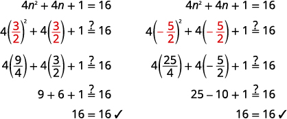

By the end of this section, you will be able to:
* Solve quadratic equations of the form
  <math xmlns="http://www.w3.org/1998/Math/MathML"><mrow><msup><mrow><mi>a</mi><mi>x</mi></mrow><mrow><mn>2</mn></mrow></msup><mo>=</mo><mi>k</mi></mrow></math>
  
  using the Square Root Property
* Solve quadratic equations of the form
  <math xmlns="http://www.w3.org/1998/Math/MathML"><mrow><mi>a</mi><msup><mrow><mo stretchy="false">(</mo><mi>x</mi><mo>–</mo><mi>h</mi><mo stretchy="false">)</mo></mrow><mrow><mn>2</mn></mrow></msup><mo>=</mo><mi>k</mi></mrow></math>
  
  using the Square Root Property

Before you get started, take this readiness quiz.**

1.  Simplify:
    <math xmlns="http://www.w3.org/1998/Math/MathML"><mrow><msqrt><mrow><mn>128</mn></mrow></msqrt><mo>.</mo></mrow></math>
    
    * * *
    {: data-type="newline"}
    
    If you missed this problem, review [\[link\]](/m63396#fs-id1169144556679).
2.  Simplify:
    <math xmlns="http://www.w3.org/1998/Math/MathML"><mrow><msqrt><mrow><mfrac><mrow><mn>32</mn></mrow><mn>5</mn></mfrac></mrow></msqrt></mrow></math>
    
    .
    * * *
    {: data-type="newline"}
    
    If you missed this problem, review [\[link\]](/m63418#fs-id1169146612955).
3.  Factor:
    <math xmlns="http://www.w3.org/1998/Math/MathML"><mrow><mn>9</mn><msup><mi>x</mi><mn>2</mn></msup><mo>−</mo><mn>12</mn><mi>x</mi><mo>+</mo><mn>4</mn></mrow></math>
    
    .
    * * *
    {: data-type="newline"}
    
    If you missed this problem, review [\[link\]](/m63360#fs-id1167832056529).
{: type="1"}

A **quadratic equation**{: data-type="term" .no-emphasis} is an equation of the form *ax*2 + *bx* + *c* = 0, where <math xmlns="http://www.w3.org/1998/Math/MathML"><mrow><mi>a</mi><mo>≠</mo><mn>0</mn></mrow></math>

. Quadratic equations differ from linear equations by including a quadratic term with the variable raised to the second power of the form *ax*2. We use different methods to solve quadratic equations than linear equations, because just adding, subtracting, multiplying, and dividing terms will not isolate the variable.

We have seen that some quadratic equations can be solved by factoring. In this chapter, we will learn three other methods to use in case a quadratic equation cannot be factored.

### Solve Quadratic Equations of the form <math xmlns="http://www.w3.org/1998/Math/MathML"><mi>a</mi><msup><mi>x</mi><mn>2</mn></msup><mo>=</mo><mi>k</mi></math>

 using the Square Root Property

We have already solved some quadratic equations by factoring. Let’s review how we used factoring to solve the quadratic equation *x*2 = 9.

<math xmlns="http://www.w3.org/1998/Math/MathML"><mrow><mtable><mtr><mtd columnalign="left"><mtable><mtr /><mtr /><mtr /><mtr><mtd columnalign="left"><mtext>Put the equation in standard form.</mtext></mtd></mtr><mtr><mtd columnalign="left"><mtext>Factor the difference of squares.</mtext></mtd></mtr></mtable></mtd><mtd /><mtd /><mtd columnalign="center"><mtable><mtr><mtd columnalign="right"><msup><mi>x</mi><mn>2</mn></msup></mtd><mtd columnalign="left"><mo>=</mo></mtd><mtd columnalign="left"><mn>9</mn></mtd></mtr><mtr><mtd columnalign="right"><msup><mi>x</mi><mn>2</mn></msup><mo>−</mo><mn>9</mn></mtd><mtd columnalign="left"><mo>=</mo></mtd><mtd columnalign="left"><mn>0</mn></mtd></mtr><mtr><mtd columnalign="right"><mrow><mo>(</mo><mrow><mi>x</mi><mo>−</mo><mn>3</mn></mrow><mo>)</mo></mrow><mrow><mo>(</mo><mrow><mi>x</mi><mo>+</mo><mn>3</mn></mrow><mo>)</mo></mrow></mtd><mtd columnalign="left"><mo>=</mo></mtd><mtd columnalign="left"><mn>0</mn></mtd></mtr></mtable></mtd></mtr><mtr><mtd columnalign="left"><mtable><mtr><mtd columnalign="left"><mtext>Use the Zero Product Property.</mtext></mtd></mtr><mtr><mtd columnalign="left"><mtext>Solve each equation.</mtext></mtd></mtr></mtable></mtd><mtd /><mtd /><mtd columnalign="center"><mtable><mtr><mtd columnalign="right"><mi>x</mi><mo>−</mo><mn>3</mn></mtd><mtd columnalign="left"><mo>=</mo></mtd><mtd columnalign="left"><mn>0</mn></mtd><mtd /><mtd /><mtd columnalign="right"><mi>x</mi><mo>−</mo><mn>3</mn></mtd><mtd columnalign="left"><mo>=</mo></mtd><mtd columnalign="left"><mn>0</mn></mtd></mtr><mtr><mtd columnalign="right"><mi>x</mi></mtd><mtd columnalign="left"><mo>=</mo></mtd><mtd columnalign="left"><mn>3</mn></mtd><mtd /><mtd /><mtd columnalign="right"><mi>x</mi></mtd><mtd columnalign="left"><mo>=</mo></mtd><mtd columnalign="left"><mn>−3</mn></mtd></mtr></mtable></mtd></mtr></mtable></mrow></math>

We can easily use factoring to find the solutions of similar equations, like *x*2 = 16 and *x*2 = 25, because 16 and 25 are perfect squares. In each case, we would get two solutions, <math xmlns="http://www.w3.org/1998/Math/MathML"><mrow><mi>x</mi><mo>=</mo><mn>4</mn><mo>,</mo><mi>x</mi><mo>=</mo><mn>−4</mn></mrow></math>

 and <math xmlns="http://www.w3.org/1998/Math/MathML"><mrow><mi>x</mi><mo>=</mo><mn>5</mn><mo>,</mo><mi>x</mi><mo>=</mo><mn>−5</mn><mo>.</mo></mrow></math>

But what happens when we have an equation like *x*2 = 7? Since 7 is not a perfect square, we cannot solve the equation by factoring.

Previously we learned that since 169 is the square of 13, we can also say that 13 is a *square root* of 169. Also, (−13)2 = 169, so −13 is also a square root of 169. Therefore, both 13 and −13 are square roots of 169. So, every positive number has two square roots—one positive and one negative. We earlier defined the square root of a number in this way:

<math xmlns="http://www.w3.org/1998/Math/MathML"><mrow><mtext>If</mtext><mspace width="0.2em" /><msup><mi>n</mi><mn>2</mn></msup><mo>=</mo><mi>m</mi><mo>,</mo><mspace width="0.2em" /><mtext>then</mtext><mspace width="0.2em" /><mi>n</mi><mspace width="0.2em" /><mtext>is a square root of</mtext><mspace width="0.2em" /><mi>m</mi><mo>.</mo></mrow></math>

Since these equations are all of the form *x*2 = *k*, the square root definition tells us the solutions are the two square roots of *k*. This leads to the **Square Root Property**{: data-type="term"}.

Square Root Property

If *x*2 = *k*, then

<math xmlns="http://www.w3.org/1998/Math/MathML"><mrow><mi>x</mi><mo>=</mo><msqrt><mrow><mi>k</mi></mrow></msqrt><mspace width="1em" /><mtext>or</mtext><mspace width="1em" /><mi>x</mi><mo>=</mo><mtext>−</mtext><msqrt><mi>k</mi></msqrt><mspace width="1em" /><mtext>or</mtext><mspace width="1em" /><mi>x</mi><mo>=</mo><mo>±</mo><msqrt><mi>k</mi></msqrt><mo>.</mo></mrow></math>

Notice that the Square Root Property gives two solutions to an equation of the form *x*2 = *k*, the principal square root of <math xmlns="http://www.w3.org/1998/Math/MathML"><mi>k</mi></math>

 and its opposite. We could also write the solution as <math xmlns="http://www.w3.org/1998/Math/MathML"><mrow><mi>x</mi><mo>=</mo><mo>±</mo><msqrt><mi>k</mi></msqrt><mo>.</mo></mrow></math>

 We read this as *x* equals positive or negative the square root of *k*.

Now we will solve the equation *x*2 = 9 again, this time using the Square Root Property.

<math xmlns="http://www.w3.org/1998/Math/MathML"><mrow><mtable><mtr><mtd columnalign="left"><mtable><mtr /><mtr /><mtr /><mtr><mtd columnalign="left"><mtext>Use the Square Root Property.</mtext></mtd></mtr><mtr /><mtr /><mtr /></mtable></mtd><mtd /><mtd /><mtd columnalign="center"><mtable><mtr><mtd columnalign="right"><msup><mi>x</mi><mn>2</mn></msup></mtd><mtd columnalign="left"><mo>=</mo></mtd><mtd columnalign="left"><mn>9</mn></mtd></mtr><mtr><mtd columnalign="right"><mi>x</mi></mtd><mtd columnalign="left"><mo>=</mo></mtd><mtd columnalign="left"><mo>±</mo><msqrt><mn>9</mn></msqrt></mtd></mtr><mtr><mtd columnalign="right"><mi>x</mi></mtd><mtd columnalign="left"><mo>=</mo></mtd><mtd columnalign="left"><mo>±</mo><mn>3</mn></mtd></mtr></mtable></mtd></mtr><mtr><mtd /><mtd /><mtd /><mtd columnalign="center"><mtext>So</mtext><mspace width="0.2em" /><mi>x</mi><mo>=</mo><mn>3</mn><mspace width="0.5em" /><mtext>or</mtext><mspace width="0.5em" /><mi>x</mi><mo>=</mo><mn>−3</mn><mo>.</mo></mtd></mtr></mtable></mrow></math>

What happens when the constant is not a perfect square? Let’s use the Square Root Property to solve the equation *x*2 = 7.

<math xmlns="http://www.w3.org/1998/Math/MathML"><mrow><mtable><mtr><mtd /><mtd /><mtd /><mtd columnalign="center"><msup><mi>x</mi><mn>2</mn></msup><mo>=</mo><mn>7</mn></mtd></mtr><mtr><mtd columnalign="left"><mtext>Use the Square Root Property.</mtext></mtd><mtd /><mtd /><mtd columnalign="center"><mi>x</mi><mo>=</mo><msqrt><mn>7</mn></msqrt><mo>,</mo><mspace width="1em" /><mi>x</mi><mo>=</mo><mtext>−</mtext><msqrt><mn>7</mn></msqrt></mtd></mtr></mtable></mrow></math>

We cannot simplify <math xmlns="http://www.w3.org/1998/Math/MathML"><mrow><msqrt><mn>7</mn></msqrt></mrow></math>

, so we leave the answer as a radical.

How to solve a Quadratic Equation of the form *ax*2 = *k* Using the Square Root Property

Solve: <math xmlns="http://www.w3.org/1998/Math/MathML"><mrow><msup><mi>x</mi><mn>2</mn></msup><mo>−</mo><mn>50</mn><mo>=</mo><mn>0</mn><mo>.</mo></mrow></math>

          ![Step four is to check the solutions. Substitute x equals five times the square root of five and or x equals negative five times the square root of five into the original equation. Start with x equals five times the square root of five. x squared minus fifty equals zero. Does the square of five times the square root of five minus fifty equal zero? Does twenty five times two minus fifty equal zero? Yes, because zero equals zero. Next check x equals negative five times the square root of five. x squared minus fifty equals zero. Does the square of negative five times the square root of five minus fifty equal zero? Does twenty five times two minus fifty equal zero? Yes, because zero equals zero.](../resources/CNX_IntAlg_Figure_09_01_001d_img.jpg) 

Solve: <math xmlns="http://www.w3.org/1998/Math/MathML"><mrow><msup><mi>x</mi><mn>2</mn></msup><mo>−</mo><mn>48</mn><mo>=</mo><mn>0</mn><mo>.</mo></mrow></math>

<math xmlns="http://www.w3.org/1998/Math/MathML"><mrow><mi>x</mi><mo>=</mo><mn>4</mn><msqrt><mn>3</mn></msqrt><mo>,</mo><mi>x</mi><mo>=</mo><mn>−4</mn><msqrt><mn>3</mn></msqrt></mrow></math>

Solve: <math xmlns="http://www.w3.org/1998/Math/MathML"><mrow><msup><mi>y</mi><mn>2</mn></msup><mo>−</mo><mn>27</mn><mo>=</mo><mn>0</mn><mo>.</mo></mrow></math>

<math xmlns="http://www.w3.org/1998/Math/MathML"><mrow><mi>y</mi><mo>=</mo><mn>3</mn><msqrt><mn>3</mn></msqrt><mo>,</mo><mi>y</mi><mo>=</mo><mn>−3</mn><msqrt><mn>3</mn></msqrt></mrow></math>

The steps to take to use the **Square Root Property**{: data-type="term" .no-emphasis} to solve a quadratic equation are listed here.

Solve a quadratic equation using the square root property.

1.  Isolate the quadratic term and make its coefficient one.
2.  Use Square Root Property.
3.  Simplify the radical.
4.  Check the solutions.
{: type="1" .stepwise}

In order to use the Square Root Property, the coefficient of the variable term must equal one. In the next example, we must divide both sides of the equation by the coefficient 3 before using the Square Root Property.

Solve: <math xmlns="http://www.w3.org/1998/Math/MathML"><mrow><mn>3</mn><msup><mi>z</mi><mn>2</mn></msup><mo>=</mo><mn>108</mn><mo>.</mo></mrow></math>

<table class="unnumbered unstyled" summary="Start with the equation three times z squared equals one hundred eight. The quadratic term is isolated, so divide by 3 to make its coefficient 1. Three times z squared divided by three equals one hundred eight divided by three. Simplify to find that z squared equals thirty six. Use the Square Root Property to see that z equals positive or negative square root thirty six. Simplify the radical. Z equals positive or negative six. Rewrite to show two solutions. z equals six or z equals negative six. Check the solutions by substituting each value into the original equation, three times z squared equals one hundred eight. Start with z equals six. Substituting yields three times the square of six, or three times thirty six. Three times thirty six equals one hundred eight, so z equals six is a solution of the original equation. Next substitute z equals negative six. Three times the square of negative six is equivalent to three times thirty six, or one hundred eight. z equals negative six is also a solution." data-label=""><tbody>
<tr>
<td />
<td data-valign="top" data-align="center"><math xmlns="http://www.w3.org/1998/Math/MathML"><mrow><mn>3</mn><msup><mi>z</mi><mn>2</mn></msup><mo>=</mo><mn>108</mn></mrow></math></td>
</tr>
<tr>
<td data-valign="top" data-align="left">The quadratic term is isolated.

Divide by 3 to make its coefficient 1.</td>
<td data-valign="top" data-align="center"><math xmlns="http://www.w3.org/1998/Math/MathML"><mrow><mfrac><mrow><mn>3</mn><msup><mi>z</mi><mn>2</mn></msup></mrow><mn>3</mn></mfrac><mo>=</mo><mfrac><mrow><mn>108</mn></mrow><mn>3</mn></mfrac></mrow></math></td>
</tr>
<tr>
<td data-valign="top" data-align="left">Simplify.</td>
<td data-valign="top" data-align="center"><math xmlns="http://www.w3.org/1998/Math/MathML"><mrow><msup><mi>z</mi><mn>2</mn></msup><mo>=</mo><mn>36</mn></mrow></math></td>
</tr>
<tr>
<td data-valign="top" data-align="left">Use the Square Root Property.</td>
<td data-valign="top" data-align="center"><math xmlns="http://www.w3.org/1998/Math/MathML"><mrow><mspace width="2em" /><mi>z</mi><mo>=</mo><mo>±</mo><msqrt><mrow><mn>36</mn></mrow></msqrt></mrow></math></td>
</tr>
<tr>
<td data-valign="top" data-align="left">Simplify the radical.</td>
<td data-valign="top" data-align="center"><math xmlns="http://www.w3.org/1998/Math/MathML"><mrow><mspace width="1.1em" /><mi>z</mi><mo>=</mo><mo>±</mo><mn>6</mn></mrow></math></td>
</tr>
<tr>
<td data-valign="top" data-align="left">Rewrite to show two solutions.</td>
<td data-valign="top" data-align="center"><math xmlns="http://www.w3.org/1998/Math/MathML"><mrow><mi>z</mi><mo>=</mo><mn>6</mn><mo>,</mo><mspace width="0.5em" /><mi>z</mi><mo>=</mo><mn>−6</mn></mrow></math></td>
</tr>
<tr>
<td data-valign="top" data-align="left">Check the solutions:

</td>
<td />
</tr>
</tbody></table>

Solve: <math xmlns="http://www.w3.org/1998/Math/MathML"><mrow><mn>2</mn><msup><mi>x</mi><mn>2</mn></msup><mo>=</mo><mn>98</mn><mo>.</mo></mrow></math>

<math xmlns="http://www.w3.org/1998/Math/MathML"><mrow><mi>x</mi><mo>=</mo><mn>7</mn><mo>,</mo><mi>x</mi><mo>=</mo><mn>−7</mn></mrow></math>

Solve: <math xmlns="http://www.w3.org/1998/Math/MathML"><mrow><mn>5</mn><msup><mi>m</mi><mn>2</mn></msup><mo>=</mo><mn>80</mn><mo>.</mo></mrow></math>

<math xmlns="http://www.w3.org/1998/Math/MathML"><mrow><mi>m</mi><mo>=</mo><mn>4</mn><mo>,</mo><mi>m</mi><mo>=</mo><mn>−4</mn></mrow></math>

The Square Root Property states ‘If <math xmlns="http://www.w3.org/1998/Math/MathML"><mrow><msup><mi>x</mi><mn>2</mn></msup><mo>=</mo><mi>k</mi></mrow></math>

,’ What will happen if <math xmlns="http://www.w3.org/1998/Math/MathML"><mrow><mi>k</mi><mo>&lt;</mo><mn>0</mn><mo>?</mo></mrow></math>

 This will be the case in the next example.

Solve: <math xmlns="http://www.w3.org/1998/Math/MathML"><mrow><msup><mi>x</mi><mn>2</mn></msup><mo>+</mo><mn>72</mn><mo>=</mo><mn>0</mn></mrow></math>

.

<table class="unnumbered unstyled can-break" summary="Solve the equation x squared plus seventy two equals zero. Isolate the quadratic term to yield x squared equals negative seventy two. Use the Square Root Property to see that x equals the positive or negative square root of negative seventy two. Simplify using complex numbers to rewrite as x equals the positive or negative square root of seventy two times I. Simplify the radical: x equals positive or negative six time the square root of two times I. Rewrite to show two solutions: x equals six square root two I or x equals negative six square root two I. Check the solutions by substituting each value into the original equation, x squared plus seventy two equals zero. Start with x equals six square root two I. Substituting yields the square of six square root two i, which can be rewritten as six squared times the square of square root two times I squared. Next simplify the resulting expression: the product of thirty six, two, and negative one added to seventy two. This expression equals zero, so six square root two I is a solution. Then substitute negative six square root two I. Squaring this value gives thirty six times two times negative one. This product equals negative seventy two, and the sum of negative seventy two and seventy two equals zero. Negative six square root two I is also a solution." data-label=""><tbody>
<tr>
<td />
<td data-valign="top" data-align="left"><math xmlns="http://www.w3.org/1998/Math/MathML"><mrow><msup><mi>x</mi><mn>2</mn></msup><mo>+</mo><mn>72</mn><mo>=</mo><mn>0</mn></mrow></math></td>
</tr>
<tr>
<td data-valign="top" data-align="left">Isolate the quadratic term.</td>
<td data-valign="top" data-align="left"><math xmlns="http://www.w3.org/1998/Math/MathML"><mrow><mspace width="2.15em" /><msup><mi>x</mi><mn>2</mn></msup><mo>=</mo><mn>−72</mn></mrow></math></td>
</tr>
<tr>
<td data-valign="top" data-align="left">Use the Square Root Property.</td>
<td data-valign="top" data-align="left"><math xmlns="http://www.w3.org/1998/Math/MathML"><mrow><mspace width="2.6em" /><mi>x</mi><mo>=</mo><mo>±</mo><msqrt><mrow><mn>−72</mn></mrow></msqrt></mrow></math></td>
</tr>
<tr>
<td data-valign="top" data-align="left">Simplify using complex numbers.</td>
<td data-valign="top" data-align="left"><math xmlns="http://www.w3.org/1998/Math/MathML"><mrow><mspace width="2.6em" /><mi>x</mi><mo>=</mo><mo>±</mo><msqrt><mrow><mn>72</mn></mrow></msqrt><mspace width="0.2em" /><mi>i</mi></mrow></math></td>
</tr>
<tr>
<td data-valign="top" data-align="left">Simplify the radical.</td>
<td data-valign="top" data-align="left"><math xmlns="http://www.w3.org/1998/Math/MathML"><mrow><mspace width="2.6em" /><mi>x</mi><mo>=</mo><mo>±</mo><mn>6</mn><msqrt><mn>2</mn></msqrt><mspace width="0.2em" /><mi>i</mi></mrow></math></td>
</tr>
<tr>
<td data-valign="top" data-align="left">Rewrite to show two solutions.</td>
<td data-valign="top" data-align="left"><math xmlns="http://www.w3.org/1998/Math/MathML"><mrow><mi>x</mi><mo>=</mo><mn>6</mn><msqrt><mn>2</mn></msqrt><mspace width="0.2em" /><mi>i</mi><mo>,</mo><mspace width="0.5em" /><mi>x</mi><mo>=</mo><mn>−6</mn><msqrt><mn>2</mn></msqrt><mspace width="0.2em" /><mi>i</mi></mrow></math></td>
</tr>
<tr>
<td data-valign="top" data-align="left">Check the solutions:

</td>
<td />
</tr>
</tbody></table>

Solve: <math xmlns="http://www.w3.org/1998/Math/MathML"><mrow><msup><mi>c</mi><mn>2</mn></msup><mo>+</mo><mn>12</mn><mo>=</mo><mn>0</mn><mo>.</mo></mrow></math>

<math xmlns="http://www.w3.org/1998/Math/MathML"><mrow><mi>c</mi><mo>=</mo><mn>2</mn><msqrt><mn>3</mn></msqrt><mi>i</mi><mo>,</mo><mspace width="0.2em" /><mtext /><mspace width="0.2em" /><mi>c</mi><mo>=</mo><mn>−2</mn><msqrt><mn>3</mn></msqrt><mi>i</mi></mrow></math>

Solve: <math xmlns="http://www.w3.org/1998/Math/MathML"><mrow><msup><mi>q</mi><mn>2</mn></msup><mo>+</mo><mn>24</mn><mo>=</mo><mn>0</mn><mo>.</mo></mrow></math>

<math xmlns="http://www.w3.org/1998/Math/MathML"><mrow><mi>c</mi><mo>=</mo><mn>2</mn><msqrt><mn>6</mn></msqrt><mi>i</mi><mo>,</mo><mspace width="0.2em" /><mtext /><mspace width="0.2em" /><mi>c</mi><mo>=</mo><mn>−2</mn><msqrt><mn>6</mn></msqrt><mi>i</mi></mrow></math>

Our method also works when fractions occur in the equation, we solve as any equation with fractions. In the next example, we first isolate the quadratic term, and then make the coefficient equal to one.

Solve: <math xmlns="http://www.w3.org/1998/Math/MathML"><mrow><mfrac><mn>2</mn><mn>3</mn></mfrac><msup><mi>u</mi><mn>2</mn></msup><mo>+</mo><mn>5</mn><mo>=</mo><mn>17</mn><mo>.</mo></mrow></math>

<table class="unnumbered unstyled can-break" summary="Solve the equation two thirds u squared plus five equals seventeen. Isolate the quadratic term to yield two thirds u squared equals twelve. The coefficient of u squared is two thirds, so multiply both sides of the equation by three halves. Simplifying yields u squared equals eighteen. Use the Square Root Property to see that u equals the positive or negative square root of eighteen. Simplify the radical rewriting the square root of eighteen as the product of the square root of nine and the square root of two. Simplifying shows u equals positive or negative three times the square root of two. Rewrite to show two solutions: u equals three square root two or u equals negative three square root two. Check the solutions by substituting each value into the original equation, two thirds u squared plus five equals seventeen. Start with u equals three square root two. Substituting on the left side of the equation yields the sum of two thirds times the square of three square root two and five. We need to show that this expression equals seventeen. Simplifying the square gives the sum of two thirds times eighteen and five. Finding the product gives twelve times five, which is equal to seventeen. This value, three square root two, is a solution of the original equation. Next check the value u equals negative three square root two. Substitute this value for u in the original equation. Simplifying the square yields two thirds times eighteen plus five. We need to show that this expression equals seventeen. Two thirds times eighteen plus five equals twelve plus five, or seventeen. So negative three square root two a solution." data-label=""><tbody>
<tr>
<td />
<td data-valign="top" data-align="left"><math xmlns="http://www.w3.org/1998/Math/MathML"><mrow><mfrac><mn>2</mn><mn>3</mn></mfrac><msup><mi>u</mi><mn>2</mn></msup><mo>+</mo><mn>5</mn><mo>=</mo><mn>17</mn></mrow></math></td>
</tr>
<tr>
<td data-valign="top" data-align="left">Isolate the quadratic term.</td>
<td data-valign="top" data-align="left"></td>
</tr>
<tr>
<td data-valign="top" data-align="left">Multiply by <math xmlns="http://www.w3.org/1998/Math/MathML"><mrow><mfrac><mn>3</mn><mn>2</mn></mfrac></mrow></math> to make the coefficient 1.</td>
<td data-valign="top" data-align="left"></td>
</tr>
<tr>
<td data-valign="top" data-align="left">Simplify.</td>
<td data-valign="top" data-align="left"></td>
</tr>
<tr>
<td data-valign="top" data-align="left">Use the Square Root Property.</td>
<td data-valign="top" data-align="left"></td>
</tr>
<tr>
<td data-valign="top" data-align="left">Simplify the radical.</td>
<td data-valign="top" data-align="left"></td>
</tr>
<tr>
<td data-valign="top" data-align="left">Simplify.</td>
<td data-valign="top" data-align="left"></td>
</tr>
<tr>
<td data-valign="top" data-align="left">Rewrite to show two solutions.</td>
<td data-valign="top" data-align="left"></td>
</tr>
<tr>
<td data-valign="top" data-align="left">Check:

</td>
<td />
</tr>
</tbody></table>

Solve: <math xmlns="http://www.w3.org/1998/Math/MathML"><mrow><mfrac><mn>1</mn><mn>2</mn></mfrac><msup><mi>x</mi><mn>2</mn></msup><mo>+</mo><mn>4</mn><mo>=</mo><mn>24</mn><mo>.</mo></mrow></math>

<math xmlns="http://www.w3.org/1998/Math/MathML"><mrow><mi>x</mi><mo>=</mo><mn>2</mn><msqrt><mrow><mn>10</mn></mrow></msqrt><mo>,</mo><mspace width="0.5em" /><mi>x</mi><mo>=</mo><mn>−2</mn><msqrt><mrow><mn>10</mn></mrow></msqrt></mrow></math>

Solve: <math xmlns="http://www.w3.org/1998/Math/MathML"><mrow><mfrac><mn>3</mn><mn>4</mn></mfrac><msup><mi>y</mi><mn>2</mn></msup><mo>−</mo><mn>3</mn><mo>=</mo><mn>18</mn><mo>.</mo></mrow></math>

<math xmlns="http://www.w3.org/1998/Math/MathML"><mrow><mi>y</mi><mo>=</mo><mn>2</mn><msqrt><mn>7</mn></msqrt><mo>,</mo><mspace width="0.5em" /><mi>y</mi><mo>=</mo><mn>−2</mn><msqrt><mn>7</mn></msqrt></mrow></math>

The solutions to some equations may have fractions inside the radicals. When this happens, we must **rationalize the denominator**{: data-type="term" .no-emphasis}.

Solve: <math xmlns="http://www.w3.org/1998/Math/MathML"><mrow><mn>2</mn><msup><mi>x</mi><mn>2</mn></msup><mo>−</mo><mn>8</mn><mo>=</mo><mn>41</mn><mo>.</mo></mrow></math>

<table class="unnumbered unstyled can-break" summary="Solve the equation two times x squared minus eight equals forty one. Isolate the quadratic term to yield two times x squared equals forty nine. Divide both sides of the equation by two to make the leading coefficient one. Simplify so that the equation becomes x squared equals forty nine halves. Use the Square Root Property to see that x equals the positive or negative square root of forty nine halves. Simplify the radical rewriting the square root of forty nine divided by two as the quotient of the square root of forty nine and the square root of two. Rationalize the denominator by multiplying both the numerator and denominator on the right side of the equation by the square root of two. Simplifying shows x equals positive or negative seven times the square root of two divided by two. Rewrite to show two solutions: x equals seven square root two divided by two or x equals negative seven square root two divided by two. We leave the check for you." data-label=""><tbody>
<tr>
<td />
<td data-valign="top" data-align="left">

</td>
</tr>
<tr>
<td data-valign="top" data-align="left">Isolate the quadratic term.</td>
<td data-valign="top" data-align="left">

</td>
</tr>
<tr>
<td data-valign="top" data-align="left">Divide by <math xmlns="http://www.w3.org/1998/Math/MathML"><mn>2</mn></math> to make the coefficient 1.</td>
<td data-valign="top" data-align="left">

</td>
</tr>
<tr>
<td data-valign="top" data-align="left">Simplify.</td>
<td data-valign="top" data-align="left">

</td>
</tr>
<tr>
<td data-valign="top" data-align="left">Use the Square Root Property.</td>
<td data-valign="top" data-align="left">

</td>
</tr>
<tr>
<td data-valign="top" data-align="left">Rewrite the radical as a fraction of square roots.</td>
<td data-valign="top" data-align="left">

</td>
</tr>
<tr>
<td data-valign="top" data-align="left">Rationalize the denominator.</td>
<td data-valign="top" data-align="left">

</td>
</tr>
<tr>
<td data-valign="top" data-align="left">Simplify.</td>
<td data-valign="top" data-align="left">

</td>
</tr>
<tr>
<td data-valign="top" data-align="left">Rewrite to show two solutions.</td>
<td data-valign="top" data-align="left">

</td>
</tr>
<tr>
<td data-valign="top" data-align="left">Check:
We leave the check for you.</td>
<td />
</tr>
</tbody></table>

Solve: <math xmlns="http://www.w3.org/1998/Math/MathML"><mrow><mn>5</mn><msup><mi>r</mi><mn>2</mn></msup><mo>−</mo><mn>2</mn><mo>=</mo><mn>34</mn><mo>.</mo></mrow></math>

<math xmlns="http://www.w3.org/1998/Math/MathML"><mrow><mi>r</mi><mo>=</mo><mfrac><mrow><mn>6</mn><msqrt><mn>5</mn></msqrt></mrow><mn>5</mn></mfrac><mo>,</mo><mspace width="0.5em" /><mi>r</mi><mo>=</mo><mo>−</mo><mfrac><mrow><mn>6</mn><msqrt><mn>5</mn></msqrt></mrow><mn>5</mn></mfrac></mrow></math>

Solve: <math xmlns="http://www.w3.org/1998/Math/MathML"><mrow><mn>3</mn><msup><mi>t</mi><mn>2</mn></msup><mo>+</mo><mn>6</mn><mo>=</mo><mn>70</mn><mo>.</mo></mrow></math>

<math xmlns="http://www.w3.org/1998/Math/MathML"><mrow><mi>t</mi><mo>=</mo><mfrac><mrow><mn>8</mn><msqrt><mn>3</mn></msqrt></mrow><mn>3</mn></mfrac><mo>,</mo><mspace width="0.5em" /><mi>t</mi><mo>=</mo><mo>−</mo><mfrac><mrow><mn>8</mn><msqrt><mn>3</mn></msqrt></mrow><mn>3</mn></mfrac></mrow></math>

### Solve Quadratic Equations of the Form *a*(*x* − *h*)2 = *k* Using the Square Root Property

We can use the **Square Root Property**{: data-type="term" .no-emphasis} to solve an equation of the form *a*(*x* − *h*)2 = *k* as well. Notice that the quadratic term, *x*, in the original form *ax*2 = *k* is replaced with (*x* − *h*).

    The first step, like before, is to isolate the term that has the variable squared. In this case, a binomial is being squared. Once the binomial is isolated, by dividing each side by the coefficient of *a*, then the Square Root Property can be used on (*x* − *h*)2.

Solve: <math xmlns="http://www.w3.org/1998/Math/MathML"><mrow><mn>4</mn><msup><mrow><mrow><mo>(</mo><mrow><mi>y</mi><mo>−</mo><mn>7</mn></mrow><mo>)</mo></mrow></mrow><mn>2</mn></msup><mo>=</mo><mn>48</mn><mo>.</mo></mrow></math>

<table class="unnumbered unstyled can-break" summary="Solve the equation four times the square of y minus seven equals forty eight. Divide both sides of the equation by the coefficient four. The square of y minus seven equals twelve. Use the Square Root Property on the binomial to yield y minus seven equals the positive or negative square root of twelve. Simplify the radical so the equation becomes y minus seven equals positive or negative two times square root three. Solve for y. y equals seven plus or minus two times square root three. Rewrite to show two solutions: y equals seven plus two times square root three and y equals seven minus two times square root three. Check the values in the original equation, four times the square of y minus seven equals forty eight. Start with y equals seven plus two times square root three. Substituting on the left side of the equation yields four times the square of the expression seven plus two square root three minus seven. We need to show that this expression equals forty eight. Simplifying the expression yields four times the square of two square root three. Simplifying the square gives four times twelve, which is equal to forty eight. This value, seven plus two times square root three, is a solution of the original equation. Next check the value y equals seven minus two times square root three. Substitute this value for y in the original equation. Four times the square of the expression seven minus two square root three minus seven simplifies to four times the square of negative two square root three. Simplify the square to yield four times twelve, or forty eight. So seven minus two times square root three." data-label=""><tbody>
<tr>
<td />
<td data-valign="top" data-align="left"><math xmlns="http://www.w3.org/1998/Math/MathML"><mrow><mn>4</mn><msup><mrow><mrow><mo>(</mo><mrow><mi>y</mi><mo>−</mo><mn>7</mn></mrow><mo>)</mo></mrow></mrow><mn>2</mn></msup><mo>=</mo><mn>48</mn></mrow></math></td>
</tr>
<tr>
<td data-valign="top" data-align="left">Divide both sides by the coefficient 4.</td>
<td data-valign="top" data-align="left"><math xmlns="http://www.w3.org/1998/Math/MathML"><mrow><mspace width="0.5em" /><msup><mrow><mrow><mo>(</mo><mrow><mi>y</mi><mo>−</mo><mn>7</mn></mrow><mo>)</mo></mrow></mrow><mn>2</mn></msup><mo>=</mo><mn>12</mn></mrow></math></td>
</tr>
<tr>
<td data-valign="top" data-align="left">Use the Square Root Property on the binomial</td>
<td data-valign="top" data-align="left"><math xmlns="http://www.w3.org/1998/Math/MathML"><mrow><mspace width="1.3em" /><mi>y</mi><mo>−</mo><mn>7</mn><mo>=</mo><mo>±</mo><msqrt><mrow><mn>12</mn></mrow></msqrt></mrow></math></td>
</tr>
<tr>
<td data-valign="top" data-align="left">Simplify the radical.</td>
<td data-valign="top" data-align="left"><math xmlns="http://www.w3.org/1998/Math/MathML"><mrow><mspace width="1.3em" /><mi>y</mi><mo>−</mo><mn>7</mn><mo>=</mo><mo>±</mo><mn>2</mn><msqrt><mn>3</mn></msqrt></mrow></math></td>
</tr>
<tr>
<td data-valign="top" data-align="left">Solve for <math xmlns="http://www.w3.org/1998/Math/MathML"><mi>y</mi><mo>.</mo></math></td>
<td data-valign="top" data-align="left"><math xmlns="http://www.w3.org/1998/Math/MathML"><mrow><mspace width="3em" /><mi>y</mi><mo>=</mo><mn>7</mn><mo>±</mo><mn>2</mn><msqrt><mn>3</mn></msqrt></mrow></math></td>
</tr>
<tr>
<td data-valign="top" data-align="left">Rewrite to show two solutions.</td>
<td data-valign="top" data-align="left"><math xmlns="http://www.w3.org/1998/Math/MathML"><mrow><mi>y</mi><mo>=</mo><mn>7</mn><mo>+</mo><mn>2</mn><msqrt><mn>3</mn></msqrt><mo>,</mo></mrow></math> <math xmlns="http://www.w3.org/1998/Math/MathML"><mrow><mi>y</mi><mo>=</mo><mn>7</mn><mo>−</mo><mn>2</mn><msqrt><mn>3</mn></msqrt></mrow></math></td>
</tr>
<tr>
<td data-valign="top" data-align="left">Check:

</td>
</tr>
</tbody></table>

Solve: <math xmlns="http://www.w3.org/1998/Math/MathML"><mrow><mn>3</mn><msup><mrow><mrow><mo>(</mo><mrow><mi>a</mi><mo>−</mo><mn>3</mn></mrow><mo>)</mo></mrow></mrow><mn>2</mn></msup><mo>=</mo><mn>54</mn><mo>.</mo></mrow></math>

<math xmlns="http://www.w3.org/1998/Math/MathML"><mrow><mi>a</mi><mo>=</mo><mn>3</mn><mo>+</mo><mn>3</mn><msqrt><mn>2</mn></msqrt><mo>,</mo><mspace width="0.5em" /><mi>a</mi><mo>=</mo><mn>3</mn><mo>−</mo><mn>3</mn><msqrt><mn>2</mn></msqrt></mrow></math>

Solve: <math xmlns="http://www.w3.org/1998/Math/MathML"><mrow><mn>2</mn><msup><mrow><mrow><mo>(</mo><mrow><mi>b</mi><mo>+</mo><mn>2</mn></mrow><mo>)</mo></mrow></mrow><mn>2</mn></msup><mo>=</mo><mn>80</mn><mo>.</mo></mrow></math>

<math xmlns="http://www.w3.org/1998/Math/MathML"><mrow><mi>b</mi><mo>=</mo><mn>−2</mn><mo>+</mo><mn>2</mn><msqrt><mrow><mn>10</mn></mrow></msqrt><mo>,</mo><mspace width="0.5em" /><mi>b</mi><mo>=</mo><mn>−2</mn><mo>−</mo><mn>2</mn><msqrt><mrow><mn>10</mn></mrow></msqrt></mrow></math>

Remember when we take the square root of a fraction, we can take the square root of the numerator and denominator separately.

Solve: <math xmlns="http://www.w3.org/1998/Math/MathML"><mrow><msup><mrow><mrow><mo>(</mo><mrow><mi>x</mi><mo>−</mo><mfrac><mn>1</mn><mn>3</mn></mfrac></mrow><mo>)</mo></mrow></mrow><mn>2</mn></msup><mo>=</mo><mfrac><mn>5</mn><mn>9</mn></mfrac><mo>.</mo></mrow></math>

<math xmlns="http://www.w3.org/1998/Math/MathML"><mrow><mtable><mtr><mtd columnalign="left"><mtable><mtr><mtd /><mtd /><mtd /><mtd columnalign="right"><msup><mrow><mrow><mo>(</mo><mrow><mi>x</mi><mo>−</mo><mfrac><mn>1</mn><mn>3</mn></mfrac></mrow><mo>)</mo></mrow></mrow><mn>2</mn></msup></mtd><mtd columnalign="left"><mo>=</mo></mtd><mtd columnalign="left"><mfrac><mn>5</mn><mn>9</mn></mfrac></mtd></mtr> <mtr /><mtr><mtd columnalign="left"><mtext>Use the Square Root Property.</mtext></mtd><mtd /><mtd /><mtd columnalign="right"><mi>x</mi><mo>−</mo><mfrac><mn>1</mn><mn>3</mn></mfrac></mtd><mtd columnalign="left"><mo>=</mo></mtd><mtd columnalign="left"><mo>±</mo><msqrt><mrow><mfrac><mn>5</mn><mn>9</mn></mfrac></mrow></msqrt></mtd></mtr> <mtr /><mtr><mtd columnalign="left"><mtext>Rewrite the radical as a fraction of square roots.</mtext></mtd><mtd /><mtd /><mtd columnalign="right"><mi>x</mi><mo>−</mo><mfrac><mn>1</mn><mn>3</mn></mfrac></mtd><mtd columnalign="left"><mo>=</mo></mtd><mtd columnalign="left"><mo>±</mo><mfrac><mrow><msqrt><mn>5</mn></msqrt></mrow><mrow><msqrt><mn>9</mn></msqrt></mrow></mfrac></mtd></mtr> <mtr /><mtr><mtd columnalign="left"><mtext>Simplify the radical.</mtext></mtd><mtd /><mtd /><mtd columnalign="right"><mi>x</mi><mo>−</mo><mfrac><mn>1</mn><mn>3</mn></mfrac></mtd><mtd columnalign="left"><mo>=</mo></mtd><mtd columnalign="left"><mo>±</mo><mfrac><mrow><msqrt><mn>5</mn></msqrt></mrow><mn>3</mn></mfrac></mtd></mtr> <mtr /><mtr><mtd columnalign="left"><mtext>Solve for</mtext><mspace width="0.2em" /><mi>x</mi><mo>.</mo></mtd><mtd /><mtd /><mtd columnalign="right"><mi>x</mi></mtd><mtd columnalign="left"><mo>=</mo></mtd><mtd columnalign="left"><mfrac><mn>1</mn><mn>3</mn></mfrac><mo>±</mo><mfrac><mrow><msqrt><mn>5</mn></msqrt></mrow><mn>3</mn></mfrac></mtd></mtr></mtable></mtd></mtr> <mtr /><mtr><mtd columnalign="left"><mtext>Rewrite to show two solutions.</mtext><mspace width="7em" /><mi>x</mi><mo>=</mo><mfrac><mn>1</mn><mn>3</mn></mfrac><mo>+</mo><mfrac><mrow><msqrt><mn>5</mn></msqrt></mrow><mn>3</mn></mfrac><mo>,</mo><mspace width="0.5em" /><mi>x</mi><mo>=</mo><mfrac><mn>1</mn><mn>3</mn></mfrac><mo>−</mo><mfrac><mrow><msqrt><mn>5</mn></msqrt></mrow><mn>3</mn></mfrac></mtd></mtr> <mtr /><mtr><mtd columnalign="left"><mtext>Check:</mtext></mtd><mtd /><mtd /><mtd /><mtd /><mtd /></mtr> <mtr><mtd columnalign="left"><mtext>We leave the check for you.</mtext></mtd><mtd /><mtd /><mtd /><mtd /><mtd /></mtr> </mtable></mrow></math>

Solve: <math xmlns="http://www.w3.org/1998/Math/MathML"><mrow><msup><mrow><mrow><mo>(</mo><mrow><mi>x</mi><mo>−</mo><mfrac><mn>1</mn><mn>2</mn></mfrac></mrow><mo>)</mo></mrow></mrow><mn>2</mn></msup><mo>=</mo><mfrac><mn>5</mn><mn>4</mn></mfrac><mo>.</mo></mrow></math>

<math xmlns="http://www.w3.org/1998/Math/MathML"><mrow><mi>x</mi><mo>=</mo><mfrac><mn>1</mn><mn>2</mn></mfrac><mo>+</mo><mfrac><mrow><msqrt><mn>5</mn></msqrt></mrow><mn>2</mn></mfrac></mrow></math>

,<math xmlns="http://www.w3.org/1998/Math/MathML"><mrow><mi>x</mi><mo>=</mo><mfrac><mn>1</mn><mn>2</mn></mfrac><mo>−</mo><mfrac><mrow><msqrt><mn>5</mn></msqrt></mrow><mn>2</mn></mfrac></mrow></math>

Solve: <math xmlns="http://www.w3.org/1998/Math/MathML"><mrow><msup><mrow><mrow><mo>(</mo><mrow><mi>y</mi><mo>+</mo><mfrac><mn>3</mn><mn>4</mn></mfrac></mrow><mo>)</mo></mrow></mrow><mn>2</mn></msup><mo>=</mo><mfrac><mn>7</mn><mrow><mn>16</mn></mrow></mfrac><mo>.</mo></mrow></math>

<math xmlns="http://www.w3.org/1998/Math/MathML"><mrow><mi>y</mi><mo>=</mo><mo>−</mo><mfrac><mn>3</mn><mn>4</mn></mfrac><mo>+</mo><mfrac><mrow><msqrt><mn>7</mn></msqrt></mrow><mn>4</mn></mfrac><mo>,</mo><mspace width="0.5em" /><mi>y</mi><mo>=</mo><mo>−</mo><mfrac><mn>3</mn><mn>4</mn></mfrac><mo>−</mo><mfrac><mrow><msqrt><mn>7</mn></msqrt></mrow><mn>4</mn></mfrac></mrow></math>

We will start the solution to the next example by isolating the binomial term.

Solve: <math xmlns="http://www.w3.org/1998/Math/MathML"><mrow><mn>2</mn><msup><mrow><mrow><mo>(</mo><mrow><mi>x</mi><mo>−</mo><mn>2</mn></mrow><mo>)</mo></mrow></mrow><mn>2</mn></msup><mo>+</mo><mn>3</mn><mo>=</mo><mn>57</mn><mo>.</mo></mrow></math>

<math xmlns="http://www.w3.org/1998/Math/MathML"><mrow><mtable><mtr><mtd columnalign="left"><mtable><mtr /><mtr /><mtr><mtd columnalign="left"><mtext>Subtract 3 from both sides to isolate</mtext></mtd></mtr><mtr><mtd columnalign="left"><mtext>the binomial term.</mtext></mtd></mtr><mtr><mtd columnalign="left"><mtext>Divide both sides by 2.</mtext></mtd></mtr><mtr><mtd columnalign="left"><mtext>Use the Square Root Property.</mtext></mtd></mtr><mtr><mtd columnalign="left"><mtext>Simplify the radical.</mtext></mtd></mtr><mtr><mtd columnalign="left"><mtext>Solve for</mtext><mspace width="0.2em" /><mi>x</mi><mo>.</mo></mtd></mtr></mtable></mtd><mtd /><mtd /><mtd columnalign="center"><mtable><mtr><mtd columnalign="right"><mn>2</mn><msup><mrow><mrow><mo>(</mo><mrow><mi>x</mi><mo>−</mo><mn>2</mn></mrow><mo>)</mo></mrow></mrow><mn>2</mn></msup><mo>+</mo><mn>3</mn></mtd><mtd columnalign="left"><mo>=</mo></mtd><mtd columnalign="left"><mn>57</mn></mtd></mtr><mtr><mtd columnalign="right"><mn>2</mn><msup><mrow><mrow><mo>(</mo><mrow><mi>x</mi><mo>−</mo><mn>2</mn></mrow><mo>)</mo></mrow></mrow><mn>2</mn></msup></mtd><mtd columnalign="left"><mo>=</mo></mtd><mtd columnalign="left"><mn>54</mn></mtd></mtr><mtr><mtd columnalign="right"><msup><mrow><mrow><mo>(</mo><mrow><mi>x</mi><mo>−</mo><mn>2</mn></mrow><mo>)</mo></mrow></mrow><mn>2</mn></msup></mtd><mtd columnalign="left"><mo>=</mo></mtd><mtd columnalign="left"><mn>27</mn></mtd></mtr><mtr><mtd columnalign="right"><mi>x</mi><mo>−</mo><mn>2</mn></mtd><mtd columnalign="left"><mo>=</mo></mtd><mtd columnalign="left"><mo>±</mo><msqrt><mrow><mn>27</mn></mrow></msqrt></mtd></mtr><mtr><mtd columnalign="right"><mi>x</mi><mo>−</mo><mn>2</mn></mtd><mtd columnalign="left"><mo>=</mo></mtd><mtd columnalign="left"><mo>±</mo><mn>3</mn><msqrt><mrow><mn>3</mn></mrow></msqrt></mtd></mtr><mtr><mtd columnalign="right"><mi>x</mi></mtd><mtd columnalign="left"><mo>=</mo></mtd><mtd columnalign="left"><mn>2</mn><mo>±</mo><mn>3</mn><msqrt><mrow><mn>3</mn></mrow></msqrt></mtd></mtr></mtable></mtd></mtr> <mtr><mtd columnalign="left"><mtext>Rewrite to show two solutions.</mtext></mtd><mtd /><mtd /><mtd columnalign="center"><mi>x</mi><mo>=</mo><mn>2</mn><mo>+</mo><mn>3</mn><msqrt><mrow><mn>3</mn></mrow></msqrt><mo>,</mo><mspace width="0.5em" /><mi>x</mi><mo>=</mo><mn>2</mn><mo>−</mo><mn>3</mn><msqrt><mrow><mn>3</mn></mrow></msqrt></mtd></mtr> <mtr><mtd columnalign="left"><mtable><mtr><mtd columnalign="left"><mtext>Check:</mtext></mtd></mtr> <mtr><mtd columnalign="left"><mtext>We leave the check for you.</mtext></mtd></mtr></mtable></mtd></mtr></mtable></mrow></math>

Solve: <math xmlns="http://www.w3.org/1998/Math/MathML"><mrow><mn>5</mn><msup><mrow><mrow><mo>(</mo><mrow><mi>a</mi><mo>−</mo><mn>5</mn></mrow><mo>)</mo></mrow></mrow><mn>2</mn></msup><mo>+</mo><mn>4</mn><mo>=</mo><mn>104</mn><mo>.</mo></mrow></math>

<math xmlns="http://www.w3.org/1998/Math/MathML"><mrow><mi>a</mi><mo>=</mo><mn>5</mn><mo>+</mo><mn>2</mn><msqrt><mn>5</mn></msqrt><mo>,</mo><mspace width="0.5em" /><mi>a</mi><mo>=</mo><mn>5</mn><mo>−</mo><mn>2</mn><msqrt><mn>5</mn></msqrt></mrow></math>

Solve: <math xmlns="http://www.w3.org/1998/Math/MathML"><mrow><mn>3</mn><msup><mrow><mrow><mo>(</mo><mrow><mi>b</mi><mo>+</mo><mn>3</mn></mrow><mo>)</mo></mrow></mrow><mn>2</mn></msup><mo>−</mo><mn>8</mn><mo>=</mo><mn>88</mn><mo>.</mo></mrow></math>

<math xmlns="http://www.w3.org/1998/Math/MathML"><mrow><mi>b</mi><mo>=</mo><mn>−3</mn><mo>+</mo><mn>4</mn><msqrt><mn>2</mn></msqrt><mo>,</mo><mspace width="0.5em" /><mi>b</mi><mo>=</mo><mn>−3</mn><mo>−</mo><mn>4</mn><msqrt><mn>2</mn></msqrt></mrow></math>

Sometimes the solutions are complex numbers.

Solve: <math xmlns="http://www.w3.org/1998/Math/MathML"><mrow><msup><mrow><mrow><mo>(</mo><mrow><mn>2</mn><mi>x</mi><mo>−</mo><mn>3</mn></mrow><mo>)</mo></mrow></mrow><mn>2</mn></msup><mo>=</mo><mn>−12</mn><mo>.</mo></mrow></math>

<math xmlns="http://www.w3.org/1998/Math/MathML"><mrow><mtable><mtr><mtd columnalign="left"><mtable><mtr /><mtr><mtd columnalign="left"><mtext>Use the Square Root Property.</mtext></mtd></mtr><mtr><mtd columnalign="left"><mtext>Simplify the radical.</mtext></mtd></mtr><mtr><mtd columnalign="left"><mtext>Add 3 to both sides.</mtext></mtd></mtr><mtr><mtd columnalign="left"><mtext>Divide both sides by 2.</mtext></mtd></mtr><mtr /><mtr><mtd columnalign="left"><mtext>Rewrite in standard form.</mtext></mtd></mtr><mtr /><mtr><mtd columnalign="left"><mtext>Simplify.</mtext></mtd></mtr></mtable></mtd><mtd /><mtd /><mtd columnalign="center"><mtable><mtr><mtd columnalign="right"><msup><mrow><mrow><mo>(</mo><mrow><mn>2</mn><mi>x</mi><mo>−</mo><mn>3</mn></mrow><mo>)</mo></mrow></mrow><mn>2</mn></msup></mtd><mtd columnalign="left"><mo>=</mo></mtd><mtd columnalign="left"><mn>−12</mn></mtd></mtr><mtr><mtd columnalign="right"><mn>2</mn><mi>x</mi><mo>−</mo><mn>3</mn></mtd><mtd columnalign="left"><mo>=</mo></mtd><mtd columnalign="left"><mo>±</mo><msqrt><mrow><mn>−12</mn></mrow></msqrt></mtd></mtr><mtr><mtd columnalign="right"><mn>2</mn><mi>x</mi><mo>−</mo><mn>3</mn></mtd><mtd columnalign="left"><mo>=</mo></mtd><mtd columnalign="left"><mo>±</mo><mn>2</mn><msqrt><mrow><mn>3</mn></mrow></msqrt><mspace width="0.2em" /><mi>i</mi></mtd></mtr><mtr><mtd columnalign="right"><mn>2</mn><mi>x</mi></mtd><mtd columnalign="left"><mo>=</mo></mtd><mtd columnalign="left"><mn>3</mn><mo>±</mo><mn>2</mn><msqrt><mrow><mn>3</mn></mrow></msqrt><mspace width="0.2em" /><mi>i</mi></mtd></mtr><mtr><mtd columnalign="right"><mi>x</mi></mtd><mtd columnalign="left"><mo>=</mo></mtd><mtd columnalign="left"><mfrac><mrow><mn>3</mn><mo>±</mo><mn>2</mn><msqrt><mrow><mn>3</mn></mrow></msqrt><mspace width="0.2em" /><mi>i</mi></mrow><mn>2</mn></mfrac></mtd></mtr><mtr><mtd columnalign="right"><mi>x</mi></mtd><mtd columnalign="left"><mo>=</mo></mtd><mtd columnalign="left"><mfrac><mn>3</mn><mn>2</mn></mfrac><mo>±</mo><mfrac><mrow><mn>2</mn><msqrt><mrow><mn>3</mn></mrow></msqrt><mspace width="0.2em" /><mi>i</mi></mrow><mn>2</mn></mfrac></mtd></mtr><mtr><mtd columnalign="right"><mi>x</mi></mtd><mtd columnalign="left"><mo>=</mo></mtd><mtd columnalign="left"><mfrac><mn>3</mn><mn>2</mn></mfrac><mo>±</mo><msqrt><mrow><mn>3</mn></mrow></msqrt><mspace width="0.2em" /><mi>i</mi></mtd></mtr></mtable></mtd></mtr> <mtr><mtd columnalign="left"><mtext>Rewrite to show two solutions.</mtext></mtd><mtd /><mtd /><mtd columnalign="center"><mi>x</mi><mo>=</mo><mfrac><mn>3</mn><mn>2</mn></mfrac><mo>+</mo><msqrt><mrow><mn>3</mn></mrow></msqrt><mspace width="0.2em" /><mi>i</mi><mo>,</mo><mspace width="0.5em" /><mi>x</mi><mo>=</mo><mfrac><mn>3</mn><mn>2</mn></mfrac><mo>−</mo><msqrt><mrow><mn>3</mn></mrow></msqrt><mspace width="0.2em" /><mi>i</mi></mtd></mtr> <mtr><mtd columnalign="left"><mtable><mtr><mtd columnalign="left"><mtext>Check:</mtext></mtd></mtr><mtr><mtd columnalign="left"><mtext>We leave the check for you.</mtext></mtd></mtr></mtable></mtd></mtr></mtable></mrow></math>

Solve: <math xmlns="http://www.w3.org/1998/Math/MathML"><mrow><msup><mrow><mrow><mo>(</mo><mrow><mn>3</mn><mi>r</mi><mo>+</mo><mn>4</mn></mrow><mo>)</mo></mrow></mrow><mn>2</mn></msup><mo>=</mo><mn>−8</mn><mo>.</mo></mrow></math>

<math xmlns="http://www.w3.org/1998/Math/MathML"><mrow><mi>r</mi><mo>=</mo><mo>−</mo><mfrac><mn>4</mn><mn>3</mn></mfrac><mo>+</mo><mfrac><mrow><mn>2</mn><msqrt><mrow><mn>2</mn></mrow></msqrt><mi>i</mi></mrow><mn>3</mn></mfrac><mo>,</mo><mspace width="0.2em" /><mtext>r</mtext><mo>=</mo><mo>−</mo><mfrac><mn>4</mn><mn>3</mn></mfrac><mo>−</mo><mfrac><mrow><mn>2</mn><msqrt><mn>2</mn></msqrt><mi>i</mi></mrow><mn>3</mn></mfrac></mrow></math>

Solve: <math xmlns="http://www.w3.org/1998/Math/MathML"><mrow><msup><mrow><mrow><mo>(</mo><mrow><mn>2</mn><mi>t</mi><mo>−</mo><mn>8</mn></mrow><mo>)</mo></mrow></mrow><mn>2</mn></msup><mo>=</mo><mn>−10</mn><mo>.</mo></mrow></math>

<math xmlns="http://www.w3.org/1998/Math/MathML"><mrow><mi>t</mi><mo>=</mo><mn>4</mn><mo>+</mo><mfrac><mrow><msqrt><mrow><mn>10</mn></mrow></msqrt><mi>i</mi></mrow><mn>2</mn></mfrac><mo>,</mo><mspace width="0.2em" /><mtext>t</mtext><mo>=</mo><mn>4</mn><mo>−</mo><mfrac><mrow><msqrt><mrow><mn>10</mn></mrow></msqrt><mi>i</mi></mrow><mn>2</mn></mfrac></mrow></math>

The left sides of the equations in the next two examples do not seem to be of the form *a*(*x* − *h*)2. But they are perfect square trinomials, so we will factor to put them in the form we need.

Solve: <math xmlns="http://www.w3.org/1998/Math/MathML"><mrow><mn>4</mn><msup><mi>n</mi><mn>2</mn></msup><mo>+</mo><mn>4</mn><mi>n</mi><mo>+</mo><mn>1</mn><mo>=</mo><mn>16</mn><mo>.</mo></mrow></math>

We notice the left side of the equation is a perfect square trinomial. We will factor it first.

<table class="unnumbered unstyled can-break" summary="Solve the equation 4 times n squared plus 4 n plus 1 equals 16. First factor the perfect square trinomial. The square of the expression 2 n plus 1 equals 16. Use the Square Root Property. 2 n plus 1 equals the positive or negative square root of 16. Simplify the radical. 2 n plus one equals positive or negative four. Solve for n. 2 n equals negative 1 plus or minus 4, so n equals the quotient of negative 1 plus or minus 4 and 2. Rewrite to show two solutions. n equals the quotient of 1 plus 4 and 2 or n equals the quotient of 1 minus 4 and 2. Simplify each equation, solutions are n equals three halves and n equals negative five halves. Substitute each value into the original equation 4 times n squared plus 4 n plus 1 equals 16, to check. Start by substituting three halves for n on the left side of the equation. We want to show that this expression is equal to 16. 4 times the square of three halves plus 4 times three halves plus 1 equals 4 times nine fourths plus 4 times three halves plus 1. This expression simplifies to 9 plus 6 plus 1, or 16. Next substitute negative five halves into the original equation. 4 times the square of negative five halves plus 4 times five halves plus 1 equals 4 times 25 fourths plus 4 times negative five halves plus 1. This expression simplifies to 25 minus 10 plus 1, or 16. Negative five halves is a solution." data-label=""><tbody>
<tr>
<td />
<td data-valign="top" data-align="left"><math xmlns="http://www.w3.org/1998/Math/MathML"><mrow><mspace width="0.8em" /><mn>4</mn><msup><mi>n</mi><mn>2</mn></msup><mo>+</mo><mn>4</mn><mi>n</mi><mo>+</mo><mn>1</mn><mo>=</mo><mn>16</mn></mrow></math></td>
</tr>
<tr>
<td data-valign="top" data-align="left">Factor the perfect square trinomial.</td>
<td data-valign="top" data-align="left"><math xmlns="http://www.w3.org/1998/Math/MathML"><mrow><mspace width="2.25em" /><msup><mrow><mrow><mo>(</mo><mrow><mn>2</mn><mi>n</mi><mo>+</mo><mn>1</mn></mrow><mo>)</mo></mrow></mrow><mn>2</mn></msup><mo>=</mo><mn>16</mn></mrow></math></td>
</tr>
<tr>
<td data-valign="top" data-align="left">Use the Square Root Property.</td>
<td data-valign="top" data-align="left"><math xmlns="http://www.w3.org/1998/Math/MathML"><mrow><mspace width="3.4em" /><mn>2</mn><mi>n</mi><mo>+</mo><mn>1</mn><mo>=</mo><mo>±</mo><msqrt><mrow><mn>16</mn></mrow></msqrt></mrow></math></td>
</tr>
<tr>
<td data-valign="top" data-align="left">Simplify the radical.</td>
<td data-valign="top" data-align="left"><math xmlns="http://www.w3.org/1998/Math/MathML"><mrow><mspace width="3.4em" /><mn>2</mn><mi>n</mi><mo>+</mo><mn>1</mn><mo>=</mo><mo>±</mo><mn>4</mn></mrow></math></td>
</tr>
<tr>
<td data-valign="top" data-align="left">Solve for <math xmlns="http://www.w3.org/1998/Math/MathML"><mi>n</mi></math>.</td>
<td data-valign="top" data-align="left"><math xmlns="http://www.w3.org/1998/Math/MathML"><mrow><mspace width="5em" /><mn>2</mn><mi>n</mi><mo>=</mo><mn>−1</mn><mo>±</mo><mn>4</mn></mrow></math></td>
</tr>
<tr>
<td data-valign="top" data-align="left">Divide each side by 2.</td>
<td data-valign="top" data-align="left"><math xmlns="http://www.w3.org/1998/Math/MathML"><mrow><mspace width="5em" /><mfrac><mrow><mn>2</mn><mi>n</mi></mrow><mn>2</mn></mfrac><mo>=</mo><mfrac><mrow><mn>−1</mn><mo>±</mo><mn>4</mn></mrow><mn>2</mn></mfrac></mrow></math>

<math xmlns="http://www.w3.org/1998/Math/MathML"><mrow><mspace width="5.6em" /><mi>n</mi><mo>=</mo><mfrac><mrow><mn>−1</mn><mo>±</mo><mn>4</mn></mrow><mn>2</mn></mfrac></mrow></math></td>
</tr>
<tr>
<td data-valign="top" data-align="left">Rewrite to show two solutions.</td>
<td data-valign="top" data-align="left"><math xmlns="http://www.w3.org/1998/Math/MathML"><mrow><mi>n</mi><mo>=</mo><mfrac><mrow><mn>−1</mn><mo>+</mo><mn>4</mn></mrow><mn>2</mn></mfrac></mrow></math>, <math xmlns="http://www.w3.org/1998/Math/MathML"><mrow><mi>n</mi><mo>=</mo><mfrac><mrow><mn>−1</mn><mo>−</mo><mn>4</mn></mrow><mn>2</mn></mfrac></mrow></math></td>
</tr>
<tr>
<td data-valign="top" data-align="left">Simplify each equation.</td>
<td data-valign="top" data-align="left"><math xmlns="http://www.w3.org/1998/Math/MathML"><mrow><mi>n</mi><mo>=</mo><mfrac><mn>3</mn><mn>2</mn></mfrac></mrow></math>, <math xmlns="http://www.w3.org/1998/Math/MathML"><mrow><mspace width="2.35em" /><mi>n</mi><mo>=</mo><mo>−</mo><mfrac><mn>5</mn><mn>2</mn></mfrac></mrow></math></td>
</tr>
<tr>
<td data-valign="top" data-align="left">Check:

</td>
<td />
</tr>
</tbody></table>

Solve: <math xmlns="http://www.w3.org/1998/Math/MathML"><mrow><mn>9</mn><msup><mi>m</mi><mn>2</mn></msup><mo>−</mo><mn>12</mn><mi>m</mi><mo>+</mo><mn>4</mn><mo>=</mo><mn>25</mn><mo>.</mo></mrow></math>

<math xmlns="http://www.w3.org/1998/Math/MathML"><mrow><mi>m</mi><mo>=</mo><mfrac><mn>7</mn><mn>3</mn></mfrac><mo>,</mo><mspace width="0.5em" /><mi>m</mi><mo>=</mo><mn>−1</mn></mrow></math>

Solve: <math xmlns="http://www.w3.org/1998/Math/MathML"><mrow><mn>16</mn><msup><mi>n</mi><mn>2</mn></msup><mo>+</mo><mn>40</mn><mi>n</mi><mo>+</mo><mn>25</mn><mo>=</mo><mn>4</mn><mo>.</mo></mrow></math>

<math xmlns="http://www.w3.org/1998/Math/MathML"><mrow><mi>n</mi><mo>=</mo><mo>−</mo><mfrac><mn>3</mn><mn>4</mn></mfrac><mo>,</mo><mspace width="0.5em" /><mi>n</mi><mo>=</mo><mo>−</mo><mfrac><mn>7</mn><mn>4</mn></mfrac></mrow></math>

Access this online resource for additional instruction and practice with using the Square Root Property to solve quadratic equations.

* [Solving Quadratic Equations: The Square Root Property][1]
* [Using the Square Root Property to Solve Quadratic Equations][2]
{: data-display="block"}

### Key Concepts

* Square Root Property
  * If
    <math xmlns="http://www.w3.org/1998/Math/MathML"><mrow><msup><mi>x</mi><mn>2</mn></msup><mo>=</mo><mi>k</mi></mrow></math>
    
    , then
    <math xmlns="http://www.w3.org/1998/Math/MathML"><mrow><mi>x</mi><mo>=</mo><msqrt><mrow><mi>k</mi></mrow></msqrt><mspace width="0.5em" /><mtext>or</mtext><mspace width="0.5em" /><mi>x</mi><mo>=</mo><mtext>−</mtext><msqrt><mi>k</mi></msqrt></mrow></math>
    
    or
    <math xmlns="http://www.w3.org/1998/Math/MathML"><mrow><mi>x</mi><mo>=</mo><mo>±</mo><msqrt><mi>k</mi></msqrt></mrow></math>
  {: data-bullet-style="open-circle"}
  
  * * *
  {: data-type="newline"}
  
  How to solve a quadratic equation using the square root property.
  1.  Isolate the quadratic term and make its coefficient one.
  2.  Use Square Root Property.
  3.  Simplify the radical.
  4.  Check the solutions.
  {: type="1" .stepwise}
{: data-bullet-style="bullet"}

<section data-depth="1" class="section-exercises" markdown="1">
#### Practice Makes Perfect

**Solve Quadratic Equations of the Form *ax*2 = *k* Using the Square Root Property**

In the following exercises, solve each equation.

<math xmlns="http://www.w3.org/1998/Math/MathML"><mrow><msup><mi>a</mi><mn>2</mn></msup><mo>=</mo><mn>49</mn></mrow></math>

<math xmlns="http://www.w3.org/1998/Math/MathML"><mrow><mi>a</mi><mo>=</mo><mo>±</mo><mn>7</mn></mrow></math>

<math xmlns="http://www.w3.org/1998/Math/MathML"><mrow><msup><mi>b</mi><mn>2</mn></msup><mo>=</mo><mn>144</mn></mrow></math>

<math xmlns="http://www.w3.org/1998/Math/MathML"><mrow><msup><mi>r</mi><mn>2</mn></msup><mo>−</mo><mn>24</mn><mo>=</mo><mn>0</mn></mrow></math>

<math xmlns="http://www.w3.org/1998/Math/MathML"><mrow><mi>r</mi><mo>=</mo><mo>±</mo><mn>2</mn><msqrt><mn>6</mn></msqrt></mrow></math>

<math xmlns="http://www.w3.org/1998/Math/MathML"><mrow><msup><mi>t</mi><mn>2</mn></msup><mo>−</mo><mn>75</mn><mo>=</mo><mn>0</mn></mrow></math>

<math xmlns="http://www.w3.org/1998/Math/MathML"><mrow><msup><mi>u</mi><mn>2</mn></msup><mo>−</mo><mn>300</mn><mo>=</mo><mn>0</mn></mrow></math>

<math xmlns="http://www.w3.org/1998/Math/MathML"><mrow><mi>u</mi><mo>=</mo><mo>±</mo><mn>10</mn><msqrt><mn>3</mn></msqrt></mrow></math>

<math xmlns="http://www.w3.org/1998/Math/MathML"><mrow><msup><mi>v</mi><mn>2</mn></msup><mo>−</mo><mn>80</mn><mo>=</mo><mn>0</mn></mrow></math>

<math xmlns="http://www.w3.org/1998/Math/MathML"><mrow><mn>4</mn><msup><mi>m</mi><mn>2</mn></msup><mo>=</mo><mn>36</mn></mrow></math>

<math xmlns="http://www.w3.org/1998/Math/MathML"><mrow><mi>m</mi><mo>=</mo><mo>±</mo><mn>3</mn></mrow></math>

<math xmlns="http://www.w3.org/1998/Math/MathML"><mrow><mn>3</mn><msup><mi>n</mi><mn>2</mn></msup><mo>=</mo><mn>48</mn></mrow></math>

<math xmlns="http://www.w3.org/1998/Math/MathML"><mrow><mfrac><mn>4</mn><mn>3</mn></mfrac><msup><mi>x</mi><mn>2</mn></msup><mo>=</mo><mn>48</mn></mrow></math>

<math xmlns="http://www.w3.org/1998/Math/MathML"><mrow><mi>x</mi><mo>=</mo><mo>±</mo><mn>6</mn></mrow></math>

<math xmlns="http://www.w3.org/1998/Math/MathML"><mrow><mfrac><mn>5</mn><mn>3</mn></mfrac><msup><mi>y</mi><mn>2</mn></msup><mo>=</mo><mn>60</mn></mrow></math>

<math xmlns="http://www.w3.org/1998/Math/MathML"><mrow><msup><mi>x</mi><mn>2</mn></msup><mo>+</mo><mn>25</mn><mo>=</mo><mn>0</mn></mrow></math>

<math xmlns="http://www.w3.org/1998/Math/MathML"><mrow><mi>x</mi><mo>=</mo><mo>±</mo><mn>5</mn><mi>i</mi></mrow></math>

<math xmlns="http://www.w3.org/1998/Math/MathML"><mrow><msup><mi>y</mi><mn>2</mn></msup><mo>+</mo><mn>64</mn><mo>=</mo><mn>0</mn></mrow></math>

<math xmlns="http://www.w3.org/1998/Math/MathML"><mrow><msup><mi>x</mi><mn>2</mn></msup><mo>+</mo><mn>63</mn><mo>=</mo><mn>0</mn></mrow></math>

<math xmlns="http://www.w3.org/1998/Math/MathML"><mrow><mi>x</mi><mo>=</mo><mo>±</mo><mn>3</mn><msqrt><mn>7</mn></msqrt><mi>i</mi></mrow></math>

<math xmlns="http://www.w3.org/1998/Math/MathML"><mrow><msup><mi>y</mi><mn>2</mn></msup><mo>+</mo><mn>45</mn><mo>=</mo><mn>0</mn></mrow></math>

<math xmlns="http://www.w3.org/1998/Math/MathML"><mrow><mfrac><mn>4</mn><mn>3</mn></mfrac><msup><mi>x</mi><mn>2</mn></msup><mo>+</mo><mn>2</mn><mo>=</mo><mn>110</mn></mrow></math>

<math xmlns="http://www.w3.org/1998/Math/MathML"><mrow><mi>x</mi><mo>=</mo><mo>±</mo><mn>9</mn></mrow></math>

<math xmlns="http://www.w3.org/1998/Math/MathML"><mrow><mfrac><mn>2</mn><mn>3</mn></mfrac><msup><mi>y</mi><mn>2</mn></msup><mo>−</mo><mn>8</mn><mo>=</mo><mn>−2</mn></mrow></math>

<math xmlns="http://www.w3.org/1998/Math/MathML"><mrow><mfrac><mn>2</mn><mn>5</mn></mfrac><msup><mi>a</mi><mn>2</mn></msup><mo>+</mo><mn>3</mn><mo>=</mo><mn>11</mn></mrow></math>

<math xmlns="http://www.w3.org/1998/Math/MathML"><mrow><mi>a</mi><mo>=</mo><mo>±</mo><mn>2</mn><msqrt><mn>5</mn></msqrt></mrow></math>

<math xmlns="http://www.w3.org/1998/Math/MathML"><mrow><mfrac><mn>3</mn><mn>2</mn></mfrac><msup><mi>b</mi><mn>2</mn></msup><mo>−</mo><mn>7</mn><mo>=</mo><mn>41</mn></mrow></math>

<math xmlns="http://www.w3.org/1998/Math/MathML"><mrow><mn>7</mn><msup><mi>p</mi><mn>2</mn></msup><mo>+</mo><mn>10</mn><mo>=</mo><mn>26</mn></mrow></math>

<math xmlns="http://www.w3.org/1998/Math/MathML"><mrow><mi>p</mi><mo>=</mo><mo>±</mo><mfrac><mrow><mn>4</mn><msqrt><mn>7</mn></msqrt></mrow><mn>7</mn></mfrac></mrow></math>

<math xmlns="http://www.w3.org/1998/Math/MathML"><mrow><mn>2</mn><msup><mi>q</mi><mn>2</mn></msup><mo>+</mo><mn>5</mn><mo>=</mo><mn>30</mn></mrow></math>

<math xmlns="http://www.w3.org/1998/Math/MathML"><mrow><mn>5</mn><msup><mi>y</mi><mn>2</mn></msup><mo>−</mo><mn>7</mn><mo>=</mo><mn>25</mn></mrow></math>

<math xmlns="http://www.w3.org/1998/Math/MathML"><mrow><mi>y</mi><mo>=</mo><mo>±</mo><mfrac><mrow><mn>4</mn><msqrt><mrow><mn>10</mn></mrow></msqrt></mrow><mn>5</mn></mfrac></mrow></math>

<math xmlns="http://www.w3.org/1998/Math/MathML"><mrow><mn>3</mn><msup><mi>x</mi><mn>2</mn></msup><mo>−</mo><mn>8</mn><mo>=</mo><mn>46</mn></mrow></math>

**Solve Quadratic Equations of the Form *a*(*x* − *h*)2 = *k* Using the Square Root Property**

In the following exercises, solve each equation.

<math xmlns="http://www.w3.org/1998/Math/MathML"><mrow><msup><mrow><mrow><mo>(</mo><mrow><mi>u</mi><mo>−</mo><mn>6</mn></mrow><mo>)</mo></mrow></mrow><mn>2</mn></msup><mo>=</mo><mn>64</mn></mrow></math>

<math xmlns="http://www.w3.org/1998/Math/MathML"><mrow><mi>u</mi><mo>=</mo><mn>14</mn><mo>,</mo><mi>u</mi><mo>=</mo><mn>−2</mn></mrow></math>

<math xmlns="http://www.w3.org/1998/Math/MathML"><mrow><msup><mrow><mrow><mo>(</mo><mrow><mi>v</mi><mo>+</mo><mn>10</mn></mrow><mo>)</mo></mrow></mrow><mn>2</mn></msup><mo>=</mo><mn>121</mn></mrow></math>

<math xmlns="http://www.w3.org/1998/Math/MathML"><mrow><msup><mrow><mrow><mo>(</mo><mrow><mi>m</mi><mo>−</mo><mn>6</mn></mrow><mo>)</mo></mrow></mrow><mn>2</mn></msup><mo>=</mo><mn>20</mn></mrow></math>

<math xmlns="http://www.w3.org/1998/Math/MathML"><mrow><mi>m</mi><mo>=</mo><mn>6</mn><mo>±</mo><mn>2</mn><msqrt><mn>5</mn></msqrt></mrow></math>

<math xmlns="http://www.w3.org/1998/Math/MathML"><mrow><msup><mrow><mrow><mo>(</mo><mrow><mi>n</mi><mo>+</mo><mn>5</mn></mrow><mo>)</mo></mrow></mrow><mn>2</mn></msup><mo>=</mo><mn>32</mn></mrow></math>

<math xmlns="http://www.w3.org/1998/Math/MathML"><mrow><msup><mrow><mrow><mo>(</mo><mrow><mi>r</mi><mo>−</mo><mfrac><mn>1</mn><mn>2</mn></mfrac></mrow><mo>)</mo></mrow></mrow><mn>2</mn></msup><mo>=</mo><mfrac><mn>3</mn><mn>4</mn></mfrac></mrow></math>

<math xmlns="http://www.w3.org/1998/Math/MathML"><mrow><mi>r</mi><mo>=</mo><mfrac><mn>1</mn><mn>2</mn></mfrac><mo>±</mo><mfrac><mrow><msqrt><mn>3</mn></msqrt></mrow><mn>2</mn></mfrac></mrow></math>

<math xmlns="http://www.w3.org/1998/Math/MathML"><mrow><msup><mrow><mrow><mo>(</mo><mrow><mi>x</mi><mo>+</mo><mfrac><mn>1</mn><mn>5</mn></mfrac></mrow><mo>)</mo></mrow></mrow><mn>2</mn></msup><mo>=</mo><mfrac><mn>7</mn><mrow><mn>25</mn></mrow></mfrac></mrow></math>

<math xmlns="http://www.w3.org/1998/Math/MathML"><mrow><msup><mrow><mrow><mo>(</mo><mrow><mi>y</mi><mo>+</mo><mfrac><mn>2</mn><mn>3</mn></mfrac></mrow><mo>)</mo></mrow></mrow><mn>2</mn></msup><mo>=</mo><mfrac><mn>8</mn><mrow><mn>81</mn></mrow></mfrac></mrow></math>

<math xmlns="http://www.w3.org/1998/Math/MathML"><mrow><mi>y</mi><mo>=</mo><mo>−</mo><mfrac><mn>2</mn><mn>3</mn></mfrac><mo>±</mo><mfrac><mrow><mn>2</mn><msqrt><mn>2</mn></msqrt></mrow><mn>9</mn></mfrac></mrow></math>

<math xmlns="http://www.w3.org/1998/Math/MathML"><mrow><msup><mrow><mrow><mo>(</mo><mrow><mi>t</mi><mo>−</mo><mfrac><mn>5</mn><mn>6</mn></mfrac></mrow><mo>)</mo></mrow></mrow><mn>2</mn></msup><mo>=</mo><mfrac><mrow><mn>11</mn></mrow><mrow><mn>25</mn></mrow></mfrac></mrow></math>

<math xmlns="http://www.w3.org/1998/Math/MathML"><mrow><msup><mrow><mrow><mo>(</mo><mrow><mi>a</mi><mo>−</mo><mn>7</mn></mrow><mo>)</mo></mrow></mrow><mn>2</mn></msup><mo>+</mo><mn>5</mn><mo>=</mo><mn>55</mn></mrow></math>

<math xmlns="http://www.w3.org/1998/Math/MathML"><mrow><mi>a</mi><mo>=</mo><mn>7</mn><mo>±</mo><mn>5</mn><msqrt><mn>2</mn></msqrt></mrow></math>

<math xmlns="http://www.w3.org/1998/Math/MathML"><mrow><msup><mrow><mrow><mo>(</mo><mrow><mi>b</mi><mo>−</mo><mn>1</mn></mrow><mo>)</mo></mrow></mrow><mn>2</mn></msup><mo>−</mo><mn>9</mn><mo>=</mo><mn>39</mn></mrow></math>

<math xmlns="http://www.w3.org/1998/Math/MathML"><mrow><mn>4</mn><msup><mrow><mrow><mo>(</mo><mrow><mi>x</mi><mo>+</mo><mn>3</mn></mrow><mo>)</mo></mrow></mrow><mn>2</mn></msup><mo>−</mo><mn>5</mn><mo>=</mo><mn>27</mn></mrow></math>

<math xmlns="http://www.w3.org/1998/Math/MathML"><mrow><mi>x</mi><mo>=</mo><mn>−3</mn><mo>±</mo><mn>2</mn><msqrt><mn>2</mn></msqrt></mrow></math>

<math xmlns="http://www.w3.org/1998/Math/MathML"><mrow><mn>5</mn><msup><mrow><mrow><mo>(</mo><mrow><mi>x</mi><mo>+</mo><mn>3</mn></mrow><mo>)</mo></mrow></mrow><mn>2</mn></msup><mo>−</mo><mn>7</mn><mo>=</mo><mn>68</mn></mrow></math>

<math xmlns="http://www.w3.org/1998/Math/MathML"><mrow><msup><mrow><mrow><mo>(</mo><mrow><mn>5</mn><mi>c</mi><mo>+</mo><mn>1</mn></mrow><mo>)</mo></mrow></mrow><mn>2</mn></msup><mo>=</mo><mn>−27</mn></mrow></math>

<math xmlns="http://www.w3.org/1998/Math/MathML"><mrow><mi>c</mi><mo>=</mo><mo>−</mo><mfrac><mn>1</mn><mn>5</mn></mfrac><mo>±</mo><mfrac><mrow><mn>3</mn><msqrt><mn>3</mn></msqrt></mrow><mn>5</mn></mfrac><mi>i</mi></mrow></math>

<math xmlns="http://www.w3.org/1998/Math/MathML"><mrow><msup><mrow><mrow><mo>(</mo><mrow><mn>8</mn><mi>d</mi><mo>−</mo><mn>6</mn></mrow><mo>)</mo></mrow></mrow><mn>2</mn></msup><mo>=</mo><mn>−24</mn></mrow></math>

<math xmlns="http://www.w3.org/1998/Math/MathML"><mrow><msup><mrow><mrow><mo>(</mo><mrow><mn>4</mn><mi>x</mi><mo>−</mo><mn>3</mn></mrow><mo>)</mo></mrow></mrow><mn>2</mn></msup><mo>+</mo><mn>11</mn><mo>=</mo><mn>−17</mn></mrow></math>

<math xmlns="http://www.w3.org/1998/Math/MathML"><mrow><mi>x</mi><mo>=</mo><mfrac><mn>3</mn><mn>4</mn></mfrac><mo>±</mo><mfrac><mrow><msqrt><mn>7</mn></msqrt></mrow><mn>2</mn></mfrac><mi>i</mi></mrow></math>

<math xmlns="http://www.w3.org/1998/Math/MathML"><mrow><msup><mrow><mrow><mo>(</mo><mrow><mn>2</mn><mi>y</mi><mo>+</mo><mn>1</mn></mrow><mo>)</mo></mrow></mrow><mn>2</mn></msup><mo>−</mo><mn>5</mn><mo>=</mo><mn>−23</mn></mrow></math>

<math xmlns="http://www.w3.org/1998/Math/MathML"><mrow><msup><mi>m</mi><mn>2</mn></msup><mo>−</mo><mn>4</mn><mi>m</mi><mo>+</mo><mn>4</mn><mo>=</mo><mn>8</mn></mrow></math>

<math xmlns="http://www.w3.org/1998/Math/MathML"><mrow><mi>m</mi><mo>=</mo><mn>2</mn><mo>±</mo><mn>2</mn><msqrt><mn>2</mn></msqrt></mrow></math>

<math xmlns="http://www.w3.org/1998/Math/MathML"><mrow><msup><mi>n</mi><mn>2</mn></msup><mo>+</mo><mn>8</mn><mi>n</mi><mo>+</mo><mn>16</mn><mo>=</mo><mn>27</mn></mrow></math>

<math xmlns="http://www.w3.org/1998/Math/MathML"><mrow><msup><mi>x</mi><mn>2</mn></msup><mo>−</mo><mn>6</mn><mi>x</mi><mo>+</mo><mn>9</mn><mo>=</mo><mn>12</mn></mrow></math>

<math xmlns="http://www.w3.org/1998/Math/MathML"><mrow><mi>x</mi><mo>=</mo><mn>3</mn><mo>+</mo><mn>2</mn><msqrt><mn>3</mn></msqrt><mo>,</mo><mspace width="0.5em" /><mi>x</mi><mo>=</mo><mn>3</mn><mo>−</mo><mn>2</mn><msqrt><mn>3</mn></msqrt></mrow></math>

<math xmlns="http://www.w3.org/1998/Math/MathML"><mrow><msup><mi>y</mi><mn>2</mn></msup><mo>+</mo><mn>12</mn><mi>y</mi><mo>+</mo><mn>36</mn><mo>=</mo><mn>32</mn></mrow></math>

<math xmlns="http://www.w3.org/1998/Math/MathML"><mrow><mn>25</mn><msup><mi>x</mi><mn>2</mn></msup><mo>−</mo><mn>30</mn><mi>x</mi><mo>+</mo><mn>9</mn><mo>=</mo><mn>36</mn></mrow></math>

<math xmlns="http://www.w3.org/1998/Math/MathML"><mrow><mi>x</mi><mo>=</mo><mo>−</mo><mfrac><mn>3</mn><mn>5</mn></mfrac><mo>,</mo><mi>x</mi><mo>=</mo><mfrac><mn>9</mn><mn>5</mn></mfrac></mrow></math>

<math xmlns="http://www.w3.org/1998/Math/MathML"><mrow><mn>9</mn><msup><mi>y</mi><mn>2</mn></msup><mo>+</mo><mn>12</mn><mi>y</mi><mo>+</mo><mn>4</mn><mo>=</mo><mn>9</mn></mrow></math>

<math xmlns="http://www.w3.org/1998/Math/MathML"><mrow><mn>36</mn><msup><mi>x</mi><mn>2</mn></msup><mo>−</mo><mn>24</mn><mi>x</mi><mo>+</mo><mn>4</mn><mo>=</mo><mn>81</mn></mrow></math>

<math xmlns="http://www.w3.org/1998/Math/MathML"><mrow><mi>x</mi><mo>=</mo><mo>−</mo><mfrac><mn>7</mn><mn>6</mn></mfrac><mo>,</mo><mi>x</mi><mo>=</mo><mfrac><mrow><mn>11</mn></mrow><mn>6</mn></mfrac></mrow></math>

<math xmlns="http://www.w3.org/1998/Math/MathML"><mrow><mn>64</mn><msup><mi>x</mi><mn>2</mn></msup><mo>+</mo><mn>144</mn><mi>x</mi><mo>+</mo><mn>81</mn><mo>=</mo><mn>25</mn></mrow></math>

#### Mixed Practice

In the following exercises, solve using the Square Root Property.

<math xmlns="http://www.w3.org/1998/Math/MathML"><mrow><mn>2</mn><msup><mi>r</mi><mn>2</mn></msup><mo>=</mo><mn>32</mn></mrow></math>

<math xmlns="http://www.w3.org/1998/Math/MathML"><mrow><mi>r</mi><mo>=</mo><mo>±</mo><mn>4</mn></mrow></math>

<math xmlns="http://www.w3.org/1998/Math/MathML"><mrow><mn>4</mn><msup><mi>t</mi><mn>2</mn></msup><mo>=</mo><mn>16</mn></mrow></math>

<math xmlns="http://www.w3.org/1998/Math/MathML"><mrow><msup><mrow><mrow><mo>(</mo><mrow><mi>a</mi><mo>−</mo><mn>4</mn></mrow><mo>)</mo></mrow></mrow><mn>2</mn></msup><mo>=</mo><mn>28</mn></mrow></math>

<math xmlns="http://www.w3.org/1998/Math/MathML"><mrow><mi>a</mi><mo>=</mo><mn>4</mn><mo>±</mo><mn>2</mn><msqrt><mn>7</mn></msqrt></mrow></math>

<math xmlns="http://www.w3.org/1998/Math/MathML"><mrow><msup><mrow><mrow><mo>(</mo><mrow><mi>b</mi><mo>+</mo><mn>7</mn></mrow><mo>)</mo></mrow></mrow><mn>2</mn></msup><mo>=</mo><mn>8</mn></mrow></math>

<math xmlns="http://www.w3.org/1998/Math/MathML"><mrow><mn>9</mn><msup><mi>w</mi><mn>2</mn></msup><mo>−</mo><mn>24</mn><mi>w</mi><mo>+</mo><mn>16</mn><mo>=</mo><mn>1</mn></mrow></math>

<math xmlns="http://www.w3.org/1998/Math/MathML"><mrow><mi>w</mi><mo>=</mo><mn>1</mn><mo>,</mo><mi>w</mi><mo>=</mo><mfrac><mn>5</mn><mn>3</mn></mfrac></mrow></math>

<math xmlns="http://www.w3.org/1998/Math/MathML"><mrow><mn>4</mn><msup><mi>z</mi><mn>2</mn></msup><mo>+</mo><mn>4</mn><mi>z</mi><mo>+</mo><mn>1</mn><mo>=</mo><mn>49</mn></mrow></math>

<math xmlns="http://www.w3.org/1998/Math/MathML"><mrow><msup><mi>a</mi><mn>2</mn></msup><mo>−</mo><mn>18</mn><mo>=</mo><mn>0</mn></mrow></math>

<math xmlns="http://www.w3.org/1998/Math/MathML"><mrow><mi>a</mi><mo>=</mo><mo>±</mo><mn>3</mn><msqrt><mn>2</mn></msqrt></mrow></math>

<math xmlns="http://www.w3.org/1998/Math/MathML"><mrow><msup><mi>b</mi><mn>2</mn></msup><mo>−</mo><mn>108</mn><mo>=</mo><mn>0</mn></mrow></math>

<math xmlns="http://www.w3.org/1998/Math/MathML"><mrow><msup><mrow><mrow><mo>(</mo><mrow><mi>p</mi><mo>−</mo><mfrac><mn>1</mn><mn>3</mn></mfrac></mrow><mo>)</mo></mrow></mrow><mn>2</mn></msup><mo>=</mo><mfrac><mn>7</mn><mn>9</mn></mfrac></mrow></math>

<math xmlns="http://www.w3.org/1998/Math/MathML"><mrow><mi>p</mi><mo>=</mo><mfrac><mn>1</mn><mn>3</mn></mfrac><mo>±</mo><mfrac><mrow><msqrt><mn>7</mn></msqrt></mrow><mn>3</mn></mfrac></mrow></math>

<math xmlns="http://www.w3.org/1998/Math/MathML"><mrow><msup><mrow><mrow><mo>(</mo><mrow><mi>q</mi><mo>−</mo><mfrac><mn>3</mn><mn>5</mn></mfrac></mrow><mo>)</mo></mrow></mrow><mn>2</mn></msup><mo>=</mo><mfrac><mn>3</mn><mn>4</mn></mfrac></mrow></math>

<math xmlns="http://www.w3.org/1998/Math/MathML"><mrow><msup><mi>m</mi><mn>2</mn></msup><mo>+</mo><mn>12</mn><mo>=</mo><mn>0</mn></mrow></math>

<math xmlns="http://www.w3.org/1998/Math/MathML"><mrow><mtext>no real solution</mtext></mrow></math>

<math xmlns="http://www.w3.org/1998/Math/MathML"><mrow><msup><mi>n</mi><mn>2</mn></msup><mo>+</mo><mn>48</mn><mo>=</mo><mn>0</mn><mo>.</mo></mrow></math>

<math xmlns="http://www.w3.org/1998/Math/MathML"><mrow><msup><mi>u</mi><mn>2</mn></msup><mo>−</mo><mn>14</mn><mi>u</mi><mo>+</mo><mn>49</mn><mo>=</mo><mn>72</mn></mrow></math>

<math xmlns="http://www.w3.org/1998/Math/MathML"><mrow><mi>u</mi><mo>=</mo><mn>7</mn><mo>±</mo><mn>6</mn><msqrt><mn>2</mn></msqrt></mrow></math>

<math xmlns="http://www.w3.org/1998/Math/MathML"><mrow><msup><mi>v</mi><mn>2</mn></msup><mo>+</mo><mn>18</mn><mi>v</mi><mo>+</mo><mn>81</mn><mo>=</mo><mn>50</mn></mrow></math>

<math xmlns="http://www.w3.org/1998/Math/MathML"><mrow><msup><mrow><mrow><mo>(</mo><mrow><mi>m</mi><mo>−</mo><mn>4</mn></mrow><mo>)</mo></mrow></mrow><mn>2</mn></msup><mo>+</mo><mn>3</mn><mo>=</mo><mn>15</mn></mrow></math>

<math xmlns="http://www.w3.org/1998/Math/MathML"><mrow><mi>m</mi><mo>=</mo><mn>4</mn><mo>±</mo><mn>2</mn><msqrt><mn>3</mn></msqrt></mrow></math>

<math xmlns="http://www.w3.org/1998/Math/MathML"><mrow><msup><mrow><mrow><mo>(</mo><mrow><mi>n</mi><mo>−</mo><mn>7</mn></mrow><mo>)</mo></mrow></mrow><mn>2</mn></msup><mo>−</mo><mn>8</mn><mo>=</mo><mn>64</mn></mrow></math>

<math xmlns="http://www.w3.org/1998/Math/MathML"><mrow><msup><mrow><mrow><mo>(</mo><mrow><mi>x</mi><mo>+</mo><mn>5</mn></mrow><mo>)</mo></mrow></mrow><mn>2</mn></msup><mo>=</mo><mn>4</mn></mrow></math>

<math xmlns="http://www.w3.org/1998/Math/MathML"><mrow><mi>x</mi><mo>=</mo><mn>−3</mn><mo>,</mo><mi>x</mi><mo>=</mo><mn>−7</mn></mrow></math>

<math xmlns="http://www.w3.org/1998/Math/MathML"><mrow><msup><mrow><mrow><mo>(</mo><mrow><mi>y</mi><mo>−</mo><mn>4</mn></mrow><mo>)</mo></mrow></mrow><mn>2</mn></msup><mo>=</mo><mn>64</mn></mrow></math>

<math xmlns="http://www.w3.org/1998/Math/MathML"><mrow><mn>6</mn><msup><mi>c</mi><mn>2</mn></msup><mo>+</mo><mn>4</mn><mo>=</mo><mn>29</mn></mrow></math>

<math xmlns="http://www.w3.org/1998/Math/MathML"><mrow><mi>c</mi><mo>=</mo><mo>±</mo><mfrac><mrow><mn>5</mn><msqrt><mn>6</mn></msqrt></mrow><mn>6</mn></mfrac></mrow></math>

<math xmlns="http://www.w3.org/1998/Math/MathML"><mrow><mn>2</mn><msup><mi>d</mi><mn>2</mn></msup><mo>−</mo><mn>4</mn><mo>=</mo><mn>77</mn></mrow></math>

<math xmlns="http://www.w3.org/1998/Math/MathML"><mrow><msup><mrow><mrow><mo>(</mo><mrow><mi>x</mi><mo>−</mo><mn>6</mn></mrow><mo>)</mo></mrow></mrow><mn>2</mn></msup><mo>+</mo><mn>7</mn><mo>=</mo><mn>3</mn></mrow></math>

<math xmlns="http://www.w3.org/1998/Math/MathML"><mrow><mtext>no real solution</mtext></mrow></math>

<math xmlns="http://www.w3.org/1998/Math/MathML"><mrow><msup><mrow><mrow><mo>(</mo><mrow><mi>y</mi><mo>−</mo><mn>4</mn></mrow><mo>)</mo></mrow></mrow><mn>2</mn></msup><mo>+</mo><mn>10</mn><mo>=</mo><mn>9</mn></mrow></math>

#### Writing Exercises

In your own words, explain the Square Root Property.

Answers will vary.

In your own words, explain how to use the Square Root Property to solve the quadratic equation <math xmlns="http://www.w3.org/1998/Math/MathML"><mrow><msup><mrow><mrow><mo>(</mo><mrow><mi>x</mi><mo>+</mo><mn>2</mn></mrow><mo>)</mo></mrow></mrow><mn>2</mn></msup><mo>=</mo><mn>16</mn></mrow></math>

.

#### Self Check

ⓐ After completing the exercises, use this checklist to evaluate your mastery of the objectives of this section.

 ![This table provides a checklist to evaluate mastery of the objectives of this section. Choose how would you respond to the statement &#x201C;I can solve quadratic equations of the form a times x squared equals k using the Square Root Property.&#x201D; &#x201C;Confidently,&#x201D; &#x201C;with some help,&#x201D; or &#x201C;No, I don&#x2019;t get it.&#x201D; Choose how would you respond to the statement &#x201C;I can solve quadratic equations of the form a times the square of x minus h equals k using the Square Root Property.&#x201D; &#x201C;Confidently,&#x201D; &#x201C;with some help,&#x201D; or &#x201C;No, I don&#x2019;t get it.&#x201D;](../resources/CNX_IntAlg_Figure_09_01_201_img.jpg) 
Choose how would you respond to the statement “I can solve quadratic equations of the form a times the square of x minus h equals k using the Square Root Property.” “Confidently,” “with some help,” or “No, I don’t get it.”

ⓑ If most of your checks were:

**…confidently.** Congratulations! You have achieved the objectives in this section. Reflect on the study skills you used so that you can continue to use them. What did you do to become confident of your ability to do these things? Be specific.

**…with some help.** This must be addressed quickly because topics you do not master become potholes in your road to success. In math every topic builds upon previous work. It is important to make sure you have a strong foundation before you move on. Who can you ask for help? Your fellow classmates and instructor are good resources. Is there a place on campus where math tutors are available? Can your study skills be improved?

**…no - I don’t get it!** This is a warning sign and you must not ignore it. You should get help right away or you will quickly be overwhelmed. See your instructor as soon as you can to discuss your situation. Together you can come up with a plan to get you the help you need.

</section>

[1]: https://openstax.org/l/37SqRtProp1
[2]: https://openstax.org/l/37SqRtProp2
