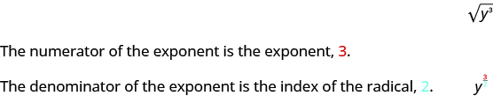
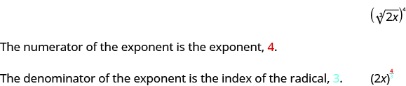
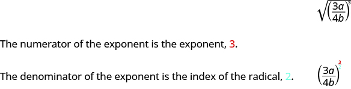

By the end of this section, you will be able to:
* Simplify expressions with
  <math xmlns="http://www.w3.org/1998/Math/MathML"><mrow><msup><mi>a</mi><mrow><mfrac><mn>1</mn><mi>n</mi></mfrac></mrow></msup></mrow></math>

* Simplify expressions with
  <math xmlns="http://www.w3.org/1998/Math/MathML"><mrow><msup><mi>a</mi><mrow><mfrac><mi>m</mi><mi>n</mi></mfrac></mrow></msup></mrow></math>

* Use the properties of exponents to simplify expressions with rational exponents

Before you get started, take this readiness quiz.

1.  Add:
    <math xmlns="http://www.w3.org/1998/Math/MathML"><mrow><mfrac><mn>7</mn><mrow><mn>15</mn></mrow></mfrac><mo>+</mo><mfrac><mn>5</mn><mrow><mn>12</mn></mrow></mfrac><mo>.</mo></mrow></math>
    
    * * *
    {: data-type="newline"}
    
    If you missed this problem, review [\[link\]](/m63304#fs-id1167836518722).
2.  Simplify:
    <math xmlns="http://www.w3.org/1998/Math/MathML"><mrow><msup><mrow><mrow><mo>(</mo><mrow><mn>4</mn><msup><mi>x</mi><mn>2</mn></msup><msup><mi>y</mi><mn>5</mn></msup></mrow><mo>)</mo></mrow></mrow><mn>3</mn></msup><mo>.</mo></mrow></math>
    
    * * *
    {: data-type="newline"}
    
    If you missed this problem, review [\[link\]](/m63345#fs-id1167835304261).
3.  Simplify:
    <math xmlns="http://www.w3.org/1998/Math/MathML"><mrow><msup><mn>5</mn><mrow><mn>−3</mn></mrow></msup><mo>.</mo></mrow></math>
    
    * * *
    {: data-type="newline"}
    
    If you missed this problem, review [\[link\]](/m63345#fs-id1167834095326).
{: data-number-style="arabic"}

# Simplify Expressions with <math xmlns="http://www.w3.org/1998/Math/MathML"><mrow><msup><mi>a</mi><mrow><mfrac><mn>1</mn><mi>n</mi></mfrac></mrow></msup></mrow></math>

Rational exponents are another way of writing expressions with radicals. When we use rational exponents, we can apply the properties of exponents to simplify expressions.

The **Power Property for Exponents**{: data-type="term" .no-emphasis} says that <math xmlns="http://www.w3.org/1998/Math/MathML"><mrow><msup><mrow><mrow><mo>(</mo><mrow><msup><mi>a</mi><mi>m</mi></msup></mrow><mo>)</mo></mrow></mrow><mi>n</mi></msup><mo>=</mo><msup><mi>a</mi><mrow><mi>m</mi><mo>·</mo><mi>n</mi></mrow></msup></mrow></math>

 when *m* and *n* are whole numbers. Let’s assume we are now not limited to whole numbers.

Suppose we want to find a number *p* such that <math xmlns="http://www.w3.org/1998/Math/MathML"><mrow><msup><mrow><mrow><mo>(</mo><mrow><msup><mrow><mn>8</mn></mrow><mi>p</mi></msup></mrow><mo>)</mo></mrow></mrow><mn>3</mn></msup><mo>=</mo><mn>8</mn><mo>.</mo></mrow></math>

 We will use the Power Property of Exponents to find the value of *p*.

<math xmlns="http://www.w3.org/1998/Math/MathML"><mrow><mtable><mtr><mtd /><mtd /><mtd /><mtd /><mtd /><mtd columnalign="right"><msup><mrow><mrow><mo>(</mo><mrow><msup><mrow><mn>8</mn></mrow><mi>p</mi></msup></mrow><mo>)</mo></mrow></mrow><mn>3</mn></msup></mtd><mtd columnalign="left"><mo>=</mo></mtd><mtd columnalign="left"><mn>8</mn></mtd></mtr><mtr><mtd columnalign="left"><mtext>Multiply the exponents on the left.</mtext></mtd><mtd /><mtd /><mtd /><mtd /><mtd columnalign="right"><msup><mn>8</mn><mrow><mn>3</mn><mi>p</mi></mrow></msup></mtd><mtd columnalign="left"><mo>=</mo></mtd><mtd columnalign="left"><mn>8</mn></mtd></mtr><mtr><mtd columnalign="left"><mtext>Write the exponent 1 on the right.</mtext></mtd><mtd /><mtd /><mtd /><mtd /><mtd columnalign="right"><msup><mn>8</mn><mrow><mn>3</mn><mi>p</mi></mrow></msup></mtd><mtd columnalign="left"><mo>=</mo></mtd><mtd columnalign="left"><msup><mn>8</mn><mn>1</mn></msup></mtd></mtr><mtr><mtd columnalign="left"><mtext>Since the bases are the same, the exponents must be equal.</mtext></mtd><mtd /><mtd /><mtd /><mtd /><mtd columnalign="right"><mn>3</mn><mi>p</mi></mtd><mtd columnalign="left"><mo>=</mo></mtd><mtd columnalign="left"><mn>1</mn></mtd></mtr><mtr><mtd columnalign="left"><mtext>Solve for</mtext><mspace width="0.2em" /><mi>p</mi><mo>.</mo></mtd><mtd /><mtd /><mtd /><mtd /><mtd columnalign="right"><mi>p</mi></mtd><mtd columnalign="left"><mo>=</mo></mtd><mtd columnalign="left"><mfrac><mn>1</mn><mn>3</mn></mfrac></mtd></mtr></mtable></mrow></math>

So <math xmlns="http://www.w3.org/1998/Math/MathML"><mrow><msup><mrow><mrow><mo>(</mo><mrow><msup><mn>8</mn><mrow><mfrac><mn>1</mn><mn>3</mn></mfrac></mrow></msup></mrow><mo>)</mo></mrow></mrow><mn>3</mn></msup><mo>=</mo><mn>8</mn><mo>.</mo></mrow></math>

 But we know also <math xmlns="http://www.w3.org/1998/Math/MathML"><mrow><msup><mrow><mrow><mo>(</mo><mrow><mroot><mn>8</mn><mn>3</mn></mroot></mrow><mo>)</mo></mrow></mrow><mn>3</mn></msup><mo>=</mo><mn>8</mn><mo>.</mo></mrow></math>

 Then it must be that <math xmlns="http://www.w3.org/1998/Math/MathML"><mrow><msup><mn>8</mn><mrow><mfrac><mn>1</mn><mn>3</mn></mfrac></mrow></msup><mo>=</mo><mroot><mn>8</mn><mn>3</mn></mroot><mo>.</mo></mrow></math>

This same logic can be used for any positive integer exponent *n* to show that <math xmlns="http://www.w3.org/1998/Math/MathML"><mrow><msup><mi>a</mi><mrow><mfrac><mn>1</mn><mi>n</mi></mfrac></mrow></msup><mo>=</mo><mroot><mi>a</mi><mi>n</mi></mroot><mo>.</mo></mrow></math>

Rational Exponent
<math xmlns="http://www.w3.org/1998/Math/MathML"><mrow><msup><mi>a</mi><mrow><mfrac><mn>1</mn><mi>n</mi></mfrac></mrow></msup></mrow></math>

If <math xmlns="http://www.w3.org/1998/Math/MathML"><mrow><mroot><mi>a</mi><mi>n</mi></mroot></mrow></math>

 is a real number and <math xmlns="http://www.w3.org/1998/Math/MathML"><mrow><mi>n</mi><mo>≥</mo><mn>2</mn><mo>,</mo></mrow></math>

 then

<math xmlns="http://www.w3.org/1998/Math/MathML"><mrow><msup><mi>a</mi><mrow><mfrac><mn>1</mn><mi>n</mi></mfrac></mrow></msup><mo>=</mo><mroot><mi>a</mi><mi>n</mi></mroot></mrow></math>

The denominator of the rational exponent is the index of the radical.

There will be times when working with expressions will be easier if you use rational exponents and times when it will be easier if you use radicals. In the first few examples, you’ll practice converting expressions between these two notations.

Write as a radical expression: ⓐ <math xmlns="http://www.w3.org/1998/Math/MathML"><mrow><msup><mi>x</mi><mrow><mfrac><mn>1</mn><mn>2</mn></mfrac></mrow></msup></mrow></math>

 ⓑ <math xmlns="http://www.w3.org/1998/Math/MathML"><mrow><msup><mi>y</mi><mrow><mfrac><mn>1</mn><mn>3</mn></mfrac></mrow></msup></mrow></math>

 ⓒ <math xmlns="http://www.w3.org/1998/Math/MathML"><mrow><msup><mi>z</mi><mrow><mfrac><mn>1</mn><mn>4</mn></mfrac></mrow></msup><mo>.</mo></mrow></math>

We want to write each expression in the form <math xmlns="http://www.w3.org/1998/Math/MathML"><mrow><mroot><mi>a</mi><mi>n</mi></mroot><mo>.</mo></mrow></math>

ⓐ* * *
{: data-type="newline"}

 <math xmlns="http://www.w3.org/1998/Math/MathML"><mrow><mtable><mtr><mtd /><mtd /><mtd /><mtd columnalign="center"><mspace width="5em" /><msup><mi>x</mi><mrow><mfrac><mn>1</mn><mn>2</mn></mfrac></mrow></msup></mtd></mtr><mtr><mtd columnalign="left"><mtable><mtr><mtd columnalign="left"><mtext>The denominator of the rational exponent is 2, so</mtext></mtd></mtr><mtr><mtd columnalign="left"><mtext>the index of the radical is 2. We do not show the</mtext></mtd></mtr><mtr><mtd columnalign="left"><mtext>index when it is 2.</mtext></mtd></mtr></mtable></mtd><mtd /><mtd /><mtd columnalign="center"><mspace width="5em" /><msqrt><mi>x</mi></msqrt></mtd></mtr></mtable></mrow></math>

* * *
{: data-type="newline"}

* * *
{: data-type="newline"}

 ⓑ* * *
{: data-type="newline"}

 <math xmlns="http://www.w3.org/1998/Math/MathML"><mrow><mtable><mtr><mtd /><mtd /><mtd /><mtd columnalign="center"><mspace width="7em" /><msup><mi>y</mi><mrow><mfrac><mn>1</mn><mn>3</mn></mfrac></mrow></msup></mtd></mtr><mtr><mtd columnalign="left"><mtable><mtr><mtd columnalign="left"><mtext>The denominator of the exponent is 3, so the</mtext></mtd></mtr><mtr><mtd columnalign="left"><mtext>index is 3.</mtext></mtd></mtr></mtable></mtd><mtd /><mtd /><mtd columnalign="center"><mspace width="7em" /><mroot><mi>y</mi><mn>3</mn></mroot></mtd></mtr></mtable></mrow></math>

* * *
{: data-type="newline"}

* * *
{: data-type="newline"}

 ⓒ* * *
{: data-type="newline"}

 <math xmlns="http://www.w3.org/1998/Math/MathML"><mrow><mtable><mtr><mtd /><mtd /><mtd /><mtd columnalign="center"><mspace width="7em" /><msup><mi>z</mi><mrow><mfrac><mn>1</mn><mn>4</mn></mfrac></mrow></msup></mtd></mtr><mtr><mtd columnalign="left"><mtable><mtr><mtd columnalign="left"><mtext>The denominator of the exponent is 4, so the</mtext></mtd></mtr><mtr><mtd columnalign="left"><mtext>index is 4.</mtext></mtd></mtr></mtable></mtd><mtd /><mtd /><mtd columnalign="center"><mspace width="7em" /><mroot><mi>z</mi><mn>4</mn></mroot></mtd></mtr></mtable></mrow></math>

Write as a radical expression: ⓐ <math xmlns="http://www.w3.org/1998/Math/MathML"><mrow><msup><mi>t</mi><mrow><mfrac><mn>1</mn><mn>2</mn></mfrac></mrow></msup></mrow></math>

 ⓑ <math xmlns="http://www.w3.org/1998/Math/MathML"><mrow><msup><mi>m</mi><mrow><mfrac><mn>1</mn><mn>3</mn></mfrac></mrow></msup></mrow></math>

 ⓒ <math xmlns="http://www.w3.org/1998/Math/MathML"><mrow><msup><mi>r</mi><mrow><mfrac><mn>1</mn><mn>4</mn></mfrac></mrow></msup><mo>.</mo></mrow></math>

ⓐ <math xmlns="http://www.w3.org/1998/Math/MathML"><mrow><msqrt><mi>t</mi></msqrt></mrow></math>

 ⓑ <math xmlns="http://www.w3.org/1998/Math/MathML"><mrow><mroot><mi>m</mi><mn>3</mn></mroot></mrow></math>

 ⓒ <math xmlns="http://www.w3.org/1998/Math/MathML"><mrow><mroot><mi>r</mi><mn>4</mn></mroot></mrow></math>

Write as a radial expression: ⓐ <math xmlns="http://www.w3.org/1998/Math/MathML"><mrow><msup><mi>b</mi><mrow><mfrac><mn>1</mn><mn>6</mn></mfrac></mrow></msup></mrow></math>

 ⓑ <math xmlns="http://www.w3.org/1998/Math/MathML"><mrow><msup><mi>z</mi><mrow><mfrac><mn>1</mn><mn>5</mn></mfrac></mrow></msup></mrow></math>

 ⓒ <math xmlns="http://www.w3.org/1998/Math/MathML"><mrow><msup><mi>p</mi><mrow><mfrac><mn>1</mn><mn>4</mn></mfrac></mrow></msup><mo>.</mo></mrow></math>

ⓐ <math xmlns="http://www.w3.org/1998/Math/MathML"><mrow><mroot><mi>b</mi><mn>6</mn></mroot></mrow></math>

 ⓑ <math xmlns="http://www.w3.org/1998/Math/MathML"><mrow><mroot><mi>z</mi><mn>5</mn></mroot></mrow></math>

 ⓒ <math xmlns="http://www.w3.org/1998/Math/MathML"><mrow><mroot><mi>p</mi><mn>4</mn></mroot></mrow></math>

In the next example, we will write each radical using a rational exponent. It is important to use parentheses around the entire expression in the radicand since the entire expression is raised to the rational power.

Write with a rational exponent: ⓐ <math xmlns="http://www.w3.org/1998/Math/MathML"><mrow><msqrt><mrow><mn>5</mn><mi>y</mi></mrow></msqrt></mrow></math>

 ⓑ <math xmlns="http://www.w3.org/1998/Math/MathML"><mrow><mroot><mrow><mn>4</mn><mi>x</mi></mrow><mn>3</mn></mroot></mrow></math>

 ⓒ <math xmlns="http://www.w3.org/1998/Math/MathML"><mrow><mn>3</mn><mroot><mrow><mn>5</mn><mi>z</mi></mrow><mn>4</mn></mroot><mo>.</mo></mrow></math>

We want to write each radical in the form <math xmlns="http://www.w3.org/1998/Math/MathML"><mrow><msup><mi>a</mi><mrow><mfrac><mn>1</mn><mi>n</mi></mfrac></mrow></msup><mo>.</mo></mrow></math>

ⓐ* * *
{: data-type="newline"}

 <math xmlns="http://www.w3.org/1998/Math/MathML"><mrow><mtable><mtr><mtd /><mtd /><mtd /><mtd columnalign="center"><mspace width="4em" /><msqrt><mrow><mn>5</mn><mi>y</mi></mrow></msqrt></mtd></mtr><mtr><mtd columnalign="left"><mtable><mtr><mtd columnalign="left"><mtext>No index is shown, so it is 2.</mtext></mtd></mtr><mtr><mtd columnalign="left"><mtext>The denominator of the exponent will be 2.</mtext></mtd></mtr></mtable></mtd><mtd /><mtd /><mtd columnalign="center"><mspace width="4em" /><msup><mrow><mrow><mo>(</mo><mrow><mn>5</mn><mi>y</mi></mrow><mo>)</mo></mrow></mrow><mrow><mfrac><mn>1</mn><mn>2</mn></mfrac></mrow></msup></mtd></mtr><mtr><mtd columnalign="left"><mtable><mtr><mtd columnalign="left"><mtext>Put parentheses around the entire</mtext></mtd></mtr><mtr><mtd columnalign="left"><mtext>expression</mtext><mspace width="0.2em" /><mn>5</mn><mi>y</mi><mo>.</mo></mtd></mtr></mtable></mtd><mtd /><mtd /><mtd /></mtr></mtable></mrow></math>

* * *
{: data-type="newline"}

* * *
{: data-type="newline"}

 ⓑ* * *
{: data-type="newline"}

 <math xmlns="http://www.w3.org/1998/Math/MathML"><mrow><mtable><mtr><mtd /><mtd /><mtd /><mtd columnalign="center"><mspace width="5em" /><mroot><mrow><mn>4</mn><mi>x</mi></mrow><mn>3</mn></mroot></mtd></mtr><mtr><mtd columnalign="left"><mtable><mtr><mtd columnalign="left"><mtext>The index is 3, so the denominator of the</mtext></mtd></mtr><mtr><mtd columnalign="left"><mtext>exponent is 3. Include parentheses</mtext><mspace width="0.2em" /><mo>(</mo><mn>4</mn><mi>x</mi><mo>)</mo><mo>.</mo></mtd></mtr></mtable></mtd><mtd /><mtd /><mtd columnalign="center"><mtable><mtr /><mtr /><mtr><mtd columnalign="center"><mspace width="5em" /><msup><mrow><mrow><mo>(</mo><mrow><mn>4</mn><mi>x</mi></mrow><mo>)</mo></mrow></mrow><mrow><mfrac><mn>1</mn><mn>3</mn></mfrac></mrow></msup></mtd></mtr></mtable></mtd></mtr></mtable></mrow></math>

* * *
{: data-type="newline"}

* * *
{: data-type="newline"}

 ⓒ* * *
{: data-type="newline"}

 <math xmlns="http://www.w3.org/1998/Math/MathML"><mrow><mtable><mtr><mtd /><mtd /><mtd /><mtd columnalign="center"><mspace width="4em" /><mn>3</mn><mspace width="0.2em" /><mroot><mrow><mn>5</mn><mi>z</mi></mrow><mn>4</mn></mroot></mtd></mtr><mtr><mtd columnalign="left"><mtable><mtr><mtd columnalign="left"><mtext>The index is 4, so the denominator of the</mtext></mtd></mtr><mtr><mtd columnalign="left"><mtext>exponent is 4. Put parentheses only around</mtext></mtd></mtr><mtr><mtd columnalign="left"><mtext>the</mtext><mspace width="0.2em" /><mn>5</mn><mi>z</mi><mspace width="0.2em" /><mtext>since 3 is not under the radical sign.</mtext></mtd></mtr></mtable></mtd><mtd /><mtd /><mtd columnalign="center"><mtable><mtr /><mtr /><mtr /><mtr /><mtr><mtd columnalign="center"><mspace width="4em" /><mn>3</mn><msup><mrow><mrow><mo>(</mo><mrow><mn>5</mn><mi>z</mi></mrow><mo>)</mo></mrow></mrow><mrow><mfrac><mn>1</mn><mn>4</mn></mfrac></mrow></msup></mtd></mtr></mtable></mtd></mtr></mtable></mrow></math>

Write with a rational exponent: ⓐ <math xmlns="http://www.w3.org/1998/Math/MathML"><mrow><msqrt><mrow><mn>10</mn><mi>m</mi></mrow></msqrt></mrow></math>

 ⓑ <math xmlns="http://www.w3.org/1998/Math/MathML"><mrow><mroot><mrow><mn>3</mn><mi>n</mi></mrow><mn>5</mn></mroot></mrow></math>

 ⓒ <math xmlns="http://www.w3.org/1998/Math/MathML"><mrow><mn>3</mn><mroot><mrow><mn>6</mn><mi>y</mi></mrow><mn>4</mn></mroot><mo>.</mo></mrow></math>

ⓐ <math xmlns="http://www.w3.org/1998/Math/MathML"><mrow><msup><mrow><mo stretchy="false">(</mo><mn>10</mn><mi>m</mi><mo stretchy="false">)</mo></mrow><mrow><mfrac><mn>1</mn><mn>2</mn></mfrac></mrow></msup></mrow></math>

 ⓑ <math xmlns="http://www.w3.org/1998/Math/MathML"><mrow><msup><mrow><mo stretchy="false">(</mo><mn>3</mn><mi>n</mi><mo stretchy="false">)</mo></mrow><mrow><mfrac><mn>1</mn><mn>5</mn></mfrac></mrow></msup></mrow></math>

* * *
{: data-type="newline"}

ⓒ <math xmlns="http://www.w3.org/1998/Math/MathML"><mrow><mn>3</mn><msup><mrow><mo stretchy="false">(</mo><mn>6</mn><mi>y</mi><mo stretchy="false">)</mo></mrow><mrow><mfrac><mn>1</mn><mn>4</mn></mfrac></mrow></msup></mrow></math>

Write with a rational exponent: ⓐ <math xmlns="http://www.w3.org/1998/Math/MathML"><mrow><mroot><mrow><mn>3</mn><mi>k</mi></mrow><mn>7</mn></mroot></mrow></math>

 ⓑ <math xmlns="http://www.w3.org/1998/Math/MathML"><mrow><mroot><mrow><mn>5</mn><mi>j</mi></mrow><mn>4</mn></mroot></mrow></math>

 ⓒ <math xmlns="http://www.w3.org/1998/Math/MathML"><mrow><mn>8</mn><mroot><mrow><mn>2</mn><mi>a</mi></mrow><mn>3</mn></mroot><mo>.</mo></mrow></math>

ⓐ <math xmlns="http://www.w3.org/1998/Math/MathML"><mrow><msup><mrow><mo stretchy="false">(</mo><mn>3</mn><mi>k</mi><mo stretchy="false">)</mo></mrow><mrow><mfrac><mn>1</mn><mn>7</mn></mfrac></mrow></msup></mrow></math>

 ⓑ <math xmlns="http://www.w3.org/1998/Math/MathML"><mrow><msup><mrow><mo stretchy="false">(</mo><mn>5</mn><mi>j</mi><mo stretchy="false">)</mo></mrow><mrow><mfrac><mn>1</mn><mn>4</mn></mfrac></mrow></msup></mrow></math>

* * *
{: data-type="newline"}

ⓒ <math xmlns="http://www.w3.org/1998/Math/MathML"><mrow><mn>8</mn><msup><mrow><mo stretchy="false">(</mo><mn>2</mn><mi>a</mi><mo stretchy="false">)</mo></mrow><mrow><mfrac><mn>1</mn><mn>3</mn></mfrac></mrow></msup></mrow></math>

In the next example, you may find it easier to simplify the expressions if you rewrite them as radicals first.

Simplify: ⓐ <math xmlns="http://www.w3.org/1998/Math/MathML"><mrow><msup><mrow><mn>25</mn></mrow><mrow><mfrac><mn>1</mn><mn>2</mn></mfrac></mrow></msup></mrow></math>

 ⓑ <math xmlns="http://www.w3.org/1998/Math/MathML"><mrow><msup><mrow><mn>64</mn></mrow><mrow><mfrac><mn>1</mn><mn>3</mn></mfrac></mrow></msup></mrow></math>

 ⓒ <math xmlns="http://www.w3.org/1998/Math/MathML"><mrow><msup><mrow><mn>256</mn></mrow><mrow><mfrac><mn>1</mn><mn>4</mn></mfrac></mrow></msup><mo>.</mo></mrow></math>

ⓐ* * *
{: data-type="newline"}

 <math xmlns="http://www.w3.org/1998/Math/MathML"><mrow><mtable><mtr><mtd /><mtd /><mtd /><mtd columnalign="center"><mspace width="11em" /><msup><mrow><mn>25</mn></mrow><mrow><mfrac><mn>1</mn><mn>2</mn></mfrac></mrow></msup></mtd></mtr><mtr><mtd columnalign="left"><mtext>Rewrite as a square root.</mtext></mtd><mtd /><mtd /><mtd columnalign="center"><mspace width="11em" /><msqrt><mrow><mn>25</mn></mrow></msqrt></mtd></mtr><mtr><mtd columnalign="left"><mtext>Simplify.</mtext></mtd><mtd /><mtd /><mtd columnalign="center"><mspace width="11em" /><mn>5</mn></mtd></mtr></mtable></mrow></math>

* * *
{: data-type="newline"}

* * *
{: data-type="newline"}

 ⓑ* * *
{: data-type="newline"}

 <math xmlns="http://www.w3.org/1998/Math/MathML"><mrow><mtable><mtr><mtd /><mtd /><mtd /><mtd columnalign="center"><mspace width="8.5em" /><msup><mrow><mn>64</mn></mrow><mrow><mfrac><mn>1</mn><mn>3</mn></mfrac></mrow></msup></mtd></mtr><mtr><mtd columnalign="left"><mtext>Rewrite as a cube root.</mtext></mtd><mtd /><mtd /><mtd columnalign="center"><mspace width="8.5em" /><mroot><mrow><mn>64</mn></mrow><mn>3</mn></mroot></mtd></mtr><mtr><mtd columnalign="left"><mtext>Recognize 64 is a perfect cube.</mtext></mtd><mtd /><mtd /><mtd columnalign="center"><mspace width="8.5em" /><mroot><mrow><msup><mn>4</mn><mn>3</mn></msup></mrow><mn>3</mn></mroot></mtd></mtr><mtr><mtd columnalign="left"><mtext>Simplify.</mtext></mtd><mtd /><mtd /><mtd columnalign="center"><mspace width="8.5em" /><mn>4</mn></mtd></mtr></mtable></mrow></math>

* * *
{: data-type="newline"}

* * *
{: data-type="newline"}

 ⓒ* * *
{: data-type="newline"}

 <math xmlns="http://www.w3.org/1998/Math/MathML"><mrow><mtable><mtr><mtd /><mtd /><mtd /><mtd columnalign="center"><mspace width="4em" /><msup><mrow><mn>256</mn></mrow><mrow><mfrac><mn>1</mn><mn>4</mn></mfrac></mrow></msup></mtd></mtr><mtr><mtd columnalign="left"><mtext>Rewrite as a fourth root.</mtext></mtd><mtd /><mtd /><mtd columnalign="center"><mspace width="4em" /><mroot><mrow><mn>256</mn></mrow><mn>4</mn></mroot></mtd></mtr><mtr><mtd columnalign="left"><mtext>Recognize 256 is a perfect fourth power.</mtext></mtd><mtd /><mtd /><mtd columnalign="center"><mspace width="4em" /><mroot><mrow><msup><mn>4</mn><mn>4</mn></msup></mrow><mn>4</mn></mroot></mtd></mtr><mtr><mtd columnalign="left"><mtext>Simplify.</mtext></mtd><mtd /><mtd /><mtd columnalign="center"><mspace width="4em" /><mn>4</mn></mtd></mtr></mtable></mrow></math>

Simplify: ⓐ <math xmlns="http://www.w3.org/1998/Math/MathML"><mrow><msup><mrow><mn>36</mn></mrow><mrow><mfrac><mn>1</mn><mn>2</mn></mfrac></mrow></msup></mrow></math>

 ⓑ <math xmlns="http://www.w3.org/1998/Math/MathML"><mrow><msup><mn>8</mn><mrow><mfrac><mn>1</mn><mn>3</mn></mfrac></mrow></msup></mrow></math>

 ⓒ <math xmlns="http://www.w3.org/1998/Math/MathML"><mrow><msup><mrow><mn>16</mn></mrow><mrow><mfrac><mn>1</mn><mn>4</mn></mfrac></mrow></msup><mo>.</mo></mrow></math>

ⓐ 6 ⓑ 2 ⓒ 2

Simplify: ⓐ <math xmlns="http://www.w3.org/1998/Math/MathML"><mrow><msup><mrow><mn>100</mn></mrow><mrow><mfrac><mn>1</mn><mn>2</mn></mfrac></mrow></msup></mrow></math>

 ⓑ <math xmlns="http://www.w3.org/1998/Math/MathML"><mrow><msup><mrow><mn>27</mn></mrow><mrow><mfrac><mn>1</mn><mn>3</mn></mfrac></mrow></msup></mrow></math>

 ⓒ <math xmlns="http://www.w3.org/1998/Math/MathML"><mrow><msup><mrow><mn>81</mn></mrow><mrow><mfrac><mn>1</mn><mn>4</mn></mfrac></mrow></msup><mo>.</mo></mrow></math>

ⓐ 10 ⓑ 3 ⓒ 3

Be careful of the placement of the negative signs in the next example. We will need to use the property <math xmlns="http://www.w3.org/1998/Math/MathML"><mrow><msup><mi>a</mi><mrow><mtext>−</mtext><mi>n</mi></mrow></msup><mo>=</mo><mfrac><mn>1</mn><mrow><msup><mi>a</mi><mi>n</mi></msup></mrow></mfrac></mrow></math>

 in one case.

Simplify: ⓐ <math xmlns="http://www.w3.org/1998/Math/MathML"><mrow><msup><mrow><mrow><mo>(</mo><mrow><mn>−16</mn></mrow><mo>)</mo></mrow></mrow><mrow><mfrac><mn>1</mn><mn>4</mn></mfrac></mrow></msup></mrow></math>

 ⓑ <math xmlns="http://www.w3.org/1998/Math/MathML"><mrow><mtext>−</mtext><msup><mrow><mn>16</mn></mrow><mrow><mfrac><mn>1</mn><mn>4</mn></mfrac></mrow></msup></mrow></math>

 ⓒ <math xmlns="http://www.w3.org/1998/Math/MathML"><mrow><msup><mrow><mrow><mo>(</mo><mrow><mn>16</mn></mrow><mo>)</mo></mrow></mrow><mrow><mo>−</mo><mfrac><mn>1</mn><mn>4</mn></mfrac></mrow></msup><mo>.</mo></mrow></math>

ⓐ* * *
{: data-type="newline"}

 <math xmlns="http://www.w3.org/1998/Math/MathML"><mrow><mtable><mtr><mtd /><mtd /><mtd /><mtd columnalign="center"><mspace width="9em" /><msup><mrow><mrow><mo>(</mo><mrow><mn>−16</mn></mrow><mo>)</mo></mrow></mrow><mrow><mfrac><mn>1</mn><mn>4</mn></mfrac></mrow></msup></mtd></mtr><mtr><mtd columnalign="left"><mtext>Rewrite as a fourth root.</mtext></mtd><mtd /><mtd /><mtd columnalign="center"><mspace width="9em" /><mroot><mrow><mn>−16</mn></mrow><mn>4</mn></mroot></mtd></mtr><mtr><mtd /><mtd /><mtd /><mtd columnalign="center"><mspace width="9em" /><mroot><mrow><msup><mrow><mrow><mo>(</mo><mrow><mn>−2</mn></mrow><mo>)</mo></mrow></mrow><mn>4</mn></msup></mrow><mn>4</mn></mroot></mtd></mtr><mtr><mtd columnalign="left"><mtext>Simplify.</mtext></mtd><mtd /><mtd /><mtd columnalign="center"><mspace width="9em" /><mtext>No real solution.</mtext></mtd></mtr></mtable></mrow></math>

* * *
{: data-type="newline"}

* * *
{: data-type="newline"}

 ⓑ* * *
{: data-type="newline"}

 <math xmlns="http://www.w3.org/1998/Math/MathML"><mrow><mtable><mtr><mtd /><mtd /><mtd /><mtd columnalign="center"><mspace width="5.5em" /><mtext>−</mtext><msup><mrow><mn>16</mn></mrow><mrow><mfrac><mn>1</mn><mn>4</mn></mfrac></mrow></msup></mtd></mtr><mtr><mtd columnalign="left"><mtable><mtr><mtd columnalign="left"><mtext>The exponent only applies to the 16.</mtext></mtd></mtr><mtr><mtd columnalign="left"><mtext>Rewrite as a fouth root.</mtext></mtd></mtr></mtable></mtd><mtd /><mtd /><mtd columnalign="center"><mspace width="5.5em" /><mtext>−</mtext><mroot><mrow><mn>16</mn></mrow><mn>4</mn></mroot></mtd></mtr><mtr><mtd columnalign="left"><mtext>Rewrite 16 as</mtext><mspace width="0.2em" /><msup><mn>2</mn><mn>4</mn></msup><mo>.</mo></mtd><mtd /><mtd /><mtd columnalign="center"><mspace width="5.5em" /><mtext>−</mtext><mroot><mrow><msup><mn>2</mn><mn>4</mn></msup></mrow><mn>4</mn></mroot></mtd></mtr><mtr><mtd columnalign="left"><mtext>Simplify.</mtext></mtd><mtd /><mtd /><mtd columnalign="center"><mspace width="5.5em" /><mn>−2</mn></mtd></mtr></mtable></mrow></math>

* * *
{: data-type="newline"}

* * *
{: data-type="newline"}

 ⓒ* * *
{: data-type="newline"}

 <math xmlns="http://www.w3.org/1998/Math/MathML"><mrow><mtable><mtr><mtd /><mtd /><mtd /><mtd columnalign="center"><mspace width="4.5em" /><msup><mrow><mrow><mo>(</mo><mrow><mn>16</mn></mrow><mo>)</mo></mrow></mrow><mrow><mo>−</mo><mfrac><mn>1</mn><mn>4</mn></mfrac></mrow></msup></mtd></mtr><mtr><mtd columnalign="left"><mtext>Rewrite using the property</mtext><mspace width="0.2em" /><msup><mi>a</mi><mrow><mtext>−</mtext><mi>n</mi></mrow></msup><mo>=</mo><mfrac><mn>1</mn><mrow><msup><mi>a</mi><mi>n</mi></msup></mrow></mfrac><mo>.</mo></mtd><mtd /><mtd /><mtd columnalign="center"><mspace width="4.5em" /><mfrac><mn>1</mn><mrow><msup><mrow><mrow><mo>(</mo><mrow><mn>16</mn></mrow><mo>)</mo></mrow></mrow><mrow><mfrac><mn>1</mn><mn>4</mn></mfrac></mrow></msup></mrow></mfrac></mtd></mtr><mtr><mtd columnalign="left"><mtext>Rewrite as a fourth root.</mtext></mtd><mtd /><mtd /><mtd columnalign="center"><mspace width="4.5em" /><mfrac><mn>1</mn><mrow><mroot><mrow><mn>16</mn></mrow><mn>4</mn></mroot></mrow></mfrac></mtd></mtr><mtr><mtd columnalign="left"><mtext>Rewrite 16 as</mtext><mspace width="0.2em" /><msup><mn>2</mn><mn>4</mn></msup><mo>.</mo></mtd><mtd /><mtd /><mtd columnalign="center"><mspace width="4.5em" /><mfrac><mn>1</mn><mrow><mroot><mrow><msup><mn>2</mn><mn>4</mn></msup></mrow><mn>4</mn></mroot></mrow></mfrac></mtd></mtr><mtr><mtd columnalign="left"><mtext>Simplify.</mtext></mtd><mtd /><mtd /><mtd columnalign="center"><mspace width="4.5em" /><mfrac><mn>1</mn><mn>2</mn></mfrac></mtd></mtr></mtable></mrow></math>

Simplify: ⓐ <math xmlns="http://www.w3.org/1998/Math/MathML"><mrow><msup><mrow><mo stretchy="false">(</mo><mn>−64</mn><mo stretchy="false">)</mo></mrow><mrow><mo>−</mo><mfrac><mn>1</mn><mn>2</mn></mfrac></mrow></msup></mrow></math>

 ⓑ <math xmlns="http://www.w3.org/1998/Math/MathML"><mrow><mtext>−</mtext><msup><mrow><mn>64</mn></mrow><mrow><mfrac><mn>1</mn><mn>2</mn></mfrac></mrow></msup></mrow></math>

 ⓒ <math xmlns="http://www.w3.org/1998/Math/MathML"><mrow><msup><mrow><mo stretchy="false">(</mo><mn>64</mn><mo stretchy="false">)</mo></mrow><mrow><mo>−</mo><mfrac><mn>1</mn><mn>2</mn></mfrac></mrow></msup><mo>.</mo></mrow></math>

ⓐ No real solution ⓑ <math xmlns="http://www.w3.org/1998/Math/MathML"><mrow><mn>−8</mn></mrow></math>

* * *
{: data-type="newline"}

ⓒ <math xmlns="http://www.w3.org/1998/Math/MathML"><mrow><mfrac><mn>1</mn><mn>8</mn></mfrac></mrow></math>

Simplify: ⓐ <math xmlns="http://www.w3.org/1998/Math/MathML"><mrow><msup><mrow><mo stretchy="false">(</mo><mn>−256</mn><mo stretchy="false">)</mo></mrow><mrow><mfrac><mn>1</mn><mn>4</mn></mfrac></mrow></msup></mrow></math>

 ⓑ <math xmlns="http://www.w3.org/1998/Math/MathML"><mrow><mtext>−</mtext><msup><mrow><mn>256</mn></mrow><mrow><mfrac><mn>1</mn><mn>4</mn></mfrac></mrow></msup></mrow></math>

 ⓒ <math xmlns="http://www.w3.org/1998/Math/MathML"><mrow><msup><mrow><mrow><mo>(</mo><mrow><mn>256</mn></mrow><mo>)</mo></mrow></mrow><mrow><mo>−</mo><mfrac><mn>1</mn><mn>4</mn></mfrac></mrow></msup><mo>.</mo></mrow></math>

ⓐ No real solution ⓑ <math xmlns="http://www.w3.org/1998/Math/MathML"><mrow><mn>−4</mn></mrow></math>

* * *
{: data-type="newline"}

ⓒ <math xmlns="http://www.w3.org/1998/Math/MathML"><mrow><mfrac><mn>1</mn><mn>4</mn></mfrac></mrow></math>

# Simplify Expressions with <math xmlns="http://www.w3.org/1998/Math/MathML"><mrow><msup><mi>a</mi><mrow><mfrac><mi>m</mi><mi>n</mi></mfrac></mrow></msup></mrow></math>

We can look at <math xmlns="http://www.w3.org/1998/Math/MathML"><mrow><msup><mi>a</mi><mrow><mfrac><mi>m</mi><mi>n</mi></mfrac></mrow></msup></mrow></math>

 in two ways. Remember the Power Property tells us to multiply the exponents and so <math xmlns="http://www.w3.org/1998/Math/MathML"><mrow><msup><mrow><mrow><mo>(</mo><mrow><msup><mi>a</mi><mrow><mfrac><mn>1</mn><mi>n</mi></mfrac></mrow></msup></mrow><mo>)</mo></mrow></mrow><mi>m</mi></msup></mrow></math>

 and <math xmlns="http://www.w3.org/1998/Math/MathML"><mrow><msup><mrow><mrow><mo>(</mo><mrow><msup><mi>a</mi><mi>m</mi></msup></mrow><mo>)</mo></mrow></mrow><mrow><msup><mrow /><mrow><mfrac><mn>1</mn><mi>n</mi></mfrac></mrow></msup></mrow></msup></mrow></math>

 both equal <math xmlns="http://www.w3.org/1998/Math/MathML"><mrow><msup><mi>a</mi><mrow><mfrac><mi>m</mi><mi>n</mi></mfrac></mrow></msup><mo>.</mo></mrow></math>

 If we write these expressions in radical form, we get

<math xmlns="http://www.w3.org/1998/Math/MathML"><mrow><msup><mi>a</mi><mrow><mfrac><mi>m</mi><mi>n</mi></mfrac></mrow></msup><mo>=</mo><msup><mrow><mrow><mo>(</mo><mrow><msup><mi>a</mi><mrow><mfrac><mn>1</mn><mi>n</mi></mfrac></mrow></msup></mrow><mo>)</mo></mrow></mrow><mi>m</mi></msup><mo>=</mo><msup><mrow><mrow><mo>(</mo><mrow><mroot><mi>a</mi><mrow><mi>n</mi></mrow></mroot></mrow><mo>)</mo></mrow></mrow><mi>m</mi></msup><mspace width="1em" /><mtext>and</mtext><mspace width="1em" /><msup><mi>a</mi><mrow><mfrac><mi>m</mi><mi>n</mi></mfrac></mrow></msup><mo>=</mo><msup><mrow><mrow><mo>(</mo><mrow><msup><mi>a</mi><mi>m</mi></msup></mrow><mo>)</mo></mrow></mrow><mrow><msup><mrow /><mrow><mfrac><mn>1</mn><mi>n</mi></mfrac></mrow></msup></mrow></msup><mo>=</mo><mroot><mrow><msup><mi>a</mi><mi>m</mi></msup></mrow><mrow><mi>n</mi></mrow></mroot></mrow></math>

This leads us to the following definition.

Rational Exponent
<math xmlns="http://www.w3.org/1998/Math/MathML"><mrow><msup><mi>a</mi><mrow><mfrac><mi>m</mi><mi>n</mi></mfrac></mrow></msup></mrow></math>

For any positive integers *m* and *n*,

<math xmlns="http://www.w3.org/1998/Math/MathML"><mrow><msup><mi>a</mi><mrow><mfrac><mi>m</mi><mi>n</mi></mfrac></mrow></msup><mo>=</mo><msup><mrow><mrow><mo>(</mo><mrow><mroot><mi>a</mi><mi>n</mi></mroot></mrow><mo>)</mo></mrow></mrow><mi>m</mi></msup><mspace width="1em" /><mtext>and</mtext><mspace width="1em" /><msup><mi>a</mi><mrow><mfrac><mi>m</mi><mi>n</mi></mfrac></mrow></msup><mo>=</mo><mroot><mrow><msup><mi>a</mi><mi>m</mi></msup></mrow><mi>n</mi></mroot></mrow></math>

Which form do we use to simplify an expression? We usually take the root first—that way we keep the numbers in the radicand smaller, before raising it to the power indicated.

Write with a rational exponent: ⓐ <math xmlns="http://www.w3.org/1998/Math/MathML"><mrow><msqrt><mrow><msup><mi>y</mi><mn>3</mn></msup></mrow></msqrt></mrow></math>

 ⓑ <math xmlns="http://www.w3.org/1998/Math/MathML"><mrow><msup><mrow><mrow><mo>(</mo><mrow><mroot><mrow><mn>2</mn><mi>x</mi></mrow><mn>3</mn></mroot></mrow><mo>)</mo></mrow></mrow><mn>4</mn></msup></mrow></math>

 ⓒ <math xmlns="http://www.w3.org/1998/Math/MathML"><mrow><msqrt><mrow><msup><mrow><mrow><mo>(</mo><mrow><mfrac><mrow><mn>3</mn><mi>a</mi></mrow><mrow><mn>4</mn><mi>b</mi></mrow></mfrac></mrow><mo>)</mo></mrow></mrow><mn>3</mn></msup></mrow></msqrt><mo>.</mo></mrow></math>

We want to use <math xmlns="http://www.w3.org/1998/Math/MathML"><mrow><msup><mi>a</mi><mrow><mfrac><mi>m</mi><mi>n</mi></mfrac></mrow></msup><mo>=</mo><mroot><mrow><msup><mi>a</mi><mi>m</mi></msup></mrow><mi>n</mi></mroot></mrow></math>

 to write each radical in the form <math xmlns="http://www.w3.org/1998/Math/MathML"><mrow><msup><mi>a</mi><mrow><mfrac><mi>m</mi><mi>n</mi></mfrac></mrow></msup><mo>.</mo></mrow></math>

ⓐ* * *
{: data-type="newline"}

 |  |
{: valign="top"}{: .unnumbered .unstyled summary="The square root of the quantitu y cubed in parentheses. y raised to the power of the quantity 3 divided by 2 in parentheses." data-label=""}

* * *
{: data-type="newline"}

* * *
{: data-type="newline"}

 ⓑ* * *
{: data-type="newline"}

 |  |
{: valign="top"}{: .unnumbered .unstyled summary="The quantity cube root of the quantity 2 x in parentheses in parentheses to the fourth power. The quantity 2 x in parentheses to the power of the quantity 4 divided by 3 in parentheses." data-label=""}

* * *
{: data-type="newline"}

* * *
{: data-type="newline"}

 ⓒ* * *
{: data-type="newline"}

 |  |
{: valign="top"}{: .unnumbered .unstyled summary="The square root of the quantity 3 a divided by the quantity 4 b in parenthesis in parentheses cubed. The quantity 3 a divided by the quantity 4 b in parentheses in parentheses to the power of the quantity 3 divided by 2 in parentheses." data-label=""}

Write with a rational exponent: ⓐ <math xmlns="http://www.w3.org/1998/Math/MathML"><mrow><msqrt><mrow><msup><mi>x</mi><mn>5</mn></msup></mrow></msqrt></mrow></math>

 ⓑ <math xmlns="http://www.w3.org/1998/Math/MathML"><mrow><msup><mrow><mrow><mo>(</mo><mrow><mroot><mrow><mn>3</mn><mi>y</mi></mrow><mn>4</mn></mroot></mrow><mo>)</mo></mrow></mrow><mn>3</mn></msup></mrow></math>

 ⓒ <math xmlns="http://www.w3.org/1998/Math/MathML"><mrow><msqrt><mrow><msup><mrow><mrow><mo>(</mo><mrow><mfrac><mrow><mn>2</mn><mi>m</mi></mrow><mrow><mn>3</mn><mi>n</mi></mrow></mfrac></mrow><mo>)</mo></mrow></mrow><mn>5</mn></msup></mrow></msqrt><mo>.</mo></mrow></math>

ⓐ <math xmlns="http://www.w3.org/1998/Math/MathML"><mrow><msup><mi>x</mi><mrow><mfrac><mn>5</mn><mn>2</mn></mfrac></mrow></msup></mrow></math>

 ⓑ <math xmlns="http://www.w3.org/1998/Math/MathML"><mrow><msup><mrow><mrow><mo>(</mo><mrow><mn>3</mn><mi>y</mi></mrow><mo>)</mo></mrow></mrow><mrow><mfrac><mn>3</mn><mn>4</mn></mfrac></mrow></msup></mrow></math>

 ⓒ <math xmlns="http://www.w3.org/1998/Math/MathML"><mrow><msup><mrow><mrow><mo>(</mo><mrow><mfrac><mrow><mn>2</mn><mi>m</mi></mrow><mrow><mn>3</mn><mi>n</mi></mrow></mfrac></mrow><mo>)</mo></mrow></mrow><mrow><mfrac><mn>5</mn><mn>2</mn></mfrac></mrow></msup></mrow></math>

Write with a rational exponent: ⓐ <math xmlns="http://www.w3.org/1998/Math/MathML"><mrow><mroot><mrow><msup><mi>a</mi><mn>2</mn></msup></mrow><mn>5</mn></mroot></mrow></math>

 ⓑ <math xmlns="http://www.w3.org/1998/Math/MathML"><mrow><msup><mrow><mrow><mo>(</mo><mrow><mroot><mrow><mn>5</mn><mi>a</mi><mi>b</mi></mrow><mn>3</mn></mroot></mrow><mo>)</mo></mrow></mrow><mn>5</mn></msup></mrow></math>

 ⓒ <math xmlns="http://www.w3.org/1998/Math/MathML"><mrow><msqrt><mrow><msup><mrow><mrow><mo>(</mo><mrow><mfrac><mrow><mn>7</mn><mi>x</mi><mi>y</mi></mrow><mi>z</mi></mfrac></mrow><mo>)</mo></mrow></mrow><mn>3</mn></msup></mrow></msqrt><mo>.</mo></mrow></math>

ⓐ <math xmlns="http://www.w3.org/1998/Math/MathML"><mrow><msup><mi>a</mi><mrow><mfrac><mn>2</mn><mn>5</mn></mfrac></mrow></msup></mrow></math>

 ⓑ <math xmlns="http://www.w3.org/1998/Math/MathML"><mrow><msup><mrow><mrow><mo>(</mo><mrow><mn>5</mn><mi>a</mi><mi>b</mi></mrow><mo>)</mo></mrow></mrow><mrow><mfrac><mn>5</mn><mn>3</mn></mfrac></mrow></msup></mrow></math>

* * *
{: data-type="newline"}

ⓒ <math xmlns="http://www.w3.org/1998/Math/MathML"><mrow><msup><mrow><mrow><mo>(</mo><mrow><mfrac><mrow><mn>7</mn><mi>x</mi><mi>y</mi></mrow><mi>z</mi></mfrac></mrow><mo>)</mo></mrow></mrow><mrow><mfrac><mn>3</mn><mn>2</mn></mfrac></mrow></msup></mrow></math>

Remember that <math xmlns="http://www.w3.org/1998/Math/MathML"><mrow><msup><mi>a</mi><mrow><mtext>−</mtext><mi>n</mi></mrow></msup><mo>=</mo><mfrac><mn>1</mn><mrow><msup><mi>a</mi><mi>n</mi></msup></mrow></mfrac><mo>.</mo></mrow></math>

 The negative sign in the exponent does not change the sign of the expression.

Simplify: ⓐ <math xmlns="http://www.w3.org/1998/Math/MathML"><mrow><msup><mrow><mn>125</mn></mrow><mrow><mfrac><mn>2</mn><mn>3</mn></mfrac></mrow></msup></mrow></math>

 ⓑ <math xmlns="http://www.w3.org/1998/Math/MathML"><mrow><msup><mrow><mn>16</mn></mrow><mrow><mo>−</mo><mfrac><mn>3</mn><mn>2</mn></mfrac></mrow></msup></mrow></math>

 ⓒ <math xmlns="http://www.w3.org/1998/Math/MathML"><mrow><msup><mrow><mn>32</mn></mrow><mrow><mo>−</mo><mfrac><mn>2</mn><mn>5</mn></mfrac></mrow></msup><mo>.</mo></mrow></math>

We will rewrite the expression as a radical first using the defintion, <math xmlns="http://www.w3.org/1998/Math/MathML"><mrow><msup><mi>a</mi><mrow><mfrac><mi>m</mi><mi>n</mi></mfrac></mrow></msup><mo>=</mo><msup><mrow><mrow><mo>(</mo><mrow><mroot><mi>a</mi><mi>n</mi></mroot></mrow><mo>)</mo></mrow></mrow><mi>m</mi></msup><mo>.</mo></mrow></math>

 This form lets us take the root first and so we keep the numbers in the radicand smaller than if we used the other form.

ⓐ* * *
{: data-type="newline"}

 <math xmlns="http://www.w3.org/1998/Math/MathML"><mrow><mtable><mtr><mtd /><mtd /><mtd /><mtd columnalign="center"><mspace width="4em" /><msup><mrow><mn>125</mn></mrow><mrow><mfrac><mn>2</mn><mn>3</mn></mfrac></mrow></msup></mtd></mtr><mtr><mtd columnalign="left"><mtable><mtr><mtd columnalign="left"><mtext>The power of the radical is the numerator of the exponent, 2.</mtext></mtd></mtr><mtr><mtd columnalign="left"><mtext>The index of the radical is the denominator of the</mtext></mtd></mtr><mtr><mtd columnalign="left"><mtext>exponent, 3.</mtext></mtd></mtr></mtable></mtd><mtd /><mtd /><mtd columnalign="center"><mspace width="4em" /><msup><mrow><mrow><mo>(</mo><mrow><mroot><mrow><mn>125</mn></mrow><mn>3</mn></mroot></mrow><mo>)</mo></mrow></mrow><mn>2</mn></msup></mtd></mtr><mtr><mtd columnalign="left"><mtext>Simplify.</mtext></mtd><mtd /><mtd /><mtd columnalign="center"><mspace width="4em" /><msup><mrow><mrow><mo>(</mo><mn>5</mn><mo>)</mo></mrow></mrow><mn>2</mn></msup></mtd></mtr><mtr><mtd /><mtd /><mtd /><mtd columnalign="center"><mspace width="4em" /><mn>25</mn></mtd></mtr></mtable></mrow></math>

* * *
{: data-type="newline"}

* * *
{: data-type="newline"}

 ⓑ We will rewrite each expression first using <math xmlns="http://www.w3.org/1998/Math/MathML"><mrow><msup><mi>a</mi><mrow><mtext>−</mtext><mi>n</mi></mrow></msup><mo>=</mo><mfrac><mn>1</mn><mrow><msup><mi>a</mi><mi>n</mi></msup></mrow></mfrac></mrow></math>

 and then change to radical form.* * *
{: data-type="newline"}

 <math xmlns="http://www.w3.org/1998/Math/MathML"><mrow><mtable><mtr><mtd /><mtd /><mtd /><mtd columnalign="center"><mspace width="4em" /><msup><mrow><mn>16</mn></mrow><mrow><mo>−</mo><mfrac><mn>3</mn><mn>2</mn></mfrac></mrow></msup></mtd></mtr><mtr /><mtr /><mtr><mtd columnalign="left"><mtext>Rewrite using</mtext><mspace width="0.2em" /><msup><mi>a</mi><mrow><mtext>−</mtext><mi>n</mi></mrow></msup><mo>=</mo><mfrac><mn>1</mn><mrow><msup><mi>a</mi><mi>n</mi></msup></mrow></mfrac></mtd><mtd /><mtd /><mtd columnalign="center"><mspace width="4em" /><mfrac><mn>1</mn><mrow><msup><mrow><mn>16</mn></mrow><mrow><mfrac><mn>3</mn><mn>2</mn></mfrac></mrow></msup></mrow></mfrac></mtd></mtr><mtr /><mtr /><mtr><mtd columnalign="left"><mtable><mtr><mtd columnalign="left"><mtext>Change to radical form. The power of the radical is the</mtext></mtd></mtr><mtr><mtd columnalign="left"><mtext>numerator of the exponent, 3. The index is the denominator</mtext></mtd></mtr><mtr><mtd columnalign="left"><mtext>of the exponent, 2.</mtext></mtd></mtr></mtable></mtd><mtd /><mtd /><mtd columnalign="center"><mspace width="4em" /><mfrac><mn>1</mn><mrow><msup><mrow><mrow><mo>(</mo><mrow><msqrt><mrow><mn>16</mn></mrow></msqrt></mrow><mo>)</mo></mrow></mrow><mn>3</mn></msup></mrow></mfrac></mtd></mtr><mtr /><mtr /><mtr><mtd columnalign="left"><mtext>Simplify.</mtext></mtd><mtd /><mtd /><mtd columnalign="center"><mspace width="4em" /><mfrac><mn>1</mn><mrow><msup><mn>4</mn><mn>3</mn></msup></mrow></mfrac></mtd></mtr><mtr /><mtr /><mtr><mtd /><mtd /><mtd /><mtd columnalign="center"><mspace width="4em" /><mfrac><mn>1</mn><mrow><mn>64</mn></mrow></mfrac></mtd></mtr></mtable></mrow></math>

* * *
{: data-type="newline"}

* * *
{: data-type="newline"}

 ⓒ* * *
{: data-type="newline"}

 <math xmlns="http://www.w3.org/1998/Math/MathML"><mrow><mtable><mtr><mtd /><mtd /><mtd /><mtd columnalign="center"><mspace width="15em" /><msup><mrow><mn>32</mn></mrow><mrow><mo>−</mo><mfrac><mn>2</mn><mn>5</mn></mfrac></mrow></msup></mtd></mtr><mtr /><mtr /><mtr><mtd columnalign="left"><mtext>Rewrite using</mtext><mspace width="0.2em" /><msup><mi>a</mi><mrow><mtext>−</mtext><mi>n</mi></mrow></msup><mo>=</mo><mfrac><mn>1</mn><mrow><msup><mi>a</mi><mi>n</mi></msup></mrow></mfrac><mo>.</mo></mtd><mtd /><mtd /><mtd columnalign="center"><mspace width="15em" /><mfrac><mn>1</mn><mrow><msup><mrow><mn>32</mn></mrow><mrow><mfrac><mn>2</mn><mn>5</mn></mfrac></mrow></msup></mrow></mfrac></mtd></mtr><mtr /><mtr /><mtr><mtd columnalign="left"><mtext>Change to radical form.</mtext></mtd><mtd /><mtd /><mtd columnalign="center"><mspace width="15em" /><mfrac><mn>1</mn><mrow><msup><mrow><mrow><mo>(</mo><mrow><mroot><mrow><mn>32</mn></mrow><mn>5</mn></mroot></mrow><mo>)</mo></mrow></mrow><mn>2</mn></msup></mrow></mfrac></mtd></mtr><mtr /><mtr /><mtr><mtd columnalign="left"><mtext>Rewrite the radicand as a power.</mtext></mtd><mtd /><mtd /><mtd columnalign="center"><mspace width="15em" /><mfrac><mn>1</mn><mrow><msup><mrow><mrow><mo>(</mo><mrow><mroot><mrow><msup><mn>2</mn><mn>5</mn></msup></mrow><mn>5</mn></mroot></mrow><mo>)</mo></mrow></mrow><mn>2</mn></msup></mrow></mfrac></mtd></mtr><mtr /><mtr /><mtr><mtd columnalign="left"><mtext>Simplify.</mtext></mtd><mtd /><mtd /><mtd columnalign="center"><mspace width="15em" /><mfrac><mn>1</mn><mrow><msup><mn>2</mn><mn>2</mn></msup></mrow></mfrac></mtd></mtr><mtr /><mtr /><mtr><mtd /><mtd /><mtd /><mtd columnalign="center"><mspace width="15em" /><mfrac><mn>1</mn><mn>4</mn></mfrac></mtd></mtr></mtable></mrow></math>

Simplify: ⓐ <math xmlns="http://www.w3.org/1998/Math/MathML"><mrow><msup><mrow><mn>27</mn></mrow><mrow><mfrac><mn>2</mn><mn>3</mn></mfrac></mrow></msup></mrow></math>

 ⓑ <math xmlns="http://www.w3.org/1998/Math/MathML"><mrow><msup><mrow><mn>81</mn></mrow><mrow><mo>−</mo><mfrac><mn>3</mn><mn>2</mn></mfrac></mrow></msup></mrow></math>

 ⓒ <math xmlns="http://www.w3.org/1998/Math/MathML"><mrow><msup><mrow><mn>16</mn></mrow><mrow><mo>−</mo><mfrac><mn>3</mn><mn>4</mn></mfrac></mrow></msup><mo>.</mo></mrow></math>

ⓐ 9 ⓑ <math xmlns="http://www.w3.org/1998/Math/MathML"><mrow><mfrac><mn>1</mn><mrow><mn>729</mn></mrow></mfrac></mrow></math>

 ⓒ <math xmlns="http://www.w3.org/1998/Math/MathML"><mrow><mfrac><mn>1</mn><mn>8</mn></mfrac></mrow></math>

Simplify: ⓐ <math xmlns="http://www.w3.org/1998/Math/MathML"><mrow><msup><mn>4</mn><mrow><mfrac><mn>3</mn><mn>2</mn></mfrac></mrow></msup></mrow></math>

 ⓑ <math xmlns="http://www.w3.org/1998/Math/MathML"><mrow><msup><mrow><mn>27</mn></mrow><mrow><mo>−</mo><mfrac><mn>2</mn><mn>3</mn></mfrac></mrow></msup></mrow></math>

 ⓒ <math xmlns="http://www.w3.org/1998/Math/MathML"><mrow><msup><mrow><mn>625</mn></mrow><mrow><mo>−</mo><mfrac><mn>3</mn><mn>4</mn></mfrac></mrow></msup><mo>.</mo></mrow></math>

ⓐ 8 ⓑ <math xmlns="http://www.w3.org/1998/Math/MathML"><mrow><mfrac><mn>1</mn><mn>9</mn></mfrac></mrow></math>

 ⓒ <math xmlns="http://www.w3.org/1998/Math/MathML"><mrow><mfrac><mn>1</mn><mrow><mn>125</mn></mrow></mfrac></mrow></math>

Simplify: ⓐ <math xmlns="http://www.w3.org/1998/Math/MathML"><mrow><mtext>−</mtext><msup><mrow><mn>25</mn></mrow><mrow><mfrac><mn>3</mn><mn>2</mn></mfrac></mrow></msup></mrow></math>

 ⓑ <math xmlns="http://www.w3.org/1998/Math/MathML"><mrow><mtext>−</mtext><msup><mrow><mn>25</mn></mrow><mrow><mo>−</mo><mfrac><mn>3</mn><mn>2</mn></mfrac></mrow></msup></mrow></math>

 ⓒ <math xmlns="http://www.w3.org/1998/Math/MathML"><mrow><msup><mrow><mrow><mo>(</mo><mrow><mn>−25</mn></mrow><mo>)</mo></mrow></mrow><mrow><mfrac><mn>3</mn><mn>2</mn></mfrac></mrow></msup><mo>.</mo></mrow></math>

ⓐ* * *
{: data-type="newline"}

 <math xmlns="http://www.w3.org/1998/Math/MathML"><mrow><mtable><mtr><mtd /><mtd /><mtd /><mtd columnalign="center"><mspace width="14em" /><mtext>−</mtext><msup><mrow><mn>25</mn></mrow><mrow><mfrac><mn>3</mn><mn>2</mn></mfrac></mrow></msup></mtd></mtr><mtr><mtd columnalign="left"><mtext>Rewrite in radical form.</mtext></mtd><mtd /><mtd /><mtd columnalign="center"><mspace width="14em" /><mtext>−</mtext><msup><mrow><mrow><mo>(</mo><mrow><msqrt><mrow><mn>25</mn></mrow></msqrt></mrow><mo>)</mo></mrow></mrow><mn>3</mn></msup></mtd></mtr><mtr><mtd columnalign="left"><mtext>Simplify the radical.</mtext></mtd><mtd /><mtd /><mtd columnalign="center"><mspace width="14em" /><mtext>−</mtext><msup><mrow><mrow><mo>(</mo><mn>5</mn><mo>)</mo></mrow></mrow><mn>3</mn></msup></mtd></mtr><mtr><mtd columnalign="left"><mtext>Simplify.</mtext></mtd><mtd /><mtd /><mtd columnalign="center"><mspace width="14em" /><mn>−125</mn></mtd></mtr></mtable></mrow></math>

* * *
{: data-type="newline"}

* * *
{: data-type="newline"}

 ⓑ* * *
{: data-type="newline"}

 <math xmlns="http://www.w3.org/1998/Math/MathML"><mrow><mtable><mtr><mtd /><mtd /><mtd /><mtd columnalign="center"><mspace width="13em" /><mtext>−</mtext><msup><mrow><mn>25</mn></mrow><mrow><mo>−</mo><mfrac><mn>3</mn><mn>2</mn></mfrac></mrow></msup></mtd></mtr><mtr><mtd columnalign="left"><mtext>Rewrite using</mtext><mspace width="0.2em" /><msup><mi>a</mi><mrow><mtext>−</mtext><mi>n</mi></mrow></msup><mo>=</mo><mfrac><mn>1</mn><mrow><msup><mi>a</mi><mi>n</mi></msup></mrow></mfrac><mo>.</mo></mtd><mtd /><mtd /><mtd columnalign="center"><mspace width="13em" /><mtext>−</mtext><mrow><mo>(</mo><mrow><mfrac><mn>1</mn><mrow><msup><mrow><mn>25</mn></mrow><mrow><mfrac><mn>3</mn><mn>2</mn></mfrac></mrow></msup></mrow></mfrac></mrow><mo>)</mo></mrow></mtd></mtr><mtr><mtd columnalign="left"><mtext>Rewrite in radical form.</mtext></mtd><mtd /><mtd /><mtd columnalign="center"><mspace width="13em" /><mtext>−</mtext><mrow><mo>(</mo><mrow><mfrac><mn>1</mn><mrow><msup><mrow><mrow><mo>(</mo><mrow><msqrt><mrow><mn>25</mn></mrow></msqrt></mrow><mo>)</mo></mrow></mrow><mn>3</mn></msup></mrow></mfrac></mrow><mo>)</mo></mrow></mtd></mtr><mtr><mtd columnalign="left"><mtext>Simplify the radical.</mtext></mtd><mtd /><mtd /><mtd columnalign="center"><mspace width="13em" /><mtext>−</mtext><mrow><mo>(</mo><mrow><mfrac><mn>1</mn><mrow><msup><mrow><mrow><mo>(</mo><mn>5</mn><mo>)</mo></mrow></mrow><mn>3</mn></msup></mrow></mfrac></mrow><mo>)</mo></mrow></mtd></mtr><mtr><mtd columnalign="left"><mtext>Simplify.</mtext></mtd><mtd /><mtd /><mtd columnalign="center"><mspace width="13em" /><mo>−</mo><mfrac><mn>1</mn><mrow><mn>125</mn></mrow></mfrac></mtd></mtr></mtable></mrow></math>

* * *
{: data-type="newline"}

* * *
{: data-type="newline"}

 ⓒ* * *
{: data-type="newline"}

 <math xmlns="http://www.w3.org/1998/Math/MathML"><mrow><mtable><mtr><mtd /><mtd /><mtd /><mtd columnalign="center"><mspace width="4em" /><msup><mrow><mrow><mo>(</mo><mrow><mn>−25</mn></mrow><mo>)</mo></mrow></mrow><mrow><mfrac><mn>3</mn><mn>2</mn></mfrac></mrow></msup></mtd></mtr><mtr><mtd columnalign="left"><mtext>Rewrite in radical form.</mtext></mtd><mtd /><mtd /><mtd columnalign="center"><mspace width="4em" /><msup><mrow><mrow><mo>(</mo><mrow><msqrt><mrow><mn>−25</mn></mrow></msqrt></mrow><mo>)</mo></mrow></mrow><mn>3</mn></msup></mtd></mtr><mtr><mtd columnalign="left"><mtable><mtr><mtd columnalign="left"><mtext>There is no real number whose square root</mtext></mtd></mtr><mtr><mtd columnalign="left"><mtext>is</mtext><mspace width="0.2em" /><mn>−25</mn><mo>.</mo></mtd></mtr></mtable></mtd><mtd /><mtd /><mtd columnalign="center"><mspace width="4em" /><mtext>Not a real number.</mtext></mtd></mtr></mtable></mrow></math>

Simplify: ⓐ <math xmlns="http://www.w3.org/1998/Math/MathML"><mrow><msup><mn>−16</mn><mrow><mfrac><mn>3</mn><mn>2</mn></mfrac></mrow></msup></mrow></math>

 ⓑ <math xmlns="http://www.w3.org/1998/Math/MathML"><mrow><msup><mn>−16</mn><mrow><mo>−</mo><mfrac><mn>3</mn><mn>2</mn></mfrac></mrow></msup></mrow></math>

 ⓒ <math xmlns="http://www.w3.org/1998/Math/MathML"><mrow><msup><mrow><mo>(</mo><mrow><mn>−16</mn></mrow><mo>)</mo></mrow><mrow><mo>−</mo><mfrac><mn>3</mn><mn>2</mn></mfrac></mrow></msup><mo>.</mo></mrow></math>

ⓐ <math xmlns="http://www.w3.org/1998/Math/MathML"><mrow><mn>−64</mn></mrow></math>

 ⓑ <math xmlns="http://www.w3.org/1998/Math/MathML"><mrow><mo>−</mo><mfrac><mn>1</mn><mrow><mn>64</mn></mrow></mfrac></mrow></math>

 ⓒ not a real number

Simplify: ⓐ <math xmlns="http://www.w3.org/1998/Math/MathML"><mrow><msup><mn>−81</mn><mrow><mfrac><mn>3</mn><mn>2</mn></mfrac></mrow></msup></mrow></math>

 ⓑ <math xmlns="http://www.w3.org/1998/Math/MathML"><mrow><msup><mn>−81</mn><mrow><mo>−</mo><mfrac><mn>3</mn><mn>2</mn></mfrac></mrow></msup></mrow></math>

 ⓒ <math xmlns="http://www.w3.org/1998/Math/MathML"><mrow><msup><mrow><mo>(</mo><mrow><mn>−81</mn></mrow><mo>)</mo></mrow><mrow><mo>−</mo><mfrac><mn>3</mn><mn>2</mn></mfrac></mrow></msup><mo>.</mo></mrow></math>

ⓐ <math xmlns="http://www.w3.org/1998/Math/MathML"><mrow><mn>−729</mn></mrow></math>

 ⓑ <math xmlns="http://www.w3.org/1998/Math/MathML"><mrow><mo>−</mo><mfrac><mn>1</mn><mrow><mn>729</mn></mrow></mfrac></mrow></math>

 ⓒ not a real number

# Use the Properties of Exponents to Simplify Expressions with Rational Exponents

The same properties of exponents that we have already used also apply to rational exponents. We will list the Properties of Exponenets here to have them for reference as we simplify expressions.

Properties of Exponents

If *a* and *b* are real numbers and *m* and *n* are rational numbers, then

<math xmlns="http://www.w3.org/1998/Math/MathML"><mrow><mtable><mtr><mtd columnalign="left"><mtext mathvariant="bold">Product Property</mtext></mtd><mtd /><mtd /><mtd columnalign="right"><mspace width="4em" /><msup><mi>a</mi><mi>m</mi></msup><mo>·</mo><msup><mi>a</mi><mi>n</mi></msup></mtd><mtd columnalign="left"><mo>=</mo></mtd><mtd columnalign="left"><msup><mi>a</mi><mrow><mi>m</mi><mo>+</mo><mi>n</mi></mrow></msup></mtd></mtr><mtr><mtd columnalign="left"><mtext mathvariant="bold">Power Property</mtext></mtd><mtd /><mtd /><mtd columnalign="right"><mspace width="4em" /><msup><mrow><mrow><mo>(</mo><mrow><msup><mi>a</mi><mi>m</mi></msup></mrow><mo>)</mo></mrow></mrow><mi>n</mi></msup></mtd><mtd columnalign="left"><mo>=</mo></mtd><mtd columnalign="left"><msup><mi>a</mi><mrow><mi>m</mi><mo>·</mo><mi>n</mi></mrow></msup></mtd></mtr><mtr><mtd columnalign="left"><mtext mathvariant="bold">Product to a Power</mtext></mtd><mtd /><mtd /><mtd columnalign="right"><mspace width="4em" /><msup><mrow><mrow><mo>(</mo><mrow><mi>a</mi><mi>b</mi></mrow><mo>)</mo></mrow></mrow><mi>m</mi></msup></mtd><mtd columnalign="left"><mo>=</mo></mtd><mtd columnalign="left"><msup><mi>a</mi><mi>m</mi></msup><msup><mi>b</mi><mi>m</mi></msup></mtd></mtr><mtr><mtd columnalign="left"><mtext mathvariant="bold">Quotient Property</mtext></mtd><mtd /><mtd /><mtd columnalign="right"><mspace width="4em" /><mfrac><mrow><msup><mi>a</mi><mi>m</mi></msup></mrow><mrow><msup><mi>a</mi><mi>n</mi></msup></mrow></mfrac></mtd><mtd columnalign="left"><mo>=</mo></mtd><mtd columnalign="left"><msup><mi>a</mi><mrow><mi>m</mi><mo>−</mo><mi>n</mi></mrow></msup><mo>,</mo><mspace width="0.2em" /><mi>a</mi><mo>≠</mo><mn>0</mn></mtd></mtr><mtr><mtd columnalign="left"><mtext mathvariant="bold">Zero Exponent Definition</mtext></mtd><mtd /><mtd /><mtd columnalign="right"><mspace width="4em" /><msup><mi>a</mi><mn>0</mn></msup></mtd><mtd columnalign="left"><mo>=</mo></mtd><mtd columnalign="left"><mn>1</mn><mo>,</mo><mspace width="0.2em" /><mi>a</mi><mo>≠</mo><mn>0</mn></mtd></mtr><mtr><mtd columnalign="left"><mtext mathvariant="bold">Quotient to a Power Property</mtext></mtd><mtd /><mtd /><mtd columnalign="right"><mspace width="4em" /><msup><mrow><mrow><mo>(</mo><mrow><mfrac><mi>a</mi><mi>b</mi></mfrac></mrow><mo>)</mo></mrow></mrow><mi>m</mi></msup></mtd><mtd columnalign="left"><mo>=</mo></mtd><mtd columnalign="left"><mfrac><mrow><msup><mi>a</mi><mi>m</mi></msup></mrow><mrow><msup><mi>b</mi><mi>m</mi></msup></mrow></mfrac><mo>,</mo><mspace width="0.2em" /><mi>b</mi><mo>≠</mo><mn>0</mn></mtd></mtr><mtr><mtd columnalign="left"><mtext mathvariant="bold">Negative Exponent Property</mtext></mtd><mtd /><mtd /><mtd columnalign="right"><mspace width="4em" /><msup><mi>a</mi><mrow><mtext>−</mtext><mi>n</mi></mrow></msup></mtd><mtd columnalign="left"><mo>=</mo></mtd><mtd columnalign="left"><mfrac><mn>1</mn><mrow><msup><mi>a</mi><mi>n</mi></msup></mrow></mfrac><mo>,</mo><mspace width="0.2em" /><mi>a</mi><mo>≠</mo><mn>0</mn></mtd></mtr></mtable></mrow></math>

We will apply these properties in the next example.

Simplify: ⓐ <math xmlns="http://www.w3.org/1998/Math/MathML"><mrow><msup><mi>x</mi><mrow><mfrac><mn>1</mn><mn>2</mn></mfrac></mrow></msup><mo>·</mo><msup><mi>x</mi><mrow><mfrac><mn>5</mn><mn>6</mn></mfrac></mrow></msup></mrow></math>

 ⓑ <math xmlns="http://www.w3.org/1998/Math/MathML"><mrow><msup><mrow><mrow><mo>(</mo><mrow><msup><mi>z</mi><mn>9</mn></msup></mrow><mo>)</mo></mrow></mrow><mrow><mfrac><mn>2</mn><mn>3</mn></mfrac></mrow></msup></mrow></math>

 ⓒ <math xmlns="http://www.w3.org/1998/Math/MathML"><mrow><mfrac><mrow><msup><mi>x</mi><mrow><mfrac><mn>1</mn><mn>3</mn></mfrac></mrow></msup></mrow><mrow><msup><mi>x</mi><mrow><mfrac><mn>5</mn><mn>3</mn></mfrac></mrow></msup></mrow></mfrac><mo>.</mo></mrow></math>

ⓐ The Product Property tells us that when we multiply the same base, we add the exponents.

<math xmlns="http://www.w3.org/1998/Math/MathML"><mrow><mtable><mtr><mtd /><mtd /><mtd /><mtd columnalign="center"><mspace width="5em" /><msup><mi>x</mi><mrow><mfrac><mn>1</mn><mn>2</mn></mfrac></mrow></msup><mo>·</mo><msup><mi>x</mi><mrow><mfrac><mn>5</mn><mn>6</mn></mfrac></mrow></msup></mtd></mtr><mtr /><mtr /><mtr><mtd columnalign="left"><mtable><mtr><mtd columnalign="left"><mtext>The bases are the same, so we add the</mtext></mtd></mtr><mtr><mtd columnalign="left"><mtext>exponents.</mtext></mtd></mtr></mtable></mtd><mtd /><mtd /><mtd columnalign="center"><mspace width="5em" /><msup><mi>x</mi><mrow><mfrac><mn>1</mn><mn>2</mn></mfrac><mo>+</mo><mfrac><mn>5</mn><mn>6</mn></mfrac></mrow></msup></mtd></mtr><mtr /><mtr /><mtr><mtd columnalign="left"><mtext>Add the fractions.</mtext></mtd><mtd /><mtd /><mtd columnalign="center"><mspace width="5em" /><msup><mi>x</mi><mrow><mfrac><mn>8</mn><mn>6</mn></mfrac></mrow></msup></mtd></mtr><mtr /><mtr /><mtr><mtd columnalign="left"><mtext>Simplify the exponent.</mtext></mtd><mtd /><mtd /><mtd columnalign="center"><mspace width="5em" /><msup><mi>x</mi><mrow><mfrac><mn>4</mn><mn>3</mn></mfrac></mrow></msup></mtd></mtr></mtable></mrow></math>

ⓑ The Power Property tells us that when we raise a power to a power, we multiply the exponents.

<math xmlns="http://www.w3.org/1998/Math/MathML"><mrow><mtable><mtr><mtd /><mtd /><mtd /><mtd columnalign="center"><mspace width="4.5em" /><msup><mrow><mrow><mo>(</mo><mrow><msup><mi>z</mi><mn>9</mn></msup></mrow><mo>)</mo></mrow></mrow><mrow><mfrac><mn>2</mn><mn>3</mn></mfrac></mrow></msup></mtd></mtr><mtr><mtd columnalign="left"><mtable><mtr><mtd columnalign="left"><mtext>To raise a power to a power, we multiply</mtext></mtd></mtr><mtr><mtd columnalign="left"><mtext>the exponents.</mtext></mtd></mtr></mtable></mtd><mtd /><mtd /><mtd columnalign="center"><mspace width="4.5em" /><msup><mi>z</mi><mrow><mn>9</mn><mo>·</mo><mfrac><mn>2</mn><mn>3</mn></mfrac></mrow></msup></mtd></mtr><mtr><mtd columnalign="left"><mtext>Simplify.</mtext></mtd><mtd /><mtd /><mtd columnalign="center"><mspace width="4.5em" /><msup><mi>z</mi><mn>6</mn></msup></mtd></mtr></mtable></mrow></math>

ⓒ The Quotient Property tells us that when we divide with the same base, we subtract the exponents.

<math xmlns="http://www.w3.org/1998/Math/MathML"><mrow><mtable><mtr><mtd /><mtd /><mtd /><mtd columnalign="center"><mspace width="4em" /><mfrac><mrow><msup><mi>x</mi><mrow><mfrac><mn>1</mn><mn>3</mn></mfrac></mrow></msup></mrow><mrow><msup><mi>x</mi><mrow><mfrac><mn>5</mn><mn>3</mn></mfrac></mrow></msup></mrow></mfrac></mtd></mtr><mtr /><mtr /><mtr><mtd /><mtd /><mtd /><mtd columnalign="center"><mspace width="4em" /><mfrac><mrow><msup><mi>x</mi><mrow><mfrac><mn>1</mn><mn>3</mn></mfrac></mrow></msup></mrow><mrow><msup><mi>x</mi><mrow><mfrac><mn>5</mn><mn>3</mn></mfrac></mrow></msup></mrow></mfrac></mtd></mtr><mtr /><mtr /><mtr><mtd columnalign="left"><mtable><mtr><mtd columnalign="left"><mtext>To divide with the same base, we subtract</mtext></mtd></mtr><mtr><mtd columnalign="left"><mtext>the exponents.</mtext></mtd></mtr></mtable></mtd><mtd /><mtd /><mtd columnalign="center"><mspace width="4em" /><mfrac><mn>1</mn><mrow><msup><mi>x</mi><mrow><mfrac><mn>5</mn><mn>3</mn></mfrac><mo>−</mo><mfrac><mn>1</mn><mn>3</mn></mfrac></mrow></msup></mrow></mfrac></mtd></mtr><mtr /><mtr /><mtr><mtd columnalign="left"><mtext>Simplify.</mtext></mtd><mtd /><mtd /><mtd columnalign="center"><mspace width="4em" /><mfrac><mn>1</mn><mrow><msup><mi>x</mi><mrow><mfrac><mn>4</mn><mn>3</mn></mfrac></mrow></msup></mrow></mfrac></mtd></mtr></mtable></mrow></math>

Simplify: ⓐ <math xmlns="http://www.w3.org/1998/Math/MathML"><mrow><msup><mi>x</mi><mrow><mfrac><mn>1</mn><mn>6</mn></mfrac></mrow></msup><mo>·</mo><msup><mi>x</mi><mrow><mfrac><mn>4</mn><mn>3</mn></mfrac></mrow></msup></mrow></math>

 ⓑ <math xmlns="http://www.w3.org/1998/Math/MathML"><mrow><msup><mrow><mrow><mo>(</mo><mrow><msup><mi>x</mi><mn>6</mn></msup></mrow><mo>)</mo></mrow></mrow><mrow><mfrac><mn>4</mn><mn>3</mn></mfrac></mrow></msup></mrow></math>

 ⓒ <math xmlns="http://www.w3.org/1998/Math/MathML"><mrow><mfrac><mrow><msup><mi>x</mi><mrow><mfrac><mn>2</mn><mn>3</mn></mfrac></mrow></msup></mrow><mrow><msup><mi>x</mi><mrow><mfrac><mn>5</mn><mn>3</mn></mfrac></mrow></msup></mrow></mfrac><mo>.</mo></mrow></math>

ⓐ <math xmlns="http://www.w3.org/1998/Math/MathML"><mrow><msup><mi>x</mi><mrow><mfrac><mn>3</mn><mn>2</mn></mfrac></mrow></msup></mrow></math>

 ⓑ <math xmlns="http://www.w3.org/1998/Math/MathML"><mrow><msup><mi>x</mi><mn>8</mn></msup></mrow></math>

 ⓒ <math xmlns="http://www.w3.org/1998/Math/MathML"><mrow><mfrac><mn>1</mn><mi>x</mi></mfrac></mrow></math>

Simplify: ⓐ <math xmlns="http://www.w3.org/1998/Math/MathML"><mrow><msup><mi>y</mi><mrow><mfrac><mn>3</mn><mn>4</mn></mfrac></mrow></msup><mo>·</mo><msup><mi>y</mi><mrow><mfrac><mn>5</mn><mn>8</mn></mfrac></mrow></msup></mrow></math>

 ⓑ <math xmlns="http://www.w3.org/1998/Math/MathML"><mrow><msup><mrow><mrow><mo>(</mo><mrow><msup><mi>m</mi><mn>9</mn></msup></mrow><mo>)</mo></mrow></mrow><mrow><mfrac><mn>2</mn><mn>9</mn></mfrac></mrow></msup></mrow></math>

 ⓒ <math xmlns="http://www.w3.org/1998/Math/MathML"><mrow><mfrac><mrow><msup><mi>d</mi><mrow><mfrac><mn>1</mn><mn>5</mn></mfrac></mrow></msup></mrow><mrow><msup><mi>d</mi><mrow><mfrac><mn>6</mn><mn>5</mn></mfrac></mrow></msup></mrow></mfrac><mo>.</mo></mrow></math>

ⓐ <math xmlns="http://www.w3.org/1998/Math/MathML"><mrow><msup><mi>y</mi><mrow><mfrac><mrow><mn>11</mn></mrow><mn>8</mn></mfrac></mrow></msup></mrow></math>

 ⓑ <math xmlns="http://www.w3.org/1998/Math/MathML"><mrow><msup><mi>m</mi><mn>2</mn></msup></mrow></math>

 ⓒ <math xmlns="http://www.w3.org/1998/Math/MathML"><mrow><mfrac><mn>1</mn><mi>d</mi></mfrac></mrow></math>

Sometimes we need to use more than one property. In the next example, we will use both the **Product to a Power Property**{: data-type="term" .no-emphasis} and then the **Power Property**{: data-type="term" .no-emphasis}.

Simplify: ⓐ <math xmlns="http://www.w3.org/1998/Math/MathML"><mrow><msup><mrow><mrow><mo>(</mo><mrow><mn>27</mn><msup><mi>u</mi><mrow><mfrac><mn>1</mn><mn>2</mn></mfrac></mrow></msup></mrow><mo>)</mo></mrow></mrow><mrow><mfrac><mn>2</mn><mn>3</mn></mfrac></mrow></msup></mrow></math>

 ⓑ <math xmlns="http://www.w3.org/1998/Math/MathML"><mrow><msup><mrow><mrow><mo>(</mo><mrow><msup><mi>m</mi><mrow><mfrac><mn>2</mn><mn>3</mn></mfrac></mrow></msup><msup><mi>n</mi><mrow><mfrac><mn>1</mn><mn>2</mn></mfrac></mrow></msup></mrow><mo>)</mo></mrow></mrow><mrow><mfrac><mn>3</mn><mn>2</mn></mfrac></mrow></msup><mo>.</mo></mrow></math>

ⓐ* * *
{: data-type="newline"}

 <math xmlns="http://www.w3.org/1998/Math/MathML"><mrow><mtable><mtr><mtd /><mtd /><mtd /><mtd columnalign="center"><mspace width="4em" /><msup><mrow><mrow><mo>(</mo><mrow><mn>27</mn><msup><mi>u</mi><mrow><mfrac><mn>1</mn><mn>2</mn></mfrac></mrow></msup></mrow><mo>)</mo></mrow></mrow><mrow><mfrac><mn>2</mn><mn>3</mn></mfrac></mrow></msup></mtd></mtr> <mtr><mtd columnalign="left"><mtable><mtr><mtd columnalign="left"><mtext>First we use the Product to a Power</mtext></mtd></mtr><mtr><mtd columnalign="left"><mtext>Property.</mtext></mtd></mtr></mtable></mtd><mtd /><mtd /><mtd columnalign="center"><mspace width="4em" /><msup><mrow><mrow><mo>(</mo><mrow><mn>27</mn></mrow><mo>)</mo></mrow></mrow><mrow><mfrac><mn>2</mn><mn>3</mn></mfrac></mrow></msup><msup><mrow><mrow><mo>(</mo><mrow><msup><mi>u</mi><mrow><mfrac><mn>1</mn><mn>2</mn></mfrac></mrow></msup></mrow><mo>)</mo></mrow></mrow><mrow><mfrac><mn>2</mn><mn>3</mn></mfrac></mrow></msup></mtd></mtr> <mtr><mtd columnalign="left"><mtext>Rewrite 27 as a power of 3.</mtext></mtd><mtd /><mtd /><mtd columnalign="center"><mspace width="4em" /><msup><mrow><mrow><mo>(</mo><mrow><msup><mn>3</mn><mn>3</mn></msup></mrow><mo>)</mo></mrow></mrow><mrow><mfrac><mn>2</mn><mn>3</mn></mfrac></mrow></msup><msup><mrow><mrow><mo>(</mo><mrow><msup><mi>u</mi><mrow><mfrac><mn>1</mn><mn>2</mn></mfrac></mrow></msup></mrow><mo>)</mo></mrow></mrow><mrow><mfrac><mn>2</mn><mn>3</mn></mfrac></mrow></msup></mtd></mtr> <mtr><mtd columnalign="left"><mtable><mtr><mtd columnalign="left"><mtext>To raise a power to a power, we multiply</mtext></mtd></mtr><mtr><mtd columnalign="left"><mtext>the exponents.</mtext></mtd></mtr></mtable></mtd><mtd /><mtd /><mtd columnalign="center"><mspace width="4em" /><mrow><mo>(</mo><mrow><msup><mn>3</mn><mn>2</mn></msup></mrow><mo>)</mo></mrow><mrow><mo>(</mo><mrow><msup><mi>u</mi><mrow><mfrac><mn>1</mn><mn>3</mn></mfrac></mrow></msup></mrow><mo>)</mo></mrow></mtd></mtr> <mtr><mtd columnalign="left"><mtext>Simplify.</mtext></mtd><mtd /><mtd /><mtd columnalign="center"><mspace width="4em" /><mn>9</mn><msup><mi>u</mi><mrow><mfrac><mn>1</mn><mn>3</mn></mfrac></mrow></msup></mtd></mtr></mtable></mrow></math>

* * *
{: data-type="newline"}

* * *
{: data-type="newline"}

 ⓑ* * *
{: data-type="newline"}

 <math xmlns="http://www.w3.org/1998/Math/MathML"><mrow><mtable><mtr><mtd /><mtd /><mtd /><mtd columnalign="center"><mspace width="4em" /><msup><mrow><mrow><mo>(</mo><mrow><msup><mi>m</mi><mrow><mfrac><mn>2</mn><mn>3</mn></mfrac></mrow></msup><msup><mi>n</mi><mrow><mfrac><mn>1</mn><mn>2</mn></mfrac></mrow></msup></mrow><mo>)</mo></mrow></mrow><mrow><mfrac><mn>3</mn><mn>2</mn></mfrac></mrow></msup></mtd></mtr><mtr><mtd columnalign="left"><mtable><mtr><mtd columnalign="left"><mtext>First we use the Product to a Power</mtext></mtd></mtr><mtr><mtd columnalign="left"><mtext>Property.</mtext></mtd></mtr></mtable></mtd><mtd /><mtd /><mtd columnalign="center"><mspace width="4em" /><msup><mrow><mrow><mo>(</mo><mrow><msup><mi>m</mi><mrow><mfrac><mn>2</mn><mn>3</mn></mfrac></mrow></msup></mrow><mo>)</mo></mrow></mrow><mrow><mfrac><mn>3</mn><mn>2</mn></mfrac></mrow></msup><msup><mrow><mrow><mo>(</mo><mrow><msup><mi>n</mi><mrow><mfrac><mn>1</mn><mn>2</mn></mfrac></mrow></msup></mrow><mo>)</mo></mrow></mrow><mrow><mfrac><mn>3</mn><mn>2</mn></mfrac></mrow></msup></mtd></mtr><mtr><mtd columnalign="left"><mtable><mtr><mtd columnalign="left"><mtext>To raise a power to a power, we multiply</mtext></mtd></mtr><mtr><mtd columnalign="left"><mtext>the exponents.</mtext></mtd></mtr></mtable></mtd><mtd /><mtd /><mtd columnalign="center"><mspace width="4em" /><mi>m</mi><msup><mi>n</mi><mrow><mfrac><mn>3</mn><mn>4</mn></mfrac></mrow></msup></mtd></mtr></mtable></mrow></math>

Simplify: ⓐ <math xmlns="http://www.w3.org/1998/Math/MathML"><mrow><msup><mrow><mrow><mo>(</mo><mrow><mn>32</mn><msup><mi>x</mi><mrow><mfrac><mn>1</mn><mn>3</mn></mfrac></mrow></msup></mrow><mo>)</mo></mrow></mrow><mrow><mfrac><mn>3</mn><mn>5</mn></mfrac></mrow></msup></mrow></math>

 ⓑ <math xmlns="http://www.w3.org/1998/Math/MathML"><mrow><msup><mrow><mrow><mo>(</mo><mrow><msup><mi>x</mi><mrow><mfrac><mn>3</mn><mn>4</mn></mfrac></mrow></msup><msup><mi>y</mi><mrow><mfrac><mn>1</mn><mn>2</mn></mfrac></mrow></msup></mrow><mo>)</mo></mrow></mrow><mrow><mfrac><mn>2</mn><mn>3</mn></mfrac></mrow></msup><mo>.</mo></mrow></math>

ⓐ <math xmlns="http://www.w3.org/1998/Math/MathML"><mrow><mn>8</mn><msup><mi>x</mi><mrow><mfrac><mn>1</mn><mn>5</mn></mfrac></mrow></msup></mrow></math>

 ⓑ <math xmlns="http://www.w3.org/1998/Math/MathML"><mrow><msup><mi>x</mi><mrow><mfrac><mn>1</mn><mn>2</mn></mfrac></mrow></msup><msup><mi>y</mi><mrow><mfrac><mn>1</mn><mn>3</mn></mfrac></mrow></msup></mrow></math>

Simplify: ⓐ <math xmlns="http://www.w3.org/1998/Math/MathML"><mrow><msup><mrow><mrow><mo>(</mo><mrow><mn>81</mn><msup><mi>n</mi><mrow><mfrac><mn>2</mn><mn>5</mn></mfrac></mrow></msup></mrow><mo>)</mo></mrow></mrow><mrow><mfrac><mn>3</mn><mn>2</mn></mfrac></mrow></msup></mrow></math>

 ⓑ <math xmlns="http://www.w3.org/1998/Math/MathML"><mrow><msup><mrow><mrow><mo>(</mo><mrow><msup><mi>a</mi><mrow><mfrac><mn>3</mn><mn>2</mn></mfrac></mrow></msup><msup><mi>b</mi><mrow><mfrac><mn>1</mn><mn>2</mn></mfrac></mrow></msup></mrow><mo>)</mo></mrow></mrow><mrow><mfrac><mn>4</mn><mn>3</mn></mfrac></mrow></msup><mo>.</mo></mrow></math>

ⓐ <math xmlns="http://www.w3.org/1998/Math/MathML"><mrow><mn>729</mn><msup><mi>n</mi><mrow><mfrac><mn>3</mn><mn>5</mn></mfrac></mrow></msup></mrow></math>

 ⓑ <math xmlns="http://www.w3.org/1998/Math/MathML"><mrow><msup><mi>a</mi><mn>2</mn></msup><msup><mi>b</mi><mrow><mfrac><mn>2</mn><mn>3</mn></mfrac></mrow></msup></mrow></math>

We will use both the **Product Property**{: data-type="term" .no-emphasis} and the **Quotient Property**{: data-type="term" .no-emphasis} in the next example.

Simplify: ⓐ <math xmlns="http://www.w3.org/1998/Math/MathML"><mrow><mfrac><mrow><msup><mi>x</mi><mrow><mfrac><mn>3</mn><mn>4</mn></mfrac></mrow></msup><mo>·</mo><msup><mi>x</mi><mrow><mo>−</mo><mfrac><mn>1</mn><mn>4</mn></mfrac></mrow></msup></mrow><mrow><msup><mi>x</mi><mrow><mo>−</mo><mfrac><mn>6</mn><mn>4</mn></mfrac></mrow></msup></mrow></mfrac></mrow></math>

 ⓑ <math xmlns="http://www.w3.org/1998/Math/MathML"><mrow><msup><mrow><mrow><mo>(</mo><mrow><mfrac><mrow><mn>16</mn><mspace width="0.2em" /><msup><mi>x</mi><mrow><mfrac><mn>4</mn><mn>3</mn></mfrac></mrow></msup><msup><mi>y</mi><mrow><mo>−</mo><mfrac><mn>5</mn><mn>6</mn></mfrac></mrow></msup></mrow><mrow><msup><mi>x</mi><mrow><mo>−</mo><mfrac><mn>2</mn><mn>3</mn></mfrac></mrow></msup><msup><mi>y</mi><mrow><mfrac><mn>1</mn><mn>6</mn></mfrac></mrow></msup></mrow></mfrac></mrow><mo>)</mo></mrow></mrow><mrow><mfrac><mn>1</mn><mn>2</mn></mfrac></mrow></msup><mo>.</mo></mrow></math>

ⓐ* * *
{: data-type="newline"}

 <math xmlns="http://www.w3.org/1998/Math/MathML"><mrow><mtable><mtr><mtd /><mtd /><mtd /><mtd columnalign="center"><mspace width="4em" /><mfrac><mrow><msup><mi>x</mi><mrow><mfrac><mn>3</mn><mn>4</mn></mfrac></mrow></msup><mo>·</mo><msup><mi>x</mi><mrow><mo>−</mo><mfrac><mn>1</mn><mn>4</mn></mfrac></mrow></msup></mrow><mrow><msup><mi>x</mi><mrow><mo>−</mo><mfrac><mn>6</mn><mn>4</mn></mfrac></mrow></msup></mrow></mfrac></mtd></mtr><mtr /><mtr /><mtr><mtd columnalign="left"><mtable><mtr><mtd columnalign="left"><mtext>Use the Product Property in the numerator,</mtext></mtd></mtr><mtr><mtd columnalign="left"><mtext>add the exponents.</mtext></mtd></mtr></mtable></mtd><mtd /><mtd /><mtd columnalign="center"><mspace width="4em" /><mfrac><mrow><msup><mi>x</mi><mrow><mfrac><mn>2</mn><mn>4</mn></mfrac></mrow></msup></mrow><mrow><msup><mi>x</mi><mrow><mo>−</mo><mfrac><mn>6</mn><mn>4</mn></mfrac></mrow></msup></mrow></mfrac></mtd></mtr><mtr /><mtr /><mtr><mtd columnalign="left"><mtable><mtr><mtd columnalign="left"><mtext>Use the Quotient Property, subtract the</mtext></mtd></mtr><mtr><mtd columnalign="left"><mtext>exponents.</mtext></mtd></mtr></mtable></mtd><mtd /><mtd /><mtd columnalign="center"><mspace width="4em" /><msup><mi>x</mi><mrow><mfrac><mn>8</mn><mn>4</mn></mfrac></mrow></msup></mtd></mtr><mtr /><mtr /><mtr><mtd columnalign="left"><mtext>Simplify.</mtext></mtd><mtd /><mtd /><mtd columnalign="center"><mspace width="4em" /><msup><mi>x</mi><mn>2</mn></msup></mtd></mtr></mtable></mrow></math>

ⓑ Follow the order of operations to simplify inside the parenthese first.

<math xmlns="http://www.w3.org/1998/Math/MathML"><mrow><mtable><mtr><mtd /><mtd /><mtd /><mtd columnalign="center"><mspace width="4em" /><msup><mrow><mrow><mo>(</mo><mrow><mfrac><mrow><mn>16</mn><mspace width="0.2em" /><msup><mi>x</mi><mrow><mfrac><mn>4</mn><mn>3</mn></mfrac></mrow></msup><msup><mi>y</mi><mrow><mo>−</mo><mfrac><mn>5</mn><mn>6</mn></mfrac></mrow></msup></mrow><mrow><msup><mi>x</mi><mrow><mo>−</mo><mfrac><mn>2</mn><mn>3</mn></mfrac></mrow></msup><msup><mi>y</mi><mrow><mfrac><mn>1</mn><mn>6</mn></mfrac></mrow></msup></mrow></mfrac></mrow><mo>)</mo></mrow></mrow><mrow><mfrac><mn>1</mn><mn>2</mn></mfrac></mrow></msup></mtd></mtr><mtr><mtd columnalign="left"><mtable><mtr><mtd columnalign="left"><mtext>Use the Quotient Property, subtract the</mtext></mtd></mtr><mtr><mtd columnalign="left"><mtext>exponents.</mtext></mtd></mtr></mtable></mtd><mtd /><mtd /><mtd columnalign="center"><mspace width="4em" /><msup><mrow><mrow><mo>(</mo><mrow><mfrac><mrow><mn>16</mn><msup><mi>x</mi><mrow><mfrac><mn>6</mn><mn>3</mn></mfrac></mrow></msup></mrow><mrow><msup><mi>y</mi><mrow><mfrac><mn>6</mn><mn>6</mn></mfrac></mrow></msup></mrow></mfrac></mrow><mo>)</mo></mrow></mrow><mrow><mfrac><mn>1</mn><mn>2</mn></mfrac></mrow></msup></mtd></mtr><mtr><mtd columnalign="left"><mtext>Simplify.</mtext></mtd><mtd /><mtd /><mtd columnalign="center"><mspace width="4em" /><msup><mrow><mrow><mo>(</mo><mrow><mfrac><mrow><mn>16</mn><msup><mi>x</mi><mn>2</mn></msup></mrow><mi>y</mi></mfrac></mrow><mo>)</mo></mrow></mrow><mrow><mfrac><mn>1</mn><mn>2</mn></mfrac></mrow></msup></mtd></mtr><mtr><mtd columnalign="left"><mtable><mtr><mtd columnalign="left"><mtext>Use the Product to a Power Property,</mtext></mtd></mtr><mtr><mtd columnalign="left"><mtext>multiply the exponents.</mtext></mtd></mtr></mtable></mtd><mtd /><mtd /><mtd columnalign="center"><mspace width="4em" /><mfrac><mrow><mn>4</mn><mi>x</mi></mrow><mrow><msup><mi>y</mi><mrow><mfrac><mn>1</mn><mn>2</mn></mfrac></mrow></msup></mrow></mfrac></mtd></mtr></mtable></mrow></math>

Simplify: ⓐ <math xmlns="http://www.w3.org/1998/Math/MathML"><mrow><mfrac><mrow><msup><mi>m</mi><mrow><mfrac><mn>2</mn><mn>3</mn></mfrac></mrow></msup><mo>·</mo><msup><mi>m</mi><mrow><mo>−</mo><mfrac><mn>1</mn><mn>3</mn></mfrac></mrow></msup></mrow><mrow><msup><mi>m</mi><mrow><mo>−</mo><mfrac><mn>5</mn><mn>3</mn></mfrac></mrow></msup></mrow></mfrac></mrow></math>

 ⓑ <math xmlns="http://www.w3.org/1998/Math/MathML"><mrow><msup><mrow><mrow><mo>(</mo><mrow><mfrac><mrow><mn>25</mn><msup><mi>m</mi><mrow><mfrac><mn>1</mn><mn>6</mn></mfrac></mrow></msup><msup><mi>n</mi><mrow><mfrac><mrow><mn>11</mn></mrow><mn>6</mn></mfrac></mrow></msup></mrow><mrow><msup><mi>m</mi><mrow><mfrac><mn>2</mn><mn>3</mn></mfrac></mrow></msup><msup><mi>n</mi><mrow><mo>−</mo><mfrac><mn>1</mn><mn>6</mn></mfrac></mrow></msup></mrow></mfrac></mrow><mo>)</mo></mrow></mrow><mrow><mfrac><mn>1</mn><mn>2</mn></mfrac></mrow></msup><mo>.</mo></mrow></math>

ⓐ <math xmlns="http://www.w3.org/1998/Math/MathML"><mrow><msup><mi>m</mi><mn>2</mn></msup></mrow></math>

 ⓑ <math xmlns="http://www.w3.org/1998/Math/MathML"><mrow><mfrac><mrow><mn>5</mn><mi>n</mi></mrow><mrow><msup><mi>m</mi><mrow><mfrac><mn>1</mn><mn>4</mn></mfrac></mrow></msup></mrow></mfrac></mrow></math>

Simplify: ⓐ <math xmlns="http://www.w3.org/1998/Math/MathML"><mrow><mfrac><mrow><msup><mi>u</mi><mrow><mfrac><mn>4</mn><mn>5</mn></mfrac></mrow></msup><mo>·</mo><msup><mi>u</mi><mrow><mo>−</mo><mfrac><mn>2</mn><mn>5</mn></mfrac></mrow></msup></mrow><mrow><msup><mi>u</mi><mrow><mo>−</mo><mfrac><mrow><mn>13</mn></mrow><mn>5</mn></mfrac></mrow></msup></mrow></mfrac></mrow></math>

 ⓑ <math xmlns="http://www.w3.org/1998/Math/MathML"><mrow><msup><mrow><mrow><mo>(</mo><mrow><mfrac><mrow><mn>27</mn><msup><mi>x</mi><mrow><mfrac><mn>4</mn><mn>5</mn></mfrac></mrow></msup><msup><mi>y</mi><mrow><mfrac><mn>1</mn><mn>6</mn></mfrac></mrow></msup></mrow><mrow><msup><mi>x</mi><mrow><mfrac><mn>1</mn><mn>5</mn></mfrac></mrow></msup><msup><mi>y</mi><mrow><mo>−</mo><mfrac><mn>5</mn><mn>6</mn></mfrac></mrow></msup></mrow></mfrac></mrow><mo>)</mo></mrow></mrow><mrow><mfrac><mn>1</mn><mn>3</mn></mfrac></mrow></msup><mo>.</mo></mrow></math>

ⓐ <math xmlns="http://www.w3.org/1998/Math/MathML"><mrow><msup><mi>u</mi><mn>3</mn></msup></mrow></math>

 ⓑ <math xmlns="http://www.w3.org/1998/Math/MathML"><mrow><mn>3</mn><msup><mi>x</mi><mrow><mfrac><mn>1</mn><mn>5</mn></mfrac></mrow></msup><msup><mi>y</mi><mrow><mfrac><mn>1</mn><mn>3</mn></mfrac></mrow></msup></mrow></math>

Access these online resources for additional instruction and practice with simplifying rational exponents.

* [Review-Rational Exponents][1]
* [Using Laws of Exponents on Radicals: Properties of Rational Exponents][2]
{: data-display="block"}

# Key Concepts

* **Rational Exponent <math xmlns="http://www.w3.org/1998/Math/MathML"><mrow><msup><mi>a</mi><mrow><mfrac><mn>1</mn><mi>n</mi></mfrac></mrow></msup></mrow></math>
  
  **
  * If
    <math xmlns="http://www.w3.org/1998/Math/MathML"><mrow><mroot><mi>a</mi><mi>n</mi></mroot></mrow></math>
    
    is a real number and
    <math xmlns="http://www.w3.org/1998/Math/MathML"><mrow><mi>n</mi><mo>≥</mo><mn>2</mn><mo>,</mo></mrow></math>
    
    then
    <math xmlns="http://www.w3.org/1998/Math/MathML"><mrow><msup><mi>a</mi><mrow><mfrac><mn>1</mn><mi>n</mi></mfrac></mrow></msup><mo>=</mo><mroot><mi>a</mi><mi>n</mi></mroot><mo>.</mo></mrow></math>
  {: data-bullet-style="bullet"}

* **Rational Exponent <math xmlns="http://www.w3.org/1998/Math/MathML"><mrow><msup><mi>a</mi><mrow><mfrac><mi>m</mi><mi>n</mi></mfrac></mrow></msup></mrow></math>
  
  **
  * For any positive integers *m* and *n*,
    * * *
    {: data-type="newline"}
    
    <math xmlns="http://www.w3.org/1998/Math/MathML"><mrow><msup><mi>a</mi><mrow><mfrac><mi>m</mi><mi>n</mi></mfrac></mrow></msup><mo>=</mo><msup><mrow><mrow><mo>(</mo><mrow><mroot><mi>a</mi><mi>n</mi></mroot></mrow><mo>)</mo></mrow></mrow><mi>m</mi></msup></mrow></math>
    
    and
    <math xmlns="http://www.w3.org/1998/Math/MathML"><mrow><msup><mi>a</mi><mrow><mfrac><mi>m</mi><mi>n</mi></mfrac></mrow></msup><mo>=</mo><mroot><mrow><msup><mi>a</mi><mi>m</mi></msup></mrow><mi>n</mi></mroot></mrow></math>
  {: data-bullet-style="bullet"}

* **Properties of Exponents**
  * If *a, b* are real numbers and *m, n* are rational numbers, then
    * **Product Property**
      <math xmlns="http://www.w3.org/1998/Math/MathML"><mrow><msup><mi>a</mi><mi>m</mi></msup><mo>·</mo><msup><mi>a</mi><mi>n</mi></msup><mo>=</mo><msup><mi>a</mi><mrow><mi>m</mi><mo>+</mo><mi>n</mi></mrow></msup></mrow></math>
    
    * **Power Property**
      <math xmlns="http://www.w3.org/1998/Math/MathML"><mrow><msup><mrow><mrow><mo>(</mo><mrow><msup><mi>a</mi><mi>m</mi></msup></mrow><mo>)</mo></mrow></mrow><mi>n</mi></msup><mo>=</mo><msup><mi>a</mi><mrow><mi>m</mi><mo>·</mo><mi>n</mi></mrow></msup></mrow></math>
    
    * **Product to a Power**
      <math xmlns="http://www.w3.org/1998/Math/MathML"><mrow><msup><mrow><mrow><mo>(</mo><mrow><mi>a</mi><mi>b</mi></mrow><mo>)</mo></mrow></mrow><mi>m</mi></msup><mo>=</mo><msup><mi>a</mi><mi>m</mi></msup><msup><mi>b</mi><mi>m</mi></msup></mrow></math>
    
    * **Quotient Property**
      <math xmlns="http://www.w3.org/1998/Math/MathML"><mrow><mfrac><mrow><msup><mi>a</mi><mi>m</mi></msup></mrow><mrow><msup><mi>a</mi><mi>n</mi></msup></mrow></mfrac><mo>=</mo><msup><mi>a</mi><mrow><mi>m</mi><mo>−</mo><mi>n</mi></mrow></msup><mo>,</mo><mspace width="0.2em" /><mi>a</mi><mo>≠</mo><mn>0</mn></mrow></math>
    
    * **Zero Exponent Definition**
      <math xmlns="http://www.w3.org/1998/Math/MathML"><mrow><msup><mi>a</mi><mn>0</mn></msup><mo>=</mo><mn>1</mn><mo>,</mo></mrow></math>
      
      <math xmlns="http://www.w3.org/1998/Math/MathML"><mrow><mi>a</mi><mo>≠</mo><mn>0</mn></mrow></math>
    
    * **Quotient to a Power Property**
      <math xmlns="http://www.w3.org/1998/Math/MathML"><mrow><msup><mrow><mrow><mo>(</mo><mrow><mfrac><mi>a</mi><mi>b</mi></mfrac></mrow><mo>)</mo></mrow></mrow><mi>m</mi></msup><mo>=</mo><mfrac><mrow><msup><mi>a</mi><mi>m</mi></msup></mrow><mrow><msup><mi>b</mi><mi>m</mi></msup></mrow></mfrac><mo>,</mo><mspace width="0.2em" /><mi>b</mi><mo>≠</mo><mn>0</mn></mrow></math>
    
    * **Negative Exponent Property**
      <math xmlns="http://www.w3.org/1998/Math/MathML"><mrow><msup><mi>a</mi><mrow><mtext>−</mtext><mi>n</mi></mrow></msup><mo>=</mo><mfrac><mn>1</mn><mrow><msup><mi>a</mi><mi>n</mi></msup></mrow></mfrac><mo>,</mo><mi>a</mi><mo>≠</mo><mn>0</mn></mrow></math>
    {: data-bullet-style="bullet"}
  {: data-bullet-style="bullet"}
{: data-bullet-style="bullet"}

<section data-depth="1" class="section-exercises" markdown="1">
## Practice Makes Perfect

**Simplify expressions with <math xmlns="http://www.w3.org/1998/Math/MathML"><mrow><msup><mi>a</mi><mrow><mfrac><mn>1</mn><mi>n</mi></mfrac></mrow></msup></mrow></math>

**

In the following exercises, write as a radical expression.

ⓐ <math xmlns="http://www.w3.org/1998/Math/MathML"><mrow><msup><mi>x</mi><mrow><mfrac><mn>1</mn><mn>2</mn></mfrac></mrow></msup></mrow></math>

 ⓑ <math xmlns="http://www.w3.org/1998/Math/MathML"><mrow><msup><mi>y</mi><mrow><mfrac><mn>1</mn><mn>3</mn></mfrac></mrow></msup></mrow></math>

 ⓒ <math xmlns="http://www.w3.org/1998/Math/MathML"><mrow><msup><mi>z</mi><mrow><mfrac><mn>1</mn><mn>4</mn></mfrac></mrow></msup></mrow></math>

ⓐ <math xmlns="http://www.w3.org/1998/Math/MathML"><mrow><msqrt><mi>x</mi></msqrt></mrow></math>

 ⓑ <math xmlns="http://www.w3.org/1998/Math/MathML"><mrow><mroot><mi>y</mi><mn>3</mn></mroot></mrow></math>

 ⓒ <math xmlns="http://www.w3.org/1998/Math/MathML"><mrow><mroot><mi>z</mi><mn>4</mn></mroot></mrow></math>

ⓐ <math xmlns="http://www.w3.org/1998/Math/MathML"><mrow><msup><mi>r</mi><mrow><mfrac><mn>1</mn><mn>2</mn></mfrac></mrow></msup></mrow></math>

 ⓑ <math xmlns="http://www.w3.org/1998/Math/MathML"><mrow><msup><mi>s</mi><mrow><mfrac><mn>1</mn><mn>3</mn></mfrac></mrow></msup></mrow></math>

 ⓒ <math xmlns="http://www.w3.org/1998/Math/MathML"><mrow><msup><mi>t</mi><mrow><mfrac><mn>1</mn><mn>4</mn></mfrac></mrow></msup></mrow></math>

ⓐ <math xmlns="http://www.w3.org/1998/Math/MathML"><mrow><msup><mi>u</mi><mrow><mfrac><mn>1</mn><mn>5</mn></mfrac></mrow></msup></mrow></math>

 ⓑ <math xmlns="http://www.w3.org/1998/Math/MathML"><mrow><msup><mi>v</mi><mrow><mfrac><mn>1</mn><mn>9</mn></mfrac></mrow></msup></mrow></math>

 ⓒ <math xmlns="http://www.w3.org/1998/Math/MathML"><mrow><msup><mi>w</mi><mrow><mfrac><mn>1</mn><mrow><mn>20</mn></mrow></mfrac></mrow></msup></mrow></math>

ⓐ <math xmlns="http://www.w3.org/1998/Math/MathML"><mrow><mroot><mi>u</mi><mn>5</mn></mroot></mrow></math>

 ⓑ <math xmlns="http://www.w3.org/1998/Math/MathML"><mrow><mroot><mi>v</mi><mn>9</mn></mroot></mrow></math>

 ⓒ <math xmlns="http://www.w3.org/1998/Math/MathML"><mrow><mroot><mi>w</mi><mrow><mn>20</mn></mrow></mroot></mrow></math>

ⓐ <math xmlns="http://www.w3.org/1998/Math/MathML"><mrow><msup><mi>g</mi><mrow><mfrac><mn>1</mn><mn>7</mn></mfrac></mrow></msup></mrow></math>

 ⓑ <math xmlns="http://www.w3.org/1998/Math/MathML"><mrow><msup><mi>h</mi><mrow><mfrac><mn>1</mn><mn>5</mn></mfrac></mrow></msup></mrow></math>

 ⓒ <math xmlns="http://www.w3.org/1998/Math/MathML"><mrow><msup><mi>j</mi><mrow><mfrac><mn>1</mn><mrow><mn>25</mn></mrow></mfrac></mrow></msup></mrow></math>

In the following exercises, write with a rational exponent.

ⓐ <math xmlns="http://www.w3.org/1998/Math/MathML"><mrow><mroot><mi>x</mi><mn>7</mn></mroot></mrow></math>

 ⓑ <math xmlns="http://www.w3.org/1998/Math/MathML"><mrow><mroot><mi>y</mi><mn>9</mn></mroot></mrow></math>

 ⓒ <math xmlns="http://www.w3.org/1998/Math/MathML"><mrow><mroot><mi>f</mi><mn>5</mn></mroot></mrow></math>

ⓐ <math xmlns="http://www.w3.org/1998/Math/MathML"><mrow><mfrac><mn>1</mn><mrow><msup><mi>x</mi><mn>7</mn></msup></mrow></mfrac></mrow></math>

 ⓑ <math xmlns="http://www.w3.org/1998/Math/MathML"><mrow><mfrac><mn>1</mn><mrow><msup><mi>y</mi><mn>9</mn></msup></mrow></mfrac></mrow></math>

 ⓒ <math xmlns="http://www.w3.org/1998/Math/MathML"><mrow><msup><mi>f</mi><mrow><mfrac><mn>1</mn><mn>5</mn></mfrac></mrow></msup></mrow></math>

ⓐ <math xmlns="http://www.w3.org/1998/Math/MathML"><mrow><mroot><mi>r</mi><mn>8</mn></mroot></mrow></math>

 ⓑ <math xmlns="http://www.w3.org/1998/Math/MathML"><mrow><mroot><mi>s</mi><mrow><mn>10</mn></mrow></mroot></mrow></math>

 ⓒ <math xmlns="http://www.w3.org/1998/Math/MathML"><mrow><mroot><mi>t</mi><mn>4</mn></mroot></mrow></math>

ⓐ <math xmlns="http://www.w3.org/1998/Math/MathML"><mrow><mroot><mrow><mn>7</mn><mi>c</mi></mrow><mn>3</mn></mroot></mrow></math>

 ⓑ <math xmlns="http://www.w3.org/1998/Math/MathML"><mrow><mroot><mrow><mn>12</mn><mi>d</mi></mrow><mn>7</mn></mroot></mrow></math>

 ⓒ <math xmlns="http://www.w3.org/1998/Math/MathML"><mrow><mn>2</mn><mroot><mrow><mn>6</mn><mi>b</mi></mrow><mn>4</mn></mroot></mrow></math>

ⓐ <math xmlns="http://www.w3.org/1998/Math/MathML"><mrow><msup><mrow><mrow><mo>(</mo><mrow><mn>7</mn><mi>c</mi></mrow><mo>)</mo></mrow></mrow><mrow><mfrac><mn>1</mn><mn>4</mn></mfrac></mrow></msup></mrow></math>

 ⓑ <math xmlns="http://www.w3.org/1998/Math/MathML"><mrow><msup><mrow><mrow><mo>(</mo><mrow><mn>12</mn><mi>d</mi></mrow><mo>)</mo></mrow></mrow><mrow><mfrac><mn>1</mn><mn>7</mn></mfrac></mrow></msup></mrow></math>

* * *
{: data-type="newline"}

ⓒ <math xmlns="http://www.w3.org/1998/Math/MathML"><mrow><mn>2</mn><msup><mrow><mrow><mo>(</mo><mrow><mn>6</mn><mi>b</mi></mrow><mo>)</mo></mrow></mrow><mrow><mfrac><mn>1</mn><mn>4</mn></mfrac></mrow></msup></mrow></math>

ⓐ <math xmlns="http://www.w3.org/1998/Math/MathML"><mrow><mroot><mrow><mn>5</mn><mi>x</mi></mrow><mn>4</mn></mroot></mrow></math>

 ⓑ <math xmlns="http://www.w3.org/1998/Math/MathML"><mrow><mroot><mrow><mn>9</mn><mi>y</mi></mrow><mn>8</mn></mroot></mrow></math>

 ⓒ <math xmlns="http://www.w3.org/1998/Math/MathML"><mrow><mn>7</mn><mroot><mrow><mn>3</mn><mi>z</mi></mrow><mn>5</mn></mroot></mrow></math>

ⓐ <math xmlns="http://www.w3.org/1998/Math/MathML"><mrow><msqrt><mrow><mn>21</mn><mi>p</mi></mrow></msqrt></mrow></math>

 ⓑ <math xmlns="http://www.w3.org/1998/Math/MathML"><mrow><mroot><mrow><mn>8</mn><mi>q</mi></mrow><mn>4</mn></mroot></mrow></math>

 ⓒ <math xmlns="http://www.w3.org/1998/Math/MathML"><mrow><mn>4</mn><mroot><mrow><mn>36</mn><mi>r</mi></mrow><mn>6</mn></mroot></mrow></math>

ⓐ <math xmlns="http://www.w3.org/1998/Math/MathML"><mrow><msup><mrow><mrow><mo>(</mo><mrow><mn>21</mn><mi>p</mi></mrow><mo>)</mo></mrow></mrow><mrow><mfrac><mn>1</mn><mn>2</mn></mfrac></mrow></msup></mrow></math>

 ⓑ <math xmlns="http://www.w3.org/1998/Math/MathML"><mrow><msup><mrow><mrow><mo>(</mo><mrow><mn>8</mn><mi>q</mi></mrow><mo>)</mo></mrow></mrow><mrow><mfrac><mn>1</mn><mn>4</mn></mfrac></mrow></msup></mrow></math>

* * *
{: data-type="newline"}

ⓒ <math xmlns="http://www.w3.org/1998/Math/MathML"><mrow><mn>4</mn><msup><mrow><mrow><mo>(</mo><mrow><mn>36</mn><mi>r</mi></mrow><mo>)</mo></mrow></mrow><mrow><mfrac><mn>1</mn><mn>6</mn></mfrac></mrow></msup></mrow></math>

ⓐ <math xmlns="http://www.w3.org/1998/Math/MathML"><mrow><mroot><mrow><mn>25</mn><mi>a</mi></mrow><mn>3</mn></mroot></mrow></math>

 ⓑ <math xmlns="http://www.w3.org/1998/Math/MathML"><mrow><msqrt><mrow><mn>3</mn><mi>b</mi></mrow></msqrt></mrow></math>

 ⓒ <math xmlns="http://www.w3.org/1998/Math/MathML"><mrow><mroot><mrow><mn>40</mn><mi>c</mi></mrow><mn>8</mn></mroot></mrow></math>

In the following exercises, simplify.

* * *
{: data-type="newline"}

ⓐ <math xmlns="http://www.w3.org/1998/Math/MathML"><mrow><msup><mrow><mn>81</mn></mrow><mrow><mfrac><mn>1</mn><mn>2</mn></mfrac></mrow></msup></mrow></math>

* * *
{: data-type="newline"}

ⓑ <math xmlns="http://www.w3.org/1998/Math/MathML"><mrow><msup><mrow><mn>125</mn></mrow><mrow><mfrac><mn>1</mn><mn>3</mn></mfrac></mrow></msup></mrow></math>

* * *
{: data-type="newline"}

ⓒ <math xmlns="http://www.w3.org/1998/Math/MathML"><mrow><msup><mrow><mn>64</mn></mrow><mrow><mfrac><mn>1</mn><mn>2</mn></mfrac></mrow></msup></mrow></math>

ⓐ 9 ⓑ 5 ⓒ 8

* * *
{: data-type="newline"}

ⓐ <math xmlns="http://www.w3.org/1998/Math/MathML"><mrow><msup><mrow><mn>625</mn></mrow><mrow><mfrac><mn>1</mn><mn>4</mn></mfrac></mrow></msup></mrow></math>

* * *
{: data-type="newline"}

ⓑ <math xmlns="http://www.w3.org/1998/Math/MathML"><mrow><msup><mrow><mn>243</mn></mrow><mrow><mfrac><mn>1</mn><mn>5</mn></mfrac></mrow></msup></mrow></math>

* * *
{: data-type="newline"}

ⓒ <math xmlns="http://www.w3.org/1998/Math/MathML"><mrow><msup><mrow><mn>32</mn></mrow><mrow><mfrac><mn>1</mn><mn>5</mn></mfrac></mrow></msup></mrow></math>

* * *
{: data-type="newline"}

ⓐ <math xmlns="http://www.w3.org/1998/Math/MathML"><mrow><msup><mrow><mn>16</mn></mrow><mrow><mfrac><mn>1</mn><mn>4</mn></mfrac></mrow></msup></mrow></math>

* * *
{: data-type="newline"}

ⓑ <math xmlns="http://www.w3.org/1998/Math/MathML"><mrow><msup><mrow><mn>16</mn></mrow><mrow><mfrac><mn>1</mn><mn>2</mn></mfrac></mrow></msup></mrow></math>

* * *
{: data-type="newline"}

ⓒ <math xmlns="http://www.w3.org/1998/Math/MathML"><mrow><msup><mrow><mn>625</mn></mrow><mrow><mfrac><mn>1</mn><mn>4</mn></mfrac></mrow></msup></mrow></math>

ⓐ 2 ⓑ 4 ⓒ 5

* * *
{: data-type="newline"}

ⓐ <math xmlns="http://www.w3.org/1998/Math/MathML"><mrow><msup><mrow><mn>64</mn></mrow><mrow><mfrac><mn>1</mn><mn>3</mn></mfrac></mrow></msup></mrow></math>

* * *
{: data-type="newline"}

ⓑ <math xmlns="http://www.w3.org/1998/Math/MathML"><mrow><msup><mrow><mn>32</mn></mrow><mrow><mfrac><mn>1</mn><mn>5</mn></mfrac></mrow></msup></mrow></math>

* * *
{: data-type="newline"}

ⓒ <math xmlns="http://www.w3.org/1998/Math/MathML"><mrow><msup><mrow><mn>81</mn></mrow><mrow><mfrac><mn>1</mn><mn>4</mn></mfrac></mrow></msup></mrow></math>

* * *
{: data-type="newline"}

ⓐ <math xmlns="http://www.w3.org/1998/Math/MathML"><mrow><msup><mrow><mrow><mo>(</mo><mrow><mn>−216</mn></mrow><mo>)</mo></mrow></mrow><mrow><mfrac><mn>1</mn><mn>3</mn></mfrac></mrow></msup></mrow></math>

* * *
{: data-type="newline"}

ⓑ <math xmlns="http://www.w3.org/1998/Math/MathML"><mrow><mtext>−</mtext><msup><mrow><mn>216</mn></mrow><mrow><mfrac><mn>1</mn><mn>3</mn></mfrac></mrow></msup></mrow></math>

* * *
{: data-type="newline"}

ⓒ <math xmlns="http://www.w3.org/1998/Math/MathML"><mrow><msup><mrow><mrow><mo>(</mo><mrow><mn>216</mn></mrow><mo>)</mo></mrow></mrow><mrow><mo>−</mo><mfrac><mn>1</mn><mn>3</mn></mfrac></mrow></msup></mrow></math>

ⓐ <math xmlns="http://www.w3.org/1998/Math/MathML"><mrow><mn>−6</mn></mrow></math>

 ⓑ <math xmlns="http://www.w3.org/1998/Math/MathML"><mrow><mn>−6</mn></mrow></math>

 ⓒ <math xmlns="http://www.w3.org/1998/Math/MathML"><mrow><mfrac><mn>1</mn><mn>6</mn></mfrac></mrow></math>

* * *
{: data-type="newline"}

ⓐ <math xmlns="http://www.w3.org/1998/Math/MathML"><mrow><msup><mrow><mrow><mo>(</mo><mrow><mn>−1000</mn></mrow><mo>)</mo></mrow></mrow><mrow><mfrac><mn>1</mn><mn>3</mn></mfrac></mrow></msup></mrow></math>

* * *
{: data-type="newline"}

ⓑ <math xmlns="http://www.w3.org/1998/Math/MathML"><mrow><mtext>−</mtext><msup><mrow><mn>1000</mn></mrow><mrow><mfrac><mn>1</mn><mn>3</mn></mfrac></mrow></msup></mrow></math>

* * *
{: data-type="newline"}

ⓒ <math xmlns="http://www.w3.org/1998/Math/MathML"><mrow><msup><mrow><mrow><mo>(</mo><mrow><mn>1000</mn></mrow><mo>)</mo></mrow></mrow><mrow><mo>−</mo><mfrac><mn>1</mn><mn>3</mn></mfrac></mrow></msup></mrow></math>

* * *
{: data-type="newline"}

ⓐ <math xmlns="http://www.w3.org/1998/Math/MathML"><mrow><msup><mrow><mrow><mo>(</mo><mrow><mn>−81</mn></mrow><mo>)</mo></mrow></mrow><mrow><mfrac><mn>1</mn><mn>4</mn></mfrac></mrow></msup></mrow></math>

* * *
{: data-type="newline"}

ⓑ <math xmlns="http://www.w3.org/1998/Math/MathML"><mrow><mtext>−</mtext><msup><mrow><mn>81</mn></mrow><mrow><mfrac><mn>1</mn><mn>4</mn></mfrac></mrow></msup></mrow></math>

* * *
{: data-type="newline"}

ⓒ <math xmlns="http://www.w3.org/1998/Math/MathML"><mrow><msup><mrow><mrow><mo>(</mo><mrow><mn>81</mn></mrow><mo>)</mo></mrow></mrow><mrow><mo>−</mo><mfrac><mn>1</mn><mn>4</mn></mfrac></mrow></msup></mrow></math>

ⓐ not real ⓑ <math xmlns="http://www.w3.org/1998/Math/MathML"><mrow><mn>−3</mn></mrow></math>

 ⓒ <math xmlns="http://www.w3.org/1998/Math/MathML"><mrow><mfrac><mn>1</mn><mn>3</mn></mfrac></mrow></math>

* * *
{: data-type="newline"}

ⓐ <math xmlns="http://www.w3.org/1998/Math/MathML"><mrow><msup><mrow><mrow><mo>(</mo><mrow><mn>−49</mn></mrow><mo>)</mo></mrow></mrow><mrow><mfrac><mn>1</mn><mn>2</mn></mfrac></mrow></msup></mrow></math>

* * *
{: data-type="newline"}

ⓑ <math xmlns="http://www.w3.org/1998/Math/MathML"><mrow><mtext>−</mtext><msup><mrow><mn>49</mn></mrow><mrow><mfrac><mn>1</mn><mn>2</mn></mfrac></mrow></msup></mrow></math>

* * *
{: data-type="newline"}

ⓒ <math xmlns="http://www.w3.org/1998/Math/MathML"><mrow><msup><mrow><mrow><mo>(</mo><mrow><mn>49</mn></mrow><mo>)</mo></mrow></mrow><mrow><mo>−</mo><mfrac><mn>1</mn><mn>2</mn></mfrac></mrow></msup></mrow></math>

* * *
{: data-type="newline"}

ⓐ <math xmlns="http://www.w3.org/1998/Math/MathML"><mrow><msup><mrow><mrow><mo>(</mo><mrow><mn>−36</mn></mrow><mo>)</mo></mrow></mrow><mrow><mfrac><mn>1</mn><mn>2</mn></mfrac></mrow></msup></mrow></math>

* * *
{: data-type="newline"}

ⓑ <math xmlns="http://www.w3.org/1998/Math/MathML"><mrow><mtext>−</mtext><msup><mrow><mn>36</mn></mrow><mrow><mfrac><mn>1</mn><mn>2</mn></mfrac></mrow></msup></mrow></math>

* * *
{: data-type="newline"}

ⓒ <math xmlns="http://www.w3.org/1998/Math/MathML"><mrow><msup><mrow><mrow><mo>(</mo><mrow><mn>36</mn></mrow><mo>)</mo></mrow></mrow><mrow><mo>−</mo><mfrac><mn>1</mn><mn>2</mn></mfrac></mrow></msup></mrow></math>

ⓐ not real ⓑ <math xmlns="http://www.w3.org/1998/Math/MathML"><mrow><mn>−6</mn></mrow></math>

 ⓒ <math xmlns="http://www.w3.org/1998/Math/MathML"><mrow><mfrac><mn>1</mn><mn>6</mn></mfrac></mrow></math>

* * *
{: data-type="newline"}

ⓐ <math xmlns="http://www.w3.org/1998/Math/MathML"><mrow><msup><mrow><mo stretchy="false">(</mo><mn>−16</mn><mo stretchy="false">)</mo></mrow><mrow><mfrac><mn>1</mn><mn>4</mn></mfrac></mrow></msup></mrow></math>

* * *
{: data-type="newline"}

ⓑ <math xmlns="http://www.w3.org/1998/Math/MathML"><mrow><mtext>−</mtext><msup><mrow><mn>16</mn></mrow><mrow><mfrac><mn>1</mn><mn>4</mn></mfrac></mrow></msup></mrow></math>

* * *
{: data-type="newline"}

ⓒ <math xmlns="http://www.w3.org/1998/Math/MathML"><mrow><msup><mrow><mn>16</mn></mrow><mrow><mo>−</mo><mfrac><mn>1</mn><mn>4</mn></mfrac></mrow></msup></mrow></math>

* * *
{: data-type="newline"}

ⓐ <math xmlns="http://www.w3.org/1998/Math/MathML"><mrow><msup><mrow><mo stretchy="false">(</mo><mn>−100</mn><mo stretchy="false">)</mo></mrow><mrow><mfrac><mn>1</mn><mn>2</mn></mfrac></mrow></msup></mrow></math>

* * *
{: data-type="newline"}

ⓑ <math xmlns="http://www.w3.org/1998/Math/MathML"><mrow><mtext>−</mtext><msup><mrow><mn>100</mn></mrow><mrow><mfrac><mn>1</mn><mn>2</mn></mfrac></mrow></msup></mrow></math>

* * *
{: data-type="newline"}

ⓒ <math xmlns="http://www.w3.org/1998/Math/MathML"><mrow><msup><mrow><mrow><mo>(</mo><mrow><mn>100</mn></mrow><mo>)</mo></mrow></mrow><mrow><mo>−</mo><mfrac><mn>1</mn><mn>2</mn></mfrac></mrow></msup></mrow></math>

ⓐ not real ⓑ <math xmlns="http://www.w3.org/1998/Math/MathML"><mrow><mn>−10</mn></mrow></math>

 ⓒ <math xmlns="http://www.w3.org/1998/Math/MathML"><mrow><mfrac><mn>1</mn><mrow><mn>10</mn></mrow></mfrac></mrow></math>

* * *
{: data-type="newline"}

ⓐ <math xmlns="http://www.w3.org/1998/Math/MathML"><mrow><msup><mrow><mo stretchy="false">(</mo><mn>−32</mn><mo stretchy="false">)</mo></mrow><mrow><mfrac><mn>1</mn><mn>5</mn></mfrac></mrow></msup></mrow></math>

* * *
{: data-type="newline"}

ⓑ <math xmlns="http://www.w3.org/1998/Math/MathML"><mrow><msup><mrow><mo stretchy="false">(</mo><mn>243</mn><mo stretchy="false">)</mo></mrow><mrow><mo>−</mo><mfrac><mn>1</mn><mn>5</mn></mfrac></mrow></msup></mrow></math>

* * *
{: data-type="newline"}

ⓒ <math xmlns="http://www.w3.org/1998/Math/MathML"><mrow><mtext>−</mtext><msup><mrow><mn>125</mn></mrow><mrow><mfrac><mn>1</mn><mn>3</mn></mfrac></mrow></msup></mrow></math>

**Simplify Expressions with <math xmlns="http://www.w3.org/1998/Math/MathML"><mrow><msup><mi>a</mi><mrow><mfrac><mi>m</mi><mi>n</mi></mfrac></mrow></msup></mrow></math>

**

In the following exercises, write with a rational exponent.

* * *
{: data-type="newline"}

ⓐ <math xmlns="http://www.w3.org/1998/Math/MathML"><mrow><msqrt><mrow><msup><mi>m</mi><mn>5</mn></msup></mrow></msqrt></mrow></math>

* * *
{: data-type="newline"}

ⓑ <math xmlns="http://www.w3.org/1998/Math/MathML"><mrow><msup><mrow><mrow><mo>(</mo><mrow><mroot><mrow><mn>3</mn><mi>y</mi></mrow><mn>3</mn></mroot></mrow><mo>)</mo></mrow></mrow><mn>7</mn></msup></mrow></math>

* * *
{: data-type="newline"}

ⓒ <math xmlns="http://www.w3.org/1998/Math/MathML"><mrow><mroot><mrow><msup><mrow><mrow><mo>(</mo><mrow><mfrac><mrow><mn>4</mn><mi>x</mi></mrow><mrow><mn>5</mn><mi>y</mi></mrow></mfrac></mrow><mo>)</mo></mrow></mrow><mn>3</mn></msup></mrow><mn>5</mn></mroot></mrow></math>

ⓐ <math xmlns="http://www.w3.org/1998/Math/MathML"><mrow><msup><mi>m</mi><mrow><mfrac><mn>5</mn><mn>2</mn></mfrac></mrow></msup></mrow></math>

 ⓑ <math xmlns="http://www.w3.org/1998/Math/MathML"><mrow><msup><mrow><mrow><mo>(</mo><mrow><mn>3</mn><mi>y</mi></mrow><mo>)</mo></mrow></mrow><mrow><mfrac><mn>7</mn><mn>3</mn></mfrac></mrow></msup></mrow></math>

 ⓒ <math xmlns="http://www.w3.org/1998/Math/MathML"><mrow><msup><mrow><mrow><mo>(</mo><mrow><mfrac><mrow><mn>4</mn><mi>x</mi></mrow><mrow><mn>5</mn><mi>y</mi></mrow></mfrac></mrow><mo>)</mo></mrow></mrow><mrow><mfrac><mn>3</mn><mn>5</mn></mfrac></mrow></msup></mrow></math>

* * *
{: data-type="newline"}

ⓐ <math xmlns="http://www.w3.org/1998/Math/MathML"><mrow><mroot><mrow><msup><mi>r</mi><mn>7</mn></msup></mrow><mn>4</mn></mroot></mrow></math>

* * *
{: data-type="newline"}

ⓑ <math xmlns="http://www.w3.org/1998/Math/MathML"><mrow><msup><mrow><mrow><mo>(</mo><mrow><mroot><mrow><mn>2</mn><mi>p</mi><mi>q</mi></mrow><mn>5</mn></mroot></mrow><mo>)</mo></mrow></mrow><mn>3</mn></msup></mrow></math>

* * *
{: data-type="newline"}

ⓒ <math xmlns="http://www.w3.org/1998/Math/MathML"><mrow><mroot><mrow><msup><mrow><mrow><mo>(</mo><mrow><mfrac><mrow><mn>12</mn><mi>m</mi></mrow><mrow><mn>7</mn><mi>n</mi></mrow></mfrac></mrow><mo>)</mo></mrow></mrow><mn>3</mn></msup></mrow><mn>4</mn></mroot></mrow></math>

* * *
{: data-type="newline"}

ⓐ <math xmlns="http://www.w3.org/1998/Math/MathML"><mrow><mroot><mrow><msup><mi>u</mi><mn>2</mn></msup></mrow><mn>5</mn></mroot></mrow></math>

* * *
{: data-type="newline"}

ⓑ <math xmlns="http://www.w3.org/1998/Math/MathML"><mrow><msup><mrow><mrow><mo>(</mo><mrow><mroot><mrow><mn>6</mn><mi>x</mi></mrow><mn>3</mn></mroot></mrow><mo>)</mo></mrow></mrow><mn>5</mn></msup></mrow></math>

* * *
{: data-type="newline"}

ⓒ <math xmlns="http://www.w3.org/1998/Math/MathML"><mrow><mroot><mrow><msup><mrow><mrow><mo>(</mo><mrow><mfrac><mrow><mn>18</mn><mi>a</mi></mrow><mrow><mn>5</mn><mi>b</mi></mrow></mfrac></mrow><mo>)</mo></mrow></mrow><mn>7</mn></msup></mrow><mn>4</mn></mroot></mrow></math>

ⓐ <math xmlns="http://www.w3.org/1998/Math/MathML"><mrow><msup><mi>u</mi><mrow><mfrac><mn>2</mn><mn>5</mn></mfrac></mrow></msup></mrow></math>

 ⓑ <math xmlns="http://www.w3.org/1998/Math/MathML"><mrow><msup><mrow><mrow><mo>(</mo><mrow><mn>6</mn><mi>x</mi></mrow><mo>)</mo></mrow></mrow><mrow><mfrac><mn>5</mn><mn>3</mn></mfrac></mrow></msup></mrow></math>

 ⓒ <math xmlns="http://www.w3.org/1998/Math/MathML"><mrow><msup><mrow><mrow><mo>(</mo><mrow><mfrac><mrow><mn>18</mn><mi>a</mi></mrow><mrow><mn>5</mn><mi>b</mi></mrow></mfrac></mrow><mo>)</mo></mrow></mrow><mrow><mfrac><mn>7</mn><mn>4</mn></mfrac></mrow></msup></mrow></math>

* * *
{: data-type="newline"}

ⓐ <math xmlns="http://www.w3.org/1998/Math/MathML"><mrow><mroot><mi>a</mi><mn>3</mn></mroot></mrow></math>

* * *
{: data-type="newline"}

ⓑ <math xmlns="http://www.w3.org/1998/Math/MathML"><mrow><msup><mrow><mrow><mo>(</mo><mrow><mroot><mrow><mn>21</mn><mi>v</mi></mrow><mn>4</mn></mroot></mrow><mo>)</mo></mrow></mrow><mn>3</mn></msup></mrow></math>

* * *
{: data-type="newline"}

ⓒ <math xmlns="http://www.w3.org/1998/Math/MathML"><mrow><mroot><mrow><msup><mrow><mrow><mo>(</mo><mrow><mfrac><mrow><mn>2</mn><mi>x</mi><mi>y</mi></mrow><mrow><mn>5</mn><mi>z</mi></mrow></mfrac></mrow><mo>)</mo></mrow></mrow><mn>2</mn></msup></mrow><mn>4</mn></mroot></mrow></math>

In the following exercises, simplify.

* * *
{: data-type="newline"}

ⓐ <math xmlns="http://www.w3.org/1998/Math/MathML"><mrow><msup><mrow><mn>64</mn></mrow><mrow><mfrac><mn>5</mn><mn>2</mn></mfrac></mrow></msup></mrow></math>

* * *
{: data-type="newline"}

ⓑ <math xmlns="http://www.w3.org/1998/Math/MathML"><mrow><msup><mrow><mn>81</mn></mrow><mrow><mfrac><mrow><mn>−3</mn></mrow><mn>2</mn></mfrac></mrow></msup></mrow></math>

* * *
{: data-type="newline"}

ⓒ <math xmlns="http://www.w3.org/1998/Math/MathML"><mrow><msup><mrow><mrow><mo>(</mo><mrow><mn>−27</mn></mrow><mo>)</mo></mrow></mrow><mrow><mfrac><mn>2</mn><mn>3</mn></mfrac></mrow></msup></mrow></math>

ⓐ 32,768 ⓑ <math xmlns="http://www.w3.org/1998/Math/MathML"><mrow><mfrac><mn>1</mn><mrow><mn>729</mn></mrow></mfrac></mrow></math>

 ⓒ 9

* * *
{: data-type="newline"}

ⓐ <math xmlns="http://www.w3.org/1998/Math/MathML"><mrow><msup><mrow><mn>25</mn></mrow><mrow><mfrac><mn>3</mn><mn>2</mn></mfrac></mrow></msup></mrow></math>

* * *
{: data-type="newline"}

ⓑ <math xmlns="http://www.w3.org/1998/Math/MathML"><mrow><msup><mn>9</mn><mrow><mo>−</mo><mfrac><mn>3</mn><mn>2</mn></mfrac></mrow></msup></mrow></math>

* * *
{: data-type="newline"}

ⓒ <math xmlns="http://www.w3.org/1998/Math/MathML"><mrow><msup><mrow><mrow><mo>(</mo><mrow><mn>−64</mn></mrow><mo>)</mo></mrow></mrow><mrow><mfrac><mn>2</mn><mn>3</mn></mfrac></mrow></msup></mrow></math>

* * *
{: data-type="newline"}

ⓐ <math xmlns="http://www.w3.org/1998/Math/MathML"><mrow><msup><mrow><mn>32</mn></mrow><mrow><mfrac><mn>2</mn><mn>5</mn></mfrac></mrow></msup></mrow></math>

* * *
{: data-type="newline"}

ⓑ <math xmlns="http://www.w3.org/1998/Math/MathML"><mrow><msup><mrow><mn>27</mn></mrow><mrow><mo>−</mo><mfrac><mn>2</mn><mn>3</mn></mfrac></mrow></msup></mrow></math>

* * *
{: data-type="newline"}

ⓒ <math xmlns="http://www.w3.org/1998/Math/MathML"><mrow><msup><mrow><mo stretchy="false">(</mo><mn>−25</mn><mo stretchy="false">)</mo></mrow><mrow><mfrac><mn>1</mn><mn>2</mn></mfrac></mrow></msup></mrow></math>

ⓐ 4 ⓑ <math xmlns="http://www.w3.org/1998/Math/MathML"><mrow><mfrac><mn>1</mn><mn>9</mn></mfrac></mrow></math>

 ⓒ not real

* * *
{: data-type="newline"}

ⓐ <math xmlns="http://www.w3.org/1998/Math/MathML"><mrow><msup><mrow><mn>100</mn></mrow><mrow><mfrac><mn>3</mn><mn>2</mn></mfrac></mrow></msup></mrow></math>

* * *
{: data-type="newline"}

ⓑ <math xmlns="http://www.w3.org/1998/Math/MathML"><mrow><msup><mrow><mn>49</mn></mrow><mrow><mo>−</mo><mfrac><mn>5</mn><mn>2</mn></mfrac></mrow></msup></mrow></math>

* * *
{: data-type="newline"}

ⓒ <math xmlns="http://www.w3.org/1998/Math/MathML"><mrow><msup><mrow><mrow><mo>(</mo><mrow><mn>−100</mn></mrow><mo>)</mo></mrow></mrow><mrow><mfrac><mn>3</mn><mn>2</mn></mfrac></mrow></msup></mrow></math>

* * *
{: data-type="newline"}

ⓐ <math xmlns="http://www.w3.org/1998/Math/MathML"><mrow><mtext>−</mtext><msup><mn>9</mn><mrow><mfrac><mn>3</mn><mn>2</mn></mfrac></mrow></msup></mrow></math>

* * *
{: data-type="newline"}

ⓑ <math xmlns="http://www.w3.org/1998/Math/MathML"><mrow><mtext>−</mtext><msup><mn>9</mn><mrow><mo>−</mo><mfrac><mn>3</mn><mn>2</mn></mfrac></mrow></msup></mrow></math>

* * *
{: data-type="newline"}

ⓒ <math xmlns="http://www.w3.org/1998/Math/MathML"><mrow><msup><mrow><mrow><mo>(</mo><mrow><mn>−9</mn></mrow><mo>)</mo></mrow></mrow><mrow><mfrac><mn>3</mn><mn>2</mn></mfrac></mrow></msup></mrow></math>

ⓐ <math xmlns="http://www.w3.org/1998/Math/MathML"><mrow><mn>−27</mn></mrow></math>

 ⓑ <math xmlns="http://www.w3.org/1998/Math/MathML"><mrow><mo>−</mo><mfrac><mn>1</mn><mrow><mn>27</mn></mrow></mfrac></mrow></math>

 ⓒ not real

* * *
{: data-type="newline"}

ⓐ <math xmlns="http://www.w3.org/1998/Math/MathML"><mrow><mtext>−</mtext><msup><mrow><mn>64</mn></mrow><mrow><mfrac><mn>3</mn><mn>2</mn></mfrac></mrow></msup></mrow></math>

* * *
{: data-type="newline"}

ⓑ <math xmlns="http://www.w3.org/1998/Math/MathML"><mrow><mtext>−</mtext><msup><mrow><mn>64</mn></mrow><mrow><mo>−</mo><mfrac><mn>3</mn><mn>2</mn></mfrac></mrow></msup></mrow></math>

* * *
{: data-type="newline"}

ⓒ <math xmlns="http://www.w3.org/1998/Math/MathML"><mrow><msup><mrow><mrow><mo>(</mo><mrow><mn>−64</mn></mrow><mo>)</mo></mrow></mrow><mrow><mfrac><mn>3</mn><mn>2</mn></mfrac></mrow></msup></mrow></math>

**Use the Laws of Exponents to Simplify Expressions with Rational Exponents**

In the following exercises, simplify.

* * *
{: data-type="newline"}

ⓐ <math xmlns="http://www.w3.org/1998/Math/MathML"><mrow><msup><mi>c</mi><mrow><mfrac><mn>1</mn><mn>4</mn></mfrac></mrow></msup><mo>·</mo><msup><mi>c</mi><mrow><mfrac><mn>5</mn><mn>8</mn></mfrac></mrow></msup></mrow></math>

* * *
{: data-type="newline"}

ⓑ <math xmlns="http://www.w3.org/1998/Math/MathML"><mrow><msup><mrow><mrow><mo>(</mo><mrow><msup><mi>p</mi><mrow><mn>12</mn></mrow></msup></mrow><mo>)</mo></mrow></mrow><mrow><mfrac><mn>3</mn><mn>4</mn></mfrac></mrow></msup></mrow></math>

* * *
{: data-type="newline"}

ⓒ <math xmlns="http://www.w3.org/1998/Math/MathML"><mrow><mfrac><mrow><msup><mi>r</mi><mrow><mfrac><mn>4</mn><mn>5</mn></mfrac></mrow></msup></mrow><mrow><msup><mi>r</mi><mrow><mfrac><mn>9</mn><mn>5</mn></mfrac></mrow></msup></mrow></mfrac></mrow></math>

ⓐ <math xmlns="http://www.w3.org/1998/Math/MathML"><mrow><msup><mi>c</mi><mrow><mfrac><mn>7</mn><mn>8</mn></mfrac></mrow></msup></mrow></math>

 ⓑ <math xmlns="http://www.w3.org/1998/Math/MathML"><mrow><msup><mi>p</mi><mn>9</mn></msup></mrow></math>

 ⓒ <math xmlns="http://www.w3.org/1998/Math/MathML"><mrow><mfrac><mn>1</mn><mi>r</mi></mfrac></mrow></math>

* * *
{: data-type="newline"}

ⓐ <math xmlns="http://www.w3.org/1998/Math/MathML"><mrow><msup><mn>6</mn><mrow><mfrac><mn>5</mn><mn>2</mn></mfrac></mrow></msup><mo>·</mo><msup><mn>6</mn><mrow><mfrac><mn>1</mn><mn>2</mn></mfrac></mrow></msup></mrow></math>

* * *
{: data-type="newline"}

ⓑ <math xmlns="http://www.w3.org/1998/Math/MathML"><mrow><msup><mrow><mrow><mo>(</mo><mrow><msup><mi>b</mi><mrow><mn>15</mn></mrow></msup></mrow><mo>)</mo></mrow></mrow><mrow><mfrac><mn>3</mn><mn>5</mn></mfrac></mrow></msup></mrow></math>

* * *
{: data-type="newline"}

ⓒ <math xmlns="http://www.w3.org/1998/Math/MathML"><mrow><mfrac><mrow><msup><mi>w</mi><mrow><mfrac><mn>2</mn><mn>7</mn></mfrac></mrow></msup></mrow><mrow><msup><mi>w</mi><mrow><mfrac><mn>9</mn><mn>7</mn></mfrac></mrow></msup></mrow></mfrac></mrow></math>

* * *
{: data-type="newline"}

ⓐ <math xmlns="http://www.w3.org/1998/Math/MathML"><mrow><msup><mi>y</mi><mrow><mfrac><mn>1</mn><mn>2</mn></mfrac></mrow></msup><mo>·</mo><msup><mi>y</mi><mrow><mfrac><mn>3</mn><mn>4</mn></mfrac></mrow></msup></mrow></math>

* * *
{: data-type="newline"}

ⓑ <math xmlns="http://www.w3.org/1998/Math/MathML"><mrow><msup><mrow><mrow><mo>(</mo><mrow><msup><mi>x</mi><mrow><mn>12</mn></mrow></msup></mrow><mo>)</mo></mrow></mrow><mrow><mfrac><mn>2</mn><mn>3</mn></mfrac></mrow></msup></mrow></math>

* * *
{: data-type="newline"}

ⓒ <math xmlns="http://www.w3.org/1998/Math/MathML"><mrow><mfrac><mrow><msup><mi>m</mi><mrow><mfrac><mn>5</mn><mn>8</mn></mfrac></mrow></msup></mrow><mrow><msup><mi>m</mi><mrow><mfrac><mrow><mn>13</mn></mrow><mn>8</mn></mfrac></mrow></msup></mrow></mfrac></mrow></math>

ⓐ <math xmlns="http://www.w3.org/1998/Math/MathML"><mrow><msup><mi>y</mi><mrow><mfrac><mn>5</mn><mn>4</mn></mfrac></mrow></msup></mrow></math>

 ⓑ <math xmlns="http://www.w3.org/1998/Math/MathML"><mrow><msup><mi>x</mi><mn>8</mn></msup></mrow></math>

 ⓒ <math xmlns="http://www.w3.org/1998/Math/MathML"><mrow><mfrac><mn>1</mn><mi>m</mi></mfrac></mrow></math>

* * *
{: data-type="newline"}

ⓐ <math xmlns="http://www.w3.org/1998/Math/MathML"><mrow><msup><mi>q</mi><mrow><mfrac><mn>2</mn><mn>3</mn></mfrac></mrow></msup><mo>·</mo><msup><mi>q</mi><mrow><mfrac><mn>5</mn><mn>6</mn></mfrac></mrow></msup></mrow></math>

* * *
{: data-type="newline"}

ⓑ <math xmlns="http://www.w3.org/1998/Math/MathML"><mrow><msup><mrow><mrow><mo>(</mo><mrow><msup><mi>h</mi><mn>6</mn></msup></mrow><mo>)</mo></mrow></mrow><mrow><mfrac><mn>4</mn><mn>3</mn></mfrac></mrow></msup></mrow></math>

* * *
{: data-type="newline"}

ⓒ <math xmlns="http://www.w3.org/1998/Math/MathML"><mrow><mfrac><mrow><msup><mi>n</mi><mrow><mfrac><mn>3</mn><mn>5</mn></mfrac></mrow></msup></mrow><mrow><msup><mi>n</mi><mrow><mfrac><mn>8</mn><mn>5</mn></mfrac></mrow></msup></mrow></mfrac></mrow></math>

* * *
{: data-type="newline"}

ⓐ <math xmlns="http://www.w3.org/1998/Math/MathML"><mrow><msup><mrow><mrow><mo>(</mo><mrow><mn>27</mn><msup><mi>q</mi><mrow><mfrac><mn>3</mn><mn>2</mn></mfrac></mrow></msup></mrow><mo>)</mo></mrow></mrow><mrow><mfrac><mn>4</mn><mn>3</mn></mfrac></mrow></msup></mrow></math>

* * *
{: data-type="newline"}

ⓑ <math xmlns="http://www.w3.org/1998/Math/MathML"><mrow><msup><mrow><mrow><mo>(</mo><mrow><msup><mi>a</mi><mrow><mfrac><mn>1</mn><mn>3</mn></mfrac></mrow></msup><msup><mi>b</mi><mrow><mfrac><mn>2</mn><mn>3</mn></mfrac></mrow></msup></mrow><mo>)</mo></mrow></mrow><mrow><mfrac><mn>3</mn><mn>2</mn></mfrac></mrow></msup></mrow></math>

ⓐ <math xmlns="http://www.w3.org/1998/Math/MathML"><mrow><mn>81</mn><msup><mi>q</mi><mn>2</mn></msup></mrow></math>

 ⓑ <math xmlns="http://www.w3.org/1998/Math/MathML"><mrow><msup><mi>a</mi><mrow><mfrac><mn>1</mn><mn>2</mn></mfrac></mrow></msup><mi>b</mi></mrow></math>

* * *
{: data-type="newline"}

ⓐ <math xmlns="http://www.w3.org/1998/Math/MathML"><mrow><msup><mrow><mrow><mo>(</mo><mrow><mn>64</mn><msup><mi>s</mi><mrow><mfrac><mn>3</mn><mn>7</mn></mfrac></mrow></msup></mrow><mo>)</mo></mrow></mrow><mrow><mfrac><mn>1</mn><mn>6</mn></mfrac></mrow></msup></mrow></math>

* * *
{: data-type="newline"}

ⓑ <math xmlns="http://www.w3.org/1998/Math/MathML"><mrow><msup><mrow><mrow><mo>(</mo><mrow><msup><mi>m</mi><mrow><mfrac><mn>4</mn><mn>3</mn></mfrac></mrow></msup><msup><mi>n</mi><mrow><mfrac><mn>1</mn><mn>2</mn></mfrac></mrow></msup></mrow><mo>)</mo></mrow></mrow><mrow><mfrac><mn>3</mn><mn>4</mn></mfrac></mrow></msup></mrow></math>

* * *
{: data-type="newline"}

ⓐ <math xmlns="http://www.w3.org/1998/Math/MathML"><mrow><msup><mrow><mrow><mo>(</mo><mrow><mn>16</mn><mspace width="0.2em" /><msup><mi>u</mi><mrow><mfrac><mn>1</mn><mn>3</mn></mfrac></mrow></msup></mrow><mo>)</mo></mrow></mrow><mrow><mfrac><mn>3</mn><mn>4</mn></mfrac></mrow></msup></mrow></math>

* * *
{: data-type="newline"}

ⓑ <math xmlns="http://www.w3.org/1998/Math/MathML"><mrow><msup><mrow><mrow><mo>(</mo><mrow><mn>4</mn><mspace width="0.2em" /><msup><mi>p</mi><mrow><mfrac><mn>1</mn><mn>3</mn></mfrac></mrow></msup><msup><mi>q</mi><mrow><mfrac><mn>1</mn><mn>2</mn></mfrac></mrow></msup></mrow><mo>)</mo></mrow></mrow><mrow><mfrac><mn>3</mn><mn>2</mn></mfrac></mrow></msup></mrow></math>

ⓐ <math xmlns="http://www.w3.org/1998/Math/MathML"><mrow><mn>8</mn><msup><mi>u</mi><mrow><mfrac><mn>1</mn><mn>4</mn></mfrac></mrow></msup></mrow></math>

 ⓑ <math xmlns="http://www.w3.org/1998/Math/MathML"><mrow><mn>8</mn><msup><mi>p</mi><mrow><mfrac><mn>1</mn><mn>2</mn></mfrac></mrow></msup><msup><mi>q</mi><mrow><mfrac><mn>3</mn><mn>4</mn></mfrac></mrow></msup></mrow></math>

* * *
{: data-type="newline"}

ⓐ <math xmlns="http://www.w3.org/1998/Math/MathML"><mrow><msup><mrow><mrow><mo>(</mo><mrow><mn>625</mn><mspace width="0.2em" /><msup><mi>n</mi><mrow><mfrac><mn>8</mn><mn>3</mn></mfrac></mrow></msup></mrow><mo>)</mo></mrow></mrow><mrow><mfrac><mn>3</mn><mn>4</mn></mfrac></mrow></msup></mrow></math>

* * *
{: data-type="newline"}

ⓑ <math xmlns="http://www.w3.org/1998/Math/MathML"><mrow><msup><mrow><mrow><mo>(</mo><mrow><mn>9</mn><mspace width="0.2em" /><msup><mi>x</mi><mrow><mfrac><mn>2</mn><mn>5</mn></mfrac></mrow></msup><msup><mi>y</mi><mrow><mfrac><mn>3</mn><mn>5</mn></mfrac></mrow></msup></mrow><mo>)</mo></mrow></mrow><mrow><mfrac><mn>5</mn><mn>2</mn></mfrac></mrow></msup></mrow></math>

* * *
{: data-type="newline"}

ⓐ <math xmlns="http://www.w3.org/1998/Math/MathML"><mrow><mfrac><mrow><msup><mi>r</mi><mrow><mfrac><mn>5</mn><mn>2</mn></mfrac></mrow></msup><mo>·</mo><msup><mi>r</mi><mrow><mo>−</mo><mfrac><mn>1</mn><mn>2</mn></mfrac></mrow></msup></mrow><mrow><msup><mi>r</mi><mrow><mo>−</mo><mfrac><mn>3</mn><mn>2</mn></mfrac></mrow></msup></mrow></mfrac></mrow></math>

* * *
{: data-type="newline"}

ⓑ <math xmlns="http://www.w3.org/1998/Math/MathML"><mrow><msup><mrow><mrow><mo>(</mo><mrow><mfrac><mrow><mn>36</mn><mspace width="0.2em" /><msup><mi>s</mi><mrow><mfrac><mn>1</mn><mn>5</mn></mfrac></mrow></msup><msup><mi>t</mi><mrow><mo>−</mo><mfrac><mn>3</mn><mn>2</mn></mfrac></mrow></msup></mrow><mrow><msup><mi>s</mi><mrow><mo>−</mo><mfrac><mn>9</mn><mn>5</mn></mfrac></mrow></msup><msup><mi>t</mi><mrow><mfrac><mn>1</mn><mn>2</mn></mfrac></mrow></msup></mrow></mfrac></mrow><mo>)</mo></mrow></mrow><mrow><mfrac><mn>1</mn><mn>2</mn></mfrac></mrow></msup></mrow></math>

ⓐ <math xmlns="http://www.w3.org/1998/Math/MathML"><mrow><msup><mi>r</mi><mrow><mfrac><mn>7</mn><mn>2</mn></mfrac></mrow></msup></mrow></math>

 ⓑ <math xmlns="http://www.w3.org/1998/Math/MathML"><mrow><mfrac><mrow><mn>6</mn><mi>s</mi></mrow><mi>t</mi></mfrac></mrow></math>

* * *
{: data-type="newline"}

ⓐ <math xmlns="http://www.w3.org/1998/Math/MathML"><mrow><mfrac><mrow><msup><mi>a</mi><mrow><mfrac><mn>3</mn><mn>4</mn></mfrac></mrow></msup><mo>·</mo><msup><mi>a</mi><mrow><mo>−</mo><mfrac><mn>1</mn><mn>4</mn></mfrac></mrow></msup></mrow><mrow><msup><mi>a</mi><mrow><mo>−</mo><mfrac><mrow><mn>10</mn></mrow><mn>4</mn></mfrac></mrow></msup></mrow></mfrac></mrow></math>

* * *
{: data-type="newline"}

ⓑ <math xmlns="http://www.w3.org/1998/Math/MathML"><mrow><msup><mrow><mrow><mo>(</mo><mrow><mfrac><mrow><mn>27</mn><mspace width="0.2em" /><msup><mi>b</mi><mrow><mfrac><mn>2</mn><mn>3</mn></mfrac></mrow></msup><msup><mi>c</mi><mrow><mo>−</mo><mfrac><mn>5</mn><mn>2</mn></mfrac></mrow></msup></mrow><mrow><msup><mi>b</mi><mrow><mo>−</mo><mfrac><mn>7</mn><mn>3</mn></mfrac></mrow></msup><msup><mi>c</mi><mrow><mfrac><mn>1</mn><mn>2</mn></mfrac></mrow></msup></mrow></mfrac></mrow><mo>)</mo></mrow></mrow><mrow><mfrac><mn>1</mn><mn>3</mn></mfrac></mrow></msup></mrow></math>

* * *
{: data-type="newline"}

ⓐ <math xmlns="http://www.w3.org/1998/Math/MathML"><mrow><mfrac><mrow><msup><mi>c</mi><mrow><mfrac><mn>5</mn><mn>3</mn></mfrac></mrow></msup><mo>·</mo><msup><mi>c</mi><mrow><mo>−</mo><mfrac><mn>1</mn><mn>3</mn></mfrac></mrow></msup></mrow><mrow><msup><mi>c</mi><mrow><mo>−</mo><mfrac><mn>2</mn><mn>3</mn></mfrac></mrow></msup></mrow></mfrac></mrow></math>

* * *
{: data-type="newline"}

ⓑ <math xmlns="http://www.w3.org/1998/Math/MathML"><mrow><msup><mrow><mrow><mo>(</mo><mrow><mfrac><mrow><mn>8</mn><mspace width="0.2em" /><msup><mi>x</mi><mrow><mfrac><mn>5</mn><mn>3</mn></mfrac></mrow></msup><mspace width="0.2em" /><msup><mi>y</mi><mrow><mo>−</mo><mfrac><mn>1</mn><mn>2</mn></mfrac></mrow></msup></mrow><mrow><mn>27</mn><mspace width="0.2em" /><msup><mi>x</mi><mrow><mo>−</mo><mfrac><mn>4</mn><mn>3</mn></mfrac></mrow></msup><mspace width="0.2em" /><msup><mi>y</mi><mrow><mfrac><mn>5</mn><mn>2</mn></mfrac></mrow></msup></mrow></mfrac></mrow><mo>)</mo></mrow></mrow><mrow><mfrac><mn>1</mn><mn>3</mn></mfrac></mrow></msup></mrow></math>

ⓐ <math xmlns="http://www.w3.org/1998/Math/MathML"><mrow><msup><mi>c</mi><mn>2</mn></msup></mrow></math>

 ⓑ <math xmlns="http://www.w3.org/1998/Math/MathML"><mrow><mfrac><mrow><mn>2</mn><mi>x</mi></mrow><mrow><mn>3</mn><mi>y</mi></mrow></mfrac></mrow></math>

* * *
{: data-type="newline"}

ⓐ <math xmlns="http://www.w3.org/1998/Math/MathML"><mrow><mfrac><mrow><msup><mi>m</mi><mrow><mfrac><mn>7</mn><mn>4</mn></mfrac></mrow></msup><mo>·</mo><msup><mi>m</mi><mrow><mo>−</mo><mfrac><mn>5</mn><mn>4</mn></mfrac></mrow></msup></mrow><mrow><msup><mi>m</mi><mrow><mo>−</mo><mfrac><mn>2</mn><mn>4</mn></mfrac></mrow></msup></mrow></mfrac></mrow></math>

* * *
{: data-type="newline"}

ⓑ <math xmlns="http://www.w3.org/1998/Math/MathML"><mrow><msup><mrow><mrow><mo>(</mo><mrow><mfrac><mrow><mn>16</mn><mspace width="0.2em" /><msup><mi>m</mi><mrow><mfrac><mn>1</mn><mn>5</mn></mfrac></mrow></msup><mspace width="0.2em" /><msup><mi>n</mi><mrow><mfrac><mn>3</mn><mn>2</mn></mfrac></mrow></msup></mrow><mrow><mn>81</mn><mspace width="0.2em" /><msup><mi>m</mi><mrow><mfrac><mn>9</mn><mn>5</mn></mfrac></mrow></msup><mspace width="0.2em" /><msup><mi>n</mi><mrow><mo>−</mo><mfrac><mn>1</mn><mn>2</mn></mfrac></mrow></msup></mrow></mfrac></mrow><mo>)</mo></mrow></mrow><mrow><mfrac><mn>1</mn><mn>4</mn></mfrac></mrow></msup></mrow></math>

## Writing Exercises

Show two different algebraic methods to simplify <math xmlns="http://www.w3.org/1998/Math/MathML"><mrow><msup><mn>4</mn><mrow><mfrac><mn>3</mn><mn>2</mn></mfrac></mrow></msup><mo>.</mo></mrow></math>

 Explain all your steps.

Answers will vary.

Explain why the expression <math xmlns="http://www.w3.org/1998/Math/MathML"><mrow><msup><mrow><mrow><mo>(</mo><mrow><mo>−</mo><mn>16</mn></mrow><mo>)</mo></mrow></mrow><mrow><mfrac><mn>3</mn><mn>2</mn></mfrac></mrow></msup></mrow></math>

 cannot be evaluated.

## Self Check

ⓐ After completing the exercises, use this checklist to evaluate your mastery of the objectives of this section.

 ![This table has 4 rows and 4 columns. The first row is a header row and it labels each column. The first column header is &#x201C;I can&#x2026;&#x201D;, the second is &#x201C;Confidently&#x201D;, the third is &#x201C;With some help&#x201D;, and the fourth is &#x201C;No, I don&#x2019;t get it&#x201D;. Under the first column are the phrases &#x201C;simplify expressions with a to the power of 1 divided by n.&#x201D;, &#x201C;simplify expression with a to the power of m divided by n&#x201D;, and &#x201C;use the laws of exponents to simplify expression with rational exponents&#x201D;. The other columns are left blank so that the learner may indicate their mastery level for each topic.](../resources/CNX_IntAlg_Figure_08_03_201_img.jpg) 
ⓑ What does this checklist tell you about your mastery of this section? What steps will you take to improve?

</section>

[1]: https://openstax.org/l/37RatExpont1
[2]: https://openstax.org/l/37RatExpont2
