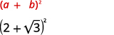
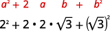
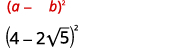
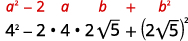
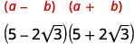
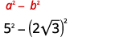

By the end of this section, you will be able to:
* Add and subtract radical expressions
* Multiply radical expressions
* Use polynomial multiplication to multiply radical expressions

Before you get started, take this readiness quiz.

1.  Add:
    <math xmlns="http://www.w3.org/1998/Math/MathML"><mrow><mn>3</mn><msup><mi>x</mi><mn>2</mn></msup><mo>+</mo><mn>9</mn><mi>x</mi><mo>−</mo><mn>5</mn><mo>−</mo><mrow><mo>(</mo><mrow><msup><mi>x</mi><mn>2</mn></msup><mo>−</mo><mn>2</mn><mi>x</mi><mo>+</mo><mn>3</mn></mrow><mo>)</mo></mrow><mo>.</mo></mrow></math>
    
    * * *
    {: data-type="newline"}
    
    If you missed this problem, review [\[link\]](/m63343#fs-id1167829749490).
2.  Simplify:
    <math xmlns="http://www.w3.org/1998/Math/MathML"><mrow><mrow><mo>(</mo><mrow><mn>2</mn><mo>+</mo><mi>a</mi></mrow><mo>)</mo></mrow><mrow><mo>(</mo><mrow><mn>4</mn><mo>−</mo><mi>a</mi></mrow><mo>)</mo></mrow><mo>.</mo></mrow></math>
    
    * * *
    {: data-type="newline"}
    
    If you missed this problem, review [\[link\]](/m63351#fs-id1167836544266).
3.  Simplify:
    <math xmlns="http://www.w3.org/1998/Math/MathML"><mrow><msup><mrow><mrow><mo>(</mo><mrow><mn>9</mn><mo>−</mo><mn>5</mn><mi>y</mi></mrow><mo>)</mo></mrow></mrow><mn>2</mn></msup><mo>.</mo></mrow></math>
    
    * * *
    {: data-type="newline"}
    
    If you missed this problem, review [\[link\]](/m63351#fs-id1167836660220).
{: data-number-style="arabic"}

# Add and Subtract Radical Expressions

Adding radical expressions with the same index and the same radicand is just like adding like terms. We call radicals with the same index and the same radicand **like radicals**{: data-type="term"} to remind us they work the same as like terms.

Like Radicals

**Like radicals** are radical expressions with the same index and the same radicand.

We add and subtract like radicals in the same way we add and subtract like terms. We know that <math xmlns="http://www.w3.org/1998/Math/MathML"><mrow><mn>3</mn><mi>x</mi><mo>+</mo><mn>8</mn><mi>x</mi></mrow></math>

 is <math xmlns="http://www.w3.org/1998/Math/MathML"><mrow><mn>11</mn><mi>x</mi><mo>.</mo></mrow></math>

 Similarly we add <math xmlns="http://www.w3.org/1998/Math/MathML"><mrow><mn>3</mn><msqrt><mi>x</mi></msqrt><mo>+</mo><mn>8</mn><msqrt><mi>x</mi></msqrt></mrow></math>

 and the result is <math xmlns="http://www.w3.org/1998/Math/MathML"><mrow><mn>11</mn><msqrt><mi>x</mi></msqrt><mo>.</mo></mrow></math>

Think about adding like terms with variables as you do the next few examples. When you have like radicals, you just add or subtract the coefficients. When the radicals are not like, you cannot combine the terms.

Simplify: ⓐ <math xmlns="http://www.w3.org/1998/Math/MathML"><mrow><mn>2</mn><mspace width="0.2em" /><msqrt><mn>2</mn></msqrt><mo>−</mo><mn>7</mn><mspace width="0.2em" /><msqrt><mn>2</mn></msqrt></mrow></math>

 ⓑ <math xmlns="http://www.w3.org/1998/Math/MathML"><mrow><mn>5</mn><mspace width="0.2em" /><mroot><mi>y</mi><mrow><mn>3</mn></mrow></mroot><mo>+</mo><mn>4</mn><mspace width="0.2em" /><mroot><mi>y</mi><mrow><mn>3</mn></mrow></mroot></mrow></math>

 ⓒ <math xmlns="http://www.w3.org/1998/Math/MathML"><mrow><mn>7</mn><mspace width="0.2em" /><mroot><mi>x</mi><mrow><mn>4</mn></mrow></mroot><mo>−</mo><mn>2</mn><mspace width="0.2em" /><mroot><mi>y</mi><mrow><mn>4</mn></mrow></mroot><mo>.</mo></mrow></math>

ⓐ* * *
{: data-type="newline"}

 <math xmlns="http://www.w3.org/1998/Math/MathML"><mrow><mtable><mtr><mtd /><mtd /><mtd /><mtd columnalign="center"><mspace width="5em" /><mn>2</mn><mspace width="0.2em" /><msqrt><mn>2</mn></msqrt><mo>−</mo><mn>7</mn><mspace width="0.2em" /><msqrt><mn>2</mn></msqrt></mtd></mtr><mtr><mtd columnalign="left"><mtable><mtr><mtd columnalign="left"><mtext>Since the radicals are like, we subtract the</mtext></mtd></mtr><mtr><mtd columnalign="left"><mtext>coefficients.</mtext></mtd></mtr></mtable></mtd><mtd /><mtd /><mtd columnalign="center"><mspace width="5em" /><mn>−5</mn><mspace width="0.2em" /><msqrt><mn>2</mn></msqrt></mtd></mtr></mtable></mrow></math>

* * *
{: data-type="newline"}

 ⓑ* * *
{: data-type="newline"}

 <math xmlns="http://www.w3.org/1998/Math/MathML"><mrow><mtable><mtr><mtd /><mtd /><mtd /><mtd columnalign="center"><mspace width="7em" /><mn>5</mn><mspace width="0.2em" /><mroot><mi>y</mi><mrow><mn>3</mn></mrow></mroot><mo>+</mo><mn>4</mn><mspace width="0.2em" /><mroot><mi>y</mi><mrow><mn>3</mn></mrow></mroot></mtd></mtr><mtr><mtd columnalign="left"><mtable><mtr><mtd columnalign="left"><mtext>Since the radicals are like, we add the</mtext></mtd></mtr><mtr><mtd columnalign="left"><mtext>coefficients.</mtext></mtd></mtr></mtable></mtd><mtd /><mtd /><mtd columnalign="center"><mspace width="7em" /><mn>9</mn><mspace width="0.2em" /><mroot><mi>y</mi><mrow><mn>3</mn></mrow></mroot></mtd></mtr></mtable></mrow></math>

ⓒ* * *
{: data-type="newline"}

 <math xmlns="http://www.w3.org/1998/Math/MathML"><mrow><mtable><mtr><mtd /><mtd /><mtd /><mtd columnalign="center"><mspace width="21.5em" /><mn>7</mn><mspace width="0.2em" /><mroot><mi>x</mi><mrow><mn>4</mn></mrow></mroot><mo>−</mo><mn>2</mn><mspace width="0.2em" /><mroot><mi>y</mi><mrow><mn>4</mn></mrow></mroot></mtd></mtr></mtable></mrow></math>

The indices are the same but the radicals are different. These are not like radicals. Since the radicals are not like, we cannot subtract them.

Simplify: ⓐ <math xmlns="http://www.w3.org/1998/Math/MathML"><mrow><mn>8</mn><msqrt><mn>2</mn></msqrt><mo>−</mo><mn>9</mn><msqrt><mn>2</mn></msqrt></mrow></math>

 ⓑ <math xmlns="http://www.w3.org/1998/Math/MathML"><mrow><mn>4</mn><mroot><mi>x</mi><mrow><mn>3</mn></mrow></mroot><mo>+</mo><mn>7</mn><mroot><mi>x</mi><mrow><mn>3</mn></mrow></mroot></mrow></math>

 ⓒ <math xmlns="http://www.w3.org/1998/Math/MathML"><mrow><mn>3</mn><mroot><mi>x</mi><mrow><mn>4</mn></mrow></mroot><mo>−</mo><mn>5</mn><mroot><mi>y</mi><mrow><mn>4</mn></mrow></mroot><mo>.</mo></mrow></math>

ⓐ <math xmlns="http://www.w3.org/1998/Math/MathML"><mrow><mtext>−</mtext><msqrt><mn>2</mn></msqrt></mrow></math>

 ⓑ <math xmlns="http://www.w3.org/1998/Math/MathML"><mrow><mn>11</mn><mroot><mi>x</mi><mrow><mn>3</mn></mrow></mroot></mrow></math>

* * *
{: data-type="newline"}

ⓒ <math xmlns="http://www.w3.org/1998/Math/MathML"><mrow><mn>3</mn><mroot><mi>x</mi><mrow><mn>4</mn></mrow></mroot><mo>−</mo><mn>5</mn><mroot><mi>y</mi><mrow><mn>4</mn></mrow></mroot></mrow></math>

Simplify: ⓐ <math xmlns="http://www.w3.org/1998/Math/MathML"><mrow><mn>5</mn><msqrt><mn>3</mn></msqrt><mo>−</mo><mn>9</mn><msqrt><mn>3</mn></msqrt></mrow></math>

 ⓑ <math xmlns="http://www.w3.org/1998/Math/MathML"><mrow><mn>5</mn><mroot><mi>y</mi><mrow><mn>3</mn></mrow></mroot><mo>+</mo><mn>3</mn><mroot><mi>y</mi><mrow><mn>3</mn></mrow></mroot></mrow></math>

 ⓒ <math xmlns="http://www.w3.org/1998/Math/MathML"><mrow><mn>5</mn><mroot><mi>m</mi><mrow><mn>4</mn></mrow></mroot><mo>−</mo><mn>2</mn><mroot><mi>m</mi><mrow><mn>3</mn></mrow></mroot><mo>.</mo></mrow></math>

ⓐ <math xmlns="http://www.w3.org/1998/Math/MathML"><mrow><mn>−4</mn><msqrt><mn>3</mn></msqrt></mrow></math>

 ⓑ <math xmlns="http://www.w3.org/1998/Math/MathML"><mrow><mn>8</mn><mroot><mi>y</mi><mrow><mn>3</mn></mrow></mroot></mrow></math>

* * *
{: data-type="newline"}

ⓒ <math xmlns="http://www.w3.org/1998/Math/MathML"><mrow><mn>5</mn><mroot><mi>m</mi><mrow><mn>4</mn></mrow></mroot><mo>−</mo><mn>2</mn><mroot><mi>m</mi><mrow><mn>3</mn></mrow></mroot></mrow></math>

For radicals to be like, they must have the same index and radicand. When the radicands contain more than one variable, as long as all the variables and their exponents are identical, the radicands are the same.

Simplify: ⓐ <math xmlns="http://www.w3.org/1998/Math/MathML"><mrow><mn>2</mn><mspace width="0.2em" /><msqrt><mrow><mn>5</mn><mi>n</mi></mrow></msqrt><mo>−</mo><mn>6</mn><mspace width="0.2em" /><msqrt><mrow><mn>5</mn><mi>n</mi></mrow></msqrt><mo>+</mo><mn>4</mn><mspace width="0.2em" /><msqrt><mrow><mn>5</mn><mi>n</mi></mrow></msqrt></mrow></math>

 ⓑ <math xmlns="http://www.w3.org/1998/Math/MathML"><mrow><mroot><mrow><mn>3</mn><mi>x</mi><mi>y</mi></mrow><mn>4</mn></mroot><mo>+</mo><mn>5</mn><mspace width="0.2em" /><mroot><mrow><mn>3</mn><mi>x</mi><mi>y</mi></mrow><mn>4</mn></mroot><mo>−</mo><mn>4</mn><mspace width="0.2em" /><mroot><mrow><mn>3</mn><mi>x</mi><mi>y</mi></mrow><mn>4</mn></mroot><mo>.</mo></mrow></math>

ⓐ* * *
{: data-type="newline"}

 <math xmlns="http://www.w3.org/1998/Math/MathML"><mrow><mtable><mtr><mtd /><mtd /><mtd /><mtd columnalign="center"><mspace width="4em" /><mn>2</mn><mspace width="0.2em" /><msqrt><mrow><mn>5</mn><mi>n</mi></mrow></msqrt><mo>−</mo><mn>6</mn><mspace width="0.2em" /><msqrt><mrow><mn>5</mn><mi>n</mi></mrow></msqrt><mo>+</mo><mn>4</mn><mspace width="0.2em" /><msqrt><mrow><mn>5</mn><mi>n</mi></mrow></msqrt></mtd></mtr><mtr><mtd columnalign="left"><mtext>Since the radicals are like, we combine them.</mtext></mtd><mtd /><mtd /><mtd columnalign="center"><mspace width="4em" /><mn>0</mn><mspace width="0.2em" /><msqrt><mrow><mn>5</mn><mi>n</mi></mrow></msqrt></mtd></mtr><mtr><mtd columnalign="left"><mtext>Simplify.</mtext></mtd><mtd /><mtd /><mtd columnalign="center"><mspace width="4em" /><mn>0</mn></mtd></mtr></mtable></mrow></math>

* * *
{: data-type="newline"}

* * *
{: data-type="newline"}

 ⓑ* * *
{: data-type="newline"}

 <math xmlns="http://www.w3.org/1998/Math/MathML"><mrow><mtable><mtr><mtd /><mtd /><mtd /><mtd columnalign="center"><mspace width="4em" /><mroot><mrow><mn>3</mn><mi>x</mi><mi>y</mi></mrow><mn>4</mn></mroot><mo>+</mo><mn>5</mn><mspace width="0.2em" /><mroot><mrow><mn>3</mn><mi>x</mi><mi>y</mi></mrow><mn>4</mn></mroot><mo>−</mo><mn>4</mn><mspace width="0.2em" /><mroot><mrow><mn>3</mn><mi>x</mi><mi>y</mi></mrow><mn>4</mn></mroot></mtd></mtr><mtr><mtd columnalign="left"><mtext>Since the radicals are like, we combine them.</mtext></mtd><mtd /><mtd /><mtd columnalign="center"><mspace width="4em" /><mn>2</mn><mspace width="0.2em" /><mroot><mrow><mn>3</mn><mi>x</mi><mi>y</mi></mrow><mrow><mn>4</mn></mrow></mroot></mtd></mtr></mtable></mrow></math>

Simplify: ⓐ <math xmlns="http://www.w3.org/1998/Math/MathML"><mrow><msqrt><mrow><mn>7</mn><mi>x</mi></mrow></msqrt><mo>−</mo><mn>7</mn><mspace width="0.2em" /><msqrt><mrow><mn>7</mn><mi>x</mi></mrow></msqrt><mo>+</mo><mn>4</mn><mspace width="0.2em" /><msqrt><mrow><mn>7</mn><mi>x</mi></mrow></msqrt></mrow></math>

 ⓑ <math xmlns="http://www.w3.org/1998/Math/MathML"><mrow><mn>4</mn><mspace width="0.2em" /><mroot><mrow><mn>5</mn><mi>x</mi><mi>y</mi></mrow><mn>4</mn></mroot><mo>+</mo><mn>2</mn><mspace width="0.2em" /><mroot><mrow><mn>5</mn><mi>x</mi><mi>y</mi></mrow><mn>4</mn></mroot><mo>−</mo><mn>7</mn><mspace width="0.2em" /><mroot><mrow><mn>5</mn><mi>x</mi><mi>y</mi></mrow><mn>4</mn></mroot><mo>.</mo></mrow></math>

ⓐ <math xmlns="http://www.w3.org/1998/Math/MathML"><mrow><mn>−2</mn><msqrt><mrow><mn>7</mn><mi>x</mi></mrow></msqrt></mrow></math>

 ⓑ <math xmlns="http://www.w3.org/1998/Math/MathML"><mrow><mtext>−</mtext><mroot><mrow><mn>5</mn><mi>x</mi><mi>y</mi></mrow><mn>4</mn></mroot></mrow></math>

Simplify: ⓐ <math xmlns="http://www.w3.org/1998/Math/MathML"><mrow><mn>4</mn><mspace width="0.2em" /><msqrt><mrow><mn>3</mn><mi>y</mi></mrow></msqrt><mo>−</mo><mn>7</mn><mspace width="0.2em" /><msqrt><mrow><mn>3</mn><mi>y</mi></mrow></msqrt><mo>+</mo><mn>2</mn><mspace width="0.2em" /><msqrt><mrow><mn>3</mn><mi>y</mi></mrow></msqrt></mrow></math>

 ⓑ <math xmlns="http://www.w3.org/1998/Math/MathML"><mrow><mn>6</mn><mspace width="0.2em" /><mroot><mrow><mn>7</mn><mi>m</mi><mi>n</mi></mrow><mn>3</mn></mroot><mo>+</mo><mroot><mrow><mn>7</mn><mi>m</mi><mi>n</mi></mrow><mn>3</mn></mroot><mo>−</mo><mn>4</mn><mspace width="0.2em" /><mroot><mrow><mn>7</mn><mi>m</mi><mi>n</mi></mrow><mn>3</mn></mroot><mo>.</mo></mrow></math>

ⓐ <math xmlns="http://www.w3.org/1998/Math/MathML"><mrow><mtext>−</mtext><msqrt><mrow><mn>3</mn><mi>y</mi></mrow></msqrt></mrow></math>

 ⓑ <math xmlns="http://www.w3.org/1998/Math/MathML"><mrow><mn>3</mn><mroot><mrow><mn>7</mn><mi>m</mi><mi>n</mi></mrow><mn>3</mn></mroot></mrow></math>

Remember that we always simplify radicals by removing the largest factor from the radicand that is a power of the index. Once each radical is simplified, we can then decide if they are like radicals.

Simplify: ⓐ <math xmlns="http://www.w3.org/1998/Math/MathML"><mrow><msqrt><mrow><mn>20</mn></mrow></msqrt><mo>+</mo><mn>3</mn><msqrt><mn>5</mn></msqrt></mrow></math>

 ⓑ <math xmlns="http://www.w3.org/1998/Math/MathML"><mrow><mroot><mrow><mn>24</mn></mrow><mrow><mn>3</mn></mrow></mroot><mo>−</mo><mroot><mrow><mn>375</mn></mrow><mrow><mn>3</mn></mrow></mroot></mrow></math>

 ⓒ <math xmlns="http://www.w3.org/1998/Math/MathML"><mrow><mfrac><mn>1</mn><mn>2</mn></mfrac><mroot><mrow><mn>48</mn></mrow><mrow><mn>4</mn></mrow></mroot><mo>−</mo><mfrac><mn>2</mn><mn>3</mn></mfrac><mroot><mrow><mn>243</mn></mrow><mrow><mn>4</mn></mrow></mroot><mo>.</mo></mrow></math>

ⓐ* * *
{: data-type="newline"}

 <math xmlns="http://www.w3.org/1998/Math/MathML"><mrow><mtable><mtr><mtd /><mtd /><mtd /><mtd columnalign="center"><mspace width="8em" /><msqrt><mrow><mn>20</mn></mrow></msqrt><mo>+</mo><mn>3</mn><mspace width="0.2em" /><msqrt><mn>5</mn></msqrt></mtd></mtr><mtr><mtd columnalign="left"><mtext>Simplify the radicals, when possible.</mtext></mtd><mtd /><mtd /><mtd columnalign="center"><mspace width="8em" /><msqrt><mn>4</mn></msqrt><mo>·</mo><msqrt><mn>5</mn></msqrt><mo>+</mo><mn>3</mn><mspace width="0.2em" /><msqrt><mn>5</mn></msqrt></mtd></mtr><mtr><mtd /><mtd /><mtd /><mtd columnalign="center"><mspace width="8em" /><mn>2</mn><mspace width="0.2em" /><msqrt><mn>5</mn></msqrt><mo>+</mo><mn>3</mn><mspace width="0.2em" /><msqrt><mn>5</mn></msqrt></mtd></mtr><mtr><mtd columnalign="left"><mtext>Combine the like radicals.</mtext></mtd><mtd /><mtd /><mtd columnalign="center"><mspace width="8em" /><mn>5</mn><mspace width="0.2em" /><msqrt><mn>5</mn></msqrt></mtd></mtr></mtable></mrow></math>

* * *
{: data-type="newline"}

* * *
{: data-type="newline"}

 ⓑ* * *
{: data-type="newline"}

 <math xmlns="http://www.w3.org/1998/Math/MathML"><mrow><mtable><mtr><mtd /><mtd /><mtd /><mtd columnalign="center"><mspace width="12em" /><mroot><mrow><mn>24</mn></mrow><mrow><mn>3</mn></mrow></mroot><mo>−</mo><mroot><mrow><mn>375</mn></mrow><mrow><mn>3</mn></mrow></mroot></mtd></mtr><mtr><mtd columnalign="left"><mtext>Simplify the radicals.</mtext></mtd><mtd /><mtd /><mtd columnalign="center"><mspace width="12em" /><mroot><mn>8</mn><mrow><mn>3</mn></mrow></mroot><mo>·</mo><mroot><mn>3</mn><mrow><mn>3</mn></mrow></mroot><mo>−</mo><mroot><mrow><mn>125</mn></mrow><mrow><mn>3</mn></mrow></mroot><mo>·</mo><mroot><mn>3</mn><mrow><mn>3</mn></mrow></mroot></mtd></mtr><mtr><mtd /><mtd /><mtd /><mtd columnalign="center"><mspace width="12em" /><mn>2</mn><mspace width="0.2em" /><mroot><mn>3</mn><mrow><mn>3</mn></mrow></mroot><mo>−</mo><mn>5</mn><mspace width="0.2em" /><mroot><mn>3</mn><mrow><mn>3</mn></mrow></mroot></mtd></mtr><mtr><mtd columnalign="left"><mtext>Combine the like radicals.</mtext></mtd><mtd /><mtd /><mtd columnalign="center"><mspace width="12em" /><mn>−3</mn><mroot><mn>3</mn><mrow><mn>3</mn></mrow></mroot></mtd></mtr></mtable></mrow></math>

* * *
{: data-type="newline"}

* * *
{: data-type="newline"}

 ⓒ* * *
{: data-type="newline"}

 <math xmlns="http://www.w3.org/1998/Math/MathML"><mrow><mtable><mtr><mtd /><mtd /><mtd /><mtd columnalign="center"><mspace width="11em" /><mfrac><mn>1</mn><mn>2</mn></mfrac><mspace width="0.2em" /><mroot><mrow><mn>48</mn></mrow><mrow><mn>4</mn></mrow></mroot><mo>−</mo><mfrac><mn>2</mn><mn>3</mn></mfrac><mspace width="0.2em" /><mroot><mrow><mn>243</mn></mrow><mrow><mn>4</mn></mrow></mroot></mtd></mtr><mtr><mtd columnalign="left"><mtext>Simplify the radicals.</mtext></mtd><mtd /><mtd /><mtd columnalign="center"><mspace width="11em" /><mfrac><mn>1</mn><mn>2</mn></mfrac><mspace width="0.2em" /><mroot><mrow><mn>16</mn></mrow><mrow><mn>4</mn></mrow></mroot><mo>·</mo><mroot><mn>3</mn><mrow><mn>4</mn></mrow></mroot><mo>−</mo><mfrac><mn>2</mn><mn>3</mn></mfrac><mspace width="0.2em" /><mroot><mrow><mn>81</mn></mrow><mrow><mn>4</mn></mrow></mroot><mo>·</mo><mroot><mn>3</mn><mrow><mn>4</mn></mrow></mroot></mtd></mtr><mtr><mtd /><mtd /><mtd /><mtd columnalign="center"><mspace width="11em" /><mfrac><mn>1</mn><mn>2</mn></mfrac><mo>·</mo><mn>2</mn><mo>·</mo><mroot><mn>3</mn><mrow><mn>4</mn></mrow></mroot><mo>−</mo><mfrac><mn>2</mn><mn>3</mn></mfrac><mo>·</mo><mn>3</mn><mo>·</mo><mroot><mn>3</mn><mrow><mn>4</mn></mrow></mroot></mtd></mtr><mtr><mtd /><mtd /><mtd /><mtd columnalign="center"><mspace width="11em" /><mroot><mn>3</mn><mrow><mn>4</mn></mrow></mroot><mo>−</mo><mn>2</mn><mspace width="0.2em" /><mroot><mn>3</mn><mrow><mn>4</mn></mrow></mroot></mtd></mtr><mtr><mtd columnalign="left"><mtext>Combine the like radicals.</mtext></mtd><mtd /><mtd /><mtd columnalign="center"><mspace width="11em" /><mtext>−</mtext><mroot><mn>3</mn><mrow><mn>4</mn></mrow></mroot></mtd></mtr></mtable></mrow></math>

Simplify: ⓐ <math xmlns="http://www.w3.org/1998/Math/MathML"><mrow><msqrt><mrow><mn>18</mn></mrow></msqrt><mo>+</mo><mn>6</mn><mspace width="0.2em" /><msqrt><mn>2</mn></msqrt></mrow></math>

 ⓑ <math xmlns="http://www.w3.org/1998/Math/MathML"><mrow><mn>6</mn><mspace width="0.2em" /><mroot><mrow><mn>16</mn></mrow><mrow><mn>3</mn></mrow></mroot><mo>−</mo><mn>2</mn><mspace width="0.2em" /><mroot><mrow><mn>250</mn></mrow><mrow><mn>3</mn></mrow></mroot></mrow></math>

 ⓒ <math xmlns="http://www.w3.org/1998/Math/MathML"><mrow><mfrac><mn>2</mn><mn>3</mn></mfrac><mspace width="0.2em" /><mroot><mrow><mn>81</mn></mrow><mn>3</mn></mroot><mo>−</mo><mfrac><mn>1</mn><mn>2</mn></mfrac><mspace width="0.2em" /><mroot><mrow><mn>24</mn></mrow><mn>3</mn></mroot><mo>.</mo></mrow></math>

ⓐ <math xmlns="http://www.w3.org/1998/Math/MathML"><mrow><mn>9</mn><msqrt><mn>2</mn></msqrt></mrow></math>

 ⓑ <math xmlns="http://www.w3.org/1998/Math/MathML"><mrow><mn>2</mn><mroot><mn>2</mn><mn>3</mn></mroot></mrow></math>

 ⓒ <math xmlns="http://www.w3.org/1998/Math/MathML"><mrow><mroot><mn>3</mn><mn>3</mn></mroot></mrow></math>

Simplify: ⓐ <math xmlns="http://www.w3.org/1998/Math/MathML"><mrow><msqrt><mrow><mn>27</mn></mrow></msqrt><mo>+</mo><mn>4</mn><mspace width="0.2em" /><msqrt><mn>3</mn></msqrt></mrow></math>

 ⓑ <math xmlns="http://www.w3.org/1998/Math/MathML"><mrow><mn>4</mn><mspace width="0.2em" /><mroot><mn>5</mn><mrow><mn>3</mn></mrow></mroot><mo>−</mo><mn>7</mn><mspace width="0.2em" /><mroot><mrow><mn>40</mn></mrow><mrow><mn>3</mn></mrow></mroot></mrow></math>

 ⓒ <math xmlns="http://www.w3.org/1998/Math/MathML"><mrow><mfrac><mn>1</mn><mn>2</mn></mfrac><mspace width="0.2em" /><mroot><mrow><mn>128</mn></mrow><mrow><mn>3</mn></mrow></mroot><mo>−</mo><mfrac><mn>5</mn><mn>3</mn></mfrac><mspace width="0.2em" /><mroot><mrow><mn>54</mn></mrow><mn>3</mn></mroot><mo>.</mo></mrow></math>

ⓐ <math xmlns="http://www.w3.org/1998/Math/MathML"><mrow><mn>7</mn><msqrt><mn>3</mn></msqrt></mrow></math>

 ⓑ <math xmlns="http://www.w3.org/1998/Math/MathML"><mrow><mn>−10</mn><mroot><mn>5</mn><mn>3</mn></mroot></mrow></math>

 ⓒ <math xmlns="http://www.w3.org/1998/Math/MathML"><mrow><mn>−3</mn><mroot><mn>2</mn><mn>3</mn></mroot></mrow></math>

In the next example, we will remove both constant and variable factors from the radicals. Now that we have practiced taking both the even and odd roots of variables, it is common practice at this point for us to assume all variables are greater than or equal to zero so that absolute values are not needed. We will use this assumption thoughout the rest of this chapter.

Simplify: ⓐ <math xmlns="http://www.w3.org/1998/Math/MathML"><mrow><mn>9</mn><msqrt><mrow><mn>50</mn><msup><mi>m</mi><mn>2</mn></msup></mrow></msqrt><mo>−</mo><mn>6</mn><msqrt><mrow><mn>48</mn><msup><mi>m</mi><mn>2</mn></msup></mrow></msqrt></mrow></math>

 ⓑ <math xmlns="http://www.w3.org/1998/Math/MathML"><mrow><mroot><mrow><mn>54</mn><msup><mi>n</mi><mn>5</mn></msup></mrow><mrow><mn>3</mn></mrow></mroot><mo>−</mo><mroot><mrow><mn>16</mn><msup><mi>n</mi><mn>5</mn></msup></mrow><mrow><mn>3</mn></mrow></mroot><mo>.</mo></mrow></math>

ⓐ* * *
{: data-type="newline"}

 <math xmlns="http://www.w3.org/1998/Math/MathML"><mrow><mtable><mtr><mtd /><mtd /><mtd /><mtd columnalign="center"><mspace width="4.5em" /><mn>9</mn><mspace width="0.2em" /><msqrt><mrow><mn>50</mn><msup><mi>m</mi><mn>2</mn></msup></mrow></msqrt><mo>−</mo><mn>6</mn><mspace width="0.2em" /><msqrt><mrow><mn>48</mn><msup><mi>m</mi><mn>2</mn></msup></mrow></msqrt></mtd></mtr><mtr><mtd columnalign="left"><mtext>Simplify the radicals.</mtext></mtd><mtd /><mtd /><mtd columnalign="center"><mspace width="4.5em" /><mn>9</mn><mspace width="0.2em" /><msqrt><mrow><mn>25</mn><msup><mi>m</mi><mn>2</mn></msup></mrow></msqrt><mo>·</mo><msqrt><mn>2</mn></msqrt><mo>−</mo><mn>6</mn><mspace width="0.2em" /><msqrt><mrow><mn>16</mn><msup><mi>m</mi><mn>2</mn></msup></mrow></msqrt><mo>·</mo><msqrt><mn>3</mn></msqrt></mtd></mtr><mtr><mtd /><mtd /><mtd /><mtd columnalign="center"><mspace width="4.5em" /><mn>9</mn><mo>·</mo><mn>5</mn><mi>m</mi><mo>·</mo><msqrt><mn>2</mn></msqrt><mo>−</mo><mn>6</mn><mo>·</mo><mn>4</mn><mi>m</mi><mo>·</mo><msqrt><mn>3</mn></msqrt></mtd></mtr><mtr><mtd /><mtd /><mtd /><mtd columnalign="center"><mspace width="4.5em" /><mn>4</mn><mn>5</mn><mi>m</mi><mspace width="0.2em" /><msqrt><mn>2</mn></msqrt><mo>−</mo><mn>24</mn><mi>m</mi><mspace width="0.2em" /><msqrt><mn>3</mn></msqrt></mtd></mtr><mtr><mtd columnalign="left"><mtable><mtr><mtd columnalign="left"><mtext>The radicals are not like and so cannot be</mtext></mtd></mtr><mtr><mtd columnalign="left"><mtext>combined.</mtext></mtd></mtr></mtable></mtd><mtd /><mtd /><mtd /></mtr></mtable></mrow></math>

* * *
{: data-type="newline"}

* * *
{: data-type="newline"}

 ⓑ* * *
{: data-type="newline"}

 <math xmlns="http://www.w3.org/1998/Math/MathML"><mrow><mtable><mtr><mtd /><mtd /><mtd /><mtd columnalign="center"><mspace width="11em" /><mroot><mrow><mn>54</mn><msup><mi>n</mi><mn>5</mn></msup></mrow><mrow><mn>3</mn></mrow></mroot><mo>−</mo><mroot><mrow><mn>16</mn><msup><mi>n</mi><mn>5</mn></msup></mrow><mrow><mn>3</mn></mrow></mroot></mtd></mtr><mtr><mtd columnalign="left"><mtext>Simplify the radicals.</mtext></mtd><mtd /><mtd /><mtd columnalign="center"><mspace width="11em" /><mroot><mrow><mn>27</mn><msup><mi>n</mi><mn>3</mn></msup></mrow><mrow><mn>3</mn></mrow></mroot><mo>·</mo><mroot><mrow><mn>2</mn><msup><mi>n</mi><mn>2</mn></msup></mrow><mrow><mn>3</mn></mrow></mroot><mo>−</mo><mroot><mrow><mn>8</mn><msup><mi>n</mi><mn>3</mn></msup></mrow><mrow><mn>3</mn></mrow></mroot><mo>·</mo><mroot><mrow><mn>2</mn><msup><mi>n</mi><mn>2</mn></msup></mrow><mrow><mn>3</mn></mrow></mroot></mtd></mtr><mtr><mtd /><mtd /><mtd /><mtd columnalign="center"><mspace width="11em" /><mn>3</mn><mi>n</mi><mspace width="0.2em" /><mroot><mrow><mn>2</mn><msup><mi>n</mi><mn>2</mn></msup></mrow><mrow><mn>3</mn></mrow></mroot><mo>−</mo><mn>2</mn><mi>n</mi><mspace width="0.2em" /><mroot><mrow><mn>2</mn><msup><mi>n</mi><mn>2</mn></msup></mrow><mrow><mn>3</mn></mrow></mroot></mtd></mtr><mtr><mtd columnalign="left"><mtext>Combine the like radicals.</mtext></mtd><mtd /><mtd /><mtd columnalign="center"><mspace width="11em" /><mi>n</mi><mspace width="0.2em" /><mroot><mrow><mn>2</mn><msup><mi>n</mi><mn>2</mn></msup></mrow><mrow><mn>3</mn></mrow></mroot></mtd></mtr></mtable></mrow></math>

Simplify: ⓐ <math xmlns="http://www.w3.org/1998/Math/MathML"><mrow><msqrt><mrow><mn>32</mn><msup><mi>m</mi><mn>7</mn></msup></mrow></msqrt><mo>−</mo><msqrt><mrow><mn>50</mn><msup><mi>m</mi><mn>7</mn></msup></mrow></msqrt></mrow></math>

 ⓑ <math xmlns="http://www.w3.org/1998/Math/MathML"><mrow><mroot><mrow><mn>135</mn><msup><mi>x</mi><mn>7</mn></msup></mrow><mrow><mn>3</mn></mrow></mroot><mo>−</mo><mroot><mrow><mn>40</mn><msup><mi>x</mi><mn>7</mn></msup></mrow><mrow><mn>3</mn></mrow></mroot><mo>.</mo></mrow></math>

ⓐ <math xmlns="http://www.w3.org/1998/Math/MathML"><mrow><mtext>−</mtext><msup><mi>m</mi><mn>3</mn></msup><msqrt><mrow><mn>2</mn><mi>m</mi></mrow></msqrt></mrow></math>

 ⓑ <math xmlns="http://www.w3.org/1998/Math/MathML"><mrow><msup><mi>x</mi><mn>2</mn></msup><mroot><mrow><mn>5</mn><mi>x</mi></mrow><mn>3</mn></mroot></mrow></math>

Simplify: ⓐ <math xmlns="http://www.w3.org/1998/Math/MathML"><mrow><msqrt><mrow><mn>27</mn><msup><mi>p</mi><mn>3</mn></msup></mrow></msqrt><mo>−</mo><msqrt><mrow><mn>48</mn><msup><mi>p</mi><mn>3</mn></msup></mrow></msqrt></mrow></math>

 ⓑ <math xmlns="http://www.w3.org/1998/Math/MathML"><mrow><mroot><mrow><mn>256</mn><msup><mi>y</mi><mn>5</mn></msup></mrow><mrow><mn>3</mn></mrow></mroot><mo>−</mo><mroot><mrow><mn>32</mn><msup><mi>n</mi><mn>5</mn></msup></mrow><mrow><mn>3</mn></mrow></mroot><mo>.</mo></mrow></math>

ⓐ <math xmlns="http://www.w3.org/1998/Math/MathML"><mrow><mtext>−</mtext><mi>p</mi><msqrt><mrow><mn>3</mn><mi>p</mi></mrow></msqrt></mrow></math>

* * *
{: data-type="newline"}

ⓑ <math xmlns="http://www.w3.org/1998/Math/MathML"><mrow><mn>4</mn><mi>y</mi><mroot><mrow><mn>4</mn><msup><mi>y</mi><mn>2</mn></msup></mrow><mn>3</mn></mroot><mo>−</mo><mn>2</mn><mi>n</mi><mroot><mrow><mn>4</mn><msup><mi>n</mi><mn>2</mn></msup></mrow><mn>3</mn></mroot></mrow></math>

# Multiply Radical Expressions

We have used the **Product Property of Roots**{: data-type="term" .no-emphasis} to simplify square roots by removing the perfect square factors. We can use the Product Property of Roots ‘in reverse’ to multiply square roots. Remember, we assume all variables are greater than or equal to zero.

We will rewrite the Product Property of Roots so we see both ways together.

Product Property of Roots

For any real numbers, <math xmlns="http://www.w3.org/1998/Math/MathML"><mrow><mroot><mi>a</mi><mi>n</mi></mroot></mrow></math>

 and <math xmlns="http://www.w3.org/1998/Math/MathML"><mrow><mroot><mi>b</mi><mi>n</mi></mroot><mo>,</mo></mrow></math>

 and for any integer <math xmlns="http://www.w3.org/1998/Math/MathML"><mrow><mi>n</mi><mo>≥</mo><mn>2</mn></mrow></math>

<math xmlns="http://www.w3.org/1998/Math/MathML"><mrow><mroot><mrow><mi>a</mi><mi>b</mi></mrow><mi>n</mi></mroot><mo>=</mo><mroot><mi>a</mi><mi>n</mi></mroot><mo>·</mo><mroot><mi>b</mi><mi>n</mi></mroot><mspace width="1em" /><mtext>and</mtext><mspace width="1em" /><mroot><mi>a</mi><mi>n</mi></mroot><mo>·</mo><mroot><mi>b</mi><mi>n</mi></mroot><mo>=</mo><mroot><mrow><mi>a</mi><mi>b</mi></mrow><mi>n</mi></mroot></mrow></math>

When we multiply two radicals they must have the same index. Once we multiply the radicals, we then look for factors that are a power of the index and simplify the radical whenever possible.

Multiplying radicals with coefficients is much like multiplying variables with coefficients. To multiply <math xmlns="http://www.w3.org/1998/Math/MathML"><mrow><mn>4</mn><mi>x</mi><mo>·</mo><mn>3</mn><mi>y</mi></mrow></math>

 we multiply the coefficients together and then the variables. The result is 12*xy*. Keep this in mind as you do these examples.

Simplify: ⓐ <math xmlns="http://www.w3.org/1998/Math/MathML"><mrow><mrow><mo>(</mo><mrow><mn>6</mn><mspace width="0.2em" /><msqrt><mrow><mn>2</mn></mrow></msqrt></mrow><mo>)</mo></mrow><mrow><mo>(</mo><mrow><mn>3</mn><mspace width="0.2em" /><msqrt><mrow><mn>10</mn></mrow></msqrt></mrow><mo>)</mo></mrow></mrow></math>

 ⓑ <math xmlns="http://www.w3.org/1998/Math/MathML"><mrow><mrow><mo>(</mo><mrow><mn>−5</mn><mspace width="0.2em" /><mroot><mn>4</mn><mn>3</mn></mroot></mrow><mo>)</mo></mrow><mrow><mo>(</mo><mrow><mn>−4</mn><mspace width="0.2em" /><mroot><mn>6</mn><mn>3</mn></mroot></mrow><mo>)</mo></mrow><mo>.</mo></mrow></math>

ⓐ* * *
{: data-type="newline"}

 <math xmlns="http://www.w3.org/1998/Math/MathML"><mrow><mtable><mtr><mtd /><mtd /><mtd /><mtd columnalign="center"><mspace width="4.5em" /><mrow><mo>(</mo><mrow><mn>6</mn><mspace width="0.2em" /><msqrt><mrow><mn>2</mn></mrow></msqrt></mrow><mo>)</mo></mrow><mrow><mo>(</mo><mrow><mn>3</mn><mspace width="0.2em" /><msqrt><mrow><mn>10</mn></mrow></msqrt></mrow><mo>)</mo></mrow></mtd></mtr><mtr><mtd columnalign="left"><mtext>Multiply using the Product Property.</mtext></mtd><mtd /><mtd /><mtd columnalign="center"><mspace width="4.5em" /><mn>18</mn><mspace width="0.2em" /><msqrt><mrow><mn>20</mn></mrow></msqrt></mtd></mtr><mtr><mtd columnalign="left"><mtext>Simplify the radical.</mtext></mtd><mtd /><mtd /><mtd columnalign="center"><mspace width="4.5em" /><mn>18</mn><mspace width="0.2em" /><msqrt><mn>4</mn></msqrt><mo>·</mo><msqrt><mn>5</mn></msqrt></mtd></mtr><mtr><mtd columnalign="left"><mtext>Simplify.</mtext></mtd><mtd /><mtd /><mtd columnalign="center"><mspace width="4.5em" /><mn>18</mn><mo>·</mo><mn>2</mn><mo>·</mo><msqrt><mn>5</mn></msqrt></mtd></mtr><mtr><mtd /><mtd /><mtd /><mtd columnalign="center"><mspace width="4.5em" /><mn>36</mn><mspace width="0.2em" /><msqrt><mn>5</mn></msqrt></mtd></mtr></mtable></mrow></math>

* * *
{: data-type="newline"}

* * *
{: data-type="newline"}

 ⓑ* * *
{: data-type="newline"}

 <math xmlns="http://www.w3.org/1998/Math/MathML"><mrow><mtable><mtr><mtd /><mtd /><mtd /><mtd columnalign="center"><mspace width="4em" /><mrow><mo>(</mo><mrow><mn>−5</mn><mspace width="0.2em" /><mroot><mn>4</mn><mn>3</mn></mroot></mrow><mo>)</mo></mrow><mrow><mo>(</mo><mrow><mn>−4</mn><mspace width="0.2em" /><mroot><mn>6</mn><mn>3</mn></mroot></mrow><mo>)</mo></mrow></mtd></mtr><mtr><mtd columnalign="left"><mtext>Multiply using the Product Property.</mtext></mtd><mtd /><mtd /><mtd columnalign="center"><mspace width="4em" /><mn>20</mn><mspace width="0.2em" /><mroot><mrow><mn>24</mn></mrow><mn>3</mn></mroot></mtd></mtr><mtr><mtd columnalign="left"><mtext>Simplify the radical.</mtext></mtd><mtd /><mtd /><mtd columnalign="center"><mspace width="4em" /><mn>20</mn><mspace width="0.2em" /><mroot><mn>8</mn><mn>3</mn></mroot><mo>·</mo><mroot><mn>3</mn><mn>3</mn></mroot></mtd></mtr><mtr><mtd columnalign="left"><mtext>Simplify.</mtext></mtd><mtd /><mtd /><mtd columnalign="center"><mspace width="4em" /><mn>20</mn><mo>·</mo><mn>2</mn><mo>·</mo><mroot><mn>3</mn><mn>3</mn></mroot></mtd></mtr><mtr><mtd /><mtd /><mtd /><mtd columnalign="center"><mspace width="4em" /><mn>40</mn><mspace width="0.2em" /><mroot><mn>3</mn><mn>3</mn></mroot></mtd></mtr></mtable></mrow></math>

Simplify: ⓐ <math xmlns="http://www.w3.org/1998/Math/MathML"><mrow><mrow><mo>(</mo><mrow><mn>3</mn><msqrt><mrow><mn>2</mn></mrow></msqrt></mrow><mo>)</mo></mrow><mrow><mo>(</mo><mrow><mn>2</mn><msqrt><mrow><mn>30</mn></mrow></msqrt></mrow><mo>)</mo></mrow></mrow></math>

 ⓑ <math xmlns="http://www.w3.org/1998/Math/MathML"><mrow><mrow><mo>(</mo><mrow><mn>2</mn><mspace width="0.2em" /><mroot><mrow><mn>18</mn></mrow><mn>3</mn></mroot></mrow><mo>)</mo></mrow><mrow><mo>(</mo><mrow><mn>−3</mn><mspace width="0.2em" /><mroot><mn>6</mn><mn>3</mn></mroot></mrow><mo>)</mo></mrow><mo>.</mo></mrow></math>

ⓐ <math xmlns="http://www.w3.org/1998/Math/MathML"><mrow><mn>12</mn><msqrt><mrow><mn>15</mn></mrow></msqrt></mrow></math>

 ⓑ <math xmlns="http://www.w3.org/1998/Math/MathML"><mrow><mn>−18</mn><mroot><mn>2</mn><mn>3</mn></mroot></mrow></math>

Simplify: ⓐ <math xmlns="http://www.w3.org/1998/Math/MathML"><mrow><mrow><mo>(</mo><mrow><mn>3</mn><msqrt><mrow><mn>3</mn></mrow></msqrt></mrow><mo>)</mo></mrow><mrow><mo>(</mo><mrow><mn>3</mn><msqrt><mn>6</mn></msqrt></mrow><mo>)</mo></mrow></mrow></math>

 ⓑ <math xmlns="http://www.w3.org/1998/Math/MathML"><mrow><mrow><mo>(</mo><mrow><mn>−4</mn><mspace width="0.2em" /><mroot><mn>9</mn><mn>3</mn></mroot></mrow><mo>)</mo></mrow><mrow><mo>(</mo><mrow><mn>3</mn><mspace width="0.2em" /><mroot><mn>6</mn><mn>3</mn></mroot></mrow><mo>)</mo></mrow><mo>.</mo></mrow></math>

ⓐ <math xmlns="http://www.w3.org/1998/Math/MathML"><mrow><mn>27</mn><msqrt><mn>2</mn></msqrt></mrow></math>

 ⓑ <math xmlns="http://www.w3.org/1998/Math/MathML"><mrow><mn>−36</mn><mroot><mn>2</mn><mn>3</mn></mroot></mrow></math>

We follow the same procedures when there are variables in the radicands.

Simplify: ⓐ <math xmlns="http://www.w3.org/1998/Math/MathML"><mrow><mrow><mo>(</mo><mrow><mn>10</mn><mspace width="0.2em" /><msqrt><mrow><mn>6</mn><msup><mi>p</mi><mn>3</mn></msup></mrow></msqrt></mrow><mo>)</mo></mrow><mrow><mo>(</mo><mrow><mn>4</mn><mspace width="0.2em" /><msqrt><mrow><mn>3</mn><mi>p</mi></mrow></msqrt></mrow><mo>)</mo></mrow></mrow></math>

 ⓑ <math xmlns="http://www.w3.org/1998/Math/MathML"><mrow><mrow><mo>(</mo><mrow><mn>2</mn><mspace width="0.2em" /><mroot><mrow><mn>20</mn><msup><mi>y</mi><mn>2</mn></msup></mrow><mn>4</mn></mroot></mrow><mo>)</mo></mrow><mrow><mo>(</mo><mrow><mn>3</mn><mspace width="0.2em" /><mroot><mrow><mn>28</mn><msup><mi>y</mi><mn>3</mn></msup></mrow><mn>4</mn></mroot></mrow><mo>)</mo></mrow><mo>.</mo></mrow></math>

ⓐ* * *
{: data-type="newline"}

 <math xmlns="http://www.w3.org/1998/Math/MathML"><mrow><mtable><mtr><mtd /><mtd /><mtd /><mtd columnalign="center"><mspace width="4em" /><mrow><mo>(</mo><mrow><mn>10</mn><msqrt><mrow><mn>6</mn><msup><mi>p</mi><mn>3</mn></msup></mrow></msqrt></mrow><mo>)</mo></mrow><mrow><mo>(</mo><mrow><mn>4</mn><msqrt><mrow><mn>3</mn><mi>p</mi></mrow></msqrt></mrow><mo>)</mo></mrow></mtd></mtr><mtr><mtd columnalign="left"><mtext>Multiply.</mtext></mtd><mtd /><mtd /><mtd columnalign="center"><mspace width="4em" /><mn>40</mn><msqrt><mrow><mn>18</mn><msup><mi>p</mi><mn>4</mn></msup></mrow></msqrt></mtd></mtr><mtr><mtd columnalign="left"><mtext>Simplify the radical.</mtext></mtd><mtd /><mtd /><mtd columnalign="center"><mspace width="4em" /><mn>40</mn><msqrt><mrow><mn>9</mn><msup><mi>p</mi><mn>4</mn></msup></mrow></msqrt><mo>·</mo><msqrt><mn>2</mn></msqrt></mtd></mtr><mtr><mtd columnalign="left"><mtext>Simplify.</mtext></mtd><mtd /><mtd /><mtd columnalign="center"><mspace width="4em" /><mn>40</mn><mo>·</mo><mn>3</mn><msup><mi>p</mi><mn>2</mn></msup><mo>·</mo><msqrt><mn>3</mn></msqrt></mtd></mtr><mtr><mtd /><mtd /><mtd /><mtd columnalign="center"><mspace width="4em" /><mn>120</mn><msup><mi>p</mi><mn>2</mn></msup><msqrt><mn>3</mn></msqrt></mtd></mtr></mtable></mrow></math>

ⓑ When the radicands involve large numbers, it is often advantageous to factor them in order to find the perfect powers.

<math xmlns="http://www.w3.org/1998/Math/MathML"><mrow><mtable><mtr><mtd /><mtd /><mtd /><mtd columnalign="center"><mspace width="4em" /><mrow><mo>(</mo><mrow><mn>2</mn><mroot><mrow><mn>20</mn><msup><mi>y</mi><mn>2</mn></msup></mrow><mn>4</mn></mroot></mrow><mo>)</mo></mrow><mrow><mo>(</mo><mrow><mn>3</mn><mroot><mrow><mn>28</mn><msup><mi>y</mi><mn>3</mn></msup></mrow><mn>4</mn></mroot></mrow><mo>)</mo></mrow></mtd></mtr><mtr><mtd columnalign="left"><mtext>Multiply.</mtext></mtd><mtd /><mtd /><mtd columnalign="center"><mspace width="4em" /><mn>6</mn><mspace width="0.2em" /><mroot><mrow><mn>4</mn><mo>·</mo><mn>5</mn><mo>·</mo><mn>4</mn><mo>·</mo><mn>7</mn><msup><mi>y</mi><mn>5</mn></msup></mrow><mn>4</mn></mroot></mtd></mtr><mtr><mtd columnalign="left"><mtext>Simplify the radical.</mtext></mtd><mtd /><mtd /><mtd columnalign="center"><mspace width="4em" /><mn>6</mn><mspace width="0.2em" /><mroot><mrow><mn>16</mn><msup><mi>y</mi><mn>4</mn></msup></mrow><mn>4</mn></mroot><mo>·</mo><mroot><mrow><mn>35</mn><msup><mi>y</mi><mrow /></msup></mrow><mn>4</mn></mroot></mtd></mtr><mtr><mtd columnalign="left"><mtext>Simplify.</mtext></mtd><mtd /><mtd /><mtd columnalign="center"><mspace width="4em" /><mn>6</mn><mo>·</mo><mn>2</mn><mi>y</mi><mspace width="0.2em" /><mroot><mrow><mn>35</mn><msup><mi>y</mi><mrow /></msup></mrow><mn>4</mn></mroot></mtd></mtr><mtr><mtd columnalign="left"><mtext>Multiply.</mtext></mtd><mtd /><mtd /><mtd columnalign="center"><mspace width="4em" /><mn>12</mn><mi>y</mi><mspace width="0.2em" /><mroot><mrow><mn>35</mn><msup><mi>y</mi><mrow /></msup></mrow><mn>4</mn></mroot></mtd></mtr></mtable></mrow></math>

Simplify: ⓐ <math xmlns="http://www.w3.org/1998/Math/MathML"><mrow><mrow><mo>(</mo><mrow><mn>6</mn><msqrt><mrow><mn>6</mn><msup><mi>x</mi><mn>2</mn></msup></mrow></msqrt></mrow><mo>)</mo></mrow><mrow><mo>(</mo><mrow><mn>8</mn><msqrt><mrow><mn>30</mn><msup><mi>x</mi><mn>4</mn></msup></mrow></msqrt></mrow><mo>)</mo></mrow></mrow></math>

 ⓑ <math xmlns="http://www.w3.org/1998/Math/MathML"><mrow><mrow><mo>(</mo><mrow><mn>−4</mn><mspace width="0.2em" /><mroot><mrow><mn>12</mn><msup><mi>y</mi><mn>3</mn></msup></mrow><mn>4</mn></mroot></mrow><mo>)</mo></mrow><mrow><mo>(</mo><mrow><mtext>−</mtext><mroot><mrow><mn>8</mn><msup><mi>y</mi><mn>3</mn></msup></mrow><mn>4</mn></mroot></mrow><mo>)</mo></mrow><mo>.</mo></mrow></math>

ⓐ <math xmlns="http://www.w3.org/1998/Math/MathML"><mrow><mn>36</mn><msup><mi>x</mi><mn>3</mn></msup><msqrt><mn>5</mn></msqrt></mrow></math>

 ⓑ <math xmlns="http://www.w3.org/1998/Math/MathML"><mrow><mn>8</mn><mi>y</mi><mroot><mrow><mn>3</mn><msup><mi>y</mi><mn>2</mn></msup></mrow><mn>4</mn></mroot></mrow></math>

Simplify: ⓐ <math xmlns="http://www.w3.org/1998/Math/MathML"><mrow><mrow><mo>(</mo><mrow><mn>2</mn><msqrt><mrow><mn>6</mn><msup><mi>y</mi><mn>4</mn></msup></mrow></msqrt></mrow><mo>)</mo></mrow><mrow><mo>(</mo><mrow><mn>12</mn><msqrt><mrow><mn>30</mn><mi>y</mi></mrow></msqrt></mrow><mo>)</mo></mrow></mrow></math>

 ⓑ <math xmlns="http://www.w3.org/1998/Math/MathML"><mrow><mrow><mo>(</mo><mrow><mn>−4</mn><mspace width="0.2em" /><mroot><mrow><mn>9</mn><msup><mi>a</mi><mn>3</mn></msup></mrow><mn>4</mn></mroot></mrow><mo>)</mo></mrow><mrow><mo>(</mo><mrow><mn>3</mn><mspace width="0.2em" /><mroot><mrow><mn>27</mn><msup><mi>a</mi><mn>2</mn></msup></mrow><mn>4</mn></mroot></mrow><mo>)</mo></mrow><mo>.</mo></mrow></math>

ⓐ <math xmlns="http://www.w3.org/1998/Math/MathML"><mrow><mn>144</mn><msup><mi>y</mi><mn>2</mn></msup><msqrt><mrow><mn>5</mn><mi>y</mi></mrow></msqrt></mrow></math>

 ⓑ <math xmlns="http://www.w3.org/1998/Math/MathML"><mrow><mn>−36</mn><mroot><mrow><mn>3</mn><mi>a</mi></mrow><mn>4</mn></mroot></mrow></math>

# Use Polynomial Multiplication to Multiply Radical Expressions

In the next a few examples, we will use the **Distributive Property**{: data-type="term" .no-emphasis} to multiply expressions with radicals. First we will distribute and then simplify the radicals when possible.

Simplify: ⓐ <math xmlns="http://www.w3.org/1998/Math/MathML"><mrow><msqrt><mn>6</mn><mspace width="0.2em" /></msqrt><mrow><mo>(</mo><mrow><msqrt><mn>2</mn></msqrt><mo>+</mo><msqrt><mrow><mn>18</mn></mrow></msqrt></mrow><mo>)</mo></mrow></mrow></math>

 ⓑ <math xmlns="http://www.w3.org/1998/Math/MathML"><mrow><mroot><mn>9</mn><mrow><mn>3</mn></mrow></mroot><mspace width="0.2em" /><mrow><mo>(</mo><mrow><mn>5</mn><mo>−</mo><mroot><mrow><mn>18</mn></mrow><mrow><mn>3</mn></mrow></mroot></mrow><mo>)</mo></mrow><mo>.</mo></mrow></math>

ⓐ* * *
{: data-type="newline"}

 <math xmlns="http://www.w3.org/1998/Math/MathML"><mrow><mtable><mtr><mtd /><mtd /><mtd /><mtd columnalign="center"><mspace width="6em" /><msqrt><mn>6</mn></msqrt><mspace width="0.2em" /><mrow><mo>(</mo><mrow><msqrt><mn>2</mn></msqrt><mo>+</mo><msqrt><mrow><mn>18</mn></mrow></msqrt></mrow><mo>)</mo></mrow></mtd></mtr><mtr><mtd columnalign="left"><mtext>Multiply.</mtext></mtd><mtd /><mtd /><mtd columnalign="center"><mspace width="6em" /><msqrt><mrow><mn>12</mn></mrow></msqrt><mo>+</mo><msqrt><mrow><mn>108</mn></mrow></msqrt></mtd></mtr><mtr><mtd columnalign="left"><mtext>Simplify.</mtext></mtd><mtd /><mtd /><mtd columnalign="center"><mspace width="6em" /><msqrt><mn>4</mn></msqrt><mo>·</mo><msqrt><mn>3</mn></msqrt><mo>+</mo><msqrt><mrow><mn>36</mn></mrow></msqrt><mo>·</mo><msqrt><mn>3</mn></msqrt></mtd></mtr><mtr><mtd columnalign="left"><mtext>Simplify.</mtext></mtd><mtd /><mtd /><mtd columnalign="center"><mspace width="6em" /><mn>2</mn><msqrt><mn>3</mn></msqrt><mo>+</mo><mn>6</mn><msqrt><mn>3</mn></msqrt></mtd></mtr><mtr><mtd columnalign="left"><mtext>Combine like radicals.</mtext></mtd><mtd /><mtd /><mtd columnalign="center"><mspace width="6em" /><mn>8</mn><msqrt><mn>3</mn></msqrt></mtd></mtr></mtable></mrow></math>

* * *
{: data-type="newline"}

* * *
{: data-type="newline"}

 ⓑ* * *
{: data-type="newline"}

 <math xmlns="http://www.w3.org/1998/Math/MathML"><mrow><mtable><mtr><mtd /><mtd /><mtd /><mtd columnalign="center"><mspace width="12em" /><mroot><mn>9</mn><mrow><mn>3</mn></mrow></mroot><mspace width="0.2em" /><mrow><mo>(</mo><mrow><mn>5</mn><mo>−</mo><mroot><mrow><mn>18</mn></mrow><mrow><mn>3</mn></mrow></mroot></mrow><mo>)</mo></mrow></mtd></mtr><mtr><mtd columnalign="left"><mtext>Distribute.</mtext></mtd><mtd /><mtd /><mtd columnalign="center"><mspace width="12em" /><mn>5</mn><mroot><mn>9</mn><mrow><mn>3</mn></mrow></mroot><mo>−</mo><mroot><mrow><mn>162</mn></mrow><mrow><mn>3</mn></mrow></mroot></mtd></mtr><mtr><mtd columnalign="left"><mtext>Simplify.</mtext></mtd><mtd /><mtd /><mtd columnalign="center"><mspace width="12em" /><mn>5</mn><mspace width="0.2em" /><mroot><mn>9</mn><mrow><mn>3</mn></mrow></mroot><mo>−</mo><mroot><mrow><mn>27</mn></mrow><mrow><mn>3</mn></mrow></mroot><mo>·</mo><mroot><mn>6</mn><mrow><mn>3</mn></mrow></mroot></mtd></mtr><mtr><mtd columnalign="left"><mtext>Simplify.</mtext></mtd><mtd /><mtd /><mtd columnalign="center"><mspace width="12em" /><mn>5</mn><mspace width="0.2em" /><mroot><mn>9</mn><mrow><mn>3</mn></mrow></mroot><mo>−</mo><mn>3</mn><mspace width="0.2em" /><mroot><mn>6</mn><mrow><mn>3</mn></mrow></mroot></mtd></mtr></mtable></mrow></math>

Simplify: ⓐ <math xmlns="http://www.w3.org/1998/Math/MathML"><mrow><msqrt><mn>6</mn></msqrt><mrow><mo>(</mo><mrow><mn>1</mn><mo>+</mo><mn>3</mn><msqrt><mn>6</mn></msqrt></mrow><mo>)</mo></mrow></mrow></math>

 ⓑ <math xmlns="http://www.w3.org/1998/Math/MathML"><mrow><mroot><mn>4</mn><mrow><mn>3</mn></mrow></mroot><mrow><mo>(</mo><mrow><mn>−2</mn><mo>−</mo><mroot><mn>6</mn><mrow><mn>3</mn></mrow></mroot></mrow><mo>)</mo></mrow><mo>.</mo></mrow></math>

ⓐ <math xmlns="http://www.w3.org/1998/Math/MathML"><mrow><mn>18</mn><mo>+</mo><msqrt><mn>6</mn></msqrt></mrow></math>

 ⓑ <math xmlns="http://www.w3.org/1998/Math/MathML"><mrow><mn>−2</mn><mroot><mn>4</mn><mn>3</mn></mroot><mo>−</mo><mn>2</mn><mroot><mn>3</mn><mn>3</mn></mroot></mrow></math>

Simplify: ⓐ <math xmlns="http://www.w3.org/1998/Math/MathML"><mrow><msqrt><mn>8</mn></msqrt><mrow><mo>(</mo><mrow><mn>2</mn><mo>−</mo><mn>5</mn><msqrt><mn>8</mn></msqrt></mrow><mo>)</mo></mrow></mrow></math>

 ⓑ <math xmlns="http://www.w3.org/1998/Math/MathML"><mrow><mroot><mn>3</mn><mrow><mn>3</mn></mrow></mroot><mrow><mo>(</mo><mrow><mtext>−</mtext><mroot><mn>9</mn><mn>3</mn></mroot><mo>−</mo><mroot><mn>6</mn><mrow><mn>3</mn></mrow></mroot></mrow><mo>)</mo></mrow><mo>.</mo></mrow></math>

ⓐ <math xmlns="http://www.w3.org/1998/Math/MathML"><mrow><mn>−40</mn><mo>+</mo><mn>4</mn><msqrt><mn>2</mn></msqrt></mrow></math>

 ⓑ <math xmlns="http://www.w3.org/1998/Math/MathML"><mrow><mn>−3</mn><mo>−</mo><mroot><mrow><mn>18</mn></mrow><mn>3</mn></mroot></mrow></math>

When we worked with polynomials, we multiplied binomials by binomials. Remember, this gave us four products before we combined any like terms. To be sure to get all four products, we organized our work—usually by the FOIL method.

Simplify: ⓐ <math xmlns="http://www.w3.org/1998/Math/MathML"><mrow><mrow><mo>(</mo><mrow><mn>3</mn><mo>−</mo><mn>2</mn><msqrt><mn>7</mn></msqrt></mrow><mo>)</mo></mrow><mrow><mo>(</mo><mrow><mn>4</mn><mo>−</mo><mn>2</mn><msqrt><mn>7</mn></msqrt></mrow><mo>)</mo></mrow></mrow></math>

 ⓑ <math xmlns="http://www.w3.org/1998/Math/MathML"><mrow><mrow><mo>(</mo><mrow><mroot><mi>x</mi><mrow><mn>3</mn></mrow></mroot><mo>−</mo><mn>2</mn></mrow><mo>)</mo></mrow><mrow><mo>(</mo><mrow><mroot><mi>x</mi><mrow><mn>3</mn></mrow></mroot><mo>+</mo><mn>4</mn></mrow><mo>)</mo></mrow><mo>.</mo></mrow></math>

ⓐ* * *
{: data-type="newline"}

 <math xmlns="http://www.w3.org/1998/Math/MathML"><mrow><mtable><mtr><mtd /><mtd /><mtd /><mtd columnalign="center"><mspace width="4em" /><mrow><mo>(</mo><mrow><mn>3</mn><mo>−</mo><mn>2</mn><msqrt><mn>7</mn></msqrt></mrow><mo>)</mo></mrow><mrow><mo>(</mo><mrow><mn>4</mn><mo>−</mo><mn>2</mn><msqrt><mn>7</mn></msqrt></mrow><mo>)</mo></mrow></mtd></mtr><mtr><mtd columnalign="left"><mtext>Multiply</mtext></mtd><mtd /><mtd /><mtd columnalign="center"><mspace width="4em" /><mn>12</mn><mo>−</mo><mn>6</mn><msqrt><mn>7</mn></msqrt><mo>−</mo><mn>8</mn><msqrt><mn>7</mn></msqrt><mo>+</mo><mn>4</mn><mo>·</mo><mn>7</mn></mtd></mtr><mtr><mtd columnalign="left"><mtext>Simplify.</mtext></mtd><mtd /><mtd /><mtd columnalign="center"><mspace width="4em" /><mn>12</mn><mo>−</mo><mn>6</mn><msqrt><mn>7</mn></msqrt><mo>−</mo><mn>8</mn><msqrt><mn>7</mn></msqrt><mo>+</mo><mn>28</mn></mtd></mtr><mtr><mtd columnalign="left"><mtext>Combine like terms.</mtext></mtd><mtd /><mtd /><mtd columnalign="center"><mspace width="4em" /><mn>40</mn><mo>−</mo><mn>14</mn><msqrt><mn>7</mn></msqrt></mtd></mtr></mtable></mrow></math>

* * *
{: data-type="newline"}

* * *
{: data-type="newline"}

 ⓑ* * *
{: data-type="newline"}

 <math xmlns="http://www.w3.org/1998/Math/MathML"><mrow><mtable><mtr><mtd /><mtd /><mtd /><mtd columnalign="center"><mspace width="4em" /><mrow><mo>(</mo><mrow><mroot><mi>x</mi><mrow><mn>3</mn></mrow></mroot><mo>−</mo><mn>2</mn></mrow><mo>)</mo></mrow><mrow><mo>(</mo><mrow><mroot><mi>x</mi><mrow><mn>3</mn></mrow></mroot><mo>+</mo><mn>4</mn></mrow><mo>)</mo></mrow></mtd></mtr><mtr><mtd columnalign="left"><mtext>Multiply.</mtext></mtd><mtd /><mtd /><mtd columnalign="center"><mspace width="4em" /><mroot><mrow><msup><mi>x</mi><mn>2</mn></msup></mrow><mrow><mn>3</mn></mrow></mroot><mo>+</mo><mn>4</mn><mspace width="0.2em" /><mroot><mi>x</mi><mrow><mn>3</mn></mrow></mroot><mo>−</mo><mn>2</mn><mspace width="0.2em" /><mroot><mi>x</mi><mrow><mn>3</mn></mrow></mroot><mo>−</mo><mn>8</mn></mtd></mtr><mtr><mtd columnalign="left"><mtext>Combine like terms.</mtext></mtd><mtd /><mtd /><mtd columnalign="center"><mspace width="4em" /><mroot><mrow><msup><mi>x</mi><mn>2</mn></msup></mrow><mrow><mn>3</mn></mrow></mroot><mo>+</mo><mn>2</mn><mspace width="0.2em" /><mroot><mi>x</mi><mrow><mn>3</mn></mrow></mroot><mo>−</mo><mn>8</mn></mtd></mtr></mtable></mrow></math>

Simplify: ⓐ <math xmlns="http://www.w3.org/1998/Math/MathML"><mrow><mrow><mo>(</mo><mrow><mn>6</mn><mo>−</mo><mn>3</mn><msqrt><mn>7</mn></msqrt></mrow><mo>)</mo></mrow><mrow><mo>(</mo><mrow><mn>3</mn><mo>+</mo><mn>4</mn><msqrt><mn>7</mn></msqrt></mrow><mo>)</mo></mrow></mrow></math>

 ⓑ <math xmlns="http://www.w3.org/1998/Math/MathML"><mrow><mrow><mo>(</mo><mrow><mroot><mi>x</mi><mrow><mn>3</mn></mrow></mroot><mo>−</mo><mn>2</mn></mrow><mo>)</mo></mrow><mrow><mo>(</mo><mrow><mroot><mi>x</mi><mrow><mn>3</mn></mrow></mroot><mo>−</mo><mn>3</mn></mrow><mo>)</mo></mrow><mo>.</mo></mrow></math>

ⓐ <math xmlns="http://www.w3.org/1998/Math/MathML"><mrow><mn>−66</mn><mo>+</mo><mn>15</mn><msqrt><mn>7</mn></msqrt></mrow></math>

* * *
{: data-type="newline"}

ⓑ <math xmlns="http://www.w3.org/1998/Math/MathML"><mrow><mroot><mrow><msup><mi>x</mi><mn>2</mn></msup></mrow><mn>3</mn></mroot><mo>−</mo><mn>5</mn><mroot><mi>x</mi><mn>3</mn></mroot><mo>+</mo><mn>6</mn></mrow></math>

Simplify: ⓐ <math xmlns="http://www.w3.org/1998/Math/MathML"><mrow><mrow><mo>(</mo><mrow><mn>2</mn><mo>−</mo><mn>3</mn><msqrt><mrow><mn>11</mn></mrow></msqrt></mrow><mo>)</mo></mrow><mrow><mo>(</mo><mrow><mn>4</mn><mo>−</mo><msqrt><mrow><mn>11</mn></mrow></msqrt></mrow><mo>)</mo></mrow></mrow></math>

 ⓑ <math xmlns="http://www.w3.org/1998/Math/MathML"><mrow><mrow><mo>(</mo><mrow><mroot><mi>x</mi><mrow><mn>3</mn></mrow></mroot><mo>+</mo><mn>1</mn></mrow><mo>)</mo></mrow><mrow><mo>(</mo><mrow><mroot><mi>x</mi><mrow><mn>3</mn></mrow></mroot><mo>+</mo><mn>3</mn></mrow><mo>)</mo></mrow><mo>.</mo></mrow></math>

ⓐ <math xmlns="http://www.w3.org/1998/Math/MathML"><mrow><mn>41</mn><mo>−</mo><mn>14</mn><msqrt><mrow><mn>11</mn></mrow></msqrt></mrow></math>

* * *
{: data-type="newline"}

ⓑ <math xmlns="http://www.w3.org/1998/Math/MathML"><mrow><mroot><mrow><msup><mi>x</mi><mn>2</mn></msup></mrow><mn>3</mn></mroot><mo>+</mo><mn>4</mn><mroot><mi>x</mi><mn>3</mn></mroot><mo>+</mo><mn>3</mn></mrow></math>

Simplify: <math xmlns="http://www.w3.org/1998/Math/MathML"><mrow><mrow><mo>(</mo><mrow><mn>3</mn><msqrt><mn>2</mn></msqrt><mo>−</mo><msqrt><mn>5</mn></msqrt></mrow><mo>)</mo></mrow><mrow><mo>(</mo><mrow><msqrt><mn>2</mn></msqrt><mo>+</mo><mn>4</mn><msqrt><mn>5</mn></msqrt></mrow><mo>)</mo></mrow><mo>.</mo></mrow></math>

<math xmlns="http://www.w3.org/1998/Math/MathML"><mrow><mtable><mtr><mtd /><mtd /><mtd /><mtd columnalign="center"><mspace width="4em" /><mrow><mo>(</mo><mrow><mn>3</mn><msqrt><mn>2</mn></msqrt><mo>−</mo><msqrt><mn>5</mn></msqrt></mrow><mo>)</mo></mrow><mrow><mo>(</mo><mrow><msqrt><mn>2</mn></msqrt><mo>+</mo><mn>4</mn><msqrt><mn>5</mn></msqrt></mrow><mo>)</mo></mrow></mtd></mtr><mtr><mtd columnalign="left"><mtext>Multiply.</mtext></mtd><mtd /><mtd /><mtd columnalign="center"><mspace width="4em" /><mn>3</mn><mo>·</mo><mn>2</mn><mo>+</mo><mn>12</mn><msqrt><mrow><mn>10</mn></mrow></msqrt><mo>−</mo><msqrt><mrow><mn>10</mn></mrow></msqrt><mo>−</mo><mn>4</mn><mo>·</mo><mn>5</mn></mtd></mtr><mtr><mtd columnalign="left"><mtext>Simplify.</mtext></mtd><mtd /><mtd /><mtd columnalign="center"><mspace width="4em" /><mn>6</mn><mo>+</mo><mn>12</mn><msqrt><mrow><mn>10</mn></mrow></msqrt><mo>−</mo><msqrt><mrow><mn>10</mn></mrow></msqrt><mo>−</mo><mn>20</mn></mtd></mtr><mtr><mtd columnalign="left"><mtext>Combine like terms.</mtext></mtd><mtd /><mtd /><mtd columnalign="center"><mspace width="4em" /><mn>−14</mn><mo>+</mo><mn>11</mn><msqrt><mrow><mn>10</mn></mrow></msqrt></mtd></mtr></mtable></mrow></math>

Simplify: <math xmlns="http://www.w3.org/1998/Math/MathML"><mrow><mrow><mo>(</mo><mrow><mn>5</mn><msqrt><mn>3</mn></msqrt><mo>−</mo><msqrt><mn>7</mn></msqrt></mrow><mo>)</mo></mrow><mrow><mo>(</mo><mrow><msqrt><mn>3</mn></msqrt><mo>+</mo><mn>2</mn><msqrt><mn>7</mn></msqrt></mrow><mo>)</mo></mrow></mrow></math>

<math xmlns="http://www.w3.org/1998/Math/MathML"><mrow><mn>1</mn><mo>+</mo><mn>9</mn><msqrt><mrow><mn>21</mn></mrow></msqrt></mrow></math>

Simplify: <math xmlns="http://www.w3.org/1998/Math/MathML"><mrow><mrow><mo>(</mo><mrow><msqrt><mn>6</mn></msqrt><mo>−</mo><mn>3</mn><msqrt><mn>8</mn></msqrt></mrow><mo>)</mo></mrow><mrow><mo>(</mo><mrow><mn>2</mn><msqrt><mn>6</mn></msqrt><mo>+</mo><msqrt><mn>8</mn></msqrt></mrow><mo>)</mo></mrow></mrow></math>

<math xmlns="http://www.w3.org/1998/Math/MathML"><mrow><mn>−12</mn><mo>−</mo><mn>20</mn><msqrt><mn>3</mn></msqrt></mrow></math>

Recognizing some special products made our work easier when we multiplied binomials earlier. This is true when we multiply radicals, too. The special product formulas we used are shown here.

Special Products

<math xmlns="http://www.w3.org/1998/Math/MathML"><mrow><mtable><mtr /><mtr /><mtr><mtd columnalign="center"><mtext mathvariant="bold">Binomial Squares</mtext></mtd><mtd /><mtd /><mtd columnalign="center"><mspace width="4em" /><mtext mathvariant="bold">Product of Conjugates</mtext></mtd></mtr><mtr><mtd columnalign="center"><msup><mrow><mrow><mo>(</mo><mrow><mi>a</mi><mo>+</mo><mi>b</mi></mrow><mo>)</mo></mrow></mrow><mn>2</mn></msup><mo>=</mo><msup><mi>a</mi><mn>2</mn></msup><mo>+</mo><mn>2</mn><mi>a</mi><mi>b</mi><mo>+</mo><msup><mi>b</mi><mn>2</mn></msup></mtd><mtd /><mtd /><mtd columnalign="center"><mspace width="4em" /><mrow><mo>(</mo><mrow><mi>a</mi><mo>+</mo><mi>b</mi></mrow><mo>)</mo></mrow><mrow><mo>(</mo><mrow><mi>a</mi><mo>−</mo><mi>b</mi></mrow><mo>)</mo></mrow><mo>=</mo><msup><mi>a</mi><mn>2</mn></msup><mo>−</mo><msup><mi>b</mi><mn>2</mn></msup></mtd></mtr><mtr><mtd columnalign="center"><msup><mrow><mrow><mo>(</mo><mrow><mi>a</mi><mo>−</mo><mi>b</mi></mrow><mo>)</mo></mrow></mrow><mn>2</mn></msup><mo>=</mo><msup><mi>a</mi><mn>2</mn></msup><mo>−</mo><mn>2</mn><mi>a</mi><mi>b</mi><mo>+</mo><msup><mi>b</mi><mn>2</mn></msup></mtd><mtd /><mtd /><mtd /></mtr></mtable></mrow></math>

We will use the special product formulas in the next few examples. We will start with the **Product of Binomial Squares Pattern**{: data-type="term" .no-emphasis}.

Simplify: ⓐ <math xmlns="http://www.w3.org/1998/Math/MathML"><mrow><msup><mrow><mrow><mo>(</mo><mrow><mn>2</mn><mo>+</mo><msqrt><mn>3</mn></msqrt></mrow><mo>)</mo></mrow></mrow><mn>2</mn></msup></mrow></math>

 ⓑ <math xmlns="http://www.w3.org/1998/Math/MathML"><mrow><msup><mrow><mrow><mo>(</mo><mrow><mn>4</mn><mo>−</mo><mn>2</mn><msqrt><mn>5</mn></msqrt></mrow><mo>)</mo></mrow></mrow><mn>2</mn></msup><mo>.</mo></mrow></math>

Be sure to include the <math xmlns="http://www.w3.org/1998/Math/MathML"><mrow><mn>2</mn><mi>a</mi><mi>b</mi></mrow></math>

 term when squaring a binomial.

ⓐ* * *
{: data-type="newline"}

 |  |  |
{: valign="top"}| Multiply, using the Product of Binomial Squares Pattern. |  |
{: valign="top"}| Simplify. |  |
{: valign="top"}| Combine like terms. |  |
{: valign="top"}{: .unnumbered .unstyled summary="The binomial square formula tells us that the quantity a plus b in parentheses squared is equal to a squared plus 2 a b plus b squared. Then the quantity 2 plus square root 3 in parentheses squared is equal to 2 squared plus 2 times 2 times square root 3 plus the quantity square root 3 in parentheses squared. Simplifying we get 4 plus 4 square root 3 plus 3. Combining like terms we get 7 plus 4 square root 3." data-label=""}

* * *
{: data-type="newline"}

* * *
{: data-type="newline"}

 ⓑ* * *
{: data-type="newline"}

 |  |  |
{: valign="top"}| Multiply, using the Product of Binomial Squares Pattern. |  |
{: valign="top"}| Simplify. |  |
{: valign="top"}|  |  |
{: valign="top"}| Combine like terms. |  |
{: valign="top"}{: .unnumbered .unstyled .can-break summary="The binomial square formula tells us that the quantity a minus b in parentheses squared is equal to a squared minus 2 a b plus b squared. Then the quantity 4 minus 2 square root 5 in parentheses squared is equal to 4 squared minus 2 times 4 times 2 square root 5 plus the quantity 2 square root 5 in parentheses squared. Simplifying we get 16 minus 16 square root 5 plus 4 times 5. Simplifying we get 16 minus 16 square root 5 plus 20. Combining like terms we get 36 minus 16 square root 5." data-label=""}

Simplify: ⓐ <math xmlns="http://www.w3.org/1998/Math/MathML"><mrow><msup><mrow><mrow><mo>(</mo><mrow><mn>10</mn><mo>+</mo><msqrt><mn>2</mn></msqrt></mrow><mo>)</mo></mrow></mrow><mn>2</mn></msup></mrow></math>

 ⓑ <math xmlns="http://www.w3.org/1998/Math/MathML"><mrow><msup><mrow><mrow><mo>(</mo><mrow><mn>1</mn><mo>+</mo><mn>3</mn><msqrt><mn>6</mn></msqrt></mrow><mo>)</mo></mrow></mrow><mn>2</mn></msup><mo>.</mo></mrow></math>

ⓐ <math xmlns="http://www.w3.org/1998/Math/MathML"><mrow><mn>102</mn><mo>+</mo><mn>20</mn><msqrt><mn>2</mn></msqrt></mrow></math>

 ⓑ <math xmlns="http://www.w3.org/1998/Math/MathML"><mrow><mn>55</mn><mo>+</mo><mn>6</mn><msqrt><mn>6</mn></msqrt></mrow></math>

Simplify: ⓐ <math xmlns="http://www.w3.org/1998/Math/MathML"><mrow><msup><mrow><mrow><mo>(</mo><mrow><mn>6</mn><mo>−</mo><msqrt><mn>5</mn></msqrt></mrow><mo>)</mo></mrow></mrow><mn>2</mn></msup></mrow></math>

 ⓑ <math xmlns="http://www.w3.org/1998/Math/MathML"><mrow><msup><mrow><mrow><mo>(</mo><mrow><mn>9</mn><mo>−</mo><mn>2</mn><msqrt><mrow><mn>10</mn></mrow></msqrt></mrow><mo>)</mo></mrow></mrow><mn>2</mn></msup><mo>.</mo></mrow></math>

ⓐ <math xmlns="http://www.w3.org/1998/Math/MathML"><mrow><mn>41</mn><mo>−</mo><mn>12</mn><msqrt><mn>5</mn></msqrt></mrow></math>

* * *
{: data-type="newline"}

ⓑ <math xmlns="http://www.w3.org/1998/Math/MathML"><mrow><mn>121</mn><mo>−</mo><mn>36</mn><msqrt><mrow><mn>10</mn></mrow></msqrt></mrow></math>

In the next example, we will use the Product of Conjugates Pattern. Notice that the final product has no radical.

Simplify: <math xmlns="http://www.w3.org/1998/Math/MathML"><mrow><mrow><mo>(</mo><mrow><mn>5</mn><mo>−</mo><mn>2</mn><msqrt><mn>3</mn></msqrt></mrow><mo>)</mo></mrow><mrow><mo>(</mo><mrow><mn>5</mn><mo>+</mo><mn>2</mn><msqrt><mn>3</mn></msqrt></mrow><mo>)</mo></mrow><mo>.</mo></mrow></math>

|  |  |
{: valign="top"}| Multiply, using the Product of Conjugates Pattern. |  |
{: valign="top"}| Simplify. |  |
{: valign="top"}|  |  |
{: valign="top"}{: .unnumbered .unstyled summary="The product of conjugates formula tells us that the quantity a minus b in parentheses times the quantity a plus b in parentheses is equal to a squared minus b squared. Then the quantity 5 minus 2 square root 3 in parentheses times the quantity 5 plus 2 square root 3 in parentheses is equal to 5 squared minus the quantity 2 square root 3 in parentheses squared. Simplifying we get 25 minus 4 times 3. Simplifying further we get 13." data-label=""}

Simplify: <math xmlns="http://www.w3.org/1998/Math/MathML"><mrow><mrow><mo>(</mo><mrow><mn>3</mn><mo>−</mo><mn>2</mn><msqrt><mn>5</mn></msqrt></mrow><mo>)</mo></mrow><mrow><mo>(</mo><mrow><mn>3</mn><mo>+</mo><mn>2</mn><msqrt><mn>5</mn></msqrt></mrow><mo>)</mo></mrow></mrow></math>

<math xmlns="http://www.w3.org/1998/Math/MathML"><mrow><mn>−11</mn></mrow></math>

Simplify: <math xmlns="http://www.w3.org/1998/Math/MathML"><mrow><mrow><mo>(</mo><mrow><mn>4</mn><mo>+</mo><mn>5</mn><msqrt><mn>7</mn></msqrt></mrow><mo>)</mo></mrow><mrow><mo>(</mo><mrow><mn>4</mn><mo>−</mo><mn>5</mn><msqrt><mn>7</mn></msqrt></mrow><mo>)</mo></mrow><mo>.</mo></mrow></math>

<math xmlns="http://www.w3.org/1998/Math/MathML"><mrow><mn>−159</mn></mrow></math>

Access these online resources for additional instruction and practice with adding, subtracting, and multiplying radical expressions.

* [Multiplying Adding Subtracting Radicals][1]
* [Multiplying Special Products: Square Binomials Containing Square Roots][2]
* [Multiplying Conjugates][3]
{: data-display="block"}

# Key Concepts

* **Product Property of Roots**
  * For any real numbers,
    <math xmlns="http://www.w3.org/1998/Math/MathML"><mrow><mroot><mi>a</mi><mi>n</mi></mroot></mrow></math>
    
    and
    <math xmlns="http://www.w3.org/1998/Math/MathML"><mrow><mroot><mi>b</mi><mi>n</mi></mroot><mo>,</mo></mrow></math>
    
    and for any integer
    <math xmlns="http://www.w3.org/1998/Math/MathML"><mrow><mi>n</mi><mo>≥</mo><mn>2</mn></mrow></math>
    
    * * *
    {: data-type="newline"}
    
    <math xmlns="http://www.w3.org/1998/Math/MathML"><mrow><mroot><mrow><mi>a</mi><mi>b</mi></mrow><mi>n</mi></mroot><mo>=</mo><mroot><mi>a</mi><mi>n</mi></mroot><mo>·</mo><mroot><mi>b</mi><mi>n</mi></mroot></mrow></math>
    
    and
    <math xmlns="http://www.w3.org/1998/Math/MathML"><mrow><mroot><mi>a</mi><mi>n</mi></mroot><mo>·</mo><mroot><mi>b</mi><mi>n</mi></mroot><mo>=</mo><mroot><mrow><mi>a</mi><mi>b</mi></mrow><mi>n</mi></mroot></mrow></math>
  {: data-bullet-style="bullet"}

* **Special Products**
  * * *
  {: data-type="newline"}
  
  <math xmlns="http://www.w3.org/1998/Math/MathML"><mrow><mtable><mtr><mtd columnalign="center"><mtext mathvariant="bold">Binomial Squares</mtext></mtd><mtd /><mtd /><mtd /><mtd /><mtd columnalign="center"><mtext mathvariant="bold">Product of Conjugates</mtext></mtd></mtr><mtr><mtd columnalign="center"><msup><mrow><mrow><mo>(</mo><mrow><mi>a</mi><mo>+</mo><mi>b</mi></mrow><mo>)</mo></mrow></mrow><mn>2</mn></msup><mo>=</mo><msup><mi>a</mi><mn>2</mn></msup><mo>+</mo><mn>2</mn><mi>a</mi><mi>b</mi><mo>+</mo><msup><mi>b</mi><mn>2</mn></msup></mtd><mtd /><mtd /><mtd /><mtd /><mtd columnalign="center"><mrow><mo>(</mo><mrow><mi>a</mi><mo>+</mo><mi>b</mi></mrow><mo>)</mo></mrow><mrow><mo>(</mo><mrow><mi>a</mi><mo>−</mo><mi>b</mi></mrow><mo>)</mo></mrow><mo>=</mo><msup><mi>a</mi><mn>2</mn></msup><mo>−</mo><msup><mi>b</mi><mn>2</mn></msup></mtd></mtr><mtr><mtd columnalign="center"><msup><mrow><mrow><mo>(</mo><mrow><mi>a</mi><mo>−</mo><mi>b</mi></mrow><mo>)</mo></mrow></mrow><mn>2</mn></msup><mo>=</mo><msup><mi>a</mi><mn>2</mn></msup><mo>−</mo><mn>2</mn><mi>a</mi><mi>b</mi><mo>+</mo><msup><mi>b</mi><mn>2</mn></msup></mtd><mtd /><mtd /><mtd /><mtd /><mtd /></mtr></mtable></mrow></math>
{: data-bullet-style="bullet"}

<section data-depth="1" class="section-exercises" markdown="1">
## Practice Makes Perfect

**Add and Subtract Radical Expressions**

In the following exercises, simplify.

* * *
{: data-type="newline"}

ⓐ <math xmlns="http://www.w3.org/1998/Math/MathML"><mrow><mn>8</mn><msqrt><mn>2</mn></msqrt><mo>−</mo><mn>5</mn><msqrt><mn>2</mn></msqrt></mrow></math>

* * *
{: data-type="newline"}

ⓑ <math xmlns="http://www.w3.org/1998/Math/MathML"><mrow><mn>5</mn><mspace width="0.2em" /><mroot><mi>m</mi><mrow><mn>3</mn></mrow></mroot><mo>+</mo><mn>2</mn><mspace width="0.2em" /><mroot><mi>m</mi><mrow><mn>3</mn></mrow></mroot></mrow></math>

* * *
{: data-type="newline"}

ⓒ <math xmlns="http://www.w3.org/1998/Math/MathML"><mrow><mn>8</mn><mspace width="0.2em" /><mroot><mi>m</mi><mn>4</mn></mroot><mo>−</mo><mn>2</mn><mspace width="0.2em" /><mroot><mi>n</mi><mn>4</mn></mroot></mrow></math>

ⓐ <math xmlns="http://www.w3.org/1998/Math/MathML"><mrow><mn>3</mn><msqrt><mn>2</mn></msqrt></mrow></math>

 ⓑ <math xmlns="http://www.w3.org/1998/Math/MathML"><mrow><mn>7</mn><mroot><mi>m</mi><mrow><mn>3</mn></mrow></mroot></mrow></math>

 ⓒ <math xmlns="http://www.w3.org/1998/Math/MathML"><mrow><mn>6</mn><mroot><mi>m</mi><mn>4</mn></mroot></mrow></math>

* * *
{: data-type="newline"}

ⓐ <math xmlns="http://www.w3.org/1998/Math/MathML"><mrow><mn>7</mn><msqrt><mn>2</mn></msqrt><mo>−</mo><mn>3</mn><msqrt><mn>2</mn></msqrt></mrow></math>

* * *
{: data-type="newline"}

ⓑ <math xmlns="http://www.w3.org/1998/Math/MathML"><mrow><mn>7</mn><mspace width="0.2em" /><mroot><mi>p</mi><mrow><mn>3</mn></mrow></mroot><mo>+</mo><mn>2</mn><mspace width="0.2em" /><mroot><mi>p</mi><mrow><mn>3</mn></mrow></mroot></mrow></math>

* * *
{: data-type="newline"}

ⓒ <math xmlns="http://www.w3.org/1998/Math/MathML"><mrow><mn>5</mn><mspace width="0.2em" /><mroot><mi>x</mi><mn>3</mn></mroot><mo>−</mo><mn>3</mn><mspace width="0.2em" /><mroot><mi>x</mi><mn>3</mn></mroot></mrow></math>

* * *
{: data-type="newline"}

ⓐ <math xmlns="http://www.w3.org/1998/Math/MathML"><mrow><mn>3</mn><msqrt><mn>5</mn></msqrt><mo>+</mo><mn>6</mn><msqrt><mn>5</mn></msqrt></mrow></math>

* * *
{: data-type="newline"}

ⓑ <math xmlns="http://www.w3.org/1998/Math/MathML"><mrow><mn>9</mn><mspace width="0.2em" /><mroot><mi>a</mi><mrow><mn>3</mn></mrow></mroot><mo>+</mo><mn>3</mn><mspace width="0.2em" /><mroot><mi>a</mi><mrow><mn>3</mn></mrow></mroot></mrow></math>

* * *
{: data-type="newline"}

ⓒ <math xmlns="http://www.w3.org/1998/Math/MathML"><mrow><mn>5</mn><mspace width="0.2em" /><mroot><mrow><mn>2</mn><mi>z</mi></mrow><mn>4</mn></mroot><mo>+</mo><mroot><mrow><mn>2</mn><mi>z</mi></mrow><mn>4</mn></mroot></mrow></math>

ⓐ <math xmlns="http://www.w3.org/1998/Math/MathML"><mrow><mn>9</mn><msqrt><mn>5</mn></msqrt></mrow></math>

 ⓑ <math xmlns="http://www.w3.org/1998/Math/MathML"><mrow><mn>12</mn><mroot><mi>a</mi><mrow><mn>3</mn></mrow></mroot></mrow></math>

 ⓒ <math xmlns="http://www.w3.org/1998/Math/MathML"><mrow><mn>6</mn><mroot><mrow><mn>2</mn><mi>z</mi></mrow><mn>4</mn></mroot></mrow></math>

* * *
{: data-type="newline"}

ⓐ <math xmlns="http://www.w3.org/1998/Math/MathML"><mrow><mn>4</mn><msqrt><mn>5</mn></msqrt><mo>+</mo><mn>8</mn><msqrt><mn>5</mn></msqrt></mrow></math>

* * *
{: data-type="newline"}

ⓑ <math xmlns="http://www.w3.org/1998/Math/MathML"><mrow><mroot><mi>m</mi><mrow><mn>3</mn></mrow></mroot><mo>−</mo><mn>4</mn><mspace width="0.2em" /><mroot><mi>m</mi><mrow><mn>3</mn></mrow></mroot></mrow></math>

* * *
{: data-type="newline"}

ⓒ <math xmlns="http://www.w3.org/1998/Math/MathML"><mrow><msqrt><mi>n</mi></msqrt><mo>+</mo><mn>3</mn><msqrt><mi>n</mi></msqrt></mrow></math>

* * *
{: data-type="newline"}

ⓐ <math xmlns="http://www.w3.org/1998/Math/MathML"><mrow><mn>3</mn><msqrt><mrow><mn>2</mn><mi>a</mi></mrow></msqrt><mo>−</mo><mn>4</mn><msqrt><mrow><mn>2</mn><mi>a</mi></mrow></msqrt><mo>+</mo><mn>5</mn><msqrt><mrow><mn>2</mn><mi>a</mi></mrow></msqrt></mrow></math>

* * *
{: data-type="newline"}

ⓑ <math xmlns="http://www.w3.org/1998/Math/MathML"><mrow><mn>5</mn><mspace width="0.2em" /><mroot><mrow><mn>3</mn><mi>a</mi><mi>b</mi></mrow><mrow><mn>4</mn></mrow></mroot><mo>−</mo><mn>3</mn><mspace width="0.2em" /><mroot><mrow><mn>3</mn><mi>a</mi><mi>b</mi></mrow><mrow><mn>4</mn></mrow></mroot><mo>−</mo><mn>2</mn><mspace width="0.2em" /><mroot><mrow><mn>3</mn><mi>a</mi><mi>b</mi></mrow><mrow><mn>4</mn></mrow></mroot></mrow></math>

ⓐ <math xmlns="http://www.w3.org/1998/Math/MathML"><mrow><mn>4</mn><msqrt><mrow><mn>2</mn><mi>a</mi></mrow></msqrt></mrow></math>

 ⓑ 0

* * *
{: data-type="newline"}

ⓐ <math xmlns="http://www.w3.org/1998/Math/MathML"><mrow><msqrt><mrow><mn>11</mn><mi>b</mi></mrow></msqrt><mo>−</mo><mn>5</mn><msqrt><mrow><mn>11</mn><mi>b</mi></mrow></msqrt><mo>+</mo><mn>3</mn><msqrt><mrow><mn>11</mn><mi>b</mi></mrow></msqrt></mrow></math>

* * *
{: data-type="newline"}

ⓑ <math xmlns="http://www.w3.org/1998/Math/MathML"><mrow><mn>8</mn><mspace width="0.2em" /><mroot><mrow><mn>11</mn><mi>c</mi><mi>d</mi></mrow><mrow><mn>4</mn></mrow></mroot><mo>+</mo><mn>5</mn><mspace width="0.2em" /><mroot><mrow><mn>11</mn><mi>c</mi><mi>d</mi></mrow><mrow><mn>4</mn></mrow></mroot><mo>−</mo><mn>9</mn><mspace width="0.2em" /><mroot><mrow><mn>11</mn><mi>c</mi><mi>d</mi></mrow><mrow><mn>4</mn></mrow></mroot></mrow></math>

* * *
{: data-type="newline"}

ⓐ <math xmlns="http://www.w3.org/1998/Math/MathML"><mrow><mn>8</mn><msqrt><mrow><mn>3</mn><mi>c</mi></mrow></msqrt><mo>+</mo><mn>2</mn><msqrt><mrow><mn>3</mn><mi>c</mi></mrow></msqrt><mo>−</mo><mn>9</mn><msqrt><mrow><mn>3</mn><mi>c</mi></mrow></msqrt></mrow></math>

* * *
{: data-type="newline"}

ⓑ <math xmlns="http://www.w3.org/1998/Math/MathML"><mrow><mn>2</mn><mspace width="0.2em" /><mroot><mrow><mn>4</mn><mi>p</mi><mi>q</mi></mrow><mn>3</mn></mroot><mo>−</mo><mn>5</mn><mspace width="0.2em" /><mroot><mrow><mn>4</mn><mi>p</mi><mi>q</mi></mrow><mn>3</mn></mroot><mo>+</mo><mn>4</mn><mspace width="0.2em" /><mroot><mrow><mn>4</mn><mi>p</mi><mi>q</mi></mrow><mn>3</mn></mroot></mrow></math>

ⓐ <math xmlns="http://www.w3.org/1998/Math/MathML"><mrow><msqrt><mrow><mn>3</mn><mi>c</mi></mrow></msqrt></mrow></math>

 ⓑ <math xmlns="http://www.w3.org/1998/Math/MathML"><mrow><mroot><mrow><mn>4</mn><mi>p</mi><mi>q</mi></mrow><mn>3</mn></mroot></mrow></math>

* * *
{: data-type="newline"}

ⓐ <math xmlns="http://www.w3.org/1998/Math/MathML"><mrow><mn>3</mn><msqrt><mrow><mn>5</mn><mi>d</mi></mrow></msqrt><mo>+</mo><mn>8</mn><msqrt><mrow><mn>5</mn><mi>d</mi></mrow></msqrt><mo>−</mo><mn>11</mn><msqrt><mrow><mn>5</mn><mi>d</mi></mrow></msqrt></mrow></math>

* * *
{: data-type="newline"}

ⓑ <math xmlns="http://www.w3.org/1998/Math/MathML"><mrow><mn>11</mn><mspace width="0.2em" /><mroot><mrow><mn>2</mn><mi>r</mi><mi>s</mi></mrow><mn>3</mn></mroot><mo>−</mo><mn>9</mn><mspace width="0.2em" /><mroot><mrow><mn>2</mn><mi>r</mi><mi>s</mi></mrow><mn>3</mn></mroot><mo>+</mo><mn>3</mn><mspace width="0.2em" /><mroot><mrow><mn>2</mn><mi>r</mi><mi>s</mi></mrow><mn>3</mn></mroot></mrow></math>

* * *
{: data-type="newline"}

ⓐ <math xmlns="http://www.w3.org/1998/Math/MathML"><mrow><msqrt><mrow><mn>27</mn></mrow></msqrt><mo>−</mo><msqrt><mrow><mn>75</mn></mrow></msqrt></mrow></math>

* * *
{: data-type="newline"}

ⓑ <math xmlns="http://www.w3.org/1998/Math/MathML"><mrow><mroot><mrow><mn>40</mn></mrow><mrow><mn>3</mn></mrow></mroot><mo>−</mo><mroot><mrow><mn>320</mn></mrow><mrow><mn>3</mn></mrow></mroot></mrow></math>

* * *
{: data-type="newline"}

ⓒ <math xmlns="http://www.w3.org/1998/Math/MathML"><mrow><mfrac><mn>1</mn><mn>2</mn></mfrac><mspace width="0.2em" /><mroot><mrow><mn>32</mn></mrow><mrow><mn>4</mn></mrow></mroot><mo>+</mo><mfrac><mn>2</mn><mn>3</mn></mfrac><mspace width="0.2em" /><mroot><mrow><mn>162</mn></mrow><mrow><mn>4</mn></mrow></mroot></mrow></math>

ⓐ <math xmlns="http://www.w3.org/1998/Math/MathML"><mrow><mn>4</mn><msqrt><mn>3</mn></msqrt></mrow></math>

 ⓑ <math xmlns="http://www.w3.org/1998/Math/MathML"><mrow><mn>−2</mn><mroot><mn>5</mn><mn>3</mn></mroot></mrow></math>

 ⓒ <math xmlns="http://www.w3.org/1998/Math/MathML"><mrow><mn>3</mn><mroot><mn>2</mn><mn>3</mn></mroot></mrow></math>

* * *
{: data-type="newline"}

ⓐ <math xmlns="http://www.w3.org/1998/Math/MathML"><mrow><msqrt><mrow><mn>72</mn></mrow></msqrt><mo>−</mo><msqrt><mrow><mn>98</mn></mrow></msqrt></mrow></math>

* * *
{: data-type="newline"}

ⓑ <math xmlns="http://www.w3.org/1998/Math/MathML"><mrow><mroot><mrow><mn>24</mn></mrow><mrow><mn>3</mn></mrow></mroot><mo>+</mo><mroot><mrow><mn>81</mn></mrow><mrow><mn>3</mn></mrow></mroot></mrow></math>

* * *
{: data-type="newline"}

ⓒ <math xmlns="http://www.w3.org/1998/Math/MathML"><mrow><mfrac><mn>1</mn><mn>2</mn></mfrac><mspace width="0.2em" /><mroot><mrow><mn>80</mn></mrow><mrow><mn>4</mn></mrow></mroot><mo>−</mo><mfrac><mn>2</mn><mn>3</mn></mfrac><mspace width="0.2em" /><mroot><mrow><mn>405</mn></mrow><mrow><mn>4</mn></mrow></mroot></mrow></math>

* * *
{: data-type="newline"}

ⓐ <math xmlns="http://www.w3.org/1998/Math/MathML"><mrow><msqrt><mrow><mn>48</mn></mrow></msqrt><mo>+</mo><msqrt><mrow><mn>27</mn></mrow></msqrt></mrow></math>

* * *
{: data-type="newline"}

ⓑ <math xmlns="http://www.w3.org/1998/Math/MathML"><mrow><mroot><mrow><mn>54</mn></mrow><mrow><mn>3</mn></mrow></mroot><mo>+</mo><mroot><mrow><mn>128</mn></mrow><mrow><mn>3</mn></mrow></mroot></mrow></math>

* * *
{: data-type="newline"}

ⓒ <math xmlns="http://www.w3.org/1998/Math/MathML"><mrow><mn>6</mn><mspace width="0.2em" /><mroot><mn>5</mn><mrow><mn>4</mn></mrow></mroot><mo>−</mo><mfrac><mn>3</mn><mn>2</mn></mfrac><mspace width="0.2em" /><mroot><mrow><mn>320</mn></mrow><mrow><mn>4</mn></mrow></mroot></mrow></math>

ⓐ <math xmlns="http://www.w3.org/1998/Math/MathML"><mrow><mn>7</mn><msqrt><mn>3</mn></msqrt></mrow></math>

 ⓑ <math xmlns="http://www.w3.org/1998/Math/MathML"><mrow><mn>7</mn><mroot><mn>2</mn><mn>3</mn></mroot></mrow></math>

 ⓒ <math xmlns="http://www.w3.org/1998/Math/MathML"><mrow><mn>3</mn><mroot><mn>5</mn><mn>4</mn></mroot></mrow></math>

* * *
{: data-type="newline"}

ⓐ <math xmlns="http://www.w3.org/1998/Math/MathML"><mrow><msqrt><mrow><mn>45</mn></mrow></msqrt><mo>+</mo><msqrt><mrow><mn>80</mn></mrow></msqrt></mrow></math>

* * *
{: data-type="newline"}

ⓑ <math xmlns="http://www.w3.org/1998/Math/MathML"><mrow><mroot><mrow><mn>81</mn></mrow><mrow><mn>3</mn></mrow></mroot><mo>−</mo><mroot><mrow><mn>192</mn></mrow><mrow><mn>3</mn></mrow></mroot></mrow></math>

* * *
{: data-type="newline"}

ⓒ <math xmlns="http://www.w3.org/1998/Math/MathML"><mrow><mfrac><mn>5</mn><mn>2</mn></mfrac><mspace width="0.2em" /><mroot><mrow><mn>80</mn></mrow><mrow><mn>4</mn></mrow></mroot><mo>+</mo><mfrac><mn>7</mn><mn>3</mn></mfrac><mspace width="0.2em" /><mroot><mrow><mn>405</mn></mrow><mrow><mn>4</mn></mrow></mroot></mrow></math>

* * *
{: data-type="newline"}

ⓐ <math xmlns="http://www.w3.org/1998/Math/MathML"><mrow><msqrt><mrow><mn>72</mn><msup><mi>a</mi><mn>5</mn></msup></mrow></msqrt><mo>−</mo><msqrt><mrow><mn>50</mn><msup><mi>a</mi><mn>5</mn></msup></mrow></msqrt></mrow></math>

* * *
{: data-type="newline"}

ⓑ <math xmlns="http://www.w3.org/1998/Math/MathML"><mrow><mn>9</mn><mspace width="0.2em" /><mroot><mrow><mn>80</mn><msup><mi>p</mi><mn>4</mn></msup></mrow><mrow><mn>4</mn></mrow></mroot><mo>−</mo><mn>6</mn><mspace width="0.2em" /><mroot><mrow><mn>405</mn><msup><mi>p</mi><mn>4</mn></msup></mrow><mrow><mn>4</mn></mrow></mroot></mrow></math>

ⓐ <math xmlns="http://www.w3.org/1998/Math/MathML"><mrow><msup><mi>a</mi><mn>2</mn></msup><msqrt><mrow><mn>2</mn><mi>a</mi></mrow></msqrt></mrow></math>

 ⓑ 0

* * *
{: data-type="newline"}

ⓐ <math xmlns="http://www.w3.org/1998/Math/MathML"><mrow><msqrt><mrow><mn>48</mn><msup><mi>b</mi><mn>5</mn></msup></mrow></msqrt><mo>−</mo><msqrt><mrow><mn>75</mn><msup><mi>b</mi><mn>5</mn></msup></mrow></msqrt></mrow></math>

* * *
{: data-type="newline"}

ⓑ <math xmlns="http://www.w3.org/1998/Math/MathML"><mrow><mn>8</mn><mspace width="0.2em" /><mroot><mrow><mn>64</mn><msup><mi>q</mi><mn>6</mn></msup></mrow><mn>3</mn></mroot><mo>−</mo><mn>3</mn><mspace width="0.2em" /><mroot><mrow><mn>125</mn><msup><mi>q</mi><mn>6</mn></msup></mrow><mn>3</mn></mroot></mrow></math>

* * *
{: data-type="newline"}

ⓐ <math xmlns="http://www.w3.org/1998/Math/MathML"><mrow><msqrt><mrow><mn>80</mn><msup><mi>c</mi><mn>7</mn></msup></mrow></msqrt><mo>−</mo><msqrt><mrow><mn>20</mn><msup><mi>c</mi><mn>7</mn></msup></mrow></msqrt></mrow></math>

* * *
{: data-type="newline"}

ⓑ <math xmlns="http://www.w3.org/1998/Math/MathML"><mrow><mn>2</mn><mspace width="0.2em" /><mroot><mrow><mn>162</mn><msup><mi>r</mi><mrow><mn>10</mn></mrow></msup></mrow><mn>4</mn></mroot><mo>+</mo><mn>4</mn><mspace width="0.2em" /><mroot><mrow><mn>32</mn><msup><mi>r</mi><mrow><mn>10</mn></mrow></msup></mrow><mn>4</mn></mroot></mrow></math>

ⓐ <math xmlns="http://www.w3.org/1998/Math/MathML"><mrow><mn>2</mn><msup><mi>c</mi><mn>3</mn></msup><msqrt><mrow><mn>5</mn><mi>c</mi></mrow></msqrt></mrow></math>

 ⓑ <math xmlns="http://www.w3.org/1998/Math/MathML"><mrow><mn>14</mn><msup><mi>r</mi><mn>2</mn></msup><mroot><mrow><mn>2</mn><msup><mi>r</mi><mn>2</mn></msup></mrow><mn>4</mn></mroot></mrow></math>

* * *
{: data-type="newline"}

ⓐ <math xmlns="http://www.w3.org/1998/Math/MathML"><mrow><msqrt><mrow><mn>96</mn><msup><mi>d</mi><mn>9</mn></msup></mrow></msqrt><mo>−</mo><msqrt><mrow><mn>24</mn><msup><mi>d</mi><mn>9</mn></msup></mrow></msqrt></mrow></math>

* * *
{: data-type="newline"}

ⓑ <math xmlns="http://www.w3.org/1998/Math/MathML"><mrow><mn>5</mn><mspace width="0.2em" /><mroot><mrow><mn>243</mn><msup><mi>s</mi><mn>6</mn></msup></mrow><mrow><mn>4</mn></mrow></mroot><mo>+</mo><mn>2</mn><mspace width="0.2em" /><mroot><mrow><mn>3</mn><msup><mi>s</mi><mn>6</mn></msup></mrow><mrow><mn>4</mn></mrow></mroot></mrow></math>

<math xmlns="http://www.w3.org/1998/Math/MathML"><mrow><mn>3</mn><mspace width="0.2em" /><msqrt><mrow><mn>128</mn><msup><mi>y</mi><mn>2</mn></msup></mrow></msqrt><mo>+</mo><mn>4</mn><mi>y</mi><mspace width="0.2em" /><msqrt><mrow><mn>162</mn></mrow></msqrt><mo>−</mo><mn>8</mn><mspace width="0.2em" /><msqrt><mrow><mn>98</mn><msup><mi>y</mi><mn>2</mn></msup></mrow></msqrt></mrow></math>

<math xmlns="http://www.w3.org/1998/Math/MathML"><mrow><mn>4</mn><mi>y</mi><msqrt><mn>2</mn></msqrt></mrow></math>

<math xmlns="http://www.w3.org/1998/Math/MathML"><mrow><mn>3</mn><mspace width="0.2em" /><msqrt><mrow><mn>75</mn><msup><mi>y</mi><mn>2</mn></msup></mrow></msqrt><mo>+</mo><mn>8</mn><mi>y</mi><mspace width="0.2em" /><msqrt><mrow><mn>48</mn></mrow></msqrt><mo>−</mo><msqrt><mrow><mn>300</mn><msup><mi>y</mi><mn>2</mn></msup></mrow></msqrt></mrow></math>

**Multiply Radical Expressions**

In the following exercises, simplify.

* * *
{: data-type="newline"}

ⓐ <math xmlns="http://www.w3.org/1998/Math/MathML"><mrow><mrow><mo>(</mo><mrow><mn>−2</mn><mroot><mn>3</mn><mrow /></mroot></mrow><mo>)</mo></mrow><mrow><mo>(</mo><mrow><mn>3</mn><mroot><mrow><mn>18</mn></mrow><mrow /></mroot></mrow><mo>)</mo></mrow></mrow></math>

* * *
{: data-type="newline"}

ⓑ <math xmlns="http://www.w3.org/1998/Math/MathML"><mrow><mrow><mo>(</mo><mrow><mn>8</mn><mspace width="0.2em" /><mroot><mn>4</mn><mn>3</mn></mroot></mrow><mo>)</mo></mrow><mrow><mo>(</mo><mrow><mn>−4</mn><mspace width="0.2em" /><mroot><mrow><mn>18</mn></mrow><mn>3</mn></mroot></mrow><mo>)</mo></mrow></mrow></math>

ⓐ <math xmlns="http://www.w3.org/1998/Math/MathML"><mrow><mn>−18</mn><msqrt><mn>6</mn></msqrt></mrow></math>

 ⓑ <math xmlns="http://www.w3.org/1998/Math/MathML"><mrow><mn>−64</mn><mroot><mn>9</mn><mn>3</mn></mroot></mrow></math>

* * *
{: data-type="newline"}

ⓐ <math xmlns="http://www.w3.org/1998/Math/MathML"><mrow><mrow><mo>(</mo><mrow><mn>−4</mn><mroot><mn>5</mn><mrow /></mroot></mrow><mo>)</mo></mrow><mrow><mo>(</mo><mrow><mn>5</mn><mroot><mrow><mn>10</mn></mrow><mrow /></mroot></mrow><mo>)</mo></mrow></mrow></math>

* * *
{: data-type="newline"}

ⓑ <math xmlns="http://www.w3.org/1998/Math/MathML"><mrow><mrow><mo>(</mo><mrow><mn>−2</mn><mspace width="0.2em" /><mroot><mn>9</mn><mn>3</mn></mroot></mrow><mo>)</mo></mrow><mrow><mo>(</mo><mrow><mn>7</mn><mspace width="0.2em" /><mroot><mn>9</mn><mn>3</mn></mroot></mrow><mo>)</mo></mrow></mrow></math>

* * *
{: data-type="newline"}

ⓐ <math xmlns="http://www.w3.org/1998/Math/MathML"><mrow><mrow><mo>(</mo><mrow><mn>5</mn><mroot><mn>6</mn><mrow /></mroot></mrow><mo>)</mo></mrow><mrow><mo>(</mo><mrow><mtext>−</mtext><mroot><mrow><mn>12</mn></mrow><mrow /></mroot></mrow><mo>)</mo></mrow></mrow></math>

* * *
{: data-type="newline"}

ⓑ <math xmlns="http://www.w3.org/1998/Math/MathML"><mrow><mrow><mo>(</mo><mrow><mn>−2</mn><mspace width="0.2em" /><mroot><mrow><mn>18</mn></mrow><mn>4</mn></mroot></mrow><mo>)</mo></mrow><mrow><mo>(</mo><mrow><mtext>−</mtext><mspace width="0.2em" /><mroot><mn>9</mn><mn>4</mn></mroot></mrow><mo>)</mo></mrow></mrow></math>

ⓐ <math xmlns="http://www.w3.org/1998/Math/MathML"><mrow><mn>−30</mn><msqrt><mn>2</mn></msqrt></mrow></math>

) ⓑ <math xmlns="http://www.w3.org/1998/Math/MathML"><mrow><mn>6</mn><mroot><mn>2</mn><mn>4</mn></mroot></mrow></math>

* * *
{: data-type="newline"}

ⓐ <math xmlns="http://www.w3.org/1998/Math/MathML"><mrow><mrow><mo>(</mo><mrow><mn>−2</mn><msqrt><mn>7</mn></msqrt></mrow><mo>)</mo></mrow><mrow><mo>(</mo><mrow><mn>−2</mn><msqrt><mrow><mn>14</mn></mrow></msqrt></mrow><mo>)</mo></mrow></mrow></math>

* * *
{: data-type="newline"}

ⓑ <math xmlns="http://www.w3.org/1998/Math/MathML"><mrow><mrow><mo>(</mo><mrow><mn>−3</mn><mspace width="0.2em" /><mroot><mn>8</mn><mn>4</mn></mroot></mrow><mo>)</mo></mrow><mrow><mo>(</mo><mrow><mn>−5</mn><mspace width="0.2em" /><mroot><mn>6</mn><mn>4</mn></mroot></mrow><mo>)</mo></mrow></mrow></math>

* * *
{: data-type="newline"}

ⓐ <math xmlns="http://www.w3.org/1998/Math/MathML"><mrow><mrow><mo>(</mo><mrow><mn>4</mn><msqrt><mrow><mn>12</mn><msup><mi>z</mi><mn>3</mn></msup></mrow></msqrt></mrow><mo>)</mo></mrow><mrow><mo>(</mo><mrow><mn>3</mn><msqrt><mrow><mn>9</mn><mi>z</mi></mrow></msqrt></mrow><mo>)</mo></mrow></mrow></math>

* * *
{: data-type="newline"}

ⓑ <math xmlns="http://www.w3.org/1998/Math/MathML"><mrow><mrow><mo>(</mo><mrow><mn>5</mn><mspace width="0.2em" /><mroot><mrow><mn>3</mn><msup><mi>x</mi><mn>3</mn></msup></mrow><mn>3</mn></mroot></mrow><mo>)</mo></mrow><mrow><mo>(</mo><mrow><mn>3</mn><mspace width="0.2em" /><mroot><mrow><mn>18</mn><msup><mi>x</mi><mn>3</mn></msup></mrow><mn>3</mn></mroot></mrow><mo>)</mo></mrow></mrow></math>

ⓐ <math xmlns="http://www.w3.org/1998/Math/MathML"><mrow><mn>72</mn><msup><mi>z</mi><mn>2</mn></msup><msqrt><mn>3</mn></msqrt></mrow></math>

 ⓑ <math xmlns="http://www.w3.org/1998/Math/MathML"><mrow><mn>45</mn><msup><mi>x</mi><mn>2</mn></msup><mroot><mn>2</mn><mn>3</mn></mroot></mrow></math>

* * *
{: data-type="newline"}

ⓐ <math xmlns="http://www.w3.org/1998/Math/MathML"><mrow><mrow><mo>(</mo><mrow><mn>3</mn><msqrt><mrow><mn>2</mn><msup><mi>x</mi><mn>3</mn></msup></mrow></msqrt></mrow><mo>)</mo></mrow><mrow><mo>(</mo><mrow><mn>7</mn><msqrt><mrow><mn>18</mn><msup><mi>x</mi><mn>2</mn></msup></mrow></msqrt></mrow><mo>)</mo></mrow></mrow></math>

* * *
{: data-type="newline"}

ⓑ <math xmlns="http://www.w3.org/1998/Math/MathML"><mrow><mrow><mo>(</mo><mrow><mn>−6</mn><mspace width="0.2em" /><mroot><mrow><mn>20</mn><msup><mi>a</mi><mn>2</mn></msup></mrow><mn>3</mn></mroot></mrow><mo>)</mo></mrow><mrow><mo>(</mo><mrow><mn>−2</mn><mspace width="0.2em" /><mroot><mrow><mn>16</mn><msup><mi>a</mi><mn>3</mn></msup></mrow><mn>3</mn></mroot></mrow><mo>)</mo></mrow></mrow></math>

* * *
{: data-type="newline"}

ⓐ <math xmlns="http://www.w3.org/1998/Math/MathML"><mrow><mrow><mo>(</mo><mrow><mn>−2</mn><msqrt><mrow><mn>7</mn><msup><mi>z</mi><mn>3</mn></msup></mrow></msqrt></mrow><mo>)</mo></mrow><mrow><mo>(</mo><mrow><mn>3</mn><msqrt><mrow><mn>14</mn><msup><mi>z</mi><mn>8</mn></msup></mrow></msqrt></mrow><mo>)</mo></mrow></mrow></math>

* * *
{: data-type="newline"}

ⓑ <math xmlns="http://www.w3.org/1998/Math/MathML"><mrow><mrow><mo>(</mo><mrow><mn>2</mn><mspace width="0.2em" /><mroot><mrow><mn>8</mn><msup><mi>y</mi><mn>2</mn></msup></mrow><mn>4</mn></mroot></mrow><mo>)</mo></mrow><mrow><mo>(</mo><mrow><mn>−2</mn><mspace width="0.2em" /><mroot><mrow><mn>12</mn><msup><mi>y</mi><mn>3</mn></msup></mrow><mn>4</mn></mroot></mrow><mo>)</mo></mrow></mrow></math>

ⓐ <math xmlns="http://www.w3.org/1998/Math/MathML"><mrow><mn>−42</mn><msup><mi>z</mi><mn>5</mn></msup><msqrt><mrow><mn>2</mn><mi>z</mi></mrow></msqrt></mrow></math>

 ⓑ <math xmlns="http://www.w3.org/1998/Math/MathML"><mrow><mn>−8</mn><mi>y</mi><mroot><mrow><mn>6</mn><mi>y</mi></mrow><mn>4</mn></mroot></mrow></math>

* * *
{: data-type="newline"}

ⓐ <math xmlns="http://www.w3.org/1998/Math/MathML"><mrow><mrow><mo>(</mo><mrow><mn>4</mn><msqrt><mrow><mn>2</mn><msup><mi>k</mi><mn>5</mn></msup></mrow></msqrt></mrow><mo>)</mo></mrow><mrow><mo>(</mo><mrow><mn>−3</mn><msqrt><mrow><mn>32</mn><msup><mi>k</mi><mn>6</mn></msup></mrow></msqrt></mrow><mo>)</mo></mrow></mrow></math>

* * *
{: data-type="newline"}

ⓑ <math xmlns="http://www.w3.org/1998/Math/MathML"><mrow><mrow><mo>(</mo><mrow><mtext>−</mtext><mspace width="0.2em" /><mroot><mrow><mn>6</mn><msup><mi>b</mi><mn>3</mn></msup></mrow><mn>4</mn></mroot></mrow><mo>)</mo></mrow><mrow><mo>(</mo><mrow><mn>3</mn><mspace width="0.2em" /><mroot><mrow><mn>8</mn><msup><mi>b</mi><mn>3</mn></msup></mrow><mn>4</mn></mroot></mrow><mo>)</mo></mrow></mrow></math>

**Use Polynomial Multiplication to Multiply Radical Expressions**

In the following exercises, multiply.

* * *
{: data-type="newline"}

ⓐ <math xmlns="http://www.w3.org/1998/Math/MathML"><mrow><msqrt><mn>7</mn></msqrt><mrow><mo>(</mo><mrow><mn>5</mn><mo>+</mo><mn>2</mn><msqrt><mn>7</mn></msqrt></mrow><mo>)</mo></mrow></mrow></math>

* * *
{: data-type="newline"}

ⓑ <math xmlns="http://www.w3.org/1998/Math/MathML"><mrow><mroot><mn>6</mn><mrow><mn>3</mn></mrow></mroot><mspace width="0.2em" /><mrow><mo>(</mo><mrow><mn>4</mn><mo>+</mo><mroot><mrow><mn>18</mn></mrow><mrow><mn>3</mn></mrow></mroot></mrow><mo>)</mo></mrow></mrow></math>

ⓐ <math xmlns="http://www.w3.org/1998/Math/MathML"><mrow><mn>14</mn><mo>+</mo><mn>5</mn><msqrt><mn>7</mn></msqrt></mrow></math>

 ⓑ <math xmlns="http://www.w3.org/1998/Math/MathML"><mrow><mn>4</mn><mroot><mn>6</mn><mn>3</mn></mroot><mo>+</mo><mn>3</mn><mroot><mn>4</mn><mn>3</mn></mroot></mrow></math>

* * *
{: data-type="newline"}

ⓐ <math xmlns="http://www.w3.org/1998/Math/MathML"><mrow><msqrt><mrow><mn>11</mn></mrow></msqrt><mrow><mo>(</mo><mrow><mn>8</mn><mo>+</mo><mn>4</mn><msqrt><mrow><mn>11</mn></mrow></msqrt></mrow><mo>)</mo></mrow></mrow></math>

* * *
{: data-type="newline"}

ⓑ <math xmlns="http://www.w3.org/1998/Math/MathML"><mrow><mroot><mn>3</mn><mrow><mn>3</mn></mrow></mroot><mspace width="0.2em" /><mrow><mo>(</mo><mrow><mroot><mn>9</mn><mrow><mn>3</mn></mrow></mroot><mo>+</mo><mroot><mrow><mn>18</mn></mrow><mrow><mn>3</mn></mrow></mroot></mrow><mo>)</mo></mrow></mrow></math>

* * *
{: data-type="newline"}

ⓐ <math xmlns="http://www.w3.org/1998/Math/MathML"><mrow><msqrt><mrow><mn>11</mn></mrow></msqrt><mrow><mo>(</mo><mrow><mn>−3</mn><mo>+</mo><mn>4</mn><msqrt><mrow><mn>11</mn></mrow></msqrt></mrow><mo>)</mo></mrow></mrow></math>

* * *
{: data-type="newline"}

ⓑ <math xmlns="http://www.w3.org/1998/Math/MathML"><mrow><mroot><mn>3</mn><mn>4</mn></mroot><mspace width="0.2em" /><mrow><mo>(</mo><mrow><mroot><mrow><mn>54</mn></mrow><mn>4</mn></mroot><mo>+</mo><mroot><mrow><mn>18</mn></mrow><mn>4</mn></mroot></mrow><mo>)</mo></mrow></mrow></math>

ⓐ <math xmlns="http://www.w3.org/1998/Math/MathML"><mrow><mn>44</mn><mo>−</mo><mn>3</mn><msqrt><mrow><mn>11</mn></mrow></msqrt></mrow></math>

 ⓑ <math xmlns="http://www.w3.org/1998/Math/MathML"><mrow><mn>3</mn><mroot><mn>2</mn><mn>4</mn></mroot><mo>+</mo><mroot><mrow><mn>54</mn></mrow><mn>4</mn></mroot></mrow></math>

* * *
{: data-type="newline"}

ⓐ <math xmlns="http://www.w3.org/1998/Math/MathML"><mrow><msqrt><mn>2</mn></msqrt><mrow><mo>(</mo><mrow><mn>−5</mn><mo>+</mo><mn>9</mn><msqrt><mn>2</mn></msqrt></mrow><mo>)</mo></mrow></mrow></math>

* * *
{: data-type="newline"}

ⓑ <math xmlns="http://www.w3.org/1998/Math/MathML"><mrow><mroot><mn>2</mn><mn>4</mn></mroot><mspace width="0.2em" /><mrow><mo>(</mo><mrow><mroot><mrow><mn>12</mn></mrow><mn>4</mn></mroot><mo>+</mo><mroot><mrow><mn>24</mn></mrow><mn>4</mn></mroot></mrow><mo>)</mo></mrow></mrow></math>

<math xmlns="http://www.w3.org/1998/Math/MathML"><mrow><mrow><mo>(</mo><mrow><mn>7</mn><mo>+</mo><msqrt><mn>3</mn></msqrt></mrow><mo>)</mo></mrow><mrow><mo>(</mo><mrow><mn>9</mn><mo>−</mo><msqrt><mn>3</mn></msqrt></mrow><mo>)</mo></mrow></mrow></math>

<math xmlns="http://www.w3.org/1998/Math/MathML"><mrow><mn>60</mn><mo>+</mo><mn>2</mn><msqrt><mn>3</mn></msqrt></mrow></math>

<math xmlns="http://www.w3.org/1998/Math/MathML"><mrow><mrow><mo>(</mo><mrow><mn>8</mn><mo>−</mo><msqrt><mn>2</mn></msqrt></mrow><mo>)</mo></mrow><mrow><mo>(</mo><mrow><mn>3</mn><mo>+</mo><msqrt><mn>2</mn></msqrt></mrow><mo>)</mo></mrow></mrow></math>

* * *
{: data-type="newline"}

ⓐ <math xmlns="http://www.w3.org/1998/Math/MathML"><mrow><mrow><mo>(</mo><mrow><mn>9</mn><mo>−</mo><mn>3</mn><msqrt><mn>2</mn></msqrt></mrow><mo>)</mo></mrow><mrow><mo>(</mo><mrow><mn>6</mn><mo>+</mo><mn>4</mn><msqrt><mn>2</mn></msqrt></mrow><mo>)</mo></mrow></mrow></math>

* * *
{: data-type="newline"}

ⓑ <math xmlns="http://www.w3.org/1998/Math/MathML"><mrow><mrow><mo>(</mo><mrow><mroot><mi>x</mi><mrow><mn>3</mn></mrow></mroot><mo>−</mo><mn>3</mn></mrow><mo>)</mo></mrow><mrow><mo>(</mo><mrow><mroot><mi>x</mi><mrow><mn>3</mn></mrow></mroot><mo>+</mo><mn>1</mn></mrow><mo>)</mo></mrow></mrow></math>

ⓐ <math xmlns="http://www.w3.org/1998/Math/MathML"><mrow><mn>30</mn><mo>+</mo><mn>18</mn><msqrt><mn>2</mn></msqrt></mrow></math>

* * *
{: data-type="newline"}

ⓑ <math xmlns="http://www.w3.org/1998/Math/MathML"><mrow><mroot><mrow><msup><mi>x</mi><mn>2</mn></msup></mrow><mn>3</mn></mroot><mo>−</mo><mn>2</mn><mroot><mi>x</mi><mn>3</mn></mroot><mo>−</mo><mn>3</mn></mrow></math>

* * *
{: data-type="newline"}

ⓐ <math xmlns="http://www.w3.org/1998/Math/MathML"><mrow><mrow><mo>(</mo><mrow><mn>3</mn><mo>−</mo><mn>2</mn><msqrt><mn>7</mn></msqrt></mrow><mo>)</mo></mrow><mrow><mo>(</mo><mrow><mn>5</mn><mo>−</mo><mn>4</mn><msqrt><mn>7</mn></msqrt></mrow><mo>)</mo></mrow></mrow></math>

* * *
{: data-type="newline"}

ⓑ <math xmlns="http://www.w3.org/1998/Math/MathML"><mrow><mrow><mo>(</mo><mrow><mroot><mi>x</mi><mrow><mn>3</mn></mrow></mroot><mo>−</mo><mn>5</mn></mrow><mo>)</mo></mrow><mrow><mo>(</mo><mrow><mroot><mi>x</mi><mrow><mn>3</mn></mrow></mroot><mo>−</mo><mn>3</mn></mrow><mo>)</mo></mrow></mrow></math>

* * *
{: data-type="newline"}

ⓐ <math xmlns="http://www.w3.org/1998/Math/MathML"><mrow><mrow><mo>(</mo><mrow><mn>1</mn><mo>+</mo><mn>3</mn><msqrt><mrow><mn>10</mn></mrow></msqrt></mrow><mo>)</mo></mrow><mrow><mo>(</mo><mrow><mn>5</mn><mo>−</mo><mn>2</mn><msqrt><mrow><mn>10</mn></mrow></msqrt></mrow><mo>)</mo></mrow></mrow></math>

* * *
{: data-type="newline"}

ⓑ <math xmlns="http://www.w3.org/1998/Math/MathML"><mrow><mrow><mo>(</mo><mrow><mn>2</mn><mspace width="0.2em" /><mroot><mi>x</mi><mrow><mn>3</mn></mrow></mroot><mo>+</mo><mn>6</mn></mrow><mo>)</mo></mrow><mrow><mo>(</mo><mrow><mroot><mi>x</mi><mrow><mn>3</mn></mrow></mroot><mo>+</mo><mn>1</mn></mrow><mo>)</mo></mrow></mrow></math>

ⓐ <math xmlns="http://www.w3.org/1998/Math/MathML"><mrow><mn>−54</mn><mo>+</mo><mn>13</mn><msqrt><mrow><mn>10</mn></mrow></msqrt></mrow></math>

* * *
{: data-type="newline"}

ⓑ <math xmlns="http://www.w3.org/1998/Math/MathML"><mrow><mn>2</mn><mroot><mrow><msup><mi>x</mi><mn>2</mn></msup></mrow><mn>3</mn></mroot><mo>+</mo><mn>8</mn><mroot><mi>x</mi><mn>3</mn></mroot><mo>+</mo><mn>6</mn></mrow></math>

* * *
{: data-type="newline"}

ⓐ <math xmlns="http://www.w3.org/1998/Math/MathML"><mrow><mrow><mo>(</mo><mrow><mn>7</mn><mo>−</mo><mn>2</mn><msqrt><mn>5</mn></msqrt></mrow><mo>)</mo></mrow><mrow><mo>(</mo><mrow><mn>4</mn><mo>+</mo><mn>9</mn><msqrt><mn>5</mn></msqrt></mrow><mo>)</mo></mrow></mrow></math>

* * *
{: data-type="newline"}

ⓑ <math xmlns="http://www.w3.org/1998/Math/MathML"><mrow><mrow><mo>(</mo><mrow><mn>3</mn><mspace width="0.2em" /><mroot><mi>x</mi><mrow><mn>3</mn></mrow></mroot><mo>+</mo><mn>2</mn></mrow><mo>)</mo></mrow><mrow><mo>(</mo><mrow><mroot><mi>x</mi><mrow><mn>3</mn></mrow></mroot><mo>−</mo><mn>2</mn></mrow><mo>)</mo></mrow></mrow></math>

<math xmlns="http://www.w3.org/1998/Math/MathML"><mrow><mrow><mo>(</mo><mrow><msqrt><mn>3</mn></msqrt><mo>+</mo><msqrt><mrow><mn>10</mn></mrow></msqrt></mrow><mo>)</mo></mrow><mrow><mo>(</mo><mrow><msqrt><mn>3</mn></msqrt><mo>+</mo><mn>2</mn><msqrt><mrow><mn>10</mn></mrow></msqrt></mrow><mo>)</mo></mrow></mrow></math>

<math xmlns="http://www.w3.org/1998/Math/MathML"><mrow><mn>23</mn><mo>+</mo><mn>3</mn><msqrt><mrow><mn>30</mn></mrow></msqrt></mrow></math>

<math xmlns="http://www.w3.org/1998/Math/MathML"><mrow><mrow><mo>(</mo><mrow><msqrt><mrow><mn>11</mn></mrow></msqrt><mo>+</mo><msqrt><mn>5</mn></msqrt></mrow><mo>)</mo></mrow><mrow><mo>(</mo><mrow><msqrt><mrow><mn>11</mn></mrow></msqrt><mo>+</mo><mn>6</mn><msqrt><mn>5</mn></msqrt></mrow><mo>)</mo></mrow></mrow></math>

<math xmlns="http://www.w3.org/1998/Math/MathML"><mrow><mrow><mo>(</mo><mrow><mn>2</mn><msqrt><mn>7</mn></msqrt><mo>−</mo><mn>5</mn><msqrt><mrow><mn>11</mn></mrow></msqrt></mrow><mo>)</mo></mrow><mrow><mo>(</mo><mrow><mn>4</mn><msqrt><mn>7</mn></msqrt><mo>+</mo><mn>9</mn><msqrt><mrow><mn>11</mn></mrow></msqrt></mrow><mo>)</mo></mrow></mrow></math>

<math xmlns="http://www.w3.org/1998/Math/MathML"><mrow><mn>−439</mn><mo>−</mo><mn>2</mn><msqrt><mrow><mn>77</mn></mrow></msqrt></mrow></math>

<math xmlns="http://www.w3.org/1998/Math/MathML"><mrow><mrow><mo>(</mo><mrow><mn>4</mn><msqrt><mn>6</mn></msqrt><mo>+</mo><mn>7</mn><msqrt><mrow><mn>13</mn></mrow></msqrt></mrow><mo>)</mo></mrow><mrow><mo>(</mo><mrow><mn>8</mn><msqrt><mn>6</mn></msqrt><mo>−</mo><mn>3</mn><msqrt><mrow><mn>13</mn></mrow></msqrt></mrow><mo>)</mo></mrow></mrow></math>

ⓐ <math xmlns="http://www.w3.org/1998/Math/MathML"><mrow><msup><mrow><mrow><mo>(</mo><mrow><mn>3</mn><mo>+</mo><msqrt><mn>5</mn></msqrt></mrow><mo>)</mo></mrow></mrow><mn>2</mn></msup></mrow></math>

 ⓑ <math xmlns="http://www.w3.org/1998/Math/MathML"><mrow><msup><mrow><mrow><mo>(</mo><mrow><mn>2</mn><mo>−</mo><mn>5</mn><msqrt><mn>3</mn></msqrt></mrow><mo>)</mo></mrow></mrow><mn>2</mn></msup></mrow></math>

ⓐ <math xmlns="http://www.w3.org/1998/Math/MathML"><mrow><mn>14</mn><mo>+</mo><mn>6</mn><msqrt><mn>5</mn></msqrt></mrow></math>

 ⓑ <math xmlns="http://www.w3.org/1998/Math/MathML"><mrow><mn>79</mn><mo>−</mo><mn>20</mn><msqrt><mn>3</mn></msqrt></mrow></math>

ⓐ <math xmlns="http://www.w3.org/1998/Math/MathML"><mrow><msup><mrow><mrow><mo>(</mo><mrow><mn>4</mn><mo>+</mo><msqrt><mrow><mn>11</mn></mrow></msqrt></mrow><mo>)</mo></mrow></mrow><mn>2</mn></msup></mrow></math>

 ⓑ <math xmlns="http://www.w3.org/1998/Math/MathML"><mrow><msup><mrow><mrow><mo>(</mo><mrow><mn>3</mn><mo>−</mo><mn>2</mn><msqrt><mn>5</mn></msqrt></mrow><mo>)</mo></mrow></mrow><mn>2</mn></msup></mrow></math>

ⓐ <math xmlns="http://www.w3.org/1998/Math/MathML"><mrow><msup><mrow><mrow><mo>(</mo><mrow><mn>9</mn><mo>−</mo><msqrt><mn>6</mn></msqrt></mrow><mo>)</mo></mrow></mrow><mn>2</mn></msup></mrow></math>

 ⓑ <math xmlns="http://www.w3.org/1998/Math/MathML"><mrow><msup><mrow><mrow><mo>(</mo><mrow><mn>10</mn><mo>+</mo><mn>3</mn><msqrt><mn>7</mn></msqrt></mrow><mo>)</mo></mrow></mrow><mn>2</mn></msup></mrow></math>

ⓐ <math xmlns="http://www.w3.org/1998/Math/MathML"><mrow><mn>87</mn><mo>−</mo><mn>18</mn><msqrt><mn>6</mn></msqrt></mrow></math>

* * *
{: data-type="newline"}

ⓑ <math xmlns="http://www.w3.org/1998/Math/MathML"><mrow><mn>163</mn><mo>+</mo><mn>60</mn><msqrt><mn>7</mn></msqrt></mrow></math>

ⓐ <math xmlns="http://www.w3.org/1998/Math/MathML"><mrow><msup><mrow><mrow><mo>(</mo><mrow><mn>5</mn><mo>−</mo><msqrt><mrow><mn>10</mn></mrow></msqrt></mrow><mo>)</mo></mrow></mrow><mn>2</mn></msup></mrow></math>

 ⓑ <math xmlns="http://www.w3.org/1998/Math/MathML"><mrow><msup><mrow><mrow><mo>(</mo><mrow><mn>8</mn><mo>+</mo><mn>3</mn><msqrt><mn>2</mn></msqrt></mrow><mo>)</mo></mrow></mrow><mn>2</mn></msup></mrow></math>

<math xmlns="http://www.w3.org/1998/Math/MathML"><mrow><mrow><mo>(</mo><mrow><mn>4</mn><mo>+</mo><msqrt><mn>2</mn></msqrt></mrow><mo>)</mo></mrow><mrow><mo>(</mo><mrow><mn>4</mn><mo>−</mo><msqrt><mn>2</mn></msqrt></mrow><mo>)</mo></mrow></mrow></math>

14

<math xmlns="http://www.w3.org/1998/Math/MathML"><mrow><mrow><mo>(</mo><mrow><mn>7</mn><mo>+</mo><msqrt><mrow><mn>10</mn></mrow></msqrt></mrow><mo>)</mo></mrow><mrow><mo>(</mo><mrow><mn>7</mn><mo>−</mo><msqrt><mrow><mn>10</mn></mrow></msqrt></mrow><mo>)</mo></mrow></mrow></math>

<math xmlns="http://www.w3.org/1998/Math/MathML"><mrow><mrow><mo>(</mo><mrow><mn>4</mn><mo>+</mo><mn>9</mn><msqrt><mn>3</mn></msqrt></mrow><mo>)</mo></mrow><mrow><mo>(</mo><mrow><mn>4</mn><mo>−</mo><mn>9</mn><msqrt><mn>3</mn></msqrt></mrow><mo>)</mo></mrow></mrow></math>

<math xmlns="http://www.w3.org/1998/Math/MathML"><mrow><mn>−227</mn></mrow></math>

<math xmlns="http://www.w3.org/1998/Math/MathML"><mrow><mrow><mo>(</mo><mrow><mn>1</mn><mo>+</mo><mn>8</mn><msqrt><mn>2</mn></msqrt></mrow><mo>)</mo></mrow><mrow><mo>(</mo><mrow><mn>1</mn><mo>−</mo><mn>8</mn><msqrt><mn>2</mn></msqrt></mrow><mo>)</mo></mrow></mrow></math>

<math xmlns="http://www.w3.org/1998/Math/MathML"><mrow><mrow><mo>(</mo><mrow><mn>12</mn><mo>−</mo><mn>5</mn><msqrt><mn>5</mn></msqrt></mrow><mo>)</mo></mrow><mrow><mo>(</mo><mrow><mn>12</mn><mo>+</mo><mn>5</mn><msqrt><mn>5</mn></msqrt></mrow><mo>)</mo></mrow></mrow></math>

<math xmlns="http://www.w3.org/1998/Math/MathML"><mrow><mn>19</mn></mrow></math>

<math xmlns="http://www.w3.org/1998/Math/MathML"><mrow><mrow><mo>(</mo><mrow><mn>9</mn><mo>−</mo><mn>4</mn><msqrt><mn>3</mn></msqrt></mrow><mo>)</mo></mrow><mrow><mo>(</mo><mrow><mn>9</mn><mo>+</mo><mn>4</mn><msqrt><mn>3</mn></msqrt></mrow><mo>)</mo></mrow></mrow></math>

<math xmlns="http://www.w3.org/1998/Math/MathML"><mrow><mrow><mo>(</mo><mrow><mroot><mrow><mn>3</mn><mi>x</mi></mrow><mn>3</mn></mroot><mo>+</mo><mn>2</mn></mrow><mo>)</mo></mrow><mrow><mo>(</mo><mrow><mroot><mrow><mn>3</mn><mi>x</mi></mrow><mn>3</mn></mroot><mo>−</mo><mn>2</mn></mrow><mo>)</mo></mrow></mrow></math>

<math xmlns="http://www.w3.org/1998/Math/MathML"><mrow><mroot><mrow><mn>9</mn><msup><mi>x</mi><mn>2</mn></msup></mrow><mn>3</mn></mroot><mo>−</mo><mn>4</mn></mrow></math>

<math xmlns="http://www.w3.org/1998/Math/MathML"><mrow><mrow><mo>(</mo><mrow><mroot><mrow><mn>4</mn><mi>x</mi></mrow><mn>3</mn></mroot><mo>+</mo><mn>3</mn></mrow><mo>)</mo></mrow><mrow><mo>(</mo><mrow><mroot><mrow><mn>4</mn><mi>x</mi></mrow><mn>3</mn></mroot><mo>−</mo><mn>3</mn></mrow><mo>)</mo></mrow></mrow></math>

**Mixed Practice**

<math xmlns="http://www.w3.org/1998/Math/MathML"><mrow><mfrac><mn>2</mn><mn>3</mn></mfrac><msqrt><mrow><mn>27</mn></mrow></msqrt><mo>+</mo><mfrac><mn>3</mn><mn>4</mn></mfrac><msqrt><mrow><mn>48</mn></mrow></msqrt></mrow></math>

<math xmlns="http://www.w3.org/1998/Math/MathML"><mrow><mn>5</mn><msqrt><mn>3</mn></msqrt></mrow></math>

<math xmlns="http://www.w3.org/1998/Math/MathML"><mrow><msqrt><mrow><mn>175</mn><msup><mi>k</mi><mn>4</mn></msup></mrow></msqrt><mo>−</mo><msqrt><mrow><mn>63</mn><msup><mi>k</mi><mn>4</mn></msup></mrow></msqrt></mrow></math>

<math xmlns="http://www.w3.org/1998/Math/MathML"><mrow><mfrac><mn>5</mn><mn>6</mn></mfrac><msqrt><mrow><mn>162</mn></mrow></msqrt><mo>+</mo><mfrac><mn>3</mn><mrow><mn>16</mn></mrow></mfrac><msqrt><mrow><mn>128</mn></mrow></msqrt></mrow></math>

<math xmlns="http://www.w3.org/1998/Math/MathML"><mrow><mn>9</mn><msqrt><mn>2</mn></msqrt></mrow></math>

<math xmlns="http://www.w3.org/1998/Math/MathML"><mrow><mroot><mrow><mn>24</mn></mrow><mrow><mn>3</mn></mrow></mroot><mo>+</mo><mroot><mrow><mtext>/</mtext><mn>81</mn></mrow><mrow><mn>3</mn></mrow></mroot></mrow></math>

<math xmlns="http://www.w3.org/1998/Math/MathML"><mrow><mfrac><mn>1</mn><mn>2</mn></mfrac><mspace width="0.2em" /><mroot><mrow><mn>80</mn></mrow><mrow><mn>4</mn></mrow></mroot><mo>−</mo><mfrac><mn>2</mn><mn>3</mn></mfrac><mspace width="0.2em" /><mroot><mrow><mn>405</mn></mrow><mrow><mn>4</mn></mrow></mroot></mrow></math>

<math xmlns="http://www.w3.org/1998/Math/MathML"><mrow><mtext>−</mtext><mroot><mn>5</mn><mn>4</mn></mroot></mrow></math>

<math xmlns="http://www.w3.org/1998/Math/MathML"><mrow><mn>8</mn><mroot><mrow><mn>13</mn></mrow><mn>4</mn></mroot><mo>−</mo><mn>4</mn><mroot><mrow><mn>13</mn></mrow><mn>4</mn></mroot><mo>−</mo><mn>3</mn><mroot><mrow><mn>13</mn></mrow><mn>4</mn></mroot></mrow></math>

<math xmlns="http://www.w3.org/1998/Math/MathML"><mrow><mn>5</mn><msqrt><mrow><mn>12</mn><msup><mi>c</mi><mn>4</mn></msup></mrow></msqrt><mo>−</mo><mn>3</mn><msqrt><mrow><mn>27</mn><msup><mi>c</mi><mn>6</mn></msup></mrow></msqrt></mrow></math>

<math xmlns="http://www.w3.org/1998/Math/MathML"><mrow><mn>10</mn><msup><mi>c</mi><mn>2</mn></msup><msqrt><mn>3</mn></msqrt><mo>−</mo><mn>9</mn><msup><mi>c</mi><mn>3</mn></msup><msqrt><mn>3</mn></msqrt></mrow> </math>

<math xmlns="http://www.w3.org/1998/Math/MathML"><mrow><msqrt><mrow><mn>80</mn><msup><mi>a</mi><mn>5</mn></msup></mrow></msqrt><mo>−</mo><msqrt><mrow><mn>45</mn><msup><mi>a</mi><mn>5</mn></msup></mrow></msqrt></mrow></math>

<math xmlns="http://www.w3.org/1998/Math/MathML"><mrow><mfrac><mn>3</mn><mn>5</mn></mfrac><msqrt><mrow><mn>75</mn></mrow></msqrt><mo>−</mo><mfrac><mn>1</mn><mn>4</mn></mfrac><msqrt><mrow><mn>48</mn></mrow></msqrt></mrow></math>

<math xmlns="http://www.w3.org/1998/Math/MathML"><mrow><mn>2</mn><msqrt><mn>3</mn></msqrt></mrow></math>

<math xmlns="http://www.w3.org/1998/Math/MathML"><mrow><mn>21</mn><mspace width="0.2em" /><mroot><mn>9</mn><mrow><mn>3</mn></mrow></mroot><mo>−</mo><mn>2</mn><mspace width="0.2em" /><mroot><mn>9</mn><mrow><mn>3</mn></mrow></mroot></mrow></math>

<math xmlns="http://www.w3.org/1998/Math/MathML"><mrow><mn>8</mn><mspace width="0.2em" /><mroot><mrow><mn>64</mn><msup><mi>q</mi><mn>6</mn></msup></mrow><mn>3</mn></mroot><mo>−</mo><mn>3</mn><mspace width="0.2em" /><mroot><mrow><mn>125</mn><msup><mi>q</mi><mn>6</mn></msup></mrow><mn>3</mn></mroot></mrow></math>

<math xmlns="http://www.w3.org/1998/Math/MathML"><mrow><mn>17</mn><msup><mi>q</mi><mn>2</mn></msup></mrow></math>

<math xmlns="http://www.w3.org/1998/Math/MathML"><mrow><mn>11</mn><msqrt><mrow><mn>11</mn></mrow></msqrt><mo>−</mo><mn>10</mn><msqrt><mrow><mn>11</mn></mrow></msqrt></mrow></math>

<math xmlns="http://www.w3.org/1998/Math/MathML"><mrow><msqrt><mn>3</mn></msqrt><mo>·</mo><msqrt><mrow><mn>21</mn></mrow></msqrt></mrow></math>

<math xmlns="http://www.w3.org/1998/Math/MathML"><mrow><mn>3</mn><msqrt><mn>7</mn></msqrt></mrow></math>

<math xmlns="http://www.w3.org/1998/Math/MathML"><mrow><mrow><mo>(</mo><mrow><mn>4</mn><msqrt><mn>6</mn></msqrt></mrow><mo>)</mo></mrow><mrow><mo>(</mo><mrow><mtext>−</mtext><msqrt><mrow><mn>18</mn></mrow></msqrt></mrow><mo>)</mo></mrow></mrow></math>

<math xmlns="http://www.w3.org/1998/Math/MathML"><mrow><mrow><mo>(</mo><mrow><mn>7</mn><mroot><mn>4</mn><mn>3</mn></mroot></mrow><mo>)</mo></mrow><mrow><mo>(</mo><mrow><mn>−3</mn><mroot><mrow><mn>18</mn></mrow><mn>3</mn></mroot></mrow><mo>)</mo></mrow></mrow></math>

<math xmlns="http://www.w3.org/1998/Math/MathML"><mrow><mn>−42</mn><mroot><mn>9</mn><mn>3</mn></mroot></mrow></math>

<math xmlns="http://www.w3.org/1998/Math/MathML"><mrow><mrow><mo>(</mo><mrow><mn>4</mn><msqrt><mrow><mn>12</mn><msup><mi>x</mi><mn>5</mn></msup></mrow></msqrt></mrow><mo>)</mo></mrow><mrow><mo>(</mo><mrow><mn>2</mn><msqrt><mrow><mn>6</mn><msup><mi>x</mi><mn>3</mn></msup></mrow></msqrt></mrow><mo>)</mo></mrow></mrow></math>

<math xmlns="http://www.w3.org/1998/Math/MathML"><mrow><msup><mrow><mrow><mo>(</mo><mrow><msqrt><mrow><mn>29</mn></mrow></msqrt></mrow><mo>)</mo></mrow></mrow><mn>2</mn></msup></mrow></math>

29

<math xmlns="http://www.w3.org/1998/Math/MathML"><mrow><mrow><mo>(</mo><mrow><mn>−4</mn><msqrt><mrow><mn>17</mn></mrow></msqrt></mrow><mo>)</mo></mrow><mrow><mo>(</mo><mrow><mn>−3</mn><msqrt><mrow><mn>17</mn></mrow></msqrt></mrow><mo>)</mo></mrow></mrow></math>

<math xmlns="http://www.w3.org/1998/Math/MathML"><mrow><mrow><mo>(</mo><mrow><mn>−4</mn><mo>+</mo><msqrt><mrow><mn>17</mn></mrow></msqrt></mrow><mo>)</mo></mrow><mrow><mo>(</mo><mrow><mn>−3</mn><mo>+</mo><msqrt><mrow><mn>17</mn></mrow></msqrt></mrow><mo>)</mo></mrow></mrow></math>

<math xmlns="http://www.w3.org/1998/Math/MathML"><mrow><mn>29</mn><mo>−</mo><mn>7</mn><msqrt><mrow><mn>17</mn></mrow></msqrt></mrow></math>

<math xmlns="http://www.w3.org/1998/Math/MathML"><mrow><mrow><mo>(</mo><mrow><mn>3</mn><mspace width="0.2em" /><mroot><mrow><mn>8</mn><msup><mi>a</mi><mn>2</mn></msup></mrow><mn>4</mn></mroot></mrow><mo>)</mo></mrow><mrow><mo>(</mo><mrow><mroot><mrow><mn>12</mn><msup><mi>a</mi><mn>3</mn></msup></mrow><mn>4</mn></mroot></mrow><mo>)</mo></mrow></mrow></math>

<math xmlns="http://www.w3.org/1998/Math/MathML"><mrow><msup><mrow><mrow><mo>(</mo><mrow><mn>6</mn><mo>−</mo><mn>3</mn><msqrt><mn>2</mn></msqrt></mrow><mo>)</mo></mrow></mrow><mn>2</mn></msup></mrow></math>

<math xmlns="http://www.w3.org/1998/Math/MathML"><mrow><mn>72</mn><mo>−</mo><mn>36</mn><msqrt><mn>2</mn></msqrt></mrow></math>

<math xmlns="http://www.w3.org/1998/Math/MathML"><mrow><msqrt><mn>3</mn></msqrt><mrow><mo>(</mo><mrow><mn>4</mn><mo>−</mo><mn>3</mn><msqrt><mn>3</mn></msqrt></mrow><mo>)</mo></mrow></mrow></math>

<math xmlns="http://www.w3.org/1998/Math/MathML"><mrow><mroot><mn>3</mn><mrow><mn>3</mn></mrow></mroot><mspace width="0.2em" /><mrow><mo>(</mo><mrow><mn>2</mn><mspace width="0.2em" /><mroot><mn>9</mn><mrow><mn>3</mn></mrow></mroot><mo>+</mo><mroot><mrow><mn>18</mn></mrow><mrow><mn>3</mn></mrow></mroot></mrow><mo>)</mo></mrow></mrow></math>

<math xmlns="http://www.w3.org/1998/Math/MathML"><mrow><mn>6</mn><mo>+</mo><mn>3</mn><mroot><mn>2</mn><mn>3</mn></mroot></mrow></math>

<math xmlns="http://www.w3.org/1998/Math/MathML"><mrow><mrow><mo>(</mo><mrow><msqrt><mn>6</mn></msqrt><mo>+</mo><msqrt><mn>3</mn></msqrt></mrow><mo>)</mo></mrow><mrow><mo>(</mo><mrow><msqrt><mn>6</mn></msqrt><mo>+</mo><mn>6</mn><msqrt><mn>3</mn></msqrt></mrow><mo>)</mo></mrow></mrow></math>

## Writing Exercises

Explain the when a radical expression is in simplest form.

Answers will vary.

Explain the process for determining whether two radicals are like or unlike. Make sure your answer makes sense for radicals containing both numbers and variables.

* * *
{: data-type="newline"}

ⓐ Explain why <math xmlns="http://www.w3.org/1998/Math/MathML"><mrow><msup><mrow><mrow><mo>(</mo><mrow><mtext>−</mtext><msqrt><mi>n</mi></msqrt></mrow><mo>)</mo></mrow></mrow><mn>2</mn></msup></mrow></math>

 is always non-negative, for <math xmlns="http://www.w3.org/1998/Math/MathML"><mrow><mi>n</mi><mo>≥</mo><mn>0</mn><mo>.</mo></mrow></math>

* * *
{: data-type="newline"}

ⓑ Explain why <math xmlns="http://www.w3.org/1998/Math/MathML"><mrow><mo>−</mo><msup><mrow><mrow><mo>(</mo><mrow><msqrt><mi>n</mi></msqrt></mrow><mo>)</mo></mrow></mrow><mn>2</mn></msup></mrow></math>

 is always non-positive, for <math xmlns="http://www.w3.org/1998/Math/MathML"><mrow><mi>n</mi><mo>≥</mo><mn>0.</mn></mrow></math>

Answers will vary.

Use the binomial square pattern to simplify <math xmlns="http://www.w3.org/1998/Math/MathML"><mrow><msup><mrow><mrow><mo>(</mo><mrow><mn>3</mn><mo>+</mo><msqrt><mn>2</mn></msqrt></mrow><mo>)</mo></mrow></mrow><mn>2</mn></msup><mo>.</mo></mrow></math>

 Explain all your steps.

## Self Check

ⓐ After completing the exercises, use this checklist to evaluate your mastery of the objectives of this section.

 ![This table has 3 rows and 4 columns. The first row is a header row and it labels each column. The first column header is &#x201C;I can&#x2026;&#x201D;, the second is &#x201C;Confidently&#x201D;, the third is &#x201C;With some help&#x201D;, and the fourth is &#x201C;No, I don&#x2019;t get it&#x201D;. Under the first column are the phrases &#x201C;add and subtract radical expressions.&#x201D;, &#x201C; multiply radical expressions&#x201D;, and &#x201C;use polynomial multiplication to multiply radical expressions&#x201D;. The other columns are left blank so that the learner may indicate their mastery level for each topic.](../resources/CNX_IntAlg_Figure_08_04_201_img.jpg) 
ⓑ On a scale of 1-10, how would you rate your mastery of this section in light of your responses on the checklist? How can you improve this?

</section>

## Glossary
{: data-type="glossary-title"}

like radicals
: Like radicals are radical expressions with the same index and the same radicand.
{: .definition}

[1]: https://openstax.org/l/37Radicals1
[2]: https://openstax.org/l/37Radicals2
[3]: https://openstax.org/l/37Radicals3
