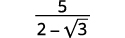

By the end of this section, you will be able to:
* Divide radical expressions
* Rationalize a one term denominator
* Rationalize a two term denominator

Before you get started, take this readiness quiz.

1.  Simplify:
    <math xmlns="http://www.w3.org/1998/Math/MathML"><mrow><mfrac><mn>30</mn><mn>48</mn></mfrac><mo>.</mo></mrow></math>
    
    * * *
    {: data-type="newline"}
    
    If you missed this problem, review [\[link\]](/m63304#fs-id1167836620030).
2.  Simplify:
    <math xmlns="http://www.w3.org/1998/Math/MathML"><mrow><msup><mi>x</mi><mn>2</mn></msup><mo>·</mo><msup><mi>x</mi><mn>4</mn></msup><mo>.</mo></mrow></math>
    
    * * *
    {: data-type="newline"}
    
    If you missed this problem, review [\[link\]](/m63345#fs-id1167835512989).
3.  Multiply:
    <math xmlns="http://www.w3.org/1998/Math/MathML"><mrow><mrow><mo>(</mo><mrow><mn>7</mn><mo>+</mo><mn>3</mn><mi>x</mi></mrow><mo>)</mo></mrow><mrow><mo>(</mo><mrow><mn>7</mn><mo>−</mo><mn>3</mn><mi>x</mi></mrow><mo>)</mo></mrow><mo>.</mo></mrow></math>
    
    * * *
    {: data-type="newline"}
    
    If you missed this problem, review [\[link\]](/m63351#fs-id1167836392219).
{: type="1"}

### Divide Radical Expressions

We have used the **Quotient Property of Radical Expressions**{: data-type="term" .no-emphasis} to simplify roots of fractions. We will need to use this property ‘in reverse’ to simplify a fraction with radicals.

We give the Quotient Property of Radical Expressions again for easy reference. Remember, we assume all variables are greater than or equal to zero so that no absolute value bars re needed.

Quotient Property of Radical Expressions

If <math xmlns="http://www.w3.org/1998/Math/MathML"><mrow><mroot><mi>a</mi><mi>n</mi></mroot></mrow></math>

 and <math xmlns="http://www.w3.org/1998/Math/MathML"><mrow><mroot><mi>b</mi><mi>n</mi></mroot></mrow></math>

 are real numbers, <math xmlns="http://www.w3.org/1998/Math/MathML"><mrow><mi>b</mi><mo>≠</mo><mn>0</mn><mo>,</mo></mrow></math>

 and for any integer <math xmlns="http://www.w3.org/1998/Math/MathML"><mrow><mi>n</mi><mo>≥</mo><mn>2</mn></mrow></math>

 then,

<math xmlns="http://www.w3.org/1998/Math/MathML"><mrow><mroot><mrow><mfrac><mi>a</mi><mi>b</mi></mfrac></mrow><mi>n</mi></mroot><mo>=</mo><mfrac><mrow><mroot><mi>a</mi><mi>n</mi></mroot></mrow><mrow><mroot><mi>b</mi><mi>n</mi></mroot></mrow></mfrac><mspace width="1em" /><mtext>and</mtext><mspace width="1em" /><mfrac><mrow><mroot><mi>a</mi><mi>n</mi></mroot></mrow><mrow><mroot><mi>b</mi><mi>n</mi></mroot></mrow></mfrac><mo>=</mo><mroot><mrow><mfrac><mi>a</mi><mi>b</mi></mfrac></mrow><mi>n</mi></mroot></mrow></math>

We will use the Quotient Property of Radical Expressions when the fraction we start with is the quotient of two radicals, and neither radicand is a perfect power of the index. When we write the fraction in a single radical, we may find common factors in the numerator and denominator.

Simplify: ⓐ <math xmlns="http://www.w3.org/1998/Math/MathML"><mrow><mfrac><mrow><msqrt><mrow><mn>72</mn><msup><mi>x</mi><mn>3</mn></msup></mrow></msqrt></mrow><mrow><msqrt><mrow><mn>162</mn><mi>x</mi></mrow></msqrt></mrow></mfrac></mrow></math>

 ⓑ <math xmlns="http://www.w3.org/1998/Math/MathML"><mrow><mfrac><mrow><mroot><mrow><mn>32</mn><msup><mi>x</mi><mn>2</mn></msup></mrow><mrow><mn>3</mn></mrow></mroot></mrow><mrow><mroot><mrow><mn>4</mn><msup><mi>x</mi><mn>5</mn></msup></mrow><mrow><mn>3</mn></mrow></mroot></mrow></mfrac><mo>.</mo></mrow></math>

ⓐ* * *
{: data-type="newline"}

 <math xmlns="http://www.w3.org/1998/Math/MathML"><mrow><mtable><mtr><mtd /><mtd /><mtd /><mtd columnalign="center"><mspace width="4em" /><mfrac><mrow><msqrt><mrow><mn>72</mn><msup><mi>x</mi><mn>3</mn></msup></mrow></msqrt></mrow><mrow><msqrt><mrow><mn>162</mn><mi>x</mi></mrow></msqrt></mrow></mfrac></mtd></mtr><mtr><mtd columnalign="left"><mtable><mtr><mtd columnalign="left"><mtext>Rewrite using the quotient property,</mtext></mtd></mtr><mtr><mtd columnalign="left"><mfrac><mrow><mroot><mi>a</mi><mi>n</mi></mroot></mrow><mrow><mroot><mi>b</mi><mi>n</mi></mroot></mrow></mfrac><mo>=</mo><mroot><mrow><mfrac><mi>a</mi><mi>b</mi></mfrac></mrow><mi>n</mi></mroot><mo>.</mo></mtd></mtr></mtable></mtd><mtd /><mtd /><mtd columnalign="center"><mspace width="4em" /><msqrt><mrow><mfrac><mrow><mn>72</mn><msup><mi>x</mi><mn>3</mn></msup></mrow><mrow><mn>162</mn><mi>x</mi></mrow></mfrac></mrow></msqrt></mtd></mtr><mtr><mtd columnalign="left"><mtext>Remove common factors.</mtext></mtd><mtd /><mtd /><mtd columnalign="center"><mspace width="4em" /><msqrt><mrow><mfrac><mrow><menclose notation="updiagonalstrike"><mn>18</mn></menclose><mo>·</mo><mn>4</mn><mo>·</mo><msup><mi>x</mi><mn>2</mn></msup><mo>·</mo><menclose notation="updiagonalstrike"><mi>x</mi></menclose></mrow><mrow><menclose notation="updiagonalstrike"><mn>18</mn></menclose><mo>·</mo><mn>9</mn><mo>·</mo><menclose notation="updiagonalstrike"><mi>x</mi></menclose></mrow></mfrac></mrow></msqrt></mtd></mtr><mtr><mtd columnalign="left"><mtext>Simplify.</mtext></mtd><mtd /><mtd /><mtd columnalign="center"><mspace width="4em" /><msqrt><mrow><mfrac><mrow><mn>4</mn><msup><mi>x</mi><mn>2</mn></msup></mrow><mn>9</mn></mfrac></mrow></msqrt></mtd></mtr><mtr><mtd columnalign="left"><mtext>Simplify the radical.</mtext></mtd><mtd /><mtd /><mtd columnalign="center"><mspace width="4em" /><mfrac><mrow><mn>2</mn><mi>x</mi></mrow><mn>3</mn></mfrac></mtd></mtr></mtable></mrow></math>

* * *
{: data-type="newline"}

* * *
{: data-type="newline"}

 ⓑ* * *
{: data-type="newline"}

 <math xmlns="http://www.w3.org/1998/Math/MathML"><mrow><mtable><mtr><mtd /><mtd /><mtd /><mtd columnalign="center"><mspace width="4em" /><mfrac><mrow><mroot><mrow><mn>32</mn><msup><mi>x</mi><mn>2</mn></msup></mrow><mrow><mn>3</mn></mrow></mroot></mrow><mrow><mroot><mrow><mn>4</mn><msup><mi>x</mi><mn>5</mn></msup></mrow><mrow><mn>3</mn></mrow></mroot></mrow></mfrac></mtd></mtr><mtr><mtd columnalign="left"><mtable><mtr><mtd columnalign="left"><mtext>Rewrite using the quotient property,</mtext></mtd></mtr><mtr><mtd columnalign="left"><mfrac><mrow><mroot><mi>a</mi><mi>n</mi></mroot></mrow><mrow><mroot><mi>b</mi><mi>n</mi></mroot></mrow></mfrac><mo>=</mo><mroot><mrow><mfrac><mi>a</mi><mi>b</mi></mfrac></mrow><mi>n</mi></mroot><mo>.</mo></mtd></mtr></mtable></mtd><mtd /><mtd /><mtd columnalign="center"><mspace width="4em" /><mroot><mrow><mfrac><mrow><mn>32</mn><msup><mi>x</mi><mn>2</mn></msup></mrow><mrow><mn>4</mn><msup><mi>x</mi><mn>5</mn></msup></mrow></mfrac></mrow><mrow><mn>3</mn></mrow></mroot></mtd></mtr><mtr><mtd columnalign="left"><mtext>Simplify the fraction under the radical.</mtext></mtd><mtd /><mtd /><mtd columnalign="center"><mspace width="4em" /><mroot><mrow><mfrac><mn>8</mn><mrow><msup><mi>x</mi><mn>3</mn></msup></mrow></mfrac></mrow><mrow><mn>3</mn></mrow></mroot></mtd></mtr><mtr><mtd columnalign="left"><mtext>Simplify the radical.</mtext></mtd><mtd /><mtd /><mtd columnalign="center"><mspace width="4em" /><mfrac><mn>2</mn><mi>x</mi></mfrac></mtd></mtr></mtable></mrow></math>

Simplify: ⓐ <math xmlns="http://www.w3.org/1998/Math/MathML"><mrow><mfrac><mrow><msqrt><mrow><mn>50</mn><msup><mi>s</mi><mn>3</mn></msup></mrow></msqrt></mrow><mrow><msqrt><mrow><mn>128</mn><mi>s</mi></mrow></msqrt></mrow></mfrac></mrow></math>

 ⓑ <math xmlns="http://www.w3.org/1998/Math/MathML"><mrow><mfrac><mrow><mroot><mrow><mn>56</mn><msup><mi>a</mi><mrow /></msup></mrow><mrow><mn>3</mn></mrow></mroot></mrow><mrow><mroot><mrow><mn>7</mn><msup><mi>a</mi><mn>4</mn></msup></mrow><mrow><mn>3</mn></mrow></mroot></mrow></mfrac><mo>.</mo></mrow></math>

ⓐ <math xmlns="http://www.w3.org/1998/Math/MathML"><mrow><mfrac><mrow><mn>5</mn><mi>s</mi></mrow><mn>8</mn></mfrac></mrow></math>

 ⓑ <math xmlns="http://www.w3.org/1998/Math/MathML"><mrow><mfrac><mn>2</mn><mi>a</mi></mfrac></mrow></math>

Simplify: ⓐ <math xmlns="http://www.w3.org/1998/Math/MathML"><mrow><mfrac><mrow><msqrt><mrow><mn>75</mn><msup><mi>q</mi><mn>5</mn></msup></mrow></msqrt></mrow><mrow><msqrt><mrow><mn>108</mn><mi>q</mi></mrow></msqrt></mrow></mfrac></mrow></math>

 ⓑ <math xmlns="http://www.w3.org/1998/Math/MathML"><mrow><mfrac><mrow><mroot><mrow><mn>72</mn><msup><mi>b</mi><mn>2</mn></msup></mrow><mrow><mn>3</mn></mrow></mroot></mrow><mrow><mroot><mrow><mn>9</mn><msup><mi>b</mi><mn>5</mn></msup></mrow><mrow><mn>3</mn></mrow></mroot></mrow></mfrac><mo>.</mo></mrow></math>

ⓐ <math xmlns="http://www.w3.org/1998/Math/MathML"><mrow><mfrac><mrow><mn>5</mn><msup><mi>q</mi><mn>2</mn></msup></mrow><mn>6</mn></mfrac></mrow></math>

 ⓑ <math xmlns="http://www.w3.org/1998/Math/MathML"><mrow><mfrac><mn>2</mn><mi>b</mi></mfrac></mrow></math>

Simplify: ⓐ <math xmlns="http://www.w3.org/1998/Math/MathML"><mrow><mfrac><mrow><msqrt><mrow><mn>147</mn><mi>a</mi><msup><mi>b</mi><mn>8</mn></msup></mrow></msqrt></mrow><mrow><msqrt><mrow><mn>3</mn><msup><mi>a</mi><mn>3</mn></msup><msup><mi>b</mi><mn>4</mn></msup></mrow></msqrt></mrow></mfrac></mrow></math>

 ⓑ <math xmlns="http://www.w3.org/1998/Math/MathML"><mrow><mfrac><mrow><mroot><mrow><mn>−250</mn><msup><mi>m</mi><mrow /></msup><msup><mi>n</mi><mrow><mn>−2</mn></mrow></msup></mrow><mrow><mn>3</mn></mrow></mroot></mrow><mrow><mroot><mrow><mn>2</mn><msup><mi>m</mi><mrow><mn>−2</mn></mrow></msup><msup><mi>n</mi><mn>4</mn></msup></mrow><mrow><mn>3</mn></mrow></mroot></mrow></mfrac><mo>.</mo></mrow></math>

ⓐ* * *
{: data-type="newline"}

 <math xmlns="http://www.w3.org/1998/Math/MathML"><mrow><mtable><mtr><mtd /><mtd /><mtd /><mtd columnalign="center"><mspace width="4em" /><mfrac><mrow><msqrt><mrow><mn>147</mn><mi>a</mi><msup><mi>b</mi><mn>8</mn></msup></mrow></msqrt></mrow><mrow><msqrt><mrow><mn>3</mn><msup><mi>a</mi><mn>3</mn></msup><msup><mi>b</mi><mn>4</mn></msup></mrow></msqrt></mrow></mfrac></mtd></mtr><mtr><mtd columnalign="left"><mtext>Rewrite using the quotient property.</mtext></mtd><mtd /><mtd /><mtd columnalign="center"><mspace width="4em" /><msqrt><mrow><mfrac><mrow><mn>147</mn><mi>a</mi><msup><mi>b</mi><mn>8</mn></msup></mrow><mrow><mn>3</mn><msup><mi>a</mi><mn>3</mn></msup><msup><mi>b</mi><mn>4</mn></msup></mrow></mfrac></mrow></msqrt></mtd></mtr><mtr><mtd columnalign="left"><mtext>Remove common factors in the fraction.</mtext></mtd><mtd /><mtd /><mtd columnalign="center"><mspace width="4em" /><msqrt><mrow><mfrac><mrow><mn>49</mn><msup><mi>b</mi><mn>4</mn></msup></mrow><mrow><msup><mi>a</mi><mn>2</mn></msup></mrow></mfrac></mrow></msqrt></mtd></mtr><mtr><mtd columnalign="left"><mtext>Simplify the radical.</mtext></mtd><mtd /><mtd /><mtd columnalign="center"><mspace width="4em" /><mfrac><mrow><mn>7</mn><msup><mi>b</mi><mn>2</mn></msup></mrow><mi>a</mi></mfrac></mtd></mtr></mtable></mrow></math>

* * *
{: data-type="newline"}

* * *
{: data-type="newline"}

 ⓑ* * *
{: data-type="newline"}

 <math xmlns="http://www.w3.org/1998/Math/MathML"><mrow><mtable><mtr><mtd /><mtd /><mtd /><mtd columnalign="center"><mspace width="4em" /><mfrac><mrow><mroot><mrow><mn>−250</mn><msup><mi>m</mi><mrow /></msup><msup><mi>n</mi><mrow><mn>−2</mn></mrow></msup></mrow><mrow><mn>3</mn></mrow></mroot></mrow><mrow><mroot><mrow><mn>2</mn><msup><mi>m</mi><mrow><mn>−2</mn></mrow></msup><msup><mi>n</mi><mn>4</mn></msup></mrow><mrow><mn>3</mn></mrow></mroot></mrow></mfrac></mtd></mtr><mtr><mtd columnalign="left"><mtext>Rewrite using the quotient property.</mtext></mtd><mtd /><mtd /><mtd columnalign="center"><mspace width="4em" /><mroot><mrow><mfrac><mrow><mn>−250</mn><msup><mi>m</mi><mrow /></msup><msup><mi>n</mi><mrow><mn>−2</mn></mrow></msup></mrow><mrow><mn>2</mn><msup><mi>m</mi><mrow><mn>−2</mn></mrow></msup><msup><mi>n</mi><mn>4</mn></msup></mrow></mfrac></mrow><mrow><mn>3</mn></mrow></mroot></mtd></mtr><mtr><mtd columnalign="left"><mtext>Simplify the fraction under the radical.</mtext></mtd><mtd /><mtd /><mtd columnalign="center"><mspace width="4em" /><mroot><mrow><mfrac><mrow><mn>−125</mn><msup><mi>m</mi><mn>3</mn></msup></mrow><mrow><msup><mi>n</mi><mn>6</mn></msup></mrow></mfrac></mrow><mrow><mn>3</mn></mrow></mroot></mtd></mtr><mtr><mtd columnalign="left"><mtext>Simplify the radical.</mtext></mtd><mtd /><mtd /><mtd columnalign="center"><mspace width="4em" /><mo>−</mo><mfrac><mrow><mn>5</mn><mi>m</mi></mrow><mrow><msup><mi>n</mi><mn>2</mn></msup></mrow></mfrac></mtd></mtr></mtable></mrow></math>

Simplify: ⓐ <math xmlns="http://www.w3.org/1998/Math/MathML"><mrow><mfrac><mrow><msqrt><mrow><mn>162</mn><msup><mi>x</mi><mrow><mn>10</mn></mrow></msup><msup><mi>y</mi><mn>2</mn></msup></mrow></msqrt></mrow><mrow><msqrt><mrow><mn>2</mn><msup><mi>x</mi><mn>6</mn></msup><msup><mi>y</mi><mn>6</mn></msup></mrow></msqrt></mrow></mfrac></mrow></math>

 ⓑ <math xmlns="http://www.w3.org/1998/Math/MathML"><mrow><mfrac><mrow><mroot><mrow><mn>−128</mn><msup><mi>x</mi><mn>2</mn></msup><msup><mi>y</mi><mrow><mn>−1</mn></mrow></msup></mrow><mrow><mn>3</mn></mrow></mroot></mrow><mrow><mroot><mrow><mn>2</mn><msup><mi>x</mi><mrow><mn>−1</mn></mrow></msup><msup><mi>y</mi><mn>2</mn></msup></mrow><mrow><mn>3</mn></mrow></mroot></mrow></mfrac><mo>.</mo></mrow></math>

ⓐ <math xmlns="http://www.w3.org/1998/Math/MathML"><mrow><mfrac><mrow><mn>9</mn><msup><mi>x</mi><mn>2</mn></msup></mrow><mrow><msup><mi>y</mi><mn>2</mn></msup></mrow></mfrac></mrow></math>

 ⓑ <math xmlns="http://www.w3.org/1998/Math/MathML"><mrow><mfrac><mrow><mn>−4</mn><mi>x</mi></mrow><mi>y</mi></mfrac></mrow></math>

Simplify: ⓐ <math xmlns="http://www.w3.org/1998/Math/MathML"><mrow><mfrac><mrow><msqrt><mrow><mn>300</mn><msup><mi>m</mi><mn>3</mn></msup><msup><mi>n</mi><mn>7</mn></msup></mrow></msqrt></mrow><mrow><msqrt><mrow><mn>3</mn><msup><mi>m</mi><mn>5</mn></msup><mi>n</mi></mrow></msqrt></mrow></mfrac></mrow></math>

 ⓑ <math xmlns="http://www.w3.org/1998/Math/MathML"><mrow><mfrac><mrow><mroot><mrow><mn>−81</mn><mi>p</mi><msup><mi>q</mi><mrow><mn>−1</mn></mrow></msup></mrow><mrow><mn>3</mn></mrow></mroot></mrow><mrow><mroot><mrow><mn>3</mn><msup><mi>p</mi><mrow><mn>−2</mn></mrow></msup><msup><mi>q</mi><mn>5</mn></msup></mrow><mrow><mn>3</mn></mrow></mroot></mrow></mfrac><mo>.</mo></mrow></math>

ⓐ <math xmlns="http://www.w3.org/1998/Math/MathML"><mrow><mfrac><mrow><mn>10</mn><msup><mi>n</mi><mn>3</mn></msup></mrow><mi>m</mi></mfrac></mrow></math>

 ⓑ <math xmlns="http://www.w3.org/1998/Math/MathML"><mrow><mfrac><mrow><mn>−3</mn><mi>p</mi></mrow><mrow><msup><mi>q</mi><mn>2</mn></msup></mrow></mfrac></mrow></math>

Simplify: <math xmlns="http://www.w3.org/1998/Math/MathML"><mrow><mfrac><mrow><msqrt><mrow><mn>54</mn><msup><mi>x</mi><mn>5</mn></msup><msup><mi>y</mi><mn>3</mn></msup></mrow></msqrt></mrow><mrow><msqrt><mrow><mn>3</mn><msup><mi>x</mi><mn>2</mn></msup><mi>y</mi></mrow></msqrt></mrow></mfrac><mo>.</mo></mrow></math>

<math xmlns="http://www.w3.org/1998/Math/MathML"><mrow><mtable> <mtr><mtd /><mtd /><mtd /><mtd columnalign="center"><mspace width="4em" /><mfrac><mrow><msqrt><mrow><mn>54</mn><msup><mi>x</mi><mn>5</mn></msup><msup><mi>y</mi><mn>3</mn></msup></mrow></msqrt></mrow><mrow><msqrt><mrow><mn>3</mn><msup><mi>x</mi><mn>2</mn></msup><mi>y</mi></mrow></msqrt></mrow></mfrac></mtd></mtr> <mtr><mtd columnalign="left"><mtext>Rewrite using the quotient property.</mtext></mtd><mtd /><mtd /><mtd columnalign="center"><mspace width="4em" /><msqrt><mrow><mfrac><mrow><mn>54</mn><msup><mi>x</mi><mn>5</mn></msup><msup><mi>y</mi><mn>3</mn></msup></mrow><mrow><mn>3</mn><msup><mi>x</mi><mn>2</mn></msup><mi>y</mi></mrow></mfrac></mrow></msqrt></mtd></mtr> <mtr><mtd columnalign="left"><mtext>Remove common factors in the fraction.</mtext></mtd><mtd /><mtd /><mtd columnalign="center"><mspace width="4em" /><msqrt><mrow><mn>18</mn><msup><mi>x</mi><mn>3</mn></msup><msup><mi>y</mi><mn>2</mn></msup></mrow></msqrt></mtd></mtr> <mtr><mtd columnalign="left"><mtable> <mtr><mtd columnalign="left"><mtext>Rewrite the radicand as a product</mtext></mtd></mtr> <mtr><mtd columnalign="left"><mtext>using the largest perfect square factor.</mtext></mtd></mtr></mtable></mtd><mtd /><mtd /><mtd columnalign="center"><mspace width="4em" /><msqrt><mrow><mn>9</mn><msup><mi>x</mi><mn>2</mn></msup><msup><mi>y</mi><mn>2</mn></msup><mo>⋅</mo><mn>2</mn><mi>x</mi></mrow></msqrt></mtd></mtr> <mtr><mtd columnalign="left"><mtable> <mtr><mtd columnalign="left"><mtext>Rewrite the radical as the product of two</mtext></mtd></mtr> <mtr><mtd columnalign="left"><mtext>radicals.</mtext></mtd></mtr></mtable></mtd><mtd /><mtd /><mtd columnalign="center"><mspace width="4em" /><msqrt><mrow><mn>9</mn><msup><mi>x</mi><mn>2</mn></msup><msup><mi>y</mi><mn>2</mn></msup></mrow></msqrt><mo>⋅</mo><msqrt><mrow><mn>2</mn><mi>x</mi></mrow></msqrt></mtd></mtr> <mtr><mtd columnalign="left"><mtext>Simplify.</mtext></mtd><mtd /><mtd /><mtd columnalign="center"><mspace width="4em" /><mn>3</mn><mi>x</mi><mi>y</mi><msqrt><mrow><mn>2</mn><mi>x</mi></mrow></msqrt></mtd></mtr></mtable></mrow></math>

Simplify: <math xmlns="http://www.w3.org/1998/Math/MathML"><mrow><mfrac><mrow><msqrt><mrow><mn>64</mn><msup><mi>x</mi><mn>4</mn></msup><msup><mi>y</mi><mn>5</mn></msup></mrow></msqrt></mrow><mrow><msqrt><mrow><mn>2</mn><mi>x</mi><msup><mi>y</mi><mn>3</mn></msup></mrow></msqrt></mrow></mfrac><mo>.</mo></mrow></math>

<math xmlns="http://www.w3.org/1998/Math/MathML"><mrow><mn>4</mn><mi>x</mi><mi>y</mi><msqrt><mrow><mn>2</mn><mi>x</mi></mrow></msqrt></mrow></math>

Simplify: <math xmlns="http://www.w3.org/1998/Math/MathML"><mrow><mfrac><mrow><msqrt><mrow><mn>96</mn><msup><mi>a</mi><mn>5</mn></msup><msup><mi>b</mi><mn>4</mn></msup></mrow></msqrt></mrow><mrow><msqrt><mrow><mn>2</mn><msup><mi>a</mi><mn>3</mn></msup><mi>b</mi></mrow></msqrt></mrow></mfrac><mo>.</mo></mrow></math>

<math xmlns="http://www.w3.org/1998/Math/MathML"><mrow><mn>4</mn><mi>a</mi><mi>b</mi><msqrt><mrow><mn>3</mn><mi>b</mi></mrow></msqrt></mrow></math>

### Rationalize a One Term Denominator

Before the calculator became a tool of everyday life, approximating the value of a fraction with a radical in the denominator was a very cumbersome process!

For this reason, a process called **rationalizing the denominator**{: data-type="term"} was developed. A fraction with a radical in the denominator is converted to an equivalent fraction whose denominator is an integer. Square roots of numbers that are not perfect squares are irrational numbers. When we rationalize the denominator, we write an equivalent fraction with a rational number in the denominator.

This process is still used today, and is useful in other areas of mathematics, too.

Rationalizing the Denominator

**Rationalizing the denominator** is the process of converting a fraction with a radical in the denominator to an equivalent fraction whose denominator is an integer.

Even though we have calculators available nearly everywhere, a fraction with a radical in the denominator still must be rationalized. It is not considered simplified if the denominator contains a radical.

Similarly, a **radical expression**{: data-type="term" .no-emphasis} is not considered simplified if the radicand contains a fraction.

Simplified Radical Expressions

A radical expression is considered simplified if there are

* no factors in the radicand have perfect powers of the index
* no fractions in the radicand
* no radicals in the denominator of a fraction
{: data-bullet-style="bullet"}

To rationalize a denominator with a square root, we use the property that <math xmlns="http://www.w3.org/1998/Math/MathML"><mrow><msup><mrow><mrow><mo>(</mo><mrow><msqrt><mi>a</mi></msqrt></mrow><mo>)</mo></mrow></mrow><mn>2</mn></msup><mo>=</mo><mi>a</mi><mo>.</mo></mrow></math>

 If we square an irrational square root, we get a rational number.

We will use this property to rationalize the denominator in the next example.

Simplify: ⓐ <math xmlns="http://www.w3.org/1998/Math/MathML"><mrow><mfrac><mn>4</mn><mrow><msqrt><mn>3</mn></msqrt></mrow></mfrac></mrow></math>

 ⓑ <math xmlns="http://www.w3.org/1998/Math/MathML"><mrow><msqrt><mrow><mfrac><mn>3</mn><mrow><mn>20</mn></mrow></mfrac></mrow></msqrt></mrow></math>

 ⓒ <math xmlns="http://www.w3.org/1998/Math/MathML"><mrow><mfrac><mn>3</mn><mrow><msqrt><mrow><mn>6</mn><mi>x</mi></mrow></msqrt></mrow></mfrac><mo>.</mo></mrow></math>

To rationalize a denominator with one term, we can multiply a square root by itself. To keep the fraction equivalent, we multiply both the numerator and denominator by the same factor.

ⓐ* * *
{: data-type="newline"}

|  |  |
{: valign="top"}| Multiply both the numerator and denominator by <math xmlns="http://www.w3.org/1998/Math/MathML"><mrow><msqrt><mn>3</mn></msqrt><mo>.</mo></mrow></math>

 |  |
{: valign="top"}| Simplify. |  |
{: valign="top"}{: .unnumbered .unstyled .can-break summary="To rationalize the denominator of 4 divided by square root 3 we multiply both the numerator and denominator by square root 3. The result is the 4 times square root 3 divided by the quantity square root 3 times square root 3 in parentheses. Simplifying we get 4 times square root 3 divided by 3." data-label=""}

ⓑ We always simplify the radical in the denominator first, before we rationalize it. This way the numbers stay smaller and easier to work with.

<table class="unnumbered unstyled can-break" summary="With the quantity 3 divided by 20 in parentheses we first notive that the fraction is not a perfect square, so we rewrite using the quotient property to get square root 3 divided by square root 20. Simplifying the denominator we get square root 3 divided by the quantity 2 times square root 5 in parentheses. To rationalize the denominator we multiply the numerator and denominator by square root 5. This is written as square root 3 times square root 5 divided by the quantity 2 square root 5 times square root 5 in parentheses. Simplifying we get square root 15 divided by the quantity 2 times 5 in parentheses. Simplifying furthere we get square root 15 divided by 10." data-label=""><tbody>
<tr valign="top">
<td data-valign="top" data-align="left" />
<td data-valign="top" data-align="left"></td>
</tr>
<tr valign="top">
<td data-valign="top" data-align="left">The fraction is not a perfect square, so rewrite using the
Quotient Property.</td>
<td data-valign="top" data-align="left"></td>
</tr>
<tr valign="top">
<td data-valign="top" data-align="left">Simplify the denominator.</td>
<td data-valign="top" data-align="left"></td>
</tr>
<tr valign="top">
<td data-valign="top" data-align="left">Multiply the numerator and denominator by <math xmlns="http://www.w3.org/1998/Math/MathML"><mrow><msqrt><mn>5</mn></msqrt><mo>.</mo></mrow></math></td>
<td data-valign="top" data-align="left"></td>
</tr>
<tr valign="top">
<td data-valign="top" data-align="left">Simplify.</td>
<td data-valign="top" data-align="left"></td>
</tr>
<tr valign="top">
<td data-valign="top" data-align="left">Simplify.</td>
<td data-valign="top" data-align="left"></td>
</tr>
</tbody></table>
ⓒ* * *
{: data-type="newline"}

|  |  |
{: valign="top"}| Multiply the numerator and denominator by <math xmlns="http://www.w3.org/1998/Math/MathML"><mrow><msqrt><mrow><mn>6</mn><mi>x</mi></mrow></msqrt><mo>.</mo></mrow></math>

    |  |
{: valign="top"}| Simplify. |  |
{: valign="top"}| Simplify. |  |
{: valign="top"}{: .unnumbered .unstyled .can-break summary="To rationalize the denominator of 3 divided by square root of the quantity 6 x in parentheses we multiply both the numerator and denominator by square root of the quantity 6 x in parentheses. This is written out as 3 times square root of the quantity 6 x in parentheses divided by the quantity square root 6 x times square root 6 x in parentheses. The result is 3 times square root of the quantity 6 x in parentheses divided by the quantity 6 x in parentheses. Simplifying we square root of the quantity 6 x in parentheses divided by the quantity 2 x." data-label=""}

Simplify: ⓐ <math xmlns="http://www.w3.org/1998/Math/MathML"><mrow><mfrac><mn>5</mn><mrow><msqrt><mn>3</mn></msqrt></mrow></mfrac></mrow></math>

 ⓑ <math xmlns="http://www.w3.org/1998/Math/MathML"><mrow><msqrt><mrow><mfrac><mn>3</mn><mrow><mn>32</mn></mrow></mfrac></mrow></msqrt></mrow></math>

 ⓒ <math xmlns="http://www.w3.org/1998/Math/MathML"><mrow><mfrac><mn>2</mn><mrow><msqrt><mrow><mn>2</mn><mi>x</mi></mrow></msqrt></mrow></mfrac><mo>.</mo></mrow></math>

ⓐ <math xmlns="http://www.w3.org/1998/Math/MathML"><mrow><mfrac><mrow><mn>5</mn><msqrt><mn>3</mn></msqrt></mrow><mn>3</mn></mfrac></mrow></math>

 ⓑ <math xmlns="http://www.w3.org/1998/Math/MathML"><mrow><mfrac><mrow><msqrt><mn>6</mn></msqrt></mrow><mn>8</mn></mfrac></mrow></math>

 ⓒ <math xmlns="http://www.w3.org/1998/Math/MathML"><mrow><mfrac><mrow><msqrt><mrow><mn>2</mn><mi>x</mi></mrow></msqrt></mrow><mi>x</mi></mfrac></mrow></math>

Simplify: ⓐ <math xmlns="http://www.w3.org/1998/Math/MathML"><mrow><mfrac><mn>6</mn><mrow><msqrt><mn>5</mn></msqrt></mrow></mfrac></mrow></math>

 ⓑ <math xmlns="http://www.w3.org/1998/Math/MathML"><mrow><msqrt><mrow><mfrac><mn>7</mn><mrow><mn>18</mn></mrow></mfrac></mrow></msqrt></mrow></math>

 ⓒ <math xmlns="http://www.w3.org/1998/Math/MathML"><mrow><mfrac><mn>5</mn><mrow><msqrt><mrow><mn>5</mn><mi>x</mi></mrow></msqrt></mrow></mfrac><mo>.</mo></mrow></math>

ⓐ <math xmlns="http://www.w3.org/1998/Math/MathML"><mrow><mfrac><mrow><mn>6</mn><msqrt><mn>5</mn></msqrt></mrow><mn>5</mn></mfrac></mrow></math>

 ⓑ <math xmlns="http://www.w3.org/1998/Math/MathML"><mrow><mfrac><mrow><msqrt><mrow><mn>14</mn></mrow></msqrt></mrow><mn>6</mn></mfrac></mrow></math>

 ⓒ <math xmlns="http://www.w3.org/1998/Math/MathML"><mrow><mfrac><mrow><msqrt><mrow><mn>5</mn><mi>x</mi></mrow></msqrt></mrow><mi>x</mi></mfrac></mrow></math>

When we rationalized a square root, we multiplied the numerator and denominator by a square root that would give us a perfect square under the radical in the denominator. When we took the square root, the denominator no longer had a radical.

We will follow a similar process to rationalize higher roots. To rationalize a denominator with a higher index radical, we multiply the numerator and denominator by a radical that would give us a radicand that is a perfect power of the index. When we simplify the new radical, the denominator will no longer have a radical.

For example,

  ![Two examples of rationalizing denominators are shown. The first example is 1 divided by cube root 2. A note is made that the radicand in the denominator is 1 power of 2 and that we need 2 more to get a perfect cube. We multiply numerator and denominator by the cube root of the quantity 2 squared. The result is cube root 4 divided by cube root of quantity 2 cubed. This simplifies to cube root 4 divided by 2. The second example is 1 divided by fourth root 5. A note is made that the radicand in the denominator is 1 power of 5 and that we need 3 more to get a perfect fourth. We multiply numerator and denominator by the fourth root of the quantity 5 cubed. The result is fourth root of 125 divided by fourth root of quantity 5 to the fourth. This simplifies to fourth root 125 divided by 5.](../resources/CNX_IntAlg_Figure_08_05_004_img.jpg)  We will use this technique in the next examples.

Simplify ⓐ <math xmlns="http://www.w3.org/1998/Math/MathML"><mrow><mfrac><mn>1</mn><mrow><mroot><mn>6</mn><mn>3</mn></mroot></mrow></mfrac></mrow></math>

 ⓑ <math xmlns="http://www.w3.org/1998/Math/MathML"><mrow><mroot><mrow><mfrac><mn>7</mn><mrow><mn>24</mn></mrow></mfrac></mrow><mn>3</mn></mroot></mrow></math>

 ⓒ <math xmlns="http://www.w3.org/1998/Math/MathML"><mrow><mfrac><mn>3</mn><mrow><mroot><mrow><mn>4</mn><mi>x</mi></mrow><mrow><mn>3</mn></mrow></mroot></mrow></mfrac><mo>.</mo></mrow></math>

To rationalize a denominator with a cube root, we can multiply by a cube root that will give us a perfect cube in the radicand in the denominator. To keep the fraction equivalent, we multiply both the numerator and denominator by the same factor.

ⓐ* * *
{: data-type="newline"}

<table class="unnumbered unstyled" summary="The example is 1 divided by cube root 6. The radicand in the denominator is 1 factor of 6. Multiplying both the numerator and denominator by cube root of quantity 6 squared gives us 2 more factors of 6. The result is cube root of the quantity 6 squared in parentheses divided by cube root of quantity 6 cubed. Notice the radicand in the denominator has 3 powers of 6. This simplifies to cube root 36 divided by 6." data-label=""><tbody>
<tr valign="top">
<td data-valign="top" data-align="left" />
<td data-valign="top" data-align="left"></td>
</tr>
<tr valign="top">
<td data-valign="top" data-align="left">The radical in the denominator has one factor of 6.
Multiply both the numerator and denominator by <math xmlns="http://www.w3.org/1998/Math/MathML"><mrow><mroot><mrow><msup><mn>6</mn><mn>2</mn></msup></mrow><mn>3</mn></mroot><mo>,</mo></mrow></math>
which gives us 2 more factors of 6.</td>
<td data-valign="top" data-align="left"></td>
</tr>
<tr valign="top">
<td data-valign="top" data-align="left">Multiply. Notice the radicand in the denominator
has 3 powers of 6.</td>
<td data-valign="top" data-align="left"></td>
</tr>
<tr valign="top">
<td data-valign="top" data-align="left">Simplify the cube root in the denominator.</td>
<td data-valign="top" data-align="left"></td>
</tr>
</tbody></table>
ⓑ We always simplify the radical in the denominator first, before we rationalize it. This way the numbers stay smaller and easier to work with.

<table class="unnumbered unstyled can-break" summary="The example is cube root of the quantity 7 divided by 24. The fraction is not a perfect cube so rewrite using the quotient property. The new expression is cube root 7 divided by cube root 24. Simplifying the denominator gives cube root 7 divided by the quantity 2 cube root 3. Multiply the numerator and denominator by cube root quantity 3 squared. This will give us 3 factors of 3. This is written as cube root 7 times cube root quantity 3 squared in parentheses divided by the quantity 2 cube root 3 cube root 3 squared in parentheses. Simplifying we get cube root 63 divided by the quantity 2 cube root quantity 3 cubed in parentheses. Remember that cube root quantity 3 cubed equals 3. This gives cube root 63 divided by quantity 2 times 3. Simplifying once more we get cube root 63 divided by 6." data-label=""><tbody>
<tr valign="top">
<td data-valign="top" data-align="left" />
<td data-valign="top" data-align="left"></td>
</tr>
<tr valign="top">
<td data-valign="top" data-align="left">The fraction is not a perfect cube, so
rewrite using the Quotient Property.</td>
<td data-valign="top" data-align="left"></td>
</tr>
<tr valign="top">
<td data-valign="top" data-align="left">Simplify the denominator.</td>
<td data-valign="top" data-align="left"></td>
</tr>
<tr valign="top">
<td data-valign="top" data-align="left">Multiply the numerator and denominator       
by <math xmlns="http://www.w3.org/1998/Math/MathML"><mrow><mroot><mrow><msup><mn>3</mn><mn>2</mn></msup></mrow><mn>3</mn></mroot><mo>.</mo></mrow></math> This will give us 3 factors of 3.</td>
<td data-valign="top" data-align="left"></td>
</tr>
<tr valign="top">
<td data-valign="top" data-align="left">Simplify.</td>
<td data-valign="top" data-align="left"></td>
</tr>
<tr valign="top">
<td data-valign="top" data-align="left">Remember, <math xmlns="http://www.w3.org/1998/Math/MathML"><mrow><mroot><mrow><msup><mn>3</mn><mn>3</mn></msup></mrow><mn>3</mn></mroot><mo>=</mo><mn>3</mn><mo>.</mo></mrow></math></td>
<td data-valign="top" data-align="left"></td>
</tr>
<tr valign="top">
<td data-valign="top" data-align="left">Simplify.</td>
<td data-valign="top" data-align="left"></td>
</tr>
</tbody></table>
ⓒ* * *
{: data-type="newline"}

<table class="unnumbered unstyled" summary="The example is 3 divided by cube root of the quantity 4 x. Rewrite the radical to show the factors. The new expression is 3 divided by cube root of the quantity 2 squared times x in parentheses. Multiply the numerator and denominator by cube root quantity 2 x squared in parentheses. This will give us 3 factors of 2 and 3 factors of x. This is written as 3 times cube root quantity 2 x squared in parentheses divided by the quantity cube root quantity 2 x squared times cube root quantity 2 x squared in parentheses . Simplifying we get 3 times cube root quantity 2 x squared in parentheses divided by cube root of the quantity 2 cubed times x cubed in parentheses. Simplifying the radical in the denominator we get 3 cube root quantity 2 x squared in parentheses divided by the quantity 2 x." data-label=""><tbody>
<tr valign="top">
<td data-valign="top" data-align="left" />
<td data-valign="top" data-align="left"></td>
</tr>
<tr valign="top">
<td data-valign="top" data-align="left">Rewrite the radicand to show the factors.</td>
<td data-valign="top" data-align="left"></td>
</tr>
<tr valign="top">
<td data-valign="top" data-align="left">Multiply the numerator and denominator by <math xmlns="http://www.w3.org/1998/Math/MathML"><mrow><mroot><mrow><mn>2</mn><mo>·</mo><msup><mi>x</mi><mn>2</mn></msup></mrow><mn>3</mn></mroot><mo>.</mo></mrow></math>
This will get us 3 factors of 2 and 3 factors of <em>x</em>.</td>
<td data-valign="top" data-align="left"></td>
</tr>
<tr valign="top">
<td data-valign="top" data-align="left">Simplify.</td>
<td data-valign="top" data-align="left"></td>
</tr>
<tr valign="top">
<td data-valign="top" data-align="left">Simplify the radical in the denominator.</td>
<td data-valign="top" data-align="left"></td>
</tr>
</tbody></table>

Simplify: ⓐ <math xmlns="http://www.w3.org/1998/Math/MathML"><mrow><mfrac><mn>1</mn><mrow><mroot><mn>7</mn><mn>3</mn></mroot></mrow></mfrac></mrow></math>

 ⓑ <math xmlns="http://www.w3.org/1998/Math/MathML"><mrow><mroot><mrow><mfrac><mn>5</mn><mrow><mn>12</mn></mrow></mfrac></mrow><mn>3</mn></mroot></mrow></math>

 ⓒ <math xmlns="http://www.w3.org/1998/Math/MathML"><mrow><mfrac><mn>5</mn><mrow><mroot><mrow><mn>9</mn><mi>y</mi></mrow><mrow><mn>3</mn></mrow></mroot></mrow></mfrac><mo>.</mo></mrow></math>

ⓐ <math xmlns="http://www.w3.org/1998/Math/MathML"><mrow><mfrac><mrow><mroot><mrow><mn>49</mn></mrow><mn>3</mn></mroot></mrow><mn>7</mn></mfrac></mrow></math>

 ⓑ <math xmlns="http://www.w3.org/1998/Math/MathML"><mrow><mfrac><mrow><mroot><mrow><mn>90</mn></mrow><mn>3</mn></mroot></mrow><mn>6</mn></mfrac></mrow></math>

 ⓒ <math xmlns="http://www.w3.org/1998/Math/MathML"><mrow><mfrac><mrow><mn>5</mn><mroot><mrow><mn>3</mn><msup><mi>y</mi><mn>2</mn></msup></mrow><mn>3</mn></mroot></mrow><mrow><mn>3</mn><mi>y</mi></mrow></mfrac></mrow></math>

Simplify: ⓐ <math xmlns="http://www.w3.org/1998/Math/MathML"><mrow><mfrac><mn>1</mn><mrow><mroot><mn>2</mn><mn>3</mn></mroot></mrow></mfrac></mrow></math>

 ⓑ <math xmlns="http://www.w3.org/1998/Math/MathML"><mrow><mroot><mrow><mfrac><mn>3</mn><mrow><mn>20</mn></mrow></mfrac></mrow><mn>3</mn></mroot></mrow></math>

 ⓒ <math xmlns="http://www.w3.org/1998/Math/MathML"><mrow><mfrac><mn>2</mn><mrow><mroot><mrow><mn>25</mn><mi>n</mi></mrow><mrow><mn>3</mn></mrow></mroot></mrow></mfrac><mo>.</mo></mrow></math>

ⓐ <math xmlns="http://www.w3.org/1998/Math/MathML"><mrow><mfrac><mrow><mroot><mn>4</mn><mn>3</mn></mroot></mrow><mn>2</mn></mfrac></mrow></math>

 ⓑ <math xmlns="http://www.w3.org/1998/Math/MathML"><mrow><mfrac><mrow><mroot><mrow><mn>150</mn></mrow><mn>3</mn></mroot></mrow><mrow><mn>10</mn></mrow></mfrac></mrow></math>

 ⓒ <math xmlns="http://www.w3.org/1998/Math/MathML"><mrow><mfrac><mrow><mn>2</mn><mroot><mrow><mn>5</mn><msup><mi>n</mi><mn>2</mn></msup></mrow><mn>3</mn></mroot></mrow><mrow><mn>5</mn><mi>n</mi></mrow></mfrac></mrow></math>

Simplify: ⓐ <math xmlns="http://www.w3.org/1998/Math/MathML"><mrow><mfrac><mn>1</mn><mrow><mroot><mn>2</mn><mn>4</mn></mroot></mrow></mfrac></mrow></math>

 ⓑ <math xmlns="http://www.w3.org/1998/Math/MathML"><mrow><mroot><mrow><mfrac><mn>5</mn><mrow><mn>64</mn></mrow></mfrac></mrow><mn>4</mn></mroot></mrow></math>

 ⓒ <math xmlns="http://www.w3.org/1998/Math/MathML"><mrow><mfrac><mn>2</mn><mrow><mroot><mrow><mn>8</mn><mi>x</mi></mrow><mrow><mn>4</mn></mrow></mroot></mrow></mfrac><mo>.</mo></mrow></math>

To rationalize a denominator with a fourth root, we can multiply by a fourth root that will give us a perfect fourth power in the radicand in the denominator. To keep the fraction equivalent, we multiply both the numerator and denominator by the same factor.

ⓐ* * *
{: data-type="newline"}

<table class="unnumbered unstyled can-break" summary="The example is 1 divided by fourth root 2. The radicand in the denominator has 1 factor of 2. Multiply both the numerator and denominator by fourth root quantity 2 cubed, which gives 3 more factors of 2. This is written as 1 times fourth root quantity 2 cubed divided by the quantity fourth root quantity 2 cubed times fourth root quantity 2 cubed in parentheses. Multiplying we get fourth root 8 divided by fourth root quantity 2 to the fourth. Notice the radicand in the denominator has 4 powers of 2. Simplifying the fourth root in the denominator results in fourth root 8 divided by 2." data-label=""><tbody>
<tr valign="top">
<td data-valign="top" data-align="left" />
<td data-valign="top" data-align="left"></td>
</tr>
<tr valign="top">
<td data-valign="top" data-align="left">The radical in the denominator has one factor of 2.
Multiply both the numerator and denominator by <math xmlns="http://www.w3.org/1998/Math/MathML"><mrow><mroot><mrow><msup><mn>2</mn><mn>3</mn></msup></mrow><mn>4</mn></mroot><mo>,</mo></mrow></math>   
which gives us 3 more factors of 2.</td>
<td data-valign="bottom" data-align="left"></td>
</tr>
<tr valign="top">
<td data-valign="top" data-align="left">Multiply. Notice the radicand in the denominator
has 4 powers of 2.</td>
<td data-valign="top" data-align="left"></td>
</tr>
<tr valign="top">
<td data-valign="top" data-align="left">Simplify the fourth root in the denominator.</td>
<td data-valign="top" data-align="left"></td>
</tr>
</tbody></table>
ⓑ We always simplify the radical in the denominator first, before we rationalize it. This way the numbers stay smaller and easier to work with.

<table class="unnumbered unstyled can-break" summary="The example is fourth root of the quantity 5 divided by 64. The fraction is not a perfect cube so rewrite using the quotient property. The new expression is fourth root 5 divided by fourth root quantity 2 to the sixth. Simplifying the denominator gives fourth root 5 divided by the quantity 2 fourth root quantity 2 squared. Multiply the numerator and denominator by fourth root quantity 2 squared. This will give us 4 factors of 2. This is written as fourth root 5 times fourth root quantity 2 squared in parentheses divided by the quantity 2 fourth root 2 squared times fourth root 2 squared in parentheses. Simplifying we get fourth root 20 divided by the quantity 2 fourth root quantity 2 to the fourth in parentheses. Remember that fourth root quantity 2 to the fourth equals 2. This gives fourth root 20 divided by quantity 2 times 2. Simplifying once more we get fourth root 20 divided by 4." data-label=""><tbody>
<tr valign="top">
<td data-valign="top" data-align="left" />
<td data-valign="top" data-align="left"></td>
</tr>
<tr valign="top">
<td data-valign="top" data-align="left">The fraction is not a perfect fourth power, so rewrite
using the Quotient Property.</td>
<td data-valign="top" data-align="left"></td>
</tr>
<tr valign="top">
<td data-valign="top" data-align="left">Rewrite the radicand in the denominator to show the factors.</td>
<td data-valign="top" data-align="left"></td>
</tr>
<tr valign="top">
<td data-valign="top" data-align="left">Simplify the denominator.</td>
<td data-valign="top" data-align="left"></td>
</tr>
<tr valign="top">
<td data-valign="top" data-align="left">Multiply the numerator and denominator by <math xmlns="http://www.w3.org/1998/Math/MathML"><mrow><mroot><mrow><msup><mn>2</mn><mn>2</mn></msup></mrow><mn>4</mn></mroot><mo>.</mo></mrow></math>
This will give us 4 factors of 2.</td>
<td data-valign="top" data-align="left"></td>
</tr>
<tr valign="top">
<td data-valign="top" data-align="left">Simplify.</td>
<td data-valign="top" data-align="left"></td>
</tr>
<tr valign="top">
<td data-valign="top" data-align="left">Remember, <math xmlns="http://www.w3.org/1998/Math/MathML"><mrow><mroot><mrow><msup><mn>2</mn><mn>4</mn></msup></mrow><mn>4</mn></mroot><mo>=</mo><mn>2</mn><mo>.</mo></mrow></math></td>
<td data-valign="top" data-align="left"></td>
</tr>
<tr valign="top">
<td data-valign="top" data-align="left">Simplify.</td>
<td data-valign="top" data-align="left"></td>
</tr>
</tbody></table>
ⓒ* * *
{: data-type="newline"}

<table class="unnumbered unstyled can-break" summary="The example is 2 divided by fourth root of the quantity 8 x. Rewrite the radical to show the factors. The new expression is 2 divided by fourth root of the quantity 2 cubed times x in parentheses. Multiply the numerator and denominator by fourth root quantity 2 x cubed in parentheses. This will give us 4 factors of 2 and 4 factors of x. This is written as 2 times fourth root quantity 2 x cubed in parentheses divided by the quantity fourth root quantity 2 x cubed times fourth root quantity 2 x cubed in parentheses . Simplifying we get 2 times fourth root quantity 2 x cubed in parentheses divided by fourth root of the quantity 2 to the fourth times x to the fourth in parentheses. Simplifying the radical in the denominator we get 2 fourth root quantity 2 x cubed in parentheses divided by the quantity 2 x. Simplifying the fraction results in fourth root quantity 2 x cubed in parentheses divided by x." data-label=""><tbody>
<tr valign="top">
<td data-valign="top" data-align="left" />
<td data-valign="top" data-align="left"></td>
</tr>
<tr valign="top">
<td data-valign="top" data-align="left">Rewrite the radicand to show the factors.</td>
<td data-valign="top" data-align="left"></td>
</tr>
<tr valign="top">
<td data-valign="top" data-align="left">Multiply the numerator and denominator by <math xmlns="http://www.w3.org/1998/Math/MathML"><mrow><mroot><mrow><mn>2</mn><mo>·</mo><msup><mi>x</mi><mn>3</mn></msup></mrow><mn>4</mn></mroot><mo>.</mo></mrow></math>   
This will get us 4 factors of 2 and 4 factors of <em>x</em>.</td>
<td data-valign="top" data-align="left"></td>
</tr>
<tr valign="top">
<td data-valign="top" data-align="left">Simplify.</td>
<td data-valign="top" data-align="left"></td>
</tr>
<tr valign="top">
<td data-valign="top" data-align="left">Simplify the radical in the denominator.</td>
<td data-valign="top" data-align="left"></td>
</tr>
<tr valign="top">
<td data-valign="top" data-align="left">Simplify the fraction.</td>
<td data-valign="top" data-align="left"></td>
</tr>
</tbody></table>

Simplify: ⓐ <math xmlns="http://www.w3.org/1998/Math/MathML"><mrow><mfrac><mn>1</mn><mrow><mroot><mn>3</mn><mn>4</mn></mroot></mrow></mfrac></mrow></math>

 ⓑ <math xmlns="http://www.w3.org/1998/Math/MathML"><mrow><mroot><mrow><mfrac><mn>3</mn><mrow><mn>64</mn></mrow></mfrac></mrow><mn>4</mn></mroot></mrow></math>

 ⓒ <math xmlns="http://www.w3.org/1998/Math/MathML"><mrow><mfrac><mn>3</mn><mrow><mroot><mrow><mn>125</mn><mi>x</mi></mrow><mrow><mn>4</mn></mrow></mroot></mrow></mfrac><mo>.</mo></mrow></math>

ⓐ <math xmlns="http://www.w3.org/1998/Math/MathML"><mrow><mfrac><mrow><mroot><mrow><mn>27</mn></mrow><mn>4</mn></mroot></mrow><mn>3</mn></mfrac></mrow></math>

 ⓑ <math xmlns="http://www.w3.org/1998/Math/MathML"><mrow><mfrac><mrow><mroot><mrow><mn>12</mn></mrow><mn>4</mn></mroot></mrow><mn>4</mn></mfrac></mrow></math>

 ⓒ <math xmlns="http://www.w3.org/1998/Math/MathML"><mrow><mfrac><mrow><mn>3</mn><mroot><mrow><mn>5</mn><msup><mi>x</mi><mn>3</mn></msup></mrow><mn>4</mn></mroot></mrow><mrow><mn>5</mn><mi>x</mi></mrow></mfrac></mrow></math>

Simplify: ⓐ <math xmlns="http://www.w3.org/1998/Math/MathML"><mrow><mfrac><mn>1</mn><mrow><mroot><mn>5</mn><mn>4</mn></mroot></mrow></mfrac></mrow></math>

 ⓑ <math xmlns="http://www.w3.org/1998/Math/MathML"><mrow><mroot><mrow><mfrac><mn>7</mn><mrow><mn>128</mn></mrow></mfrac></mrow><mn>4</mn></mroot></mrow></math>

 ⓒ <math xmlns="http://www.w3.org/1998/Math/MathML"><mrow><mfrac><mn>4</mn><mrow><mroot><mrow><mn>4</mn><mi>x</mi></mrow><mrow><mn>4</mn></mrow></mroot></mrow></mfrac></mrow></math>

ⓐ <math xmlns="http://www.w3.org/1998/Math/MathML"><mrow><mfrac><mrow><mroot><mrow><mn>125</mn></mrow><mn>4</mn></mroot></mrow><mn>5</mn></mfrac></mrow></math>

 ⓑ <math xmlns="http://www.w3.org/1998/Math/MathML"><mrow><mfrac><mrow><mroot><mrow><mn>224</mn></mrow><mn>4</mn></mroot></mrow><mn>8</mn></mfrac></mrow></math>

* * *
{: data-type="newline"}

ⓒ <math xmlns="http://www.w3.org/1998/Math/MathML"><mrow><mfrac><mrow><mroot><mrow><mn>64</mn><msup><mi>x</mi><mn>3</mn></msup></mrow><mn>4</mn></mroot></mrow><mi>x</mi></mfrac></mrow></math>

### Rationalize a Two Term Denominator

When the denominator of a fraction is a sum or difference with square roots, we use the **Product of Conjugates Pattern**{: data-type="term" .no-emphasis} to **rationalize the denominator**{: data-type="term" .no-emphasis}.

<math xmlns="http://www.w3.org/1998/Math/MathML"><mrow><mtable><mtr><mtd columnalign="center"><mrow><mo>(</mo><mrow><mi>a</mi><mo>−</mo><mi>b</mi></mrow><mo>)</mo></mrow><mrow><mo>(</mo><mrow><mi>a</mi><mo>+</mo><mi>b</mi></mrow><mo>)</mo></mrow></mtd><mtd /><mtd /><mtd columnalign="center"><mspace width="4em" /><mrow><mo>(</mo><mrow><mn>2</mn><mo>−</mo><msqrt><mn>5</mn></msqrt></mrow><mo>)</mo></mrow><mrow><mo>(</mo><mrow><mn>2</mn><mo>+</mo><msqrt><mn>5</mn></msqrt></mrow><mo>)</mo></mrow></mtd></mtr><mtr><mtd columnalign="center"><msup><mi>a</mi><mn>2</mn></msup><mo>−</mo><msup><mi>b</mi><mn>2</mn></msup></mtd><mtd /><mtd /><mtd columnalign="center"><mspace width="4em" /><msup><mn>2</mn><mn>2</mn></msup><mo>−</mo><msup><mrow><mrow><mo>(</mo><mrow><msqrt><mn>5</mn></msqrt></mrow><mo>)</mo></mrow></mrow><mn>2</mn></msup></mtd></mtr><mtr><mtd /><mtd /><mtd /><mtd columnalign="center"><mspace width="4em" /><mn>4</mn><mo>−</mo><mn>5</mn></mtd></mtr><mtr><mtd /><mtd /><mtd /><mtd columnalign="center"><mspace width="4em" /><mn>−1</mn></mtd></mtr></mtable></mrow></math>

When we multiply a binomial that includes a square root by its conjugate, the product has no square roots.

Simplify: <math xmlns="http://www.w3.org/1998/Math/MathML"><mrow><mfrac><mn>5</mn><mrow><mn>2</mn><mo>−</mo><msqrt><mn>3</mn></msqrt></mrow></mfrac><mo>.</mo></mrow></math>

<table class="unnumbered unstyled can-break" summary="To rationalize the denominator in 5 divided by the quantity 2 minus square root 3 in parentheses we multiply the numerator and denominator by the conjugate of the denominator. This is written as 5 times the quantity 2 plus square root 3 in parentheses divided by the product of the quantity 2 minus square root 3 in parentheses with the quantity 2 plus square root 3 in parentheses. Muliplying the conjugates in the denominator results in 5 times the quantity 2 plus square root 3 in parentheses divided by the difference of 2 squared and the quantity square root 3 squared. Simplifying the denominator gives 5 times the quantity 2 plus square root 3 in parentheses divided by the quantity 4 minus 3 in parentheses. This simplifies to 5 times the quantity 2 plus square root 3 in parentheses." data-label=""><tbody>
<tr valign="top">
<td data-valign="top" data-align="left" />
<td data-valign="top" data-align="left"></td>
</tr>
<tr valign="top">
<td data-valign="top" data-align="left">Multiply the numerator and denominator by the
conjugate of the denominator.</td>
<td data-valign="top" data-align="left"></td>
</tr>
<tr valign="top">
<td data-valign="top" data-align="left">Multiply the conjugates in the denominator.</td>
<td data-valign="top" data-align="left"></td>
</tr>
<tr valign="top">
<td data-valign="top" data-align="left">Simplify the denominator.</td>
<td data-valign="top" data-align="left"></td>
</tr>
<tr valign="top">
<td data-valign="top" data-align="left">Simplify the denominator.</td>
<td data-valign="top" data-align="left"></td>
</tr>
<tr valign="top">
<td data-valign="top" data-align="left">Simplify.</td>
<td data-valign="top" data-align="left"></td>
</tr>
</tbody></table>

Simplify: <math xmlns="http://www.w3.org/1998/Math/MathML"><mrow><mfrac><mn>3</mn><mrow><mn>1</mn><mo>−</mo><msqrt><mn>5</mn></msqrt></mrow></mfrac><mo>.</mo></mrow></math>

<math xmlns="http://www.w3.org/1998/Math/MathML"><mrow><mo>−</mo><mfrac><mrow><mn>3</mn><mrow><mo>(</mo><mrow><mn>1</mn><mo>+</mo><msqrt><mn>5</mn></msqrt></mrow><mo>)</mo></mrow></mrow><mn>4</mn></mfrac></mrow></math>

Simplify: <math xmlns="http://www.w3.org/1998/Math/MathML"><mrow><mfrac><mn>2</mn><mrow><mn>4</mn><mo>−</mo><msqrt><mn>6</mn></msqrt></mrow></mfrac><mo>.</mo></mrow></math>

<math xmlns="http://www.w3.org/1998/Math/MathML"><mrow><mfrac><mrow><mn>4</mn><mo>+</mo><msqrt><mn>6</mn></msqrt></mrow><mn>5</mn></mfrac></mrow></math>

Notice we did not distribute the 5 in the answer of the last example. By leaving the result factored we can see if there are any factors that may be common to both the numerator and denominator.

Simplify: <math xmlns="http://www.w3.org/1998/Math/MathML"><mrow><mfrac><mrow><msqrt><mn>3</mn></msqrt></mrow><mrow><msqrt><mi>u</mi></msqrt><mo>−</mo><msqrt><mn>6</mn></msqrt></mrow></mfrac><mo>.</mo></mrow></math>

<table class="unnumbered unstyled can-break" summary="To rationalize the denominator in square root 3 divided by the quantity square root u minus square root 6 in parentheses we multiply the numerator and denominator by the conjugate of the denominator. This is written as square root 3 times the quantity square root u plus square root 6 in parentheses divided by the product of the quantity square root u minus square root 6 in parentheses with the quantity square root u plus square root 6 in parentheses. Muliplying the conjugates in the denominator results in square root 3 times the quantity square root u plus square root 6 in parentheses divided by the difference of square root u squared and square root 6 squared. Simplifying the denominator gives square root 3 times the quantity square root u plus square root 6 in parentheses divided by the quantity u minus 6 in parentheses. Simplifying the numerator results in the difference of square root quantity 3 u in parentheses and 3 square root 2 divided by the quantity u minus 6." data-label=""><tbody>
<tr valign="top">
<td data-valign="top" data-align="left" />
<td data-valign="top" data-align="left"></td>
</tr>
<tr valign="top">
<td data-valign="top" data-align="left">Multiply the numerator and denominator by the
conjugate of the denominator.</td>
<td data-valign="top" data-align="left"></td>
</tr>
<tr valign="top">
<td data-valign="top" data-align="left">Multiply the conjugates in the denominator.</td>
<td data-valign="top" data-align="left"></td>
</tr>
<tr valign="top">
<td data-valign="top" data-align="left">Simplify the denominator.</td>
<td data-valign="top" data-align="left"></td>
</tr>
</tbody></table>

Simplify: <math xmlns="http://www.w3.org/1998/Math/MathML"><mrow><mfrac><mrow><msqrt><mn>5</mn></msqrt></mrow><mrow><msqrt><mi>x</mi></msqrt><mo>+</mo><msqrt><mn>2</mn></msqrt></mrow></mfrac><mo>.</mo></mrow></math>

<math xmlns="http://www.w3.org/1998/Math/MathML"><mrow><mfrac><mrow><msqrt><mn>5</mn></msqrt><mrow><mo>(</mo><mrow><msqrt><mi>x</mi></msqrt><mo>−</mo><msqrt><mn>2</mn></msqrt></mrow><mo>)</mo></mrow></mrow><mrow><mi>x</mi><mo>−</mo><mn>2</mn></mrow></mfrac></mrow></math>

Simplify: <math xmlns="http://www.w3.org/1998/Math/MathML"><mrow><mfrac><mrow><msqrt><mrow><mn>10</mn></mrow></msqrt></mrow><mrow><msqrt><mi>y</mi></msqrt><mo>−</mo><msqrt><mn>3</mn></msqrt></mrow></mfrac><mo>.</mo></mrow></math>

<math xmlns="http://www.w3.org/1998/Math/MathML"><mrow><mfrac><mrow><msqrt><mrow><mn>10</mn></mrow></msqrt><mrow><mo>(</mo><mrow><msqrt><mi>y</mi></msqrt><mo>+</mo><msqrt><mn>3</mn></msqrt></mrow><mo>)</mo></mrow></mrow><mrow><mi>y</mi><mo>−</mo><mn>3</mn></mrow></mfrac></mrow></math>

Be careful of the signs when multiplying. The numerator and denominator look very similar when you multiply by the conjugate.

Simplify: <math xmlns="http://www.w3.org/1998/Math/MathML"><mrow><mfrac><mrow><msqrt><mi>x</mi></msqrt><mo>+</mo><msqrt><mn>7</mn></msqrt></mrow><mrow><msqrt><mi>x</mi></msqrt><mo>−</mo><msqrt><mn>7</mn></msqrt></mrow></mfrac><mo>.</mo></mrow></math>

<table class="unnumbered unstyled can-break" summary="To rationalize the denominator in the quantity square root x plus square root 7 in parentheses divided by the quantity square root x minus square root 7 in parentheses we multiply the numerator and denominator by the conjugate of the denominator. This is written as the quantity square root x plus square root 7 in parentheses times the quantity square root x plus square root 7 in parentheses divided by the product of the quantity square root x minus square root 7 in parentheses with the quantity square root x plus square root 7 in parentheses. Muliplying the conjugates in the denominator results in the quantity square root x plus square root 7 in parentheses times the quantity square root x plus square root 7 in parentheses divided by the difference of square root x squared and square root 7 squared. Simplifying the denominator gives the quantity square root x plus square root 7 in parentheses squared divided by the quantity x minus 7 in parentheses." data-label=""><tbody>
<tr valign="top">
<td data-valign="top" data-align="left" />
<td data-valign="top" data-align="left"></td>
</tr>
<tr valign="top">
<td data-valign="top" data-align="left">Multiply the numerator and denominator by the
conjugate of the denominator.</td>
<td data-valign="top" data-align="left"></td>
</tr>
<tr valign="top">
<td data-valign="top" data-align="left">Multiply the conjugates in the denominator.</td>
<td data-valign="top" data-align="left"></td>
</tr>
<tr valign="top">
<td data-valign="top" data-align="left">Simplify the denominator.</td>
<td data-valign="top" data-align="left"></td>
</tr>
</tbody></table>
We do not square the numerator. Leaving it in factored form, we can see there are no common factors to remove from the numerator and denominator.

Simplify: <math xmlns="http://www.w3.org/1998/Math/MathML"><mrow><mfrac><mrow><msqrt><mi>p</mi></msqrt><mo>+</mo><msqrt><mn>2</mn></msqrt></mrow><mrow><msqrt><mi>p</mi></msqrt><mo>−</mo><msqrt><mn>2</mn></msqrt></mrow></mfrac><mo>.</mo></mrow></math>

<math xmlns="http://www.w3.org/1998/Math/MathML"><mrow><msup><mrow><mfrac><mrow><mrow><mo>(</mo><mrow><msqrt><mi>p</mi></msqrt><mo>+</mo><msqrt><mn>2</mn></msqrt></mrow><mo>)</mo></mrow></mrow><mrow><mi>p</mi><mo>−</mo><mn>2</mn></mrow></mfrac></mrow><mn>2</mn></msup></mrow></math>

Simplify: <math xmlns="http://www.w3.org/1998/Math/MathML"><mrow><mfrac><mrow><msqrt><mi>q</mi></msqrt><mo>−</mo><msqrt><mrow><mn>10</mn></mrow></msqrt></mrow><mrow><msqrt><mi>q</mi></msqrt><mo>+</mo><msqrt><mrow><mn>10</mn></mrow></msqrt></mrow></mfrac></mrow></math>

<math xmlns="http://www.w3.org/1998/Math/MathML"><mrow><msup><mrow><mfrac><mrow><mrow><mo>(</mo><mrow><msqrt><mi>q</mi></msqrt><mo>−</mo><msqrt><mrow><mn>10</mn></mrow></msqrt></mrow><mo>)</mo></mrow></mrow><mrow><mi>q</mi><mo>−</mo><mn>10</mn></mrow></mfrac></mrow><mn>2</mn></msup></mrow></math>

Access these online resources for additional instruction and practice with dividing radical expressions.

* [Rationalize the Denominator][1]
* [Dividing Radical Expressions and Rationalizing the Denominator][2]
* [Simplifying a Radical Expression with a Conjugate][3]
* [Rationalize the Denominator of a Radical Expression][4]
{: data-display="block"}

### Key Concepts

* **Quotient Property of Radical Expressions**
  * If
    <math xmlns="http://www.w3.org/1998/Math/MathML"><mrow><mroot><mi>a</mi><mi>n</mi></mroot></mrow></math>
    
    and
    <math xmlns="http://www.w3.org/1998/Math/MathML"><mrow><mroot><mi>b</mi><mi>n</mi></mroot></mrow></math>
    
    are real numbers,
    <math xmlns="http://www.w3.org/1998/Math/MathML"><mrow><mi>b</mi><mo>≠</mo><mn>0</mn><mo>,</mo></mrow></math>
    
    and for any integer
    <math xmlns="http://www.w3.org/1998/Math/MathML"><mrow><mi>n</mi><mo>≥</mo><mn>2</mn></mrow></math>
    
    then,
    * * *
    {: data-type="newline"}
    
    <math xmlns="http://www.w3.org/1998/Math/MathML"><mrow><mroot><mrow><mfrac><mi>a</mi><mi>b</mi></mfrac></mrow><mi>n</mi></mroot><mo>=</mo><mfrac><mrow><mroot><mi>a</mi><mi>n</mi></mroot></mrow><mrow><mroot><mi>b</mi><mi>n</mi></mroot></mrow></mfrac></mrow></math>
    
    and
    <math xmlns="http://www.w3.org/1998/Math/MathML"><mrow><mfrac><mrow><mroot><mi>a</mi><mi>n</mi></mroot></mrow><mrow><mroot><mi>b</mi><mi>n</mi></mroot></mrow></mfrac><mo>=</mo><mroot><mrow><mfrac><mi>a</mi><mi>b</mi></mfrac></mrow><mi>n</mi></mroot></mrow></math>
  {: data-bullet-style="bullet"}

* **Simplified Radical Expressions**
  * A radical expression is considered simplified if there are:
    * no factors in the radicand that have perfect powers of the index
    * no fractions in the radicand
    * no radicals in the denominator of a fraction
    {: data-bullet-style="bullet"}
  {: data-bullet-style="bullet"}
{: data-bullet-style="bullet"}

<section data-depth="1" class="section-exercises" markdown="1">
#### Practice Makes Perfect

**Divide Square Roots**

In the following exercises, simplify.

ⓐ <math xmlns="http://www.w3.org/1998/Math/MathML"><mrow><mfrac><mrow><msqrt><mrow><mn>128</mn></mrow></msqrt></mrow><mrow><msqrt><mrow><mn>72</mn></mrow></msqrt></mrow></mfrac></mrow></math>

 ⓑ <math xmlns="http://www.w3.org/1998/Math/MathML"><mrow><mfrac><mrow><mroot><mrow><mn>128</mn></mrow><mrow><mn>3</mn></mrow></mroot></mrow><mrow><mroot><mrow><mn>54</mn></mrow><mrow><mn>3</mn></mrow></mroot></mrow></mfrac></mrow></math>

ⓐ <math xmlns="http://www.w3.org/1998/Math/MathML"><mrow><mfrac><mn>4</mn><mn>3</mn></mfrac></mrow></math>

 ⓑ <math xmlns="http://www.w3.org/1998/Math/MathML"><mrow><mfrac><mn>4</mn><mn>3</mn></mfrac></mrow></math>

ⓐ <math xmlns="http://www.w3.org/1998/Math/MathML"><mrow><mfrac><mrow><msqrt><mrow><mn>48</mn></mrow></msqrt></mrow><mrow><msqrt><mrow><mn>75</mn></mrow></msqrt></mrow></mfrac></mrow></math>

 ⓑ <math xmlns="http://www.w3.org/1998/Math/MathML"><mrow><mfrac><mrow><mroot><mrow><mn>81</mn></mrow><mrow><mn>3</mn></mrow></mroot></mrow><mrow><mroot><mrow><mn>24</mn></mrow><mrow><mn>3</mn></mrow></mroot></mrow></mfrac></mrow></math>

ⓐ <math xmlns="http://www.w3.org/1998/Math/MathML"><mrow><mfrac><mrow><msqrt><mrow><mn>200</mn><msup><mi>m</mi><mn>5</mn></msup></mrow></msqrt></mrow><mrow><msqrt><mrow><mn>98</mn><mi>m</mi></mrow></msqrt></mrow></mfrac></mrow></math>

 ⓑ <math xmlns="http://www.w3.org/1998/Math/MathML"><mrow><mfrac><mrow><mroot><mrow><mn>54</mn><msup><mi>y</mi><mn>2</mn></msup></mrow><mrow><mn>3</mn></mrow></mroot></mrow><mrow><mroot><mrow><mn>2</mn><msup><mi>y</mi><mn>5</mn></msup></mrow><mrow><mn>3</mn></mrow></mroot></mrow></mfrac></mrow></math>

ⓐ <math xmlns="http://www.w3.org/1998/Math/MathML"><mrow><mfrac><mrow><mn>10</mn><msup><mi>m</mi><mn>2</mn></msup></mrow><mn>7</mn></mfrac></mrow></math>

 ⓑ <math xmlns="http://www.w3.org/1998/Math/MathML"><mrow><mfrac><mn>3</mn><mi>y</mi></mfrac></mrow></math>

ⓐ <math xmlns="http://www.w3.org/1998/Math/MathML"><mrow><mfrac><mrow><msqrt><mrow><mn>108</mn><msup><mi>n</mi><mn>7</mn></msup></mrow></msqrt></mrow><mrow><msqrt><mrow><mn>243</mn><msup><mi>n</mi><mn>3</mn></msup></mrow></msqrt></mrow></mfrac></mrow></math>

 ⓑ <math xmlns="http://www.w3.org/1998/Math/MathML"><mrow><mfrac><mrow><mroot><mrow><mn>54</mn><msup><mi>y</mi><mrow /></msup></mrow><mrow><mn>3</mn></mrow></mroot></mrow><mrow><mroot><mrow><mn>16</mn><msup><mi>y</mi><mn>4</mn></msup></mrow><mrow><mn>3</mn></mrow></mroot></mrow></mfrac></mrow></math>

ⓐ <math xmlns="http://www.w3.org/1998/Math/MathML"><mrow><mfrac><mrow><msqrt><mrow><mn>75</mn><msup><mi>r</mi><mn>3</mn></msup></mrow></msqrt></mrow><mrow><msqrt><mrow><mn>108</mn><msup><mi>r</mi><mn>7</mn></msup></mrow></msqrt></mrow></mfrac></mrow></math>

 ⓑ <math xmlns="http://www.w3.org/1998/Math/MathML"><mrow><mfrac><mrow><mroot><mrow><mn>24</mn><msup><mi>x</mi><mn>7</mn></msup></mrow><mrow><mn>3</mn></mrow></mroot></mrow><mrow><mroot><mrow><mn>81</mn><msup><mi>x</mi><mn>4</mn></msup></mrow><mrow><mn>3</mn></mrow></mroot></mrow></mfrac></mrow></math>

ⓐ <math xmlns="http://www.w3.org/1998/Math/MathML"><mrow><mfrac><mn>5</mn><mrow><mn>6</mn><msup><mi>r</mi><mn>2</mn></msup></mrow></mfrac></mrow></math>

 ⓑ <math xmlns="http://www.w3.org/1998/Math/MathML"><mrow><mfrac><mrow><mn>2</mn><mi>x</mi></mrow><mn>3</mn></mfrac></mrow></math>

ⓐ <math xmlns="http://www.w3.org/1998/Math/MathML"><mrow><mfrac><mrow><msqrt><mrow><mn>196</mn><msup><mi>q</mi><mrow /></msup></mrow></msqrt></mrow><mrow><msqrt><mrow><mn>484</mn><msup><mi>q</mi><mn>5</mn></msup></mrow></msqrt></mrow></mfrac></mrow></math>

 ⓑ <math xmlns="http://www.w3.org/1998/Math/MathML"><mrow><mfrac><mrow><mroot><mrow><mn>16</mn><msup><mi>m</mi><mn>4</mn></msup></mrow><mrow><mn>3</mn></mrow></mroot></mrow><mrow><mroot><mrow><mn>54</mn><msup><mi>m</mi><mrow /></msup></mrow><mrow><mn>3</mn></mrow></mroot></mrow></mfrac></mrow></math>

ⓐ <math xmlns="http://www.w3.org/1998/Math/MathML"><mrow><mfrac><mrow><msqrt><mrow><mn>108</mn><msup><mi>p</mi><mn>5</mn></msup><msup><mi>q</mi><mn>2</mn></msup></mrow></msqrt></mrow><mrow><msqrt><mrow><mn>3</mn><msup><mi>p</mi><mn>3</mn></msup><msup><mi>q</mi><mn>6</mn></msup></mrow></msqrt></mrow></mfrac></mrow></math>

 ⓑ <math xmlns="http://www.w3.org/1998/Math/MathML"><mrow><mfrac><mrow><mroot><mrow><mn>−16</mn><msup><mi>a</mi><mn>4</mn></msup><msup><mi>b</mi><mrow><mn>−2</mn></mrow></msup></mrow><mrow><mn>3</mn></mrow></mroot></mrow><mrow><mroot><mrow><mn>2</mn><msup><mi>a</mi><mrow><mn>−2</mn></mrow></msup><msup><mi>b</mi><mrow /></msup></mrow><mrow><mn>3</mn></mrow></mroot></mrow></mfrac></mrow></math>

ⓐ <math xmlns="http://www.w3.org/1998/Math/MathML"><mrow><mfrac><mrow><mn>6</mn><mi>p</mi></mrow><mrow><msup><mi>q</mi><mn>2</mn></msup></mrow></mfrac></mrow></math>

 ⓑ <math xmlns="http://www.w3.org/1998/Math/MathML"><mrow><mo>−</mo><mfrac><mrow><mn>2</mn><msup><mi>a</mi><mn>2</mn></msup></mrow><mi>b</mi></mfrac></mrow></math>

ⓐ <math xmlns="http://www.w3.org/1998/Math/MathML"><mrow><mfrac><mrow><msqrt><mrow><mn>98</mn><mi>r</mi><msup><mi>s</mi><mrow><mn>10</mn></mrow></msup></mrow></msqrt></mrow><mrow><msqrt><mrow><mn>2</mn><msup><mi>r</mi><mn>3</mn></msup><msup><mi>s</mi><mn>4</mn></msup></mrow></msqrt></mrow></mfrac></mrow></math>

 ⓑ <math xmlns="http://www.w3.org/1998/Math/MathML"><mrow><mfrac><mrow><mroot><mrow><mn>−375</mn><msup><mi>y</mi><mn>4</mn></msup><msup><mi>z</mi><mrow><mn>−2</mn></mrow></msup></mrow><mrow><mn>3</mn></mrow></mroot></mrow><mrow><mroot><mrow><mn>3</mn><msup><mi>y</mi><mrow><mn>−2</mn></mrow></msup><msup><mi>z</mi><mn>4</mn></msup></mrow><mrow><mn>3</mn></mrow></mroot></mrow></mfrac></mrow></math>

ⓐ <math xmlns="http://www.w3.org/1998/Math/MathML"><mrow><mfrac><mrow><msqrt><mrow><mn>320</mn><mi>m</mi><msup><mi>n</mi><mrow><mn>−5</mn></mrow></msup></mrow></msqrt></mrow><mrow><msqrt><mrow><mn>45</mn><msup><mi>m</mi><mrow><mn>−7</mn></mrow></msup><msup><mi>n</mi><mn>3</mn></msup></mrow></msqrt></mrow></mfrac></mrow></math>

 ⓑ <math xmlns="http://www.w3.org/1998/Math/MathML"><mrow><mfrac><mrow><mroot><mrow><mn>16</mn><msup><mi>x</mi><mn>4</mn></msup><msup><mi>y</mi><mrow><mn>−2</mn></mrow></msup></mrow><mrow><mn>3</mn></mrow></mroot></mrow><mrow><mroot><mrow><mn>−54</mn><msup><mi>x</mi><mrow><mn>−2</mn></mrow></msup><msup><mi>y</mi><mn>4</mn></msup></mrow><mrow><mn>3</mn></mrow></mroot></mrow></mfrac></mrow></math>

ⓐ <math xmlns="http://www.w3.org/1998/Math/MathML"><mrow><mfrac><mrow><mn>8</mn><msup><mi>m</mi><mn>4</mn></msup></mrow><mrow><mn>3</mn><msup><mi>n</mi><mn>4</mn></msup></mrow></mfrac></mrow></math>

 ⓑ <math xmlns="http://www.w3.org/1998/Math/MathML"><mrow><mo>−</mo><mfrac><mrow><msup><mi>x</mi><mn>2</mn></msup></mrow><mrow><mn>2</mn><msup><mi>y</mi><mn>2</mn></msup></mrow></mfrac></mrow></math>

ⓐ <math xmlns="http://www.w3.org/1998/Math/MathML"><mrow><mfrac><mrow><msqrt><mrow><mn>810</mn><msup><mi>c</mi><mrow><mn>−3</mn></mrow></msup><msup><mi>d</mi><mn>7</mn></msup></mrow></msqrt></mrow><mrow><msqrt><mrow><mn>1000</mn><msup><mi>c</mi><mrow /></msup><msup><mi>d</mi><mrow><mn>−1</mn></mrow></msup></mrow></msqrt></mrow></mfrac></mrow></math>

 ⓑ <math xmlns="http://www.w3.org/1998/Math/MathML"><mrow><mfrac><mrow><mroot><mrow><mn>24</mn><msup><mi>a</mi><mn>7</mn></msup><msup><mi>b</mi><mrow><mo>−</mo><mn>1</mn></mrow></msup></mrow><mn>3</mn></mroot></mrow><mrow><mroot><mrow><mo>−</mo><mn>81</mn><msup><mi>a</mi><mrow><mo>−</mo><mn>2</mn></mrow></msup><msup><mi>b</mi><mn>2</mn></msup></mrow><mn>3</mn></mroot></mrow></mfrac></mrow></math>

<math xmlns="http://www.w3.org/1998/Math/MathML"><mrow><mfrac><mrow><msqrt><mrow><mn>56</mn><msup><mi>x</mi><mn>5</mn></msup><msup><mi>y</mi><mn>4</mn></msup></mrow></msqrt></mrow><mrow><msqrt><mrow><mn>2</mn><mi>x</mi><msup><mi>y</mi><mn>3</mn></msup></mrow></msqrt></mrow></mfrac></mrow></math>

<math xmlns="http://www.w3.org/1998/Math/MathML"><mrow><mn>4</mn><msup><mi>x</mi><mn>4</mn></msup><msqrt><mrow><mn>7</mn><mi>y</mi></mrow></msqrt></mrow></math>

<math xmlns="http://www.w3.org/1998/Math/MathML"><mrow><mfrac><mrow><msqrt><mrow><mn>72</mn><msup><mi>a</mi><mn>3</mn></msup><msup><mi>b</mi><mn>6</mn></msup></mrow></msqrt></mrow><mrow><msqrt><mrow><mn>3</mn><mi>a</mi><msup><mi>b</mi><mn>3</mn></msup></mrow></msqrt></mrow></mfrac></mrow></math>

<math xmlns="http://www.w3.org/1998/Math/MathML"><mrow><mfrac><mrow><mroot><mrow><mn>48</mn><msup><mi>a</mi><mn>3</mn></msup><msup><mi>b</mi><mn>6</mn></msup></mrow><mn>3</mn></mroot></mrow><mrow><mroot><mrow><mn>3</mn><msup><mi>a</mi><mrow><mo>−</mo><mn>1</mn></mrow></msup><msup><mi>b</mi><mn>3</mn></msup></mrow><mrow><mn>3</mn></mrow></mroot></mrow></mfrac></mrow></math>

<math xmlns="http://www.w3.org/1998/Math/MathML"><mrow><mn>2</mn><mi>a</mi><mi>b</mi><mroot><mrow><mn>2</mn><mi>a</mi></mrow><mn>3</mn></mroot></mrow></math>

<math xmlns="http://www.w3.org/1998/Math/MathML"><mrow><mfrac><mrow><mroot><mrow><mn>162</mn><msup><mi>x</mi><mrow><mo>−</mo><mn>3</mn></mrow></msup><msup><mi>y</mi><mn>6</mn></msup></mrow><mrow><mn>3</mn></mrow></mroot></mrow><mrow><mroot><mrow><mn>2</mn><msup><mi>x</mi><mn>3</mn></msup><msup><mi>y</mi><mrow><mo>−</mo><mn>2</mn></mrow></msup></mrow><mrow><mn>3</mn></mrow></mroot></mrow></mfrac></mrow></math>

**Rationalize a One Term Denominator**

In the following exercises, rationalize the denominator.

ⓐ <math xmlns="http://www.w3.org/1998/Math/MathML"><mrow><mfrac><mrow><mn>10</mn></mrow><mrow><msqrt><mn>6</mn></msqrt></mrow></mfrac></mrow></math>

 ⓑ <math xmlns="http://www.w3.org/1998/Math/MathML"><mrow><msqrt><mrow><mfrac><mn>4</mn><mrow><mn>27</mn></mrow></mfrac></mrow></msqrt></mrow></math>

 ⓒ <math xmlns="http://www.w3.org/1998/Math/MathML"><mrow><mfrac><mrow><mn>10</mn></mrow><mrow><msqrt><mrow><mn>5</mn><mi>x</mi></mrow></msqrt></mrow></mfrac></mrow></math>

ⓐ <math xmlns="http://www.w3.org/1998/Math/MathML"><mrow><mfrac><mrow><mn>5</mn><msqrt><mn>6</mn></msqrt></mrow><mn>3</mn></mfrac></mrow></math>

 ⓑ <math xmlns="http://www.w3.org/1998/Math/MathML"><mrow><mfrac><mrow><mn>2</mn><msqrt><mn>3</mn></msqrt></mrow><mn>9</mn></mfrac></mrow></math>

 ⓒ <math xmlns="http://www.w3.org/1998/Math/MathML"><mrow><mfrac><mrow><mn>2</mn><msqrt><mrow><mn>5</mn><mi>x</mi></mrow></msqrt></mrow><mi>x</mi></mfrac></mrow></math>

ⓐ <math xmlns="http://www.w3.org/1998/Math/MathML"><mrow><mfrac><mn>8</mn><mrow><msqrt><mn>3</mn></msqrt></mrow></mfrac></mrow></math>

 ⓑ <math xmlns="http://www.w3.org/1998/Math/MathML"><mrow><msqrt><mrow><mfrac><mn>7</mn><mrow><mn>40</mn></mrow></mfrac></mrow></msqrt></mrow></math>

 ⓒ <math xmlns="http://www.w3.org/1998/Math/MathML"><mrow><mfrac><mn>8</mn><mrow><msqrt><mrow><mn>2</mn><mi>y</mi></mrow></msqrt></mrow></mfrac></mrow></math>

ⓐ <math xmlns="http://www.w3.org/1998/Math/MathML"><mrow><mfrac><mn>6</mn><mrow><msqrt><mn>7</mn></msqrt></mrow></mfrac></mrow></math>

 ⓑ <math xmlns="http://www.w3.org/1998/Math/MathML"><mrow><msqrt><mrow><mfrac><mn>8</mn><mrow><mn>45</mn></mrow></mfrac></mrow></msqrt></mrow></math>

 ⓒ <math xmlns="http://www.w3.org/1998/Math/MathML"><mrow><mfrac><mrow><mn>12</mn></mrow><mrow><msqrt><mrow><mn>3</mn><mi>p</mi></mrow></msqrt></mrow></mfrac></mrow></math>

ⓐ <math xmlns="http://www.w3.org/1998/Math/MathML"><mrow><mfrac><mrow><mn>6</mn><msqrt><mn>7</mn></msqrt></mrow><mn>7</mn></mfrac></mrow></math>

 ⓑ <math xmlns="http://www.w3.org/1998/Math/MathML"><mrow><mfrac><mrow><mn>2</mn><msqrt><mrow><mn>10</mn></mrow></msqrt></mrow><mrow><mn>15</mn></mrow></mfrac></mrow></math>

 ⓒ <math xmlns="http://www.w3.org/1998/Math/MathML"><mrow><mfrac><mrow><mn>4</mn><msqrt><mrow><mn>3</mn><mi>p</mi></mrow></msqrt></mrow><mi>p</mi></mfrac></mrow></math>

ⓐ <math xmlns="http://www.w3.org/1998/Math/MathML"><mrow><mfrac><mn>4</mn><mrow><msqrt><mn>5</mn></msqrt></mrow></mfrac></mrow></math>

 ⓑ <math xmlns="http://www.w3.org/1998/Math/MathML"><mrow><msqrt><mrow><mfrac><mrow><mn>27</mn></mrow><mrow><mn>80</mn></mrow></mfrac></mrow></msqrt></mrow></math>

 ⓒ <math xmlns="http://www.w3.org/1998/Math/MathML"><mrow><mfrac><mrow><mn>18</mn></mrow><mrow><msqrt><mrow><mn>6</mn><mi>q</mi></mrow></msqrt></mrow></mfrac></mrow></math>

ⓐ <math xmlns="http://www.w3.org/1998/Math/MathML"><mrow><mfrac><mn>1</mn><mrow><mroot><mn>5</mn><mn>3</mn></mroot></mrow></mfrac></mrow></math>

 ⓑ <math xmlns="http://www.w3.org/1998/Math/MathML"><mrow><mroot><mrow><mfrac><mn>5</mn><mrow><mn>24</mn></mrow></mfrac></mrow><mn>3</mn></mroot></mrow></math>

 ⓒ <math xmlns="http://www.w3.org/1998/Math/MathML"><mrow><mfrac><mn>4</mn><mrow><mroot><mrow><mn>36</mn><mi>a</mi></mrow><mrow><mn>3</mn></mrow></mroot></mrow></mfrac></mrow></math>

ⓐ <math xmlns="http://www.w3.org/1998/Math/MathML"><mrow><mfrac><mrow><mroot><mrow><mn>25</mn></mrow><mn>3</mn></mroot></mrow><mn>5</mn></mfrac></mrow></math>

 ⓑ <math xmlns="http://www.w3.org/1998/Math/MathML"><mrow><mfrac><mrow><mroot><mrow><mn>45</mn></mrow><mn>3</mn></mroot></mrow><mn>6</mn></mfrac></mrow></math>

 ⓒ <math xmlns="http://www.w3.org/1998/Math/MathML"><mrow><mfrac><mrow><mn>2</mn><mroot><mrow><mn>6</mn><msup><mi>a</mi><mn>2</mn></msup></mrow><mn>3</mn></mroot></mrow><mrow><mn>3</mn><mi>a</mi></mrow></mfrac></mrow></math>

ⓐ <math xmlns="http://www.w3.org/1998/Math/MathML"><mrow><mfrac><mn>1</mn><mrow><mroot><mn>3</mn><mn>3</mn></mroot></mrow></mfrac></mrow></math>

 ⓑ <math xmlns="http://www.w3.org/1998/Math/MathML"><mrow><mroot><mrow><mfrac><mn>5</mn><mrow><mn>32</mn></mrow></mfrac></mrow><mn>3</mn></mroot></mrow></math>

 ⓒ <math xmlns="http://www.w3.org/1998/Math/MathML"><mrow><mfrac><mn>7</mn><mrow><mroot><mrow><mn>49</mn><mi>b</mi></mrow><mrow><mn>3</mn></mrow></mroot></mrow></mfrac></mrow></math>

ⓐ <math xmlns="http://www.w3.org/1998/Math/MathML"><mrow><mfrac><mn>1</mn><mrow><mroot><mrow><mn>11</mn></mrow><mn>3</mn></mroot></mrow></mfrac></mrow></math>

 ⓑ <math xmlns="http://www.w3.org/1998/Math/MathML"><mrow><mroot><mrow><mfrac><mn>7</mn><mrow><mn>54</mn></mrow></mfrac></mrow><mn>3</mn></mroot></mrow></math>

 ⓒ <math xmlns="http://www.w3.org/1998/Math/MathML"><mrow><mfrac><mn>3</mn><mrow><mroot><mrow><mn>3</mn><msup><mi>x</mi><mn>2</mn></msup></mrow><mrow><mn>3</mn></mrow></mroot></mrow></mfrac></mrow></math>

ⓐ <math xmlns="http://www.w3.org/1998/Math/MathML"><mrow><mfrac><mrow><mroot><mrow><mn>121</mn></mrow><mn>3</mn></mroot></mrow><mrow><mn>11</mn></mrow></mfrac></mrow></math>

 ⓑ <math xmlns="http://www.w3.org/1998/Math/MathML"><mrow><mfrac><mrow><mroot><mrow><mn>28</mn></mrow><mn>3</mn></mroot></mrow><mn>6</mn></mfrac></mrow></math>

 ⓒ <math xmlns="http://www.w3.org/1998/Math/MathML"><mrow><mfrac><mrow><mroot><mrow><mn>9</mn><mi>x</mi></mrow><mn>3</mn></mroot></mrow><mi>x</mi></mfrac></mrow></math>

ⓐ <math xmlns="http://www.w3.org/1998/Math/MathML"><mrow><mfrac><mn>1</mn><mrow><mroot><mrow><mn>13</mn></mrow><mn>3</mn></mroot></mrow></mfrac></mrow></math>

 ⓑ <math xmlns="http://www.w3.org/1998/Math/MathML"><mrow><mroot><mrow><mfrac><mn>3</mn><mrow><mn>128</mn></mrow></mfrac></mrow><mn>3</mn></mroot></mrow></math>

 ⓒ <math xmlns="http://www.w3.org/1998/Math/MathML"><mrow><mfrac><mn>3</mn><mrow><mroot><mrow><mn>6</mn><msup><mi>y</mi><mn>2</mn></msup></mrow><mrow><mn>3</mn></mrow></mroot></mrow></mfrac></mrow></math>

ⓐ <math xmlns="http://www.w3.org/1998/Math/MathML"><mrow><mfrac><mn>1</mn><mrow><mroot><mn>7</mn><mn>4</mn></mroot></mrow></mfrac></mrow></math>

 ⓑ <math xmlns="http://www.w3.org/1998/Math/MathML"><mrow><mroot><mrow><mfrac><mn>5</mn><mrow><mn>32</mn></mrow></mfrac></mrow><mn>4</mn></mroot></mrow></math>

 ⓒ <math xmlns="http://www.w3.org/1998/Math/MathML"><mrow><mfrac><mn>4</mn><mrow><mroot><mrow><mn>4</mn><msup><mi>x</mi><mn>2</mn></msup></mrow><mrow><mn>4</mn></mrow></mroot></mrow></mfrac></mrow></math>

ⓐ <math xmlns="http://www.w3.org/1998/Math/MathML"><mrow><mfrac><mrow><mroot><mrow><mn>343</mn></mrow><mn>4</mn></mroot></mrow><mn>7</mn></mfrac></mrow></math>

 ⓑ <math xmlns="http://www.w3.org/1998/Math/MathML"><mrow><mfrac><mrow><mroot><mrow><mn>40</mn></mrow><mn>4</mn></mroot></mrow><mn>4</mn></mfrac></mrow></math>

 ⓒ <math xmlns="http://www.w3.org/1998/Math/MathML"><mrow><mfrac><mrow><mn>2</mn><mroot><mrow><mn>4</mn><msup><mi>x</mi><mn>2</mn></msup></mrow><mn>4</mn></mroot></mrow><mi>x</mi></mfrac></mrow></math>

ⓐ <math xmlns="http://www.w3.org/1998/Math/MathML"><mrow><mfrac><mn>1</mn><mrow><mroot><mn>4</mn><mn>4</mn></mroot></mrow></mfrac></mrow></math>

 ⓑ <math xmlns="http://www.w3.org/1998/Math/MathML"><mrow><mroot><mrow><mfrac><mn>9</mn><mrow><mn>32</mn></mrow></mfrac></mrow><mn>4</mn></mroot></mrow></math>

 ⓒ <math xmlns="http://www.w3.org/1998/Math/MathML"><mrow><mfrac><mn>6</mn><mrow><mroot><mrow><mn>9</mn><msup><mi>x</mi><mn>3</mn></msup></mrow><mrow><mn>4</mn></mrow></mroot></mrow></mfrac></mrow></math>

ⓐ <math xmlns="http://www.w3.org/1998/Math/MathML"><mrow><mfrac><mn>1</mn><mrow><mroot><mn>9</mn><mn>4</mn></mroot></mrow></mfrac></mrow></math>

 ⓑ <math xmlns="http://www.w3.org/1998/Math/MathML"><mrow><mroot><mrow><mfrac><mrow><mn>25</mn></mrow><mrow><mn>128</mn></mrow></mfrac></mrow><mn>4</mn></mroot></mrow></math>

 ⓒ <math xmlns="http://www.w3.org/1998/Math/MathML"><mrow><mfrac><mn>6</mn><mrow><mroot><mrow><mn>27</mn><mi>a</mi></mrow><mrow><mn>4</mn></mrow></mroot></mrow></mfrac></mrow></math>

ⓐ <math xmlns="http://www.w3.org/1998/Math/MathML"><mrow><mfrac><mrow><mroot><mn>9</mn><mn>4</mn></mroot></mrow><mn>3</mn></mfrac></mrow></math>

 ⓑ <math xmlns="http://www.w3.org/1998/Math/MathML"><mrow><mfrac><mrow><mroot><mrow><mn>50</mn></mrow><mn>4</mn></mroot></mrow><mn>4</mn></mfrac></mrow></math>

 ⓒ <math xmlns="http://www.w3.org/1998/Math/MathML"><mrow><mfrac><mrow><mn>2</mn><mroot><mrow><mn>3</mn><msup><mi>a</mi><mn>2</mn></msup></mrow><mn>4</mn></mroot></mrow><mi>a</mi></mfrac></mrow></math>

ⓐ <math xmlns="http://www.w3.org/1998/Math/MathML"><mrow><mfrac><mn>1</mn><mrow><mroot><mn>8</mn><mn>4</mn></mroot></mrow></mfrac></mrow></math>

 ⓑ <math xmlns="http://www.w3.org/1998/Math/MathML"><mrow><mroot><mrow><mfrac><mrow><mn>27</mn></mrow><mrow><mn>128</mn></mrow></mfrac></mrow><mn>4</mn></mroot></mrow></math>

 ⓒ <math xmlns="http://www.w3.org/1998/Math/MathML"><mrow><mfrac><mrow><mn>16</mn></mrow><mrow><mroot><mrow><mn>64</mn><msup><mi>b</mi><mn>2</mn></msup></mrow><mrow><mn>4</mn></mrow></mroot></mrow></mfrac></mrow></math>

**Rationalize a Two Term Denominator**

In the following exercises, simplify.

<math xmlns="http://www.w3.org/1998/Math/MathML"><mrow><mfrac><mn>8</mn><mrow><mn>1</mn><mo>−</mo><msqrt><mn>5</mn></msqrt></mrow></mfrac></mrow></math>

<math xmlns="http://www.w3.org/1998/Math/MathML"><mrow><mn>−2</mn><mrow><mo>(</mo><mrow><mn>1</mn><mo>+</mo><msqrt><mn>5</mn></msqrt></mrow><mo>)</mo></mrow></mrow></math>

<math xmlns="http://www.w3.org/1998/Math/MathML"><mrow><mfrac><mn>7</mn><mrow><mn>2</mn><mo>−</mo><msqrt><mn>6</mn></msqrt></mrow></mfrac></mrow></math>

<math xmlns="http://www.w3.org/1998/Math/MathML"><mrow><mfrac><mn>6</mn><mrow><mn>3</mn><mo>−</mo><msqrt><mn>7</mn></msqrt></mrow></mfrac></mrow></math>

<math xmlns="http://www.w3.org/1998/Math/MathML"><mrow><mn>3</mn><mrow><mo>(</mo><mrow><mn>3</mn><mo>+</mo><msqrt><mn>7</mn></msqrt></mrow><mo>)</mo></mrow></mrow></math>

<math xmlns="http://www.w3.org/1998/Math/MathML"><mrow><mfrac><mn>5</mn><mrow><mn>4</mn><mo>−</mo><msqrt><mrow><mn>11</mn></mrow></msqrt></mrow></mfrac></mrow></math>

<math xmlns="http://www.w3.org/1998/Math/MathML"><mrow><mfrac><mrow><msqrt><mn>3</mn></msqrt></mrow><mrow><msqrt><mi>m</mi></msqrt><mo>−</mo><msqrt><mn>5</mn></msqrt></mrow></mfrac></mrow></math>

<math xmlns="http://www.w3.org/1998/Math/MathML"><mrow><mfrac><mrow><msqrt><mn>3</mn></msqrt><mrow><mo>(</mo><mrow><msqrt><mi>m</mi></msqrt><mo>+</mo><msqrt><mn>5</mn></msqrt></mrow><mo>)</mo></mrow></mrow><mrow><mi>m</mi><mo>−</mo><mn>5</mn></mrow></mfrac></mrow></math>

<math xmlns="http://www.w3.org/1998/Math/MathML"><mrow><mfrac><mrow><msqrt><mn>5</mn></msqrt></mrow><mrow><msqrt><mi>n</mi></msqrt><mo>−</mo><msqrt><mn>7</mn></msqrt></mrow></mfrac></mrow></math>

<math xmlns="http://www.w3.org/1998/Math/MathML"><mrow><mfrac><mrow><msqrt><mn>2</mn></msqrt></mrow><mrow><msqrt><mi>x</mi></msqrt><mo>−</mo><msqrt><mn>6</mn></msqrt></mrow></mfrac></mrow></math>

<math xmlns="http://www.w3.org/1998/Math/MathML"><mrow><mfrac><mrow><msqrt><mn>2</mn></msqrt><mrow><mo>(</mo><mrow><msqrt><mi>x</mi></msqrt><mo>+</mo><msqrt><mn>6</mn></msqrt></mrow><mo>)</mo></mrow></mrow><mrow><mi>x</mi><mo>−</mo><mn>6</mn></mrow></mfrac></mrow></math>

<math xmlns="http://www.w3.org/1998/Math/MathML"><mrow><mfrac><mrow><msqrt><mn>7</mn></msqrt></mrow><mrow><msqrt><mi>y</mi></msqrt><mo>+</mo><msqrt><mn>3</mn></msqrt></mrow></mfrac></mrow></math>

<math xmlns="http://www.w3.org/1998/Math/MathML"><mrow><mfrac><mrow><msqrt><mi>r</mi></msqrt><mo>+</mo><msqrt><mn>5</mn></msqrt></mrow><mrow><msqrt><mi>r</mi></msqrt><mo>−</mo><msqrt><mn>5</mn></msqrt></mrow></mfrac></mrow></math>

<math xmlns="http://www.w3.org/1998/Math/MathML"><mrow><msup><mrow><mfrac><mrow><mrow><mo>(</mo><mrow><msqrt><mi>r</mi></msqrt><mo>+</mo><msqrt><mn>5</mn></msqrt></mrow><mo>)</mo></mrow></mrow><mrow><mi>r</mi><mo>−</mo><mn>5</mn></mrow></mfrac></mrow><mn>2</mn></msup></mrow></math>

<math xmlns="http://www.w3.org/1998/Math/MathML"><mrow><mfrac><mrow><msqrt><mi>s</mi></msqrt><mo>−</mo><msqrt><mn>6</mn></msqrt></mrow><mrow><msqrt><mi>s</mi></msqrt><mo>+</mo><msqrt><mn>6</mn></msqrt></mrow></mfrac></mrow></math>

<math xmlns="http://www.w3.org/1998/Math/MathML"><mrow><mfrac><mrow><msqrt><mi>x</mi></msqrt><mo>+</mo><msqrt><mn>8</mn></msqrt></mrow><mrow><msqrt><mi>x</mi></msqrt><mo>−</mo><msqrt><mn>8</mn></msqrt></mrow></mfrac></mrow></math>

<math xmlns="http://www.w3.org/1998/Math/MathML"><mrow><msup><mrow><mfrac><mrow><mrow><mo>(</mo><mrow><msqrt><mi>x</mi></msqrt><mo>+</mo><mn>2</mn><msqrt><mn>2</mn></msqrt></mrow><mo>)</mo></mrow></mrow><mrow><mi>x</mi><mo>−</mo><mn>8</mn></mrow></mfrac></mrow><mn>2</mn></msup></mrow></math>

<math xmlns="http://www.w3.org/1998/Math/MathML"><mrow><mfrac><mrow><msqrt><mi>m</mi></msqrt><mo>−</mo><msqrt><mn>3</mn></msqrt></mrow><mrow><msqrt><mi>m</mi></msqrt><mo>+</mo><msqrt><mn>3</mn></msqrt></mrow></mfrac></mrow></math>

#### Writing Exercises

* * *
{: data-type="newline"}

ⓐ Simplify <math xmlns="http://www.w3.org/1998/Math/MathML"><mrow><msqrt><mrow><mfrac><mrow><mn>27</mn></mrow><mn>3</mn></mfrac></mrow></msqrt></mrow></math>

 and explain all your steps.* * *
{: data-type="newline"}

ⓑ Simplify <math xmlns="http://www.w3.org/1998/Math/MathML"><mrow><msqrt><mrow><mfrac><mrow><mn>27</mn></mrow><mn>5</mn></mfrac></mrow></msqrt></mrow></math>

 and explain all your steps.* * *
{: data-type="newline"}

ⓒ Why are the two methods of simplifying square roots different?

Answers will vary.

Explain what is meant by the word rationalize in the phrase, “rationalize a denominator.”

Explain why multiplying <math xmlns="http://www.w3.org/1998/Math/MathML"><mrow><msqrt><mrow><mn>2</mn><mi>x</mi></mrow></msqrt><mo>−</mo><mn>3</mn></mrow></math>

 by its conjugate results in an expression with no radicals.

Answers will vary.

Explain why multiplying <math xmlns="http://www.w3.org/1998/Math/MathML"><mrow><mfrac><mn>7</mn><mrow><mroot><mi>x</mi><mn>3</mn></mroot></mrow></mfrac></mrow></math>

 by <math xmlns="http://www.w3.org/1998/Math/MathML"><mrow><mfrac><mrow><mroot><mi>x</mi><mn>3</mn></mroot></mrow><mrow><mroot><mi>x</mi><mn>3</mn></mroot></mrow></mfrac></mrow></math>

 does not rationalize the denominator.

#### Self Check

ⓐ After completing the exercises, use this checklist to evaluate your mastery of the objectives of this section.

 ![This table has 4 rows and 4 columns. The first row is a header row and it labels each column. The first column header is &#x201C;I can&#x2026;&#x201D;, the second is &#x201C;Confidently&#x201D;, the third is &#x201C;With some help&#x201D;, and the fourth is &#x201C;No, I don&#x2019;t get it&#x201D;. Under the first column are the phrases &#x201C;divide radical expressions.&#x201D;, &#x201C;rationalize a one term denominator&#x201D;, and &#x201C;rationalize a two term denominator&#x201D;. The other columns are left blank so that the learner may indicate their mastery level for each topic.](../resources/CNX_IntAlg_Figure_08_05_201_img.jpg)
ⓑ After looking at the checklist, do you think you are well-prepared for the next section? Why or why not?

</section>

### Glossary
{: data-type="glossary-title"}

rationalizing the denominator
: Rationalizing the denominator is the process of converting a fraction with a radical in the denominator to an equivalent fraction whose denominator is an integer.

[1]: https://openstax.org/l/37RatDenom1
[2]: https://openstax.org/l/37RatDenom2
[3]: https://openstax.org/l/37RatDenom3
[4]: https://openstax.org/l/37RatDenom4
