

By the end of this section, you will be able to:
* Graph exponential functions
* Solve Exponential equations
* Use exponential models in applications

Before you get started, take this readiness quiz.

1.  Simplify:
    <math xmlns="http://www.w3.org/1998/Math/MathML"><mrow><mrow><mo>(</mo><mrow><mfrac><mrow><msup><mi>x</mi><mn>3</mn></msup></mrow><mrow><msup><mi>x</mi><mn>2</mn></msup></mrow></mfrac></mrow><mo>)</mo></mrow><mo>.</mo></mrow></math>
    
    * * *
    {: data-type="newline"}
    
    If you missed this problem, review [\[link\]](/m63345#fs-id1167835337754).
2.  Evaluate: ⓐ
    <math xmlns="http://www.w3.org/1998/Math/MathML"><mrow><msup><mrow><mn>2</mn></mrow><mn>0</mn></msup></mrow></math>
    
    ⓑ
    <math xmlns="http://www.w3.org/1998/Math/MathML"><mrow><msup><mrow><mrow><mo>(</mo><mrow><mfrac><mn>1</mn><mn>3</mn></mfrac></mrow><mo>)</mo></mrow></mrow><mn>0</mn></msup><mo>.</mo></mrow></math>
    
    * * *
    {: data-type="newline"}
    
    If you missed this problem, review [\[link\]](/m63345#fs-id1167834095326).
3.  Evaluate: ⓐ
    <math xmlns="http://www.w3.org/1998/Math/MathML"><mrow><msup><mrow><mn>2</mn></mrow><mn>−1</mn></msup></mrow></math>
    
    ⓑ
    <math xmlns="http://www.w3.org/1998/Math/MathML"><mrow><msup><mrow><mrow><mo>(</mo><mrow><mfrac><mn>1</mn><mn>3</mn></mfrac></mrow><mo>)</mo></mrow></mrow><mn>−1</mn></msup><mo>.</mo></mrow></math>
    
    * * *
    {: data-type="newline"}
    
    If you missed this problem, review [\[link\]](/m63345#fs-id1167835527255).
{: data-number-style="arabic"}

### Graph Exponential Functions

The functions we have studied so far do not give us a model for many naturally occurring phenomena. From the growth of populations and the spread of viruses to radioactive decay and compounding interest, the models are very different from what we have studied so far. These models involve exponential functions.

An **exponential function**{: data-type="term"} is a function of the form <math xmlns="http://www.w3.org/1998/Math/MathML"><mrow><mi>f</mi><mrow><mo>(</mo><mi>x</mi><mo>)</mo></mrow><mo>=</mo><msup><mi>a</mi><mi>x</mi></msup></mrow></math>

 where <math xmlns="http://www.w3.org/1998/Math/MathML"><mrow><mi>a</mi><mo>&gt;</mo><mn>0</mn></mrow></math>

 and <math xmlns="http://www.w3.org/1998/Math/MathML"><mrow><mi>a</mi><mo>≠</mo><mn>1</mn><mo>.</mo></mrow></math>

Exponential Function

An exponential function, where <math xmlns="http://www.w3.org/1998/Math/MathML"><mrow><mi>a</mi><mo>&gt;</mo><mn>0</mn></mrow></math>

 and <math xmlns="http://www.w3.org/1998/Math/MathML"><mrow><mi>a</mi><mo>≠</mo><mn>1</mn><mo>,</mo></mrow></math>

 is a function of the form

<math xmlns="http://www.w3.org/1998/Math/MathML"><mrow><mi>f</mi><mrow><mo>(</mo><mi>x</mi><mo>)</mo></mrow><mo>=</mo><msup><mi>a</mi><mi>x</mi></msup></mrow></math>

Notice that in this function, the variable is the exponent. In our functions so far, the variables were the base.

Our definition says <math xmlns="http://www.w3.org/1998/Math/MathML"><mrow><mi>a</mi><mo>≠</mo><mn>1</mn><mo>.</mo></mrow></math>

 If we let <math xmlns="http://www.w3.org/1998/Math/MathML"><mrow><mi>a</mi><mo>=</mo><mn>1</mn><mo>,</mo></mrow></math>

 then <math xmlns="http://www.w3.org/1998/Math/MathML"><mrow><mi>f</mi><mrow><mo>(</mo><mi>x</mi><mo>)</mo></mrow><mo>=</mo><msup><mi>a</mi><mi>x</mi></msup></mrow></math>

 becomes <math xmlns="http://www.w3.org/1998/Math/MathML"><mrow><mi>f</mi><mrow><mo>(</mo><mi>x</mi><mo>)</mo></mrow><mo>=</mo><msup><mn>1</mn><mi>x</mi></msup><mo>.</mo></mrow></math>

 Since <math xmlns="http://www.w3.org/1998/Math/MathML"><mrow><msup><mn>1</mn><mi>x</mi></msup><mo>=</mo><mn>1</mn></mrow></math>

 for all real numbers, <math xmlns="http://www.w3.org/1998/Math/MathML"><mrow><mi>f</mi><mrow><mo>(</mo><mi>x</mi><mo>)</mo></mrow><mo>=</mo><msup><mn>1</mn><mrow /></msup><mo>.</mo></mrow></math>

 This is the constant function.

Our definition also says <math xmlns="http://www.w3.org/1998/Math/MathML"><mrow><mi>a</mi><mo>&gt;</mo><mn>0</mn><mo>.</mo></mrow></math>

 If we let a base be negative, say <math xmlns="http://www.w3.org/1998/Math/MathML"><mrow><mn>−4</mn><mo>,</mo></mrow></math>

 then <math xmlns="http://www.w3.org/1998/Math/MathML"><mrow><mi>f</mi><mrow><mo>(</mo><mi>x</mi><mo>)</mo></mrow><mo>=</mo><msup><mrow><mrow><mo>(</mo><mrow><mn>−4</mn></mrow><mo>)</mo></mrow></mrow><mi>x</mi></msup></mrow></math>

 is not a real number when <math xmlns="http://www.w3.org/1998/Math/MathML"><mrow><mi>x</mi><mo>=</mo><mfrac><mn>1</mn><mn>2</mn></mfrac><mo>.</mo></mrow></math>

<math xmlns="http://www.w3.org/1998/Math/MathML"><mrow><mtable> <mtr><mtd columnalign="right"><mi>f</mi><mrow><mo>(</mo><mi>x</mi><mo>)</mo></mrow></mtd><mtd columnalign="left"><mo>=</mo></mtd><mtd columnalign="left"><msup><mrow><mrow><mo>(</mo><mrow><mn>−4</mn></mrow><mo>)</mo></mrow></mrow><mi>x</mi></msup></mtd></mtr> <mtr><mtd columnalign="right"><mi>f</mi><mrow><mo>(</mo><mrow><mfrac><mn>1</mn><mn>2</mn></mfrac></mrow><mo>)</mo></mrow></mtd><mtd columnalign="left"><mo>=</mo></mtd><mtd columnalign="left"><msup><mrow><mrow><mo>(</mo><mrow><mn>−4</mn></mrow><mo>)</mo></mrow></mrow><mrow><mfrac><mn>1</mn><mn>2</mn></mfrac></mrow></msup></mtd></mtr> <mtr><mtd columnalign="right"><mi>f</mi><mrow><mo>(</mo><mrow><mfrac><mn>1</mn><mn>2</mn></mfrac></mrow><mo>)</mo></mrow></mtd><mtd columnalign="left"><mo>=</mo></mtd><mtd columnalign="left"><msqrt><mrow><mn>−4</mn></mrow></msqrt><mspace width="1em" /><mtext>not a real number</mtext></mtd></mtr></mtable></mrow></math>

In fact, <math xmlns="http://www.w3.org/1998/Math/MathML"><mrow><mi>f</mi><mrow><mo>(</mo><mi>x</mi><mo>)</mo></mrow><mo>=</mo><msup><mrow><mrow><mo>(</mo><mrow><mn>−4</mn></mrow><mo>)</mo></mrow></mrow><mi>x</mi></msup></mrow></math>

 would not be a real number any time <math xmlns="http://www.w3.org/1998/Math/MathML"><mi>x</mi></math>

 is a fraction with an even denominator. So our definition requires <math xmlns="http://www.w3.org/1998/Math/MathML"><mrow><mi>a</mi><mo>&gt;</mo><mn>0</mn><mo>.</mo></mrow></math>

By graphing a few exponential functions, we will be able to see their unique properties.

On the same coordinate system graph <math xmlns="http://www.w3.org/1998/Math/MathML"><mrow><mi>f</mi><mrow><mo>(</mo><mi>x</mi><mo>)</mo></mrow><mo>=</mo><msup><mn>2</mn><mi>x</mi></msup></mrow></math>

 and <math xmlns="http://www.w3.org/1998/Math/MathML"><mrow><mi>g</mi><mrow><mo>(</mo><mi>x</mi><mo>)</mo></mrow><mo>=</mo><msup><mn>3</mn><mi>x</mi></msup><mo>.</mo></mrow></math>

We will use point plotting to graph the functions.

 ![This table has seven rows and five columns. The first row is header row and reads x, f of x equals 2 to the x power, (x, f of x), g of x equals 3 to the x power, and (x, g of x). The second row reads negative 2, 2 to the negative 2 power equals 1 divided by 2 squared which equals 1 over 4, (negative 2, 1 over 4), 3 to the negative 2 power equals 1 divided by 3 squared which equals 1 over 9, (negative 2, 1 over 9). The third row reads negative 1, 2 to the negative 1 power equals 1 divided by 2 to the first power which equals 1 over 2, (negative 1, 1 over 2), 3 to the negative 1 power equals 1 divided by 3 to the first power which equals 1 over 3, (negative 1, 1 over 3). The fourth row reads 0, 2 to the 0 power equals 1, (0, 1), 3 to the 0 power equals 1, (0, 1). The fifth row reads 1, 2 to the 1 power equals 2, (1, 2), 3 to the 1 power equals 9, (1, 3). The sixth row reads 2, 2 to the 2 power equals 4, (2, 4), 3 to the 2 power equals 9, (2, 9). The seventh row reads 3, 2 to the 3 power equals 8, (3, 8), 3 to the 3 power equals 27, (3, 27).](../resources/CNX_IntAlg_Figure_10_02_002_img.jpg)   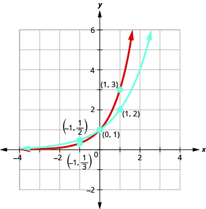 

Graph: <math xmlns="http://www.w3.org/1998/Math/MathML"><mrow><mi>f</mi><mrow><mo>(</mo><mi>x</mi><mo>)</mo></mrow><mo>=</mo><msup><mn>4</mn><mi>x</mi></msup><mo>.</mo></mrow></math>

* * *
{: data-type="newline"}

 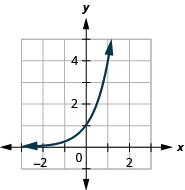 

Graph: <math xmlns="http://www.w3.org/1998/Math/MathML"><mrow><mi>g</mi><mrow><mo>(</mo><mi>x</mi><mo>)</mo></mrow><mo>=</mo><msup><mn>5</mn><mi>x</mi></msup><mo>.</mo></mrow></math>

* * *
{: data-type="newline"}

 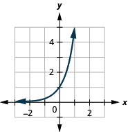 

If we look at the graphs from the previous Example and Try Its, we can identify some of the properties of exponential functions.

The graphs of <math xmlns="http://www.w3.org/1998/Math/MathML"><mrow><mi>f</mi><mrow><mo>(</mo><mi>x</mi><mo>)</mo></mrow><mo>=</mo><msup><mn>2</mn><mi>x</mi></msup></mrow></math>

 and <math xmlns="http://www.w3.org/1998/Math/MathML"><mrow><mi>g</mi><mrow><mo>(</mo><mi>x</mi><mo>)</mo></mrow><mo>=</mo><msup><mn>3</mn><mi>x</mi></msup><mo>,</mo></mrow></math>

 as well as the graphs of <math xmlns="http://www.w3.org/1998/Math/MathML"><mrow><mi>f</mi><mrow><mo>(</mo><mi>x</mi><mo>)</mo></mrow><mo>=</mo><msup><mn>4</mn><mi>x</mi></msup></mrow></math>

 and <math xmlns="http://www.w3.org/1998/Math/MathML"><mrow><mi>g</mi><mrow><mo>(</mo><mi>x</mi><mo>)</mo></mrow><mo>=</mo><msup><mn>5</mn><mi>x</mi></msup><mo>,</mo></mrow></math>

 all have the same basic shape. This is the shape we expect from an exponential function where <math xmlns="http://www.w3.org/1998/Math/MathML"><mrow><mi>a</mi><mo>&gt;</mo><mn>1</mn><mo>.</mo></mrow></math>

We notice, that for each function, the graph contains the point <math xmlns="http://www.w3.org/1998/Math/MathML"><mrow><mrow><mo>(</mo><mrow><mn>0</mn><mo>,</mo><mn>1</mn></mrow><mo>)</mo></mrow><mo>.</mo></mrow></math>

 This make sense because <math xmlns="http://www.w3.org/1998/Math/MathML"><mrow><msup><mi>a</mi><mn>0</mn></msup><mo>=</mo><mn>1</mn></mrow></math>

 for any *a*.

The graph of each function, <math xmlns="http://www.w3.org/1998/Math/MathML"><mrow><mi>f</mi><mrow><mo>(</mo><mi>x</mi><mo>)</mo></mrow><mo>=</mo><msup><mi>a</mi><mi>x</mi></msup></mrow></math>

 also contains the point <math xmlns="http://www.w3.org/1998/Math/MathML"><mrow><mrow><mo>(</mo><mrow><mn>1</mn><mo>,</mo><mi>a</mi></mrow><mo>)</mo></mrow><mo>.</mo></mrow></math>

 The graph of <math xmlns="http://www.w3.org/1998/Math/MathML"><mrow><mi>f</mi><mrow><mo>(</mo><mi>x</mi><mo>)</mo></mrow><mo>=</mo><msup><mn>2</mn><mi>x</mi></msup></mrow></math>

 contained <math xmlns="http://www.w3.org/1998/Math/MathML"><mrow><mrow><mo>(</mo><mrow><mn>1</mn><mo>,</mo><mn>2</mn></mrow><mo>)</mo></mrow></mrow></math>

 and the graph of <math xmlns="http://www.w3.org/1998/Math/MathML"><mrow><mi>g</mi><mrow><mo>(</mo><mi>x</mi><mo>)</mo></mrow><mo>=</mo><msup><mn>3</mn><mi>x</mi></msup></mrow></math>

 contained <math xmlns="http://www.w3.org/1998/Math/MathML"><mrow><mrow><mo>(</mo><mrow><mn>1</mn><mo>,</mo><mn>3</mn></mrow><mo>)</mo></mrow><mo>.</mo></mrow></math>

 This makes sense as <math xmlns="http://www.w3.org/1998/Math/MathML"><mrow><msup><mi>a</mi><mn>1</mn></msup><mo>=</mo><mi>a</mi><mo>.</mo></mrow></math>

Notice too, the graph of each function <math xmlns="http://www.w3.org/1998/Math/MathML"><mrow><mi>f</mi><mrow><mo>(</mo><mi>x</mi><mo>)</mo></mrow><mo>=</mo><msup><mi>a</mi><mi>x</mi></msup></mrow></math>

 also contains the point <math xmlns="http://www.w3.org/1998/Math/MathML"><mrow><mrow><mo>(</mo><mrow><mn>−1</mn><mo>,</mo><mfrac><mn>1</mn><mi>a</mi></mfrac></mrow><mo>)</mo></mrow><mo>.</mo></mrow></math>

 The graph of <math xmlns="http://www.w3.org/1998/Math/MathML"><mrow><mi>f</mi><mrow><mo>(</mo><mi>x</mi><mo>)</mo></mrow><mo>=</mo><msup><mn>2</mn><mi>x</mi></msup></mrow></math>

 contained <math xmlns="http://www.w3.org/1998/Math/MathML"><mrow><mrow><mo>(</mo><mrow><mn>−1</mn><mo>,</mo><mfrac><mn>1</mn><mn>2</mn></mfrac></mrow><mo>)</mo></mrow></mrow></math>

 and the graph of <math xmlns="http://www.w3.org/1998/Math/MathML"><mrow><mi>g</mi><mrow><mo>(</mo><mi>x</mi><mo>)</mo></mrow><mo>=</mo><msup><mn>3</mn><mi>x</mi></msup></mrow></math>

 contained <math xmlns="http://www.w3.org/1998/Math/MathML"><mrow><mrow><mo>(</mo><mrow><mn>−1</mn><mo>,</mo><mfrac><mn>1</mn><mn>3</mn></mfrac></mrow><mo>)</mo></mrow><mo>.</mo></mrow></math>

 This makes sense as <math xmlns="http://www.w3.org/1998/Math/MathML"><mrow><msup><mi>a</mi><mrow><mn>−1</mn></mrow></msup><mo>=</mo><mfrac><mn>1</mn><mi>a</mi></mfrac><mo>.</mo></mrow></math>

What is the domain for each function? From the graphs we can see that the domain is the set of all real numbers. There is no restriction on the domain. We write the domain in interval notation as <math xmlns="http://www.w3.org/1998/Math/MathML"><mrow><mrow><mo>(</mo><mrow><mtext>−</mtext><mi>∞</mi><mo>,</mo><mi>∞</mi></mrow><mo>)</mo></mrow><mo>.</mo></mrow></math>

Look at each graph. What is the range of the function? The graph never hits the <math xmlns="http://www.w3.org/1998/Math/MathML"><mi>x</mi></math>

-axis. The range is all positive numbers. We write the range in interval notation as <math xmlns="http://www.w3.org/1998/Math/MathML"><mrow><mrow><mo>(</mo><mrow><mn>0</mn><mo>,</mo><mi>∞</mi></mrow><mo>)</mo></mrow><mo>.</mo></mrow></math>

Whenever a graph of a function approaches a line but never touches it, we call that line an **asymptote**{: data-type="term"}. For the exponential functions we are looking at, the graph approaches the <math xmlns="http://www.w3.org/1998/Math/MathML"><mi>x</mi></math>

-axis very closely but will never cross it, we call the line <math xmlns="http://www.w3.org/1998/Math/MathML"><mrow><mi>y</mi><mo>=</mo><mn>0</mn><mo>,</mo></mrow></math>

 the *x*-axis, a horizontal asymptote.

Properties of the Graph of
<math xmlns="http://www.w3.org/1998/Math/MathML"><mrow><mi>f</mi><mrow><mo>(</mo><mi>x</mi><mo>)</mo></mrow><mo>=</mo><msup><mi>a</mi><mi>x</mi></msup></mrow></math>
when
<math xmlns="http://www.w3.org/1998/Math/MathML"><mrow><mi>a</mi><mo>&gt;</mo><mn>1</mn></mrow></math>

| Domain | <math xmlns="http://www.w3.org/1998/Math/MathML"><mrow><mrow><mo>(</mo><mrow><mtext>−</mtext><mi>∞</mi><mo>,</mo><mi>∞</mi></mrow><mo>)</mo></mrow></mrow></math>

 |
{: valign="top"}| Range | <math xmlns="http://www.w3.org/1998/Math/MathML"><mrow><mrow><mo>(</mo><mrow><mn>0</mn><mo>,</mo><mi>∞</mi></mrow><mo>)</mo></mrow></mrow></math>

 |
{: valign="top"}| *x*-intercept | None |
{: valign="top"}| *y*-intercept | <math xmlns="http://www.w3.org/1998/Math/MathML"><mrow><mrow><mo>(</mo><mrow><mn>0</mn><mo>,</mo><mn>1</mn></mrow><mo>)</mo></mrow></mrow></math>

 |
{: valign="top"}| Contains | <math xmlns="http://www.w3.org/1998/Math/MathML"><mrow><mrow><mo>(</mo><mrow><mn>1</mn><mo>,</mo><mi>a</mi></mrow><mo>)</mo></mrow><mo>,</mo><mspace width="0.2em" /><mrow><mo>(</mo><mrow><mn>−1</mn><mo>,</mo><mfrac><mn>1</mn><mi>a</mi></mfrac></mrow><mo>)</mo></mrow></mrow></math>

 |
{: valign="top"}| Asymptote | <math xmlns="http://www.w3.org/1998/Math/MathML"><mi>x</mi></math>

-axis, the line <math xmlns="http://www.w3.org/1998/Math/MathML"><mrow><mi>y</mi><mo>=</mo><mn>0</mn></mrow></math>

 |
{: valign="top"}{: .unnumbered summary="Table has two columns and six rows. The first row shows the domain is negative infinity to infinity. The second row shows the range is 0 to infinity. The third row shows there is no x intercept. The fourth row shows the y-intercept is 0, 1. The fifth row shows the function contains 1, a and negative 1, 1 over a. The sixth column shows the asymptote is the x axis and the line y equals 0." data-label=""}

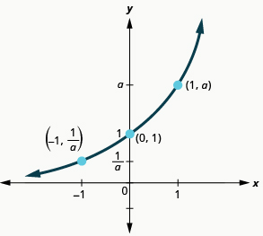

Our definition of an exponential function <math xmlns="http://www.w3.org/1998/Math/MathML"><mrow><mi>f</mi><mrow><mo>(</mo><mi>x</mi><mo>)</mo></mrow><mo>=</mo><msup><mi>a</mi><mi>x</mi></msup></mrow></math>

 says <math xmlns="http://www.w3.org/1998/Math/MathML"><mrow><mi>a</mi><mo>&gt;</mo><mn>0</mn><mo>,</mo></mrow></math>

 but the examples and discussion so far has been about functions where <math xmlns="http://www.w3.org/1998/Math/MathML"><mrow><mi>a</mi><mo>&gt;</mo><mn>1</mn><mo>.</mo></mrow></math>

 What happens when <math xmlns="http://www.w3.org/1998/Math/MathML"><mrow><mn>0</mn><mo>&lt;</mo><mi>a</mi><mo>&lt;</mo><mn>1</mn></mrow></math>

? The next example will explore this possibility.

On the same coordinate system, graph <math xmlns="http://www.w3.org/1998/Math/MathML"><mrow><mi>f</mi><mrow><mo>(</mo><mi>x</mi><mo>)</mo></mrow><mo>=</mo><msup><mrow><mrow><mo>(</mo><mrow><mfrac><mn>1</mn><mn>2</mn></mfrac></mrow><mo>)</mo></mrow></mrow><mi>x</mi></msup></mrow></math>

 and <math xmlns="http://www.w3.org/1998/Math/MathML"><mrow><mi>g</mi><mrow><mo>(</mo><mi>x</mi><mo>)</mo></mrow><mo>=</mo><msup><mrow><mrow><mo>(</mo><mrow><mfrac><mn>1</mn><mn>3</mn></mfrac></mrow><mo>)</mo></mrow></mrow><mi>x</mi></msup><mo>.</mo></mrow></math>

We will use point plotting to graph the functions.

 ![This table has seven rows and five columns. The first row is header row and reads x, f of x, equals 1 over 2 to the x power, (x, f of x), g of x equals 1 over 3 to the x power, and (x, g of x). The second row reads negative 2, 1 over 2 to the negative 2 power equals 2 squared which equals 4, (negative 2, 4), 3 to the negative 2 power equals 3 squared which equals 9, (negative 2, 9). The third row reads negative 1, 1 over 2 to the negative 1 power equals 2 to the first power which equals 2, (negative 1, 2), 1 over 3 to the negative 1 power equals 3 to the first power which equals 3, (negative 1, 3). The fourth row reads 0, 1 over 2 to the 0 power equals 1, (0, 1), 1 over 3 to the 0 power equals 1, (0, 1). The fifth row reads 1, 1 over 2 to the 1 power equals 1 over 2, (1, 1 over 2), 1 over 3 to the 1 power equals 1 over 3, (1, 1 over 3). The sixth row reads 2, 1 over 2 to the 2 power equals 1 over 4, (2, 1 over 4), 1 over 3 to the 2 power equals 1 over 9, (2, 1 over 9). The seventh row reads 3, 1 over 2 to the 3 power equals 1 over 8, (3, 1 over 8), 1 over 3 to the 3 power equals 1 over 27, (3, 1 over 27).](../resources/CNX_IntAlg_Figure_10_02_005_img.jpg)   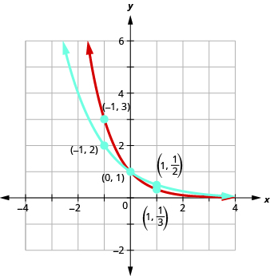 

Graph: <math xmlns="http://www.w3.org/1998/Math/MathML"><mrow><mi>f</mi><mrow><mo>(</mo><mi>x</mi><mo>)</mo></mrow><mo>=</mo><msup><mrow><mrow><mo>(</mo><mrow><mfrac><mn>1</mn><mn>4</mn></mfrac></mrow><mo>)</mo></mrow></mrow><mi>x</mi></msup><mo>.</mo></mrow></math>

* * *
{: data-type="newline"}

 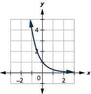 

Graph: <math xmlns="http://www.w3.org/1998/Math/MathML"><mrow><mi>g</mi><mrow><mo>(</mo><mi>x</mi><mo>)</mo></mrow><mo>=</mo><msup><mrow><mrow><mo>(</mo><mrow><mfrac><mn>1</mn><mn>5</mn></mfrac></mrow><mo>)</mo></mrow></mrow><mi>x</mi></msup><mo>.</mo></mrow></math>

* * *
{: data-type="newline"}

 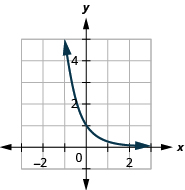 

Now let’s look at the graphs from the previous Example and Try Its so we can now identify some of the properties of exponential functions where <math xmlns="http://www.w3.org/1998/Math/MathML"><mrow><mn>0</mn><mo>&lt;</mo><mi>a</mi><mo>&lt;</mo><mn>1</mn><mo>.</mo></mrow></math>

The graphs of <math xmlns="http://www.w3.org/1998/Math/MathML"><mrow><mi>f</mi><mrow><mo>(</mo><mi>x</mi><mo>)</mo></mrow><mo>=</mo><msup><mrow><mrow><mo>(</mo><mrow><mfrac><mn>1</mn><mn>2</mn></mfrac></mrow><mo>)</mo></mrow></mrow><mi>x</mi></msup></mrow></math>

 and <math xmlns="http://www.w3.org/1998/Math/MathML"><mrow><mi>g</mi><mrow><mo>(</mo><mi>x</mi><mo>)</mo></mrow><mo>=</mo><msup><mrow><mrow><mo>(</mo><mrow><mfrac><mn>1</mn><mn>3</mn></mfrac></mrow><mo>)</mo></mrow></mrow><mi>x</mi></msup></mrow></math>

 as well as the graphs of <math xmlns="http://www.w3.org/1998/Math/MathML"><mrow><mi>f</mi><mrow><mo>(</mo><mi>x</mi><mo>)</mo></mrow><mo>=</mo><msup><mrow><mrow><mo>(</mo><mrow><mfrac><mn>1</mn><mn>4</mn></mfrac></mrow><mo>)</mo></mrow></mrow><mi>x</mi></msup></mrow></math>

 and <math xmlns="http://www.w3.org/1998/Math/MathML"><mrow><mi>g</mi><mrow><mo>(</mo><mi>x</mi><mo>)</mo></mrow><mo>=</mo><msup><mrow><mrow><mo>(</mo><mrow><mfrac><mn>1</mn><mn>5</mn></mfrac></mrow><mo>)</mo></mrow></mrow><mi>x</mi></msup></mrow></math>

 all have the same basic shape. While this is the shape we expect from an exponential function where <math xmlns="http://www.w3.org/1998/Math/MathML"><mrow><mn>0</mn><mo>&lt;</mo><mi>a</mi><mo>&lt;</mo><mn>1</mn><mo>,</mo></mrow></math>

 the graphs go down from left to right while the previous graphs, when <math xmlns="http://www.w3.org/1998/Math/MathML"><mrow><mi>a</mi><mo>&gt;</mo><mn>1</mn><mo>,</mo></mrow></math>

 went from up from left to right.

We notice that for each function, the graph still contains the point (0, 1). This make sense because <math xmlns="http://www.w3.org/1998/Math/MathML"><mrow><msup><mi>a</mi><mn>0</mn></msup><mo>=</mo><mn>1</mn></mrow></math>

 for any *a*.

As before, the graph of each function, <math xmlns="http://www.w3.org/1998/Math/MathML"><mrow><mi>f</mi><mrow><mo>(</mo><mi>x</mi><mo>)</mo></mrow><mo>=</mo><msup><mi>a</mi><mi>x</mi></msup><mo>,</mo></mrow></math>

 also contains the point <math xmlns="http://www.w3.org/1998/Math/MathML"><mrow><mrow><mo>(</mo><mrow><mn>1</mn><mo>,</mo><mi>a</mi></mrow><mo>)</mo></mrow><mo>.</mo></mrow></math>

 The graph of <math xmlns="http://www.w3.org/1998/Math/MathML"><mrow><mi>f</mi><mrow><mo>(</mo><mi>x</mi><mo>)</mo></mrow><mo>=</mo><msup><mrow><mrow><mo>(</mo><mrow><mfrac><mn>1</mn><mn>2</mn></mfrac></mrow><mo>)</mo></mrow></mrow><mi>x</mi></msup></mrow></math>

 contained <math xmlns="http://www.w3.org/1998/Math/MathML"><mrow><mrow><mo>(</mo><mrow><mn>1</mn><mo>,</mo><mfrac><mn>1</mn><mn>2</mn></mfrac></mrow><mo>)</mo></mrow></mrow></math>

 and the graph of <math xmlns="http://www.w3.org/1998/Math/MathML"><mrow><mi>g</mi><mrow><mo>(</mo><mi>x</mi><mo>)</mo></mrow><mo>=</mo><msup><mrow><mrow><mo>(</mo><mrow><mfrac><mn>1</mn><mn>3</mn></mfrac></mrow><mo>)</mo></mrow></mrow><mi>x</mi></msup></mrow></math>

 contained <math xmlns="http://www.w3.org/1998/Math/MathML"><mrow><mrow><mo>(</mo><mrow><mn>1</mn><mo>,</mo><mfrac><mn>1</mn><mn>3</mn></mfrac></mrow><mo>)</mo></mrow><mo>.</mo></mrow></math>

 This makes sense as <math xmlns="http://www.w3.org/1998/Math/MathML"><mrow><msup><mi>a</mi><mn>1</mn></msup><mo>=</mo><mi>a</mi><mo>.</mo></mrow></math>

Notice too that the graph of each function, <math xmlns="http://www.w3.org/1998/Math/MathML"><mrow><mi>f</mi><mrow><mo>(</mo><mi>x</mi><mo>)</mo></mrow><mo>=</mo><msup><mi>a</mi><mi>x</mi></msup><mo>,</mo></mrow></math>

 also contains the point <math xmlns="http://www.w3.org/1998/Math/MathML"><mrow><mrow><mo>(</mo><mrow><mn>−1</mn><mo>,</mo><mfrac><mn>1</mn><mi>a</mi></mfrac></mrow><mo>)</mo></mrow><mo>.</mo></mrow></math>

 The graph of <math xmlns="http://www.w3.org/1998/Math/MathML"><mrow><mi>f</mi><mrow><mo>(</mo><mi>x</mi><mo>)</mo></mrow><mo>=</mo><msup><mrow><mrow><mo>(</mo><mrow><mfrac><mn>1</mn><mn>2</mn></mfrac></mrow><mo>)</mo></mrow></mrow><mi>x</mi></msup></mrow></math>

 contained <math xmlns="http://www.w3.org/1998/Math/MathML"><mrow><mrow><mo>(</mo><mrow><mn>−1</mn><mo>,</mo><mn>2</mn></mrow><mo>)</mo></mrow></mrow></math>

 and the graph of <math xmlns="http://www.w3.org/1998/Math/MathML"><mrow><mi>g</mi><mrow><mo>(</mo><mi>x</mi><mo>)</mo></mrow><mo>=</mo><msup><mrow><mrow><mo>(</mo><mrow><mfrac><mn>1</mn><mn>3</mn></mfrac></mrow><mo>)</mo></mrow></mrow><mi>x</mi></msup></mrow></math>

 contained <math xmlns="http://www.w3.org/1998/Math/MathML"><mrow><mrow><mo>(</mo><mrow><mn>−1</mn><mo>,</mo><mn>3</mn></mrow><mo>)</mo></mrow><mo>.</mo></mrow></math>

 This makes sense as <math xmlns="http://www.w3.org/1998/Math/MathML"><mrow><msup><mi>a</mi><mrow><mn>−1</mn></mrow></msup><mo>=</mo><mfrac><mn>1</mn><mi>a</mi></mfrac><mo>.</mo></mrow></math>

What is the domain and range for each function? From the graphs we can see that the domain is the set of all real numbers and we write the domain in interval notation as <math xmlns="http://www.w3.org/1998/Math/MathML"><mrow><mrow><mo>(</mo><mrow><mtext>−</mtext><mi>∞</mi><mo>,</mo><mi>∞</mi></mrow><mo>)</mo></mrow><mo>.</mo></mrow></math>

 Again, the graph never hits the <math xmlns="http://www.w3.org/1998/Math/MathML"><mi>x</mi></math>

-axis. The range is all positive numbers. We write the range in interval notation as <math xmlns="http://www.w3.org/1998/Math/MathML"><mrow><mrow><mo>(</mo><mrow><mn>0</mn><mo>,</mo><mi>∞</mi></mrow><mo>)</mo></mrow><mo>.</mo></mrow></math>

We will summarize these properties in the chart below. Which also include when <math xmlns="http://www.w3.org/1998/Math/MathML"><mrow><mi>a</mi><mo>&gt;</mo><mn>1</mn><mo>.</mo></mrow></math>

Properties of the Graph of
<math xmlns="http://www.w3.org/1998/Math/MathML"><mrow><mi>f</mi><mrow><mo>(</mo><mi>x</mi><mo>)</mo></mrow><mo>=</mo><msup><mi>a</mi><mi>x</mi></msup></mrow></math>

<table class="unnumbered" summary="Table has four columns. It shows that when a is greater than 1, the domain is negative infinity to infinity, the range is 0 to infinity, there is no x intercept, the y-intercept is 0, 1, the function contains 1, a and negative 1, 1 over a, the asymptote is the x axis and the line y equals 0, and the basic shape is increasing. It shows that when a is greater than 0 and less than 1, the domain is negative infinity to infinity, the range is 0 to infinity, there is no x intercept, the y-intercept is 0, 1, the function contains 1, a and negative 1, 1 over a, the asymptote is the x axis and the line y equals 0, and the basic shape is decreasing." data-label=""><thead>
<tr valign="top">
<th colspan="2" data-valign="top" data-align="left">when <math xmlns="http://www.w3.org/1998/Math/MathML"><mrow><mi>a</mi><mo>&gt;</mo><mn>1</mn></mrow></math></th>
<th colspan="2" data-valign="top" data-align="left">when <math xmlns="http://www.w3.org/1998/Math/MathML"><mrow><mn>0</mn><mo>&lt;</mo><mi>a</mi><mo>&lt;</mo><mn>1</mn></mrow></math></th>
</tr>
</thead><tbody>
<tr valign="top">
<td data-valign="top" data-align="left">Domain</td>
<td data-valign="top" data-align="left"><math xmlns="http://www.w3.org/1998/Math/MathML"><mrow><mrow><mo>(</mo><mrow><mtext>−</mtext><mi>∞</mi><mo>,</mo><mi>∞</mi></mrow><mo>)</mo></mrow></mrow></math></td>
<td data-valign="top" data-align="left">Domain</td>
<td data-valign="top" data-align="left"><math xmlns="http://www.w3.org/1998/Math/MathML"><mrow><mrow><mo>(</mo><mrow><mtext>−</mtext><mi>∞</mi><mo>,</mo><mi>∞</mi></mrow><mo>)</mo></mrow></mrow></math></td>
</tr>
<tr valign="top">
<td data-valign="top" data-align="left">Range</td>
<td data-valign="top" data-align="left"><math xmlns="http://www.w3.org/1998/Math/MathML"><mrow><mrow><mo>(</mo><mrow><mn>0</mn><mo>,</mo><mi>∞</mi></mrow><mo>)</mo></mrow></mrow></math></td>
<td data-valign="top" data-align="left">Range</td>
<td data-valign="top" data-align="left"><math xmlns="http://www.w3.org/1998/Math/MathML"><mrow><mrow><mo>(</mo><mrow><mn>0</mn><mo>,</mo><mi>∞</mi></mrow><mo>)</mo></mrow></mrow></math></td>
</tr>
<tr valign="top">
<td data-valign="top" data-align="left"><math xmlns="http://www.w3.org/1998/Math/MathML"><mi>x</mi></math>-intercept</td>
<td data-valign="top" data-align="left">none</td>
<td data-valign="top" data-align="left"><math xmlns="http://www.w3.org/1998/Math/MathML"><mi>x</mi></math>-intercept</td>
<td data-valign="top" data-align="left">none</td>
</tr>
<tr valign="top">
<td data-valign="top" data-align="left"><math xmlns="http://www.w3.org/1998/Math/MathML"><mi>y</mi></math>-intercept</td>
<td data-valign="top" data-align="left"><math xmlns="http://www.w3.org/1998/Math/MathML"><mrow><mrow><mo>(</mo><mrow><mn>0</mn><mo>,</mo><mn>1</mn></mrow><mo>)</mo></mrow></mrow></math></td>
<td data-valign="top" data-align="left"><math xmlns="http://www.w3.org/1998/Math/MathML"><mi>y</mi></math>-intercept</td>
<td data-valign="top" data-align="left"><math xmlns="http://www.w3.org/1998/Math/MathML"><mrow><mrow><mo>(</mo><mrow><mn>0</mn><mo>,</mo><mn>1</mn></mrow><mo>)</mo></mrow></mrow></math></td>
</tr>
<tr valign="top">
<td data-valign="top" data-align="left">Contains</td>
<td data-valign="top" data-align="left"><math xmlns="http://www.w3.org/1998/Math/MathML"><mrow><mrow><mo>(</mo><mrow><mn>1</mn><mo>,</mo><mi>a</mi></mrow><mo>)</mo></mrow><mo>,</mo><mspace width="0.2em" /><mrow><mo>(</mo><mrow><mn>−1</mn><mo>,</mo><mfrac><mn>1</mn><mi>a</mi></mfrac></mrow><mo>)</mo></mrow></mrow></math></td>
<td data-valign="top" data-align="left">Contains</td>
<td data-valign="top" data-align="left"><math xmlns="http://www.w3.org/1998/Math/MathML"><mrow><mrow><mo>(</mo><mrow><mn>1</mn><mo>,</mo><mi>a</mi></mrow><mo>)</mo></mrow><mo>,</mo><mspace width="0.2em" /><mrow><mo>(</mo><mrow><mn>−1</mn><mo>,</mo><mfrac><mn>1</mn><mi>a</mi></mfrac></mrow><mo>)</mo></mrow></mrow></math></td>
</tr>
<tr valign="top">
<td data-valign="top" data-align="left">Asymptote</td>
<td data-valign="top" data-align="left"><math xmlns="http://www.w3.org/1998/Math/MathML"><mi>x</mi></math>-axis, the line <math xmlns="http://www.w3.org/1998/Math/MathML"><mrow><mi>y</mi><mo>=</mo><mn>0</mn></mrow></math></td>
<td data-valign="top" data-align="left">Asymptote</td>
<td data-valign="top" data-align="left"><math xmlns="http://www.w3.org/1998/Math/MathML"><mi>x</mi></math>-axis, the line <math xmlns="http://www.w3.org/1998/Math/MathML"><mrow><mi>y</mi><mo>=</mo><mn>0</mn></mrow></math></td>
</tr>
<tr valign="top">
<td data-valign="top" data-align="left">Basic shape</td>
<td data-valign="top" data-align="left">increasing</td>
<td data-valign="top" data-align="left">Basic shape</td>
<td data-valign="top" data-align="left">decreasing</td>
</tr>
</tbody></table>

It is important for us to notice that both of these graphs are one-to-one, as they both pass the horizontal line test. This means the exponential function will have an inverse. We will look at this later.

When we graphed quadratic functions, we were able to graph using translation rather than just plotting points. Will that work in graphing exponential functions?

On the same coordinate system graph <math xmlns="http://www.w3.org/1998/Math/MathML"><mrow><mi>f</mi><mrow><mo>(</mo><mi>x</mi><mo>)</mo></mrow><mo>=</mo><msup><mn>2</mn><mi>x</mi></msup></mrow></math>

 and <math xmlns="http://www.w3.org/1998/Math/MathML"><mrow><mi>g</mi><mrow><mo>(</mo><mi>x</mi><mo>)</mo></mrow><mo>=</mo><msup><mn>2</mn><mrow><mi>x</mi><mo>+</mo><mn>1</mn></mrow></msup><mo>.</mo></mrow></math>

We will use point plotting to graph the functions.

 ![This table has seven rows and five columns. The first row is header row and reads x, f of x equals 2 to the x power, (x, f of x), g of x equals 2 to the x plus 1 power, and (x, g of x). The second row reads negative 2, 2 to the negative 2 power equals 1 divided by 2 squared which equals 1 over 4, (negative 2, 1 over 4), 2 to the negative 2 plus 1 power equals 1 divided by 2 to the first power which equals 1 over 2, (negative 2, 1 over 2). The third row reads negative 1, 2 to the negative 1 power equals 1 divided by 2 to the first power which equals 1 over 2, (negative 1, 1 over 2), 2 to the negative 1 plus 1 power equals 2 to the 0 power which equals 1, (negative 1, 1). The fourth row reads 0, 2 to the 0 power equals 1, (0, 1), 2 to the 0 plus 1 power equals 2 to the 1 power which equals 2, (0, 2). The fifth row reads 1, 2 to the 1 power equals 2, (1, 2), 2 to the 1 plus 1 power equals 2 to the second power which equals 4, (1, 4). The sixth row reads 2, 2 to the 2 power equals 4, (2, 4), 2 to the 2 plus 1 power equals 2 to the third power which equals 8, (2, 8). The seventh row reads 3, 2 to the 3 power equals 8, (3, 8), 2 to the 3 plus 1 power equals 2 to the fourth power which equals 16, (3, 16).](../resources/CNX_IntAlg_Figure_10_02_008_img.jpg)   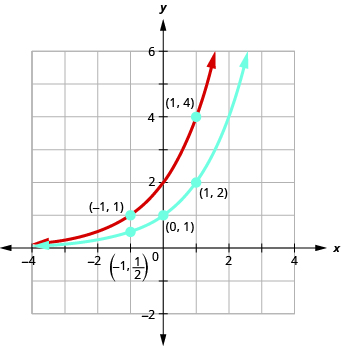 

On the same coordinate system, graph: <math xmlns="http://www.w3.org/1998/Math/MathML"><mrow><mi>f</mi><mrow><mo>(</mo><mi>x</mi><mo>)</mo></mrow><mo>=</mo><msup><mn>2</mn><mi>x</mi></msup></mrow></math>

 and <math xmlns="http://www.w3.org/1998/Math/MathML"><mrow><mi>g</mi><mrow><mo>(</mo><mi>x</mi><mo>)</mo></mrow><mo>=</mo><msup><mn>2</mn><mrow><mi>x</mi><mo>−</mo><mn>1</mn></mrow></msup><mo>.</mo></mrow></math>

* * *
{: data-type="newline"}

  

On the same coordinate system, graph: <math xmlns="http://www.w3.org/1998/Math/MathML"><mrow><mi>f</mi><mrow><mo>(</mo><mi>x</mi><mo>)</mo></mrow><mo>=</mo><msup><mn>3</mn><mi>x</mi></msup></mrow></math>

 and <math xmlns="http://www.w3.org/1998/Math/MathML"><mrow><mi>g</mi><mrow><mo>(</mo><mi>x</mi><mo>)</mo></mrow><mo>=</mo><msup><mn>3</mn><mrow><mi>x</mi><mo>+</mo><mn>1</mn></mrow></msup><mo>.</mo></mrow></math>

* * *
{: data-type="newline"}

  

Looking at the graphs of the functions <math xmlns="http://www.w3.org/1998/Math/MathML"><mrow><mi>f</mi><mrow><mo>(</mo><mi>x</mi><mo>)</mo></mrow><mo>=</mo><msup><mn>2</mn><mi>x</mi></msup></mrow></math>

 and <math xmlns="http://www.w3.org/1998/Math/MathML"><mrow><mi>g</mi><mrow><mo>(</mo><mi>x</mi><mo>)</mo></mrow><mo>=</mo><msup><mn>2</mn><mrow><mi>x</mi><mo>+</mo><mn>1</mn></mrow></msup></mrow></math>

 in the last example, we see that adding one in the exponent caused a horizontal shift of one unit to the left. Recognizing this pattern allows us to graph other functions with the same pattern by translation.

Let’s now consider another situation that might be graphed more easily by translation, once we recognize the pattern.

On the same coordinate system graph <math xmlns="http://www.w3.org/1998/Math/MathML"><mrow><mi>f</mi><mrow><mo>(</mo><mi>x</mi><mo>)</mo></mrow><mo>=</mo><msup><mn>3</mn><mi>x</mi></msup></mrow></math>

 and <math xmlns="http://www.w3.org/1998/Math/MathML"><mrow><mi>g</mi><mrow><mo>(</mo><mi>x</mi><mo>)</mo></mrow><mo>=</mo><msup><mn>3</mn><mi>x</mi></msup><mo>−</mo><mn>2</mn><mo>.</mo></mrow></math>

We will use point plotting to graph the functions.

 ![This table has five rows and six columns. The first row is header row and reads x, f of x equals 3 to the x power, (x, f of x), g of x equals 3 to the x power minus 2, and (x, g of x). The second row reads negative 2, 3 to the negative 2 power equals 1 over 9, (negative 2, 1 over 9), 3 to the negative 2 power minus 2 equals 1 over 9 minus 2 which equals negative 17 over 9, (negative 2, negative 17 over 9). The third row reads negative 1, 3 to the negative 1 power equals 1 over 3, (negative 1, 1 over 3), 3 to the negative 1 power minus 2 equals 1 over 3 minus 2 which equals negative 5 over 3, (negative 1, negative 5 over 3). The fourth row reads 0, 3 to the 0 power equals 1, (0, 1), 3 to the 0 power minus 2 equals 1 minus 2 which equals negative 1, (0, negative 1). The fifth row reads 1, 3 to the 1 power equals 3, (1, 3), 3 to the 1 power minus 2 equals 3 minus 2 which equals 1, (1, 1). The sixth row reads 2, 3 squared equals 9, (2, 9), 3 squared minus 2 equals 9 minus 2 which equals 7, (2, 7).](../resources/CNX_IntAlg_Figure_10_02_010_img.jpg)    

On the same coordinate system, graph: <math xmlns="http://www.w3.org/1998/Math/MathML"><mrow><mi>f</mi><mrow><mo>(</mo><mi>x</mi><mo>)</mo></mrow><mo>=</mo><msup><mn>3</mn><mi>x</mi></msup></mrow></math>

 and <math xmlns="http://www.w3.org/1998/Math/MathML"><mrow><mi>g</mi><mrow><mo>(</mo><mi>x</mi><mo>)</mo></mrow><mo>=</mo><msup><mn>3</mn><mi>x</mi></msup><mo>+</mo><mn>2</mn><mo>.</mo></mrow></math>

* * *
{: data-type="newline"}

  

On the same coordinate system, graph: <math xmlns="http://www.w3.org/1998/Math/MathML"><mrow><mi>f</mi><mrow><mo>(</mo><mi>x</mi><mo>)</mo></mrow><mo>=</mo><msup><mn>4</mn><mi>x</mi></msup></mrow></math>

 and <math xmlns="http://www.w3.org/1998/Math/MathML"><mrow><mi>g</mi><mrow><mo>(</mo><mi>x</mi><mo>)</mo></mrow><mo>=</mo><msup><mn>4</mn><mi>x</mi></msup><mo>−</mo><mn>2</mn><mo>.</mo></mrow></math>

* * *
{: data-type="newline"}

  

Looking at the graphs of the functions <math xmlns="http://www.w3.org/1998/Math/MathML"><mrow><mi>f</mi><mrow><mo>(</mo><mi>x</mi><mo>)</mo></mrow><mo>=</mo><msup><mn>3</mn><mi>x</mi></msup></mrow></math>

 and <math xmlns="http://www.w3.org/1998/Math/MathML"><mrow><mi>g</mi><mrow><mo>(</mo><mi>x</mi><mo>)</mo></mrow><mo>=</mo><msup><mn>3</mn><mi>x</mi></msup><mo>−</mo><mn>2</mn></mrow></math>

 in the last example, we see that subtracting 2 caused a vertical shift of down two units. Notice that the horizontal asymptote also shifted down 2 units. Recognizing this pattern allows us to graph other functions with the same pattern by translation.

* * *
{: data-type="newline"}

All of our exponential functions have had either an integer or a rational number as the base. We will now look at an exponential function with an irrational number as the base.

Before we can look at this exponential function, we need to define the irrational number, *e*. This number is used as a base in many applications in the sciences and business that are modeled by exponential functions. The number is defined as the value of <math xmlns="http://www.w3.org/1998/Math/MathML"><mrow><msup><mrow><mrow><mo>(</mo><mrow><mn>1</mn><mo>+</mo><mfrac><mn>1</mn><mi>n</mi></mfrac></mrow><mo>)</mo></mrow></mrow><mi>n</mi></msup></mrow></math>

 as *n* gets larger and larger. We say, as *n* approaches infinity, or increases without bound. The table shows the value of <math xmlns="http://www.w3.org/1998/Math/MathML"><mrow><msup><mrow><mrow><mo>(</mo><mrow><mn>1</mn><mo>+</mo><mfrac><mn>1</mn><mi>n</mi></mfrac></mrow><mo>)</mo></mrow></mrow><mi>n</mi></msup></mrow></math>

 for several values of <math xmlns="http://www.w3.org/1998/Math/MathML"><mrow><mi>n</mi><mo>.</mo></mrow></math>

| <math xmlns="http://www.w3.org/1998/Math/MathML"><mi>n</mi></math>

 | <math xmlns="http://www.w3.org/1998/Math/MathML"><mrow><msup><mrow><mrow><mo>(</mo><mrow><mn>1</mn><mo>+</mo><mfrac><mn>1</mn><mi>n</mi></mfrac></mrow><mo>)</mo></mrow></mrow><mi>n</mi></msup></mrow></math>

 |
{: valign="top"}|----------
| 1 | 2 |
{: valign="top"}| 2 | 2.25 |
{: valign="top"}| 5 | 2.48832 |
{: valign="top"}| 10 | 2.59374246 |
{: valign="top"}| 100 | 2.704813829… |
{: valign="top"}| 1,000 | 2.716923932… |
{: valign="top"}| 10,000 | 2.718145927… |
{: valign="top"}| 100,000 | 2.718268237… |
{: valign="top"}| 1,000,000 | 2.718280469… |
{: valign="top"}| 1,000,000,000 | 2.718281827… |
{: valign="top"}{: summary="This table has 11 rows and two columns. In the first row, which is the header row, we have n and the quantity 1 plus 1 over n to the n power. Below the n in the first column we have 1, 2, 5, 10, 100, 1000, 10,000, 100,000, 1,000,000, and 1,000,000,000. Below the quantity 1 plus 1 over n to the n power in the second column we have 2, 2.25, 2.48832, 2.59374246, 2.704813829&#x2026;, 2.716923932&#x2026;, 2.718145927&#x2026;, 2.718268237&#x2026;, 2.718280469&#x2026;, and 2.718281827&#x2026;."}

<math xmlns="http://www.w3.org/1998/Math/MathML"><mrow><mi>e</mi><mo>≈</mo><mn>2.718281827</mn></mrow></math>

The number *e* is like the number <math xmlns="http://www.w3.org/1998/Math/MathML"><mi>π</mi></math>

 in that we use a symbol to represent it because its decimal representation never stops or repeats. The irrational number *e* is called the **natural base**{: data-type="term"}.

Natural Base
<math xmlns="http://www.w3.org/1998/Math/MathML"><mi>e</mi></math>

The number *e* is defined as the value of <math xmlns="http://www.w3.org/1998/Math/MathML"><mrow><msup><mrow><mrow><mo>(</mo><mrow><mn>1</mn><mo>+</mo><mfrac><mn>1</mn><mi>n</mi></mfrac></mrow><mo>)</mo></mrow></mrow><mi>n</mi></msup><mo>,</mo></mrow></math>

 as *n* increases without bound. We say, as *n* approaches infinity,

<math xmlns="http://www.w3.org/1998/Math/MathML"><mrow><mi>e</mi><mo>≈</mo><mn>2.718281827..</mn><mo>.</mo></mrow></math>

The exponential function whose base is <math xmlns="http://www.w3.org/1998/Math/MathML"><mrow><mi>e</mi><mo>,</mo></mrow></math>

 <math xmlns="http://www.w3.org/1998/Math/MathML"><mrow><mi>f</mi><mrow><mo>(</mo><mi>x</mi><mo>)</mo></mrow><mo>=</mo><msup><mi>e</mi><mi>x</mi></msup></mrow></math>

 is called the **natural exponential function**{: data-type="term"}.

Natural Exponential Function

The natural exponential function is an exponential function whose base is <math xmlns="http://www.w3.org/1998/Math/MathML"><mi>e</mi></math>

<math xmlns="http://www.w3.org/1998/Math/MathML"><mrow><mi>f</mi><mrow><mo>(</mo><mi>x</mi><mo>)</mo></mrow><mo>=</mo><msup><mi>e</mi><mi>x</mi></msup></mrow></math>

The domain is <math xmlns="http://www.w3.org/1998/Math/MathML"><mrow><mrow><mo>(</mo><mrow><mtext>−</mtext><mi>∞</mi><mo>,</mo><mi>∞</mi></mrow><mo>)</mo></mrow></mrow></math>

 and the range is <math xmlns="http://www.w3.org/1998/Math/MathML"><mrow><mrow><mo>(</mo><mrow><mn>0</mn><mo>,</mo><mi>∞</mi></mrow><mo>)</mo></mrow><mo>.</mo></mrow></math>

Let’s graph the function <math xmlns="http://www.w3.org/1998/Math/MathML"><mrow><mi>f</mi><mrow><mo>(</mo><mi>x</mi><mo>)</mo></mrow><mo>=</mo><msup><mi>e</mi><mi>x</mi></msup></mrow></math>

 on the same coordinate system as <math xmlns="http://www.w3.org/1998/Math/MathML"><mrow><mi>g</mi><mrow><mo>(</mo><mi>x</mi><mo>)</mo></mrow><mo>=</mo><msup><mn>2</mn><mi>x</mi></msup></mrow></math>

 and <math xmlns="http://www.w3.org/1998/Math/MathML"><mrow><mi>h</mi><mrow><mo>(</mo><mi>x</mi><mo>)</mo></mrow><mo>=</mo><msup><mn>3</mn><mi>x</mi></msup><mo>.</mo></mrow></math>

![This figure shows the graphs of three functions. The first function, f of x equals 2 to the x, is marked in red and passes through the points (negative 1, negative 1 over 2), (0, negative 1), and (2, 1). The second function, f of x equals 3 to the x power, is marked in green and corresponds to a curve that passes through the points (negative 1, 1 over 3), (0, 1) and (1, 3). The third function, f of x equals e to the x power, is marked in blue and corresponds to a curve that passes through the points (negative 1, 1 over e), (0, 1) and (0, e).](../resources/CNX_IntAlg_Figure_10_02_012.jpg)

Notice that the graph of <math xmlns="http://www.w3.org/1998/Math/MathML"><mrow><mi>f</mi><mrow><mo>(</mo><mi>x</mi><mo>)</mo></mrow><mo>=</mo><msup><mi>e</mi><mi>x</mi></msup></mrow></math>

 is “between” the graphs of <math xmlns="http://www.w3.org/1998/Math/MathML"><mrow><mi>g</mi><mrow><mo>(</mo><mi>x</mi><mo>)</mo></mrow><mo>=</mo><msup><mn>2</mn><mi>x</mi></msup></mrow></math>

 and <math xmlns="http://www.w3.org/1998/Math/MathML"><mrow><mi>h</mi><mrow><mo>(</mo><mi>x</mi><mo>)</mo></mrow><mo>=</mo><msup><mn>3</mn><mi>x</mi></msup><mo>.</mo></mrow></math>

 Does this make sense as <math xmlns="http://www.w3.org/1998/Math/MathML"><mrow><mn>2</mn><mo>&lt;</mo><mi>e</mi><mo>&lt;</mo><mn>3</mn></mrow></math>

?

### Solve Exponential Equations

Equations that include an exponential expression <math xmlns="http://www.w3.org/1998/Math/MathML"><mrow><msup><mi>a</mi><mi>x</mi></msup></mrow></math>

 are called exponential equations. To solve them we use a property that says as long as <math xmlns="http://www.w3.org/1998/Math/MathML"><mrow><mi>a</mi><mo>&gt;</mo><mn>0</mn></mrow></math>

 and <math xmlns="http://www.w3.org/1998/Math/MathML"><mrow><mi>a</mi><mo>≠</mo><mn>1</mn><mo>,</mo></mrow></math>

 if <math xmlns="http://www.w3.org/1998/Math/MathML"><mrow><msup><mi>a</mi><mi>x</mi></msup><mo>=</mo><msup><mi>a</mi><mi>y</mi></msup></mrow></math>

 then it is true that <math xmlns="http://www.w3.org/1998/Math/MathML"><mrow><mi>x</mi><mo>=</mo><mi>y</mi><mo>.</mo></mrow></math>

 In other words, in an exponential equation, if the bases are equal then the exponents are equal.

One-to-One Property of Exponential Equations

For <math xmlns="http://www.w3.org/1998/Math/MathML"><mrow><mi>a</mi><mo>&gt;</mo><mn>0</mn></mrow></math>

 and <math xmlns="http://www.w3.org/1998/Math/MathML"><mrow><mi>a</mi><mo>≠</mo><mn>1</mn><mo>,</mo></mrow></math>

<math xmlns="http://www.w3.org/1998/Math/MathML"><mrow><mtext>If</mtext><mspace width="0.2em" /><msup><mi>a</mi><mi>x</mi></msup><mo>=</mo><msup><mi>a</mi><mi>y</mi></msup><mo>,</mo><mspace width="0.2em" /><mtext>then</mtext><mspace width="0.2em" /><mi>x</mi><mo>=</mo><mi>y</mi><mo>.</mo></mrow></math>

To use this property, we must be certain that both sides of the equation are written with the same base.

How to Solve an Exponential Equation

Solve: <math xmlns="http://www.w3.org/1998/Math/MathML"><mrow><msup><mn>3</mn><mrow><mn>2</mn><mi>x</mi><mo>−</mo><mn>5</mn></mrow></msup><mo>=</mo><mn>27</mn><mo>.</mo></mrow></math>

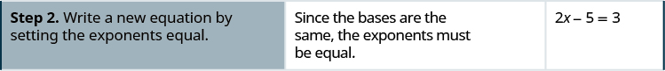

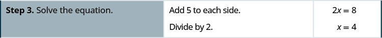

Solve: <math xmlns="http://www.w3.org/1998/Math/MathML"><mrow><msup><mn>3</mn><mrow><mn>3</mn><mi>x</mi><mo>−</mo><mn>2</mn></mrow></msup><mo>=</mo><mn>81</mn><mo>.</mo></mrow></math>

<math xmlns="http://www.w3.org/1998/Math/MathML"><mrow><mi>x</mi><mo>=</mo><mn>2</mn></mrow></math>

Solve: <math xmlns="http://www.w3.org/1998/Math/MathML"><mrow><msup><mn>7</mn><mrow><mi>x</mi><mo>−</mo><mn>3</mn></mrow></msup><mo>=</mo><mn>7</mn><mo>.</mo></mrow></math>

<math xmlns="http://www.w3.org/1998/Math/MathML"><mrow><mi>x</mi><mo>=</mo><mn>4</mn></mrow></math>

The steps are summarized below.

How to Solve an Exponential Equation

1.  Write both sides of the equation with the same base, if possible.
2.  Write a new equation by setting the exponents equal.
3.  Solve the equation.
4.  Check the solution.
{: data-number-style="arabic" .stepwise}

In the next example, we will use our properties on exponents.

Solve <math xmlns="http://www.w3.org/1998/Math/MathML"><mrow><mfrac><mrow><msup><mi>e</mi><mrow><msup><mi>x</mi><mn>2</mn></msup></mrow></msup></mrow><mrow><msup><mi>e</mi><mn>3</mn></msup></mrow></mfrac><mo>=</mo><msup><mi>e</mi><mrow><mn>2</mn><mi>x</mi></mrow></msup></mrow></math>

.

<table class="unnumbered unstyled can-break" summary="We are attempting to determine when e to the x squared power over e to the third power equals e to the 2x power. In the first step, we use the law of exponents: a to the m power over a to the n power equals a to the m minus n power. This gives us e to the x squared minus 3 power equals e to the 2x power. In the second step, we write a new equation by setting the exponents equal, which gives that x squared minus 3 equals 2x. In the third step, we solve the equation, which means that we look for solutions to x squared minus 2x minus 3 equals 0, which can be factored as the quantity x minus 3 times the quantity x plus 1 equals 0, which means that the solutions are x equals 3 and x equals negative 1. Then we check the solutions. First, for x equals 3, we start with the original problem e to the x squared power over e to the third power equals e to the 2x power. Then we substitute 3 for x to obtain e to the 3 squared power over e to the third power equals e to the 2 times 3 power. This becomes a question of whether e to the ninth power over e to the third power equals e to the sixth power. Of course, this simplifies to e to the sixth power equals e to the sixth power, so this answer holds. Now we check the solution x equals negative 1. First, we start with the original problem e to the x squared power over e to the third power equals e to the 2x power. We substitute negative 1 for x to obtain e to the negative 1 squared power over e to the third power equals e to the 2 times negative 1 power. This gives e to the first power over e to the third power equals e to the negative 2 power. Simplifying further, we obtain that e to the negative 2 power equals e to the negative 2 power, so our result holds." data-label=""><tbody>
<tr valign="top">
<td data-valign="top" data-align="left" />
<td data-valign="top" data-align="right"><math xmlns="http://www.w3.org/1998/Math/MathML"><mrow><mspace width="2.4em" /><mfrac><mrow><msup><mi>e</mi><mrow><msup><mi>x</mi><mn>2</mn></msup></mrow></msup></mrow><mrow><msup><mi>e</mi><mn>3</mn></msup></mrow></mfrac><mo>=</mo><msup><mi>e</mi><mrow><mn>2</mn><mi>x</mi></mrow></msup></mrow></math></td>
</tr>
<tr valign="top">
<td data-valign="top" data-align="left">Use the Property of Exponents: <math xmlns="http://www.w3.org/1998/Math/MathML"><mrow><mfrac><mrow><msup><mi>a</mi><mi>m</mi></msup></mrow><mrow><msup><mi>a</mi><mi>n</mi></msup></mrow></mfrac><mo>=</mo><msup><mi>a</mi><mrow><mi>m</mi><mo>−</mo><mi>n</mi></mrow></msup><mo>.</mo></mrow></math></td>
<td data-valign="top" data-align="right"><math xmlns="http://www.w3.org/1998/Math/MathML"><mrow><mspace width="2.45em" /><msup><mi>e</mi><mrow><msup><mi>x</mi><mn>2</mn></msup><mo>−</mo><mn>3</mn></mrow></msup><mo>=</mo><msup><mi>e</mi><mrow><mn>2</mn><mi>x</mi></mrow></msup></mrow></math></td>
</tr>
<tr valign="top">
<td data-valign="top" data-align="left">Write a new equation by setting the exponents
equal.</td>
<td data-valign="top" data-align="right"><math xmlns="http://www.w3.org/1998/Math/MathML"><mrow><mspace width="1.1em" /><msup><mi>x</mi><mn>2</mn></msup><mo>−</mo><mn>3</mn><mo>=</mo><mn>2</mn><mi>x</mi><mspace width="0.2em" /></mrow></math></td>
</tr>
<tr valign="top">
<td data-valign="top" data-align="left">Solve the equation.</td>
<td data-valign="top" data-align="right"><math xmlns="http://www.w3.org/1998/Math/MathML"><mrow><msup><mi>x</mi><mn>2</mn></msup><mo>−</mo><mn>2</mn><mi>x</mi><mo>−</mo><mn>3</mn><mo>=</mo><mn>0</mn><mspace width="0.65em" /></mrow></math></td>
</tr>
<tr valign="top">
<td data-valign="top" data-align="left" />
<td data-valign="top" data-align="right"><math xmlns="http://www.w3.org/1998/Math/MathML"><mrow><mrow><mo>(</mo><mrow><mi>x</mi><mo>−</mo><mn>3</mn></mrow><mo>)</mo></mrow><mrow><mo>(</mo><mrow><mi>x</mi><mo>+</mo><mn>1</mn></mrow><mo>)</mo></mrow><mo>=</mo><mn>0</mn><mspace width="0.7em" /></mrow></math></td>
</tr>
<tr valign="top">
<td data-valign="top" data-align="left" />
<td data-valign="top" data-align="left"><math xmlns="http://www.w3.org/1998/Math/MathML"><mrow><mi>x</mi><mo>=</mo><mn>3</mn><mo>,</mo><mspace width="0.4em" /><mi>x</mi><mo>=</mo><mo>−</mo><mn>1</mn></mrow></math></td>
</tr>
<tr valign="top">
<td data-valign="top" data-align="left">Check the solutions.</td>
<td data-valign="top" data-align="left" />
</tr>
<tr valign="top">
<td data-valign="top" data-align="left">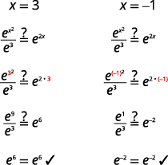</td>
<td data-valign="top" data-align="left" />
</tr>
</tbody></table>

Solve: <math xmlns="http://www.w3.org/1998/Math/MathML"><mrow><mfrac><mrow><msup><mi>e</mi><mrow><msup><mi>x</mi><mn>2</mn></msup></mrow></msup></mrow><mrow><msup><mi>e</mi><mi>x</mi></msup></mrow></mfrac><mo>=</mo><msup><mi>e</mi><mn>2</mn></msup><mo>.</mo></mrow></math>

<math xmlns="http://www.w3.org/1998/Math/MathML"><mrow><mi>x</mi><mo>=</mo><mn>−1</mn><mo>,</mo><mi>x</mi><mo>=</mo><mn>2</mn></mrow></math>

Solve: <math xmlns="http://www.w3.org/1998/Math/MathML"><mrow><mfrac><mrow><msup><mi>e</mi><mrow><msup><mi>x</mi><mn>2</mn></msup></mrow></msup></mrow><mrow><msup><mi>e</mi><mi>x</mi></msup></mrow></mfrac><mo>=</mo><msup><mi>e</mi><mn>6</mn></msup><mo>.</mo></mrow></math>

<math xmlns="http://www.w3.org/1998/Math/MathML"><mrow><mi>x</mi><mo>=</mo><mn>−2</mn><mo>,</mo><mi>x</mi><mo>=</mo><mn>3</mn></mrow></math>

### Use Exponential Models in Applications

Exponential functions model many situations. If you own a bank account, you have experienced the use of an exponential function. There are two formulas that are used to determine the balance in the account when interest is earned. If a principal, *P*, is invested at an interest rate, *r*, for *t* years, the new balance, *A*, will depend on how often the interest is compounded. If the interest is compounded *n* times a year we use the formula <math xmlns="http://www.w3.org/1998/Math/MathML"><mrow><mi>A</mi><mo>=</mo><mi>P</mi><msup><mrow><mrow><mo>(</mo><mrow><mn>1</mn><mo>+</mo><mfrac><mi>r</mi><mi>n</mi></mfrac></mrow><mo>)</mo></mrow></mrow><mrow><mi>n</mi><mi>t</mi></mrow></msup><mo>.</mo></mrow></math>

 If the interest is compounded continuously, we use the formula <math xmlns="http://www.w3.org/1998/Math/MathML"><mrow><mi>A</mi><mo>=</mo><mi>P</mi><msup><mi>e</mi><mrow><mi>r</mi><mi>t</mi></mrow></msup><mo>.</mo></mrow></math>

 These are the formulas for **compound interest**{: data-type="term"}.

Compound Interest

For a principal, *P*, invested at an interest rate, *r*, for *t* years, the new balance, *A*, is:

<math xmlns="http://www.w3.org/1998/Math/MathML"><mrow><mtable><mtr /><mtr /><mtr><mtd columnalign="left"><mi>A</mi><mo>=</mo><mi>P</mi><msup><mrow><mrow><mo>(</mo><mrow><mn>1</mn><mo>+</mo><mfrac><mi>r</mi><mi>n</mi></mfrac></mrow><mo>)</mo></mrow></mrow><mrow><mi>n</mi><mi>t</mi></mrow></msup></mtd><mtd /><mtd /><mtd /><mtd /><mtd columnalign="left"><mtext>when compounded</mtext><mspace width="0.2em" /><mi>n</mi><mspace width="0.2em" /><mtext>times a year.</mtext></mtd></mtr> <mtr><mtd columnalign="left"><mi>A</mi><mo>=</mo><mi>P</mi><msup><mi>e</mi><mrow><mi>r</mi><mi>t</mi></mrow></msup></mtd><mtd /><mtd /><mtd /><mtd /><mtd columnalign="left"><mtext>when compounded continuously.</mtext></mtd></mtr></mtable></mrow></math>

As you work with the Interest formulas, it is often helpful to identify the values of the variables first and then substitute them into the formula.

A total of <math xmlns="http://www.w3.org/1998/Math/MathML"><mrow><mtext>$</mtext><mn>10,000</mn></mrow></math>

 was invested in a college fund for a new grandchild. If the interest rate is <math xmlns="http://www.w3.org/1998/Math/MathML"><mrow><mn>5</mn><mtext>%</mtext><mo>,</mo></mrow></math>

 how much will be in the account in 18 years by each method of compounding?

ⓐ compound quarterly

ⓑ compound monthly

ⓒ compound continuously

<math xmlns="http://www.w3.org/1998/Math/MathML"><mrow><mtable> <mtr><mtd columnalign="left"><mtable><mtr><mtd columnalign="left"><mtext>Identify the values of each variable in the formulas.</mtext></mtd></mtr><mtr><mtd columnalign="left"><mtext>Remember to express the percent as a decimal.</mtext></mtd></mtr></mtable></mtd><mtd /><mtd /><mtd /><mtd /><mtd columnalign="left"><mtable><mtr><mtd columnalign="right"><mi>A</mi></mtd><mtd columnalign="left"><mo>=</mo></mtd><mtd columnalign="left"><mo>?</mo></mtd></mtr><mtr><mtd columnalign="right"><mi>P</mi></mtd><mtd columnalign="left"><mo>=</mo></mtd><mtd columnalign="left"><mtext>$</mtext><mn>10,000</mn></mtd></mtr><mtr><mtd columnalign="right"><mi>r</mi></mtd><mtd columnalign="left"><mo>=</mo></mtd><mtd columnalign="left"><mn>0.05</mn></mtd></mtr><mtr><mtd columnalign="right"><mi>t</mi></mtd><mtd columnalign="left"><mo>=</mo></mtd><mtd columnalign="left"><mn>18</mn><mspace width="0.2em" /><mtext>years</mtext></mtd></mtr></mtable></mtd></mtr></mtable></mrow></math>

ⓐ* * *
{: data-type="newline"}

 <math xmlns="http://www.w3.org/1998/Math/MathML"><mrow><mtable> <mtr><mtd columnalign="left"><mtable><mtr><mtd columnalign="left"><mtext>For quarterly compounding,</mtext><mspace width="0.2em" /><mi>n</mi><mo>=</mo><mn>4</mn><mo>.</mo><mspace width="0.2em" /><mtext>There are 4</mtext></mtd></mtr><mtr><mtd columnalign="left"><mtext>quarters in a year.</mtext></mtd></mtr></mtable></mtd><mtd /><mtd /><mtd /><mtd /><mtd columnalign="left"><mspace width="0.8em" /><mi>A</mi><mo>=</mo><mi>P</mi><msup><mrow><mrow><mo>(</mo><mrow><mn>1</mn><mo>+</mo><mfrac><mi>r</mi><mi>n</mi></mfrac></mrow><mo>)</mo></mrow></mrow><mrow><mi>n</mi><mi>t</mi></mrow></msup></mtd></mtr> <mtr><mtd columnalign="left"><mtext>Substitute the values in the formula.</mtext></mtd><mtd /><mtd /><mtd /><mtd /><mtd columnalign="left"><mspace width="0.8em" /><mi>A</mi><mo>=</mo><mn>10,000</mn><msup><mrow><mrow><mo>(</mo><mrow><mn>1</mn><mo>+</mo><mfrac><mrow><mn>0.05</mn></mrow><mn>4</mn></mfrac></mrow><mo>)</mo></mrow></mrow><mrow><mn>4</mn><mo>·</mo><mn>18</mn></mrow></msup></mtd></mtr> <mtr><mtd columnalign="left"><mtable><mtr><mtd columnalign="left"><mtext>Compute the amount. Be careful to consider the</mtext></mtd></mtr><mtr><mtd columnalign="left"><mtext>order of operations as you enter the expression into</mtext></mtd></mtr><mtr><mtd columnalign="left"><mtext>your calculator.</mtext></mtd></mtr></mtable></mtd><mtd /><mtd /><mtd /><mtd /><mtd columnalign="left"><mspace width="0.8em" /><mi>A</mi><mo>=</mo><mtext>$</mtext><mn>24,459.20</mn></mtd></mtr></mtable></mrow></math>

ⓑ* * *
{: data-type="newline"}

 <math xmlns="http://www.w3.org/1998/Math/MathML"><mrow><mtable> <mtr><mtd columnalign="left"><mtable><mtr><mtd columnalign="left"><mtext>For monthly compounding,</mtext><mspace width="0.2em" /><mi>n</mi><mo>=</mo><mn>12</mn><mo>.</mo><mspace width="0.2em" /><mtext>There are 12</mtext></mtd></mtr><mtr><mtd columnalign="left"><mtext>months in a year.</mtext></mtd></mtr></mtable></mtd><mtd /><mtd /><mtd /><mtd /><mtd columnalign="left"><mspace width="1.8em" /><mi>A</mi><mo>=</mo><mi>P</mi><msup><mrow><mrow><mo>(</mo><mrow><mn>1</mn><mo>+</mo><mfrac><mi>r</mi><mi>n</mi></mfrac></mrow><mo>)</mo></mrow></mrow><mrow><mi>n</mi><mi>t</mi></mrow></msup></mtd></mtr> <mtr><mtd columnalign="left"><mtext>Substitute the values in the formula.</mtext></mtd><mtd /><mtd /><mtd /><mtd /><mtd columnalign="left"><mspace width="1.8em" /><mi>A</mi><mo>=</mo><mn>10,000</mn><msup><mrow><mrow><mo>(</mo><mrow><mn>1</mn><mo>+</mo><mfrac><mrow><mn>0.05</mn></mrow><mrow><mn>12</mn></mrow></mfrac></mrow><mo>)</mo></mrow></mrow><mrow><mn>12</mn><mo>·</mo><mn>18</mn></mrow></msup></mtd></mtr> <mtr><mtd columnalign="left"><mtext>Compute the amount.</mtext></mtd><mtd /><mtd /><mtd /><mtd /><mtd columnalign="left"><mspace width="1.8em" /><mi>A</mi><mo>=</mo><mtext>$</mtext><mn>24,550.08</mn></mtd></mtr></mtable></mrow></math>

ⓒ* * *
{: data-type="newline"}

 <math xmlns="http://www.w3.org/1998/Math/MathML"><mrow><mtable> <mtr><mtd columnalign="left"><mtext>For compounding continuously,</mtext></mtd><mtd /><mtd /><mtd /><mtd /><mtd columnalign="left"><mspace width="6.8em" /><mi>A</mi><mo>=</mo><mi>P</mi><msup><mi>e</mi><mrow><mi>r</mi><mi>t</mi></mrow></msup></mtd></mtr> <mtr><mtd columnalign="left"><mtext>Substitute the values in the formula.</mtext></mtd><mtd /><mtd /><mtd /><mtd /><mtd columnalign="left"><mspace width="6.8em" /><mi>A</mi><mo>=</mo><mn>10,000</mn><msup><mi>e</mi><mrow><mn>0.05</mn><mo>·</mo><mn>18</mn></mrow></msup></mtd></mtr> <mtr><mtd columnalign="left"><mtext>Compute the amount.</mtext></mtd><mtd /><mtd /><mtd /><mtd /><mtd columnalign="left"><mspace width="6.8em" /><mi>A</mi><mo>=</mo><mtext>$</mtext><mn>24,596.03</mn></mtd></mtr></mtable></mrow></math>

Angela invested <math xmlns="http://www.w3.org/1998/Math/MathML"><mrow><mtext>$</mtext><mn>15,000</mn></mrow></math>

 in a savings account. If the interest rate is <math xmlns="http://www.w3.org/1998/Math/MathML"><mrow><mn>4</mn><mtext>%</mtext><mo>,</mo></mrow></math>

 how much will be in the account in 10 years by each method of compounding?

ⓐ compound quarterly

ⓑ compound monthly

ⓒ compound continuously

ⓐ <math xmlns="http://www.w3.org/1998/Math/MathML"><mrow><mtext>$</mtext><mn>22,332.96</mn></mrow></math>

* * *
{: data-type="newline"}

ⓑ <math xmlns="http://www.w3.org/1998/Math/MathML"><mrow><mtext>$</mtext><mn>22,362.49</mn></mrow></math>

 ⓒ <math xmlns="http://www.w3.org/1998/Math/MathML"><mrow><mtext>$</mtext><mn>22,377.37</mn></mrow></math>

Allan invested $10,000 in a mutual fund. If the interest rate is <math xmlns="http://www.w3.org/1998/Math/MathML"><mrow><mn>5</mn><mtext>%</mtext><mo>,</mo></mrow></math>

 how much will be in the account in 15 years by each method of compounding?

ⓐ compound quarterly

ⓑ compound monthly

ⓒ compound continuously

ⓐ $21,071.81 ⓑ $21,137.04* * *
{: data-type="newline"}

ⓒ $21,170.00

Other topics that are modeled by exponential functions involve growth and decay. Both also use the formula <math xmlns="http://www.w3.org/1998/Math/MathML"><mrow><mi>A</mi><mo>=</mo><mi>P</mi><msup><mi>e</mi><mrow><mi>r</mi><mi>t</mi></mrow></msup></mrow></math>

 we used for the growth of money. For growth and decay, generally we use<math xmlns="http://www.w3.org/1998/Math/MathML"><mrow><msub><mi>A</mi><mn>0</mn></msub><mo>,</mo></mrow></math>

 as the original amount instead of calling it <math xmlns="http://www.w3.org/1998/Math/MathML"><mrow><mi>P</mi><mo>,</mo></mrow></math>

 the principal. We see that **exponential growth**{: data-type="term"} has a positive rate of growth and **exponential decay**{: data-type="term"} has a negative rate of growth.

Exponential Growth and Decay

For an original amount, <math xmlns="http://www.w3.org/1998/Math/MathML"><mrow><msub><mi>A</mi><mn>0</mn></msub><mo>,</mo></mrow></math>

 that grows or decays at a rate, *r*, for a certain time, *t*, the final amount, *A*, is:

<math xmlns="http://www.w3.org/1998/Math/MathML"><mrow><mi>A</mi><mo>=</mo><msub><mi>A</mi><mn>0</mn></msub><msup><mi>e</mi><mrow><mi>r</mi><mi>t</mi></mrow></msup></mrow></math>

Exponential growth is typically seen in the growth of populations of humans or animals or bacteria. Our next example looks at the growth of a virus.

Chris is a researcher at the Center for Disease Control and Prevention and he is trying to understand the behavior of a new and dangerous virus. He starts his experiment with 100 of the virus that grows at a rate of 25% per hour. He will check on the virus in 24 hours. How many viruses will he find?

<math xmlns="http://www.w3.org/1998/Math/MathML"><mrow><mtable> <mtr><mtd columnalign="left"><mtable><mtr><mtd columnalign="left"><mtext>Identify the values of each variable in the formulas.</mtext></mtd></mtr><mtr><mtd columnalign="left"><mtext>Be sure to put the percent in decimal form.</mtext></mtd></mtr><mtr><mtd columnalign="left"><mtext>Be sure the units match—the rate is per hour and</mtext></mtd></mtr><mtr><mtd columnalign="left"><mtext>the time is in hours.</mtext></mtd></mtr></mtable></mtd><mtd /><mtd /><mtd /><mtd /><mtd columnalign="left"><mtable><mtr><mtd columnalign="right"><mi>A</mi></mtd><mtd columnalign="left"><mo>=</mo></mtd><mtd columnalign="left"><mo>?</mo></mtd></mtr><mtr><mtd columnalign="right"><msub><mi>A</mi><mn>0</mn></msub></mtd><mtd columnalign="left"><mo>=</mo></mtd><mtd columnalign="left"><mn>100</mn></mtd></mtr><mtr><mtd columnalign="right"><mi>r</mi></mtd><mtd columnalign="left"><mo>=</mo></mtd><mtd columnalign="left"><mn>0.25</mn><mtext>/hour</mtext></mtd></mtr><mtr><mtd columnalign="right"><mi>t</mi></mtd><mtd columnalign="left"><mo>=</mo></mtd><mtd columnalign="left"><mn>24</mn><mspace width="0.2em" /><mtext>hours</mtext></mtd></mtr></mtable></mtd></mtr><mtr /><mtr /> <mtr><mtd columnalign="left"><mtext>Substitute the values in the formula:</mtext><mspace width="0.2em" /><mi>A</mi><mo>=</mo><msub><mi>A</mi><mn>0</mn></msub><msup><mi>e</mi><mrow><mi>r</mi><mi>t</mi></mrow></msup><mo>.</mo></mtd><mtd /><mtd /><mtd /><mtd /><mtd columnalign="left"><mi>A</mi><mo>=</mo><mn>100</mn><msup><mi>e</mi><mrow><mn>0.25</mn><mo>·</mo><mn>24</mn></mrow></msup></mtd></mtr> <mtr><mtd columnalign="left"><mtext>Compute the amount.</mtext></mtd><mtd /><mtd /><mtd /><mtd /><mtd columnalign="left"><mi>A</mi><mo>=</mo><mn>40,342.88</mn></mtd></mtr> <mtr><mtd columnalign="left"><mtext>Round to the nearest whole virus.</mtext></mtd><mtd /><mtd /><mtd /><mtd /><mtd columnalign="left"><mi>A</mi><mo>=</mo><mn>40,343</mn></mtd></mtr> <mtr><mtd /><mtd /><mtd /><mtd /><mtd /><mtd columnalign="left"><mtable><mtr><mtd columnalign="left"><mtext>The researcher will find 40,343</mtext></mtd></mtr><mtr><mtd columnalign="left"><mtext>viruses.</mtext></mtd></mtr></mtable></mtd></mtr></mtable></mrow></math>

Another researcher at the Center for Disease Control and Prevention, Lisa, is studying the growth of a bacteria. She starts his experiment with 50 of the bacteria that grows at a rate of <math xmlns="http://www.w3.org/1998/Math/MathML"><mrow><mn>15</mn><mtext>%</mtext></mrow></math>

 per hour. He will check on the bacteria every 8 hours. How many bacteria will he find in 8 hours?

She will find 166 bacteria.

Maria, a biologist is observing the growth pattern of a virus. She starts with 100 of the virus that grows at a rate of <math xmlns="http://www.w3.org/1998/Math/MathML"><mrow><mn>10</mn><mtext>%</mtext></mrow></math>

 per hour. She will check on the virus in 24 hours. How many viruses will she find?

She will find 1,102 viruses.

Access these online resources for additional instruction and practice with evaluating and graphing exponential functions.

* [Graphing Exponential Functions][1]
* [Solving Exponential Equations][2]
* [Applications of Exponential Functions][3]
* [Continuously Compound Interest][4]
* [Radioactive Decay and Exponential Growth][5]
{: data-bullet-style="bullet"}

### Key Concepts

* **Properties of the Graph of**
  <math xmlns="http://www.w3.org/1998/Math/MathML"><mrow><mi>f</mi><mrow><mo>(</mo><mi>x</mi><mo>)</mo></mrow><mo>=</mo><msup><mi>a</mi><mi>x</mi></msup><mo>:</mo></mrow></math>
  
  * * *
  {: data-type="newline"}
  
  <table class="unnumbered" summary="Table has four columns. It shows that when a is greater than 1, the domain is negative infinity to infinity, the range is 0 to infinity, there is no x intercept, the y-intercept is 0, 1, the function contains 1, a and negative 1, 1 over a, the asymptote is the x axis and the line y equals 0, and the basic shape is increasing. It shows that when a is greater than 0 and less than 1, the domain is negative infinity to infinity, the range is 0 to infinity, there is no x intercept, the y-intercept is 0, 1, the function contains 1, a and negative 1, 1 over a, the asymptote is the x axis and the line y equals 0, and the basic shape is decreasing." data-label=""><thead>
  <tr valign="top">
  <th colspan="2" data-valign="top" data-align="left">when <math xmlns="http://www.w3.org/1998/Math/MathML"><mrow><mi>a</mi><mo>&gt;</mo><mn>1</mn></mrow></math></th>
  <th colspan="2" data-valign="top" data-align="left">when <math xmlns="http://www.w3.org/1998/Math/MathML"><mrow><mn>0</mn><mo>&lt;</mo><mi>a</mi><mo>&lt;</mo><mn>1</mn></mrow></math></th>
  </tr>
  </thead><tbody>
  <tr valign="top">
  <td data-valign="top" data-align="left">Domain</td>
  <td data-valign="top" data-align="left"><math xmlns="http://www.w3.org/1998/Math/MathML"><mrow><mrow><mo>(</mo><mrow><mtext>−</mtext><mi>∞</mi><mo>,</mo><mi>∞</mi></mrow><mo>)</mo></mrow></mrow></math></td>
  <td data-valign="top" data-align="left">Domain</td>
  <td data-valign="top" data-align="left"><math xmlns="http://www.w3.org/1998/Math/MathML"><mrow><mrow><mo>(</mo><mrow><mtext>−</mtext><mi>∞</mi><mo>,</mo><mi>∞</mi></mrow><mo>)</mo></mrow></mrow></math></td>
  </tr>
  <tr valign="top">
  <td data-valign="top" data-align="left">Range</td>
  <td data-valign="top" data-align="left"><math xmlns="http://www.w3.org/1998/Math/MathML"><mrow><mrow><mo>(</mo><mrow><mn>0</mn><mo>,</mo><mi>∞</mi></mrow><mo>)</mo></mrow></mrow></math></td>
  <td data-valign="top" data-align="left">Range</td>
  <td data-valign="top" data-align="left"><math xmlns="http://www.w3.org/1998/Math/MathML"><mrow><mrow><mo>(</mo><mrow><mn>0</mn><mo>,</mo><mi>∞</mi></mrow><mo>)</mo></mrow></mrow></math></td>
  </tr>
  <tr valign="top">
  <td data-valign="top" data-align="left"><math xmlns="http://www.w3.org/1998/Math/MathML"><mi>x</mi></math>-intercept</td>
  <td data-valign="top" data-align="left">none</td>
  <td data-valign="top" data-align="left"><math xmlns="http://www.w3.org/1998/Math/MathML"><mi>x</mi></math>-intercept</td>
  <td data-valign="top" data-align="left">none</td>
  </tr>
  <tr valign="top">
  <td data-valign="top" data-align="left"><math xmlns="http://www.w3.org/1998/Math/MathML"><mi>y</mi></math>-intercept</td>
  <td data-valign="top" data-align="left"><math xmlns="http://www.w3.org/1998/Math/MathML"><mrow><mrow><mo>(</mo><mrow><mn>0</mn><mo>,</mo><mn>1</mn></mrow><mo>)</mo></mrow></mrow></math></td>
  <td data-valign="top" data-align="left"><math xmlns="http://www.w3.org/1998/Math/MathML"><mi>y</mi></math>-intercept</td>
  <td data-valign="top" data-align="left"><math xmlns="http://www.w3.org/1998/Math/MathML"><mrow><mrow><mo>(</mo><mrow><mn>0</mn><mo>,</mo><mn>1</mn></mrow><mo>)</mo></mrow></mrow></math></td>
  </tr>
  <tr valign="top">
  <td data-valign="top" data-align="left">Contains</td>
  <td data-valign="top" data-align="left"><math xmlns="http://www.w3.org/1998/Math/MathML"><mrow><mrow><mo>(</mo><mrow><mn>1</mn><mo>,</mo><mi>a</mi></mrow><mo>)</mo></mrow><mo>,</mo><mspace width="0.2em" /><mrow><mo>(</mo><mrow><mn>−1</mn><mo>,</mo><mfrac><mn>1</mn><mi>a</mi></mfrac></mrow><mo>)</mo></mrow></mrow></math></td>
  <td data-valign="top" data-align="left">Contains</td>
  <td data-valign="top" data-align="left"><math xmlns="http://www.w3.org/1998/Math/MathML"><mrow><mrow><mo>(</mo><mrow><mn>1</mn><mo>,</mo><mi>a</mi></mrow><mo>)</mo></mrow><mo>,</mo><mspace width="0.2em" /><mrow><mo>(</mo><mrow><mn>−1</mn><mo>,</mo><mfrac><mn>1</mn><mi>a</mi></mfrac></mrow><mo>)</mo></mrow></mrow></math></td>
  </tr>
  <tr valign="top">
  <td data-valign="top" data-align="left">Asymptote</td>
  <td data-valign="top" data-align="left"><math xmlns="http://www.w3.org/1998/Math/MathML"><mi>x</mi></math>-axis, the line <math xmlns="http://www.w3.org/1998/Math/MathML"><mrow><mi>y</mi><mo>=</mo><mn>0</mn></mrow></math></td>
  <td data-valign="top" data-align="left">Asymptote</td>
  <td data-valign="top" data-align="left"><math xmlns="http://www.w3.org/1998/Math/MathML"><mi>x</mi></math>-axis, the line <math xmlns="http://www.w3.org/1998/Math/MathML"><mrow><mi>y</mi><mo>=</mo><mn>0</mn></mrow></math></td>
  </tr>
  <tr valign="top">
  <td data-valign="top" data-align="left">Basic shape</td>
  <td data-valign="top" data-align="left">increasing</td>
  <td data-valign="top" data-align="left">Basic shape</td>
  <td data-valign="top" data-align="left">decreasing</td>
  </tr>
  </tbody></table>
  
  * * *
  {: data-type="newline"}
  
  

  
  

* **One-to-One Property of Exponential Equations:**
  * * *
  {: data-type="newline"}
  
  For
  <math xmlns="http://www.w3.org/1998/Math/MathML"><mrow><mi>a</mi><mo>&gt;</mo><mn>0</mn></mrow></math>
  
  and
  <math xmlns="http://www.w3.org/1998/Math/MathML"><mrow><mi>a</mi><mo>≠</mo><mn>1</mn><mo>,</mo></mrow></math>
  
  * * *
  {: data-type="newline"}
  
  

  <math xmlns="http://www.w3.org/1998/Math/MathML"><mrow><mi>A</mi><mo>=</mo><msub><mi>A</mi><mn>0</mn></msub><msup><mi>e</mi><mrow><mi>r</mi><mi>t</mi></mrow></msup></mrow></math>
  

* **How to Solve an Exponential Equation**
  1.  Write both sides of the equation with the same base, if possible.
  2.  Write a new equation by setting the exponents equal.
  3.  Solve the equation.
  4.  Check the solution.
  {: data-number-style="arabic" .stepwise}

* **Compound Interest:** For a principal,
  <math xmlns="http://www.w3.org/1998/Math/MathML"><mrow><mi>P</mi><mo>,</mo></mrow></math>
  
  invested at an interest rate,
  <math xmlns="http://www.w3.org/1998/Math/MathML"><mrow><mi>r</mi><mo>,</mo></mrow></math>
  
  for
  <math xmlns="http://www.w3.org/1998/Math/MathML"><mi>t</mi></math>
  
  years, the new balance,
  <math xmlns="http://www.w3.org/1998/Math/MathML"><mrow><mi>A</mi><mo>,</mo></mrow></math>
  
  is
  * * *
  {: data-type="newline"}
  
  <math xmlns="http://www.w3.org/1998/Math/MathML"><mrow><mtable> <mtr /><mtr /><mtr><mtd columnalign="left"><mi>A</mi><mo>=</mo><mi>P</mi><msup><mrow><mrow><mo>(</mo><mrow><mn>1</mn><mo>+</mo><mfrac><mi>r</mi><mi>n</mi></mfrac></mrow><mo>)</mo></mrow></mrow><mrow><mi>n</mi><mi>t</mi></mrow></msup></mtd><mtd /><mtd /><mtd /><mtd /><mtd columnalign="left"><mtext>when compounded</mtext><mspace width="0.2em" /><mi>n</mi><mspace width="0.2em" /><mtext>times a year.</mtext></mtd></mtr> <mtr><mtd columnalign="left"><mi>A</mi><mo>=</mo><mi>P</mi><msup><mi>e</mi><mrow><mi>r</mi><mi>t</mi></mrow></msup></mtd><mtd /><mtd /><mtd /><mtd /><mtd columnalign="left"><mtext>when compounded continuously.</mtext></mtd></mtr></mtable></mrow></math>

* **Exponential Growth and Decay:** For an original amount,
  <math xmlns="http://www.w3.org/1998/Math/MathML"><mrow><msub><mi>A</mi><mn>0</mn></msub></mrow></math>
  
  that grows or decays at a rate,
  <math xmlns="http://www.w3.org/1998/Math/MathML"><mrow><mi>r</mi><mo>,</mo></mrow></math>
  
  for a certain time
  <math xmlns="http://www.w3.org/1998/Math/MathML"><mrow><mi>t</mi><mo>,</mo></mrow></math>
  
  the final amount,
  <math xmlns="http://www.w3.org/1998/Math/MathML"><mrow><mi>A</mi><mo>,</mo></mrow></math>
  
  is
  <math xmlns="http://www.w3.org/1998/Math/MathML"><mrow><mi>A</mi><mo>=</mo><msub><mi>A</mi><mn>0</mn></msub><msup><mi>e</mi><mrow><mi>r</mi><mi>t</mi></mrow></msup><mo>.</mo></mrow></math>
{: data-bullet-style="bullet"}

<section data-depth="1" class="section-exercises" markdown="1">
#### Practice Makes Perfect

**Graph Exponential Functions**

In the following exercises, graph each exponential function.

<math xmlns="http://www.w3.org/1998/Math/MathML"><mrow><mi>f</mi><mrow><mo>(</mo><mi>x</mi><mo>)</mo></mrow><mo>=</mo><msup><mn>2</mn><mi>x</mi></msup></mrow></math>

 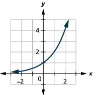 

<math xmlns="http://www.w3.org/1998/Math/MathML"><mrow><mi>g</mi><mrow><mo>(</mo><mi>x</mi><mo>)</mo></mrow><mo>=</mo><msup><mn>3</mn><mi>x</mi></msup></mrow></math>

<math xmlns="http://www.w3.org/1998/Math/MathML"><mrow><mi>f</mi><mrow><mo>(</mo><mi>x</mi><mo>)</mo></mrow><mo>=</mo><msup><mn>6</mn><mi>x</mi></msup></mrow></math>

 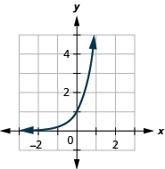 

<math xmlns="http://www.w3.org/1998/Math/MathML"><mrow><mi>g</mi><mrow><mo>(</mo><mi>x</mi><mo>)</mo></mrow><mo>=</mo><msup><mn>7</mn><mi>x</mi></msup></mrow></math>

<math xmlns="http://www.w3.org/1998/Math/MathML"><mrow><mi>f</mi><mrow><mo>(</mo><mi>x</mi><mo>)</mo></mrow><mo>=</mo><msup><mrow><mrow><mo>(</mo><mrow><mn>1.5</mn></mrow><mo>)</mo></mrow></mrow><mi>x</mi></msup></mrow></math>

 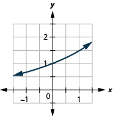 

<math xmlns="http://www.w3.org/1998/Math/MathML"><mrow><mi>g</mi><mrow><mo>(</mo><mi>x</mi><mo>)</mo></mrow><mo>=</mo><msup><mrow><mrow><mo>(</mo><mrow><mn>2.5</mn></mrow><mo>)</mo></mrow></mrow><mi>x</mi></msup></mrow></math>

<math xmlns="http://www.w3.org/1998/Math/MathML"><mrow><mi>f</mi><mrow><mo>(</mo><mi>x</mi><mo>)</mo></mrow><mo>=</mo><msup><mrow><mrow><mo>(</mo><mrow><mfrac><mn>1</mn><mn>2</mn></mfrac></mrow><mo>)</mo></mrow></mrow><mi>x</mi></msup></mrow></math>

 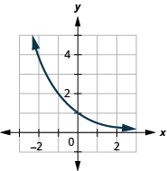 

<math xmlns="http://www.w3.org/1998/Math/MathML"><mrow><mi>g</mi><mrow><mo>(</mo><mi>x</mi><mo>)</mo></mrow><mo>=</mo><msup><mrow><mrow><mo>(</mo><mrow><mfrac><mn>1</mn><mn>3</mn></mfrac></mrow><mo>)</mo></mrow></mrow><mi>x</mi></msup></mrow></math>

<math xmlns="http://www.w3.org/1998/Math/MathML"><mrow><mi>f</mi><mrow><mo>(</mo><mi>x</mi><mo>)</mo></mrow><mo>=</mo><msup><mrow><mrow><mo>(</mo><mrow><mfrac><mn>1</mn><mn>6</mn></mfrac></mrow><mo>)</mo></mrow></mrow><mi>x</mi></msup></mrow></math>

  

<math xmlns="http://www.w3.org/1998/Math/MathML"><mrow><mi>g</mi><mrow><mo>(</mo><mi>x</mi><mo>)</mo></mrow><mo>=</mo><msup><mrow><mrow><mo>(</mo><mrow><mfrac><mn>1</mn><mn>7</mn></mfrac></mrow><mo>)</mo></mrow></mrow><mi>x</mi></msup></mrow></math>

<math xmlns="http://www.w3.org/1998/Math/MathML"><mrow><mi>f</mi><mrow><mo>(</mo><mi>x</mi><mo>)</mo></mrow><mo>=</mo><msup><mrow><mrow><mo>(</mo><mrow><mn>0.4</mn></mrow><mo>)</mo></mrow></mrow><mi>x</mi></msup></mrow></math>

 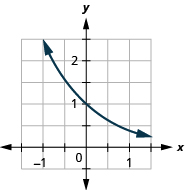 

<math xmlns="http://www.w3.org/1998/Math/MathML"><mrow><mi>g</mi><mrow><mo>(</mo><mi>x</mi><mo>)</mo></mrow><mo>=</mo><msup><mrow><mrow><mo>(</mo><mrow><mn>0.6</mn></mrow><mo>)</mo></mrow></mrow><mi>x</mi></msup></mrow></math>

In the following exercises, graph each function in the same coordinate system.

<math xmlns="http://www.w3.org/1998/Math/MathML"><mrow><mi>f</mi><mrow><mo>(</mo><mi>x</mi><mo>)</mo></mrow><mo>=</mo><msup><mn>4</mn><mi>x</mi></msup><mo>,</mo><mspace width="0.2em" /><mi>g</mi><mrow><mo>(</mo><mi>x</mi><mo>)</mo></mrow><mo>=</mo><msup><mn>4</mn><mrow><mi>x</mi><mo>−</mo><mn>1</mn></mrow></msup></mrow></math>

  

<math xmlns="http://www.w3.org/1998/Math/MathML"><mrow><mi>f</mi><mrow><mo>(</mo><mi>x</mi><mo>)</mo></mrow><mo>=</mo><msup><mn>3</mn><mi>x</mi></msup><mo>,</mo><mspace width="0.2em" /><mi>g</mi><mrow><mo>(</mo><mi>x</mi><mo>)</mo></mrow><mo>=</mo><msup><mn>3</mn><mrow><mi>x</mi><mo>−</mo><mn>1</mn></mrow></msup></mrow></math>

<math xmlns="http://www.w3.org/1998/Math/MathML"><mrow><mi>f</mi><mrow><mo>(</mo><mi>x</mi><mo>)</mo></mrow><mo>=</mo><msup><mn>2</mn><mi>x</mi></msup><mo>,</mo><mspace width="0.2em" /><mi>g</mi><mrow><mo>(</mo><mi>x</mi><mo>)</mo></mrow><mo>=</mo><msup><mn>2</mn><mrow><mi>x</mi><mo>−</mo><mn>2</mn></mrow></msup></mrow></math>

  

<math xmlns="http://www.w3.org/1998/Math/MathML"><mrow><mi>f</mi><mrow><mo>(</mo><mi>x</mi><mo>)</mo></mrow><mo>=</mo><msup><mn>2</mn><mi>x</mi></msup><mo>,</mo><mspace width="0.2em" /><mi>g</mi><mrow><mo>(</mo><mi>x</mi><mo>)</mo></mrow><mo>=</mo><msup><mn>2</mn><mrow><mi>x</mi><mo>+</mo><mn>2</mn></mrow></msup></mrow></math>

<math xmlns="http://www.w3.org/1998/Math/MathML"><mrow><mi>f</mi><mrow><mo>(</mo><mi>x</mi><mo>)</mo></mrow><mo>=</mo><msup><mn>3</mn><mi>x</mi></msup><mo>,</mo><mspace width="0.2em" /><mi>g</mi><mrow><mo>(</mo><mi>x</mi><mo>)</mo></mrow><mo>=</mo><msup><mn>3</mn><mi>x</mi></msup><mo>+</mo><mn>2</mn></mrow></math>

  

<math xmlns="http://www.w3.org/1998/Math/MathML"><mrow><mi>f</mi><mrow><mo>(</mo><mi>x</mi><mo>)</mo></mrow><mo>=</mo><msup><mn>4</mn><mi>x</mi></msup><mo>,</mo><mspace width="0.2em" /><mi>g</mi><mrow><mo>(</mo><mi>x</mi><mo>)</mo></mrow><mo>=</mo><msup><mn>4</mn><mi>x</mi></msup><mo>+</mo><mn>2</mn></mrow></math>

<math xmlns="http://www.w3.org/1998/Math/MathML"><mrow><mi>f</mi><mrow><mo>(</mo><mi>x</mi><mo>)</mo></mrow><mo>=</mo><msup><mn>2</mn><mi>x</mi></msup><mo>,</mo><mspace width="0.2em" /><mi>g</mi><mrow><mo>(</mo><mi>x</mi><mo>)</mo></mrow><mo>=</mo><msup><mn>2</mn><mi>x</mi></msup><mo>+</mo><mn>1</mn></mrow></math>

  

<math xmlns="http://www.w3.org/1998/Math/MathML"><mrow><mi>f</mi><mrow><mo>(</mo><mi>x</mi><mo>)</mo></mrow><mo>=</mo><msup><mn>2</mn><mi>x</mi></msup><mo>,</mo><mspace width="0.2em" /><mi>g</mi><mrow><mo>(</mo><mi>x</mi><mo>)</mo></mrow><mo>=</mo><msup><mn>2</mn><mi>x</mi></msup><mo>−</mo><mn>1</mn></mrow></math>

In the following exercises, graph each exponential function.

<math xmlns="http://www.w3.org/1998/Math/MathML"><mrow><mi>f</mi><mrow><mo>(</mo><mi>x</mi><mo>)</mo></mrow><mo>=</mo><msup><mn>3</mn><mrow><mi>x</mi><mo>+</mo><mn>2</mn></mrow></msup></mrow></math>

 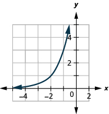 

<math xmlns="http://www.w3.org/1998/Math/MathML"><mrow><mi>f</mi><mrow><mo>(</mo><mi>x</mi><mo>)</mo></mrow><mo>=</mo><msup><mn>3</mn><mrow><mi>x</mi><mo>−</mo><mn>2</mn></mrow></msup></mrow></math>

<math xmlns="http://www.w3.org/1998/Math/MathML"><mrow><mi>f</mi><mrow><mo>(</mo><mi>x</mi><mo>)</mo></mrow><mo>=</mo><msup><mn>2</mn><mi>x</mi></msup><mo>+</mo><mn>3</mn></mrow></math>

 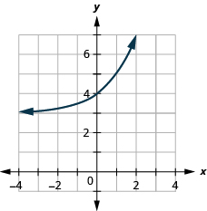 

<math xmlns="http://www.w3.org/1998/Math/MathML"><mrow><mi>f</mi><mrow><mo>(</mo><mi>x</mi><mo>)</mo></mrow><mo>=</mo><msup><mn>2</mn><mi>x</mi></msup><mo>−</mo><mn>3</mn></mrow></math>

<math xmlns="http://www.w3.org/1998/Math/MathML"><mrow><mi>f</mi><mrow><mo>(</mo><mi>x</mi><mo>)</mo></mrow><mo>=</mo><msup><mrow><mrow><mo>(</mo><mrow><mfrac><mn>1</mn><mn>2</mn></mfrac></mrow><mo>)</mo></mrow></mrow><mrow><mi>x</mi><mo>−</mo><mn>4</mn></mrow></msup></mrow></math>

 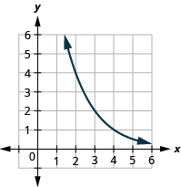 

<math xmlns="http://www.w3.org/1998/Math/MathML"><mrow><mi>f</mi><mrow><mo>(</mo><mi>x</mi><mo>)</mo></mrow><mo>=</mo><msup><mrow><mrow><mo>(</mo><mrow><mfrac><mn>1</mn><mn>2</mn></mfrac></mrow><mo>)</mo></mrow></mrow><mi>x</mi></msup><mo>−</mo><mn>3</mn></mrow></math>

<math xmlns="http://www.w3.org/1998/Math/MathML"><mrow><mi>f</mi><mrow><mo>(</mo><mi>x</mi><mo>)</mo></mrow><mo>=</mo><msup><mi>e</mi><mi>x</mi></msup><mo>+</mo><mn>1</mn></mrow></math>

 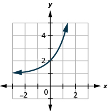 

<math xmlns="http://www.w3.org/1998/Math/MathML"><mrow><mi>f</mi><mrow><mo>(</mo><mi>x</mi><mo>)</mo></mrow><mo>=</mo><msup><mi>e</mi><mrow><mi>x</mi><mo>−</mo><mn>2</mn></mrow></msup></mrow></math>

<math xmlns="http://www.w3.org/1998/Math/MathML"><mrow><mi>f</mi><mrow><mo>(</mo><mi>x</mi><mo>)</mo></mrow><mo>=</mo><mtext>−</mtext><msup><mn>2</mn><mi>x</mi></msup></mrow></math>

 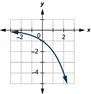 

<math xmlns="http://www.w3.org/1998/Math/MathML"><mrow><mi>f</mi><mrow><mo>(</mo><mi>x</mi><mo>)</mo></mrow><mo>=</mo><msup><mn>3</mn><mi>x</mi></msup></mrow></math>

**Solve Exponential Equations**

In the following exercises, solve each equation.

<math xmlns="http://www.w3.org/1998/Math/MathML"><mrow><msup><mn>2</mn><mrow><mn>3</mn><mi>x</mi><mo>−</mo><mn>8</mn></mrow></msup><mo>=</mo><mn>16</mn></mrow></math>

<math xmlns="http://www.w3.org/1998/Math/MathML"><mrow><mi>x</mi><mo>=</mo><mn>4</mn></mrow></math>

<math xmlns="http://www.w3.org/1998/Math/MathML"><mrow><msup><mn>2</mn><mrow><mn>2</mn><mi>x</mi><mo>−</mo><mn>3</mn></mrow></msup><mo>=</mo><mn>32</mn></mrow></math>

<math xmlns="http://www.w3.org/1998/Math/MathML"><mrow><msup><mn>3</mn><mrow><mi>x</mi><mo>+</mo><mn>3</mn></mrow></msup><mo>=</mo><mn>9</mn></mrow></math>

<math xmlns="http://www.w3.org/1998/Math/MathML"><mrow><mi>x</mi><mo>=</mo><mn>−1</mn></mrow></math>

<math xmlns="http://www.w3.org/1998/Math/MathML"><mrow><msup><mn>3</mn><mrow><msup><mi>x</mi><mn>2</mn></msup></mrow></msup><mo>=</mo><mn>81</mn></mrow></math>

<math xmlns="http://www.w3.org/1998/Math/MathML"><mrow><msup><mn>4</mn><mrow><msup><mi>x</mi><mn>2</mn></msup></mrow></msup><mo>=</mo><mn>4</mn></mrow></math>

<math xmlns="http://www.w3.org/1998/Math/MathML"><mrow><mi>x</mi><mo>=</mo><mn>−1</mn><mo>,</mo><mi>x</mi><mo>=</mo><mn>1</mn></mrow></math>

<math xmlns="http://www.w3.org/1998/Math/MathML"><mrow><msup><mn>4</mn><mi>x</mi></msup><mo>=</mo><mn>32</mn></mrow></math>

<math xmlns="http://www.w3.org/1998/Math/MathML"><mrow><msup><mn>4</mn><mrow><mi>x</mi><mo>+</mo><mn>2</mn></mrow></msup><mo>=</mo><mn>64</mn></mrow></math>

<math xmlns="http://www.w3.org/1998/Math/MathML"><mrow><mi>x</mi><mo>=</mo><mn>1</mn></mrow></math>

<math xmlns="http://www.w3.org/1998/Math/MathML"><mrow><msup><mn>4</mn><mrow><mi>x</mi><mo>+</mo><mn>3</mn></mrow></msup><mo>=</mo><mn>16</mn></mrow></math>

<math xmlns="http://www.w3.org/1998/Math/MathML"><mrow><msup><mn>2</mn><mrow><msup><mi>x</mi><mn>2</mn></msup><mo>+</mo><mn>2</mn><mi>x</mi></mrow></msup><mo>=</mo><mfrac><mn>1</mn><mn>2</mn></mfrac></mrow></math>

<math xmlns="http://www.w3.org/1998/Math/MathML"><mrow><mi>x</mi><mo>=</mo><mn>−1</mn></mrow></math>

<math xmlns="http://www.w3.org/1998/Math/MathML"><mrow><msup><mn>3</mn><mrow><msup><mi>x</mi><mn>2</mn></msup><mo>−</mo><mn>2</mn><mi>x</mi></mrow></msup><mo>=</mo><mfrac><mn>1</mn><mn>3</mn></mfrac></mrow></math>

<math xmlns="http://www.w3.org/1998/Math/MathML"><mrow><msup><mi>e</mi><mrow><mn>3</mn><mi>x</mi></mrow></msup><mo>·</mo><msup><mi>e</mi><mn>4</mn></msup><mo>=</mo><msup><mi>e</mi><mrow><mn>10</mn></mrow></msup></mrow></math>

<math xmlns="http://www.w3.org/1998/Math/MathML"><mrow><mi>x</mi><mo>=</mo><mn>2</mn></mrow></math>

<math xmlns="http://www.w3.org/1998/Math/MathML"><mrow><msup><mi>e</mi><mrow><mn>2</mn><mi>x</mi></mrow></msup><mo>·</mo><msup><mi>e</mi><mn>3</mn></msup><mo>=</mo><msup><mi>e</mi><mn>9</mn></msup></mrow></math>

<math xmlns="http://www.w3.org/1998/Math/MathML"><mrow><mfrac><mrow><msup><mi>e</mi><mrow><msup><mi>x</mi><mn>2</mn></msup></mrow></msup></mrow><mrow><msup><mi>e</mi><mn>2</mn></msup></mrow></mfrac><mo>=</mo><msup><mi>e</mi><mi>x</mi></msup></mrow></math>

<math xmlns="http://www.w3.org/1998/Math/MathML"><mrow><mi>x</mi><mo>=</mo><mn>−1</mn><mo>,</mo><mi>x</mi><mo>=</mo><mn>2</mn></mrow></math>

<math xmlns="http://www.w3.org/1998/Math/MathML"><mrow><mfrac><mrow><msup><mi>e</mi><mrow><msup><mi>x</mi><mn>2</mn></msup></mrow></msup></mrow><mrow><msup><mi>e</mi><mn>3</mn></msup></mrow></mfrac><mo>=</mo><msup><mi>e</mi><mrow><mn>2</mn><mi>x</mi></mrow></msup></mrow></math>

In the following exercises, match the graphs to one of the following functions: ⓐ <math xmlns="http://www.w3.org/1998/Math/MathML"><mrow><msup><mn>2</mn><mi>x</mi></msup></mrow></math>

 ⓑ <math xmlns="http://www.w3.org/1998/Math/MathML"><mrow><msup><mn>2</mn><mrow><mi>x</mi><mo>+</mo><mn>1</mn></mrow></msup></mrow></math>

 ⓒ <math xmlns="http://www.w3.org/1998/Math/MathML"><mrow><msup><mn>2</mn><mrow><mi>x</mi><mo>−</mo><mn>1</mn></mrow></msup></mrow></math>

 ⓓ <math xmlns="http://www.w3.org/1998/Math/MathML"><mrow><msup><mn>2</mn><mi>x</mi></msup><mo>+</mo><mn>2</mn></mrow></math>

 ⓔ <math xmlns="http://www.w3.org/1998/Math/MathML"><mrow><msup><mn>2</mn><mi>x</mi></msup><mo>−</mo><mn>2</mn></mrow></math>

 ⓕ <math xmlns="http://www.w3.org/1998/Math/MathML"><mrow><msup><mn>3</mn><mi>x</mi></msup></mrow></math>

* * *
{: data-type="newline"}

 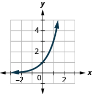 

ⓕ

* * *
{: data-type="newline"}

 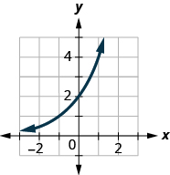 

* * *
{: data-type="newline"}

 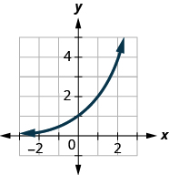 

ⓐ

* * *
{: data-type="newline"}

 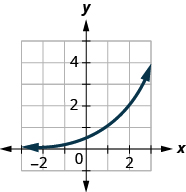 

* * *
{: data-type="newline"}

 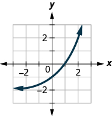 

ⓔ

* * *
{: data-type="newline"}

 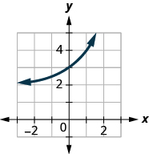 

**Use exponential models in applications**

In the following exercises, use an exponential model to solve.

Edgar accumulated <math xmlns="http://www.w3.org/1998/Math/MathML"><mrow><mtext>$</mtext><mn>5,000</mn></mrow></math>

 in credit card debt. If the interest rate is <math xmlns="http://www.w3.org/1998/Math/MathML"><mrow><mn>20</mn><mtext>%</mtext></mrow></math>

 per year, and he does not make any payments for 2 years, how much will he owe on this debt in 2 years by each method of compounding?* * *
{: data-type="newline"}

ⓐ compound quarterly* * *
{: data-type="newline"}

ⓑ compound monthly* * *
{: data-type="newline"}

ⓒ compound continuously

ⓐ <math xmlns="http://www.w3.org/1998/Math/MathML"><mrow><mtext>$</mtext><mn>7,387.28</mn></mrow></math>

 ⓑ <math xmlns="http://www.w3.org/1998/Math/MathML"><mrow><mtext>$</mtext><mn>7,434.57</mn></mrow></math>

 ⓒ <math xmlns="http://www.w3.org/1998/Math/MathML"><mrow><mtext>$</mtext><mn>7,459.12</mn></mrow></math>

Cynthia invested <math xmlns="http://www.w3.org/1998/Math/MathML"><mrow><mtext>$</mtext><mn>12,000</mn></mrow></math>

 in a savings account. If the interest rate is <math xmlns="http://www.w3.org/1998/Math/MathML"><mrow><mn>6</mn><mtext>%</mtext><mo>,</mo></mrow></math>

 how much will be in the account in 10 years by each method of compounding?* * *
{: data-type="newline"}

ⓐ compound quarterly* * *
{: data-type="newline"}

ⓑ compound monthly* * *
{: data-type="newline"}

ⓒ compound continuously

Rochelle deposits <math xmlns="http://www.w3.org/1998/Math/MathML"><mrow><mtext>$</mtext><mn>5,000</mn></mrow></math>

 in an IRA. What will be the value of her investment in 25 years if the investment is earning <math xmlns="http://www.w3.org/1998/Math/MathML"><mrow><mn>8</mn><mtext>%</mtext></mrow></math>

 per year and is compounded continuously?

<math xmlns="http://www.w3.org/1998/Math/MathML"><mrow><mtext>$</mtext><mn>36,945.28</mn></mrow></math>

Nazerhy deposits <math xmlns="http://www.w3.org/1998/Math/MathML"><mrow><mtext>$</mtext><mn>8,000</mn></mrow></math>

 in a certificate of deposit. The annual interest rate is <math xmlns="http://www.w3.org/1998/Math/MathML"><mrow><mn>6</mn><mtext>%</mtext></mrow></math>

 and the interest will be compounded quarterly. How much will the certificate be worth in 10 years?

A researcher at the Center for Disease Control and Prevention is studying the growth of a bacteria. He starts his experiment with 100 of the bacteria that grows at a rate of <math xmlns="http://www.w3.org/1998/Math/MathML"><mrow><mn>6</mn><mtext>%</mtext></mrow></math>

 per hour. He will check on the bacteria every 8 hours. How many bacteria will he find in 8 hours?

223 bacteria

A biologist is observing the growth pattern of a virus. She starts with 50 of the virus that grows at a rate of <math xmlns="http://www.w3.org/1998/Math/MathML"><mrow><mn>20</mn><mtext>%</mtext></mrow></math>

 per hour. She will check on the virus in 24 hours. How many viruses will she find?

In the last ten years the population of Indonesia has grown at a rate of <math xmlns="http://www.w3.org/1998/Math/MathML"><mrow><mn>1.12</mn><mtext>%</mtext></mrow></math>

 per year to 258,316,051. If this rate continues, what will be the population in 10 more years?

288,929,825

In the last ten years the population of Brazil has grown at a rate of <math xmlns="http://www.w3.org/1998/Math/MathML"><mrow><mn>0.9</mn><mtext>%</mtext></mrow></math>

 per year to 205,823,665. If this rate continues, what will be the population in 10 more years?

#### Writing Exercises

Explain how you can distinguish between exponential functions and polynomial functions.

Answers will vary.

Compare and contrast the graphs of <math xmlns="http://www.w3.org/1998/Math/MathML"><mrow><mi>y</mi><mo>=</mo><msup><mi>x</mi><mn>2</mn></msup></mrow></math>

 and <math xmlns="http://www.w3.org/1998/Math/MathML"><mrow><mi>y</mi><mo>=</mo><msup><mn>2</mn><mi>x</mi></msup></mrow></math>

.

What happens to an exponential function as the values of <math xmlns="http://www.w3.org/1998/Math/MathML"><mi>x</mi></math>

 decreases? Will the graph ever cross the* * *
{: data-type="newline"}

<math xmlns="http://www.w3.org/1998/Math/MathML"><mi>y</mi></math>

-axis? Explain.

Answers will vary.

#### Self Check

ⓐ After completing the exercises, use this checklist to evaluate your mastery of the objectives of this section.

ⓑ After reviewing this checklist, what will you do to become confident for all objectives?

</section>

### Glossary
{: data-type="glossary-title"}

asymptote
: A line which a graph of a function approaches closely but never touches.
^

exponential function
: An exponential function, where
  <math xmlns="http://www.w3.org/1998/Math/MathML"><mrow><mi>a</mi><mo>&gt;</mo><mn>0</mn></mrow></math>
  
  and
  <math xmlns="http://www.w3.org/1998/Math/MathML"><mrow><mi>a</mi><mo>≠</mo><mn>1</mn><mo>,</mo></mrow></math>
  
  is a function of the form
  <math xmlns="http://www.w3.org/1998/Math/MathML"><mrow><mi>f</mi><mrow><mo>(</mo><mi>x</mi><mo>)</mo></mrow><mo>=</mo><msup><mi>a</mi><mi>x</mi></msup><mo>.</mo></mrow></math>
^

natural base
: The number *e* is defined as the value of
  <math xmlns="http://www.w3.org/1998/Math/MathML"><mrow><msup><mrow><mrow><mo>(</mo><mrow><mn>1</mn><mo>+</mo><mfrac><mn>1</mn><mi>n</mi></mfrac></mrow><mo>)</mo></mrow></mrow><mi>n</mi></msup><mo>,</mo></mrow></math>
  
  as *n* gets larger and larger. We say, as *n* increases without bound,
  <math xmlns="http://www.w3.org/1998/Math/MathML"><mrow><mi>e</mi><mo>≈</mo><mn>2.718281827..</mn><mo>.</mo></mrow></math>
^

natural exponential function
: The natural exponential function is an exponential function whose base is *e*\:
  <math xmlns="http://www.w3.org/1998/Math/MathML"><mrow><mi>f</mi><mrow><mo>(</mo><mi>x</mi><mo>)</mo></mrow><mo>=</mo><msup><mi>e</mi><mi>x</mi></msup><mo>.</mo></mrow></math>
  
  The domain is
  <math xmlns="http://www.w3.org/1998/Math/MathML"><mrow><mrow><mo>(</mo><mrow><mtext>−</mtext><mi>∞</mi><mo>,</mo><mi>∞</mi></mrow><mo>)</mo></mrow></mrow></math>
  
  and the range is
  <math xmlns="http://www.w3.org/1998/Math/MathML"><mrow><mrow><mo>(</mo><mrow><mn>0</mn><mo>,</mo><mi>∞</mi></mrow><mo>)</mo></mrow><mo>.</mo></mrow></math>

[1]: https://openstax.org/l/37Graphexponent
[2]: https://openstax.org/l/37Solvelikebase
[3]: https://openstax.org/l/37Exponentapp
[4]: https://openstax.org/l/37Compoundint
[5]: https://openstax.org/l/37Exponentdecay
