

By the end of this section, you will be able to:
* Convert between exponential and logarithmic form
* Evaluate logarithmic functions
* Graph Logarithmic functions
* Solve logarithmic equations
* Use logarithmic models in applications

Before you get started, take this readiness quiz.

1.  Solve:
    <math xmlns="http://www.w3.org/1998/Math/MathML"><mrow><msup><mi>x</mi><mn>2</mn></msup><mo>=</mo><mn>81</mn><mo>.</mo></mrow></math>
    
    * * *
    {: data-type="newline"}
    
    If you missed this problem, review [\[link\]](/m63362#fs-id1167836547919).
2.  Evaluate:
    <math xmlns="http://www.w3.org/1998/Math/MathML"><mrow><msup><mn>3</mn><mrow><mn>−2</mn></mrow></msup><mo>.</mo></mrow></math>
    
    * * *
    {: data-type="newline"}
    
    If you missed this problem, review [\[link\]](/m63345#fs-id1167835527255).
3.  Solve:
    <math xmlns="http://www.w3.org/1998/Math/MathML"><mrow><msup><mn>2</mn><mn>4</mn></msup><mo>=</mo><mn>3</mn><mi>x</mi><mo>−</mo><mn>5</mn><mo>.</mo></mrow></math>
    
    * * *
    {: data-type="newline"}
    
    If you missed this problem, review [\[link\]](/m63308#fs-id1167836432956).
{: data-number-style="arabic"}

We have spent some time finding the inverse of many functions. It works well to ‘undo’ an operation with another operation. Subtracting ‘undoes’ addition, multiplication ‘undoes’ division, taking the square root ‘undoes’ squaring.

As we studied the exponential function, we saw that it is one-to-one as its graphs pass the horizontal line test. This means an exponential function does have an inverse. If we try our algebraic method for finding an inverse, we run into a problem.

<math xmlns="http://www.w3.org/1998/Math/MathML"><mrow><mtable><mtr><mtd columnalign="left"><mtable><mtr /><mtr /><mtr /><mtr><mtd columnalign="left"><mtext>Rewrite with</mtext><mspace width="0.2em" /><mi>y</mi><mo>=</mo><mi>f</mi><mrow><mo>(</mo><mi>x</mi><mo>)</mo></mrow><mo>.</mo></mtd></mtr><mtr><mtd columnalign="left"><mtext>Interchange the variables</mtext><mspace width="0.2em" /><mi>x</mi><mspace width="0.2em" /><mtext>and</mtext><mspace width="0.2em" /><mi>y</mi><mo>.</mo></mtd></mtr></mtable></mtd><mtd /><mtd /><mtd columnalign="left"><mtable><mtr><mtd columnalign="right"><mi>f</mi><mrow><mo>(</mo><mi>x</mi><mo>)</mo></mrow></mtd><mtd columnalign="left"><mo>=</mo></mtd><mtd columnalign="left"><msup><mi>a</mi><mi>x</mi></msup></mtd></mtr><mtr><mtd columnalign="right"><mi>y</mi></mtd><mtd columnalign="left"><mo>=</mo></mtd><mtd columnalign="left"><msup><mi>a</mi><mi>x</mi></msup></mtd></mtr><mtr><mtd columnalign="right"><mi>x</mi></mtd><mtd columnalign="left"><mo>=</mo></mtd><mtd columnalign="left"><msup><mi>a</mi><mi>y</mi></msup></mtd></mtr></mtable></mtd></mtr><mtr><mtd columnalign="left"><mtext>Solve for</mtext><mspace width="0.2em" /><mi>y</mi><mo>.</mo></mtd><mtd /><mtd /><mtd columnalign="left"><mtext>Oops! We have no way to solve for</mtext><mspace width="0.2em" /><mi>y</mi><mo>!</mo></mtd></mtr></mtable></mrow></math>

To deal with this we define the logarithm function with base *a* to be the inverse of the exponential function <math xmlns="http://www.w3.org/1998/Math/MathML"><mrow><mi>f</mi><mrow><mo>(</mo><mi>x</mi><mo>)</mo></mrow><mo>=</mo><msup><mi>a</mi><mi>x</mi></msup><mo>.</mo></mrow></math>

 We use the notation <math xmlns="http://www.w3.org/1998/Math/MathML"><mrow><msup><mi>f</mi><mrow><mn>−1</mn></mrow></msup><mrow><mo>(</mo><mi>x</mi><mo>)</mo></mrow><mo>=</mo><msub><mrow><mtext>log</mtext></mrow><mi>a</mi></msub><mi>x</mi></mrow></math>

 and say the inverse function of the exponential function is the logarithmic function.

Logarithmic Function

The function <math xmlns="http://www.w3.org/1998/Math/MathML"><mrow><mi>f</mi><mrow><mo>(</mo><mi>x</mi><mo>)</mo></mrow><mo>=</mo><msub><mrow><mtext>log</mtext></mrow><mi>a</mi></msub><mi>x</mi></mrow></math>

 is the **logarithmic function** with base <math xmlns="http://www.w3.org/1998/Math/MathML"><mi>a</mi></math>

, where <math xmlns="http://www.w3.org/1998/Math/MathML"><mrow><mi>a</mi><mo>&gt;</mo><mn>0</mn><mo>,</mo></mrow></math>

<math xmlns="http://www.w3.org/1998/Math/MathML"><mrow><mi>x</mi><mo>&gt;</mo><mn>0</mn><mo>,</mo></mrow></math>

 and <math xmlns="http://www.w3.org/1998/Math/MathML"><mrow><mi>a</mi><mo>≠</mo><mn>1</mn><mo>.</mo></mrow></math>

<math xmlns="http://www.w3.org/1998/Math/MathML"><mrow><mi>y</mi><mo>=</mo><msub><mrow><mtext>log</mtext></mrow><mi>a</mi></msub><mi>x</mi><mspace width="0.2em" /><mtext>is equivalent to</mtext><mspace width="0.2em" /><mi>x</mi><mo>=</mo><msup><mi>a</mi><mi>y</mi></msup></mrow></math>

# Convert Between Exponential and Logarithmic Form

Since the equations <math xmlns="http://www.w3.org/1998/Math/MathML"><mrow><mi>y</mi><mo>=</mo><msub><mrow><mtext>log</mtext></mrow><mi>a</mi></msub><mi>x</mi></mrow></math>

 and <math xmlns="http://www.w3.org/1998/Math/MathML"><mrow><mi>x</mi><mo>=</mo><msup><mi>a</mi><mi>y</mi></msup></mrow></math>

 are equivalent, we can go back and forth between them. This will often be the method to solve some exponential and logarithmic equations. To help with converting back and forth let’s take a close look at the equations. See [\[link\]](#CNX_IntAlg_Figure_10_03_001). Notice the positions of the exponent and base.

 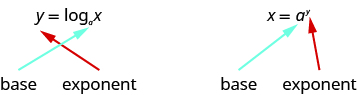{: #CNX_IntAlg_Figure_10_03_001}

If we realize the logarithm is the exponent it makes the conversion easier. You may want to repeat, “base to the exponent give us the number.”

Convert to logarithmic form: ⓐ <math xmlns="http://www.w3.org/1998/Math/MathML"><mrow><msup><mn>2</mn><mn>3</mn></msup><mo>=</mo><mn>8</mn><mo>,</mo></mrow></math>

 ⓑ <math xmlns="http://www.w3.org/1998/Math/MathML"><mrow><msup><mn>5</mn><mrow><mfrac><mn>1</mn><mn>2</mn></mfrac></mrow></msup><mo>=</mo><msqrt><mn>5</mn></msqrt><mo>,</mo></mrow></math>

 and ⓒ <math xmlns="http://www.w3.org/1998/Math/MathML"><mrow><msup><mrow><mrow><mo>(</mo><mrow><mfrac><mn>1</mn><mn>2</mn></mfrac></mrow><mo>)</mo></mrow></mrow><mi>x</mi></msup><mo>=</mo><mfrac><mn>1</mn><mrow><mn>16</mn></mrow></mfrac><mo>.</mo></mrow></math>

 ![In part (a) we have 2 to the 3 power equals 8, where the 2 is red and the 3 is blue. Following this, we have blue y equals log sub red a of x. Then 3 equals log sub 2 of 8. Hence, if 2 cubed equals 8, then 3 equals log sub 2 of 8. In part (b) we have 5 to the 1 over 2 power equals square root of 5, where the 5 is red and the 1 over 2 is blue. Following this, we have blue y equals log sub red a of x. Then 1 over 2 equals log sub 5 of the square root of 5. Hence, if 5 to the 1 over 2 power equals the square root of 5, then 1 over 2 equals log sub 5 of the square root of 5. In part (c) we have 1 over 2 to the x power equals 1 over 16, where the 1 over 2 is red and the x is blue. Following this, we have blue y equals log sub red a of x. Then x equals log sub 1 over 2 of 1 over 16. Hence, if 1 over 2 to the x power equals 1 over 16, then x equals log sub 1 over 2 of 1 over 16.](../resources/CNX_IntAlg_Figure_10_03_002_img.jpg) 

Convert to logarithmic form: ⓐ <math xmlns="http://www.w3.org/1998/Math/MathML"><mrow><msup><mn>3</mn><mn>2</mn></msup><mo>=</mo><mn>9</mn></mrow></math>

 ⓑ <math xmlns="http://www.w3.org/1998/Math/MathML"><mrow><msup><mn>7</mn><mrow><mfrac><mn>1</mn><mn>2</mn></mfrac></mrow></msup><mo>=</mo><msqrt><mn>7</mn></msqrt></mrow></math>

 ⓒ <math xmlns="http://www.w3.org/1998/Math/MathML"><mrow><msup><mrow><mrow><mo>(</mo><mrow><mfrac><mn>1</mn><mn>3</mn></mfrac></mrow><mo>)</mo></mrow></mrow><mi>x</mi></msup><mo>=</mo><mfrac><mn>1</mn><mrow><mn>27</mn></mrow></mfrac></mrow></math>

ⓐ <math xmlns="http://www.w3.org/1998/Math/MathML"><mrow><msub><mrow><mtext>log</mtext></mrow><mn>3</mn></msub><mn>9</mn><mo>=</mo><mn>2</mn></mrow></math>

* * *
{: data-type="newline"}

ⓑ <math xmlns="http://www.w3.org/1998/Math/MathML"><mrow><msub><mrow><mtext>log</mtext></mrow><mn>7</mn></msub><msqrt><mn>7</mn></msqrt><mo>=</mo><mfrac><mn>1</mn><mn>2</mn></mfrac></mrow></math>

 ⓒ <math xmlns="http://www.w3.org/1998/Math/MathML"><mrow><msub><mrow><mtext>log</mtext></mrow><mrow><mfrac><mn>1</mn><mn>3</mn></mfrac></mrow></msub><mfrac><mn>1</mn><mrow><mn>27</mn></mrow></mfrac><mo>=</mo><mi>x</mi></mrow></math>

Convert to logarithmic form: ⓐ <math xmlns="http://www.w3.org/1998/Math/MathML"><mrow><msup><mn>4</mn><mn>3</mn></msup><mo>=</mo><mn>64</mn></mrow></math>

 ⓑ <math xmlns="http://www.w3.org/1998/Math/MathML"><mrow><msup><mn>4</mn><mrow><mfrac><mn>1</mn><mn>3</mn></mfrac></mrow></msup><mo>=</mo><mroot><mn>4</mn><mn>3</mn></mroot></mrow></math>

 ⓒ <math xmlns="http://www.w3.org/1998/Math/MathML"><mrow><msup><mrow><mrow><mo>(</mo><mrow><mfrac><mn>1</mn><mn>2</mn></mfrac></mrow><mo>)</mo></mrow></mrow><mi>x</mi></msup><mo>=</mo><mfrac><mn>1</mn><mrow><mn>32</mn></mrow></mfrac></mrow></math>

ⓐ <math xmlns="http://www.w3.org/1998/Math/MathML"><mrow><msub><mrow><mtext>log</mtext></mrow><mn>4</mn></msub><mn>64</mn><mo>=</mo><mn>3</mn></mrow></math>

* * *
{: data-type="newline"}

ⓑ <math xmlns="http://www.w3.org/1998/Math/MathML"><mrow><msub><mrow><mtext>log</mtext></mrow><mn>4</mn></msub><mroot><mn>4</mn><mn>3</mn></mroot><mo>=</mo><mfrac><mn>1</mn><mn>3</mn></mfrac></mrow></math>

 ⓒ <math xmlns="http://www.w3.org/1998/Math/MathML"><mrow><msub><mrow><mtext>log</mtext></mrow><mrow><mfrac><mn>1</mn><mn>2</mn></mfrac></mrow></msub><mfrac><mn>1</mn><mrow><mn>32</mn></mrow></mfrac><mo>=</mo><mi>x</mi></mrow></math>

In the next example we do the reverse—convert logarithmic form to exponential form.

Convert to exponential form: ⓐ <math xmlns="http://www.w3.org/1998/Math/MathML"><mrow><mn>2</mn><mo>=</mo><msub><mrow><mtext>log</mtext></mrow><mn>8</mn></msub><mn>64</mn><mo>,</mo></mrow></math>

 ⓑ <math xmlns="http://www.w3.org/1998/Math/MathML"><mrow><mn>0</mn><mo>=</mo><msub><mrow><mtext>log</mtext></mrow><mn>4</mn></msub><mn>1</mn><mo>,</mo></mrow></math>

 and ⓒ <math xmlns="http://www.w3.org/1998/Math/MathML"><mrow><mo>−</mo><mn>3</mn><mo>=</mo><msub><mrow><mtext>log</mtext></mrow><mrow><mn>10</mn></mrow></msub><mfrac><mn>1</mn><mrow><mn>1000</mn></mrow></mfrac><mo>.</mo></mrow></math>

 ![In part (a) we have 2 equals log sub 8 of 64, where the 2 is blue and the 8 is red. Following this, we have x equals red a to the blue y power. Then 64 equals 8 squared. Hence, if 2 equals log sub 8 of 64, then 64 equals 8 squared. In part (b) we have 0 equals log sub 4 of 1, where the 0 is blue and the 4 is red. Following this, we have x equals red a to the blue y power. Then 1 equals 4 to the zero power. Hence, if 0 equals log sub 4 of 1, then 1 equals 4 to the zero power. In part (c) we have negative 3 equals log sub 10 of 1 over 1000, where the negative 3 is blue and the 10 is red. Following this, we have x equals red a to the blue y power. Then 1 over 1000 equals 10 to the negative three power. Hence, if negative 3 equals log sub 10 of 1 over 1000, then 1 over 1000 equals 10 to the negative 3 power.](../resources/CNX_IntAlg_Figure_10_03_003_img.jpg) 

Convert to exponential form: ⓐ <math xmlns="http://www.w3.org/1998/Math/MathML"><mrow><mn>3</mn><mo>=</mo><msub><mrow><mtext>log</mtext></mrow><mn>4</mn></msub><mn>64</mn></mrow></math>

 ⓑ <math xmlns="http://www.w3.org/1998/Math/MathML"><mrow><mn>0</mn><mo>=</mo><msub><mrow><mtext>log</mtext></mrow><mi>x</mi></msub><mn>1</mn></mrow></math>

 ⓒ <math xmlns="http://www.w3.org/1998/Math/MathML"><mrow><mn>−2</mn><mo>=</mo><msub><mrow><mtext>log</mtext></mrow><mrow><mn>10</mn></mrow></msub><mfrac><mn>1</mn><mrow><mn>100</mn></mrow></mfrac></mrow></math>

ⓐ <math xmlns="http://www.w3.org/1998/Math/MathML"><mrow><mn>64</mn><mo>=</mo><msup><mn>4</mn><mn>3</mn></msup></mrow></math>

* * *
{: data-type="newline"}

ⓑ <math xmlns="http://www.w3.org/1998/Math/MathML"><mrow><mn>1</mn><mo>=</mo><msup><mi>x</mi><mn>0</mn></msup></mrow></math>

 ⓒ <math xmlns="http://www.w3.org/1998/Math/MathML"><mrow><mfrac><mn>1</mn><mrow><mn>100</mn></mrow></mfrac><mo>=</mo><msup><mrow><mn>10</mn></mrow><mrow><mn>−2</mn></mrow></msup></mrow></math>

Convert to exponential form: ⓐ <math xmlns="http://www.w3.org/1998/Math/MathML"><mrow><mn>3</mn><mo>=</mo><msub><mrow><mtext>log</mtext></mrow><mn>3</mn></msub><mn>27</mn></mrow></math>

 ⓑ <math xmlns="http://www.w3.org/1998/Math/MathML"><mrow><mn>0</mn><mo>=</mo><msub><mrow><mtext>log</mtext></mrow><mi>x</mi></msub><mn>1</mn></mrow></math>

 ⓒ <math xmlns="http://www.w3.org/1998/Math/MathML"><mrow><mn>−1</mn><mo>=</mo><msub><mrow><mtext>log</mtext></mrow><mrow><mn>10</mn></mrow></msub><mfrac><mn>1</mn><mrow><mn>10</mn></mrow></mfrac></mrow></math>

ⓐ <math xmlns="http://www.w3.org/1998/Math/MathML"><mrow><mn>27</mn><mo>=</mo><msup><mn>3</mn><mn>3</mn></msup></mrow></math>

 ⓑ <math xmlns="http://www.w3.org/1998/Math/MathML"><mrow><mn>1</mn><mo>=</mo><msup><mi>x</mi><mn>0</mn></msup></mrow></math>

* * *
{: data-type="newline"}

ⓒ <math xmlns="http://www.w3.org/1998/Math/MathML"><mrow><mfrac><mn>1</mn><mrow><mn>10</mn></mrow></mfrac><mo>=</mo><msup><mrow><mn>10</mn></mrow><mrow><mn>−1</mn></mrow></msup></mrow></math>

# Evaluate Logarithmic Functions

We can solve and evaluate logarithmic equations by using the technique of converting the equation to its equivalent exponential equation.

Find the value of *x*: ⓐ <math xmlns="http://www.w3.org/1998/Math/MathML"><mrow><msub><mrow><mtext>log</mtext></mrow><mi>x</mi></msub><mn>36</mn><mo>=</mo><mn>2</mn><mo>,</mo></mrow></math>

 ⓑ <math xmlns="http://www.w3.org/1998/Math/MathML"><mrow><msub><mrow><mtext>log</mtext></mrow><mn>4</mn></msub><mi>x</mi><mo>=</mo><mn>3</mn><mo>,</mo></mrow></math>

 and ⓒ <math xmlns="http://www.w3.org/1998/Math/MathML"><mrow><msub><mrow><mtext>log</mtext></mrow><mrow><mfrac><mn>1</mn><mn>2</mn></mfrac></mrow></msub><mfrac><mn>1</mn><mn>8</mn></mfrac><mo>=</mo><mi>x</mi><mo>.</mo></mrow></math>

ⓐ* * *
{: data-type="newline"}

 <math xmlns="http://www.w3.org/1998/Math/MathML"><mrow><mtable><mtr><mtd /><mtd /><mtd /><mtd columnalign="left"><mspace width="3.8em" /><msub><mrow><mtext>log</mtext></mrow><mi>x</mi></msub><mn>36</mn><mspace width="0.2em" /><mo>=</mo><mspace width="0.2em" /><mn>2</mn></mtd></mtr> <mtr><mtd columnalign="left"><mtext>Convert to exponential form.</mtext></mtd><mtd /><mtd /><mtd columnalign="left"><mspace width="5.6em" /><msup><mi>x</mi><mn>2</mn></msup><mspace width="0.2em" /><mo>=</mo><mspace width="0.2em" /><mn>36</mn></mtd></mtr> <mtr><mtd columnalign="left"><mtext>Solve the quadratic.</mtext></mtd><mtd /><mtd /><mtd columnalign="left"><mspace width="3.8em" /><mi>x</mi><mo>=</mo><mn>6</mn><mo>,</mo><mspace width="2em" /><menclose notation="updiagonalstrike"><mrow><mi>x</mi><mo>=</mo><mn>−6</mn></mrow></menclose></mtd></mtr> <mtr><mtd columnalign="left"><mtext>The base of a logarithmic function must be</mtext></mtd><mtd /><mtd /><mtd /></mtr> <mtr><mtd columnalign="left"><mtext>positive, so we eliminate</mtext><mspace width="0.2em" /><mi>x</mi><mo>=</mo><mn>−6</mn><mo>.</mo></mtd><mtd /><mtd /><mtd columnalign="left"><mspace width="6.2em" /><mi>x</mi><mspace width="0.2em" /><mo>=</mo><mspace width="0.2em" /><mn>6</mn><mspace width="2.5em" /><mtext>Therefore,</mtext><mspace width="0.2em" /><msub><mrow><mtext>log</mtext></mrow><mn>6</mn></msub><mn>36</mn><mo>=</mo><mn>2</mn><mo>.</mo></mtd></mtr></mtable></mrow></math>

ⓑ* * *
{: data-type="newline"}

 <math xmlns="http://www.w3.org/1998/Math/MathML"><mrow><mtable><mtr><mtd /><mtd /><mtd /><mtd columnalign="left"><mspace width="9.6em" /><msub><mrow><mtext>log</mtext></mrow><mn>4</mn></msub><mi>x</mi></mtd><mtd columnalign="left"><mo>=</mo></mtd><mtd columnalign="left"><mn>3</mn></mtd></mtr> <mtr><mtd columnalign="left"><mtext>Convert to exponential form.</mtext></mtd><mtd /><mtd /><mtd columnalign="right"><mspace width="8.6em" /><msup><mn>4</mn><mn>3</mn></msup></mtd><mtd columnalign="left"><mo>=</mo></mtd><mtd columnalign="left"><mi>x</mi></mtd></mtr> <mtr><mtd columnalign="left"><mtext>Simplify.</mtext></mtd><mtd /><mtd /><mtd columnalign="right"><mspace width="8.6em" /><mi>x</mi></mtd><mtd columnalign="left"><mo>=</mo></mtd><mtd columnalign="left"><mn>64</mn></mtd><mtd columnalign="left"><mspace width="1.3em" /><mtext>Therefore,</mtext><mspace width="0.2em" /><msub><mrow><mtext>log</mtext></mrow><mn>4</mn></msub><mn>64</mn><mo>=</mo><mn>3</mn><mo>.</mo></mtd></mtr></mtable></mrow></math>

ⓒ* * *
{: data-type="newline"}

 <math xmlns="http://www.w3.org/1998/Math/MathML"><mrow><mtable><mtr /><mtr /><mtr><mtd /><mtd /><mtd /><mtd columnalign="right"><mspace width="1em" /><msub><mrow><mtext>log</mtext></mrow><mrow><mfrac><mn>1</mn><mn>2</mn></mfrac></mrow></msub><mfrac><mn>1</mn><mn>8</mn></mfrac></mtd><mtd columnalign="left"><mo>=</mo></mtd><mtd columnalign="left"><mi>x</mi></mtd></mtr> <mtr><mtd columnalign="left"><mtext>Convert to exponential form.</mtext></mtd><mtd /><mtd /><mtd columnalign="right"><msup><mrow><mrow><mo>(</mo><mrow><mfrac><mn>1</mn><mn>2</mn></mfrac></mrow><mo>)</mo></mrow></mrow><mi>x</mi></msup></mtd><mtd columnalign="left"><mo>=</mo></mtd><mtd columnalign="left"><mfrac><mn>1</mn><mn>8</mn></mfrac></mtd></mtr> <mtr><mtd columnalign="left"><mtext>Rewrite</mtext><mspace width="0.2em" /><mfrac><mn>1</mn><mn>8</mn></mfrac><mspace width="0.2em" /><mtext>as</mtext><mspace width="0.2em" /><msup><mrow><mrow><mo>(</mo><mrow><mfrac><mn>1</mn><mn>2</mn></mfrac></mrow><mo>)</mo></mrow></mrow><mn>3</mn></msup><mo>.</mo></mtd><mtd /><mtd /><mtd columnalign="right"><msup><mrow><mrow><mo>(</mo><mrow><mfrac><mn>1</mn><mn>2</mn></mfrac></mrow><mo>)</mo></mrow></mrow><mi>x</mi></msup></mtd><mtd columnalign="left"><mo>=</mo></mtd><mtd columnalign="left"><msup><mrow><mrow><mo>(</mo><mrow><mfrac><mn>1</mn><mn>2</mn></mfrac></mrow><mo>)</mo></mrow></mrow><mn>3</mn></msup></mtd></mtr> <mtr><mtd columnalign="left"><mtext>With the same base, the exponents must be equal.</mtext></mtd><mtd /><mtd /><mtd columnalign="right"><mi>x</mi></mtd><mtd columnalign="left"><mo>=</mo></mtd><mtd columnalign="left"><mn>3</mn></mtd><mtd columnalign="left"><mtext>Therefore,</mtext><mspace width="0.2em" /><msub><mrow><mtext>log</mtext></mrow><mrow><mfrac><mn>1</mn><mn>2</mn></mfrac></mrow></msub><mfrac><mn>1</mn><mn>8</mn></mfrac><mo>=</mo><mn>3</mn></mtd></mtr></mtable></mrow></math>

Find the value of <math xmlns="http://www.w3.org/1998/Math/MathML"><mrow><mi>x</mi><mo>:</mo></mrow></math>

 ⓐ <math xmlns="http://www.w3.org/1998/Math/MathML"><mrow><msub><mrow><mtext>log</mtext></mrow><mi>x</mi></msub><mn>64</mn><mo>=</mo><mn>2</mn></mrow></math>

 ⓑ <math xmlns="http://www.w3.org/1998/Math/MathML"><mrow><msub><mrow><mtext>log</mtext></mrow><mn>5</mn></msub><mi>x</mi><mo>=</mo><mn>3</mn></mrow></math>

 ⓒ <math xmlns="http://www.w3.org/1998/Math/MathML"><mrow><msub><mrow><mtext>log</mtext></mrow><mrow><mfrac><mn>1</mn><mn>2</mn></mfrac></mrow></msub><mfrac><mn>1</mn><mn>4</mn></mfrac><mo>=</mo><mi>x</mi></mrow></math>

* * *
{: data-type="newline"}

ⓐ <math xmlns="http://www.w3.org/1998/Math/MathML"><mrow><mi>x</mi><mo>=</mo><mn>8</mn></mrow></math>

 ⓑ <math xmlns="http://www.w3.org/1998/Math/MathML"><mrow><mi>x</mi><mo>=</mo><mn>125</mn></mrow></math>

 ⓒ <math xmlns="http://www.w3.org/1998/Math/MathML"><mrow><mi>x</mi><mo>=</mo><mn>2</mn></mrow></math>

Find the value of <math xmlns="http://www.w3.org/1998/Math/MathML"><mrow><mi>x</mi><mo>:</mo></mrow></math>

 ⓐ <math xmlns="http://www.w3.org/1998/Math/MathML"><mrow><msub><mrow><mtext>log</mtext></mrow><mi>x</mi></msub><mn>81</mn><mo>=</mo><mn>2</mn></mrow></math>

 ⓑ <math xmlns="http://www.w3.org/1998/Math/MathML"><mrow><msub><mrow><mtext>log</mtext></mrow><mn>3</mn></msub><mi>x</mi><mo>=</mo><mn>5</mn></mrow></math>

 ⓒ <math xmlns="http://www.w3.org/1998/Math/MathML"><mrow><msub><mrow><mtext>log</mtext></mrow><mrow><mfrac><mn>1</mn><mn>3</mn></mfrac></mrow></msub><mfrac><mn>1</mn><mrow><mn>27</mn></mrow></mfrac><mo>=</mo><mi>x</mi></mrow></math>

* * *
{: data-type="newline"}

ⓐ* * *
{: data-type="newline"}

 <math xmlns="http://www.w3.org/1998/Math/MathML"><mrow><mi>x</mi><mo>=</mo><mn>9</mn></mrow></math>

 ⓑ <math xmlns="http://www.w3.org/1998/Math/MathML"><mrow><mi>x</mi><mo>=</mo><mn>243</mn></mrow></math>

 ⓒ <math xmlns="http://www.w3.org/1998/Math/MathML"><mrow><mi>x</mi><mo>=</mo><mn>3</mn></mrow></math>

When see an expression such as <math xmlns="http://www.w3.org/1998/Math/MathML"><mrow><msub><mrow><mtext>log</mtext></mrow><mn>3</mn></msub><mn>27</mn><mo>,</mo></mrow></math>

 we can find its exact value two ways. By inspection we realize it means <math xmlns="http://www.w3.org/1998/Math/MathML"><mrow><mo>“</mo><mn>3</mn></mrow></math>

 to what power will be <math xmlns="http://www.w3.org/1998/Math/MathML"><mrow><mn>27</mn><mo>”</mo><mo>?</mo></mrow></math>

 Since <math xmlns="http://www.w3.org/1998/Math/MathML"><mrow><msup><mn>3</mn><mn>3</mn></msup><mo>=</mo><mn>27</mn><mo>,</mo></mrow></math>

 we know <math xmlns="http://www.w3.org/1998/Math/MathML"><mrow><msub><mrow><mtext>log</mtext></mrow><mn>3</mn></msub><mn>27</mn><mo>=</mo><mn>3</mn><mo>.</mo></mrow></math>

 An alternate way is to set the expression equal to <math xmlns="http://www.w3.org/1998/Math/MathML"><mi>x</mi></math>

 and then convert it into an exponential equation.

Find the exact value of each logarithm without using a calculator:* * *
{: data-type="newline"}

ⓐ <math xmlns="http://www.w3.org/1998/Math/MathML"><mrow><msub><mrow><mtext>log</mtext></mrow><mn>5</mn></msub><mn>25</mn><mo>,</mo></mrow></math>

* * *
{: data-type="newline"}

ⓑ <math xmlns="http://www.w3.org/1998/Math/MathML"><mrow><msub><mrow><mtext>log</mtext></mrow><mn>9</mn></msub><mn>3</mn><mo>,</mo></mrow></math>

 and ⓒ <math xmlns="http://www.w3.org/1998/Math/MathML"><mrow><msub><mrow><mtext>log</mtext></mrow><mn>2</mn></msub><mfrac><mn>1</mn><mrow><mn>16</mn></mrow></mfrac><mo>.</mo></mrow></math>

ⓐ* * *
{: data-type="newline"}

 <math xmlns="http://www.w3.org/1998/Math/MathML"><mrow><mtable><mtr><mtd /><mtd /><mtd /><mtd columnalign="right"><msub><mrow><mtext>log</mtext></mrow><mn>5</mn></msub><mn>25</mn></mtd><mtd /><mtd /></mtr> <mtr><mtd columnalign="left"><mtext>5 to what power will be</mtext><mspace width="0.2em" /><mn>25</mn><mo>?</mo></mtd><mtd /><mtd /><mtd columnalign="right"><msub><mrow><mtext>log</mtext></mrow><mn>5</mn></msub><mn>25</mn></mtd><mtd columnalign="left"><mo>=</mo></mtd><mtd columnalign="left"><mn>2</mn></mtd></mtr> <mtr><mtd columnalign="left"><mtext>Or</mtext></mtd><mtd /><mtd /><mtd /><mtd /></mtr> <mtr><mtd columnalign="left"><mtext>Set the expression equal to</mtext><mspace width="0.2em" /><mi>x</mi><mo>.</mo></mtd><mtd /><mtd /><mtd columnalign="right"><msub><mrow><mtext>log</mtext></mrow><mn>5</mn></msub><mn>25</mn></mtd><mtd columnalign="left"><mo>=</mo></mtd><mtd columnalign="left"><mi>x</mi></mtd></mtr> <mtr><mtd columnalign="left"><mtext>Change to exponential form.</mtext></mtd><mtd /><mtd /><mtd columnalign="right"><msup><mn>5</mn><mi>x</mi></msup></mtd><mtd columnalign="left"><mo>=</mo></mtd><mtd columnalign="left"><mn>25</mn></mtd></mtr> <mtr><mtd columnalign="left"><mtext>Rewrite 25 as</mtext><mspace width="0.2em" /><msup><mn>5</mn><mn>2</mn></msup><mo>.</mo></mtd><mtd /><mtd /><mtd columnalign="right"><msup><mn>5</mn><mi>x</mi></msup></mtd><mtd columnalign="left"><mo>=</mo></mtd><mtd columnalign="left"><msup><mn>5</mn><mn>2</mn></msup></mtd></mtr> <mtr><mtd columnalign="left"><mtext>With the same base the exponents must be equal.</mtext></mtd><mtd /><mtd /><mtd columnalign="right"><mi>x</mi></mtd><mtd columnalign="left"><mo>=</mo></mtd><mtd columnalign="left"><mn>2</mn></mtd><mtd columnalign="left"><mtext>Therefore,</mtext><mspace width="0.2em" /><msub><mrow><mtext>log</mtext></mrow><mn>5</mn></msub><mn>25</mn><mo>=</mo><mn>2</mn><mo>.</mo></mtd></mtr></mtable></mrow></math>

ⓑ* * *
{: data-type="newline"}

 <math xmlns="http://www.w3.org/1998/Math/MathML"><mrow><mtable><mtr><mtd /><mtd /><mtd /><mtd columnalign="right"><msub><mrow><mtext>log</mtext></mrow><mn>9</mn></msub><mn>3</mn></mtd><mtd /><mtd /></mtr><mtr><mtd columnalign="left"><mtext>Set the expression equal to</mtext><mspace width="0.2em" /><mi>x</mi><mo>.</mo></mtd><mtd /><mtd /><mtd columnalign="right"><msub><mrow><mtext>log</mtext></mrow><mn>9</mn></msub><mn>3</mn></mtd><mtd columnalign="left"><mo>=</mo></mtd><mtd columnalign="left"><mi>x</mi></mtd></mtr> <mtr><mtd columnalign="left"><mtext>Change to exponential form.</mtext></mtd><mtd /><mtd /><mtd columnalign="right"><msup><mn>9</mn><mi>x</mi></msup></mtd><mtd columnalign="left"><mo>=</mo></mtd><mtd columnalign="left"><mn>3</mn></mtd></mtr> <mtr><mtd columnalign="left"><mtext>Rewrite 9 as</mtext><mspace width="0.2em" /><msup><mn>3</mn><mn>2</mn></msup><mo>.</mo></mtd><mtd /><mtd /><mtd columnalign="right"><msup><mrow><mrow><mo>(</mo><mrow><msup><mn>3</mn><mn>2</mn></msup></mrow><mo>)</mo></mrow></mrow><mi>x</mi></msup></mtd><mtd columnalign="left"><mo>=</mo></mtd><mtd columnalign="left"><msup><mn>3</mn><mn>1</mn></msup></mtd></mtr> <mtr><mtd columnalign="left"><mtext>Simplify the exponents.</mtext></mtd><mtd /><mtd /><mtd columnalign="right"><msup><mn>3</mn><mrow><mn>2</mn><mi>x</mi></mrow></msup></mtd><mtd columnalign="left"><mo>=</mo></mtd><mtd columnalign="left"><msup><mn>3</mn><mn>1</mn></msup></mtd></mtr> <mtr><mtd columnalign="left"><mtext>With the same base the exponents must be equal.</mtext></mtd><mtd /><mtd /><mtd columnalign="right"><mn>2</mn><mi>x</mi></mtd><mtd columnalign="left"><mo>=</mo></mtd><mtd columnalign="left"><mn>1</mn></mtd></mtr><mtr><mtd columnalign="left"><mtext>Solve the equation.</mtext></mtd><mtd /><mtd /><mtd columnalign="right"><mi>x</mi></mtd><mtd columnalign="left"><mo>=</mo></mtd><mtd columnalign="left"><mfrac><mn>1</mn><mn>2</mn></mfrac></mtd><mtd columnalign="left"><mtext>Therefore,</mtext><mspace width="0.2em" /><msub><mrow><mtext>log</mtext></mrow><mn>9</mn></msub><mn>3</mn><mo>=</mo><mfrac><mn>1</mn><mn>2</mn></mfrac><mo>.</mo></mtd></mtr></mtable></mrow></math>

ⓒ* * *
{: data-type="newline"}

 <math xmlns="http://www.w3.org/1998/Math/MathML"><mrow><mtable><mtr><mtd /><mtd /><mtd /><mtd columnalign="right"><msub><mrow><mtext>log</mtext></mrow><mn>2</mn></msub><mfrac><mn>1</mn><mrow><mn>16</mn></mrow></mfrac></mtd><mtd /><mtd /></mtr> <mtr><mtd columnalign="left"><mtext>Set the expression equal to</mtext><mspace width="0.2em" /><mi>x</mi><mo>.</mo></mtd><mtd /><mtd /><mtd columnalign="right"><msub><mrow><mtext>log</mtext></mrow><mn>2</mn></msub><mfrac><mn>1</mn><mrow><mn>16</mn></mrow></mfrac></mtd><mtd columnalign="left"><mo>=</mo></mtd><mtd columnalign="left"><mi>x</mi></mtd></mtr> <mtr><mtd columnalign="left"><mtext>Change to exponential form.</mtext></mtd><mtd /><mtd /><mtd columnalign="right"><msup><mn>2</mn><mi>x</mi></msup></mtd><mtd columnalign="left"><mo>=</mo></mtd><mtd columnalign="left"><mfrac><mn>1</mn><mrow><mn>16</mn></mrow></mfrac></mtd></mtr> <mtr><mtd columnalign="left"><mtext>Rewrite 16 as</mtext><mspace width="0.2em" /><msup><mn>2</mn><mn>4</mn></msup><mo>.</mo></mtd><mtd /><mtd /><mtd columnalign="right"><msup><mn>2</mn><mi>x</mi></msup></mtd><mtd columnalign="left"><mo>=</mo></mtd><mtd columnalign="left"><mfrac><mn>1</mn><mrow><msup><mn>2</mn><mn>4</mn></msup></mrow></mfrac></mtd></mtr> <mtr><mtd /><mtd /><mtd /><mtd columnalign="right"><msup><mn>2</mn><mi>x</mi></msup></mtd><mtd columnalign="left"><mo>=</mo></mtd><mtd columnalign="left"><msup><mn>2</mn><mrow><mn>−4</mn></mrow></msup></mtd></mtr> <mtr><mtd columnalign="left"><mtext>With the same base the exponents must be equal.</mtext></mtd><mtd /><mtd /><mtd columnalign="right"><mi>x</mi></mtd><mtd columnalign="left"><mo>=</mo></mtd><mtd columnalign="left"><mn>−4</mn></mtd><mtd columnalign="left"><mtext>Therefore,</mtext><mspace width="0.2em" /><msub><mrow><mtext>log</mtext></mrow><mn>2</mn></msub><mfrac><mn>1</mn><mrow><mn>16</mn></mrow></mfrac><mo>=</mo><mn>−4</mn><mo>.</mo></mtd></mtr></mtable></mrow></math>

Find the exact value of each logarithm without using a calculator:* * *
{: data-type="newline"}

 ⓐ <math xmlns="http://www.w3.org/1998/Math/MathML"><mrow><msub><mrow><mtext>log</mtext></mrow><mrow><mn>12</mn></mrow></msub><mn>144</mn></mrow></math>

* * *
{: data-type="newline"}

ⓑ <math xmlns="http://www.w3.org/1998/Math/MathML"><mrow><msub><mrow><mtext>log</mtext></mrow><mn>4</mn></msub><mn>2</mn></mrow></math>

* * *
{: data-type="newline"}

ⓒ <math xmlns="http://www.w3.org/1998/Math/MathML"><mrow><msub><mrow><mtext>log</mtext></mrow><mn>2</mn></msub><mfrac><mn>1</mn><mrow><mn>32</mn></mrow></mfrac></mrow></math>

* * *
{: data-type="newline"}

ⓐ* * *
{: data-type="newline"}

 2 ⓑ <math xmlns="http://www.w3.org/1998/Math/MathML"><mrow><mfrac><mn>1</mn><mn>2</mn></mfrac></mrow></math>

 ⓒ <math xmlns="http://www.w3.org/1998/Math/MathML"><mrow><mn>−5</mn></mrow></math>

Find the exact value of each logarithm without using a calculator:* * *
{: data-type="newline"}

 ⓐ <math xmlns="http://www.w3.org/1998/Math/MathML"><mrow><msub><mrow><mtext>log</mtext></mrow><mn>9</mn></msub><mn>81</mn></mrow></math>

* * *
{: data-type="newline"}

ⓑ <math xmlns="http://www.w3.org/1998/Math/MathML"><mrow><msub><mrow><mtext>log</mtext></mrow><mn>8</mn></msub><mn>2</mn></mrow></math>

* * *
{: data-type="newline"}

ⓒ <math xmlns="http://www.w3.org/1998/Math/MathML"><mrow><msub><mrow><mtext>log</mtext></mrow><mn>3</mn></msub><mfrac><mn>1</mn><mn>9</mn></mfrac></mrow></math>

ⓐ 2 ⓑ <math xmlns="http://www.w3.org/1998/Math/MathML"><mrow><mfrac><mn>1</mn><mn>3</mn></mfrac></mrow></math>

 ⓒ <math xmlns="http://www.w3.org/1998/Math/MathML"><mrow><mn>−2</mn></mrow></math>

# Graph Logarithmic Functions

To graph a logarithmic function <math xmlns="http://www.w3.org/1998/Math/MathML"><mrow><mi>y</mi><mo>=</mo><msub><mrow><mtext>log</mtext></mrow><mi>a</mi></msub><mi>x</mi><mo>,</mo></mrow></math>

 it is easiest to convert the equation to its exponential form, <math xmlns="http://www.w3.org/1998/Math/MathML"><mrow><mi>x</mi><mo>=</mo><msup><mi>a</mi><mi>y</mi></msup><mo>.</mo></mrow></math>

 Generally, when we look for ordered pairs for the graph of a function, we usually choose an *x*-value and then determine its corresponding *y*-value. In this case you may find it easier to choose *y*-values and then determine its corresponding *x*-value.

Graph <math xmlns="http://www.w3.org/1998/Math/MathML"><mrow><mi>y</mi><mo>=</mo><msub><mrow><mtext>log</mtext></mrow><mn>2</mn></msub><mi>x</mi><mo>.</mo></mrow></math>

To graph the function, we will first rewrite the logarithmic equation, <math xmlns="http://www.w3.org/1998/Math/MathML"><mrow><mi>y</mi><mo>=</mo><msub><mrow><mtext>log</mtext></mrow><mn>2</mn></msub><mi>x</mi><mo>,</mo></mrow></math>

 in exponential form, <math xmlns="http://www.w3.org/1998/Math/MathML"><mrow><msup><mn>2</mn><mi>y</mi></msup><mo>=</mo><mi>x</mi><mo>.</mo></mrow></math>

We will use point plotting to graph the function. It will be easier to start with values of *y* and then get *x*.

| <math xmlns="http://www.w3.org/1998/Math/MathML"><mi>y</mi></math>

 | <math xmlns="http://www.w3.org/1998/Math/MathML"><mrow><msup><mn>2</mn><mi>y</mi></msup><mo>=</mo><mi>x</mi></mrow></math>

 | <math xmlns="http://www.w3.org/1998/Math/MathML"><mrow><mrow><mo>(</mo><mrow><mi>x</mi><mo>,</mo><mi>y</mi></mrow><mo>)</mo></mrow></mrow></math>

 |
|----------
| <math xmlns="http://www.w3.org/1998/Math/MathML"><mrow><mn>−2</mn></mrow></math>

 | <math xmlns="http://www.w3.org/1998/Math/MathML"><mrow><msup><mn>2</mn><mrow><mn>−2</mn></mrow></msup><mo>=</mo><mfrac><mn>1</mn><mrow><msup><mn>2</mn><mn>2</mn></msup></mrow></mfrac><mo>=</mo><mfrac><mn>1</mn><mn>4</mn></mfrac></mrow></math>

 | <math xmlns="http://www.w3.org/1998/Math/MathML"><mrow><mrow><mo>(</mo><mrow><mfrac><mn>1</mn><mn>4</mn></mfrac><mo>,</mo><mn>2</mn></mrow><mo>)</mo></mrow></mrow></math>

 |
| <math xmlns="http://www.w3.org/1998/Math/MathML"><mrow><mn>−1</mn></mrow></math>

 | <math xmlns="http://www.w3.org/1998/Math/MathML"><mrow><msup><mn>2</mn><mrow><mn>−1</mn></mrow></msup><mo>=</mo><mfrac><mn>1</mn><mrow><msup><mn>2</mn><mn>1</mn></msup></mrow></mfrac><mo>=</mo><mfrac><mn>1</mn><mn>2</mn></mfrac></mrow></math>

 | <math xmlns="http://www.w3.org/1998/Math/MathML"><mrow><mrow><mo>(</mo><mrow><mfrac><mn>1</mn><mn>2</mn></mfrac><mo>,</mo><mn>−1</mn></mrow><mo>)</mo></mrow></mrow></math>

 |
| 0 | <math xmlns="http://www.w3.org/1998/Math/MathML"><mrow><msup><mn>2</mn><mn>0</mn></msup><mo>=</mo><mn>1</mn></mrow></math>

 | <math xmlns="http://www.w3.org/1998/Math/MathML"><mrow><mrow><mo>(</mo><mrow><mn>1</mn><mo>,</mo><mn>0</mn></mrow><mo>)</mo></mrow></mrow></math>

 |
| 1 | <math xmlns="http://www.w3.org/1998/Math/MathML"><mrow><msup><mn>2</mn><mn>1</mn></msup><mo>=</mo><mn>2</mn></mrow></math>

 | <math xmlns="http://www.w3.org/1998/Math/MathML"><mrow><mrow><mo>(</mo><mrow><mn>2</mn><mo>,</mo><mn>1</mn></mrow><mo>)</mo></mrow></mrow></math>

 |
| 2 | <math xmlns="http://www.w3.org/1998/Math/MathML"><mrow><msup><mn>2</mn><mn>2</mn></msup><mo>=</mo><mn>4</mn></mrow></math>

 | <math xmlns="http://www.w3.org/1998/Math/MathML"><mrow><mrow><mo>(</mo><mrow><mn>4</mn><mo>,</mo><mn>2</mn></mrow><mo>)</mo></mrow></mrow></math>

 |
| 3 | <math xmlns="http://www.w3.org/1998/Math/MathML"><mrow><msup><mn>2</mn><mn>3</mn></msup><mo>=</mo><mn>8</mn></mrow></math>

 | <math xmlns="http://www.w3.org/1998/Math/MathML"><mrow><mrow><mo>(</mo><mrow><mn>8</mn><mo>,</mo><mn>3</mn></mrow><mo>)</mo></mrow></mrow></math>

 |
{: summary="This table has three columns and seven rows. The first row is a header row and it reads y, 2 to the y power equals x, and (x, y). In the first column below y we have negative 2, negative 1, 0, 1, 2, and 3. In the second column below 2 to the y power equals x we have 2 to the negative 2 power equals 1 over 2 squared which equals 1 over 4, 2 to the negative 1 power equals 1 over 2 to the first power which equals 1 over 2, 2 to the negative 0 power equals 2, 2 to the 1 power equals 2, 2 squared equals 4, and 2 cubed equals 8. In the third column below (x, y) we have (1 over 4, 2), (1 over 2, negative 1), (1, 0), (2, 1), (4, 2), and (8, 3)." .unnumbered data-label=""}

 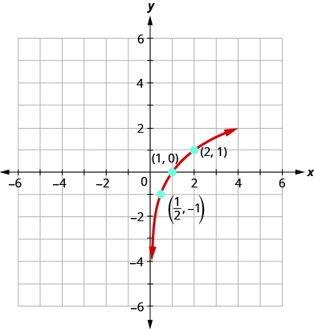 

Graph: <math xmlns="http://www.w3.org/1998/Math/MathML"><mrow><mi>y</mi><mo>=</mo><msub><mrow><mtext>log</mtext></mrow><mn>3</mn></msub><mi>x</mi><mo>.</mo></mrow></math>

* * *
{: data-type="newline"}

  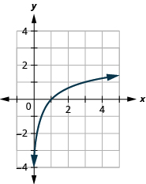 

Graph: <math xmlns="http://www.w3.org/1998/Math/MathML"><mrow><mi>y</mi><mo>=</mo><msub><mrow><mtext>log</mtext></mrow><mn>5</mn></msub><mi>x</mi><mo>.</mo></mrow></math>

* * *
{: data-type="newline"}

 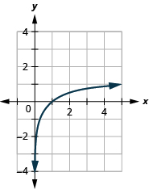 

The graphs of <math xmlns="http://www.w3.org/1998/Math/MathML"><mrow><mi>y</mi><mo>=</mo><msub><mrow><mtext>log</mtext></mrow><mn>2</mn></msub><mi>x</mi><mo>,</mo></mrow></math>

<math xmlns="http://www.w3.org/1998/Math/MathML"><mrow><mi>y</mi><mo>=</mo><msub><mrow><mtext>log</mtext></mrow><mn>3</mn></msub><mi>x</mi><mo>,</mo></mrow></math>

 and <math xmlns="http://www.w3.org/1998/Math/MathML"><mrow><mi>y</mi><mo>=</mo><msub><mrow><mtext>log</mtext></mrow><mn>5</mn></msub><mi>x</mi></mrow></math>

 are the shape we expect from a logarithmic function where <math xmlns="http://www.w3.org/1998/Math/MathML"><mrow><mi>a</mi><mo>&gt;</mo><mn>1</mn><mo>.</mo></mrow></math>

We notice that for each function the graph contains the point <math xmlns="http://www.w3.org/1998/Math/MathML"><mrow><mrow><mo>(</mo><mrow><mn>1</mn><mo>,</mo><mn>0</mn></mrow><mo>)</mo></mrow><mo>.</mo></mrow></math>

 This make sense because <math xmlns="http://www.w3.org/1998/Math/MathML"><mrow><mn>0</mn><mo>=</mo><msub><mrow><mtext>log</mtext></mrow><mi>a</mi></msub><mn>1</mn></mrow></math>

 means <math xmlns="http://www.w3.org/1998/Math/MathML"><mrow><msup><mi>a</mi><mn>0</mn></msup><mo>=</mo><mn>1</mn></mrow></math>

 which is true for any *a*.

The graph of each function, also contains the point <math xmlns="http://www.w3.org/1998/Math/MathML"><mrow><mrow><mo>(</mo><mrow><mi>a</mi><mo>,</mo><mn>1</mn></mrow><mo>)</mo></mrow><mo>.</mo></mrow></math>

 This makes sense as <math xmlns="http://www.w3.org/1998/Math/MathML"><mrow><mn>1</mn><mo>=</mo><msub><mrow><mtext>log</mtext></mrow><mi>a</mi></msub><mi>a</mi></mrow></math>

 means <math xmlns="http://www.w3.org/1998/Math/MathML"><mrow><msup><mi>a</mi><mn>1</mn></msup><mo>=</mo><mi>a</mi><mo>.</mo></mrow></math>

 which is true for any *a*.

Notice too, the graph of each function <math xmlns="http://www.w3.org/1998/Math/MathML"><mrow><mi>y</mi><mo>=</mo><msub><mrow><mtext>log</mtext></mrow><mi>a</mi></msub><mi>x</mi></mrow></math>

 also contains the point <math xmlns="http://www.w3.org/1998/Math/MathML"><mrow><mrow><mo>(</mo><mrow><mfrac><mn>1</mn><mi>a</mi></mfrac><mo>,</mo><mn>−1</mn></mrow><mo>)</mo></mrow><mo>.</mo></mrow></math>

 This makes sense as <math xmlns="http://www.w3.org/1998/Math/MathML"><mrow><mn>−1</mn><mo>=</mo><msub><mrow><mtext>log</mtext></mrow><mi>a</mi></msub><mfrac><mn>1</mn><mi>a</mi></mfrac></mrow></math>

 means <math xmlns="http://www.w3.org/1998/Math/MathML"><mrow><msup><mi>a</mi><mrow><mn>−1</mn></mrow></msup><mo>=</mo><mfrac><mn>1</mn><mi>a</mi></mfrac><mo>,</mo></mrow></math>

 which is true for any *a*.

Look at each graph again. Now we will see that many characteristics of the logarithm function are simply ’mirror images’ of the characteristics of the corresponding exponential function.

What is the domain of the function? The graph never hits the *y*-axis. The domain is all positive numbers. We write the domain in interval notation as <math xmlns="http://www.w3.org/1998/Math/MathML"><mrow><mrow><mo>(</mo><mrow><mn>0</mn><mo>,</mo><mi>∞</mi></mrow><mo>)</mo></mrow><mo>.</mo></mrow></math>

What is the range for each function? From the graphs we can see that the range is the set of all real numbers. There is no restriction on the range. We write the range in interval notation as <math xmlns="http://www.w3.org/1998/Math/MathML"><mrow><mrow><mo>(</mo><mrow><mtext>−</mtext><mi>∞</mi><mo>,</mo><mi>∞</mi></mrow><mo>)</mo></mrow><mo>.</mo></mrow></math>

When the graph approaches the *y*-axis so very closely but will never cross it, we call the line <math xmlns="http://www.w3.org/1998/Math/MathML"><mrow><mi>x</mi><mo>=</mo><mn>0</mn><mo>,</mo></mrow></math>

 the *y*-axis, a vertical asymptote.

Properties of the Graph of
<math xmlns="http://www.w3.org/1998/Math/MathML"><mrow><mi>y</mi><mo>=</mo><msub><mrow><mtext>log</mtext></mrow><mi>a</mi></msub><mi>x</mi></mrow></math>
when
<math xmlns="http://www.w3.org/1998/Math/MathML"><mrow><mi>a</mi><mo>&gt;</mo><mn>1</mn></mrow></math>

| Domain | <math xmlns="http://www.w3.org/1998/Math/MathML"><mrow><mrow><mo>(</mo><mrow><mn>0</mn><mo>,</mo><mi>∞</mi></mrow><mo>)</mo></mrow></mrow></math>

 |
| Range | <math xmlns="http://www.w3.org/1998/Math/MathML"><mrow><mrow><mo>(</mo><mrow><mtext>−</mtext><mi>∞</mi><mo>,</mo><mi>∞</mi></mrow><mo>)</mo></mrow></mrow></math>

 |
| <math xmlns="http://www.w3.org/1998/Math/MathML"><mrow><mi>x</mi><mtext>-</mtext><mtext>intercept</mtext></mrow></math>

 | <math xmlns="http://www.w3.org/1998/Math/MathML"><mrow><mrow><mo>(</mo><mrow><mn>1</mn><mo>,</mo><mn>0</mn></mrow><mo>)</mo></mrow></mrow></math>

 |
| <math xmlns="http://www.w3.org/1998/Math/MathML"><mrow><mi>y</mi><mtext>-</mtext><mtext>intercept</mtext></mrow></math>

 | None |
| Contains | <math xmlns="http://www.w3.org/1998/Math/MathML"><mrow><mrow><mo>(</mo><mrow><mi>a</mi><mo>,</mo><mn>1</mn></mrow><mo>)</mo></mrow><mo>,</mo></mrow></math>

<math xmlns="http://www.w3.org/1998/Math/MathML"><mrow><mrow><mo>(</mo><mrow><mfrac><mn>1</mn><mi>a</mi></mfrac><mo>,</mo><mn>−1</mn></mrow><mo>)</mo></mrow></mrow></math>

 |
| Asymptote | <math xmlns="http://www.w3.org/1998/Math/MathML"><mrow><mi>y</mi><mtext>-</mtext><mtext>axis</mtext></mrow></math>

 |
{: .unnumbered summary="Table has two columns and six rows. The first row shows the domain is 0 to infinity. The second row shows the range is negative infinity to infinity. The third row shows the x intercept is 1, 0. The fourth row shows there is no y-intercept. The fifth row shows the function contains a, 1 and 1 over a, negative 1. The sixth column shows the asymptote is the y axis." data-label=""}

 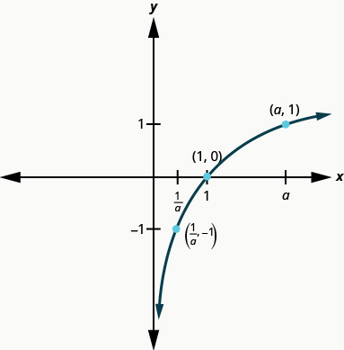 

Our next example looks at the graph of <math xmlns="http://www.w3.org/1998/Math/MathML"><mrow><mi>y</mi><mo>=</mo><msub><mrow><mtext>log</mtext></mrow><mi>a</mi></msub><mi>x</mi></mrow></math>

 when <math xmlns="http://www.w3.org/1998/Math/MathML"><mrow><mn>0</mn><mo>&lt;</mo><mi>a</mi><mo>&lt;</mo><mn>1</mn><mo>.</mo></mrow></math>

Graph <math xmlns="http://www.w3.org/1998/Math/MathML"><mrow><mi>y</mi><mo>=</mo><msub><mrow><mtext>log</mtext></mrow><mrow><mfrac><mn>1</mn><mn>3</mn></mfrac></mrow></msub><mi>x</mi><mo>.</mo></mrow></math>

To graph the function, we will first rewrite the logarithmic equation, <math xmlns="http://www.w3.org/1998/Math/MathML"><mrow><mi>y</mi><mo>=</mo><msub><mrow><mtext>log</mtext></mrow><mrow><mfrac><mn>1</mn><mn>3</mn></mfrac></mrow></msub><mi>x</mi><mo>,</mo></mrow></math>

 in exponential form, <math xmlns="http://www.w3.org/1998/Math/MathML"><mrow><msup><mrow><mrow><mo>(</mo><mrow><mfrac><mn>1</mn><mn>3</mn></mfrac></mrow><mo>)</mo></mrow></mrow><mi>y</mi></msup><mo>=</mo><mi>x</mi><mo>.</mo></mrow></math>

We will use point plotting to graph the function. It will be easier to start with values of *y* and then get *x*.

| <math xmlns="http://www.w3.org/1998/Math/MathML"><mi>y</mi></math>

 | <math xmlns="http://www.w3.org/1998/Math/MathML"><mrow><msup><mrow><mrow><mo>(</mo><mrow><mfrac><mn>1</mn><mn>3</mn></mfrac></mrow><mo>)</mo></mrow></mrow><mi>y</mi></msup><mo>=</mo><mi>x</mi></mrow></math>

 | <math xmlns="http://www.w3.org/1998/Math/MathML"><mrow><mrow><mo>(</mo><mrow><mi>x</mi><mo>,</mo><mi>y</mi></mrow><mo>)</mo></mrow></mrow></math>

 |
|----------
| <math xmlns="http://www.w3.org/1998/Math/MathML"><mrow><mn>−2</mn></mrow></math>

 | <math xmlns="http://www.w3.org/1998/Math/MathML"><mrow><msup><mrow><mrow><mo>(</mo><mrow><mfrac><mn>1</mn><mn>3</mn></mfrac></mrow><mo>)</mo></mrow></mrow><mrow><mn>−2</mn></mrow></msup><mo>=</mo><msup><mn>3</mn><mn>2</mn></msup><mo>=</mo><mn>9</mn></mrow></math>

 | <math xmlns="http://www.w3.org/1998/Math/MathML"><mrow><mrow><mo>(</mo><mrow><mn>9</mn><mo>,</mo><mn>−2</mn></mrow><mo>)</mo></mrow></mrow></math>

 |
| <math xmlns="http://www.w3.org/1998/Math/MathML"><mrow><mn>−1</mn></mrow></math>

 | <math xmlns="http://www.w3.org/1998/Math/MathML"><mrow><msup><mrow><mrow><mo>(</mo><mrow><mfrac><mn>1</mn><mn>3</mn></mfrac></mrow><mo>)</mo></mrow></mrow><mrow><mn>−1</mn></mrow></msup><mo>=</mo><msup><mn>3</mn><mn>1</mn></msup><mo>=</mo><mn>3</mn></mrow></math>

 | <math xmlns="http://www.w3.org/1998/Math/MathML"><mrow><mrow><mo>(</mo><mrow><mn>3</mn><mo>,</mo><mn>−1</mn></mrow><mo>)</mo></mrow></mrow></math>

 |
| 0 | <math xmlns="http://www.w3.org/1998/Math/MathML"><mrow><msup><mrow><mrow><mo>(</mo><mrow><mfrac><mn>1</mn><mn>3</mn></mfrac></mrow><mo>)</mo></mrow></mrow><mn>0</mn></msup><mo>=</mo><mn>1</mn></mrow></math>

 | <math xmlns="http://www.w3.org/1998/Math/MathML"><mrow><mrow><mo>(</mo><mrow><mn>1</mn><mo>,</mo><mn>0</mn></mrow><mo>)</mo></mrow></mrow></math>

 |
| 1 | <math xmlns="http://www.w3.org/1998/Math/MathML"><mrow><msup><mrow><mrow><mo>(</mo><mrow><mfrac><mn>1</mn><mn>3</mn></mfrac></mrow><mo>)</mo></mrow></mrow><mn>1</mn></msup><mo>=</mo><mfrac><mn>1</mn><mn>3</mn></mfrac></mrow></math>

 | <math xmlns="http://www.w3.org/1998/Math/MathML"><mrow><mrow><mo>(</mo><mrow><mfrac><mn>1</mn><mn>3</mn></mfrac><mo>,</mo><mn>1</mn></mrow><mo>)</mo></mrow></mrow></math>

 |
| 2 | <math xmlns="http://www.w3.org/1998/Math/MathML"><mrow><msup><mrow><mrow><mo>(</mo><mrow><mfrac><mn>1</mn><mn>3</mn></mfrac></mrow><mo>)</mo></mrow></mrow><mn>2</mn></msup><mo>=</mo><mfrac><mn>1</mn><mn>9</mn></mfrac></mrow></math>

 | <math xmlns="http://www.w3.org/1998/Math/MathML"><mrow><mrow><mo>(</mo><mrow><mfrac><mn>1</mn><mn>9</mn></mfrac><mo>,</mo><mn>2</mn></mrow><mo>)</mo></mrow></mrow></math>

 |
| 3 | <math xmlns="http://www.w3.org/1998/Math/MathML"><mrow><msup><mrow><mrow><mo>(</mo><mrow><mfrac><mn>1</mn><mn>3</mn></mfrac></mrow><mo>)</mo></mrow></mrow><mn>3</mn></msup><mo>=</mo><mfrac><mn>1</mn><mrow><mn>27</mn></mrow></mfrac></mrow></math>

 | <math xmlns="http://www.w3.org/1998/Math/MathML"><mrow><mrow><mo>(</mo><mrow><mfrac><mn>1</mn><mrow><mn>27</mn></mrow></mfrac><mo>,</mo><mn>3</mn></mrow><mo>)</mo></mrow></mrow></math>

 |
{: summary="This table has three columns and seven rows. The first row is a header row and it reads y, 1 over 3 to the y power equals x and (x, y). In the first column below y, we have negative 2, negative 1, 0, 1, 2, and 3. In the second column below 1 over 3 to the y power equals x we have 1 over 3 to the negative 2 power equals 3 squared which equals 9, 1 over 3 to the negative 1 power equals 3 to the first power which equals 3, 1 over 3 to the 0 power equals 1, 1 over 3 to the 1 power equals 1 over 3, 1 over 3 squared equals 1 over 9, and 1 over 3 cubed equals 1 over 27. In the third column below (x, y) we have (9, negative 2), (3, negative 1), (1, 0), (1 over 3, 1), (1 over 9, 2), and (1 over 27, 3)." .unnumbered data-label=""}

 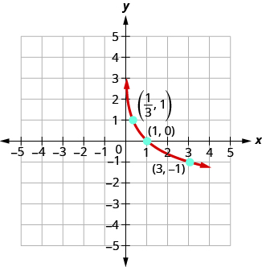 

Graph: <math xmlns="http://www.w3.org/1998/Math/MathML"><mrow><mi>y</mi><mo>=</mo><msub><mrow><mtext>log</mtext></mrow><mrow><mfrac><mn>1</mn><mn>2</mn></mfrac></mrow></msub><mi>x</mi><mo>.</mo></mrow></math>

* * *
{: data-type="newline"}

  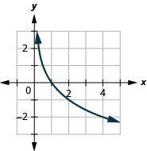 

Graph: <math xmlns="http://www.w3.org/1998/Math/MathML"><mrow><mi>y</mi><mo>=</mo><msub><mrow><mtext>log</mtext></mrow><mrow><mfrac><mn>1</mn><mn>4</mn></mfrac></mrow></msub><mi>x</mi><mo>.</mo></mrow></math>

* * *
{: data-type="newline"}

 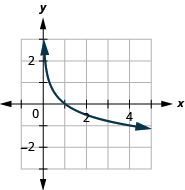 

Now, let’s look at the graphs <math xmlns="http://www.w3.org/1998/Math/MathML"><mrow><mi>y</mi><mo>=</mo><msub><mrow><mtext>log</mtext></mrow><mrow><mfrac><mn>1</mn><mn>2</mn></mfrac></mrow></msub><mi>x</mi><mo>,</mo><mspace width="0.2em" /><mi>y</mi><mo>=</mo><msub><mrow><mtext>log</mtext></mrow><mrow><mfrac><mn>1</mn><mn>3</mn></mfrac></mrow></msub><mi>x</mi></mrow></math>

 and <math xmlns="http://www.w3.org/1998/Math/MathML"><mrow><mi>y</mi><mo>=</mo><msub><mrow><mtext>log</mtext></mrow><mrow><mfrac><mn>1</mn><mn>4</mn></mfrac></mrow></msub><mi>x</mi></mrow></math>

, so we can identify some of the properties of logarithmic functions where <math xmlns="http://www.w3.org/1998/Math/MathML"><mrow><mn>0</mn><mo>&lt;</mo><mi>a</mi><mo>&lt;</mo><mn>1</mn><mo>.</mo></mrow></math>

The graphs of all have the same basic shape. While this is the shape we expect from a logarithmic function where <math xmlns="http://www.w3.org/1998/Math/MathML"><mrow><mn>0</mn><mo>&lt;</mo><mi>a</mi><mo>&lt;</mo><mn>1</mn><mo>.</mo></mrow></math>

We notice, that for each function again, the graph contains the points,<math xmlns="http://www.w3.org/1998/Math/MathML"><mrow><mrow><mo>(</mo><mrow><mn>1</mn><mo>,</mo><mn>0</mn></mrow><mo>)</mo></mrow><mo>,</mo></mrow></math>

<math xmlns="http://www.w3.org/1998/Math/MathML"><mrow><mrow><mo>(</mo><mrow><mi>a</mi><mo>,</mo><mn>1</mn></mrow><mo>)</mo></mrow><mo>,</mo></mrow></math>

<math xmlns="http://www.w3.org/1998/Math/MathML"><mrow><mrow><mo>(</mo><mrow><mfrac><mn>1</mn><mi>a</mi></mfrac><mo>,</mo><mn>−1</mn></mrow><mo>)</mo></mrow><mo>.</mo></mrow></math>

 This make sense for the same reasons we argued above.

We notice the domain and range are also the same—the domain is <math xmlns="http://www.w3.org/1998/Math/MathML"><mrow><mrow><mo>(</mo><mrow><mn>0</mn><mo>,</mo><mi>∞</mi></mrow><mo>)</mo></mrow></mrow></math>

 and the range is <math xmlns="http://www.w3.org/1998/Math/MathML"><mrow><mrow><mo>(</mo><mrow><mtext>−</mtext><mi>∞</mi><mo>,</mo><mi>∞</mi></mrow><mo>)</mo></mrow><mo>.</mo></mrow></math>

 The <math xmlns="http://www.w3.org/1998/Math/MathML"><mi>y</mi></math>

-axis is again the vertical asymptote.

We will summarize these properties in the chart below. Which also include when <math xmlns="http://www.w3.org/1998/Math/MathML"><mrow><mi>a</mi><mo>&gt;</mo><mn>1</mn><mo>.</mo></mrow></math>

Properties of the Graph of
<math xmlns="http://www.w3.org/1998/Math/MathML"><mrow><mi>y</mi><mo>=</mo><msub><mrow><mtext>log</mtext></mrow><mi>a</mi></msub><mi>x</mi></mrow></math>

<table summary="Table has four columns. It shows that when a is greater than 1, the domain is 0 to infinity, the range is negative infinity to infinity, the x-intercept is 1, 0, there is no y intercept, the function contains a, 1 and , 1 over a, negative 1, the asymptote is the y axis 0, and the basic shape is increasing. It shows that when a is greater than 0 and less than 1, the domain is 0 to infinity, the range is negative infinity to infinity, the x-intercept is 1, 0, there is no y intercept, the function contains a, 1 and 1 over a, negative 1, the asymptote is the y axis, and the basic shape is decreasing." class="unnumbered" data-label=""><thead>
<tr>
<th colspan="2" data-valign="top" data-align="left"><strong>when</strong> <math xmlns="http://www.w3.org/1998/Math/MathML"><mrow><mi>a</mi><mo>&gt;</mo><mn>1</mn></mrow></math></th>
<th colspan="2" data-valign="top" data-align="left"><strong>when</strong> <math xmlns="http://www.w3.org/1998/Math/MathML"><mrow><mn>0</mn><mo>&lt;</mo><mi>a</mi><mo>&lt;</mo><mn>1</mn></mrow></math></th>
</tr>
</thead><tbody>
<tr>
<td data-valign="top" data-align="left">Domain</td>
<td data-valign="top" data-align="left"><math xmlns="http://www.w3.org/1998/Math/MathML"><mrow><mrow><mo>(</mo><mrow><mn>0</mn><mo>,</mo><mi>∞</mi></mrow><mo>)</mo></mrow></mrow></math></td>
<td data-valign="top" data-align="left">Domain</td>
<td data-valign="top" data-align="left"><math xmlns="http://www.w3.org/1998/Math/MathML"><mrow><mrow><mo>(</mo><mrow><mn>0</mn><mo>,</mo><mi>∞</mi></mrow><mo>)</mo></mrow></mrow></math></td>
</tr>
<tr>
<td data-valign="top" data-align="left">Range</td>
<td data-valign="top" data-align="left"><math xmlns="http://www.w3.org/1998/Math/MathML"><mrow><mrow><mo>(</mo><mrow><mtext>−</mtext><mi>∞</mi><mo>,</mo><mi>∞</mi></mrow><mo>)</mo></mrow></mrow></math></td>
<td data-valign="top" data-align="left">Range</td>
<td data-valign="top" data-align="left"><math xmlns="http://www.w3.org/1998/Math/MathML"><mrow><mrow><mo>(</mo><mrow><mtext>−</mtext><mi>∞</mi><mo>,</mo><mi>∞</mi></mrow><mo>)</mo></mrow></mrow></math></td>
</tr>
<tr>
<td data-valign="top" data-align="left"><math xmlns="http://www.w3.org/1998/Math/MathML"><mrow><mi>x</mi></mrow></math>-intercept</td>
<td data-valign="top" data-align="left"><math xmlns="http://www.w3.org/1998/Math/MathML"><mrow><mrow><mo>(</mo><mrow><mn>1</mn><mo>,</mo><mn>0</mn></mrow><mo>)</mo></mrow></mrow></math></td>
<td data-valign="top" data-align="left"><math xmlns="http://www.w3.org/1998/Math/MathML"><mi>x</mi></math>-intercept</td>
<td data-valign="top" data-align="left"><math xmlns="http://www.w3.org/1998/Math/MathML"><mrow><mrow><mo>(</mo><mrow><mn>1</mn><mo>,</mo><mn>0</mn></mrow><mo>)</mo></mrow></mrow></math></td>
</tr>
<tr>
<td data-valign="top" data-align="left"><math xmlns="http://www.w3.org/1998/Math/MathML"><mrow><mi>y</mi></mrow></math>-intercept</td>
<td data-valign="top" data-align="left">none</td>
<td data-valign="top" data-align="left"><math xmlns="http://www.w3.org/1998/Math/MathML"><mi>y</mi></math>-intercept</td>
<td data-valign="top" data-align="left">None</td>
</tr>
<tr>
<td data-valign="top" data-align="left">Contains</td>
<td data-valign="top" data-align="left"><math xmlns="http://www.w3.org/1998/Math/MathML"><mrow><mrow><mo>(</mo><mrow><mi>a</mi><mo>,</mo><mn>1</mn></mrow><mo>)</mo></mrow><mo>,</mo></mrow></math><math xmlns="http://www.w3.org/1998/Math/MathML"><mrow><mrow><mo>(</mo><mrow><mfrac><mn>1</mn><mi>a</mi></mfrac><mo>,</mo><mn>−1</mn></mrow><mo>)</mo></mrow></mrow></math></td>
<td data-valign="top" data-align="left">Contains</td>
<td data-valign="top" data-align="left"><math xmlns="http://www.w3.org/1998/Math/MathML"><mrow><mrow><mo>(</mo><mrow><mi>a</mi><mo>,</mo><mn>1</mn></mrow><mo>)</mo></mrow><mo>,</mo></mrow></math><math xmlns="http://www.w3.org/1998/Math/MathML"><mrow><mrow><mo>(</mo><mrow><mfrac><mn>1</mn><mi>a</mi></mfrac><mo>,</mo><mn>−1</mn></mrow><mo>)</mo></mrow></mrow></math></td>
</tr>
<tr>
<td data-valign="top" data-align="left">Asymptote</td>
<td data-valign="top" data-align="left"><math xmlns="http://www.w3.org/1998/Math/MathML"><mrow><mi>y</mi></mrow></math>-axis</td>
<td data-valign="top" data-align="left">Asymptote</td>
<td data-valign="top" data-align="left"><math xmlns="http://www.w3.org/1998/Math/MathML"><mrow><mi>y</mi></mrow></math>-axis</td>
</tr>
<tr>
<td data-valign="top" data-align="left">Basic shape</td>
<td data-valign="top" data-align="left">increasing</td>
<td data-valign="top" data-align="left">Basic shape</td>
<td data-valign="top" data-align="left">Decreasing</td>
</tr>
</tbody></table>
  

We talked earlier about how the logarithmic function <math xmlns="http://www.w3.org/1998/Math/MathML"><mrow><msup><mi>f</mi><mrow><mn>−1</mn></mrow></msup><mrow><mo>(</mo><mi>x</mi><mo>)</mo></mrow><mo>=</mo><msub><mrow><mtext>log</mtext></mrow><mi>a</mi></msub><mi>x</mi></mrow></math>

 is the inverse of the exponential function <math xmlns="http://www.w3.org/1998/Math/MathML"><mrow><mi>f</mi><mrow><mo>(</mo><mi>x</mi><mo>)</mo></mrow><mo>=</mo><msup><mi>a</mi><mi>x</mi></msup><mo>.</mo></mrow></math>

 The graphs in [\[link\]](#CNX_IntAlg_Figure_10_03_008_img) show both the exponential (blue) and logarithmic (red) functions on the same graph for both <math xmlns="http://www.w3.org/1998/Math/MathML"><mrow><mi>a</mi><mo>&gt;</mo><mn>1</mn></mrow></math>

 and <math xmlns="http://www.w3.org/1998/Math/MathML"><mrow><mn>0</mn><mo>&lt;</mo><mi>a</mi><mo>&lt;</mo><mn>1</mn><mo>.</mo></mrow></math>

 ![This figure shows that, for a greater than 1, the logarithmic curve going through the points (1 over a, negative 1), (1, 0), and (a, 1). It also shows the exponential curve going through the points (1, 1 over a), (0, 1), and (1, a) along with the line y equals x. The logarithmic curve is a mirror image of the exponential curve across the y equals x line. This figure shows that, for a greater than 0 and less than 1, the logarithmic curve going through the points (a, 1), (1, 0), and (1 over a, negative 1). It also shows the exponential curve going through the points (negative 1, 1 over a), (0, 1), and (1, a) along with the line y equals x. The logarithmic curve is a mirror image of the exponential curve across the y equals x line.](../resources/CNX_IntAlg_Figure_10_03_008_img.jpg){: #CNX_IntAlg_Figure_10_03_008_img}

Notice how the graphs are reflections of each other through the line <math xmlns="http://www.w3.org/1998/Math/MathML"><mrow><mi>y</mi><mo>=</mo><mi>x</mi><mo>.</mo></mrow></math>

 We know this is true of inverse functions. Keeping a visual in your mind of these graphs will help you remember the domain and range of each function. Notice the *x*-axis is the horizontal asymptote for the exponential functions and the *y*-axis is the vertical asymptote for the logarithmic functions.

# Solve Logarithmic Equations

When we talked about exponential functions, we introduced the number *e*. Just as *e* was a base for an exponential function, it can be used a base for logarithmic functions too. The logarithmic function with base *e* is called the **natural logarithmic function**{: data-type="term"}. The function <math xmlns="http://www.w3.org/1998/Math/MathML"><mrow><mi>f</mi><mrow><mo>(</mo><mi>x</mi><mo>)</mo></mrow><mo>=</mo><msub><mrow><mtext>log</mtext></mrow><mi>e</mi></msub><mi>x</mi></mrow></math>

 is generally written <math xmlns="http://www.w3.org/1998/Math/MathML"><mrow><mi>f</mi><mrow><mo>(</mo><mi>x</mi><mo>)</mo></mrow><mo>=</mo><mtext>ln</mtext><mspace width="0.2em" /><mi>x</mi></mrow></math>

 and we read it as “el en of <math xmlns="http://www.w3.org/1998/Math/MathML"><mrow><mi>x</mi><mo>.</mo><mo>”</mo></mrow></math>

Natural Logarithmic Function

The function <math xmlns="http://www.w3.org/1998/Math/MathML"><mrow><mi>f</mi><mrow><mo>(</mo><mi>x</mi><mo>)</mo></mrow><mo>=</mo><mtext>ln</mtext><mspace width="0.2em" /><mi>x</mi></mrow></math>

 is the **natural logarithmic function** with base <math xmlns="http://www.w3.org/1998/Math/MathML"><mrow><mi>e</mi><mo>,</mo></mrow></math>

 where <math xmlns="http://www.w3.org/1998/Math/MathML"><mrow><mi>x</mi><mo>&gt;</mo><mn>0</mn><mo>.</mo></mrow></math>

<math xmlns="http://www.w3.org/1998/Math/MathML"><mrow><mi>y</mi><mo>=</mo><mtext>ln</mtext><mspace width="0.2em" /><mi>x</mi><mspace width="0.2em" /><mtext>is equivalent to</mtext><mspace width="0.2em" /><mi>x</mi><mo>=</mo><msup><mi>e</mi><mi>y</mi></msup></mrow></math>

When the base of the logarithm function is 10, we call it the **common logarithmic function**{: data-type="term"} and the base is not shown. If the base *a* of a logarithm is not shown, we assume it is 10.

Common Logarithmic Function

The function <math xmlns="http://www.w3.org/1998/Math/MathML"><mrow><mi>f</mi><mrow><mo>(</mo><mi>x</mi><mo>)</mo></mrow><mo>=</mo><mtext>log</mtext><mspace width="0.2em" /><mi>x</mi></mrow></math>

 is the **common logarithmic function** with base<math xmlns="http://www.w3.org/1998/Math/MathML"><mrow><mn>10</mn></mrow></math>

, where <math xmlns="http://www.w3.org/1998/Math/MathML"><mrow><mi>x</mi><mo>&gt;</mo><mn>0</mn><mo>.</mo></mrow></math>

<math xmlns="http://www.w3.org/1998/Math/MathML"><mrow><mi>y</mi><mo>=</mo><mtext>log</mtext><mspace width="0.2em" /><mi>x</mi><mspace width="0.2em" /><mtext>is equivalent to</mtext><mspace width="0.2em" /><mi>x</mi><mo>=</mo><msup><mrow><mn>10</mn></mrow><mi>y</mi></msup></mrow></math>

  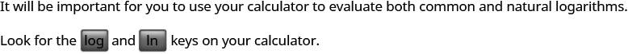  To solve logarithmic equations, one strategy is to change the equation to exponential form and then solve the exponential equation as we did before. As we solve logarithmic equations, <math xmlns="http://www.w3.org/1998/Math/MathML"><mrow><mi>y</mi><mo>=</mo><msub><mrow><mtext>log</mtext></mrow><mi>a</mi></msub><mi>x</mi></mrow></math>

, we need to remember that for the base *a*, <math xmlns="http://www.w3.org/1998/Math/MathML"><mrow><mi>a</mi><mo>&gt;</mo><mn>0</mn></mrow></math>

 and <math xmlns="http://www.w3.org/1998/Math/MathML"><mrow><mi>a</mi><mo>≠</mo><mn>1</mn><mo>.</mo></mrow></math>

 Also, the domain is <math xmlns="http://www.w3.org/1998/Math/MathML"><mrow><mi>x</mi><mo>&gt;</mo><mn>0</mn><mo>.</mo></mrow></math>

 Just as with radical equations, we must check our solutions to eliminate any extraneous solutions.

Solve: ⓐ <math xmlns="http://www.w3.org/1998/Math/MathML"><mrow><msub><mrow><mtext>log</mtext></mrow><mi>a</mi></msub><mn>49</mn><mo>=</mo><mn>2</mn></mrow></math>

 and ⓑ <math xmlns="http://www.w3.org/1998/Math/MathML"><mrow><mtext>ln</mtext><mspace width="0.2em" /><mi>x</mi><mo>=</mo><mn>3</mn><mo>.</mo></mrow></math>

ⓐ* * *
{: data-type="newline"}

 <math xmlns="http://www.w3.org/1998/Math/MathML"><mrow><mtable><mtr><mtd columnalign="left"><mtable><mtr><mtd /><mtd /><mtd /><mtd columnalign="right"><msub><mrow><mi>log</mi></mrow><mrow><mi>a</mi></mrow></msub><mn>49</mn></mtd><mtd columnalign="left"><mo>=</mo></mtd><mtd columnalign="left"><mn>2</mn></mtd></mtr><mtr><mtd columnalign="left"><mtext>Rewrite in exponential form.</mtext></mtd><mtd /><mtd /><mtd columnalign="right"><msup><mi>a</mi><mn>2</mn></msup></mtd><mtd columnalign="left"><mo>=</mo></mtd><mtd columnalign="left"><mn>49</mn></mtd></mtr><mtr><mtd columnalign="left"><mtext>Solve the equation using the square root property.</mtext></mtd><mtd /><mtd /><mtd columnalign="right"><mi>a</mi></mtd><mtd columnalign="left"><mo>=</mo></mtd><mtd columnalign="left"><mo>±</mo><mn>7</mn></mtd></mtr></mtable><mspace width="0.3em" /></mtd></mtr><mtr><mtd columnalign="left"><mtable><mtr><mtd columnalign="left"><mtext>The base cannot be negative, so we eliminate</mtext></mtd></mtr><mtr><mtd columnalign="left"><mi>a</mi><mo>=</mo><mo>−</mo><mn>7.</mn><mspace width="18.5em" /><mi>a</mi><mo>=</mo><mn>7</mn><mo>,</mo><mspace width="0.5em" /><menclose notation="updiagonalstrike"><mrow><mi>a</mi><mo>=</mo><mo>−</mo><mn>7</mn></mrow></menclose></mtd></mtr></mtable></mtd></mtr><mtr><mtd columnalign="left"><mtext>Check.</mtext></mtd></mtr><mtr><mtd columnalign="left"><mtable><mtr><mtd columnalign="left"><mi>a</mi><mo>=</mo><mn>7</mn></mtd><mtd /><mtd /><mtd /><mtd /><mtd columnalign="right"><msub><mrow><mi>log</mi></mrow><mi>a</mi></msub><mn>49</mn></mtd><mtd columnalign="left"><mo>=</mo></mtd><mtd columnalign="left"><mn>2</mn></mtd></mtr><mtr><mtd /><mtd /><mtd /><mtd /><mtd /><mtd columnalign="right"><msub><mrow><mi>log</mi></mrow><mn>7</mn></msub><mn>49</mn></mtd><mtd columnalign="left"><mover><mo>=</mo><mo>?</mo></mover></mtd><mtd columnalign="left"><mn>2</mn></mtd></mtr><mtr><mtd /><mtd /><mtd /><mtd /><mtd /><mtd columnalign="right"><msup><mn>7</mn><mn>2</mn></msup></mtd><mtd columnalign="left"><mover><mo>=</mo><mo>?</mo></mover></mtd><mtd columnalign="left"><mn>49</mn></mtd></mtr><mtr><mtd /><mtd /><mtd /><mtd /><mtd /><mtd columnalign="right"><mn>49</mn></mtd><mtd columnalign="left"><mo>=</mo></mtd><mtd columnalign="left"><mn>49</mn><mo>✓</mo></mtd></mtr></mtable></mtd><mtd /><mtd /></mtr></mtable></mrow></math>

ⓑ* * *
{: data-type="newline"}

 <math xmlns="http://www.w3.org/1998/Math/MathML"><mrow><mtable><mtr><mtd /><mtd /><mtd /><mtd columnalign="right"><mspace width="8em" /><mtext>ln</mtext><mspace width="0.2em" /><mi>x</mi></mtd><mtd columnalign="left"><mo>=</mo></mtd><mtd columnalign="left"><mn>3</mn></mtd></mtr> <mtr><mtd columnalign="left"><mtext>Rewrite in exponential form.</mtext></mtd><mtd /><mtd /><mtd columnalign="right"><mspace width="7.7em" /><msup><mi>e</mi><mn>3</mn></msup></mtd><mtd columnalign="left"><mo>=</mo></mtd><mtd columnalign="left"><mi>x</mi></mtd></mtr> <mtr><mtd columnalign="left"><mtext>Check.</mtext></mtd><mtd /><mtd /><mtd /><mtd /><mtd /></mtr> <mtr><mtd columnalign="left"><mtable><mtr><mtd columnalign="left"><mi>x</mi><mo>=</mo><msup> <mi>e</mi> <mn>3</mn> </msup></mtd><mtd /><mtd /><mtd /><mtd /><mtd columnalign="right"><mtext>ln</mtext><mspace width="0.2em" /><mi>x</mi></mtd><mtd columnalign="left"><mo>=</mo></mtd><mtd columnalign="left"><mn>3</mn></mtd></mtr> <mtr><mtd /><mtd /><mtd /><mtd /><mtd /><mtd columnalign="right"><mtext>ln</mtext><mspace width="0.2em" /><msup><mi>e</mi> <mn>3</mn> </msup></mtd> <mtd columnalign="left"><mover> <mo>=</mo> <mo>?</mo> </mover></mtd> <mtd columnalign="left"><mn>3</mn></mtd> </mtr> <mtr><mtd /><mtd /><mtd /><mtd /><mtd /><mtd columnalign="right"><msup> <mi>e</mi> <mn>3</mn> </msup></mtd> <mtd columnalign="left"><mo>=</mo></mtd><mtd columnalign="left"><msup> <mi>e</mi> <mn>3</mn> </msup> <mo>✓</mo></mtd></mtr></mtable></mtd></mtr></mtable></mrow> </math>

Solve: ⓐ <math xmlns="http://www.w3.org/1998/Math/MathML"><mrow><msub><mrow><mtext>log</mtext></mrow><mi>a</mi></msub><mn>121</mn><mo>=</mo><mn>2</mn></mrow></math>

 ⓑ <math xmlns="http://www.w3.org/1998/Math/MathML"><mrow><mtext>ln</mtext><mspace width="0.2em" /><mi>x</mi><mo>=</mo><mn>7</mn></mrow></math>

* * *
{: data-type="newline"}

ⓐ* * *
{: data-type="newline"}

 <math xmlns="http://www.w3.org/1998/Math/MathML"><mrow><mi>a</mi><mo>=</mo><mn>11</mn></mrow></math>

* * *
{: data-type="newline"}

ⓑ <math xmlns="http://www.w3.org/1998/Math/MathML"><mrow><mi>x</mi><mo>=</mo><msup><mi>e</mi><mn>7</mn></msup></mrow></math>

Solve: ⓐ <math xmlns="http://www.w3.org/1998/Math/MathML"><mrow><msub><mrow><mtext>log</mtext></mrow><mi>a</mi></msub><mn>64</mn><mo>=</mo><mn>3</mn></mrow></math>

 ⓑ <math xmlns="http://www.w3.org/1998/Math/MathML"><mrow><mtext>ln</mtext><mspace width="0.2em" /><mi>x</mi><mo>=</mo><mn>9</mn></mrow></math>

* * *
{: data-type="newline"}

ⓐ* * *
{: data-type="newline"}

 <math xmlns="http://www.w3.org/1998/Math/MathML"><mrow><mi>a</mi><mo>=</mo><mn>4</mn></mrow></math>

* * *
{: data-type="newline"}

ⓑ <math xmlns="http://www.w3.org/1998/Math/MathML"><mrow><mi>x</mi><mo>=</mo><msup><mi>e</mi><mn>9</mn></msup></mrow></math>

Solve: ⓐ <math xmlns="http://www.w3.org/1998/Math/MathML"><mrow><msub><mrow><mtext>log</mtext></mrow><mn>2</mn></msub><mrow><mo>(</mo><mrow><mn>3</mn><mi>x</mi><mo>−</mo><mn>5</mn></mrow><mo>)</mo></mrow><mo>=</mo><mn>4</mn></mrow></math>

 and ⓑ <math xmlns="http://www.w3.org/1998/Math/MathML"><mrow><mtext>ln</mtext><mspace width="0.2em" /><msup><mi>e</mi><mrow><mn>2</mn><mi>x</mi></mrow></msup><mo>=</mo><mn>4</mn><mo>.</mo></mrow></math>

ⓐ* * *
{: data-type="newline"}

 <math xmlns="http://www.w3.org/1998/Math/MathML"><mrow><mtable><mtr><mtd /><mtd /><mtd /><mtd columnalign="right"><msub><mrow><mi>log</mi></mrow><mn>2</mn></msub><mrow><mo>(</mo><mrow><mn>3</mn><mi>x</mi><mo>−</mo><mn>5</mn></mrow><mo>)</mo></mrow></mtd><mtd columnalign="left"><mo>=</mo></mtd><mtd columnalign="left"><mn>4</mn></mtd></mtr> <mtr><mtd columnalign="left"><mtext>Rewrite in exponential form.</mtext></mtd><mtd /><mtd /><mtd columnalign="right"><msup><mn>2</mn><mn>4</mn></msup></mtd><mtd columnalign="left"><mo>=</mo></mtd><mtd columnalign="left"><mn>3</mn><mi>x</mi><mo>−</mo><mn>5</mn></mtd></mtr> <mtr><mtd columnalign="left"><mtext>Simplify.</mtext></mtd><mtd /><mtd /><mtd columnalign="right"><mn>16</mn></mtd><mtd columnalign="left"><mo>=</mo></mtd><mtd columnalign="left"><mn>3</mn><mi>x</mi><mo>−</mo><mn>5</mn></mtd></mtr> <mtr><mtd columnalign="left"><mtext>Solve the equation.</mtext></mtd><mtd /><mtd /><mtd columnalign="right"><mn>21</mn></mtd><mtd columnalign="left"><mo>=</mo></mtd><mtd columnalign="left"><mn>3</mn><mi>x</mi></mtd></mtr> <mtr><mtd /><mtd /><mtd /><mtd columnalign="right"><mn>7</mn></mtd><mtd columnalign="left"><mo>=</mo></mtd><mtd columnalign="left"><mi>x</mi></mtd></mtr> <mtr><mtd columnalign="left"><mtext>Check.</mtext></mtd><mtd /><mtd /><mtd /><mtd /><mtd /></mtr> <mtr><mtd columnalign="left"><mtable><mtr><mtd columnalign="left"><mi>x</mi><mo>=</mo><mn>7</mn></mtd><mtd /><mtd /><mtd /><mtd /><mtd columnalign="right"><msub><mrow><mi>log</mi></mrow><mn>2</mn></msub><mrow><mo>(</mo><mrow><mn>3</mn><mi>x</mi><mo>−</mo><mn>5</mn></mrow><mo>)</mo></mrow></mtd><mtd columnalign="left"><mo>=</mo></mtd><mtd columnalign="left"><mn>4</mn></mtd></mtr> <mtr><mtd /><mtd /><mtd /><mtd /><mtd /><mtd columnalign="right"><msub><mrow><mi>log</mi></mrow><mn>2</mn></msub><mrow><mo>(</mo><mrow><mn>3</mn><mo>⋅</mo><mn>7</mn><mo>−</mo><mn>5</mn></mrow><mo>)</mo></mrow></mtd><mtd columnalign="left"><mover><mo>=</mo><mo>?</mo></mover></mtd><mtd columnalign="left"><mn>4</mn></mtd></mtr> <mtr><mtd /><mtd /><mtd /><mtd /><mtd /><mtd columnalign="right"><msub><mrow><mi>log</mi></mrow><mn>2</mn></msub><mrow><mo>(</mo><mrow><mn>16</mn></mrow><mo>)</mo></mrow></mtd><mtd columnalign="left"><mover><mo>=</mo><mo>?</mo></mover></mtd><mtd columnalign="left"><mn>4</mn></mtd></mtr> <mtr><mtd /><mtd /><mtd /><mtd /><mtd /><mtd columnalign="right"><msup><mn>2</mn><mn>4</mn></msup></mtd><mtd columnalign="left"><mover><mo>=</mo><mo>?</mo></mover></mtd><mtd columnalign="left"><mn>16</mn></mtd></mtr> <mtr><mtd /><mtd /><mtd /><mtd /><mtd /><mtd columnalign="right"><mn>16</mn></mtd><mtd columnalign="left"><mo>=</mo></mtd><mtd columnalign="left"><mn>16</mn><mo>✓</mo></mtd></mtr></mtable></mtd></mtr></mtable></mrow></math>

ⓑ* * *
{: data-type="newline"}

 <math xmlns="http://www.w3.org/1998/Math/MathML"><mrow><mtable><mtr><mtd /><mtd /><mtd /><mtd columnalign="right"><mi>ln</mi><mspace width="0.2em" /><msup><mi>e</mi><mrow><mn>2</mn><mi>x</mi></mrow></msup></mtd><mtd columnalign="left"><mo>=</mo></mtd><mtd columnalign="left"><mn>4</mn></mtd></mtr> <mtr><mtd columnalign="left"><mtext>Rewrite in exponential form.</mtext></mtd><mtd /><mtd /><mtd columnalign="right"><msup><mi>e</mi><mn>4</mn></msup></mtd><mtd columnalign="left"><mo>=</mo></mtd><mtd columnalign="left"><msup><mi>e</mi><mrow><mn>2</mn><mi>x</mi></mrow></msup></mtd></mtr> <mtr><mtd columnalign="left"><mtext>Since the bases are the same the exponents are equal.</mtext></mtd><mtd /><mtd /><mtd columnalign="right"><mn>4</mn></mtd><mtd columnalign="left"><mo>=</mo></mtd><mtd columnalign="left"><mn>2</mn><mi>x</mi></mtd></mtr> <mtr><mtd columnalign="left"><mtext>Solve the equation.</mtext></mtd><mtd /><mtd /><mtd columnalign="right"><mn>2</mn></mtd><mtd columnalign="left"><mo>=</mo></mtd><mtd columnalign="left"><mi>x</mi></mtd></mtr> <mtr><mtd columnalign="left"><mtext>Check.</mtext></mtd><mtd /><mtd /><mtd /><mtd /><mtd /></mtr> <mtr><mtd columnalign="left"><mtable><mtr><mtd columnalign="left"><mi>x</mi><mo>=</mo><mn>2</mn></mtd><mtd /><mtd /><mtd /><mtd /><mtd columnalign="right"><mi>ln</mi><mspace width="0.2em" /><msup><mi>e</mi><mrow><mn>2</mn><mi>x</mi></mrow></msup></mtd><mtd columnalign="left"><mo>=</mo></mtd><mtd columnalign="left"><mn>4</mn></mtd></mtr> <mtr><mtd /><mtd /><mtd /><mtd /><mtd /><mtd columnalign="right"><mi>ln</mi><mspace width="0.2em" /><msup><mi>e</mi><mrow><mn>2</mn><mo>·</mo><mn>2</mn></mrow></msup></mtd><mtd columnalign="left"><mover><mo>=</mo><mo>?</mo></mover></mtd><mtd columnalign="left"><mn>4</mn></mtd></mtr> <mtr><mtd /><mtd /><mtd /><mtd /><mtd /><mtd columnalign="right"><mi>ln</mi><mspace width="0.2em" /><msup><mi>e</mi><mn>4</mn></msup></mtd><mtd columnalign="left"><mover><mo>=</mo><mo>?</mo></mover></mtd><mtd columnalign="left"><mn>4</mn></mtd></mtr> <mtr><mtd /><mtd /><mtd /><mtd /><mtd /><mtd columnalign="right"><msup><mi>e</mi><mn>4</mn></msup></mtd><mtd columnalign="left"><mo>=</mo></mtd><mtd columnalign="left"><msup><mi>e</mi><mn>4</mn></msup><mo>✓</mo></mtd></mtr></mtable></mtd></mtr></mtable></mrow></math>

Solve: ⓐ <math xmlns="http://www.w3.org/1998/Math/MathML"><mrow><msub><mrow><mtext>log</mtext></mrow><mn>2</mn></msub><mrow><mo>(</mo><mrow><mn>5</mn><mi>x</mi><mo>−</mo><mn>1</mn></mrow><mo>)</mo></mrow><mo>=</mo><mn>6</mn></mrow></math>

 ⓑ <math xmlns="http://www.w3.org/1998/Math/MathML"><mrow><mtext>ln</mtext><mspace width="0.2em" /><msup><mi>e</mi><mrow><mn>3</mn><mi>x</mi></mrow></msup><mo>=</mo><mn>6</mn></mrow></math>

* * *
{: data-type="newline"}

ⓐ* * *
{: data-type="newline"}

 <math xmlns="http://www.w3.org/1998/Math/MathML"><mrow><mi>x</mi><mo>=</mo><mn>13</mn></mrow></math>

* * *
{: data-type="newline"}

ⓑ <math xmlns="http://www.w3.org/1998/Math/MathML"><mrow><mi>x</mi><mo>=</mo><mn>2</mn></mrow></math>

Solve: ⓐ <math xmlns="http://www.w3.org/1998/Math/MathML"><mrow><msub><mrow><mtext>log</mtext></mrow><mn>3</mn></msub><mrow><mo>(</mo><mrow><mn>4</mn><mi>x</mi><mo>+</mo><mn>3</mn></mrow><mo>)</mo></mrow><mo>=</mo><mn>3</mn></mrow></math>

 ⓑ <math xmlns="http://www.w3.org/1998/Math/MathML"><mrow><mtext>ln</mtext><mspace width="0.2em" /><msup><mi>e</mi><mrow><mn>4</mn><mi>x</mi></mrow></msup><mo>=</mo><mn>4</mn></mrow></math>

* * *
{: data-type="newline"}

ⓐ* * *
{: data-type="newline"}

 <math xmlns="http://www.w3.org/1998/Math/MathML"><mrow><mi>x</mi><mo>=</mo><mn>6</mn></mrow></math>

* * *
{: data-type="newline"}

ⓑ <math xmlns="http://www.w3.org/1998/Math/MathML"><mrow><mi>x</mi><mo>=</mo><mn>1</mn></mrow></math>

# Use Logarithmic Models in Applications

There are many applications that are modeled by logarithmic equations. We will first look at the logarithmic equation that gives the decibel (dB) level of sound. Decibels range from 0, which is barely audible to 160, which can rupture an eardrum. The <math xmlns="http://www.w3.org/1998/Math/MathML"><mrow><msup><mrow><mn>10</mn></mrow><mrow><mn>−12</mn></mrow></msup></mrow></math>

 in the formula represents the intensity of sound that is barely audible.

Decibel Level of Sound

The loudness level, *D*, measured in decibels, of a sound of intensity, *I*, measured in watts per square inch is

<math xmlns="http://www.w3.org/1998/Math/MathML"><mrow><mi>D</mi><mo>=</mo><mn>10</mn><mspace width="0.2em" /><mtext>log</mtext><mrow><mo>(</mo><mrow><mfrac><mi>I</mi><mrow><msup><mrow><mn>10</mn></mrow><mrow><mn>−12</mn></mrow></msup></mrow></mfrac></mrow><mo>)</mo></mrow></mrow></math>

Extended exposure to noise that measures 85 dB can cause permanent damage to the inner ear which will result in hearing loss. What is the decibel level of music coming through ear phones with intensity <math xmlns="http://www.w3.org/1998/Math/MathML"><mrow><msup><mrow><mn>10</mn></mrow><mrow><mn>−2</mn></mrow></msup></mrow></math>

 watts per square inch?

|  |  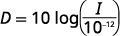  |
| Substitute in the intensity level, *I.* |  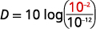  |
| Simplify. |  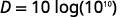  |
| Since <math xmlns="http://www.w3.org/1998/Math/MathML"><mrow><mtext>log</mtext><msup><mrow><mn>10</mn></mrow><mrow><mn>10</mn></mrow></msup><mo>=</mo><mn>10</mn><mo>.</mo></mrow></math>

 |    |
| Multiply. |    |
|  | The decibel level of music coming through earphones is 100 dB. |
{: .unnumbered .unstyled summary="We start with D equals 10 times log of the quantity I over 10 to the negative 12 power. We substitute in the intensity level I to obtain D equals 10 log of the quantity10 to the negative 2 power over 10 to the negative 12 power. We then simplify to obtain D equals 10 times log of 10 to the 10 power. Since log of 10 to the 10 equals 10, we have that D equals 10 times 10. Multiplying gives that D equals 100. Hence, the decibel level of music coming through earphones is 100 dB." data-label=""}

What is the decibel level of one of the new quiet dishwashers with intensity <math xmlns="http://www.w3.org/1998/Math/MathML"><mrow><msup><mrow><mn>10</mn></mrow><mrow><mn>−7</mn></mrow></msup></mrow></math>

 watts per square inch?

The quiet dishwashers have a decibel level of 50 dB.

What is the decibel level heavy city traffic with intensity <math xmlns="http://www.w3.org/1998/Math/MathML"><mrow><msup><mrow><mn>10</mn></mrow><mrow><mn>−3</mn></mrow></msup></mrow></math>

 watts per square inch?

The decibel level of heavy traffic is 90 dB.

The magnitude <math xmlns="http://www.w3.org/1998/Math/MathML"><mi>R</mi></math>

 of an earthquake is measured by a logarithmic scale called the Richter scale. The model is <math xmlns="http://www.w3.org/1998/Math/MathML"><mrow><mi>R</mi><mo>=</mo><mtext>log</mtext><mspace width="0.2em" /><mi>I</mi><mo>,</mo></mrow></math>

 where <math xmlns="http://www.w3.org/1998/Math/MathML"><mi>I</mi></math>

 is the intensity of the shock wave. This model provides a way to measure **earthquake intensity**{: data-type="term" .no-emphasis}.

Earthquake Intensity

The magnitude *R* of an earthquake is measured by <math xmlns="http://www.w3.org/1998/Math/MathML"><mrow><mi>R</mi><mo>=</mo><mtext>log</mtext><mspace width="0.2em" /><mi>I</mi><mo>,</mo></mrow></math>

 where *I* is the intensity of its shock wave.

In 1906, San Francisco experienced an intense earthquake with a magnitude of 7.8 on the Richter scale. Over 80% of the city was destroyed by the resulting fires. In 2014, Los Angeles experienced a moderate earthquake that measured 5.1 on the Richter scale and caused $108 million dollars of damage. Compare the intensities of the two earthquakes.

To compare the intensities, we first need to convert the magnitudes to intensities using the log formula. Then we will set up a ratio to compare the intensities.

<math xmlns="http://www.w3.org/1998/Math/MathML"><mrow><mtable><mtr><mtd columnalign="left"><mtext>Convert the magnitudes to intensities.</mtext></mtd><mtd /><mtd /><mtd columnalign="left"><mspace width="0.6em" /><mi>R</mi><mo>=</mo><mtext>log</mtext><mspace width="0.2em" /><mi>I</mi></mtd></mtr> <mtr><mtd columnalign="left"><mspace width="2em" /><mtext>1906 earthquake</mtext></mtd><mtd /><mtd /><mtd columnalign="left"><mn>7.8</mn><mo>=</mo><mtext>log</mtext><mspace width="0.2em" /><mi>I</mi></mtd></mtr> <mtr><mtd columnalign="left"><mspace width="2em" /><mtext>Convert to exponential form.</mtext></mtd><mtd /><mtd /><mtd columnalign="left"><mspace width="0.86em" /><mi>I</mi><mo>=</mo><msup><mrow><mn>10</mn></mrow><mrow><mn>7.8</mn></mrow></msup></mtd></mtr><mtr /><mtr /> <mtr><mtd columnalign="left"><mspace width="2em" /><mtext>2014 earthquake</mtext></mtd><mtd /><mtd /><mtd columnalign="left"><mn>5.1</mn><mo>=</mo><mtext>log</mtext><mspace width="0.2em" /><mi>I</mi></mtd></mtr> <mtr><mtd columnalign="left"><mspace width="2em" /><mtext>Convert to exponential form.</mtext></mtd><mtd /><mtd /><mtd columnalign="left"><mspace width="0.92em" /><mi>I</mi><mo>=</mo><msup><mrow><mn>10</mn></mrow><mrow><mn>5.1</mn></mrow></msup></mtd></mtr> <mtr><mtd columnalign="left"><mtext>Form a ratio of the intensities.</mtext></mtd><mtd /><mtd /><mtd columnalign="left"><mfrac><mrow><mtext>Intensity</mtext><mspace width="0.2em" /><mtext>for</mtext><mspace width="0.2em" /><mn>1906</mn></mrow><mrow><mtext>Intensity</mtext><mspace width="0.2em" /><mtext>for</mtext><mspace width="0.2em" /><mn>2014</mn></mrow></mfrac></mtd></mtr> <mtr><mtd columnalign="left"><mtext>Substitute in the values.</mtext></mtd><mtd /><mtd /><mtd columnalign="left"><mspace width="1.5em" /><mfrac><mrow><msup><mrow><mn>10</mn></mrow><mrow><mn>7.8</mn></mrow></msup></mrow><mrow><msup><mrow><mn>10</mn></mrow><mrow><mn>5.1</mn></mrow></msup></mrow></mfrac></mtd></mtr> <mtr><mtd columnalign="left"><mtext>Divide by subtracting the exponents.</mtext></mtd><mtd /><mtd /><mtd columnalign="left"><mspace width="1.5em" /><msup><mrow><mn>10</mn></mrow><mrow><mn>2.7</mn></mrow></msup></mtd></mtr> <mtr><mtd columnalign="left"><mtext>Evaluate.</mtext></mtd><mtd /><mtd /><mtd columnalign="left"><mspace width="1.5em" /><mn>501</mn></mtd></mtr> <mtr><mtd /><mtd /><mtd /><mtd columnalign="left"><mtable><mtr><mtd columnalign="left"><mtext>The intensity of the 1906 earthquake</mtext></mtd></mtr><mtr><mtd columnalign="left"><mtext>was about 501 times the intensity of</mtext></mtd></mtr><mtr><mtd columnalign="left"><mtext>the 2014 earthquake.</mtext></mtd></mtr></mtable></mtd></mtr></mtable></mrow></math>

In 1906, San Francisco experienced an intense earthquake with a magnitude of 7.8 on the Richter scale. In 1989, the Loma Prieta earthquake also affected the San Francisco area, and measured 6.9 on the Richter scale. Compare the intensities of the two earthquakes.

The intensity of the 1906 earthquake was about 8 times the intensity of the 1989 earthquake.

In 2014, Chile experienced an intense earthquake with a magnitude of 8.2 on the Richter scale. In 2014, Los Angeles also experienced an earthquake which measured 5.1 on the Richter scale. Compare the intensities of the two earthquakes.

The intensity of the earthquake in Chile was about 1,259 times the intensity of the earthquake in Los Angeles.

Access these online resources for additional instruction and practice with evaluating and graphing logarithmic functions.

* [Re-writing logarithmic equations in exponential form][1]
* [Simplifying Logarithmic Expressions][2]
* [Graphing logarithmic functions][3]
* [Using logarithms to calculate decibel levels][4]
{: data-display="block"}

# Key Concepts

* **Properties of the Graph of**
  <math xmlns="http://www.w3.org/1998/Math/MathML"><mrow><mi>y</mi><mo>=</mo><msub><mrow><mtext>log</mtext></mrow><mi>a</mi></msub><mi>x</mi><mo>:</mo></mrow></math>
  
  * * *
  {: data-type="newline"}
  
  <table class="unnumbered" summary="Table has four columns. It shows that when a is greater than 1, the domain is 0 to infinity, the range is negative infinity to infinity, the x-intercept is 1, 0, there is no y intercept, the function contains a, 1 and , 1 over a, negative 1, the asymptote is the y axis 0, and the basic shape is increasing. It shows that when a is greater than 0 and less than 1, the domain is 0 to infinity, the range is negative infinity to infinity, the x-intercept is 1, 0, there is no y intercept, the function contains a, 1 and 1 over a, negative 1, the asymptote is the y axis, and the basic shape is decreasing." data-label=""><thead>
  <tr>
  <th colspan="2" data-valign="top" data-align="left"><strong>when</strong> <math xmlns="http://www.w3.org/1998/Math/MathML"><mrow><mi>a</mi><mo>&gt;</mo><mn>1</mn></mrow></math></th>
  <th colspan="2" data-valign="top" data-align="left"><strong>when</strong> <math xmlns="http://www.w3.org/1998/Math/MathML"><mrow><mn>0</mn><mo>&lt;</mo><mi>a</mi><mo>&lt;</mo><mn>1</mn></mrow></math></th>
  </tr>
  </thead><tbody><tr>
  <td data-valign="top" data-align="left">Domain</td>
  <td data-valign="top" data-align="left"><math xmlns="http://www.w3.org/1998/Math/MathML"><mrow><mrow><mo>(</mo><mrow><mn>0</mn><mo>,</mo><mi>∞</mi></mrow><mo>)</mo></mrow></mrow></math></td>
  <td data-valign="top" data-align="left">Domain</td>
  <td data-valign="top" data-align="left"><math xmlns="http://www.w3.org/1998/Math/MathML"><mrow><mrow><mo>(</mo><mrow><mn>0</mn><mo>,</mo><mi>∞</mi></mrow><mo>)</mo></mrow></mrow></math></td>
  </tr>
  <tr>
  <td data-valign="top" data-align="left">Range</td>
  <td data-valign="top" data-align="left"><math xmlns="http://www.w3.org/1998/Math/MathML"><mrow><mrow><mo>(</mo><mrow><mtext>−</mtext><mi>∞</mi><mo>,</mo><mi>∞</mi></mrow><mo>)</mo></mrow></mrow></math></td>
  <td data-valign="top" data-align="left">Range</td>
  <td data-valign="top" data-align="left"><math xmlns="http://www.w3.org/1998/Math/MathML"><mrow><mrow><mo>(</mo><mrow><mtext>−</mtext><mi>∞</mi><mo>,</mo><mi>∞</mi></mrow><mo>)</mo></mrow></mrow></math></td>
  </tr>
  <tr>
  <td data-valign="top" data-align="left"><em>x</em>-intercept</td>
  <td data-valign="top" data-align="left"><math xmlns="http://www.w3.org/1998/Math/MathML"><mrow><mrow><mo>(</mo><mrow><mn>1</mn><mo>,</mo><mn>0</mn></mrow><mo>)</mo></mrow></mrow></math></td>
  <td data-valign="top" data-align="left"><em>x</em>-intercept</td>
  <td data-valign="top" data-align="left"><math xmlns="http://www.w3.org/1998/Math/MathML"><mrow><mrow><mo>(</mo><mrow><mn>1</mn><mo>,</mo><mn>0</mn></mrow><mo>)</mo></mrow></mrow></math></td>
  </tr>
  <tr>
  <td data-valign="top" data-align="left"><em>y</em>-intercept</td>
  <td data-valign="top" data-align="left">none</td>
  <td data-valign="top" data-align="left"><em>y</em>-intercept</td>
  <td data-valign="top" data-align="left">none</td>
  </tr>
  <tr>
  <td data-valign="top" data-align="left">Contains</td>
  <td data-valign="top" data-align="left"><math xmlns="http://www.w3.org/1998/Math/MathML"><mrow><mrow><mo>(</mo><mrow><mi>a</mi><mo>,</mo><mn>1</mn></mrow><mo>)</mo></mrow><mo>,</mo></mrow></math><math xmlns="http://www.w3.org/1998/Math/MathML"><mrow><mrow><mo>(</mo><mrow><mfrac><mn>1</mn><mi>a</mi></mfrac><mo>,</mo><mn>−1</mn></mrow><mo>)</mo></mrow></mrow></math></td>
  <td data-valign="top" data-align="left">Contains</td>
  <td data-valign="top" data-align="left"><math xmlns="http://www.w3.org/1998/Math/MathML"><mrow><mrow><mo>(</mo><mrow><mi>a</mi><mo>,</mo><mn>1</mn></mrow><mo>)</mo></mrow><mo>,</mo></mrow></math><math xmlns="http://www.w3.org/1998/Math/MathML"><mrow><mrow><mo>(</mo><mrow><mfrac><mn>1</mn><mi>a</mi></mfrac><mo>,</mo><mn>−1</mn></mrow><mo>)</mo></mrow></mrow></math></td>
  </tr>
  <tr>
  <td data-valign="top" data-align="left">Asymptote</td>
  <td data-valign="top" data-align="left"><em>y</em>-axis</td>
  <td data-valign="top" data-align="left">Asymptote</td>
  <td data-valign="top" data-align="left"><em>y</em>-axis</td>
  </tr>
  <tr>
  <td data-valign="top" data-align="left">Basic shape</td>
  <td data-valign="top" data-align="left">increasing</td>
  <td data-valign="top" data-align="left">Basic shape</td>
  <td data-valign="top" data-align="left">decreasing</td>
  </tr>
  </tbody></table>
  
  * * *
  {: data-type="newline"}
  
   
* **Decibel Level of Sound:** The loudness level,
  <math xmlns="http://www.w3.org/1998/Math/MathML"><mi>D</mi></math>
  
  , measured in decibels, of a sound of intensity,
  <math xmlns="http://www.w3.org/1998/Math/MathML"><mi>I</mi></math>
  
  , measured in watts per square inch is
  <math xmlns="http://www.w3.org/1998/Math/MathML"><mrow><mi>D</mi><mo>=</mo><mn>10</mn><mtext>log</mtext><mrow><mo>(</mo><mrow><mfrac><mi>I</mi><mrow><msup><mrow><mn>10</mn></mrow><mrow><mn>−12</mn></mrow></msup></mrow></mfrac></mrow><mo>)</mo></mrow><mo>.</mo></mrow></math>

* **Earthquake Intensity:** The magnitude
  <math xmlns="http://www.w3.org/1998/Math/MathML"><mi>R</mi></math>
  
  of an earthquake is measured by
  <math xmlns="http://www.w3.org/1998/Math/MathML"><mrow><mi>R</mi><mo>=</mo><mtext>log</mtext><mspace width="0.2em" /><mi>I</mi><mo>,</mo></mrow></math>
  
  where
  <math xmlns="http://www.w3.org/1998/Math/MathML"><mi>I</mi></math>
  
  is the intensity of its shock wave.
{: data-bullet-style="bullet"}

<section data-depth="1" class="section-exercises" markdown="1">
## Practice Makes Perfect

**Convert Between Exponential and Logarithmic Form**

In the following exercises, convert from exponential to logarithmic form.

<math xmlns="http://www.w3.org/1998/Math/MathML"><mrow><msup><mn>4</mn><mn>2</mn></msup><mo>=</mo><mn>16</mn></mrow></math>

<math xmlns="http://www.w3.org/1998/Math/MathML"><mrow><msup><mn>2</mn><mn>5</mn></msup><mo>=</mo><mn>32</mn></mrow></math>

<math xmlns="http://www.w3.org/1998/Math/MathML"><mrow><msub><mrow><mtext>log</mtext></mrow><mn>2</mn></msub><mn>32</mn><mo>=</mo><mn>5</mn></mrow></math>

<math xmlns="http://www.w3.org/1998/Math/MathML"><mrow><msup><mn>3</mn><mn>3</mn></msup><mo>=</mo><mn>27</mn></mrow></math>

<math xmlns="http://www.w3.org/1998/Math/MathML"><mrow><msup><mn>5</mn><mn>3</mn></msup><mo>=</mo><mn>125</mn></mrow></math>

<math xmlns="http://www.w3.org/1998/Math/MathML"><mrow><msub><mrow><mtext>log</mtext></mrow><mn>5</mn></msub><mn>125</mn><mo>=</mo><mn>3</mn></mrow></math>

<math xmlns="http://www.w3.org/1998/Math/MathML"><mrow><msup><mrow><mn>10</mn></mrow><mn>3</mn></msup><mo>=</mo><mn>1000</mn></mrow></math>

<math xmlns="http://www.w3.org/1998/Math/MathML"><mrow><msup><mrow><mn>10</mn></mrow><mrow><mn>−2</mn></mrow></msup><mo>=</mo><mfrac><mn>1</mn><mrow><mn>100</mn></mrow></mfrac></mrow></math>

<math xmlns="http://www.w3.org/1998/Math/MathML"><mrow><mtext>log</mtext><mfrac><mn>1</mn><mrow><mn>100</mn></mrow></mfrac><mo>=</mo><mn>−2</mn></mrow></math>

<math xmlns="http://www.w3.org/1998/Math/MathML"><mrow><msup><mi>x</mi><mrow><mfrac><mn>1</mn><mn>2</mn></mfrac></mrow></msup><mo>=</mo><msqrt><mn>3</mn></msqrt></mrow></math>

<math xmlns="http://www.w3.org/1998/Math/MathML"><mrow><msup><mi>x</mi><mrow><mfrac><mn>1</mn><mn>3</mn></mfrac></mrow></msup><mo>=</mo><mroot><mn>6</mn><mn>3</mn></mroot></mrow></math>

<math xmlns="http://www.w3.org/1998/Math/MathML"><mrow><msub><mrow><mtext>log</mtext></mrow><mi>x</mi></msub><mroot><mn>6</mn><mn>3</mn></mroot><mo>=</mo><mfrac><mn>1</mn><mn>3</mn></mfrac></mrow></math>

<math xmlns="http://www.w3.org/1998/Math/MathML"><mrow><msup><mrow><mn>32</mn></mrow><mi>x</mi></msup><mo>=</mo><mroot><mrow><mn>32</mn></mrow><mn>4</mn></mroot></mrow></math>

<math xmlns="http://www.w3.org/1998/Math/MathML"><mrow><msup><mrow><mn>17</mn></mrow><mi>x</mi></msup><mo>=</mo><mroot><mrow><mn>17</mn></mrow><mn>5</mn></mroot></mrow></math>

<math xmlns="http://www.w3.org/1998/Math/MathML"><mrow><msub><mrow><mtext>log</mtext></mrow><mrow><mn>17</mn></mrow></msub><mroot><mrow><mn>17</mn></mrow><mn>5</mn></mroot><mo>=</mo><mi>x</mi></mrow></math>

<math xmlns="http://www.w3.org/1998/Math/MathML"><mrow><msup><mrow><mrow><mo>(</mo><mrow><mfrac><mn>1</mn><mn>4</mn></mfrac></mrow><mo>)</mo></mrow></mrow><mn>2</mn></msup><mo>=</mo><mfrac><mn>1</mn><mrow><mn>16</mn></mrow></mfrac></mrow></math>

<math xmlns="http://www.w3.org/1998/Math/MathML"><mrow><msup><mrow><mrow><mo>(</mo><mrow><mfrac><mn>1</mn><mn>3</mn></mfrac></mrow><mo>)</mo></mrow></mrow><mn>4</mn></msup><mo>=</mo><mfrac><mn>1</mn><mrow><mn>81</mn></mrow></mfrac></mrow></math>

<math xmlns="http://www.w3.org/1998/Math/MathML"><mrow><msub><mrow><mtext>log</mtext></mrow><mrow><mfrac><mn>1</mn><mn>3</mn></mfrac></mrow></msub><mfrac><mn>1</mn><mrow><mn>81</mn></mrow></mfrac><mo>=</mo><mn>4</mn></mrow></math>

<math xmlns="http://www.w3.org/1998/Math/MathML"><mrow><msup><mn>3</mn><mrow><mn>−2</mn></mrow></msup><mo>=</mo><mfrac><mn>1</mn><mn>9</mn></mfrac></mrow></math>

<math xmlns="http://www.w3.org/1998/Math/MathML"><mrow><msup><mn>4</mn><mrow><mn>−3</mn></mrow></msup><mo>=</mo><mfrac><mn>1</mn><mrow><mn>64</mn></mrow></mfrac></mrow></math>

<math xmlns="http://www.w3.org/1998/Math/MathML"><mrow><msub><mrow><mtext>log</mtext></mrow><mn>4</mn></msub><mfrac><mn>1</mn><mrow><mn>64</mn></mrow></mfrac><mo>=</mo><mn>−3</mn></mrow></math>

<math xmlns="http://www.w3.org/1998/Math/MathML"><mrow><msup><mi>e</mi><mi>x</mi></msup><mo>=</mo><mn>6</mn></mrow></math>

<math xmlns="http://www.w3.org/1998/Math/MathML"><mrow><msup><mi>e</mi><mn>3</mn></msup><mo>=</mo><mi>x</mi></mrow></math>

<math xmlns="http://www.w3.org/1998/Math/MathML"><mrow><mtext>ln</mtext><mspace width="0.2em" /><mi>x</mi><mo>=</mo><mn>3</mn></mrow></math>

In the following exercises, convert each logarithmic equation to exponential form.

<math xmlns="http://www.w3.org/1998/Math/MathML"><mrow><mn>3</mn><mo>=</mo><msub><mrow><mtext>log</mtext></mrow><mn>4</mn></msub><mn>64</mn></mrow></math>

<math xmlns="http://www.w3.org/1998/Math/MathML"><mrow><mn>6</mn><mo>=</mo><msub><mrow><mtext>log</mtext></mrow><mn>2</mn></msub><mn>64</mn></mrow></math>

<math xmlns="http://www.w3.org/1998/Math/MathML"><mrow><mn>64</mn><mo>=</mo><msup><mn>2</mn><mn>6</mn></msup></mrow></math>

<math xmlns="http://www.w3.org/1998/Math/MathML"><mrow><mn>4</mn><mo>=</mo><msub><mrow><mtext>log</mtext></mrow><mi>x</mi></msub><mn>81</mn></mrow></math>

<math xmlns="http://www.w3.org/1998/Math/MathML"><mrow><mn>5</mn><mo>=</mo><msub><mrow><mtext>log</mtext></mrow><mi>x</mi></msub><mn>32</mn></mrow></math>

<math xmlns="http://www.w3.org/1998/Math/MathML"><mrow><mn>32</mn><mo>=</mo><msup><mi>x</mi><mn>5</mn></msup></mrow></math>

<math xmlns="http://www.w3.org/1998/Math/MathML"><mrow><mn>0</mn><mo>=</mo><msub><mrow><mtext>log</mtext></mrow><mrow><mn>12</mn></mrow></msub><mn>1</mn></mrow></math>

<math xmlns="http://www.w3.org/1998/Math/MathML"><mrow><mn>0</mn><mo>=</mo><msub><mrow><mtext>log</mtext></mrow><mn>7</mn></msub><mn>1</mn></mrow></math>

<math xmlns="http://www.w3.org/1998/Math/MathML"><mrow><mn>1</mn><mo>=</mo><msup><mn>7</mn><mn>0</mn></msup></mrow></math>

<math xmlns="http://www.w3.org/1998/Math/MathML"><mrow><mn>1</mn><mo>=</mo><msub><mrow><mtext>log</mtext></mrow><mn>3</mn></msub><mn>3</mn></mrow></math>

<math xmlns="http://www.w3.org/1998/Math/MathML"><mrow><mn>1</mn><mo>=</mo><msub><mrow><mtext>log</mtext></mrow><mn>9</mn></msub><mn>9</mn></mrow></math>

<math xmlns="http://www.w3.org/1998/Math/MathML"><mrow><mn>9</mn><mo>=</mo><msup><mn>9</mn><mn>1</mn></msup></mrow></math>

<math xmlns="http://www.w3.org/1998/Math/MathML"><mrow><mn>−4</mn><mo>=</mo><msub><mrow><mtext>log</mtext></mrow><mrow><mn>10</mn></mrow></msub><mfrac><mn>1</mn><mrow><mn>10,000</mn></mrow></mfrac></mrow></math>

<math xmlns="http://www.w3.org/1998/Math/MathML"><mrow><mn>3</mn><mo>=</mo><msub><mrow><mtext>log</mtext></mrow><mrow><mn>10</mn></mrow></msub><mn>1,000</mn></mrow></math>

<math xmlns="http://www.w3.org/1998/Math/MathML"><mrow><mn>1,000</mn><mo>=</mo><msup><mrow><mn>10</mn></mrow><mn>3</mn></msup></mrow></math>

<math xmlns="http://www.w3.org/1998/Math/MathML"><mrow><mn>5</mn><mo>=</mo><msub><mrow><mtext>log</mtext></mrow><mi>e</mi></msub><mi>x</mi></mrow></math>

<math xmlns="http://www.w3.org/1998/Math/MathML"><mrow><mi>x</mi><mo>=</mo><msub><mrow><mtext>log</mtext></mrow><mi>e</mi></msub><mn>43</mn></mrow></math>

<math xmlns="http://www.w3.org/1998/Math/MathML"><mrow><mn>43</mn><mo>=</mo><msup><mi>e</mi><mi>x</mi></msup></mrow></math>

**Evaluate Logarithmic Functions**

In the following exercises, find the value of <math xmlns="http://www.w3.org/1998/Math/MathML"><mi>x</mi></math>

 in each logarithmic equation.

<math xmlns="http://www.w3.org/1998/Math/MathML"><mrow><msub><mrow><mtext>log</mtext></mrow><mi>x</mi></msub><mn>49</mn><mo>=</mo><mn>2</mn></mrow></math>

<math xmlns="http://www.w3.org/1998/Math/MathML"><mrow><msub><mrow><mtext>log</mtext></mrow><mi>x</mi></msub><mn>121</mn><mo>=</mo><mn>2</mn></mrow></math>

<math xmlns="http://www.w3.org/1998/Math/MathML"><mrow><mi>x</mi><mo>=</mo><mn>11</mn></mrow></math>

<math xmlns="http://www.w3.org/1998/Math/MathML"><mrow><msub><mrow><mtext>log</mtext></mrow><mi>x</mi></msub><mn>27</mn><mo>=</mo><mn>3</mn></mrow></math>

<math xmlns="http://www.w3.org/1998/Math/MathML"><mrow><msub><mrow><mtext>log</mtext></mrow><mi>x</mi></msub><mn>64</mn><mo>=</mo><mn>3</mn></mrow></math>

<math xmlns="http://www.w3.org/1998/Math/MathML"><mrow><mi>x</mi><mo>=</mo><mn>4</mn></mrow></math>

<math xmlns="http://www.w3.org/1998/Math/MathML"><mrow><msub><mrow><mtext>log</mtext></mrow><mn>3</mn></msub><mi>x</mi><mo>=</mo><mn>4</mn></mrow></math>

<math xmlns="http://www.w3.org/1998/Math/MathML"><mrow><msub><mrow><mtext>log</mtext></mrow><mn>5</mn></msub><mi>x</mi><mo>=</mo><mn>3</mn></mrow></math>

<math xmlns="http://www.w3.org/1998/Math/MathML"><mrow><mi>x</mi><mo>=</mo><mn>125</mn></mrow></math>

<math xmlns="http://www.w3.org/1998/Math/MathML"><mrow><msub><mrow><mtext>log</mtext></mrow><mn>2</mn></msub><mi>x</mi><mo>=</mo><mn>−6</mn></mrow></math>

<math xmlns="http://www.w3.org/1998/Math/MathML"><mrow><msub><mrow><mtext>log</mtext></mrow><mn>3</mn></msub><mi>x</mi><mo>=</mo><mn>−5</mn></mrow></math>

<math xmlns="http://www.w3.org/1998/Math/MathML"><mrow><mi>x</mi><mo>=</mo><mfrac><mn>1</mn><mrow><mn>243</mn></mrow></mfrac></mrow></math>

<math xmlns="http://www.w3.org/1998/Math/MathML"><mrow><msub><mrow><mtext>log</mtext></mrow><mrow><mfrac><mn>1</mn><mn>4</mn></mfrac></mrow></msub><mfrac><mn>1</mn><mrow><mn>16</mn></mrow></mfrac><mo>=</mo><mi>x</mi></mrow></math>

<math xmlns="http://www.w3.org/1998/Math/MathML"><mrow><msub><mrow><mtext>log</mtext></mrow><mrow><mfrac><mn>1</mn><mn>3</mn></mfrac></mrow></msub><mfrac><mn>1</mn><mn>9</mn></mfrac><mo>=</mo><mi>x</mi></mrow></math>

<math xmlns="http://www.w3.org/1998/Math/MathML"><mrow><mi>x</mi><mo>=</mo><mn>2</mn></mrow></math>

<math xmlns="http://www.w3.org/1998/Math/MathML"><mrow><msub><mrow><mtext>log</mtext></mrow><mrow><mfrac><mn>1</mn><mn>4</mn></mfrac></mrow></msub><mn>64</mn><mo>=</mo><mi>x</mi></mrow></math>

<math xmlns="http://www.w3.org/1998/Math/MathML"><mrow><msub><mrow><mtext>log</mtext></mrow><mrow><mfrac><mn>1</mn><mn>9</mn></mfrac></mrow></msub><mn>81</mn><mo>=</mo><mi>x</mi></mrow></math>

<math xmlns="http://www.w3.org/1998/Math/MathML"><mrow><mi>x</mi><mo>=</mo><mn>−2</mn></mrow></math>

In the following exercises, find the exact value of each logarithm without using a calculator.

<math xmlns="http://www.w3.org/1998/Math/MathML"><mrow><msub><mrow><mtext>log</mtext></mrow><mn>7</mn></msub><mn>49</mn></mrow></math>

<math xmlns="http://www.w3.org/1998/Math/MathML"><mrow><msub><mrow><mtext>log</mtext></mrow><mn>6</mn></msub><mn>36</mn></mrow></math>

2

<math xmlns="http://www.w3.org/1998/Math/MathML"><mrow><msub><mrow><mtext>log</mtext></mrow><mn>4</mn></msub><mn>1</mn></mrow></math>

<math xmlns="http://www.w3.org/1998/Math/MathML"><mrow><msub><mrow><mtext>log</mtext></mrow><mn>5</mn></msub><mn>1</mn></mrow></math>

0

<math xmlns="http://www.w3.org/1998/Math/MathML"><mrow><msub><mrow><mtext>log</mtext></mrow><mrow><mn>16</mn></mrow></msub><mn>4</mn></mrow></math>

<math xmlns="http://www.w3.org/1998/Math/MathML"><mrow><msub><mrow><mtext>log</mtext></mrow><mrow><mn>27</mn></mrow></msub><mn>3</mn></mrow></math>

<math xmlns="http://www.w3.org/1998/Math/MathML"><mrow><mfrac><mn>1</mn><mn>3</mn></mfrac></mrow></math>

<math xmlns="http://www.w3.org/1998/Math/MathML"><mrow><msub><mrow><mtext>log</mtext></mrow><mrow><mfrac><mn>1</mn><mn>2</mn></mfrac></mrow></msub><mn>2</mn></mrow></math>

<math xmlns="http://www.w3.org/1998/Math/MathML"><mrow><msub><mrow><mtext>log</mtext></mrow><mrow><mfrac><mn>1</mn><mn>2</mn></mfrac></mrow></msub><mn>4</mn></mrow></math>

<math xmlns="http://www.w3.org/1998/Math/MathML"><mrow><mn>−2</mn></mrow></math>

<math xmlns="http://www.w3.org/1998/Math/MathML"><mrow><msub><mrow><mtext>log</mtext></mrow><mn>2</mn></msub><mfrac><mn>1</mn><mrow><mn>16</mn></mrow></mfrac></mrow></math>

<math xmlns="http://www.w3.org/1998/Math/MathML"><mrow><msub><mrow><mtext>log</mtext></mrow><mn>3</mn></msub><mfrac><mn>1</mn><mrow><mn>27</mn></mrow></mfrac></mrow></math>

<math xmlns="http://www.w3.org/1998/Math/MathML"><mrow><mn>−3</mn></mrow></math>

<math xmlns="http://www.w3.org/1998/Math/MathML"><mrow><msub><mrow><mtext>log</mtext></mrow><mn>4</mn></msub><mfrac><mn>1</mn><mrow><mn>16</mn></mrow></mfrac></mrow></math>

<math xmlns="http://www.w3.org/1998/Math/MathML"><mrow><msub><mrow><mtext>log</mtext></mrow><mn>9</mn></msub><mfrac><mn>1</mn><mrow><mn>81</mn></mrow></mfrac></mrow></math>

<math xmlns="http://www.w3.org/1998/Math/MathML"><mrow><mn>−2</mn></mrow></math>

**Graph Logarithmic Functions**

In the following exercises, graph each logarithmic function.

<math xmlns="http://www.w3.org/1998/Math/MathML"><mrow><mi>y</mi><mo>=</mo><msub><mrow><mtext>log</mtext></mrow><mn>2</mn></msub><mi>x</mi></mrow></math>

<math xmlns="http://www.w3.org/1998/Math/MathML"><mrow><mi>y</mi><mo>=</mo><msub><mrow><mtext>log</mtext></mrow><mn>4</mn></msub><mi>x</mi></mrow></math>

 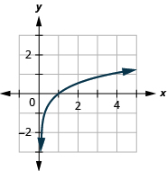

<math xmlns="http://www.w3.org/1998/Math/MathML"><mrow><mi>y</mi><mo>=</mo><msub><mrow><mtext>log</mtext></mrow><mn>6</mn></msub><mi>x</mi></mrow></math>

<math xmlns="http://www.w3.org/1998/Math/MathML"><mrow><mi>y</mi><mo>=</mo><msub><mrow><mtext>log</mtext></mrow><mn>7</mn></msub><mi>x</mi></mrow></math>

 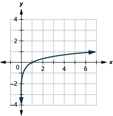

<math xmlns="http://www.w3.org/1998/Math/MathML"><mrow><mi>y</mi><mo>=</mo><msub><mrow><mtext>log</mtext></mrow><mrow><mn>1.5</mn></mrow></msub><mi>x</mi></mrow></math>

<math xmlns="http://www.w3.org/1998/Math/MathML"><mrow><mi>y</mi><mo>=</mo><msub><mrow><mtext>log</mtext></mrow><mrow><mn>2.5</mn></mrow></msub><mi>x</mi></mrow></math>

 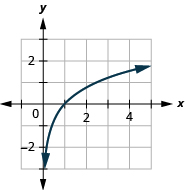

<math xmlns="http://www.w3.org/1998/Math/MathML"><mrow><mi>y</mi><mo>=</mo><msub><mrow><mtext>log</mtext></mrow><mrow><mfrac><mn>1</mn><mn>3</mn></mfrac></mrow></msub><mi>x</mi></mrow></math>

<math xmlns="http://www.w3.org/1998/Math/MathML"><mrow><mi>y</mi><mo>=</mo><msub><mrow><mtext>log</mtext></mrow><mrow><mfrac><mn>1</mn><mn>5</mn></mfrac></mrow></msub><mi>x</mi></mrow></math>

 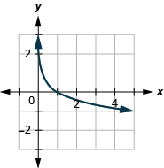

<math xmlns="http://www.w3.org/1998/Math/MathML"><mrow><mi>y</mi><mo>=</mo><msub><mrow><mtext>log</mtext></mrow><mrow><mn>0.4</mn></mrow></msub><mi>x</mi></mrow></math>

<math xmlns="http://www.w3.org/1998/Math/MathML"><mrow><mi>y</mi><mo>=</mo><msub><mrow><mtext>log</mtext></mrow><mrow><mn>0.6</mn></mrow></msub><mi>x</mi></mrow></math>

 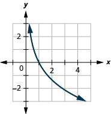

**Solve Logarithmic Equations**

In the following exercises, solve each logarithmic equation.

<math xmlns="http://www.w3.org/1998/Math/MathML"><mrow><msub><mrow><mtext>log</mtext></mrow><mi>a</mi></msub><mn>16</mn><mo>=</mo><mn>2</mn></mrow></math>

<math xmlns="http://www.w3.org/1998/Math/MathML"><mrow><msub><mrow><mtext>log</mtext></mrow><mi>a</mi></msub><mn>81</mn><mo>=</mo><mn>2</mn></mrow></math>

<math xmlns="http://www.w3.org/1998/Math/MathML"><mrow><mi>a</mi><mo>=</mo><mn>9</mn></mrow></math>

<math xmlns="http://www.w3.org/1998/Math/MathML"><mrow><msub><mrow><mtext>log</mtext></mrow><mi>a</mi></msub><mn>8</mn><mo>=</mo><mn>3</mn></mrow></math>

<math xmlns="http://www.w3.org/1998/Math/MathML"><mrow><msub><mrow><mtext>log</mtext></mrow><mi>a</mi></msub><mn>27</mn><mo>=</mo><mn>3</mn></mrow></math>

<math xmlns="http://www.w3.org/1998/Math/MathML"><mrow><mi>a</mi><mo>=</mo><mn>3</mn></mrow></math>

<math xmlns="http://www.w3.org/1998/Math/MathML"><mrow><msub><mrow><mtext>log</mtext></mrow><mi>a</mi></msub><mn>32</mn><mo>=</mo><mn>2</mn></mrow></math>

<math xmlns="http://www.w3.org/1998/Math/MathML"><mrow><msub><mrow><mtext>log</mtext></mrow><mi>a</mi></msub><mn>24</mn><mo>=</mo><mn>3</mn></mrow></math>

<math xmlns="http://www.w3.org/1998/Math/MathML"><mrow><mi>a</mi><mo>=</mo><mroot><mrow><mn>24</mn></mrow><mn>3</mn></mroot></mrow></math>

<math xmlns="http://www.w3.org/1998/Math/MathML"><mrow><mtext>ln</mtext><mspace width="0.2em" /><mi>x</mi><mo>=</mo><mn>5</mn></mrow></math>

<math xmlns="http://www.w3.org/1998/Math/MathML"><mrow><mtext>ln</mtext><mspace width="0.2em" /><mi>x</mi><mo>=</mo><mn>4</mn></mrow></math>

<math xmlns="http://www.w3.org/1998/Math/MathML"><mrow><mi>x</mi><mo>=</mo><msup><mi>e</mi><mn>4</mn></msup></mrow></math>

<math xmlns="http://www.w3.org/1998/Math/MathML"><mrow><msub><mrow><mtext>log</mtext></mrow><mn>2</mn></msub><mrow><mo>(</mo><mrow><mn>5</mn><mi>x</mi><mo>+</mo><mn>1</mn></mrow><mo>)</mo></mrow><mo>=</mo><mn>4</mn></mrow></math>

<math xmlns="http://www.w3.org/1998/Math/MathML"><mrow><msub><mrow><mtext>log</mtext></mrow><mn>2</mn></msub><mrow><mo>(</mo><mrow><mn>6</mn><mi>x</mi><mo>+</mo><mn>2</mn></mrow><mo>)</mo></mrow><mo>=</mo><mn>5</mn></mrow></math>

<math xmlns="http://www.w3.org/1998/Math/MathML"><mrow><mi>x</mi><mo>=</mo><mn>5</mn></mrow></math>

<math xmlns="http://www.w3.org/1998/Math/MathML"><mrow><msub><mrow><mtext>log</mtext></mrow><mn>3</mn></msub><mrow><mo>(</mo><mrow><mn>4</mn><mi>x</mi><mo>−</mo><mn>3</mn></mrow><mo>)</mo></mrow><mo>=</mo><mn>2</mn></mrow></math>

<math xmlns="http://www.w3.org/1998/Math/MathML"><mrow><msub><mrow><mtext>log</mtext></mrow><mn>3</mn></msub><mrow><mo>(</mo><mrow><mn>5</mn><mi>x</mi><mo>−</mo><mn>4</mn></mrow><mo>)</mo></mrow><mo>=</mo><mn>4</mn></mrow></math>

<math xmlns="http://www.w3.org/1998/Math/MathML"><mrow><mi>x</mi><mo>=</mo><mn>17</mn></mrow></math>

<math xmlns="http://www.w3.org/1998/Math/MathML"><mrow><msub><mrow><mtext>log</mtext></mrow><mn>4</mn></msub><mrow><mo>(</mo><mrow><mn>5</mn><mi>x</mi><mo>+</mo><mn>6</mn></mrow><mo>)</mo></mrow><mo>=</mo><mn>3</mn></mrow></math>

<math xmlns="http://www.w3.org/1998/Math/MathML"><mrow><msub><mrow><mtext>log</mtext></mrow><mn>4</mn></msub><mrow><mo>(</mo><mrow><mn>3</mn><mi>x</mi><mo>−</mo><mn>2</mn></mrow><mo>)</mo></mrow><mo>=</mo><mn>2</mn></mrow></math>

<math xmlns="http://www.w3.org/1998/Math/MathML"><mrow><mi>x</mi><mo>=</mo><mn>6</mn></mrow></math>

<math xmlns="http://www.w3.org/1998/Math/MathML"><mrow><mtext>ln</mtext><mspace width="0.2em" /><msup><mi>e</mi><mrow><mn>4</mn><mi>x</mi></mrow></msup><mo>=</mo><mn>8</mn></mrow></math>

<math xmlns="http://www.w3.org/1998/Math/MathML"><mrow><mtext>ln</mtext><mspace width="0.2em" /><msup><mi>e</mi><mrow><mn>2</mn><mi>x</mi></mrow></msup><mo>=</mo><mn>6</mn></mrow></math>

<math xmlns="http://www.w3.org/1998/Math/MathML"><mrow><mi>x</mi><mo>=</mo><mn>3</mn></mrow></math>

<math xmlns="http://www.w3.org/1998/Math/MathML"><mrow><mtext>log</mtext><msup><mi>x</mi><mn>2</mn></msup><mo>=</mo><mn>2</mn></mrow></math>

<math xmlns="http://www.w3.org/1998/Math/MathML"><mrow><mtext>log</mtext><mo stretchy="false">(</mo><msup><mi>x</mi><mn>2</mn></msup><mo>−</mo><mn>25</mn><mo stretchy="false">)</mo><mo>=</mo><mn>2</mn></mrow></math>

<math xmlns="http://www.w3.org/1998/Math/MathML"><mrow><mi>x</mi><mo>=</mo><mn>−5</mn><msqrt><mn>5</mn></msqrt><mo>,</mo><mi>x</mi><mo>=</mo><mn>5</mn><msqrt><mn>5</mn></msqrt></mrow></math>

<math xmlns="http://www.w3.org/1998/Math/MathML"><mrow><msub><mrow><mtext>log</mtext></mrow><mn>2</mn></msub><mrow><mo>(</mo><mrow><msup><mi>x</mi><mn>2</mn></msup><mo>−</mo><mn>4</mn></mrow><mo>)</mo></mrow><mo>=</mo><mn>5</mn></mrow></math>

<math xmlns="http://www.w3.org/1998/Math/MathML"><mrow><msub><mrow><mtext>log</mtext></mrow><mn>3</mn></msub><mrow><mo>(</mo><mrow><msup><mi>x</mi><mn>2</mn></msup><mo>+</mo><mn>2</mn></mrow><mo>)</mo></mrow><mo>=</mo><mn>3</mn></mrow></math>

<math xmlns="http://www.w3.org/1998/Math/MathML"><mrow><mi>x</mi><mo>=</mo><mn>−5</mn><mo>,</mo><mi>x</mi><mo>=</mo><mn>5</mn></mrow></math>

**Use Logarithmic Models in Applications**

In the following exercises, use a logarithmic model to solve.

What is the decibel level of normal conversation with intensity <math xmlns="http://www.w3.org/1998/Math/MathML"><mrow><msup><mrow><mn>10</mn></mrow><mrow><mn>−6</mn></mrow></msup></mrow></math>

 watts per square inch?

What is the decibel level of a whisper with intensity <math xmlns="http://www.w3.org/1998/Math/MathML"><mrow><msup><mrow><mn>10</mn></mrow><mrow><mn>−10</mn></mrow></msup></mrow></math>

 watts per square inch?

A whisper has a decibel level of 20 dB.

What is the decibel level of the noise from a motorcycle with intensity <math xmlns="http://www.w3.org/1998/Math/MathML"><mrow><msup><mrow><mn>10</mn></mrow><mrow><mn>−2</mn></mrow></msup></mrow></math>

 watts per square inch?

What is the decibel level of the sound of a garbage disposal with intensity <math xmlns="http://www.w3.org/1998/Math/MathML"><mrow><msup><mrow><mn>10</mn></mrow><mrow><mn>−2</mn></mrow></msup></mrow></math>

 watts per square inch?

The sound of a garbage disposal has a decibel level of 100 dB.

In 2014, Chile experienced an intense earthquake with a magnitude of <math xmlns="http://www.w3.org/1998/Math/MathML"><mrow><mn>8.2</mn></mrow></math>

 on the Richter scale. In 2010, Haiti also experienced an intense earthquake which measured <math xmlns="http://www.w3.org/1998/Math/MathML"><mrow><mn>7.0</mn></mrow></math>

 on the Richter scale. Compare the intensities of the two earthquakes.

The Los Angeles area experiences many earthquakes. In 1994, the Northridge earthquake measured magnitude of <math xmlns="http://www.w3.org/1998/Math/MathML"><mrow><mn>6.7</mn></mrow></math>

 on the Richter scale. In 2014, Los Angeles also experienced an earthquake which measured <math xmlns="http://www.w3.org/1998/Math/MathML"><mrow><mn>5.1</mn></mrow></math>

 on the Richter scale. Compare the intensities of the two earthquakes.

The intensity of the 1994 Northridge earthquake in the Los Angeles area was about 40 times the intensity of the 2014 earthquake.

## Writing Exercises

Explain how to change an equation from logarithmic form to exponential form.

Explain the difference between common logarithms and natural logarithms.

Answers will vary.

Explain why <math xmlns="http://www.w3.org/1998/Math/MathML"><mrow><msub><mrow><mtext>log</mtext></mrow><mi>a</mi></msub><msup><mi>a</mi><mi>x</mi></msup><mo>=</mo><mi>x</mi><mo>.</mo></mrow></math>

Explain how to find the <math xmlns="http://www.w3.org/1998/Math/MathML"><mrow><msub><mrow><mtext>log</mtext></mrow><mn>7</mn></msub><mn>32</mn></mrow></math>

 on your calculator.

Answers will vary.

## Self Check

ⓐ* * *
{: data-type="newline"}

 After completing the exercises, use this checklist to evaluate your mastery of the objectives of this section.

 
ⓑ After reviewing this checklist, what will you do to become confident for all objectives?

</section>

## Glossary
{: data-type="glossary-title"}

common logarithmic function
: The function
  <math xmlns="http://www.w3.org/1998/Math/MathML"><mrow><mi>f</mi><mrow><mo>(</mo><mi>x</mi><mo>)</mo></mrow><mo>=</mo><mtext>log</mtext><mspace width="0.2em" /><mi>x</mi></mrow></math>
  
  is the common logarithmic function with base
  <math xmlns="http://www.w3.org/1998/Math/MathML"><mrow><mn>10</mn><mo>,</mo></mrow></math>
  
  where
  <math xmlns="http://www.w3.org/1998/Math/MathML"><mrow><mi>x</mi><mo>&gt;</mo><mn>0</mn><mo>.</mo></mrow></math>
  
  * * *
  {: data-type="newline"}
  
  

  <math xmlns="http://www.w3.org/1998/Math/MathML"><mrow><mi>y</mi><mo>=</mo><mtext>log</mtext><mspace width="0.2em" /><mi>x</mi><mspace width="0.2em" /><mtext>is equivalent to</mtext><mspace width="0.2em" /><mi>x</mi><mo>=</mo><msup><mrow><mn>10</mn></mrow><mi>y</mi></msup></mrow></math>
  

{: .definition}

logarithmic function
: The function
  <math xmlns="http://www.w3.org/1998/Math/MathML"><mrow><mi>f</mi><mrow><mo>(</mo><mi>x</mi><mo>)</mo></mrow><mo>=</mo><msub><mrow><mtext>log</mtext></mrow><mi>a</mi></msub><mi>x</mi></mrow></math>
  
  is the logarithmic function with base
  <math xmlns="http://www.w3.org/1998/Math/MathML"><mrow><mi>a</mi><mo>,</mo></mrow></math>
  
  where
  <math xmlns="http://www.w3.org/1998/Math/MathML"><mrow><mi>a</mi><mo>&gt;</mo><mn>0</mn><mo>,</mo></mrow></math>
  
  <math xmlns="http://www.w3.org/1998/Math/MathML"><mrow><mi>x</mi><mo>&gt;</mo><mn>0</mn><mo>,</mo></mrow></math>
  
  and
  <math xmlns="http://www.w3.org/1998/Math/MathML"><mrow><mi>a</mi><mo>≠</mo><mn>1</mn><mo>.</mo></mrow></math>
  
  * * *
  {: data-type="newline"}
  
  

  <math xmlns="http://www.w3.org/1998/Math/MathML"><mrow><mi>y</mi><mo>=</mo><msub><mrow><mtext>log</mtext></mrow><mi>a</mi></msub><mi>x</mi><mspace width="0.2em" /><mtext>is equivalent to</mtext><mspace width="0.2em" /><mi>x</mi><mo>=</mo><msup><mi>a</mi><mi>y</mi></msup></mrow></math>
  

{: .definition}

natural logarithmic function
: The function
  <math xmlns="http://www.w3.org/1998/Math/MathML"><mrow><mi>f</mi><mrow><mo>(</mo><mi>x</mi><mo>)</mo></mrow><mo>=</mo><mtext>ln</mtext><mspace width="0.2em" /><mi>x</mi></mrow></math>
  
  is the natural logarithmic function with base
  <math xmlns="http://www.w3.org/1998/Math/MathML"><mrow><mi>e</mi><mo>,</mo></mrow></math>
  
  where
  <math xmlns="http://www.w3.org/1998/Math/MathML"><mrow><mi>x</mi><mo>&gt;</mo><mn>0</mn><mo>.</mo></mrow></math>
  
  * * *
  {: data-type="newline"}
  
  

  <math xmlns="http://www.w3.org/1998/Math/MathML"><mrow><mi>y</mi><mo>=</mo><mtext>ln</mtext><mspace width="0.2em" /><mi>x</mi><mspace width="0.2em" /><mtext>is equivalent to</mtext><mspace width="0.2em" /><mi>x</mi><mo>=</mo><msup><mi>e</mi><mi>y</mi></msup></mrow></math>
  

{: .definition}

[1]: https://openstax.org/l/37logasexponent
[2]: https://openstax.org/l/37Simplifylog
[3]: https://openstax.org/l/37Graphlog
[4]: https://openstax.org/l/37Finddecibel
