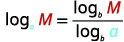
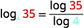

By the end of this section, you will be able to:
* Use the properties of logarithms
* Use the Change of Base Formula

Before you get started, take this readiness quiz.

1.  Evaluate: ⓐ
    <math xmlns="http://www.w3.org/1998/Math/MathML"><mrow><msup><mi>a</mi><mn>0</mn></msup></mrow></math>
    
    ⓑ
    <math xmlns="http://www.w3.org/1998/Math/MathML"><mrow><msup><mi>a</mi><mn>1</mn></msup><mo>.</mo></mrow></math>
    
    * * *
    {: data-type="newline"}
    
    If you missed this problem, review [\[link\]](/m63345#fs-id1167834095326).
2.  Write with a rational exponent:
    <math xmlns="http://www.w3.org/1998/Math/MathML"><mrow><mroot><mrow><msup><mi>x</mi><mn>2</mn></msup><mi>y</mi></mrow><mrow><mn>3</mn></mrow></mroot><mo>.</mo></mrow></math>
    
    * * *
    {: data-type="newline"}
    
    If you missed this problem, review [\[link\]](/m63402#fs-id1169145489074).
3.  Round to three decimal places: 2.5646415.
    * * *
    {: data-type="newline"}
    
    If you missed this problem, review [\[link\]](/m63305#fs-id1167836309901).
{: data-number-style="arabic"}

# Use the Properties of Logarithms

Now that we have learned about exponential and logarithmic functions, we can introduce some of the properties of logarithms. These will be very helpful as we continue to solve both exponential and logarithmic equations.

The first two properties derive from the definition of logarithms. Since <math xmlns="http://www.w3.org/1998/Math/MathML"><mrow><msup><mi>a</mi><mn>0</mn></msup><mo>=</mo><mn>1</mn><mo>,</mo></mrow></math>

 we can convert this to logarithmic form and get <math xmlns="http://www.w3.org/1998/Math/MathML"><mrow><msub><mrow><mtext>log</mtext></mrow><mi>a</mi></msub><mn>1</mn><mo>=</mo><mn>0</mn><mo>.</mo></mrow></math>

 Also, since <math xmlns="http://www.w3.org/1998/Math/MathML"><mrow><msup><mi>a</mi><mn>1</mn></msup><mo>=</mo><mi>a</mi><mo>,</mo></mrow></math>

 we get <math xmlns="http://www.w3.org/1998/Math/MathML"><mrow><msub><mrow><mtext>log</mtext></mrow><mi>a</mi></msub><mi>a</mi><mo>=</mo><mn>1</mn><mo>.</mo></mrow></math>

Properties of Logarithms

<math xmlns="http://www.w3.org/1998/Math/MathML"><mrow><msub><mrow><mtext>log</mtext></mrow><mi>a</mi></msub><mn>1</mn><mo>=</mo><mn>0</mn><mspace width="5em" /><msub><mrow><mtext>log</mtext></mrow><mi>a</mi></msub><mi>a</mi><mo>=</mo><mn>1</mn></mrow></math>

In the next example we could evaluate the logarithm by converting to exponential form, as we have done previously, but recognizing and then applying the properties saves time.

Evaluate using the properties of logarithms: ⓐ <math xmlns="http://www.w3.org/1998/Math/MathML"><mrow><msub><mrow><mtext>log</mtext></mrow><mn>8</mn></msub><mn>1</mn></mrow></math>

 and ⓑ <math xmlns="http://www.w3.org/1998/Math/MathML"><mrow><msub><mrow><mtext>log</mtext></mrow><mn>6</mn></msub><mn>6</mn><mo>.</mo></mrow></math>

ⓐ* * *
{: data-type="newline"}

<math xmlns="http://www.w3.org/1998/Math/MathML"><mrow><mtable><mtr><mtd /><mtd /><mtd /><mtd columnalign="left"><mspace width="2em" /><msub><mrow><mtext>log</mtext></mrow><mn>8</mn></msub><mn>1</mn></mtd><mtd /><mtd /></mtr><mtr><mtd columnalign="left"><mtext>Use the property,</mtext><mspace width="0.2em" /><msub><mrow><mtext>log</mtext></mrow><mi>a</mi></msub><mn>1</mn><mo>=</mo><mn>0</mn><mo>.</mo></mtd><mtd /><mtd /><mtd columnalign="left"><mspace width="3em" /><mn>0</mn></mtd><mtd /><mtd columnalign="left"><mspace width="2em" /><msub><mrow><mtext>log</mtext></mrow><mn>8</mn></msub><mn>1</mn><mo>=</mo><mn>0</mn></mtd></mtr></mtable></mrow></math>

ⓑ* * *
{: data-type="newline"}

<math xmlns="http://www.w3.org/1998/Math/MathML"><mrow><mtable><mtr><mtd /><mtd /><mtd /><mtd columnalign="left"><mspace width="2em" /><msub><mrow><mtext>log</mtext></mrow><mn>6</mn></msub><mn>6</mn></mtd><mtd /><mtd /></mtr><mtr><mtd columnalign="left"><mtext>Use the property,</mtext><mspace width="0.2em" /><msub><mrow><mtext>log</mtext></mrow><mi>a</mi></msub><mi>a</mi><mo>=</mo><mn>1</mn><mo>.</mo></mtd><mtd /><mtd /><mtd columnalign="left"><mspace width="3em" /><mn>1</mn></mtd><mtd /><mtd columnalign="left"><mspace width="2em" /><msub><mrow><mtext>log</mtext></mrow><mn>6</mn></msub><mn>6</mn><mo>=</mo><mn>1</mn></mtd></mtr></mtable></mrow></math>

Evaluate using the properties of logarithms: ⓐ <math xmlns="http://www.w3.org/1998/Math/MathML"><mrow><msub><mrow><mtext>log</mtext></mrow><mrow><mn>13</mn></mrow></msub><mn>1</mn></mrow></math>

 ⓑ <math xmlns="http://www.w3.org/1998/Math/MathML"><mrow><msub><mrow><mtext>log</mtext></mrow><mn>9</mn></msub><mn>9</mn><mo>.</mo></mrow></math>

ⓐ 0 ⓑ 1

Evaluate using the properties of logarithms: ⓐ <math xmlns="http://www.w3.org/1998/Math/MathML"><mrow><msub><mrow><mtext>log</mtext></mrow><mn>5</mn></msub><mn>1</mn></mrow></math>

 ⓑ <math xmlns="http://www.w3.org/1998/Math/MathML"><mrow><msub><mrow><mtext>log</mtext></mrow><mn>7</mn></msub><mn>7</mn><mo>.</mo></mrow></math>

ⓐ 0 ⓑ 1

The next two properties can also be verified by converting them from exponential form to logarithmic form, or the reverse.

The exponential equation <math xmlns="http://www.w3.org/1998/Math/MathML"><mrow><msup><mi>a</mi><mrow><msub><mrow><mtext>log</mtext></mrow><mi>a</mi></msub><mi>x</mi></mrow></msup><mo>=</mo><mi>x</mi></mrow></math>

 converts to the logarithmic equation <math xmlns="http://www.w3.org/1998/Math/MathML"><mrow><msub><mrow><mtext>log</mtext></mrow><mi>a</mi></msub><mi>x</mi><mo>=</mo><msub><mrow><mtext>log</mtext></mrow><mi>a</mi></msub><mi>x</mi><mo>,</mo></mrow></math>

 which is a true statement for positive values for *x* only.

The logarithmic equation <math xmlns="http://www.w3.org/1998/Math/MathML"><mrow><msub><mrow><mtext>log</mtext></mrow><mi>a</mi></msub><msup><mi>a</mi><mi>x</mi></msup><mo>=</mo><mi>x</mi></mrow></math>

 converts to the exponential equation <math xmlns="http://www.w3.org/1998/Math/MathML"><mrow><msup><mi>a</mi><mi>x</mi></msup><mo>=</mo><msup><mi>a</mi><mi>x</mi></msup><mo>,</mo></mrow></math>

 which is also a true statement.

These two properties are called inverse properties because, when we have the same base, raising to a power “undoes” the log and taking the log “undoes” raising to a power. These two properties show the **composition**{: data-type="term" .no-emphasis} of functions. Both ended up with the identity function which shows again that the exponential and logarithmic functions are inverse functions.

Inverse Properties of Logarithms

For <math xmlns="http://www.w3.org/1998/Math/MathML"><mrow><mi>a</mi><mo>&gt;</mo><mn>0</mn><mo>,</mo></mrow></math>

<math xmlns="http://www.w3.org/1998/Math/MathML"><mrow><mi>x</mi><mo>&gt;</mo><mn>0</mn></mrow></math>

 and <math xmlns="http://www.w3.org/1998/Math/MathML"><mrow><mi>a</mi><mo>≠</mo><mn>1</mn><mo>,</mo></mrow></math>

<math xmlns="http://www.w3.org/1998/Math/MathML"><mrow><msup><mi>a</mi><mrow><msub><mrow><mtext>log</mtext></mrow><mi>a</mi></msub><mi>x</mi></mrow></msup><mo>=</mo><mi>x</mi><mspace width="5em" /><msub><mrow><mtext>log</mtext></mrow><mi>a</mi></msub><msup><mi>a</mi><mi>x</mi></msup><mo>=</mo><mi>x</mi></mrow></math>

In the next example, apply the inverse properties of logarithms.

Evaluate using the properties of logarithms: ⓐ <math xmlns="http://www.w3.org/1998/Math/MathML"><mrow><msup><mn>4</mn><mrow><msub><mrow><mtext>log</mtext></mrow><mn>4</mn></msub><mn>9</mn></mrow></msup></mrow></math>

 and ⓑ <math xmlns="http://www.w3.org/1998/Math/MathML"><mrow><msub><mrow><mtext>log</mtext></mrow><mn>3</mn></msub><msup><mn>3</mn><mn>5</mn></msup><mo>.</mo></mrow></math>

ⓐ* * *
{: data-type="newline"}

 <math xmlns="http://www.w3.org/1998/Math/MathML"><mrow><mtable><mtr><mtd /><mtd /><mtd /><mtd columnalign="left"><mspace width="2em" /><msup><mn>4</mn><mrow><msub><mrow><mtext>log</mtext></mrow><mn>4</mn></msub><mn>9</mn></mrow></msup></mtd></mtr> <mtr><mtd columnalign="left"><mtext>Use the property,</mtext><mspace width="0.2em" /><msup><mi>a</mi><mrow><msub><mrow><mtext>log</mtext></mrow><mi>a</mi></msub><mi>x</mi></mrow></msup><mo>=</mo><mi>x</mi><mo>.</mo></mtd><mtd /><mtd /><mtd columnalign="left"><mspace width="3em" /><mn>9</mn></mtd><mtd columnalign="left"><mspace width="2em" /><msup><mn>4</mn><mrow><msub><mrow><mtext>log</mtext></mrow><mn>4</mn></msub><mn>9</mn></mrow></msup><mo>=</mo><mn>9</mn></mtd></mtr></mtable></mrow></math>

ⓑ* * *
{: data-type="newline"}

 <math xmlns="http://www.w3.org/1998/Math/MathML"><mrow><mtable><mtr><mtd /><mtd /><mtd /><mtd columnalign="left"><mspace width="2em" /><msub><mrow><mtext>log</mtext></mrow><mn>3</mn></msub><msup><mn>3</mn><mn>5</mn></msup></mtd></mtr> <mtr><mtd columnalign="left"><mtext>Use the property,</mtext><mspace width="0.2em" /><msup><mi>a</mi><mrow><msub><mrow><mtext>log</mtext></mrow><mi>a</mi></msub><mi>x</mi></mrow></msup><mo>=</mo><mi>x</mi><mo>.</mo></mtd><mtd /><mtd /><mtd columnalign="left"><mspace width="3em" /><mn>5</mn></mtd><mtd columnalign="left"><mspace width="2em" /><msub><mrow><mtext>log</mtext></mrow><mn>3</mn></msub><msup><mn>3</mn><mn>5</mn></msup><mo>=</mo><mn>5</mn></mtd></mtr></mtable></mrow></math>

Evaluate using the properties of logarithms: ⓐ <math xmlns="http://www.w3.org/1998/Math/MathML"><mrow><msup><mn>5</mn><mrow><msub><mrow><mtext>log</mtext></mrow><mn>5</mn></msub><mn>15</mn></mrow></msup></mrow></math>

 ⓑ <math xmlns="http://www.w3.org/1998/Math/MathML"><mrow><msub><mrow><mtext>log</mtext></mrow><mn>7</mn></msub><msup><mn>7</mn><mn>4</mn></msup><mo>.</mo></mrow></math>

ⓐ 15 ⓑ 4

Evaluate using the properties of logarithms: ⓐ <math xmlns="http://www.w3.org/1998/Math/MathML"><mrow><msup><mn>2</mn><mrow><msub><mrow><mtext>log</mtext></mrow><mn>2</mn></msub><mn>8</mn></mrow></msup></mrow></math>

 ⓑ <math xmlns="http://www.w3.org/1998/Math/MathML"><mrow><msub><mrow><mtext>log</mtext></mrow><mn>2</mn></msub><msup><mn>2</mn><mrow><mn>15</mn></mrow></msup><mo>.</mo></mrow></math>

ⓐ 8 ⓑ 15

There are three more properties of logarithms that will be useful in our work. We know exponential functions and logarithmic function are very interrelated. Our definition of logarithm shows us that a logarithm is the exponent of the equivalent exponential. The properties of exponents have related properties for exponents.

In the Product Property of Exponents, <math xmlns="http://www.w3.org/1998/Math/MathML"><mrow><msup><mi>a</mi><mi>m</mi></msup><mo>·</mo><msup><mi>a</mi><mi>n</mi></msup><mo>=</mo><msup><mi>a</mi><mrow><mi>m</mi><mo>+</mo><mi>n</mi></mrow></msup><mo>,</mo></mrow></math>

 we see that to multiply the same base, we add the exponents. The **Product Property of Logarithms**{: data-type="term"}, <math xmlns="http://www.w3.org/1998/Math/MathML"><mrow><msub><mrow><mtext>log</mtext></mrow><mi>a</mi></msub><mi>M</mi><mo>·</mo><mi>N</mi><mo>=</mo><msub><mrow><mtext>log</mtext></mrow><mi>a</mi></msub><mi>M</mi><mo>+</mo><msub><mrow><mtext>log</mtext></mrow><mi>a</mi></msub><mi>N</mi></mrow></math>

 tells us to take the log of a product, we add the log of the factors.

Product Property of Logarithms

If <math xmlns="http://www.w3.org/1998/Math/MathML"><mrow><mi>M</mi><mo>&gt;</mo><mn>0</mn><mo>,</mo><mi>N</mi><mo>&gt;</mo><mn>0</mn><mtext>,</mtext><mspace width="0.2em" /><mtext>a</mtext><mo>&gt;</mo><mn>0</mn></mrow></math>

 and <math xmlns="http://www.w3.org/1998/Math/MathML"><mrow><mtext>a</mtext><mo>≠</mo><mn>1</mn><mo>,</mo></mrow></math>

 then,

<math xmlns="http://www.w3.org/1998/Math/MathML"><mrow><msub><mrow><mtext>log</mtext></mrow><mi>a</mi></msub><mrow><mo>(</mo><mrow><mi>M</mi><mo>·</mo><mi>N</mi></mrow><mo>)</mo></mrow><mo>=</mo><msub><mrow><mtext>log</mtext></mrow><mi>a</mi></msub><mi>M</mi><mo>+</mo><msub><mrow><mtext>log</mtext></mrow><mi>a</mi></msub><mi>N</mi></mrow></math>

The logarithm of a product is the sum of the logarithms.

We use this property to write the log of a product as a sum of the logs of each factor.

Use the Product Property of Logarithms to write each logarithm as a sum of logarithms. Simplify, if possible: ⓐ <math xmlns="http://www.w3.org/1998/Math/MathML"><mrow><msub><mrow><mtext>log</mtext></mrow><mn>3</mn></msub><mn>7</mn><mi>x</mi></mrow></math>

 and ⓑ <math xmlns="http://www.w3.org/1998/Math/MathML"><mrow><msub><mrow><mtext>log</mtext></mrow><mn>4</mn></msub><mn>64</mn><mi>x</mi><mi>y</mi><mo>.</mo></mrow></math>

ⓐ* * *
{: data-type="newline"}

 <math xmlns="http://www.w3.org/1998/Math/MathML"><mrow><mtable><mtr><mtd /><mtd /><mtd /><mtd columnalign="left"><mspace width="2em" /><msub><mrow><mtext>log</mtext></mrow><mn>3</mn></msub><mn>7</mn><mi>x</mi></mtd></mtr> <mtr><mtd columnalign="left"><mtext>Use the Product Property,</mtext><mspace width="0.2em" /><msub><mrow><mtext>log</mtext></mrow><mi>a</mi></msub><mrow><mo>(</mo><mrow><mi>M</mi><mo>·</mo><mi>N</mi></mrow><mo>)</mo></mrow><mo>=</mo><msub><mrow><mtext>log</mtext></mrow><mi>a</mi></msub><mi>M</mi><mo>+</mo><msub><mrow><mtext>log</mtext></mrow><mi>a</mi></msub><mi>N</mi><mo>.</mo></mtd><mtd /><mtd /><mtd columnalign="left"><mspace width="2em" /><msub><mrow><mtext>log</mtext></mrow><mn>3</mn></msub><mn>7</mn><mo>+</mo><msub><mrow><mtext>log</mtext></mrow><mn>3</mn></msub><mi>x</mi></mtd></mtr><mtr /><mtr /> <mtr><mtd /><mtd /><mtd /><mtd columnalign="left"><mspace width="2em" /><msub><mrow><mtext>log</mtext></mrow><mn>3</mn></msub><mn>7</mn><mi>x</mi><mo>=</mo><msub><mrow><mtext>log</mtext></mrow><mn>3</mn></msub><mn>7</mn><mo>+</mo><msub><mrow><mtext>log</mtext></mrow><mn>3</mn></msub><mi>x</mi></mtd></mtr></mtable></mrow></math>

ⓑ* * *
{: data-type="newline"}

 <math xmlns="http://www.w3.org/1998/Math/MathML"><mrow><mtable><mtr><mtd /><mtd /><mtd /><mtd columnalign="left"><mspace width="2em" /><msub><mrow><mtext>log</mtext></mrow><mn>4</mn></msub><mn>64</mn><mi>x</mi><mi>y</mi></mtd></mtr> <mtr><mtd columnalign="left"><mtext>Use the Product Property,</mtext><mspace width="0.2em" /><msub><mrow><mtext>log</mtext></mrow><mi>a</mi></msub><mrow><mo>(</mo><mrow><mi>M</mi><mo>·</mo><mi>N</mi></mrow><mo>)</mo></mrow><mo>=</mo><msub><mrow><mtext>log</mtext></mrow><mi>a</mi></msub><mi>M</mi><mo>+</mo><msub><mrow><mtext>log</mtext></mrow><mi>a</mi></msub><mi>N</mi><mo>.</mo></mtd><mtd /><mtd /><mtd columnalign="left"><mspace width="2em" /><msub><mrow><mtext>log</mtext></mrow><mn>4</mn></msub><mn>64</mn><mo>+</mo><msub><mrow><mtext>log</mtext></mrow><mn>4</mn></msub><mi>x</mi><mo>+</mo><msub><mrow><mtext>log</mtext></mrow><mn>4</mn></msub><mi>y</mi></mtd></mtr><mtr /><mtr /><mtr /> <mtr><mtd columnalign="left"><mtext>Simplify by evaluating</mtext><mspace width="0.2em" /><msub><mrow><mtext>log</mtext></mrow><mn>4</mn></msub><mn>64</mn><mo>.</mo></mtd><mtd /><mtd /><mtd columnalign="left"><mspace width="2em" /><mn>3</mn><mo>+</mo><msub><mrow><mi>log</mi></mrow><mn>4</mn></msub><mi>x</mi><mo>+</mo><msub><mrow><mi>log</mi></mrow><mn>4</mn></msub><mi>y</mi></mtd></mtr> <mtr><mtd /><mtd /><mtd /><mtd columnalign="left"><mspace width="2em" /><msub><mrow><mtext>log</mtext></mrow><mn>4</mn></msub><mn>64</mn><mi>x</mi><mi>y</mi><mo>=</mo><mn>3</mn><mo>+</mo><msub><mrow><mtext>log</mtext></mrow><mn>4</mn></msub><mi>x</mi><mo>+</mo><msub><mrow><mtext>log</mtext></mrow><mn>4</mn></msub><mi>y</mi></mtd></mtr></mtable></mrow></math>

Use the Product Property of Logarithms to write each logarithm as a sum of logarithms. Simplify, if possible.

ⓐ <math xmlns="http://www.w3.org/1998/Math/MathML"><mrow><msub><mrow><mtext>log</mtext></mrow><mn>3</mn></msub><mn>3</mn><mi>x</mi></mrow></math>

 ⓑ <math xmlns="http://www.w3.org/1998/Math/MathML"><mrow><msub><mrow><mtext>log</mtext></mrow><mn>2</mn></msub><mn>8</mn><mi>x</mi><mi>y</mi></mrow></math>

ⓐ <math xmlns="http://www.w3.org/1998/Math/MathML"><mrow><mn>1</mn><mo>+</mo><msub><mrow><mtext>log</mtext></mrow><mn>3</mn></msub><mi>x</mi></mrow></math>

* * *
{: data-type="newline"}

ⓑ <math xmlns="http://www.w3.org/1998/Math/MathML"><mrow><mn>3</mn><mo>+</mo><msub><mrow><mtext>log</mtext></mrow><mn>2</mn></msub><mi>x</mi><mo>+</mo><msub><mrow><mtext>log</mtext></mrow><mn>2</mn></msub><mi>y</mi></mrow></math>

Use the Product Property of Logarithms to write each logarithm as a sum of logarithms. Simplify, if possible.

ⓐ <math xmlns="http://www.w3.org/1998/Math/MathML"><mrow><msub><mrow><mtext>log</mtext></mrow><mn>9</mn></msub><mn>9</mn><mi>x</mi></mrow></math>

 ⓑ <math xmlns="http://www.w3.org/1998/Math/MathML"><mrow><msub><mrow><mtext>log</mtext></mrow><mn>3</mn></msub><mn>27</mn><mi>x</mi><mi>y</mi></mrow></math>

ⓐ <math xmlns="http://www.w3.org/1998/Math/MathML"><mrow><mn>1</mn><mo>+</mo><msub><mrow><mtext>log</mtext></mrow><mn>9</mn></msub><mi>x</mi></mrow></math>

* * *
{: data-type="newline"}

ⓑ <math xmlns="http://www.w3.org/1998/Math/MathML"><mrow><mn>3</mn><mo>+</mo><msub><mrow><mtext>log</mtext></mrow><mn>3</mn></msub><mi>x</mi><mo>+</mo><msub><mrow><mtext>log</mtext></mrow><mn>3</mn></msub><mi>y</mi></mrow></math>

Similarly, in the Quotient Property of Exponents, <math xmlns="http://www.w3.org/1998/Math/MathML"><mrow><mfrac><mrow><msup><mi>a</mi><mi>m</mi></msup></mrow><mrow><msup><mi>a</mi><mi>n</mi></msup></mrow></mfrac><mo>=</mo><msup><mi>a</mi><mrow><mi>m</mi><mo>−</mo><mi>n</mi></mrow></msup><mo>,</mo></mrow></math>

 we see that to divide the same base, we subtract the exponents. The **Quotient Property of Logarithms**{: data-type="term"}, <math xmlns="http://www.w3.org/1998/Math/MathML"><mrow><msub><mrow><mtext>log</mtext></mrow><mi>a</mi></msub><mfrac><mi>M</mi><mi>N</mi></mfrac><mo>=</mo><msub><mrow><mtext>log</mtext></mrow><mi>a</mi></msub><mi>M</mi><mo>−</mo><msub><mrow><mtext>log</mtext></mrow><mi>a</mi></msub><mi>N</mi></mrow></math>

 tells us to take the log of a quotient, we subtract the log of the numerator and denominator.

Quotient Property of Logarithms

If <math xmlns="http://www.w3.org/1998/Math/MathML"><mrow><mi>M</mi><mo>&gt;</mo><mn>0</mn><mo>,</mo><mi>N</mi><mo>&gt;</mo><mn>0</mn><mtext>,</mtext><mtext>a</mtext><mo>&gt;</mo><mn>0</mn><mspace width="0.2em" /></mrow></math>

 and <math xmlns="http://www.w3.org/1998/Math/MathML"><mrow><mtext>a</mtext><mo>≠</mo><mn>1</mn><mo>,</mo></mrow></math>

 then,

<math xmlns="http://www.w3.org/1998/Math/MathML"><mrow><msub><mrow><mtext>log</mtext></mrow><mi>a</mi></msub><mfrac><mi>M</mi><mi>N</mi></mfrac><mo>=</mo><msub><mrow><mtext>log</mtext></mrow><mi>a</mi></msub><mi>M</mi><mo>−</mo><msub><mrow><mtext>log</mtext></mrow><mi>a</mi></msub><mi>N</mi></mrow></math>

The logarithm of a quotient is the difference of the logarithms.

Note that <math xmlns="http://www.w3.org/1998/Math/MathML"><mrow><msub><mrow><mtext>log</mtext></mrow><mi>a</mi></msub><mi>M</mi><mo>−</mo><msub><mrow><mtext>log</mtext></mrow><mi>a</mi></msub><mi>N</mi><mo>≠</mo><msub><mrow><mtext>log</mtext></mrow><mi>a</mi></msub><mo stretchy="false">(</mo><mi>M</mi><mo>−</mo><mi>N</mi><mo stretchy="false">)</mo><mo>.</mo></mrow></math>

We use this property to write the log of a quotient as a difference of the logs of each factor.

Use the Quotient Property of Logarithms to write each logarithm as a difference of logarithms. Simplify, if possible.* * *
{: data-type="newline"}

ⓐ <math xmlns="http://www.w3.org/1998/Math/MathML"><mrow><msub><mrow><mtext>log</mtext></mrow><mn>5</mn></msub><mfrac><mn>5</mn><mn>7</mn></mfrac></mrow></math>

 and ⓑ <math xmlns="http://www.w3.org/1998/Math/MathML"><mrow><mtext>log</mtext><mfrac><mi>x</mi><mrow><mn>100</mn></mrow></mfrac></mrow></math>

ⓐ* * *
{: data-type="newline"}

 <math xmlns="http://www.w3.org/1998/Math/MathML"><mrow><mtable><mtr><mtd /><mtd /><mtd /><mtd columnalign="left"><mspace width="2em" /><msub><mrow><mtext>log</mtext></mrow><mn>5</mn></msub><mfrac><mn>5</mn><mn>7</mn></mfrac></mtd></mtr> <mtr><mtd columnalign="left"><mtext>Use the Quotient Property,</mtext><mspace width="0.2em" /><msub><mrow><mtext>log</mtext></mrow><mi>a</mi></msub><mfrac><mi>M</mi><mi>N</mi></mfrac><mo>=</mo><msub><mrow><mtext>log</mtext></mrow><mi>a</mi></msub><mi>M</mi><mo>−</mo><msub><mrow><mtext>log</mtext></mrow><mi>a</mi></msub><mi>N</mi><mo>.</mo></mtd><mtd /><mtd /><mtd columnalign="left"><mspace width="2em" /><msub><mrow><mtext>log</mtext></mrow><mn>5</mn></msub><mn>5</mn><mo>−</mo><msub><mrow><mtext>log</mtext></mrow><mn>5</mn></msub><mn>7</mn></mtd></mtr> <mtr><mtd columnalign="left"><mtext>Simplify.</mtext></mtd><mtd /><mtd /><mtd columnalign="left"><mspace width="2em" /><mn>1</mn><mo>−</mo><msub><mrow><mtext>log</mtext></mrow><mn>5</mn></msub><mn>7</mn></mtd></mtr><mtr /><mtr /> <mtr><mtd /><mtd /><mtd /><mtd columnalign="left"><mspace width="2em" /><msub><mrow><mtext>log</mtext></mrow><mn>5</mn></msub><mfrac><mn>5</mn><mn>7</mn></mfrac><mo>=</mo><mn>1</mn><mo>−</mo><msub><mrow><mtext>log</mtext></mrow><mn>5</mn></msub><mn>7</mn></mtd></mtr></mtable></mrow></math>

ⓑ* * *
{: data-type="newline"}

 <math xmlns="http://www.w3.org/1998/Math/MathML"><mrow><mtable><mtr><mtd /><mtd /><mtd /><mtd columnalign="left"><mspace width="2em" /><mtext>log</mtext><mfrac><mi>x</mi><mrow><mn>100</mn></mrow></mfrac></mtd></mtr><mtr><mtd columnalign="left"><mtext>Use the Quotient Property,</mtext><mspace width="0.2em" /><msub><mrow><mtext>log</mtext></mrow><mi>a</mi></msub><mfrac><mi>M</mi><mi>N</mi></mfrac><mo>=</mo><msub><mrow><mtext>log</mtext></mrow><mi>a</mi></msub><mi>M</mi><mo>−</mo><msub><mrow><mtext>log</mtext></mrow><mi>a</mi></msub><mi>N</mi><mo>.</mo></mtd><mtd /><mtd /><mtd columnalign="left"><mspace width="2em" /><mtext>log</mtext><mspace width="0.2em" /><mi>x</mi><mo>−</mo><mtext>log</mtext><mn>100</mn></mtd></mtr> <mtr><mtd columnalign="left"><mtext>Simplify.</mtext></mtd><mtd /><mtd /><mtd columnalign="left"><mspace width="2em" /><mtext>log</mtext><mspace width="0.2em" /><mi>x</mi><mo>−</mo><mn>2</mn></mtd></mtr><mtr /><mtr /> <mtr><mtd /><mtd /><mtd /><mtd columnalign="left"><mspace width="2em" /><mtext>log</mtext><mfrac><mi>x</mi><mrow><mn>100</mn></mrow></mfrac><mo>=</mo><mtext>log</mtext><mspace width="0.2em" /><mi>x</mi><mo>−</mo><mn>2</mn></mtd></mtr></mtable></mrow></math>

Use the Quotient Property of Logarithms to write each logarithm as a difference of logarithms. Simplify, if possible.

ⓐ <math xmlns="http://www.w3.org/1998/Math/MathML"><mrow><msub><mrow><mtext>log</mtext></mrow><mn>4</mn></msub><mfrac><mn>3</mn><mn>4</mn></mfrac></mrow></math>

 ⓑ <math xmlns="http://www.w3.org/1998/Math/MathML"><mrow><mtext>log</mtext><mfrac><mi>x</mi><mrow><mn>1000</mn></mrow></mfrac></mrow></math>

ⓐ <math xmlns="http://www.w3.org/1998/Math/MathML"><mrow><msub><mrow><mtext>log</mtext></mrow><mn>4</mn></msub><mn>3</mn><mo>−</mo><mn>1</mn></mrow></math>

 ⓑ <math xmlns="http://www.w3.org/1998/Math/MathML"><mrow><mtext>log</mtext><mspace width="0.2em" /><mi>x</mi><mo>−</mo><mn>3</mn></mrow></math>

Use the Quotient Property of Logarithms to write each logarithm as a difference of logarithms. Simplify, if possible.

ⓐ <math xmlns="http://www.w3.org/1998/Math/MathML"><mrow><msub><mrow><mtext>log</mtext></mrow><mn>2</mn></msub><mfrac><mn>5</mn><mn>4</mn></mfrac></mrow></math>

 ⓑ <math xmlns="http://www.w3.org/1998/Math/MathML"><mrow><mtext>log</mtext><mfrac><mrow><mn>10</mn></mrow><mi>y</mi></mfrac></mrow></math>

ⓐ <math xmlns="http://www.w3.org/1998/Math/MathML"><mrow><msub><mrow><mtext>log</mtext></mrow><mn>2</mn></msub><mn>5</mn><mo>−</mo><mn>2</mn></mrow></math>

 ⓑ <math xmlns="http://www.w3.org/1998/Math/MathML"><mrow><mn>1</mn><mo>−</mo><mtext>log</mtext><mi>y</mi></mrow></math>

The third property of logarithms is related to the Power Property of Exponents, <math xmlns="http://www.w3.org/1998/Math/MathML"><mrow><msup><mrow><mrow><mo>(</mo><mrow><msup><mi>a</mi><mi>m</mi></msup></mrow><mo>)</mo></mrow></mrow><mi>n</mi></msup><mo>=</mo><msup><mi>a</mi><mrow><mi>m</mi><mo>·</mo><mi>n</mi></mrow></msup><mo>,</mo></mrow></math>

 we see that to raise a power to a power, we multiply the exponents. The **Power Property of Logarithms**{: data-type="term"}, <math xmlns="http://www.w3.org/1998/Math/MathML"><mrow><msub><mrow><mtext>log</mtext></mrow><mi>a</mi></msub><msup><mi>M</mi><mi>p</mi></msup><mo>=</mo><mi>p</mi><mspace width="0.2em" /><msub><mrow><mtext>log</mtext></mrow><mi>a</mi></msub><mi>M</mi></mrow></math>

 tells us to take the log of a number raised to a power, we multiply the power times the log of the number.

Power Property of Logarithms

If <math xmlns="http://www.w3.org/1998/Math/MathML"><mrow><mi>M</mi><mo>&gt;</mo><mn>0</mn><mo>,</mo><mspace width="0.2em" /><mtext>a</mtext><mo>&gt;</mo><mn>0</mn><mo>,</mo><mspace width="0.2em" /><mtext>a</mtext><mo>≠</mo><mn>1</mn></mrow></math>

 and <math xmlns="http://www.w3.org/1998/Math/MathML"><mrow><mi>p</mi></mrow></math>

 is any real number then,

<math xmlns="http://www.w3.org/1998/Math/MathML"><mrow><msub><mrow><mtext>log</mtext></mrow><mi>a</mi></msub><msup><mi>M</mi><mi>p</mi></msup><mo>=</mo><mi>p</mi><mspace width="0.2em" /><msub><mrow><mtext>log</mtext></mrow><mi>a</mi></msub><mi>M</mi></mrow></math>

The log of a number raised to a power as the product product of the power times the log of the number.

We use this property to write the log of a number raised to a power as the product of the power times the log of the number. We essentially take the exponent and throw it in front of the logarithm.

Use the Power Property of Logarithms to write each logarithm as a product of logarithms. Simplify, if possible.* * *
{: data-type="newline"}

ⓐ <math xmlns="http://www.w3.org/1998/Math/MathML"><mrow><msub><mrow><mtext>log</mtext></mrow><mn>5</mn></msub><msup><mn>4</mn><mn>3</mn></msup></mrow></math>

 and ⓑ <math xmlns="http://www.w3.org/1998/Math/MathML"><mrow><mtext>log</mtext><msup><mi>x</mi><mrow><mn>10</mn></mrow></msup></mrow></math>

ⓐ* * *
{: data-type="newline"}

 <math xmlns="http://www.w3.org/1998/Math/MathML"><mrow><mtable><mtr><mtd /><mtd /><mtd /><mtd columnalign="left"><mspace width="2em" /><msub><mrow><mtext>log</mtext></mrow><mn>5</mn></msub><msup><mn>4</mn><mn>3</mn></msup></mtd></mtr> <mtr><mtd columnalign="left"><mtext>Use the Power Property,</mtext><mspace width="0.2em" /><msub><mrow><mtext>log</mtext></mrow><mi>a</mi></msub><msup><mi>M</mi><mi>p</mi></msup><mo>=</mo><mi>p</mi><mspace width="0.2em" /><msub><mrow><mtext>log</mtext></mrow><mi>a</mi></msub><mi>M</mi><mo>.</mo></mtd><mtd /><mtd /><mtd columnalign="left"><mspace width="2em" /><mn>3</mn><msub><mrow><mtext>log</mtext></mrow><mn>5</mn></msub><mn>4</mn></mtd></mtr><mtr /><mtr /> <mtr><mtd /><mtd /><mtd /><mtd columnalign="left"><mspace width="2em" /><msub><mrow><mtext>log</mtext></mrow><mn>5</mn></msub><msup><mn>4</mn><mn>3</mn></msup><mo>=</mo><mn>3</mn><msub><mrow><mtext>log</mtext></mrow><mn>5</mn></msub><mn>4</mn></mtd></mtr></mtable></mrow></math>

ⓑ* * *
{: data-type="newline"}

 <math xmlns="http://www.w3.org/1998/Math/MathML"><mrow><mtable><mtr><mtd /><mtd /><mtd /><mtd columnalign="left"><mspace width="2em" /><mtext>log</mtext><msup><mi>x</mi><mrow><mn>10</mn></mrow></msup></mtd></mtr> <mtr><mtd columnalign="left"><mtext>Use the Power Property,</mtext><mspace width="0.2em" /><msub><mrow><mtext>log</mtext></mrow><mi>a</mi></msub><msup><mi>M</mi><mi>p</mi></msup><mo>=</mo><mi>p</mi><mspace width="0.2em" /><msub><mrow><mtext>log</mtext></mrow><mi>a</mi></msub><mi>M</mi><mo>.</mo></mtd><mtd /><mtd /><mtd columnalign="left"><mspace width="2em" /><mn>10</mn><mspace width="0.2em" /><mtext>log</mtext><mspace width="0.2em" /><mi>x</mi></mtd></mtr><mtr /><mtr /> <mtr><mtd /><mtd /><mtd /><mtd columnalign="left"><mspace width="2em" /><mtext>log</mtext><msup><mi>x</mi><mrow><mn>10</mn></mrow></msup><mo>=</mo><mn>10</mn><mtext>log</mtext><mspace width="0.2em" /><mi>x</mi></mtd></mtr></mtable></mrow></math>

Use the Power Property of Logarithms to write each logarithm as a product of logarithms. Simplify, if possible.

ⓐ <math xmlns="http://www.w3.org/1998/Math/MathML"><mrow><msub><mrow><mtext>log</mtext></mrow><mn>7</mn></msub><msup><mn>5</mn><mn>4</mn></msup></mrow></math>

 ⓑ <math xmlns="http://www.w3.org/1998/Math/MathML"><mrow><mtext>log</mtext><msup><mi>x</mi><mrow><mn>100</mn></mrow></msup></mrow></math>

ⓐ <math xmlns="http://www.w3.org/1998/Math/MathML"><mrow><mn>4</mn><msub><mrow><mtext>log</mtext></mrow><mn>7</mn></msub><mn>5</mn></mrow></math>

 ⓑ <math xmlns="http://www.w3.org/1998/Math/MathML"><mrow><mn>100</mn><mo>·</mo><mtext>log</mtext><mspace width="0.2em" /><mi>x</mi></mrow></math>

Use the Power Property of Logarithms to write each logarithm as a product of logarithms. Simplify, if possible.

ⓐ <math xmlns="http://www.w3.org/1998/Math/MathML"><mrow><msub><mrow><mtext>log</mtext></mrow><mn>2</mn></msub><msup><mn>3</mn><mn>7</mn></msup></mrow></math>

 ⓑ <math xmlns="http://www.w3.org/1998/Math/MathML"><mrow><mtext>log</mtext><msup><mi>x</mi><mrow><mn>20</mn></mrow></msup></mrow></math>

ⓐ <math xmlns="http://www.w3.org/1998/Math/MathML"><mrow><mn>7</mn><msub><mrow><mtext>log</mtext></mrow><mn>2</mn></msub><mn>3</mn></mrow></math>

 ⓑ <math xmlns="http://www.w3.org/1998/Math/MathML"><mrow><mn>20</mn><mo>·</mo><mtext>log</mtext><mspace width="0.2em" /><mi>x</mi></mrow></math>

We summarize the Properties of Logarithms here for easy reference. While the natural logarithms are a special case of these properties, it is often helpful to also show the natural logarithm version of each property.

Properties of Logarithms

If <math xmlns="http://www.w3.org/1998/Math/MathML"><mrow><mi>M</mi><mo>&gt;</mo><mn>0</mn><mo>,</mo><mspace width="0.2em" /><mtext>a</mtext><mo>&gt;</mo><mn>0</mn><mo>,</mo><mspace width="0.2em" /><mtext>a</mtext><mo>≠</mo><mn>1</mn></mrow></math>

 and <math xmlns="http://www.w3.org/1998/Math/MathML"><mrow><mi>p</mi></mrow></math>

 is any real number then,

| Property | Base <math xmlns="http://www.w3.org/1998/Math/MathML"><mi>a</mi></math>

 | Base <math xmlns="http://www.w3.org/1998/Math/MathML"><mi>e</mi></math>

 |
{: valign="top"}|----------
|  | <math xmlns="http://www.w3.org/1998/Math/MathML"><mrow><msub><mrow><mtext>log</mtext></mrow><mi>a</mi></msub><mn>1</mn><mo>=</mo><mn>0</mn></mrow></math>

 | <math xmlns="http://www.w3.org/1998/Math/MathML"><mrow><mtext>ln</mtext><mspace width="0.2em" /><mn>1</mn><mo>=</mo><mn>0</mn></mrow></math>

 |
{: valign="top"}|  | <math xmlns="http://www.w3.org/1998/Math/MathML"><mrow><msub><mrow><mtext>log</mtext></mrow><mi>a</mi></msub><mi>a</mi><mo>=</mo><mn>1</mn></mrow></math>

 | <math xmlns="http://www.w3.org/1998/Math/MathML"><mrow><mtext>ln</mtext><mspace width="0.2em" /><mi>e</mi><mo>=</mo><mn>1</mn></mrow></math>

 |
{: valign="top"}| **Inverse Properties** | <math xmlns="http://www.w3.org/1998/Math/MathML"><mrow><mtable><mtr><mtd columnalign="left"><msup><mi>a</mi><mrow><msub><mrow><mtext>log</mtext></mrow><mi>a</mi></msub><mi>x</mi></mrow></msup><mo>=</mo><mi>x</mi></mtd></mtr><mtr><mtd columnalign="left"><msub><mrow><mtext>log</mtext></mrow><mi>a</mi></msub><msup><mi>a</mi><mi>x</mi></msup><mo>=</mo><mi>x</mi></mtd></mtr></mtable></mrow></math>

 | <math xmlns="http://www.w3.org/1998/Math/MathML"><mrow><mtable><mtr><mtd columnalign="left"><msup><mi>e</mi><mrow><mtext>ln</mtext><mspace width="0.2em" /><mi>x</mi></mrow></msup><mo>=</mo><mi>x</mi></mtd></mtr> <mtr><mtd columnalign="left"><mtext>ln</mtext><mspace width="0.2em" /><msup><mi>e</mi><mi>x</mi></msup><mo>=</mo><mi>x</mi></mtd></mtr></mtable></mrow></math>

 |
{: valign="top"}| **Product Property of Logarithms** | <math xmlns="http://www.w3.org/1998/Math/MathML"><mrow><msub><mrow><mtext>log</mtext></mrow><mi>a</mi></msub><mrow><mo>(</mo><mrow><mi>M</mi><mo>·</mo><mi>N</mi></mrow><mo>)</mo></mrow><mo>=</mo><msub><mrow><mtext>log</mtext></mrow><mi>a</mi></msub><mi>M</mi><mo>+</mo><msub><mrow><mtext>log</mtext></mrow><mi>a</mi></msub><mi>N</mi></mrow></math>

 | <math xmlns="http://www.w3.org/1998/Math/MathML"><mrow><mtext>ln</mtext><mrow><mo>(</mo><mrow><mi>M</mi><mspace width="0.2em" /><mo>·</mo><mspace width="0.2em" /><mi>N</mi></mrow><mo>)</mo></mrow><mo>=</mo><mtext>ln</mtext><mspace width="0.2em" /><mi>M</mi><mo>+</mo><mtext>ln</mtext><mspace width="0.2em" /><mi>N</mi></mrow></math>

 |
{: valign="top"}| **Quotient Property of Logarithms** | <math xmlns="http://www.w3.org/1998/Math/MathML"><mrow><msub><mrow><mtext>log</mtext></mrow><mi>a</mi></msub><mfrac><mi>M</mi><mi>N</mi></mfrac><mo>=</mo><msub><mrow><mtext>log</mtext></mrow><mi>a</mi></msub><mi>M</mi><mo>−</mo><msub><mrow><mtext>log</mtext></mrow><mi>a</mi></msub><mi>N</mi></mrow></math>

 | <math xmlns="http://www.w3.org/1998/Math/MathML"><mrow><mtext>ln</mtext><mspace width="0.2em" /><mfrac><mi>M</mi><mi>N</mi></mfrac><mo>=</mo><mtext>ln</mtext><mspace width="0.2em" /><mi>M</mi><mo>−</mo><mtext>ln</mtext><mspace width="0.2em" /><mi>N</mi></mrow></math>

 |
{: valign="top"}| **Power Property of Logarithms** | <math xmlns="http://www.w3.org/1998/Math/MathML"><mrow><msub><mrow><mtext>log</mtext></mrow><mi>a</mi></msub><msup><mi>M</mi><mi>p</mi></msup><mo>=</mo><mi>p</mi><mspace width="0.2em" /><msub><mrow><mtext>log</mtext></mrow><mi>a</mi></msub><mi>M</mi></mrow></math>

 | <math xmlns="http://www.w3.org/1998/Math/MathML"><mrow><mtext>ln</mtext><mspace width="0.2em" /><msup><mi>M</mi><mi>p</mi></msup><mo>=</mo><mi>p</mi><mspace width="0.2em" /><mtext>ln</mtext><mspace width="0.2em" /><mi>M</mi></mrow></math>

 |
{: valign="top"}{: .unnumbered summary="." data-label=""}

Now that we have the properties we can use them to “expand” a logarithmic expression. This means to write the logarithm as a sum or difference and without any powers.

We generally apply the Product and Quotient Properties before we apply the Power Property.

Use the Properties of Logarithms to expand the logarithm <math xmlns="http://www.w3.org/1998/Math/MathML"><mrow><msub><mrow><mtext>log</mtext></mrow><mn>4</mn></msub><mrow><mo>(</mo><mrow><mn>2</mn><msup><mi>x</mi><mn>3</mn></msup><msup><mi>y</mi><mn>2</mn></msup></mrow><mo>)</mo></mrow></mrow></math>

. Simplify, if possible.

<math xmlns="http://www.w3.org/1998/Math/MathML"><mrow><mtable><mtr><mtd /><mtd /><mtd /><mtd columnalign="left"><mspace width="2em" /><msub><mrow><mtext>log</mtext></mrow><mn>4</mn></msub><mrow><mo>(</mo><mrow><mn>2</mn><msup><mi>x</mi><mn>3</mn></msup><msup><mi>y</mi><mn>2</mn></msup></mrow><mo>)</mo></mrow></mtd></mtr> <mtr><mtd columnalign="left"><mtext>Use the Product Property,</mtext><mspace width="0.2em" /><msub><mrow><mtext>log</mtext></mrow><mi>a</mi></msub><mi>M</mi><mo>·</mo><mi>N</mi><mo>=</mo><msub><mrow><mtext>log</mtext></mrow><mi>a</mi></msub><mi>M</mi><mo>+</mo><msub><mrow><mtext>log</mtext></mrow><mi>a</mi></msub><mi>N</mi><mo>.</mo></mtd><mtd /><mtd /><mtd columnalign="left"><mspace width="2em" /><msub><mrow><mtext>log</mtext></mrow><mn>4</mn></msub><mn>2</mn><mo>+</mo><msub><mrow><mtext>log</mtext></mrow><mn>4</mn></msub><msup><mi>x</mi><mn>3</mn></msup><mo>+</mo><msub><mrow><mtext>log</mtext></mrow><mn>4</mn></msub><msup><mi>y</mi><mn>2</mn></msup></mtd></mtr> <mtr><mtd columnalign="left"><mtext>Use the Power Property,</mtext><mspace width="0.2em" /><msub><mrow><mtext>log</mtext></mrow><mi>a</mi></msub><msup><mi>M</mi><mi>p</mi></msup><mo>=</mo><mi>p</mi><mspace width="0.2em" /><msub><mrow><mtext>log</mtext></mrow><mi>a</mi></msub><mi>M</mi><mo>,</mo><mspace width="0.2em" /><mtext>on the last two terms.</mtext></mtd><mtd /><mtd /><mtd columnalign="left"><mspace width="2em" /><msub><mrow><mtext>log</mtext></mrow><mn>4</mn></msub><mn>2</mn><mo>+</mo><mn>3</mn><msub><mrow><mtext>log</mtext></mrow><mn>4</mn></msub><mi>x</mi><mo>+</mo><mn>2</mn><msub><mrow><mtext>log</mtext></mrow><mn>4</mn></msub><mi>y</mi></mtd></mtr> <mtr><mtd columnalign="left"><mtext>Simplify.</mtext></mtd><mtd /><mtd /><mtd columnalign="left"><mspace width="2em" /><mfrac><mn>1</mn><mn>2</mn></mfrac><mo>+</mo><mn>3</mn><msub><mrow><mtext>log</mtext></mrow><mn>4</mn></msub><mi>x</mi><mo>+</mo><mn>2</mn><msub><mrow><mtext>log</mtext></mrow><mn>4</mn></msub><mi>y</mi></mtd></mtr><mtr /><mtr /> <mtr><mtd /><mtd /><mtd /><mtd columnalign="left"><mspace width="2em" /><msub><mrow><mtext>log</mtext></mrow><mn>4</mn></msub><mrow><mo>(</mo><mrow><mn>2</mn><msup><mi>x</mi><mn>3</mn></msup><msup><mi>y</mi><mn>2</mn></msup></mrow><mo>)</mo></mrow><mo>=</mo><mfrac><mn>1</mn><mn>2</mn></mfrac><mo>+</mo><mn>3</mn><msub><mrow><mtext>log</mtext></mrow><mn>4</mn></msub><mi>x</mi><mo>+</mo><mn>2</mn><msub><mrow><mtext>log</mtext></mrow><mn>4</mn></msub><mi>y</mi></mtd></mtr></mtable></mrow></math>

Use the Properties of Logarithms to expand the logarithm <math xmlns="http://www.w3.org/1998/Math/MathML"><mrow><msub><mrow><mtext>log</mtext></mrow><mn>2</mn></msub><mrow><mo>(</mo><mrow><mn>5</mn><msup><mi>x</mi><mn>4</mn></msup><msup><mi>y</mi><mn>2</mn></msup></mrow><mo>)</mo></mrow></mrow></math>

. Simplify, if possible.

<math xmlns="http://www.w3.org/1998/Math/MathML"><mrow><msub><mrow><mtext>log</mtext></mrow><mn>2</mn></msub><mn>5</mn><mo>+</mo><mn>4</mn><msub><mrow><mtext>log</mtext></mrow><mn>2</mn></msub><mi>x</mi><mo>+</mo><mn>2</mn><msub><mrow><mtext>log</mtext></mrow><mn>2</mn></msub><mi>y</mi></mrow></math>

Use the Properties of Logarithms to expand the logarithm <math xmlns="http://www.w3.org/1998/Math/MathML"><mrow><msub><mrow><mtext>log</mtext></mrow><mn>3</mn></msub><mrow><mo>(</mo><mrow><mn>7</mn><msup><mi>x</mi><mn>5</mn></msup><msup><mi>y</mi><mn>3</mn></msup></mrow><mo>)</mo></mrow></mrow></math>

. Simplify, if possible.

<math xmlns="http://www.w3.org/1998/Math/MathML"><mrow><msub><mrow><mtext>log</mtext></mrow><mn>3</mn></msub><mn>7</mn><mo>+</mo><mn>5</mn><msub><mrow><mtext>log</mtext></mrow><mn>3</mn></msub><mi>x</mi><mo>+</mo><mn>3</mn><msub><mrow><mtext>log</mtext></mrow><mn>3</mn></msub><mi>y</mi></mrow></math>

When we have a radical in the logarithmic expression, it is helpful to first write its radicand as a rational exponent.

Use the Properties of Logarithms to expand the logarithm <math xmlns="http://www.w3.org/1998/Math/MathML"><mrow><msub><mrow><mtext>log</mtext></mrow><mn>2</mn></msub><mroot><mrow><mfrac><mrow><msup><mi>x</mi><mn>3</mn></msup></mrow><mrow><mn>3</mn><msup><mi>y</mi><mn>2</mn></msup><mi>z</mi></mrow></mfrac></mrow><mn>4</mn></mroot></mrow></math>

. Simplify, if possible.

<math xmlns="http://www.w3.org/1998/Math/MathML"><mrow><mtable><mtr><mtd /><mtd /><mtd /><mtd columnalign="left"><mspace width="2em" /><msub><mrow><mtext>log</mtext></mrow><mn>2</mn></msub><mroot><mrow><mfrac><mrow><msup><mi>x</mi><mn>3</mn></msup></mrow><mrow><mn>3</mn><msup><mi>y</mi><mn>2</mn></msup><mi>z</mi></mrow></mfrac></mrow><mn>4</mn></mroot></mtd></mtr> <mtr><mtd columnalign="left"><mtext>Rewrite the radical with a rational exponent.</mtext></mtd><mtd /><mtd /><mtd columnalign="left"><mspace width="2em" /><msub><mrow><mtext>log</mtext></mrow><mn>2</mn></msub><msup><mrow><mrow><mo>(</mo><mrow><mfrac><mrow><msup><mi>x</mi><mn>3</mn></msup></mrow><mrow><mn>3</mn><msup><mi>y</mi><mn>2</mn></msup><mi>z</mi></mrow></mfrac></mrow><mo>)</mo></mrow></mrow><mrow><mfrac><mn>1</mn><mn>4</mn></mfrac></mrow></msup></mtd></mtr> <mtr /><mtr /><mtr><mtd columnalign="left"><mtext>Use the Power Property,</mtext><mspace width="0.2em" /><msub><mrow><mtext>log</mtext></mrow><mi>a</mi></msub><msup><mi>M</mi><mi>p</mi></msup><mo>=</mo><mi>p</mi><mspace width="0.2em" /><msub><mrow><mtext>log</mtext></mrow><mi>a</mi></msub><mi>M</mi><mo>.</mo></mtd><mtd /><mtd /><mtd columnalign="left"><mspace width="2em" /><mfrac><mn>1</mn><mn>4</mn></mfrac><msub><mrow><mtext>log</mtext></mrow><mn>2</mn></msub><mrow><mo>(</mo><mrow><mfrac><mrow><msup><mi>x</mi><mn>3</mn></msup></mrow><mrow><mn>3</mn><msup><mi>y</mi><mn>2</mn></msup><mi>z</mi></mrow></mfrac></mrow><mo>)</mo></mrow></mtd></mtr> <mtr /><mtr /><mtr><mtd columnalign="left"><mtext>Use the Quotient Property,</mtext><mspace width="0.2em" /><msub><mrow><mtext>log</mtext></mrow><mi>a</mi></msub><mi>M</mi><mo>·</mo><mi>N</mi><mo>=</mo><msub><mrow><mtext>log</mtext></mrow><mi>a</mi></msub><mi>M</mi><mo>−</mo><msub><mrow><mtext>log</mtext></mrow><mi>a</mi></msub><mi>N</mi><mo>.</mo></mtd><mtd /><mtd /><mtd columnalign="left"><mspace width="2em" /><mfrac><mn>1</mn><mn>4</mn></mfrac><mrow><mo>(</mo><mrow><msub><mrow><mtext>log</mtext></mrow><mn>2</mn></msub><mrow><mo>(</mo><mrow><msup><mi>x</mi><mn>3</mn></msup></mrow><mo>)</mo></mrow><mo>−</mo><msub><mrow><mtext>log</mtext></mrow><mn>2</mn></msub><mrow><mo>(</mo><mrow><mn>3</mn><msup><mi>y</mi><mn>2</mn></msup><mi>z</mi></mrow><mo>)</mo></mrow></mrow><mo>)</mo></mrow></mtd></mtr> <mtr /><mtr /><mtr><mtd columnalign="left"><mtable><mtr><mtd columnalign="left"><mtext>Use the Product Property,</mtext></mtd></mtr><mtr><mtd columnalign="left"><msub><mrow><mtext>log</mtext></mrow><mi>a</mi></msub><mi>M</mi><mo>·</mo><mi>N</mi><mo>=</mo><msub><mrow><mtext>log</mtext></mrow><mi>a</mi></msub><mi>M</mi><mo>+</mo><msub><mrow><mtext>log</mtext></mrow><mi>a</mi></msub><mi>N</mi><mo>,</mo><mspace width="0.2em" /><mtext>in the second term.</mtext></mtd></mtr></mtable></mtd><mtd /><mtd /><mtd columnalign="left"><mspace width="2em" /><mfrac><mn>1</mn><mn>4</mn></mfrac><mrow><mo>(</mo><mrow><msub><mrow><mtext>log</mtext></mrow><mn>2</mn></msub><mrow><mo>(</mo><mrow><msup><mi>x</mi><mn>3</mn></msup></mrow><mo>)</mo></mrow><mo>−</mo><mrow><mo>(</mo><mrow><msub><mrow><mtext>log</mtext></mrow><mn>2</mn></msub><mn>3</mn><mo>+</mo><msub><mrow><mtext>log</mtext></mrow><mn>2</mn></msub><msup><mi>y</mi><mn>2</mn></msup><mo>+</mo><msub><mrow><mtext>log</mtext></mrow><mn>2</mn></msub><mi>z</mi></mrow><mo>)</mo></mrow></mrow><mo>)</mo></mrow></mtd></mtr> <mtr /><mtr /><mtr><mtd columnalign="left"><mtable><mtr><mtd columnalign="left"><mtext>Use the Power Property,</mtext></mtd></mtr><mtr><mtd columnalign="left"><msub><mrow><mtext>log</mtext></mrow><mi>a</mi></msub><msup><mi>M</mi><mi>p</mi></msup><mo>=</mo><mi>p</mi><mspace width="0.2em" /><msub><mrow><mtext>log</mtext></mrow><mi>a</mi></msub><mi>M</mi><mo>,</mo><mspace width="0.2em" /><mtext>inside the parentheses.</mtext></mtd></mtr></mtable></mtd><mtd /><mtd /><mtd columnalign="left"><mspace width="2em" /><mfrac><mn>1</mn><mn>4</mn></mfrac><mrow><mo>(</mo><mrow><mn>3</mn><msub><mrow><mtext>log</mtext></mrow><mn>2</mn></msub><mi>x</mi><mo>−</mo><mrow><mo>(</mo><mrow><msub><mrow><mtext>log</mtext></mrow><mn>2</mn></msub><mn>3</mn><mo>+</mo><mn>2</mn><msub><mrow><mtext>log</mtext></mrow><mn>2</mn></msub><mi>y</mi><mo>+</mo><msub><mrow><mtext>log</mtext></mrow><mn>2</mn></msub><mi>z</mi></mrow><mo>)</mo></mrow></mrow><mo>)</mo></mrow></mtd></mtr> <mtr /><mtr /><mtr><mtd columnalign="left"><mtext>Simplify by distributing.</mtext></mtd><mtd /><mtd /><mtd columnalign="left"><mspace width="2em" /><mfrac><mn>1</mn><mn>4</mn></mfrac><mrow><mo>(</mo><mrow><mn>3</mn><msub><mrow><mtext>log</mtext></mrow><mn>2</mn></msub><mi>x</mi><mo>−</mo><msub><mrow><mtext>log</mtext></mrow><mn>2</mn></msub><mn>3</mn><mo>−</mo><mn>2</mn><msub><mrow><mtext>log</mtext></mrow><mn>2</mn></msub><mi>y</mi><mo>−</mo><msub><mrow><mtext>log</mtext></mrow><mn>2</mn></msub><mi>z</mi></mrow><mo>)</mo></mrow></mtd></mtr><mtr /><mtr /> <mtr><mtd /><mtd /><mtd /><mtd columnalign="left"><msub><mrow><mtext>log</mtext></mrow><mn>2</mn></msub><mroot><mrow><mfrac><mrow><msup><mi>x</mi><mn>3</mn></msup></mrow><mrow><mn>3</mn><msup><mi>y</mi><mn>2</mn></msup><mi>z</mi></mrow></mfrac></mrow><mn>4</mn></mroot><mo>=</mo><mfrac><mn>1</mn><mn>4</mn></mfrac><mrow><mo>(</mo><mrow><mn>3</mn><msub><mrow><mtext>log</mtext></mrow><mn>2</mn></msub><mi>x</mi><mo>−</mo><msub><mrow><mtext>log</mtext></mrow><mn>2</mn></msub><mn>3</mn><mo>−</mo><mn>2</mn><msub><mrow><mtext>log</mtext></mrow><mn>2</mn></msub><mi>y</mi><mo>−</mo><msub><mrow><mtext>log</mtext></mrow><mn>2</mn></msub><mi>z</mi></mrow><mo>)</mo></mrow></mtd></mtr></mtable></mrow></math>

Use the Properties of Logarithms to expand the logarithm <math xmlns="http://www.w3.org/1998/Math/MathML"><mrow><msub><mrow><mtext>log</mtext></mrow><mn>4</mn></msub><mroot><mrow><mfrac><mrow><msup><mi>x</mi><mn>4</mn></msup></mrow><mrow><mn>2</mn><msup><mi>y</mi><mn>3</mn></msup><msup><mi>z</mi><mn>2</mn></msup></mrow></mfrac></mrow><mn>5</mn></mroot></mrow></math>

. Simplify, if possible.

<math xmlns="http://www.w3.org/1998/Math/MathML"><mrow><mfrac><mn>1</mn><mn>5</mn></mfrac><mrow><mo>(</mo><mrow><mn>4</mn><msub><mrow><mtext>log</mtext></mrow><mn>4</mn></msub><mi>x</mi><mo>−</mo><mfrac><mn>1</mn><mn>2</mn></mfrac><mo>−</mo><mn>3</mn><msub><mrow><mtext>log</mtext></mrow><mn>4</mn></msub><mi>y</mi><mo>−</mo><mn>2</mn><msub><mrow><mtext>log</mtext></mrow><mn>4</mn></msub><mi>z</mi></mrow><mo>)</mo></mrow></mrow></math>

Use the Properties of Logarithms to expand the logarithm <math xmlns="http://www.w3.org/1998/Math/MathML"><mrow><msub><mrow><mtext>log</mtext></mrow><mn>3</mn></msub><mroot><mrow><mfrac><mrow><msup><mi>x</mi><mn>2</mn></msup></mrow><mrow><mn>5</mn><msup><mi>y</mi><mrow /></msup><mi>z</mi></mrow></mfrac></mrow><mn>3</mn></mroot></mrow></math>

. Simplify, if possible.

<math xmlns="http://www.w3.org/1998/Math/MathML"><mrow><mfrac><mn>1</mn><mn>3</mn></mfrac><mrow><mo>(</mo><mrow><mn>2</mn><msub><mrow><mtext>log</mtext></mrow><mn>3</mn></msub><mi>x</mi><mo>−</mo><msub><mrow><mtext>log</mtext></mrow><mn>3</mn></msub><mn>5</mn><mo>−</mo><msub><mrow><mtext>log</mtext></mrow><mn>3</mn></msub><mi>y</mi><mo>−</mo><msub><mrow><mtext>log</mtext></mrow><mn>3</mn></msub><mi>z</mi></mrow><mo>)</mo></mrow></mrow></math>

The opposite of expanding a logarithm is to condense a sum or difference of logarithms that have the same base into a single logarithm. We again use the properties of logarithms to help us, but in reverse.

To condense logarithmic expressions with the same base into one logarithm, we start by using the Power Property to get the coefficients of the log terms to be one and then the Product and Quotient Properties as needed.

Use the Properties of Logarithms to condense the logarithm <math xmlns="http://www.w3.org/1998/Math/MathML"><mrow><msub><mrow><mtext>log</mtext></mrow><mn>4</mn></msub><mn>3</mn><mo>+</mo><msub><mrow><mtext>log</mtext></mrow><mn>4</mn></msub><mi>x</mi><mo>−</mo><msub><mrow><mtext>log</mtext></mrow><mn>4</mn></msub><mi>y</mi></mrow></math>

. Simplify, if possible.

<math xmlns="http://www.w3.org/1998/Math/MathML"><mrow><mtable><mtr><mtd columnalign="left"><mtext>The log expressions all have the same base, 4.</mtext></mtd><mtd /><mtd /><mtd columnalign="left"><mspace width="6em" /><msub><mrow><mtext>log</mtext></mrow><mn>4</mn></msub><mn>3</mn><mo>+</mo><msub><mrow><mtext>log</mtext></mrow><mn>4</mn></msub><mi>x</mi><mo>−</mo><msub><mrow><mtext>log</mtext></mrow><mn>4</mn></msub><mi>y</mi></mtd></mtr> <mtr><mtd columnalign="left"><mtext>The first two terms are added, so we use the Product Property,</mtext></mtd><mtd /><mtd /><mtd /></mtr><mtr><mtd columnalign="left"><msub><mrow><mtext>log</mtext></mrow><mi>a</mi></msub><mi>M</mi><mo>+</mo><msub><mrow><mtext>log</mtext></mrow><mi>a</mi></msub><mi>N</mi><mo>=</mo><msub><mrow><mtext>log</mtext></mrow><mi>a</mi></msub><mi>M</mi><mo>·</mo><mi>N</mi><mo>.</mo></mtd><mtd /><mtd /><mtd columnalign="left"><mspace width="6em" /><msub><mrow><mtext>log</mtext></mrow><mn>4</mn></msub><mn>3</mn><mi>x</mi><mo>−</mo><msub><mrow><mtext>log</mtext></mrow><mn>4</mn></msub><mi>y</mi></mtd></mtr> <mtr><mtd columnalign="left"><mtable><mtr><mtd columnalign="left"><mtext>Since the logs are subtracted, we use the Quotient Property,</mtext></mtd></mtr><mtr><mtd columnalign="left"><msub><mrow><mtext>log</mtext></mrow><mi>a</mi></msub><mi>M</mi><mo>−</mo><msub><mrow><mtext>log</mtext></mrow><mi>a</mi></msub><mi>N</mi><mo>=</mo><msub><mrow><mtext>log</mtext></mrow><mi>a</mi></msub><mfrac><mi>M</mi><mi>N</mi></mfrac><mo>.</mo></mtd></mtr></mtable></mtd><mtd /><mtd /><mtd columnalign="left"><mspace width="6em" /><msub><mrow><mtext>log</mtext></mrow><mn>4</mn></msub><mfrac><mrow><mn>3</mn><mi>x</mi></mrow><mi>y</mi></mfrac></mtd></mtr> <mtr><mtd /><mtd /><mtd /><mtd columnalign="left"><mspace width="6em" /><msub><mrow><mtext>log</mtext></mrow><mn>4</mn></msub><mn>3</mn><mo>+</mo><msub><mrow><mtext>log</mtext></mrow><mn>4</mn></msub><mi>x</mi><mo>−</mo><msub><mrow><mtext>log</mtext></mrow><mn>4</mn></msub><mi>y</mi><mo>=</mo><msub><mrow><mtext>log</mtext></mrow><mn>4</mn></msub><mfrac><mrow><mn>3</mn><mi>x</mi></mrow><mi>y</mi></mfrac></mtd></mtr></mtable></mrow></math>

Use the Properties of Logarithms to condense the logarithm <math xmlns="http://www.w3.org/1998/Math/MathML"><mrow><msub><mrow><mtext>log</mtext></mrow><mn>2</mn></msub><mn>5</mn><mo>+</mo><msub><mrow><mtext>log</mtext></mrow><mn>2</mn></msub><mi>x</mi><mo>−</mo><msub><mrow><mtext>log</mtext></mrow><mn>2</mn></msub><mi>y</mi></mrow></math>

. Simplify, if possible.

<math xmlns="http://www.w3.org/1998/Math/MathML"><mrow><msub><mrow><mtext>log</mtext></mrow><mn>2</mn></msub><mfrac><mrow><mn>5</mn><mi>x</mi></mrow><mi>y</mi></mfrac></mrow></math>

Use the Properties of Logarithms to condense the logarithm <math xmlns="http://www.w3.org/1998/Math/MathML"><mrow><msub><mrow><mtext>log</mtext></mrow><mn>3</mn></msub><mn>6</mn><mo>−</mo><msub><mrow><mtext>log</mtext></mrow><mn>3</mn></msub><mi>x</mi><mo>−</mo><msub><mrow><mtext>log</mtext></mrow><mn>3</mn></msub><mi>y</mi></mrow></math>

. Simplify, if possible.

<math xmlns="http://www.w3.org/1998/Math/MathML"><mrow><msub><mrow><mtext>log</mtext></mrow><mn>3</mn></msub><mfrac><mn>6</mn><mrow><mi>x</mi><mi>y</mi></mrow></mfrac></mrow></math>

Use the Properties of Logarithms to condense the logarithm <math xmlns="http://www.w3.org/1998/Math/MathML"><mrow><mn>2</mn><msub><mrow><mtext>log</mtext></mrow><mn>3</mn></msub><mi>x</mi><mo>+</mo><mn>4</mn><msub><mrow><mtext>log</mtext></mrow><mn>3</mn></msub><mrow><mo>(</mo><mrow><mi>x</mi><mo>+</mo><mn>1</mn></mrow><mo>)</mo></mrow></mrow></math>

. Simplify, if possible.

<math xmlns="http://www.w3.org/1998/Math/MathML"><mrow><mtable><mtr><mtd columnalign="left"><mtext>The log expressions have the same base, 3.</mtext></mtd><mtd /><mtd /><mtd columnalign="left"><mspace width="2em" /><mn>2</mn><msub><mrow><mtext>log</mtext></mrow><mn>3</mn></msub><mi>x</mi><mo>+</mo><mn>4</mn><msub><mrow><mtext>log</mtext></mrow><mn>3</mn></msub><mrow><mo>(</mo><mrow><mi>x</mi><mo>+</mo><mn>1</mn></mrow><mo>)</mo></mrow></mtd></mtr> <mtr><mtd columnalign="left"><mtext>Use the Power Property,</mtext><mspace width="0.2em" /><msub><mrow><mtext>log</mtext></mrow><mi>a</mi></msub><mi>M</mi><mo>+</mo><msub><mrow><mtext>log</mtext></mrow><mi>a</mi></msub><mi>N</mi><mo>=</mo><msub><mrow><mtext>log</mtext></mrow><mi>a</mi></msub><mi>M</mi><mo>·</mo><mi>N</mi><mo>.</mo></mtd><mtd /><mtd /><mtd columnalign="left"><mspace width="2em" /><msub><mrow><mtext>log</mtext></mrow><mn>3</mn></msub><msup><mi>x</mi><mn>2</mn></msup><mo>+</mo><msub><mrow><mtext>log</mtext></mrow><mn>3</mn></msub><msup><mrow><mrow><mo>(</mo><mrow><mi>x</mi><mo>+</mo><mn>1</mn></mrow><mo>)</mo></mrow></mrow><mn>4</mn></msup></mtd></mtr> <mtr><mtd columnalign="left"><mtable><mtr><mtd columnalign="left"><mtext>The terms are added, so we use the Product</mtext></mtd></mtr><mtr><mtd columnalign="left"><mtext>Property,</mtext><mspace width="0.2em" /><msub><mrow><mtext>log</mtext></mrow><mi>a</mi></msub><mi>M</mi><mo>+</mo><msub><mrow><mtext>log</mtext></mrow><mi>a</mi></msub><mi>N</mi><mo>=</mo><msub><mrow><mtext>log</mtext></mrow><mi>a</mi></msub><mi>M</mi><mo>·</mo><mi>N</mi><mo>.</mo></mtd></mtr></mtable></mtd><mtd /><mtd /><mtd columnalign="left"><mspace width="2em" /><msub><mrow><mtext>log</mtext></mrow><mn>3</mn></msub><msup><mi>x</mi><mn>2</mn></msup><msup><mrow><mrow><mo>(</mo><mrow><mi>x</mi><mo>+</mo><mn>1</mn></mrow><mo>)</mo></mrow></mrow><mn>4</mn></msup></mtd></mtr> <mtr><mtd /><mtd /><mtd /><mtd columnalign="left"><mspace width="2em" /><mn>2</mn><msub><mrow><mtext>log</mtext></mrow><mn>3</mn></msub><mi>x</mi><mo>+</mo><mn>4</mn><msub><mrow><mtext>log</mtext></mrow><mn>3</mn></msub><mrow><mo>(</mo><mrow><mi>x</mi><mo>+</mo><mn>1</mn></mrow><mo>)</mo></mrow><mo>=</mo><msub><mrow><mtext>log</mtext></mrow><mn>3</mn></msub><msup><mi>x</mi><mn>2</mn></msup><msup><mrow><mrow><mo>(</mo><mrow><mi>x</mi><mo>+</mo><mn>1</mn></mrow><mo>)</mo></mrow></mrow><mn>4</mn></msup></mtd></mtr></mtable></mrow></math>

Use the Properties of Logarithms to condense the logarithm <math xmlns="http://www.w3.org/1998/Math/MathML"><mrow><mn>3</mn><msub><mrow><mtext>log</mtext></mrow><mn>2</mn></msub><mi>x</mi><mo>+</mo><mn>2</mn><msub><mrow><mtext>log</mtext></mrow><mn>2</mn></msub><mrow><mo>(</mo><mrow><mi>x</mi><mo>−</mo><mn>1</mn></mrow><mo>)</mo></mrow></mrow></math>

. Simplify, if possible.

<math xmlns="http://www.w3.org/1998/Math/MathML"><mrow><msub><mrow><mtext>log</mtext></mrow><mn>2</mn></msub><msup><mi>x</mi><mn>3</mn></msup><msup><mrow><mo stretchy="false">(</mo><mi>x</mi><mo>−</mo><mn>1</mn><mo stretchy="false">)</mo></mrow><mn>2</mn></msup></mrow></math>

Use the Properties of Logarithms to condense the logarithm <math xmlns="http://www.w3.org/1998/Math/MathML"><mrow><mn>2</mn><mtext>log</mtext><mspace width="0.2em" /><mi>x</mi><mo>+</mo><mn>2</mn><mtext>log</mtext><mrow><mo>(</mo><mrow><mi>x</mi><mo>+</mo><mn>1</mn></mrow><mo>)</mo></mrow></mrow></math>

. Simplify, if possible.

<math xmlns="http://www.w3.org/1998/Math/MathML"><mrow><mtext>log</mtext><msup><mi>x</mi><mn>2</mn></msup><msup><mrow><mo stretchy="false">(</mo><mi>x</mi><mo>+</mo><mn>1</mn><mo stretchy="false">)</mo></mrow><mn>2</mn></msup></mrow></math>

# Use the Change-of-Base Formula

To evaluate a logarithm with any other base, we can use the **Change-of-Base Formula**{: data-type="term" .no-emphasis}. We will show how this is derived.

<math xmlns="http://www.w3.org/1998/Math/MathML"><mrow><mtable><mtr><mtd columnalign="left"><mtext>Suppose we want to evaluate</mtext><mspace width="0.2em" /><msub><mrow><mtext>log</mtext></mrow><mi>a</mi></msub><mi>M</mi><mo>.</mo></mtd><mtd /><mtd /><mtd columnalign="left"><mspace width="2em" /><msub><mrow><mtext>log</mtext></mrow><mi>a</mi></msub><mi>M</mi></mtd><mtd /><mtd /></mtr> <mtr><mtd columnalign="left"><mtext>Let</mtext><mspace width="0.2em" /><mi>y</mi><mo>=</mo><msub><mrow><mtext>log</mtext></mrow><mi>a</mi></msub><mi>M</mi><mo>.</mo></mtd><mtd /><mtd /><mtd columnalign="right"><mspace width="2em" /><mi>y</mi></mtd><mtd columnalign="left"><mo>=</mo></mtd><mtd columnalign="left"><msub><mrow><mtext>log</mtext></mrow><mi>a</mi></msub><mi>M</mi></mtd></mtr> <mtr><mtd columnalign="left"><mtext>Rewrite the expression in exponential form.</mtext></mtd><mtd /><mtd /><mtd columnalign="right"><mspace width="2em" /><msup><mi>a</mi><mi>y</mi></msup></mtd><mtd columnalign="left"><mo>=</mo></mtd><mtd columnalign="left"><mi>M</mi></mtd></mtr> <mtr><mtd columnalign="left"><mtext>Take the</mtext><mspace width="0.2em" /><msub><mrow><mtext>log</mtext></mrow><mi>b</mi></msub><mspace width="0.2em" /><mtext>of each side.</mtext></mtd><mtd /><mtd /><mtd columnalign="right"><mspace width="2em" /><msub><mrow><mtext>log</mtext></mrow><mi>b</mi></msub><msup><mi>a</mi><mi>y</mi></msup></mtd><mtd columnalign="left"><mo>=</mo></mtd><mtd columnalign="left"><msub><mrow><mtext>log</mtext></mrow><mi>b</mi></msub><mi>M</mi></mtd></mtr> <mtr><mtd columnalign="left"><mtext>Use the Power Property.</mtext></mtd><mtd /><mtd /><mtd columnalign="right"><mspace width="2em" /><mi>y</mi><msub><mrow><mtext>log</mtext></mrow><mi>b</mi></msub><mi>a</mi></mtd><mtd columnalign="left"><mo>=</mo></mtd><mtd columnalign="left"><msub><mrow><mtext>log</mtext></mrow><mi>b</mi></msub><mi>M</mi></mtd></mtr> <mtr><mtd columnalign="left"><mtext>Solve for</mtext><mspace width="0.2em" /><mi>y</mi><mo>.</mo></mtd><mtd /><mtd /><mtd columnalign="right"><mspace width="2em" /><mi>y</mi></mtd><mtd columnalign="left"><mo>=</mo></mtd><mtd columnalign="left"><mfrac><mrow><msub><mrow><mtext>log</mtext></mrow><mi>b</mi></msub><mi>M</mi></mrow><mrow><msub><mrow><mtext>log</mtext></mrow><mi>b</mi></msub><mi>a</mi></mrow></mfrac></mtd></mtr> <mtr><mtd columnalign="left"><mtext>Substitute</mtext><mspace width="0.2em" /><mi>y</mi><mo>=</mo><msub><mrow><mtext>log</mtext></mrow><mi>a</mi></msub><mi>M</mi><mo>.</mo></mtd><mtd /><mtd /><mtd columnalign="right"><mspace width="2em" /><msub><mrow><mtext>log</mtext></mrow><mi>a</mi></msub><mi>M</mi></mtd><mtd columnalign="left"><mo>=</mo></mtd><mtd columnalign="left"><mfrac><mrow><msub><mrow><mtext>log</mtext></mrow><mi>b</mi></msub><mi>M</mi></mrow><mrow><msub><mrow><mtext>log</mtext></mrow><mi>b</mi></msub><mi>a</mi></mrow></mfrac></mtd></mtr></mtable></mrow></math>

The Change-of-Base Formula introduces a new base <math xmlns="http://www.w3.org/1998/Math/MathML"><mrow><mi>b</mi><mo>.</mo></mrow></math>

 This can be any base *b* we want where <math xmlns="http://www.w3.org/1998/Math/MathML"><mrow><mi>b</mi><mo>&gt;</mo><mn>0</mn><mo>,</mo><mi>b</mi><mo>≠</mo><mn>1</mn><mo>.</mo></mrow></math>

 Because our calculators have keys for logarithms base 10 and base *e*, we will rewrite the Change-of-Base Formula with the new base as 10 or *e*.

Change-of-Base Formula

For any logarithmic bases <math xmlns="http://www.w3.org/1998/Math/MathML"><mrow><mi>a</mi><mo>,</mo><mi>b</mi></mrow></math>

 and <math xmlns="http://www.w3.org/1998/Math/MathML"><mrow><mi>M</mi><mo>&gt;</mo><mn>0</mn><mo>,</mo></mrow></math>

<math xmlns="http://www.w3.org/1998/Math/MathML"><mrow><mtable><mtr><mtd columnalign="center"><msub><mrow><mtext>log</mtext></mrow><mi>a</mi></msub><mi>M</mi><mo>=</mo><mfrac><mrow><msub><mrow><mtext>log</mtext></mrow><mi>b</mi></msub><mi>M</mi></mrow><mrow><msub><mrow><mtext>log</mtext></mrow><mi>b</mi></msub><mi>a</mi></mrow></mfrac></mtd><mtd /><mtd /><mtd columnalign="center"><mspace width="2em" /><msub><mrow><mtext>log</mtext></mrow><mi>a</mi></msub><mi>M</mi><mo>=</mo><mfrac><mrow><mtext>log</mtext><mi>M</mi></mrow><mrow><mtext>log</mtext><mi>a</mi></mrow></mfrac></mtd><mtd /><mtd /><mtd columnalign="center"><mspace width="2em" /><msub><mrow><mtext>log</mtext></mrow><mi>a</mi></msub><mi>M</mi><mo>=</mo><mfrac><mrow><mtext>ln</mtext><mspace width="0.2em" /><mi>M</mi></mrow><mrow><mtext>ln</mtext><mspace width="0.2em" /><mi>a</mi></mrow></mfrac></mtd></mtr> <mtr><mtd columnalign="center"><mtext>new base</mtext><mspace width="0.2em" /><mi>b</mi></mtd><mtd /><mtd /><mtd columnalign="center"><mspace width="2em" /><mtext>new base 10</mtext></mtd><mtd /><mtd /><mtd columnalign="center"><mspace width="2em" /><mtext>new base</mtext><mspace width="0.2em" /><mi>e</mi></mtd></mtr></mtable></mrow></math>

When we use a calculator to find the logarithm value, we usually round to three decimal places. This gives us an approximate value and so we use the approximately equal symbol <math xmlns="http://www.w3.org/1998/Math/MathML"><mrow><mtext>(≈)</mtext></mrow></math>

.

Rounding to three decimal places, approximate <math xmlns="http://www.w3.org/1998/Math/MathML"><mrow><msub><mrow><mtext>log</mtext></mrow><mn>4</mn></msub><mn>35</mn><mo>.</mo></mrow></math>

<table class="unnumbered unstyled" summary="We examine log sub 4 of 35. First, we use the change of base formula log sub a of M equals log sub b of M over log sub b of a, where a is blue and M is red. Then we identify a and M and choose 10 for b. This gives log sub 4 of 35 equals log of 35 over log of 4 where 4 is blue and 35 is red. Enter the expression log of 35 over log of 4 in the calculator using the log button for base 10. Hence, log sub 4 of 35 is approximately 2.5646." data-label=""><tbody>
<tr>
<td />
<td data-valign="top" data-align="left">

</td>
</tr>
<tr>
<td data-valign="top" data-align="left">Use the Change-of-Base Formula.</td>
<td data-valign="top" data-align="left">

</td>
</tr>
<tr>
<td data-valign="top" data-align="left">Identify <em>a</em> and <em>M</em>. Choose 10 for <em>b</em>.</td>
<td data-valign="top" data-align="left">

</td>
</tr>
<tr>
<td data-valign="top" data-align="left">Enter the expression <math xmlns="http://www.w3.org/1998/Math/MathML"><mrow><mfrac><mrow><mtext>log</mtext><mn>35</mn></mrow><mrow><mtext>log</mtext><mn>4</mn></mrow></mfrac></mrow></math> in the calculator
using the log button for base 10. Round to three decimal places.</td>
<td data-valign="bottom" data-align="left">

</td>
</tr>
</tbody></table>

Rounding to three decimal places, approximate <math xmlns="http://www.w3.org/1998/Math/MathML"><mrow><msub><mrow><mtext>log</mtext></mrow><mn>3</mn></msub><mn>42</mn><mo>.</mo></mrow></math>

<math xmlns="http://www.w3.org/1998/Math/MathML"><mrow><mn>3.402</mn></mrow></math>

Rounding to three decimal places, approximate <math xmlns="http://www.w3.org/1998/Math/MathML"><mrow><msub><mrow><mtext>log</mtext></mrow><mn>5</mn></msub><mn>46</mn><mo>.</mo></mrow></math>

<math xmlns="http://www.w3.org/1998/Math/MathML"><mrow><mn>2.379</mn></mrow></math>

Access these online resources for additional instruction and practice with using the properties of logarithms.

* [Using Properties of Logarithms to Expand Logs][1]
* [Using Properties of Logarithms to Condense Logs][2]
* [Change of Base][3]
{: data-display="block"}

# Key Concepts

* **Properties of Logarithms**
  * * *
  {: data-type="newline"}
  
  

  <math xmlns="http://www.w3.org/1998/Math/MathML"><mrow><mspace width="3em" /><msub><mrow><mtext>log</mtext></mrow><mi>a</mi></msub><mn>1</mn><mo>=</mo><mn>0</mn><mspace width="5em" /><msub><mrow><mtext>log</mtext></mrow><mi>a</mi></msub><mi>a</mi><mo>=</mo><mn>1</mn></mrow></math>
  

* **Inverse Properties of Logarithms**
  * For
    <math xmlns="http://www.w3.org/1998/Math/MathML"><mrow><mi>a</mi><mo>&gt;</mo><mn>0</mn><mo>,</mo></mrow></math>
    
    <math xmlns="http://www.w3.org/1998/Math/MathML"><mrow><mi>x</mi><mo>&gt;</mo><mn>0</mn></mrow></math>
    
    and
    <math xmlns="http://www.w3.org/1998/Math/MathML"><mrow><mi>a</mi><mo>≠</mo><mn>1</mn></mrow></math>
    
    * * *
    {: data-type="newline"}
    
    

    <math xmlns="http://www.w3.org/1998/Math/MathML"><mrow><msup><mi>a</mi><mrow><msub><mrow><mtext>log</mtext></mrow><mi>a</mi></msub><mi>x</mi></mrow></msup><mo>=</mo><mi>x</mi><mspace width="4.95em" /><msub><mrow><mtext>log</mtext></mrow><mi>a</mi></msub><msup><mi>a</mi><mi>x</mi></msup><mo>=</mo><mi>x</mi></mrow></math>
    

  {: data-bullet-style="open-circle"}

* **Product Property of Logarithms**
  * * *
  {: data-type="newline"}
  
  * If
    <math xmlns="http://www.w3.org/1998/Math/MathML"><mrow><mi>M</mi><mo>&gt;</mo><mn>0</mn><mo>,</mo><mi>N</mi><mo>&gt;</mo><mn>0</mn><mtext>,</mtext><mspace width="0.2em" /><mtext>a</mtext><mo>&gt;</mo><mn>0</mn></mrow></math>
    
    and
    <math xmlns="http://www.w3.org/1998/Math/MathML"><mrow><mtext>a</mtext><mo>≠</mo><mn>1</mn><mo>,</mo></mrow></math>
    
    then,
    * * *
    {: data-type="newline"}
    
    

    <math xmlns="http://www.w3.org/1998/Math/MathML"><mrow><mspace width="2.08em" /><msub><mrow><mtext>log</mtext></mrow><mi>a</mi></msub><mi>M</mi><mo>·</mo><mi>N</mi><mo>=</mo><msub><mrow><mtext>log</mtext></mrow><mi>a</mi></msub><mi>M</mi><mo>+</mo><msub><mrow><mtext>log</mtext></mrow><mi>a</mi></msub><mi>N</mi></mrow></math>
    

    
    * * *
    {: data-type="newline"}
    
    The logarithm of a product is the sum of the logarithms.
  {: data-bullet-style="open-circle"}

* **Quotient Property of Logarithms**
  * * *
  {: data-type="newline"}
  
  * If
    <math xmlns="http://www.w3.org/1998/Math/MathML"><mrow><mi>M</mi><mo>&gt;</mo><mn>0</mn><mo>,</mo><mi>N</mi><mo>&gt;</mo><mn>0</mn><mtext>,</mtext><mspace width="0.2em" /><mtext>a</mtext><mo>&gt;</mo><mn>0</mn></mrow></math>
    
    and
    <math xmlns="http://www.w3.org/1998/Math/MathML"><mrow><mtext>a</mtext><mo>≠</mo><mn>1</mn><mo>,</mo></mrow></math>
    
    then,
    * * *
    {: data-type="newline"}
    
    

    <math xmlns="http://www.w3.org/1998/Math/MathML"><mrow><mspace width="3em" /><msub><mrow><mtext>log</mtext></mrow><mi>a</mi></msub><mfrac><mi>M</mi><mi>N</mi></mfrac><mo>=</mo><msub><mrow><mtext>log</mtext></mrow><mi>a</mi></msub><mi>M</mi><mo>−</mo><msub><mrow><mtext>log</mtext></mrow><mi>a</mi></msub><mi>N</mi></mrow></math>
    

    
    * * *
    {: data-type="newline"}
    
    The logarithm of a quotient is the difference of the logarithms.
  {: data-bullet-style="open-circle"}

* **Power Property of Logarithms**
  * * *
  {: data-type="newline"}
  
  * If
    <math xmlns="http://www.w3.org/1998/Math/MathML"><mrow><mi>M</mi><mo>&gt;</mo><mn>0</mn><mo>,</mo><mspace width="0.2em" /><mtext>a</mtext><mo>&gt;</mo><mn>0</mn><mo>,</mo><mspace width="0.2em" /><mtext>a</mtext><mo>≠</mo><mn>1</mn></mrow></math>
    
    and
    <math xmlns="http://www.w3.org/1998/Math/MathML"><mrow><mi>p</mi></mrow></math>
    
    is any real number then,
    * * *
    {: data-type="newline"}
    
    

    <math xmlns="http://www.w3.org/1998/Math/MathML"><mrow><msub><mrow><mtext>log</mtext></mrow><mi>a</mi></msub><msup><mi>M</mi><mi>p</mi></msup><mo>=</mo><mi>p</mi><mspace width="0.2em" /><msub><mrow><mtext>log</mtext></mrow><mi>a</mi></msub><mi>M</mi></mrow></math>
    

    
    * * *
    {: data-type="newline"}
    
    The log of a number raised to a power is the product of the power times the log of the number.
  {: data-bullet-style="open-circle"}

* **Properties of Logarithms Summary**
  * * *
  {: data-type="newline"}
  
  If
  <math xmlns="http://www.w3.org/1998/Math/MathML"><mrow><mi>M</mi><mo>&gt;</mo><mn>0</mn><mo>,</mo><mspace width="0.2em" /><mtext>a</mtext><mo>&gt;</mo><mn>0</mn><mo>,</mo><mspace width="0.2em" /><mtext>a</mtext><mo>≠</mo><mn>1</mn></mrow></math>
  
  and
  <math xmlns="http://www.w3.org/1998/Math/MathML"><mrow><mi>p</mi></mrow></math>
  
  is any real number then,
  * * *
  {: data-type="newline"}
  
  | Property | Base <math xmlns="http://www.w3.org/1998/Math/MathML"><mi>a</mi></math>
  
   | Base <math xmlns="http://www.w3.org/1998/Math/MathML"><mi>e</mi></math>
  
   |
  |----------
  |  | <math xmlns="http://www.w3.org/1998/Math/MathML"><mrow><msub><mrow><mtext>log</mtext></mrow><mi>a</mi></msub><mn>1</mn><mo>=</mo><mn>0</mn></mrow></math>
  
   | <math xmlns="http://www.w3.org/1998/Math/MathML"><mrow><mtext>ln</mtext><mn>1</mn><mo>=</mo><mn>0</mn></mrow></math>
  
   |
  |  | <math xmlns="http://www.w3.org/1998/Math/MathML"><mrow><msub><mrow><mtext>log</mtext></mrow><mi>a</mi></msub><mi>a</mi><mo>=</mo><mn>1</mn></mrow></math>
  
   | <math xmlns="http://www.w3.org/1998/Math/MathML"><mrow><mtext>ln</mtext><mspace width="0.2em" /><mi>e</mi><mo>=</mo><mn>1</mn></mrow></math>
  
   |
  | **Inverse Properties** | <math xmlns="http://www.w3.org/1998/Math/MathML"><mrow><mtable><mtr /><mtr /><mtr><mtd columnalign="left"><mspace width="1.25em" /><msup><mi>a</mi><mrow><msub><mrow><mtext>log</mtext></mrow><mi>a</mi></msub><mi>x</mi></mrow></msup><mo>=</mo><mi>x</mi></mtd></mtr> <mtr><mtd columnalign="left"><mspace width="1em" /><msub><mrow><mtext>log</mtext></mrow><mi>a</mi></msub><msup><mi>a</mi><mi>x</mi></msup><mo>=</mo><mi>x</mi></mtd></mtr></mtable></mrow></math>
  
   | <math xmlns="http://www.w3.org/1998/Math/MathML"><mrow><mtable><mtr /><mtr /><mtr><mtd columnalign="left"><mspace width="1.2em" /><msup><mi>e</mi><mrow><mtext>ln</mtext><mspace width="0.2em" /><mi>x</mi></mrow></msup><mo>=</mo><mi>x</mi></mtd></mtr> <mtr><mtd columnalign="left"><mspace width="1em" /><mtext>ln</mtext><mspace width="0.2em" /><msup><mi>e</mi><mi>x</mi></msup><mo>=</mo><mi>x</mi></mtd></mtr></mtable></mrow></math>
  
   |
  | **Product Property of Logarithms** | <math xmlns="http://www.w3.org/1998/Math/MathML"><mrow><msub><mrow><mtext>log</mtext></mrow><mi>a</mi></msub><mrow><mo>(</mo><mrow><mi>M</mi><mo>·</mo><mi>N</mi></mrow><mo>)</mo></mrow><mo>=</mo><msub><mrow><mtext>log</mtext></mrow><mi>a</mi></msub><mi>M</mi><mo>+</mo><msub><mrow><mtext>log</mtext></mrow><mi>a</mi></msub><mi>N</mi></mrow></math>
  
   | <math xmlns="http://www.w3.org/1998/Math/MathML"><mrow><mtext>ln</mtext><mrow><mo>(</mo><mrow><mi>M</mi><mspace width="0.2em" /><mo>·</mo><mspace width="0.2em" /><mi>N</mi></mrow><mo>)</mo></mrow><mo>=</mo><mtext>ln</mtext><mspace width="0.2em" /><mi>M</mi><mo>+</mo><mtext>ln</mtext><mspace width="0.2em" /><mi>N</mi></mrow></math>
  
   |
  | **Quotient Property of Logarithms** | <math xmlns="http://www.w3.org/1998/Math/MathML"><mrow><mspace width="1.9em" /><msub><mrow><mtext>log</mtext></mrow><mi>a</mi></msub><mfrac><mi>M</mi><mi>N</mi></mfrac><mo>=</mo><msub><mrow><mtext>log</mtext></mrow><mi>a</mi></msub><mi>M</mi><mo>−</mo><msub><mrow><mtext>log</mtext></mrow><mi>a</mi></msub><mi>N</mi></mrow></math>
  
   | <math xmlns="http://www.w3.org/1998/Math/MathML"><mrow><mspace width="2.4em" /><mtext>ln</mtext><mfrac><mi>M</mi><mi>N</mi></mfrac><mo>=</mo><mtext>ln</mtext><mspace width="0.2em" /><mi>M</mi><mo>−</mo><mtext>ln</mtext><mspace width="0.2em" /><mi>N</mi></mrow></math>
  
   |
  | **Power Property of Logarithms** | <math xmlns="http://www.w3.org/1998/Math/MathML"><mrow><mspace width="1.55em" /><msub><mrow><mtext>log</mtext></mrow><mi>a</mi></msub><msup><mi>M</mi><mi>p</mi></msup><mo>=</mo><mi>p</mi><mspace width="0.2em" /><msub><mrow><mtext>log</mtext></mrow><mi>a</mi></msub><mi>M</mi></mrow></math>
  
   | <math xmlns="http://www.w3.org/1998/Math/MathML"><mrow><mspace width="1.76em" /><mtext>ln</mtext><mspace width="0.2em" /><msup><mi>M</mi><mi>p</mi></msup><mo>=</mo><mi>p</mi><mtext>ln</mtext><mspace width="0.2em" /><mi>M</mi></mrow></math>
  
   |
  {: .unnumbered summary="." data-label=""}

* **Change-of-Base Formula**
  * * *
  {: data-type="newline"}
  
  For any logarithmic bases *a* and *b*, and
  <math xmlns="http://www.w3.org/1998/Math/MathML"><mrow><mi>M</mi><mo>&gt;</mo><mn>0</mn><mo>,</mo></mrow></math>
  
  * * *
  {: data-type="newline"}
  
  

  <math xmlns="http://www.w3.org/1998/Math/MathML"><mrow><mtable><mtr><mtd columnalign="center"><msub><mrow><mtext>log</mtext></mrow><mi>a</mi></msub><mi>M</mi><mo>=</mo><mfrac><mrow><msub><mrow><mtext>log</mtext></mrow><mi>b</mi></msub><mi>M</mi></mrow><mrow><msub><mrow><mtext>log</mtext></mrow><mi>b</mi></msub><mi>a</mi></mrow></mfrac></mtd><mtd /><mtd /><mtd columnalign="center"><mspace width="2em" /><msub><mrow><mtext>log</mtext></mrow><mi>a</mi></msub><mi>M</mi><mo>=</mo><mfrac><mrow><mtext>log</mtext><mi>M</mi></mrow><mrow><mtext>log</mtext><mi>a</mi></mrow></mfrac></mtd><mtd /><mtd /><mtd columnalign="center"><mspace width="2em" /><msub><mrow><mtext>log</mtext></mrow><mi>a</mi></msub><mi>M</mi><mo>=</mo><mfrac><mrow><mtext>ln</mtext><mspace width="0.2em" /><mi>M</mi></mrow><mrow><mtext>ln</mtext><mspace width="0.2em" /><mi>a</mi></mrow></mfrac></mtd></mtr> <mtr><mtd columnalign="center"><mtext>new base</mtext><mspace width="0.2em" /><mi>b</mi></mtd><mtd /><mtd /><mtd columnalign="center"><mspace width="2em" /><mtext>new base 10</mtext></mtd><mtd /><mtd /><mtd columnalign="center"><mspace width="2em" /><mtext>new base</mtext><mspace width="0.2em" /><mi>e</mi></mtd></mtr></mtable></mrow></math>
  

{: data-bullet-style="bullet"}

<section data-depth="1" class="section-exercises" markdown="1">
## Practice Makes Perfect

**Use the Properties of Logarithms**

In the following exercises, use the properties of logarithms to evaluate.

ⓐ <math xmlns="http://www.w3.org/1998/Math/MathML"><mrow><msub><mrow><mtext>log</mtext></mrow><mn>4</mn></msub><mn>1</mn></mrow></math>

 ⓑ <math xmlns="http://www.w3.org/1998/Math/MathML"><mrow><msub><mrow><mtext>log</mtext></mrow><mn>8</mn></msub><mn>8</mn></mrow></math>

ⓐ <math xmlns="http://www.w3.org/1998/Math/MathML"><mrow><msub><mrow><mtext>log</mtext></mrow><mrow><mn>12</mn></mrow></msub><mn>1</mn></mrow></math>

 ⓑ <math xmlns="http://www.w3.org/1998/Math/MathML"><mrow><mtext>ln</mtext><mspace width="0.2em" /><mi>e</mi></mrow></math>

ⓐ 0 ⓑ 1

ⓐ <math xmlns="http://www.w3.org/1998/Math/MathML"><mrow><msup><mn>3</mn><mrow><msub><mrow><mtext>log</mtext></mrow><mn>3</mn></msub><mn>6</mn></mrow></msup></mrow></math>

 ⓑ <math xmlns="http://www.w3.org/1998/Math/MathML"><mrow><msub><mrow><mtext>log</mtext></mrow><mn>2</mn></msub><msup><mn>2</mn><mn>7</mn></msup></mrow></math>

ⓐ <math xmlns="http://www.w3.org/1998/Math/MathML"><mrow><msup><mn>5</mn><mrow><msub><mrow><mtext>log</mtext></mrow><mn>5</mn></msub><mn>10</mn></mrow></msup></mrow></math>

 ⓑ <math xmlns="http://www.w3.org/1998/Math/MathML"><mrow><msub><mrow><mtext>log</mtext></mrow><mn>4</mn></msub><msup><mn>4</mn><mrow><mn>10</mn></mrow></msup></mrow></math>

ⓐ 10 ⓑ 10

ⓐ <math xmlns="http://www.w3.org/1998/Math/MathML"><mrow><msup><mn>8</mn><mrow><msub><mrow><mtext>log</mtext></mrow><mn>8</mn></msub><mn>7</mn></mrow></msup></mrow></math>

 ⓑ <math xmlns="http://www.w3.org/1998/Math/MathML"><mrow><msub><mrow><mtext>log</mtext></mrow><mn>6</mn></msub><msup><mn>6</mn><mrow><mn>−2</mn></mrow></msup></mrow></math>

ⓐ <math xmlns="http://www.w3.org/1998/Math/MathML"><mrow><msup><mn>6</mn><mrow><msub><mrow><mtext>log</mtext></mrow><mn>6</mn></msub><mn>15</mn></mrow></msup></mrow></math>

 ⓑ <math xmlns="http://www.w3.org/1998/Math/MathML"><mrow><msub><mrow><mtext>log</mtext></mrow><mn>8</mn></msub><msup><mn>8</mn><mrow><mn>−4</mn></mrow></msup></mrow></math>

ⓐ 15 ⓑ <math xmlns="http://www.w3.org/1998/Math/MathML"><mrow><mn>−4</mn></mrow></math>

ⓐ <math xmlns="http://www.w3.org/1998/Math/MathML"><mrow><msup><mrow><mn>10</mn></mrow><mrow><mtext>log</mtext><msqrt><mn>5</mn></msqrt></mrow></msup></mrow></math>

 ⓑ <math xmlns="http://www.w3.org/1998/Math/MathML"><mrow><mtext>log</mtext><msup><mrow><mn>10</mn></mrow><mrow><mn>−2</mn></mrow></msup></mrow></math>

ⓐ <math xmlns="http://www.w3.org/1998/Math/MathML"><mrow><msup><mrow><mn>10</mn></mrow><mrow><mtext>log</mtext><msqrt><mn>3</mn></msqrt></mrow></msup></mrow></math>

 ⓑ <math xmlns="http://www.w3.org/1998/Math/MathML"><mrow><mtext>log</mtext><msup><mrow><mn>10</mn></mrow><mrow><mn>−1</mn></mrow></msup></mrow></math>

ⓐ <math xmlns="http://www.w3.org/1998/Math/MathML"><mrow><msqrt><mn>3</mn></msqrt></mrow></math>

 ⓑ <math xmlns="http://www.w3.org/1998/Math/MathML"><mrow><mn>−1</mn></mrow></math>

ⓐ <math xmlns="http://www.w3.org/1998/Math/MathML"><mrow><msup><mi>e</mi><mrow><mtext>ln</mtext><mn>4</mn></mrow></msup></mrow></math>

 ⓑ <math xmlns="http://www.w3.org/1998/Math/MathML"><mrow><mtext>ln</mtext><mspace width="0.2em" /><msup><mi>e</mi><mn>2</mn></msup></mrow></math>

ⓐ <math xmlns="http://www.w3.org/1998/Math/MathML"><mrow><msup><mi>e</mi><mrow><mtext>ln</mtext><mn>3</mn></mrow></msup></mrow></math>

 ⓑ <math xmlns="http://www.w3.org/1998/Math/MathML"><mrow><mtext>ln</mtext><mspace width="0.2em" /><msup><mi>e</mi><mn>7</mn></msup></mrow></math>

ⓐ 3 ⓑ 7

In the following exercises, use the Product Property of Logarithms to write each logarithm as a sum of logarithms. Simplify if possible.

<math xmlns="http://www.w3.org/1998/Math/MathML"><mrow><msub><mrow><mtext>log</mtext></mrow><mn>4</mn></msub><mn>6</mn><mi>x</mi></mrow></math>

<math xmlns="http://www.w3.org/1998/Math/MathML"><mrow><msub><mrow><mtext>log</mtext></mrow><mn>5</mn></msub><mn>8</mn><mi>y</mi></mrow></math>

<math xmlns="http://www.w3.org/1998/Math/MathML"><mrow><msub><mrow><mtext>log</mtext></mrow><mn>5</mn></msub><mn>8</mn><mo>+</mo><msub><mrow><mtext>log</mtext></mrow><mn>5</mn></msub><mi>y</mi></mrow></math>

<math xmlns="http://www.w3.org/1998/Math/MathML"><mrow><msub><mrow><mtext>log</mtext></mrow><mn>2</mn></msub><mn>32</mn><mi>x</mi><mi>y</mi></mrow></math>

<math xmlns="http://www.w3.org/1998/Math/MathML"><mrow><msub><mrow><mtext>log</mtext></mrow><mn>3</mn></msub><mn>81</mn><mi>x</mi><mi>y</mi></mrow></math>

<math xmlns="http://www.w3.org/1998/Math/MathML"><mrow><mn>4</mn><mo>+</mo><msub><mrow><mtext>log</mtext></mrow><mn>3</mn></msub><mi>x</mi><mo>+</mo><msub><mrow><mtext>log</mtext></mrow><mn>3</mn></msub><mi>y</mi></mrow></math>

<math xmlns="http://www.w3.org/1998/Math/MathML"><mrow><mtext>log</mtext><mn>100</mn><mi>x</mi></mrow></math>

<math xmlns="http://www.w3.org/1998/Math/MathML"><mrow><mtext>log</mtext><mn>1000</mn><mi>y</mi></mrow></math>

<math xmlns="http://www.w3.org/1998/Math/MathML"><mrow><mn>3</mn><mo>+</mo><mtext>log</mtext><mi>y</mi></mrow></math>

In the following exercises, use the Quotient Property of Logarithms to write each logarithm as a sum of logarithms. Simplify if possible.

<math xmlns="http://www.w3.org/1998/Math/MathML"><mrow><msub><mrow><mtext>log</mtext></mrow><mn>3</mn></msub><mfrac><mn>3</mn><mn>8</mn></mfrac></mrow></math>

<math xmlns="http://www.w3.org/1998/Math/MathML"><mrow><msub><mrow><mtext>log</mtext></mrow><mn>6</mn></msub><mfrac><mn>5</mn><mn>6</mn></mfrac></mrow></math>

<math xmlns="http://www.w3.org/1998/Math/MathML"><mrow><msub><mrow><mtext>log</mtext></mrow><mn>6</mn></msub><mn>5</mn><mo>−</mo><mn>1</mn></mrow></math>

<math xmlns="http://www.w3.org/1998/Math/MathML"><mrow><msub><mrow><mtext>log</mtext></mrow><mn>4</mn></msub><mfrac><mrow><mn>16</mn></mrow><mi>y</mi></mfrac></mrow></math>

<math xmlns="http://www.w3.org/1998/Math/MathML"><mrow><msub><mrow><mtext>log</mtext></mrow><mn>5</mn></msub><mfrac><mrow><mn>125</mn></mrow><mi>x</mi></mfrac></mrow></math>

<math xmlns="http://www.w3.org/1998/Math/MathML"><mrow><mn>3</mn><mo>−</mo><msub><mrow><mtext>log</mtext></mrow><mn>5</mn></msub><mi>x</mi></mrow></math>

<math xmlns="http://www.w3.org/1998/Math/MathML"><mrow><mtext>log</mtext><mfrac><mi>x</mi><mrow><mn>10</mn></mrow></mfrac></mrow></math>

<math xmlns="http://www.w3.org/1998/Math/MathML"><mrow><mtext>log</mtext><mfrac><mrow><mn>10,000</mn></mrow><mi>y</mi></mfrac></mrow></math>

<math xmlns="http://www.w3.org/1998/Math/MathML"><mrow><mn>4</mn><mo>−</mo><mtext>log</mtext><mi>y</mi></mrow></math>

<math xmlns="http://www.w3.org/1998/Math/MathML"><mrow><mtext>ln</mtext><mfrac><mrow><msup><mi>e</mi><mn>3</mn></msup></mrow><mn>3</mn></mfrac></mrow></math>

<math xmlns="http://www.w3.org/1998/Math/MathML"><mrow><mtext>ln</mtext><mfrac><mrow><msup><mi>e</mi><mn>4</mn></msup></mrow><mrow><mn>16</mn></mrow></mfrac></mrow></math>

<math xmlns="http://www.w3.org/1998/Math/MathML"><mrow><mn>4</mn><mo>−</mo><mtext>ln</mtext><mn>16</mn></mrow></math>

In the following exercises, use the Power Property of Logarithms to expand each. Simplify if possible.

<math xmlns="http://www.w3.org/1998/Math/MathML"><mrow><msub><mrow><mtext>log</mtext></mrow><mn>3</mn></msub><msup><mi>x</mi><mn>2</mn></msup></mrow></math>

<math xmlns="http://www.w3.org/1998/Math/MathML"><mrow><msub><mrow><mtext>log</mtext></mrow><mn>2</mn></msub><msup><mi>x</mi><mn>5</mn></msup></mrow></math>

<math xmlns="http://www.w3.org/1998/Math/MathML"><mrow><mn>5</mn><msub><mrow><mtext>log</mtext></mrow><mn>2</mn></msub><mi>x</mi></mrow></math>

<math xmlns="http://www.w3.org/1998/Math/MathML"><mrow><mtext>log</mtext><msup><mi>x</mi><mrow><mn>−2</mn></mrow></msup></mrow></math>

<math xmlns="http://www.w3.org/1998/Math/MathML"><mrow><mtext>log</mtext><msup><mi>x</mi><mrow><mn>−3</mn></mrow></msup></mrow></math>

<math xmlns="http://www.w3.org/1998/Math/MathML"><mrow><mn>−3</mn><mtext>log</mtext><mspace width="0.2em" /><mi>x</mi></mrow></math>

<math xmlns="http://www.w3.org/1998/Math/MathML"><mrow><msub><mrow><mtext>log</mtext></mrow><mn>4</mn></msub><msqrt><mi>x</mi></msqrt></mrow></math>

<math xmlns="http://www.w3.org/1998/Math/MathML"><mrow><msub><mrow><mtext>log</mtext></mrow><mn>5</mn></msub><mroot><mi>x</mi><mn>3</mn></mroot></mrow></math>

<math xmlns="http://www.w3.org/1998/Math/MathML"><mrow><mfrac><mn>1</mn><mn>3</mn></mfrac><msub><mrow><mtext>log</mtext></mrow><mn>5</mn></msub><mi>x</mi></mrow></math>

<math xmlns="http://www.w3.org/1998/Math/MathML"><mrow><mtext>ln</mtext><mspace width="0.2em" /><msup><mi>x</mi><mrow><msqrt><mn>3</mn></msqrt></mrow></msup></mrow></math>

<math xmlns="http://www.w3.org/1998/Math/MathML"><mrow><mtext>ln</mtext><mspace width="0.2em" /><msup><mi>x</mi><mrow><mroot><mn>4</mn><mn>3</mn></mroot></mrow></msup></mrow></math>

<math xmlns="http://www.w3.org/1998/Math/MathML"><mrow><mroot><mn>4</mn><mn>3</mn></mroot><mtext>ln</mtext><mspace width="0.2em" /><mi>x</mi></mrow></math>

In the following exercises, use the Properties of Logarithms to expand the logarithm. Simplify if possible.

<math xmlns="http://www.w3.org/1998/Math/MathML"><mrow><msub><mrow><mtext>log</mtext></mrow><mn>5</mn></msub><mrow><mo>(</mo><mrow><mn>4</mn><msup><mi>x</mi><mn>6</mn></msup><msup><mi>y</mi><mn>4</mn></msup></mrow><mo>)</mo></mrow></mrow></math>

<math xmlns="http://www.w3.org/1998/Math/MathML"><mrow><msub><mrow><mtext>log</mtext></mrow><mn>2</mn></msub><mrow><mo>(</mo><mrow><mn>3</mn><msup><mi>x</mi><mn>5</mn></msup><msup><mi>y</mi><mn>3</mn></msup></mrow><mo>)</mo></mrow></mrow></math>

<math xmlns="http://www.w3.org/1998/Math/MathML"><mrow><msub><mrow><mtext>log</mtext></mrow><mn>2</mn></msub><mn>3</mn><mo>+</mo><mn>5</mn><msub><mrow><mtext>log</mtext></mrow><mn>2</mn></msub><mi>x</mi><mo>+</mo><mn>3</mn><msub><mrow><mtext>log</mtext></mrow><mn>2</mn></msub><mi>y</mi></mrow></math>

<math xmlns="http://www.w3.org/1998/Math/MathML"><mrow><msub><mrow><mtext>log</mtext></mrow><mn>3</mn></msub><mrow><mo>(</mo><mrow><msqrt><mn>2</mn></msqrt><msup><mi>x</mi><mn>2</mn></msup></mrow><mo>)</mo></mrow></mrow></math>

<math xmlns="http://www.w3.org/1998/Math/MathML"><mrow><msub><mrow><mtext>log</mtext></mrow><mn>5</mn></msub><mrow><mo>(</mo><mrow><mroot><mrow><mn>21</mn></mrow><mn>4</mn></mroot><msup><mi>y</mi><mn>3</mn></msup></mrow><mo>)</mo></mrow></mrow></math>

<math xmlns="http://www.w3.org/1998/Math/MathML"><mrow><mfrac><mn>1</mn><mn>4</mn></mfrac><msub><mrow><mtext>log</mtext></mrow><mn>5</mn></msub><mn>21</mn><mo>+</mo><mn>3</mn><msub><mrow><mtext>log</mtext></mrow><mn>5</mn></msub><mi>y</mi></mrow></math>

<math xmlns="http://www.w3.org/1998/Math/MathML"><mrow><msub><mrow><mtext>log</mtext></mrow><mn>3</mn></msub><mfrac><mrow><mi>x</mi><msup><mi>y</mi><mn>2</mn></msup></mrow><mrow><msup><mi>z</mi><mn>2</mn></msup></mrow></mfrac></mrow></math>

<math xmlns="http://www.w3.org/1998/Math/MathML"><mrow><msub><mrow><mtext>log</mtext></mrow><mn>5</mn></msub><mfrac><mrow><mn>4</mn><mi>a</mi><msup><mi>b</mi><mn>3</mn></msup><msup><mi>c</mi><mn>4</mn></msup></mrow><mrow><msup><mi>d</mi><mn>2</mn></msup></mrow></mfrac></mrow></math>

<math xmlns="http://www.w3.org/1998/Math/MathML"><mrow><msub><mrow><mtext>log</mtext></mrow><mn>5</mn></msub><mn>4</mn><mo>+</mo><msub><mrow><mtext>log</mtext></mrow><mn>5</mn></msub><mi>a</mi><mo>+</mo><mn>3</mn><msub><mrow><mtext>log</mtext></mrow><mn>5</mn></msub><mi>b</mi></mrow></math>

* * *
{: data-type="newline"}

<math xmlns="http://www.w3.org/1998/Math/MathML"><mrow><mo>+</mo><mspace width="0.2em" /><mn>4</mn><msub><mrow><mtext>log</mtext></mrow><mn>5</mn></msub><mi>c</mi><mo>−</mo><mn>2</mn><msub><mrow><mtext>log</mtext></mrow><mn>5</mn></msub><mi>d</mi></mrow></math>

<math xmlns="http://www.w3.org/1998/Math/MathML"><mrow><msub><mrow><mtext>log</mtext></mrow><mn>4</mn></msub><mfrac><mrow><msqrt><mi>x</mi></msqrt></mrow><mrow><mn>16</mn><msup><mi>y</mi><mn>4</mn></msup></mrow></mfrac></mrow></math>

<math xmlns="http://www.w3.org/1998/Math/MathML"><mrow><msub><mrow><mtext>log</mtext></mrow><mn>3</mn></msub><mfrac><mrow><mroot><mrow><msup><mi>x</mi><mn>2</mn></msup></mrow><mn>3</mn></mroot></mrow><mrow><mn>27</mn><msup><mi>y</mi><mn>4</mn></msup></mrow></mfrac></mrow></math>

<math xmlns="http://www.w3.org/1998/Math/MathML"><mrow><mfrac><mn>2</mn><mn>3</mn></mfrac><msub><mrow><mtext>log</mtext></mrow><mn>3</mn></msub><mi>x</mi><mo>−</mo><mn>3</mn><mo>−</mo><mn>4</mn><msub><mrow><mtext>log</mtext></mrow><mn>3</mn></msub><mi>y</mi></mrow></math>

<math xmlns="http://www.w3.org/1998/Math/MathML"><mrow><msub><mrow><mtext>log</mtext></mrow><mn>2</mn></msub><mfrac><mrow><msqrt><mrow><mn>2</mn><mi>x</mi><mo>+</mo><msup><mi>y</mi><mn>2</mn></msup></mrow></msqrt></mrow><mrow><msup><mi>z</mi><mn>2</mn></msup></mrow></mfrac></mrow></math>

<math xmlns="http://www.w3.org/1998/Math/MathML"><mrow><msub><mrow><mtext>log</mtext></mrow><mn>3</mn></msub><mfrac><mrow><msqrt><mrow><mn>3</mn><mi>x</mi><mo>+</mo><mn>2</mn><msup><mi>y</mi><mn>2</mn></msup></mrow></msqrt></mrow><mrow><mn>5</mn><msup><mi>z</mi><mn>2</mn></msup></mrow></mfrac></mrow></math>

<math xmlns="http://www.w3.org/1998/Math/MathML"><mrow><mfrac><mn>1</mn><mn>2</mn></mfrac><msub><mrow><mtext>log</mtext></mrow><mn>3</mn></msub><mrow><mo>(</mo><mrow><mn>3</mn><mi>x</mi><mo>+</mo><mn>2</mn><msup><mi>y</mi><mn>2</mn></msup></mrow><mo>)</mo></mrow><mo>−</mo><msub><mrow><mtext>log</mtext></mrow><mn>3</mn></msub><mn>5</mn><mo>−</mo><mn>2</mn><msub><mrow><mtext>log</mtext></mrow><mn>3</mn></msub><mi>z</mi></mrow></math>

<math xmlns="http://www.w3.org/1998/Math/MathML"><mrow><msub><mrow><mtext>log</mtext></mrow><mn>2</mn></msub><mroot><mrow><mfrac><mrow><mn>5</mn><msup><mi>x</mi><mn>3</mn></msup></mrow><mrow><mn>2</mn><msup><mi>y</mi><mn>2</mn></msup><msup><mi>z</mi><mn>4</mn></msup></mrow></mfrac></mrow><mn>4</mn></mroot></mrow></math>

<math xmlns="http://www.w3.org/1998/Math/MathML"><mrow><msub><mrow><mtext>log</mtext></mrow><mn>5</mn></msub><mroot><mrow><mfrac><mrow><mn>3</mn><msup><mi>x</mi><mn>2</mn></msup></mrow><mrow><mn>4</mn><msup><mi>y</mi><mn>3</mn></msup><mi>z</mi></mrow></mfrac></mrow><mn>3</mn></mroot></mrow></math>

<math xmlns="http://www.w3.org/1998/Math/MathML"><mrow><mfrac><mn>1</mn><mn>3</mn></mfrac><mrow><mo>(</mo><mrow><msub><mrow><mtext>log</mtext></mrow><mn>5</mn></msub><mn>3</mn><mo>+</mo><mn>2</mn><msub><mrow><mtext>log</mtext></mrow><mn>5</mn></msub><mi>x</mi><mo>−</mo><msub><mrow><mtext>log</mtext></mrow><mn>5</mn></msub><mn>4</mn></mrow></mrow></mrow></math>

* * *
{: data-type="newline"}

<math xmlns="http://www.w3.org/1998/Math/MathML"><mrow><mo>−</mo><mspace width="0.2em" /><mn>3</mn><msub><mrow><mtext>log</mtext></mrow><mn>5</mn></msub><mi>y</mi><mo>−</mo><msub><mrow><mtext>log</mtext></mrow><mn>5</mn></msub><mi>z</mi></mrow><mo>)</mo></math>

In the following exercises, use the Properties of Logarithms to condense the logarithm. Simplify if possible.

<math xmlns="http://www.w3.org/1998/Math/MathML"><mrow><msub><mrow><mtext>log</mtext></mrow><mn>6</mn></msub><mn>4</mn><mo>+</mo><msub><mrow><mtext>log</mtext></mrow><mn>6</mn></msub><mn>9</mn></mrow></math>

<math xmlns="http://www.w3.org/1998/Math/MathML"><mrow><mtext>log</mtext><mn>4</mn><mo>+</mo><mtext>log</mtext><mn>25</mn></mrow></math>

2

<math xmlns="http://www.w3.org/1998/Math/MathML"><mrow><msub><mrow><mtext>log</mtext></mrow><mn>2</mn></msub><mn>80</mn><mo>−</mo><msub><mrow><mtext>log</mtext></mrow><mn>2</mn></msub><mn>5</mn></mrow></math>

<math xmlns="http://www.w3.org/1998/Math/MathML"><mrow><msub><mrow><mtext>log</mtext></mrow><mn>3</mn></msub><mn>36</mn><mo>−</mo><msub><mrow><mtext>log</mtext></mrow><mn>3</mn></msub><mn>4</mn></mrow></math>

2

<math xmlns="http://www.w3.org/1998/Math/MathML"><mrow><msub><mrow><mtext>log</mtext></mrow><mn>3</mn></msub><mn>4</mn><mo>+</mo><msub><mrow><mtext>log</mtext></mrow><mn>3</mn></msub><mrow><mo>(</mo><mrow><mi>x</mi><mo>+</mo><mn>1</mn></mrow><mo>)</mo></mrow></mrow></math>

<math xmlns="http://www.w3.org/1998/Math/MathML"><mrow><msub><mrow><mtext>log</mtext></mrow><mn>2</mn></msub><mn>5</mn><mo>−</mo><msub><mrow><mtext>log</mtext></mrow><mn>2</mn></msub><mrow><mo>(</mo><mrow><mi>x</mi><mo>−</mo><mn>1</mn></mrow><mo>)</mo></mrow></mrow></math>

<math xmlns="http://www.w3.org/1998/Math/MathML"><mrow><msub><mrow><mtext>log</mtext></mrow><mn>2</mn></msub><mfrac><mn>5</mn><mrow><mi>x</mi><mo>−</mo><mn>1</mn></mrow></mfrac></mrow></math>

<math xmlns="http://www.w3.org/1998/Math/MathML"><mrow><msub><mrow><mtext>log</mtext></mrow><mn>7</mn></msub><mn>3</mn><mo>+</mo><msub><mrow><mtext>log</mtext></mrow><mn>7</mn></msub><mi>x</mi><mo>−</mo><msub><mrow><mtext>log</mtext></mrow><mn>7</mn></msub><mi>y</mi></mrow></math>

<math xmlns="http://www.w3.org/1998/Math/MathML"><mrow><msub><mrow><mtext>log</mtext></mrow><mn>5</mn></msub><mn>2</mn><mo>−</mo><msub><mrow><mtext>log</mtext></mrow><mn>5</mn></msub><mi>x</mi><mo>−</mo><msub><mrow><mtext>log</mtext></mrow><mn>5</mn></msub><mi>y</mi></mrow></math>

<math xmlns="http://www.w3.org/1998/Math/MathML"><mrow><msub><mrow><mtext>log</mtext></mrow><mn>5</mn></msub><mfrac><mn>2</mn><mrow><mi>x</mi><mi>y</mi></mrow></mfrac></mrow></math>

<math xmlns="http://www.w3.org/1998/Math/MathML"><mrow><mn>4</mn><msub><mrow><mtext>log</mtext></mrow><mn>2</mn></msub><mi>x</mi><mo>+</mo><mn>6</mn><msub><mrow><mtext>log</mtext></mrow><mn>2</mn></msub><mi>y</mi></mrow></math>

<math xmlns="http://www.w3.org/1998/Math/MathML"><mrow><mn>6</mn><msub><mrow><mtext>log</mtext></mrow><mn>3</mn></msub><mi>x</mi><mo>+</mo><mn>9</mn><msub><mrow><mtext>log</mtext></mrow><mn>3</mn></msub><mi>y</mi></mrow></math>

<math xmlns="http://www.w3.org/1998/Math/MathML"><mrow><msub><mrow><mtext>log</mtext></mrow><mn>3</mn></msub><msup><mi>x</mi><mn>6</mn></msup><msup><mi>y</mi><mn>9</mn></msup></mrow></math>

<math xmlns="http://www.w3.org/1998/Math/MathML"><mrow><msub><mrow><mtext>log</mtext></mrow><mn>3</mn></msub><mrow><mo>(</mo><mrow><msup><mi>x</mi><mn>2</mn></msup><mo>−</mo><mn>1</mn></mrow><mo>)</mo></mrow><mo>−</mo><mn>2</mn><msub><mrow><mtext>log</mtext></mrow><mn>3</mn></msub><mrow><mo>(</mo><mrow><mi>x</mi><mo>−</mo><mn>1</mn></mrow><mo>)</mo></mrow></mrow></math>

<math xmlns="http://www.w3.org/1998/Math/MathML"><mrow><mtext>log</mtext><mrow><mo>(</mo><mrow><msup><mi>x</mi><mn>2</mn></msup><mo>+</mo><mn>2</mn><mi>x</mi><mo>+</mo><mn>1</mn></mrow><mo>)</mo></mrow><mo>−</mo><mn>2</mn><mtext>log</mtext><mrow><mo>(</mo><mrow><mi>x</mi><mo>+</mo><mn>1</mn></mrow><mo>)</mo></mrow></mrow></math>

0

<math xmlns="http://www.w3.org/1998/Math/MathML"><mrow><mn>4</mn><mtext>log</mtext><mspace width="0.2em" /><mi>x</mi><mo>−</mo><mn>2</mn><mtext>log</mtext><mi>y</mi><mo>−</mo><mn>3</mn><mtext>log</mtext><mi>z</mi></mrow></math>

<math xmlns="http://www.w3.org/1998/Math/MathML"><mrow><mn>3</mn><mtext>ln</mtext><mspace width="0.2em" /><mi>x</mi><mo>+</mo><mn>4</mn><mtext>ln</mtext><mspace width="0.2em" /><mi>y</mi><mo>−</mo><mn>2</mn><mtext>ln</mtext><mspace width="0.2em" /><mi>z</mi></mrow></math>

<math xmlns="http://www.w3.org/1998/Math/MathML"><mrow><mtext>ln</mtext><mfrac><mrow><msup><mi>x</mi><mn>3</mn></msup><msup><mi>y</mi><mn>4</mn></msup></mrow><mrow><msup><mi>z</mi><mn>2</mn></msup></mrow></mfrac></mrow></math>

<math xmlns="http://www.w3.org/1998/Math/MathML"><mrow><mfrac><mn>1</mn><mn>3</mn></mfrac><mtext>log</mtext><mspace width="0.2em" /><mi>x</mi><mo>−</mo><mn>3</mn><mtext>log</mtext><mrow><mo>(</mo><mrow><mi>x</mi><mo>+</mo><mn>1</mn></mrow><mo>)</mo></mrow></mrow></math>

<math xmlns="http://www.w3.org/1998/Math/MathML"><mrow><mn>2</mn><mtext>log</mtext><mrow><mo>(</mo><mrow><mn>2</mn><mi>x</mi><mo>+</mo><mn>3</mn></mrow><mo>)</mo></mrow><mo>+</mo><mfrac><mn>1</mn><mn>2</mn></mfrac><mtext>log</mtext><mrow><mo>(</mo><mrow><mi>x</mi><mo>+</mo><mn>1</mn></mrow><mo>)</mo></mrow></mrow></math>

<math xmlns="http://www.w3.org/1998/Math/MathML"><mrow><mtext>log</mtext><msup><mrow><mo stretchy="false">(</mo><mn>2</mn><mi>x</mi><mo>+</mo><mn>3</mn><mo stretchy="false">)</mo></mrow><mn>2</mn></msup><mo>·</mo><msqrt><mrow><mi>x</mi><mo>+</mo><mn>1</mn></mrow></msqrt></mrow></math>

**Use the Change-of-Base Formula**

In the following exercises, use the Change-of-Base Formula, rounding to three decimal places, to approximate each logarithm.

<math xmlns="http://www.w3.org/1998/Math/MathML"><mrow><msub><mrow><mtext>log</mtext></mrow><mn>3</mn></msub><mn>42</mn></mrow></math>

<math xmlns="http://www.w3.org/1998/Math/MathML"><mrow><msub><mrow><mtext>log</mtext></mrow><mn>5</mn></msub><mn>46</mn></mrow></math>

<math xmlns="http://www.w3.org/1998/Math/MathML"><mrow><mn>2.379</mn></mrow></math>

<math xmlns="http://www.w3.org/1998/Math/MathML"><mrow><msub><mrow><mtext>log</mtext></mrow><mrow><mn>12</mn></mrow></msub><mn>87</mn></mrow></math>

<math xmlns="http://www.w3.org/1998/Math/MathML"><mrow><msub><mrow><mtext>log</mtext></mrow><mrow><mn>15</mn></mrow></msub><mn>93</mn></mrow></math>

<math xmlns="http://www.w3.org/1998/Math/MathML"><mrow><mn>1.674</mn></mrow></math>

<math xmlns="http://www.w3.org/1998/Math/MathML"><mrow><msub><mrow><mtext>log</mtext></mrow><mrow><msqrt><mn>2</mn></msqrt></mrow></msub><mn>17</mn></mrow></math>

<math xmlns="http://www.w3.org/1998/Math/MathML"><mrow><msub><mrow><mtext>log</mtext></mrow><mrow><msqrt><mn>3</mn></msqrt></mrow></msub><mn>21</mn></mrow></math>

<math xmlns="http://www.w3.org/1998/Math/MathML"><mrow><mn>5.542</mn></mrow></math>

## Writing Exercises

Write the Product Property in your own words. Does it apply to each of the following? <math xmlns="http://www.w3.org/1998/Math/MathML"><mrow><msub><mrow><mtext>log</mtext></mrow><mi>a</mi></msub><mn>5</mn><mi>x</mi><mo>,</mo></mrow></math>

<math xmlns="http://www.w3.org/1998/Math/MathML"><mrow><msub><mrow><mtext>log</mtext></mrow><mi>a</mi></msub><mrow><mo>(</mo><mrow><mn>5</mn><mo>+</mo><mi>x</mi></mrow><mo>)</mo></mrow><mo>.</mo></mrow></math>

 Why or why not?

Write the Power Property in your own words. Does it apply to each of the following? <math xmlns="http://www.w3.org/1998/Math/MathML"><mrow><msub><mrow><mtext>log</mtext></mrow><mi>a</mi></msub><msup><mi>x</mi><mi>p</mi></msup><mo>,</mo></mrow></math>

<math xmlns="http://www.w3.org/1998/Math/MathML"><mrow><msup><mrow><mrow><mo>(</mo><mrow><msub><mrow><mtext>log</mtext></mrow><mi>a</mi></msub><mi>x</mi></mrow><mo>)</mo></mrow></mrow><mi>r</mi></msup><mo>.</mo></mrow></math>

 Why or why not?

Answers will vary.

Use an example to show that* * *
{: data-type="newline"}

<math xmlns="http://www.w3.org/1998/Math/MathML"><mrow><mtext>log</mtext><mrow><mo>(</mo><mrow><mi>a</mi><mo>+</mo><mi>b</mi></mrow><mo>)</mo></mrow><mo>≠</mo><mtext>log</mtext><mi>a</mi><mo>+</mo><mtext>log</mtext><mi>b</mi><mo>?</mo></mrow></math>

Explain how to find the value of <math xmlns="http://www.w3.org/1998/Math/MathML"><mrow><msub><mrow><mtext>log</mtext></mrow><mn>7</mn></msub><mn>15</mn></mrow></math>

 using your calculator.

Answers will vary.

## Self Check

ⓐ After completing the exercises, use this checklist to evaluate your mastery of the objectives of this section.

  
ⓑ On a scale of <math xmlns="http://www.w3.org/1998/Math/MathML"><mrow><mn>1</mn><mo>−</mo><mn>10</mn><mo>,</mo></mrow></math>

 how would you rate your mastery of this section in light of your responses on the checklist? How can you improve this?

</section>

[1]: https://openstax.org/l/37Logproperties
[2]: https://openstax.org/l/37Condenselogs
[3]: https://openstax.org/l/37Changeofbase
