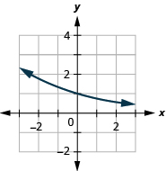
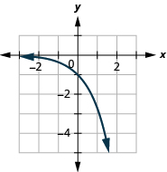
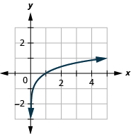

By the end of this section, you will be able to:
* Solve logarithmic equations using the properties of logarithms
* Solve exponential equations using logarithms
* Use exponential models in applications

Before you get started, take this readiness quiz.

1.  Solve:
    <math xmlns="http://www.w3.org/1998/Math/MathML"><mrow><msup><mi>x</mi><mn>2</mn></msup><mo>=</mo><mn>16</mn><mo>.</mo></mrow></math>
    
    * * *
    {: data-type="newline"}
    
    If you missed this problem, review [\[link\]](/m63362#fs-id1167836547919).
2.  Solve:
    <math xmlns="http://www.w3.org/1998/Math/MathML"><mrow><msup><mi>x</mi><mn>2</mn></msup><mo>−</mo><mn>5</mn><mi>x</mi><mo>+</mo><mn>6</mn><mo>=</mo><mn>0</mn><mo>.</mo></mrow></math>
    
    * * *
    {: data-type="newline"}
    
    If you missed this problem, review [\[link\]](/m63362#fs-id1167836625705).
3.  Solve:
    <math xmlns="http://www.w3.org/1998/Math/MathML"><mrow><mi>x</mi><mrow><mo>(</mo><mrow><mi>x</mi><mo>+</mo><mn>6</mn></mrow><mo>)</mo></mrow><mo>=</mo><mn>2</mn><mi>x</mi><mo>+</mo><mn>5</mn><mo>.</mo></mrow></math>
    
    * * *
    {: data-type="newline"}
    
    If you missed this problem, review [\[link\]](/m63362#fs-id1167829580432).
{: type="1"}

### Solve Logarithmic Equations Using the Properties of Logarithms

In the section on logarithmic functions, we solved some equations by rewriting the equation in exponential form. Now that we have the properties of logarithms, we have additional methods we can use to solve logarithmic equations.

If our equation has two logarithms we can use a property that says that if <math xmlns="http://www.w3.org/1998/Math/MathML"><mrow><msub><mrow><mtext>log</mtext></mrow><mi>a</mi></msub><mi>M</mi><mo>=</mo><msub><mrow><mtext>log</mtext></mrow><mi>a</mi></msub><mi>N</mi></mrow></math>

 then it is true that <math xmlns="http://www.w3.org/1998/Math/MathML"><mrow><mi>M</mi><mo>=</mo><mi>N</mi><mo>.</mo></mrow></math>

 This is the **One-to-One Property of Logarithmic Equations**{: data-type="term"}.

One-to-One Property of Logarithmic Equations

For <math xmlns="http://www.w3.org/1998/Math/MathML"><mrow><mi>M</mi><mo>&gt;</mo><mn>0</mn><mo>,</mo><mi>N</mi><mo>&gt;</mo><mn>0</mn><mo>,</mo><mspace width="0.2em" /><mtext>a</mtext><mtext>&gt;</mtext><mn>0</mn><mo>,</mo></mrow></math>

 and <math xmlns="http://www.w3.org/1998/Math/MathML"><mrow><mtext>a</mtext><mo>≠</mo><mn>1</mn></mrow></math>

 is any real number:

<math xmlns="http://www.w3.org/1998/Math/MathML"><mrow><mtext>If</mtext><mspace width="0.2em" /><msub><mrow><mtext>log</mtext></mrow><mi>a</mi></msub><mi>M</mi><mo>=</mo><msub><mrow><mtext>log</mtext></mrow><mi>a</mi></msub><mi>N</mi><mo>,</mo><mspace width="0.2em" /><mtext>then</mtext><mspace width="0.2em" /><mi>M</mi><mo>=</mo><mi>N</mi><mo>.</mo></mrow></math>

To use this property, we must be certain that both sides of the equation are written with the same base.

Remember that logarithms are defined only for positive real numbers. Check your results in the original equation. You may have obtained a result that gives a logarithm of zero or a negative number.

Solve: <math xmlns="http://www.w3.org/1998/Math/MathML"><mrow><mn>2</mn><msub><mrow><mtext>log</mtext></mrow><mn>5</mn></msub><mi>x</mi><mo>=</mo><msub><mrow><mtext>log</mtext></mrow><mn>5</mn></msub><mn>81</mn><mo>.</mo></mrow></math>

<math xmlns="http://www.w3.org/1998/Math/MathML"><mrow><mtable><mtr><mtd columnalign="left"><mtable><mtr><mtd /><mtd /><mtd /><mtd /><mtd /><mtd columnalign="right"><mn>2</mn><mspace width="0.2em" /><msub><mrow><mi>log</mi></mrow><mn>5</mn></msub><mi>x</mi></mtd><mtd columnalign="left"><mo>=</mo></mtd><mtd columnalign="left"><msub><mrow><mi>log</mi></mrow><mn>5</mn></msub><mn>81</mn></mtd></mtr><mtr><mtd columnalign="left"><mtext>Use the Power Property.</mtext></mtd><mtd /><mtd /><mtd /><mtd /><mtd columnalign="right"><msub><mrow><mi>log</mi></mrow><mn>5</mn></msub><msup><mi>x</mi><mn>2</mn></msup></mtd><mtd columnalign="left"><mo>=</mo></mtd><mtd columnalign="left"><msub><mrow><mi>log</mi></mrow><mn>5</mn></msub><mn>81</mn></mtd></mtr><mtr><mtd columnalign="left"><mtext>Use the One-to-One Property, if</mtext><mspace width="0.2em" /><msub><mrow><mi>log</mi></mrow><mi>a</mi></msub><mi>M</mi><mo>=</mo><msub><mrow><mi>log</mi></mrow><mi>a</mi></msub><mi>N</mi><mo>,</mo></mtd><mtd /><mtd /><mtd /><mtd /><mtd columnalign="right"><msup><mi>x</mi><mn>2</mn></msup></mtd><mtd columnalign="left"><mo>=</mo></mtd><mtd columnalign="left"><mn>81</mn></mtd></mtr><mtr><mtd columnalign="left"><mtext>then</mtext><mspace width="0.2em" /><mi>M</mi><mo>=</mo><mi>N</mi><mo>.</mo></mtd><mtd /><mtd /><mtd /><mtd /><mtd /></mtr><mtr><mtd columnalign="left"><mtext>Solve using the Square Root Property.</mtext></mtd><mtd /><mtd /><mtd /><mtd /><mtd columnalign="right"><mi>x</mi></mtd><mtd columnalign="left"><mo>=</mo></mtd><mtd columnalign="left"><mtext>±</mtext><mn>9</mn></mtd></mtr></mtable></mtd></mtr><mtr><mtd columnalign="left"><mtext>We eliminate</mtext><mspace width="0.2em" /><mi>x</mi><mo>=</mo><mn>−9</mn><mspace width="0.2em" /><mtext>as we cannot take the logarithm</mtext><mspace width="3em" /><mi>x</mi><mo>=</mo><mn>9</mn><mo>,</mo><mspace width="0.2em" /><menclose notation="updiagonalstrike"><mrow><mi>x</mi><mo>=</mo><mn>−9</mn></mrow></menclose></mtd><mtd /><mtd /><mtd /><mtd /><mtd /></mtr><mtr><mtd columnalign="left"><mtext>of a negative number.</mtext></mtd><mtd /><mtd /><mtd /><mtd /><mtd /></mtr><mtr><mtd columnalign="left"><mtext>Check.</mtext></mtd><mtd /><mtd /><mtd /><mtd /><mtd /></mtr><mtr><mtd columnalign="left"><mtable><mtr /><mtr /><mtr><mtd columnalign="left"><mi>x</mi><mo>=</mo><mn>9</mn></mtd><mtd /><mtd /><mtd /><mtd /><mtd columnalign="right"><mn>2</mn><msub><mrow><mi>log</mi></mrow><mn>5</mn></msub><mi>x</mi></mtd><mtd columnalign="left"><mo>=</mo></mtd><mtd columnalign="left"><msub><mrow><mi>log</mi></mrow><mn>5</mn></msub><mn>81</mn></mtd></mtr><mtr><mtd /><mtd /><mtd /><mtd /><mtd /><mtd columnalign="right"><mn>2</mn><msub><mrow><mi>log</mi></mrow><mn>5</mn></msub><mn>9</mn></mtd><mtd columnalign="left"><mover><mo>=</mo><mo>?</mo></mover></mtd><mtd columnalign="left"><msub><mrow><mi>log</mi></mrow><mn>5</mn></msub><mn>81</mn></mtd></mtr><mtr><mtd /><mtd /><mtd /><mtd /><mtd /><mtd columnalign="right"><msub><mrow><mi>log</mi></mrow><mn>5</mn></msub><msup><mn>9</mn><mn>2</mn></msup></mtd><mtd columnalign="left"><mover><mo>=</mo><mo>?</mo></mover></mtd><mtd columnalign="left"><msub><mrow><mi>log</mi></mrow><mn>5</mn></msub><mn>81</mn></mtd></mtr><mtr><mtd /><mtd /><mtd /><mtd /><mtd /><mtd columnalign="right"><msub><mrow><mi>log</mi></mrow><mn>5</mn></msub><mn>81</mn></mtd><mtd columnalign="left"><mo>=</mo></mtd><mtd columnalign="left"><msub><mrow><mi>log</mi></mrow><mn>5</mn></msub><mn>81</mn><mo>✓</mo></mtd></mtr></mtable></mtd><mtd /><mtd /><mtd /><mtd /><mtd /></mtr></mtable></mrow></math>

Solve: <math xmlns="http://www.w3.org/1998/Math/MathML"><mrow><mn>2</mn><msub><mrow><mtext>log</mtext></mrow><mn>3</mn></msub><mi>x</mi><mo>=</mo><msub><mrow><mtext>log</mtext></mrow><mn>3</mn></msub><mn>36</mn></mrow></math>

<math xmlns="http://www.w3.org/1998/Math/MathML"><mrow><mi>x</mi><mo>=</mo><mn>6</mn></mrow></math>

Solve: <math xmlns="http://www.w3.org/1998/Math/MathML"><mrow><mn>3</mn><mtext>log</mtext><mspace width="0.2em" /><mi>x</mi><mo>=</mo><mtext>log</mtext><mn>64</mn></mrow></math>

<math xmlns="http://www.w3.org/1998/Math/MathML"><mrow><mi>x</mi><mo>=</mo><mn>4</mn></mrow></math>

Another strategy to use to solve logarithmic equations is to condense sums or differences into a single logarithm.

Solve: <math xmlns="http://www.w3.org/1998/Math/MathML"><mrow><msub><mrow><mtext>log</mtext></mrow><mn>3</mn></msub><mi>x</mi><mo>+</mo><msub><mrow><mtext>log</mtext></mrow><mn>3</mn></msub><mrow><mo>(</mo><mrow><mi>x</mi><mo>−</mo><mn>8</mn></mrow><mo>)</mo></mrow><mo>=</mo><mn>2</mn><mo>.</mo></mrow></math>

<math xmlns="http://www.w3.org/1998/Math/MathML"><mrow><mtable><mtr><mtd columnalign="left"><mtable><mtr><mtd /><mtd /><mtd /><mtd /><mtd /><mtd columnalign="right"><msub><mrow><mi>log</mi></mrow><mn>3</mn></msub><mi>x</mi><mo>+</mo><msub><mrow><mi>log</mi></mrow><mn>3</mn></msub><mrow><mo>(</mo><mrow><mi>x</mi><mo>−</mo><mn>8</mn></mrow><mo>)</mo></mrow></mtd><mtd columnalign="left"><mo>=</mo></mtd><mtd columnalign="left"><mn>2</mn></mtd></mtr><mtr><mtd columnalign="left"><mtext>Use the Product Property,</mtext><mspace width="0.2em" /><msub><mrow><mi>log</mi></mrow><mi>a</mi></msub><mi>M</mi><mo>+</mo><msub><mrow><mi>log</mi></mrow><mi>a</mi></msub><mi>N</mi><mo>=</mo><msub><mrow><mi>log</mi></mrow><mi>a</mi></msub><mi>M</mi><mo>⋅</mo><mi>N</mi><mo>.</mo></mtd><mtd /><mtd /><mtd /><mtd /><mtd columnalign="right"><msub><mrow><mi>log</mi></mrow><mn>3</mn></msub><mi>x</mi><mrow><mo>(</mo><mrow><mi>x</mi><mo>−</mo><mn>8</mn></mrow><mo>)</mo></mrow></mtd><mtd columnalign="left"><mo>=</mo></mtd><mtd columnalign="left"><mn>2</mn></mtd></mtr><mtr><mtd columnalign="left"><mtext>Rewrite in exponential form.</mtext></mtd><mtd /><mtd /><mtd /><mtd /><mtd columnalign="right"><msup><mn>3</mn><mn>2</mn></msup></mtd><mtd columnalign="left"><mo>=</mo></mtd><mtd columnalign="left"><mi>x</mi><mrow><mo>(</mo><mrow><mi>x</mi><mo>−</mo><mn>8</mn></mrow><mo>)</mo></mrow></mtd></mtr><mtr><mtd columnalign="left"><mtext>Simplify.</mtext></mtd><mtd /><mtd /><mtd /><mtd /><mtd columnalign="right"><mn>9</mn></mtd><mtd columnalign="left"><mo>=</mo></mtd><mtd columnalign="left"><msup><mi>x</mi><mn>2</mn></msup><mo>−</mo><mn>8</mn><mi>x</mi></mtd></mtr><mtr><mtd columnalign="left"><mtext>Subtract 9 from each side.</mtext></mtd><mtd /><mtd /><mtd /><mtd /><mtd columnalign="right"><mn>0</mn></mtd><mtd columnalign="left"><mo>=</mo></mtd><mtd columnalign="left"><msup><mi>x</mi><mn>2</mn></msup><mo>−</mo><mn>8</mn><mi>x</mi><mo>−</mo><mn>9</mn></mtd></mtr><mtr><mtd columnalign="left"><mtext>Factor.</mtext></mtd><mtd /><mtd /><mtd /><mtd /><mtd columnalign="right"><mn>0</mn></mtd><mtd columnalign="left"><mo>=</mo></mtd><mtd columnalign="left"><mrow><mo>(</mo><mrow><mi>x</mi><mo>−</mo><mn>9</mn></mrow><mo>)</mo></mrow><mrow><mo>(</mo><mrow><mi>x</mi><mo>+</mo><mn>1</mn></mrow><mo>)</mo></mrow></mtd></mtr><mtr><mtd columnalign="left"><mtext>Use the Zero-Product Property.</mtext></mtd><mtd /><mtd /><mtd /><mtd /><mtd columnalign="right"><mi>x</mi><mo>−</mo><mn>9</mn></mtd><mtd columnalign="left"><mo>=</mo></mtd><mtd columnalign="left"><mn>0</mn><mo>,</mo><mspace width="1em" /><mi>x</mi><mo>+</mo><mn>1</mn><mo>=</mo><mn>0</mn></mtd></mtr></mtable></mtd></mtr><mtr><mtd columnalign="left"><mtext>Solve each equation.</mtext><mspace width="22em" /><mi>x</mi><mo>=</mo><mn>9</mn><mo>,</mo><mspace width="7em" /><menclose notation="updiagonalstrike"><mrow><mi>x</mi><mo>=</mo><mn>−1</mn></mrow></menclose></mtd><mtd /><mtd /><mtd /><mtd /><mtd /></mtr><mtr><mtd columnalign="left"><mtext>Check.</mtext></mtd><mtd /><mtd /><mtd /><mtd /><mtd /></mtr><mtr><mtd columnalign="left"><mtable><mtr /><mtr /><mtr><mtd columnalign="left"><mi>x</mi><mo>=</mo><mn>−1</mn></mtd><mtd /><mtd /><mtd /><mtd /><mtd columnalign="right"><msub><mrow><mi>log</mi></mrow><mn>3</mn></msub><mi>x</mi><mo>+</mo><msub><mrow><mi>log</mi></mrow><mn>3</mn></msub><mrow><mo>(</mo><mrow><mi>x</mi><mo>−</mo><mn>8</mn></mrow><mo>)</mo></mrow></mtd><mtd columnalign="left"><mo>=</mo></mtd><mtd columnalign="left"><mn>2</mn></mtd></mtr><mtr><mtd /><mtd /><mtd /><mtd /><mtd /><mtd columnalign="right"><msub><mrow><mi>log</mi></mrow><mn>3</mn></msub><mrow><mo>(</mo><mrow><mn>−1</mn></mrow><mo>)</mo></mrow><mo>+</mo><msub><mrow><mi>log</mi></mrow><mn>3</mn></msub><mrow><mo>(</mo><mrow><mn>−1</mn><mn>−8</mn></mrow><mo>)</mo></mrow></mtd><mtd columnalign="left"><mover><mo>=</mo><mo>?</mo></mover></mtd><mtd columnalign="left"><mn>2</mn></mtd></mtr></mtable></mtd><mtd /><mtd /><mtd /><mtd /><mtd /></mtr><mtr><mtd columnalign="left"><mtext>We cannot take the log of a negative number.</mtext></mtd><mtd /><mtd /><mtd /><mtd /><mtd /></mtr><mtr><mtd columnalign="left"><mtable><mtr /><mtr /><mtr><mtd columnalign="left"><mi>x</mi><mo>=</mo><mn>9</mn></mtd><mtd /><mtd /><mtd /><mtd /><mtd columnalign="right"><msub><mrow><mi>log</mi></mrow><mn>3</mn></msub><mi>x</mi><mo>+</mo><msub><mrow><mi>log</mi></mrow><mn>3</mn></msub><mrow><mo>(</mo><mrow><mi>x</mi><mo>−</mo><mn>8</mn></mrow><mo>)</mo></mrow></mtd><mtd columnalign="left"><mo>=</mo></mtd><mtd columnalign="left"><mn>2</mn></mtd></mtr><mtr><mtd /><mtd /><mtd /><mtd /><mtd /><mtd columnalign="right"><msub><mrow><mi>log</mi></mrow><mn>3</mn></msub><mn>9</mn><mo>+</mo><msub><mrow><mi>log</mi></mrow><mn>3</mn></msub><mrow><mo>(</mo><mrow><mn>9</mn><mo>−</mo><mn>8</mn></mrow><mo>)</mo></mrow></mtd><mtd columnalign="left"><mover><mo>=</mo><mo>?</mo></mover></mtd><mtd columnalign="left"><mn>2</mn></mtd></mtr><mtr><mtd /><mtd /><mtd /><mtd /><mtd /><mtd columnalign="right"><mn>2</mn><mo>+</mo><mn>0</mn></mtd><mtd columnalign="left"><mover><mo>=</mo><mo>?</mo></mover></mtd><mtd columnalign="left"><mn>2</mn></mtd></mtr><mtr><mtd /><mtd /><mtd /><mtd /><mtd /><mtd columnalign="right"><mn>2</mn></mtd><mtd columnalign="left"><mo>=</mo></mtd><mtd columnalign="left"><mn>2</mn><mo>✓</mo></mtd></mtr></mtable></mtd><mtd /><mtd /><mtd /><mtd /><mtd /></mtr></mtable></mrow></math>

Solve: <math xmlns="http://www.w3.org/1998/Math/MathML"><mrow><msub><mrow><mtext>log</mtext></mrow><mn>2</mn></msub><mi>x</mi><mo>+</mo><msub><mrow><mtext>log</mtext></mrow><mn>2</mn></msub><mrow><mo>(</mo><mrow><mi>x</mi><mo>−</mo><mn>2</mn></mrow><mo>)</mo></mrow><mo>=</mo><mn>3</mn></mrow></math>

<math xmlns="http://www.w3.org/1998/Math/MathML"><mrow><mi>x</mi><mo>=</mo><mn>4</mn></mrow></math>

Solve: <math xmlns="http://www.w3.org/1998/Math/MathML"><mrow><msub><mrow><mtext>log</mtext></mrow><mn>2</mn></msub><mi>x</mi><mo>+</mo><msub><mrow><mtext>log</mtext></mrow><mn>2</mn></msub><mrow><mo>(</mo><mrow><mi>x</mi><mo>−</mo><mn>6</mn></mrow><mo>)</mo></mrow><mo>=</mo><mn>4</mn></mrow></math>

<math xmlns="http://www.w3.org/1998/Math/MathML"><mrow><mi>x</mi><mo>=</mo><mn>8</mn></mrow></math>

When there are logarithms on both sides, we condense each side into a single logarithm. Remember to use the Power Property as needed.

Solve: <math xmlns="http://www.w3.org/1998/Math/MathML"><mrow><msub><mrow><mtext>log</mtext></mrow><mn>4</mn></msub><mrow><mo>(</mo><mrow><mi>x</mi><mo>+</mo><mn>6</mn></mrow><mo>)</mo></mrow><mo>−</mo><msub><mrow><mtext>log</mtext></mrow><mn>4</mn></msub><mrow><mo>(</mo><mrow><mn>2</mn><mi>x</mi><mo>+</mo><mn>5</mn></mrow><mo>)</mo></mrow><mo>=</mo><mtext>−</mtext><msub><mrow><mtext>log</mtext></mrow><mn>4</mn></msub><mi>x</mi><mo>.</mo></mrow></math>

<math xmlns="http://www.w3.org/1998/Math/MathML"><mrow><mtable><mtr><mtd columnalign="left"><mtable><mtr><mtd /><mtd /><mtd /><mtd /><mtd /><mtd columnalign="right"><msub><mrow><mtext>log</mtext></mrow><mn>4</mn></msub><mrow><mo>(</mo><mrow><mi>x</mi><mo>+</mo><mn>6</mn></mrow><mo>)</mo></mrow><mo>−</mo><msub><mrow><mtext>log</mtext></mrow><mn>4</mn></msub><mrow><mo>(</mo><mrow><mn>2</mn><mi>x</mi><mo>+</mo><mn>5</mn></mrow><mo>)</mo></mrow></mtd><mtd columnalign="left"><mo>=</mo></mtd><mtd columnalign="left"><mtext>−</mtext><msub><mrow><mtext>log</mtext></mrow><mn>4</mn></msub><mi>x</mi></mtd></mtr><mtr><mtd columnalign="left"><mtable><mtr><mtd columnalign="left"><mtext>Use the Quotient Property on the left side and the Power</mtext></mtd></mtr><mtr><mtd columnalign="left"><mtext>Property on the right.</mtext></mtd></mtr></mtable></mtd><mtd /><mtd /><mtd /><mtd /><mtd columnalign="right"><msub><mrow><mtext>log</mtext></mrow><mn>4</mn></msub><mrow><mo>(</mo><mrow><mfrac><mrow><mi>x</mi><mo>+</mo><mn>6</mn></mrow><mrow><mn>2</mn><mi>x</mi><mo>+</mo><mn>5</mn></mrow></mfrac></mrow><mo>)</mo></mrow></mtd><mtd columnalign="left"><mo>=</mo></mtd><mtd columnalign="left"><msub><mrow><mtext>log</mtext></mrow><mn>4</mn></msub><msup><mi>x</mi><mrow><mn>−1</mn></mrow></msup></mtd></mtr><mtr><mtd columnalign="left"><mtext>Rewrite</mtext><mspace width="0.2em" /><msup><mi>x</mi><mrow><mn>−1</mn></mrow></msup><mo>=</mo><mfrac><mn>1</mn><mi>x</mi></mfrac><mo>.</mo></mtd><mtd /><mtd /><mtd /><mtd /><mtd columnalign="right"><msub><mrow><mtext>log</mtext></mrow><mn>4</mn></msub><mrow><mo>(</mo><mrow><mfrac><mrow><mi>x</mi><mo>+</mo><mn>6</mn></mrow><mrow><mn>2</mn><mi>x</mi><mo>+</mo><mn>5</mn></mrow></mfrac></mrow><mo>)</mo></mrow></mtd><mtd columnalign="left"><mo>=</mo></mtd><mtd columnalign="left"><msub><mrow><mtext>log</mtext></mrow><mn>4</mn></msub><mfrac><mn>1</mn><mi>x</mi></mfrac></mtd></mtr><mtr><mtd columnalign="left"><mtable><mtr><mtd columnalign="left"><mtext>Use the One-to-One Property, if</mtext><mspace width="0.2em" /><msub><mrow><mtext>log</mtext></mrow><mi>a</mi></msub><mi>M</mi><mo>=</mo><msub><mrow><mtext>log</mtext></mrow><mi>a</mi></msub><mi>N</mi><mo>,</mo></mtd></mtr><mtr><mtd columnalign="left"><mtext>then</mtext><mspace width="0.2em" /><mi>M</mi><mo>=</mo><mi>N</mi><mo>.</mo></mtd></mtr></mtable></mtd><mtd /><mtd /><mtd /><mtd /><mtd columnalign="right"><mfrac><mrow><mi>x</mi><mo>+</mo><mn>6</mn></mrow><mrow><mn>2</mn><mi>x</mi><mo>+</mo><mn>5</mn></mrow></mfrac></mtd><mtd columnalign="left"><mo>=</mo></mtd><mtd columnalign="left"><mfrac><mn>1</mn><mi>x</mi></mfrac></mtd></mtr><mtr><mtd columnalign="left"><mtext>Solve the rational equation.</mtext></mtd><mtd /><mtd /><mtd /><mtd /><mtd columnalign="right"><mi>x</mi><mrow><mo>(</mo><mrow><mi>x</mi><mo>+</mo><mn>6</mn></mrow><mo>)</mo></mrow></mtd><mtd columnalign="left"><mo>=</mo></mtd><mtd columnalign="left"><mn>2</mn><mi>x</mi><mo>+</mo><mn>5</mn></mtd></mtr><mtr><mtd columnalign="left"><mtext>Distribute.</mtext></mtd><mtd /><mtd /><mtd /><mtd /><mtd columnalign="right"><msup><mi>x</mi><mn>2</mn></msup><mo>+</mo><mn>6</mn><mi>x</mi></mtd><mtd columnalign="left"><mo>=</mo></mtd><mtd columnalign="left"><mn>2</mn><mi>x</mi><mo>+</mo><mn>5</mn></mtd></mtr><mtr><mtd columnalign="left"><mtext>Write in standard form.</mtext></mtd><mtd /><mtd /><mtd /><mtd /><mtd columnalign="right"><msup><mi>x</mi><mn>2</mn></msup><mo>+</mo><mn>4</mn><mi>x</mi><mo>−</mo><mn>5</mn></mtd><mtd columnalign="left"><mo>=</mo></mtd><mtd columnalign="left"><mn>0</mn></mtd></mtr><mtr><mtd columnalign="left"><mtext>Factor.</mtext></mtd><mtd /><mtd /><mtd /><mtd /><mtd columnalign="right"><mrow><mo>(</mo><mrow><mi>x</mi><mo>+</mo><mn>5</mn></mrow><mo>)</mo></mrow><mrow><mo>(</mo><mrow><mi>x</mi><mo>−</mo><mn>1</mn></mrow><mo>)</mo></mrow></mtd><mtd columnalign="left"><mo>=</mo></mtd><mtd columnalign="left"><mn>0</mn></mtd></mtr></mtable></mtd></mtr><mtr><mtd columnalign="left"><mtext>Use the Zero-Product Property.</mtext><mspace width="17em" /><mi>x</mi><mo>+</mo><mn>5</mn><mo>=</mo><mn>0</mn><mo>,</mo><mspace width="2em" /><mi>x</mi><mo>−</mo><mn>1</mn><mo>=</mo><mn>0</mn></mtd><mtd /><mtd /><mtd /><mtd /><mtd /></mtr><mtr><mtd columnalign="left"><mtext>Solve each equation.</mtext><mspace width="22.9em" /><menclose notation="updiagonalstrike"><mrow><mi>x</mi><mo>=</mo><mn>−5</mn></mrow></menclose><mo>,</mo><mspace width="2.8em" /><mi>x</mi><mo>=</mo><mn>1</mn></mtd><mtd /><mtd /><mtd /><mtd /><mtd /></mtr><mtr><mtd columnalign="left"><mtext>Check.</mtext></mtd><mtd /><mtd /><mtd /><mtd /><mtd /></mtr><mtr><mtd columnalign="left"><mtext>We leave the check for you.</mtext></mtd><mtd /><mtd /><mtd /><mtd /><mtd /></mtr></mtable></mrow></math>

Solve: <math xmlns="http://www.w3.org/1998/Math/MathML"><mrow><mtext>log</mtext><mrow><mo>(</mo><mrow><mi>x</mi><mo>+</mo><mn>2</mn></mrow><mo>)</mo></mrow><mo>−</mo><mtext>log</mtext><mrow><mo>(</mo><mrow><mn>4</mn><mi>x</mi><mo>+</mo><mn>3</mn></mrow><mo>)</mo></mrow><mo>=</mo><mtext>−</mtext><mtext>log</mtext><mspace width="0.2em" /><mi>x</mi><mo>.</mo></mrow></math>

<math xmlns="http://www.w3.org/1998/Math/MathML"><mrow><mi>x</mi><mo>=</mo><mn>3</mn></mrow></math>

Solve: <math xmlns="http://www.w3.org/1998/Math/MathML"><mrow><mtext>log</mtext><mrow><mo>(</mo><mrow><mi>x</mi><mo>−</mo><mn>2</mn></mrow><mo>)</mo></mrow><mo>−</mo><mtext>log</mtext><mrow><mo>(</mo><mrow><mn>4</mn><mi>x</mi><mo>+</mo><mn>16</mn></mrow><mo>)</mo></mrow><mo>=</mo><mtext>log</mtext><mfrac><mn>1</mn><mi>x</mi></mfrac><mo>.</mo></mrow></math>

<math xmlns="http://www.w3.org/1998/Math/MathML"><mrow><mi>x</mi><mo>=</mo><mn>8</mn></mrow></math>

### Solve Exponential Equations Using Logarithms

In the section on exponential functions, we solved some equations by writing both sides of the equation with the same base. Next we wrote a new equation by setting the exponents equal.

It is not always possible or convenient to write the expressions with the same base. In that case we often take the common logarithm or natural logarithm of both sides once the exponential is isolated.

Solve <math xmlns="http://www.w3.org/1998/Math/MathML"><mrow><msup><mn>5</mn><mi>x</mi></msup><mo>=</mo><mn>11</mn><mo>.</mo></mrow></math>

 Find the exact answer and then approximate it to three decimal places.

<math xmlns="http://www.w3.org/1998/Math/MathML"><mrow><mtable><mtr><mtd /><mtd /><mtd /><mtd /><mtd /><mtd columnalign="right"><msup><mn>5</mn><mi>x</mi></msup></mtd><mtd columnalign="left"><mo>=</mo></mtd><mtd columnalign="left"><mn>11</mn></mtd></mtr> <mtr><mtd columnalign="left"><mtext>Since the exponential is isolated, take the logarithm of both sides.</mtext></mtd><mtd /><mtd /><mtd /><mtd /><mtd columnalign="right"><mtext>log</mtext><msup><mn>5</mn><mi>x</mi></msup></mtd><mtd columnalign="left"><mo>=</mo></mtd><mtd columnalign="left"><mtext>log</mtext><mn>11</mn></mtd></mtr> <mtr><mtd columnalign="left"><mtext>Use the Power Property to get the</mtext><mspace width="0.2em" /><mi>x</mi><mspace width="0.2em" /><mtext>as a factor, not an exponent.</mtext></mtd><mtd /><mtd /><mtd /><mtd /><mtd columnalign="right"><mi>x</mi><mtext>log</mtext><mn>5</mn></mtd><mtd columnalign="left"><mo>=</mo></mtd><mtd columnalign="left"><mtext>log</mtext><mn>11</mn></mtd></mtr> <mtr><mtd columnalign="left"><mtext>Solve for</mtext><mspace width="0.2em" /><mi>x</mi><mo>.</mo><mspace width="0.2em" /><mtext>Find the exact answer.</mtext></mtd><mtd /><mtd /><mtd /><mtd /><mtd columnalign="right"><mi>x</mi></mtd><mtd columnalign="left"><mo>=</mo></mtd><mtd columnalign="left"><mfrac><mrow><mtext>log</mtext><mn>11</mn></mrow><mrow><mtext>log</mtext><mn>5</mn></mrow></mfrac></mtd></mtr> <mtr><mtd columnalign="left"><mtext>Approximate the answer.</mtext></mtd><mtd /><mtd /><mtd /><mtd /><mtd columnalign="right"><mi>x</mi></mtd><mtd columnalign="left"><mo>≈</mo></mtd><mtd columnalign="left"><mn>1.490</mn></mtd></mtr> <mtr><mtd columnalign="left"><mtext>Since</mtext><mspace width="0.2em" /><msup><mn>5</mn><mn>1</mn></msup><mo>=</mo><mn>5</mn><mspace width="0.2em" /><mtext>and</mtext><mspace width="0.2em" /><msup><mn>5</mn><mn>2</mn></msup><mo>=</mo><mn>25</mn><mo>,</mo><mspace width="0.2em" /><mtext>does it makes sense that</mtext><mspace width="0.2em" /><msup><mn>5</mn><mrow><mn>1.490</mn></mrow></msup><mo>≈</mo><mn>11</mn><mo>?</mo></mtd><mtd /><mtd /><mtd /><mtd /><mtd /></mtr></mtable></mrow></math>

Solve <math xmlns="http://www.w3.org/1998/Math/MathML"><mrow><msup><mn>7</mn><mi>x</mi></msup><mo>=</mo><mn>43</mn><mo>.</mo></mrow></math>

 Find the exact answer and then approximate it to three decimal places.

<math xmlns="http://www.w3.org/1998/Math/MathML"><mrow><mi>x</mi><mo>=</mo><mfrac><mrow><mtext>log</mtext><mn>43</mn></mrow><mrow><mtext>log</mtext><mn>7</mn></mrow></mfrac><mo>≈</mo><mn>1.933</mn></mrow></math>

Solve <math xmlns="http://www.w3.org/1998/Math/MathML"><mrow><msup><mn>8</mn><mi>x</mi></msup><mo>=</mo><mn>98</mn><mo>.</mo></mrow></math>

 Find the exact answer and then approximate it to three decimal places.

<math xmlns="http://www.w3.org/1998/Math/MathML"><mrow><mi>x</mi><mo>=</mo><mfrac><mrow><mtext>log</mtext><mn>98</mn></mrow><mrow><mtext>log</mtext><mn>8</mn></mrow></mfrac><mo>≈</mo><mn>2.205</mn></mrow></math>

When we take the logarithm of both sides we will get the same result whether we use the common or the natural logarithm (try using the natural log in the last example. Did you get the same result?) When the exponential has base *e*, we use the natural logarithm.

Solve <math xmlns="http://www.w3.org/1998/Math/MathML"><mrow><mn>3</mn><msup><mi>e</mi><mrow><mi>x</mi><mo>+</mo><mn>2</mn></mrow></msup><mo>=</mo><mn>24</mn><mo>.</mo></mrow></math>

 Find the exact answer and then approximate it to three decimal places.

<math xmlns="http://www.w3.org/1998/Math/MathML"><mrow><mtable><mtr><mtd /><mtd /><mtd /><mtd /><mtd /><mtd columnalign="right"><mn>3</mn><msup><mi>e</mi><mrow><mi>x</mi><mo>+</mo><mn>2</mn></mrow></msup></mtd><mtd columnalign="left"><mo>=</mo></mtd><mtd columnalign="left"><mn>24</mn></mtd></mtr> <mtr><mtd columnalign="left"><mtext>Isolate the exponential by dividing both sides by 3.</mtext></mtd><mtd /><mtd /><mtd /><mtd /><mtd columnalign="right"><msup><mi>e</mi><mrow><mi>x</mi><mo>+</mo><mn>2</mn></mrow></msup></mtd><mtd columnalign="left"><mo>=</mo></mtd><mtd columnalign="left"><mn>8</mn></mtd></mtr> <mtr><mtd columnalign="left"><mtext>Take the natural logarithm of both sides.</mtext></mtd><mtd /><mtd /><mtd /><mtd /><mtd columnalign="right"><mtext>ln</mtext><mspace width="0.2em" /><msup><mi>e</mi><mrow><mi>x</mi><mo>+</mo><mn>2</mn></mrow></msup></mtd><mtd columnalign="left"><mo>=</mo></mtd><mtd columnalign="left"><mtext>ln</mtext><mn>8</mn></mtd></mtr> <mtr><mtd columnalign="left"><mtext>Use the Power Property to get the</mtext><mspace width="0.2em" /><mi>x</mi><mspace width="0.2em" /><mtext>as a factor, not an exponent.</mtext></mtd><mtd /><mtd /><mtd /><mtd /><mtd columnalign="right"><mrow><mo>(</mo><mrow><mi>x</mi><mo>+</mo><mn>2</mn></mrow><mo>)</mo></mrow><mtext>ln</mtext><mspace width="0.2em" /><mi>e</mi></mtd><mtd columnalign="left"><mo>=</mo></mtd><mtd columnalign="left"><mtext>ln</mtext><mn>8</mn></mtd></mtr> <mtr><mtd columnalign="left"><mtext>Use the property</mtext><mspace width="0.2em" /><mtext>ln</mtext><mspace width="0.2em" /><mi>e</mi><mo>=</mo><mn>1</mn><mspace width="0.2em" /><mtext>to simplify.</mtext></mtd><mtd /><mtd /><mtd /><mtd /><mtd columnalign="right"><mi>x</mi><mo>+</mo><mn>2</mn></mtd><mtd columnalign="left"><mo>=</mo></mtd><mtd columnalign="left"><mtext>ln</mtext><mn>8</mn></mtd></mtr> <mtr><mtd columnalign="left"><mtext>Solve the equation. Find the exact answer.</mtext></mtd><mtd /><mtd /><mtd /><mtd /><mtd columnalign="right"><mi>x</mi></mtd><mtd columnalign="left"><mo>=</mo></mtd><mtd columnalign="left"><mtext>ln</mtext><mn>8</mn><mo>−</mo><mn>2</mn></mtd></mtr> <mtr><mtd columnalign="left"><mtext>Approximate the answer.</mtext></mtd><mtd /><mtd /><mtd /><mtd /><mtd columnalign="right"><mi>x</mi></mtd><mtd columnalign="left"><mo>≈</mo></mtd><mtd columnalign="left"><mn>0.079</mn></mtd></mtr></mtable></mrow></math>

Solve <math xmlns="http://www.w3.org/1998/Math/MathML"><mrow><mn>2</mn><msup><mi>e</mi><mrow><mi>x</mi><mo>−</mo><mn>2</mn></mrow></msup><mo>=</mo><mn>18</mn><mo>.</mo></mrow></math>

 Find the exact answer and then approximate it to three decimal places.

<math xmlns="http://www.w3.org/1998/Math/MathML"><mrow><mi>x</mi><mo>=</mo><mtext>ln</mtext><mn>9</mn><mo>+</mo><mn>2</mn><mo>≈</mo><mn>4.197</mn></mrow></math>

Solve <math xmlns="http://www.w3.org/1998/Math/MathML"><mrow><mn>5</mn><msup><mi>e</mi><mrow><mn>2</mn><mi>x</mi></mrow></msup><mo>=</mo><mn>25</mn><mo>.</mo></mrow></math>

 Find the exact answer and then approximate it to three decimal places.

<math xmlns="http://www.w3.org/1998/Math/MathML"><mrow><mi>x</mi><mo>=</mo><mfrac><mrow><mtext>ln</mtext><mn>5</mn></mrow><mn>2</mn></mfrac><mo>≈</mo><mn>0.805</mn></mrow></math>

### Use Exponential Models in Applications

In previous sections we were able to solve some applications that were modeled with exponential equations. Now that we have so many more options to solve these equations, we are able to solve more applications.

We will again use the Compound Interest Formulas and so we list them here for reference.

Compound Interest

For a principal, *P*, invested at an interest rate, *r*, for *t* years, the new balance, *A* is:

<math xmlns="http://www.w3.org/1998/Math/MathML"><mrow><mtable><mtr /><mtr /><mtr><mtd columnalign="left"><mspace width="5em" /><mi>A</mi><mo>=</mo><mi>P</mi><msup><mrow><mrow><mo>(</mo><mrow><mn>1</mn><mo>+</mo><mfrac><mi>r</mi><mi>n</mi></mfrac></mrow><mo>)</mo></mrow></mrow><mrow><mi>n</mi><mi>t</mi></mrow></msup></mtd><mtd /><mtd /><mtd /><mtd /><mtd columnalign="left"><mtext>when compounded</mtext><mspace width="0.2em" /><mi>n</mi><mspace width="0.2em" /><mtext>times a year.</mtext></mtd></mtr> <mtr><mtd columnalign="left"><mspace width="5em" /><mi>A</mi><mo>=</mo><mi>P</mi><msup><mi>e</mi><mrow><mi>r</mi><mi>t</mi></mrow></msup></mtd><mtd /><mtd /><mtd /><mtd /><mtd columnalign="left"><mtext>when compounded continuously.</mtext></mtd></mtr></mtable></mrow></math>

Jermael’s parents put $10,000 in investments for his college expenses on his first birthday. They hope the investments will be worth $50,000 when he turns 18. If the interest compounds continuously, approximately what rate of growth will they need to achieve their goal?

<math xmlns="http://www.w3.org/1998/Math/MathML"><mrow><mtable><mtr><mtd columnalign="left"><mtable><mtr><mtd /><mtd /><mtd /><mtd /><mtd /><mtd columnalign="right"><mi>A</mi></mtd><mtd columnalign="left"><mo>=</mo></mtd><mtd columnalign="left"><mtext>$</mtext><mn>50,000</mn></mtd></mtr><mtr><mtd /><mtd /><mtd /><mtd /><mtd /><mtd columnalign="right"><mi>P</mi></mtd><mtd columnalign="left"><mo>=</mo></mtd><mtd columnalign="left"><mtext>$</mtext><mn>10,000</mn></mtd></mtr><mtr><mtd columnalign="left"><mtext>Identify the variables in the formula.</mtext></mtd><mtd /><mtd /><mtd /><mtd /><mtd columnalign="right"><mi>r</mi></mtd><mtd columnalign="left"><mo>=</mo></mtd><mtd columnalign="left"><mo>?</mo></mtd></mtr><mtr><mtd /><mtd /><mtd /><mtd /><mtd /><mtd columnalign="right"><mi>t</mi></mtd><mtd columnalign="left"><mo>=</mo></mtd><mtd columnalign="left"><mn>17</mn><mspace width="0.2em" /><mtext>years</mtext></mtd></mtr><mtr><mtd /><mtd /><mtd /><mtd /><mtd /><mtd columnalign="right"><mi>A</mi></mtd><mtd columnalign="left"><mo>=</mo></mtd><mtd columnalign="left"><mi>P</mi><msup><mi>e</mi><mrow><mi>r</mi><mi>t</mi></mrow></msup></mtd></mtr> <mtr><mtd columnalign="left"><mtext>Substitute the values into the formula.</mtext></mtd><mtd /><mtd /><mtd /><mtd /><mtd columnalign="right"><mn>50,000</mn></mtd><mtd columnalign="left"><mo>=</mo></mtd><mtd columnalign="left"><mn>10,000</mn><msup><mi>e</mi><mrow><mi>r</mi><mo>·</mo><mn>17</mn></mrow></msup></mtd></mtr> <mtr><mtd columnalign="left"><mtext>Solve for</mtext><mspace width="0.2em" /><mi>r</mi><mo>.</mo><mtext>Divide each side by 10,000.</mtext></mtd><mtd /><mtd /><mtd /><mtd /><mtd columnalign="right"><mn>5</mn></mtd><mtd columnalign="left"><mo>=</mo></mtd><mtd columnalign="left"><msup><mi>e</mi><mrow><mn>17</mn><mi>r</mi></mrow></msup></mtd></mtr> <mtr><mtd columnalign="left"><mtext>Take the natural log of each side.</mtext></mtd><mtd /><mtd /><mtd /><mtd /><mtd columnalign="right"><mtext>ln</mtext><mn>5</mn></mtd><mtd columnalign="left"><mo>=</mo></mtd><mtd columnalign="left"><mtext>ln</mtext><mspace width="0.2em" /><msup><mi>e</mi><mrow><mn>17</mn><mi>r</mi></mrow></msup></mtd></mtr> <mtr><mtd columnalign="left"><mtext>Use the Power Property.</mtext></mtd><mtd /><mtd /><mtd /><mtd /><mtd columnalign="right"><mtext>ln</mtext><mn>5</mn></mtd><mtd columnalign="left"><mo>=</mo></mtd><mtd columnalign="left"><mn>17</mn><mi>r</mi><mtext>ln</mtext><mspace width="0.2em" /><mi>e</mi></mtd></mtr> <mtr><mtd columnalign="left"><mtext>Simplify.</mtext></mtd><mtd /><mtd /><mtd /><mtd /><mtd columnalign="right"><mtext>ln</mtext><mn>5</mn></mtd><mtd columnalign="left"><mo>=</mo></mtd><mtd columnalign="left"><mn>17</mn><mi>r</mi></mtd></mtr> <mtr><mtd columnalign="left"><mtext>Divide each side by 17.</mtext></mtd><mtd /><mtd /><mtd /><mtd /><mtd columnalign="right"><mfrac><mrow><mtext>ln</mtext><mn>5</mn></mrow><mrow><mn>17</mn></mrow></mfrac></mtd><mtd columnalign="left"><mo>=</mo></mtd><mtd columnalign="left"><mi>r</mi></mtd></mtr> <mtr><mtd columnalign="left"><mtext>Approximate the answer.</mtext></mtd><mtd /><mtd /><mtd /><mtd /><mtd columnalign="right"><mi>r</mi></mtd><mtd columnalign="left"><mo>≈</mo></mtd><mtd columnalign="left"><mn>0.095</mn></mtd></mtr> <mtr><mtd columnalign="left"><mtext>Convert to a percentage.</mtext></mtd><mtd /><mtd /><mtd /><mtd /><mtd columnalign="right"><mi>r</mi></mtd><mtd columnalign="left"><mo>≈</mo></mtd><mtd columnalign="left"><mn>9.5</mn><mtext>%</mtext></mtd></mtr></mtable></mtd></mtr> <mtr /><mtr><mtd columnalign="left"><mspace width="20em" /><mtext>They need the rate of growth to be approximately</mtext><mspace width="0.2em" /><mn>9.5</mn><mtext>%</mtext><mo>.</mo></mtd></mtr></mtable></mrow></math>

Hector invests <math xmlns="http://www.w3.org/1998/Math/MathML"><mrow><mtext>$</mtext><mn>10,000</mn></mrow></math>

 at age 21. He hopes the investments will be worth <math xmlns="http://www.w3.org/1998/Math/MathML"><mrow><mtext>$</mtext><mn>150,000</mn></mrow></math>

 when he turns 50. If the interest compounds continuously, approximately what rate of growth will he need to achieve his goal?

<math xmlns="http://www.w3.org/1998/Math/MathML"><mrow><mi>r</mi><mo>≈</mo><mn>9.3</mn><mtext>%</mtext></mrow></math>

Rachel invests <math xmlns="http://www.w3.org/1998/Math/MathML"><mrow><mtext>$</mtext><mn>15,000</mn></mrow></math>

 at age 25. She hopes the investments will be worth <math xmlns="http://www.w3.org/1998/Math/MathML"><mrow><mtext>$</mtext><mn>90,000</mn></mrow></math>

 when she turns 40. If the interest compounds continuously, approximately what rate of growth will she need to achieve her goal?

<math xmlns="http://www.w3.org/1998/Math/MathML"><mrow><mi>r</mi><mo>≈</mo><mn>11.9</mn><mtext>%</mtext></mrow></math>

We have seen that growth and decay are modeled by exponential functions. For growth and decay we use the formula <math xmlns="http://www.w3.org/1998/Math/MathML"><mrow><mi>A</mi><mo>=</mo><msub><mi>A</mi><mn>0</mn></msub><msup><mi>e</mi><mrow><mi>k</mi><mi>t</mi></mrow></msup><mo>.</mo></mrow></math>

 Exponential growth has a positive rate of growth or growth constant, <math xmlns="http://www.w3.org/1998/Math/MathML"><mi>k</mi></math>

, and **exponential decay**{: data-type="term" .no-emphasis} has a negative rate of growth or decay constant, *k*.

Exponential Growth and Decay

For an original amount, <math xmlns="http://www.w3.org/1998/Math/MathML"><mrow><msub><mi>A</mi><mn>0</mn></msub><mo>,</mo></mrow></math>

 that grows or decays at a rate, *k*, for a certain time, *t*, the final amount, *A*, is:

<math xmlns="http://www.w3.org/1998/Math/MathML"><mrow><mi>A</mi><mo>=</mo><msub><mi>A</mi><mn>0</mn></msub><msup><mi>e</mi><mrow><mi>k</mi><mi>t</mi></mrow></msup></mrow></math>

We can now solve applications that give us enough information to determine the rate of growth. We can then use that rate of growth to predict other situations.

Researchers recorded that a certain bacteria population grew from 100 to 300 in 3 hours. At this rate of growth, how many bacteria will there be 24 hours from the start of the experiment?

This problem requires two main steps. First we must find the unknown rate, *k*. Then we use that value of *k* to help us find the unknown number of bacteria.

<math xmlns="http://www.w3.org/1998/Math/MathML"><mrow><mtable> <mtr><mtd columnalign="left"><mtext>Identify the variables in the formula.</mtext></mtd><mtd /><mtd /><mtd /><mtd /><mtd columnalign="left"><mtable><mtr><mtd columnalign="right"><mi>A</mi></mtd><mtd columnalign="left"><mo>=</mo></mtd><mtd columnalign="left"><mn>300</mn></mtd></mtr><mtr><mtd columnalign="right"><msub><mi>A</mi><mn>0</mn></msub></mtd><mtd columnalign="left"><mo>=</mo></mtd><mtd columnalign="left"><mn>100</mn></mtd></mtr><mtr><mtd columnalign="right"><mi>k</mi></mtd><mtd columnalign="left"><mo>=</mo></mtd><mtd columnalign="left"><mo>?</mo></mtd></mtr><mtr><mtd columnalign="right"><mi>t</mi></mtd><mtd columnalign="left"><mo>=</mo></mtd><mtd columnalign="left"><mn>3</mn><mspace width="0.2em" /><mtext>hours</mtext></mtd></mtr><mtr><mtd columnalign="right"><mi>A</mi></mtd><mtd columnalign="left"><mo>=</mo></mtd><mtd columnalign="left"><msub><mi>A</mi><mn>0</mn></msub><msup><mi>e</mi><mrow><mi>k</mi><mi>t</mi></mrow></msup></mtd></mtr></mtable></mtd></mtr> <mtr><mtd columnalign="left"><mtext>Substitute the values in the formula.</mtext></mtd><mtd /><mtd /><mtd /><mtd /><mtd columnalign="left"><mspace width="0.1em" /><mn>300</mn><mo>=</mo><mn>100</mn><msup><mi>e</mi><mrow><mi>k</mi><mo>·</mo><mn>3</mn></mrow></msup></mtd></mtr> <mtr><mtd columnalign="left"><mtext>Solve for</mtext><mspace width="0.2em" /><mi>k</mi><mo>.</mo><mspace width="0.2em" /><mtext>Divide each side by 100.</mtext></mtd><mtd /><mtd /><mtd /><mtd /><mtd columnalign="left"><mspace width="1.15em" /><mn>3</mn><mo>=</mo><msup><mi>e</mi><mrow><mn>3</mn><mi>k</mi></mrow></msup></mtd></mtr> <mtr><mtd columnalign="left"><mtext>Take the natural log of each side.</mtext></mtd><mtd /><mtd /><mtd /><mtd /><mtd columnalign="left"><mspace width="0.4em" /><mtext>ln</mtext><mn>3</mn><mo>=</mo><mtext>ln</mtext><mspace width="0.2em" /><msup><mi>e</mi><mrow><mn>3</mn><mi>k</mi></mrow></msup></mtd></mtr> <mtr><mtd columnalign="left"><mtext>Use the Power Property.</mtext></mtd><mtd /><mtd /><mtd /><mtd /><mtd columnalign="left"><mspace width="0.4em" /><mtext>ln</mtext><mn>3</mn><mo>=</mo><mn>3</mn><mi>k</mi><mtext>ln</mtext><mspace width="0.2em" /><mi>e</mi></mtd></mtr> <mtr><mtd columnalign="left"><mtext>Simplify.</mtext></mtd><mtd /><mtd /><mtd /><mtd /><mtd columnalign="left"><mspace width="0.4em" /><mtext>ln</mtext><mn>3</mn><mo>=</mo><mn>3</mn><mi>k</mi></mtd></mtr> <mtr><mtd columnalign="left"><mtext>Divide each side by 3.</mtext></mtd><mtd /><mtd /><mtd /><mtd /><mtd columnalign="left"><mspace width="0.3em" /><mfrac><mrow><mtext>ln</mtext><mn>3</mn></mrow><mn>3</mn></mfrac><mo>=</mo><mi>k</mi></mtd></mtr> <mtr><mtd columnalign="left"><mtext>Approximate the answer.</mtext></mtd><mtd /><mtd /><mtd /><mtd /><mtd columnalign="left"><mspace width="1.15em" /><mi>k</mi><mo>≈</mo><mn>0.366</mn></mtd></mtr><mtr /><mtr /> <mtr><mtd columnalign="left"><mtable><mtr><mtd columnalign="left"><mtext>We use this rate of growth to predict the number of</mtext></mtd></mtr><mtr><mtd columnalign="left"><mtext>bacteria there will be in 24 hours.</mtext></mtd></mtr></mtable></mtd><mtd /><mtd /><mtd /><mtd /><mtd columnalign="left"><mtable><mtr><mtd columnalign="right"><mi>A</mi></mtd><mtd columnalign="left"><mo>=</mo></mtd><mtd columnalign="left"><mo>?</mo></mtd></mtr><mtr><mtd columnalign="right"><msub><mi>A</mi><mn>0</mn></msub></mtd><mtd columnalign="left"><mo>=</mo></mtd><mtd columnalign="left"><mn>100</mn></mtd></mtr><mtr><mtd columnalign="right"><mi>k</mi></mtd><mtd columnalign="left"><mo>=</mo></mtd><mtd columnalign="left"><mfrac><mrow><mtext>ln</mtext><mn>3</mn></mrow><mn>3</mn></mfrac></mtd></mtr><mtr><mtd columnalign="right"><mi>t</mi></mtd><mtd columnalign="left"><mo>=</mo></mtd><mtd columnalign="left"><mn>24</mn><mspace width="0.2em" /><mtext>hours</mtext></mtd></mtr><mtr><mtd columnalign="right"><mi>A</mi></mtd><mtd columnalign="left"><mo>=</mo></mtd><mtd columnalign="left"><msub><mi>A</mi><mn>0</mn></msub><msup><mi>e</mi><mrow><mi>k</mi><mi>t</mi></mrow></msup></mtd></mtr></mtable></mtd></mtr> <mtr><mtd columnalign="left"><mtext>Substitute in the values.</mtext></mtd><mtd /><mtd /><mtd /><mtd /><mtd columnalign="left"><mi>A</mi><mo>=</mo><mn>100</mn><msup><mi>e</mi><mrow><mfrac><mrow><mtext>ln</mtext><mn>3</mn></mrow><mn>3</mn></mfrac><mo>·</mo><mn>24</mn></mrow></msup></mtd></mtr> <mtr><mtd columnalign="left"><mtext>Evaluate.</mtext></mtd><mtd /><mtd /><mtd /><mtd /><mtd columnalign="left"><mi>A</mi><mo>≈</mo><mn>656,100</mn></mtd></mtr> <mtr><mtd /><mtd /><mtd /><mtd /><mtd /><mtd columnalign="left"><mtext>At this rate of growth, they can expect 656,100 bacteria.</mtext></mtd></mtr></mtable></mrow></math>

Researchers recorded that a certain bacteria population grew from 100 to 500 in 6 hours. At this rate of growth, how many bacteria will there be 24 hours from the start of the experiment?

There will be 62,500 bacteria.

Researchers recorded that a certain bacteria population declined from 700,000 to 400,000 in 5 hours after the administration of medication. At this rate of decay, how many bacteria will there be 24 hours from the start of the experiment?

There will be 5,870,061 bacteria.

Radioactive substances decay or decompose according to the exponential decay formula. The amount of time it takes for the substance to decay to half of its original amount is called the **half-life**{: data-type="term" .no-emphasis} of the substance.

Similar to the previous example, we can use the given information to determine the constant of decay, and then use that constant to answer other questions.

The half-life of radium-226 is 1,590 years. How much of a 100 mg sample will be left in 500 years?

This problem requires two main steps. First we must find the decay constant *k*. If we start with 100-mg, at the half-life there will be 50-mg remaining. We will use this information to find *k*. Then we use that value of *k* to help us find the amount of sample that will be left in 500 years.

<math xmlns="http://www.w3.org/1998/Math/MathML"><mrow><mtable> <mtr><mtd columnalign="left"><mtext>Identify the variables in the formula.</mtext></mtd><mtd /><mtd /><mtd /><mtd /><mtd columnalign="left"><mspace width="0.2em" /><mtable><mtr><mtd columnalign="right"><mi>A</mi></mtd><mtd columnalign="left"><mo>=</mo></mtd><mtd columnalign="left"><mn>50</mn></mtd></mtr><mtr><mtd columnalign="right"><msub><mi>A</mi><mn>0</mn></msub></mtd><mtd columnalign="left"><mo>=</mo></mtd><mtd columnalign="left"><mn>100</mn></mtd></mtr><mtr><mtd columnalign="right"><mi>k</mi></mtd><mtd columnalign="left"><mo>=</mo></mtd><mtd columnalign="left"><mo>?</mo></mtd></mtr><mtr><mtd columnalign="right"><mi>t</mi></mtd><mtd columnalign="left"><mo>=</mo></mtd><mtd columnalign="left"><mn>1590</mn><mtext>years</mtext></mtd></mtr><mtr><mtd columnalign="right"><mi>A</mi></mtd><mtd columnalign="left"><mo>=</mo></mtd><mtd columnalign="left"><msub><mi>A</mi><mn>0</mn></msub><msup><mi>e</mi><mrow><mi>k</mi><mi>t</mi></mrow></msup></mtd></mtr></mtable></mtd></mtr> <mtr><mtd columnalign="left"><mtext>Substitute the values in the formula.</mtext></mtd><mtd /><mtd /><mtd /><mtd /><mtd columnalign="left"><mspace width="0.88em" /><mn>50</mn><mo>=</mo><mn>100</mn><msup><mi>e</mi><mrow><mi>k</mi><mo>·</mo><mn>1590</mn></mrow></msup></mtd></mtr> <mtr><mtd columnalign="left"><mtext>Solve for</mtext><mspace width="0.2em" /><mi>k</mi><mo>.</mo><mspace width="0.2em" /><mtext>Divide each side by 100.</mtext></mtd><mtd /><mtd /><mtd /><mtd /><mtd columnalign="left"><mspace width="0.7em" /><mn>0.5</mn><mo>=</mo><msup><mi>e</mi><mrow><mn>1590</mn><mi>k</mi></mrow></msup></mtd></mtr> <mtr><mtd columnalign="left"><mtext>Take the natural log of each side.</mtext></mtd><mtd /><mtd /><mtd /><mtd /><mtd columnalign="left"><mtext>ln</mtext><mn>0.5</mn><mo>=</mo><mtext>ln</mtext><mspace width="0.2em" /><msup><mi>e</mi><mrow><mn>1590</mn><mi>k</mi></mrow></msup></mtd></mtr> <mtr><mtd columnalign="left"><mtext>Use the Power Property.</mtext></mtd><mtd /><mtd /><mtd /><mtd /><mtd columnalign="left"><mtext>ln</mtext><mn>0.5</mn><mo>=</mo><mn>1590</mn><mi>k</mi><mtext>ln</mtext><mspace width="0.2em" /><mi>e</mi></mtd></mtr> <mtr><mtd columnalign="left"><mtext>Simplify.</mtext></mtd><mtd /><mtd /><mtd /><mtd /><mtd columnalign="left"><mtext>ln</mtext><mn>0.5</mn><mo>=</mo><mn>1590</mn><mi>k</mi></mtd></mtr> <mtr><mtd columnalign="left"><mtext>Divide each side by 1590.</mtext></mtd><mtd /><mtd /><mtd /><mtd /><mtd columnalign="left"><mfrac><mrow><mtext>ln</mtext><mn>0.5</mn></mrow><mrow><mn>1590</mn></mrow></mfrac><mo>=</mo><mi>k</mi><mspace width="0.2em" /><mtext>exact answer</mtext></mtd></mtr><mtr /><mtr /> <mtr><mtd columnalign="left"><mtable><mtr><mtd columnalign="left"><mtext>We use this rate of growth to predict the amount</mtext></mtd></mtr><mtr><mtd columnalign="left"><mtext>that will be left in 500 years.</mtext></mtd></mtr></mtable></mtd><mtd /><mtd /><mtd /><mtd /><mtd columnalign="left"><mspace width="0.5em" /><mtable><mtr><mtd columnalign="right"><mi>A</mi></mtd><mtd columnalign="left"><mo>=</mo></mtd><mtd columnalign="left"><mo>?</mo></mtd></mtr><mtr><mtd columnalign="right"><msub><mi>A</mi><mn>0</mn></msub></mtd><mtd columnalign="left"><mo>=</mo></mtd><mtd columnalign="left"><mn>100</mn></mtd></mtr><mtr><mtd columnalign="right"><mi>k</mi></mtd><mtd columnalign="left"><mo>=</mo></mtd><mtd columnalign="left"><mfrac><mrow><mtext>ln</mtext><mn>0.5</mn></mrow><mrow><mn>1590</mn></mrow></mfrac></mtd></mtr><mtr><mtd columnalign="right"><mi>t</mi></mtd><mtd columnalign="left"><mo>=</mo></mtd><mtd columnalign="left"><mn>500</mn><mtext>years</mtext></mtd></mtr><mtr><mtd columnalign="right"><mi>A</mi></mtd><mtd columnalign="left"><mo>=</mo></mtd><mtd columnalign="left"><msub><mi>A</mi><mn>0</mn></msub><msup><mi>e</mi><mrow><mi>k</mi><mi>t</mi></mrow></msup></mtd></mtr></mtable></mtd></mtr> <mtr><mtd columnalign="left"><mtext>Substitute in the values.</mtext></mtd><mtd /><mtd /><mtd /><mtd /><mtd columnalign="left"><mi>A</mi><mo>=</mo><mn>100</mn><msup><mi>e</mi><mrow><mfrac><mrow><mtext>ln</mtext><mn>0.5</mn></mrow><mrow><mn>1590</mn></mrow></mfrac><mo>·</mo><mn>500</mn></mrow></msup></mtd></mtr> <mtr><mtd columnalign="left"><mtext>Evaluate.</mtext></mtd><mtd /><mtd /><mtd /><mtd /><mtd columnalign="left"><mi>A</mi><mo>≈</mo><mn>80.4</mn><mspace width="0.2em" /><mtext>mg</mtext></mtd></mtr> <mtr><mtd /><mtd /><mtd /><mtd /><mtd /><mtd columnalign="left"><mtable><mtr><mtd columnalign="left"><mtext>In 500 years there would be</mtext></mtd></mtr><mtr><mtd columnalign="left"><mtext>approximately 80.4 mg remaining.</mtext></mtd></mtr></mtable></mtd></mtr></mtable></mrow></math>

The half-life of magnesium-27 is 9.45 minutes. How much of a 10-mg sample will be left in 6 minutes?

There will be 6.43 mg left.

The half-life of radioactive iodine is 60 days. How much of a 50-mg sample will be left in 40 days?

There will be 31.5 mg left.

Access these online resources for additional instruction and practice with solving exponential and logarithmic equations.

* [Solving Logarithmic Equations][1]
* [Solving Logarithm Equations][2]
* [Finding the rate or time in a word problem on exponential growth or decay][3]
* [Finding the rate or time in a word problem on exponential growth or decay][4]
{: data-display="block"}

### Key Concepts

* **One-to-One Property of Logarithmic Equations:** For
  <math xmlns="http://www.w3.org/1998/Math/MathML"><mrow><mi>M</mi><mo>&gt;</mo><mn>0</mn><mo>,</mo><mi>N</mi><mo>&gt;</mo><mn>0</mn><mo>,</mo><mspace width="0.2em" /><mtext>a</mtext><mtext>&gt;</mtext><mn>0</mn><mo>,</mo></mrow></math>
  
  and
  <math xmlns="http://www.w3.org/1998/Math/MathML"><mrow><mtext>a</mtext><mo>≠</mo><mn>1</mn></mrow></math>
  
  is any real number:
  * * *
  {: data-type="newline"}
  
  

  <math xmlns="http://www.w3.org/1998/Math/MathML"><mrow><mtext>If</mtext><mspace width="0.2em" /><msub><mrow><mtext>log</mtext></mrow><mi>a</mi></msub><mi>M</mi><mo>=</mo><msub><mrow><mtext>log</mtext></mrow><mi>a</mi></msub><mi>N</mi><mo>,</mo><mspace width="0.2em" /><mtext>then</mtext><mspace width="0.2em" /><mi>M</mi><mo>=</mo><mi>N</mi><mo>.</mo></mrow></math>
  

* **Compound Interest:**
  * * *
  {: data-type="newline"}
  
  For a principal, *P*, invested at an interest rate, *r*, for *t* years, the new balance, *A*, is:
  * * *
  {: data-type="newline"}
  
  

  <math xmlns="http://www.w3.org/1998/Math/MathML"><mrow><mtable><mtr /><mtr /><mtr><mtd columnalign="left"><mspace width="5em" /><mi>A</mi><mo>=</mo><mi>P</mi><msup><mrow><mrow><mo>(</mo><mrow><mn>1</mn><mo>+</mo><mfrac><mi>r</mi><mi>n</mi></mfrac></mrow><mo>)</mo></mrow></mrow><mrow><mi>n</mi><mi>t</mi></mrow></msup></mtd><mtd /><mtd /><mtd /><mtd /><mtd columnalign="left"><mtext>when compounded</mtext><mspace width="0.2em" /><mi>n</mi><mspace width="0.2em" /><mtext>times a year.</mtext></mtd></mtr> <mtr><mtd columnalign="left"><mspace width="5em" /><mi>A</mi><mo>=</mo><mi>P</mi><msup><mi>e</mi><mrow><mi>r</mi><mi>t</mi></mrow></msup></mtd><mtd /><mtd /><mtd /><mtd /><mtd columnalign="left"><mtext>when compounded continuously.</mtext></mtd></mtr></mtable></mrow></math>
  

* **Exponential Growth and Decay:** For an original amount,
  <math xmlns="http://www.w3.org/1998/Math/MathML"><mrow><msub><mi>A</mi><mn>0</mn></msub></mrow></math>
  
  that grows or decays at a rate, *r*, for a certain time *t*, the final amount, *A*, is
  <math xmlns="http://www.w3.org/1998/Math/MathML"><mrow><mi>A</mi><mo>=</mo><msub><mi>A</mi><mn>0</mn></msub><msup><mi>e</mi><mrow><mi>r</mi><mi>t</mi></mrow></msup><mo>.</mo></mrow></math>
{: data-bullet-style="bullet"}

### Section Exercises

#### Practice Makes Perfect

**Solve Logarithmic Equations Using the Properties of Logarithms**

In the following exercises, solve for *x*.

<math xmlns="http://www.w3.org/1998/Math/MathML"><mrow><msub><mrow><mtext>log</mtext></mrow><mn>4</mn></msub><mn>64</mn><mo>=</mo><mn>2</mn><msub><mrow><mtext>log</mtext></mrow><mn>4</mn></msub><mi>x</mi></mrow></math>

<math xmlns="http://www.w3.org/1998/Math/MathML"><mrow><mtext>log</mtext><mn>49</mn><mo>=</mo><mn>2</mn><mtext>log</mtext><mspace width="0.2em" /><mi>x</mi></mrow></math>

<math xmlns="http://www.w3.org/1998/Math/MathML"><mrow><mi>x</mi><mo>=</mo><mn>7</mn></mrow></math>

<math xmlns="http://www.w3.org/1998/Math/MathML"><mrow><mn>3</mn><msub><mrow><mtext>log</mtext></mrow><mn>3</mn></msub><mi>x</mi><mo>=</mo><msub><mrow><mtext>log</mtext></mrow><mn>3</mn></msub><mn>27</mn></mrow></math>

<math xmlns="http://www.w3.org/1998/Math/MathML"><mrow><mn>3</mn><msub><mrow><mtext>log</mtext></mrow><mn>6</mn></msub><mi>x</mi><mo>=</mo><msub><mrow><mtext>log</mtext></mrow><mn>6</mn></msub><mn>64</mn></mrow></math>

<math xmlns="http://www.w3.org/1998/Math/MathML"><mrow><mi>x</mi><mo>=</mo><mn>4</mn></mrow></math>

<math xmlns="http://www.w3.org/1998/Math/MathML"><mrow><msub><mrow><mtext>log</mtext></mrow><mn>5</mn></msub><mrow><mo>(</mo><mrow><mn>4</mn><mi>x</mi><mo>−</mo><mn>2</mn></mrow><mo>)</mo></mrow><mo>=</mo><msub><mrow><mtext>log</mtext></mrow><mn>5</mn></msub><mn>10</mn></mrow></math>

<math xmlns="http://www.w3.org/1998/Math/MathML"><mrow><msub><mrow><mtext>log</mtext></mrow><mn>3</mn></msub><mrow><mo>(</mo><mrow><msup><mi>x</mi><mn>2</mn></msup><mo>+</mo><mn>3</mn></mrow><mo>)</mo></mrow><mo>=</mo><msub><mrow><mtext>log</mtext></mrow><mn>3</mn></msub><mn>4</mn><mi>x</mi></mrow></math>

<math xmlns="http://www.w3.org/1998/Math/MathML"><mrow><mi>x</mi><mo>=</mo><mn>1</mn><mo>,</mo></mrow></math>

 <math xmlns="http://www.w3.org/1998/Math/MathML"><mrow><mi>x</mi><mo>=</mo><mn>3</mn></mrow></math>

<math xmlns="http://www.w3.org/1998/Math/MathML"><mrow><msub><mrow><mtext>log</mtext></mrow><mn>3</mn></msub><mi>x</mi><mo>+</mo><msub><mrow><mtext>log</mtext></mrow><mn>3</mn></msub><mi>x</mi><mo>=</mo><mn>2</mn></mrow></math>

<math xmlns="http://www.w3.org/1998/Math/MathML"><mrow><msub><mrow><mtext>log</mtext></mrow><mn>4</mn></msub><mi>x</mi><mo>+</mo><msub><mrow><mtext>log</mtext></mrow><mn>4</mn></msub><mi>x</mi><mo>=</mo><mn>3</mn></mrow></math>

<math xmlns="http://www.w3.org/1998/Math/MathML"><mrow><mi>x</mi><mo>=</mo><mn>8</mn></mrow></math>

<math xmlns="http://www.w3.org/1998/Math/MathML"><mrow><msub><mrow><mtext>log</mtext></mrow><mn>2</mn></msub><mi>x</mi><mo>+</mo><msub><mrow><mtext>log</mtext></mrow><mn>2</mn></msub><mrow><mo>(</mo><mrow><mi>x</mi><mo>−</mo><mn>3</mn></mrow><mo>)</mo></mrow><mo>=</mo><mn>2</mn></mrow></math>

<math xmlns="http://www.w3.org/1998/Math/MathML"><mrow><msub><mrow><mtext>log</mtext></mrow><mn>3</mn></msub><mi>x</mi><mo>+</mo><msub><mrow><mtext>log</mtext></mrow><mn>3</mn></msub><mrow><mo>(</mo><mrow><mi>x</mi><mo>+</mo><mn>6</mn></mrow><mo>)</mo></mrow><mo>=</mo><mn>3</mn></mrow></math>

<math xmlns="http://www.w3.org/1998/Math/MathML"><mrow><mi>x</mi><mo>=</mo><mn>3</mn></mrow></math>

<math xmlns="http://www.w3.org/1998/Math/MathML"><mrow><mtext>log</mtext><mspace width="0.2em" /><mi>x</mi><mo>+</mo><mtext>log</mtext><mrow><mo>(</mo><mrow><mi>x</mi><mo>+</mo><mn>3</mn></mrow><mo>)</mo></mrow><mo>=</mo><mn>1</mn></mrow></math>

<math xmlns="http://www.w3.org/1998/Math/MathML"><mrow><mtext>log</mtext><mspace width="0.2em" /><mi>x</mi><mo>+</mo><mtext>log</mtext><mrow><mo>(</mo><mrow><mi>x</mi><mo>−</mo><mn>15</mn></mrow><mo>)</mo></mrow><mo>=</mo><mn>2</mn></mrow></math>

<math xmlns="http://www.w3.org/1998/Math/MathML"><mrow><mi>x</mi><mo>=</mo><mn>20</mn></mrow></math>

<math xmlns="http://www.w3.org/1998/Math/MathML"><mrow><mtext>log</mtext><mrow><mo>(</mo><mrow><mi>x</mi><mo>+</mo><mn>4</mn></mrow><mo>)</mo></mrow><mo>−</mo><mtext>log</mtext><mrow><mo>(</mo><mrow><mn>5</mn><mi>x</mi><mo>+</mo><mn>12</mn></mrow><mo>)</mo></mrow><mo>=</mo><mtext>−</mtext><mtext>log</mtext><mspace width="0.2em" /><mi>x</mi></mrow></math>

<math xmlns="http://www.w3.org/1998/Math/MathML"><mrow><mtext>log</mtext><mrow><mo>(</mo><mrow><mi>x</mi><mo>−</mo><mn>1</mn></mrow><mo>)</mo></mrow><mo>−</mo><mtext>log</mtext><mrow><mo>(</mo><mrow><mi>x</mi><mo>+</mo><mn>3</mn></mrow><mo>)</mo></mrow><mo>=</mo><mtext>log</mtext><mfrac><mn>1</mn><mi>x</mi></mfrac></mrow></math>

<math xmlns="http://www.w3.org/1998/Math/MathML"><mrow><mi>x</mi><mo>=</mo><mn>3</mn></mrow></math>

<math xmlns="http://www.w3.org/1998/Math/MathML"><mrow><msub><mrow><mtext>log</mtext></mrow><mn>5</mn></msub><mrow><mo>(</mo><mrow><mi>x</mi><mo>+</mo><mn>3</mn></mrow><mo>)</mo></mrow><mo>+</mo><msub><mrow><mtext>log</mtext></mrow><mn>5</mn></msub><mrow><mo>(</mo><mrow><mi>x</mi><mo>−</mo><mn>6</mn></mrow><mo>)</mo></mrow><mo>=</mo><msub><mrow><mtext>log</mtext></mrow><mn>5</mn></msub><mn>10</mn></mrow></math>

<math xmlns="http://www.w3.org/1998/Math/MathML"><mrow><msub><mrow><mtext>log</mtext></mrow><mn>5</mn></msub><mrow><mo>(</mo><mrow><mi>x</mi><mo>+</mo><mn>1</mn></mrow><mo>)</mo></mrow><mo>+</mo><msub><mrow><mtext>log</mtext></mrow><mn>5</mn></msub><mrow><mo>(</mo><mrow><mi>x</mi><mo>−</mo><mn>5</mn></mrow><mo>)</mo></mrow><mo>=</mo><msub><mrow><mtext>log</mtext></mrow><mn>5</mn></msub><mn>7</mn></mrow></math>

<math xmlns="http://www.w3.org/1998/Math/MathML"><mrow><mi>x</mi><mo>=</mo><mn>6</mn></mrow></math>

<math xmlns="http://www.w3.org/1998/Math/MathML"><mrow><msub><mrow><mtext>log</mtext></mrow><mn>3</mn></msub><mrow><mo>(</mo><mrow><mn>2</mn><mi>x</mi><mo>−</mo><mn>1</mn></mrow><mo>)</mo></mrow><mo>=</mo><msub><mrow><mtext>log</mtext></mrow><mn>3</mn></msub><mrow><mo>(</mo><mrow><mi>x</mi><mo>+</mo><mn>3</mn></mrow><mo>)</mo></mrow><mo>+</mo><msub><mrow><mtext>log</mtext></mrow><mn>3</mn></msub><mn>3</mn></mrow></math>

<math xmlns="http://www.w3.org/1998/Math/MathML"><mrow><mtext>log</mtext><mrow><mo>(</mo><mrow><mn>5</mn><mi>x</mi><mo>+</mo><mn>1</mn></mrow><mo>)</mo></mrow><mo>=</mo><mtext>log</mtext><mrow><mo>(</mo><mrow><mi>x</mi><mo>+</mo><mn>3</mn></mrow><mo>)</mo></mrow><mo>+</mo><mtext>log</mtext><mn>2</mn></mrow></math>

<math xmlns="http://www.w3.org/1998/Math/MathML"><mrow><mi>x</mi><mo>=</mo><mfrac><mn>5</mn><mn>3</mn></mfrac></mrow></math>

**Solve Exponential Equations Using Logarithms**

In the following exercises, solve each exponential equation. Find the exact answer and then approximate it to three decimal places.

<math xmlns="http://www.w3.org/1998/Math/MathML"><mrow><msup><mn>3</mn><mi>x</mi></msup><mo>=</mo><mn>89</mn></mrow></math>

<math xmlns="http://www.w3.org/1998/Math/MathML"><mrow><msup><mn>2</mn><mi>x</mi></msup><mo>=</mo><mn>74</mn></mrow></math>

<math xmlns="http://www.w3.org/1998/Math/MathML"><mrow><mi>x</mi><mo>=</mo><mfrac><mrow><mtext>log</mtext><mn>74</mn></mrow><mrow><mtext>log</mtext><mn>2</mn></mrow></mfrac><mo>≈</mo><mn>6.209</mn></mrow></math>

<math xmlns="http://www.w3.org/1998/Math/MathML"><mrow><msup><mn>5</mn><mi>x</mi></msup><mo>=</mo><mn>110</mn></mrow></math>

<math xmlns="http://www.w3.org/1998/Math/MathML"><mrow><msup><mn>4</mn><mi>x</mi></msup><mo>=</mo><mn>112</mn></mrow></math>

<math xmlns="http://www.w3.org/1998/Math/MathML"><mrow><mi>x</mi><mo>=</mo><mfrac><mrow><mtext>log</mtext><mn>112</mn></mrow><mrow><mtext>log</mtext><mn>4</mn></mrow></mfrac><mo>≈</mo><mn>3.404</mn></mrow></math>

<math xmlns="http://www.w3.org/1998/Math/MathML"><mrow><msup><mi>e</mi><mi>x</mi></msup><mo>=</mo><mn>16</mn></mrow></math>

<math xmlns="http://www.w3.org/1998/Math/MathML"><mrow><msup><mi>e</mi><mi>x</mi></msup><mo>=</mo><mn>8</mn></mrow></math>

<math xmlns="http://www.w3.org/1998/Math/MathML"><mrow><mi>x</mi><mo>=</mo><mtext>ln</mtext><mn>8</mn><mo>≈</mo><mn>2.079</mn></mrow></math>

<math xmlns="http://www.w3.org/1998/Math/MathML"><mrow><msup><mrow><mrow><mo>(</mo><mrow><mfrac><mn>1</mn><mn>2</mn></mfrac></mrow><mo>)</mo></mrow></mrow><mi>x</mi></msup><mo>=</mo><mn>6</mn></mrow></math>

<math xmlns="http://www.w3.org/1998/Math/MathML"><mrow><msup><mrow><mrow><mo>(</mo><mrow><mfrac><mn>1</mn><mn>3</mn></mfrac></mrow><mo>)</mo></mrow></mrow><mi>x</mi></msup><mo>=</mo><mn>8</mn></mrow></math>

<math xmlns="http://www.w3.org/1998/Math/MathML"><mrow><mi>x</mi><mo>=</mo><mfrac><mrow><mtext>log</mtext><mn>8</mn></mrow><mrow><mtext>log</mtext><mfrac><mn>1</mn><mn>3</mn></mfrac></mrow></mfrac><mo>≈</mo><mtext>−</mtext><mn>1.893</mn></mrow></math>

<math xmlns="http://www.w3.org/1998/Math/MathML"><mrow><mn>4</mn><msup><mi>e</mi><mrow><mi>x</mi><mo>+</mo><mn>1</mn></mrow></msup><mo>=</mo><mn>16</mn></mrow></math>

<math xmlns="http://www.w3.org/1998/Math/MathML"><mrow><mn>3</mn><msup><mi>e</mi><mrow><mi>x</mi><mo>+</mo><mn>2</mn></mrow></msup><mo>=</mo><mn>9</mn></mrow></math>

<math xmlns="http://www.w3.org/1998/Math/MathML"><mrow><mi>x</mi><mo>=</mo><mtext>ln</mtext><mn>3</mn><mo>−</mo><mn>2</mn><mo>≈</mo><mtext>−</mtext><mn>0.901</mn></mrow></math>

<math xmlns="http://www.w3.org/1998/Math/MathML"><mrow><mn>6</mn><msup><mi>e</mi><mrow><mn>2</mn><mi>x</mi></mrow></msup><mo>=</mo><mn>24</mn></mrow></math>

<math xmlns="http://www.w3.org/1998/Math/MathML"><mrow><mn>2</mn><msup><mi>e</mi><mrow><mn>3</mn><mi>x</mi></mrow></msup><mo>=</mo><mn>32</mn></mrow></math>

<math xmlns="http://www.w3.org/1998/Math/MathML"><mrow><mi>x</mi><mo>=</mo><mfrac><mrow><mtext>ln</mtext><mn>16</mn></mrow><mn>3</mn></mfrac><mo>≈</mo><mn>0.924</mn></mrow></math>

<math xmlns="http://www.w3.org/1998/Math/MathML"><mrow><mfrac><mn>1</mn><mn>4</mn></mfrac><msup><mi>e</mi><mi>x</mi></msup><mo>=</mo><mn>3</mn></mrow></math>

<math xmlns="http://www.w3.org/1998/Math/MathML"><mrow><mfrac><mn>1</mn><mn>3</mn></mfrac><msup><mi>e</mi><mi>x</mi></msup><mo>=</mo><mn>2</mn></mrow></math>

<math xmlns="http://www.w3.org/1998/Math/MathML"><mrow><mi>x</mi><mo>=</mo><mtext>ln</mtext><mn>6</mn><mo>≈</mo><mn>1.792</mn></mrow></math>

<math xmlns="http://www.w3.org/1998/Math/MathML"><mrow><msup><mi>e</mi><mrow><mi>x</mi><mo>+</mo><mn>1</mn></mrow></msup><mo>+</mo><mn>2</mn><mo>=</mo><mn>16</mn></mrow></math>

<math xmlns="http://www.w3.org/1998/Math/MathML"><mrow><msup><mi>e</mi><mrow><mi>x</mi><mo>−</mo><mn>1</mn></mrow></msup><mo>+</mo><mn>4</mn><mo>=</mo><mn>12</mn></mrow></math>

<math xmlns="http://www.w3.org/1998/Math/MathML"><mrow><mi>x</mi><mo>=</mo><mtext>ln</mtext><mn>8</mn><mo>+</mo><mn>1</mn><mo>≈</mo><mn>3.079</mn></mrow></math>

In the following exercises, solve each equation.

<math xmlns="http://www.w3.org/1998/Math/MathML"><mrow><msup><mn>3</mn><mrow><mn>3</mn><mi>x</mi><mo>+</mo><mn>1</mn></mrow></msup><mo>=</mo><mn>81</mn></mrow></math>

<math xmlns="http://www.w3.org/1998/Math/MathML"><mrow><msup><mn>6</mn><mrow><mn>4</mn><mi>x</mi><mo>−</mo><mn>17</mn></mrow></msup><mo>=</mo><mn>216</mn></mrow></math>

<math xmlns="http://www.w3.org/1998/Math/MathML"><mrow><mi>x</mi><mo>=</mo><mn>5</mn></mrow></math>

<math xmlns="http://www.w3.org/1998/Math/MathML"><mrow><mfrac><mrow><msup><mi>e</mi><mrow><msup><mi>x</mi><mn>2</mn></msup></mrow></msup></mrow><mrow><msup><mi>e</mi><mrow><mn>14</mn></mrow></msup></mrow></mfrac><mo>=</mo><msup><mi>e</mi><mrow><mn>5</mn><mi>x</mi></mrow></msup></mrow></math>

<math xmlns="http://www.w3.org/1998/Math/MathML"><mrow><mfrac><mrow><msup><mi>e</mi><mrow><msup><mi>x</mi><mn>2</mn></msup></mrow></msup></mrow><mrow><msup><mi>e</mi><mi>x</mi></msup></mrow></mfrac><mo>=</mo><msup><mi>e</mi><mrow><mn>20</mn></mrow></msup></mrow></math>

<math xmlns="http://www.w3.org/1998/Math/MathML"><mrow><mi>x</mi><mo>=</mo><mn>−4</mn><mo>,</mo><mi>x</mi><mo>=</mo><mn>5</mn></mrow></math>

<math xmlns="http://www.w3.org/1998/Math/MathML"><mrow><msub><mrow><mtext>log</mtext></mrow><mi>a</mi></msub><mn>64</mn><mo>=</mo><mn>2</mn></mrow></math>

<math xmlns="http://www.w3.org/1998/Math/MathML"><mrow><msub><mrow><mtext>log</mtext></mrow><mi>a</mi></msub><mn>81</mn><mo>=</mo><mn>4</mn></mrow></math>

<math xmlns="http://www.w3.org/1998/Math/MathML"><mrow><mi>a</mi><mo>=</mo><mn>3</mn></mrow></math>

<math xmlns="http://www.w3.org/1998/Math/MathML"><mrow><mtext>ln</mtext><mspace width="0.2em" /><mi>x</mi><mo>=</mo><mn>−8</mn></mrow></math>

<math xmlns="http://www.w3.org/1998/Math/MathML"><mrow><mtext>ln</mtext><mspace width="0.2em" /><mi>x</mi><mo>=</mo><mn>9</mn></mrow></math>

<math xmlns="http://www.w3.org/1998/Math/MathML"><mrow><mi>x</mi><mo>=</mo><msup><mi>e</mi><mn>9</mn></msup></mrow></math>

<math xmlns="http://www.w3.org/1998/Math/MathML"><mrow><msub><mrow><mtext>log</mtext></mrow><mn>5</mn></msub><mo stretchy="false">(</mo><mn>3</mn><mi>x</mi><mo>−</mo><mn>8</mn><mo stretchy="false">)</mo><mo>=</mo><mn>2</mn></mrow></math>

<math xmlns="http://www.w3.org/1998/Math/MathML"><mrow><msub><mrow><mtext>log</mtext></mrow><mn>4</mn></msub><mo stretchy="false">(</mo><mn>7</mn><mi>x</mi><mo>+</mo><mn>15</mn><mo stretchy="false">)</mo><mo>=</mo><mn>3</mn></mrow></math>

<math xmlns="http://www.w3.org/1998/Math/MathML"><mrow><mi>x</mi><mo>=</mo><mn>7</mn></mrow></math>

<math xmlns="http://www.w3.org/1998/Math/MathML"><mrow><mtext>ln</mtext><mspace width="0.2em" /><msup><mi>e</mi><mrow><mn>5</mn><mi>x</mi></mrow></msup><mo>=</mo><mn>30</mn></mrow></math>

<math xmlns="http://www.w3.org/1998/Math/MathML"><mrow><mtext>ln</mtext><mspace width="0.2em" /><msup><mi>e</mi><mrow><mn>6</mn><mi>x</mi></mrow></msup><mo>=</mo><mn>18</mn></mrow></math>

<math xmlns="http://www.w3.org/1998/Math/MathML"><mrow><mi>x</mi><mo>=</mo><mn>3</mn></mrow></math>

<math xmlns="http://www.w3.org/1998/Math/MathML"><mrow><mn>3</mn><mtext>log</mtext><mspace width="0.2em" /><mi>x</mi><mo>=</mo><mtext>log</mtext><mn>125</mn></mrow></math>

<math xmlns="http://www.w3.org/1998/Math/MathML"><mrow><mn>7</mn><msub><mrow><mtext>log</mtext></mrow><mn>3</mn></msub><mi>x</mi><mo>=</mo><msub><mrow><mtext>log</mtext></mrow><mn>3</mn></msub><mn>128</mn></mrow></math>

<math xmlns="http://www.w3.org/1998/Math/MathML"><mrow><mi>x</mi><mo>=</mo><mn>2</mn></mrow></math>

<math xmlns="http://www.w3.org/1998/Math/MathML"><mrow><msub><mrow><mtext>log</mtext></mrow><mn>6</mn></msub><mi>x</mi><mo>+</mo><msub><mrow><mtext>log</mtext></mrow><mn>6</mn></msub><mo stretchy="false">(</mo><mi>x</mi><mo>−</mo><mn>5</mn><mo stretchy="false">)</mo><mo>=</mo><mn>24</mn></mrow></math>

<math xmlns="http://www.w3.org/1998/Math/MathML"><mrow><msub><mrow><mtext>log</mtext></mrow><mn>9</mn></msub><mi>x</mi><mo>+</mo><msub><mrow><mtext>log</mtext></mrow><mn>9</mn></msub><mo stretchy="false">(</mo><mi>x</mi><mo>−</mo><mn>4</mn><mo stretchy="false">)</mo><mo>=</mo><mn>12</mn></mrow></math>

<math xmlns="http://www.w3.org/1998/Math/MathML"><mrow><mi>x</mi><mo>=</mo><mn>6</mn></mrow></math>

<math xmlns="http://www.w3.org/1998/Math/MathML"><mrow><msub><mrow><mtext>log</mtext></mrow><mn>2</mn></msub><mrow><mo>(</mo><mrow><mi>x</mi><mo>+</mo><mn>2</mn></mrow><mo>)</mo></mrow><mo>−</mo><msub><mrow><mtext>log</mtext></mrow><mn>2</mn></msub><mo stretchy="false">(</mo><mn>2</mn><mi>x</mi><mo>+</mo><mn>9</mn><mo stretchy="false">)</mo><mo>=</mo><mtext>−</mtext><msub><mrow><mtext>log</mtext></mrow><mn>2</mn></msub><mi>x</mi></mrow></math>

<math xmlns="http://www.w3.org/1998/Math/MathML"><mrow><msub><mrow><mtext>log</mtext></mrow><mn>6</mn></msub><mrow><mo>(</mo><mrow><mi>x</mi><mo>+</mo><mn>1</mn></mrow><mo>)</mo></mrow><mo>−</mo><msub><mrow><mtext>log</mtext></mrow><mn>6</mn></msub><mo stretchy="false">(</mo><mn>4</mn><mi>x</mi><mo>+</mo><mn>10</mn><mo stretchy="false">)</mo><mo>=</mo><msub><mrow><mtext>log</mtext></mrow><mn>6</mn></msub><mfrac><mn>1</mn><mi>x</mi></mfrac></mrow></math>

<math xmlns="http://www.w3.org/1998/Math/MathML"><mrow><mi>x</mi><mo>=</mo><mn>5</mn></mrow></math>

In the following exercises, solve for *x*, giving an exact answer as well as an approximation to three decimal places.

<math xmlns="http://www.w3.org/1998/Math/MathML"><mrow><msup><mn>6</mn><mi>x</mi></msup><mo>=</mo><mn>91</mn></mrow></math>

<math xmlns="http://www.w3.org/1998/Math/MathML"><mrow><msup><mrow><mrow><mo>(</mo><mrow><mfrac><mn>1</mn><mn>2</mn></mfrac></mrow><mo>)</mo></mrow></mrow><mi>x</mi></msup><mo>=</mo><mn>10</mn></mrow></math>

<math xmlns="http://www.w3.org/1998/Math/MathML"><mrow><mi>x</mi><mo>=</mo><mfrac><mrow><mtext>log</mtext><mn>10</mn></mrow><mrow><mtext>log</mtext><mfrac><mn>1</mn><mn>2</mn></mfrac></mrow></mfrac><mo>≈</mo><mtext>−</mtext><mn>3.322</mn></mrow></math>

<math xmlns="http://www.w3.org/1998/Math/MathML"><mrow><mn>7</mn><msup><mi>e</mi><mrow><mi>x</mi><mo>−</mo><mn>3</mn></mrow></msup><mo>=</mo><mn>35</mn></mrow></math>

<math xmlns="http://www.w3.org/1998/Math/MathML"><mrow><mn>8</mn><msup><mi>e</mi><mrow><mi>x</mi><mo>+</mo><mn>5</mn></mrow></msup><mo>=</mo><mn>56</mn></mrow></math>

<math xmlns="http://www.w3.org/1998/Math/MathML"><mrow><mi>x</mi><mo>=</mo><mtext>ln</mtext><mn>7</mn><mo>−</mo><mn>5</mn><mo>≈</mo><mtext>−</mtext><mn>3.054</mn></mrow></math>

**Use Exponential Models in Applications**

In the following exercises, solve.

Sung Lee invests <math xmlns="http://www.w3.org/1998/Math/MathML"><mrow><mtext>$</mtext><mn>5,000</mn></mrow></math>

 at age 18. He hopes the investments will be worth <math xmlns="http://www.w3.org/1998/Math/MathML"><mrow><mtext>$</mtext><mn>10,000</mn></mrow></math>

 when he turns 25. If the interest compounds continuously, approximately what rate of growth will he need to achieve his goal? Is that a reasonable expectation?

Alice invests <math xmlns="http://www.w3.org/1998/Math/MathML"><mrow><mtext>$</mtext><mn>15,000</mn></mrow></math>

 at age 30 from the signing bonus of her new job. She hopes the investments will be worth <math xmlns="http://www.w3.org/1998/Math/MathML"><mrow><mtext>$</mtext><mn>30,000</mn></mrow></math>

 when she turns 40. If the interest compounds continuously, approximately what rate of growth will she need to achieve her goal?

<math xmlns="http://www.w3.org/1998/Math/MathML"><mrow><mn>6.9</mn><mtext>%</mtext></mrow></math>

Coralee invests <math xmlns="http://www.w3.org/1998/Math/MathML"><mrow><mtext>$</mtext><mn>5,000</mn></mrow></math>

 in an account that compounds interest monthly and earns <math xmlns="http://www.w3.org/1998/Math/MathML"><mrow><mn>7</mn><mtext>%</mtext><mo>.</mo></mrow></math>

 How long will it take for her money to double?

Simone invests <math xmlns="http://www.w3.org/1998/Math/MathML"><mrow><mtext>$</mtext><mn>8,000</mn></mrow></math>

 in an account that compounds interest quarterly and earns <math xmlns="http://www.w3.org/1998/Math/MathML"><mrow><mn>5</mn><mtext>%</mtext><mo>.</mo></mrow></math>

 How long will it take for his money to double?

13\.9 years

Researchers recorded that a certain bacteria population declined from 100,000 to 100 in 24 hours. At this rate of decay, how many bacteria will there be in 16 hours?

Researchers recorded that a certain bacteria population declined from 800,000 to 500,000 in 6 hours after the administration of medication. At this rate of decay, how many bacteria will there be in 24 hours?

122,070 bacteria

A virus takes 6 days to double its original population <math xmlns="http://www.w3.org/1998/Math/MathML"><mrow><mrow><mo>(</mo><mrow><mi>A</mi><mo>=</mo><mn>2</mn><msub><mi>A</mi><mn>0</mn></msub></mrow><mo>)</mo></mrow><mo>.</mo></mrow></math>

 How long will it take to triple its population?

A bacteria doubles its original population in 24 hours <math xmlns="http://www.w3.org/1998/Math/MathML"><mrow><mrow><mo>(</mo><mrow><mi>A</mi><mo>=</mo><mn>2</mn><msub><mi>A</mi><mn>0</mn></msub></mrow><mo>)</mo></mrow><mo>.</mo></mrow></math>

 How big will its population be in 72 hours?

8 times as large as the original population

Carbon-14 is used for archeological carbon dating. Its half-life is 5,730 years. How much of a 100-gram sample of Carbon-14 will be left in 1000 years?

Radioactive technetium-99m is often used in diagnostic medicine as it has a relatively short half-life but lasts long enough to get the needed testing done on the patient. If its half-life is 6 hours, how much of the radioactive material form a 0.5 ml injection will be in the body in 24 hours?

0\.03 ml

#### Writing Exercises

Explain the method you would use to solve these equations: <math xmlns="http://www.w3.org/1998/Math/MathML"><mrow><msup><mn>3</mn><mrow><mi>x</mi><mo>+</mo><mn>1</mn></mrow></msup><mo>=</mo><mn>81</mn><mo>,</mo></mrow></math>

 <math xmlns="http://www.w3.org/1998/Math/MathML"><mrow><msup><mn>3</mn><mrow><mi>x</mi><mo>+</mo><mn>1</mn></mrow></msup><mo>=</mo><mn>75</mn><mo>.</mo></mrow></math>

 Does your method require logarithms for both equations? Why or why not?

What is the difference between the equation for exponential growth versus the equation for exponential decay?

Answers will vary.

#### Self Check

ⓐ After completing the exercises, use this checklist to evaluate your mastery of the objectives of this section.

    ⓑ After looking at the checklist, do you think you are well-prepared for the next section? Why or why not?

### Chapter Review Exercises

#### [Finding Composite and Inverse Functions](/m63416){: .target-chapter}

**Find and Evaluate Composite Functions**

In the following exercises, for each pair of functions, find ⓐ (*f* ∘ *g*)(*x*), ⓑ (*g* ∘ *f*)(*x*), and ⓒ (*f* · *g*)(*x*).

<math xmlns="http://www.w3.org/1998/Math/MathML"><mrow><mi>f</mi><mrow><mo>(</mo><mi>x</mi><mo>)</mo></mrow><mo>=</mo><mn>7</mn><mi>x</mi><mo>−</mo><mn>2</mn></mrow></math>

 and* * *
{: data-type="newline"}

<math xmlns="http://www.w3.org/1998/Math/MathML"><mrow><mi>g</mi><mrow><mo>(</mo><mi>x</mi><mo>)</mo></mrow><mo>=</mo><mn>5</mn><mi>x</mi><mo>+</mo><mn>1</mn></mrow></math>

<math xmlns="http://www.w3.org/1998/Math/MathML"><mrow><mi>f</mi><mrow><mo>(</mo><mi>x</mi><mo>)</mo></mrow><mo>=</mo><mn>4</mn><mi>x</mi></mrow></math>

 and* * *
{: data-type="newline"}

<math xmlns="http://www.w3.org/1998/Math/MathML"><mrow><mi>g</mi><mrow><mo>(</mo><mi>x</mi><mo>)</mo></mrow><mo>=</mo><msup><mi>x</mi><mn>2</mn></msup><mo>+</mo><mn>3</mn><mi>x</mi></mrow></math>

ⓐ <math xmlns="http://www.w3.org/1998/Math/MathML"><mrow><mn>4</mn><msup><mi>x</mi><mn>2</mn></msup><mo>+</mo><mn>12</mn><mi>x</mi></mrow></math>

 ⓑ <math xmlns="http://www.w3.org/1998/Math/MathML"><mrow><mn>16</mn><msup><mi>x</mi><mn>2</mn></msup><mo>+</mo><mn>12</mn><mi>x</mi></mrow></math>

 ⓒ <math xmlns="http://www.w3.org/1998/Math/MathML"><mrow><mn>4</mn><msup><mi>x</mi><mn>3</mn></msup><mo>+</mo><mn>12</mn><msup><mi>x</mi><mn>2</mn></msup></mrow></math>

In the following exercises, evaluate the composition.

For functions* * *
{: data-type="newline"}

<math xmlns="http://www.w3.org/1998/Math/MathML"><mrow><mi>f</mi><mrow><mo>(</mo><mi>x</mi><mo>)</mo></mrow><mo>=</mo><mn>3</mn><msup><mi>x</mi><mn>2</mn></msup><mo>+</mo><mn>2</mn></mrow></math>

 and* * *
{: data-type="newline"}

<math xmlns="http://www.w3.org/1998/Math/MathML"><mrow><mi>g</mi><mrow><mo>(</mo><mi>x</mi><mo>)</mo></mrow><mo>=</mo><mn>4</mn><mi>x</mi><mo>−</mo><mn>3</mn><mo>,</mo></mrow></math>

 find* * *
{: data-type="newline"}

ⓐ <math xmlns="http://www.w3.org/1998/Math/MathML"><mrow><mrow><mo>(</mo><mrow><mi>f</mi><mo>∘</mo><mi>g</mi></mrow><mo>)</mo></mrow><mrow><mo>(</mo><mrow><mn>−3</mn></mrow><mo>)</mo></mrow></mrow></math>

* * *
{: data-type="newline"}

ⓑ <math xmlns="http://www.w3.org/1998/Math/MathML"><mrow><mrow><mo>(</mo><mrow><mi>g</mi><mo>∘</mo><mi>f</mi></mrow><mo>)</mo></mrow><mrow><mo>(</mo><mrow><mn>−2</mn></mrow><mo>)</mo></mrow></mrow></math>

* * *
{: data-type="newline"}

ⓒ <math xmlns="http://www.w3.org/1998/Math/MathML"><mrow><mrow><mo>(</mo><mrow><mi>f</mi><mo>∘</mo><mi>f</mi></mrow><mo>)</mo></mrow><mrow><mo>(</mo><mrow><mn>−1</mn></mrow><mo>)</mo></mrow></mrow></math>

For functions* * *
{: data-type="newline"}

<math xmlns="http://www.w3.org/1998/Math/MathML"><mrow><mi>f</mi><mrow><mo>(</mo><mi>x</mi><mo>)</mo></mrow><mo>=</mo><mn>2</mn><msup><mi>x</mi><mn>3</mn></msup><mo>+</mo><mn>5</mn></mrow></math>

 and* * *
{: data-type="newline"}

<math xmlns="http://www.w3.org/1998/Math/MathML"><mrow><mi>g</mi><mrow><mo>(</mo><mi>x</mi><mo>)</mo></mrow><mo>=</mo><mn>3</mn><msup><mi>x</mi><mn>2</mn></msup><mo>−</mo><mn>7</mn><mo>,</mo></mrow></math>

 find* * *
{: data-type="newline"}

ⓐ <math xmlns="http://www.w3.org/1998/Math/MathML"><mrow><mrow><mo>(</mo><mrow><mi>f</mi><mo>∘</mo><mi>g</mi></mrow><mo>)</mo></mrow><mrow><mo>(</mo><mrow><mn>−1</mn></mrow><mo>)</mo></mrow></mrow></math>

* * *
{: data-type="newline"}

ⓑ <math xmlns="http://www.w3.org/1998/Math/MathML"><mrow><mrow><mo>(</mo><mrow><mi>g</mi><mo>∘</mo><mi>f</mi></mrow><mo>)</mo></mrow><mrow><mo>(</mo><mrow><mn>−2</mn></mrow><mo>)</mo></mrow></mrow></math>

* * *
{: data-type="newline"}

ⓒ <math xmlns="http://www.w3.org/1998/Math/MathML"><mrow><mrow><mo>(</mo><mrow><mi>g</mi><mo>∘</mo><mi>g</mi></mrow><mo>)</mo></mrow><mrow><mo>(</mo><mn>1</mn><mo>)</mo></mrow></mrow></math>

ⓐ <math xmlns="http://www.w3.org/1998/Math/MathML"><mrow><mn>−123</mn></mrow></math>

 ⓑ 356 ⓒ 41

**Determine Whether a Function is One-to-One**

In the following exercises, for each set of ordered pairs, determine if it represents a function and if so, is the function one-to-one.

<math xmlns="http://www.w3.org/1998/Math/MathML"><mrow><mrow><mo>{</mo><mrow><mrow><mo>(</mo><mrow><mn>−3</mn><mo>,</mo><mn>−5</mn></mrow><mo>)</mo></mrow><mo>,</mo><mrow><mo>(</mo><mrow><mn>−2</mn><mo>,</mo><mn>−4</mn></mrow><mo>)</mo></mrow><mo>,</mo><mrow><mo>(</mo><mrow><mn>−1</mn><mo>,</mo><mn>−3</mn></mrow><mo>)</mo></mrow><mo>,</mo><mrow><mo>(</mo><mrow><mn>0</mn><mo>,</mo><mn>−2</mn></mrow><mo>)</mo></mrow><mo>,</mo></mrow></mrow></mrow></math>

* * *
{: data-type="newline"}

<math xmlns="http://www.w3.org/1998/Math/MathML"><mrow><mrow><mo>(</mo><mrow><mn>−1</mn><mo>,</mo><mn>−1</mn></mrow><mo>)</mo></mrow><mo>,</mo><mrow><mo>(</mo><mrow><mn>−2</mn><mo>,</mo><mn>0</mn></mrow><mo>)</mo></mrow><mo>,</mo><mrow><mo>(</mo><mrow><mn>−3</mn><mo>,</mo><mn>1</mn></mrow><mo>)</mo></mrow></mrow><mo>}</mo></math>

<math xmlns="http://www.w3.org/1998/Math/MathML"><mrow><mrow><mo>{</mo><mrow><mrow><mo>(</mo><mrow><mn>−3</mn><mo>,</mo><mn>0</mn></mrow><mo>)</mo></mrow><mo>,</mo><mrow><mo>(</mo><mrow><mn>−2</mn><mo>,</mo><mn>−2</mn></mrow><mo>)</mo></mrow><mo>,</mo><mrow><mo>(</mo><mrow><mn>−1</mn><mo>,</mo><mn>0</mn></mrow><mo>)</mo></mrow><mo>,</mo><mrow><mo>(</mo><mrow><mn>0</mn><mo>,</mo><mn>1</mn></mrow><mo>)</mo></mrow><mo>,</mo></mrow></mrow></mrow></math>

* * *
{: data-type="newline"}

<math xmlns="http://www.w3.org/1998/Math/MathML"><mrow><mrow><mo>(</mo><mrow><mn>1</mn><mo>,</mo><mn>2</mn></mrow><mo>)</mo></mrow><mo>,</mo><mrow><mo>(</mo><mrow><mn>2</mn><mo>,</mo><mn>1</mn></mrow><mo>)</mo></mrow><mo>,</mo><mrow><mo>(</mo><mrow><mn>3</mn><mo>,</mo><mn>−1</mn></mrow><mo>)</mo></mrow></mrow><mo>}</mo></math>

Function; not one-to-one

<math xmlns="http://www.w3.org/1998/Math/MathML"><mrow><mrow><mo>{</mo><mrow><mrow><mo>(</mo><mrow><mn>−3</mn><mo>,</mo><mn>3</mn></mrow><mo>)</mo></mrow><mo>,</mo><mrow><mo>(</mo><mrow><mn>−2</mn><mo>,</mo><mn>1</mn></mrow><mo>)</mo></mrow><mo>,</mo><mrow><mo>(</mo><mrow><mn>−1</mn><mo>,</mo><mn>−1</mn></mrow><mo>)</mo></mrow><mo>,</mo><mrow><mo>(</mo><mrow><mn>0</mn><mo>,</mo><mn>−3</mn></mrow><mo>)</mo></mrow><mo>,</mo></mrow></mrow></mrow></math>

* * *
{: data-type="newline"}

<math xmlns="http://www.w3.org/1998/Math/MathML"><mrow><mrow><mo>(</mo><mrow><mn>1</mn><mo>,</mo><mn>−5</mn></mrow><mo>)</mo></mrow><mo>,</mo><mrow><mo>(</mo><mrow><mn>2</mn><mo>,</mo><mn>−4</mn></mrow><mo>)</mo></mrow><mo>,</mo><mrow><mo>(</mo><mrow><mn>3</mn><mo>,</mo><mn>−2</mn></mrow><mo>)</mo></mrow></mrow><mo>}</mo></math>

In the following exercises, determine whether each graph is the graph of a function and if so, is it one-to-one.

ⓐ* * *
{: data-type="newline"}

  
* * *
{: data-type="newline"}

 ⓑ* * *
{: data-type="newline"}

  

ⓐ Function; not one-to-one ⓑ Not a function

ⓐ* * *
{: data-type="newline"}

  
* * *
{: data-type="newline"}

 ⓑ* * *
{: data-type="newline"}

  

**Find the Inverse of a Function**

In the following exercise, find the inverse of the function. Determine the domain and range of the inverse function.

<math xmlns="http://www.w3.org/1998/Math/MathML"><mrow><mrow><mo>{</mo><mrow><mrow><mo>(</mo><mrow><mn>−3</mn><mo>,</mo><mn>10</mn></mrow><mo>)</mo></mrow><mo>,</mo><mrow><mo>(</mo><mrow><mn>−2</mn><mo>,</mo><mn>5</mn></mrow><mo>)</mo></mrow><mo>,</mo><mrow><mo>(</mo><mrow><mn>−1</mn><mo>,</mo><mn>2</mn></mrow><mo>)</mo></mrow><mo>,</mo><mrow><mo>(</mo><mrow><mn>0</mn><mo>,</mo><mn>1</mn></mrow><mo>)</mo></mrow></mrow><mo>}</mo></mrow></mrow></math>

Inverse function: <math xmlns="http://www.w3.org/1998/Math/MathML"><mrow><mrow><mo>{</mo><mrow><mrow><mo>(</mo><mrow><mn>10</mn><mo>,</mo><mn>−3</mn></mrow><mo>)</mo></mrow><mo>,</mo><mrow><mo>(</mo><mrow><mn>5</mn><mo>,</mo><mn>−2</mn></mrow><mo>)</mo></mrow><mo>,</mo><mrow><mo>(</mo><mrow><mn>2</mn><mo>,</mo><mn>−1</mn></mrow><mo>)</mo></mrow><mo>,</mo><mrow><mo>(</mo><mrow><mn>1</mn><mo>,</mo><mn>0</mn></mrow><mo>)</mo></mrow></mrow><mo>}</mo></mrow><mo>.</mo></mrow></math>

 Domain: <math xmlns="http://www.w3.org/1998/Math/MathML"><mrow><mrow><mo>{</mo><mrow><mn>1</mn><mo>,</mo><mn>2</mn><mo>,</mo><mn>5</mn><mo>,</mo><mn>10</mn></mrow><mo>}</mo></mrow><mo>.</mo></mrow></math>

 Range: <math xmlns="http://www.w3.org/1998/Math/MathML"><mrow><mrow><mo>{</mo><mrow><mn>−3</mn><mo>,</mo><mn>−2</mn><mo>,</mo><mn>−1</mn><mo>,</mo><mn>0</mn></mrow><mo>}</mo></mrow><mo>.</mo></mrow></math>

In the following exercise, graph the inverse of the one-to-one function shown.

  

In the following exercises, verify that the functions are inverse functions.

<math xmlns="http://www.w3.org/1998/Math/MathML"><mrow><mi>f</mi><mrow><mo>(</mo><mi>x</mi><mo>)</mo></mrow><mo>=</mo><mn>3</mn><mi>x</mi><mo>+</mo><mn>7</mn></mrow></math>

 and* * *
{: data-type="newline"}

<math xmlns="http://www.w3.org/1998/Math/MathML"><mrow><mi>g</mi><mrow><mo>(</mo><mi>x</mi><mo>)</mo></mrow><mo>=</mo><mfrac><mrow><mi>x</mi><mo>−</mo><mn>7</mn></mrow><mn>3</mn></mfrac></mrow></math>

<math xmlns="http://www.w3.org/1998/Math/MathML"><mrow><mi>g</mi><mo stretchy="false">(</mo><mi>f</mi><mo stretchy="false">(</mo><mi>x</mi><mo stretchy="false">)</mo><mo stretchy="false">)</mo><mo>=</mo><mi>x</mi><mo>,</mo></mrow></math>

 and <math xmlns="http://www.w3.org/1998/Math/MathML"><mrow><mi>f</mi><mo stretchy="false">(</mo><mi>g</mi><mo stretchy="false">(</mo><mi>x</mi><mo stretchy="false">)</mo><mo stretchy="false">)</mo><mo>=</mo><mi>x</mi><mo>,</mo></mrow></math>

 so they are inverses.

<math xmlns="http://www.w3.org/1998/Math/MathML"><mrow><mi>f</mi><mrow><mo>(</mo><mi>x</mi><mo>)</mo></mrow><mo>=</mo><mn>2</mn><mi>x</mi><mo>+</mo><mn>9</mn></mrow></math>

 and* * *
{: data-type="newline"}

<math xmlns="http://www.w3.org/1998/Math/MathML"><mrow><mi>g</mi><mrow><mo>(</mo><mi>x</mi><mo>)</mo></mrow><mo>=</mo><mfrac><mrow><mi>x</mi><mo>+</mo><mn>9</mn></mrow><mn>2</mn></mfrac></mrow></math>

In the following exercises, find the inverse of each function.

<math xmlns="http://www.w3.org/1998/Math/MathML"><mrow><mi>f</mi><mrow><mo>(</mo><mi>x</mi><mo>)</mo></mrow><mo>=</mo><mn>6</mn><mi>x</mi><mo>−</mo><mn>11</mn></mrow></math>

<math xmlns="http://www.w3.org/1998/Math/MathML"><mrow><msup><mi>f</mi><mrow><mn>−1</mn></mrow></msup><mrow><mo>(</mo><mi>x</mi><mo>)</mo></mrow><mo>=</mo><mfrac><mrow><mi>x</mi><mo>+</mo><mn>11</mn></mrow><mn>6</mn></mfrac></mrow></math>

<math xmlns="http://www.w3.org/1998/Math/MathML"><mrow><mi>f</mi><mrow><mo>(</mo><mi>x</mi><mo>)</mo></mrow><mo>=</mo><msup><mi>x</mi><mn>3</mn></msup><mo>+</mo><mn>13</mn></mrow></math>

<math xmlns="http://www.w3.org/1998/Math/MathML"><mrow><mi>f</mi><mrow><mo>(</mo><mi>x</mi><mo>)</mo></mrow><mo>=</mo><mfrac><mn>1</mn><mrow><mi>x</mi><mo>+</mo><mn>5</mn></mrow></mfrac></mrow></math>

<math xmlns="http://www.w3.org/1998/Math/MathML"><mrow><msup><mi>f</mi><mrow><mn>−1</mn></mrow></msup><mrow><mo>(</mo><mi>x</mi><mo>)</mo></mrow><mo>=</mo><mfrac><mn>1</mn><mi>x</mi></mfrac><mo>−</mo><mn>5</mn></mrow></math>

<math xmlns="http://www.w3.org/1998/Math/MathML"><mrow><mi>f</mi><mrow><mo>(</mo><mi>x</mi><mo>)</mo></mrow><mo>=</mo><mroot><mrow><mi>x</mi><mo>−</mo><mn>1</mn></mrow><mn>5</mn></mroot></mrow></math>

#### [Evaluate and Graph Exponential Functions](/m63421){: .target-chapter}

**Graph Exponential Functions**

In the following exercises, graph each of the following functions.

<math xmlns="http://www.w3.org/1998/Math/MathML"><mrow><mi>f</mi><mrow><mo>(</mo><mi>x</mi><mo>)</mo></mrow><mo>=</mo><msup><mn>4</mn><mi>x</mi></msup></mrow></math>

  

<math xmlns="http://www.w3.org/1998/Math/MathML"><mrow><mi>f</mi><mrow><mo>(</mo><mi>x</mi><mo>)</mo></mrow><mo>=</mo><msup><mrow><mrow><mo>(</mo><mrow><mfrac><mn>1</mn><mn>5</mn></mfrac></mrow><mo>)</mo></mrow></mrow><mi>x</mi></msup></mrow></math>

<math xmlns="http://www.w3.org/1998/Math/MathML"><mrow><mi>g</mi><mrow><mo>(</mo><mi>x</mi><mo>)</mo></mrow><mo>=</mo><msup><mrow><mrow><mo>(</mo><mrow><mn>0.75</mn></mrow><mo>)</mo></mrow></mrow><mi>x</mi></msup></mrow></math>

  

<math xmlns="http://www.w3.org/1998/Math/MathML"><mrow><mi>g</mi><mrow><mo>(</mo><mi>x</mi><mo>)</mo></mrow><mo>=</mo><msup><mn>3</mn><mrow><mi>x</mi><mo>+</mo><mn>2</mn></mrow></msup></mrow></math>

<math xmlns="http://www.w3.org/1998/Math/MathML"><mrow><mi>f</mi><mrow><mo>(</mo><mi>x</mi><mo>)</mo></mrow><mo>=</mo><msup><mrow><mo stretchy="false">(</mo><mn>2.3</mn><mo stretchy="false">)</mo></mrow><mi>x</mi></msup><mo>−</mo><mn>3</mn></mrow></math>

  

<math xmlns="http://www.w3.org/1998/Math/MathML"><mrow><mi>f</mi><mrow><mo>(</mo><mi>x</mi><mo>)</mo></mrow><mo>=</mo><msup><mi>e</mi><mi>x</mi></msup><mo>+</mo><mn>5</mn></mrow></math>

<math xmlns="http://www.w3.org/1998/Math/MathML"><mrow><mi>f</mi><mrow><mo>(</mo><mi>x</mi><mo>)</mo></mrow><mo>=</mo><mtext>−</mtext><msup><mi>e</mi><mi>x</mi></msup></mrow></math>

  

**Solve Exponential Equations**

In the following exercises, solve each equation.

<math xmlns="http://www.w3.org/1998/Math/MathML"><mrow><msup><mn>3</mn><mrow><mn>5</mn><mi>x</mi><mo>−</mo><mn>6</mn></mrow></msup><mo>=</mo><mn>81</mn></mrow></math>

<math xmlns="http://www.w3.org/1998/Math/MathML"><mrow><msup><mn>2</mn><mrow><msup><mi>x</mi><mn>2</mn></msup></mrow></msup><mo>=</mo><mn>16</mn></mrow></math>

<math xmlns="http://www.w3.org/1998/Math/MathML"><mrow><mi>x</mi><mo>=</mo><mn>−2</mn><mo>,</mo><mi>x</mi><mo>=</mo><mn>2</mn></mrow></math>

<math xmlns="http://www.w3.org/1998/Math/MathML"><mrow><msup><mn>9</mn><mi>x</mi></msup><mo>=</mo><mn>27</mn></mrow></math>

<math xmlns="http://www.w3.org/1998/Math/MathML"><mrow><msup><mn>5</mn><mrow><msup><mi>x</mi><mn>2</mn></msup><mo>+</mo><mn>2</mn><mi>x</mi></mrow></msup><mo>=</mo><mfrac><mn>1</mn><mn>5</mn></mfrac></mrow></math>

<math xmlns="http://www.w3.org/1998/Math/MathML"><mrow><mi>x</mi><mo>=</mo><mn>−1</mn></mrow></math>

<math xmlns="http://www.w3.org/1998/Math/MathML"><mrow><msup><mi>e</mi><mrow><mn>4</mn><mi>x</mi></mrow></msup><mo>·</mo><msup><mi>e</mi><mn>7</mn></msup><mo>=</mo><msup><mi>e</mi><mrow><mn>19</mn></mrow></msup></mrow></math>

<math xmlns="http://www.w3.org/1998/Math/MathML"><mrow><mfrac><mrow><msup><mi>e</mi><mrow><msup><mi>x</mi><mn>2</mn></msup></mrow></msup></mrow><mrow><msup><mi>e</mi><mrow><mn>15</mn></mrow></msup></mrow></mfrac><mo>=</mo><msup><mi>e</mi><mrow><mn>2</mn><mi>x</mi></mrow></msup></mrow></math>

<math xmlns="http://www.w3.org/1998/Math/MathML"><mrow><mi>x</mi><mo>=</mo><mn>−3</mn><mo>,</mo><mi>x</mi><mo>=</mo><mn>5</mn></mrow></math>

**Use Exponential Models in Applications**

In the following exercises, solve.

Felix invested <math xmlns="http://www.w3.org/1998/Math/MathML"><mrow><mtext>$</mtext><mn>12,000</mn></mrow></math>

 in a savings account. If the interest rate is <math xmlns="http://www.w3.org/1998/Math/MathML"><mrow><mn>4</mn><mtext>%</mtext></mrow></math>

 how much will be in the account in 12 years by each method of compounding?

ⓐ compound quarterly* * *
{: data-type="newline"}

ⓑ compound monthly* * *
{: data-type="newline"}

ⓒ compound continuously.

Sayed deposits <math xmlns="http://www.w3.org/1998/Math/MathML"><mrow><mtext>$</mtext><mn>20,000</mn></mrow></math>

 in an investment account. What will be the value of his investment in 30 years if the investment is earning <math xmlns="http://www.w3.org/1998/Math/MathML"><mrow><mn>7</mn><mtext>%</mtext></mrow></math>

 per year and is compounded continuously?

<math xmlns="http://www.w3.org/1998/Math/MathML"><mrow><mtext>$</mtext><mn>163,323.40</mn></mrow></math>

A researcher at the Center for Disease Control and Prevention is studying the growth of a bacteria. She starts her experiment with 150 of the bacteria that grows at a rate of <math xmlns="http://www.w3.org/1998/Math/MathML"><mrow><mn>15</mn><mtext>%</mtext></mrow></math>

 per hour. She will check on the bacteria every 24 hours. How many bacteria will he find in 24 hours?

In the last five years the population of the United States has grown at a rate of <math xmlns="http://www.w3.org/1998/Math/MathML"><mrow><mn>0.7</mn><mtext>%</mtext></mrow></math>

 per year to about 318,900,000. If this rate continues, what will be the population in 5 more years?

330,259,000

#### [Evaluate and Graph Logarithmic Functions](/m63423){: .target-chapter}

**Convert Between Exponential and Logarithmic Form**

In the following exercises, convert from exponential to logarithmic form.

<math xmlns="http://www.w3.org/1998/Math/MathML"><mrow><msup><mn>5</mn><mn>4</mn></msup><mo>=</mo><mn>625</mn></mrow></math>

<math xmlns="http://www.w3.org/1998/Math/MathML"><mrow><msup><mrow><mn>10</mn></mrow><mrow><mn>−3</mn></mrow></msup><mo>=</mo><mfrac><mn>1</mn><mrow><mn>1,000</mn></mrow></mfrac></mrow></math>

<math xmlns="http://www.w3.org/1998/Math/MathML"><mrow><mtext>log</mtext><mfrac><mn>1</mn><mrow><mn>1,000</mn></mrow></mfrac><mo>=</mo><mn>−3</mn></mrow></math>

<math xmlns="http://www.w3.org/1998/Math/MathML"><mrow><msup><mrow><mn>63</mn></mrow><mrow><mfrac><mn>1</mn><mn>5</mn></mfrac></mrow></msup><mo>=</mo><mroot><mrow><mn>63</mn></mrow><mn>5</mn></mroot></mrow></math>

<math xmlns="http://www.w3.org/1998/Math/MathML"><mrow><msup><mi>e</mi><mi>y</mi></msup><mo>=</mo><mn>16</mn></mrow></math>

<math xmlns="http://www.w3.org/1998/Math/MathML"><mrow><mtext>ln</mtext><mn>16</mn><mo>=</mo><mi>y</mi></mrow></math>

In the following exercises, convert each logarithmic equation to exponential form.

<math xmlns="http://www.w3.org/1998/Math/MathML"><mrow><mn>7</mn><mo>=</mo><msub><mrow><mtext>log</mtext></mrow><mn>2</mn></msub><mn>128</mn></mrow></math>

<math xmlns="http://www.w3.org/1998/Math/MathML"><mrow><mn>5</mn><mo>=</mo><mtext>log</mtext><mn>100,000</mn></mrow></math>

<math xmlns="http://www.w3.org/1998/Math/MathML"><mrow><mn>100000</mn><mo>=</mo><msup><mrow><mn>10</mn></mrow><mn>5</mn></msup></mrow></math>

<math xmlns="http://www.w3.org/1998/Math/MathML"><mrow><mn>4</mn><mo>=</mo><mtext>ln</mtext><mspace width="0.2em" /><mi>x</mi></mrow></math>

**Evaluate Logarithmic Functions**

In the following exercises, solve for *x*.

<math xmlns="http://www.w3.org/1998/Math/MathML"><mrow><msub><mrow><mtext>log</mtext></mrow><mi>x</mi></msub><mn>125</mn><mo>=</mo><mn>3</mn></mrow></math>

<math xmlns="http://www.w3.org/1998/Math/MathML"><mrow><mi>x</mi><mo>=</mo><mn>5</mn></mrow></math>

<math xmlns="http://www.w3.org/1998/Math/MathML"><mrow><msub><mrow><mtext>log</mtext></mrow><mn>7</mn></msub><mi>x</mi><mo>=</mo><mn>−2</mn></mrow></math>

<math xmlns="http://www.w3.org/1998/Math/MathML"><mrow><msub><mrow><mtext>log</mtext></mrow><mrow><mfrac><mn>1</mn><mn>2</mn></mfrac></mrow></msub><mfrac><mn>1</mn><mrow><mn>16</mn></mrow></mfrac><mo>=</mo><mi>x</mi></mrow></math>

<math xmlns="http://www.w3.org/1998/Math/MathML"><mrow><mi>x</mi><mo>=</mo><mn>4</mn></mrow></math>

In the following exercises, find the exact value of each logarithm without using a calculator.

<math xmlns="http://www.w3.org/1998/Math/MathML"><mrow><msub><mrow><mtext>log</mtext></mrow><mn>2</mn></msub><mn>32</mn></mrow></math>

<math xmlns="http://www.w3.org/1998/Math/MathML"><mrow><msub><mrow><mtext>log</mtext></mrow><mn>8</mn></msub><mn>1</mn></mrow></math>

0

<math xmlns="http://www.w3.org/1998/Math/MathML"><mrow><msub><mrow><mtext>log</mtext></mrow><mn>3</mn></msub><mfrac><mn>1</mn><mn>9</mn></mfrac></mrow></math>

**Graph Logarithmic Functions**

In the following exercises, graph each logarithmic function.

<math xmlns="http://www.w3.org/1998/Math/MathML"><mrow><mi>y</mi><mo>=</mo><msub><mrow><mtext>log</mtext></mrow><mn>5</mn></msub><mi>x</mi></mrow></math>

  

<math xmlns="http://www.w3.org/1998/Math/MathML"><mrow><mi>y</mi><mo>=</mo><msub><mrow><mtext>log</mtext></mrow><mrow><mfrac><mn>1</mn><mn>4</mn></mfrac></mrow></msub><mi>x</mi></mrow></math>

<math xmlns="http://www.w3.org/1998/Math/MathML"><mrow><mi>y</mi><mo>=</mo><msub><mrow><mtext>log</mtext></mrow><mrow><mn>0.8</mn></mrow></msub><mi>x</mi></mrow></math>

  

**Solve Logarithmic Equations**

In the following exercises, solve each logarithmic equation.

<math xmlns="http://www.w3.org/1998/Math/MathML"><mrow><msub><mrow><mtext>log</mtext></mrow><mi>a</mi></msub><mn>36</mn><mo>=</mo><mn>5</mn></mrow></math>

<math xmlns="http://www.w3.org/1998/Math/MathML"><mrow><mtext>ln</mtext><mspace width="0.2em" /><mi>x</mi><mo>=</mo><mn>−3</mn></mrow></math>

<math xmlns="http://www.w3.org/1998/Math/MathML"><mrow><mi>x</mi><mo>=</mo><msup><mi>e</mi><mrow><mn>−3</mn></mrow></msup></mrow></math>

<math xmlns="http://www.w3.org/1998/Math/MathML"><mrow><msub><mrow><mtext>log</mtext></mrow><mn>2</mn></msub><mrow><mo>(</mo><mrow><mn>5</mn><mi>x</mi><mo>−</mo><mn>7</mn></mrow><mo>)</mo></mrow><mo>=</mo><mn>3</mn></mrow></math>

<math xmlns="http://www.w3.org/1998/Math/MathML"><mrow><mtext>ln</mtext><mspace width="0.2em" /><msup><mi>e</mi><mrow><mn>3</mn><mi>x</mi></mrow></msup><mo>=</mo><mn>24</mn></mrow></math>

<math xmlns="http://www.w3.org/1998/Math/MathML"><mrow><mi>x</mi><mo>=</mo><mn>8</mn></mrow></math>

<math xmlns="http://www.w3.org/1998/Math/MathML"><mrow><mtext>log</mtext><mo stretchy="false">(</mo><msup><mi>x</mi><mn>2</mn></msup><mo>−</mo><mn>21</mn><mo stretchy="false">)</mo><mo>=</mo><mn>2</mn></mrow></math>

**Use Logarithmic Models in Applications**

What is the decibel level of a train whistle with intensity <math xmlns="http://www.w3.org/1998/Math/MathML"><mrow><msup><mrow><mn>10</mn></mrow><mrow><mn>−3</mn></mrow></msup></mrow></math>

 watts per square inch?

90 dB

#### [Use the Properties of Logarithms](/m63424){: .target-chapter}

**Use the Properties of Logarithms**

In the following exercises, use the properties of logarithms to evaluate.

ⓐ <math xmlns="http://www.w3.org/1998/Math/MathML"><mrow><msub><mrow><mtext>log</mtext></mrow><mn>7</mn></msub><mn>1</mn></mrow></math>

 ⓑ <math xmlns="http://www.w3.org/1998/Math/MathML"><mrow><msub><mrow><mtext>log</mtext></mrow><mrow><mn>12</mn></mrow></msub><mn>12</mn></mrow></math>

ⓐ <math xmlns="http://www.w3.org/1998/Math/MathML"><mrow><msup><mn>5</mn><mrow><msub><mrow><mtext>log</mtext></mrow><mn>5</mn></msub><mn>13</mn></mrow></msup></mrow></math>

 ⓑ <math xmlns="http://www.w3.org/1998/Math/MathML"><mrow><msub><mrow><mtext>log</mtext></mrow><mn>3</mn></msub><msup><mn>3</mn><mrow><mn>−9</mn></mrow></msup></mrow></math>

ⓐ 13 ⓑ <math xmlns="http://www.w3.org/1998/Math/MathML"><mrow><mn>−9</mn></mrow></math>

ⓐ <math xmlns="http://www.w3.org/1998/Math/MathML"><mrow><msup><mrow><mn>10</mn></mrow><mrow><mtext>log</mtext><msqrt><mn>5</mn></msqrt></mrow></msup></mrow></math>

 ⓑ <math xmlns="http://www.w3.org/1998/Math/MathML"><mrow><mtext>log</mtext><msup><mrow><mn>10</mn></mrow><mrow><mn>−3</mn></mrow></msup></mrow></math>

ⓐ <math xmlns="http://www.w3.org/1998/Math/MathML"><mrow><msup><mi>e</mi><mrow><mtext>ln</mtext><mn>8</mn></mrow></msup></mrow></math>

 ⓑ <math xmlns="http://www.w3.org/1998/Math/MathML"><mrow><mtext>ln</mtext><mspace width="0.2em" /><msup><mi>e</mi><mn>5</mn></msup></mrow></math>

ⓐ 8 ⓑ 5

In the following exercises, use the Product Property of Logarithms to write each logarithm as a sum of logarithms. Simplify if possible.

<math xmlns="http://www.w3.org/1998/Math/MathML"><mrow><msub><mrow><mtext>log</mtext></mrow><mn>4</mn></msub><mrow><mo>(</mo><mrow><mn>64</mn><mi>x</mi><mi>y</mi></mrow><mo>)</mo></mrow></mrow></math>

<math xmlns="http://www.w3.org/1998/Math/MathML"><mrow><mtext>log</mtext><mn>10,000</mn><mi>m</mi></mrow></math>

<math xmlns="http://www.w3.org/1998/Math/MathML"><mrow><mn>4</mn><mo>+</mo><mtext>log</mtext><mi>m</mi></mrow></math>

In the following exercises, use the Quotient Property of Logarithms to write each logarithm as a sum of logarithms. Simplify, if possible.

<math xmlns="http://www.w3.org/1998/Math/MathML"><mrow><msub><mrow><mtext>log</mtext></mrow><mn>7</mn></msub><mfrac><mrow><mn>49</mn></mrow><mi>y</mi></mfrac></mrow></math>

<math xmlns="http://www.w3.org/1998/Math/MathML"><mrow><mtext>ln</mtext><mfrac><mrow><msup><mi>e</mi><mn>5</mn></msup></mrow><mn>2</mn></mfrac></mrow></math>

<math xmlns="http://www.w3.org/1998/Math/MathML"><mrow><mn>5</mn><mo>−</mo><mtext>ln</mtext><mn>2</mn></mrow></math>

In the following exercises, use the Power Property of Logarithms to expand each logarithm. Simplify, if possible.

<math xmlns="http://www.w3.org/1998/Math/MathML"><mrow><mtext>log</mtext><msup><mi>x</mi><mrow><mn>−9</mn></mrow></msup></mrow></math>

<math xmlns="http://www.w3.org/1998/Math/MathML"><mrow><msub><mrow><mtext>log</mtext></mrow><mn>4</mn></msub><mroot><mi>z</mi><mn>7</mn></mroot></mrow></math>

<math xmlns="http://www.w3.org/1998/Math/MathML"><mrow><mfrac><mn>1</mn><mn>7</mn></mfrac><msub><mrow><mtext>log</mtext></mrow><mn>4</mn></msub><mi>z</mi></mrow></math>

In the following exercises, use properties of logarithms to write each logarithm as a sum of logarithms. Simplify if possible.

<math xmlns="http://www.w3.org/1998/Math/MathML"><mrow><msub><mrow><mtext>log</mtext></mrow><mn>3</mn></msub><mrow><mo>(</mo><mrow><msqrt><mn>4</mn></msqrt><msup><mi>x</mi><mn>7</mn></msup><msup><mi>y</mi><mn>8</mn></msup></mrow><mo>)</mo></mrow></mrow></math>

<math xmlns="http://www.w3.org/1998/Math/MathML"><mrow><msub><mrow><mi>log</mi></mrow><mn>5</mn></msub><mfrac><mrow><mn>8</mn><msup><mi>a</mi><mn>2</mn></msup><msup><mi>b</mi><mn>6</mn></msup><mi>c</mi></mrow><mrow><msup><mi>d</mi><mn>3</mn></msup></mrow></mfrac></mrow></math>

<math xmlns="http://www.w3.org/1998/Math/MathML"><mrow><msub><mrow><mtext>log</mtext></mrow><mn>5</mn></msub><mn>8</mn><mo>+</mo><mn>2</mn><msub><mrow><mtext>log</mtext></mrow><mn>5</mn></msub><mi>a</mi><mo>+</mo><mn>6</mn><msub><mrow><mtext>log</mtext></mrow><mn>5</mn></msub><mi>b</mi></mrow></math>

* * *
{: data-type="newline"}

<math xmlns="http://www.w3.org/1998/Math/MathML"><mrow><mo>+</mo><mspace width="0.2em" /><msub><mrow><mtext>log</mtext></mrow><mn>5</mn></msub><mi>c</mi><mo>−</mo><mn>3</mn><msub><mrow><mtext>log</mtext></mrow><mn>5</mn></msub><mi>d</mi></mrow></math>

<math xmlns="http://www.w3.org/1998/Math/MathML"><mrow><mtext>ln</mtext><mfrac><mrow><msqrt><mrow><mn>3</mn><msup><mi>x</mi><mn>2</mn></msup><mo>−</mo><msup><mi>y</mi><mn>2</mn></msup></mrow></msqrt></mrow><mrow><msup><mi>z</mi><mn>4</mn></msup></mrow></mfrac></mrow></math>

<math xmlns="http://www.w3.org/1998/Math/MathML"><mrow><msub><mrow><mtext>log</mtext></mrow><mn>6</mn></msub><mroot><mrow><mfrac><mrow><mn>7</mn><msup><mi>x</mi><mn>2</mn></msup></mrow><mrow><mn>6</mn><msup><mi>y</mi><mn>3</mn></msup><msup><mi>z</mi><mn>5</mn></msup></mrow></mfrac></mrow><mn>3</mn></mroot></mrow></math>

<math xmlns="http://www.w3.org/1998/Math/MathML"><mrow><mfrac><mn>1</mn><mn>3</mn></mfrac><mrow><mo>(</mo><mrow><msub><mrow><mtext>log</mtext></mrow><mn>6</mn></msub><mn>7</mn><mo>+</mo><mn>2</mn><msub><mrow><mtext>log</mtext></mrow><mn>6</mn></msub><mi>x</mi><mo>−</mo><mn>1</mn><mo>−</mo><mn>3</mn><msub><mrow><mtext>log</mtext></mrow><mn>6</mn></msub><mi>y</mi></mrow></mrow></mrow></math>

* * *
{: data-type="newline"}

<math xmlns="http://www.w3.org/1998/Math/MathML"><mrow><mo>−</mo><mspace width="0.2em" /><mn>5</mn><msub><mrow><mtext>log</mtext></mrow><mn>6</mn></msub><mi>z</mi></mrow><mo>)</mo></math>

In the following exercises, use the Properties of Logarithms to condense the logarithm. Simplify if possible.

<math xmlns="http://www.w3.org/1998/Math/MathML"><mrow><msub><mrow><mtext>log</mtext></mrow><mn>2</mn></msub><mn>56</mn><mo>−</mo><msub><mrow><mtext>log</mtext></mrow><mn>2</mn></msub><mn>7</mn></mrow></math>

<math xmlns="http://www.w3.org/1998/Math/MathML"><mrow><mn>3</mn><msub><mrow><mtext>log</mtext></mrow><mn>3</mn></msub><mi>x</mi><mo>+</mo><mn>7</mn><msub><mrow><mtext>log</mtext></mrow><mn>3</mn></msub><mi>y</mi></mrow></math>

<math xmlns="http://www.w3.org/1998/Math/MathML"><mrow><msub><mrow><mtext>log</mtext></mrow><mn>3</mn></msub><msup><mi>x</mi><mn>3</mn></msup><msup><mi>y</mi><mn>7</mn></msup></mrow></math>

<math xmlns="http://www.w3.org/1998/Math/MathML"><mrow><msub><mrow><mtext>log</mtext></mrow><mn>5</mn></msub><mrow><mo>(</mo><mrow><msup><mi>x</mi><mn>2</mn></msup><mo>−</mo><mn>16</mn></mrow><mo>)</mo></mrow><mo>−</mo><mn>2</mn><msub><mrow><mtext>log</mtext></mrow><mn>5</mn></msub><mrow><mo>(</mo><mrow><mi>x</mi><mo>+</mo><mn>4</mn></mrow><mo>)</mo></mrow></mrow></math>

<math xmlns="http://www.w3.org/1998/Math/MathML"><mrow><mfrac><mn>1</mn><mn>4</mn></mfrac><mtext>log</mtext><mi>y</mi><mo>−</mo><mn>2</mn><mtext>log</mtext><mrow><mo>(</mo><mrow><mi>y</mi><mo>−</mo><mn>3</mn></mrow><mo>)</mo></mrow></mrow></math>

<math xmlns="http://www.w3.org/1998/Math/MathML"><mrow><mtext>log</mtext><mfrac><mrow><mroot><mi>y</mi><mn>4</mn></mroot></mrow><mrow><msup><mrow><mo stretchy="false">(</mo><mi>y</mi><mo>−</mo><mn>3</mn><mo stretchy="false">)</mo></mrow><mn>2</mn></msup></mrow></mfrac></mrow></math>

**Use the Change-of-Base Formula**

In the following exercises, rounding to three decimal places, approximate each logarithm.

<math xmlns="http://www.w3.org/1998/Math/MathML"><mrow><msub><mrow><mtext>log</mtext></mrow><mn>5</mn></msub><mn>97</mn></mrow></math>

<math xmlns="http://www.w3.org/1998/Math/MathML"><mrow><msub><mrow><mtext>log</mtext></mrow><mrow><msqrt><mn>3</mn></msqrt></mrow></msub><mn>16</mn></mrow></math>

5\.047

#### [Solve Exponential and Logarithmic Equations](/m63427){: .target-chapter}

**Solve Logarithmic Equations Using the Properties of Logarithms**

In the following exercises, solve for *x*.

<math xmlns="http://www.w3.org/1998/Math/MathML"><mrow><mn>3</mn><msub><mrow><mtext>log</mtext></mrow><mn>5</mn></msub><mi>x</mi><mo>=</mo><msub><mrow><mtext>log</mtext></mrow><mn>5</mn></msub><mn>216</mn></mrow></math>

<math xmlns="http://www.w3.org/1998/Math/MathML"><mrow><msub><mrow><mtext>log</mtext></mrow><mn>2</mn></msub><mi>x</mi><mo>+</mo><msub><mrow><mtext>log</mtext></mrow><mn>2</mn></msub><mrow><mo>(</mo><mrow><mi>x</mi><mo>−</mo><mn>2</mn></mrow><mo>)</mo></mrow><mo>=</mo><mn>3</mn></mrow></math>

<math xmlns="http://www.w3.org/1998/Math/MathML"><mrow><mi>x</mi><mo>=</mo><mn>4</mn></mrow></math>

<math xmlns="http://www.w3.org/1998/Math/MathML"><mrow><mtext>log</mtext><mrow><mo>(</mo><mrow><mi>x</mi><mo>−</mo><mn>1</mn></mrow><mo>)</mo></mrow><mo>−</mo><mtext>log</mtext><mrow><mo>(</mo><mrow><mn>3</mn><mi>x</mi><mo>+</mo><mn>5</mn></mrow><mo>)</mo></mrow><mo>=</mo><mtext>−</mtext><mtext>log</mtext><mspace width="0.2em" /><mi>x</mi></mrow></math>

<math xmlns="http://www.w3.org/1998/Math/MathML"><mrow><msub><mrow><mtext>log</mtext></mrow><mn>4</mn></msub><mrow><mo>(</mo><mrow><mi>x</mi><mo>−</mo><mn>2</mn></mrow><mo>)</mo></mrow><mo>+</mo><msub><mrow><mtext>log</mtext></mrow><mn>4</mn></msub><mo stretchy="false">(</mo><mi>x</mi><mo>+</mo><mn>5</mn><mo stretchy="false">)</mo><mo>=</mo><msub><mrow><mtext>log</mtext></mrow><mn>4</mn></msub><mn>8</mn></mrow></math>

<math xmlns="http://www.w3.org/1998/Math/MathML"><mrow><mi>x</mi><mo>=</mo><mn>3</mn></mrow></math>

<math xmlns="http://www.w3.org/1998/Math/MathML"><mrow><mtext>ln</mtext><mrow><mo>(</mo><mrow><mn>3</mn><mi>x</mi><mo>−</mo><mn>2</mn></mrow><mo>)</mo></mrow><mo>=</mo><mtext>ln</mtext><mrow><mo>(</mo><mrow><mi>x</mi><mo>+</mo><mn>4</mn></mrow><mo>)</mo></mrow><mo>+</mo><mtext>ln</mtext><mn>2</mn></mrow></math>

**Solve Exponential Equations Using Logarithms**

In the following exercises, solve each exponential equation. Find the exact answer and then approximate it to three decimal places.

<math xmlns="http://www.w3.org/1998/Math/MathML"><mrow><msup><mn>2</mn><mi>x</mi></msup><mo>=</mo><mn>101</mn></mrow></math>

<math xmlns="http://www.w3.org/1998/Math/MathML"><mrow><mi>x</mi><mo>=</mo><mfrac><mrow><mtext>log</mtext><mn>101</mn></mrow><mrow><mtext>log</mtext><mn>2</mn></mrow></mfrac><mo>≈</mo><mn>6.658</mn></mrow></math>

<math xmlns="http://www.w3.org/1998/Math/MathML"><mrow><msup><mi>e</mi><mi>x</mi></msup><mo>=</mo><mn>23</mn></mrow></math>

<math xmlns="http://www.w3.org/1998/Math/MathML"><mrow><msup><mrow><mrow><mo>(</mo><mrow><mfrac><mn>1</mn><mn>3</mn></mfrac></mrow><mo>)</mo></mrow></mrow><mi>x</mi></msup><mo>=</mo><mn>7</mn></mrow></math>

<math xmlns="http://www.w3.org/1998/Math/MathML"><mrow><mi>x</mi><mo>=</mo><mfrac><mrow><mtext>log</mtext><mn>7</mn></mrow><mrow><mtext>log</mtext><mfrac><mn>1</mn><mn>3</mn></mfrac></mrow></mfrac><mo>≈</mo><mtext>−</mtext><mn>1.771</mn></mrow></math>

<math xmlns="http://www.w3.org/1998/Math/MathML"><mrow><mn>7</mn><msup><mi>e</mi><mrow><mi>x</mi><mo>+</mo><mn>3</mn></mrow></msup><mo>=</mo><mn>28</mn></mrow></math>

<math xmlns="http://www.w3.org/1998/Math/MathML"><mrow><msup><mi>e</mi><mrow><mi>x</mi><mo>−</mo><mn>4</mn></mrow></msup><mo>+</mo><mn>8</mn><mo>=</mo><mn>23</mn></mrow></math>

<math xmlns="http://www.w3.org/1998/Math/MathML"><mrow><mi>x</mi><mo>=</mo><mtext>ln</mtext><mn>15</mn><mo>+</mo><mn>4</mn><mo>≈</mo><mn>6.708</mn></mrow></math>

**Use Exponential Models in Applications**

Jerome invests <math xmlns="http://www.w3.org/1998/Math/MathML"><mrow><mtext>$</mtext><mn>18,000</mn></mrow></math>

 at age 17. He hopes the investments will be worth <math xmlns="http://www.w3.org/1998/Math/MathML"><mrow><mtext>$</mtext><mn>30,000</mn></mrow></math>

 when he turns 26. If the interest compounds continuously, approximately what rate of growth will he need to achieve his goal? Is that a reasonable expectation?

Elise invests <math xmlns="http://www.w3.org/1998/Math/MathML"><mrow><mtext>$</mtext><mn>4500</mn></mrow></math>

 in an account that compounds interest monthly and earns <math xmlns="http://www.w3.org/1998/Math/MathML"><mrow><mn>6</mn><mtext>%</mtext><mo>.</mo></mrow></math>

 How long will it take for her money to double?

11\.6 years

Researchers recorded that a certain bacteria population grew from 100 to 300 in 8 hours. At this rate of growth, how many bacteria will there be in 24 hours?

Mouse populations can double in 8 months <math xmlns="http://www.w3.org/1998/Math/MathML"><mrow><mrow><mo>(</mo><mrow><mi>A</mi><mo>=</mo><mn>2</mn><msub><mi>A</mi><mn>0</mn></msub></mrow><mo>)</mo></mrow><mo>.</mo></mrow></math>

 How long will it take for a mouse population to triple?

12\.7 months

The half-life of radioactive iodine is 60 days. How much of a 50 mg sample will be left in 40 days?

### Practice Test

For the functions, <math xmlns="http://www.w3.org/1998/Math/MathML"><mrow><mi>f</mi><mrow><mo>(</mo><mi>x</mi><mo>)</mo></mrow><mo>=</mo><mn>6</mn><mi>x</mi><mo>+</mo><mn>1</mn></mrow></math>

 and <math xmlns="http://www.w3.org/1998/Math/MathML"><mrow><mi>g</mi><mrow><mo>(</mo><mi>x</mi><mo>)</mo></mrow><mo>=</mo><mn>8</mn><mi>x</mi><mo>−</mo><mn>3</mn><mo>,</mo></mrow></math>

 find ⓐ <math xmlns="http://www.w3.org/1998/Math/MathML"><mrow><mrow><mo>(</mo><mrow><mi>f</mi><mo>∘</mo><mi>g</mi></mrow><mo>)</mo></mrow><mrow><mo>(</mo><mi>x</mi><mo>)</mo></mrow><mo>,</mo></mrow></math>

 ⓑ <math xmlns="http://www.w3.org/1998/Math/MathML"><mrow><mrow><mo>(</mo><mrow><mi>g</mi><mo>∘</mo><mi>f</mi></mrow><mo>)</mo></mrow><mrow><mo>(</mo><mi>x</mi><mo>)</mo></mrow><mo>,</mo></mrow></math>

 and ⓒ <math xmlns="http://www.w3.org/1998/Math/MathML"><mrow><mrow><mo>(</mo><mrow><mi>f</mi><mo>·</mo><mi>g</mi></mrow><mo>)</mo></mrow><mrow><mo>(</mo><mi>x</mi><mo>)</mo></mrow><mo>.</mo></mrow></math>

ⓐ <math xmlns="http://www.w3.org/1998/Math/MathML"><mrow><mn>48</mn><mi>x</mi><mo>−</mo><mn>17</mn></mrow></math>

 ⓑ <math xmlns="http://www.w3.org/1998/Math/MathML"><mrow><mn>48</mn><mi>x</mi><mo>+</mo><mn>5</mn></mrow></math>

* * *
{: data-type="newline"}

ⓒ <math xmlns="http://www.w3.org/1998/Math/MathML"><mrow><mn>48</mn><msup><mi>x</mi><mn>2</mn></msup><mo>−</mo><mn>10</mn><mi>x</mi><mo>−</mo><mn>3</mn></mrow></math>

Determine if the following set of ordered pairs represents a function and if so, is the function one-to-one. <math xmlns="http://www.w3.org/1998/Math/MathML"><mrow><mrow><mo>{</mo><mrow><mrow><mo>(</mo><mrow><mn>−2</mn><mo>,</mo><mn>2</mn></mrow><mo>)</mo></mrow><mo>,</mo><mrow><mo>(</mo><mrow><mn>−1</mn><mo>,</mo><mn>−3</mn></mrow><mo>)</mo></mrow><mo>,</mo><mrow><mo>(</mo><mrow><mn>0</mn><mo>,</mo><mn>1</mn></mrow><mo>)</mo></mrow><mo>,</mo><mrow><mo>(</mo><mrow><mn>1</mn><mo>,</mo><mn>−2</mn></mrow><mo>)</mo></mrow><mo>,</mo><mrow><mo>(</mo><mrow><mn>2</mn><mo>,</mo><mn>−3</mn></mrow><mo>)</mo></mrow></mrow><mo>}</mo></mrow></mrow></math>

Determine whether each graph is the graph of a function and if so, is it one-to-one.

ⓐ* * *
{: data-type="newline"}

  
* * *
{: data-type="newline"}

 ⓑ* * *
{: data-type="newline"}

  

ⓐ Not a function ⓑ One-to-one function

Graph, on the same coordinate system, the inverse of the one-to-one function shown.

  

Find the inverse of the function <math xmlns="http://www.w3.org/1998/Math/MathML"><mrow><mi>f</mi><mrow><mo>(</mo><mi>x</mi><mo>)</mo></mrow><mo>=</mo><msup><mi>x</mi><mn>5</mn></msup><mo>−</mo><mn>9</mn><mo>.</mo></mrow></math>

<math xmlns="http://www.w3.org/1998/Math/MathML"><mrow><msup><mi>f</mi><mrow><mn>−1</mn></mrow></msup><mrow><mo>(</mo><mi>x</mi><mo>)</mo></mrow><mo>=</mo><mroot><mrow><mi>x</mi><mo>+</mo><mn>9</mn></mrow><mn>5</mn></mroot></mrow></math>

Graph the function <math xmlns="http://www.w3.org/1998/Math/MathML"><mrow><mi>g</mi><mrow><mo>(</mo><mi>x</mi><mo>)</mo></mrow><mo>=</mo><msup><mn>2</mn><mrow><mi>x</mi><mo>−</mo><mn>3</mn></mrow></msup><mo>.</mo></mrow></math>

Solve the equation <math xmlns="http://www.w3.org/1998/Math/MathML"><mrow><msup><mn>2</mn><mrow><mn>2</mn><mi>x</mi><mo>−</mo><mn>4</mn></mrow></msup><mo>=</mo><mn>64</mn><mo>.</mo></mrow></math>

<math xmlns="http://www.w3.org/1998/Math/MathML"><mrow><mi>x</mi><mo>=</mo><mn>5</mn></mrow></math>

Solve the equation <math xmlns="http://www.w3.org/1998/Math/MathML"><mrow><mfrac><mrow><msup><mi>e</mi><mrow><msup><mi>x</mi><mn>2</mn></msup></mrow></msup></mrow><mrow><msup><mi>e</mi><mn>4</mn></msup></mrow></mfrac><mo>=</mo><msup><mi>e</mi><mrow><mn>3</mn><mi>x</mi></mrow></msup><mo>.</mo></mrow></math>

Megan invested <math xmlns="http://www.w3.org/1998/Math/MathML"><mrow><mtext>$</mtext><mn>21,000</mn></mrow></math>

 in a savings account. If the interest rate is <math xmlns="http://www.w3.org/1998/Math/MathML"><mrow><mn>5</mn><mtext>%</mtext><mo>,</mo></mrow></math>

 how much will be in the account in 8 years by each method of compounding?* * *
{: data-type="newline"}

ⓐ compound quarterly* * *
{: data-type="newline"}

ⓑ compound monthly* * *
{: data-type="newline"}

ⓒ compound continuously.

ⓐ <math xmlns="http://www.w3.org/1998/Math/MathML"><mrow><mtext>$</mtext><mn>31,250.74</mn></mrow></math>

 ⓑ <math xmlns="http://www.w3.org/1998/Math/MathML"><mrow><mtext>$</mtext><mn>31,302.29</mn></mrow></math>

 ⓒ <math xmlns="http://www.w3.org/1998/Math/MathML"><mrow><mtext>$</mtext><mn>31,328.32</mn></mrow></math>

Convert the equation from exponential to logarithmic form: <math xmlns="http://www.w3.org/1998/Math/MathML"><mrow><msup><mrow><mn>10</mn></mrow><mrow><mn>−2</mn></mrow></msup><mo>=</mo><mfrac><mn>1</mn><mrow><mn>100</mn></mrow></mfrac><mo>.</mo></mrow></math>

Convert the equation from logarithmic equation to exponential form: <math xmlns="http://www.w3.org/1998/Math/MathML"><mrow><mn>3</mn><mo>=</mo><msub><mrow><mtext>log</mtext></mrow><mn>7</mn></msub><mn>343</mn></mrow></math>

<math xmlns="http://www.w3.org/1998/Math/MathML"><mrow><mn>343</mn><mo>=</mo><msup><mn>7</mn><mn>3</mn></msup></mrow></math>

Solve for *x*: <math xmlns="http://www.w3.org/1998/Math/MathML"><mrow><msub><mrow><mtext>log</mtext></mrow><mn>5</mn></msub><mi>x</mi><mo>=</mo><mn>−3</mn></mrow></math>

Evaluate <math xmlns="http://www.w3.org/1998/Math/MathML"><mrow><msub><mrow><mtext>log</mtext></mrow><mrow><mn>11</mn></mrow></msub><mn>1</mn><mo>.</mo></mrow></math>

0

Evaluate <math xmlns="http://www.w3.org/1998/Math/MathML"><mrow><msub><mrow><mtext>log</mtext></mrow><mn>4</mn></msub><mfrac><mn>1</mn><mrow><mn>64</mn></mrow></mfrac><mo>.</mo></mrow></math>

Graph the function* * *
{: data-type="newline"}

<math xmlns="http://www.w3.org/1998/Math/MathML"><mrow><mi>y</mi><mo>=</mo><msub><mrow><mtext>log</mtext></mrow><mn>3</mn></msub><mi>x</mi><mo>.</mo></mrow></math>

* * *
{: data-type="newline"}

  

Solve for *x*:* * *
{: data-type="newline"}

<math xmlns="http://www.w3.org/1998/Math/MathML"><mrow><mtext>log</mtext><mo stretchy="false">(</mo><msup><mi>x</mi><mn>2</mn></msup><mo>−</mo><mn>39</mn><mo stretchy="false">)</mo><mo>=</mo><mn>1</mn></mrow></math>

What is the decibel level of a small fan with intensity <math xmlns="http://www.w3.org/1998/Math/MathML"><mrow><msup><mrow><mn>10</mn></mrow><mrow><mn>−8</mn></mrow></msup></mrow></math>

 watts per square inch?

40 dB

Evaluate each. ⓐ <math xmlns="http://www.w3.org/1998/Math/MathML"><mrow><msup><mn>6</mn><mrow><msub><mrow><mtext>log</mtext></mrow><mn>6</mn></msub><mn>17</mn></mrow></msup></mrow></math>

* * *
{: data-type="newline"}

ⓑ <math xmlns="http://www.w3.org/1998/Math/MathML"><mrow><msub><mrow><mtext>log</mtext></mrow><mn>9</mn></msub><msup><mn>9</mn><mrow><mn>−3</mn></mrow></msup></mrow></math>

In the following exercises, use properties of logarithms to write each expression as a sum of logarithms, simplifying if possible.

<math xmlns="http://www.w3.org/1998/Math/MathML"><mrow><msub><mrow><mtext>log</mtext></mrow><mn>5</mn></msub><mn>25</mn><mi>a</mi><mi>b</mi></mrow></math>

<math xmlns="http://www.w3.org/1998/Math/MathML"><mrow><mn>2</mn><mo>+</mo><msub><mrow><mtext>log</mtext></mrow><mn>5</mn></msub><mi>a</mi><mo>+</mo><msub><mrow><mtext>log</mtext></mrow><mn>5</mn></msub><mi>b</mi></mrow></math>

<math xmlns="http://www.w3.org/1998/Math/MathML"><mrow><mtext>ln</mtext><mfrac><mrow><msup><mi>e</mi><mrow><mn>12</mn></mrow></msup></mrow><mn>8</mn></mfrac></mrow></math>

<math xmlns="http://www.w3.org/1998/Math/MathML"><mrow><msub><mrow><mtext>log</mtext></mrow><mn>2</mn></msub><mroot><mrow><mfrac><mrow><mn>5</mn><msup><mi>x</mi><mn>3</mn></msup></mrow><mrow><mn>16</mn><msup><mi>y</mi><mn>2</mn></msup><msup><mi>z</mi><mn>7</mn></msup></mrow></mfrac></mrow><mn>4</mn></mroot></mrow></math>

<math xmlns="http://www.w3.org/1998/Math/MathML"><mrow><mfrac><mn>1</mn><mn>4</mn></mfrac><mrow><mo>(</mo><mrow><msub><mrow><mtext>log</mtext></mrow><mn>2</mn></msub><mn>5</mn><mo>+</mo><mn>3</mn><msub><mrow><mtext>log</mtext></mrow><mn>2</mn></msub><mi>x</mi><mo>−</mo><mn>4</mn><mo>−</mo><mn>2</mn><msub><mrow><mtext>log</mtext></mrow><mn>2</mn></msub><mi>y</mi></mrow></mrow></mrow></math>

* * *
{: data-type="newline"}

<math xmlns="http://www.w3.org/1998/Math/MathML"><mrow><mo>−</mo><mspace width="0.2em" /><mn>7</mn><msub><mrow><mtext>log</mtext></mrow><mn>2</mn></msub><mi>z</mi></mrow><mo>)</mo></math>

In the following exercises, use the Properties of Logarithms to condense the logarithm, simplifying if possible.

<math xmlns="http://www.w3.org/1998/Math/MathML"><mrow><mn>5</mn><msub><mrow><mtext>log</mtext></mrow><mn>4</mn></msub><mi>x</mi><mo>+</mo><mn>3</mn><msub><mrow><mtext>log</mtext></mrow><mn>4</mn></msub><mi>y</mi></mrow></math>

<math xmlns="http://www.w3.org/1998/Math/MathML"><mrow><mfrac><mn>1</mn><mn>6</mn></mfrac><mtext>log</mtext><mspace width="0.2em" /><mi>x</mi><mo>−</mo><mn>3</mn><mtext>log</mtext><mrow><mo>(</mo><mrow><mi>x</mi><mo>+</mo><mn>5</mn></mrow><mo>)</mo></mrow></mrow></math>

<math xmlns="http://www.w3.org/1998/Math/MathML"><mrow><mtext>log</mtext><mfrac><mrow><mroot><mi>x</mi><mn>6</mn></mroot></mrow><mrow><msup><mrow><mo stretchy="false">(</mo><mi>x</mi><mo>+</mo><mn>5</mn><mo stretchy="false">)</mo></mrow><mn>3</mn></msup></mrow></mfrac></mrow></math>

Rounding to three decimal places, approximate <math xmlns="http://www.w3.org/1998/Math/MathML"><mrow><msub><mrow><mtext>log</mtext></mrow><mn>4</mn></msub><mn>73</mn><mo>.</mo></mrow></math>

Solve for *x*:* * *
{: data-type="newline"}

<math xmlns="http://www.w3.org/1998/Math/MathML"><mrow><msub><mrow><mtext>log</mtext></mrow><mn>7</mn></msub><mrow><mo>(</mo><mrow><mi>x</mi><mo>+</mo><mn>2</mn></mrow><mo>)</mo></mrow><mo>+</mo><msub><mrow><mtext>log</mtext></mrow><mn>7</mn></msub><mo stretchy="false">(</mo><mi>x</mi><mo>−</mo><mn>3</mn><mo stretchy="false">)</mo><mo>=</mo><msub><mrow><mtext>log</mtext></mrow><mn>7</mn></msub><mn>24</mn></mrow></math>

<math xmlns="http://www.w3.org/1998/Math/MathML"><mrow><mi>x</mi><mo>=</mo><mn>6</mn></mrow></math>

In the following exercises, solve each exponential equation. Find the exact answer and then approximate it to three decimal places.

<math xmlns="http://www.w3.org/1998/Math/MathML"><mrow><msup><mrow><mrow><mo>(</mo><mrow><mfrac><mn>1</mn><mn>5</mn></mfrac></mrow><mo>)</mo></mrow></mrow><mi>x</mi></msup><mo>=</mo><mn>9</mn></mrow></math>

<math xmlns="http://www.w3.org/1998/Math/MathML"><mrow><mn>5</mn><msup><mi>e</mi><mrow><mi>x</mi><mo>−</mo><mn>4</mn></mrow></msup><mo>=</mo><mn>40</mn></mrow></math>

<math xmlns="http://www.w3.org/1998/Math/MathML"><mrow><mi>x</mi><mo>=</mo><mtext>ln</mtext><mn>8</mn><mo>+</mo><mn>4</mn><mo>≈</mo><mn>6.079</mn></mrow></math>

Jacob invests $14,000 in an account that compounds interest quarterly and earns <math xmlns="http://www.w3.org/1998/Math/MathML"><mrow><mn>4</mn><mtext>%</mtext><mo>.</mo></mrow></math>

 How long will it take for his money to double?

Researchers recorded that a certain bacteria population grew from 500 to 700 in 5 hours. At this rate of growth, how many bacteria will there be in 20 hours?

1,921 bacteria

A certain beetle population can double in 3 months <math xmlns="http://www.w3.org/1998/Math/MathML"><mrow><mrow><mo>(</mo><mrow><mi>A</mi><mo>=</mo><mn>2</mn><msub><mi>A</mi><mn>0</mn></msub></mrow><mo>)</mo></mrow><mo>.</mo></mrow></math>

 How long will it take for that beetle population to triple?

[1]: https://openstax.org/l/37Solvelog
[2]: https://openstax.org/l/37sSolvelogeqs2
[3]: https://openstax.org/l/37Solveforrate
[4]: https://openstax.org/l/37Solveforrate2
